# "AMERICAN SAMOA CORAL REEF INVENTORY (ASCRI PROJECT)

PART A - TEXT

Prepared Under
U. S. Army Corps of Engineers
Pacific Ocean Division
Contract No. DACW84-79-C-0022

For Development Planning Office American Samoa Government

Version: AUG-80

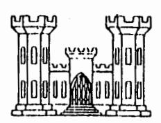

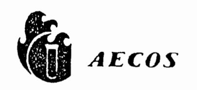

# PREFACE

This publication is financed in part by a federal grant from the Office of Coastal Zone Management, National Oceanic and Atmospheric Administration, under the provisions of Section 305 of the Coastal Zone Management Act of 1972 (P.L. 92-583, as amended).

This report was produced jointly by Aquatic Farms, Inc. and AECOS, Inc. of Hawai'i. Project manager was William Madden. The text was written from reports by Paul Bartram, Eric Guinther, William Madden and Dennis Devaney. Mr. Guinther and Mr. Madden served as chief editors. Joann Sinai contributed to the final production of the text and atlas. Editorial comments were received from Austin E. Lamberts (specialist on Samoan corals), Dennis Devaney (curator of invertebrates, B.P. Bishop Museum), James E. Maragos (Environmental Section, Army Corps of Engineers), Spencer Yim (Planning Section, Army Corps of Engineers), Richard C. Wass (Office of Marine Resources, Government of American Samoa), and the Development Planning Office of the American Samoa Government.

Field work in American Samoa was conducted under the direction of the B.P. Bishop Museum of Honolulu. Dennis Devaney was team leader. Austin Lamberts and William Madden participated in the field surveys. Richard C. Wass of the Office of Marine Resources, Government of American Samoa worked with the field team in the Manu'a Islands and provided data on reef fish populations and fishing activities around Tutuila gathered over many years in American Samoa. Identifications of algae collected by the field team were provided by Joann Sinai of AECOS.

The atlas (ASCRI - Part B) was principally the result of the efforts of Paul Bartram, who interpreted aerial photographs provided by the Corps of Engineers, and Iris Shinohara, who was the cartographer.

The cover photograph shows Massacre Bay, Tutuila, American Samoa (MAP 17).

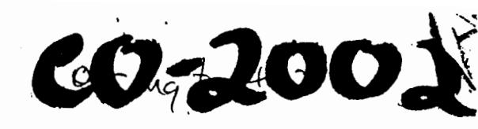

# TABLE OF CONTENTS

| Project Scope and Objectives                                                                                                                                                                                                                                                                                                         | 1                                                                                                |
|--------------------------------------------------------------------------------------------------------------------------------------------------------------------------------------------------------------------------------------------------------------------------------------------------------------------------------------|--------------------------------------------------------------------------------------------------|
| Field Survey                                                                                                                                                                                                                                                                                                                         | 3                                                                                                |
| Production of the Atlas Terrestrial Areas / Shoreline Offshore Features                                                                                                                                                                                                                                                        | 7 7 . 10                                                                                   |
| Organization of the Text Page Headings Right-hand Page (Text) Left-hand Page (Index) * List of Figures                                                                                                                                                                                                                               | 13 14 14 15 16                                                                       |
| General Discussion Physiography Reef Habitats Classification Scheme Flora and Fauna Corals (Phylum Cnidaria) Palolo Worms (Phylum Annelida) Alamea (Phylum Echinodermata) Fishes (Phylum Vertebrata) Water Conditions Historical and Archaeological Sites Use Considerations Reef Uses Miscellaneous                                 | 17 17 20 29 30 30 34 34 34 39 39                                   |
| Literature Cited (previous section only)  AMERICAN SAMOA CORAL REEF INVENTORY                                                                                                                                                                                                                                                        | 43                                                                                               |
| AMERICAN SAMOA TUTUILA ISLAND PAGO PAGO BASIN (GENERAL) PAGO PAGO HARBOR THE SOUTHEAST COAST OF TUTUILA THE NORTHEAST COAST OF TUTUILA THE NORTHWEST COAST OF TUTUILA THE SOUTHWEST COAST OF TUTUILA THE SOUTH/CENTRAL COAST OF TUTUILA TAEMA AND NAFANUA BANKS AUNU'U ISLAND OFU ISLAND OLOSEGA ISLAND TA'U ISLAND REFERENCES CITED | 45 46 48 57 82 117 146 173 202 239 244 256 273 287 309 |

# PROJECT SCOPÉ AND OBJECTIVES

The American Samoa Coral Reef Inventory (ASCRI) is a comprehensive survey of coastal and nearshore marine resources intended to assist the American Samoa Government (ASG) and Federal agencies in the management and prudent use of these resources. This project is intended to supplement the territory's Coastal Zone Management Study (CZM), particularly with respect to proposed guidelines for coastal ecosystems management and identification of areas where proposed activities would have a high potential for damaging coastal ecosystems. Further, the ASCRI documents should prove a valuable support for technical studies necessary for the development of baseline inventories of ecosystems supporting rare and endangered species,. development and management of coastal zone resources, and establishment of marine areas worthy of preservation. Planning and resource management agencies will benefit from the study results and compilations during evaluation of impacts from shoreside development. Finally, the documents should prove useful to anyone interested in seeking literature citations and/or conducting field studies specific areas of the American Samoa coastal zone.

Basic emphasis of the project is on the coral reefs surrounding the islands of American Samoa, but considerable information on shoreline and coastal areas, as well as deeper waters seaward of threefs, is included. Coral reefs constitute one of American Samoa most valuable resources and are subjected to a wide variety of uses and functions, some of which may be conflicting. The ASCRI project is a first comprehensive attempt at both defining the extent of recorded knowledge about the coral reef resources of American Samoa and organizing the information into a handy reference document.

Specific objectives of the ASCRI project include: (1) an inventory and (2) mapping of nearshore areas around American Samoa; (3) a compilation of past and present scientific information of use to resource planners and managers; (4) a description of important, dominant, and unique characteristics of the areas; and (5) recommendations for further studies in American Samoa. These objectives are met in the two ASCRI documents: Part A -- a narrative encompassing purpose, objectives, methods, results, discussions, conclusions, and recommendations; and Part B -- an atlas of maps (scale 1:6200) encompassing most of the coastlines of the islands of Tutuila, Anu'u, Ta'u, Ofu, and Olosega.

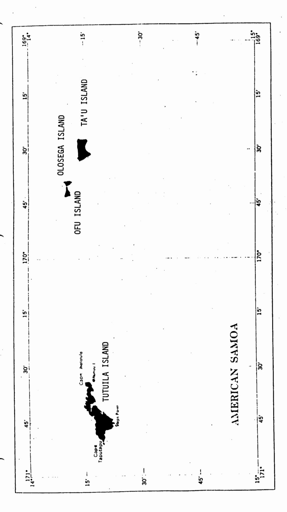

PRINCIPAL ISLANDS OF AMERICAN SAMOA ENCOMPASSED BY THE ASCRI PROJECT. FIGURE 1.

# FIELD SURVEY

The American Samoa Coral Reef Inventory (ASCRI) encompasses a review and synthesis of previous surveys in marine areas of the Samoan Islands and presents the results of supplemental surveys of many reef areas. These supplemental surveys were undertaken by a team of specialists in coral reef ecology. The basic tasks of the field team were to obtain a general appraisal of reef areas and their biotic communities and to provide ground-truth feedback information for the mapping program. Time constraints limited this portion of the ASCRI project to 20 field days; thus only selected priority sites of either special use, interest, or representativeness could be covered. The number of days spent by the ASCRI team for specific coastal segments is shown in Figure 2.

Co-ordination of the field team efforts with the goals of the overall program was mediated through working maps drawn on the same scale, and resembling generally the atlas maps. A set of aerial photographs was provided as well. Instructions to the field team were provided with a set of the working maps and data-recording sheets printed on water-proof paper. After each day's survey, team members transcribed their field notes into presentable data summaries.

With respect to biotic components, the field team made general observations of fishes, corals, algae, and conspicuous macroinverte-brates. Information on species observed was recorded semi-quantitatively using a rating scale of 1 to 4, where:

- 1 = dominant species; abundant.
- 2 = common, but not dominant.
- 3 = occasional (several sightings in the area).
- 4 = rare (one or at most a few sightings in the area).

Fringing reefs occur along much of the southern coast of Tutuila and in embayments on the northern coast, around portions of Aunu'u, and around much of the coasts of the islands of the Manu'a Reef flat zonation, while somewhat variable from site to site, does show five basic biotope's from shore. These are the shoreline, inner reef flat, middle reef flat, outer reef flat, and reef margin. Wherever possible, the field team attempted to characterize each of these reef zones in the survey of each area. Fish counts were generally made just before and ahead of the examination of other reef components. Upon reaching the seaward part of the tract, the team would proceed laterally and then return to shore making notation of changes or similarities over a second part of the reef Much of the north shore of Tutuila was surveyed by boat (~7 inflatable Avon raft with an outboard engine) in the absence 🔳 access to the shore by road. A survey of Nafanua Bank and the perimeter of Aunu'u Island also was made using the Avon boat. Coastal areas were further documented by photographs of shorelines

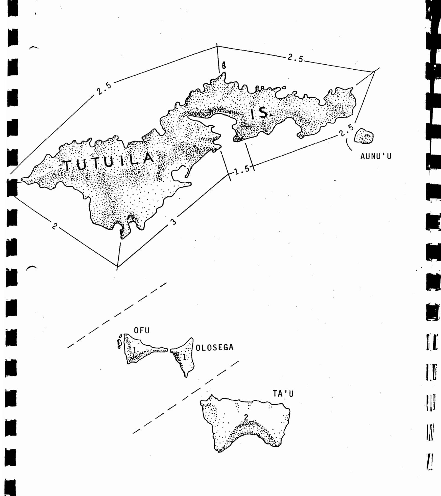

FIGURE 2. NUMBER OF DAYS SPENT ALONG COASTAL SEGMENTS OF AMERICAN SAMOA BY THE FIELD SURVEY TEAM.

and associated exposed reef areas, and compliment interpretation of aerial photographs.

Estimates of percent cover of live coral and algae were made at most sites. The field team also noted utilization of the reef areas during the survey period and what elements were being utilized. Information on observed shoreline and offshore uses (actual or potential), water conditions, depth, bottom type, and other factors deemed relevant to the project was noted.

In order to maximize information about Samoan reef fish assemblages in the limited time alloted for the ASCRI surveys three methods of observing and enumerating fish populations were utilized. Around the islands of Ta'u, Ofu, and Olosega data were collected by visually censusing the fishes associated with particular study sites. A 330-foot (100 m) length of line was laid on the bottom and all fishes within 3 feet (1 m) on either side of the line and 6 feet (2 m) above it were identified, counted, and their size estimated. Around Tutuila and Aunu'u Islands a modified Jones and Thompson species enumeration over time method was employed. (1978)technique entails the acquisition of a cumulative list of species over short intervals of time. In one version of the method, the diver records the names of all fishes observed in the first five minute interval of an essentially free-ranging survey. During the next five minute interval he records additional species not previously observed . . . and so on for a total of 30 minutes (6 survey The method assumes that the most abundant species will be encountered in the earlier survey intervals. A third method wa used in some areas, particularly where fish surveys had been conducted by earlier workers or where observation time was limited. The relative abundance of fish species was subjectively rated on the 1 to 4 scale described above. Surveys conducted by Dr. Wass in the Manu'a Islands were of a similar type, although a three point scale was used (to quote from a letter by Dr. Wass to the ASCRI project):

A "+" indicates the species was dominant (taking both individual numbers and biomass into consideration); a "-" indicates the species occurred occasionally to abundantly and made up a significant proportion of the fish biomass in the area; and a "-" indicates that one to few individuals were observed (though in the case of some carangids, scarids and labrids a single individual can account for a significant proportion of the biomass in the area).

# PRODUCTION OF THE ATLAS

The purpose of the Atlas portion of ASCRI is to provide reference maps of the coastline and offshore areas on a sufficiently detailed scale to be of use to both planners and managers of coastal zone resources as well as field parties contributing to a continued inventory of these resources. The maps include major classes of shorelines, offshore features (such as ava), boundaries of major bottom types, locations of surveys conducted in the marine environment, and symbolic representations of common uses where these uses occur.

The sectional map sheets are drawn at a scale of 1:7200 (one inch equals 600 feet). This scale permits sufficient detail to be portrayed without requiring an unwieldy number of maps. A total of 30 maps encompasses nearly the entire coastline of Tutuila. An additional map covers Aunu'u, and 10 maps portray portions of the coastal areas of Ofu, Olosega, and Ta'u (The Manu'a group). The maps are based on interpretation of selected contact prints of aerial photographs taken in 1971 by Aero Services Corporation (of California) under contract to the Government of American Samoa. Ninty-four photographs at scales of either 1 inch = 642 feet (1:7700) or 1 inch = 1200 feet (1:14400) were provided by the U.S. Army Corps of Engineers.

# Terrestrial Areas / Shoreline

Inclusion of a significant proportion of the land is deemed desirable from the standpoints of shoreline use considerations and as an aid to accurate orientation. The included land area represents a tradeoff between satisfying these goals and extending far enough offshore to encompass the fringing reef margin or water depths of 130 feet (40 m) off coasts lacking shallow reefs. In most cases, map sheets are oriented with the long axis running more or less parallel with the coast (see Figure 3).

Details of terrestrial features were provided by a 50% reduction of topographic maps drawn at a scale of 1 inch = 200 feet (1:2400) by Aero Services Corporation. These reductions also served to establish control on the Atlas maps. The topographic maps were produced by Aero Services Corp. using stereographic methods from photographs dated May-July 1971. Certain features of the land were added or redrawn on the ASCRI maps based on interpretation of the aerial photographs, although in general, roads, elevations, and shoreline features are presented without modification from the reduced topographic sheets.

The major interpretive feature of the land appearing on the maps is in the zone between the shoreline and the vegetation line (or road). This zone is stippled to illustrate one of three types of coastlines: beach, low rocky coast, or high rocky coast. The shoreline (essentially the water line at the scale of the atlas

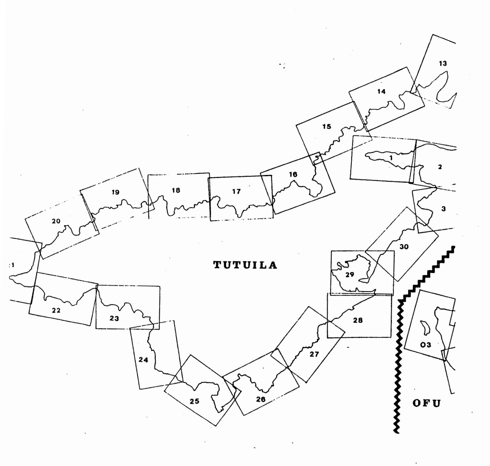

URE 3. ARRANGEMENT OF THE SECTIONAL MAPS FOR THE AMERICAN SAMOA CORAL REEF INVENTORY ATLAS (ASCRI PART B).

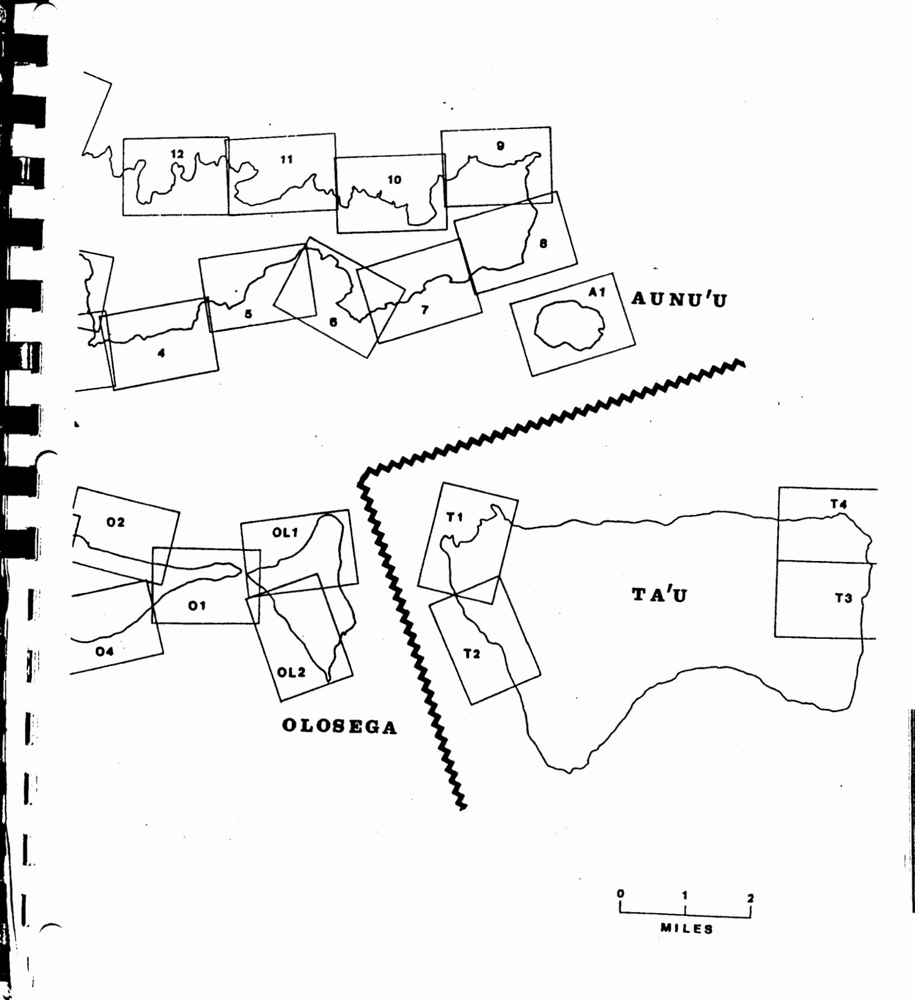

maps) and vegetation line (or road or other man-made structure) along the coast are interpreted from the aerial photographs.

#### Offshore Features

A dashed line is used to designate the boundary between conspicuous bottom types seaward from the shoreline. The basis for differentiating various bottom types is discussed below.

No reasonable number of aerial photographs can reveal complete boundaries for all offshore areas out to a depth of 130 feet (40 m). Even with excellent color photographs, bottom types at depths of 30 feet or greater are in most cases difficult to interpret and boundaries uncertain. Only large sand bodies can be seen with ease (see Campbell, et al., 1970). At lesser depths, some boundaries are obscured by breaking waves, clouds or cloud shadows, complex gradations between more or less distinct bottom types, turbid water, or lack of penetration due to sun angle. Further, the complex mosaic of bottom materials which are particularly characteristic of reefand coral bottom areas are not amenable to mapping as individual substratum types on a scale of 1:7200. A particular problem is the designation of the seaward boundary of a sloping reef face, as the bottom type (limestone - rcl) extends to depths below the limits of visibility in the photographs. Thus any attempt to draw a seaward limit produces a line of no consistent meaning because the maximum depth of image reflection varies depending upon a number of factors from photograph to photograph and even from one part of a photograph to another part.

Another feature apparent in aerial photographs of offshore areas is of interpretive value: the line of wave break. Although it is realized that this line can vary position depending upon the tide, sea state, wind, and bottom topography, the general vicinity of the wave break appearing in the base aerial photographs imparts some useful information about bottom topography and the location of the reef margin (if present). Because breaking waves sometimes render the water surface too reflective for bottom details (such as the reef margin) to show in photographs, breaking waves constitute the only useful information available concerning some specific locations. The wave break is indicated on the atlas maps by dotted, arcuate lines (convex in the direction of wave propagation) wherever the waves break along a reasonably well-defined line.

Every attempt has been made to complete boundaries between bottom types within the scope of each map. However, an incomplete image, or coverage, or a feature extending into deeper water as a fading and then disappearing image, frequently can only be represented as a dashed line terminating at some point short of the map margin. The atlas user must appreciate that the outlines represent interpretations from a limited set of photographs and, in many cases because of depth or poor water clarity, even major bottom features will be only partially represented. Unlike terrestrial features, underwater terrain will always be incompletely represented.

Substratum (bottom) types are indicated by codes such as "rcl", or "sc". These codes represent standard bottom types through the Atlas and definitions are given in Table I (as well as the Atlas). Note that this system is not related to the habitat classification given on pages 20-23. The bottom type could be converted to habitat codes, although each system designed for a different use. The bottom type (map) codes simplified in order to express categories readily diffentiated the available aerial photographs. The habitat codes are design primarily for use in the field.

TABLE I - SUBSTRATUM CODES USED IN PART B (ASCRI ATLAS)

#### MARINE BOTTOM TYPES

# HARD (VOLCANIC) BOTTOM TYPES

- rb Massive rock bottom (possibly veneered by limestone)
- rbb Close-set talus (boulders of massive size) often directly off a high rocky coast.
- rbc Cobbles and small boulders, usually off a revetment or stream mouth.
- rbs Massive rock bottom (possibly veneered by limestone) with sand pockets, the latter less than 50% of the area.
- rs Large sand pockets and/or sand veneer over hard bottom; sand areas more than 50% of total area.

#### REEF COMPLEX BOTTOM TYPES

- co Areas of live coral exceeding 50% bottom cover.
- rc Predominantly limestone fragments of mixed sizes (gravel, rubble, boulder) with minor amounts of sand.
- rcl Consolidated limestone platform (possibly with minor amounts of mixed fragments).
- rcs Predominantly sand or loose limestone fragments (rubble, boulder, small outcrop) with major amounts of sand.

#### SOFT BOTTOM TYPES

- sc Large sand deposits and channels at depths less than 30 feet (10 m).
- sd Large sand deposits and channels at depths of 30 feet (10 m) or greater.

EXAMPLES OF ASCRI MAP (PART B) INTERPRETATION. FIGURE 4.

# ORGANIZATION OF THE TEXT

Part A of the American Samoa Coral Reef Inventory is, an extensive description of the coast, shoreline, and basically, offshore areas of the Islands of American Samoa, with emphasis on the resources represented by coral reefs and reef habitats. The primary purpose is to provide an inventory, in a standard and easily read format, of these resources and the varied aspects of Samoan life, coastal topography, water quality, and the like which have a bearing on present-day as well as future utilization of these re-Ideally, an inventory of reef areas should somehow encompass all that is present; realistically, an inventory of this kind, at best, can list only all that is known. To this end, three sources of information are reported: 1) printed material from studies and surveys conducted in American Samoa, 2) recent surveys by the ASCRI field team, and 3) results of a village by village reef utilization survey conducted by the Development Planning Office of the American Samoa Government.

The text description proceeds around each of the islands of Tutuila, Aunu'u, Ofu, Olosega, and Ta'u. The text is divided into major sections arranged in the following order:

- 1. Pago Pago Harbor (Tutuila)
- 2. Southeast Coast (Tutuila)
- 3. Northeast Coast (Tutuila)
- 4. Northwest Coast (Tutuila)
- 5. Southwest Coast (Tutuila)
- 6. South/Central Coast (Tutuila)
- 7. Taema and Nafanua Banks
- 8. Aunu'u
- 9. Ofu
- 10. Olosega
- ll. Ta'u

Each of these major sections begins with a general discussion which usually includes a brief description of the coast and basic infrastructure (as related to coastal zone access).

Although the text and headings refer to map numbers of the ASCRI Atlas (always as "MAP"), the material in the text is organized instead in a sequence of coastal segments beginning in MAP I covering inner Pago Pago Harbor and running counter clockwise around the coastline of Tutuila. The Taema Bank, Nafanua Bank, Aunu'u Island, Ofu Island, Olosega Island, and Ta'u Island are each treated in a similar manner. Generally, a coastal segment encompasses a village (or part of a village). Most extend from one prominent point of land to another. The length of coast in a coastal segment is small where much site-specific information is available or villages occur close together, and great where little information is available and/or villages are few. All of Aunu'u Island is treated as a single coastal segment.

Within each coastal segment, information is presented under the topic headings of Physiography (geography and geology), Flora and Fauna (results of biological surveys), Water Conditions (water quality and oceanographic considerations), Historical/Archaeological Sites, and Use Considerations.

The text of Part A is purposely brief on individual subjects to allow a maximum range of information to be presented - users interested in greater detail on any particular point are encouraged to seek original sources (see References Cited). Reference sources are credited throughout the text by numbers appearing in parentheses and listed in the References Cited at the end of Part A. One of the tasks of the ASCRI Project was to compile a listing of studies conducted in marine and coastal areas around American Samoa. Some of this source material consists of unpublished material and so-called "grey" literature - reports printed and distributed in limited numbers. On the other hand, certain valuable literature of a general nature (that is, published studies which do not contain site-specific information) may not be cited in Part A.

Each coastal segment description has been written using a standard format which dictates generally where in the text specific facts and kinds of information appear. It should be appreciated, however, that the descriptions are intended to be site specific and therefore gaps in the generally available knowledge about locations along and off the coastlines of each island may appear as obvious omissions. No concerted effort has been made in the descriptions to extend knowledge about one area to general statements about some larger section of the coast.

The descriptive text is presented as a page of text accompanied on the facing page by a running index. The format and rationale of this system are described below. Note the change in style of type and page numbering from page 45 on.

# Page Headings

Both the left-hand and right-hand pages of the text have headings which serve as a quick index based on the geographical location of the information contained on each page. On the left-hand page, the heading gives the island (e.g., TUTUILA), the district (e.g., EASTERN DISTRICT), and the county (e.g., MAUPUTASI CO.). The heading on the right-hand page gives the appropriate geographical area of the coast and either a MAP NUMBER or a GENERAL designation. Under GENERAL headings will appear information of a general nature pertaining to all of the indicated geographical area. The MAP NUMBER designation refers to a specific map in the Atlas (ASCRI - Part B).

# Right-hand Page (Text)

Information is arranged in the text by geographical location. Thus, the results of a study on corals based on five separate survey

sites would be summarized in five different places in the text. The geographical basis for this arrangement of information is the coastal segment. Each coastal segment is given as a centered heading on the right-hand page directly below a solid line appearing on both the left- and right-hand pages. Subheadings on each text page refer to specific locales and coastal features (villages, shorelines, offohore islets, beaches, reef flats, etc.) addressed by the paragraph(s) which follow.

# Left-hand Page (Index)

The left-hand pages of the report contain a running (illustrated) index matched to the text on the right-hand page. The running index is intended to enable the reader to locate quickly a coastal area or specific coastal zone feature of interest without reading large portions of text. Subheadings on the left-hand page indicate the locale of the text description and usually give the name of the village within the coastal segment. A MAP NUMBER is centered on each page, and refers to maps contained in the ASCRI Atlas. Within each coastal segment, information is presented by topic under one of the following titles: PHYSIOGRAPHY, FLORA AND FAUNA, WATER CONDITIONS, HISTORICAL/ARCHAEOLOGICAL, or USE CONSIDERATIONS.

The running index also includes key-words and areas of special concern to the Coastal Zone Program, the latter identified as to the appropriate paragraph in the American Samoa Coastal Zone Management Program document (ASG, Dev. Planning Office, 1980). The key-words and areas of special CZM concern are preceded by a "(" and "(\*" respectively. Special areas are those coastal sites and features which have been designated for special management (e.g., registered as National Natural Landmarks), are candidates for National Natural Landmark status, are under consideration as marine preserves or underwater parks, are natural area reserves or wildlife sanctuaries, are areas identified has having high value for recreation (MKGK/ Yamamoto, Inc, 1980) or scenic interest, or constitute environments of exceptional marine productivity or diversity. Two sites (Pago Pago Harbor and Pala Lagoon) are designated by the American Samoa CZM program as "Special Areas"; all other sites so indicated in the index are considered to have potential only.

A symbol (coral, fish, or starfish) is placed opposite the portion of the text which describes a biological resource representing reef life of exceptional quality or interest. In general, locations identified by either a coral or fish symbol are distinguished by high species abundance and/or diversity.

On most pages a topographic map excerpt is included to assist in locating prominent features and establish a geographic relationship to the text. These maps are from the U.S. Geological Survey topographic series of 1963, printed at a scale of 1:24000 (1 inch = 2000 feet). The maps are oriented with north toward the top of the page. These maps are not considered figures and are not numbered. All other maps and diagrams appearing on the left-hand

| page are given                                                                                                                                                                                                                                                                                                                                                                                                                                                                                                                                                                                                                                                                                                                                                                                                                                                                                                                                                                                                                                                                                                                                                                                                                                                                                                                                                                                                                                                                                                                                                                                                                                                                                                                                                                                                                                                                                                                                                                                                                                                                                                                 | sequential figure numbers.                                                                                                                                                                                                                                                                                                                                                                                                                                              | 34 (    |
|--------------------------------------------------------------------------------------------------------------------------------------------------------------------------------------------------------------------------------------------------------------------------------------------------------------------------------------------------------------------------------------------------------------------------------------------------------------------------------------------------------------------------------------------------------------------------------------------------------------------------------------------------------------------------------------------------------------------------------------------------------------------------------------------------------------------------------------------------------------------------------------------------------------------------------------------------------------------------------------------------------------------------------------------------------------------------------------------------------------------------------------------------------------------------------------------------------------------------------------------------------------------------------------------------------------------------------------------------------------------------------------------------------------------------------------------------------------------------------------------------------------------------------------------------------------------------------------------------------------------------------------------------------------------------------------------------------------------------------------------------------------------------------------------------------------------------------------------------------------------------------------------------------------------------------------------------------------------------------------------------------------------------------------------------------------------------------------------------------------------------------|-------------------------------------------------------------------------------------------------------------------------------------------------------------------------------------------------------------------------------------------------------------------------------------------------------------------------------------------------------------------------------------------------------------------------------------------------------------------------|---------|
| A STATE OF THE STATE OF THE STATE OF THE STATE OF THE STATE OF THE STATE OF THE STATE OF THE STATE OF THE STATE OF THE STATE OF THE STATE OF THE STATE OF THE STATE OF THE STATE OF THE STATE OF THE STATE OF THE STATE OF THE STATE OF THE STATE OF THE STATE OF THE STATE OF THE STATE OF THE STATE OF THE STATE OF THE STATE OF THE STATE OF THE STATE OF THE STATE OF THE STATE OF THE STATE OF THE STATE OF THE STATE OF THE STATE OF THE STATE OF THE STATE OF THE STATE OF THE STATE OF THE STATE OF THE STATE OF THE STATE OF THE STATE OF THE STATE OF THE STATE OF THE STATE OF THE STATE OF THE STATE OF THE STATE OF THE STATE OF THE STATE OF THE STATE OF THE STATE OF THE STATE OF THE STATE OF THE STATE OF THE STATE OF THE STATE OF THE STATE OF THE STATE OF THE STATE OF THE STATE OF THE STATE OF THE STATE OF THE STATE OF THE STATE OF THE STATE OF THE STATE OF THE STATE OF THE STATE OF THE STATE OF THE STATE OF THE STATE OF THE STATE OF THE STATE OF THE STATE OF THE STATE OF THE STATE OF THE STATE OF THE STATE OF THE STATE OF THE STATE OF THE STATE OF THE STATE OF THE STATE OF THE STATE OF THE STATE OF THE STATE OF THE STATE OF THE STATE OF THE STATE OF THE STATE OF THE STATE OF THE STATE OF THE STATE OF THE STATE OF THE STATE OF THE STATE OF THE STATE OF THE STATE OF THE STATE OF THE STATE OF THE STATE OF THE STATE OF THE STATE OF THE STATE OF THE STATE OF THE STATE OF THE STATE OF THE STATE OF THE STATE OF THE STATE OF THE STATE OF THE STATE OF THE STATE OF THE STATE OF THE STATE OF THE STATE OF THE STATE OF THE STATE OF THE STATE OF THE STATE OF THE STATE OF THE STATE OF THE STATE OF THE STATE OF THE STATE OF THE STATE OF THE STATE OF THE STATE OF THE STATE OF THE STATE OF THE STATE OF THE STATE OF THE STATE OF THE STATE OF THE STATE OF THE STATE OF THE STATE OF THE STATE OF THE STATE OF THE STATE OF THE STATE OF THE STATE OF THE STATE OF THE STATE OF THE STATE OF THE STATE OF THE STATE OF THE STATE OF THE STATE OF THE STATE OF THE STATE OF THE STATE OF THE STATE OF THE STATE OF THE STATE OF THE STATE OF THE STATE OF THE STA | 는 가는 그는 그는 그를 통해한 <mark>되었다. 현실 하는 것들은 것들은 사람들이 되었다. 그는 사람들이 되었다. 그는 사람들이 되었다. 그는 사람들이 되었다. 그는 사람들이 되었다. 그는 사람들이 되었다. 그는 사람들이 되었다. 그는 사람들이 되었다. 그는 사람들이 되었다. 그는 사람들이 되었다. 그는 사람들이 되었다. 그는 사람들이 되었다. 그는 사람들이 되었다. 그는 사람들이 되었다. 그는 사람들이 되었다. 그는 사람들이 되었다. 그는 사람들이 되었다. 그는 사람들이 되었다. 그는 사람들이 되었다. 그는 사람들이 되었다. 그는 사람들이 되었다. 그는 사람들이 되었다. 그는 사람들이 되었다. 그는 사람들이 되었다. 그는 사람들이 되었다. 그는 사람들이 되었다면 되었다. 그는 사람들이 되었다면 되었다. 그는 사람들이 되었다면 되었다면 되었다면 되었다면 되었다면 되었다면 되었다면 되었다면</mark> |         |
| and the confinition of the second of the second of the second of the second of the second of the second of the second of the second of the second of the second of the second of the second of the second of the second of the second of the second of the second of the second of the second of the second of the second of the second of the second of the second of the second of the second of the second of the second of the second of the second of the second of the second of the second of the second of the second of the second of the second of the second of the second of the second of the second of the second of the second of the second of the second of the second of the second of the second of the second of the second of the second of the second of the second of the second of the second of the second of the second of the second of the second of the second of the second of the second of the second of the second of the second of the second of the second of the second of the second of the second of the second of the second of the second of the second of the second of the second of the second of the second of the second of the second of the second of the second of the second of the second of the second of the second of the second of the second of the second of the second of the second of the second of the second of the second of the second of the second of the second of the second of the second of the second of the second of the second of the second of the second of the second of the second of the second of the second of the second of the second of the second of the second of the second of the second of the second of the second of the second of the second of the second of the second of the second of the second of the second of the second of the second of the second of the second of the second of the second of the second of the second of the second of the second of the second of the second of the second of the second of the second of the second of the second of the second of the second of the second of the second of the sec | න ක්රයක් කරනුව කරනුවන් සමුද්දි ක්රම් කරන් කිරීමෙන් ක්රය කරනුව කරනුව කරනුවන් මිට මිට ක්රම්ම ක්රම්ම කිරීම ක්රම්ම අතර කරනුව දැන්න සමුත් කරනුව මින්න කිරීම කිරීමේ සමුත් ක්රම්ම ක්රම්ම කරනුව වනුවන් කිරීමේ කරනුවන් සමුත් කරනුව කිර                                                                                                                                                                                                                                        |         |
|                                                                                                                                                                                                                                                                                                                                                                                                                                                                                                                                                                                                                                                                                                                                                                                                                                                                                                                                                                                                                                                                                                                                                                                                                                                                                                                                                                                                                                                                                                                                                                                                                                                                                                                                                                                                                                                                                                                                                                                                                                                                                                                                | LIST OF FIGURES                                                                                                                                                                                                                                                                                                                                                                                                                                                         |         |
| FIGURE                                                                                                                                                                                                                                                                                                                                                                                                                                                                                                                                                                                                                                                                                                                                                                                                                                                                                                                                                                                                                                                                                                                                                                                                                                                                                                                                                                                                                                                                                                                                                                                                                                                                                                                                                                                                                                                                                                                                                                                                                                                                                                                         | TITLE                                                                                                                                                                                                                                                                                                                                                                                                                                                                   | PAGE    |
| TIOOKI                                                                                                                                                                                                                                                                                                                                                                                                                                                                                                                                                                                                                                                                                                                                                                                                                                                                                                                                                                                                                                                                                                                                                                                                                                                                                                                                                                                                                                                                                                                                                                                                                                                                                                                                                                                                                                                                                                                                                                                                                                                                                                                         |                                                                                                                                                                                                                                                                                                                                                                                                                                                                         | - 1     |
| 1                                                                                                                                                                                                                                                                                                                                                                                                                                                                                                                                                                                                                                                                                                                                                                                                                                                                                                                                                                                                                                                                                                                                                                                                                                                                                                                                                                                                                                                                                                                                                                                                                                                                                                                                                                                                                                                                                                                                                                                                                                                                                                                              | Principal islands of American Samoa encompassed                                                                                                                                                                                                                                                                                                                                                                                                                         | 2       |
|                                                                                                                                                                                                                                                                                                                                                                                                                                                                                                                                                                                                                                                                                                                                                                                                                                                                                                                                                                                                                                                                                                                                                                                                                                                                                                                                                                                                                                                                                                                                                                                                                                                                                                                                                                                                                                                                                                                                                                                                                                                                                                                                | by the ASCRI Project.                                                                                                                                                                                                                                                                                                                                                                                                                                                   |         |
| 2                                                                                                                                                                                                                                                                                                                                                                                                                                                                                                                                                                                                                                                                                                                                                                                                                                                                                                                                                                                                                                                                                                                                                                                                                                                                                                                                                                                                                                                                                                                                                                                                                                                                                                                                                                                                                                                                                                                                                                                                                                                                                                                              | Number of days spent along coastal segments of                                                                                                                                                                                                                                                                                                                                                                                                                          |         |
| <b>-</b>                                                                                                                                                                                                                                                                                                                                                                                                                                                                                                                                                                                                                                                                                                                                                                                                                                                                                                                                                                                                                                                                                                                                                                                                                                                                                                                                                                                                                                                                                                                                                                                                                                                                                                                                                                                                                                                                                                                                                                                                                                                                                                                       | American Samoa by the field survey team.                                                                                                                                                                                                                                                                                                                                                                                                                                | •       |
|                                                                                                                                                                                                                                                                                                                                                                                                                                                                                                                                                                                                                                                                                                                                                                                                                                                                                                                                                                                                                                                                                                                                                                                                                                                                                                                                                                                                                                                                                                                                                                                                                                                                                                                                                                                                                                                                                                                                                                                                                                                                                                                                |                                                                                                                                                                                                                                                                                                                                                                                                                                                                         |         |
| 3                                                                                                                                                                                                                                                                                                                                                                                                                                                                                                                                                                                                                                                                                                                                                                                                                                                                                                                                                                                                                                                                                                                                                                                                                                                                                                                                                                                                                                                                                                                                                                                                                                                                                                                                                                                                                                                                                                                                                                                                                                                                                                                              | Arrangement of the sectional maps for the American                                                                                                                                                                                                                                                                                                                                                                                                                      | 8       |
|                                                                                                                                                                                                                                                                                                                                                                                                                                                                                                                                                                                                                                                                                                                                                                                                                                                                                                                                                                                                                                                                                                                                                                                                                                                                                                                                                                                                                                                                                                                                                                                                                                                                                                                                                                                                                                                                                                                                                                                                                                                                                                                                | Samoa Coral Reef Inventory Atlas (ASCRI Part B).                                                                                                                                                                                                                                                                                                                                                                                                                        |         |
|                                                                                                                                                                                                                                                                                                                                                                                                                                                                                                                                                                                                                                                                                                                                                                                                                                                                                                                                                                                                                                                                                                                                                                                                                                                                                                                                                                                                                                                                                                                                                                                                                                                                                                                                                                                                                                                                                                                                                                                                                                                                                                                                | Examples of ASCRI MAP (Part B) interpretation.                                                                                                                                                                                                                                                                                                                                                                                                                          | 10      |
| Calculation .                                                                                                                                                                                                                                                                                                                                                                                                                                                                                                                                                                                                                                                                                                                                                                                                                                                                                                                                                                                                                                                                                                                                                                                                                                                                                                                                                                                                                                                                                                                                                                                                                                                                                                                                                                                                                                                                                                                                                                                                                                                                                                                  | Examples of Ascri MAR (raic b) interpretation:                                                                                                                                                                                                                                                                                                                                                                                                                          | 12      |
| 5                                                                                                                                                                                                                                                                                                                                                                                                                                                                                                                                                                                                                                                                                                                                                                                                                                                                                                                                                                                                                                                                                                                                                                                                                                                                                                                                                                                                                                                                                                                                                                                                                                                                                                                                                                                                                                                                                                                                                                                                                                                                                                                              | Generalized geological processes diagram for the                                                                                                                                                                                                                                                                                                                                                                                                                        | 18      |
|                                                                                                                                                                                                                                                                                                                                                                                                                                                                                                                                                                                                                                                                                                                                                                                                                                                                                                                                                                                                                                                                                                                                                                                                                                                                                                                                                                                                                                                                                                                                                                                                                                                                                                                                                                                                                                                                                                                                                                                                                                                                                                                                | samoan coastal zone                                                                                                                                                                                                                                                                                                                                                                                                                                                     | 1.32    |
|                                                                                                                                                                                                                                                                                                                                                                                                                                                                                                                                                                                                                                                                                                                                                                                                                                                                                                                                                                                                                                                                                                                                                                                                                                                                                                                                                                                                                                                                                                                                                                                                                                                                                                                                                                                                                                                                                                                                                                                                                                                                                                                                |                                                                                                                                                                                                                                                                                                                                                                                                                                                                         |         |
| 6                                                                                                                                                                                                                                                                                                                                                                                                                                                                                                                                                                                                                                                                                                                                                                                                                                                                                                                                                                                                                                                                                                                                                                                                                                                                                                                                                                                                                                                                                                                                                                                                                                                                                                                                                                                                                                                                                                                                                                                                                                                                                                                              | A - Profile of a samoan fringing reef (Pago Pago                                                                                                                                                                                                                                                                                                                                                                                                                        | . 24    |
|                                                                                                                                                                                                                                                                                                                                                                                                                                                                                                                                                                                                                                                                                                                                                                                                                                                                                                                                                                                                                                                                                                                                                                                                                                                                                                                                                                                                                                                                                                                                                                                                                                                                                                                                                                                                                                                                                                                                                                                                                                                                                                                                | Harbor).                                                                                                                                                                                                                                                                                                                                                                                                                                                                | 26      |
|                                                                                                                                                                                                                                                                                                                                                                                                                                                                                                                                                                                                                                                                                                                                                                                                                                                                                                                                                                                                                                                                                                                                                                                                                                                                                                                                                                                                                                                                                                                                                                                                                                                                                                                                                                                                                                                                                                                                                                                                                                                                                                                                | B - Two offshore profiles of coral bottom areas.                                                                                                                                                                                                                                                                                                                                                                                                                        | ~ 26    |
| 7.0                                                                                                                                                                                                                                                                                                                                                                                                                                                                                                                                                                                                                                                                                                                                                                                                                                                                                                                                                                                                                                                                                                                                                                                                                                                                                                                                                                                                                                                                                                                                                                                                                                                                                                                                                                                                                                                                                                                                                                                                                                                                                                                            | Coral reef habitat classification codes applied to                                                                                                                                                                                                                                                                                                                                                                                                                      | . 28    |
|                                                                                                                                                                                                                                                                                                                                                                                                                                                                                                                                                                                                                                                                                                                                                                                                                                                                                                                                                                                                                                                                                                                                                                                                                                                                                                                                                                                                                                                                                                                                                                                                                                                                                                                                                                                                                                                                                                                                                                                                                                                                                                                                | zones on the fringing reef off Coconut Point.                                                                                                                                                                                                                                                                                                                                                                                                                           |         |
|                                                                                                                                                                                                                                                                                                                                                                                                                                                                                                                                                                                                                                                                                                                                                                                                                                                                                                                                                                                                                                                                                                                                                                                                                                                                                                                                                                                                                                                                                                                                                                                                                                                                                                                                                                                                                                                                                                                                                                                                                                                                                                                                |                                                                                                                                                                                                                                                                                                                                                                                                                                                                         | 1415    |
| 8                                                                                                                                                                                                                                                                                                                                                                                                                                                                                                                                                                                                                                                                                                                                                                                                                                                                                                                                                                                                                                                                                                                                                                                                                                                                                                                                                                                                                                                                                                                                                                                                                                                                                                                                                                                                                                                                                                                                                                                                                                                                                                                              | The islands of the Territory of American Samoa.                                                                                                                                                                                                                                                                                                                                                                                                                         | 45      |
| 9 39                                                                                                                                                                                                                                                                                                                                                                                                                                                                                                                                                                                                                                                                                                                                                                                                                                                                                                                                                                                                                                                                                                                                                                                                                                                                                                                                                                                                                                                                                                                                                                                                                                                                                                                                                                                                                                                                                                                                                                                                                                                                                                                           | Tutuila Island, American Samoa                                                                                                                                                                                                                                                                                                                                                                                                                                          | 46      |
| The state of the state of the                                                                                                                                                                                                                                                                                                                                                                                                                                                                                                                                                                                                                                                                                                                                                                                                                                                                                                                                                                                                                                                                                                                                                                                                                                                                                                                                                                                                                                                                                                                                                                                                                                                                                                                                                                                                                                                                                                                                                                                                                                                                                                  |                                                                                                                                                                                                                                                                                                                                                                                                                                                                         |         |
| 10                                                                                                                                                                                                                                                                                                                                                                                                                                                                                                                                                                                                                                                                                                                                                                                                                                                                                                                                                                                                                                                                                                                                                                                                                                                                                                                                                                                                                                                                                                                                                                                                                                                                                                                                                                                                                                                                                                                                                                                                                                                                                                                             | Generalized surface current patterns in Pago Pago                                                                                                                                                                                                                                                                                                                                                                                                                       | 52      |
|                                                                                                                                                                                                                                                                                                                                                                                                                                                                                                                                                                                                                                                                                                                                                                                                                                                                                                                                                                                                                                                                                                                                                                                                                                                                                                                                                                                                                                                                                                                                                                                                                                                                                                                                                                                                                                                                                                                                                                                                                                                                                                                                | Harbor.                                                                                                                                                                                                                                                                                                                                                                                                                                                                 |         |
| The rest                                                                                                                                                                                                                                                                                                                                                                                                                                                                                                                                                                                                                                                                                                                                                                                                                                                                                                                                                                                                                                                                                                                                                                                                                                                                                                                                                                                                                                                                                                                                                                                                                                                                                                                                                                                                                                                                                                                                                                                                                                                                                                                       | Atlas mans covering the southeast coast of Tutuila                                                                                                                                                                                                                                                                                                                                                                                                                      | 82      |
| THE RESERVE OF THE RESERVE                                                                                                                                                                                                                                                                                                                                                                                                                                                                                                                                                                                                                                                                                                                                                                                                                                                                                                                                                                                                                                                                                                                                                                                                                                                                                                                                                                                                                                                                                                                                                                                                                                                                                                                                                                                                                                                                                                                                                                                                                                                                                                     | Atlas maps covering the southeast coast of Tutuila.                                                                                                                                                                                                                                                                                                                                                                                                                     |         |
| 12                                                                                                                                                                                                                                                                                                                                                                                                                                                                                                                                                                                                                                                                                                                                                                                                                                                                                                                                                                                                                                                                                                                                                                                                                                                                                                                                                                                                                                                                                                                                                                                                                                                                                                                                                                                                                                                                                                                                                                                                                                                                                                                             | Atlas maps covering the northeast coast of Tutuila.                                                                                                                                                                                                                                                                                                                                                                                                                     | 117     |
| 12                                                                                                                                                                                                                                                                                                                                                                                                                                                                                                                                                                                                                                                                                                                                                                                                                                                                                                                                                                                                                                                                                                                                                                                                                                                                                                                                                                                                                                                                                                                                                                                                                                                                                                                                                                                                                                                                                                                                                                                                                                                                                                                             |                                                                                                                                                                                                                                                                                                                                                                                                                                                                         | (4) ( ) |
| 13                                                                                                                                                                                                                                                                                                                                                                                                                                                                                                                                                                                                                                                                                                                                                                                                                                                                                                                                                                                                                                                                                                                                                                                                                                                                                                                                                                                                                                                                                                                                                                                                                                                                                                                                                                                                                                                                                                                                                                                                                                                                                                                             | Atlas maps covering the northwest coast of Tutuila.                                                                                                                                                                                                                                                                                                                                                                                                                     | 146     |
| 14                                                                                                                                                                                                                                                                                                                                                                                                                                                                                                                                                                                                                                                                                                                                                                                                                                                                                                                                                                                                                                                                                                                                                                                                                                                                                                                                                                                                                                                                                                                                                                                                                                                                                                                                                                                                                                                                                                                                                                                                                                                                                                                             | Atlas maps covering the southwest coast of Tutuila.                                                                                                                                                                                                                                                                                                                                                                                                                     | 173     |
|                                                                                                                                                                                                                                                                                                                                                                                                                                                                                                                                                                                                                                                                                                                                                                                                                                                                                                                                                                                                                                                                                                                                                                                                                                                                                                                                                                                                                                                                                                                                                                                                                                                                                                                                                                                                                                                                                                                                                                                                                                                                                                                                |                                                                                                                                                                                                                                                                                                                                                                                                                                                                         | 1       |
| 15                                                                                                                                                                                                                                                                                                                                                                                                                                                                                                                                                                                                                                                                                                                                                                                                                                                                                                                                                                                                                                                                                                                                                                                                                                                                                                                                                                                                                                                                                                                                                                                                                                                                                                                                                                                                                                                                                                                                                                                                                                                                                                                             | Atlas maps covering the south/central coast of Tutuila.                                                                                                                                                                                                                                                                                                                                                                                                                 | 202     |
| 16                                                                                                                                                                                                                                                                                                                                                                                                                                                                                                                                                                                                                                                                                                                                                                                                                                                                                                                                                                                                                                                                                                                                                                                                                                                                                                                                                                                                                                                                                                                                                                                                                                                                                                                                                                                                                                                                                                                                                                                                                                                                                                                             |                                                                                                                                                                                                                                                                                                                                                                                                                                                                         | 200     |
| 10.                                                                                                                                                                                                                                                                                                                                                                                                                                                                                                                                                                                                                                                                                                                                                                                                                                                                                                                                                                                                                                                                                                                                                                                                                                                                                                                                                                                                                                                                                                                                                                                                                                                                                                                                                                                                                                                                                                                                                                                                                                                                                                                            | Tafuna wastewater disposal site.                                                                                                                                                                                                                                                                                                                                                                                                                                        | 208     |
| 17                                                                                                                                                                                                                                                                                                                                                                                                                                                                                                                                                                                                                                                                                                                                                                                                                                                                                                                                                                                                                                                                                                                                                                                                                                                                                                                                                                                                                                                                                                                                                                                                                                                                                                                                                                                                                                                                                                                                                                                                                                                                                                                             | Location of the offshore banks in relation to Tutuila                                                                                                                                                                                                                                                                                                                                                                                                                   | 239     |
| $= f_{ij} f_{ij} g_{ij} g_{ij} = f_{ij} f_{ij} f_{ij} f_{ij} f_{ij} g_{ij} g_{ij} = 0$ , where $f_{ij} g_{ij} g_{ij} g_{ij} g_{ij} g_{ij} g_{ij} g_{ij} g_{ij} g_{ij} g_{ij} g_{ij} g_{ij} g_{ij} g_{ij} g_{ij} g_{ij} g_{ij} g_{ij} g_{ij} g_{ij} g_{ij} g_{ij} g_{ij} g_{ij} g_{ij} g_{ij} g_{ij} g_{ij} g_{ij} g_{ij} g_{ij} g_{ij} g_{ij} g_{ij} g_{ij} g_{ij} g_{ij} g_{ij} g_{ij} g_{ij} g_{ij} g_{ij} g_{ij} g_{ij} g_{ij} g_{ij} g_{ij} g_{ij} g_{ij} g_{ij} g_{ij} g_{ij} g_{ij} g_{ij} g_{ij} g_{ij} g_{ij} g_{ij} g_{ij} g_{ij} g_{ij} g_{ij} g_{ij} g_{ij} g_{ij} g_{ij} g_{ij} g_{ij} g_{ij} g_{ij} g_{ij} g_{ij} g_{ij} g_{ij} g_{ij} g_{ij} g_{ij} g_{ij} g_{ij} g_{ij} g_{ij} g_{ij} g_{ij} g_{ij} g_{ij} g_{ij} g_{ij} g_{ij} g_{ij} g_{ij} g_{ij} g_{ij} g_{ij} g_{ij} g_{ij} g_{ij} g_{ij} g_{ij} g_{ij} g_{ij} g_{ij} g_{ij} g_{ij} g_{ij} g_{ij} g_{ij} g_{ij} g_{ij} g_{ij} g_{ij} g_{ij} g_{ij} g_{ij} g_{ij} g_{ij} g_{ij} g_{ij} g_{ij} g_{ij} g_{ij} g_{ij} g_{ij} g_{ij} g_{ij} g_{ij} g_{ij} g_{ij} g_{ij} g_{ij} g_{ij} g_{ij} g_{ij} g_{ij} g_{ij} g_{ij} g_{ij} g_{ij} g_{ij} g_{ij} g_{ij} g_{ij} g_{ij} g_{ij} g_{ij} g_{ij} g_{ij} g_{ij} g_{ij} g_{ij} g_{ij} g_{ij} g_{ij} g_{ij} g_{ij} g_{ij} g_{ij} g_{ij} g_{ij} g_{ij} g_{ij} g_{ij} g_{ij} g_{ij} g_{ij} g_{ij} g_{ij} g_{ij} g_{ij} g_{ij} g_{ij} g_{ij} g_{ij} g_{ij} g_{ij} g_{ij} g_{ij} g_{ij} g_{ij} g_{ij} g_{ij} g_{ij} g_{ij} g_{ij} g_{ij} g_{ij} g_{ij} g_{ij} g_{ij} g_{ij} g_{ij} g_{ij} g_{ij} g_{ij} g_{ij} g_{ij} g_{ij} g_{ij} g_{ij} g_{ij} g_{ij} g_{ij} g_{ij} g_{ij} g_{ij} g_{ij} g_{ij} g_{ij} g_{ij} g_{ij} g_{ij} g_{ij} g_{ij} g_{ij} g_{ij} g_{ij} g_{ij} g_{ij} g_{ij} g_{ij} g_{ij} g_{ij} g_{ij} g_{ij} g_{ij} g_{ij} g_{ij} g_{ij} g_{ij} g_{ij} g_{ij} g_{ij} g_{ij} g_{ij} g_{ij} g_{ij} g_{ij} g_{ij} g_{ij} g_{ij} g_{ij} g_{ij} g_{ij} g_{ij} g_{ij} g_{ij} g_{ij} g_{ij} g_{ij} g_{ij} g_{ij} g_{ij} g_{ij} g_{ij} g_{ij} g_{ij} g_{ij} g_{ij} g_{ij} g_{ij} g_{ij} g_{ij} g_{ij} g_{ij} g_{ij} g_{ij} g_{ij} g_{ij} g_{ij} g_{ij} g_{ij} g_{ij} g_{ij} g_{ij} g_{ij} g_{ij} g_{ij} g_{ij} g_{$ | and Aunu'û.                                                                                                                                                                                                                                                                                                                                                                                                                                                             |         |
| 18. 4. 2. 2. 10. 10 mg                                                                                                                                                                                                                                                                                                                                                                                                                                                                                                                                                                                                                                                                                                                                                                                                                                                                                                                                                                                                                                                                                                                                                                                                                                                                                                                                                                                                                                                                                                                                                                                                                                                                                                                                                                                                                                                                                                                                                                                                                                                                                                         |                                                                                                                                                                                                                                                                                                                                                                                                                                                                         |         |
| 18                                                                                                                                                                                                                                                                                                                                                                                                                                                                                                                                                                                                                                                                                                                                                                                                                                                                                                                                                                                                                                                                                                                                                                                                                                                                                                                                                                                                                                                                                                                                                                                                                                                                                                                                                                                                                                                                                                                                                                                                                                                                                                                             | The Island of Ofu, Manu'a Group, American Samoa.                                                                                                                                                                                                                                                                                                                                                                                                                        | - 256   |
| 19                                                                                                                                                                                                                                                                                                                                                                                                                                                                                                                                                                                                                                                                                                                                                                                                                                                                                                                                                                                                                                                                                                                                                                                                                                                                                                                                                                                                                                                                                                                                                                                                                                                                                                                                                                                                                                                                                                                                                                                                                                                                                                                             | The Island of Olosega, Manu'a Group, American Samoa.                                                                                                                                                                                                                                                                                                                                                                                                                    | 273     |
|                                                                                                                                                                                                                                                                                                                                                                                                                                                                                                                                                                                                                                                                                                                                                                                                                                                                                                                                                                                                                                                                                                                                                                                                                                                                                                                                                                                                                                                                                                                                                                                                                                                                                                                                                                                                                                                                                                                                                                                                                                                                                                                                |                                                                                                                                                                                                                                                                                                                                                                                                                                                                         |         |
| 20                                                                                                                                                                                                                                                                                                                                                                                                                                                                                                                                                                                                                                                                                                                                                                                                                                                                                                                                                                                                                                                                                                                                                                                                                                                                                                                                                                                                                                                                                                                                                                                                                                                                                                                                                                                                                                                                                                                                                                                                                                                                                                                             | The Island of Ta'u, Manu'a Group, American Samoa.                                                                                                                                                                                                                                                                                                                                                                                                                       | 287     |

# GENERAL DISCUSSION

In a broad sense the coastal zone is that part of the land influencing and influenced by the sea, and that part of the sea influencing and influenced by the land. For practical purposes, in the Samoan Islands the coastal zone encompasses most or all of the land and the shallow reef areas, offshore banks, and marine areas to a considerable depth off the several islands of the group. This definition is not a legal one, but generally describes the extent of the area of concern in coastal zone management. The islands are the peaks of great, yet mostly submerged, volcanoes, and an event or phenomenon of any magnitude on the land or the sea will not likely terminate in its effects at the shoreline. The General Discussion section presents background information arranged under each of the topic categories indexed in the text.

#### **PHYSIOGRAPHY**

The following discussion and classification scheme is taken from the Hawaii Coral Reef Inventory (AECOS, 1979). The discussion has been modified and extended to serve the situation of Samoan reef physiography. The classification scheme, on the other hand, was originally developed for central Pacific reefs and requires no modification.

Included under the category PHYSIOGRAPHY are descriptions of the physical features of the coast, nearshore, and offshore areas in or off the particular coastal segment. Generally, descriptions are sub-divided into shoreline and fringing reef descriptions, with additional subdivisions possible (for example: reef flat and reef front). Most descriptions in the Physiography category are followed (within the coastal segment) by a matching biological description under the Flora and Fauna category.

Along the interface between sea and land, coastal processes have added to (prograded) and carved away (aggraded) the volcanic masses of the Samoan Islands to create a wide variety of features which today comprise the varied shoreline and nearshore environments of the Islands. Volcanism, the production (or more precisely, the movement to the earth's surface) of magmatic materials continues to play a role in the coastal geology of the islands. Eruptions have occurred in historic times on Savai'i and Upolu (Western Samoa) (Krear and Wood, 1959); and an undersea eruption that occurred about 1866 between Olosega and Ta'u is described by Friedlander (1910). The material deposited by volcanic activity is eroded and reworked by wind and waves — ultimately, the net result is a down slope or offshore movement and loss of this material from coastal systems.

The tropical waters which bathe the Samoan Archipelago support the growth of biogenic reefs - shallow water structures produced by living organisms. The major organisms involved in this growth are corals (Cnidarians) and calcareous (or coralline) algae, whose skeletons of calcium carbonate (limestone) contribute to both the welded framework as well as the loose accumulation of coarse and fine sediments filling voids. Although erosive processes ultimately also move limestone downslope, this loss from the coastal system can be regenerated by continued skeletal growth. Therefore, the net process can be one of equilibrium or even active accumulation and extension of a reef. The process is a slow one, and its fragility becomes apparent with the realization that growth is directly a function of the health of the biological community comprising the relatively thin veneer of a living reef.

These processes are illustrated in general terms in Figure 5. The detailed specifics of each of the inputs and losses of material occurring at any given point along the coastline will vary, and the range of variability is expressed in the variety of coastal forms encountered: beaches, dunes, benches, cliffs, reefs, banks, channels, etc.

Increasing interest and awareness of the natural environment eventually leads to the development of classification schemes. Classification provides both a means of storing and accessing information, and a logical approach to pattern recognition. The occurrence of patterns, or the repetition in space and/or time of conditions and events, permits application of manmade concepts and plans.

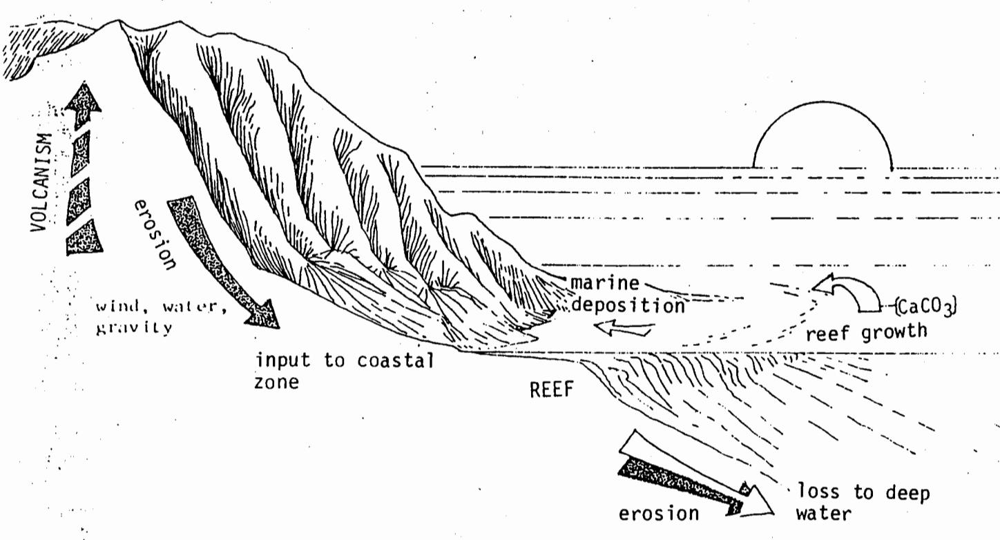

FIGURE 5. GENERALIZED GEOLOGICAL PROCESSES DIAGRAM FOR THE SAMOAN COASTAL ZONE.

Nearshore marine environments have been classified numerous times, with the usual approach emphasizing easily recognized physical attributes (e.g., degree of exposure to wave energies, substratum types). An ideal approach, certainly from the standpoint of current ecological theory, should emphasize biological community structure and function, but the community concept too often becomes nothing more than a statistical artifact when stringently applied in nature. Further, a community approach to classification requires levels of effort and expertise seldom acheivable except in intensive studies of rather localized areas. Nonetheless, the sub-division of any area into biotopes and facies (for example, see Environmental Consultants, 1977) represents an approach along these lines.

Certainly some success has been achieved in classifying littoral (intertidal) assemblages, in part because of their high degree of universiality (that is, comparable organisms are arranged in similar zones around the world), but primarily because of the strong relationship between physical factors and biological distribution which characterizes shoreline environments. A community approach to classification of sublittoral marine environments has met with far less success because community structure is a function of more subtle physical and biological relationships. The most practical approach is to utilize physical attributes, and, conceptually at least, arrive at a community approach as subcategories once the latter become evident through closer scrutiny of physical habitats.

Three co-ordinate and interlocking factors are important in the distribution of shore and reef invertebrates. These are (a) the degree of wave shock, (b) the type of bottom, and (c) the tidal exposure. These characteristics are recognized as a basis of at least one classification scheme developed for Hawaiian waters (Hawaii Coastal Zone Management Program, 1976) and can be utilized equally effectively in Samoan waters. A provisional classification of coastal water ecosystems developed by Maragos (Maragos, et al., 1975; see also HCZMP, 1975) was intended to point out the variety of marine habitats extant in Hawai'i. Maragos stresses that the narrow tidal range and high wave action characteristic of Hawaiian near-shore environments render classification schemes developed for higher latitude, continental coasts (e.g., the west coast of the U.S.) inappropriate (cf. Gosline, 1965).

The strong modifying influence of coral reefs on shoreline environments further reduces the applicability of such schemes. The primary effect of the presence of a reef structure is to nullify, or at least seriously modify, the concepts of open and protected outer coasts as put forth by Ricketts and Calvin (1962). The importance of wave energy regime in the determination of organism distribution remains unchanged. Rather, the presence and form of the reef itself determines the nature of the wave regime at and near the shore, and therefore, reef form must be a primary category in any classification applicable to tropical coastal zones (see Morton and Challis, 1969).

The classification scheme presented here attempts to encompass all the reef biotopes extant in the Samoan Islands. The scheme is

hierarchical, beginning with more general levels of categorization (coastal macro scale) and progressing to smaller scale, substratum considerations. The proposed scheme recognizes that the coastal province includes three zones (after Maragos, et al., 1975): (a) an inland zone, (b) a shore zone, and (c) an offshore zone. However, the actual boundaries of these divisions in the tripartite approach used here are defined more broadly and thus allow inclusion of all environments in the broadly defined coastal zone to be encompassed:

- (a) Terrestrial Realm (terrestrial environments; designated by the letter "T");
- (b) Transition Environments (shoreline transitions from terrestrial to aquatic realms; designated by the letter "S");
- (c) Aquatic Realm (marine, brackish, and fresh water environments; designated by the letter "A").

Each of these "zones" or realms is treated individually, commensurate with the special needs and problems encountered in these very different environments. Only the marine portion of the Aquatic Realm is treated herein. Readers interested in the classification schemes developed for the shoreline and inland areas may consult the introduction (Part A) to the Hawai'i Coral Reef Inventory (AECOS, 1979).

The classification scheme is expressible as an alphanumeric code. Any code is not a necessity of classification, merely a convenience. The alphanumeric is more amenable to tabular presentations and computer handling of data than is a written description. Further, at certain levels of discussion, the alphanumeric is less ambiguous than brief or common-name descriptions, because the boundary conditions are defined. Nonetheless, the real world environment is characterized by not only variety, but gradients and subtle transitions which defy precise ordering into categories obstensibly representing the variety. In the present undertaking, this reality is encountered not only in attempting to classify coastal habitats, but in translating aerial photographs (close approximation of the real world filtered by the limitations of lens resolution and film sensitivity) into maps (ordered representations of real world variety). In both processes (map production and habitat classification), decisions are required which in effect ignore transitions at some acceptable level of resolution.

# Reef Habitats Classification System

The classification of aquatic environments is expressed as a 5-digit alphanumeric with the letter "A" as the first digit followed by four numbers representing orders of classification from general exposure to substratum type. Assignment of these orders can be accomplished with the "key" given in Table II. Note that the key is not strictly dichotomous: it represents a "web" which leads the user

through the assignment of numbers, in order, to each digit position.

The orders or digit positions represent progressively finer scale descriptions of physiography, the 5-digit alphanumeric describing a habitat type based ultimately on substratum (bottom) type. Partial codes can be used to express larger scale features. For example, the code Al2 represents fringing reefs on open (non embayed) coasts.

The first subdivision (lst order - 2nd digit) differentiates fresh, brackish, and marine waters. Additional subdivisions of fresh and brackish waters could be accommodated, although this is presently beyond the scope of the ASCRI project. Note, however, that the designation "brackish waters" in this case refers only to inland, polyhaline water bodies. Essentially marine bodies of water subject to occasional marked depressions in salinity are classified as marine.

# TABLE II - KEY TO CODING AQUATIC ENVIRONMENTS (A SERIES)

| 1 <b>A</b> | Marine environments                                                                                                                                                                                             |
|------------|-----------------------------------------------------------------------------------------------------------------------------------------------------------------------------------------------------------------|
| 1B         | Inland, fresh or brackish water environments (codes A3, A4, etc.)                                                                                                                                               |
|            | (1st order - general exposure)                                                                                                                                                                                  |
| 2A         | Open coast or bight (see § 1)                                                                                                                                                                                   |
| 2B         | Embayment; Fits one of the following criteria: a) narrow mouth (ratio 700/1, see § 1), or b) extensive barrier reef across bight, or c) well-protected by breakwater, or d) an atoll lagoon. $ A2\cdots $ see 3 |
|            | (2nd order - physiography)                                                                                                                                                                                      |
| 3A         | No reef structure associated with embayment, or, if a reef structure is present, habitat is fronting and deeper than reef margin (see §2)                                                                       |
| 3B         | Habitat is on or behind a shallow reef structure see 7                                                                                                                                                          |
|            |                                                                                                                                                                                                                 |
| 4A         | Habitat at the shoreline and eulittoral $ S3 \cdot \cdot $ (See page A24)                                                                                                                                       |
| 4B         | Habitat sublittoral   <i>A254</i> •  see 13                                                                                                                                                                     |
|            |                                                                                                                                                                                                                 |

| 5A   | than 2 meters or 6 feet) along or offshore; or, submerged reef (margin more or less defined, but deeper than 2 meters or 6 feet) along or offshore (see § 3)                                         |
|------|------------------------------------------------------------------------------------------------------------------------------------------------------------------------------------------------------|
| 5В   | No reef structure along or offshore, although corals and other reef inhabitants may be. Bottom descends quickly from shore to a depth of at least 2 meters (6 feet) and does not shoal offshore, but |
|      | continues to descend to great depths                                                                                                                                                                 |
| 6A . | Front of reef slope or surge channel through reef front $ A \cdot 0 \cdot \cdot $ . see 12                                                                                                           |
| 6В   | Reef margin, reef flat, reef hole, or back reef channel see 7                                                                                                                                        |
| 7A   | Reef type with reef flat continuous from shoreline see 8                                                                                                                                             |
| 7В   | Reef separated from shoreline by intervening channel or lagoonsee 9                                                                                                                                  |
| 8A . | Reef "margin" submerged (exceeding 2 meters or 6 feet in depth at low water)(see § 3)                                                                                                                |
| 8в   | Reef margin defined and less than 2 meters (6 feet) in depth at low water                                                                                                                            |
| 9A : | Barrier or atoll (ribbon) reef $ A \cdot 3 \cdot  $ see 10                                                                                                                                           |
| 9В   | Patch, line, or table reef $ A \cdot 4 \cdot \cdot $ see 10                                                                                                                                          |
|      | (3rd order - zones)                                                                                                                                                                                  |
| LOA  | Outer reef zone (includes algal ridge were developed; although not strictly defined on substratum type, this is usually consolidated limestone) (see § 4) $ A \cdot 1 \cdot $ see 13                 |
| LOB  | Reef flat, reef holes, dredged channels behind reef margin see 11                                                                                                                                    |
|      |                                                                                                                                                                                                      |
| 11A  | Middle reef zone (generally characterized by sand and limestone boulders or rubble, or coral wheels) (see § 4) $ A \cdot \cdot 2 \cdot $ see 13                                                      |
| 11B  | Inner reef zone (generally characterized by accumulated loose material - sediments) (see § 4)                                                                                                        |
| 11C  | Reef holes, lagoons, or dredged channels behind reefs (see § 5)                                                                                                                                      |

| 12A | Depth 0 to approximately 10 meters (high surge) $ A \cdot 01 \cdot $ . see 13                            |
|-----|----------------------------------------------------------------------------------------------------------|
| 12B | Depth below zone of high surge but within photic zone $ A \cdot 02 \cdot $ see 13                        |
| 12C | Depth below penetration of light (aphotic zone) $ A \cdot 03 \cdot $ . see 13                            |
|     | (4th order - substratum type)                                                                            |
| 13A | Substratum solid or consolidated or massive boulders see 14                                              |
| 13B | Substratum loose material (unconsolidated sediment) or boulders subject to shifting in storm swellsee 15 |
| 14A | Substratum consolidated limestone                                                                        |
| 14B | Substratum volcanic (e.g., basalt) $ A \cdot \cdot \cdot 2 $                                             |
| 14C | Substratum artificial (cement, wood, metal, or other) $ A \cdot \cdot \cdot 3 $                          |
| 15A | Substratum basalt rubble                                                                                 |
| 15B | Substratum limestone rubble (boulder, cobble, pebble) $ A \cdot \cdot \cdot 5 $                          |
| 15C | Substratum sand                                                                                          |
| 15D | Substratum mud or muddy sand $ A \cdot \cdot \cdot 7 $                                                   |

The following numbered paragraphs provide definitions and more detailed explanations to clarify choices required at specific points in the above key to the classification of aquatic environments.

§ 1 - Embayments - Not all bays in American Samoa are sufficiently enclosed to represent conditions substantially different from those encountered along the open coast. Coastal features geographically defined as bays range from relatively open forms typified by Faga'itua Bay, to moderately protected waters such as Vatia Bay Afono Bay, to relatively enclosed bodies of water such as Pago Pago Harbor and Pala Lagoon. In Hawai'i, the Technical Committee on Water Quality Standards (State of Hawaii, Dept. of Health, 1978) with the problem of distinguishing certain geographical (actually bights in many cases) from true embayments or relatively restricted coastal indentations by defining the latter on the basis the residence time of the water. The committee determined, from examination of existing water quality measurements, that a residence time of several days was necessary if point and non-point sources of nutrients and terrigenous sediments were to have a substantial lasting impact on the biota in an embayment. The residence time can crudely approximated by using the ratio of a bay's total volume to the cross-sectional area of its entrance. A threshold in water quality parameters appears to occur when this ratio equals or exceeds 700. Although the ratios for presumed "embayments"

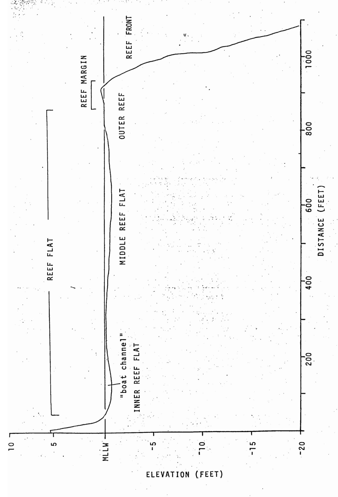

FIGURE 6A. PROFILE OF A SAMOAN FRINGING REEF (PAGO PAGO HARBOR). VERT.EXAG. 20x

American Samoa have not been calculated, it seems probable that (at least) middle and inner Pago Pago Harbor and Pala Lagoon are true embayments according to the above definition. A few bays with restricting coral reefs (for example, Afono and Masefau) are possibly true embayments.

The classification system attempts to differentiate the relatively protected waters of embayments from the relatively unprotected waters of an open coast. Thus, couplet 2 includes several other criteria (barrier reef, breakwater) which give rise to protected waters along the coast. Note that, excepting the quiet waters of a lagoon protected by a barrier reef, coastal habitats associated with reef features are treated in couplet 2 as open-coast habitats (unless, of course, the reef occurs within an embayment).

- §2 Wave Surge The classification scheme treats habitats on the front slope of any reef type as representing the same conditions of exposure to wave surge as habitats along a coast lacking a reef. Although reefs represent special biogenic features with a generally unique offshore topography, the organisms inhabiting high surge zones in front of the reef margin are confered no protection from surge by the presence of the reef. Most distinctions which could be made are essentially differences in substratum type.
- §3 Reef Forms The terminology applied to gross geomorphology of biogenic reefs (reef form) is expansive (see Stoddart, 1978). A wide variety of reef types have been described and inter-related in morphogenic schemes, the most basic of which is that of Darwin (1842). Darwin's idea, which, despite a long period of controversy, remains widely accepted today, relates how fringing reefs become barrier reefs, and barrier reefs become atolls with the gradual submergence of an island mass.

Examples of fringing reefs are most common around the volcanic (high) islands of American Samoa. Patch reefs are less common (examples occur in Pago Pago Harbor; i.e., Whale Rock, Amaula Rock). Both Swains and Rose Islands are examples of atoll reefs, although Swains is not typical in form. Barrier reefs are not present, although the Nafanua and Taema Banks appear to be an ancient drowned barrier reef (Mayor, 1920). The fringing reefs of American Samoa are well developed and typical of similar structures extant throughout the central and southern Pacific Ocean.

A profile of a fringing reef is illustrated in Figure 6A and demonstrates basic reef structure: a broad, more or less level or low relief platform (the reef flat); an outer reef margin or reef crest; and an abruptly descending reef front or seaward reef slope. The form shown is characteristic of Pago Pago Harbor reefs which have a particularly steep reef front. Along more exposed coasts the reef front is not nearly so steep. Note the gentle net upward slope from the base of the beach deposit near the shoreline to the reef margin. reef flat. The profiles off Ogegasa (Tutuila, north coast) and Leone (Tutuila, southwest coast) (Figure 6B) show less well

FIGURE 6B. TWO OFFSHORE PROFILES OF CORAL BOTTOM AREAS (AFTER DAHL, MACINTYRE, AND ANTONIUS, 1974).

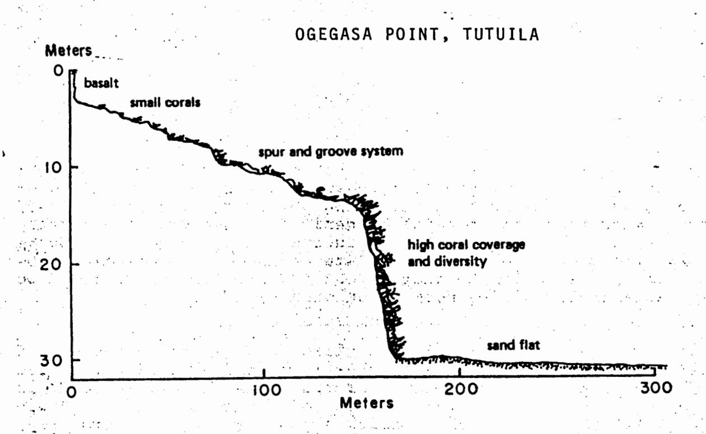

LEONE BAY, TUTUILA

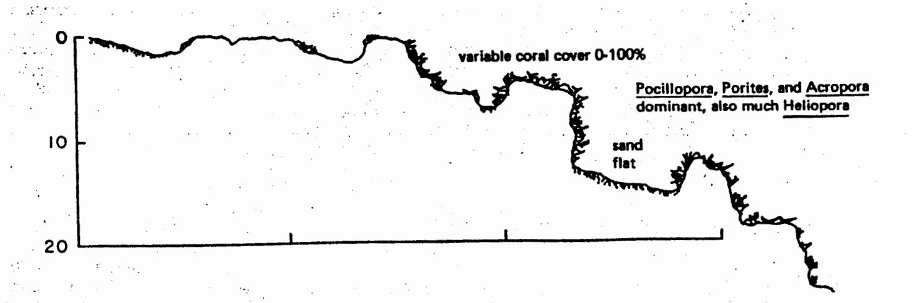

developed reef form. In particular, the reef margin is "submerged" -- that is, the margin has not grown up to sea level and, therefore, does not provide the same degree of protection to the reef flat and shore.

In the classification scheme, the "reef flat" habitat is coded differently if associated with a submerged as opposed to a sea level reef. The importance of this distinction lies primarily in the nature of the surge associated with the two types of fringing reefs. On a true fringing reef, wave energies are largely dissipated on the reef margin. Over submerged reefs, waves progress much of the way into shore, and the surge zone is correspondingly broader.

§4 - Reef Flat Zonation - The differentiation of zones on reef flats has long been a subject of interest to coral reef ecologists. The complexity of the biological and physical processes involved in establishing reef structure produce patterns which sometimes are distinctly arranged in bands from the outer reef slope to the shore, and sometimes appear as patches not distinctly zoned. The purpose of the 3rd order term in the case of reef flats is to broadly distinguish zones on a reef flat. These "zones" are not always easily differentiated in the field where the substrata and biota grade imperceptably from one type into another. The user should, therefore, not become overly concerned with the precise part of the reef (i.e., outer, middle, or inner reef zone in the classification scheme) represented where zonation is indistinct. In many cases, particularly where a reef is narrow, all three zones may not be The distinction is based not on position, but on the represented. predominance of certain physiographic conditions.

The outer reef zone includes the reef margin and is the zone of maximum wave surge in shallow water. On well developed, sea level reefs, much of this zone may be exposed at extremely low tides (Randall, et al., 1978). The bottom is dominated by consolidated limestone and coralline algae are prominent inhabitants (Dahl, 1971). Coral cover may or may not be extensive, although for any given section across a reef in Hawai'i, the highest coral cover shoreward of the margin is usually in the outer reef flat zone.

The middle reef zone occurs shoreward of the outer reef flat and is characterized by a mixture of substrata, with consolidated reef-rock and coarse sediments (rubble, boulders) predominating. Sand is present in depressions and is coarse-grained. This zone is further characterized by an abundance of fleshy algae on many Hawaiian reefs. Water circulation is generally good, except perhaps at extreme low tides, when patches of reef-rock may uncover.

The inner reef flat occurs near shore (on fringing reefs) and is characterized by an accumulation of sediments, particularly medium to fine grained sand. This zone is typically, although not necessarily, one of sluggish water movement, even at high tide on particularly broad reefs. On narrow reefs, a distinct inner reef flat may not be present. The inner reef flat may harbor a sparse growth of fleshy algae or may be rich in species adapted to low turbulence. Corals are usually present in only low abundance --

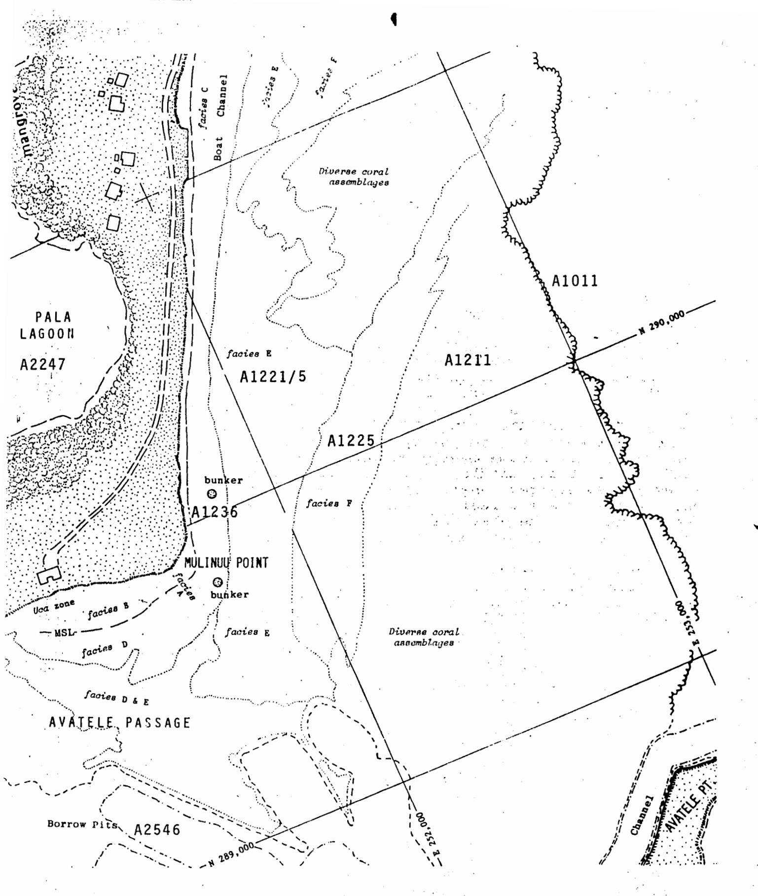

FIGURE 7. CORAL REEF HABITAT CLASSIFICATION CODES APPLIED TO ZONES ON THE FRINGING REEF OFF COCONUT POINT

scattered heads of <u>Cyphastrea</u> sp., <u>Pocillopora</u> <u>damicornis</u>, and/or <u>Porites</u> <u>lutea</u> may be present. On some reefs with a shallow outer reef zone, the inner reef zone (or a portion of it) may be a shallow channel running parallel to shore. This channel, sometimes called a "boat channel" serves to drain away water brought onto the reef flat by waves breaking over the reef margin. Usually a boat channel connects to a break in the reef or a seaward running channel (ava), through which strong rip currents develop whenever large waves break over the reef margin.

§5 - Lagoons, Channels, Borrow Pits, Reef Holes - The designator applies to large holes or dredged channels and borrow pits behind a reef margin, and small lagoon-like features on fringing reefs. These depressions can occur anywhere on a reef flat, but are characterized by the protection from wave surge provided by a surrounding reef structure. Ordinarily, the "boat channel" referred to above is too shallow (1 meter deep or less) to be coded here. Any channel of considerable length and depth over two meters, cut from outside the reef into shore will change from A.Ol. to A..4. at a point where wave surge ceases to be a regular occurence. Determination of this transition generally must be made in the field based on bottom type and biota. These environments are nearly always characterized by an accumulation of fine sediments, including a preponderance of silt in many cases. Note that true lagoons, such as are associated with barrier and atoll reefs, are coded in the 1st order (A2...).

#### FLORA AND FAUNA

Even very small units of area are inhabited by more kinds of organisms than it would be possible to list. Most surveys which develop species lists concentrate on conspicuous forms which dominate by virtue of size and numbers — in marine areas, the demersal fishes, corals, fleshy algae, and certain conspicuous macroinvertebrates (particularly the larger echinoderms) are usually noted. Small and/or cryptic forms frequently are not. This same emphasis is applied in the ASCRI text.

Included under the category FLORA AND FAUNA are descriptions of prominent organisms inhabiting maritime, estuarine, and marine areas covered by the particular coastal segment. Terrestrial (coastal zone) and land aquatic areas are treated first, then shoreline areas, followed by nearshore and reef flat environments, and finally offshore and deep water environments. Unusual, rare, or endangered species are often mentioned in addition to the most common, conspicuous, or economically valuable organisms reported in surveys conducted at each site. The extent of a particular description is dependent, of course, on the availability of information. The ASCRI project supplemented published and unpublished survey data with field surveys conducted in October 1979 (see pages 2-4).

In general, biological descriptions are given in a present tense in keeping with the tone of the Part A text as a whole. This practice deviates from the usual scientific style of refering to the data of others in third person, past tense. The effect is an implication that the biological information is complete, current, and In fact, the information presented is merely the best available for all or some portion of the area defined by the subheading. The short-comings of all survey data must be realized by the reader and assumed to apply, even though unstated, to the descriptions of flora and fauna given in the text. For the algae in particular, and many other groups generally, species dominance -indeed, the presence of many forms - changes regularly or seasonally. No attempt could be made in the brief descriptions presented to consistently compensate for this fact. Moreover, for most locations the necessary up-to-date surveys simply have not been conducted and the possibility of changes must be assumed by the reader. Where one or more studies have been conducted in a given area, emphasis is placed on the most recent, which will be given in present tense. The results of older studies are given in past tense where there is reason to believe that the descriptions no longer apply.

Scientific nomenclature is utilized in the FLORA AND FAUNA sections along with non-specific common names (e.g., "the surgeon-fish,..."). Scientific names are underlined (italicized in tables). Most non-marine organisms are presented with both a specific common name, samoan name, and scientific name; for example, "reef heron (matu'u; Egretta sacra sacra)..." Scientific names have been carefully checked for proper spelling and validity. Species names synonymized since appearing in older source documents are presented in ASCRI in accordance with currently accepted practices. Common names (both samoan and english) are used in the USE CONSIDERATIONS sections.

# Corals (Phylum Cnidaria)

The reef-building or hermatypic corals are animals limited in their distribution to warm seas where they are a major contributor

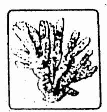

(along with coralline algae) to the structure of reefs. A diverse coral community provides a wide variety of habitats that supports a rich assemblage of other invertebrates and fishes. Areas of exceptionally diverse coral assemblages or coral cover exceeding 50% of the bottom are flagged in the text index (left hand page) with the coral head symbol (shown on the left).

Table III is a check list of the corals of American Samoa provided by Dr. Austin Lamberts.

# Palolo Worms (Phylum Annelida)

Most reef areas in American Samoa are popular places for the gathering of "palolo" worms (<u>Eunice viridis</u>) which swarm over wave-washed areas 7 days after the full moon (3rd quarter), usually between October and November of each year (Wass, pers. comm.). Considerable excitement accompanies the annual harvest of palolo

# TABLE III. CHECK-LIST OF SAMOAN CORAL GENERA AND SPECIES (PROVIDED BY Dr. Austin Lamberts).

Genus Stylocoeniella Species armata

Genus Psammacora

contigua
folium
nietstraszi
superficialis
var. tutuilensis

Genus Stylophora

mordax

Genus Seriatopora

hystrix

Genus Pocillopora

ankeli
brevicornis
Cf. bulbosa
damicornis
danae
eydouxi
Cf. setchelli
verrucosa
woodjonsi

Genus Acropora

abrotanoides africana aculeus arbuscula aspera bruggemanni ceralis clathrata corymbosa crateriformis cuspidata cytherea delicatula digitifera diversa exigua formosa fruticosa granulosa horrida humilis hyacinthus intermedia latistella longicyathus massawensis millepora

A. nana nasuta nobilis pagoensis · palifera palmeri paniculata pinquis pulchra rambleri robusta rotumana *schmitti* spicefera splendida squarrosa surculosa teres valida variabilis

Genus Astreopora

cucullata listeri myriophthalma

Genus Montipora

berryi bilaminata caliculata composita ehrenbergi elschneri foveolata marshallensis pulcherrima scutata socialis вритова trabeculata tuberculosa venosa verrilli

Genus Pavona

clavus
decussata
divaricata
duerdeni
frondifera
gigantea
maldivensis
varians

| 7.4 |      |    |      |     |
|-----|------|----|------|-----|
| TAB | LE I | II | (cor | ıt) |

Genus Gardineroseris Genus Alveopora Species ponderosa allingi verriliana Genus Leptoseris sp. 1 gardineri scabra Genus Favia favus Genus Pachyseris laxacarinata pallida levicollis rotumana speciosa speciosa stelligera Genus Coscinaraea columna Genus Favites abdita Genus Fungia chinensis concinna halicora • • • • echinata russelli fungites granulosa Genus Goniastrea patelliformis edwardsi paumotensis favulus repanda palauensis scutaria pectinata retiformis Genus Herpolitha Genus Platygyra crassa limaxlamellina rustica Genus Polyphyllia novae-hiberniae Genus *Leptoria* phrygia Genus Halomitra pileus Genus Oulophyllia crispa Genus Goniopora parvistella Genus Hydnophora cf. somaliensis exesa microconos Genus Porites andrewsi Genus Montastrea arenosa curta latistella ·lichen Genus *Plesiastrea* lobata versipora lutea var. haddoni Genus Diploastrea matthaii heliopora murrayensis pukoensis Genus Leptastrea

Subgenus Synaraea

horizontalata undulata

queenslandi septima

Genus Cyphastrea

microphthalma

purpurea

| 1 |       |                       |                        |       |            |                       |
|---|-------|-----------------------|------------------------|-------|------------|-----------------------|
|   | TABLE | III. (cont)           |                        |       | •          |                       |
|   | Genus | Echinopora Species | lamellosa              | Genus | Oxypora    | lacera                |
|   | Genus |                       | clavus fascicularis | Genus | Eyphyllia  | glabrescens           |
|   | Genus | Acrhelia              | · _                 | Genus | Plerogyra  | simplex               |
|   | Genus | Acanthastre           | •                      | Genus | Tubastrea  | coccinea              |
|   | Genus | Lobophyllia           | echinata costata    | Genus | Turbinaria | frondens peltata   |
|   | Genus | Symphyllia            | nobilis                | Genus | Heliopora  |                       |
|   | Genus | .Y erulina            | ampliata               | Genus | Millepora  | coerulea              |
|   | Genus | Echinophyll           | ia aspera           |       |            | platyphylla tenera |
|   |       |                       |                        |       |            |                       |

TABLE IV. Samoan and scientific names of some common invertebrates.

| Actinaria                     | sea anemone (edible)    | Matamalu   |
|-------------------------------|-------------------------|------------|
| Panulirus spp.                | spiny lobster           | Ula        |
| Parribacus sp.                | slipper lobster         | Papata     |
| Gastropoda                    | general name for snail  | Sisi       |
| Patellacea                    | limpet                  | Matapisu   |
| Turbo spp.                    | snail                   | Alili      |
| Tridacna sp.                  | giant clam              | Faisua     |
| Octopus spp.                  | octopus                 | Fe'e       |
| Holothuroidea                 | sea cucumbers           | Lole, Se'a |
| Acanthaster planci            | crown-of-thorn starfish | Alamea     |
| Diadema sp., Echinothrix spp. | sea urchins             | Vaga       |

over the reef flats. Palolo are caught with scoops and baskets, and fine mesh nets. This much-prized food is eaten raw or cooked and is preserved for eating over the long period when palolo are not available (Smetzer, 1959). This activity is wide-spread and therefore not discussed in the text under Use Considerations or indicated in the Atlas as a type of activity on the reef flat.

Alamea (Phylum Echinodermata)

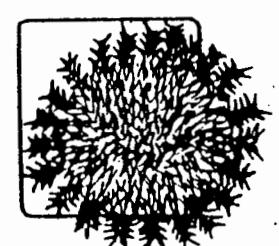

The alamea (crown-of-thorns starfish; Acanth-aster planci) has attracted considerable attention in the central Pacific in recent years because of large population build-ups in reef areas. The alamea is a usual inhabitant of reef front areas where it occurs in small numbers and feeds on coral tissue. Feeding usually occurs at night and often results in the death

of the coral head. When the starfish appears in an area in large numbers the consequences can range from considerable to near total destruction of the coral bottom assemblage. A number of studies have been directed at following the progress of the recent "outbreak" of alamea (beginning in mid-1977) around Tutuila. Results of these studies reflecting either large numbers of starfish or significant damage to the coral assemblage are flagged in the text index (left-hand page) by the alamea symbol shown here.

Fishes (Phylum Vertebrata)

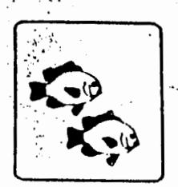

Fish are a visible and highly sought resource on samoan reefs. Reef areas of exceptional fish diversity are flagged in the text index (left-hand page) by the fish symbol shown here. Table V is a listing of scientific, and english and samoan common names of fishes as provided by the Office of Marine Resources, American Samoa Government.

# WATER CONDITIONS

Included under the heading WATER CONDITIONS are factors relating to the quality of nearshore marine waters and conditions (waves, currents, etc.) which have a bearing on use considerations. Significant point and non-point source discharges into marine waters are discussed, and a general description of water quality is given. Both natural and man made factors are considered. Emphasis is on those conditions which have a bearing on use.

#### HISTORICAL AND ARCHAEOLOGICAL SITES

Places and structures of historical value occurring along the shoreline or a short distance landward are described under the HISTORICAL AND ARCHAEOLOGICAL SITES heading. Subheadings name the site or structure. Physical descriptions may appear under PHYSIOGRAPHY,

TABLE V. Scientific, english, and samoan fish names (provided by the Office of Marine Resources, American Samoa Government).

Sharks Hexanchidae, Isuridae Maile Carcharhinidae, Sphyrnidae Orectolobidae Carcharhinus melanopterus Reef Blacktip Apeape Triaenodon obesus Reef Whitetip Malu Sphyrna lewini Hammerhead shark Mataitaliga Dasyatidae, Myliobatidae Rays Fai Anguillidae Fresh water Eels Tuna Muraenidae, Congridae, Moray eels, conger eels, To'e (small), Pusi Opichthidae snake eels (medium), Maoa'e (large), Atapanoa (very large), U'aulu (small brown body) Apeape (small pale body) Clupeidae Herrings, Sardines Pelupelu Round herring, sprat Poi, Nefu Spratelloides spp. Engraulidae Anchovies File, Nefu Milkfishes Avalii Chanidae Flying fishes Malolo Exocoetidae Halfbeaks I'usila Hemiramphidae Ise (less than 15 in.) Neddlefishes Belonidae A'u (more than 15 In.) Mosquitofishes, Fo-vai Poeciliidae Topminnows Salī Silversides Atherinidae Holocentridae Squirrelfishes Malau La'otale (less than 3 in. Scorpionfishes, Scorpaenidae Nofu (more than 3 in.) Stonefish

Serranidae

Groupers, Sea Bass

Gatala (less than 12 in.) Ataala (12-36 in.)

Ataala (12-36 in.) Vaolo (more than 36 in.)

Gatala-uli, Loi

Mataēle-uli (dark phase)

C. urodelus

Cephalopholis argus

| TAB | LE. | ٧. | ( | СО | nt) | ) |
|-----|-----|----|---|----|-----|---|

L. kasmira

| TABLE V. (cont)                         |                         | •                                                                                            |
|-----------------------------------------|-------------------------|----------------------------------------------------------------------------------------------|
| C. urodelus (cont.)                     |                         | Mataēle-sina (red phase Amercan Samoa) Mataēle-mumu (red phase Western Samoa)       |
| Epinephelus hexagonatus                 |                         | Gatala-aau                                                                                   |
| E. merra                                | Honeycomb grouper       | Gatala-aloalo, gatala- pulepule                                                           |
| Plectropomus leopardus, P. truncatus | Coral Cod               | Ataata-utu                                                                                   |
| Variola louti                           | Fairy Cod               | Papa-tuauli (juvenile) Velo-(sub-adult) Papa (adult)                                   |
| Theraponidae                            | Therapon perches        | Avaava                                                                                       |
| Priacanthidae                           | BigEyes                 | Matapula                                                                                     |
| Apogonidae                              | Cardinalfishes          | Fo                                                                                           |
| Carangidae                              | Jacks, trevallys        | Lupo (less than 3 in.) Lupota (3-6 in.) Malauli (8-24 in.) Sapoanae (2-3 in.) Ulua (3-4 ft.) |
|                                         |                         | Elo (more than 4 ft.)                                                                        |
| Elegatis bipinnulatus                   | Rainbow Runner          | Samai                                                                                        |
| Selar crumenothphalmus                  | BigEye scad, Akule      | Nato (less than 4 in.) Atule (4-8 in.) Ga, taupapa (more than 8 in.)                   |
| Coryphaenidae                           | Dolphin                 | Masimasi                                                                                     |
| Lutjanidae                              | Snappers                | Mu, Palu (1g. deepwater sp.)                                                                 |
| Aprion rutilans                         |                         | Palu-sina                                                                                    |
| A. virescens                            | Gray Snapper            | Asoama (American Samoa) Utu (Western Samoa)                                               |
| Etelis carbunculus                      | Onaga                   | Palu-atu, Palu-malau                                                                         |
| E. marshi                               | Ehu                     | Palu-malau, Palu-loa                                                                         |
| Lutjanus bohar                          | Red Snapper             | Mu, mu-aa (dark phase) Mu, mumea (red phase)                                              |
| L.fulvus                                | Yellow-margined Snapper | Tamala                                                                                       |
| L. gibbus                               | Paddletail Snapper      | MalaŦ                                                                                        |

Blue-lined Snapper

Savane

# TABLE V. (cont)

| TABLE V. (cont)                                           |                       |                                                                                |
|-----------------------------------------------------------|-----------------------|--------------------------------------------------------------------------------|
| L. monostigma                                             | One-spot Snapper      | Taiva                                                                          |
| Pristipomoides flavipinnus, P. filamentosus, P. multidens | Opakapaka ,        | Palu-sina, Palu-pa'epa'e                                                       |
| Tropidinius amoensus                                      | Flower Snapper        | Palu-ula, Palu-sega                                                            |
| Gerreidae                                                 | Hojarras              | Matu                                                                           |
| Lethrinidae                                               | Emperors              | Mataeleele (less than 6 i Ulumalosi (6-12 in.) Filoa (greater than 12 in |
| Mullidae                                                  | Goatfishes            |                                                                                |
| Mulloidiohthys spp.                                       |                       | I'asina (less than 3 in.) Vete, Afulu (more than 3:                         |
| Parupeneus chryserydros                                   |                       | Moana                                                                          |
| P. trifasciatus                                           | Three-saddle Goatfish | Matulau                                                                        |
| Upeneus arge, V. Vittatus                                 | Bar-tailed Goatfish   | Ula'oa                                                                         |
| Kyphosidae                                                | Rudderfishes          | Nanue                                                                          |
| Chaetodontidae                                            | Butterflyfishes       | Tifitifi                                                                       |
| Pomacanthidae                                             | Angelfishes           | Tu'u'u                                                                         |
| Pomacentridae                                             | Damselfishes          | Tu'u'u                                                                         |
| Cirrhitidae                                               | Navkfishes            |                                                                                |
| Cirrhitus pinnulatus                                      |                       | Ulutu'i                                                                        |
| Mugilidae                                                 | Hullet                | Anae (gen. name), moi (less than 2 in.), Poi (2-3 in.),                     |
|                                                           |                       | Aua (3-5 in.), Fuafua (5-6 in.), Anae (8-30 in.), Afomatua (more than 10 in.)  |
| Liza vaigiensus                                           |                       | Fuitogo (less than 30 in.) Afa (4-10 in.) Anaeafa (more than 10 in.)     |
| Sphyraenidae                                              | Barracuda             | Sapatu                                                                         |
| Sphyraena barracuda                                       |                       | Saosao (large)                                                                 |
| Labridae                                                  | Wrasses               | Sugale                                                                         |
| Cheilinus spp.                                            | Maori Wrasse          | Lalafi (less than 12 in.) Tagafa (12-30 in.) Malakea (more than 30 in.)  |
| Scaridae                                                  | Parrotfishes          | Fuga (less than 6 in.) Fugasi (blue&green, 6-10 in.                            |
|                                                           |                       |                                                                                |

| TABLE W. /                               |                                |                                                                          |
|------------------------------------------|--------------------------------|--------------------------------------------------------------------------|
| TABLE V. (cont)                          |                                | 7 (0 2/ 4p )                                                             |
| Scaridae (cont.)                         |                                | Laea (8-24 in.) Galo (more than 24 in.)                               |
| Blenniidae                               | Blennies                       | Mano'o                                                                   |
| Gobiidae                                 | Gobies                         | Mano'o                                                                   |
| Zanclidae                                | Morish idol                    | Pe'ape'a                                                                 |
| Acanthuridae                             | Surgeonfishes                  | ,                                                                        |
| Acanthurus spp.                          |                                | Pone (less than 5 in.) Palani (more than 5 in.)                       |
| A. glaucopareius                         |                                | I'usina (American Samoa) Laulama (Western Samoa)                      |
| A. guttatus                              |                                | Maono                                                                    |
| A.lineatus                               | Lined-surgeonfish              | Alogo                                                                    |
| A. triostegus                            | Convict Tang                   | Manini                                                                   |
| Ctenochaetus spp.                        | Bristle-toothed Surgeonfish | Pala'ia, logoulia (schooling juveniles), Pone                         |
| Naso spp.                                | Unicornfishes                  | Ume                                                                      |
| Siganidae                                | Rabbitfishes                   | Lo (general, also large schools of juveniles)                            |
| Scombridae                               | Tunas                          |                                                                          |
| Acanthocybium solandri                   | Walioo                         | Paāla                                                                    |
| Auxis thazard                            | Frigate mackerel               | Atualo                                                                   |
| Euthynnus affinis                        | Little Tuna                    | Kavakava                                                                 |
| Gymnosarda unicolor                      | Dogtooth or white tuna         | Tagī                                                                     |
| Katsuwonus pelamis                       | Skipjack tuna                  | Atu (less than 14 in.) Faolua (14-20 in.) Gaono (more than 20 in.) |
| Rastrelliger brachysoma, R. kanagurta | Mackerel                       | Ga                                                                       |
| Thunnus albacares                        | Yellowfin tuna                 | To'uo (American Samoa) ` Ta'uo (Western Samoa)                        |
| T. obesus                                | BigEye tuna                    | Asiasi (less than 40 lbs.)                                               |
| Istiophoridae                            | Billfishes                     | Sa'ula 🔻                                                                 |
| Istiophorus platypterus                  | Sailfishes                     | Sa'ula-lele                                                              |

Blue Marlin

Sa'ula-oso

Makaira nigricans

TABLE V. (cont)

Bothidae Lefteye flounders Ā1í Balistidae Triggerfishes Sumu Monacanthidae Filefishes Pa'umalō Ostraciontidae Trunkfishes, boxfishes Moamoa ' Teraodontidae Puffers, balloonfish Sue Diodontidae Porcupinefishes, Spiny Tautu puffer

and additional information, particularly relevant to current status, may appear under USE CONSIDERATIONS.

# USE CONSIDERATIONS

Under the heading USE CONSIDERATIONS are presented the activities engaged in and facilities provided for, residents of and visitors to, the coastal areas of American Samoa. follows presence, abundance, and quality of the utilization resources available in any given place, and the best identifiers of particular resources are the users themselves. The ranking of popularity of subsistence fishing methods and descriptions of common catches are summarized from the village by village Fishing and Farming survey conducted by the Development Planning (Government of American Samoa, Development Planning Office, 1980) and supplemented by interviews with village chiefs and councils. No attempt has been made in the text to plan or otherwise suggest partitioning of resources among user categories (plans already developed in government documents are noted). The relative degree to which certain activities take place and the quality of the resources being utilized are discussed, although frequently only in general terms. Many uses are described without crediting sources. In such cases the information derives from observations and/or the expertise of consultants to the ASCRI project.

#### Reef Uses

Fringing reefs, such as those occurring off the coast of much of American Samoa, are among the most important of coastal zone resources. Although American Samoans no longer depend upon their traditional nearshore fishery as a primary source of food, subsistence fishing remains the predominant use of reefs in Samoa. Despite increasing use of reefs (primarily by non-Samoans) for sport diving, surfing, shell collecting, and other recreational activities, subsistence fishing must be considered the highest priority use based on the number of participants. However, it can be argued that such fishing is as much for sport as for subsistence

purposes.

The majority of subsistence fishing activity in American Samoa is undertaken by villagers on reefs adjacent to their villages. Samoans traditionally maintain that reef areas adjacent to their villages are village property, although some villages are stricter in regulating use by outsiders than others. The need to obtain local village approval for access to the shoreline and reef in populated areas is common courtesy expected of outsiders and, to a certain degree, inhibits inappropriate uses, overuse, or uses incompatible with subsistence fishing needs of the village. Isolated areas usually lack roado or means of easy access, and this also serves to discourage overuse. In general, destructive practices such as the use of poison or explosive charges (both illegal under Samoan law) are uncommon. A probable case of reef poisoning in Avatele Passage in 1973 appeared to be associated with a fish-trap constructed by non-Samoans (Lamberts, 1974).

A large percentage of the population of American Samoa lives along the perimeter of inner Pago Pago Harbor (MAPs 1 and 2) where much of the reef flat has been filled to gain level land or dredged for harbor facilities. The degradation of reef flat envaronments fronting heavily populated areas in the inner harbor severely restricts the fishing methods and catches there. Although pelagic and migratory fishes are still caught with line or net along the inner margins of the harbor, the diverse catches of reef fishes and invertebrates typically occurring elsewhere in the islands are no longer possible in Pago Pago Harbor. Many of the people of this "urban" population simply do not fish, or do so mainly for sport (Hill, 1978).

Major alterations of reef flats (e.g., harbor development, dredging to obtain fill for roads or land reclamation) should be carefully evaluated in areas of intact reefs fronting villages which retain a tradition of subsistence fishing. In the past, indiscriminate dredging has destroyed or reduced the diversity of fishery resources. Except in inner Pago Pago Harbor, where continued dredging and filling appears consistent with expansion of harbor facilities and economic growth, large scale disturbances of reef environments in other areas is incompatible with village fishing activity.

Small-scale disturbances of reef environments through destruction of coral beds is also detrimental to subsistence fishing. Coral bottoms contribute to shelter and habitat for fish life, particularly juvenile and small fishes of importance in maintaining populations of larger, edible fishes. Thus, intentional damage to living coral heads caused by collecting as curios (either by or for tourists) or unintentional damage resulting from boat anchors, are incompatible with subsistence fishing and other reef uses dependent on diverse and abundant marine life.

Non-consumptive recreational uses, such as sport-diving and surfing, undertaken primarily by non-Samoan residents and visitors to Samoa, do not generally conflict with subsistence fishing. Sport

diving is generally concentrated on the reef front, and surfing occurs mainly near or off the reef margin at high tide when fishing is least likely to occur at the margin. Beaches are focal points for water sports seldom undertaken by Samoans and which may be incompatible with traditional fishing activity in areas of Tutuila outside of the population centers around Pago Pago Harbor and on the outer islands, which retain a more traditional lifestyle. Problems result not only from competition for space, but also from beach use by tourists and non-natives on Sundays, a practice discouraged by Samoans for religious reasons. Tourist-oriented water sports (such as sailing) should be concentrated in Pago Pago Harbor and in areas not closely associated with specific villages. An area with exceptional potential for sport-diving and underwater photography is a nearshore lagoon off the Ofu airport (northwest from Papaloloa Point). Other areas with high potential for ocean recreation (activities other than subsistence fishing) have been indicated in marginal notes in the running index of the text (left-hand page).

Water quality problems are a cause of reef degradation heavily populated areas of Tutuila. Waste disposal in Pago Pago Harbor has contributed to the destruction of the fringing reef community, although the reef remains structurally intact. Road construction projects (particularly the "Top Mile" road between Aua and Afono, and a road along the ridge to the TV transmitter on Mt. Alava) have accelerated soil erosion. Sediments carried by the streams have severely damaged the reef flats fronting Aua and Fagasa villages (M & E Pacific, 1978). Both sedimentation from poor land management practices and nutrient enrichment from sewage disposal inevitably interfere with reef uses dependent upon a diverse assemblage of marine life. In at least one case, public health is directly endangered by waste disposal. Cesspool seepage into Pala Lagoon raises bacterial concentrations above levels considered safe for consumption of clams collected from the lagoon (Helfrich, et. al., 1975).

The need for marine preserves in American Samoa is probably limited to a few areas considered especially pristine or unspoiled and not actively fished. Two such areas, Fagatele Bay and Larsen Bay, are presently under consideration for marine preserve status (Wass, pers. comm.). It is important to note that preservation from human disturbance does not guarantee the safe-guarding of reef The rich coral beds in both bays were devastated in the recent plaque of alamea (crown-of-thorns starfish; Acanthaster planci) which destroyed living corals in many areas around Tutuilla, Aunu'u, and on the offshore banks. Apparently, infestations of alamea are periodic phenomena affecting Samoan reefs. At present, several unspoiled examples of rich coral growth have been identified: in Sita Bay and Fagafue Bay on the northwestern coast of Tutuila and at Ofu (off the airport). The Tutuila examples are genrally isolated from most users and therefore protected without The Ofu example is easily official designation as preserves. accessible and an excellent candidate for designation as a preserve. An area of exceptional coral growth and a remarkably diverse fish assemblage is around the margins of the old borrow areas adjacent to the reef runway at Pago Pago International Airport. This reef area

is an excellent candidate for marine preserve status, although the area is presently protected from overuse due to the controlled access across the airport property. Generally rough seas limit approach to this area from seaward.

#### MISCELLANEOUS

Place names generally follow U.S.G.S. topographic maps with, however, additions and corrections provided by Otto Thomsen of the Development Planning Office, American Samoa Government. Spelling of place names is based on pronunciation with inclusion of the glottal stop.

Measurements given in the text are presented in the English System with Metric System equivalents provided in parentheses. Note, however, that the two values given are not direct conversions (i.e., one foot equal to 0.3048 meters). Instead, an equivalent level of precision is given. Thus, where an original observation appears to be an estimate (for example, "500 feet"), a metric estimate is provided ("150 meters", not 152.4 meters).

# LITERATURE CITED

- AECOS, Inc. 1979. Hawai'i coral reef inventory, Island of Oahu (OCRI). Prep. for U. S. Army Engineer District, Honolulu. Part A Introduction. 40 p.
- American Samoa Government, Development Planning Office. 1980. Fishing and Farming survey.
- Dahl, A.L. 1972. Ecology and community structure of some tropical reef algae in Samoa. Proc. Intern. Seaweed Symp., 7:36-39. John Wiley and Sons, N.Y.
- of coral reef research sites. Atoll Research Bulletin, 172: 37-120.
- Darwin, C. 1842. The structure and distribution of coral reefs.

  London.
- Environmental Consultants, Inc. 1977. Marine reconnaissance surveys for the Coconut Point shoreline erosion control project Nu'uuli, American Samoa. Prep. for U. S. Army Engineer Division, Pacific Ocean. 119 p.
- Friedlander, I. 1910. Beitrage zur der Samoa Inseln. K. Bayer. Akad. Wiss., Math-phys. El., Munich, 27:358-369.
- Gosline, W.A. 1965. Vertical zonation of inshore fishes in the upper water layers of the Hawaiian Islands, Ecology, 46(6):823-831.
- Hawaii Costal Zone Management Program. 1975. Technical considerations in developing a costal zone management program for Hawaii. State of Hawaii, Dept. Plan. Econ. Dev., Honolulu. HCZMP Document 1, 241 p.
- Hawaii Costal Zone Management Program. 1976. The application of remote/sensing to costal zone management. State of Hawaii, Dept. Plan. Econ. Dev., Honolulu. HCZMP Document 10.
- Helfrich, P., et al. 1975. An assessment of the expected impact of a dredging project for Pala Lagoon, American Samoa. Univv Hawaii, Sea Grant Tech. Rept. UNIHI-SEAGRANT-TR-76-02. 76 p.
- Hill, H.B. 1978. The use of nearshore marine life as a food resource by American Samoans. Univ. Hawaii, Pacific Islands Program, Misc. Working Papers 1: 170 p.
- Krear, D., and B.L. Wood. 1959. The geology and hydrology of Western Samoa. Bull. Geol. Survey, N. Z. 63:92 p.

- Lamberts, A.E., 1974. Coral kill in American Samoa. Natl. Geograph.
  Soc. Res. Rept. (in press).
- M & E Pacific, Inc. 1978. American Samoa water resources study. Wastewater management data evaluation study for American Samoa. Prep. for U.S. Army Engineer Division, Pacific Ocean.
- MKGK/Yamamoto, Inc. 1980. American Samoa Territorial Comprehensive Outdoor Recreation Plan 1980-1985. American Samoa Parks and Recreation Commission.
- Maragos, J.E., S.V. Smith, E.A. Kay, D. Kam, and J. Maciolek. 1975.

  Hawaiian costal water ecosystems: an element paper for the
  Hawaiian Costal Zone Management Program. State of Hawaii,
  Dept. Plan. Econ. Dev., Honolulu. HCZMP, Tech. Suppl. No. 1.
- Mayor, A.G. 1920. The reefs of Tutuila, Samoa, in their relation to coral reef theories. Proc. Amer. Phil. Soc. 19(3):2-14.
- Morton, J.E., and D.A. Challis. 1969. The biomorphology of Solomon Islands shores with discussion of zoning patterns and ecological terminology. Phil. Trans. Roy. Soc. B255:459-516.
- Randall, R.H. (editor) 1978. Guams reefs and beaches. Part III. Transect studies. Univ. Guam, Marine Lab. Tech. Rept. No. 48, 90 p.
- Ricketts, E.F., and J. Calvin. 1962. Between Pacific tides. (edited by J Hedgepeth). Stanford Univ. Press, Stanford, Calif. 516 p.
- Smetzer, B. 1969. Night of the palolo. Nat. Hist., 78(8):64-71.
- State of Hawaii, Dept. of Health. 1978. An ecosystem approach to water quality standards. Rept. of the Tech. Comm. on Water Quality Standards. Tech. Rept. No. 1. 48 p. plus appendices.
- Stoddart, D.R. 1978. Descriptive reef terminology. p. 5-15, In: Coral reefs: research methods (edited by D.R. Stoddart and R.E. Johannes). UNESCO monographs on oceanographic methodology, 5. Paris.

un-numbered page

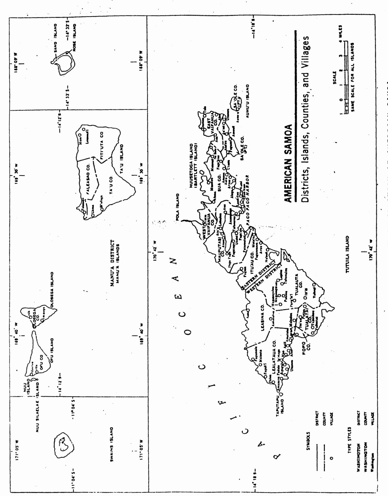

THE ISLANDS OF THE TERRITORY OF AMERICAN SAMOA FIGURE 8.

# AMERICAN SAMOA CORAL REEF INVENTORY

# AMERICAN SAMOA

The Territory of American Samoa comprises the six eastern islands of the Samoa Archipelago and one other island (Swains Atoll) geographically belonging to the Tokelau Island Group. American Samoa is located in the tropics (14°S latitude, 170°W longitude) of the Central Pacific Ocean 2,300 nautical miles (4,420 km) southwest of Hawai'i, 1,500 miles (2,400 km) north of Aukland, New Zealand, 1,200 miles (2,000 km) northwest of Tahiti, and 80 miles (130 km) southeast of Western Samoa. The five volcanic islands are aligned along the crest of a discontinuous submarine ridge which extends over 300 miles (480 km) and trends roughly northwest by southeast. These are the major inhabited islands of American Samoa and include Tutuila, Aunu'u (a island located one mile (1.6 km) off the southeast coast of Tutuila), Ofu, Olosega, and Ta'u. The latter three islands are collectively referred to as the Manu'a Group and lie about 66 miles (106 km) east of Tutuila. Rose Island (Nu'uomanu), located about 100 miles (161 km) east of Tutuila, is an uninhabited coral atoll less than 1 square mile (2.6 sq km) in land area. Island is a National Wildlife Refuge. Swains Island, about 225 miles (360 km) north of Tutuila, is a coral atoll privately owned by the descendants of a New England whaling captain.

APE.

TUTUILA ISLAND

GENERAL

PHYSIOGRAPHY

POLA ISLET

TUTULA AUNU'U

170045'W 170035'

FIGURE 9. TUTUILA ISLAND, AMERICAN SAMOA

TUTUILA ISLAND

STEPS POINT

GENERAL

PHYSIOGRAPHY

# TUTUILA ISLAND

Tutuila is a narrow island covering about 54 square miles (140 sq.km). The island had a complex origin in the eruptions of five overlapping centers of volcanic activity which merged roughly in a west to east line. Maximum length of Tutuila is just over 20 miles (32 km). The width varies from 1 to 2 miles (1.5 to 3.5 km) across the eastern half of the island and from 1 to 6 miles (1.5 to 10.0 km) across the western half. The rugged terrain is characterized by steep mountainous slopes and narrow valleys and coastal plains. The highest elevation is 2,100 feet (640 m) above sea level. The drowned river valley of Pago Pago nearly cuts the island in two near its center (28;54;65). The island is surrounded by deep ocean with depths over 9900 feet (3000 m) between it and the Manu'a Islands to the east (55).

Tutuila was considerably broader in the geological past. Following the cessation of early stage volcanic activity, deep valleys were eroded by streams and a highly irregular coastline shaped by wave attack. After a long quiescent period, renewed eruptions built an extensive plain of tuffs and basalts on the southwestern side of the Tutuila between Nu'uuli and Leone over a submerged reef. A small, contemporaneous eruption off the southeastern end of Tutuila formed the tuff cone today Aunu'u Island. Subsequent erosion of Tutuila produced the present rugged terrain and deeply embayed coastline. Collapse of the summit of Pago volcano formed a caldera. The Pago River created a wide, deep canyon along the north wall of the caldera. Pioa cone at Aua diverted the river to the south of the caldera. Rapid submergence by rising sea level created Pago Pago Bay and other bays by drowning the river valley mouths. Drainage is by deeply-incised stream valleys radiating from the summit of each volcanic cone (28;54;65).

Around the volcanic mass of the Island sedimentary deposits formed at the base of steep slopes (talus), on valley floors (alluvium), and on narrow coastal plains and beaches (calcareous sand and rubble). The bays of Tutuila tend to be formed in regions of weak rocks flanked by more resistant lavas. Precipitous cliffs rise to several hundred feet above the shoreline around much of Tutuila. Many of the promontories and offshore seastacks are dense lavas which filled cinder cone craters. Wave erosion has long since worn away the softer cinder beds once surrounding the sea stacks. Wave-cut benches a few feet above present sea level are conspicuous at the base of basalt cliffs. Sea caves positioned above present-day sea level are common around the Island (28;54;59).

## REEFS

Fringing reefs are nearly continuous off the south and east shores of Tutuila, but are developed only in embayments along the north shore where high cliffs plunge into the ocean. The absence of a more or less continuous fringing reef around Tutuila is

TUTUILA ISLAND

State Free

GENERAL

**PHYSIOGRAPHY** 

( OFFSHORE BANKS

TUTUILA ISLAND

**GENERAL** 

WATER CONDITIONS

( TSUNAMIS

( HURRICANES

( \* Margins of inner Pago Pago Harbor possible "Special ( Area" of significant hazard --- VI.C.4 (21) attributed to a rapid submergence of the Island. A fringing reef hugs the coastline in places where submarine slopes are not too steep. Fringing reefs have not developed off many basalt promontories where the bottom drops away steeply. Also, a fringing reef has not formed off the geologically recent plain between Fagatele Bay (MAP 25) and the International Airport, where lava cliffs terminate in deep water (MAP 27)(59). The Taema and Nafanua Banks south of Tutuila represent a former barrier reef now submerged some 60 feet (18 m) or more. Depth in the former lagoon behind the banks is up to 330 feet (100 m)(15;54;59). Soundings clearly indicate that a reef which extended over a mile (1.6 km) offshore of Tutuila is now submerged a few hundred feet deep (54;59).

The modern fringing reefs vary in width generally between 300 and 990 feet (90 to 300 m). The widest reef flat occurs off Nu'uuli (MAP 29) where the margin occurs some 3000 feet (900 m) from shore. In places, particularly off stream mouths, the fringing reef may be cut by a channel known as an ava. Algal ridges reaching up to low tide depth are well-developed at the margins of reefs along the south coast. Algal ridges are rather poorly developed on north shore reefs, which tend to be narrow and confined to the flanks and heads of small bays. The seaward reef margin sometimes projects as an overhanging shelf, below which is a precipitous reef slope (59). On wave-exposed coasts the reef front is moderately to steeply sloped with extensive spur-and-groove formations. In Pago Pago Harbor the reef front is sheer (26).

#### TSUNAMIS AND HURRICANES

Although Samoa has experienced 17 tsunamis over a 43\ year period (1917-1960), only Pago Pago (MAP 1) has reported any sizeable runup. The 1960 tsunami produced a runup of 4.5 feet (1.4 m) at the harbor entrance and 10.7 feet (3.3 m) at the head of the harbor (29;66). Tsunamis which do little or no damage elsewhere in American Samoa may generate high runup in the inner harbor due to the funneling effect of the harbor's configuration (64). American Samoa lies in the path of hurricanes approaching primarily from the north but occasionally from the east, southwest, or west. The most severe hurricane to affect American Samoa in recent decades passed through the islands in January 1966 (22;69).

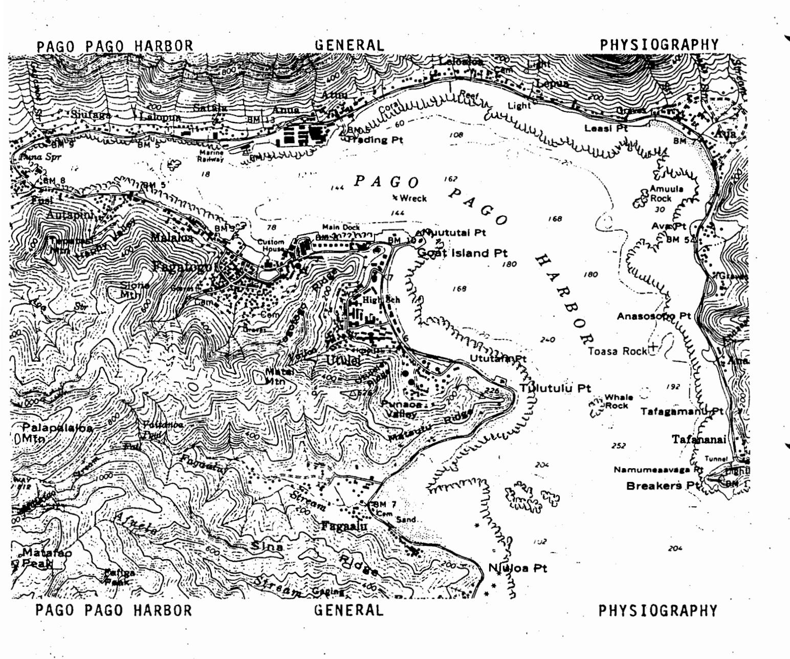

# PAGO PAGO BASIN

#### PAGO PAGO HARBOR

Pago Pago Harbor, which nearly bisects the Island of Tutuila, is a deep natural embayment. It is presumed to have been formed by erosion of a wide and deep canyon through weak tuff deposits along the north wall of the Pago caldera during a period when sea level was much lower than at present. The ancestral stream that cut the valley was diverted south of the caldera by the formation of the bulky Pioa cone (MAP 2). This cone also caused the Aua tributary to cut a deep amphitheater-like valley in the caldera wall on the northwestern side of the cone. Thus, Pago Pago Harbor is a drowned valley which owes its unusual size to its large drainage area, weak rocks in its floor, and high caldera walls on its north side (54). Rapid subsidence resulted in flooding of the ancient valley, forming one of the deepest and most sheltered natural harbors in the Pacific (64).

The embayment is about 3 miles (4.8 km) long and encompasa water surface area of approximately two square miles (5.2 square km). From its southward opening entrance, the harbor about 1.5 miles (2.4 km), where it makes a sharp inward turn to the west and extends an additional 1.5 miles (2.4 km) to Pago Park at its head (6;58). The innermost reaches of the Harbor are within 3500 feet (1060 m) of the northern coast of Tutuila at Agapie Cove (MAP 15), although a steep ridge rising to an elevation of over 1000 feet (300 m) separates the two coasts. Depths reach 250 feet (75 m) at the harbor mouth, decreasing to 120 feet (35 m) three-quarters of the way into the harbor (37;58;64;65). Average depth is approximately 200 feet (60 m)(13). The entrance to the harbor is approximately 2800 feet (850 m) wide between Faga'alu reef and Breakers Point. The channel narrows to 1600 feet (487 m) at Whale Rock where the navigation channel is restricted to the eastern side of the harbor (65).

# STREAMS

Upland drainage throughout Tutuila, especially in the areas above Pago Pago Harbor, is provided by deeply incised valleys radiating from the summit of volcanic cones and characterized by steep stream gradients (64). Several streams with a combined drainage area of approximately 5 square miles (8 sq. km) enter Pago Pago Harbor. Although flows are continuous, volumes are highly variable. Faga'alu, Vaipito, and Lalolamauta Streams drain the largest watersheds.

Vaipito Stream, draining the largest watershed tributary to Pago Pago Harbor and having the largest volume of flow, enters the harbor at its head near Pago Pago Village (MAP 1). Much of this stream's length has been modified by concrete and riprap walls. Lalolamauta Stream discharges into the middle harbor at Aua (MAP 2). The stream bed grades to gravel, sand, and silt near the mouth. The stream's lower reach has been subject to realign-

PAGO PAGO HARBOR .

**GENERAL** 

WATER CONDITIONS

PAGO PAGO HARBOR

GENERAL

USE CONSIDERATIONS

\* Margins of inner Pago Pago Harbor designated "Special Area" for development ----Chap. VI.B.1 (21)

PAGO PAGO HARBOR

GENERAL

**PHYSIOGRAPHY** 

ment and filling to accomodate homesites in Aua Village (71). Faga'alu Stream empties into outer Pago Pago Harbor at Faga'alu Bay (MAP 3). Numerous other streams flow intermittently into the harbor around most of its perimeter.

#### STREAMS

The land adjoining the lower reaches of Faga'alu and Vaipito Streams is densely settled. The lower reach of Vaipito Stream flows through a landfill at the head of Pago Pago Harbor. This stream is choked at several points with accumulated trash (71). The water quality of several other streams which discharge into Pago Pago Harbor is influenced by urban and agricultural activities in their drainage areas. These streams show a definite increase in nutrients above levels in pristine streams. Streams draining urban and agricultural areas have high turbidity after heavy rainfall and occasionally have low or fluctuating levels of dissolved oxygen which are detrimental to most forms of stream life and may occasionally cause fish kills. Urban-influenced streams frequently have concentrations of fecal coliforms far in excess of water quality standards (40).

# COASTLINE

The entire perimeter of Pago Pago Harbor is accessible by a two-lane, paved road which provides vehicular access to all the villages along the southern coast of Tutuila (23). The coastal area around the perimeter of Pago Pago Harbor is the major population, commercial, and industrial center of American Samoa (64). Utulei on the western shore (MAP 2), with the principal hotel , facilities on Tutuila, is a center for tourism. activities, including marine repair facilities and tuna canneries (located in the village of Anua), are situated along the north shore of the inner harbor (MAP 1). Commercial and government activities are centered along the western and southern shorelines. Residential areas are almost continuous around the harbor perimeter. The only hospital facility is located at Faga'alu 3)(37;63). Pago Pago Park occupies a filled area off the stream mouth at the head of the bay (MAP 1)(56). Access to the shoreline is generally unrestricted, except in the vicinity of the dry dock facility and tuna canneries along the north shore of the inner harbor where public access is limited (63).

A second paved road extends over the backbone of Tutuila from Pago Pago Village to the village of Fagasa on the north shore (MAP 16)(64). "Top Mile Road", which connects Aua Village to the villages of Afono (MAP 12) and Vatia (MAP 13) on the north shore, is presently under improvement (39).

# SHORELINE

The original shoreline of Pago Pago Harbor has been modified considerably as a result of various land reclamation projects undertaken since 1900 by the U.S. Navy and Government of American Samoa (37). The most dramatic changes have occurred in the inner

PAGO PAGO HARBOR

GENERAL

FLORA AND FAUNA

PAGO PAGO HARBOR

GENERAL

USE CONSIDERATIONS

PAGO PAGO HARBOR

GENERAL

PHYSIOGRAPHY

harbor particularly during World War II and since 1960 (65).

Much of the margin of inner Pago Pago Harbor is occupied by harbor facilities. Undeveloped sections of the inner and middle harbor are stabilized with rudimentary seawalls and revetments. Typically, a narrow beach of rubble, small boulders, and silty sand fronts a steep backshore scarp or bank rising 6 feet (2 m) to the coast road (49;ASCRI). Sediment deposits at the shoreline are coarser-grained along the southern shore than along the northern shore. This pattern suggests that the prevailing longshore currents move in a counterclockwise direction (56;58).

# MANGROVE AREAS.

Mangrove forests once abundant around the perimeter of Pago Pago Harbor have been destroyed and the swamps filled for village use. No trace is left of former mangrove forests at Pago Pago, Fagatogo, Utulei, or Faga'alu Villages (15). Minor patches remain near Aua Village (15;71).

# INNER HARBOR SHORELINE

The deep water accessible from the landfill shore of inner Pago Pago Harbor is conducive to shore fishing. An active seasonal fishery for atule (big-eye scad) occurs at piers in the harbor. Juvenile big-eye scad are the most common fish hooked in the harbor (26). Pole fishing and throw-netting are common along the shoreline of the inner harbor. Jacks and anae (adult mullet) are commonly caught (65). Baitfish are commonly collected close to shore. Water-contact activities along the north shore of inner Pago Pago Harbor are discouraged by the degraded environment (58).

# FRINGING REEFS

Fringing reefs border most of Pago Pago Harbor (40). Even the innermost harbor was once fringed by a narrow reef except off the mouth of Vaipito Stream (46). Width of the reefs in the Harbor varies considerably, but is usually around 1000 feet (300 m)(40). The widest sections (up to 1,500 feet or 460 m) occur along the perimeter of the outer Harbor (13), where more or less continuous reefs are cut only by narrow channels (avas) opposite stream mouths (6). Exploratory drilling on the reef flats offshore of Utulei and Aua in 1931 revealed that they are composed almost entirely of bedded calcareous sand and silt, except at the surface, where there is a veneer of cemented coral, coralline algae, and calcareous sand. Basalt rock was encountered at depths of 156 and 121 feet (48 and 37 m) respectively below the reef surface approximately 500 feet (150 m) offshore of Aua and Utulei (6;47).

The seaward face of the fringing reefs descends steeply into deep water (40). Talus slopes extending below a depth of 60 feet (18 m) gradually merge with the relatively flat, mud bottom of the harbor (47).

( CORAL GROWTH STUDIES

PAGO PAGO HARBOR

GENERAL

**PHYSIOGRAPHY** 

PAGO PAGO HARBOR

GENERAL

FLORA AND FAUNA

At one time some 6 miles (10 km) of reef flat fringed the perimeter of Pago Pago Harbor between Niuloa Point and Breakers Point (11). However, these reefs have undergone a long history of man-made alteration (6). They have been filled to provide land for urban use and dredged for construction and landfill material. It is estimated that about 23% of the original reef flat area had been filled by 1973 (40). Filling by the U.S. Navy extended the shoreline to the reef margin in many areas of the inner bay (6). Major alterations occurred during World War II, when the military dredged several inshore areas for landfill. Additional dredging occurred after 1960 (11). Loss of fringing reef area is most significant in the inner harbor, where up to 95% of the original reefs have been converted to dry land altering the original shoreline configuration (37). Tidal mudflats off the mouth of Vaipito Stream were filled to create Pago Pago Park at the head of the Harbor (65).

Coral growth studies conducted at three locations in Pago Pago Harbor indicate that growth and survival of transplanted corals in the inner harbor (at Fagatogo) is substantially lower than at outer harbor sites (at Utulei and Faga'alu)(43).

#### HARBOR BOTTOM

The relatively flat bottom of Pago Pago Harbor is mud-covered. The inner harbor bottom is considerably influenced by stream discharges of fine terrigenous sediment (58). Early investigations of the bottom sediment indicate that brown volcanic mud comprises 67% of sample weight at the head of the harbor but only 6% of the sample weight at the harbor mouth (47). Anoxic black muds particularly notable near the tuna canneries and Pago Pago Park. The thickness of anoxic black silt near the canneries varies from one to 5 feet (0.3 to 1.5 m). Black anaerobic sediment averages 23 inches (60 cm) deep in the inlet between the Star-Kist cannery and the dry dock facility. Across the harbor, gray sediment averages 7 inches (16 cm) deep off Fagatogo. In general, surface layer is underlain by a mixture of dense grey mud, silty sand, gravel, rock, and broken coral fragments extending at least 50 to 60 feet (15 to 18 m) below the harbor bottom (37).

#### HARBOR WATERS

The plankton (microscopic plants and animals in harbor waters) exhibits a gradient of decreasing concentration from the inner to outer harbor. The eastern side of the harbor has the highest concentrations of most kinds of plankton although fish eggs and larvae are more abundant on the western side of the harbor, especially off the Government Dock and Atu'u (37). In general, phytoplankton populations in the outer harbor are low and dominated by diatoms, whereas standing crops increase significantly and are dominated by dinoflagellates in the inner harbor (58).

The most common baitfishes in Pago Pago Harbor are mackerel (Rastrelliger kanapurta) and sardines (Sardinella melanura and Herklotssichthys punctatus)(25). The green turtle (Chelonia

PAGO PAGO HARBOR

GENERAL

WATER CONDITIONS

( CIRCULATION

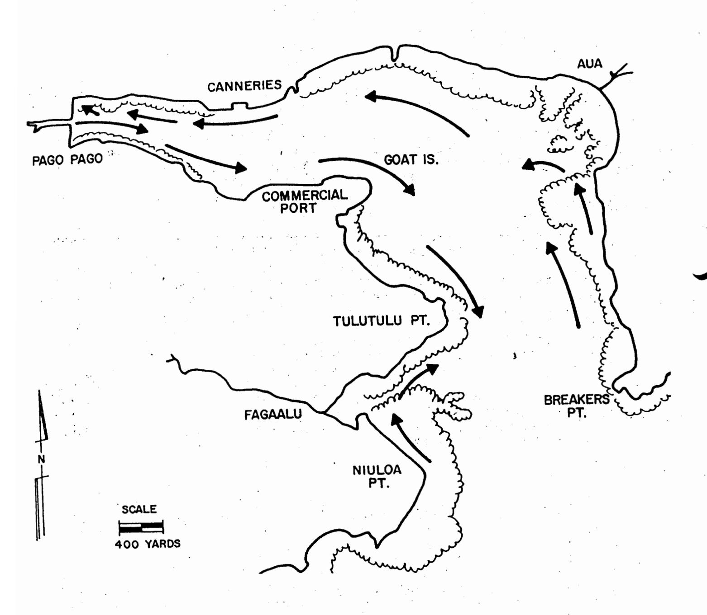

FIGURE 10. GENERALIZED SURFACE CURRENT PATTERNS IN PAGO PAGO HARBOR (65).

 $\underline{mydas}$ ) and the hawksbill turtle (<u>Eretmochelys imbricata</u>), both officially listed as endangered species by the federal government, are recorded in very small numbers within Pago Pago Harbor (15).

#### INNER PAGO PAGO HARBOR

The inner portion of Pago Pago Harbor is the most stressed area of the harbor because of long residence time, limited mixing, and inputs of freshwater, nutrients, and sediments (56). The long, narrow configuration of the harbor and low tidal amplitude (maximum 4.2 feet or 1.3 m) contribute to sluggish circulation and slow flushing at the head of the harbor (11;40). Exchange of water in deeper layers in the harbor with the open ocean may require weeks. Extensive filling of reef flats bordering the harbor has reduced the water surface area, decreasing tidal exchange and increasing residence time of the harbor waters (40).

The waters of the outer harbor, with higher rates of water exchange, are of better quality than those of the inner harbor (39;57) which suffer from varying degrees of stress from land drainage and industrial and domestic sewage discharges (20). Water quality has significantly declined in the inner harbor since 1950 (57). Studies prior to the completion of the Pago sewage collection and treatment system and before construction of wastewater treatment facilities at the tuna canneries indicate that the most seriously degraded portion of the inner harbor is along the north shore between Pago Pago Park and Trading Point, an area contaminated by tuna cannery wastes, tuna boat bilge water, cesspool seepage, and stream runoff (28;50). and subtidal surfaces are covered by silt, green algae, and scums of oil and grease. The usual intertidal organisms are generally absent or in poor condition. Assorted refuse including chunks of concrete, old machinery, tires, bottles, cans, rags, and other solid waste litter the shoreline at Anua and Atu'u (50). in the vicinity of the tuna canneries are sometimes discolored and turbid (28). Wind-blown trash, oil, and other floating debris normally accumulate against the north shore from Pago Pago Park to Atu'u. Refuse such as cans, bottles, rubbish, etc. is conspicuous alongshore between Atu'u and Aua, less so between Aua and Tafananani (5). The worst conditions are found in an area of extremely poor circulation near Pago Pago Park in the northwest corner of the inner harbor. The ebbing tide removes a layer of oil and floating rubbish, exposing a lifeless bottom of black mud. Total and fecal coliform counts in access of 100,000 MPN/100 ml have been recorded in shallow waters off Pago Pago Park, as well as along the north shore from Satala to Atu'u (50). Dissolved oxygen levels are depressed in surface waters off Pago Pago Park and the tuna canneries.

Water quality generally improves markedly proceeding seaward from Pago Pago Park. Toward the ocean from the point where the harbor bends southward, water quality is affected locally by domestic sewage outfalls near Ututafa Point and Aua

PAGO PAGO HARBOR

GENERAL

WATER CONDITIONS

( GENERAL WATER QUALITY

SEWAGE SYSTEMS

and cesspool seepage at the mouths of Vailoa and Faga'alu Streams (37).

Seriously degraded reefs of the inner harbor have apparently been subjected to environmental stress for many years and showed relatively little change through the first half of the 1970's (53). The inner harbor continues to exhibit signs of biological degradation, including a marked decrease in coral coverage and diversity, a decrease in fish diversity, periods of dissolved oxygen (DO) concentrations, accumulation sediment and floating refuse, elevated nutrient levels, and The source of floating waste includes grease plankton blooms. and oil from canneries, fuel and oil from boats and ships, as well as various types of refuse dumped into nearby streams and the harbor. Because of the prevailing wind directions, floating material accumulates along the Pago Pago Park shoreline and in on the west shore of the outer harbor (56). The most serious water quality problems in the inner harbor still occur near the tuna canneries, which have discharged partially-treated wastewater since 1974 (64). Surface waters in the inner harbor frequently dark and turbid, and a plume of discolored water can often be observed in the vicinity of the canneries (11). Surface slicks have been noted in the cannery area, but their exact source is uncertain (39).

A sewage collection, treatment and disposal system serving harbor's western perimeter from Faga'alu to Pago Pago has been in operation since 1968 and was extended from Pago Pago to Atu'u in the 1970's (5;13;50). This collection system contributes wastewater to the Utulei treatment plant. After treatment, sewage is discharged beyond the reef into the outer harbor through an outfall off Ututafa Point (5;50). completion of this system, more than 60 sewer outfalls and storm drains emptied into Pago Pago Harbor from Fagatogo, Utulei, Although most of the old sewers serving the Pago (28;57). harbor area are connected to the system, some old sewers remaining from the period of U.S. Navy administration still discharge directly into the harbor, particularly in the Fagatogo Sewers serving Aua formerly went into a (5;13;28).community septic tank before being discharged into the sea (28). Seepage from remaining cesspools and overflow from septic tanks serving portions of Aua village may also reach harbor waters (50). The Utulei sewage treatment plant and collection system reportedly is not performing well (5) and poorly-treated effluent is being discharged into Pago Pago Harbor (39).

Pago Pago Harbor is characterized by stratification of water masses of differing quality and independent water movement, with an upper layer primarily influenced by the wind and a the lower layer driven by the tide. The more turbid surface layer (down to a depth of 10 to 30 feet or 3 to 10 m) is distinctly different from the clearer lower layer, which has a consistently low turbidity at least halfway into the inner harbor (40).

Road construction in upland areas of the Pago Pago drainage

MAUPUTASI CO.

PAGO PAGO HARBOR

GENERAL

WATER CONDITIONS

( SEDIMENTATION

NUTRIENT CONCENTRATIONS

( "RED TIDES"

( COLIFORM LEVELS

basin is considered the single greatest source of erosion and sedimentation problems (39). An early report describes a flood in 1920 which was accompanied by sediment discharge into Pago Pago Harbor, apparently causing widespread damage to coral colonies. Even at this early date, some of the damage was attributed to improper land management and excessive soil erosion A road (Top mile road) built over the mountain pass between Aua and Afono Village (MAP 12) has caused heavy siltation in Pago Pago Harbor (7). Construction of the first section has exposed bare soil to torrential rains. Large quantities of eroded soil have been carried into Pago Pago Harbor by Suaia and Lalolamauta Streams. Much of this sediment has been deposited on the reef fronting Aua Village (39). Dredging activities have been continuous for several years in the inner harbor with attendant high levels of turbidity and siltation (11). Siltation seriously degraded the inner portions of the especially near Pago Pago Park (5). High levels of turbidity and siltation have resulted in the death of corals in the inner harbor (1). A decline in the growth and survival of corals noted in a 1978 revisit of coral growth study sites monitored in 1971-1972 is attributed to sedimentation, sewage discharge, and general pollution of the inner harbor (65).

Elevated nutrient levels are found in the upper water layer of Pago Pago Harbor, particularly in the inner harbor (11;40). Nutrient concentrations are higher in surface waters and in the inner harbor than in waters at greater depth or the outer (56). Total phosphorous levels increase by a factor of two in the surface layer of outer Pago Pago Harbor above open ocean concentrations and by a factor of four in the surface layer of the About three-quarters of the total nutrient input inner harbor. to the harbor is attributable to wastewaters from the canneries. The remaining 25 percent is split between the Utulei outfall and stream discharges. With a ready supply of nutrients, excessive phytoplankton growth in inner and even in outer Pago Pago Harbor indicate that there are occasions (during early morning hours) when dissolved oxygen is reduced to levels too low to support fish life. Although phytoplankton growth is confined largely to the upper layer of water in the inner harbor (40), progressively higher densities of phytoplankton are found moving into the head of the harbor from Goat Island Point. There is a 1,000 to 2,000-fold increase in chlorophyll-a concentrations from the harbor entrance to Pago Pago Park (56). Dissolved oxygen levels are generally low in the bottom layer of water and occasionally show very low values near the mud surface of the inner harbor, even during late afternoon when dissolved oxygen concentrations (40). Blooms of dinoflagellates in the generally highest inner harbor indicate nutrient enrichment. A red tide was observed in the waters off Anua in 1971, coincident with another bloom of dinoflagellates near Pago Pago Park (50). A red tide was reported in Pago Pago Harbor in October 1979 (2).

High coliform and fecal coliform concentrations have been measured in Pago Pago Harbor, with bacterial counts an order of magnitude higher in the inner harbor than elsewhere. Bacterial

TUTUILA

# EASTERN DISTRICT

MAUPUTASI CO.

PAGO PAGO HARBOR

A MARCHA CONTRACTOR

GENERAL

WATER CONDITIONS

( COLIFORM LEVELS

( OIL SPILLS

( WATER CLARITY

PAGO PAGO HARBOR

**GENERAL** 

USE CONSIDERATIONS

\* Margins of inner Pago Pago Harbor designated "Special Area" for development ----Chap. VI.B.1 (21) counts are generally higher along the shoreline and at stream mouths than in the middle harbor, are higher at the surface than in deeper water, and increase during periods of high rainfall (50). Open water samples, even in the inner harbor, have relatively low coliform bacteria concentrations (39). Fecal coliform levels in urban-influenced streams and near their mouths in Pago Pago Harbor are far in excess of bacteriological standards (40). Although both total and fecal coliforms are in high concentrations near stream mouths and in areas of wastewater discharges, they are almost absent from the center of the harbor and in deep water because of a rapid rate of disappearance in seawater (56).

Occasional small oil spills cause fuel slicks near the fuel dock area during transfer operations despite the use of containment booms (11;39;44). Boating activities, including bilge wastes and deck washings from tuna fishing boats, discharges from freighters, and sanitary wastes from the numerous yachts that anchor in Pago Pago Harbor, contribute to localized pollution problems in the Harbor and in Faga'alu Bay (64).

Underwater visibility gradually decreases approaching the inner harbor along the north shore. Off Lepua, horizontal visibility is about 33 feet (10 m). At the reef margin off Aua, in the path of incoming ocean water from the outer harbor, visibility underwater is about 100 feet (30 m) horizontally and about 30 feet (10 m) vertically (11). Water clarity, as measured by Secchi disc, ranges from 2 to 9 feet (0.6 to 2.7 m) in the inner harbor, compared with outer harbor readings of 25 to 50 feet (8 to 15 m) (13).

# DEEP DRAFT HARBOR

Pago Pago Harbor is considered one of the best deep draft harbors in the Pacific. The natural embayment has never required dredging. The right angle bend in the harbor provides the inner basin with excellent protection from open ocean waves and swell. Inter-island transportation is provided between Pago Pago Harbor, Aunu'u and the Manu'a Islands by small boats (64). The main docks for both fishing vessels and government vessels are located at Fagatogo (41). Two tuna canneries are situated at Anua on the northern shoreline of Pago Pago Harbor. Both are equipped with unloading docks. Cans are supplied by a can plant located between the two canneries. Vessel repair and dry dock facilities are provided by the Government of American Samoa Marine Railway Department located west of the Star-Kist cannery (37).

Pago Pago Harbor is the home port of a large ocean-going fleet of commercial fishing ships which supply the tuna canneries (11). Although bait fishery resources are not abundant, there is enough to support one or two small skipjack tuna vessels (65). In addition to large cargo vessels, cruise ships, and inter-island vessels, Pago Pago Harbor is visited by numerous smaller boats and yachts, most of which are undertaking trans-Pacific voyages (64). The principal anchorage for large yachts is the Malaloa fishing pier, where boats may tie up or anchor off. Recreational

TUTUILA

EASTERN DISTRICT

MAUPUTASI CO.

PAGO PAGO HARBOR

GENERAL

USE CONSIDERATIONS

craft also anchor off Utulei and Pago Pago Park. A boat launch ramp is present in the inner harbor (41). From September until March, yachts congregate in the harbor until after the hurricane season has passed. Typically there are over thirty yachts anchored in the inner harbor, with eight to ten more anchored in Faga'alu Bay in outer Pago Pago Harbor. Vaipito Valley funnels strong winds into the inner harbor, causing yachts to drag their anchors on the soft mud bottom. For this reason Faga'alu Bay is considered a more favorable yacht anchorage. However, mooring space in Faga'alu Bay is limited, and the access channel through the fringing reef is shallow and unmarked (64). Utulei is the center of sailing activity for residents. A yacht club at Utulei offers land storage of small sailboats and these are launched from the beach park and the nearby hotel beach. Fautasi (longboat) races are held in Pago Pago Harbor (41).

Except for atule fishing, the majority of subsistence fishing activity in the harbor occurs where shorelines have not been extended onto the fringing reef by filling. The effect of landfilling upon subsistence fishing is indicated by the greatly reduced fishing activity adjacent to the inner bay village areas of Atu'u, Satala, Pago Pago, Autapini, and Malaloa. However, \*fishing is more intensive on reefs of the outer harbor than elsewhere around Tutuila (26). Although mangrove crabs (pa'alemago; Scylla serrata) have been caught in the inner harbor by the National Marine Fisheries Service, crabbing is not a conspicuous activity (65). The turbid waters of inner Pago Pago Harbor are unsuitable for sport diving (64).

/PAGO.TEX/ /AUG-80/

\*\*\*\*\*\*\*\*\*\*\*\*\*\*\*\*\*\*\*\*\*\*\*\*\*\*\*\*\*\*\*\*\*\*\*\*\*\*

PAGO PAGO

MAP 1

PHYSIOGRAPHY

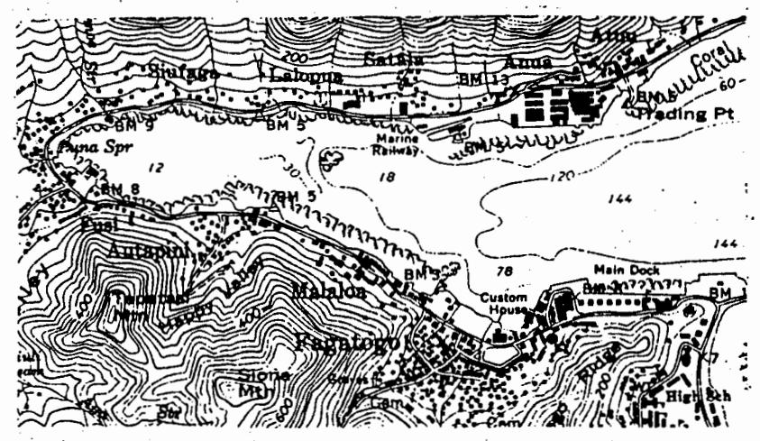

PAGO PAGO

MAP 1

FLORA AND FAUNA

PAGO PAGO

MAP 1

FLORA AND FAUNA

# INNERMOST PAGO PAGO HARBOR

# SHORELINE

The shoreline north of the stream mouth at Pago Pago Park consists of alluvium with basalt cobbles sloping gently up to a 2-to 4-foot (0.6 to 1.2 m) scarp. In places, basalt boulders have been added at the base of the scarp for shoreline protection. Between Pago Pago Park and the marine railway at Satala is steep embankment up to 6 feet (2 m) high at the shore. Basalt boulders lie along the base of this scarp. Erosion is apparent along the eastern end (49).

Southeast of the stream mouth at Pago Pago Park the landfill is protected by seawalls and revetments. A gently sloping foreshore of alluvium -- up to 50 feet (15 m) wide at low tide -- extends from the base of the protective structures. The shoreline between the park and Malaloa is a gently sloping beach of basalt cobbles, limestone rubble, and alluvium. The shore west of the yacht basin at Malaloa is protected by a four-foot (1.2 m) high, rock seawall fronted by a cobble foreshore exposed at low tide. A short reach near the yacht basin is unprotected. A 20-foot (6 m) wide beach of basalt cobble and limestone rubble extends along the shore between the yacht basin and the Marine Fisheries pier at Fagatogo. The backshore is an eroding, 3-foot (1 m) high scarp (49).

In the main dock area east of the Malaloa fishing pier, a revetment slopes from sea level up to 5 feet. A grouted revetment west of the inter-island and main dock facilities is collapsing in places from erosion (49).

## SHORELINE

The usual intertidal invertebrates are scarce or absent altogether along the north shore of Pago Pago Harbor from Pago Pago Park to Atu'u (MAP 2)(50).

# INNER HARBOR REEF

The 1.2 mile (2 km) length of reef fronting the innermost harbor between the canneries (at Anua) and the main docks (at Fagatogo) has been devoid of living coral for many years (11). Early investigations of inner harbor reefs concluded that live corals were destroyed as a result of extensive alteration of natural conditions since 1900 (6). Reef areas located farther into the harbor than Trading Point or Nu'ututai Point are seriously degraded, with very few live coral heads (58). The black anoxic silt bottom near the canneries is nearly devoid of invertebrate life. Few fishes are present. Only six species of fish are recorded, the most abundant of which is a jack (Caranx sp.)(20). One source states that fishes are abundant in the inner harbor but diversity is low (58).

PAGO PAGO/FAGATOGO (MALALOA) MAP 1

FLORA AND FAUNA

PAGO PAGO

MAP 1

USE CONSIDERATIONS

PAGO PAGO/FAGATOGO(MALALOA) MAP 1

USE CONSIDERATIONS

( BOAT RAMP

PAGO PAGO (SATALA)

MAP 1

**PHYSIOGRAPHY** 

PAGO PAGO (SATALA)

MAP 1

USE CONSIDERATIONS

**FAGATOGO** 

MAP 1

PHYSIOGRAPHY

# FRINGING REEF FRONT OFF MALALOA WHARF

The reef front northeast of Malaloa Wharf harbors an abundance of fishes. The assemblage of at least 46 species is dominated by the rabbitfish, <u>Siganus argenteus</u>. Although far less abundant, the snapper, <u>Lutjanus kasmira</u>, is common (76).

# INNER HARBOR

The perimeter of inner Pago Pago Harbor is frequented in the daytime by fishermen seeking anae (adult mullet) and fuafua (juvenile mullet), lupota (small jack), pelupelu (sardine), and, seasonally, i'asina (juvenile goatfish) and atule (big-eye scad) with throw and hand nets (20). The largest proportion of fishing effort is with bamboo poles. Rod and reel fishing and throw-netting receive somewhat less effort and little effort is expended on other fishing methods (76).

#### MALALOA FISHING PIER

A concrete fishing pier at Malaloa serves small commercial vessels. Shoreside facilities in this area include a dry storage area and ramp for small boats (69).

# HARBOR (NORTH) COAST BETWEEN SATALA AND TRADING POINT

## SHORELINE

The shoreline fronting the marine railway is protected by a rock revetment, 2- to 3-feet (up to 1 m) high. A scarp is eroded above the rocks. The canneries are constructed on landfill, which is presently being extended toward the marine railway (49).

# INNER HARBOR

The waters fronting the village areas of Satala, Anua, and Atu'u along the northern margin of inner Pago Pago Harbor are fished in the daytime by rod and reel and/or handline. Malauli (large jack), lupota (small jack), and palagi (yellowfin surgeonfish) are caught in the waters fronting the marine railway and tuna canneries. Atule (big-eye scad) and ga or kavakava (little tuna) are taken here seasonally (20).

HARBOR (SOUTH) COAST BETWEEN FAGATOGO AND NU'UTUTAI POINT

# SHORELINE

The shoreline between the main docks (at Fagatogo) and Nu'ututai Point consists mostly of eroding revetments of concrete sandbags and boulders. A section of limestone rubble and scattered basalt boulder beach is present (49).

FAGATOGO

MAP 1

PHYSIOGRAPHY

FAGATOGO

MAP 1

FLORA AND FAUNA

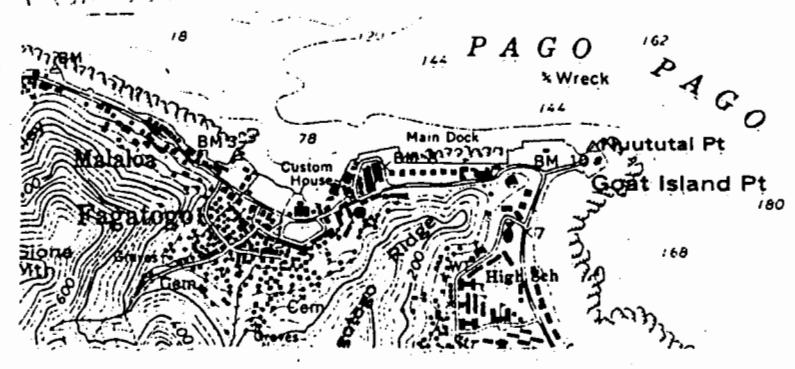

FAGATOGO

MAP 1

USE CONSIDERATIONS

( BOAT RAMP

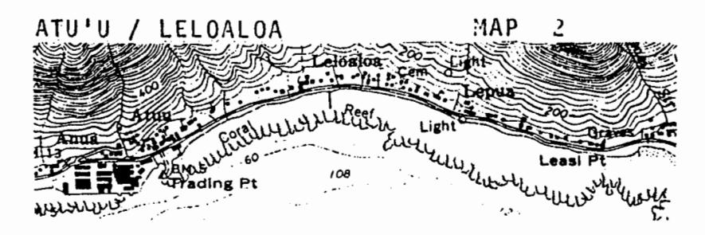

PHYSIOGRAPHY

# FRINGING REEF

The reef fringing the south shore of inner Pago Pago Harbor between the wharf area and Rainmaker Hotel was partially dredged in 1969. The bottom is mostly a sand slope with scattered outcrops of reef rock extending 165 feet (50 m) offshore into deep water (11). The reef extends around Nu'ututai Point (49).

## FRINGING REEF

A few coral colonies (<u>Porites</u> aff. <u>lobata</u> and several other species) have established themselves on outcroppings of limestone in the dredged area between the main docks and the Rainmaker Hotel on Goat Island Point (11).

Although fishes are not particularly abundant in the dredged area, the shallow-water fauna off Fagatogo includes at least 28 species of fishes. The damselfish, <u>Glyphidodontops biocellatus</u>, is most abundant, followed by the jack, <u>Selar crumenophthalmus</u> (20). The reef front harbors an abundance of fish. <u>Ctenochaetus striatus</u> and <u>Meiacanthus ditrema</u> are the most abundant of at least 66 species (76).

# WHARF AREA

The American Samoa Government, Office of Marine Resources maintains a narrow boat ramp and moorings for scientific vessels at Fagatogo. Fish-aggregating buoys are deployed from this facility (41).

The wharf area between Fagatogo and Utulei (MAP 2) is frequented by fishermen using bamboo pole, rod and reel, and handline. Rod and reel fishing and handlining yields day and night catches of malauli (large jack), gatala (honeycomb grouper), lupota (small jack), taiva (one-spot snapper), mataeleele (small emperor fish), and, in season, atule (big-eye scad). Day catches include palani (yellowfin surgeonfish) and, seasonally, ga or kavakava (little tuna). Night catches include malau (squirrelfish) and, in season, pa'umalo (filefish). Pole and line fishing results in day and night catches of lupo (juvenile jack), lupota, gatala, and malau. Day catches include fuafua (juvenile mullet), and night catches include mataeleele, taiva, matapula (bigeye snapper), and, seasonally, atule (20). Other fishing methods receive little effort (76).

HARBOR (NORTH) COAST BETWEEN TRADING POINT AND LEASI POINT

#### SHORELINE

The shoreline between Trading Point and Leasi Point is mostly a basalt boulder revetment from 4 to 15 feet (2 to 5 m) high. East of the canneries at Atu'u there is a foreshore of sand, cobbles and boulders fronting the revetment. A grouted boulder revetment fronting the village of Leloaloa is collapsing

ATU'U / LELOALOA

MAP

PHYSIOGRAPHY

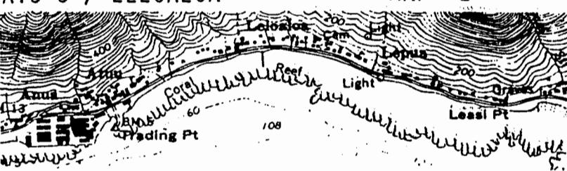

ATU'U / LELOALOA

MAP :

FLORA AND FAUNA

in places. A man-made groin extends 300 feet (100 m) seaward across the reef flat at Leloaloa. The sides of the groin have been eroded into a 2- to 3-foot (up to 1 m) high scarp. Between Lepua and Leasi Point, narrow (10- to 30-foot; 3 to 9 m) beaches of basalt cobbles, boulders, and patches of calcareous sand are present in places beside the steep road embankment (49;ASCRI-2S1).

# FRINGING REEF (OFF LELOALOA)

The fringing reef is some 300 feet (100 m) wide off Trading Point, and increases in width to 600 feet (200 m) off Leasi Point (49). A layer of silty-sand, rubble, and boulders covers the inner reef flat off Leloaloa. Numerous basalt boulders are exposed at low tide on the inner reef west of a man-made groin (ASCRI-2B5). Farther seaward, the reef flat is a mix of rubble and smaller proportions of massive boulders and sandy-gravel (ASCRI-2B6). The reef margin exhibits a poorly developed algal ridge, with reduced spur and groove structures. The reef front drops abruptly to a silty bottom 15 to 20 feet (5 to 6 m) deep (ASCRI-2B7).

# FRINGING REEF

Coral cover is generally impoverished along a two-mile (3.2 km) length of reef centering off Lepua. Pocillopora brevicornis is the most prominent of sparse coral growth inshore west of Lepua and is associated with <u>Porites lutea</u>, <u>Pavona frondifera</u>, <u>Leptastrea purpurea</u>, and <u>Montipora</u> sp. No <u>Acropora</u> or branched Porites are evident west of Lepua. A similar distribution of corals but in even lower abundances is found off Leloaloa (11). Live coral heads cover less than 1% of the inner reef fronting Leloaloa. A mauve-colored sponge is common on sand- and algal-covered rubble. Sea cucumbers (loli or sea; Holothuria atra <u>Stichopus chloronotus</u>) are relatively common on (ASCRI-2B5). Very little coral is growing on the middle and outer reef flat. Only 7 species are recorded from Leloaloa reef and all are relatively small colonies occuring in low abundance. Encrusting coralline algae cover much of the reef rock and rubble surfaces. Patches of Amphiroa sp. are common. A few sand patches are embedded with chaetopterid worm tubes and small colonies (ASCRI-2B6). Live stony corals are not evident at the reef margin, but considerable soft coral occurs along the edge (ASCRI-2B7). Occasional large heads of <u>Porites</u> aff. <u>lutea</u> are visible seaward of the reef edge. In the areas adjacent to the tuna canneries, no recently dead or live coral is present, except inshore at a depth of 10 inches (25 cm), where <u>Leptastrea</u> purpurea and small heads of Porites lutea are seen (11).

Fishes are not abundant nor is the fauna diverse on the reef flat fronting Leloaloa Village because of the lack of bottom cover and the heavy sedimentation. At least 19 species are present in low numbers. Juveniles are most conspicuous, but feeding scars on corals indicate adult surgeonfish and parrotfish are present in the area. Most abundant are the damselfishes,

UTUTER EASTERN DISTR

ATU'U / LELOALOA

MAP 2

WATER CONDITIONS

ATU'U / LELOALOA

MAP 2

USE CONSIDERATIONS

ATU'U / LELOALOA

MAP 2

USE CONSIDERATIONS

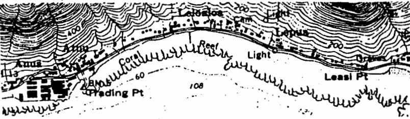

MAP

**PHYSIOGRAPHY** 

# Glyphidodontops glaucus and G. leucopomus (ASCRI-2F1).

At least 56 species of fish inhabit the reef flat off Lepua Point. Abundance is low. Glyphidodontops leucopomus is most common, followed in abundance by <u>Stegastes albofaciatus</u>. The fish fauna is highly diverse but fishes are only moderately abundant on the reef front between Lepua Village and Leasi Point. <u>Pomacentrus melanopterus</u> is most abundant of at least 92 species. <u>Ctenochaetus striatus</u> is second most abundant (76).

#### INNER HARBOR OFF LELOALOA

Underwater visibility is poor (about 15 feet or 5 m) on the inner reef flat off Leloaloa Village. Areas of turbid water are evident offshore (ASCRI). (See: PAGO PAGO/GENERAL/WATER CONDITIONS/INNER HARBOR)

#### SHORELINE

The shoreline from Atu'u to Lepua villages is generally accessible. Care is required in crossing the steep road embankment fronting Leloaloa to reach the reef flat (ASCRI).

# FRINGING REEF OFF LELOALOA AND LEPUA

The reef flat in front of the village of Leloaloa and off Lepua is frequently fished. Fishing also occurs in deeper waters beyond the reef margin. Throw-netting (kili) is the most active fishery, followed in popularity by spearing and rod and reel The largest proportion of fishing effort at Leloaloa Village is given to reef gleaning, followed by day spearing according to one source. Bamboo poles are used as much as rod and reel in pole fishing. Other fisheries are less active (76). Throw-netting is primarily a daytime activity which results in catches of anae (adult mullet), fuafua (juvenile mullet), lupota (small jack), pelupelu (sardine), and, seasonally, i'asina (juvenile goatfish) and atule (big-eye scad). Spearing brings in day and night catches of alogo (lined surgeonfish), pone (chocolate surgeonfish), lupota, anae, fe'e (octopus), and eel. catches include malauli (large jack) and laea (large parrotfish). Night catches include manini (convict tang), fuafua, and papata (slipper lobster) (20).

Throw-netting occurs off the man-made groin at Leloaloa. O'io (bonefish), are caught by gill netting on the inner reef fronting Lepua. Faisua (giant clam) were reportedly once abundant on Leloaloa reef. The reef fronting Lepua is said to be one of the better shell collecting areas in American Samoa (ASCRI).

HARBOR (WEST) COAST BETWEEN GOAT ISLAND POINT AND TULUTULU POINT GOAT ISLAND POINT

Goat Island was a 40-foot (12 m) high seastack about 300 feet

UTULEI

**PHYSIOGRAPHY** 

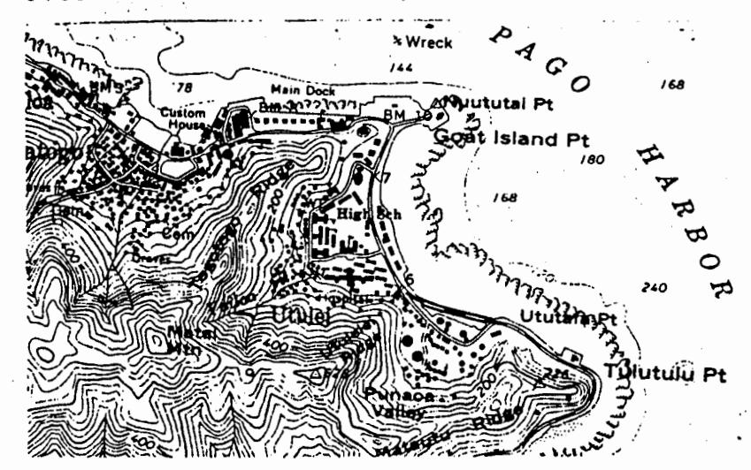

UTULEI

**PHYSIOGRAPHY** 

( BORROW PIT

(90 m) offshore of the point where Pago Pago Harbor makes a right angle bend toward the west (6). The shoreline has been extended to the former seastack by filling. The Rainmaker Hotel is situated on fill encompassing the former Goat Island (41).

#### COVE AND SHORELINE

A deep cove at Utulei represents the drowned portion of a branch stream valley opening into the much larger valley constituting Pago Pago Harbor. A former drainage course provides a channel (ava) through the reef (6).

The shoreline fronting The Rainmaker Hotel is protected by boulder revetments, with the exception of a 200-foot (60 m) length of man-made beach along the southern portion of the hotel grounds (49). A short public swimming beach at Utulei is bounded at its northern end by a revetment and at its southern end by an eroding seawall. The calcareous sand beach is 20 to 30 feet (6 to 9 m) wide at low tide. The beach slopes gently to a channel of silty-sand dredged parallel to shore in the inner reef flat (49;ASCRI-2B1).

A 20-foot (6 m) wide beach of calcareous sand and rubble slopes to a backshore elevation of 4-5 feet at the southeastern end of Utulei. Near Ututafa Point, the shoreline is characterized by a scarp eroded from the high water line to the road elevation of 8 to 12 feet (3 to 4 m). Fronting this scarp is a 10- to 20-foot wide basalt boulder beach. The scarp is protected along most of its length by boulders or riprap. An exception is a section of recent fill at Ututafa Point where bare earth is exposed. A rock seawall extends from sea level up to the 7-foot elevation in the reach between Ututafa Point and Tulutulu Point (49).

# FRINGING REEF

The fringing reef is 300 feet (90 m) wide off The Rainmaker Hotel beach and 450 feet (140 m) wide off Ututafa Point (49). The inner reef offshore of the Rainmaker beach has been dredged to provide a sandy area for swimming (34). Revetments along the shore merge with shallow areas of rubble and boulders (ASCRI-2B3). The bottom off the beach at Utulei is silty-sand rubble and boulders offshore (ASCRI-2B1). merging with depression has been dredged to a depth of 15 feet (5 m) in the reef fronting Utulei Village (34). The margin of the reef southeast of The Rainmaker Hotel appears to be eroding, with sedimentation more evident than in 1971-72 (44). The shallow reef margin is elevated and irregular. A portion of the reef margin off the Hotel has been dredged to provide a sand-bottom access passage 1 to 3 feet (0.3 to 1.0 m) deep across the reef (ASCRI-2B3). The sharply-defined reef margin is characterized by rocky overhangs dropping abruptly down the reef slope to the harbor bottom (34). The reef slope is quite steep, with areas of silty-sand, sand and rubble, and limestone outcrops (ASCRI-2B4). At a depth of 30 feet (9 m), the bottom is characterized by

UTULEI

FLORA AND FAUNA

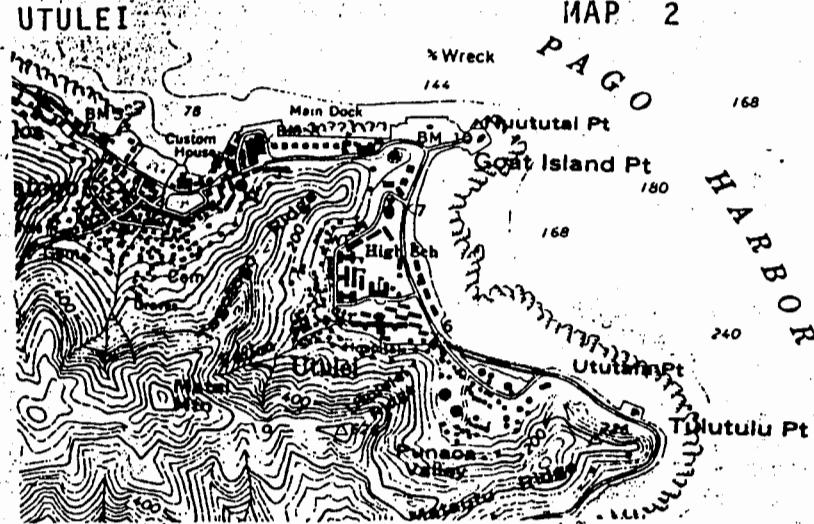

FLORA AND FAUNA

rubble, sand, concrete debris, discarded tires, and steel cables (5).

# FRINGING REEF (OFF THE RAINMAKER HOTEL)

Corals are sparse on the inner reef and dredged swimming area, and coral cover totals 5% or less on the outer reef flat and reef margin. Some Acropora humilis, Porites lutea, and encrusting Montipora sp. are present. Soft corals are conspicuous at the reef margin, increasing in abundance southward along the margin toward Utulei (34). Concentrations of small starfish (Linckia laevigata), have been reported on the reef flat offshore of the Hotel (3). Shallow areas of rubble and boulders on either side of The Rainmaker Hotel Beach shelter numerous juvenile fishes (mostly butterflyfish, surgeonfish, and rabbitfish)(ASCRI-2B3).

Colonies of a sea anemone (matamalu; <u>Rhodactis</u> sp.), as well as other anemones and anemone fish, are conspicuous on the reef front off The Rainmaker Hotel at depths between 10 and 25 feet (3 to 8 m). Coral cover ranges from 20% to 40%. Both stony and soft corals colonize the reef front at depths of 25 to 90 feet (8 to 28 m). Major stony corals occuring here include <u>Pachyseris speciosa</u>, <u>Echinophyllia aspera</u>, <u>Porites</u> (<u>Synaraea</u>) <u>horizontalata</u>, and <u>Diploastrea heliopora</u>. A number of butterflyfishes are conspicuous along the upper reef slopes, their abundance declining with depth (ASCRI-2B4).

Fishes are not abundant on the reef flat off Goat Island Point. Glyphidodontops leucopomus dominates an assemblage of at least 55 species. The fish fauna is much more diverse, although fishes are not more abundant, on the reef front off Goat Island Point. Most common are Glyphidodontops cyanea, Pomacentrus melanopterus, and Meiacanthus ditrema (76).

# FRINGING REEF (OFF UTULEI BEACH)

The green alga, <u>Halimeda</u> cf. <u>discoidea</u>, is conspicuous on the sandy, inner reef flat off Utulei Beach. The sea urchin, <u>Mespilia globulus</u>, is quite common on the rubble and boulder bottom farther seaward. <u>Ralfsia sp.</u> and a turf of brown algae are abundant on many rocks. Soft corals are common at the reef margin (ASCRI-2B1). The outer reef flat is encrusted by pink <u>Porolithon</u> algae and corals (<u>Acropora</u> and <u>Pocillopora</u>) are present. Corals are relatively diverse at the reef margin. Damselfishes, butterflyfishes, wrasses, filefishes, mullet, and surgeonfishes are common (44).

Porites cf. <u>lutea</u> is a dominant coral on the upper portion of the reef slope off Utulei Beach. At depths between 4 and 40 feet (1 to 12 m), the silted slopes are populated by soft corals, upright sponges, and a reddish cyanophyte (blue-green alga). A sea urchin (<u>Diadema</u> sp.) inhabits crevices in the limestone (ASCRI-2B2).

TULEI DERROTTERE COLL ..... MAP

FLORA AND FAUNA

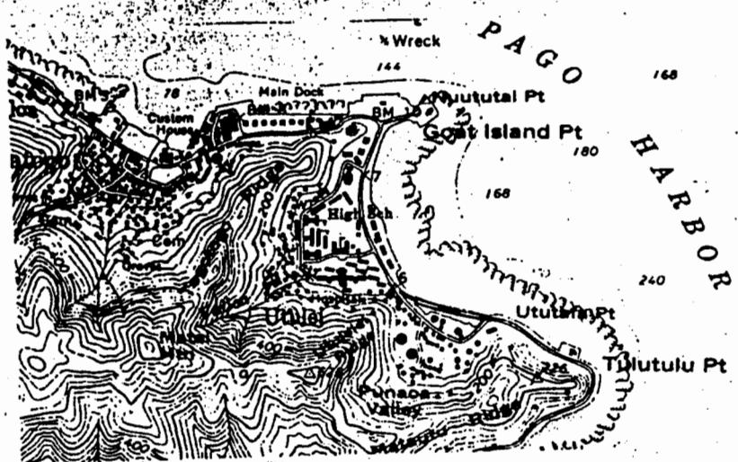

UTULEI

MAP 2

WATER CONDITIONS

# FRINGING REEF (NEAR UTUTAFA POINT)

High densities of soft corals and sea cucumbers (Polyplectana sp. and Holothuria sp.) occur on the reef off the southeastern end of Utulei Village and Ututafa Point (5;34). A few coral heads (Porites andrewsi and Pocillopora sp.) inhabit the reef flat here. Near the reef margin are large plates of dead Acropora humilis. Montipora sp. is abundant along the reef margin and several large banks of Diploastrea heliopora are present (34). When surveyed in 1973, this reef harbored numerous alcyonarians, large heads of Porites, some large heads of Favites rotumana, and smaller numbers of Acropora (11).

A 1978 revisit of a survey site on Utulei reef revealed a decline in coral abundance since an earlier survey (1971/72) when middle to outer reef areas were dominated by branching Porites sp. and Acropora sp. These corals have declined significantly: A. formosa is now nearly absent, whereas Porites andrewsi, although greatly reduced in abundance from the early 1970's, remains the most common coral. Several Fungia spp., abundant in 1971/72, are now absent. Diploastrea and other brain corals remain common. Fish abundance and diversity are reduced compared to 1971/72 (44).

A diverse fish fauna of at least 68 species inhabits the reef flat off southeastern Utulei. Ctenochaetus striatus and Stegastes albofasciatus are the most abundant fishes. Scarus sp., Stegastes nigricans, and Halichoeres hoeveni are common. The reef front shelters a highly diverse assemblage of fish numbering at least 93 species. However fishes are less abundant than on the reef flat. Ctenochaetus striatus and Amblyglyphidodon leucogaster are most common, followed in abundance by Pomacentrus melanopterus and P. vaiuli (76).

#### MIDDLE HARBOR - WEST SIDE

Nearshore waters off Utulei Beach and Hotel beach are well protected from waves (ASCRI). Like other coves indenting the margin of Pago Pago Harbor, Utulei is well protected from open ocean swell. However, high surf can cause rip currents which flow seaward through the ava (6). Offshore waters southeast of Utulei toward Tulutulu (Blunts) Point can be rough (34). Outer reef flat areas from Tulutulu Point to the harbor mouth are exposed to high surf (6).

Dredging off Utulei has damaged the reef and resulted in a large basin with inadequate circulation, contributing to siltation and murky water in the area particularly accessible to tourists (7). Oil slicks emanating from the Standard Oil dock at Nu'ututai Point are also a deterrent to swimming and snorkeling (44). Off the southeastern end of Utulei near Ututafa Point, underwater visibility is 10 to 15 feet (3 to 5 m), improving to 20 to 30 feet (6 to 9 m) on the outer reef (10). Waters are turbid and considerable trash litters the bottom (11). Visibility is generally poorer now than in 1971-1972 (44). Cans and other

275

UTULEI

MAP 2

USE CONSIDERATIONS

\* Rainmaker Hotel Beach and Utulei Beach possible "Special Area" of substantial recreational value --- Chap. VI.C.2 (21)

( \* Goat Island Point reef possible "Special Area" of substantial recreational value - Chap. VI.C.2 (21)

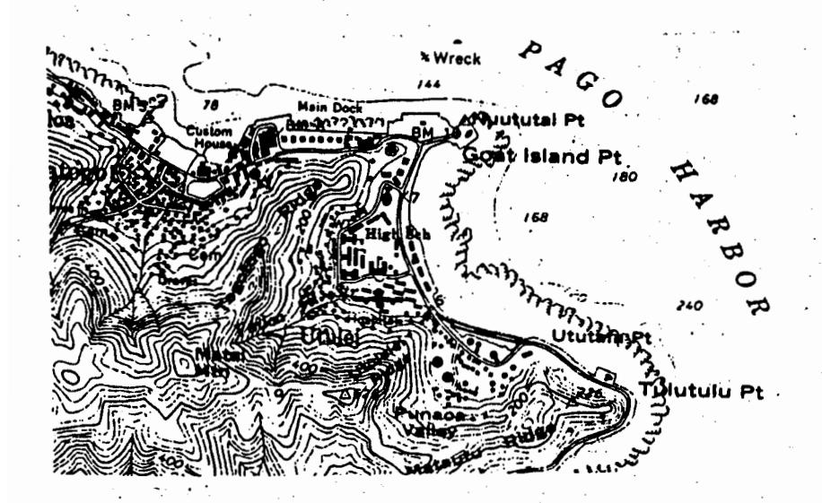

trash are present on sand of the inner reef flat off The Rainmaker Hotel as well. The shallow water adjoining revetments on either side of the hotel beach are relatively turbid. Turbidity during rainy weather reduces visibility in the surface layer. Currents and runoff wash trash offshore (ASCRI; 34).

# UTULEI BEACH PARK AND HOTEL BEACH

A man-made beach reserved for use of notel guests is located at The Rainmaker Hotel. The private hotel beach and a public beach park nearby provide sandy areas for swimming and sunbathing (64). Utulei is one of the few public beaches suitable for swimming, so it is heavily used (49). Rafts are anchored inshore for swimmers. Utulei is the only officially-designated beach park in American Samoa (41). A shallow passage dredged through the reef off the hotel is suitable for swimming and provides swimmers with access to the reef front. Elsewhere, the elevated and irregular reef margin can be reached only by walking over the reef flat. The reef fronting the northern end of Utulei Beach Park also has been dredged and provides a good swimming area (ASCRI).

The reef off Utulei is one of the most popular areas sport diving by non-Samoans (76). The waters around Goat Island Point (offshore of The Rainmaker Hotel) are used by tourists for snorkeling and underwater exploration (39). Some spearfishing occurs around Goat Island Point, with surgeonfishes comprising the majority of the catch (13). SCUBA divers gain access to the reef front from Utulei Beach Park and hotel beach, but diving is frequently limited by turbid conditions and poor visibility during wet weather (ASCRI). Reef areas off the hotel and Utulei Beach Park are under consideration by the Office of Marine Resources as a tourist-oriented underwater observation park (39;41;44). Small waves off The Rainmaker Hotel are surfed by novices during high tide (51). Sailing occurs off the hotel beach and small craft anchor off Utulei Beach Park. The private Pago Pago Yacht Club behind the southwestern end of Utulei Beach Park is the center of resident sailing activity in American Samoa (41).

The reef fronting Utulei Village is considered a "critical reef area" because of subsistence fishing by villagers (39). The reef flat southeast of Utulei Beach around Tulutulu Point (Blunts Point) is the most frequently fished area. Diving with home-made spears (mata), seine netting (upega), and drive-netting (lau) are rated as the most popular activities by one source (20), whereas bamboo rod fishing, day gleaning, and spearing receive nearly equal fishing effort according to another source Rod and reel fishing and throw-netting are slightly less popular (20;76). Seine netting, night spearing and gleaning are practiced less (76). Day spearing results in catches of alogo (lined surgeonfish), pone (chocolate surgeonfish), and fe'e (octopus). Night spearing generally brings in anae (adult mullet), crab, ula (spiny lobster), and lupota (small jack). Rod and reel fishing in front of the Standard Oil Co. fuel loading zapamanyar projection de la companya de la companya de la companya de la companya de la companya de la companya de la companya de la companya de la companya de la companya de la companya de la companya de la companya de la companya de la companya de la companya de la companya de la companya de la companya de la companya de la companya de la companya de la companya de la companya de la companya de la companya de la companya de la companya de la companya de la companya de la companya de la companya de la companya de la companya de la companya de la companya de la companya de la companya de la companya de la companya de la companya de la companya de la companya de la companya de la companya de la companya de la companya de la companya de la companya de la companya de la companya de la companya de la companya de la companya de la companya de la companya de la companya de la companya de la companya de la companya de la companya de la companya de la companya de la companya de la companya de la companya de la companya de la companya de la companya de la companya de la companya de la companya de la companya de la companya de la companya de la companya de la companya de la companya de la companya de la companya de la companya de la companya de la companya de la companya de la companya de la companya de la companya de la companya de la companya de la companya de la companya de la companya de la companya de la companya de la companya de la companya de la companya de la companya de la companya de la companya de la companya de la companya de la companya de la companya de la companya de la companya de la companya de la companya de la companya de la companya de la companya de la companya de la companya de la companya de la companya de la companya de la companya de la companya de la companya de la companya de la companya de la companya de la companya de la companya de la companya de la companya de la companya de la companya de la companya de la companya de la companya de la companya de la companya de la companya de la companya

MAP 2

PHYSIOGRAPHY

ΔΙΙΔ

AUA

MAP 2

**PHYSIOGRAPHY** 

AUA

MAP 2

PHYSIOGRAPHY

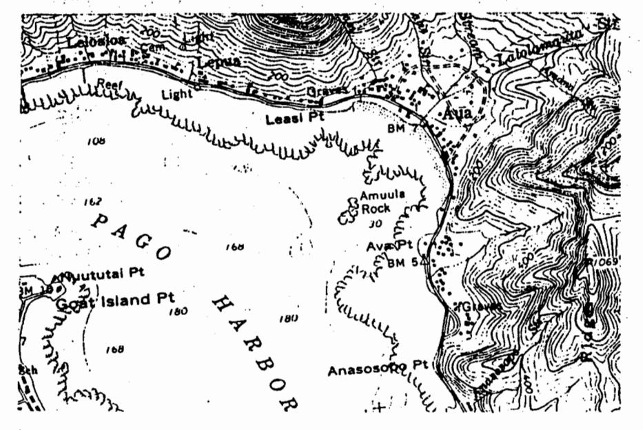

dock yields daytime catches of malauli (large jack), lupota, and palagi (yellowfin surgeonfish), and nighttime catches of malauli and lupota (20).

# HARBOR (EAST) COAST BETWEEN LEASI POINT AND AVA POINT

# SHORELINE

Fronting Aua Village is a revetment of small basalt boulders which rises 2 to 8 feet (0.6 to 2.5 m) above the shoreline. The exposed bank at the top of the revetment is eroding. Near Leasi Point are remnants of a former sand beach (26;49). High tide completely covers sand in front of the revetment (26).

#### **AUA ESTUARY**

Waters from Lalolamauta, Suaia, and Matagimalie Streams, flow into Pago Pago Harbor through Aua Estuary. The estuary is 3 feet (1 m) deep. Its water is usually murky and large silt loads are carried into the harbor by storm runoff (5).

# FRINGING REEF FLAT

A small cove indents the shoreline off Aua Village. fringing reef varies in width from 500 to 800 feet (150 to 245 m)(49). A well-defined channel (ava) cuts through the fringing reef off the mouth of Lalolamauta Stream. Here, the reef flat narrows to about 300 feet (90 m) (13). Northwest of Lalolamauta Stream mouth, most of the inner reef area is covered by extensive flats which are relatively free of silt. limestone outcrops are interspersed (ASCRI-2B8). In general, the inner and mid-reef areas off Aua consist of sand and/or rubble Some limestone and basalt rocks are exposed on the extensive sand flats, which are a mixture of calcareous and terrigenous sediment up to 2.6 feet (0.8 m) deep. Limestone rubble flats on the middle reef are a mixture of rubble, calcareous sand, and occasional limestone blocks at depths of 1 to 5 feet (0.3 to 1.4 m)(6). South of Lalolamauta Stream mouth, the base of the road revetment rests on an inner reef flat of silty-sand (predominantly of volcanic origin) interspersed with volcanic cobble and small boulders (ASCRI-2S2).

The inner sand flats southeast of the stream mouth, are covered by a layer of mud 3 to 6 inches (7.6 to 15.2 cm) deep over dark fine sand. Depth at high tide is 3 to 4 feet (1.0 to 1.2 m)(ASCRI-2B9). The middle to outer reef is about 4 feet (1.2 m) deep, with a bottom of consolidated limestone and considerable silty-sand (ASCRI-2B10). The outer reef flat off Aua is a low relief platform of consolidated limestone at depths of 0.5 to 2.5 feet (0.2 m to 0.8 m) (26). A rubble and limestone pavement is cemented by encrusting coralline algae (ASCRI-2B11).

Northwest of Lalolamauta Stream mouth, most of the inner reef area is covered by extensive sand flats which are relatively

3111116 341301313

AUA

MAP 2

PHYSIOGRAPHY

AUA

MAP 2

FLORA AND FAUNA

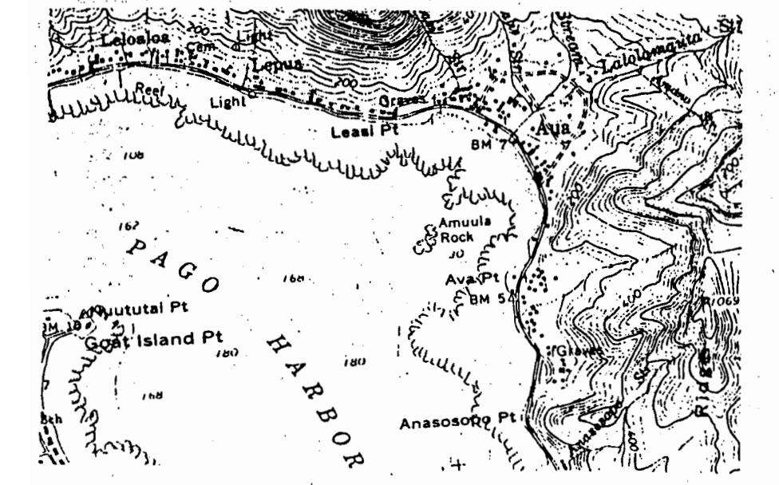

free of silt. Rubble and limestone outcrops are interspersed (ASCRI-2B8).

# FRINGING REEF FRONT

The front of the reef off Aua decends steeply from the margin to depths of 80 to 90 feet (24 to 27 m). The slope varies from 30 to 90 degrees. The upper face of the reef in places overhangs the slope by as much as 5 feet (2 m)(13). A narrow shelf at depths of 3 to 16 feet (1 to 5 m) occurs in places along the reef front (26). The reef margin is broken by several avas, sheer-sided channels from 3 to 16 feet (1 to 5 m) deep. Avas are the primary areas of outflow for water pushed onto the reef by waves breaking on the margin and for fresh water disharged onto the reef by streams. Bottom relief is about 5 to 6 feet (1.5 to 2.0 m) on the upper slope (to -10 feet or -3 m) of the reef front. Seaward, to a depth of 20 feet (6 m), occur massive broken limestone outcrops and mounds of dead Porites deeply undercut with caves and tunnels. Vertical relief is considerable, with mounds rising to within 2 feet (0.6 m) of the surface (ASCRI-285).

# FRINGING REEF FLAT

The inner reef northwest of Lalolamatua Stream mouth, is populated by numerous sea cucumbers (<u>Stichopus chloronotus</u>). The cowrie, <u>Cypraea annulus</u>, is common. Coralline algae encrust hard surfaces. Soft corals are present in relatively low abundance (ASCRI-2B8). Corals are sparse in inshore areas of the reef flat. Southeast of the stream mouth, a silt-covered green alga (<u>Halimeda</u> sp.) is present on submerged boulders (ASCRI-2B9;26).

Two types of soft corals (<u>Sarcophyton</u> and <u>Sinularia</u>) are quite common on limestone outcrops of the middle and outer reef flat (ASCRI-2B10;26). Cover by encrusting coralline algae is high. Stony corals are sparse on the middle reef except for some small staghorn <u>Acropora</u> (ASCRI-2B10). Cover of 5% on limestone rubble flats is reported from the mid-reef zone. A sea urchin (<u>Echinometra mathaei</u>) occurs in relatively high densities; others (<u>Diadema</u> and <u>Echinothrix</u> spp.) are present in low densities (26).

On the outer reef flat, corals are limited to depressions sides of limestone outcrops and cover is highly variable, ranging up to 20% (ASCRI-2B11). Earlier surveys conducted off Aua generally report higher coral cover (about 35%) consisting of contigua, Pavona spp., Porites spp., and Pocillopora <u>Psammocora</u> Algal cover by encrusting, nodular, and branching spp. (26). coralline species is high. A sea urchin (Echinometra mathaei) is common in crevices near the reef margin (ASCRI-2B11;26). Soft corals are common at the reef margin, but stony corals do not exceed 5% cover. Porites (Synaraea) sp. is the most common stony Coralline algae account for high bottom cover (ASCRIcoral. A 1974 study reports about 35% coral cover on the reef margin off Aua, with an abundance of wave-resistant corals, especially Acropora humilis. The mollusc, Turbo spp., occurs

AUA

FLORA AND FAUNA

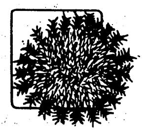

AUA

WATER CONDITIONS

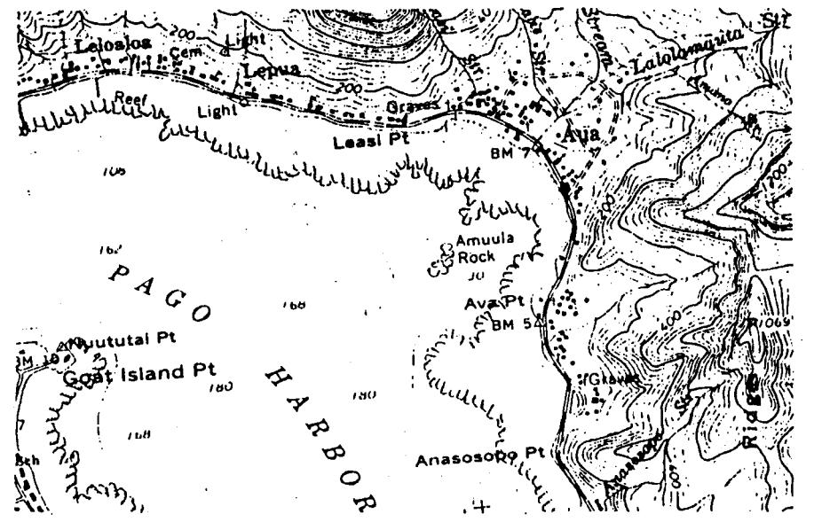

low densities (26).

Fishes are not particularly abundant on the reef flat fronting Aua Village, although at least 31 species are present. Dominant species include the butterflyfish, Chaetodon citrinellus, the surgeonfishes, Acanthurus triostegus and A. nigrofuscus, the damselfishes, Stegastes albofasciatus, Glyphidodontops cyanea and G. leucopomus, and the wrasse, Thalassoma hardwickei. Although not as abundant, the butterflyfishes, Chaetodon ulictensis, C. reticulatus, and C. trifasciatus, are conspicuous near the reef margin (ASCRI-2F2).

# FRINGING REEF FRONT

The reef front off the center of Aua Village has little coral cover, except for some low growing staghorn Acropora. At least 16 stony coral species in 13 genera are represented on Aua -- the majority scattered in relatively low abundance on the reef Soft coral colonies are conspicuous but not more abundant than on the reef flat (ASCRI-2B13). Although infestation by Acanthaster planci (alamea) was reported in one study (45). reef slopes off Aua Village were free of the starfish when surveyed in January and February 1978 (74). A single Acanthaster was observed preying on coral in October 1979 (ASCRI-2B13). earlier study of Aua reef reports numerous, assorted corals on a sloping reef sill seaward of the reef margin and on a patch reef offshore (26). Older residents of Tutuila remember an episode of reef infestation by alamea (Acanthaster planci) at Aua some 50 years ago (34).

# REEF AREAS OFF AUA

The reef flat off Aua is well protected from Turbid waters and heavy sedimentation characterize the reef flat fronting Aua Village, with only slight improvement toward the reef margin (ASCRI). Aua reef receives runoff from one of the largest streams on Tutuila (Lalolamauta). sand flats occur off Aua Estuary which are frequently swept by silt-laden stream discharges. The sloping reef sill seaward of margin is another area of high turbidity reef waters off the center of Aua Village are so murky that Nearshore or underwater visibility is reduced to 2 feet (0.6 m) Turbid waters on the middle reef limit visibility to about 6 feet Visibility improves to 20 feet (6 m) on the outer reef flats and reaches about 30 feet (9 m) over the reef margin and Aua Stream discharges considerable mud which tends to be carried southward contributing to a silted inshore bottom and turbid inshore waters. Road construction in the valley above appears to be contributing to increased sediment discharge. Inshore areas to the northwest of Aua Stream mouth are from the influence of stream and sediment discharges. The sand bottom is relatively free of silt and nearshore waters are reasonably clear (ASCRI).

USEE CONST DERATIONS

), ( \* BU :'

AMU ULA ROCK

MAP

PHYSIOGRAPHY.

# FRINGING REEF

The reef flat between Leasi Point and Ava Point is considered "critical use reef area" because of subsistence fishing by villagers (39). The Aua reef is well protected from large surf, allowing line and net fishermen, divers, and fishermen using paopaos (canoes) to frequent the reef margin and front more often than they do in open bays and off the coast elsewhere on Tutuila. A dredged lagoon south of Ava Point is fished from shore by line. Extensive sand flats bordering Lalolamauta Stream mouth are for throw-netting. productive areas The submerged reef sill lying between the fringing reef and offshore patch reefs is an area of heavy paopao activity, from which handlining takes place (26). A longboat house and a concrete launching ramp are situated at Leasi Point (49). Shells are collected, primarily by non-Samoans, on the Aua reef flat.

The entire reef flat southward from Leasi Point to Breakers Point, in front of the villages of Aua, Anasosopo, and Tafananai, is fished regularly. Fishing also occurs in deeper water off the reef margin. Throw-netting (kili) and reef gleaning are the activities. Pole and line fishing is the second most fishing method, followed in popularity by spearing popular and reel fishing, and seine netting (upega) (20). (mata), rod Day gleaning receives the greatest proportion of fishing effort at Aua Village. Night gleaning and bamboo pole fishing receive high levels of effort, although less than day gleaning. spearing is less frequent. Throw-netting and rod and reel fishing follow in level of fishing effort. Fishing effort in other fisheries (night spearing, seine netting) is light (76). gleaning yields fe'e (octopus), eel, tuitui and sava'e (sea urchins). Throw-netting is a daytime activity resulting in catches of anae (adult mullet), fuafua (juvenile mullet), lupota jack), pelupelu (sardine), and, in season, i'asina (juvenile goatfish) and atule (big-eye scad). Pole and line fishing (day and night) brings in catches of gatala (honeycomb grouper), filoa and mataeleele (emperor fish), and lupota. catches include savane (blue-lined snapper), lupo (juvenile jack), and ula'oa (bar-tailed goatfish). Night catches include (bigeye snapper), malau (squirrelfish), malai (paddlematapula tail snapper), and, seasonally, atule. Alogo (lined surgeonfish), pone (chocolate surgeonfish), and laea (large parrotfish) are taken day and night by spearing. Fe'e (octopus), eel, malauli (large jack), lupota, and mutu are caught by day, whereas manini (convict tang), anae, and ula (spiny lobster) are caught by night (20).

# AMU'ULA ROCK

Seaward of the Aua fringing reef is a patch reef known as Amu'ula Rock. This feature consists of a limestone pedestal rising steeply from depths of 30 to 60 feet (9 to 18 m) to within 3 to 6 feet (1 to 2 m) of the surface (13;26). Amu'ula Rock is considerably undercut and tunneled with numerous deep caves

TUXUILA

\_ EASTERN DISTRICT

MAUPUTASI CO.

AMU UĽA ROCK

MAP 2

FLORA AND FAUNA

AUA

MAP 2

**PHYSIOGRAPHY** 

AIL

MAP 2

PHYSIOGRAPHY

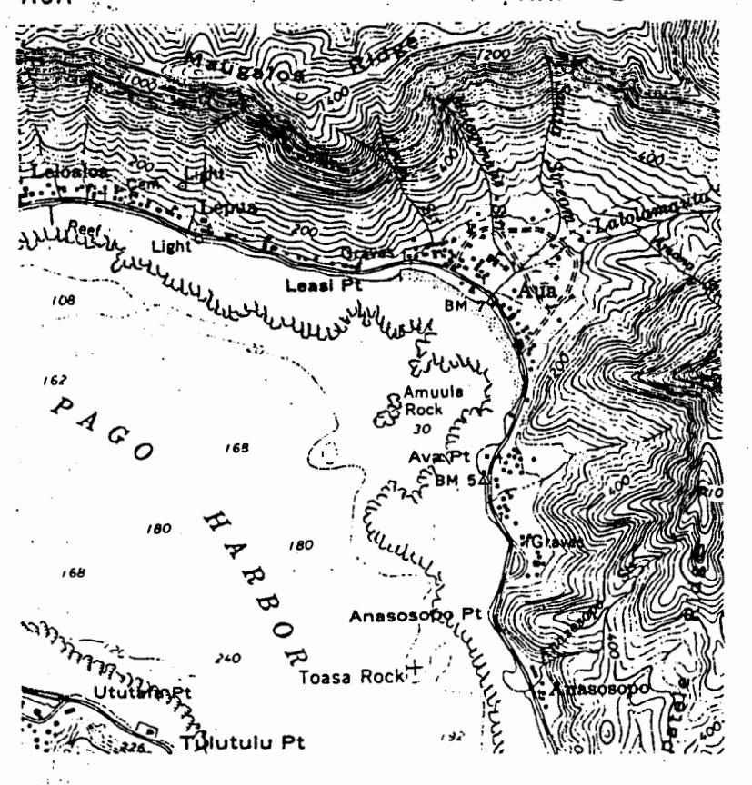

( BORROW PITS

around almost its entire perimeter. Only the northwestern corner maintains a relatively well-formed slope (13).

# ON AMU'ULA ROCK

Corals are well developed along the northwest face of Amu'ula Rock, with an abundance of Millepora sp., Pavona sp., Fungia sp., and Acropora spp. Coral growth is generally restricted to upper slopes elsewhere around Amu'ula Rock. At least 35 species are recorded here. The fish fauna off Amu'ula Rock is similar to that of the Ava Point reef front but fishes are far less abundant (13).

# HARBOR (EAST) COAST AVA POINT TO ANASOSOPO POINT

#### SHORELINE

Although "Ava Point" appears on most recent maps of Pago Pago Harbor, the older name for this area is Aua Point (200).

A 10- to 20-foot (3 to 6 m) wide beach of basalt cobbles and limestone rubble is backed by basalt boulders dumped to protect the backshore from erosion. However, the boulders have slumped to the base of a bare scarp exposed to wave attack (49).

#### FRINGING REEF

Immediately north of Ava Point the nearshore region is composed of large limestone boulders (up to 6.5 feet or 2 m across) projecting above a sand bottom with moderate relief. Depth ranges from 0.5 to 3 feet (0.2 m to 1.0 m) (26). At Ava Point, the reef extends approximately 1,400 feet (425 m) offshore. The reef flat is widest south and west of the point, where wave action is strongest and no large streams enter the harbor. Reef flat depth varies from one to 4 feet (0.3 to 1.2 m). Inshore areas are characterized by rubble (13;26;34) and small boulders (up to 3 feet or 1 m across) grading seaward into larger boulders and grooved solid limestone (13). The reef is nearly bissected by a sand channel 6 to 30 feet (2 to 9 m) wide which merges with a sand and rubble flat bordered by reef ledges south of Ava Point. Seaward of the large sand patch is considerable coral rubble. The outermost 165 to 195 feet (50 to 60 m) of the reef flat contains increasing numbers of boulders and old coral heads (13). About 600 feet (180 m) south of Ava Point, a nearshore borrow pit forms a lagoon inside the inner reef (11). This depression, with a maximum depth of 18 feet (5.5 m), was dredged to obtain roadbed fill material (13). The borrow pit apparently traps sand moving to the north (49). The sheer sides borrow pit drop to a bottom of calcareous sand and mud with scattered outcrops of reef rock (11).

South of Ava Point the outer reef is exposed to considerable wave force. The reef is mostly a consolidated limestone platform 1 to 3 feet (0.3 to 1.0 m) deep (26). On the leeward

AUA MAP 2

Labolio Co Light Community Community Community Community Community Community Community Community Community Community Community Community Community Community Community Community Community Community Community Community Community Community Community Community Community Community Community Community Community Community Community Community Community Community Community Community Community Community Community Community Community Community Community Community Community Community Community Community Community Community Community Community Community Community Community Community Community Community Community Community Community Community Community Community Community Community Community Community Community Community Community Community Community Community Community Community Community Community Community Community Community Community Community Community Community Community Community Community Community Community Community Community Community Community Community Community Community Community Community Community Community Community Community Community Community Community Community Community Community Community Community Community Community Community Community Community Community Community Community Community Community Community Community Community Community Community Community Community Community Community Community Community Community Community Community Community Community Community Community Community Community Community Community Community Community Community Community Community Community Community Community Community Community Community Community Community Community Community Community Community Community Community Community Community Community Community Community Community Community Community Community Community Community Community Community Community Community Community Community Community Community Community Community Community Community Community Community Community Community Community Community Community Community Community Community Community Community Community Community Community Community Communit

FLORA AND FAUNA

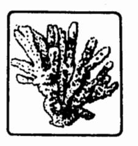

side of the point, the outer reef consists of a semi-consolidated or consolidated limestone pavement at somewhat shallower depths (from 0 to 1.5 feet or 0.5 m deep). Calcareous sand collects in crevices and limestone blocks are strewn on the surface (26).

The reef margin is a poorly developed algal ridge of moderate relief (26;ASCRI-2B12). Water depth at high tide is about 2 feet (0.6 m) (ASCRI-2B12) but varies in depth from one to 3 feet (0.3 to 1.0 m) and is awash at low tide (13). Near the algal ridge, the reef margin is furrowed by numerous crevices and shallow pools (11). Vertical relief increases from less than one foot on the outer reef flat to 10 to 12 feet (3 to 4 m) along the reef front (13).

Talus slopes of limestone rubble accumulate at the base of the reef face. The leeward (north) reef face off Ava Point slopes more gradually than the windward (south) face and is subject to siltation. Rubble is mixed with fine sand and silt here. Sediments at the base of the windward reef face are generally coarser, consisting of medium to fine sand, and a large proportion of rubble (13).

## FRINGING REEF

Corals are found within 35 feet (10 m) of shore in a boulder field just north of Ava Point (13). Here, coral cover is about 40% on limestone boulders projecting above sand. Porites andrewsi is most common, with P. lutea (13;26), Leptastrea purpurea, and Psammocora contigua occurring in lower numbers (13).

Coral cover averages 4% on the reef flat off the seaward (north) side of Ava Point and 13% on the leeward (south) side. The best coral development occurs on the outer leeward reef, where massive Porites heads form microatolls 10 to 13 feet (3 to 4 m) across and extensive patches of Acropora (including  $\underline{A}$ . <u>humilis</u>, and <u>A</u>. <u>formosa</u>) and <u>Millepora</u> sp. are common. Thickets of Acropora (mostly A. formosa and A. humilis) cover about 80% of the bottom in the outer 98 feet (30 m) of the leeward reef flat. Coral cover remains high (about 50%) farther inshore along the leeward reef flat, but dominance shifts from Porites lutea and Acropora spp. to P. andrewsi and Psammocora contigua. Eighteen 26 species recorded off Ava Point occur only at or near the reef margin, and 13 of those occur only on the outer one-third of the leeward reef flat. Most common are  $\underline{P}$ .  $\underline{lutea}$ ,  $\underline{P}$ . <u>andrewsi, Acropora formosa, Pocillopora damicornis, Psammocora</u> contigua, and <u>Pavona frondifera</u>. At least 30 species of fish inhabit the reef flat off Ava Point. Thirty-six of the species recorded at the reef margin are not found at the reef margin. Acropora thickets in high relief areas of the outermost leeward reef flat harbor the most abundant and diverse fish fauna. Fishes are considerably less abundant on the inner reef flat. The outermost reef flat is dominated by juvenile rabbitfish, (Siganus spinus). The damselfish, Abudefduf biocellatus, and the surgeonfish, <u>Acanthurus</u> <u>nigrofuscus</u>, are most abundant toward shore. The damselfishes, <u>Dascyllus aruanus</u> and <u>Chromis caeruleus</u>,

FLORA AND FAUNA

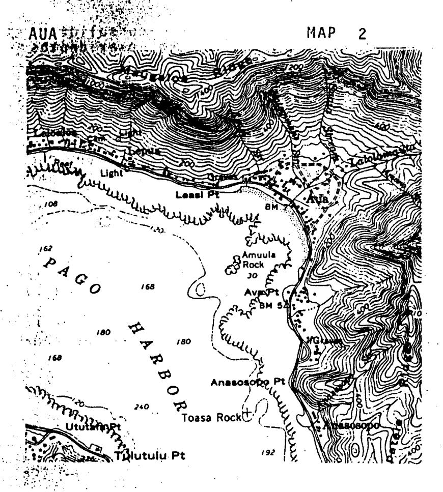

are locally abundant. Schools of the snapper, <u>Gnathodentex aureolineatus</u>, are also present (13).

Heads of <u>Porites lutea</u> and <u>Acropora</u> are attached to outcroppings of reef rock in a 130-foot (40 m) wide "lagoon" dredged south of Ava Point (11). Another survey of this dredged area records branching <u>Acropora</u> sp. and <u>Pocillopora</u> spp. as conspicuous at the seaward entrance, with <u>Porites</u> sp. common throughout (26).

Major alterations to the coral assemblage near Ava Point evident after a 1973 resurvey of 1917 reef transects. The total number of living coral colonies is 28% less than in 1917, relative abundance of major species was altered. Although Acropora continues to be a common coral, the number of Psammocora colonies has been reduced by two-thirds. In the reef flat mid-zone, colonies of Pocillopora, especially P. damicornis and P. brevicornis, have increased five-fold, occupying a zone once dominated by **Porites**. The number of small coral colonies was although 1917 photographs suggest considerable high in 1973, although 1917 photographs suggest considerable numbers of large colonies. The numerous crevices and shallow pools occuring in the outer reef behind the algal ridge are crowded with small colonies of <u>Acropora</u> sp. The presence of young corals here suggest that the reef is recovering from an earlier catastrophic event (perhaps the torrential rains and high freshwater runoff in December 1969). The numbers of sea cucumbers (Stichopus chloronotus) and starfish (Linckia laevigata) counted in 1973 are roughly triple those reported in 1917. for this difference may be an increase in the organic content of reef flat sediments (11). By late 1978, Acropora formosa was far more abundant on the reef flat at a distance of 300 to 400 feet (90 to 120 m) from shore than in 1973. The coralline alga, Porolithon sp., is found here encrusting rubble surfaces (34).

Corals cover approximately 15% of the consolidated limestone bottom on the outer reef south of Ava Point. Pocillopora damicornis and small heads of Porites lutea are domanant here. Clusters of juvenile Acropora formosa and other staghorn acroporans are common. The echinoderms, Holothuria sp., Diadema sp., and Echinothrix spp., are present in low densities (26). West of Ava Point, coral cover totals about 5% (some Pocillopora spp.) on the semi-consolidated to consolidated limestone bottom. Calcareous and non-calcareous algae comprise most of the bottom cover. Low densities of the sea urchins, Echinothrix and Diadema spp., as well as the molluscs, Turbo spp., occur here (26).

Corals cover an average of 28% along the reef front off Ava Point, with at least 59 species represented. The upper reef face along the leeward (north facing) reef segment is dominated by Diploastraea heliopora, which grows in sheets up to 250 square feet (25 sq. m) in area. This coral was most common above depths of 35 feet (10 m). Millepora sp. and finely-branched Acropora are common from 16 to 50 feet (5 to 15 m) deep, followed by Fungia from 35 to 65 feet (10 to 20 m). The upper slopes of the reef front, 3 to 16 feet (1 to 5 m) deep in the transition area

FLORA AND FAUNA

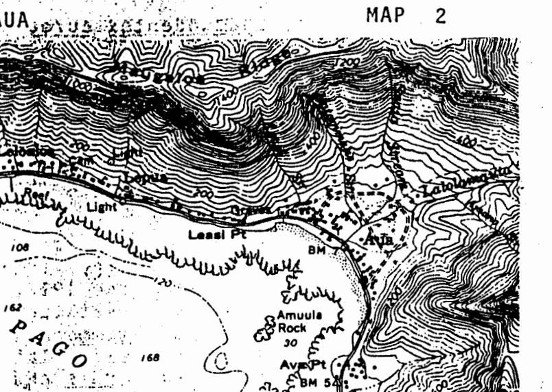

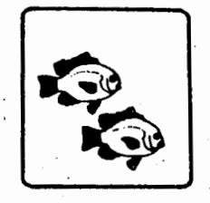

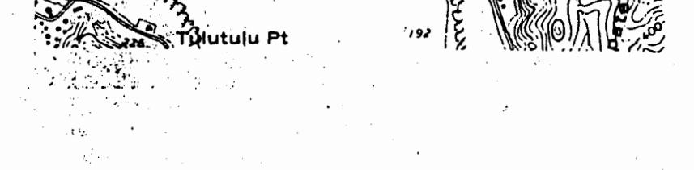

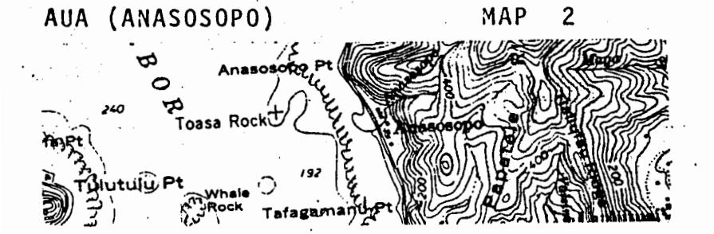

PHYSIOGRAPHY

AUA (ANASOSOPO) IIAP

PHYSIOGRAPHY

between leeward and windward faces harbor a mixture of relatively small heads of Acropora humilis, Pocillopora damicornis, P. cf. eydouxi, and sheets of Millepora spp. At depths from 35 to 65 feet (10 to 20 m), a variety of sheet-like corals (including Montipora spp., Echinophyllia sp., Echinopora lamellosa, Pavona cf. planulata, Pachyseris speciosa, Astreopora sp.) are co-dominant with Fungia spp. and the finely-branched Seriatopora hystrix. Stylaster aurea is present beneath overhangs and in shallow caves along the reef front. Upper slopes of the windward facing reef front are dominated by massive Porites sp., Pocillopora sp., Millepora sp., and large-branching Acropora (mostly A. humilis). The Millepora forms large mats up to 100 square feet (10 sq. m) in area (13).

The fish assemblage along the reef front off Ava Point includes at least 135 species, with the fauna most varied near the surface and along the south side of the point. Fish abundance decreases with depth. Most common are the surgeonfish, Acanthurus nigrofuscus, the blenny, Meiacanthus atrodorsalis, and the damselfishes, Pomacentrus nigromarginatus and Glyphidodontops uniocellatus. Schools of large parrotfishes and surgeonfishes roam the surge channels and feed at the reef margin. Schools of snapper and mackerel also frequent depths of 16 to 65 feet (5 to 20 m) along the reef face (13).

Fishes are moderately diverse and abundant on the reef flat between Ava Point and Anasosopo Point. Ctenochaetus striatus dominates an assemblage of at least 59 species. Glyphidodontops leucopomus, Acanthurus lineatus, and Stegastes albofasciatus are common (76). Both the abundance of fishes and diversity of the fauna are greater on the reef front than on the reef flat. Pomacentrus melanopterus and P. vaiuli dominate an assemblage of at least 83 species. Ctenochaetus striatus and Meiacanthus atrodorsalis are common (76).

HARBOR (EAST) COAST BETWEEN ANASOSOPO POINT AND TAFAGAMANU POINT SHORELINE

South of Anasosopo Point is a steep bank covered by large boulders from the shoreline to the road, which varies in elevation between 10 and 20 feet (3 to 6 m). The shoreline north from Tafagamanu Point has been extended about 300 feet seaward across the reef flat by filling. The landfill is about 7 feet (2.4 m) high, with an irregular shoreline perimeter stabilized by boulders (49). The fill is only partially consolidated and has a large standing pool at its center. The filled area serves as a sanitary landfill but has been proposed as a site for a public park (41).

#### FRINGING REEF

A broad fringing reef extends along the shore from Aua Village to Breakers Point (MAP 3)(13).

AUA: (ANASOSOPO

MAP

FLORA AND FAUNA

AUA (ANASOSOPO)

MAP

WATER CONDITIONS

SANITARY LANDFILL

# OFF TOASA ROCK

The waters around Toasa Rock harbor an abundance of fishes. Pomacentrus melanopterus dominates an assemblage of at least 68 species. Ctenochaetus striatus and Abudefduf sexfasciatus are common (76).

# LANDFILL

An old sanitary landfill on a filled shoreline near Anasosopo has been reopened temporarily, and leachate from this site is probably entering adjacent harbor waters. The reason given for reopening this site has to do with containment of African snails within an infested vegetation zone in the Eastern District of Tutuila (39).

/MAP1.TEX/ - /AUG-80/

FAGA ALU

MAP 3

**PHYSIOGRAPHY** 

FAGA ALU

MAP 3

PHYSIOGRAPHY

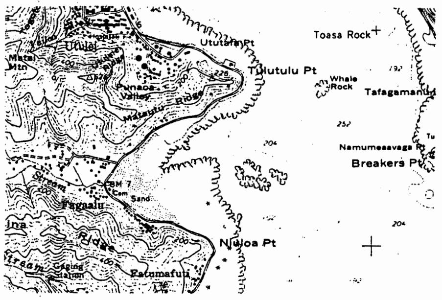

FAGA'ALU

MAP 3

**PHYSIOGRAPHY** 

HARBOR (WEST) COAST BETWEEN TULUTULU POINT AND NIULOA POINT (FAGA'ALU BAY)

# FAGA'ALU STREAM

Faga'alu Valley is the product of erosion by spring-fed Faga'alu Stream, which drains one of the larger watersheds emptying into Pago Pago Harbor (54). The waters of Faga'alu Stream are diverted upstream to supply drinking water for the government water system. The lower reach of this stream has been greatly modified by channel realignment and bank protection structures (6).

# SHORELINE

The northeastern margin of Faga'alu Bay consists of a steep bank between a 10-foot wide foreshore of basalt and limestone rubble and the coastal highway at the 12-foot elevation. bank is stabilized by basalt boulders extending halfway up the base. The shoreline fronting Matafao School is eroding fill lined with basalt boulders and other material. A 3-foot scarp is eroded above the boulders, which have slumped to the base of the West of the school is a 10- to 15-foot (3 to 5 m) wide foreshore of basalt and limestone rubble. A small public park protruding from the northern margin of Faga'alu Bay is protected by a rudimentary seawall, separated from the seawalls near Faga'alu Stream by a narrow strip of calcareous sand and debris. Southeast of the stream mouth, at the head of the bay, there is a narrow beach of silty-sand which slopes gently to sand bottom extending offshore. An extensive fill area presumably developed from material dredged from the reef occurs along the south shore of Faga'alu Bay and is used as a public park. Most of the park shoreline consists of limestone rubble, basalt boulders, and sand, with one section of rock seawall. A 2- to 3-foot scarp is eroded in the backshore along the unprotected reach (48;49). High water extends to the base of a rocky seawall about 6 feet (2 m) high bordering the coastal highway east of the park (49).

#### FRINGING REEF

Faga'alu Bay is a deep cove which receives freshwater flow from one of the larger streams on Tutuila. A large channel bisects the bay, approaching shore off the mouth of Faga'alu Stream (6). Mud flats southeast of the stream mouth have been reclaimed for a park (65).

The reef fringing Faga'alu Bay varies in width from 150 feet at the bay head to 1,400 feet along the flanks (49). The inner reef flat off the southeastern perimeter of Faga'alu Bay averages 1.3 feet (0.4 m) deep at low tide. The bottom is composed primarily of volcanic and limestone boulders, with a few as large as 2 feet (0.6 m) across. A small amount of sand occurs in pockets on the inner reef flat. At distances of 30 to 250

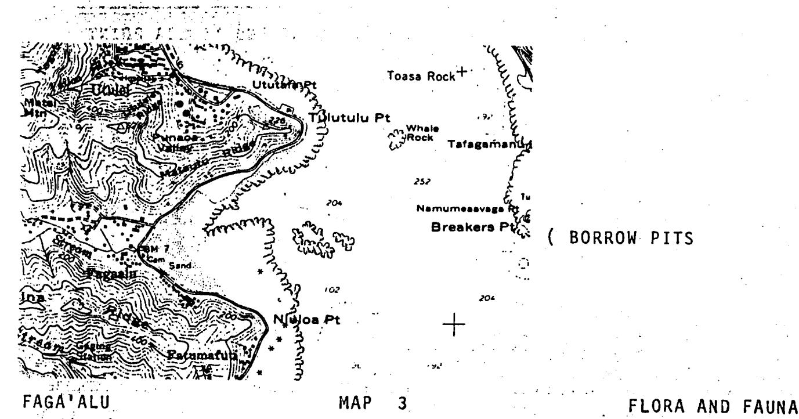

76

feet (25 to 75 m) offshore, the bottom shoals to about one foot (0.3 m). Limestone rubble predominates, with occasional limestone and volcanic boulders present. Between 330 and 410 feet (100 to 125 m) offshore the depth varies from 1.5 to 3 feet (0.5 to 0.8 m). Several large limestone outcrops are nearly exposed at low tide. From 410 to 500 feet (125 to 150 m) the reef flat is mainly limestone rubble with coarse sand and gravel. A lava rock outcrop is exposed on the outer reef (48).

Sand cover on the inner reef flat is greatest toward the head of the bay. Basalt boulders up to 5 feet (1.5 m) across are conspicuous near an extensive fill area along the southern perimeter of the bay. The reef flat off this area has been considerably altered by dredging. Deep, sand-bottom pits dredged for fill material are evident east of the park. Northwest of the park, a sand beach merges with mud flats submerged at high tide. The mud flats extend 165 feet (50 m) seaward to a large channel (ava) which crosses the center of the bay and approaches shore. This channel is around 6 feet (2 m) deep. Along the channel margin are outcrops of rock at a depth of about 3 feet (1 m). Upper rock surfaces are thinly covered by silt (43).

#### FRINGING REEF FLAT

Burrow holes, most formed by fiddler crabs (<u>Uca marionis</u>), are evident over the mud flat which extends from the beach to a large channel crossing the center of Faga'alu Bay. The upper, silt-covered surfaces of rock outcrops along the channel margin are largely devoid of corals and other invertebrates, but support a sparse growth of algae. Very few fishes inhabit the shallow mud flat. Only two species (<u>Arothron immaculatus</u> and <u>Therapon jarbua</u>) are recorded. Dominant fishes at the rock outcrops along the channel margin are the damselfish, <u>Pomacentrus pavo</u>, and the snapper, <u>Lutjanus fulvus</u>. The lionfish (<u>Pterois volitans</u>), is also present here (48).

Small colonies of the corals Porities lutea, Psammocora contigua, and Pocillopora damicornis total about 1% bottom cover on the inner reef flat off the southeastern end of Faga'alu Village. Encrusting coralline algae are apparent throughout the inner reef area. Fishes are not common. Coral cover, mostly as small colonies, increases to 30% between 80 and 250 feet (25 to m) offshore. Dominant species are <u>Psammocora contigua</u>, Pocillopora sp., encrusting Porites, branching P. andrewsi, and <u>Pavona</u> spp. Considerable dead coral is also evident. Rocks are encrusted with coralline algae. A sea star (Linckia laevigata), synaptid sea cucumber (Polyplectana sp), and a sea urchin (Echinometra mathaei) are conspicuous invertebrates occurring in Beyond 250 feet (75 m) from shore, staghorn coral <u>(Acropora formosa)</u> occurs along with clumps of soft coral (<u>Sclerophytum</u>). Between 330 and 410 feet (100 and 125 m) from shore, conspicuous invertebrates include a sea urchin (<u>Diadema</u> sp.), sea cucumbers (Stichopus chloronotus and Holothuria argus), and a brittle star (Ophiarthrum elegans, under rocks). From 419 to 500 feet (125 to 150 m) offshore, coral cover declines from

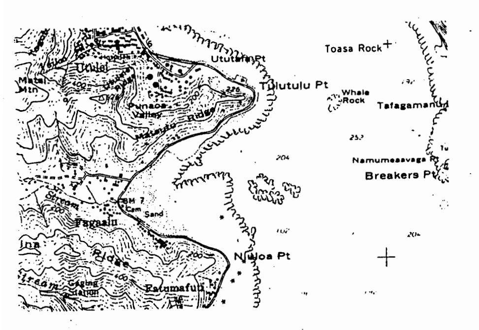

FAGA'ALU

ИАР 3

FLORA AND FAUNA

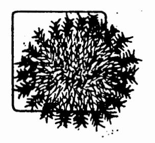

FAGA'ALU

MAP 3

FLORA AND FAUNA

FAGA'ALU

MAP 3

WATER CONDITIONS

( SEWAGE DISCHARGE

10% to less than 5% of the bottom, mostly <u>Porites</u>. The offshore area from 560 to 660 feet (170 to 200 m) contains considerable live coral (about 30% cover), mostly staghorn acroporans (primarily <u>Acropora formosa</u> and <u>A. humilis</u>). Other corals present include <u>Psammocora</u>, <u>Pavona</u>, and <u>Pocillopora</u> (43).

Fishes are progressively more abundant and the fauna diverse moving seaward across the reef flat. Common species include the damselfishes, Plectroglyphidodon leucozona, Pomacentrus vaiuli, Stegastes albofasciatus, Glyphidodontops uniocellatus, leucopomus; the surgeonfishes, Acanthurus triostegus and A. <u>nigrofuscus</u>; the wrasses, <u>Halichoeres</u> <u>trimaculatus</u>, <u>H</u>. natus, H. margaritaceus, Thalassoma hardwickei, and Stethojulis bandanensis; the goatfishes, Mulloidichthys flavolineatus Parupeneus trifasciatus; the butterflyfishes, Chaetodon citrinellunula, C. vagabundus, and Heniochus chrysostomus; the Zanclus cornutus; the moorish idol, puffer, <u>Canthigaster</u> solandri; juveniles of the grouper Epinephelus merra; juvenile rabbitfish, Siganus spinus; parrotfishes (mainly juveniles); and a blenny (probably Salarias). Associated with certain corals are the damselfishes, <u>Dascyllus aruanus</u> and Chromis caerulea. surgeonfish, Acanthurus lineatus, and the triggerfish, Rhinecanthus rectangulus, appear near the reef front (48). Fishes representing at least 44 species occur on the outer reef flat. Most abundant by far is Ctenochaetus striatus. Scarus sordidus, <u>Scarus</u> sp., <u>Stegastes</u> <u>albofasciatus</u>, <u>S. nigricans</u>, <u>Glyphido-dontops leucopomus</u>, and <u>Thalassoma hardwickei</u> are common (76).

#### FRINGING REEF FRONT

Infestation of the crown-of-thorns starfish (alamea; Acanthaster planci) along the reef front off Faga'alu was reported in early 1973 (45) although, in general, infestations in outer Pago Pago Harbor involved smaller numbers of starfish than infestations elsewhere around Tutuila (73). Current abundance or extent of damage to corals is unknown. Older residents remember an episode of reef infestation by the crown-of-thorns starfish at Faga'alu approximately 50 years ago (34).

The reef front shelters an abundant and diverse fish fauna of at least 97 species. <u>Pomacentrus coelestis, Ctenochaetus striatus</u>, and <u>Scarus psitticus</u> are most abundant. <u>Plectroglyphidodon lacrymatus</u> is common (76).

## PATCH REEFS

An abundant and diverse fish fauna occurs around the patch reefs directly east of Faga'alu Bay. <u>Ctenochaetus striatus</u> dominates an assemblage of at least 36 species. <u>Acanthurus nigrofuscus</u> and <u>Stegastes fasciolatus</u> are also abundant (76).

# -FAGA'ALU BAY

Raw sewage enters Faga'alu Bay through a pumping station bypass outfall (50). Untreated sewage, including discharges from

First Charles

FAGA ALU

iAAP 3

USE CONSIDERATIONS

( BEACH PARK

( BOAT RAMP

FAGA'ALU

MAP 3

USE CONSIDERATIONS

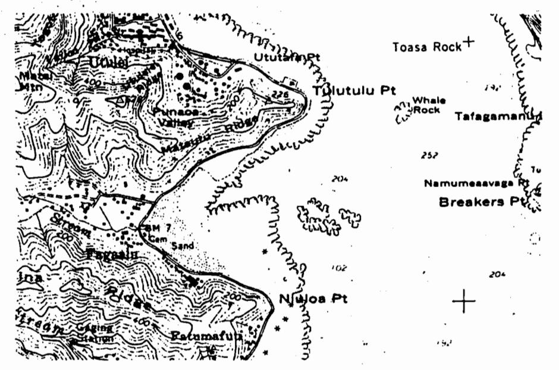

a hospital facility at Faga'alu, are said to overflow into the bay during power failures, which affect the Pago Pago collection system with relative frequency (5; ASCRI).

The water over the reef flat fringing the southeastern margin of Faga'alu Bay is especially clear, with underwater visibility about 100 feet (30 m). In contrast, visibility is greatly reduced on the mud flat at the head of the bay, which experiences large discharges of fresh water and silt during wet weather (6;48). Visibility is about 20 feet (6 m) along the margin of the drop-off to the mid-bay channel (48).

# FAGA'ALU PARK

Faga'alu Park was developed on an extensive fill area over mud flats near the head of Faga'alu Bay. There is no adequate beach here, and little if any swimming takes place off the park. A concrete pad at the shore is used for launching boats (41). The inner bay and northern side of the reef are well protected from waves (6), but longshore currents can be strong (48). The southern side of the reef is exposed to waves (6). Good surfing waves develop during the months between November and April. The best surfing conditions result when southeast swell and an incoming tide combine with northwest winds or calm wind conditions. The shallow reef is a potential hazard (51).

# FAGA'ALU BAY AND REEF

The reef fronting Faga'alu Village is considered a "critiuse reef area" because of subsistence fishing by villagers (39). According to one source, the reef flat is the most frequently fished area (20). However, another informant reports that most fishing is off the reef front. Some fishermen catch young jacks by casting feather lures from shore near the head of the bay (48). Reef gleaning is a preferred activity (20), with more fishing effort during the day than at night (76). Seine netting (upega) follows in popularity, according to one source (20), but rod and reel fishing is next most popular, followed by day spearing and bamboo pole fishing, according to another source (76). Throw-netting and spearing are ranked as less popular fishing methods by one source (20). Less fishing effort is applied to spearing and rod and reel fishing than reef gleaning. Bamboo pole fishing follows spearing and rod and reel fishing in level of activity. Throw-netting and seine netting activities are light (76). Fe'e (octopus), tuitui and sava'e (sea urchins), and eel are the usual daytime catches from gleaning. Night gleaning yields alili (sea snail). Rod and reel fishing, usually practiced in the daytime, brings in malauli (large jack), lupota (small jack), and gatala (honeycomb grouper). Throw-netting is a daytime activity resulting in catches of fuafua mullet), manini (convict tang), alogo (lined surgeonfish), pone (chocolate surgeonfish), and, seasonally, i'asina (juvenile goatfish), and lo (rabbitfish). Rod and reel fishing is the most popular activity on the reef northeast of Faga'alu Village (20).

LAULI'IFOU (TAFANANAI)

Carried States

**PHYSIOGRAPHY** 

LAULI'IFOU (TAFANANAI) MAP. 3

**PHYSIOGRAPHY** 

LAULI'IFOU (TAFANANAI) MAP

FLORA AND FAUNA

Usually a number of sailing yachts wait out the hurricane season at anchor in the channel in Faga'alu Bay. The area also is used as an anchorage by small craft (41;48). Some sport diving by non-Samoans occurs off Faga'alu Village (76).

HARBOR (EAST) COAST BETWEEN TAFAGAMANU POINT AND BREAKERS POINT SHORELINE

South of Tafagamanu Point is a narrow foreshore of basalt boulders, cobbles, limestone rubble, and scattered pockets of calcareous sand. Segments of beachrock are exposed at low tide. A scarp stabilized with basalt rocks rises from the beach to the road at an elevation of 10 feet (3 m). The southern end of the reach (at Tafananai) is eroding (49;ASCRI-3S1). A 200 foot (60 m) length of shoreline at the base of the embankment is beachrock, embedded with volcanic rubble. This exposure varies in width from 6 to 20 feet (2 to 6 m) and dips gently seaward. West of Tafananai, along the headland toward Namumea'avaga Point, the shoreline is calcareous sand and gravel and volcanic talus (gravel and boulders)(ASCRI-3S1).

# FRINGING REEF

A broad fringing reef extends along the coast south of Aua (MAP 2) to Breakers Point (13). Off Tafananai, the reef flat is 600 feet wide (49). The inner reef flat fronting Tafananai varies in depth from one to 3 feet (0.3 to 1.0 m). Rubble, sand, and gravel cover most of the bottom. Basalt boulders occur inshore along the base of the headland which forms Breakers Point (ASCRI-3B1). Limestone rubble predominates at a depth of 2 feet (0.6 m) on the mid-reef. Low (one foot or 0.3 m high) outcrops of limestone also occur (ASCRI-3B2). The outer reef is composed of consolidated limestone at a depth of one foot (0.3 m) and is extensively exposed at low tide (ASCRI-3B3). A channel (ava) crosses the reef at an angle, narrowing toward shore off Tafagamanu Point. The margins of the channel are uneven. Depth varies from one to 8 feet (0.3 to 2.4 m). The bottom is mostly consolidated limestone, but rubble and gravel pockets are evident (ASCRI-3B4).

# FRINGING REFE

Coral cover is less than 5% on the reef flat fronting Tafananai where 11 species representing seven genera are recorded. Virtually all corals occur in the deeper areas along the margins of a channel (ava) which tapers toward shore off the sanitary landfill. An unusual feature here is a large stand of Acropora cf. bruggemanni. Elsewhere, the reef is almost devoid of corals (ASCRI-3B1; B2; B3; B4). A few crown-of-thorns starfish (alamea; Acanthaster planci) are present along channel margins where fresh feeding scars on Acropora demonstrate predation by this coral-eating species (ASCRI-3B4). Algae are conspicuous over all of the reef flat, although cover is low. A yellow-green cyano-

175 20° 20 20 20 20 20 20 20 20 20 20 20 20 20

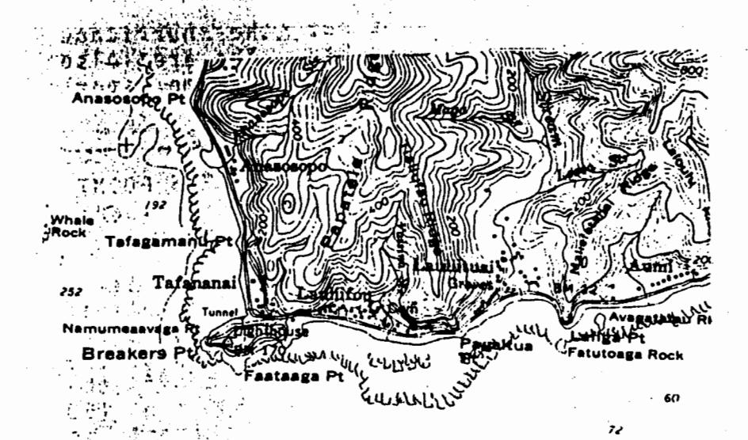

LAULI'IFOU (TAFANANAI) MAP 3

FLORA AND FAUNA

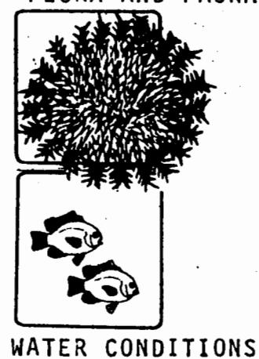

LAULI'IFOU (TAFANANAI) MAP

phyte (blue-green alga) is common on the inner reef encrusting coralline algae. The sea cucumber, Stichopus chloronotus, is conspicuous (ASCRI-3B1). Encrusting coralline and a greenish-brown turf are prominent on the middle to outer (ASCRI-3B2; B3; B4). Dictyosphaeria versluysii relatively abundant on the outer reef flat, where Ralfsia sp. and branching coralline algae are common (ASCRI-3B3). cucumber, Stichopus chloronotus, is abundant over most of the middle reef flat (ASCRI-3; B2; B3). The sea urchin, Diadema sp., occupies crevices in low limestone outcrops on the mid-reef. At night, sea urchins are conspicuous foraging on the reef surface (ASCRI-3B2). The starfish, Linckia cf. guildingi, and the sea urchin, Echinometra mathaei, are common on the outer reef A low turf of greenish-brown algae is common on (ASCRI-3B3). large, consolidated limestone outcrops along the ava margin (ASCRI-3B4).

At least 31 species of fish inhabit the reef flat off Tafananai Village. Dominant are the butterflyfish, Chaetodon reticulatus, the surgeonfish, Acanthurus lineatus, the damselfish, Glyphidodontops leucopomus and Plectroglyphidodon leucozona, and the wrasse, Thalassoma hardwickei. The cardinalfish, Apogon novemfasciatus, is common but not a dominant species. Most individuals, except for the damselfish, are juveniles (ASCRI-3F1).

The ava and reef margins off Tafananai shelter at least 50 fish species. Large numbers of surgeonfish, butterflyfish, damselfish, goatfish, and wrasses predominate. Juvenile and adult parrotfishes are also conspicuous. Large schools of <u>Chaetodon reticulatus</u>, a butterflyfish, occur here. Most abundant species include <u>Chaetodon auriga</u>, <u>C. citrinellus</u>, <u>Acanthurus nigrofuscus</u>, <u>A. triostegus</u>, <u>Ctenochaetus striatus</u>, <u>Glyphidodontops leucopomus</u>, <u>Plectroglyphidodon leucozoma</u>, <u>Thalassoma hardwickei</u>, and <u>Scarus spp.</u> (ASCRI-3F2).

# FRINGING REEF FRONT (OFF BREAKERS POINT)

The reef front was reportedly infested by the crown-of-thorns starfish (alamea;  $\underline{Acanthaster}$  planci) in early 1978 (45). However, the numbers of starfish were less in outer Pago Pago Harbor compared to other areas of infestation at that time (73). Current abundance of  $\underline{Acanthaster}$  and the extent of damage to corals is unknown.

A highly diverse fish fauna (of at least 103 species) inhabits the reef front off Breakers Point. Pomacentrus melano-pterus is most abundant, followed by Plectroglyphidodon dickii, Ctenochaetus striatus, and Plectroglyphidodon lacrymatus (76).

# FRINGING REEF - OUTER HARBOR

Oceanic water sweeping over the reef flat north of Breakers Point at the entrance of Pago Pago Harbor provides clear waters. Underwater visibility is about 50 feet (15 m)(ASCRI).

TUTUILA:

EASTERN DISTRICT

MAUPUTASI CO.

LAULI'IFOU (TAFANANAI)

MAP 3

USE CONSIDERATIONS

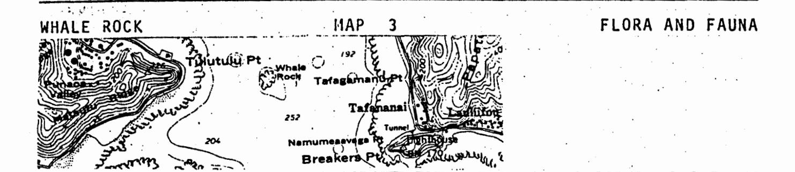

# SHORELINE AND REEF

In several places at Tafananai the height of the road above the shore is only two or three feet (0.6 to 1.0 m), allowing easy access to the water. Beachrock exposures along a 200 foot (61 m) length of shore are coated with algae, making the surface slippery. Metal and glass refuse discarded along the shoreline are additional hazards (ASCRI). Strong currents flow through the ava which crosses the reef.

The reef flat fronting Tafananai is considered a "critical use reef area" because of subsistence fishing by villagers (39). Octopus (fe'e) and edible sea urchins are collected on the reef flat fronting Tafananai Village. Atule (big-eye scad) are caught in season with throw-nets and gill nets. Groupers are caught by pole and line at the reef edge. Ula (spiny lobster) are taken at night along the reef front (ASCRI).

# WHALE ROCK

A diverse fish fauna of moderate abundance inhabits the waters around Whale Rock between Tulutulu Point and Tafananai. Damselfishes dominate an assemblage of at least 102 species. Most common is <u>Pomacentrus melanopterus</u> followed in abundance by <u>Abudefduf sexfasciatus</u>, <u>Plectroglyphidodon dickii</u>, and <u>P. lacrymatus</u> (76).

/MAP3.TEX/ - / AUG-80/

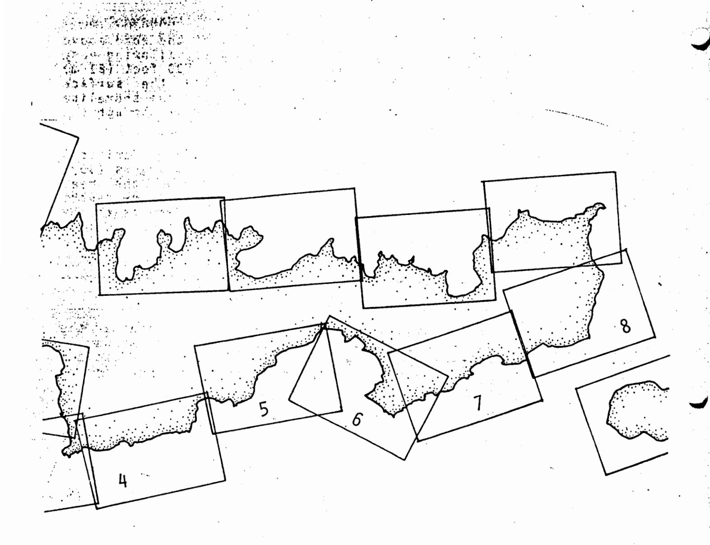

FIGURE 11. ATLAS MAPS COVERING THE SOUTHEAST COAST OF TUTUILA, AMERICAN SAMOA

# THE SOUTHEAST COAST OF TUTUILA

Highway transportation along the southeast coast of Tutuila uses the paved road which extends from Pago Pago Harbor to Tula Village (MAP 9)(64). An unpaved road continues beyond Tula around the northeastern tip of Tutuila. A secondary road of graded soil, covered in places with coral fill, extends from the village of Faga'itua (MAP 6) to Masefau on the north shore (MAP 11). This road is steep and curving and washes out frequently when there is a heavy rain. A similar road extends from the village of Amouli (MAP 7) on the south shore through a pass to Aoa (MAP 10) on the north shore. This route too is subject to washouts during heavy rains (23). Major improvements are planned for both the Aoa and Masefau Roads (39).

LAULI! IFOU

MAP

**PHYSIOGRAPHY** 

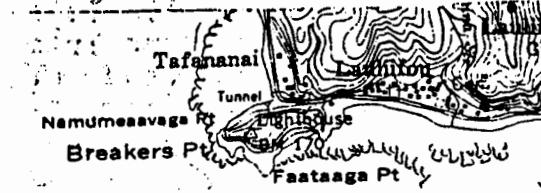

LAULI'IFOU

MAP

Avagataban A Lettigatet galtua Fatutoaga Rock

**PHYSIOGRAPHY** 

LAULI'IFOU

**PHYSIOGRAPHY** 

LAULI'IFOU

PHYSIOGRAPHY

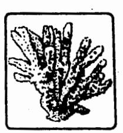

407 541

# COAST BETWEEN BREAKERS POINT AND FAGAITUA POINT

#### BREAKERS POINT

Breakers Point lies off the western end of a steep hill rising 170 feet (52 m) beside the entrance to Pago Pago Harbor. A lighthouse is positioned on top of the hill. Sea cliffs up to 100 feet (30 m) in height occur along the coast east of Breakers Point (26;41).

#### SHORELINE

Lauli'ifou Village is fronted by a narrow beach of calcareous sand, which decreases in width from 60 feet (18 m) at its western end to about 10 feet (3 m) at its eastern end. The beach is backed by a scarp, the base of which is stabilized by scattered boulders. Beachrock is exposed in places along shore. East of the village is a narrow foreshore of basalt boulders and limestone rubble. Earth fill behind the rocks is eroding. At the western end of this section, a peninsula constructed of fill juts 60 feet (18 m) seaward of the old shoreline. A grouted rock seawall 6 feet high protects the shore (49). The beach is submerged at high tide (26).

# FRINGING REEF OFF FA'ATA'AGA POINT

The inner reef flat east of Fa'ata'aga Point is a rugged platform of consolidated limestone broken by sand-bottom channels and depressions. The depth varies from 8 to 31 inches (20 to 80 cm)(26).

# FRINGING REEF FLAT OFF LAULI'IFOU VILLAGE

Calcareous sand covers the inner reef platform off Lauli'ifou. Large amounts of reef rubble and boulders occur on the eastern portion of the reef flat. By filling sections of the inner reef fronting Lauli'ifou an Acropora thicket now occurs directly off an elevated rocky shore. Patches of sand and coral rubble are interspersed with live coral, which covers approximately 50% of the bottom (26).

The middle and outer reef flat fronting Lauli'ifou Beach consists of a low relief platform of semi-consolidated to consolidated limestone, portions of which are exposed at low tide. Depth of the mid-reef varies from -2.0 to +0.7 feet (-0.6 to +0.2 m). The outer reef shoals to depths of -3 to +8 inches (-20 to +20 cm) and is strewn with scattered limestone blocks up to 3 feet (1 m) high. The reef margin exhibits a distinct algal ridge. An ava (channel) with sheer to overhanging walls cuts through the reef off Lauli'ifou. The depth of the ava varies from 3 to 33 feet (1 to 10 m). The ava acts as the main discharge area for water thrown onto the reef flat by waves breaking on the outer edge of the reef (26).

LAULI'IFOU

MAP 4

PHYSIOGRAPHY

LAULI'IFOU

Breakers Pt

MAP 4

FLORA AND FAUNA

LAULI'IFOU

MAP 4

FLORA AND FAUNA

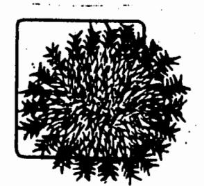

LAULI'IFOU

MAP 4

FLORA AND FAUNA

#### FRINGING REEF FRONT

The reef front slopes moderately to steeply off Lauli'ifou, reaching depths of about 165 feet (50 m) within 165 feet (50 m) seaward of the reef margin. Depths are considerably greater toward Breakers Point. The slopes are characterized by a high relief, spur-and-groove system (26).

# FRINGING REEF FLAT OFF FA'ATA'AGA POINT

Coralline algae cover much of the platform. Assorted corals, including Montipora elschneri, Pocillopora sp., and Acropora spp., total about 25% bottom cover on the inner reef flat (26).

# FRINGING REEF FLAT OFF LAULI'IFOU VILLAGE

Acropora formosa and A. humilis are most common on the inner reef flat. Intact acroporan skeletons covered with filamentous algae account for about 30% cover. The sea urchins, Echinometra mathaei and Diadema sp., occur in low densities (26).

Coralline algae and considerable non-coralline algae cover the middle reef platform. A diverse coral assemblage includes Montipora elschneri, Psammocora contigua, Porites (Synaraea) undulata, Pocillopora spp., and Acropora spp. The outer reef is heavily encrusted by coralline algae, some non-coralline algae, and wave-resistant corals (26).

Juvenile crown-of-thorns starfish (alamea; Acanthaster planci) were observed on the Lauli'ituai reef flat in August 1977. By December 1977, an estimated 70 to 90% of the coral on the reef flat between Breakers Point and Alega (MAP 5) had been destroyed by the starfish (45). A number of the crown-of-thorns starfish were observed in early 1978 on the fringing reef flats between the villages of Lauli'ifou and Aumi (45;74).

Fishes are not particularly abundant on the reef flat off the eastern side of Lauli'ifou Village. At least 44 species are present however, of which <u>Ctenochaetus</u> sp. and <u>Scarus</u> sp. are most abundant. <u>Stegastes</u> <u>albofasciatus</u> is common (76).

# FRINGING REEF FRONT

Although crown-of-thorns starfish (alamea; Acanthaster planci) was reported off Breakers Point in 1978 (45), none was observed on the forereef slopes in January and February 1978 (74). Acanthaster was generally rare on the forereef slopes between Breakers Point and Sinatau Point (MAP 6), except off Alega (MAP 5) and Sinatau Point (74). The starfish was sparse on the upper reef front at depths between 6 and 33 feet (2 and 10 m) off Lauli'ifou in August and September 1979. About 60% of the corals in this area were alive (75).

TUTUILA

EASTERN DISTRICT

SUA CO.

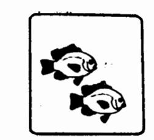

LAULI'IFOU

MAP 4

WATER CONDITIONS

LAULI'IFOU

MAP 4

USE CONSIDERATIONS

Fishes are moderately abundant on the reef front off the eastern end of Lauli'ifou. <u>Pomacentrus melanopterus</u> dominates an assemblage of at least 103 species. <u>Plectroglyphidodon dickii</u> and <u>Ctenochaetus striatus</u> follow in abundance (76).

# FRINGING REEF

Lauli'ifou reef is exposed to severe wave and wind action and is known for the dangerous currents which flow through an ava (channel) which crosses the reef there (26).

FRINGING REEF BETWEEN FA'ATA'AGA POINT AND SILIATALIGALU POINT

The fringing reef east of Breakers Point to Siliataligalu Point (fronting the villages of Lauli'ifou, Lauli'ituai, and Aumi) is considered a "critical use reef area" because of subsistence fishing by villagers (39). The reef flat is the most frequently visited fishing area (20), with most activity occurring on the outer and middle portions of the reef (26). Reef gleaning, seine netting (upega), and diving with home-made spears (mata) are the most popular fishing methods with throw-netting and rod and reel fishing less common methods (20). A second source reports that most fishing effort is given to gleaning (day and night) and daytime spearing (76). A third source considers gleaning and diving the only fishing methods of any consequence at Lauli'ifou (26).

Daytime gleaning yields mainly fe'e (octopus), eel, tuitui and sava'e (sea urchins) (20). Night gleaning on the reef flat accounts for a large proportion of the fishing effort at Lauli'ifou Village (76). Spearing occurs both day and night. Catches of alogo (lined surgeonfish), pone (chocolate surgeonfish), and laea (large parrotfishes) are made both day and night. Daytime catches include fe'e (octopus), eel, malauli (large lupota (small jack), and mutu. Nighttime diving yields manini (convict tang), anae (adult mullet), and ula (spiny lobster). Although less popular, throw-netting (kili) in the daytime brings catches of anae and fuafua (juvenile mullet), manini, pelupelu (sardine), alogo, pone, lupota, and, in season, atule (big-eye scad). Pole and line fishing is sometimes Gatala (honeycomb grouper), filoa (large emperor practiced. fish), lupota, and mataeleele (small emperor fish) are caught both day and night. Day catches also include savane (blue-lined snapper), lupo (juvenile jack), and ulaoa (bar-tailed goatfish). Night catches include matapula (bigeye snapper), malau (squirrelfish), malai (paddletail snapper), and, in season, atule (20).

Good surfing is possible off Lauli'ifou during periods of south swell and a rising tide, especially when tradewinds are light (51).

LAULI'ITUAI

**PHYSIOGRAPHY** 

LAULI'ITUAI

**PHYSIOGRAPHY** 

LAULI'ITUAI

FLORA AND FAUNA

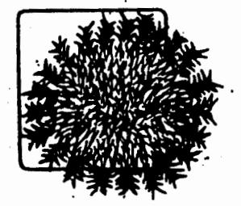

LAULI'ITUAI

USE CONSIDERATIONS

LAULI'ITUAI (AUMI)

PHYSIOGRAPHY

10 THE

# COAST BETWEEN PAGAITUA POINT AND LAFIGA POINT

# SHORELINE

Sections of shoreline between the villages of Lauli'ifou and Lauli'ituai have been extended by filling (ASCRI-4S1). A 25-foot (8 m) wide sand beach borders the western end of Lauli'ituai Village. Beachrock is exposed in places along the shore. A backshore scarp is partly protected with basalt rocks. Unprotected areas are eroding (49). Vaitele Stream flows through a culvert into the head of the small cove fronting Lauli'ituai (ASCRI-4S1). A small sand delta has built up at the mouth of the stream. The steep backshore slope is protected by a revetment, which is eroding in some areas (49). Lafiga Point, east of the village, is about 20 feet (6 m) high (ASCRI-4S1).

# FRINGING REEF

A delta of small volcanic stones and sand is exposed at low tide on the reef flat fronting the mouth of Vaitele Stream. Large basalt boulders are exposed off Lafiga Point and in the vicinity of Fatutoaga Rock, a 30 foot (9 m) high seastack. A channel (ava) crosses the outer reef off Lauli'ituai (ASCRI-4B1).

# FRINGING REEF

In early 1978 the reef flat off Lauli'ituai Village was densely populated by the crown-of-thorns starfish (alamea; Acanthaster planci). Although a few A. planci were observed on the reef face, most corals there were undamaged (45;73;74). However, Acanthaster was sparse on forereef slopes in May 1978, but considerable coral damage was apparent at depths between 65 and 85 feet (20 to 25 m)(74).

# FRINGING REEF

(For fishing uses see: LAULI'IFOU / USE CONSIDERATIONS)

South or easterly swells generate surfable waves off Lauli'ituai. The best surfing conditions require a high or rising tide and calm or northwest wind conditions (51).

# COAST BETWEEN LAFIGA POINT AND SILIATALIGALU POINT

## SHORELINE

The coastline between Lauli'ituai and Aumi is a 30-foot (9 m) high cliff fronted by an apron of talus. A 75-foot (23 m) high seastack known as Avagatatau Rock lies just offshore east of Lafiga Point. A small tombolo connects the seastack to the shore (49). Fronting the village of Aumi there is a 40-foot wide beach of calcareous sand, limestone rubble, basalt cobbles and boul-

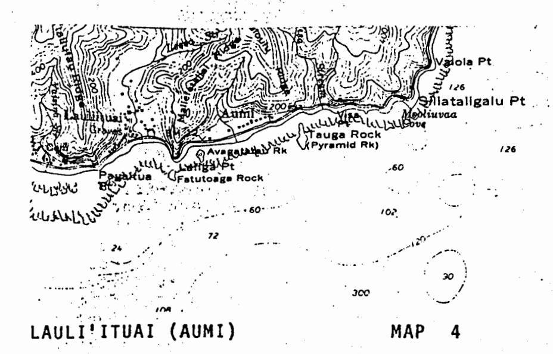

PHYSIOGRAPHY

LAULI'ITUAI (AUMI)

LAULI'ITUAI (AUMI)

MAP

FLORA AND FAUNA

( SEABIRD NESTING AREA

LAULI'ITUAI (AUMI)

MAP 4 USE CONSIDERATIONS

AMAUA (ALEGA)

PHYSIOGRAPHY

ders. A platform of beachrock between 15 and 30 feet (5 to 9 m) wide is exposed at the waterline. The beach is backed by a berm of limestone and volcanic rubble (recently planted in an attempt to stabilize the slope), which merges with revetment fill at elevations of 3 to 5 feet (1 to 1.5 m) beside the coastal highway (49;ASCRI-4S2). The western half of the beach is eroding. Attempts have been made to curb erosion with basalt boulders and rubble-filled oil drums (49).

Sand beaches are absent between Tauga Rock and Siliataligalu Point. The shoreline consists of steep talus slopes rising to a height of 30 feet (9 m) at Visa Point and 40 feet (12 m) near Siliataligalu Point. Some sand accumulates at the base of the talus directly northeast of Siliataligalu Point (ASCRI-4S2).

#### FRINGING REEF

The fringing reef off Aumi is 300 to 350 feet (90 to 105 m) Typical depths over the reef flat are 0.5 to 1.0 foot wide. Between Lafiga Point and Avagatatau Rock is an inner reef flat of mostly sand merging with a mid-reef platform of consolidated limestone. Numerous volcanic boulders are exposed on the inner reef between Avagatatau Rock and Tauga Rock. A tract of volcanic boulders and rubble extends from the northwestern side of Tauga (Pyramid) Rock to shore. Large boulders exposed at low tide extend halfway out to the rock. Just north of Tauga Rock is a small sand flat with scattered coral wheels. flat surrounding Tauga Rock is a low platform of consolidated limestone broken by sand channels on the east (ASCRI-4B2).

# FRINGING REEF

Algae are sparse on inshore rubble on the inner reef between Lafiga Point and Avagatatau Rock. Encrusting corallines and a brown turf-forming alga are most conspicuous. Sea urchins (Diadema sp.) and a xanthid crab (Carpilius maculatus) are present (ASCRI-4B2).

# OFFSHORE SEASTACKS

Fatutoaga Rock, Avagatatau Rock, and Tauga Rock are potential nesting areas for reef heron (matu'u; <u>Egretta sacra sacra</u>), a resident seabird uncommon in American Samoa (15).

# FRINGING REEF

(For fishing uses see: LAULI'IFOU / USE CONSIDERATIONS)

# COAST BETWEEN SILIATALIGALU POINT AND TIFA POINT

# SHORELINE

A sand beach bounded by volcanic headlands occupies the head of a small cove fronting Alega Village. A 35-foot (11 m)

AMAUA (ALEGA)

**PHYSIOGRAPHY** 

AMAUA (ALEGA)

FLORA AND FAUNA

Siliataligalu Pt

AMAUA (ALEGA)

USE CONSIDERATIONS

AMAUA (AVAIO)

MAP

PHYSIOGRAPHY

AMAUA (AVAIO)

MAP 5

FLORA AND FAUNA

( SEABIRD NESTING AREA

AMAUA (AVAIO)

. .

MAP

FLORA AND FAUNA

wide foreshore consists of calcareous sand and numerous basalt cobbles and boulders. The beach is backed by a steep slope rising to a height of 6 feet (2 m). A stream drains into the ocean through a culvert near Tifa Point (49;ASCRI-5S1).

#### FRINGING REEF

The fringing reef is 350 feet (105 m) wide off Alega. A narrow channel (ava) through the reef opposite Alega Stream mouth approaches to within 150 feet (45 m) of shore (49).

# FRINGING REEF

A single crown-of-thorns starfish (alamea; Acanthaster planci) was observed on the forereef slopes off Alega Village in early 1978. No A. planci were evident there in May 1978, although two feeding scars, possibly attributable to starfish predation, were observed (74). Acanthaster were sparse on the upper reef front at depths of 6 to 33 feet (2 to 10 m) off Siliataligalu Point in August and September 1979. About 90% of the coral colonies were alive (75).

# SHORELINE AND FRINGING REEF

The sand beach west of Tifa Point is easily accessible from the coastal road. Tifa Point offers a scenic view of Fa'alogologotala Rock (Lions Head), but the road has limited pullover space for vehicles (ASCRI-5S1).

(For fishing uses see: AVAIO / USE CONSIDERATIONS)

# COAST BETWEEN TIFA POINT AND FAGA'ILI'ILI POINT

# SHORELINE

Between Tifa Point and Fa'alogologotala Rock is a shoreline of gravel and lava rock. Low rocks are fronted by a sand beach at Avaio Village. Outcrops of black lava rock project seaward onto the reef flat (ASCRI-5S1). "Two Dollar Beach" is the popular name given to a small pocket beach and tombolo in the lee of Fa'alogologotala Rock. The calcareous sand and rubble beach has continuous outcrops of beachrock. Faga'ili'ili Point is a low basalt headland (49;ASCRI-5S1).

# FA'ALOGOLOGOTALA ROCK

Fa'alogologotala Rock is a potential nesting area for the reef heron (matu'u; <u>Egretta sacra sacra</u>), a resident seabird uncommon in American Samoa (15).

#### FRINGING REEF

The crown-of-thorns starfish (alamea; Acanthaster planci) was sparse on the upper reef front at depths of 6 to 33 feet (2

14. in

े अधारित्योष्ट्र अधिक विशेष

AMAUA (OIAVA) AUAMA

MAP 5

USE CONSIDERATIONS

( \* "Two Dollar Beach" is a
( possible "Special Area" of
( recreational value -( Chap. VI.C.2 (21)

AMAUA (ALEGA/AVAIO)

MAP 5

USE CONSIDERATIONS

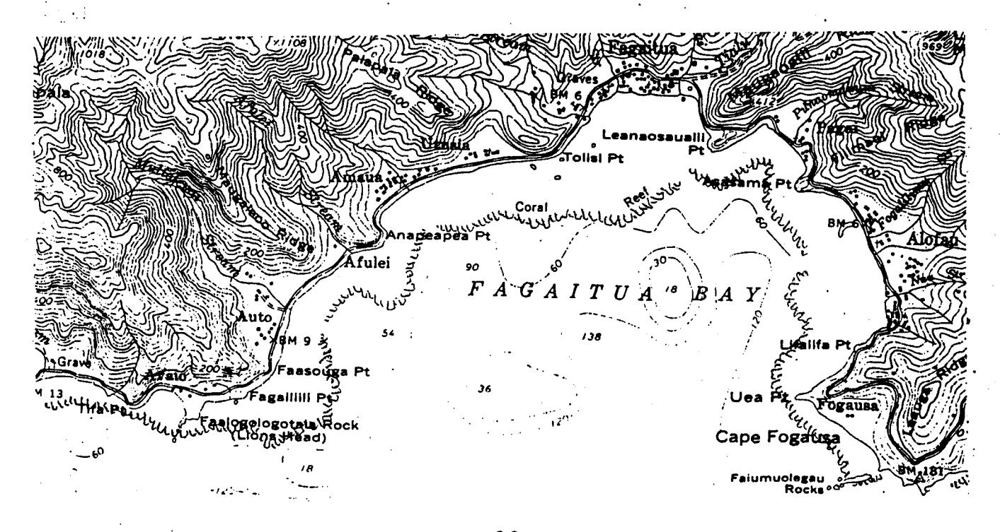

to 10 m) off Fa'alogologotala Rock in August and September 1979. About 75% of coral heads present were living (75).

# SHORELINE

The sand beach west of Fa'alogologotala Rock fronts a low rocky slope and is easily accessible from the coastal road. A low grassy slope leads from the road to "Two Dollar Beach" in the lee of Fa'alogologotala Rock (ASCRI). The eastern end of the beach is popular for swimming and picnicking and is maintained as a private park. A fee is charged for access (27;49). A sandy depression off one end of the beach is one of the better swimming areas on Tutuila (49). Although closed between the hours of 3 P.M. and 9 A.M. (ASCRI), Two Dollar Beach provides a large part of the swimming and sunbathing opportunities for tourists (64).

# FRINGING REEF OFF ALEGA AND AVAIO VILLAGES

The reef flat between Siliataligalu Point and Fa'alogologotala Rock (fronting the villages of Alega and Avaio) is a frequently-used fishing area. The most popular fishing methods are diving (mata), throw-netting (kili), and seine netting Less popular are pole, and rod and reel fishing, and occasional reef gleaning. Spearing provides catches of alogo (lined surgeonfish), pone (chocolate surgeonfish), and laea (large parrotfishes) both day and night. Day catches include fe'e (octopus), eel, malauli (large jack), lupota (small jack), and Night catches include manini (convict tang), anae (adult mutu. mullet), and ula (spiny lobster). Throw-netting in the daytime yields anae and fuafua (juvenile mullet), mutu, sali (silversides), laea, sugale (wrasse), alogo, pone, lupota, manini, and, in season, lo (rabbitfish) and atule (big-eye scad). Daytime fishing with rod and reel brings catches of malauli, lupota, (honeycomb grouper). Bamboo pole and line fishing brings day and night catches of gatala, filoa (large emperor fish), lupota, and mataeleele (small emperor fish). Day catches include savane (blue-lined snapper), lupo (juvenile jack), and ulaoa (bar-tailed goatfish). Night catches include matapula (bigeye snapper), malau (squirrelfish), malai (paddletail snapper), and, in season, atule (20).

# FAGA'ITUA BAY

Faga'itua Bay, the second largest embayment on Tutuila, owes its unusual size to the drowning of the eroded caldera of Alofau volcano (54). The fringing reef is extensive, averaging 700 to 1,000 feet (210 to 305 m) in width. The reef is indented by three major channels (ava) aligned off stream mouths. The shoreline consists of pocket beaches separated by volcanic headlands (49).

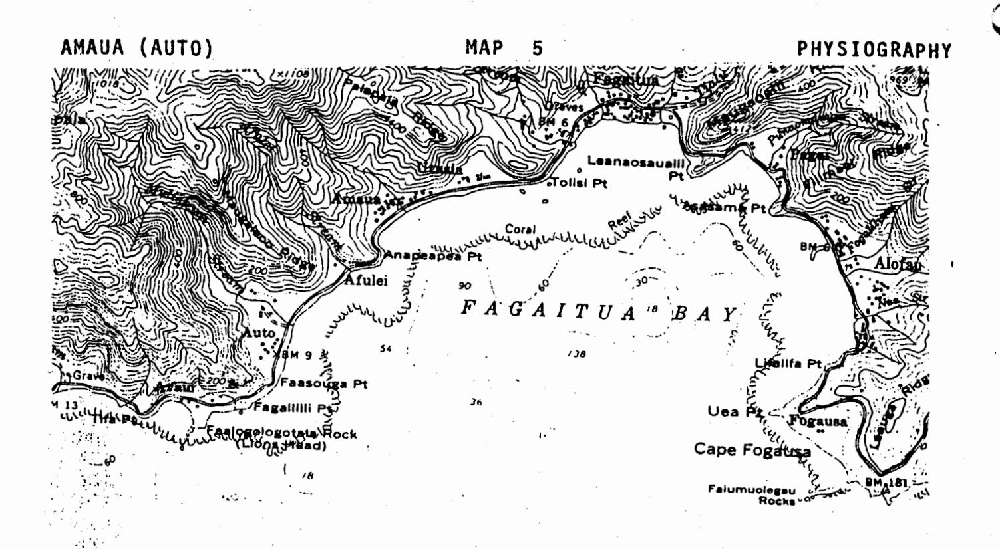

AMAUA (AUTO)

MAP 5

**PHYSIOGRAPHY** 

AMAUA (AUTO)

MAP 5

**PHYSIOGRAPHY** 

# COAST BETWEEN FAGA'ILI'ILI POINT AND ANAPE'APE'A POINT

# SHORELINE

Fa'asouga Point terminates in a cliff 15 feet (5 m) high. Between Faga'ili'ili Point and Fa'asouga Point is a small pocket beach of calcareous sand with scattered limestone and basalt rubble. The entire length of the 35-foot (11 m) wide beach is bordered by beachrock at the waterline. A 3-foot (1 m) high seawall protects the backshore (49;ASCRI-5S1).

The western end of Auto Village is fronted by a beach of calcareous sand, limestone and basalt rubble. The eastern end of the village is fronted by a boulder beach. Foreshore width varies from 30 to 60 feet (9 to 18 m). The backshore is defined by a 3- to 5-foot (1 to 2 m) scarp, eroding at its western end but stabilized by boulders or vegetation at its eastern end (49;ASCRI-5S2). Huliolevai Stream discharges into the ocean at Auto Village through a 20 foot (6 m) wide culvert passing under the coast highway. During periods of low flow, the culvert outlet is nearly barred by sand (ASCRI-5S2).

A narrow boulder beach in front of Afulei is backed by a 4-foot scarp, whose middle section is eroding (49). Talus occurs at the base of a cliff along the southwest face of Anape'ape'a Point. Beaches are absent and the rocky coast drops 3 to 10 feet (1 to 3 m) to the water (ASCRI-5S3).

#### FRINGING REEF OFF FA'ASOUGA POINT

A fringing reef extends some 600 feet (180 m) offshore of Fa'asouga Point. A channel, 1 to 2.5 feet (0.3 to 0.8 m) deep, runs parallel to and just off the beach. Width of the sand and rubble bottom channel is about 200 feet (61 m). The bottom of the middle reef is predominantly rubble (ASCRI-5B1). The outer reef flat is composed of more consolidated rubble and limestone pavement at depths of 1 to 2 feet (0.3 to 0.6 m) (ASCRI-5B2).

#### FRINGING REEF OFF AUTO VILLAGE

Lava boulders predominate in inshore areas adjoining the road revetment. Some calcareous sand occupies pockets off the revetment. A large sand channel (ava) cuts through the reef off Auto village (ASCRI-5B3). The reef flat extends 500 feet (150 m) from shore and is covered with sand from the mouth of Muliolevai Stream to the channel margin (49). Southwest of the ava there are rubble tracts and scattered occurences of consolidated limestone. Near the ava margin occur microatolls with sand and gravel accumulated around their bases. The inshore portion of the ava is a depression about 2 to 3 feet (0.6 to 1.0 m) below the level of the reef flat. The ava bottom is sand inshore and consolidated limestone offshore (ASCRI-5B3).

AMAUA (AUTO)

MAP 5

FLORA AND FAUNA

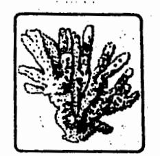

AMAUA (AUTO)

MAP 5

FLORA AND FAUNA

Fauna Core

Auto

FA G A I T U A 18 B A Y

Fassoliga Pt

Fassoliga Pt

Fassoliga Pt

Fassoliga Pt

Cape Fogalusa

Cape Fogalusa

Cape Fogalusa

Cape Fogalusa

Cape Fogalusa

Faunuclessus

Faunuclessus

Faunuclessus

Faunuclessus

Faunuclessus

Faunuclessus

Faunuclessus

Faunuclessus

Faunuclessus

Faunuclessus

Faunuclessus

Faunuclessus

Faunuclessus

Faunuclessus

Faunuclessus

Faunuclessus

Faunuclessus

Faunuclessus

Faunuclessus

Faunuclessus

Faunuclessus

Faunuclessus

Faunuclessus

Faunuclessus

Faunuclessus

Faunuclessus

Faunuclessus

Faunuclessus

Faunuclessus

Faunuclessus

Faunuclessus

Faunuclessus

Faunuclessus

Faunuclessus

Faunuclessus

Faunuclessus

Faunuclessus

Faunuclessus

Faunuclessus

Faunuclessus

Faunuclessus

Faunuclessus

Faunuclessus

Faunuclessus

Faunuclessus

Faunuclessus

Faunuclessus

Faunuclessus

Faunuclessus

Faunuclessus

Faunuclessus

Faunuclessus

Faunuclessus

Faunuclessus

Faunuclessus

Faunuclessus

Faunuclessus

Faunuclessus

Faunuclessus

Faunuclessus

Faunuclessus

Faunuclessus

Faunuclessus

Faunuclessus

Faunuclessus

Faunuclessus

Faunuclessus

Faunuclessus

Faunuclessus

Faunuclessus

Faunuclessus

Faunuclessus

Faunuclessus

Faunuclessus

Faunuclessus

Faunuclessus

Faunuclessus

Faunuclessus

Faunuclessus

Faunuclessus

Faunuclessus

Faunuclessus

Faunuclessus

Faunuclessus

Faunuclessus

Faunuclessus

Faunuclessus

Faunuclessus

Faunuclessus

Faunuclessus

Faunuclessus

Faunuclessus

Faunuclessus

Faunuclessus

Faunuclessus

Faunuclessus

Faunuclessus

Faunuclessus

Faunuclessus

Faunuclessus

Faunuclessus

Faunuclessus

Faunuclessus

Faunuclessus

Faunuclessus

Faunuclessus

Faunuclessus

Faunuclessus

Faunuclessus

Faunuclessus

Faunuclessus

Faunuclessus

Faunuclessus

Faunuclessus

Faunuclessus

Faunuclessus

Faunuclessus

Faunuclessus

Faunuclessus

Faunuclessus

Faunuclessus

Faunuclessus

Faunuclessus

Faunuclessus

Faunuclessus

Faunuclessus

Faunuclessus

Faunuclessus

Faunuclessus

Faunuclessus

Faunuclessus

The fringing reef northeast of Muliolevai Stream mouth and the ava is about 300 feet (90 m) across. Extensive rubble flats extend offshore to a narrow zone of consolidated limestone near the reef margin (ASCRI-5B4). Inshore areas northeast the ava consist of rubble covered by sand and silty-sand. Northeast of the ava, between 75 to 150 feet (25 to 45 m) offshore, coral wheels (old Porites microatolls) up to 2 feet across high and 6 feet (0.6 by 2.0 m) are separated by areas of unconsolidated rubble. About 225 feet (70 m) northeast of the stream culvert is a submerged exposure of old beachrock embedded with volcanic rubble. This feature lies about 60 feet (20 m) offshore of the road embankment. A formation of beachrock about 20 feet (6 m) wide trends slightly seaward towards the ava (ASCRI-5B3). The reef widens off Anape'ape'a Point.

# REEF FLAT OFF FA'ASOUGA POINT

Corals are abundant (50% cover) north of Fa'asouga Point along the sides of a channel on the inner reef flat. Large banks of Acropora (A. exigua or A. formosa) and considerable Pavona sp. occur in depressions on the reef flat seaward of the channel. Dead coral heads account for about 10% bottom cover. At least 18 coral species representing 7 genera are present on the reef flat. Two sea cucumbers, Holothuria hilla and Stichopus chloronotus, are common, the latter species increasing in abundance to seaward. The channel, extending seaward, harbors a few areas of staghorn Acropora thickets but overall coral cover is low. From about 200 feet (60 m) offshore, the reef shoals slightly to seaward and much less coral (about 5% cover) is present. Pavona and Porites are common genera. Algal cover is light on the low relief middle reef, and consists mostly of turf-forming species (ASCRI-5B1).

# FRINGING REEF OFF AUTO VILLAGE

Fronting the outlet of Muliolevai Stream and northeast of the ava, areas of sandy-rubble nearshore are carpeted by a green, algal turf. Closer to the ava, Padina sp. and a turf of mostly brown algae are present. Coral cover is about 10% and is mostly massive Porites lutea in the form of coral wheels occurring between 75 and 150 feet (25 to 45 m) offshore. Some Pavona sp. and Leptastrea purpurea are present also, but species of Acropora are absent. Dead coral heads account for 50% bottom cover. Reduced circulation apparently limits the development of corals in nearshore areas. An algal turf covers areas of unconsolidated rubble between coral wheels. Farther offshore, a turf of brown algae and some Dictyota sp. cover rubble (ASCRI-5B3).

Fishes are moderately abundant on the inner reef fronting Auto Village. The assemblage includes at least 56 species. Dominant types are wrasses and damselfish. In areas of acroporan corals, one damselfish (<u>Dascyllus aruanus</u>), is dominant; elsewhere, another (<u>Glyphidodontops cyanea</u>), is dominant. <u>Thalassoma hardwickei</u> is the most common wrasse in all areas. Butterfly fishes (<u>Chaetodon trifasciatus</u> and <u>C. trifascialis</u>), are abundant

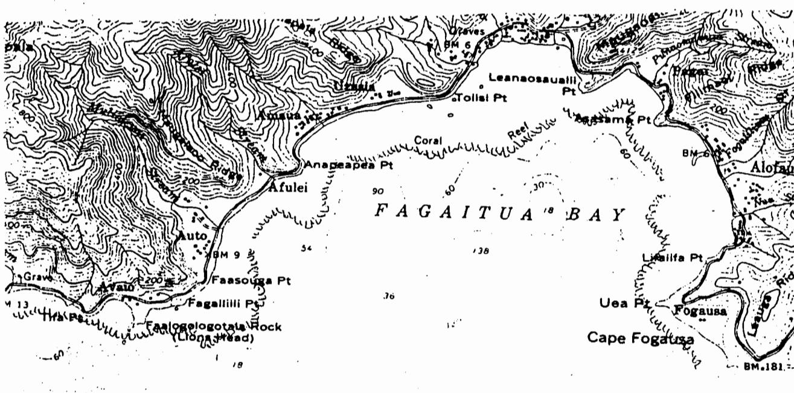

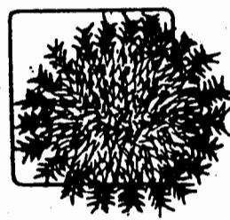

AMAUA (AUTO)

MAP 5

WATER CONDITIONS

AMAUA (AUTO)

MAP 5

USE CONSIDERATIONS

AMAUA (AUTO)

MAP 5

USE CONSIDERATIONS

over inner reef flat areas. Other abundant species include atherinids, surgeonfish (<u>Ctenochaetus binotatus</u>), and both adult and juvenile parrotfishes (<u>Scarus spp.</u>)(ASCRI-5F1).

Coral cover does not exceed 5% on the outer reef platform. A few Acanthaster are present and feeding on corals, but there is no evidence of recent, massive predation on corals by this starfish. Rubble or limestone pavement on the outer reef is generally encrusted by coralline algae or covered by an algal turf. Ralfsia sp. and Dictyosphaeria versluysii are most conspicuous (ASCRI-5B2).

Extensive rubble flats on the outer reef are encrusted by coralline algae and Ralfsia sp. The coral, Acropora aspera, occupies a narrow zone near the reef margin, but overall coral cover is low (1 to 5%) (ASCRI-5B4). The outer reef flat and surge zone is characterized by a fish fauna less diverse than that of the inner reef flat. Dominant species also differ from inshore areas. At least 44 species are present, of which, damselfishes (Glyphidodontops cyanea, G. leucopomus, and Plectroglyphidodon leucozoma), a wrasse (Thalassoma hardwickei), and adult parrotfish (Scarus sp.) are most abundant (ASCRI-5F2).

In early 1978 the reef front in Faga'itua Bay between Auto Village and Asasama Point was reportedly infested by the crown-of-thorns starfish (alamea; Acanthaster planci)(54).

#### FRINGING REEF OFF AUTO

Underwater visibility is about 75 feet (25 m) on the reef northeast of Fa'asouga Point. Off the mouth of Muliolevai Stream, suspended matter keeps nearshore waters turbid and visibility is reduced compared to areas to the southwest. Water circulation shoreward of the ava is apparently restricted, resulting in noticeably warmer and more murky waters (ASCRI).

Strong surge makes the reef margin off Auto difficult to approach and may limit fishing use. A strong current flows through the ava (ASCRI).

# SHORELINE

A sand and rubble beach northeast of Fa'asouga Point is accessible down a moderately-sloping road embankment up to 6 feet (2 m) high. Shoreline access is more difficult fronting Afulei Village, where a drop 3 to 10 feet (1 to 3 m) across a rocky shore is necessary to reach the water (ASCRI).

# FRINGING REEF ALONG THE WESTERN PERIMETER OF FAGA'ITUA BAY

The reef flat fronting the villages of Amaua and Utusia is considered a "critical use reef area" because of subsistence fishing by villagers (39). The reef fringing the western perimeter of Faga'itua Bay (fronting the villages of Auto, Amaua, and Utusia) is a frequently-used fishing ground, with throw-netting

Anapieapea Pt

Anapieapea Pt

FAGAITUA 18 BA

PHYSIOGRAPHY

AMAUA

MAP 5

**PHYSIOGRAPHY** 

AMAUA

MAP 5

**PHYSIOGRAPHY** 

(kili) the most popular method of fishing. Reef gleaning is second most popular. Spearing with home-made spears (mata) is less popular and usually occurs seaward of the reef margin. fishing with bamboo rod or rod and reel is also practiced here. Throw-netting is a daytime activity yielding catches of anae (adult mullet), fuafua (juvenile mullet), mutu, sali (silversides), laea (large parrotfish), sugale (wrasse), alogo (lined surgeonfish), pone (chocolate surgeonfish), lupota (small jack), manini (convict tang), and, in season, lo (rabbitfish) and atule (big-eye scad). Day gleaning yields fe'e (octopus), eel, and tuitui (sea urchin), whereas night gleaning results primarily in catches of alili and sisi (sea snails). Spearing results in day and night catches of alogo, pone, and laea. Day catches include faisua (giant sea clam), fe'e, eel, fuga (small parrotfish), and gatala (honeycomb grouper). Night catches include anae, crab, ula (spiny lobster), papata (slipper lobster), and ume (unicornfish). Rod and reel fishing yields day catches of malauli (large jack), lupota, and gatala (20).

# COAST BETWEEN ANAPE'APE'A POINT AND AMAUA VILLAGE

#### SHORELINE

Anape'ape'a Point is a cliffed headland south of the village of Amaua. At the base of the cliff, a lava rock platform about 3 to 5 feet (1.0 to 1.5 m) high projects seaward. A basalt boulder fan extends off the northeastern side of the headland (ASCRI-5S4). North of Anape'ape'a Point is a basalt boulder beach containing some limestone rubble. The beach widens at its eastern end fronting the village of Amaua. The backshore is defined by a scarp rising to an elevation of 9 to 12 feet (3 to 4 m). Except in places protected by randomly-placed boulders, the base of the scarp is unstable and eroding (49). A storm drain under the road enters the ocean northwest of Anape'ape'a Point (ASCRI-5S4).

# CAVES NEAR ANAPE'APE'A POINT

Two caves are found along the coast between the villages of Auto and Amaua. One measures 40 feet (12 m) wide, 15 feet (4.6 m) high, and about 15 feet (4.6 m) deep. The floor has a shallow sand layer. U.S. Marines built a series of concrete steps (about 5 feet or 1.5 m high) up to the cave entrance and a nearby low wall. A larger cave known as Anape'ape'a ("Bat Cave") is situated on the point of the same name southwest of Amaua Village. This cave measures about 40 feet (12 m) high and 40 feet (12 m) wide at the entrance. The floor drops about 15 feet below the mouth (30). The floor of this large cave is nearly 16 feet (5 m) at its entrance above high tide (12).

# RINGING REEF

The bottom directly offshore of Anape'ape'a Point consists of basalt boulders. North of the Point there is beachrock exposed

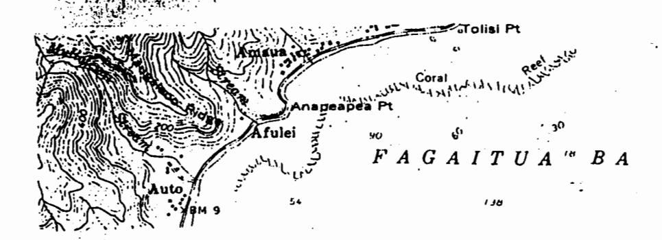

AMAUA

MAP 5

FLORA AND FAUNA

( SEABIRD NESTING AREA

AMAUA

MAP 5

FLORA AND FAUNA

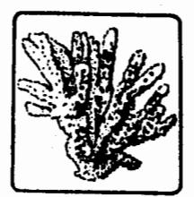

along the shore. A channel about 3 feet (1 m) deep and 20 to 30 feet (6 to 9 m) wide parallels the shoreline. The bottom of the channel is silted rubble littered with boulders and refuse. The sand channel is better developed in front of Amaua Village, where it lies inside a reef flat of consolidated limestone, rubble, and sand extending about 200 feet (61 m) offshore. An area of silty-sand and volcanic rubble extends into the nearshore channel off a small stream mouth at Amaua Village (ASCRI-5B5).

The mid-reef flat consists of mostly consolidated rubble. Off the southwestern end of Amaua Village are rubble-filled crevices between coral (Porites) wheels (microatolls). The depth varies from 2 to 3 feet (0.6 to 1.0 m). Lava rock outcrops are exposed on the reef flat about 130 feet (55 m) off the eastern end of Amaua Village. A rubble bottom surrounds these outcrops. Small areas of basalt and limestone rock account for about 25% of the bottom (ASCRI-5B6).

# ANAPE'APE'A POINT

The black noddy (gogo; Anous tenuirostris minutus), a resident seabird uncommon in American Samoa, nests on Anape'ape'a Point. Sheath-tailed bats (pe'ape'avai; Emballonura semicaudata) roost in caves at Anape'ape'a Point (15).

# FRINGING REEF

Basalt boulders immediately offshore of Anape'ape'a Point appear quite barren. A brown alga (<u>Dictyota</u> cf. <u>acutiloba</u>) covers over 50% of the silty-sand bottom in a nearshore channel north of the headland. Algal cover is considerable on inshore areas of silted rubble extending into the nearshore channel from a small stream-mouth beach at Amaua. A brown alga (<u>Padina tenuis</u>) accounts for 50% bottom cover. The reef flat seaward of the nearshore channel is distinguished by coral cover in places approaching 75% of the bottom. At least 11 species representing 7 genera are present; <u>Pavona</u> spp. are most abundant (ASCRI-5B5).

Loosely consolidated rubble tracts on the middle reef flat are encrusted by coralline algae. Ralfsia sp. and Galaxaura sp. are common also. Pavona spp. and other scattered corals account for up to 15% cover. A small gastropod is very common (ASCRI-586).

Although bottom relief is moderate on the reef flat off Amaua Village, only 39 species of fishes are recorded. Damselfishes are most common, representing about one third of the total species recorded. Dominant species include a butterflyfish (Chaetodon lunula), damselfishes (Glyphidodontops glaucus and G. leucopomus), and a wrasse (Thalassoma hardwickei). The reef flat affords sufficient cover for the cardinalfish, Apogon novemfasciatus, and the grouper, Ephinephelus merra. Surgeonfishes are conspicuously uncommon: only Acanthurus lineatus is recorded as present (ASCRI-5F3).

FAGALITUA

MAP 6

Leanaosaualli

Leanaosaualli

Anageapea Pt

FAGA'ITUA

MAP 6

PHYSIOGRAPHY

**PHYSIOGRAPHY** 

FAGA'ITUA

MAP 6

FLORA AND FAUNA

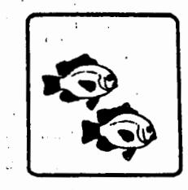

FAGA' ITHA

MAP 6

**PHYSIOGRAPHY** 

( DREDGED CHANNEL

# COAST BETWEEN TOLISI POINT AND LEANAOSAUALI'I POINT

# SHORELINE

An outcrop of lava rock rises approximately 10 feet (3 m) above the inner reef off Tolisi Point. Another low outcrop is exposed farther offshore (ASCRI-537).

The shoreline at Faga'itua is mostly a boulder revetment extending from near sea level up to the 7- or 8-foot elevation (26;49;ASCRI-6S1). The revetment is interrupted by a number of culverts and drainage pipes (26).

# FRINGING REEF OFF TOLISI POINT

The fringing reef is up to 850 feet (260 m) wide off Tolisi Point (49).

# FRINGING REEF OFF TOLISI POINT

The reef flat off Tolisi Point harbors a diverse and moderately abundant fish fauna. Stegastes nigricans is most abundant of at least 75 species. Ctenochaetus striatus and Chromis caerulea follow in abundance. Fishes are more abundant and the fauna more diverse on the reef front off Tolisi Point than on the reef flat. At least 107 species are present. Most abundant is Pomacentrus melanopterus, followed by Plectroglyphidodon dickii, Ctenochaetus striatus, and Scarus sp. (76).

# FRINGING REEF OFF FAGA'ITUA VILLAGE

The shoreline and reef at the head of Faga'itua Bay lie in somewhat sheltered waters. Stream-deposited fans of basalt boulders and gravel accumulate at and slightly above sea level at the mouths of Siapapa and Vaialufai Streams (26). Vaialufai Stream is usually dry, discharging only after a heavy rainfall (ASCRI-6S1)

A channel dredged through the reef off the mouth of Vaialufai Stream merges offshore with an ava. The steep-sided channel varies in depth from 2 to 3 feet (0.6 to 2.4 m). The bottom of the channel consists of basalt rocks and gravel, limestone rubble, roadside litter, and sediment (26).

A shallow, sand-bottom lagoon, from 3 to 6 feet (1 to 2 m) deep, extends from shore off the western end of Faga'itua Village (26;34). West of Vaialufai Stream mouth inshore rubble areas merge with a platform of limestone and rubble extending across the middle reef. Depth generally varies from 1 to 2 feet (0.3 to 0.6 m), but portions of this platform shoal almost to mean sea level. Bottom relief decreases toward the middle and outer reef. Extensive Acropora thickets occur at mid-reef, where the depth varies from 0.9 to 3.0 feet (0.2 to 1.0 m). Patches of sand and

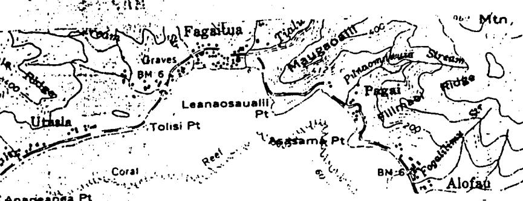

FAGA'ITUA

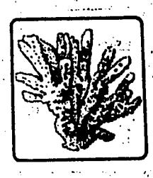

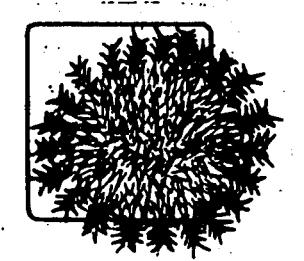

rubble are interspersed with both living and dead (but standing) acroporan coral (the latter accounting for about half of the bottom)(26). Much of the outer reef is exposed at low tide. Depth varies from -1.0 to +0.9 feet (-0.3 to +0.2 m). A partly consolidated pavement of limestone rubble grades offshore to a more consolidated surface. Large limestone blocks (up to 3 feet or 1 m high) are conspicuous on the outer reef flat (26). East of Vaialufai Stream mouth, sand flats extend offshore for about 165 feet (50 m) (26;34) and the depth varies from 1.3 to 2.0 feet (0.4 to 0.5 m) (26).

The reef margin is characterized by an algal ridge exposed at low tide. Depth varies from -8 to +16 inches (-0.2 to +0.4 m). The reef front off Faga'itua slopes moderately steeply, reaching a depth of about 65 feet (20 m) within 330 feet (100 m) of the margin. Reef slopes are characterized by a low-profile spur-and groove system. A large, well defined channel (ava) crosses the reef off the eastern side of Faga'itua Village (approximately aligned with the mouth of Vaialufai Stream) varying in depth between 6 and 33 feet (2 to 10 m). The ava walls are sheer to overhanging. The ava is the main discharge area for water flowing off the reef flat (26).

# FRINGING REEF

Large thickets of <u>Acropora formosa</u> 50 to 100 feet (15 to 30 m) across rise to near the surface in a lagoon off the western side of Faga'itua Village. This growth is apparently of recent development, as the lagoon was barren in 1974 (34) and only scattered patches of staghorn <u>Acropora</u> (totaling about 10% cover) were seen in 1978. A sea urchin (<u>Echinometra mathaei</u>) occurs in low densities (26).

Juvenile Acanthaster (alamea), were observed on Faga'itua reef flat in August 1977 (45). Patches of dead corals on the reef flat in late 1978 attested to predation by the crown-of-thorns starfish, present in low abundance (34). An earlier (pre-Acanthaster infestation) study reports coral cover of 40% to 60% on the inner and middle reef flat areas west of Vaialufai Stream mouth. Porites lutea was most common inshore, whereas Psammocora contigua and Pavona decussata were most common on the middle reef platform (26). A later study reports no evidence of once-extensive beds of Psammocora (34), and Staghorn acroporans, Pavona frondifera, Pocillopora damicornis, Porites andrewsi, and P. (Synarea) undulata were significantly less abundant.

occurs in high Echinometra mathaei, The urchin, sea densities on the inner and middle reef flat. The sea cucumber, Mid-reef coral Holothuria sp., is present in low densities. thickets provide about 30% coral cover and consist mostly of branched staghorn acroporans (A. formosa and A. humilis). Intact are acroporan skeletons covered with filamentous conspicuous, accounting for almost 50% bottom cover. In addition to abundant <u>Echinometra</u>, other sea urchins (Diadema Echinothrix sp.) are present.

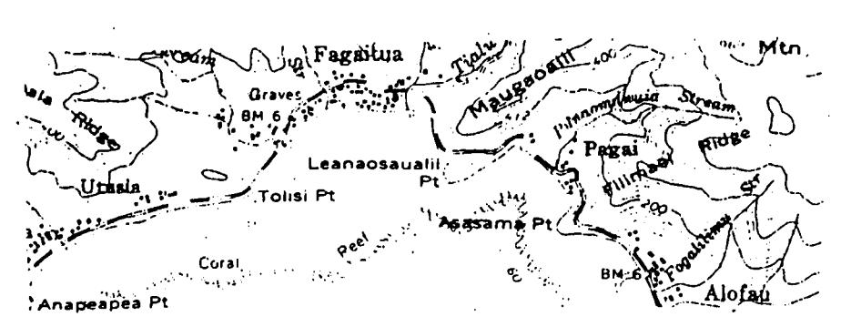

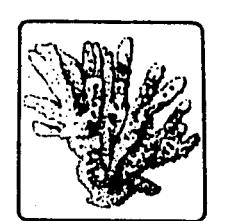

FAGA'ITUA

MAP 6

WATER CONDITIONS

FAGA'ITUA

MAP 6

USE CONSIDERATIONS

Coralline algae encrust partly consolidated and consolidated limestone on the outer reef, with some non-coralline algae present toward mid-reef. Scattered, wave-resistant corals, notably Acropora humilis and Pocillopora verrucosa (26;34), account for 5% bottom cover. A sea cucumber (Holothuria sp.), mollusc (Turbo sp.), and sea urchins (Diadema sp. and Echinothrix sp.), are present in low densities (26).

Patchy growths of an alga (Halimeda sp.) occur on sand flats extending about 165 feet (50 m) from shore east of Vaialufai Stream outlet (26). Large heads of Pocillopora damicornis and scattered heads of Porites andrewsi occur on the inner reef flat off the eastern end of Faga'itua Village. On the middle reef flat, 492 feet (150 m) offshore, coral cover approaches 100% and is dominated by Porites sp., and Porites (S.) sp. The margins of the ava are covered with beds of Acropora (mostly A. formosa)(34).

Wave-resistant corals, including <u>Acropora humilis</u>, <u>Pocillopora verrucosa</u>, and others inhabit the reef margin off Faga'itua (26). In early 1978 the reef front in Faga'itua Bay, between Auto Village and Asasama Point, was reported to be heavily infested by <u>Acanthaster</u> (45).

# FRINGING REEF

Soil eroded from the Masefau Road above Faga'itua is carried by Tialu Stream into Faga'itua Bay. No damage to the reef has been observed, but turbid waters nearshore is a common occurrence after rainfall (34;39). In the past, dredging activities have caused siltation problems and high turbidity in Faga-'itua Bay (7). Underwater visibility is excellent on the reef off the western side of Faga'itua Village. Refuse covers the inshore bottom here (34).

#### SHORELINE AND FRINGING REEF

The shoreline fronting Faga'itua Village is accessible across a road embankment which drops several feet (ASCRI). The reef fringing the villages of Faga'itua and Pagai at the head of Faga'itua Bay is considered a "critical use reef area" because of subsistence fishing by villagers (39). The reef flat is the most frequently fished area. According to one source, pole and line fishing is the most popular method. Spearing is second most popular. Some reef gleaning occurs off Faga'itua Village (20). Another source emphasizes the importance of gleaning and spearing on Faga'itua reef. Weir and gill-net fishing are reported to be significant methods of fishing along the outer margins of the ava, with "paopao" fishing in deeper waters off the reaf. The large ava and mid-reef Acropora thickets are focal points of spearing and "paopao" activity. Exposure of the reef margin to moderate surf discourages line fishing or throw-netting there, and consequently, most pole fishing takes place along the inner reaches of the ava during low tide. Throw-netting is not considered an important fishery at Faga'itua (26). A fish trap

FAGALITUA (PAGAI)

MAP 6

PHYSIOGRAPHY

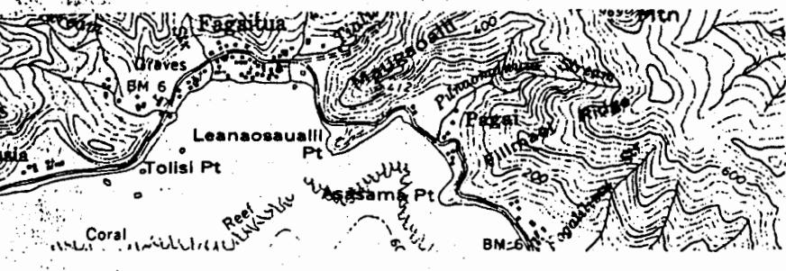

FAGA'ITUA (PAGAI)

MAP 6

**PHYSIOGRAPHY** 

FAGA'ITUA (PAGAI)

MAP 6

USE CONSIDERATIONS

ALOFAU

MAP

**PHYSIOGRAPHY** 

FAGAITUA" BAY

99

is present in the ava crossing the reef off Pagai Village (ASCRI).

Gatala (honeycomb grouper), filoa (large emperor fish). mataeleele (small emperor fish), and savane (blue-lined snapper) are caught both day and night by pole fishermen. Daytime catches include lupota (small jack) and lupo (juvenile jack). catches include malau (squirrelfish), malai (paddletail snapper), and matapula (bigeye snapper). Spearing results in day and night catches of alogo (lined surgeonfish), pone (chocolate surgeonfish), and laea (large parrotfish). Day spearing also yields faisua (giant clam), fe'e (octopus), eel, fuga (small parrotfish), and gatala. Night spearing yields anae (adult mullet), lobster), papata (slipper lobster), and ume crab, ula (spiny lobster), papata (slipper lobster), and ume (unicornfish) (20). The inner and middle portions of Faga'itua reef harbor especially large populations of tuitui (sea urchin) (26) and other invertebrates commonly sought by shell collectors and gleaners (ASCRI).

# COAST BETWEEN LEANAOSAUALI'I POINT AND ASASAMA POINT

# SHORELINE

Pagai Village is situated at the head of a small cove indenting the coast between Leanaosauali'i Point and Asasama Point (both volcanic headlands) (ASCRI-6S1). A pocket beach of calcareous sand and alluvium fronting Pagai is aboux 35 feet (11 m) wide. The beach slopes gently up to a 3-foot (1 m) scarp and undercut trees indicative of shoreline erosion (49). Much of the coast is bordered by a low, man-made road embankment constructed of large basalt boulders (ASCRI-6S1).

# FRINGING REEF

A broad channel (ava) indents the reef opposite Punaomaniua Stream mouth and approaches to within 300 feet (90 m) of shore (49).

# SHORELINE AND FRINGING REEF

The shoreline fronting Pagai Village is not open to public access (ASCRI). For fishing uses see: FAGA'ITUA / USE CONSIDERATIONS.

# COAST BETWEEN ASASAMA POINT AND LIFALIFA POINT

#### SHORELINE

The shoreline fronting Alofau Village consists of a rudimentary seawall and boulder revetment. A revetment at the western end of the reach has slumped, exposing the shoreline to erosion. The eastern section consists of a seawall extending from the 2-foot to 6-foot (1 to 2 m) elevation. A 103-foot (30 m) and the shoreline to the seawall extending from the 2-foot to 6-foot (1 to 2 m) elevation.

TUTUILA

EASTERN DISTRICT

SA'OLE CO.

ALOFAU

MAP

**PHYSIOGRAPHY** 

ALOFAU

MAP 6

PHYSIOGRAPHY

( BORROW PITS

FAGAITUA "BAY E

ALOFAU

MAP 6

**PHYSIOGRAPHY** 

ALOFAU

等有多数。 1000年10月 1000年10月 1000年10月 1000年10月 1000年10月 1000年10月 1000年10月 1000年10月 1000年10月 1000年10月 1000年10月 1000年10月 1000年10月 1000年10月 1000年10月 1000年10月 1000年10月 1000年10月 1000年10月 1000年10月 1000年10月 1000年10月 1000年10月 1000年10月 1000年10月 1000年10月 1000年10月 1000年10月 1000年10月 1000年10月 1000年10月 1000年10月 1000年10月 1000年10月 1000年10月 1000年10月 1000年10月 1000年10月 1000年10月 1000年10月 1000年10月 1000年10月 1000年10月 1000年10月 1000年10月 1000年10月 1000年10月 1000年10月 1000年10月 1000年10月 1000年10月 1000年10月 1000年10月 1000年10月 1000年10月 1000年10月 1000年10月 1000年10月 1000年10月 1000年10月 1000年10月 1000年10月 1000年10月 1000年10月 1000年10月 1000年10月 1000年10月 1000年10月 1000年10月 1000年10月 1000年10月 1000年10月 1000年10月 1000年10月 1000年10月 1000年10月 1000年10月 1000年10月 1000年10月 1000年10月 1000年10月 1000年10月 1000年10月 1000年10月 1000年10月 1000年10月 1000年10月 1000年10月 1000年10月 1000年10月 1000年10月 1000年10月 1000年10月 1000年10月 1000年10月 1000年10月 1000年10月 1000年10月 1000年10月 1000年10月 1000年10月 1000年10月 1000年10月 1000年10月 1000年10月 1000年10月 1000年10月 1000年10月 1000年10月 1000年10月 1000年10月 1000年10月 1000年10月 1000年10月 1000年10月 1000年10月 1000年10月 1000年10月 1000年10月 1000年10月 1000年10月 1000年10月 1000年10月 1000年10月 1000年10月 1000年10月 1000年10月 1000年10月 1000年10月 1000年10月 1000年10月 1000年10月 1000年10月 1000年10月 1000年10月 1000年10月 1000年10月 1000年10月 1000年10月 1000年10月 1000年10月 1000年10月 1000年10月 1000年10月 1000年10月 1000年10月 1000年10月 1000年10月 1000年10月 1000年10月 1000年10月 1000年10月 1000年10月 1000年10月 1000年10月 1000年10月 1000年10月 1000年10月 1000年10月 1000年10月 1000年10月 1000年10月 1000年10月 1000年10月 1000年10月 1000年10月 1000年10月 1000年10月 1000年10月 1000年10月 1000年10月 1000年10月 1000年10月 1000年10月 1000年10月 1000年10月 1000年10月 1000年10月 1000年10月 1000年10月 1000年10月 1000年10月 1000年10月 1000年10月 1000年10月 1000年10月 1000年10月 1000年10月 1000年10月 1000年10月 1000年10月 1000年10月 1000年10月 1000年10月 1000年10月 1000年10月 1000年10月 1000年10月 1000年10月 1000年10月 1000年10月 1000年10月 1000年10月 1000年10月 MAP 6

FLORA AND FAUNA

m) wide foreshore of calcareous and volcanic sediment is exposed at low tide. Shoreline erosion may be attributed to causeways which formerly covered portions of the reef flat (49;ASCRI-6S2). Boulder talus lies along the northeast face of the volcanic headland of Lifalifa Point (ASCRI-6S2).

# ALOFAU MANGROVE SWAMP

A small mangrove forest is present in the vicinity of Alofau Village (15).

#### FRINGING REEF FLAT

Dredging of Alofau reef was discontinued in late 1970. A causeway which extended onto the reef was removed to improve water circulation (23). Remnants of the causeway, about 15 feet (5 m) across, are exposed during low tides (ASCRI-6B2).

Silty-sand along shore grades into sand bottom (with gravel) at a depth of 1 or 2 feet (less than 1 m) on the inner reef off Alofau Beach (ASCRI-6B1). Borrow pits in the reef reach depths of 15 feet (5 m). Soft mud covers the bottoms of these dredged areas (ASCRI-6B2). The middle of the reef flat seaward of the dredged area is covered mostly by a fine white sand with some rubble. Depths are generally from 2 to 4 feet (0.6 to 1.2 m), but some dredged areas here are 10 to 20 feet (3 to 6 m) deep (ASCRI-6B3). The outer reef flat shoals to a depth of about one foot (0.3 m) with a bottom composed almost entirely of rubble The reef margin is a partially developed algal (ASCRI-6B4). ridge which drops vertically from depths of 3 to 6 feet (1 to 2 m) to 15 to 20 feet (5 to 6 m) at the reef front (ASCRI-6B5). In places, broad fans of rubble and boulders begin at around feet (-6 m) and slope steeply beyond -60 feet (-13 m) (ASCRI-6B6). A deep channel cuts through the reef off the mouth of Fogalilimu Stream and approaches to within 600 feet (180 m) of shore (49).

#### FRINGING REEF FRONT

Depressions at the reef margan provide one or two-foot vertical relief (ASCRI-6B5). The generally steep-sloping reef front is undercut, with extensive accumulations of coral rubble and boulders occurring at the base. Typically, a broad rubble fan begins at a depth of 20 feet (6 m) and slopes steeply below 60 feet (18 m) (ASCRI-6B6).

# FRINGING REEF FLAT

Nide bands of a blackish-brown cyanophyte (blue-green alga) extend about 50 feet (15 m) offshore from Alofau Beach. A green alga (Halimeda cf. discoidea) is common on the inshore sand bottom (ASCRI-6B1). Lysiosquilla sp. are common. Scattered Acropora thickets, some 20 feet (6 m) across and 3 feet (1 m) high, inhabit dredged areas. These thickets are especially dense in a shallow area south of an old causeway. Pavona frondifera and

ALOFAU

Coral

Pt

BM

BM

BM

BM

BM

BM

BM

BM

BM

B

114

MAP 6

FLORA AND FAUNA

FAGAITUA" BAY

ALOFAU

MAP 6

FLORA AND FAUNA

Psammocora contigua are locally abundant in the same general area. Coral cover is up to 30% and at least 31 species representing 16 genera are present on Alofau reef. Two species of algae (Actinotrichia sp. and Dictyota sp.) cover large areas of the bottom seaward of the borrow pits. The algae, Lyngbya sp., Polysiphonia sp., and Gelidiopsis intricata coat dead areas of branching staghorn corals. The sea cucumber, Stichopus chloronotus, is common to abundant. Large holes and cone-snaped mounds of silty-sand on the bottom of dredged depressions provide evidence of annelid worms and other burrowing forms (ASCRI-6B3).

Very little live coral (about 1% cover) grows on the shallow outer reef flat. Encrusting coralline algae and Ralfsia sp. are abundant. A green cyanophyte (Hormothamnion sp.) is common in patches along with the red alga, Actinotrichia sp. The sea cucumber, Holothuria hilla, is relatively common (ASCRI-6B4). Coral cover varies from place to place along the reef margin (0 to 10%) and is mostly wave-resistant species of Acropora. Dead coral heads are prominent and many appear to have been killed recently. The coralline alga, Porolithon sp., encrusts the algal ridge. A few small colonies of soft corals are present (ASCRI-6B5).

Fishes are moderately abundant and the fauna diverse on the reef flat fronting the northwestern end of Alofau Village. Chromis atripectoralis, Stegastes nigricans, and Dascyllus aru-anus are most abundant (76). A highly diverse and abundant fish fauna characterizes the reef flat and dredged lagoon in front of Alofau Village. At least 85 species are present. families are butterflyfishes and damselfishes. The damselfish, Dascyllus aruanus, is most abundant and Glyphidodontops cyanea, G. glaucus, G. leucopomus, and Pomacentrus coelestis are abundant. Chaetodon trifasciatus is the most common butterflyfish, with schools of 10 to 20 individuals common around coral thickets in the lagoon. <u>Chaetodon auriga</u>, <u>C. citrinellus</u>, reticulatus also are abundant throughout the area. Cardinalfish and pipefish are common among Acropora thickets. Conspicuous in the layoon as well as on the adjacent reef flat are species of adult mullet in schools numbering 20 to 50 individuals in the shallow waters. Prominent species include atherinids, the pipefish, Corythoichthys flavofasciatus, the mullets, Liza vagiensis and Velamugil seheli, the cardinalfishes, Apogon kallopterus, A. novemfasciatus, and Cheilodipterus macrodon. The goatfish, <u>Mulloidichthys vanicolensis</u>, is among the dominant species found over sandy areas of the lagoon, while <u>Parupeneus</u> <u>Chryseredros</u> is the most abundant goatfish elsewhere. Other abundant species include the surgeonfishes, Acanthurus nigrofuscus and A. triostegus, the wrasses, Halichoeres margaritaceus Thalassoma hardwickei, and several species of parrotfishes (ASCRI-6F1).

RINGING REEF FRONT

The reef front off Alofau is nearly devoid of live coral, except for some Acropora humilis. Coral heads are mostly dead or

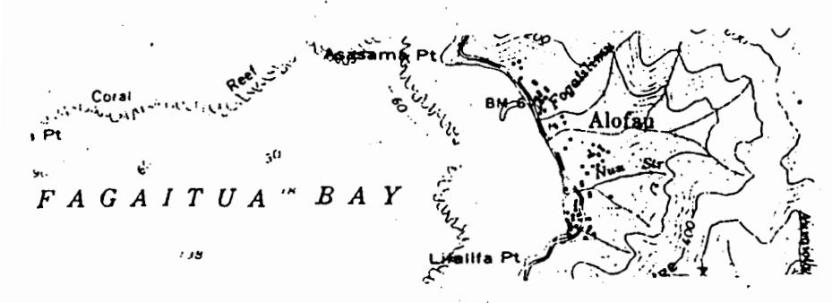

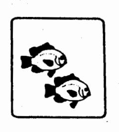

ALOFAU MAP 6 PHYSIOG./BIOTA

ALOFAU MAP 6 WATER CONDITIONS

ALOFAU MAP 6 USE CONSIDERATIONS

ALOFAU MAP 6 USE CONSIDERATIONS

small. Extensive fans of coral rubble are evident, with considerable dead and broken staghorn and plate Acropora present (ASCRI-About 30% of the corals on the upper reef front at depths of 6 to 33 feet (2 to 10 m) were living in August/September 1979. The crown-of-thorns starfish (alamea; Acanthaster planci) was not seen (75). An old fisherman whose familiarity with Alofau dates back nearly seven decades remembers that alamea were abundant on both the reef flat and reef front in 1916, but were not common again until 1978 (3). The margins of the ava harbor a large variety of relatively abundant fishes. Chromis iomlelas is abundant, followed by Pomacentrus melanopterus and Ctenochaetus striatus in a fauna of at least 107 species Surgeonfishes and parrotfishes adapted to areas of wave surge are much more abundant over the reef margin and slope than in the calm waters of the reef flat and lagoon. Off the southeastern end of Alofau Village, the fish assemblage of the reef margin and upper slope includes at least 32 species but is less diverse than the fauna near shore. Large numbers of the surgeonfishes, Acanthurus <u>lineatus</u>, <u>A. nigrofuscus</u>, <u>A. nigroris</u>, <u>A. triostegus</u>, Ctenochaetus striatus, together with the butterflyfish, Chaetodon citrinellus, the damselfish, Chromis atripectoralis, the wrasse, Thalassoma hardwickei, and several parrotfishes, Scarus spp., are abundant on the reef margin and slope (ASCRI-6F2).

# FRINGING REEF OFF LIFALIFA POINT

The inner reef flat fringing the northern face of Lifalifa Point is sand, with silty-sand accumulating in extensive patches of a sea grass (Halophilia sp.). Small gastropods are common foraging around the sea grass (ASCRI-6B7).

# FRINGING REEF (EASTERN FAGA'ITUA BAY)

Underwater visibility is about 20 feet (6 m) in nearshore areas fronting Alofau Village. Visibility improves to about 30 feet (9 m) seaward of the dredged section of reef and to 40 feet (12 m) at the reef margin. Sixty feet (18 m) is the limit of visibility along the reef front (ASCRI).

#### SHORELINE

The shoreline fronting Alofau Village is easily accessible down a low road embankment. Beaches are narrow or absent, however. The rocky shoreline along the northeast side of Lifalifa Point is inaccessible because of the high cliff (ASCRI).

#### FRINGING REEF

The reef fringing the eastern perimeter of Faga'itua Bay in front of Alofau Village is considered a "critical use reef area" because of subsistence fishing by villagers (39). The reef flat is the most frequently visited area for fishing by throw-netting (kili) and pole and line. Throw-netting is a daytime activity providing catches of manini (convict tang), alogo (lined surgeon-

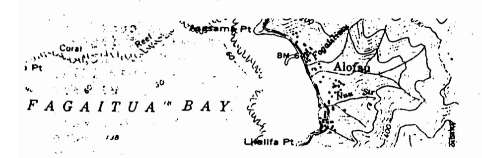

fish), pone (chocolate surgeonfish), anae (adult mullet), fuafua (juvenile mullet), lupota (small jack), and, in season atule (big-eye scad), lo (rabbitfish), and i'asina (juvenile goatfish). Gatala (honeycomb grouper), filoa (large emperor fish), mataeleele (small emperor fish), and savane (blue-lined snapper) are caught day and night by pole and line. Day catches include lupota and lupo (juvenile jack). Night catches include malau (squirrelfish), malai (paddletail snapper), and matapula (bigeye snapper) (46). Mantis shrimp (Lysiosquilla spp.) are collected from nearshore sand bottom areas (ASCRI).

Southerly swells offer surfing opportunities (during high or a rising tide) off Alofau. Calm or northwest wind conditions are best (51).

/MAP4.TEX/ - /AUG-80/-

ALOFAU (FOGAUSA)

MAP 7

PHYSIOGRAPHY

ALOFAU (FOGAUSA)

Cape Fogatisa

Cape Fogatisa

Cape Fogatisa

Sinatau Pt

MAP

MAP

MAP

MAP

MAP

FLORA AND FAUNA

ALOFAU (FOGAUSA)

USE CONSIDERATIONS

AMOULI (FOGA'AU)

MAP 7
Forest: Falantiftoafa Pt

ENTUS Manigaopea Pt

48
Matalesolo Pt

Leve Pt
iu Cove 84

PHYSIOGRAPHY

AMOULI (FOGA'AU)

MAP 7

PHYSIOGRAPHY

AMOULI (FOGA'AU)

MAP 7

FLORA AND FAUNA

( SEABIRD NESTING AREA

AMOULI (FOGA'AU)

MAP 7

USE CONSIDERATIONS

# COAST BETWEEN UEA POINT AND SINATAU POINT

#### SHORELINE

Cape Fogausa rises in high sea cliffs at Uea Point and Sinatau Point (ASCRI-6S3). A long beach of calcareous sand and rubble lies between these two points (49).

# OFF SINATAU POINT

A few crown-of-thorns starfish (alamea; Acanthaster planci) were reported on forereef slopes off Sinatau Point in early 1978 (74).

# SHORELINE

An area of private home sites near the shore on Cape Fogausa is not open to public access (ASCRI).

# COAST BETWEEN SINATAU POINT AND FALASE EITOAFA POINT

# SHORELINE

The shoreline between Sinatau Point and Matalesolo Point consists of volcanic headlands and sea cliffs separating three small pocket beaches of limestone rubble at the heads of Nu'uoleniu and Nu'uolema'a Coves. A 40- to 50-foot (12 to 15 m) wide pocket beach between Matalesolo Point and Maugaopea Point consists of calcareous sand with beachrock exposed at intervals along the shoreline (49). A small spit (tombolo) of sand and rubble has formed behind a lava rock outcrop offshore, forming Maugaopea Point (49; ASCRI-7S1).

# FRINGING REEF

The fringing reef is only 100 to 150 feet (30 to 45 m) wide (49). From the high vantage point afforded by the coastal highway, spur-and-groove formations can be seen on the outer margin of the reef (ASCRI).

# MATALESOLO POINT

The blue-gray noddy (laia; <u>Procelsterna cerulea</u>), a seabird uncommon in American Samoa, roosts and nests near Matalesolo Point (15).

# SHORELINE

From Cape Fogausa eastward to near Foga'au, the backshore rises steeply to the highway, which rounds Sinatau Point and Cape Fogausa at the 100- to 200-foot elevation. Except for a short section near Maugaopea Point, the shoreline is almost inaccess-

AMOUL I

MAP 7

Maatulaumea

POLINILIALIS MAIN

Matautuele

Pt Taugamalama

Pt Taugamalama

Pt Taugamalama

Pt Taugamalama

Pt Taugamalama

Pt Taugamalama

Pt Taugamalama

Pt Taugamalama

Pt Taugamalama

Pt Taugamalama

Pt Taugamalama

Pt Taugamalama

**PHYSIOGRAPHY** 

AMOULI

MAP 7

**PHYSIOGRAPHY** 

ible (49; ASCRI).

# COAST BETWEEN FALASE'EITOAFA POINT AND MATAUTUELE POINT

The neck of land between Amouli Bay and Aoa Bay (MAP 10) on the north shore of Tutuila resulted from the narrowing of the saddle between Olomoana and Alofau volcanoes by the drowning of two large canyons. The canyons are especially large because each carried the drainage from the slopes of two volcanoes (54).

# SHORELINE

A sand beach stretches between sea cliffs at Falase'eitoafa Point and Matautuele Point. At the western end of this reach (fronting Siufaga) there is a deteriorating lava rock seawall rising 2 to 7 feet (1 to 2 m) behind a foreshore up to 20 feet (6 m) wide. The wall stabilizes a backshore scarp. The beach nearly 40 feet (12 m) wide east of Siufaga (49). Beachrock is exposed at low tide in the central and eastern sections of the beach fronting Siufaga and Amouli. At least two streams (and a storm drain culvert) enter the ocean at Amouli (ASCRI-7S2), where a 30- to 60-foot (9 to 18 m) wide beach of calcareous sand and rubble is backed by a backshore scarp 2 to 6 feet high. North and south of Televai Stream, where houses are built on fill, the scarp is stabilized by a low rock seawall. A narrow beach of basalt boulders with scattered limestone rubble lies just west of Matautuele Point (49; ASCRI-7S2).

# FRINGING REEF (AMOULI BAY)

The fringing reef averages 750 feet (230 m) in width off Amouli (49). The inner reef flat off the southwestern end of Amouli Village grades from mostly sand to increasing proportions of basalt rubble along shore toward Matautuele Point. Farther offshore, the relatively flat bottom is mostly rubble at depths of 3 to 4 feet (1 to 1.2 m)(ASCRI-7B1). The bottom shoals to 1 to 2 feet (0.3 to 0.6 m) over extensive mid-reef rubble These tracts are exposed at low tide (ASCRI-7B2). An outer reef platform of consolidated limestone with rubble tracts extends to an elevated reef margin and a reef face with spur-and-groove development (ASCRI-7B3). A 50-foot (15 m) wide ava approximately aligned off the mouth of Televai Stream indents the seaward face of the reef and approaches within 350 feet (105 m) of shore (49;ASCRI-7B4). The channel bottom is littered with sand-scoured boulders and rubble, as well as junk (including a car body) (ASCRI-7B4). The outer reef flat northeast of the ava is a consolidated limestone pavement with scattered loose, flat boulders (ASCRI-7B5). Inner reef areas shoreward of the ava contain rubble and consolidated limestone mixed with silty-sand to a depth of 3 feet (1 m) (ASCRI-7B6). A sand deposit off the mouth of Televai Stream extends offshore to the deep channel (ava)(49). The reef flat inside Matautuele Point has a rubble bottom, consisting of a mixture of volcanic and limestone fragments (ASCRI-7B6).

AMOULI

MAP

FLORA AND FAUNA

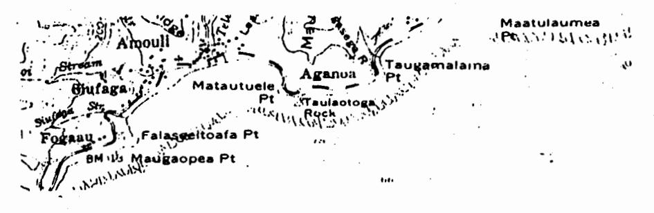

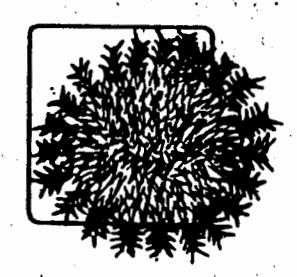

#### FRINGING REEF

A turf of brown alga is common on sand-veneered rubble of the inner reef off the southwestern portion of Amouli Beach. Coral cover is low (10 to 15%) at depths of 3 to 4 feet (1.0 to 1.2 m) on a predominantly rubble bottom of the middle reef flat. Pavona sp. and Porites sp. are most common. The alga, Amphiroa sp., is conspicuous. The sea cucumber, Stichopus chloronotus, is common (ASCRI-7B1).

Extensive mid-reef rubble tracts (exposed at low tide) harbor a few corals (about 5% cover), including <u>Porites lutea</u>, <u>Pocillopora damicornis</u>, and <u>Pavona frondifera</u>. The sea cucumber, <u>Stichopus chloronotus</u>, is the only other conspicuous invertebrate. Encrusting coralline algae are abundant; <u>Ralfsia</u> sp. and brown epiphytic algae are common (ASCRI-7B2).

Live corals total about 10% cover on the outer reef platform. Acropora aspera, other acroporans, and Porites lutea are notable. The sea cucumber, Stichopus chloronotus, occurs in lesser abundance than in shoreward reef areas. The elevated reef margin is encrusted by a few corals (ASCRI-7B3). A spikey, red-branched coralline alga and a patchy, yellowish cyanophyte (blue-green alga) are conspicuous along the northeastern margin of the ava (ASCRI-7B4).

Few corals inhabit the outer reef pavement northeast of the ava. Acropora aspera growth is patchy. The brown alga, Ralfsia sp., is present (ASCRI-7B5). Inshore areas of rubble, limestone, and silty-sand off the northeastern part of the beach have coral cover of 5 to 10%. Pavona frondifera and Porites andrewsi are most common. The coral assemblage includes at least 15 species in 11 genera. No corals are evident in nearshore rubble areas off northeastern Amouli Village. The green alga, Valonia cf. aegogropila, is common on rubble (ASCRI-7B6).

Considerable numbers of the crown-of-thorns starfish (alamea; Acanthaster planci) were evident on the upper reef front (at depths of 6 to 33 feet or 2 to 10 m) off Amouli Village and Taulaotoga Rock in August/September 1979, but 30 to 90% of the coral heads were still alive (75).

A moderately diverse fish fauna occurs on the reef flat in front of Amouli Village. Abundant fish populations are dominated by juveniles. The area is a protected lagoon with extensive thickets of acroporan corals providing habitat for juvenile fishes. Dominant species include the butterflyfish, Chaetodon citrinellus, the surgeonfishes, Acanthurus lineatus, A. nigrofuscus, and A. nigroris, the damselfishes, Chromis atripectoralis, Stegastes albofasciatus, and Plectroglyphidodon leucozoma, the wrasse, Thalassoma hardwickei, and juvenile parrotfish, Scarus spp. The surf perch, Kuhlia mugil, occurs in large schools near shore (ASCRI-7F1).

TUTUILA

EASTERN DISTRICT

SA'OLE CO.

**AMOULI** 

7 MAP

WATER CONDITIONS

AMOULI

MAP

. USE CONSIDERATIONS

Forage Maurace Pt Taulaotog

AMOULI (AGANOA)

ИАР

**PHYSIOGRAPHY** 

AMOULI (AGANOA)

MAP

FLORA AND FAUNA

( SEABIRD NESTING AREA

#### AMOULI BAY

Waters are clear on the middle and outer reef southwest of the ava off Amouli: visibility underwater is 100 feet (31 m). Northeast of the ava, the water is very turbid. Turbid water occurs inshore off a filled area which lies between two stream outlets. Trash collects on the beach and sand bottom just off this small point. Refuse (including an old car body) litters the bottom of the ava and is also conspicuous at the base of Matautuele Point (ASCRI).

# SHORELINE AND FRINGING REEF

The beach at Amouli is easily accessible down the embank-ment of the nearby coastal road. Some throw-netting takes place on the inner reef fronting a small promontory of filled land (ASCRI).

The reef fringing the coast between Falase'eitoafa Point and Taulaotoga Rock is considered a "critical use reef area" because of subsistence fishing by villagers (39). The most frequently fished area encompasses the reef flat extending from Matalesolo Point to Taulaotoga Rock. The most popular fishing method off Foga'au is pole and line fishing, followed by spearfishing (mata). In front of Amouli, pole and line fishing is the preferred method, and seine netting (upega) is second most popular. Spearing (mata), reef gleaning, and trapping (egu) are practiced in descending order of popularity. Pole fishing results in day and night catches of gatala (honeycomb grouper), filoa (large emperor fish), mataeleele (small emperor fish), and savane (blue-lined snapper). Lupota (small jack) and lupo (juvenile jack) are also caught by day, and malau (squirrelfish), malai (paddletail snapper), and matapula (bigeye snapper) by night. Spearing results in day and night catches of alogo (lined surgeonfish), pone (chocolate surgeonfish), and laea (large parrotfish). Day spearing also yields faisua (giant clam), fe'e (octopus), eel, fuga (small parrotfish), and gatala. Night diving brings in catches of anae (adult mullet), crab, ula (spiny lobster), papata (slipper lobster), and ume (unicornfish) (20).

#### COAST BETWEEN MATAUTUELE POINT AND TAUGAMALAMA POINT

#### SHORELINE

A 55-foot (17 m) wide sand beach fronts Aganoa, a village of 3 houses. Beachrock is exposed in places along the shoreline (49).

# TAULAOTOGA ROCK

Taulaotoga Rock is a seastack which is a potential roosting and nesting sites for the reef heron (matu'u; <u>Egretta</u> <u>sacra</u> <u>sacra</u>), a resident seabird uncommon in American Samoa (15).

AUASI

MAP 8

PHYSIOGRAPHY

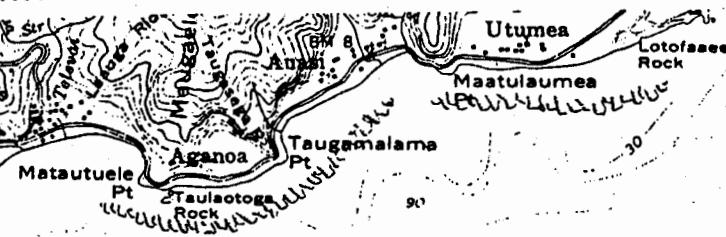

AUASI

MAP 8

PHYSIOGRAPHY

# COAST BETWEEN TAUGAMALAMA POINT AND MA'ATULAUMEA POINT

A coastal terrace of alluvium, talus, and calcareous sand and gravel extends inland 400 to 800 feet (120 to 245 m) at Auasi, terminating at cliffs along the base of Olomoana Mountain. Leafu Stream and Vaisa Stream (a small drainage channel) discharge into the ocean after heavy rainfall (67).

# SHORELINE

Fronting Auasi Village is a beach of calcareous sand mixed with volcanic cobbles and boulders. The beach varies in width from 10 to 70 feet (3 to 21 m). Rubble and boulders are more prevalent on the eastern part of the beach where there are only scattered pockets of sand (14;37). The western section of the beach broadens to 75 feet (23 m) and includes considerable limestone rubble as well as calcareous sand (49). Scattered boulders and beachrock are exposed at low tide. Beachrock is exposed in an outcrop some 33 to 40 feet (10 to 12 m) long just west of Ma'atulaumea Point. A deposit of (basalt and limestone) boulders and sand lie behind the outcrop. A narrow band of large basalt boulders border each of the steep-faced headlands (Taugamalama Point and Ma'atulaumea Point) at either end of Auasi Beach (14).

At high tide and during storm conditions, waves run up to the base of coconut trees at the vegetation line behind the northeastern section of beach. Undercut trees demonstrate beach erosion of some 300 to 500 feet (90 to 150 m) near Ma'atulaumea Point (67).

The shoreline near Ma'atulaumea Point has been modified considerably by construction of a small boat harbor. A 500-foot (150 m) length of shoreline immediately west of Auasi Harbor is experiencing severe erosion, which has toppled coconut trees and threatens several fales and seawalls in the backshore area. A narrow foreshore of limestone rubble and basalt cobble terminates in a 6-foot (2 m) high scarp. Erosion may be linked to harbor construction, which has altered the angle of wave approach. A revetment has been constructed east of the harbor to stabilize the sector between the eastern wall of the harbor and Ma'atulaumea Point (49).

# FRINGING REEF FLAT

The reef fronting Auasi Village has a maximum width of 700 feet (215 m). Extensive portions of the reef flat are exposed at low tide. A large natural channel (ava) cuts through the reef about 500 feet (145 m) west of Ma'atulaumea Point. The reef narrows somewhat west of the ava. The channel provides an opening 200 feet (60 m) wide through the reef front, narrowing to 50 feet (15 m) near shore. Isolated limestone knolls are evident in places, but the bottom of the outer channel consists mostly of

SA'OLE CO.

ASTERN DISTRICT

AUASI

**PHYSIOGRAPHY** 

scoured limestone, with some sand, gravel, and rubble present in pockets. Where the channel shoals shoreward, large limestone boulders are conspicuous on the bottom. The inner channel bottom grades to silty-rubble and some basalt boulders. Microatolls (Porites sp.) 3 feet (1 m) across line the western side of the inner channel (14;67).

The ava serves as the main discharge area for water thrown onto the reef by waves and exerts considerable influence on water circulation over the reef flat. A strong current flows from west to east over the southwestern section of the reef. The ava is the only navigational passage through the reef to the open sea. The U.S. Navy modified the channel in the 1950's by blasting and dredging to improve access for the longboats from Aunu'u Island (MAP A1). Other, smaller channels are said to have been cut in the inner reef in 1963 to provide a safer beaching area for the longboats (14;67). More recently the ava has been widened in conjunction with construction of a small boat harbor near Ma'atulaumea Point (ASCRI-8B1).

Nearshore areas (within 100 feet or 30 m of shore) just west of Ma'atulaumea Point have a bottom of mostly basalt boulders, with an admixture of limestone rubble. Farther to the southwest, nearshore areas consist predominantly of limestone rubble which covers over half the reef flat between 100 and 295 feet (30 and 90 m) offshore. Much of this rubble bottom is exposed at low tide. Limestone boulders are conspicuous in nearshore areas off the southwest end of Auasi Beach.

Consolidated limestone is common on the inner reef flat near Taugamalama Point. A greater cover of consolidated limestone and lesser amounts of rubble characterize the middle reef from 295 to 395 feet (90 to 120 m) offshore. Consolidated limestone increases seaward from 395 feet (120 m) to the reef margin, about 590 feet (180 m) offshore. The outer reef is strewn with limestone boulders. The middle reef platform is usually submerged, except at lowest spring tides. The reef margin, characterized by surge channels and a well defined algal ridge, is exposed at low tide (14).

#### FRINGING REEF FRONT

The reef front immediately southwest of the ava off Auasi shows a very irregular algal ridge and a spur-and-groove system which becomes more regular to the southwest. Isolated limestone pinnacles and knolls project to within 2 feet (0.6 m) of the surface in places. Surge channels and buttresses are moderately well developed southwest of the ava, but not so closer to Taugamalama Point, were the reef front slopes gently seaward from a depth of 10 to 15 feet (3 to 5 m) to 60 feet (18 m) before descending steeply to a bottom of sand and isolated limestone outcrops in deep water (14). The reef front between the ava and Taugamalama Point is characterized by a number of descending spurs or buttresses up to 15 feet (5 m) high (ASCRI-8B1). Grooves up to 20 feet (6 m) deep contain limestone boulders and

Control of

AUASI

MAP 8

FLORA AND FAUNA

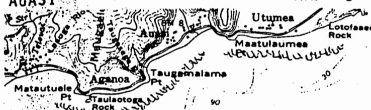

dead, nullipore-consolidated coral. Northeast of the ava, a spur-and-groove system is not evident (14). A reef spur or knoll east of the channel into Auasi Harbor is known locally as the "wavemaker" because the shoaling effect causes waves to break in the entrance channel (202).

# FRINGING REEF FLAT

Shallow pools among rocks off the northeastern part of Auasi Beach are inhabited by numerous hermit crabs (14).

The northeastern margin of a well-formed ava near Ma'atu-laumea Point is densely covered by corals, including Acropora spp. and encrusting Montipora sp. The channel shoals shoreward and coral cover is reduced from that at the outer edge. Conspicuous stands of Millepora sp. are evident along the northeastern margin at depths of 3 to 6 feet (1 to 2 m). Coral cover is further reduced inshore at depths of 1 to 3 feet (up to 1 m), but heads of Psammocora contigua and Porites sp. are evident along the inner channel between 195 to 295 feet (60 to 90 m) offshore. Corals disappear shoreward where the ava mergds with a reef flat of silty rubble and basalt boulders. However, Porites microatolls up to 3 feet (1 m) across line portions of the inner channel along its southwestern margin (14).

Coral cover is generally less than 5% on the inner rdef (to 100 feet or 30 m offshore) fronting the northeastern portion of Auasi Beach, with very small heads of Porites lutea present just west of Ma'atulaumea Point. Only off the southwestern section of the beach is coral cover substantial in nearshore areas, were cover ranges from about 10% up to nearly 40% in one area of Psammocora a few feet offshore. Porites lutea microatolls are well developed near shore in depressions which remain submerged at low tide. Other reef depressions (mainly on the inner reef, but also at mid-reef) harbor small beds of Acropora formosa and A. corymbosa, with coral cover reaching 20% of the bottom. Pavona divaricata is common in a few places. The brown alga, Dictyota friabilis, mats inshore areas with considerable cover in places (14).

The extensive rubble areas extending from shore to mid-reef are covered by encrusting nullipore algae. Fleshy algal cover, especially  $\frac{\text{Halimeda}}{90}$  sp., averages 10% on rubble flats 100 to 295 feet (30 to  $\frac{90}{90}$  m) offshore. Coral cover is 1 to 3% (14).

Corals are common on the middle and outer reef platform, but cover is quite variable. Coral cover of less than 5% occurs on the outer reef off the western portion of Auasi Beach, but coral cover of between 10 and 30% is common off the southwestern end of the beach near Taugamalama Point. Scattered Porites andrewsi heads are present on the northeastern reef, whereas Acropora spp. account for most of the coral cover on the southwestern reef. Most common in areas of vigorous water movement is A. humilis. Fleshy algae are conspicuous, with Halimeda sp. and Dictyosphaeria sp. relatively common (14).

FLORA AND FAUNA

MAP 8

Maatulaumea

Aganoa

Pt

Taugamalama

Mateutuele

Pt

Traulaotoga, 11-11

90

Utumea

Rock

Maatulaumea

PRIVILLUULUU

Maatulaumea

Pt

Taugamalama

90

Utumea

Rock

Maatulaumea

Pt

Taugamalama

90

Utumea

Rock

Maatulaumea

Pt

Taugamalama

90

Utumea

Rock

Maatulaumea

Pt

Taugamalama

90

Utumea

Rock

Maatulaumea

Pt

Taugamalama

90

Utumea

Rock

Maatulaumea

Pt

Taugamalama

90

Utumea

Rock

Maatulaumea

Pt

Taugamalama

90

Utumea

Rock

Maatulaumea

Pt

Taugamalama

90

Utumea

Rock

Maatulaumea

Pt

Taugamalama

90

Utumea

Rock

Maatulaumea

Pt

Taugamalama

Pt

Taugamalama

Pt

Taugamalama

Pt

Taugamalama

Pt

Taugamalama

Pt

Taugamalama

Pt

Taugamalama

Pt

Taugamalama

Pt

Taugamalama

Pt

Taugamalama

Pt

Taugamalama

Pt

Taugamalama

Pt

Taugamalama

Pt

Taugamalama

Pt

Taugamalama

Pt

Taugamalama

Pt

Taugamalama

Pt

Taugamalama

Pt

Taugamalama

Pt

Taugamalama

Pt

Taugamalama

Pt

Taugamalama

Pt

Taugamalama

Pt

Taugamalama

Pt

Taugamalama

Pt

Taugamalama

Pt

Taugamalama

Pt

Taugamalama

Pt

Taugamalama

Pt

Taugamalama

Pt

Taugamalama

Pt

Taugamalama

Pt

Taugamalama

Pt

Taugamalama

Pt

Taugamalama

Pt

Taugamalama

Pt

Taugamalama

Pt

Taugamalama

Pt

Taugamalama

Pt

Taugamalama

Pt

Taugamalama

Pt

Taugamalama

Pt

Taugamalama

Pt

Taugamalama

Pt

Taugamalama

Pt

Taugamalama

Pt

Taugamalama

Pt

Taugamalama

Pt

Taugamalama

Pt

Taugamalama

Pt

Taugamalama

Pt

Taugamalama

Pt

Taugamalama

Pt

Taugamalama

Pt

Taugamalama

Pt

Taugamalama

Pt

Taugamalama

Pt

Taugamalama

Pt

Taugamalama

Pt

Taugamalama

Pt

Taugamalama

Pt

Taugamalama

Pt

Taugamalama

Pt

Taugamalama

Pt

Taugamalama

Pt

Taugamalama

Pt

Taugamalama

Pt

Taugamalama

Pt

Taugamalama

Pt

Taugamalama

Pt

Taugamalama

Pt

Taugamalama

Pt

Taugamalama

Pt

Taugamalama

Pt

Taugamalama

Pt

Taugamalama

Pt

Taugamalama

Pt

Taugamalama

Pt

Taugamalama

Pt

Taugamalama

Pt

Taugamalama

Pt

Taugamalama

Pt

Taugamalama

Taugamalama

Pt

Taugamalama

Taugamalama

Taugamalama

Taugamalama

Ta

AUASI

MAP 8

FLORA AND FAUNA

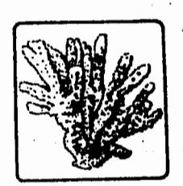

Corals are well-developed on the outer reef near the ava, 395 feet (120 m) or more offshore. Coral cover ranges from 25% to 40% here. Off Ma'atulaumea Point, Acropora corymbosa is well-developed in contrast to shoreward areas of the reef. Coral cover is about 10 to 20% off Ma'atulaumea Point, where the reef flat is a shallow limestone pavement. The sea cucumber, Stichopus chloronotus, is abundant (14).

A distinctive assemblage of wave-resistant corals, including Acropora humilis and Pocillopora brevicornis occupies the outermost reef flat and reef margin, from 490 to 590 feet (150 to 180 m) offshore. The margin exhibits turfs of brown and green algae and some beds of the soft coral, Palythoa sp. (14).

Fishes are not abundant on the reef flat off Auasi Village. However, diversity is relatively high, with at least 72 species represented (14;76). A high proportion of the fauna is juveniles (14). Juveniles of the surgeonfish, Ctenochaetus striatus, are common throughout the reef flat from shore to the margin. Also very common are adults (mainly) and juveniles of the damselfishes, <u>Glyphidodontops</u> <u>glaucus</u> and <u>G. leucopomus</u> (14), the latter more abundant on the outer reef (14;76). In areas of cover, adults (mainly) and juveniles of the damselfish, Stegastes albofasciatus, are relatively common. In areas of branching coral thickets inshore, S. albofasciatus is joined by adults of the surgeonfish. Acanthurus nigricans. Schools of juvenile rabbitfish (<u>Siganus spinus</u>) numbering up to about 200 individuals, graze on algae along the southwestern shore. Along the northeastern shoreline, in an area of rock and silty-sand, juveniles of the goatfishes, <u>Parupeneus</u> <u>bifasciatus</u> and <u>P. trifasciatus</u>, dominant, although not abundant. The wrasses, <u>Halicho</u> dominant, although not abundant. The wrasses, <u>Halichoeres</u> trimaculatus, <u>H. margaritaceus</u>, and <u>Thalassoma hardwickei</u>, are well distributed over the reef flat but are not as common as species mentioned above. Areas of coarse sand and rubble harbor juveniles of the surgeonfish, Acanthurus triostegus. reef edge, juvenile surgeonfish ( $\underline{A}$ . lineatus) are conspicuous (14).

Dominant species of fish in the ava are sub-adults of a jack ( $\underline{Caranx}$   $\underline{melampygus}$ ), schools of atherinids, and aggregations of parrotfishes ( $\underline{Scarus}$  spp.). Also present are large numbers of adult goatfish ( $\underline{Mulloidichthys}$   $\underline{flavolineatus}$ ) (14).

# FRINGING REEF FRONT

Prior to infestation by the crown-of-thorns starfish (alamea; Acanthaster planci), the reef slopes off Auasi were characterized by well-developed coral growth (14). The reef front at depths of 10 to 30 feet (3 to 9 m) was rich with corals, totaling over 60% bottom cover between the ava and Taugamalama Point. Acroporans dominated, particularly A. humilis and A. hyacinthus. Other species were also evident, including three or four other Acropora spp., Montipora spp., Pocillopora brevicornis, P. eydouxi, and several faviids. Isolated limestone pinnacles and knolls immediately southwest of the outer ava edge had variable

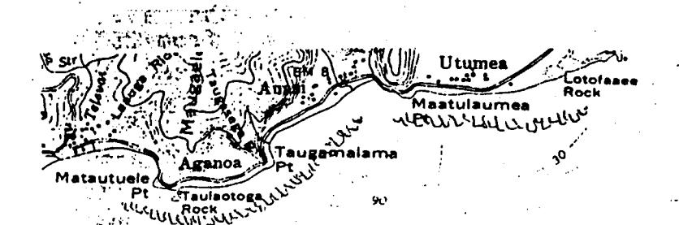

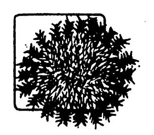

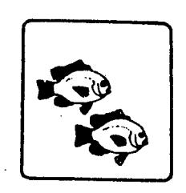

AUASI MAP 8 WATER CONDITIONS

AUASI MAP 8 WATER CONDITIONS

AUASI MAP 8 USE CONSIDERATIONS

coral cover. Coral cover was reduced southwest of the ava where the reef slope steepens from a depth of 60 feet (18 m) to a deep sand bottom. At depths of 165 to 195 feet (50 to 60 m), cover totaled about 30%. The burrowing sea urchin, Echinostrephus sp., is notable on the reef front, as are soft coral colonies (14).

The crown-of-thorns starfish (alamea; Acanthaster planci) was not evident on forereef slopes off Auasi in early and mid-1978 (74). Acanthaster was numerous on the upper reef front at depths of 6 to 33 feet (2 to 10 m) off Auasi in August and September 1979. About 50% of the corals were still living (75). In October 1979, approximately 50 to 60% of reef front corals were dead or being actively eaten by A. planci, which was abundant. The majority of the abundant table Acropora was dead (ASCRI-8B1).

Fishes are considerably more abundant and the fauna more diverse on the reef front off Auasi than over the reef flat. The assemblage includes at least 125 species (14;76). According to one survey, Chromis acares and Pomacentrus melanopterus are most abundant, followed by Ctenochaetus striatus, Plectroglyphidodon lacrymatus, and Scarus sp. (76). Other common species include adults of the surgeonfishes, Acanthurus triostegus, A. lineatus, A. glaucopareius, A. nigrofuscus, Zebrasoma scopas; the butterflyfish, Chaetodon reticulatus; the wrasse, Halichoeres centriquadrus; the goatfishes, Parupeneus bifasciatus and P. trifasciatus; the damselfishes, Chromis iomelas, Stegastes fasciolatus, Plectroglyphidodon johnstonianus, and P. vaiuli; and the parrotfishes, Scarus sordidus and S. oviceps (14).

#### LEAFU STREAM

Leafu Stream, draining an urban and agricultural area, frequently shows concentrations of fecal coliforms far in excess of water quality standards (40). Storm runoff through Leafu and Vaisa streams discharges large sediment loads to the ocean (67).

# **NEARSHORE WATERS**

Water circulation on the inner reef fronting the northeastern end of Auasi Beach is more sluggish than elsewhere on the reef flat. Depressed salinity along this section of the shoreline during relatively dry weather is from freshwater seepage. The inner portion of the ava cutting through Auasi reef is characterized by warm and turbid water. Visibility underwater increases with distance away from the ava (14). Construction of Auasi Harbor has altered the approach of waves and longshore currents (49).

# SHORELINE

The sand beach at Auasi Village is easily accessible from the coastal road and is a good swimming beach. Small boats can be launched across the beach adjacent to the boat harbor (41).

TUTUILA

EASTERN DISTRICT

SA'OLE CO.

JASI MAI

MAP 8

USE CONSIDERATIONS

( SMALL BOAT HARBOR

AUASI

4.3 .

B PAN

USE CONSIDERATIONS

UTUMEA

MAP 8

Utumea

Lotofaace
Rock

Maatulaumea
Pt Taugamalama
Pt Taugamalama

UTUMEA

MAP 8

PHYSIOGRAPHY

**PHYSIOGRAPHY** 

# AUASI SMALL BOAT HARBOR

A small boat harbor has been constructed at Auasi near Ma'atulaumea Point. A dredged basin serves as a loading area for barges carrying stone for construction of a boat harbor at Aunu'u Island (MAP A1) southeast of Auasi (ASCRI). Auasi Harbor provides docking for shallow-draft vessels (except during hurricane weather) and mooring for small fishing boats. Auasi is the traditional landing place for persons traveling between Tutuila and the small island of Aunu'u. The boat trip is hazardous during inclement weather -- especially on windy days. During the past 15 years, approximately 20 drownings have occurred as a result of overturned boats (67).

# FRINGING REEF

The reef fringing the coast from Taugamalama Point to Matuli Point is considered a "critical use reef area" because of subsistence fishing by villagers (39). The reef flat is most frequently fished, with rod and reel the favored method. Second most popular is throw-netting (kili). Pole fishing is primarily daytime activity, bringing catches of malauli (large jack), lupota (small jack), gatala (honeycomb grouper), and afulu (large goatfish). Throw-netting yields catches of manini (convict tang), alogo (lined surgeonfish), pone (chocolate surgeonfish), (adult mullet), fuafua (juvenile mullet), lupota, and, seasonally, atule (big-eye scad), lo (rabbitfish), and i'asina (juvenile goatfish) (20). At Auasi, pole fishing is practiced from ava margins, as well as from shore. Spearing occurs over the middle and outer reef platform but appears to be heaviest off the reef face and outer margins of the ava. Catches include gatala, alogo, tifitifi (moorish idol), as well as papata (slipper lobster). Torch fishing for fishes, octopus, and lobsters is relatively frequent, especially on the outer margin. The number of popular, edible fishes (14).

# COAST BETWEEN MA'ATULAUMEA POINT AND MATULI POINT

# SHORELINE

A low-sloping sand beach fronts the village of Utumea (ASCRI-8S2). Limestone fragments are scattered on the 50-foot ( $15\,$  m) wide foreshore and beachrock is exposed at intervals along the shore. The western half of the beach is experiencing minor erosion, as evidenced by a 2- to 3-foot (to 1 m) backshore scarp (49).

# FRINGING REEF

The reef flat east of Ma'atulaumea Point has a consolidated limestone bottom in offshore areas (ASCRI-8B2). The fringing reef narrows eastward to a width of 250 feet (75 m) off Matuli Point (49).

TUTUILA

rote 8472 10 Glunus 42 Gobies 13 EASTERN DISTRICT

SA'OLE CO.

UTUMEA

MAP 8

FLORA AND FAUNA

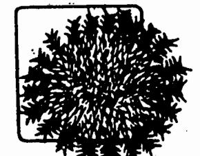

UTÜMEA

MAP 8

USE CONSIDERATIONS

ALÃO

**31** 

MAP 8

**PHYSIOGRAPHY** 

ALAO

MAP 8

**PHYSIOGRAPHY** 

**ALAO** 

MAP 8

FLORA AND FAUNA

(RARE WATERBIRD

**ALAO** 

MAP 8

FLORA AND FAUNA

# FRINGING REEF

Offshore areas of the reef flat east of Ma'atulaumea Point are populated by large stands of <u>Acropora aspera</u> (ASCRI-8B2). The crown-of-thorns starfish (alamea; <u>Acanthaster planci</u>) was abundant on the upper reef front at depths of 6 to 33 feet (2 to 10 m) off Utumea in August/September 1979. About 50% of the corals were alive (43).

# SHORELINE AND FRINGING REEF

The beach is easily reached down a low embankment from the coastal road (ASCRI-8S2). However, Utumea Beach is marked with signs declaring the area private and restricted for local use (41). For fishing uses see: AUASI / USE CONSIDERATIONS.

# COAST BETWEEN MATULI POINT AND MALIUGA POINT

#### ALAO MARSH

Behind the village of Alao there is a 4 acre (1.6 hectare) coastal marsh. Little of the former natural vegetation remains (as with most other coastal marshes) because of extensive cultivation of taro (77).

# SHORELINE

A wide beach of calcareous sand fronts the entire length of Alao Village (ASCRI-8S3) from near Matuli Point to Maliuga Point, a distance of 4,000 feet (1.2 km). Maliuga Point is a sandy spit terminating in a cluster of rocks which separates the long beaches fronting the villages of Alao and Tula. Limestone rubble is extensive in places, as are outcrops of beachrock at the waterline. A 6-foot scarp eroded in the backshore just north of Maliuga Point is stabilized by a revetment of randomly-dumped boulders. A small rubble seawall stabilizes a 1- to 4-foot high backshore scarp eroded along a section of beach fronting Alao (49). Although easily accessible from the coastal road, the beach is exposed to trade winds which normally blow onshore producing rough waters and strong currents across the reef.

#### MALIUGA POINT

The rare Australian gray duck (toloa; Anas superciliosus pelewensis), has been sighted on occasion along the southeastern coast of Tutuila in the vicinity of Maliuga Point (15).

# FRINGING REEF OFF MALIUGA POINT

The crown-of-thorns starfish (alamea; Acanthaster planci) was sparse in the upper reef front at depths of 6 to 33 feet (2 to 10 m) off Maliuga Point in August/September 1979. About 75% of the corals were alive (75).

111108 3 ....

. #**.6 tr** \$ **(** \$ 2 m s ). . 0 2 ( **S )** ( # \* \* \* \* \* \* \* \* \* \* \* \* \* \* \* \* \* \*

ALAO

MAP 8

USE CONSIDERATIONS

TULA

MAP 9

PHYSIOGRAPHY

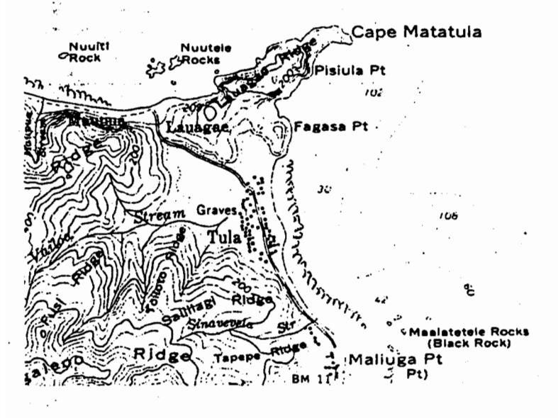

**PHYSIOGRAPHY** 

TULA

MAP 9

FLORA AND FAUNA

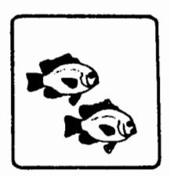

TULA

MAP 9

USE CONSIDERATIONS

FRINGING REEF

For uses see: TULA / USE CONSIDERATIONS.

# COAST BETWEEN MALIUGA POINT AND FAGASA POINT

The unimproved road from Tula to the north coast is being graded for future paving. A spur from this road leads to a weather station on Cape Matatula (ASCRI).

#### SHORELINE

A long beach extends from Maliuga Point to in front of Tula Village. Northwest of the point, the beach is narrow and consists of limestone rubble with scattered sand patches and basalt boulders. Beachrock is exposed continuously along the shore. Off Tula, the beach consists of calcareous sand and is about 47 to 50 feet (14 to 15 m) in width. Beachrock is exposed at intervals along the shoreline, which is strewn with limestone rubble. The public school grounds near the shoreline are protected by a limestone boulder seawall (49).

Although Tula Beach is wide and easily accessible from the coastal road, direct exposure to trade winds frequently causes rough waters and strong currents (ASCRI).

# FRINGING REEF

The fringing reef is only 250 to 300 feet (75 to 90 m) wide off Tula, but extends 600 feet (180 m) offshore of Maliuga Point (49).

# FRINGING REEF OFF TULA VILLAGE

The crown-of-thorns starfish (alamea; Acanthaster planci) was not evident on forereef slopes off Tula Village in early and mid-1978 (74). Acanthaster was sparse on the upper reef front at depths of 6 to 33 feet (2 to 10 m) off Tula in August/September 1979. About 70% of the coral heads were alive (75).

The reef front south of Tula Village harbors a highly diverse fish fauna. The assemblage includes at least 102 species but most are only moderately abundant. Most abundant is the damselfish, Pomacentrus melanopterus. Plectroglyphidodon dickii, Chromis xanthura, and Ctenochaetus striatus are common (76).

# FRINGING REEF

The reef fringing the coast from Matuli Point to Fagasa Point (fronting the villages of Alao and Tula) is considered a "critical use reef area" because of subsistence fishing by villagers (39). The reef flat is the focus of fishing use. Rod and reel is the preferred fishing method. Throw-netting is the second favored method, followed by spearing (mata) and seine net-

MAP 9

USE CONSIDERATIONS

ting (upega). Pole fishing is practiced primarily in the daytime and yields malauli (large jack), lupota (small jack), gatala (honeycomb grouper), and afulu (adult goatfish). Throw-netting is also a daytime activity, resulting in catches of manini (convict tang), alogo (lined surgeonfish), pone (chocolate surgeonfish), anae (adult mullet), fuafua (juvenile mullet), lupota, and, seasonally, atule (big-eye scad), lo (rabbitfish), and i'asina (juvenile goatfish). Alogo, pone, and laea (large parrotfish) are caught day and night by spearing. Day catches also include faisua (giant sea clam), fe'e (octopus), eel, fuga (small parrotfish), and gatala. Night catches include anae, crab, ula (spiny lobster), papata (slipper lobster), and ume (unicornfish).

Waves breaking off the reef between Matuli Point and Tula Village have potential for board surfing during the months of November to March. Good conditions require a rising tide and generally calm winds (51).

/MAP7.TEX/ - /AUG-1980/

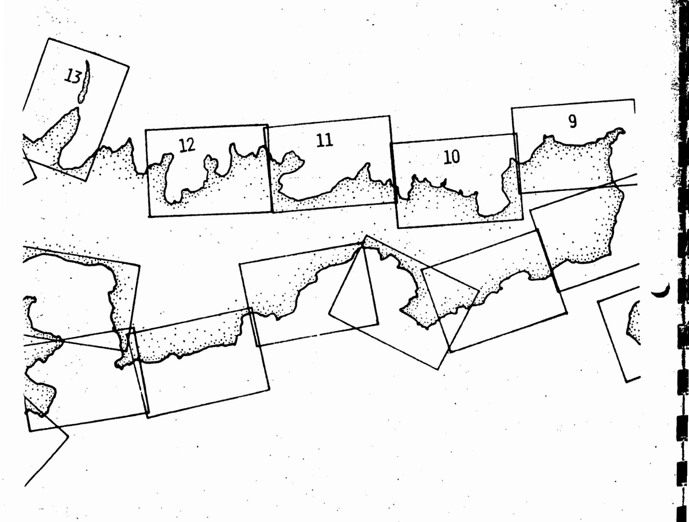

ATLAS MAPS COVERING THE NORTHEAST COAST OF TUTUILA. AMERICAN SAMOA

# THE NORTHEAST COAST OF TUTUILA

The northeastern coastline of Tutuila is characterized by headlands forming high, rugged cliffs and deeply embayed stream valleys. Upland drainage is provided by deeply-incised stream valleys radiating from the summit of the volcanic cones (64).

A secondary road (MAP 9) extends from Tula Village on the east coast across Cape Matatula to the north coast of Tutuila. A spur road terminates at an active quarry facing offshore seastacks of Nu'utele Rock and Nu'uiti Rock. The quarry is the source of rocks used in construction of Aunu'u small boat harbor (MAP A1). A coastal trail extends westward from the quarry to Onenoa Village. The secondary road runs westward above the quarry site and terminates at Onenoa Village. This road, passable only during dry weather, affords a scenic view of the ocean and the seastacks between Cape Matatula and Papaloa Point (ASCRI).

A short secondary road of graded soil, covered in places with coral fill, extends from the village of Amouli (MAP 7) on the south shore through a pass to Aoa Village (MAP 10) on the north shore at Aoa Bay (23). Another road connects from the village of Faga'itua (MAP 6) on the south shore to Masefau (MAP 11) on the north shore, with a spur extending to the villages of Masausi and Sa'ilele (MAP 10). This road is extremely steep winding and washes out during periods of heavy rains (23). these roads are subject to erosion during rainstorms and impassable during wet weather except by four-wheel drive vehicles Major improvements are planned for Aoa Road (39), and the Masefau Road has been widened. Presently under construction is a new road to connect the north shore villages of Aoa and Masausi (64). Access to Afono Village (MAP 12) from Aua Village (MAP 2) on Pago Pago Harbor is afforded by a steep road currently under improvement (ASCRI). Scenic views are afforded along the crest of the Afono road (41).

Several villages on the north shore are not served by roads of any kind and are reached either by boat or by hiking over trails across the mountains running the length of Tutuila (23). Improvements to the Masefau and Aoa roads, as well as completion of the "top mile" road's lower section near Afono Village are planned (39). Two village sites, at the head of Amalau Bay and on the cliff-top trail between Onenoa and Aoa Villages, have been abandoned (30).

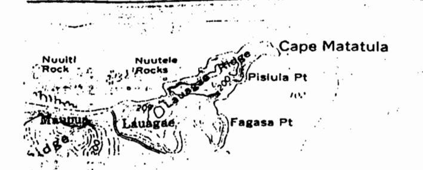

Cape Matatula -- A possible "Special Area" of scenic importance --- Chap VI.C.2 (21)

CAPE, MATATULA 

360 2 3 1 1 1 1 1 1 1 1 1 1 1 1 1 1 1 1 1 1

MAP

FLORA AND FAUNA

5 4 Mg 1/ TULA (LAUAGAE)

MAP

**PHYSIOGRAPHY** 

Nuult!

TULA (LAUAGAE)

MAP

9

**PHYSIOGRAPHY** 

TULA (LAUAGAE)

MAP

FLORA AND FAUNA

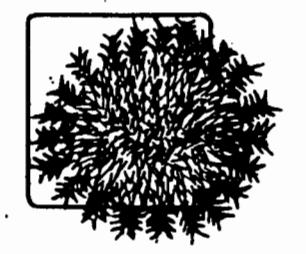

TULA (LAUAGAE)

MAP

USE CONSIDERATIONS

Papaloa Point is frequently used for fishing. Rod and reel fishing is the preferred activity, followed in popularity by diving with homemade spears (mata), and pole and line fishing. Alogo (lined surgeonfish), pone (chocolate surgeonfish), laea (large parrotfish), and eel are taken by spear day and night. Fe'e (octopus), faisua (giant sea clam), fuga (small parrotfish), and ume (unicornfish) are caught by day, whereas papata (slipper lobster), ula (spiny lobster), and crab are taken at night. Pole fishing yields day and night catches of gatala (honeycomb grouper), mataeleele (small emperor fish), filoa (large emperor fish), and savane (blue-lined snapper). In addition, lupota (small jack), and sumu (triggerfish) are caught by day, and malau (squirrelfish), matapula (bigeye snapper), and malai (paddletail snapper) at night (20).

# COAST BETWEEN PAPALOA POINT AND FATUMAGA ROCKS

# SHORELINE AND FRINGING REEF

A pocket beach of limestone rubble and scattered sand patches fronts Ogefao. Volcanic boulders litter the foreshore and reef flat. The backshore rises steeply to a trail at elevations above 25 feet (8 m)(49). The reef flat is approximately 350 feet (105 m) wide off Ogefao (49).

# OFFSHORE BETWEEN PAPALOA POINT AND OGEFAO

A large population of the crown-of-thorns starfish (alamea; <u>planci</u>) was located on forereef slopes Acanthaster Motusaga Point (MAP 10) in mid-1978. Nu'utele Rocks and Acanthaster was common on forereef slopes between Papaloa Point and Ogefao, although its distribution was rather patchy. were being eaten particularly at the base of large limestone mounds, while shallow surfaces were relatively free of starfish. Although present at depths as shallow as 6 feet Acanthaster was most concentrated at depths between 20 and 30 feet (6 and 9 m). The starfish had presumably moved into the shallow regions from deeper water, although the proportion of live versus dead coral heads in deeper areas was greater than in shallow reef areas (74). In August/September 1979, about 15% of the corals were alive east of Papaloa Point and only about were alive west of the Point. Acanthaster was not evident (75).

#### SHORELINE

A coastal trail extending southwest of Papaloa Point to Onenoa Village is mostly at the top of a sea cliff and does not provide ready access to the shoreline (ASCRI).

EAST VAIFANUA CO. . IUIUILA-

**PHYSIOGRAPHY** 

ONENOA

**PHYSIOGRAPHY** 

FLORA AND FAUNA

# COAST BETWEEN FATUMAGA ROCKS AND SOLO POINT (ONENOA BAY)

#### SHORELINE

A crescent beach fronting Onenoa Village is bounded by volcanic boulders lying at the base of headlands. The 40-foot (12 m) wide foreshore consists mostly of calcareous sand and some volcanic sediment. A band of basalt boulders and cobbles separates the foreshore from the reef flat. A boulder seawall protects houses adjacent to Vaisa Stream. Fatumaga Rock is a seastack about 15 feet (5 m) in elevation lying a short distance off the headland to the east of the village (49;ASCRI-9S2).

Onenoa Village consists of about 15 houses, several situated immediately behind the beach (ASCRI).

# FRINGING REEF

The fringing reef is 350 feet (105 m) wide off Onenoa (49). Volcanic boulders are exposed at low tide on the inner reef flanking the eastern side of Onenoa Bay. The bottom consists mostly of rubble with some silty-sand (ASCRI-9B1). An ava (channel) crosses the outer reef off Onenoa Village. Channel margins are consolidated limestone with deep undercuts. Consolidated limestone boulders on the channel bottom 15 to 20 feet (5 to 6 m) deep are silt-covered (ASCRI-9B2).

Generally, the outer reef is shallower than inshore areas. However, depressions reaching 4 feet (1.2 m) are conspicuous, especially near the ava (ASCRI-9B3). Southwest of the ava, the inner reef is a platform of consolidated coral rubble, solid limestone, and loose rubble. Depth at high tide is not over 3 feet (1 m) (ASCRI-9B4).

#### FRINGING REEF

Pockets of silty-sand on the inner reef flanking the eastern side of Onenoa Bay harbor numerous sea cucumbers (Stichopus chloronotus). Small barnacles are present on lava rocks exposed at low tide. The only conspicuous fleshy alga is an unidentified cyanophyte (blue-green)(ASCRI-9B1).

The coralline alga, <u>Porolithon</u> sp., encrusts limestone boulders on the bottom of the ava. Coral heads in this area are mostly dead, possibly a result of predation by the crown-of thorns starfish (alamea; <u>Acanthaster planci</u>) although none is evident. A few large colonies of <u>Millepora</u> sp. are present, together with soft coral colonies (ASCRI-9B2).

Corals are not well developed on the outer reef west of the ava, where cover approaches 10%. Algae also are poorly represented except for an abundance of encrusting coralline species. Sea urchins (Echinometra mathaei) are present (ASCRI-9B3).

FLORA AND FAUNA

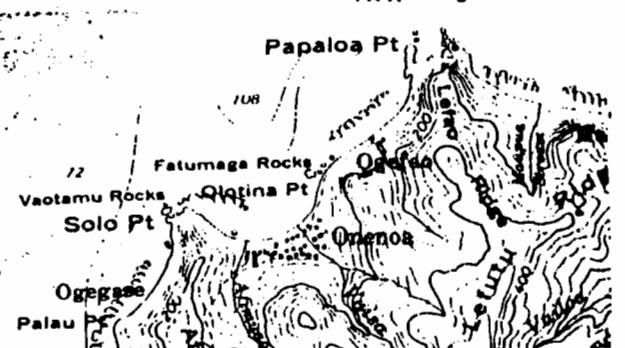

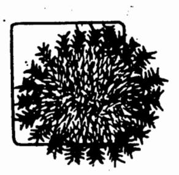

ONENOA

WATER CONDITIONS

# CAPE MATATULA

Cape Matatula, the northeastern tip of the Island of Tutuila, terminates in a point of dense lava rock which has been etched by wave erosion from the softer cinder bed materials that once surrounded it. This promontory is the largest of several dense lava plugs, crater fills, and remnants of associated cinder cones surrounding Olomoana Peak (54).

# OFF CAPE MATATULA

Corals on the bottom at depths of 6 to 33 feet (2 to 10 m) off Cape Matatula were alive in August/September 1979. The crown-of-thorns starfish (alamea; <u>Acanthaster planci</u>) was uncommon (75).

# COAST BETWEEN CAPE MATATULA AND PAPALOA POINT

#### SHORELINE

Much of the shoreline between Cape Matatula and Papaloa Point consists of volcanic boulders (talus). East of Papaloa Point there is a 3,000-foot (900 m) long beach of basalt boulders, limestone rubble, and scattered sand patches. An exposed outcrop of beachrock is present. Beach width is nearly 30 feet (9 m) (49;ASCRI-9S1).

#### FRINGING REEF

The fringing reef extends 100 to 150 feet (30 to 45 m) offshore just east of Papaloa Point (49). Spur-and-groove development is evident in the reef margin offshore (ASCRI-9S1).

# \*OFFSHORE BETWEEN NU\*UTELE ROCK AND PAPALOA POINT

In June 1978, a relatively large population of the crown-of thorns starfish (alamea; Acanthaster planci) was observed on forereef slopes along the northeastern coast of Tutuila between Nu'utele Rocks and Motusaga Point. Three aggregations of Acanthaster appeared to be moving parallel to shore between Nu'utele Rocks and Papaloa Point. Live coral was abundant between these aggregations (74). Only a small percentage of corals on the upper reef front at depths of 6 to 33 feet (2 to 10 m) were living in August and September 1979 (75).

# EAST OF PAPALOA POINT

A narrow sand beach just east of Papaloa Point is accessible from the unimproved road which runs from Tula Village to a quarry site (MAP 8)(ASCRI).

The narrow reef flat fringing an unnamed bay east of

ONENOA (OGEFAO)

PHYSIOGRAPHY

ONENOA (OGEFAO)

FLORA AND FAUNA

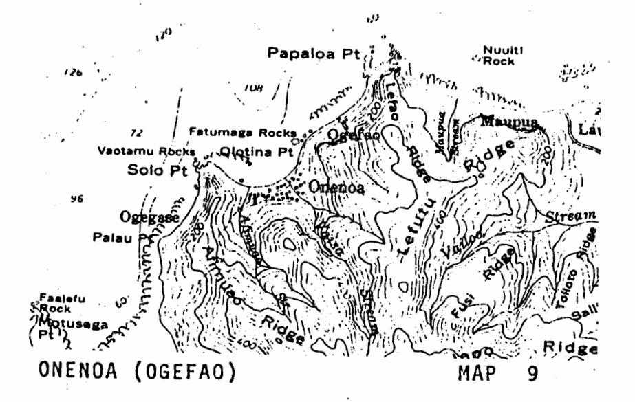

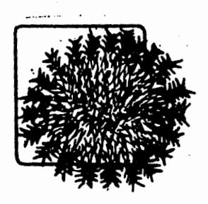

USE CONSIDERATIONS

Coral cover is sparse (about 1%) on the inner reef platform southwest of the ava. Staghorn Acropora is most common. At least 25 coral species representing 17 genera are present on the reef fronting Onenoa Village. Ralfsia sp., Actinotrichia sp., Halimeda sp. and encrusting corallines are the most conspicuous algae (ASCRI-984).

The reef flat in front of Onenoa Village shelters a diverse and moderately abundant fish fauna. At least 54 species recorded. Large schools (1,500 to 2,000 individuals) of the surf perch, Kuhlia mugil, are seen occasionally in shallow water off the beach where a boulder habitat is otherwise impoverished. Atherinids are present in large numbers but are not conspicuous because of their small size. Wrasses and damselfishes dominate nearshore areas. Hawkfishes, butterflyfishes, and surgeonfishes are conspicuous toward the reef margin. Abundance of all species increases along the margins of an ava, but parrotfishes and surgeonfishes are especially abundant there. Large schools of juvenile parrotfish and surgeonfish occur in all areas. ing the fish assemblage are atherinids, surf perch (Kuhlia butterflyfishes mugil), goatfish (Parupeneus chryserydros), (Chaetodon auriga and C. citrinellus), surgeonfishes (Acanthurus lineatus, A. nigrofuscus and A. triostegus), damselfishes (Glyphidodontops cyanea, G. leucopomus and Plectroglyphidodon leucozona), wrasses (Halichoeres hoeveni, Stethojulis bandanensis and Thalassoma hardwickei), and parrotfishes of several species (Scarus spp.) (ASCRI-9F1).

A chief of Onenoa Village reports that alamea (Acanthaster planci) was never abundant in his lifetime until an outbreak in 1978, but he recalls from the talk of his elders that alamea was abundant many decades before (3). The largest aggregation of Acanthaster of the present infestation was first seen in May 1978, moving into Aoa and Onenoa Bays. Over half the total Acanthaster removed and buried on Tutuila during a bounty program from January 23 to October 25 1978, are reported to have been collected from the reefs near Onenoa Village. Only a few Millepora, alcyonarians and zoanthids were left untouched by the very abundant Acanthaster off Onenoa (3). In June 1978, a fairly large population of Acanthaster was located on forereef slopes between Nu'utele Rocks and Motusaga Point (MAP 10). Acanthaster was noted as conspicuous between Ogefao and Solo Point, although about 90% of the corals on the outer part of the reef flat were alive and relatively few starfish were observed there (74).

#### **NEARSHORE WATERS**

A strong current flows southwest across the reef flat toward the ava. Waters over the reef flat fronting Onenoa Village are clear southwest of the ava. East of the ava, water circulation is sluggish and visibility is reduced over the inner reef flat (ASCRI).

MAP

USE CONSIDERATIONS

**PHYSIOGRAPHY** 

AOA

MAP 10

**PHYSIOGRAPHY** 

AOA.

MAP 10

**PHYSIOGRAPHY** 

# FRINGING REEF

The reef flat fringing the coast from Onenoa Village to Solo Point is considered a "critical use reef area" because of subsistence fishing by Villagers (39). The entire reef flat between Papaloa Point and Solo Point, is fished regularly. Diving with homemade spears (mata) is the favored method of fishing. Pole and line fishing is second most popular, followed by reef gleaning. Spearing and pole fishing provide catches of fish species similar to those taken east of Papaloa Point. Day gleaning off Onenoa yields fe'e (octopus), eel, and matapisu (limpets; Cellana sp.). Night gleaning yields alili and sisi (sea snails)(20).

# COAST BETWEEN SOLO POINT AND MOTUSAGA POINT (AOA BAY)

The neck of land between Aoa and Amouli (MAP 5) represents the saddle between Olomoana and Alofau volcanoes narrowed by the drowning of two large canyons. The canyons are especially large because each carried drainage from the slopes of two volcanoes (54). Aoa Bay is backed by a narrow coastal plain bounded on three sides by steep mountain ridges (49).

#### TAPUA STREAM

Near its outlet to Aoa Bay, Tapua Stream forms a small estuary. The stream mouth shifts position along the sand shoreline (48).

# SHORELINE

The eastern perimeter of Aoa Bay consists of a basalt boulder wall between the low and high tide lines. The 3- to 5-foot (1 to 2 m) high wall is fronted by a gently-sloping foreshore of fine sand and basalt rubble. A small delta at the mouth of Laolu Stream consists primarily of basalt cobbles and small boulders. At the head of Aoa Bay is a crescent beach of sand with scattered basalt and limestone rubble. The 30- to 50-foot (9 to 15 m) wide beach between Laoulu and Tapua Streams is broken by an outcrop of basalt (49). A school situated at the southwestern end of Aoa Village is protected by a seawall 710 feet (216 m) long (70). The western perimeter of Aoa Bay consists of a 30-foot wide sand beach fronted by a wide, shallow reef flat. South of Motusaga Point there is a section of shoreline protected by a rock seawall extending from the reef flat to the 4-foot elevation (49).

# FRINGING REEF

The reef fronting Aoa Village extends 800 to 1200 feet (245 to 365 m) offshore (62). Extensive sand flats occupy the inner reef at the head of Aoa Bay. A sand flat extending 80 feet (25 m) offshore is exposed at low tide. Minus tides expose a sand flat extending nearly 260 feet (80 m) offshore of the seawall

EAST VAIFANUA CO.

AOA

MAP 10

FLORA AND FAUNA

A0A

MAP 10

FLORA AND-FAUNA

fronting Aoa School. The sand is mixed with limestone rubble some areas, and tends to be somewhat muddy between 160 and 330 feet (50 to 100 m) offshore. A slightly raised bank shoals to a depth of 3 or 4 inches (7 to 10 cm) nearly 330 feet (100 m) offshore where sand covers about 85% of the bottom. (100 m) there is progressively less sand and increasing proportions of limestone rubble and boulders. The deepest part of the reef flat (to 2 feet or 70 cm) lies between 330 and 410 feet (100 to 125 m) offshore. Coral wheels up to 3 feet (1 m  $\,$ across) are scattered over the reef flat covering up to 75% of the bottom in this area. Sand is generally sparse beyond 410 feet (125 m) from shore, where the bottom shaols to about 6 inches (15 cm) deep. Boulders here are exposed at low tide. Increasing limestone rubble, partially consolidated by encrusting coralline algae, occurs beyond 650 feet (200 m), although sand accounts for 50% of the bottom in some areas. The depth between 740 and 900 feet (225 to 275 m) offshore varies between 6 and 10 inches (15 to 25 cm). An ava (channel) cuts diagonally across the reef flat. Near the channel margin are dead coral heads up to 1.5 feet (0.5 m) across, some of which rise to within one foot (0.3 m) of the surface from a depth of about 3 feet (1 m) (48;49).

The inner reef flat south of Motusaga Point consists of basalt cobbles, limestone rubble, and sand, and is exposed at low tide (49).

# **AOA MANGROVE FOREST**

A 4 acre (1.6 hectare) mangrove forest behind the village of Aoa extends along several branches of the stream flowing into Aoa Bay. This forest consists largely of a mature stand of oriental mangroves (Bruguiera gymnorhiza), with some red mangroves (Rhizophora mangle) present lower down the shore (48;77).

# FRINGING REEF FLAT

Nearshore parts of the sand flat in Aoa Bay generally lack conspicuous biota, except for burrows of ghost crabs (Ocypoda sp.) near the seawall. Anemonies are numerous on the sand flat from 65 to 245 feet (20 to 75 m) offshore. The seagrass, Halophila sp., is the dominant bottom form in the zone of muddy-sand. In some areas the seagrass is heavily covered by epiphytic algae. A sparse cover of algae, mostly Padina sp., occurs on rocks between 165 and 245 feet (50 and 75 m) offshore. Rocks beyond 80 feet (25 m) are covered with Jania sp., Dictyota sp., and Halimeda sp. Numerous cowries (Cypraea annulus) occur in crevices in the larger rocks (48). Few fishes inhabit the inner reef flat. The only species observed out to 330 feet (100 m) from shore are small schools of juvenile mullet (Chelon vaigiensis), goatfish (Mulloidichthys flavolineatus), and occasional small jacks (Caranx melampygus) (48).

Coral is absent from the reef flat inside 330 feet (100  $\,$  m) of shore. In the area of large coral wheels, live tissue (Porites

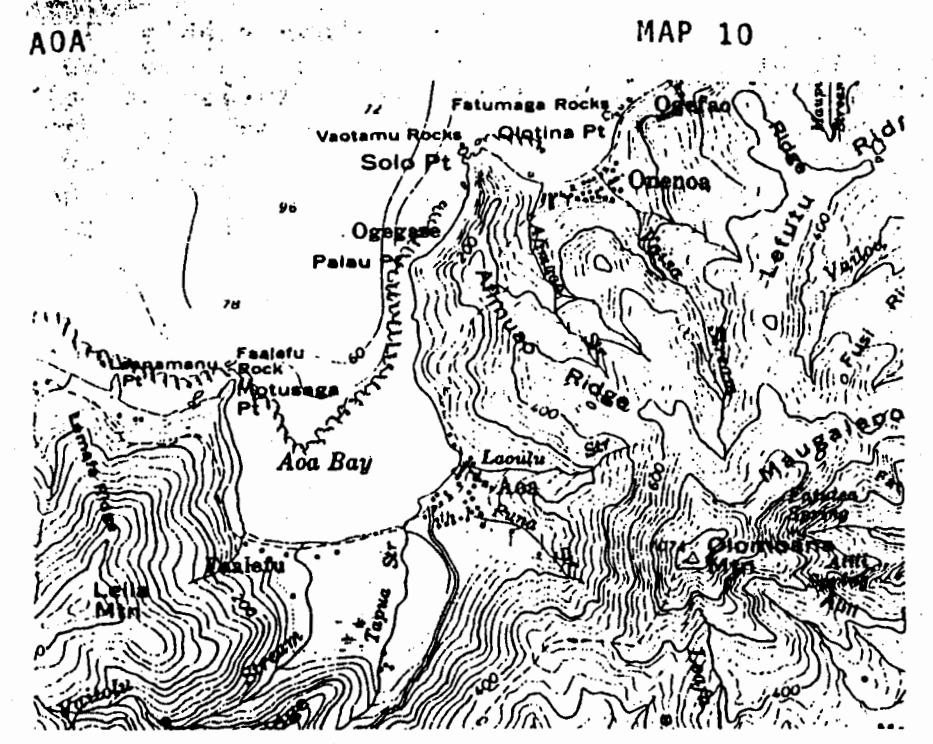

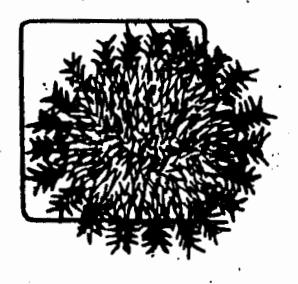

AOA

WATER CONDITIONS

lutea) is characteristically restricted to the outer edges of the "wheels". Elsewhere on the flat, coral-covered boulders are closely spaced and cover up to half the bottom with coral cover about 15%. Pavona frondifera is most common. Pavona decussata and Leptastrea purpurea are present. A sparse algal cover on dead coral heads includes Jania sp. and Halimeda sp. Limestone rubble from 655 to 900 feet (200 to 275 m) offshore is partially-consolidated by encrusting coralline algae (mostly Porolithon sp.). Coral cover is generally low in this zone. Very little coral occurs between 655 and 740 feet (200 to 225 m) offshore. Where the depth increases between 740 and 820 feet (225 to 250 m) offshore, coral cover reaches 20%, consisting mostly of Pavona decussata and P. frondifera. Large heads of Pavona occur along the margins of the ava, where Acropora humilis occurs also (43).

Coral heads on the sand and rubble flats provide shelter for small fishes. Most abundant are the damselfishes, Plectrogly-phidodon leucozona, Stegastes albofasciatus, Dascyllus aruanus, Chromis caerulea, Abudefduf coelestinus, the wrasses, Halichoeres trimaculatus and Thalassoma hardwickei, the surgeonfish, Acanthurus nigrofuscus, the butterflyfishes, Chaetodon citrinellus, C. vagabundus, and Heniochus chrysostomus, the grouper Epine-phelus merra, the snapper, Lutjanus fulvus, the rabbitfish, Siganus rostratus, the sharpnose puffer, Canthigaster solandri, the cardinalfish, Cheilodipterus quinquelineatus, and the moorish idol, Zanclus cornutus. On sand and rubble areas between coral heads are occasional gobies (Cryptocentrops maculosus and Cryptocentrus koumansi) sharing burrows with the snapping shrimp, Alpheus djiboutensis (48).

The largest aggregation of <u>Acanthaster planci</u> in the recent infestation of Tutuila reefs was first seen in May 1978 in Aoa and Onenoa Bays. Over 25% of the <u>Acanthaster</u> reputed to have been removed and buried on Tutuila during a bounty program from January to October 1978, were reportedly collected on the reef fronting Aoa (3). A relatively large population of <u>A. planci</u> was located on forereef slopes between Nu'utele Rocks (MAP 9) and Motusaga Point in June 1978 (74). Only about 15% of corals on the upper reef front at depths of 6 to 33 feet (2 to 10 m) are alive. <u>Acanthaster</u> is sparse (75).

# AOA BAY

Substantial quantities of sediment have been deposited at the mouth of Tapua Stream and entered Aoa Bay. However, there is no evidence of sedimentation or damage on the reef from erosion of the Aoa and Masefau roads (39).

Currents flow seaward through the ava which cuts across Aoa reef. Underwater visibility is rather poor (about 6 feet or 2 m) over the reef flat (48).

AOA

MAP 10

USE CONSIDERATIONS

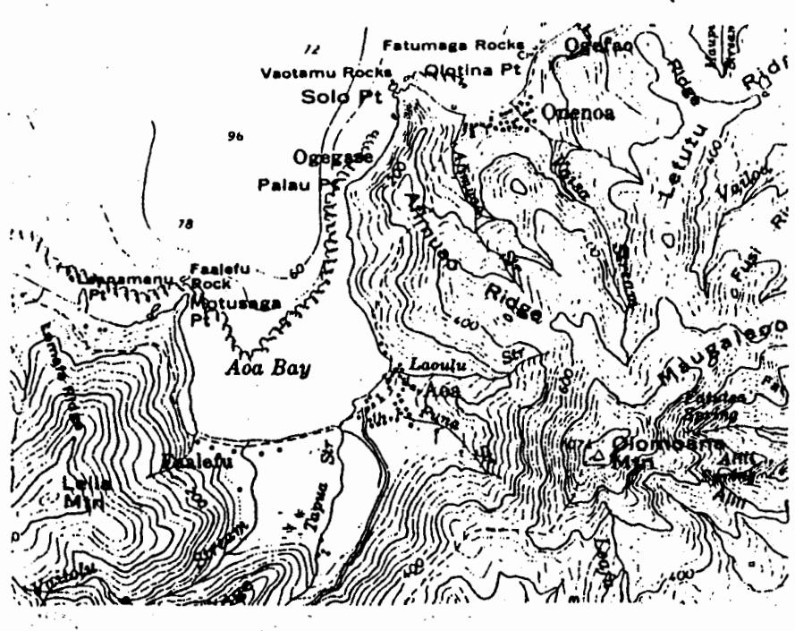

SA'ILELE

MAP 10

**PHYSIOGRAPHY** 

SA'ILELE

**MAP 10** 

PHYSIOGRAPHY

# AOA VILLAGE - AOA BAY

The unimproved road to Aoa Village from Amouli Village on the southern shore (MAP 7) terminates at Tapua Stream (48). Fa'alefu is reached from Aoa by crossing a suspension bridge. A school is located on the western bank of Tapua Stream (62). Access to coastal areas west of Aoa is by foot trail (ASCRI). A footpath parallels the eastern side of Aoa Bay, connecting several small tourist fales with the main village (41;49).

The reef fringing Aoa Bay is considered a "critical reef area" because of subsistence fishing by villagers (39). reef flat is the most frequently fished area (20). Residents of Aoa Village report light fishing effort on the reef flat. small amount of hook and line fishing is practiced, mostly by children. Occasionally, gleaners seek octopus, or search spiny lobster at night using torches along the outer edge of the reef (48). Throw-netting is the favored technique, followed by pole and line fishing. Spearing (mata) and reef gleaning are less popular activities. Manini (convict tang), alogo (lined surgeonfish), pone (chocolate surgeonfish), anae (adult mullet), fuafua (juvenile mullet), lupota (small jack) are taken during the day by throw net. Atule (big-eye scad), lo (rabbitfish), and i'asina (juvenile goatfish) are also caught by this method in Spearing results in day and night catches of alogo, pone, laea (large parrotfish), and eel. In addition, fe'e (octopus), faisua (giant sea clam), fuga (small parrotfish), and ume (unicornfish) are speared by day, and papata (slipper lobster). ula (spiny lobster), and crab are speared at night. Day gleaners collect fe'e, eel, and matapisu (limpet). Night gleaners take alili and sisi, (sea snails) (20). No seine netting is reported. An incident of poisoning fish (probably using poison from local plants) was witnessed on the inner reef flat (48).

# COAST BETWEEN MOTUSAGA POINT AND FOLAU POINT

#### SHORELINE

A pocket beach lies between Motusaga Point and Leanamanu Point. The foreshore is 50 to 60 feet (15 to 13 m) wide and consists mostly of calcareous sand (49). The beach off Sa'ilele is bounded by sea stacks which act as natural groins stabilizing the beach. The 60-foot wide foreshore is composed of calcareous sand with considerable limestone rubble, especially at the foreshore crest. A 5-foot scarp is cut in the foreshore crest at the eastern end of the beach. Aonoi Stream, a small intermittent stream, discharges through the center of the beach and has formed a small delta of basalt cobbles on the reef flat. The western end of the beach grades to a foreshore of limestone and basalt rubble, with beachrock exposed at intervals along the shore (49).

#### FRINGING REEF

The fringing reef off Sa'ilele has a width of nearly 400

SA'ILELE

1 083 (mass 500) 1 1 1 1 1 1 1 1 1 1 1 1 1 1 1 1 1 1 1 MAP 10

PHYSIOGRAPHY

SA'ILELE

MAP 10

FLORA AND FAUNA

( SEABIRD NESTING AREA

SA'ILELE

MAP 10

FLORA AND FAUNA

SA'ILELE

MAP 10

HISTORICAL/ARCHAEOLOGICAL

SA! ILELE

MAP 10

USE CONSIDERATIONS

SA'ILELE

MAP 10

USE CONSIDERATIONS

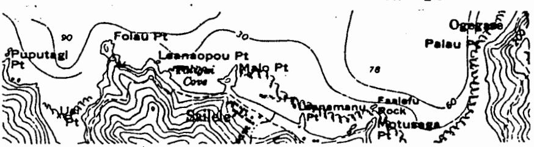

MASAUSI

MAP 10

**PHYSIOGRAPHY** 

feet (120 m). The reef lacks major channels (ava). The reef flat consists of limestone rubble and consolidated limestone with little sand (49).

#### TOLIGAI COVE

A gently-sloping beach and nearshore reef flat at the head of Toligai Cove consists primarily of basalt boulders and cobbles, with scattered calcareous sand (49).

# MALO POINT AND FOLAU POINT

The blue-gray noddy (laia; <u>Procelsterna cerulea</u>), an uncommon resident seabird, roosts and nests on both Malo Point and Folau Point (15).

# FRINGING REEF

Abundance of the crown-of-thorns starfish (alamea; Acanth-aster planci) observed on the forereef slopes from Motusaga Point to Puputagi Point (MAP 11) in June 1978, steadily declined to just a few individuals (74).

# BURIAL GROUND

A high chief burial ground is located along the coast near Sa'ilele Village (41).

# SHORELINE

Access to Sa'ilele Beach is by courtesy of the village. Swimming conditions are excellent (41).

# FRINGING REEF OFF SA'ILELE VILLAGE

The reef fringing the coast between Motusaga Point and Leanaopou Point is regularly fished (20). The reef flat between Motusaga Point and Malo Point is considered a "critical use reef area" because of subsistence fishing by villagers (39). Spearing (mata) is most common. Pole and line fishing is second in popularity, followed by reef gleaning and handlining at night from canoes. Fishes taken by spear, pole and line, and gleaning are similar to the catch from Aoa reef. Handlining at night from canoes results in catches of malau (squirrelfish), matapula (bigeye snapper), malai (paddletail snapper), mataeleele (small emperor fish), savane (blue-lined snapper), and filoa (large emperor fish)(20).

# COAST BETWEEN FOLAU POINT AND PUPUTAGI POINT

# HORELINE

A pocket beach of calcareous sand, littered with basalt cobbles and boulders, occupies the head of a small bay fronting

Togy of all all all all all all all all all al

MASAUSI

MAP 10

**PHYSIOGRAPHY** 

MASAUSI

MAP 10

FLORA AND FAUNA

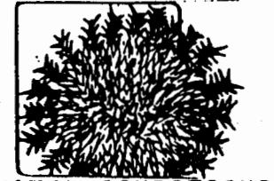

MASAUSI

MAP 10

WATER CONDITIONS

MASAUSI

MAP 10

USE CONSIDERATIONS

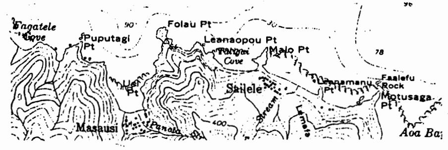

MASEFAU

MAP 11

etoga Island

PHYSIOGRAPHY

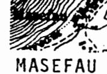

MAP 11

**PHYSIOGRAPHY** 

Masausi Village. The foreshore is 40 feet (12 m) wide. Two streams empty into the bay at opposite ends of the beach. Both streams have built deltas of basalt cobbles (49).

# FRINGING REEF

A fringing reef extends about 500 feet (150 m) seaward off Masausi Village. The depth is less than one foot near shore and increases to 2 feet at the reef margin. The inner reef flat is mostly silt-veneered rocks and rubble (49).

# OFF FOLAU POINT

Only about 20% of corals on the upper reef front at depths of 6 to 33 feet (2 to 10 m) were alive in August/September 1979. The crown-of-thorns starfish (alamea; Acanthaster planci) was relatively common at that time (75).

# BAY AT MASAUSI

Masausi is protected from waves except those approaching from the north. Nearshore waters are turbid (49).

# FRINGING REEF

The reef fringing an unnamed bay in front of Masausi Village is considered a "critical use reef area" because of subsistence fishing by villagers (39). The reef flat is most frequently fished. Diving with homemade spears (mata) is the most common practice. Pole and line fishing ranks second, followed by reef gleaning and handlining at night from canoes. Catches by all methods are similar to those from Aoa and Sa'ilele reefs (20). (See above)

# COAST BETWEEN TIAPE'A POINT AND NU'USETOGA ISLET (MASEFAU BAY)

# TALALOA STREAM AND MASEFAU BAY

Perennial Talaloa Stream discharges into Masefau Bay near the village of Masefau. A catchment basin at a spring provides drinking water to the village (71). The stream drains a large saddle area between the Pago and Taputapu volcanoes. The large Masefau Bay and tributary valley arose due to the concentration of drainages between two lines of cones on the northeast rift zone of the Pago Volcano (54).

# SHORELINE (SOUTHERN PERIMETER OF MASEFAU BAY)

Most of the shoreline around Masefau Bay has an erosion problem. Rudimentary seawalls and boulder revetments line the shore. Seawall sections are deteriorating and a wave-cut scarp approaches the road in ardas of the southeastern bay where the backshore is low (49). The shoreline along the southern perimeter of Masefau Bay has been eroding since the late 1960's when sand

MASEFAU

MAP 11

**PHYSIOGRAPHY** 

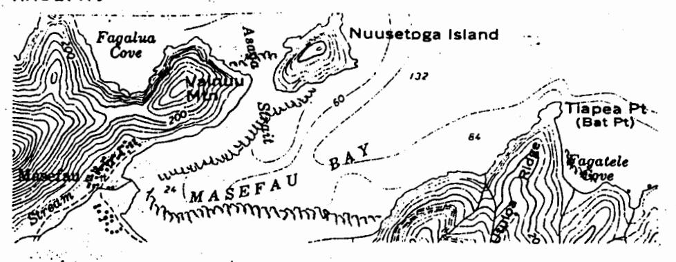

( DREDGED AREA

MASEFAU

**MAP 11** 

**PHYSIOGRAPHY** 

MASEFAU

MAP 11

FLORA AND FAUNA

\* Talaloa Stream -- A possible "Special Area" of pristine value --- Chap VI.C.3 (21)

was dredged from the reef flat using a back-hoe and trucks. A narrow strip of calcareous sand fronts seawalls and unprotected areas of the shore. A sand beach once present below the road embankment has disappeared (ASCRI-11S1).

# FRINGING REEF FLAT (SOUTHERN MASEFAU BAY)

The fringing reef at the head of Masefau Bay has between 500 and 850 feet (150 to 260 m)(49). A rubble fan composed of mixed volcanic and limestone fragments stands somewhat higher than the surrounding inner reef flat off a small stream culvert along the southern shore of Masefau Bay. Surrounding areas composed mostly of sand (with rubble admixture) are exposed at low tide for distances of up to 75 feet (23 m) offshore. Depths to 1.5 feet (0.4 m) occur between shore and 200 feet (60 offshore (ASCRI-11B1). The middle reef zone extends from 200 to 500 feet (60 to 150 m) offshore, with depths between 1 and 2 feet (0.3 and 0.6 m). Limestone boulders increase on the outer portion of the mid-reef, which is a limestone flat of dead <u>Pavona</u> elevated slightly above inner reef areas. The "Pavona" flat may be exposed at low tide. Scars are evident in 1971 aerial photographs on the inner and mid-reef off the eastern end Masefau Village where sand was dredged in the late 1960's (ASCRI-11B2). From 500 to 800 feet (150 to 245 m) offshore the outer reef flat at depths of 1 to 2 feet (0.3 to 0.6 m). Rubble and sand are the predominant bottom types. Near the reef margin are large slabs of limestone and limestone boulders, some elevated above water (ASCRI-11B3). About 850 feet (260 m) from shore there is a consolidated limestone margin marked by a poorly developed algal ridge at a depth of 6 to 12 inches (15 to 35 cm) (ASCRI-11B4).

A remnant of raised reef projecting above the fringing reef in Masefau Bay is considered evidence of a former higher stand of sea (54).

# REEF FRONT (SOUTHERN MASEFAU BAY)

The reef front is a steep slope of consolidated limestone. Spur-and-groove formations, although irregular and poorly developed inside the bay, are well-formed along the reef front in outer Masefau Bay (ASCRI-11B5).

#### TALALOA STREAM AND MANGROVE SWAMP

Talaloa Stream is considered to have exceptional natural value because of its largely pristine condition (71).

Behind the village of Masefau is a mangrove forest covering an area of approximately 15 acres (6 ha). The vegetation is a mature forest of oriental mangroves (<u>Bruguiera gymnorhiza</u>) growing along the lower reach of Talaloa Stream (77).

TUTUILA

# EASTERN DISTRICT

SUA CO.

MASEFAUJOR DE LA CONTRACTOR DE LA CONTRACTOR DE LA CONTRACTOR DE LA CONTRACTOR DE LA CONTRACTOR DE LA CONTRACTOR DE LA CONTRACTOR DE LA CONTRACTOR DE LA CONTRACTOR DE LA CONTRACTOR DE LA CONTRACTOR DE LA CONTRACTOR DE LA CONTRACTOR DE LA CONTRACTOR DE LA CONTRACTOR DE LA CONTRACTOR DE LA CONTRACTOR DE LA CONTRACTOR DE LA CONTRACTOR DE LA CONTRACTOR DE LA CONTRACTOR DE LA CONTRACTOR DE LA CONTRACTOR DE LA CONTRACTOR DE LA CONTRACTOR DE LA CONTRACTOR DE LA CONTRACTOR DE LA CONTRACTOR DE LA CONTRACTOR DE LA CONTRACTOR DE LA CONTRACTOR DE LA CONTRACTOR DE LA CONTRACTOR DE LA CONTRACTOR DE LA CONTRACTOR DE LA CONTRACTOR DE LA CONTRACTOR DE LA CONTRACTOR DE LA CONTRACTOR DE LA CONTRACTOR DE LA CONTRACTOR DE LA CONTRACTOR DE LA CONTRACTOR DE LA CONTRACTOR DE LA CONTRACTOR DE LA CONTRACTOR DE LA CONTRACTOR DE LA CONTRACTOR DE LA CONTRACTOR DE LA CONTRACTOR DE LA CONTRACTOR DE LA CONTRACTOR DE LA CONTRACTOR DE LA CONTRACTOR DE LA CONTRACTOR DE LA CONTRACTOR DE LA CONTRACTOR DE LA CONTRACTOR DE LA CONTRACTOR DE LA CONTRACTOR DE LA CONTRACTOR DE LA CONTRACTOR DE LA CONTRACTOR DE LA CONTRACTOR DE LA CONTRACTOR DE LA CONTRACTOR DE LA CONTRACTOR DE LA CONTRACTOR DE LA CONTRACTOR DE LA CONTRACTOR DE LA CONTRACTOR DE LA CONTRACTOR DE LA CONTRACTOR DE LA CONTRACTOR DE LA CONTRACTOR DE LA CONTRACTOR DE LA CONTRACTOR DE LA CONTRACTOR DE LA CONTRACTOR DE LA CONTRACTOR DE LA CONTRACTOR DE LA CONTRACTOR DE LA CONTRACTOR DE LA CONTRACTOR DE LA CONTRACTOR DE LA CONTRACTOR DE LA CONTRACTOR DE LA CONTRACTOR DE LA CONTRACTOR DE LA CONTRACTOR DE LA CONTRACTOR DE LA CONTRACTOR DE LA CONTRACTOR DE LA CONTRACTOR DE LA CONTRACTOR DE LA CONTRACTOR DE LA CONTRACTOR DE LA CONTRACTOR DE LA CONTRACTOR DE LA CONTRACTOR DE LA CONTRACTOR DE LA CONTRACTOR DE LA CONTRACTOR DE LA CONTRACTOR DE LA CONTRACTOR DE LA CONTRACTOR DE LA CONTRACTOR DE LA CONTRACTOR DE LA CONTRACTOR DE LA CONTRACTOR DE LA CONTRACTOR DE LA CONTRACTOR DE LA CONTRACTOR DE LA CONTRACTOR DE LA CONTRACTOR DE LA CONTRACTOR DE LA CONTRACTOR DE LA CONTRACTOR DE LA CONTRACTOR DE LA CONTRA

MAP 11

FLORA AND FAUNA

MASEFAU

MAP 11

FLORA AND FAUNA

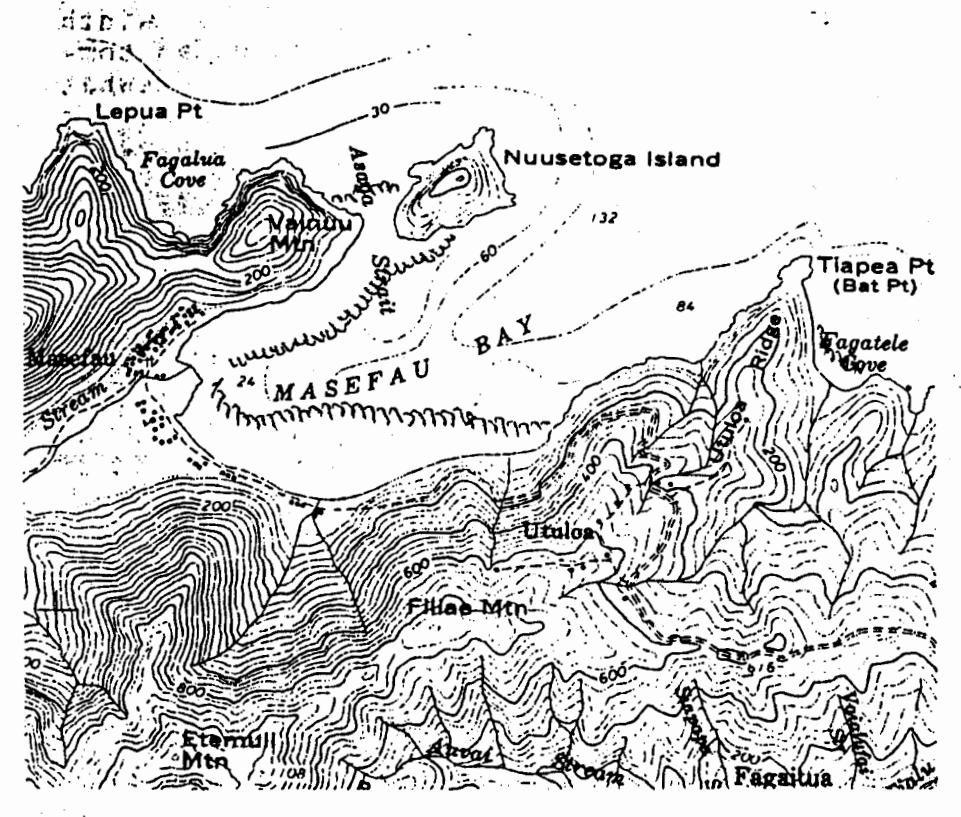

# OFFSHORE BETWEEN TIAPE'A POINT AND MASEFAU

No crown-of-thorns starfish (alamea; Acanthaster planci) were evident on forereef slopes between Tiape'a Point and Masefau in June 1978 (74).

# REEF FLAT (SOUTHERN MASEFAU BAY)

Some areas of the inner reef flat along the southern perimeter of Masefau Bay have considerable cover of brown alga (Padina sp.) and lesser amounts of seagrass (Halophila sp.). Live coral covers less than 5% of the inner reef flat (ASCRI-11B1). Porites lutea and Pavona fondifera were reported most common on the inner reef in 1978 (10). Coral cover is around 10% on the middle reef flat, where Pavona (3 species) is most common, followed by Porites (3 species). Algae account for about 20 to 30% bottom cover. Some areas exhibit considerable Padina tenuis, and Padina sp., whereas other areas lack Padina and Actinotrichia sp., Halimeda discoidea, and a brownish cyanophyte (blue-green) are most common. The sea urchin, Echinometra mathaei, abundant, as is the sea cucumber, <u>Holothuria hilla</u>. <u>Stichopus</u> choloronotus is common. Patches of a whitish-green sponge occur a few areas (ASCRI-11B2). Abundant recruitment of small sea cucumbers (Stichopus chloronotus) has been noted on the reef flat at Masefau Bay (3).

Few corals inhabit the rubble tracts on the outer reef flat. Fleshy algae cover up to 60% of the constantly submerged rubble areas, with <u>Padina</u> sp. most abundant. Large limestone slabs near the reef margin are encrusted by coralline algae (ASCRI-11B3). The reef margin has less than 5% bottom cover by live corals. Staghorn <u>Acropora</u> and <u>Pocillopora</u> are most common. The sea urchin, <u>Diadema</u> sp., is found in holes in low abundance. Encrusting coralline algae are abundant. The green alga, <u>Dictyosphaeria versluysii</u>, is common (ASCRI-11B4).

In general, the reef flat affords little cover for fishes and abundance is low. At least 18 species are present, with damselfishes, wrasses, and gobies most common. Other species undoubtedly cross the reef flat at times. Dominant species are the surf perch, Kuhlia marginatus, the surgeonfishes, Acanthurus nigrofuscus and A. triostegus, the damselfishes, Abudefduf septemfasciatus, Glyphidodontops cyanea, and G. leucopomus, and the wrasse, Thalassoma hardwickei. Three species of gobies are noted but not identified (ASCRI-11F1).

A <u>Pavona</u> zone, distinct from adjacent reef flat areas, supports an abundant fish assemblage, consisting of at least 29 species. All species recorded from adjacent reef areas, except <u>Kuhlia marginatus</u>, also occur in the <u>Pavona</u> zone. Damselfishes and wrasses are the dominant families, but juvenile parrotfishes, goatfishes, mullets, and butterflyfishes are common. Among the most abundant species are the butterflyfish, <u>Chaetodon citrinellus</u>, the surgeonfishes, <u>Acanthurus nigrofuscus</u> and <u>A. triostegus</u>, the damselfishes, <u>Stegastes albofasciatus</u>, <u>Glyphidodontops cyanea</u>

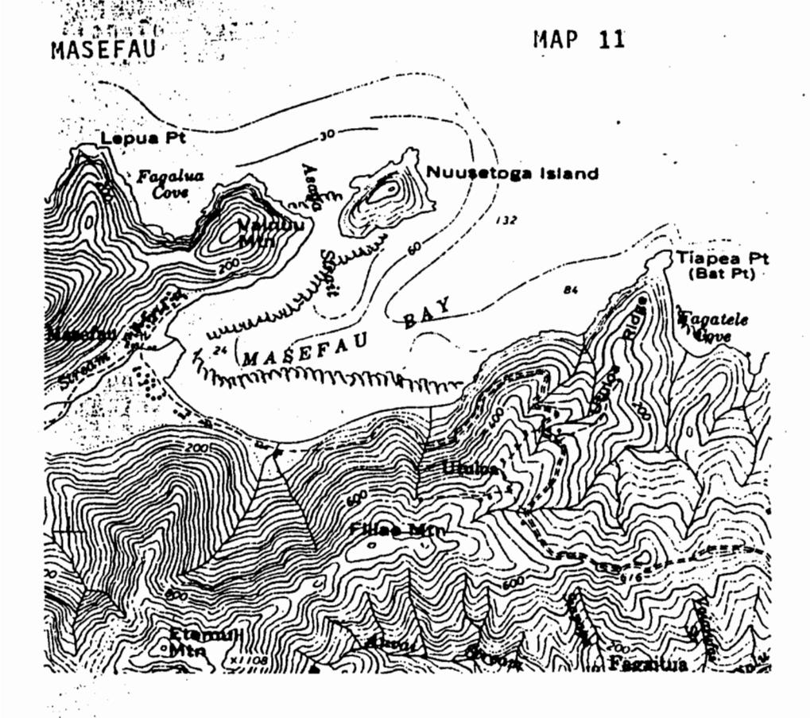

FLORA AND FAUNA

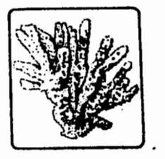

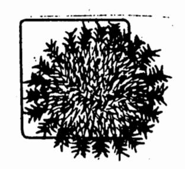

MASEFAU MAP 11 WATER CONDITIONS

MASEFAU MAP 11 PHYSIOGRAPHY

and G. <u>leucopomus</u>, the wrasse, <u>Thalassoma hardwickei</u>, and juvenile parrotfishes, <u>Scarus</u> spp. (ASCRI-11F2).

# REEF FRONT (SOUTHERN MASEFAU BAY)

Live coral covers up to 75% of the upper surfaces and sides of buttresses on the reef front, where large heads of <u>Platygyra</u> and <u>Leptoria</u> are present. Considerable tabular <u>Acropora hyacinthus</u> inhabits reef slopes, with some dead heads in grooves and along the edges of buttresses. <u>Acanthaster plancial</u> are present, and recent feeding scars are evident. Staghorn corals are well developed in grooves, where <u>Acropora intermedia</u> is dominant (ASCRI-11B5).

In late 1978, prior to extensive damage by crown-of-thorns starfish, the reef margin and upper reef front exhibited luxuriant banks of Acropora formosa, considerable A. hyacinthus, and large heads of Montipora sp. and Leptoria phrygia (34). In 1978, Acanthaster moved into Masefau Bay and fed on the coral there but did not devastate the coral bottom. As in other infested areas, the starfish first attacked tabular Acropora (3). However, by August and September 1979, only 15% of corals on the upper reef front at depths of 6 to 33 feet (2 to 10 m) off the eastern portion of the reef in Masefau Bay were alive. Acanthaster was relatively common (75).

The reef front shelters an abundance of fishes including at least 79 species. Among the dominant species are atherinids, the goatfish, Mulloidichthys flavolineatus, and the butterflyfishes, Chaetodon auriga, C. citrinellus, and C. reticulatus. Damselfish are also abundant, with Chromis acares, C. caerulea, Glyphidodontops cyanea, and G. leucopomus especially numerous. The surgeonfish, Acanthurus lucatus, is common. Halichoeres margaritaceus and Thalassoma hardwickei are the most conspicuous wrasses. Parrotfishes of at least four species are abundant. Adults are most abundant on the deeper reef slope, and juveniles more common along the reef margin (ASCRI-11F3).

#### MASEFAU BAY

Murky water flows through the ava which approaches the head of Masefau Bay off the mouth of Talaloa Stream (34). Inshore waters north of Talaloa Stream are turbid near shore. The sand flats fronting the northern end of Masefau Village are silted. Reef flat waters away from the influence of Talaloa Stream are clear and visibility underwater may be as much as 50 feet (15 m) on the inner reef. Underwater visibility is excellent (about 100 feet or 30 m) over the reef along the northern perimeter of the Bay (ASCRI)

# SHORELINE OF NORTHWESTERN MASEFAU BAY

The shoreline along the northern portion of Masefau Village is eroding, with the consequent loss of a sand beach. A short section of crescent-shaped beach which remains slopes gently

**PHYSIOGRAPHY** 

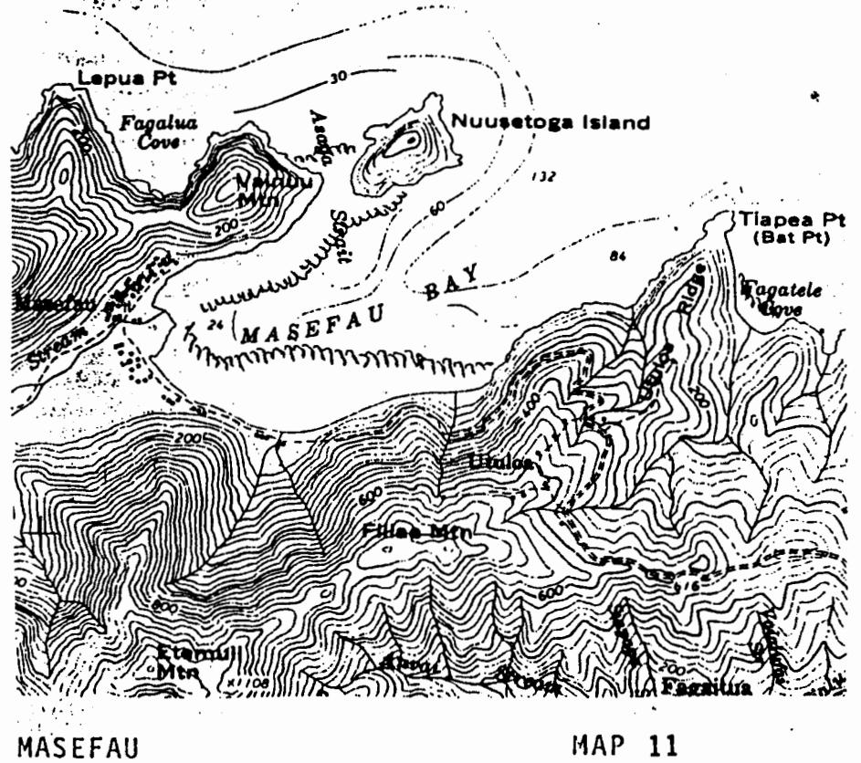

MAP 11

FLORA AND FAUNA

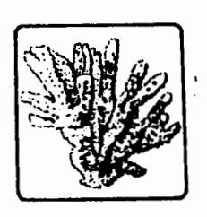

about 80 feet (24 m) inland to the coastal road at the head of Masefau Bay (49). Small boulders have been placed to protect property behind the shoreline. Boulders form a 2- to 3-foot (0.6 to 1.0 m) embankment extending northeast toward a headland of volcanic rock. Silty-sand fronting the embankment is submerged at high tide. Along the base of a cliff at the headland is sand between volcanic rocks partly exposed at high tide (ASCRI-11S2).

# FRINGING REEF IN NORTHERN MASEFAU BAY

A layer of dark, silty-sand covers the inner reef flat off central and northern parts of Masefau Village (ASCRI-11B6). Sand flats northeast of the village, fronting a cliff, extend to 100 feet (30 m) from shore. Common constituents of the sand are tests of a foram (Marginopora vertebralis), fragments of a calcareous alga (Halimeda discoidea), and bivalve shells. comprises up to 50% of the bottom from 100 to 200 feet (30 to 60 m) offshore, with scattered boulders occuring in this region. Overall, the inner reef consists of almost equal proportions of sand/gravel and limestone rubble. Shallow sand and rubble flats continue along the base of the sea cliff as far northeast as the strait inside Nu'usetoga Islet (ASCRI-11B11). The middle reef, from 200 to 300 feet (60 to 90 m) offshore, is about 2 feet (0.6 m) deep. About half the bottom is limestone rubble, with the remainder a low relief platform of consolidated limestone (ASCRI-11B7). The outer reef flat, 300 to 400 feet (90 to 120 m) offshore, consists of irregularly-consolidated limestone, with some areas of sand/gravel or rubble (ASCRI-11B8). The consolidated reef margin is about 20 feet (6 m) wide and exhibits a poorly-developed algal ridge (ASCRI-11B9). Two shallow channels (ava) indent the outer reef (49). The generally steep reef front is characterized by rubble-bottomed grooves between undercut limestone buttresses (ASCRI-11B10).

# FRINGING REEF (NORTHWEST MASEFAU BAY)

green alga, Halimeda opuntia, and the seagrass, Halophila sp., are common on inshore areas of silty-sand fronting the northern end of Masefau Village. A small, epizoitic sea anemone covers much of the Halimeda and Halophila (ASCRI-11B6). Algae are prevalent on rubble-bottomed areas of the middle reef Halimeda discoidea and Padina sp. are especially common. Several gastropods are conspicuous, as is the foram, Marginopora vertebralis. A few coral heads inhabit the outer 100 feet (30 m) of the inner reef (ASCRI-11B11). Considerable algae, including a brownish cyanophyte (blue-green) and Caulerpa cf. taxifolia, cover mid-reef surfaces off the northern end of the village. Farther northeast, corals cover 50% of the bottom (mostly mid-reef Acropora thickets and Pavona spp.). A spikey, red coralline alga is most abundant, followed by Ralfsia sp. and Halimeda discoidea (ASCRI-11B7). Live coral covers about 10% of the outer Acroporans, including A. humilis, are most common. Sea cucumbers (Stichopus chloronotus) increase in density seaward across the reef flat. Coralline algae encrust partially-consolidated limestone. Halimeda discoidea is the most common non-en-

FLORA AND FAUNA

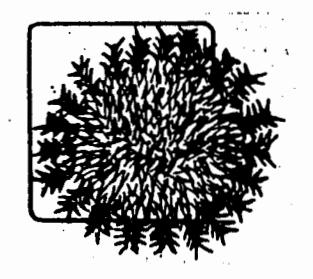

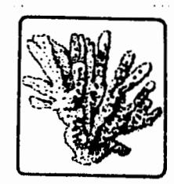

crusting alga (ASCRI-11B8). Encrusting coralline algae dominate the reef margin and coral cover is about 20%. Dead coral heads are conspicuous, accounting for about 10% bottom cover. Common non-encrusting algae include <u>Dictyosphaeria versluysii</u>, <u>Halimeda discoidea</u>, and <u>Dictyota</u> sp. (ASCRI-11B9).

Fishes are not abundant on the featureless inner reef fringing the northwestern margin of Masefau Bay. At least 24 species are present. Dominant species are the damselfishes, Glyphidodontops leucopomus and Plectroglyphidodon leucozona, the wrasse, Thalassoma hardwickei, and atherinids. Acanthurus triostegus is the only conspicuous surgeonfish and it is not very abundant. Mullet occur inshore in loose schools. Ephinephelus merra is conspicuous but not abundant (ASCRI-11F4).

Although the outer reef flat offers more shelter than occurs inshore, the fish assemblages in the two areas are similar. At least 25 species inhabit the outer reef flat. Dominant are a surgeonfish (Acanthurus lineatus - absent from inshore), a damselfish (Glyphidodontops leucopomus), a wrasse (Thalassoma hardwickei), and juveniles of several parrotfishes (Scarus spp.). Atherinids are abundant (ASCRI-11F5).

#### FRINGING REEF FRONT

Crown-of-thorns starfish (alamea; Acanthaster planci) are active on the reef front in northwestern Masefau Bay, where large patches of dead coral are conspicuous. Groups of starfish and isolated individuals occur at the base of limestone outcrops. Tabular Acropora hyacinthus has been virtually eliminated by starfish, which are now preying on staghorn Acropora, although the coral assemblage is not entirely devastated (ASCRI-11B10;3). About 60% of corals on the upper reef front flanking the northern bay were still alive in August and September 1979 and Acanthaster was evident (75). Live coral cover of 50% was observed in October 1979, with considerable Montipora sp. and large areas of Porites (S.) undulata noted. Overall, at least 44 coral species in 22 genera are represented on the reef flat and reef front throughout Masefau Bay (ASCRI-11B1; B2; B3; B4; B5). Algal cover by non-coralline species is considerable (30 to 40%) on the reef front, especially between branches of <u>Porites</u> and <u>Porites</u> (S.) <u>undulata</u>. Patches of two soft corals (a brown, long fingered species and a mauve, short fingered species) increase near the ava at depths from 6 to more than 30 feet (2 to 9 m) (ASCRI-11B10).

The reef margin is found relatively close to shore along the northern perimeter of Masefau Bay, causing inshore and deep water fish assemblages to occur in close proximity. High coral cover and large boulders on the reef margin and front provide habitat for cryptic fishes. The fish fauna is both abundant and diverse. At least 82 species are recorded, most of which are members of the butterflyfish, wrasse, or damselfish families. Dominant species include atherinids, the butterflyfish, Chaetodon reticulatus, the surgeonfishes, Acanthurus nigrofuscus, A. ni-

MASEFAU

MAP 11

USE CONSIDERATIONS

( BOAT RAMP

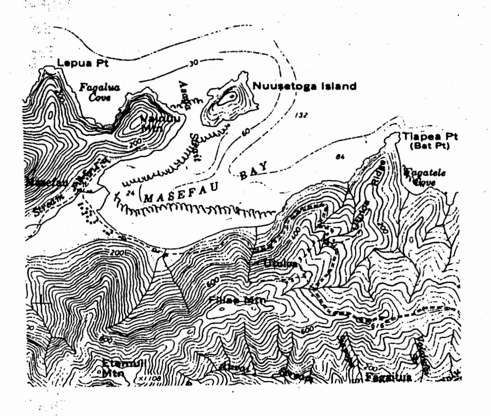

groris, and Naso lituratus, the damselfishes, Stegastes albofasciatus and Plectroglyphidodon dickii, the wrasse, Thalassoma hardwickei, and the surf perch, Kuhlia mugil (ASCRI-11F6).

The endangered green sea turtle (Chelonia mydas) is reported in small numbers from Masefau Bay (15).

# MASEFAU BAY

Masefau Bay is accessible by an unpaved road across the mountain from Faga'itua Village (MAP 7) on the south coast of Tutuila. Although steep in places, the road has been improved and is passable by car except in very wet weather. This road offers picturesque views of both the north and south coasts of Tutuila (ASCRI).

The shoreline of Masefau Bay is easily accessible from a gently-sloping backshore. Shallow sand between exposed boulders along the base of the cliff northeast of Masefau Village can be traversed by foot at high tide. Shallow nearshore areas of sand and rubble extend northeast as far as Asaga Strait between Tutuila and Nu'usetoga Islet (ASCRI). A private boat launching ramp is located at Masefau (41).

The reef in Masefau Bay is regularly fished. Fishermen frequent deep water areas in the center of the Bay as well as the shallow reef flat (20). The Masefau reef flat (including Asaga Strait) is considered a "critical use reef area" supporting subsistence fishing by villagers (39). The most common activity is pole and line fishing. Spearing (mata) ranks second and throw netting (kili) ranks third in popularity. Seine netting (upega) and handlining at night from canoes follow in popularity. (honeycomb grouper), mataeleele (small emperor fish), filoa (large emperor fish), and savane (blue-lined snapper) are caught day and night by pole fishing. In addition, lupota (small jack) and sumu (triggerfish) are taken by day and malau (squirrelfish), matapula (bigeye snapper), and malai (paddletail snapper) are caught at night. Spearing results in day and night catches of alogo (lined surgeonfish), pone (chocolate surgeonfish), laea (large parrotfish), and eel. Fe'e (octopus), faisua (giant sea fuga (small parrotfish), and ume (unicornfish) are additional day catch, and papata (slipper lobster), ula (spiny lobster), and crab are additional night catch by this method. Throw-netting is a daytime activity yielding manini (convict tang), alogo, pone, anae (adult mullet), fuafua (juvenile mullet), lupota, and, seasonally, atule (big-eye scad), lo (rabbitfish), and i'asina (juvenile goatfish). The usual catch from night handlining is malau, matapula, malai, mataeleele, savane, and filoa (20).

/MAP9.TEX/ - /AUG-80/

MASEFAU

MAP 11

FLORA AND FAUNA

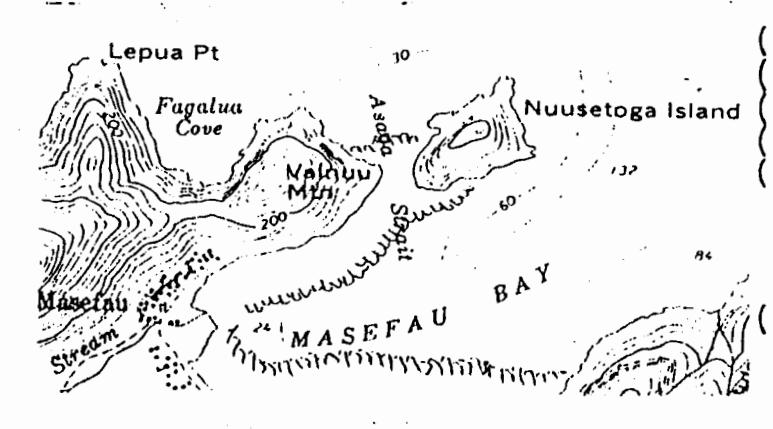

\* Nu'usetoga Islet is a possible "Special Area" of scarce, unique, or fragile value --- Chap. VI.C.3 (21)

SEABIRD NESTING AREA

MASEFAU

.411.1: - 111.1:

111

MAP 11

PHYSIOGRAPHY

MASEFAU

MAP 11

PHYSIOGRAPHY:

MASEFAU

MAP 11

FLORA AND FAUNA

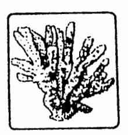

# NU'USETOGA ISLET AND ASAGA STRAIT

# NU'USETOGA ISLET

The rare "ifilele" tree (Lutsia bijuga) is common on Nu'usetoga Islet, a seastack north of Masefau Bay. Nearly all the trees have regenerated from stumps after being cut down years ago. Ifilele trees are highly prized for their wood, which is still used in Western Samoa to make "kava" bowls. The existence of the tree has been threatened by cutting for its wood value, and Nu'usetoga Islet has been recommended as a natural area preserve in order to protect the ifilele tree (15).

Nu'usetoga Islet is a possible roosting and nesting site for the reef heron (matu'u; Egretta sacra sacra), a resident seabird uncommon in American Samoa (15).

#### FRINGING REEF

Basalt boulders lie at the base of the seacliff along the southern side of Nu'usetoga Islet. The bottom offshore is an uneven surface of consolidated limestone with rubble-bottomed depressions. Depth varies from 2 to 10 feet (1 to 3 m). The reef flat between Nu'usetoga Islet the Tutuila shoreline is about 240 feet (75 m) wide. The reef terminates in an abrupt drop to a depth of about 60 feet (18 m) off the southeast face of Nu'usetoga (ASCRI-11B12).

The reef face at depths of 15 to 20 feet (5 to 6 m) is characterized by limestone buttresses, some rising to within 5 feet (2 m) of the surface. Dead coral heads predominate on the spurs or buttresses. The bottom of grooves contain rubble, boulders, and some silted areas (ASCRI-11B13).

## ASAGA STRAIT

A reef flat lies between Nu'usetoga Islet and the shoreline of Tutuila across Asaga Strait. The reef front at depths of 10 to 15 feet (3 to 5 m) is formed into a series of spurs and grooves. Spurs 20 to 30 feet (6 to 9 m) wide rise to within 4 feet (1.2 m) of the surface between long, narrow (6 feet or 2 m across) grooves (ASCRI-11B14).

#### FRINGING REEF

Coral is abundant on the narrow reef extending off the southeastern side of Nu'usetoga Rock. Coral cover of 60% is common and in some areas is as high as 80 to 100% of the bottom. Acropora hyacinthus is most common (50% cover), with considerable Pavona and large patches of staghorn Acropora present as well. At least 25 species representing 13 genera are present on the reef off Nu'usetoga and in Asaga Strait. The coral assemblage lacks Acropora formosa, A. aspera, and others noted in Masefau

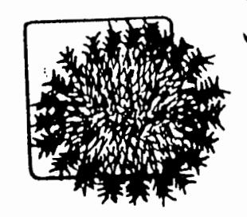

MASEFAU

MAP 11

FLORA AND FAUNA

MASEFAU

MAP 11

USE CONSIDERATIONS

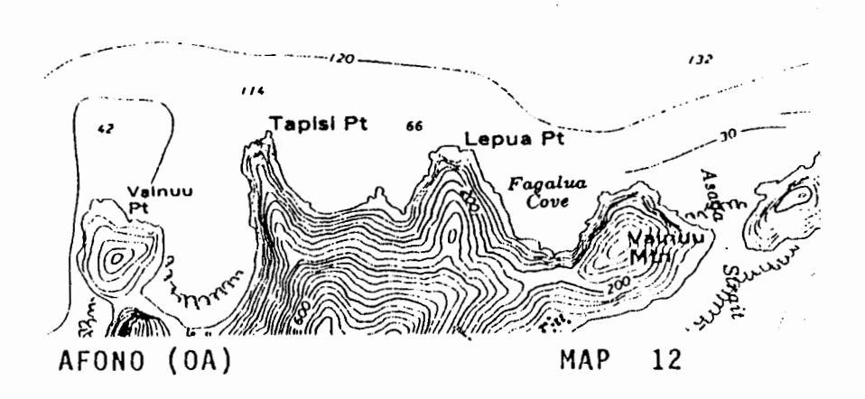

**PHYSIOGRAPHY** 

Bay. Most coral (90%) is alive, except along the sides of depressions where much of the tabular <u>Acropora</u> is dead. The crown-of thorns starfish (alamea; <u>Acanthaster planci</u>) are evident and actively feeding. Other conspicuous invertebrates include the boring sea urchin (<u>Echinometra mathaei</u>) and giant clams (<u>Tridacna sp.</u>) over one foot (0.3 m) across. Depressions in the reef surface are covered by an algal turf. Algae present include considerable <u>Ralfsia</u> sp., encrusting corallines, and <u>Dictyosphaeria versluysii</u> (ASCRI-11B12).

Areas of tabular <u>Acropora hyacinthus</u> and staghorn <u>Acropora</u> recently living on the reef front at depths between 15 and 20 feet (5 to 6 m) are now dead. A few live <u>A. hyacinthus</u> harbor small, blue-rimmed burrows formed by a xanthid crab. A soft, dark purple cyanophyte (blue-green alga) grows in patches on deep slopes and a green alga (<u>Halimeda discoidea</u>) is common between the branches of staghorn <u>Acropora</u> (ASCRI-11B13).

# ASAGA STRAIT

On the north side of Asaga Strait, limestone spurs on the upper reef face are scoured by waves and coral cover is only about 5%. Coral cover is about 10% with branching Acropora most common. However, most of the coral along the margins of the grooves is now dead. Coral rubble is conspicuous (ASCRI-11814).

# NU'USETOGA ISLET AND ASAGA STRAIT

During low tide and calm seas, the southwestern to western side of Nu'usetoga Islet is accessible across a reef platform from Tutuila. Villagers from Masefau pole fish in Asaga Strait on the Masefau Bay side of the reef (ASCRI).

#### COAST BETWEEN ASAGA STRAIT AND VAINUU POINT

The cliffed coastline between Lepua Point and Tapisi Point lacks beaches or fringing reefs. West of Tapisi Point is a small cove fronting the family land of Oa. The eastern margin of the cove is a high cliff. Toward the head of the cove is a boulder beach which merges with sand at the mouth of a stream. The beach along the southwest perimeter of the cove is interrupted in one place by an outcrop of lava rock. The west shore of the cove is a cliff fronted by a narrow basalt bench 6 to 10 feet (2 to 3 m) across (ASCRI-12S1).

# FRINGING REEF OFF OA

A reef fringes the small cove fronting the family land of Oa. Rubble is conspicuous on the reef front. Small patch reefs rise to near the water surface from a depth of 30 feet (9 m) in the cove (ASCRI-12B1).

AFONO (OA)

MAP 12

FLORA AND FAUNA

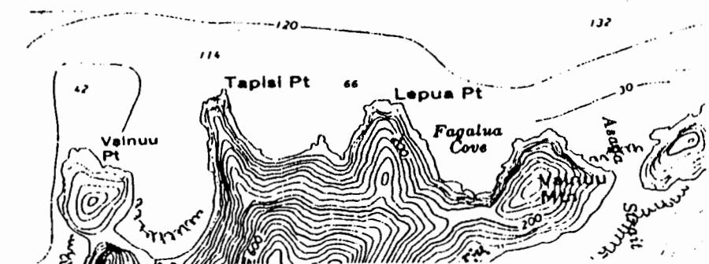

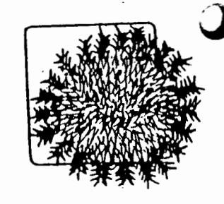

AFONO (OA)

MAP 12

FLORA AND FAUNA

AFONO

MAP 12

PHYSIOGRAPHY

**AFONO** 

MAP 12

PHYSIOGRAPHY

AFONO

MAP 12

**PHYSIOGRAPHY** 

Distribution of the crown-of-thorns starfish (alamea; Acanthaster planci) between Asaga Strait and Lepua Point was more or less limited to the coral bottoms off points of land in June 1978 (74). Coral kills attributable to this starfish are obvious along the coast between Lepua Point and Anape'ape'a Cove (Afono Bay), where 50 to 100% destruction of coral bottom is common. Only occasional Acanthaster are evident (35;74). In August and September 1979, only about 20% of corals on the upper reef front at depths of 6 to 33 feet (2 to 10 m) off Lepua Point were alive and Acanthaster were relatively abundant. About 10% of corals on the upper reef front off 0a were living at that time, and some A. planci were present (75). Acanthaster are conspicuous on patch reef slopes (30 feet or 9 m deep) off 0a, where corals consist mainly of Porites and table Acropora (ASCRI-12B1).

OFF VAINU'U POINT

The headland projecting seaward between Oa Village and Anape ape a Cove lacks a reef. The bottom slopes abruptly to depths of 30 to 40 feet (9 to 12 m) a short distance offshore. All the coral in areas formerly having up to 90% coral cover at depths of 30 to 40 feet (9 to 12 m) is dead (ASCRI-12B2).

COAST BETWEEN VAINU'U POINT AND CRAGGY POINT (AFONO BAY)

PAGO STREAM

The position of Pago Stream, which enters Afono Bay, was probably determined by the bulky and dense Pioa and Afono volcanic cones (54).

EASTERN SHORE OF AFONO BAY (ANAPE'APE'A COVE)

The eastern margin of Afono Bay is known as Anape'ape'a Cove. A pocket beach is present along the shore in the Cove, although elsewhere, the shoreline is generally rocky and caves are present at the head of the Cove. A neck of land about 50 feet (15 m) in elevation separates Oa Cove from Anape'ape'a Cove. The land is well vegetated but probably allows easy access between the two coves (ASCRI-12S2).

A STATE OF THE PARTY OF THE PARTY OF THE PARTY OF THE PARTY OF THE PARTY OF THE PARTY OF THE PARTY OF THE PARTY OF THE PARTY OF THE PARTY OF THE PARTY OF THE PARTY OF THE PARTY OF THE PARTY OF THE PARTY OF THE PARTY OF THE PARTY OF THE PARTY OF THE PARTY OF THE PARTY OF THE PARTY OF THE PARTY OF THE PARTY OF THE PARTY OF THE PARTY OF THE PARTY OF THE PARTY OF THE PARTY OF THE PARTY OF THE PARTY OF THE PARTY OF THE PARTY OF THE PARTY OF THE PARTY OF THE PARTY OF THE PARTY OF THE PARTY OF THE PARTY OF THE PARTY OF THE PARTY OF THE PARTY OF THE PARTY OF THE PARTY OF THE PARTY OF THE PARTY OF THE PARTY OF THE PARTY OF THE PARTY OF THE PARTY OF THE PARTY OF THE PARTY OF THE PARTY OF THE PARTY OF THE PARTY OF THE PARTY OF THE PARTY OF THE PARTY OF THE PARTY OF THE PARTY OF THE PARTY OF THE PARTY OF THE PARTY OF THE PARTY OF THE PARTY OF THE PARTY OF THE PARTY OF THE PARTY OF THE PARTY OF THE PARTY OF THE PARTY OF THE PARTY OF THE PARTY OF THE PARTY OF THE PARTY OF THE PARTY OF THE PARTY OF THE PARTY OF THE PARTY OF THE PARTY OF THE PARTY OF THE PARTY OF THE PARTY OF THE PARTY OF THE PARTY OF THE PARTY OF THE PARTY OF THE PARTY OF THE PARTY OF THE PARTY OF THE PARTY OF THE PARTY OF THE PARTY OF THE PARTY OF THE PARTY OF THE PARTY OF THE PARTY OF THE PARTY OF THE PARTY OF THE PARTY OF THE PARTY OF THE PARTY OF THE PARTY OF THE PARTY OF THE PARTY OF THE PARTY OF THE PARTY OF THE PARTY OF THE PARTY OF THE PARTY OF THE PARTY OF THE PARTY OF THE PARTY OF THE PARTY OF THE PARTY OF THE PARTY OF THE PARTY OF THE PARTY OF THE PARTY OF THE PARTY OF THE PARTY OF THE PARTY OF THE PARTY OF THE PARTY OF THE PARTY OF THE PARTY OF THE PARTY OF THE PARTY OF THE PARTY OF THE PARTY OF THE PARTY OF THE PARTY OF THE PARTY OF THE PARTY OF THE PARTY OF THE PARTY OF THE PARTY OF THE PARTY OF THE PARTY OF THE PARTY OF THE PARTY OF THE PARTY OF THE PARTY OF THE PARTY OF THE PARTY OF THE PARTY OF THE PARTY OF THE PARTY OF THE PARTY OF THE PARTY OF THE PARTY OF THE PARTY OF THE PARTY OF THE PARTY OF THE PARTY OF THE PARTY OF THE PARTY OF THE PAR

SHORELINE (AFONO BAY)

A pocket beach of white sand occupies the head of a small cove at Gatia Point. The steep, rocky shore along the eastern side of inner Afono Bay merges with a narrow beach composed primarily of basalt and limestone rubble fronting Afono Village at the bay head (49;ASCRI-12S2). This beach is backed by a rubble berm. Northwest of the village, the shoreline fronting the school is protected by a steep rock revetment rising to elevations of 9 to 14 feet (3 to 4 m). West of the revetment is a narrow beach of basalt cobbles and calcareous sand. A delta off

PHYSIOGRAPHY

MAP

MAP

MAP

12

12

Craggy Pt

12

**AFONO** 

**AFONO** 

AFONO

PHYSIOGRAPHY

**PHYSIOGRAPHY** 

137

the mouth of Pago Stream divides the beach east of the revetment into two crescents. The beaches are about 30 feet (9 m) wide and consist of basalt cobbles and boulders, limestone rubble, and silt. The beach east of the stream delta is undergoing minor erosion (49).

Interbedded lava, tuff, and breccia are exposed along the western side of Afono Bay on a 30 foot (9 m) high fault cliff (54).

# ANAPE'APE'A CAVES

Two caves are located at Anape'ape'a Cove, about 2,500 feet (760 m) northeast of Afono Village. Access by land is difficult because of high cliffs. At extreme low tide, both cave entrances are accessible over the exposed reef flat. At high tide, entrance is gained only by canoe or boat. The major cave is large and is almost hidden by dense vegetation. An entrance about 30 feet (9 m) wide by 50 feet (15 m) high opens into a room at least 250 feet (76 m) long. The cave gradually narrows in width and height and, through an opening 10 feet (3 m) wide by 3 feet (1 m) high, opens into another room about 30 feet (9 m) wide, 20 feet (6 m) high, and 50 to 60 feet (15 to 18 m) deep. The floor of the cave is covered with deep guano deposits, and the back room is flooded with water. The smaller cave is located at the water's edge about 200 feet (60 m) north of the larger cave. The entrance is about 20 feet (6 m) wide and 10 feet (3 m) high, and a single large room is about 75 feet (23 m) long. The floor of this cave also is covered with guano (15).

# FRINGING REEF (ANAPE'APE'A COVE)

The reef front in Anape'ape'a Cove exhibits limestone buttresses separated by narrow sand channels, 6 to 10 feet (2 to 3 m) wide and 5 to 10 feet (1.5 to 3 m) deep (ASCRI-12B3).

# FRINGING REEF (AFONO BAY)

The fringing reef at the head of Afono Bay extends 200 to 500 feet (60 to 150 m) offshore. The reef flat is irregular off the central part of Afono Village, where small channels or borrow pits are evident (49). A long, narrow ava (channel) bissects the reef at the head of Afono Bay (62). The bottom consists of volcanic and limestone boulders embedded in muddy sand at depths of 20 to 30 inches (50 to 80 cm). The bottom east of the school, off a culvert, consists of smoothly rounded but somewhat flattened boulders at depths of 4 to 5 feet (1.2 to 1.5 m)(43). A large rubble fan is exposed at low tide on the inner reef fronting Afono Village and Pago Stream. Volcanic boulders are exposed at low tide on the inner reef flat flanking the western perimeter of the bay (ASCRI-12B5). Rock surfaces are thinly covered by a matrix of sand, forams, and algae. Bands of calcareous sand varying in width from 10 to 30 feet (3 to 9 m) lie between boulder areas about 50 feet (15 m) offshore. The reef margin is characterized by consolidated limestone with irregular-

AFONO

MAP 12

FLORA AND FAUNA

( SWIFTLET NESTING AREA

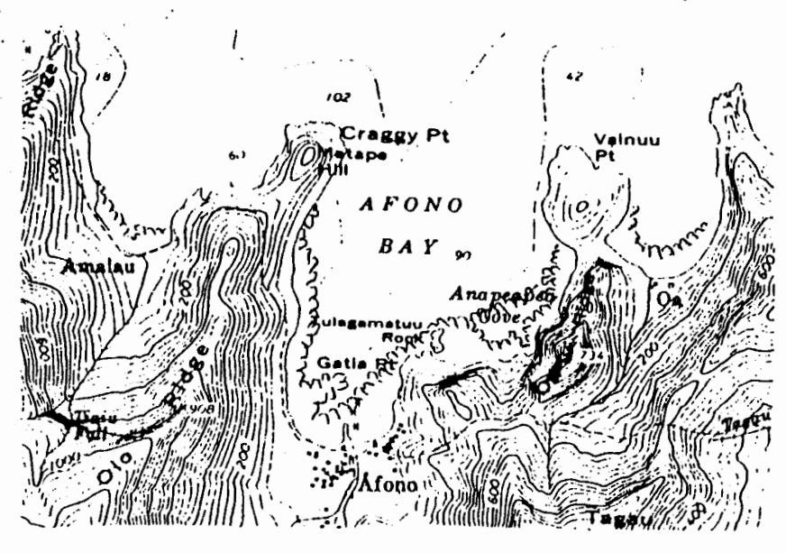

**AFONO** 

11 1

MAP 12

FLORA AND FAUNA

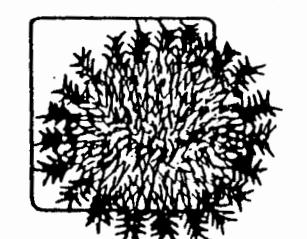

FLORA AND FAUNA

AFONO

MAP 12

jt;

11

- 16 |T|

| | | | | | | | | | | | | | | | | | |

ities of low relief (depressions, holes, crevices). Overall, the substratum is relatively even. The reef margin drops off an average of 6 feet (2 m) to the reef front, which is furrowed by surge channels whose floors are paved with smoothly rounded but somewhat flattened rocks averaging about 4 inches (10 cm) across. Some rocks are of volcanic origin -- others are limestone (48). The reef front is characterized by considerable coral rubble at a depth of 40 feet (12 m) off Gatia Point (ASCRI-1284).

#### ANAPE'APE'A CAVES

The two caves are the only known nesting sites on Tutuila the white-rumped swiftlet (pe'ape'a; Collocalia spodiopygia spodiopygia). Their breeding cycle is disrupted by human sions into the caves. Trash and the remains of several wood fires are scattered about the floor of the caves. Children reportedly play in the caves. Adults frequently enter to capture be used as toys for younger children. Smoldering fires are set to facilitate capture of the birds. Although the swiftlet is widely distributed in American Samoa, it nests and breeds deep in caves, a scarce habitat. Several hundred sacks of guano were collected in the two caves several years ago for sale to the Damage caused to the nesting swiftlet colony by the government. collection of guano is unknown, but the purchase alerted land -owners to the availability and value of the guano and publicized the existence of the caves. The major roost for the uncommon, sheath-tailed bat (pe'ape'avai; Emballonura semicaudata) in American Samoa is the larger of the two caves at Anape'ape'a Cove. Thousands of bats inhabit the back of the cave, with only a few found in the smaller cave. The length of the larger cave probably accounts for the difference, as most of the bats occupy a single room at the rear of the cave. The cave floor in this room is covered with a water and guano mixture and access to the room is difficult through the small entrance. Fires built in the front room may disturb these bats when entering and leaving the cave, but the narrow opening and the wet, guano-covered floor keeps most people out. Human disturbance may disrupt breeding cycles (15).

# FRINGING REEF (ANAPE'APE'A COVE)

All table <u>Acropora</u> on the reef front off Anape'ape'a Cove has been killed by an infestation of the crown-of-thorns starfish (alamea; <u>Acanthaster planci</u>). A heavy mat of brown algae covers the dead coral heads. <u>Porites</u> and some staghorn <u>Acropora</u> are the only corals remaining alive. <u>Acanthaster</u> is still present in this area (ASCRI-12B3).

# FRINGING REEF FLAT (AFONO BAY)

Boulders within 80 feet (25 m) from shore on the inner reef flat west of Afono Village are sparsely covered by an algal turf, enmeshed in a matrix of sand and an abundance of star-shaped forams (Baculogypsina sphaerulatus). Padina sp., Valoniopsis sp., and scattered clumps of Halimeda sp. coated with forams are con-

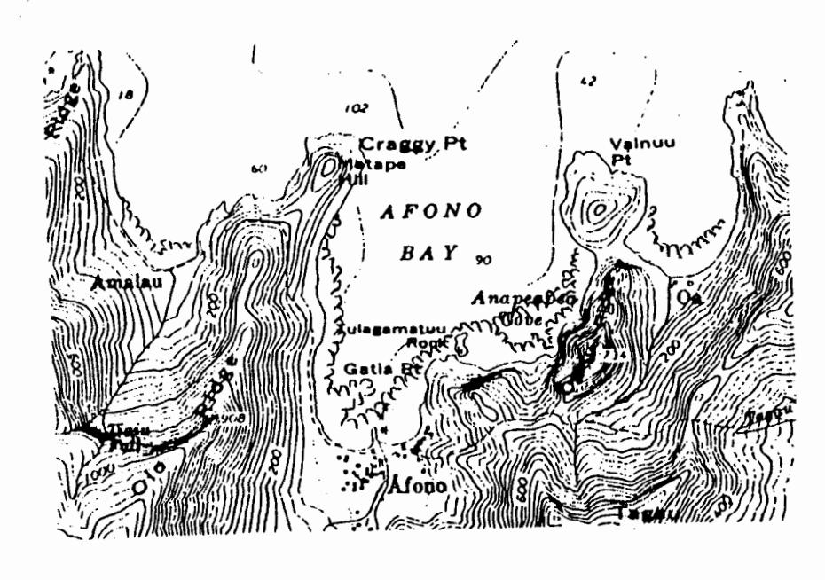

**AFONO** 

MAP 12

FLORA AND FAUNA

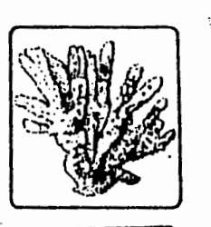

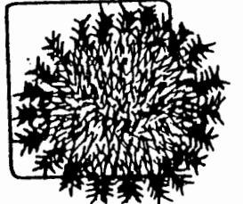

AFONO

MAP 12

WATER CONDITIONS

spicuous algae. Closely-set boulders in other areas support light algal cover and minute serpulid worms (Hydroides). Large algal covered, boulders occur at up to 165 feet (50 m) offshore, where the algae-sand-foram matrix diminishes considerably, and encrusting coralline algae and Dictyosphaeria sp. are more prevalent. Inshore areas within 80 feet (25 m) of shore are generally devoid of coral, with only scattered heads of Porites lutea present. The cowries, Cypraea moneta and C. annulus, are common from 80 to 165 feet (25 to 50 m) offshore. Coral cover is around 3% between 165 and 245 feet (50 to 75 m) from shore, with Porites andrewsi, P. lutea, Pavona sp., and Psammocora sp. present. Small patches of a pale bluish-green sponge are present. Fishes are uncommon on the inner reef flat (within 165 feet or 50 m of shore), but are common beyond 165 feet where closely-set boulders afford Most abundant is the damselfish, Glyphidodontops leucopomus, followed by the wrasse, Halichoeres margaritaceus and juveniles of the surgeonfish, Acanthurus lineatus (48).

Coralline algae dominate the reef margin. The sides of a narrow ava cutting through the reef are lined with a fleshy red alga. Coral cover increases seaward toward the reef margin, where low colonies of Acropora humilis, and some tabular A. hyacinthus appear. However, coral cover is only slightly more than 5% (48).

# FRINGING REEF FRONT (AFONO BAY)

Coral growth is lush (90% cover) on the upper reef front to a depth of 40 feet (12 m) off Gatia Point and elsewhere in Afono Bay. Table and staghorn Acropora are most abundant. Some large stands of Millepora and one large faviid (6 feet long by 3 feet wide or 2 by 1 m) are notable (ASCRI-12B4;48). Below 40 feet, dead corals and coral rubble predominate. Corals formerly covered about 75% of the bottom at this depth, but most heads are now dead, and the crown-of-thorns starfish (alamea; Acanthaster planci) is abundant (ASCRI-12B4). About half of the coral on the upper reef front at depths of 6 to 33 feet (2 to 10 m) was alive in August and September 1979, and Acanthaster were common (75).

The diversity of fishes is high along the reef front. The dominant species is Acanthurus lineatus. Other common fishes are the wrasses, Thalassoma hardwickei, T. quinquevittata, Halichoeres marginatus, H. margaritaceus, H. centriquadrus, and Gomphosus varius, the surgeonfishes, Acanthurus glaucopareius, A. nigrofuscus, A. triostegus, and Ctenochaetus striatus (toward the base of the reef front), the damselfishes, Glyphidodontops leucopomus, G. uniocellatus (toward the base of the reef front), Stegastes albofasciatus, S. fasciolatus, and Plectroglyphidodon dickii, the file fish, Oxymonacanthus longirostris, and the butterflyfishes, Chaetodon citrinellus and Ç. reticulatus (48).

# AFONO BAY

Storm runoff following heavy rainfall depresses salinity off a culvert at the head of Afono Bay and causes nearshore

**AFONO** 

MÁP 12

USE CONSIDERATIONS

\* Anape'ape'a Caves at Afono possible "Special Area" of essential habitat -- Chap. VI.C.1 (21)

AFONO

1001

MAP 12

USE CONSIDERATIONS

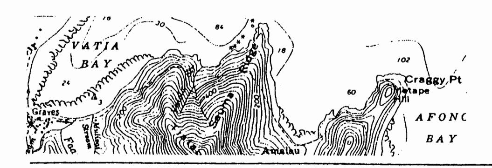

VATIA (AMALAU)

FLORA AND FAUNA

( RARE LAND BIRD

VATIA (AMALAU)

FLORA AND FAUNA

VATIA (AMALAU)

MAP 13

13 HISTORICAL/ARCHAEOLOGICAL

waters to become brown and turbid. An additional source of fresh water discharge along shore is a spring issuing from the base of the seawall fronting Afono school. After a heavy rain, underwater visibility is reduced to less than 3 feet (1 m) over the entire reef. Turbid waters are not unusual in the bay (48). Afono Bay is better protected from high waves than most other north shore areas (49).

# ANAPE'APE'A CAVES

The caves along the perimeter of Anape'ape'a Cove have been recommended as a wildlife sanctuary in order to protect the only known nesting colony of the white-rumped swiftlet (pe'ape'a; Callocalia spodiopygia spodiopygia) and the major roosting site of the sheath-tailed bat (pe'ape'avai; Emballonura semicaudata) (9;15). Tourists are presently charged to visit the caves (15).

#### AFONO BAY

The steep, rocky eastern margin of Afono Bay is accessible by traversing the reef flat. A sand beach at the head of the bay provides easy access to the reef flat (ASCRI). The reef fringing the western portion of Afono Bay is considered a "critical use reef area" which supports subsistence fishing by villagers Both the reef flat and deeper waters seaward of the reef are frequented by fishermen (20). An informant living in Afono Village reports that fishing occurs mostly on the reef front, with occasional gleaning for fe'e (octopus) on the reef flat, and night torching for lobsters near the outer part of the reef flat Pole and line fishing is the most active fishery. Throw-netting ranks second in popularity, and night-time handlining from canoes ranks third. Diving with home-made spears (mata) follows Catches from these fisheries are generally similar popularity. to fish species taken at Masefau (MAP 11) and Aoa (MAP 10) (20).

# COAST BETWEEN CRAGGY POINT AND VATIA BAY

#### COASTLINE

The many-colored fruit dove (manu ma; <u>Ptilinopus perousi</u> perousi), considered an endangered species of land bird in American Samoa by one source, frequents the coast from Afono Village to just west of Vatia Village (15).

#### OFFSHORE BETWEEN CRAGGY POINT AND AMALAU

The crown-of-thorns starfish (alamea; Acanthaster planci) was not evident on forereef slopes between Craggy Point and Amalau in June 1978 (74).

# TU'ULAUMEA (STONE)

A legendary stone called Tu'ulaumea lies on the path along the ridge between Amalau Cove and Vatia Village. According to

WEST VAIFANUA CO.

VATIA

MAP 13

PHYSIOGRAPHY

VATIA

MAP 13

PHYSIOGRAPHY

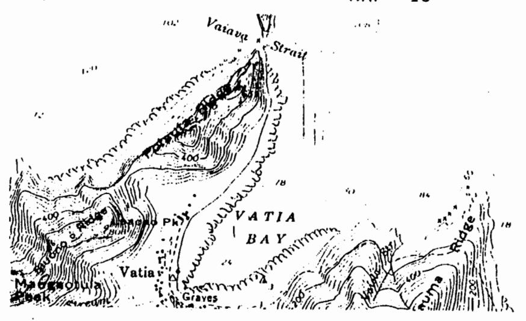

legend a jilted suitor turned into stone and travelers from Vatia to Afono Bay would not reach Afono unless they left a contribution of food on the rock (30).

#### VATIA BAY

The Vatia coast represents a pumice cone built with simultaneous flows of dense lavas. Erosion has removed most of the pumice and all the basalt surrounding the north side of the cone. The cone extended the shoreline near Vatia and diverted an abnormally large area of drainage into Vatia Stream, causing this stream to cut faster and deeper than adjcent streams (54). The result was the deep, narrow embayment of Vatia Bay (49).

# VATIA WETLANDS

Behind the village of Vatia is a low-lying area of marshy soil covering nearly 7 acres (3 ha) which was formerly a coastal marsh. Like most such marshes, little remains of the natural vegetation due to cultivation of taro. A small area of mangrove trees is found along a stream at the opposite end of Vatia Village (77).

# SHORELINE (VATIA BAY)

A white sand beach fronts the major part of Vatia Village at the head of Vatia Bay. The 50-foot (15 m) wide foreshore slopes up to a vegetated backshore at an elevation of 7 or 8 feet. Three small streams enter the bay, each forming a sand delta. The northwestern section of the beach has undergone severe erosion, which has toppled coconut trees and undercut a bridge. The 40-foot (12 m) wide beach contains limestone rubble and terminates in a 2- to 3-foot scarp (to 1 m) eroded in the backshore.

North of the beach, the shoreline is characterized by rudimentary shoreline protection structures, including concrete pilings, seawalls, randomly-dumped rock, and an eroding revetment of concrete-filled sandbags. The structures are in poor condition and probably prevent sand from reaching the beach. A steep rock revetment stabilizes a section of the shoreline along the western perimeter of the bay and fronting a public school. Northeast of the school there is a steep beach of limestone rubble with numerous basalt boulders at the shoreline. The 50-foot (15 m) wide beach slopes up to a steep, densely-vegetated backshore at an elevation of 7 feet (49).

A remnant of raised reef 8 feet (2.4 m) across projects 5 feet (1.5 m) above the fringing reef on the eastern side of Vatia Bay. This feature is considered evidence of a former higher stand of sea (54).

**VATIA** 

MAP 13 **PHYSIOGRAPHY** 

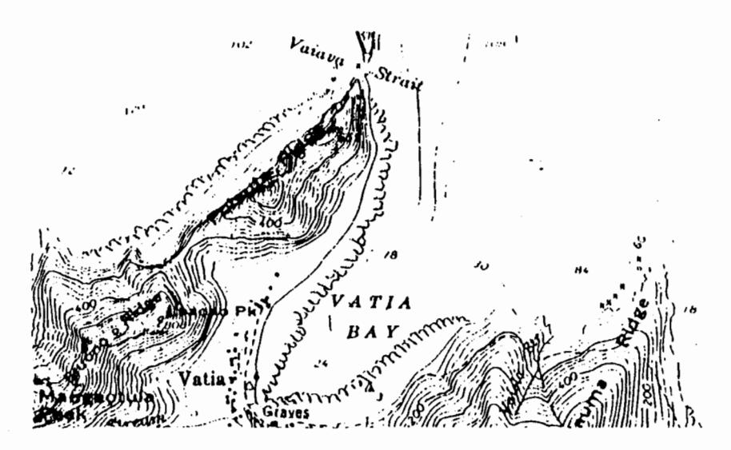

AITAV

MAP 13

**PHYSIOGRAPHY** 

RINGING REEF FLAT (VATIA BAY)

The fringing reef bordering Vatia Bay is about 400 feet (120 m) wide. The depth is typically 0.5 to 1.0 feet (0.15 to 0.3 m). The reef is bissected by a deep channel (ava) penetrating to within 100 feet (30 m) of shore off Vatia Village (49). In general, a broad reef platform has not developed at Vatia and numerous surge channels cut through the reef into the mid-reef flat. The bottom slopes gradually to depths of over 60 feet (18 m) in the center of Vatia Bay (62).

Smooth basalt boulders, exposed at low tide, cover three-quarters of the inner reef flat fronting the school along the western margin of Vatia Bay. Sand pockets occur between the In one area, a large patch of calcareous sand extends nearly to the seawall from about 35 feet (10 m) offshore. 60 feet (20 m) offshore, the number of exposed boulders is greatly reduced, and a low profile surface of sand and algae covered rocks is present from 80 to 165 feet (25 to 50 m) offshore. Depth is about one foot (0.3 m) in this area. Surge channels extending from the front of the reef penetrate as much as 130 feet (40 m) into shore. Irregular sand channels about 1.5 feet (0.5 m) deep separate areas of elevated limestone (one foot or 0.3 m in depth) from which sand is mostly absent. The inshore portions of the surge channels represent a drop to a sand and limestone bottom of about 2.3 feet (0.7 m). Just short of the reef front, at between 245 and 330 feet (75 to 100 m) offshore, depth varies from one foot (0.3 m) on the tops of spurs to nearly 6 feet (2 m) in grooves (48).

# FRINGING REEF FRONT AND SEAWARD AREAS (VATIA BAY)

The reef margin and reef front exhibit a highly irregular surface more complex than a spur-and-groove system. Many large, isolated mounds of limestone project as high or nearly as high as the reef flat but are separated from the main reef by narrow channels about 6 feet (2 m) deeper than the reef flat. This region is characterized by a maze of ever-deepening channels reaching a depth of about 20 feet (6 m) some 330 feet (100 m) One patch reef at the outer edge of the reef measures offshore. (7 m) across at its base and 15 feet (5 m) in height. 23 feet The patch reef is penetrated by a large cave. The reef front drops from 20 feet (6 m) to 54 feet (17 m), terminating at a base of calcareous sand bottom. The reef face has an irregular profile with meandering channels whose bottoms are composed mainly of coral rubble partially consolidated by encrusting coralline algae (48). At the mouth of Vatia Bay, low-relief limestone character-izes reef slopes at depths of 15 to 20 feet (5 to 6 m) (ASCRI-14B1).

Seaward from the base of the reef, a predominantly sand bottom slopes gradually away, punctuated by mounds of limestone decreasing in size from 6 to 10 feet (2 to 3 m) to less than 3 feet (1 m) across (48).

TUTUILA

EASTERN DISTRICT

WEST VAIFANUA CO.

VATIA

MAP 13

FLORA AND FAUNA

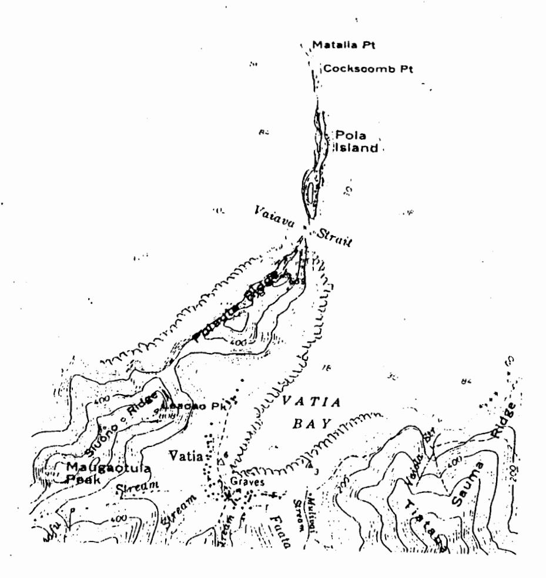

VATIA

MAP 13

FLORA AND FAUNA

FRINGING REEF FLAT (WESTERN VATIA BAY)

The inner reef flat fronting Vatia School is devoid of live Small pools in the exposed boulder zone near shore harbor juvenile damselfishes (Glyphidodontops glaucus, G. leucopomus, and Abudefduf sordidus) as well as a few small blennies and gobies. The sea cucumber, Holothuria ludwigi is common under rocks. Small xanthid crabs, hermit crabs, and occasional molluscs (Turbo sp.), are present. Small hermit crabs are evident on exposed boulders and on the seawall along shore. encrusting coralline algae increases seaward across the reef flat. A brown, encrusting form (Ralfsia sp.) is present as well as pink, stain-like corallines. An algal turf enmeshed with sand carpets rocks from 80 to 165 feet (25 to 50 m) offshore. growths of Dictyosphaeria sp. are increasingly abundant seaward. Live coral (Acropora humilis and Pavona sp.) is less than 1% bottom cover. At around 130 feet (40 m) from shore, coral cover reaches to 3%. Porites andrewsi and Psammocora sp. are addition-Adults of <u>Glyphidodontops</u> glaucus are the most ally present. common fish on the reef flat. Other moderately abundant species juvenile Acanthurus triostegus, Halichoeres margaritaceus, albofasciatus. Rocks have progressively less Stegastes turf and more coralline algae beyond 165 feet (50 m) from Coral cover totals about 5% here and includes Acropora humilis, Pocillopora verrucosa, and Millepora sp. Glyphidodontops leucopomus is the most abundant fish. Juvenile Acanthurus lineatus are common. The margins of surge channels penetrating into the reef flat are lined with delicately-branching Millepora and Acropora humilis but in some places appear scoured and nullipore-covered. Dead coral overgrown by encrusting coralline algae and other organisms occupies one portion of the outer reef The dead coral is suggestive of a partial coral kill dating about 1971-72. No crown-of-thorns starfish (alamea; Acanthaster planci) were evident at that time (48).

A large variety of fishes occupy surge channels. The dominant species at the inshore ends of channels and over the top of the reef front is the surgeonfish, Acanthurus lineatus. Other prominent species are A. achilles, the damselfishes, Glyphidodontops biocellatus, Plectroglyphidodon dickii, P. lacrymatus, juveniles goatfishes (especially Parupeneus bifasciatus), the parrotfishes, Scarus sordidus, S. oviceps, Ş. capistratoides, S. jonesi, the wrasses, Halichoeres marginatus, H. centriquadrus, Thalassoma hardwickei, T. quinquevittata, Gomphosus varius, and Macropharyngodon meleagris, the butterflyfish, Chaetodon citrinellus, and unidentified blennies of the genus, Cirripectes (48).

FRINGING REEF FRONT (EASTERN VATIA BAY)

Although fishes are not particularly abundant, the fauna is diverse on the reef front along the eastern margin of Vatia Bay. The assemblage includes at least 81 species, of which Scarus sp. is most abundant. Ctenochaetus striatus and Ptereleostris evides are abundant (76).

VATIA

MAP 13

FLORA AND FAUNA

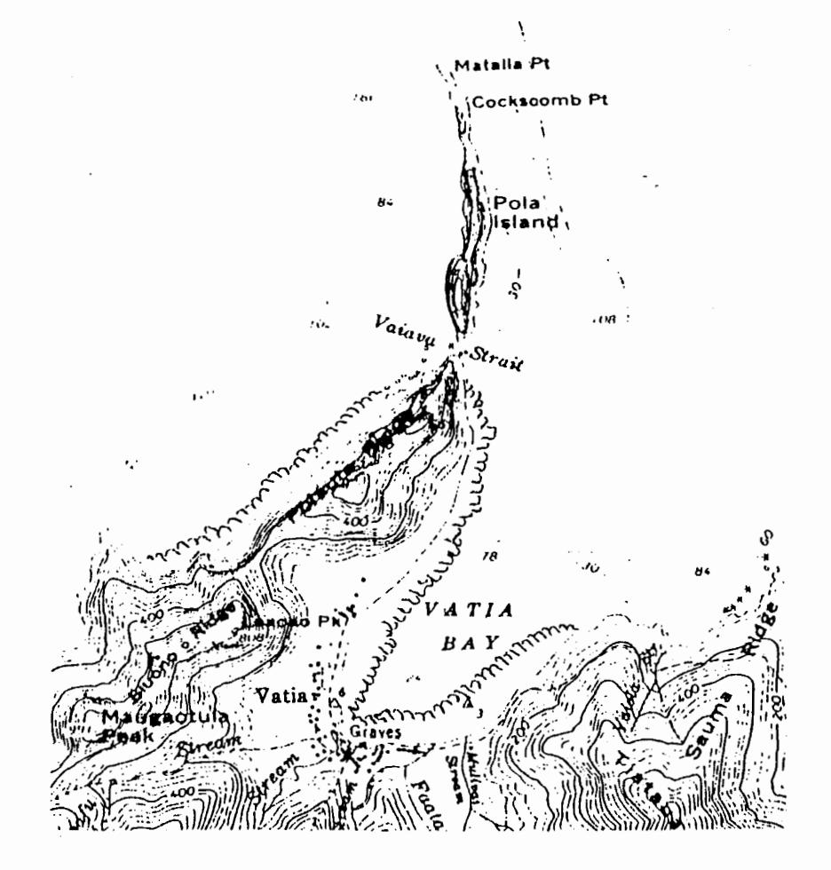

FRINGING REEF FRONT (INNER VATIA BAY)

In the outer portions of the surge channels and off the reef front, the dominant corals are Acropora hyacinthus and A. humilis. Some very large heads of Porites lutea are present. Live coral cover approximates 30% of the bottom. In one place, a large mass of Porites lutea and P. (Synaraea) undulata measures 24 feet (7 m) across at the base and rises to a height of 15 feet (5 m). A considerable amount of an alga (Halimeda sp.) grows on this coral block and a part of the surface is overgrown by an immense colony of alcyonarian (soft) coral (48).

In the seaward portions of the surge channels and just over the reef front, the same fishes occur as are found in the surge channels behind the reef margin, but additional species are abundant as well, including the damselfishes, Stegastes fasciolatus, Pomacentrus vaiuli, and Chromis caerulea, the surgeonfishes, Acanthurus glaucopareius, Zebrasoma scopas, and Ctenochaetus striatus, the wrasse, Stehojulis trilineata, and the filefishes, Amanses scopas and Oxymonacanthus longirostris. Adult squirrelfishes, Myripristis adustus and M. borbonicus, as well as snappers, Lutjanus fulvus, are common in a cave at the base of the patch reef. The small damselfishes, Chromis iomelas and C. acares, are the dominant plankton-feeding fishes above this patch reef (48).

Several red algae (Amphiroa foliacea, Cheilosporum sp., and Hypnea sp.) and Halimeda sp. are common in crevices on limestone along the sides of surge channels. The lower portion of the reef face is cut by channels whose rubble bottoms are encrusted by pink coralline algae (48).

Live coral covers 30 to 40% of the lower reef slope at depths from 20 to 52 feet (6 to 16 m). The upper portion of this region consists mainly of Acropora humilis, A. hyacinthus, Psammocora contigua, and some mounds of Porites sp. A colony of the staghorn Acropora cf. teres, 6 feet (2 m) across, is notable. The base of the reef front is characterized by stands of dead and live coral, the latter consisting mainly of mounds of Porites (Synaraea) undulata in vertical and horizontal outgrowths and occasional head of branching Acropora and the delicate-branching Seriatopora angulata near the limestone-sand boundary. vertical slopes of some limestone mounds are extensive foliacious yellow colonies of alcyonarian soft coral 6 feet (2 m) across. A smaller, mauve-colored species occuro nearby. The number of fish species increases considerably on the lower reef front. Wrasses, damselfishes, mullidae, and butterflyfishes are particularly diverse, but few species are as common as those encountered on the reef flat, in surge channels, and just off the reef front. Notable are the damselfish, Chromis iomelas, the blenny, Mei-<u>acanthus</u> <u>atrodorsalis</u>, and the butterflyfish, <u>Chaetodon reticu</u>-<u>latus</u> (48).

Limestone mounds scattered over the sand bottom in the middle of Vatia Bay are covered by live <u>Porites lutea</u> and <u>P</u>. ( $\underline{S}$ .)

TUTUILA

EASTERN DISTRICT WEST VAIFANUA CO.

VATIA

MAP 13

FLORA AND FAUNA

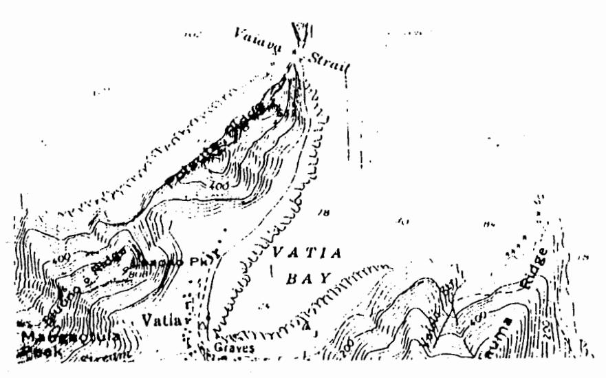

VATIA

MAP 13

WATER CONDITIONS

VATIA

MAP 13

USE CONSIDERATIONS

HOWINEWAT COMAI

undulata. A stand of the black coral, <u>Cirripathes</u> sp., grows on mounds at a depth of over 65 feet (20 m). Pyramidal cones of an unknown burrowing animal, possibly a polychaete worm, are evident on the sand bottom. A sparse growth of seagrass (<u>Halophila</u> sp.) also occurs. In some areas, the dominant organisms are small anemones. Razorfish (<u>Hemipteronotus</u>) and gobies are present (43).

In August/September 1979, about 80% of corals on the upper reef front in eastern Vatia Bay were alive. The crown-of-thorns starfish (alamea; Acanthaster planci) was present in low abundance (75). The crown-of-thorns starfish was not evident on forereef slopes between Vatia School and Pola Islet when checked in June 1z78 (74). Live coral once covered about 50% of the reef front at depths of 15 to 20 feet (5 m to 6 m) east of Polauta Ridge (at the mouth of Vatia Bay). About 90% of the coral is now dead. Burrows of the sea urchin, Echinostrephus sp., are conspicuous on the scoured limestone bottom (ASCRI-1481).

The fish fauna of the reef front along the southeastern side of Vatia Bay is diverse but fishes are not particularly abundant. The assemblage includes at least 77 species. Scarus sp. is dominant, followed in abundance by Ctenochaetus striatus and Ptereleotris evides (76).

# VATIA BAY

Considerable freshwater seeps into Vatia Bay along its western margin. Underwater visibility is about 50 feet (15 m) on the reef flat and 80 to 165 feet (25 to 50 m) offshore from the school (48).

# VATIA BAY

The reef fringing Vatia Bay is considered a "critical use reef area" supporting subsistence fishing by villagers (39). Both the reef flat and deeper waters beyond the reef are fished regularly (20), but effort is concentrated on the outer reef flat. Much of the fishing effort is devoted to spearing, with some torch fishing at night for lobster and fish (48). Handlining at night from canoes, which usually takes place in deep water beyond the reef (20;43), is a preferred fishing method here. Spearing (mata) ranks second and pole and line fishing ranks third in popularity. Throw-netting (kili) and rod and reel fishing are less common activities. Catches from nighttime handlining, spearing, pole and line fishing, and throw-netting are generally the same fish species taken at Afono, Masefau, and elsewhere along the northeastern coast of Tutuila (20).

/MAP12.TEX/ - /AUG-80/

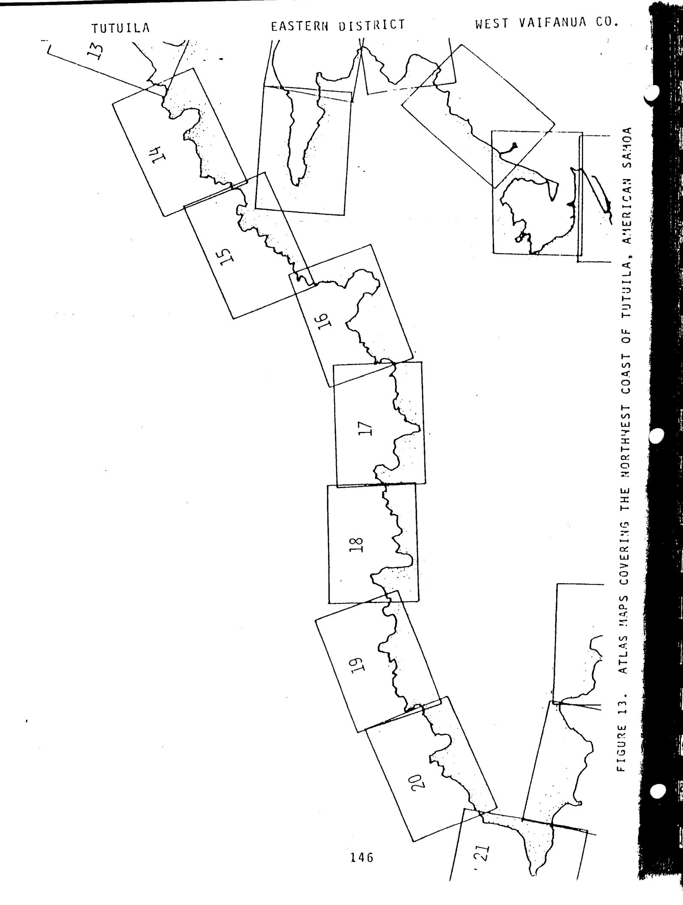

# THE NORTHWEST COAST OF TUTUILA

Much of the northern coast of Tutuila consists of ridges and steep slopes extending down to a nearly reefless shore. Drainage occurs in deeply-incised stream valleys radiating from the summit of the old volcanic cone (15).

The major paved road which extends along the southern coast of Tutuila ends at Poloa Village (MAP 21) at the northwestern end of the island (64). An unpaved road continues from the crest of Poloa road and winds through several valleys connecting the villages (MAP 20) of Fagali'i, Maloata (where only a single family lives), and Fagamalo (with a population of approximately 200) (ASCRI). A short paved road extends from Fagasa Village (MAP 16) to Pago Pago (MAP 1) on the south shore of Tutuila (23). An unimproved road descending to Maloata Village and Bay is chained off for private use only (ASCRI). Other villages on the north shore are not accessible by road and can be reached only by boat or by hiking over trails across the mountains of Tutuila (23).

POLA ISLET/VAIAVA STRAIT

**MAP** 13

PHYSIOGRAPHY

POLA ISLET/VAIAVA STRAIT

MAP 13

PHYSIOGRAPHY

POLA ISLET/VAIAVA STRAIT

MAP 13

Cockscomb

Pola

Island

Matalia Pt

FLORA AND FAUNA

SEABIRD NESTING AREA

( \* { {

\* Pola Islet and Polauta Ridge possible "Special Areas" of essential habitat -- Chap. VI.C.1 (21)

RARE LAND BIRDS

POLA ISLET/VAIAVA STRAIT

Vanogeoge

MAP 13

BAY

USE CONSIDERATION

# COAST BETWEEN POLA ISLET AND VA'AOGEOGE COVE

# POLA ISLET AND POLAUTA RIDGE

Erosion has sculpted sheer cliffs in the rocks of a massive volcanic plug at the northernmost point on Tutuila. Pola Islet and the headland of Polauta Ridge are remnants of a larger land mass which projected northward in the geologically recent past (72). The eastern side of Pola Islet is exposed to rough, wind driven seas. A sea arch is present. The bottom deepens rapidly immediately offshore. The western or lee side of the Island is a sheer cliff. Waters on the lee of the Island are somewhat protected. The shoreline at Matalia Point at the northern tip of Pola Islet is composed of low-lying volcanic rocks (ASCRI-13S2, B3).

# VAIAVA STRAIT

Valava Strait is the narrow pass between Tutuila and Pola Islet. Volcanic rocks are awash at high tide along the Tutuila shore of the strait (ASCRI-13S1). The shallow reef in Valava Strait slopes rapidly to depths of 30 to 40 feet (9 to 12 m) along its western face (ASCRI-13B2).

# POLA ISLET AND POLAUTA RIDGE

Pola Islet and the northwestern face of Polauta provide nesting sites for at least eight species of seabirds, including the white-tailed tropicbird (tava'e; Phaethon lepturus dorotheae), brown booby (fua'o; <u>Sula leucogaster plotus</u>), red footed booby (fua'o; <u>Sula sula rubipes</u>), grey-backed tern (<u>Sterna</u> cerulea), lunata), blue-grey noddy (laia; <u>Procelsterna</u> noddy (gogo; Anous stolidus pileatus), black noddy (gogo; Anous tenuirostris minutus), and white tern (manu sina; Gygis alba pacifica). Possible nesters include the great frigatebird (atafa; Fregata minor palmerstoni), lesser frigatebird (atafa; Fregata ariel ariel), wedge-tailed shearwater (ta'i'o; Puffinus pacificus pacificus), and white-throated storm petrel (Nesofregetta albigularis). Pola Islet is a potential roosting and nesting site the reef heron (matu'u; Egretta sacra sacra). Bird populations number in the thousands. Many of the Pola Islet birds, especially frigatebirds, boobies, and noddies, have been subjected to hunting pressure by residents of north shore villages. The Australian gray duck (toloa; Anas superciliosa pelewensis), a rare resident waterbird, has been sighted occasionally at Vatia Bay (MAP 13) east of Polauta Ridge. The west side of Polauta Ridge is one of only two localities in American Samoa where the many-colored fruit dove (manu ma; Ptilinopus perousi perousi) occurs (15).

#### VAIAVA STRAIT - POLA ISLET

Vaiava Strait is passable in small boats only at high tide

Pola Islet, Polauta Ridge, and Vaiava Strait possible "Special Area" suitable for natural landmark -- Chap. VI.C.7 (21)

POLA ISLET/VAIAVA STRAIT MAP

13

FLORA AND FAUNA

VA'AUGEOGE COVE

MAP 14 FLORA AND FAUNA

TAFEU COVE

MAP 14 FLORA AND FAUNA

SAMITU'UTU'U POINT

MAP

PHYSIOGRAPHY

(Pt Nelson) SAMITU'UTU'U POINT

MAP 14

Tufeu

Vaaogeoge

FLORA AND FAUNA

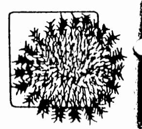

and calm seas. The Strait and Pola Island are natural features of both geologic and scenic interest. Waters in the lee of Pola Islet are relatively calm and have good potential for SCUBA diving. Vaiava Strait offers skin diving opportunities over a shallow reef, although water conditions are rough (ASCRI).

Pola Islet and Polauta Ridge are recommended as a wildlife sanctuary to be closed to hunting, because of the large numbers of seabirds that nest there and because of the presence of the many-colored fruit dove (manu ma; Ptilinopus perousi perousi) (15). Vaiava Strait is of considerable geologic and scenic interest and has been designated a National Natural Landmark. The landmark site includes Matalia Point, Cockscomb Point, Pola Islet, and Polauta Ridge (72).

#### SOUTHWEST OF POLA ISLET

Only 20% of the corals on the upper reef front at depths between 6 and 33 feet (2 to 10 m) southwest of Pola Islet were living in August/September 1979. The crown-of-thorns starfish (alamea; Acanthaster planci) was present (75). All coral heads at depths of 30 to 40 feet (9 to 12 m) on the western face of the reef at Vaiava Strait are dead. Formerly, coral cover was 5 to 10%, with Pocillopora verrucosa most common (ASCRI-13B2).

# COAST BETWEEN VA'AOGEOGE COVE AND SAMITU'UTU'U POINT

# VA'AOGEOGE COVE

An inspection in June 1978 revealed no crown-of-thorns starfish (alamea; Acanthaster planci) on bottom slopes within Va'aogeoge Cove (74).

# TAFEU COVE

About 90% of corals on the bottom at depths between 6 and 33 feet (2 to 10 m) were living in August/September 1979. A few crown-of-thorns starfish (alamea; <u>Acanthaster planci</u>) were present (75).

# SAMITU'UTU'U POINT (=POINT NELSON)

Small streams near Samity'utu'u Point (Pt. Nelson) flow in hanging valleys because waves have cut back the coast faster than streams have cut downward. Marine erosion is rapid because the coast is without a reef and composed of thin-bedded, weak lavas and tuffs. The drainage area of each stream is small (54).

# OFF SAMITU'UTU'U POINT

An aggregation of crown-of-thorns starfish (alamea; Acanth-aster planci) was mostly restricted to a point off Manofa Rock in mid-1978 (74). However, by August/September 1979, only 5% of the corals at depths of 6 to 33 feet (2 to 10 m) off Samitu'utu'u

MAP

Mullvaisigano P

15

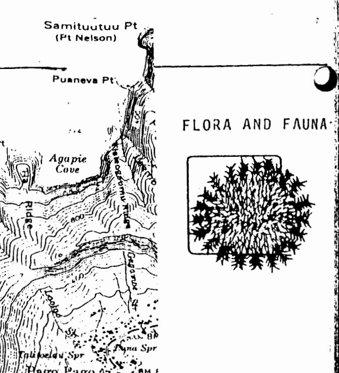

FAGATUITUI COVE

Muliulu Pt (Southworth Pt)

Agasavill Pt

Fagatuitui Cove

Siufagatele Pt

FAGALEA/FAGASA/FAGATELE

MAP 16

PHYSIOGRAPHY

FAGALEA/FAGASA/FAGATELE MAP

MAP 16

PHYSIOGRAPHY

PHYSIOGRAPHY

FAGALEA/FAGASA/FAGATELE ·

MAP 16

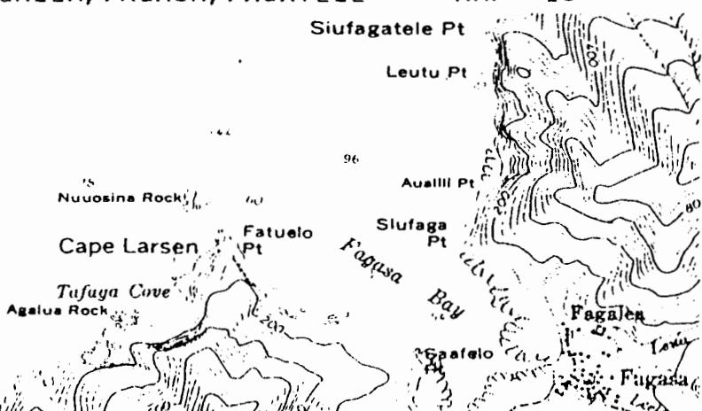

Point were alive. Acanthaster was uncommon (75).

# COAST BETWEEN SAMITU'UTU'U POINT AND SI'UFAGATELE POINT

# OFFSHORE - MULIVAISIGANO POINT TO FAGASA BAY

A few crown-of-thorns starfish (alamea; Acanthaster planci) were observed on forereef slopes between Mulivaisigano Point and Fagasa Bay in mid-1978. However, some coral areas appeared undamaged, whereas coral heads in other areas appeared to have been dead for 6 months to one year (74). About 60% of corals at depths of 6 to 33 feet (2 to 10 m) were living in August/September 1979 off Muliulu (Southworth) Point. Acanthaster was sparse (75).

Recently dead coral heads and numerous crown-of-thorns starfish were first noticed in American Samoa in late 1977 on the fringing reef at Fagatuitui Cove (3;45;73;74). In mid-1978, few Acanthaster were observed on forereef slopes between Mulivaisigano Point and Fagasa Bay. Numerous living coral areas interspersed with dead regions along this sector suggest that starfish distribution must have been patchy (74).

# COAST BETWEEN SI'UFAGATELE POINT AND CAPE LARSEN (FAGASA BAY)

# FAGASA BAY AND HINTERLAND

Fagasa Bay is a deep indentation in the predominently cliffed northern coast of Tutuila. The valley is much larger than its neighbors because its tributaries extended northeastward and southwestward along the weak junction of the pre-caldera and caldera-filling lavas and captured an abnormally large area of drainage (54). The villages of Fagatele, Fagasa, and Fagalea are situated on a narrow coastal plain at the head of the bay (49).

# LE'ELE STREAM

Perennial Le'ele Stream discharges into Fagasa Bay near the village of Fagasa (71).

#### SHORELINE

The eastern perimeter of outer Fagasa Bay is a sea cliff eroded in volcanic rock. The foreshore fronting Fagalea Village is a beach composed of basalt cobble and boulders and silty-sand 20 to 30 feet (6 to 9 m) wide. A large proportion of the beach material is of volcanic origin. The beach merges offshore with sand and silt deposits on the reef flat. Along much of this shore, a single row of large boulders has been placed at the waterline. The shore to the southwest is characterized by a narrow foreshore of basalt rubble backed by a scarp 5 or 6 feet (2 m) high cut in recent roadway fill. The shoreline near Lesina Stream mouth is protected by randomly-dumped boulders forming a steep slope from sea level up to the 10- or 12-foot (3 to 4 m)

( BOAT RAMP

FAGALEA/FAGASA/FAGATELE

MAP 16 **PHYSIOGRAPHY** 

FAGALEA/FAGASA/FAGATELE MAP 16

FLORA AND FAUNA

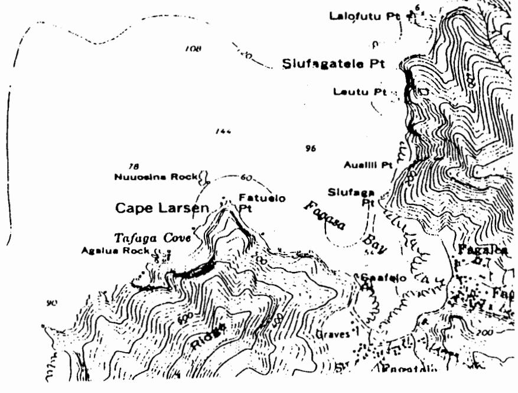

elevation. The mouth of Lesina Stream is blocked by a sand bar. The shoreline between Lesina Stream and the boat ramp at Fagatele is eroding. A rock revetment has failed. The roadway is located at the edge of an eroded scarp (49;ASCRI-16S1).

A small boat ramp is located opposite the head of a large ava off Fagatele Village. The narrow foreshore on either side of the boat ramp consists of basalt cobbles and boulders. A sandbag revetment stabilizes the shoreline of the Lea'atele School grounds. The revetment is in poor condition due to erosion at its base. A 30-foot (9 m) section at the northwest end has collapsed. Rubble and boulders at the base of the 6 to 8 foot (1.8 to 2.4 m) high revetment are submerged at high tide. A 75-foot (23 m) length of shoreline to the northwest of the revetment is unprotected except for a few randomly placed concrete slabs. Toward Sa'afelo Point there is a cliff with sea caves and grottos at its base. Northwest of Sa'afelo Point, the cliff drops to a sloping shelf of volcanic rock (49;ASCRI-16S2).

# FRINGING REEF (OFF FAGALEA VILLAGE)

A 300-foot (90 m) wide reef fringes inner Fagasa Bay. The reef is indented by two deep channels (ava) positioned off Agasi'i and Le'ele Streams (49). The inner reef flat fronting Fagalea Village consists of silty-sand to 150 feet (45 m) offshore, with silt-covered rubble and small boulders out to a distance of 300 feet (90 m) from shore (ASCRI-16B1). The depth of the reef flat is one to two feet (0.3 to 0.6 m). The outer reef shoals to an algal ridge at the reef margin (ASCRI-16B2;B3). The reef front is steep and irregular, with an abrupt vertical drop to a silty-sand bottom at a depth of 20 to 25 feet (6 to 8 m). Although spurs and grooves are not well developed, considerable relief and undercuts occur along the reef front (ASCRI-16B4).

# REEF FLAT (OFF FAGALEA VILLAGE)

Coral is nearly absent from the inner reef flat off Fagalea Village. Only scattered heads of <u>Porites lutea</u> are present. No other invertebrates are conspicuous within 300 feet (90 m) of shore except for an occasional mollusc (<u>Cypraea annulus</u>). The flora includes patches of silt-covered <u>Actinotrichia</u> sp. and isolated patches of <u>Ralfsia</u> sp. and <u>Halimeda</u> cf. <u>opuntia</u> (ASCRI-16B1).

Coral cover varies between 10 and 30% on the outer reef flat beyond 360 feet (110 m) from shore. Encrusting Leptastrea purpurea and Acropora humilis are most common, with some encrusting Montipora sp. present. Sea cucumbers (Synapta maculata) are present. Ralfsia sp. is the most common alga and encrusting Porolithon sp. and Actinotrichia sp. are conspicuous (ASCRI-16B2).

Coral cover is generally 10 to 15% (reaching 25%) at the reef margin and consists largely of tabular Acropora hyacinthus, with clumps of several staghorn species (A. intermedia and A.

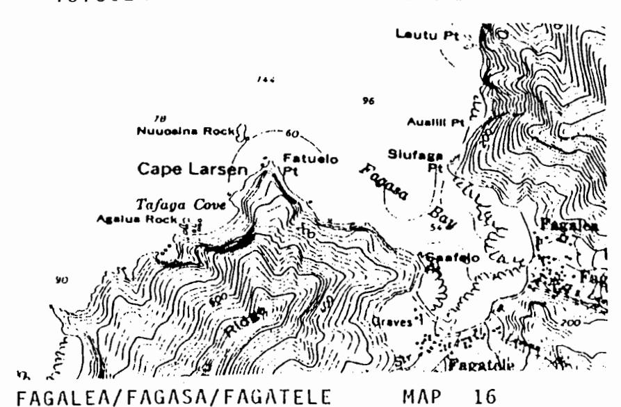

FLORA AND FAUNA

| FAGALEA | /FAGASA/ | FAGATELE |
|---------|----------|----------|
|---------|----------|----------|

MAP 16 PHYSIOGRAPHY

FAGALEA/FAGASA/FAGATELE MAP 16

FLORA AND FAUNA

FAGALEA/FAGASA/FAGATELE MAP 16

PHYSIOGRAPHY

robusta) and others occurring in depressions and down the reef front. At least 18 coral species representing 13 genera are present on the reef flat and reef front in southeastern Fagasa Bay. The coralline alga, <u>Porolithon</u> sp., encrusts the reef margin. Dense growths of <u>Halimeda</u> cf. <u>discoidea</u> are common. The sea urchin, <u>Echinostrephus</u> sp., is conspicuous in burrows (ASCRI-16B3).

Fish abundance and species diversity are low on the reef flat in front of Fagalea Village. At least 12 species are present, but most individuals are juveniles. Large schools of young mullet (Mugil vaigiensis) inhabit nearshore areas. Damselfishes (Glyphidodontops cyanea, G. glaucus, and G. leucopomus) are dominant on the reef flat (ASCRI-16F1).

# REEF FRONT (OFF FAGALEA VILLAGE)

Coral cover is as much as 40% on the reef front. Tabular Acropora are most common. Considerable coralline algae encrust reef slopes. Acanthaster is rare (ASCRI-16B4). The reef margin and slope shelter at least 24 fish species. Surgeonfishes and damselfishes predominate. Stegastes albofasciatus, Glyphidodontops cyanea, and G. leucopomus are most abundant of the damselfishes. Acanthurus lineatus and A. nigrofuscus are the most common surgeonfishes. Wrasses are conspicuous -- Thalassoma hardwickei, T. fuscum, and T. quinquevittata are the most common (ASCRI-16F2).

# FRINGING REEF (OFF FAGASA VILLAGE)

Between the villages of Fagasa and Fagatele, the inner reef flat consists of a broad rubble tract exposed at low tide (ASCRI-16B5).

# FRINGING REEF (OFF FAGASA VILLAGE)

Except for a few species, fishes are not especially abundant on the reef flat west of Fagasa Village. The assemblage includes at least 50 species, most abundant of which is Glyphidodontops leucopomus. Common are Stegastes albofasciatus, Acanthurus lineatus, Glyphidodontops glaucus, and Halichoeres margaritaceus (76).

# FRINGING REEF FLAT (OFF FAGATELE VILLAGE)

Volcanic boulders, 1 to 5 feet (0.3 to 1.5 m) across, are exposed at low tide off the seawall at Fagatele Village. The inner reef flat, which extends 50 to 60 feet (15 to 18 m) from shore, is partly silty-sand near shore, but predominantly consolidated limestone (ASCRI-16B6).

The mid-reef flat extending out to about 150 feet (45 m) from shore is a consolidated limestone bottom about 1 to 2 feet (0.3 to 0.6 m) deep (ASCRI-16B7). The outer reef is irregular, with channels and depressions scoring the limestone bottom. At

FAGALEA/FAGASA/FAGATELE

MAP 16

PHYSIOGRAPHY

FAGALEA/FAGASA/FAGATELE

MAP 16

FLORA AND FAUNA

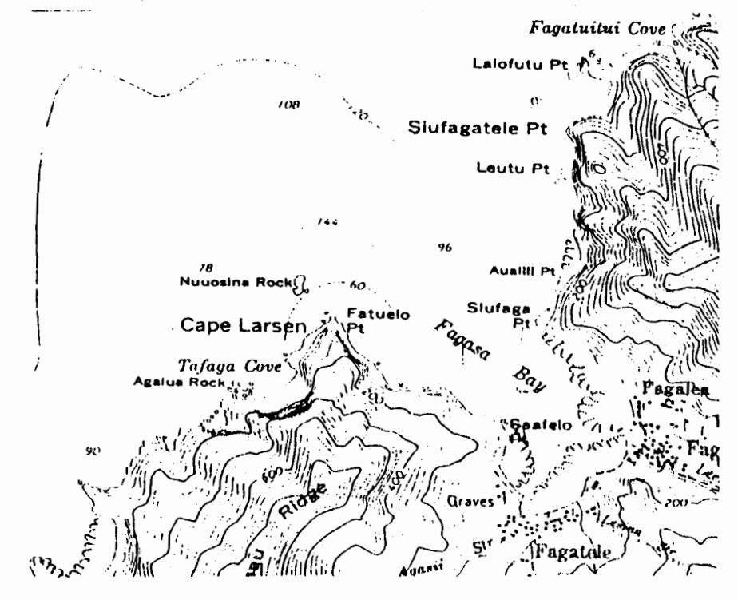

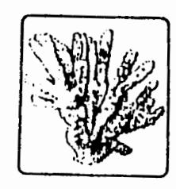

the reef margin, 5 foot (1.5 m) deep depressions constitute short and irregular grooves. The channels and depressions are somewhat shallower at the margin, suggestive of a slight algal ridge (ASCRI-1688).

FRINGING REEF FRONT - FAGASA BAY (OFF FAGATELE VILLAGE)

The reef front drops abruptly to a silty-sand and rubble bottom of inner Fagasa Bay. Some large boulders are present on the bottom. Depth in the inner bay ranges from 20 feet (6 m off the reef front to 40 feet (12 m) off Sa'afelo Point (ASCRI-16B9).

FRINGING REEF FLAT (OFF FAGATELE VILLAGE)

Coral cover is only about 1% on the inner reef flat off Fagatele Village. Only occasional <u>Leptastrea purpurea</u> are conspicuous. A limpet-like mollusc (<u>Siphonaria</u> sp.) and small barnacles inhabit silt-covered boulders near shore. The most common algae are <u>Halimeda discoidea</u>, <u>Actinotrichia</u> sp., and blue-greens (ASCRI-1686).

Coral cover is 1 to 5% on the middle reef flat about 150 feet (46 m) from shore. Most common are small encrusting or flattened colonies of several species. The stiff, red alga, Actinotrichia sp., is abundant. Encrusting coralline algae and Halimeda discoidea are common (ASCRI-16B7).

Irregular spur and groove-like structures are nearly choked with short-branched Acropora and Millepora, colonies of Acropora intermedia, sheets of Acropora hyacinthus, A. cf. digitifera, and scattered Porites lutea, totalling up to 60% bottom cover. Encrusting coralline algae (Porolithon sp.) are abundant, and Actinotrichia sp. is common in depressions. Halimeda discoidea is common at the reef margin. Scattered patches of a white sponge are conspicuous. Burrows of the sea urchin, Echinostrephus, are common (ASCRI-1688). A November 1978 survey of the spur-and groove formations recorded considerable Acropora nana and Astreopora sp. Much Pocillopora cf. setchelli, P. meandrina, and large heads of P. eydouxi occur in this area. Although considerable dead Acropora humilis was observed in deeper water near the surf break, the cause did not appear to be Acanthaster predation. Neither crown-of-thorns starfish nor feeding scars was evident (34).

Fishes are abundant on the reef flat fronting Fagatele Village, but most individuals are juveniles. At least 26 species are recorded. Large schools of atherinids feed along the shore. A surgeonfish (Acanthurus nigrofuscus) is common, as are juvenile parrotfishes (Scarus spp.). Damselfishes (Dascyllus trimaculatus, Glyphidodontops cyanea, and G. leucopomus) are conspicuous. The most common butterflyfish is Chaetodon critinellus (ASCRI-16F3).

FAGALEA/FAGASA/FAGATELE MAP

16

FLORA AND FAUNA

FAGALEA/FAGASA/FAGATELE MAP

16

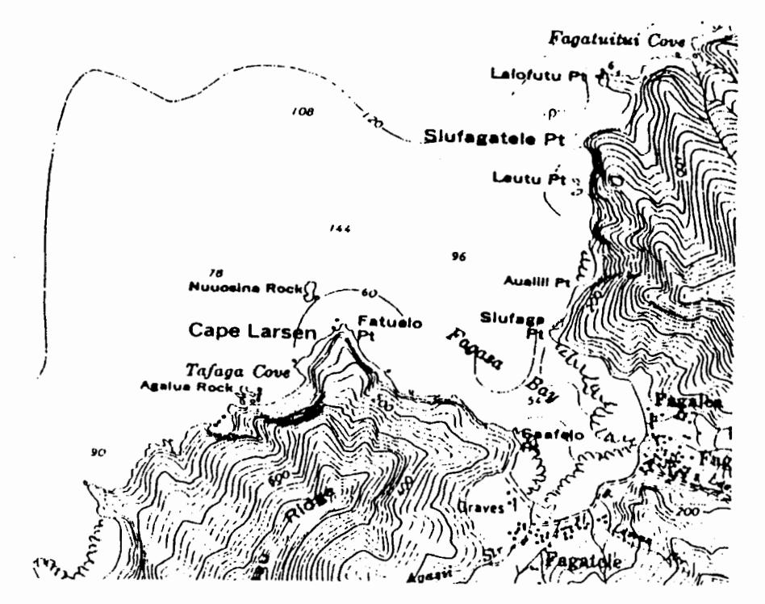

FLORA AND FAUNA

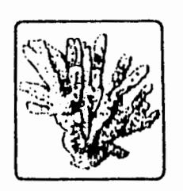

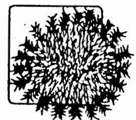

FAGALEA/FAGASA/FAGATELE MAP

16 HISTORICAL/ARCHAEOLOGICAL

# REEF FRONT (OFF FAGATELE VILLAGE)

Coral cover is around 30% of the bottom on the reef face off Fagatele Village. Major species include branching Acropora robusta, A. intermedia, tabular A. hyacinthus, and encrusting Montipora. At least 23 species of coral in 17 genera are present on the reef flat and front off Fagatele Village. Some areas of vertical reef front are covered by an anemone in colonies up to 20 feet (6 m) long. Another anemone (Rhodactis howesi) is present but not common. Non-coralline algae are not conspicuous (ASCRI-16B9).

Fishes are more diverse and abundant on the reef front than on the reef flat opposite Fagatele Village. The fish assemblage numbers at least 34 species. Dominant species include the surgeonfishes, Ctenochaetus striatus, Naso lituratus, the butterflyfish, Chaetodon citrinellus, and the damselfish, Glyphidodontops cyanea and G. glaucus. Juvenile parrotfishes, Scarus spp., are abundant. Wrasses are generally conspicuous, especially Gomphosus varius. The surgeonfish, C. striatus, is most common along the upper reef slope, whereas N. lituratus is more common at the base of the reef (ASCRI-16F4).

# OUTER FAGASA BAY

The reef slopes off Siufaga Point were first infested by Acanthaster in early 1978 (45). Coral cover in the surge zone off Siufaga Point reaches nearly 95% and is predominantly tabular Acropora hyacinthus. In Acanthaster-devastated areas below -20 feet (-6 m), encrusting coralline algae and filamentous algal turf cover the skeletons of dead tabular and branching Acropora and account for 90% bottom cover (3).

Although Fagasa Bay was free of <u>Acanthaster</u> in February 1978, little live coral was found on deeper reef slopes ( 150 feet or 45 m or more) in a November 1978 survey. Coral cover was high on the shallow forereef slopes, but numerous starfish were observed moving into this area (74). In August/September 1979, about 40% of corals on the upper reef front at depths of 6 to 33 feet (2 to 10 m) were alive. Few <u>Acanthaster</u> were present (75).

An abundant and relatively diverse fish assemblage inhabits the upper reef front off Siufaga Point. Most abundant of at least 54 species are Glyphidodontops leucopomus and Thalassoma quinquevittata. Although much less abundant, Spratelloides sp. and Stegastes fasciolatus are common. Fish life is somewhat more diverse but much less abundant at greater depths. At least 67 species are present, with none particularly abundant. Chromis amboinensis is most common (76).

#### COASTAL SPRING

An inland spring near the village of Fagasa is said to represent the site where the daughter of the King of Fiji went for water but was left behind because she dallied. A spring below

FAGALEA/FAGASA/FAGATELE MAP

16

HISTORICAL/ARCHAEOLOGICAL

FAGALEA/FAGASA/FAGATELE

MAP

WATER CONDITIONS

HURRICANE DAMAGE

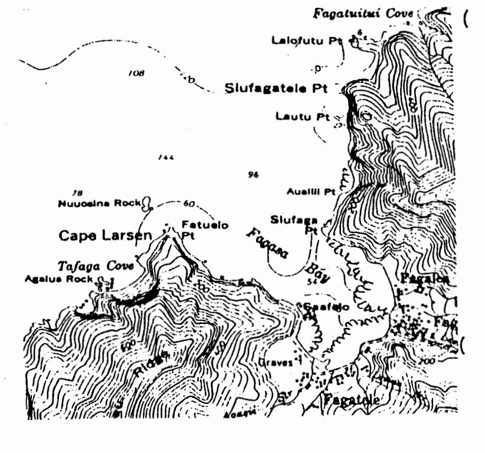

MT. ALAVA ROAD

FAGALEA/FAGASA/FAGATELE MAP

16

USE CONSIDERATIONS

FAGALEA/FAGASA/FAGATELE MAP

16

USE CONSIDERATIONS

sea level represents the site where her water container cracked when she went back to the beach and discovered her boat had departed (30).

# ISLETS (FAGASA BAY)

Two islets off Fagasa Bay are named Le-ma'a-o-Sina and Le-ma'a-o-Li'ava'a in memory of a Fijian king and his daughter who, according to legend, were lost from their canoe (30).

#### FAGASA BAY

Tropical cyclone "Elenore" (January 1973) damaged a seawall and boat ramp and washed out about 800 feet (245 m) of roadway at Fagasa (61;66).

The waters over the inner reef flat fringing Fagalea Village are turbid. Underwater visibility is about 20 feet (6 m), improving over the outer reef (ASCRI). Nearshore waters off Fagatele Village are turbid. Underwater visibility is limited to about 20 feet (6 m) within 60 feet (18 m) from shore. Visibility improves to about 60 feet (18 m) over the middle and outer reef flat. Rubbish drifts down the ava from the shoreline and is conspicuous at a depth of 30 feet (9 m) along the channel margin northwest of Fagatele Village (ASCRI). A freshwater surface lens after heavy rainfall interferes with visibility off the northwestern side of Fagatele Village near Sa'afelo Point (34).

A road to link Fagasa Pass to the television transmitter on top of Mt. Alava was undertaken in early 1976 as a training exercise by the U.S. Army 84th Engineer Battalion. Complaints of pollution in Fagasa Bay resulted when soil washing down from the barren roadcuts on the steep hillsides turned the bay water Soon after completion, the gravel-surfaced road was washing away during torrential rains (15). During construction of the Mt. Alava Road, the normally clear waters of Fagasa Bay became turbid because of soil erosion (39). However, washouts do not prevent jeeps from getting almost to the television towers The reef fringing Fagasa Bay below the Mt. Alava Road shows extensive damage due to sedimentation of eroded soil from the barren road cuts above. Sediment has completely covered an extensive fringing reef area, causing damage so complete that the reef is nearly devoid of life (39). Freshwater is evident on the surface of the bay following rainstorms (34).

# SHORELINE (FAGASA BAY)

The shoreline fronting the village of Fagatele is accessible down a concrete bag and block revetment. Access to the shore at Sa'afelo Point is restricted by a cliff. The reef flat can be traversed on foot when low surf permits (ASCRI).

# FRINGING REEF (FAGASA BAY)

The reef in front of Fagalea, Fagasa and Fagatele villages

FAGALEA/FAGASA/FAGATELE

MAP 16

Fagatuiteri Cove

Laigrutu Pi

Lautu Pt

Lautu Pt

Cape Larsen

Fatuelo

Cape Larsen

Tri/aga Cove

Agaius Rock

Siufaga

Fatuelo

Gaafajo

Gaafajo

Gaafajo

Gaafajo

Gaafajo

Gaafajo

Gaafajo

Gaafajo

Gaafajo

Gaafajo

Gaafajo

Gaafajo

Gaafajo

Gaafajo

Gaafajo

Gaafajo

Gaafajo

Gaafajo

Gaafajo

Gaafajo

Gaafajo

Gaafajo

Gaafajo

Gaafajo

Gaafajo

Gaafajo

Gaafajo

Gaafajo

Gaafajo

Gaafajo

Gaafajo

Gaafajo

Gaafajo

Gaafajo

Gaafajo

Gaafajo

Gaafajo

Gaafajo

Gaafajo

Gaafajo

Gaafajo

Gaafajo

Gaafajo

Gaafajo

Gaafajo

Gaafajo

Gaafajo

Gaafajo

Gaafajo

Gaafajo

Gaafajo

Gaafajo

Gaafajo

Gaafajo

Gaafajo

Gaafajo

Gaafajo

Gaafajo

Gaafajo

Gaafajo

Gaafajo

Gaafajo

Gaafajo

Gaafajo

Gaafajo

Gaafajo

Gaafajo

Gaafajo

Gaafajo

Gaafajo

Gaafajo

Gaafajo

Gaafajo

Gaafajo

Gaafajo

Gaafajo

Gaafajo

Gaafajo

Gaafajo

Gaafajo

Gaafajo

Gaafajo

Gaafajo

Gaafajo

Gaafajo

Gaafajo

Gaafajo

Gaafajo

Gaafajo

Gaafajo

Gaafajo

Gaafajo

Gaafajo

Gaafajo

Gaafajo

Gaafajo

Gaafajo

Gaafajo

Gaafajo

Gaafajo

Gaafajo

Gaafajo

Gaafajo

Gaafajo

Gaafajo

Gaafajo

Gaafajo

Gaafajo

Gaafajo

Gaafajo

Gaafajo

Gaafajo

Gaafajo

Gaafajo

Gaafajo

Gaafajo

Gaafajo

Gaafajo

Gaafajo

Gaafajo

Gaafajo

Gaafajo

Gaafajo

Gaafajo

Gaafajo

Gaafajo

Gaafajo

Gaafajo

Gaafajo

Gaafajo

Gaafajo

Gaafajo

Gaafajo

Gaafajo

Gaafajo

Gaafajo

Gaafajo

Gaafajo

Gaafajo

Gaafajo

Gaafajo

Gaafajo

Gaafajo

Gaafajo

Gaafajo

Gaafajo

Gaafajo

Gaafajo

Gaafajo

Gaafajo

Gaafajo

Gaafajo

Gaafajo

Gaafajo

Gaafajo

Gaafajo

Gaafajo

Gaafajo

Gaafajo

Gaafajo

Gaafajo

Gaafajo

Gaafajo

Gaafajo

Gaafajo

Gaafajo

Gaafajo

Gaafajo

Gaafajo

Gaafajo

Gaafajo

Gaafajo

Gaafajo

Gaafajo

Gaafajo

Gaafajo

Gaafajo

Gaafajo

Gaafajo

Gaafajo

Gaafajo

Gaafajo

Gaafajo

Gaafajo

Gaafajo

Gaafajo

Gaafajo

Gaafajo

Gaafajo

Gaafajo

Gaafajo

Gaafajo

Gaafajo

Gaafajo

Gaafajo

Gaafajo

Gaafajo

Gaafajo

Gaafajo

Gaafajo

Gaafajo

Gaafajo

Gaafajo

Gaafajo

Gaafajo

Gaafajo

Gaafajo

Gaafajo

Gaafajo

G

USE CONSIDERATIONS

( \* Fagasa Bay and fringing
 possible "Special Areas"
( of substantial recreational
 value - Chap. VI.C.2 (21)

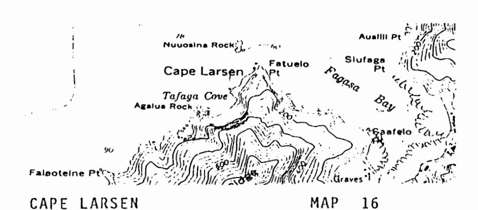

FLORA AND FAUNA

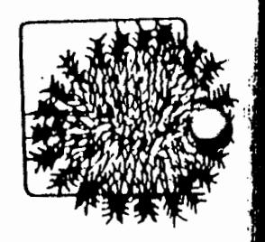

is considered a "critical use reef area" because of subsistence fishing by villagers (39). The reef flat is a regularly used fishing ground, but fishermen also fish deeper waters off the reef front. Spearing with homd-made spears (mata) is the most popular activity, followed by pole fishing with rod and reel. Throw-netting (kili) is less popular. Some seine netting (upega) is also practiced. Spearing yields day and night catches of pone (chocolate surgeonfish), alogo (lined surgeonfish), and laea (large parrotfish). Day catches of malauli (large jack), fe'e (octopus), fuga (small parrotfish), and faisua (giant sea clam) are common. Night catches of crab, papata (slipper lobster), ula (spiny lobster), and eel are common. Throw-netting, practiced primarily by day, brings in catches of manini (convict tang), alogo, pone, anae (adult mullet), fuafua (juvenile mullet), lupota (small jack), and, in season, atule (big-eye scad), lo (rabbitfish), and i'asina (juvenile goatfish) (20).

Gill netting occurs on the outer reef flat at low tide between Si'ufaga Point and Fagalea Village. Fish are driven into the net from shore by splashing. Throw-netting and gill-netting are undertaken near shore off Fagasa Village.

Fagasa Bay is one of the most popular and accessible areas for boaters along the north shore of Tutuila because of a boat launching ramp. The area is reached by a short drive from Pago Pago over a road whose crest offers scenic views (41). Fishing with throw-nets and bamboo poles takes place off the boat ramp. Reef gleaning is practiced on the reef flat northwest of the ramp. The outer reef and reef slope on the southwestern side of Fagasa Bay is one of the more popular areas used by sport divers. The narrow reef shelf off Sa'afelo Point descends steeply to depths of 40 to 60 feet (12 to 18 m). The calm, clear waters offer excellent SCUBA diving opportunities (ASCRI).

# COAST BETWEEN FATUELO POINT AND FALEOTEINE POINT

The coastline westward from Fatuelo Point to the head of Sita Bay is predominantly a sea cliff. Sea caves are conspicuous features especially east of Faleoteine Point (ASCRI-16S3). The cave located near Faleoteine Point is said to be the largest on Tutuila (30). In places between Cape Larsen and Sita Bay, a sloping shelf of volcanic rock borders the base of the cliffs. This shelf is best developed near Agalua Rock, which is a series of seastacks. Pools form in depressions in the shelf at the head of a small cove west of Agalua Rock (ASCRI-16S3).

#### OFF FATUELO POINT

Only 15% of corals on the bottom at depths of 6 to 33 feet (2 to 10 m) off Fatuelo Point were living in August/September 1979. Only a single crown-of-thorns starfish (alamea; Acanthaster planci) was recorded as present (43).

CAPE LARSEN

MAP 16 FLORA AND FAUNA

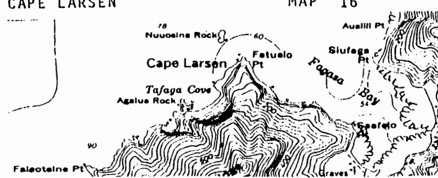

CAPE LARSEN

MAP 16 FLORA AND FAUNA

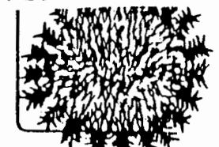

CAPE LARSEN

MAP 16 FLORA AND FAUNA

CAPE LARSEN

MAP 16 USE CONSIDERATIONS

\* Agalua Rock and adjacent coastline are possible "Special Areas" of scenic importance ---Chap. VI.C.2 (21)

# OFF CAPE LARSEN

Fishes are abundant in relatively shallow waters off Cape Larsen. Abundance decreases markedly with depth to moderate depths, but the deep water fishes are relatively abundant. Diversity increases with depth. At least 58 species are represented at shallow depths, at least 99 species at moderate depths, and at least 134 species in deep waters. Most abundant in shallow waters are Glyphidodontops leucopomus and Thalassoma quinquevittata. Although much less abundant, Stegastes fasciolatus and Plectroglyphidodon leucozona are common. Pomacentrus vaiuli, P. melanopterus, and Chromis iomelas are most common at moderate depths. Pomacentrus melanopterus and Plectroglyphidodon dickii dominate in deep water. P. lacrymatus, Ctenochaetus striatus, and Chromis acares are common (76).

# OFFSHORE BETWEEN CAPE LARSEN AND AGALUA ROCK

Although no <u>Acanthaster planci</u> were observed on the bottom between Cape Larsen and Agalua Rock in January 1973, many dead corals provided evidence of the prior presence of starfish in the area (74).

#### OFF FALEOTEINE POINT

About 85% of corals on the bottom at depths of 6 to 33 feet (2 to 10 m) off Faleoteine Point were living in August/September 1979. A few crown-of-thorns starfish (alamea; Acanthaster planci) were present (75).

# FATUELO ROCK TO SITA BAY

Shoreline access from Fatuelo Rock west to Sita Bay is severely restricted by steep sea cliffs and the absence of roads and trails along the coast. This section of coast is accessible by small boat during calm seas. The erosional features near and including the seastacks known as Agalua Rock are of considerable geologic as well as scenic interest. The clear waters around Agalua Rock have good potential for SCUBA diving during calm seas. However, offshore waters can be rough along this wave exposed coast (ASCRI).

/MAP13.TEX/ - /AUG-80/

SITA BAY

MAP 17 **PHYSIOGRAPHY** 

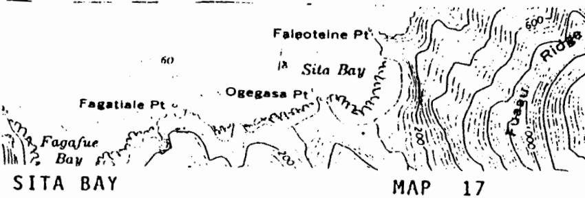

MAP

PHYSIOGRAPHY

SITA BAY

MAP 17

FLORA AND FAUNA

SITA BAY

MAP 17

FLORA AND FAUNA

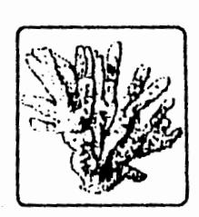

\* Sita Bay is a possible "Special Area" of high natural productivity -- Chap. VI.C.1 (21)

# COAST BETWEEN FALEOTEINE POINT AND OGEGASA POINT (SITA BAY)

# SHORELINE

At the head of Sita Bay there is a gently-sloping beach of calcareous sand with some gravel and rubble. The beach merges with the reef flat, except along one section of the southeastern shore where basalt boulders are present and the sand beach lies behind the boulders (ASCRI-16S3). The western margin of the bay is a rocky shore extending around Ogegasa Point (ASCRI-17S1).

# FRINGING REEF FRONT

The reef slope off the eastern side of Sita Bay drops to depths of over 50 feet (15 m) and has two distinct profiles: in places the reef face exhibits spurs projecting within 10 to 15 feet (3 to 5 m) of the surface from depths of 20 to 25 feet (6 to 8 m); elsewhere the reef face is characterized by a relatively steep dropoff with less prominent spur-and-groove development (ASCRI-16B10).

# FRINGING REEF FLAT

Fishes are moderately abundant on the reef flat fringing the western side of Sita Bay. Glyphidodontops leucopomus is the most abundant form of at least 50 species. Glyphidodontops glaucus, Acanthurus lineatus, and A. triostegus are common (76).

# FRINGING REEF FRONT

Coral growth on the reef face along the eastern side of Sita Bay is among the lushest in American Samoa. Cover approaches 100%, with abundant Acropora, unusually large numbers of Astreopora sp., and considerable Pavona clavus and favids. The algae, Ralfsia sp., Sphacelaria sp., and Halimeda are evident in addition to encrusting corallines. The burrowing sea urchin, Echinostrephus sp., is common, especially along the sides of grooves on the reef front. Sea cucumbers (Stichopus chloronotus) occur on the shallow outer reef platform. There is no evidence of Acanthaster (ASCRI-16B10).

Fishes are moderately abundant on reef slopes along the eastern side of Sita Bay. At least 54 species are present. Wrasses are conspicuously absent along the reef front, although common on the reef flat. Dominant species are the butterflyfish, Chaetodon reticulatus, the surgeonfishes, Acanthurus lineatus and A. nigrofuscus, the damselfishes, Dascyllus reticulatus, Glyphidodontops cyanea and Pomacentrus coelestis, the wrasses, Gomphosus varius and Thalassoma hardwickei, and several species of adult parrotfishes, Scarus spp. The mullet, Mugil vaiglensis, is less common inshore over the reef flat (ASCRI-16F5). A highly diverse assemblage including at at least 97 species, occurs along the reef front in the western portion of Sita Bay. Plectroglyphidodon

SITA BAY

MAP 17

WATER CONDITIONS

SITA BAY

17 MAP

USE CONSIDERATIONS

OGEGASA POINT

MAP 17

**PHYSIOGRAPHY** 

OGEGASA POINT

MAP 17

FLORA AND FAUNA

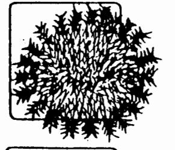

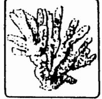

dickij and Pomacentrus melanopterus are most abundant. Chromis acares, Ctenochaetus striatus, and Glyphidodontops cyanea are common (76).

SITA BAY

The waters of Sita Bay are clear (ASCRI).

#### SITA BAY

Although a sand beach at the head of Sita Bay provides easy access to the water, the absence of roads or trails along this coast restricts visitation. The relatively calm, clear waters along the reef front offer good opportunities for SCUBA diving for those who approach by boat (ASCRI).

#### COAST BETWEEN OGEGASA POINT AND FAGATIALE POINT

West of Ogegasa Point is a boulder and cobble beach. From there to Fagafue Bay, the coast is a sea cliff. Several seastacks lie off Ogegasa Point. A low outcrop projects seaward from the western side of the point, and several rock outcrops extend below sea level at Fagatiale Point. An open inlet indents the coastline southwest of Fagatiale Point (ASCRI-17S1).

# OFFSHORE BOTTOM

Off Ogegasa Point a vertical face of basalt rock descends to a depth of 10 feet (3 m). Below 10 feet, a rocky surface with scattered coral heads extends 165 feet (50 m) offshore to a depth of 25 feet (7 m). Farther seaward there is a slope with "spurs and grooves" dropping to a depth of 50 feet (15 m), becoming a still steeper slope to a depth of 100 feet (30 m) and terminating in an extensive sand bottom (10).

West of Ogegasa Point, the bottom consists of consolidated limestone at depths of 25 to 30 feet (8 to 9 m). Coral rubble predominates at depths of 50 to 60 feet (15 to 18 m) (ASCRI-17B1).

# OFFSHORE BOTTOM

Although Acanthaster planci was not observed on offshore slopes between Ogegasa Point and Fagatiale Point in January 1978, the many dead coral heads in the area provided evidence of feeding by this starfish (74).

Coral cover and species diversity are high off Ogegasa Point (10). Just west of Ogegasa Point, live corals (mostly Acropora hyacinthus and A. intermedia) cover about 75% of the limestone bottom at depths of 25 to 30 feet (8 to 9 m). At depths of 50 to 60 feet (15 to 18 m), the bottom is mostly coral rubble (ASCRI-17B1).

OGEGASA POINT

MAP 17

USE CONSIDERATIONS

( POTENTIAL COAST AND REEF RESERVE

FAGAFUE BAY

**MAP** 17

PHYSIOGRAPHY

FAGAFUE BAY

MAP 17

PHYSIOGRAPHY

FAGAFUE BAY

**MAP** 17

FLORA AND FAUNA

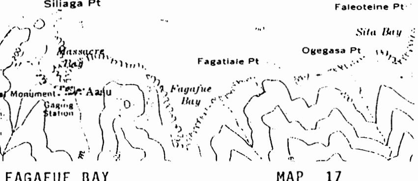

FAGAFUE BAY MAP 17 WATER CONDITIONS

FAGAFUE BAY

MAP 17

HISTORICAL/ARCHAEOLOGICAL

FAGAFUE BAY

MAP 17

USE CONSIDERATIONS

# SHORELINE

Sea cliffs and the absence of roads and trails along the coast severely restrict access to the shoreline. Ogegasa Point and offshore areas have been proposed as a coastal and reef reserve (9).

# FAGAFUE BAY

#### SHORELINE

The eastern perimeter of Fagafue Bay is a cliff, penetrated at one point by a deep sea cave. A fan of volcanic boulders has accumulated at the mouth of Leaveave Stream at the head of the bay. West of the stream outlet is a small sand beach. A rocky shoreline extends along the western perimeter of Fagafue Bay. A bench is present near sea level at the point defining the northwest tip of the bay mouth (ASCRI-17S2).

# FRINGING REEF

A reef fringes Fagafue Bay. Limestone patch reefs (one exposed above water) occur off the reef front at the head of the Bay (ASCRI-17B3).

# FRINGING REEF

Live coral covers between 25 and 50% of the reef southwest of Fagatiale Point. Cover increases on a steep dropoff down the outer reef front (ASCRI-17B2). Coral, mostly Acropora, covers 75 to 80% of the reef front at a depth of 30 feet (9 m), off the northwestern tip of Fagafue Bay mouth. Fagafue Bay is one of the only areas along the north coast of Tutuila besides Sita Bay where corals appear virtually untouched by the crown-of-thorns starfish (alamea; Acanthaster planci). Acanthaster is not present on the reef front (ASCRI-17B4).

#### FAGAFUE BAY WATERS

Inshore waters of Fagafue Bay near the mouth of Leaveave Stream are turbid. Offshore waters are clear (ASCRI).

# ABANDONED VILLAGE

Fagafue Valley once harbored several houses which made up the village of Fagafue. This village has been abandoned (30).

# FAGAFUE BAY

A sand beach at the head of Fagafue Bay provides easy access to the shoreline, but the absence of roads and trails along the coast greatly restricts visitation. The bay and beach are accessible by small boat, which can be landed at all but the lowest tides (ASCRI). For fishing uses see: AASU / USE CONSIDER-

AASU

MAP 17

PHYSIOGRAPHY

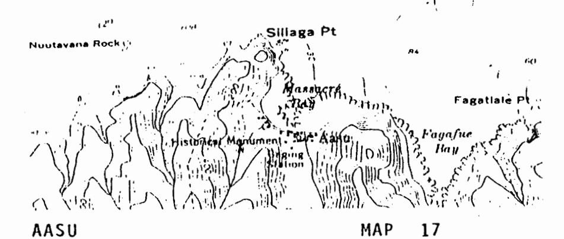

**PHYSIOGRAPHY** 

AASU

MAP 17

FLORA AND FAUNA

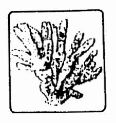

#### MASSACRE BAY

# SHORELINE

The roof of a sea cave along the western side of Massacre Bay is 50 feet (15 m) above sea level and is considered evidence of a stand of the sea about 25 feet (8 m) higher than present sea level (54).

A beach of calcareous sand and rubble fronts the village of Aasu on Massacre Bay. Shoreline erosion is evident near the mouth of Aasu Stream, where coconut trees have been toppled. A short section of rubble beach occurs along the margin of Massacre Bay east of Aasu Village. Northwest of the village is a rocky shoreline (ASCRI-17S3).

# FRINGING REEF (MASSACRE BAY)

An outcrop of limestone is exposed at low tide on the shallow reef flat northeast of Aasu village. The inner reef fronting Aasu Village is predominantly limestone rubble, with volcanic boulders exposed at low tide near shore (ASCRI-17B5). The middle reef is a platform of consolidated limestone at a depth of 3 feet (1 m), with occasional depressions reaching to depths of 6 or 8 feet (2 or 2.5 m) (ASCRI-17B6). A relatively wide channel through the reef and approaches shore at the head of the Massacre Bay. The margins of the steep-sided channel support coral thickets above a bottom of large boulders at depths of 20 to 25 feet (6 to 8 m). Isolated limestone knolls and depressions in the reef provide bottom relief (ASCRI-1787). Low (Porites) wheels and consolidated limestone form the coral southwestern margin of the channel where the latter shoals to 2 to 3 feet (0.6 to 1.0 m) approaching shore. Some areas are silted (ASCRI-1788).

The inner reef flat west of the ava consists of sand, with rubble and boulders increasing toward shore (ASCRI-17B10). The mid-reef is consolidated limestone (ASCRI-17B9).

# FRINGING REEF FLAT (MASSACRE BAY)

Coral is sparse on rubble flats of the inner reef off Aasu Village. Encrusting coralline algae, Lyngbya sp., and Ralfsia sp. are common. Conspicuous invertebrates include the burrowing sea urchin, Echinostrephus sp., the sea cucumber, Stichopus chloronotus, a white sponge, and the mollusc, Turbo sp. Barnacles occur on large boulders exposed at low tide near shore (ASCRI-17B5).

Coral cover is about 20% on the mid-reef southeast of the ava. Acropora aspera is most common (ASCRI-17B6). West of the ava, the middle reef has luxuriant coral cover (up to 90%),

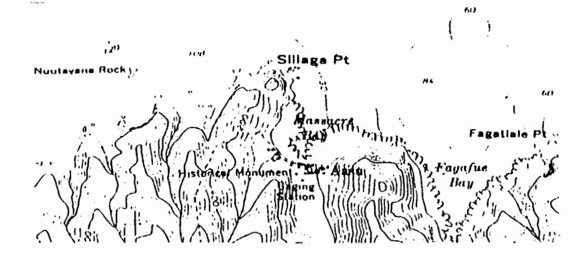

AASU

MAP 17

FLORA AND FAUNA

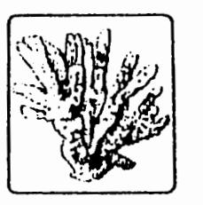

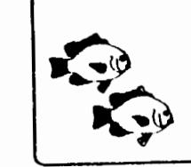

WATER CONDITIONS

AASU

MAP 17

consisting mostly of acroporans (ASCRI-17B9). Coral is sparse on the rubble and boulder-covered inner reef along the southwestern side of Massacre Bay. Sparse algal cover on the seaward portion of this area includes Actinotrichia sp., a turf of undetermined brown species, an unidentified green spongy alga, and Halimeda discoidea. Cerithids, cowries, and other molluscs are common under rock slabs and boulders. Other invertebrates include a sea cucumber (Stichopus chloronotus), a xanthid crab (Actaea tomentosa), and occasional soft coral colonies (ASCRI-17B10).

The fish fauna is moderately diverse and fishes are moderately abundant on the reef flat at Massacre Bay. Glyphidodontops leucopomus is most abundant of at least 56 species. Also abundant is Stegastes albofasciatus. Halichoeres marginatus, Acanthurus lineatus, and Ctenochaetus striatus are common (76).

#### FRINGING REEF FRONT AND AVA MARGINS

Acropora formosa and A. exigua are common in thickets along the margin and sides of the ava to -20 feet (-6 m). At least 19 stony coral species in 7 genera are represented on the Aasu reef flat and ava margins. The black coral, Cirrhipathes sp., is found along the ava margin (ASCRI-17B7). The shallow southwestern margin of the ava harbors around 50% coral cover, with staghorn and tabular acroporans (A. humilis and A. hyacinthus) most common. Sea cucumbers (Stichopus chloronotus) occur here (ASCRI-17B8).

No crown-of-thorns starfish (alamea; Acanthaster planci) nor damage to corals attributable to this species was observed on forereef slopes between Aasu Village and Siliaga Point in January 1978 (74). As of September 1979, about 90% of the corals on the upper reef front at depths of 6 to 33 feet (2 to 10 m) in Massacre Bay are alive, and few crown-of-thorns starfish are present (75).

High bottom relief on the reef front provides habitat for a diverse fish assemblage. Fishes are not, however, as abundant as on the reef flat. At least 126 species are recorded from the reef slopes and the ava margins. Surgeonfishes, butterflyfishes, wrasses, and damselfishes are the best represented families. The predominate species are Chaetodon citrinellus, C. reticulatus, Acanthurus nigrofuscus, Chromis caerulea, Eupomacentrus metallicus, Ctenochaetus striatus, Glyphidodontops cyanea, G. leucopomus, Plectroglyphidodon leucozona, P. dickii, Pomacentrus coelestris, Thalassoma hardwickei, atherinids, and several species of adult parrotfish (Scarus spp.) (76;ASCRI-17F1).

#### MASSACRE BAY

Underwater visibility is relatively poor (20 to 30 feet or 6 to 9 m) on the inner and mid-reef fronting Aasu Stream mouth. Waters in and along the margins of the ava are likewise generally turbid and the shallow southwestern margin is silted near shore. However, the water over the reef flat north of the two stream

TUTUILA

WESTERN DISTRICT

LEASINA CO.

**AASU** 

MAP 17

HISTORICAL/ARCHAEOLOGICAM

AASU

MAP 17

USE CONSIDERATIONS

MAP 17

PHYSIOGRAPHY

Manuelo Rock

Massacre

Aologu Bay

Aologu Bay

Aologu Bay

Aologu Bay

Aologu Bay

Aologu Bay

Aologu Bay

Aologu Bay

Aologu Bay

Aologu Bay

Aologu Bay

Aologu Bay

Aologu Bay

Aologu Bay

Aologu Bay

Aologu Bay

Aologu Bay

Aologu Bay

Aologu Bay

Aologu Bay

Aologu Bay

Aologu Bay

Aologu Bay

Aologu Bay

Aologu Bay

Aologu Bay

Aologu Bay

Aologu Bay

Aologu Bay

Aologu Bay

Aologu Bay

Aologu Bay

Aologu Bay

Aologu Bay

Aologu Bay

Aologu Bay

Aologu Bay

Aologu Bay

Aologu Bay

Aologu Bay

Aologu Bay

Aologu Bay

Aologu Bay

Aologu Bay

Aologu Bay

Aologu Bay

Aologu Bay

Aologu Bay

Aologu Bay

Aologu Bay

Aologu Bay

Aologu Bay

Aologu Bay

Aologu Bay

Aologu Bay

Aologu Bay

Aologu Bay

Aologu Bay

Aologu Bay

Aologu Bay

Aologu Bay

Aologu Bay

Aologu Bay

Aologu Bay

Aologu Bay

Aologu Bay

Aologu Bay

Aologu Bay

Aologu Bay

Aologu Bay

Aologu Bay

Aologu Bay

Aologu Bay

Aologu Bay

Aologu Bay

Aologu Bay

Aologu Bay

Aologu Bay

Aologu Bay

Aologu Bay

Aologu Bay

Aologu Bay

Aologu Bay

Aologu Bay

Aologu Bay

Aologu Bay

Aologu Bay

Aologu Bay

Aologu Bay

Aologu Bay

Aologu Bay

Aologu Bay

Aologu Bay

Aologu Bay

Aologu Bay

Aologu Bay

Aologu Bay

Aologu Bay

Aologu Bay

Aologu Bay

Aologu Bay

Aologu Bay

Aologu Bay

Aologu Bay

Aologu Bay

Aologu Bay

Aologu Bay

Aologu Bay

Aologu Bay

Aologu Bay

Aologu Bay

Aologu Bay

Aologu Bay

Aologu Bay

Aologu Bay

Aologu Bay

Aologu Bay

Aologu Bay

Aologu Bay

Aologu Bay

Aologu Bay

Aologu Bay

Aologu Bay

Aologu Bay

Aologu Bay

Aologu Bay

Aologu Bay

Aologu Bay

Aologu Bay

Aologu Bay

Aologu Bay

Aologu Bay

Aologu Bay

Aologu Bay

Aologu Bay

Aologu Bay

Aologu Bay

Aologu Bay

Aologu Bay

Aologu Bay

Aologu Bay

Aologu Bay

Aologu Bay

Aologu Bay

Aologu Bay

Aologu Bay

Aologu Bay

Aologu Bay

Aologu Bay

Aologu Bay

Aologu Bay

Aologu Bay

Aologu Bay

Aologu Bay

Aologu Bay

Aologu Bay

Aologu Bay

Aologu Bay

Aologu Bay

Aologu Bay

Aologu Bay

Aologu Bay

Aologu Bay

Aologu Bay

Aologu Bay

Aologu Bay

Aologu Bay

Aologu Bay

Aologu

outlets is clear (ASCRI).

# MASSACRE BAY HISTORIC MONUMENT

A monument at Aasu Village commemorates the 1787 massacre of members of a shore party from a vessel commanded by the French explorer, La Perouse (41).

#### FRINGING REEF

The reefs fringing Fagafue Bay and Massacre Bay are frequently-used fishing areas. Fishermen utilize deep water areas beyond the reefs as well as the shallow reef flats. activities along the face of these reefs are diving and handlining at night from canoes (20). The reef fringing Massacre Bay is considered a "critical use reef area" because of subsistence fishing by villagers (39). Spearing is the favored fishing .method, with pole and line fishing second most popular. Handlining at night from canoes and reef gleaning follow in popularity. Pone (chocolate surgeonfish), alogo (lined surgeonfish), and laea (large parrotfish) are caught by spearing day and night. usual day catch includes malauli (large jack), fe'e (octopus), (small parrotfish), and faisua (giant clam). Night catches of crab, papata, ula (spiny lobster), and eel are common. and line fishing yields day and night catches of gatala (honeycomb grouper), lupota (small jack), mataeleele (small emperor fish), and savane (blue-lined snapper). Night catches usually include malau (squirrelfish), matapula (bigeye snapper), malai (paddletail snapper), and filoa (large emperor fish). Handlining at night from canoes provides malau, matapula, malai, mataeleele, savane, and filoa. Day gleaning picks up fe'e, eel, tuitui (sea urchin), pipi, sisi (sea snail), and matapisu (limpet). Alili and sisi (sea snails) are the usual catch from night gleaning (20).

Boulders and rubble on the inner reef along the western side of Massacre Bay shelter a rich shell life. This area appears to have good potential for shell collecting (ASCRI).

# COAST BETWEEN SILIAGA POINT AND AOLOAU BAY

The coastline from Siliaga Point westward to Aoloau Bay is predominantly cliffed. West of Siliaga Point occurs a large seastack: Nu'utavana Rock.

## SHORELINE

Large boulders lie along the base of the seacliff south of Nu'utavana Rock. Southeast of the seastack, a sea cave and waterfall are conspicuous along the coast. Southwest of the seastack, twin caves are eroded in the cliff behind a wave-cut bench about 6 feet (2 m) above sea level. The platform is well-developed at a point west of the twin caves, were it slopes from the base of the cliff for about 200 feet (61 m) to the seaward margin. A small seastack is awash a short distance offshore to the west of

MAP 18 PHYSIOGRAPHY

NU'UTAVANA ROCK

MAP 18 FLORA AND FAUNA

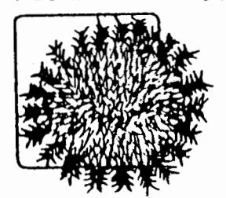

18

FLORA AND FAUNA

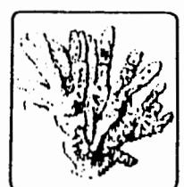

Aoloau Bay

AOLOAUFOU (AOLOAUTUAI) MAP

18

PHYSIOGRAPHY

AOLQAUFOU (AOLOAUTUAI) MAP 18

FLORA AND FAUNA

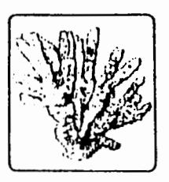

the bench. West of the small seastack is a steep boulder beach. The next prominent point to the west also exhibits a wave-cut bench 6 to 8 feet (2 to 2.5 m) above sea level. East of Aoloau Bay, a sea cave and a large tidepool are conspicuous features along the cliffed coast (ASCRI-18S1). The beach at the head of an unnamed bay immediately east of Aoloau Bay is composed of rounded rocks and limestone rubble (15).

#### FRINGING REEFS

In places, narrow reefs deeply penetrated by surge channels fringe small coves along the coast between Siliaga Point and Aoloau Bay (ASCRI-18B1).

# OFF NU'UTAVANA ROCK

Although few Acanthaster planci were observed in January 1978 on the bottom around Nu'utavana Rock, considerable dead coral provided evidence of passage of starfish through the area (74). About 60% of corals at depths of 6 to 33 feet (2 to 10 m) are living (as of September 1979) and no crown-of-thorns starfish are evident (75).

# OFFSHORE BOTTOM

Bottom areas southwest of Nu'utavana Rock to Aoloau Bay had areas of mostly living coral interspersed with dead coral heads, the latter off more prominent points of land. Coral cover is about 50% southwest of Nu'utavana Rock, with areas of mostly live coral adjacent to areas where much of the coral is dead (ASCRI-18B1).

Nearly all of the corals (which formerly covered 75% of the bottom at a depth of 50 feet or 15 m) are now dead off a prominent point of land east of Aoloau Bay. Reef slopes east of this point have only about 30% coral cover in areas where corals formerly covered about 90% of the bottom. The red alga, Ahnfeltia concinna, is conspicuous along shore (ASCRI-18B2).

# AOLOAU BAY

# SHORELINE

A beach of sand, rubble and boulders occurs at the head of Aoloau Bay in front of the abandoned village of Aoloautuai (ASCRI-1852).

# FRINGING REEF (AOLOAU BAY)

No crown-of-thorns starfish (alamea; <u>Acanthaster planci</u>) or damage to coral heads attributable to this starfish was observed on forereef slopes at Aoloau Bay in January 1978 (74). In August/September 1979, about 80% of corals on the upper reef front at depths of 6 to 33 feet (2 to 10 m) were still alive. Some crown

AOLOAUFOU (AOLOAUTUAI) MAP 18

HISTORICAL/ARCHAEOLOGICAL

AOLOAUFOU (AOLOAUTUAI) MAP

18

USE CONSIDERATIONS

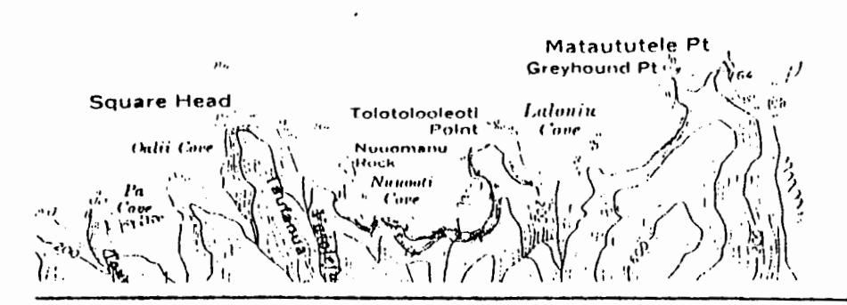

MANUELO ROCK

MAP 18 FLORA AND FAUNA

( SEABIRD NESTING AREA

MATAUTUTELE POINT

MAP 18 PHYSIOGRAPHY

LALONIU COVE

MAP 19 PHYSIOGRAPHY

of-thorns starfish were present (75). In October 1979, Acropora covered about 50% of the reef slope at a depth of 40 feet (12 m) in the northeastern part of Aoloau Bay (ASCRI-18B3).

# ABANDONED VILLAGE

The coastal village of Aoloautuai (at the head of Aoloau Bay) was abandoned in 1951 to allow villagers closer contact with other villages. Previously, the villagers of Aoloautuai had to travel several miles by longboat through rough seas to the village of Fagasa (MAP 16) in order to get food, goods, and mail. The inland trail was over steep, densely-vegetated ridges. The entire village relocated to the plateau of Olotele and a new village called Aoloaufou (30).

# FRINGING REEF (AOLOAU BAY)

The reef fringing Aoloau Bay is considered a "critical use reef area" because of subsistence fishing by villagers (39). The reef flat is a frequently used fishing area, and fishermen also frequent deep water beyond the reef edge. Spearing with home-made spears (mata) is the preferred fishing activity. Pole and line fishing is the second most popular method. Spearing provides day and night catches of pone (chocolate surgeonfish), alogo (lined surgeonfish), and laea (large parrotfish). Day catches often include malauli (large jack), fe'e (octopus), fuga (small parrotfish), and faisua (giant clam). Crab, papata (slipper lobster), ula (spiny lobster), and eel are the usual night catches. Pole and line fishing brings in day and night catches of gatala (honeycomb grouper), lupota (small jack), mataeleele (small emperor fish), and savane (blue-lined snapper). Malau (squirrelfish), matapula (bigeye snapper), malai (paddletail snapper), and filoa (large emperor fish) are among the usual night catches (20).

# COAST BETWEEN MANUELO ROCK AND SQUARE HEAD

# MANUELO ROCK

Manuelo Rock, a seastack north of Aoloau Bay, supports a small nesting colony of brown boobies (fua'o; <u>Sula leucogaster</u> plotus), a seabird uncommon in American Samoa (15).

# MATAUTUTELE (GREYHOUND) POINT

Volcanic talus lies along the base of the coastal cliff southwest of Mataututele (Greyhound) Point. A wave-cut bench 6 to 20 feet (2 to 6 m) above sea level is conspicuous fronting the rocky promontories (ASCRI-18S3).

#### LALONIU COVE

A cave and waterfall are conspicuous coastal features on the eastern side of Tolotolo'oleoti Point. The sheer cliff formLALONIU COVE

MAP 19

PHYSIOGRAPHY

NU'UO'OTI COVE

MAP 19

PHYSIOGRAPHY

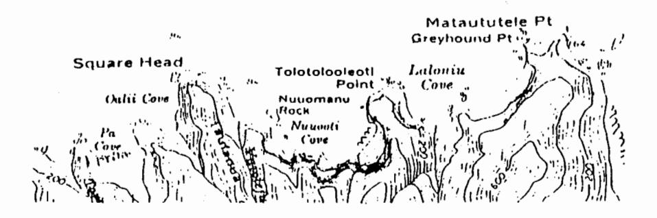

LALONIU COVE

MAP 19

FLORA AND FAUNA

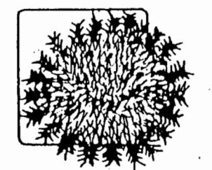

NU'UO'OTI COVE

MAP 19

FLORA AND FAUNA

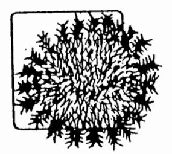

LALONIU COVE

MAP 19

USE CONSIDERATIONS

ing this point is undercut with a definite nip and is fronted by a wave-cut bench of volcanic rock. The point lacks a protective reef, so deep, rough waters occur immediately off the shore (ASCRI-19S1).

# FRINGING REEF FRONT (LALONIU COVE)

The front of a narrow, fringing reef in Laloniu Cove drops rapidly from shallow water to depths of 40 to 60 feet (12 to 18 m) (ASCRI-19B1).

# NU'UO'OTI COVE

A beach of mostly boulders and some sand occurs at the head of Nu'uo'oti Cove. This beach is separated into two sections by a rocky outcrop. At the base of the outcrop is a wave-cut bench 4 to 8 feet (1.2 to 2.4 m) above sea level. A sea cave is eroded in the outcrop (ASCRI-19S2). The limestone bottom within Nu'uo'oti Cove is deeply grooved to depths of 20 to 50 feet (6 to 15 m) (ASCRI-19B2).

Nu'uomanu Rock is a massive promontory of lava rock projecting seaward from the coast at the western end of Nu'uo'oti Cove. This outcrop is connected to the coast by a low neck of land. Cliffs predominate along the coast from Nu'uomanu Rock to Pa Cove. Wave-cut benches are conspicuous features at the base of rocky promontories. A sea cave and small waterfall are evident along the coast immediately southwest of Nu'uomanu Rock (ASCRI-19S3).

# OFFSHORE BOTTOM

A small number of <u>Acanthaster planci</u> were observed offshore between Mataututele Point and Tolotolo'oteoti Point in January 1978 but no coral damage was evident (74). By October 1979, all coral (which covered 50 to 75% of the bottom) was dead at depths of 30 to 40 feet (9 to 12 m) southwest of Matautulele Point (ASCRI-1884).

#### NU'UO'OTI COVE

In August/September 1979, about 30% of coral heads on the bottom at depths of 6 to 33 feet (2 to 10 m) in Nu'uo'oti Cove were living, although no crown-of-thorns starfish (alamea; Acanthaster planci) was observed (75). However, all acroporan corals, which once covered 75 to 80% of the bottom slopes in Nu'uo'oti Cove are now dead. Species spared from attack by the starfish cover only about 5% of the bottom (ASCRI-1982).

# LALONIU COVE

The narrow reef sloping from shallow waters to depths of 40 to 60 (12 to 18 m) in Laloniu Cove affords good SCUBA diving opportunities. The clear, relatively calm waters are accessible only by boat (ASCRI).

OALI'I COVE

MAP 19

PHYSIOGRAPHY

PA COVE

MAP 19

PHYSIOGRAPHY

MAP 19

Paupala Cove

FLORA AND FAUNA

FAGAMALO

MAP 20

PHYSIOGRA

Tafola Rocks

**FAGAMALO** 

Vaoaga Pt

PHYSIOGRAPHY

FAGAMALQ

MAP 20

PHYSIOGRAPHY

# COAST BETWEEN SQUARE HEAD AND LE'ELE'E POINT

# OALI'I COVE

A boulder beach occurs at the head of Oali'i Cove (ASCRI-19S3).

# PA COVE

A beach of sand and rubble occupies the head of Pa Cove (ASCRI).

# OFFSHORE BOTTOM BETWEEN SQUARE HEAD AND PA'APALA COVE

Some crown-of-thorns starfish (alamea; Acanthaster planci) were observed offshore between Square Head and Pa'apala Cove in January 1978, but coral damage was not evident (74). At present (as of September 1979), only 5% of corals on the bottom at depths between 6 and 35 feet (2 to 10 m) off Fafaga Point are alive. No crown-of-thorns starfish are evident (75).

# COAST BETWEEN LE'ELE'E POINT AND VAOAGA POINT (FAGAMALO)

#### SHORELINE

A small bay indents the coastline at Fagamalo Village. Cliffs bound the northeastern and southwestern sides of the bay. At the head of the bay there is a relatively steep beach of rubble and some basalt boulders, including one large tract 30 feet (9 m) wide by 50 feet (15 m) long (ASCRI-20S1). Adjoining the steep cliff on the southwest, there is a bench some 10 to 15 feet (3 to 5 m) across cut in volcanic rock and positioned only slightly above the inner reef flat (ASCRI-20S2).

# FRINGING REEF

The inner reef flat extends about 100 feet (30 m) from shore at depths of one to three feet (0.3 to 1.0 m) The bottom consists of sand and gravel patches, areas of volcanic boulders and coral wheels, and consolidated limestone in nearly equal proportions (ASCRI-20B1). The middle and outer reef flat begins 100 feet (30 m) offshore and extends to 300 feet (90 m) at depths of 3 to 5 feet (1 to 1.5 m). Most of the bottom is consolidated limestone (ASCRI-20B2). A steep-sided channel or ava crosses the reef. Depths in the inner portion of the ava are 10 to 15 feet (3 to 5 m). Consolidated limestone and coral wheels line the ava margins (ASCRI-20B3; 20B4).

#### FAGAMALO BAY OUTSIDE THE FRINGING REEF

Seaward of the fringing reef, coral knolls rise 10 feet (3 m) above a boulder and rubble bottom at depths of 25 to 40 feet

FAGAMALO

MAP 20

FAGAMALO

MAP 20

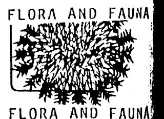

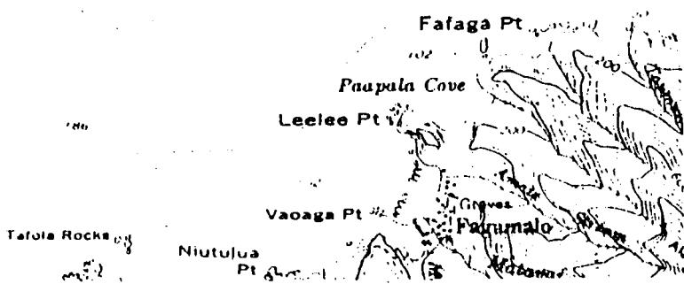

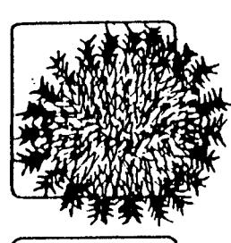

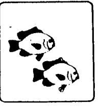

ONTHREST CONST

(8 to 12 m) (ASCRI-20B5). Flanking the western promontory of outer Fagamalo Bay there is a steep-sloping bottom of consolidated limestone. East of Vaoaga Point, irregular limestone mounds rise to within three feet (1 m) of the surface surrounded by rubble-bottom channels 10 to 15 feet (3 to 5 m) deep (ASCRI-20B6).

# OFFSHORE BETWEEN PA'APALA COVE AND FAGAMALO

The crown-of-thorns starfish (alamea; Acanthaster planci) was observed in offshore areas between Pa'apala Cove and Fagamalo Village in January 1978, but coral damage was not evident (74).

# FRINGING REEF

Coral cover is about 5% to 10% on the inner reef flat fronting Fagamalo Village. Short-branched <u>Acropora</u> are most common, but large <u>Porites</u> colonies are conspicuous east of the ava (ASCRI-20B1).

Coral cover approaches 25% on the middle reef but decreases to only 5% on the outer reef flat. Branched and tabular Acropora predominate. Although dead coral heads cover 10 to 30% of the bottom, the outer reef flat has a high proportion of live coral compared to deep areas on the reef front. Although a few Acanthaster are present along the margins of the ava, wave surge may limit distribution of the starfish. There is little evidence of a coral kill on the outer reef flat. Corals are diverse: at least 31 species in 17 genera are present on Fagamalo reef. Ralfsia sp. is a common alga on the middle flat (ASCRI-20B2).

Porites microatolls are present along the eastern side of the ava. Branching coralline algae, including Porolithon gardineri, and Halimeda discoidea are present in low abundance. A few sea cucumbers (Stichopus chloronotus) occur here (ASCRI-20B3). The steep-sided western margin of the ava harbors little coral in the zone between shore and a depth of 15 feet (5 m). Farther seaward, tabular Acropora spp. (especially A. hyacinthus) which once covered 50 to 60% of the bottom, are nearly all dead. The consolidated limestone margins of the ava are pitted with burrows of the sea urchin, Echinostrephus sp. (ASCRI-20B4).

Corals on the reef margin and in the ava (channel) crossing the reef in front of Fagamalo Village have been devastated by the crown-of-thorns starfish (alamea; Acanthaster planci). Despite reduced coral cover, the fish fauna associated with the ava margins is highly diverse (at least 104 species), although fishes are not abundant. Bottom relief is high and cover for the fauna is available among the dead coral heads. Butterflyfishes are represented by at least 16 species, and damselfishes are represented by at least 17 species. At least 20 species of wrasses and 11 species of surgeonfishes inhabit the ava. Dominant species include atherinids, a mullet (Liza vaigiensis), a butterflyfish (Chaetodon reticulatus), surgeonfishes (Acanthurus lineatus, A. nigrofuscus, and Ctenochaetus striatus), damselfishes (Glyphidodon dontops cyanea, G. glaucus, G. leucopomus, and Plectroglyphidodon

**FAGAMALO** 

MAP 20

FLORA AND FAUNA

FAGAMALO

20 MAP

WATER CONDITIONS

FAGAMALO

MAP 20 USE CONSIDERATIONS

FAGAMALO (MALOATA) MAP 20

FLORA AND FAUNA

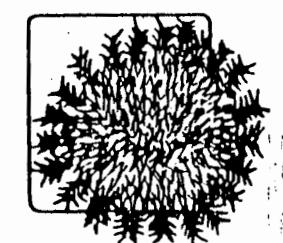

FAGAMALO (MALOATA)

MAP 20 USE CONSIDERATIONS

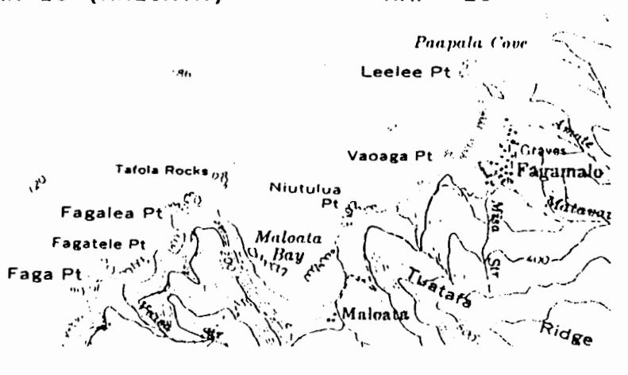

leucozoma), a wrasse (Thalassoma hardwickei), several species of parrotfishes (Scarus spp.), and a triggerfish (Rhinecanthus rectangulus). The abundance of R. rectangulus is unusual in that this species is rarely a dominant species. Some uncommon species are present, including blacktip shark (Carcharhinus melanopterus) and a butterflyfish (Chaetodon benneti) (ASCRI-20F1).

# SEAWARD OF THE FRINGING REEF

Live coral once covered a high proportion of the surface of coral knolls in the outer bay, but the bottom is now mostly dead coral (ASCRI-20B5). Burrows of the sea urchin, Echinostrephus sp., are conspicuous on steep limestone slopes along the base of the headland bounding the southwest side of Fagamalo Bay. Considerable coralline algae (mainly <u>Porolithon</u>) encrusts the bottom. A few <u>Acanthaster</u> are present (ASCRI-20B6).

# FRINGING REEF

Underwater visibility is about 75 feet (23 m) on the outer reef platform and along the reef front in the southwestern portion of the small bay fronting Fagamalo Village (ASCRI).

#### FAGAMALO BAY

The bay fronting Fagamalo Village is accessible by a winding dirt road off the paved road to Poloa Village (MAP 21) and by boat (ASCRI). See: FAGAMALO (MALOATA) / USE CONSIDERATIONS.

#### COAST BETWEEN VAOAGA POINT AND FAGA POINT

# FRINGING REEF SLOPES

Acanthaster planci were common on forereef slopes between Maloata Bay and Faga Point in January 1978, but coral damage was not evident (74). By August/September 1979, only 10% of corals on the upper reef front at depths of 6 to 33 feet (2 to 10 m) in Maloata Bay were still alive. No crown-of-thorns starfish were evident (75).

#### FRINGING REEFS

The reef fronting Fagamalo Village and the reef in Maloata Bay fronting Maloata Village are considered "critical use reef areas" because of subsistence fishing by villagers (39). Frequently-used fishing areas include both the reef flat and deep waters beyond the reef edge. Spearing with home-made spears is the favorite activity. Handlining at night from canoes is the second most popular fishing method and is practiced in deep water beyond the reef margin. Pole and line fishing and reef gleaning follow in popularity. Spearing results in day and night catches of pone (chocolate surgeonfish), alogo (lined surgeonfish), and laea (large parrotfish). Malauli (large jack), fe'e (octopus), fuga (small parrotfish), and faisua (giant sea clam) are among

FAGAMALO (MALOATA) MAP 20

USE CONSIDERATIONS

FAGALI'I

MAP 20

PHYSIOGRAPHY

FAGALI'I

MAP 20

FLORA AND FAUNA

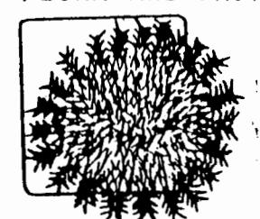

FAGALI'I

MAP

USE CONSIDERATIONS

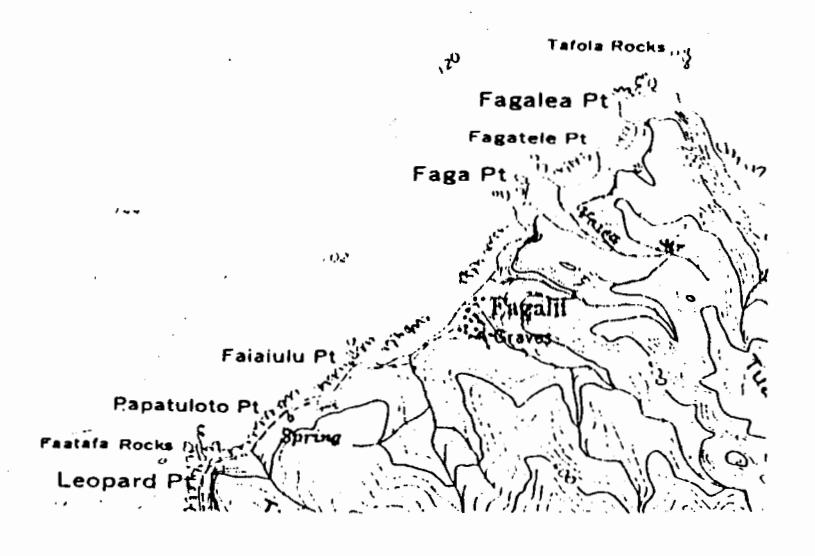

the usual day catches. Night catches include crab, papata (slipper lobster), ula (spiny lobster), and eel. Handlining at night from canoes yields malau (squirrelfish), matapula (bigeye snapper), malai (paddletail snapper), mataeleele (small emperor fish), savane (blue-lined snapper), and filoa (large emperor fish). Pole and line fishing brings in day and night catches of gatala (honeycomb grouper), lupota (small jack), mataeleele, and savane. Malau, matapula, malai, and filoa are common night catches. Day gleaning on the reef flat yields fe'e, eel, tuitui (sea urchin), pipi, sisi (sea snail), and matapisu (limpet). Alili and sisi (sea snails) are the usual catch from night gleaning (20).

# COAST BETWEEN FAGA POINT AND LEOPARD POINT

#### SHORELINE

Fagali'i Village is situated on a narrow alluvial plain, across which three streams discharge into the sea. The beach fronting Fagali'i consists of basalt rubble and boulders, with a scattering of alluvial sand. Severe floods in November 1979 littered the foreshore with tree trunks and debris. The 30-foot (9 m) wide foreshore slopes up to a backshore berm of basalt boulders. The coast lacks a well-defined fringing reef, so that shore is subject to direct wave attack (49).

# OFFSHORE BOTTOM

The crown-of-thorns starfish (alamea; Acanthaster planci) was common offshore between Faga Point and Faialulu Point in January 1978, bux coral damage was not evident (74). By August/September 1979, only 5% of corals on the upper reef front at depths of 6 to 33 feet (2 to 10 m) were still alive. Crown-of thorns starfish was not evident (75).

#### FRINGING REEF

The reef in front of Fagali'i Village is regularly fished. Fishermen frequent deep water seaward of the reef edge as well as the shallow reef flat. Spearing with home-made spears (mata) is the preferred activity. Pole and line fishing is somewhat less popular. Handlining at night from canoes and reef gleaning follow popularity. Pone (chocolate surgeonfish), alogo (lined surgeonfish), and laea (large parrotfish) are taken day and night by spearing. Malauli (large jack), fe'e (octopus), fuga (small parrotfish), and faisua (giant sea clam) are speared by day, and crab, papata (slipper lobster), ula (spiny lobster), and eel are the usual night catch. Pole and line fishing brings in day and night catches of gatala (honeycomb grouper), lupota (small jack), mataeleele (small emperor fish), and savane (blue-lined snapper). Night fishing adds catches of malau (squirrelfish), matapula (bigeye snapper), malai (paddletail snapper), and filoa (large emperor fish). Handlining at night from canoes along the reef front yields malau, matapula, malai, mataeleele, savane, and

POLOA

MAP - 21

PHYSIOGRAPHY

( HURRICANE DAMAGE

POLOA

MAP 21

PHYSIOGRAPHY

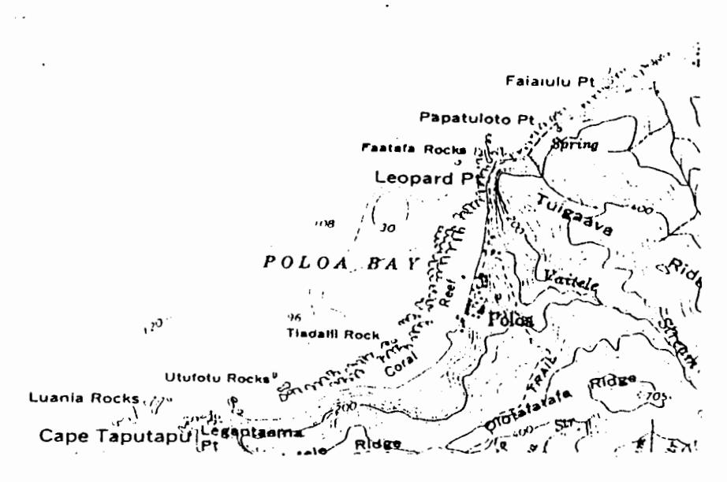

filoa. Fe'e, eel, tuitui (sea urchin), pipi, sisi (sea snail), and matapisu (limpet) are commonly taken by day gleaning. Alili and sisi (sea snails) are the major night catch (20).

# COAST BETWEEN LEOPARD POINT AND LUANIA ROCK (POLOA BAY)

# POLOA BEACH

The village of Poloa is fronted by a crescent-shaped sandy beach separated into two sections by a basalt outcrop. The northern section of beach has a narrow foreshore backed by a 14-foot (4 m) scarp where erosion has exposed tree roots and bare earth. The road closely parallels the scarp. The southern section is a calcareous sand foreshore, typically 40 feet (12 m) wide. Basalt cobbles and limestone rubble covers about half of the sand (49;ASCRI-21S1). Basalt content in the sand increases from 20% at the south end to 50% near Vaitele Stream. Silt content also increases near the stream mouth (49).

A school located south of the village is protected by a rock revetment (49;60). The revetment is flanked by two pocket beaches of calcareous sand and limestone rubble. The foreshores are approximately 40 feet wide and slope gently up to the vegetated backshore at the 6- to 8-foot elevation (49). During the hurricane of January 1973, the beach fronting this revetment receded about 25 feet (8 m), and waves overtopped and flanked both ends of the revetment. Some lost sand returned over the following 12 months, reforming a low beach along the front of the revetment (60). The revetment has been extended to a length of 490 feet (149 m) (70).

# FRINGING REEF

A fringing reef extends about 400 feet (120 m) offshore of Poloa Village. Typical depths over the reef flat are 0.5 to 1.5 feet (49). Low, flat boulders and rubble cover about half of the inner reef flat which extends to 50 feet (15 m) offshore in front of Poloa Village. Sand patches account for the remainder of the bottom cover (ASCRI-21B1). Off the rock outcrop which divides Poloa Beach into two sections, volcanic boulders surrounding pockets of silty-sand dominate the shallow depths (ASCRI-21B2).

The mid-reef flat is predominantly consolidated limestone extending from 50 to 150 feet (15 to 45 m) offshore at a depth of 2 to 3 feet (0.5 to 1 m). Sand and rubble patches cover about 10% of the bottom (ASCRI-21B3).

The outer reef flat shoals to a depth of 1 or 2 feet (0.3 or 0.6 m) as an elevated platform of limestone rubble cemented by encrusting coralline algae some 200 feet (60 m) from shore (ASCRI-21B4). A narrow channel indents the reef opposite the rock outcrop at the south end of Poloa Village. The steep-sided channel has a boulder bottom (ASCRI-21B5).

FLORA AND FAUNA

POLOA

MAP 21

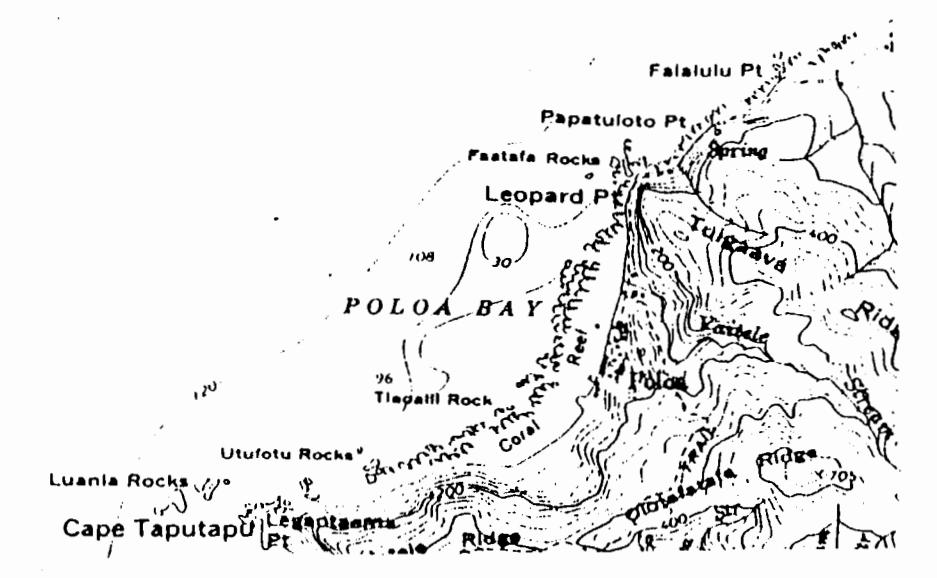

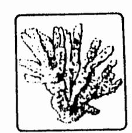

POLOA

MAP 21

FLORA AND FAUNA

#### FRINGING REEF FLAT

Algae are prevalent on small boulders and rubble forming the inner reef flat in front of Poloa Village. A turf of <u>Dictyota</u> sp. is most common. Coral cover is sparse and does not exceed 10% of the bottom. <u>Acropora</u> is most common (ASCRI-21B1). The brown seaweed, <u>Padina</u> sp., is present in low abundance off the rock outcrop at Poloa Beach. The sea cucumber, <u>Stichopus chloronotus</u>, is conspicuous throughout the area (ASCRI-21B2).

Corals are abundant beginning 50 feet (15 m) offshore and extending up to 200 feet (60 m) seaward on the middle reef flat. Coral cover approaches 70% and tabular Acropora is most common. A few crown-of-thorns starfish (alamea; Acanthaster planci) are present. Coral diversity is high, with at least 34 species representing 18 genera present (ASCRI-21B3).

Coral cover is reduced to about 25% on the outer, elevated reef platform. Encrusting forms of <u>Acropora</u> are abundant, but encrusting coralline algae are the dominant bottom forms. Cover by fleshy algae is relatively low and is dominated by <u>Dictyosphaeria versluysii</u>. <u>Actinotrichia</u> sp. also occurs. The sea urchin, <u>Echinostrephus</u> sp., is present (ASCRI-21B4).

Coral covers about 10% of the scoured margins of the narrow ava crossing Poloa reef offshore of a lava rock outcrop. Acropora spp. are most common (ASCRI-21B5).

Acropora coral thickets and a rocky bottom provide cover for at least 56 species of fishes on the reef flat off Poloa Village. Dominant species include the needlefish, Belone platyura, atherinids, the surgeonfishes, Acanthurus nigrofuscus and Ctenochaetus striatus, the damselfishes, Stegastes albofasciatus, Glyphidodontops cyanea, G. glaucus, G. leucopomus, Plectroglyphidodon dickii, and Pomacentrus vaiuli, and the wrasses, Thalassoma fuscum, T. hardwickei, T. quinquevittata, and T. purpureum. Fishes are moderately abundant, increasing in abundance toward the reef margin. Many of the wrasses are juveniles, but nearly all of the parrotfishes are adults (ASCRI-22F1). Fishes are not especially abundant on the reef flat southwest of Poloa Village. However, at least 60 species are represented in the assemblage. Most abundant is Glyphidodontops leucopomus. Glyphidodontops glaucus, Stegastes albofaciatus, and Ctenochaetus striatus are common (76).

# FRINGING REEF FRONT

Villagers whose familiarity with Poloa reef extends back several decades report that alamea (<u>Acanthaster planci</u>) was abundant around 1932 but has been scarce ever since (3). A few <u>Acanthaster</u> could be found on reef slopes between Leopard Point and Tiaoli'i Rock in January 1978, but coral damagd was not evident (74). By August/September 1979, only 5% of corals on the upper reef front at depths of 6 to 33 feet (2 to 10 m) were still alive. Only a single crown-of-thorns starfish was recorded, how-

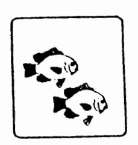

POLOA MAP 21

WATER CONDITIONS

POLOA MAP 21

WATER CONDITIONS

POLOA

MAP 21

USE CONSIDERATIONS

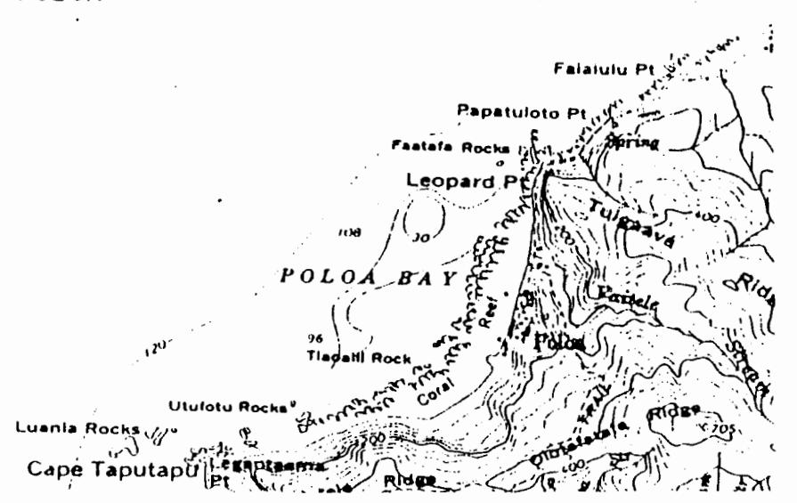

A few crown-of-thorns starfish (alamea) inhabited the reef slope between Tiaoali'i Rock and Luania Rocks in January 1973, but damage to corals was not evident (74). In August/September 1979, about 60% of the coral heads on the upper reef front were still alive and a few starfish were present (75).

11/31

Fishes are exceptionally abundant and the fauna diverse on the reef front near Tiaoali'i Rock. At least 117 species are present. Chromis acares and Plectroglyphidodon dickii are most abundant. Chromis margaritifera and C. xanthera are common (76).

# POLOA (VAITELE) STREAM

Poloa or Vaitele Stream drains an agricultural area and concentrations of fecal coliforms far in excess of water quality standards are frequently recorded (40).

#### FRINGING REEF

Underwater visibility is excellent (100 feet or 30 m) over the reef flat fronting Poloa Village (ASCRI).

# POLOA BAY

A paved road runs along the backshore between Poloa Village and the beach (60). Three small villages northeast of Poloa (Fagamalo, Maloata, and Fagali'i) are linked to the paved coastal highway by a jeep trail. Severe floods and landslides caused the road to Fagali'i to be barely passable in November 1979, and road washouts prevented access to Maloata and Fagamalo (49).

The reef flat fronting Poloa Village is considered a "critical use reef area" because of subsistence fishing by villagers (39). Both the reef flat and deeper water along the reef front are frequently fished. Diving with home-made spears is the preferred fishing method. Pole and line fishing is second most popular, followed by reef gleaning. Rod and reel fishing, lay netting, and handlining from canoes follow in frequency of use. Catches from spearing, pole fishing, and gleaning are similar to those listed for Fagali'i Village (See: FAGALI'I / USE CONSIDERATIONS)(20).

Surfing is possible year-round off Poloa Village at high tide. However, conditions tend to be poor during periods of strong northwest winds (51).

/MAP17.TEX/ - /AUG-80/

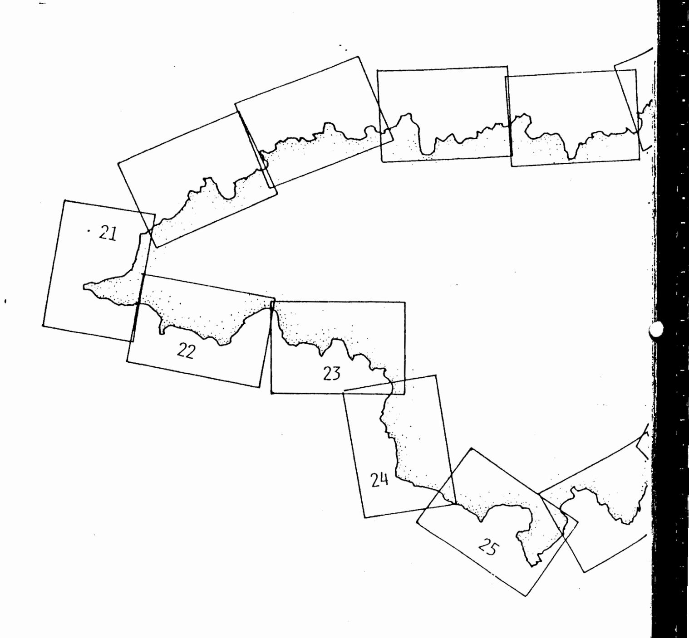

FIGURE 14. ATLAS MAPS COVERING THE SOUTHWEST COAST OF TUTUILA, AMERICAN SAMOA

# THE SOUTHWEST COAST OF TUTUILA

STREAMS

Northwest of Leone Village (MAP 23), deeply-incised stream valleys radiate from the summit of the volcanic cone and drain into a series of small bays separated by headlands (64). Stream deltas consisting of basalt rocks and alluvium are common along this coast (49). At least five perennial streams discharge the ocean along the southwestern coast of Tutuila. So'onapule Stream (MAP 22) flows through the coastal village of Se'etage before discharging into Nua-Se'etage Bay. The stream bed consists of boulders and gravel. Two tributaries Utanuatele) are diverted upstream to supply drinking water. Atauloma Stream (MAP 23) drains a relatively small watershed and flows through Afao Village before discharging into the ocean. Asili Stream (MAP 23) empties into the reef-protected northwestportion of Leone Bay. An upstream diversion and catchment supplies drinking water to Afao and Asili Villages. Leafu Stream (MAP 23), drains a relatively large watershed, and discharges small estuary inland from Leone Bay. Its flood plain is densely inhabited and small scale farming occurs there. Significant diversions located in the upper reaches of Leafu Stream provide drinking water to six nearby villages, including Leone. Fuafua (also known as Puapua) Stream (MAP 24) has a long channel flowing through the northwestern corner of the Leone Plain and discharging into Leone Bay over an elevated rock shelf. Homesites and agricultural activities occur along most of its lower course. Portions of the lower reach are altered, and surface waters are diverted upstream for domestic use (71).

The upper reaches of So'onapule and Asili Streams are relatively unmodified and their natural value is considered high (71). Lower Asili Stream drains an area influenced by agriculture and frequently shows concentrations of fecal coliforms far in excess of water quality standards (40).

COASTAL AREAS

Highway transportation along the southwestern coast of Tutuila centers on the two-lane paved highway which parallels the shore between Amanave (MAP 22) and Leone (MAP 23). The highway runs inland across the Tafuna plain east of Leone and Vailoatai (MAP 24); at Amanave, the road turns inland across Olotafatafa Ridge and terminates at Poloa Village (MAP 21) (64). The villages of Vailoatai (MAP 24) and Taputimu (MAP 25) are accessible by paved roads from the main highway across the Tafuna plain. Steps Point (MAP 25) is accessible by an unpaved road from the village of Futiga (39).

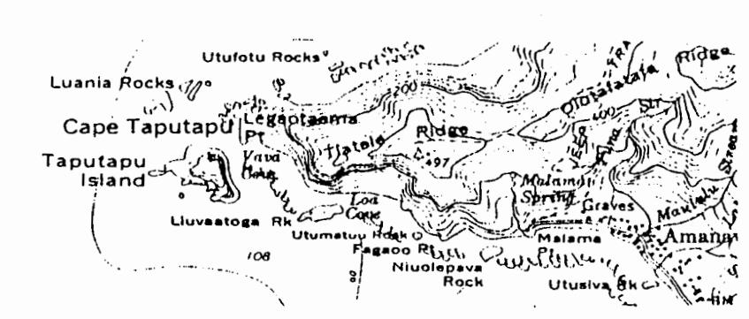

TAPUTAPU ISLET

MAP 21

PHYSIOGRAPHY

TAPUTAPU ISLET

MAP 21

FLORA AND FAUNA

( SEABIRD NESTING AREA

CAPE TAPUTAPU

MAP 21

USE CONSIDERATIONS

( \* Cape Taputapu and adjacent
 sea stacks are possible
( "Special Areas" of scenic
 importance --Chap. VI.C.2 (21)

CAPE TAPUTAPU

MAP 21

USE CONSIDERATIONS

#### CAPE TAPUTAPU .

Cape Taputapu is a ridge of dense lava remaining from the volcanic dome which formed the western end of Tutuila (54). The Cape demonstrates the work of waves eroding massive lavas typical of much of Tutuila. Outliers of resistant volcanic rock are prominent offshore. A number of blowholes occur along the coast. Among the offshore seastacks there is one identified as a volcanic vent from which lavas issued during the major period of island building (72).

# TAPUTAPU ISLET

Taputapu Islet is a remnant of the volcanic cone which formed the western end of Tutuila. It has withstood marine planation because it is composed of exceptionally dense lava (54).

# TAPUTAPU ISLET

Taputapu Islet is a potential roosting and nesting site for the reef heron (matu'u; <u>Egretta sacra sacra</u>), a resident seabird uncommon in American Samoa (15).

# CAPE TAPUTAPU

The steep, winding road from Amanave Village across a ridge to Poloa Village affords scenic views back toward Amanave and Utusiva Rock. However, the lack of pullover areas along this road limits opportunities for scenic viewing or photography (ASCRI).

Cape Taputapu and the offshore seastacks are of significant geological and scenic interest and an area of 170 acres (68 ha) of land and water has been designated as a National Natural Landmark (72).

# VAVA COVE AND LOA COVE

The reef fringing Vava and Loa Coves between Cape Taputapu and Fagao'o Point is regularly used for fishing. Fishermen frequent deep water seaward of the reef and the reef flat. Rod and reel is the favored fishing method, and pole and line fishing second in popularity. Gatala (honeycomb grouper), lupota (small jack), mataeleele (small emperor fish), and savane (blue-lined snapper) are taken day and night by pole fishing. In addition, malau (squirrelfish), matapula (bigeye snapper), malai (paddletail snapper), and filoa (large emperor fish) are frequently caught at night (20).

ΑΜΛΝΛΥΕ

MAP 22

PHYSIOGRAPHY

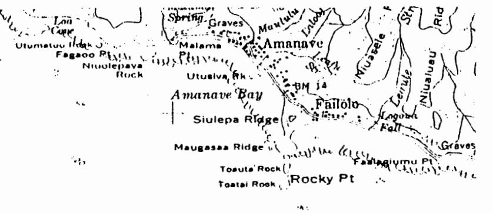

**AMANAVE** 

MAP 22

PHYSIOGRAPHY

# COAST BETWEEN MALAMA POINT AND ROCKY POINT

# SHORELINE

The coastline around Cape Taputapu to Malama Point is steep and rocky. A number of seastacks lie offshore (ASCRI). A crescent sand beach bounded by two volcanic headlands fronts the village of Amanave. Utusiva Rock divides the beach into two sections. The western portion, composed of 80% calcareous sand and 20% volcanic sediment, is approximately 50 feet (15 m) wide. Beachrock outcrops are exposed at intervals at the water's edge. backshore is defined by either a basalt bench or by large basalt boulders up to 8 feet (2.4 m) across. An earth scarp rising above the boulders to the 13- to 15-foot (4 to 4.6 m) elevation shows evidence of wave erosion. Backing the central part of Amanave Beach is an irregular 3- to 4-foot scarp. Between the mouths of Leafu and Maululu Streams there is a landfill protected by a revetment of randomly-dumped rocks. Backfill is eroding and the soil bank above the revetment is collapsing in places (48;49).

A tombolo behind Utusiva Rock consists of limestone rubble, basalt cobbles, alluvium, and some calcareous sand. The origin of the alluvial material is Leafu Stream (49). Southeast of Utusiva Rock, the beach is only 25 feet (8 m) wide. The upper beach consists of 85% calcareous and 15% volcanic sand. The foreshore is covered with limestone rubble and basalt cobbles (43;49).

#### FRINGING REEF

The fringing reef is between 400 and 500 feet (120 to 150 m) wide off Amanave (49). A low profile bottom immediately seaward of a narrow band of limestone cobbles at the composed of consolidated limestone scoured by sand. Depth is generally 1 to 1.5 feet (0.3 to 0.5 m). The bottom is veneered by sand held in an algal turf. Sand covers up to 30% of the bottom in some areas. Sand bottom increases about 80 feet (25 m) seaward of the landfill area between the mouths of Leafu and Maululu Streams, where depth is slightly greater (2 feet or 0.6 m) than elsewhere on the inner reef flat. A few large, scoured boulders up to 2 feet (0.6 m) across are scattered over the inner reef, especially near Utusiva Rock, where some rather large rocks occur on the bottom. The middle reef area, from 165 to 245 feet (50 to 75 m) offshore, is 2 feet (0.6 m) deep. Sand patches as such are absent, although sand is interspersed with rubble and is bound with an algal turf on rock surfaces. Sand is generally absent from the outer reef lying beyond 245 feet (75 m) Near the reef margin, 330 to 410 feet (100 to 125 m) from shore. offshore, the limestone bottom is furrowed by small grooves. Surge channels penetrate into the reef flat from the reef front to about 340 feet (104 m) from shore. The reef margin is only slightly awash (48).

**AMANAVE** 

MAP 22

PHYSIOGRAPHY

**AMANAVE** 

MAP 22

FLORA AND FAUNA

Utumatuu indah

Malama

Malama

Mulama

Mulama

Mulama

Mulama

Mulama

Mulama

Mulama

Mulama

Mulama

Mulama

Mulama

Mulama

Mulama

Mulama

Mulama

Mulama

Mulama

Mulama

Mulama

Mulama

Mulama

Mulama

Mulama

Mulama

Mulama

Mulama

Mulama

Mulama

Mulama

Mulama

Mulama

Mulama

Mulama

Mulama

Mulama

Mulama

Mulama

Mulama

Mulama

Mulama

Mulama

Mulama

Mulama

Mulama

Mulama

Mulama

Mulama

Mulama

Mulama

Mulama

Mulama

Mulama

Mulama

Mulama

Mulama

Mulama

Mulama

Mulama

Mulama

Mulama

Mulama

Mulama

Mulama

Mulama

Mulama

Mulama

Mulama

Mulama

Mulama

Mulama

Mulama

Mulama

Mulama

Mulama

Mulama

Mulama

Mulama

Mulama

Mulama

Mulama

Mulama

Mulama

Mulama

Mulama

Mulama

Mulama

Mulama

Mulama

Mulama

Mulama

Mulama

Mulama

Mulama

Mulama

Mulama

Mulama

Mulama

Mulama

Mulama

Mulama

Mulama

Mulama

Mulama

Mulama

Mulama

Mulama

Mulama

Mulama

Mulama

Mulama

Mulama

Mulama

Mulama

Mulama

Mulama

Mulama

Mulama

Mulama

Mulama

Mulama

Mulama

Mulama

Mulama

Mulama

Mulama

Mulama

Mulama

Mulama

Mulama

Mulama

Mulama

Mulama

Mulama

Mulama

Mulama

Mulama

Mulama

Mulama

Mulama

Mulama

Mulama

Mulama

Mulama

Mulama

Mulama

Mulama

Mulama

Mulama

Mulama

Mulama

Mulama

Mulama

Mulama

Mulama

Mulama

Mulama

Mulama

Mulama

Mulama

Mulama

Mulama

Mulama

Mulama

Mulama

Mulama

Mulama

Mulama

Mulama

Mulama

Mulama

Mulama

Mulama

Mulama

Mulama

Mulama

Mulama

Mulama

Mulama

Mulama

Mulama

Mulama

Mulama

Mulama

Mulama

Mulama

Mulama

Mulama

Mulama

Mulama

Mulama

Mulama

Mulama

Mulama

Mulama

Mulama

Mulama

Mulama

Mulama

Mulama

Mulama

Mulama

Mulama

Mulama

Mulama

Mulama

Mulama

Mulama

Mulama

Mulama

Mulama

Mulama

Mulama

Mulama

Mulama

Mulama

Mulama

Mulama

Mulama

Mulama

Mulama

Mulama

Mulama

Mulama

Mulama

Mulama

Mulama

Mulama

Mulama

Mulama

Mulama

Mulama

Mulama

Mulama

Mulama

Mulama

Mulama

Mulama

Mulama

Mulama

Mulama

Mulama

Mulama

Mulama

Mulama

Mulama

Mulama

Mulama

Mulama

Mulama

Mulama

Mulama

Mulama

**AMANAVE** 

MAP 22

WATER CONDITIONS

# UTUSIVA ROCK

OTHERT CONT

Utusiva Rock is a prominent seastack surrounded by the fringing reef in Amanave Bay. A tombolo consisting of limestone rubble, basalt cobbles, alluvium, and some calcareous sand, connects the seastack to shore (48;49).

# FRINGING REEF

The inner reef flat fronting Amanave Village is nearly devoid of live coral. Small patches of the coral, Leptastrea purpurea, occur on the upper surfaces of larger rocks between 80 and 165 feet (25 to 50 m) offshore. Most rock surfaces are carpeted by a sand binding, algal turf. The green alga, Valoniopsis sp., is evident nearshore, as is Dictyosphaeria sp. Few fishes inhabit waters within 80 feet (25 m) from shore. Most common in the outer part of this zone is Glyphidodontops glaucus. Other species present include G. leucopomus, juvenile Trachinotus sp., Therapon jarbua, Abudefduf sordidus, Acanthurus triostegus, Halichoeres margaritaceus, and H. trimaculatus. Near Utusiva Rock, common fishes include Stethojulis bandanensis, Halichoeres marginatus, Canthigaster solandri, and Abudefduf sordidus, but none is abundant. Scattered, small colonies of Porites andrewsi and P. lutea are the only corals present (48).

Coral cover is around 2% on the middle reef flat. Small heads of Pocillopora verrucosa, P. damicornis, Leptastrea purpurea, encrusting Montipora, and Acropora formosa are present. Closer to the outer reef flat, Montipora and P. verrucosa are most common, with a small number of branching Acropora and Favites present. Coral cover increases to about 5% on the outer reef near the margin. Acropora humilis is common together with low stands of other corals occurring more seaward. Pink, encrusting Porolithon alga, Dictyosphaeria sp., and Jania sp. increase in abundance seaward across the reef flat. The burrowing sea urchin, Echinostrephus sp., is evident near the reef margin. On the outer half of the reef flat, Glyphidodontops leucopomus replaces G. glaucus as the dominant fish. Fishes common on the outer reef are Halichoeres margaritaceus, Stegastes albofasciatus, Acanthurus nigrofuscus, and juvenile A. lineatus (48).

The reef margin exhibits an abundance of low-growing coral species totalling about 40% cover. Acropora humilis, Pocillopora damicornis, P. verrucosa, low-branching acroporans, and an encrusting form are most conspicuous. The limestone bottom has a pink cast due to encrusting Porolithon sp. Scattered, green Dictyosphaeria sp., Halimeda sp., and the branching coralline, Actinotrichia rigida, occur there (48).

# FRINGING REEF (AMANAVE BAY)

A strong longshore current flows northwest to an ava which drains the reef flat. This current is particularly hazardous in the shallow channel between Amanave Beach and Utusiva Rock (ASCRI).

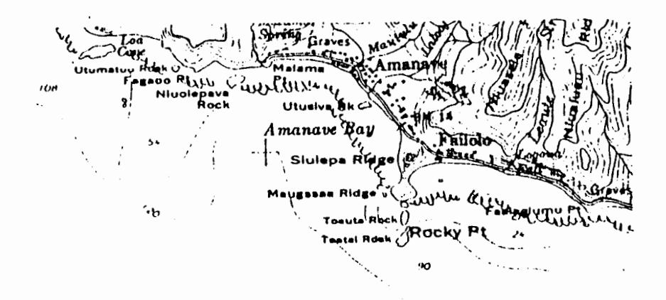

**AMANAVE** 

MÁP 18 HISTORICAL/ARCHAEOLOGICAL

AMANAVE

MAP 22

USE CONSIDERATIONS

**AMANAVE** 

ा।

MAP 22

USE CONSIDERATIONS

Considerable freshwater runoff enters Amanave Bay from Leafu and Maululu Streams following heavy rains. At such times a broad band of turbid water spreads west and northwest from the mouth of Leafu Stream. Plumes of discolored water extend offshore toward the ava which serves as the principal point of discharge for reef flat waters. Some discolored water also hugs the northwestern shore of Utusiva Rock and surrounds the landfill between the two stream mouths. At 30 feet (25 m) offshore of the landfill, underwater visibility is only 6 feet (2 m). Visibility is zero within 80 feet (25 m) of the mouth of Maululu Stream and is little improved (around 1.5 feet) near the reef margin about 330 feet (100 m) west of the stream mouth. Northwest of the streams, visibility is much improved (about 46 feet or 14 m) on the outer reef flat (48).

# MAMANAVE LEGENDARY SITES

Amanave Village is named after a tupua, or spirit stone, known as Ma'a-o-Nave. The tupua is said to cause misfortune if a passing traveler does not make an offering of green leaves or flowers. Portions of the ridge between the villages of Amanave and Fa'ilolo are believed to represent bodies of two Samoan warriors who turned to stone and now guard the passage between the two villages (30).

BEACH

Amanave Beach is easily accessible from the nearby coastal road (ASCRI). The waters off the beach are used for swimming, with access granted courtesy of Amanave Village. Year-round surfing is possible off Amanave, but high tide is necessary because of the shallow reef (41).

# FRINGING REEF

The reef fringing Amanave Bay is considered a "critical use reef area" supporting subsistence fishing by villagers (39). The reef flat is the most frequently fished area. Diving with home-made spears (mata) is most often practiced, followed in popularity by pole and line fishing. Reef gleaning and throw-netting (kili) are less common activities. Alogo (lined surgeonfish), laea (large parrotfish), and eel are taken day and night by spearing. Usual day catches include malauli (large jack), pone (chocolate surgeonfish), fuga (small parrotfish), (octopus), and ume (unicornfish). Usual night catches include anae (adult mullet), ula (spiny lobster), and crab. Gatala (honeycomb grouper), lupota (small jack), mataeleele (small emperor fish), and savane (blue-lined snapper) are taken day and night by pole fishing. Additional nighttime catches usually include malau (squirrelfish), matapula (bigeye snapper), malai (paddletail snapper), and filoa (large emperor fish). gleaning collects fe'e, eel, tuitui (sea urchin), pipi, sisi (sea snail), and matapisu (limpet). Alili and sisi (sea snails) are the principal catches from night gleaning. Throw-netting is a daytime activity bringing in fuafua (juvenile mullet), anae,

FA'ILOLO/AGUGULU

MAP 22

PHYSIOGRAPHY

FA'ILOLO/AGUGULU

MAP 22

PHYSIOGRAPHY

FA'ILOLO/AGUGULU

MAP 22

WATER CONDITIONS

FA'ILOLO/AGUGULU

MAP 22

USE CONSIDERATIONS

FA'ILOLO/AGUGULU

MAP 22

USE CONSIDERATIONS

( POTENTIAL COAST AND REEF RESERVE

manini (convict tang), alogo, pone, mutu, laea, and, in season, i'asina (juvenile goatfish), and lo (rabbitfish)(20).

# COAST BETWEEN ROCKY POINT AND FAGAONE POINT

# SHORELINE

A steep, 70-foot (21 m) wide beach fronts the village of Fa'ilolo. The sand is predominantly calcareous. Floods cover the foreshore with rocks and debris (49).

East of Fa'ilolo, boulders line the base of a road embankment extending around Fa'alagiumu Point (ASCRI-22S1). A small pocket beach of volcanic cobbles and boulders and scattered patches of calcareous sand fronts Agugulu Village. Floods in November 1979 completely buried the beach with debris and eroded a 10-foot (3 m) high scarp in the backshore (49). East of Agugulu, around Lepisi and Fagaone Points, the shoreline is a cliff with boulder talus along the base (ASCRI-22S2).

# FRINGING REEF

The fringing reef off Fa'ilolo is 500 feet (150 m) wide and depths are typically 1 to 1.5 feet. A very narrow channel crosses the reef flat to within 200 feet (60 m) of shore off the mouth of Leaute Stream (49). Much of the reef flat is exposed at low tide (ASCRI-22B1). The fringing reef off Agugulu is only 100 feet (30 m) wide (49). The reef flat is strewn with boulders (ASCRI-22B2).

# FRINGING REEF OFF FA'ILOLO

Rip currents flow seaward in a narrow channel through the reef flat off Fa'ilolo. Nearshore, silty waters move seaward through the channel (49).

# LEPISI POINT

Shoreline access is limited at Lepisi Point by lack of parking space off the coastal road (ASCRI). Lepisi Point and offshore waters have potential as a coastal and reef reserve (9).

# FRINGING REEF

The reef fringing the coast between Rocky Point and Lepisi Point (in front of the villages of Fa'ilolo and Agugulu) is frequently fished. The reef flat is the focal point of this activity (20). The portion of reef flat between Rocky Point and Fa'alagiumu Point is considered a "critical use reef area" supporting subsistence fishing by villagers (39). Fishing by outsiders, however is not permitted (203). Diving with home-made spears is the most common method of fishing, followed in popularity by pole and line fishing. Throw-netting and seine netting (upega) are less often practiced. Catches from each method are generally the

SE'ETAGA

MAP 22

PHYSIOGRAPHY

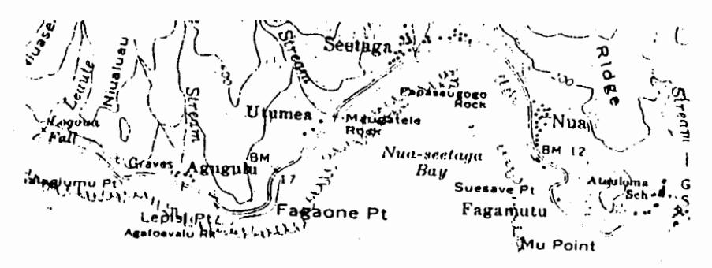

same as is taken off Amanave; see: AMANAVE / USE CONSIDERATIONS
(20).

# COAST BETWEEN FAGAONE POINT AND SE'ETAGA VILLAGE (NUA-SE'ETAGA BAY)

Nua-Se'etaga Bay is one of the largest bays along the southwestern coast of Tutuila. Three villages occupy the backshore area: Utumea, Se'etaga, and Nua. The fringing reef varies in width from 250 to 400 feet (75 to 120 m) along the flanks of the bay but in narrower at the head of the bay. Maugatele Rock is a seastack about 1.5 feet in elevation located 100 feet offshore (49).

#### SHORELINE

A 25- to 50-foot (8 to 15 m) wide beach fronts the villagd of Utumea. The foreshore consists largely of calcareous sand, with some volcanic sediment, as well as scattered limestone and basalt rubble. Beachrock is exposed at the water's edge in some places. The narrow beach slopes up to a 1- to 4-foot high backshore scarp (48;49).

Maugatele Rock acts as a natural groin, blocking sand transport to the northeast. For this reason, the foreshore northeast of the seastack consists of basalt gravel, cobbles, and small boulders, intermixed with mud supplied by Vaialae Stream. This reach was a calcareous sand beach 10 to 12 years ago. The original shoreline was reported to extend 50 feet seaward of the present shoreline. Erosion may be linked to removal of material from the reef flat for use as road fill. The 40-foot (12 m) wide foreshore terminates at a 6-foot (2 m) scarp, the base of which is protected by randomly placed boulders.

Fronting the village of Se'etaga there is a 30- to 40-foot (9 to 12 m) wide foreshore consisting largely of calcareous sand, but with about 20% volcanic grain content. Large basalt boulders litter the foreshore and reef flat. The backshore scarp decreases in height near the mouth of So'onapule Stream (49). So'onapule Stream enters Nua-Se'etaga Bay through a culvert at Se'etaga Village (ASCRI-22S3). A delta at the stream mouth consists of basalt cobbles, boulders, and alluvium. A major flood in November 1979 washed debris onto the delta (49).

A foreshore between 30 and 50 feet (9 to 15 m) wide east of So'onapule Stream has outcroppings of basalt which extend onto the reef flat. The upper  $\hat{o}$  inches of beach material is alluvium. Calcareous sand underlies the basalt material, the latter accounting for about 30% of the beach sediment. The proportion of alluvium decreases away from the stream mouth. The beach fronting Alataua Lua School is severely eroding. The 40-foot (12 m) wide foreshore consists of calcareous sand littered with basalt boulders and terminates at a 6- to 8-foot (2 to 3 m) eroding scarp of bare earth (49).

SE'ETAGA

MAP 22

PHYSIOGRAPHY

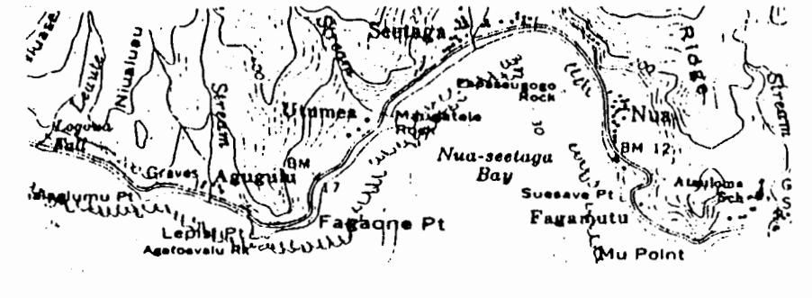

SE'ETAGA

MAP 22

FLORA AND FAUNA

SE'ETAGA

MAP 22

WATER CONDITIONS

SE'ETAGA

MAP 22

USE CONSIDERATIONS

# FRINGING REEF (WESTERN NUA-SE'ETAGA BAY)

The fringing reef is 200 to 300 feet (60 to 90 m) wide off the village of Utumea. Typical depth is 1.0 foot. A 2-foot (0.6 m) deep channel extends 100 feet (30 m) offshore. The reef flat surrounding Maugatele Rock is about 350 feet (105 m) across. At the head of Nua-Se'etaga Bay, the fringing reef narrows to less than 100 feet (30 m) in width (49).

A zone of sand and scattered boulders extends about 10 feet (3 m) seaward from the shoreline. Beyond this to about 80 feet (25 m) offshore there is a bottom of rock (mainly basalt) and sand in pockets. Most rocks are covered by algal turf. Out to about 165 feet (50 m) from shore, the reef lies about 5 inches (13 cm) deep. The bottom is even, with a few irregularities created by low, isolated limestone mounds or shallow depressions. From 165 to 330 feet (50 to 100 m) offshore, the depth reaches 2.5 feet (0.8 m) over a more uneven bottom. Close to the major channel (ava) which crosses Nua-Se'etaga reef, inshore areas are much more uneven and are strewn with boulders of various sizes, many partially exposed at low tide (48).

#### FRINGING REEF

Fronting Se'etaga Village, the inner reef is covered by patches of two species of sponges (a dark grey encrusting form and a light bluish upright form several centimeters high). Sponges account for about 50% bottom cover, with algal turf carpeting the remainder of the inner reef flat. Some small colonies of Pavona decussata, Leptastrea purpurea, Favites abdita, and Porites lutea are present. The only fishes on the inner reef flat are a few damselfishes of the species Glyphidodontops glaucus and G. leucopomus (43).

Coral diversity and abundance increases offshore (although bottom cover is only about 5%) with mostly Acropora formosa and A. humilis present. Colonies of the soft coral, Palythoa sp., cover the margins of depressions in the outer part of the zone from 164 to 328 feet (50 to 100 m) offshore. The only additional fishes in this zone are Halichoeres margaritaceus and a blenny. Fishes are more abundant toward the margins of the ava at the head of Nua-Se'etaga Bay where coral cover is low (48).

# NUA-SE'ETAGA BAY

Underwater visibility is only about 6 feet (2 m) on the inner reef flat fronting Se'etaga Village and the mouth of So'onapule Stream (48).

#### BEACHES

The segment of coast near Utumea is posted with "no parking" and "private beach" signs. Se'etaga beach is posted with a sign setting a 5 p.m. curfew on beach use every day of the week

NUA

MAP 23

PHYSIOGRAPHY

NUA

NUA

MAP 23

PHYSIOGRAPHY

الما الدينوا لمراء المراء

MAP 23

FLORA AND FAUNA

JOULINE JI COVJI

MAL C

except Sunday, when beach use is prohibited (ASCRI). None-theless, Se'etaga Beach does provide easy access to the water from the coastal road (48). (For fishing uses see: NUA / USE CONSIDERATIONS).

COAST BETWEEN SE'ETAGA VILLAGE AND MU POINT (NUA-SE'ETAGA BAY)

# SHORELINE

A steep calcareous sand beach (30% volcanic content) 40 to 50 feet (12 to 15 m) wide fronts Nua. The beach terminates at a narrow basalt outcrop known as Suesave Point. Southeast of Suesave Point there is a calcareous sand beach about 25 feet (8 m) wide. The foreshore is composed of sand with limestone and basalt rubble. Beachrock forms a continuous strip at the water's edge. A backshore scarp varies in height between 3 and 20 feet (1 to 6 m) (49;ASCRI-23S1).

# FRINGING REEF (EASTERN NUA-SE'ETAGA BAY)

The reef off Nua Village extends approximately 445 feet (135 m) offshore. Nearest to shore is a narrow zone of shifting sand and scattered boulders. Seaward of this zone there is a nearly flat bottom of consolidated limestone strewn with shingle. Some of these rocks are partially cemented to the substratum by coralline algae. The depth at 80 feet (25 m) from shore is about 1 foot (0.3 m). Beyond 80 feet, the bottom exhibits irregular relief and boulders exposed at low tide (48).

Southeast of Suesave Point, the fringing reef is 650 feet (200 m) wide (49).

# FRINGING REEF (EASTERN NUA-SE'ETAGA BAY)

Small numbers of <u>Therapon</u> <u>jarbua</u> and several juvenile Mulloidichthys flavolineatus inhabit the inshore zone of shifting sand and boulders just off the beach. Pinkish coralline and blue green algae are the most conspicuous forms on the flat limestone bottom within 80 feet (25 m) from shore. A dark grey sponge is evident in the outer part of this zone, forming about 10% bottom cover at 80 feet (25 m) offshore. Three fishes are moderately Glyphidodontops glaucus, Acanthurus triostegus, and Halichoeres margaritaceus. Flora and fauna are more diverse (25 m) from shore. Small encrustations of the beyond 80 feet green alga, Dictyosphaeria sp., considerable coralline red algae, sponges, matted turf-forming algae, and sea cucumbers (Stichopus chloronotus) are conspicuous. Low-growing colonies of the corals Favites, and Porites total about 5% bottom cover. Scattered low heads of dead Acropora are apparent in the zone 165 to 245 feet (50 to 75 m) offshore. Occasional small colonies of  $\underline{A}$ . formosa inhabit depressions here. From 245 to 330 feet (75 to 100 m) offshore, coral cover is 15%. Among the dominant species are Acropora humilis, A. formosa, Favites abdita, Leptastrea purpurea, Galaxea fascicularis, and Pocillopora verrucosa. Glyphido-

MAP 23 WATER CONDITIONS

NUA

NUA

MAP 23 USE CONSIDERATIONS

NUA

MAP 23 USE CONSIDERATIONS

**A**FA0

9

ŞĮ FI Ri 51 23

PHYSIOGRAPHY

MAP

23

PHYSIOGRAPHY

AF AO

**AFAO** 

MAP 23 PHYSIOGRAPHY

dontops leucopomus replaces G. glaucus as the dominant fish in this zone (48).

FRINGING REEF (EASTERN NUA-SE'ETAGA BAY)

A strong longshore current flows north over the reef flat in front of Nua Village (48).

## BEACHES

Nua Beach is easily accessible from the coastal road which lies only a few meters inland from the high tide mark (43). Some swimming occurs off the beach, with access provided by courtesy of Nua Village (41).

FRINGING REEF (NUA-SE'ETAGA BAY)

The reef fronting the villages of Utumea, Se'etaga, and Nua is considered a "critical use reef area" supporting subsistence fishing by villagers (39). The reef flat is most frequently fished. Throw-netting is the most popular activity, followed by spearing (mata). Rod and reel fishing ranks third in popularity. Catches from spearing and throw-netting are similar to those taken at Amanave. Rod and reel fishing occurs principally in the daytime and yields catches of malauli (large jack), lupota (small jack), and gatala (honeycomb grouper)(20).

# COAST BETWEEN MU POINT AND ASILE POINT

#### SHORELINE

East of the cliff at Mu Point there is a pocket beach fronting Afao Village. The steep, 25- to 40-foot (3 to 12 m) wide foreshore is composed of 70% calcareous sand and 30% volcanic sediment (49; ASCRI-23S3). Beachrock is exposed along shore in the western section of the beach. A basalt bench and boulders crop out from the base of a backshore scarp ranging from 4 to 7 feet (1 to 2 m) high. Atalauma Stream has built a small delta of alluvial material at its mouth (49).

# NU'UTAI ROCK

Nu'utai Rock is a seastack rising about 10 feet (3 m) above the reef flat off Mu Point. The volcanic islet is divided by a low saddle rising about 2 feet (0.6 m) above the reef flat and containing a few small tide pools and a sea cave (ASCRI-23S2).

# FRINGING REEF

The surface of the inner reef flat off Mu Point is a platform of consolidated <u>Pavona</u>, grading offshore into linear tracts of limestone rubble that run perpendicular to shore. Sections of consolidated limestone at mid-reef are separated by tracks of rubble. Large basalt boulders are exposed at low tide

AFAO

Nua-seetaga E. BM 12:

Bay

Suesave Pt

Suesave Pt

Mu Point

Mu Point

Mu Point

Mu Point

Mu Point

Mu Point

Mu Point

Mu Point

Mu Point

Mu Point

Mu Point

Mu Point

Mu Point

Mu Point

Mu Point

Mu Point

Mu Point

Mu Point

Mu Point

Mu Point

Mu Point

Mu Point

Mu Point

Mu Point

Mu Point

Mu Point

Mu Point

Mu Point

Mu Point

Mu Point

Mu Point

Mu Point

Mu Point

Mu Point

Mu Point

Mu Point

Mu Point

Mu Point

Mu Point

Mu Point

Mu Point

Mu Point

Mu Point

Mu Point

Mu Point

Mu Point

Mu Point

Mu Point

Mu Point

Mu Point

Mu Point

Mu Point

Mu Point

Mu Point

Mu Point

Mu Point

Mu Point

Mu Point

Mu Point

Mu Point

Mu Point

Mu Point

Mu Point

Mu Point

Mu Point

Mu Point

Mu Point

Mu Point

Mu Point

Mu Point

Mu Point

Mu Point

Mu Point

Mu Point

Mu Point

Mu Point

Mu Point

Mu Point

Mu Point

Mu Point

Mu Point

Mu Point

Mu Point

Mu Point

Mu Point

Mu Point

Mu Point

Mu Point

Mu Point

Mu Point

Mu Point

Mu Point

Mu Point

Mu Point

Mu Point

Mu Point

Mu Point

Mu Point

Mu Point

Mu Point

Mu Point

Mu Point

Mu Point

Mu Point

Mu Point

Mu Point

Mu Point

Mu Point

Mu Point

Mu Point

Mu Point

Mu Point

Mu Point

Mu Point

Mu Point

Mu Point

Mu Point

Mu Point

Mu Point

Mu Point

Mu Point

Mu Point

Mu Point

Mu Point

Mu Point

Mu Point

Mu Point

Mu Point

Mu Point

Mu Point

Mu Point

Mu Point

Mu Point

Mu Point

Mu Point

Mu Point

Mu Point

Mu Point

Mu Point

Mu Point

Mu Point

Mu Point

Mu Point

Mu Point

Mu Point

Mu Point

Mu Point

Mu Point

Mu Point

Mu Point

Mu Point

Mu Point

Mu Point

Mu Point

Mu Point

Mu Point

Mu Point

Mu Point

Mu Point

Mu Point

Mu Point

Mu Point

Mu Point

Mu Point

Mu Point

Mu Point

Mu Point

Mu Point

Mu Point

Mu Point

Mu Point

Mu Point

Mu Point

Mu Point

Mu Point

Mu Point

Mu Point

Mu Point

Mu Point

Mu Point

Mu Point

Mu Point

Mu Point

Mu Point

Mu Point

Mu Point

Mu Point

Mu Point

Mu Point

Mu Point

Mu Point

Mu Point

Mu Point

Mu Point

Mu Point

Mu Point

Mu Point

Mu Point

Mu Point

FLORA AND FAUNA

AFAO

MAP 23

FLORA AND FAUN

AFAO

Trail

MAP 23

USE CONSIDERATIONS

AFA0

MAP 23

USE CONSIDERATIONS

on the inner reef west of Mu Point (ASCRI-23B1).

The fringing reef attains a width of 600 feet (130 m) off the village of Afao. A channel through the center of the bay, off the mouth of Atalauma Stream, extends to within 250 feet (75 m) of shore (49). Off the central portion of the Afao shoreline there is a wide sand flat merging with mid-reef depressions about two feet (0.6 m) deep. Small microatolls (Porites) and sand veneered limestone characterize the mid-reef depression areas. Large lava boulders are exposed on the inner reef flat just west of the sand flat. The outer reef is a platform of consolidated limestone (ASCRI-23B3).

# FRINGING REEF FLAT

The algae, <u>Padina tenuis</u> and <u>Hypnea</u> cf. <u>cervicornis</u>, are common in shallow nearshore areas off Mu Point. Cover by <u>Pavona</u> sp., <u>Acropora aspera</u>, and some <u>Porites</u> sp. reaches about 10% in depressions between linear tracks of rubble. The algae, <u>Ralfsia</u> sp. and <u>Porolithon</u> sp., encrust limestone rubble exposed at low tide (ASCRI-23B1). Small colonies of zoanthids and the alga, <u>Dictyosphaeria versluysii</u>, are common around Nu'utai Rock (ASCRI-23B2).

Small <u>Porites</u> microatolls and assorted species of encrusting corals total about 10% cover in mid-reef depressions. Coral cover is 10 to 15% on the consolidated limestone platform farther offshore (ASCRI-23B3).

At least 48 fish species inhabit the reef flat west of Asili Point, but none is abundant. Stegastes albofasciatus is most common, followed in abundance by Glyphidodontops leucopomus and  $\underline{G}$ . glaucus (76).

# FRINGING REEF FRONT

Fishes are highly diverse but only moderately abundant on the reef front off Afao. At least 107 species are represented. Plectroglyphidodon dickii and Pomacentrus melanopterus are most abundant. Chromis acares is common (76).

# SHORELINE AND REEF FLAT (MU POINT)

West of Mu Point, a sand beach fronted by beachrock provides access to the shore. East of the point, the cliff restricts access to the water. Gleaning takes place on the inner reef off Mu Point. Pole fishing is conducted along the reef margin when seas are calm (ASCRI).

# FRINGING REEF OFF AFAO VILLAGE

A boulder beach along the center of Afao Village and a sand beach bordering the eastern side of the village provide easy access to the shoreline (ASCRI). The reef flat fronting Afao is used by villagers for subsistence fishing. Gleaners seek octopus

| SILI | MAP | -23 |  |
|------|-----|-----|--|
|      |     |     |  |

PHYSIOGRAPHY

ASILI

MAP 23

PHYSIOGRAPHY

ASILI

MAP 23

PHYSIOGRAPHY

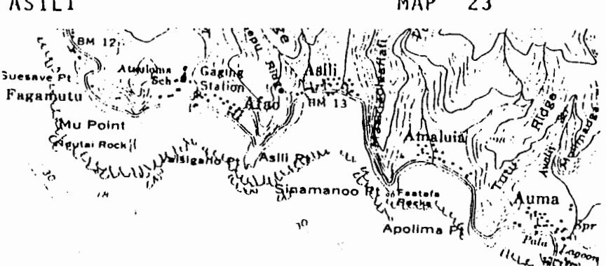

(fe'e), molluscs, sea urchins (tuitui, sava'e), and sea cucumbers. Night fishing brings in lobster as well as fishes. Gill netting also occurs on the reef flat (ASCRI).

COAST BETWEEN ASILI POINT AND SINAMANO'O POINT (ASILI BAY)

# ASILI POINT CAVES

A shallow cave known as Le-ana-o-Sina (Cave of Sina) is located on the promontory between Afao and Asili villages, along the western side of the outcrop called Fao (30).

# SHORELINE

The western side of Asili Bay (near Asili Point) is mostly volcanic boulders (ASCRI-23S4). A pocket beach occupies the head of the bay. Two streams (Malagateine and Asili) discharge into the bay and have formed an alluvial delta at the western end of the beach. The foreshore is 30 feet (9 m) wide and consists of alluvium with scattered basalt and limestone rubble (49). The beach narrows to about 16 feet (5 m) along the eastern perimeter of the bay, where the steep slope is more boulder than sand (48).

#### FRINGING REEF

The fringing reef is generally 800 feet (240 m) wide off Asili. A large channel indents the center of the reef and approaches to within 300 feet of shore (49). Much of the reef flat off Asili Point is covered by limestone rubble exposed at low tide. An underlying platform of consolidated limestone is exposed in some areas (ASCRI-23B4).

A sand flat is exposed at low tide fronting Asili Village (ASCRI-23B5). Inshore areas of northeastern Asili Bay consist mostly of silty-sand and low, isolated masses of dead coral. Depth averages about 1.5 feet (0.4 m). The proportion of hard bottom increases offshore and sand is present mainly in shallow channels between limestone masses (principally dead Pavona). Beyond 105 feet (50 m) from shore, the reef flat shoals to about one foot (0.3 m). Near the central channel (ava) which serves as the main drainagd for reef flat waters in Asili Bay, the reef flat has a high proportion of sand bottom. At the inshore end of the ava, silty-sand deposits at a depth of about one foot (0.3 m) merge with the head of the channel, which deepens to sand and rubble bottom at a depth of 6 feet (2 m). The margins of the outer part of the ava are consolidated limestone at a depth of one foot (0.3 m) (48).

The inner reef flat fringing the eastern perimeter of Asili Bay is shallow at low tide. Pools within 80 feet (25 m) of shore range from 1 to 6 inches (2 to 15 cm) in depth. The middle reef (80 to 165 feet offshore) is a few inches deep. In some places, patches of sand occupy low areas. Elsewhere, numerous limestone boulders are exposed (some 2 feet or 0.6 m above water) and

ASILI

MAP 23

FLORA AND FAUNA

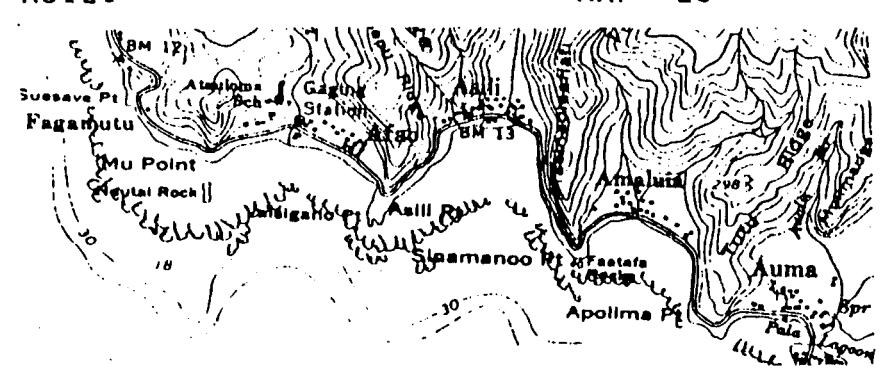

ASILI

MAP 23 WATER CONDITIONS

almost no sand is present on an irregular hard rock bottom. Low areas tend to be filled with masses of limestone rubble cemented to the substratum by encrusting coralline algae. Some masses of rubble and low, dead coral heads occur on the reef flat away from depressions. The outer reef flat from 165 to 245 feet (50 to 75 m) offshore is about 8 to 10 inches (20 to 25 cm) in depth and terminates with a consolidated margin a few inches deep. The reef front descends almost vertically (48).

#### FRINGING REEF

The sea cucumber, Holothuria Cinerascens, is common in pools amid rubb e on the reef flat off Asili Point (ASCRI-23B4).

In sandy inshore areas of the northeastern corner of Asili the only live coral is a small amount of Pavona frondifera. About 100 to 130 feet (30 to 40 m) offshore some live Pavona and Porites <u>lutea</u> occurs along the periphery of dead masses of these two species. Some rounded, silt-covered sponges and small colonies of encrusting sponges are present. Live coral cover reaches about 15% (principally Pavona frondifera) 165 to 245 feet (50 to 75 m) offshore. At 330 feet (100 m) from shore, cover is similar. with a few truncated low heads of Porites lutea and small patches of <u>Leptastrea</u> purpurea added. Surprisingly few fishes inhabit the reef flat in the northeastern corner of Asili Bay considering ample bottom cover available for small species. Only a few (Plectroglyphidodon leucozona), moorish idols damselfishes (Zanclus cornutus), and butterflyfishes (Chaetodon auriga, C. lunula, and Heniochus chrysostomus) are present (48).

Near the inshore end of a large ava, massive heads of  $\underline{P}$ . lutea project above a predominantly silty-sand bottom. Live coral along the sloping margins of the inner portions of the ava include some very large heads of  $\underline{P}$ . lutea. The consolidated margin of the outer ava are covered mainly by an alga (Porolithon). Acanthurus lineatus is the dominant fish of the outer ava just beyond the reef margin (48).

Fishes are sparse or absent from the shallow inner and mid-reef flat fringing the eastern margin of Asili Bay. Coral cover is slightly less than 10% on the middle reef flat, 30 to 165 feet (25 to 50 m) offshore. Small, colonies of Acropora formosa, A. humilis, and Pavona are most common. Coral cover reaches 35% on the outer reef flat (245 to 330 feet or 75 to 100 m offshore) near the ava, with Acropora formosa predominant. The sea cucumber, Stichopus chloronotus, is moderately common. Fishes are also common. Dominant species are Glyphidodontops leucopomus, Acanthurus triostegus, A. lineatus, Halichoeres margaritaceus, Thalassoma hardwickei, T. purpureum, and Stegastes albofasciatus. Except for G. leucopomus, most of the fishes are juveniles (48).

#### ASILI BAY

Waters in the outer portion of the ava which bissects Nua-Se'etaga Bay are often rough and swirling. Storm runoff from

ASILI

MAP 23

USE CONSIDERATIONS

ASILI

MAP 23

USE CONSIDERATIONS

AMALUIA

MAP 23

PHYSIOGRAPH

AMALUIA

J | 30'

MAP 23

USE CONSIDERATIONS

Asili Stream discolors inshore waters at the northeastern corner of Asili Bay. Even when surface runoff is minimal, a freshwater layer on the surface occurs as a result of seepage along shore (48).

#### SHORELINE

The eastern side of Asili Point is only marginally accessible. A foot-path from the coastal road leads to a boulder shoreline. Limited parking area off the road reduces the opportunity for easy access (ASCRI).

Mud flats at the head of Asili Bay are readily accessible from the coastal road which runs just inland a few meters above sea level (48).

# FRINGING REEF

Surfing is possible off Asili but the wave break requires a long paddle. High tide is necessary because of shoaling rocks near the end of the ride. Conditions are best on days of calm or northwest winds (51).

For fishing uses see: AMALUIA / USE CONSIDERATIONS.

# COAST BETWEEN SINAMANO'O POINT AND APOLIMA POINT

# SHORELINE

A pocket beach between basalt headlands occupies the head of a small bay fronting the village of Amaluia. The foreshore is approximately 30 feet (9 m) wide and is composed of alluvial material with a trace of calcareous sand. Vaipuna Stream divides the beach into two sectors. West of the stream mouth, the backshore is defined by a 12-foot (4 m) scarp, the base of which is protected by a basalt outcropping. East of the stream, the backshore scarp is generally less pronounced. Basalt outcroppings along the shoreline are common throughout the area (49;ASCRI-23S5).

# FRINGING REEF

The reef between Nua-Se'etaga Bay and Apolima Point, fronting the villages of Afao, Asili, and Amaluia, is considered a "critical use reef area" supporting subsistence fishing by villagers (39). The reef flat between Nua-Se'etaga Bay and Sinamano'o Point, opposite the villages of Afao and Asili, is the most frequently fished area. Spearing (mata) is the most active fishery, with reef gleaning second most common. Pole and line fishing and throw-netting follow in popularity. Spearing and throw-netting result in catches of fish of the same general types taken off Amanave (See: AMANAVE / USE CONSIDERATIONS). Pole and line fishing brings in gatala (honeycomb grouper), mataeleele (small emperor fish), and filoa (large emperor fish) both day and

AMALUIA

11 新

MAP 23

USE CONSIDERATIONS

night. Additional day catches include lupo (juvenile jack) and lupota (small jack). Additional night catches include malau (squirrelfish), malai (paddletail snapper), matapula (bigeye snapper), and savane (blue-lined snapper) (20).

/MAP21.TEX/ - /AUG-80/

LEONE

MAP 23

PHYSIOGRAPHY

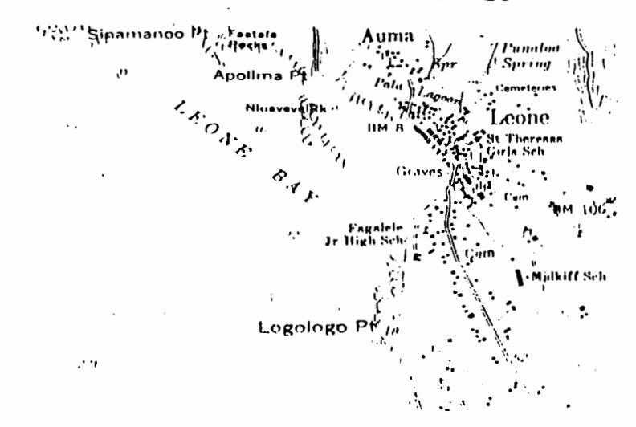

LEONE

MAP 23

PHYSIOGRAPHY

LEONE

MAP 23

FLORA AND FAUNA

# COAST BETWEEN APOLIMA POINT AND LOGOLOGO POINT (EASTERN LEONE BAY)

# SHORELINE

The village of Leone is located at the western end of the Tafuna-Leone Plain. The shoreline near Apolima Point consists of a 10- to 15-foot (3 to 5 m) wide bench in tuff at the 3- to 5-foot (1 to 1.5 m) elevation, backed by a 5-foot (1.5 m) scarp rising to the road. Near the bridge over Pala Lagoon, a vertical wall of basalt boulders rises from the water's edge to the 6-foot (2 m) elevation. An alluvial flat lies seaward of the wall (49). Many of the homes bordering Pala Lagoon have protective seawalls to retard shoreline erosion. Refuse and solid wastes litter the banks and bottom of the lagoon fronting homesites (5). Southeast of Pala Lagoon, fronting Leone Village, there is an alluvial beach about 20 feet (6 m) wide (49; ASCRI-23S7).

Low tide exposes a 20- to 50-foot (6 to 15 m) wide flat of dark sand off Leone. The beach and subtidal sand is predominantly volcanic material (ASCRI-23S7). The southeastern portion of Leone Beach narrows to 12 feet (4 m). Volcanic and limestone rubble is scattered along an alluvial foreshore. The beach is backed by a 4- to 5-foot (to 1.5 m) seawall constructed of loosely-placed basalt boulders. The shore fronting Fagatele Junior High School consists of boulders and a bench at the 5-foot elevation (49).

# PALA LAGOON

The estuary of Leafu Stream forms a wide area of mudflat inland from the coast. Leafu Stream divides into two channels which enter upper Pala Lagoon. At low tide, water is confined to a channel one foot (0.3 m) deep on the exposed mudflat (ASCRI-23B6).

Leafu estuary flows into outer Pala Lagoon beneath the highway bridge connecting Auma and Leone villages. At low tide, the channel is 1 to 2 feet (0.3 to 0.6 m) deep between relatively wide, silty-sand banks out to a low barrier of tuff rock at the lagoon mouth. The sand is composed primarily of dark (volcanic) grains. The tidal flat slopes gently to the outer lagoon, where the sand bottom is submerged at low tide. and scattered areas of hard bottom are present. A few boulders are exposed on the tidal flat at low tide (ASCRI-23B7).

# PALA LAGOON - LEONE MANGROVE SWAMP

The mudflat at Leone is covered by a mangrove forest with an area of approximately 9 acres (3.6 ha). This forest differs from others at Pala Lagoon (MAP 29) and Masefau (MAP 11) in that a considerable amount of red mangrove (Rhizophora mangle) is mixed with oriental mangrove (Bruguiera gymnorhiza). The forest is dense and mostly under 16 feet (5 m) in height, due to fire-

( RARE LAND PLANT

LEONE

MAP 23

PHYSIOGRAPHY

LEONE

MAP 23

PHYSIOGRAPHY

wood cutting by villagers and/or environmental conditions favoring the red mangrove. Behind the mangrove swamp, the soil is wet but not saline. This is probably the location of the very rare shrub, Erythrina fusca, collected only once in American Samoa -- at Leone in 1929 (77).

Large numbers of fiddler crabs (Uca sp.) burrow in exposed mud banks of Leafu Stream estuary, especially along the northern margin of inner Pala Lagoon (ASCRI-23B6). A shallow channel at the mouth of Pala Lagoon northwest of Papaloa Rock contains considerable quantities of the brown alga, <u>Padina</u> sp., as well as some <u>Actinotrichia</u> sp. (ASCRI-23B7).

# PÁPALOA ROCK AND NIUAVEVE ROCK

Papaloa Rock, a low barrier across much of the mouth of Pala Lagoon, consists of three shelves of volcanic tuff, between 200 and 300 feet (60 and 90 m) long and separated from the main shoreline by narrow channels of shallow water (30). The tuff rock rises 1 to 3 feet (0.3 to 1.0 m) above sea level. The surface slopes seaward in a manner similar to beachrock. Its relatively smooth surface has some small depressions containing limestone rubble and hermit crabs in cerithiid shells (ASCRI-23S6).

Niuaveve Rock is a small seastack a short distance seaward of Papaloa Rock (ASCRI).

# FRINGING REEF FLAT

The fringing reef in the northwestern corner of Leone Bay is over 700 feet (215 m) wide. The reef flat widens to 1,200 feet (365 m) outside Pala Lagoon (49). Silty-sand covers the inner reef flat to 150 feet (45 m) offshore of Leone Village. Scattered occurrences of rubble and large silted mounds of Pavona shoaling to near sea level occur on the silty-sand bottom, which reaches depths of 3 to 4 feet (1.0 to 1.2 m) (ASCRI-23B8). The nearshore channel of silty-sand continues south to the cliff off the southeastern end of Leone Village. The channel contains considerable silted algae and debris (especially fallen coconut trees) (ASCRI-23B13). The inner and middle reef flat extending seaward from Papaloa Rock is covered mostly by loose limestone rubble and sand grading to an outer reef of unconsolidated rubble (ASCRI-23S6).

The middle reef consists mainly of consolidated limestone and dead coral heads at depths from 1 to 4 feet (0.3 to 1.2 m) (ASCRI-23B9). Toward the outer reef is a 200-foot (-120 m), horseshoe-shaped rampart of coral rubble rising about 6 feet (2 m) above the reef surface. The rampart base is composed of heavy, worn coral plates or shingle (tabular Acropora), with fragments of staghorn acroporans piled on top. Within the shoreward-facing concavity of the rampart, the bottom is mostly dead coral rubble and shingle at a depth of 4 feet (1.2 m). The top of the rampart has several young coconut trees. East of the rampart there is a channel with depths to 5 feet (1.5 m). Porites lutea microatolls

TUTUILA

# WESTERN DISTRICT

LEALATAUA CO.

LEONE

MAP 23

PHYSIOGRAPHY

LEONE

MAP 23

FLORA AND FAUNA

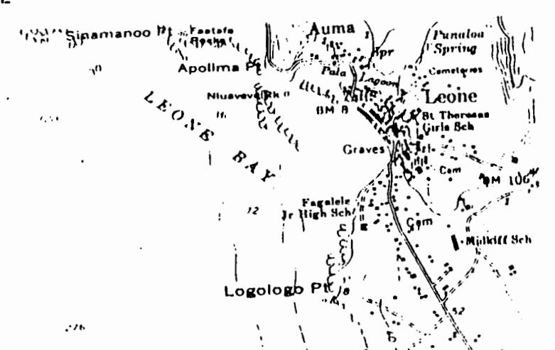

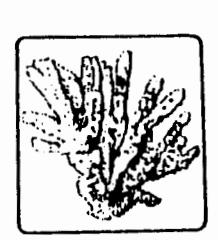

up to 5 feet high and 6 feet (2 m) across occupy this area, which is about 150 feet (45 m) in width. The microatolls are separated by a rock and sand bottom (ASCRI-23B10).

Depth increases to 6 to 8 feet (2 to 2.5 m) on the outer reef flat, where the bottom is mainly consolidated limestone. Depth shoals to 6 inches (15 cm) or less at the relatively narrow margin, characterized by a coral ridge of dead and partly exposed Acropora humilis (ASCRI-23B11).

#### FRINGING REEF FRONT

Spur-and-groove systems are irregularly developed on the reef front and the steep slope is characterized by surge channels to depths of 20 feet (6 m). Irregular limestone buttresses up to 40 feet (12 m) in length with shelves of coral and calcareous algae growing toward each other are separated by deep undercuts forming tunnels and caves (ASCRI-23B12). Off Logologo Point, the shallow reef flat extends offshore to a poorly developed spur-and groove system. A large sand body occurs at a depth of 50 feet (15 m). Large, isolated limestone knolls occur at a depth of 80 feet (25 m)(10).

# FRINGING REEF FLAT

A

Corals are limited to scattered occurrences of hard bottom on an inner reef flat of mostly silty-sand off Leone Village. Coral cover totals about 5%, with Leptastrea purpurea most common. Small heads of Porites lutea are also present, as are some large silt-covered mounds of Pavona near shord. Algae are not abundant, although some Padina sp. and Ralfsia sp. grow on scattered areas of rubble bottom. Two types of sponges cover large areas. A low-spreading blue-grey species is more common. The other is an orange, upright and somewhat rigid species (ASCRI-23B8).

Soft coral (Zoanthid) colonies are uncommon in the sand channel off the south end of Leone Village. Small grapsid crabs inhabit crevices in the rocks near the waterline (ASCRI-23B13).

Pavona frondifera dominates the middle reef, with coral cover at nearly 50%. Heads of Porites lutea occupy areas where the depth reaches 4 feet (1.2 m). The red alga, Actinotrichia sp., is common. Other algae include Halimeda discoidea (patchy at the base of limestone outcrops), Dictyosphaeria versluysii, Ralfsia sp., an algal turf of several species, and encrusting Porolithon sp. on coral rubble. A spikey, branching coralline alga (Amphiroa sp.) is present. Cowries (Cypraea annulus) also occur (ASCRI-23B9). Virtually all of the bottom enclosed by the elevated shingle rampart consists of dead but still standing Pavona coral rubble covered by encrusting coralline algae. Live coral cover is only 2%. Porites lutea is present as microatolls in a channel east of the rampart. Vermitids are conspicuous on some of the microatolls (ASCRI-23B10).

LEONE

MAP 23

FLORA AND FAUNA

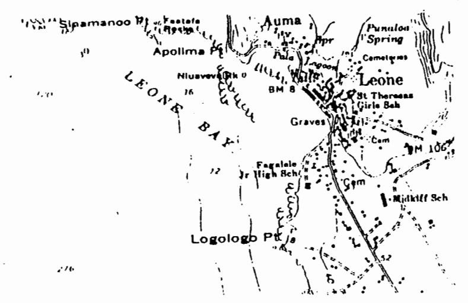

LEONE

MAP 23

FLORA AND FAUNA

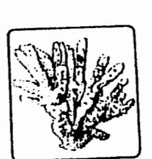

Fish abundance is low on the inner and middle parts of the reef fringing eastern Leone Bay. Most of the 16 species recorded are juveniles. The assemblage is dominated by damselfishes, wrasses, and surgeonfishes. The damselfishes, Plectroglyphidodon leucozona and Dascyllus aruanus are most abundant. Common surgeonfishes are Acanthurus lineatus, A. nigrofuscus, and A. nigroris. Conspicuous wrasses are Thalassoma hardwickei, Stethojulis bandanensis, Halichoeres margaritaceus, and Cheilinus diagrammus (ASCRI-23F1).

Few corals or algae inhabit outer reef areas at depths reaching about 8 feet (2.4 m). Seaward are a few small Acropora hyacinthus, A. humilis, and Pocillopora verrucosa. Some soft coral (zoanthid) colonies and encrusting acroporans grow on the shallow reef margin (ASCRI-23B11).

Juvenile fishes are abundant on the middle and outer fringing eastern Leone Bay. High bottom relief and coral cover provide a productive nursery area harboring at least Grazing marks indicate the presence of adult surgeonfishes and wrasses, although few are evident. Dominant include the damselfishes, Stegastes albofasciatus, Plectroglyphidodon leucozona, Glyphidodontops cyanea, and G. leucopomus. Surgeonfishes are represented by small numbers of Acanthurus nigrofuscus, A. triostegus, and A. lineatus -- primarily juveniles. Large schools of juvenile parrotfishes (Scarus spp.) are common. Wrasses present in moderate to high numbers include the Gomphosus varius, the cleaner wrasse, Labrichthys unilineatus, Thalassoma fuscum, and  $\underline{T}$ . hardwickei. The half-and-half wrasse, Hemigymnus melapterus, is present. The blenny, Plagiotremus rhynorhynchus, is moderately common. Only two species of butterflyfish are recorded: Chaetodon trifasciatus and C. citri-Juveniles of Epinephelus merra are rather common (ASCRI-23F2).

#### FRINGING REEF FRONT

Corals cover up to 75% of the steep reef front at depths to 20 feet (6 m). The diverse assemblage includes Acropora hyacinthus, A. rotumana, encrusting Montipora spp., assorted encrusting favids, occasional A. robusta, Pocillopora verrucosa, Galaxea, Synaraea, and Pavona. Considerable quantities of a blue-grey sponge occur on the reef front. A brownish-black film of algae is common, as well as encrusting corallines covering dead coral slabs. Shelves of coral and coralline algae grow towards each other from limestone buttresses (ASCRI-23B12). Coral cover varies, sometimes approaching 100%, on the reef front off Logologo Point (10).

Fishes are abundant along the reef front. At least 33 species are represented. Dominant families are surgeonfishes, damselfishes, wrasses, parrotfishes, and butterflyfishes. Acanthurus nigrofuscus, A. glaucopareius, A. guttatus, A. lineatus, and Ctenochaetus striatus congregate in large schools in groove areas. The butterflyfishes, Chaetodon ornatissimus, C. citrinel-

LEONE

MAP 23

WATER CONDITIONS

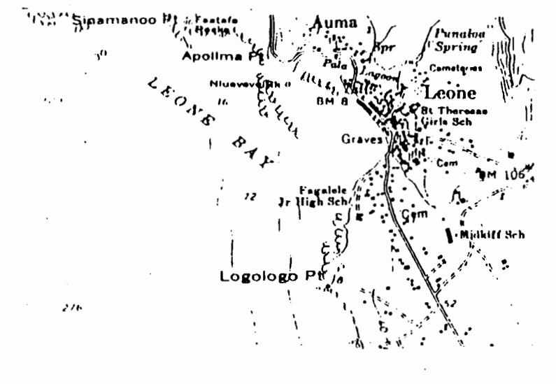

LEONE

MAP 23

HISTORICAL/ARCHAEOLOGICAL

LEONE

MAP 23

HISTORICAL/ARCHAEOLOGICAL

<u>lus</u>, and <u>C. reticulatus</u> are common as are the damselfishes, <u>Plectroglyphididon leucozona</u>, and <u>Glyphidodontops leucopomus</u>. Large parrotfishes, <u>Scarus</u> spp., are conspicuous on the deeper reef front (ASCRI-23F3).

#### FASTERN LEONE BAY

Considerable refuse (discarded junk and beer cans) occurs on the beach and in shallows fronting Leone Village. At least two storm drains empty into the Bay from the village. Silt mixed with sand on the inner reef flat is easily disturbed, causing nearshore waters to be quite turbid. Inshore waters are also noticeably warm. Underwater visibility is limited to about 15 feet (4.6 m) over the silty-sand bottom nearshore, improving to 30 feet (9 m) over the mid-reef flat. East of a rampart on the reef flat, visibility reaches 50 feet (15 m) in a channel through which a current flows seaward on a falling tide. Visibility is excellent (100 feet or 30 m) over the reef margin and reef front. Inshore waters off the low cliff at the southern end of Leone Village appear to have poor circulation and are turbid (ASCRI).

The reef margin off Leone Village is exposed to strong wave action (ASCRI).

# LEONE CAVES AND PETROGLYPHS

A cave at Leone, regarded as the home of the aitu called Tuiatua, king of the gods, is located above Leone Junior High School. It is a narrow shelter of overhanging rocks with a low depression or crater in the ground. This area is avoided by Leone villagers. A second, small cave in Leone Valley called Aitu-cave is said to be the home of a ghost or demon who journeys from the valley to the seashore, where he gathers shellfish for his supper. Shells are said to be strewn over the entrance to this cave, located on the steep slope above the area called Ologa to'i (30).

A large concentration of grinding stones, or whetstones, are found on the western promontory bounding Leone Bay. They occur on a low-lying rock shelf which is submerged at high tide. Another cluster of whetstones is found on a wave-washed shelf of basalt on the eastern side of Leone (30).

# PAPALOA AND NIUAVEVE ROCKS

Two large rock shelves in Leone Bay, called Papaloa and Niuaveve, are considered "tupua", or spirit stones. According to legend, two cannibals competed in a rock throwing contest. One pitched his rock and it landed on the western side of Leone Bay. This rock is named Papaloa. The other hurled his rock beyond. This rock is called Neve. On the central shelf of Papaloa there is a concentration of pre-European petroglyphs (30).

TUTUILA

WESTERN DISTRICT

LEALATAUA CO.

LEONE

MAP 23

HISTORICAL/ARCHAEOLOGICAL

LEONE

MAP 23

USE CONSIDERATIONS

LEONE

MAP 23

USE CONSIDERATIONS

Apollma Paris Auma
Apollma Paris Auma
Apollma Paris Auma
Apollma Paris Auma
Apollma Paris Auma
Apollma Paris Auma
Apollma Paris Auma
Apollma Paris Auma
Apollma Paris Auma
Apollma Paris Auma
Apollma Paris Auma
Apollma Paris Auma
Apollma Paris Auma
Apollma Paris Auma
Apollma Paris Auma
Apollma Paris Auma
Apollma Paris Auma
Apollma Paris Auma
Apollma Paris Auma
Apollma Paris Auma
Auma
Apollma Paris Auma
Apollma Paris Auma
Apollma Paris Auma
Apollma Paris Auma
Apollma Paris Auma
Apollma Paris Auma
Apollma Paris Auma
Apollma Paris Auma
Apollma Paris Auma
Apollma Paris Auma
Apollma Paris Auma
Apollma Paris Auma
Apollma Paris Auma
Apollma Paris Auma
Apollma Paris Auma
Apollma Paris Auma
Apollma Paris Auma
Apollma Paris Auma
Apollma Paris Auma
Apollma Paris Auma
Apollma Paris Auma
Apollma Paris Auma
Apollma Paris Auma
Apollma Paris Auma
Apollma Paris Auma
Apollma Paris Auma
Apollma Paris Auma
Apollma Paris Auma
Apollma Paris Auma
Apollma Paris Auma
Apollma Paris Auma
Apollma Paris Auma
Apollma Paris Auma
Apollma Paris Auma
Apollma Paris Auma
Apollma Paris Auma
Apollma Paris Auma
Apollma Paris Auma
Apollma Paris Auma
Apollma Paris Auma
Apollma Paris Auma
Apollma Paris Auma
Apollma Paris Auma
Apollma Paris Auma
Apollma Paris Auma
Apollma Paris Auma
Apollma Paris Auma
Apollma Paris Auma
Apollma Paris Auma
Apollma Paris Auma
Apollma Paris Auma
Apollma Paris Auma
Apollma Paris Auma
Apollma Paris Auma
Apollma Paris Auma
Apollma Paris Auma
Apollma Paris Auma
Apollma Paris Auma
Apollma Paris Auma
Apollma Paris Auma
Apollma Paris Auma
Apollma Paris Auma
Apollma Paris Auma
Apollma Paris Auma
Apollma Paris Auma
Apollma Paris Auma
Apollma Paris Auma
Apollma Paris Auma
Apollma Paris Auma
Apollma Paris Auma
Apollma Paris Auma
Apollma Paris Auma
Apollma Paris Auma
Apollma Paris Auma
Apollma Paris Auma
Apollma Paris Auma
Apollma Paris Auma
Apollma Paris Auma
Apollma Paris Auma
Apollma Paris Auma
Apollma Paris Auma
Apollma Paris Auma
Apollma Paris Auma
Apollma Paris Auma
Apollma Paris Auma
Apollma Paris Auma
Apollma Paris Auma
Apollma

\* Leone Bay possible "Special Area" where development of facilities (small boat harbor) is dependent upo access to coastal waters --- Chap. VI.C.6 (21)

LEONE (SOGI)

MAP 24

PHYSIOGRAPHY

LEONE

Leone has historical significance as the first landing place of western missionaries (41). A structure built between 1855 and 1885 to house the former Fagalele Boy's School is considered to be the oldest foreign-built structure on Tutuila (41).

#### SHORELINE

Leone Beach is easily accessible from the coastal road. Access is by village approval (41). The basalt boulder revetment behind the beach can be crossed through breaks. Broken glass and trash on and fronting Leone Beach may discourage swimming and other uses (ASCRI). Swimming is popular off the rocky, but accessible shoreline below the old mission grounds. Access across the grounds is by consent of the church (41). A rugged cliff south of the mission grounds limits shoreline access. This section of coast is relatively inaccessible except in a few places where erosion or slumping has created a gentler slope. Waves pound against this coast (ASCRI).

FRINGING REEF (EASTERN LEONE BAY)

Development of a harbor to serve barges and interisland vessels is presently under consideration for Leone Bay (68).

The reef fringing Apolima Point and Pala Lagoon is considered a "critical use reef area" supporting subsistence fishing by villagers (39). The reef flat is frequently fished. Pole and line fishing is the most common activity, followed in popularity by throw-netting. Rod and reel fishing and spearing (mata) are less active fisheries. Pole and line fishing results in day and night catches of gatala (honeycomb grouper), mataeleele (small emperor fish), and filoa (large emperor fish). Lupo (juvenile jack) and lupota (small jack) are among the usual day catches. and malau (squirrelfish), malai (paddletail snapper), matapula (bigeye snapper), and savane (blue-lined snapper) are among the usual night catches. Throw-netting yields day catches of fuafua (juvenile mullet), anae (adult mullet), manini (convict tang), alogo (lined surgeonfish), pone (chocolate surgeonfish), mutu, laea (large parrotfish), and, seasonally, i'asina (juvenile goatfish), and lo (rabbitfish). Rod and reel fishing is practiced in the daytime and brings in malauli (large jack), lupota, and gatala (20).

A good swimming and bodysurfing area is located below the old mission grounds northeast of Logologo Point (49).

COAST BETWEEN LOGOLOGO POINT AND PUPUALOA POINT

LEONE PLAIN

The Tafuna-Leone Plain was formed by relatively recent lava flows. Late eruptions along a north-south fissure three miles (5

km) long formed tuff cones where lava erupted undersea and cinder cones where eruptions occurred on land. Voluminous lava covered a submerged reef and added about 8 square miles (21 sq km) of land to the island. The lava exposed along the coast south from Leone Village came chiefly from Futiga cone and is overlain with 5 to 20 feet (1.5 to 6 m) of tuff. Where hot rising lavas hurling contacted sea water, they exploded violently, high into the air. Winds blowing at the time carried the cinder and ash northwestward across the island. Deposits of this material later hardened into tuff. Tuff deposits 2 to 3 feet (0.6 to 1.0 m) thick along the shores of bays as far northwest as Amanave (6 miles or 10 km northwest of the vents) (MAP 22) indicate that strong trade winds blew during the eruptions (54).

#### SHORELINE

A sea cliff rising from 4 to 30 feet (1 to 9 m) above the ocean characterizes much of the shoreline south of Leone Village. In a few places, the cliffs have eroded or slumped, creating a more gentle slope to the water. This rugged coast continues around the southernmost tip of Tutuila (ASCRI-23S8). The Le'ala coastline is a rugged and spectacular exposure of interbedded basalt flows and tuff deposits. A bench along the shore is fractured and pitted with pools, one of which is 100 feet (39 m) long and over 12 feet (4 m) deep (72).

# FRINGING REEF

The fringing reef narrows south of Leone Bay, and the coast south of Faleapoi Point lacks a reef (49). A shallow reef flat off Logologo Point has an irregular spur-and-groove system on the reef front. A sand bottom is present at -50 feet (-15 m). Isolated reef knolls rise from -80 feet (-25 m). Coral cover approaches 100% on the reef front off Logologo Point (10).

# LE'ALA

Post-European petroglyphs are located on the coastline of Le'ala near the village of Vailoatai. More recent carvings of the names of students from the Marist Brothers School and other features are carved in thinly-stratifed tuff deposits. These are being rapidly eroded by wind, rain, and salt spray (30). The impressive grave of High Chief Salate Moasegi is situated on a low, rocky point where Vailoatai South Road meets the coast (41).

#### OFFSHORE BETWEEN LEONE AND FALEAPOI POINT

Offshore waters between Leone Village and Faleapoi Point are frequently visited by fishermen. Pole and line fishing is the preferred method and catches are generally of the sand species as taken off Afao and Leone. Spearing (mata) is less common (20).

VAILOATAI

MAP 24 PHYSIOGRAPHY

VAILOATAI

MAP 24 PHYSIOGRAPHY \$

VAILOATAI

Pupualoa Pi

24

PHYSIOGRAPHY

VAILOATAI

MAP 24 PHYSIOGRAPHY

# COAST BETWEEN PUPUALOA POINT AND FA'ASOUGA POINT

# VAILOATAI CRATER

Vailoatai Crater is the eroded remnant of one of three volcanic tuff cones which resulted from explosive submarine eruptions in recent geologic time. The 75-foot (23 m) high crater, with a depression in its summit, lies just inland from the shore and was probably formed by the rising lava exploding on contact with sea water (54).

# SHORELINE

The shore fronting the village of Vailoatai consists of a 50- to 100-foot (15 to 30 m) wide bench about 5 feet (1.5 m) above sea level. The coast lacks an offshore reef and is directly exposed to trade wind waves which deposit calcareous sand and limestone rubble inland of the bench as small storm beaches. The bench is backed by a plateau at the 15- to 20-foot (5 to 6 m) elevation (49).

# PAPAFA'ASE'E COVE

Papafa'ase'e Cove is a shallow recess in a well-formed shoreline bench of volcanic tuff which lies near sea level along the coast southeast from Vailoatai Crater. Behind the platform is a 10 to 20 foot (3 to 6 m) high cliff. The bench is dry at low tide, but inside the cove there is a relatively narrow, 2-foot (0.6 m) deep pool connected to the ocean across a shelf which reduces surge. The pool bottom is scoured smooth, with rubble and boulders (both limestone and volcanic) scattered in depressions. Inland of the pool there is a storm beach composed of calcareous sand. A major component of the sand is a star-shaped, light yellow foraminiferan (Bacculogypsina) (ASCRI-24S1).

# SHORELINE EAST OF PAPAFA'ASE'E COVE

Toward Avaloa Point, the tuff platform varies in width from 150 to 250 feet (45 to 75 m) and is backed by a cliff about 30 feet (9 m) high. The tuff platform is irregular in width and elevation and shows exposures of dark pahoehoe lava. In one area there is a grotto and freshwater stream with a canopy of vegetation overhanging the walls (ASCRI-24S1).

A number of surge pools occur in the tuff shore between Papafa'ase'e Cove and Avaloa Point. Waves washing through depressions between the tuff ridges feed the pools. A blowhole has formed between two ridges of tuff. The cliff rises to approximately 70 feet (21 m) southeast of the pools, but the inland portion of the tuff has slumped and broken to form a gorge and expose limestone fragments embedded in the tuff. Near Avaloa Point there is an isolated platform in tuff about 10 to 15 feet (3 to 5 m) above sea level. Small waterfalls enter the ocean over

VAILOATAI

MAP 24

FLORA AND FAUNA

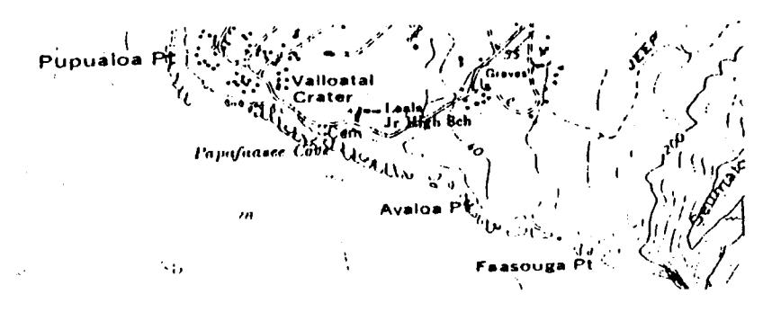

VAILOATAI

MAP 24

USE CONSIDERATION

\* The Le'ala coastline is a possible "Special Area" of scenic importance and a natural landmark --- Chap. VI.C.2,7 (21)

a stepped, 2- to 10-foot (0.6 to 3 m) drop (ASCRI-24S2).

PAPAFA'ASE'E COVE

Much of the bottom of a surge pool recessed in the tuff bench at Papafa'ase'e Cove is covered by an algal turf. The green alga, <u>Halimeda discoidea</u>, and small colonies of <u>Sphacelaria</u> spare present. Cone shells are conspicuous, particularly <u>Conusebraeus</u>. Corals are uncommon, with only scattered heads of <u>Porites</u> aff. <u>lutea</u> and <u>Leptastrea purpurea</u> present. Fishes typical of surge-swept areas (surgeonfish, wrasses, damselfishes, and surf perch) are present (ASCRI-24SI).

Corals are absent from pools fronting the cliff between Papafa'ase'e Cove and Avaloa Point. Larger pools contain considerable algae. Encrusting nullipores cover about 60% of the pool bottom and edges. Valonia sp. is most common of the fleshy algae. Ahnfeltia sp., Dictyosphaeria sp., Caulerpa sp., Sargassum sp. (in shallower sections), and Turbinaria sp. are present. Barnacles cover some shallow pool margins. Juvenile lobster (Panulirus sp.), crabs (Thalamita sp.), and a mollusc (Turbo sp.), inhabit the pools. Ahnfeltia sp. and various brown algae are common on the bench. Fishes typical of shallow waters are present (e.g., Acanthurus guttatus, A. triostegus, gobies, blennies, damselfishes, Kuhlia mugil, Mugil sp.)(ASCRI-24S2).

SHORELINE (LE'ALA COAST)

The shoreline around the Village of Vailoatai lacks beaches and safe swimming areas, but is scenic. Access is by courtesy of the Village (41). The coastline from Papafa'ase'e Cove southeast to Avaloa Point is one of the most scenic along the "Ironbound" coast of southern Tutuila (ASCRI). Le'ala shoreline, from northwest of Avaloa Point to Fa'asouga Point, is a National Natural Landmark (72). This wave-pounded coastline is of both geologic and scenic interest. Opportunities for nature photogra; hy are numerous (ASCRI).

Beaches are absent along the coast and swimming takes place in surge pools along the shoreline. The pools between Papafa'ase'e Cove and Avaloa Point can be dangerous for swimming because waves washing over the bench can cause considerable surge in the Reportedly, several persons have drowned after being washed seaward from the pools. The shallow pool recessed in the tuff platform at Papafa'ase'e Cove is a popular swimming spot, although exposed to moderately strong wave surge. offers shoreline access, but can become hazardous during periods of high surf when covered unexpectedly by uprushing waves. These waves cause a strong backwash when reflected back to sea from the elevated tuff cliff behind the bench (ASCRI; 41). rocks on the tuff bench southeast of the cove are known as "sliding rocks" because of the local sport of running and sliding barefoot on the slippery surface. Visitors unaware of this condition could easily fall if not cautious (ASCRI). "Beach-combing" is a popular activity along this shore (72). Fishing from

IATAOJIAV

MAP 24

USE CONSIDERATIONS

FAGATELE BAY

MAP 25

PHYSIOGRAPHY

PHYSIOGRAPHY

FAGATELE BAY

FAGATELE BAY

√l.; nasouga Pt

Fagatele Pfi;

MAP 25

FAGATELE

AGATELE BAY \*\*\*

MAP

PHYSIOGRAPH

25

the bench is reportedly good (41).

#### OFFSHORE

The waters extending southeast from Pupualoa Point to near Le'ala School are considered a "critical use reef area" supporting subsistence fashing by villagers (39). Both the "reef" flat and waters seaward of the "reef" are frequently fished. Pole and line fishing is the most active fishery, followed in popularity by spearing. Rod and reel fishing is less common. The usual catch from pole fishing consists of generally the same fish species taken off Leone and Afao. Spearing is generally limited to daytime because the area is too far from villages for regular night diving. The usual catch includes laea (large parrotfish), malauli (large jack), anae (adult mullet), pone (chocolate surgeonfish), alogo (lined surgeonfish), ume (unicornfish), and fe'e (octopus). Rod and reel fishing is also primarily a daytime activity resulting in catches of malauli and lupota (small jack) (20).

COAST BETWEEN FA'ASOUGA POINT AND STEPS POINT (FAGATELE BAY)

#### FAGATELE BAY

A volcanic tuff cone erupted in relatively recent geologic time to form Fagatele Crater. The seaward side of the cone was breached by the ocean, and the flooded crater became Fagatele Bay. Fagatele Crater may be older than the large-scale eruptions along a 3 mile (5 km) long fissure which formed the western end of Tutuila (54).

#### SHORELINE

Fagatele Point, at the western side of Fagatele Bay, is relatively inaccessible. A cliff rises abruptly 200 feet (60~m) above the ocean. Seumalo Ridgd, northeast of the seacliff, is steep and rocky (15).

The perimeter of Fagatele Bay is a cliff in volcanic tuff. A small pocket beach occurs along the eastern margin. The beach, composed largely of calcareous sand with a small admixture of volcanic sediment, slopes gently and is only about 20 feet (6 m) wide at high tide. The beach is backed by a steep vegetated embankment of volcanic rock. On either side of the beach, a tuff cliff extends below the water surface, terminating in a sand deposit in shallow (1 to 4 feet or 0.3 to 1.2 m) water (ASCRI-25S1).

#### FRINGING REEF

A sand deposit extends offshore from the pocket beach and adjacent cliffs in Fagatele Bay for distances of 20 to 30 feet (6 to 9 m), merging with a reef platform of mainly consolidated limestone and encrusting coralline algae. Depth reaches 2 feet

FAGATELE BAY

MAP 25

FLORA AND FAUNA

( SEABIRD NESTING AREA

FAGATELE BAY

MAP 25

FLORA AND FAUNA

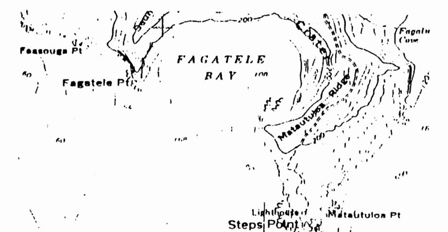

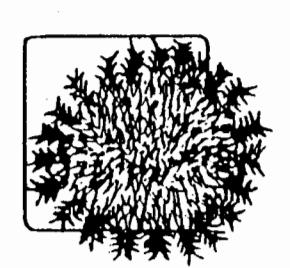

(0.6 m) on the reef flat, with bottom relief of one foot (9.3 m) provided by depressions and outcrops. The width of the platform is 200 feet (60 m) or less (ASCRI-25B1).

The reef front drops nearly vertically 5 to 10 feet (1.5 to 3.0 m) then the bottom slopes gently seaward. Broken portions of the reef front occur as widely separated pinnacles which rise from depths of 15 to 20 feet (5 to 6 m) to within 4 or 5 feet (1.2 or 1.5 m) of the surface and occur as far offshore as 300 feet (90 m)(ASCRI-25B2). Spur-and-groove formations extend to a depth of about 20 feet (6 m). Depths increase rapidly to 120 feet (36 m) in mid-bay, where the bottom is predominantly rubble (34).

# SEA CLIFF

The sea cliff from Fa'asouga Point to Fagatele Point and along the northwestern side of Fagatele Bay is a nesting area for at least five species of seabirds. Major colonies of the brown booby (fua'o; Sula leucogaster plotus), grey-backed tern (Sterna lunata), blue-grey noddy (laia; Procelsterna cerulea), brown noddy (gogo; Anous stolidus pileatus), and white tern (manu sina; Gygis alba pacifica), are found here. White-tailed tropicbirds (tava'e; Phaethon lepturus dorotheae), brown noddies, and white terns also nest in the coastal forest covering steep, rocky Suemalo Ridge. Fagatele Point is the main roost on Tutuila for flying foxes or fruit bats (pe'a; Pteropus samoensis). Thougands of bats roost in the coastal forest at the southern tip of Seumalo Ridge (15).

# FRINGING REEF FLAT

The reef flat along the eastern margin of Fagatele Bay supports 10% coral cover. Dead coral heads are conspicuous (about 5% bottom cover). Species present include Pocillopora verrucosa, Favia sp., Montipora sp., Galaxea sp., and Goniastrea sp., as well as some Acropora humilis and Porites lutea (ASCRI-25B1). A December 1978 survey of the reef at a depth of 10 feet (3 m) recorded coral cover at less than 25% (34). The crown-of-thorns starfish (alamea; Acanthaster planci) is relatively common on the reef and was reportedly more abundant in shallow water during the summer of 1979. Some patches of soft coral (Palythoa sp.) are present. Encrusting coralline algae are common and Cheilosporum sp. and Bryopsis sp. are present (ASCRI-25B1).

The fish fauna of Fagatele Bay is diverse and fishes are moderately to highly abundant. At least 86 species are recorded from two surveys in the area from the reef flat to the reef front. Consistently abundant species (in both surveys) include Stegastes albofasciatus, Glyphidodontops cyanea, G. leucopomus, Acanthurus nigrofuscus, and Thalassoma hardwickei (76; ASCRI-25F1). Although absent in one survey (ASCRI-25F1), Ctenochaetus striatus was common in another (76). Dominant species include the butterflyfish, Chaetodon reticulatus, the surgeonfishes, Acanthurus lineatus, A. nigrofuscus, and A. triostegus, the damselfishes, Stegastes albofasciatus, Glyphidodontops cyanea, G.

FAGATELE BAY MAP 25

FLORA AND FAUNA

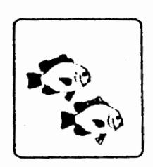

FAGATELE BAY

MAP 25

WATER CONDITIONS

FAGATELE BAY

MAP 25 HISTORICAL/ARCHAEOLOGICAL

FAGATELE BAY

MAP 25 USE CONSIDERATION

( POTENTIAL WILDLIFE SANCTUARY

JUULING JE CONST

glaucus, and G. leucopomus, the wrasse, Thalassoma hardwickei, and adult and juvenile parrotfishes (Scarus sp.). The anemone-fish, Amphiprion melanopus, is common (ASCRI-25F1).

# FRINGING REEF FRONT

Fagatele Bay was free of the crown-of-thorns starfish Acanthaster planci) in February 1978. However, by November 1978/there was very little coral alive to depths of 150 feet (45 m) or more as a result of heavy infestation by Acanthaster. At that time, the upper parts of the forereef slopes still had considerable amounts of live coral. but numerous starfish were moving into the live coral zone (74). Most of the front shows evidence of once extensive living coral, which covered nearly 100% of the bottom at a depth of 30 feet (9 m)(ASCRI-25B2;34). Coral cover at this depth is presently around 5%, with dead coral heads accounting for 95% bottom cover (35). Numerous Acanthaster are still present; some feeding on staghorn and tabular corals (mostly Acropora) (ASCRI-25B2). At least 30 coral species representing 16 genera were recorded in late 1978, but only about 11 species in 9 genera remain. A few patches of corals (Acropora humilis, A. intermedia, A. aff. staghorn pinquis) are alive. Some Millepora and considerable Galaxea fasicularis have also escaped predation. Encrusting coralline algae cover wide depressions in the gently-sloping reef front. In some areas, especially northwest of the pocket beach, a thick, low-growing cover of fleshy algae (browns and reds) occurs, especially on dead coral heads. Patches of a whitish sponge are extensive in depressions at depths between 15 and 30 feet (5 and 9 m). No new colonies of coral are evident in this depth range (ASCRI-25B2).

Waters off the southeastern tip of Fagatele Bay harbor a highly diverse fish fauna of moderate abundance. Plectroglyphidodon dickii and Chromis acares are most abundant of at least 114 species (76). The endangered green sea turtle (Chelonia mydas) is reported in small numbers from Fagatele Bay (15).

#### FAGATELE BAY

Underwater visibility in eastern Fagatele Bay is 50 feet (15 m) or better (ASCRI).

# ABANDONED VILLAGES

Old maps of Tutuila mark Fagalua and Fagatele, two small villages formerly located along the margins of Fagatele Bay but since abandoned. Remains of old grave sites occur along the coast (30;203).

#### FAGATELE POINT

Fagatele Point has been proposed as a wildlife sanctuary (closed to hunting) because of the major flying fox (pe'a; Pteropus samoensis) roosting colony and the presence of large

FAGATELE BAY

MAP 25

USE CONSIDERATIONS

( \* Fagatele Bay is a
( possible "Special Area"
( of pristine value --( Chap. VI.C.3 (21)

STEPS POINT

MAP 25

FLORA AND FAUN

( SEABIRD NESTING AREA

STEPS POINT

MAP 25

FLORA AND FAUNA

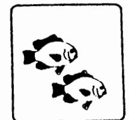

STEPS POINT

**MAP** 25

USE CONSIDERATIONS

( SLUDGE DISPOSAL AREA

numbers of seabirds (15).

# FAGATELE BAY

Fagatele Bay is reached overland by turning off the paved highway at Futiga and traversing an unimproved road for approximately 0.8 miles (1.3 km). At this point a chain blocks the road. The eastern perimeter of the bay is reached by walking the road and turning west onto a small, poorly-marked foot trail before reaching the American Can Company sewage settling pond to the east. The narrow path is steep in places but the distance from the chain to the shoreline is traversed in about 20 minutes. Access to the water is afforded by a small pocket beach. Fagatele Bay is more easily reached by small boat and attracts sport divers and fishermen (ASCRI). Fagatele Bay has been recommended as a marine preserve because of its relatively pristine reef, diverse fish fauna, and extensive coral resources (15;39;41).

Waters along the eastern side of Fagatele Bay are frequently used for fishing. Diving with home-made spears (mata) is the most common activity, followed in popularity by rod and reel fishing. Both methods result in catches consisting of generally the same species taken off Vailoatai (20).

# STEPS POINT

# CLIFF AREAS

Seabird colonies are found along the sea cliff near Steps Point. The brown booby (fua'o; Sula leucogaster plotus), an uncommon resident seabird, nests on the sea cliff northeast of Matautuloa Point. The blue-grey noddy (laia; Procelsterna cerulea), the grey-backed tern (Sterna lunata), and the common white tern (manu sina; Gygis alba pacifica) nest at Steps Point (15).

# OFF STEPS POINT

Offshore slopes off Steps Point were free of the crown-of thorns starfish (alamea; Acanthaster planci) in early 1978 (74). Fishes are abundant and the fauna diverse west of Steps Point. Chromis vanderbilti. C. acares, Plectroglyphidodon dickii and Ctenochaetus striatus are most abundant of at least 113 species. Stegastes fasciolatus is common (76).

# INLAND OF STEPS POINT

A disposal site for sludge from the Van Camp tuna cannery in Pago Pago Harbor is located on the eastern side of the peninsula which leads to Steps Point. Several pits dug out of the hillside above Larsen Bay are reported to be completely filled with sludge. Overflow from the pits during heavy rains may eventually reach the Bay (15).

STEPS POINT

MAP 25

USE CONSIDERATIONS

STEPS POINT

Steps Point is the southernmost point on Tutuila and the southernmost point of U.S. territory. A controlled-access road lead to the point where there is a lighthouse (41).

/MAP23.TEX/ - /AUG-80/

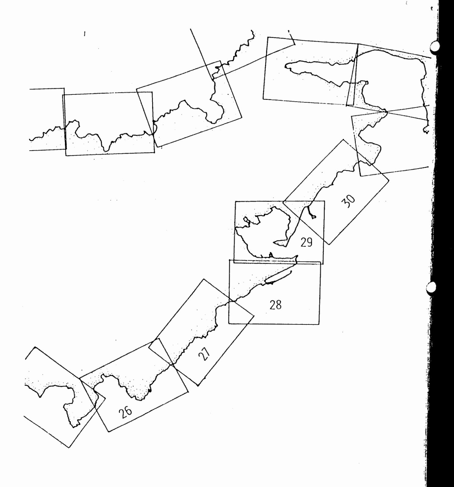

FIGURE 15. ATLAS MAPS COVERING THE THE SOUTH/CENTRAL COAST OF TUTUILA, AMERICAN SAMOA

# THE SOUTH/CENTRAL COAST OF TUTUILA

A two-lane highway linking the western district of Tutuila to Pago Pago Harbor parallels the shoreline from Pago Pago to Nu'uuli (MAP 29/30). West of Nu'uuli, the highway runs inland across the Tafuna-Leone plain to the village of Leone (MAP 23). This road is the only vehicular link between villages on the southwestern coast of Tutuila (63).

Nu'uuli is the second largest village on Tutuila (23). A paved road extends from the main highway to Pago Pago International Airport along the western perimeter of Pala Lagoon (MAP 29) (39). Another paved road connects the inland village of Futiga to Vaitogi (MAP 26) on the coast. A small network of unimproved roads extends over the Tafuna Plain, connecting a number of the villages along the shore. In general, these roads are eroded and bumpy, and generally impassable during wet conditions except by four-wheel drive vehicles (23).

# TAFUNA-LEONE PLAIN

The broad plain between Leone (MAP 23) and Nu'uuli (MAP 29) formed as a result of lavas and tuffs deposited in recent geologic time by a series of eruptions along a long, north-south fissure. Voluminous lava flowed eastward into the ocean, covering a reef which is now about 200 feet (61 m) below sea level, building the island at some points nearly to the edge of the reef platform. The late lava flows extended the southwestern shoreline of Tutuila as far as the present site of Tafuna (12;54). The youthful Tafuna coast is cliffed and incised by numerous surge channels and blowholes. No continuous fringing reef has developed (12).

TUALAUTA CO.

LARSEN BAY

MAP 26

PHYSIOGRAPHY

LARSEN BAY

MAP 26

PHYSIOGRAPHY

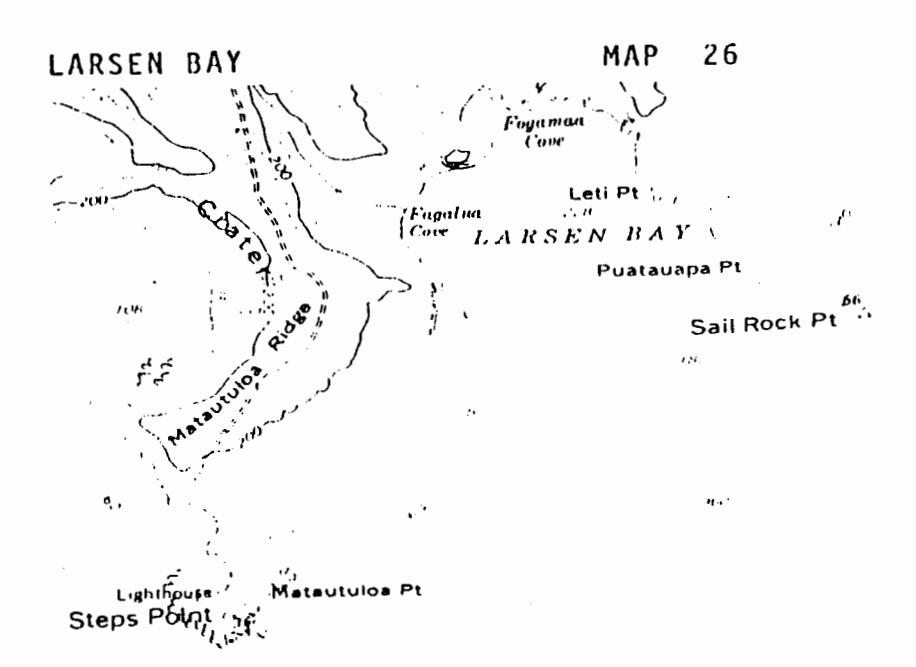

PHYSIOGRAPHY

# COAST BETWEEN STEPS POINT AND SAIL ROCK POINT (LARSEN BAY)

# FOGAMA'A CRATER AND LARSEN BAY

Fogama's consists of a crater nested within a crater, the seaward rim breached by the ocean to form Larsen Bay. Fogama's was one of three tuff cones formed by explosive submarine eruptions in recent geologic time along a north-south fissure which extended the western end of Tutuila. Fifty feet (15 m) of pahoehoe lava overlain by 10 feet (3 m) of tuff forms the outer crater rim along the western margin of Larsen Bay. Overlapping tuff deposits occur at Steps Point (54). Fragments of reef limestone are embedded in the tuff (12).

#### SHORELINE

The perimeter of Larsen Bay is a series of cliffs in volcanic tuff, notched in some areas 6 feet (2 m) above sea level. In addition, the base of the cliffs (especially the short promontory separating Fagalua Cove from Fogama'a Cove) are deeply pitted by borings of the sea urchin, Echinometra mathaei. Sea caves are eroded into the promontory between Fagalua Cove and Fogama'a Cove and around Leti Point. Narrow beaches of white sand are situated at the heads of Fagalua and Fogama'a Coves (ASCRI-26S1).

Bordering the southwestern side of Fagalua Cove there is a low, irregular exposure of beachrock mostly covered by sand. A steep-sloping beach of coarse white sand (and some gravel) borders the northeastern cove margin. At high tide, the 20 foot (6 m) wide beach is swept by surge. At low tide, a 30 to 40 foot (9 to 12 m) wide expanse of sand is uncovered (ASCRI-26S1).

# OFFSHORE BOTTOM (LARSEN BAY)

A reef extending about 100 feet (30 m) from the shore fringes Fagalua Cove. The inner reef flat, out to 60 feet (18 m) from shore, is a sand-scoured limestone bottom at a depth of 3 to 4 feet (1.0 to 1.2 m). From 50 to 75 feet (15 to 25 m) offshore, the bottom is consolidated limestone shoaling to a depth of about 2 feet (0.6 m) (ASCRI-26B1).

The reef front is composed of irregular limestone mounds and buttresses separated by narrow surge channels having depths of 10 to 15 feet (3 to 5 m). The mounds afford high relief. Fragments of staghorn coral rubble accumulate in the surge channels and areas between limestone mounds. Limestone banks and rubble/sand-bottomed channels extend to depths of over 60 feet (18 m) (ASCRI-26B2).

At the base of the cliff, limestone mounds rise to within 6 feet (2 m) of the surface between parallel sand-bottom channels about 16 feet (4.8 m) deep. The cliff wall is pitted with deep

LARSEN BAY

MAP 26

. FLORA AND FAUNA

( SEABIRD NESTING AREA

LARSEN BAY

MAP 26

FLORA AND FAUNA

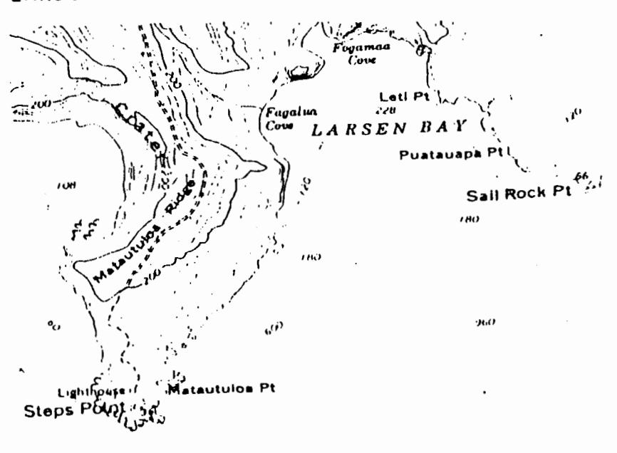

LARSEN BAY

MAP 26

FLORA AND FAUNA

circular burrows made by sea urchins (ASCRI-26B3).

#### LARSEN BAY COASTLINE

The blue-gray noddy (laia; <u>Procelsterna cerulea</u>) a resident seabird uncommon in American Samoa, roosts and nests along the perimeter of Larsen Bay, as well as at Sail Rock Point, Toa Point, and Laumeimamalie Point northeast of the Bay. The common brown noddy (gogo; <u>Anous stolidus pileatus</u>) nests along sea cliffs from Fagatele Point (MAP-25) east to Toa Point (15).

# FRINGING REEF FLAT

A filamentous green alga (cf. <u>Cladophora</u> sp.) occupies shallow pools on tuff outcrops along the shore of Fagalua Cove (ASCRI-26S1).

Coral cover is 1 to 3% on the sand-scoured reef flat within 60 feet (18 m) from the shore in Fagalua Cove. Porites (Synaraea) sp. is most common. Coral cover is highly varied on the middle reef platform. Areas of up to 20% cover occur near the reef margin, where Acropora humilis and Pocillopora verrucosa are most common. Conspicuous algae include Dictyosphaeria versluysii and encrusting corallines on consolidated limestone (ASCRI-26B1).

The reef flat is inhabited by at least 22 species of fishes present in moderate to high numbers. Most individuals are juveniles. Surgeonfishes, wrasses, and damselfishes predominate. At least 7 species of surgeonfishes are present, with Acanthurus nigrofuscus and A. triostegus most abundant. Thalassoma hardwickei is the most common of at least five different wrasses. Although damselfishes are conspicuous, abundance is moderate to low. Glyphidodontops cyanea and G. glaucus are most common. Adult Lisa vaigiensis occur in small schools (ASCRI-26F1).

#### FRINGING REEF FRONT

Coral cover is highly varied on the reef front, with no coral in some areas and up to 50% cover in other areas. Overall, corals cover less than 30% of the bottom and include considerable tabular Acropora hyacinthus, encrusting Acropora, Pocillopora verrucosa, large patches of A. rotumana, and some A. robusta. The coral in deep water is mostly dead as a result of predation by the crown-of-thorns starfish (alamea; Acanthaster planci). Standing branches of dead staghorn Acropora cover large areas. The coral rubble bottom at a depth of 30 feet (9 m) over 600 feet (185 m) offshore is devoid of living coral. On or between coral branches are encrusting coralline algae, Ralfsia sp., and a filamentous algal turf. Limestone mounds extend to depths of 60 feet (18 m) with some large colonies of soft coral 10 to 25 feet (3 to 8 m) across. A wide patch of sea anemones is also evident (ASCRI-26B2).

Fronting the cliff between Fagalua Cove and Fogama'a Cove, shoaling limestone mounds have patches of Galaxea, low Pocillo-

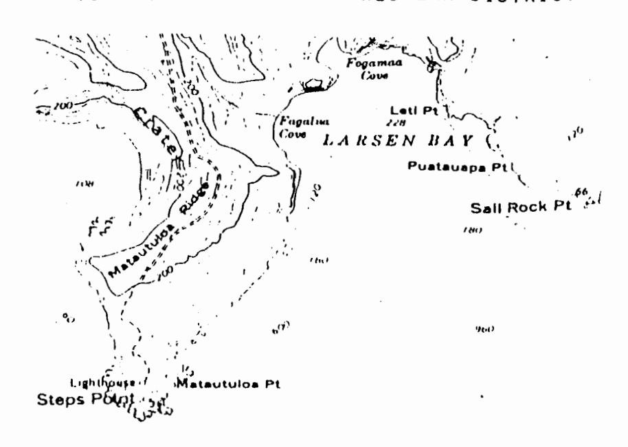

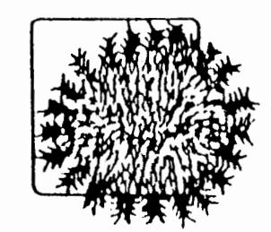

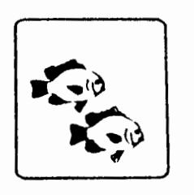

LARSEN BAY

MAP 26

WATER CONDITIONS

LARSEN BAY

MAP 26

26 HISTORICAL/ARCHAEOLOGICAL

LARSEN BAY

MAP 26

USE CONSIDERATIONS

pora verrucosa, P. eydouxi, and some Millepora. The sea urchin, Echinometra mathaei, occupies burrows in the pitted cliff face. Large colonies of soft coral occur in deep water offshore (ASCRI-26B3).

Despite reports of crown-of-thorns starfish in deep portions of Larsen Bay in early 1978 (45), none was observed on forereef slopes of Fagalua Cove in January and February 1978 (74). Fagalua Cove and other parts of Larsen Bay were infested by Acanthaster later in 1978. Acanthaster is still present on the reef front (ASCRI). Prior to starfish predation, corals in Larsen Bay were spectacularly lush -- cover reached 100% in places (201).

The reef front harbors large numbers of fishes (mostly adults). Surgeonfishes, butterflyfishes, wrasses, and damselfishes dominate an assemblage of at least 132 species (ASCRI-26F2;76). Large parrotfish are present in low abundance. Chaetodon reticulatus is the most common butterflyfish. Acanthurus lineatus and Ctenochaetus striatus are dominant surgeonfishes. Glyphidodontops leucopomus and Plectroglyphidodon lacrymatus are the most common damselfishes. Wrasses are conspicuous but not dominant in the overall fish population. Thalassoma hardwickei, T. lutescens, and T. fuscum are common. Small (less than 3 feet or 1 m long) blacktip sharks, Carcharhinus melanopterus, occur here (ASCRI-26F2). Chromis acares was most abundant in one survey. Pomacentrus melanopterus, Plectroglyphidodon dickii, and Chromis iomelas are common (76). The endangered green sea turtle (Chelonia mydas) is reported in small numbers from Larsen Bay (15).

# FAGALUA COVE

Strong rip currents through two channels (avas) and an uneven limestone bottom cause difficulties and hazards for water activities. Sport divers exploring the reef front may encounter difficulty in returning to shore against the currents flowing seaward through the avas. Inshore conditions are safest at low tide and with low wave surge. Moderate wave surge keeps sand covering the inner reef stirred up and causes turbid water near shore in Fagalua Cove (ASCRI).

#### ABANDONED VILLAGES

Three villages (Fagatele, Fagalua, and Fogama'a) were once located near Fagatele (MAP 25) and Larsen Bays. These villages have been abandoned. Old samoan grave sites remain in the area (30;204).

#### FAGALUA COVE

Fagalua Cove is reached by leaving the main highway at Futiga Village and following an unimproved road southward along Matautuloa Ridge separating Fagatele Bay from Larsen Bay. About 300 feet (90 m) before a chain across the road is the head of a

LARSEN BAY

MAP 26

USE CONSIDERATIONS

- ( \* Fogama'a Crater is a
   possible "Special Area"
   suitable for natural land mark -- Chap. VI.C.7 (21)
- \* Larsen Bay is a
   possible "Special Area"
   of pristine value and
   high natural productivity
  --- Chap. VI.C.1,3 (21)

Valtogi

Valtogi

Fogaletat

Graves

Laumeimamalie Pt

LARSEN BAY

Puatauapa Pt

Sail Rock Pt

Augalolos Cove

PHYSIOGRAPHY

VAITOGI

MAP 26

FLORA AND FAU

trail down the eastern side of the ridge to Fagalua Cove. The trail is not difficult to traverse. It is advisable to obtain permission to use the trail before entering. Swimming can be dangerous in Fagalua Cove during high tide or under conditions of moderate to high wave surge (ASCRI).

# LARSEN BAY AND FOGAMA'A CRATER

Fogama'a Crater, inland from Larsen Bay, has been designated as a National Natural Landmark because it illustrates the latest phase of volcanic activity in American Samoa (72). A picturesque and isolated beach at the head of Fogama'a Cove is not directly accessible (41). Larsen Bay is being considered as a site for a marine preserve in part because of its pristine reefs (39;71). However, nearby Fagatele Bay (MAP 25), also a candidate site for a marine preserve, is more sheltered and accessible by boat than is Larsen Bay.

The northwestern portion of Larsen Bay is frequently used for fishing. Spearing (mata) is the preferred method, but rod and reel fishing also occurs. Spearing is primarily a daytime activity because the Bay is too far from villages for regular night fishing trips. Good catches of laea (large parrotfish), malauli (large jack), anae (adult mullet), pone (chocolate surgeonfish), alogo (lined surgeonfish), ume (unicornfish), and fe'e (octopus) are possible. Rod and reel fishing is also primarily a daytime activity resulting in catches of malauli and lupota (small jack) (20).

#### COAST BETWEEN SAIL ROCK POINT AND FATUASINA POINT

#### SHORELINE

The Vaitogi coast lacks a fringing reef. The consists of a 250- to 300-foot (75 to 90 m) wide bench of volcanic rock at the 5-foot (2 m) elevation (49). A storm beach, composed largely of calcareous sand (with about 30% volcanic content) has been thrown up behind the bench -- above the limits of normal wave action (49:ASCRI-26S2). Shallow splash pools form at the back of the broad platform of smooth, black lava or adjacent to surge channels incising the platform. Pool bottoms are covered by a thin layer of sand. A pocket beach occupies the head a small, uunamed cove near Vaitogi Village. The small beach, composed largely of calcareous sand and gravel, extends inland as a long storm beach. The pocket beach is bounded by two points of lava rock. A naturally-eroded tunnel and blowhole are along the southwestern perimeter of the cove. An amphitheater is carved in the opposite side of the headland just southwest of the Southwest of the pocket beach, the coastline increases in height, becoming a jagged cliff of lava rock (ASCRI-26S2).

# SAIL ROCK POINT

A small colony of the uncommon sheath-tailed bat (pe'ape'a-

VAITOGI

MAP 26

FLORA AND FAUNA

VAITOGI

MAP 26

Fatuasina Pt

Alatele Cove

Fagaleoo Pt

Vaifoa Cove

Fatuapule Pt

Puafusi Pt

FLORA AND FAUNA

VAITOGI

MAP 26

HISTORICAL/ARCHAEOLOGICAL

( \* Vaitogi coastline is a
 possible "Special Area" of
 scenic importance --( Chap. VI.C.2 (21)

VAITOGI

MAP 26

USE CONSIDERATIONS

VAITOGI

MAP 26

USE CONSIDERATIONS

VAITOGI

MAP 27

USE CONSIDERATIONS

vai; Emballonura semicaudata) roosts in caves at Sail Rock Point (15).

# OFFSHORE OF SAIL ROCK POINT

The fish fauna is highly diverse off Sail Rock Point, but populations are only moderately abundant. At least 102 species occur, most abundant of which are <u>Chromis vanderbilti</u> and <u>Pomacentrus richardsoni</u> (76).

# OFF VAITOGI VILLAGE

The shoreline platform of lava rock fronting Vaitogi is carpeted by dense algal cover, predominantly <u>Sargassum echinocarpum</u> in depressions, with <u>Ahnfeltia</u> sp. present on sloping edges and exposed surfaces. Also present are <u>Caulacanthus</u> sp., <u>Valonia</u> aff. <u>aegagropila</u>, and <u>Cladophoropsis</u> sp. Lower sides of natural arches, tunnels, and amphitheater areas are painted with pink <u>Porolithon</u>. <u>Sargassum</u> is common in shallow tidepools behind the shoreline bench and adjacent surge channels. Considerable algae occur on the seaward portion of the bench (ASCRI-26S2). The endangered green sea turtle (<u>Chelonia mydas</u>) is reported in small numbers off the coast near Vaitogi Village (15).

#### VAITOGI CLIFFS

The scenic Vaitogi cliffs figure in the popular "Turtle and Shark" legend sung by school children. Chanting to the sea from the cliffs near Vaitogi is said to cause the appearance of turtle and sharks. The legend has been reinacted for tourists visiting the cliffs in tour buses (ASCRI; 41). Access to the site is through Vaitogi Village on an unimproved road lacking parking and turnouts (41).

# SHORELINE

A pocket beach at the head of a small cove provides the only good access to the water along the rocky Vaitogi coast. Access is by courtesy of Vaitogi Village (41). Although swimmers use the inner cove, strong surge and large swells can make this area dangerous. Traversing the low platform of lava rock northeast of the cove requires care because of surf and surge (ASCRI).

# OFF VAITOGI

The waters off Vaitogi Village are a frequently used fishing ground. Handlining and rod and reel fishing are the principal methods employed here. Daytime catches include malauli (large jack) and lupota (small jack) (20).

# EAST OF VAITOGI

The waters southwest of Fogagogo, between Lepisi Cove and Fatuasina Point, are a frequently used fishing grounds. Spearing

VAITOGI

MAP 27

USE CONSIDERATIONS

TAFUNAFOU (FOGAGOGO)

MAP 27

**PHYSIOGRAPHY** 

TAFUNAFOU (FOGAGOGO)

**MAP** 27

Oneonelill Pt

PHYSIOGRAPHY

Vai Cove

Fogagogd

TAFUNAFOU (FOGAGOGO)

MAP 27

FLORA AND FAUNA

TAFUNAFOU (FOGAGOGO)

MAP 27

FLORA AND FAUNA

TAFUNAFOU (FOGAGOGO)

MAP 27

WATER CONDITIONS

TAFUNA STP

FOGAGOGO,

FIGURE 16. TAFUNA WASTEWATER DISPOSAL SITE (5).

EXISTING OUTFALL

is the most popular activity, followed by rod and reel fishing. Spearing is practiced mostly during the day because the area is too far from villages for regular night diving trips. The usual catch includes laea (large parrotfish), malauli (large jack), anae (adult mullet), pone (chocolate surgeonfish), alogo (lined surgeonfish), ume (unicornfish), and fe'e (octopus). Pole fishing with rod and reel is also a daytime activity, resulting in catches of malauli and lupota (small jack) (20).

# COAST BETWEEN FATUASINA POINT AND MATAUTUOTAFUNA POINT

#### SHORELINE

Fronting Fogagogo there is a 75-foot (25 m) wide bench of lava rock, backed by a storm beach of calcareous sand. The sand beach is approximately 75 feet wide and 500 feet (150 m) long (49).

#### VAI COVE

The coast lacks a fringing reef and lava cliffs, 10 to 15 feet (3 to 5 m) high, are exposed to the full force of waves. Several blowholes are conspicuous along this coast (49;ASCRI-27S1). During periods of strong onshore trade winds, spray from the blowholes is a hazard to incoming airplanes. Attempts to cap the blowholes have been only partially successful (49). Seastacks lie a short distance offshore northeast of Vai Cove (ASCRI-27S1).

#### OFF FATUASINA POINT

The fish fauna is highly diverse, but populations are only moderately abundant off Fatuasina Point. Ctenochaetus striatus dominates an assemblage of at least 114 species. Although far less abundant, Chromis acares and Plectroglyphidodon dickii are relatively common (76).

# VAI COVE

The encrusting coralline alga, <u>Porolithon</u> sp., coats the base of the sea cliff near Vai Cove. The common shoreline crab, <u>Grapsus tenuicrustatus</u>, and gobies are conspicuous shoreline fauna (ASCRI-27S1).

#### VAI COVE

Wastewater from the Tafuna collection system enters the Tafuna treatment plant west of Pago Pago International Airport (5). An outfall discharges about 0.03 mgd of primary treated sewage from the Tafuna plant. The outfall is located at a depth of about 70 feet (21 m) in Vai Cove. An increase in the volume of effluent has been proposed. The present discharge causes no detectable degradation in water quality because of good mixing and circulation in offshore waters (40). However the primary treatment plant at Tafuna is reported to be inoperative and dis-

TUTUILA

WESTERN DISTRICT

TUALAUTA CO.

TAFUNAFOU (FOGAGOGO) MAP 27

USE CONSIDERATIONS

**AIRPORT** 

MAP 28

**PHYSIOGRAPHY** 

**AIRPORT** 

MAP 28

**PHYSIOGRAPHY** 

∛atele Pt

( BORROW PITS

charging raw sewage through the Fogagogo outfall (5;39).

VAI COVE

Fogagogo is accessible by unimproved road. The storm beach located backing the shoreline bench is known as "Freddie's Beach". A semi-private beach clubhouse is situated on the backshore. Access to the ocean is difficult even during calm conditions (49).

The unimproved road continues northeast from Fogagogo to Vai Cove, where a fence bars admittance to the Pago Pago International Airport (ASCRI). Pole fishing is considered productive along the coast near Vai Cove. Offshore activities are usually limited by very rough waters. Although the wave-exposed coast is potentially dangerous, it is also scenic, with blowholes, caves, grottos, and nearshore seastacks conspicuous features (ASCRI). Pools and surge channels incising the rocky coast provide limited opportunites for swimming at Fagagogo (41).

# COAST BETWEEN MATAUTUOTAFUNA POINT AND AVATELE POINT (INTERNATIONAL AIRPORT)

# PAGO PAGO INTERNATIONAL AIRPORT

The reef on which the runway for Pago Pago International Airport stands was formerly the widest reef on Tutuila. The airport was constructed in the 1940's with a runway extending from the village of Tafuna eastward across the reef fronting Pala Lagoon. In 1959, a new runway was constructed south of the original one, extending the airport farther onto the reef (16).

#### SHORELINE - AIRPORT PONDS

The reef runway is bordered by a man-made shoreline revetment of basalt boulders. The seaward embankment slopes steeply to the bottom of a borrow pit (ASCRI-28S1). A 1,600-foot (500 m) revetment is under construction to replace original, inadequate shore protection along the central part of the airport embankment. The crest of the improved revetment is 7 to 7.5 feet (2.1 to 2.3 m) above sea level (49).

Bordering the base of the rock wall at its east end are two piles of limestone boulders and rubble. One is a bank exposed at low tide. The second projects 10 feet (3 m) above the water surface (ASCRI-28S1).

Between the reef runway and the taxiways are enclosed areas of borrow pits and limestone outcrop remnants left by dredging. The turbid water of these "lagoons" or ponds drains under the reef runway to a borrow pit which lies behind a protective revetment seaward (south) of the reef runway. The most conspicuous animal in the enclosed ponds is a sea cucumber (synaptid) (ASCRI).

**AIRPORT** 

MAP 28

**PHYSIOGRAPHY** 

( BORROW PIT

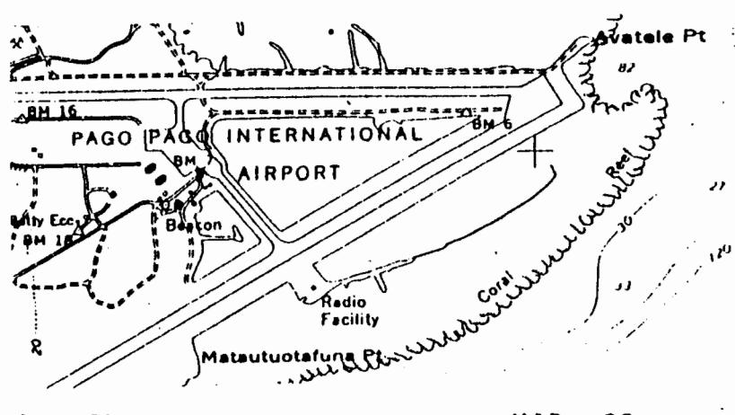

AIRPORT

MAP 28

FLORA AND FAUNA

( \* Airport reef and seaward borrow pit are possible "Special Areas" of high natural productivity -- Chap. VI.C.1 (21)

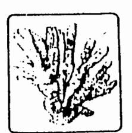

#### FRINGING REEF

The fringing reef widens from 300 feet (90 m) off southern end of the airport runway to 800 feet (250 m) off the northern end (49). Adjoining the northeast end of the reef runway revetment is a borrow pit dredged during airport expansion to obtain fill for the reef runway. Depth ranges from 10 to 20 feet (3 to 6 m), reaching a maximum of 25 feet (8 m). base of the rock revetment are submerged limestone boulders and rubble (ASCRI-28B1). The lagoon bottom is mainly sand and limestone outcrops left from dredging (ASCRI-28B2). The borrow pit extends offshore to the consolidated inner margin of the reef platform where there is a steep slope to the sand bottom of the borrow pit. The reef margin paralleling the seaward edge of the borrow pit has considerable bottom relief. Water depth feet (1.5 m). Although consolidated limestone predominates, the seaward edge of the borrow pit is littered with basalt boulders from airport construction (ASCRI-28B3). rubble is considerable beside extensive thickets of living staghorn Acropora at the northeast corner of the inner reef margin (ASCRI-28B4).

# AIRPORT LAGOON AND REEF

Coral cover is about 5% on the submerged rock revetment which borders the northeastern section of the reef runway. Pocillopora damicornis is most common. Other corals present include patches of blue Montipora, large clumps of Acropora humilis, several other acroporans and other species (ASCRI-28B1). Thickets of staghorn Acropora 10 to 20 feet (3 to 6 m) across and up to 6 feet (2 m) high populate limestone outcrops above the predominantly sand bottom of the borrow pit. Coral cover totals about 10%, almost entirely Acropora formosa, with some A. hyacinthus. Coral coverage has increased noticeably in the borrow pit since 1971.

Common algae are <u>Gelidiopsis</u> intricata and <u>Amphiroa</u> sp. growing at the base of staghorn <u>Acropora</u>. The sea cucumber, <u>Stichopus chloronotus</u>, is abundant on the steep slope of the seaward margin of the borrow pit. The snail, <u>Terebra maculata</u>, is evident on the sand bottom (ASCRI-28B2).

The shallow, seaward portion of the borrow pit is a rich coral bottom, with cover approaching 90%. In the northeast corner of the borrow pit are extensive banks of staghorn Acropora. To the southwest there are stands of Psammocora and a large area of Porites andrewsi up to 100 feet (30 m) across. Farther southwest along the inner reef margin are stands of Pavona frondifera, Acropora humilis, A. aspera, and occasional Pocillopora damicornis and Pavona decussata heads. Off the center of the borrow pit there occurs a solid bank of Acropora formosa rising to within one-half foot of the surface. Deeper reef pools contain Porites lutea. Algae (Halimeda) are conspicuous between branches of P. andrewsi. Sea urchins (Echinometra mathaei), live between

AIRPORT

MAP 28

FLORA AND FAUNA

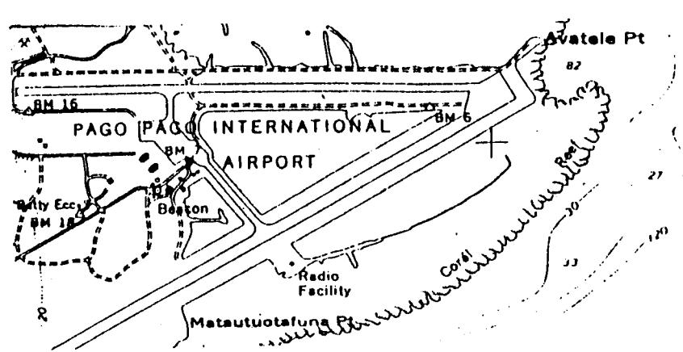

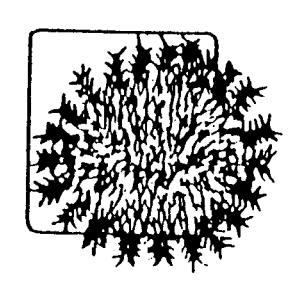

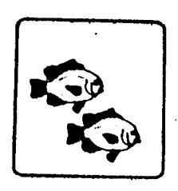

branches of coral (ASCRI-28B3).

Live coral cover is about 50% along the inner margin of the reef platform bordering the northeast corner of the dredged borrow pit. Large thickets of staghorn Acropora (mostly A. formosa with some A. aspera) up to 15 to 20 feet (5 to 6 m) across rise to within about one foot (0.3 m) of the surface. Dead coral rubble accumulates beside the large thickets of living Acropora. Small, free nodules of Porites lutea cover about 5% of the rubble. Algae cover much of the remainder and include Porolithon gardineri, encrusting Ralfsia sp., Peyssonnelia sp., patchy Lyngbya sp., Cladophora sp., and Bryopsis sp. The sea cucumber, Stichopus chloronotus, is conspicuous toward the northeast corner of the borrow pit, although not as abundant as at the seaward edge of the center section (ASCRI-28B4).

The outer reef flat and margin off Pago Pago International Airport was reportedly infested by crown-of-thorns starfish (alamea; Acanthaster planci) in early 1978 (45). By January 1979, numerous Acanthaster occurred in scattered concentrations at depths of 10 to 20 feet (3 to 6 m) off the eastern end of the runway. Many dead corals were observed, but some areas of live coral were interspersed with starfish concentrations. Numerous starfish were also evident off the Vortoc Station (radio facility), but not as abundant as to the east (74). Very few Acanthaster were observed on the reef flat in October 1979 (ASCRI).

The protected water of the dredged lagoon south of the reef runway shelters an extremely diverse and abundant fish assemblage. Similar densities of fishes occur on the Pavona and Porites reef flat seaward of the lagoon. Although the lagoon and reef flat are primarily a nursery area for juveniles, adults of many species are present. Juvenile scarids are most abundant of at least 82 species of fish and feed throughout the area in large Surgeonfishes, wrasses, and damselfishes are also abundant. In some areas, several thousand fishes of many species concentrated within a radius of 150 feet (45 m). Most abundant species of butterflyfishes are schools of Chaetodon citrinellus, C. reticulatus, and C. trifasciatus. Although not as common, C. unimaculatus and C. bennetti are conspicuous. Six species of surgeonfishes are common, of which Acanthurus nigrofuscus and Ctenochaetus striatus are most abundant. Thalassoma hard-wickei is the most abundant of the wrasses. Dascyllus aruanus, Stegastes albofasciatus, Glyphidodontops cyanea, G. glaucus, and G. leucopomus are most common of the damselfishes. Mullids of several species are seen primarily in the dredged lagoon. High coral cover and high bottom relief provide shelter for the large fish assemblage. Larval fishes, probably atherinids, are conspicuous in surface waters. Small black-tipped sharks (Carcharinus melanopteru ) may be seen in shallow parts of the lagoon and over the nearby reef flats (ASCRI-28F1).

AIRPORT

PAGO [PAGO INTERNATIONAL BM 6 PAGO [PAGO INTERNATIONAL BM 6 PAGO Facility

Radio Facility

Matautuotafuna Provincia

USE CONSIDERATIONS

# FRINGING REEF AND BORROW PIT

The borrow pit bordering the seaward revetment of the reef runway is well protected from waves. However, the outer reef flat off the eastern tip of the reef runway (near Avatele Point) is exposed to heavy surf and strong currents (ASCRI).

Underwater visibility is fairly good in the outer portion of the borrow pit and along the inner consolidated margin of the reef flat off the reef runway. However, water becomes increasingly turbid approaching the runway revetment. An inner pond, enclosed on all sides by the airport runway and taxiways, drains into the seaward lagoon, causing water near the shoreline revetment to become very turbid and smelly in certain areas. The ponds are highly turbid (ASCRI).

/MAP26.TEX/ - /AUG-80/

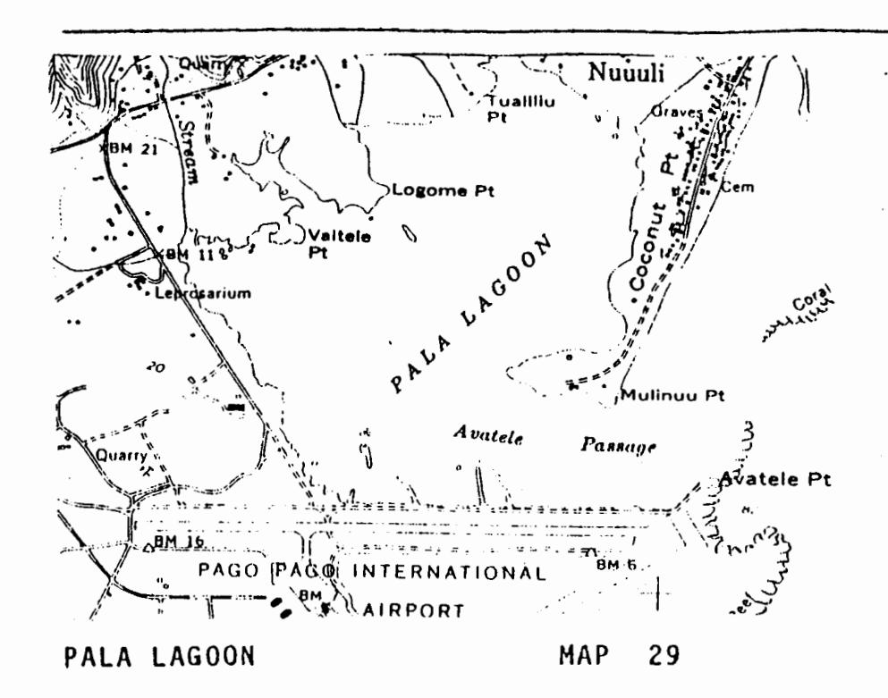

**PHYSIOGRAPHY** 

( \* Papa Stream is a
 possible "Special Area"
( of pristine value --Chap. VI.C.3 (21)

PALA LAGOON

MAP 29

PHYSIOGRAPHY

Pala Lagoon is the only large, well-protected lagoon on Tutuila. It is roughly circular, approximately one mile (1.6 km) across, and has a surface area of about one square mile (3 sq km). Approximately two-thirds of the inner lagoon is very shallow, with depths varying from 1 to 5 feet (0.3 to 1.5 m) depending on the tide. A large area (about one-sixth of the lagoon) adjacent to the airport has been subject to extensive dredging to obtain fill material. The dredged portion has a very irregular depth shoreward of the sill which restricts the entrance channel. Average depth of the dredged basin is roughly 10 feet (3 m) (24).

Pala Lagoon was formed as a result of shoaling of a submerged reef by late lava flows, which formed the Tafuna/Leone plain. Subsequent development of a sand hook or spit, formed in response to current patterns resulting from the lava flow, left an entrance to the lagoon behind the fringing reef to the south (6;54).

# TRIBUTARY STREAMS

Fresh water enters the lagoon from seven streams several fresh water springs. Papa Stream flows through about 350 feet (100 meters) of mangrove forest before discharging into the Vaitele Stream flows through the northeastern corner Tafuna Plain, draining a large watershed before discharging into the lagoon. This channel appears to be realigned in places along the lower reach where it is bordered by residences. The Stream's lower reach above a bridge near the mouth is choked with a grass (Brachiaria sp.). Papa Stream, among the more perennial streams on Tutuila, is considered to have exceptional natural value by virtue of its relatively condition (71). The concentration of watershed drainage into the lagoon is due to the original form of Matafao peak (54).

# SHORELINE

The lagoon is bounded on the south by a taxiway (the old runway) embankment at the Pago Pago International Airport. The western margin is occupied by a residential area and vegetated land. The northern side is bordered by mangrove swamps and rocky outcrops. A vegetated sand peninsula (Coconut Point) forms the eastern margin of Pala Lagoon. The opening to the sea is aligned east to west across a fringing reef in the southeastern corner of the lagoon where there occurs a shallow, narrow pass (24).

The shoreline at Tafuna Beach Park is basalt boulders, rubble, and gravel extending inland to park grounds one to three feet (0.3 to 1 m) above sea level (ASCRI-29S1).

MAP 29

**PHYSIOGRAPHY** 

PALA LAGOON

MAP 29

**PHYSIOGRAPHY** 

( DREDGING ACTIVITIES

( BORROW PITS

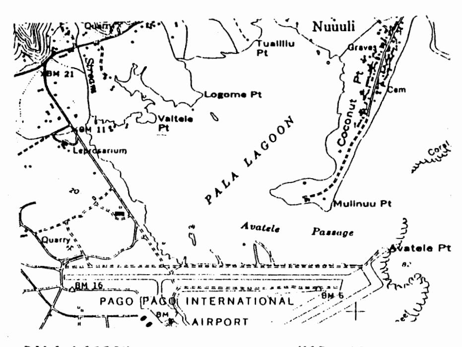

PALA LAGOON

MAP 29

FLORA AND FAUNA

\* Pala Lagoon wetlands are designated a "Special Area" for restoration -- Chap. VI.B.2 (21)

The bottom of inner Pala Lagoon grades from mud nearshore to silty-sand. The water is usually turbid (24). Offshore of Tafuna Beach Park there is a shallow bottom of silty-sand deepening from around 6 inches (15 cm) nearshore to 12 to 24 inches (30 to 60 cm) about 100 feet (30 m) from shore (ASCRI- 29B1).

The outer lagoon near the entrance channel and the International Airport is a shallow sand flat. Deeper areas adjacent to the south shore represent dredging activities carried out between 1959 and 1961 when a new airport runway was constructed on the reef flat. Depths in this region vary from 3 to 23 feet (1 to 7 m)(24).

## AVATELE PASSAGE

Avatele Passage (the entrance to Pala Lagoon) has considerably altered by airport construction and dredging for landfill material for the airport and various other public works projects. The channel is approximately 1300 feet (400 m) across between Coconut Point and the runway embankment (33). of the passage nearest to Coconut Point is a shallow sand flat, partially exposed at low tide. Deeper areas adjacent to the airport embankment are excavations from dredging activities carried out between 1959 and 1961 (24). The outer portion of Avatele Passage includes a narrow, meandering channel along the southern This channel is approximately 985 feet (300 m) long. Tidal currents are strong within the channel. Depths range from 3 to 26 feet (1 to 8 m) and the bathymetry is highly irregular. The seaward portion of this channel has a rubble bottom. The reef flat across Avatele Passage is exposed at nearly every low tide, restricting tidal flow between the ocean and Pala Lagoon to the narrow channel bordering the airport embankment (24).

The sand flat across Avatele Passage contains only scattered occurrences of limestone rubble. Shallow scour channels reveal reef limestone approximately 4 inches (10 cm) beneath the sand deposits on the reef flat. Sand eroded from the shoreline of Coconut Point has fanned out across the Passage with significant deposition in the nearby borrow pits. On a rising tide, strong currents around Mulinu'u Point deposit sand just inside the lagoon (16). The reef flat off Coconut Point has shoaled considerably since 1969. The middle and outer reef are now fully exposed at low tide (36). Bottom surveys at standard locations in 1972, 1974, and 1978 indicate increasing proportions of rubble and sediment in Avatele Passage (24;33;36).

# MANGROVE SWAMP

The northern and eastern shores of Pala Lagoon are bordered by 85 acres (34 ha) of well-developed mangrove forest which is by far the largest such forest in American Samoa. Predominant vegetation is a well-developed stand of large oriental mangrove, Bruguiera gymnorhiza (some trees up to 66 feet or 20 m in height).

( RARE LAND PLANT

( RARE WATERBIRD

PALA LAGOON

MAP 29

Nuuuli

Tusiilliu draves

Pala Lagome Pt

Valtele

Passage

Passage

Pago [PAGO INTERNATIONAL BM 6 PAGO [PAGO INTERNATIONAL BM 6 PAGO PAGO INTERNATIONAL BM 6 PAGO PAGO PAGO INTERNATIONAL BM 6 PAGO PAGO PAGO INTERNATIONAL BM 6 PAGO PAGO PAGO PAGO PAGO PAGO PAGO PAGO

FLORA AND FAUNA

( RARE MARINE PLANT

Along the western side of Coconut Point there is a strip of red mangrove. Rhizophora mangle, as well as smaller stands of Bruguiera forest along the shore. The puzzlenut tree (Xylocarpus moluccensis), relatively rare in American Samoa, is also found along the margin of the mangrove swamp bordering Pala Layoon and on the rocky western shore of the lagoon. However, trees of this species are few in number (77). The mangrove forest provides habitat for the Australian gray duck (toloa; Anas superciliosa pelewensis), a rare resident waterbird (15).

# INNER PALA LAGOON

The biota of inner Pala Lagoon lacks diversity, but the lagoon is considered an important nursery and spawning ground for fishes and invertebrates. Larval fish and egg concentrations indicate that Pala Lagoon serves as a nursery ground for certain species of fish. Larvae are present of those fish resident in the inner lagoon, such as gobies, and those which range in and out of the lagoon. Small fishes of several species, most notably mullet, frequent shallow areas of the lagoon (24).

Corals are absent from inner Pala Lagoon, the major portion of which is sand and mud flats covered by a dense growth of Acanthophora spicifera. Cover by A. spicifera and Halimeda discoidea, averages about 75% in the western half of the inner lagoon. <u>Halimeda tuna</u> occurs at one location near center of the inner layoun. In addition, dense mats of the green alga, Enteromorpha sp., along with A. spicifera, appear on rocks along the western shore of the lagoon in the vicinity of fresh water springs. The inner lagoon harbors a few echinoderms: Polyand Holothuria sp. Both are confined to the sandy SD. flats near the lagoon entrance (24). Other organisms of consequence in the inner lagoon are bivalve molluscs. One species of clam, Gafrarium tumidum, is abundant on the muddy bottom the north shore, where it is harvested by women and children (19;24). Colonies of small oysters are common on rocks along the western shore. Clam shells of several species are abundant among shoreline debris (24). Mangrove crabs (pa'alemago; Scylla serrata) are said to be common at various places in the lagoon (24; ASCRI), particularly in the mangrove swamp along the north shore.

Shoreline invertebrates at Tafuna Beach Park include neritids (Nerita plicata) on basalt boulders and clusters of bivalves (Isognomon sp.) in crevices of intertidal rocks (ASCRI-29S1). At the northern end of Tafuna Beach Park, dense windrows of green, filamentous algae (Enteromorpha sp.) occur on the silty-sand bottom near shore, as well as on basalt boulders at the shoreline. The red alga, Acanthophora spicifera, forms dense mats on the shallow, silty-sand bottom 75 to 100 feet (25 to 30 m) off the park. The seagrass, Syringodium isoetifolium, reported only once before from American Samoa, is uncommon. Cone-shaped mounds and holes made by burrowing animals are conspicuous on the bottom (ASCRI-29B1).

The number of fish species and individuals declines marked-

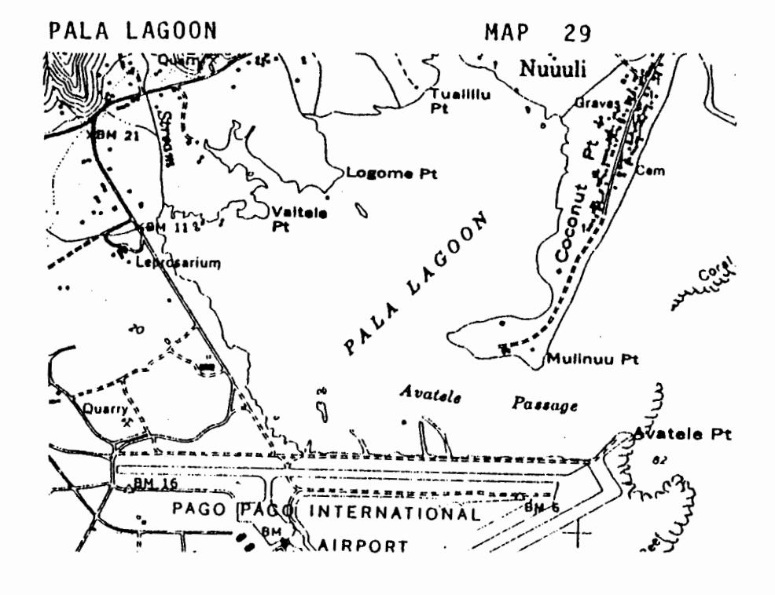

FLORA AND FAUNA

PALA LAGOON

MAP 29

FLORA AND FAUNA

( RARE MARINE PLANT

ly from Avatele Passage to the inner lagoon. Only four species are recorded from the mud flat along the northern shore at depths of 1 to 2 feet (0.3 to 0.6 m). Fishes are not much more abundant over the muddy bottom of the central lagoon at a depth of 2 to 3 feet (0.6 to 1.0 m). The cardinalfish, Foa foa, is most common of at least 8 species. Gobiid fish larvae dominate identifiable fish in the plankton, and the adults are among the more conspicuous residents of Pala Lagoon, particularly the inner portions (24). The endangered green sea turtle (Chelonia mydas) is reported in small numbers in the Pala Lagoon area (15).

# SOUTHERN PALA LAGOON

Except for colonies of <u>Porites lutea</u>, corals are nearly absent from the reef flat in Avatele Passage. In deeper, excavated pits, <u>Pocillopora damicornis</u>, <u>Goniopora sp.</u>, and <u>Leptastrea purpurea</u> are present. Corals are mostly confined to walls or ledges of dredged areas where sediment is not accumulating. Algae and sand dominate the bottom of the outer lagoon near Avatele Passage. Algal cover is about 28%, primarily by <u>Halimeda</u>. The sea cucumbers, <u>Stichopus chloronotus</u>, <u>Polyplectana sp.</u>, and <u>Actinopyga</u> sp., are common on shallow sand flats adjacent to Coconut Point. The sea urchins, <u>Echinothrix</u> sp. and <u>Echinometra mathaei</u>, are rare.

The goatfish, <u>Mulloidichthys</u> <u>flavolineatus</u>, is abundant along the southern margin of the lagoon. At least 20 other fish species are present in this area, where the silty-sand bottoms of dredged borrow pits reach a depth of about 25 feet (8 m). Relatively common species in some areas include moray eels, <u>Gymnothorax richardsoni</u>, herring, <u>Herklotsichthys</u> sp., the snake eel, <u>Leiruanus semicinctus</u>, and the worm eel, <u>Moringua</u> sp. Scorpionfishes are abundant in this area (24).

# AVATELE PASSAGE

The subtidal portion of the broad sand flat extending south of Mulinu'u Point across Avatele Passage harbors a population of the conch snail (Strombus maculatus), tubeworms, and patches of a sea grass (Halophila ovalis). Another sea grass (Syringodium isoetifolium), previously unreported from American Samoa, occurs here (16). Inside Avatele Passage, live coral patches are replaced by coral rubble and boulder fields which seem to be dead masses of Porites, some forming huge blocks several meters across (24).

Some areas of inner Avatele Passage harbor large concentrations of sea cucumbers. Stichopus is abundant on reef flats adjacent to Coconut Point. Holothuria pervicax occurs under rocks and is randomly distributed. Sea urchins are common in this area, but this is apparent only at night when they are active. Generally, sea cucumbers are more common on reef flats in the inner passage, whereas sea urchins are more common in the outer passage. Echinometra mathaei is by far the most abundant of the echinoids. A substantial colony of large mantis shrimp (Lysio-

MAP 29

WATER CONDITIONS

( COLIFORM LEVELS

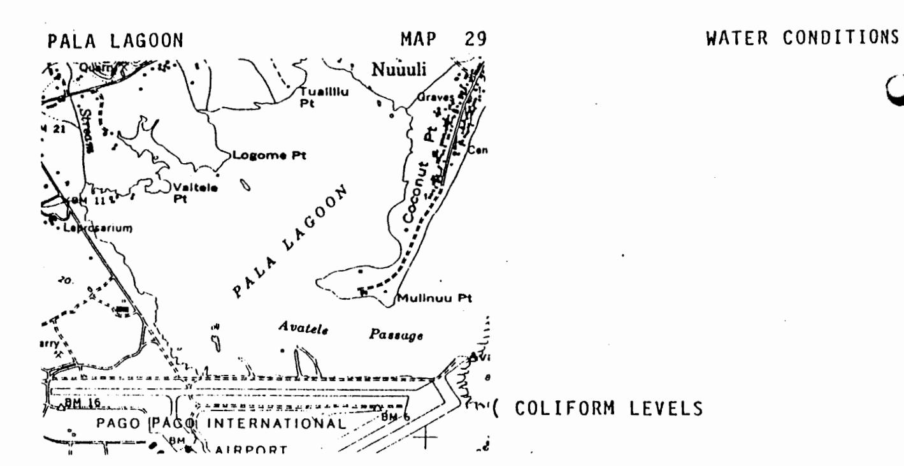

( NUTRIENT CONCENTRATIONS

squilla sp.) has been reported in an area of the inner passage south of Coconut Point (24).

Fishes are more abundant in Avatele Passage than in inner Pala Lagoon. At least 30 species are recorded from the shallow reef flat extending south from Mulinu'u Point. Here, the gobies, Amblygobius phalaena, and Gnatholepsis deltoides, the grouper, Epinephelus merra, the blenny, Asterropteryx semipunctatus, and the wrasse, Halichoeres trimaculatus, are most common over a bottom of sand and coral heads at a depth of 1 to 2 feet (0.3 to 0.6 m)(24).

#### STREAMS

Near the mouth of Papa Stream, surface flow disappears during dry weather periods occuring only as ground moisture fed by gravity seepage until a minor surface flow reforms approximately 100 feet (30 m) from the shore of Pala Lagoon. This ground moisture is rich in nutrients derived from seepage through cesspools and is capable of supporting large concentrations of bacteria. Such inputs explain the high nutrient and coliform concentrations in the northwestern portion of Pala Lagoon when the major stream, Vaitele, is dry (24).

#### PALA LAGOON

The physical configuration of Pala Lagoon is largely responsible for the restrictive circulation pattern in the shallow basin. Tidal exchange is inhibited and circulation patterns limit dilution of contaminants entering the northern and western portions. Prevailing easterly winds reinforce this pattern by driving surface water and pollutants into the lagoon. Wind mixing keeps the waters turbid in much of the lagoon and reduces visibility underwater to a few inches. Because over half of Pala Lagoon is less than 3 feet (1 m) in depth and is fed by six small streams subject to largd fluctuations in flow, the lagoon is a highly variable environment (24). During tidal exchanges, currents are strong within the narrow channel along the southern margin of Avatele Passage (24;34). Strong currents flow around Mulinu'u Point into Pala Lagoon on a rising tide (16).

On the basis of high microbial density, the western and northwestern regions of Pala Lagoon show evidence of fecal contamination, with high coliform levels maintained through subsurface seepage from the numerous cesspools along the western edge of the lagoon. Pala Lagoon is subject to large and rapid fluctuations in freshwater input, resulting in similar fluctuations of bacterial concentrations. Bacteriological pollution makes the extreme western portion of the lagoon an unacceptable area for the propagation of shellfish although shellfish are most intensively harvested from the mud flat bordering the northwestern shoreline. Consumption of sea foods from these areas represents a potential health hazard (24).

Highest concentrations of nutrients are found in the

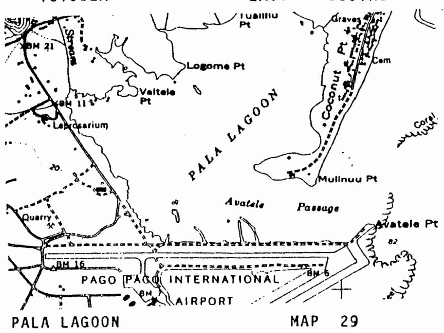

USE CONSIDERATIONS

( \* Area north of Tafuna Park
 is a possible "Special
 Area" of unique, scarce,
 or fragile value -- Chap. VI.C.3 (21)

PALA LAGOON

MAP 29

USE CONSIDERATIONS

( \* Pala Lagoon beach areas
( are designated "Special
 Areas" for restoration -( Chap. VI.B.2 (21)

PALA LAGOON

MAP 29

USE CONSIDERATIONS

( \* Pala Lagoon is designated
( a "Special Area" for
( restoration -( Chap. VI.B.2 (21)

western region of Pala Lagoon. Nutrient levels are generally high outside the entrance channel, decreasing through the channel and northward but increasing in the western corner (24;32). Phytoplankton productivity increases along a gradient from the entrance channel to the innermost northern and western regions of the lagoon (32).

Underwater visibility is poor in inner Avatele Passage (34). Dredging activities along the northern perimeter of the airport runway have reportedly caused serious siltation and high turbidity (7). Following rainstorms, underwater visibility in Avatele Passage is greatly reduced. During dry weather, visibility is reportedly about 50 feet (15 m) in outer Avatele Passage (34). Nearshore waters off Tafuna Beach Park are turbid and underwater visibility is limited to 1 to 5 feet (0.3 to 1.5 m) (ASCRI).

# SHORELINE AND MANGROVE AREAS

The mangrove forest along the north shore of Pala Lagoon is an example of a unique plant assemblage that is rapidly being eliminated from American Samoa. Of particular significance is the puzzle-nut or "le'ile'i" tree (Xylocarpus moluccensis), which has been identified as a potentially threatened species and is restricted to a few specimens located just north of Tafuna Beach Park and on Aunu'u Island. The only large stand of the red mangrove (Rhizophora mangle) in American Samoa occurs here in a band along the western edgd of Coconut Point peninsula. The Pala Lagoon mangrove forest is one of seven areas in American Samoa proposed as natural areas closed to hunting and other public disturbance in order to preserve plant and animal life (15).

#### TAFUNA BEACH PARK

Tafuna Beach Park, along the western perimeter of Pala Lagoon, is easily accessible by vehicle. Swimmers use the sandy, nearshore area. Park facilities attract other users. The shoreline is littered with broken glass and some trash (ASCRI).

# PALA LAGOON

Pala Lagoon is considered a unique body of water and is a nursery area for marine life, particularly the mangrove crab (pa'alemago; <u>Scyla serrata</u>) (39).

The southern, western, and northern margins and all shallow areas of Pala Lagoon are frequently used for subsistence fishing. Rod and reel fishing is the preferred activity along the airport (south) shore and also along the western perimeter of Pala Lagoon. However, shoreline access across the airport property is restricted to authorized personnel and requires a pass (ASCRI). Throw-netting is popular along the western shore, as well as in the shallow areas of the north lagoon. Fuafua (juvenile mullet), anae (adult mullet), and lupota (small jack) are the usual catch. Seining (upega) takes place in the shallows in both the western

MAP 29

USE CONSIDERATIONS

( DREDGING ACTIVITY

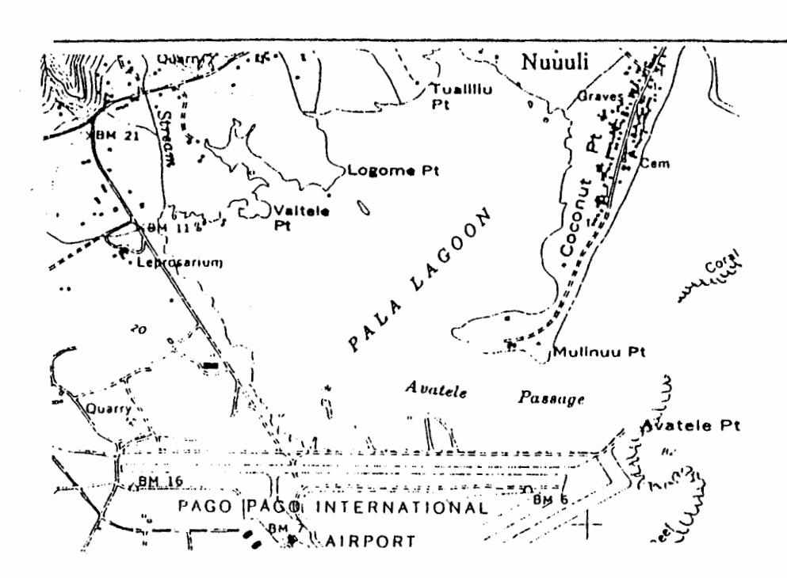

and northern lagoon. Trapping crabs and clam digging are practiced along the northern perimeter of Pala Lagoon (20). Crab fishermen employ small traps in the northeastern portion of the lagoon and along Coconut Point. A few reportedly use gill nets to catch crabs in the deeper pockets along the western side of the lagoon (24). Perhaps the most important fishery is that for clams, which are intensively harvested on intertidal mudflats in the northern and northwestern portions of the lagoon (19). A fish weir was formerly operated south of Coconut Point (24). Lysiosquilla (mantis shrimp) are collected from the sand flats south of Mulinu'u Point (34).

Dredging activity to obtain fill material for public works projects occured periodically along the southern margin of Avatele Passage and Pala Lagoon through early 1972 (24).

/PALA.TEX/ - /AUG-80/

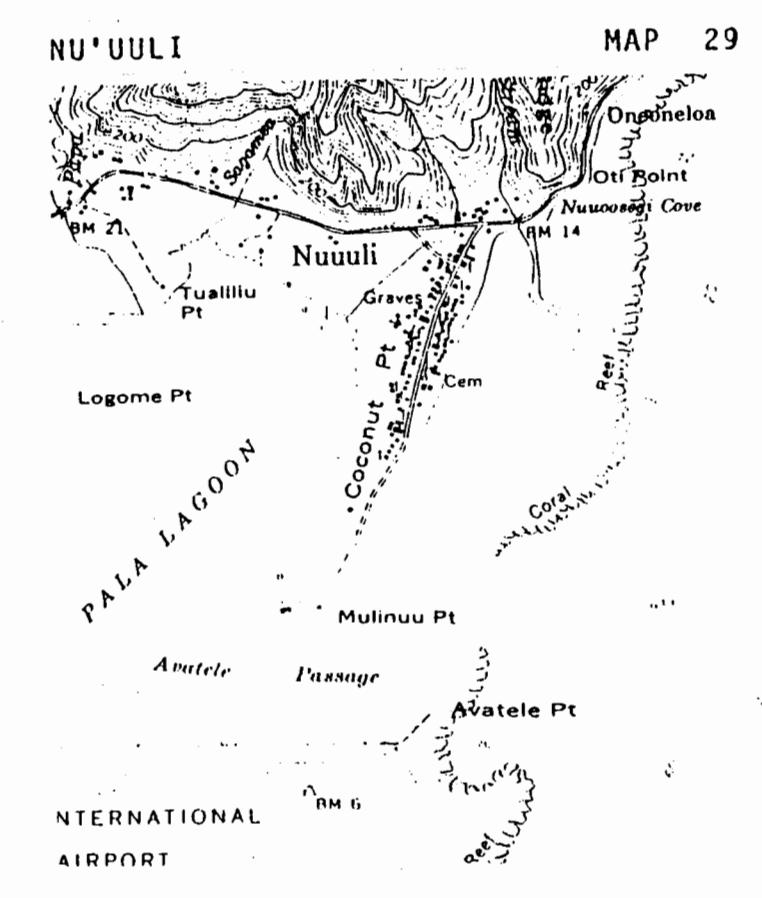

PHYSIOGRAPHY

\* Coconut Point is designated a "Special Area" for restoration; -- Chap. VI.B.2 (21)

# COAST BETWEEN AVATELE POINT AND NU'UO'OSEGI COVE (COCONUT POINT)

Coconut Point is a natural sand spit nearly one mile (1.6 km) long and varying in width from 200 to over 1,000 feet (60 to 300 m). Elevation is between 6 and 10 feet (2 to 3 m). The spit built southward from the shore at the base of Matafao Peak across a reef flat along the eastern side of Pala Lagoon. The village of Nu'uuli, second largest in American Samoa, occupies the northern portion of the Point (49;66).

# SHORELINE

The western shore of Coconut Point is a mangrove forest. The eastern shore was once a wide beach, but in recent years the shoreline has eroded along the entire length of Coconut Point. Some sand loss is attributable to high waves accompanying tropical storms and hurricanes, but most is due to longshore currents which displace sand toward Mulinu'u Point (66).

The southern portion of the eastern shore is a narrow undergoing active erosion. The foreshore is 25 feet (8 m) wide at low tide. Coconut tree roots are exposed, and several trees are ready to topple (49). An eroded sand bank varies in height from 1.5 to 6 feet (0.5 to 2 m) and has formed as a consequence of progressive erosion of the sand material comprising Coconut Point. Structures (concrete bunkers) now located offshore provide additional evidence of extensive shoreline erosion. shoreline along the southern one-third to one-half of Coconut Point has eroded back an average of 3 to 5 feet (1 to 1.5 m) per year over the 35-year period between 1942 and 1977 (66). According to one resident, the shoreline has retreated about 40 feet (12 m) since the airport was constructed. Evidence for this is a concrete pillbox which now is partly submerged on the flat off Mulinu'u Point (24). Situated on the beach in 1969 and built at the vegetation line during World War II, the now about 115 feet (35 m) offshore (36).

A remnant of the original sand beach is located portion of the shore. The northern portion of Coconut Point is characterized by a nearly continuous series of rudimentary rubble seawalls and other shore protection structures. structures offer marginal protection, even under normal wave conditions, and are in various stages of failure. Two walls at the north end of the Point are more substantial than the rest. Unprotected areas in the center of the eastern shore are eroding, limestone and with basalt rubble on the foreshore damage occurs along the 900 feet (270 m) of protected shoreline during storm conditions. Little sand remains in of the walls, the foundations of which extend to sea level (49:66) -- thus, beaches are absent or restricted to narrow sections exposed only at low tide. The sand is coarse with a higher proportion of basalt material than along the southern the reach. Αt north end of Coconut Point, adjacent to the

NUTULI

MAP 29

Onediseloa

Ott Boint

Numosari Cove

Numuli

Otaves

Pt

Avatele Passage

Avatele Pt

NERNATIONAL

BM 6

BM 6

PHYSIOGRAPHY

Nu'uuli borrow pits, the shoreline is an eroded embankment over 1.5 feet (0.5 m) high. A flat of fine, dark sediment and basalt stones fronts the mouth of Amaile Stream (16;66). The shoreline along the northern one-half to two-thirds of the point has eroded an average of 1 to 2 feet (0.3 to 0.6 m) per year since World War II (66).

Longshore currents, strongest during periods of high surf, consistently move sand toward Avatele Passage. On a falling tide, water flows over the reef fringing Coconut Point and flows through a channel paralleling and just off the beach. This flow moves toward Mulinu'u Point at the southern tip of the peninsula, where it joins the outflow from Pala Lagoon (33). Erosion occurs in the area of Mulinu'u Point when this current, flowing along shore, cuts sharply around the point into Pala Lagoon (16).

## FRINGING REEF

The reef off Coconut Point is perhaps the widest fringing reef in American Samoa. Prior to the construction of the reef runway at Pago Pago International Airport, this reef extended south from Pala Lagoon (16;24). The reef varies in width from about 1,900 feet (580 m) off Nu'uuli to 1,200 feet (360 m) off Mulinu'u Point. At its widest point, the reef flat extends 2,400 feet (730 m) from shore. The inshore area is dominated by sand. Dead coral rubble is a major constituent of the middle reef (24). From about 330 feet (100 m) offshore, the bottom is largely consolidated limestone pavement. The outermost part, 1150 to 1300 feet (350 to 400 m) offshore, is strewn with rubble up to a consolidated algal ridge at the reef margin (34). Depth of the reef flat varies from one to 3 feet (49). Much of the reef platform is exposed at lowest tides. The reef platform is generally shallower in the middle and southern regions than in the northern region (16).

A "boat channel" paralleling nearly the entire length of Coconut Point is a conspicuous nearshore feature and constitutes the deepest part of the reef flat with the exception of the borrow pits at the north end. Channel width and depth vary from place to place. Average depth is about 3 feet (1 m). The channel disappears as a distinct feature around Mulinu'u Point. ately south of the borrow pits, the seaward boundary of the channel is difficult to establish. Irregular shaped masses of reef rock and coral litter the bottom at a depth similar to that of the channel. Borrow pit excavations have impinged on the channel near Amaile Stream, but sediment outwash from the stream probably inhibit development of a nearshore channel. Sand is the dominant bottom type in the channel, with coral rubble and small boulders scattered over the bottom in some areas. The seaward margin of the channel has more small boulders and rubble than the landward margin, which is essentially a subtidal extension of the Along the southern part of Coconut Point, the innel bottom shallows gently seaward, with a low but sand beach. v-shaped channel distinct escarpment of reef marking the seaward margin in places. The channel is deeper along the central and northern sections of

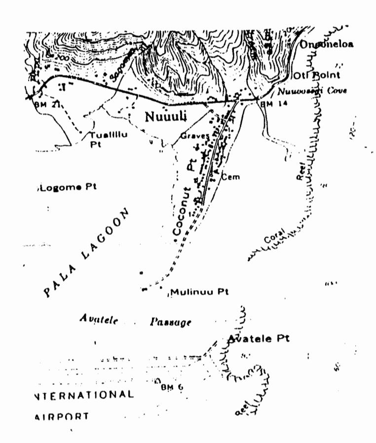

( MAN-MADE CAUSEWAY

NU'UULI

MAP 29

FLORA AND FAUNA

( RARE LAND PLANT

NU'UULI

MAP 29

FLORA AND FAUNA

NU'UULI

MAP 29

FLORA AND FAUNA

( CORAL KILL

\* Avatele Passage is designated a "Special Area" for restoration -- Chap. VI.B.2 (21)

Coconut Point, with depths exceeding 3 feet (1 m) in places. Off the central part of the peninsula, the channel expands into a large triangular-shaped pool with a flat, sandy bottom. Along the seaward margin of this pool, massive coral blocks rise from the sand bottom to the level of the reef platform. The blocks, varying from one to several feet across and over three feet (1 m) high, coalesce seaward with the reef platform. Similar blocks of reef conglomerate form parts of the seaward margin of the channel fronting the northern part of Coconut Point. They alternate with sections where the channel margin shallows toward the reef platform as a rounded bank of loose sand and coral rubble.

The southern part of the inner reef flat is covered with small boulders and low hummocks of coral debris; much of the bottom is coral rubble. At Mulinu'u Point, there is an extensive field of basalt boulders, probably placed there during construction of concrete bunkers for shoreline defense during World War Much of the inner reef platform in the central and northern is composed of limestone boulders, massive coral heads, and consolidated limestone. Sand and rubble deposits occur also. The northern part of the reef has been altered by construction of man-made causeway and dredging. The causeway once extended from the shore near Nu'uo'osegi Cove to the reef margin (16), but has mostly been removed (23), and no longer is exposed at low Borrow pits dredged to depths up to 23 feet (7 m) in the northern sector of reef along the nearshore portion of the causeway have thick deposits of sand on the bottom (16).

# COCONUT POINT

The uncommon shrub, <u>Sophora</u> tomentosa, grows mixed with other species in the sandy soil at the tip of Coconut Point. This plant is restricted in its distribution in American Samoa and is known from only one other location (15).

# SHORELINE

A snail, <u>Planaxis sulcatus</u>, is abundant on intertidal rocks at the northern end of Coconut Point. Hermit crabs and cerithid gastropods are abundant on rubble and small boulders at and just below the base of the beach (16).

# FRINGING REEF FLAT (AT AVATELE PASSAGE)

Living coral has declined on the reef flat and reef front across Avatele Passage since about 1973. A massive coral kill occurred on the reef flat east and southeast of the tip of Coconut Point sometime between November 1972 and July 1973. The area of affected reef was about 20 acres (8 ha), of which about 15 acres (6 ha) had previously supported luxurient coral growth. All corals of the genera Acropora, Montipora, and Pocillopora were killed within a sharply delimited area. Corals of the genera Pavona, Porites, Leptastrea, Galaxea, and Psammocora appeared unaffected. The pattern of dead coral downcurrent from a fish trap and encompassing the reef flat and beyond the reef margin

NU UULI

MAP 29

Ongoineloa

Ont Boint

Nuusossi Cove

Nuuuli

Pt

Avatele Passage

Avatele Pt

Nuternational

BM 6

FLORA AND FAUNA

subject to outflow from Pala Lagoon is suggestive of a substance introduced into the water at a point somewhat north of Mulinu'u Point during an ebbing tide (33). Despite some recolonization of species killed in 1973, sedimentation on the reef flat across Avatele Passage has contributed to declining coral cover since 1972 (36).

Reef corals flourished in most areas of Avatele Passage all depths in early 1972. A notable exception was the absence of in the borrow pits. Presumably, no coral recolonization had occurred on surfaces created by dredging from 1959 to currents and shifting sediment may scour this area and inhibit attachment of coral larvae. Flourishing corals, particularly thickets of staghorn Acropora, covered large areas near the mouth of Avatele Passage at depths from 3 to 16 feet (1 to 5 Some thickets were over 165 feet (50 m) across. The Acropora thickets attenuated from the open ocean entrance of Avatele into Pala Lagoon, where they were replaced in part by extensive colonies of Porites andrewsi (24). Extensive thickets Acropora formosa in the borrow pits bordering the airport enbankment were dead by 1973. Presently, borrow pit bottoms are predominantly sand and silt. Some new banks of A. formosa up to 625 sq. feet (60 sq. m) in area inhabit these deep borrow which also contain beds of green Halimeda algae as extensive as The margins of the channel through Avatele Passage the coral. were at one time covered by extensive banks of Acropora formosa, but all had disappeared by 1973. Occasional heads of A. humilis nana occur on the seaward portion of Avatele reef flat, with heads of A. hyacinthus common throughout. Large patches of hebes, A. exigua, and A. formosa occur in the western portion of Avatele Passage and Pocillipora damicornis and P. verrucosa have become reestablished. Many colonies of Acropora formosa and Pocillopora damicornis have reestablished on the outer reef flat (at depths of 16 to 47 inches or 40 to 120 cm) north of Avatele Point since 1973 (36). Large areas at intermediate depths in the seaward part of the passage are covered by Porites andrewsi, but lutea is the most common species on the reef northwest of Avatele Point. Coral cover in this area is around 21 to 24%. Porites andrewsi dominated the assemblage shifted to P. lutea in more recent years. but dominance has Benthic algal cover has decreased from 16% (1972) to about 8% Few coral heads (less than 2% cover) inhabit the rubble bottom near the airport embankment (34).

Coral cover southeast of Mulinu'u Point averages about 7 to 8% up to 660 feet (200 m) offshore. <u>Psammocora contigua</u> is common. Benthic algae cover 23% of this reef flat (36). Halimeda sp. is particularly high (50 to 85%) within 70 feet (21 m) of shore off Mulinu'u Point (34). In outer Avatele Passage, silt accumulates around broad areas by the alga, Halimeda opuntia (16;34). Several other species of algae grow as epiphytes on the Halimeda (16). The shallow flats across the entrance to Pala Lagoon are carpeted by a dense cover of Dictyota sp. and scattered Padina tenuis, anchored in place by hummocks of Halimeda, which provide most of the firm substratum for attach-

FLORA AND FAUNA

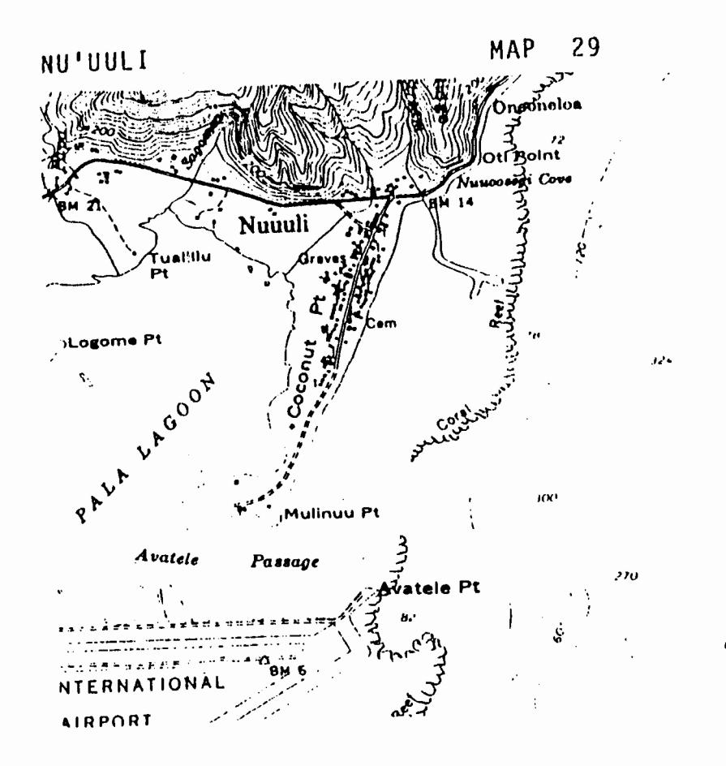

ment by Dictyota (8).

Some Halimeda inhabits the nearshore channel east of Mulinu'u Point. Coral cover nearshore is low, with areas approaching 20% cover occurring beyond 200 feet (60 m) from shore (16). Areas of slightly higher cover (25 to 30 %) occur between 820 to 1150 feet 250 and 350 m) offshore. Pavona is generally most abundant (34). Coral cover on the reef flat east of Mulinu'u Point decreased from 38% in 1972 to 22% in 1978. Although coral cover did not change in the region from shore to 330 feet (100 m) offshore or in the zone between 660 and 990 feet (200 and 300 m), cover declined from 13% in 1972 to less than 4% in 1978 in the region 330 to 660 feet (100 to 200 m) offshore. In the region from 990 to 1300 feet (300 to 400 m) offshore, coral cover declined from nearly 10% in 1972 to less than 2% in 1978. Dominance shifted from Psammocora contigua to Pavona frondifdra. Benthic algal cover averages about 13% (36).

Concentrations of small starfish (<u>Linckia laevigata</u>), are reported on the reef flat east of Mulinu'u Point (3;34). Many species of echinoderms are present on the reef flat east of Mulinu'u Point, but none are abundant. The sea cucumbers, <u>Stichopus</u> and <u>Polyplectana</u>, are common, especially in sandy, shallow areas near shore. The sea urchin, <u>Echinometra mathaei</u>, is conspicuous on rubble and consolidated bottoms offshore (24).

A 1972 survey measured much higher coral cover on the reef flat off Avatele Passage than is now present. In 1972 coral cover averaged about 20% over the first 80 feet (25 m) from shore to greater than 50% of the bottom out to 165 feet (50 m) from shore (24). Today, coral cover is only 10% in the first 330 feet (100 m) from shore. From 330 to 660 feet (100 to 200 m) off shore, cover is less than 4%. From 660 to 990 feet (200 to 300 m) off shore, cover is about 7%. Porites (Synaraea) undulata is common on the outer reef flat, 990 to 1300 feet (300 to 400 m) off shore, where coral cover is less than 2% (34;36). About 1300 feet (400 m) from shore is an algal ridge, where small Acropora humilis occur (34).

At least 43 fish species are recorded in outer Avatele Passage along the margin of the dredged channel which borders the airport. The damselfish, <u>Pomacentrus nigricans</u>, and the scorpionfish, <u>Scorpaenodus guamensis</u>, are most common on the channel margin dropping from near sea level on the reef flat to about 20 feet (6 m) at the rubble channel bottom (24).

A few Acanthaster were observed near the channel bordering the airport embankment in outer Avatele Passage in late 1978. Older residents remember an episode of infestation by the crown-of-thorns starfish on the reef off Nu'uuli about 50 years ago (34). (See also: PALA LAGOON / FLORA AND FAUNA - AVATELE PASSAGE)

FLORA AND FAUNA

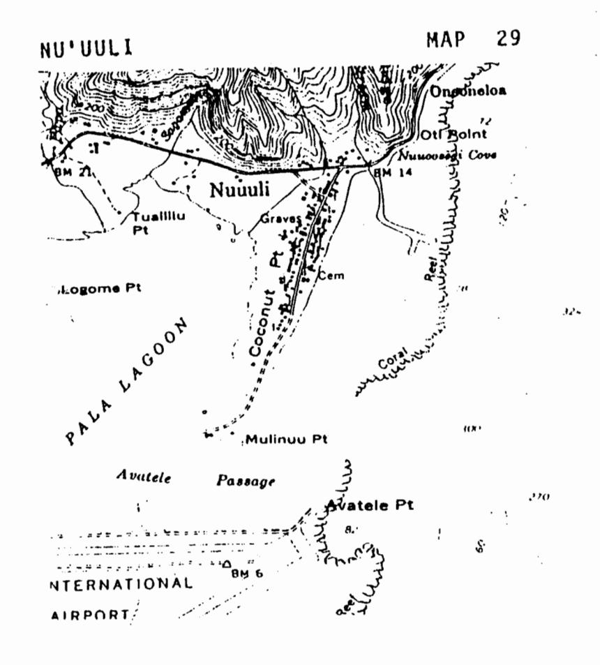

# FRINGING REEF FLAT (OFF COCONUT POINT)

Coral cover is low in the nearshore channel off Coconut Point. Small colonies of Porites lutea, Pocillopora damicornis, and Cyphastrea microphthalma are present. Nearshore, the sand-bottom channel harbors several large sponges (more prominent on the central and northern reef segments), a sea cucumber (Synapta maculata), and several species of sand-dwelling gastropods, of which a conch (Strombus maculatus) is most conspicuous. Tubeworms (Chaetopteridae) are locally abundant, particularly in the central and southern sectors. In the northern sector, alpheid shrimp, sharing burrows with a goby fish, are abundant. Colonies of soft coral (Palythoa sp.) occur in the central sector. The seaweed, Halimeda macroloba, and the seagrass, Halophila oyalis, are common.

Algae are the dominant forms on rubble and small boulders along the seaward margin of the channel and on the reef platform (16). Algal turfs cover most of the solid surfaces in the channel with fleshy crusts also common on limestone fragments. Cover by turf-forming species decreases toward the seaward margin of the reef flat to be replaced by encrusting coralline algae. Halimeda opuntia is common in interstices of rubble on the reef flat (8). The abundance of benthic algae increases in the direction of Mulinu'u Point, where total cover reaches 50 percent or more in some areas (16;34). Dictyota sp. is dominant and Halimeda opuntia is conspicuous (16).

Well-developed heads of Porites andrewsi, Porites sp., soft coral, Sinularia conferta, occur widely scattered over the seaward margin of the "boat channel". Coral cover is generally less than 10% along this margin and on the inner reef flat beyond. Regions of higher cover (15 to 25%) occur where Pavona frondifera predominates (16). Coral covers up to 50% of the bottom in at least one area north of Mulinu'u Point, where Pavona is the chief contributor to a low irregular bank along the outer margin of the nearshore channel (33;34). \*Psammocora Pocillopora damicornis was very abundant near this ridge". In 1978, it had disappeared from this area. No trace of corals of the genera Acropora, Pocillopora, or Montipora were observed within 660 feet (200 m) from Mulinu'u Point in 1978. Substantial numbers of these species were present in 1974, prior to a major kill of corals on this part of the reef (36).

The coral assemblage on the inner reef flat off the southern part of Coconut Point is dominated by <u>Pavona frondifera</u> and an assemblage of <u>Porites andrewsi</u> and the soft coral, <u>Sinularia conferta</u>. <u>Psammocora contigua</u> is the dominant species off Mulinu'u Point. A belt of rubble largely barren of live coral or fleshy algae occurs over 330 feet (100 m) offshore (16).

Diversity of live corals is greater along the central portion of the inner reef platform fronting Nu'uuli than elsewhere, but most colonies are small and cover is less than 10%. Coral coverage is higher on the inner reef flat in the northern portion

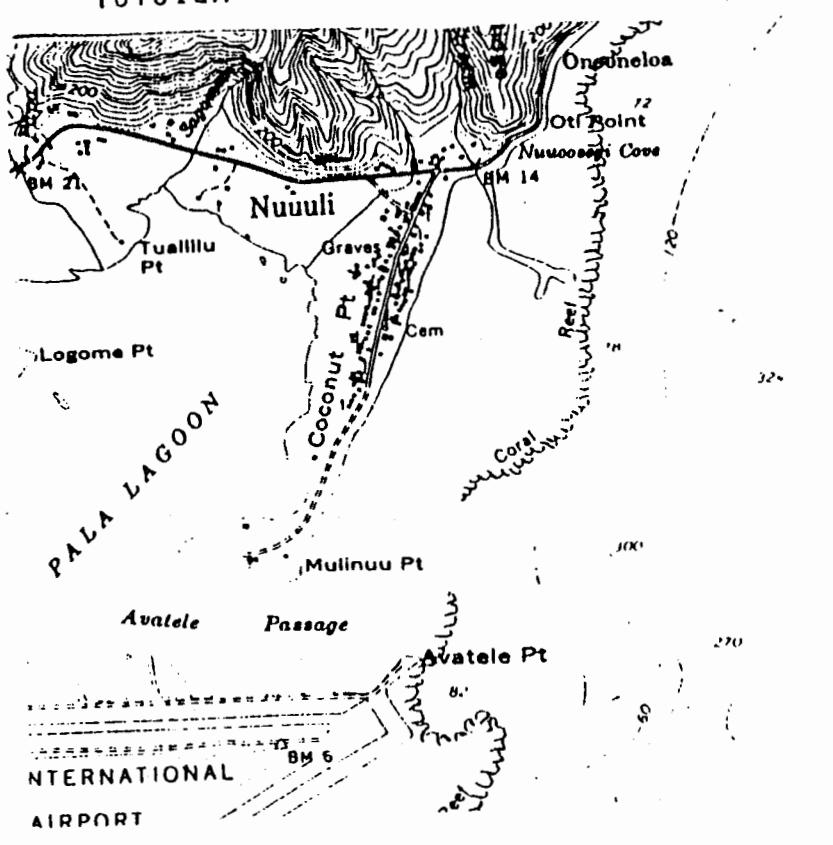

NU'UULI

MAP 29

FLORA AND FAUNA

NU'UULI

MAP 29

WATER CONDITIONS:

( HURRICANE DAMAGE

Nu'uuli reef than in the central and southern regions where o f the reef flat is shallower. Characteristic species are lutea and P. andrewsi. Algal cover is low on the inner reef platform off central and northern Coconut Point, where turf-forming species predominate. The sea urchin, Echinometra mathaei, is abundant here. Several areas of luxuriant coral growth occur on outer reef flat. The reef flat along the former course of a causeway is generally barren of corals, but the man-made undisturbed reef flat in this area, including the seaward margins of borrow pits, are covered with a great many coral species, some forming massive heads. Sand at the bottom of dredged borrow pits is shaped into low hummocks and mounds by burrowing worms and crustaceans. Numerous burrows of an alpheid shrimp (each burrow occupied by a small goby fish) occur within and around the Nu'uli borrow pits (16). Live coral is far more abundant (8) diverse on the outer reef flat, over 660 feet (200 m) from shore (16).

Few fishes inhabit the inner reef flat. Mullet (Mugilidae), juvenile rabbitfish (Siganidae), goatfish (Mullidae), and a small baitfish occur in schools in the nearshore "boat channel". Juveniles of a number of reef fishes inhabit the middle reef platform (16). The outer reef flat harbors a diverse fish fauna, but populations are not abundant. Stegastes albofasciatus and Glyphidodontops leucopomus are most abundant of at least 47 species. Although not abundant, G. glaucus and Scarus sp., are common (76).

#### FRINGING REEF FRONT

The fish fauna associated with the reef front is much more diverse than that of the reef flat. At least 107 species are present, but none are particularly abundant. Pomacentrus melanopterus, Plectroglyphidodon dickii, and Ctenochaetus striatus are most common (76).

# FRINGING REEF

The shoreline of Coconut Point is vulnerable to damage from storm waves. During the January 1966 hurricane, high waves damaged seawalls and caused extensive flooding in Nu'uuli. Many houses had to be rebuilt as a result of the hurricane and some of these have been built directly on the beach berm. Since the hurricane, a number of seawalls have been built seaward of the existing berm and fill placed behind them (66).

At times, a strong current flows through Avatele Passage, especially in the dredged channel contiguous to the airport extension at Avatele Point (34). Strong currents flow around Mulinu'u Point into Pala Lagoon on a rising tide (16;36). Longshore currents flowing through the channel bordering the entire length of Coconut Point are also strong under high surf conditions (16).

The water quality of the Nu'uuli reef area is generally

NU'UULI

MAP 29

USE CONSIDERATIONS

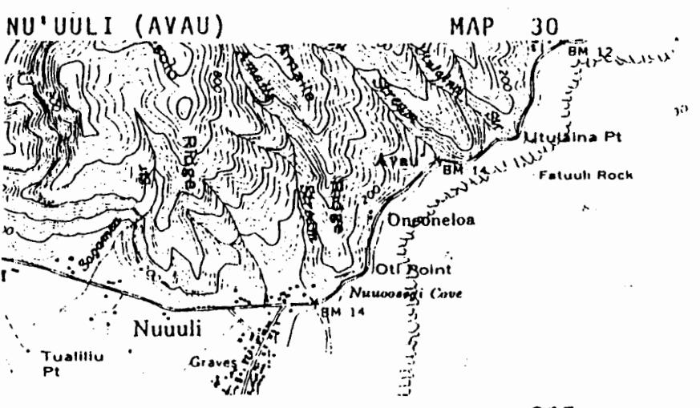

PHYSIOGRAPHY.

JUULIN OLHINAL GUAJI

quite good. Slightly reduced water quality near the borrow pit area adjacent to Amaile Stream is evidenced by elevated turbidity and depressed dissolved oxygen and salinity levels. These conditions are attributed to proximity to the mouth of Amaile Stream and ground water seepage at the shore, as well as sluggish circulation of waters in the borrow pits. Large quantities of silt enter nearshore waters during periods of high flow through Amaile Stream (16).

#### FRINGING REEF

The broad reef fringing Coconut Point and Nu'uuli Village northeastward toward Utulaina Point is frequently used for fishing. The reef flat is the focal point for most activity (20), and the portion directly offshore of Nu'uuli Village is considered a "critical use reef area" because of subsistence fishing villagers (39). Reef gleaning is the most popular activity, followed by fishing with rod and reel and/or bamboo poles. Throw netting (kili) is practiced to a lesser extent. Day gleaning yields fe'e (octopus), tuitui and sava'e (sea urchins), and eel. Night gleaning is primarily for alili (sea snails). Day fishing with rod and reel results in catches of malauli (large jack), lupota (small jack), and gatala (honeycomb grouper). mataeleele (small emperor fish) are caught day and night with bamboo poles. Day catches include lupo (juvenile jack), lupota, (small parrotfish), and other coral reef species. Niglt catches include malau (squirrelfish), malai (paddletail snapper), savane (blue-lined snapper), matapula (bigeye snapper), and sumu (triggerfish) (20).

The channel along Coconut Point and Avatele Passage are sometimes used for net fishing and trapping (using wire-mesh fish traps). Most pole and line fishing is accomplished from the reef margin when the surf is down. Octopus is taken from the reef flat, but the Nu'uuli reef is not as productive as many other areas. The nearshore sand bottom is a popular swimming area for Nu'uuli villagers. Prior to loss of sand due to erosion, the Coconut Point beach was a popular recreation area (16).

# COAST BETWEEN NU'UO'OSEGI COVE AND UTULAINA POINT

#### SHORELINE

Villages between Nu'uuli and Pago Pago Harbor are situated at the mouths of short, narrow valleys. A coastal highway follows the shore. The highway appears to have been constructed partly on the beach berm, partly on revetted fill, and partly cut into steep rock slopes that extend to the shoreline. Consequently, most of this highway is subject to shoreline erosion, particularly during storm wave attack. Much of the shoreline is protected by a concrete-grouted, boulder revetment, showing evidence of random dumping of rock and concrete rubble (63). Some sections of the revetment have collapsed or are failing due to erosion of material from beneath the toe. Construction of a

NU'UULI (AVAU)

MAP 30

PHYSIOGRAPHY

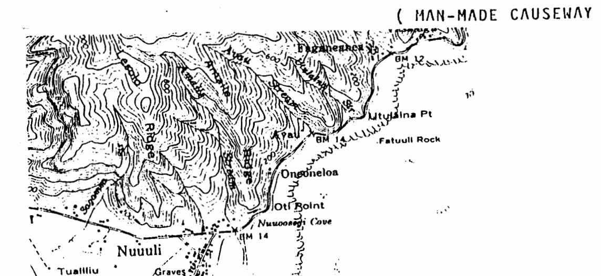

NU'UULI (AVAU)

MAP 30

FLORA AND FAUNA

revetment is planned to protect the shoreline northeast of Oti Point (49). Most of the shoreline northeast from Nu'uo'osegi Cove to Oneoneloa Village consists of grouted riprap revetment up to 18 feet (6 m) high near Oneoneloa (ASCRI-30S1). Although sand beaches are absent, a 20 to 30 foot (6 to 9 m) strip of volcanic boulders and rubble, with calcareous sand and rubble, is exposed along the shore at low tide (63).

# NU'UO'OSEGI COVE

A man-made causeway 3 to 5 feet (1 to 1.5 m) high projects from shore near the mouth of Amaile Stream. The 45-foot wide peninsula, extending 150 feet from shore into Nu'uo'osegi Cove, was used in the excavation of borrow pits on the northern portion of Nu'uli reef flat. Most of the causeway has been removed (49; ASCRI-30S1). Nearshore is a depression containing silty-sand, rubble, and basalt boulders. Depth at low tide is 3 to 4 feet (1.0 to 1.2 m). Nearshore areas on both sides of the causeway were dredged for fill. The foreshore is the delta of Amaile Stream, consisting of basalt cobbles and limestone rubble (49).

Northeast of the old causeway, the backshore bank is a steep scarp rising from the rubble foreshore to the 16-foot (5 m) elevation. The scarp is partially vegetated (49). The nearshore depression is not evident in the northeastern portion of Nu'uo'o-segi Cove, where nearshore areas are covered by volcanic boulders, gravel, and sand (ASCRI-30B1).

The middle reef, from 200 feet (60 m) to about 550 feet m) offshore, shoals to a depth of 6 inches (15 cm), with depressions to 4 feet (1.2 m). Sand and rubble cover is considerbetween areas of consolidated limestone (ASCRI-30B2). Irregular limestone formations separated by a rubble bottom to feet (0.6 m) deep grade to a more regular and uniform platform of consolidated limestone shoaling to 3 inches (8 cm). The outer reef, from 500 to 900 feet (155 to 275 m) offshore, is generally less than one foot (0.3 m) in depth at low tide. Areas of rubble and dead coral are considerable, covering about half the bottom. Some areas near the reef margin are exposed at low Boulders are exposed at low tide on the outer reef south Nu'uo'osegi Cove. Some unconsolidated rubble and boulders occur on the consolidated limestone pavement near the reef margin (ASCRI-30B3). The consolidated reef margin, over 1000 feet (305 m) from shore, shoals nearly to sea level and is characterized by an algal ridge and spur-and-groove structures (ASCRI-30B4).

#### FRINGING REEF

Coral cover ranges from 5% to 25% in a nearshore depression northeast of the old causeway in Nu'uo'osegi Cove. Porites lutea, P. andrewsi, and Pavona frondifera are the principal coral species. The brown alga, <u>Dictyota</u> sp., is abundant and <u>Halimeda opuntia</u>, <u>Actinotrichia</u> sp., <u>Valonia</u> sp., and <u>Galaxaura marginata are present. On the shoaling bottom 75 feet (25 m) offshore, Porites lutea and Pavona frondifera are common. A few sea</u>

FLORA AND FAUNA

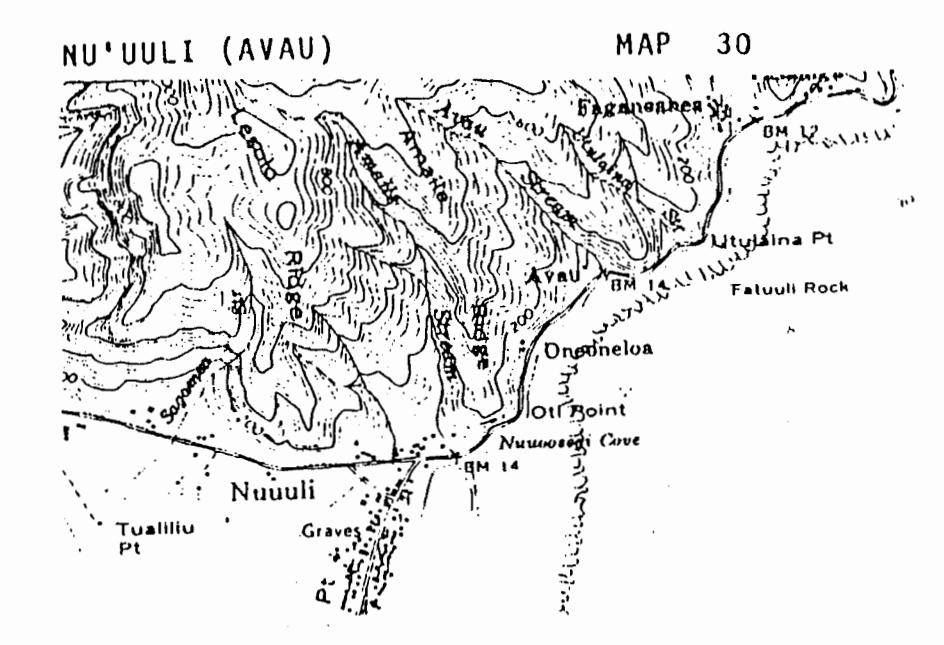

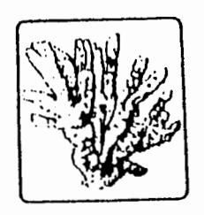

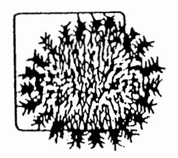

urchins (Echinometra mathaei) and shrimp (Stenopus hispidus) are present. Damselfishes are the most visible fishes (ASCRI-30B1).

Coral cover is patchy on the middle reef, ranging from 10 to 50%. Irregular thickets of Pavona frondifera occupy depressions. Some shallow areas of heavy Pavona growth are difficult to traverse on foot without crushing the coral. Coral cover is low in the northeastern part of Nu'uo'osegi Cove and consists mostly of Pavona frondifera. Several fleshy algae are present in low abundance: Actinotrichia sp., Lobophora sp., Galaxaura oblongata, and, on the rubble bottom areas, patches of a reddish cyanophyte (blue-green). Dictyota sp. covers much of the hard bottom but abundance is reduced compared with that on the inner reef. The sea urchin, Echinometra mathaei, is present under loose rocks. Sides and undercuts of limestone outcrops are inhabited by colonies of Rhodactis howei, a brown sea anemone (called matalele pr matamalu) (ASCRI-30B2).

Coral cover ranges from 30% to 60% on the irregular limestone forming the transition between middle and outer reef area. Pavona frondifera is most abundant. The brown alga, Ralfsia sp., and encrusting nullipores are common on dead corals. A spikey red alga occurs in places on the outer reef off the northeast end of Nu'uo'osegi Cove. Occasional starfish (Linckia laevigata), and xanthid crabs (Actaea tomentosa), are present in crevices and under rocks (ASCRI-30B3).

Near the reef margin, crown-of-thorns starfish (alamea; Acanthaster planci) and sea urchins (Echinothrix spp. and Diadema spp.), are conspicuous in small holes. Yellowish/pink coralline algae encrust much of the limestone pavement. Amphiroa sp. also occurs. A pink didemnid tunicate is common on the lower side of boulders. Corals cover up to 10% of the reef margin. Just shoreward of the margin there is a limestone pavement with coral cover of less than 5%, dominated by Pavona frondifera. species, including Acropora aspera and other acroporans, inhabit the margin. At least 22 coral species in 12 genera are represented on the reef off Nu'uo'osegi Cove, most of the diversity occurring at the reef margin. The reef margin also has high cover of a low-growing branched coralline alga. An occasional sea urchin (Echinostrephus sp.) occurs in pits (ASCRI-30B4).

Numbers of the crown-of-thorns starfish (alamea; Acanthaster planci) were first reported on reef flats between Nu'uuli and Pago Pago Harbor in late 1977 (74). This fringing reef, in the "shadow" of offshore banks where initial infestations were noted (See TAEMA AND NAFANUA BANKS), was an early locus of Acanthaster infestation. By December 1977, 75 to 90% of the live coral on the reef flats between Nu'uuli and Pago Pago Harbor was destroyed by the starfish (45). Most of the reef flat between Nu'uuli and Fatumafuti (MAP 3) was heavily infested by Acanthaster in early 1978. Acanthaster was seen on the reef front seaward of the infested reef flats, but corals were largely undamaged there (73;74).

NU'UULI

MAP 30

USE CONSIDERATIONS

PHYSIOGRAPHY

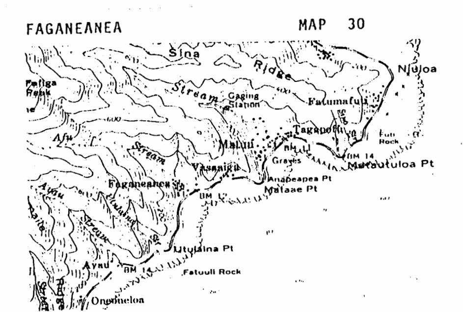

230

# NU'UO'OSEGI COVE

A depression dredged in the inner reef just northeast of the old causeway in Nu'uo'osegi Cove is used for swimming. Spearing for small fishes and octopus (fe'e) takes place in depressions around a small seastack off Amaile Stream. Sea anemones (matamalu) are collected on the middle reef off the causeway and along the edges of borrow pits southwest of Nu'uo'osegi Cove. Some net fishing occurs on the reef flat fronting Oneoneloa Village (ASCRI).

Good surfing is possible off Nu'uo'osegi Cove from November through March. The best conditions occur with a northwest wind (or calm) and a rising tide (51).

# COAST BETWEEN UTULAINA POINT AND MATA'AE POINT

# SHORELINE

The highway paralleling the coastline between Point around Mata'ae Point to Niuloa Point was constructed partly on the backshore berm, partly on revetted fill, and partly benched into steep basalt slopes at several minor headlands along the route. Much of the highway is subject to damage particularly during storm wave conditions shoreline erosion, (49:63). A typical cross section of the shoreline through area consists of a steep embankment dropping from the road elevation of 12 feet (4 m) down to the 4-foot (1 m) elevation. Much of the shoreline bank is protected by concrete-grouted riprap revetment with some randomly-dumped rock and rubble. Lack of adequate toe protection has allowed severe erosion to occur behind the revetment, often leaving a hollow shell separated from the shoreline. A steep rock and limestone rubble foreshore lines the base of the road embankment. Construction of two shoreline protection revetments has been authorized by the Corps of Engineers for this section of coast (49).

Much of the shoreline between Utulaina Point and Mata'ae Point is large basalt boulders rising up to 10 feet (3 m) above the reef flat. At the base of the boulders there occurs rubble and some gravelly-sand (ASCRI-30S1). A short distance west of Utulaina Point there is a small beach of sand containing some rocks. High tide reaches to the base of a sloping seawall at the point, where a beach is lacking (48).

Fronting the village of Faganeanea, a steep beach about 30 feet (9 m) wide is exposed at low tide. The upper beach consists mostly of basalt boulders (some up to 3 feet or 1 m across), and fragments of cement broken from the seawall. The lower beach is mostly sand (48).

PHYSIOGRAPHY

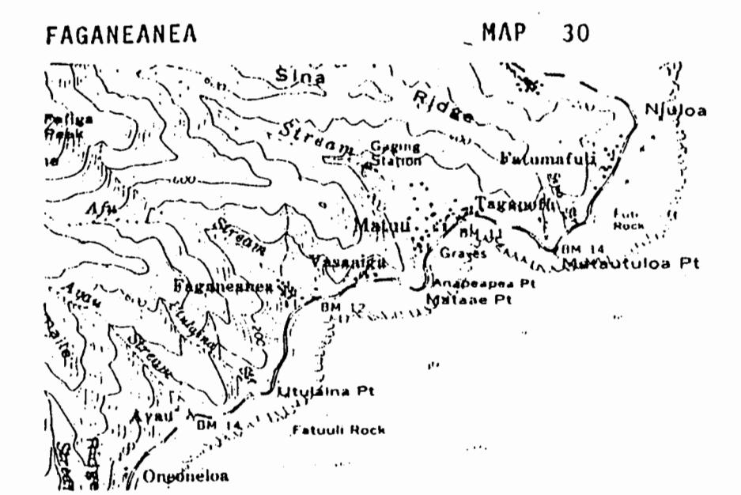

FAGANEANEA

MAP 30

FLORA AND FAUNA

#### FRINGING REEF

The fringing reef extends 350 to 900 feet (105 to 275 m) offshore at a depth of one to 2 feet off the section of coast between Utulaina Point and Mata'ae Point (49). A boulder tract is exposed at low tide on the reef flat southwest of Utulaina Point (ASCRI). The inner reef flat consists primarily of small boulders veneered by a matrix of sand and algae. Areas between boulders are sand. The depth 80 feet (25 m) offshore is about 1 foot (0.3 m). From 80 to 165 feet (25 to 50 m) offshore, the bottom shoals gradually to 4 inches (10 cm), and the shallowest portion of the reef flat occurs around 210 feet (55 m) offshore. Depth increases to 2.5 feet (0.8 m) as the reef flat slopes gradually seaward beyond 210 feet (55 m) from shore. This region exhibits a small-scale spur-and-groove system (48).

The broadest section of reef off Faganeanea Village occurs north of Utulaina Point. A zone beginning a few feet from shore and extending 80 to 165 feet (25 to 50 m) seaward is characterized by irregular, narrow channels in a limestone bottom. The channel bottoms contain sand and rubble (48).

Coarse sand and rounded stones from boulder size to small pebbles cover the inner reef flat off Faganeanea Village. 80 feet (25 m) offshore, the depth is 3 feet (1 m). Beyond 80 feet (25 m) from shore, the bottom changes from sand to limestone The rubble bottom extends to 245 feet (75 m) offshore. Limestone rubble and dead coral heads cover about equal proportions of the outer reef, from 245 feet (75 m) offshore to the margin of the reef off Vasa'aiga Village. Depth increases to nearly 6 feet (2 m) about 245 fdet (75 m) offshore and reaches 9 feet (3 m) along the ava margin. Channe 1 sides consist of limestone rubble and sand dropping to a depth of approximately 26 feet (8 m) at a slope of about 45 degrees. A large outcrop of rock with a cave beneath is situated at the head of the channel (48).

# FRINGING REEF

Live coral cover is about 5% south of Utulaina Point and consists of small colonies of Porites lutea, Leptastrea purpurea, and Acropora humilis. Several colonies of the soft coral, Sclerophytum sp., are present about 40 feet (12 m) offshore. Colonies of Psammocora, Pavona, and Pocillopora damicornis, occur beyond 50 feet (15 m) from shore. The small sea urchin, Echinostrephus sp., appears in holes in limestone rock. The sea cucumber, Stichopus chloronotus, is unusually abundant in this zone. Small heads of Acropora predominate in the outer part of the zone to 80 feet (25 m) from shore. The most common fishes are Glyphidodontops leucopomus, Acanthurus triostegus, and Halichoeres margaritaceus. Pocillopora verrucosa occurs beyond 80 feet (25 m) from shore and contributes to a total coral cover of about 15% in the zone to 165 feet (50 m) from shore. Coral on the shoaling bottom consists of low and/or encrusting forms. The encrusting coralline alga, Porolithon sp., is progressively more abundant

FLORA AND FAUNA

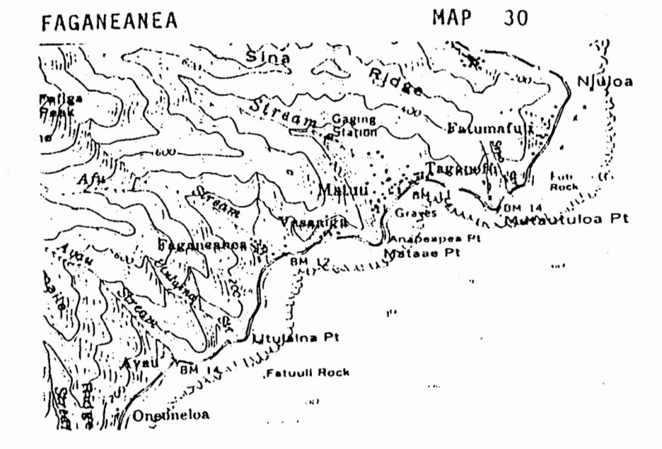

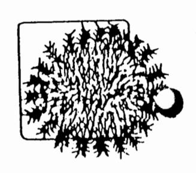

toward the outer part of the reef flat where <u>Favites</u> coral occurs. Fishes are uncommon on the mid-reef flat (48).

Fronting Faganeanea Village a few unattached heads of Porites lutea are scattered on the inner reef flat within 80 feet (25 m) from shore. These show evidence of shoreward transport by Boulders in this area have traces of algae. Blennies (Istiblennius) are abundant at the low water line along the boulder-strewn shore north of Utulaina Point. No other fishes are Attached live coral is present in the region evident inshore. from 80 to 165 feet (25 to 50 m) offshore. Nearly all coral is Porites lutea and bottom cover totals less than 5%. Algae are more abundant than inshore. Fishes are not evident until 80 feet (25 m) offshore, where Halichoeres trimaculatus, Parupeneus trifasciatus, and Stethojulis bandanensis are present. Halichoeres margaritaceus, juvenile <u>Acanthurus triostegus</u>, <u>Glyphidodontops</u> <u>leucopomus</u>, <u>G. unimaculatus</u>, and <u>Stegastes</u> <u>albofasciatus</u> occur between 80 and 165 feet (25 and 50 m) offshore. cover increases slightly beyond 165 feet from shore. A small amount of encrusting Montipora and P. lutea occur here. money cowrie, Cypraea moneta, is moderately common. A few sea cucumbers, Stichopus chloronotus, and the sea urchin, Echinometra mathaei, are present (48). Farther out on the reef flat, approximately 245 to 410 feet (75 to 125 m) from shore, there is an area of branching Acropora corymbosa. The tips of some corals are just exposed at low tide (48).

Coral cover increases toward the margin of the ava off Vasa'aiga Village, although total cover does not exceed 10%. Large heads of Porites lutea are alive only around their periphery. One head of Coscinaraea columna measures 11 feet (3.5 m) across and 2 feet (0.6 m) high. Some small heads of Pocillopora verrucosa and Acropora spp. occur. Limestone on the outer reef is largely covered with encrusting coralline algae. In addition to previously mentioned fishes, common species include Acanthurus nigrofuscus, Chaetodon citrinellus, Halichoeres centriquadrus, Thalassoma hardwickei, T. quinquevittatus, and Pomacentrus vaiuli. Acanthurus maculiceps was observed here in small numbers (first record for Samoa). A school of sub-adult Acanthurus olivaceus was also observed (48).

Fishes are abundant along the ava margins. Several species of parrotfishes (Scarus oviceps, S. ghobban, and others) and surgeonfishes (Acanthurus triostegus and A. nigroris) are most abundant. Adults of Ctenochaetus striatus and juveniles of Acanthurus lineatus are common. Two large colonies of the soft coral, Sclerophytum, occur along the channel margin (48).

The crown-of-thorns starfish (alamea; Acanthaster planci) was present on the reef frout off Faganeanea Village in May 1978, and numerous feeding scars on corals were seen at depths of 43 to 66 feet (13 to 20 m). Most coral at greater depths appeared to have been killed at an earlier time (74).

**FAGANEANEA** 

MAP 30

WATER CONDITIONS

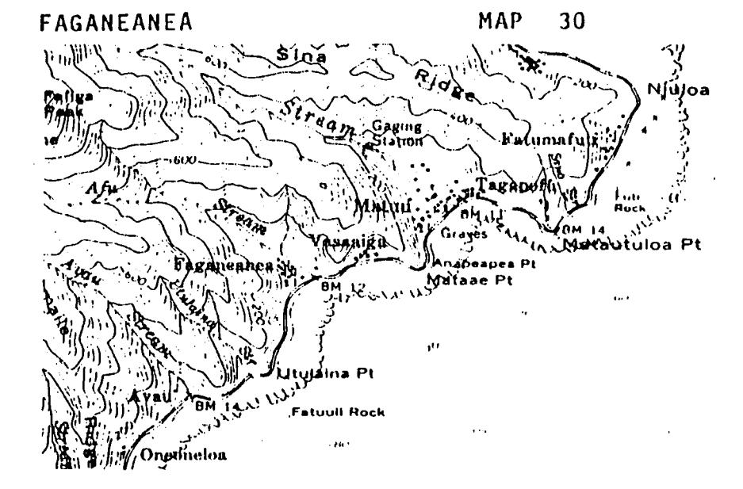

USE CONSIDERATIONS

# FRINGING REEF

A strong rip current flows seaward through the major ava off Vasa'aiga Village. Strong longshore currents flow over Faganeanea reef in a northwest direction toward the ava.

Inshore waters north of Utulaina Point are relatively turbid. Underwater visibility is reduced to no better than 3 feet (1 m) within 80 feet (25 m) from shore fronting Faganeanea Village. Visibility improves to about 30 feet (9 m) in the region from 80 to 165 feet (25 to 50 m) offshore (48).

#### FRINGING REEF

The reef fringing the coast between Utulaina Point and Mata'ae Point is considered a "critical use reef area" because of subsistence fishing by villagers (39). The most frequently-fished area is the reef flat, where pole fishing, with rod and reel and bamboo poles, and spearing with home-made spears (mata) preferred activities. Although reef gleaning is reportedly the second most popular fishing method (20), the largest proportion the fishing effort at Faganeanea goes into night and day gleaning (76). Day spearing and bamboo pole fishing receive a smaller proportion of effort. Rod and reel fishing follows in level of fishing effort. Other activities (throw-netting, seine night diving) are relatively light (76). Some throw netting also occurs here. Rod and reel fishing results in catches of malauli (large jack), lupota (small jack), gatala (honeycomb grouper). Pole and line fishing brings in day and night catches of gatala and mataeleele (small emperor fish). Lupo (juvenile jack), lupota, fuga (small parrotfish), and other coral reef species are caught by day. Malau (squirrelfash), malai (paddletail snapper), savane (blue-lined snapper), matapula (bigeye snapper), and sumu (triggerfish) are the usual nighttime catch by this method. Spearing yields day and night catches of alogo (lined surgeonfish), pone (chocolate surgeonfish), and laea (larg r parrotfish). Day catches include fe'e (octopuo), gatala, malauli, and eel. Night catches of crab and ula (spiny lobster) are common. Day gleaning results in catches of fe'e, tuitui and sava'e (sea urchins), and eel. Night gleaning is primarily for alili (sea snail). Throw-netting is a daytime activity, usually catching fuafua (juvenile mullet), manini (convict tang), alogo, pone, and, seasonally, i'asina (juvenile goatfish) and lo (rabbitfish) (20).

Pole fishermen catch small jacks (<u>Caranx melampygus</u>), goatfishes (<u>Parupeneus trifasciatus</u>), and snapper (<u>Lutjanus monostigmus</u>) off Utulaina Point. Gleaners find octopus on the reef between the villages of Faganeanea and Vasa'aiga at low tide. Board surfers ride waves off Vasa'aiga Village, and use the current in the ava to reach the offshore surf break. Some rod and reel fishing takes place along the northeastern margin of the ava (48).

Good surfing is possible between November and March under

FAGANEANEA

MAP 30

USE CONSIDERATIONS

MATU'U

MAP 30

PHYSIOGRAPHY

MATU'U

MAP 30

PHYSIOGRAPHY

MATU'U

MAP 30

PHYSIOGRAPHY

Machine Daganennea in the machine in the machine in the machine in the machine in the machine in the machine in the machine in the machine in the machine in the machine in the machine in the machine in the machine in the machine in the machine in the machine in the machine in the machine in the machine in the machine in the machine in the machine in the machine in the machine in the machine in the machine in the machine in the machine in the machine in the machine in the machine in the machine in the machine in the machine in the machine in the machine in the machine in the machine in the machine in the machine in the machine in the machine in the machine in the machine in the machine in the machine in the machine in the machine in the machine in the machine in the machine in the machine in the machine in the machine in the machine in the machine in the machine in the machine in the machine in the machine in the machine in the machine in the machine in the machine in the machine in the machine in the machine in the machine in the machine in the machine in the machine in the machine in the machine in the machine in the machine in the machine in the machine in the machine in the machine in the machine in the machine in the machine in the machine in the machine in the machine in the machine in the machine in the machine in the machine in the machine in the machine in the machine in the machine in the machine in the machine in the machine in the machine in the machine in the machine in the machine in the machine in the machine in the machine in the machine in the machine in the machine in the machine in the machine in the machine in the machine in the machine in the machine in the machine in the machine in the machine in the machine in the machine in the machine in the machine in the machine in the machine in the machine in the machine in the machine in the machine in the machine in the machine in the machine in the machine in the machine in the machine in the machine in the machine in the machine in the machine in

eapea Pt

MATU'U

MAP 30

FLORA AND FAUNA

MATU'U

MAP 30

FLORA AND FAUNA

certain conditions near Fatu'uli Rock off Utalaina Point, as well as off Vasa'aiga Village. A rising tide and either calm winds or northwest winds produce the best conditions (51).

# COAST BETWEEN MATA'AE POINT AND MATAUTULOA POINT

# ANAPE'APE'A POINT CAVE

A cave at Mata'ae Point is about 26 feet (8 m) high and 20 feet (6 m) deep. Its floor is covered with blocks fallen from the cave roof. The height of the floor is at least 13 feet (4 m) above high tide level (12).

# SHORELINE -

A section of the shoreline road northeast of Mata'ae Point embankment is protected by randomly-dumped basalt boulders and concrete chunks. Fronting the center of Mata'ae Village is an 875-foot length of shoreline protected by a revetment built by the Army Corps of Engineers (49;70).

#### FRINGING REEF

A reef about 300 feet (90 m) wide fringes the coast off of the villages of Matu'u and Tagapofu. A large channel (ava) cuts through the reef in front of Matu'u Village. The ava margins are irregular, and are undercut in several places to a depth of 40 feet (34). West of Matautuloa Point, a depression along the inshore area extends nearly to the base of the boulder revetment at the shoreline. The depression is about 4 feet (1.2 m) deep, with a bottom of silty-sand and small limestone outcrops (ASCRI-30B5). The depression extends up to 40 feet (12 m) seaward, where it shoals to a middle reef flat of consolidated limestone pavement. Awash at low tide, the middle reef extends about 150 feet (45 m) from shore (ASCRI-30B6). The reef margin is about 20 feet (6 m) across and an algal ridge is elevated one foot (0.3 m) above the adjacent reef flat. This ridge is exposed at low tide but awash with heavy surf. Spur-and-groove systems are not well developed (ASCRI-30B7). The reef front is steep (ASCRI-30B8).

#### ANAPE'APE'A CAVE

A small colony of the uncommon sheath-tailed bat (pe'ape'avai; Emballonura semicaudata), roosts in a cave near Mata'ae Point. Disturbance by humans may cause disruption of breeding cycles (15).

# FRINGING REEF FLAT

Corals cover about 50% of the bottom of the depression on the inner reef flat west of Matautuloa Point. Acropora formosa is abundant, growing in thickets up to 12 feet (4 m) across and 1.5 feet (0.4 m) high. Encrusting corals (Cyphastrea, Leptoria, Hydnophora) and large colonies of Pocillopora damicornis are

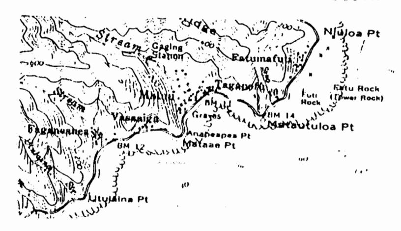

MATU'U

MAP 30

FLORA AND FAUNA

MATU'U

MAP 30

WATER CONDITIONS

present. Small undercut limestone outcrops shelter a variety of invertebrates and fishes. Patches of soft corals (<u>Sarcophyton sp.</u> and <u>Sinularia</u> sp.) are common. Coralline algae (<u>Porolithon sp.</u> and others) are common (ASCRI-30B5).

The middle reef platform is heavily encrusted by <u>Porolithon</u> sp. and other coralline algae. The green alga, <u>Dictyosphaeria</u> <u>versluysii</u>, is abundant. Although corals are absent from the shallow limestone pavement, short-branched and encrusting forms (<u>Acropora aspera</u> and <u>Pocillopora verrucosa</u>) total about 3% cover in slightly depressed areas. A small xanthid crab (<u>Actaea tomentosa</u>) is common (ASCRI-30B6).

At low tide, most of the reef flat between shore and the outer margin is exposed and only a few pools of water support fishes (mostly damselfishes, blennies, and some juvenile wrasses). During high tides, large fish presumably move onto the reef flat (ASCRI-30F1).

Live coral, mostly patches of <u>Acropora humilis</u>, cover about 5% of the outer reef and margin. Plates of dead, algal-covered A. <u>humilis</u> are consolidated at the reef margin. They presumably died as part of an extensive kill of this species along the coast in July 1973. Patches of <u>Palythoa</u> sp. are conspicuous, but otherwise the wave-exposed margin is without other noticeable invertebrates. Encrusting coralline algae (especially <u>Porolithon</u>) are abundant on the reef margin. <u>Dicytosphaeria versluysii</u> is common (ASCRI-30B7).

#### FRINGING REEF FRONT

Large colonies of <u>Porites lutea</u> and other corals inhabit the steep reef front (ASCRI-30B8). The crown-of-thorns starfish (alamea; <u>Acanthaster planci</u>) was not observed in late 1978, but some feeding scars were evident (34). A single <u>Acanthaster</u> was observed in October 1979 (ASCRI).

The fishes on the reef front are generally abundant. The surgeonfishes, Acanthurus lineatus, A. nigrofuscus, and A. nigroris are conspicuous species. Damselfishes are common. Chromis atripectoralis is the principal species, but C. acares, C. caerulea, Glyphidodontops cyanea, G. leucopomus, Plectroglyphidodon dickii, P. johnstonianus, and Pomacentrus melanopterus are numerous (ASCRI-30F2).

# FRINGING REEF AND AVA

Currents in the depression on the inner reef flat west of Matautuloa Point are generally weak (ASCRI), but periods of high surf generate strong currents in the channel (ava) crossing the reef in front of Matu'u Village (34).

Visibility underwater is about 60 feet (18 m) on the inner reef northwest of Matautuloa Point (ASCRI). Off Tagapofu, rubbish collects at the bottom of narrow indentations in the reef

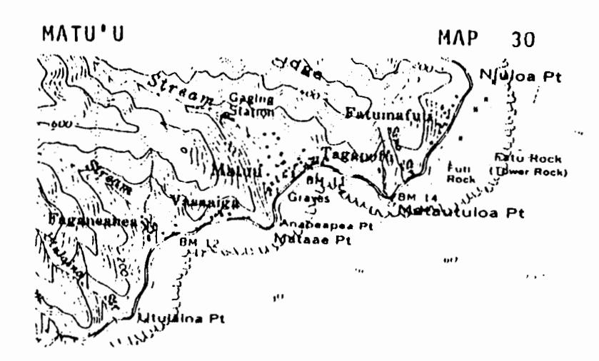

USE CONSIDERATIONS

Fringing reef off Matu'u is a possible "Special Area" of substantial recreational opportunity --- Chap. VI.C.2 (21)

FAGA'ALU (FATUMAFUTI) MAP 3

PHYSIOGRAPHY

FAGA'ALU (FATUMAFUTI) MAP

3

PHYSIOGRAPHY

FAGA'ALU (FATUMAFUTI) MAP

3

PHYSIOGRAPHY

along the margin of a large ava (34).

# FRINGING REEF

Access to the shoreline west of Matautuloa Point is down a relatively steep embankment of large basalt boulders. Caution is required due to the 10 foot (3 m) drop to the reef flat, broken glass, holes, and slippery surfaces (ASCRI). There is no beach nor are conditions favorable for swimming off Matu'u (41).

The reef fringing the coast between Matu'u Point and Matautuloa Point is considered a "critical use reef area" because of subsistence fishing by villagers (39). The most frequently fished area is the reef flat, where pole fishing with rod and reel and bamboo poles and spearing with home-made spears (mata) are preferred activities (20). Day gleaning is a popular activity, as is night gleaning. Day spearing and bamboo pole fishing follow in intensity of effort. Other fishing methods are infrequently used (76). Types of organisms caught be various methods are similar to those reported for Faganeanea (See: FAGANEANEA / USE CONSIDERATIONS).

The reef off Matu'u is popular with sport divers and improvements to access at the shore have been suggested (41). Good surfing is possible between November and March on large waves which form off Matu'u. The best surfing condition require a rising tide and either calm or northwest winds (51).

# COAST BETWEEN MATAUTULOA POINT AND NIULOA POINT

# SHORELINE

The shoreline northeast of Matautuloa Point consists of grouted riprap revetment alternating with basalt outcroppings of three small headlands. Portions of the revetment have been stabilized by accretion of boulders at the toe. Other sections are on the verge of collapse (49). The shoreline fronting the village of Faganeanea is protected by a 1000-foot (300 m) long revetment built by the Corps of Engineers (49;70). A revetment is authorized for the northwestern side of Niuloa Point (49).

# FATU AND FUTI ROCKS

Two large seastacks southwest of the entrance to Pago Pago Harbor (MAP 3) are remnants of an eroded volcanic ridge. These two massive rocks, called Futi and Fatu, project above the surrounding reef to heights of 102 feet (31 m) and 60 feet (18 m) respectively. The top of each rock has a heavy growth of shrubs and trees (78).

# FRINGING REEF

The reef flat fronting Fatuma futi Village has a maximum depth of 3 feet  $(1\ m)$ . Rubble covers most of the bottom (34).

FAGA'ALU (FATUMAFUTI) MAP 3

FLORA AND FAUNA

( SEABIRD NESTING AREA

FAGA'ALU (FATUMAFUTI) MAP 3

FLORA AND FAUNA

FAGA'ALU (FATUMAFUTI)

FLORA AND FAUNA

FAGA'ALU (FATUMAFUTI)

MAP 3

WATER CONDITIONS

FAGA'ALU (FATUMAFUTI) MAP 3 HISTORICAL/ARCHAEOLOGICAL

FAGA'ALU (FATUMAFUTI) MAP 3

USE CONSIDERATIONS

The reef extends 500 feet (150 m) offshore of Niuloa Point (49).

#### FATU AND FUTI ROCKS

A small colony of reef herons (matu'u; Egretta sacra sacra), an uncommon resident seabird, roosts (and may nest) on Fatu Rock. The blue-grey noddy (laia; Procelsterna cerulea), an uncommon resident seabird, may also roost and nest on Fatu and Futi Rocks. The common white tern (manu sina; Gygis alba pacifica) nests on Fatu Rock. Futi Rock is more accessible to humans and subject to mord disturbance than Fatu Rock (15).

# FRINGING REEF FLAT

Low coral cover, consisting of <u>Pavona</u> sp., <u>Porites lutea</u>, <u>Montipora</u> sp., and <u>Leptastrea</u> sp. occurs off Fatumafuti Village (34).

# FRINGING REEF FRONT

Although the crown-of-thorns starfish (alamea; Acanthaster planci) was not observed on the reef front off Fatamafuti Village in May 1978, numerous feeding scars were evident at depths of 66 to 75 fdet (20 to 23 m)(74).

The reef front seaward of Futi Rock harbors a fish assemblage of at least 99 species. Fish abundance is only moderate. Most abundant is <u>Pomacentrus melanopterus</u>, followed by <u>Ctenochaetus striatus</u> and <u>Plectroglyphidodon dickii</u> (76).

# FRINGING REEF

Currents are generally not strong on the inner reef flat fronting Fatumafuti Village, but can be strong seaward of Fatu Rock. Underwater vasibility is reported to be about 100 feet (31 m) on the reef flat fronting Fatumafuti Village (34).

#### FATU AND FUTI ROCKS

According to Samoan legend, Futi (also known as Tower Rock) represents a woman who has turned to stone. Fatu (also known as Flower Pot) is said to be a man also turned to stone. It is said that the spirits of the two return to haunt the area during moonless nights (30).

#### FRINGING REEF

The reef fringing the coast between Matautuloa Point and Niuloa Point is frequently used for fishing. The preferred activity is reef gleaning, followed by diving. Less popular fishing methods are throw-netting and fishing with rod and reel. Day gleaning yields fe'e (octopus), tuitui and sava'e (sea urchins), and eel. Night gleaning is primarily for alili (sea snails). Spearing results in day and night catches of alogo (lined surgeonfish), pone (chocolate surgeonfish), and laea (large parrot-

FAGA'ALU (FATUMAFUTI) MAP 3

USE CONSIDERATIONS

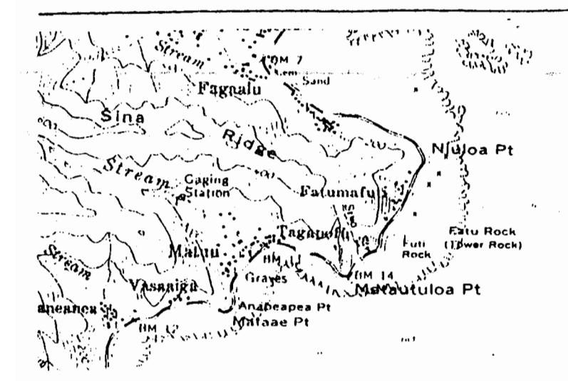

fish). Day catches include fe'e, gatala (honeycomb grouper), malauli (large jack), and eel. Common night catches include crab and ula (spiny lobster). Throw-netting is practiced in the daytime and results in catches of fuafua (juvenile mullet), manini (convact tang), alogo, and pone, as well as i'asina (juvenile goatfish) and lo (rabbitfish) in season (20).

/MAP29.TEX/ - /AUG-1980/

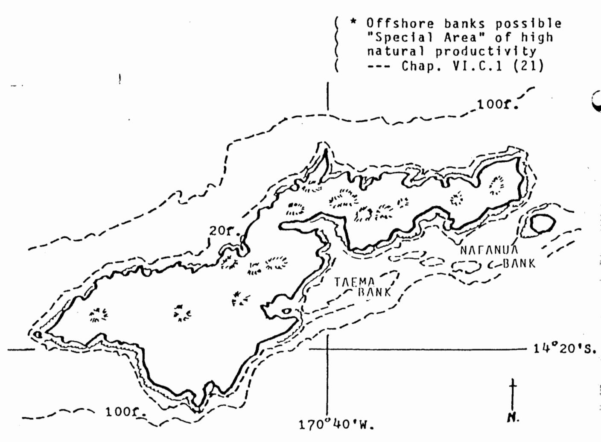

FIGURE 17. LOCATION OF THE OFFSHORE BANKS IN RELATION TO TUTUILA AND AUNUU.

ULNEKA

#### TAEMA AND NAFANUA BANKS

Waters surrounding most of Tutuila rapidly reach exceeding 600 feet (180 m). However, southwest of Aunu'u Island water depth is considerably less due to the presence of a former barrier reef drowned by a submergence of at least 200 feet (60 m) and known today as Nafanua Bank (5;54). A similar bank occurs off Pago Pago Harbor and is known as Taema Bank. Together banks represent the remains of a barrier reef enclosing a former lagoon which extended from the vicinity of the International Airport to the channel between Tutuila and Aunu'u Islands. Water depth varies from 325 feet (100 m) in the lagoon to 20 feet (6 m) over the top of the banks (5;15;54). The Banks are limestone formations projecting upwards as raised platforms (5;47). Passages penetrate the banks and enable safe ship-crossings. The inner slopes of the banks are reported to be heavily silted and mostly devoid of conspicuous marine life, but water currents keep the outer (seaward) slopes free of silt (5).

The Taema and Nafanua Banks, and the area between Tutuila and the Manu'a Group are feeding grounds for large flocks of seabirds and harbor abundant tuna and other commercially valuable fish (15).

TAEMA BANK Tafagamanupt PHYSIOGRAPHY **PHYSIOGRAPHY** TAEMA BANK FLORA AND FAUNA TAEMA BANK

# TAEMA BANK

# OFFSHORE BOTTOM

The inner slope (facing Tutuila) of Taema Bank rises from depths of 300 feet (90 m). The surface of the bank is a relatively flat or low undulating surface at depths between 40 and 50 feet (12 to 15 m). Rubble covers most of the outer slope (74).

# PATCH REEFS

Isolated patch reefs situated inshore of the northeastern end of Taema Bank and the southwestern end of Nafanua Bank rise in places to within 66 feet (20 m) of the surface although surrounded by depths greater than 260 feet (80 m).

# OFFSHORE BOTTOM (TAEMA BANK)

Since September 1977, many of the reefs surrounding Tutuila have experienced a heavy infestation of the crown-of-thorns starfish (alamea; Acanthaster planci), which has caused severe damage to living reef corals. The Taema Bank was one of two locations initially infested in late 1977. By December 1977, Taema Bank was heavily infested by a large wave of starfish moving inshore from deep water. Infestation spread rapidly to include intermediate banks near Tutuila and Nafanua Bank (3;45;73;74). In early 1978, the densest concentrations of starfish were seen on the inner slope at the northeastern end of Taema Bank, but all offshore submerged reefs showed evidence of heavy infestation.

Relatively few Acanthaster were evident on the southwestern end of Taema Bank in early 1978, but about 95% of the stony corals were dead in many places, indicating that large numbers of Acanthaster had already passed through the area. About 90% of stony corals on the Tutuila'side of the banks were dead, although a few Acanthaster were still present in January 1978. remaining coral consisted of scattered colonies of Pocillopora and patches of branching Acropora. Although once common here, no tabular Acropora spp. were found alive in early 1978. Acanthaster varied from none to low densities on the upper surface of the southwestern bank, where only 10 to 20% of the coral remained alive. Prior to the starfish infestation, the coral assemblage was composed mostly of Pocillopora and some branching Acropora spp. About 50% of the corals on the seaward slope were still alive when observed in early 1978. Only a few Acanthaster were present in this zone. Judging from the few live and dead coral heads, it is doubtful that much coral was previously growing on the rubbly outer slope (74).

In January 1978, a large number of starfish were aggregated in a narrow band about 16 to 26 feet (5 to 8 m) wide and 2600

TAEMA BANK

FLORA AND FAUNA

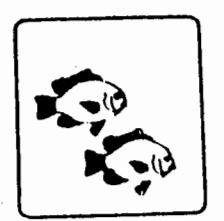

TAEMA BANK

FLORA AND FAUNA

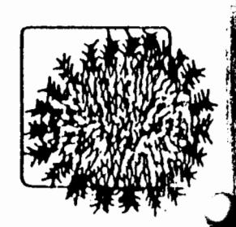

(800 m) in length along the outer slope of northeastern Taema Bank. This concentration appeared to be moving up the seaward slope and across the bank toward the inshore margin. White skeletons of recently-killed coral heads immediately behind the aggregation. Immediately inshore of the front, corals were mostly still living, relatively undamaged, and free of starfish. About 80% of the hard coral appeared to have been eaten as the starfish aggregation moved across the bank. However, large numbers of Acanthaster trailing behind the wave were eating the remaining coral heads. White skeletons graded into algal-covered skeletons proceeding seaward, indicating longer elapsed time since the starfish had passed. of starfish were greatest on the top of the bank, particularly along the seaward margin of the bank. They were conspicuously absent from the outer slope, where few living or dead corals are present on a rubble bottom. The total population of starfish at that time was estimated at over 200,000 individuals. ninety percent of the hard coral on the bank had already been killed in early 1978. Less than 5% of corals on the inner slope were still living in January 1978. All observed tabular Acropora most branching Acropora patches, and all but a few scattered Pocillopora colonies were dead. Only a few A. planci were present in the zone of mostly dead coral. By April 1978. the well-established front of starfish observed earlier in the year had broken up (73;74).

Although fish abundance is only moderate along the shore-ward margin of the central portion of Taema Bank, diversity is high. Ctenochaetus striatus and Acanthurus nigrofuscus are most abundant of at least 106 species. Pomachromis richardsoni is common (76).

The seaward margin of central Taema Bank shelters a highly diverse fish fauna of low to moderate abundance. At least 126 species are recorded. Ctenochaetus striatus and Plectroglyphidodon dickii are most common, followed in abundance by Pomacentrus melanopterus and Plectroglyphidodon lacrymatus (76).

At least 119 fish species inhabit the upper surface of northeastern Taema Bank, but abundance is only moderate. Ctenochaetus striatus is most abundant, followed by Pomacentrus vaiuli and Plectroglyphidodon dickii (76).

#### PATCH REEFS

Large numbers of Acanthaster apparently moved across the deep channels to the patch reefs between Taema Bank and Tutuila Island as well as to the reefs comprising the eastern portion of the offshore banks (Nafanua Bank) (73). By February 1978, the starfish had not banded into fronts, but were scattered, with dense concentrations occuring in areas of rich coral growth. Tabular Acropora species (the preferred food of Acanthaster) were all or mostly dead on some patch reefs but only partially eaten on others. Other hard corals were damaged to a lesser extent. In some places, very little of the branching Acropora spp. had

TAEMA BANK

FLORA AND FAUNA

NAFANUA BANK

PHYSIOGRAPHY

NAFANUA BANK

FLORA AND FAUNA

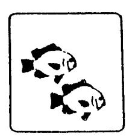

been killed, while in others less than half of the same species were still alive. When observed in April 1978, about 90% of the corals on the patch reefs were dead, although few Acanthaster planci were observed on the reefs. Considerable numbers of starfish remained in shallow areas of some patch reefs which retained abundant living coral despite nearly complete devastation of deeper portions (73;74).

Acanthaster was not evident on the seaward margin of a patch reef southwest of Nafanua Bank in August/September 1979, but only 10% of the coral was alive (75).

#### NAFANUA BANK

OFFSHORE BOTTOM

The northwestern end of Nafanua Bank, about 2600 feet (800 m) southwest of Salevatia Point (MAP A1), shoals to a depth of 30 feet (9 m). The bottom is mainly consolidated limestone. Much of the upper surface of the bank is of low relief. Some limestone outcrops and small, sand-bottomed depressions afford vertical relief of 1 to 3 feet (0.3 to 1.0 m) (ASCRI-A1B6).

OFFSHORE BOTTOM

Few crown-of-thorns starfish were observed along the outer slope of Nafanua Bank in February 1978. Most starfish were small and restricted to the seaward edge of the bank, where feeding scars were also small. The upper surface of the bank was devoid of <u>Acanthaster</u> with no evidence of feeding scars. Most corals, including tabular Acropora spp., were alive (73;74).

When observed in April 1978, coral was mostly dead on the deeper parts of Nafanua Bank, but regions shallower than 50 to 66 feet (15 to 20 m) were mostly unharmed and devoid of Acanthaster. Starfish density on the outer slope appeared to be greater on Nafanua Bank at that time than elsewhere on the offshore banks and patch reefs. A zone of algal-covered coral heads graded into freshly-killed coral and a somewhat loosely-aggregated front of starfish in shallower water. This front was not as well defined as the one observed on Taema Bank but it was moving up the reef slope (74). Acanthaster was not evident along the seaward margin of the central portion of Nafanua Bank in August/September 1979, but only 5% of the coral there was alive. Acanthaster was also absent from the upper surface of Nafanua Bank immediately south of Aunu'u in an area where only 10% of the coral remained alive (75).

Although fishes are only moderately abundant, the fauna is highly diverse on the outer margin of southwestern Nafanua Bank. At least 133 species are recorded. Plectroglyphidodon dickii and Chromis iomelas are most common, with Pomachromis richardsoni and Pomacentrus melanopterus in lower abundance. At least 94 species inhabit the upper surface of southwestern Nafanua Bank about 1.5

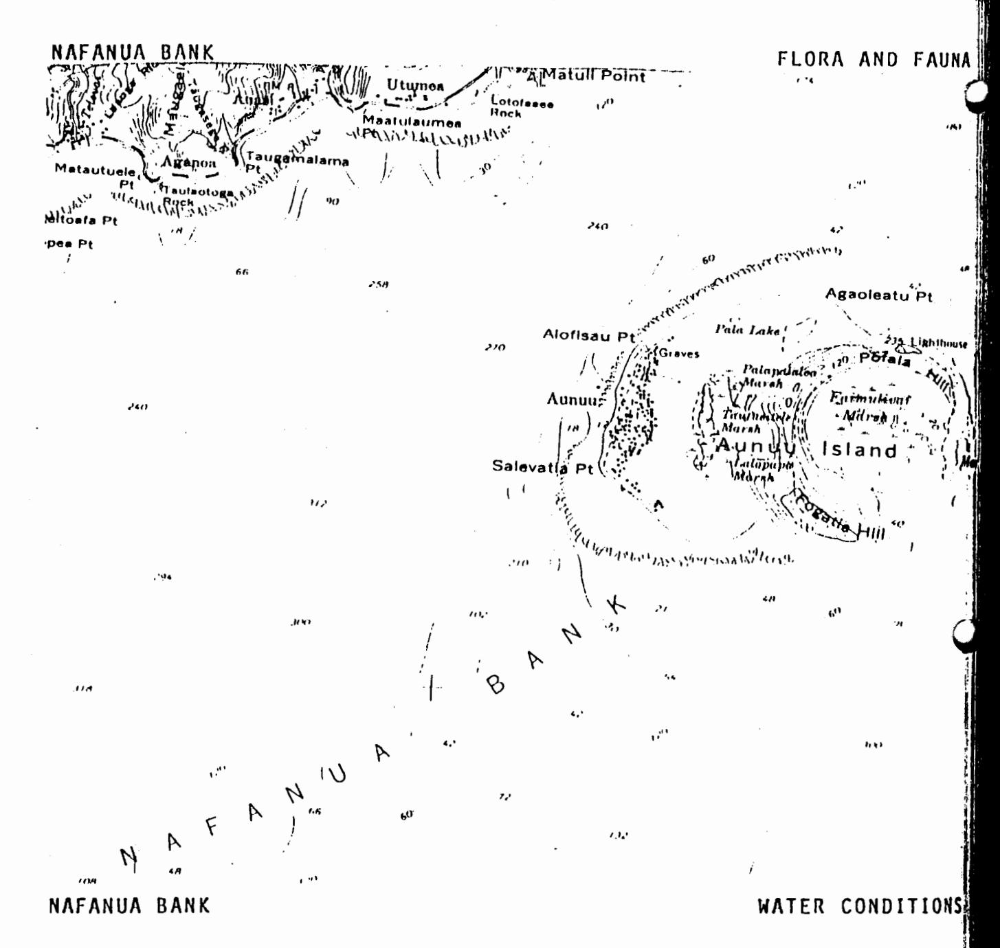

miles (2.6 km) southwest of Aunu'u Island. Fish abundance is relatively low. Plectroglyphidodon dickii is most common (76).

Fish abundance is low to moderate along the seaward margin of northwestern Nafanua Bank about 0.6 miles (1 km) southwest of Aunu'u, but the assemblage is highly diverse. Plectroglyphidodon dickii is most abundant of at least 121 species. Chromis iomelas is common (76).

Although coral cover is about 6% at a depth of 30 feet (9 m) on the northwestern end of Nafanua Bank There are no white skeletons or other evidence of a recent coral kill by starfish (ASCRI-A1B6). Although several crown-of-thorns starfish (alamea; Acanthaster planci), were present in the same general area in August/September 1979, about 60% of the coral was alive in contrast to only 20% at present (75; ASCRI-A1B6). Pocillopora eydouxi is most common of the live coral. Other species present include Leptoria sp., Pocillopora verrucosa, branching Acropora sp., and an unidentified favid. The scoured limestone bottom is covered mainly with encrusting coralline algae. The giant clam, Tridacna sp., is present but not abundant (ASCRI-A1B6).

Fishes are very abundant on the shallow parts of northwestern Nafanua Bank. Diversity is moderate to high, with at least 67 species represented at a depth of 35 feet (10 m). A gently undulating bottom and scattered boulders provide shelter for a number of cryptic and small species. Of particular interest are large, mixed schools of parrotfish, surgeonfish, and triggerfish which aggregate in the area. Large numbers of butterflyfish and wrasses are also present but are less conspicuous than the others. Dominant species include the butterflyfish, Chaetodon reticulatus, the surgeonfishes, Acanthurus glaucopareius and A. nigrofuscus, the damselfishes, Stegastes albofasciatus, Glyphidodontops leucopomus and Plectroglyphidodon dickii, and several species of parrotfishes (Scarus spp.). Other conspicuous families are the groupers (serranidids) and triggerfishes (balistids) (ASCRI-AIF2).

# OFFSHORE WATERS

Water clarity is good over the northwestern end of Nafanua Bank near Aunu'u Island (ASCRI).

AUNU'U

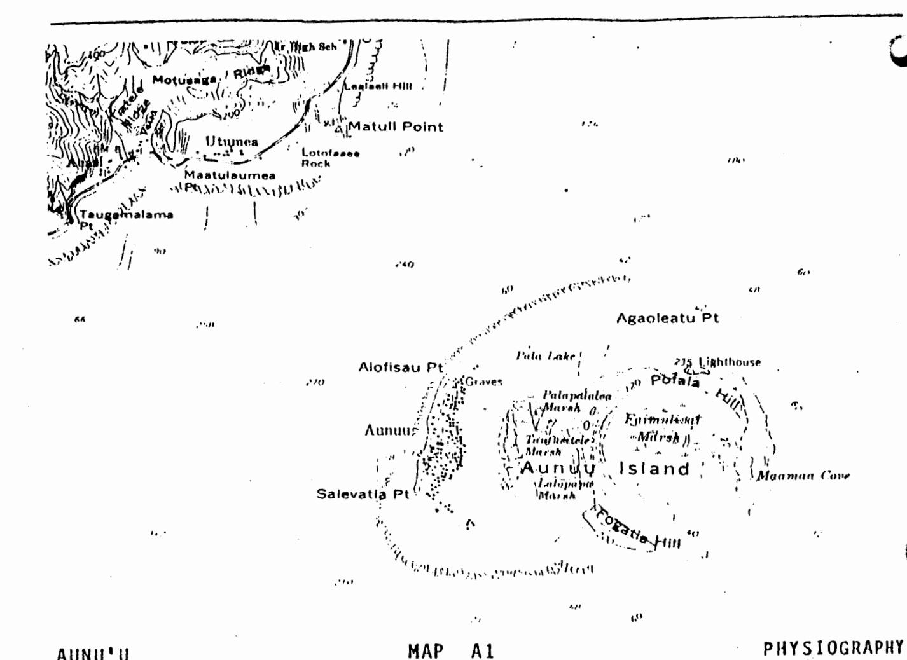

Pala Lake is a possible "Special Area" of unique or scarce value --- Chap. VI.C.3 (21)

# AUNU'U ISLAND .

Aunu'u is a small volcanic tuff cone located about 0.8 mile (1.3 km) off the southeast coast of Tutuila and is the smallest of the inhabited islands of American Samoa (64). The island is roughly circular, measuring about one mile (1.6 km) from east to west and 2,400 feet (730 m) from north to south. Total land area is about 380 acres (154 ha) (61). Relatively shallow submarine eruptions in recent geologic time along a north-south fissure built the cone on top of a barrier reef which once surrounded Tutuila Island (54).

The eastern half of Aunu'u comprises the remnant of the tuff cone and is dominated by a slightly dissected crater whose rim rises 200 to 300 feet (60 to 90 m) above sea level. The crater floor is occupied by a 29-acre (11.6 ha) marsh (Faimulivai Marsh) at an elevation of 20 feet (6 m) and a small, freshwater lake approximately at sea level. Water from the marsh and lake drains into Ma'ama'a Cove, located on the eastern side of the island (61;64). The highest point is Fogatia Hill representing the southern rim of the tuff cone at an elevation of about 310 feet (95 m)(61).

Wind-driven waves sweeping sand and reef debris around Fogatia Hill have built a broad coastal plain of sand a few feet above sea level along the lee (western) side of Aunu'u (54). Limestone rubble and beachrock extend along the north and south coasts at the base of shoreline cliffs (49;72).

#### WETLANDS

Much of the western half of Aunu'u Island is flat and contains marshy areas (61). The shoreward rim of the lowland area rises to an elevation of 8 or 10 feet (2.4 to 3.0 m). The complex of marshes and lakes located in the interior of the saucer-shaped lowland has an elevation of about 4 feet (1.2 m) and a total area of about 25 acres (10.1 ha). The bottoms of the marshes are mucky, consisting of weathered volcanic tuff and red silty-clay mixed with calcareous sand and silt. A layer of impermeable substrata lying 4 to 5 feet (1.2 to 1.5 m) below ground level impounds surface and ground water moving from the island interior toward the ocean (61). Portions of the original marsh have been drained for cultivation (72).

A peculiar physical feature of Aunu'u Island is Pala Lake, an area of "quicksand" inland from the north coast of the island. Slightly above sea level, the lake consists of reddish-brown mud covering an area of about 3 acres (1.2 ha). A barren mud flat is surrounded by a narrow strip of tall oriental mangrove trees (Bruguiera gymnorhiza). The mangrove extends in a northwesterly direction and is mixed with trees of coastal and lowland forests (77).

**PHYSIOGRAPHY** 

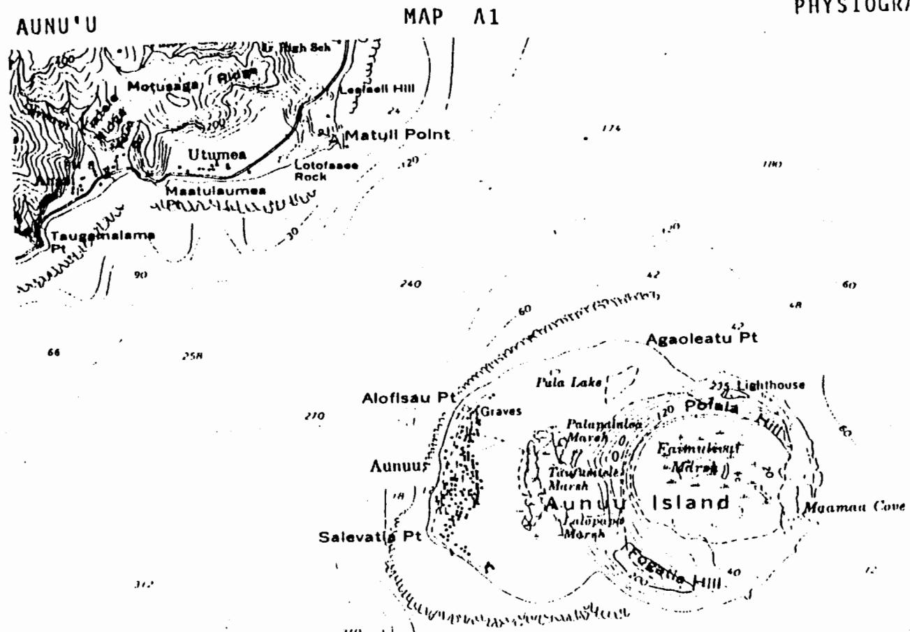

AUNU'U ISLAND

# SHORELINE (WESTERN SIDE)

West of Agaoleatu is a shoreline of coral rubble and numerous coral plates (shingle) up to 2 feet (0.6 m) across. The rubble foreshore slopes up to an elevation of 6 feet (2 m) and has a width of 25 feet (8 m). A continuous beachrock formation, up to 40 feet (12 m) wide, extends along the shoreline. The backshore consists of an 8-foot (2.4 m) high, vegetated scarp rising to a berm at an elevation of 15 feet (5 m) (49).

The shoreline between Pala Lake and Alofisau Point consists of calcareous sand, extensively covered by coral rubble. The moderately-sloping foreshore is backed by a densely-vegetated backshore at an elevation of 7 feet (2.2 m) The beach is stable, with a width of approximately 45 feet (14 m) (49).

Prior to harbor development, the shoreline consisted of a narrow zone of coarse sand and small shingle shoreward in a conspicuous berm of sand and limestone rubble that merged into a sand beach (48). Shoreline erosion is occurring on both the north and south sides of Aunu'u Harbor (under construction in late 1979). A 200-foot (60 m) section immediately north of the temporary breakwater of the boat harbor is severely eroded, with a narrow foreshore composed of limestone rubble and exposed beachrock. No sand remains here. A 4- to 5-foot scarp eroded in the backshore has exposed the roots of trees. of which are ready to topple. When the permanent northern breakwater of the harbor is constructed, the eroded section will fall within harbor boundaries and will be stabilized by construction. The severity of shoreline erosion attenuates northward with distance from the harbor. Halfway between Alofisau Point and the harbor, the 40-foot wide foreshore consists of calcareous sand mixed with extensive limestone rubble. The foreshore terminates in a 3- to 5-foot backshore scarp, backed by a limestone rubble seawall. The backshore scarp gradually height near Alofisau Point. When the permanent northern breakwater of the harbor is constructed. the zone of shoreline erosion is expected to shift northward. Although the reach now undergoing critical erosion will be incorporated in the harbor, the 300-foot reach north of the breakwater may uudergo severe erosion (49).

South of Aunu'u Harbor to Salevatia Point there is a 60-foot (18 m) wide beach of calcareous sand and scattered limestone rubble. A 400-foot (120 m) section adjacent to the harbor is eroding. The foreshore narrows from 60 to 40 feet (18 to 12 m) near the harbor. The shoreline just south of the harbor has been scoured of sand and the foreshore consists of exposed beachrock and limestone rubble (49; ASCRI-AISI). The beach is topped in places by a ridge or terrace of limestone fragments varying from coarse gravel to cobbles. This terrace has been built over the years by deposition of limestone debris by storm waves. Sand fills spaces between limestone fragments. Weathered reef limestone and beachrock underlies 9 to 12 feet (3 to 4 m) of sandy-gravel and gravelly-sand. The enlarging of two natural

AUNU'U

MAP A1

PHYSIOGRAPHY

AUNU'U

MAP A1

PHYSIOGRAPHY }

AUNU'U

MAP A1

PHYSIOGRAPHY!

AUNU'U

MAP A1

PHYSIOGRAPHY

AUNU'U

MAP A1

PHYSIOGRAPHY

( MAN-MADE CAUSEWAY

( DREDGING ACTIVITY

channels in the reef offshore has exposed the beach to increased wave attack. As a result, the beach, which is composed of cream-colored, fine-grained silty sand, has eroded inland about 50 feet (15 m) at the head of the channel to form a concave shoreline (61).

# SHORELINE (SOUTHWESTERN SIDE)

A shoreline of limestone rubble extends from Salevatia Point around the southwestern coast of Aunu'u, terminating at sea cliffs which comprise the eastern half of the island. The foreshore is approximately 40 feet (12 m) wide, rising steeply to a berm at the 10-foot (3 m) elevation. Beachrock is continuous along the water's edge. The backshore berm is covered with limestone rubble deposited by storm waves. The long strech of rubble shore is interrupted by a 700-foot (215 m) reach of sand beach fronting the public school southeast of Salevatia Point. The 60-foot (18 m) wide beach is composed of calcareous sand with a trace of volcanic sediment. Beachrock is continuous along shore (49).

# SHORELINE (EASTERN SIDE)

A cliff eroded in tuff rises from deep water around the eastern half of the island (61). This coast is exposed to prevailing trade wind waves, which reflect around the almost circular island (49). A vertical to overhanging cliff with a base 3 to 13 feet (1 to 4 m) below high tide level. The shoreline bench located at the base of many sea cliffs of American Samoa is well-developed in tuff beds along the eastern shore of Aunu'u (12).

# SHORELINE (NORTHEAST SIDE)

A sea cliff, eroded in remnants of the tuff cone, rises to heights of 20 to 250 feet (6 to 66 m) between Pofala Hill and Agaoleatu Point. This coast lacks a fringing reef, so deep water occurs off a shore exposed to trade wind-driven waves (49). A sea arch occurs north of Pofala Hill (ASCRI-A1S2).

# FRINGING REEF (WEST OF AGAOLEATU POINT)

The fringing reef off the north side of Aunu'u is over 300 feet (90 m) in width, at depths typically of 6 to 12 inches (15 to 30 cm). The reef flat consists of consolidated limestone and large, flat coral plates (49).

#### AUNU'U SMALL BOAT HARBOR

A small boat harbor is under construction in front of Aunu'u Village. A causeway of dredged fill has been constructed from shore north of the harbor. A shorter causeway of dredged fill extends south of the harbor where dredging was active in October 1979 (ASCRI-AISI). When completed, the harbor will be protected by a north and south revetted mole and a 90-foot break-

AUNU'U

MAP A1

PHYSIOGRAPHY

water (49). The northernmost of two channels blasted through Aunu'u reef has served for launching and landing of longboats and fishing canoes. A strong current flows seaward through this channel (48).

FRINGING REEF (OFF AUNU'U VILLAGE)

North of Aunu'u Harbor, the fringing reef averages 300 feet (90 m) in width, with a typical depth of 0.5 feet. South of the harbor, the width of the reef flat varies from 200 to 500 feet (60 to 150 m) at a depth of nearly one foot (49). Large waves break on the reef margin off and southeast of Salevatia Point (ASCRI).

During periods of lowest spring tides, the nearshore reef surface is exposed. This zone is characterized by eroded pits and depressions, 1 to 2 feet (0.3 to 0.6 m) lower than the reef flat. Overlying the exposed reef at the toe of the beach are narrow, elongated and stratified beds of beachrock which dip seaward (61).

The fringing reef narrows to about 50 feet (15 m) near the harbor location, where the U.S. Navy widened two natural channels to about 30 feet (10 m) in 1963 by blasting and dredging. The channels are about 400 feet (120 m) apart (61). At its inshore end (30 feet or 10 m offshore), the northern channel has a bottom of limestone boulders and sand at a depth of 27 inches (70 cm). Farther offshore, the depth increases to 5 feet (1.5 m) over a limestone bottom veneered with sand. Depth shoals to 2 feet (0.6 m) about 200 feet (60 m) offshore, where the channel bottom consists mainly of large, scattered limestone slabs displaced by blasting. The front of the reef near the channel has a steep slope, decending to a sand bottom at a depth of about 56 feet (48 m) (17).

An abrupt transition in bottom type from the consolidated reef front to large limestone boulders and slabs occurs in the vicinity of the southern channel (48). Prior to harbor development, the channel bottom was uneven, and its inshore end was characterized by strong surge and high turbidity (48).

North and south of the harbor location, reef width is 300 feet (90 m) or more. The seaward half of the reef flat is characterized by a relatively smooth surface of consolidated limestone, with limestone rubble (61). Rocks are less sand-scoured on seaward portions of the reef flat (48). The reef front slopes steeply to depths over 30 feet (9 m) (61). The reef front consists mainly of consolidated limestone with considerable sand cover. The bottom is uneven, characterized by limestone mounds rising 3 to 6 feet (1 to 2 m) above depressions between them. This bottom shoals to a depth of 12 feet (4 m) (48). Surge channels (grooves) and ridges (buttresses) form a discontinuous and serrated foreslope. Some of the grooves terminate shoreward in surge channels which extend well into the body of the reef (61).

AUNU U

MAP A1

PHYSIOGRAPHY

AUNU'U

мар а1

PHYSIOGRAPHY

The reef flat between Aunu'u Harbor and a boulder tract off Salevatia Point is about 300 feet (90 m) in width. Within 10 to feet (3 to 6 m) of shore, a thin layer of fine sand covers a limestone bottom (ASCRI-AIBI). The narrow inshore band of sand and limestone shingle merges seaward with a low-profile platform of sand-scoured limestone (43). Depth varies from 1 to 2 (0.3)to , 0.6 m) on the inner reef flat (ASCRI-A1B1). The middle outer reef flat is a consolidated limestone platform generally at depths of 2 to 3 feet (0.6 to 1.0 m), with irregular crevices and depressions to depths of 4 to 6 feet (1.2 to 2.0 m). deeper areas contain some dead coral, but rubble is not prominent (ASCRI-A1B2). Depth over the outer part of flat is about one-foot (0.3 m) at low tide (48). About 246 feet (75 m) offshore, the reef flat drops precipitously into a channel having a depth of 26 feet (8 m). The channel bottom is partially sand and partially dead and living coral. The Aunu'u side of this channel gradually shoals to the reef flat. Seaward of the channel, about 280 feet (85 m) from shore, a prominent mound of limestone is exposed on the reef (48).

Northwest of Salevatia Point, the reef margin is awash at low tide. The face drops steeply to a depth of 20 feet (6 m) and is characterized by narrow crevices, caves, and undercuts. To seaward are shoaling mounds of limestone rising 10 to 15 feet (3 to 5 m) above the bottom (ASCRI-A1B3).

Off Salevatia Point, massive boulders overlie consolidated limestone up to 300 feet (90 m) off shore. Depth is only about one-foot (0.3 m) and much of the reef flat is exposed at low tide (ASCRI-A1B4). The reef margin, (about 400 feet from shore), is awash and exhibits a modified spur-and-groove system. Sand deposits predominate in deeper waters (ASCRI-A1B5).

#### PATCH REEF

A large, circular patch reef about 150 feet (46 m) across rises from the sea floor about 500 to 600 feet (150 to 180 m) offshore from Aunu'u Harbor. The patch reef is separated from the main fringing reef by a sand channel containing large mounds of limestone, interspersed with areas of limestone rubble and sand. Depth of this channel reaches 40 feet (12 m) (48;61). The southwest slope of the patch reef is steep, and in places sheer, terminating in a sand bottom at depths over 100 feet (30 m). Southeast of the patch reef, several large, isolated limestone mounds rise above sand at depths to 125 feet (40 m). The highest of the mounds rises to within 20 feet (6 m) of the surface. The rubble-covered north face of the patch reef drops steeply to sand at a depth of about 56 feet (17 m). North of the patch reef, white sand deposits slope into deeper water from a depth of about 50 feet (15 m) (48).

FRINGING REEF (OFF THE SOUTHWESTERN COAST)

The fringing reef narrows from 450 feet (135 m) off Salevatia Point to 200 feet (60 m) off the public school. The

AUNU'U

MAP A1

PHYSIOGRAPH

AUNU'U

MAP A1

FLORA AND FAUNA

( SEABIRD NESTING AREAS

( RARE WATERBIRD

AUNU'U

MAP A1

FLORA AND FAUNA

**\UNU'U** 

MAP A1

FLORA AND FAUNA

( RARE WATERBIRD

( RARE LAND PLANT

reef surface is uniform and extremely shallow, with a typical depth of only 0.1 foot (49).

# OFFSHORE (SOUTHEASTERN AND EASTERN COAST)

Refraction of waves around the cliffs along the southeastern and eastern sides of Aunu'u causes turbulence offshore of Fogatia Hill. The bottom deepens rapidly from shore off this reefless coast (ASCRI).

# SEA CLIFFS AND COASTAL AREAS

Nesting by the reef heron (matu'u; Egretta sacra sacra), an uncommon resident seabird, probably occurs in isolated coastal areas on Aunu'u Island. The blue-grey noddy (fua'o; Procelsterna cerulea) nests along sea cliffs north of Pofala Hill and south of Ma'ama'a Cove to the cliff south of Fogatia Hill. The gray-backed tern (Sterna lunata) nests along the northeastern shore. The common brown noddy (gogo; Anous stolidus pileatus) nests along the sea cliff from Agaoleata Point to Fogatia Hill. A few common white terns (manu sina; Gygis alba pacifica) nest on sheer cliffs located along the northern, eastern, and southern coasts of Aunu'u. Brown boobies (fua'o; Sula leucogaster plotus), an uncommon resident seabird, nest along the sea cliffs of northeastern Aunu'u between Agaoleatu Point and Ma'ama'a Cove. The sheath-tailed bat (pe'ape'avai; Emballonura semicaudata) roosts in a cave in the cliffs of Pofala Hill (15).

The fruit bat or flying fox (pe'a; Pteropus samoensis) maintains a large roosting colony on the isolated southeast slope of Fogatia Hill. The Australian gray duck (toloa; Anas superciliosa pelewensis), a rare resident waterbird, is occasionally sighted along the north shore of Aunu'u Island (15).

# MA'AMA'A COVE COAST

A small patch of <u>Pandanus</u> littoral forest, the least disturbed of any in American Samoa, occurs along the coast near Ma'ama'a Cove on the eastern side of Aunu'u (15).

#### WETLANDS

ANU

The marsh between Aunu'u Village and the western slope of the tuff cone covers an area of about 22 acres (9 ha). Little of the natural vegetation remains, as villagers have made extensive use of the land for taro cultivation. Wetland plants found here are Acrostichum sp., Cyclosorus gongylodes, Eleocharis dulcis, Rhynchospora corymbosa, and Ludwigia octovalvis (77). The Australian gray duck (toloa; Anas superciliosa pelewensis), a rare resident waterbird has been sighted in this area (15).

Adjacent to Aunu'u Elementary School is a patch of mixed mangrove forest on poor rocky soil. The oriental mangrove (Bruguiera gymnorhiza) is mixed with small numbers of the relatively rare "puzzlenut tree" (Xylocarpus moluccensis), and

AUNU'U

MAP A1

FLORA AND FAUN

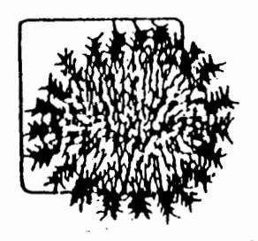

( TURTLE NESTING AREA

AUNU'U

MAP A1

FLORA AND FAUNA

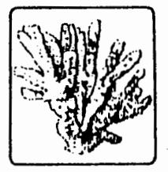

several coastal species. Much of the forest is subject to extensive cutting by villagers (77).

FRINGING REEF (WEST OF AGAOLEATU POINT)

Coral covers 40% of some reef front areas at depths from 15 to 25 feet (5 to 8 m) off Agaoleatu Point. Branching Acropora sp. and Pocillopora sp. are common, but little tabular Acropora is present (ASCRI-A1B9). West of Agaoleatu Point, coral cover is low on the reef front, but recently-killed coral heads cover up to 90% of the bottom. The reef drops off to a sand bottom at a depth of 40 feet (12 m) (ASCRI-A1B10).

The crown-of-thorns starfish (alamea; Acanthaster planci) was abundant on the reef front off Pala Lake in August/September 1979. About 25% of the coral at depths from 6 to 33 feet (2 to 10 m) on the upper reef slope was still alive at that time (75).

The endangered green sea turtle (Chelonia mydas) is reported to lay eggs on sand beaches in the vicinity of Aga'oleatu Point on the north side of Aunu'u (15).

FRINGING REEF FLAT (OFF AUNU'U VILLAGE)

Almost no live coral inhabits the bottom of the northern dredged channel through Aunu'u reef. The more southern of the channels to the present harbor site had about 10% coral cover in 1974, prior to harbor development. The principal coral species was Pocillopora verrucosa. Acroporans were present in much smaller colonies than elsewhere. Immediately south of the channel, coral cover is heavy. Limestone boulders and slabs on the channel bottom are covered mainly by pale pinkish encrusting Porolithon algae, which is also abundant in areas south of the harbor.

Glyphidodontops leucopomus is the most abundant fish on the inner reef where Aunu'u Harbor is presently under construction. Halichoeres margaritaceus is second in abundance. Acanthurus lineatus is by far the most common species on the outer reef flat. Others in abundance are Thalassoma quinquevittata, Acanthurus nigrofuscus, Pomacentrus vaiuli, and Glyphidodontops biocellatus (48).

Coral is generally limited to a few isolated and small colonies on the reef front off Aunu'u Harbor, except for several limestone mounds with a rich covering of live coral. In the latter sections, live coral cover approaches 60% and is comprised mainly of Acropora humilis and A. hyacinthus (48). The upper reef front off Aunu'u was heavily infested by crown-of-thorns starfish (alamea; Acanthaster planci) when observed in August and September 1979. However, about 60% of the coral was still alive at depths of 6 to 33 feet (2 to 10 m) on the upper reef slope (75).

AUNU U

Motusaga Rida

Legiae

MAP A1

FLORA AND FAUNA

Utumea
Loiofeasee
Rock
Maatulaumea
APOLITICA SULID

Agaoleatu Pt

Aunuus felili

Alofisau Pt

Palapalalon 10 Palapalalon 10 Palapalalon 10 Palapalalon 10 Palapalalon 10 Palapalalon 10 Palapalalon 10 Palapalalon 10 Palapalalon 10 Palapalalon 10 Palapalalon 10 Palapalalon 10 Palapalalon 10 Palapalalon 10 Palapalalon 10 Palapalalon 10 Palapalalon 10 Palapalalon 10 Palapalalon 10 Palapalalon 10 Palapalalon 10 Palapalalon 10 Palapalalon 10 Palapalalon 10 Palapalalon 10 Palapalalon 10 Palapalalon 10 Palapalalon 10 Palapalalon 10 Palapalalon 10 Palapalalon 10 Palapalalon 10 Palapalalon 10 Palapalalon 10 Palapalalon 10 Palapalalon 10 Palapalalon 10 Palapalalon 10 Palapalalon 10 Palapalalon 10 Palapalalon 10 Palapalalon 10 Palapalalon 10 Palapalalon 10 Palapalalon 10 Palapalalon 10 Palapalalon 10 Palapalalon 10 Palapalalon 10 Palapalalon 10 Palapalalon 10 Palapalalon 10 Palapalalon 10 Palapalalon 10 Palapalalon 10 Palapalalon 10 Palapalalon 10 Palapalalon 10 Palapalalon 10 Palapalalon 10 Palapalalon 10 Palapalalon 10 Palapalalon 10 Palapalalon 10 Palapalalon 10 Palapalalon 10 Palapalalon 10 Palapalalon 10 Palapalalon 10 Palapalalon 10 Palapalalon 10 Palapalalon 10 Palapalalon 10 Palapalalon 10 Palapalalon 10 Palapalalon 10 Palapalalon 10 Palapalalon 10 Palapalalon 10 Palapalalon 10 Palapalalon 10 Palapalalon 10 Palapalalon 10 Palapalalon 10 Palapalalon 10 Palapalalon 10 Palapalalon 10 Palapalalon 10 Palapalalon 10 Palapalalon 10 Palapalalon 10 Palapalalon 10 Palapalalon 10 Palapalalon 10 Palapalalon 10 Palapalalon 10 Palapalalon 10 Palapalalon 10 Palapalalon 10 Palapalan 10 Palapalan 10 Palapalan 10 Palapalan 10 Palapalan 10 Palapalan 10 Palapalan 10 Palapalan 10 Palapalan 10 Palapalan 10 Palapalan 10 Palapalan 10 Palapalan 10 Palapalan 10 Palapalan 10 Palapalan 10 Palapalan 10 Palapalan 10 Palapalan 10 Palapalan 10 Palapalan 10 Palapalan 10 Palapalan 10 Palapakan 10 Palapakan 10 Palapakan 10 Palapakan 10 Palapakan 10 Palapakan 10 Palapakan 10 Palapakan 10 Palapakan 10 Palapakan 10 Palapakan 10 Palapakan 10 Palapakan 10 Palapakan 10 Palapakan 10 Palapakan 10 Palapakan 10 Palapakan 10 Palapakan 10 Palapakan 10 Pa

Aunur Island

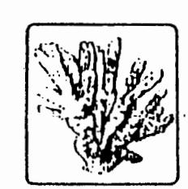

AUNU'U

MAP A1

FLORA AND FAUNA

Fishes are more diverse over deeper sections of the reef front than on the reef flat. Parrotfishes (particularly <u>Scarus sordidus</u>), and surgeonfishes (especially <u>Ctenochaetus striatus</u>), ard common. Adult rabbitfish (<u>Siganus rostratus</u>) are present (48).

Coral cover is quite high on limestone mounds projecting to within 20 feet (6 m) of the surface off the southeastern margin of the patch reef. Patches of <u>Acropora humilis</u> and <u>Pachyseris</u> sp. are conspicuous. Scattered coral heads occur on limestone mounds in the sand channel between the patch reef and the fringing reef off Aunu'u Harbor.

Abundance and diversity of fishes is low in the sand chanbetween the patch reef and fringing reef. The more common species are the damselfishes, Pomacentrus coelestris, and P. valuli, and the goatfish, Parupeneus trifasciatus. Very few fishes occur over the sand bottom north of the patch reef. common is a razorfish (Hemipteronotous sp.) and garden eels (Heterocongrinae) at a depth of 100 feet (30 m). hoedtii, Valenciennca sp., and Halichoeres hartzfeldti Small, isolated present. patches of limestone exposed on the sand bottom support small colonies of coral and octocoral. sloping sand bottom north of the patch reef has a sparse growth of the seagrass, Halophila sp., and the green alga. Halimeda cunita (48).

Corals are prolific on the slopes of the large patch reef, especially in deeper areas. The slopes have up to 50% coral cover. Coral is also abundant on the reef flat and averages about 40% cover. Other areas are encrusted by coralline algae. Rich and varied assemblages of stony corals, octocorals, and soft corals occur along the southwestern slope of the patch reef and on nearby isolated limestone knolls. Principal species are Porites sp., two species of Montipora, Psammocora, Pocillopora verrucosa, and Acropora hyacinthus, which is particularly conspicuous. Sponges, tunicates, and crinoids are common beneath rocks. Fishes are abundant and diverse on the patch reef slope. Most common are the surgeonfishes, Ctenochaetus striatus, C. strigosus, and Zebrasoma scopas; the parrotfish, Scarus sordidus, and the damselfishes, Pomacentrus lacrymatus, Chromis lomelas, and C. opercularis. A variety of wrasses are present, and two damselfishes, Dascyllus trimaculatus and D. reticulatus, are locally common around branching corals (48).

# FRINGING REEF (OFF SALEVATIA POINT)

The sand-veneered bottom between the area of harbor construction and Saletavia Point is generally devoid of coral except for a few heads of <u>Pocillipora</u> sp. The green alga, <u>Dictyosphaeria</u> cf. <u>versluysii</u>, is common on limestone. <u>Lyngbya</u> sp. occurs in lower abundance (ASCRI-A1B1). A 1974 survey of the area reported minimal algal growth or a very thin algal covering embedded with

AUNU'U

MAP A1

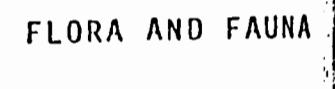

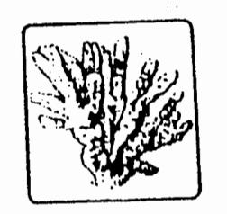

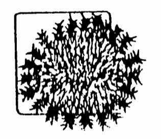

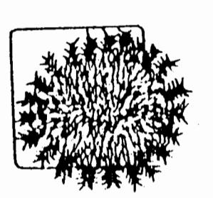

sand. Small <u>Halimeda</u> sp. and <u>Caulerpa</u> sp. occurred in some crevices of larger rocks. A few feet from shore was the beginning of a narrow zone of dead branching coral merging into the first occurrences of live coral (<u>Pocillopora</u> verrucosa, <u>Acropora</u> <u>humilis</u>, and <u>Millepora</u> <u>platyphylla</u>). Conspicuous with the coral was <u>Dictyosphaeria</u> sp. (48).

Live coral (predominantly Acropora humilis and A. thus) covers about 10% of the limestone platform farther offshore. Formerly, Acropora covered 70% of the bottom, but most now dead. (ASCRI-A1B2). A 1974 survey of this reef reported coral cover rapidly increasing to over 50% from about 33 feet (10 m) offshore. Coral diversity also increased toward the outer reef, where tabular Acropora hyacinthus was particularly abundant In October 1979, increasing amounts of dead coral was evident on the outer reef flat, where pockets of living coral (covering up to 100% of the bottom) still flourish in depressions. A number of unusual species occur in these depressions. Echinopora lamellosa, Millepora platyphylla, Acropora crateriformis, A. rotumana, and Lobophyllia sinosa are most common. Other species present include Acropora nana, A. intermedia, A. variabilis, A. corymbosa, Pocillopora eydouxi, P. verrucosa, P. setchelli, Hydnophora microconus, Astreopora myriophthalma, an encrusting Porites sp., Galaxea fascicularis, and Favia Consolidated limestone is encrusted with coralline stelligera. algae. An unidentified brown alga is abundant on dead coral (ASCRI-A1B2).

Although coral formerly covered about 80% of the reef margin, most has been killed by the starfish, Acanthaster planci (alamea), and live coral cover is now around 5%. The proportion of dead coral heads increases with depth where Acanthaster is abundant. Once abundant Acropora hyacinthus has been devastated by the starfish, and live coral is reduced to about 10% bottom cover at present. Acanthaster is present on the shallow reef flat (ASCRI-A1B2).

A channel cutting through Aunu'u reef about 245 feet (75 m) offshore is partially covered by living and dead corals. Acropora humilis is conspicuous. Much of the large, exposed limestone mound seaward of the channel is covered by living coral, which terminates in exposed dead coral rock (48).

Live coral cover diminishes on the reef front, where large aggregations of Acanthaster are attacking the remaining coral. Large numbers of Acanthaster inhabit shoaling limestone mounds along the reef front where 50% of the coral cover is dead. A brownish cyanophyte (blue-green alga) is common on portions of dead colonies of Acropora hyacinthus. Coral cover, at one time almost 100%, is presently only 10 to 20%. Extensive coral damage may be due to Acanthaster predation rather than sedimentation from dredging activities at Aunu'u Harbor (ASCRI-A1B3).

Few fishes inhabit inshore areas of sand and rubble northwest of Salevatia Point. Offshore to the margin, the reef flat AUNU'U

MAP A1

FLORA AND FAUNA

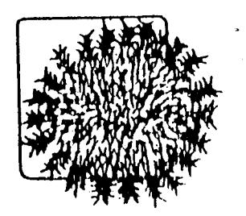

AUNU'U

MAP A1

FLORA AND FAUNA

AUNU'U

MAP A1

FLORA AND FAUNA

is dominated by the surgeonfishes, Acanthurus lineatus and A. nigrofuscus; the damselfishes, Stegastes albofasciatus, Glyphidodontops leucopomus, Plectroglyphidodon dickii, P. lacrymatus; and the wrasses, Thalassoma quinquevittata, T. hardwickei, Halichoeres margaritaceus, and H. marginatus. Less abundant are the butterflyfish, Chaetodon citrinellus, the wrasses, Thalassoma purpureum, Halichoeres centriquadrus, Pseudocheilinus hexataenia, and Gomphosus varius; the damselfish, Plectroglyphidodon johnstonianus; a juvenile parrotfish, Scarus sp.; and the blennies, Cirripectes sp. and Istiblennius sp. The only grouper recorded is Epinephelus merra (48).

An even greater variety of fishes inhabits the margins and bottom of a channel cutting through the reef about 246 feet (75 m) offshore. Stegastes nigricans and Ctenochaetus striatus dominate along the upper edges of the channel, with Acanthurus glaucopareius, C. striatus, and Glyphidodontops biocellatus common at the bottom along with several parrotfishes (48).

Infestation the crown-of-thorns starfish (alamea; bу Acanthaster planci) has nearly destroyed all of the living coral on the reef margin and reef face off Aunu'u Village where about half of the coral formerly covering 75% of the bottom has been However, the recently killed coral heads and a rugged reef face provide sufficient shelter for a fish assemblage of at least 134 species. Butterflyfishes, wrasses, and damselfishes are the most common species, occurring in moderate numbers. Dominant species include the snapper, Caesio xanthonatus, the butterflyfish, Chaetodon reticulatus, the surgeonfishes, Acanthurus lineatus, A. nigrofuscus, and Ctenochaetus striatus, the damselfishes, Stegastes albofasciatus, Chromis iomelas, Glyphidodontops leucopomus, and Plectroglyphidodon dickii, the wrasse, Thalassoma hardwickei, and two species of parrotfish, Scarus spp. common species include Chromis acares, C. xanthura, Other Pomacentrus vaiuli, and P. melanopterus (76; ASCRI-A1F1).

The shallow boulder tract southwest of Salevatia Point, appears devoid of live coral. Encrusting Acropora humilis, A. hyacinthus, and A. palmerae, with some A. rotumana and A. nana, cover about 10% of the outer reef flat near the margin (ASCRI-A1B4). The reef margin has 10% coral cover, dominated by Acropora humilis (ASCRI-A1B5).

FRINGING REEF FRONT (SOUTH SIDE)

Coral cover approaches 40 to 50% on some areas of the reef front off the southern coast of Aunu'u. An equal area is covered by standing dead coral heads. Acropora hyacinthus predominates. The reef front slopes steeply to a sand bottom at a depth of about 50 feet (15 m) (ASCRI-A1B7).

OFFSHORE (EAST AND NORTHEAST COAST)

Coral cover is about 10% at a depth of 20 feet (6 m) on the scoured limestone bottom off the northeastern coast of Aunu'u.

AUNU'U

WATER CONDITIONS AUNU'U MAP A1 ( SEWAGE DISCHARGE MAP A1 HISTORICAL/ARCHAEOLOGICAL AUNU'U MAP A1 USE CONSIDERATIONS AUNU'U \* Aunu'u tuff cone is a possible "Special Area" suitable for natural land-mark -- Chap. VI.C.7 (21)

MAP A1 USE CONSIDERATIONS

AUNU'U MAP A1 USE CONSIDERATIONS

MAP AI

MUNU U ASEMNU

Some Acropora sp. occurs, along with <u>Pocillopora</u> sp. The brown alga, <u>Turbinaria</u> sp., is present. The small sea urchin, <u>Echinostrephus</u> sp., occurs in burrows (ASCRI-A1B8).

# FRINGING REEF AND OFFSHORE

Longshore currents flow northward over the reef flat northwest of Salevatia Point. A rip current flows seaward through a channel which cuts through the reef about 245 feet (75 m) from shore (48).

The village of Aunu'u is served by a small, centralized sewer system without treatment facilities. Raw sewage is discharged into the ocean south of Salevatia Point (5;61).

# AUUU'U DEFENSE WALL

Traces of an old defense wall with two towers built of loose stones can still be seen 60 feet (18 m) from the high water mark at Aunu'u Village (30).

# AUNU'U ISLAND

There are neither roads nor private vehicles on Aunu'u Island. The island's small population is concentrated in Aunuru Village on the western coast. Residents of Aunu'u who commute to work and school on Tutuila negotiate the one-mile (1.6 m) channel between Aunu'u and Auasi Village in small boats. Wood or aluminium boats with outboard motors and a capacity of 8-10 people load and unload directly from the beaches at Aunu'u and Auasi (MAP 7) (203). A new harbor to serve shallow-draft vessels is under construction north of Salevatia Point, near an existing channel through the reef (61;64).

A 350-acre (140 ha) portion of Aunu'u Island (principally the tuff cone) is registered as a National Natural Landmark because of its geologic significance (72). Pala Mud Lake has been recommended as a natural area reserve off limits to hunting and other disturbance (9;15).

# BEACH (AT AUNU'U VILLAGE)

Limestone rubble is sometimes removed from Aunu'u Beach by villagers to construct walkways to houses (48). Swimming may occur off the southern section of beach. Access is by courtesy of the Village (41).

#### FRINGING REEF

The reef fringing the western coast of Aunu'u Island is considered a "critical use reef area" because of subsistence fishing use by villagers (39). According to one source, the shallow reef flat is most frequently fished, but fishermen also frequent deep waters seaward of the reef margin for spearing and handlining from canoes. Favored fishing methods are spearing and

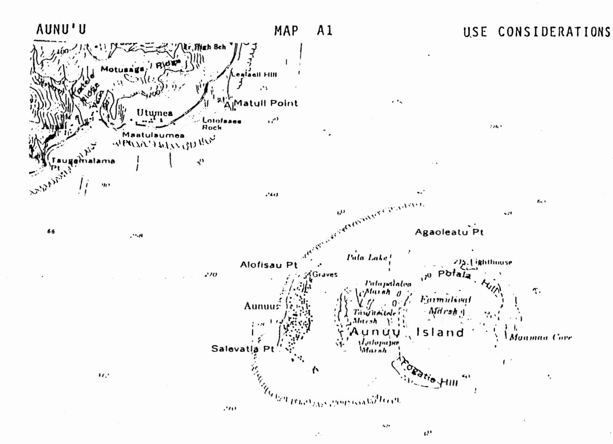

AUNU'U

MAP A1

USE CONSIDERATIONS

pole and line fishing. Throw-netting and seine netting (upega) are next most popular. Reef gleaning and nightime handlining from canoes are also practiced (20). Local informants report that most subsistence fishing occurs from canoes in deeper waters. In addition, fish are caught by hook and line at the reef edge, and occasionally from shore (primarily by children). Most of the fishing on the inner reef flat is with spears. The large patch reef offshore is considered one of the most productive fishing areas. Some night spearing is undertaken on the reef flat for fishes and ula (spiny lobster) (48;61).

Spearing results in day and night catches of anae (adult mullet), laea (largd parrotfish), and malauli (large jack). Day catches include faisua (giant sea clam), fe'e (octopus), eel, alogo (lined surgeonfish), and pone (chocolate surgeonfish). Night catches include crab, ula (spiny lobster), and papata (slipper lobster). Pole and line fishing yields day and night catches of gatala (honeycomb grouper), filoa (large emperor fish), and mataeleele (small emperor fish). Lupo (juvenile jack) and lupota (small jack) are caught by day, and matapula (bigeye snapper), malau (squirrelfish), savane (blue-lined snapper), and malai (paddletail snapper) are caught by night. Throw-netting is daytime activity resulting in catches of alogo, pone, manini (convict tang), anae and fuafua (juvenile mullet), lupota, laea, and, seasonally, lo (rabbitfish) and i'asina (juvenile goatfish). Day gleaning brings in fe'e and eel, whereas night gleaning brings in primarily alili (sea snails). Night handlining from canoes outside the reef edge results in catches of malau. matapula, malai, mataeleele, savane, and filoa (20).

Surfing is possible off Aunu'u on a rising or high tide (51).

# EAST COAST OF AUNU'U

Ma'ama'a Cove is not accessible from the land, and rough seas limit access by boat (ASCRI). Pole fishermen from Aunu'u Village frequent the rubble shoreline between Agaoleatu Point and Pala Lake region (49).

/AUNUU.TEX/ - /JUNE-80/

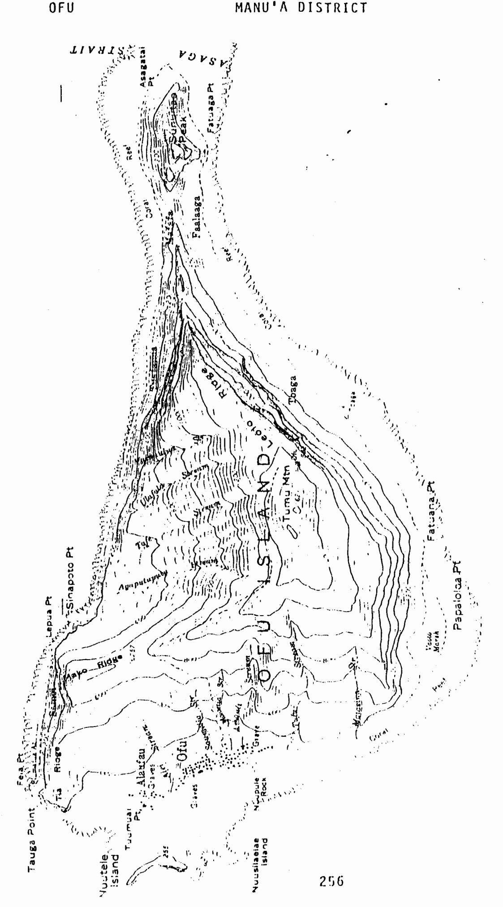

# OFU ISLAND

The island of Ofu, about 3 square miles (7.7 sq km) in area (69), is the westernmost of the Manu'a Group, and lies about 65 miles (100 km) east of Tutuila. The three islands of the Manu'a Group are separated from Tutuila by ocean depths exceeding 10,000 feet (3000 m) (55).

Both 0fu and the adjacent Olosega Island are deeply-dissected remnants of what was once a single island, about 4 miles (6.5 km) wide from north to south and 6 miles (9.5 km) long from west to east. Ofu is roughly triangular in shape with steep terrain dipping to the coast. The islands resulted from a complex of volcanic cones subsequently buried by lava flows from two merging volcanic shields. shield is centered at A'ofa on the northern coast of Ofu. and Olosega are separated by a shallow, 500-foot (150 m) wide strait (Asaga Strait) (55) spanned by a bridge and causeway.

# **STREAMS**

Streams occur on Ofu in two areas -- along the western slope of the island and along the northern slope. A few streams (Metasina, Tufu, Malaetia) have cut deep valleys, but most have cut only shallow valleys. Because Ofu is both lower in elevation and smaller than Ta'u, there is considerably less rainfall and runoff, and few streams are well developed. All are intermittent, flowing only after heavy rainfall (55).

#### SEA CLIFFS

After cessation of volcanic eruptions, an extensive sea cliff was eroded in much of the island. Along the western coast, particularly behind Ofu Village, the cliff is only about 80 feet (25 m) high; elsewhere the cliff is generally 200 to 400 feet (60 to 120 m) high. The highest cliff is along the southern coast from Vaoto Point to Vainu'ulua Peak (55). The high cliffs of the northern and southern coasts originated by faulting or collapse of the shoreline but have been extensively modified by marine erosion. The sea cliffs on Ofu are generally higher than those on Ta'u, perhaps because of a longer period of volcanic quiescence or a greater amount of more easily eroded tuff material. Talus and landslide material accumulates at the base of cliffs along the northern and southern coasts. Some particularly large landslide deposits occur between Vaoto Point and Toaga along the southeastern coast (55).

Benches eroded 12 to 15 feet (4 to 5 m) above present sea level in the cliff are conspicuous in some areas. At Tauga Point, the bench is over 100 feet (30 m) wide with an irregular surface about 15 feet (5 m) above present sea level. Remnants of a similar bench occur near Lelua Point (55).

OFU IS.

GENERAL

PHYSIOGRAPHY

OFU IS.

GENERAL

PHYSIOGRAPHY

OFU IS.

GENERAL

PHYSIOGRAPHY

OFU IS.

GENERAL

USE CONSIDERATIONS,

# COASTAL PLAIN

A well-developed coastal plain borders the southern and western portions of the central volcanic mass. Typically, this terrace slopes steeply to heights of 15 to 18 feet (5 to 6 m) either as a beach foreslope or as an erosional escarpment. The terrace attains maximum width of 900 feet (275 m) at Vaoto Point but averages about 300 feet (90 m) in width elsewhere. From its highest point, near the upper beach berm, the terrace generally descends gradually toward inland cliffs. At Vaoto Point, the sandy terrace descends back to sea level, where a marsh has formed between the upper part of the terrace and the talus slope at the base of the cliff. Ofu Village is built on the terrace. The terrace was probably formed by storm beach deposits driven inland by hurricane and storm waves (55).

#### SHORELINE

Much of the shoreline of Ofu consists of narrow beaches composed of calcareous sand and rubble (49). Sand beaches are usually about 40 to 50 feet (12 to 15 m) wide, up to 100 feet (30 m) wide (along most of the southern coast in the vicinity of Toaga). Beach material is predominantly coarse sand and gravel of calcareous origin. Small dunes about 20 feet (6 m) high bank against the cliffs at Agaputuputu. Seasonal variation in beach volume is small, probably because of the protective fringing reef. Beachrock is exposed in places. A few beaches along the northwestern coast of Ofu (between Sinapoto and Oneonotule) contain beachrock with embedded basalt cobbles and occasional boulders. Beachrock also forms a deposit on a benched surface of lava rock at Tauga Point (55).

#### FRINGING REEF

Ofu is encircled by a fringing reef, except for a small section off the northern coast (49). The reef extends 1,600 feet (485 m) offshore at its widest point near Ofu Village. A few isolated breaks in the reef occur off Lelua Point, Tauga Point, and along the western coasts of Nu'utele and Nu'usilaelae Islets. A porolithon ridge occurs along the reef margin near Nu'usilaelae Islet and off Tauga Point. Two large natural channels cut through the reef off Ofu Village. Relatively deep, extensive sand deposits lie offshore of these channels. Smaller channels cut through the reef at Toaga, Ulufala, Oneonetele, Mapapa, and Agaputuputu. Strong currents flow seaward through the channels during ebbing tide (55).

# OFU VILLAGE

Ofu Village is the only settlement on Ofu Island. The principal mode of transportation to and from Ofu is by boat or small airplane. Previously, passengers and cargo had to be transferred from interisland vessels to small longboats in order to cross the fringing reef and reach shore. Salt water damage to cargo was frequent and lives were occasionally lost when

OFU

0FU CO1.

OFU IS.

GENERAL

HISTORICAL/ARCHAEOLOGICAL

longboats overturned. However, a new harbor for small boats has been completed north of Ofu Village. A small, government-owned airfield is located at the southwestern tip of the island. It was constructed by private interests in 1974 to serve light aircraft. A bridge has been constructed across Asaga Strait to permit vehicular traffic between Ofu and Olosega (64). Road development on Ofu is limited. The main road is an elementary, one-lane dirt road running parallel to the shoreline from Ofu Harbor around the southwestern tip of the island and along the southern coast to Fa'ala'aga Village. From here, the road crosses to the north coast and parallels the shoreline for a short distance to Asaga Strait (39). The remainder of the northern coast is inaccessible by vehicle (49). Sections of the road, especially between the airstrip and the village of Ofu, are subject to erosion and landslides during heavy rains (39).

# ABANDONED VILLAGES

Two abandoned villages are located at the eastern end of Ofu Island: one at Mapapa on the north shore and the other on the south shore directly across the narrow neck of land from Mafafa (30).

-; ( MAN-MADE CAUSEWAY

ASAGA STRAIT

**ΜΛΡ 01** 

PHYSIOGRAPHY

ASAGA STRAIT

MAP 01

FLORA AND FAUNA

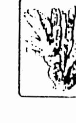

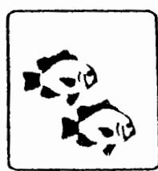

MUNICIPALITY CONTRACTOR OF STREET

ASAGA STRAIT

MAP 01

PHYSIOGRAPHY

# ASAGA STRAIT

Asaga Strait, the shallow passage between Ofu and Olosega Islands, is 500 feet (150 m) wide at its narrowest point. Beaches on both sides of the strait are backed by densely-vegetated, mountainous terrain. A 700-foot (215 m) long causeway and bridge now spans Asaga Strait and connects roads at Asagati Point on Ofu and Tamatupu Point on Olosega. Formerly, crossing between islands necessitated wading the shallow portions of Asaga Strait at low tide (22) or being ferried in an outrigger canoe.

#### FRINGING REEF

The reef in Asaga Strait is extensive. Depths range from 6 inches (15 cm) near shore to 10 feet (3 m) in the middle of the strait. Just offshore of Ofu, the bottom is entirely sand, which slopes to a flat limestone surface strewn with fragments of dead coral up to 2 feet (0.6 m) across. The numerous limestone fragments are both loose and cemented to the bottom. Approaching the center of Asaga Strait, dead coral covers most of the bottom. The deepest part of the strait contains large and small fragments of dead coral rubble (22).

# FRINGING REEF

Live coral is sparse in Asaga Strait near the shore of Ofu. Coral cover increases offshore to about 15%. In the middle of the strait, at a depth of 6 feet (2 m), coral cover varies from 40 to nearly 100%. Millepora, Porites andrewsi, and staghorn Acropora are most abundant. Coral cover is low in the deepest part of the strait.

Common invertebrates on the reef flat in Asaga Strait include sea cucumbers (Holothuria atra, H. argus, Stichopus chloronotus, and Actinopyga sp.), a sea urchin (Echinometra mathaei), and sea anemones. A highly diverse fish assemblage of at least 113 species inhabits Asaga Strait. The damselfish, Glyphidodontops cyanea, is most abundant, followed by Stegastes nigricans. S. albofasciatus, juvenile Scarus sp., S. sordidus, and S. jonesi. Surgeonfishes and wrasses are relatively common (22).

#### COAST BETWEEN ASAGATAI POINT AND TAUGA POINT

# SHORELINE

The shore west from Asaga Strait is a narrow beach of small to medium sized volcanic boulders. This section of coast is protected from trade wind waves but is exposed to waves from the north and northwest. A 4,500-foot (1400 m) long beach of calcareous sand extends east from Mapapa. This narrow, almost inaccessible beach is split into two sections by a 700-foot (215 m) long stretch of basalt boulders (69).

ASAGA STRAIT

MAP 01

FLORA AND FAUNA

( SEABIRD NESTING AREAS

( SWIFTLET NESTING AREA

OFU (ALAUFAU)

MAP 03 PHYSIOGRAPHY

OFU (ALAUFAU)

03

PHYSIOGRAPH

Nuutele Island

OFU (ALAUFAU)

MAP 03 PHYSIOGRAPHY

( DREDGE SPOIL

# COASTAL ZONE

Colonies of the common brown noddy (Anous stolidus pileatus) nest along the north coast of Ofu from Tauga Point to Sinapoto Point. A potential nesting area for white-rumped swiftlets (pe'ape'a; Collocalia spodiopygia spodiopygia) is located on the precipitous north shore between Lepua and Sinapoto Points. The uncommon sheath-tailed bat (pe'ape'avai; Emballonura semicaudata) roosts in caves along the Sinapoto Point area of the north coast (15).

# COAST BETWEEN TAUGA POINT AND TU'UMUAI POINT

The western coast of Ofu is in the lee of trade wind-driven waves but is exposed to waves from the north and west. Offshore, Nu'utele Islet and Nu'usilaelae Islet, located at the seaward edge of the fringing reef, provide additional protection from waves (49).

#### TAUGA POINT

Tauga Point terminates in a sea cliff with a wave-cut bench along its base. The point is unprotected, lacking a fringing reef (49).

#### SHORELINE

The shoreline between Ofu Harbor and Tu'umuai Point has a narrow foreshore (30 feet or 9 m) consisting of a mixture of limestone rubble and calcareous sand. The beach is backed by a 5 to 7-foot (1.5 to 2.2 m) scarp rising to the road elevation of 8 to 10 feet (2.4 to 3.0 m). The scarp just south of Ofu Harbor is a recent unconsolidated fill. The central part of the beach is protected by a boulder revetment extending from Mean High Water to the road elevation. Near Tu'umuai Point, the scarp is eroding (49). The beach fronting Alaufau is an accreting spit (tombolo) in the shadow of Nu'utele Islet. The foreshore is 40 feet (12 m) wide and consists mostly of calcareous sand sloping gently inland to the 7-foot (2.2 m) elevation. Progressive lines of plantings have extended the vegetation line seaward as the spit enlarged (49).

#### FRINGING REEF

A large ava indents the reef fronting Ofu Harbor and Alaufau. North of the harbor there is a dredged spoil area. A low rubble fan is exposed at low tide parallel to shore north of Tu'umuai Point. Other fans of gravel/rubble lie between shore and the major ava south of Aunu'u Harbor. Some are exposed at low tide. Large areas of sand between rubble fans are submerged at a depth of one foot (0.3 m). Sand drifting north from Tu'umuai Point covers a shallow, central area of reef flat. Southwest of the major ava, toward Nu'utele Islet, there are

( REEF EXCAVATION

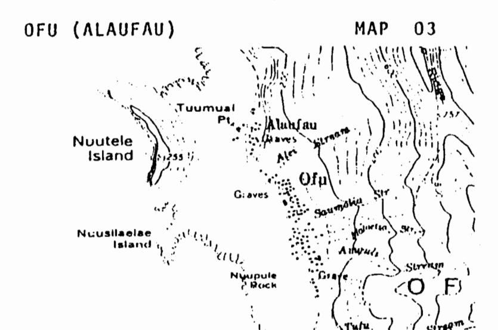

FLORA AND FAUNA

OFU (ALAUFAU)

MAP 03

FLORA AND FAUNA

extensive flats of consolidated and unconsolidated limestone (ASCRI-03B1) at a depth of around 6 inches (15 cm) (49).

Currents generally move northward through Nu'utele Strait. As a consequence of this, sand and limestone rubble are swept northward, forming a sand bar north of Tu'umuai Point about 200 feet (60 m) offshore (69).

Large blocks of limestone, blasted from the reef during excavation of an access channel to the Ofu power plant in 1971, lie at depths of 8 to 10 feet (2.4 to 3.0 m) in the dredged channel entrance. The power plant channel varies in width from 60 to 70 feet (18 to 21 m) and in depth from 3 to 10 feet (1 to 3 m) (69).

# FRINGING REEF

The reef flat off Alaufau out to Nu'utele Islet is relatively depauperate in marine life, with low diversity of corals and other invertebrates, algae, and fishes. Coral cover is less than 5% on rubble north of Tu'umuai Point. Acropora sp., Porites sp., and Psammocora sp. are most conspicuous. Encrusting coralline algae are common. Rubble fans extending from shore between the harbor and the major ava support Pocillopora damicornis -- abundant in small areas with up to 60% coral cover. Overall, coral cover is low. Slightly deeper, sandy areas between rubble fans contain patches of blue-green algae (Lyngbya). Chaetopterid worms are conspicuous at the low tide line between Tu'umuai Point and the harbor (ASCRI-O3B1). The soft coral, Zoanthus vestitus, is reported to be abundant in the area between Alaufau and Nu'utele Islet (55).

Few fishes inhabit the shallow reef fronting Alaufau, especially at low tide. The fish fauna numbers at least 11 species. Most common are the damselfish, <u>Stegastes albofasciatus</u>, the triggerfish, <u>Rhinecanthus aculeatus</u>, and the wrasse, Halichoeres trimaculatus (ASCRI-03F1).

#### OFU HARBOR

Ofu Harbor, located north of Alaufau, is protected by a revetment (49). The floor of the basin and inner channel of Ofu Harbor is covered with fine, white sediment and clumps of fleshy algae. Marine life, especially corals, has rapidly colonized harbor structures in the four years following construction. Outer channel walls consist of coral limestone, but coral abundance here is low. Corals are most common on the walls of the inner harbor in a vertical band between depths of 5 and 15 feet (1.5 and 4.6 m) where coral cover approaches 50%. Although corals extend to the channel bottom, they are more common on the upper vertical walls of the inner harbor. Corals are absent where sediment accumulates and where currents cause scour. Pocillopora damicornis and P. verrucosa are common. Leptastrea purpurea is common in the outer harbor. In addition to coral, common marine life in the harbor includes the sea star, Linckia

OFU (ALAUFAU)

MAP 03

WATER CONDITIONS

OFU (ALAUFAU)

MAP 03

USE CONSIDERATIONS

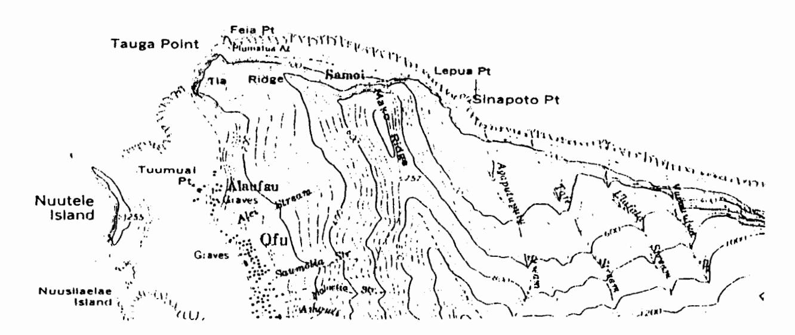

NU'UTELE ISLET

MAP 03

. FLORA AND FAUNA

( SEABIRD NESTING AREA

WEST COAST

sp., the sea cucumber, Stichopus sp., and reef fishes (surgeon-fishes, butterflyfishes, jacks, damselfishes, wrasses, barracuda). Algae are abundant on the reef flat beside the dredged faces of harbor channels. Most common species in the harbor are fleshy Amansia sp. and encrusting Porolithon sp. Harbor channel walls show a low rate of recolonization by marine life, presumably due to wave scour. Fishes are most abundant and diverse outside the harbor (74).

#### OFU HARBOR

Visibility underwater is about 25 feet (8 m) inside the harbor, improving outside the harbor. Sediment accumulation appears to be confined to the harbor basin floor with little noticeable impact on adjacent reef flat areas (74).

#### OFU HARBOR

Recently-constructed Ofu Harbor allows shallow-draft vessels to land at Ofu (ASCRI). The entrance channel has a depth of 18 feet (5.5 m). Facilities include a berthing area for small craft and a barge landing (49). An iron barge functions as a temporary wharf but is rapidly deteriorating (74). The lighted basin and wharf are heavily used for night fishing by residents. Commonly caught within the basin at night are malau (squirrelfish) and atule (bigeye scad) (74). Pole and line fishing takes place from the rocky harbor walls. Spearing is undertaken seaward of the harbor entrance (ASCRI).

#### NU'UTELE ISLET

Nu'utele and Nu'usilaelae islets, off the west end of Ofu, are erosional remnants of a tuff cone built by relatively recent volcanism occuring near sea level and centered off the southwestern side of Ofu. The western portion of Nu'utele is a sheer cliff, while the eastern shore consists mainly of a cliff and massive boulders at the water line (15). A small beach is composed largely of calcareous sand and gravel, with a noticeable component of eroded tuff material (ASCRI-03S1). A bench with a maximum width of 30 feet (9 m) is eroded about 5 feet (1.5 m) above sea level along the exposed side of Nu'utele Islet, as well as in places along the protected side (55). Sea arches and natural tunnels are evident on the exposed side of the seastack (ASCRI-03S2). A large tidepool is present and three large caves have been cut by surge channels on the seaward side of the islet (15;41). Wave erosion has also produced spectacularly-eroded grottos, caves, and arches on Nu'usilaelae Islet offshore of Ofu Village (64).

# NU'UTELE ISLET

Nu'utele Islet is the major breeding place for five of the six species of seabirds known to nest on Ofu Island. Brown boobies (fua'o; Sula leucogaster plotus), blue-grey noddies

( \* Nu'utele Islet
 possible "Special Area"
 of essential habitat - Chap. VI.C.1 (21)

NU'UTELE ISLET

MAP 03

USE CONSIDERATIONS

OFU

MAP 03.

PHYSIOGRAPHY

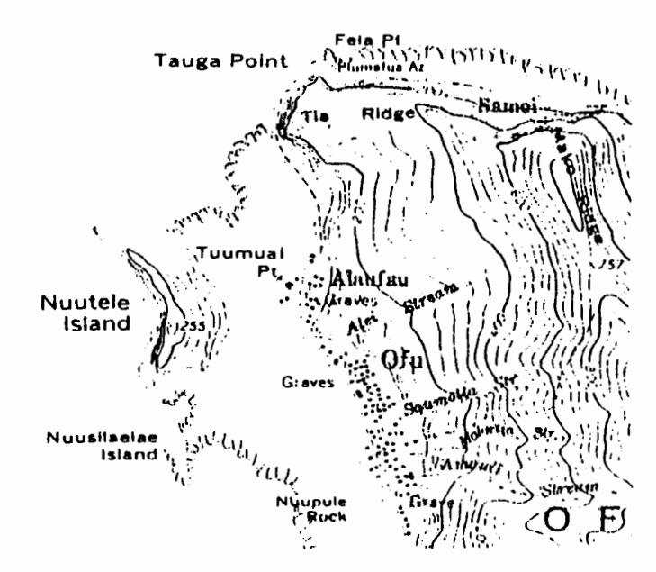

WEST COAST MAP 03

(Procelsterna cerulea), brown noddies (Anous stolidus pileatus), and white terns (Gygis alba pacifica), nest along the sheer cliff on the western side of the islet. Red-footed boobies (Sula rubipes) have previously nested in trees on the isolated north tip of the islet. White-tailed tropicbirds (Phaethon lepturus dorotheae), brown noddies, and white terms nest inland on trees. Four species potentially breed here: the great (atafa; Fregata minor palmerstoni), the lesser frigatebird (atafa: Fregata ariel ariel -- which roost at night in trees along the northwest tip of Nu'utele), the black noddy (Anous tenuirostris minutus), and the reef heron (matu'u; Egretta sacra sacra). The ceilings of three large caves which have been cut by surge under Nu'utele Islet may be a nesting area for the white-rumped swiftlet (pe'ape'a; Collocalia spodiopygia spodiopygia). The caves provide roosting sites for fruit and sheath tailed bats (pe'a; Pteropus samoensis; pe'ape'avai; Emballonura semicaudata). Fruit bats (pe'a; Pteropus samoensis) also roost in trees on Nu'utele Islet (15).

NU'UTELE ISLET

Nu'utele Islet is proposed as a wildlife sanctuary because it is the major nesting site for seabirds on Ofu (15).

# COAST BETWEEN TU'UMUAI POINT AND NU'UPULE ROCK

SHORELINE

South of Tu'umuai Point there is a narrow beach of calcareous sand backed by a revetment of basalt and limestone boulders. Beach width increases slightly toward Ofu Village. Fronting Ofu, the beach is 40 feet (12 m) wide and slopes inland to the vegetation line at the 6-foot (2 m) elevation. foreshore consists of white sand with scattered limestone rubble. Ongoing erosion at the southern end of the village has cut a 3 to 4-foot (1.0 to 1.2 m) scarp and exposed roots of coconut trees (49;ASCRI-03S3). A 25-foot (8  $\mathfrak{m}$ ) wide sand beach south of the scarp is protected by a single row of large volcanic boulders, up to 6 feet (2 m) across, placed at mean sea level. gently-sloping beach is composed of sand and limestone rubble. Although the boulders have stabilized this section of beach, they have cut off longshore sand transport northward, with resultant erosion in that reach. A 10 to 20-foot (3 to 6 m) wide beach of calcareouo sand occurs in the lee of Nu'upule Rock. Nu'upule Rock, a 40-foot (12 m) wide beach of sand and scattered limestone rubble slopes to a height of 5 feet (1.5 m). foreshore is backed by a rock revetment extending up to the road elevation at 10 feet (3 m) (49; ASCRI-03S4). The southern end of Ofu Beach terminates in a shoreline of basalt boulders, with some scattered sand patches at the waterline. The densely-vegetated backshore rises steeply to the road at the 30-foot (9 m) elevation (49).

OFU

MAP 03

**PHYSIOGRAPHY** 

OFU

MAP 03

PHYSIOGRAPHY

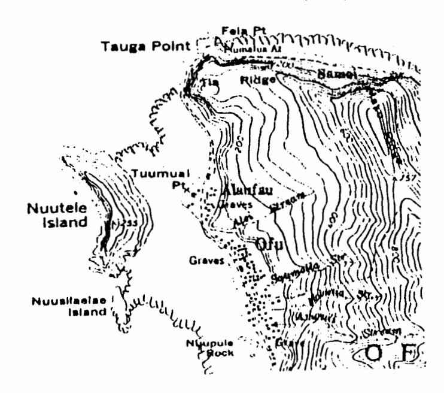

# NU'UPULE ROCK

During an extended period of volcanic inactivity, a sea cliff about 300 feet (90 m) high was formed around Ofu. After formation of the sea cliff, renewed volcanic activity sent lava flows down old valleys on the southwest side of the island. Nu'upule Rock, just offshore of Ofu Village, is an erosional remnant of this lava flow, (55).

# FRINGING REEF

The fringing reef encircling Ofu Island is most extensive in the strait which lies between the island and the offshore seastacks of Nu'utele and Nu'usilaelae. The reef platform fronting the village and extending through the strait is about 1,500 feet (460 m) wide. The depth varies from one foot (0.3 m) to 6 feet (2 m), except in deeper channels at the northern end (69). The fringing reef narrows to 600 feet (180 m) south of Nu'upule Rock (49).

Unconsolidated areas of a reef flat contain a large proportion of coral rubble (mostly Pavona). Beyond 150 feet (46 m) from shore, depth increases to between 3 and 5 feet (1.0 and 1.5 m), and the bottom is characterized by sandy areas interspersed between rich coral beds (ASCRI-03B2).

A "boat channel" having depths of 2 to 4 feet (0.6 to 1.2 m) parallels the beach fronting Ofu Village. The 10- to 20-foot (3 to 6 m) wide channel has a sand and rubble bottom. about 12 to 15 feet (3.7 to 4.6 m) wide extends seaward from the boat channel toward a major ava cutting through Ofu This channel, which reaches a depth of 4 feet (1.2 m), appears to be man-made (ASCRI-03B3). A sand-covered platform of dead Pavona extends within 20 feet (6 m) of shore. The bottom consists largely of rubble and sand at depths of 2 to 4 feet (0.6 to 1.2 m) at high tide. Isolated outcrops of limestone and depressions provide bottom relief of up to one foot (0.3 m) (ASCRI-03B4). From 150 to 450 feet (45 to 130 m) offshore, the consolidated limestone surface of the <u>Pavona</u> flat is exposed. Depressions up to 2 feet (0.6 m) deep occur here (ASCRI-03B5). The reef flat at 500 feet (150 m) from shore consists of loose limestone rubble and calcareous sand. This area is partially exposed at low tide, with pits and depressions submerged up to one foot (0.3 m). The mid-reef zone, between 500 and 1,000 feet (150 and 300 m) offshore, is less than one foot (0.3 m) deep at low tide (69).

The reef flat near Nu'utele Islet is sand, rubble, and scattered limestone outcrops. Small volcanic boulders, as well as considerable sand and rubble, occur within 150 feet (45 m) of the leeward shore of the seastack (ASCRI-03B6).

OFU

MAP .03

PHYSIOGRAPHY

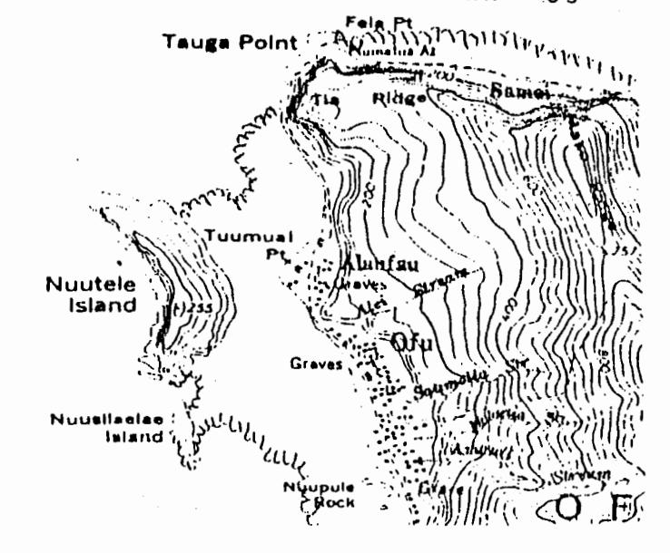

OFU

MAP 03

PHYSIOGRAPHY

OFU

MVb 03

FLORA AND FAUNA

# FRINGING REEF (OFF NU'UPULE ROCK)

A sandy-rubble bottom channel, reaching a depth of 4 feet m), occurs northeast of Nu'upule Rock. Near the seastack, the channel merges with consolidated limestone pavement (ASCRI-03B7). South of Nu'upule Rock, the inner reef flat is sandy, with some occurrences of rubble, small boulders, and consolidated The wave-scoured nearshore area has little relief and limestone. exposes at low tide (ASCRI-03B3). Near a small seastack about feet (45 m) from shore, the bottom is mostly consolidated limestone. Depth over the inner reef is about 2 feet (0.6 m) (ASCRI-03B9). From 200 to 400 feet (60 to 120 m) offshore there is a middle reef area of staghorn Acropora thickets interspersed with areas of sand and rubble. At incoming tide, depth ranges from 3 feet (1 m) to a minimum of one foot (0.3 m) (ASCRI-03B10). The outer reef flat, 400 to 650 feet (120 to 200 m) from shore, is covered with limestone rubble. Partially exposed at low tide, the outer reef has a maximum depth of 2 feet (0.6 m) (ASCRI-03B11).

# FRINGING REEF FRONT

On the outer reef south of Nu'utele Islet, over 1,000 fdet m) offshore of Ofu, occur high-standing limestone masses surrounded by sand channels 3 to 4 feet (1.0 to 1.2 m) North of Nu'utele Islet, a natural opening in the reef narrows from 300 feet (90 m) to less than 100 feet (30 m). The sides of channel, as well as the reef face near the natural break rise almost vertically from a depth of over 60 feet (18 m). The discontinuous and serrated reef margin and front is characterized surge channels (grooves) and buttress (spur) systems. An arrangement of deep, transverse grooves crosses between limestone buttresses encrusted by coralline algae. Some of the extend verticaly as surge channels which penetrate into the body of the reef flat. Limestone masses up to 100 feet (30 m) lie a few feet below the surface seaward from the northwestern corner of the natural break. These huge masses extend about 1,000 feet (300 m) seaward of the reef margin (69).

#### FRINGING REEF

The middle reef flat between Tu'umuai Point and Nu'utele Islet has rich coral growth, consisting of Porites andrewsi, Pocillopora damicornis, and some staghorn acroporans. Sea anemones grow between dead branches of Acropora (ASCRI-03B2).

The narrow boat channel paralleling Ofu Beach is devoid of live coral. Algae, sea cucumbers (Holothuria atra, Stichopus chloronotus), and sponges are present but not abundant. The inner margins of a man-made channel extending offshore toward a large ava are lined with Porites andrewsi (ASCRI-03B3). Between Ofu and Nu'utele Islet, limestone surfaces on the inner portion of the Pavona flat harbor sparse algal cover (not exceeding 5%) consisting of Halimeda discoidea, Dictyosphaeria versluysii, Valonia cf. aegogropila, and patches of a low-growing, brown

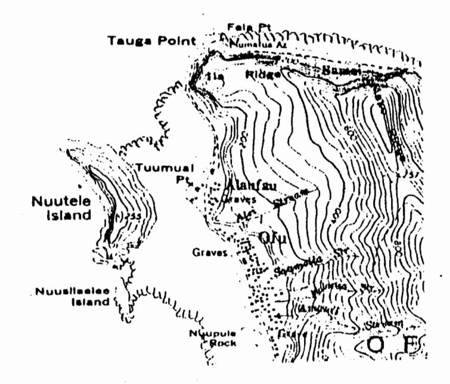

OFU

MAP 03

FLORA AND FAUNA

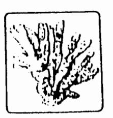

species (ASCRI-03B4). Live coral covers about 50% of the outer of the Pavona flat, from . 150 to 450 feet (46 to 140 m) Diversity is low, with only 9 genera represented. Pavona are interspersed with areas of Porites andrewsi Areas of (occupying depressions in the consolidated platform), encrusting Porites, and some staghorn acroporans. Areas of large Porites (Synarea) sp. and several large Fungia fungites are evident. Colonies of soft corals (Zoanthus sp.) grow on dead branches of staghorn acroporans. The sea urchin, Echinometra mathaei, is common in crevices and branches of acroporans (ASCRI-03B5). Parts of the middle portion of the reef (500 to 1,000 feet or 150 to 300 m offshore) are covered with a rich growth of Heliopora Numerous small, blue damselfish live between the branches of this coral (69).

Live coral covers about 5% of the reef flat near Nu'utele Islet and consists of <u>Porites</u> cf. <u>lutea</u> and other species. The green alga, <u>Valonia</u> cf. <u>aegogropila</u>, is common. Near the leeward shore of Nu'utele Islet are sound small volcanic boulders with encrusting coralline algae (ASCRI-03B6).

At least 45 species of fish inhabit the reef between Ofu and Nu'utele Islet. Dominant species nearshore are damselfishes (Glyphidodontops biocellatus and Stegastes albofasciatus), a surgeonfish (Acanthurus triostegus), and a wrasse (Halichoeres trimaculatus). In thickets of Acropora farther seaward, dominant fishes are damselfishes (Stegastes nigricans, S. albofasciatus, and S. lividus). A surgeonfish (Acanthurus triostegus) and schools of juvenile parrotfishes (Scarus spp.) dominate in more open areas of the reef (ASCRI-O3F2).

# FRINGING REEF (OFF NU'UPULE ROCK)

The coral, <u>Pavona frondifera</u>, is conspicuous on hard bottom northeast of Nu'upule Rock. Small colonies of soft corals (zoanthids) grow along the base of the seastack (ASCRI-03B7).

Coral cover by a variety of species totals only 5% on the inner reef flat south of Nu'upule Rock. Scattered occurrences of hard bottom are mostly encrusted by coralline algae. The sea cucumber, Stichopus chloronotus, is common. Holothuria atra and two kinds of sponges are less common (ASCRI-0388).

The shoreward portion of a generally consolidated bottom has a coral cover of about 10% -- mostly of <u>Porites lutea</u>. Pavona <u>frondifera</u> covers up to 50% of the seaward portion. An area of rich finger coral (<u>Porites andrewsi</u> about 50 feet or 15 m across) occurs in this region (ASCRI-03B9).

Large beds of low-growing staghorn acroporans cover 30 to 40% of the middle reef flat, 200 to 600 feet (60 to 130 m) offshore. Areas of Acropora aspera alternate with areas of A. formosa. About half of the staghorn thickets are dead, apparently of causes other than Acanthaster predation. At least 20 coral species in 11 genera are represented on the reef south of

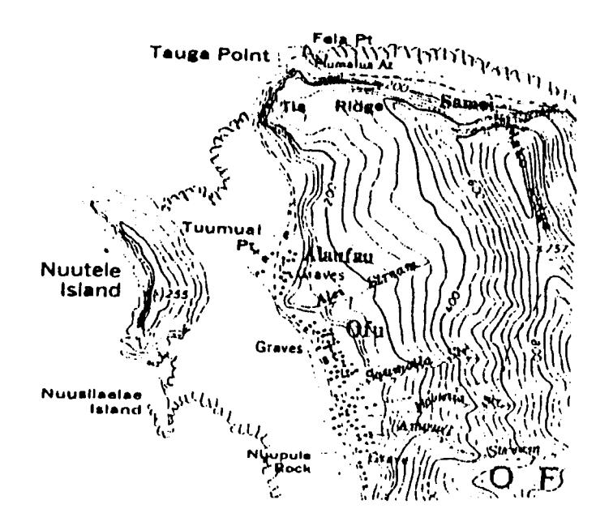

OFU MAP 03

FLORA AND FAUNA

OFU

MAP 03

WATER CONDITIONS

0FU

MAP 03

USE CONSIDERATIONS

MEDI CUMDI

Nu'upule Rock. Other conspicuous invertebrates include juvenile sea cucumbers (Stichopus chloronotus) and adult sea urchins (Echinometra mathaei) in crevices. A green alga (Valonia cf. aegogropila) is common (ASCRI-O3B10).

Small amounts of coral inhabit the outer reef flat. The sea cucumber, Holothuria difficilis, is abundant here. Less common are Stichopus chloronotus, the starfish, Linckia sp., and the cowrie, Cypraea annulus (ASCRI-03B11).

The reef flat immediately south of Nu'upule Rock shelters at least 33 species of fishes. In the nearshore area of low bottom relief and low coral cover, dominant species are the damselfishes, Glyphidodontops biocellatus, G. glaucus, and Stegastes albofasciatus, and a wrasse, Halichoeres trimaculatus. Farther offshore, in an area of Acropora thickets, the damselfishes, Stegastes nigricans and S. albofasciatus, are most abundant. Seaward of the Acropora zone is a shallow area of limestone rubble with few fishes. Most common are Glyphidodontops glaucus, Halichoeres trimaculatus, and the convict tang, Acanthurus triostegus (ASCRI-03F3).

# FRINGING REEF FRONT

Scattered patches of living coral measuring up to 20 feet (6 m) across occupy the outer reef flat (1,000 to 1,500 feet or 300 to 450 m offshore) near Nu'utele Islet. The upper faces of limestone buttresses on the reef front are paved with encrusting coralline algae which create an extremely rough surface (69).

Small corals and red algae cover the tops of limestone blocks. Coral cover and diversity are high on the walls of channels. White sand covers the bottom of channels. Fishes are abundant in this location (49).

#### FRINGING REEF

The fringing reef and offshore islets northwest of Ofu Village protect Nu'utele Strait from ocean waves. However, a strong current flows through the ava and between Nu'usilaelae Islet and Nu'upule Rock (69). A longshore current flowing from south to north becomes stronger about midway across the strait between Ofu and Nu'utele Islet. Although longshore currents in the nearshore "boat channel" fronting Ofu Village are weak during high tide, the longshore current near Tu'umuai Point is strong. A strong current also flows between shore and the largest of the Nu'upule Rocks (ASCRI).

Underwater visibility is generally good in the strait between Ofu and Nu'utele Rock. However, refuse and silt accumulate in the nearshore boat channel (ASCRI).

#### SHORELINE

An unimproved road parallels the shoreline along the top of

( BOAT RAMP

OFU

MAP 03

USE CONSIDERATIONS

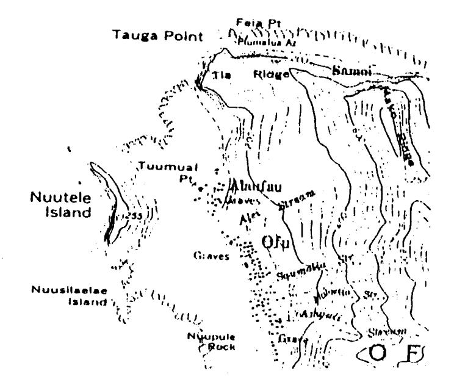

the scarp fronting the north end of Ofu Village, except for a short section near Alaufau where the road turns inland. At the south end of the village, the road is about 40 to 120 feet (12 to 37 m) inland. South of Nu'upule Rock, the road lies inland of a shoreline revetment. The road parallels the shoreline to the airfield and continues eastward toward Asaga Strait (49).

Ofu Beach affords shoreline access (ASCRI). The fringing reef and offshore islets offer good wave protection to Ofu Beach (49), where well-protected waters are suitable for swimming. Beach access is by courtesy of Ofu Village (41). A boat ramp is planned for Ofu Village, where small boats are still launched across the beach (41).

The sand bottom area between Ofu Beach and Nu'upule Rock is considered a good swimming area because it is recessed slightly below the reef flat (49). However, longshore currents can be strong between shore and the seastack (ASCRI).

# FRINGING REEF

The reef flat fringing the western coast of Ofu Island from Ofu Harbor to the southern end of Ofu Village is considered a "critical use reef area" supporting subsistence fishing by villagers (39). Both the reef flat and deeper waters of the ava reef front are frequently fished from the harbor southward beyond Papaloloa Point. Favored methods are pole and line fishing and reef gleaning. Spearing (mata) and throw-netting follow in popularity. Rod and reel fishing and handlining from canoes (day and night) are less common activities. Gatala (honeycomb grouper), filoa (large emperor fish), mataeleele (small fish), sumu (triggerfish), lupota (small jack), savane (blue lined snapper), and mataele (scarlet sea bass) are taken day and night by pole fishing. In addition, lupo (juvenile jack) is caught by day, and malau (squirrelfish), matapula (bigeye snap-per), malai (paddletail snapper), and mutu are taken by night. Spearing results in day and night catches of alogo (lined surgeonfish), pone (chocolate surgeonfish), malauli (large jack), lupota, and anae (adult mullet). Day catches often include sugale (wrasse), fugausi and laca (parrotfishes), fe'e (octopus), eel, and faisua (giant sea clam). Night catches frequently include manini (convict tang), ula (spiny lobster), crab, and papata (slipper lobster). Throw-netting is a daytime activity yeilding manini, fuafua (juvenile mullet), anae, lupota, i'a usi (threadfin), sugale, fuga, pone, and alogo. Drive-netting (lau) is a seasonal activity resulting in daytime catches of atule, (juvenile goatfish), and lo (rabbitfish). Handlining from canoes brings in day and night catches of matapula (bigeye snapper), mataeleele (small emperor fish), malai (paddletail snapper), filoa, savane, and mataele (scarlet sea bass). Malau (squirrelfish) are often taken at night by this method (20).

Helioporan coral with stony branches up to 2 feet (0.6 m) high, break underfoot and make walking over the middle portion of the reef hazardous (69).

OFU

MAP 03

USE CONSIDERATIONS

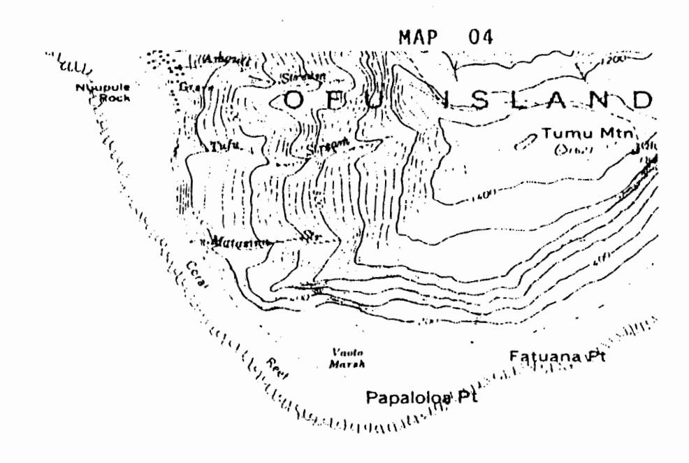

**PHYSIOGRAPHY** 

VAOTO MARSH

MAP 04

PHYSIOGRAPHY

PAPALOLOA POINT

MAP 04

PHYSIOGRAPHY

AVA (OFF OFU)

Canoes and longboats cross the reef by entering the large ava southeast of Nu'usilaelae Islet and following a man-made channel into shore (ASCRI).

# COAST BETWEEN NU'UPULE ROCK AND FATUANA POINT

#### SHORELINE

The southwestern coast of Ofu consists of narrow sand beaches alternating with reaches of volcanic outcrops and boulders. A 25-foot (8 m) wide beach of calcareous sand with scattered basalt boulders and limestone rubble occurs near the mouth of Matasina Stream. A densely-vegetated backshore separates the beach and the unimproved road paralleling the shore at an elevation of 12 feet (4 m).

Fronting the airfield runway is another stretch of beach about 40 to 60 feet (12 to 18 m) wide. The foreshore is composed of calcareous sand with scattered limestone basalt rubble and boulders (49). An extensive platform of beachrock 20 to 30 feet (6 to 9 m) in width is continuous along The western end of the runway is protected by a shoreline. low embankment of large basalt boulders which extend nearly to the waterline (49; ASCRI-04S1). The airfield runway is situated on a flat backshore approximately 8 feet (2.4 m) above sea level and is oriented in an east-west direction. The area between the beach and runway is densely-vegetated except for an area cleared at the east end of the runway to permit safe landings and takeoffs. Removal of vegetation has contributed to erosion of a (1.0 to 1.5 m) high eroding scarp at the east end. 3 to 5-foot The airport beach terminates in a headland of basalt boulders at Fatuana Point. Here, a steep densely-vegetated scarp rises from the foreshore to the road at elevations above 20 feet (6 m). Fatuana Point, the road is close to the edge of the embankment, and rocks have been dumped to stabilize the road fill (49).

#### **VAOTO MARSH**

On the southernmost tip of Ofu is a small flat area backed by steep coastal cliffs. In this plain are several depressions, one of which is covered by a coastal marsh named Vaoto. This marsh has an area of approximately 4 acres (1.6 ha). The southern edge of the marsh is cut off by the small airfield that has been recently constructed there (77).

# FRINGING REEF (OFF PAPALOLOA POINT)

The fringing reef fronting the airfield runway is 500 to 600 feet (150 to 180 m) wide (49). Over 900 feet (275 m) northwest of Papaloloa Point, the inner reef flat is predominantly rubble, small boulders, and outcrops of consolidated limestone.

VAOTO MARSH

**MAP** 04

FLORA AND FAUNA

( RARE WATERBIRD

PAPALOLOA POINT

MAP 04

MAP 04

Tumu Min

Community

March

Fatuana Pt

Papaloloa Pt

Papaloloa Pt

FLORA AND FAUNA

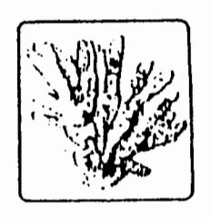

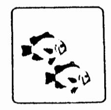

Bottom relief is low. Sand occurs as a veneer as well as in shallow pockets. Depth at high tide is about 2 to 3 feet (0.6 to 1.0 m) (ASCRI-04B1). To the southeast, toward Papaloloa Point, the inner reef of rubble, boulders, and sand grades into a depression containing sand and gravel nearshore. Seaward is a lagoon-like area of numerous limestone outcrops and large microatolls (many 10 to 15 feet or 3.0 to 4.6 m across) separated by pockets and channels of sand and rubble about 4 feet (1.2 m) deep and 10 to 15 feet (3.0 to 4.6 m) wide. Sandy areas between microatolls have a sand cover varying from an inch (2.5 cm) to more than 12 inches (30 cm) thick overlying consolidated limestone. Maximum depth at low tide ranges between 3 and 5 feet (1.0 to 1.5 m) (ASCRI-04B2). The outer reef platform is a well-cemented limestone pavement with little relief (ASCRI-04B3).

#### VAOTO MARSH

In recent years cultivation has been neglected and the vegetation in Vaoto Marsh is reverting back to natural conditions. Dominant plants are Rhynchospora, Eleocharis, and Ludwigia (77). The rare Australian gray duck (toloa; Anas superciliosa pelewensis) has been sighted in this area (15).

# FRINGING REEF (OFF PAPALOLOA POINT)

The inner reef flat, 900 feet (275 m) northwest of Papalo-Point, is relatively barren with low coral cover (ASCRI-04B1). A nearshore depression extending about 600 to 900 feet (180 to 275 m) northwest from Papaloloa Point has the appearance of a lagoon, which contains rich and diverse corals. corals are Porites lutea, Millepora (especially M. tortuosa), and Heliopora, which form large microatolls. Thick-branched staghorn Acropora intermedia grows in thickets in deeper, more seaward parts of the depression. Large patches of Montipora sp. also. Other corals present include two kinds of Platygyra, Acropora aff. variabilis, Hydnophora exesa, and Favia helianthila. The area of microatolls may have resulted from regrowth of corals dredged to obtain fill material for Ofu airport. The sea cucumber, Holothuria hilla, is abundant, found with H. atra, H. argus, nobilis, and Stichopus chloronotus in sandy depressions. The green alga, Halimeda discoidea, is abundant and fragments of Halimeda are a noticeable component of sand deposits (ASCRI-04B2).

The reef fronting the eastern end of the Ofu runway has a highly diverse fish assemblage, numbering at least 72 species. The damselfish, Glyphidodontops glaucus, and the surgeonfish, Acanthurus triostegus, dominate rubble areas near shore. The damselfishes, Stegates albofasciatus and S. nigricans, dominate beds of live coral and Acropora thickets in shallow areas. Fish diversity is highest in depressions between coral formations. The large number of species confuses the question of dominance, but the most common genera are Scarus, Acanthurus, and Chaetodon (ASCRI-04F1).

PAPALOLOA POINT

MAP 04

WATER CONDITIONS

PAPALOLOA POINT

MAP 04

USE CONSIDERATIONS

( \* Fringing reef off Papaloloa
 Point possible "Special
 Area" of substantial recrea tional value -- Chap. VI.C.2 (21)

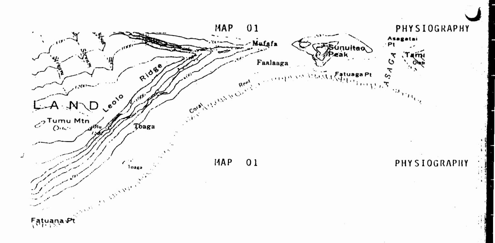

**MAP 01** 

FLORA AND FAUNA

( RARE LAND PLANT

SOUTH COAST

MAP 04

Small amounts of coral grow on the relatively flat outer reef platform (ASCRI-04B3).

# FRINGING REEF (OFF PAPALOLOA POINT)

Underwater visibility is excellent in the nearshore depression extending northwest from Papaloloa Point. Approaching the point, water clarity is reduced. Longshore currents flow to the northwest. The ouxer reef flat can be inaccessible due to heavy surf (ASCRI).

# FRINGING REEF

The lagoon-like features of a nearshore depression extending northwest from Papaloloa Point offer excellent and safe sport diving. Rich coral beds provide opportunities for underwater photography. The lagoon is easily accessible from Ofu airport and Ofu Village, and has potential for marine eduation as well as casual underwater exploration by tourists. Diverse and abundant fishes make this area good for fishing, especially collecting of aquarium fishes. The fringing reef lacks an ava, so there is no ready access to the reef front except by crossing the shallow reef flat, where high surf would usually prove hazardous (ASCRI).

# COAST BETWEEN FATUANA POINT AND FATUAGA POINT

# SHORELINE

Northeast of Fatuana Point is a short, narrow strip of sand beach terminating at a point of basalt boulders. A densely-vegetated backshore slopes up to the road at the 10 to 12-foot (3 to 4 m) elevation. A white sand beach curves gently along the shore fronting Toaga and Fa'ala'aga for nearly 1.5 miles (2 km) and is considered one of the most beautiful beaches in American Samoa. The foreshore is typically about 60 feet (18 m) wide and rises to the vegetation line at the 10-foot (3 m) elevation. The road is set 80 to 100 feet (25 to 30 m) inland of the beach. Beachrock outcroppings are extensively exposed along the shore (49).

#### FRINGING REEF

The southern coast of Ofu is exposed to trade wind waves, particularly in the vicinity of Toaga. A fringing reef decreases in width from 700 feet (215 m) fronting Toaga to 300 feet (90 m) off Fa'ala'aga. Depths vary from 6 to 12 inches (15 to 30 cm) with little bottom relief. Scattered sand patches on the inner reef flat extend about 100 feet (30 m) offshore to a consolidated limestone bottom (49).

# COASTAL AREAS

A disturbed littoral forest along the southern coast of Ofu includes a large amount of the uncommon shrub, Sophora tomentosa

( SEABIRD NESTING AREA . ( TURTLE NESTING AREA

FO'ISI'A ROCK

MAP 01 HISTORICAL/ARCHAEOLOGICAL

FA'ALA'AGA BEACH

MAP 04

USE CONSIDERATIONS

ASAGATAI POINT MAP 04 \* Fa'ala'aga Beach possible
"Special Area" of substantial recreational value --Chap. VI.C.2 (21)
USE CONSIDERATIONS

SOUTH COAST

and is one of the few places in American Samoa where this species can be found. Flying fox (pe'a; <u>Pteropus samoensis</u>) roosts are found on the cliffs along the south coast of Ofu. The common brown noddy (<u>Anous stolidus pileatus</u>), nests on the southern cliffs above To'aga (15).

The endangered green sea turtle (Chelonia mydas) is reported to have previously nested in small numbers on sand beaches along the southeastern shore of Ofu, but has only been seen offshore in recent years (15).

#### FO'ISI'A ROCK

According to legend, a large rock known as Fo'isi'a off the coast of Ofu is a warrior turned to stone. When a high chief saw his army in defeat during the war between Ofu and Olesega Islands, he jumped into the sea and swam to a tiny island where he turned into a stone (30).

# FA'ALA'AGA BEACH

Swimming takes place off Fa'ala'aga Beach. This white sand beach is the longest and considered the most photogenic in American Samoa (41).

#### ASAGATAI POINT

The scenic road along the southern coast of Ofu is of potential interest to tourists expected to visit a resort development about 200 feet (60 m) inland from Asagatai Point (74).

/OFU.TEX/ - /AUG-1980/

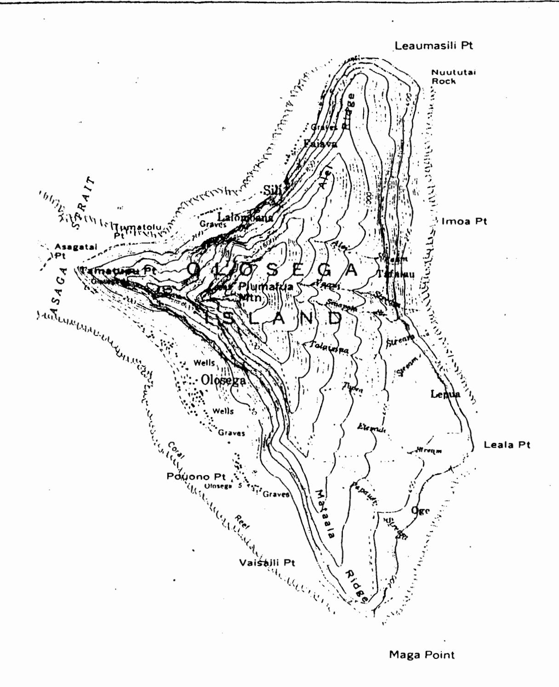

FIGURE 19. THE ISLAND OF OLOSEGA, MANU'A GROUP, AMERICAN SAMOA

## OLOSEGA ISLAND . .

The sister islands of Olosega and Ofu are the remnants of a single, extensively eroded, volcanic mass. They are separated by 500-foot (150 m) wide Asaga Strait. Both islands rise abruptly from the ocean and have little flat land other than the narrow coastal plain. Olosega, similar to Ofu in shape, covers an area of approximately 2 square miles (5.2 sq km). One shield of the volcanic mass is centered off the northwest coast of Olosega near Sili Village (MAP OL1) (55).

The latest episode of volcanic activity in American Samoa was a submarine eruption reported between the islands of Oloseya and Ta'u about 1866, building a cone to within 150 feet (46 m) of the ocean surface (54;55).

#### STREAMS

Streams occur only on the eastern slopes of Olosega. Because Olosega is lower in elevation and smaller in area than nearby Ta'u Island, Olosega receives considerably less rainfall and runoff. Streams are neither as large nor as numerous as on Ta'u and most have cut only shallow valleys. Only at Va'aui and Sinapoto have streams cut deep valleys. All streams are intermittent, flowing only after heavy rains (55).

# SEA CLIFFS

An extensive period of inactivity between eruptions permitted the erosion of deep valleys and the formation of sea cliffs around Olosega. The cliffs originated as volcanic faults but have been much modified by wave erosion. A cliff reaches a height of 2,000 feet (610 m) along the northwest coast between Tamatupu Point and Faiava (MAP OL1). Behind Olosega Village (MAP OL2), a cliff rises over 2,000 feet (610 m) to the summit of the island. The cliff is 200 feet (61 m) high at Leala Point and 120 feet (37 m) high at Maga Point (MAP OL2), a buried tuff cone. Apparently, the curved bay bordered by the high southwestern cliff of Olosega and the high southeastern cliff of Ofu originated as a caldera collapse (enlarged by marine erosion)(55).

Boulders break off from the cliff and fall onto the reef flat below. Talus and landslide materials accumulate at the base of the cliffs. Large landslide deposits occur inland of Olosega Village. At Sili, large boulders on the reef flat, scars on the cliffs, and Samoan tales testify to active erosion (55).

# COASTAL TERRACE

A terrace of calcareous sand is well developed along the southern coast of Olosega, where it rises to 20 feet  $(6\ m)$  in places. Probably formed by hurricane and storm waves, the terrace attains a maximum width of over 1,000 feet  $(305\ m)$  at

OLOSEGA IS.

GENERAL

PHYSIOGRAPHY

OLOSEGA IS.

GENERAL

PHYSIOGRAPHY

OLOSEGA

Olosega Village and averages 300 feet (90 m) wide elsewhere. Sili Village is also built on this terrace. Typically, the terrace rises steeply to an elevation of about 18 feet (5.5 m) either as a beach foreslope or as an erosional escarpment. From its high point near the upper beach berm, the terrace generally descends toward inland cliffs with a gentle backslope. A marsh is present in the lowland between Olosega Village and the talus slopes at the base of the cliff. The plain is narrow and poorly-developed at Tafalau and in the Sili area, where it has been highly modified by landslide debris. At Pouono Point (MAP OL2), the terrace has been nearly covered by a large landslide. Hurricane waves overtop the berm on wave-exposed coasts but probably not on protected coasts (55).

#### SHORELINE

Much of the shoreline of Olosega consists of 40 to 50-foot (12 to 15 m) wide beaches of calcareous sand and limestone rubble. On a few beaches, volcanic fragments are present as minor components of the sand (49). Beaches experience little seasonal variation, probably because of the fringing reef offshore. The northern section of the beach at Oge, on the eastern coast, is composed of limestone boulders about 6 inches (15 cm) in diameter. These form a steep foreslope and a high berm (55).

Beachrock outcroppings are common at sea level on most beaches (49;55). Considerable beach erosion has occurred at the head of the channel off Olosega Village, where beachrock sections over 6 feet (2 m) thick are exposed. Large basalt boulders have been cemented into beachrock along the eastern coast of Olosega. Beachrock is also deposited over benched surfaces of lava rock at Leaumasili Point, Imoa Point, and Leala Point. A few beaches along the northeastern coast of Olosega contain beachrock with embedded basalt cobbles and occasional boulders (55).

Poorly-preserved remnants of benches eroded about 12 to 15 feet (4 to 5 m) above sea level occur at Leaumasili Point, at Leala Point -- where a bench over 100 feet (30 m) wide occurs -- and at Imoa Point -- where the bench is relatively narrow (55).

#### FRINGING REEF

The reef is continuous around Olosega except off the eastern coast exposed to trade wind seas. The reef is not continuous around Leaumasili Point, Leala Point, or Maga Point. The reef flats are relatively uniform, littered in places with large basalt boulders which have fallen from the cliff with sufficient momentum to cross the coastal plain (49;55). A large, dredged channel cuts through the reef off Olosega Village. Reletively deep, extensive sand deposits lie offshore of this channel. Smaller channels cross the reef at Sili and Oge. Strong currents flow seaward through these channels during ebbing tide (55).

OLOSEGA

MANU'A DISTRICT

OLOSEGA CO.

OLOSEGA IS.

GENERAL

FLORA AND FAUNA

OLOSEGA IS.

GENERAL

USE CONSIDERATIONS

# COAST BETWEEN LEAUMASILI POINT AND TUMATOLU POINT

The northwest coast of Olosega consists of a narrow coastal plain backed by a steep ridge rising to an elevation of 1,600 feet (490 m). This coast is in the lee of the trade winds, but is exposed to ocean swell from the north and northwest (49).

# SHORELINE

Southwest of Leaumasili Point there is a steep foreshore consisting of basalt boulders and limestone rubble. Extensive beachrock is exposed along shore (49). A steep, narrow beach of calcareous sand and some volcanic material fronts the villages of Faiava and Sili. In places, the foreshore is extensively covered with limestone rubble and basalt cobbles and boulders. Beachrock is prominent at the waterline. Numerous basalt cobbles and limestone fragments occur behind the vegetation line at the 90-foot (27 m) elevation, indicative of occasional storm waves. Mollusc fragments including those of Cypraea depressa and some Turbo sp. are found in the beach rubble at Sili (49;ASCRI-OLIS2).

A short section of boulders occurs along the shore southwest of Sili Village. Farther on there is another beach, 40 to 60 feet (12 to 18 m) wide, of sand with an extensive cover of limestone rubble and basalt cobbles. A large fraction of the sand (30 to 40%) is of volcanic origin. Beachrock is extensive along the shore. The coastal road parallels the shoreline and, in places, is close to the beach crest at the 10-foot (3 m) elevation. The road and backshore areas may be overtopped during severe storms. Houses immediately inland of the road against the cliff face have 4-foot (1.2 m) high protective walls.

# FRINGING REEF (OFF FAIAVA)

The coast is protected by a shallow, fringing reef varying from 150 to 450 feet (45 to 135 m) in width. Much of the fringing reef offshore is about 160 feet (50 m) wide and approximately 6 inches (15 cm) deep at Mean Low Water (49). The inner reef flat is one to two feet (0.3 to 0.6 m) deep. Nearshore, there occurs a narrow band of sand and rubble strewn with microatolls and basalt boulders. A microatoll off Faiava (Porites sp.) measures 40 feet (12 m) across and 1.5 feet (0.4 m) feet high, representing hundreds of years of coral growth (ASCRI-OL1B1).

Much of the middle reef flat is consolidated limestone cut by sinuous channels, 12 to 15 feet (4 to 5 m) wide. The bottom of these channels consists of sandy-rubble at a depth of about 4 feet (1.2 m). The outer reef is a scoured limestone platform without a well-developed algal ridge (ASCRI-OL1B2). SILI

MAP OL1

PHYSIOGRAPHY

( MAN-MADE CHANNEL

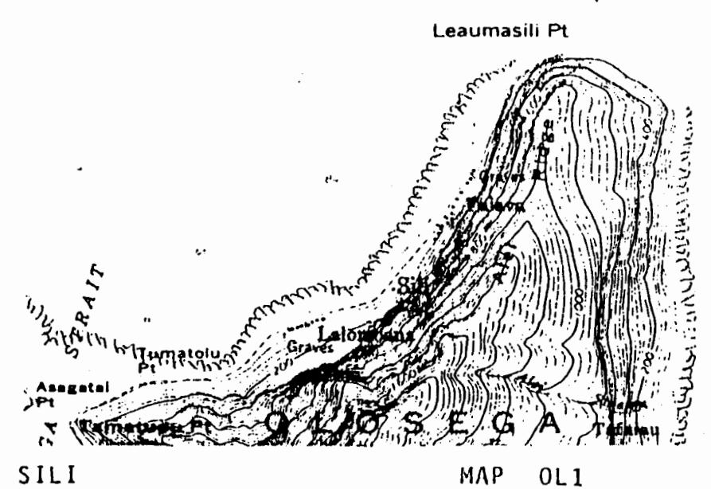

FLORA AND FAUNA

( SEABIRD NESTING AREAS

SILI (FAIAVA) MAP OL1

FLORA AND FAUNA

( RARE CORAL

# FRINGING REEF (OFF SILI)

A man-made channel was cut through the reef near Sili Village in the 1960's. At its head, the channel is 2 to 6 feet (0.6 to 2 m) wide and 1 to 2 feet (0.3 to 0.6 m) deeper than the reef flat. Active upward and lateral growth of the reef has apparently reduced the channel width. Accretion is also apparent in the middle and at the reef margin where the channel shoals (ASCRI-OL1B3).

The outer reef flat is a consolidated pavement of smooth limestone, with a slightly elevated sill at the reef margin which drops steeply to the reef front (ASCRI-OL1B4). The reef margin and upper reef front are grooved by shallow, surge channels about 4 feet (1.2 m) in width. Some of the channels are closed over by active reef growth. The reef front is broken in places by narrow sand channels at the base of a steep slope. Seaward of the channels, limestone banks rise to within 10 feet (3 m) of the surface. The reef front slopes gradually into deep water (ASCRI-OL1B5).

# COASTAL AREAS

The fruitbat or flying fox (pe'a; <u>Pteropus samoensis</u>) roosts on the rocky cliff above the village of Sili along the northwest coast of Olosega. Small numbers of sheath-tailed bats (pe'ape'avai; <u>Emballonura semicaudata</u>) roost in a cave located on the cliff above Sili Village. The common brown noddy (<u>Anous stolidus pileatus</u>) nests in trees along the coast (15).

# FRINGING REEF (OFF FAIAVA VILLAGE)

Some living coral tissue occurs around the margins of large Porites lutea microatolls near shore on the inner reef fronting Faiava Village. The alga, Laurencia cf. succisa, is relatively abundant, covering about 10% of the bottom. Other conspicuous organisms present include the star-shaped foram, Bacculogypsina sp., abundant in sand and the cowries, Cypraea moneta and C. annulus (ASCRI-OL1B1).

The sides of the sinuous passages through consolidated limestone of the middle reef are lined with live coral, covering up to 20% of the surface. Corals are remarkably diverse, with at least 48 species in 24 genera represented. Unusual components of the coral assemblage include numerous clumps of Stylophora cf. mordax and considerable Turbinaria cf. frondens, a rare species in Samoa. The corals, Plesiastrea versipora and three species of Goniopora, are present. The outer reef appears wave scoured. The alga, Laurencia succisa, remains conspicuous on the middle to outer reef but abundance is reduced compared to inshore areas. The algae, Halimeda discoidea and Porolithon gardineri, occur in channels and depressions. About 20% of the hard bottom is encrusted by coralline algae (ASCRI-OL1B2).

The fish fauna on the reef fringing Faiava Village includes

SILI

MAP OL1

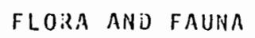

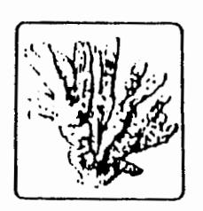

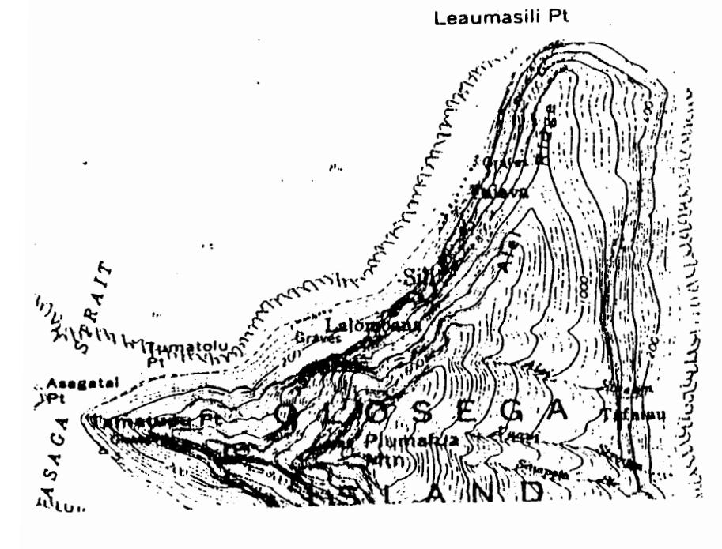

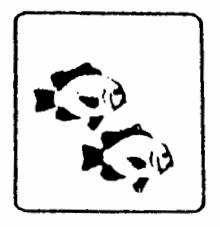

| SILI (FAIAVA) | MAP OL1 | WATER CONDITIONS          |
|---------------|---------|---------------------------|
| SILI          | MAP OL1 | HISTORICAL/ARCHAEOLOGICAL |
| SILI (FAIAVA) | MAP OL1 | USE CONSIDERATIONS        |

at least 42 species. Dominant species over the flat, shallow areas of the inner reef flat are the damselfishes, Glyphidodontops glaucus and Stegastes albofasciatus; the convict tang, Acanthurus triostegus; and the wrasse, Halichoeres trimaculatus. Seaward, in depressions between limestone platforms, the most abundant species are the surgeonfishes, Acanthurus glaucopareius, A. triostegus, and A. lineatus; and parrotfishes, Scarus psitticus, S. jonesi, and S. sordidus. Most of these fishes probably move onto the reef flat during high tide (ASCRI-OLIF1).

# FRINGING REEF (OFF SILI VILLAGE)

The inner reef platform adjoining a narrow channel off Sili Village appears relatively barren and scoured, with less than 5% coral cover (ASCRI-OLIB3). Corals occur along the edges of the channel at mid-reef, but are not abundant. Most of the bottom cover is encrusting coralline algae. A sparse cover of fleshy algae includes Dictyosphaeria versluysii, Laurencia succisa, and Actinotrichia sp. (ASCRI-OLIB4). Live corals cover 50% to 70% of the steep reef front, with encrusting coralline algae accounting for the remaining bottom cover. Acropora spp. and Porites spp. dominate the coral assemblage. Corals adapted to high wave energy (e.g. Acropora humilis and Pocillopora sp.) inhabit the upper slopes near the reef margin. Some soft coral colonies up to 20 feet (6 m) across are present. A few sea urchins, Echinostrephus sp., occur in holes. Upright yellow sponges, the mollusc, Trochus sp., and the brown alga, Ralfsia sp, are occasional (ASCRI-OLIB5).

Fish diversity is greater on the reef front than on the reef flat off Sili Village (as elsewhere around Olosega Island). The fish assemblage along the reef front numbers at least 83 species and the question of species dominance is confused by the high diversity. However, dominant species appear to be the surgeonfishes, Acanthurus glaucopareius and Ctenochaetus striatus; the damselfish, Plectroglyphidodon dickii; and the wrasse, Thalassoma hardwickei. In shallow areas along the reef slope between surge channels, the surgeonfish, Acanthurus lineatus, and the damselfish, Stegastes fasciolatus, are dominant (ASCRI-OL1F2).

#### FRINGING REEF

Waters over the reef in front of Faiava Village are clear (ASCRI).

# LEAPING PLACE

A leaping place for souls of the dead departing to the afterworld is said to be near Sili Village (30).

# SHORELINE

Faiava Beach provides easy access from the nearby coastal road for fishing and gleaning on the narrow reef flat (ASCRI).

SILI

MAP OL1

Leaumasili Pt

USE CONSIDERATIONS

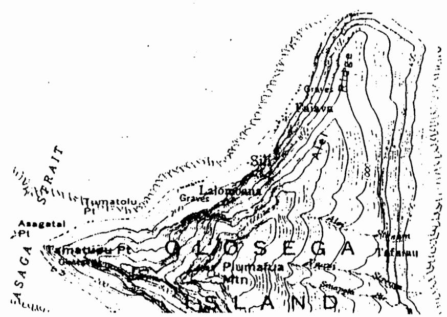

ASAGA STRAIT

MAP OL1

PHYS103RAPHY

# FRINGING REEF

A twin-hulled fishing boat on Sili Beach was donated to the village by the Government of American Samoa. A man-made channel dredged through the reef in the 1960's is now too narrow to easily accommodate paopao (canoes). Active reef accretion may be responsible for reducing the width of the channel (ASCRI).

The reef flat fringing the northwest shore of Olosega Island from north of Faiava Village to west of Lalomoana Village is considered a "critical use reef area" supporting subsistence fishing by villagers (39). The entire reef flat, as well as deeper waters beyond the reef edge, extending from north of Faiava Village to Asaga Strait is frequently used for fishing. Pole and line fishing and reef gleaning are the most active Spearing and throw-netting (kili) fisheries. follow Less common are handlining from canoes and rod and popularity. reel fishing. Pole and line fishermen bring in day and night catches of gatala (honeycomb grouper), filoa (large emperor fish), mataeleele (small emperor fish), sumu (triggerfish), jack), savane (blue-lined snapper), and mataele lupota (small (scarlet sea bass). In addition, lupo (juvenile jack) is caught by day, and malau (squirrelfish), matapula (bigeye snapper), malai (paddletail snapper), and mutu are taken by Spearing results in day and night catches of alogo (line) surgeonfish), pone (chocolate surgeonfish), malauli (larye jack), lupota, and anae (adult mullet). In addition, sugale (wrasse), fugausi and laea (parrotfishes), fe'e (octopus), eel, and faisua (giant sea clam) are speared during the day, and manini (convict tang), ula (spiny lobster), crab, and papata (slipper lobster) are speared at night. Throw-netting (kili) yields day catches of manini, fuafua (juvenile mullet) and anae, lupota, i'a usi (threadfin), sugale, fuga, pone, and alogo. Handlining from canoes results in day and night catches of matapula, mataeleele, malai, filoa, savane, and mataele. Malau are taken at night by this method. Lau (drive-netting) occurs seasonally off Sili and results in catches of atule (big-eye scad), i'asina (juvenile goatfish), and lo (rabbitfish) (20).

#### TAMATUPU POINT AND ASAGA STRAIT

#### SHORELINE

Tamatupu Point is the westernmost point of Olosega. A narrow beach of basalt boulders with scattered sand patches extends around the point, a distance of nearly three-quarters of a mile (1.2 km). A narrow road parallels the shoreline at the 10 to 15-foot (3 to 4 m) elevation, connecting Olosega Village to Sili Village (49). At Tamatupu Point, bordering Asaga Strait, the shoreline is largely basalt boulders, with a small proportion of sand (ASCRI-OLIS3).

ASAGA STRAIT

MAP OL1

PHYSIOGRAPHY

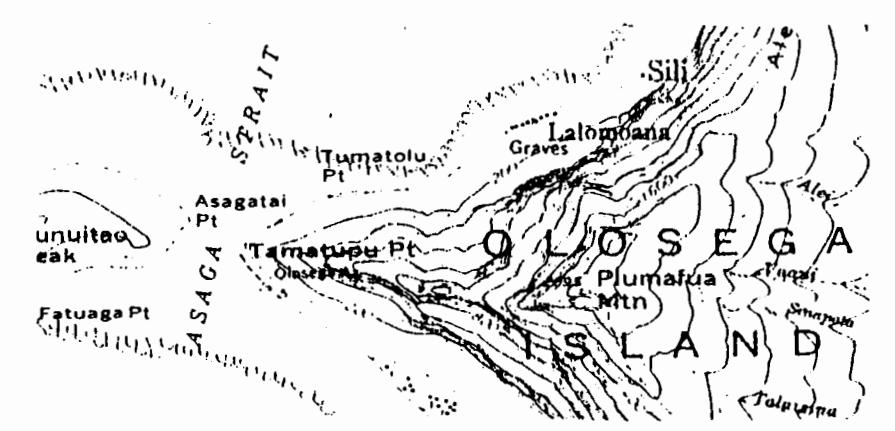

ASAGA STRAIT

MAP OL1

FLORA AND FAUNA

( MAN-MADE CAUSEWAY

#### FRINGING REEF AND PASSAGE

A shallow (less than one foot deep) reef fringes the shoreline south of Tamatupu Point. An inner reef flat of volcanic rubble with a small proportion of sand and a few larger boulders extends 200 to 300 feet (60 to 90 m) from shore. Limestone rubble and small boulders occur between 150 and 200 feet (46 and 60 m) offshore (ASCRI-OL1B7). A mid-reef of consolidated limestone and limestone rubble at depths of one to two feet (0.3 to 0.6 m) begins about 300 feet offshore. (ASCRI-OL1B8).

Asaga Strait is a shallow reef flat separating the islands of Olosega and Ofu. The width of the strait at its narrowest point is approximately 500 feet (140 m). The strait exhibits irregular bathymetry -- the depth reaches 10 feet (3 m). Generally, the portion nearest Olosega is characterized as having a limestone rubble or sand bottom and depths ranging from 2 to 6 feet (0.6 to 2.0 m). Scoured channels reach depths of 8 feet (2.4 m) toward the center of the strait. The Ofu portion of the strait is generally shallower (1 to 5 feet or 0.3 to 1.5 m) and is characterized by consolidated limestone and coral heads .(74).

North of the Asaga Strait causeway, inshore areas are covered by limestone rubble, which merges with a shallow sand flat toward the center of the strait. The portion nearest Ofu is a shallow, consolidated limestone flat (74;ASCRI-OL1B6). The shallow reef south of the causeway is covered by limestone rubble and a small proportion of consolidated limestone (ASCRI-OL39).

# ASAGA STRAIT

Some portions of Asaga Strait support flourishing coral communities. Coral abundance and diversity is generally higher on the Ofu side of the strait than on the Olosega side. In general, species of Porites and Acropora are much more common than other corals although coral diversity is high, with at least 26 species representing 16 genera present. Porites andrewsi and Millepora spp. are very common. Less common species included P. lutea, Montipora hoffmeisteri and other Montipora spp., Goniastrea retiformis, Acropora humilis, A. formosa, and Pavona varians. Porolithon and other coralline algae are prominent on elevated surfaces of the reef flat, whereas fleshy and turf-formang algae are common in crevices and near shore (74). A causeway and bridge have recently been constructed here and the present status of the coral community is unknown.

Coral cover is generally low on the reef flat off Olosega north of the causeway spanning Asaga Strait. <u>Porites andrewsi</u> is most common inshore. Small areas of consolidated limestone provide a substratum for at least 16 species of coral (ASCRI-OL1B6).

Coral cover reaches 15% in shallow parts of the reef flat south of the strait. Porites is especially common. Heliopora and Stylophora are present. Banks of Porites are conspicuous

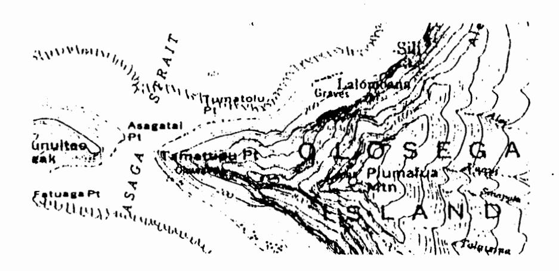

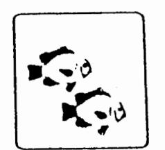

ASAGA STRAIT

MAP OL1

FLORA AND FAUNA

ASAGA STRAIT

MAP OL1

WATER CONDITIONS

( MAN-MADE CAUSEWAY

ASAGA STRAIT

MAP OL1

USE CONSIDERATIONS

along the margin of sand channels, 6 to 8 feet (2 to 3 m) deep. The shallow margins of these channels support small, apparently young, coral heads. Massive microatolls of <u>Porites lutea</u> 10 feet (3 m) across and up to 4 feet (1.2 m) high are present. Thickets of <u>P. andrewsi</u> are equally large, but stands of this coral show considerable dead branches encrusted with coralline algae. Sea anemones and anemone fishes are evident between the branches. The algae, <u>Valonia</u> sp., <u>Actinotrichia</u> sp., and <u>Halimeda discoidea</u>, are present in low abundance along the edges of coral thickets (ASCRI-OL1B9).

Fish populations are abundant and the fauna diverse. At least 80 species inhabit the southeastern portion of Asaga Strait. The high diversity appears related to variations in bottom types. The damselfishes, Glyphidodontops glaucus and Stegastes albofasciatus, the surgeonfish, Acanthurus triostegus, and the wrasse, Halichoeres trimaculatus, are most common inshore, in areas of volcanic rubble where bottom relief is low. Most of the fishes in this zone are juveniles or sub-adults. Toward the center of the strait, in areas of rich coral growth, the dominant species are the surgeonfish, Ctenochaetus striatus, the damselfish, Stegastes nigricans, and the parrotfishes, Scarus oviceps and Scarus spp. In deeper parts of the strait, Acanthurus triostegus, Ctenochaetus striatus, and Stegastes nigricans are most common in the middle of a channel (ASCRI-OL1F3). Of intrest is the presence of the green sea turtle (Chelonia mydas) (74).

# FRINGING REEF (SOUTH OF ASAGA STRAIT.)

The inner reef flat southeast of Tamatupu Point is nearly devoid of coral, with only occasional <u>Porites lutea</u> heads. Turf forming algae cover about 75% of the rubble bottom. Encrusting coralline algae are common, with some <u>Halimeda discoidea</u> and <u>Jania</u> sp. present (ASCRI-OL1B7).

Coral cover reaches 10% on the middle reef, about 300 feet (90 m) from shore. A bank of staghorn Acropora is conspicuous. The upper parts of the coral branches (a few inches from the surface at low tide) appear dead. At the interface of the Acropora and rubble bottoms, the sea cucumber, Holothuria argus, is common. The sea urchins, Diadema sp. and Echinometra mathaei, are evident (ASCRI-OL1B8).

# ASAGA STRAIT

Prior to construction of a bridge and causeway across Asaga Strait, underwater visibility was over 40 feet (12 m). Strong currents are reported in the deepest parts of a sand channel through the center of the strait but currents are much less elsewhere (74). During construction of the viaduct, the strait was temporarily closed by a boulder causeway (200;202).

#### TAMATUPU POINT

Access to the shoreline near Tamatupu Point is difficult

ASAGA STRAIT

MAP OL1

USE CONSIDERATIONS

OLOSEGA

SA

MAP OL2

PHYSIOGRAPHY

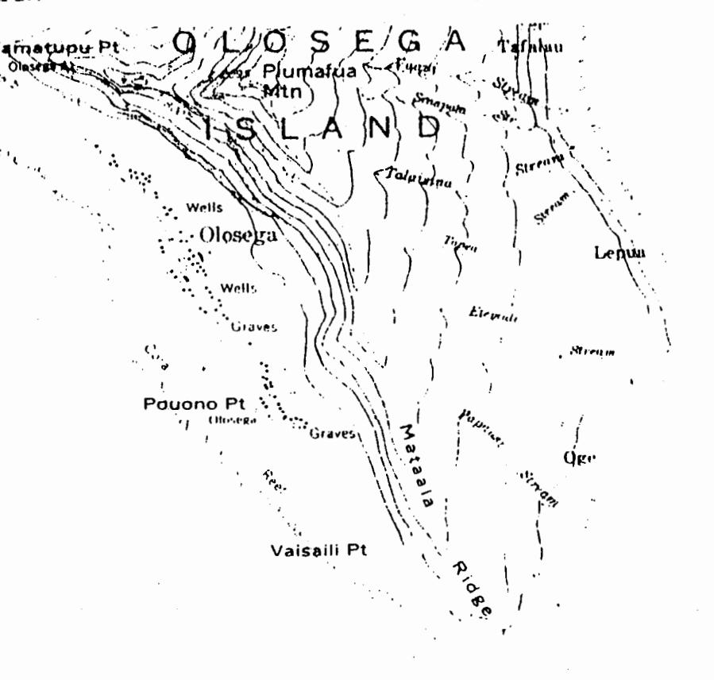

Maga Point

due to a boulder shoreline. Access from the coastal road to the shoreline is down a 10 to 15-foot (3 to 4 m) high embankment of soil (ASCRI).

# COAST BETWEEN TAMATUPU POINT AND MAGA POINT

The southwestern coast of Olosega Island consists of a high cliff, at the base of which is a narrow coastal plain. The village of Olosega, one of two on the Island, is situated on the higher part of this plain near the shoreline. Between the Village and the cliff is a long, narrow depression which at one time was a coastal marsh (77).

#### SHORELINE

Between Tamatupu Point and Vaisaili Point, the shoreline consists of crescent-shaped beaches of either calcareous sand or basalt boulders. The northernmost section is a steep and narrow beach of calcareous sand with scattered limestone rubble. Tamatupu Point, the foreshore terminates in a vertical scarp up to 8 feet (2.4 m) high. The road is within 25 feet (7.6 m) of The scarp is most pronounced in the vicinity of a channel which has been cut across the reef in the central part of the reach. An increase in limestone cobble here is indicative of high surf washing the shoreline. The scarp decreases in height on either side of this area, which may erode during storm waves. Sand becomes progressively finer toward Tamatupu Point. rock is almost continuous along the shoreline (49;ASCRI-OLISA, The steep white sand beach is about 40 feet (12 m) wide OL1S5). Olosega Village and Pouono Point. The lower beach is littered with limestone rubble (49; ASCRI-OL2S1). The upper beach meets the vegetation line at the 10-foot (3 m) elevation. Pouono Point is a low headland between two arcuate beaches. bordered by a narrow shoreline of limestone rubble and basalt boulders, with scattered calcareous sand pockets.

Just north of Pouono Point is a 30- to 50-foot (9 to 15 m) wide beach of sand and limestone rubble (ASCRI-OL2SI). Between Pouono Point and Vaisaili Point there is another long reach of white sand about 40 feet (12 m) wide. The southeastern end of this reach consists of small basalt boulders and scattered sand pockets. The remainder of the reach is a calcareous sand beach with scattered limestone rubble and small basalt boulders. Beachrock is exposed in places. The foreshore is 40 feet (12 m) wide and relatively steep. A dirt road parallels the northern section of this beach, set back about 50 feet (15 m) from the vegetation line (49).

Beach erosion at the head of a channel crossing the reef off Olosega Village has uncovered sections of beachrock up to 6 feet (2 m) thick (55).

OLOSEGA CO. MANU'A DISTRICT OLOSEGA PHYSIOGRAPHY OLOSEGA MAP OL2 PHYSIOGRAPHY OLOSEGA MAP OL2 PHYSIOGRAPHY MAP OL2 OLOSEGA

OLOSEGA MAP OL2 FLORA AND FAUNA

OLOSEGA MAP OL2 FLORA AND FAUNA

( RARE WATERBIRD

# FRINGING REEF (OFF OLOSEGA VILLAGE)

A shallow fringing reef between 300 and 900 feet (90 to 270 m) wide occurs off Olosega Village. Live coral and scattered sand patches cover the reef flat. A small channel has been cut across the reef (49).

# FRINGING REEF FRONT (OFF OLOSEGA VILLAGE)

The reef front is irregular with small channels indenting the margin (49). The bottom is rocky and large limestone blocks form valleys and ridges at depths of 65 to 85 feet (20 to 25 m) about 650 feet (200 m) offshore of Olosega Village. Coral cover is extensive, mostly large colonies of tabular Acropora and Porites cf. lobata. Alcyonarians are abundant (10).

# FRINGING REEF (OFF POUONO POINT)

Just off the beach north of Pouono Point there is a narrow depression 2 to 3 feet (0.6 to 1.0 m) deep. This rubble and sand-bottom "boat channel" is 10 to 20 feet (3 to 6 m) wide and bordered seaward by a consolidated reef platform. The incised, inner margin of the reef flat extends 6 inches (15 cm) above the level of the boat channel (ASCRI-OL2BI).

Beyond the boat channel there is a platform of consolidated limestone and rubble becoming more irregular and deeper (up to 4 feet or 1.2 m) at mid-reef. Extending out from 150 feet (45 m) from shore occur extensive thickets of staghorn Acropora interspersed with areas of sand and rubble (ASCRI-OL2B2). From 360 to 800 feet (110 to 240 m) offshore, the outer reef shoals gradually to a bottom of rubble and small, flat limestone boulders at a depth of two feet (0.6 m) (ASCRI-OL2B3).

#### COASTLINE

The fruitbat or flying fox (pe'a; <u>Pteropus samoensis</u>) roosts along the rocky cliff above the village of Olosega. The common brown noddy (<u>Anous stolidus pileatus</u>), nests in trees along the sea cliff (15).

#### OLOSEGA MARSH

A narrow marsh behind Olosega Village is backed by a nearly vertical cliff rising to over 2,000 feet (600 m) elevation (74). Nearly the whole marsh area (approximately 6 acres or 2.4 ha) between the village of Olosega and the cliff is covered with taro (15). Coastal marsh plants (<u>Ludwigia</u>, <u>Rhynchospora</u>, and <u>Eleocharis</u>) displaced from their normal dominance survive along with weedy species commonly associated with taro (77). The Australian gray duck (toloa; <u>Anas superciliosa pelewensis</u>), a rare resident waterbird, has been reported from this area (15).

OLOSEGA

MAP OL2

FLORA AND FAUNA

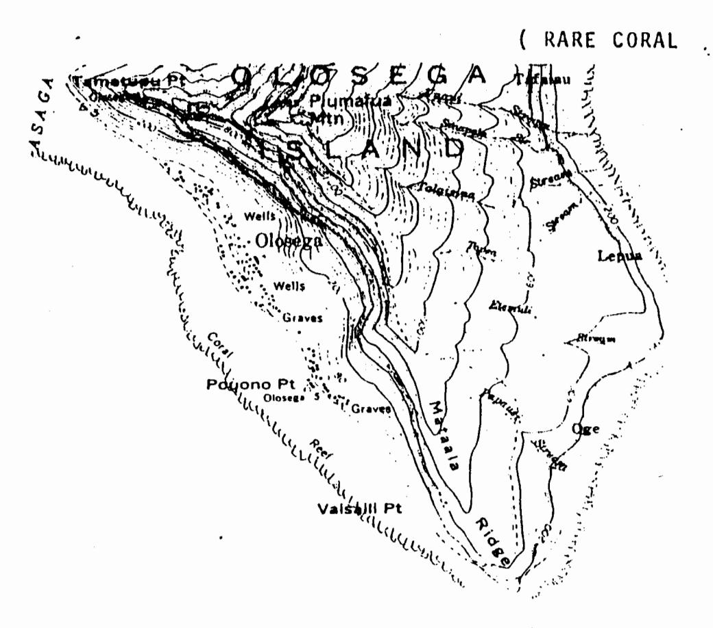

Maga Point

OLOSEGA

MAP OL2

WATER CONDITIONS

# FRINGING REEF (OFF POUONO POINT)

Coral cover is only 5% in the "boat channel" on the inner reef fronting Olosega Village north of Pouono Point. Scattered heads of <u>Porites lutea</u> are present. <u>Pavona</u> sp. grows along the margin of the adjacent reef platform. Algae present include abundant encrusting coralline species, in addition to a brown, brush-like blue-green. Invertebrates present include a mollusc, <u>Cypraea</u> sp. (ASCRI-OL2B1).

Thickets of living and recently dead Acropora are conspicuous on the middle of the reef platform beginning about 150 (45 m) from shore. Acropora aspera is common, and banks of A. formosa, some 100 feet (30 m) across and 2 feet (0.6 m) high Some patches of Acropora are dead, apparently occur seaward. from causes other than Acanthaster predation. One thicket have been destroyed by fishing activity. Live coral appears to cover totals about 20%, with an additional 15% of the bottom covered by dead, standing coral heads. Several species of staghorn Acropora and Millepora grow upon consolidated limestone At least 16 genera and 25 species of corals are rubble. recorded here, including the blue hydrocoral, Heliopora coerulea (rare in Samoa), whose spatulate fronds are quite common on the reef platform extending to about 200 feet (60 m) from shore. The algae, Dictyosphaeria versluysii and encrusting coralline algae, abundant on consolidated limestone and rubble on the shoreward portion of the reef flat. Halimeda discoidea and Valonia sp. Occasional sea cucumbers, Holothuria hilla, occur boulders in the more irregular and deeper mid-reef. invertebrates in areas of Conspicuous the Acropora thickets include the molluscs, Cypraea moneta, C. annulus, Turbo sp., brittlestar, Ophiarthrum elegans (under boulders), and the sea urchin, Diadema paucispinum, around limestone outcrops. A turf of brown and red filamentous algae covers the basal portions of staghorn corals (ASCRI-OL2B2).

The outer reef supports little coral cover (about 5%) -- principally <u>Porites</u> <u>lutea</u>. A large area of broken, dead plate coral occurs on the outer reef flat (ASCRI-OL2B3).

The reef north of Pouono Point shelters a highly diverse fish assemblage, including at least 69 species. Diversity increases seaward across the reef flat. At high tide, fishes from the reef front cross the reef margin onto the flat, accounting for a high diversity on the outer reef flat. Dominant species are the damselfishes, Stegastes albofasciatus and Dascyllus aruanus; juvenile parrotfishes, Scarus spp.; the surgeonfish, Acanthurus triostegus; and the wrasse, Halichoeres trimaculatus. The damselfish, Stegaetes nigricans, is dominant around thickets of staghorn Acropora (ASCRI-OL2F1).

# FRINGING REEF

Wave action is noticeably less on the northern section of Olosega reef, where trade wind influence decreases, than in areas

OLOSEGA

MAP 0L2 USE CONSIDERATIONS

\* Beach off Olosega Village possible "Special Area" of substantial recreational value ---Chap. VI.C.2 (21)

OLOSEGA

MAP 0L2 USE CONSIDERATIONS

( MAN-MADE CHANNEL

MAGA POINT

MAP OL2

FLORA AND FAUNA

( SEABIRD NESTING AREAS

Leala Pt

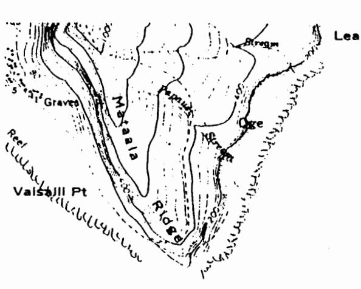

Maga Point

USE CONSIDERATIONS

TOUTHREAT COVA

to the south (49). A strong longshore current flows through the boat channel and undercuts the reef flat north of Pouono Point. Large waves break on the reef margin off Pouono Point (ASCRI).

#### SHORELINE

One of the outstanding white sand beaches in American Samoa fronts Olosega Village (41;64). However, Olosega is rarely visited by tourists so use of the beach for swimming and sunbathing is low. Access is by courtesy of Olosega Village (41). Access to the beach northwest of Olosega Village is obstructed by the heavy growth of vegetation between the coastal road and the shoreline (ASCRI).

#### FRINGING REEF

A shallow channel cut across the reef off Olosega Village is only suitable for small boats in calm seas (49). The reef flat fringing the southwestern coast of Olosega from Olosega Village southeast beyond Vaisaili Point is considered a "critical use reef area" and is used for subsistence fishing by villagers (39). Both the reef flat and deeper waters beyond the reef from Asaga Strait beyond Vaisaili are frequently fished. Fishing methods and catches are similar to those off Faiava and Sili (20). (See SILI / USE CONSIDERATIONS).

## COAST BETWEEN MAGA POINT AND LEALA POINT

#### MAGA POINT

Maga Point is the major breeding area for seabirds on Olosega. Brown boobies (fua'o; Sula leucogaster plotus) nest on the sheer cliffs east of Maga Point, and white terns (Gygis alba pacifica), nest inland on trees. Four additional seabird species potentially breed here. The blue-gray noddy (Procelsterna cerulea) nests on the east and west sides of the point, as well as along cliffs just northwest of the base of the point. The common brown noddy (Anous stolidus pileatus) also nests on the cliffs. The great frigatebird (atafa; Fregata minor palmerstoni) and lesser frigatebird (atafa; Fregata ariel ariel), uncommon resident seabirds, are believed to roost on the rocky top of Maga Point. The reef heron (matu'u; Egretta sacra sacra), another uncommon shorebird, probably nests in isolated coastal areas around Olosega. Maga Point supports littoral scrub vegetation unlike other areas of Olosega and Ofu (74).

# OFFSHORE (MAGA POINT TO LEALA POINT)

The reef flat and deeper waters beyond the reef edge from north of Maga Point to near Leala Point are frequently fished. Fishing methods and catches are similar to those off Faiava and Sili (20). (See SILI / USE CONSIDERATIONS).

Leaumasili Pt

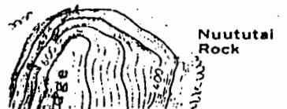

USE CONSIDERATIONS

# COAST BETWEEN LEALA POINT AND LEAUMASILI POINT

OFFSHORE (LEPUA TO NU'UTUTAI ROCK)

The reef flat, as well as deep waters seaward of the reef (from north of Lepua to Nu'ututai Rock), are frequently fished. Fishing methods and catches are similar to those off Faiava and Sili (20). (See SILI / USE CONSIDERATIONS).

/OLOSEG.TEX/ - /AUG-80/

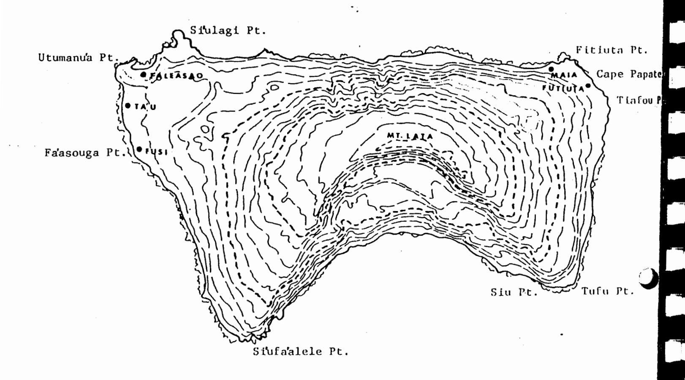

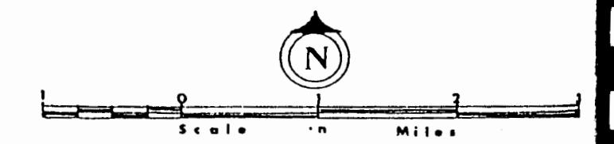

FIGURE 20. THE ISLAND OF TA'U, MANU'A GROUP, AMERICAN SAMOA

# TA'U ISLAND

Ta'u Island, largest of the Manu'a Group, is about 6.5 miles (10 km) southeast of the sister islands of Ofu and Olosega. The island is the northern half of the Mt. Lata shield volcano. The southern half and the original caldera have been entirely eroded away by waves and possibly by faulting. Ta'u covers an area of about 17 square miles (44 sq. km). The roughly rectangular-shaped island measures 6 miles (10 km) wide and 8 miles (13 km) long. Mt. Lata is over 3000 feet (900 m) high (55).

The summit of the original volcanic shield collapsed to form a caldera, and subsequent explosive eruptions from cinder cones within the caldera and on the northern flanks of the volcano continued to build up the island. The lavas forming Ta'u are believed to be relatively recent in age and are exposed in a spectacular 1,400-foot (425 m) high escarpment along the southern side of the island. This cliff was formed by the collapse of the caldera. Two, almost inaccessible, sloping plateaus are associated with this cliffed coast (55).

#### SEA CLIFFS

Marine erosion during a long period of volcanic quiescence sea cliff about 200 feet (60 m) in height around Ta'u. Along the north shore, the sea cliff reaches a maximum height of 2,400 feet (730 m). Along the north central coast, where pre-caldera lavas are exposed, the sea cliff cannot be distinguished because stream erosion has been more active than marine erosion. Along the south central coast, the cliff is locally as high as 1.200 feet (360 m). Post-erosional lava flows occasionally spilled over this cliff from cones on the flanks above it. In two places, extensive late eruptions built large areas of land in front of the sea cliff. Late lavas from at least two vents built a platform seaward of the old sea cliff on the northeastern Fitiuta corner of Ta'u. Village is now situated where these flows extended the northeastern corner of the island. The sea is eroding a 150-foot (46 m) high cone named Maluatia revealing its internal structure. The sea cliff is buried under tuff at the northwestern corner of Ta'u, including Faleasao Village and extending east beyond Si'ulagi Point to Tulatula. A complex of tuff cones occur here, with one centered at Faleasao, another at To'a Cove, and possibly a third, smaller one at Fa'asamene Cove. At Tulatula, the tuff appears to have buried an Offshore bathymetry suggests that the base of older sea stack. the tuff complex is about 600 feet (180 m) below sea level. Coral fragments incorporated in the tuff indicate that the eruptions came from vents cutting through a fringing reef (55).

#### **STREAMS**

The radial drainage pattern of the original Lata volcanic shield is still present, although somewhat modified by faulting

TA'U IS.

GENERAL

**PHYSIOGRAPHY** 

( HURRICANE DAMAGE

TA'U IS.

GENERAL

PHYSIOGRAPHY

UENEKAL

and late volcanism. Along the north coast, Avatele, Matautu'ao, and Au'auli Streams have cut deep valleys into pre-caldera lava flows where later volcanism is not apparent. The lowermost 1,000 feet (300 m) of Laufuti Stream on the southern coast of Ta'u is the only perennial stream on the island (55). Laufuti Falls cascades 1,000 feet (300 m) into the ocean (41). Few other streams exist, except for several along the northern coast. These are poorly developed and drain shallow valleys. None of the streams are sufficiently mature to have flood plains and alluvial material is present only in the narrow stream beds, many of which contain boulders up to 10 feet (3 m) across (55).

# COASTAL TERRACE

A relatively wide coastal terrace borders parts of western and northern coasts of Ta'u Island. This terrace rises to 15 feet (5 m) above sea level in several areas. Ta'u Village built on the widest portion of the terrace, 10 to 15 feet (3 to 5 m) above sea level, between the shoreline and the base of the sea cliff. Terraces at this elevation are also found at Faleasao, Faga, Saua, Tufu, Amouli, and Si'ufa'alele. Along the southern coast, the coastal terrace is composed of sand and coral but elsewhere it is entirely sand (dunes of sand blown inland by wind or storm beaches of material washed inland by high surf). Hurricane waves top the terraces and may, in part, be responsible for their development. During the hurricane of 1959, waves destroyed a trail on the terrace more than 200 feet (60 m) inland at the base of the sea cliff near Saua. The remainder of the coastline is generally characterized by steep cliffs and narrow coastal plains (55). The southern coast of Ta'u is accessible only by foot-trail and consists primarily of a sea cliff rising as high as 1,000 feet (300 m) above sea level (49).

# SHORELINE

Much of the coastline of Ta'u is bordered by long, narrow beaches, typically 40 to 60 feet (12 to 18 m) wide. Some beaches are nearly submerged at high tide, when waves wash up the foreslope to the berm crest. Layers of limestone rubble are exposed in escarpments on the backshore. Vegetation covers the backshore, usually extending to within a few feet of the berm crest. Beachrock is exposed both above and below present sea level along many of the beaches. Beach material varies in size from medium sand to gravel and is predominantly calcaerous grains, except along the north shore of Ta'u, where streams carry down volcanic debris. A bench is eroded 5 feet (1.5 m) above present sea level in tuff cliffs on the northwestern coast of Ta'u (55).

North of Saua, the narrow beach of calcareous rubble has beachrock platforms at and above sea level. Large boulders are conspicuous along the north shore of Ta'u near Faga. Boulder beaches accumulate at the mouths of streams entering Avatele Cove and Au'auli Cove farther westward along the north shore (ASCRI).

TA'U ISLAND MANU'A DISTRICT

tint • int. for the form of \$\text{Variable}\$

And the property of the state of the state of the

Value of the second of the second

. . . . .

MONTH SP 1780 x 111 1 1 1

Paragrafia de la Propinsión de la Propinsión de la Propinsión de la Propinsión de la Propinsión de la Propinsión de la Propinsión de la Propinsión de la Propinsión de la Propinsión de la Propinsión de la Propinsión de la Propinsión de la Propinsión de la Propinsión de la Propinsión de la Propinsión de la Propinsión de la Propinsión de la Propinsión de la Propinsión de la Propinsión de la Propinsión de la Propinsión de la Propinsión de la Propinsión de la Propinsión de la Propinsión de la Propinsión de la Propinsión de la Propinsión de la Propinsión de la Propinsión de la Propinsión de la Propinsión de la Propinsión de la Propinsión de la Propinsión de la Propinsión de la Propinsión de la Propinsión de la Propinsión de la Propinsión de la Propinsión de la Propinsión de la Propinsión de la Propinsión de la Propinsión de la Propinsión de la Propinsión de la Propinsión de la Propinsión de la Propinsión de la Propinsión de la Propinsión de la Propinsión de la Propinsión de la Propinsión de la Propinsión de la Propinsión de la Propinsión de la Propinsión de la Propinsión de la Propinsión de la Propinsión de la Propinsión de la Propinsión de la Propinsión de la Propinsión de la Propinsión de la Propinsión de la Propinsión de la Propinsión de la Propinsión de la Propinsión de la Propinsión de la Propinsión de la Propinsión de la Propinsión de la Propinsión de la Propinsión de la Propinsión de la Propinsión de la Propinsión de la Propinsión de la Propinsión de la Propinsión de la Propinsión de la Propinsión de la Propinsión de la Propinsión de la Propinsión de la Propinsión de la Propinsión de la Propinsión de la Propinsión de la Propinsión de la Propinsión de la Propinsión de la Propinsión de la Propinsión de la Propinsión de la Propinsión de la Propinsión de la Propinsión de la Propinsión de la Propinsión de la Propinsión de la Propinsión de la Propinsión de la Propinsión de la Propinsión de la Propinsión de la Propinsión de la Propinsión de la Propinsión de la Propinsión de la Propinsión de la Propinsión de la Propin

GENERAL

A CONTROL OF THE CONTROL OF THE CONTROL OF THE CONTROL OF THE CONTROL OF THE CONTROL OF THE CONTROL OF THE CONTROL OF THE CONTROL OF THE CONTROL OF THE CONTROL OF THE CONTROL OF THE CONTROL OF THE CONTROL OF THE CONTROL OF THE CONTROL OF THE CONTROL OF THE CONTROL OF THE CONTROL OF THE CONTROL OF THE CONTROL OF THE CONTROL OF THE CONTROL OF THE CONTROL OF THE CONTROL OF THE CONTROL OF THE CONTROL OF THE CONTROL OF THE CONTROL OF THE CONTROL OF THE CONTROL OF THE CONTROL OF THE CONTROL OF THE CONTROL OF THE CONTROL OF THE CONTROL OF THE CONTROL OF THE CONTROL OF THE CONTROL OF THE CONTROL OF THE CONTROL OF THE CONTROL OF THE CONTROL OF THE CONTROL OF THE CONTROL OF THE CONTROL OF THE CONTROL OF THE CONTROL OF THE CONTROL OF THE CONTROL OF THE CONTROL OF THE CONTROL OF THE CONTROL OF THE CONTROL OF THE CONTROL OF THE CONTROL OF THE CONTROL OF THE CONTROL OF THE CONTROL OF THE CONTROL OF THE CONTROL OF THE CONTROL OF THE CONTROL OF THE CONTROL OF THE CONTROL OF THE CONTROL OF THE CONTROL OF THE CONTROL OF THE CONTROL OF THE CONTROL OF THE CONTROL OF THE CONTROL OF THE CONTROL OF THE CONTROL OF THE CONTROL OF THE CONTROL OF THE CONTROL OF THE CONTROL OF THE CONTROL OF THE CONTROL OF THE CONTROL OF THE CONTROL OF THE CONTROL OF THE CONTROL OF THE CONTROL OF THE CONTROL OF THE CONTROL OF THE CONTROL OF THE CONTROL OF THE CONTROL OF THE CONTROL OF THE CONTROL OF THE CONTROL OF THE CONTROL OF THE CONTROL OF THE CONTROL OF THE CONTROL OF THE CONTROL OF THE CONTROL OF THE CONTROL OF THE CONTROL OF THE CONTROL OF THE CONTROL OF THE CONTROL OF THE CONTROL OF THE CONTROL OF THE CONTROL OF THE CONTROL OF THE CONTROL OF THE CONTROL OF THE CONTROL OF THE CONTROL OF THE CONTROL OF THE CONTROL OF THE CONTROL OF THE CONTROL OF THE CONTROL OF THE CONTROL OF THE CONTROL OF THE CONTROL OF THE CONTROL OF THE CONTROL OF THE CONTROL OF THE CONTROL OF THE CONTROL OF THE CONTROL OF THE CONTROL OF THE CONTROL OF THE CONTROL OF THE CONTROL OF THE CONTROL OF THE CONTROL OF THE CONTROL OF THE CONTROL OF THE CONTROL OF THE CONTROL OF THE CONT

PHYSIOGRAPH'

TA'U IS. GENERAL HISTORICAL/ARCHAEOLOGICAL

TA'U IS.

A B C CONTRAL CONTRAL CONTRAL CONTRAL CONTRAL CONTRAL CONTRAL CONTRAL CONTRAL CONTRAL CONTRAL CONTRAL CONTRAL CONTRAL CONTRAL CONTRAL CONTRAL CONTRAL CONTRAL CONTRAL CONTRAL CONTRAL CONTRAL CONTRAL CONTRAL CONTRAL CONTRAL CONTRAL CONTRAL CONTRAL CONTRAL CONTRAL CONTRAL CONTRAL CONTRAL CONTRAL CONTRAL CONTRAL CONTRAL CONTRAL CONTRAL CONTRAL CONTRAL CONTRAL CONTRAL CONTRAL CONTRAL CONTRAL CONTRAL CONTRAL CONTRAL CONTRAL CONTRAL CONTRAL CONTRAL CONTRAL CONTRAL CONTRAL CONTRAL CONTRAL CONTRAL CONTRAL CONTRAL CONTRAL CONTRAL CONTRAL CONTRAL CONTRAL CONTRAL CONTRAL CONTRAL CONTRAL CONTRAL CONTRAL CONTRAL CONTRAL CONTRAL CONTRAL CONTRAL CONTRAL CONTRAL CONTRAL CONTRAL CONTRAL CONTRAL CONTRAL CONTRAL CONTRAL CONTRAL CONTRAL CONTRAL CONTRAL CONTRAL CONTRAL CONTRAL CONTRAL CONTRAL CONTRAL CONTRAL CONTRAL CONTRAL CONTRAL CONTRAL CONTRAL CONTRAL CONTRAL CONTRAL CONTRAL CONTRAL CONTRAL CONTRAL CONTRAL CONTRAL CONTRAL CONTRAL CONTRAL CONTRAL CONTRAL CONTRAL CONTRAL CONTRAL CONTRAL CONTRAL CONTRAL CONTRAL CONTRAL CONTRAL CONTRAL CONTRAL CONTRAL CONTRAL CONTRAL CONTRAL CONTRAL CONTRAL CONTRAL CONTRAL CONTRAL CONTRAL CONTRAL CONTRAL CONTRAL CONTRAL CONTRAL CONTRAL CONTRAL CONTRAL CONTRAL CONTRAL CONTRAL CONTRAL CONTRAL CONTRAL CONTRAL CONTRAL CONTRAL CONTRAL CONTRAL CONTRAL CONTRAL CONTRAL CONTRAL CONTRAL CONTRAL CONTRAL CONTRAL CONTRAL CONTRAL CONTRAL CONTRAL CONTRAL CONTRAL CONTRAL CONTRAL CONTRAL CONTRAL CONTRAL CONTRAL CONTRAL CONTRAL CONTRAL CONTRAL CONTRAL CONTRAL CONTRAL CONTRAL CONTRAL CONTRAL CONTRAL CONTRAL CONTRAL CONTRAL CONTRAL CONTRAL CONTRAL CONTRAL CONTRAL CONTRAL CONTRAL CONTRAL CONTRAL CONTRAL CONTRAL CONTRAL CONTRAL CONTRAL CONTRAL CONTRAL CONTRAL CONTRAL CONTRAL CONTRAL CONTRAL CONTRAL CONTRAL CONTRAL CONTRAL CONTRAL CONTRAL CONTRAL CONTRAL CONTRAL CONTRAL CONTRAL CONTRAL CONTRAL CONTRAL CONTRAL CONTRAL CONTRAL CONTRAL CONTRAL CONTRAL CONTRAL CONTRAL CONTRAL CONTRAL CONTRAL CONTRAL CONTRAL CONTRAL CONTRAL CONTRAL CONTRAL CONTRAL CONTRAL CONTRAL CONTRAL CONTRAL CONTRAL CONTRAL CONTRAL CONTRAL CONTRAL CONTRAL GENERAL

FLORA AND FAUNA

THE PROPERTY OF THE PROPERTY OF THE PROPERTY OF THE PROPERTY OF THE PROPERTY OF THE PROPERTY OF THE PROPERTY OF THE PROPERTY OF THE PROPERTY OF THE PROPERTY OF THE PROPERTY OF THE PROPERTY OF THE PROPERTY OF THE PROPERTY OF THE PROPERTY OF THE PROPERTY OF THE PROPERTY OF THE PROPERTY OF THE PROPERTY OF THE PROPERTY OF THE PROPERTY OF THE PROPERTY OF THE PROPERTY OF THE PROPERTY OF THE PROPERTY OF THE PROPERTY OF THE PROPERTY OF THE PROPERTY OF THE PROPERTY OF THE PROPERTY OF THE PROPERTY OF THE PROPERTY OF THE PROPERTY OF THE PROPERTY OF THE PROPERTY OF THE PROPERTY OF THE PROPERTY OF THE PROPERTY OF THE PROPERTY OF THE PROPERTY OF THE PROPERTY OF THE PROPERTY OF THE PROPERTY OF THE PROPERTY OF THE PROPERTY OF THE PROPERTY OF THE PROPERTY OF THE PROPERTY OF THE PROPERTY OF THE PROPERTY OF THE PROPERTY OF THE PROPERTY OF THE PROPERTY OF THE PROPERTY OF THE PROPERTY OF THE PROPERTY OF THE PROPERTY OF THE PROPERTY OF THE PROPERTY OF THE PROPERTY OF THE PROPERTY OF THE PROPERTY OF THE PROPERTY OF THE PROPERTY OF THE PROPERTY OF THE PROPERTY OF THE PROPERTY OF THE PROPERTY OF THE PROPERTY OF THE PROPERTY OF THE PROPERTY OF THE PROPERTY OF THE PROPERTY OF THE PROPERTY OF THE PROPERTY OF THE PROPERTY OF THE PROPERTY OF THE PROPERTY OF THE PROPERTY OF THE PROPERTY OF THE PROPERTY OF THE PROPERTY OF THE PROPERTY OF THE PROPERTY OF THE PROPERTY OF THE PROPERTY OF THE PROPERTY OF THE PROPERTY OF THE PROPERTY OF THE PROPERTY OF THE PROPERTY OF THE PROPERTY OF THE PROPERTY OF THE PROPERTY OF THE PROPERTY OF THE PROPERTY OF THE PROPERTY OF THE PROPERTY OF THE PROPERTY OF THE PROPERTY OF THE PROPERTY OF THE PROPERTY OF THE PROPERTY OF THE PROPERTY OF THE PROPERTY OF THE PROPERTY OF THE PROPERTY OF THE PROPERTY OF THE PROPERTY OF THE PROPERTY OF THE PROPERTY OF THE PROPERTY OF THE PROPERTY OF THE PROPERTY OF THE PROPERTY OF THE PROPERTY OF THE PROPERTY OF THE PROPERTY OF THE PROPERTY OF THE PROPERTY OF THE PROPERTY OF THE PROPERTY OF THE PROPERTY OF THE PROPERTY OF THE PROPERTY OF THE PROPERTY OF THE PROPERTY OF THE PROPERTY O

TA'U 131 AFF

#### FRINGING REEF

A nearly continuous reef fringes the Island of Ta'u (55). The reef averages 400 to 500 feet (120 to 150 m) in width off the southern portion of the Ta'u village complex but decreases to a width of 100 feet (30 m) or less off the northern end of the village complex (Luma). From Fa'asouga Point north, the effects of trade wind waves decreases steadily (49).

The state of the state of the state of

reef flat contains patches of sand, coral, The coralline algae, whereas the reef front is composed of colonies of fast growing coral and algae. Surge channels varying from 15 to 25 feet (5 to 8 m) wide and 9 to 15 feet (3 to 5 m) deep interrupt the reef front. The small channels cut perpendicularly across the forereef, terminating seaward at a depth of about 30 feet (9 m). The grooves rarely exceed 200 feet (60 m) in length and usually occur about 75 feet (25 m) apart. The heads of these channels terminate in the surf zone in depressions, some of which (5 m) deep. The bottom of the surge channels are feet usually covered by a veneer of sand or may be paved with limestone boulders. Channel sides overhang due to growth of coral the reef surface. In some channels, overhanging corals on opposite sides have grown together to form natural arches. Large channels (ava) cross the reef and approach shore off the mouths streams. The floors of these large channels are covered with coarse sand and limestone rubble. Extensive areas of coarse sand often marked by large ripples lie at -30 to -50 feet (-9 to -15m) off the mouths of these channels (55).

## LEGENDARY STONES

A number of legendary stones occur on the island of Ta'u. The eastern coast of Ta'u has two large stones, one at the waterline and the other on the beach near Tufu Point. According to legend, the stones, called Ui and Luama'a, are the parents of the god Tagaloa-lagi, who were petrified after swimming the long distance from Atafu Island in the Tokelau group. A large boulder in Fitiuta is said to be the petrified body of a man who came to Fitiuta from Atafu in a large canoe and was killed by Fitiuta villagers. Along the coast behind Fitiuta is a stone called Nu'u o-Sina. Offshore of Tavalagi Ridge, east of Faleasao, is a large boulder in the rough water called Moega-o-Uila after a mythical woman. An islet off the northern end of Luma Village is named Ma'a-Fe'e. This seastack is said to be the body of a squid (30).

# TA'U BEACHES

The endangered green sea turtle (Chelonia mydas) reportedly bred in recent times on the isolated sand beaches of Ta'u, especially along east, south, and west shores, but has only been sighted offshore in recent years (15).

GENERAL

USE CONSIDERATIONS

ale of Tacu U(AT). (n width offithe Company of the control of the reases to the reases to the control of the control of the control of the control of the control of the control of the control of the control of the control of the control of the control of the control of the control of the control of the control of the control of the control of the control of the control of the control of the control of the control of the control of the control of the control of the control of the control of the control of the control of the control of the control of the control of the control of the control of the control of the control of the control of the control of the control of the control of the control of the control of the control of the control of the control of the control of the control of the control of the control of the control of the control of the control of the control of the control of the control of the control of the control of the control of the control of the control of the control of the control of the control of the control of the control of the control of the control of the control of the control of the control of the control of the control of the control of the control of the control of the control of the control of the control of the control of the control of the control of the control of the control of the control of the control of the control of the control of the control of the control of the control of the control of the control of the control of the control of the control of the control of the control of the control of the control of the control of the control of the control of the control of the control of the control of the control of the control of the control of the control of the control of the control of the control of the control of the control of the control of the control of the control of the control of the control of the control of the control of the control of the control of the control of the control of the control of the control of the control of the control of the control of the control of the control of the control

ben lower.

( BOAT RAMP

hm lines of a second of the second of the second of the second of the second of the second of the second of the second of the second of the second of the second of the second of the second of the second of the second of the second of the second of the second of the second of the second of the second of the second of the second of the second of the second of the second of the second of the second of the second of the second of the second of the second of the second of the second of the second of the second of the second of the second of the second of the second of the second of the second of the second of the second of the second of the second of the second of the second of the second of the second of the second of the second of the second of the second of the second of the second of the second of the second of the second of the second of the second of the second of the second of the second of the second of the second of the second of the second of the second of the second of the second of the second of the second of the second of the second of the second of the second of the second of the second of the second of the second of the second of the second of the second of the second of the second of the second of the second of the second of the second of the second of the second of the second of the second of the second of the second of the second of the second of the second of the second of the second of the second of the second of the second of the second of the second of the second of the second of the second of the second of the second of the second of the second of the second of the second of the second of the second of the second of the second of the second of the second of the second of the second of the second of the second of the second of the second of the second of the second of the second of the second of the second of the second of the second of the second of the second of the second of the second of the second of the second of the second of the second of the second of the second of the second of the se make the second of the second Stypical of the special and process 

The first constant of the constant of the constant of the constant of the constant of the constant of the constant of the constant of the constant of the constant of the constant of the constant of the constant of the constant of the constant of the constant of the constant of the constant of the constant of the constant of the constant of the constant of the constant of the constant of the constant of the constant of the constant of the constant of the constant of the constant of the constant of the constant of the constant of the constant of the constant of the constant of the constant of the constant of the constant of the constant of the constant of the constant of the constant of the constant of the constant of the constant of the constant of the constant of the constant of the constant of the constant of the constant of the constant of the constant of the constant of the constant of the constant of the constant of the constant of the constant of the constant of the constant of the constant of the constant of the constant of the constant of the constant of the constant of the constant of the constant of the constant of the constant of the constant of the constant of the constant of the constant of the constant of the constant of the constant of the constant of the constant of the constant of the constant of the constant of the constant of the constant of the constant of the constant of the constant of the constant of the constant of the constant of the constant of the constant of the constant of the constant of the constant of the constant of the constant of the constant of the constant of the constant of the constant of the constant of the constant of the constant of the constant of the constant of the constant of the constant of the constant of the constant of the constant of the constant of the constant of the constant of the constant of the constant of the constant of the constant of the constant of the constant of the constant of the constant of the constant of the constant of the constant of the cons

S. French and Start and Start and Start and Start and Start and Start and Start and Start and Start and Start and Start and Start and Start and Start and Start and Start and Start and Start and Start and Start and Start and Start and Start and Start and Start and Start and Start and Start and Start and Start and Start and Start and Start and Start and Start and Start and Start and Start and Start and Start and Start and Start and Start and Start and Start and Start and Start and Start and Start and Start and Start and Start and Start and Start and Start and Start and Start and Start and Start and Start and Start and Start and Start and Start and Start and Start and Start and Start and Start and Start and Start and Start and Start and Start and Start and Start and Start and Start and Start and Start and Start and Start and Start and Start and Start and Start and Start and Start and Start and Start and Start and Start and Start and Start and Start and Start and Start and Start and Start and Start and Start and Start and Start and Start and Start and Start and Start and Start and Start and Start and Start and Start and Start and Start and Start and Start and Start and Start and Start and Start and Start and Start and Start and Start and Start and Start and Start and Start and Start and Start and Start and Start and Start and Start and Start and Start and Start and Start and Start and Start and Start and Start and Start and Start and Start and Start and Start and Start and Start and Start and Start and Start and Start and Start and Start and Start and Start and Start and Start and Start and Start and Start and Start and Start and Start and Start and Start and Start and Start and Start and Start and Start and Start and Start and Start and Start and Start and Start and Start and Start and Start and Start and Start and Start and Start and Start and Start and Start and Start and Start and Start and Start and Start and Start and Start and Start and Start and Start and Start and Start and Start and Start and Start and St Tarting the light periods of the property of the property of the property of the property of the property of the property of the property of the property of the property of the property of the property of the property of the property of the property of the property of the property of the property of the property of the property of the property of the property of the property of the property of the property of the property of the property of the property of the property of the property of the property of the property of the property of the property of the property of the property of the property of the property of the property of the property of the property of the property of the property of the property of the property of the property of the property of the property of the property of the property of the property of the property of the property of the property of the property of the property of the property of the property of the property of the property of the property of the property of the property of the property of the property of the property of the property of the property of the property of the property of the property of the property of the property of the property of the property of the property of the property of the property of the property of the property of the property of the property of the property of the property of the property of the property of the property of the property of the property of the property of the property of the property of the property of the property of the property of the property of the property of the property of the property of the property of the property of the property of the property of the property of the property of the property of the property of the property of the property of the property of the property of the property of the property of the property of the property of the property of the property of the property of the property of the property of the property of the property of the property of the property of the property of the property of the property of t

11/2 13 T 11 5

#### TA'U ISLAND

Three settlements on the island of Ta'u include the Ta'u village complex extending from Luma to Fusi along the western coast, the village of Faleasao on the northwestern tip of the island, and Fitiuta on the northeastern tip (49). The principal means of transportation to and from Ta'u is by inter-island vessel. A harbor to serve light-draft vessels is under construction near Matavai Point, close to the village of Fusi on the western coast of Ta'u (39;59). A boat launching ramp is part of the new harbor (41). A landing strip to accomodate light aircraft was constructed by private interests at an elevation of 185 feet (47 m) inland and north of the village of Luma in 1973 Road development is minimal on Ta'u, with a few miles of unpaved road connecting villages along the northwestern coast with Fitiuta at the northeastern corner of the island (59). An war and unimproved one-lane road provides vehicular transportation from Vaitele Point northward to Faleasao Village along the western coast of Ta'u. Access south of Vaitele Point is by foot only. Another road runs along the northern coast of the island from Ta'u and Si'ufaga Villages to Fitiuta and Saua on the eastern coast. The road ends at Saua, but coastal areas to the south are accessible by a trail across coral rubble. Improvement of the road on the eastern side of Ta'u is expected to extend it to a point on the southern coast. Here, the road bed consists of crushed coral deposited by a tsunami in 1946 (39). Sections of this road are subject to landslides and washouts (23).

147 1000 - 100 - 100 - 100 TO'A COVE

1000 100 1100

esti ni e est

PHYSIOGRAPHY

FA'ASAMENE COVE

Harry Anna Arthur

MAP T1

**PHYSIOGRAPHY** 

Siulagi Pt

Utusegisegi Cove

**FALEASAO** 

MAP T1 PHYSIOGRAPHY

FALEASAO

MAP T1

**PHYSIOGRAPHY** 

( MAN-MADE CHANNEL

# COAST BETWEEN SI'ULAGI POINT AND UTUMANU'A POINT

(4) 2 1 4 1 1 1 2 1 2 1 2 1 2 1 2 1 2 1 2 1

# TO'A COVE

A sand beach occupies the head of To'a Cove. Basalt outcrops bound the beach which is up to 40-foot (12 m) wide. The central portion of the beach is covered by large basalt boulders. Limestone rubble and small boulders predominate on the upper beach (49;ASCRI-T1S1). A 300-foot (90 m) wide reef fringes the cove (70). The sandy, lower beach merges with an inner reef flat of consolidated limestone. The reef platform lacks an ava (channel) (ASCRI-T1S1).

# FA'ASAMENE COVE

At the head of Fa'asamene Cove there is a small pocket beach of calcareous sand and limestone and basalt rubble. The beach is steep and has a width of about 40 feet (12 m) (49;ASCRI-T1S2). Basalt boulders up to 8 feet (2.4 m) across are scattered on the foreshore and reef flat, which extends offshore about 150 feet (46 m) and is nearly exposed at low tide (49).

Fa'asamene Cove is named after a freshwater spring issuing from the side of the cliff. On the trail above the cove there is a small platform of rocks which formerly served as a table where villagers placed coconut bowls to collect dripping water. The spring has not been used since the introduction of piped water into Faleasao Village (30).

#### FALEASAO CAVE

A large cave inland from Faleasao Village is called Mata-ana and was used as a refuge during the 1915 hurricane which devastated the islands (30).

# SHORELINE (FALEASAO)

The eastern end of Faleasao Beach is a 30-foot (9 m) wide strip of calcareous sand and rubble sloping up to a backshore of fine calcareous sand (49;ASCRI-TIS3). Homes behind the backshore are protected by walls, which are reported to be hit by storm waves every few years (65). Some beachrock is exposed along the center of the beach (ASCRI-TIS4). This section of the beach is eroding. A wave-cut scarp varying in height from one to 8 feet (0.3 to 2.4 m) backs a 35-foot (11 m) wide foreshore of sand and limestone rubble. In places, the sand is entirely eroded and the foreshore consists of limestone rubble. Erosion first became apparent after a longboat channel (60 feet or 18 m wide by 3 feet or 1 m deep) was dredged across the reef flat 15 years ago (49). Seaward-sloping exposures of beachrock at the western end of Faleasao Beach are backed by a 60 to 100-foot (18 to 30 m) wide strip of calcareous sand and rubble (49;ASCRI-TIS5). Basalt boulders adjoin the western end of Faleasao Beach. A distinct,

Ed Street

FALEASA0

HARRY BARRIT

T 1

The transfer of the property of the same

1. ...................................

off offers on a second of the second of the second of the second of the second of the second of the second of the second of the second of the second of the second of the second of the second of the second of the second of the second of the second of the second of the second of the second of the second of the second of the second of the second of the second of the second of the second of the second of the second of the second of the second of the second of the second of the second of the second of the second of the second of the second of the second of the second of the second of the second of the second of the second of the second of the second of the second of the second of the second of the second of the second of the second of the second of the second of the second of the second of the second of the second of the second of the second of the second of the second of the second of the second of the second of the second of the second of the second of the second of the second of the second of the second of the second of the second of the second of the second of the second of the second of the second of the second of the second of the second of the second of the second of the second of the second of the second of the second of the second of the second of the second of the second of the second of the second of the second of the second of the second of the second of the second of the second of the second of the second of the second of the second of the second of the second of the second of the second of the second of the second of the second of the second of the second of the second of the second of the second of the second of the second of the second of the second of the second of the second of the second of the second of the second of the second of the second of the second of the second of the second of the second of the second of the second of the second of the second of the second of the second of the second of the second of the second of the second of the second of the second of the second of the second of the

· March 1988年 - 1984年 - 1985年 - 1985年 - 1985年 - 1985年 - 1985年 - 1985年 - 1985年 - 1985年 - 1985年 - 1985年 - 1985年 - 1985年 - 1985年 - 1985年 - 1985年 - 1985年 - 1985年 - 1985年 - 1985年 - 1985年 - 1985年 - 1985年 - 1985年 - 1985年 - 1985年 - 1985年 - 1985年 - 1985年 - 1985年 - 1985年 - 1985年 - 1985年 - 1985年 - 1985年 - 1985年 - 1985年 - 1985年 - 1985年 - 1985年 - 1985年 - 1985年 - 1985年 - 1985年 - 1985年 - 1985年 - 1985年 - 1985年 - 1985年 - 1985年 - 1985年 - 1985年 - 1985年 - 1985年 - 1985年 - 1985年 - 1985年 - 1985年 - 1985年 - 1985年 - 1985年 - 1985年 - 1985年 - 1985年 - 1985年 - 1985年 - 1985年 - 1985年 - 1985年 - 1985年 - 1985年 - 1985年 - 1985年 - 1985年 - 1985年 - 1985年 - 1985年 - 1985年 - 1985年 - 1985年 - 1985年 - 1985年 - 1985年 - 1985年 - 1985年 - 1985年 - 1985年 - 1985年 - 1985年 - 1985年 - 1985年 - 1985年 - 1985年 - 1985年 - 1985年 - 1985年 - 1985年 - 1985年 - 1985年 - 1985年 - 1985年 - 1985年 - 1985年 - 1985年 - 1985年 - 1985年 - 1985年 - 1985年 - 1985年 - 1985年 - 1985年 - 1985年 - 1985年 - 1985年 - 1985年 - 1985年 - 1985年 - 1985年 - 1985年 - 1985年 - 1985年 - 1985年 - 1985年 - 1985年 - 1985年 - 1985年 - 1985年 - 1985年 - 1985年 - 1985年 - 1985年 - 1985年 - 1985年 - 1985年 - 1985年 - 1985年 - 1985年 - 1985年 - 1985年 - 1985年 - 1985年 - 1985年 - 1985年 - 1985年 - 1985年 - 1985年 - 1985年 - 1985年 - 1985年 - 1985年 - 1985年 - 1985年 - 1985年 - 1985年 - 1985年 - 1985年 - 1985年 - 1985年 - 1985年 - 1985年 - 1985年 - 1985年 - 1985年 - 1985年 - 1985年 - 1985年 - 1985年 - 1985年 - 1985年 - 1985年 - 1985年 - 1985年 - 1985年 - 1985年 - 1985年 - 1985年 - 1985年 - 1985年 - 1985年 - 1985年 - 1985年 - 1985年 - 1985年 - 1985年 - 1985年 - 1985年 - 1985年 - 1985年 - 1985年 - 1985年 - 1985年 - 1985年 - 1985年 - 1985年 - 1985年 - 1985年 - 1985年 - 1985年 - 1985年 - 1985年 - 1985年 - 1985年 - 1985年 - 1985年 - 1985年 - 1985年 - 1985年 - 1985年 - 1985年 - 1985年 - 1985年 - 1985年 - 1985年 - 1985年 - 1985年 - 1985年 - 1985年 - 1985年 - 1985年 - 1985年 - 1985年 - 1985年 - 1985年 - 1985年 - 1985年 - 1985年 - 1985年 - 1985年 - 1985年 - 1985年 - 1985年 - 1985年 - 1985年 - 1985年 - 1985年 - 1985年 - 1985年 - 1985年 - 1985年 - 1985年 - 1985年 - 1985年 - 1985年 - 1985年 - 1985年 - 1985年 - 1985年 - 1985年 - 1985年 - 1985年 - 1985年 - 1985年 - 1985年 - 1985年

The first section of the control of the control of the control of the control of the control of the control of the control of the control of the control of the control of the control of the control of the control of the control of the control of the control of the control of the control of the control of the control of the control of the control of the control of the control of the control of the control of the control of the control of the control of the control of the control of the control of the control of the control of the control of the control of the control of the control of the control of the control of the control of the control of the control of the control of the control of the control of the control of the control of the control of the control of the control of the control of the control of the control of the control of the control of the control of the control of the control of the control of the control of the control of the control of the control of the control of the control of the control of the control of the control of the control of the control of the control of the control of the control of the control of the control of the control of the control of the control of the control of the control of the control of the control of the control of the control of the control of the control of the control of the control of the control of the control of the control of the control of the control of the control of the control of the control of the control of the control of the control of the control of the control of the control of the control of the control of the control of the control of the control of the control of the control of the control of the control of the control of the control of the control of the control of the control of the control of the control of the control of the control of the control of the control of the control of the control of the control of the control of the control of the control of the control of the control of the control of the control of the control of the control of

PHYSIOGRAPHY

( MAN-MADE CHANNEL CHANNEL CHANNEL CHANNEL CHANNEL CHANNEL CHANNEL CHANNEL CHANNEL CHANNEL CHANNEL CHANNEL CHANNEL CHANNEL CHANNEL CHANNEL CHANNEL CHANNEL CHANNEL CHANNEL CHANNEL CHANNEL CHANNEL CHANNEL CHANNEL CHANNEL CHANNEL CHANNEL CHANNEL CHANNEL CHANNEL CHANNEL CHANNEL CHANNEL CHANNEL CHANNEL CHANNEL CHANNEL CHANNEL CHANNEL CHANNEL CHANNEL CHANNEL CHANNEL CHANNEL CHANNEL CHANNEL CHANNEL CHANNEL CHANNEL CHANNEL CHANNEL CHANNEL CHANNEL CHANNEL CHANNEL CHANNEL CHANNEL CHANNEL CHANNEL CHANNEL CHANNEL CHANNEL CHANNEL CHANNEL CHANNEL CHANNEL CHANNEL CHANNEL CHANNEL CHANNEL CHANNEL CHANNEL CHANNEL CHANNEL CHANNEL CHANNEL CHANNEL CHANNEL CHANNEL CHANNEL CHANNEL CHANNEL CHANNEL CHANNEL CHANNEL CHANNEL CHANNEL CHANNEL CHANNEL CHANNEL CHANNEL CHANNEL CHANNEL CHANNEL CHANNEL CHANNEL CHANNEL CHANNEL CHANNEL CHANNEL CHANNEL CHANNEL CHANNEL CHANNEL CHANNEL CHANNEL CHANNEL CHANNEL CHANNEL CHANNEL CHANNEL CHANNEL CHANNEL CHANNEL CHANNEL CHANNEL CHANNEL CHANNEL CHANNEL CHANNEL CHANNEL CHANNEL CHANNEL CHANNEL CHANNEL CHANNEL CHANNEL CHANNEL CHANNEL CHANNEL CHANNEL CHANNEL CHANNEL CHANNEL CHANNEL CHANNEL CHANNEL CHANNEL CHANNEL CHANNEL CHANNEL CHANNEL CHANNEL CHANNEL CHANNEL CHANNEL CHANNEL CHANNEL CHANNEL CHANNEL CHANNEL CHANNEL CHANNEL CHANNEL CHANNEL CHANNEL CHANNEL CHANNEL CHANNEL CHANNEL CHANNEL CHANNEL CHANNEL CHANNEL CHANNEL CHANNEL CHANNEL CHANNEL CHANNEL CHANNEL CHANNEL CHANNEL CHANNEL CHANNEL CHANNEL CHANNEL CHANNEL CHANNEL CHANNEL CHANNEL CHANNEL CHANNEL CHANNEL CHANNEL CHANNEL CHANNEL CHANNEL CHANNEL CHANNEL CHANNEL CHANNEL CHANNEL CHANNEL CHANNEL CHANNEL CHANNEL CHANNEL CHANNEL CHANNEL CHANNEL CHANNEL CHANNEL CHANNEL CHANNEL CHANNEL CHANNEL CHANNEL CHANNEL CHANNEL CHANNEL CHANNEL CHANNEL CHANNEL CHANNEL CHANNEL CHANNEL CHANNEL CHANNEL CHANNEL CHANNEL CHANNEL CHANNEL CHANNEL CHANNEL CHANNEL CHANNEL CHANNEL CHANNEL CHANNEL CHANNEL CHANNEL CHANNEL CHANNEL CHANNEL CHANNEL CHANNEL CHANNEL CHANNEL CHANNEL CHANNEL CHANNEL CHANNEL CHANNEL CHANNEL CHANNEL CHANNEL CHANNEL CHANNEL CHANNEL CHANNEL CHANNEL CHANNEL CHANNEL CHA

( DREDGED AREA

A to the control of the control of the control of the control of the control of the control of the control of the control of the control of the control of the control of the control of the control of the control of the control of the control of the control of the control of the control of the control of the control of the control of the control of the control of the control of the control of the control of the control of the control of the control of the control of the control of the control of the control of the control of the control of the control of the control of the control of the control of the control of the control of the control of the control of the control of the control of the control of the control of the control of the control of the control of the control of the control of the control of the control of the control of the control of the control of the control of the control of the control of the control of the control of the control of the control of the control of the control of the control of the control of the control of the control of the control of the control of the control of the control of the control of the control of the control of the control of the control of the control of the control of the control of the control of the control of the control of the control of the control of the control of the control of the control of the control of the control of the control of the control of the control of the control of the control of the control of the control of the control of the control of the control of the control of the control of the control of the control of the control of the control of the control of the control of the control of the control of the control of the control of the control of the control of the control of the control of the control of the control of the control of the control of the control of the control of the control of the control of the control of the control of the control of the control of the control of the control of the control of the control of the control of t e na armi filipina na salah salah salah salah salah salah salah salah salah salah salah salah salah salah salah salah salah salah salah salah salah salah salah salah salah salah salah salah salah salah salah salah salah salah salah salah salah salah salah salah salah salah salah salah salah salah salah salah salah salah salah salah salah salah salah salah salah salah salah salah salah salah salah salah salah salah salah salah salah salah salah salah salah salah salah salah salah salah salah salah salah salah salah salah salah salah salah salah salah salah salah salah salah salah salah salah salah salah salah salah salah salah salah salah salah salah salah salah salah salah salah salah salah salah salah salah salah salah salah salah salah salah salah salah salah salah salah salah salah salah salah salah salah salah salah salah salah salah salah salah salah salah salah salah salah salah salah salah salah salah salah salah salah salah salah salah salah salah salah salah salah salah salah salah salah salah salah salah salah salah salah salah salah salah salah salah salah salah salah salah salah salah salah salah salah salah salah salah salah salah salah salah salah salah salah salah salah salah salah salah salah salah salah salah salah salah salah salah salah salah salah salah salah salah salah salah salah salah salah salah salah salah salah salah salah salah salah salah salah salah salah salah salah salah salah salah salah salah salah salah salah salah salah salah salah salah salah salah salah salah salah salah salah salah salah salah salah salah salah salah salah salah salah salah salah salah salah salah salah salah salah salah salah salah salah salah salah salah salah salah salah salah salah salah salah salah salah salah salah salah salah salah salah salah salah salah salah salah salah salah salah salah salah salah salah salah salah salah salah salah salah salah salah salah salah salah salah salah salah salah salah salah salah salah salah salah salah salah salah salah salah salah salah salah salah salah salah sa

Mongana ulla !

No Add Control of Stual Pt

are found about a transport to

the control of the company of the control of the control of the control of the control of the control of the control of the control of the control of the control of the control of the control of the control of the control of the control of the control of the control of the control of the control of the control of the control of the control of the control of the control of the control of the control of the control of the control of the control of the control of the control of the control of the control of the control of the control of the control of the control of the control of the control of the control of the control of the control of the control of the control of the control of the control of the control of the control of the control of the control of the control of the control of the control of the control of the control of the control of the control of the control of the control of the control of the control of the control of the control of the control of the control of the control of the control of the control of the control of the control of the control of the control of the control of the control of the control of the control of the control of the control of the control of the control of the control of the control of the control of the control of the control of the control of the control of the control of the control of the control of the control of the control of the control of the control of the control of the control of the control of the control of the control of the control of the control of the control of the control of the control of the control of the control of the control of the control of the control of the control of the control of the control of the control of the control of the control of the control of the control of the control of the control of the control of the control of the control of the control of the control of the control of the control of the control of the control of the control of the control of the control of the control of the control of the control of the control of the co

to the partition of the transport of the man water and the second of the second of the second of the second of the second of the second of the second of the second of the second of the second of the second of the second of the second of the second of the second of the second of the second of the second of the second of the second of the second of the second of the second of the second of the second of the second of the second of the second of the second of the second of the second of the second of the second of the second of the second of the second of the second of the second of the second of the second of the second of the second of the second of the second of the second of the second of the second of the second of the second of the second of the second of the second of the second of the second of the second of the second of the second of the second of the second of the second of the second of the second of the second of the second of the second of the second of the second of the second of the second of the second of the second of the second of the second of the second of the second of the second of the second of the second of the second of the second of the second of the second of the second of the second of the second of the second of the second of the second of the second of the second of the second of the second of the second of the second of the second of the second of the second of the second of the second of the second of the second of the second of the second of the second of the second of the second of the second of the second of the second of the second of the second of the second of the second of the second of the second of the second of the second of the second of the second of the second of the second of the second of the second of the second of the second of the second of the second of the second of the second of the second of the second of the second of the second of the second of the second of the second of the second of the second of the second of the second of the second of the second of the

FALEASAO

A CONTROL OF STATE OF A STATE OF A CONTROL OF A CONTROL OF A CONTROL OF A CONTROL OF A CONTROL OF A CONTROL OF A CONTROL OF A CONTROL OF A CONTROL OF A CONTROL OF A CONTROL OF A CONTROL OF A CONTROL OF A CONTROL OF A CONTROL OF A CONTROL OF A CONTROL OF A CONTROL OF A CONTROL OF A CONTROL OF A CONTROL OF A CONTROL OF A CONTROL OF A CONTROL OF A CONTROL OF A CONTROL OF A CONTROL OF A CONTROL OF A CONTROL OF A CONTROL OF A CONTROL OF A CONTROL OF A CONTROL OF A CONTROL OF A CONTROL OF A CONTROL OF A CONTROL OF A CONTROL OF A CONTROL OF A CONTROL OF A CONTROL OF A CONTROL OF A CONTROL OF A CONTROL OF A CONTROL OF A CONTROL OF A CONTROL OF A CONTROL OF A CONTROL OF A CONTROL OF A CONTROL OF A CONTROL OF A CONTROL OF A CONTROL OF A CONTROL OF A CONTROL OF A CONTROL OF A CONTROL OF A CONTROL OF A CONTROL OF A CONTROL OF A CONTROL OF A CONTROL OF A CONTROL OF A CONTROL OF A CONTROL OF A CONTROL OF A CONTROL OF A CONTROL OF A CONTROL OF A CONTROL OF A CONTROL OF A CONTROL OF A CONTROL OF A CONTROL OF A CONTROL OF A CONTROL OF A CONTROL OF A CONTROL OF A CONTROL OF A CONTROL OF A CONTROL OF A CONTROL OF A CONTROL OF A CONTROL OF A CONTROL OF A CONTROL OF A CONTROL OF A CONTROL OF A CONTROL OF A CONTROL OF A CONTROL OF A CONTROL OF A CONTROL OF A CONTROL OF A CONTROL OF A CONTROL OF A CONTROL OF A CONTROL OF A CONTROL OF A CONTROL OF A CONTROL OF A CONTROL OF A CONTROL OF A CONTROL OF A CONTROL OF A CONTROL OF A CONTROL OF A CONTROL OF A CONTROL OF A CONTROL OF A CONTROL OF A CONTROL OF A CONTROL OF A CONTROL OF A CONTROL OF A CONTROL OF A CONTROL OF A CONTROL OF A CONTROL OF A CONTROL OF A CONTROL OF A CONTROL OF A CONTROL OF A CONTROL OF A CONTROL OF A CONTROL OF A CONTROL OF A CONTROL OF A CONTROL OF A CONTROL OF A CONTROL OF A CONTROL OF A CONTROL OF A CONTROL OF A CONTROL OF A CONTROL OF A CONTROL OF A CONTROL OF A CONTROL OF A CONTROL OF A CONTROL OF A CONTROL OF A CONTROL OF A CONTROL OF A CONTROL OF A CONTROL OF A CONTROL OF A CONTROL OF A CONTROL OF A CONTROL OF A CONTROL OF A CONTROL OF A CONTROL OF A CONTROL O

particles prompt of ending a contract

Control of the section of the section of the section of the section of the section of the section of the section of the section of the section of the section of the section of the section of the section of the section of the section of the section of the section of the section of the section of the section of the section of the section of the section of the section of the section of the section of the section of the section of the section of the section of the section of the section of the section of the section of the section of the section of the section of the section of the section of the section of the section of the section of the section of the section of the section of the section of the section of the section of the section of the section of the section of the section of the section of the section of the section of the section of the section of the section of the section of the section of the section of the section of the section of the section of the section of the section of the section of the section of the section of the section of the section of the section of the section of the section of the section of the section of the section of the section of the section of the section of the section of the section of the section of the section of the section of the section of the section of the section of the section of the section of the section of the section of the section of the section of the section of the section of the section of the section of the section of the section of the section of the section of the section of the section of the section of the section of the section of the section of the section of the section of the section of the section of the section of the section of the section of the section of the section of the section of the section of the section of the section of the section of the section of the section of the section of the section of the section of the section of the section of the section of the section of the section of the section of the section of the section of the sectio

in the parties and the

Utusegisegi Cove
Utumanua Point
BM ARB

FLORA AND FAUNA

FALEASAO MAP T1 MAP 1.T1 The Board of the stage of the sections

the house was a second of the second of the second ( SWIFTLET NESTING AREA

FLORA AND FAUNA

truncated bench is eroded in the cliff terminating at Si'ua'i Point. Waves wash over the point (ASCRI-T1S6).

# FRINGING REEF

The reef fringing Faleasao Bay is about 350 to 400 feet (110 to 120 m) in width. Inshore areas of the eastern bay contain large basalt boulders -- larger ones with a distinct nip at the base. The boulders overlie a bottom of consolidated limestone. The inner reef extends about 75 feet (23 m) offshore with depths to about two feet (0.6 m) (ASCRI-T1B1). The outer reef platform of consolidated limestone shoals to about one foot (0.3 m) (ASCRI-T1B2). Inshore areas just below the beach are characterized by limestone rubble and rounded boulders at depths of 1 to 2 feet (0.3 to 0.6 m) (ASCRI-T1B3).

A narrow channel believed to have been blasted by the U.S. Navy after World War II penetrates the outer reef in eastern Faleasao Bay (59). West of this channel there is an extensive tract (225 feet or 70 m wide) of exposed boulders overlying the reef flat in the center of Faleasao Bay (ASCRI-T1B4).

The inner reef fringing the western side of Faleasao Bay was dredged about 20 years ago and has the appearance of a lagoon extending about 250 feet (65 m) offshore with many areas of dead coral consolidated in an irregular pattern and about one foot (0.3 m) deep. Large thickets of living and dead (but still standing) staghorn Acropora occur over the bottom, with areas of sand and limestone rubble in between at depths of 2 to 4 feet (0.6 to 1.2 m). Some of the coral banks rise to within 6 inches (15 cm) of the surface. Coral thickets provide relief of 3 to 4 feet (1.0 to 1.2 m) (ASCRI-TIB5).

Inshore areas bordering Si'ua'i Point consist predominantly of a sand bottom to 8 feet (2.4 m) deep off the point (ASCRI-T1B6).

The outer reef flat is a platform of consolidated limestone rising abruptly from the outer edge of the dredged, nearshore lagoon. Depth at high tide is about one foot (0.3 m) (ASCRI-T1B7).

# FALEASAO CAYE

A cave located in the rock cliff near Faleasao Village on the northwest tip of Ta'u Island is used by the white-rumped swiftlet (pe'ape'a; Collocalia spodiopygia spodiopygia) and by sheath-tailed bats (pe'ape'avai; Emballonura semicaudata) as a roosting and nesting site (15). (15).

#### TIDEPOOL

The sea cucumber, <u>Holothuria cinerascens</u>, is conspicuous on the silty-rubble bottom of a small, shallow tidepool between boulders along the western margin of Faleasao Bay. Neither corals

engine you

A STATE OF THE STATE OF THE STATE OF THE STATE OF THE STATE OF THE STATE OF THE STATE OF THE STATE OF THE STATE OF THE STATE OF THE STATE OF THE STATE OF THE STATE OF THE STATE OF THE STATE OF THE STATE OF THE STATE OF THE STATE OF THE STATE OF THE STATE OF THE STATE OF THE STATE OF THE STATE OF THE STATE OF THE STATE OF THE STATE OF THE STATE OF THE STATE OF THE STATE OF THE STATE OF THE STATE OF THE STATE OF THE STATE OF THE STATE OF THE STATE OF THE STATE OF THE STATE OF THE STATE OF THE STATE OF THE STATE OF THE STATE OF THE STATE OF THE STATE OF THE STATE OF THE STATE OF THE STATE OF THE STATE OF THE STATE OF THE STATE OF THE STATE OF THE STATE OF THE STATE OF THE STATE OF THE STATE OF THE STATE OF THE STATE OF THE STATE OF THE STATE OF THE STATE OF THE STATE OF THE STATE OF THE STATE OF THE STATE OF THE STATE OF THE STATE OF THE STATE OF THE STATE OF THE STATE OF THE STATE OF THE STATE OF THE STATE OF THE STATE OF THE STATE OF THE STATE OF THE STATE OF THE STATE OF THE STATE OF THE STATE OF THE STATE OF THE STATE OF THE STATE OF THE STATE OF THE STATE OF THE STATE OF THE STATE OF THE STATE OF THE STATE OF THE STATE OF THE STATE OF THE STATE OF THE STATE OF THE STATE OF THE STATE OF THE STATE OF THE STATE OF THE STATE OF THE STATE OF THE STATE OF THE STATE OF THE STATE OF THE STATE OF THE STATE OF THE STATE OF THE STATE OF THE STATE OF THE STATE OF THE STATE OF THE STATE OF THE STATE OF THE STATE OF THE STATE OF THE STATE OF THE STATE OF THE STATE OF THE STATE OF THE STATE OF THE STATE OF THE STATE OF THE STATE OF THE STATE OF THE STATE OF THE STATE OF THE STATE OF THE STATE OF THE STATE OF THE STATE OF THE STATE OF THE STATE OF THE STATE OF THE STATE OF THE STATE OF THE STATE OF THE STATE OF THE STATE OF THE STATE OF THE STATE OF THE STATE OF THE STATE OF THE STATE OF THE STATE OF THE STATE OF THE STATE OF THE STATE OF THE STATE OF THE STATE OF THE STATE OF THE STATE OF THE STATE OF THE STATE OF THE STATE OF THE STATE OF THE STATE OF THE STATE OF THE STATE OF THE STATE OF THE STATE OF THE STATE OF THE STA

FLORA AND FAUNA

MAP T1 33FALEASAO et 6 drasmos yed nations Siulagi Pt ada de els l'els sistematics. Le sant est l'est els l'este est els els els els els els els els els els \ m,51 entropy of the entropy of the many tags of the entropy of the entropy of the entropy of the entropy of the entropy of the entropy of the entropy of the entropy of the entropy of the entropy of the entropy of the entropy of the entropy of the entropy of the entropy of the entropy of the entropy of the entropy of the entropy of the entropy of the entropy of the entropy of the entropy of the entropy of the entropy of the entropy of the entropy of the entropy of the entropy of the entropy of the entropy of the entropy of the entropy of the entropy of the entropy of the entropy of the entropy of the entropy of the entropy of the entropy of the entropy of the entropy of the entropy of the entropy of the entropy of the entropy of the entropy of the entropy of the entropy of the entropy of the entropy of the entropy of the entropy of the entropy of the entropy of the entropy of the entropy of the entropy of the entropy of the entropy of the entropy of the entropy of the entropy of the entropy of the entropy of the entropy of the entropy of the entropy of the entropy of the entropy of the entropy of the entropy of the entropy of the entropy of the entropy of the entropy of the entropy of the entropy of the entropy of the entropy of the entropy of the entropy of the entropy of the entropy of the entropy of the entropy of the entropy of the entropy of the entropy of the entropy of the entropy of the entropy of the entropy of the entropy of the entropy of the entropy of the entropy of the entropy of the entropy of the entropy of the entropy of the entropy of the entropy of the entropy of the entropy of the entropy of the entropy of the entropy of the entropy of the entropy of the entropy of the entropy of the entropy of the entropy of the entropy of the entropy of the entropy of the entropy of the entropy of the entropy of the entropy of the entropy of the entropy of the entropy of the entropy of the entropy of the entropy of the entropy of the entropy of the entropy of the entropy of the entropy of the entropy of the entr Moega-a-ulla, in a first more ATT ・・・・・・・・・・・・・・・・・・・・・・・・・・・・・・・・・・・ Slual Pt J Utumanua Point
BM ARTH

AND THE RELATIONS OF THE PROPERTY OF THE PARTY OF THE PARTY OF THE PARTY OF THE PARTY OF THE PARTY OF THE PARTY OF THE PARTY OF THE PARTY OF THE PARTY OF THE PARTY OF THE PARTY OF THE PARTY OF THE PARTY OF THE PARTY OF THE PARTY OF THE PARTY OF THE PARTY OF THE PARTY OF THE PARTY OF THE PARTY OF THE PARTY OF THE PARTY OF THE PARTY OF THE PARTY OF THE PARTY OF THE PARTY OF THE PARTY OF THE PARTY OF THE PARTY OF THE PARTY OF THE PARTY OF THE PARTY OF THE PARTY OF THE PARTY OF THE PARTY OF THE PARTY OF THE PARTY OF THE PARTY OF THE PARTY OF THE PARTY OF THE PARTY OF THE PARTY OF THE PARTY OF THE PARTY OF THE PARTY OF THE PARTY OF THE PARTY OF THE PARTY OF THE PARTY OF THE PARTY OF THE PARTY OF THE PARTY OF THE PARTY OF THE PARTY OF THE PARTY OF THE PARTY OF THE PARTY OF THE PARTY OF THE PARTY OF THE PARTY OF THE PARTY OF THE PARTY OF THE PARTY OF THE PARTY OF THE PARTY OF THE PARTY OF THE PARTY OF THE PARTY OF THE PARTY OF THE PARTY OF THE PARTY OF THE PARTY OF THE PARTY OF THE PARTY OF THE PARTY OF THE PARTY OF THE PARTY OF THE PARTY OF THE PARTY OF THE PARTY OF THE PARTY OF THE PARTY OF THE PARTY OF THE PARTY OF THE PARTY OF THE PARTY OF THE PARTY OF THE PARTY OF THE PARTY OF THE PARTY OF THE PARTY OF THE PARTY OF THE PARTY OF THE PARTY OF THE PARTY OF THE PARTY OF THE PARTY OF THE PARTY OF THE PARTY OF THE PARTY OF THE PARTY OF THE PARTY OF THE PARTY OF THE PARTY OF THE PARTY OF THE PARTY OF THE PARTY OF THE PARTY OF THE PARTY OF THE PARTY OF THE PARTY OF THE PARTY OF THE PARTY OF THE PARTY OF THE PARTY OF THE PARTY OF THE PARTY OF THE PARTY OF THE PARTY OF THE PARTY OF THE PARTY OF THE PARTY OF THE PARTY OF THE PARTY OF THE PARTY OF THE PARTY OF THE PARTY OF THE PARTY OF THE PARTY OF THE PARTY OF THE PARTY OF THE PARTY OF THE PARTY OF THE PARTY OF THE PARTY OF THE PARTY OF THE PARTY OF THE PARTY OF THE PARTY OF THE PARTY OF THE PARTY OF THE PARTY OF THE PARTY OF THE PARTY OF THE PARTY OF THE PARTY OF THE PARTY OF THE PARTY OF THE PARTY OF THE PARTY OF THE PARTY OF THE PARTY OF THE PARTY OF THE PARTY OF THE PAR 

The Carlotte Section of the Control of the Control of the Control of the Control of the Control of the Control of the Control of the Control of the Control of the Control of the Control of the Control of the Control of the Control of the Control of the Control of the Control of the Control of the Control of the Control of the Control of the Control of the Control of the Control of the Control of the Control of the Control of the Control of the Control of the Control of the Control of the Control of the Control of the Control of the Control of the Control of the Control of the Control of the Control of the Control of the Control of the Control of the Control of the Control of the Control of the Control of the Control of the Control of the Control of the Control of the Control of the Control of the Control of the Control of the Control of the Control of the Control of the Control of the Control of the Control of the Control of the Control of the Control of the Control of the Control of the Control of the Control of the Control of the Control of the Control of the Control of the Control of the Control of the Control of the Control of the Control of the Control of the Control of the Control of the Control of the Control of the Control of the Control of the Control of the Control of the Control of the Control of the Control of the Control of the Control of the Control of the Control of the Control of the Control of the Control of the Control of the Control of the Control of the Control of the Control of the Control of the Control of the Control of the Control of the Control of the Control of the Control of the Control of the Control of the Control of the Control of the Control of the Control of the Control of the Control of the Control of the Control of the Control of the Control of the Control of the Control of the Control of the Control of the Control of the Control of the Control of the Control of the Control of the Control of the Control of the Control of the Control of the Control of the Control of the Control Tally and the first of the same of the same

( DREDGED AREA

 $\frac{1}{2} \left(\frac{1}{2} \frac{\partial \hat{p}_{i}^{2} + \frac{1}{2} \frac{\partial \hat{p}_{i}^{2}}{\partial \hat{p}_{i}^{2}} + \frac{1}{2} \frac{\partial \hat{p}_{i}^{2}}{\partial \hat{p}_{i}^{2}} + \frac{1}{2} \frac{\partial \hat{p}_{i}^{2}}{\partial \hat{p}_{i}^{2}} + \frac{1}{2} \frac{\partial \hat{p}_{i}^{2}}{\partial \hat{p}_{i}^{2}} + \frac{1}{2} \frac{\partial \hat{p}_{i}^{2}}{\partial \hat{p}_{i}^{2}} + \frac{1}{2} \frac{\partial \hat{p}_{i}^{2}}{\partial \hat{p}_{i}^{2}} + \frac{1}{2} \frac{\partial \hat{p}_{i}^{2}}{\partial \hat{p}_{i}^{2}} + \frac{1}{2} \frac{\partial \hat{p}_{i}^{2}}{\partial \hat{p}_{i}^{2}} + \frac{1}{2} \frac{\partial \hat{p}_{i}^{2}}{\partial \hat{p}_{i}^{2}} + \frac{1}{2} \frac{\partial \hat{p}_{i}^{2}}{\partial \hat{p}_{i}^{2}} + \frac{1}{2} \frac{\partial \hat{p}_{i}^{2}}{\partial \hat{p}_{i}^{2}} + \frac{1}{2} \frac{\partial \hat{p}_{i}^{2}}{\partial \hat{p}_{i}^{2}} + \frac{1}{2} \frac{\partial \hat{p}_{i}^{2}}{\partial \hat{p}_{i}^{2}} + \frac{1}{2} \frac{\partial \hat{p}_{i}^{2}}{\partial \hat{p}_{i}^{2}} + \frac{1}{2} \frac{\partial \hat{p}_{i}^{2}}{\partial \hat{p}_{i}^{2}} + \frac{1}{2} \frac{\partial \hat{p}_{i}^{2}}{\partial \hat{p}_{i}^{2}} + \frac{1}{2} \frac{\partial \hat{p}_{i}^{2}}{\partial \hat{p}_{i}^{2}} + \frac{1}{2} \frac{\partial \hat{p}_{i}^{2}}{\partial \hat{p}_{i}^{2}} + \frac{1}{2} \frac{\partial \hat{p}_{i}^{2}}{\partial \hat{p}_{i}^{2}} + \frac{1}{2} \frac{\partial \hat{p}_{i}^{2}}{\partial \hat{p}_{i}^{2}} + \frac{1}{2} \frac{\partial \hat{p}_{i}^{2}}{\partial \hat{p}_{i}^{2}} + \frac{1}{2} \frac{\partial \hat{p}_{i}^{2}}{\partial \hat{p}_{i}^{2}} + \frac{1}{2} \frac{\partial \hat{p}_{i}^{2}}{\partial \hat{p}_{i}^{2}} + \frac{1}{2} \frac{\partial \hat{p}_{i}^{2}}{\partial \hat{p}_{i}^{2}} + \frac{1}{2} \frac{\partial \hat{p}_{i}^{2}}{\partial \hat{p}_{i}^{2}} + \frac{1}{2} \frac{\partial \hat{p}_{i}^{2}}{\partial \hat{p}_{i}^{2}} + \frac{1}{2} \frac{\partial \hat{p}_{i}^{2}}{\partial \hat{p}_{i}^{2}} + \frac{1}{2} \frac{\partial \hat{p}_{i}^{2}}{\partial \hat{p}_{i}^{2}} + \frac{1}{2} \frac{\partial \hat{p}_{i}^{2}}{\partial \hat{p}_{i}^{2}} + \frac{1}{2} \frac{\partial \hat{p}_{i}^{2}}{\partial \hat{p}_{i}^{2}} + \frac{1}{2} \frac{\partial \hat{p}_{i}^{2}}{\partial \hat{p}_{i}^{2}} + \frac{1}{2} \frac{\partial \hat{p}_{i}^{2}}{\partial \hat{p}_{i}^{2}} + \frac{1}{2} \frac{\partial \hat{p}_{i}^{2}}{\partial \hat{p}_{i}^{2}} + \frac{1}{2} \frac{\partial \hat{p}_{i}^{2}}{\partial \hat{p}_{i}^{2}} + \frac{1}{2} \frac{\partial \hat{p}_{i}^{2}}{\partial \hat{p}_{i}^{2}} + \frac{1}{2} \frac{\partial \hat{p}_{i}^{2}}{\partial \hat{p}_{i}^{2}} + \frac{1}{2} \frac{\partial \hat{p}_{i}^{2}}{\partial \hat{p}_{i}^{2}} + \frac{1}{2} \frac{\partial \hat{p}_{i}^{2}}{\partial \hat{p}_{i}^{2}} + \frac{1}{2} \frac{\partial \hat{p}_{i}^{2}}{\partial \hat{p}_{i}^{2}} + \frac{1}{2} \frac{\partial \hat{p}_{i}^{2}}{\partial \hat{p}_{i}^{2}} + \frac{1}{2} \frac{\partial \hat{p}_{i}^{2}}{\partial \hat{p}_{i}^{2}} + \frac{1}{2} \frac{\partial \hat{p}_{i}^{2}}{\partial \hat{p}_{i}^{2}} + \frac{1}{2} \frac{\partial \hat{p}_{i}^{2}}{\partial \hat{p}_{i}^{2}} + \frac{1}{2} \frac{\partial \hat{p}_{i}^{2}}{\partial \hat{p}_{i}^{2}} + \frac{1}{2} \frac{\partial \hat{p}_{i}^{2}}{\partial \hat{p}_{i}^{2}} + \frac{1}{2} \frac{\partial \hat{p}_{i}^{2}}{\partial$ The state of the state of the state of the state of the state of the state of the state of the state of the state of the state of the state of the state of the state of the state of the state of the state of the state of the state of the state of the state of the state of the state of the state of the state of the state of the state of the state of the state of the state of the state of the state of the state of the state of the state of the state of the state of the state of the state of the state of the state of the state of the state of the state of the state of the state of the state of the state of the state of the state of the state of the state of the state of the state of the state of the state of the state of the state of the state of the state of the state of the state of the state of the state of the state of the state of the state of the state of the state of the state of the state of the state of the state of the state of the state of the state of the state of the state of the state of the state of the state of the state of the state of the state of the state of the state of the state of the state of the state of the state of the state of the state of the state of the state of the state of the state of the state of the state of the state of the state of the state of the state of the state of the state of the state of the state of the state of the state of the state of the state of the state of the state of the state of the state of the state of the state of the state of the state of the state of the state of the state of the state of the state of the state of the state of the state of the state of the state of the state of the state of the state of the state of the state of the state of the state of the state of the state of the state of the state of the state of the state of the state of the state of the state of the state of the state of the state of the state of the state of the state of the state of the state of the state of the state of the state of the state of the state of the state of the s

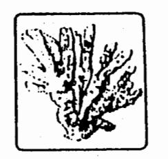

end. part shaif quare to the construction of the construction of the construction of the construction of the construction of the construction of the construction of the construction of the construction of the construction of the construction of the construction of the construction of the construction of the construction of the construction of the construction of the construction of the construction of the construction of the construction of the construction of the construction of the construction of the construction of the construction of the construction of the construction of the construction of the construction of the construction of the construction of the construction of the construction of the construction of the construction of the construction of the construction of the construction of the construction of the construction of the construction of the construction of the construction of the construction of the construction of the construction of the construction of the construction of the construction of the construction of the construction of the construction of the construction of the construction of the construction of the construction of the construction of the construction of the construction of the construction of the construction of the construction of the construction of the construction of the construction of the construction of the construction of the construction of the construction of the construction of the construction of the construction of the construction of the construction of the construction of the construction of the construction of the construction of the construction of the construction of the construction of the construction of the construction of the construction of the construction of the construction of the construction of the construction of the construction of the construction of the construction of the construction of the construction of the construction of the construction of the construction of the construction of the construction of the construction of the construction of Therefore the transfer of the contract of the contract of the contract of the contract of the contract of the contract of the contract of the contract of the contract of the contract of the contract of the contract of the contract of the contract of the contract of the contract of the contract of the contract of the contract of the contract of the contract of the contract of the contract of the contract of the contract of the contract of the contract of the contract of the contract of the contract of the contract of the contract of the contract of the contract of the contract of the contract of the contract of the contract of the contract of the contract of the contract of the contract of the contract of the contract of the contract of the contract of the contract of the contract of the contract of the contract of the contract of the contract of the contract of the contract of the contract of the contract of the contract of the contract of the contract of the contract of the contract of the contract of the contract of the contract of the contract of the contract of the contract of the contract of the contract of the contract of the contract of the contract of the contract of the contract of the contract of the contract of the contract of the contract of the contract of the contract of the contract of the contract of the contract of the contract of the contract of the contract of the contract of the contract of the contract of the contract of the contract of the contract of the contract of the contract of the contract of the contract of the contract of the contract of the contract of the contract of the contract of the contract of the contract of the contract of the contract of the contract of the contract of the contract of the contract of the contract of the contract of the contract of the contract of the contract of the contract of the contract of the contract of the contract of the contract of the contract of the contract of the contract of the contract of the contract of the contract of the contract of the

# OFF OLOSEGA ISLAND

Green sea turtles (<u>Chelonia mydas</u>) are reported to have previously nested in small numbers on sand beaches around Olosega Island, but none have been observed in recent years (15).

# VILLAGES ON OLOSEGA

Although road development is minimal on Olosega, the island is now linked to Ofu by a one-lane highway bridge across Asaga Strait (41). An unimproved road provides vehicular transportation from the village of Sili around Tamatupu Point to Olosega Village (39;ASCRI).

The prinicipal means of transportation between Olosega and islands other than Ofu is by inter-island boats which cannot go in to shore at Olosega. They remain outside the reef, where passengers and cargo are transferred to and from shore by shallow-draft boats. Olosega can be reached also by small plane from Tutuila to Ofu Island, then driving or hiking along the south coast of Ofu for almost three miles (4.8 km) and crossing a causeway spanning the Asaga Strait to Olosega Island. No commercial hotels are available for visitors who wish to stay overnight (64).

SILI

MAP OL1

PHYSIOGRAPHY

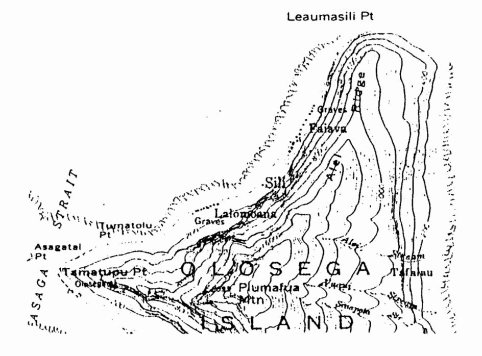

SILI (FAIAVA)

MAP OL1

PHYSIOGRAPHY

nor algae are evident in the pool. Fishes include mullet (Mugil spp.) (ASCRI-T1S6).

# FRINGING REEF

Inshore areas flanking the eastern margin of Faleasao Bay have only about 5% coral cover. Porites lutea is most common. Encrusting coralline algae and Sphacelaria sp. are the most common algae. Conspicuous invertebrates include the sea cucumbers, Holothuria cinerascens, H. difficilis, and H. atra (ASCRI-T1B1).

The outer reef platform is scoured by strong surge. Coral cover is generally about 20%, consisting mostly of <u>Porites lutea</u>, and some <u>Pavona</u>, <u>Acropora aspera</u>, and <u>A. humilis</u>. Coral cover reaches 30% in one area of staghorn acroporans. An equivalent proportion of this area is covered by large patches of dead <u>Acropora</u> branches encrusted by algae. At least 10 coral species representing 8 genera are present in western Faleasao Bay. The algae, <u>Sphacelaria</u> sp. and <u>Dictyosphaeria</u> sp. are common. <u>Caulerpa serrulata</u> is present. Conspicuous invertebrates include numerous sea cucumbers (<u>Stichopus chloronotus</u> and <u>Holothuria difficilis</u>) (ASCRI-T1B2).

The sea cucumbers,  $\underline{\text{Holothuria}}$  atra and  $\underline{\text{H}}$ .  $\underline{\text{difficilis}}$  are common under boulders in inshore areas bordering the eastern end of Faleasao Beach (ASCRI-T1B3).

Fish diversity is low in eastern Faleasao Bay. At least 17 species are represented. Dominant species in the nearshore area of scattered depressions and large volcanic boulders are damselfishes (Abudefduf septemfasciatus and Glyphidodontops glaucus), surgeonfish (Acanthurus triostegus), and wrasses (Halichoeres trimaculatus and H. margarataceus). In shallower areas seaward of the boulders, dominant species are damselfishes (Glyphidodontops leucopomus and G. glaucus), juvenile surgeonfish (Acanthurus triostegus), and a wrasse (Halichoeres margarataceous). In areas of higher bottom relief, a damselfish (Abudefduf septemfasciatus) is most abundant (ASCRI-TIFI).

Large thickets of live, as well as recently killed, staghorn coral occupy a lagoon dredged about 20 years ago in the inner reef at the western end of Faleasao Bay. Live coral covers about 30% of the bottom, with an equal proportion of dead coral heads present. At least 22 genera and 46 species of corals are recorded making this one of the more diverse coral assemblages in American Samoa. Acropora nana and A. cf. formosa are the most abundant species. Encrusting corals are abundant along the seaward margin of the lagoon. Sandy areas between consolidated banks of staghorn corals are carpeted by the green alga, Caulerpa serrulata. The encrusting alga, Porolithon gardineri, is very common. Stands of dead staghorn corals support a turf of brown, filamentous algae. The sea cucumber, Holothuria atra, is abundant and Stichopus chloronotus is common on sand bottom areas (ASCRI-T1B5).

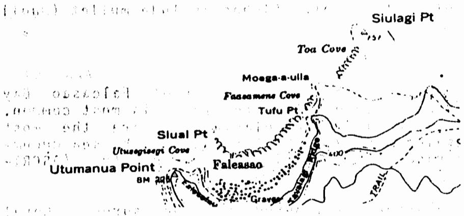

Control of the Albert Control he to be and the second September 1997 - George 1997 - George 1997 - George 1997 - George 1997 - George 1997 - George 1997 - George 1997 - George 1997 - George 1997 - George 1997 - George 1997 - George 1997 - George 1997 - George 1997 - George 1997 - George 1997 - George 1997 - George 1997 - George 1997 - George 1997 - George 1997 - George 1997 - George 1997 - George 1997 - George 1997 - George 1997 - George 1997 - George 1997 - George 1997 - George 1997 - George 1997 - George 1997 - George 1997 - George 1997 - George 1997 - George 1997 - George 1997 - George 1997 - George 1997 - George 1997 - George 1997 - George 1997 - George 1997 - George 1997 - George 1997 - George 1997 - George 1997 - George 1997 - George 1997 - George 1997 - George 1997 - George 1997 - George 1997 - George 1997 - George 1997 - George 1997 - George 1997 - George 1997 - George 1997 - George 1997 - George 1997 - George 1997 - George 1997 - George 1997 - George 1997 - George 1997 - George 1997 - George 1997 - George 1997 - George 1997 - George 1997 - George 1997 - George 1997 - George 1997 - George 1997 - George 1997 - George 1997 - George 1997 - George 1997 - George 1997 - George 1997 - George 1997 - George 1997 - George 1997 - George 1997 - George 1997 - George 1997 - George 1997 - George 1997 - George 1997 - George 1997 - George 1997 - George 1997 - George 1997 - George 1997 - George 1997 - George 1997 - George 1997 - George 1997 - George 1997 - George 1997 - George 1997 - George 1997 - George 1997 - George 1997 - George 1997 - George 1997 - George 1997 - George 1997 - George 1997 - George 1997 - George 1997 - George 1997 - George 1997 - George 1997 - George 1997 - George 1997 - George 1997 - George 1997 - George 1997 - George 1997 - George 1997 - George 1997 - George 1997 - George 1997 - George 1997 - George 1997 - George 1997 - George 1997 - George 1997 - George 1997 - George 1997 - George 1997 - George 1997 - George 1997 - George 1997 - George 1997 - George 1997 - George 1997 - George 1997 - George 1997 - George 1997 - George 1997 - George 1997 - Zeel serge from the THE COUNTY OF THE COUNTY OF THE COUNTY OF THE COUNTY The second of the second of the second of the second of the second of the second of the second of the second of the second of the second of the second of the second of the second of the second of the second of the second of the second of the second of the second of the second of the second of the second of the second of the second of the second of the second of the second of the second of the second of the second of the second of the second of the second of the second of the second of the second of the second of the second of the second of the second of the second of the second of the second of the second of the second of the second of the second of the second of the second of the second of the second of the second of the second of the second of the second of the second of the second of the second of the second of the second of the second of the second of the second of the second of the second of the second of the second of the second of the second of the second of the second of the second of the second of the second of the second of the second of the second of the second of the second of the second of the second of the second of the second of the second of the second of the second of the second of the second of the second of the second of the second of the second of the second of the second of the second of the second of the second of the second of the second of the second of the second of the second of the second of the second of the second of the second of the second of the second of the second of the second of the second of the second of the second of the second of the second of the second of the second of the second of the second of the second of the second of the second of the second of the second of the second of the second of the second of the second of the second of the second of the second of the second of the second of the second of the second of the second of the second of the second of the second of the second of the second of the second of the second of the second of the second of the second of th why first participation of the second second chierman and the commence of the commence of the commence of the commence of the commence of the commence of the commence of the commence of the commence of the commence of the commence of the commence of the commence of the commence of the commence of the commence of the commence of the commence of the commence of the commence of the commence of the commence of the commence of the commence of the commence of the commence of the commence of the commence of the commence of the commence of the commence of the commence of the commence of the commence of the commence of the commence of the commence of the commence of the commence of the commence of the commence of the commence of the commence of the commence of the commence of the commence of the commence of the commence of the commence of the commence of the commence of the commence of the commence of the commence of the commence of the commence of the commence of the commence of the commence of the commence of the commence of the commence of the commence of the commence of the commence of the commence of the commence of the commence of the commence of the commence of the commence of the commence of the commence of the commence of the commence of the commence of the commence of the commence of the commence of the commence of the commence of the commence of the commence of the commence of the commence of the commence of the commence of the commence of the commence of the commence of the commence of the commence of the commence of the commence of the commence of the commence of the commence of the commence of the commence of the commence of the commence of the commence of the commence of the commence of the commence of the commence of the commence of the commence of the commence of the commence of the commence of the commence of the commence of the commence of the commence of the commence of the commence of the commence of the commence of the commence of the commence of the commence of the commence of the commence of the commence of the commence of the commence of t

FALEASAO MAP T1

The gradient of the Arthurst Control

WATER CONDITIONS

The compact of the control of the control of the control of the control of the control of the control of the control of the control of the control of the control of the control of the control of the control of the control of the control of the control of the control of the control of the control of the control of the control of the control of the control of the control of the control of the control of the control of the control of the control of the control of the control of the control of the control of the control of the control of the control of the control of the control of the control of the control of the control of the control of the control of the control of the control of the control of the control of the control of the control of the control of the control of the control of the control of the control of the control of the control of the control of the control of the control of the control of the control of the control of the control of the control of the control of the control of the control of the control of the control of the control of the control of the control of the control of the control of the control of the control of the control of the control of the control of the control of the control of the control of the control of the control of the control of the control of the control of the control of the control of the control of the control of the control of the control of the control of the control of the control of the control of the control of the control of the control of the control of the control of the control of the control of the control of the control of the control of the control of the control of the control of the control of the control of the control of the control of the control of the control of the control of the control of the control of the control of the control of the control of the control of the control of the control of the control of the control of the control of the control of the control of the control of the control of the control of the control of the control of the co Total Coye and the second of the second of the second of the second of the second of the second of the second of the second of the second of the second of the second of the second of the second of the second of the second of the second of the second of the second of the second of the second of the second of the second of the second of the second of the second of the second of the second of the second of the second of the second of the second of the second of the second of the second of the second of the second of the second of the second of the second of the second of the second of the second of the second of the second of the second of the second of the second of the second of the second of the second of the second of the second of the second of the second of the second of the second of the second of the second of the second of the second of the second of the second of the second of the second of the second of the second of the second of the second of the second of the second of the second of the second of the second of the second of the second of the second of the second of the second of the second of the second of the second of the second of the second of the second of the second of the second of the second of the second of the second of the second of the second of the second of the second of the second of the second of the second of the second of the second of the second of the second of the second of the second of the second of the second of the second of the second of the second of the second of the second of the second of the second of the second of the second of the second of the second of the second of the second of the second of the second of the second of the second of the second of the second of the second of the second of the second of the second of the second of the second of the second of the second of the second of the second of the second of the second of the second of the second of the second of the second of the second of the second of the second of the second of the second of the second of t

USE CONSIDERATIONS

Control of the state of the first of the control of the state of the state of the state of the state of the state of the state of the state of the state of the state of the state of the state of the state of the state of the state of the state of the state of the state of the state of the state of the state of the state of the state of the state of the state of the state of the state of the state of the state of the state of the state of the state of the state of the state of the state of the state of the state of the state of the state of the state of the state of the state of the state of the state of the state of the state of the state of the state of the state of the state of the state of the state of the state of the state of the state of the state of the state of the state of the state of the state of the state of the state of the state of the state of the state of the state of the state of the state of the state of the state of the state of the state of the state of the state of the state of the state of the state of the state of the state of the state of the state of the state of the state of the state of the state of the state of the state of the state of the state of the state of the state of the state of the state of the state of the state of the state of the state of the state of the state of the state of the state of the state of the state of the state of the state of the state of the state of the state of the state of the state of the state of the state of the state of the state of the state of the state of the state of the state of the state of the state of the state of the state of the state of the state of the state of the state of the state of the state of the state of the state of the state of the state of the state of the state of the state of the state of the state of the state of the state of the state of the state of the state of the state of the state of the state of the state of the state of the state of the state of the state of the state of the state of the state of the state of the s the state of the state of the state of the state of the state of the state of the state of the state of the state of the state of the state of the state of the state of the state of the state of the state of the state of the state of the state of the state of the state of the state of the state of the state of the state of the state of the state of the state of the state of the state of the state of the state of the state of the state of the state of the state of the state of the state of the state of the state of the state of the state of the state of the state of the state of the state of the state of the state of the state of the state of the state of the state of the state of the state of the state of the state of the state of the state of the state of the state of the state of the state of the state of the state of the state of the state of the state of the state of the state of the state of the state of the state of the state of the state of the state of the state of the state of the state of the state of the state of the state of the state of the state of the state of the state of the state of the state of the state of the state of the state of the state of the state of the state of the state of the state of the state of the state of the state of the state of the state of the state of the state of the state of the state of the state of the state of the state of the state of the state of the state of the state of the state of the state of the state of the state of the state of the state of the state of the state of the state of the state of the state of the state of the state of the state of the state of the state of the state of the state of the state of the state of the state of the state of the state of the state of the state of the state of the state of the state of the state of the state of the state of the state of the state of the state of the state of the state of the state of the state of the state of the state of the state of the state of the state of the state of the state of the state of the s AND ANAMENE COVE 1 AND AND AND AND AND AND AND AND AND AND

FA'ASAMENE COVE TO A CONTROL MAP T1 The state of the state of the state of the state of the state of the state of the state of the state of the state of the state of the state of the state of the state of the state of the state of the state of the state of the state of the state of the state of the state of the state of the state of the state of the state of the state of the state of the state of the state of the state of the state of the state of the state of the state of the state of the state of the state of the state of the state of the state of the state of the state of the state of the state of the state of the state of the state of the state of the state of the state of the state of the state of the state of the state of the state of the state of the state of the state of the state of the state of the state of the state of the state of the state of the state of the state of the state of the state of the state of the state of the state of the state of the state of the state of the state of the state of the state of the state of the state of the state of the state of the state of the state of the state of the state of the state of the state of the state of the state of the state of the state of the state of the state of the state of the state of the state of the state of the state of the state of the state of the state of the state of the state of the state of the state of the state of the state of the state of the state of the state of the state of the state of the state of the state of the state of the state of the state of the state of the state of the state of the state of the state of the state of the state of the state of the state of the state of the state of the state of the state of the state of the state of the state of the state of the state of the state of the state of the state of the state of the state of the state of the state of the state of the state of the state of the state of the state of the state of the state of the state of the state of the state of the state of the state of the state of the state of the state of the s

USE CONSIDERATIONS

294

The reef fringing the southwestern portion of Faleasao Bay over 6 feet (2 m) deep, with considerable bottom relief and coral cover present. For these reasons, fish life is more diverse than in the northeastern portion of Faleasao Bay. Diversity is greatest at the southwestern end of the bay near Si'ua'i Point, where at least 56 species find shelter. Dominant species are the damselfishes, Stegastes nigricans, S. albofasciatus, Dascyllus aruanus, Glyphidodontops cyanea (in deep areas), and G. leucopomus (on the shallow flat on the seaward side), the wrasse, Thalassoma hardwickei, and juvenile parrotfishes, Scarus sordidus and Scarus spp. (ASCRI-T1F2).

Areas of sand bordering Si'ua'i Point harbor numerous sea cucumbers (Holothuria atra). Seaward, there are large patches of the coral Porites (Synaraea) spp. The green alga, Caulerpa serrulata, forms an extensive cover on the sand bottom. A bubble shell is quite common on the Caulerpa (ASCRI-T1B6).

Coral cover is only about 5% on the outer reef platform. Pavona sp. increases in abundance toward the reef margin. The green alga, <u>Dictyosphaeria</u> versluysii, is conspicuous (ASCRI-T1B7).

# FRINGING REEF (OFF FALEASAO)

The waters of a shallow area dredged in the reef fringing the western side of Faleasao Bay are relatively calm. However, a noticeable longshore current flows over the shallow inner reef on the eastern side of the bay, and surge increases seaward toward the reef margin. The reef fringing the coast off Faleasao Village is characterized by clear water (ASCRI).

# TO'A COVE

To'a Cove is considered to be an area of pristine marine life relatively undisturbed by man (59). The only access from the land to To'a Cove is by trail from the northeastern side of Faleasao Bay. Although scenic, the trail is narrow and moderately steep and slippery in places (ASCRI). Swimming can take place in To'a Cove. Access is by courtesy of Faleasao Village (41).

The reef fringing To'a Cove is regularly fished by villagers from Faleasao (46). Villagers fish in To'a Cove using bamboo poles and nets. Ula (spiny lobster) are said to be common on the outer reef. Some atule (bigeye scad) are caught in season (March to June), but this fishery was more active in the past than it is today. High surf breaking over the reef margin restricts use of the cove (ASCRI).

#### FA'ASAMENE COVE

Access to Fa'asamene Cove is by footpath from Faleasao (49). The trail connecting To'a Cove and Faleasao Bay dips down to provide easy access to the beach at the head of Fa'asamene Cove. The cove is used for swimming and fishing when the ocean

er te no start en en

1022648 BALL ... inhibra.

of the contract of the contract of

April 1 Section 1 Section 1 Section 1 Section 1 Section 1 Section 1 Section 1 Section 1 Section 1 Section 1 Section 1 Section 1 Section 1 Section 1 Section 1 Section 1 Section 1 Section 1 Section 1 Section 1 Section 1 Section 1 Section 1 Section 1 Section 1 Section 1 Section 1 Section 1 Section 1 Section 1 Section 1 Section 1 Section 1 Section 1 Section 1 Section 1 Section 1 Section 1 Section 1 Section 1 Section 1 Section 1 Section 1 Section 1 Section 1 Section 1 Section 1 Section 1 Section 1 Section 1 Section 1 Section 1 Section 1 Section 1 Section 1 Section 1 Section 1 Section 1 Section 1 Section 1 Section 1 Section 1 Section 1 Section 1 Section 1 Section 1 Section 1 Section 1 Section 1 Section 1 Section 1 Section 1 Section 1 Section 1 Section 1 Section 1 Section 1 Section 1 Section 1 Section 1 Section 1 Section 1 Section 1 Section 1 Section 1 Section 1 Section 1 Section 1 Section 1 Section 1 Section 1 Section 1 Section 1 Section 1 Section 1 Section 1 Section 1 Section 1 Section 1 Section 1 Section 1 Section 1 Section 1 Section 1 Section 1 Section 1 Section 1 Section 1 Section 1 Section 1 Section 1 Section 1 Section 1 Section 1 Section 1 Section 1 Section 1 Section 1 Section 1 Section 1 Section 1 Section 1 Section 1 Section 1 Section 1 Section 1 Section 1 Section 1 Section 1 Section 1 Section 1 Section 1 Section 1 Section 1 Section 1 Section 1 Section 1 Section 1 Section 1 Section 1 Section 1 Section 1 Section 1 Section 1 Section 1 Section 1 Section 1 Section 1 Section 1 Section 1 Section 1 Section 1 Section 1 Section 1 Section 1 Section 1 Section 1 Section 1 Section 1 Section 1 Section 1 Section 1 Section 1 Section 1 Section 1 Section 1 Section 1 Section 1 Section 1 Section 1 Section 1 Section 1 Section 1 Section 1 Section 1 Section 1 Section 1 Section 1 Section 1 Section 1 Section 1 Section 1 Section 1 Section 1 Section 1 Section 1 Section 1 Section 1 Section 1 Section 1 Section 1 Section 1 Section 1 Section 1 Section 1 Section 1 Section 1 Section 1 Section 1 Section 1 Section 1 Section 1 Section 1 Section

FALEASAO

T1

USE CONSIDERATIONS

To FALEASAO

T1 MAP

Siulagi Pt

USE CONSIDERATIONS

Utusegisegi Cove

A TOTAL TOTAL CONTRACTOR OF THE PROPERTY AS • • • • • • • • • • • • • • • • • • •

The same of the state of

Marian Company of the second of the second of the second of the second of the second of the second of the second of the second of the second of the second of the second of the second of the second of the second of the second of the second of the second of the second of the second of the second of the second of the second of the second of the second of the second of the second of the second of the second of the second of the second of the second of the second of the second of the second of the second of the second of the second of the second of the second of the second of the second of the second of the second of the second of the second of the second of the second of the second of the second of the second of the second of the second of the second of the second of the second of the second of the second of the second of the second of the second of the second of the second of the second of the second of the second of the second of the second of the second of the second of the second of the second of the second of the second of the second of the second of the second of the second of the second of the second of the second of the second of the second of the second of the second of the second of the second of the second of the second of the second of the second of the second of the second of the second of the second of the second of the second of the second of the second of the second of the second of the second of the second of the second of the second of the second of the second of the second of the second of the second of the second of the second of the second of the second of the second of the second of the second of the second of the second of the second of the second of the second of the second of the second of the second of the second of the second of the second of the second of the second of the second of the second of the second of the second of the second of the second of the second of the second of the second of the second of the second of the second of the second of the second of the second of the second o

The first of the first of the first of the first of the first of the first of the first of the first of the first of the first of the first of the first of the first of the first of the first of the first of the first of the first of the first of the first of the first of the first of the first of the first of the first of the first of the first of the first of the first of the first of the first of the first of the first of the first of the first of the first of the first of the first of the first of the first of the first of the first of the first of the first of the first of the first of the first of the first of the first of the first of the first of the first of the first of the first of the first of the first of the first of the first of the first of the first of the first of the first of the first of the first of the first of the first of the first of the first of the first of the first of the first of the first of the first of the first of the first of the first of the first of the first of the first of the first of the first of the first of the first of the first of the first of the first of the first of the first of the first of the first of the first of the first of the first of the first of the first of the first of the first of the first of the first of the first of the first of the first of the first of the first of the first of the first of the first of the first of the first of the first of the first of the first of the first of the first of the first of the first of the first of the first of the first of the first of the first of the first of the first of the first of the first of the first of the first of the first of the first of the first of the first of the first of the first of the first of the first of the first of the first of the first of the first of the first of the first of the first of the first of the first of the first of the first of the first of the first of the first of the first of the first of the first of the first of the first of the first of the first of the first of the f

Harry A. A. A. A. A. A. A. A. A. A. A. A. A.

 $\begin{array}{llllllllllllllllllllllllllllllllllll$ 

Utumanua Point Faleasao

Ministrate was the many on the state of the state of the state of the state of the state of the state of the state of the state of the state of the state of the state of the state of the state of the state of the state of the state of the state of the state of the state of the state of the state of the state of the state of the state of the state of the state of the state of the state of the state of the state of the state of the state of the state of the state of the state of the state of the state of the state of the state of the state of the state of the state of the state of the state of the state of the state of the state of the state of the state of the state of the state of the state of the state of the state of the state of the state of the state of the state of the state of the state of the state of the state of the state of the state of the state of the state of the state of the state of the state of the state of the state of the state of the state of the state of the state of the state of the state of the state of the state of the state of the state of the state of the state of the state of the state of the state of the state of the state of the state of the state of the state of the state of the state of the state of the state of the state of the state of the state of the state of the state of the state of the state of the state of the state of the state of the state of the state of the state of the state of the state of the state of the state of the state of the state of the state of the state of the state of the state of the state of the state of the state of the state of the state of the state of the state of the state of the state of the state of the state of the state of the state of the state of the state of the state of the state of the state of the state of the state of the state of the state of the state of the state of the state of the state of the state of the state of the state of the state of the state of the state of the state of the state of the state of the state of the state of the MA'AFE'E ISLET

PHYSIOGRAPHY

----

11 1

is calm (ASCRI). The cove is regularly fished by villagers from Faleasao (20).

# SHORELINE AT FALEASAO

Swimming occurs at Faleasao Beach. Access is by courtesy of Faleasao Village (41). The top of the cliff at Si'ua'i Point is easily climbed and offers scenic views of both Faleasao Bay and Utusegisegi Cove (ASCRI).

# FRINGING REEF

The reef flat bordering the coast between Tufu Point and Si'ua'i Point is considered a "critical use reef area" supporting subsistence fishing by villagers (39). Both the reef flat and deeper waters seaward of the reef edge between To'a Cove and Si'ua'i Point are frequently fished. Pole and line fishing and " spearing (mata) are the most common activities. Handlining and night from canoes and throw-netting follow in popularity. Rod and reel fishing and seine netting are less active fisheries. Gatala (honeycomb sea bass), filoa (large emperor emperor fish), mataeleele (small sumu (triggerfish), (small jack), savane (blue-lined snapper), and mataele (scarlet sea bass) are taken day and night by pole fishing. In addition, lupo (juvenile jack) are taken by day and malau (squirrelfish), matapula (bigeye snapper), malai (paddletail snapper), and mutu are taken at night. Spearing results in day and night catches of alogo (zebra surgeonfish), pone (chocolate surgeonfish), malauli (large jack), and anae (adult mullet). Additional day catches frequently include lupota, sugale (wrasse), fugausi and laea (parrotfishes), fe'e (octopus), eel, and faisua (giant clam). Additional night catches often include manini (convict tang), ula (spiny lobster), crab, and papata (slipper lobster). Handlining from canoes yields day and night catches of matapula, mataeleele, malai, filoa (long-nosed emperor fish), savane (blue-lined snapper), and mataele (scarlet sea bass). Malau is often caught at night by handlining. Throw-netting is primarily a daytime activity resulting in catches of manini, anae and fuafua (juvenile mullet), lupota, i'a usi (threadfin), sugale (wrasse), fuga (parrotfish), pone, and alogo (20). Canoes on the upper beach at Faleasao attest to the popularity of paopao fishing (ASCRI).

Surfing is possible off Faleasao during periods of north swell and incoming tide. Most wind conditions permit surfing except calm periods or winds from the north or west. Waves over 6 feet (2 m) high are not surfable here (41).

COAST BETWEEN UTUMANU'A POINT AND FA'ASOUGA POINT

#### MA'AFE'E ISLET

Ma'afe'e Islet is a 30-foot (9 m) high seastack off Luma Village (ASCRI).

34109 1 60 17 WAT OFFERSTEEL F

TA'U

MAP T1 **PHYSIOGRAPHY** 

Pareng まがまでない。 いっこう いっこう の 自然まなのでは、A でものい Seeの さんじゅう ロー・・・・・・・・・・・・・・・・・・・・・・・・・・・・・・・・・・・・ /aTA'U: (SI'UFAGA) net probablisch in die ein

Carl Steen mile than I a

established the contract of the contract

the thirty of the first of the second

ស្ថាល់ពីលោកទាន់ស្នើ ១០០០០០០០០០០០០០០០០០០០០០០០០០០០០០០០០០០០០

PHYSIOGRAPHY

TA'U (LUMA) MAP

And the second of the second

**PHYSIOGRAPHY** 

WEST COAST MAP T1

SHORELINE

A narrow beach of calcareous sand and scattered limestone rubble fronts Ta'u Village. The sand is progressively coarser (with an increase in size and quantity of limestone rubble) toward Luma Village. In some areas, the foreshore consists entirely of limestone rubble (49). Beach width varies from 50 to 60 feet (15 to 18 m). The foreshore slopes up to a vegetated backshore at the 10-foot (3 m) elevation (49;ASCRI-T1S7). A narrow strip of beachrock is exposed along a 150 to 180-foot (45 to 55 m) length of shoreline. A submerged and more eroded outcrop of beachrock is located near shore (ASCRI-T1S7).

# SHORELINE (OFF SI'UFAGA)

The predominant feature of the backshore at Si'ufaga is a lava rock seawall reaching 6 feet (2 m) in height at its southern end. The steep, 30 to 50-foot (9 to 15 m) wide foreshore grades from limestone boulders to rubble and then to calcareous sand on the upper beach (ASCRI-T1S8;49). The boundary between the foreshore and backshore is delineated by a 1 to 2-foot (0.3 to 0.6 m) wave-cut scarp (49). At low tide a band of limestone rubble and algal-stained beachrock is exposed at the base of the beach (49;ASCRI-T1S8).

# FRINGING REEF (OFF LUMA)

The reef fronting the northern end of Luma Village is poorly developed and deep enough to permit large waves to reach the shore (49;ASCRI). At depths of 60 to 80 feet (18 to 25 m) about 1000 feet (300 m) offshore of Luma Village, the bottom consists of a rocky flat with large boulders (10).

The reef fronting the Ta'u village complex gradually widens from 150 feet (45 m) off Luma to 400 feet (120 m) off Si'ufaga (49). The reef is indented by two major avas, one off the northern end (off Luma) and another off the southern end of the village complex (off Si'ufaga). Strong currents flow seaward through the channels (55).

A narrow channel of rubble and sand parallels the shore in front of Ta'u Village. The inshore channel reaches a depth of about one foot (0.3 m) and extends about 25 feet (7.6 m) offshore. The channel merges with an inner reef flat of consolidated limestone with a few rubble-filled depressions having depths of up to 2 feet (0.6 m) (ASCRI-T1B8).

The middle reef flat extends from 100 to 200 feet (30 to 60 m) offshore. The consolidated limestone bottom is broken by depressions up to 2 feet (0.6 m) deep. The outer reef flat, 200 to 300 feet (60 to 90 m) offshore, is mainly a consolidated limestone pavement at depths under one foot (0.3 m). Boulders are exposed at low tide (ASCRI-T189).

con linestone linestone linestone coarser coarser coarser coarser coarser coarser coarser coarser coarser coarser coarser coarser coarser coarser coarser coarser coarser coarser coarser coarser coarser coarser coarser coarser coarser coarser coarser coarser coarser coarser coarser coarser coarser coarser coarser coarser coarser coarser coarser coarser coarser coarser coarser coarser coarser coarser coarser coarser coarser coarser coarser coarser coarser coarser coarser coarser coarser coarser coarser coarser coarser coarser coarser coarser coarser coarser coarser coarser coarser coarser coarser coarser coarser coarser coarser coarser coarser coarser coarser coarser coarser coarser coarser coarser coarser coarser coarser coarser coarser coarser coarser coarser coarser coarser coarser coarser coarser coarser coarser coarser coarser coarser coarser coarser coarser coarser coarser coarser coarser coarser coarser coarser coarser coarser coarser coarser coarser coarser coarser coarser coarser coarser coarser coarser coarser coarser coarser coarser coarser coarser coarser coarser coarser coarser coarser coarser coarser coarser coarser coarser coarser coarser coarser coarser coarser coarser coarser coarser coarser coarser coarser coarser coarser coarser coarser coarser coarser coarser coarser coarser coarser coarser coarser coarser coarser coarser coarser coarser coarser coarser coarser coarser coarser coarser coarser coarser coarser coarser coarser coarser coarser coarser coarser coarser coarser coarser coarser coarser coarser coarser coarser coarser coarser coarser coarser coarser coarser coarser coarser coarser coarser coarser coarser coarser coarser coarser coarser coarser coarser coarser coarser coarser coarser coarser coarser coarser coarser coarser coarser coarser coarser coarser coarser coarser coarser coarser coarser coarser coarser coarser coarser coarser coarser coarser coarser coarser coarser coarser coarser coarser coarser coarser coarser coarser coarser coarser coarser coarser coarser coarser coarser coar etalenos .... 03 C2 max ) TA'U (SI'UFAGA) Utungiogi Cove

Utumanua Point

BM app f. 10 (1)

Aphilips . The second 1 102 . . . . . . . . . . . . . . . . . . .

(A) (A) (A) (A) (A) (A) (A) (A) (A) (A)

1111 111 Dar Francisco CA CA

T-İ MAP

**PHYSIOGRAPHY** 

( MAN-MADE CHANNEL MAN-MADE

THE PROPERTY OF THE PROPERTY OF THE PROPERTY OF THE PROPERTY OF THE PROPERTY OF THE PROPERTY OF THE PROPERTY OF THE PROPERTY OF THE PROPERTY OF THE PROPERTY OF THE PROPERTY OF THE PROPERTY OF THE PROPERTY OF THE PROPERTY OF THE PROPERTY OF THE PROPERTY OF THE PROPERTY OF THE PROPERTY OF THE PROPERTY OF THE PROPERTY OF THE PROPERTY OF THE PROPERTY OF THE PROPERTY OF THE PROPERTY OF THE PROPERTY OF THE PROPERTY OF THE PROPERTY OF THE PROPERTY OF THE PROPERTY OF THE PROPERTY OF THE PROPERTY OF THE PROPERTY OF THE PROPERTY OF THE PROPERTY OF THE PROPERTY OF THE PROPERTY OF THE PROPERTY OF THE PROPERTY OF THE PROPERTY OF THE PROPERTY OF THE PROPERTY OF THE PROPERTY OF THE PROPERTY OF THE PROPERTY OF THE PROPERTY OF THE PROPERTY OF THE PROPERTY OF THE PROPERTY OF THE PROPERTY OF THE PROPERTY OF THE PROPERTY OF THE PROPERTY OF THE PROPERTY OF THE PROPERTY OF THE PROPERTY OF THE PROPERTY OF THE PROPERTY OF THE PROPERTY OF THE PROPERTY OF THE PROPERTY OF THE PROPERTY OF THE PROPERTY OF THE PROPERTY OF THE PROPERTY OF THE PROPERTY OF THE PROPERTY OF THE PROPERTY OF THE PROPERTY OF THE PROPERTY OF THE PROPERTY OF THE PROPERTY OF THE PROPERTY OF THE PROPERTY OF THE PROPERTY OF THE PROPERTY OF THE PROPERTY OF THE PROPERTY OF THE PROPERTY OF THE PROPERTY OF THE PROPERTY OF THE PROPERTY OF THE PROPERTY OF THE PROPERTY OF THE PROPERTY OF THE PROPERTY OF THE PROPERTY OF THE PROPERTY OF THE PROPERTY OF THE PROPERTY OF THE PROPERTY OF THE PROPERTY OF THE PROPERTY OF THE PROPERTY OF THE PROPERTY OF THE PROPERTY OF THE PROPERTY OF THE PROPERTY OF THE PROPERTY OF THE PROPERTY OF THE PROPERTY OF THE PROPERTY OF THE PROPERTY OF THE PROPERTY OF THE PROPERTY OF THE PROPERTY OF THE PROPERTY OF THE PROPERTY OF THE PROPERTY OF THE PROPERTY OF THE PROPERTY OF THE PROPERTY OF THE PROPERTY OF THE PROPERTY OF THE PROPERTY OF THE PROPERTY OF THE PROPERTY OF THE PROPERTY OF THE PROPERTY OF THE PROPERTY OF THE PROPERTY OF THE PROPERTY OF THE PROPERTY OF THE PROPERTY OF THE PROPERTY OF THE PROPERTY OF THE PROPERTY OF THE PROPERTY OF THE

TA'U - 1 - 1 - 1 - 1 - 1 - 1 - 1 - 1 - 1 -

THE ACT OF A STATE OF THE STATE OF THE STATE OF THE STATE OF THE STATE OF THE STATE OF THE STATE OF THE STATE OF THE STATE OF THE STATE OF THE STATE OF THE STATE OF THE STATE OF THE STATE OF THE STATE OF THE STATE OF THE STATE OF THE STATE OF THE STATE OF THE STATE OF THE STATE OF THE STATE OF THE STATE OF THE STATE OF THE STATE OF THE STATE OF THE STATE OF THE STATE OF THE STATE OF THE STATE OF THE STATE OF THE STATE OF THE STATE OF THE STATE OF THE STATE OF THE STATE OF THE STATE OF THE STATE OF THE STATE OF THE STATE OF THE STATE OF THE STATE OF THE STATE OF THE STATE OF THE STATE OF THE STATE OF THE STATE OF THE STATE OF THE STATE OF THE STATE OF THE STATE OF THE STATE OF THE STATE OF THE STATE OF THE STATE OF THE STATE OF THE STATE OF THE STATE OF THE STATE OF THE STATE OF THE STATE OF THE STATE OF THE STATE OF THE STATE OF THE STATE OF THE STATE OF THE STATE OF THE STATE OF THE STATE OF THE STATE OF THE STATE OF THE STATE OF THE STATE OF THE STATE OF THE STATE OF THE STATE OF THE STATE OF THE STATE OF THE STATE OF THE STATE OF THE STATE OF THE STATE OF THE STATE OF THE STATE OF THE STATE OF THE STATE OF THE STATE OF THE STATE OF THE STATE OF THE STATE OF THE STATE OF THE STATE OF THE STATE OF THE STATE OF THE STATE OF THE STATE OF THE STATE OF THE STATE OF THE STATE OF THE STATE OF THE STATE OF THE STATE OF THE STATE OF THE STATE OF THE STATE OF THE STATE OF THE STATE OF THE STATE OF THE STATE OF THE STATE OF THE STATE OF THE STATE OF THE STATE OF THE STATE OF THE STATE OF THE STATE OF THE STATE OF THE STATE OF THE STATE OF THE STATE OF THE STATE OF THE STATE OF THE STATE OF THE STATE OF THE STATE OF THE STATE OF THE STATE OF THE STATE OF THE STATE OF THE STATE OF THE STATE OF THE STATE OF THE STATE OF THE STATE OF THE STATE OF THE STATE OF THE STATE OF THE STATE OF THE STATE OF THE STATE OF THE STATE OF THE STATE OF THE STATE OF THE STATE OF THE STATE OF THE STATE OF THE STATE OF THE STATE OF THE STATE OF THE STATE OF THE STATE OF THE STATE OF THE STATE OF THE STATE OF THE STATE OF THE STATE OF THE STATE

FLORA AND FAUNA

( RARE WATERBIRD

MAP T1

The reef margin is about 30 feet (9 m) wide, having both an algal ridge and spur-and-groove development. A channel may be one of several said to have been blasted through the reef by the U.S. Navy in World War II to enable boats to be brought into shore. At present, the channel is accessible by boat only at high tide. Similar channels occur off Luma and Si'ufaga (ASCRI-TIB10).

FRINGING REEF (OFF SI'UFAGA)

WEST COAST

An alongshore depression or "boat channel" parallels the shoreline between Ta'u and Si'ufaga. The sand- and rubble-bottom depression broadens somewhat toward Si'ufaga, where roily water (Schlieren effect) indicates freshwater seepage along shore. The channel extends to 75 feet (23 m) offshore and has depths to 3 feet (1 m) (ASCRI-TIBII).

A freshwater spring below the high water mark off Si'ufaga is known as Vai-o-tuli and is associated with a legend about turtles coming ashore to lay eggs (30).

The middle reef flat, from 75 to 175 feet (23 to 55 m) offshore, is characterized by limestone outcrops, boulders, sand and rubble. Depth is about one foot (0.3 m) deep with numerous deeper depressions present. A boulder tract over 200 feet (60 m) in length is exposed parallel to shore on the middle reef flat (ASCRI-TIB12).

The outer reef flat shoals to a depth of 6 inches (15 cm). The shallow platform of consolidated limestone extends from 175 to 275 feet (55 to 85 m) offshore (ASCRI-T1B13). The reef margin exhibits little vertical relief. A few depressions with depths of one foot (0.3 m) contain rubble and small boulders (ASCRI-T1B14). A shallow channel cut across the reef is believed to have been blasted by the U.S. Navy during World War II to provide access to deep water. The reef is indented near the channel. Channel margins have irregular depressions containing boulders 1 to 3 feet (0.3 to 1.0 m) across. The channel is 2 feet (0.6 m) deep at its shoreward head, where a layer of sand covers unconsolidated rubble. A layer of fine sand covers a bottom of consolidated limestone toward the seaward end of the channel (ASCRI-T1B15;49).

# MARSHLAND '

A large area of disturbed coastal marsh occupies a low-lying depression behind the village of Luma and extends to the foot of the high cliff that surrounds it on three sides. This marsh, covering an area of approximately 18 acres (7.5 ha), is extensively cultivated and little of the natural vegetation remains. The typical marsh plants such as Rhynchospora sp., Ludwigia sp., and Eleocharis sp. occur here (77). The rare Australian gray duck (toloa; Anas superciliosa pelewensis) has been sighted occasionally in this area (15).

TA'U (LUMA) MAP T1

The section of

FLORA AND FAUNA

TA'U Utumanua Point Faleasao

TA'U (SI'UFAGA)

And the second of the second of the second of the second of the second of the second of the second of the second of the second of the second of the second of the second of the second of the second of the second of the second of the second of the second of the second of the second of the second of the second of the second of the second of the second of the second of the second of the second of the second of the second of the second of the second of the second of the second of the second of the second of the second of the second of the second of the second of the second of the second of the second of the second of the second of the second of the second of the second of the second of the second of the second of the second of the second of the second of the second of the second of the second of the second of the second of the second of the second of the second of the second of the second of the second of the second of the second of the second of the second of the second of the second of the second of the second of the second of the second of the second of the second of the second of the second of the second of the second of the second of the second of the second of the second of the second of the second of the second of the second of the second of the second of the second of the second of the second of the second of the second of the second of the second of the second of the second of the second of the second of the second of the second of the second of the second of the second of the second of the second of the second of the second of the second of the second of the second of the second of the second of the second of the second of the second of the second of the second of the second of the second of the second of the second of the second of the second of the second of the second of the second of the second of the second of the second of the second of the second of the second of the second of the second of the second of the second of the second of the second of the second of the second of the second of the second o

The first of the first of the second of the second of the second of the second of the second of the second of the second of the second of the second of the second of the second of the second of the second of the second of the second of the second of the second of the second of the second of the second of the second of the second of the second of the second of the second of the second of the second of the second of the second of the second of the second of the second of the second of the second of the second of the second of the second of the second of the second of the second of the second of the second of the second of the second of the second of the second of the second of the second of the second of the second of the second of the second of the second of the second of the second of the second of the second of the second of the second of the second of the second of the second of the second of the second of the second of the second of the second of the second of the second of the second of the second of the second of the second of the second of the second of the second of the second of the second of the second of the second of the second of the second of the second of the second of the second of the second of the second of the second of the second of the second of the second of the second of the second of the second of the second of the second of the second of the second of the second of the second of the second of the second of the second of the second of the second of the second of the second of the second of the second of the second of the second of the second of the second of the second of the second of the second of the second of the second of the second of the second of the second of the second of the second of the second of the second of the second of the second of the second of the second of the second of the second of the second of the second of the second of the second of the second of the second of the second of the second of the second of the second of the second of the second of the second of the

This (black of the control of the control

 $\begin{array}{cccccccccccccccccccccccccccccccccccc$ 

A Charles & March & Control of the Control of the Control of the Control of the Control of the Control of the Control of the Control of the Control of the Control of the Control of the Control of the Control of the Control of the Control of the Control of the Control of the Control of the Control of the Control of the Control of the Control of the Control of the Control of the Control of the Control of the Control of the Control of the Control of the Control of the Control of the Control of the Control of the Control of the Control of the Control of the Control of the Control of the Control of the Control of the Control of the Control of the Control of the Control of the Control of the Control of the Control of the Control of the Control of the Control of the Control of the Control of the Control of the Control of the Control of the Control of the Control of the Control of the Control of the Control of the Control of the Control of the Control of the Control of the Control of the Control of the Control of the Control of the Control of the Control of the Control of the Control of the Control of the Control of the Control of the Control of the Control of the Control of the Control of the Control of the Control of the Control of the Control of the Control of the Control of the Control of the Control of the Control of the Control of the Control of the Control of the Control of the Control of the Control of the Control of the Control of the Control of the Control of the Control of the Control of the Control of the Control of the Control of the Control of the Control of the Control of the Control of the Control of the Control of the Control of the Control of the Control of the Control of the Control of the Control of the Control of the Control of the Control of the Control of the Control of the Control of the Control of the Control of the Control of the Control of the Control of the Control of the Control of the Control of the Control of the Control of the Control of the Control of the Control of the Control of the C

with affiliation the state of the state of the state of the state of the state of the state of the state of the state of the state of the state of the state of the state of the state of the state of the state of the state of the state of the state of the state of the state of the state of the state of the state of the state of the state of the state of the state of the state of the state of the state of the state of the state of the state of the state of the state of the state of the state of the state of the state of the state of the state of the state of the state of the state of the state of the state of the state of the state of the state of the state of the state of the state of the state of the state of the state of the state of the state of the state of the state of the state of the state of the state of the state of the state of the state of the state of the state of the state of the state of the state of the state of the state of the state of the state of the state of the state of the state of the state of the state of the state of the state of the state of the state of the state of the state of the state of the state of the state of the state of the state of the state of the state of the state of the state of the state of the state of the state of the state of the state of the state of the state of the state of the state of the state of the state of the state of the state of the state of the state of the state of the state of the state of the state of the state of the state of the state of the state of the state of the state of the state of the state of the state of the state of the state of the state of the state of the state of the state of the state of the state of the state of the state of the state of the state of the state of the state of the state of the state of the state of the state of the state of the state of the state of the state of the state of the state of the state of the state of the state of the state of the state of the state of the state of the state of the state of the state of t

FLORA AND FAUNA

T1, ... FLORA AND FAUNA

1 1 1 1 1 1 1 1 1 1 1 1 1 1 1 1 1 1 1

# FRINGING REEF (OFF LUMA)

Fishes are neither abundant nor is the fauna diverse on the reef fronting Luma Village perhaps because of the lack of bottom relief. The assemblage includes at least 26 species. Dominant species are damselfishes (Glyphidodontops glaucus and G. leucopomus), wrasses (Halichoeres margarataceus and Thalassoma quinquevittata), and a surgeonfish (Acanthurus triostegus). With the exception of the damselfishes, most fishes present are juveniles or subadults (ASCRI-T1F3). Few corals are present at depths of 60 to 80 feet (18 to 25 m) some 1000 feet (300 m) offshore --mostly small heads of Porites and Pocillopora (10).

# FRINGING REEF (OFF TA'U VILLAGE)

Corals cover about 5% of the inner reef flat and nearshore channel fronting the main part of Ta'u Village. Porites lutea is most common. The green alga, <u>Dictyosphaeria versluysii</u>, and a brown algal turf are abundant. <u>Caulerpa</u> cf. <u>serrulata</u> is common. <u>Amphiroa</u> sp. is abundant along the sides and tops of limestone surfaces where the water depth reaches 1 to 2 feet (0.3 to 0.6 m). The sea cucumber, <u>Stichopus chloronotus</u>, is very common in depressions under loose rubble. <u>Holothuria difficilis</u> is common in the boat channel (ASCRI-TIB8).

The middle reef flat, 100 to 200 feet (30 to 60 m) offshore, has coral cover up to 10%, mainly of low-growing Acropora aspera. Coral cover increases to 20% some 200 to 300 feet (60 to 90 m) from shore. Encrusting corals, such as Acropora humilis, are most common. At least 23 coral species representing 11 genera are present on Ta'u reef. Encrusting and branching coralline algae cover most of the outer reef flat. Low growing, filamentous green algae occur on boulders exposed at low tide. The brittle star, Ophiocoma dentata, is common under boulders. The sea cucumber, Stichopus chloronotus, is abundant on rubble surfaces (ASCRI-T1B9).

# FRINGING REEF (OFF SI'UFAGA)

Coral cover of 5% on the inner reef flat includes Pocillopora damicornis and Porites lutea. Algae cover about 20 to 30% of the bottom. Algal species represented include Caulerpa cf. serrulata, Dictyosphaeria versluysii, Sphacelaria sp., Actinotrichia sp., and Neomeris sp. Sea cucumbers (Holothuria difficilis and H. hilla) abound under boulders. Stichopus chloronotus is common on the reef flat (ASCRI-TIBII). Coral cover is low on the middle reef flat. Acropora aspera is most common (ASCRI-TIBI2).

Of the 10% coral cover on the outer reef flat, most is accounted for by <u>Acropora humilis</u>. High algal cover consists largely of encrusting coralline species. Some fleshy <u>Dictyosphaeria versluysii</u> is present. The sea cucumber, <u>Stichopus chloronotus</u>, is common (ASCRI-T1B13). Turf-forming algae cover up to 80% of the bottom at the reef margin. <u>Dictyosphaeria ver-</u>

Market of the Alberta Land

然为"好人"。 医乳毒素乳炎

But the state of the state of

Call San Frager 1 1 11 11 11 11 11

entraction (content of the second of the second of the second of the second of the second of the second of the second of the second of the second of the second of the second of the second of the second of the second of the second of the second of the second of the second of the second of the second of the second of the second of the second of the second of the second of the second of the second of the second of the second of the second of the second of the second of the second of the second of the second of the second of the second of the second of the second of the second of the second of the second of the second of the second of the second of the second of the second of the second of the second of the second of the second of the second of the second of the second of the second of the second of the second of the second of the second of the second of the second of the second of the second of the second of the second of the second of the second of the second of the second of the second of the second of the second of the second of the second of the second of the second of the second of the second of the second of the second of the second of the second of the second of the second of the second of the second of the second of the second of the second of the second of the second of the second of the second of the second of the second of the second of the second of the second of the second of the second of the second of the second of the second of the second of the second of the second of the second of the second of the second of the second of the second of the second of the second of the second of the second of the second of the second of the second of the second of the second of the second of the second of the second of the second of the second of the second of the second of the second of the second of the second of the second of the second of the second of the second of the second of the second of the second of the second of the second of the second of the second of the second of the second of the second of the sec

Definition of the save of the same of the same of the same of the same of the same of the same of the same of the same of the same of the same of the same of the same of the same of the same of the same of the same of the same of the same of the same of the same of the same of the same of the same of the same of the same of the same of the same of the same of the same of the same of the same of the same of the same of the same of the same of the same of the same of the same of the same of the same of the same of the same of the same of the same of the same of the same of the same of the same of the same of the same of the same of the same of the same of the same of the same of the same of the same of the same of the same of the same of the same of the same of the same of the same of the same of the same of the same of the same of the same of the same of the same of the same of the same of the same of the same of the same of the same of the same of the same of the same of the same of the same of the same of the same of the same of the same of the same of the same of the same of the same of the same of the same of the same of the same of the same of the same of the same of the same of the same of the same of the same of the same of the same of the same of the same of the same of the same of the same of the same of the same of the same of the same of the same of the same of the same of the same of the same of the same of the same of the same of the same of the same of the same of the same of the same of the same of the same of the same of the same of the same of the same of the same of the same of the same of the same of the same of the same of the same of the same of the same of the same of the same of the same of the same of the same of the same of the same of the same of the same of the same of the same of the same of the same of the same of the same of the same of the same of the same of the same of the same of the same of the same of the same of the same of the same of the same of the same of the same of the

• 1 - 1 - 1 - 1 - 1 - 1

FLORA AND FAUNA

MAP T1 (4.4 4.4 4.4 4.4 4.4 4.4 4.4 4.4 4.4 4. TATURE LEVEL WATER CONDITIONS 

The transfer of the second second second second second second second second second second second second second second second second second second second second second second second second second second second second second second second second second second second second second second second second second second second second second second second second second second second second second second second second second second second second second second second second second second second second second second second second second second second second second second second second second second second second second second second second second second second second second second second second second second second second second second second second second second second second second second second second second second second second second second second second second second second second second second second second second second second second second second second second second second second second second second second second second second second second second second second second second second second second second second second second second second second second second second second second second second second second second second second second second second second second second second second second second second second second second second second second second second second second second second second second second second second second second second second second second second second second second second second second second second second second second second second second second second second second second second second second second second second second second second second second second second second second second second second second second second second second second second second second second second second second second second second second second second second second second second second second second second second second second second second second second second second second second second second second second sec

MAP T1 ; HISTORICAL/ARCHAEOLOGICAL TA'U

MAP T1 (Fig. 1)

The second of the second of the second of the second of the second of the second of the second of the second of the second of the second of the second of the second of the second of the second of the second of the second of the second of the second of the second of the second of the second of the second of the second of the second of the second of the second of the second of the second of the second of the second of the second of the second of the second of the second of the second of the second of the second of the second of the second of the second of the second of the second of the second of the second of the second of the second of the second of the second of the second of the second of the second of the second of the second of the second of the second of the second of the second of the second of the second of the second of the second of the second of the second of the second of the second of the second of the second of the second of the second of the second of the second of the second of the second of the second of the second of the second of the second of the second of the second of the second of the second of the second of the second of the second of the second of the second of the second of the second of the second of the second of the second of the second of the second of the second of the second of the second of the second of the second of the second of the second of the second of the second of the second of the second of the second of the second of the second of the second of the second of the second of the second of the second of the second of the second of the second of the second of the second of the second of the second of the second of the second of the second of the second of the second of the second of the second of the second of the second of the second of the second of the second of the second of the second of the second of the second of the second of the second of the second of the second of the second of the second of the second of the second of the second of the second of e meddin for a geleger om in de meddin for a forest of the later participates of a many participates of the a

and the following the second section is a second second second second second second second second second second second second second second second second second second second second second second second second second second second second second second second second second second second second second second second second second second second second second second second second second second second second second second second second second second second second second second second second second second second second second second second second second second second second second second second second second second second second second second second second second second second second second second second second second second second second second second second second second second second second second second second second second second second second second second second second second second second second second second second second second second second second second second second second second second second second second second second second second second second second second second second second second second second second second second second second second second second second second second second second second second second second second second second second second second second second second second second second second second second second second second second second second second second second second second second second second second second second second second second second second second second second second second second second second second second second second second second second second second second second second second second second second second second second second second second second second second second second second second second second second second second second second second second second second second second second second second second second second second second second second second second second second second second second second second second second second second second second second second se 

· · · · · · · · · · · · · · · · · · ·

TA'U MAP T1 USE CONSIDERATIONS

TOURIST FALES

THE PROPERTY OF THE PROPERTY OF THE PROPERTY OF THE PROPERTY OF THE PROPERTY OF THE PROPERTY OF THE PROPERTY OF THE PROPERTY OF THE PROPERTY OF THE PROPERTY OF THE PROPERTY OF THE PROPERTY OF THE PROPERTY OF THE PROPERTY OF THE PROPERTY OF THE PROPERTY OF THE PROPERTY OF THE PROPERTY OF THE PROPERTY OF THE PROPERTY OF THE PROPERTY OF THE PROPERTY OF THE PROPERTY OF THE PROPERTY OF THE PROPERTY OF THE PROPERTY OF THE PROPERTY OF THE PROPERTY OF THE PROPERTY OF THE PROPERTY OF THE PROPERTY OF THE PROPERTY OF THE PROPERTY OF THE PROPERTY OF THE PROPERTY OF THE PROPERTY OF THE PROPERTY OF THE PROPERTY OF THE PROPERTY OF THE PROPERTY OF THE PROPERTY OF THE PROPERTY OF THE PROPERTY OF THE PROPERTY OF THE PROPERTY OF THE PROPERTY OF THE PROPERTY OF THE PROPERTY OF THE PROPERTY OF THE PROPERTY OF THE PROPERTY OF THE PROPERTY OF THE PROPERTY OF THE PROPERTY OF THE PROPERTY OF THE PROPERTY OF THE PROPERTY OF THE PROPERTY OF THE PROPERTY OF THE PROPERTY OF THE PROPERTY OF THE PROPERTY OF THE PROPERTY OF THE PROPERTY OF THE PROPERTY OF THE PROPERTY OF THE PROPERTY OF THE PROPERTY OF THE PROPERTY OF THE PROPERTY OF THE PROPERTY OF THE PROPERTY OF THE PROPERTY OF THE PROPERTY OF THE PROPERTY OF THE PROPERTY OF THE PROPERTY OF THE PROPERTY OF THE PROPERTY OF THE PROPERTY OF THE PROPERTY OF THE PROPERTY OF THE PROPERTY OF THE PROPERTY OF THE PROPERTY OF THE PROPERTY OF THE PROPERTY OF THE PROPERTY OF THE PROPERTY OF THE PROPERTY OF THE PROPERTY OF THE PROPERTY OF THE PROPERTY OF THE PROPERTY OF THE PROPERTY OF THE PROPERTY OF THE PROPERTY OF THE PROPERTY OF THE PROPERTY OF THE PROPERTY OF THE PROPERTY OF THE PROPERTY OF THE PROPERTY OF THE PROPERTY OF THE PROPERTY OF THE PROPERTY OF THE PROPERTY OF THE PROPERTY OF THE PROPERTY OF THE PROPERTY OF THE PROPERTY OF THE PROPERTY OF THE PROPERTY OF THE PROPERTY OF THE PROPERTY OF THE PROPERTY OF THE PROPERTY OF THE PROPERTY OF THE PROPERTY OF THE PROPERTY OF THE PROPERTY OF THE PROPERTY OF THE PROPERTY OF THE PROPERTY OF THE PROPERTY OF THE PROPERTY OF THE PROPERTY OF

TA\*U Property and the second of the second of the second of the second of the second of the second of the second of the second of the second of the second of the second of the second of the second of the second of the second of the second of the second of the second of the second of the second of the second of the second of the second of the second of the second of the second of the second of the second of the second of the second of the second of the second of the second of the second of the second of the second of the second of the second of the second of the second of the second of the second of the second of the second of the second of the second of the second of the second of the second of the second of the second of the second of the second of the second of the second of the second of the second of the second of the second of the second of the second of the second of the second of the second of the second of the second of the second of the second of the second of the second of the second of the second of the second of the second of the second of the second of the second of the second of the second of the second of the second of the second of the second of the second of the second of the second of the second of the second of the second of the second of the second of the second of the second of the second of the second of the second of the second of the second of the second of the second of the second of the second of the second of the second of the second of the second of the second of the second of the second of the second of the second of the second of the second of the second of the second of the second of the second of the second of the second of the second of the second of the second of the second of the second of the second of the second of the second of the second of the second of the second of the second of the second of the second of the second of the second of the second of the second of the second of the second of the second of the second of the second of the second of the second of the second o

A transfer of the control of the control of the control of the control of the control of the control of the control of the control of the control of the control of the control of the control of the control of the control of the control of the control of the control of the control of the control of the control of the control of the control of the control of the control of the control of the control of the control of the control of the control of the control of the control of the control of the control of the control of the control of the control of the control of the control of the control of the control of the control of the control of the control of the control of the control of the control of the control of the control of the control of the control of the control of the control of the control of the control of the control of the control of the control of the control of the control of the control of the control of the control of the control of the control of the control of the control of the control of the control of the control of the control of the control of the control of the control of the control of the control of the control of the control of the control of the control of the control of the control of the control of the control of the control of the control of the control of the control of the control of the control of the control of the control of the control of the control of the control of the control of the control of the control of the control of the control of the control of the control of the control of the control of the control of the control of the control of the control of the control of the control of the control of the control of the control of the control of the control of the control of the control of the control of the control of the control of the control of the control of the control of the control of the control of the control of the control of the control of the control of the control of the control of the control of the control of the control of the control of the control o

WEST CUAST MAP T1

<u>sluysii</u> and <u>Amphiroa</u> sp. are very common together with encrusting coralline algae (ASCRI-T1B14).

The reef flat adjacent to a dredged channel off Si'ufaga has considerable algal cover of encrusting coralline species as well as an algal turf (ASCRI-T1B15).

# FRINGING REEF (OFF SI'UFAGA)

A relatively diverse fish fauna inhabits depressions on the inner reef flat fringing Si'ufaga Village. Dominating an assemblage of at least 38 species are the damselfishes, Glyphidodontops leucopomus, G. glaucus, and G. cyanea, the wrasse, Halichoeres margarataceus, the surgeonfish, Acanthurus triostegus, and the butterflyfish, Chaetodon citrinellus (ASCRI-T2F1).

# **NEARSHORE WATERS**

The seaward margin of the fringing reef off Ta'u Village is swept by strong surge. Clear, warm water flows seaward during outgoing tides (ASCRI). The reef flat is characterized by clear waters. Some refuse (especially bottles and cans) accumulates in the channel dredged through the reef flat off Si'ufaga. Strong currents flow seaward through this channel (ASCRI).

#### TA'U VILLAGE

A series of holes thought to be baitcups occur in a rock outcropping along the beach fronting Ta'u Village. The same type of hole drilled in stone in the Hawaiian Islands was used to crush bait or store bait while fishing (30). The tomb of the last Tui'manu'a is located along the coast below Papatea in north Luma on the western coast of Ta'u (41) (See FITIUTA / HISTORICAL/ARCHAEOLOGICAL).

#### TA'U BEACH

The central channel offshore of tourist fales (houses) is a popular place for swimming along Ta'u Beach. Access is by courtesy of Ta'u Village (41).

#### FRINGING REEF

The reef flat fronting the Ta'u village complex of Luma, Si'ufaga and Fusi is considered a "critical use reef area" supporting subsistence fishing by villagers (39). Both the reef flat and deeper waters beyond the reef edge are frequently fished as far south as Faga Cove. The fishing methods and catches are similar to those off Faleasao (20). Although much of the reef flat is exposed at low tide, gleaners seek crabs, octopus, and fishes (particularly large wrasses or sugale) in pools which remain submerged. Fishes commonly caught on the reef front for home consumption include jacks, surgeonfishes, parrotfishes, and squirrelfishes (59).

11.

ABOVE BYENDS Burney Barrell

TA'U

MAP T1 USE CONSIDERATIONS

Faasouga Pt Br.
Matavalept Inde Gald All ole Pt TA'U (FUSI)

and the second

ada no cores 545726 BOOKE

we observed the n= 1 ' 1, ).

> MAP T2

PHYSIOGRAPHY

ama di kacamatan di kacamatan di kacamatan di kacamatan di kacamatan di kacamatan di kacamatan di kacamatan di Kacamatan di kacamatan di kacamatan di kacamatan di kacamatan di kacamatan di kacamatan di kacamatan di kacama H Colonia Colonia 

Tide Gale & BM 9 Vaitele Pt (()

Mulisinalua Pt

of the property of and a the control of the second of the control of the control of the control of the control of the control of the control of the control of the control of the control of the control of the control of the control of the control of the control of the control of the control of the control of the control of the control of the control of the control of the control of the control of the control of the control of the control of the control of the control of the control of the control of the control of the control of the control of the control of the control of the control of the control of the control of the control of the control of the control of the control of the control of the control of the control of the control of the control of the control of the control of the control of the control of the control of the control of the control of the control of the control of the control of the control of the control of the control of the control of the control of the control of the control of the control of the control of the control of the control of the control of the control of the control of the control of the control of the control of the control of the control of the control of the control of the control of the control of the control of the control of the control of the control of the control of the control of the control of the control of the control of the control of the control of the control of the control of the control of the control of the control of the control of the control of the control of the control of the control of the control of the control of the control of the control of the control of the control of the control of the control of the control of the control of the control of the control of the control of the control of the control of the control of the control of the control of the control of the control of the control of the control of the control of the control of the control of the control of the control of the control of the control of the control of the control of the control of the control of the con

The first of the second of the second of the second of the second of the second of the second of the second of the second of the second of the second of the second of the second of the second of the second of the second of the second of the second of the second of the second of the second of the second of the second of the second of the second of the second of the second of the second of the second of the second of the second of the second of the second of the second of the second of the second of the second of the second of the second of the second of the second of the second of the second of the second of the second of the second of the second of the second of the second of the second of the second of the second of the second of the second of the second of the second of the second of the second of the second of the second of the second of the second of the second of the second of the second of the second of the second of the second of the second of the second of the second of the second of the second of the second of the second of the second of the second of the second of the second of the second of the second of the second of the second of the second of the second of the second of the second of the second of the second of the second of the second of the second of the second of the second of the second of the second of the second of the second of the second of the second of the second of the second of the second of the second of the second of the second of the second of the second of the second of the second of the second of the second of the second of the second of the second of the second of the second of the second of the second of the second of the second of the second of the second of the second of the second of the second of the second of the second of the second of the second of the second of the second of the second of the second of the second of the second of the second of the second of the second of the second of the second of the second of the second of the second of the second of the second of the

T2

PHYSIOGRAPHY

TA'U (FUSI) There will not the second of the

TA'U (FUSI)

MAP

PHYSIOGRAPHY

U'AT.

Fishing boats frequent nearshore waters off Ta'u Villages. The number of canoes on the backshore attest to the popularity of paopao fishing. The reef margan is considered a good area to collect ula (spiny lobster) at night during high tide (ASCRI).

Children fish with bamboo poles from rocky shoreline outcrops near Fa'asouga Point. Limestone rubble is collected in this area for use as fill for house foundations (ASCRI).

Workmen involved in the construction of Ta'u Harbor have surfed the waves breaking offshore.

# COAST BETWEEN FA'ASOUGA POINT AND VAITELE POINT

#### COASTAL PLAIN - MARSHLANDS

The coastal plain in the Fusi area extends inland approximately 400 feet (120 m) to the base of an old sea cliff. Part of the plain is a coastal marsh about 2 to 4 feet (0.6 to 1.2 m) above sea level. Beachrock and limestone breccia underlie two to five feet (0.3 to 1.5 m) of alluvium and dune sand in the marsh. The coastal cliff rises steeply to a height of 200 feet  $(60 \, \text{fm})$  above the marsh. Talus and landslide deposits occur at the foot of the cliff. Much of the talus is heavily vegetated (59).

A small marsh covering an area of about 2 acres (0.8 ha) occurs at Fusi, south of the Luma marsh. It occupies a narrow depression on a strip of land between the high coastal cliff and the shoreline (77).

# FA'ASOUGA POINT

A beach 6 to 20 feet (2 to 6 m) wide and composed of limestone rubble occupies a shoreline indentation northwest of Fa'asouga Point between outcrops of basalt 3 to 6 feet (1 to 2 m) high (ASCRI-T2S1). A bench is eroded in the basalt outcrop 5 feet (1.5 m) above sea level at Fa'asouga Point. Width of the bench varies from 20 to 50 feet (6 to 15 m). A storm beach of calcareous sand and limestone rubble lies inland of the bench (49).

#### SHORELINE

A 60-foot (18 m) wide sand beach is bounded by Fa'asouga Point and the Ta'u small boat harbor. A scarp is eroded along a short length of the backshore adjacent to the harbor (49). Beach sand is predominantly calcareous, with a minor component of volcanic fragments. The layer of beach sand is thin. Sand is progressively coarser toward the northwest end of the beach. Beach sand grades into a dune sand ridge or storm beach inland (59).

3.773

A third of the transfer

Taga Cover

The state of the state of the state of

Type Market Berger (1994) and the second of the second of the second of the second of the second of the second The second of the second of the second of the second of the second of the second of the second of the second of The second of the second of the second of the second of the second of the second of the second of the second of the second of the second of the second of the second of the second of the second of the second of the second of the second of the second of the second of the second of the second of the second of the second of the second of the second of the second of the second of the second of the second of the second of the second of the second of the second of the second of the second of the second of the second of the second of the second of the second of the second of the second of the second of the second of the second of the second of the second of the second of the second of the second of the second of the second of the second of the second of the second of the second of the second of the second of the second of the second of the second of the second of the second of the second of the second of the second of the second of the second of the second of the second of the second of the second of the second of the second of the second of the second of the second of the second of the second of the second of the second of the second of the second of the second of the second of the second of the second of the second of the second of the second of the second of the second of the second of the second of the second of the second of the second of the second of the second of the second of the second of the second of the second of the second of the second of the second of the second of the second of the second of the second of the second of the second of the second of the second of the second of the second of the second of the second of the second of the second of the second of the second of the second of the second of the second of the second of the second of the second of the second of the second of the

en en la companya de la companya de la companya de la companya de la companya de la companya de la companya de La companya de la companya de la companya de la companya de la companya de la companya de la companya de la co La companya de la companya de la companya de la companya de la companya de la companya de la companya de la co

TA'U (FUSI) Faasouga Pr Bin-2 Fusi

MAP T2

**PHYSIOGRAPHY** 

TA'U (FUSI) MAP T2

PHYSIOGRAPHY

TA'U (FUSI)

HAP T2

FL

TA'U (FUSI)

Same and the state of the state of the state of the state of the state of the state of the state of the state of the state of the state of the state of the state of the state of the state of the state of the state of the state of the state of the state of the state of the state of the state of the state of the state of the state of the state of the state of the state of the state of the state of the state of the state of the state of the state of the state of the state of the state of the state of the state of the state of the state of the state of the state of the state of the state of the state of the state of the state of the state of the state of the state of the state of the state of the state of the state of the state of the state of the state of the state of the state of the state of the state of the state of the state of the state of the state of the state of the state of the state of the state of the state of the state of the state of the state of the state of the state of the state of the state of the state of the state of the state of the state of the state of the state of the state of the state of the state of the state of the state of the state of the state of the state of the state of the state of the state of the state of the state of the state of the state of the state of the state of the state of the state of the state of the state of the state of the state of the state of the state of the state of the state of the state of the state of the state of the state of the state of the state of the state of the state of the state of the state of the state of the state of the state of the state of the state of the state of the state of the state of the state of the state of the state of the state of the state of the state of the state of the state of the state of the state of the state of the state of the state of the state of the state of the state of the state of the state of the state of the state of the state of the state of the state of the state of the state of the state of the state of the state

FLORA AND FAUNA

# FRINGING REEF (OFF FA'ASOUGA POINT)

The fringing reef extends about 400 feet (120 m) offshore northwest of Fa'asouga Point. A nearshore channel of sand, rubble, and basalt boulders, 50 to 100 feet (15 to 30 m) wide, parallels the base of the beach. Near the point, the channel narrows to 10 to 30 feet (3 to 9 m). Beyond 100 feet (30 m) from shore, the channel mergds with consolidated limestone along the inner margin of the reef flat. Depth in the channel varies from 1 to 3 feet (0.3 to 1.0 m) (ASCRI-T2B1). From 100 to 275 feet (30 to 85 m) offshore there is a middle reef area with extensive Acropora thickets separated by areas of sand, rubble, and boulders. Depth varies from 6 to 24 inches (15 to 60 cm) (ASCRI-T2B2).

The outer reef flat extends from 275 feet (85 m) seaward to the reef margin as a generally shallow limestone platform containing several exposures of basalt rocks (ASCRI-T2B3). The reef flat off Fa'asouga Point is very shallow (59).

# FRINGING REEF (OFF FUSI)

The fringing reef is about 350 feet (75 m) wide off Fusi Depth varies from 1 to 4 feet (0.3 to 1.2 m) at mean sea level. A nearshore depression extends seaward about 100 to 150 feet (30 to 46 m) from the base of the beach at Fusi. Limestone rubble and small boulders at the base of the beach grade to sand on the floor of the depression. The reef flat is a pavement of consolidated limestone partially exposed at low tide. inshore portion of the reef flat has numerous channels and large, deep pools containing sand, limestone rubble and small boulders. The middle reef flat, about 200 feet (60 m) offshore, slightly as a low, smooth platform of consolidated limestone. Depressions and scattered limestone rubble and boulders characterize the outer reef flat. The reef margin exhibits spur-and-groove development, with surge channels penetrating 30 to 50 feet (9 to 15 m) shoreward between limestone ridges or buttresses. slopes gradually seaward from the serrated reef margin. over 30 feet (9 m), the reef front drops to a gently-sloping bottom of limestone rubble and boulders (59).

A small boat harbor is under construction on the reef flat northwest of Matavai Point. A 16-foot (5 m) deep entrance channel cuts across the reef to deep water (49).

#### MARSHLANDS

The marshlands behind Ta'u Village were probably once extensively cultivated. Vegetation is dense and appears to be reverting to a more natural condition. Dominant plant species are Ludwigia octovalvis (la'avai), Rhynchospora corymbosa (selesele), Eleocharis dulcis ('utu'utu), and, in areas of bare soil, large clumps of Acrostichum aureum (sa'ato). Hibiscus (fau) forms dense thickets on higher ground in places around the margin of the marsh (70;77). Two other wetland plants, both rare in

1 .....................................

1. The state of the state of the state of the state of the state of the state of the state of the state of the state of the state of the state of the state of the state of the state of the state of the state of the state of the state of the state of the state of the state of the state of the state of the state of the state of the state of the state of the state of the state of the state of the state of the state of the state of the state of the state of the state of the state of the state of the state of the state of the state of the state of the state of the state of the state of the state of the state of the state of the state of the state of the state of the state of the state of the state of the state of the state of the state of the state of the state of the state of the state of the state of the state of the state of the state of the state of the state of the state of the state of the state of the state of the state of the state of the state of the state of the state of the state of the state of the state of the state of the state of the state of the state of the state of the state of the state of the state of the state of the state of the state of the state of the state of the state of the state of the state of the state of the state of the state of the state of the state of the state of the state of the state of the state of the state of the state of the state of the state of the state of the state of the state of the state of the state of the state of the state of the state of the state of the state of the state of the state of the state of the state of the state of the state of the state of the state of the state of the state of the state of the state of the state of the state of the state of the state of the state of the state of the state of the state of the state of the state of the state of the state of the state of the state of the state of the state of the state of the state of the state of the state of the state of the state of the state of the state of the state of the state of the state of th

March Parks

( RARE LAND PLANTS

T2 Faasouga Pt Ble 2 First

Matavalept

Tide Good DBM 99

Vaitele Pt

Faan Cal-TA'U (FUSI)

FLORA AND FAUNA

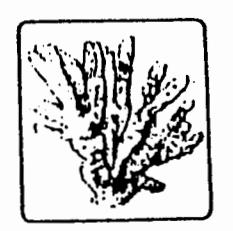

MAP T2 TA'U (FUSI)

 $A_{ij} = \{a_i, a_j, a_j\} \in \mathcal{A}_{ij}^{(d)}$ 

FLORA AND FAUNA

MAP T2

American Samoa, are found here: <u>Limnophila fragrans</u> and <u>Cyperus</u> odoratus (77).

FRINGING REEF (OFF FA'ASOUGA POINT)

Live coral covers about 5% of the sandy inshore areas northwest of Fa'asouga Point. Pavona decussata and Porites microatolls are most common. Numerous sea cucumbers (Holothuria hilla, H. cinerascens, H. difficilis, H. pervicax, and Stichopus chloronotus) occur under rocks and elsewhere. Algae present include a blue-green species (ASCRI-T2B1).

Coral cover of up to 85% on the middle reef flat consists almost entirely of <u>Acropora</u> aspera thickets. The sea cucumber, <u>Holothuria difficilis</u>, is common in sandy areas (ASCRI-T2B2).

Coral cover is about 10% on the outer reef flat. A total of 35 coral species representing 16 genera are present on the reefs off the Ta'u Village complex. Encrusting coralline algae and the fleshy, <u>Dictyosphaeria versluysii</u> are the most common algae. The sea cucumber, <u>Stichopus chloronotus</u>, is conspicuous (ASCRI-T2B3).

The reef off Fa'asouga Point harbors a diverse fish assemblage of at least 45 species. The fish fauna of the inner reef flat is similar to that of reefs fringing the villages of Luma and Si'ufaga. Dominant species are the damselfishes, Glyphidodontops glaucus, G. leucopomus, Stegastes albofasciatus, and Abudefduf septemfasciatus, the wrasses, Halichoeres margarataceus and H. trimaculatus, and the surgeonfish, Acanthurus triostegus. An Acropora thicket in deeper water offshore provides abundant cover for fishes, where the composition of the assemblage is somewhat different than over the reef flat. Most abundant here are the damselfishes, Stegastes albofasciatus, S. nigricans, and Glyphidodontops cyanea, the wrasses, Thalassoma hardwickei and Gomphosus varius, juvenile parrotfish, Scarus spp., the surgeonfish, Acanthurus triostegus, and the butterflyfish, Chaetodon citrinellus (ASCRI-T2F2).

FRINGING REEF (OFF FUSI)

Although much of the reef flat fronting Fusi may be exposed at low tide, numerous depressions in the reef flat which remain submerged at depths of 1 to 5 feet (0.3 to 1.5 m) contain extensive coral and algae assemblages. Larger coral colonies occur in the pools compared with those on the shallow reef surface. Coral colonies appear healthy, and little dead coral is evident. A few corals grow on hard surfaces in the predominantly sand-bottom depression paralleling the shore. Scattered hydrozoans grow in small clumps over the reef flat. Cowries are present on the surface of the reef flat. At low tide, fishes are restricted to pools in the reef flat. Gobies, wrasses, and damselfishes are most common. At high tide, other fishes forage over the entire reef flat. Coral development is low in the narrow channel around Matavai and Vaitele Points. However, fishes are

付成税 一十

TA'U (FUSI)

MAP

FLORA AND FAUNA

សភព្ធ ទាំង ប្រា 24 trans I'm GERBERT OF SEE

angodal it is 100000000

Carrier State

at section of personal sections.

MATAVAI POINT Faasouga Photo BM-2

Matavalept .. Valtele Pt Fuga Cout

the company of the engineering of the contraction of the

A CONTRACTOR OF THE CONTRACTOR OF THE CONTRACTOR OF THE CONTRACTOR OF THE CONTRACTOR OF THE CONTRACTOR OF THE CONTRACTOR OF THE CONTRACTOR OF THE CONTRACTOR OF THE CONTRACTOR OF THE CONTRACTOR OF THE CONTRACTOR OF THE CONTRACTOR OF THE CONTRACTOR OF THE CONTRACTOR OF THE CONTRACTOR OF THE CONTRACTOR OF THE CONTRACTOR OF THE CONTRACTOR OF THE CONTRACTOR OF THE CONTRACTOR OF THE CONTRACTOR OF THE CONTRACTOR OF THE CONTRACTOR OF THE CONTRACTOR OF THE CONTRACTOR OF THE CONTRACTOR OF THE CONTRACTOR OF THE CONTRACTOR OF THE CONTRACTOR OF THE CONTRACTOR OF THE CONTRACTOR OF THE CONTRACTOR OF THE CONTRACTOR OF THE CONTRACTOR OF THE CONTRACTOR OF THE CONTRACTOR OF THE CONTRACTOR OF THE CONTRACTOR OF THE CONTRACTOR OF THE CONTRACTOR OF THE CONTRACTOR OF THE CONTRACTOR OF THE CONTRACTOR OF THE CONTRACTOR OF THE CONTRACTOR OF THE CONTRACTOR OF THE CONTRACTOR OF THE CONTRACTOR OF THE CONTRACTOR OF THE CONTRACTOR OF THE CONTRACTOR OF THE CONTRACTOR OF THE CONTRACTOR OF THE CONTRACTOR OF THE CONTRACTOR OF THE CONTRACTOR OF THE CONTRACTOR OF THE CONTRACTOR OF THE CONTRACTOR OF THE CONTRACTOR OF THE CONTRACTOR OF THE CONTRACTOR OF THE CONTRACTOR OF THE CONTRACTOR OF THE CONTRACTOR OF THE CONTRACTOR OF THE CONTRACTOR OF THE CONTRACTOR OF THE CONTRACTOR OF THE CONTRACTOR OF THE CONTRACTOR OF THE CONTRACTOR OF THE CONTRACTOR OF THE CONTRACTOR OF THE CONTRACTOR OF THE CONTRACTOR OF THE CONTRACTOR OF THE CONTRACTOR OF THE CONTRACTOR OF THE CONTRACTOR OF THE CONTRACTOR OF THE CONTRACTOR OF THE CONTRACTOR OF THE CONTRACTOR OF THE CONTRACTOR OF THE CONTRACTOR OF THE CONTRACTOR OF THE CONTRACTOR OF THE CONTRACTOR OF THE CONTRACTOR OF THE CONTRACTOR OF THE CONTRACTOR OF THE CONTRACTOR OF THE CONTRACTOR OF THE CONTRACTOR OF THE CONTRACTOR OF THE CONTRACTOR OF THE CONTRACTOR OF THE CONTRACTOR OF THE CONTRACTOR OF THE CONTRACTOR OF THE CONTRACTOR OF THE CONTRACTOR OF THE CONTRACTOR OF THE CONTRACTOR OF THE CONTRACTOR OF THE CONTRACTOR OF THE CONTRACTOR OF THE CONTRACTOR OF THE CONTRACTOR OF THE CONTRACTOR OF THE CONTRACTOR OF THE CONTRACTOR

- PP (新数像 ) (日、春) (中) (中) (中) (中) (中) (中) (中) (中) (中) (中

The spirit product of sprace of the

The second from the second of the second of the second of the second of the second of the second of the second of the second of the second of the second of the second of the second of the second of the second of the second of the second of the second of the second of the second of the second of the second of the second of the second of the second of the second of the second of the second of the second of the second of the second of the second of the second of the second of the second of the second of the second of the second of the second of the second of the second of the second of the second of the second of the second of the second of the second of the second of the second of the second of the second of the second of the second of the second of the second of the second of the second of the second of the second of the second of the second of the second of the second of the second of the second of the second of the second of the second of the second of the second of the second of the second of the second of the second of the second of the second of the second of the second of the second of the second of the second of the second of the second of the second of the second of the second of the second of the second of the second of the second of the second of the second of the second of the second of the second of the second of the second of the second of the second of the second of the second of the second of the second of the second of the second of the second of the second of the second of the second of the second of the second of the second of the second of the second of the second of the second of the second of the second of the second of the second of the second of the second of the second of the second of the second of the second of the second of the second of the second of the second of the second of the second of the second of the second of the second of the second of the second of the second of the second of the second of the second of the second of the second of the second of the second of the second of

at makeness of a comment of

Mullsinalua Pt FAGA COVE

ИАР T 2

MAP

T2

**PHYSIOGRAPHY** 

PHYSIOGRAPHY

( MAN-MADE CHANNEL

MAP T2

FLORA AND FAUNA

( \* Coastal futu forest ( possible "Special Area" of pristine value --( Chap. VI.C.3 (21)

MATAVAI POINT

ingles there

Contain the State of the Contain of the State of the State of the State of the State of the State of the State of the State of the State of the State of the State of the State of the State of the State of the State of the State of the State of the State of the State of the State of the State of the State of the State of the State of the State of the State of the State of the State of the State of the State of the State of the State of the State of the State of the State of the State of the State of the State of the State of the State of the State of the State of the State of the State of the State of the State of the State of the State of the State of the State of the State of the State of the State of the State of the State of the State of the State of the State of the State of the State of the State of the State of the State of the State of the State of the State of the State of the State of the State of the State of the State of the State of the State of the State of the State of the State of the State of the State of the State of the State of the State of the State of the State of the State of the State of the State of the State of the State of the State of the State of the State of the State of the State of the State of the State of the State of the State of the State of the State of the State of the State of the State of the State of the State of the State of the State of the State of the State of the State of the State of the State of the State of the State of the State of the State of the State of the State of the State of the State of the State of the State of the State of the State of the State of the State of the State of the State of the State of the State of the State of the State of the State of the State of the State of the State of the State of the State of the State of the State of the State of the State of the State of the State of the State of the State of the State of the State of the State of the State of the State of the State of the State of the State of the State of the State of the Stat

international constraints Into Laboration of the

the second was a first

MAP T2

\*\* 1

WATER CONDITIONS

The setting of the second of the second of the second of the second of the second of the second of the second of the second of the second of the second of the second of the second of the second of the second of the second of the second of the second of the second of the second of the second of the second of the second of the second of the second of the second of the second of the second of the second of the second of the second of the second of the second of the second of the second of the second of the second of the second of the second of the second of the second of the second of the second of the second of the second of the second of the second of the second of the second of the second of the second of the second of the second of the second of the second of the second of the second of the second of the second of the second of the second of the second of the second of the second of the second of the second of the second of the second of the second of the second of the second of the second of the second of the second of the second of the second of the second of the second of the second of the second of the second of the second of the second of the second of the second of the second of the second of the second of the second of the second of the second of the second of the second of the second of the second of the second of the second of the second of the second of the second of the second of the second of the second of the second of the second of the second of the second of the second of the second of the second of the second of the second of the second of the second of the second of the second of the second of the second of the second of the second of the second of the second of the second of the second of the second of the second of the second of the second of the second of the second of the second of the second of the second of the second of the second of the second of the second of the second of the second of the second of the second of the second of the second of the second of the second of the second of t the partial constants which we have a set of the constant of the constant of the constant of the constant of the constant of the constant of the constant of the constant of the constant of the constant of the constant of the constant of the constant of the constant of the constant of the constant of the constant of the constant of the constant of the constant of the constant of the constant of the constant of the constant of the constant of the constant of the constant of the constant of the constant of the constant of the constant of the constant of the constant of the constant of the constant of the constant of the constant of the constant of the constant of the constant of the constant of the constant of the constant of the constant of the constant of the constant of the constant of the constant of the constant of the constant of the constant of the constant of the constant of the constant of the constant of the constant of the constant of the constant of the constant of the constant of the constant of the constant of the constant of the constant of the constant of the constant of the constant of the constant of the constant of the constant of the constant of the constant of the constant of the constant of the constant of the constant of the constant of the constant of the constant of the constant of the constant of the constant of the constant of the constant of the constant of the constant of the constant of the constant of the constant of the constant of the constant of the constant of the constant of the constant of the constant of the constant of the constant of the constant of the constant of the constant of the constant of the constant of the constant of the constant of the constant of the constant of the constant of the constant of the constant of the constant of the constant of the constant of the constant of the constant of the constant of the constant of the constant of the constant of the constant of the constant of the constant of the constant of the constant of the constant of the constant of t

USE CONSIDERATIONS

diverse near the seaward opening of this channel. Coralline algae and burrowing sea urchins are conspicuous at the reef margin. The reef front harbors diverse fish and coral life. Scattered clumps of live coral and algae cover limestone debris over 30 feet (9 m) deep at the base of the reef front (59).

# COAST BETWEEN VAITELE POINT AND SI'UFA'ALELE POINT

# FRINGING REEF

Longshore currents have scoured a small, narrow channel in the inner reef around Matavai and Vaitele Points. The channel attains a depth of 5 feet (1.5 m). A freshwater spring issues below sea level at Matavai Point. The 4-foot (1.2 m) deep channel around Matavai Point exposes consolidated limestone breccia abutting a vertical cliff of basalt (59).

# FAGA COVE

A pocket beach of calcareous sand and rubble occupies the head of Faga Cove. The foreshore is 30 to 40 feet (9 to 12 m) wide. Beachrock is exposed along shore. The reef flat fringing Faga Cove is 150 feet (46 m) wide (49) and depauperate of marine fauna. A channel was blasted through the reef by the U.S. Navy after World War II (59).

# COASTAL ZONE

A small strip of coastal forest dominated by Barringtonia asiatica (futu) inland of Matavia and Vaitele Points has escaped human alteration. This forest is considered worthy of preservation (70).

The fruitbat or flying fox (pe'a; <u>Pteropus samoensis</u>) roosts in several localities on Ta'u, most notably in the trees on plantation land above Fagamalo Cove (15).

# TA'U BOAT HARBOR

tion near Matavai Point has caused some soil erosion problems. At an inland quarry site, the drainage pattern feeding the Fusi wetland has reportedly been altered, eliminating a portion of the marsh. Soil erosion from a quarry site and temporary road along the shore of Fagamalo Cove has reportedly caused siltation of the beach and nearshore areas (39).

# OFFSHORE (FAGAMALO COVE TO SI'UFA'ALELE POINT)

The reef flat and deeper waters beyond the reef edge extending southward from Fagamalo Cove to Si'ufa'alele Point are frequently used for fishing. Fishing methods and catches are similar to those off Faleasao and Ta'u (20). (See FALEASAO / USE CONSIDERATIONS).

7.4

 $\begin{array}{cccccccccccccccccccccccccccccccccccc$ 

(a) The second of the second of the second of the second of the second of the second of the second of the second of the second of the second of the second of the second of the second of the second of the second of the second of the second of the second of the second of the second of the second of the second of the second of the second of the second of the second of the second of the second of the second of the second of the second of the second of the second of the second of the second of the second of the second of the second of the second of the second of the second of the second of the second of the second of the second of the second of the second of the second of the second of the second of the second of the second of the second of the second of the second of the second of the second of the second of the second of the second of the second of the second of the second of the second of the second of the second of the second of the second of the second of the second of the second of the second of the second of the second of the second of the second of the second of the second of the second of the second of the second of the second of the second of the second of the second of the second of the second of the second of the second of the second of the second of the second of the second of the second of the second of the second of the second of the second of the second of the second of the second of the second of the second of the second of the second of the second of the second of the second of the second of the second of the second of the second of the second of the second of the second of the second of the second of the second of the second of the second of the second of the second of the second of the second of the second of the second of the second of the second of the second of the second of the second of the second of the second of the second of the second of the second of the second of the second of the second of the second of the second of the second of the second of the second of the second of the secon

the state of the state of the state of the state of the state of the state of the state of the state of the state of the state of the state of the state of the state of the state of the state of the state of the state of the state of the state of the state of the state of the state of the state of the state of the state of the state of the state of the state of the state of the state of the state of the state of the state of the state of the state of the state of the state of the state of the state of the state of the state of the state of the state of the state of the state of the state of the state of the state of the state of the state of the state of the state of the state of the state of the state of the state of the state of the state of the state of the state of the state of the state of the state of the state of the state of the state of the state of the state of the state of the state of the state of the state of the state of the state of the state of the state of the state of the state of the state of the state of the state of the state of the state of the state of the state of the state of the state of the state of the state of the state of the state of the state of the state of the state of the state of the state of the state of the state of the state of the state of the state of the state of the state of the state of the state of the state of the state of the state of the state of the state of the state of the state of the state of the state of the state of the state of the state of the state of the state of the state of the state of the state of the state of the state of the state of the state of the state of the state of the state of the state of the state of the state of the state of the state of the state of the state of the state of the state of the state of the state of the state of the state of the state of the state of the state of the state of the state of the state of the state of the state of the state of the state of the state of the state of the state of the state of the state of the s

, , ,

(x,y) = (x,y) + (x,y) + (x,y) + (x,y) + (x,y) + (x,y) + (x,y) + (x,y) + (x,y) + (x,y) + (x,y) + (x,y) + (x,y) + (x,y) + (x,y) + (x,y) + (x,y) + (x,y) + (x,y) + (x,y) + (x,y) + (x,y) + (x,y) + (x,y) + (x,y) + (x,y) + (x,y) + (x,y) + (x,y) + (x,y) + (x,y) + (x,y) + (x,y) + (x,y) + (x,y) + (x,y) + (x,y) + (x,y) + (x,y) + (x,y) + (x,y) + (x,y) + (x,y) + (x,y) + (x,y) + (x,y) + (x,y) + (x,y) + (x,y) + (x,y) + (x,y) + (x,y) + (x,y) + (x,y) + (x,y) + (x,y) + (x,y) + (x,y) + (x,y) + (x,y) + (x,y) + (x,y) + (x,y) + (x,y) + (x,y) + (x,y) + (x,y) + (x,y) + (x,y) + (x,y) + (x,y) + (x,y) + (x,y) + (x,y) + (x,y) + (x,y) + (x,y) + (x,y) + (x,y) + (x,y) + (x,y) + (x,y) + (x,y) + (x,y) + (x,y) + (x,y) + (x,y) + (x,y) + (x,y) + (x,y) + (x,y) + (x,y) + (x,y) + (x,y) + (x,y) + (x,y) + (x,y) + (x,y) + (x,y) + (x,y) + (x,y) + (x,y) + (x,y) + (x,y) + (x,y) + (x,y) + (x,y) + (x,y) + (x,y) + (x,y) + (x,y) + (x,y) + (x,y) + (x,y) + (x,y) + (x,y) + (x,y) + (x,y) + (x,y) + (x,y) + (x,y) + (x,y) + (x,y) + (x,y) + (x,y) + (x,y) + (x,y) + (x,y) + (x,y) + (x,y) + (x,y) + (x,y) + (x,y) + (x,y) + (x,y) + (x,y) + (x,y) + (x,y) + (x,y) + (x,y) + (x,y) + (x,y) + (x,y) + (x,y) + (x,y) + (x,y) + (x,y) + (x,y) + (x,y) + (x,y) + (x,y) + (x,y) + (x,y) + (x,y) + (x,y) + (x,y) + (x,y) + (x,y) + (x,y) + (x,y) + (x,y) + (x,y) + (x,y) + (x,y) + (x,y) + (x,y) + (x,y) + (x,y) + (x,y) + (x,y) + (x,y) + (x,y) + (x,y) + (x,y) + (x,y) + (x,y) + (x,y) + (x,y) + (x,y) + (x,y) + (x,y) + (x,y) + (x,y) + (x,y) + (x,y) + (x,y) + (x,y) + (x,y) + (x,y) + (x,y) + (x,y) + (x,y) + (x,y) + (x,y) + (x,y) + (x,y) + (x,y) + (x,y) + (x,y) + (x,y) + (x,y) + (x,y) + (x,y) + (x,y) + (x,y) + (x,y) + (x,y) + (x,y) + (x,y) + (x,y) + (x,y) + (x,y) + (x,y) + (x,y) + (x,y) + (x,y) + (x,y) + (x,y) + (x,y) + (x,y) + (x,y) + (x,y) + (x,y) + (x,y) + (x,y) + (x,y) + (x,y) + (x,y) + (x,y) + (x,y) + (x,y) + (x,y) + (x,y) + (x,y) + (x,y) + (x,y) + (x,y) + (x,y) + (x,y) + (x,y) + (x,y) + (x,y) + (x,y) + (x,y) + (x,y) + (x,y) + (x,y) + (x,y) + (x,y) + (x,y) + (x,y) + (x,y) + (x,y) + (x,y) + (x,y

FLORA AND FAUNA

( SEABIRD NESTING AREAS

PANTA COVE FLORA AND FAUNA LAVANIA COVE Lavania Cove ( SWIFTLET NESTING AREA Papaotoma Pt 4. 1. 2. 2. 2. 3 Vailoloatele Cove USE CONSIDERATIONS Leatutoga Pt Lotosise Pt ( POTENTIAL COAST AND REEF PRESERVE Vailoloaitiiti Cove Fatatele Pt Siufaalele Pt

PHYSIOGRAPHY

# COAST BETWEEN SI'UFA'ALELE POINT AND SIU POINT (SOUTH COAST)

# COASTAL ZONE

The blue-gray noddy (<u>Procelsterna cerulea</u>), an uncommon resident seabird, nests near Fatatele Point on the southern coast of Ta'u. Large colonies of the common brown noddy (<u>Anous stolidus pileatus</u>) nest along the south coast from Papaotoma Point east to Ulufala Point. Small colonies are also found along the entire north, east, and west coasts of Ta'u. A major colony of the black noddy (<u>Anous tenuirostris minutus</u>), an uncommon resident seabird, nests on the isolated south coast of the island from Lavania Cove to Ulufala Point. A large colony of the common white tern (<u>Gygis alba pacifica</u>) nests in the same area (15).

The fruitbat or flying fox (pe'a; <u>Pteropus samoensis</u>) roosts in several localities on Ta'u, most notably in the lowland rain forest above Papaotoma Point (15).

# LAVANIA COVE

A large cave located just above the water's edge at Lavania Cove was known to be a major roosting site for white-rumped swiftlets (pe'ape'a; Collocalia spodiopygia spodiopygia), and sheath-tailed bats (pe'ape'avai; Emballonura semicaudata) until the early 1970's. The entire cave entrance has fallen in, perhaps destroyed by an earthquake on December 1, 1975, and there is no evidence that either birds or bats can now penetrate the mass of rock rubble. The cave was presumably destroyed as a nesting site. Despite large populations, the swiftlet is considered threatened because of its restricted nesting habitat (deep in caves). At least one cave harboring the sheath-tailed bat undoubtedly exists on the cliffs above Lavania Cove, but the location is unknown (15).

# SOUTHERN COAST

The southern coast of Ta'u from Lavania Cove to Ulufala Point has been recommended as a natural area preserve off limits to hunting and other disturbances (15).

COAST BETWEEN SIU POINT AND PAPASAO POINT (EAST COAST)

# SHORELINE AND COASTAL PLAIN

Along the eastern coast of Ta'u, a wide plain of coral rubble merges inland with talus slopes at the base of a steep cliff (15). The eastern shoreline from Luama'a to Papasao Point is a steep beach consisting almost entirely of limestone rubble and scattered basalt cobbles, with small pockets of calcareous sand. Beachrock is exposed intermittently along the shoreline. Beach width is about 50 feet (15 m) (49; ASCRI-T3S1). The beach

PHYSIOGRAPHY

| $\begin{array}{cccccccccccccccccccccccccccccccccccc$                                                                                                                                                                                                                                                                                                                                                                                                                                                                                                                                                                                                                                                                                                                                                                                                                                                                                                                                                                                                                                                                                                                                                                                                                                                                                                                                                                                                                                                                                                                                                                                                                                                                                                                                                                                                                                                                                                                                                                                                                                                                           |                                                                                                                                                                                                                                                                                                                                                                                                                                                                                                                                                                                                                                                                                                                                                                                                                                                                                                                                                                                                                                                                                                                                                                                                                                                                                                                                                                                                                                                                                                                                                                                                                                                                                                                                                                                                                                                                                                                                                                                                                                                                                                                                |                         |
|--------------------------------------------------------------------------------------------------------------------------------------------------------------------------------------------------------------------------------------------------------------------------------------------------------------------------------------------------------------------------------------------------------------------------------------------------------------------------------------------------------------------------------------------------------------------------------------------------------------------------------------------------------------------------------------------------------------------------------------------------------------------------------------------------------------------------------------------------------------------------------------------------------------------------------------------------------------------------------------------------------------------------------------------------------------------------------------------------------------------------------------------------------------------------------------------------------------------------------------------------------------------------------------------------------------------------------------------------------------------------------------------------------------------------------------------------------------------------------------------------------------------------------------------------------------------------------------------------------------------------------------------------------------------------------------------------------------------------------------------------------------------------------------------------------------------------------------------------------------------------------------------------------------------------------------------------------------------------------------------------------------------------------------------------------------------------------------------------------------------------------|--------------------------------------------------------------------------------------------------------------------------------------------------------------------------------------------------------------------------------------------------------------------------------------------------------------------------------------------------------------------------------------------------------------------------------------------------------------------------------------------------------------------------------------------------------------------------------------------------------------------------------------------------------------------------------------------------------------------------------------------------------------------------------------------------------------------------------------------------------------------------------------------------------------------------------------------------------------------------------------------------------------------------------------------------------------------------------------------------------------------------------------------------------------------------------------------------------------------------------------------------------------------------------------------------------------------------------------------------------------------------------------------------------------------------------------------------------------------------------------------------------------------------------------------------------------------------------------------------------------------------------------------------------------------------------------------------------------------------------------------------------------------------------------------------------------------------------------------------------------------------------------------------------------------------------------------------------------------------------------------------------------------------------------------------------------------------------------------------------------------------------|-------------------------|
| FITIUTA (SAUA)                                                                                                                                                                                                                                                                                                                                                                                                                                                                                                                                                                                                                                                                                                                                                                                                                                                                                                                                                                                                                                                                                                                                                                                                                                                                                                                                                                                                                                                                                                                                                                                                                                                                                                                                                                                                                                                                                                                                                                                                                                                                                                                 | MAP T3                                                                                                                                                                                                                                                                                                                                                                                                                                                                                                                                                                                                                                                                                                                                                                                                                                                                                                                                                                                                                                                                                                                                                                                                                                                                                                                                                                                                                                                                                                                                                                                                                                                                                                                                                                                                                                                                                                                                                                                                                                                                                                                         | FLORA AND FAUNA         |
|                                                                                                                                                                                                                                                                                                                                                                                                                                                                                                                                                                                                                                                                                                                                                                                                                                                                                                                                                                                                                                                                                                                                                                                                                                                                                                                                                                                                                                                                                                                                                                                                                                                                                                                                                                                                                                                                                                                                                                                                                                                                                                                                |                                                                                                                                                                                                                                                                                                                                                                                                                                                                                                                                                                                                                                                                                                                                                                                                                                                                                                                                                                                                                                                                                                                                                                                                                                                                                                                                                                                                                                                                                                                                                                                                                                                                                                                                                                                                                                                                                                                                                                                                                                                                                                                                | •                       |
|                                                                                                                                                                                                                                                                                                                                                                                                                                                                                                                                                                                                                                                                                                                                                                                                                                                                                                                                                                                                                                                                                                                                                                                                                                                                                                                                                                                                                                                                                                                                                                                                                                                                                                                                                                                                                                                                                                                                                                                                                                                                                                                                | MAP T3                                                                                                                                                                                                                                                                                                                                                                                                                                                                                                                                                                                                                                                                                                                                                                                                                                                                                                                                                                                                                                                                                                                                                                                                                                                                                                                                                                                                                                                                                                                                                                                                                                                                                                                                                                                                                                                                                                                                                                                                                                                                                                                         | USE CONSIDERATIONS      |
| איני בושותיתייים איני ורוואוון איני בושותיתייים איני ביים איני ביים איני ביים איני ביים איני ביים איני ביים איני ביים איני ביים איני ביים איני ביים איני ביים איני ביים איני ביים איני ביים איני ביים ביים איני ביים ביים ביים ביים ביים ביים ביים ב                                                                                                                                                                                                                                                                                                                                                                                                                                                                                                                                                                                                                                                                                                                                                                                                                                                                                                                                                                                                                                                                                                                                                                                                                                                                                                                                                                                                                                                                                                                                                                                                                                                                                                                                                                                                                                                                           | MAP T3                                                                                                                                                                                                                                                                                                                                                                                                                                                                                                                                                                                                                                                                                                                                                                                                                                                                                                                                                                                                                                                                                                                                                                                                                                                                                                                                                                                                                                                                                                                                                                                                                                                                                                                                                                                                                                                                                                                                                                                                                                                                                                                         | USE CONSIDERATIONS      |
|                                                                                                                                                                                                                                                                                                                                                                                                                                                                                                                                                                                                                                                                                                                                                                                                                                                                                                                                                                                                                                                                                                                                                                                                                                                                                                                                                                                                                                                                                                                                                                                                                                                                                                                                                                                                                                                                                                                                                                                                                                                                                                                                |                                                                                                                                                                                                                                                                                                                                                                                                                                                                                                                                                                                                                                                                                                                                                                                                                                                                                                                                                                                                                                                                                                                                                                                                                                                                                                                                                                                                                                                                                                                                                                                                                                                                                                                                                                                                                                                                                                                                                                                                                                                                                                                                |                         |
|                                                                                                                                                                                                                                                                                                                                                                                                                                                                                                                                                                                                                                                                                                                                                                                                                                                                                                                                                                                                                                                                                                                                                                                                                                                                                                                                                                                                                                                                                                                                                                                                                                                                                                                                                                                                                                                                                                                                                                                                                                                                                                                                |                                                                                                                                                                                                                                                                                                                                                                                                                                                                                                                                                                                                                                                                                                                                                                                                                                                                                                                                                                                                                                                                                                                                                                                                                                                                                                                                                                                                                                                                                                                                                                                                                                                                                                                                                                                                                                                                                                                                                                                                                                                                                                                                |                         |
| Iuamaa /                                                                                                                                                                                                                                                                                                                                                                                                                                                                                                                                                                                                                                                                                                                                                                                                                                                                                                                                                                                                                                                                                                                                                                                                                                                                                                                                                                                                                                                                                                                                                                                                                                                                                                                                                                                                                                                                                                                                                                                                                                                                                                                       |                                                                                                                                                                                                                                                                                                                                                                                                                                                                                                                                                                                                                                                                                                                                                                                                                                                                                                                                                                                                                                                                                                                                                                                                                                                                                                                                                                                                                                                                                                                                                                                                                                                                                                                                                                                                                                                                                                                                                                                                                                                                                                                                | •                       |
| A STATE OF THE STATE OF THE STATE OF THE STATE OF THE STATE OF THE STATE OF THE STATE OF THE STATE OF THE STATE OF THE STATE OF THE STATE OF THE STATE OF THE STATE OF THE STATE OF THE STATE OF THE STATE OF THE STATE OF THE STATE OF THE STATE OF THE STATE OF THE STATE OF THE STATE OF THE STATE OF THE STATE OF THE STATE OF THE STATE OF THE STATE OF THE STATE OF THE STATE OF THE STATE OF THE STATE OF THE STATE OF THE STATE OF THE STATE OF THE STATE OF THE STATE OF THE STATE OF THE STATE OF THE STATE OF THE STATE OF THE STATE OF THE STATE OF THE STATE OF THE STATE OF THE STATE OF THE STATE OF THE STATE OF THE STATE OF THE STATE OF THE STATE OF THE STATE OF THE STATE OF THE STATE OF THE STATE OF THE STATE OF THE STATE OF THE STATE OF THE STATE OF THE STATE OF THE STATE OF THE STATE OF THE STATE OF THE STATE OF THE STATE OF THE STATE OF THE STATE OF THE STATE OF THE STATE OF THE STATE OF THE STATE OF THE STATE OF THE STATE OF THE STATE OF THE STATE OF THE STATE OF THE STATE OF THE STATE OF THE STATE OF THE STATE OF THE STATE OF THE STATE OF THE STATE OF THE STATE OF THE STATE OF THE STATE OF THE STATE OF THE STATE OF THE STATE OF THE STATE OF THE STATE OF THE STATE OF THE STATE OF THE STATE OF THE STATE OF THE STATE OF THE STATE OF THE STATE OF THE STATE OF THE STATE OF THE STATE OF THE STATE OF THE STATE OF THE STATE OF THE STATE OF THE STATE OF THE STATE OF THE STATE OF THE STATE OF THE STATE OF THE STATE OF THE STATE OF THE STATE OF THE STATE OF THE STATE OF THE STATE OF THE STATE OF THE STATE OF THE STATE OF THE STATE OF THE STATE OF THE STATE OF THE STATE OF THE STATE OF THE STATE OF THE STATE OF THE STATE OF THE STATE OF THE STATE OF THE STATE OF THE STATE OF THE STATE OF THE STATE OF THE STATE OF THE STATE OF THE STATE OF THE STATE OF THE STATE OF THE STATE OF THE STATE OF THE STATE OF THE STATE OF THE STATE OF THE STATE OF THE STATE OF THE STATE OF THE STATE OF THE STATE OF THE STATE OF THE STATE OF THE STATE OF THE STATE OF THE STATE OF THE STATE OF THE STATE OF THE STATE OF THE STATE OF THE STATE OF THE STA | s de la companya de la companya de la companya de la companya de la companya de la companya de la companya de la companya de la companya de la companya de la companya de la companya de la companya de la companya de la companya de la companya de la companya de la companya de la companya de la companya de la companya de la companya de la companya de la companya de la companya de la companya de la companya de la companya de la companya de la companya de la companya de la companya de la companya de la companya de la companya de la companya de la companya de la companya de la companya de la companya de la companya de la companya de la companya de la companya de la companya de la companya de la companya de la companya de la companya de la companya de la companya de la companya de la companya de la companya de la companya de la companya de la companya de la companya de la companya de la companya de la companya de la companya de la companya de la companya de la companya de la companya de la companya de la companya de la companya de la companya de la companya de la companya de la companya de la companya de la companya de la companya de la companya de la companya de la companya de la companya de la companya de la companya de la companya de la companya de la companya de la companya de la companya de la companya de la companya de la companya de la companya de la companya de la companya de la companya de la companya de la companya de la companya de la companya de la companya de la companya de la companya de la companya de la companya de la companya de la companya de la companya de la companya de la companya de la companya de la companya de la companya de la companya de la companya de la companya de la companya de la companya de la companya de la companya de la companya de la companya de la companya de la companya de la companya de la companya de la companya de la companya de la companya de la companya de la companya de la companya de la companya de la companya de la companya de la companya de la companya de la companya de l |                         |
| Lughts                                                                                                                                                                                                                                                                                                                                                                                                                                                                                                                                                                                                                                                                                                                                                                                                                                                                                                                                                                                                                                                                                                                                                                                                                                                                                                                                                                                                                                                                                                                                                                                                                                                                                                                                                                                                                                                                                                                                                                                                                                                                                                                         |                                                                                                                                                                                                                                                                                                                                                                                                                                                                                                                                                                                                                                                                                                                                                                                                                                                                                                                                                                                                                                                                                                                                                                                                                                                                                                                                                                                                                                                                                                                                                                                                                                                                                                                                                                                                                                                                                                                                                                                                                                                                                                                                |                         |
| Slu Pt                                                                                                                                                                                                                                                                                                                                                                                                                                                                                                                                                                                                                                                                                                                                                                                                                                                                                                                                                                                                                                                                                                                                                                                                                                                                                                                                                                                                                                                                                                                                                                                                                                                                                                                                                                                                                                                                                                                                                                                                                                                                                                                         | ( POTENTIAL                                                                                                                                                                                                                                                                                                                                                                                                                                                                                                                                                                                                                                                                                                                                                                                                                                                                                                                                                                                                                                                                                                                                                                                                                                                                                                                                                                                                                                                                                                                                                                                                                                                                                                                                                                                                                                                                                                                                                                                                                                                                                                                    | COAST AND REEF PRESERVE |

Fraction of the second of the second of the second of the second of the second of the second of the second of the second of the second of the second of the second of the second of the second of the second of the second of the second of the second of the second of the second of the second of the second of the second of the second of the second of the second of the second of the second of the second of the second of the second of the second of the second of the second of the second of the second of the second of the second of the second of the second of the second of the second of the second of the second of the second of the second of the second of the second of the second of the second of the second of the second of the second of the second of the second of the second of the second of the second of the second of the second of the second of the second of the second of the second of the second of the second of the second of the second of the second of the second of the second of the second of the second of the second of the second of the second of the second of the second of the second of the second of the second of the second of the second of the second of the second of the second of the second of the second of the second of the second of the second of the second of the second of the second of the second of the second of the second of the second of the second of the second of the second of the second of the second of the second of the second of the second of the second of the second of the second of the second of the second of the second of the second of the second of the second of the second of the second of the second of the second of the second of the second of the second of the second of the second of the second of the second of the second of the second of the second of the second of the second of the second of the second of the second of the second of the second of the second of the second of the second of the second of the second of the second of the second of the second of the second of the second of the

slopes up to a foreshore berm about 4 feet (1.2 m) high and then to an upper berm about 6 feet (2 m) high. The distance from the high water line to the coastal road ranges from 30 to 45 feet (10 to 15 m) (ASCRI-T3S1). Two beach berms, a backshore berm and a higher storm berm are indicative of high wave energy. The beach is directly exposed to trade wind waves (49). Beachrock is exposed at and above sea level. A large amount of coral and eroded limestone rubble are embedded in beachrock platforms. The beach merges offshore with a generally consolidated and irregular limestone reef (ASCRI-T3S1). The fringing reef is less than 100 feet (30 m) wide (49).

# SHORELINE

Encrusting coralline algae and Ralfsia sp. coat the surfaces of beachrock exposed along shore north of Saua. A few wave-washed corals (Acropora humilis, Goniastrea sp., and Astreopora sp.) occur along shore (ASCRI-T4S1).

# SAUA-LUAMA'A COAST

The unimproved road ends south of Papasao Point, and access to the southern coast of Ta'u is by footpath (49).

# OFFSHORE (SIU POINT TO PAPASAO POINT)

The reef flat and deeper waters beyond the reef edge extending northward from Siu Point to near Papasao Point are fished frequently. Fishing methods and catches are similar to those off Faleasao and Ta'u (20). (See FALEASAO / USE CONSIDERATIONS).

The Saua coast is scenic and sparsely populated. The area is infrequently visited by tourists who come to watch the sunrise. Villagers from Fitiuta use the area for net fishing. Wave surge ovdr an uneven limestone bottom offshore limits swimming along the wave-exposed coast. On calm days, some areas may be suitable for wading. The sand beach along the entire coast is generally exposed to small waves. A small ava (channel) near Saua is exposed to waves and infrequently used to launch paopaos (ASCRI).

The strip of coast from Tufu Point northward to Saua has been recommended as a natural area preserve off limits to hunting and other disturbances (15).

# COAST BETWEEN PAPASAO POINT AND FITIUTA POINT

#### SHORELINE

The shoreline below the village of Fitiuta consists of a basalt sea cliff and bench. The village is located well inland at an elevation ranging from 25 to 150 feet (7 to 46 m) (49).

FITIUTA : MAP T4 HISTORICAL/ARCHAEOLOGICAL

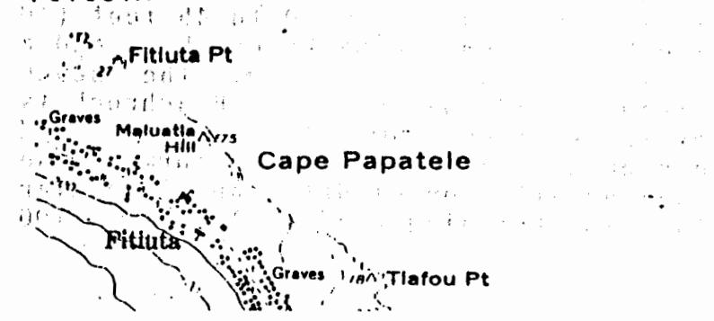

But the fitting to the contract of the fitting

nearly burn that he was a few

FITIUTA (MAIA)

MAP T4 ing a second second second second second second second second second second second second second second second second second second second second second second second second second second second second second second second second second second second second second second second second second second second second second second second second second second second second second second second second second second second second second second second second second second second second second second second second second second second second second second second second second second second second second second second second second second second second second second second second second second second second second second second second second second second second second second second second second second second second second second second second second second second second second second second second second second second second second second second second second second second second second second second second second second second second second second second second second second second second second second second second second second second second second second second second second second second second second second second second second second second second second second second second second second second second second second second second second second second second second second second second second second second second second second second second second second second second second second second second second second second second second second second second second second second second second second second second second second second second second second second second second second second second second second second second second second second second second second second second second second second second second second second second second second second second second second second second second second second second second second second second second second second second second second second second second second second se

The first of the second of the

PHYSIOGRAPHY

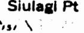

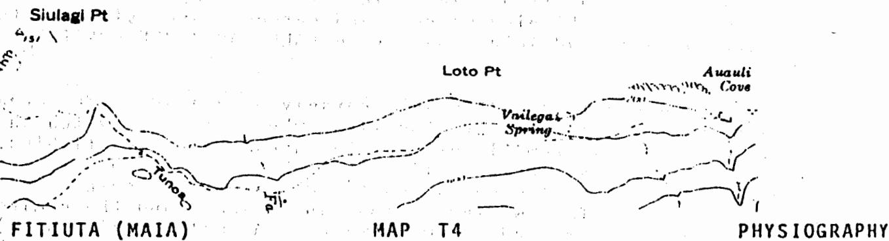

**PHYSIOGRAPHY** 

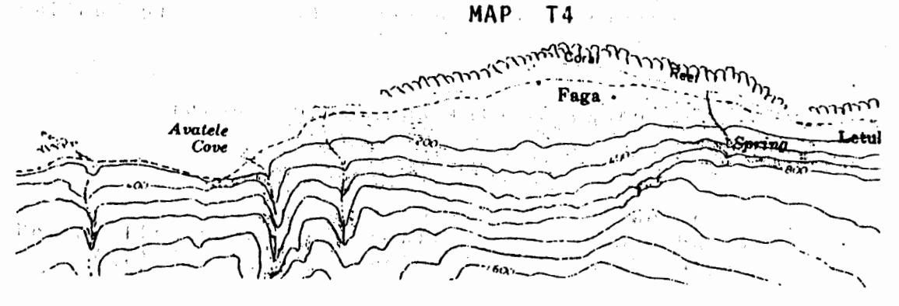

#### FITIUTA VILLAGE

All Samoans acknowledge Manu'a as the source of Samoan traditions, with Fitiuta as the center. Fitiuta is mythologically the first village of Samoa and the home of the first of a line of Samoan chiefs equivalent to god-kings (30). The tomb of the last Tui'manu'a is located along the coast below Papatea in north Luma on the western coast of Ta'u (41).

The only raised road in American Samoa is a wall-like path of stone extending inland through the village of Fitiuta from a boat landing. This road, believed to have been built by Samoans and Tongans, is a special road honoring the first of the line of god-kings endowed with supernatural powers. On this road, the god-king literally and symbolically stood above all (30).

According to legend, there are two leaping places for souls of the deceased to depart to the afterworld near the village of Fitiuta. Pre-European petroglyphs are found along the coastline fronting Fituita Village (30).

COAST BETWEEN FITIUTA POINT AND SI'ULAGI POINT (NORTH COAST)

#### MAIA BEACH

A short section of sand beach fronts Maia along the north-eastern coast of Ta'u Island. The beach is bounded by basalt bluffs to the east and a boulder foreshore to the west. There is a gradation of beach material from basalt boulders at the eastern end, to limestone rubble in the center, to calcareous sand with a minor component of basalt at the western end. The beach is about 75 feet (23 m) wide, sloping up to the vegetation line at an elevation of 8 feet (2.5 m). The coastal road is situated close behind the vegetation line (49;ASCRI-T4S1).

# FRINGING REEF (OFF MAIA)

A fringing reef extends about 150 feet (45 m) offshore from Maia Beach. Average depth of the reef is one foot (0.3 m) (49).

# NORTH COAST

A steep and narrow beach of basalt boulders forms the shoreline between Lepula and Avatele Cove. The boulder beach is interrupted by outcrops at points of land. A fringing reef ranging from 100 to 150 feet (30 to 45 m) in width protects the reach between Letula and Avatele Cove. The remainder of the northern coast lacks an offshore reef and is exposed directly to north and northwest swells and indirectly to trade wind waves.

An unimproved road parallels the coast at the 12 to 15-foot (4 to 5 m) elevation between Lepula and Avatele Cove, but is separated from the foreshore by a steep, densely-vegetated bank (49).

villagion of contraction to entito to the arel out to do to the whell alter no .

recognise in agree of

Frag. Set 1999 A const. 2. p. 4 Entoin 1997 24 1991

FITIUTA (FAGA)

HISTORICAL/ARCHAEOLOGICAL

WATER CONDITIONS

( SANITARY LANDFILL

Seed of the first of the seed of the seed of the seed of the seed of the seed of the seed of the seed of the seed of the seed of the seed of the seed of the seed of the seed of the seed of the seed of the seed of the seed of the seed of the seed of the seed of the seed of the seed of the seed of the seed of the seed of the seed of the seed of the seed of the seed of the seed of the seed of the seed of the seed of the seed of the seed of the seed of the seed of the seed of the seed of the seed of the seed of the seed of the seed of the seed of the seed of the seed of the seed of the seed of the seed of the seed of the seed of the seed of the seed of the seed of the seed of the seed of the seed of the seed of the seed of the seed of the seed of the seed of the seed of the seed of the seed of the seed of the seed of the seed of the seed of the seed of the seed of the seed of the seed of the seed of the seed of the seed of the seed of the seed of the seed of the seed of the seed of the seed of the seed of the seed of the seed of the seed of the seed of the seed of the seed of the seed of the seed of the seed of the seed of the seed of the seed of the seed of the seed of the seed of the seed of the seed of the seed of the seed of the seed of the seed of the seed of the seed of the seed of the seed of the seed of the seed of the seed of the seed of the seed of the seed of the seed of the seed of the seed of the seed of the seed of the seed of the seed of the seed of the seed of the seed of the seed of the seed of the seed of the seed of the seed of the seed of the seed of the seed of the seed of the seed of the seed of the seed of the seed of the seed of the seed of the seed of the seed of the seed of the seed of the seed of the seed of the seed of the seed of the seed of the seed of the seed of the seed of the seed of the seed of the seed of the seed of the seed of the seed of the seed of the seed of the seed of the seed of the seed of the seed of the seed of the seed of the seed of the seed of the seed of the seed

Elisabeth Committee Committee

the second of the second

USE CONSIDERATIONS

FITIUTA (MAIA)

· · · · · · · · · · · · · · · · · · ·

And the second of the second

A CONTRACT OF THE STATE OF THE STATE OF THE STATE OF THE STATE OF THE STATE OF THE STATE OF THE STATE OF THE STATE OF THE STATE OF THE STATE OF THE STATE OF THE STATE OF THE STATE OF THE STATE OF THE STATE OF THE STATE OF THE STATE OF THE STATE OF THE STATE OF THE STATE OF THE STATE OF THE STATE OF THE STATE OF THE STATE OF THE STATE OF THE STATE OF THE STATE OF THE STATE OF THE STATE OF THE STATE OF THE STATE OF THE STATE OF THE STATE OF THE STATE OF THE STATE OF THE STATE OF THE STATE OF THE STATE OF THE STATE OF THE STATE OF THE STATE OF THE STATE OF THE STATE OF THE STATE OF THE STATE OF THE STATE OF THE STATE OF THE STATE OF THE STATE OF THE STATE OF THE STATE OF THE STATE OF THE STATE OF THE STATE OF THE STATE OF THE STATE OF THE STATE OF THE STATE OF THE STATE OF THE STATE OF THE STATE OF THE STATE OF THE STATE OF THE STATE OF THE STATE OF THE STATE OF THE STATE OF THE STATE OF THE STATE OF THE STATE OF THE STATE OF THE STATE OF THE STATE OF THE STATE OF THE STATE OF THE STATE OF THE STATE OF THE STATE OF THE STATE OF THE STATE OF THE STATE OF THE STATE OF THE STATE OF THE STATE OF THE STATE OF THE STATE OF THE STATE OF THE STATE OF THE STATE OF THE STATE OF THE STATE OF THE STATE OF THE STATE OF THE STATE OF THE STATE OF THE STATE OF THE STATE OF THE STATE OF THE STATE OF THE STATE OF THE STATE OF THE STATE OF THE STATE OF THE STATE OF THE STATE OF THE STATE OF THE STATE OF THE STATE OF THE STATE OF THE STATE OF THE STATE OF THE STATE OF THE STATE OF THE STATE OF THE STATE OF THE STATE OF THE STATE OF THE STATE OF THE STATE OF THE STATE OF THE STATE OF THE STATE OF THE STATE OF THE STATE OF THE STATE OF THE STATE OF THE STATE OF THE STATE OF THE STATE OF THE STATE OF THE STATE OF THE STATE OF THE STATE OF THE STATE OF THE STATE OF THE STATE OF THE STATE OF THE STATE OF THE STATE OF THE STATE OF THE STATE OF THE STATE OF THE STATE OF THE STATE OF THE STATE OF THE STATE OF THE STATE OF THE STATE OF THE STATE OF THE STATE OF THE STATE OF THE STATE OF THE STATE OF THE STATE OF THE STATE OF THE STATE OF THE

The state of the second production of the second production of the second production of the second production of the second production of the second production of the second production of the second production of the second production of the second production of the second production of the second production of the second production of the second production of the second production of the second production of the second production of the second production of the second production of the second production of the second production of the second production of the second production of the second production of the second production of the second production of the second production of the second production of the second production of the second production of the second production of the second production of the second production of the second production of the second production of the second production of the second production of the second production of the second production of the second production of the second production of the second production of the second production of the second production of the second production of the second production of the second production of the second production of the second production of the second production of the second production of the second production of the second production of the second production of the second production of the second production of the second production of the second production of the second production of the second production of the second production of the second production of the second production of the second production of the second production of the second production of the second production of the second production of the second production of the second production of the second production of the second production of the second production of the second production of the second production of the second production of the second production of the second production of the second production of the second production of the second production of the seco

entity in the street of the street

MAP T4

USE CONSIDERATIONS

The coastline between Avatele Cove and Loto Point consists of a steep, narrow foreshore of basalt boulders backed by a cliff rising to the road at an elevation between 30 and 70 feet (10 to 20 m). Rock outcroppings at points of land interrupt the boulder foreshore. There is no fringing reef offshore. The backshore is heavily vegetated and the shoreline is almost inaccessible. From Loto Point west to Si'ulagi Point (MAP T1), the coastline consists of a sea cliff rising 200 to 300 feet (60 to 90 m). An unimproved road at the 300-foot (90 m) elevation parallels the coast (49).

# ABANDONED VILLAGE

The oldest village in all of the Samoan Islands, traditionally and mythologically, was Faga, located about 3 miles (4.8 km) west of the present village of Fitiuta. Tradition states the Tui Manu'a was killed by invaders, and his blood desecrated the area so that the village had to be abandoned. The site, now densely vegetated, extends about a quarter of a mile (400 m) inland from the coast. Remains of numerous abandoned house platforms lie under brush (30).

# SOLID WASTE DISPOSAL SITE

Disposal of solid waste on Ta'u presently occurs at a site on the north shore between Avatele and Au'auli coves. This site is on an extremely steep embankment adjacent to the ocean, and some of the waste is probably entering nearshore waters below (39).

# OFFSHORE, MAIA TO AU'AULI COVE

The narrow reef and deeper waters offshore between Maia and Au'auli Cove are frequently used for fishing. Fishing methods and catches are similar to those off Faleasao and Ta'u (20). The narrow reef flat fronting Lepula, just west of Maia, is considered a "critical use reef area" supporting subsistence fishing by villagers (39). (See FALEASAO / USE CONSIDERATIONS).

# MAIA BEACH AND OFFSHORE

The only sand beach near Fitiuta Village on the northeastern coast of Ta'u Island is at Maia. Access to the beach is from the adjacent paved coastal road. Several paopao's on the beach attest to fishing activity. Maia Beach is the major point of access for offshore fishing along the northeast coast. Net fishing occurs off Maia Beach. Turbulent waters nearshore usually make swimming and diving hazardous, except for the most experienced swimmer. Access to the open ocean is through a rip channel. Breakers across this channel limit safe exit and entry to infrequent periods of calm seas (ASCRI).

|  |  |  | Ú |
|--|--|--|---|
|  |  |  |   |
|  |  |  |   |
|  |  |  |   |
|  |  |  |   |
|  |  |  |   |
|  |  |  |   |
|  |  |  |   |
|  |  |  |   |
|  |  |  |   |
|  |  |  |   |
|  |  |  |   |
|  |  |  |   |
|  |  |  |   |
|  |  |  |   |
|  |  |  |   |
|  |  |  |   |
|  |  |  |   |
|  |  |  |   |

# REFERENCES CITED

- 1 Aero Services Corp. 1971. Aerial Reconnaissance of American Samoa, July 1971. Government of American Samoa Contract No. W.O. 220-8901-E to Aero Services Corp., Beverly Hills, Calif.
- 2 Anonymous. 1979. "Red tide" surfaces in Pago Pago Bay. Samoa News, Oct. 19, 1979.
- 3 Birkland, C., and R.H. Randall. 1979. Report on the Acanthaster planci (Alamea) studies on Tutuila, American Samoa. Prep. by Univ. of Guam Marine Laboratory for the Director, Office of Marine Resources, Government of American Samoa. 53 p. + appendices.
- 4 Bramlette, M.N. 1926. Some marine bottom samples from Pago Pago Harbor, Samoa. Carnegie Inst., Washington D.C., Publ. 344, Pap. Dept. Mar. Biol., 23: 1-35.
- 5 CH2M Hill. 1976. Wastewater facilities plan, American Samoa.
  Prep. for Dept. Public Works by CH2M. Hill, Inc., Portland,
  Ore. Vol.s 1 (Text in 12 sections) and 2 (Tech. Appendices).
- 6 Cary, L.R. 1931. Studies on the coral reefs of Tutuila, American Samoa, with special reference to the Alcyonaria. Carnegie Inst., Wash., D.C., Publ. 413, Pap. Tortugas Lab., 27: 53-98.
- 7 Dahl, A.L. 1971. Ecological report on Tutulla, American Samoa. Smithsonian Inst., Washington, D.C. 13 p. (unpubl. rept.).
- 8 \_\_\_\_\_. 1972. Ecology and community structure of some tropical reef algae in Samoa. Proc. Intern. Seaweed Symp., 7: 36-39. John Wiley & Sons, N.Y.
- 9 \_\_\_\_\_. 1976. Regional ecosystems survey of the South Pacific area. South Pacific Commission, Intern. Union for Conserv. of Nature and Natural Resources, Second Reg. Symp. on Conserv. of Nature (Apia, Western Samoa). Working Paper 1: 1-102.
- (Sept. 7-12, 1971). p. 72-74, in: A comparative survey of coral reef research sites (A.L. Dahl, I.G. Macintyre, and A. Antonius). Atoll Res. Bull., 172: 37-120.
- 11 \_\_\_\_\_, and A.E. Lamberts. 1977. Environmental impact on a Samoan coral reef: a resurvey of Mayor's 1917 transect. Pac. Sci., 31(3): 309-319.
- 12 Daly, R.A. 1924. The geology of American Samoa. Carnegie Inst. Washington D.C., Publ. 344, Pap. Dept. Mar. Biol., 19: 93-143.
- 13 Dames & Moore. 1974. Environmental report on proposed tuna cannery and dock facilities for Bumblebee Seafoods Division. Job No. 4425-047-11. 77 p. + plates + append.
- 14 Devaney, D.M., and A.Y. Suzumoto. 1977. Marine ecology reconnaissance survey. Auasi Harbor project. Auasi, Tutuila Island, American Samoa. Prep. for U.S. Army Corps of Engineers, Pacific Ocean Division. 22 p. plus tables and photographs.
- 15 Notes at Regional Office, U.S. Fish and Wildlife Service, Portland, Oregon.

- 16 Environmental Consultants, Inc. 1977. Marine reconnaissance surveys for the Coconut Point shoreline erosion control project, Nu'uuli, American Samoa. Prep for U.S. Army Engineer Division, Pacific Ocean. 119 p.
- 17 Ford, J.I. 1980. The freshwater fauna of Tutulla Island streams (results of field studies conducted in October, 1979). U.S. Army Engineers, Pacific Ocean Division. In prep.
- 18 Gallagher, B. 1973. Model of nonlinear tides in small basins with openings of restricted depth. J. Geophys. Res., 78(27): 6395-6400.
- 19 Glude, J.B. 1972. South Pacific Islands; report on the potential for shellfish aquaculture in Palau Islands, Yap Island, Guam, Truk, Ponape, Ellice Islands, American Samoa, Cook Islands, Fiji Islands, New Caledonia and French Polynesia. FAO Provisional rept., FI:SF/SOP REG 102/8:828-835.
- 20 Government of American Samoa, Development Planning Office. 1979. Reef and nearshore fishing areas, types of fish and marine life caught, and methods used, American Samoa. Compiled from Fishing and Farming Survey and interviews with village councils and mayors. Maps + tables.
  - 21 \_\_\_\_\_\_. 1980. American Samoa Coastal Zone
    Management Program Document. Chap VI: Special Areas.
  - 22 \_\_\_\_\_\_, Office of Marine Resources. 19 . The marine environment of Asaga Strait. Appendix Λ, In: Ofu-Olosega Bridge, Manu'a Island Group American Samoa. Final Environmental Impact Statement. Prep. by Parsons, hawaii for Dept. of Public Works, Government of American Samoa.
- 23 Haydon, J.M. 1971. Environmental paper on American Samoa. 42 p.
- 24 Helfrich, P., et al. 1975. An assessment of the expected impact of a dredging project for Pala Lagoon, American Samoa. Univ. Hawaii, Sea Grant Tech. Rept. UNIHI-SEAGRANT-TR-76-02. 76 p.
  - 25 Hida, T.S. 1970. Surface tuna-school fishing and baiting around Samoa islands. Commercial Fisheries Rev., 32(12): 37-40.
- 26 Hill, H.B. 1978. The use of nearshore marine life as a food resource by American Samoans. Univ. Havaii, Pacific Islands Program, Misc. Working Papers 1: 170 p. Also: M.A. Thesis (Pacific Islands Program), Univ. Hawaii.
- 27 Kennedy Engineers. 1964. Report on waste disposal in Pago Pago Harbor, Tutuila, American Samoa. Prep. for the Government of American Samoa. Kennedy Engineers, San Francisco. 35 p. + figures + appendices.
- Harbor, Tutulla, American Samoa. Kennedy Engineers, San
- 29: Keys, J.G. 1963. The tsunami of 22 May 1960, in the Samoa and Cook Islands. Bull. Seismolog. Soc. Amer., 53(6): 1211-1227.
  - 30 Kikuchi, W.K. 1963. Archaeological surface ruins in American Samoa. M.A. Thesis (Anthropology), Univ. Hawaii, Honolulu. 169 p. + biblio.

- \_\_, S.L. Palama, and T.E. Silva. 1975. Archaeological reconnaissance survey, proposed Ta'u llarbor at Fusi and quarry site between Fusi and Fagamalo, Ta'u Island, Manu'a Group, American Samoa. Prep. by Archaeological Research Center Hawaii, Inc. for U.S. Army Corps of Engineers, Pacific Ocean Division. 20 p. + map.
- 32 Krasnick, G. and J. Caperon. 1973. Primary productivity nutrient-limited tropical estuary. Pac. Sci., 189-196.
- 33 Lamberts, A.E. 1974. Coral kill in American Samoa. Natl. Geograph. Soc. Res. Rept. (in press).
- \_. 1978. Field studies of corals, Tutuila, American Samoa
- (November to December 1978). Unpubl. notes. 77 p. ............................... to Oct. 27, 1979). Unpubl. notes. 32 p.
- \_\_. 1979. Recolonization of a selectively denuded coral reef in American Samoa. A field study done under a grant from the National Geographic Research Center, 19 p.
- Living Marine Resources, Inc. 1974a. Environmental assessment. Harbor development project. Pago Pago Harbor, American Samoa. Prep. for Star-Kist Samoa, inc. and Government of American Samoa. Living Marine Resources, Inc., San Diego. 33 p. + append.
- \_. 1974b. Environmental assessment. Effluent outfall relocation. Pago Pago Harbor, American Samoa. Prep. for Starkist Samoa Inc. and Government of American Samoa. 40 p.
- 39 M & E Pacific. 1978. American Samoa water resources study. Wastewater management data fevaluation study for American Samoa. Prep. for U.S. Army Engineer District, Honolulu. Six sections + ref. + appendicies.
- \_. 1979. Baseline water quality survey in American Samoa. Prep. for U.S. Army Engineer Division, Pacific Ocean. Six Pictorial S sections + ref. + app. Lancing.
- 41 MKGK/Yamamoto, Inc. 1980. American Samoa Territorial Comprehensive Outdoor Recreation Plan 91980-1985 (Draft). American Samoa Parks and Recreation Commission.
- 42 McCoy, P.C. 1977. Cultural reconnaissance survey. Auasi Harbor project. Auasi, Tutulla Island, American Samoa. Prep. for U.S. Army Corps of Engineers, Pacific Ocean Division. 4 p.
- 43 Maragos, J.E. 1972. A study of the ecology of Hawaiian reef Ph.D. Dissertation, Univ. Hawali (Oceanography), corals. Honolulu. 290 p. 'la i
- \_. 1978. Trip reports (Agasa Strait, April 12, 1978;
- Harbor, April 13, 1978; Utulei reef, April 16, 1978).
  45 Marine Environmental Research, Inc. 1978. Observations concerning the infestation of the Island of Tutuila, American Samoa, by the crown-of-thorns starfish (Acanthaster planci). Prelim. rept. submitted to Govt. of Amer. Samoa. 4 p. + map. 11.1
- 46 Mayor, A.G. 1920. The reefs of Tutuila, Samoa, in their constant of the reefs of theories. Proc. Amer. Phil. Soc., 19(3): 1-14. 化环烷 医多生物 化亚
- 47 -\_\_\_ 1924. Structure and ecology of Samoan reefs. Inst. Wash., Publ. 340, Pap. Dept. Mar. Blol., 19: 1-25.

- 48:- Randall, J.E., and D.M. Devaney. 1974. Final Report. Marine biological surveys and resource inventory of selected coastal sites at American Samoa. B.P. Bishop Museum, Dept. Zoology. Prep. for Corps of Engineers, Pacific Branch. 100 p.
- 49 Sea Engineering Services, Inc./R.M. Towill Corp. 1980. American Samoa shoreline inventory. Prep. for U.S. Army Engineer District, Honolulu. Seven sections + references + appendices.
- 50 Seeley, C.M. 1971. Tutuila water quality survey. (Revisions and additions by M.A. Davenport, 1972). U.S. Environmental Protection Agency, Region IX. 15 p. + appendices.
- 51 Shaffer, R. 1980. Identification of surfing sites in American Samoa. Prep. for American Samoa Territorial Comprehensive Outdoor Recreation Plan 1980-1985 (Draft). 1 p. + map.
- 52 Silva, T.E. and S.L. Palama. 1975. Archaeological reconnaissance survey. Proposed shoreline and highway improvements, Tutulla Island, and Aunu'u Boat Harbor, Aunu'u Island, American Samoa. Prep. by Archaeological Research Center Hawaii, Inc. for U.S. Army Corps of Engineers, Pacific Ocean Division. 23 p.
- 53 Smetzer, B. 1969. Night of the palolo. Nat. Ilist., 78(9):
- 54 Stearns, H.T. 1944. Geology of the Samoan Islands. Bull. Geol. Soc. Amer., 55: 1279-1332.
- 55 Stice, G.D., and F.W. McCoy, Jr. 1968. The geology of the Manu'a Islands, Samoa. Pac. Sci., 22: 427-457.
  - Also: Stice, G.D. 1966. The petrology of the Manu'a Islands, American Samoa. Ph.D. dissertation (Geology), Univ. Hawaii, Honolulu. 160 p. + plate.
- Also: McCoy, F.W., Jr. 1965. The geology of Ofu and Olosega Islands, Manu'a Group, American Samoa. M.S. thesis (Geological Sciences), Univ. Hawaii, Honolulu. 74 p. + plate.
- 56 Sunn, Low, Tom and Hara, Inc. 1975. Pago Pago Harbor environmode it (mental data assessment. Prep. (for U.S. Army Engineers, and Appel Pacific Ocean Division. 26 p. + ref.
- 57 Sverdloff, S.N. 1973. The status of marine conservation in American Samoa 1971. Paper No. 4, pp. 23-28 In: Regional symposium on conservation of nature reefs and lagoons (Noumea, New Calio Snia). South Pacific Commission.
- 58:- URS Research Co./John A. Blume & Associates. 1974. Draft environmental impact statement. Harbor improvements - F.Y. 1974. G.A.S. - Interisland Bulkhead - Project B, Pago Pago Harbor, American Samoa. 56 p.
- 59'- U.S. Army Engineer District, Honolulu. 1974. Detailed project report. Ta'u Harbor for light draft vessels. Ta'u Island, American Samoa. 71 p. + plates + appendix Λ.
  - Also: Final environmental impact statement. Ta'u Boat Harbor, Manu'a Islands, American Samoa. 31 p. + appendices + bibliography.
- + bibliography.

  60 1 1974b. Detailed project report. Shore protection. Poloa area, Tutulla Island, American Samoa. 39 p. + plates + exhibits.

|    | 61         | - |      | 1975a. Detailed project report. Aunu'u Harbor for light %                        |
|----|------------|---|------|----------------------------------------------------------------------------------|
|    |            |   |      |                                                                                  |
|    |            |   |      | plates + appendices.                                                             |
|    | 5.4        |   |      | Also: Final environmental statement for the Aunu'u Boat                          |
|    | ,          |   |      | Harbor, Aunu'u Island, American Samoa. 13 p. + figures + 🛭                       |
|    |            |   |      | appendices.                                                                      |
|    | 62         | - |      | 1975b. Detailed project report. Shore protection. Aoa,                           |
|    |            |   |      | Afono, and Vatia. Tutuila Island, American Samoa. 47 p. +                        |
|    |            |   |      | plates.                                                                          |
|    | 63         | - |      | 1976. Detailed project report. Shore protection. Pago                            |
|    |            | • |      | Pago to Nu'uli, Tutuila Island, American Samoa. 45 p. +                          |
|    | ٠.,        |   | •    | plates + appendix.                                                               |
| :  | 64         | - |      | plates + appendix. 1977. American Samoa Water Resources Study - Plan of       |
|    |            |   |      | Study. 81 p. + append.                                                           |
|    | 65         | - |      | of the Army permit. Permit processing guidelines to control                      |
|    |            |   |      | of the Army permit. Permit processing guidelines to control                      |
|    |            |   |      | the cumulative effects of shoreline development in Pago                          |
|    | ·          |   |      | Pago Harbor, Tutulla Island, American Samoa. Nine sections                       |
|    | ٠.,        |   |      | + ref. + append.                                                                 |
|    |            |   |      | Also: 1975. Final environmental statement. Corps permit                          |
|    |            |   | :    | activities, Pago Pago Harbor, Tutulla Island, American                           |
|    | <i>c c</i> |   |      | Samoa. 31 p. + figures + bibliography + appendices.                              |
|    | 66         | - |      | 1978b. Draft detailed project report. Coconut Point                              |
|    |            |   |      | shore protection, Tutuila Island, American Samoa. Four                           |
|    | 67         |   |      | sections + appendices 1978c. Detailed project report and environmental state-    |
|    | 07         |   |      | ment. Auasi Harbor for light draft vessels. Auasi, Tutuila                       |
|    |            | , | ,    | Island, American Samoa. Nine sections + bibliography.                            |
| ,  | 6.8        | · | :    | 1980. Leone Boat Harbor, Tutuila Island, Territory of                            |
|    |            |   |      | American Samoa, Reconnaissance Report (update of 1971                            |
|    |            |   |      | study). 16 p.                                                                    |
|    |            |   |      | . Army Engineer Division, Pacific Ocean. 1973. Detailed                          |
|    |            |   |      | project report. Ofu Harbor for light draft vessels. Ofu                          |
|    |            |   |      | Island, American Samoa. 55 p. + plates.                                          |
|    | 70         | - |      | 1979. Water resources development by the U.S. Army                               |
|    |            |   |      | Corps of Engineers in American Samoa. 32 p.                                      |
|    | 71         | - | U.S  | . Dept. of the Interior, Fish and Wildlife Service. 1976.                        |
|    | . •        |   |      | American Samoa Water Resources Study - Stream survey,                            |
|    |            |   | f    | Island of Tutuila. Prep. for U.S. Army Corps of Engineers.                       |
|    |            |   |      | 30 p.                                                                            |
|    | 72         | - |      | , National Park Service. 1972. Natural landmark brief                            |
|    |            |   |      | (separate descriptions of Leala shoreline, Fogamaa Crater,                       |
| ٠. |            |   |      | Aunuu Island, Lape Taputapu, Vaiava Strait). Also: letter                        |
|    |            |   |      | to P.N. Templet, American Samoa Coastal Zone Management                          |
|    |            | v |      | Program manager, from P.S. Port, Pacific Southwest regional                      |
|    |            |   |      | environmental officer, U.S. Dept. Interior, San Francisco (dated April 1, 1980). |
|    | 73         | _ | Was  | s, R.C. 1978. Current status of the crown-of-thorns starfish                     |
| ;  |            |   | nas. | (Acanthaster planci = "Alamea") around Tutuila Island.                           |
| ,  | ,          |   |      | Rept. to Gov. P.T. Coleman, Prep. by Office of Marine                            |
|    |            | : | 1    | Resources, Govt. Amer. Samoa. 7 p. + figure.                                     |
|    | 74         | - |      | 1979a. Results of an <u>Acanthaster planci</u> (crown-of-                        |
|    |            |   |      | thorns) survey around Tutuila Island, Americam Samoa. App.                       |
|    |            |   |      | B in Birkland and Randall (1979). 15 p. Salada and Randall (1979).               |
|    | 75         | - |      | 1979b. 1979 <u>Acanthaster</u> survey. Unpubl. data.                             |
|    |            |   |      |                                                                                  |

fishery investigations (1976 to 1978). Final rept., proj. fishery investigations (1970 to 1970). Find the fish Restoration Act. Prep. by Office of Marine Resources, Govt. Amer. Samoa. 6 p. + tables.

There is not residently the contract of the contract of

right to the sound in the complete section

 $\frac{1}{4} \left( \frac{1}{2} \frac{\mathbf{r}_{1} \mathbf{r}_{2}}{\mathbf{r}_{1}} + \frac{1}{2} \frac{\mathbf{r}_{2} \mathbf{r}_{2}}{\mathbf{r}_{2}} \right) + \frac{1}{2} \left( \frac{1}{4} \frac{\mathbf{r}_{2} \mathbf{r}_{2}}{\mathbf{r}_{2}} + \frac{1}{2} \frac{\mathbf{r}_{2} \mathbf{r}_{2}}{\mathbf{r}_{2}} \right) + \frac{1}{2} \left( \frac{1}{4} \frac{\mathbf{r}_{2} \mathbf{r}_{2}}{\mathbf{r}_{2}} + \frac{1}{2} \frac{\mathbf{r}_{2} \mathbf{r}_{2}}{\mathbf{r}_{2}} \right) + \frac{1}{2} \left( \frac{1}{4} \frac{\mathbf{r}_{2} \mathbf{r}_{2}}{\mathbf{r}_{2}} + \frac{1}{2} \frac{\mathbf{r}_{2} \mathbf{r}_{2}}{\mathbf{r}_{2}} \right) + \frac{1}{2} \left( \frac{1}{4} \frac{\mathbf{r}_{2} \mathbf{r}_{2}}{\mathbf{r}_{2}} + \frac{1}{2} \frac{\mathbf{r}_{2} \mathbf{r}_{2}}{\mathbf{r}_{2}} \right) + \frac{1}{2} \left( \frac{1}{4} \frac{\mathbf{r}_{2} \mathbf{r}_{2}}{\mathbf{r}_{2}} + \frac{1}{2} \frac{\mathbf{r}_{2} \mathbf{r}_{2}}{\mathbf{r}_{2}} \right) + \frac{1}{2} \left( \frac{1}{4} \frac{\mathbf{r}_{2} \mathbf{r}_{2}}{\mathbf{r}_{2}} + \frac{1}{2} \frac{\mathbf{r}_{2} \mathbf{r}_{2}}{\mathbf{r}_{2}} \right) + \frac{1}{2} \left( \frac{1}{4} \frac{\mathbf{r}_{2} \mathbf{r}_{2}}{\mathbf{r}_{2}} + \frac{1}{2} \frac{\mathbf{r}_{2} \mathbf{r}_{2}}{\mathbf{r}_{2}} \right) + \frac{1}{2} \left( \frac{1}{4} \frac{\mathbf{r}_{2} \mathbf{r}_{2}}{\mathbf{r}_{2}} + \frac{1}{2} \frac{\mathbf{r}_{2} \mathbf{r}_{2}}{\mathbf{r}_{2}} \right) + \frac{1}{2} \left( \frac{1}{4} \frac{\mathbf{r}_{2} \mathbf{r}_{2}}{\mathbf{r}_{2}} + \frac{1}{2} \frac{\mathbf{r}_{2} \mathbf{r}_{2}}{\mathbf{r}_{2}} \right) + \frac{1}{2} \left( \frac{1}{4} \frac{\mathbf{r}_{2} \mathbf{r}_{2}}{\mathbf{r}_{2}} + \frac{1}{2} \frac{\mathbf{r}_{2} \mathbf{r}_{2}}{\mathbf{r}_{2}} \right) + \frac{1}{2} \left( \frac{1}{4} \frac{\mathbf{r}_{2} \mathbf{r}_{2}}{\mathbf{r}_{2}} + \frac{1}{2} \frac{\mathbf{r}_{2} \mathbf{r}_{2}}{\mathbf{r}_{2}} \right) + \frac{1}{2} \left( \frac{1}{4} \frac{\mathbf{r}_{2} \mathbf{r}_{2}}{\mathbf{r}_{2}} + \frac{1}{2} \frac{\mathbf{r}_{2} \mathbf{r}_{2}}{\mathbf{r}_{2}} \right) + \frac{1}{2} \left( \frac{1}{4} \frac{\mathbf{r}_{2} \mathbf{r}_{2}}{\mathbf{r}_{2}} + \frac{1}{2} \frac{\mathbf{r}_{2} \mathbf{r}_{2}}{\mathbf{r}_{2}} \right) + \frac{1}{2} \left( \frac{1}{4} \frac{\mathbf{r}_{2} \mathbf{r}_{2}}{\mathbf{r}_{2}} + \frac{1}{2} \frac{\mathbf{r}_{2}}{\mathbf{r}_{2}} \right) + \frac{1}{2} \left( \frac{1}{4} \frac{\mathbf{r}_{2} \mathbf{r}_{2}}{\mathbf{r}_{2}} \right) + \frac{1}{2} \left( \frac{1}{4} \frac{\mathbf{r}_{2} \mathbf{r}_{2}}{\mathbf{r}_{2}} + \frac{1}{2} \frac{\mathbf{r}_{2} \mathbf{r}_{2}}{\mathbf{r}_{2}} \right) + \frac{1}{2} \left( \frac{1}{4} \frac{\mathbf{r}_{2}}{\mathbf{r}_{2}} + \frac{1}{2} \frac{\mathbf{r}_{2}}{\mathbf{r}_{2}} \right) + \frac{1}{2} \left( \frac{1}{4} \frac{\mathbf{r}_{2}}{\mathbf{r}_{2}} \right) + \frac{1}{2} \left( \frac{1}{4} \frac{\mathbf{r}_{2}}{\mathbf{r}_{2}} + \frac{1}{2} \frac{\mathbf{r}_{2}}{\mathbf{r}_{2}} \right) + \frac{1}{2} \left( \frac{1}{4} \frac{\mathbf{r}_{2}}{\mathbf{r}_{2}} + \frac{1}{2} \frac{\mathbf{r}_{2}}{\mathbf{r}_{2}} \right) + \frac{1}{2} \left( \frac{1}{4} \frac{\mathbf{r}_{2}}{\mathbf{r}_{2}} + \frac{1}{2} \frac{\mathbf{r}_{2}}{\mathbf{r}_{2}} \right) + \frac{1}{2} \left( \frac{1}{4} \frac{\mathbf{r}_{2}}{\mathbf{r}_{2}} + \frac{1}{2} \frac{\mathbf{r}_{2}}{\mathbf{r}_{2}} \right) + \frac{1}{2} \left( \frac{\mathbf{r}_{2}}{\mathbf{r$ 

sociation to the distribution of the second second second second second second second second second second second second second second second second second second second second second second second second second second second second second second second second second second second second second second second second second second second second second second second second second second second second second second second second second second second second second second second second second second second second second second second second second second second second second second second second second second second second second second second second second second second second second second second second second second second second second second second second second second second second second second second second second second second second second second second second second second second second second second second second second second second second second second second second second second second second second second second second second second second second second second second second second second second second second second second second second second second second second second second second second second second second second second second second second second second second second second second second second second second second second second second second second second second second second second second second second second second second second second second second second second second second second second second second second second second second second second second second second second second second second second second second second second second second second second second second second second second second second second second second second second second second second second second second second second second second second second second second second second second second second second second second second second second second second second second second second second second second second second second

and the spage of the first of the second of the second of the second of the second of the second of the second of the second of the second of the second of the second of the second of the second of the second of the second of the second of the second of the second of the second of the second of the second of the second of the second of the second of the second of the second of the second of the second of the second of the second of the second of the second of the second of the second of the second of the second of the second of the second of the second of the second of the second of the second of the second of the second of the second of the second of the second of the second of the second of the second of the second of the second of the second of the second of the second of the second of the second of the second of the second of the second of the second of the second of the second of the second of the second of the second of the second of the second of the second of the second of the second of the second of the second of the second of the second of the second of the second of the second of the second of the second of the second of the second of the second of the second of the second of the second of the second of the second of the second of the second of the second of the second of the second of the second of the second of the second of the second of the second of the second of the second of the second of the second of the second of the second of the second of the second of the second of the second of the second of the second of the second of the second of the second of the second of the second of the second of the second of the second of the second of the second of the second of the second of the second of the second of the second of the second of the second of the second of the second of the second of the second of the second of the second of the second of the second of the second of the second of the second of the second of the second of the second of the second of the second of the second of the second of

Contract Statement

March and Salary and the second of the second

Appel bridge to a feet of the little of the little of the little of the little of the little of the little of the little of the little of the little of the little of the little of the little of the little of the little of the little of the little of the little of the little of the little of the little of the little of the little of the little of the little of the little of the little of the little of the little of the little of the little of the little of the little of the little of the little of the little of the little of the little of the little of the little of the little of the little of the little of the little of the little of the little of the little of the little of the little of the little of the little of the little of the little of the little of the little of the little of the little of the little of the little of the little of the little of the little of the little of the little of the little of the little of the little of the little of the little of the little of the little of the little of the little of the little of the little of the little of the little of the little of the little of the little of the little of the little of the little of the little of the little of the little of the little of the little of the little of the little of the little of the little of the little of the little of the little of the little of the little of the little of the little of the little of the little of the little of the little of the little of the little of the little of the little of the little of the little of the little of the little of the little of the little of the little of the little of the little of the little of the little of the little of the little of the little of the little of the little of the little of the little of the little of the little of the little of the little of the little of the little of the little of the little of the little of the little of the little of the little of the little of the little of the little of the little of the little of the little of the little of the little of the

page for all the end of the

month and at gold of the fire

- 77 Whistler, W.A. 1976. Inventory and mapping of wetland vegeta-tion in the territory of American Samoa. Prep. for U.S. Army Corps of Engineers, Pacific Ocean Division. 94 p. 1979. A study of the vegetation of Eastern Samoa. Ph.D. dissertation (Botanical Sciences), Univ. Hawaii,
- Honolulu. 325 p.
- 79 Yamasaki, G., and W. Nunes. 1974. Results of an environmental survey conducted for a proposed Star-Kist Samoa new dock facility at Pago Pago Harbor. Unpubl.

The following numbers credit information transmitted as personal communication:

1111

A Comment

- 200 Dr. A.E. Lamberts, 1520 Leffingwell, N.E., Grand Rapids, Michigan 49505.
- 201 Dr. R.C. Wass, Fishery Biologist. Office of Marine Resources, Government of American Samoa, Pago Pago, American Samoa 96799.
- 202 Spencer Yim, Planning Section, U.S. Army Corps of Engineers, Pacific Ocean Division. Building 230, Fort Shafter, Hawaii 96858.
- 203 Otto Thomsen, Community Development Coordinator, Development Planning Office, American Samoa Government. Pago American Samoa 96799.
- 204 A.U. Fuimaono, Office of Samoan Affairs, American Samoa Government.

and the second of the second of the second of the second of the second of the second of the second of the second of the second of the second of the second of the second of the second of the second of the second of the second of the second of the second of the second of the second of the second of the second of the second of the second of the second of the second of the second of the second of the second of the second of the second of the second of the second of the second of the second of the second of the second of the second of the second of the second of the second of the second of the second of the second of the second of the second of the second of the second of the second of the second of the second of the second of the second of the second of the second of the second of the second of the second of the second of the second of the second of the second of the second of the second of the second of the second of the second of the second of the second of the second of the second of the second of the second of the second of the second of the second of the second of the second of the second of the second of the second of the second of the second of the second of the second of the second of the second of the second of the second of the second of the second of the second of the second of the second of the second of the second of the second of the second of the second of the second of the second of the second of the second of the second of the second of the second of the second of the second of the second of the second of the second of the second of the second of the second of the second of the second of the second of the second of the second of the second of the second of the second of the second of the second of the second of the second of the second of the second of the second of the second of the second of the second of the second of the second of the second of the second of the second of the second of the second of the second of the second of the second of the second of the second of the second of the second o