# **Coral Reef Resilience and Social Vulnerability to Climate Change**

## Summary

We present an analysis of exposure, resilience, and social vulnerability to climate change threats for the coral reefs of American Samoa, relative to the rest of the U.S. Pacific. We focus primarily on increases in ocean temperatures and the impact of coral bleaching on American Samoa's coral reefs and the communities that depend on them.

Ocean temperatures will rise across the region, with little potential for large refuge areas from warming. There are, however, important differences in reefs' resilience; the ability of a reef to resist or recover from the impacts of warming and continue to provide ecosystem goods and services. Our metrics of social vulnerability suggest that American Samoa's human populations may face challenges, especially from the population composition, poverty, and the structure of the labor force.

## Exposure

We report a coral reef sector's **Exposure** to warming as the projected year of onset of annual severe bleaching under the 'business-as-usual' emissions scenario RCP 8.5. After this year, climate models suggest it is likely that high sea temperatures will trigger a severe coral bleaching event every summer. Reefs are expected to have lower biodiversity after this point, and habitat quality will decline, reducing the ecosystem goods and services reefs can provide. The onset of annual severe bleaching is projected for similar times across the region, with sector estimates ranging from 2035–2044, 16 to 25 years from today (2019). If *Paris Accord* emissions reductions pledges become reality, corals will have 10–20 more years to adapt or acclimate to warming seas.

### Resilience

Reefs across American Samoa differ substantially in their **Resilience** to rising temperatures, both in their ability to resist temperatures and to recover from high temperature events. The Resilience index combines 8 resilience factors and shows that the more isolated areas, including northeast Tutuila and the Manu'a group (see map, page 2), show higher resilience scores than the highly populated southwestern Tutuila. The lightly populated Swains atoll shows low Resilience, likely due to low herbivorous fish biomass and high macroalgal cover.

### Social Vulnerability

The five distinct indices of **Social Vulnerability** vary across American Samoa and highlight that certain regions (e.g., Manu'a) have higher social vulnerability. Where seen, high social vulnerability is largely driven by our metrics for Personal Disruption, which highlight factors relevant to the potential for unstable personal circumstances, and Labor Force Structure, which measures the strength and stability of the labor force.

### DATA USED

*Exposure data come directly from van Hooidonk et al. (2016). All ecological data were derived from the National Coral Reef Monitoring Program Datasets 2013–2015, with factor selection and calculation following McClanahan et al. (2012) and Maynard et al. (2015). Temperature variability data are from Heron et al. (2016). All social vulnerability data were derived from the American Community Survey, analyzed following Kleiber et al. (2018). For social data, all measures are compared to regional means in each of Hawai'i, American Samoa, and the Marianas Islands (Guam and CNMI).*

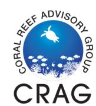

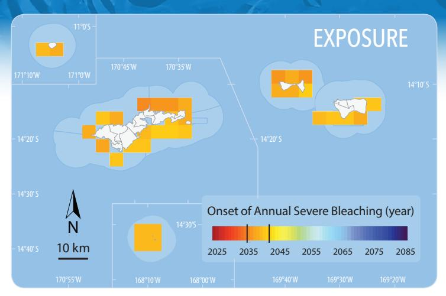

Projected timing of the onset of annual severe bleaching under business-as-usual emissions scenario RCP8.5 (assumes climate policy is not effective at reducing emissions).

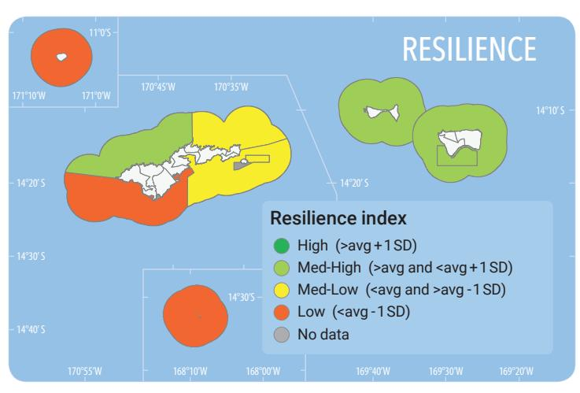

Aggregate index based on Bleaching resistance, Coral disease, Coral diversity, Coral juvenile density, Herbivorous fish biomass, Macroalgae cover, Fishing depletion, Temperature variability (see page 3).

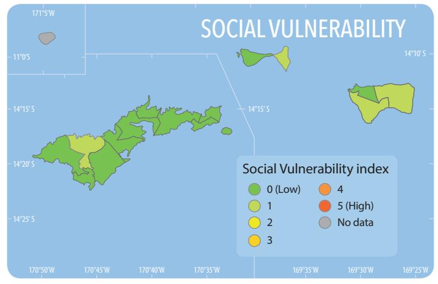

Aggregate index based on Personal disruption, Population composition, Poverty, Labor force structure, and Housing characteristics (see page 6).

*Citation: Thomas A. Oliver, Danika Kleiber, Justin Hospital, Jeffrey Maynard, Dieter Tracey. Coral Reef Resilience and Social Vulnerability to Climate Change: American Samoa. Pacific Islands Fisheries Science Center, PIFSC Special Publication, SP-20-002d. 6 p. doi:10.25923/t9tm-pa91* 

# **Coral Reef Resilience and Social Vulnerability to Climate Change**

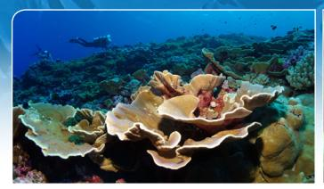

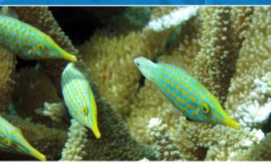

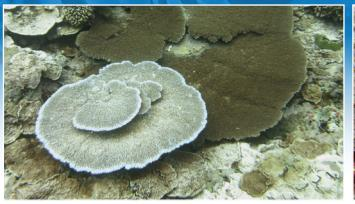

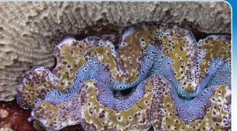

### *Coral reefs are one of our most important coastal ecosystems*.

They inspire us with their beauty, support diverse economies from fishing and tourism, protect our shorelines from storm waves, and house the greatest biological diversity of any marine habitat on earth.

*However, coral reefs are in trouble*. They face local threats, such as overfishing and pollution, and increasingly face threats that lie outside of local control, such as globally warming temperatures and acidifying seas. As temperatures rise, corals on reefs undergo bleaching, an acute condition that, if severe, can lead to large sections of coral reefs turning white and dying.

*Warming is most pressing global threat to reefs*. The coral bleaching event of 2014–2016 was the third global coral bleaching event recorded, leading to extensive coral death across the globe. American Samoa experienced coral bleaching each year between 2014 and 2018, with temperature rising to severe anomalies in 2014, 2015, and again in 2017. Tracking the cumulative impacts of all these events will continue to be a focus of re-surveys efforts.

While this pattern of repeated, severe seasonal warming is anomalous, models of future temperatures suggest that this annual bleaching could become the new normal in as little as 20 years. This grave situation raises a critical question:

How can citizens and reef managers respond locally to counter global threats to reefs?

*To manage reefs effectively, we need to know which areas are least vulnerable to climate change*. Planning local responses to globally rising temperatures requires we understand: (1) *Exposure* — when will a given reef face potentially catastrophic warming? (2) *Resilience* — how likely is a given reef to resist or recover from high temperature events? (3) *Social Vulnerability* — how difficult will it be for the communities that depend on reefs to reduce their reliance on reef resources?

We present the best available data to answer these questions in a coherent way across American Samoa and all other US Affiliated Pacific Islands.

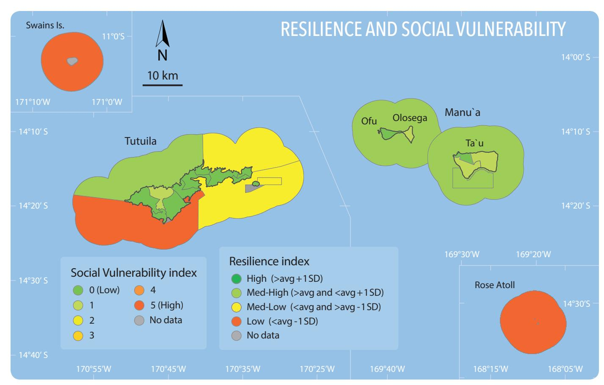

The composite of the coral reef Resilience index (sectors in the water) and Social Vulnerability index (sectors on land) for islands of American Samoa. See associated text for details.

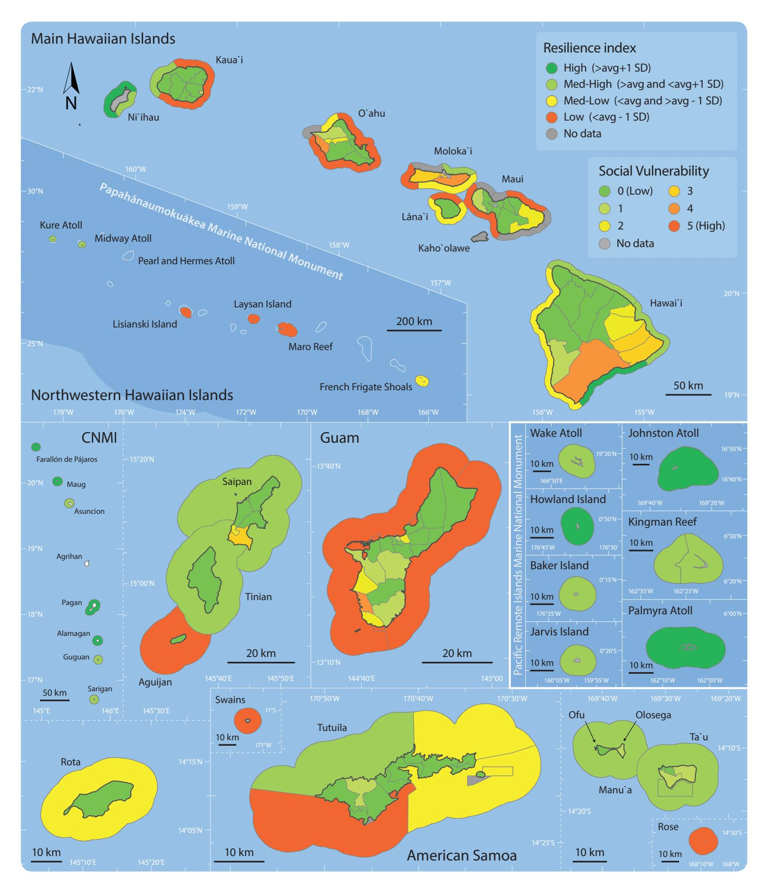

These nested maps highlight each U.S.-Affiliated Pacific Island, showing the aggregate Resilience index along the coast and the Social Vulnerability index with sectors on land. We see that many remote areas show relatively high resilience, including many of the islands across the Pacific Remote Island Marine National Monument, but remoteness itself is not a guarantee of resilience, as islands in Papahānaumokuākea Marine National Monument range from medium—high to low resilience. Many areas around population centers in O'ahu, Maui, S. Tutuila, and Guam show low resilience. Social Vulnerability indices show low vulnerability in Hawai'i and Guam, but higher vulnerability in Tinian, Saipan, and American Samoa.

# **Coral Reef Resilience RECOVERY**

## Coral competitiveness

*Coral Reef Resilience* is a function of both how likely a system is to *Resist* stress before showing negative impacts, and how likely a system is to rapidly *Recover* from impacts once they occur.

The eight reported resilience factors will each have different impacts on resistance and recovery. To highlight these distinctions, we break the eight factors into three groups:

- ✧ *Coral Competitiveness* primarily describes a reef's *Recovery*,
- ✧ *Other Stressors* affect both *Resistance* and *Recovery*, and
- ✧ *Bleaching Resistance* primarily describes a reef's *Resistance*.

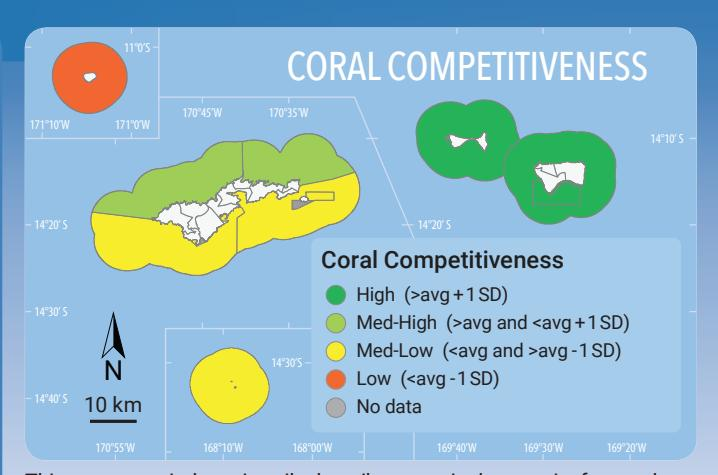

This aggregate index primarily describes a region's capacity for corals to compete for benthic space, and includes **Coral Diversity**, **Herbivorous Fish Biomass**, **Macroalgal Cover**, and **Juvenile Coral Density**.

A primary driver in maintaining resilient corals reefs is whether coral populations can maintain a competitive edge over other benthic species like turf algae and macroalgae. High Coral Diversity supports this competiveness through a range of different growth forms and life histories. High Herbivorous Fish Biomass supports high grazing rates on corals' primary competitors, turf algae and macroalgae. Low Macroalgae Cover indicates that corals are maintaining this competive edge. High Juvenile Coral Density also suggests that corals are managing to successfully recruit to the area, ensuring a continual supply of new corals to the population.

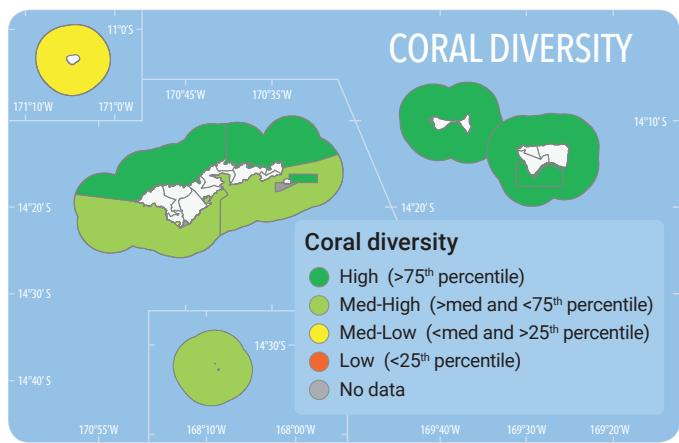

Diversity of hard corals, expressed as the effective number of coral genera (exponential of the Shannon entropy index).

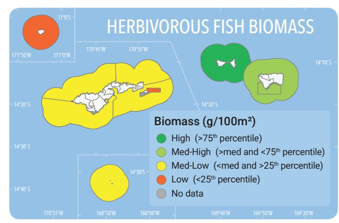

Observed biomass of herbivorous fishes, grams per 100 meters square.

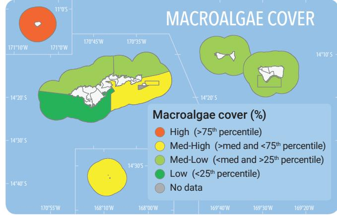

Observed percent cover of macroalgae.

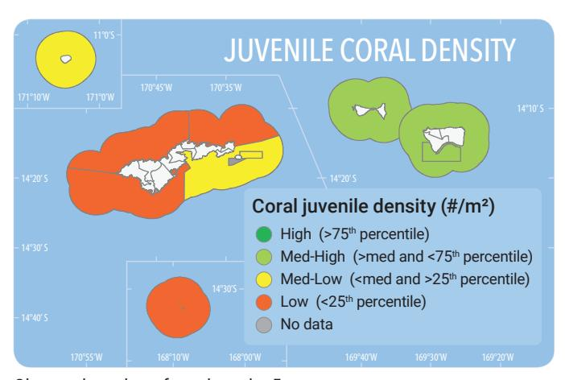

Observed number of corals under 5 cm per square meter.

# **RESISTANCE**

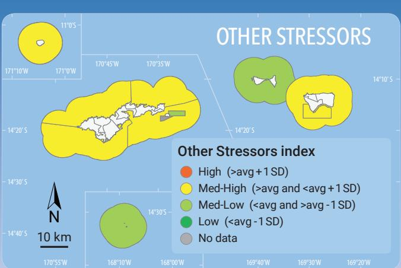

This aggregate measure of **Fishing Depletion** and **Coral Disease** highlights areas where resilience is likely negatively impacted by overfishing or by coral disease outbreaks.

In addition to coral's competitive dominance, both recovery and resistance can be affected by other forms of stress. In particular, **Fishing Depletion** and outbreaks of **Coral Disease** can negatively affect a reef's resilience.

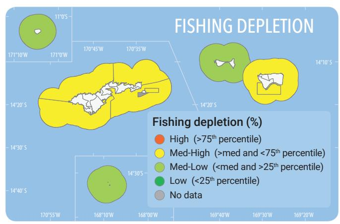

Percentage depletion of reef fishes due to fishing mortality, calculated from differences between observed biomass and biomass expected in the absence of fishing pressure (Williams et al. 2015).

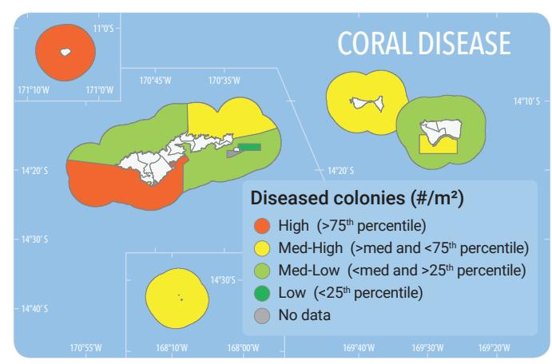

Observed number of diseased colonies per square meter.

## Other stressors Bleaching resistance

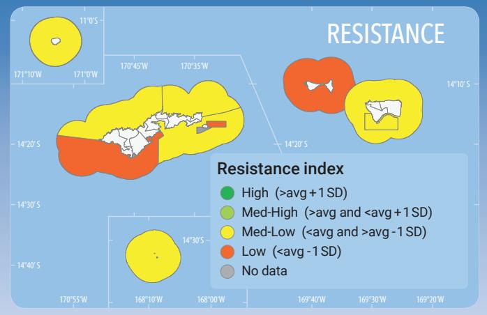

This aggregate measure of **Bleaching Resistant Corals** and **Thermal Variability** highlights areas likely to better *resist* high water temperatures.

Factors that support recovery can be distinct from those that promote resistance to the stress in the first place. Both the proportion of **Bleaching Resistant Corals** and a reef's history of high **Temperature Variablity** have been shown to help a reef resist high temperature bleaching.

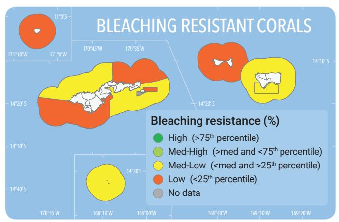

Proportion of bleaching resistant coral species in an area, calculated from observed proportional abundance by species and observed patterns of bleaching by species.

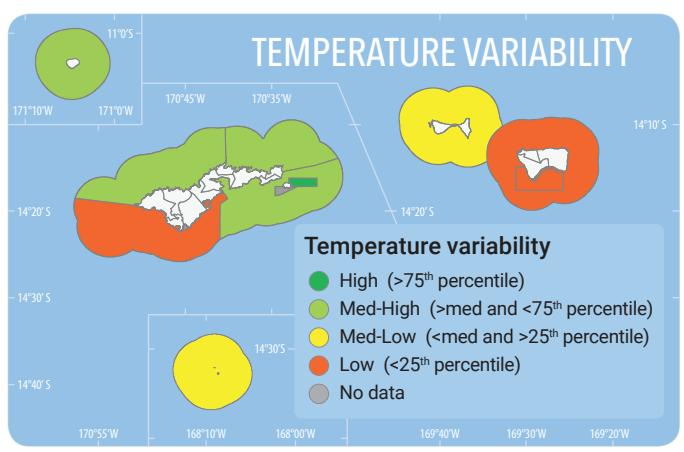

History of high temperature variability in an area, calculated from the climatological summer temperature range divided by the annual temperature range (Heron et al. 2016).

# **Social Vulnerability**

While **Exposure** and **Resilience** play important roles in a coral reef's ecological responses to warming temperatures, human **Social Vulnerability** can indicate a community's ability to handle changes in their resources. We present five aspects of Social Vulnerability of the communities living near these reef resources: **Personal Disruption, Population Composition, Poverty, Labor Force Structure,** and **Housing Characteristics** (following Jepson and Colburn 2013; Kleiber et al. 2018). In the descriptions below, the ↑ symbol indicates that an increase in a particular variable increases vulnerability, while ▶ indicates that the increase in the variable decreases vulnerability.

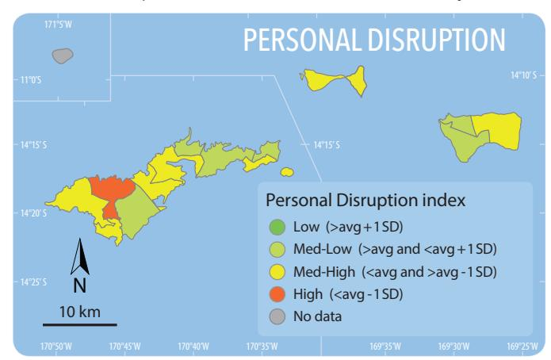

The Personal Disruption index includes variables that might indicate unstable personal circumstances, including poverty  $(\uparrow)$ , unemployment  $(\uparrow)$ , and low educational attainment  $(\uparrow)$ .

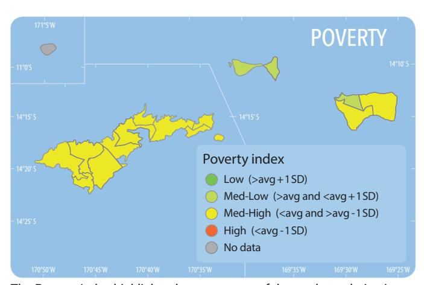

The Poverty Index highlights the percentage of the total population in poverty  $(\uparrow)$ , as well as the percentage in poverty of other vulnerable groups, such as children (under 18)  $(\uparrow)$ , families with children under 5  $(\uparrow)$ , and single-female headed families  $(\uparrow)$ .

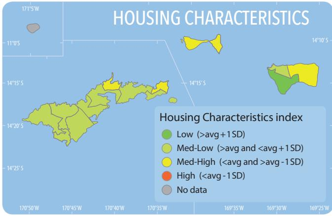

The Housing Characteristics index highlights the character of housing available within a community and measures the median rent  $(\Psi)$ , median number of rooms in family dwellings  $(\Psi)$ , and the percentage of houses that lack plumbing facilities  $(\uparrow)$ .

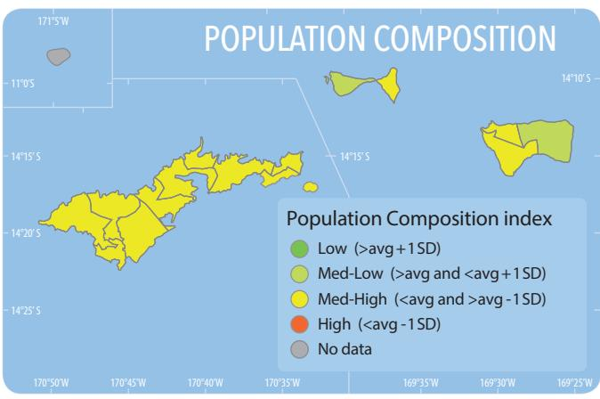

The Population Composition index describes demographic variables identified as indicators of socially vulnerable populations, including the percent of young children  $(^{\land})$ , the percent of female-headed households  $(^{\land})$ , and the percent of people without a Bachelor's degree  $(^{\land})$ .

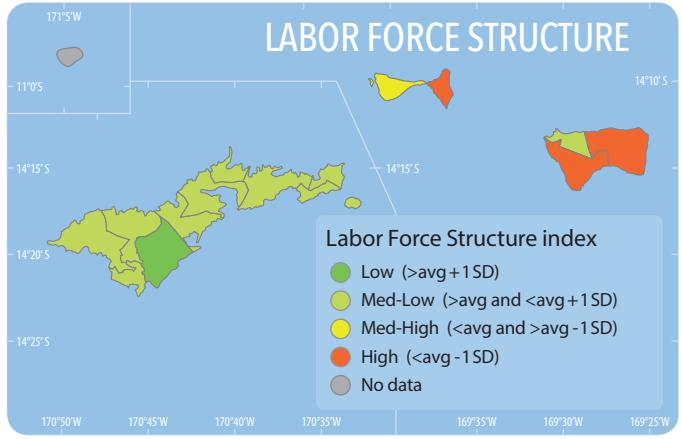

Labor Force Structure index provides an indication of the strength and stability of the labor force, including variables on the percent of females in the labor force  $(\Psi)$ , the percent of those in the service industry  $(\Psi)$ , as well as the percent of families with income under \$10,000 ( $\spadesuit$ )

### Authors

 $Thomas\ A.\ Oliver^1, Danika\ Kleiber^1, Justin\ Hospital^1, Jeffrey\ Maynard^2, Dieter\ Tracey^2.$ 

### References

 $Heron SF, Maynard JA, van Hooidonk R, Eakin CM. 2016. \ "Warming trends and bleaching stress of the World's coral reefs 1985–2012." Sci. Rep. 6.$ 

Jepson M, Colburn LL. 2013. "Development of social indicators of fishing community vulnerability and resilience in the US southeast and northeast regions." NOAA Technical Memorandum NMFS-F/SPO-129.

Kleiber D, Kotowicz D, Hospital J. 2018. "Applying national community social vulnerability indicators to fishing communities in the Pacific Island region". NOAA Technical Memorandum NMFS-PIFSC-65.

Maynard JA, McKagan S, Raymundo L, Johnson S, Ahmadia GN, Johnston L, Houk P et al. 2015. "Assessing relative resilience potential of coral reefs to inform management." Biol. Conservation 192: 109-119.

McClanahan TR, Donner SD, Maynard JA, MacNeil MA, Graham NA, Maina J, Baker AC et al. 2012. "Prioritizing key resilience indicators to support coral reef management in a changing climate." PloS One 7, no. 8: e42884.

van Hooidonk R, Maynard JA, Tamelander J, Gove J, Ahmadia G, Raymundo L, et al. 2016. "Local-scale projections of coral reef futures and implications of the Paris Agreement." Sci. Rep. 6, 39666.

Williams ID, Baum JK, Heenan A, Hanson KM, Nadon MO, Brainard RE. 2015. "Human, oceanographic and habitat drivers of central and western Pacific coral reef fish assemblages." PLoS One 10, no. 4: e0120516.

### Acknowledgements

We would like to acknowledge the Coral Reef Conservation Program, the US Department of the Interior, and the American Samoa Coral Reef Advisory Group for funding, and the support of our colleagues at the Ecosystem Science Division of NOAA's Pacific Islands Fisheries Science Center.

1: NOAA Pacific Islands Fisheries Science Center, Honolulu, HI

2: SymbioSeas and the Marine Applied Research Center, Wilmington NC