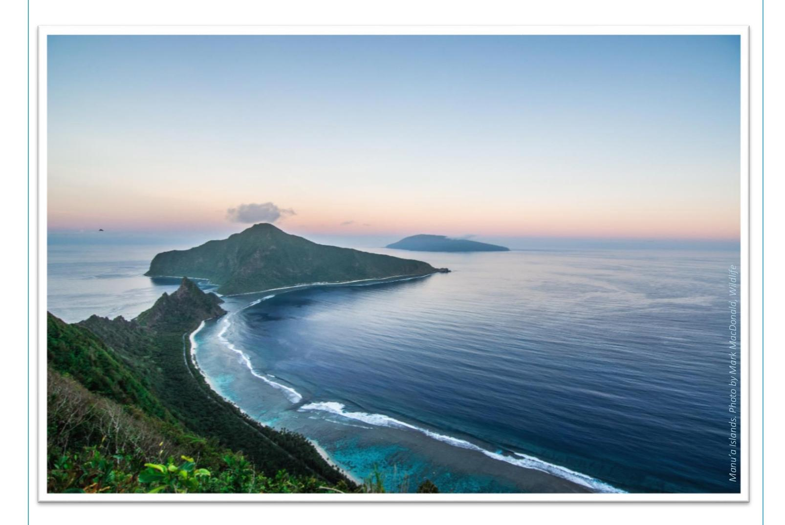
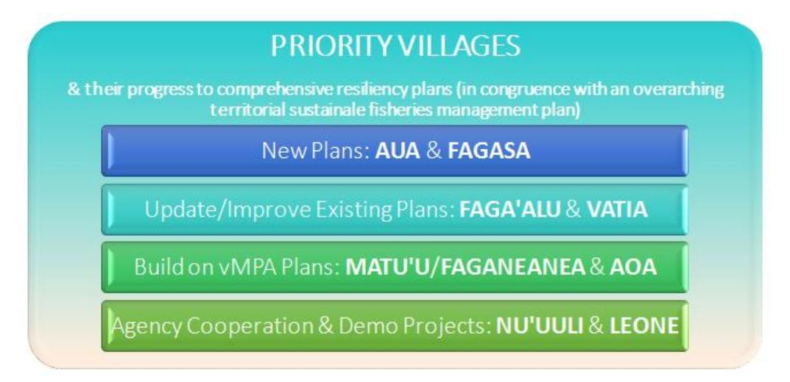

# American Samoa's Healthy Coral Reef Local Action Strategy 2020-2025

#### CRAG VISION

American Samoa's coral reef ecosystems thriving, valued, and conserved.

#### CRAG MISSION

Promote effective coral management through collaboration and strong engagement with partners, leaders, and communities.

# TABLE OF CONTENTS Introduction 3 Local Coral Reef Ecosystem Stressors 4 Education and Outreach Strategy 9 Research Strategy 13 Monitoring Strategy 15 Management Strategy – Village-based Actions 16 Management Strategy – Territory-Wide Actions 18 Priority Ecosystem Taxa 22 Resources and Citations 26 Table of Updates 30

# LIST OF ACRONYMS

| ASCC      | American Samoa Community College                                  |
|-----------|-------------------------------------------------------------------|
| ASCMP     | American Samoa Coastal Management Program                         |
| ASEPA     | American Samoa Environmental Protection Agency                    |
| ASG       | American Samoa Government                                         |
| ASHPO     | American Samoa Historic Preservation Office                       |
| ASPA      | American Samoa Power Authority                                    |
| CRAG      | Coral Reef Advisory Group                                         |
| DMWR      | Department of Marine and Wildlife Resources                       |
| DOC       | Department of Commerce                                            |
| DOH       | Department of Health                                              |
| LAS       | Local Action Strategy                                             |
| LBSP      | Land Based Sources of Pollution                                   |
| MNRE      | Ministry of Natural Resources and Environment (Independent Samoa) |
| NOAA      | National Oceanic & Atmospheric Administration                     |
| MPA       | Marine Protected Area                                             |
| NMSAS     | National Marine Sanctuaries of American Samoa                     |
| NOAA PIRO | NOAA Pacific Islands Regional Office                              |
| NOAA      | National Oceanic and Atmospheric Administration                   |
| NPSA      | National Park Service of American Samoa                           |
| NRCS      | Natural Resources Conservation Service                            |
| OSA       | Office of Samoan Affairs                                          |
| PacIOOS   | Pacific Island Ocean Observing System                             |
| PLA       | Participatory Learning and Action                                 |
| RC&D      | Resource Conservation & Development Council                       |
| SPC       | Secretariat of the Pacific Community                              |
| SPREP     | South Pacific Regional Environment Program                        |
| SWCD      | Soil and Water Conservation District                              |
| TNC       | The Nature Conservancy                                            |
| UH        | University of Hawai'i                                             |
| USGS      | United States Geological Survey                                   |
| USFWS     | United States Fish and Wildlife Service                           |
|           |                                                                   |

# INTRODUCTION

The American Samoa (AS) Coral Reef Advisory Group (CRAG) coordinates the Territory's coral reef management efforts and activities. The group is a formal collaboration of five local agencies: the Department of Marine and Wildlife Resources (DMWR), the Department of Commerce [DOC; including AS Coastal Zone Management program (ASDOC-CZM) & the National Marine Sanctuary of American Samoa (NMSAS)], the American Samoa Environmental Protection Agency (AS-EPA), the American Samoa Community College (ASCC), and the National Park of American Samoa (NPSA). CRAG also collaborates with numerous partners; they include: the NGO Ridge to Reefs, National Oceanic and Atmospheric Administration (NOAA) Weather Service Office of Pago Pago, US Department of Agriculture's Natural Resources Conservation Service (NRCS), NOAA Pacific Islands Regional Office (PIRO), AS Department of Education, AS Power Authority, AS Port Administration, US Fish and Wildlife Service, the Department of Youth and Women's Affairs, and more. The Office of Samoa Affairs (OSA) is a group comprised of village *pulenu'u* (mayors) and is the most effective avenue to communicate with the villages of American Samoa. CRAG agencies and partners will continue to use the OSA as the first point of contact when conducting work in villages of American Samoa.

CRAG member agencies and partners cooperate to manage coral reefs with the vision of healthy and resilient coral reef ecosystems in American Samoa. The group works toward this vision by providing guidance to Territorial leaders and implementing strategies to reach goals that address various areas of coral reef ecosystem conservation. Foci range from education and outreach, policy and enforcement, to scientific research and monitoring.

In 2019, three separate strategic documents specific to land-based sources of pollution, sustainable fisheries, and climate change were streamlined and updated by the combined CRAG LAS Working Group and merged into this Healthy Coral Reef Local Action Strategy. In 2010, the NOAA Coral Reef Conservation Program (CRCP) held a workshop in American Samoa with the local resource management agenciesin order to identify priority issues and geographic regions on which to focus resources (as they did in October of 2019). The priority watersheds selected at that time were Faga'alu, Vatia, and Aunu'u which were added to an existing watershed in which the landbased sources of pollution group had worked, Nu'uuli. These priority sites were reassessed for this current, updated Local Action Strategy. In addition, the coral reefs of the Manu'a Islands are invaluable regarding cultural importance, scientific research, and their role with NPSA; they will always remain a priority. The process used to thoroughly update the LAS goals and objectives, as well as prioritize management sites and key ecosystem taxa, is articulated in the document, *LAS 2019 Prioritization Process.*

This living local action strategy guides CRAG in its mission to promote the health and resilience of American Samoa's coral reef ecosystems using scientific research and community engagement to implement effective management for current and future generations. Successful coral reef ecosystem management starts with education, as does this document. Following the education and outreach goals are those specific to research, monitoring, and management activities needed in the Territory for coral conservation. Although a thorough update will take place in 2025, the goals and objectives in this LAS are likely to slightly change before then as new information is gathered, new policies are implemented, and as projects are developed, implemented, modified, and completed. Major updates or changes to the document before 2025 will be clearly identified. Please contact CRAG at 684-633-0382 or [info@crag.as](mailto:info@crag.as) with any questions or comments regarding this document or the update/prioritization process.

# LOCAL CORAL REEF ECOSYSTEM STRESSORS

Coral reefs around the world are under increased threat and a significant loss of corals in American Samoa would not be without warning. The following sections touch upon the stressors affecting the Territory's coral reef ecosystems. Please peruse the reference and citation section for more resources on these stressors and their effects.

### Land-based Sources of Pollution

Within American Samoa, a direct relationship has been found between land-based pollution and the health of the coral reefs onto which this pollution flows (Houk, 2010). American Samoa's main island of Tutuila is a steep volcanic island with several small watersheds that often flow out onto a coral reef flat. The Territory receives 125 to 300 inches of annual rain, depending on specific location. The steep slope of the watersheds makes them highly susceptible to erosion, particularly if the natural vegetative layer has been removed. Cultivation of crops and/or animals along with construction activities and increased impermeable surfaces (paved areas) within the watershed increases the soil erosion rate and stormwater volumes. This adds sediment, pesticides, nutrients, and bacteria into the streams.

The presence of most of the islands' population close to streams and near the coast adds a significant source of pollution to the reefs, particularly from villages that are not connected to the American Samoa Power Authority (ASPA) sewage system. The high porosity of the Tafuna-Leone Plain leads to a large amount of groundwater that can transport pollutants from the watershed to coral reefs (DiDonato, 2004). Shuler et al., (2017) note that Tutuila's main anthropogenic sources of non-point source groundwater pollution are on-site disposal systems (OSDS; cesspools and septic systems), agricultural chemicals, and waste from piggeries. These researchers found that OSDS contribute significantly more total nitrogen to groundwater than other sources.

Climate change will soon likely bring wetter conditions to the Territory as the mean rainfall may increase up to 25% by the late 21st century. Extreme rainfall events will also become more likely. "Stormwater drainage and wastewater management in coastal areas will be affected by interactions between heavier rains and higher ocean waters" (Wang and Chunxi, 2016). As rainfall increases, so do land-based sources of pollution. This LAS addresses this issue and others by working toward an increased capacity to plan, build, and maintain erosion control and green infrastructure practices to mitigate stormwater and groundwater pollution.

It is vital to understand how pollution is linked to coral reefs through focused monitoring and research on watersheds and near coastal waters and to understand the relationship of communities and how they interact with their surrounding watersheds. This information must then be used to implement effective adaptive management strategies that involve local communities to reduce pollution sources and their impact on the coral reefs. CRAG agencies and partners plan to accomplish this through comprehensive village-based management plans.

#### Unsustainable Fisheries

Reef fish stocks, especially those of the highly-targeted species in subsistence and commercial fishing, are in a depleted state in American Samoa. Recent data indicates American Samoa has about one third of the biomass of reef fish and low numbers of large fish and sharks compared to more remote and pristine reefs in the Pacific Ocean (Sabater and Carroll, 2009), a symptom and impact of ecosystem overfishing. Fishing typically targets large fishes for economic reasons resulting in declines in target species size, density, and biomass (Jennings and Kaiser, 1998; Russ, 2002). Larger-bodied species are the most vulnerable to fishing since they have, in general, slower growth rates, lower abundance, and lower recruitment rates. These fishes include many sharks, trevallies, and some wrasses, groupers, and many parrotfishes.

Unsustainable exploitation of fish has had a major impact on many stocks globally, including stocks of coral reef fish (Jackson et al., 2001). Such exploitation has resulted in the collapse of some fisheries and has caused changes to the composition of fish communities in many areas (Pauly et al., 1998). Fishing in general, and particularly unmanaged and unsustainable levels of fishing, is considered to have had a significant impact and still constitutes a threat to coral reef fish stocks including those in American Samoa where catch rates have been reported as declining since the 1970s (Jackson et al., 2001); reconstructions of catch estimates suggest fish catches have decreased 79% from 1950 to 2002 (Pauly et al., 1998). While overall fishing effort in American Samoa has also declined and is now at relatively low levels, historically it has been considerably greater (Sabater and Carroll, 2009).The decline in catch is accounted for by the decline in fishing effort. At times unsustainable fishing methods have also been employed, especially during the 1990s when SCUBA spear fishing was popular and drastically increased already low fish catch (Bellwood and Hughes, 2001), leading to a ban on SCUBA fishing in 2000. While it is unknown what fish population levels may have existed originally in American Samoa, at least one species, bumphead parrotfish (*Bolbometopon muricatum*), is now on the brink of local extinction (due to fishing) based on reports of very rare sightings. Any species that is rare and exploited is at risk of local extinction. Therefore, a ban on the take of several species of large-bodied reef fish [bumphead parrotfish, all sharks, humphead wrasse (*Cheilinus undulatus*), giant trevally (*Caranx ignobilis*) and giant grouper (*Epinephelus lanceolatus*)] was proposed in 2007 based strictly on rarity. This ban is still in place and enforced as of 2020.

Effective management of tropical reef resources depends not only on reducing fishing pressure but also on maintaining processes that encourage rapid recovery of reef habitat (Grigg, 1994; Bellwood and Hughes, 2001; Friedlander et al., 2003). While fishing is considered to have the most impact and still remains the most significant threat, the loss of habitat poses another important threat to the continued existence of many marine species (Roberts and Hawkins, 1999; Rodwell et al., 2003), including coral reef fish, as most reef fish have a close association with the reef structure (Choat and Bellwood, 1991). Tropical reefs are also highly susceptible to the effects of climate change; as the primary habitat builders, scleractinian corals, are currently living close to their thermal threshold (Hoegh-Guldberg, 1999). The increased occurrence of thermal anomalies is expected to cause widespread coral mortality due to coral bleaching (Glynn, 1993; Brown, 1997), disease (Harvell et al., 1999; Harvell et al., 2002; Bruno et al., 2007), and severe storms (Emanuel, 2005; Kleypas et al., 1999), while changes to water chemistry may severely inhibit growth of corals, coralline algae, and reef accretion (Kleypas et al., 1999; Hoegh-Guldberg et al., 2007). Outbreaks of crown-of-thorn starfish (COTS; *Acanthaster*sp.) can also cause massive damage to reefs through loss of corals (Miller et al., 1991). One such outbreak occurred in American Samoa in 1978/1979 resulting in a significant reduction in live coral cover, with losses of up to 90% being recorded at some sites (Birkeland et al., 2003). Since that time, periodic hurricanes, damage from the 2009 tsunami, the 2011-14 COTS outbreak, low tide events, and bleaching have slowed the recovery of corals in the territory, although live coral cover has generally increased and is now around 29%, and a majority of indices show the benthic portion of the reefs outside the harbor are in relatively healthy condition (ASCRMP, 2011). Habitat degradation brought about by coastal development and anthropogenic inputs into the coral reef system are also of particular concern due to increases in

the above-mentioned land-based sources of pollution and added nutrients to the coral reef system from the proliferation of piggeries and increased sediment and nutrient loading, especially in reef areas near highly populated villages. These inputs especially affect reef flats, mangroves, and seagrass beds, which are nursery habitats for the recruitment and juvenile development of some reef fish (Harborne et al., 2006; Dorenbosch et al., 2005; Manson et al., 2005). Coastal development leads to removal of vegetation, directly reducing ecosystem functions such as sediment and nutrient filtration, aquatic nursery habitat, shoreline stabilization, and storm energy attenuation (potentially exacerbating pollution loads from runoff).

Marine protected areas (MPAs) are one of the main tools used to manage and enhance coral reef fish stocks (Lester et al., 2009). MPAs in American Samoa range from a privately managed marine area (Alega Bay) to federally managed areas such as those covered by the National Park of American Samoa, the National Marine Sanctuary in American Samoa, and the Rose Atoll Marine National Monument (Rose Atoll Comprehensive Conservation Plan:

[https://www.fws.gov/refuge/Rose\\_Atoll/what\\_we\\_do/planning.html\)](https://www.fws.gov/refuge/Rose_Atoll/what_we_do/planning.html). In addition to these different levels of management, the levels of protection also vary greatly from completely notake (e.g., Fagamalo No-Take Area), to areas that allow subsistence fishing (e.g., marine portion of the National Park) and areas allowing different levels of take, depending on the decision of the village [Community-based Fishery Management Program (CFMP)/village marine protected areas (vMPAs)]. The MPA Network Strategy was developed with the goal to effectively coordinate existing and future MPAs to ensure the long-term health and sustainable use of the Territory's coral resources. Some challenges faced by these varying MPA entities include: ensuring that different programs in the Territory are complementary; incorporating implementation activities into the local culture to improve their effectiveness; and, ensuring political support is provided to allow the effective management and coordination of the various programs. The strategy aims to increase the effectiveness of, and support for community and agency management efforts through enhanced coordination and integration of education, research and monitoring, enforcement, and program administration. The continued need for marine protected areas in Territory makes it essential for ongoing technical and political support.

While current management actions are applauded, there is still a need to further protect, conserve, enhance, and increase coral reef fish stocks in American Samoa, particularly larger and more vulnerable species based on the precautionary principle and using the best available scientific data. Current management practices are failing to adequately protect fish stocks and need to be revitalized and improved to secure food resources for the future of American Samoa. Renewed management effort is especially important given the compounding impacts of global warming, ocean acidification, introduced species, and diseases. Of primary concern are the protection of large fish through catch, size, and/or gear limits, establishment of additional permanent no-take marine protected areas, climate change mitigation, management of invasive species, and reduction in coastal runoff and pollution.

# Climate Change

Climate change is a primary threat to the future of the world's coral reef ecosystems. In their 2019 Special Report on the Ocean and Cryosphere in a Changing Climate, the Intergovernmental Panel on Climate Change (IPCC)states that "30% of the world's reefs have been stressed to near breaking point, and that 60% of the world's reefs are heavily threatened. However, if we are unable to keep within 1.5 degrees of warming 70-90% of reefs could collapse, and exceeding the 1.5 degrees could cause more than 99% of reefs to collapse." The IPCC's 2014 reportstatesthat the globally averaged land and ocean surface temperature data show a warming of 0.85 [0.65 to 1.06] °C over the period 1880 to 2012, and an expected increase in temperature of 2.5-7.8°C by 2100 when including climate uncertainty (pg. 20) (IPCC, 2014). Human activities, particularly fossil fuel use, cement production, flaring and deforestation, are leading to an enhancement of the greenhouse effect by the emission of greenhouse gases (IPCC, 2014). "Non-climatic anthropogenic drivers, including recent and historical demographic and settlement trends and anthropogenic subsidence, have played an important role in increasing low-lying coastal communities' exposure and vulnerability to sea level rise and extreme sea level events" (IPCC, 2019). Similar to other small island developing states (SIDS) in the Pacific, the Territory of American Samoa is highly vulnerable to rising sea surface temperatures, increases in ocean acidification, rising sea levels, intensifying storm systems, and changing rainfall patterns, due to the island's culture, geographical characteristics, socioeconomic status, and dependence on natural resources.

Rising sea surface temperatures and increased coral bleaching is a connection established by both laboratory experiments and *in situ* observations. There is a strong relationship between warmer sea surface temperatures and rates of coral bleaching (Lough et al., 2018). Existing data that describes sea surface temperature trends can be used to predict future bleaching events (e.g. Liu et al. 2014). In addition to bleaching-induced mortality, overall fitness is reduced by decreased growth rates and a lack of reproduction in colonies that have bleached and survived. Additional mortality may occur from post-disturbance threats, including higher coral disease rates (Brandt et al. 2009; Miller et al., 2009) and coral predation as prey sources decline (Bruckner et al., 2018; Bruckner and Coward, 2018). The temperature record in American Samoa shows the sea surface temperatures increasing over the last 30 years, with mass coral bleaching events in 1994, 2002, 2003, 2015, and 2017 correlating with unusually warm ocean temperatures. Mass bleaching events will increase in frequency and strength in future decades, ultimately resulting in higher rates of coral mortality.

Increased carbon dioxide in the atmosphere has led to an increase of dissolved carbon dioxide in ocean water, resulting in ocean acidification. The decreased pH of the ocean reduces the availability of calcium carbonate, which is required by calcifying organisms, such as coral and coralline algae, to form their skeletons. The accretion rate of these reef-building organisms is expected to decrease significantly (Raven et al., 2005).

In terms of sea level rise, present sea level rise is approximately 2.21±0.81 mm per year from 1984 to 2009 (NOAA Sea Level Trends, 2018), and a half meter (1.6 feet) to three meters (Le Bars et al., 2017) sea level rise projected by the end of the century. While sea level rise does not pose an immediate danger to corals, an increased sea level will allow waves to more easily roll over degraded coral reefs affected by bleaching, overfishing, ocean acidification, and land-based sources of pollution, leading to stronger shoreline erosion. Tutuila faces increased relative sea level rise due to a rapid 5cm subsidence caused by the 2009 earthquake (which is why NOAA sea level rise data ends in 2009), and has continued to undergo a large post-seismic subsidence, around 1 cm/year (Han et al., 2019).

Addressing climate change and its implications for coral reef conservation is challenging. Greenhouse gas emissions require a global solution over which local managers have minimal control. Though local managers may not be able to prevent global emissions, actions can be taken locally to reduce vulnerability to climate change and its implications. At present, managers must ensure that American Samoa's reef ecosystems are as healthy and resilient as possible to reduce vulnerability to the impending effects of climate change. This includes minimizing non-climate change related reef threats, such as fishing pressures and land-based pollution sources. Climate

change mitigation and impacts will be addressed by CRAG agencies and partners through islandwide efforts (e.g., promotion of existing relevant Territorial Executive Orders, promoting research on specific impacts, continued monitoring) and by building capacity for villages to plan and implement impact mitigation practices (green or green/gray shoreline protection and infrastructure, rainwater harvesting, etc.).

The American Samoa Healthy Coral Reef Local Action Strategy addresses these stressors of climate change, overfishing, and land-based sources of pollution via the following Territorial goals and their objectives.

# CORAL REEF ECOSYSTEM MANAGEMENT GOALS & OBJECTIVES

# Education & Outreach

**GOAL 1**: Increase capacity for CRAG agencies, partners, and internal staff to conduct strategic communication and outreach.

Objective 1.1: The CRAG Education and Outreach Coordinator (EOC) will create an outreach and education toolkit by January 2020.

> This toolkit will be in the form of a downloadable electronic folder that CRAG and its agencies can easily take on a flashdrive to any outreach or education event. It will be designed to include everything one would need to cover the details of a specific topic while also describing that topic's link to American Samoa's ecological, economic, and human health, promoting *lotonu'u*. Topics include:

- BASICS OF CORAL REEF ECOSYSTEMS
- SUSTAINABLE FISHING
- WATERSHEDS & LAND-BASED SOURCES OF POLLUTION (LBSP) (including MARINE DEBRIS)
- LBSP BEST MANAGEMENT PRACTICES (including LOW-IMPACT DEVELOPMENT/GREEN INFRASTRUCTURE)
- CLIMATE CHANGE
- CORAL REEF RESTORATION

#### Tasks/strategies:

- o Create a master presentation for all of the above topics that can be altered.
- o Create, gather, and electronically organize infographics for all topics.
- o Gather and electronically organize hands-on activities for all topics.
- o Create message boxes (from previous TNC training) for each LAS.
- o Create and organize an informative, electronic photo folder that covers each topic.
- o Collect and electronically organize necessary miscellaneous materials for each topic.
- o Ensure relevant documents are translated into Samoan.

Objective 1.2: CRAG staff and partners will conduct surveys of environmental literacy (EL) in Tutuila and Manu'a islands in 2020 and 2024 to measure EL baseline and success of E&O programs regarding for all audience types addressed in the E&O Plan.

# Tasks/strategies:

- o By September 2020, CRAG staff will develop an environmental literacy questionnaire both in English and Samoan languages.
- o Staff and partners will conduct an environmental survey in west, central, and east Tutuila and Manu'a Islands by the end of 2020.
- o By March 2021, the CRAG Education and Outreach Coordinator will analyze data collected from the survey and research options on how to change behavior towards the environment, targeting different audiences.

Objective 1.3: The EOC will increase coordination/efficiency of CRAG agencies' education & outreach.

# Tasks/strategies:

- o The EOC will develop an electronic network and series of face-to-face meetings to organize agency engagement history of communities.
- o He will then use the above system to ensure messages are consistent and used in joint programs.

**GOAL 2**: Increase the environmental literacy of village community groups (churches, youth groups, village leaders).

Objective 2.1: By 2024, the EOC will complete 5 murals and establish 5 marine debris working groups in varying communities (with outreach data collection included).

Objective 2.2: CRAG agencies and staff will conduct at least 4 community presentations each quarter.

#### Tasks/strategies:

- o The Climate Change Coordinator and/or Climate Change Project Lead will communicate quarterly with SPREP (Metrological Service) to ensure both Samoas have accurate and timely climate information and share it with their respective communities.
- o The Climate Change Coordinator will educate communities about climate change in Manu'a and on Tutuila: what it is, how it's affecting our island and other island nations, and what can be done to slow it down and adapt to its impacts.
- o Share information about what the partner agencies are doing to address issues impacting coral reef ecosystems.
- o Provide success stories about what students and others are doing to help protect and conserve natural resources to encourage schools and classrooms to learn outside and take action.
- o Encourage communities to conduct cleanup campaigns during Coast Weeks, Earth Day, and other community events.
  - o Host stormwater outreach events to educate communities on stormwater issues and solutions.

Objective 2.3: Produce presentations (PowerPoints, infographics, bullet points) that can be shared with community leaders to then share with their communities.

**GOAL 3**: Increase the environmental literacy of American Samoa's teachers and students.

Objective 3.1: Once a quarter, the EOC will ensure that CRAG partners facilitate a cleanup at least one school.

Objective 3.2: The EOC will work with at least one school per year to design and paint an ocean mural.

Objective 3.3: The EOC will work with the Dept. of Education (DOE) and the AS STEM Network to integrate coral reef restoration/Reef Check American Samoa into every Marine Science class by 2024.

#### Tasks/strategies:

o Identify and work with interested science/marine science teachers to conduct reef check survey and possibly doing a coral nursery. (Some student might take up interest in doing this as a science fair project. Maybe grade 10.)

Objective 3.4: Work with DOE to support teachers' professional development by delivering training via marine science presentations and relevant lesson plans that effectively support DOE's Marine Science Standards and Benchmarks for American Samoa, as well as general issues related to coral reefs in the Territory.

## Tasks/strategies:

o Contact DOE and its Office of Curriculum and Instruction each summer to offer these training services.

Objective 3.5: Each year, the EOC will coordinate offers from all CRAG agencies and staff to each marine science class to teach marine science lessons if needed.

Objective 3.6: The EOC will coordinate each year with partners and schools to mentor/guide interested students with marine science related Science Fair projects. (Most of the time students rely on the internet and teachers for information but not enough has been displayed on their boards or poor explanation of their project).

Objective 3.7: The EOC will work with the ASCC Marine Science Coordinator to identify students each year to participate in any ongoing projects within CRAG's partner agencies. (Stipend from Ed & Outreach program; ASCC Marine Science Coordinator will help identify the student.)

Objective 3.8: By 2024, the EOC will work with partners to establish a permanent coral reef monitoring program with high school teachers and students as part of the school curriculum every semester.

Objective 3.9: CRAG agencies and internal staff will create, print, and disseminate educational posters, brochures, and banners to DOE's OCI each August.

#### Tasks/strategies:

o Use local data/pictures from the ongoing Coral Reef Monitoring project to create and disseminate outreach materials.

Objective 3.10: CRAG monitoring staff will conduct a presentation about the large and old *Porites* species and their importance to share with the communities in Manu'a by the end of 2022.

#### Tasks/strategies:

o Use local data/pictures from the Documenting & Mapping of exceptionally large and old *Porites* species project to create outreach materials

Objective 3.11: In order to increase exposure to environmental careers, CRAG will support internship opportunities (such as the PIPES program from UH) within CRAG and its partner agencies each year.

Objective 3.12: The EOC will work with the ASCC Marine Science Coordinator to facilitate and support the annual ASCC QUEST (Quantitative Underwater Ecological Survey Techniques) program.

# **GOAL 4**: Increase the environmental literacy of local government leaders.

Objective 4.1: The EOC will develop presentations and evaluation questionnaires targeting local government leaders by the end of 2020.

Objective 4.2: The EOC will coordinate among CRAG partners to present data to leaders and outreach professionals that shows EL status in the territory and researched options on how to further improve EL in the territory.

Objective 4.3: CRAG agencies will conduct annual presentations to government leaders on issues facing coral reef ecosystems.

#### Tasks/strategies:

o Leaders will be encouraged to participate in activities that facilitate environmental literacy, like helping with community cleanup campaigns or wetland or coral restoration events.

# **GOAL 5**: Increase the environmental literacy of local business owners.

Objective 5.1: The EOC will coordinate with CRAG agencies to conduct at least 2 annual workshops with business owners to discuss and provide solutions for reducing the use of single-use plastics.

Objective 5.2: As much as possible, CRAG agencies will thoroughly engage local businesses during new and existing outreach events to promote environmental activities. Details depend on specific businesses, villages, issues, and needs.

#### Tasks/strategies:

o The EOC will coordinate the provision of trash bins for laundromats on-island specifically to collect bounce dryer sheets (these dryer sheets are very light in weight therefore they can be easily wafted into the ocean).

# **GOAL 6**: Increase the environmental literacy of the other/general public.

Objective 6.1: The EOC will coordinate with CRAG agencies to create newspaper advertisements/promotion & coloring sections for kids every quarter.

Objective 6.2: The EOC will coordinate with CRAG's partners to update the daily public service announcement (PSA) to keep the general public informed and updates on current issues related to coral reefs and CRAG's priorities.

Objective 6.3: The EOC will produce informational coral reef banners, exhibits, signage, and kiosks highlighting CRAG's LASs and disseminate to non-CRAG agencies each quarter.

Objective 6.4: By 2020, the EOC and partners will establish relationships with local celebrities to increase the public prominence of ocean issues on TV and the radio and at public events.

Objective 6.5: Each year, the EOC will work with the Le Tausagi environmental educational group and others to plan/create environmental literacy lesson plans for the annual summer camps.

# Research

**GOAL 7**: Understand American Samoa's ecosystem processes using existing data in order to make well-informed management decisions.

Objective 7.1: Analyze and update fisheries-dependent data to understand status and trends in species abundance, community assemblages, and catch-per-unit-effort to determine relative productivity for priority fish and invertebrates species by 2021. (Lead: DMWR, NOAA-PIFSC-WPacFin, WPFMC) (FUNDED BY: DMWR grantors)

Objective 7.2: Analyze and update fisheries-independent data to understand status and trends in species abundance, functional groups, and community assemblages to determine ecological condition and resiliency of AS's coral reef ecosystems by 2021. (Lead: DMWR, NOAA-PIFSC-WPacFin, WPFMC, NPSA, NMSAS) (*FUNDED BY: DMWR grantors*)

Objective 7.3: By 2024, determine the socio-economic drivers of changes in ecosystem condition. (Lead: TBD) (*funding likely needed*)

Objective 7.4: By 2024, determine the environmental drivers of changes in ecosystem condition. (Lead: TBD) (*funding likely needed*)

Objective 7.5: In order to help inform resilient management actions by 2021, homogenize, analyze and identify data gaps in historical and current fisheries datasets. (Lead: CRAG, TNC or other NGO) (*funding needed*)

Objective 7.6: Review, synthesize, and disseminate combined watershed, water quality, marine debris, and coral reef monitoring data every two years. (Lead: TBD) (*funding needed*)

Strategy: Contract out data analysis and interpretation for CRAG agencies/partners needing assistance.

Objective 7.7: By 2025, develop comprehensive ecosystem models (including climate change effects) for American Samoa for various outputs (e.g., focusing on areas of high productivity, coral settlement and recruitment). (Lead: TBD) (*funding needed*)

Strategy: Create a position or provide training to existing on-island staff.

**GOAL 8**: In additional to routine monitoring, collect additional data on American Samoa's ecosystem processes in order to make well-informed management decisions.

Objective 8.1: Determine the life history of 5 targeted reef fish species (size-at-age, longevity, age-at-maturity) by 2023. (Lead: DMWR)(*FUNDED BY: DMWR grantors*)

Objective 8.2: Study potential pH and ocean temperature changes in the Territory correlated with changes in relevant attributes of nearshore marine species. (Lead: TBD) (*funding needed*)

Objective 8.3: By 2021, model future storm frequency, intensity, and duration and related impacts on coral reef ecosystems. (Lead: NOAA NWS) (*FUNDED BY: NOAA NWS*)

Objective 8.4: Create elevation and shallow water bathymetric maps using LIDAR by 2022. (Lead: TBD) (*funding needed*)

Objective 8.5: By 2021, complete a village-based vulnerability assessment of the Territory's coral reef ecosystem that incorporates sea level rise projections and other climate change impacts and resiliency factors. (Lead: SymbioSeas?) (*funding needed*)

Objective 8.6: By 2022, measure and ground-truth changes in wave-driven current velocity across backreefs as a function of the relative SLR rate. (Lead: TBD) (*funding needed*)

Objective 8.7: By 2023, identify locally relevant water quality indicators that can be used to rapidly assess ecosystem condition. (Lead: TBD) (*funding needed*)

**GOAL 9**: Identify physical and biological parameters influencing connectivity of MMAs and non-protected areas to improve management and MMA design.

Objective 9.1: Build upon existing data to finalize circulation models to determine sitebased sinks and sources of coral reef organism larvae for the Territory by 2022. (Lead: CRAG) (*funding and technical assistance needed*)

Objective 9.2: Determine population genetic connectivity for 3 shallow coral reef fish and one invertebrate species in the Samoan Archipelago by 2025. (Lead: DMWR) (*FUNDED BY: DMWR grantors*)

Objective 9.3: Determine fish movement patterns for 3 fish species in Tutuila by 2025. (Lead: TBD; CRAG has equipment) (*funding likely needed*)

**GOAL 10**: Assess the social and economic feasibility of fisheries management actions. (Include appropriate consultation process and approach as part of the activities).

Objective 10.1: Determine the feasibility of seasonal closures of targeted resource species. (Leads: TBD) (FUNDED BY: ...[agency] / funding needed)

Objective 10.2: Conduct socio-economic surveys on the impact of MMAs every 3-5 years. (Lead: NOAA Social Science Program) (*FUNDED BY: NOAA*)

Objective 10.3: Conduct village-level surveys using the MPA checklist every 3-5 years (simultaneously with the surveys above). (Lead: DMWR, CRAG MPA Coordinator) (*FUNDED by: CRCP via CRAG cooperative agreement*)

#### Monitoring

**GOAL 11**: Maintain an understanding of the current status and spatial and temporal trends of coral reef ecosystem health throughout AS.

Objective 11.1: The American Samoa Coral Reef Monitoring Program (ASCRMP), the Key Reef Species Monitoring Program, the NPSA Monitoring Program, and other NOAA monitoring initiatives, will regularly monitor American Samoa's coral reeffish and benthic communities (including assessing for coral bleaching, macroalgae status,invasive species, and disease) and widely disseminate results in the Territory. (Lead: DMWR, CRAG, NPSA, NMSAS) (*FUNDED BY: existing federal awards*)

Strategy: Resilience based management training for staff to better collect data to inform resiliency assessments.Example:

<http://reefresilience.org/resilience-based-management-philippines-2016/> Could be combined with another training such as this one: <http://reefresilience.org/reef-resilience-indicators-hawaii/>

Objective 11.2: By 2023, implement acoustic monitoring at key sites to evaluate and track relative reef condition over time and compare data from a range of sites including managed areas at NMSAS, NPSA, and Rose Atoll to create acoustic metrics for site evaluation by 2025. (Lead: NMSAS and CRAG) (*funding needed and technical assistance to analyze data*)

Objective 11.3: The AS-EPA Monitoring Program will regularly monitor and disseminate results of stream, coastal springs, and nearshore water quality. (Lead: AS-EPA) (FUNDED BY: AS-EPA)

Objective 11.4: Improve geospatial mapping and analysis capabilities to provide tools for improved spatial and temporal monitoring and modeling of coral reef ecosystems in the Territory (including climate change effects). (Lead: TBD) (FUNDED BY: ...[agency] / funding needed)

# Management

#### VILLAGE-BASED MANAGEMENT

**GOAL 12**: Build and sustain coral reef ecosystem management and restoration at the village level.

Objective 12.1: By 2025, facilitate with the priority villages above the creation of comprehensive village or agency resilience-based management plans that include sustainable fishing, watershed management that includes wetland monitoring, climate change preparedness, and coral restoration, if applicable. (Leads: DMWR, DOC, NOAA PIRO, CRAG MPA Coordinator, Ridge to Reefs) (*funding needed for meeting materials and meals*)

Management Strategy 1: Eradicate/reduce feral pigs and dogs to reduce nutrient loading and sedimentation.

Management Strategy 2: Reduce nutrient loading by bringing piggeries into AS-EPA compliance.

Management Strategy 3: Plant appropriate vegetation along dirt roads and cesspools to reduce sediment load and increase excess nutrient uptake.

Management Strategy 4: Improve the quality of on-site waste water management for sites prioritized based on spatially relevant, high nutrient inputs and poor water quality.

Management Strategy 5: Preserve, restore, and reintroduce mangrove and shoreline and streambank habitat.

Management Strategy 6: Establish needs and actions related to specific sea level rise issues.

Strategy: Use a climate adaptation tool like this one: [http://reefresilience.org/adaptation-design-tool-for-natural-resource](http://reefresilience.org/adaptation-design-tool-for-natural-resource-management-minnesota-2017/)[management-minnesota-2017/](http://reefresilience.org/adaptation-design-tool-for-natural-resource-management-minnesota-2017/) 

Management Strategy 7: Promote, update, or incorporate village fisheries management plans or regulations, if applicable.

Management Strategy 8: Highlight coral restoration, monitoring, and maintenance plans, if applicable.

Management Strategy 9: Update the DOC GIS portal with implementation of above activities.

Management Strategy 10: Develop and implement hybridized green and grey management measures as a best management approach for shoreline protection and stabilization.

Management Strategy 11: Promote rainwater harvesting with rain barrels and cisterns at homes, schools, and churches.

Objective 12.2: Conduct annual village MPA deputization activity. (Lead: DMWR Enforcement and CFMP) (*FUNDED BY: DMWR grantors*)

Objective 12.3: Conduct annual Reef Check ecosystem monitoring training for vMPA villages. (Lead: DMWR) (*FUNDED BY: DMWR grantors*)

Objective 12.4: Conduct annual fishers' workshop in Tutuila and Manu'a on fisheries regulations and management. (Lead: DMWR) (*FUNDED BY: DMWR grantors*)

**GOAL 13**: Restore viable coral populations. Refer to the [AS Coral Restoration Strategy](https://drive.google.com/file/d/1szG_cLBD_XdHtaZLNn7-s-to4PHf65PY/view?usp=sharing).

# TERRITORY-WIDE MANAGEMENT

**GOAL 14**: Increase abundance of prioritized fish (see Tables 1, 2 and 3 below) for the restoration and sustainability of reef fish stocks.

Objective 14.1: By 2021, conduct a fish and invertebrate sustainable management workshop with all relevant local agencies. (Lead: DMWR, CRAG) (*funding and facilitation needed*)

Deliverable: Training on the PIMPAC facilitation tool to be used in the villages Deliverable: Create a suite of management tools for villages and DMWR Deliverable: Community outreach materials

Strategy: MPA managers training to help local staff manage, develop strategic plans, facilitate meetings etc. Example: [https://reefresilience.org/mpa-managers](https://reefresilience.org/mpa-managers-training-seychelles/)[training-seychelles/](https://reefresilience.org/mpa-managers-training-seychelles/)

Strategy: Potentially use the Fish Path tool to inform this workshop: <https://fishpath.org/>

Objective 14.2: Establish appropriate management tools and regulations for priority fish functional groups in 5 years. (Lead: DMWR) (*FUNDED BY: DMWR grantors*)

Objective 14.3: Improve enforcement of marine managed areas by using monitoring data to increase awareness of enforcement importance to relevant agencies. This is also a village-level objective under Management GOAL 1. (Leads: DMWR, NMSAS, Wildlife Refuge, Coast Guard) (*FUNDED BY: existing agency grants*)

Objective 14.4: Deploy and maintain 4 shallow water fish aggregation devices to reduce fishing pressure on coral reef fish by redirecting fishing effort away from coral reefs and introducing alternative sources of marine-based protein. (Lead: DMWR, CRAG) (*funding needed*)

Objective 14.5: To reduce pressure on our wild reef fish stocks, promote and support small-scale environmentally-friendly aquaculture by providing training to interested potential farmers or agency staff by 2025 in site assessment and sustainable nearshore aquaculture systems. Note there is potential for investigating the use of biogeoengineered structures that can also reduce shoreline erosion, such as oyster domes/farms. Future relevant objectives may move to the village level section of management GOALs. (Lead: ASCC Sea/Land Grant, ASDOC/CMP) (*funding needed*)

**GOAL 15**: Implement the AS Rapid Reef Response Plan. (Draft available here: [https://drive.google.com/drive/folders/1fLwfd\\_6b6R0AjgPGa-vzknRP4vXS0ZW0\)](https://drive.google.com/drive/folders/1fLwfd_6b6R0AjgPGa-vzknRP4vXS0ZW0)

> Objective 15.1: Coordinate between all relevant CRAG agency programs and federal partners (Regional Response Team of USCG, Homeland Security, etc.) to conduct rapid

assessment in anticipation, during or following destructive events, including: coral bleaching, events, COTS outbreaks, coral disease outbreaks, vessel grounding events, and natural disasters. (Lead: ASCRMP) (*emergency funding often needed; available through NFWF, FEMA, and possibly CRCP*)

Objective 15.2: Update existing grounded vessel legislation to incorporate coral protection and restoration and a funding mechanism for collaborating agencies to carry out these activities. (Lead: Port Administration) (*no funding needed*)

Objective 15.3: Conduct multi-agency training every two years in order to efficiently enact the Rapid Reef Response Plan protocols. (Lead: ASCRMP) (*funding needed; could be in CRCP/CRAG cooperative agreement*)

Objective 15.4: Collaborate and communicate between relevant CRAG agencies to produce integrated reports and management recommendations annually. (Lead: ASCRMP)

**GOAL 16**: Support language review/update of 2012 Executive Orders and implementation of measures laid out in the 2012, 2014, and 2017 Executive Orders. Link to EOs: <https://www.epa.as.gov/executive-orders>

Objective 16.1: CRAG agencies will review the 2012, 2014, and 2017 Executive Orders by 2021 to identify steps needed to ensure relevancy and implementation of the EOs. (Lead: CRAG) (*no funding needed*)

# **GOAL 17**: Reduce the use of polystyrene items throughout the territory by 90% by 2025.

Objective 17.1: Conduct education and awareness campaigns reaching all audiences onisland by 2025. (Lead: AS-EPA) (*FUNDED BY: AS-EPA and CRAG E&O program*)

Objective 17.2: Build enforcement capacity via positions and/or training, especially at the ports of entry. (Lead: AS-EPA) (*funding needed*)

# **GOAL 18**: Improve territorial management of land-based sources of pollution.

Objective 18.1: Create post-construction, low impact development (LID)-based stormwater control standards and incentives for implementation for the Territory by 2024. (Lead: AS-EPA) (*funding needed*)

Objective 18.2: Conduct biennial enforcement training program and workshops to enhance green infrastructure implementation and stormwater enforcement capability for relevant staff (ASG-customs, AS-EPA, PNRS, DMWR), village leaders and *aumaga*. (Lead: AS-EPA; Key partner: US-EPA) (*funding needed*)

Objective 18.3: Enhance monitoring and enforcement capabilities through use of GIS and satellite imaging by hiring a full-time environmental GIS position in a CRAG agency. (Lead: TBD?) (*funding needed*)

Objective 18.4: Provide support for all CRAG agencies/partners by providing an agency liaison/inspector/watershed coordinator to ASDOC's Public Notice Review System. (Lead: TBD) (*funding needed; matches CRCP's Pollution Pillar, Strategy 2*)

Objective 18.5: Create and implement a stormwater and erosion control certification program for the Dept. of Public Works and private construction companies that includes proliferation of green infrastructure. (Lead: AS-EPA, STEAM groups/Edna Noga)(*funding needed*)

Objective 18.6: Double the amount of demonstration stormwater control measures and low impact development practices around the Territory by 2025, especially at ASCC. (*funding needed*)

Objective 18.7: Identify and create guidance for residence- and village-based innovative human and pig waste management. (Lead: NGO like Ridge to Reefs) (*funding needed*)

Objective 18.8: Identify, prioritize, and innovatively manage half of the Territory's cesspools and faulty septic systems by 2025. (Lead: ASPA and AS-EPA) (*funding likely needed*)

Objective 18.9: Promote innovative piggery management systems for all the Territory's piggeries by 2025. (Leads: AS-EPA, NRCS, Ridge to Reefs) (*FUNDED BY: Ridge to Reefs; more funding needed*)

# **GOAL 19**: Enhance collaboration among local, regional, and international resource agencies and organizations.

Objective 19.1: Share environmental data and activities locally and regionally (including invasive species and climate change impacts) via annual or semi-annual meetings or webinars between ASG departments and regional partners[CRAG agencies; Samoan resource programs within Ministry of Fisheries and Agriculture, Ministry of Natural Resource Environment (MNRE); SPREP; SPC; LMMA; USP; CI; TNC; NOAA; and NGOs.]. (Lead: CRAG) (*funding needed*)

Objective 19.2: Provide biennial federal and local regulatory compliance/consistency training for ASG agencies and contractors. (Lead: TBD) (*funding needed*)

**GOAL 20**: Improve marine biosecurity (and "species balance" to include aggressive native species?) throughout the territory by implementing marine aspects of the AS Invasive Species Strategy and Action Plan (ASISPP).

(DOI defines an invasive species as: An invasive species is a non-native species whose introduction does or is likely to cause economic or environmental harm or harm to human, animal, or plant health.)

Objective 20.1: Establish marine-based participation in biennial meetings for the AS Invasive Species Task Force (ASSIST). (Lead: CRAG) (*FUNDED BY: DOI FY19-22*).

Objective 20.2: Regularly communicate with Caribbean and Pacific resource managers and biologists regarding the stony coral tissue loss disease and local disease outbreaks, respectively, as well as other invasive species (e.g., algae).(Lead: CRAG) (*FUNDED BY: DOI FY19-22*).

Objective 20.3: Coordinate biennial meetings with the Dept. Port Administration and the local US Coast Guard office to review and address any ballast water or Customs issues to prevent introduction of non-native marine species.(Lead: CRAG) (*FUNDED BY: DOI FY19- 22*).

Objective 20.4: Create and incorporate invasive and aggressive species management guidelines into the ASISPP and village resource management plans.(Lead: CRAG) (*FUNDED BY: DOI FY19-22*).

# **GOAL 21**: Protect and enhance the Territory's shorelines and the ecological services they provide.

Objective 21.1: In order to identify priority wetland management areas and needs, delineate all AS wetland boundaries based on US Army Corps of Engineers methodology by 2022. (Lead: DoC - ASCMP) (*funding needed*)

Objective 21.2: Continue to monitor and re-delineate wetland boundaries annually due to erosion, development, and/or sea level rise and its effects of sea inundation and wetland area expansion.(Lead: DoC - ASCMP) (*funding needed*)

Objective 21.3: Provide coastal green infrastructure education and training opportunities to land and road owners/developers and Territorial planners and development decisionmakers. (Lead: CRAG staff and DoC -ASCMP) (*funding needed*)

Objective 21.4: Develop and pilot/test natural infrastructure alternatives to hardened shorelines as a best management measures for coastal hazards mitigation, primarily coastal erosion and/or flooding. (Lead: DoC -ASCMP) (*funding needed*)

Objective 21.5: Create for developers a comprehensive guidance document for coral relocation procedures and best practices in order to mitigate impacts from coastal development. (Lead: DMWR, CRAG) (*funding needed, possibly CRCP or an NGO*)

TABLE 1: Fish functional groups prioritized based on ecological importance and vulnerability to overfishing.

| Fish \ Criteria Functional Group                                                                                 | 1. Vulnerable to overfishing                                                                               | 2. Ecologically important                                                                     | 3. Indicator of reef health status                                       | 4. Lacking key life history / population                    | Priority for NOAA CRCP staff to assist with?                                                     |
|------------------------------------------------------------------------------------------------------------------------|------------------------------------------------------------------------------------------------------------------|-----------------------------------------------------------------------------------------------------|--------------------------------------------------------------------------------|-------------------------------------------------------------------|--------------------------------------------------------------------------------------------------------|
| Humphead wrasse (Cheilinus undulatus)                                                                               | YES -locally targeted and vulnerable life history                                                       | YES                                                                                                 | - Potentially an indicator of reef health and complexity?             | YES                                                               | YES Need assistance with population assessment                                                |
| Goatfish (juveniles of the yellow white coloration - Mulloidichthys flavolineatus & M. vanicolensis) | YES -culturally important -potentially could be overfished                                              | ? How are they important to the ecosystem                                                     |                                                                                | YES                                                               |                                                                                                        |
| Large-bodied emperor/snapper                                                                                        | YES -important out of the 4 criteria                                                                       |                                                                                                     |                                                                                | YES, PIFSC is working on this                                  | YES Need assistance with population assessment                                                |
| Large-bodied surgeonfish (DMWR priority)                                                                         | YES                                                                                                              | YES                                                                                                 | YES                                                                            | YES Lacking life history data                               | YES Potentially to use Bomb radiocarbon dating techniques (don't need as many samples)? |
| Large-bodied parrotfish (DMWR priority)                                                                          | YES -Vulnerable to overfishing                                                                             | YES -Scrapers so play an important role in the ecosystem.                                     | YES                                                                            | Lacking in life history data because they are hard to catch | YES Potentially to use Bomb radiocarbon dating techniques (don't need as many samples)? |
| Naso lituratus (Orange-spined unicornfish)                                                                       | Life history potentially not vulnerable. Abundant but heavily targeted? (confirm with Domingo) | YES Ecologically important (browsers -one of few species that eat fleshy macroalgae) | Potentially an indicator of overfishing or presence of macroalgae? | DMWR has data                                                     |                                                                                                        |
| Naso unicornis (Blue spined unicornfish)                                                                            | YES Vulnerable life history, heavily                                                                       | YES Ecologically important (browsers                                                          | Potentially an indicator of overfishing or                               | DMWR - NOAA has analysed data. Brett Taylor 2019 paper.     |                                                                                                        |

|                                                                                          | targeted by fishers due to size and taste                                                              | -one of few species that eat fleshy macroalgae)                                         | presence of macroalgae?                                          |                                                                                                                |                                                                                                                                                        |
|------------------------------------------------------------------------------------------|-----------------------------------------------------------------------------------------------------------|-----------------------------------------------------------------------------------------------|---------------------------------------------------------------------|----------------------------------------------------------------------------------------------------------------|--------------------------------------------------------------------------------------------------------------------------------------------------------|
| Rabbitfish                                                                               | YES Potentially vulnerable, if they are targeted during spawning                                 | YES Grazers of algal turf, therefore ecologically important                       | Potential indicator of algae outbreaks                           | YES                                                                                                            |                                                                                                                                                        |
| Sweetlips                                                                                | Potentially vulnerable, targeted by fishers and not locally abundant?                            | Possibly not naturally abundant due to biology/biogeograph y?                     | Potential reef health indicator, depending on functional role |                                                                                                                |                                                                                                                                                        |
| Large-bodied groupers (DMWR priority)                                              | YES Vulnerable life history, heavily targeted by fishers due to size and taste                | YES                                                                                           | Potentially an indicator of overfishing?                      | YES Lacking in life history data because they are hard to catch                                       | YES To assist with population assessments. Potentially to use Bomb radiocarbon dating techniques (don't need as many samples)? |
| Trevally / Jacks                                                                         | Depends on species, most reef species are fast growing, BUT heavily targeted?                 | What is the home range of different species? Is there a link to pelagic habitats? |                                                                     | YES - lacking life history and population data                                                           |                                                                                                                                                        |
| Reef sharks                                                                              | YES Vulnerable life history, potentially historically overfished due to cultural practices | YES                                                                                           |                                                                     | Need to get results from Shark dropcam study in April 2016 by AIMS https://globalfinprint .org/ | Maybe? Assist with reef species population assessments?                                                                                       |
| Reef-pelagic / Mackarels [e.g. Atule - Selar crumenophthalmus (short lined)] |                                                                                                           |                                                                                               | YES (cultural value)                                                | Very little info. Regional studies exist.                                                                |                                                                                                                                                        |

**TABLE 2:** Fish functional groups prioritized for resiliency-based monitoring and management

| Fish \ Criteria Functional Group                                         | 1. Vulnerable to overfishing                                             | 2. Ecologically important                                                              | 3. Indicator of reef health status                                         | 4. Lacking key life history / population                         | Priority for NOAA CRCP staff to assist with?                                            |  |
|--------------------------------------------------------------------------------|--------------------------------------------------------------------------------|----------------------------------------------------------------------------------------------|----------------------------------------------------------------------------------|------------------------------------------------------------------|-----------------------------------------------------------------------------------------|--|
|                                                                                | Fish function                                                                  | nal groups for resilienc                                                                     | y-based monitoring / ı                                                           | management                                                       |                                                                                         |  |
|                                                                                |                                                                                | Coral                                                                                        | livores                                                                          |                                                                  |                                                                                         |  |
| Wrasse Cleaner wrasse species (Labrichthys unilineatus & Labropsis xanthonota) | No                                                                             | Need to collate and assess regional data to understand role in                      |                                                                                  |                                                                  |                                                                                         |  |
| Butterflyfish (most species)                                                | No                                                                             | local ecosystem functioning.  Need to assess potential as a local indicator for              | YES -spatial distribution and                                              | Vectors of coral disease?                                        | YES To assist with informing                                                            |  |
| <b>Damselfish</b> (Plectroglyphidodon dickii; P. johnstonianus)          | No                                                                             |                                                                                              | assess it as an indicator                                                     |                                                                  | resiliency indicator-based monitoring work                                           |  |
| Pufferfish (Arothron sp.)                                                   | Maybe                                                                          | monitoring and management                                                                    |                                                                                  |                                                                  |                                                                                         |  |
|                                                                                |                                                                                | Potential coral ree                                                                          | ef indicator species                                                             |                                                                  |                                                                                         |  |
| Bicolor angel (Centropyge bicolor)                                          | No                                                                             | Grazes on epilithic algae therefore important for limiting growth of macroalgae. | Potential indicator of degraded reef habitat (observed in coral rubble) |                                                                  |                                                                                         |  |
| Blue-spined unicornfish (Naso unicornis)                                    | YES Vulnerable life history, heavily targeted by fishers due to size and taste | YES Ecologically important (browsers -one of few species that eat fleshy macroalgae)         | Potentially an indicator of overfishing or presence of macroalgae?               | DMWR - NOAA has analysed data. Brett Taylor 2019 paper. | YES Vulnerable life history, heavily targeted by fishers due to size and taste |  |
| <b>Rabbitfish</b> (Siganus sp.)                                                | YES Potentially vulnerable, if they are targeted during spawning      | YES Grazers of algal turf, therefore ecologically important                      | Potential indicator of algae outbreaks                                           | YES                                                              | YES Potentially vulnerable, if they are targeted during spawning                  |  |

TABLE 3: List of potential priority invertebrates - for future discussion

| Criteria Invertebrates    | 1. Vulnerable to overfishing               | 2. Ecologically important                     | 3. Indicator of reef health status       | 4. Lacking key life history / population | Priority for NOAA CRCP staff to assist with?               |
|------------------------------|--------------------------------------------------|-----------------------------------------------------|------------------------------------------------|---------------------------------------------------|---------------------------------------------------------------|
| Giant Clam                   | Yes Potential for restocking project       | Yes                                                 | Yes                                            | Yes                                               | Potential to assist with genetic connectivity work (UH) |
| Trochus                      | Yes Potential for restocking project       | Yes                                                 |                                                | Yes                                               |                                                               |
| Triton shell                 | Yes Potential for restocking project       | Yes Important for reducing COTS population |                                                | Yes                                               |                                                               |
| Turban shell                 | Yes Potential for restocking project       | Yes                                                 |                                                | Yes                                               |                                                               |
| Octopus                      | Potential for community management         | Yes                                                 |                                                | Yes                                               |                                                               |
| Sea cucumber                 | Yes - when external markets are interested | Yes                                                 | Potentially                                    |                                                   |                                                               |
| Urchin                       | Traditional fishing?                          | Yes                                                 | Important herbivores for resilient reefs |                                                   |                                                               |
| Spiny lobster                | Yes                                              | Yes                                                 |                                                | Lacking data?                                     |                                                               |
| Slipper lobster              | Yes                                              | Yes                                                 |                                                | Lacking data?                                     |                                                               |
| Palolo worm (Eunice viridis) |                                                  | Potentially                                         | Potentially                                    | Unknown spatial distribution                   |                                                               |

#### RESOURCES & CITATIONS

Bellwood, D.R. and Hughes, T.P., 2001. Regional-scale assembly rules and biodiversity of coral reefs. *Science*, *292*(5521), pp.1532-1535.

Birkeland, C., Randall, R., Green, A., Smith, B., and Wilkins, S., 2003. Changes in the coral reef communities of Fagatele Bay NMS and Tutuila Island (American Samoa), 1982-1995. *Fagatele Bay National Marine Sanctuary Science Series*. Pago Pago, AS. p. 237.

Brandt, M.E., and McManus, J.W., 2009. Disease incidence is related to bleaching extent in reef‐ building corals. *Ecology*, 90.10: 2859-2867.

Brown, B.E., 1997. Coral bleaching: causes and consequences. *Coral Reefs.* 16:S129-S138.

Bruckner, A.W., Coward, G., Bimson, K., & Rattanawongwan, T., 2017. Predation by feeding aggregations of Drupella spp. inhibits the recovery of reefs damaged by a mass bleaching event. *Coral Reefs*, 36(4), 1181-1187.

Bruckner, A.W. and Coward, G., 2019. Abnormal density of *Culcita schmideliana* delays recovery of a reef system in the Maldives following a catastrophic bleaching event. *Marine and Freshwater Research,* 70.2 (2019): 292-301.

Bruno, J.F., Selig, E.R., Casey, K.S., Page, C.A., Willis, B.L., Harvell, C.D., Sweatman, H., and Melendy, A.M., 2007. Thermal stress and coral cover as drivers of coral disease outbreaks. *Public Library of Science Biology*. 5:e124.

Choat, J.H. and Bellwood, D.R., 1991. Reef fishes: their history and evolution. In: Sale P.F. (ed) *The ecology of fishes on coral reefs*. Academic Press, San Diego, USA. pp. 39-68.

DiDonato, G., 2004. Developing an Initial Watershed Classification for American Samoa. Report for the AS-EPA.

[https://www.researchgate.net/profile/Guy\\_Didonato/publication/253200186\\_DEVELOPING\\_AN\\_](https://www.researchgate.net/profile/Guy_Didonato/publication/253200186_DEVELOPING_AN_INITIAL_WATERSHED_CLASSIFICATION_FOR_AMERICAN_SAMOA/links/0046352b0d819f0ea2000000/DEVELOPING-AN-INITIAL-WATERSHED-CLASSIFICATION-FOR-AMERICAN-SAMOA.pdf) [INITIAL\\_WATERSHED\\_CLASSIFICATION\\_FOR\\_AMERICAN\\_SAMOA/links/0046352b0d819f0ea2000](https://www.researchgate.net/profile/Guy_Didonato/publication/253200186_DEVELOPING_AN_INITIAL_WATERSHED_CLASSIFICATION_FOR_AMERICAN_SAMOA/links/0046352b0d819f0ea2000000/DEVELOPING-AN-INITIAL-WATERSHED-CLASSIFICATION-FOR-AMERICAN-SAMOA.pdf) [000/DEVELOPING-AN-INITIAL-WATERSHED-CLASSIFICATION-FOR-AMERICAN-SAMOA.pdf](https://www.researchgate.net/profile/Guy_Didonato/publication/253200186_DEVELOPING_AN_INITIAL_WATERSHED_CLASSIFICATION_FOR_AMERICAN_SAMOA/links/0046352b0d819f0ea2000000/DEVELOPING-AN-INITIAL-WATERSHED-CLASSIFICATION-FOR-AMERICAN-SAMOA.pdf)

DiDonato, G., 2005. Nitrogen and phosphorus concentrations in tropical Pacific insular streams. Micronesica. 37(2):235-247.

<http://www.botany.hawaii.edu/basch/uhnpscesu/pdfs/sam/DiDonato2005NitrogenAS.pdf>

Dorenbosch, M., Grol, M.G.G., Christianen, M.J.A., Nagelkerken, I., and van der Velde, G., 2005. Indo-Pacific seagrass beds and mangroves contribute to fish density and diversity on adjacent coral reefs. *Marine Ecology Progress Series*. 302:63–76.

Emanuel, K., 2005. Increasing destructiveness of tropical cyclones over the past 30 years. *Nature*. 436:686-688.

Friedlander, A.M., Brown, B.E., Jokiel, P.L., Smith, W.R., and Rodgers, K.S., 2003. Effects of habitat, wave exposure, and marine protected area status on coral reef fish assemblages in the Hawaiian archipelago. *Coral Reefs.* 22:291-305.

Glynn, P.W., 1993. Coral reef bleaching: ecological perspectives. *Coral Reefs*. 12:1-17.

Grigg, R.W., 1994. Effects of sewage discharge, fishing pressure and habitat complexity on coral ecosystems and reef fishes in Hawaii. *Marine Ecology Progress Series*. 103:25-34.

Han, S.C., Sauber, J., Pollitz, F., & Ray,R., 2019. Sea level rise in the Samoan Islands escalated by viscoelastic relaxation after the 2009 Samoa‐Tonga earthquake. *Journal of Geophysical Research: Solid Earth*, *124*, 4142–4156. https://doi.org/10.1029/2018JB017110

Harborne, A.R., Mumby, P.J., Micheli, F., Perry, C.T., Dahlgren, C.P., Holmes, K.E., and Brumbaugh, D.R., 2006. The functional value of Caribbean coral reef, seagrass and mangrove habitats to ecosystem processes. *Advances in Marine Biology*. 50:57-189.

Harvell, C.D., Kim, K., Burkholder, J.M., Colwell, R.R., Epstein, P.R., Grimes, D.J., Hofmann, E.E., Lipp, E.K., Osterhaus, A.D.M.E., Overstreet, R.M., Porter, J.W., Smith, G.W., and Vasta, G.R., 1999. Emerging marine diseases–Climate links and anthropogenic factors. *Science.* 285:1505-1510.

Harvell, C.D., Mitchell, C.E., Ward, J.R., Altizer, S., Dobson, A.P., Ostfeld, R.S., and Samuel, M.D., 2002. Climate warming and disease risks for terrestrial and marine biota. *Science.* 296:2158– 2162.

Hoegh-Guldberg, O., 1999. Climate change, coral bleaching and the future of the world's coral reefs. *Marine and Freshwater Research*. 50:839-866.

Hoegh-Guldberg, O., Mumby, P.J., Hooten, A.J., Steneck, R.S., Greenfield, P., Gomez, E., Harvell, C.D., Sale, P.F., Edwards, A.J., Caldeira, K., Knowlton, N, Eakin, C.M., Iglesias-Prieto, R., Muthiga, N., Bradbury, R.H., Dubi, A., and Hatziolos, M.E., 2007. Coral reefs under rapid climate change and ocean acidification. *Science*. 318:1737-1742.

Houk, P., Musburger, C., and Wiles, P., 2010. Water quality and herbivory interactively drive coral-reef recovery patterns in American Samoa. *PLoS One*, *5*(11), p.e13913 [https://journals.plos.org/plosone/article/file?id=10.1371/journal.pone.0013913&type=printable.](https://journals.plos.org/plosone/article/file?id=10.1371/journal.pone.0013913&type=printable)

Houk, P., 2006. Assessing the effects of NPS pollution on American Samoa's Coral Reef communities. Report for American Samoa Environmental Protection Agency. <http://www.botany.hawaii.edu/basch/uhnpscesu/pdfs/sam/Houk2006AS.pdf>

[Surveys to characterize reef development and assess the impacts of non-point source pollution on adjacent coral reefs at 12 sites in Tutuila. Includes data on benthic cover, coral communities and diversity, macroinvertebrates, and fish.]

Holst Rice, S., Messina, A., Biggs, T., Vargas-Angel, B., and Whitall, D., 2016. Baseline assessment of Fagaʻalu Watershed: A ridge to reef assessment in support of sediment reduction activities and future evaluation of their success. Silver Spring, MD: NOAA Coral Reef Conservation Program. NOAA Technical Memorandum CRCP 23. 44 pp. http://dx.doi.org/10.7289/V5BK19C3

IPCC, 2014. Climate Change 2014: Synthesis Report. Contribution of Working Groups I, II and III to the Fifth Assessment Report of the Intergovernmental Panel on Climate Change [Core Writing Team, R.K. Pachauri and L.A. Meyer (eds.)]. IPCC, Geneva, Switzerland, 151 pp. [https://www.ipcc.ch/site/assets/uploads/2018/05/SYR\\_AR5\\_FINAL\\_full\\_wcover.pdf](https://www.ipcc.ch/site/assets/uploads/2018/05/SYR_AR5_FINAL_full_wcover.pdf)

IPCC, 2019. Summary for Policymakers. In: *IPCC Special Report on the Ocean and Cryosphere in a Changing Climate* [Pörtner, H.- O., Roberts, D. C., Masson-Delmotte, V., Zhai, P., Tignor, M., Poloczanska, E., Mintenbeck, K., Nicolai, M., Okem, A., Petzold, J., Rama, B., Weyer, N. (eds.)]. In press. https://www.ipcc.ch/srocc/download-report/

Jackson, J.B.C., Kirby, M.X., Berger, W. H., Bjorndal, K.A., Botsford, L.W., Bourque, B.J., Bradbury, R.H., Cooke, R., Erlandson, J., Estes, J.A., Hughes, T.P., Kidwell, S., Lange, C.B., Lenihan, H.S., Pandolfi, J.M., Peterson, C.H., Steneck, R.S., Tegner, M.J., and Warner, R.R., 2001. Historical overfishing and the recent collapse of coastal ecosystems. *Science*. 293:629-637.

Jennings, S. and Kaiser, M.J., 1998. The effects of fishing on marine ecosystems. *Advances in Marine Biology*. 34:201-352.

Kleypas, J.A., Buddemeier, R.W., Archer, D., Gattuso, J., Langdon, C., and Opdyke, B.N., 1999. Geochemical consequences of increased atmospheric carbon dioxide on coral reefs. *Science*. 284:118-120.

Koweek, D.A., Dunbar, R.B., Monismith, S.G., Mucciarone, D.A., Woodson, C.B., & Samuel, L., 2015. High-resolution physical and biogeochemical variability from a shallow back reef on Ofu, American Samoa: an end-member perspective. *Coral Reefs*, *34*, 979-991.

Le Bars, D., Drijfhout, S. and de Vries, H., 2017. A high-end sea level rise probabilistic projection including rapid Antarctic ice sheet mass loss. *Environmental Research Letters*, *12*(4), p.044013. <http://iopscience.iop.org/article/10.1088/1748-9326/aa6512/meta>

Lester, S.E., Halpern, B.S., Grorud-Colvert, K., Lubchenco, J., Ruttenberg, B.I., Gaines, S.D., Airamé, S. and Warner, R.R., 2009. Biological effects within no-take marine reserves: a global synthesis. *Marine Ecology Progress Series*, *384*, pp.33-46.

Liu, G., Heron, S., Eakin, C., Muller-Karger, F., Vega-Rodriguez, M., Guild, L., De La Cour, J., Geiger, E., Skirving, W., Burgess, T. and Strong, A., 2014. Reef-scale thermal stress monitoring of coral ecosystems: new 5-km global products from NOAA Coral Reef Watch. *Remote Sensing*, *6*(11), pp.11579-11606.

Lough, J.M., Anderson, K.D. and Hughes, T.P., 2018. Increasing thermal stress for tropical coral reefs: 1871–2017. *Scientific reports*, *8*(1), p.6079.

Manson, F.J., Loneragan, N.R., Harch, B.D., Skilleter, G.A., and Williams, L., 2005. A broad-scale analysis of links between coastal fisheries production and mangrove extent: a case-study for northeastern Australia. *Fisheries Research*. 74:69-85.

Messina, A.M. and Biggs, T.W., 2016. Contributions of human activities to suspended sediment yield during storm events from a small, steep, tropical watershed. *Journal of Hydrology*. 538:726- 742. [https://doi.org/10.1016/j.jhydrol.2016.03.053.](https://doi.org/10.1016/j.jhydrol.2016.03.053)

[Links between human disturbance and increased suspended sediment yields during both storm and non-storm periods. Compares the watersheds of quarry areas, villages, and non-disturbed forest.]

Miller, I.R., Thompson, A.A., Baker, V.J., Bass, D.K., and Christie, C.A., 1991. Widespread coral mortality on reefs in the Capricornia region of the Great Barrier Reef Marine Park. Report to GBRMPA, October 1991.

Miller, J., Muller, E., Rogers, C., Waara, R., Atkinson, A., Whelan, K.R.T., Patterson, M. and Witcher, B., 2009. Coral disease following massive bleaching in 2005 causes 60% decline in coral cover on reefs in the US Virgin Islands. *Coral Reefs*, *28*(4), p.925.

NOAA, 2018. Sea Level Trends. *Tides and Currents*. <https://tidesandcurrents.noaa.gov/sltrends/sltrends.html>

Pauly, D., Christensen, V., Dalsgaard, J., Froese, R., and Torres, F. 1998. Fishing down marine food webs. *Science.* 279:860-863.

Polidora, B., Comeros-Raynal, M., Cahill, T., Clement, C., 2017. Land-based sources of marine pollution: Pesticides, PAHs and phthalates in coastal stream water, and heavy metals in coastal stream sediments in American Samoa. *Marine Pollution Bulletin*. 116(1,2):501-507. https://doi.org/10.1016/j.marpolbul.2016.12.058

Raven, J., Caldeira, K., Elderfield, H., Hoegh-Guldberg, O., Liss, P., Riebesell, U., Shepherd, J., Turley, C. and Watson, A., 2005. *Ocean acidification due to increasing atmospheric carbon dioxide*. The Royal Society.

Roberts, C.M., and Hawkins, J.P., 1999. Extinction risk in the sea. *Trends in Ecology and Evolution*. 14:241-246.

Rodwell, L.D., Barbier, E.B., Roberts, C.M., and McClanahan, T.R., 2003. The importance of habitat quality for marine reserve fishery linkages. *Canadian Journal of Fisheries and Aquatic Sciences*. 60:171-181.

Russ, G.R., 2002. Marine reserves as reef fisheries management tools: yet another review. In: Sale P.F. (ed.) *The ecology of fish on coral reefs*. Academic Press, San Diego, California, USA. pp. 421- 444.

Sabater, M.G. and Carroll, B.P., 2009. Trends in reef fish populations and the associated fishery after three millennia of resource utilization and a century of socio-economic change in American Samoa. *Reviews in Fisheries Science*. 17(3):318 - 335.

Shuler, C.K., El-Kadi, A.I., Dulai, H., Glenn, C.R., Fackrell, J., 2017. Source partitioning of anthropogenic groundwater nitrogen in a mixed-use landscape, Tutuila, American Samoa. *Hydrogeology Journal*. https://link.springer.com/article/10.1007/s10040-017-1617-x

Wang, Y. and Chunxi, Z., 2016. International Pacific Research Center, University of Hawaii at Manoa Project: 21st Century high-resolution climate projections for Guam and American Samoa. Summary Page and Final Report.

Webster, P.J., Holland, G.J., Curry, J.A. and Chang, H.R., 2005. Changes in tropical cyclone number, duration, and intensity in a warming environment. *Science*, *309*(5742), pp.1844-1846.

Welch, E., 2018. Field assessment and groundwater modeling of pesticide distribution in the Faga`alu watershed. Thesis.

<http://www.soest.hawaii.edu/oceanography/GES/Thesis/Welch,%20Eric.pdf>

[An island-wide study that looked at pesticide spatial variation as well as a more detailed pathway-specific study conducted in the Faga`alu watershed, which produced a groundwater model to reconstruct flow paths and pesticide discharge from the groundwater aquifer from the stream and the coastline. Potential pesticide sources were identified.]

Whitall, D. and Holst, D., 2015. Pollution in Surface Sediments in Faga'alu Bay, Tutuila, American Samoa. NOAA Technical Memorandum NOS/NCCOS 201. Silver Spring, MD. 54 pp. <https://doi.org/10.7289/V5/TM-NOS-NCCOS-201>

[The report details: (1) contaminant (e.g., polycyclic aromatic hydrocarbons (PAHs), polychlorinated biphenyls (PCBs), pesticides, heavy metals) magnitudes and distributions in surface sediments (inside the Bay and in the watershed streams) and (2) a one time "snapshot" of surface water nutrient concentrations inside the Bay]

# Update Table

| Objective ? # |      | Brief update on deliverables/measurable outcomes for the LAS objectives                                                            |  |  |  |
|----------------------|------|------------------------------------------------------------------------------------------------------------------------------------|--|--|--|
|                      |      | GOAL 1: Increase capacity for CRAG agencies, partners, and internal staff to conduct strategic communication and outreach.         |  |  |  |
|                      | 1.1  |                                                                                                                                    |  |  |  |
|                      | 1.2  |                                                                                                                                    |  |  |  |
|                      | 1.3  |                                                                                                                                    |  |  |  |
|                      |      | GOAL 2: Increase the environmental literacy of village community groups (churches, youth groups, village leaders).                 |  |  |  |
|                      | 2.1  |                                                                                                                                    |  |  |  |
|                      | 2.2  |                                                                                                                                    |  |  |  |
|                      | 2.3  |                                                                                                                                    |  |  |  |
|                      |      | GOAL 3: Increase the environmental literacy of American Samoa's teachers and students.                                             |  |  |  |
|                      | 3.1  |                                                                                                                                    |  |  |  |
|                      | 3.2  |                                                                                                                                    |  |  |  |
|                      | 3.3  |                                                                                                                                    |  |  |  |
|                      | 3.4  |                                                                                                                                    |  |  |  |
|                      | 3.5  |                                                                                                                                    |  |  |  |
|                      | 3.6  |                                                                                                                                    |  |  |  |
|                      | 3.7  |                                                                                                                                    |  |  |  |
|                      | 3.8  |                                                                                                                                    |  |  |  |
|                      | 3.9  |                                                                                                                                    |  |  |  |
|                      | 3.10 |                                                                                                                                    |  |  |  |
|                      | 3.11 |                                                                                                                                    |  |  |  |
|                      | 3.12 |                                                                                                                                    |  |  |  |
|                      |      | GOAL 4: Increase the environmental literacy of local government leaders.                                                           |  |  |  |
|                      | 4.1  |                                                                                                                                    |  |  |  |
|                      | 4.2  |                                                                                                                                    |  |  |  |
|                      | 4.3  |                                                                                                                                    |  |  |  |
|                      |      | GOAL 5: Increase the environmental literacy of local business owners.                                                              |  |  |  |
|                      | 5.1  |                                                                                                                                    |  |  |  |
|                      | 5.2  |                                                                                                                                    |  |  |  |
|                      |      | GOAL 6: Increase the environmental literacy of the other/general public.                                                           |  |  |  |
|                      | 6.1  |                                                                                                                                    |  |  |  |
|                      | 6.2  |                                                                                                                                    |  |  |  |
|                      | 6.3  |                                                                                                                                    |  |  |  |
|                      | 6.4  |                                                                                                                                    |  |  |  |
|                      | 6.5  |                                                                                                                                    |  |  |  |
|                      |      | GOAL 7: Understand American Samoa's ecosystem processes using existing data in order to make well-informed management decisions.   |  |  |  |
|                      | 7.1  |                                                                                                                                    |  |  |  |
|                      | 7.2  |                                                                                                                                    |  |  |  |
|                      | 7.3  |                                                                                                                                    |  |  |  |
|                      | 7.4  |                                                                                                                                    |  |  |  |
|                      | 7.5  |                                                                                                                                    |  |  |  |
|                      | 7.6  |                                                                                                                                    |  |  |  |
|                      | 7.7  |                                                                                                                                    |  |  |  |
|                      |      | GOAL 8: In additional to routine monitoring, collect additional data on American Samoa's ecosystem processes in order to make well |  |  |  |
|                      |      | informed management decisions.                                                                                                     |  |  |  |
|                      | 8.1  |                                                                                                                                    |  |  |  |
|                      | 8.2  |                                                                                                                                    |  |  |  |
|                      | 8.3  |                                                                                                                                    |  |  |  |
|                      | 8.4  |                                                                                                                                    |  |  |  |
|                      | 8.5  |                                                                                                                                    |  |  |  |

|              | American Samoa's Healthy Reef Strategy – 2020-2025                                                                                 |  |
|--------------|------------------------------------------------------------------------------------------------------------------------------------|--|
|              |                                                                                                                                    |  |
| 8.6          |                                                                                                                                    |  |
| 8.7          |                                                                                                                                    |  |
|              | GOAL 9: Identify physical and biological parameters influencing connectivity of MMAs and non-protected areas to improve management |  |
|              | and MMA design.                                                                                                                    |  |
| 9.1          |                                                                                                                                    |  |
| 9.2          |                                                                                                                                    |  |
| 9.3          |                                                                                                                                    |  |
|              | GOAL 10: Assess the social and economic feasibility of fisheries management actions. (Include appropriate consultation process and |  |
| 10.1         | approach as part of the activities).                                                                                               |  |
| 10.2         |                                                                                                                                    |  |
| 10.3         |                                                                                                                                    |  |
|              | GOAL 11: Maintain an understanding of the current status and spatial and temporal trends of coral reef ecosystem health throughout |  |
|              | AS.                                                                                                                                |  |
| 11.1         |                                                                                                                                    |  |
| 11.2         |                                                                                                                                    |  |
| 11.3         |                                                                                                                                    |  |
| 11.4         |                                                                                                                                    |  |
|              | GOAL 12: Build and sustain coral reef ecosystem management and restoration at the village level.                                   |  |
| 12.1         |                                                                                                                                    |  |
| 12.2         |                                                                                                                                    |  |
| 12.3         |                                                                                                                                    |  |
| 12.4         |                                                                                                                                    |  |
|              | GOAL 13: Restore viable coral populations. Refer to the AS Coral Restoration Strategy. Objectives TBD by TNC-facilitated planning  |  |
|              | document                                                                                                                           |  |
|              | GOAL 14: Increase abundance of prioritized fish for the restoration and sustainability of reef fish stocks.                        |  |
| 14.1         |                                                                                                                                    |  |
| 14.2         |                                                                                                                                    |  |
| 14.3         |                                                                                                                                    |  |
| 14.4         |                                                                                                                                    |  |
| 14.5         |                                                                                                                                    |  |
|              | GOAL 15: Implement the AS Rapid Reef Response Plan.                                                                                |  |
| 15.1         |                                                                                                                                    |  |
| 15.2         |                                                                                                                                    |  |
| 15.3 15.4 |                                                                                                                                    |  |
|              | GOAL 16: Support language review/update of 2012 Executive Orders and implementation of measures laid out in the 2012, 2014, and    |  |
|              | 2017 Executive Orders.                                                                                                             |  |
| 16.1         |                                                                                                                                    |  |
|              | GOAL 17: Reduce the use of polystyrene items throughout the territory by 90% by 2025.                                              |  |
| 17.1         |                                                                                                                                    |  |
| 17.2         |                                                                                                                                    |  |
|              | GOAL 18: Improve territorial management of land-based sources of pollution.                                                        |  |
| 18.1         |                                                                                                                                    |  |
| 18.2         |                                                                                                                                    |  |
| 18.3         |                                                                                                                                    |  |
| 18.4         |                                                                                                                                    |  |
| 18.5         |                                                                                                                                    |  |
| 18.6         |                                                                                                                                    |  |
| 18.7         |                                                                                                                                    |  |
| 18.8         |                                                                                                                                    |  |
| 18.9         |                                                                                                                                    |  |

|      | GOAL 19: Enhance collaboration among local, regional, and international resource agencies and organizations.                 |  |
|------|------------------------------------------------------------------------------------------------------------------------------|--|
| 19.1 |                                                                                                                              |  |
| 19.2 |                                                                                                                              |  |
|      | GOAL 20: Improve marine biosecurity (and "species balance" to include aggressive native species) throughout the territory by |  |
|      | implementing marine aspects of the AS Invasive Species Strategy and Action Plan (ASISPP).                                    |  |
| 20.1 |                                                                                                                              |  |
| 20.2 |                                                                                                                              |  |
| 20.3 |                                                                                                                              |  |
| 20.4 |                                                                                                                              |  |
|      | GOAL 21: Protect and enhance the Territory's shorelines and the ecological services they provide.                            |  |
| 21.1 |                                                                                                                              |  |
| 21.2 |                                                                                                                              |  |
| 21.3 |                                                                                                                              |  |
| 21.4 |                                                                                                                              |  |
| 21.5 |                                                                                                                              |  |