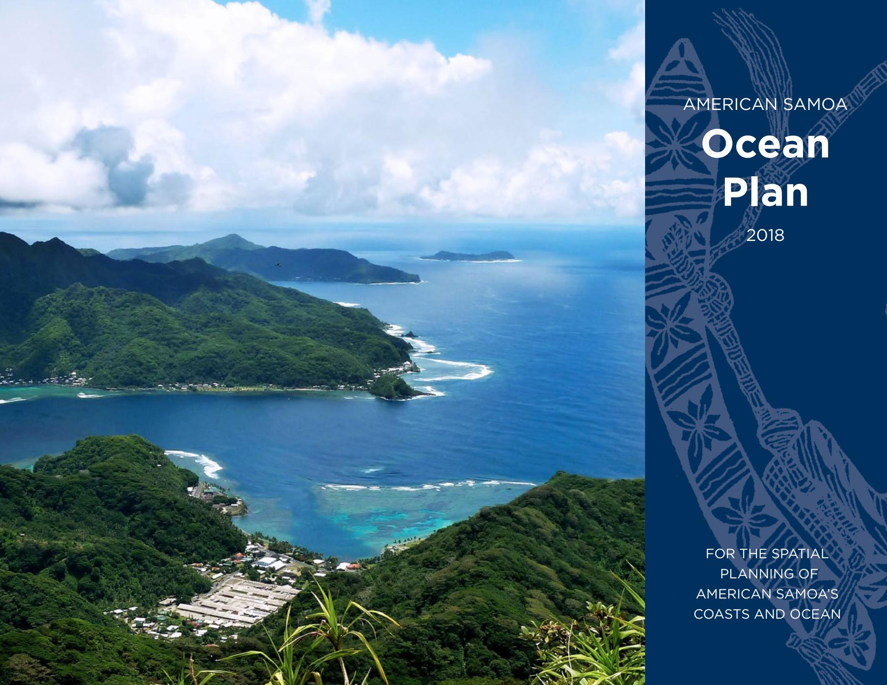

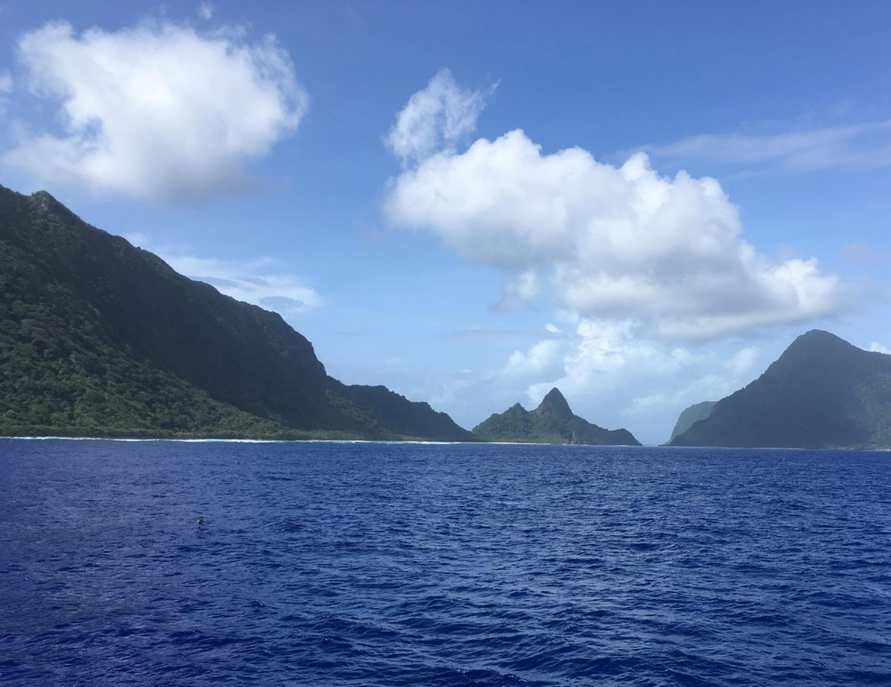

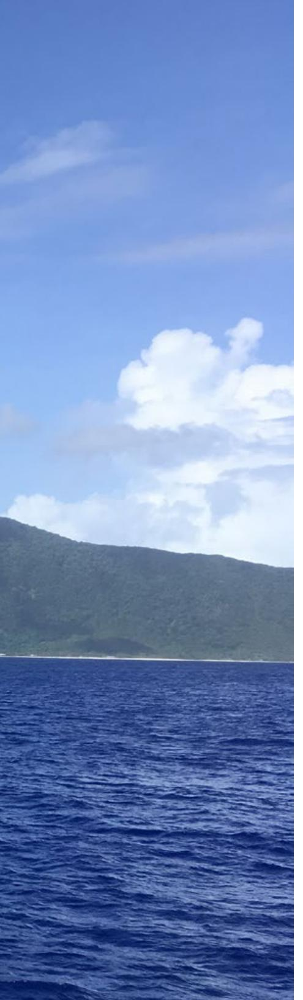

### Acknowledgments

This plan would not have been possible without the contributions and dedication from members of the American Samoa Ocean Planning Team (ASOPT) and the thoughtful input from the communities and ocean users on Tutuila, Aunu'u, Ta'u, Olesega, and Ofu.

The American Samoa Ocean Planning Team would like to thank the Gordon and Betty Moore Foundation, American Samoa Department of Marine and Wildlife Resources, American Samoa Department of Port Administration, and the National Oceanic and Atmospheric Administration for funding this project, and for the valuable feedback received from their staff. The ASOPT would also like to thank Christopher Hawkins for providing the policy history in the first chapter and the Udall Foundation for its hard work on the stakeholder assessment portion of this plan. Lastly, we are humbled and grateful for the volunteer translation services provided by Kalilimoku Hunt.

Sincere acknowledgment is extended to the ASOPT Chairs Chris King and Nate Ilaoa, former American Samoa PI RPB Members: Ruth Matagi-Tofiga, Henry Sesepasara, and Claire Poumele that championed this work across the years, and the dynamic duo Sarah Pautzke and Miranda Foley who authored and facilitated the body of this work.

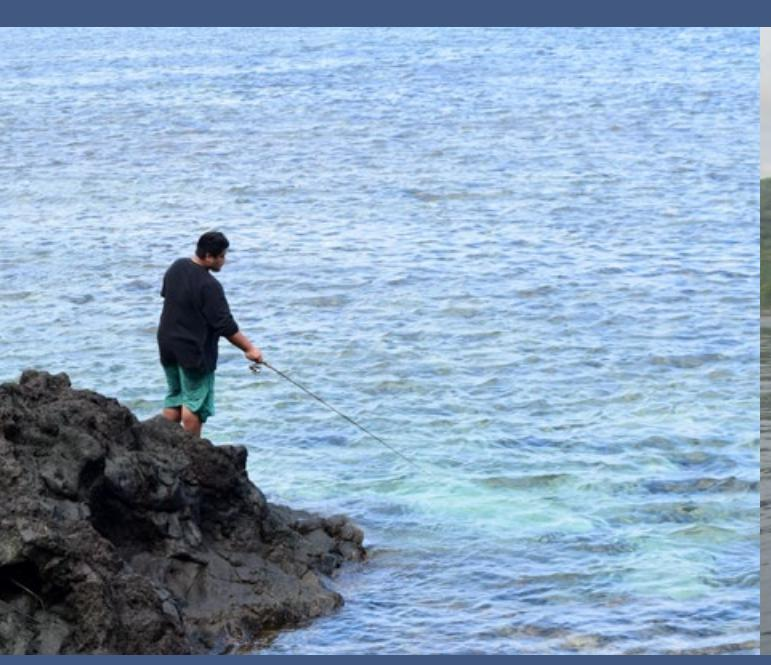

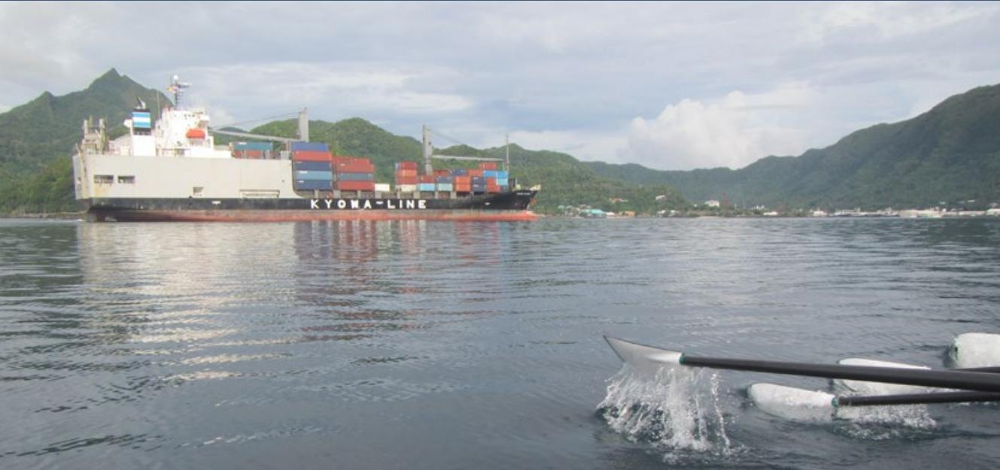

*Photo left: Many families rely on fish caught in the nearshore areas by local fishermen such as this one in Lauli'i Village. © Nate Ilaoa.* 

*Photo right: Multiple use of Pago Pago Harbor as an outrigger passes a cargo vessel. © Miranda Foley*

### A Note to Users

This document is intended to provide guidance for agencies, individuals, or other entities proposing an activity or action in the waters of American Samoa. The information in this document is intended to encourage compatible uses, reduce use conflicts, and balance sustainable ocean use with marine conservation. The content also provides information about research needs regarding environmental, economic, and social data gaps.

The content offers a comprehensive reference to existing spatial data regarding ocean use and provides deeper insights into stakeholder perspectives regarding preferred ocean uses and locations for such, as well as potential conflicts associated with proposed uses.

This document is not a stand-alone plan to manage the marine and coastal ecosystems of American Samoa. Rather, it is better understood as a consensus-based blueprint for harnessing the regulatory, enforcement, and other capacities of the various local and federal agencies charged with guiding marine development, conservation, preservation, utilization, and maritime shipping in the Territory.

As with every printed document in the digital age, this is a snapshot of a current place in time. Consult the Pacific Islands Regional Marine Mapper and local agencies for real-time data and policies.

### American Samoa Ocean Planning Team

### **AMERICAN SAMOA GOVERNMENT AGENCY MEMBERS**

### **Department of Marine and Wildlife Resources**

- Va'amua Henry Sesepasara, Director (ASOPT Lead; PI RPB Member)
- Selaina V. Tuimavave, Deputy Director (PI RPB Alternate)
- Domingo Ochavillo, Ph.D., Chief Fisheries Biologist, Marine Division
- Maria Vaofanua, Information Education Division

### **Department of Commerce**

- Sandra Aigalesala Fuimaono Lutu, Coastal Management Program
- Gina Faiga-Naseri, Coastal Management Program
- Joseph Meredith, Geospatial Program
- Michael J. McDonald, Territorial Planner, Planning Division
- Patrick Ti'a Reid, Program Coordinator, Planning Division
- Tufanua Mase, General Planner, Planning Division
- Pilivesburg Salanoa, Economic Planner, Planning Division

### **Department of Port Administration**

• Christopher King, Deputy Director (PI RPB Alternate)

### **Environmental Protection Agency**

- Mia Comeros, Research Scientist
- Fa'amao Asalele, Deputy Director

### **Office of Samoan Affairs**

• Keneti Tanuvasa, Administrative Officer

### **FEDERAL AGENCY MEMBERS**

### **NOAA Fisheries**

• Fatima Sauafea-Leau, Fish Biologist

### **NOAA Sanctuaries**

- Atuatasi Lelei Peau, Acting Superintendent, National Marine Sanctuary of American Samoa
- Joseph Paulin, Sanctuary Advisory Council Coordinator

### **NOAA Office of Coastal Management**

• Hideyo Hattori, Site Liaison, Coral Reef Conservation Program (CRCP) and Coastal Zone Management Program (CZMP)

### **US Fish and Wildlife Service**

• Brian Peck, Superintendent, Rose Atoll Marine National Monument

### **National Park Service**

- Scott Burch, Superintendent, National Park of American Samoa
- Bert Fuiava, Marine Biotech

### **US Coast Guard**

- CDR Brian Donahue (PI RPB Member)
- LT Kevin Whalen
- LT Vignette Kaltsas
- LT Tanner Stiehl

### **Department of Defense**

• Nicole Griffin (Marine Corps; PI RPB Member)

### **ADDITIONAL NON-FEDERAL MEMBERS**

### **Western Pacific Fishery Management Council**

- Nate Ilaoa, AS Island Coordinator
- Christinna Lutu-Sanchez, Council Member
- Krista Corry, Western Pacific Fishery Management Council Advisory Panel

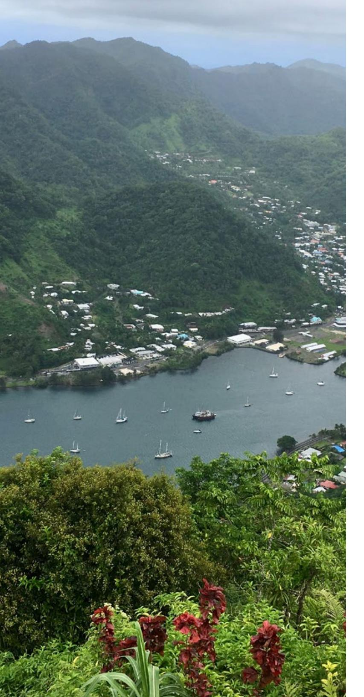

### Contents

### **[Tapenaga o le Vasa i Amerika Samoa](#page-10-0)**

| Ocean Planning in American Samoa 1                                                                                                            |    |
|--------------------------------------------------------------------------------------------------------------------------------------------------|----|
| A History of Spatial Planning 2                                                                                                               |    |
| A Brief Policy History of Important Events in US Ocean Planning                                                                                  | 4  |
| Background on Regional Ocean Planning                                                                                                            | 6  |
| Ocean Planning in the US Pacific Islands 7                                                                                                    |    |
| American Samoa Ocean Planning7                                                                                                                   |    |
| Key Partners in the Planning Process 10                                                                                                       |    |
| Stakeholders in the Planning Process12                                                                                                           |    |
| Ocean Planning Framework14                                                                                                                       |    |
| Vision14                                                                                                                                         |    |
| Geographic Focus 14                                                                                                                           |    |
| Guiding Principles17                                                                                                                             |    |
| Goals and Objectives 17                                                                                                                       |    |
| Approach to the American Samoa Ocean Plan18                                                                                                      |    |
| Moving Ahead under Existing Authorities 19                                                                                                    |    |
| Autu 1: Sami Ma Le Gataifale Matagofie Ma Le Saogalemu                                                                                           |    |
| Goal 1: Healthy Ocean and Coastal Ecosystems                                                                                                  | 21 |
| Objective 1: Spatially Identify Species' Habitats to Protect, Maintain And/Or Restore Healthy Ocean and Coastal Ecosystems and Natural Beauty | 21 |
| Objective 2: Support Coordination of Efforts to Prevent or Reduce Coastal and Marine Sources of Pollution Affecting Our Oceans 24          |    |
| Objective 3: Spatially Plan for Ocean Ecosystem Changes and Increased Risks29                                                                    |    |
| Autu 2: O Le Mautu Ma Lelei O Le Fa'aaogaina O Le Sami Ma Le Gataifale                                                                           |    |
| Goal 2: Sustainable Ocean and Coastal Uses35                                                                                                     |    |
| Current Uses of the Coastal and Ocean Waters of American Samoa35                                                                                 |    |
| Objective 1: Encourage Sustainable and Appropriate Coastal and Ocean Development and Uses43                                                   |    |
| Objective 2: Spatially Plan Coastal and Ocean Resources and Uses to Ensure Economic Resilience47                                              |    |
| Objective 3: Enhance, Promote, and Maintain Sustainable Traditional Values and Knowledge As They Relate to Coastal and Ocean Uses48           |    |

| Objective 4: Account for National Security Interests in the AS Coastal and Ocean Waters Through Enhanced Coordination, Increased Transparency, and |     |
|-------------------------------------------------------------------------------------------------------------------------------------------------------|-----|
| Sharing of Information Across Territorial and Federal Agencies and Ocean Users                                                                        | 51  |
| Objective 5: Spatially Plan for Enhanced Food Security                                                                                                | 52  |
|                                                                                                                                                       |     |
| Saienisi, Fa'amaumauga ma Metotia                                                                                                                     |     |
| Science, Data, and Tools55                                                                                                                            |     |
| American Samoa and the Pacific Islands Regional Marine Planner 55                                                                                  |     |
| Overview and Summary of PIRMP Content56                                                                                                               |     |
| Fa'atinoga o le Ta'iala                                                                                                                               |     |
| Plan Implementation61                                                                                                                                 |     |
| ASOPT Roles 61                                                                                                                                     |     |
| American Samoa Governance 62                                                                                                                       |     |
| Federal Governance63                                                                                                                                  |     |
| Plan Updates63                                                                                                                                        |     |
| References64                                                                                                                                          |     |
| Appendices65                                                                                                                                          |     |
| Appendix 1: Deeds of Cession66                                                                                                                        |     |
| Appendix 2: National Level Documents and PI RPB Documents Links69                                                                                     |     |
| Appendix 3: Foundational Documents of the PI RPB (Invite and Nomination Letters)70                                                                    |     |
| Appendix 4: Listening Session Participants                                                                                                         | 74  |
| Appendix 5: Stakeholder Engagement 76                                                                                                              |     |
| Appendix 6: Stakeholder Assessment Executive Summary - in Samoan                                                                                      | 80  |
| Appendix 7: American Samoa Agencies, Federal Agencies, and Other Partners                                                                             | 85  |
| Appendix 8: Regulatory and Management Context88                                                                                                       |     |
| Appendix 9: Ecologically-rich Area Identification Draft Mid-Atlantic Framework                                                                        | 93  |
| Appendix 10: Use Category Tables 96                                                                                                                |     |
| Appendix 11: PNRS Board and Its Respective Review Functions 100                                                                                    |     |
| Appendix 12: Ocean Plan Input from Stakeholders                                                                                                    | 101 |
|                                                                                                                                                       |     |

*the village of Pago Pago from Mt. Alava. © Sarah Pautzke*

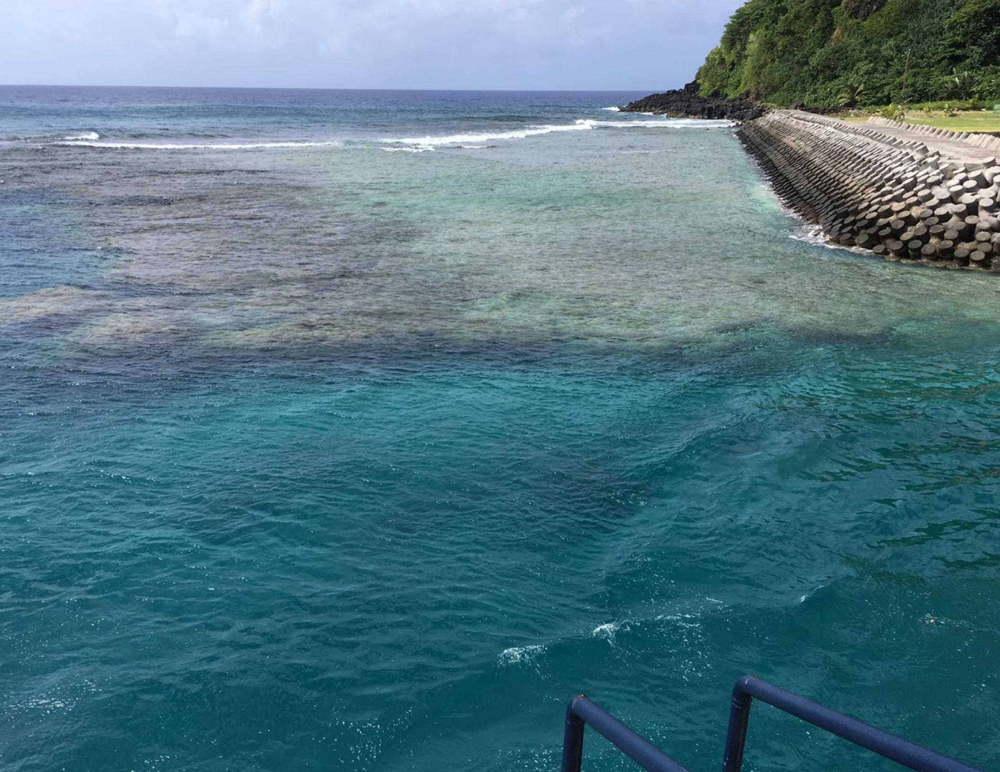

### List of Acronyms

| AS American Samoa IUCN International Union for Conservation of Nature ASDOC CMP American Samoa Coastal Management Program MDP Marine Debris Program (ASEPA) ASEPA American Samoa Environmental Protection Agency Mid-A ROAP Mid-Atlantic Regional Ocean Action Plan AS HPO American Samoa Historic Preservation Office MPA Marine Protected Area ASCC American Samoa Community College MSA Magnuson-Stevens Fishery Management and Conservation Act AS DMWR Department of Marine and Wildlife Resources (American Samoa) NFIP National Flood Insurance Program ASDOC American Samoa Department of Commerce NMFS National Marine Fisheries Service ASDOC GIS ASDOC Geographic Information System Division NMSA National Marine Sanctuaries Act ASDPS Department of Public Safety NOAA National Oceanographic and Atmospheric Administration ASG American Samoa Government NOAA NWS National Weather Service (NOAA) ASOPT American Samoa Ocean Planning Team NOAA OLE Office of Law Enforcement (NOAA) ASPA American Samoa Power Authority NOAA OCM Office of Coast Management (NOAA) BMP Best management practices NOC National Ocean Council BOEM Bureau of Ocean Energy Management (US DOI) OSA Office of Samoan Affairs CCTF Climate Change Task Force PacIOOS Pacific Islands Ocean Observing System CFMP Community-based fishery management program pGIS participatory Geographic Information System mapping CMP Coastal Management Program (American Samoa) PI RPB Pacific Islands Regional Planning Body CMSP Coastal and Marine Spatial Planning Plan American Samoa Ocean Plan CNMI Commonwealth of the Northern Mariana Islands PIFSC Pacific Islands Fisheries Science Center (NOAA NMFS) CZMA Coastal Zone Management Act PIRO Pacific Islands Regional Office (NOAA NMFS) DHS Department of Homeland Security PNRS Project Notification Review System DMWR CRAG Department of Marine and Wildlife Resources ROP Regional Ocean Partnership Coral Reef Advisory Group RPB Regional Planning Body DOI US Department of Interior SPREP Secretariat of the Pacific Regional Environment Program DPA Department of Port Administration TEK Traditional Ecological Knowledge (American Samoa) TEMCO Territorial Emergency Management Office (AS DHS) DPR Department of Parks and Recreation UNCLOS United Nations Convention on the Law of the Sea (American Samoa) US United States EEZ Exclusive Economic Zone USACE US Army Corps of Engineers EFH Essential Fish Habitat USCG US Coast Guard ESA Endangered Species Act USCOP US Commission on Ocean Policy FMCs Fishery management councils USFWS US Fish and Wildlife Service GIS Geographic Information System WPFMC Western Pacific Fishery Management Council | ArcGIS | Arc geographic information system | HMP | Hazard Mitigation Plan |
|------------------------------------------------------------------------------------------------------------------------------------------------------------------------------------------------------------------------------------------------------------------------------------------------------------------------------------------------------------------------------------------------------------------------------------------------------------------------------------------------------------------------------------------------------------------------------------------------------------------------------------------------------------------------------------------------------------------------------------------------------------------------------------------------------------------------------------------------------------------------------------------------------------------------------------------------------------------------------------------------------------------------------------------------------------------------------------------------------------------------------------------------------------------------------------------------------------------------------------------------------------------------------------------------------------------------------------------------------------------------------------------------------------------------------------------------------------------------------------------------------------------------------------------------------------------------------------------------------------------------------------------------------------------------------------------------------------------------------------------------------------------------------------------------------------------------------------------------------------------------------------------------------------------------------------------------------------------------------------------------------------------------------------------------------------------------------------------------------------------------------------------------------------------------------------------------------------------------------------------------------------------------------------------------------------------------------------------------------------------------------------------------------------------------------------------------------------------------------------------------------------------------------------------------------------------------------------------------------------------------------------------------------------------------------------------------------------------------------------------------------------------------------------------------------------------------------------------------------------------------------------------------------------------------------------------------------------------------------------------------------------------------------------------------------------------------------------------------------------------------------------|--------|-----------------------------------|-----|------------------------|
|                                                                                                                                                                                                                                                                                                                                                                                                                                                                                                                                                                                                                                                                                                                                                                                                                                                                                                                                                                                                                                                                                                                                                                                                                                                                                                                                                                                                                                                                                                                                                                                                                                                                                                                                                                                                                                                                                                                                                                                                                                                                                                                                                                                                                                                                                                                                                                                                                                                                                                                                                                                                                                                                                                                                                                                                                                                                                                                                                                                                                                                                                                                                    |        |                                   |     |                        |
|                                                                                                                                                                                                                                                                                                                                                                                                                                                                                                                                                                                                                                                                                                                                                                                                                                                                                                                                                                                                                                                                                                                                                                                                                                                                                                                                                                                                                                                                                                                                                                                                                                                                                                                                                                                                                                                                                                                                                                                                                                                                                                                                                                                                                                                                                                                                                                                                                                                                                                                                                                                                                                                                                                                                                                                                                                                                                                                                                                                                                                                                                                                                    |        |                                   |     |                        |
|                                                                                                                                                                                                                                                                                                                                                                                                                                                                                                                                                                                                                                                                                                                                                                                                                                                                                                                                                                                                                                                                                                                                                                                                                                                                                                                                                                                                                                                                                                                                                                                                                                                                                                                                                                                                                                                                                                                                                                                                                                                                                                                                                                                                                                                                                                                                                                                                                                                                                                                                                                                                                                                                                                                                                                                                                                                                                                                                                                                                                                                                                                                                    |        |                                   |     |                        |
|                                                                                                                                                                                                                                                                                                                                                                                                                                                                                                                                                                                                                                                                                                                                                                                                                                                                                                                                                                                                                                                                                                                                                                                                                                                                                                                                                                                                                                                                                                                                                                                                                                                                                                                                                                                                                                                                                                                                                                                                                                                                                                                                                                                                                                                                                                                                                                                                                                                                                                                                                                                                                                                                                                                                                                                                                                                                                                                                                                                                                                                                                                                                    |        |                                   |     |                        |
|                                                                                                                                                                                                                                                                                                                                                                                                                                                                                                                                                                                                                                                                                                                                                                                                                                                                                                                                                                                                                                                                                                                                                                                                                                                                                                                                                                                                                                                                                                                                                                                                                                                                                                                                                                                                                                                                                                                                                                                                                                                                                                                                                                                                                                                                                                                                                                                                                                                                                                                                                                                                                                                                                                                                                                                                                                                                                                                                                                                                                                                                                                                                    |        |                                   |     |                        |
|                                                                                                                                                                                                                                                                                                                                                                                                                                                                                                                                                                                                                                                                                                                                                                                                                                                                                                                                                                                                                                                                                                                                                                                                                                                                                                                                                                                                                                                                                                                                                                                                                                                                                                                                                                                                                                                                                                                                                                                                                                                                                                                                                                                                                                                                                                                                                                                                                                                                                                                                                                                                                                                                                                                                                                                                                                                                                                                                                                                                                                                                                                                                    |        |                                   |     |                        |
|                                                                                                                                                                                                                                                                                                                                                                                                                                                                                                                                                                                                                                                                                                                                                                                                                                                                                                                                                                                                                                                                                                                                                                                                                                                                                                                                                                                                                                                                                                                                                                                                                                                                                                                                                                                                                                                                                                                                                                                                                                                                                                                                                                                                                                                                                                                                                                                                                                                                                                                                                                                                                                                                                                                                                                                                                                                                                                                                                                                                                                                                                                                                    |        |                                   |     |                        |
|                                                                                                                                                                                                                                                                                                                                                                                                                                                                                                                                                                                                                                                                                                                                                                                                                                                                                                                                                                                                                                                                                                                                                                                                                                                                                                                                                                                                                                                                                                                                                                                                                                                                                                                                                                                                                                                                                                                                                                                                                                                                                                                                                                                                                                                                                                                                                                                                                                                                                                                                                                                                                                                                                                                                                                                                                                                                                                                                                                                                                                                                                                                                    |        |                                   |     |                        |
|                                                                                                                                                                                                                                                                                                                                                                                                                                                                                                                                                                                                                                                                                                                                                                                                                                                                                                                                                                                                                                                                                                                                                                                                                                                                                                                                                                                                                                                                                                                                                                                                                                                                                                                                                                                                                                                                                                                                                                                                                                                                                                                                                                                                                                                                                                                                                                                                                                                                                                                                                                                                                                                                                                                                                                                                                                                                                                                                                                                                                                                                                                                                    |        |                                   |     |                        |
|                                                                                                                                                                                                                                                                                                                                                                                                                                                                                                                                                                                                                                                                                                                                                                                                                                                                                                                                                                                                                                                                                                                                                                                                                                                                                                                                                                                                                                                                                                                                                                                                                                                                                                                                                                                                                                                                                                                                                                                                                                                                                                                                                                                                                                                                                                                                                                                                                                                                                                                                                                                                                                                                                                                                                                                                                                                                                                                                                                                                                                                                                                                                    |        |                                   |     |                        |
|                                                                                                                                                                                                                                                                                                                                                                                                                                                                                                                                                                                                                                                                                                                                                                                                                                                                                                                                                                                                                                                                                                                                                                                                                                                                                                                                                                                                                                                                                                                                                                                                                                                                                                                                                                                                                                                                                                                                                                                                                                                                                                                                                                                                                                                                                                                                                                                                                                                                                                                                                                                                                                                                                                                                                                                                                                                                                                                                                                                                                                                                                                                                    |        |                                   |     |                        |
|                                                                                                                                                                                                                                                                                                                                                                                                                                                                                                                                                                                                                                                                                                                                                                                                                                                                                                                                                                                                                                                                                                                                                                                                                                                                                                                                                                                                                                                                                                                                                                                                                                                                                                                                                                                                                                                                                                                                                                                                                                                                                                                                                                                                                                                                                                                                                                                                                                                                                                                                                                                                                                                                                                                                                                                                                                                                                                                                                                                                                                                                                                                                    |        |                                   |     |                        |
|                                                                                                                                                                                                                                                                                                                                                                                                                                                                                                                                                                                                                                                                                                                                                                                                                                                                                                                                                                                                                                                                                                                                                                                                                                                                                                                                                                                                                                                                                                                                                                                                                                                                                                                                                                                                                                                                                                                                                                                                                                                                                                                                                                                                                                                                                                                                                                                                                                                                                                                                                                                                                                                                                                                                                                                                                                                                                                                                                                                                                                                                                                                                    |        |                                   |     |                        |
|                                                                                                                                                                                                                                                                                                                                                                                                                                                                                                                                                                                                                                                                                                                                                                                                                                                                                                                                                                                                                                                                                                                                                                                                                                                                                                                                                                                                                                                                                                                                                                                                                                                                                                                                                                                                                                                                                                                                                                                                                                                                                                                                                                                                                                                                                                                                                                                                                                                                                                                                                                                                                                                                                                                                                                                                                                                                                                                                                                                                                                                                                                                                    |        |                                   |     |                        |
|                                                                                                                                                                                                                                                                                                                                                                                                                                                                                                                                                                                                                                                                                                                                                                                                                                                                                                                                                                                                                                                                                                                                                                                                                                                                                                                                                                                                                                                                                                                                                                                                                                                                                                                                                                                                                                                                                                                                                                                                                                                                                                                                                                                                                                                                                                                                                                                                                                                                                                                                                                                                                                                                                                                                                                                                                                                                                                                                                                                                                                                                                                                                    |        |                                   |     |                        |
|                                                                                                                                                                                                                                                                                                                                                                                                                                                                                                                                                                                                                                                                                                                                                                                                                                                                                                                                                                                                                                                                                                                                                                                                                                                                                                                                                                                                                                                                                                                                                                                                                                                                                                                                                                                                                                                                                                                                                                                                                                                                                                                                                                                                                                                                                                                                                                                                                                                                                                                                                                                                                                                                                                                                                                                                                                                                                                                                                                                                                                                                                                                                    |        |                                   |     |                        |
|                                                                                                                                                                                                                                                                                                                                                                                                                                                                                                                                                                                                                                                                                                                                                                                                                                                                                                                                                                                                                                                                                                                                                                                                                                                                                                                                                                                                                                                                                                                                                                                                                                                                                                                                                                                                                                                                                                                                                                                                                                                                                                                                                                                                                                                                                                                                                                                                                                                                                                                                                                                                                                                                                                                                                                                                                                                                                                                                                                                                                                                                                                                                    |        |                                   |     |                        |
|                                                                                                                                                                                                                                                                                                                                                                                                                                                                                                                                                                                                                                                                                                                                                                                                                                                                                                                                                                                                                                                                                                                                                                                                                                                                                                                                                                                                                                                                                                                                                                                                                                                                                                                                                                                                                                                                                                                                                                                                                                                                                                                                                                                                                                                                                                                                                                                                                                                                                                                                                                                                                                                                                                                                                                                                                                                                                                                                                                                                                                                                                                                                    |        |                                   |     |                        |
|                                                                                                                                                                                                                                                                                                                                                                                                                                                                                                                                                                                                                                                                                                                                                                                                                                                                                                                                                                                                                                                                                                                                                                                                                                                                                                                                                                                                                                                                                                                                                                                                                                                                                                                                                                                                                                                                                                                                                                                                                                                                                                                                                                                                                                                                                                                                                                                                                                                                                                                                                                                                                                                                                                                                                                                                                                                                                                                                                                                                                                                                                                                                    |        |                                   |     |                        |
|                                                                                                                                                                                                                                                                                                                                                                                                                                                                                                                                                                                                                                                                                                                                                                                                                                                                                                                                                                                                                                                                                                                                                                                                                                                                                                                                                                                                                                                                                                                                                                                                                                                                                                                                                                                                                                                                                                                                                                                                                                                                                                                                                                                                                                                                                                                                                                                                                                                                                                                                                                                                                                                                                                                                                                                                                                                                                                                                                                                                                                                                                                                                    |        |                                   |     |                        |
|                                                                                                                                                                                                                                                                                                                                                                                                                                                                                                                                                                                                                                                                                                                                                                                                                                                                                                                                                                                                                                                                                                                                                                                                                                                                                                                                                                                                                                                                                                                                                                                                                                                                                                                                                                                                                                                                                                                                                                                                                                                                                                                                                                                                                                                                                                                                                                                                                                                                                                                                                                                                                                                                                                                                                                                                                                                                                                                                                                                                                                                                                                                                    |        |                                   |     |                        |
|                                                                                                                                                                                                                                                                                                                                                                                                                                                                                                                                                                                                                                                                                                                                                                                                                                                                                                                                                                                                                                                                                                                                                                                                                                                                                                                                                                                                                                                                                                                                                                                                                                                                                                                                                                                                                                                                                                                                                                                                                                                                                                                                                                                                                                                                                                                                                                                                                                                                                                                                                                                                                                                                                                                                                                                                                                                                                                                                                                                                                                                                                                                                    |        |                                   |     |                        |
|                                                                                                                                                                                                                                                                                                                                                                                                                                                                                                                                                                                                                                                                                                                                                                                                                                                                                                                                                                                                                                                                                                                                                                                                                                                                                                                                                                                                                                                                                                                                                                                                                                                                                                                                                                                                                                                                                                                                                                                                                                                                                                                                                                                                                                                                                                                                                                                                                                                                                                                                                                                                                                                                                                                                                                                                                                                                                                                                                                                                                                                                                                                                    |        |                                   |     |                        |
|                                                                                                                                                                                                                                                                                                                                                                                                                                                                                                                                                                                                                                                                                                                                                                                                                                                                                                                                                                                                                                                                                                                                                                                                                                                                                                                                                                                                                                                                                                                                                                                                                                                                                                                                                                                                                                                                                                                                                                                                                                                                                                                                                                                                                                                                                                                                                                                                                                                                                                                                                                                                                                                                                                                                                                                                                                                                                                                                                                                                                                                                                                                                    |        |                                   |     |                        |
|                                                                                                                                                                                                                                                                                                                                                                                                                                                                                                                                                                                                                                                                                                                                                                                                                                                                                                                                                                                                                                                                                                                                                                                                                                                                                                                                                                                                                                                                                                                                                                                                                                                                                                                                                                                                                                                                                                                                                                                                                                                                                                                                                                                                                                                                                                                                                                                                                                                                                                                                                                                                                                                                                                                                                                                                                                                                                                                                                                                                                                                                                                                                    |        |                                   |     |                        |
|                                                                                                                                                                                                                                                                                                                                                                                                                                                                                                                                                                                                                                                                                                                                                                                                                                                                                                                                                                                                                                                                                                                                                                                                                                                                                                                                                                                                                                                                                                                                                                                                                                                                                                                                                                                                                                                                                                                                                                                                                                                                                                                                                                                                                                                                                                                                                                                                                                                                                                                                                                                                                                                                                                                                                                                                                                                                                                                                                                                                                                                                                                                                    |        |                                   |     |                        |
|                                                                                                                                                                                                                                                                                                                                                                                                                                                                                                                                                                                                                                                                                                                                                                                                                                                                                                                                                                                                                                                                                                                                                                                                                                                                                                                                                                                                                                                                                                                                                                                                                                                                                                                                                                                                                                                                                                                                                                                                                                                                                                                                                                                                                                                                                                                                                                                                                                                                                                                                                                                                                                                                                                                                                                                                                                                                                                                                                                                                                                                                                                                                    |        |                                   |     |                        |
|                                                                                                                                                                                                                                                                                                                                                                                                                                                                                                                                                                                                                                                                                                                                                                                                                                                                                                                                                                                                                                                                                                                                                                                                                                                                                                                                                                                                                                                                                                                                                                                                                                                                                                                                                                                                                                                                                                                                                                                                                                                                                                                                                                                                                                                                                                                                                                                                                                                                                                                                                                                                                                                                                                                                                                                                                                                                                                                                                                                                                                                                                                                                    |        |                                   |     |                        |
|                                                                                                                                                                                                                                                                                                                                                                                                                                                                                                                                                                                                                                                                                                                                                                                                                                                                                                                                                                                                                                                                                                                                                                                                                                                                                                                                                                                                                                                                                                                                                                                                                                                                                                                                                                                                                                                                                                                                                                                                                                                                                                                                                                                                                                                                                                                                                                                                                                                                                                                                                                                                                                                                                                                                                                                                                                                                                                                                                                                                                                                                                                                                    |        |                                   |     |                        |
|                                                                                                                                                                                                                                                                                                                                                                                                                                                                                                                                                                                                                                                                                                                                                                                                                                                                                                                                                                                                                                                                                                                                                                                                                                                                                                                                                                                                                                                                                                                                                                                                                                                                                                                                                                                                                                                                                                                                                                                                                                                                                                                                                                                                                                                                                                                                                                                                                                                                                                                                                                                                                                                                                                                                                                                                                                                                                                                                                                                                                                                                                                                                    |        |                                   |     |                        |
|                                                                                                                                                                                                                                                                                                                                                                                                                                                                                                                                                                                                                                                                                                                                                                                                                                                                                                                                                                                                                                                                                                                                                                                                                                                                                                                                                                                                                                                                                                                                                                                                                                                                                                                                                                                                                                                                                                                                                                                                                                                                                                                                                                                                                                                                                                                                                                                                                                                                                                                                                                                                                                                                                                                                                                                                                                                                                                                                                                                                                                                                                                                                    |        |                                   |     |                        |
|                                                                                                                                                                                                                                                                                                                                                                                                                                                                                                                                                                                                                                                                                                                                                                                                                                                                                                                                                                                                                                                                                                                                                                                                                                                                                                                                                                                                                                                                                                                                                                                                                                                                                                                                                                                                                                                                                                                                                                                                                                                                                                                                                                                                                                                                                                                                                                                                                                                                                                                                                                                                                                                                                                                                                                                                                                                                                                                                                                                                                                                                                                                                    |        |                                   |     |                        |
|                                                                                                                                                                                                                                                                                                                                                                                                                                                                                                                                                                                                                                                                                                                                                                                                                                                                                                                                                                                                                                                                                                                                                                                                                                                                                                                                                                                                                                                                                                                                                                                                                                                                                                                                                                                                                                                                                                                                                                                                                                                                                                                                                                                                                                                                                                                                                                                                                                                                                                                                                                                                                                                                                                                                                                                                                                                                                                                                                                                                                                                                                                                                    |        |                                   |     |                        |
|                                                                                                                                                                                                                                                                                                                                                                                                                                                                                                                                                                                                                                                                                                                                                                                                                                                                                                                                                                                                                                                                                                                                                                                                                                                                                                                                                                                                                                                                                                                                                                                                                                                                                                                                                                                                                                                                                                                                                                                                                                                                                                                                                                                                                                                                                                                                                                                                                                                                                                                                                                                                                                                                                                                                                                                                                                                                                                                                                                                                                                                                                                                                    |        |                                   |     |                        |

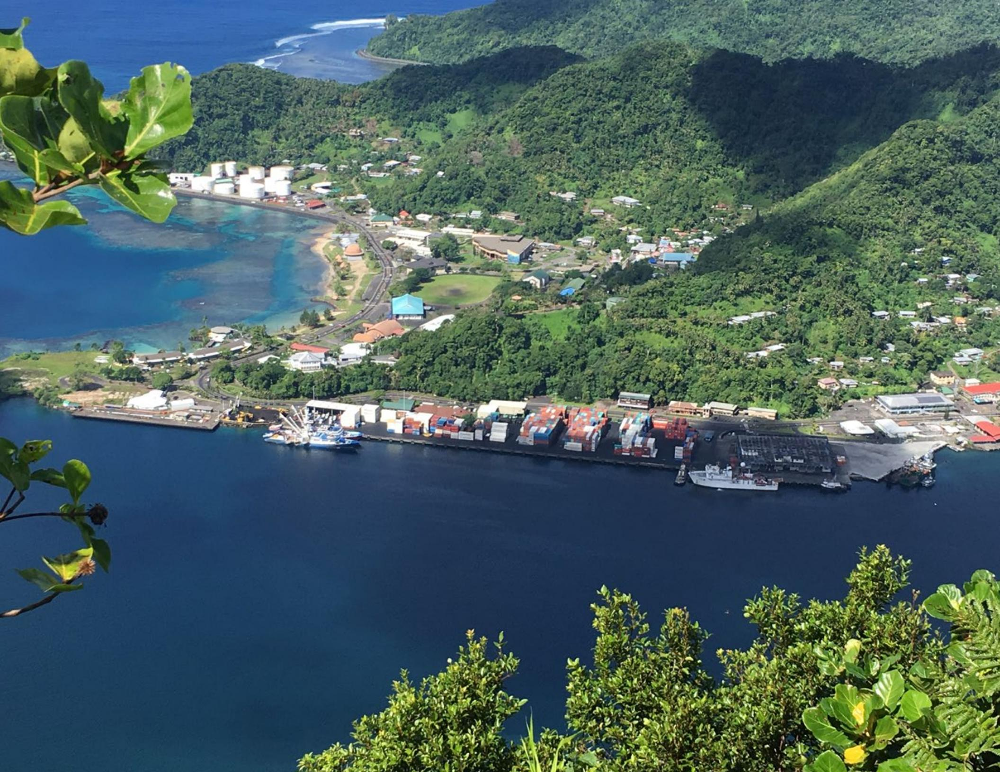

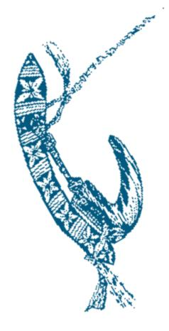

### **Tapenaga o le Vasa i Amerika Samoa**

# Ocean Planning in American Samoa

This American Samoa Ocean Plan is the first ocean plan to be completed by the United States for jurisdictions in the Western Pacific Region. The United States has already completed ocean plans for the mainland Atlantic coast in the [Mid-Atlantic](https://www.boem.gov/Mid-Atlantic-Regional-Ocean-Action-Plan/) and [Northeast](https://neoceanplanning.org/plan/) regions. A vibrant and healthy coastal and ocean environment is essential to the perpetuation of the Samoan culture and way of life (*Fa'a Samoa*). Yet, intensified coastal and ocean recreational and commercial uses are creating resource use conflicts, and land use is degrading coastal water quality and coral reef ecosystems. American Samoa is facing significant challenges in preserving the health of its ocean resources and the benefits those resources provide. In addition, regional and global conditions beyond direct control within American Samoa create new challenges, such as sea level rise, increased frequency and severity of storms, and marine debris. Coastal and marine spatial planning, or ocean planning, can ensure compatible ocean use and conserve ocean resources to ensure the vibrant coastal and ocean environments.

Limited usable land restricts much of the development in American Samoa to the coasts with very little ability to move upland or inland. Population growth and increased economic activity had already led to increased and conflicting demands on limited Pago Pago Harbor land at the end of the 1990s (Lyon Associates 2001). Developed areas, such as the seaport (Figure 1) on Tutuila, have little room to expand. Conversely, this same limitation is a strong driver for American Samoa to be innovative and adamant about wise resource planning.

American Samoa has not yet reached a point of overexploitation of its ocean resources. It remains relatively isolated and continues to have a strong adherence to *Fa'a Samoa*. The ocean planning process provides a tool to guide the growing and evolving uses of the coastal and marine waters,

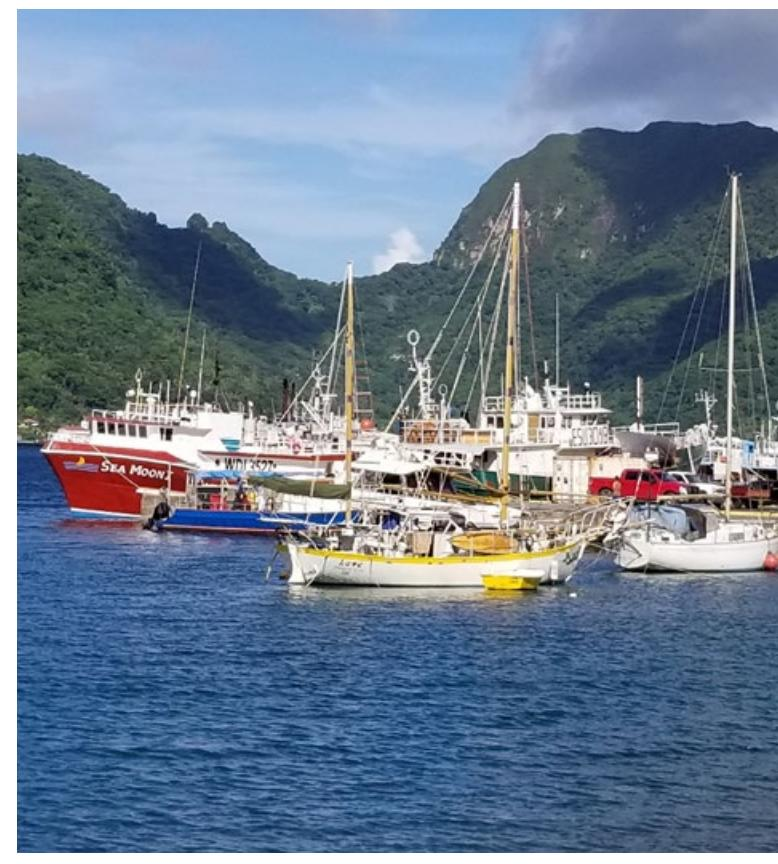

*Figure 1. Fishing vessels and sail boats moored next to the Pago Pago Seaport Dock. © Christopher Hawkins*

Ocean planning encourages compatible uses, reduces use conflicts, and balances sustainable use with marine conservation.

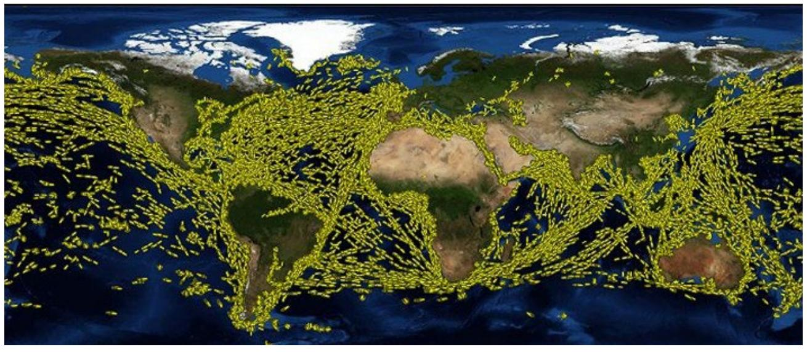

*Figure 2. World's sea traffic as seen from the International Space Station.* [www.nasa.gov](http://www.nasa.gov)

including tourism, recreation, infrastructure, and commerce, so that American Samoa can ensure uses are compatible, non-conflicting, and do not degrade ocean sustainability or *Fa'a Samoa*.

American Samoa began its ocean planning process in January 2016 after the American Samoa Government (ASG) recognized the opportunity ocean planning provides in the territory. The team members of the American Samoa Ocean Planning Team (ASOPT) include the ASG agencies and federal agencies that manage ocean resources within the American Samoa Exclusive Economic Zone (EEZ). This Plan is a compilation of their efforts.

American Samoa was granted special rights to maintain its traditions, culture, and unique control of its lands and waters under the Deeds of Cession signed in 1900 (Tutuila and Aunu'u) and in 1904 (Manu`a Islands) by the island's traditional leaders, chiefs and the US government ([Appendix 1](#page-75-0)). As such, the United States respects and preserves American Samoa's customary uses and cultural practices.

The American Samoa Ocean Planning efforts are built on the foundation set by the Deeds of Cession and incorporate a process to promote thoughtful and wise use of limited space and ocean resources to encourage compatible uses, reduce use conflicts, and balance sustainable ocean use with marine conservation and protection of Fa'a Samoa.

### **A History of Spatial Planning**

For millennia, maps have been used to tell the story of where things are. The earliest known map was created 14,000 years ago (Utrilla 2009). A stone tablet, found in a cave in the Navarra region of northern Spain, described the surrounding landscape and man-made features such as the

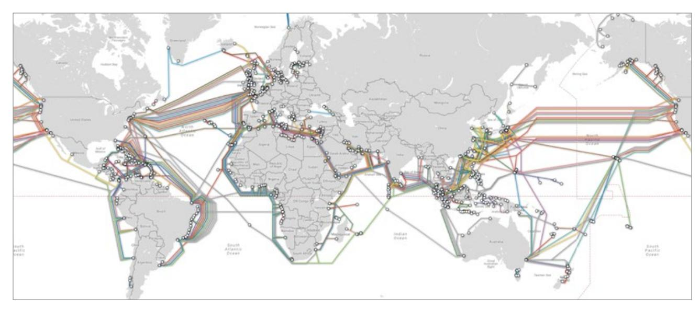

*Figure 3. Undersea cables of the world.* [www.arstechnica.com](http://www.arstechnica.com)

cave and a nearby bridge. The map also illustrated places where natural resources like water, foraging, and game were abundant. In the eons since, maps have become more sophisticated and even digitized so that information contained with maps can be overlapped and compared. That map of the Navarra region can now be analyzed with maps containing different information for the same geographic area, including fossil records, weather patterns, etc. Modern maps describe human uses, natural resources, and areas where those elements may conflict or provide opportunity.

In the modern era, humans have migrated well beyond the cave. Knowledge of the world's natural resources and the footprint of man-made structures extends from deep-sea trenches to beyond the outer limits of Earth's atmosphere. Human use extends to every corner of the globe. While land use plans have been a crucial component of wise land use, planners and managers have not brought these

same tools to bear in ocean planning until recently. Ocean planning is a process that largely mirrors the spatial planning efforts that have enabled intensive but wise use of land-based resources.

The ocean planning process often begins with maps that show locations of current ocean uses, such as fishing and shipping (Figure 2; Figure 3). With stakeholder and agency collaboration, ocean planning teams generate maps that tie to existing management tools that governments and communities already use to make decisions about ocean uses and resources.

Governments and communities around the world have begun to enact ocean plans to promote thoughtful and wise use of limited space and ocean resources (Figure 4). Throughout the Pacific, New Zealand, Vanuatu, Solomon Islands, Fiji, and Tonga are already using marine spatial planning to encourage compatible uses, reduce use conflicts,

and balance sustainable ocean use with marine conservation. Ocean planning in the US is described in detail below.

### **A Brief Policy History of Important Events in US Ocean Planning**

Modern ocean management concepts are rooted in *Mare Liberum*, or *The Freedom of the Seas*, a Latin treatise written by Dutch jurist and philosopher Hugo Grotius in 1609. Grotius was the first to comprehensively articulate the principle that the sea is international territory, and all nations are free to use it unimpeded for seafaring commerce and transportation.

More recently, US President Harry Truman proclaimed in the Truman Proclamation of 1945 that resources found on the continental shelf contiguous to the United States belonged to the United States. This was a radical departure from established principle that 1) a narrow strip of coastal waters was under the exclusive sovereignty of the coastal state, and 2) the unregulated area beyond that (known as the high seas) was open to all.

During the late 1950s, the Convention on the High Seas resulted in an international treaty that codified the rules of international law relating to the open ocean. It was signed on April 29, 1958 and was one of four treaties created at the United Nations Convention on the Law of the Sea (UNCLOS I). The Treaty entered into international force at the end of

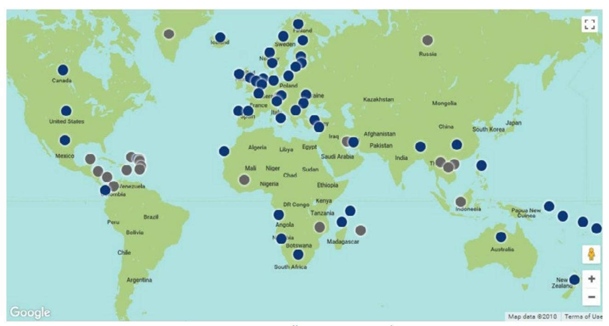

*Figure 4. Map of countries using marine spatial planning. (*<http://msp.ioc-unesco.org/>*)* 

September 1962. While the United States has not ratified this treaty, it recognizes it as a codification of customary international law.

The early 1970s saw the passage of the Coastal Zone Management Act (CZMA) and National Marine Sanctuaries Act (NMSA). The CZMA promoted an integrated approach to managing coastal resources. An important feature of the CZMA is the federal consistency process. Once a state coastal management plan is approved by the US Secretary of Commerce, relevant federal actions (in most cases) must be consistent with tenets of the state's plan. The NMSA established a process for creating defined areas of management, making it the more spatially-focused of the two acts.

After years of allowing foreign fishing fleets to harvest living marine resources quite close to US shorelines, Congress passed the Fishery Conservation and Management Act in 1976. Now known commonly as the Magnuson-Stevens Act (MSA), this law established a 200-mile fishery conservation zone, effective March 1, 1977, as well as regional fishery management councils (FMCs) comprised of federal and state officials. The current iteration of the MSA provides for management of fish and other species throughout their ranges in the EEZ (via National Standard 3 and its implementing regulations) under plans developed by the FMCs, and reviewed and approved by the Secretary of Commerce.

In 1983, US President Ronald Reagan issued his *Statement on US Ocean Policy*. Though the United States was not (and still is not) a signatory to UNCLOS, Reagan affirmed that the United States:

• Is prepared to accept and act in accordance with the balance of interests relating to traditional uses of the oceans, such as navigation and overflight;

- Will exercise and assert its navigation and overflight rights and freedoms on a worldwide basis in a manner that is consistent with the balance of interests reflected in the [UNCLOS] convention. The United States will not, however, acquiesce in unilateral acts of other states designed to restrict the rights and freedoms of the international community in navigation and overflight and other related high seas uses; and
- Proclaims an Exclusive Economic Zone, in which the United States will exercise sovereign rights in living and nonliving resources within 200 nautical miles of its coast.

The Congress recognized the promise of and threats to the oceans when it passed the Oceans Act of 2000, which established the US Commission on Ocean Policy (USCOP) under President George W. Bush to develop recommendations for a coordinated and comprehensive national ocean policy. The USCOP developed *[An Ocean](http://An Ocean Blueprint for the 21st Century)  [Blueprint for the 21st Century](http://An Ocean Blueprint for the 21st Century)* that contains 212 recommendations addressing all aspects of ocean and coastal policy. In response to the Commission's recommendations, President Bush issued an executive order that established the Committee on Ocean Policy as part of the White House Council on Environmental Quality (CEQ) and released the US Ocean Action Plan. The USCOP provided a [preliminary assessment](http://govinfo.library.unt.edu/oceancommission/newsnotices/dec17_04.html) of the Ocean Action Plan, calling it "a promising first step toward the implementation of a comprehensive national ocean policy."

In 2006, President George W. Bush used the Antiquities Act (1906) to designate the Papahānaumokuākea Marine National Monument (MNM) in Hawai`i, which is the first time the Antiquities Act was used to manage large areas of ocean waters. This action set the precedent for using the Antiquities Act as an ocean policy tool. There are now four MNMs in the Pacific Islands

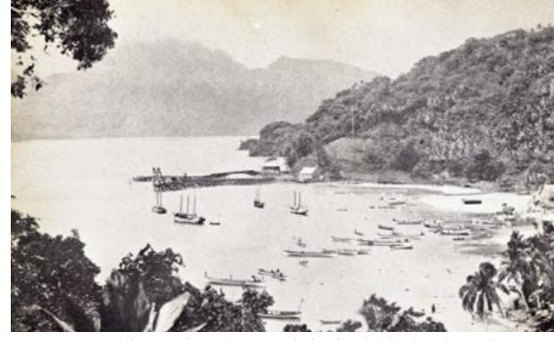

*Fagatogo with naval station coal dock, 1900. © AS HPO*

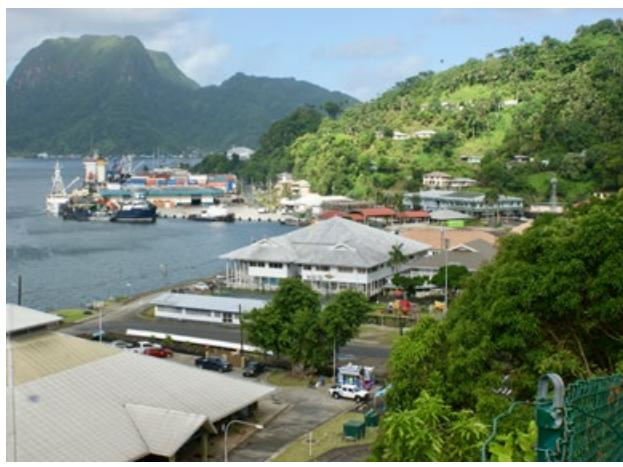

*Fagatogo, 2018. © AS HPO*

(Papahānaumokuākea, Pacific Remote Islands, Mariana Trench, and Rose Atoll, the last of which is in American Samoa), all established by Presidential Proclamations between 2006 and 2009 and jointly managed by the US Department of Interior Fish and Wildlife Service (DOI FWS) and the National Oceanographic and Atmospheric Administration (NOAA). The boundary of Rose Atoll MNM is 50 nm from the mean low water line.

In July 2010, President Barack Obama signed Executive Order (EO) 13547 that established a *[National Policy for the Stewardship of the Ocean,](https://obamawhitehouse.archives.gov/the-press-office/executive-order-stewardship-ocean-our-coasts-and-great-lakes)  [Coasts, and Great Lakes and the National Ocean](https://obamawhitehouse.archives.gov/the-press-office/executive-order-stewardship-ocean-our-coasts-and-great-lakes)  [Council](https://obamawhitehouse.archives.gov/the-press-office/executive-order-stewardship-ocean-our-coasts-and-great-lakes)* (NOC). A preface to this policy came from the *[Recommendations of the Interagency Ocean](https://obamawhitehouse.archives.gov/files/documents/OPTF_FinalRecs.pdf)  [Policy Task Force](https://obamawhitehouse.archives.gov/files/documents/OPTF_FinalRecs.pdf)* (Recommendations; July 19, 2010), which addressed a lack of ocean planning coordination both within the federal government and among federal, state, and local bodies, and called the lack of coordination inefficient, ineffective, and likely to result in conflict and delay. The Recommendations addressed these issues by establishing a regionally-based planning process with the creation of regional planning bodies (RPBs) that bring together relevant agencies and organizations, and ensuring stakeholders, including the public, have a voice in decisions that impact oceans. More detail about regional ocean planning is provided in the next section.

On June 19, 2018, President Trump signed *[Executive Order 13840 Regarding the Ocean](https://www.whitehouse.gov/presidential-actions/executive-order-regarding-ocean-policy-advance-economic-security-environmental-interests-united-states/)  [Policy to Advance the Economic, Security, and](https://www.whitehouse.gov/presidential-actions/executive-order-regarding-ocean-policy-advance-economic-security-environmental-interests-united-states/)  [Environmental Interests of the United States](https://www.whitehouse.gov/presidential-actions/executive-order-regarding-ocean-policy-advance-economic-security-environmental-interests-united-states/)* that revoked EO 13547. This action eliminated the federally-led ocean planning mandate and the RPBs; it established a policy focused on public access to marine data and information and requires federal agencies to coordinate activities regarding oceanrelated matters and facilitate the coordination and collaboration of ocean-related matters with other governments and ocean stakeholders.

### **Background on Regional Ocean Planning**

The Interagency Ocean Task Force was established on June 12, 2009, and was comprised of 24 seniorlevel officials from executive departments, agencies, and offices across the Federal government and led by the Chair of the CEQ. The mission of the Task Force was to examine ways to maintain or enhance healthy, resilient, and sustainable ocean, coasts, and Great Lakes resources for the benefit of present and future generations. Executive Order 13547 (2010), described in the preceding section, adopted the [Recommendations](https://obamawhitehouse.archives.gov/files/documents/OPTF_FinalRecs.pdf) put forth by the Interagency Ocean Policy Task Force in 2010 and established the National Ocean Council (NOC). In 2012, the NOC released the [National Ocean Policy](https://obamawhitehouse.archives.gov/sites/default/files/national_ocean_policy_implementation_plan.pdf)  [Implementation Plan](https://obamawhitehouse.archives.gov/sites/default/files/national_ocean_policy_implementation_plan.pdf), which, among other things, described specific actions Federal agencies will take to address key ocean challenges and gave states and communities greater input in Federal decisions (links to additional references are in [Appendix 2](#page-78-0)).

The Recommendations of the Task Force called for the development of regional coastal and marine spatial plans, or ocean plans. To bolster support of ocean planning, the federal government infused resources and administrative support for existing regional ocean partnerships (ROP) and supported the creation of new ROPs. Several ROPs such as the Mid Atlantic Regional Council on the Ocean (MARCO), the Hawai`i Sub-Regional Ocean Partnership, and the Northeast Regional Ocean Council (NROC) are efforting most aspects of the Recommendations. The federal government was also mandated to create nine regional planning bodies (RPBs) throughout the United States (Figure 5). These RPBs were regional federal-statelocal-private partnerships designed specifically to address coastal and marine spatial planning, which was part of the Recommendations.

### **Ocean Planning in the US Pacific Islands**

The Pacific Islands Regional Planning Body (PI RPB) was the main driver for the development of this plan. The PI RPB was created to develop a coastal and marine spatial plan for the Pacific Islands Region, initiating ocean planning in American Samoa, Guam, CNMI, the Pacific Remote Islands Area, and Hawai`i. The PI RPB consisted of 17 members: 8 federal agency representatives, 8 nonfederal members nominated by their respective governors ([Appendix 3](#page-79-0)), and the Western Pacific Fishery Management Council (WPFMC). Additional information about the PI RPB can be found in [Appendix 2](#page-78-0). The PI RPB was formalized in 2013 with the signing of its charter and was retired in June 2018 with the signing of the 2018 Executive Order.

Given the expanse of the Pacific Islands Region, the members of the PI RPB agreed that a larger Pacific plan would be built upon four locally-driven jurisdictional ocean sub-plans and the Pacific Remote Island Area sub-plan. American Samoa PI RPB members requested, and the PI RPB agreed, that American Samoa be the first jurisdiction to begin the planning process. The PI RPB

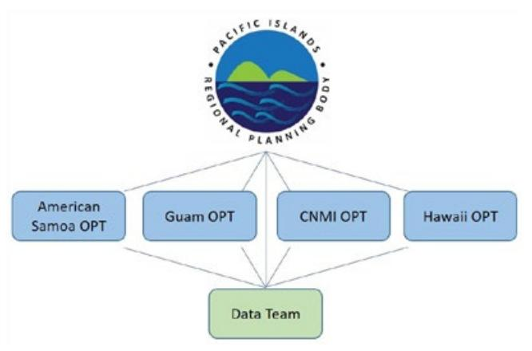

*Figure 6. The PI RPB teams that supported the PI RPB's Pacific-wide planning effort.* 

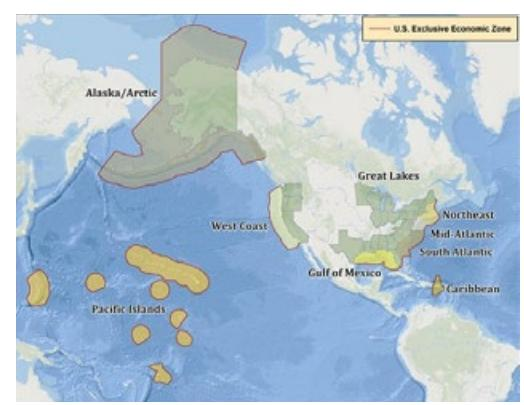

*Figure 5. Footprint of the nine RPBs.*

developed its approach for ocean planning in the US Pacific Islands with the intent of progressing its efforts in each sub-region after securing private, federal, and local funding for the effort.

### **American Samoa Ocean Planning**

This document is the first and only regional plan produced by the PI RPB before it was disbanded in 2018. It is a plan developed specifically for the territory of American Samoa – a locally-driven plan written by the American Samoa Ocean Planning Team (ASOPT; Figure 7).

Member agencies of the ASOPT are:

### **American Samoa Government Agencies**

Department of Marine and Wildlife Resources (DMWR), Department of Port Administration (Port), Department of Commerce Coastal Management Program (ASDOC CMP), Department of Commerce Planning Division, Office of Samoan Affairs (OSA), AS Environmental Protection Agency (ASEPA);

### **US Federal Agencies**

United States Coast Guard (USCG), National Oceanic and Atmospheric Administration (NOAA), US Fish and Wildlife Service (USFWS), US National Park Service (NPS), Department of Defense (US Marine Corps); and the

### **Non-Federal Partner**

Western Pacific Fishery Management Council (WPFMC).

The American Samoa Ocean Plan (Plan) provides guidance for agencies, individuals, or other entities proposing an activity or action related to ocean use in the waters of American Samoa. The information

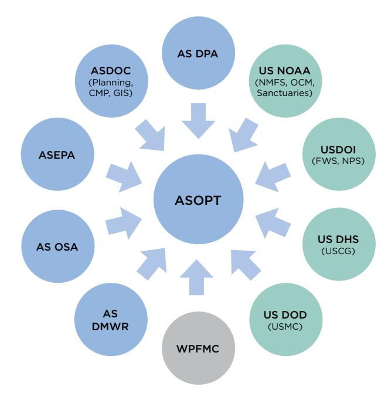

*Figure 7. Federal and ASG agencies and the WPFMC comprised the ASOPT.*

in this document is intended to encourage compatible uses, reduce use conflicts, and balance sustainable ocean use with marine conservation, as well as identify research needs. Herein readers will find a comprehensive reference of existing spatial data regarding ocean use, insights into stakeholder perspectives regarding preferred ocean uses, and potential use/user conflicts.

This document is not a stand-alone plan to manage the marine and coastal ecosystems of American Samoa. Rather, it is better understood as a consensus-based blueprint for harnessing and integrating the regulatory, enforcement, and other capacities of the various local and federal agencies charged with guiding marine development, conservation, preservation, utilization, and maritime shipping in the Territory. As with every printed document in the digital age, this is a snapshot of a current place in time. As Dwight Eisenhower said, "A plan is nothing. Planning is everything." Therefore, the planning team intends to revise and amend this plan regularly, and recommends that in addition to the Plan, readers consult the Pacific Islands Regional Marine Mapper and local agencies for real-time data and policies.

The ASOPT began its work in January 2016. The team held several meetings over the past two years and several listening sessions (Figure 8). During these meetings, the ASOPT concurrently followed three tracks: 1) developing its process of scoping, drafting, and review of the Plan, 2) determining how and when to engage stakeholders and who those stakeholders are, and 3) developing content for the plan, including drafting the vision statement, goals, objectives, actions, and tasks.

Leadership was provided to the ASOPT by the PI RPB members. These PI RPB members, along with several ASOPT members, also ensured that the Governor, Fono (Legislature), and Office of Samoan Affairs (OSA) were kept updated on the Plan's development.

At the first meeting in 2016, the ASOPT members developed a vision statement and identified stakeholders with whom to engage during plan

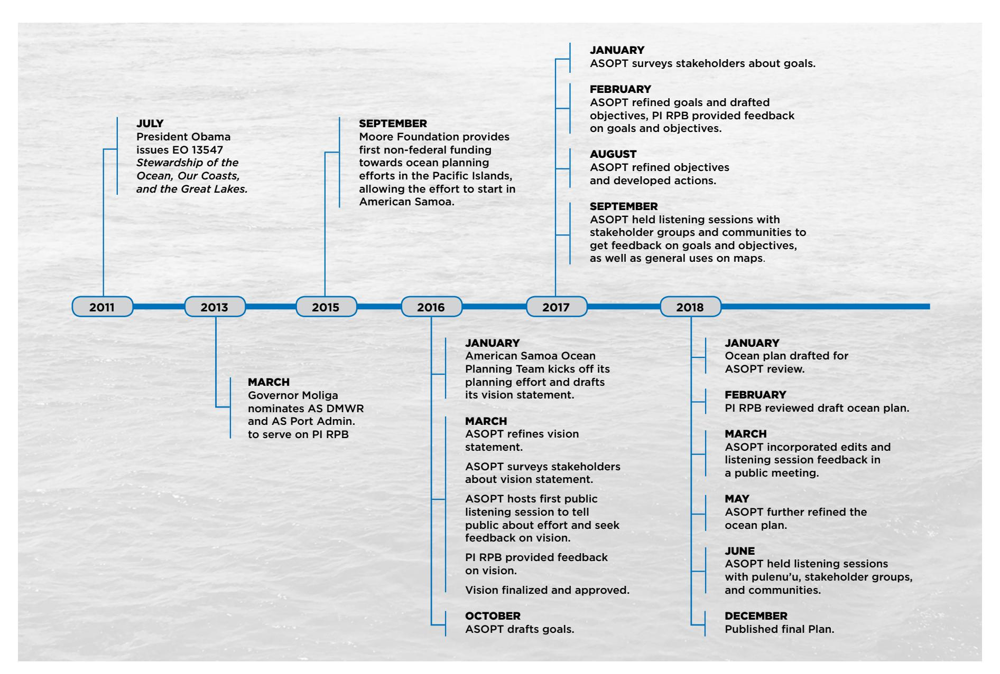

*Figure 8. Major events in the American Samoa ocean planning process.* 

development. ASOPT members sought feedback on the vision statement during a listening session held during the second ASOPT meeting, and incorporated the feedback received into the final vision statement.

During the next several ASOPT meetings, which were held publicly, the ASOPT developed goals

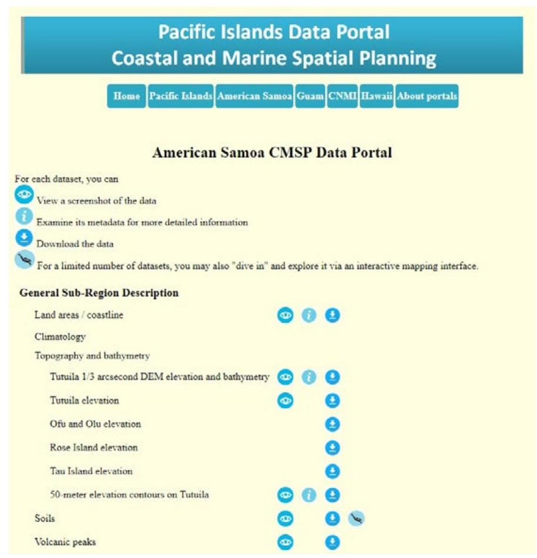

Figure 9. The Naval Postgraduate School Prototype Data Portal snapshot of data for American Samoa

and objectives for the draft Plan. After the goals and objectives were refined, the ASOPT held another series of listening sessions with targeted stakeholder groups and communities to seek feedback. In early 2018, the ASOPT incorporated the received input into further refinement of the goals and objectives, as well as actions and tasks associated with the objectives. This American Samoa Ocean Plan was developed by this planning team that wholeheartedly embraced the feedback received and incorporated it as appropriate throughout all aspects of the plan.

### **Key Partners in the Planning Process**

Pacific Islands ocean planning has benefited greatly from the process and spirit of collaboration. The PI RPB recognized the important role that partnerships play in leveraging resources, conducting stakeholder engagement, and enhancing technical capacity. Key partners included Udall Foundation's US Institute for Conflict Resolution, Gordon and Betty Moore Foundation, the PI RPB's Data Team, and the Naval Postgraduate School.

Of note, the Naval Postgraduate School, in close collaboration with federal agency partners, the Data Team, and the ASDOC GIS program, developed and launched the Pacific Islands Prototype Data Portal (Data Portal; Figure 9, Figure 10). This Prototype Data Portal is being transitioned to a permanent Pacific Islands Regional Marine Planner (PIRMP).

The publicly available PIRMP will build on the prototype data products and layers and be hosted by MarineCadastre.gov. MarineCadastre.gov is a cooperative effort by the Bureau of Ocean Energy Management (BOEM) and the National Oceanic and Atmospheric Administration (NOAA) to provide authoritative ocean data, tools, and support to the offshore renewable energy and marine planning communities. This effort is integrating data,

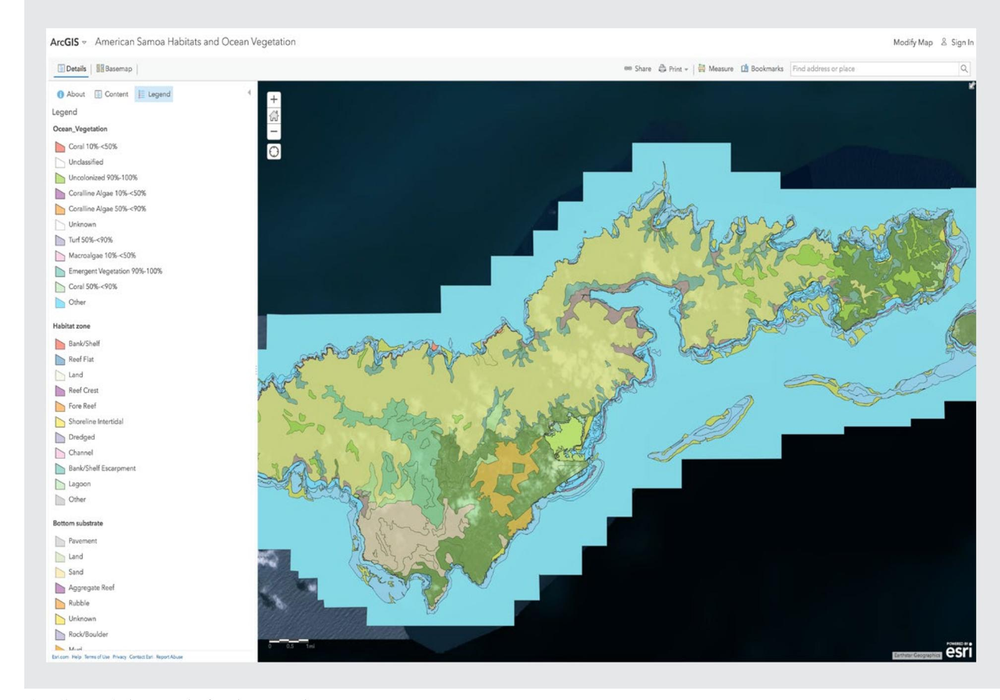

*Figure 10. Interactive layers snapshot from the Data Portal*

**Statement of Purpose:** The purpose of the plan is to provide American Samoa with systematic decision-making tools for coastal and marine areas that promotes balanced and sustainable multiple uses, improves cross-agency, cross-sectoral and cross-governance level communication and collaboration, enhances coastal and ocean health, and pro-actively plans for, mitigates, and adapts to sea level rise and other issues associated with climate change. The plan encourages active stakeholder engagement in the development of current and future uses of the ocean and coastal areas.

metadata, and services from marine planning into the Northeast Ocean Data Portal, Mid-Atlantic Ocean Data Portal, and the West Coast Ocean Data Portal. In American Samoa, as in other regions, the PI Marine Planner is intended to be an online, publicly available ArcGIS Online viewer that consolidates available data and enables regional ocean planners and ocean users to visualize and analyze ocean resources and human use information.

The prototype already includes a wide range of human use, environmental, socioeconomic, and regulatory data that provides baseline information, as well as building blocks for more transparent, coordinated, and informed ocean management, information sharing, and stakeholder engagement. Input from stakeholders has been solicited throughout the process to inform development, utility, and design of the PIRMP.

### **Stakeholders in the Planning Process**

Stakeholder and public engagement is a cornerstone of American Samoa's ocean planning process. In American Samoa, everyone is a stakeholder in ocean uses and resources.

Successful ocean use planning depends upon stakeholder engagement. The ASOPT successfully engaged stakeholders during development of this ocean use plan and is committed to continued engagement during future implementation of this plan. Information regarding continued ocean planning can be found by contacting the ASDOC.

Opportunities for engagement included:

- **Formal PI RPB and ASOPT meetings**, all of which were open to the public and encouraged public comments, and
- **Stakeholder outreach events** hosted by the PI RPB and ASOPT. These events included the stakeholder assessment engagement, stakeholder and community listening sessions, public surveys, and ad hoc engagement (e.g. booth at Coasts Week).

The formal public PI RPB and ASOPT meetings provided an opportunity for members to discuss, deliberate, and make decisions transparently while also interacting with and collecting input from the public. Surveys, meetings, the PI RPB's website and Facebook site, and listening sessions enabled the ASOPT to share updates with a wider audience

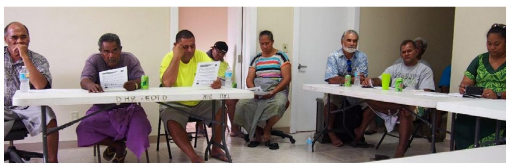

*Figure 11. Ta'u listening session participants in October 2017.*

and solicit feedback from stakeholders. The PI RPB website contained information and meeting materials, and also provided information about opportunities for public comment throughout the process. This information has been transferred to ASDOC's website.

The ASOPT began development of a stakeholder engagement strategy at its 2016 kick-off meeting. The Planning Team adopted a three-pronged approach of engagement for gathering input from ASG partners, ocean user groups, and village communities (Figure 11, Figure 12, Figure 13). ASG partners were identified by the ASG ASOPT members. All ASOPT members identified the initial list of ocean user groups. This list was then further refined using an online survey of this initial group. Ocean user groups included commercial fishermen, port and commercial users, non-extractive recreational users, extractive non-commercial users (recreational fishers), and users linked closely to village uses of the ocean resources and spaces. Village communities were contacted through ASG partner channels, as well as through the Office of Samoan Affairs.

### **OCEAN USER GROUPS REPRESENTED IN TARGETED LISTENING SESSIONS**

Ports & Shipping

Marine tourism

Marine trades

Commercial fishing

Recreational fishing

Marine navigation

Ocean recreation

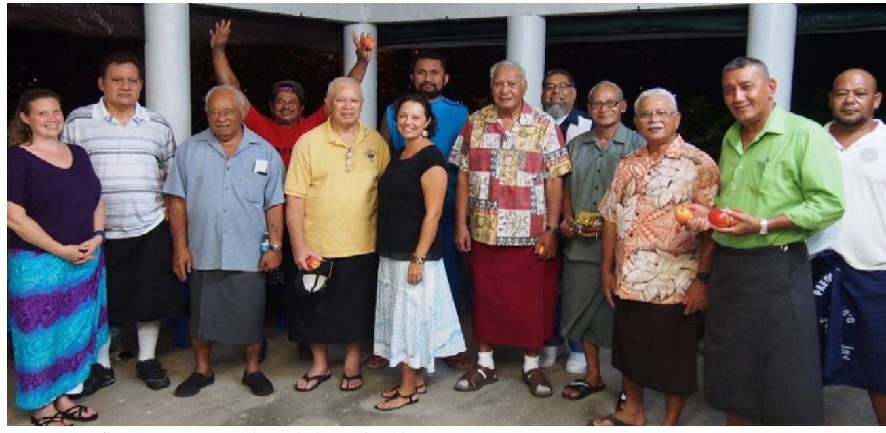

*Figure 12. Aua listening session participants in September 2017.*

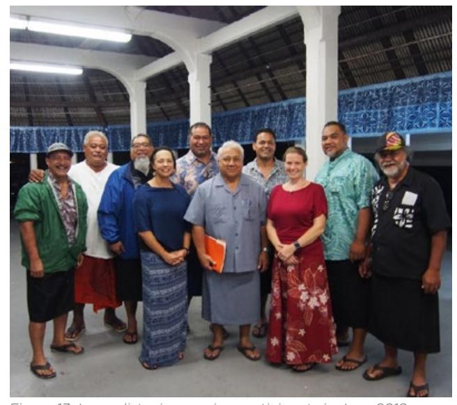

*Figure 13. Leone listening session participants in June 2018.*

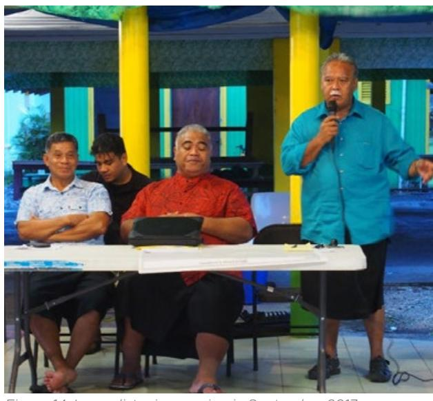

*Figure 14. Leone listening session in September 2017.*

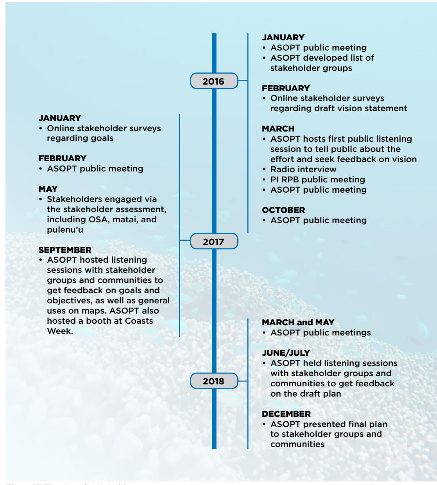

*Figure 15. Timeline of stakeholder engagement.* 

Methods of engaging these three stakeholders, included online surveys, public ASOPT meetings, public listening sessions and focused user group or village listening sessions (Figure 14). All meetings were publicly noticed on the PI RPB Facebook and websites, as well as emails sent to the stakeholder distribution list (Figure 15; Participant list is in [Appendix 4](#page-83-0)).

Plan development included a dedicated effort to ensure that stakeholders were authentically engaged. In addition to the on-the-ground work conducted by the ASOPT, the Udall Foundation's US Institute for Environmental Conflict Resolution contracted a stakeholder assessment, which resulted in seven recommendations for how and when to connect with local ocean users and governance structures. The stakeholder assessment recommendations ([Appendix](#page-85-0)  [5](#page-85-0) and [Appendix 6](#page-89-0)) were then folded into the ASOPT's existing strategy to further refine how the ASOPT engaged stakeholders.

### **Ocean Planning Framework**

### VISION

The vision articulates the ASOPT's desired future state for the coastal and ocean waters of American Samoa:

"The people of American Samoa, with their healthy ocean, coasts, and communities, enjoy a thriving and secure environment, economy, and Fa'a Samoa."

### GEOGRAPHIC FOCUS

The primary geographic focus for the American Samoa Ocean Plan is the ocean waters of the jurisdiction (Figure 16). Specifically, the geographic focus includes Territorial and Federal waters from the shoreline seaward to the boundary of the Exclusive Economic Zone (EEZ), which is up to 200 nautical miles (nm) or limited by the boundary with:

- Tokelau to the north
- Niue and the Kingdom of Tonga to the south
- Cook Islands to the east
- Samoa and the Kingdom of Tonga to the west

The geographic focus is comprised of two sections, which are described throughout the plan as: 1) **Coastal**, which extends from the shoreline to 3 nm, or the extent of Territorial waters, and 2) **Ocean**, which extends from 3 nm out to the outer extent of the EEZ, or up to 200 nm. The definition of coastal in AS §26.0206 is the "entire

*Figure 16. Geographical focus of the Plan. © NOAA OCM*

**Va'ai Mamao (Vision):** Ia mafai ona fa'aaogaina e tagatanu'u o Amerika Samoa le sosia o lona si'osi'omaga, gataifale ma ogasami ma le faatupula'ia o le tamaoaiga ma lau-fanua mama ma puipuia i le Aganu;u Fa'a-Samoa

island of Tutuila, the Manu'a Islands, Aunu'u Island, Rose Island, and Swains Island…and all coastal waters and submerged lands for a distance of three (3) nautical miles seaward in all directions." The ASOPT intentionally deviates from the AS §26.0206 definition of coastal to avoid overlap and redundancy with the existing inland planning efforts in American Samoa (such as the PNRS and other land use plans).

While the ASOPT operates within this geographic focus, it recognizes the importance of all coastal areas. The ASOPT will draw connections to and coordinate closely with entities responsible for the inland coastal management, permitting,

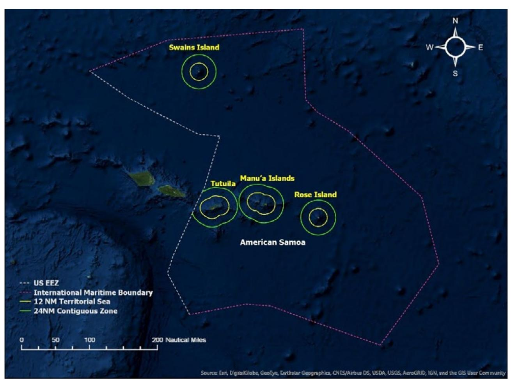

*Figure 17. Map of American Samoa EEZ. © NOAA OCM*

and planning, particularly when ocean uses and natural resources have an interrelationship with coastal communities, ports, or other shoreside infrastructure. The geographic focus is an administrative description for planning purposes only, and is not intended to create or represent fixed boundaries or affect existing legal authorities.

In addition to the inland and seaward connections, this plan also recognizes the overlapping permitting and planning jurisdictions within the study area, for example, PNRS (from the shoreline to 3 nm), federal agencies (3 nm to EEZ extent), and territorial plans (shoreline to 12 nm).

Within this described geographic focus, American Samoa consists of roughly 76 square miles of land area over a group of five volcanic islands and two atolls. The five volcanic islands include Tutuila, Aunu'u, Ofu, Olesega, and Ta'u. Ofu, Olesega, and Ta'u are collectively referred to as the Manu'a Islands. Additionally, there are two atolls: Swains Island and Rose Atoll (Figure 17). The island areas are traditionally called districts (East District, West District, and Manu'a District) and there are several villages within each district. For more information about the islands' sizes, village names, and demographics, please refer to the Territory of American Samoa Multi-Hazard Mitigation Plan ([Chapter II: Planning Area Profile](http://doc.as.gov/wp-content/uploads/2015/05/CHAPTER-021.pdf)).

### GUIDING PRINCIPLES

The ASOPT established 2 guiding principles, which it defines as "basic or essential qualities or elements determining the intrinsic nature or characteristic behavior of regional ocean planning." These principles describe how the ASOPT intends to operate.

### **Guiding Principles:**

#1: Increase coordination and communication within the community, among stakeholders, and across all levels of government.

#2: Vibrant and integrated Fa'a Samoa level communication and collaboration, enhances coastal and ocean health, and pro-actively plans for, mitigates, and adapts to sea level rise and other issues associated with climate change. The plan encourages active stakeholder engagement in the development of current and future uses of the ocean and coastal areas.

### GOALS AND OBJECTIVES

The goals are high-level statements of outcomes the ASOPT hopes to achieve with its Ocean Plan. It considers the two goals to be of equal importance and deeply interconnected. However, the ASOPT recognized that without healthy and coastal ecosystems, sustainable ocean uses are unachievable. The objectives under each goal describe specific outcomes and observable changes that contribute to achieving American Samoa's ocean planning goals.

The first goal, Healthy Ocean and Coastal Ecosystems, is to promote ocean ecosystem health, functionality, and integrity through spatial data acquisition for habitats and species to enable more effective decision making while reducing environmental impacts, reduction in pollution and

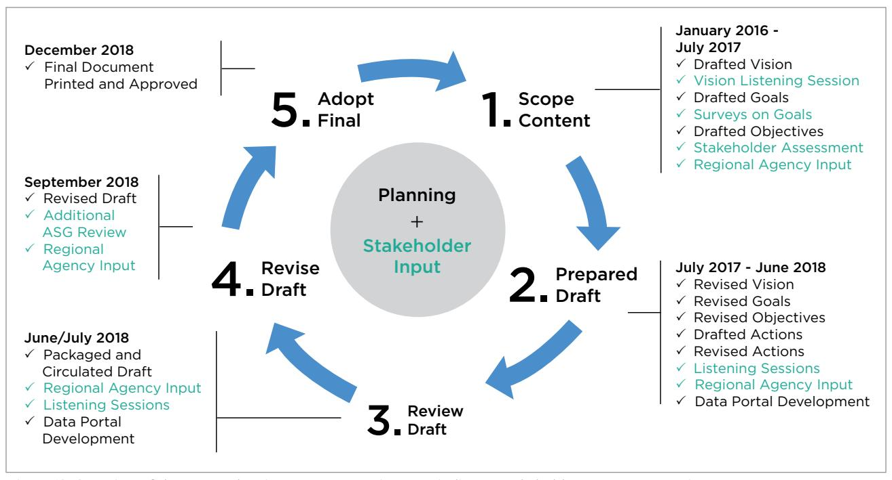

*Figure 18. Overview of the ocean planning process. Text in green indicates stakeholder engagement points.*

marine debris, and climate change adaptation and resilience.

The second goal, Sustainable Ocean and Coastal Uses, is to plan and provide for existing and emerging ocean uses in a sustainable manner that minimizes conflicts, supports economic growth, and provides for food security.

There are several objectives identified for both goals, all with associated actions and tasks. A lead agency and associated partners are listed for all actions. Partners were suggested by ASOPT members in some cases, not self-selecting and volunteering. Partners include ASG agencies, federal agencies, the WPFMC, and various organizations

(e.g. American Samoa Community College (ASCC), AS Climate Change Task Force, AS GIS Users Group, and more; see [Appendix 7](#page-94-0) for a list of partners).

### APPROACH TO THE AMERICAN SAMOA OCEAN PLAN

The National Ocean Council's [Marine Planning](https://obamawhitehouse.archives.gov/sites/default/files/final_marine_planning_handbook.pdf)  [Handbook](https://obamawhitehouse.archives.gov/sites/default/files/final_marine_planning_handbook.pdf) developed in response to EO 13547 served as reference for planning teams around the country. The RPBs and local planning teams were given flexibility to determine how to approach planning.

At its in-person meeting in February 2016 in Pago Pago, the ASOPT deliberated on and approved an interactive planning process (Figure 18). The ASOPT developed elements of the plan, reviewed and revised the element (vision, goals, objectives), sought stakeholder and PI RPB feedback, incorporated feedback, then finalized it. The ASOPT then developed a complete draft for stakeholder and PI RPB review. The final plan is a product of incorporated review and comments (see [Appendix 12](#page-110-0) for input incorporation).

### MOVING AHEAD UNDER EXISTING AUTHORITIES

Ocean planning aims to achieve effective coordination and collaboration among the numerous governmental agencies with existing management authorities over ocean and coastal resources. Coordination among planning entities and consistent use of best available ocean data are key elements of this Ocean Plan. Likewise, EO 13840 remains committed to effective management of the nation's oceans and coasts. This Plan focuses on informing decision making under existing authorities, but the ASOPT itself does not have any regulatory authority.

This document does not create any right or benefit, substantive or procedural, enforceable by law or equity against any signatory or any of its officers, employees, or other representatives or any person. The statutes and regulations referenced herein contain legally binding requirements, and this document does not substitute for those statutes and regulations, nor is this document itself a regulation. In the event of a conflict between this document and requirements under statute or regulation, the latter controls. All commitments made by agencies herein are subject to the availability of appropriated funds and agency budget priorities. Nothing in this document in and of itself obligates the agencies to expend appropriations or to enter into any contract, assistance agreement, interagency agreement, or

incur other financial obligations. This document does not create any exemption from policies governing competition for assistance agreements. Any transaction involving reimbursement or contribution of funds between the parties to this document will be handled in accordance with applicable laws, regulations, and procedures under separate written agreements. [Appendix 8](#page-97-0) provides a brief description of Federal authorities directly relevant to the Plan, and a description of key Territorial and WPFMC authorities and interests. For a more complete listing of authorities that address ocean activities and interests, please refer to the NOC's publication, Legal Authorities Relating to the Implementation of Coastal and Marine Spatial Planning.

See page 61 for more information about [Implementation](#page-70-0).

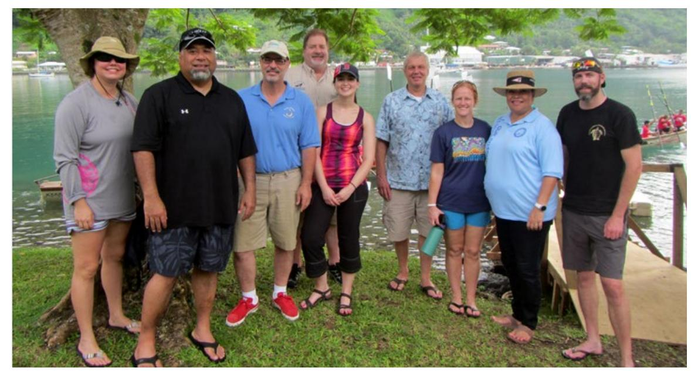

*PI RPB members, ecoLOGIC, Udall Foundation, AS DPA, and AS DOC CMP participated in a fautasi paddle around Pago Pago Harbor arranged by AS DOC CMP Director Sandra Lutu.*

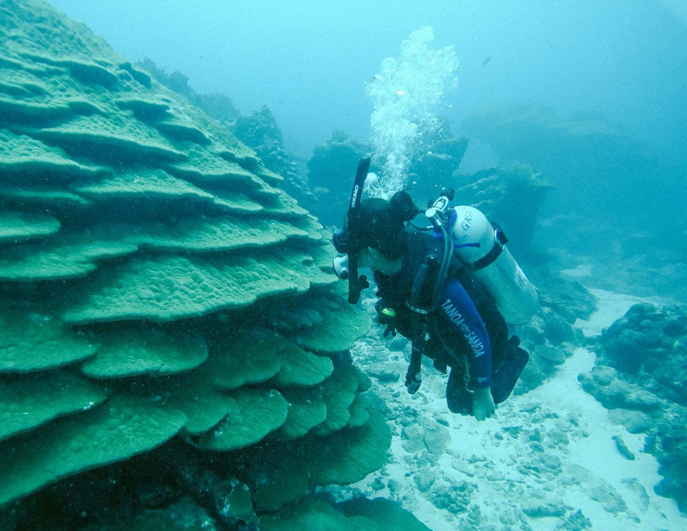

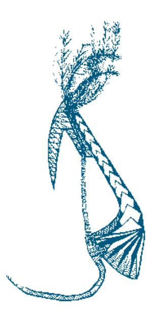

# **Autu 1: Sami Ma Le Gataifale Matagofie Ma Le Saogalemu** Goal 1: Healthy Ocean and Coastal Ecosystems

Three objectives and associated actions were developed for addressing Goal 1: Healthy Ocean and Coastal Ecosystems. While this plan acknowledges that the coastal ecosystems include from the ridge to the reef, including watersheds, please note that for the purposes of this ocean planning effort, the actions and tasks, unless specifically noted, apply from the shore seaward to the boundary of the US EEZ, or up to 200 nm.

**Sini 1:** Saili i'a, figota ma o latou nofoaga e tatau ona puipuia. Fa'atumauina le tulaga lelei o matafaga, gataifale ma ogasami.

### **Objective 1: Spatially Identify Species' Habitats to Protect, Maintain And/Or Restore Healthy Ocean and Coastal Ecosystems and Natural Beauty.**

This objective is intended to deepen the understanding of key areas of the ocean ecosystem in order to inform decision making under existing authorities. Under this action, the ASOPT will continue to develop enhanced data products for individual marine species, marine life synthesis products, and human use data and information synthesis products to support science-based decision making. Advanced synthesis of marine life and habitat data can help identify general or specific areas that are characterized by one or more components of ecological richness, such as high biodiversity, abundance, and productivity.

The data products resulting from accomplishing the actions below can inform a range of decisions related to possible uses, including PNRS decisions, NEPA analyses, evaluation of baseline information for offshore development projects, development of research agendas, and other agency-specific processes and practices.

**Action 1.** *Spatially identify ecologically rich areas, including essential fish habitat (EFH) and critical habitat, and increase the use of the information in agency decision making processes.*

The WPFMC and NOAA have EFH and critical habitat data layers, as well as habitat maps. Other agencies with habitat maps include National Park Service, USFWS, and AS DMWR. Mapping efforts, including via Light detection and ranging (LiDAR) surveys, happen periodically, with much of the data

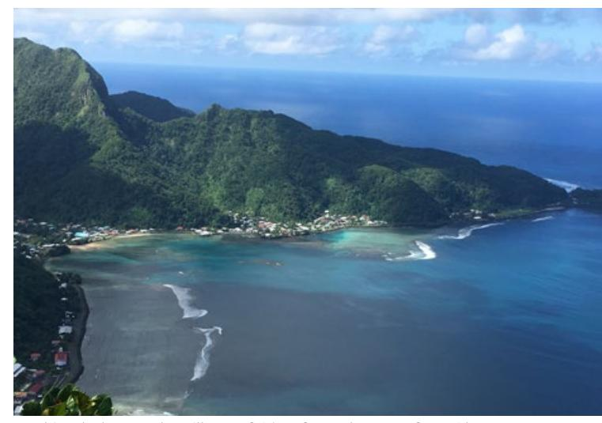

*Looking below to the village of A`ua from the top of Mt. Alava. © Sarah Pautzke* 

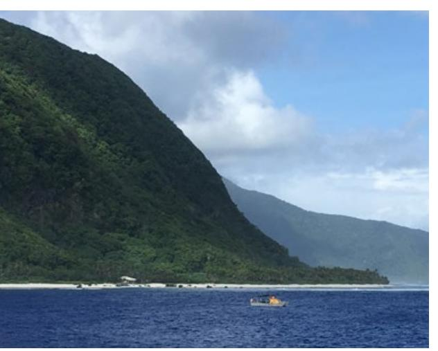

*An alia vessel fishing off the Manu`a Islands. © Sarah Pautzke*

being housed by NOAA. Combining these data layers into the PIRMP will promote the use of the data in decision-making.

The ASOPT understands the need to protect certain data, such as locations of listed species or species of concern, to avoid exploitation of these vulnerable species.

**Agency Lead:** AS DMWR **Partners:** NOAA OCM, NPS, USFWS, ASDOC GIS, OSA, AS GIS Users Group, NOAA PIFSC, WPFMC, NOAA PIRO

- 1. Within the spatial extent of the identified habitat, coordinate with AS DMWR and AS OSA to work with agencies and village leaders to identify desired marine life data layers (footprints of mangroves, seagrass, coral reefs, critical habitat, EFH, ports, harbors, Ava locations) and important infrastructure to incorporate into the PIRMP and mapping interface.
- 2. Analyze habitats to identify nurseries for important pelagic species including yellowfin tuna, as well as the habitat needed for different life stages from the shore to the open ocean, including the banks.
- 3. Work within ASG agencies to develop and refine a draft framework for identification of ecologically rich areas (ERAs) (example: [Appendix 9](#page-102-0)).
- 4. Standardize the definition of an ERA.
- 5. Import existing data layers into the PIRMP, increase the use of the data, and identify gaps between what exists and desired data layers.
- 6. Provide a contrast of areas with multiple layers of information and missing information.
- 7. Post information and maps developed in Tasks above to the PIRMP and ASDOC websites.

### **Action 2.** *Ensure adequate data are in place to inform public use and permittee proposed uses.*

Not all data exist within the confines of agencies. This data effort will include robust engagement of fishermen, conservation organizations, maritime industry, recreational users, and other stakeholders, scientists and other technical experts, Traditional Knowledge holders, and the public to share and collaborate data for informed and wise public and commercial use.

The stakeholder assessment results described in the [stakeholder section](#page-21-0) above and in the [Appendix](#page-85-0)  [5](#page-85-0) provide further insights and recommendations related to engaging audiences. When information is exchanged and new data are developed, the GIS Users Group can create data layers that would then be incorporated in the ASDOC portal and the PIRMP. ASEPA can offer a support and technical role to assist with these initiatives.

**Agency Lead:** GIS Users Group **Partners:** AS DMWR, ASDOC CMP, ASEPA, NOAA OCM

- 1. Share the ecologically rich areas data from Action 1 above with stakeholders, decision makers, and villages. Conduct workshops and outreach on using the PIRMP to ensure these layers are understood, accepted and can be used.
- 2. Provide training on how to overlap the future uses data with the ERAs.
- 3. Based on information exchanges, select two pilot areas of heavy public use or permit interest to further develop additional needed ecological data.
- 4. Use the above information to promote agency and village education, outreach, and existing

- DMWR, CZM, and ASEPA awareness initiatives related to ecological resources.
- 5. Refer to these data layers during proposal reviews, or, if you are a permittee, refer to these layers to determine compatibility of a project.

### **Action 3.** *Identify species with management and/or cultural designations, and those with economic value.*

Several species are managed in American Samoa, many of which have economic value and/or cultural value. The WPFMC manages the American Samoa bottomfish species, which generally include snappers, emperors, and groupers, all of which have economic value. Coral reef fish are managed by AS DMWR and the WPFMC and include surgeonfishes, nearshore groupers, parrotfishes, atule, and soldierfishes. Important invertebrates include octopus, lobsters, sea cucumbers, giant clams, and palolo. All of these have cultural value with various degrees of importance. Pelagic species are managed by the WPFMC with regulations for harvest and are of economic importance. Monument waters include cultural take provisions. The following actions assess the extent of the spatial data associated with the managed species and species with cultural designations and seek to make this data publicly available.

# **Agency Lead:** AS DMWR

**Partners:** NOAA PIRO, NOAA OCM, OSA, USFWS, AS Historic Preservation Office (AS HPO), ASDOC GIS, NOAA PIFSC, ASDOC CMP

1. Map species of concern distributions, species with designations distributions, and habitat protections (e.g. EFH) from laws or lists. Species with designations and habitat protections can include, but are not limited to, the International Union for the Conservation of Nature (IUCN) Red List, by the ESA as threatened or endangered,

- by the US Marine Mammal Protection Act, the US Migratory Bird Treaty Act, Western and Central Pacific Fisheries Commission, and the MSA, as well as territorial designations and protections.
- 2. Coordinate with AS OSA to work with village leaders to map species, habitats, or areas with cultural value and/or protected status within villages or by village leaders.
- 3. Review and map regulatory mechanisms related to species with economic value.
- 4. Import data layers into the PIRMP, increase the use of the data, and identify gaps between what exists and desired data layers.

**Action 4.** *Identify and maintain updated data related to administrative and marine jurisdictional data for protected areas or management areas (areas from policies and statues or culturallyidentified (e.g. prohibited areas) that do not necessarily follow habitat areas).*

There are several habitat designations for various species and their habitats. These include essential fish habitats (EFH) and habitat areas of particular concern identified under the US MSA, and critical habitat identified under the US Endangered Species Act (ESA). Areas also include those identified under AS Title 24 Chapters 5, 9, or 10, and AS Title 26 Chapter 2. These identified areas can conflict with uses, such as development, but may be compatible with other uses, such as no-take recreational uses, low impact development, or a spatial separation within the water column (e.g. a ship may traverse over EFH without impacting the habitat).

**Agency Lead:** NOAA PIRO **Agency Partners:** ASEPA, AS DMWR, ASDOC GIS, ASDOC CMP, ASDOC Planning, AS DPS (Marine Patrol Division), NOAA OLE, USFWS, NPS, AS Department of Parks and Recreation, ASDOC

PNRS, USCG

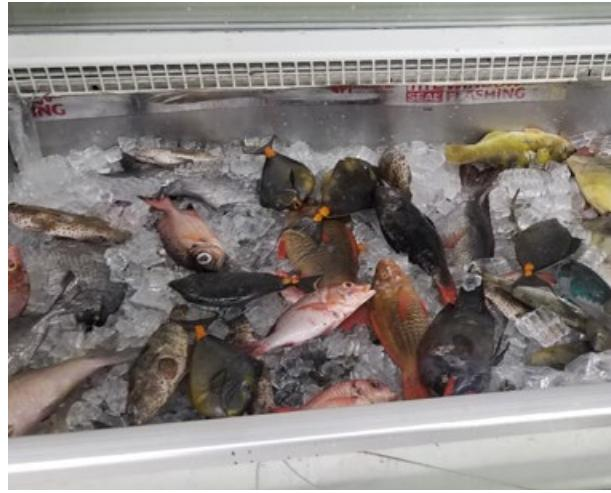

*Reef fish for sale at a local market. © Christopher Hawkins*

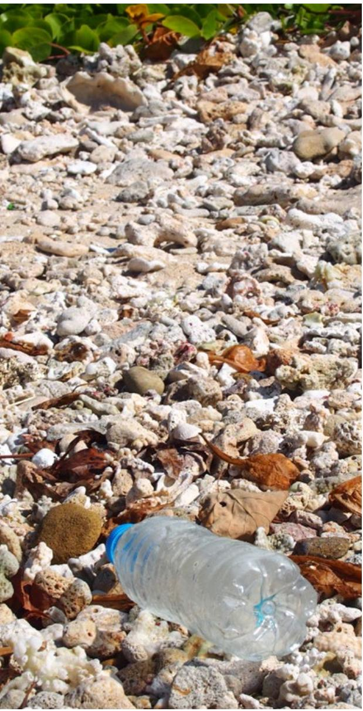

*Litter at a secluded beach on the back side of Aunu`u. © Sarah Pautzke*

- 1. Identify and map the footprint of administrative and marine jurisdictional management areas from laws, policies, or village practices (e.g., Endangered Species Act, Marine Mammal Protection Act, MSA, migratory seabirds, territorial laws).
- 2. Identify and digitize areas of management conflicts, management gaps, and enforcement/ security vulnerabilities.
- 3. Upload the data into the PIRMP; ensure new data and information are incorporated to keep management current and relevant; and provide access to regulators, permittees, the public, and industry in exchange for participation in an annual update session.
- 4. Use the above information to promote agency and village education, outreach, and awareness initiatives related to management actions and special protections.

**Sini 2:** Sapasapaia tulaga uma e fa'aitiitia ai le fa'aleagaina o le tamaoaiga o o tatou ogasami

### **Objective 2: Support Coordination of Efforts to Prevent or Reduce Coastal and Marine Sources of Pollution Affecting Our Oceans**

Marine debris and pollution are threats to the health of coastal and ocean ecosystems and human health. Marine debris lessens our ability to protect human health, aquatic life, and the environment. Environmental agencies in American Samoa recognize that the bioaccumulation of plastics in the marine food web by commercially sought species are worldwide, and of great impact to American Samoa's fish-based economy and diet. Timely actions to address this major threat are needed,

particularly in a time where other significant threats such as adverse impacts from climate change can exacerbate its effects, complicate recovery, and reduce resiliency to recover from these impacts. A resolution to marine debris and pollution requires collaboration across levels of government and with the public and partners.

The purpose of this Objective and related Actions is to build on efforts of American Samoa's Marine Debris Program, NOAA's Marine Debris Program, EPA's Trash-free Waters Program, and other existing programs and partnerships in the region that are developing regionally-appropriate and feasible pollution reduction strategies that address key issues such as: debris from storms, derelict fishing gear, plastic food containers, microplastics, plastic bottles and bags, balloons, and cigarette butts (Figure 19). Strategies may include source reduction, coordinated cleanups, regionally applicable public outreach, education, and social marketing campaigns aimed at behavior change.

Jurisdictional efforts that accomplish this Objective are already are underway by several agencies. There are many coordinated efforts by ASEPA, DOC, American Samoa Community College Land Grant, AS DMWR Coral Reef Advisory Group (CRAG), and DOI NPS that include coastal stabilization; stream restoration; beach, coastal, and priority watershed cleanups; and outreach and awareness programs. The shoreline cleanup is part of ASEPA' Keep AS Beautiful campaign. ASEPA issues tickets for littering and follows through by taking offenders to court. Other agencies typically involved in issuing marine debris violations include AS DMWR, AS DPA, AS Department of Public Safety, USCG, and NOAA.

Of note, the Land-Based Source of Pollution Local Action Strategy (LAS) brings together various local government department and federal agencies to work collaboratively on strategies and projects

to address land-based sources of pollution in the territory.

ASEPA leads a Marine Debris Program (MDP) with the goals of building capacity in mitigating and minimizing sources of marine litter. The objectives of the MDP are to ensure a sustained marine debris program in American Samoa, conduct scientific research and monitoring, initiate targeted source reduction projects, and to regularly and systematically engage with the community, federal, regional, and local partners.

Since its inception in 2015, the MDP has met some significant milestones. At the 2015 South Pacific Regional Environment Programme (SPREP) annual meeting in Apia, ASEPA presented on marine debris initiatives by the agency and its partners. This provided a platform for discussion of overlapping lessons and opportunities for collaboration with local, regional, and international partners.

In May 2016, a Marine Debris Action Plan workshop was convened by ASEPA and USEPA Region 9 to provide a background of the known and projected impacts of marine litter, share knowledge of existing initiatives to address this issue in the Territory, and discuss opportunities to develop action items regarding implementation of potential solutions and management actions. This workshop strengthened existing collaborative efforts at the local, federal, and regional levels, and built partnerships to address the problems of marine debris in American Samoa. A key outcome of the action plan workshop was the identification of the six priority projects as follows:

- 1. Moving waste and recyclables off-island;
- 2. Ramping up education and outreach to improve environmental literacy;

- 3. Generating a village-based Materials Recovery Facility (MRF);
- 4. Proposing legislation to ban Styrofoam products;
- 5. Removal of grounded vessels; and
- 6. Establishment of a cleanup team for Pago Pago Harbor.

The 2016 Marine Debris Action Plan workshop reinforced the shared goals to protect and manage the resource in American Samoa. The MDP continues to support marine debris initiatives and fosters continued collaboration with local, federal, and regional partners.

NOAA also has a Marine Debris Program that works with local partners to address marine debris through removals and prevention. A current project in American Samoa is a risk assessment to quantify microplastics in water, sediment, and bivalves, as well as assess the types and concentrations of organic contaminants in the collected samples. This project is being led by Arizona State University through a grant from the NOAA Marine Debris program, working with partners from ASEPA and AS DMWR.

Local legislation provides structure for marine debris reduction. Petroleum-based plastic shopping bags are banned at the point of sale in American Samoa. The selling and distribution of these bags is prohibited in accordance with the 2011 Plastic Shopping Bag Ban (PSBB) under ASCA §25.2034, which is enforced by ASEPA, ASDOC, and AS DPS.

A coordinating partner includes the South Pacific Regional Environment Programme (SPREP), the purpose of which is to "promote cooperation in the South Pacific Region and to provide assistance in order to protect and improve the environment and to ensure sustainable development for present

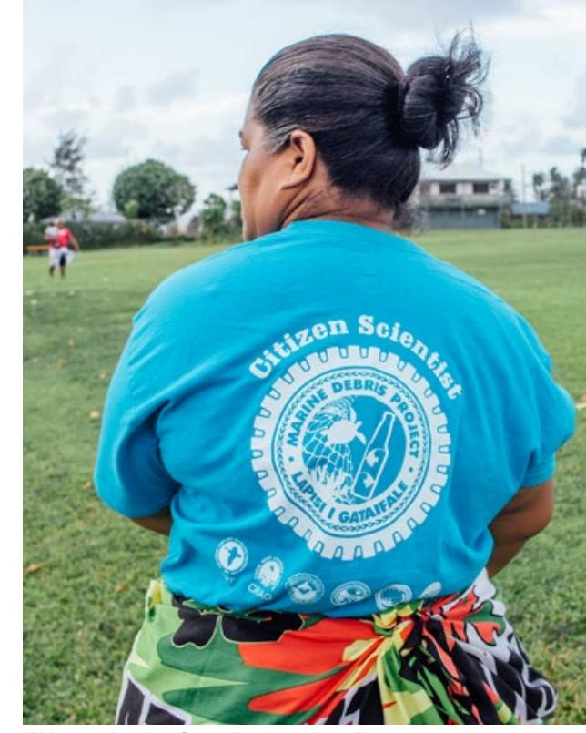

*Citizen scientists from the American Samoa Marine Debris Project (Lapisi I Gataifale) participated in National Clean-Up Day 2018 at Lion's Park, which is on the shoreline of the village of Tafuna. © Nerelle Que*

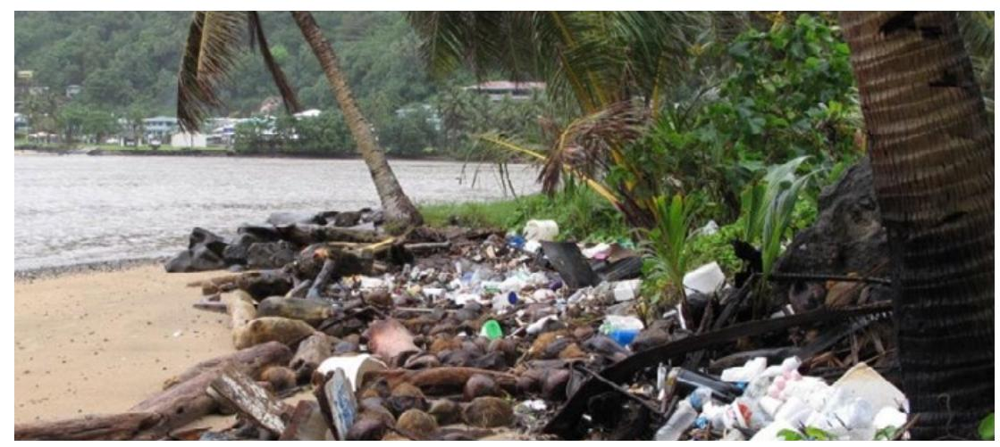

*Figure 19. A pilot study in 2015 revealed high accumulations of shoreline debris at Nu'uuli Lagoon on American Samoa. © Arizona State University*

and future generations." This partner has been supporting a regional ban on plastic bags.

Local legislation also provides a legal framework for other types of coastal pollution that affects oceans. AS Water Quality Standards (ASAC §24.0201) provides legal definitions of protected and prohibited usage of ocean waters, wetlands, embayments, and open coastal waters. All uses must adhere to AS WQS and waters must be substantially free from substances, materials attributable to sewage, industrial waste, visible floating materials, or other manmade activities or objects.

ASEPA is the agency responsible for carrying out the mandates of the Environmental Quality Commission, including the Water Quality Standards (AS WQS). The agency develops, implements, and enforces environmental laws that regulate air, water and soil quality, pesticide use and waste recycling and reduction. An example of agency efforts includes work completed to address the critical environmental and health impacts caused

by improperly-managed piggery wastes. ASEPA brought all piggeries into compliance with local environmental and health regulations by decreasing the number of pigs kept in illegal piggeries, thereby resulting in the reduction of nitrogen and phosphorus to waterbodies. The program continues to inspect and enforce against illegal pig management on island.

ASEPA conducts weekly Nearshore Marine Water Quality Monitoring for non-point source pollution, the results of which are available to the public and media the next day. The pathogen indicator of water quality impairments is Enterococcus in coastal recreation waters. ASEPA informs the public when coastal recreation waters do not meet AS Water Quality Standards (WQS) for *Enterococcus* and describes potential risks associated with polluted waters.

Other local agencies contribute to the larger picture of pollution control. ASDOC funded the development of the [American Samoa Erosion and](https://www.epa.as.gov/sites/default/files/documents/surface/esc_fieldguide_%20complete_small_11044.pdf)  [Sediment Control Field Guide](https://www.epa.as.gov/sites/default/files/documents/surface/esc_fieldguide_%20complete_small_11044.pdf) booklet, which was designed specifically for construction contractors in American Samoa to help them implement best management practices (BMPs) for erosion and sediment control. These construction activities consisted of clearing, grading, stockpiling, and other earth-moving activities at all construction sites. Its provisions are administered and enforced pursuant to the ASEPA American Samoa Water Quality Standards (ASAC §24.0201 et seq.) and the American Samoa Coastal Management Program Administrative Rules (ASAC §26.02). To help contractors implement best management practices for erosion and sediment control (ESC), this field guide:

• Explains why erosion and sediment control (ESC) is an important part of the construction process

- Summarizes ESC practice design, installation, and maintenance tips
- Outlines inspection and project closeout considerations
- Serves as a reference for use in the field
- Relies primarily on graphical illustrations for multilingual users
- Is not a substitute for more detailed practice design or technical specifications

**Action 1.** *Identify spatial extent of existing strategies, related laws, programs, plans, and jurisdictions for marine debris and pollution reduction.*

This action can include collecting information and data from ASEPA from citations that are issued. AS DMWR CRAG also has data regarding marine debris cleanup from 2011 and 2015. NOAA published the "Sensitivity of Coastal Environments and Wildlife to Spilled Oil – American Samoa Atlas." Past spills and clean up location data can be acquired from Solar Inc.

**Agency Lead:** ASDOC GIS **Partners:** ASDOC CMP, AS DPA, USCG, ASEPA, AS DMWR, CRAG, SPREP, NOAA Marine Debris Program, USFWS

- 1. Map the existing agencies' jurisdictions to identify gaps and overlaps.
- 2. Map the common sources of pollution identified within those efforts (i.e. rivers and streams emptying into the harbor).
- 3. Map locations of past spills and clean up areas included within the above efforts.
- 4. Add layers to the PIRMP and ensure partner agencies can access them.

**Action 2.** *Increase and enhance outreach for improved source controls and link to efforts currently underway.*

This action includes identifying all outreach groups involved in pollution reduction initiatives.

ASEPA is the lead agency in administering the Keep American Samoa Beautiful (KASB) Act, which became the new litter law of American Samoa on December 24, 2016, replacing outdated litter laws from 1972. The KASB Act aims to improve litter enforcement by giving citation authority to seven ASG agencies: ASEPA, American Samoa Power Authority (ASPA), AS DPS, AS Department of Health (DOH), AS DMWR, AS DPR, and AS OSA. Litter is defined under the KASB Act as "No Person shall place, throw, or drop litter on public, communal, or private real property, or in any waters of the Territory." Authorized agencies have issued more than 100 litter citations under the KASB Act. ASEPA and its partnering agencies continue to enforce the KASB Act and provide litter education and outreach targeting the island community, businesses and schools.

**Agency Lead:** ASDOC CMP or DMWR **Partners:** ASEPA, NOAA Marine Debris, Island Wide Clean Up Committee Education subgroup

- 1. Share the spatial data with stakeholders, decision makers, and villages via existing outreach efforts.
- 2. Provide training on how to use the PIRMP to overlap the ecologically rich areas (ERAs) identified in Goal 1 Objective 1 Action 1 with pollution data to educate stakeholders about possible impacts of debris and pollution on ERAs.
- 3. Use the PIRMP to identify areas where there are spatial gaps in outreach or efforts.

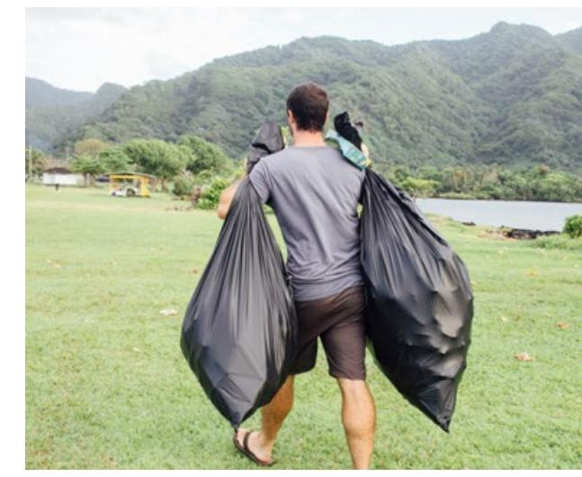

*Trash collected from Lion's Park along the shore of Tafuna during the National Clean-Up Day 2018. © Nerelle Que*

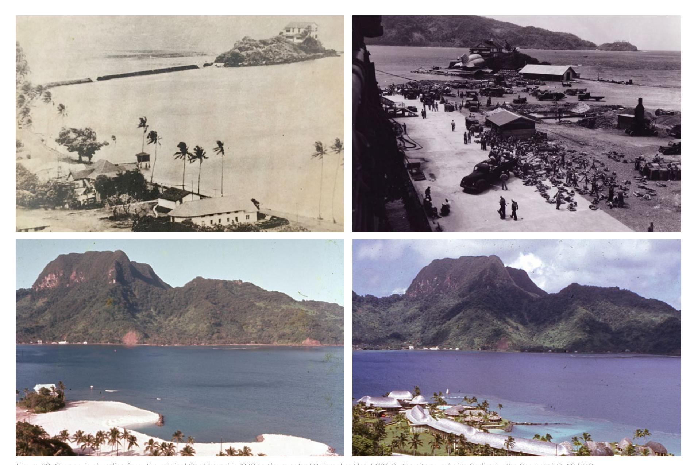

*Figure 20. Change in shoreline from the original Goat Island in 1938 to the eventual Rainmaker Hotel (1967). The site now holds Sadies by the Sea hotel. © AS HPO*

**Action 3.** *Increase coordination with regional fishery management organizations to reduce fishing fleet generated debris, including FADs.*

This action includes collaboration with regional fishery management organizations to reduce marine debris generated at an international level as well as at the local level. Debris also includes discharge from vessels in addition to trash and fishingrelated debris.

**Agency Lead:** AS DMWR **Partners:** NOAA PIRO, SPREP, WPFMC, AS DPA, USCG, NOAA Marine Debris, ASDOC GIS

- 1. Share the spatial data with fleets via WPFMC meetings, international fisheries meetings (e.g. Inter-American Tropical Tuna Commission, Western and Central Pacific Fisheries Commission), WPFMC Advisory Panel meetings, and informal briefings.
- 2. Provide training on how to use the PIRMP to overlap the ecologically rich areas (ERAs), with vessel data and pollution data to educate fleet owners about possible impacts of debris and pollution on ERAs.
- 3. Use the PIRMP to identify geographic areas of accumulated debris and high vessel traffic, which may provide potential projects for collaborative clean-up efforts.

**Sini 3:** Tapena lelei mo suiga e ono aafia ai le siosiomaga

### **Objective 3: Spatially Plan for Ocean Ecosystem Changes and Increased Risks**

Ocean ecosystem changes refer to scientifically observed warmer ocean temperatures and higher ocean water acidity. These changes influence the intensity and frequency of certain hazards (such as flooding, storm surge, high winds) and, in turn, affect disaster risk. Economic, social, and environmental resilience is interconnected with respect to climate change and natural disasters. For example, a tsunami in American Samoa can damage the tuna canneries and longline vessels, which are vital to the American Samoa economy; potentially cause damage to ecosystems depending on the level of debris entering the coasts and oceans from the canneries, longline vessels, and other anthropogenic sources; and also impact the communities of the workers in the longline and cannery industries through destruction of their homes and infrastructure. Economic resilience of human uses to disaster risk is discussed in Goal 2, Objective 2. This Objective and proposed actions focus on coordinating the ecosystem data and models that describe the ocean conditions, as well as the impacts of those changing conditions on the health of coastal and ocean ecosystems of American Samoa.

Mapping shifts in ocean species, habitats of interest, and chemistry allows for more informed ocean use planning in the future, when agencies are weighing trade-offs between proposed new uses, locations of current uses (Figure 20), and the ecology of American Samoa. Shifts in ocean species can be derived from longline, purse seine and trolling catch data. Knowing how species and habitats are shifting can enable American Samoa to be more resilient in the face of climate change because they can protect areas if needed or shift uses to more productive areas (such as fisheries).

In 2015, the Governor of American Samoa appointed a cabinet-level Climate Change Task Force to help the jurisdiction respond to the impacts of a changing climate. He also released a proclamation which stated that, "although there is overwhelming

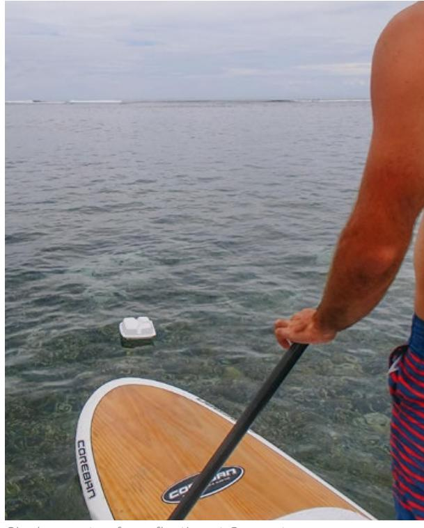

*Single-use styrofoam floating at Coconut Point Beach. © Nerelle Que*

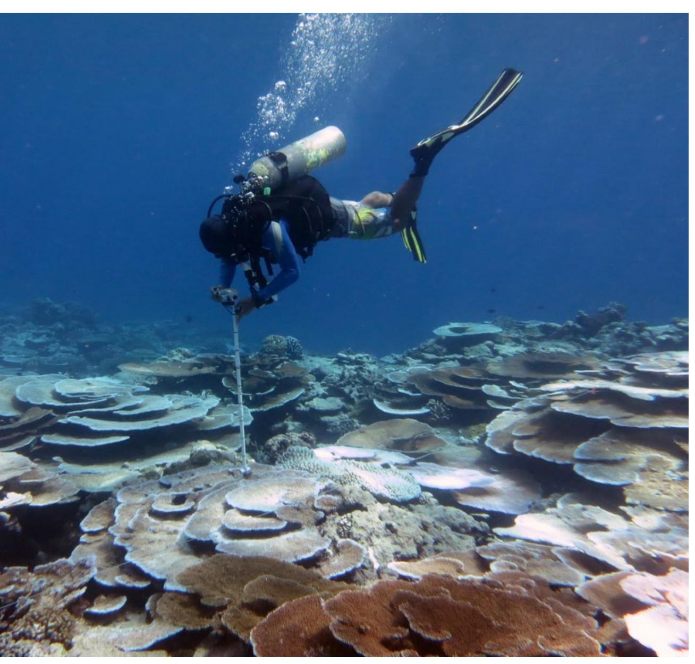

*Diver conducts benthic survey of bleached corals at Tutuila Island in American Samoa. © NOAA Fisheries*

evidence of climate change occurring both globally and regionally which is unique…these risks can be reduced through preparations, planning, surveillance, and taking simple personal and collective actions in educating our people about climate change and its impact on our health and the environment." Earlier efforts also included the development of a 2012 Territorial Climate Change Adaptation Framework and Advisory Committee, as well as a 2012 Climate Change Summit.

A 2017 Pacific Islands Climate Change Cooperative Executive Summary on Climate Change Adaptation Planning in the US and Affiliated Pacific Islands provides an excellent overview of American Samoa's legal authorities relevant to climate change, the institutional structure applicable to climate change adaptation, the government actions on climate change, and related international initiatives.

Of relevance to this ocean plan, the ASDOC administers, in partnership with ASEPA, the implementation of the Territorial Integrated Geospatial Framework (TIFG) project funded through the Office of Insular Affairs Technical Assistance Program. This project uses the Environmental Systems Research Institute (ESRI) GIS platform to develop a centralized database and geospatial infrastructure that can enable enhanced information exchange with governance units. The project is based on data sharing across government agencies to lead to increased understanding and systematic improvement in the protection of the environment, lives, livelihoods, and culture in the face of climate change. The TIFG project is also reassessing the local governing codes to ensure climate change is included in the permitting process. ASDOC CMP is currently in the process of updating the code to better incorporate modern resilience adaptation practices (e.g. climate change adaptation).

### **Action 1.** *Coordinate existing efforts to map shifts in ocean species distributions, habitats of interest, and chemistry.*

NOAA's Pacific Islands Fisheries Science Center (PIFSC) and the American Samoa Department of Marine and Wildlife Resources (AS DMWR) are responsible for mapping shifts in ocean species. Projects such as this are ongoing, including conducting a tri-annual (every 3 years) National Coral Reef Monitoring Program (NCRMP) funded research cruise to American Samoa that provides long-term monitoring and assessment of corals, algae, invertebrates, fishes, and microbes, along with water quality and oceanographic conditions with a goal of improving our information base and understanding of the long-term trends and status of these fish/coral populations and related ecosystems. Habitats of interest around American Samoa have been characterized by PIFSC using a variety of techniques from single-beam, to multi-beam, to satellite imagery.

In the past, NOAA's Coral Reef Conservation Program (CRCP) provided significant funding to PIFSC to conduct mapping efforts in American Samoa. Although PIFSC isn't currently collecting new mapping data in the region, it continues to work closely with partners such as AS National Marine Sanctuary Program, AS DMWR, and especially, the Hawai`i Mapping Research Group (HMRG) of the University of Hawai'i to provide habitat information, create maps and share data with partners.

Ocean chemistry is monitored by PIFSC as part of the NCRMP funded research cruise described above, with additional funds provided by NOAA's National Ocean Acidification Program. Ocean chemistry parameters include near-shore ocean currents, waves, subsurface and surface temperature, water

chemistry, salinity, historical coral growth rates and ocean acidification.

**Agency Lead:** ASDOC GIS **Partners:** Climate Change Task Force (CCTF), GIS Users Group, NOAA OCM, AS DMWR, NOAA PIFSC

- 1. Identify available and potential information sources.
- 2. Recommend ways to make current information and data more accessible to members and the public.
- 3. Convene resource managers, scientists, Traditional Knowledge holders, commercial fishermen, and other stakeholders to review and discuss: (1) data and methods that can be used to create maps that illustrate existing, historic, expected, or potential shifts in the distribution of marine species and habitats; (2) potential management applications of the maps; (3) additional data or information needed to enhance utility of draft maps; and (4) caveats for use.
- 4. Coordinate partners and stakeholders regarding mapping data acquisition, using existing tools available for integrated ocean and coastal mapping collaboration, and leveraging support where feasible.
- 5. Develop approaches to the production, peer review, metadata, and publication of maps that illustrate regional climate change-related biological and ecological changes.
- 6. Facilitate the publication of maps on the PIRMP after they have been vetted and finalized.
- 7. Identify resource needs and recommend methods to use new information to support initial and periodic updates of PIRMP mapping products to maintain its utility for management

- agencies and stakeholders, as well as ensure that updates occur regularly as appropriate.
- 8. Use the above information to promote Fono, agency, stakeholder, and village education, outreach, and awareness related to climate impacts.

### **Action 2.** *Support existing local and regional initiatives related to ocean acidification.*

Changes in ocean chemistry have the potential to create economic, environmental, social, and cultural impacts in American Samoa. To begin to understand ocean acidification and its potential impacts, a more comprehensive review of initiativesones that include both coastal and ocean sampling sites- is needed. This action will improve capacities to detect and understand ecosystem impacts of ocean acidification and enhance awareness within management agencies and stakeholders of select chemical and ecological changes in the ocean ecosystem. Partnerships with organizations like the Pacific Islands Ocean Observing System (PacIOOS), a regional association of the US Integrated Ocean Observing System, will help to ensure a coordinated regional approach to addressing ocean acidification in the Pacific, as will drawing from experience in other parts of the Nation. This action can build on the existing climate change monitoring efforts that are conducted every three years by the NOAA PIFSC CRED.

**Agency Lead:** NOAA PIFSC **Partners:** AS DMWR, NOAA OCM, ASDOC CMP, ASDOC GIS, PacIOOS

1. Identify and compile a list of current regional ocean acidification monitoring efforts and technologies, research, and data gaps, as well as opportunities for partnerships and support.

- 2. Identify and prioritize questions the collective efforts must address, potentially including location and number of offshore monitoring sites, appropriate time intervals for measuring ocean acidification, and the relationship between estuarine eutrophication and carbon dioxide absorption as drivers of coastal and ocean acidification.
- 3. Convene scientists, stakeholders, Traditional Knowledge holders, and the public to review the incoming data and results and determine next steps for coordinated efforts to mitigate the effects of ocean acidification.

### **Action 3.** *Enhance the coordinated effort to reduce the impacts of nuisance and invasive species on coastal and ocean ecosystems.*

Invasive species are those that are infiltrating the native environment to the detriment of native species and habitats. Nuisance species are those that could be invasive or native, but pose a threat to resources of concern. Both invasive and nuisance species can also pose a threat to food security if they negatively impact commerce, food supply (such as subsistence or commercial fisheries, or aquaculture), or navigation. The USFWS has strict quarantine protocols in place for vessels and personnel that are visiting Rose Atoll to conduct research. AS DMWR has already developed an invasive species plan. This effort would contribute a spatial component to that plan and provide data to inform those efforts

**Agency Lead:** AS DMWR **Partners:** USFWS, ASEPA, ASDOC, DPA,

USCG, NOAA

1. Identify existing efforts and strategies for nuisance and invasive species control.

- 2. Develop new data or upload data that reflect sources of invasive species and problem areas for nuisance and invasive species.
- 3. Use data and the PIRMP to conduct outreach for improved source controls (e.g. ballast water) and link to efforts underway by other programs.
- 4. Present options for agency-specific strategies, which include implementation mechanisms with the public and ASOPT.

### ► Action 4. Enhance or maintain climate change adaptation and resilience.

In addition to American Samoa's climate adaptation planning efforts described in the section above, it is worth mentioning that there are also climate change initiatives at the federal level supporting local efforts. NOAA PIRO helped develop the Amouli Climate Resilience Plan. AS DMWR CRAG Climate Change Program is currently planning in Vatia and A'ua.

Many of these efforts are focused on human uses or infrastructure and are not spatial. This action proposes to fill those gaps and contribute to the larger discussion.

Agency Lead: NOAA PIRO Partners: NOAA Sanctuaries. AS DMWR CRAG. DMWR Community-based Fishery Management Program, ASEPA, GIS User Group, AS DHS

- 1. Identify vulnerable species, ecosystems, habitats, areas and regions.
- 2. Incorporate climate change data into community plans.
- 3. Continue to coordinate with the ASOPT and GIS User Group to ensure the PIRMP contains current data related to climate change adaptation efforts, vulnerability analyses, and impact studies.

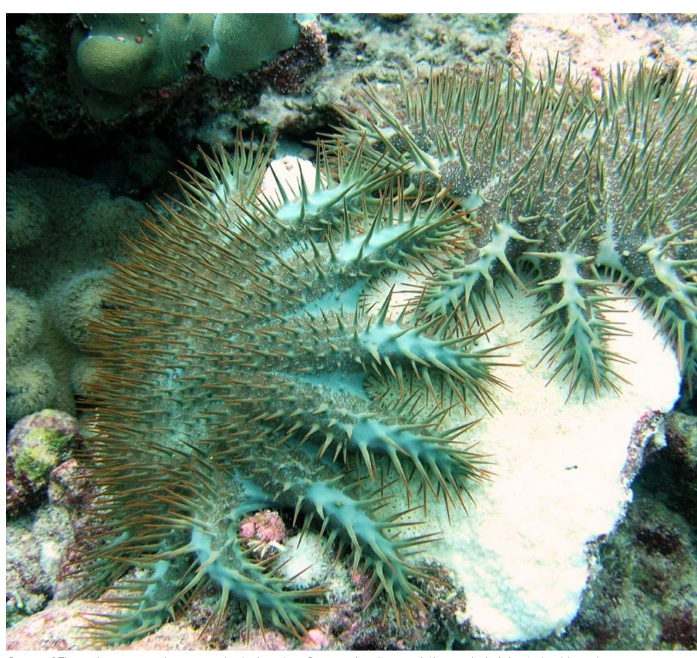

Crown of Thorns became a nuisance species in American Samoa when its population exploded due to land-based pollution run-off. © NOAA Fisheries

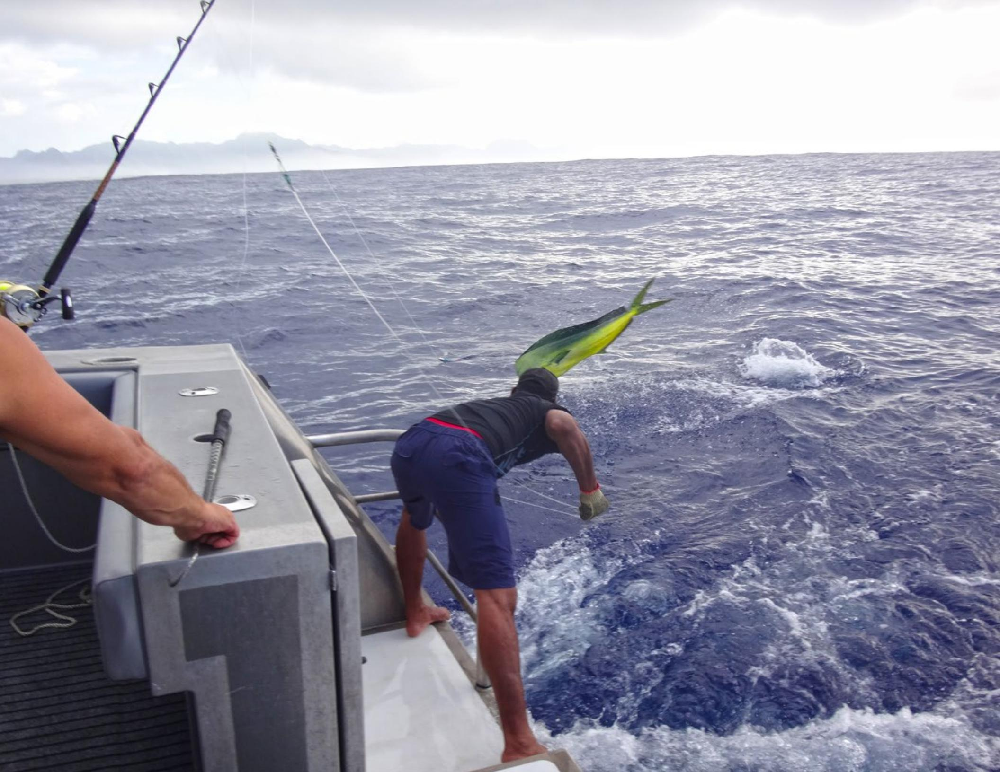

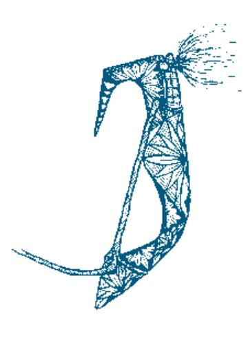

### **Autu 2: O Le Mautu Ma Lelei O Le Fa'aaogaina O Le Sami Ma Le Gataifale**

# Goal 2: Sustainable Ocean and Coastal Uses

The Sustainable Ocean and Coastal Uses goal focuses on fostering coordination, transparency, and use of quality information to support accommodation of existing, new, and future ocean uses in a manner that minimizes conflict, enhances compatibility, improves effectiveness, enables regulatory predictability, and supports economic growth. Several reports as well as common knowledge document that the primary sources of income in American Samoa are derived from the American Samoa Government and the Starkist tuna cannery (Territorial General Plan 2003; Figure 21). American Samoa is striving to diversify its economy to promote economic resilience but faces challenges. In some cases, there is a need to correlate the socioeconomic means and aspirations of the villagers and the economic plans of ASG (Clark et al. 2012).

A strategic priority of the AS Department of Commerce is to enhance maritime job creation by increasing aquaculture production. This opportunity is further enhanced by a Congressional increase in funding for marine aquaculture. Another potential means of economic diversification may come through increased tourism (SPTO 2017), including ecotourism. Tourism development must be sustainable, as well as environmentally and culturally sensitive (Thero et al. 2010). The five objectives under this goal and associated actions provide mechanisms to encourage sustainable ocean and coastal uses.

### **Current Uses of the Coastal and Ocean Waters of American Samoa**

The island of Tutuila has the highest density of coastal and ocean uses, ranging across commercial, recreational, cultural, educational, and scientific uses. Examples include tuna processing; purse seine, longline, and alia fishing; ferry and tug operations; seaport and airport operations; fuel

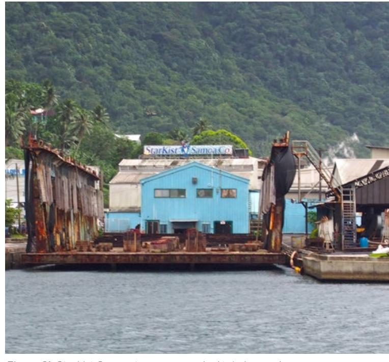

*Figure 21. Starkist Samoa tuna cannery in Atu'u is a major source of employment.*

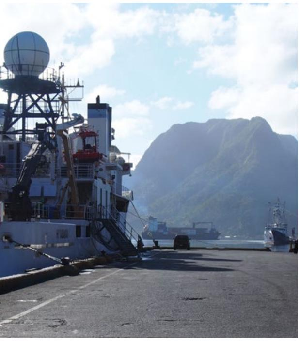

*Multi-use of the Pago Pago Port with the NOAA research vessel Hi'ialakai, a purse seiner, and a cargo ship.*

and petroleum supply; telecommunications and wastewater infrastructure; and tourism. In the more remote Manu'a Islands, coastal and ocean uses are predominantly subsistence fishing by boat and from shore, swimming, seaports (Ta'u Island has Faleasao Harbor and Ta'u Harbor that are operated seasonally; Ofu has one), and coastal airports (Fitiuta Airport on Ta'u; Ofu Airport on Ofu).

During a previous mapping effort in American Samoa, the WPFMC organized ocean and coastal uses into categories, which the ASOPT used during mapping exercises with the communities and stakeholders ([Appendix 9](#page-102-0)).

Through the community mapping exercises and consultation, the ASOPT further expanded on the "human use categories" for the ocean planning

effort (Table 1). Types of uses that fall into each category are listed in the table below. Coastal access points are in all tables because the user groups are different. See the Data Chapter for a detailed description of data products that were generated from these same mapping exercises and consultations.

A description of each type of use and the spatial extent of the uses (0-3 nm, beyond 3nm, or both) can be found in [Appendix 10](#page-105-0). With the "Fueling" as an example, the tables in [Appendix 10](#page-105-0) describe that this use includes "Locations associated with fueling boats, transport of fuel for island" but does not include "Transport of people, transport of fish or goods." Stakeholders noted that fueling occurs within 3 mi of the shore, but also occurs at sea at distances greater than 3 mi from shore.

| Human Uses Categories                           | Types of Uses*                                                                                                                                                                                                                                                                                                                                                             |
|-------------------------------------------------|----------------------------------------------------------------------------------------------------------------------------------------------------------------------------------------------------------------------------------------------------------------------------------------------------------------------------------------------------------------------------|
| Administrative Uses                             | Marine jurisdictions, Administrative boundaries, Federal lease blocks, Special management areas, Fisheries management areas, Maritime heritage resources                                                                                                                                                                                                             |
| Fishing and Village-Based Uses                  | Swimming, Spearfishing, Bottomfish fishing, Trolling, Handlining / bamboo pole / rod and reel fishing from shore, Shoreline and nearshore gleaning/ gathering (<5 ft deep), Gill nets, Throw nets, Sand mining, Shoreline recreation, Coastal access points, Recreational fishing, Sports fishing tournaments, Coastal clean-ups                               |
| Cultural Uses                                   | Culturally significant fishing (e.g. akule runs), Culturally significant sites / landmarks, Fautasi races / canoe races, Coastal access points, Fishponds, Fautasi tours, Historic / culturally significant sites (e.g. Star Mound)                                                                                                                                  |
| Recreational, Educational, and Research Uses | Recreational paddling, Swimming, Recreational diving, Recreational snorkeling, Surfing, Recreational sailing, Jet skiing, Educational activities, Research activities (university and local agency), Coastal access points                                                                                                                                           |
| Maritime Commerce and Navigation                | Shipping / commercial shipyard, Cannery operations / fish processing, Transport by boat / ferry, Fueling / fuel transport, Cruise ship operations, Yacht mooring, Coastal access points (terrestrial), Shipwrecks, Commercial fishing, Fresh fish export – off island, Aquaculture and mariculture, Navigational aids, Anchorage grounds, Ocean disposal sites |

\*These lists are not exhaustive and may be amended in the future.

*Table 1. Human uses associated with the marine environment and types of uses within each category.* 

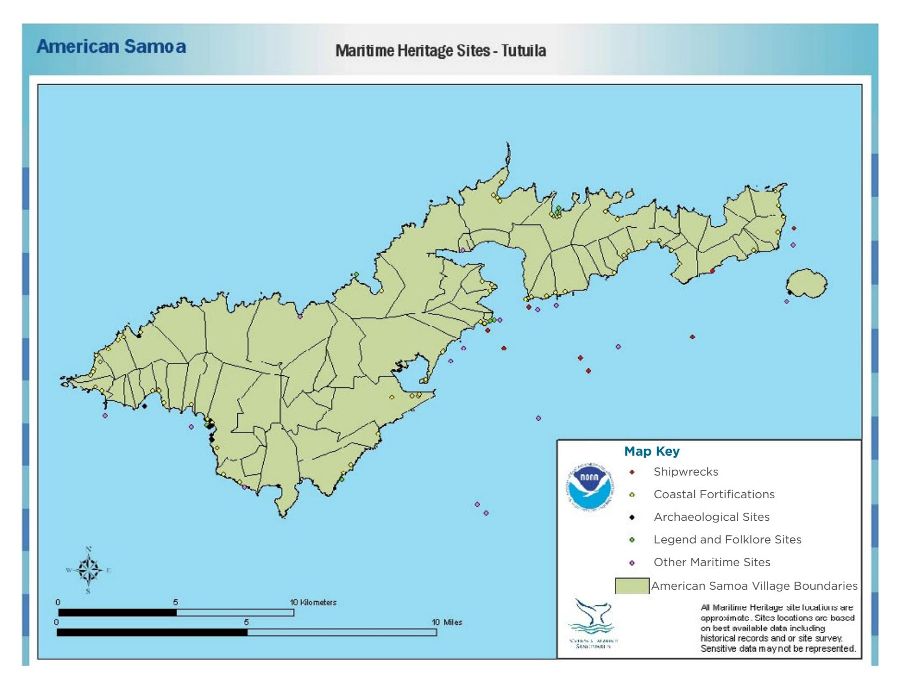

*Figure 22a. Maritime heritage sites on Tutuila and in the Manu'a Islands.*

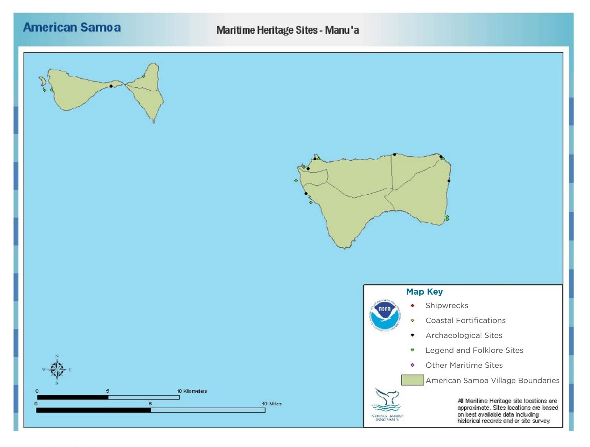

*Figure 22b. Maritime heritage sites on Tutuila and in the Manu'a Islands.*

**Administrative Uses**: This category includes several types of government uses, both at the federal and territorial level: Marine jurisdictions, Administrative boundaries, Federal lease blocks, Special management areas, Fisheries management areas, Maritime heritage resources. Maritime heritage resources consist of cultural, archaeological, and historical properties associated with coastal and marine areas and/or seafaring activities and traditions. For the purposes of ocean planning, cultural activities are in their own category below.

Many of the maritime heritage resources were documented in the 2007 NOAA Office of National Marine Sanctuaries American Samoa Maritime Heritage Inventory (Van Tilburg 2007). The report compiled databases, archival material, and known reports of maritime heritage sites, but did not initiate any new surveys; the report included mapped areas of heritage sites (Figures 22a and 22b).

Spatial 'special' and 'fishery' management designations include:

- Longline Vessel Prohibited Area (LVPA) implemented by the WPFMC and NOAA NMFS. The LVPA is a closure to longline vessels that extends from zero to 50 nm offshore to reduce gear conflicts and increased resource competition with smaller alia vessels that do not have the ability to venture far from port.
- Special Management Areas (ASAC §26.0221) implemented by AS DMWR.
- Community Based Fishery Management Program (ASAC §24.0905) implemented by AS DMWR.
- Annual Proclamation (ASAC §24.0908) implemented by AS DMWR.

**Fishing and Village Based Uses**: This category includes extractive and non-extractive uses: Swimming, Spearfishing, Bottomfishing, Trolling (Figure 23), Handlining / bamboo pole / rod and reel fishing from shore, Shoreline and nearshore gleaning/ gathering (<5 ft deep), Gill nets, Throw nets, Sand mining, Shoreline recreation, Coastal access points, Recreational fishing, Sports fishing tournaments, Coastal clean-ups. Some village uses may be found under recreational and/or cultural uses.

Commercial and recreational fishing are significant economic activities in the jurisdiction, and both are part of the region's culture and sense of place.

Recreational fishermen fish both nearshore and far from shore, crossing into federal waters. Charter fishermen generally fish in federal waters at the seamounts and banks targeting pelagic and bottomfish species.

The federal government and ASG, as well as villages, have their respective roles in the management of fishing in the territory. From shore to 3 nautical miles (nm) offshore, AS DMWR manages the fisheries resources. From 3nm seaward to the boundary of the US EEZ, or up to 200 nm offshore, fishing is regulated by NOAA NMFS, based on recommendations from the WPFMC. Resources that extend beyond the range of the EEZ, considered the "high seas," are managed by NOAA NMFS, in cooperation with the WPFMC, the State Department, and several international organizations such as the Western and Central Pacific Fisheries Commission and the Inter-American Tropical Tuna Commission.

The actions within this Plan are intended to improve collaboration between the federal government, ASG, and villages with respect to regional fisheries management. The PIRMP is a source of information

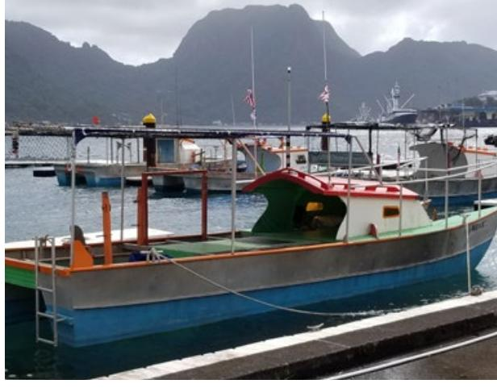

*Figure 23. Alia vessel used for fishing. © Christopher Hawkins*

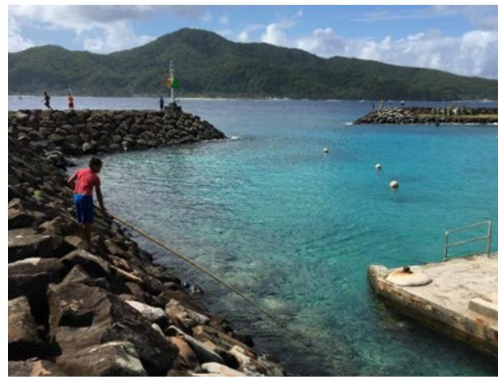

*Port at Aunuu. © Andrew Torres*

that can be used to identify areas that fisheries are utilizing, can thereby helping resource managers and project proponents gain a sense of the value of ocean space to different communities, including the fishing community, when considering decisions about the use of ocean space.

Actions identified in this Plan do not supplant or change the authority or decisions of ASG, NOAA NMFS, or other fishery regulatory authorities, nor does the Plan create any new management authorities. The intent of the American Samoa Ocean Planning Team is to act as a forum for ASG and federal agencies to discuss the implications of fishery management decisions taken under existing authorities, so that the full impact of those decisions is clearer. Ocean planning also includes the consideration of protected wildlife species that may interact with fisheries and fishing communities.

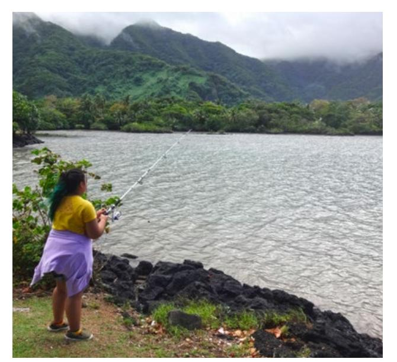

*Figure 24. Each summer the WPFMC sponsors a high school fisheries course during which students learn both traditional and modern fishing methods. © Mac Aveina*

**Cultural Uses**: This category includes current and historic ocean and coastal uses: Culturally significant fishing (e.g. akule runs; Figure 24), Culturally significant sites / landmarks, Fautasi races / Canoe races, Coastal access points, Fishponds, Fautasi tours, Historic / culturally significant sites (e.g. Laumei ma Malie, Figure 25). This category also includes annual palolo gathering and i`a sina, which can be added in the future.

Connections among natural and human components of American Samoa's ecosystem are exemplified by Traditional Knowledge held by village members, fishermen, and other generational users of the ocean, as well as other cultural resources and values. The proposed objectives and actions weave that valuable knowledge into what is understood and considered by agencies tasked with moderating resource use.

Participatory GIS mapping and information feedback loops are the suggested implementation tools to gather and utilize additional cultural use data. The ASOPT wants to acknowledge that the Sustainable Ocean and Coastal Use goal may be incompatible with some traditional cultural practices, given that particular types of traditional reef fishing, may not be sustainable.

### **Recreational, Educational, and Research Uses**:

This category includes consumptive and nonconsumptive uses: Recreational paddling, Swimming, Recreational diving, Recreational snorkeling, Surfing, Recreational sailing, Jet skiing, Educational activities, Research activities (university and local agency), Coastal access points, public shoreline and ocean access, relaxation, and aesthetics.

For the recreation subcategory, non-consumptive recreation is any recreational use that provides an experience rather than a product. Popular activities

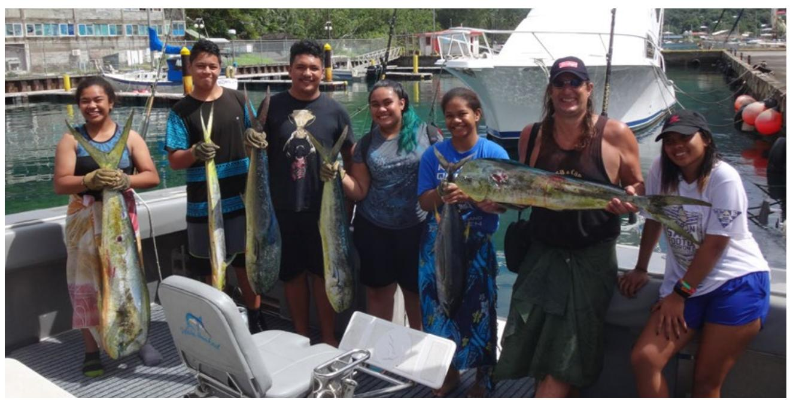

*Figure 25. WPFMC sponsored high school fisheries course displaying their harvest from a pelagics fishing excursion. © Joseph Fa`aita*

include swimming, surfing, and paddling (Figure 26). Consumptive recreation includes activities such as recreational and charter boat fishing, which are included in the "Fishing" Category above.

Education and scientific research uses include monitoring the coastal and ocean waters by scientific personnel from the AS DMWR, ASEPA, American Samoa Community College, University of Hawai`i, USFWS, and NOAA. Information about these activities can be garnered from permit activities.

Informative scientific equipment is deployed on or anchored to the seafloor. This infrastructure provides valuable data about real-time atmospheric and oceanographic conditions at sea and along the coast, such as tides, air temperature, water temperature, wave height, and wind speed.

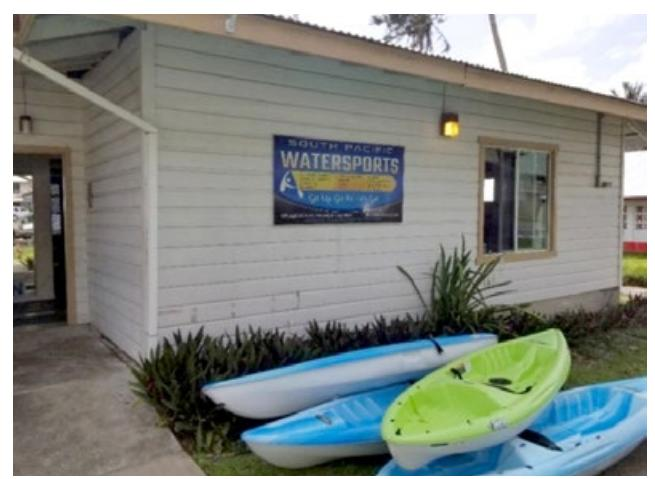

*Figure 26. South Pacific Watersports is a local business aimed at improving access to the coastal area through surf board, kayak, and stand up paddle rentals.*

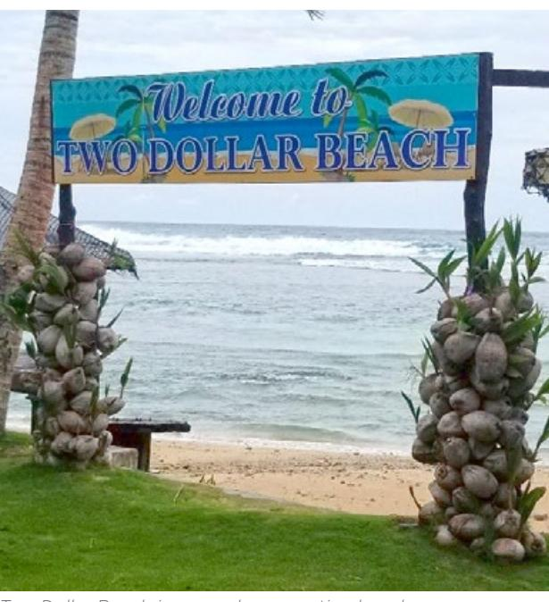

*Two Dollar Beach is a popular recreation beach with day-use fales for rent.* 

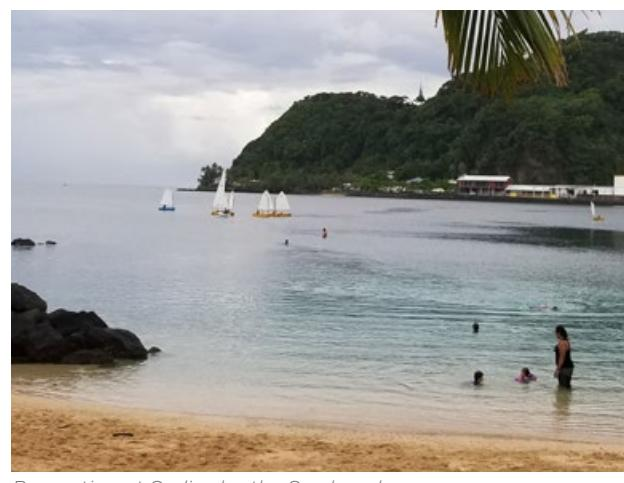

*Recreating at Sadies by the Sea beach. © Nate Ilaoa*

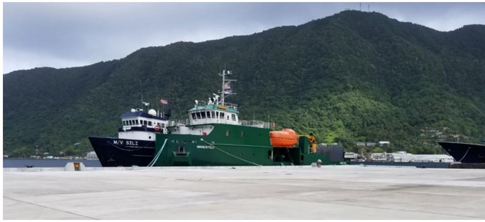

*Figure 27. AS DPA vessels M/V Sili and the M/V Manuatele. © Sarah Pautzke*

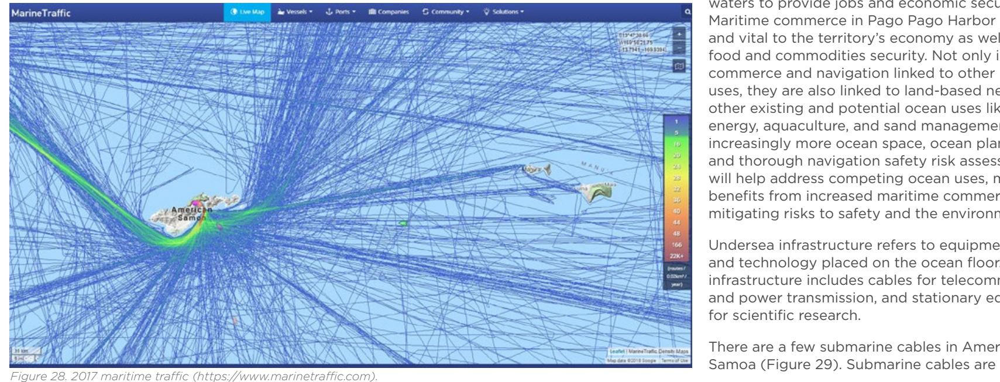

Instruments deployed for long periods of time provide time series data that help track changing conditions and aid in the study of climate change, natural environmental variability, and impacts from other human activities. Some of the data from at-sea equipment can be viewed real-time and downloaded online through [PacIOOS's website](http://www.pacioos.hawaii.edu/).

**Maritime Commerce and Navigation**: This category includes: Shipping / commercial shipyard, Cannery operations / fish processing, Transport by boat / ferry (Figure 27), Fueling / Fuel transport, Cruise ship operations, Yacht mooring, Coastal access points (terrestrial), Shipwrecks (that are not cultural or historical), Commercial fishing, Fresh fish export – off island, Aquaculture and mariculture, Navigational aids, Anchorage grounds, Ocean disposal sites.

Throughout the waters of American Samoa, marine transportation (Figure 28) utilizes ocean and coastal waters to provide jobs and economic security. Maritime commerce in Pago Pago Harbor is vibrant and vital to the territory's economy as well as to its food and commodities security. Not only is maritime commerce and navigation linked to other ocean uses, they are also linked to land-based needs. As other existing and potential ocean uses like wind energy, aquaculture, and sand management require increasingly more ocean space, ocean planning and thorough navigation safety risk assessments will help address competing ocean uses, maximize benefits from increased maritime commerce, while mitigating risks to safety and the environment.

Undersea infrastructure refers to equipment and technology placed on the ocean floor. This infrastructure includes cables for telecommunication and power transmission, and stationary equipment for scientific research.

There are a few submarine cables in American

critical infrastructure for modern society; telecommunication cables transmit between 97–99 percent of international digital and voice communication. Most cables are buried three to six feet below the seabed. As cables are taken out of service, they are generally not removed. In the future, any development of offshore wind energy farms would require multiple power cable systems to be laid.

In the coastal area, commercial and industrial harbor uses have expanded and will be further expanded in the future. Related activities include a new container terminal adjacent to the Tri Marine Samoa Tuna Processors plant, development of new marina facilities, the newly renovated Ronald Reagan Marine Railway Shipyard slipway and new office building, rebuilding the Malaloa sport fishing dock, and wharves for expanded local commercial fishing, a berthing pier for cruise ships, and a tourist terminal facility (Lyon Associates 2001).

**Sini 1:** Fautuaina le fa'aaoga tatau o matafaga ma gataifale aemaise ogasami

### **Objective 1: Encourage Sustainable and Appropriate Coastal and Ocean Development and Uses**

This objective builds spatial components into known planning efforts. Maps are a powerful tool to visualize current uses, threat layers (e.g. tsunami inundation, sea level rise), biophysicial layers (e.g. seamounts, coral reef, wind speed, ocean current and speed, etc.), and administrative layers (e.g. EFH, enforcement agency jurisdictions, etc.) to assess potential locations for future uses. Coastal use maps can also be used to inform plans, such as showing coastal uses pre and post tsunami events.

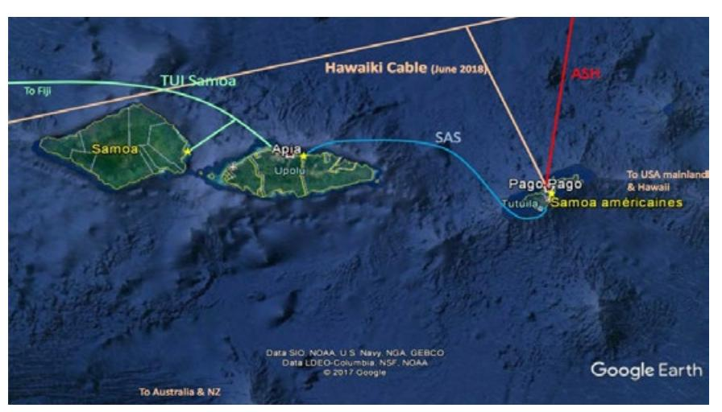

*Figure 29. Submarine cables between American Samoa, Western Samoa, and other islands.*

### **Action 1.** *Identify the extent and attributes of existing coastal and ocean uses.*

Several coastal uses have already been identified in mapping efforts done by ASDOC and NOAA. ASDOC GIS and NOAA OCM have already coordinated through the GIS User Group to ensure agency spatial data are being shared. Existing data include land use (ASDOC), fishing and species data (Western Pacific Fishery Information Network), drinking water sources (ASEPA), fish catch (AS DMWR), watersheds (CRAG/ ASCC Land Grant), power and water lines (ASPA), and fishing permits (NOAA NMFS). Additionally, there are data from research vessels, research projects, and participatory mapping (pGIS) efforts that could be included. This action builds on those efforts, expands the spatial footprint out to deeper waters, and ensures the inclusion of new data in a larger PIRMP.

**Agency Lead:** NOAA OCM

**Partners:** NPS, AS DHS, AS HPO, ASDOC, AS DMWR, AS DPA, ASEPA, ASPA

- 1. Work with ASDOC GIS and NOAA OCM to evaluate the spatial data related to current uses and ensure adherence to quality assurance standards.
- 2. Ensure that spatial data related to agency, commercial, private, education, research, and other uses are included in the PIRMP, as well as results of prior pGIS studies.
- 3. Conduct pGIS mapping with stakeholder groups and the communities to identify:
  - what and where current village uses occur from the coastal through ocean area
  - what and where recreational uses occur from the coastal through ocean area
  - uses that are perceived as spatially and temporally compatible
  - uses that are not perceived as spatially and temporally compatible

**Action 2.** *Map best management practices for current coastal uses and identify gaps in best management practices.*

Best management practices (BMPs) are drivers for sustainable coastal and ocean uses. There are plans that include BMPs, but many plans and the BMPs have not been integrated into spatial databases alongside the uses they are planning for.

**Agency Lead:** ASDOC Planning **Partners:** NRCS, USFWS, ASDOC, ASEPA, ASPA, AS

HPO, Department of Health, DMWR, AS DPR, DPW,

CCTF, AS DHS, USCG

- 1. Identify the spatial footprint of BMPs related to coastal and ocean uses (e.g. special management areas for Leone, Nuuuli, Pala, Pago Pago Harbor, and Malaeimi; marine protected areas; Villagebased conservation plans; NRCS conservation plans; watershed plans; US Coral Reef Task Force Faga'alu Priority Watershed designation; National Park, Sanctuary, Marine National Monument, and National Wildlife Refuge Boundaries; watershed studies; PNRS; and Federal Regulations). Include planning documents such as the 2012 American Samoa Tsunami Study, 2015 Multi-Hazard Mitigation Plan, Field Guide for Erosion and Sediment Control (2011), Clean Harbor Policy, and Harbor Master Plan.
- 2. Develop a map to describe where BMP implementation is likely underutilized and where it overlaps with uses using the coastal uses map and the BMP implementation map.
- 3. Coordinate with planners and users to discuss needed BMPs or highlight success stories where BMPs are enabling sustainable uses. Post success stories on ASDOC website and the PIRMP.

**Action 3.** *Identify areas appropriate for specific types of economic development and future uses.* 

The Territorial General Plan (TGP; 2007) outlines a 10-year plan with a vision for the future of American Samoa, a focus on primary concerns, creates a cooperative coordinated system of development, identifies strategic paths and best use of funds, creates capacity to implement programs, and outlines benchmarks. The TGP is the foundation for economic development in American Samoa and this Plan builds on that. This particular action evaluates areas in the coast and ocean that could be appropriate for future development, as well as movement of a current use into a new location, assesses potential for conflict between uses such as

recreational and commercial fishing, and identifies options for conflict mitigation (e.g. gear conflict).

**Agency Lead:** ASDOC Planning **Partners:** ASEPA, AS DMWR, AS Visitors Bureau, ASPA, AS DPA, NOAA OCM, DPR, ASDOC (GIS, CMP)

- 1. Conduct participatory mapping with stakeholder groups and the communities to identify:
  - desired future uses (using the use categories described earlier in this chapter)
  - undesirable future uses (using the use categories described earlier in this chapter)
  - future uses that are perceived as spatially and temporally compatible
  - future uses that are perceived as spatially and temporally incompatible
- 2. Execute GIS studies from coast to ocean to create 'compatibility maps' for offshore uses, such as wind speeds and wave intervals for offshore wind platforms.
- 3. Digitize relevant planning information from the TGP.
- 4. Overlay compatibility maps (from Task 2) and planning information from the TGP (from task 3) with participatory mapping information (from Task 1) to create a map of areas 'appropriate' for specific types of development and uses, similar to the use mapping that was completed for Pago Pago Harbor (Figure 30).
- 5. Post information and maps developed in Tasks above to the PIRMP and ASDOC websites.

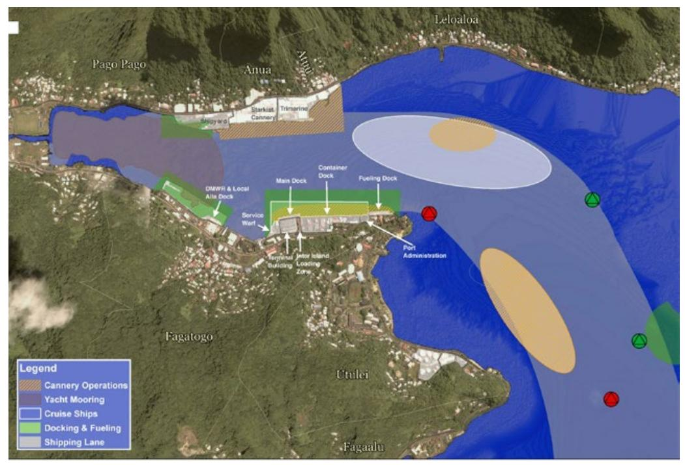

*Figure 30. Pago Pago Harbor Use map developed by NOAA Coral Reef Conservation Program.* 

**Action 4.** *Identify management agencies, jurisdictions, and enforcement capacities related to existing coastal and ocean uses.*

Existing federal law, such as NEPA, offers numerous opportunities for federal and state coordination. For projects that may require an environmental assessment or impact statement under NEPA, lead federal agencies may, to the extent practicable, discuss with ASG the jurisdiction over the proposed project and the potential for a coordinated approach to NEPA and territorial review. Such discussion will be influenced by a range of existing statutory, regulatory, administrative, and/or practical measures. Additionally, NEPA assessments may include or border communal lands, thus Office

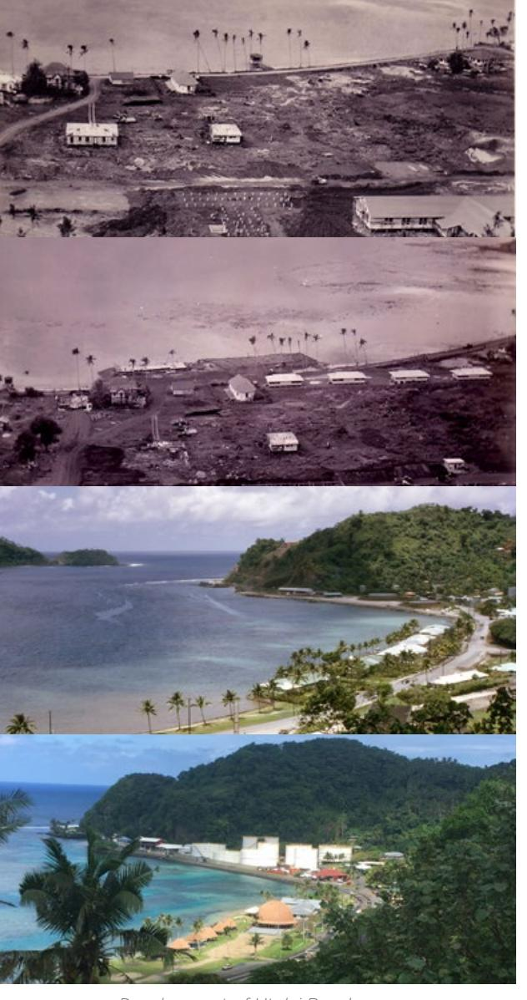

*(1942, 1942, 1967, 2018). © AS HPO*

of Samoan Affairs may also be involved in the coordination efforts. This action provides spatial data and context for that coordination.

**Agency Lead:** ASDOC Planning and GIS **Partners:** NOAA (PIRO, OLE, Weather Service), Office of the Gov nor, ASPA, DOI (USFWS, NPS), ASEPA, AS DMWR, AS DHS, AS Treasury (Customs), AS Legal Affairs (Immigration), AS Department of Agriculture, AS DOH, AS DPA, AS DPR, OSA, ASVB, AS HPO, US EPA, and US Department of State

- 1. Develop spatial data products to describe leasing, environmental review, and regulatory entities, including where and when relevant authorities play roles in decisions related to offshore uses, such as aquaculture, port expansion, tourism activities, offshore energy, and other uses.
- 2. Develop spatial data products that identify intersections of key federal programs and statutes related to offshore uses such as aquaculture, port expansion, tourism activities, offshore energy, and other uses.
- 3. Map jurisdictions of relevant agencies. Select agencies and villages within the planning extent that have a management role and authority from 3 nm to the extent of the EEZ. Also identify which agencies do not have a role (e.g. DOI Bureau of Ocean Energy Management currently has no jurisdiction in the territories).
- 4. Map areas of known or suspected illegal fishing by foreign vessels, identify actions to improve enforcement, and map enforcement capabilities from strongest to weakest mechanisms (e.g. illegal fishing in Fagatele Bay is easier to enforce than illegal fishing in Rose Atoll due to distance and available enforcement agents).
- 5. Identify areas of overlapping jurisdiction and thus potential collaborative management *Development of Utulei Beach* published online at ASDOC with the PNRS

- between agencies. For example, the ASDOC and ASEPA both have reputations for working well within communities and across agencies, encouraging collaboration for the benefit of the environment. These relationships can be expanded to also benefit the economy of American Samoa.
- 6. Post information and maps developed in Tasks above to the PIRMP and ASDOC websites.

### **Action 5.** *Identify the different permitting processes for the coastal and ocean areas.*

One of the primary goals of ocean planning is to enable a smoother permitting process with openness for activity proposers, as well as agencies, with high quality transparent data. In American Samoa, permitting activities that occur on land out to 3 nm offshore are vetted through the PNRS. The method for applying for permits is well documented and available online. However, information for obtaining a permit from 3 nm to the extent of the EEZ is less known publicly and is done on an agency by agency, permit by permit, activity by activity basis. This action addresses the lack of publicly-known, well- coordinated processes for ocean permits (3 nm-EEZ), and helps to guide how a project proposer might apply for a permit, including which agency to approach first and what information is needed from them.

**Agency Lead:** ASDOC Planning **Partners:** NOAA PIRO, US Army Corps of Engineers (USACE), AS DMWR, USCG, AS DPA, USFWS, NPS, USEPA, ASEPA, ASDOC (CMP, PNRS)

- 1. Identify paths for permitting based on the proposed activity (e.g. offshore aquaculture, nearshore aquaculture, offshore wind).
- 2. Document these paths in a report that is

information. Include in the document how PNRS may be involved, as well as a chapter that articulates the PNRS process, so that the report may be a one-stop shop for activity proposals from the shore to the extent of the EEZ.

- 3. Link the PIRMP with the AS Data Portal and PNRS system.
- 4. Place and maintain links to agency announcements about proposed offshore development activities on the ASDOC website.
- 5. Use the PIRMP, ASDOC Data Portal, and ASDOC websites to enhance access to data, environmental reports, and proposed offshore use development activities.

**Sini 2:** Fuafua le fa'aaogaina o le tamaoaiga o le gataifale ma le sami ina ia mafai ona fa'aauauina lona fa'aaogaina nei ma le aga'i i le lumana'i

### **Objective 2: Spatially Plan Coastal and Ocean Resources and Uses to Ensure Economic Resilience in the Following Areas:**

- 1. Subsistence and village-based activities
- 2. Economic development and commercial use
- 3. Recreational and research/education

This objective focuses on spatial tools to anticipate and plan for continuity of operations to ensure resilience during, and assess capacity to respond to, emergencies and natural disasters. American Samoa's government has developed plans for climate change impacts, increasing sea levels, and natural disaster preparedness. These plans include

the ASDOC 2015 Multi-Hazard Mitigation Plan, DOC Master Plan, the DPA Harbor Master Plan, Territorial Response Plan, and USACE 2012 American Samoa Tsunami Study. The local weather station (NOAA National Weather Service) and AS Department of Homeland Security (AS DHS) Territorial Emergency Management and Coordination Office (TEMCO) are working on Severe Weather plans, updating flood zone maps and tsunami models. Other agencies have related plans: AS DMWR, NOAA NWS, ASDOC, AS DPA, and the USCG. AS DHS TEMCO houses the National Tsunami Mitigation Program and is tasked with maintaining and conducting vulnerability assessments and associated data related to flood zones, tsunami and coastal hazards and threats, and more. Existing and relevant data layers include land use zones, coastal hazards (flood insurance maps and tsunami maps), and general plans.

**Action 1.** *Protect existing infrastructure and adapt plans for future infrastructure and uses in response to sea level rise, storms, and other coastal hazards.* 

This action will inform planning for future development activities using data related to sea level rise, storms, and other coastal hazards. Many of the tasks below assess capacity to respond to emergencies and natural disasters. The planning connection between infrastructure and resilience is clear: during consultations with communities, two villages asked that beach and road infrastructure (sea walls, revetments) be built or restored to protect the villages from coastal erosion as well as to improve the health and safety of their coasts. Additionally, resilient harbor operations serve a critical role in economic and food security, as the majority of imports and exports come through the seaport.

Relevant permitting processes include demolition (ASEPA), USACE, National Flood Insurance Program, the Hazard Mitigation Plan (HMP) from DOC, and *Fagatogo Marina in which several types of* 

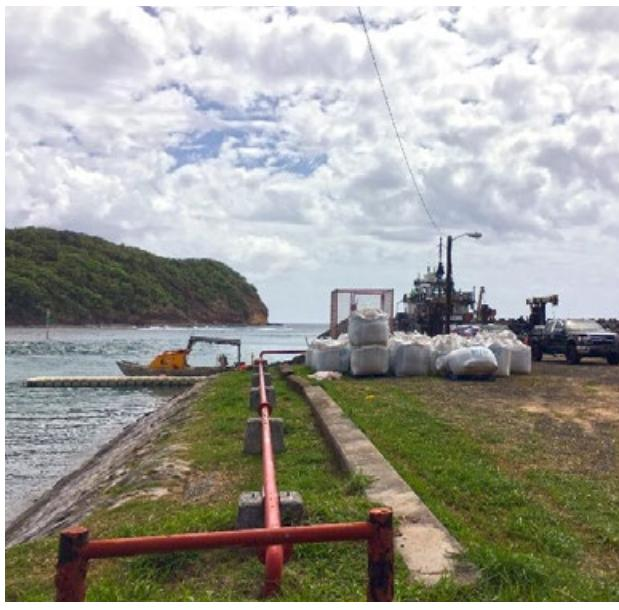

*Port on Ofu Island. An alia and a DPA ferry are tethered to the dock. © Sarah Pautzke*

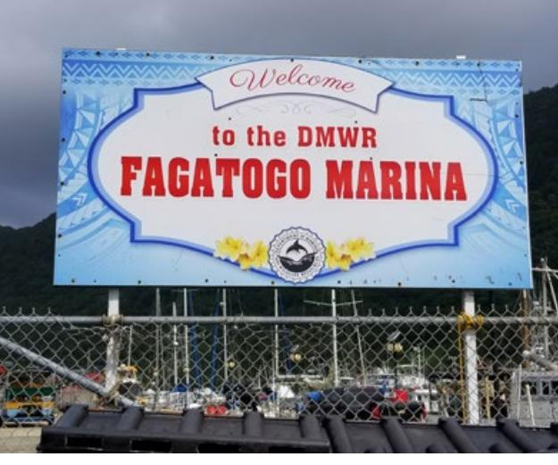

*vessels are berthed. © Christopher Hawkins*

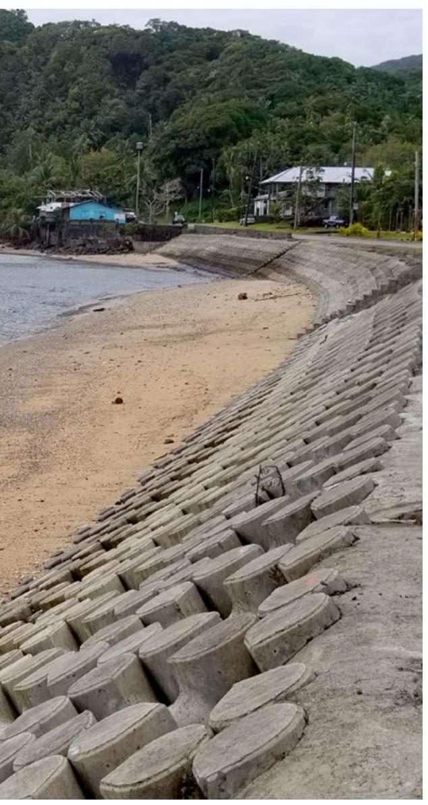

*Seawall in the village of Afao. The shoreline here is used by villagers for swimming and fishing. © Sarah Pautzke*

the Erosion/ Sediment BMP Guide. National Flood Insurance Program (NFIP) regulations cover flood zones, storm surge areas, and more. AS DHS TEMCO is responsible for the National Tsunami Hazard Mitigation Program and for conducting vulnerability assessments related to natural disasters.

**Agency Lead:** ASDOC CMP **Partners:** ASEPA (water quality data), USACE, PNRS, Hazard Mitigation Planning, ASPA, AS DPA, ASDOC Planning, ASDOC GIS, AS DHS, USCG

- 1. Ensure inclusion of spatial data from noted plans into the PIRMP.
- 2. Review NFIP regulations for land use and building permits (adopted in 2010).
- 3. Identify existing coastal hazard and mitigation plans related to the above areas and within the shoreline to 3 nm.
- 4. Identify plans and permitting processes that account for future infrastructure planning but do not have associated spatial data. Digitize the data and include in a PIRMP.
- 5. Conduct a flood zone vulnerability assessment using the information about hazards and existing infrastructure to pinpoint existing infrastructure that is under threat during its anticipated lifetime. Assess locations for seawalls, stairs, revetments, and other shoreline structures to improve resiliency against natural disasters and coastal erosion and increase coastal and ocean safety and health.
- 6. Use the projects and planning information to identify areas where the planning and permitting of future infrastructure conflicts with projected future hazards within the planning horizon.
- 7. Use the projects and planning information to identify areas where the impact of projected future hazards on planning and permitting of future infrastructure is unknown within the planning horizon.

**Sini 3:** Fa'atumauina le fa'atauaina ma le aoga- o le fa'aaogaina o le tomai fa'aleaganu'u i fuafuaga uma

### **Objective 3: Enhance, Promote, and Maintain Sustainable Traditional Values and Knowledge As They Relate to Coastal and Ocean Uses**

Maintaining Fa'a Samoa, or the Samoan way of life, is important to the individuals and communities of American Samoa. Many villages in American Samoa have their own community management plans and policies regarding traditional values and knowledge; the intent of this objective is to ensure an exchange of regional spatial data and local traditional data. Government plans require active participation and support of the village leadership, which was specifically noted by Clark et al. (2012) when discussing the role of the village in resilience planning for tsunamis.

### **Action 1.** *Integrate Traditional Ecological Knowledge (TEK) into the AS GIS Data Portal and into the PIRMP.*

AS DMWR has digitized traditional data from these community management plans and is currently coordinating with ASDOC GIS to publish open data on the AS GIS Data Portal. While AS DMWR continues to be the lead agency for collecting new data from village efforts, ASDOC GIS is coordinating with NOAA OCM to identify data products that could support community management efforts. This action is a call to other federal and ASG agencies to contribute additional information to the AS GIS Data Portal. For example, some priority watershed projects, such as Faga'alu, collected information about the reefs, fishing activities, and coastal impacts through socioeconomic surveys.

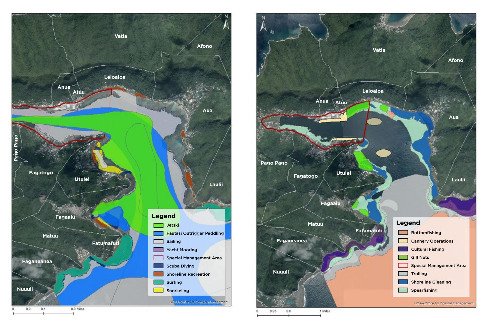

*These two maps show the different recreational uses (left) and fishing uses (right) of Pago Pago Harbor, as well as an overlaid ASG Special Management Area. Port operations also occur here on the south part of the harbor in Fagatogo, which can be seen on page 45.*

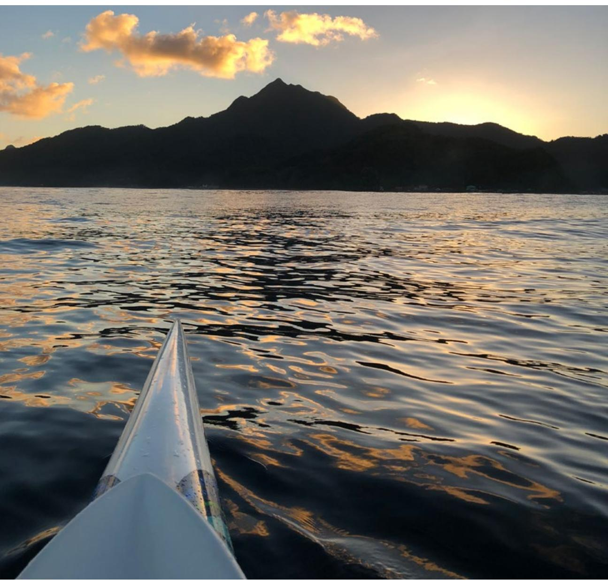

*Paddling an outrigger canoe in the calm waters below Mt. Matafao. © Burg Salanoa*

**Agency Lead:** AS DMWR

**Partners:** ASDOC GIS, NOAA OCM, OSA, AS GIS

Users Group, NPS

- 1. Identify agencies and organizations involved with tracking TEK.
- 2. Review existing TEK surveys (existing MPAs, watershed TEK, climate info).
- 3. Coordinate with ASDOC and ASEPA efforts to build data into Data Portal and support inclusion of data from those surveys.
- 4. Discern spatial gaps where no cultural information is available for an area.
- 5. Engage OSA to assist and inform researchers of what data are needed in cultural areas.
- 6. Direct agencies and departments to work with the GIS User Group to package outreach materials to include a spatial component.

**Action 2.** *Identify areas where traditional ocean uses have occurred, do occur, and could occur in the future to minimize conflicts with other ocean uses.*

Identifying areas where traditional uses have occurred, do occur and could occur better informs agencies who are permitting new uses to evaluate the impacts of the proposed use against the traditional use and, if warranted, require the permit applicant to seek a different location for proposed activities. Within the coastal area, village-based MPAs include existing plans that describe the temporal and spatial extent of extractive and nonextractive traditional practices (e.g. sand mining). These data layers may then be consulted during proposal reviews. The purpose of this action is to replicate this process for ocean areas, where applicable.

**Agency Lead:** AS DMWR

**Partners:** OSA, ASDOC CMP, ASDOC GIS,

NOAA OCM

- 1. Elaborate on the data layer that describes the temporal and spatial extent of extractive and non-extractive traditional practices from 3nm seaward.
- 2. Refer to these data layers during proposal reviews, or, if you are a permittee, refer to these layers to determine compatibility with traditional practices.

**Action 3.** *Provide education and outreach of spatial tools and identified spatial footprints of traditional practices to villages.*

The purpose of this action is to ensure a strong feedback loop between tools created, communities that can benefit from them, and agencies using the tools in decision making. These tools and associated educational efforts are the means to enhance and ground truth known traditional knowledge related to coastal and ocean uses, and teach the villages how to utilize the tools to develop well-articulated and informed agency feedback when agencies are vetting future uses.

**Agency Lead:** ASDOC GIS **Partners:** AS DMWR, ASDOC CMP, OSA, NOAA OCM

1. Host workshops in villages and with targeted stakeholder groups (e.g. cultural practitioners) to explain the available spatial tools and teach them how to use the tools.

**Sini 4:** Fa'atauaina le saogalemu o tagata lautele o Amerika Samoa e ala i le fa'aleleia o feso'otaiga i le va o vaega a le malo- fa'alotoifale ma le feterale

**Objective 4: Account for National Security Interests in the AS Coastal and Ocean Waters Through Enhanced Coordination, Increased Transparency, and Sharing of Information Across Territorial and Federal Agencies and Ocean Users**

Multiple branches of the Department of Defense (DOD, i.e., the US Navy, Army, Marine Corps, and Air Force), the US DHS (i.e., USCG), NOAA OLE, and AS DHS are responsible for the Nation's security. Improved communication between the military and non-military government, at the federal and territorial levels, is imperative for successful ocean planning.

Falling under the [Coast Guard's 14th District](https://www.pacificarea.uscg.mil/Our-Organization/District-14/) and attached to Coast Guard Sector Honolulu, Marine Safety Detachment American Samoa (MSD AmSam) is a unique unit. As part of the Coast Guard's 11 statutory missions, marine safety is crucial to the economy and infrastructure of American Samoa. MSD AmSam is responsible for conducting approximately 50 vessel exams annually of the island's commercial tuna fleet, which is the island's largest employer. On average, MSD AmSam conducts 25 to 30 investigations per year varying from pollution response and marine casualties to vessel groundings on the island's reef. MSD AmSam regularly coordinates with the local government on issues like hurricane planning, tsunami preparedness, and community

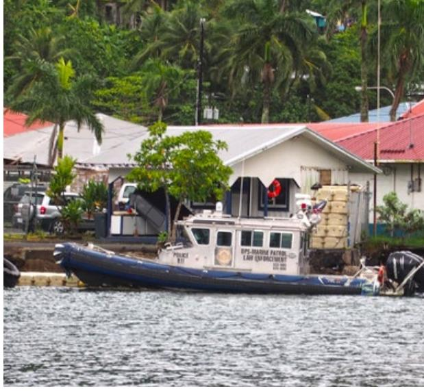

*DPS marine patrol boat. © Sarah Pautzke*

safety outreach programs in an effort to prevent or mitigate negative impacts. MSD AmSam frequently interfaces with AS DPA regarding harbor closures, restrictions, and security risks, such as the screening and inspecting of all foreign flagged vessels that arrive into Pago Pago Harbor. This includes tank vessels and cargo vessels that recurrently carry fuel and goods into and out of the island. Lastly, MSD AmSam ensures the safety and security of landbased facilities such as the piers, loading docks, and fueling areas through an annual inspection program.

**Action 1.** *Identify and consult with the Plan and Data Portal as important sources of information in decision-making for security programs, initiatives, and planning documents.*

Communication between the military and nonmilitary governmental agencies is improved when DOD and DHS continue to share pertinent information with other agencies, which helps to address a variety of impacts to training and testing activities. US DHS intends to use this Plan and the Data Portal as mechanisms to guide and inform DOD and US DHS programs, initiatives, and planning documents when involved in the multiple coordination task forces and other planning groups that DOD currently participates in. US DHS regularly participates in a wide variety of existing Federal, State, and local agency coordination groups, forums, and advisory panels across the nation, and will work to identify additional outlets in which it would be beneficial to participate.

**Agency Lead:** USCG **Partners:** ASDHS, DPA, DPS, NOAA OLE

- 1. Work with contacts to identify the Plan and the Data Portal as important sources of information in decision making.
- 2. Consult the Plan and the Data Portal, along with other sources of information, in the preparation

of internal agency guidance, existing procedures, and environmental planning.

**Action 2.** *Identify DOD and US DHS points of contact for the national security data layers in the Data Portal.* 

Ensuring that agencies have appropriate points of contact improves interagency coordination and will enable decision makers to understand the implications of proposed regulations and development plans on DOD and DHS security, training, testing, and a variety of other missionspecific needs.

**Agency Lead:** USCG

**Partners:** DOD Marine Corps, DOD Navy, ASDHS

1. Agencies will, to the extent practicable, update the national security data on the Data Portal as needed, such as when applicable permits are renewed, or operations significantly change.

**Sini 5:** Fuafua lelei tamaoaiga aua le fofoga taumafa o le mamalu o le atunu'u lautele

### **Objective 5: Spatially Plan for Enhanced Food Security**

American Samoa is an isolated territory in the south Pacific Ocean. It is particularly susceptible to natural disaster and human-made impacts that affect food supply. For example, Cyclone Gita (2018) destroyed several papaya, breadfruit, and banana crops, reducing the local food availability in American Samoa (among other areas). Resilient ocean economic development includes enhanced and protected food supply, as it relates to fishing and aquaculture as well as resilience within the ports to disasters. The following actions pertain to improving food supply to American Samoa as well as maintaining access via shipping routes.

### **Action 1.** *Identify potential areas for increased local food supply from the ocean.*

To support this objective, agencies identify potential areas for increased food supply from the ocean. This includes identification of future aquaculture sites, new fish aggregating device (FAD) sites, and areas that may be ripe for conservation because they are hatchery or juvenile habitat for species in which the adults are harvested.

**Agency Lead:** AS DMWR

**Partners:** AS DPA, USCG, ASDOC, NOAA PIFSC, NOAA PIRO, WPFMC

- 1. Build on the GIS compatibility studies relates to uses. Assess spatial locations that are promising with respect to ocean and coastal aquaculture. Assess locations that are compatible with new FADs.
- 2. Assess desirability and spatial extent of future uses related to food production.

### **Action 2.** *Ensure shipping routes and FADs are mapped and that future activities do not impact these routes.*

American Samoa relies heavily on imports and fishing for its food supply. Ensuring the shipping routes and FADs are not impacted by future activities can ameliorate impacts to food supply. Additionally, knowing where FADs and buoys are on a map can help with a post hurricane or tsunami search should the FAD, buoy, or other structures in the ocean lose their mooring.

**Agency Lead:** USCG

**Partners:** AS DPA, USCG, AS DMWR, ASDOC, NOAA PIRO, NOAA OCM, Department of Transportation Maritime Administration

- 1. Evaluate the availability of existing data layers (e.g. shipping lanes, FADS, buoys).
- 2. Compare map of future desired and compatible uses from the Tasks above to existing shipping and FAD data.
- 3. Action 3. Identify areas that can be used for alternative transport to promote commerce via the ocean between villages if a disaster impacts usability of roads, boat ramps, and docks.

Maintenance of food supply is throughout the islands is critical to survival. Roads, boat ramps, and docks can be severely damaged during a disaster. Ensuring that alternative routes to move food and supplies around the island, such as identification of all boat ramps, critical infrastructure, and shipping lanes, even if just for alia or the ferry, around Tutuila and the Manu`a Islands can be critical to maintaining food supply. For example, having a route via the water already mapped in the event the road to Fagasa is destroyed or blocked can ensure the village of Fagasa can get food and supplies from other parts of the island.

**Agency Lead:** AS DHS **Partners:** AS DPA, USCG, ASDOC Planning

- 1. Reference vulnerability assessments noted in above objectives. Ensure food supply lines are included.
- 2. Use the NOAA Coastal Hazards mapping tool to identify compatible areas of alternative transport.
- 3. Work with communities and stakeholders to identify desirable and undesirable locations for alternative transport within the compatible zones.

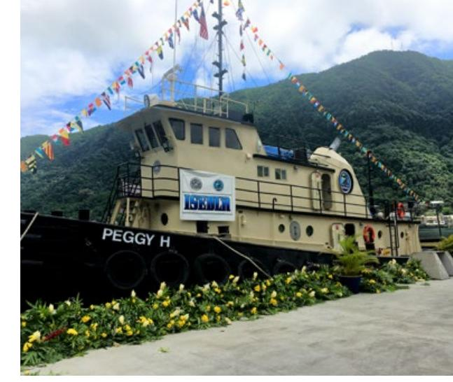

*Tugboat PEGGY H, now Tugboat ISEULA, is the tug boat used by AS DPA for vessel escort, pilot transfers, and ship assists. © Christopher King*

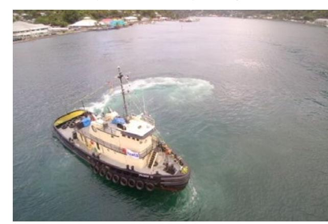

*Tugboat ISEULA maneuvers in Pago Pago Harbor. © Christopher King*

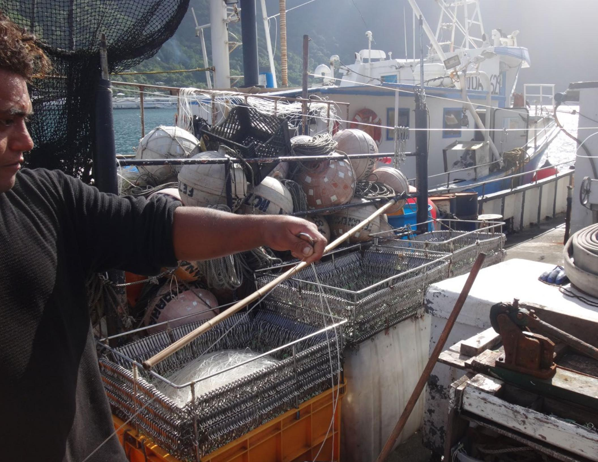

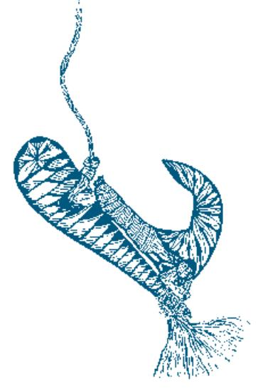

### **Saienisi, Fa'amaumauga ma Metotia**

# Science, Data, and Tools

Scientifically supported data and information are the foundation of the Plan. The PI RPB supported the collection of spatial data and other information to inform the interjurisdictional coordination actions that the Plan has described in Chapters Two and Three. At the same time, several actions identify additional science, research, and traditional and local knowledge that is needed to more effectively address regional ocean management priorities. For example, some data that seems readily available is only available via request. Satellite Automatic Identification System (otherwise known as SAIS) data, the only vessel traffic data available for American Samoa, is only accessible via request to a commercial entity or to the USCG Navigation Center. Further, that data can then only be used by the requestor, not pushed to a public interface like Marine Cadastre. The Plan also identifies additional baseline data and information needed to better characterize the region's marine environment and socioeconomic conditions, as described below.

Spatial tools can include the ability to identify current uses, identify potential natural disaster impact zones, and determine from that how potential new uses may be integrated into a village's coastal or nearshore area. An example that ties ocean planning to disaster preparedness is the proposal to install a dock on the east side of Pago Pago Harbor, as suggested by the village of A`ua, which could provide access via boat from the east side of Tutuila to the west side, where the hospital and most supply stores are located should a natural disaster prevent access via the road.

This chapter describes the spatial data and data tools developed with support from the Data Team and other partners that are accessible through the Pacific Islands Regional Marine Mapper (PIRMP). ASOPT members intend to use the tools described in this chapter to inform their activities under existing authorities, as described in Moving ahead under existing authorities above.

### **American Samoa and the Pacific Islands Regional Marine Planner**

The PIRMP is a key resource that informs ocean planning in American Samoa and throughout the Pacific Region. The PIRMP provides a centralized, public location for interactive ocean mapping and information focused on the Pacific region. It enables federal, territorial, and village-level decision makers, as well as the public, to visualize and analyze ocean

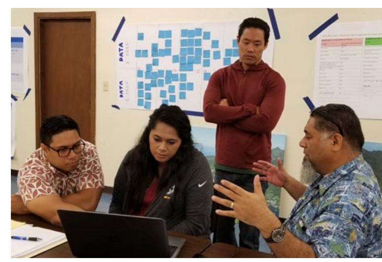

*ASOPT members from ASDOC, NOAA OCM, and DPA discuss relevant maps and data for ocean planning. © Sarah Pautzke*

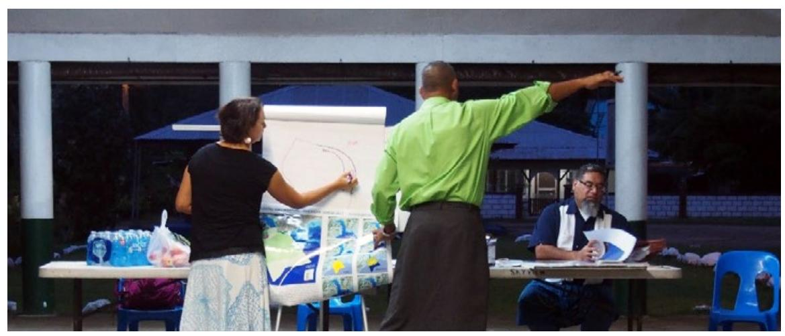

*Miranda Foley (ecoLogic) and Faimealelei Anthony Allen detail where a boat ramp could be sited in A'ua during a listening session. © Sarah Pautzke*

resources and human use information such as fishing grounds, recreational areas, shipping lanes, habitat areas, and infrastructure sites. Maps created on the PIRMP can illustrate interactions among a wide range of natural features and human activities.

The PIRMP was initiated by the Naval Postgraduate School with support from the PI RPB's Data Team (Data Team) and in collaboration with other federal and regional partners. Individuals from the Data Team continue to provide input on its development, working closely with NOAA and BOEM, partners that operate and maintain the [Marine Cadastre](https://marinecadastre.gov/viewers/), which is an authoritative national scale online data repository and viewer.

Marine Cadastre was selected to host the ocean planning data effort because it has the backing of federal agency resources to maintain the site into the future and does not require substantial up-front financial investment to develop, instead relying on personnel and technological resources already in place. Marine Cadastre and the Data Team worked closely with the ASOPT to determine the

appropriate data layers for the territory of American Samoa, and subsequently worked with the ASDOC GIS team to provide data to the portal.

### **Overview and Summary of PIRMP Content**

The PIRMP includes an online mapping tool and a data catalogue that offers access to myriad spatial data layers. The PIRMP serves as a central location where data previously housed in separate places can be viewed together and combined in ways that can be tailored to the viewer's area and topics of interest. The PIRMP's layers have been carefully selected and enhanced to inform the dialogue and decision making needed to advance this Ocean Plan's goals and objectives, but not to provide an exhaustive catalogue of all the region's spatial data or duplicate other online mapping resources. Many of the PIRMP's layers were created with existing data developed by federal agencies and compiled by federal agencies, American Samoa, and universities, while some data were created specifically for the PIRMP with stakeholder participation and assistance.

Mapping efforts have already been conducted by the NOAA Coral Reef Conservation Program. The results were 1) a use map for Pago Pago Harbor that identifies predominant commercial uses of the harbor, including cannery operations, docks, mooring locations, cruise ships, and the shipping lane, and 2) a mapbook for Fagaloa displaying locations of various coastal uses (Figure 30). An additional mapping exercise was conducted that acquired data regarding watershed-related issues and different types of fishing from Utulei to Fatumafuti.

During the ASOPT's listening sessions, villages and targeted stakeholder groups were asked if there were any specific future development or use of

their coastal and ocean waters they would like to see or not see. These were documented through a mapping exercise. Through combining the output of this action with actions within this plan and incorporating the data into the PIRMP, permittees could have a framework within which to plan their proposed action, including which agencies they need to engage, villages and stakeholders they need to engage, and the environmental conditions associated with their actions. It is up to the permittee to work with agencies to determine probable suitability of the use - this is intended to inform, not approve, actions, Further participatory GIS studies that document uses throughout American Samoa are needed to fully inform the PIRMP. The mapping exercise done in the listening sessions provided broad brush-stroke data that would need further refining to be more useful but provides helpful examples of the data's usefulness.

On page 58 is an example of how data can be overlaid (Figure 31a). The hotspots for uses, based on cool to hot color coding, can be overlaid with proposed future uses to show where potential use conflicts could occur, and where a potential future use may have greater chance of success if needed infrastructure is already present (e.g. putting in a boat ramp where the road already exists instead of needing to build the road too).

These potential new uses (Figure 31b) could then be overlaid with a flood hazard map to determine the suitability for a new use. Using the example of a new boat ramp or dock on the west side. Poloa versus Leone: comparisons between sites can be made such as assessing existing infrastructure, what uses may conflict or work with the new proposed use, and what potential for natural hazard damage might exist. Is it preferable to build a dock in Poloa because of the reduced risk of damage compared to Leone, or instead build a different type of dock in Leone because the road to Poloa can be

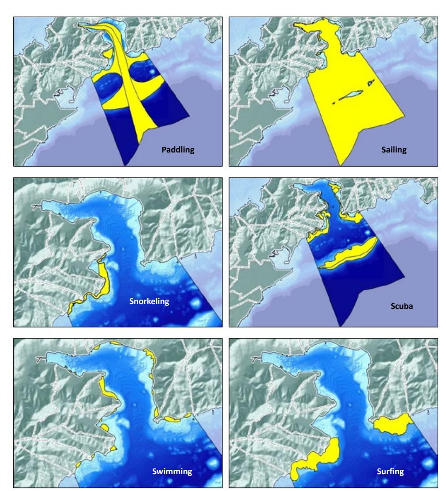

Figure 30. 2012 Fagaloa coastal uses.

dangerous? These are the types of decisions that can be made when the appropriate data is acquired (and with the necessary stakeholder engagement and village buv-in).

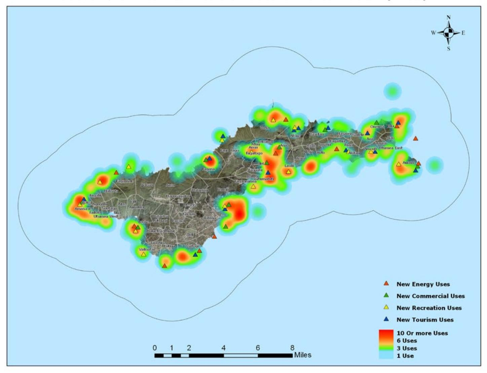

*Figure 31a. Tutuila human uses density map generated from the 2017 listening sessions.*

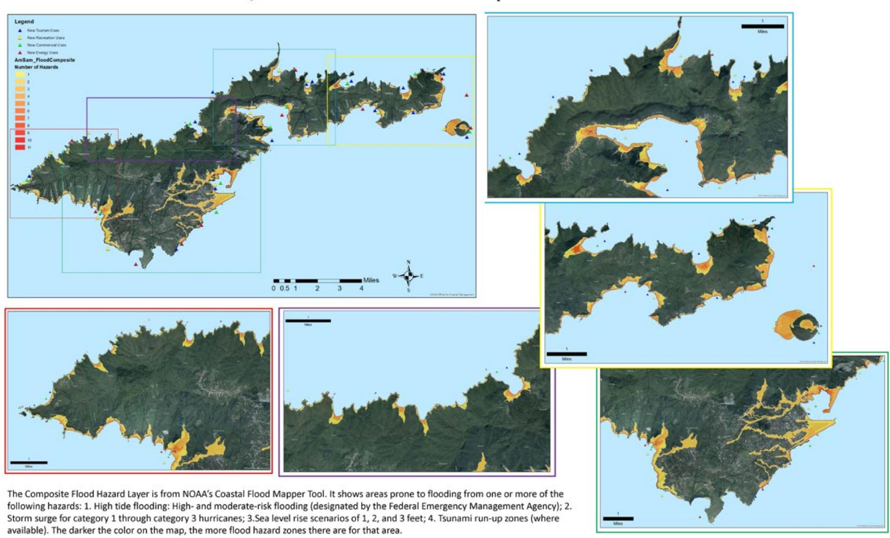

*Figure 31b. Composite flood hazard maps.* 

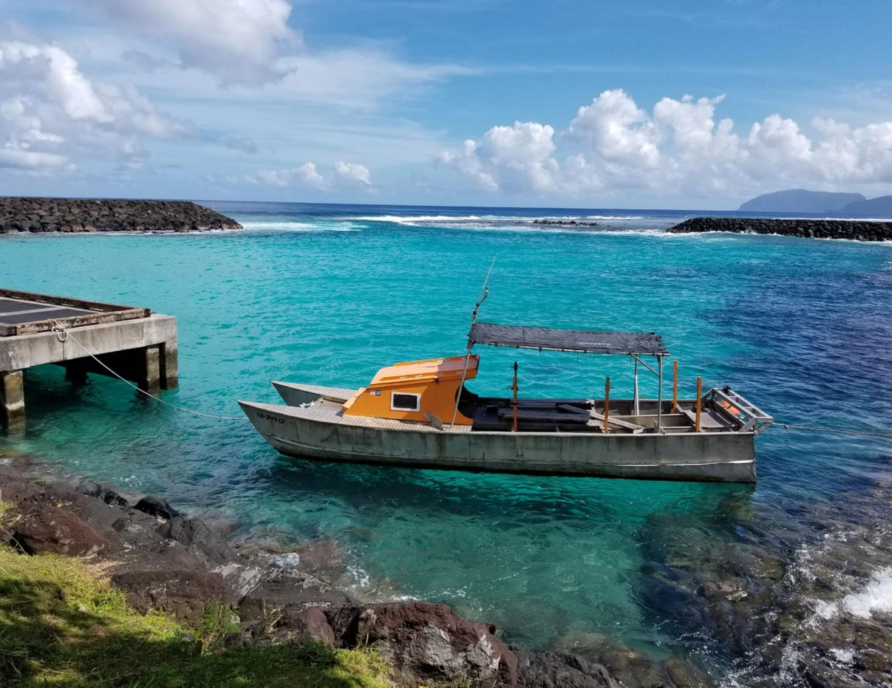

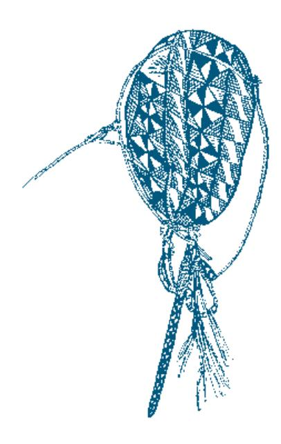

# **Fa'atinoga o le Ta'iala** Plan Implementation

Plan implementation means following through on actions and other commitments in the Plan. Effectively doing so requires clear roles and responsibilities, a process for Plan updates and amendments, coordination, resources, and performance monitoring and evaluation.

American Samoa government, the federal agencies, and the WPFMC participated in the planning process and have roles that reflect their authorities and jurisdictions. These participants played important roles by serving on the ASOPT and PI RPB. For many specific actions, they brought expertise and perspectives as managers of important ocean and coastal resources under their jurisdictions, enhancing coordination through the planning process, and ensuring that key stakeholders and the public are engaged.

While E.O. 13840 eliminated the federally-led ocean planning mandate and the RPBs, Federal agencies are still required to coordinate and collaborate on ocean-related matters and specifically, to modernize the acquisition, distribution and use of ocean-related data. When this Plan is complete and finalized, the ASDOC will assume responsibility for its implementation and maintenance. Federal agencies may be invited to participate at the ocean planning table during Plan updates, but ASG owns the Plan henceforth.

### **ASOPT Roles**

Specifically, the ASOPT is responsible for ensuring that:

• Progress is made in implementing the actions articulated in the Plan.

- Federal agencies and local stakeholders are engaged in implementation of the Plan and any future updates or amendments to the Plan.
- Expertise and support from within and outside of local governmental entities are being leveraged.
- A work plan for Plan implementation is developed and updated over time to reflect new information and evolving context.
- Call public meetings of the full ASOPT at least annually and develop agendas for those meetings.

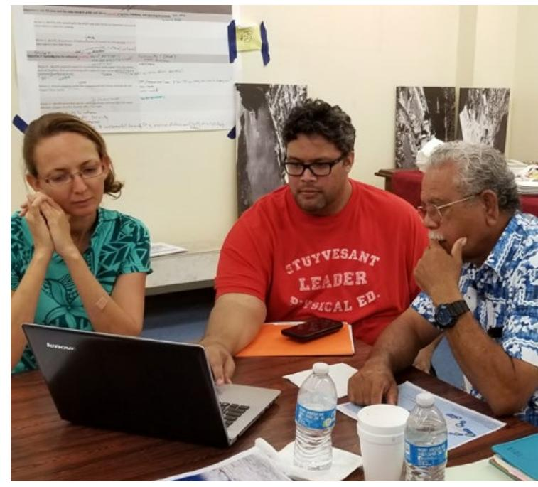

*ASOPT members from ASDMWR and the WPFMC review objectives and actions in this plan.*

*Alia are small, double-hulled catamaran multipurpose boats. They are used for commercial and subsistence fishing (pelagic trolling and bottomfishing) or for transportation like the vessel seen in this photo taken at Ta'u Harbor. © Nate Ilaoa*

- • Organize ASOPT or executive sessions to discuss administrative topics as needed.
- Monitor, evaluate, and report to ASG and federal partners, and the public on progress in implementing the Plan.

Note: The Lead Agency of the ASOPT will schedule periodic meetings or workshops with ASOPT member agencies to review progress of the actions and tasks, and relate those to progress of the objectives. The lead agency upon Plan completion will be ASDOC.

### **American Samoa Governance**

Unique to American Samoa, traditional village governance is a powerful dynamic of governance with far reaching influence on all aspects of society. Coordination between agencies in the absence of engaging traditional governance leaders is a common impediment to overall resource and land use management.

American Samoa governance responsibilities are layered and shared between government elected officials and traditional governance. The direct relationship between overall governance and the traditional land tenure system (lands and surrounding ocean), if effectively woven with elected officials, is key to effective coastal resource management and initiatives. With that in mind, this ocean planning effort seeks to improve ocean and coastal management through improved integrated agency decision-making to enable reductions in use conflicts, increased access to data, enhanced information for permitting and ease of development, and mitigation of impacts to natural resources.

The ASG agencies on the planning team provide a critical connection to existing agency frameworks related to stakeholder engagement. These

frameworks include agency outreach programs, PNRS and the PNRS guide book, ASDOC Zoning, and American Samoa Chapter 26 Coastal Management Regulations (ASAC Chapter 26).

The PNRS is a streamlined land use permit system that integrates the permitting requirements of each of the territorial agencies concerned with environmental management ([Appendix 11](#page-109-0)) out to 3 nm offshore. The public must apply for a land use permit for any type of construction or structure. The PNRS staff are responsible for overseeing and guiding the land use permit applications, determinations of major and minor projects, site visits, review of project, coordination with applicant, holding public hearings if necessary, and approving or denying permit applications. These permits fall into two categories – minor and major projects. Minor projects are generally reviewed within a fiveday period, while major projects require a more technical approach and is reviewed within a 45-day period:

### Minor Projects:

- Constructing a single family home;
- Constructing Samoan cultural facilities including: fautasi boat houses, faletalimalo or guest house, and fale leoleo or guardhouses;
- Constructing structures or extensions to existing non-commercial structures that do not exceed one hundred twenty (120) square feet; and
- Repair existing structure

### Major Projects:

- Creating, expanding, or extending any commercial activity;
- Siting permanently or continually replacing intermodal containers or freezer container, including enclosing, connecting utilities, or any

other permanent action which exceed thirty (30) days;

- Siting major facilities;
- Landfilling, excavating, disposing of dredged materials, mining, quarrying;
- Dredging or filling marine or fresh waters, point source discharging of water or air pollutants, ocean dumping, or constructing artificial reefs.

The PNRS reviews land use permits, considering public health, safety, and environmental concerns. This is done through a series of rules for buildings which are assessed during the permitting process. A building might not be permitted if it is proposed to be built in hazardous area along the shoreline or in an area of environmental concern such as along stream banks. If buildings are built against the rules, there is enforcement authority within the PNRS to charge fees or to issue a stop order for noncompliance with the regulations.

### **Federal Governance**

The majority of ocean space in the American Samoa regional planning area is under Federal jurisdiction (including, exclusively, the EEZ from 3 nm offshore to the outer extent of the EEZ which has boundaries with other countries or 200 nm), and much of the data for that area is collected and managed under Federal authority. The June 2018 [Executive Order](https://www.whitehouse.gov/presidential-actions/executive-order-regarding-ocean-policy-advance-economic-security-environmental-interests-united-states/) mandates that federal agencies coordinate activities regarding ocean-related matters, promote the lawful use of the ocean by agencies, facilitate economic growth of coastal communities and promote ocean industries, use best available ocean-related science and knowledge to inform decisions, and facilitate collaboration regarding ocean-related matters. For these reasons, federal agencies have a significant role in collaborative actions described in the Plan.

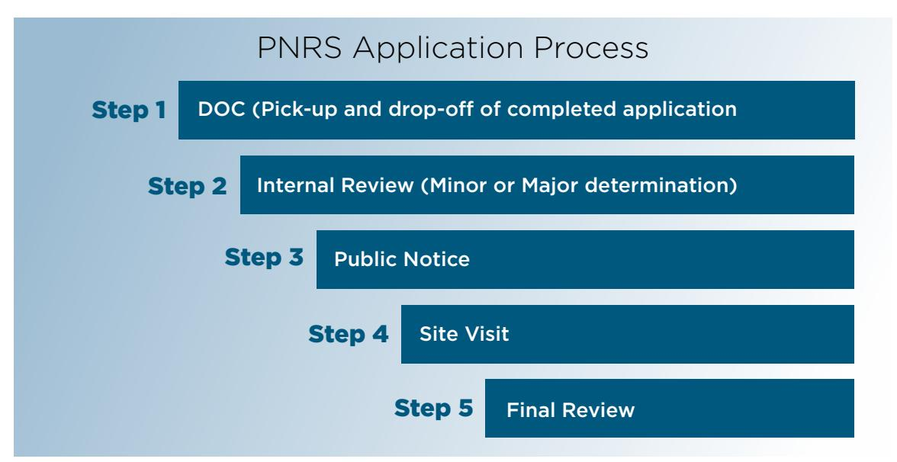

*Website: <http://doc.as.gov/resource-management/ascmp/pnrs/>*

### **Plan Updates**

The ASOPT is committed to an adaptive approach that accounts for changing information, ecological and socioeconomic context, and other dynamics. For this reason, the ASDOC and other members of the ASOPT will work together to routinely review implementation progress, assess the need for Plan updates or amendments, and make updates or amendments as needed.

The Plan will be reviewed comprehensively at least once every five years to assess whether amendments are needed. Plan amendments will include a public engagement process. Plan amendments will also provide an opportunity to review and incorporate the results of Plan performance.

# References

American Samoa Department of Commerce. 2003. Territorial General Plan.

Caplan, J., J. Buika, C. Cunningham, G. Foss, L. Fiatoa, S. Maga, and A. Afalava. 2015. Multi-Hazard Mitigation Plan for the Territory of American Samoa. A Jamie Caplan Consulting LLC report to the American Samoa Governor's Office and American Samoa Territorial Hazard Mitigation Council.

Clark, Athline, T. Smith, A. Adams, R. Kinchla, P. Potter, D. Savercool, T. Bushnell, T. Fee, and D. Sjoblom. 2012. American Samoa Tsunami Study. A Report prepared by the US Army Corps of Engineers, Honolulu District.

Final Recommendations of the Interagency Ocean Policy Task Force (July 19, 2010) can be found here: [https://obamawhitehouse.archives.gov/files/](https://obamawhitehouse.archives.gov/files/documents/OPTF_FinalRecs.pdf) [documents/OPTF\\_FinalRecs.pdf](https://obamawhitehouse.archives.gov/files/documents/OPTF_FinalRecs.pdf)

Lyon Associates, Inc. 2001. Port Master Plan 1999-2019 Final Report. Department of Port Administration American Samoa Government.

South Pacific Tourism Organisation – Research and Statistics Division (SPTO). 2017. American Samoa International Visitor Survey. Prepared for: American Samoa Visitors Bureau.

SSRI. 2003. American Samoa Ocean Resource Management Plan. Prepared by the Social Science Research Institute, University of Hawai`i at Mānoa for American Samoa Department of Commerce Coastal Management Program.

Thero, Cate, M. Kiner, and B. Crump. 2010. American Samoa Tourism Master Plan. Prepared by: Resort Consulting Associates, LLC, Kiner Design Group, and Studio 89 International. Prepared for: Department of Commerce, American Samoa Government.

Utrilla, P., Mazo, C., Sopena, M. C., Martínez-Bea, M., & Domingo, R. (2009). A palaeolithic map from 13,660 calBP: engraved stone blocks from the Late Magdalenian in Abauntz Cave (Navarra, Spain). Journal of Human Evolution, 57(2), 99-111.

Van Tilburg, Dr. Hans. 2007. American Samoa Maritime Heritage Inventory. Pacific Islands Regional Office – Office of National Marine Sanctuaries. NOAA.

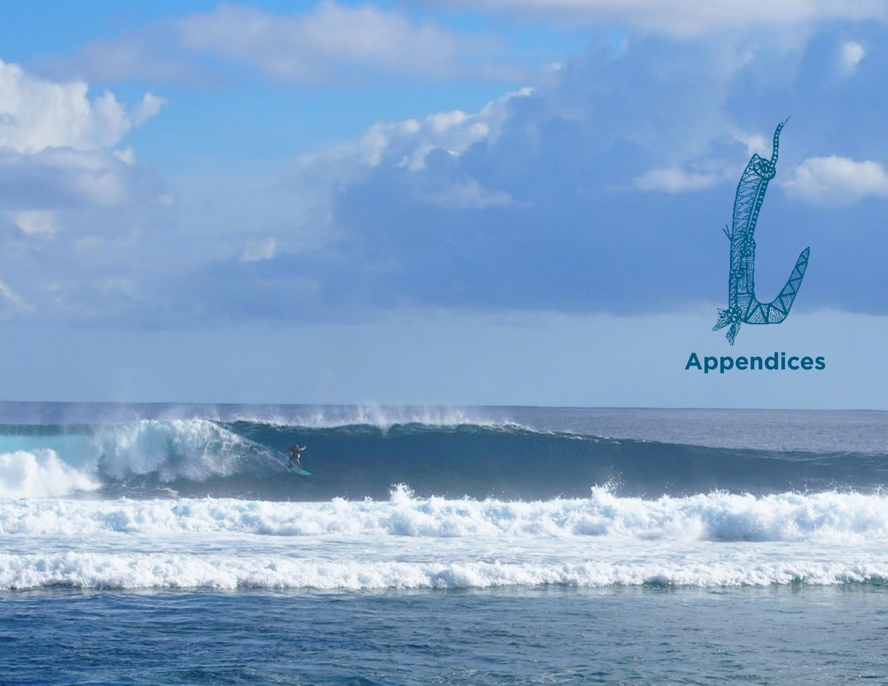

### **Appendix 1**

# Deeds of Cession

### **Cession of Tutuila and Aunu'u**

Whereas the Governments of Germany, Great Britain, and of the United States of America have on divers occasions recognized the sovereignty of the government and people of Samoa and the Samoan group of islands as an independent State; and whereas owing to dissensions, internal disturbances and civil war, the said governments have deemed it necessary to assume the control of the legislation and administration of said state of Samoa; and whereas the said governments have on the sixteenth day of February, by mutual agreement, determined to partition said State; and whereas the islands hereinafter described being part of the said State have by said arrangements amongst the said governments, been severed from the parent State, and the Governments of Great Britain and of Germany have withdrawn all rights hitherto acquired, claimed or possessed by both or either of them by treaty or otherwise, to the said islands in favor of the government of the United States of America; and whereas for the promotion of the peace and welfare of the people of said islands, for the establishment of a good and sound government, and for the preservation of the rights and property of the inhabitants of said islands, the Chiefs, rulers and people thereof are desirous of granting unto the said government of the United States full powers and authority to enact proper legislation for and to control the said islands, and are further desirous of removing all disabilities that may be existing in connection therewith and to ratify and to confirm the grant of the rule of said islands heretofore granted on the 2nd day of April, 1900.

### **Now know Ye:**

1. That we, the Chiefs whose names are hereunder subscribed by virtue of our office as the hereditary representatives of the people of said islands, in consideration of the premises herein-before recited and for divers good considerations us hereunto moving, have ceded, transferred, and yielded up unto Commander B. F. Tilley of the U.S. "Abarenda" the duly accredited representative of the Government of the United States of America in the islands hereinafter mentioned or described for and on behalf of the said government. All these the islands of Tutuila and Aunu`u and all other islands, rocks, reefs,

foreshores and waters lying between the 13th degree and the 15th degree of south latitude and between the 171st degree and 167th degree of west longitude from the meridian of Greenwich, together with all sovereign rights thereunto belonging and possessed by us, to hold the said ceded territory unto the Government of the United States of America; to erect the same into a separate District to be annexed to the said Government, to be known and designated as the District of "Tutuila".

- 2. The Government of the United States of America shall respect and protect the individual rights of all people dwelling in Tutuila to their lands and other property in said District; but if the said Government shall require any land or any other thing for Government uses, the Government may take the same upon payment of a fair consideration for the land, or other thing, to those who may be deprived of their property on account of the desire of the Government.
- 3. The Chiefs of the towns will be entitled to retain their individual control of the separate towns, if that control is in accordance with the laws of the United States of America concerning Tutuila, and if not obstructive to the peace of the people and the advancement of civilization of the people, subject also to the supervision and instruction of the said Government. But the enactment of legislation and the general control shall remain firm with the United States of America.
- 4. An investigation and settlement of all claims to title to lands in the different divisions or districts of Tutuila shall be made by the Government.
- 5. We, whose names are subscribed below, do hereby declare with truth for ourselves, our heirs and representatives by Samoan Custom, that we will obey and owe allegiance to the Government of the United States of America.

In witness whereof we have hereunto subscribed our names and affixed our seals on this 17th day of April, 1900 A.D.

Fofo and Aitulagi Sua and Vaifanua

Tuitele of Leone x Pele x

Fofo and Aitulagi Sua and Vaifanua

Faiivae of Leone x Mauga x Letuli of Iliili x Leiato x Fuimaono of Aoloau x Faumuina x Satele of Vailoa x Masaniai x Leoso of Leone x Tupuola x Olo of Leone x Soliai x Namoa of Aitulagi x Mauga x

Tuanaitau of Pavaiai x Lualemana of Aasu x Amituagai of Ituau x

The foregoing instrument of Cession (pages 1, 2, and 3) was duly signed by Leoso in the presence of, and at the request of, the Chiefs and Representatives of the Division of Fofo and Aitulagi, and by Pele in the presence of and at the request of the Chiefs and Representatives of Sua and Vaifanua in Tutuila in conformity with Samoan customs as to signatures to documents, in my presence at Pago Pago on the 17th day of April, 1900 A.D., immediately prior to the Raising of the United States Flag at the United States Naval Station, Tutuila.

### **E.W. Gurr**

Barrister of the Supreme Court of Samoa.

### **Cession of Manu'a Islands**

Whereas, the Islands of the Samoan Group lying east of Longitude 171 degrees west of Greenwich were, on the 16th day of February, 1900, by arrangement between the Governments of Germany, Great Britain, and the United States of America, placed under the protection of the Government of the United States of America;

And Whereas, on the 17th day of April, in the year 1900, the Islands of Tutuila and Aunuu, being portion of said Islands of the Samoan Group lying east of Longitude 171 degrees west of Greenwich, were, by the chiefs and rulers of Tutuila and Aunuu, ceded to and placed under the sovereignty and protection of the United States of America, and the government of said Islands was thereupon assumed by said United States;

And Whereas, in administering said government, the Islands hereinafter described, known as the Manu'a Islands, being the remainder of said Islands of the Samoan Group lying east of Longitude 171 degrees west of Greenwich, have been under the protection of the United States of America, and controlled and governed in conjunction with the islands of Tutuila and Aunuu;

And Whereas, at the request of Tuimanu'a, the King of Manu'a, and his chiefs, the United States Flag was, on the 15th day of June, 1900, raised on the Islands of Tau, of the Manu'a Group, for the purpose of granting protection to the people of the Manu'a Islands;

And Whereas, Tuimanu'a and his chiefs, being content and satisfied with the justice, fairness, and wisdom of the government as hitherto ad¬ministered by the several Commandants of the United States Naval Station, Tutuila, and the officials appointed to act with the Commandant, are desirous of placing the Islands of Manu'a hereinafter described under the full and complete sovereignty of the United States of America to enable said Islands, with Tutuila and Aunuu, to become a part of the territory of said United States;

Now Know Ye: (1) That we, Elesare Tuimanu'a and the Chief whose names are hereunder subscribed, in consideration of the premises hereinbefore recited, have ceded, and, by, These Presents Do Cede, unto the Government of the United States of America, All Those, The Islands of the Manu'a Group, being the whole of eastern portion of the Samoan Islands lying east of Longitude 171 degrees west of Greenwich and known as Tau, Olosega, Ofu, and Rose Islands, and all other, the waters and property and adjacent thereto, together with all sovereign rights thereunto belonging and possessed by us.

To hold the said ceded territory unto the Government of the United States of America, to erect the same into a territory or district of the said Government.

(2) It is intended and claimed by these Presents that there shall be no discrimination in the suffrages and political privileges between the present residents of said Islands and citizens of the United States dwelling therein, and also that the rights of the Chiefs in each village and of all people concerning their property according to their customs shall be recognized.

Done at the place of Faleula in Tau, in triplicate, in both the Samoan and the English languages, on this 14th day of July, in the year 1904, A.D.

### King of Manu'a

and

District Governor Tuimanu'a County Chief of Fitiuta Tufele

County Chief of Ofu Misa

County Chief of Olosega Tuiolosega

County Chief of Faleasao Asoau

District Clerk P. Logoai

United States Naval Station, Tutuila

District Court of Tutuila

No.5

Held at Tau, in Manu'a

I Hereby Certify that on this 16th day of. July, in the year 1904, before me, Edwin W. Gurr, Judge of the District Court of Tutuila, personally appeared Tuimanua, the Governor of Manu'a; Tufele, County Chief of Fitiuta; Misa, County Chief of Ofu; Tuiolosega, County Chief of Olosega; Asoau County Chief of Faleasao; and Logoai, District Clerk of Manu'a; personally known to me to be the Tuimanua, high chiefs, and representatives of the people of the Islands of Manu'a, who, each for himself, acknowledged that he executed the attached Instrument of Cession, and affixed his seal thereto, freely and voluntarily, for the uses and purposes therein mentioned.

In Testimony Whereof I have caused the seal of the court to be affixed this 16th day of July in the year 1904.

### **Appendix 2**

# National Level Documents and PI RPB Documents Links

### **National Level Documents**

**National Ocean Council**

<https://obamawhitehouse.archives.gov/administration/eop/oceans>

**Executive Order 13547**

[https://obamawhitehouse.archives.gov/files/documents/](https://obamawhitehouse.archives.gov/files/documents/ 2010stewardship-eo.pdf) [2010stewardship-eo.pdf](https://obamawhitehouse.archives.gov/files/documents/ 2010stewardship-eo.pdf)

**Final Recommendations of the Ocean Policy Taskforce** [https://obamawhitehouse.archives.gov/files/documents/](https://obamawhitehouse.archives.gov/files/documents/ OPTF_FinalRecs.pdf) [OPTF\\_FinalRecs.pdf](https://obamawhitehouse.archives.gov/files/documents/ OPTF_FinalRecs.pdf)

**Marine Planning Handbook**

[https://obamawhitehouse.archives.gov/sites/default/files/microsites/](https://obamawhitehouse.archives.gov/sites/default/files/microsites/ostp/final_marine_planning_handbook.pdf) [ostp/final\\_marine\\_planning\\_handbook.pdf](https://obamawhitehouse.archives.gov/sites/default/files/microsites/ostp/final_marine_planning_handbook.pdf)

**Implementation Plan**

[https://obamawhitehouse.archives.gov/sites/default/files/national\\_](https://obamawhitehouse.archives.gov/sites/default/files/national_ocean_policy_implementation_plan.pdf) [ocean\\_policy\\_implementation\\_plan.pdf](https://obamawhitehouse.archives.gov/sites/default/files/national_ocean_policy_implementation_plan.pdf)

**Executive Order 13840 Regarding the Ocean Policy to Advance the Economic, Security, and Environmental Interests of the United States** [https://www.federalregister.gov/documents/2018/06/22/2018-13640/](https://www.federalregister.gov/documents/2018/06/22/2018-13640/ocean-policy-to-advance-the-economic-security-and-environmental-interests-of-the-united-states) [ocean-policy-to-advance-the-economic-security-and-environmental](https://www.federalregister.gov/documents/2018/06/22/2018-13640/ocean-policy-to-advance-the-economic-security-and-environmental-interests-of-the-united-states)[interests-of-the-united-states](https://www.federalregister.gov/documents/2018/06/22/2018-13640/ocean-policy-to-advance-the-economic-security-and-environmental-interests-of-the-united-states)

**Guidance for Implementing E.O. 13840** [https://www.whitehouse.gov/wp-content/](https://www.whitehouse.gov/wp-content/uploads/2017/11/20180628EO13840OceanPolicyGuidance.pdf) [uploads/2017/11/20180628EO13840OceanPolicyGuidance.pdf](https://www.whitehouse.gov/wp-content/uploads/2017/11/20180628EO13840OceanPolicyGuidance.pdf)

### **Pacific Islands RPB Documents**

All of the following documents can be located by contacting the Regional Administrator for NOAA NMFS PIRO.

### **Charter for the Pacific Islands RPB**

Development of the PI RPB Charter was one of the first acts of the PI RPB. The Charter described the purpose, membership, roles, and process under which the PI RPB operated. It was finalized in September 2014 and was signed by all PI RPB member entities.

### **Pacific Islands RPB Ocean Planning Stakeholder Guide**|

The Pacific Islands Regional Planning Body (PI RPB) was dedicated to developing a coastal and marine spatial (CMS) plan that reflected input and participation from interested organizations and individuals. The PI RPB routinely solicited comments and participation as an important component of its activities. Opportunities ranged from commenting on draft documents to participating in workshops, attending PI RPB meetings, and attending meetings of PI RPB members' agencies. This guide identified likely stakeholders for engagement, when and where engagement could occur, and various avenues for engagement.

### **Appendix 3**

# Foundational Documents of the PI RPB (Invite and Nomination Letters)

EXECUTIVE OFFICE OF THE PRESIDENT
NATIONAL OCEAN COUNCIL
WASHINGTON, D.C. 20503

June 15, 2012

The Honorable Togiola T. A. Tulafono Governor of American Samoa Pago Pago, AS 96799

Dear Governor Tulafono,

As Co-Chairs of the National Ocean Council (Council), we are writing to request your engagement in working together to improve the stewardship of the ocean and coasts. On July 19, 2010, President Obama signed Executive Order 13547, establishing a National Policy for the Stewardship of the Ocean, our Coasts, and the Great Lakes (National Ocean Policy). The National Ocean Policy provides a framework for collaborative, regionally-based marine planning that brings together Federal, State, Tribal, and local authorities to better inform and coordinate regional management decisions regarding ocean and coastal activities and resources.

In June of 2011, the Council hosted a National CMSP Workshop that brought together over 500 Federal, State, tribal and local government representatives, indigenous community leaders, and members of the public from across the country to kick off efforts to discuss how cooperative ocean, coastal, and Great Lakes planning can be used to advance our national stewardship goals. The Pacific Islands were well represented at this meeting, including participation by American Samoa. The Council has applied the diversity of viewpoints, perspectives, and insights gained at the National Workshop into the development of materials that will help inform regional marine planning efforts, including in the Pacific Islands region. We appreciate American Samoa's active participation in the National Workshop and continued engagement on the Council's National Ocean Policy implementation efforts.

The marine planning framework envisions establishment of regional planning bodies (RPBs) within each of nine regions around the country to bring together Federal, State, Federally recognized Tribes, and local government partners to collaboratively address issues of common regional interest. Recognizing that American Samoa already has significant experience with such efforts, we request American Samoa's participation on the Pacific Islands RPB to initiate collaborative regional planning efforts. We respectfully invite you to designate up to two representatives from American Samoa to serve on the Pacific Islands RPB. For instance, you may elect to designate a representative from your marine and coastal agencies.

The Council Office has engaged with Mr. Toetasi Fue Tuiteleleapaga, American Samoa Chief Legal Counsel, and it is our understanding that your office is expecting this letter. Attached is the Council's information about State RPB representation, developed with substantial input from the Council's State, Tribal, and local government official Governance Coordinating Committee (GCC). This information will assist you in designating the most appropriate representative to the RPB.

We would appreciate receiving the names of your RPB representative(s) by July 10th, 2012. Please have your office respond to NOCRPB@ostp.eop.gov or fax to 202-456-6546 ATTN: National Ocean Council Staff. If you have any inquiries, please contact Mr. Michael Weiss at (202) 456-3892 or <a href="mailto:mweiss@ccq.eop.gov">mweiss@ccq.eop.gov</a> or Mr. Michael Tosatto, the Federal RPB Co-lead, at (808) 944-2281 or <a href="mailto:michael.tosatto@noaa.gov">michael.tosatto@noaa.gov</a>.

Thank you for your consideration of this request. We look forward to working with you to realize the National Ocean Policy vision to ensure that the ocean and our coasts and their communities are healthy and resilient, safe and productive, and understood and treasured.

Sincerely,

John P. Holdren

Director, Office of Science and Technology Policy

Nancy Sutley Chair, Council on Environmental Quality

Co-Chai

Attachment: State Representation on Regional Planning Bodies

cc: Toetasi Fue Tuiteleleapaga, Chief Legal Counsel to Governor Togiola T. A. Tulafono

### STATE REPRESENTATION ON THE PACIFIC ISLANDS REGIONAL PLANNING BODY FOR COLLABORATIVE, REGIONALLY-BASED COASTAL AND MARINE SPATIAL PLANNING

#### Background

The National Ocean Policy recognizes that no single level of government within the United States can successfully resolve the complex challenges facing the Nation's ocean, coastal, and Great Lakes waters. It also recognizes that States and regions every day address on-the-ground challenges of balancing the interests that affect their economies, the environment, and their citizens' quality of life, and that to do so they have developed programs and partnerships responsive to their unique interests, capacities, and ways of doing business. The National Ocean Policy directs Federal agencies to better coordinate their actions and to work collaboratively with State, Tribal, and local governments, stakeholders, and the public in doing so.

Marine planning is one tool that States and regions can use to engage with Federal agencies as partners to address their interests. One of the significant benefits of marine planning is to improve the ability of State authorities to seamlessly coordinate their objectives with broader planning for areas beyond their jurisdictional waters. Under the National Ocean Policy, the United States has been geographically subdivided into nine regional marine planning areas. Within these nine areas, regional planning bodies (RPB) will bring together State, Federal, Federally-recognized Tribes, and local government partners to define, develop, and implement plans that address regional interests. RPBs will have three administrative co-leads: Federal, State and Tribal. Federal representatives from the Pacific Islands region and the National Ocean Council Office will coordinate with State authorities to establish an RPB for the region.

The National Ocean Policy cannot and does not require that States participate in marine planning on an RPB, or that a State accept a marine plan developed in its region. Instead, the intent is to offer States a venue to directly participate in deliberations that will impact their marine environment. While Federal agencies are required to undertake collaborative marine planning in all regions, in such instances they will coordinate the subject matter and scope of their work with non-participating States through existing statutory or administrative procedures.

#### Participation of the States in the Regional CMSP Process

The Governor of the State is invited to designate up to two representatives to serve on the RPB. These individuals would serve as the State's official representatives to the RPB and will represent their respective State interests, mandates, and goals in the overall regional planning process. An option of up to two is provided to reflect feedback from states that there may be more than one entity from the state for which the Governor deems important to represent that state's interests.

In addition to their official representative(s), individuals from relevant sub-bodies (e.g., departments, agencies, commissions, or offices) may also attend and contribute to RPB meetings, as appropriate. In coordination with their Federal, and Tribal co-leads, as appropriate, the Governor is encouraged, and completely at their discretion, to consider providing additional support (e.g., facilitation services, data and information management assistance, or disciplinary

or technical assistance associated with the development of regional plans) to ensure the functions and duties of the RPB can be fulfilled.

#### Selecting State Representatives on the Regional Planning Bodies

The State's RPB representative(s) must be an elected official or the elected official's designated employee with sufficient seniority, authority, and expertise to represent the State and make decisions or commitments (e.g., staff, resources or the State's views on specific regional planning issues) on his or her State's behalf. State representatives should:

- · Have demonstrated experience and knowledge of their region's marine, coastal, or Great Lakes ecosystems, and
- · Have experience in representing the State on a regional ocean partnership or other regional interagency or intergovernmental body, or working on collaborative planning and consensus based efforts in their relevant region.

#### Other areas for consideration include:

- · Experience integrating science and policy in management and decision-making, and
- · Experience and knowledge of their agency and its mission relevant to regional marine planning, including, as appropriate: waterways and maritime traffic management; port safety and security; coastal and marine environmental protection, restoration, and management; coastal and marine fish and wildlife management, including marine mammal and/or migratory birds; watershed management; water resources conservation and management; fisheries management, including aquaculture; maritime law enforcement, safety, and security; military readiness; offshore oil and gas exploration and development; alternative offshore energy production; maritime domain awareness; marine scientific research; maritime data collection, integration, and application; and recreational uses and activities.

TOGIOLA T.A. TULAFONO

FAOA A. SUNIA

Lieutenant Governor

OFFICE OF THE GOVERNOR

Telephone: (684) 633-4116 Fax: (684) 633-2269

American Samoa

November 19th, 2012

Serial: 753

Mr. John Holden Co-Chair & Ms. Nancy Sutley Cho-Chair Executive Office of the President National Ocean Council Washington DC, 20503

Dear Mr. Holden & Ms. Sutley;

This is to provide my nomination to appoint Lelei Peau, Deputy Director of the Department of Commerce and Ufagafa Ray Tulafono, Director of Marine and Wildlife Resources of the American Samoa Government to serve on the Pacific Regional Planning Body (RPB) to represent the Territory. I apologize for the late response on this matter and I have copyed Michael Tosatto on this letter for the Region to assist in expediting this matter.

Lelei Peau has been my senior advisor on ocean & coral reef priorities and served on several capacities both federally and locally. Ufagafa Ray Tulafono leads 2 of our Local Action Strategies for our coral reef initiative as well as serves on Wespac.

I look forward to this appointment and ongoing work on this group.

Michael Tosatto, Federal RPB Co-lead Michael Weiss, National Ocean Council Staff Toetasi Fue Tuiteleleapaga, Chief Legal Counsel to Governor Ufagafa Ray Tulafono, Director of Department of Marine and Wildlife Resources Lelei Peau, Deputy Director of Department of Commerce

A.P. Lutali Executive Office Building & Pago Pago. American Samoa 96799 & www.americansamoa.gov

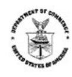

#### U.S. DEPARTMENT OF COMMERCE

National Oceanic and Atmospheric Administration NATIONAL MARINE FISHERIES SERVICE Pacific Islands Regional Office 1601 Kapiolani Bivd., Suite 1110 Honolulu, Hawaii 96814-4700 (808) 944-2200 · Fax: (808) 973-2941

FEB 2 8 2013

The Honorable Lolo M. Moliga Governor of American Samoa Office of the Governor A.P. Lutali Executive Office Building Pago Pago, American Samoa 96799

Dear Governor Matalasi Moliga:

In June 2012, the National Ocean Council wrote to Governor Tulafono to request engagement in working together to improve the stewardship of the ocean and coasts to fulfill Executive Order 13547, which established the National Policy for Stewardship of the Ocean, our Coasts, and the Great Lakes (National Ocean Policy). To that end, nominations were sought to a regional planning body for the Pacific Islands.

Governor Tulafono nominated Lelei Peau, Deputy Director of the Department of Commerce, and Ufagafa Ray Tulafono, Director of Marine and Wildlife Resources, to serve as members of the forming Pacific Islands Regional Planning Body (PI RPB) (letter attached). Since that time, I am aware that Director Tulafono has retired.

I am writing as federal co-lead of the PI RPB to invite you to nominate a second representative. The representative will serve as American Samoa's official representative to the PI RPB and will represent your Territory's interests, mandates, and goals in the overall regional planning process. The American Samoa PI RPB representative must be an elected official or an official designated employee with sufficient seniority, authority, and expertise to represent American Samoa and make decisions or commitments on your Territory's behalf (e.g. staff, resources, or the Territory's view on specific issues).

Thank you for your time. I look forward to receiving your nomination, which I will forward to the NOC.

Sincerely,

Michael D. Tosatto Regional Administrator

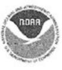

LOLO M. MOLIGA Governor

#### OFFICE OF THE GOVERNOR AMERICAN SAMOA GOVERNMENT PAGO PAGO, AMERICAN SAMOA 96799 Telephone: (684) 633-4116 : Fax: (684) 633-2269 Email Address: go@gov.com

LEMANU P. MAUGA Lieutenant Governor

March 11, 2013

Mr. Michael Tosatto Federal Co-Lead Regional Planning Body NMFS - Pacific Islands Regional Office 1601 Kapiolani Boulevard Suite 1110 Honolulu, HI 96814

Talofa Mr. Tosatto:

Regarding American Samoa's representatives to the Pacific Island Regional Planning Body of the National Ocean Council, I have appointed Dr. Ruth Matagi-Tofiga, Director of the Department of Marine and Wildlife Resources and Dr. Taimalelagi Claire Poumele, Director of the Port Administration.

Faafetai Tele Lava.

Governor American Samoa Government

Cc: Nancy Sutley, Chair Dr. John Holdren, Director

Lolo M. Moliga

### **Appendix 4**

# Listening Session Participants

| Meeting Date | Name                     | Affiliation                                    |
|--------------|--------------------------|------------------------------------------------|
| March 2016   | Mac Aveina               | WPFMC                                          |
|              | Afoa L.S. Lutu           | American Samoa Legislature                     |
|              | Etenauga Lam Yuen Lutu   | Community                                      |
|              | Louise R. Azarvand       | Community                                      |
|              | Joan G. Holland          | Community                                      |
|              | Jason Jaskowiak          | American Samoa Power Authority                 |
|              | Charles Warren           | Samoa Tuna Processors                          |
|              | Nicholas King            | Pacific Energy SWP, Ltd                        |
|              | Fatima Sauafea-Leau      | NOAA PIRO                                      |
|              | Matthew Brown            | USFWS                                          |
|              | Brian J. Donahue         | USCG - District 14                             |
|              | Kelley Tagarino          | ASCC and University of Hawai`I Sea Grant    |
|              | John Goeke               | American Samoa Paddlers Association            |
|              | Michael Tosatto          | NOAA PIRO                                      |
|              | Lauren Nutter            | Udall USIECR                                   |
|              | Keneseli Lafaele         | ASDOC                                          |
|              | Joan Malik               | US Navy - Pacific Fleet                        |
|              | Ma'a Maea                | Fisherman                                      |
|              | Francino Gaisoa          | TMO Wholesale                                  |
|              | Esther Fiatoa            | Communnity                                     |
|              | Marie A. Alailima        | Attorney                                       |
|              | Atuatasi Lelei Peau      | NOAA NMSAS                                     |
|              | Peter and Margie Crispin | Pago Pago Game Fishing Association (PPGFA)  |
|              | Joseph Paulin            | NOAA NMSAS                                     |
|              | Cary Gann                | Starkist Samoa                                 |
|              | Archie Soliai            | Starkist Samoa                                 |
|              | Elinor Lutu-McMoore      | NOAA NWS                                       |
|              | Christinna Lutu-Sanchez  | Tautai O Samoa Longline Fishing Association |
|              | James L. McGuire         | Community                                      |

| Meeting Date   | Name                                | Affiliation                      |
|----------------|-------------------------------------|----------------------------------|
| September 2017 | Craig Miller                        | RDA Lawfirm                      |
|                | Nate Ilaoa                          | WPFMC                            |
|                | Ian Moffitt                         | Recreation                       |
|                | Erika Radewagen                     | Recreation                       |
|                | John Goeke                          | Recreation                       |
|                | Hideyo Hattori                      | Recreation                       |
|                | Tanner Stiehl                       | USCG - District 14               |
|                | Luse Fomai                          | SPS/Hamburg                      |
|                | Marlene Lopesi                      | Polynesia Shipping Services Inc. |
|                | Herman Gebauer                      | Polynesia Shipping Services Inc. |
|                | Tony Grey                           | Sunrise Oil / TSA                |
|                | Latone Grey                         | TSA                              |
|                | Nicholas King                       | Pacific Energy                   |
|                | Chris King                          | DPA                              |
|                | Atuatasi Lelei Peau                 | NOAA NMSAS                       |
|                | Samuel Ioka Ale Meleisea            | Tualauta County; Representative  |
|                | Savelio Grohse                      | A`ua                             |
|                | High Talking Chief Afu              | A`ua                             |
|                | Lio                                 | A`ua                             |
|                | Senator Tilo                        | A`ua                             |
|                | Lafi                                | A`ua                             |
|                | High Talking Chief Ponasuia Fale | A`ua                             |
|                | Maulupe                             | A`ua                             |
|                | Faimealelei Anthony Allen           | A`ua; Representative             |
|                | Salesi Talauega                     | A`ua                             |
|                | Nate Ilaoa                          | WPFMC                            |

| Meeting Date | Name               | Affiliation                                                         |
|--------------|--------------------|---------------------------------------------------------------------|
| October 2017 | Teleaai Simolea    | Fitiuta                                                             |
|              | Keli Tagaloa       | Fitiuta                                                             |
|              | Tata Logoleo       | Fitiuta                                                             |
|              | Aokuso Aokuso Jr.  | Fitiuta                                                             |
|              | Tuese Tuese        | Fitiuta                                                             |
|              | Tei Aluese         | Fitiuta                                                             |
|              | Saena Moliga       | Ta`u                                                                |
|              | Irae Vasega        | Ta`u                                                                |
|              | Telea Petelo       | Ta`u                                                                |
|              | Iti Numera         | Ta`u                                                                |
|              | Sofima Tevaseu     | Ta`u                                                                |
|              | Pau Young          | Ta`u                                                                |
|              | Aufotu Niumata     | Ta`u                                                                |
|              | Kalio              | Ta`u                                                                |
|              | Logoleo            | Ta`u                                                                |
|              | Clint Filoali'i    | Ofu                                                                 |
|              | Malaepule Moliga   | Ofu                                                                 |
|              | BJ Moliga          | Ofu                                                                 |
|              | Tautala Pao        | Ofu                                                                 |
|              | Samoa              | Ofu                                                                 |
|              | William Pedro      | Ofu                                                                 |
|              | Pita Ili           | Ofu                                                                 |
|              | Iafeta Tanu        | Ofu                                                                 |
|              | Vaiolo Taliga      | Ofu                                                                 |
| June 2018    | Faufano Autele     | Fisherman                                                           |
|              | Tony Langkilde     | ASDOC                                                               |
|              | Alex Sise          | NOAA OLE                                                            |
|              | John Taeleifi      | Port                                                                |
|              | Silane Taeleifi    | LBUSD                                                               |
|              | Pete Faamuli       | Puget Sound Naval Shipyard and Intermediate Maintenance Facility |
|              | Regina Faamuli     | Kocks                                                               |
|              | Easter Galo Carter | DGX Cargo                                                           |
|              | Liavaa S. Moevao   | Treasury / Customs                                                  |
|              | Amy B. Letuli      | Clipper Oil American Samoa                                          |

| Meeting Date | Name                     | Affiliation                                          |
|--------------|--------------------------|------------------------------------------------------|
|              | Peter Eves               | AS DMWR                                              |
|              | Isabel Hudson            | Hamburg Sud                                          |
|              | Va'a Uitualagi           | Samoa Pacific Shipping                               |
|              | Archie Soliai            | StarKist Samoa                                       |
|              | Chris King               | DPA                                                  |
|              | Herb Clarke              | Swire                                                |
|              | Virgil Burton            | Swire                                                |
|              | Pilivesburg Salanoa      | ASDOC                                                |
|              | Fai'ivae Iuli A. Godinet | Leone; Senator, American Samoa Legislature        |
|              | Maiava Leota             | Leone                                                |
|              | Matu'u Timo              | Leone                                                |
|              | Fagaoatua D. Salavea     | Leone; Representative, American Samoa Legislature |
|              | Puleloto A. Tanuvasa     | Leone                                                |
|              | Alataua Ropati Opa       | Leone; Aumaga (Village police)                       |
|              | Olotai U. Letuli         | Leone                                                |
|              | Utagamamao T. Steffany   | Leone                                                |
|              | Puleiava W. Salave'a     | Leone                                                |
|              | L. Haili Ripley          | Leone                                                |
|              | Filioali'i Toma          | Leone; Pulenu'u (Village Mayor)                      |
|              | Fepulea'i A. Ripley      | Leone                                                |
|              | Salave'a Pale            | Leone                                                |
|              | Taula Will Sword         | Recreational Fisherman                               |
|              | Chris Banse              | Recreational Fisherman                               |
|              | Pafuti Ana Tupua         | Recreational Fisherman                               |
|              | Vera Talamoa             | Recreational Fisherman                               |
|              | Brian Peck               | Recreational Fisherman                               |
|              | Ian Price                | Recreational Fisherman                               |
|              | Russ Cox                 | Recreational Fisherman, PPGFA                        |
|              | John Goeke               | Recreational Non-consumptive, ASPA                   |
|              | Erika Radewagen          | Recreational Non-consumptive                         |
|              | Michael McDonald         | Recreational Non-consumptive, ASDOC                  |
|              | Tony Langkilde           | ASDOC                                                |

### **Appendix 5**

# Stakeholder Engagement

An important requirement for successful ocean planning is stakeholder engagement. The ASOPT committed to engaging stakeholders during development of this ocean plan, as well as during future actions associated with this plan. To that end, the ASOPT engaged stakeholders, including targeted stakeholders such as commercial fishermen and port users, as well as communities and other local agencies.

In addition, the Udall Foundation's US Institute for Environmental Conflict Resolution contracted with CONCUR to produce a [stakeholder](https://pacificislandsrpb.files.wordpress.com/2016/04/stakeholder-engagement-support-report-for-the-asop-final-july-6-2017.pdf)  [assessment](https://pacificislandsrpb.files.wordpress.com/2016/04/stakeholder-engagement-support-report-for-the-asop-final-july-6-2017.pdf) ([Executive Summary in Samoan](https://pacificislandsrpb.files.wordpress.com/2016/04/executive-summary-in-samoan_concur-report.pdf); included as the next appendix) that was developed through contract by CONCUR. CONCUR provided the following seven recommendations. These recommendations assume that the stakeholder assessment was developed in conjunction with the kick-off meeting, and that the ASOPT had a large amount of resources with which to engage stakeholders. However, the stakeholder assessment was developed a year after the start of the ocean planning process, and the ASOPT had very limited resources with which to engage stakeholders. Despite that, the ASOPT made every feasible effort to engage stakeholders at appropriate points throughout the process. How the ASOPT responded to them is included in the actions associated with the recommendations.

### **1. Further develop and articulate clear and consistent leadership to deepen credibility of the Ocean Planning process**

| Recommended Actions                                                                                                                                                                                                                                                | ASOPT Response                                                                                                                                                                                |
|--------------------------------------------------------------------------------------------------------------------------------------------------------------------------------------------------------------------------------------------------------------------|-----------------------------------------------------------------------------------------------------------------------------------------------------------------------------------------------|
| Establish clear leadership for the ASOPT among American Samoa government agencies so it is apparent to all stakeholders that there is strong local commitment to the planning process, and the willingness and capacity to implement the ASOP | Director Henry Sesepasara was selected by the ASOPT and the Governor to lead the ocean planning efforts. He liaises with the ASG agencies, federal agencies, and stakeholders. |

| Recommended Actions                                                                                                                                                                | ASOPT Response                                                                                                                                                                                                                                  |
|------------------------------------------------------------------------------------------------------------------------------------------------------------------------------------|-------------------------------------------------------------------------------------------------------------------------------------------------------------------------------------------------------------------------------------------------|
| Clarify the roles of federal agencies and regional partners in the ASOPT as supporting and contributing members to what should be a locally-driven planning process | ASOPT received clarification from CONCUR that "regional partners" means ASG. As such, the ASOPT described the roles of the ASG and federal agencies in this effort. AS DMWR is leading the effort, thus it is locally-driven. |

### **2. Further refine and communicate a clear and compelling purpose for the American Samoa Ocean Plan.**

| Recommended Actions                                                                                                                                                                                                                                                                                                                  | ASOPT Response                                                                                                                                                                                                                                                                          |
|--------------------------------------------------------------------------------------------------------------------------------------------------------------------------------------------------------------------------------------------------------------------------------------------------------------------------------------|-----------------------------------------------------------------------------------------------------------------------------------------------------------------------------------------------------------------------------------------------------------------------------------------|
| Thoroughly examine participant territorial and federal agencies roles and responsibilities relative to ocean planning and marine resource management and conduct a gap analysis to identify ocean planning needs not yet sufficiently addressed                                                                 | While a gap analysis was not conducted to identify ocean planning needs not sufficiently addressed already, the agencies identified actions for each objective within which responsible agencies were identified, both at the federal and jurisdictional level. |
| Draft a clear and succinct Statement of Purpose for the ASOP that defines the needs that it is intended to address in relation to existing American Samoan and federal plans and programs. Ideally, this statement should support and advance the priorities and responsibilities of each involved agency | The ASOPT developed a Statement of Purpose that is found in the introduction to this plan.                                                                                                                                                                                     |

| Recommended Actions                                     | ASOPT Response                                                                                                                               |
|---------------------------------------------------------|----------------------------------------------------------------------------------------------------------------------------------------------|
| Clearly communicate the ASOP purpose to stakeholders | The purpose of the ASOP was articulated at each stakeholder engagement session and consistently during outreach efforts as well. |

### **3. Develop and use a range of engagement formats and tools for outreach.**

**Recommended Actions ASOPT Response**

| Determine the most important points during the planning process for engaging different groups of stakeholders (or stakeholder representatives), at stages when there is sufficient content or issues to react to, and latitude to use the input received                                                   | This was an important point for the ASOPT which was articulated by the ASOPT well in advance of the stakeholder assessment reinforcing the action. The ASOPT determined that clear points of input included after refining its vision, its goals and objectives, and then drafting the plan.                                                                                                                                                     |
|---------------------------------------------------------------------------------------------------------------------------------------------------------------------------------------------------------------------------------------------------------------------------------------------------------------------------------|-----------------------------------------------------------------------------------------------------------------------------------------------------------------------------------------------------------------------------------------------------------------------------------------------------------------------------------------------------------------------------------------------------------------------------------------------------------------------------|
| Appoint a subcommittee of ASOPT members with extensive experience conducting outreach in different communities and with a variety of stakeholders in American Samoa. This subcommittee should recommend the timing, format, and other important details of the ASOP stakeholder engagement effort | The ASOPT discussed when to engage stakeholders during the ASOPT meetings. The team that led the extensive listening sessions throughout the communities included the ASOPT lead (Director Sesepasara, DWMR), ASOPT member Chris King (Deputy Director, Port Administration), Miranda Foley (ecoLOGIC, process and engagement consultant), and Sarah Pautzke (Coordinator, PI RPB). Timing and format was determined by the team. |

| Recommended Actions                                                                                                                                                                                                                                                  | ASOPT Response                                                                                                                                                                                                       |
|----------------------------------------------------------------------------------------------------------------------------------------------------------------------------------------------------------------------------------------------------------------------|----------------------------------------------------------------------------------------------------------------------------------------------------------------------------------------------------------------------|
| Consider identifying one or                                                                                                                                                                                                                                          | The stakeholder engagement                                                                                                                                                                                           |
| two representatives from each                                                                                                                                                                                                                                        | team worked with the respective                                                                                                                                                                                      |
| major stakeholder group to help                                                                                                                                                                                                                                      | stakeholder groups to ensure                                                                                                                                                                                         |
| determine the best time and                                                                                                                                                                                                                                          | the times for engagement were                                                                                                                                                                                        |
| approach to use when engaging                                                                                                                                                                                                                                        | appropriate and logistically                                                                                                                                                                                         |
| the stakeholders they represent                                                                                                                                                                                                                                      | sound.                                                                                                                                                                                                               |
| Engage Samoan language and                                                                                                                                                                                                                                           | Director Sesepasara and Deputy                                                                                                                                                                                       |
| cultural experts, as appropriate                                                                                                                                                                                                                                     | Director King served as the                                                                                                                                                                                          |
| for specific needs to plan and                                                                                                                                                                                                                                       | cultural experts and translators                                                                                                                                                                                     |
| conduct stakeholder engagement                                                                                                                                                                                                                                       | during the listening sessions.                                                                                                                                                                                       |
| Emphasize engagement formats likely to be effective and avoid or limit the use of engagement and outreach formats that would be least effective. Formats likely to be less effective are large 'public meetings', and emailed or online surveys | After receiving the stakeholder assessment from CONCUR, the ASOPT ceased utilizing online surveys for feedback. The ASOPT focused on meeting with specific stakeholder groups in smaller settings. |

### **4. Work with both the Office of Samoan Affairs and key resource agencies to engage villages.**

| Recommended Actions                                                                                                                                                                                                       | ASOPT Response                                                                                                                                                                                                        |
|---------------------------------------------------------------------------------------------------------------------------------------------------------------------------------------------------------------------------|-----------------------------------------------------------------------------------------------------------------------------------------------------------------------------------------------------------------------|
| OSA already has representation on the ASOPT. Strengthen the ASOPT's relationship with OSA leadership and provide regular updates to the pulenu'u meetings about the ASOP planning process as it unfolds | The relationship with OSA was strengthened through Director Sesepasara's engagement with OSA leadership. The Director also provided updates at pulenu'u meetings as the planning process continued. |
| Convene a special workshop, or series of workshops, for pulenu'u on the key issues to be addressed in the ASOP                                                                                                   | This is an action that the ASOPT could not fulfill due to funding limitations. As such, Director Sesepasara provided inputs to the pulenu'u, but the ASOPT could not provide a training.               |

| Recommended Actions                                                                                                                                                                                                                                                                                                                                                    | ASOPT Response                                                                                                                                                                                                                   |
|------------------------------------------------------------------------------------------------------------------------------------------------------------------------------------------------------------------------------------------------------------------------------------------------------------------------------------------------------------------------|----------------------------------------------------------------------------------------------------------------------------------------------------------------------------------------------------------------------------------|
| Structure outreach to pulenu'u geographically by convening subcommittees of key leaders from adjoining villages that share a reef or other ocean resources and help them focus on specific problems and solutions. As a further step, these sub-regions could then choose one pulenu'u representative to serve as a liaison to the ASOPT | Outreach to the pulenu'u is through Director Sesepasara during pulenu'u meetings. Due to time constraints, engagement at a geographical level to focus on specific problems as subcommittees was not feasible. |
| Plan and convene a Territory wide workshop series on critical ocean issues to present the latest information in a concise format, and demonstrate joint commitment on the part of multiple agencies                                                                                                                                                  | The ASOPT determined that this could be an important step to fulfill needed information under the actions of Goal 1, but did not have the resources to do a workshop to inform the ocean plan itself.          |

**5. Frame compelling incentives to territorial and federal government agencies, villages, commercial interests, educators, scientists, and recreationalists to fully engage in the Ocean Planning process.**

| Recommended Actions                                                                                                                                            | ASOPT Response                                                                                                                                                                                                                                                       |
|----------------------------------------------------------------------------------------------------------------------------------------------------------------|----------------------------------------------------------------------------------------------------------------------------------------------------------------------------------------------------------------------------------------------------------------------|
| Frame ocean issues to link stakeholder engagement to widely recognized problems and potential solutions                                               | The ASOPT sought to incorporate stakeholder feedback regarding ocean issues, including a predominant theme of upland pollution impacting the coastal area during large storms. Potential solutions to the issues were sought at local meetings. |
| Use the Findings from this Stakeholder Engagement Support Project to identify and focus on the specific major concerns of each type of stakeholder | This report and stakeholder engagement by the ASOPT identified a few major issues of concern. The ASOPT sought to address these issues for the stakeholder groups in the actions of the goals.                                                     |

| Recommended Actions                                                                                                                                                                                                                                                                                                                 | ASOPT Response                                                                                                                                                                                                                  |
|-------------------------------------------------------------------------------------------------------------------------------------------------------------------------------------------------------------------------------------------------------------------------------------------------------------------------------------|---------------------------------------------------------------------------------------------------------------------------------------------------------------------------------------------------------------------------------|
| Ensure that successive outreach efforts build upon previous engagement with the same stakeholder groups                                                                                                                                                                                                                    | Outreach efforts were successively built upon each other throughout the Ocean Plan development with the same stakeholder groups, which were identified within the first couple months of the ASOPT inception. |
| Identify and reconfirm specific priorities and responsibilities of individual ASOPT member agencies as they relate to the implementation of the Ocean Plan                                                                                                                                                           | This plan identified individual agencies' responsibilities as they relate to ocean activities in the various actions for Goals 1-3.                                                                                    |
| Identify opportunities to leverage and build upon existing efforts by individual agencies through new inter-agency partnerships                                                                                                                                                                                            |                                                                                                                                                                                                                                 |
| Identify ways in which the Ocean Plan can be developed to help local agencies become more competitive for grant proposals. Communicate these advantages to local agencies and other stakeholders. Develop the Ocean Plan such that it positions local agencies well to compete for funding opportunities | The actions described under each goal provide agencies and other organizations support for their grant proposals. This has been and will be communicated to stakeholders and repeated to ASOP agencies.       |

**6. Devise strategies to anticipate and overcome obstacles the Stakeholder Engagement Support team faced.**

| Recommended Actions            | ASOPT Response                   |
|--------------------------------|----------------------------------|
| Consider identifying trusted   | The ASOPT utilized trusted       |
| and familiar intermediaries to | sources to encourage stakeholder |
| get reluctant stakeholders to  | and agency participation with a  |
| participate                    | high degree of success.          |

| Recommended Actions                                                                                                                                                                                                   | ASOPT Response                                                                                                                                                                                                          |
|-----------------------------------------------------------------------------------------------------------------------------------------------------------------------------------------------------------------------|-------------------------------------------------------------------------------------------------------------------------------------------------------------------------------------------------------------------------|
| Build in sufficient time to conduct stakeholder engagement in Manu'a to account for delays and travel changes that may occur                                                                                 | Sufficient time was built in to conduct stakeholder engagement in Manu'a. Manu'a was visited three times during ASOP development.                                                                           |
| Consider combining ASOP stakeholder engagement with other scheduled agency visits to Manu'a                                                                                                                  | Stakeholder engagement for the ASOP was combined with other agency visits, including AS DMWR's need for fisheries feedback.                                                                                 |
| Plan and convene a Territory wide workshop series on critical ocean issues to present the latest information in a concise format, and demonstrate joint commitment on the part of multiple agencies | The ASOPT determined that this could be an important step to fulfill needed information under the actions of Goal 1, but did not have the resources to do a workshop to inform the ocean plan itself. |

**7. Consider the use of a Joint Fact Finding (JFF) process to address any areas of significant technical disagreement and uncertainty in ocean and coastal resource planning.**

**Rationale:** Joint Fact Finding (JFF) is methodology that brings diverse participants to the table in a neutral forum for sharing information and conducting evidence-based deliberations. JFF is a mediated process. Once assembled, participants formulate common questions and then seek to gather and interpret pertinent facts. JFF does this in a sustained manner rather than a one-off public meeting and through courteous, evidencebased debate. The discussions occur over an extended period of time and through a disciplined study structure that fosters collaborative discussions on science- intensive, politically sensitive matters. JFF is most appropriate when there are genuine disagreements over the technical and scientific impacts of actions. JFF processes are NOT appropriate when there are disagreements over personal, cultural, religious, or political beliefs underpinning actions.

JFF might be used as a part of the American Samoa Ocean Planning process to develop a common and scientifically robust understanding of various ocean planning issues. For example, our Team identified disagreement, misunderstanding or lack of information around a handful of issues, including:

- Status of various fish stocks
- Status of coral reefs and impacts of climate change
- Need for and impacts of sea walls

**ASOPT Response:** JFF is a valuable tool for addressing issues, such as the regulations regarding the Large Vessel Prohibited Area or the potential size shift of parrotfish. The ASOPT felt that it is a tool that would be better suited for addressing issues after the development of the Ocean Plan, potentially as a suggested action for a Goal, but is inappropriate during Ocean Plan development as the focus on the plan is working better together and what information is needed for ocean planning.

### **Appendix 6**

# Stakeholder Assessment Executive Summary - in Samoan

### **Poloketi Soosoo Tau'au a Sui Lagolago ma le Fuafuaga Faataatia ua Fautuaina mo le Fuafuaga tau le Sami o Amerika Samoa**

Stakeholder Engagement Support Project and Recommended Action Plan for the American Samoa Ocean Planning Process

Prepared by Scott McCreary, Ph.D., CONCUR Inc., Keith Mattson, President, Keith Mattson LLC and Meredith Cowart, Associate, CONCUR Inc.

Lipoti Faai 'u Iulai 6, 2017 :: Final Report July 6, 2017

### **'Oto'otoga O Le Ripoti Aloaia**

### **A. Tala'aga Ma Le Autu O Le Poloketi Soosoo Tau'au a Sui Lagolago**

O loo faagasolo se fuafuaga faataatia mo le sami o Amerika Samoa lea ua lua tausaga talu ona amatalia i lalo o le faamalu a le Komiti Fuafua a Itulagi o Atumotu o le Pasefika (Pacific Islands Regional Planning Body) (PIRPB). O lea vaega e Fuafuaina Sami o Amerika Samoa, e i lalo o le Komiti a itulagi, ma sa faavae ina ia atina'e ai le Fuafuaga o le Sami o Amerika Samoa mo le Teritori (American Samoa Ocean Plan)(ASOP). E aofia i le Vaega a Amerika Samoa sui o le komiti a Atumotu o le Pasefika ma isi sui faaopoopo mai Amerika Samoa ma matagaluega a le Feterale, o loo vaaia alaga'oa o le sami ma ona galuega e aofia ai fefaatauaiga, faiga faiva, tulaga lelei o le siosiomaga, ma fuafuaga. Sa faatonuina e le ASOP ma le PIRPB lenei poloketi in ia faatautaia se su'esu'ega tuutuu i le loloto mo Sui Lagolago o loo iai naunautaiga i mataupu tau le Fuafuaga o le Sami i Amerika Samoa, ma tuuina mai ni faamatalaga i le ASOP. Sa faatupeina lenei poloketi i se foa'i tupe mai le faalapotopotoga Faavae a Gordon ma Betty Moore ma pulea e le faalapotopotoga Faavae o le Udall i lona ofisa e feagai ma le Fofōina o Faafitauli tau le Si'osi'omaga (Udall Foundation's US Institute for Environmental Conflict Resolution) (USIECR).

O le 'auga atoa o le poloketi aua Fuafuaga mo le Galulue Faatasi o Sui Lagolago, ina ia mafai e le ASOP ona galulue e faatāua le vaaiga, initeresi, atugaluga ma faautuaga mai vaega o loo faatautaia le Fuafuaga o le Sami i Amerika Samoa. O sui o le vaega faufautua e aofia ai le Susuga ia Keith Mattason (Managing Prinicipal a le CONCUR Inc., Berkley, Kalefonia) ma Keith Mattson (Peresitene, Keith Mattson, LLC, Honolulu, Hawai`i) o loo auiliilia ma faatalanoaina Sui Lagolago e aofia ai totino o le ASOPT, faauluuluga o alalafaga o motu o Tutuila ma Manu'a, ma nisi o tagata e fia auai i le Fuafuaga o le Sami. Sa lagolagosua ma fesoasoani i le vaega Meredith Cowart mai le CONCUR faatasi ai ma le Auaunaga o Faaliliuga ma se tuualalo i ala e uia faaleaganuu mai ia Okenaisa Fauolo, Faatonu o le ofisa o Aoaoga ma Suesuega Samoa ma sui mai le Kolisi Tuufaatasi o Amerika Samoa.

Sa faatautaia lenei Poloketi mo Fuafuaga mo le Galulue Soosootau'au o Sui Lagolago mai le va o Fepuari ma Iuni, 2017 ma o loo aofia ai sini nei:

- 1. Faamautu ia Autu ma Sini mo le Fuafuaga o Sui Lagolago
- 2. Faailoa avanoa ono maua ma ni pa puipui i le solo lelei o le galulue soosootau'au ma Sui lagolago
- 3. Saili finagalo o sui lagolago i faagasologa o fuafuaga o le sami.

4. Atiina'e se Fuafuaga Faataatia mo Sui Auai ia iloga ona galulue faatasi e aloa'ia sini ma faamoemoega o Fuafuaga o le Sami a le ASOPT.

O nei faamoemoega sa faataunuuina i ni fonotaga eseese ma ta'ita'i togia ma ē sa maua mai ai faamatalaga, ma faatalanoaga a vaega ma tagata ta'ito'atasi e 36.

### **B. Faaiuga Tāua Mai Soālaupulega Ma Faatalanoaga**

Sa maua mai e i matou finagalo o sui lagolago mai talanoaga ma faatalanoaga faatulaga mai totino o le ASOPT, pulenuu ma isi ta'ita'i o alalafaga filifilia, ma sui mai mataupu tau faigā faiva ma e iai se naunauta'iga i le autū. O se vaega o faai'uga na maua mai, ua mae'a ona faavasega i 'autū i le pito i lalo. O nisi faamaumauga auiliili e maua i Vaega 4, 5, ma le 6 o le Ripoti. E tatau ona silafia o nei faamaumauga, o se tuufaatasiga tonu o faai'uga sa alia'e mai faatalanoaga eseese o Sui Lagolago, ma ē le'o tuuina atu o se atoaga o finagalo faaalia uma.

### **Lamatiaga mo le Sami**

- O ni lamatiaga taatele ua matauina o le faalapisi, tafega mai sōloga, ma vai ua faalegaina mai suavai lafoa'i ma masini tāmea.
- Pa'emā o 'Amu o se tasi o lamatiaga, ae sa eseese finagalo pe faafia ona tupu ma le umi e aafia ai.
- Sa matou faalogoina finagalo eseese i le mataupu o le soona fāgota o i'a. Fai mai faauluuluga o alalafaga e le'o tupu lea faafitauli i totonu o o latou nuu (e ese mai fagotaga nanā/faagaoi mai fafo), ae o faatalanoaga ma le malo ma Sui Lalolago o loo fai ma sui o vaega tetele e faatāuaina le mataupu, sa ripotia le matuā so'ona fagotaina o gataifale.
- O le fagotaina faagaoi o nofoaga o faiga faiva i le gataifale o se tasi lea o faafitauli pito tugā na faailoa mai e nisi o alalafaga.
- E ui sa aofia i faafitauli o le tuana'i le faaaogaga o fanai'a ma vailaau 'o'ona e fagota ai, ae na faaalia e i latou sa faatalanoa le faaitiitia o lenei faafituali. E faapena fo'i le ripotia mai o otaota o pa puaa ua faaitiitia ona ua nofo malamalama tagata i aafiaga, ma ua faamalosia fo'i tulafono o lea faafitauli.
- O nisi atugaluga sa faaalia e faatatau i suāuu ma kesi o loo masa'a atu i le sami.

### **Mata'ituina Suiga i le Si'osi'omaga o le Sami 'ona o Suiga o le Tau**

- Faatupula'ia le tafia o nofoaga o le talafatai, ma ua tele naua matāfaga sa ripotia mai ua tafi'esea ai nisi o nuu, faapea ai ma le faaleagaina soo ma le faaumiumi o le faaleagaina o 'amu.
- Suiga o tulaga faitino ona o le suiga o le tau, e aofia ai le siitia o le mafanafana o le sami, maualuga o le sua a le tai, malolosi atu o galu fetafea'i, ma afā malolosi atu.

### **Atugaluga o Alalafaga mo le Maloloina ma tulaga lelei mo se taimi umi o Alaga'oa o le Sami**

- O le tele o popolega i Sui Lagolago sa faatalanoaina aua Alagaoa o le Sami ma le Taua mo le Ola lelei i se Taimi umi e aofia ai:
  - Tulaga ola o Amu
  - Lapisi e o'o atu i le sami
  - Mafai ona tumau mo se taimi umi fagotaga o i'a mo Fefaatauaiga ma Kamupani I'a
  - Maua pea le avanoa e fāgota ai i'a mo taumafataga aiga
  - Tafia o le matafaga
  - Otaota Lafoa'i mai Tane

### **Taua mo le Tamaoaiga o Vaega o Faiga Faiva**

- O ituaiga fagotaga faapisinisi e iai neti faapitoa ma laina uumi faimaunu, ma galuega a le Matagaluega o le Uafu o Pago Pago na faatulagaina o vaega tāua i le tulaga tau faiga faiva mo le tamaoaiga o Amerika Samoa.
- Sa faatulaga fagotaga i alia e feoloolo le taua
- O Meli La'upasese ma Faletalimalo sa faatulaga e itiiti atu lo latou tāua

### **Fautuaga mo le Faiga o Fuafuaga o Sui Lagolago**

- Na fautuaina e i latou mai alalafaga ma le lautele o sui lagolago le tatau ona galulue faatasi o le ASOPT ma le OSA le auai o pulenuu ina ia mafai ona ofi atu i saofaiga faifaai'uga i alalafaga.
- O isi fautuaga e aofia ai:
  - Faatino galuega a nuu ma isi o matagaluega a le malo
  - Faaitiitia fonotaga lautetele ( e pei o Fonotaga Resitala a le Feterale)
  - O Ekalesia ma Aoga o isi nei filifiliga faaopoopo mo le galulue faatasi
  - Sailia ma galue ma isi e lagolagoina le fe'au i vaega eseese o le atunuu
  - Ia faamautinoa mea faaaogā ma faatalanoaga e faatino i le gagana Samoa pe a feagai ma potopotoga i le lotoifale.
  - Alo'ese mai faiga faapulepuletutū i le faiga o faavae poo se porokalama
  - Faataua aoaoga e faatatau i faafitauli ma fofō, ma faamalamalama pe faapefea ona fesoasoani fofo mo tupulaga o le lumana'i

### **Matagaluega e ta'ita'ia le Fuafuaga mo le Galulue Faatasi o Sui Lagolago**

• Sa tele ina fautuaina le filifiliga o le DMWR e avea ma matagaluega talafeagai e ta'ita'ia le Galulue Faatasi o Sui Lagolago, ma le lagolagosua a le OSA ma le AS EPA

### **Tali faaopoopo mai Totino o le Fuafuaga o le Sami o Amerika Samoa**

• O le tele o totino o le ASOPT sa ripotia mai o le lautele o le atunuu o loo iai le manatu sesē e lē muta alaga'oa o le sami (e pei o i'a). Sa faaalia e nei totino o lenei ituaiga mafaufauga ua faaopoopo atu i le lē fiafia i tulafono a faalapotopotoga e manatu le lautele e lē mana'omia.

- I totonu o ofisa i le lotoifale, o le lē lava o le faatupega ma tagata faigaluega e taita'ia mo se taimi umi le faamoemoe, ua avea ma tulaga e taofiofi ai le faatinoga o le Fuafuaga o le Sami.
- O le Fuafuaga ASOP e tatau ona u'unaia e ofisa o le malō o Amerika Samoa (nai lo le Feterale), ma le galulue faatasi ma le OSA ma faauluuluga o Nuu.

### **Manatu Faaopoopo mai Faaulululuga o Nuu**

- E pei ona matauina, sa ripotia mai e nisi o faauluuluga o nuu, e le'i iai lava se matagaluega a le malo na fesiligia so latou finagalo e uiga i se Fuafuga o le Sami poo mataupu e fesoota'i ma le Fuafuaga o le Galulue Faatasi o Sui Lagolago.
- O le tele o nuu ua faatapulaa le fagotaina o le aau i tagata o nuu
- O loo matuā atugalu ē na faatalanoa mai Ofu ma Olosega i le tafi'esea o matafaga ma lamatiaga e ono tula 'i mai galulolo ma isi galu malolosi ma afā
- Sa faaalia e sui o le nuu o Ta'ū, latou te le'o moomia ni tulafono mai fafo poo tulafono faamalosia mai ofisa i le teritori ma le feterale.

### **Tali faaopoopo mai isi Sui Lagolago**

- Ua faailoa mai e nisi na faatalanoa o nisi tagata lautele atonu e le'o suia mai e pulenuu, ma o loo iai pea le moomia e aapa atu iai i nisi auala (e pei o le talosagaina o matai taua e faatalanoa popolega tau le sami ma o latou lava aiga).
- Sa matou mauaina le fautuaga malosi ina ia auai le Fono Faitulafono i faagasologa a le ASOP
- se tasi o finagalo e faapea, talu ai e aoga faiga Faapolenisia i le puipuiga o aau amu, e tatau i pulega o le taimi nei ona a'oa'o mai ia faiga.
- E toatele o loo nofo pogisa pea i aafiaga o gaoioiga a tagata taitoatasi i le sami.
- E iai nisi sa faatalanoa na faailoa mai le lē lava o le faamalosiga o le tulafono i totonu lava o matagaluega a le malo.

### **C. Fautuaga/Fuafuaga O Le Galulue Soosootau'au O Sui Lagolago**

E fitu fautuaga lautele ua matou tuuina atu i le ASOPT mo le galulue soosootau'au ma Sui Lagolago, ma faatinoga ma'oti i lalo o ia fautuaga. O loo 'oto'oto atu i lalo, ma faalautele auiliili atu i le Vaega 8 o lenei ripoti. E taua tele ona fai fuafuaga i Fautuaga 1 ma le 2 ae le'i aga'i atu i fautuaga o totoe. E ui ua tele se galuega ua faatino i le ASOP, e tatau ona faamalosia le faasologa o a latou lava fuafuaga i le lotoifale ae le'i faaauaua le galulue soosootau'au ma Sui lagolago. O fautuaga o totoe e tatau ona silasila iai o se tuufaatasiga o ni auala eseese. O nei fautuaga e taua tele a o se fesoasoani i le ASOPT 'ia iloga ona galulue faatasi ma matagaluega o le malo o Amerika Samoa ma Faauluuluga tofia o alalafaga, ma e fautuaina le ASOPT ina ia taga'i toto'a iai i lona atoaga.

### **1. Ia saga atiina'e ma faama'oti taitaiga manino ma faamaoni ia atili aloa'ia ai le Faagasologa o le Fuafua o le Sami.**

### Galuega Fautuaina:

- A. Faatulaga taitaiga manino mo le ASOPT i ofisa o le malo o Amerika Samoa ina ia manino i Sui Lagolago uma o loo tele se lagolagosua mai le lotoifale i le faatautaiga o le fuafuaga, ma le loto malie atoa ma le mafai ona faatino le ASOP.
- B. Faamanino matafaioi o matagaluega a le feterale ma paaga tumaoti i le ASOPT e pei ona lagolagoina ma fesoasoani iai sui ina ia avea lea ma se poloketi mo le lautele.
- **2. Faaleleia Atili ma faailoa se mafuaaga manino ma le faatosinaloto mo le Fuafuaga o le Sami o Amerika Samoa.**

### Galuega Fautuaina:

- A. Ia matua'i iloilo lelei matafaioi o matagaluega a le teritori ma le feterale ma a latou tiute o loo fesoota'i ma le fuafuaga o le sami ma pulega o alaga'oa o le sami ma faatautaia se suesuega ina ia iloa ai mea o loo moomia e le Fuafuaga o le Sami e le'o lava tapena iai.
- B. Tusia lelei se faamatalaga i le autu mo le ASOP e mafai ai ona auiliili vaega moomia o faamoemoe e tali atu iai e felata'i ma porokalama ma fuafuaga a le Feterale ma Amerika Samoa. E tatau i lenei faamatalaga ona lagolago ma faataua faamuamua ma matafaioi a matagaluega taitasi o loo auai.

- C. Ia fesootai manino atu le faamoemoega o le ASOP i Sui Lagolago
- **3. Atiina'e ma faaaoga auala eseese ma metotia mo Faasoa i le Lautele**

### Galuega Fautuaina:

- A. Faailoa vaega pito taua mo le auai o vaega eseese o sui lagolago (poo suitofia mo Sui lagolago), i vaega o loo mausali ma mataupu e talafeagai ai, ina ia faaaoga ai faamatalaga ua maua mai.
- B. Filifili se komiti lagolago mo totino o le ASOPT o loo iai le poto masani e faatautaia ai galuega aua faasoa lautele i alalafaga o le atunuu ma nisi o Sui Lagolago eseese i Amerika Samoa. E tatau i le nei komiti ona fautuaina le taimi ma isi vaega taua o le Fuafuaga o le Galulue Faatasi a le ASOP.
- C. Fautuaina le vaaia o se sui se to'atasi pe to'alua mai ia vaega o Sui Lagolago ina ia fesoasoani ma mata'ituina le taimi ma le auala lelei e faaaoga pe a fesoota'i ai ma sui lagolago o loo latou galulue faatasi.
- D. Ia iai e tomai i le gagana ma aganuu Samoa, e talafeagai mo manaomia faapitoa e fuafua ma faatautaia fesootaiga ma sui lagolago.
- E. Faatāua auala e iloga ona aogā ma 'alo'ese pe faaitiitia le faaaoga o metotia lē taua tele. O auala e faaleaoga tele e aofia ai 'fonotagata lautele' tetele, ma fesili e imeli pe faatumu i le initaneti.
- **4. Soosootau'au ma le Ofisa o Mataupu Tau Samoa ma Ofisa Tofia ia galulue ma alalafaga**

#### Galuega Fautuaina:

- A. Ua iai sui o le OSA i totonu o le ASOPT. Ia faamalosia le vafealoai o ta'ita'i o le ASOPT ma ta'ita'i o le OSA ma ia fai ma tuuina tala lata mai i fono a pulenuu e uiga i le fuafuaga a le ASOP a o faagasolo.
- B. Faia se aoaoga taua, pe faasolo ni vasega laiti, mo pulenuu e uiga i vaega taua e tatau ona faaalia i totonu o le ASOP.
- C. Faatulaga faasoa i tua i pulenuu e fua i nofoaga o alala ai e ala i le fono o komiti lagolago o taitai tofia mai nuu felata'i e faaaoga faatasi aau ma isi alagaoa o le sami ma fesoasoani iai e mataitū faafitauli maoti ma

- fofō e fo'ia ai. Mo se laasaga i le lumana'i, e mafai ona filifilia e nei vaega ma'oti se sui o pulenuu e avea ma sooupu i le ASOPT.
- D. Fuafua lelei ma faatino ni aoaoga mo le teritori i mataupu tugā o le sami e faailoa atu ai faamatalaga lata mai i se faatulagaga ma'oti, ma faatino aua le tonu ma tuuina mai komiti e tatau ona iai i ia matagaluega eseese.
- **5. Faatulaga ni mafuaaga faaootialoto a o ni taui faatosinaloto mo ofisa i le teritori ma le feterale, vaega tau pisinisi, faiaoga, saienitisi, ma ē i le faiva mo tagata tafafao ia matua 'auai ai i le faagasologa o le Fuafuaga o le Sami.**

### Galuega Fautuaina:

- A. Faatulaga mataupu tau le sami ia fesootai le galulue soosootauau i faafitauli iloga ma ni fofō e maua mai
- B. Faaaoga faaiuga mai lenei Poloketi e faailoa ma aga'i tonu ai i atugaluga sili mai Sui lagolago eseese.
- C. Ia mautinoa ona fesootai nisi faasoa mulimuli atu i taumafaiga ua mae'a faataatia i vaega o sui auai.
- D. Faailoa ma faamautū le faamuamua ma matafaioi a ofisa totino a le ASOPT e tusa ma le faatinoga o le Fuafuaga o le Sami. Faailoa avanoa e uunaia ma galueaiina ai taumafaiga o iai a ofisa taitasi e ala i le faiga faapaaga ma isi ofisa.
- E. Faailoa auala e mafai ai ona atinae le Fuafuaga o le Sami ia fesoasoani ai i ofisa i le atunuu e siitia o latou tulaga aua talosaga mo fesoasoani tau tupe. Faamatala atu na penefiti i ofisa i le lotoifale ma isi Sui lagolago. Atinae le Fuafuaga o le sami ia faatulaga lelei ai ofisa i le lotoifale e tauva mo avanoa tau faatupega.
- **6. Fuafua mo mea e ono alia'e ma fo'ia ia faafitauli e feagai ma le Vaega Lagolagosua a Sui Lagolago**

### Galuega Fautuaina:

A. Taga'i toto'a i le faailoa o ni sooupu/faufautua faatuatuaina ma iloa e tagata ia maua mai loto o sui lagolago e le o auai.

- B. Ia faatulaga ia lava le taimi e faatino ai le galulue faatasi ma sui o Manu'a aua ni suiga o taimi malaga e ono tula'i mai.
- C. Ia taga'i i le tuufaatasia o taumafaiga aua le galulue faatasi ma Sui lagolago mai Manu'a ma nisi asiasiga a ofisa eseese i Manu'a.
- **7. Ia taga'i i le faaaogaga o le metotia Sailiga O Mea Faamaonia (Joint Fact Finding JFF) e tali atu ai i ni itu e matua feteenai ai ma le mautonu ai i fuafuaga tau alagaoa o le sami ma le talafatai.**

Auga o Aute: Joint Fact Finding (JFF) poo le Metotia e Saili ai Mea Faamaonia o se metotia e faatasia ai sui auai eseese i se faafaletui lē faaitu'au e faasoa faamatalaga, ma faatino ni fetufaiga e faavae i pine faamau. O le JFF o se metotia e iai le tagata e faatautaia. A potopoto loa, ona faatulaga lea e sui auai fesili taatele ona galulue lea e saili ma faauiga mau faamaonia. E faatino faaauau lenei faiga e le JFF ae le o se fono se tasi mo tagata lautele, ma e faia i se faafinauga faaaloalo e faavae i mau faamaonia. E faatino felafolafoaiga i se vaitaimi e faaaoga ai se faatulagaga sailiili pulea e faataua ai le fetufaa'i i mataupu tupito faasaienisi, ma ma'ale'ale i le tulaga faaupufai o malo. E matua talafeagai le JFF pe a iai ni feeseeseaiga moni i aafiaga faatekinale ma le faasaienitisi o ni gaoioiga faatino. E LĒ talafeagai le JFF pe a iai feeseeseaiga tau tagata lava ia, faaleaganuu, faalelotu, poo talitonuga faapolitiki o laualuga i gaoioiga faatino.

E mafai ona faaaoga le JFF o se vaega o le faagasologa o le Fuafuaga ASOP ia atinae ai se malamalama lautele ma faasaienitisi o mataupu tau le fuafuaga o sami. O se faataitaiga, na mafai ona tau atu la matou vaega i feeseeseaiga, lē malamalamaa'i poo le le lava o faamatalaga e faatatau i nisi o mataupu e aofia ai:

- Tulaga o le aofaiga o i'a eseese
- Tulaga o a'au 'amu ma aafiaga o le suiga o le tau
- moomia ma aafiaga o taligalu

### **Appendix 7**

# American Samoa Agencies, Federal Agencies, and Other Partners

Table 2. American Samoa Government agencies

|        |       |          |     | D        | ос  |      |     |     |     |     |      |      |     |     |     |                    |                  |      | lanning                    | Treasury | Legal Affairs |             |                 |     |     | nor                    |
|--------|-------|----------|-----|----------|-----|------|-----|-----|-----|-----|------|------|-----|-----|-----|--------------------|------------------|------|----------------------------|----------|---------------|-------------|-----------------|-----|-----|------------------------|
|        |       |          | GIS | Planning | CMP | PNRS | DHS | DPS | DPR | DPA | DMWR | CRAG | OSA | НРО | EPA | AS GIS Users Group | IWCC Ed Subgroup | ASPA | Hazard Mitigation Planning | Customs  | Immigration   | Agriculture | Visitors Bureau | DPW | рон | Office of the Governor |
|        |       | Action 1 | х   |          |     | d y  |     |     |     |     | X*   |      | х   |     |     | x                  |                  |      |                            |          |               |             |                 |     |     |                        |
|        | Obj 1 | Action 2 |     |          | х   |      |     |     |     |     | х    |      |     |     | х   | Х*                 |                  |      |                            |          |               |             |                 |     |     |                        |
|        | 9     | Action 3 | x   |          | х   |      |     |     |     |     | X*   |      | х   | х   |     |                    |                  |      |                            |          |               |             |                 |     |     |                        |
| [      |       | Action 4 | х   | х        | х   | х    |     | X   | х   |     | х    |      |     |     | х   |                    |                  |      |                            |          |               |             |                 |     |     |                        |
| н      | 2     | Action 1 | X*  |          | х   |      |     |     |     | х   | х    | х    |     |     | х   |                    |                  |      |                            |          |               |             |                 |     |     |                        |
| Goal 1 | Obj 2 | Action 2 |     |          | X*  |      |     |     |     |     | X*   |      |     |     | х   |                    | х                |      |                            |          |               |             |                 |     |     |                        |
| 9      | 0     | Action 3 | x   |          |     | Ű    |     |     |     | X   | X*   |      |     |     |     |                    |                  |      |                            |          |               |             |                 |     |     |                        |
|        |       | Action 1 | X*  |          |     |      |     |     |     |     | х    |      |     |     |     | х                  |                  |      |                            |          |               |             |                 |     |     | 4                      |
|        | Obj 3 | Action 2 | х   |          | х   |      |     |     |     |     | X    |      |     |     |     |                    |                  |      |                            |          |               |             |                 |     |     |                        |
|        | 9     | Action 3 |     |          |     |      |     |     |     | х   | X*   |      |     |     | х   | ļ                  |                  |      |                            |          |               |             |                 |     |     |                        |
|        |       | Action 4 |     |          |     |      | х   |     |     |     | х    |      |     |     | х   | х                  |                  |      |                            |          |               |             |                 |     |     |                        |
|        |       | Action 1 | x   | х        | х   |      | X   |     |     | х   | х    |      |     | x   | х   |                    |                  | X    |                            |          |               |             |                 |     |     |                        |
|        | _     | Action 2 | х   | X*       | х   | х    | х   |     | х   |     | х    |      |     | х   | х   |                    |                  | х    |                            |          |               |             |                 | х   | х   |                        |
|        | Obj 1 | Action 3 | x   | X*       | х   |      |     |     | х   | х   | x    |      | 4   |     | x   |                    | 9                | x    |                            |          |               |             | x               |     |     | 1                      |
|        | 0     | Action 4 | X*  | Х*       |     |      | х   |     | х   | х   | х    |      | х   | х   | х   |                    |                  | x    |                            | х        | х             | х           | х               |     | х   | х                      |
|        |       | Action 5 |     | Х*       | х   | x    |     |     |     | х   | x    |      |     |     | х   |                    |                  |      |                            |          |               |             |                 |     |     |                        |
| Goal 2 | Obj 2 | Action 1 | x   | ×        | X*  | x    | х   |     |     | ×   | ,,   |      |     |     | x   |                    |                  | x    | ×                          |          |               |             |                 |     |     |                        |
|        |       | Action 1 | х   |          |     |      |     |     |     |     | X*   |      | x   |     |     | x                  |                  |      |                            |          |               |             |                 |     |     | 1                      |
|        | Obj 3 | Action 2 | x   |          | x   |      |     |     |     |     | X*   |      | х   |     |     |                    |                  |      |                            |          |               |             |                 |     |     |                        |

|       |          |     | С        | юс  |      |     |     |     |     |      |      |     |     |     |                    |                  |      | Planning            | Treasury | Legal Affairs |             |                 |     |     | nor                    |
|-------|----------|-----|----------|-----|------|-----|-----|-----|-----|------|------|-----|-----|-----|--------------------|------------------|------|---------------------|----------|---------------|-------------|-----------------|-----|-----|------------------------|
|       |          | GIS | Planning | CMP | PNRS | DHS | DPS | DPR | DPA | DMWR | CRAG | OSA | НРО | EPA | AS GIS Users Group | IWCC Ed Subgroup | ASPA | Hazard Mitigation P | Customs  | Immigration   | Agriculture | Visitors Bureau | DPW | рон | Office of the Governor |
|       | Action 3 | X*  |          | x   |      |     |     |     |     | х    |      | x   |     |     |                    |                  |      |                     |          |               |             |                 |     |     |                        |
| Obi 4 | Action 1 |     |          |     |      | х   | x   |     | x   | - 9  |      |     |     |     |                    |                  |      |                     |          |               |             |                 |     |     |                        |
| ŏ     | Action 2 |     |          |     |      | x   |     |     |     |      |      |     |     |     |                    |                  |      |                     |          |               |             |                 |     |     |                        |
|       | Action 1 | х   | х        | х   |      |     |     |     | х   | X*   |      |     |     |     |                    |                  |      |                     |          |               |             |                 |     |     |                        |
| Obi 5 | Action 2 | x   | х        | х   |      |     |     |     | х   | х    |      |     |     |     |                    |                  |      |                     |          |               |             |                 |     |     |                        |
|       | Action 3 |     | х        |     |      | Х*  |     |     | x   |      |      |     |     |     |                    |                  |      |                     |          |               |             |                 |     |     |                        |

X\* = agency lead, x = partner

Table 3. Organizations and Federal Agency Partners

|        |       |          |      |       | DHS  |      |     | NOAA |       |     |               |             |                 | DOI |         |   |     | OOD                        |              |      |       | USDA    |      |       |                |
|--------|-------|----------|------|-------|------|------|-----|------|-------|-----|---------------|-------------|-----------------|-----|---------|---|-----|----------------------------|--------------|------|-------|---------|------|-------|----------------|
|        |       |          | CCTF | SPREP | nsce | NOAA | OCM | PIRO | PIFSC | OLE | Marine Debris | Sanctuaries | Weather Service | NPS | FWS     |   | EPA | Army Corps of Engineers | Marine Corps | Navy | WPFMC | PaciOOS | NRCS | State | DOT MARAD      |
|        |       | Action 1 |      |       |      |      | х   | х    | х     |     |               |             |                 | х   | х       |   |     |                            |              |      | х     |         |      |       |                |
|        | Obj 1 | Action 2 |      |       |      |      | х   |      |       |     |               |             |                 |     |         |   |     |                            |              |      |       |         |      |       |                |
|        | op    | Action 3 |      |       |      |      | х   | х    | x     |     |               |             |                 |     | х       |   |     |                            |              |      |       |         |      |       |                |
|        |       | Action 4 |      |       | х    |      |     | X*   |       | х   |               |             |                 | х   | х       |   |     |                            |              |      |       |         |      |       |                |
| -      | 2     | Action 1 |      | х     | х    |      |     |      |       |     | х             |             |                 |     | х       |   |     |                            |              |      |       |         |      |       |                |
| Goal 1 | Obj 2 | Action 2 |      |       |      |      |     |      |       |     | х             |             |                 |     |         |   |     |                            |              |      |       |         |      |       |                |
| ŭ      | 0     | Action 3 |      | x     | х    |      |     | x    |       |     | х             |             |                 |     |         |   |     |                            |              |      | х     |         |      |       |                |
|        |       | Action 1 | х    |       |      |      | х   |      | x     |     |               |             |                 |     |         |   |     |                            |              |      |       |         |      |       |                |
|        | Obj 3 | Action 2 |      |       |      |      | х   |      | X*    |     |               |             |                 |     |         |   |     |                            |              |      |       | х       |      |       |                |
|        | o     | Action 3 |      |       | х    | x    |     |      |       |     |               |             |                 |     | х       |   | 9   |                            |              |      |       |         |      |       |                |
|        |       | Action 4 |      |       |      |      |     | X*   |       |     |               | x           |                 |     |         |   |     |                            |              |      |       |         |      |       |                |
|        |       | Action 1 |      |       |      |      | X*  |      |       |     |               |             |                 | х   |         |   |     |                            |              |      |       |         |      |       |                |
|        |       | Action 2 | х    |       | х    |      |     |      |       |     |               |             |                 |     | х       |   |     |                            |              |      |       |         | х    |       |                |
|        | Obj 1 | Action 3 |      |       | 6    |      | х   |      |       |     |               |             |                 |     |         |   |     |                            |              |      |       |         |      |       | $\blacksquare$ |
|        | ō     | Action 4 |      |       |      |      |     | x    |       | x   | -             |             | x               | x   | х       |   | x   |                            |              |      |       | -       |      | х     |                |
|        |       |          |      |       |      |      |     | 7.55 |       |     | -             |             | ^               |     | 10.7.00 |   |     |                            |              |      |       |         |      |       | $\vdash$       |
|        |       | Action 5 |      |       | X    |      |     | х    |       |     |               |             |                 | х   | Х       |   | Х   | X                          |              |      |       |         |      |       |                |
|        | Obj 2 | Action 1 |      |       | х    |      |     |      |       |     |               |             |                 |     |         |   |     | х                          |              |      |       |         |      |       |                |
| 7      |       | Action 1 |      |       |      |      | х   |      |       |     |               |             |                 | х   |         | 1 |     |                            |              |      |       | 1       |      |       |                |
| Goal 2 | j 3   | Action 2 |      |       |      |      | х   |      |       |     |               |             |                 |     |         |   |     |                            |              |      |       |         |      |       |                |
| ٥      | Obj 3 | Action 3 |      |       |      |      | х   |      |       |     |               |             |                 |     |         |   |     |                            |              |      |       |         |      |       |                |
|        | Obj 4 | Action 1 |      |       | X*   |      |     |      |       | x   |               |             |                 |     |         |   |     |                            |              |      |       |         |      |       |                |
|        | ō     | Action 2 |      |       | X*   |      |     |      |       |     |               |             |                 |     |         |   |     |                            | x            | x    |       |         |      |       |                |
|        |       | Action 1 |      |       | х    |      |     | x    | ×     |     |               |             |                 |     |         |   |     |                            |              |      | х     |         |      |       |                |
|        | Obj 5 | Action 2 |      |       | X*   |      | x   | x    |       |     |               |             |                 |     |         |   |     |                            |              |      |       |         |      |       | x              |
|        |       | Action 3 |      |       | Х    |      |     |      |       |     |               |             |                 |     |         |   |     |                            |              |      |       |         |      |       |                |

X\* = agency lead, x = partner

### **Appendix 8**

# Regulatory and Management Context

This appendix provides a summary of key Federal laws that regulate and manage marine resources and human activities that are most relevant to the implementation of the Plan, and generally describes the authorities of the jurisdiction and WPFMC.

### **Introduction**

Geography and jurisdiction play a key role in the regulatory and management context for the PLAN. American Samoa Government's (ASG's) jurisdiction generally extends three nautical miles offshore. Under current law, Federal entities manage activities out to the boundary of the Exclusive Economic Zone (EEZ) and ASG entities manage activities within their waters.

As described below, through the Federal Coastal Zone Management Act (CZMA), Federal actions outside a jurisdiction's coastal zone, that have reasonably foreseeable effects on any coastal use (land or water) or natural resources of the coastal zone, are required to be consistent to the maximum extent practicable with the enforceable policies of a jurisdiction's federally approved coastal management program.

The following are informal descriptions of certain statutes and implementing regulations for the convenience of the reader. These descriptions are not intended as a complete statement of and do not substitute for applicable law or to establish the actual requirements of any regulatory program. These descriptions also are not intended as legal advice. The reader should refer to the statutes, regulations, and Federal Register for official program requirements. Any decisions or actions undertaken by any Federal agency or jurisdiction will be based on the applicable statutes, regulations, case-specific facts and circumstances, and case law.

### **Federal Agencies**

For the Federal agencies involved in regional ocean planning, there are several statutes and regulatory programs that govern activities in the ocean. Below is a summary of key authorities that address interests related to the Plan goals and objectives:

### AUTHORITIES RELATED TO DEVELOPMENT

### **Deepwater Port Act**

The Deepwater Port Act authorizes and regulates the location, ownership, construction, and operation of deepwater ports in waters beyond the US State seaward boundaries, sets requirements for the protection of marine and coastal environments from adverse effects of such port development, and promotes safe transport of oil and natural gas from such locations. A deepwater port is generally defined as a fixed or floating manmade structure other than a vessel, or any group of such structures, that are used as a port or terminal for the transportation, storage, or further handling of oil or natural gas for transportation to or from any State. The Department of Transportation (DOT), through the Maritime Administration (MARAD), authorizes activities under the Act in close consultation with the U.S. Coast Guard, which was delegated responsibility to process applications, conduct environmental reviews (including initiating requests for coordination), and manage other technical aspects of the applications. The Act also provides for the governor of a State with "adjacent state" status to have a veto authority over a proposed project. (33 U.S.C. §1501 et seq.; 46 U.S.C. §2101 et seq.)

### **Energy Policy Act of 2005**

The Energy Policy Act authorizes BOEM to issue leases, easements, and rights of way to allow for renewable energy development on the OCS. The Act establishes a general framework for authorizing renewable energy activities, and requires that BOEM coordinate with relevant Federal agencies and affected State and local governments, obtain fair return for leases and grants issued, and ensure that renewable energy development takes place in a safe and environmentally responsible manner. BOEM promulgated regulations in 2009 that provide a detailed structure for implementation of the OCS Renewable Energy Program. Though American Samoa is not included in the Pacific OCS Region, this Act offers a helpful reference. (42 U.S.C. §13201 et seq)

### **Marine Protection, Research, and Sanctuaries Act**

The Marine Protection, Research, and Sanctuaries Act of 1972 establishes programs to regulate ocean dumping, conduct ocean dumping research,

and designate national marine sanctuaries. Title I, sometimes referred to as the Ocean Dumping Act, generally prohibits: 1) transportation of material from the United States for the purpose of ocean dumping; 2) transportation of material from anywhere for the purpose of ocean dumping by US agencies or US-flagged vessels; and 3) dumping of material transported from outside the United States into the US territorial sea. A permit is required to deviate from these prohibitions. The standard for permit issuance is whether the dumping will "unreasonably degrade or endanger" human health, welfare, or the marine environment. The US Army Corps of Engineers (USACE) is authorized to issue permits for ocean disposal of dredged material applying standards developed by the Environmental Protection Agency (EPA; the Ocean Dumping Criteria) and subject to review and concurrence by EPA; EPA is authorized to issue permits for ocean disposal of other materials. EPA also designates appropriate disposal sites. (Major code sections at 33 U.S.C. §§1401-1445, 16 U.S.C. §§1431- 1447f, 33 U.S.C. §§2801-2805)

### AUTHORITIES RELATED TO ENVIRONMENTAL REVIEW AND REGULATION

**Clean Water Act, Discharge of Dredged and Fill Material (Section 404)** Section 404 of the Clean Water Act prohibits the discharge of dredged or fill material into waters of the US without a permit. Such discharges may be authorized only when there is no alternative that is less damaging to the aquatic environment, and various other standards are met. The impact of dredged or fill material on the marine ecosystem is determined in consultation with Federal resource agencies that have subject-matter jurisdiction to evaluate potential impacts to resources under their jurisdictions (see below). An applicant must demonstrate efforts to avoid and minimize potential adverse impacts, and, where relevant, must provide compensation for any remaining, unavoidable impacts through activities to restore or create wetlands. EPA and USACE jointly administer the Section 404 program; permits are issued by USACE, except in New Jersey waters, where the State has assumed the program. (33 U.S.C. §1251 et seq.)

### **Clean Water Act, Permits for Point Source Discharges of Pollutants (Sections 301, 402 and 403)**

Discharges of pollutants from point sources to waters of the US are generally prohibited, unless authorized by a National Pollutant Discharge Elimination System (NPDES) permit. (See 33 U.S.C. §§ 1311(a) and 1342) NPDES permits impose limits on, and monitoring requirements for, such

point source discharges. Many, but not all, States have been authorized to administer the NPDES program and issue the permits for point source discharges to waters under their jurisdiction, including the territorial seas extending three miles from shore. Where a State has not been so authorized, EPA issues the NPDES permits for point source discharges to the State's waters. Furthermore, EPA issues the NPDES permits for discharges to waters seaward of the territorial seas for point sources, other than from a vessel or other floating craft being used as a means of transportation. Permits for discharges to waters under State jurisdiction ("internal" waters and waters of the territorial seas) must include requirements ensuring satisfaction of State water quality standards. In addition, any permits for discharges to the territorial sea, contiguous zone or the ocean must comply with EPA's Ocean Discharge Criteria. (33 U.S.C. §§1311(b)(1)(C), 1341, and 1343)

### **Coastal Zone Management Act**

The CZMA promotes the sustainable development of the nation's coasts by encouraging States and territories to balance the conservation and development of coastal resources using their own management authorities. The Act provides financial and technical assistance incentives for States to manage their coastal zones consistent with the guidelines of the Act. States with federally approved coastal management programs have the authority under the Act to review Federal actions that have reasonably foreseeable effects on the uses or resources of a State's coastal waters for consistency with the enforceable policies of the federally approved coastal management program. Federal actions include Federal agency activities, certain Federal license or permit activities, BOEM OCS Plan approvals, and Federal funding to State and local governments for activities with coastal effects. (16 U.S.C. §1451 et seq.)

### **Endangered Species Act**

The Endangered Species Act (ESA) provides for the conservation of species that are endangered or threatened, and designated critical habitat. The US Fish and Wildlife Service (USFWS) or NMFS determine the species that are endangered or threatened ("listed species"), designate critical habitat, and develop and implement recovery plans for listed species. Section 7 of the Act requires that Federal agencies consult with either USFWS or NMFS to ensure that any action authorized, funded, or carried out by an agency is not likely to jeopardize the continued existence of a listed species or result in the adverse modification or destruction of critical habitat designated for such species. (16 U.S.C. §1531 et seq.)

### **Magnuson-Stevens Act**

The Magnuson-Stevens Fishery Conservation and Management Act (MSA) establishes national standards for fishery conservation and management in US waters. The Act created eight Regional Fishery Management Councils (including MAFMC) composed of Federal and State officials and both voting and non-voting members representing the commercial and recreational fishing sectors, and environmental, academic, and government interests that prepare and amend fishery management plans for certain fisheries requiring conservation and management. In addition to provisions that address fisheries science and management, the Act requires that fishery management plans identify and describe essential fish habitat (including adverse impacts on such habitat) and ensure the protection, conservation, and enhancement of essential fish habitat for each managed species. Federal agencies must consult with the National Marine Fisheries Service (NMFS) in the review of potential impacts of their actions on essential fish habitat when they authorize, fund, or undertake an action that may adversely affect essential fish habitat. In response, NMFS provides conservation recommendations to avoid, minimize, mitigate, or otherwise offset those adverse effects. The Act also requires Federal action agencies to consult with NMFS on any projects that are authorized, funded, or undertaken that may adversely affect essential fish habitat. NMFS also provides conservation recommendations to avoid, minimize, mitigate, or otherwise offset those adverse effects. (16 U.S.C. §1801 et seq.)

### **Marine Mammal Protection Act**

The Marine Mammal Protection Act provides for the protection of all marine mammals. NMFS and USFWS share authority under the Act. NMFS is responsible for the protection of whales, dolphins, porpoises, and seals. The Act prohibits, with limited exceptions, broadly defined takes to, or interactions involving, marine mammals. Exceptions can be made through permitting actions for "incidental" impacts from commercial fishing and other non-fishing activities, for scientific research, and for licensed institutions such as aquaria and science centers. NMFS can authorize incidental takes if it finds that such takes will have a negligible impact on the species or stock(s) and specifies conditions related to permissible impacts, mitigation, monitoring, and reporting. NMFS is required to consult with the Marine Mammal Commission in its decision making. (16 U.S.C. §1361 et seq.)

### **Migratory Bird Treaty Act**

The Migratory Bird Treaty Act implements four treaties that provide for international protection of migratory birds. Under the Act, taking and

killing of migratory birds is prohibited. USFWS regulations found at 50 CFR part 21 authorize the issuance of permits to take migratory birds. A number of migratory bird regulations authorize purposeful take for a variety of purposes, including bird banding and marking, scientific collection, bird rehabilitation, raptor propagation, and falconry. Consistent with USFWS's longstanding position that the Act applies to take that occurs incidental to, and which is not the purpose of, an otherwise lawful activity, USFWS also has authorized incidental take by the Armed Forces during militaryreadiness activities (50 CFR 21.15) and in certain situations through special use permits described in 50 CFR 21.27. In most circumstances, including take that results from activities like wind energy development, USFWS addresses incidental take through the exercise of enforcement discretion. USFWS focuses its enforcement efforts under the Act on industries or activities that chronically kill birds and has historically pursued criminal prosecution under the Act only after notifying an industry of its concerns regarding avian mortality, working with the industry to find solutions and proactively educating industry about ways to avoid or minimize take of migratory birds. As a matter of law enforcement discretion, USFWS considers the extent to which a company or individual had complied with that guidance as a substantial factor in assessing any potential enforcement action for violation of the Act. (16 U.S.C. §§703-712)

### **National Environmental Policy Act**

The National Environmental Policy Act (NEPA) requires federal agencies to assess the environmental effect(s) of a proposed Federal action on the human environment prior to making decisions. Federal agencies analyze the potential environmental impacts of a proposed Federal action through a Categorical Exclusion, Environmental Assessment (EA), or Environmental Impact Statement (EIS). NEPA requires federal agencies to prepare an EIS if the proposed action is likely to have significant environmental effects. NEPA and its implementing regulations (40 CFR Parts 1500-1508) provide that development of an EIS include opportunities for public review and comment, consideration of a range of reasonable alternatives, and analysis of the potential impacts resulting from the alternatives. In addition, NEPA and its implementing regulations mandate coordination and collaboration among Federal agencies and direct Federal agencies to coordinate with States and Tribes. NEPA is administered by individual Federal agencies (most agencies have developed their own NEPA implementing procedures consistent with NEPA implementing regulations) in concert with guidance from the Council on Environmental Quality (42 U.S.C. §4321 et seq.). Under Section 309 of the Clean Air Act, EPA must review Environmental Impact Statements issued by other federal agencies and comment on

the adequacy and the acceptability of the environmental impacts of the proposed action.

### **National Historic Preservation Act (Section 106)**

The National Historic Preservation Act (NHPA) requires Federal agencies to take into account the effects of their undertakings on historic properties. Effects to districts, sites, buildings, structures, and objects listed in or eligible for the National Register are considered; properties not listed on the Register are evaluated against the National Park Service's published criteria, in consultation with the State Historic Preservation Officer (SHPO) and/or a Tribal Historic Preservation Officer (THPO) and any federally recognized Indian Tribe that may attach religious or cultural importance to them. If an agency makes an assessment that its actions will cause an adverse effect, it initiates a consultation process that results in a Memorandum of Agreement that outlines measures that the agency will take to avoid, minimize, or mitigate the adverse effects. (16 U.S.C. §470 et seq.)

### **National Marine Sanctuaries Act**

The National Marine Sanctuaries Act authorizes the Secretary of Commerce to designate discrete areas of the marine environment as national marine sanctuaries to protect distinctive natural and cultural resources. The primary objective of the Act is protection of sanctuary resources; a secondary objective is facilitation of all public and private uses that are compatible with resource protection. Regulations for management and protection of sanctuary resources are at 15 CFR Part 922. Section 304 of the Act requires interagency consultation between the Office of National Marine Sanctuaries and Federal agencies taking actions that "may affect" the resources of a sanctuary. (16 U.S.C. §1431 et seq.)

### **National Park Service Organic Act of 1916 (as amended and supplemented)**

The National Park Service Organic Act of 1916 created the National Park Service (NPS) and directed NPS to manage National Park System units. The purpose of national parks broadly is "to conserve the scenery and the natural and historic objects and the wild life therein and to provide for the enjoyment of the same in such manner and by such means as will leave them unimpaired for the enjoyment of future generations." In the Mid-Atlantic, Fire Island National Seashore, Gateway National Recreation Area, Statue of Liberty, Governors Island and Castle Clinton National Monuments, and Assateague Island National Seashore are managed according to their enabling legislation, the National Park Service Organic Act of 1916 (as amended and supplemented), regulations at 36 CFR Parts 1–7, and unit-specific management plans. (5416 U.S.C. §100101 et seq.)

### **Ports and Waterways Safety Act**

The Ports and Waterways Safety Act provides for the establishment, operation, and maintenance of vessel traffic services, control of vessel movement, establishment of requirements for vessel operation, and other port safety controls. Specific to navigation, the Act requires that USCG conduct studies to provide safe access routes for vessel traffic in waters under US jurisdiction. In doing so, USCG considers all waterway uses to assess the impacts on navigation from a specific project, to periodically assess navigation safety for specific federally designated waterways, and to assess risk in a port, port approaches, or region of significance. (33 U.S.C. §1221 et seq.)

### **Public Interest Review**

The decision by USACE on whether to issue a permit under the Clean Water Act or Rivers and Harbors Act, above, is based in part on "an evaluation of the probable impacts, including cumulative impacts, of the proposed activity and its intended use on the public interest." The review addresses a range of natural, cultural, social, economic, and other considerations, including, generally, "the needs and welfare of the people," and balances the "benefits which reasonably may be expected to accrue from the proposal" against the "reasonably foreseeable detriments" in a way that reflects the "national concern for both protection and utilization of important resources." A permit will be granted if the proposed project is not contrary to the public interest and meets other legal requirements. (33 U.S.C. §401 et seq.; 33 U.S.C. §1344; 33 U.S.C. §1413)

### **Rivers and Harbors Act (Section 10)**

Section 10 of the Rivers and Harbors Act prohibits the unauthorized obstruction of navigable waters of the US or on the OCS. Construction of any structure, excavation, or placement of fill in US navigable waters, including the OCS, is prohibited without a permit from USACE. (33 U.S.C. §403 et seq.)

### TERRITORY OF AMERICAN SAMOA

The constitutional government of American Samoa has broad-based authority to manage and regulate activities that occur within its lands and waters. The numerous authorities and regulations that address resource

protection and management can be generally categorized across the region as representing:

- Geographically-based authority to plan for and regulate most activities and resources in a particular area of the jurisdiction's waters, such as the critical area or tidal wetlands.
- Authority to protect certain resources or functions, such as identification and protection of submerged aquatic vegetation beds, fish refuges, or shipwreck sites.
- Authority to regulate particular activities, such as prescribing, prohibiting, or limiting where, for example, energy development, dredge material disposal, aquaculture, fishing, or construction activities may be conducted.

As noted above, one additional authority is the Federal CZMA, administered by NOAA's Office for Coastal Management and on a State or territory level through federally approved coastal management programs. As discussed above, the CZMA authorizes American Samoa's Government to review Federal actions that have reasonably foreseeable effects to resources and uses of the AS's coastal zone for consistency with its federally approved coastal management program. Under specific circumstances (defined by, and unique to, each State's federally approved coastal management program), this may include State review of Federal actions that occur outside State waters. Data and information in the Data Portal will help inform AS review of Federal actions under the CZMA; Section 2.6 describes additional potential opportunities for State and Federal coordination.

### WESTERN PACIFIC FISHERY MANAGEMENT COUNCIL

The WPFMC is one of eight regional fishery management councils (FMCs) created under the Fishery Management and Conservation Act (1976; now referred to as the MSA). The law created a system of regional fisheries management in which fisheries are managed at a regional level through participatory governance by knowledgeable people with a stake in fisheries management. The FMCs develop fishery management plans and recommend fishery management measures for the US EEZ to the Secretary of Commerce through NMFS. The decisions made by the FMCs are not final until they are approved or partially approved by the Secretary of Commerce.

As mandated by the MSA, the WPFMC consists of representatives from Hawai`i, American Samoa, Guam, and the Northern Marianas Islands. The Council is made up of 16 Council members with accompanying council staff and several advisory bodies. The Council process is a bottom-up process, emphasizing public participation and involvement of fisheries management at the local and community levels.

### **Appendix 9**

# Ecologically-rich Area Identification Draft Mid-Atlantic Framework

One of the overarching goals of the American Samoa Ocean Plan is to promote healthy ocean and coastal ecosystems and, specifically, to identify species' habitats to protect, maintain and/or restore healthy ocean and coastal ecosystems and natural beauty (objective 1). Within Action 1, *spatially identify ecologically rich areas, including essential fish habitat and critical habitat, and increase the use of the information in agency decision making processes*, the ASOPT determined that it wants to work with agencies to develop and refine a draft framework for identification of ecologically rich areas (ERAs). This effort would be led by AS DMWR with several assisting agency partners.

The ASOPT suggests using the *Mid-Atlantic's Regional Ocean Action Plan1* (Mid-A ROAP) Appendix 4 as a guide. A series of steps are suggested to develop ERAs, starting with development of terms, references, and general components of ERAs. ERA development should be collaborative, iterative, and include opportunities for input from a variety of stakeholder communities and scientific experts.

The Mid-A ROAP noted that ERAs that are not defined by persistent seafloor features are likely to move in space and time given the dynamic nature of the marine environment, and that human uses must be taken into account during ERA development. ERAs must be flexible, able to respond to new information.

The Mid-A ROAP suggests five components for characterizing potential ERAs. An ERA can meet one or more of the five components, but does not have to meet all to be established as an ERA. The five components are:

- 1. Areas of high productivity
- 2. Areas of high biodiversity
- 3. Areas of high species abundance, including areas of spawning, breeding, feeding, and migratory routes

- 4. Areas of vulnerable marine resources
- 5. Areas of rare marine resources

The following tables are specific to the Mid-A ROAP and provide a listing of some of the spatial marine life (Table 4) and physical and biological habitat data (Table 5) and suggest where each data set could fit within the ERA component framework. The tables would be amended in American Samoa to fit the data available for the territory. Considerations the Mid-Atlantic will make:

- 1. Each ecological resource and corresponding data set could fit into more than one ERA component.
- 2. Some ecological features could be determined to be inherently important over their full extent.
- 3. Some data sets characterizing an ecological feature may require determination and scientific review of a certain population threshold, areal extent, or time of year in order to be used to identify an ERA.

[Guidance](https://www.whitehouse.gov/wp-content/uploads/2017/11/20180628EO13840OceanPolicyGuidance.pdf) regarding EO 13840 states that the Mid-A ROAP is no longer controlling policy for federal agencies; however EO 13840 and the associated guidance were released long after the ASOPT determined it wanted to pursue ERAs. Thus, guidance from the Mid-A ROAP is included in this plan as an example for ASG to follow.

Table 4. Spatial marine life data for ERA components identified by the Mid-Atlantic RPB.

| Applicability of existing marine life spatial data to ERA components                       | Component 1: Areas of high productivity | Component 2: Areas of high biodiversity | Component 3: Areas of high species abundance | Component 4: Areas of vulnerable marine resources | Component 5: Areas of rare marine resources |
|-----------------------------------------------------------------------------------------------|-----------------------------------------------|-----------------------------------------------|----------------------------------------------------|---------------------------------------------------------|---------------------------------------------------|
| Diversity of marine mammals, birds, fish, and sea turtles                                  |                                               | X                                             |                                                    |                                                         |                                                   |
| Multi-taxa species richness                                                                   |                                               | X                                             |                                                    |                                                         |                                                   |
| Marine mammal abundance core area, bird abundance core area, and fish biomass core area |                                               |                                               | X                                                  | X                                                       | X                                                 |
| Core areas for ESA-listed species                                                             |                                               |                                               |                                                    | X                                                       | X                                                 |
| Core areas for species groups that are sensitive to particular disturbances or impacts  |                                               |                                               |                                                    | X                                                       |                                                   |

Table 5. Physical and biological habitat spatial data for ERA components identified by the Mid-Atlantic RPB.

| Applicability of existing physical and biological habitat spatial data to ERA components | Component 1: Areas of high productivity | Component 2: Areas of high biodiversity | Component 3: Areas of high species abundance | Component 4: Areas of vulnerable marine resources | Component 5: Areas of rare marine resources |
|------------------------------------------------------------------------------------------------|-----------------------------------------------|-----------------------------------------------|----------------------------------------------------|---------------------------------------------------------|---------------------------------------------------|
| Rate of photosynthesis                                                                         | X                                             |                                               |                                                    |                                                         |                                                   |
| Chlorophyll a concentration                                                                    | X                                             |                                               |                                                    |                                                         |                                                   |
| Wetlands                                                                                       | X                                             |                                               | X                                                  | X                                                       |                                                   |
| Shellfish beds                                                                                 |                                               |                                               |                                                    | X                                                       |                                                   |
| Upwelling zones                                                                                | X                                             | X                                             |                                                    |                                                         |                                                   |
| Essential fish habitat                                                                         |                                               |                                               | X                                                  |                                                         |                                                   |
| Designated ESA critical habitat                                                                |                                               |                                               |                                                    | X                                                       | X                                                 |
| Structurally complex seafloor habitat                                                          | X                                             | X                                             |                                                    | X                                                       |                                                   |
| Habitat areas of particular concern                                                            |                                               |                                               |                                                    | X                                                       |                                                   |

There are also several longer term science needs to advance ERA identification in the Mid-Atlantic that can be used as examples of data that can be sought for American Samoa. Some are quickly available in the next one to two years, while others will take several years to produce. The tables below (Table 6 and Table 7) are examples gleaned from the tables in the Mid-A ROAP and do not include the full level of detail within the Mid-A ROAP Appendix 4.

Table 6. Longer term marine life and spatial data needs to relevant to ERA components in the Mid-Atlantic.

| Longer term marine life science and spatial data needs relevant to ERA components                  | Component 1: Areas of high productivity | Component 2: Areas of high biodiversity | Component 3: Areas of high species abundance | Component 4: Areas of vulnerable marine resources | Component 5: Areas of rare marine resources |
|----------------------------------------------------------------------------------------------------------|-----------------------------------------------|-----------------------------------------------|----------------------------------------------------|---------------------------------------------------------|---------------------------------------------------|
| Multi-taxa metric of high marine life productivity                                                    | X                                             |                                               |                                                    |                                                         |                                                   |
| Multi-taxa index of high biodiversity                                                                    |                                               | X                                             |                                                    |                                                         |                                                   |
| Identification and distribution of keystone species, foundational species, and ecosystem engineers |                                               |                                               |                                                    | X                                                       |                                                   |
| Distribution and abundance of benthic invertebrates                                                   |                                               |                                               | X                                                  | X                                                       |                                                   |
| Identification and distribution of ecologically rare species                                          |                                               |                                               |                                                    |                                                         | X                                                 |

Table 7. Longer term physical and biological habitat science and spatial data needs relevant to ERA components in the Mid-Atlantic.

| Longer term physical and biological habitat science and spatial data needs relevant to ERA components | Component 1: Areas of high productivity | Component 2: Areas of high biodiversity | Component 3: Areas of high species abundance | Component 4: Areas of vulnerable marine resources | Component 5: Areas of rare marine resources |
|-------------------------------------------------------------------------------------------------------------|-----------------------------------------------|-----------------------------------------------|----------------------------------------------------|---------------------------------------------------------|---------------------------------------------------|
| Identification and distribution of cold seep habitats                                                    | X                                             | X                                             |                                                    | X                                                       | X                                                 |
| Identification and distribution of dynamic and persistent pelagic habitats                               |                                               |                                               | X                                                  |                                                         |                                                   |
| Distribution of bivalve-dominated habitats                                                               |                                               |                                               |                                                    | X                                                       |                                                   |

### **Appendix 10**

# Use Category Tables

### **ASOPT Use Categories for American Samoa**

### ADMINISTRATIVE LAYERS

| Use Type                        | Far (>3 mi) or Near (<3 mi) Activity |
|---------------------------------|--------------------------------------|
| EEZ                             | Far                                  |
| Special Management Areas        | Near                                 |
| Longline Vessel Prohibited Area | Far                                  |
| Monuments                       | Near and Far                         |
| X                               | X                                    |

### FISHING AND VILLAGE-BASED ACTIVITIES

| Use Type                                                      | Far (>3 mi) or Near (<3 mi) Activity |
|---------------------------------------------------------------|--------------------------------------|
| Swimming                                                      | Near                                 |
| Spearfishing                                                  | Near                                 |
| Bottomfishing                                                 | Far (seamounts) and Near             |
| Trolling                                                      | Far and Near                         |
| Handlining / bamboo pole / rod and reel fishing from shore | Near                                 |
| Shoreline and nearshore gleaning/ gathering (<5 ft deep)   | Near                                 |
| Gill nets                                                     | Near                                 |
| Throw nets                                                    | Near                                 |
| Sand mining                                                   | Near                                 |
| Shoreline recreation                                          | Near                                 |
| Coastal access points                                         | Near                                 |
| Recreational fishing                                          | Far and Near                         |

| Use Type                   | Far (>3 mi) or Near (<3 mi) Activity |
|----------------------------|--------------------------------------|
| Sports fishing tournaments |                                      |
| Coastal clean-ups          | Near                                 |

### CULTURAL USES

| Use Type                                                     | Far (>3 mi) or Near (<3 mi) Activity |
|--------------------------------------------------------------|--------------------------------------|
| Culturally significant fishing (e.g. akule runs)          | Near                                 |
| Culturally significant sites / landmarks                  | Near                                 |
| Fautasi races / Canoe races                                  | Near                                 |
| Coastal access points                                        | Near                                 |
| Fishponds                                                    | Near                                 |
| Fautasi tours                                                | Near and Far                         |
| Historic / culturally significant sites (e.g. Star Mound) | Near                                 |

### RECREATIONAL, EDUCATIONAL, AND RESEARCH USES

| Use Type                | Far (>3 mi) or Near (<3 mi) Activity |
|-------------------------|--------------------------------------|
| Recreational paddling   | Near                                 |
| Swimming                | Near                                 |
| Recreational diving     | Near                                 |
| Recreational snorkeling | Near                                 |
| Surfing                 | Near                                 |
| Recreational sailing    | Near and Far                         |
| Jet skiing              | Near                                 |

| Use Type                                          | Far (>3 mi) or Near (<3 mi) Activity |
|---------------------------------------------------|--------------------------------------|
| Educational activities                            | Near                                 |
| Research activities (university and local agency) | Near                                 |
| Coastal access points                             | Near                                 |

### MARITIME COMMERCE AND NAVIGATION

| Use Type                             | Far (>3 mi) or Near (<3 mi) Activity |
|--------------------------------------|--------------------------------------|
| Shipping / commercial shipyard       | Near and Far                         |
| Cannery operations / fish processing | Near and Far                         |
| Transport by boat / ferry            | Near and Far                         |
| Fueling / Fuel transport             | Near and Far                         |
| Cruise ship operations               | Near                                 |
| Yacht mooring                        | Near                                 |
| Coastal access points (terrestrial)  | Near                                 |
| Shipwrecks                           | Near                                 |
| Commercial fishing                   | Near and Far                         |
| Fresh fish export - off island       | Near and Far (seamounts)             |
| Aquaculture and mariculture          | Near and Far                         |
| Navigational aids                    | Near and Far                         |
| Anchorage grounds                    | Near and Far                         |
| Ocean disposal sites                 | Far                                  |

### **WPFMC Use Categories for American Samoa**

These are the tables that were developed by the WPFMC for its mapping effort.

### MARITIME COMMERCE AND NAVIGATION

| Use Type                                                               | Includes                                                                                                                                                              | Excludes                                                                                              |
|------------------------------------------------------------------------|-----------------------------------------------------------------------------------------------------------------------------------------------------------------------|-------------------------------------------------------------------------------------------------------|
| Swimming                                                               | Recreational, exercise                                                                                                                                                | Free diving, snorkeling, wading, SCUBA                                                                |
| Spearfishing                                                           | In-water use of spear (gun, 3 prong) for fish, crab, lobster and octopus >5 ft deep; commercial and non-commercial day and night activities            | Shoreline / intertidal gathering <5 ft deep                                                        |
| Bottomfishing                                                          | Fishing for bottomfish species (boat-based)                                                                                                                           | Nets, fishing for non- bottomfish species, spear                                                   |
| Trolling                                                               | Trolling with pole and line (or handline) from a boat                                                                                                                 | Shore-based fishing, bottomfishing                                                                 |
| Handlining / bamboo pole / rod and reel fishing from shore | Shore-based fishing with handline, bamboo pole, or rod and reel                                                                                                 | Trolling, boat-based fishing, bottomfishing                                                           |
| Shoreline and nearshore gleaning/ gathering (<5 ft deep)   | Intertidal and shallow water gathering of (most) invertebrates including shellfish, crab, sea cucumbers, octopus (from shore), seaweed <5 feet deep | In-water diving for fish, lobster, octopus, and invertebrates (>5 ft deep); palolo gathering |

| Use Type                                                     | Includes                                                                                                                                                                                       | Excludes                                                            |
|--------------------------------------------------------------|------------------------------------------------------------------------------------------------------------------------------------------------------------------------------------------------|---------------------------------------------------------------------|
| Culturally significant fishing and other activities | Palolo, atule fishing with lau, i'asina, fishing for other culturally significant species or culturally significant fishing events, fishing using enu (trap); fautasi racing | Commercial fishing, non-culturally significant activities     |
| Gill nets                                                    | Use of gill net                                                                                                                                                                                | All other types of nets                                             |
| Throw nets                                                   | Throw net                                                                                                                                                                                      | Gill nets                                                           |
| Sand mining                                                  | Mining sand and coral rubble* from coast and nearshore                                                                                                                                   |                                                                     |
| Shoreline recreation                                      | Picnicking, organized sports, recreational activities                                                                                                                                    | Commercial activities, use of shore as transit to marine area |
| Coastal access points                                     | Access routes / points to coast                                                                                                                                                             | Areas where coast is inaccessible                                |
| Shipwrecks                                                   | Known sites of shipwrecks                                                                                                                                                                      |                                                                     |
| Ocean disposal sites                                      |                                                                                                                                                                                                | Far                                                                 |

### COMMERCIAL AND INDUSTRIAL HARBOR ACTIVITIES

| Use Type                                   | Includes Excludes                                                                        |                                                               |
|--------------------------------------------|---------------------------------------------------------------------------------------------|---------------------------------------------------------------|
| Shipping / commercial shipyard       | Shipping of supplies / equipment to and from island, storage of shipping materials | Fish transport and processing, transportation of people |
| Cannery operations / fish processing | Structures and vessels associated with the cannery and processing of fish          | Fish for local consumption or not to be canned             |
| Transport by boat / ferry               | Ferry and boat-based transportation                                                      | Fishing boats, shipping of goods                           |

| Use Type                    | Includes                                                                                    | Excludes                                                                    |
|-----------------------------|---------------------------------------------------------------------------------------------|-----------------------------------------------------------------------------|
| Fueling / Fuel transport | Locations associated with fueling boats, transport of fuel for island                 | Transport of people, transport of fish or goods                          |
| Cruise ship operations   | Transit and docking areas for cruise ships, areas of heavy cruise ship tourism use | Non-cruise ship passenger transit, non-cruise ship tourism activities |
| Yacht mooring               | Mooring locations for yachts                                                             | Mooring for fishing and other boats                                      |
| Coastal access points    | Access routes / points to coast                                                          | Areas where coast is inaccessible                                        |
| Shipwrecks                  | Known sites of shipwrecks                                                                   |                                                                             |

### RECREATION AND RESEARCH/EDUCATION

| Use Type                   | Includes                                                                                                                          | Excludes                                                                                                     |  |
|----------------------------|-----------------------------------------------------------------------------------------------------------------------------------|--------------------------------------------------------------------------------------------------------------|--|
| Use Type                   | Includes                                                                                                                          | Excludes                                                                                                     |  |
| Recreational paddling   | Individual or group use of kayak, outriggers, or other paddle-powered vessels; for fun or competition, fautasi racing | Motorized boating, use of kayak or paddle-boat for fishing                                             |  |
| Swimming                   | Recreational, exercise                                                                                                            | Free diving, snorkeling, wading, SCUBA                                                                    |  |
| Recreational diving     | SCUBA diving (not for the purpose of fishing or gathering), shore- and vessel-based                                      | Research oriented diving, SCUBA spear, extractive activities, diving for professional reasons       |  |
| Recreational snorkeling | Snorkeling, freediving (not for the purpose of fishing or gathering), shore- and vessel-based                            | Spearfishing and extractive activities, research activities, snorkeling for professional reasons |  |
| Surfing                    | Surfing, boogie-boarding                                                                                                          |                                                                                                              |  |

| Use Type                                                   | Includes                                                                                         | Excludes                                |
|------------------------------------------------------------|--------------------------------------------------------------------------------------------------|-----------------------------------------|
| Recreational sailing                                    | Use of sailboat, yacht for recreation and transit purposes                                 | Use of sailboat or yacht for fishing |
| Jet skis                                                   | Use of jet skis                                                                                  | Non-jet ski motorized vessels        |
| Educational activities                                  | Locations of education and outreach activities for school groups and the general public | University / agency research sites   |
| Research activities (university and local agency) | Locations use for research and monitoring of natural resources on island                   | Recreational diving and snorkeling   |
| Coastal access points                                   | Access routes / points to coast                                                               | Areas where coast is inaccessible    |

### **Appendix 11**

# PNRS Board and Its Respective Review Functions

PNRS reviews permits and votes on projects based on each agencies jurisdiction. The voting members and their review functions are outlined below:

### **American Samoa Department of Commerce**

• Special Management Areas, Wetlands, and Coastal Hazards. Please refer to ASAC Title 26 Chapter 2 for more details.

### **American Samoa Historic Preservation Office**

- Historic Preservation and Special Management Areas
- American Samoa Department of Public Works
- Special Management Areas, Shoreline Development, Coastal Hazards, Slope Erosion, Major Facility Siting, Unique Areas, and Building Design. Please refer to ASAC Title 10 for more details.

### **American Samoa Environmental Protection Agency**

• Special Management Areas, Shoreline Development, Slope Erosion, Major Facility Siting, Water Quality, Drinking Water Quality, Air Quality, and Unique Areas. Please refer to ASAC Title 24 for more details.

### **American Samoa Department of Marine and Wildlife Resources**

• Special Management Areas, Shoreline Development, Fisheries Management, Slope Erosion, Reef Protection, Water Quality, Marine Resources, and Unique Areas. Please refer to ASAC title 24 Chapter 3 for more details.

### **American Samoa Power Authority**

• Special Management Areas, Major Facility Siting, Power, Water, and Wastewater. Please refer to ASAC Title 15 Chapter 1 for more details.

### **American Samoa Department of Health**

• Public Health, Food Safety, and Pollution. Please refer to ASAC Title 25 for more details.

### **American Samoa Parks and Recreation**

• Special Management Areas, Major Facility Siting, Recreation and Shoreline Access, Agricultural Development, and Unique Areas. Please refer to ASAC Title 18 for more details.

### **Appendix 12**

# Ocean Plan Input from Stakeholders

The following tables contain the input that was received regarding the American Samoa Ocean Plan (Plan), and how the ASOPT addressed it.

### SEPTEMBER/OCTOBER 2017: COMMUNITY AND STAKEHOLDER GROUP LISTENING SESSION

| Item                                            | Feedback                                                      | Action ASOPT Took                                                                                                                                                                                                                                  |
|-------------------------------------------------|---------------------------------------------------------------|----------------------------------------------------------------------------------------------------------------------------------------------------------------------------------------------------------------------------------------------------|
| Goal 1: Healthy ocean and coastal ecosystems | Add "watershed"                                               | The ASOPT further articulated its footprint of the Plan, confining language to "ocean and coastal" only. However, watershed was added in a list of descriptions.                                                                             |
| Goal 2: Sustainable ocean and                   | Funded, not just planned                                      | The ASOPT agreed, but did not alter the goal.                                                                                                                                                                                                      |
| coastal uses                                    | Need clear responsibilities of agencies                       | The ASOPT agreed. Agency responsibilities were assigned at the task level.                                                                                                                                                                         |
|                                                 | Upgrade infrastructure                                        | Upgrading infrastructure is beyond the scope of this plan, but planning for it is not with respect to spatial planning. It is incorporated throughout Goal 2's actions and tasks.                                                            |
| Goal 1 and 2                                    | Switch the order                                              | The ASOPT understood that uses could go first in an ocean plan regarding uses of the coastal and ocean environment, but put forth that uses could not be sustainable if the environment was not healthy first and foremost.                  |
| Goal 3: Promote Fa'a Samoa                      | Put Samoans in charge of actions                              | The ASOPT was hesitant to add this type of language to the ocean plan, which is for consumption by all residents of American Samoa, as well as local and federal agencies.                                                                   |
|                                                 | Introduce traditional ocean uses to youth at an early age. | The ASOPT agrees that this is important. However, this is done on a local level. The relevance of the ocean plan to this suggestion is ensuring the traditional ocean uses spatial footprint is maintained so that the uses can still exist. |

| Item                                                                         | Feedback                                                                                          | Action ASOPT Took                                                                                                                                                                                                                                                 |
|------------------------------------------------------------------------------|---------------------------------------------------------------------------------------------------|-------------------------------------------------------------------------------------------------------------------------------------------------------------------------------------------------------------------------------------------------------------------|
| Goal 1, Objective 1: "Manage                                                 | Add "protect"                                                                                     | The ASOPT agreed, adding "protect" before "maintain."                                                                                                                                                                                                             |
| species and habitats to maintain and/or restore healthy ecosystems and | Understand the federal and ASG boundaries to help with understanding Fono and local culture | The ASOPT added to its requested list of data layers the ASG and federal boundaries, as well as actions and tasks related to further defining boundaries.                                                                                                      |
| natural beauty."                                                             | Areas that are prohibited will help with awareness                                             | The ASOPT stated that its aim is to map those prohibited areas so that people know where they are.                                                                                                                                                             |
|                                                                              | ASDOC CMP worked with villages to talk about issues (e.g. dynamite fishing)                 | Previous efforts by ASG and federal agencies are referenced in this ocean plan and are noted for building upon in the actions and tasks.                                                                                                                       |
|                                                                              | Protect spawning areas from encroaching                                                        | This is an action for AS DMWR, but was not incorporated into this ocean plan.                                                                                                                                                                                     |
|                                                                              | Enforcement is key                                                                                | The ASOPT understands that enforcement can be lacking, and as such, there are actions associated with improved enforcement.                                                                                                                                    |
| Goal 1, Objective 2: Prevent, eliminate, and/or mitigate                  | Bring federal fines back to American Samoa                                                     | The ASOPT did not incorporate fines into the Plan.                                                                                                                                                                                                                |
| land-based and marine sources of pollution                                | Think about EPA, permits, sewer lines                                                             | ASEPA has been involved with the ASOPT and development of the ocean plan. The agency understands the concerns from the communities. Sewer lines are part of the non-point source pollution affecting the coastal and ocean waters within this objective. |
|                                                                              | Identify places with new problems                                                                 | This is part of the actions and tasks associated with this objective.                                                                                                                                                                                             |
|                                                                              | Integrate into action plans that enforce pollution                                             | The ASEPA is responsible for enforcing pollution standards, including working with other agencies. The agency understands its responsibilities within the objectives of this plan.                                                                          |
|                                                                              |                                                                                                   | Get village/pulenu'u involved in long term.                                                                                                                                                                                                                       |
|                                                                              | After the rains, pulenu'u work with villages                                                   | The ASOPT did not incorporate this item into its actions. However, it understands and documented in the implementation chapter the cultural structure of communication.                                                                                     |
|                                                                              | Ties to land increase pollution prevention                                                     | The ASOPT understands the importance of tying people to their land to improve pollution prevention, however this is not incorporated into the ocean plan.                                                                                                   |
|                                                                              | Survey visa holders regarding trash; provide awareness training                                | The ASOPT liked this idea and has passed it along to ASEPA.                                                                                                                                                                                                       |
|                                                                              | This is a good objective, but how do we "mitigate"?                                            | The ASOPT aims to fulfill this objective through completion of the actions and tasks.                                                                                                                                                                          |
|                                                                              | Regulations already cover pollution prevention for businesses                                  | The ASOPT understands that ASEPA already has regulations.                                                                                                                                                                                                         |

| Item                                                                                | Feedback                                                                              | Action ASOPT Took                            |
|-------------------------------------------------------------------------------------|---------------------------------------------------------------------------------------|----------------------------------------------|
| Goal 1, Objective 3: Account for ocean ecosystem changes and increased risks. | Add docks so that areas around the islands have access to the port and hospital | Docks were added to Goal 2 regarding uses.   |
|                                                                                     | Ensure bridges can withstand flooding streams                                      | Bridges were added to Goal 2 regarding uses. |
|                                                                                     | Stream sedimentation is a result of ecosystem changes and runoff                   | Stream sedimentation was kept in Goal 1.     |

### FEBRUARY 2017 PI RPB FEEDBACK

| Item                       | Feedback                                   | Action ASOPT Took                                                                                                                          |
|----------------------------|--------------------------------------------|--------------------------------------------------------------------------------------------------------------------------------------------|
| Goal 3: Promote Fa'a Samoa | The PI RPB suggested making this Goal 1 | Instead, the ASOPT elevated it from a goal to a guiding principle. The actions of the original goal were moved to actions under Goal 2. |

### JUNE 2018 STAKEHOLDER FEEDBACK

| Item   | Feedback                                                                                                                                   | Action ASOPT Took                                                                                                                                                                                              |
|--------|--------------------------------------------------------------------------------------------------------------------------------------------|----------------------------------------------------------------------------------------------------------------------------------------------------------------------------------------------------------------|
| Goal 1 | Analyze nursery habitats for yellowfin tuna as well as other habitats for life stages of species of importance                       | A task to analyze habitats for life stages of species of interest was added to Goal 1, Objective 1, Action 1.                                                                                               |
|        | Objective 2: add "spatially plan"                                                                                                          | This language does not fit well so was not added.                                                                                                                                                              |
|        | Objective 2: include uplands because it is a main source of pollution                                                                   | Uplands are implied, although not specifically mentioned because of the geographic focus of the plan. Different programs address these issues and many of those programs were mentioned in the write up. |
|        | Objective 2: animal carcasses are a danger to the cleanliness of waterways and the ocean                                             | Language incorporated into the section description.                                                                                                                                                            |
|        | Coastal use maps should be generated for pre and post tsunami events to determine if coastal use changes in response to the event | Added language to Goal 2 description.                                                                                                                                                                          |

| Item   | Feedback                                                                                                                                                                                                                                             | Action ASOPT Took                                                                                                                                                                                                             |
|--------|------------------------------------------------------------------------------------------------------------------------------------------------------------------------------------------------------------------------------------------------------|-------------------------------------------------------------------------------------------------------------------------------------------------------------------------------------------------------------------------------|
| Goal 2 | Ensure sea walls and revetments are included as necessary infrastructure                                                                                                                                                                          | A sentence adding infrastructure was added to Goal 2, Objective 2, Action 1.                                                                                                                                                  |
|        | Add language regarding illegal fishing and enforcement                                                                                                                                                                                            | Mapping of illegal fishing locations and of enforcement capacity was added to Goal 2, Objective 1, Action 4.                                                                                                               |
|        | Add language regarding recreational and commercial fishery gear conflict                                                                                                                                                                          | Language describing gear conflict mitigation was added to Goal 2, Objective 1, Action 2.                                                                                                                                   |
|        | Better describe the recreational and charter fishing                                                                                                                                                                                              | Recreational and charter fishing were described better in the Recreational Uses section of the introduction to Goal 2.                                                                                                     |
|        | Describe the Longline Vessel Prohibited Area (LVPA)                                                                                                                                                                                               | The LVPA was added as a spatial management tool to the introduction of Goal 2 in the Fishing and Village-based Uses under the description of commercial fishing.                                                        |
|        | Objective 1: ID vulnerable areas that may need protecting with respect to coastal uses and development                                                                                                                                         | This is a potential outcome with the identification of ERAs, but the ASOPT did not want to determine protection areas through this plan. Protection areas are developed and established through ASG and federal action. |
|        | Objective 1: The WPFMC and NMFS could partner by identifying spatial strategies for sustainable fisheries, which also provides opportunities for enhanced recreational fishing that could increase tourism and improve the economy | The ASOPT will continue to look for new opportunities to support sustainable fisheries strategies using spatial tools. Specific recommendations for implementation will be passed along to ASDOC.                       |
|        | Objective 3: add "as related to coastal and ocean uses"                                                                                                                                                                                           | Language added.                                                                                                                                                                                                               |
|        | Objective 3: Look to village council policies regarding traditional values and knowledge                                                                                                                                                       | Language added.                                                                                                                                                                                                               |
|        | Objective 4: add "and ocean users"                                                                                                                                                                                                                   | Accepted.                                                                                                                                                                                                                     |
|        | Objective 5: Refine to say "local food security" and add "at all water depths"                                                                                                                                                                 | The ASOPT did not accept to keep the objective more broad.                                                                                                                                                                    |
|        | Objective 5: Recreational fishermen do not sell their fish (it could be considered "cultural fishing" because the fish are given away)                                                                                                      | This is noted by the ASOPT but not incorporated.                                                                                                                                                                              |

Cite as: American Samoa Department of Commerce. Planning Division. 2018. American Samoa Ocean Plan 2018 - For the Spatial Planning of American Samoa's Coasts and Oceans.

Cover image: Looking down to the village of Fagaalu and beyond to the island of Aunu'u. © NOAA Fisheries

Fish hook illustrations: © Nicholas King

