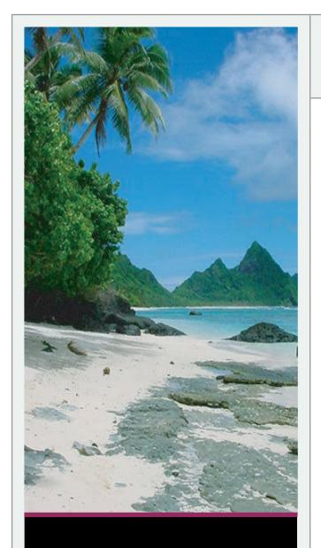
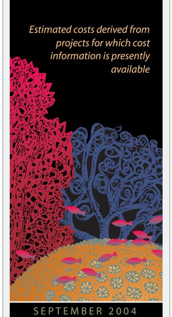

# **E S T I M AT ED LAS P R O J E C T I M P L E M ENTAT I O N CO S T S**

Fisheries Management *\$383,404*

Land-based Sources of Pollution *\$149,000*

Local Response to Global Climate Change *\$223,600*

Population Pressures *\$61,500*

**In 2002, the U.S. Coral Reef Task Force identified the need for action at the local level to reduce key threats to coral reefs and called for the development of Local Action Strategies (LAS) in each of the seven states and territories which possess significant coral reef resources.**

# AMERICAN SAMOA Local Action Strategy

T**he American Samoa Local Action Strategies (LAS)** *are the result of a nearly two-year process that saw input from territorial agencies, non-profit groups, interested individuals, and other stakeholders such as local fishers, and federal agency partners. This process was initiated through the American Samoa Coral Reef Advisory Group (CRAG), a voluntary committee comprised of numerous agencies and academic institutions in the territory concerned with coral reef issues. Since its inception in 1998, CRAG has overseen many successful management and science activities, has increased member-agency collaboration and has improved alignment and cooperation with non-CRAG agencies that have common interests. To address LAS focus areas, CRAG developed both short- and long-term action plans that prioritize activities for funding. Where possible, current and ongoing activities were incorporated into each LAS to provide continuity and networking, and to underscore that individual agency mandates and projects are supported by the CRAG as a whole. Each LAS consists of goals, success indicators, projects and timelines, and will continue to evolve and develop as new resources are brought to bear, and as projects are completed.*

#### **F I S H E R I E S M A N A G E M E N T . . .**

This LAS was developed to address the overexploitation of reef species, natural disturbances and a lack of enforcement — all of which have led to a severe decline in the territory's near-shore fisheries.

#### **Goals and Objectives**

- *• Restore fish stocks and other exploited biota that are commercially, ecologically,and culturally important to the American Samoan way of life,or* fa'a samoa
- *• Prevent non-sustainable harvesting methods*

#### **Project Examples**

- *• Develop performance indicators of management effectiveness*
- *• Prepare and implement a Marine Protected Areas plan*
- *• Shift management paradigm from prohibited to allowable gear,and establish maximum and minimum size allowances of key species*

#### **Anticipated Outcomes**

- *• Creation ofstreamlined fisheries management infrastructure to optimize effectiveness and efficiency*
- *• Establish MPAsfor at least 20% of American Samoa's coral reefs*

# **L A N D - B A S E D S O U R C E S O F P O L L U T I O N . . .**

This LAS was developed to address the rapid development and non-sustainable land use practices that have augmented the amount of non-point source pollution (NPS) reaching the territory's coastal waters. These practices have resulted in a negative impact on both human and coral reef health.

#### **Goals and Objectives**

- *• Protect American Samoa's coral reefsfrom land-based sources of pollution due to ineffective land and waste management*
- *• Implement the American Samoa NPS Pollution Plan*

### **S TA K E H O L D E R S**

American Samoa Coral Reef Advisory Group

American Samoa Department of Commerce

American Samoa Community College Marine Science Program

American Samoa Environmental Protection Agency

American Samoa Power Authority

Department of Health

Department of Wildlife and Resources

DOI,Office of Insular Affairs

National Park of American Samoa

NOAA

Office of Samoan Affairs

Residents of the Territory

Territorial Coral Reef Monitoring Program

University of Hawaii

USDA,Natural Resource Conservation Service

#### **Project Examples**

- *• Establish program to monitor coral health and water quality ofsites adjacent to watershedsto help determine the efficacy of the NPS*
- *• Assess monitoring data to determine needed changesto best management practices*

#### **Anticipated Outcomes**

- *• Development ofsite-specific data on land-based sources of pollution*
- *• More effective application of NPS program to reduce levels and better control land-based sources of pollution*
- *• Reduced levels and better control of land-based sources of pollution*

#### **L O C A L R E S P O N S E T O G L O B A L C L I M AT E C H A N G E . . .**

This LAS addresses the potential impacts that global climate change, and more frequent coral bleaching events may have on the function of the coral reef ecosystem, the island's economy, and *fa'a samoa*.

#### **Goals and Objectives**

- *• Devise mechanisms and projectsto better understand and mitigate potential effects of climate change on reefs*
- *• Promote American Samoa as a national field site forstudying climate change*

#### **Project Examples**

- *• Support research on climate change in the territory*
- *• Create a rapid response plan for action to be taken during bleaching events*
- *• Incorporate climate change concernsinto broader reef management plans*

#### **Anticipated Outcomes**

- *• An increased number of collaborative studies on climate change*
- *• Improved effortsfor mitigating the effects of climate change on American Samoa*

# **P O P U L AT I O N P R E S S U R E S . . .**

This LAS addresses the impacts of human development and the demands from the growing population of both residents and visitors to American Samoa. Factors such as increased road construction, land development, shoreline hardening, overfishing, and waste disposal all negatively impact the reefs.

#### **Goals and Objectives**

*• Assist the Population Implementation Committee (PIC) in creating policies,programs,and incentivesto reduce the harmful environmental effects of overpopulation*

#### **Project Examples**

- *• Update Governor's Population Action Plan*
- *• Develop and implement a three-year campaign to build awareness of the harmful environmental effects of unsustainable population growth*

#### **Anticipated Outcomes**

- *• New policies and programsto reduce harmful effects of population pressures*
- *• Improved community-level understanding of the potentialstressesthat a rising population can have on the territory's coral reef health and itsrelation to the overall health of the community*

**c o n t a c t LELEI PEAU,** *Lelei.Peau@noaa.gov (011) 684.633.5155*