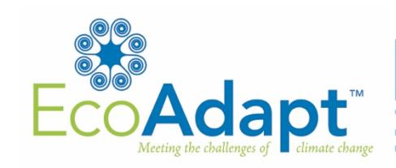

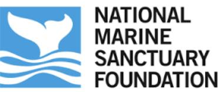

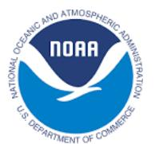

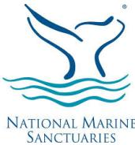

# **Rapid Vulnerability Assessment and Adaptation Strategies for the National Marine Sanctuary and Territory of American Samoa**

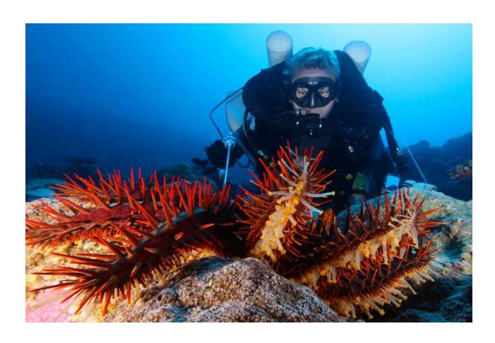

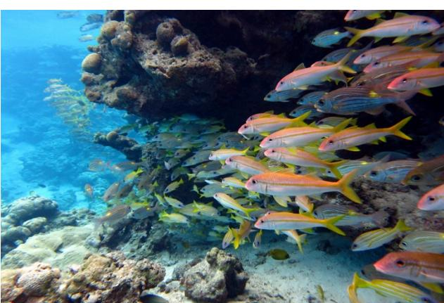

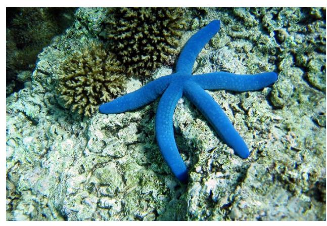

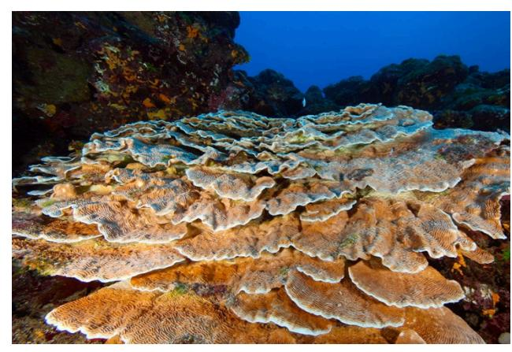

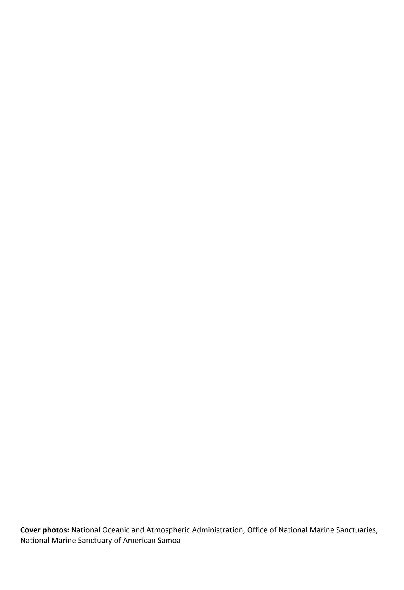

# **Rapid Vulnerability Assessment and Adaptation Strategies for the National Marine Sanctuary and Territory of American Samoa**

# 2017

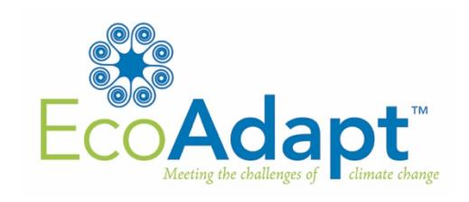

P.O. Box 11195 Bainbridge Island, WA 98110

## **Citation:**

Score, A., editor. 2017. Rapid Vulnerability Assessment and Adaptation Strategies for the National Marine Sanctuary and Territory of American Samoa. EcoAdapt, Bainbridge Island, WA.

For more information about this report, please contact Alex Score at Alex@EcoAdapt.org.

#### **Contributors**

Alessandra Score, EcoAdapt Rachel M. Gregg, EcoAdapt Whitney Reynier, EcoAdapt Laura Hilberg, EcoAdapt Joseph Paulin, National Marine Sanctuary of American Samoa Sara Hutto, Greater Farallones National Marine Sanctuary Catherine Marzin, Office of National Marine Sanctuaries Kelley A. Tagarino, University of Hawai'i Sea Grant College Program & American Samoa Community College (National Marine Sanctuary of American Samoa Advisory Council)

#### **Acknowledgements**

This work would not have been possible without the input of workshop participants throughout both the vulnerability assessment workshop and the adaptation strategy development workshop. We would like to thank the National Marine Sanctuary of American Samoa Advisory Council (NMSASAC), National Marine Sanctuary of American Samoa (NMSAS) Superintendent Gene Brighouse and Deputy Superintendent Atuatasi Lelei Peau, Greater Farallones National Marine Sanctuary (GFNMS) Superintendent Maria Brown and Catherine Marzin the Office of National Marine Sanctuaries (ONMS) Climate Lead for project support. We would like to thank Sara Hutto from the GFNMS for leading the vulnerability assessment workshop and Joseph Paulin from the NMSAS for helping with all logistics. We would like to thank the NMSAS Team for support implementing the workshops, especially Apulu Veronika Molio'o Mata'utia Mortenson for translation. We would like to especially thank the following reviewers: Charles Birkland, University of Hawai'i at Manoa, Jeremy Raynal, American Samoa Coral Reef Advisory Group (CRAG), Kelley A. Tagarino, NMSASAC Project Lead, University of Hawai'i Sea Grant College Program & American Samoa Community College (ASCC), Melissa Snover, Ecologist, Scott Burch, National Park of American Samoa (NPSA) and Mareike Sudek, NMSAS. This project has been made possible with support of the National Marine Sanctuary Foundation, www.marinesanctuary.org.

# **Participant List: Vulnerability Assessment Workshop (July 19-20, 2016)**

*Sara Hutto, GFNMS (facilitator)*

*Gene Brighouse, NMSAS (Superintendent)*

*Atuatasi Lelei Peau, NMSAS (Deputy Superintendent)*

*Apulu Veronika Molio'o Mata'utia Mortenson, NMSAS (translator)*

*Joseph Paulin, NMSAS (workshop coordinator)*

*Melissa Snover, NMSAS (small group facilitator)*

*Isabel Gaoteote Halatuituia, NMSAS (note taker)*

*Tanimalie Letuli, NMSAS (note taker)*

## **Participants:**

Mia Comeros, ASEPA Sabrina Woofter, CRAG Motusaga Valoso, CRAG

Fatima Samafea-Liau, NMFS 

(NMSASAC)

Scott Burch, NPSA (NMSASAC) Hideyo Hatori, NOAA CRCP Mareike Sudek, CRAG/DMWR

Cecelia Reid, ASEPA Kim McGuire, CRAG/DMWR Jeremy Raynal, CRAG

Mariana Pato, ASEPA Lei Pelle, CRAG Tantasi Falanai, DOE

#### **Participant List: Adaptation Strategy Workshop (September 14-15, 2016)**

*Alessandra Score, EcoAdapt (facilitator)*

*Rachel M. Gregg, EcoAdapt (facilitator)*

*Catherine Marzin, ONMS (presenter)*

*Kelley Tagarino, Sea Grant, ASCC, NMSASAC (presenter, small group facilitator)*

*Kim McGuire, CRAG/DMWR (presenter)*

*Gene Brighouse, NMSAS (Superintendent)*

*Atuatasi Lelei Peau, NMSAS (Deputy Superintendent)*

*Apulu Veronika Molio'o Mata'utai Mortenson, NMSAS (translator)*

*Joseph Paulin, NMSAS (workshop coordinator)*

*Melissa Snover, NMSAS (small group facilitator)*

*Isabel Gaoteote Halatuitui, NMSAS (note taker)*

*Taimalie Letuli, NMSAS (note taker)*

#### *Participants:*

Utu Abe Malae, ASPA Director Hideyo Hattori, NOAA CRCP Alden Tagarino, ASCC

Fonoti Simanu, (NMSASAC 

Aunu'u Island)

Togiola Tulafono, (NMSASAC 

East Tutuila)

Mike King, ASPA Kim McGuire, CRAG/DMWR Doug Fenner, NOAA Edna Noga, ASPA Soli Ofoia, Mayor Vaitogi DJ Sene, ASCC/Land Grant Jason Jaskowiak, ASPA Jose Rose, OCI/DOE O. Tovola, ASCC Shaun Salave'a, Leone Tim Clark, NPSA Ruby Taduai, ASCC R.T. Toelupe, Leone Tricia Sataua, ASEPA Annabelle Leota, ASCC

Faimalie Peresesa, Futiga 

Mayor

Valory Gregg, Atlantic Pacific Marine (NMSASAC West 

Tutuila)

Brian Peck, USFWS Rose Atoll 

Manager

Puataunofo Tulafono, Boy and 

Girls Club

# **Table of Contents**

| Executive Summary                                                                                 | i  |
|---------------------------------------------------------------------------------------------------|----|
| Chapter 1 An Overview of Climate Change in American Samoa                                         | 1  |
| Overview and Background                                                                           |    |
| Office of National Marine Sanctuaries Perspective                                                 | 1  |
| American Samoa                                                                                    | 1  |
| Fa'a-Samoa - The Samoan Way                                                                       | 1  |
| Preparing for Climate Change                                                                      |    |
| Climate Change Impacts in American Samoa                                                          |    |
| Air Temperature                                                                                   |    |
| Annual and Seasonal Precipitation                                                                 |    |
| Drought                                                                                           |    |
| Extreme Precipitation and Tropical Cyclones                                                       | 6  |
| Streamflow                                                                                        |    |
| Sea Level Rise                                                                                    |    |
| Wave Height                                                                                       | 8  |
| Sea Surface Temperature                                                                           |    |
| Ocean Acidification                                                                               | 9  |
|                                                                                                   |    |
| Chapter 2 Vulnerability Assessment and Adaptation Planning: Methods and Workshop                  |    |
| Activities                                                                                        |    |
| Overview                                                                                          |    |
| STEP 1: Identify Conservation Targets - Focal Resource Selection                                  |    |
| STEP 2: Vulnerability Assessment Workshop and Methods                                             |    |
| Vulnerability Terminology and Definitions:                                                        |    |
| Habitat Vulnerability Assessment Criteria: Sensitivity, Exposure, and Adaptive Capacity           |    |
| Species Vulnerability Assessment Criteria: Sensitivity, Exposure, and Adaptive Capacity           |    |
| Ecosystem Service Vulnerability Assessment Criteria: Sensitivity, Exposure, and Adaptive Capacity |    |
| Vulnerability Assessment Workshop Activities                                                      |    |
| STEP 3: Adaptation Planning Workshop and Methods                                                  |    |
| Adaptation Terminology and Definitions                                                            |    |
| Adaptation Strategy Workshop Activities                                                           |    |
| Current Management Goals and Potential Vulnerabilities                                            |    |
| Future Management Goals and Adaptation Actions                                                    |    |
| Adaptation Action Feasibility                                                                     | 18 |
| Chapter 3 Vulnerability Assessment and Adaptation Planning Results                                | 19 |
| Summary                                                                                           | 19 |
| 1. Coral Reef Habitat                                                                             | 20 |
| Introduction                                                                                      | 20 |
| Vulnerability Assessment Results                                                                  | 20 |
| Current Management Actions                                                                        | 21 |
| Future Management Actions                                                                         | 21 |
| Feasibility and Effectiveness of Current and Future Management ActionsActions                     | 22 |
| 2. Mangroves and Lagoon Habitat                                                                   |    |
| Introduction                                                                                      |    |
| Vulnerability Assessment Results                                                                  | 23 |
| Current Management Actions                                                                        | 23 |
| Future Management Actions                                                                         | 23 |

| Feasibility and Effectiveness of Current and Future Management Actions         | 24 |
|--------------------------------------------------------------------------------|----|
| 3. Water Quality                                                               | 24 |
| Introduction                                                                   | 24 |
| Vulnerability Assessment Results                                               | 25 |
| Current Management Actions                                                     |    |
| Future Management Actions                                                      | 26 |
| Feasibility and Effectiveness of Current and Future Management Actions         | 26 |
| 4. Giant Clams                                                                 | 27 |
| Introduction                                                                   | 27 |
| Vulnerability Assessment Results                                               | 27 |
| Current Management Actions                                                     | 27 |
| Future Management Actions                                                      | 27 |
| Feasibility and Effectiveness of Current and Future Management Actions         |    |
| 5. Reef Fish                                                                   | 28 |
| Reef Herbivores Introduction                                                   | 28 |
| Reef Herbivore Fish Vulnerability Assessment ResultsResults                    |    |
| Reef Piscivores Introduction                                                   |    |
| Reef Piscivores Vulnerability Assessment Results                               |    |
| Charismatic Reef Fish Introduction                                             |    |
| Charismatic Reef Fish Vulnerability Assessment Results Results                 |    |
| Current Management Actions For All Reef Fish Assemblages                       | 30 |
| Future Management Actions For All Reef Fish Assemblages                        |    |
| Feasibility and Effectiveness of Current and Future Management Actions for All |    |
| , , , , , , , , , , , , , , , , , , , ,                                        | -  |
| 6. Pelagic Fish                                                                | 31 |
| Introduction                                                                   | 31 |
| Vulnerability Assessment Results                                               | 32 |
| Current Management Actions /Future Management Actions                          | 32 |
| 7. Sharks and Rays                                                             | 32 |
| Introduction                                                                   | 32 |
| Vulnerability Assessment Results                                               | 32 |
| Current Management Actions                                                     |    |
| Future Management Actions                                                      | 33 |
| Feasibility and Effectiveness of Current and Future Management Actions         | 33 |
| 8. Sea Turtles                                                                 | 34 |
| Introduction                                                                   | 34 |
| Vulnerability Assessment Results                                               |    |
| Current Management Actions                                                     | 34 |
| Future Management Actions                                                      | 34 |
| Feasibility and Effectiveness of Current and Future Management Actions         | 35 |
|                                                                                |    |
| Literature Cited                                                               | 36 |
| Appendices                                                                     | 41 |
| Appendix I: National Marine Sanctuary of American Samoa                        |    |
| Appendix II: List of Acronyms                                                  |    |
| Appendix III: Climate Impacts Summary Table                                    |    |
| Appendix IV: Current and Future Adaptation Strategies Tables                   |    |
|                                                                                |    |

# **List of Figures**

| al.	2012;	US	DOC	NOAA	ONMS	2012)4 Figure	2.	Adaptation	planning	process	(Glick	et	al.	2011). 10                                                                                                                                                     |
|-----------------------------------------------------------------------------------------------------------------------------------------------------------------------------------------------------------------------------------------------------------|
| Figure	3.		Visual	representation	of	the	vulnerability	assessment	process. 12                                                                                                                                                                           |
| Figure	4.	Visual	representation	of	the	relationship	between	adaptation	goals,	strategies,	and specific	actions. 17                                                                                                                                  |
| Figure	5.	Feasibility	and	Effectiveness	of	Current	(blue)	and	Future	Adaptation	Actions	for	Coral Reefs22                                                                                                                                              |
| Figure	6.	Feasibility	and	Effectiveness	of	Current	(blue)	and	Future	Adaptation	Actions	for Mangroves24                                                                                                                                                |
| Figure	7.	Feasibility	and	Effectiveness	of	Current	(blue)	and	Future	Adaptation	Actions	for	Water Quality. 26                                                                                                                                       |
| Figure	8.	Feasibility	and	Effectiveness	of	Current	(blue)	and	Future	Adaptation	Actions	for	Giant Clams. 28                                                                                                                                         |
| Figure	9.	Feasibility	and	Effectiveness	of	Current	(blue)	and	Future	Adaptation	Actions	for	Reef fish. 31                                                                                                                                           |
| Figure	10.	Feasibility	and	Effectiveness	of	Current	(blue)	and	Future	Adaptation	Actions	for Sharks	and	Rays. 33                                                                                                                                    |
| Figure	11.	Feasibility	and	Effectiveness	of	Current	(blue)	and Future	Adaptation	Actions	for	Sea Turtles35                                                                                                                                          |
| List	of	Tables                                                                                                                                                                                                                                            |
| Table	1.	Current	management	goals,	potential	vulnerabilities,	and	current	management	actions for	coral	reefs. 55                                                                                                                                    |
|                                                                                                                                                                                                                                                           |
| Table	2.	Potential	future	management	goals,	adaptation	actions,	and	action	implementation details	including	where	and	how	to	implement	and	collaboration	and	capacity	needs	for coral	reefs63                                                       |
| Table	3.	Current	management	goals,	potential	vulnerabilities,	and	current	management	actions                                                                                                                                                              |
| for	mangroves	and	Pala	Lagoon. 69 Table	4.	Potential	future	management	goals,	adaptation	actions,	and	action	implementation details	including	where	and	how	to	implement	and	collaboration	and	capacity	needs	for mangroves	and	Pala	Lagoon70 |
| Table	5.	Current	management	goals,	potential	vulnerabilities,	and	current	management	actions for	water	quality72                                                                                                                                       |
| Table	6.	Potential	future	management	goals,	adaptation	actions,	and	action	implementation details	including	where	and	how	to	implement	and	collaboration	and	capacity	needs	for water	quality. 74                                                |

# **Executive Summary**

The ocean systems and the interdependent lives and economies that are protected by the National Marine Sanctuary of American Samoa are affected by diverse and compounding anthropogenic factors. These range from marine debris and pollution, to human development and fishing practices, to climate change and ocean acidification. Sanctuary planning and management help to ensure that the natural systems on which marine, wildlife and human communities depend are healthy and sustainable for generations to come despite these farreaching stressors. For emerging threats such as climate change and ocean acidification, marine and coastal resource managers often recognize the threats climate change poses to the resilience, health, and ecosystem services of the special coastal and ocean places they protect, yet are still struggling with how to develop appropriate management options.

This report summarizes the results of a rapid vulnerability assessment (July 2016) and adaptation strategy planning (September 2016) workshops for 10 focal resources in the Territory and National Marine Sanctuary of American Samoa by engaging with stakeholders, including village leaders, community members, resource managers, local government representatives, and business owners that rely on the resources with the goal of increasing climate resilience in the region.

#### *Vulnerability Assessment Results*

Rankings for each vulnerability component (i.e., sensitivity, exposure, adaptive capacity) were combined into an overall vulnerability score. The table below depicts the results of the vulnerability of the ten focal resources over the next 20 years**1** as well as confidence scores**.**  Overall the vulnerability assessment of the 10 focal resources was moderate to low-moderate with mostly high and moderate confidence scores. This is likely due to the 20-year timeframe that participants chose to use rather than a more standard long-term timeframe of 50-100 years. If the standard climate change timeframe would have been used for this vulnerability assessment, one would have probably expected higher vulnerability and lower confidence scores.

| FOCAL	RESOURCE        | VULNERABILITY | CONFIDENCE SCORE |
|-----------------------|---------------|---------------------|
| Coral	Reef	Habitat    | Moderate      | High                |
| Mangrove	Habitat      | Low-Moderate  | High                |
| Water	Quality         | Moderate      | High                |
| Giant	Clam            | Moderate      | High                |
| Herbivore	Reef	Fish   | Low-Moderate  | High                |
| Charismatic	Reef	Fish | Low-Moderate  | High                |
| Reef	Piscivores       | Low-Moderate  | High                |
| Pelagic	Fish          | Moderate      | High                |
| Sharks	and	Rays       | Low-Moderate  | Moderate            |
| Sea	Turtles           | Moderate      | Moderate            |

1 Participants identified a 20-year timeframe under which to assess the resources' vulnerability. A longer timeframe would have yielded much lower confidence scores for the rankings, and participants wanted to provide 

### *Adaptation Strategy Development Results*

For each resource, participants generated a list of adaptation strategies and actions. The table below presents the top ranked current and future climate-informed recommended actions.

| RESOURCE              | CLIMATE-INFORMED	ACTIONS                                                                                                                                                                                                                                                                                                  |
|-----------------------|---------------------------------------------------------------------------------------------------------------------------------------------------------------------------------------------------------------------------------------------------------------------------------------------------------------------------|
| Coral	Reef Habitat | Support	sewer	upgrades	and	expansions,	new	wastewater • treatment	plants,	proper	septic	tank	installation,	and	cesspool removal Plant	more	trees/vegetation	in	coastal	areas	and	in	villages	to • reduce	runoff Select	corals	that	are	resilient	to bleaching for	restoration • projects |
| Mangroves             | Increase	use	of	stream	catchments	to	catch	debris •                                                                                                                                                                                                                                                                    |
| Water	Quality         | Improve	sewage	effluent	quality	and	sewage	treatment	(secondary • treatment	and	UV	lights) Increase	public	education	and	outreach • Pass	and	enforce	anti-littering	bill	(Keep	American	Samoa	Beautiful • Act) Find	alternatives	to	untreatable/disposable	pollutants •                        |
| Giant	Clam            | Create	hatchery	for	clam	stocking	and	genetic	study	of	giant	clams • between	different	islands	to	diversify	seed	source Increase	public	education	and	outreach • Enforce	and	develop	new	harvest	regulations	to	avoid • overharvesting                                                               |
| Reef	Fish             | Utilize	fishing	regulations	and	ensure	enforcement •                                                                                                                                                                                                                                                                   |
| Sharks	&	Rays         | Increase	research	to	identify	breeding/rearing	critical	habitat •                                                                                                                                                                                                                                                      |
| Sea	Turtles           | Engage	village	councils	to	enforce	laws • Monitor	turtles/eggs;	satellite	tagging	to	track	migration	routes • Create	citizen	science	program	to	track	turtle/nest	presence • Increase	education	(importance	of	beaches	and	light	use) • Use	turtle-friendly	street	lights •                    |

# **Chapter 1 An Overview of Climate Change in American Samoa**

# **Overview and Background**

#### Office of National Marine Sanctuaries Perspective

The Office of National Marine Sanctuaries serves as the trustee for a network of underwater parks encompassing more than 600,000 square miles (1,553,993 sq. km.) of marine and Great Lakes waters from Washington State to the Florida Keys, and from Lake Huron to American Samoa. The network includes a system of 13 national marine sanctuaries and Papahānaumokuākea Marine National Monument. National marine sanctuaries operate at the heart of coastal communities where local marine resources provide jobs, recreational opportunities and a sense of identity. Each sanctuary works closely with its local, state and federal level stakeholders in managing the site to create a shared vision that integrates human uses with the primary mandate of resource protection. 

National marine sanctuaries play a significant role in understanding the influence of climate change. While climate change threatens marine resources and the communities that rely on them, national marine sanctuaries are working with partners to educate the public and to systematically integrate climate change in management and day-to-day operations. In addition, sanctuaries provide coastal communities with natural defenses against climate change impacts. They protect and restore critical blue carbon habitats, such as salt marshes, mangroves and seagrass beds, that help mitigate climate change by capturing and storing carbon from the atmosphere. By being on the frontline, sanctuaries are ideal places to focus climate research and monitoring and to find practical ways to build resilience to climate change.

#### American Samoa

American Samoa is an unincorporated territory of the United States consisting of the eastern part of the Samoan archipelago, located in the south-central Pacific Ocean. It lies about 1,600 miles (2,600 km) northeast of New Zealand and 2,200 miles (3,500 km) southwest of the U.S. state of Hawaiˊi.

American Samoa includes the inhabited islands of Tutuila, Manuˊa islands (Taˊu, Olosega, Ofu), and Aunuˊu, along with an uninhabited coral atoll named Rose Island. Swains Island, a formerly inhabited coral atoll, about 280 miles (450 km) northwest of Tutuila and physiographically separate from the archipelago, was made a part of American Samoa in 1925. The capital of American Samoa is Pago Pago, on Tutuila.

The 2010 census showed a total population of 55,519 people. The total land area is 199 square kilometers (76.8 sq. mi), slightly more than Washington, D.C. American Samoa is the southernmost territory of the U.S. and one of two U.S. territories (with the uninhabited Jarvis Island) south of the Equator (US DOC NOAA ONMS 2012). 

#### Faˊa-Samoa - The Samoan Way

While American Samoa is the place where the sanctuary is physically located, faˊa-Samoa is the cultural context for all sanctuary activities. Faˊa-Samoa is the traditional communal Samoan 

lifestyle, or way of life. It is the foundation of Polynesia's oldest culture - dating back some 3,000 years. It places great importance on the dignity and achievements of the group rather than on individual achievements. The traditional communal lifestyle revolves around the aiga, or extended family. Aiga are headed by leading matai (chief) or Saˊo, who manage the communal economy, protect and distribute family lands, are responsible for the welfare of all in their aiga, and represent the family in councils. Even after decades of foreign influence, most Samoans are fluent in their native language, but also speak English. 

The sanctuary team places a high value on partnerships with communities and maintains great respect for faˊa-Samoa. In American Samoa, the sanctuary-matai relationship is critical to the success of this partnership. The American Samoa Office of Samoan Affairs helps facilitate the sanctuary's community consultations in a manner that is culturally appropriate and respectful of faˊa-Samoa. This work includes consultations with saofaˊiga ale nuu (village council meeting) and individual matai (US DOC NOAA ONMS 2012).

#### Preparing for Climate Change

Islands in the Pacific region are among the most vulnerable areas in the world to impacts from climate change (Mimura et al. 2007). Given American Samoa's isolation, limited land area, and vulnerability to extreme weather events and coastal hazards, there is a critical need to prepare communities for environmental changes such as impacts from climate change. Due to the traditional land tenure system in American Samoa, where land is tied to chiefly, or matai, titles and not controlled by the government, it is necessary to engage the chiefs at the village level in order to create an effective resilience plan. The need to "integrate plans at the village level" was noted in the 2012 American Samoa Capacity Assessment (Page et al. 2012). In addition, the NOAA Coral Reef Conservation Program noted that there is a need to "Identify, understand, and communicate risks and vulnerability of US coral reef ecosystems, ecosystem services, and dependent human communities to climate change and ocean acidification" in its 2009 report entitled "NOAA Coral Reef Conservation Program Goals and Objectives 2010-2015." Despite these needs, little local planning and resource vulnerability assessments have been conducted to date.

#### **Local climate change actions taken thus far include:**

- 1) The Coral Reef Advisory Group (CRAG) was created in American Samoa in 1994 by three founding agencies (American Samoa Environmental Protection Agency, Department of Commerce and Department of Marine and Wildlife Resources) with two additional groups (National Park of American Samoa and the American Samoa Community College's Marine Science Program) joining in 2000. The CRAG identified four threats as "most devastating" to coral reefs in American Samoa—over-fishing, population growth, development pressure/unmanaged land use, and climate change. Local research was supported to explore these threats, including climate change, with territorial and federal funds, and workshops were held to build agency capacity on these issues, while working to develop response strategies.
- 2) In 2007 then Governor Tulafono signed an executive order entitled, "Climate Change Mitigation Executive Order," which mandated that the American Samoa Government (ASG) would make efforts to reduce its carbon footprint through such actions as: Increased minimum fuel efficiency for ASG vehicles; no longer buying 4-wheel drive vehicles unless needed; increase

the number of hybrid vehicles by 5% until 50% of new ASG vehicles are hybrid in 2017; banning the importation of vehicles made before 1999; require gas stations to install vapor recovery nozzles; use compact florescent bulbs, encouraging all ASG departments to set up a recycling program, purchasing only energy star appliances, and it banned the import of high phosphorus detergents to reduce nutrification in nearshore waters.

- 3) Several high level climate change workshops were held in American Samoa after the 2007 Executive Order, including one in April, 2010 entitled, "Planning for Climate Change in the Coastal and Marine Environment," and another in February, 2010 entitled, "Making Climate Change Local: Building Resilient Communities in the Pacific." Both of these workshops were in whole or part sponsored and organized by the then Fagatele Bay National Marine Sanctuary (now National Marine Sanctuary of American Samoa).
- 4) An ASG mandated Territorial Climate Change Adaptation Working Group was created in June, 2011.
- 5) In August of 2012, then Governor Tulafono signed an updated executive order (EO-03-2012) acknowledging and reaffirming the serious nature of the impacts of climate change to American Samoa, and even specifically noting the actions were taken from the recommendations of the "Making Climate Change Local: Building Resilient Communities in the Pacific" workshop. This executive order proposed to: ban import of vehicles older than ten years, requiring all newly purchased ASG vehicles to be hybrids, requiring all newly purchased ASG appliances to be Energy Star, banning the importation of any detergents containing phosphates, prohibiting the use of incandescent light bulbs and requiring new lighting to use light-emitting diode (LED) bulbs, or compact fluorescent bulbs if LEDs aren't an option, and requires all ASG departments to create their own recycling program.
- 6) A Territorial Climate Change Adaptation Framework and a Community Climate Change Resiliency Guide was created in August of 2012.
- 7) In 2012 air-born LiDAR-Light Detection and Ranging—a remote sensing method used to examine the surface of the Earth, was flown over the island of Tutuila; this critical data set is being used to develop sea level rise models for local villages.
- 8) In 2012, the village of Amouli created a village resiliency plan, as outlined in the resiliency guide. This was a result of a project driven by Co-Principle Investigators Dr. Arielle Levine and Fatima Sauafea Le'au, with technical assistance from Dr. Chip Fletcher.
- 9) In 2012, the Fagatele Bay National Marine Sanctuary Final Management Plan / Final Environmental Impact Statement, that included a Climate Change Action Plan, were completed (US DOC NOAA ONMS 2012).

# **Climate Change Impacts in American Samoa**

American Samoa climate is characterized by warm, relatively stable air temperatures, variable precipitation, high humidity, persistent southeast trade winds, and periodic tropical cyclone activity (US DOC NOAA ONMS 2012). Rainfall and trade winds in American Samoa are influenced by the South Pacific Convergence Zone, a low-pressure area which seasonally moves over and around the archipelago, resulting in a long rainy season from October-May, and a slightly cooler and drier period from June-September with higher southeasterly trade wind activity (Finucane et al. 2012; US DOC NOAA ONMS 2012). Tropical cyclone activities bring

heavy rainfall and high wave activity, with peak cyclone activity occurring from December to February (Finucane et al. 2012). 

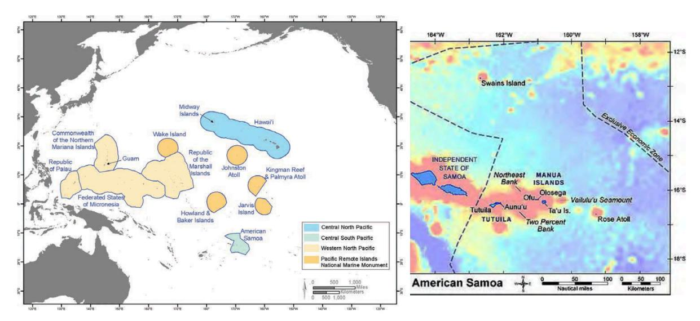

**Figure 1**. Map of the Pacific Islands sub-regions (left) and American Samoa (right) (Finucane et al. 2012; US DOC NOAA ONMS 2012).

The Pacific Islands region experiences high inter-annual and inter-decadal climate variability as a result of the El Nino Southern Oscillation (ENSO), the Pacific Decadal Oscillation (PDO), and the Inter-decadal Pacific Oscillation (IPO) (Finucane et al. 2012; US DOC NOAA ONMS 2012; Cheng and Gaskin 2011). ENSO events – including La Niña (cold phase) and El Niño (warm phase) – influence a variety of regional climate factors, including trade wind activity, rainfall, storm tracks, and ocean temperature (Finucane et al. 2012; US DOC NOAA ONMS 2012). These events typically persist for 6-18 months and ENSO phase shifts occur every 3-7 years (Cane 2005). The PDO has similar effects because its warm and cold phases alter the relative dominance of El Niño and La Niña events. PDO phases typically cycle every 20-30 years (D'Aleo 2005), and it is believed that the Pacific Islands region has been in a cold PDO phase since 1999; this phase will likely persist for the next several decades. The IPO behaves similarly to the PDO, affecting the broader south Pacific, where American Samoa is located (Finucane et al. 2012).

Where possible, climate information specific to American Samoa is presented. In the absence of specific information for American Samoa, climate trends and projections for Samoa, the Central South Pacific, or the Pacific Islands region as a whole are presented.

#### Air Temperature

In nearby Samoa, average annual, minimum, and maximum air increased significantly from 1950-2009 (+0.25°F (+0.14°C), +0.07°F (+0.04°C), and +0.4°F (0.22°C) per decade, respectively), with the largest increases in maximum air temperatures (Young 2007; ABM and CSIRO 2011). Air temperatures are projected to continue increasing over the next century in the Central South Pacific (Young 2007; ABM and CSIRO 2011). Relative to temperatures from 1971-2000, average annual surface temperatures are projected to increase +1.1-1.3°F (+0.61-0.72°C) by 2030, +1.9-2.5°F (+1.06-1.39°C) by 2050, and +2.5-4.8 °F by 2090 (+1.39-2.67°C) (ABM and 

CSIRO 2011). Additionally, extreme heat days are projected become more frequent and intense across the Pacific Islands region during the 21st century (Finucane et al. 2012).

Potential impacts of air temperature increases on American Samoa's marine and coastal resources include increased mangrove heat stress and altered mangrove forest species composition, distribution, growth rates, and phenology, altered tidal flat community composition, distribution, and productivity, increased evaporation, exacerbating drought stress, altered bird migration timing, and shifts in sea turtle hatchling sex ratios (more females) (Parker and Miller 2012; Leong et al. 2014).

#### Annual and Seasonal Precipitation

There are few stable precipitation monitoring records for American Samoa, but from what data are available, American Samoa has shown no significant trend in annual precipitation or winter one-day precipitation volume since 1965 (Leong et al. 2014). Similarly, annual and seasonal rainfall trends in Samoa showed no significant trends from 1950-2009 (ABM and CSIRO 2011). Future precipitation projections for the Central South Pacific are highly variable and display conflicting results (Young 2007; ABM and CSIRO 2011). However, future conditions may include no change to a slight increase in mean annual precipitation during the 21st century, with slight precipitation decreases during the dry season and slight precipitation increases during the wet season (ABM and CSIRO 2011; Keener et al. 2012).

Precipitation patterns are influenced by a variety of factors in addition to climate change, including shifts in ENSO, PDO, and IPO phases, and according to local topography and location on a given island (Finucane et al. 2012, Leong at al. 2014). For example, El Niño conditions can cause heavy rainfall or drought depending on event strength and island location (Finucane et al. 2012). A summary of general phase effects on rainfall and tropical cyclone activity are listed below.

Summary of phase event influences on precipitation and tropical cyclone activity in American Samoa (ABM and CSIRO 2011):

- El Niño:
  - o Weak: reduced rainfall and tropical cyclone activity
  - o Moderate: enhanced rainfall and tropical cyclone activity, extended rainy season
  - o Strong: reduced rainfall
- La Niña:
  - o Increased tropical cyclone activity and rainfall
- PDO/IPO:
  - o Warm phases: generally increase El Niño activity
  - o Cold phases: generally increase La Niña activity

Potential impacts of altered precipitation patterns on American Samoa's marine and coastal resources include: altered freshwater runoff magnitude and timing to coastal and nearshore environments (e.g., lagoons, reef adjacent bays), altering pollutant, sediment, and nutrient delivery and altered ocean salinity and stratification (Cheng and Gaskin 2011; Finucane et al. 2012; Parker 2012; Leong et al. 2014).

#### Drought

Drought events in Samoa are correlated with El Niño events, but drought frequency has not changed over the past 60 years in Samoa (Young 2007; ABM and CSIRO 2011) or American Samoa (Keener et al. 2012). Drought frequency in Samoa is unlikely to exhibit major change during the 21st century, but there is low confidence in this projection due to poor modeling of dry season precipitation patterns in the region (Young 2007).

Potential drought impacts on American Samoa's marine and coastal resources are reduced freshwater resources, particularly if drought is combined with enhanced saltwater intrusion and sea level rise, and the potential for decreased tourism (ABM and CSIRO 2011; Cheng and Gaskin 2011; Finucane et al. 2012; Parker 2012; Leong et al. 2014).

#### Extreme Precipitation and Tropical Cyclones

The Central South Pacific has shown no increase in the frequency of extreme rainfall events since 1965 (Keener et. al 2012). However, tropical cyclones are the primary source of extreme precipitation in the Central South Pacific, and the proportion of tropical storms escalating into tropical cyclones increased from 1991-2010 relative to 1970-1990 (Parker 2012). Extreme rainfall events are likely to increase in frequency and intensity during the 21st century, and will likely continue to be correlated with tropical cyclone activity (Young 2007; ABM and CSIRO 2011). Although region-specific projections are highly uncertain (Keener et al. 2012), tropical cyclone intensity across the Pacific Islands is projected to increase over the next 70 years (Diamond 2012), even while overall cyclone activity may decline in the Central South Pacific as storm tracks shift toward the Central North Pacific (ABM and CSIRO 2011; Seneviratne et al. 2012). In addition to responding to sea surface and atmospheric temperatures, cyclone activity is also correlated with ENSO, PDO, and IPO phase shifts, making future projections difficult (Keener et al. 2012).

More frequent and intense extreme precipitation events and more intense tropical cyclones can have a variety of impacts on American Samoa's marine and coastal resources, including 1) increased erosion, sedimentation, and pollution runoff during extreme precipitation events, reducing water quality and promoting algal blooms in mangrove and coral reef systems; 2) increased nutrient runoff and crown-of-thorns starfish outbreaks following storms; 3) increased risk of waterborne diseases; 4) altered geomorphology of mangroves forests, coral reefs, and seagrass beds, reducing critical habitat and protection for coastal communities; and increased coastal erosion, potentially affecting important cultural resources, nesting sea turtles, and tourism (Parker 2012; Leong et al. 2014; Cheng and Gaskin 2011; Finucane et al. 2012).

#### Streamflow

There is very little long-term, reliable streamflow data for American Samoa, but the limited data available from Tutuila indicate no significant trend in total streamflow, baseflow, or the number of extreme low- or high-flow days over a period of 35 years (1960-1995) (Keener et al. 2012). There are no concrete projections for streamflow in American Samoa, although streamflows are likely to be influenced by shifts in regional precipitation. Natural flow regimes are also influenced by human infrastructure and use (Keener et al. 2012).

Potential impacts of altered streamflows on American Samoa's marine and coastal resources include possibly reduced streamflow or increased streamflow dependent on precipitation events and drought events. Reduced streamflow can result in reduced nutrient delivery to nearshore and coastal ecosystems and reduced tourism opportunities by limiting freshwater availability. Increased streamflow can result in increased sedimentation and pollutant and nutrient delivery to nearshore ecosystems influencing tourism (Kenner et al. 2012; Parker 2012; Leong et al. 2014).

#### Sea Level Rise

Global sea levels have risen over the past century, although exact magnitude estimates vary (Cheng and Gaskin 2011; Yu and Hamilton 2010). Recent estimates indicate that global sea levels increased 3.4 (+/- 0.4 mm) per year from 1993-2009, representing a much faster rate of rise than during the 20th century (Emanuel 2005). Mean sea level rise was +2.07 mm per year from 1948-2006 in American Samoa, but exhibited annual variability (Cheng and Gaskin 2011).

There are no concrete projections for sea level rise in American Samoa (Cheng and Gaskin 2011). However, the Pacific Islands region will likely experience similar rates of sea level rise as global averages, with a potential increase between 0.2 to 2 m by 2100 depending on greenhouse gas emission scenarios and rates of ice sheet loss (Marra et al. 2012). Mirroring increases in mean sea level, the Pacific Islands region will likely experience an increased frequency of extreme sea level events. Based on past trends observed at Pago Pago, extreme sea level events will likely be driven by high tides (Marra et al. 2012) and extreme weather (e.g., cyclones).

Additionally, local rates of sea level rise will likely vary according to land dynamics (subsidence, uplifting), phase changes of ENSO and the PDO, wind patterns, and storm activity. For example, some communities in American Samoa (e.g., Pago Pago) may be subsiding, which will increase relative local rates of sea level rise (Li et al. 2010). Energetic ENSO phases can raise local sea levels by 6-12 inches (15-31 cm), and storm winds can raise water levels several inches to multiple feet (Keener et al. 2012). Additionally, shifts in trade wind activity can alter relative rates of sea level rise, and are thought to have contributed to the higher rates of sea level rise in the western Pacific relative to global trends from 1993-2010 (Nerem et al. 2010; Cheng and Gaskin 2011; Marra et al. 2012).

Potential impacts of sea level rise and extreme sea level events on American Samoa's marine and coastal resources include:

- Altered distribution and availability of coastal and nearshore habitats due to altered inundation timing and erosion, including sandy beaches, shallow coral reefs, seagrass beds, intertidal flats, and mangrove forests (Cheng and Gaskin 2011; Finucane et al. 2012; Leong 2014)
- Enhanced flooding and erosion of low-lying coastal areas, potentially affecting recreation, tourism, and important cultural resources (Parker and Miller 2012)
- Reduced mangrove forest extent and associated nursery habitat and ecosystem services (coastal protection, water purification) (Parker and Miller 2012; Leong et al. 2012)

- Reduced seabird breeding and sea turtle nesting habitat (Parker and Miller 2012; Leong et al. 2012)
- Enhanced saltwater intrusion in aquifers and groundwater storage areas, particularly on lower islands (Parker and Miller 2012; Leong et al. 2012)
- Increased salinity in freshwater and brackish wetlands (Parker and Miller 2012; Leong et al. 2012)
- Reduced upward coral growth (Cheng and Gaskin 2011; Finucane et al. 2012; US DOC NOAA ONMS 2012; Leong 2014)
- Enhanced erosion and re-suspension of seabed sediment, increasing sedimentation and turbidity among reefs (Cheng and Gaskin 2011; Finucane et al. 2012; US DOC NOAA ONMS 2012; Leong 2014)

#### Wave Height

Few long-term records of wave height exist for the Pacific Islands region (Young et al. 2011; Seneviratne et al. 2012). Future wave conditions are difficult to project due to the uncertainty underlying future storm patterns in a changing climate (Marra et al. 2012), but within the Pacific Islands region, annual mean wave heights are projected to increase in the southern tropical Pacific, and decrease in other Pacific areas (Hermer et al. 2010).

Potential impacts of shifting wave heights on American Samoa's coastal and marine resources include altered coral distribution, increased coral erosion, changes reef growth patterns, and increased coastal erosion (Parker and Miller 2012; Leong et al. 2014).

#### Sea Surface Temperature

Since the 1970s, sea surface temperatures in the Pacific Islands region have increased +0.13- 0.41°F (+0.07-0.23°C) per decade depending on location (ABM and CSIRO 2011). American Samoa has also exhibited warming trends (although exact rates aren't available) and Samoa exhibited a temperature increase of +0.14°F (+0.08°C) per decade from 1970-2011 (ABM and CSIRO 2011; US DOC NOAA ONMS 2012). Sea surface temperature in the Pacific Islands region is projected to continue increasing over the next century, potentially increasing +1.1-1.7°F (+0.61-0.94°C) by 2030, +1.8-2.3°F (+1.0-1.28°C) by 2055, and +2.5-4.7°F (+1.39-2.61°C) by 2090, depending on emissions trajectories and phase changes of ENSO, the PDO, and the IPO (ABM and CSIRO 2011; Finucane et al. 2012; Marra et al. 2012).

Potential impacts of increased sea surface temperatures on American Samoa's coastal and marine resources include the following: 

- More frequent and intense coral bleaching events (e.g., annual summer bleach events) and increased susceptibility to future bleaching episodes (Cheng and Gaskin 2011; Finucane et al. 2012; US DOC NOAA ONMS 2012; Leong at al. 2014);
- Increased coral mortality (larval and adult stages) and disease incidence (e.g., coral bleaching) (Cheng and Gaskin 2011; Finucane et al. 2012; US DOC NOAA ONMS 2012; Leong et al. 2014);
- Suppressed coral reef reproduction and altered population connectivity, potentially undermining recovery from bleaching events (Cheng and Gaskin 2011; Finucane et al. 2012; US DOC NOAA ONMS 2012; Leong et al. 2014);

- Potential shifts in coral distribution (e.g., shift toward deeper locations and areas with high water flow to ameliorate thermal stress) (Cheng and Gaskin 2011; Finucane et al. 2012; US DOC NOAA ONMS 2012; Leong et al. 2014);
- Altered distribution and reduced diversity, recruitment, and abundance of reef fishes;
- Increased reef fish disease vulnerability via suppressed immune system function (Cheng and Gaskin 2011; Finucane et al. 2012)
- Altered invertebrate larval development and transport (Cheng and Gaskin 2011; Finucane et al. 2012);
- Loss of ecosystem services provided by coral reefs (e.g., subsistence and commercial fisheries, tourism, coastal protection) (Leong et al. 2014);
- Range expansions of warm-water species (Parker and Miller 2012);
- Decline of seagrass systems, including shifts in species distribution, sexual reproduction, carbon dynamics, and growth rates (Cheng and Gaskin 2012; Leong et al. 2014);
- Decline of mangrove systems (Cheng and Gaskin 2012; Leong et al. 2014);
- Altered oceanic species distribution (including adults and larvae) and composition, potentially affecting fisheries (stock abundance and access) (Leong et al. 2014);
- Altered stratification, resulting in shifts in photic zone nutrient availability and phytoplankton size, abundance, and diversity, contributing oceanic food web shifts (Leong et al. 2014);
- Increased dominance of dinoflagellates over other phytoplankton and potential increase in toxic and non-toxic dinoflagellate blooms (Leong et al. 2014); and
- Increased vulnerability to marine invasive species (Cheng and Gaskin 2011; Finucane et al. 2012; US DOC NOAA ONMS 2012; Leong at al. 2014).

#### Ocean Acidification

Ocean acidification has been progressing across the Pacific Islands region over the past several centuries, and according to estimates for the Samoa region the aragonite saturation state in the late 18th century was 4.5, whereas it was measured at 4.1 in 2000 (ABM & CSIRO 2011). Coral formation occurs optimally at saturation states above 4.0, declining to extremely marginal production at levels at and below 3.0 (US DOC NOAA ONMS 2012). Regional ocean waters are projected to become more acidic in the future, and the aragonite saturation state is projected to fall below 3.5 in the region by 2060, and continue declining thereafter (ABM & CSIRO 2011). 

Potential impacts of ocean acidification on American Samoa's coastal and marine resources include: reduced calcification in corals, crustaceans, mollusks, echinoderms, and other taxa, reduced coral formation, growth, diversity, abundance, health, and recruitment, shifts in competitive interactions amongst coral taxa, altering reef complexity, increased macroalgae (fleshy algae) growth, altered oceanic species distribution as phytoplankton productivity and distribution changes, potentially affecting fisheries, and reduced coastal protection from wave energy and overwash if reef structures decline (Cheng et al. 2011; Parker and Miller 2012; Leong et al. 2014).

# **Chapter 2 Vulnerability Assessment and Adaptation Planning: Methods and Workshop Activities**

# **Overview**

Climate change **vulnerability assessments** provide two kinds of information: (1) they identify which resources are likely to be most affected by changing climate conditions, and (2) they improve understanding as to why these resources are likely to be vulnerable. Knowing which resources are most vulnerable better enables managers to develop **adaptation strategies** and set priorities for conservation action (Glick et al. 2011).

This vulnerability assessment and adaptation strategy report is an initial science-based effort to identify how and why focal resources (habitats, species, and ecosystem services) across the American Samoa are likely to be affected by future climate conditions over the next **20 years** and what are some strategies and options for reducing those vulnerabilities. This report includes the results of two workshops to assess Step 1 through Step 3 of the Adaptation Planning Process (see Figure 2). Step 1 included the identification of conservations efforts for 10 focal resources, Step 2 included the assessment of the vulnerability of those focal resources, and Step 3 included the identification of management options to reduce those vulnerabilities that were identified in Step 2. 

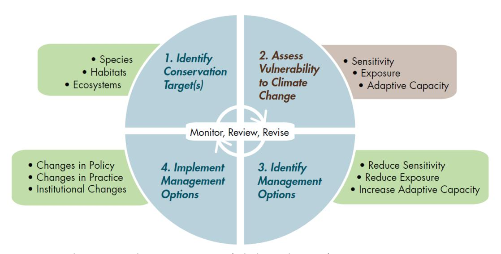

Figure 2. Adaptation planning process (Glick et al. 2011).

Developing resilient management options to decrease vulnerabilities requires implementing a variety of adaptation options. Most **adaptation options** fall into the following five main categories:

- 1. **Enhance Resistance.** Implementation of these strategies can help to prevent the effects of climate change from reaching or affecting a resource. Common resistance actions include those designed to reduce non-climate stressors.
- 2. **Promote Resilience**. These strategies can help a resource withstand the impacts of climate change by avoiding the effects of or recovering from changes.

- 3. **Facilitate Transition (or Response).** Transition or response strategies intentionally accommodate change and enable resources to adaptively respond to changing and new conditions.
- 4. **Increase Knowledge.** These strategies are aimed at gathering more information about climate changes, impacts, and/or the effectiveness of management actions in addressing the challenges of climate change.
- 5. **Engage Coordination**. Coordination strategies may help align budgets and priorities for programs of work across lands or establish or expand collaborative monitoring efforts or projects, among others.

# **STEP 1: Identify Conservation Targets - Focal Resource Selection**

A total of **10 focal resources** were selected from a list of 6 habitats, 12 species, and 3 ecosystem services valued in American Samoa. Sanctuary staff, village leaders, advisory council members, scientists, and managers were asked eight questions to select the resources most impacted by climate change with a survey. The questions for considerations when picking the focal resources included:

- 1. Is the resource listed as threatened, endangered or sensitive?
- 2. Is the resource considered to be ecologically foundational, a dominant species, an ecosystem engineer, a keystone species, an umbrella species, an important indicator, or strong interactor?
- 3. Does the resource have substantial or significant management implications?
- 4. Does the resource have significant other stressors already affecting viability?
- 5. Does the resource have available data and information upon which to do the vulnerability assessment?
- 6. Is the resource considered to be controversial or rare?
- 7. Does the resource have socio-economic significance (for example, is it a flagship species or does it have cultural or economic value)?
- 8. Is the resource likely to be significantly impacted by climate change?

The final focal resources selected included 2 combined habitats, coral reef habitat (reef flat, reef crest, reef slope, mesophotic reefs) and mangrove/lagoon habitat; 7 species assemblages, charismatic fish, herbivorous fish, piscivorous fish, pelagic fish, sharks and rays, giant clams, and sea turtles; and 1 ecosystem service, water quality.

# **STEP 2: Vulnerability Assessment Workshop and Methods**

The vulnerability assessment comprises three components: 1) sensitivity, 2) adaptive capacity, and 3) exposure, for focal resources, which are averaged by rankings for those components, and confidence scores for those rankings. The sensitivity, adaptive capacity, and exposure components each include multiple finer resolution elements that were addressed individually. **Sensitivity** involves factors that currently shape species, habitat, or ecosystem service to climate and climate driven factors (e.g., air and sea temperature, precipitation, drought, tropical storms, streamflow, coastal erosion, ENSO), sensitivity to disturbance regimes (e.g., disease, crown-of-thorns starfish), and sensitivity to non-climate stressors (e.g., land use change, overfishing, nutrient loading). **Adaptive capacity** elements include extent, status, and 

dispersal ability; species life history diversity, genetic diversity, behavioral plasticity, and phenotypic plasticity; species ability to resist and recover from stressors; and species management potential. To assess **exposure**, participants were asked to identify the climate and climate-driven changes most relevant to consider for the species, habitats, and ecosystem services and to evaluate how they would experience to those changes. A climate change trends and projections table was provided to participants to facilitate this evaluation (See Appendix III). 

#### Vulnerability Terminology and Definitions:

- 1. **Vulnerability:** A function of the sensitivity of a particular resource to changes in climate changes, its exposure to those changes, and its capacity to adapt to those changes (IPCC 2007).
- 2. **Sensitivity:** The climate and climate-driven factors that currently shape the species, habitat or ecosystem services.
- 3. **Exposure:** Consideration of future changes in climate that could affect the species, habitat, or ecosystem service.
- 4. **Adaptive Capacity**: The ability of an individual, community, or ecosystem to respond or

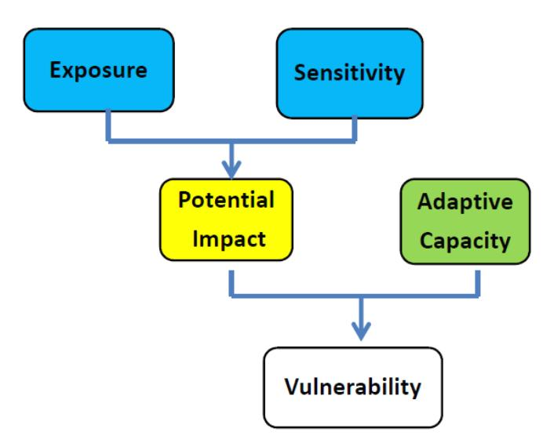

adapt to change; this reflects intrinsic traits (e.g., behavioral or physiological flexibility that allows individuals to respond to new situations) and extrinsic factors (e.g., degree of habitat fragmentation, management potential).

Figure 3. Visual representation of the vulnerability assessment process.

## Habitat Vulnerability Assessment Criteria: Sensitivity, Exposure, and Adaptive Capacity

- 1. **Climate and Climate Drive Factors:** There are two ways to assess habitat sensitivity:
  - a. whether habitat exists in a relatively narrow zone, and thus being more sensitive, or exists in a relatively broad climatic zone, thus being less sensitive;
  - b. whether the habitat experiences large changes in composition or structure due to small changes in climate or climate-driven factors, and thus is more sensitive; or the habitat experiences small changes even with larger changes in climate or climate-driven factors, and this is less sensitive.
- 2. **Disturbance Regimes:** Natural disturbance regime is a concept that describes the pattern of disturbances that shape an ecosystem over a long time scale. It is distinguished from a single disturbance event because it describes a spatial disturbance

pattern, frequency and intensity of disturbances, and a resulting ecological pattern over space and time. More sensitive habitats will show larger changes in composition or structure in response to relatively small climate-driven changes in disturbance regimes. Conversely, it would take much larger climate-driven changes in disturbance regimes to elicit a substantial change in composition or structure in less sensitive habitats. Changes in disturbance regimes may be either good or bad for the habitat.

- 3. **Future Climate Exposure:** Exposure involves future climate changes that could affect the habitat and the likely degree of exposure to those changes, including increased air and sea temperatures, decreased pH, altered currents, and storms.
- 4. **Sensitivity and Current Exposure to Non-Climate Stressors:** Sensitivity of the habitat to climate change impacts may be highly influenced by the existence, extent of, and current exposure to non-climate stressors. Although a habitat may be sensitive to a nonclimate stressor, if it is not currently exposed to it, the overall sensitivity of the habitat may be lower.
- 5. **Extent, Integrity, and Continuity:** Habitats that are currently widespread in their geographic extent, with high integrity and continuity may have greater adaptive capacity, may be more likely to withstand non-climate and climate stressors, and may persist into the future. Habitats that are degraded, isolated, limited in extent, or currently declining due to non-climate and climate stressors may have less adaptive capacity, and may be less likely to persist into the future.
- 6. **Resistance and Recovery:** Some habitats may be more resistant to changes, stressors, or maladaptive human responses, or are able to recover more quickly from stressors; these habitats likely exhibit higher adaptive capacity. This may include habitat diversity or diverse physical and topographical characteristics (e.g., variety in aspects), which may confer higher adaptive capacity.
- 7. **Management Potential:** Management potential reflects the ability to impact the adaptive capacity and resilience of a habitat to changes in climate through actions taken by the human community overseeing a habitat.

#### Species Vulnerability Assessment Criteria: Sensitivity, Exposure, and Adaptive Capacity

- 1. **Climate and Climate-Driven Factors:** Species sensitivity to climate and climate-driven factors may be direct (e.g., physiological, phenological) or indirect (e.g., ecological relationships).
  - a. *Physiological sensitivity* refers to a species' physiological ability to tolerate changes that are higher or lower than the range that they have experienced or currently experience. Species that are able to tolerate a wide range of climatic factors may be considered less sensitive.
  - b. *Phenological sensitivity* refers to a species' ability to phenologically track climate (e.g., timing of reoccurring thermal events). Species that cannot phenologically track environmental changes may be considered more sensitive.
  - c. *Species' ecological relationships* may also be affected by climate or climatedriven factors. Ecological relationships can include: predator/prey, foraging, competition, habitat, pollination, dispersal, symbiont/mutualist/parasite, and others. Ecological relationships significantly affected by small changes in climate and climate-driven factors may have higher sensitivity.

- **2. Disturbance Regime:** Natural disturbance regime is a concept that describes the pattern of disturbances that shape an ecosystem over a long time scale; it is distinguished from a single disturbance event because it describes a spatial disturbance pattern, a frequency and intensity of disturbances, and a resulting ecological pattern over space and time. Species may be at greater risk of decline or elimination even in response to small changes in disturbance regimes. For example, increasing water temperatures can alter bleaching and disease patterns in coral reefs which may cause shifts from coral to algal dominated systems. Changes in disturbance regimes may be either good or bad for the species.
- 3. **Future Climate Exposure:** Climate exposure involves projected future changes in climate that could affect the species and the likelihood that a species will experience those changes, including increased air and sea temperature, decreased pH, altered currents, and storms.
- 4. **Dependencies:** Species that use multiple habitats or utilize multiple prey or forage species may be less sensitive to climate change (e.g., generalists). Conversely, species with very narrow habitat needs or habitat specialization, single prey or forage species, or dependence on another sensitive species may have a higher likelihood of decline if climate change significantly affects the habitat or species they are dependent upon (e.g., specialists).
- 5. **Sensitivity and Current Exposure to Non-Climate Stressors**: Sensitivity of the species to climate change impacts may be highly influenced by the existence, extent of, and current exposure to non-climate stressors. Although a species may be sensitive to a nonclimate stressor, if it is not currently exposed to it, the overall sensitivity of the species may be lower.
- 6. **Extent, Status, and Dispersal Ability:** Species that are currently widespread in their geographic extent, with a robust population status, connectivity, and a high ability to disperse may have higher adaptive capacity. These species may be more likely to withstand and persist into the future despite climatic and non-climatic stressors. Species that are endemic, threatened or endangered, occur as isolated or fragmented populations, and/or exhibit limited ability to disperse may have lower adaptive capacity.

#### 7. **Intraspecific/Life History Diversity:**

- a. Life history diversity: Species with a diversity of life history strategies (e.g., variations in age at maturity, reproductive or nursery habitat use, or resource use) may be more resilient to climate change.
- b. Genetic diversity: Species with characteristics such as faster generation times, genetic diversity, heritability of traits, larger population size, or multiple populations with connectivity among them to allow for gene flow may exhibit higher adaptive capacity.
- c. Phenotypic and behavioral plasticity: Species with the capacity to express different traits (e.g., phenology, behavior, physiology) in response to environmental variation may have higher adaptive capacity. For example, many species exhibit phenotype plasticity in response to inter-annual variation in temperature and precipitation.
- **8. Resistance:** Some species may be more resistant to changes, stressors, or maladaptive human responses; these species may exhibit higher adaptive capacity.

**9. Management Potential:** Management potential reflects the ability to enhance the adaptive capacity and resilience of a species to changes in climatic through actions taken by the human community overseeing a resource. 

# Ecosystem Service Vulnerability Assessment Criteria: Sensitivity, Exposure, and Adaptive Capacity

- 1. **Sensitivity** involves factors that currently shape ecosystem services; exposure involves future climate changes that could affect the ecosystem service, and is covered in another section below. Ecosystem service sensitivity may largely be determined by the sensitivities of those components (e.g., species, habitat, hydrology, etc.) that provide or support the service. For example, the sensitivity of "marine fisheries" as an ecosystem service is significantly determined by the sensitivity of the target species climate and climate-driven factors (e.g., pH or temperature). Similarly, the sensitivity of recreation as an ecosystem service is dependent on the sensitivity of target species (e.g., birds for bird-watching) or habitat (e.g., beaches for sunbathing).
- 2. **Disturbance Regime:** Natural disturbance regime is a concept that describes the pattern of disturbances that shape an ecosystem over a long time scale; it is distinguished from a single disturbance event because it describes a spatial disturbance pattern, a frequency and intensity of disturbances, and a resulting ecological pattern over space and time. More sensitive ecosystem services may show significant changes in their ability to be provided in response to relatively small climate-driven changes in disturbance regimes (e.g., increased diseases in shellfish leading to harvest restrictions and/or closures).
- 3. **Future Climate Exposure:** Climate exposure involves projected future climate changes that could affect the service and the likely degree of exposure to those changes.
- **4. Sensitivity and Current Exposure to Non-Climate Stressors:** Sensitivity of the service to climate change impacts may be highly influenced by the existence, extent of, and current exposure to non-climate stressors. Although a service may be sensitive to a nonclimate stressor, if it is not currently exposed to it/affected by it, the overall sensitivity of the service will be lower.
- **5. Intrinsic Value and Management Potential:** Intrinsic value considers societal value of the service, including whether or not people would be willing to change behavior to continue access to and condition of the service. Management potential reflects our ability to affect the adaptive capacity and resilience of an ecosystem service to climatic changes through actions taken by the human community overseeing an ecosystem service.

#### Vulnerability Assessment Workshop Activities

During the July 2016 workshop, 2 participants were asked to evaluate the vulnerability for all 10 of the focal resources. The two-day workshop provided participants with baseline knowledge and understanding of climate trends (current, historic, projected future) for American Samoa 

 2 http://ecoadapt.org/workshops/NMSAS-VA-workshop

and collectively assessed vulnerabilities of habitats, species, and ecosystem services to climate change including evaluating sensitivity, exposure, and adaptive capacity. 

The vulnerability assessment model used in this process comprises three vulnerability components (i.e. sensitivity, adaptive capacity, and exposure), confidence evaluations for all components, and overall vulnerability and confidence for each focal resource. Sensitivity, exposure, and adaptive capacity components were broken down into specific elements better suited to assessing the vulnerability of particular resources for this assessment. Sensitivity elements for habitats and ecosystem services include: direct sensitivity to climate, climatedriven changes, and non-climate stressors. Disturbance regimes and non-climate stressors are also included in species sensitivity; however, several other elements are better suited to assessing species' sensitivity including: generalist/specialist, physiology, life history, ecological relationships, and dependence on sensitive habitats. 

During the workshop, participants assigned a ranking (1-low to 5-high) to each finer resolution element for sensitivity, exposure, and adaptive capacity, and provided a corresponding confidence score (e.g., 1-low to 3-high) to the ranking for all focal resources. These individual rankings and confidence scores were then averaged to generate rankings and confidence scores for each vulnerability component (i.e., sensitivity, adaptive capacity, exposure score). Results presented in a range (e.g., from moderate to high) reflect variability assessed by participants. Please note that participants felt that it was best to focus on future climate and climate-driven changes for over the next **20 years** rather than 50-100 years because participants felt they needed more information to assess vulnerability over a longer timeframe.

Rankings for each vulnerability component (i.e., sensitivity, adaptive capacity, exposure) were then combined into an overall vulnerability score that was calculated as follows:

**Vulnerability = (Climate Exposure** *+* **Climate Sensitivity)** *–* **(Adaptive Capacity)**

# **STEP 3: Adaptation Planning Workshop and Methods**

The adaptation strategy planning process consists of analysis of vulnerabilities of current management goals, strategies, and actions and an assessment on ways they can be more resilient and less vulnerable to climate and non-climate stressors. It also consisted of brainstorming new goals, strategies and actions that can help the resource become more resilient and less vulnerable to climate and non-climate stressors. 

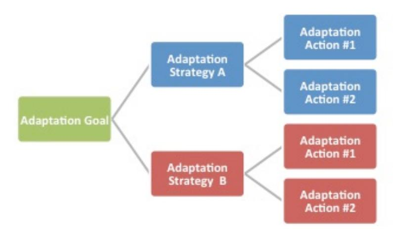

Figure 4. Visual representation of the relationship between adaptation goals, strategies, and specific actions.

#### Adaptation Terminology and Definitions

**Adaptation Goal**: A desired result for a given resource.

**Adaptation strategy**: General statements of how to reduce vulnerabilities or increase resilience of current management goals.

**Adaptation actions**: Specific activities that facilitate progress towards achieving an adaptation strategy. 

#### Adaptation Strategy Workshop Activities

The September 2016 adaptation planning workshop3 goals were to develop climate-informed adaptation strategies and actions to conserve priority resources in the National Marine Sanctuary and Territory of American Samoa. Participants identified both current and future management **goals** for each of the focal resources. The purpose of identifying current management goals is to provide a foundation for evaluating whether and how climate change might affect the ability to achieve a given goal, and to develop options for reducing vulnerabilities through revised management activities. For each management goal, participants identified potential climate change vulnerabilities. This activity was followed by the evaluation of current management actions, including whether, in their current form, they can help to reduce identified vulnerabilities and/or how they can be modified to better address climate challenges. Following the evaluation of potential vulnerabilities of current management goals and actions, participants explored potential future management goals and adaptation **strategies** and identified more specific adaptation **actions** designed to reduce vulnerabilities or increase resilience of the selected focal resources. For each adaptation action, participants then evaluated where, when, and how to implement those actions as well as collaboration and capacity needs. 

 3 http://ecoadapt.org/workshops/NMSAS-AS-workshop

#### *Current Management Goals and Potential Vulnerabilities*

Workshop participants identified key current management goals and their potential climate and non-climate vulnerabilities. In response to these vulnerabilities, participants then evaluated whether or not existing management actions may be effective in reducing vulnerability; identified what, if any, climate and non-climate vulnerabilities the action helps reduce; and evaluated the feasibility of action implementation. Given action effectiveness and feasibility, participants then evaluated whether or not to continue implementation of the action. For those actions recommended for continued implementation, participants then identified both how and where to implement. 

#### *Future Management Goals and Adaptation Actions*

Workshop participants also identified the possible future management goals and adaptation actions for each resource. They then evaluated action effectiveness and feasibility; identified the timeframe for action implementation; described where and how to implement the action; and identified collaboration and capacity needs. Timeframe, collaboration and capacity needs are defined below.

- **Implementation timeframe:** Identify when a particular action could feasibly be implemented.
  - o *Near-term*: <5 years; *Mid-term*: 5-15 years; or *Long-term*: >15 years.
- **Collaboration:** Identify any other agencies, organizations, or people needed to collaborate with in order to implement an action.
- **Capacity needed**: Identify capacity needed for implementation such as data, staff time and resources, funding, or policy changes, among others.

These workshop activities generated a range of recommended adaptation actions that could be implemented both now and in the future. The resulting actions are not comprehensive, and users of this report are encouraged to explore additional adaptation actions that may help reduce vulnerabilities, increase resilience, or capitalize on opportunities presented by climate change. 

#### Adaptation Action Feasibility

Participants were also asked to assess the effectiveness, feasibility, and implementation of all actions identified. These assessments help identify which actions can be easily implemented and those that might need more collaboration and longer time frames to help develop an implementation plan in STEP 4 of the Adaptation Planning Process. Participants were asked to identify the following:

- **Action effectiveness**: Identify the effectiveness of the action in reducing vulnerability.
  - o High: action is very likely to reduce vulnerability and may benefit additional goals or habitats
  - o Moderate: action has moderate potential to reduce vulnerability, with some limits to effectiveness
  - o Low: action is unlikely to reduce vulnerability
- **Action feasibility**: Identify feasibility of implementing the action.

- o High: there are no obvious barriers and it has a high likelihood of being implemented
- o Moderate: it may be possible to implement the action, although there may be challenges or barriers
- o Low: there are obvious and/or significant barriers to implementation that may be difficult to overcome
- **How to implement**: Identify how to apply this action given vulnerabilities. For example, consider planting native species that can cope with a range of future conditions or those best adapted to projected future conditions.
- **Where to implement**: Identify the management, ecological, or site conditions where the action could be most appropriately implemented. For example, is it best to implement in coral habitats that are resilient to bleaching.

# **Chapter 3 Vulnerability Assessment and Adaptation Planning Results**

# **Summary**

Overall the vulnerability assessment of the 10 focal resources was moderate to low-moderate with mostly high and moderate confidence scores. This is probably due to limited **20-year timeframe** that participants chose to use rather than considering multiple scenarios and time steps of 10, 20, 50, and 100 years (Glick et al. 2011). If longer timeframes were used for this vulnerability assessment, one would expect higher vulnerability and lower confidence scores. 

| FOCAL	RESOURCE        | VULNERABILITY	SCORE | CONFIDENCE	SCORE |
|-----------------------|---------------------|------------------|
| Coral	Reef	Habitat    | Moderate            | High             |
| Mangrove	Habitat      | Low-Moderate        | High             |
| Water	Quality         | Moderate            | High             |
| Giant	Clam            | Moderate            | High             |
| Herbivore	Reef	Fish   | Low-Moderate        | High             |
| Charismatic	Reef	Fish | Low-Moderate        | High             |
| Reef	Piscivores       | Low-Moderate        | High             |
| Pelagic	Fish          | Moderate            | High             |
| Sharks	and	Rays       | Low-Moderate        | Moderate         |
| Sea	Turtles           | Moderate            | Moderate         |

# **1. Coral Reef Habitat**

#### Introduction

Coral reefs in American Samoa include three zones: reef flat, reef crest, and reef slope. Reef flats are shallow and narrow (50-500 m) systems extending from shore to the reef crest. Reef crests are shallow systems representing the highest point of the reef system and dividing reef flat from slope; they are occasionally exposed during low tides, as are reef flats. Reef slopes descend 20-30 m in depth on the oceanic side of the reef crest. Differences in temperature, salinity, wave action, water depth, and sedimentation between these three zones affects coral community composition. However, American Samoan coral reef communities are generally dominated by crustose coralline algae with live hard corals being less dominant, and brown macroalgae occasionally occurring on reef slopes and flats (Fenner et al. 2008; US DOC NOAA ONMS 2012). Unique coral communities occur at Rose Atoll and Swains Island (Kendall 2011; US DOC NOAA ONMS 2012). In general, coral reef systems harbor high biodiversity (US DOC NOAA ONMS 2012). 

#### Vulnerability Assessment Results

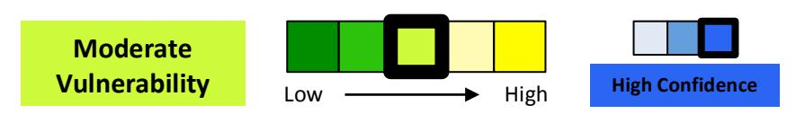

Workshop participants evaluated coral reefs in American Samoa to have a moderate relative vulnerability to climate change due to moderate-high sensitivity to climate and non-climate stressors, moderate exposure to future climate changes, and moderate-high adaptive capacity. Coral reefs are sensitive to numerous climate stressors, including ocean acidification, sea surface temperature, tropical storms, runoff/stream flow, coastal erosion, and currents, mixing, and stratification. These stressors directly affect coral survival, recruitment, and growth, as well as alter water quality by affecting sediment, pollutant, and nutrient delivery. Climate stressors may also increase coral susceptibility to disturbance regimes, including disease and crown-ofthorns starfish outbreaks, which elevate coral mortality. Coral reefs are sensitive to several non-climate stressors, including dredging, land use change, overwater/underwater structures, nutrient loading, sedimentation, trampling, seawalls, and fishing. Non-climate stressors can directly degrade and destroy coral communities, and will likely compound declining water quality trends occurring with climate change. Coral reefs in American Samoa are generally healthy and continuous around islands, and have been able to recover from a variety of past environmental disturbances, although they are less resilient to human disturbances. High coral biodiversity enhances overall resilience, but future functional group shifts may occur as many reef-building coral species are vulnerable to climate change, which will impact overall reef stability. Coral reefs provide important commercial and subsistence fishing opportunities, as well as other ecosystem services such as biodiversity, coastal protection, and recreation. A variety of marine protected areas have been established; however, they cover only a small percentage of existing reef habitat, and protective regulations vary between sites.

#### Current Management Actions

#### **Goal 1: Protect Coral Reef Habitat**

- Water quality testing for bacteria and near shore nutrient input, sometimes resulting in beach closures
- Reduce litter and marine debris
- Federal, territorial, and village Marine Protected Areas (MPAs)
- No discharge and anchoring in the Sanctuary

#### **Goal 2: Control crown-of-thorns starfish outbreaks**

- Targeted crown-of thorns starfish eradication with ox bile
- Manual eradication of crown-of thorns starfish (spear or bash)
- Ban take of large reef fish (e.g., humphead wrasse), which are believed to be crown-ofthorns predators

#### **Goal 3: Use education and outreach to protect coral reefs and bring the site to the people**

- School programs such as Reef Check (geared toward any audience; provides education on coral fragility and importance of coral habitat so audience can become environmental steward)
- Virtual experience for students, allowing them to see changes, including climate change impacts with special goggles

#### Future Management Actions

#### **Goal 1: Decrease nutrient input and sedimentation into coastal waters**

- Ensure piggery compliance and enforce EPA regulations
- Support sewer expansions, new waste water treatment plants, proper septic tank installation, and cesspool removal
- Plant more trees/plants in coastal areas and in villages to reduce runoff
- Ensure compliance of coastal development setbacks
- Start a wetlands restoration project
- Education/outreach on strengthening village laws
- Remove all wastewater outfalls

#### **Goal 2: Cooling for bleaching prevention and reduction**

• Move deeper, cooler water to shallow, warmer areas

# **Goal 3: Develop resilient marine protected areas (MPAs) – design future MPAs in areas that are climate resilient and effective for multiple species (consider network of MPAs)**

- Analyze what is already in place and what is working to identify priority areas for protection
- Allow easy exchange of data and accessibility of information to allow managers to assess changes over time

# **Goal 4: Assemble a coral reef database and develop sharing method for management and decision support**

• Develop easy exchange and accessibility of information to allow managers to assess changes over time

#### **Goal 5: Use coral nursery gardens for restoration**

• Select corals that do not bleach for restoration projects

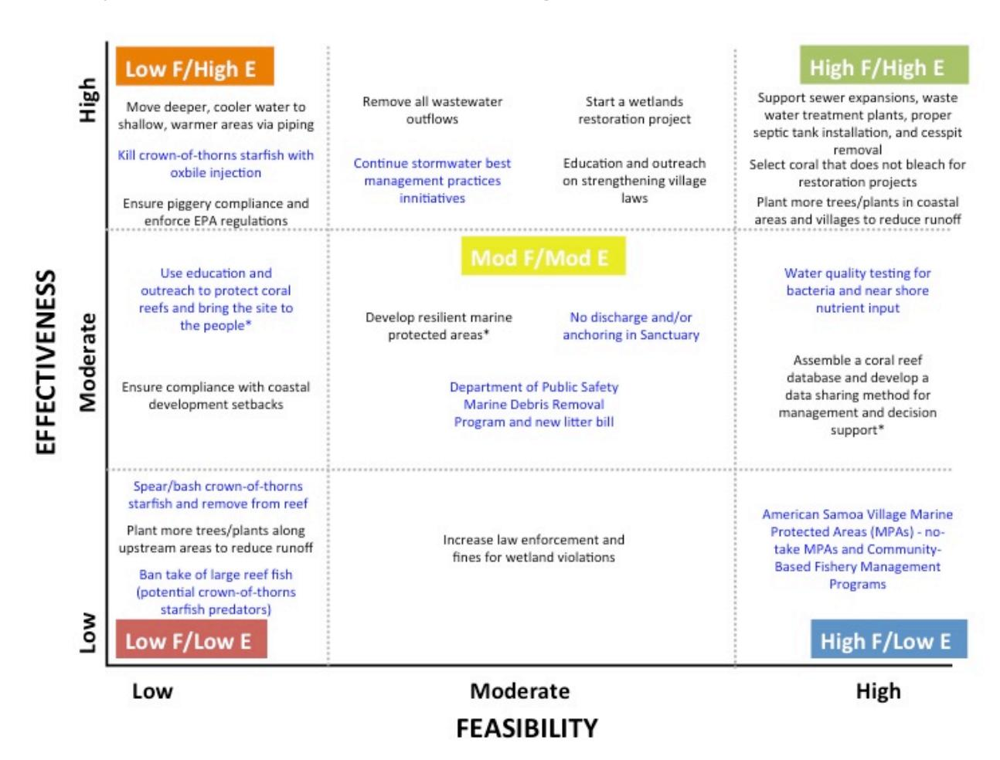

Figure 5. Feasibility and Effectiveness of Current (blue) and Future Adaptation Actions for Coral Reefs.

Note: Effectiveness and feasibility for coral reef current management actions includes, among other factors, workshop participants' perceptions of current acceptance and compliance. Engaging the community to create greater acceptance and compliance can lead to higher effectiveness. Additionally, one reviewer commented that it is good to select corals that are resilient to bleaching for restoration projects, but it is generally considered ineffective because of the scale of the process, i.e., the amount of work needed is large and the area of reef restored is small. Therefore, the reviewer suggested moving "select coral that does not bleach to restoration projects" from the upper right to the lower left.

# **2. Mangroves and Lagoon Habitat**

# Introduction

Mangrove forests in American Samoa are found only on Tutulia and Aunu'u Islands, and include tidal fringing and interior/partially enclosed basin forests. They are typically found in sheltered coastal lagoons and protected areas near stream mouths (ASCCFP 2010). Three mangrove species occur: oriental mangrove (*Bruguiera gymnorrhiza*) is the dominant species, red mangrove (*Rhizophora mangle*) can be found along seaward margins, and the puzzlenut tree 

(*Xylocarpus moluccensis*) is quite rare. Other mangrove forest associates include beach hibiscus (*Hibiscus tiliaceus*), fish-poison tree (*Barringtonia asiatica*), and Tahitian chestnut (*Inocarpus fagifer*) (Bardi and Mann 2004). Mangrove forests thrive in brackish water conditions, and provide critical habitat for a variety of fish, invertebrate, and mollusk species (US DOC NOAA ONMS 2012).

#### Vulnerability Assessment Results

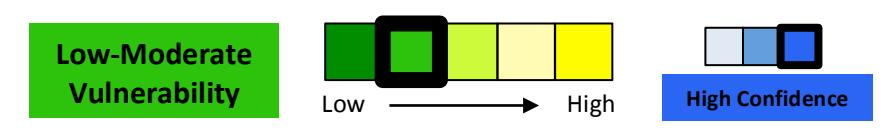

Workshop participants evaluated American Samoan mangroves to have a low-moderate relative vulnerability to climate change due to moderate sensitivity to climate and non-climate stressors, moderate exposure to projected future climate changes, and moderate adaptive capacity. Mangrove forests are sensitive to coastal erosion and sea level rise, which cause landward retreat, potentially leading to habitat extirpation if retreat is impossible. Earthquakes contribute to sea level changes and tsunami risk; tsunamis and cyclones can severely damage mangrove systems and cause high tree mortality. Non-climate stressors play the largest role in American Samoan mangrove decline. Mangrove clearing changes the coastal hydrology resulting in debris, nutrient and pollutant build up. Additionally, roads/armoring can block landward mangrove migration, increasing habitat vulnerability to sea level rise. Significant portions of mangrove forests have been lost to human land use in American Samoa; only five stands across two islands remain, encompassing roughly 52 hectares (US DOC NOAA ONMS 2012). Mangroves may not recover from extensive alteration or mortality; when stands do recover naturally, recovery time ranges from 15-30 years. Facilitated rehabilitation has experienced varying success. As the key functional group, low mangrove diversity increases habitat vulnerability to climate change, although diversity amongst affiliate tree species is higher. Mangroves provide a variety of ecosystem services (e.g., biodiversity, fish nursery habitat, coastal protection), although there is low cultural recognition of these services. Mangroves are protected through several regulatory mechanisms, but a lack of enforcement undermines this legal protection.

#### Current Management Actions

# **Goal: Control residential/commercial development near mangroves to protect mangrove habitat**

- Prevent building over mangroves through permitting process (Project Notification and Review System – PRNS)
- Enforcement of special management areas designed specifically to protect mangroves on Tutuila

#### Future Management Actions

# **Goal 1: Reduce non-climate stressors such as debris from streams that destroy/smother mangrove habitat**

• Remove debris from mangrove habitats

- Educate people on the effect of debris on mangroves and enforce ban on debris thrown out upstream
- Increase use of stream catchments to catch debris

# **Goal 2: Increase public knowledge of importance of mangroves and increase local enforcement.**

- Create mangrove education and outreach campaign to increase understanding of mangroves and understanding of existing guidelines in policies that protect mangroves
- Create targeted village education and outreach campaign to increase likelihood of regulation enforcement

#### Feasibility and Effectiveness of Current and Future Management Actions

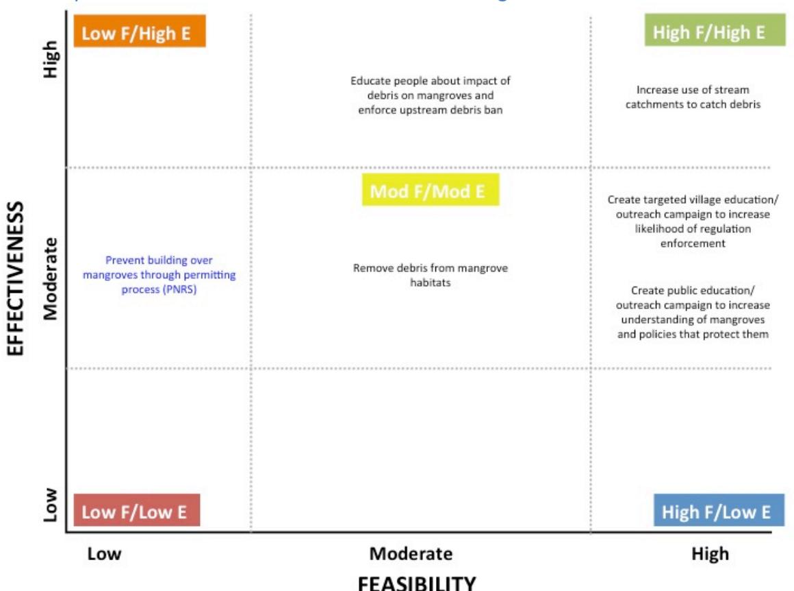

Figure 6. Feasibility and Effectiveness of Current (blue) and Future Adaptation Actions for Mangroves.

# **3. Water Quality**

#### Introduction

Water quality in American Samoa is compromised by increased population growth, clearing for agriculture, and increased bacterial, pharmaceutical, pesticide, pathogen, and nutrient pollution from poorly constructed human and piggery waste disposal systems. Most of the wells and pumps for groundwater distribution are found in the Tafuna-Leone plain, which is also where most residents and businesses are located (ASEPA 2014). Since the Tutuila volcanic stratum is very permeable, it is also very vulnerable to contamination and pollution from rain 

events, causing runoff of pollutants such as oil and gas from automobiles, and pathogens and nutrient loading from poorly constructed humans and pig waste water systems. Stream water, which was traditionally used as the primary potable water, has also been compromised by development along streams causing sedimentation, increased erosion, and nutrient and bacterial loading from animal and human waste (ASEPA 2014). Along the coastal shoreline, poor water quality has been threatening nearby fringing reefs. Since the construction of the airport, which altered natural circulation patterns in the Pala Lagoon, the area has had poor water quality and low biodiversity (Craig 2009; ASEPA 2014). Pago Pago Harbor also has poor water quality due to degraded conditions from fuel/oil spills and toxins, and high eutrophication from nutrient loading from land-based sources of pollution (US DOC NOAA ONMS 2012). The fish and invertebrates in the harbor are even contaminated with heavy metals (US DOC NOAA ONMS 2012).

#### Vulnerability Assessment Results

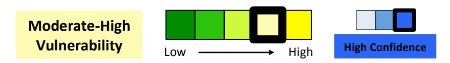

The relative vulnerability of water quality in American Samoa was evaluated by workshop participants to be moderate-high due to high sensitivity to climate and non-climate stressors, high exposure to projected future changes, and moderate to high adaptive capacity. Water quality is sensitive to climate drivers that alter hydrology of rivers and streams, such as air temperature, tropical storms, precipitation, and drought, causing soil erosion, pollution, and nutrient loading. Other climate drivers, such as ocean acidification and increased ocean temperatures, will impact water quality of nearshore coastal waters. Water in American Samoa is a limited resource found in groundwater and streams, and is very vulnerable to increased demand due to development and population growth. Sea level rise and increased storms will increase saltwater intrusion into groundwater reserves (UGCRP 2009).

#### Current Management Actions

#### **Goal: Improve water quality**

- Improve sewage effluent quality and sewage treatment
  - o Secondary treatment
  - o UV lights
  - o Fix leaking pipes
- Improve groundwater quality
  - o Fix leaking pipes
  - o Seal cesspools and convert to septic
  - o Oil collection
  - o Pesticide control
  - o Identify resilient aquifers
  - o Microfiltration plants
- Improve surface water quality and stormwater management
  - o Nets at stream mouths to catch debris

- o Rain gardens/soak beds
- o Tamaligi tree removal
- o Project Notification and Review System (PNRS) sediment permit requirement
- Enforce the Keep American Samoa Beautiful Act (The anti-littering bill was signed into law October 2016)

#### Future Management Actions

# **Goal: Develop and instill a sense of responsibility in protecting watersheds and disposing of waste and trash appropriately**

- Increase public education and outreach
- Implement and enforce environmental disposal fee to assist with funding
- Find alternatives to pollutants for which American Samoa does not have the capacity to dispose of or treat (e.g., PFCs)

#### Feasibility and Effectiveness of Current and Future Management Actions

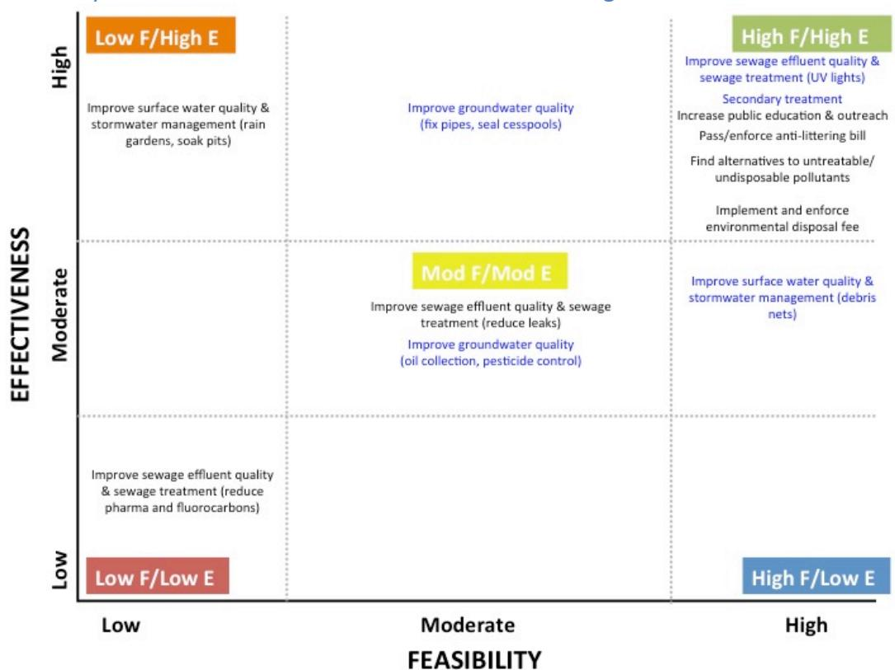

Figure 7. Feasibility and Effectiveness of Current (blue) and Future Adaptation Actions for Water Quality.

Note: The anti-littering bill was signed into law – Keep American Samoa Beautiful Act – now a current action.

# **4. Giant Clams**

# Introduction

Giant clams, including *Tridacna mxima, T.squamosa,* and *T. noae*, are generally found along reef tops and slopes of clear and shallow American Samoa waters. They are particularly abundant in the sanctuary Muliāva Management Area and Rose Atoll Marine National Monument, as well as the north and west sides of Ta'u. They have a special significance to American Samoa cultural heritage, the fa'a-Samoa thus are at risk to be overfished (US DOC NOAA ONMS 2012). Fa'alavelave, traditional gatherings among communities and extended families, include offerings of giant clams when available (Fenner et al. 2008). There have been some aquaculture efforts for *Tridacna sp.* in Tutuila and initiating grow-out facilities in Aunu'u and the Manu'a islands (US DOC NOAA ONMS 2012). Giant clams, *Tridacna sp.* were listed vulnerable on the IUCN red List in 2006 (IUCN 2014).

#### Vulnerability Assessment Results

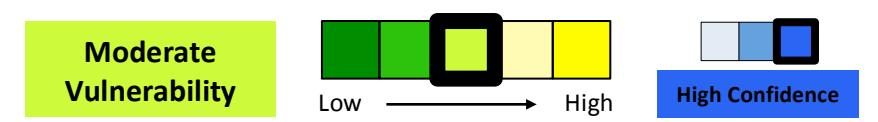

Workshop participants and experts evaluated giant clams in American Samoa to have a moderate relative vulnerability to climate change due to moderate-high sensitivity to climate and non-climate stressors, moderate exposure to future climate changes, and moderate-high adaptive capacity. Giant clams are sensitive to several climate stressors, including ocean acidification, ocean temperature, currents, mixing, and stratification. These stressors can directly affect recruitment and growth of giant clams. 

#### Current Management Actions

#### **Goal: Increase giant clam populations**

• Enforce harvest regulations to avoid over-harvest of this culturally important resource

#### Future Management Actions

**Goal: Increase giant clam populations/stocks by supporting fisheries in shallow waters and stocking clams in deeper waters**

- Support hatchery operations for stocking in shallow water to support fisheries and stocking clams in deep water beyond 100 ft. (30.5 m) for stock replenishment
- Conduct a genetic study of giant clams between islands to diversify seed source

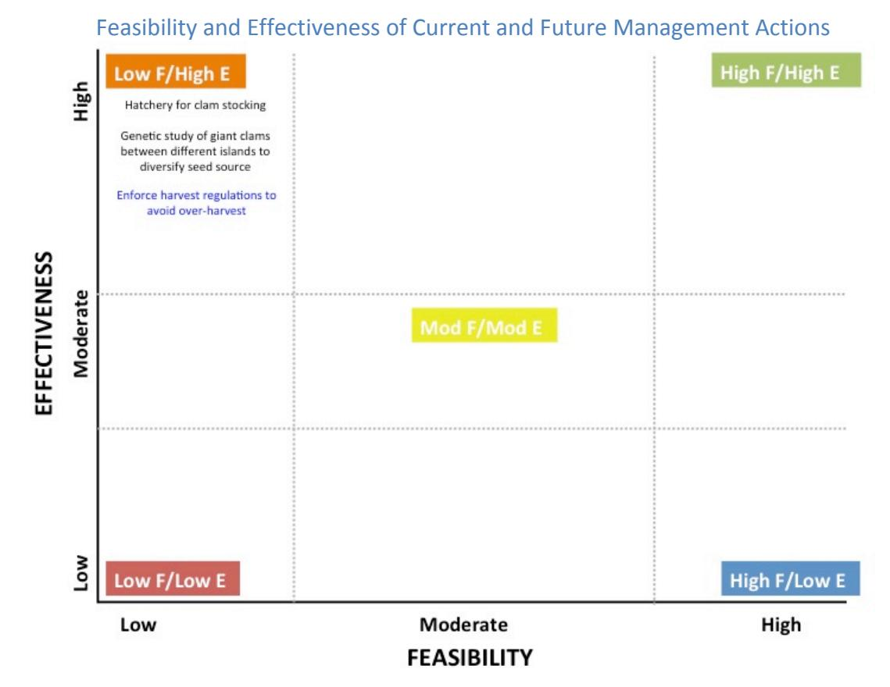

Figure 8. Feasibility and Effectiveness of Current (blue) and Future Adaptation Actions for Giant Clams.

# **5. Reef Fish**

A vulnerability assessment was conducted for reef herbivores, reef piscivores, and charismatic reef fish. During the vulnerability assessment workshops participant felt that each different type of reef fish assemblage should be considered independently since they have unique attributes. During the adaptation strategy workshops, participants felt that current and future management actions to reduce vulnerabilities and increase resilience would be the same for all reef dependent fishes, thus they should be considered as a reef fish assemblage and not differentiated by their attributes. 

#### Reef Herbivores Introduction

Common reef herbivorous fish used for subsistence, artisanal, and recreational purposes include the surgeon fisheries such as the lined surgeonfish or alogo (*Acanthurus lineatus*) and manini and pone (*Acanthurus* sp.) (Craig 2009). Other reef herbivores include parrotfishes (Scaridae), soldierfishes/squirrelfishes (Holocentridae), wrasses (Labridae), and goatfishes (Mullidae). The alogo is a quite abundant and popular Samoan food fish and accounts for approximately 30% of reef fish caught for the subsistence fishery, while the manini and pone are also abundant and popular subsistence and artisanal fisheries (Craig 2009). Parrotfishes and surgeonfishes also have close association to the reef environment. Parrotfishes are known as bioeroders, feeding on detritus on reefs by scrapping reef surfaces, while surgeonfishes are 

more diverse and can feed on both plant and detrital matter. All reef herbivorous fishes contribute in limiting algal growth in coral reefs and helping to maintain diversity and coral reef health (Comeros-Raynal 2012). Globally these species assemblages are at low risk of extinction. However, they are regionally threatened due to increased harvest from subsistence fisheries. The bumphead parrotfish (*Bolbometapon muricatum*) is considered a prize catch and has been listed as a species of concern because of illegal spearfishing and habitat degradation (US DOC NOAA ONMS 2012).

#### Reef Herbivore Fish Vulnerability Assessment Results

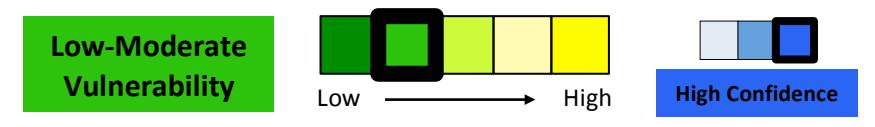

The relative vulnerability of herbivorous reef fish was evaluated by workshop participants to be low to moderate due to moderate sensitivity to climate and non-climate stressors, such as sea surface temperatures, habitat destruction by disease, and invasive species such as the crownof-thorns starfish; moderate exposure to projected future climate changes in the next 20 years of increased nutrient runoff and sedimentation from precipitation and extreme storms; and high adaptive capacity. Reef fish tend to live near the upper end of their thermal tolerance limit and may experience physiological and developmental impacts and range shifts due to increases in sea temperature (Guidry and Mackenzie 2001; Leong et al. 2014).

#### Reef Piscivores Introduction

There are over 69 different species of reef fish and invertebrates species/assemblages consumed and sold in American Samoa. Of those targeted, reef-dependent piscivores include jacks (Carangidae), snappers (Lutjanidae), groupers (Serranidae), and emperor fish (Lethrinidae) (Levine and Allen 2009). Continued overfishing and declines in coral reef habitat will negatively impact reef fish populations, which are valuable to commercial, recreational, and subsistence fishermen (Gregg et al. 2016). Many reef-dependent fish that use coral reefs for spawning, foraging, protection, and feeding will likely experience population declines as corals degrade due to increased sea temperature, ocean acidifcation, and invasive species (Leong et a. 2014).

#### Reef Piscivores Vulnerability Assessment Results

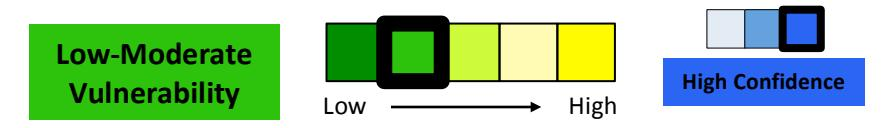

The relative vulnerability of reef-dependent piscivores was evaluated by workshop participants to be low to moderate due to moderate to high sensitivity to climatic and non-climatic stressors including ocean acidification and increased sea surface temperatures impacting reef habitat and biological processes, such as growth and reproduction. Reef-dependent piscivores also are impacted by high fishing pressure and nutrient loading/pollution but have high adaptive capacity with increased management of both habitat and species assemblages.

#### Charismatic Reef Fish Introduction

Reef fish (both piscivores and herbivores) are abundant and highly diverse with over 930 species (Craig 2009). Many coral reef fish are territorial algal eaters and habitat specialists,  tending to only frequent certain habitats within the coral reef system with some taking permanent residence, such as damsels (Pomacentridae), mano'o blennies, and gobies (Gobiidae) (Wass 1984). Damselfish in particular are very territorial and aggressively protect their habitat. Butterflyfishes are fully dependent on feeding on live coral and are vulnerable to the overall decline in coral reefs worldwide (Cole et al. 2008). Charismatic reef species assemblages are also vulnerable to capture for aquaria and/or bioprospecting trade, although there is currently no harvest for the marine ornamental industry in American Samoa. 

#### Charismatic Reef Fish Vulnerability Assessment Results

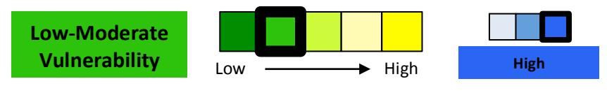

The relative vulnerability of charismatic reef fish was evaluated by workshop participants to be low to moderate due to moderate to high sensitivity to climatic and non-climatic factors such as ocean acidification, increased sea temperature, land use changes, and dredging that impacts coral reef habitat. Species assemblages will be impacted by future moderate exposure of increased sea surface temperature and erosion causing further sedimentation to the coral reef habitat. 

#### Current Management Actions For All Reef Fish Assemblages

#### **Goal: Protect reef fish populations and ensure sustainable fishing practices**

- § Fully utilize and enforce all fishing regulations
  - o 2001 American Samoa Governor Executive Order banned SCUBA fishing due to depletion of reef piscivores and herbivores and increase in fishing efficacy
  - o Minimum fishing net size, and nets cannot be left overnight; nets can only be left unattended 3-5 hours
  - o Daily catch limits exist in federal water (3-200 miles) (5-322 km.)
  - o Department of Marine and Wildlife Resources Community-Based Fisheries Management Program (0-3 miles) (0-5 km.)
  - o Non- destructive fishing rule in territorial waters
  - o Encourage true traditional and cultural fishing methods – the fa'a-Samoa "Samoan way"

#### Future Management Actions For All Reef Fish Assemblages

#### **Goal: Promote diverse and healthy reef fish populations**

- § Set size limits – make sure they are over the reproductive age (greater number of years at reproductive age could increase the likelihood of recruitment success)
- § Set catch limits – number of individual fish per day (if sold, commercial license still needed)

Feasibility and Effectiveness of Current and Future Management Actions for All Reef Fish Assemblages

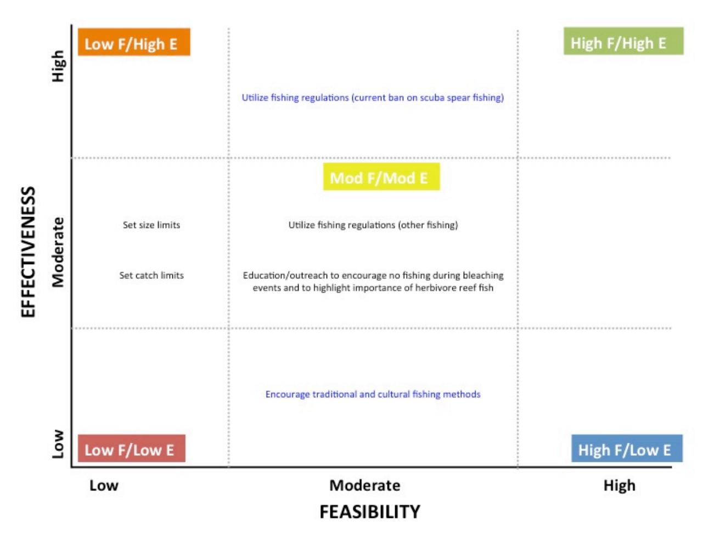

Figure 9. Feasibility and Effectiveness of Current (blue) and Future Adaptation Actions for Reef fish.

# **6. Pelagic Fish**

#### Introduction

Pelagic fish species in the region are managed through the Western and Central Pacific Fisheries Commission and include migratory tunas such as the bigeye (*Thunnus obesus*), yellowfin or asiasi (*T. albacares*), albacore or apakoal (*T. alalunga*), dogtooth or tagi (*Gymnosarda unicolor*) and skipjack or atu (*Katsuwonus pelamis*) (Craig 2009). Other important species include billfish (*Tetrapturus auda, Makaira mazara, Xiphias gladius*), dolphinfish (*Coryphaena hippurus, C. equiselas*) and wahoo (*Acanthocybium solandri*) (Craig 2009). Most pelagic fish prefer open ocean area and seldom come close to shore; occasionally the dogtooth tuna is seen along reef areas. Although American Samoa has a large tuna packing cannery industry (Chicken of the Sea), tuna is not particularly abundant in the region and most of the tuna canned locally use fish caught in other areas (US DOC NOAA ONMS 2012).

#### Vulnerability Assessment Results

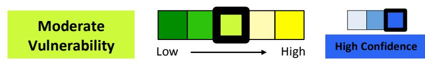

Commercially valuable pelagic fish species were evaluated to be moderately vulnerable by workshop participants due to changes in temperature, ocean circulation, and ocean acidification. Common migratory pelagic tunas have already shown responses to increased temperatures and changes in circulation patterns during El Niño Southern Oscillation (ENSO) events (Keener et al. 2012; Leong et al. 2014). Future changes in distribution and abundance of migratory species might result due to changes increased temperature and changes in currents affecting prey availability and thermal tolerance. 

#### Current Management Actions /Future Management Actions

Participants did not evaluate current and future management actions for pelagic fish. They discussed pelagic fish along with sharks and rays but did not complete a full assessment (see below).

# **7. Sharks and Rays**

#### Introduction

Common species of sharks in American Samoa include the blacktip reef shark (*Carcharhinus melanopterus*) and the whitetip reef shark (*Triaenodon obesus*). Other rarer species include hammerhead sharks, tiger sharks (*Galeocerdo cuvier*), and whale sharks (*Rhincodon typus*) (Craig 2009). The most common species of rays in American Samoa are Eagle rays (*Myliobatidae* sp.). Sharks and rays are generally rare across Indo-Pacific coral reef habitats, and have been protected from catch and possession since 2012 (Craig 2009; US DOC NOAA ONMS 2012). Although sharks are not typically targeted in American Samoa, violations have been observed. Blacktip and whitetip reef sharks are commonly found in nearshore waters and sighted while diving, snorkeling, and swimming. Hammerhead sharks are known to give birth in Pago Pago Harbor, while few tiger sharks have been caught around Tutuila (Craig 2009). Increased sea surface temperatures may affect shark and ray ranges, prey availability, and embryonic development (Hobday et al. 2009). Extreme precipitation events can also diminish their ability to effectively use their sense of smell and electroreception to locate prey (Hobday et al. 2009).

## Vulnerability Assessment Results

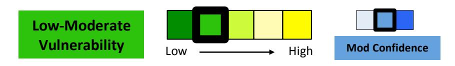

Sharks and rays were evaluated have low to moderate vulnerability by workshop participants due to climate and non-climate stressors such as ocean acidification, sea surface temperature, and changes in currents and wind. Although sharks are protected, there are threats of harvest for shark fins. Sharks and rays are impacted by the same oceanographic conditions that affect 

pelagic fish, and as well as by land-based stressors including coastal erosion, sedimentation, and runoff.

#### Current Management Actions

Participants at the workshop were not familiar with current management actions for sharks and rays and were not comfortable addressing current management actions vulnerability to climate changes in this workshop. (Note: Shark fishing is prohibited by the American Samoa Government).

#### Future Management Actions

#### **Goal: Increase research on sharks and rays**

- § Increase research to identify spawning/rearing critical habitat (most are protected)
- § Increase research on climate change effects on sharks and rays
- § Increased enforcement and court outreach and capacity to lead to convictions

#### Feasibility and Effectiveness of Current and Future Management Actions

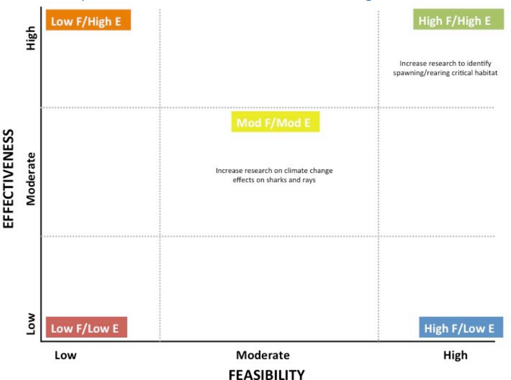

Figure 10. Feasibility and Effectiveness of Current (blue) and Future Adaptation Actions for Sharks and Rays.

# **8. Sea Turtles**

#### Introduction

Sea turtles in American Samoa, also called Laumei (DMWR 2006), include the endangered hawksbill sea turtle (*Eretmochelys imbricata*) (US DOC NOAA ONMS 2012) and the endangered green sea turtle (*Chelonia mydas)* (81 FR 20058). Both species are globally distributed throughout tropical and sub-tropical zones. Locally, juveniles of both species are commonly found in near-shore coral reef habitats in American Samoa. It has been assumed that only hawksbills nest on beaches of Tutuila, Aunu'u and the Manua Islands (Craig 2009); however, recent tagging work by DMWR and the National Park of American Samoa have confirmed that substantial proportions of turtles nesting on Ofu are green turtles (per comm, M. MacDonald, DMWR) additional surveys are needed to determine if the same is true of other islands. There is a substantial nesting aggregation of green turtles at Rose Atoll. NMFS scientists estimate as many as 300 green turtles nest there (Oram et al 2016), making Rose Atoll, a significant source populations for the central South Pacific Distinct Population Segment of green turtles. Nesting turtles from Rose Atoll have been tracked returning to forage areas in Samoa, American Samoa, Fiji, Cook Islands, Vanuatu, Tahiti, Papua New Guinea, and French Polynesia (NMFS 2015). 

#### Vulnerability Assessment Results

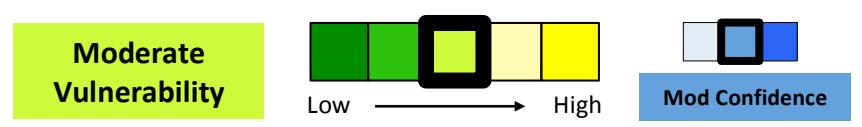

Overall sea turtle vulnerability was rated as moderate by workshop participants due to moderate sensitivity to climate and non-climate stressors, moderate exposure to projected future climate changes, and low to moderate adaptive capacity. Sea turtles are vulnerable to loss of habitat due to sea level rise and coastal erosion (Poloczanska et al. 2009). Increased air and sea temperatures also impact nest sex composition and nesting preference (Cheng and Gaskin 2011). Sea turtle habitat is also threatened by coastal development including coastal armoring, water quality, and light pollution (Cheng and Gaskin 2011). Other non-climatic threats to sea turtles include incidental fisheries catch and possible predation and poaching of eggs.

#### Current Management Actions

#### **Goal: Protect nesting habitat**

- § Require permits for sand mining – not a lot of space for nesting on Tutuila
- § Amend the Project Notification and Review System (PNRS) setback requirement – 100 ft. (30.48 m) from shoreline
- § Monitoring and satellite tagging of nesting turtles

#### Future Management Actions

#### **Goal 1: Protect turtle nesting habitat by preserving sand**

• Create ban on sand mining (may require change in enforcement agency and need to include provisions to allow for cultural use)

• Increase education for why sand is critical for turtles

#### **Goal 2: Protect turtle nests from heat stress**

• Increase native grass/vegetation planting to provide shade

#### **Goal 3: Protect turtles by increasing light management**

- Use turtle-friendly street lights
  - o Paint over lights; paint side that faces beaches
  - o Use special types of light bulbs along shorelines
- Increase education for coastal residents and businesses to turn lights off during nesting season
  - o Motion sensor lights may already be in use

#### **Goal 4: Create education and outreach campaign about sea turtles and their habitat.**

- Create widespread public awareness campaign
- Create a citizen science program for residents to report what they see
- Engage village councils to help protect and enforce laws

#### Feasibility and Effectiveness of Current and Future Management Actions

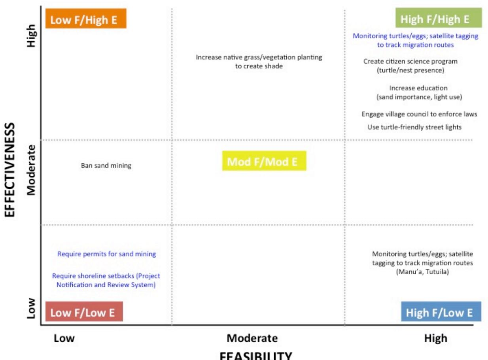

Figure 11. Feasibility and Effectiveness of Current (blue) and Future Adaptation Actions for Sea Turtles.

# **Literature Cited**

- 81 FR 20058: Federal Register / Vol. 81, No. 66/ Wednesday, April 6, 2016 / Rules and Regulations, page 20058. Department of the Interior. Fish and Wildlife Service. 50 CFR Part 17. Department of Commerce. National Oceanic and Atmospheric Administration. 50 CFR Parts 223 and 224. [Docket No. 120425024-6232-06]. RIN 0648-XB089. Endangered and Threatened Wildlife and Plants; Final Rule To List Eleven Distinct Population Segments of the Green Sea Turtle (*Chelonia mydas*) as Endangered or Threatened and Revision of Current Listings Under the Endangered Species Act Agency: National Marine Fisheries Service (NMFS), National Oceanic and Atmospheric Administration (NOAA), Commerce; United States Fish and Wildlife Service (USFWS), Interior. Action: Final rule.
- American Samoa Community College Forestry Program. 2010. American Samoa forest assessment and resource strategy 2011-2015. American Samoa Community College, Division of Community and Natural Resources, Forestry Program, Pago Pago, American Samoa. Available from http://www.wflccenter.org/islandforestry/americansamoa.pdf
- American Samoa Environmental Protection Agency. 2014. Territory of American Samoa Integrated Water Quality Monitoring and Assessment Report. Prepared by C. Tuiteli, E.L. Buchan, J. Regis, J. Potoa'e and C. Fale. Available from https://www3.epa.gov/region9/water/tmdl/pacislands/amsamoa2014-integratedreport.pdf
- Australian Bureau of Meteorology (ABM) and Commonwealth Scientific and Industrial Research Organisation (CSIRO). 2011. Climate change in the Pacific: scientific assessment and new research. Volume 1: regional overview. Volume 2: county reports. Available from http://www.pacificclimatechangescience.org/publications/reports/report-climate-changein-the-pacific-scientific-assessment-and-new-research/.
- Bardi, E. and S.S. Mann. 2004. Mangrove inventory and assessment project in American Samoa. Phase 1: Mangrove delineation and preliminary rapid assessment. Technical Report 40. American Samoa Community College, Division of Community and Natural Resources, Pago Pago, American Samoa. Available from http://www2.ctahr.hawaii.edu/adap2/ASCC\_LandGrant/Dr\_Brooks/TechRepNo40.pdf.
- Becker, M., B. Meyssignac, C. Letetrel, W. Llovel, A. Cazenave, and T. Delcroix. 2012. Sea level variations at tropical Pacific islands since 1950. Global and Planetary Change 80–81:85–98.
- Cane, M.A. 2005. The evolution of El Niño, past and future. Earth and Planetary Science Letters 230:227–240.
- Cheng, B. and E. Gaskin. 2011. Climate impacts to the nearshore marine environment and coastal communities: American Samoa and Fagatele Bay National Marine Sanctuary. Marine Sanctuaries Conservation Series ONMS-11-05. U.S. Department of Commerce, National Oceanic and Atmospheric Administration, Office of National Marine Sanctuaries,

- Silver Spring, MD. Available from http://sanctuaries.noaa.gov/science/conservation/pdfs/fbnms\_climate.pdf.
- Central Intelligence Agency, The World Factbook. Available from: https://www.cia.gov/library/publications/theworld-factbook/geos/aq.html.
- Cole, A.J., M.S. Pratchett, and G.P. Jones. 2008. Diversity and functional importance of coralfeeding fishes on tropical coral reefs. Fish and Fisheries 9:286-307
- Comeros-Raynal M. T. J.H. Choat, B.A. Polidoro, K.D. Clements, R. Abesamis, M.T. Craig, M.E. Lazuardi, J.McIlwain, A. Muljadi, R.F. Myers, C.L. Nañola Jr., S. Pardede, L.A. Rocha, B. Russell, J.C. Sanciangco, B. Stockwell, H. Harwell, and K.E. Carpenter. 2012. The likelihood of extinction of iconic and dominant herbivores and detritivores of coral reefs: the parrotfishes and surgeonfishes. PLoS ONE 7, e39825.
- Craig, P. (Ed.). Natural History Guide to American Samoa. 3rd Edition. 2009. National Park of American Samoa, Department Marine and Wildlife Resources and American Samoa Community College.
- D'Aleo, J., and D. Easterbrook. 2010. Multidecadal tendencies in ENSO and global temperatures related to multidecadal oscillations. Energy & Environment 21:437–460.
- Department of Marine and Wildlife Resources. 2006. A comprehensive strategy for wildlife conservation in American Samoa (R.C.B. Utzurrum, J.O. Seamon and K. Schletz Saili, authors). DMWR, Pago Pago.
- Diamond, H.J., A.M. Lorrey and J.A. Renwick. 2012. A southwest pacific tropical cyclone climatology and linkages to the El Niño–Southern Oscillation. Journal of Climate 26:3–25.
- Emanuel K. 2005. Increasing destructiveness of tropical cyclones over the past 30 years. Nature 436:686–688.
- Fenner, D., M. Speicher, S. Gulick, G. Aeby, S. Cooper Aletto, P. Anderson, B. Carroll, E. DiDonato, G. DiDonato, V. Farmer, J. Gove, P. Houk, E. Lundblad, M. Nadon, F. Riolo, M. Sabater, R. Schroeder, E. Smith, C. Tuitele, A. Tagarino, S. Vaitautolu, E. Vaoli, B. Vargas-Angel and P. Vroomet. 2008. Chapter 10: The state of coral reef ecosystems of American Samoa. Pages 307–352 in J. E. Waddell and A. M. Clarke, editors. The state of coral reef ecosystems of the United States and Pacific Freely Associated States: 2008. NOAA/NCCOS Center for Coastal Monitoring and Assessment's Biogeography Team, Silver Spring, MD. Available from https://coastalscience.noaa.gov/research/docs/CoralReport2008.pdf.
- Finucane, M.L., J.J. Marra, V.W. Keener, and M.H. Smith. 2012. Chapter 1: Pacific Islands region overview. Pages 1-34 in V. W. Keener, J. J. Marra, M. L. Finucane, D. Spooner and M. H. Smith (Eds.). Climate change and Pacific Islands: indicators and impacts. Report for the 2012 Pacific Islands Regional Climate Assessment. Island Press, Washington, D.C. Available

- from http://www.cakex.org/sites/default/files/documents/NCA-PIRCA-FINAL-int-print-1.13-web.form\_.pdf.
- Glick, P., B.A. Stein, and N.A. Edelson (Eds.). 2011. Scanning the Conservation Horizon: A Guide to Climate Change Vulnerability Assessment. National Wildlife Federation, Washington, D.C. ISBN 978-0-615-40233-8
- Gregg, R.M., A. Score, D. Pietri, and L. Hansen. 2016. The State of Climate Adaptation in U.S. Marine Fisheries Management. EcoAdapt, Bainbridge Island, WA.
- Guidry, M.W. and F.T. Mackenzie. 2011. Future Climate Change, Sea-Level Rise, and Ocean Acidification: Implications for Hawai'i and Western Pacific Fisheries Management. University of Hawai'i Sea Grant College Program
- Hemer, M.A., Y. Fan, N. Mori, A. Semedo, and X.L. Wang . 2013. Projected changes in wave climate from a multi-model ensemble. Nature Climate Change 3:471–476.
- International Union for Conservation of Nature Red List. 2014. Available from http://www.iucnredlist.org
- Kendall, M. and M. Poti (Eds.). 2011. A biogeographic assessment of the Samoan Archipelago. NOAA Technical Memorandum NOS NCCOS 132. NOAA, Silver Spring, MD. Available from http://sanctuaries.noaa.gov/about/pdfs/samoa\_report.pdf
- Keener, V. W., J.J. Marra, M.L. Finucane, D. Spooner and M.H. Smith (Eds.). (2012). Climate Change and Pacific Islands: Indicators and Impacts. Report for The 2012 Pacific Islands Regional Climate Assessment. Washington, DC: Island Press.
- Langdon, C. and M.J. Atkinson. 2005. Effect of elevated pCO2 on photosynthesis and calcification of corals and interactions with seasonal change in temperature/irradiance and nutrient enrichment. Journal of Geophysical Research: Oceans 110:C09S07.
- Leong, J.-A., J. J. Marra, M. L. Finucane, T. Giambelluca, M. Merrifield, S. E. Miller, J. Polovina, E. Shea, M. Burkett, J. Campbell, P. Lefale, F. Lipschultz, L. Loope, D. Spooner and B. Wang, 2014: Ch. 23: Hawai'i and U.S. Affiliated Pacific Islands. Climate Change Impacts in the United States: The Third National Climate Assessment, J. M. Melillo, Terese (T.C.) Richmond, and G. W. Yohe (Eds.). U.S. Global Change Research Program, 537-556. doi:10.7930/J0W66HPM.
- Levine, A. and S. Allen. 2009. American Samoa as a fishing community. U.S. Dep. Commer., NOAA Tech. Memo., NOAA-TM-NMFS-PIFSC-19, 74 p.
- Li, T., M. Kwon, M. Zhao, J-S. Kug, J-J. Luo and W. Yu. 2010. Global warming shifts Pacific tropical cyclone location. Geophysical Research Letters 37:L21804.

- Marra, J.J., M.A. Merrifield, and W.V. Sweet. 2012. Chapter 3: sea level and coastal inundation on Pacific Islands. Pages 65-88 in V. W. Keener, J. J. Marra, M. L. Finucane, D. Spooner and M. H. Smith (Eds.). Climate change and Pacific Islands: indicators and impacts. Report for the 2012 Pacific Islands Regional Climate Assessment. Island Press, Washington, D.C. Available from http://www.cakex.org/sites/default/files/documents/NCA-PIRCA-FINAL-intprint-1.13-web.form\_.pdf.
- Mimura, N., L. Nurse, R.F. McLean, J. Agard, L. Briguglio, P. Lefale, R. Payet and G. Sem, 2007: Small islands. Climate Change 2007: Impacts, Adaptation and Vulnerability. Contribution of Working Group II to the Fourth Assessment Report of the Intergovernmental Panel on Climate Change, M.L. Parry, O.F. Canziani, J.P. Palutikof, P.J. van der Linden and C.E. Hanson, (Eds.). Cambridge University Press, Cambridge, UK, 687-716.
- Nerem RS, D.P. Chambers, C. Choe, and G.T. Mitchum. 2010. Estimating mean sea level change from the TOPEX and Jason Altimeter Missions. Marine Geodesy 33:435–446.
- National Marine Fisheries Service. Pacific Islands Fisheries Science Center. National Oceanic Atmospheric Administration. 2015. Report to the Western Pacific Fishery Management Council. 4 (1) 188 SSC.
- Oram R. H. Johnson, H. Ka'aekuahiwi, and G. Talamoa. 2016. A summary of the Rose Atoll Marine National Monument and American Samoa Archipelago ecosystem science implementation workshop Utulei, American Samoa May 26-27, 2015 Fish. Sci. Cent., Natl. Mar. Fish. Serv., NOAA, Honolulu, HI 96818-5007. Pacific Islands Fish. Sci. Cent. Admin. Rep. H-16-01. 68 p.
- Page, G., D. Nemerson and S. Olsen. 2012. An Analysis of Issues Affecting the Management of Coral Reefs and the Associated Capacity Building Needs in American Samoa. Prepared by SustainaMetrix.
- Parker, B. and S.E. Miller. 2012. Chapter 4: marine, freshwater, and terrestrial ecosystems on Pacific Islands. Pages 89-118 in V. W. Keener, J. J. Marra, M. L. Finucane, D. Spooner, and M. H. Smith (Eds). Climate change and Pacific Islands: indicators and impacts. Report for the 2012 Pacific Islands Regional Climate Assessment. Island Press, Washington, D.C. Available from http://www.cakex.org/sites/default/files/documents/NCA-PIRCA-FINAL-int-print-1.13 web.form\_.pdf.
- Seneviratne, S.I., N. Nicholls, D. Easterling, C.M. Goodess, S. Kanae, J. Kossin, Y. Luo, J. Marengo, K. McInnes, M. Rahimi, M. Reichstein, A. Sorteberg, C. Vera, and X. Zhang, 2012: Changes in climate extremes and their impacts on the natural physical environment. In: Field, C.B., V. Barros, T.F. Stocker, D. Qin, D.J. Dokken, K.L. Ebi, M.D. Mastrandrea, K.J. Mach, G.-K. Plattner, S.K. Allen, M. Tignor, and P.M. Midgley (Eds.). Managing the Risks of Extreme Events and Disasters to Advance Climate Change Adaptation. A Special Report of Working Groups I and II of the Intergovernmental Panel on Climate Change (IPCC). Cambridge University Press, Cambridge, UK, and New York, NY, USA, pp. 109-230.

- Tuato'o-Bartley, N., T.E. Morrell and P. Craig. 1993. Status of sea turtles in American Samoa in 1991. Pacific Science 47(3): 215-221.
- United States Global Change Research Program. 2009. Global Climate Change Impacts in the United States. Thomas R. Karl, Jerry M. Melillo, and Thomas C. Peterson (Eds.). Cambridge University Press
- U.S. Department of Commerce, National Oceanic and Atmospheric Administration, Office of National Marine Sanctuaries. 2012. Fagatele Bay National Marine Sanctuary final management plan/final environmental impact statement. Silver Spring, MD. Available from http://sanctuaries.noaa.gov/management/mpr/mpr-nmsam-2012.pdf.
- Wass, R. C. 1984. An annotated checklist of the fishes of American Samoa. U. S. Dept. of Commerce, NOAA Technical Report NMFS SSRF-781. Rockville, Maryland
- Young, I.R., S. Zieger and A.V. Babanin. 2011. Global trends in wind speed and wave height. Science 332:451–455.
- Young, W.J. 2007. Climate risk profile for Samoa. Samoa Meteorology Division. Available from http://www.adaptationundp.org/sites/default/files/downloads/climate\_risk\_profile\_for\_samoa.pdf.
- Yu, J., Y. Wang and K. Hamilton. 2010. Response of tropical cyclone potential Intensity to a global warming scenario in the IPCC AR4 CGCMs. Journal of Climate 23:1354–1373.

# **Appendices**

# **Appendix I: National Marine Sanctuary of American Samoa**

**The National Marine Sanctuary of American Samoa** is currently one of 14 sites of the **National Marine Sanctuary System** that includes a network of underwater parks encompassing more than 600,000 square miles (1,553,993 sq. km.) of marine and Great Lakes waters throughout the US mainland and Pacific Islands. Each having its own significance for marine life, cultural and historical phenomenon, economic value, tourism and the unique people and communities in which they are found; sanctuaries are places where people work together to conserve and protect special places (US DOC NOAA ONMS 2012). 

On July 26, 2012, five discrete geographical areas were added to the existing Fagatele Bay National Marine Sanctuary and the name of the sanctuary was changed to the National Marine Sanctuary of American Samoa (77 FR 43942). NOAA also amended existing sanctuary regulations and applied these regulations to activities in the expanded sanctuary. These final regulations took effect on October 15, 2012 (77 FR 65815).

### **Fagatele Bay Management Area**

*The Fagatele Bay is entirely no-take*. Fishing and other extractive uses are not allowed. **Allowed** – non-extractive research, education, and recreation.

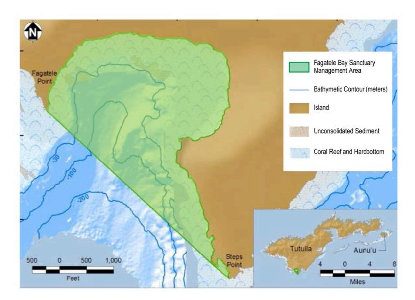

Fagatele Bay is a 0.25 square mile (0.65 sq. km.) treasure off the southwest coast of Tutuila. As of 2012, when the sanctuary expanded, it is now a no-take marine protected area to support what is one of the most biologically diverse areas in the National Marine Sanctuary System and the only sanctuary south of the Equator. The bay has proven to be more resilient than other reefs in the territory as was seen during the most recent, 2015 global coral bleaching event. The cultural significance of Fagatele Bay lies in its connection with a historic coastal village that 

occupied its shores from prehistoric times through the 1950s. The site has not been excavated, but foundations of structures and pathways remain beneath the overgrown vegetation. Fagatele Bay contains one of the few marine archaeological records in the territory: grinding holes or bait cups carved by Ancient Samoans into the shoreline along the reef edge (US DOC NOAA ONMS 2012).

Surveys have identified at least 200 species of corals in the bay that are thought to be the centerpiece of a community of more than 1,400 species of algae and invertebrates and more than 270 species of fish. Abundant groups include adult and juvenile damselfish, surgeonfish, wrasse, butterflyfish, and parrotfish. Herbivorous species can help decrease available sources of food for threats like juvenile crown-of-thorns starfish that once adults can decimate corals as seen during outbreaks around American Samoa in the 1970s as well as in recent years (US DOC NOAA ONMS 2012). 

### **Fagalua/Fogāma'a Management Area**

**Allowed** – research, education, recreation, hook-and-line fishing, cast nets, spearfishing (non-SCUBA assisted), and other non- destructive fishing methods including those traditionally used for sustenance and cultural purposes such as gleaning, `enu and ola (traditional basket fishing).

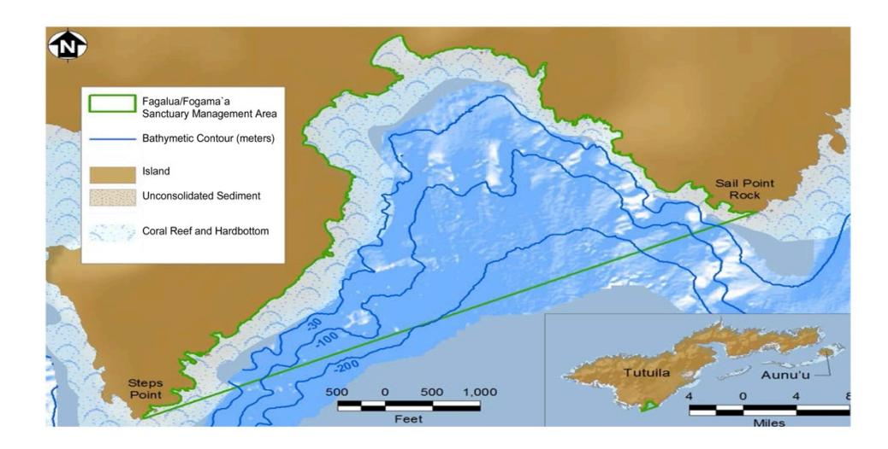

Fagalua/Fogāmaˊa is roughly 0.46 square miles (1.19 sq. km.) of bay area on the southwest shore of Tutuila. The importance of the relationship between this bay and the surrounding environment is comparable to Fagatele Bay, located just over the ridge. Both coves are considered regional hotspots with high coral coverage and many different types of coral and fish species. Because of this similarity, the area provides a replicate habitat for increased protection, scientific research and overall resilience of coral reef ecosystems. Within this area, Fagalua is the site of two turtle images carved in a boulder, prehistoric fale foundations and may contain buried archeological deposits (US DOC NOAA ONMS 2012).

#### **Aunu'u Management Areas**

#### **Zone A – Multiple Use Zone**

**Allowed** – research, education and recreation. Hook-and-line fishing, casting nets, spearfishing (non-scuba assisted) and other non-destructive fishing methods including those traditionally used for sustenance and cultural purposes such as gleaning,`enu and ola.

#### **Zone B – Research Zone**

**Allowed** – research, education, recreation and surface fishing for pelagic species – including fishing by trolling. Examples of pelagic fish include: dogtooth or white tuna, skipjack tuna, spearfish, billfish, wahoo, masimasi, rainbow runner and sailfish.

**Not Allowed** – fishing for bottom-dwelling species. Bottom fishing and trawling is prohibited.

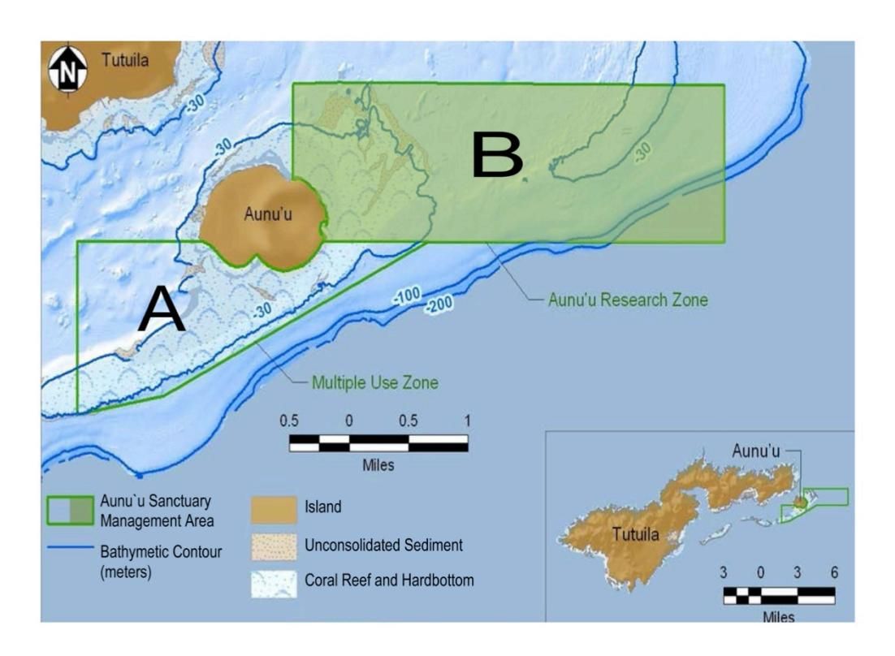

Aunuˊu is a small, volcanic island with a land area of 0.58 square miles (1.50 sq. km.). Major features of the island include Aunuˊu Crater, Pala Lake (a unique area of red quicksand), and Faimulivai Marsh, the largest freshwater wetland in American Samoa. The island is a National Park Service National Natural Landmark. The area surrounding the island overlaps with four distinct biogeographic regions, making it a highly diverse marine area that includes hot spots for coral cover, fish biomass, and fish richness (US DOC NOAA ONMS 2012). 

A total of 5.8 square miles (15.02 sq. km.)of reef and offshore waters around Aunuˊu have been included in the sanctuary, with 3.9 square miles (10.10 sq. km.) designated a research zone and allows surface fishing for pelagics only, and 1.9 square miles (4.92 sq. km.) multiple use zone that allows traditional and non-destructive fishing practices. The research and multiple use zones will allow for comparisons over time of an area that prohibits the take of reef fish and bottom dwelling species and benefits to an adjacent area of higher human uses that meets the needs of day-to-day living in sustainable ways (US DOC NOAA ONMS 2012).

The area off the coast of Aunuˊu Island consists of marine habitats of varying depth including shallow water reefs to deep waters. The benthic habitats surrounding Aunuˊu are very diverse and comprised mostly of coral reef and hardbottom formations. To the east of the island extends a coral bank with extensive aggregate patch reef on its western edge, descending into deeper waters that support mesophotic reefs. Turf algae dominate much of the bank habitat near the island, forming extensive algal plains. Together, these features create a diversity of habitat unique in American Samoa (US DOC NOAA ONMS 2012).

#### **Ta'u Management Area**

**Allowed** – research, education, recreation, hook-and-line fishing, cast nets, spearfishing (non-SCUBA assisted) and other non-destructive fishing methods including those traditionally used for sustenance and cultural purposes such as gleaning, `enu and ola.

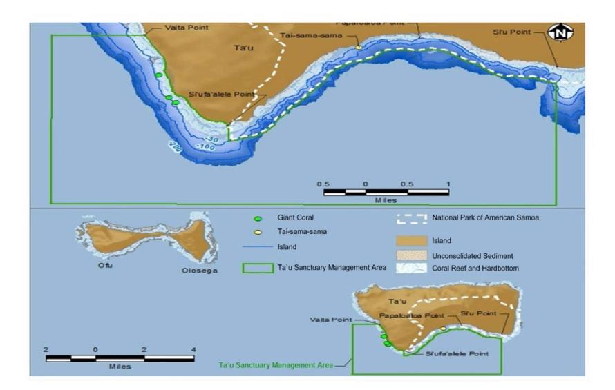

Ta'u Island, part of the Manu'a Island group, is located 70 miles (112.65 km.) east of Tutuila and 6.9 miles southeast of Olosega. The Ta'u Management Area is approximately 14.6 square miles (37.81 sq. km.) and includes both nearshore and deep waters from Si'ufa'alele Point south along the western coast, and includes deep waters beginning 0.25 miles (0.40 km.) offshore, adjacent to the nearshore waters of the National Park of American Samoa (NPSA), along the southern coast between Si'ufa'alele Point and Si'u Point. Located within the sanctuary are massive *Porites* corals in an area known as "Valley of the Giants." This area is also home to what is believed to be possibly the oldest and largest *Porites* coral in the world. At over 500 

years of age, "Big Momma" lies at a depth of 50 feet (15.24 m.), stands 21 feet (6.40 m.) tall, 42 feet (12.80 m.) wide and has a circumference of 135 feet (41.15 m.). This area has become an attraction for researchers as well as a destination for the developing dive tourism industry (US DOC NOAA ONMS 2012). 

The western side of Ta'u's southern coast is a regional hotspot for coral and fish diversity and possesses a distinct coral community. The sanctuary serves as a deep water buffer zone for the marine areas of the NPSA, as well as adding near shore and reef protection around the Porites coral heads (US DOC NOAA ONMS 2012).

#### *Swains Management Area*

**Allowed** – research, education, recreation, hook-and- line fishing, cast nets, spearfishing (non-SCUBA assisted) and other non- destructive fishing methods including those traditionally used for sustenance and cultural purposes such as gleaning, `enu and ola.

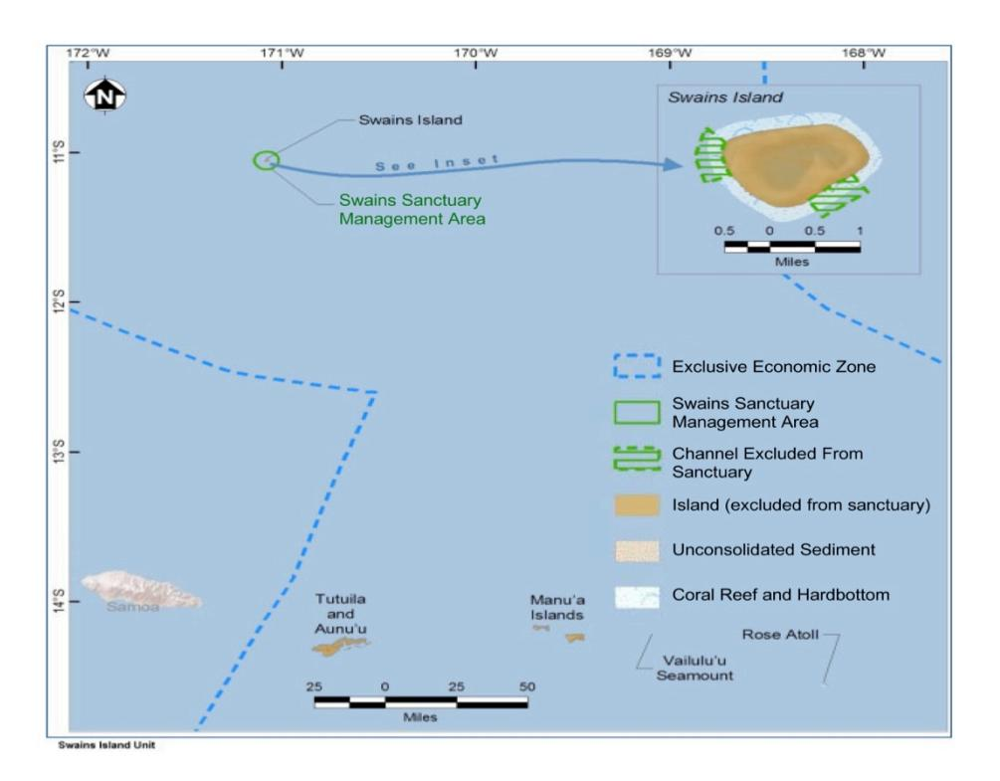

Swains Island is a privately owned low-lying coral atoll located about 200 miles (321.87 km.) northwest of Tutuila. It is approximately 1.5 miles (2.41 km.) in diameter, with approximately 1 square mile (2.59 sq. km.) of highly vegetated sand and coral with a maximum elevation of 6 feet (1.83 m.) above sea level. Swains Island has a high amount of coral cover and many different types of corals. Coral disease is low at Swains Island. Swains Island is characterized by large schools of predators, mostly barracudas, jacks and snappers. Overall, there are high amounts of large fish around Swains Island. This sanctuary area includes 52.3 square miles (135.46 sq. km.) of territorial waters (US DOC NOAA ONMS 2012).

Ocean explorer Jean-Michel Cousteau has referred to Swains Island as "one of the last jewels of the planet." A 2013 expedition to the island that included offshore, maritime archeology and terrestrial surveys led to discoveries that have experts calling Swains a microcosm of cultural influences in the Pacific. The findings are now available through the NOAA National Marine Sanctuaries publication, "Unlocking the secrets of Swains Island: a Maritime Heritage Resources Survey" (Van Tilburg et al 2013).

#### *Muliāva Management Area*

**Allowed** – research, education, recreation, and fishing with a permit (*see below for additional information*).

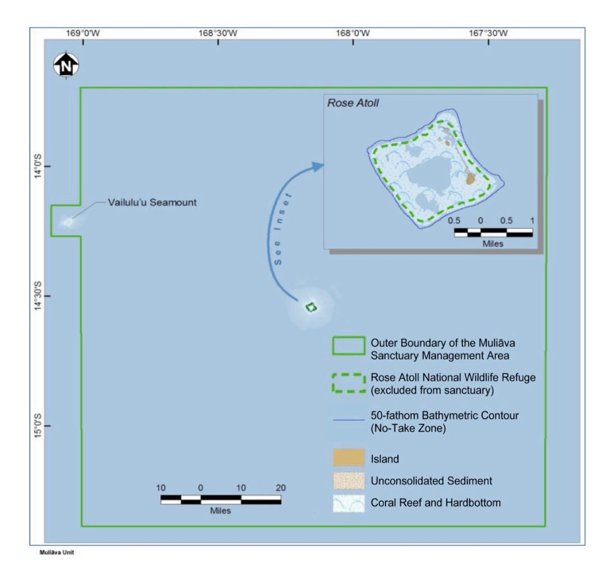

Muliāva, part of the Kingdom of Manuˊa, means end of the channel. Culturally, the name remains a reference to traditional knowledge of the ocean. Rose, the name appropriate for the color of the corals surrounding Rose Island, has also been referred to as "Motu o Manu" or Island of Birds (US DOC NOAA ONMS 2012).

The Rose Atoll Marine National Monument was established in 2009 by Presidential Proclamation 8337 (74 FR 1577). In 2012, the sanctuary Muliāva management area that includes 13,507.8 square miles (34,985.04 sq. km.) of marine waters was overlayed on to the monument to bring increased protections, regulations, research and education and outreach capacity. At Muliāva, the sanctuary works with the NOAA National Marine Fisheries Service, US Fish and Wildlife Service and the American Samoa Government through an intergovernmental committee for the coordinated management of this incredible place. In 2013, at the recommendation of the Western Pacific Regional Fishery Management Council, NOAA National Marine Fisheries Service enacted additional regulations that prohibited all fishing within 12 nautical miles (22.22 km.) of Rose Island. Non-commercial fishing outside 12 nautical miles (22.22 km.) is prohibited unless authorized by a permit that allows for sustenance, traditional indigenous and recreational fishing (78 FR 32996).

Rose is an appropriate name for the atoll because of the rose-colored crustose coralline algae that dominate the area. Rose is located approximately 150 miles (241.40 km.) east of Pago Pago Harbor. It is the easternmost Samoan island and the southernmost point of the United States. One of the smallest atolls in the world, Rose consists of about .03 square miles (.08 sq. km.) of land and 2.5 square miles (6.47 sq. km.) of lagoon surrounded by a narrow barrier reef that are included in a United States Fish and Wildlife Service National Wildlife Refuge (US DOC NOAA ONMS 2012).

At Muliāva, scientists have chronicled a distinct environment within the archipelago with large numbers of fish and a unique coral community that includes over 270 species of reef fish. Rose has been referred to as a hotspot for fish biomass that supports especially high densities of small planktivorous damselfish (US DOC NOAA ONMS 2012).

Rose Atoll is the primary site for green sea turtle nesting in American Samoa and supports the highest densities of the giant clam *Tridacna maxima* in the Samoan archipelago. More than 93 percent of the adult brood stock of giant clams in the Samoan archipelago is within its protected lagoon. Although similar suitable habitat for the giant clam exists elsewhere in American Samoa, such as on Tutuila and Upolu in the Independent State of Samoa, these unprotected populations have been severely depleted. Elsewhere in the Pacific Islands (Fiji), the giant clam has been harvested to local extinction (US DOC NOAA ONMS 2012).

The sanctuary area also includes the submerged volcanic cone known as the Vailuluˊu Seamount that has a diverse biological community that includes crinoids, octocorals, sponges, and cutthroat eels. Since 2003, an 1100 foot (335.28 m.) tall volcanic cone, known as Nafanua, has grown in the seamount's crater. Scientists speculate that Nafanua will breach the sea surface within decades, forming a new island in the Samoan island group. The seamount cone has several types of hydrothermal vents that provide habitat for an unusual group of organisms, ranging from microbial mats to polychaete worms. A thriving population of the eel *Dysommina rugosa* occupies the summit of Nafanua, surviving on crustaceans imported to the system from the water column above (US DOC NOAA ONMS 2012).

#### **References:**

74 FR 1577: Federal Register / Vol. 74, No. 7/ Monday, January 12, 2009, page 1577. Presidential Documents. Proclamation 8337 of January 6, 2009. Establishment of the Rose Atoll Marine National Monument. 

77 FR 43942: Federal Register / Vol. 77, No. 144 / Thursday, July 26, 2012 / Rules and Regulations, page 43942. Department of Commerce. National Oceanic and Atmospheric Administration. 15 CFR Part 922. [Docket No. 100908440–2181–02]. RIN 0648–BA24. Expansion of Fagatele Bay National Marine Sanctuary, Regulatory Changes, and Sanctuary Name Change; Notice of Effective Date. Agency: Office of National Marine Sanctuaries (ONMS), National Oceanic and Atmospheric Administration (NOAA), Department of Commerce (DOC). Action: Final Rule.

77 FR 65815: Federal Register / Vol. 77, No. 211 / Wednesday, October 31, 2012 / Rules and Regulations, page 65815. Department of Commerce. National Oceanic and Atmospheric Administration. 15 CFR Part 922. [Docket No. 070726412–1300–02]. RIN 0648–BA24. Expansion of Fagatele Bay National Marine Sanctuary, Regulatory Changes, and Sanctuary Name Change; Notice of Effective Date. Agency: Office of National Marine Sanctuaries (ONMS), National Oceanic and Atmospheric Administration (NOAA), Department of Commerce (DOC). Action: Notice of effective date.

78 FR 32996: Federal Register / Vol. 78, No. 106/Monday, June 3, 2013 / Rules and Regulations, page 32996. Department of Commerce. National Oceanic and Atmospheric Administration. 50 CFR Part 665. [Docket No. 110819515–3444–02]. RIN 0648–BA98. Western Pacific Fisheries; Fishing in the Marianas Trench, Pacific Remote Islands, and Rose Atoll Marine. National Monuments. Agency: National Marine Fisheries Service (NMFS), National Oceanic and Atmospheric Administration (NOAA), Commerce. Action: Final rule.

U.S. Department of Commerce (DOC). National Oceanic and Atmospheric Administration (NOAA). Office of National Marine Sanctuaries (ONMS). 2012. Fagatele Bay National Marine Sanctuary Final Management Plan/Final Environmental Impact Statement. Silver Spring, MD.

Van Tilburg, H.K., D.J. Herdrich, R. Suka, M. Lawrence, C. Filimoehala and S. Gandulla. 2013. Unlocking the secrets of Swains Island: a Maritime Heritage Resources Survey. National Oceanic and Atmospheric Administration. Office of National Marine Sanctuaries. Maritime Heritage Program Series: Number 6. 

# **Appendix II: List of Acronyms**

ASEPA: American Samoa Environmental Protection Agency

ASCC: American Samoa Community College

ASG: American Samoa Government ASPA: American Samoa Power Authority

CRAG: Coral Reef Advisory Group

CRCP: Coral Reef Conservation Program CZMP: Coastal Zone Management Program DMWR: Dept. of Marine and Wildlife Resources

DOC: Department of Commerce DOE: Department of Education ENSO: El Nino Southern Oscillation EPA: Environmental Protection Agency

FWS: Fish and Wildlife Service

IPO: Inter-decadal Pacific Oscillation

MPA: Marine Protected Area

NMFS: National Marine Fisheries Service

NMSAS: National Marine Sanctuary of American Samoa

NMSASAC: National Marine Sanctuary of American Samoa Advisory Council

NPSA: National Park Service of American Samoa NOAA: National Oceanic Atmospheric Administration

OCI: Office of Curriculum and Instruction ONMS: Office of National Marine Sanctuary

PDO: Pacific Decadal Oscillation PFCs: Perfluorinated Chemicals

PNRS: Project Notification and Review System

SPREP: Secretariat of the Pacific Regional Environment Programme

USGS: United State Geological Survey WRRC: Water Resources Research Center

# **Appendix III: Climate Impacts Summary Table**

| Climate Variable and Trend | Observed	Change                                                                                                                                                                                                                                                                                                                                                                                                                                                                                        | Trend | Relative Change | Future	Projections                                                                                                                                                                                                                                                                                            | Confidence                                                                                          | Uncertainty                                                                                                                                                                                      | Source(s)                                                                                              |
|-------------------------------------|--------------------------------------------------------------------------------------------------------------------------------------------------------------------------------------------------------------------------------------------------------------------------------------------------------------------------------------------------------------------------------------------------------------------------------------------------------------------------------------------------------|-------|--------------------|---------------------------------------------------------------------------------------------------------------------------------------------------------------------------------------------------------------------------------------------------------------------------------------------------------------|-----------------------------------------------------------------------------------------------------|--------------------------------------------------------------------------------------------------------------------------------------------------------------------------------------------------|--------------------------------------------------------------------------------------------------------|
| Air temperature                  | Samoa From	1950-2009: >	Average	annual temperatures	increased +0.25°F	(+0.14°C)	per	decade > Average	maximum	air temperatures	increased +0.4°F	(+0.22°C)	per decade >	Average	minimum	air temperatures	increased                                                                                                                                                                                                                                                      | é     | High               | Central	South	Pacific Annual	surface	air	temperature (compared	to	1971-2000) >	By	2030:	+1.1-1.3°F	(+0.61-0.72°C) >	By	2050:	+1.9-2.5°F	(+1.06-1.39°C) >	By	2090:	+2.5-4.8°F	(+1.39-2.67°C) Pacific	Islands >	Extreme	heat	days	will	become	more frequent	and	intense	during	the	21st | >	High confidence in	trend direction >	Medium confidence in	trend magnitude    | >	Magnitude	of change varies by	greenhouse gas	emission scenario:	B1 (lower)	and	A2 (higher)                                                                                | Australian Bureau	of Meteorology and	CSIRO 2011; Finucane	et al.	2012; Young	2007 |
| Sea	surface temperature          | +0.07°F	(+0.04°C)	per	decade Pacific	Islands >	Sea	surface	temperatures have	increased	regionally	at	a rate	of	0.13-0.41°F	(+0.07- 0.23°C)	per	decade	since	1970 American	Samoa	and	Samoa >	It	is	difficult	to	determine long-term trends	due	to regional	variability >	American	Samoa	has exhibited	warming	trends (exact	rates	aren't	available) >	Samoa	experienced	sea surface	warming	at	a	rate	of +0.14°F	(+0.08°C)	per	decade from	1970-2011 | é     | High               | century Pacific	Islands Sea	surface	temperatures	(compared	to 1990,	ranges	represent	low	[B1]	and	high [A2]	emissions	scenarios)	1 >	By	2030:	+1.1-1.7°F	(+0.61-0.94°C) >	By	2055:	+1.8-2.3°F	(+1-1.28°C) >	By	2090:	+2.5-4.7°F	(+1.39-2.61°C)                                           | >	High confidence in	trend direction >	Medium confidence in trend magnitude | >	Magnitude varies	by emissions scenario:	B1 (lower)	and	A2 (higher) >	Shifts	in	sea surface temperature	will also	be	affected by	ENSO,	the PDO,	and	the IPO | Australian Bureau	of Meteorology and	CSIRO 2011; Keener	et	al. 2012;	Young 2007   |

| Climate Variable and Trend | Observed	Change                                                                                                                                                                                                                                                                                    | Trend | Relative Change | Future	Projections                                                                                                                                                                                                                                                                                                                                                                                                         | Confidence                                                                                        | Uncertainty                                                                                                                                                                                                                                                                                                               | Source(s)                                                                                                                         |
|-------------------------------------|----------------------------------------------------------------------------------------------------------------------------------------------------------------------------------------------------------------------------------------------------------------------------------------------------|-------|--------------------|----------------------------------------------------------------------------------------------------------------------------------------------------------------------------------------------------------------------------------------------------------------------------------------------------------------------------------------------------------------------------------------------------------------------------|---------------------------------------------------------------------------------------------------|---------------------------------------------------------------------------------------------------------------------------------------------------------------------------------------------------------------------------------------------------------------------------------------------------------------------------|-----------------------------------------------------------------------------------------------------------------------------------|
| Extreme Precipitation Events  | Central	South	Pacific >	No	significant	trend	in	the frequency	of	extreme	rainfall events	since	1965                                                                                                                                                                                       | éê    | Moderate           | Central	South	Pacific >	Extreme	rainfall	events	will	be correlated	with	tropical	storm	activity (see	below),	but	are	likely	to	increase	in frequency	and	intensity	during	the	21st century                                                                                                                                                                                                                  | >	Moderate confidence in	trend direction >	Low confidence in	trend magnitude | >	Extreme rainfall projections	are highly	variable, influenced	by ENSO/PDO patterns,	and other	factors. >	Extreme rainfall	events that	currently occur	once every	20	years on	average	are generally simulated	to occur	four	times per	year,	on average,	by 2055. | Australian Bureau	of Meteorology and	CSIRO 2011; Keener	et	al. 2012;	Young 2007                              |
| Precipitation and	drought        | American	Samoa >	No	significant	trends	in annual	precipitation	or	winter one-day	precipitation	volume since	1965 >	No	change	in	drought	event frequency	in	60	years Samoa >	No	significant	trends	in seasonal	or	annual	rainfall from	1950-2009	or	from 1890-2005 | éê    | Low                | Central	South	Pacific >	Projections	are	highly	variable	and display	conflicting	results >	Future	conditions	may	include	no change	or	a	slight	increase	in	mean annual	precipitation	with	slight	decreases during	the	dry	season	and	slight	increases during	the	wet	season	during	the	21st century Samoa >	Drought	frequency	isn't	likely	to	exhibit major	change	during	the	21st	century | >	Low confidence in	trend direction and magnitude                                  | >	Precipitation projections	for the	Pacific Region	are highly	variable depending	on emissions scenario	and	are influenced	by many	factors (e.g., ENSO/PDO/IPO phases,	island location	and                                                                                          | Australian Bureau	of Meteorology and	CSIRO 2011;	Cheng and	Gaskin 2011; Keener	et	al. 2012;	Young 2007 |

| Climate Variable and Trend | Observed	Change                                                                                                                            | Trend       | Relative Change | Future	Projections                                                                                                                                                                                                | Confidence                                                       | Uncertainty                                                                                                                                                                                                           | Source(s)                                                                                                                                               |
|-------------------------------------|--------------------------------------------------------------------------------------------------------------------------------------------|-------------|--------------------|-------------------------------------------------------------------------------------------------------------------------------------------------------------------------------------------------------------------|------------------------------------------------------------------|-----------------------------------------------------------------------------------------------------------------------------------------------------------------------------------------------------------------------|---------------------------------------------------------------------------------------------------------------------------------------------------------|
|                                     | >	No	change	in	drought frequency	from	1942-2005, but	events	are	correlated	with El	Nino	conditions                                |             |                    |                                                                                                                                                                                                                   |                                                                  | geography). > There	is	very little	long-term annual precipitation data	for American	Samoa to	derive	trends and	inform projections.                                                      |                                                                                                                                                         |
| Tropical storms                  | Central	South	Pacific >	The	number	of	tropical storms	escalating	to	cyclones increased	in	1991-2010 relative	to	1970-1990.     | é           | Low                | American	Samoa	and	Samoa >	Potential	reduction	in	cyclone	activity	as storm	tracks	shift	toward	the	Central North	Pacific Pacific	Islands > Increased	storm	intensity	over	the	next 70	years | >	Low confidence in	trend direction and magnitude | >	Tropical storm tracks	will	be influenced	by regional variability related	to	ENSO, the	PDO,	and the	IPO >	The	region exhibits	high inter-annual variability	in storm	activity | Australian Bureau	of Meteorology and	CSIRO 2011; Emanuel 2005;	Li	et al.	2010; Seneviratne et	al.	2012; Yu	et	al. 2010 |
| Streamflow                          | American	Samoa >	No	trend	in	total streamflow,	baseflow,	or	the number	of	extreme	low- or high-flow	days	from	1960- 1995 | No trend | Low                | American	Samoa > No	specific	projections,	but	streamflow will	likely	fluctuate	with precipitation patterns                                                                                         | >	Low confidence in	trend direction and magnitude | >	There	is	very little	long-term data	for American	Samoa to	derive	trends and	inform projections. >	Many	streams in	American Samoa experience                                           | Keener	et	al. 2012                                                                                                                                   |

| Climate Variable and Trend | Observed	Change                                                                                                                                                                                                                                                                                                                                                                                                                       | Trend | Relative Change | Future	Projections                                                                                                                                                                                                                                                                                                                                                  | Confidence                                                                                    | Uncertainty                                                                                                                                                                                                                                                                                                                                                                                                                                                                 | Source(s)                                                               |
|-------------------------------------|---------------------------------------------------------------------------------------------------------------------------------------------------------------------------------------------------------------------------------------------------------------------------------------------------------------------------------------------------------------------------------------------------------------------------------------|-------|--------------------|---------------------------------------------------------------------------------------------------------------------------------------------------------------------------------------------------------------------------------------------------------------------------------------------------------------------------------------------------------------------|-----------------------------------------------------------------------------------------------|-----------------------------------------------------------------------------------------------------------------------------------------------------------------------------------------------------------------------------------------------------------------------------------------------------------------------------------------------------------------------------------------------------------------------------------------------------------------------------|-------------------------------------------------------------------------|
|                                     |                                                                                                                                                                                                                                                                                                                                                                                                                                       |       |                    |                                                                                                                                                                                                                                                                                                                                                                     |                                                                                               | human modifications	to streamflow.                                                                                                                                                                                                                                                                                                                                                                                                                                    |                                                                         |
| Sea	level	rise                      | Global >	Global	sea	levels	increased 3.4	mm		(+/- 0.4	mm)	per	year from	1993-2009,	representing a	much	faster	rate	of	rise	than the	20th	century Western	Tropical	Pacific >	Relative	rates	of	sea	level rise	matched	or	exceeded global	rates	from	1993-2010 due	to	enhanced	trade	wind conditions American	Samoa >	Mean	sea	level	increased 2.07	mm/year	at	Pago	Pago from	1948-2006 | é     | High               | Pacific	Islands Region	will	experience	roughly	same mean	average	sea	level	rise	as	global trends. >	By	2100: - "Low"	scenario:	0.2	m - "Intermediate-Low"	scenario:	0.5	m - "Intermediate-High"	scenario:	1.2	m - "High"	scenario:	2.0	m >	Increased	frequency	of	extreme	sea level	events	(linked	with	high	tide	events) | >	High confidence in	trend direction >	Low confidence in	trend magnitude | >	Magnitude projections	vary based	on	model used	(climate model	vs.	semi empirical	model) and	emissions scenario. Additionally,	sea level	rise	could accelerate	if	ice sheet	discharge increases,	which is	likely	given current	trends. >		Regional variations	in	sea level	rise	likely due	to	land dynamics (subsidence/upli ft)	and	changes in	ocean circulation (ENSO/PDO)	and wind	patterns. | Cheng	and Gaskin	2011; Marra	et	al. 2012;	Nerem et	al.	2010 |

| Climate Variable and | Observed	Change                                                                                           | Trend | Relative Change | Future	Projections                                                                                                                                | Confidence                                                                                         | Uncertainty                                                                                                                         | Source(s)                                                                  |
|----------------------------|-----------------------------------------------------------------------------------------------------------|-------|--------------------|---------------------------------------------------------------------------------------------------------------------------------------------------|----------------------------------------------------------------------------------------------------|-------------------------------------------------------------------------------------------------------------------------------------|----------------------------------------------------------------------------|
| Trend                      |                                                                                                           |       |                    |                                                                                                                                                   |                                                                                                    |                                                                                                                                     |                                                                            |
| Wave	height                | Pacific	Islands >	No	trend	in	wave	heights available                                                | é     | Low                | Pacific	Islands >	Increased	annual	mean	wave	height	in the	southern	tropical	Pacific,	decreased wave	heights	in	most	other	Pacific	areas |                                                                                                    | Few	long-term records	exist                                                                                                      | Hemer	et	al. 2013;	Marra et	al.	2012; Seneviratne et	al.	2012; |
|                            |                                                                                                           |       |                    |                                                                                                                                                   |                                                                                                    |                                                                                                                                     | Young	et	al. 2011                                                       |
| Ocean acidification     | Samoa >	Aragonite	saturation	state declined	from	4.5	to	4.1 between	the	18th	century	and 2000 | ê     | High               | Samoa >	By	2060:	aragonite	saturation	state	will fall	below	3.5,	and	continue	declining thereafter                                       | >	High confidence in	trend direction >	Moderate confidence in	trend magnitude | >	Carbon	cycles are	difficult	to model,	and regional	biases and	downscaling challenges	exist in	current models | Australian Bureau	of Meteorology and	CSIRO 2011                |

# **Appendix IV: Current and Future Adaptation Strategies Tables**

#### **Table 1. Current management goals, potential vulnerabilities, and current management actions for coral reefs.**

For each current management action participants evaluated its effectiveness (likely to reduce climate vulnerability) and feasibility (likelihood of implementation), and identified climatic and non-climatic stressors the action could help to ameliorate the effects of. Given action effectiveness and feasibility, participants then evaluated whether or not the action should continue to be implemented. If the action was recommended for continued implementation, participants detailed any changes regarding where and how to implement given climate vulnerabilities. Lastly, participants evaluated whether there were potential conflicts with or benefits to other resources from action implementation. 

#### **Current Management Goal: Protect coral reef habitat.**

- Increased sea surface temperature
- Ocean acidification
- Changes in high precipitation events: increased nitrification

| Current Management	Action                                                                                      | Current Effectiveness | Current Feasibility | Does	Action Ameliorate Effects	of	Any Vulnerabilities?               | Continue	to Implement Action	Given Climate Vulnerabilities? | Where/How	to Implement	Given Climate Vulnerabilities                                                                                                                                                                                     | Other	Resource Considerations                                                                                                                                                   |
|-------------------------------------------------------------------------------------------------------------------|--------------------------|------------------------|-------------------------------------------------------------------------------|-------------------------------------------------------------------------|---------------------------------------------------------------------------------------------------------------------------------------------------------------------------------------------------------------------------------------------------|------------------------------------------------------------------------------------------------------------------------------------------------------------------------------------|
| Water	quality	testing	for bacteria	and	near	shore nutrient	input,	sometimes resulting	in	beach	closures. | Moderate                 | High                   | Serves	as	an indicator	for possible	impacts to	coral	reef habitat | Yes                                                                     | Where: Areas susceptible	to bleaching	or	currently bleached	areas How: - Implement visibility/light penetration measurements	in and	outside	reef slopes	during	high precipitation	events and	poor	water | Other	resources action	benefits: Better understanding	of water	quality pulses	around	coral reef	habitats Other	resources with	potential conflicts:	None |

| Reduce	litter	and	marine                                                                                                                                                                                                                                                                    | Moderate                                                                                                                                                 | Moderate/High                                                                           | Yes                                                                                                                                       | Yes,	and	fully                                                                                                                       | quality measurement periods - More	studies	to understand	what	is making	it's	way	into the	bay	(e.g.,	what medicines	and tracers	are	found	in nearshore	water) Where: Territory | Other	resources                                                                                                                                                                      |
|---------------------------------------------------------------------------------------------------------------------------------------------------------------------------------------------------------------------------------------------------------------------------------------------|----------------------------------------------------------------------------------------------------------------------------------------------------------|-----------------------------------------------------------------------------------------|-------------------------------------------------------------------------------------------------------------------------------------------|--------------------------------------------------------------------------------------------------------------------------------------|--------------------------------------------------------------------------------------------------------------------------------------------------------------------------------------------------------------------|--------------------------------------------------------------------------------------------------------------------------------------------------------------------------------------|
| debris.                                                                                                                                                                                                                                                                                     |                                                                                                                                                          | (if	enforced)                                                                           |                                                                                                                                           | enforce                                                                                                                              | wide How:	Ensure	island wide	enforcement	of regulations	against littering                                                                                                                              | action	benefits: - Water	quality - Sea	turtles (reduces plastics) - Sea	birds - Coral	habitats Other	resources with	potential conflicts:	None |
| American	Samoa	Village Marine	Protected	Areas (MPAs):	co-managed	by communities	and	local government	(Department	of Marine	and	Wildlife Resources),	includes	No-Take MPAs	and	Community-Based Fisheries	Management Programs.	Each	of	these MPAs	has	different | Low Some	villages	are dependent	on	coral reef	fish	for subsistence	and MPA	effectiveness has	not	been proven Vulnerability	could | High (by	permit) Depends	on willingness	of villages	to	enact and	enforce | Yes,	increases coral	reef habitat resilience	by maintaining herbivore	fish populations, which	are	good for	corals | Yes,	since	MPAs help	locally protect herbivore	reef fish,	but	should consider	more evaluations	of effectiveness | Where: In	the	11 Village	MPAs How: - Ensure	that openings	do	not happen	during	high stress	conditions and	coral	bleaching events	to	allow	for reef	recovery                       | Other	resources action	benefits:	All reef-dependent species Other	resources with	potential conflicts: Subsistence	and cultural	fisheries practices        |

| opening/closure	times	and lengths.          | be	very	high	if	MPA openings	coincide with	high	stress conditions	(e.g., high	sea	surface temperature periods,	bleaching events)                                                                                                                  |          |                                                                      |                                                      | - Incorporate	a monitoring component	to evaluate	MPA effectiveness                                                                                                                                                                  |                                                                                                                               |
|------------------------------------------------|------------------------------------------------------------------------------------------------------------------------------------------------------------------------------------------------------------------------------------------------------------------------|----------|----------------------------------------------------------------------|------------------------------------------------------|----------------------------------------------------------------------------------------------------------------------------------------------------------------------------------------------------------------------------------------------------|-------------------------------------------------------------------------------------------------------------------------------|
| No	discharge	and	anchoring in	the	Sanctuary | Moderate/ High Enforcement	action by NOAA Fisheries Office	of	Law Enforcement and DMWR Enforcement through	Joint Enforcement Agreement. Effective	with proper	resources and	if	more mooring	buoys	are installed. | Moderate | Yes,	helps	water quality	and	coral reef	habitat	if enforced | Yes,	with possible expansion	in other	areas | Where: Coral	reef areas,	particularly	in areas	that	are	more prone	to	bleaching	or other	stressors	(e.g., crown-of-thorns starfish) How:	Require	no discharge/no anchoring	in	other areas	beyond	the Sanctuary | Other	resources action	benefits: All	reef	dependent species. Other	resources with	potential conflicts:	None |

#### **Current Management Goal: Control crown-of-thorns starfish outbreaks.**

- Temperature changes – unknown how crown-of-thorns starfish will respond
- Temperature and pH – if these factors cause decreased corals, there may less outbreaks
- Nutrient input – may affect crown-of-thorns starfish larvae

| Current	Management	Action                                     | Current Effectiveness                                                                                                                                                                                                  | Current Feasibility                                                                                                                                                                                                  | Does	Action Ameliorate Effects	of	Any Vulnerabilities?                                                | Continue	to Implement Action	Given Climate Vulnerabilities? | Where/How	to Implement	Given Climate Vulnerabilities                                                                                                                                                                                                                                                                                                                                                                                                                                                                                                                                                                                               | Other	Resource Considerations                                                                                                                                                                                                                                                                                        |
|---------------------------------------------------------------|---------------------------------------------------------------------------------------------------------------------------------------------------------------------------------------------------------------------------|-------------------------------------------------------------------------------------------------------------------------------------------------------------------------------------------------------------------------|----------------------------------------------------------------------------------------------------------------|-------------------------------------------------------------------------|-------------------------------------------------------------------------------------------------------------------------------------------------------------------------------------------------------------------------------------------------------------------------------------------------------------------------------------------------------------------------------------------------------------------------------------------------------------------------------------------------------------------------------------------------------------------------------------------------------------------------------------------------------------|-------------------------------------------------------------------------------------------------------------------------------------------------------------------------------------------------------------------------------------------------------------------------------------------------------------------------|
| Target	crown-of-thorns starfish	eradication	with oxbile | High Oxbile	very efficient	since	it requires	only	a single	injection, and	starfish	falls apart	in	24	hours. Has	been	very effective	on	North Tutuila.	Requires dedicated	team	of divers. | Low/ Moderate Very	expensive, and	requires large	team	to remove	all starfish.	Tow board	surveys are	very	time consuming. Resource intensive	and requires	lots	of infrastructure. | Indirectly; leaves	more viable	coral populations	to repopulate/ recover	from other	stressors | Yes                                                                     | Where: - NPSA survey	at	hot spots	(previous efforts	concentrated in	Tutuila	and	north side	of	island	to keep	crown-of thorns starfish out of	the	park;	very little	known	about what	happens	on south	shore	of Tutuila,	Aunu'u,	and Swains,	but	likely outbreaks	here	have gone	unchecked) - Deep	reefs	– may	be refuge	for	crown-of thorns starfish,	need to	learn	more,	but can	be	expensive, time	consuming, and	dangerous	to explore – Office	of National	Marine Sanctuaries re breather	divers periodically	survey around	Tutuila	and | Other	resources action	benefits: Saving	corals	from crown-of-thorns starfish preserves fish	habitat Other	resources with	potential conflicts: - Divers	may damage/break corals - Public	trust	may be	undermined	if actions/theory not communicated properly |

| Manual	eradication	of	crown of	thorns starfish	(spear	or bash) | Low/ Moderate Removal	is effective	at	small scale,	but	very	time consuming. Starfish	can regenerate	– must be	removed	from water	to	ensure death. More	dangerous/ | Low Time	consuming and	expensive | Indirectly; leaves	more viable	coral populations	to repopulate/ recover	from other	stressors | Yes,	but	some concerns	about starfish's	ability to	replicate/ regenerate | Aunu'u	and	will	be conducting	deep water	surveys	in 2017 How: - Obtain	permission from/cooperate with	local	villages for	water	and	reef access - Train	volunteers	to distinguish	between crown-of-thorns starfish	scars	versus bleaching/disease impacts	to	inform biologists/response teams Where: - Deeper	reefs	where crown-of-thorns starfish	may	find refuge - South	shore	of Tutuila,	Aunu'u,	and Swains	(little	known about	what's happening	there) - Useful	method	for local	village management,	but not	for	large	scale How: | Other	resources action	benefits: Saving	corals	from crown-of-thorns preserves	fish habitat Other	resources with	potential conflicts:	Divers may	damage/break corals |
|-------------------------------------------------------------------------|-------------------------------------------------------------------------------------------------------------------------------------------------------------------------------------------------------|----------------------------------------|----------------------------------------------------------------------------------------------------------------|--------------------------------------------------------------------------------------|------------------------------------------------------------------------------------------------------------------------------------------------------------------------------------------------------------------------------------------------------------------------------------------------------------------------------------------------------------------------------------------------------------------------------------------------------------------------------------------------------------------------------------------------------------------------------------------------------------------------------------------------------|---------------------------------------------------------------------------------------------------------------------------------------------------------------------------------------------------|
|-------------------------------------------------------------------------|-------------------------------------------------------------------------------------------------------------------------------------------------------------------------------------------------------|----------------------------------------|----------------------------------------------------------------------------------------------------------------|--------------------------------------------------------------------------------------|------------------------------------------------------------------------------------------------------------------------------------------------------------------------------------------------------------------------------------------------------------------------------------------------------------------------------------------------------------------------------------------------------------------------------------------------------------------------------------------------------------------------------------------------------------------------------------------------------------------------------------------------------|---------------------------------------------------------------------------------------------------------------------------------------------------------------------------------------------------|

| Ban	take	of	large	reef	fish (e.g.,	humphead	wrasse), which	are	believed	to	be crown-of-thorns	starfish predators | increased	diver	risk with	more	handling due	to	venomous spines. Low/Unknown Not	known	which fish	may	eat	young crown-of-thorns starfish,	need	more information. | Low/Unknown Need	more information	on which	reef	fish to	protect;	need to	identify effective predator. Scale	also	an issue; 50,000+	crown of-thorns individuals present. | Indirectly; leaves	more viable	coral populations	to repopulate/ recover	from other	stressors | Yes,	but	need more	info | - Train	spearfishers	to eradicate	local populations (possibly	cheaper) - Obtain	permission from/cooperate with	local	villages for	water	and	reef access - Train	volunteers	to distinguish	between crown-of-thorns starfish	scars	versus bleaching/disease impacts	to	inform biologists/response teams Where: Unknown; potential	future management	action once	research	is underway How:	Research	and identify	crown-of thorns	starfish predators	and effectiveness	of predation	on	starfish populations | Other	resources action	benefits: Could	help	large fish	populations recover	(e.g., humphead	wrasse) and	eventually allow	these	species to	be	fished	in	the future Other	resources with	potential conflicts:	None |
|------------------------------------------------------------------------------------------------------------------------------|--------------------------------------------------------------------------------------------------------------------------------------------------------------------------------------------|----------------------------------------------------------------------------------------------------------------------------------------------------------------------------------------------------------------|----------------------------------------------------------------------------------------------------------------|----------------------------|---------------------------------------------------------------------------------------------------------------------------------------------------------------------------------------------------------------------------------------------------------------------------------------------------------------------------------------------------------------------------------------------------------------------------------------------------------------------------------------------------------------------------------------------------------------------------------------------------------|-----------------------------------------------------------------------------------------------------------------------------------------------------------------------------------------------------------------------------------------------------|
|------------------------------------------------------------------------------------------------------------------------------|--------------------------------------------------------------------------------------------------------------------------------------------------------------------------------------------|----------------------------------------------------------------------------------------------------------------------------------------------------------------------------------------------------------------|----------------------------------------------------------------------------------------------------------------|----------------------------|---------------------------------------------------------------------------------------------------------------------------------------------------------------------------------------------------------------------------------------------------------------------------------------------------------------------------------------------------------------------------------------------------------------------------------------------------------------------------------------------------------------------------------------------------------------------------------------------------------|-----------------------------------------------------------------------------------------------------------------------------------------------------------------------------------------------------------------------------------------------------|

#### **Current Management Goal: Use education and outreach to protect coral reefs and bring the site to the people.**

- Most climate changes will impact corals
- Sedimentation
- Reduced funds for education and outreach

| Current	Management	Action                                                                                                                                                                              | Current Effectiveness                                               | Current Feasibility               | Does	Action Ameliorate Effects	of	Any Vulnerabilities?                                                              | Continue	to Implement Action	Given Climate Vulnerabilities? | Where/How	to Implement	Given Climate Vulnerabilities                                                                                                                                                                                                                | Other	Resource Considerations                                                                                             |
|--------------------------------------------------------------------------------------------------------------------------------------------------------------------------------------------------------|------------------------------------------------------------------------|--------------------------------------|------------------------------------------------------------------------------------------------------------------------------|-------------------------------------------------------------------------|------------------------------------------------------------------------------------------------------------------------------------------------------------------------------------------------------------------------------------------------------------------------------|------------------------------------------------------------------------------------------------------------------------------|
| School	programs	such	as	Reef Check	(geared	toward	any audience;	provides	education on	coral	fragility	and importance	of	coral	habitat so	audience	can	become environmental	stewards) | Moderate/ High Space	limited, requires	a	lot	of staff	time | Low/ Moderate Space	limited    | Yes,	helps improve understanding and	support	for reef	protection and	action	to increase	reef resilience | Yes                                                                     | Where: Territory wide How: - Merge	and consolidate	federal and	local	programs to	reach	more people - Combine	Sanctuary knowledge	with local	knowledge; use	local governments	to help	bridge connections territory-wide | Other	resources action	benefits:	All reef-dependent species Other	resources with	potential conflicts:	None |
| Have	several	education programs	catered	to different	age	groups	that links	connections	between land	and	sea - Currently	working	on                                                   | Moderate/ High                                                      | Low/ Moderate Space	is	limited | Yes,	helps improve understanding and	support	for reef	protection and	action	to                                | Yes                                                                     | Where: - All	local	schools - Beyond	American Samoa	(virtually)                                                                                                                                                                                                | Other	resources action	benefits:	All reef-dependent species                                                         |

| school	curriculum	lessons - Sanctuary	Summer Science	in	the	Village programs:	have	school kids	visit	ocean	center	or take	eco-tours	to	learn basic	science	and complement	lessons learned	during	school	year - Teacher	trainings |                                                          |                                      | increase	reef resilience                                                                                                  |     | How: - Merge	and consolidate	federal and	local	programs to	reach	more people          | Other	resources with	potential conflicts:	None                                                                         |
|-------------------------------------------------------------------------------------------------------------------------------------------------------------------------------------------------------------------------------------------------------------------|----------------------------------------------------------|--------------------------------------|------------------------------------------------------------------------------------------------------------------------------|-----|---------------------------------------------------------------------------------------------------------|------------------------------------------------------------------------------------------------------------------------------|
| Virtual	experience	for students,	allowing	them	to see	changes,	including climate	change	impacts	with special	goggles. - "Science	of	the	Sphere"	– has	3000	data	sets, including	climate	change topics                                  | Moderate/ High Visualization	is	a powerful	tool | Low/ Moderate Space	is	limited | Yes,	helps improve understanding and	support	for reef	protection and	action	to increase	reef resilience | Yes | Where: Ocean	Center How:	Use	local climate	data	and make	data	more available	for	sharing | Other	resources action	benefits:	All reef-dependent species Other	resources with	potential conflicts:	None |

*Table 2. Potential future management goals, adaptation actions, and action implementation details including where and how to implement and collaboration and capacity needs for coral reefs***.**

Action effectiveness (likelihood of reducing vulnerability), feasibility (likelihood of implementation), and timeframe (near: <5 years; mid: 5-15 years; long: >15 years) were also evaluated for each adaptation action.

| Future	Management	Goal:	Decrease	nutrient	input	and	sedimentation	into	coastal	waters.                                                                                    |                                                                                          |                                                                                                                  |                                                            |                                                                                                                                                                                                                                                                                                                                |                                                                                                                                                                                                           |
|---------------------------------------------------------------------------------------------------------------------------------------------------------------------------|------------------------------------------------------------------------------------------|------------------------------------------------------------------------------------------------------------------|------------------------------------------------------------|--------------------------------------------------------------------------------------------------------------------------------------------------------------------------------------------------------------------------------------------------------------------------------------------------------------------------------|-----------------------------------------------------------------------------------------------------------------------------------------------------------------------------------------------------------|
| Adaptation	action                                                                                                                                                         | Effectiveness                                                                            | Feasibility                                                                                                      | Timeframe                                                  | Implementation	(where/how)                                                                                                                                                                                                                                                                                                     | Collaboration	&	Capacity                                                                                                                                                                                  |
| Ensure	piggery	compliance and	enforce	EPA	regulations                                                                                                                  | Low/ Moderate Initiative	is	already in	place,	needs regulatory compliance | High Need	to follow through; augment through village structure, look	at health	angles | Near/Mid EPA dependent, needs	more enforcement | Where: Island-wide:	small	piggeries, family-based	piggeries,	community piggeries	like	community	gardens (although	community	piggeries	may cause	conflict	– disease	spreading; maybe	work	in	smaller	villages) How: - Subcontractor	funding	to	help implement - Public	campaign/outreach | Collaboration:	EPA; Villages	determine	if	family or	community	piggeries Internal: Capacity	needed:	Funding for	public	campaigns                                                            |
| Support	sewer	expansions and	new	waste	water treatment	plants;	support proper	septic	tank installment	in	proper locations;	remove existing cesspools | High                                                                                     | High                                                                                                             | Near/Mid Long	- New wastewater treatment       | Where: Coastal	area	community septic	systems;	lease	for	the	village septic	system How: - Work	with	land	owners;	cesspool removal	may	have	property	rights issues                                                                                                                                       | Collaboration: - External:	EPA,	ASPA Capacity	needed: - New,	updated	inventory of	existing	cesspools - Funding	(millions)	for new	central	waste	water and	continued	removal |

| Plant	more	trees/plants	in coastal	areas	and	in	villages to	reduce	runoff.	Plant vetiver	grass	by	streams along	with	native	trees. Ensure	new	construction projects	are	set	back	away from	streams	to	prevent erosion.                                              | High (coastal) Need	to	look	at highly	resistant coastal	plants Low	(upstream) | High	(coastal) Low (upstream)                                              | Near, as	long	as there	is interest	in villages	and community based	groups | Where: Community	villages How: - Work	with	villages	– provide incentives through	villages	and other	volunteer	programs | Collaboration: - External:	EPA,	Village mayor	or	pastor - Internal:	Community outreach Capacity	needed:	Public outreach	and	education                              |
|---------------------------------------------------------------------------------------------------------------------------------------------------------------------------------------------------------------------------------------------------------------------------------------------|----------------------------------------------------------------------------------------------|----------------------------------------------------------------------------------|---------------------------------------------------------------------------------------------|------------------------------------------------------------------------------------------------------------------------------------------------|--------------------------------------------------------------------------------------------------------------------------------------------------------------------------------------------|
| Ensure	compliance	of coastal	development setbacks - Enforce	200	ft	(60.96	m) for	coastal	development, 25	ft	(7.62	m)	from wetland,	50	ft (15.24	m) for	commercial development - Increase	setbacks	and add	a	25	ft (7.62	m) buffer	from	streams | Moderate/ High                                                                            | Low Needs enforcement                                                      | Near/Mid, if	there	is	a will                                                          | Where: Streams,	wetlands, coastal areas How:	Develop	amendments                                                                    | Collaboration: - External:	EPA,	villages, communities,	ASAP - Internal:	Coastal	Zone Management Capacity	needed: - Enforcement - Outreach - Funding |
| Start	a	wetlands	restoration project                                                                                                                                                                                                                                                     | High Restoration	plan                                                                     | Moderate Plant mortality	can be	an	issue (e.g., Coconut Point) | Near                                                                                        | Where: Coconut	Point,	Leone, Masefau,	Vatia How:	Monitor	for	success                                                                  | Collaboration: - External:	EPA,	DMWR, school	groups - Internal:	Coastal	Zone Management Capacity	needed:	More research	to	inform	success                           |

| Increase	law	enforcement                                                                                                                                                                                                                             | Low                                                                                         | Moderate/                                         | Near | Where: Island-wide                                                                           | Collaboration:                                                                                                                        |
|------------------------------------------------------------------------------------------------------------------------------------------------------------------------------------------------------------------------------------------------------|---------------------------------------------------------------------------------------------|---------------------------------------------------|------|-------------------------------------------------------------------------------------------------|---------------------------------------------------------------------------------------------------------------------------------------|
| and	fines	for	any	violations (wetlands)                                                                                                                                                                                                           | Damage	has	been done,	but	there	are opportunities	for improvement	in	the future | High                                              |      | How:	Increase	enforcement                                                                       | - External:	EPA,	villages, ASPA - Internal:	ASPA Capacity	needed:	More research	to	inform	success                   |
| Education/outreach	on strengthening	village	laws	– strengthen	village	councils while	respecting	different laws	of	each	village - Village	anti-litter	laws: enforcement	for	garbage and	fishing,	have	issued fines	in	past | High	(education)                                                                            | Moderate                                          | Near | Where: Island-wide How:	Work	with	villages	and	village councils                        | Collaboration: - External:	EPA,	villages, ASPA - Internal:	Villages Capacity	needed: - Funding - Staff  |
| - Gather	evidence Continue	stormwater	best management	practices initiative - Require	that	new development	has permeable	areas	and rain	gardens                                                                            | High,	if	successfully implemented                                                        | Moderate (targeting stormwater outfalls) | Near | Where: Island-wide How:	More	education	in	garbage removal	in	drains	not	filled	by	dirt | Collaboration: - External:	EPA,	USGS, ASPA - Internal:	Department	of Public	Works,	ASPA Capacity	needed:	Funding |

| Remove	all	wastewater outfalls;	upgrade	raw sewage	discharges	to secondary	treatment Future	Management	Goal:	Cooling	for	bleaching	prevention	and	reduction. | High,	if	successfully implemented                                                  | Moderate                                                                                | Near              | Where: Where	existing	outfalls	are found	Aunu'u How:	Remove	outfalls                                                                                                                                                                                                                                                                                                                                                                                                                                                        | Collaboration: - External:	EPA,	ASPA - Internal:	Department	of Public	Works,	ASPA Capacity	needed:	Funding                                                                                                                                |
|--------------------------------------------------------------------------------------------------------------------------------------------------------------------------|---------------------------------------------------------------------------------------|-----------------------------------------------------------------------------------------|-------------------|--------------------------------------------------------------------------------------------------------------------------------------------------------------------------------------------------------------------------------------------------------------------------------------------------------------------------------------------------------------------------------------------------------------------------------------------------------------------------------------------------------------------------------------|-------------------------------------------------------------------------------------------------------------------------------------------------------------------------------------------------------------------------------------------------------------|
| Adaptation	Action Move	deeper,	cooler	water to	shallow,	warmer	areas	– pipe	down	to	cold	water, pump	up,	and	pipe	to distribute                           | Effectiveness High,	but	need	to make	sure	it's stable	in	case	of cyclones | Feasibility Low,	based on	case	study from	Hawaiʻi and	Great Barrier	Reef | Timeframe Long | Implementation	(where/how) Where: Hotspot	by	the	airport, where	there	is	a	high	temperature change	and	surface	temperature. This	site	is	favorable	due	to	thermal dynamics	and	because	it	is	close	to shore,	but	there	hasn't	been	a feasibility	study	for	this	site.	ASPA looking	at	mainstream	renewable wind	and	solar. How: - Pipes/infrastructure	for	thermal cooling - Permitting	and	infrastructure - Examine	lessons	learned	from Hawaiʻi and	Great	Barrier	Reef | Collaboration	&	Capacity Collaboration: - External:	engineering, American	Samoa Renewable	Energy Committee,	Ocean Thermal	Energy Conversion	technology - Internal:	ASPA,	DMWR Capacity	needed: - Funding	(expensive) |

**Future Management Goal: Develop resilient marine protected areas (MPAs) – design future MPAs in areas that are climate resilient and effective for multiple species (consider network of MPAs).**

| Adaptation	Action                                                                                                                                                                                                                                                                                                     | Effectiveness     | Feasibility | Timeframe         | Implementation	(where/how)                                                                                                                                                                                                                                                                                                                                                                                                                                                                                                                                                           | Collaboration	&	Capacity                                                                                                                                                                              |
|-----------------------------------------------------------------------------------------------------------------------------------------------------------------------------------------------------------------------------------------------------------------------------------------------------------------------|-------------------|-------------|-------------------|--------------------------------------------------------------------------------------------------------------------------------------------------------------------------------------------------------------------------------------------------------------------------------------------------------------------------------------------------------------------------------------------------------------------------------------------------------------------------------------------------------------------------------------------------------------------------------------|-------------------------------------------------------------------------------------------------------------------------------------------------------------------------------------------------------|
| - Do	a	GAPS	analysis	on what	is	already	in	place and	what	is	working	to identify	priority	areas	for protection	and	what changes/additions	are needed - Explore	developing	land connected	MPAs	and include	habitat protection	for	all	species (e.g.,	sea	birds,	sea turtles) | Moderate/ High | Moderate    | Long (ongoing) | Where: - West	side	reefs,	some	bays	on	the North	side - MPA	with	no	take	to	help	herbivore fish/locate	in	areas	with	good	water quality - Look	at	MPAs	of	contiguous	coral reef	that	has	done	well	historically; look	at	areas	that	do	well	after coral	reefs How: - Promote	and	increase	community acceptance	of	new	MPAs,	which may	take	a	long	time;	instill	values of	habitat	importance - Shift	from	fishing-based	MPAs (meant	to	rebuild	fish	stocks)	to ecosystem-based	MPAs	and	coral reef-focused	MPAs | Collaboration: - External:	federal,	local, and	territory - Internal: Contractor/DMWR, CRAG/Parks	refuge Capacity	needed: - Funding - Staff - Public	support |

**Future Management Goal: Assemble a coral reef database and develop a data sharing method for management and decision support.**

| Adaptation	Action                                                                       | Effectiveness | Feasibility    | Timeframe | Implementation	(where/how)                                                                                                    | Collaboration	&	Capacity                                                                     |
|-----------------------------------------------------------------------------------------|---------------|----------------|-----------|-------------------------------------------------------------------------------------------------------------------------------|----------------------------------------------------------------------------------------------|
| Develop	an	easy	exchange                                                                | Moderate/     | High           | Near      | Where:                                                                                                                        | Collaboration:                                                                               |
| and	accessibility	of information	to	allow managers	to	assess	changes over	time | High          | (is	available) |           | - American	Samoa	Coral	Reef DATABASE	(federal	data	archive) - Local survey	data - Marine	Protected	Areas | - External:	NOAA	Coral Reef	Ecosystem	Division, universities,	data	sharing plans |

| - Currently,	not	all	projects |  |                                       | - Internal:	DMWR/National |
|----------------------------------|--|---------------------------------------|------------------------------|
| have	one	data	access             |  | How:	Make	sure	data	are being	made | Park	Service                 |
| point	in	American	Samoa;         |  | available	to	all                      | Capacity	needed:	Key         |
| would	be	good	to	have	a          |  |                                       | personnel	in	each	agency     |
| centralized	data	access          |  |                                       | that	is	responsible	for      |
| point	for	information            |  |                                       | sharing                      |
| sharing                          |  |                                       |                              |

**Future Management Goal: Use coral nursery gardens for restoration. Target nurseries of bleaching resistant strands. Make sure to have control sites.**

| Adaptation	Action                                                                                                                                                                                                     | Effectiveness                         | Feasibility                                                                       | Timeframe                                                                  | Implementation	(where/how)                                                                                                                                                                                                                                                                                                                                                       | Collaboration	&	Capacity                                                                                                                                                                                                                                                              |
|-----------------------------------------------------------------------------------------------------------------------------------------------------------------------------------------------------------------------|---------------------------------------|-----------------------------------------------------------------------------------|----------------------------------------------------------------------------|----------------------------------------------------------------------------------------------------------------------------------------------------------------------------------------------------------------------------------------------------------------------------------------------------------------------------------------------------------------------------------|---------------------------------------------------------------------------------------------------------------------------------------------------------------------------------------------------------------------------------------------------------------------------------------|
| Select	coral	that	does	not bleach	(including	historic bleaching). - Test	Acropora	formosa (Staghorn) in	coral	heat tanks	before	transplanting - Need	to	look	at	all physical	parameters | High (if	water	quality	is good) | High (at	localized scale;	larger scale	would require	more funding) | Near (more	sites, more involvement from multiple people) | Where: Select	sites	where	water quality	is	good	and	other disturbances	are	low.	Pago	Pago	is not	a	good	area	(disturbed	due	to dredging). How: - Survey	to	identify	corals	that	are not	bleaching - Teach	volunteers	to	propagate - Use	resilient	corals	from	Alafau, Alofau,	Anouli,	and	Ofu;	take multiple	colonies	for	variation | Collaboration: - External:	Universities (Stanford,	Old	Dominion, University	of	Hawaiʹi) - Internal:	DMWR/National Park	Service Capacity	needed: - Volunteers	– teach	them how	to	propagate - ASCC	Marine	Science Program - Funding |

#### **Table 3. Current management goals, potential vulnerabilities, and current management actions for mangroves and Pala Lagoon.**

For each current management action participants evaluated its effectiveness (likely to reduce climate vulnerability) and feasibility (likelihood of implementation), and identified climatic and non-climatic stressors the action could help to ameliorate the effects of. Given action effectiveness and feasibility, participants then evaluated whether or not the action should continue to be implemented. If the action was recommended for continued implementation, participants detailed any changes regarding where and how to implement given climate vulnerabilities. Lastly, participants evaluated whether there were potential conflicts with or benefits to other resources from action implementation. 

#### **Current Management Goal: Control residential/commercial development near mangroves to protect mangrove habitat.**

- Sea level rise (causes mangrove damage or mortality)
- Storms (causes mangrove damage or mortality)

|                                                                                                                           |               |                                  |                                                   | Continue	to      |                                                                                                                                                                                                                                                                                                                                                                                                                        |                                                                                                                                                                                                                                                                                                                            |
|---------------------------------------------------------------------------------------------------------------------------|---------------|----------------------------------|---------------------------------------------------|------------------|------------------------------------------------------------------------------------------------------------------------------------------------------------------------------------------------------------------------------------------------------------------------------------------------------------------------------------------------------------------------------------------------------------------------|----------------------------------------------------------------------------------------------------------------------------------------------------------------------------------------------------------------------------------------------------------------------------------------------------------------------------|
|                                                                                                                           |               |                                  | Does	Action                                       | Implement        |                                                                                                                                                                                                                                                                                                                                                                                                                        |                                                                                                                                                                                                                                                                                                                            |
|                                                                                                                           |               |                                  | Ameliorate                                        | Action	Given     |                                                                                                                                                                                                                                                                                                                                                                                                                        |                                                                                                                                                                                                                                                                                                                            |
| Current	Management                                                                                                        | Current       | Current                          | Effects	of	Any                                    | Climate          | Where/How	to	Implement	Given                                                                                                                                                                                                                                                                                                                                                                                           | Other	Resource                                                                                                                                                                                                                                                                                                             |
| Action                                                                                                                    | Effectiveness | Feasibility                      | Vulnerabilities?                                  | Vulnerabilities? | Climate	Vulnerabilities                                                                                                                                                                                                                                                                                                                                                                                                | Considerations                                                                                                                                                                                                                                                                                                             |
| Prevent	building	over mangroves	through permitting	process	(Project Notification	and	Review System	– PRNS) | Moderate      | Low Moderate (enforcement) | Reduces	effects of	erosion	and storm	events | Yes              | Where: Villages	with	shoreline ownership How: - Increase	training	on importance	of	mangroves - Increase	knowledge	of permitting	process - Increase	setbacks	and	buffers behind	mangroves	and integrate	into	permitting process	– current	setbacks	are ~25-50	ft (7.62-15.24	m).	Is this	sufficient	under	sea	level rise	scenarios?	Should	it	be increased? | Other	resources action	benefits: Healthy	mangroves provide	fish	habitat and	de-nitrification benefits.	Also benefits	crabs	and reefs. Other	resources with	potential conflicts: Complications	as coastal	land owners	are primarily	villages but	permitting	is	by agencies. |

**Table 4. Potential future management goals, adaptation actions, and action implementation details including where and how to implement and collaboration and capacity needs for mangroves and Pala Lagoon.** 

Action effectiveness (likelihood of reducing vulnerability), feasibility (likelihood of implementation), and timeframe (near: <5 years; mid: 5-15 years; long: >15 years) were also evaluated for each adaptation action.

|                                                                                                                  | Future	Management	Goal:	Reduce	non-climate	stressors	such	as	debris	from	streams	that	destroy/smother	mangrove	habitat. |             |           |                                                                                                                                              |                                                                                                                                                                                                                                                                                      |  |  |  |  |  |
|------------------------------------------------------------------------------------------------------------------|-------------------------------------------------------------------------------------------------------------------------|-------------|-----------|----------------------------------------------------------------------------------------------------------------------------------------------|--------------------------------------------------------------------------------------------------------------------------------------------------------------------------------------------------------------------------------------------------------------------------------------|--|--|--|--|--|
| Adaptation	action                                                                                                | Effectiveness                                                                                                           | Feasibility | Timeframe | Implementation	(where/how)                                                                                                                   | Collaboration	&	Capacity                                                                                                                                                                                                                                                             |  |  |  |  |  |
| Remove	debris	from mangrove	habitats                                                                          | Moderate                                                                                                                | Moderate    | Near      | Where: High	priority	watersheds	and mangrove	habitats	such	as	those	in	Pala, Leone,	and	Vatia How:	Engage	volunteers	and	village | Collaboration:	American	Samoa	Power Authority,	Le	Tausagi	group	(education coordinators	from	different	agencies), villagers,	American	Samoa	Coastal Management	Program	(lead	coordinator	of Permit	Notification	and	Review	System), DMWR,	Governor's	office,	ASEPA |  |  |  |  |  |
|                                                                                                                  |                                                                                                                         |             |           | residents                                                                                                                                    | Capacity	needed:	People	on	the	ground	– volunteers,	staff                                                                                                                                                                                                                         |  |  |  |  |  |
| Educate	people	on the	effect	of	debris on	mangroves	and enforce	ban	on debris	thrown	out upstream | High                                                                                                                    | Moderate    | Near      | Where: High	priority	watersheds	and mangrove	habitats	such	as	those	in	Pala, Leone,	and	Vatia                                       | Collaboration:	American	Samoa	Power Authority,	Le	Tausagi	group	(education coordinators	from	different	agencies), villagers,	American	Samoa	Coastal Management	Program	(lead	coordinator	of Permit	Notification	and	Review	System),                                   |  |  |  |  |  |
|                                                                                                                  |                                                                                                                         |             |           | How: Engage	volunteers	and	village residents                                                                                           | DMWR,	Governor's	office,	ASEPA Capacity	needed: Funding,	policy	changes	to                                                                                                                                                                                                     |  |  |  |  |  |
| Increase	use	of stream	catchments to	catch	debris                                                          | High                                                                                                                    | High        | Near      | Where: High	priority	watersheds	and mangrove	habitats	such	as	those	in	Pala, Leone,	and	Vatia                                       | create	stricter	regulations	on	debris Collaboration:	American	Samoa	Power Authority,	Le	Tausagi	group	(education coordinators	from	different	agencies), villagers,	American	Samoa	Coastal Management	Program	(lead	coordinator	of                                     |  |  |  |  |  |

|                                                                                                                                                                                               |                   |             |           | How:	Identify	areas	most	suitable	for placement	of	catchments Future	Management	Goal:	Increase	public	knowledge	of	importance	of	mangroves	and	increase	local	enforcement. | Permit	Notification	and	Review	System), DMWR,	Governor's	office,	ASEPA Capacity	needed: May	need	permits	for placements	of	catchments,	funding, permission	from	landowners	for	placement |
|-----------------------------------------------------------------------------------------------------------------------------------------------------------------------------------------------|-------------------|-------------|-----------|----------------------------------------------------------------------------------------------------------------------------------------------------------------------------------|---------------------------------------------------------------------------------------------------------------------------------------------------------------------------------------------------------|
| Adaptation	action                                                                                                                                                                             | Effectiveness     | Feasibility | Timeframe | Implementation	(where/how)                                                                                                                                                       | Collaboration	&	Capacity                                                                                                                                                                                |
| Create	mangrove education	and outreach	campaign to	increase understanding	of mangroves	and understanding	of existing	guidelines in	policies	that protect	mangroves | Moderate          | High        | Near      | Where: All	areas How: - Radio - School	curriculum - Cheap/local	TV	programs	(KVCK) - Newspapers                                                    | Collaboration:	DMWR,	EPA,	CZMP	(all	have own	education	programs),	Le	Tausagi	group Capacity	needed: Funding                                                                                    |
| Create	targeted village	education and	outreach campaign	to increase	likelihood of	regulation enforcement                                                                    | Moderate/ High | High        | Near      | Where: Villages How:	Office	of	Samoan	Affairs                                                                                                                              | Collaboration:	Village	chiefs Capacity	needed: Funding                                                                                                                                            |

#### **Table 5. Current management goals, potential vulnerabilities, and current management actions for water quality.**

For each current management action participants evaluated its effectiveness (likely to reduce climate vulnerability) and feasibility (likelihood of implementation), and identified climatic and non-climatic stressors the action could help to ameliorate the effects of. Given action effectiveness and feasibility, participants then evaluated whether or not the action should continue to be implemented. If the action was recommended for continued implementation, participants detailed any changes regarding where and how to implement given climate vulnerabilities. Lastly, participants evaluated whether there were potential conflicts with or benefits to other resources from action implementation. 

#### **Current Management Goal: Improve water quality.**

- Heavier rain events – increased inflow to sewage lines and water volume needing treatment, increased groundwater infiltration, increased sediment and debris runoff
- Increased number of storms/increased storm strength – increased damage to infrastructure, increased Tamaligi tree toppling
- Increased cost of electricity
- Salt water intrusion due to rising groundwater
- Sea level rise – increased damage to infrastructure, groundwater impacts

| Current Management Action                                                                        | Current Effectiveness                                                                                                                                    | Current Feasibility                                                                                                                                                  | Does	Action Ameliorate Effects	of	Any Vulnerabilities?                                                                                                                                      | Continue	to Implement Action	Given Climate Vulnerabilities? | Where/How	to	Implement Given	Climate Vulnerabilities                                                                                                                                                                                                                  | Other	Resource Considerations                                                                                                                                                                                                                                  |
|--------------------------------------------------------------------------------------------------------|-------------------------------------------------------------------------------------------------------------------------------------------------------------|-------------------------------------------------------------------------------------------------------------------------------------------------------------------------|------------------------------------------------------------------------------------------------------------------------------------------------------------------------------------------------------|-------------------------------------------------------------------------|-----------------------------------------------------------------------------------------------------------------------------------------------------------------------------------------------------------------------------------------------------------------------------|-------------------------------------------------------------------------------------------------------------------------------------------------------------------------------------------------------------------------------------------------------------------|
| Improve	sewage effluent	quality	and sewage	treatment - UV	lights - Fix	leaking	pipes | High (UV	elimination of	pathogens) Moderate (decreased effluent volume	by reducing	leaks) Low	(managing nutrients, pharma	and | High	(UV) Moderate (decreased leaks	– replacing	pipes, ASPA	offers free	septic pumping	as part	of groundwater protection recovery	fee) | - Pathogens removed	by	UV light - Reducing	leaks moderately decreases effluent released	into groundwater and	surface water. - New	diffuser helps	spread | UV	– yes Decrease	leaks	– yes New	diffuser	– yes         | Where: - Low-lying	communities - System-wide - Treatment	plants	and power	plants	may	need	to be	moved How: - Move	treatment	plants	in communities - Create	leak-proof	system - Increase	renewables	and energy	efficiency | Other	resources	action benefits: - Decreased	pathogens	and nutrients	benefits	many resources - Leak	proofing	decreases costs	and	improves	public health Other	resources	with potential	conflicts: - Limited	money	and	land |

|                                                                                                                                                                                                                                    | fluorocarbons)                                                                                                                                                                                                                                 | Low (pharma	and fluorocarbons)                                                                                  | effluent	and reduces nutrient concentrations |     |                                                                                                                                                                                                                                                                           | - Increased	energy consumption	would increase	cost	(need	to speed	up	renewable energy)                                                                                                             |
|------------------------------------------------------------------------------------------------------------------------------------------------------------------------------------------------------------------------------------|------------------------------------------------------------------------------------------------------------------------------------------------------------------------------------------------------------------------------------------------|-----------------------------------------------------------------------------------------------------------------------|-------------------------------------------------------|-----|---------------------------------------------------------------------------------------------------------------------------------------------------------------------------------------------------------------------------------------------------------------------------|-------------------------------------------------------------------------------------------------------------------------------------------------------------------------------------------------------------------|
| Improve groundwater	quality - Fix	leaking	pipes - Seal	cesspools	and convert	to	septic - Oil	collection - Pesticide	control - Identify	resilient aquifers - Microfiltration plants | High (pipes, cesspool) Moderate (oil	– high	for all	who	use	it) Moderate (pesticides	– high	if	farmers comply) Aquifers	are resilient;	higher elevation	and microfilters would	add	to capacity | Moderate (cesspool conversion requires management by	families	to work	over	long term)            | Protect/improve groundwater quality             | Yes | Where: - Farms	(pesticides) - Low-lying	communities How: - Move	low-lying	septic systems - Monitor	because	sea	level rise	may	decrease	aquifer volume - Create/enforce	soil	and pesticide	protocols throughout	watersheds | Other	resources	action benefits: - Increased	water	quality and	quantity - Increased	watershed habitat Other	resources	with potential	conflicts: - Limited	money	and	land         |
| Improve	surface	and storm water quality - Nets	at	stream mouths	to	catch debris - Rain	gardens/soak beds - Tamaligi	tree removal - PNRS sediment requirement                    | Moderate (nets) High	(rain gardens/soak pits	– if	placed correctly	and	in sufficient numbers) Low                                                                                                                   | High (nets	– if there's	a	will, but	really	need to	stop	debris) Low (rain	gardens/ soak	pits) | Capture sediment	and debris	runoff              | Yes | Where: By	streams How:	Place	nets	at	stream mouths                                                                                                                                                                                                               | Other	resources	action benefits:	Debris/sediment capture	benefits	coral	reefs and	nearshore habitats/species Other	resources	with potential	conflicts:	No answer	provided	by participants |

**Table 6. Potential future management goals, adaptation actions, and action implementation details including where and how to implement and collaboration and capacity needs for water quality.**

Action effectiveness (likelihood of reducing vulnerability), feasibility (likelihood of implementation), and timeframe (near: <5 years; mid: 5-15 years; long: >15 years) were also evaluated for each adaptation action.

**Future Management Goal: Develop and instill a sense of responsibility in protecting watersheds and disposing of waste and trash appropriately.**

| Adaptation	action                                                                                        | Effectiveness | Feasibility | Timeframe           | Implementation	(where/how)                                                                                     | Collaboration	&	Capacity                                                                                                                                              |
|----------------------------------------------------------------------------------------------------------|---------------|-------------|---------------------|----------------------------------------------------------------------------------------------------------------|-----------------------------------------------------------------------------------------------------------------------------------------------------------------------|
| Increase	public education	and outreach                                                             | High          | High        | Near	(1-2 years) | Where: - Project	Notification	and	Review	System (PNRS):	public	works	enforcement	of building	codes | Collaboration:	ASPA,	ASEPA,	PNRS,	ASDOE, Public	Works,	Office	of	Samoan	Affairs, National	Oceanic	and	Atmospheric Administration,	Parks	and	Recreation,	FWS, |
| Enforce	anti-littering law                                                                            | High          | High        | Near                | - Agency	collaboration	with	villages                                                                        | WRRC,	University	of	Hawaiʻi,	Sea	Grant,	DOC                                                                                                                           |
| Implement	and enforce environmental disposal	fee	to	assist with	funding                      | High          | High        | Near                | How: - Issue	tickets	and	fines                                                                           | Capacity	needed: - Funding - Policy	change - Increased	political	cooperation	and	will                                                               |
| Find	alternatives	to pollutants	we	don't have	the	capacity	to dispose	and	treat (e.g.,	PFCs) | High          | High        | Near                |                                                                                                                |                                                                                                                                                                       |

#### **Table 7. Current management goals, potential vulnerabilities, and current management actions for giant clams.**

For each current management action participants evaluated its effectiveness (likely to reduce climate vulnerability) and feasibility (likelihood of implementation), and identified climatic and non-climatic stressors the action could help to ameliorate the effects of. Given action effectiveness and feasibility, participants then evaluated whether or not the action should continue to be implemented. If the action was recommended for continued implementation, participants detailed any changes regarding where and how to implement given climate vulnerabilities. Lastly, participants evaluated whether there were potential conflicts with or benefits to other resources from action implementation. 

#### **Current Management Goal: Increase giant clam populations.**

- Increased sea surface temperature
- Ocean acidification
- Erosion/Sedimentation (affects water clarity and quality)

| Current                                                                                                                                                                                         |               |             | Does	Action Ameliorate                                                                | Continue	to Implement Action	Given |                                              |                                  |
|-------------------------------------------------------------------------------------------------------------------------------------------------------------------------------------------------|---------------|-------------|------------------------------------------------------------------------------------------|------------------------------------------|----------------------------------------------|----------------------------------|
| Management                                                                                                                                                                                      | Current       | Current     | Effects	of	Any                                                                           | Climate                                  | Where/How	to	Implement                       |                                  |
| Action                                                                                                                                                                                          | Effectiveness | Feasibility | Vulnerabilities?                                                                         | Vulnerabilities?                         | Given	Climate	Vulnerabilities                | Other	Resource	Considerations    |
| Enforce	harvest                                                                                                                                                                                 | High/         | Low	–       | Helps	maintain                                                                           | Yes                                      | Where: Territory-wide                     | Other	resources	action           |
| regulations	to	avoid                                                                                                                                                                            | Moderate      | enforcement | a	healthy                                                                                |                                          |                                              | benefits:	Less	fishing	generally |
| over-harvest	of	this                                                                                                                                                                            |               | requires    | population.                                                                              |                                          | How:	Need	better	law                         | protects	coral	reef	habitats     |
| culturally	popular                                                                                                                                                                              |               | funding     | Does	not	really                                                                          |                                          | enforcement.	Work	with                       |                                  |
| food                                                                                                                                                                                            |               |             | address	climate                                                                          |                                          | village	councils	to	ensure                   | Other	resources	with	potential   |
| Existing	regulations: - Clams	taken	for consumption must	be	at	least 6	inches	in	shell length - Clams	taken	for sale	must	be	at least	7	inches	in shell	length |               |             | vulnerabilities, but	helps address	the non-climate factor	of	over fishing |                                          | minimum	size	limits	are locally	enforced. | conflicts:	None	known            |

| - Prohibition	on take	of	clams	in the	sanctuary |  |  |  |
|----------------------------------------------------------|--|--|--|
|                                                          |  |  |  |

**Table 8. Potential future management goals, adaptation actions, and action implementation details including where and how to implement and collaboration and capacity needs for giant clams.**

Action effectiveness (likelihood of reducing vulnerability), feasibility (likelihood of implementation), and timeframe (near: <5 years; mid: 5-15 years; long: >15 years) were also evaluated for each adaptation action.

|                                                                                                                                    |                               |                        |                                                                   | Future	Management	Goal:	Increase	giant	clam	populations/stocks	by	supporting	fisheries	in	shallow	waters	and	stocking	clams	in	deeper	waters.                                               |                                                                                                                                                                                                                                          |
|------------------------------------------------------------------------------------------------------------------------------------|-------------------------------|------------------------|-------------------------------------------------------------------|---------------------------------------------------------------------------------------------------------------------------------------------------------------------------------------------|------------------------------------------------------------------------------------------------------------------------------------------------------------------------------------------------------------------------------------------|
| Adaptation	action                                                                                                                  | Effectiveness                 | Feasibility            | Timeframe                                                         | Implementation	(where/how)                                                                                                                                                                  | Collaboration	&	Capacity                                                                                                                                                                                                                 |
| - Support	hatchery                                                                                                              | High                          | Low                    | Near- to                                                       | Where: Work	with	village	council	to	get                                                                                                                                                  | Collaboration:                                                                                                                                                                                                                           |
| for	stocking	in shallow	water	to support	fisheries and	stocking	clams in	deep	water beyond	100	ft (30.48	m).	to  | (50,000 clams	per year) | (funding dependent) | Mid-term (takes about	5 years	for harvesting time) | permission	and	place	in	local	villages with	good	bay	and	water	quality How:	Work	with	villages	to	enforce minimum	size	fishing;	and	the requirement	to	sell	the	giant	clam	with | - External:	University	Master	student	to	work with	local	schools	and	local	village	to increase	support	for	giant	clams	restocking efforts - Internal:	National	Park	Service,	American Conservation	Experience	(NGO) |
| support	stock replenishment - Conduct	a	genetic study	of	giant clams	between islands	to	diversify seed	source |                               |                        |                                                                   | the	shell	(6"	personal;	7"	commercial)                                                                                                                                                      | Capacity	needed: - Graduate	students	for	community	outreach and	studying	impacts	of	thermal	stress	in hatchery - Funding                                                                                               |

#### **Table 9. Current management goals, potential vulnerabilities, and current management actions for reef fish.**

For each current management action participants evaluated its effectiveness (likely to reduce climate vulnerability) and feasibility (likelihood of implementation), and identified climatic and non-climatic stressors the action could help to ameliorate the effects of. Given action effectiveness and feasibility, participants then evaluated whether or not the action should continue to be implemented. If the action was recommended for continued implementation, participants detailed any changes regarding where and how to implement given climate vulnerabilities. Lastly, participants evaluated whether there were potential conflicts with or benefits to other resources from action implementation. 

#### **Current Management Goal: Protect reef fish populations and ensure sustainable fishing practices.**

- Stressed coral habitats will impact fish populations
- Climate changes may be temporarily beneficial for herbivore fish
- There may be abuse of subsistence fishing privileges for commercial use

| Current                                                                                                                                         |                                                                                                                      |                                                    | Does	Action Ameliorate Effects	of Any | Continue	to Implement Action	Given |                                                            |                                                                                                                                             |
|-------------------------------------------------------------------------------------------------------------------------------------------------|----------------------------------------------------------------------------------------------------------------------|----------------------------------------------------|------------------------------------------------|------------------------------------------|------------------------------------------------------------|---------------------------------------------------------------------------------------------------------------------------------------------|
| Management                                                                                                                                      | Current                                                                                                              | Current                                            | Vulnerabiliti                                  | Climate                                  | Where/How	to	Implement                                     |                                                                                                                                             |
| Action                                                                                                                                          | Effectiveness                                                                                                        | Feasibility                                        | es?                                            | Vulnerabilities?                         | Given	Climate	Vulnerabilities                              | Other	Resource	Considerations                                                                                                               |
| Fully	utilize	and                                                                                                                               | High                                                                                                                 | Moderate/                                          | Yes,	but                                       | Yes                                      | Where: Territory-wide                                   | Other	resources	action                                                                                                                      |
| enforce	fishing                                                                                                                                 | (SCUBA spear                                                                                                      | Low	–                                              | limited                                        |                                          |                                                            | benefits:                                                                                                                                   |
| regulations - 2001	American Samoa	Governor Executive	Order banned	SCUBA fishing	due	to depletion	of	reef piscivores	and | fishing)	– no more	need	for industry	in filling	SCUBA tanks for fishing,	more controlled	now | Regulation feasibility/ enforcement issue |                                                |                                          | How:	Possible	limits	for	reef fish	including	herbivores | - More	protection	for herbivorous	fish - Protects	coral	reef	habitat Other	resources	with	potential conflicts:	None	known |
| herbivores	and increase	in	fishing efficacy. - Minimum	fishing net	size,	and	nets                                                | Moderate/Low (other	fishing) – need	more regulation	and enforcement                                   |                                                    |                                                |                                          |                                                            |                                                                                                                                             |

| cannot	be	left overnight;	nets can	only	be	left unattended	3-5 hours. - Daily	catch	limits exist	in	federal water	(3-200 miles) (5-322	km). - Community Fisheries Management Program	(0-3 miles) (0-5 km.) - Non- destructive fishing	rule	in territorial	waters - Existing no-take areas |              |                   |                     |                                         |                                                                                                  |                                                                                                                                                              |
|----------------------------------------------------------------------------------------------------------------------------------------------------------------------------------------------------------------------------------------------------------------------------------------------------------------------------------------------------------------------------|--------------|-------------------|---------------------|-----------------------------------------|--------------------------------------------------------------------------------------------------|--------------------------------------------------------------------------------------------------------------------------------------------------------------|
| Encourage traditional	and cultural	fishing methods	– the	fa'a Samoa	"Samoan way" –the following sanctuary	areas encourage traditional	and	non destructive	fishing practices: Fagalua/Fogāma'a, Aunu'u Multipurpose	Area, Ta'u,	Swains	Island                                                                            | Low/Moderate | Moderate/ High | Yes,	but limited | Yes,	if	truly traditional fishing | Where: All	villages How:	Make	sure	only	true traditional	fishing	methods are	allowed | Other	resources	action benefits:	Benefits	coral	reef habitat	by	reducing	fishing impacts Other	resources	with	potential conflicts:	None	known |

**Table 10. Potential future management goals, adaptation actions, and action implementation details including where and how to implement and collaboration and capacity needs for reef fish.**

Action effectiveness (likelihood of reducing vulnerability), feasibility (likelihood of implementation), and timeframe (near: <5 years; mid: 5-15 years; long: >15 years) were also evaluated for each adaptation action.

| Future	Management	Goal:	Promote	diverse	and	healthy	reef	fish	populations. |                |                |            |                                          |                            |
|----------------------------------------------------------------------------|----------------|----------------|------------|------------------------------------------|----------------------------|
| Adaptation	action                                                          | Effectiveness  | Feasibility    | Timeframe  | Implementation	(where/how)               | Collaboration	&	Capacity   |
| Set	size	limits	–                                                          | Moderate/      | Low	–          | Near/Mid	– | Where: Territory-wide                 | Collaboration:             |
| make	sure	they	are                                                         | High           | lack	of	social | needs      |                                          | External:	Village	councils |
| over	the                                                                   | (if	enforced)  | or	political   | DMWR       |                                          | Internal:	DMWR             |
| reproductive	age                                                           |                | support        | support    |                                          |                            |
|                                                                            |                |                |            | How:                                     | Capacity	needed:           |
|                                                                            |                |                |            | New	legislations	and	regulations	as	well | Social	buy-in              |
|                                                                            |                |                |            | as	enforcement	capacity                  | Policy	change              |
|                                                                            |                |                |            | Broad-reaching	education	on              |                            |
| Set	catch	limits	–                                                         | Moderate/      | Low	–          | Near/Mid	– | importance	of	herbivore	fish,	maybe      |                            |
| number	of                                                                  | High           | complicated    | needs      | through	villages                         |                            |
| individual	fish	per                                                        | (if	enforced)  | by	many        | DMWR       |                                          |                            |
| day	(if	sold,                                                              |                | species        | support    |                                          |                            |
| commercial	license                                                         |                | present	and    |            |                                          |                            |
| still	needed)                                                              |                | different      |            |                                          |                            |
|                                                                            |                | size           |            |                                          |                            |
| Educational                                                                | Moderate/      | Moderate       | Near       |                                          |                            |
| outreach	to                                                                | Low            |                |            |                                          |                            |
| encourage	not	to                                                           | (takes	lots	of |                |            |                                          |                            |
| fish	during                                                                | time)          |                |            |                                          |                            |
| bleaching	events                                                           |                |                |            |                                          |                            |
| and	to	highlight	the                                                       |                |                |            |                                          |                            |
| importance                                                                 |                |                |            |                                          |                            |
| herbivore	reef	fish                                                        |                |                |            |                                          |                            |

**Table 11. Potential future management goals, adaptation actions, and action implementation details including where and how to implement and collaboration and capacity needs for sharks and rays.** 

Action effectiveness (likelihood of reducing vulnerability), feasibility (likelihood of implementation), and timeframe (near: <5 years; mid: 5-15 years; long: >15 years) were also evaluated for each adaptation action.

| Future	Management	Goal:	Increase	research	on	sharks	and	rays.                                    |               |             |           |                                                                                                                                                             |                                                                                                   |
|--------------------------------------------------------------------------------------------------|---------------|-------------|-----------|-------------------------------------------------------------------------------------------------------------------------------------------------------------|---------------------------------------------------------------------------------------------------|
| Adaptation	action                                                                                | Effectiveness | Feasibility | Timeframe | Implementation	(where/how)                                                                                                                                  | Collaboration	&	Capacity                                                                          |
| Increase	research	to identify spawning/rearing critical	habitat	(most are	protected) | High          | High        | Near      | Where: Territory-wide;	in	harbors,	Airport Lagoon,	offshore	Sailele How:	Can	be	done	but	expensive                                                 | Collaboration: - DMWR - Outside	academics - Hawaiʻi	Institute	of	Marine	Biology |
|                                                                                                  |               |             |           | - Pacific	Islands	Fishery	Science	Center cruises	may	present	an	opportunity - Interview	fishermen	to	ask	about	historic vs.	current	presence | Capacity	needed: - Funding - Staff                                                    |
| Increase	research on	climate	change effects	on	sharks and	rays                          | Moderate      | Moderate    | Near      | Where: N/A How:	Academia                                                                                                                              | Collaboration:	Academia Capacity	needed: - Funding - Staff                         |

#### **Table 12. Current management goals, potential vulnerabilities, and current management actions for sea turtles.**

For each current management action participants evaluated its effectiveness (likely to reduce climate vulnerability) and feasibility (likelihood of implementation), and identified climatic and non-climatic stressors the action could help to ameliorate the effects of. Given action effectiveness and feasibility, participants then evaluated whether or not the action should continue to be implemented. If the action was recommended for continued implementation, participants detailed any changes regarding where and how to implement given climate vulnerabilities. Lastly, participants evaluated whether there were potential conflicts with or benefits to other resources from action implementation. 

#### **Current Management Goal: Protect turtle nesting habitat.**

- Erosion
- Sea level rise (Rose Atoll is a major nesting site for green turtles, and is only 10 feet above sea level)
- Seawalls and other physical barriers

|                        |               |             |                  | Continue	to      |                                    |                                |
|------------------------|---------------|-------------|------------------|------------------|------------------------------------|--------------------------------|
|                        |               |             | Does	Action      | Implement        |                                    |                                |
| Current                |               |             | Ameliorate       | Action	Given     |                                    |                                |
| Management             | Current       | Current     | Effects	of	Any   | Climate          | Where/How	to	Implement             |                                |
| Action                 | Effectiveness | Feasibility | Vulnerabilities? | Vulnerabilities? | Given	Climate	Vulnerabilities      | Other	Resource	Considerations  |
| Require	permits	for    | Low	– no   | Low         | New	erosion	of   | Yes              | Where: Territory-wide:	areas    | Other	resources	action         |
| sand	mining	– not	a | enforcement   |             | nesting	habitat  |                  | within Tutuila,	Ofu	&	Olosega   | benefits:	Seabirds	and         |
| lot	of	space	for       |               |             |                  |                  | where	nesting	is	already	high      | shorebirds                     |
| nesting	on	Tutuila     |               |             |                  |                  |                                    |                                |
|                        |               |             |                  |                  | How:                               | Other	resources	with	potential |
|                        |               |             |                  |                  | - Enforcement:	possibly         | conflicts:	No	answer	provided  |
|                        |               |             |                  |                  | transition	management              | by	participants                |
|                        |               |             |                  |                  | authority	from	Parks	and           |                                |
|                        |               |             |                  |                  | Recreation to	another	entity    |                                |
|                        |               |             |                  |                  | - Education:	community	taking   |                                |
|                        |               |             |                  |                  | sand	to	make	concrete	for          |                                |
|                        |               |             |                  |                  | village	graves;	increase           |                                |
|                        |               |             |                  |                  | education	on	cumulative            |                                |
|                        |               |             |                  |                  | impacts	of	everyone	"taking	a      |                                |
|                        |               |             |                  |                  | little	bit"                        |                                |
|                        |               |             |                  |                  | - Create	low-cost	opportunities |                                |

|                                                                                                                           |                                                            |      |                                          |     | to	reduce	sand	removal	(e.g., possibly	crush	glass	bottles	to create	"fake"	sand	that	can	be used	for	concrete;	encourage green/brown	burials) - Education	on	benefits	of conserving	sand	in	order	to protect	cultural	uses;	use	to promote	conservation - Create	cultural	designation	of |                                                                                                     |
|---------------------------------------------------------------------------------------------------------------------------|------------------------------------------------------------|------|------------------------------------------|-----|----------------------------------------------------------------------------------------------------------------------------------------------------------------------------------------------------------------------------------------------------------------------------------------------------------------------------|-----------------------------------------------------------------------------------------------------|
|                                                                                                                           |                                                            |      |                                          |     | sand	mining	sites - Protect	parrotfish	to help create	sand                                                                                                                                                                                                                                                     |                                                                                                     |
| Amend	the	Project Notification	and Review	System (PNRS)	setback requirement	– 100 ft (30.48	m).	from | Low                                                        | Low  | New	erosion	of nesting	habitat        | Yes | Where: Territory-wide How: - Functionality:	lots	of development	still	happens                                                                                                                                                                                                                               | Other	resources action benefits:	Seabirds	and shorebirds Other	resources	with	potential |
| shoreline                                                                                                                 |                                                            |      |                                          |     | very	close	to	shoreline,	so increase	compliance	and enforcement Education	and	knowledge	of                                                                                                                                                                                                                        | conflicts:	No	answer	provided by	participants                                                    |
|                                                                                                                           |                                                            |      |                                          |     | permitting	process                                                                                                                                                                                                                                                                                                         |                                                                                                     |
| Monitor	to	detect number	of	turtles and	eggs,	satellite                                                             | High (Rose	Atoll	– major                             | High | No	answer provided	by participants | Yes | Where: Territory-wide How:                                                                                                                                                                                                                                                                                           | Other	resources	action benefits:	No	answer	provided	by participants                           |
| tagging	to	track migration	routes                                                                                      | nesting	site) Low (Manu'a, Tutuila because	not |      |                                          |     | - Document	locations,	including changes:	data	could	help inform	future	locations	of development	and	designate critical	habitat.                                                                                                                                                                             | Other	resources	with	potential conflicts:	No	answer	provided by	participants                  |
|                                                                                                                           | many	turtles)                                              |      |                                          |     | - Track	turtles that	migrate	to                                                                                                                                                                                                                                                                                      |                                                                                                     |

| Fiji	and	French	Polynesia (complex	migrations) - Identify	genetic	structure	of population - Increase	education	to decrease	fishing	during nesting	seasons	– create collaborations	with	news agencies	to	let	public	know when	nesting	occurs - Increase	public	knowledge	to help	report	nests	("I	Saved	a Turtle"	t-shirt	or	patch) |
|------------------------------------------------------------------------------------------------------------------------------------------------------------------------------------------------------------------------------------------------------------------------------------------------------------------------------------------------------------------------------------|
| - Get	more	temperature	loggers                                                                                                                                                                                                                                                                                                                                                  |
| out	for	tracking	temperature - SPREP:	tagging	databases	so                                                                                                                                                                                                                                                                                                                   |
| you	can	track	who	has	tagged                                                                                                                                                                                                                                                                                                                                                       |
| what                                                                                                                                                                                                                                                                                                                                                                               |
| - Monitoring	beach	profiles	at                                                                                                                                                                                                                                                                                                                                                  |
| Rose	Atoll	to	track	changes                                                                                                                                                                                                                                                                                                                                                        |
| from	storms	and	cyclones	–                                                                                                                                                                                                                                                                                                                                                         |
| also	LiDAR                                                                                                                                                                                                                                                                                                                                                                         |

**Table 13. Potential future management goals, adaptation actions, and action implementation details including where and how to implement and collaboration and capacity needs for sea turtles.** 

Action effectiveness (likelihood of reducing vulnerability), feasibility (likelihood of implementation), and timeframe (near: <5 years; mid: 5-15 years; long: >15 years) were also evaluated for each adaptation action.

| Future	Management	Goal:	Protect	turtle	nesting	habitat	by	preserving	sand.                          |               |             |           |                                                                                                                                       |                                                                                                                                    |
|-----------------------------------------------------------------------------------------------------|---------------|-------------|-----------|---------------------------------------------------------------------------------------------------------------------------------------|------------------------------------------------------------------------------------------------------------------------------------|
| Adaptation	action                                                                                   | Effectiveness | Feasibility | Timeframe | Implementation	(where/how)                                                                                                            | Collaboration	&	Capacity                                                                                                           |
| Create	ban	on	sand mining	(may	require change	in enforcement	agency and	need	to	include | Moderate      | Low         | Mid       | Where: Known	nesting	beaches How:	May	require	change	in	enforcement agency	dictated	by	Governor's	Office. Lobby	the	Fono. | Collaboration:	Parks	and	Recreation,	Village Councils,	Governor's	Office,	Fono,	Office	of Samoan	Affairs Capacity	needed: |
| provisions	to	allow for	cultural	use)                                                            |               |             |           |                                                                                                                                       | - Policy	change - Funding - Staff                                                                                   |
| Increase	education for	why	sand	is critical	for	turtles                                       | High          | High        | Near      | Where: Territory-wide	and	Village	Council meeting	days	(once	a	month)                                                           | Collaboration:	DOC,	Coastal	Zone Management	Program,	DOE,	ASCC,	ASEPA, DMWR,	Office	of	Samoan	Affairs                        |
|                                                                                                     |               |             |           | How:	DOC/Coastal	Zone Management/Incorporate	into	curriculum for	DOE,	ASCC                                                      | Capacity	needed:	Funding                                                                                                           |
| Future	Management	Goal:	Protect	turtle	nests	from	heat	stress.                                      |               |             |           |                                                                                                                                       |                                                                                                                                    |
| Adaptation	Action                                                                                   | Effectiveness | Feasibility | Timeframe | Implementation	(where/how)                                                                                                            | Collaboration	&	Capacity                                                                                                           |
| Increase	native grass/vegetation planting	to	provide                                          | High          | Moderate    | Near      | Where: Known	nesting	beaches	plus beaches	with	high	potential	for	nests                                                         | Collaboration:	Village	Councils,	DMWR,	ASCC, Land	Grant,	Office	of	Samoan	Affairs                                               |
| shade                                                                                               |               |             |           | How: - Collect	seeds/cuttings	for	propagation                                                                                   | Capacity	needed: - Staff                                                                                                     |

|                                                                                                                                                                       |               |             |           | near	beaches - Villages	should	take	initiative	for	local plantings Leverage	and	expand	Territory	coastal vegetation	restoration	efforts	(living shorelines,	coastal	rain	gardens)	to	protect turtles | - Funding - Land	for	nursery                                                                  |
|-----------------------------------------------------------------------------------------------------------------------------------------------------------------------|---------------|-------------|-----------|---------------------------------------------------------------------------------------------------------------------------------------------------------------------------------------------------------------------------|--------------------------------------------------------------------------------------------------------|
| Future	Management	Goal:	Protect	turtles	by	increasing	light	management.                                                                                               |               |             |           |                                                                                                                                                                                                                           |                                                                                                        |
| Adaptation	Action                                                                                                                                                     | Effectiveness | Feasibility | Timeframe | Implementation	(where/how)                                                                                                                                                                                                | Collaboration	&	Capacity                                                                               |
| Use	turtle-friendly street	lights - Paint	over	lights; paint	side	that faces	beaches - Use	special	types of	light	bulbs along	shorelines   | High          | High        | Near      | Where: Along	coastlines. How:	Public	Works,	working	with	DMWR and	village	councils                                                                                                                               | Collaboration:	Public	Works,	DMWR,	Le Tausagi,	Office	of	Samoan	Affairs Capacity	needed:	Funding |
| Increase	education for	coastal	residents and	businesses	to turn	lights	off	during nesting	season - Motion	sensor lights	may	already be	in	use | High          | High        | Near      | Where: Coastal	villages. How:	DMWR,	Le	Tuasagi	school	programs, outreach	programs	in	villages                                                                                                                    | Collaboration:	DMWR,	Le	Tausagi,	Office	of Samoan	Affairs Capacity	needed:	Funding               |

| Future	Management	Goal:	Create	education/outreach	campaign	about	sea	turtles	and	their	habitat. |                                                                                                |             |           |                                                                                                                                                                                                                                                                                                                                              |                                                                                                                     |
|-------------------------------------------------------------------------------------------------|------------------------------------------------------------------------------------------------|-------------|-----------|----------------------------------------------------------------------------------------------------------------------------------------------------------------------------------------------------------------------------------------------------------------------------------------------------------------------------------------------|---------------------------------------------------------------------------------------------------------------------|
| Adaptation	Action                                                                               | Effectiveness                                                                                  | Feasibility | Timeframe | Implementation	(where/how)                                                                                                                                                                                                                                                                                                                   | Collaboration	&	Capacity                                                                                            |
| Create	widespread public	awareness campaign                                               | High                                                                                           | High        | Near      | Where: Territory-wide,	village	council	re: nesting	habitats                                                                                                                                                                                                                                                                            | Collaboration:	DMWR,	Sanctuaries,	National Park	Service                                                          |
|                                                                                                 |                                                                                                |             |           | How: - Build	off	of	school	programs - Targeted	during	peak	nesting	season - Media	blitz	– commercials,	billboards, school	programs                                                                                                                                                                                   | Capacity	needed: - Staff - Funding                                                                      |
| Create	a	citizen science	program	for residents	to	report what	they	see                 | High                                                                                           | High        | Near      | Where: Territory-wide How: - Create	or	find	protocols	for	tracking	and reporting turtle	presence	and	nests - School	programs - Make	phone	number	to	report	presence and	non-compliance;	phone	number should	be	catchy/in	a	jingle - Perhaps	create	volunteer-tourism opportunities	(EarthWatch) | Collaboration:	DMWR,	Sanctuaries,	National Park	Service Capacity	needed: - Volunteers - Protocols |
| Engage	village councils	to	help protect	and	enforce laws                               | High (within village boundaries there	is	high enforcement and compliance) | High        | Near      | Where: Villages How: - Target	villagers	– there	will	be	higher compliance	if	villagers	can	be	enforcers. - Communication	tool:	demonstrate	why protection	is	important	and	what	will happen	without	protection                                                                                                 | Collaboration:	Village	councils Capacity	needed:	Funding                                                         |