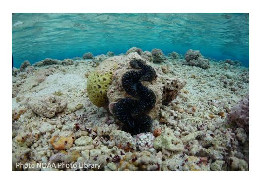
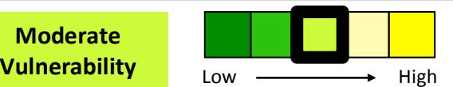
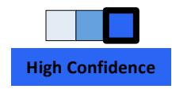
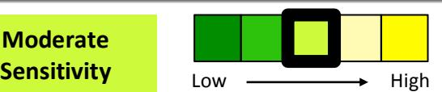
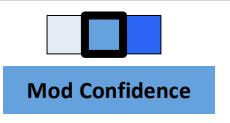
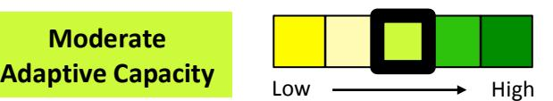
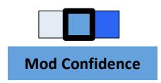

# **American Samoa Giant Clams**

#### *Climate Change Vulnerability Assessment Summary*

*An Important Note About this Document: This document represents an initial evaluation of vulnerability for giant clams based on workshop input and existing information. The aim of this document is to expand understanding of species vulnerability to changing climate conditions, and to provide a foundation for developing appropriate adaptation responses.*

#### **Species Description**

Giant clams, *Tridacna maxima*, are generally found in the Rose atoll, the North and west sides of Ta'u Island, and on the tops or slopes of the reef in shallow and clear waters. They are a traditional and culturally important American Samoa cultural heritage, the fa'a-Samoa, and have become increasing in popularity for the ornamental trade, thus are at risk to be overfished. 1 Fa'alavelave, traditional gatherings among communities and extended

families, include offerings of giant clams when available. 1 There have been some aquaculture efforts for *Tridacna sp.* in Tutuila and initiating grow-out facilities in Aunu'u and the Manu'a islands. 2 Giant clams, *Tridacna sp.* were listed vulnerable on the IUCN red List in 2006. 3

## **Species Vulnerability**

**Moderate** 

Workshop participants and expert evaluated giant clams in American Samoa to have a moderate relative vulnerability to climate change due to moderate-high sensitivity to climate and non-climate stressors, moderate exposure to future climate changes, and moderate-high adaptive capacity. Giant clams are sensitive to several climate stressors, including ocean acidification, sea surface temperature, and currents, mixing, and stratification. These stressors can directly affect recruitment and growth of giant clams. 

## **Sensitivity**

**Moderate** 

Giant clams have moderate sensitivity to several climate and non-climate stressors including ocean acidification, increased sea surface temperature, changes in currents, and over harvest. Ocean acidification will directly affect the survival and growth of giant clams reducing calcification and impairing growth and recruitment.4

| SENSITIVITY	FACTORS	AND	IMPACTS*                                                                                       |                                                                                                                                                                    |  |  |
|------------------------------------------------------------------------------------------------------------------------|--------------------------------------------------------------------------------------------------------------------------------------------------------------------|--|--|
| CLIMATE                                                                                                                | STRESSORS High sensitivity Moderate confidence                                                                                                            |  |  |
| FACTOR                                                                                                                 | IMPACT                                                                                                                                                             |  |  |
| Ocean acidification                                                                                                 | Reduced	calcification,	impairing	growth	and	recruitment.4                                                                                                          |  |  |
| Warmer	sea surface temperature                                                                                   | Possible	causing	disease.	Need	more	research	on	disease	susceptibility.                                                                                            |  |  |
| Currents/ mixing/ stratification                                                                                 | Altered	larval	dispersal,	possible	increase	in dispersal. • Altered	nutrient	delivery. •                                                               |  |  |
| DISTURBANCE	REGIMES Low-moderate	sensitivity																															Moderate	confidence                      |                                                                                                                                                                    |  |  |
| Disease/ Flood/ Tsumanis                                                                                         | Possible	impacts	causing	poor	water	quality.                                                                                                                       |  |  |
| DEPENDENCIES Low-moderate sensitivity Moderate confidence                                                     |                                                                                                                                                                    |  |  |
| FACTOR                                                                                                                 | IMPACT                                                                                                                                                             |  |  |
| Habitat Prey/forage dependency/ Generalist	or specialist                                                   | High	dependcy	to	coral	reefs	structure	but low	dependency	on • zooxanthalllae. Dependent	on	reproductive	cues. • Generalist	filter	feeders. • |  |  |
| NON-CLIMATE	STRESSORS																								Moderate sensitivity						 																												High confidence |                                                                                                                                                                    |  |  |
| FACTOR                                                                                                                 | IMPACT                                                                                                                                                             |  |  |
| Harvest                                                                                                                | Broad	harvest	excluding	Rose	Atoll.                                                                                                                                |  |  |
| Overwater/ underwater structures                                                                                 | Localized	around	airport	strip,	Otu.                                                                                                                               |  |  |
| Dredging                                                                                                               | Localized	in	the	harbors.                                                                                                                                          |  |  |

Climate change vulnerability assessment for the National Marine Sanctuary and Territory of American Samoa Copyright EcoAdapt 2016 \* Factors presented are those ranked highest by workshop participants.

#### **Exposure† Moderate Exposure** Low High **Mod Confidence**

Under future climate conditions over the next 20 years, Giant clams will experience warmer sea surface temperatures, altered precipitation, and ocean acidification which will likely affect recruitment, and survival.

| PROJECTED	CLIMATE	AND	CLIMATE-DRIVEN	CHANGES |                                                                                                                                                                                                                                                                                                                                                                                  |  |  |  |
|----------------------------------------------|----------------------------------------------------------------------------------------------------------------------------------------------------------------------------------------------------------------------------------------------------------------------------------------------------------------------------------------------------------------------------------|--|--|--|
| CLIMATE	STRESSORS                            | PROJECTED	CHANGES                                                                                                                                                                                                                                                                                                                                                                |  |  |  |
| Altered precipitation/runoff              | Extreme	rainfall	events	that	currently	occur	once	every	20	years	on • average	are	generally	simulated	to	occur	four	times	per year. Streamflow will	likely	fluctuate	with	precipitation	patterns,	but • extreme	rainfall	events	in	the	Central	South	Pacific	are	likely	to increase	in	frequency	and	intensity.	No	erosion	projections	are available. |  |  |  |
| Ocean	Acidification                          | By	2060:	aragonite	saturation	state	will	fall	below	3.5,	and	continue declining	thereafter resulting	in	reduced	calcification	and	growth.                                                                                                                                                                                                                                  |  |  |  |
| Sea	surface temperature                   | Sea	surface	temperatures	in	the	Pacific	Islands	are	projected	to increase	+1.1	to	+1.7°F	by	2030,	+1.8	to	+2.3°F	by	2055,	and	+2.5 to +4.7°F	by	2090.                                                                                                                                                                                                                   |  |  |  |

# **Adaptive Capacity‡**

**Moderate**

Giant clams are highly dependent on coral reef habitat and on current zfor dispersal but more studies need to take place to properly understand how they will be able to adapt to a changing climate. Species are highly valued and there is a management possibility increased aquaculture and seeding reefs in the future.

| Adaptive	capacity	factors	and	characteristics§         |                                     |  |  |
|--------------------------------------------------------|-------------------------------------|--|--|
| FACTOR                                                 | SPECIES CHARACTERISTICS          |  |  |
| Extent,	status,	&	dispersal	ability                    | Transboundary	species. •         |  |  |
| Moderate-high adaptive	capacity Moderate confidence | Dispersal	depends	on	currents. • |  |  |

 † Relevant references for regional climate projections can be found in the Climate Impacts Summary Table.

‡ Please note that the color scheme for adaptive capacity has been inverted, as those factors receiving a rank of "High" enhance adaptive capacity while those factors receiving a rank of "Low" undermine adaptive capacity.

§ Characteristics with a green plus sign contribute positively to adaptive capacity, while characteristics with a red minus sign contribute negatively to adaptive capacity.

| Adaptive	capacity	factors	and	characteristics§    |                                                        |  |  |
|---------------------------------------------------|--------------------------------------------------------|--|--|
| FACTOR                                            | SPECIES CHARACTERISTICS                             |  |  |
| Intraspecific/life	history	diversity              | Understudied,	yet	rapidly	declining. •              |  |  |
| Low-moderate adaptive	 capacity Low confidence |                                                        |  |  |
| Resistance                                        | Moderate	resistance;	need	more	information	on •     |  |  |
| Moderate adaptive	capacity                        | climate	impacts.                                       |  |  |
| Low confidence                                    |                                                        |  |  |
| Management	potential                              | Highly	culturally	valued	species for	food	and •  |  |  |
| Moderate-high adaptive capacity                   | shells.                                                |  |  |
| High confidence                                   | Possible	increased	aquaculture	and	seeding	reefs. • |  |  |
|                                                   | Reduce	near	shore	pollution	and	sediment	runoff. •  |  |  |

# **Literature Cited**

- 1 U.S. Department of Commerce, National Oceanic and Atmospheric Administration, Office of National Marine Sanctuaries. 2012. Fagatele Bay National Marine Sanctuary final management plan/final environmental impact statement. Silver Spring, MD. Available from http://sanctuaries.noaa.gov/management/mpr/mpr-nmsam-2012.pdf.
- 2 Fenner, D., Speicher, M., Gulick, S., Aeby, G., Cooper Aletto, S., Anderson, P., et al. 2008. The State of Coral Reef Ecosystems of American Samoa. In J. E. Waddell and A. M. Clarke (Eds.), The Status of the Coral Reef Ecosystems of the United States and Pacific Freely Associated States: 2008. NOAA Tech Memo NOS NCCOS 73. NOAA/NCCOS Center for Coastal Monitoring and Assessment, Biogeography Team (pp. 307- 351). Silver Spring, MD.
- 3 International Union for Conservation of Nature Red List. 2014. http://www.iucnredlist.org
- 4 Cheng B, Gaskin E. 2011. Climate impacts to the nearshore marine environment and coastal communities: American Samoa and Fagatele Bay National Marine Sanctuary. Marine Sanctuaries Conservation Series ONMS-11-05. U.S. Department of Commerce, National Oceanic and Atmospheric Administration, Office of National Marine Sanctuaries, Silver Spring, MD. Available from http://sanctuaries.noaa.gov/science/conservation/pdfs/fbnms\_climate.pdf.