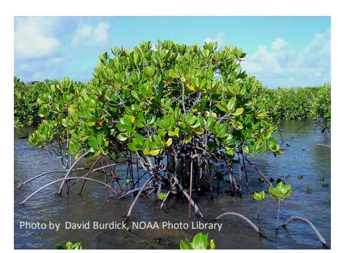
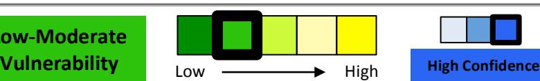
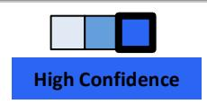
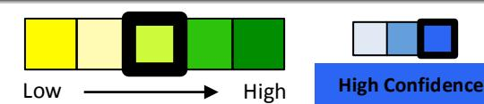
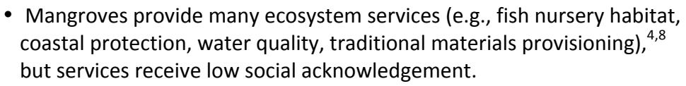

# **American Samoa Mangroves** *Climate Change Vulnerability Assessment Summary*

*An Important Note About this Document: This document represents an initial evaluation of vulnerability for mangroves based on workshop input and existing information. The aim of this document is to expand understanding of habitat vulnerability to changing climate conditions, and to provide a foundation for developing appropriate adaptation responses.*

## **Habitat Description**

Mangrove forests in American Samoa are found only on Tutulia and Aunu'u Islands, and include tidal fringing and interior/partially enclosed basin forests. They are typically found in sheltered coastal lagoons and protected areas near stream mouths. 1 Three mangrove species occur: oriental mangrove (*Bruguiera gymnorrhiza*) is the dominant species, red mangrove (*Rhizophora mangle*) can be found along seaward margins, and the puzzlenut tree (*Xylocarpus* 

*moluccensis*) is quite rare. Other mangrove forest associates include beach hibiscus (*Hibiscus tiliaceus*), fish-poison tree (*Barringtonia asiatica*), and Tahitian chesnut (*Inocarpus fagifer*). 2 Mangrove forests thrive in brackish water conditions, and provide critical habitat for a variety of fish, invertebrate, and mollusk species.3

## **Habitat Vulnerability**

**Low-Moderate** 

Workshop participants evaluated American Samoan mangroves to have a low-moderate relative vulnerability to climate change due to moderate sensitivity to climate and non-climate stressors, moderate exposure to projected future climate changes, and moderate adaptive capacity. Mangrove forests are sensitive to coastal erosion and sea level rise, which cause landward retreat, potentially leading to habitat extirpation if retreat is impossible. Earthquakes contribute to sea level changes and tsunami risk; tsunamis can severely damage mangrove systems and cause high tree mortality. Non-climate stressors play the largest role in American Samoan mangrove decline. Land use change leads to direct habitat loss, and combines with dredging and harvest to alter mangrove hydrology and sediment, nutrient, and pollutant dynamics. Additionally, roads/armoring can block landward mangrove migration, increasing habitat vulnerability to sea level rise. Significant portions of mangrove forests have been lost to human land use in American Samoa; only five stands across two islands remain, encompassing roughly 52 hectares. Mangroves may not recover from extensive alteration or mortality; when stands do recover naturally, recovery time ranges from 15-30 years. Facilitated rehabilitation has experienced varying success. As the key functional group, low mangrove diversity increases habitat vulnerability to climate change, 

although diversity amongst affiliate tree species is higher. Mangroves provide a variety of ecosystem services (e.g., biodiversity, fish nursery habitat, coastal protection), although there is low cultural recognition of these services. Mangroves are protected through several regulatory mechanisms, but a lack of enforcement undermines this legal protection.

Mangrove forests are sensitive to several climate stressors, including sea level rise and coastal erosion, which contribute to tree mortality and force landward retreat of mangrove systems. 4,5 Disturbance regimes like tsunamis also contribute to tree mortality,4 and earthquakes increase tsunami risk6 and alter relative sea levels.7 Non-climate stressors have contributed to extensive mangrove loss in American Samoa, and can exacerbate climate change impacts by blocking landward migration and altering hydrological, sediment, nutrient, and pollutant dynamics.1-5

| SENSITIVITY	FACTORS	AND	IMPACTS*                                                                               |                                                                                                                                                                                                                                                                                                                                                                                                                                                                                                                                                                                                                                                                                                                                                                                                                                                                                                     |  |  |  |
|----------------------------------------------------------------------------------------------------------------|-----------------------------------------------------------------------------------------------------------------------------------------------------------------------------------------------------------------------------------------------------------------------------------------------------------------------------------------------------------------------------------------------------------------------------------------------------------------------------------------------------------------------------------------------------------------------------------------------------------------------------------------------------------------------------------------------------------------------------------------------------------------------------------------------------------------------------------------------------------------------------------------------------|--|--|--|
| CLIMATE	STRESSORS																	Low-moderate	sensitivity																																	Moderate	confidence |                                                                                                                                                                                                                                                                                                                                                                                                                                                                                                                                                                                                                                                                                                                                                                                                                                                                                                     |  |  |  |
| FACTOR                                                                                                         | IMPACT                                                                                                                                                                                                                                                                                                                                                                                                                                                                                                                                                                                                                                                                                                                                                                                                                                                                                              |  |  |  |
| Coastal erosion                                                                                             | Alters	mangrove	sediment	surface	elevation,	potentially	increasing • vulnerability	to	sea	level	rise.4 4 Weakens	root	structures	and	can	cause	tree	fall. •                                                                                                                                                                                                                                                                                                                                                                                                                                                                                                                                                                                                                                                                                                                          |  |  |  |
| Sea	level	rise                                                                                                 | If	mangrove	sediment	surface	elevation	does	not	keep	pace	with	sea	level • rise,	resultant	shifts	in	hydroperiod,	salinity,	and	erosion	likely	to	cause retreat	of	seaward	and	landward	mangrove	margins,	or	lateral	expansion	to higher	elevations.	Mangrove	sediment	surface	elevation	dynamics	and feedbacks	with	sea	level	rise	are	poorly	understood.4,5 Inland/upland	migration	success	is	dependent	on	suitable	hydrology	and	soil • conditions	in	new	site,	water-borne	seedling	availability,	competition	with migration	barriers	(e.g.,	seawalls).4 established	vegetation, and	presence	of If	retreat	isn't	successful,	sea	level	rise	can	drastically	reduce	mangrove	area • and/or	lead	to	local	extirpation,4 increasing	coastal	hazard	risk	for	human 5,8 communities	and	reducing	water	quality,	nursery	habitat,	and	biodiversity. |  |  |  |
| DISTURBANCE	REGIMES Low-moderate	sensitivity Moderate	confidence                                         |                                                                                                                                                                                                                                                                                                                                                                                                                                                                                                                                                                                                                                                                                                                                                                                                                                                                                                     |  |  |  |
| FACTOR                                                                                                         | IMPACT                                                                                                                                                                                                                                                                                                                                                                                                                                                                                                                                                                                                                                                                                                                                                                                                                                                                                              |  |  |  |
| Tsunamis                                                                                                       | Can	severely	damage	mangrove	systems;	mass	mortality	with	minimal	tree • 4 and	sapling	survival	can	lead	to	ecosystem	conversion.                                                                                                                                                                                                                                                                                                                                                                                                                                                                                                                                                                                                                                                                                                                                                          |  |  |  |
| Earthquakes                                                                                                    | 7 Can	alter	local	land	surface	elevation,	altering relative	sea	levels. • 6 Can	cause	tsunamis. •                                                                                                                                                                                                                                                                                                                                                                                                                                                                                                                                                                                                                                                                                                                                                                                 |  |  |  |

Climate change vulnerability assessment for the National Marine Sanctuary and Territory of American Samoa Copyright EcoAdapt 2016 2 \* Factors presented are those ranked highest by workshop participants.

| SENSITIVITY	FACTORS	AND	IMPACTS* |                                                                                                                                                                                                                                                                                                                                                                                                                                           |  |  |  |
|----------------------------------|-------------------------------------------------------------------------------------------------------------------------------------------------------------------------------------------------------------------------------------------------------------------------------------------------------------------------------------------------------------------------------------------------------------------------------------------|--|--|--|
|                                  | NON-CLIMATE	STRESSORS																		Moderate-high	sensitivity High	confidence                                                                                                                                                                                                                                                                                                                                                       |  |  |  |
| FACTOR                           | IMPACT                                                                                                                                                                                                                                                                                                                                                                                                                                    |  |  |  |
| Land	use change               | Significant mangrove area	has	been lost	and filled	for development	and • 2 several	remaining	forests	are	adjacent	to	villages,	making	them agriculture; vulnerable	to	encroachment	and	conversion.1 Upland	land	use	change	may	alter	water,	sediment,	and	pollutant delivery • dynamics	to	mangrove	systems,	affecting	productivity,	mangrove	health, and 1,5 sediment	surface	elevation. |  |  |  |
| Harvest                          | 4 Affects	sediment	surface	elevation	dynamics. •                                                                                                                                                                                                                                                                                                                                                                                    |  |  |  |
| Roads/ armoring               | Seawalls,	erosion	control	structures,	and	coastal	development can	block • migration3,4 and	increase	erosion	and	scouring	of	fronting landward mangrove 4 and	down current	mangroves.                                                                                                                                                                                                                              |  |  |  |
| Dredging                         | airport	runways5 and	in Historic	dredging	occurred	to	develop Nu'uuli	Pala • Lagoon. Alters	mangrove	hydrology,	sediment,	nutrient,	and	pollutant	dynamics.5 • Dredge	spoils	could	potentially	be	used	to	enhance	mangrove	sediment • 4 accretion.                                                                                                                                                          |  |  |  |

| Exposure† | Moderate |             |                 |
|-----------|----------|-------------|-----------------|
|           | Exposure | Low High | High	Confidence |

Under future climate conditions during the next 20 years, mangroves in American Samoa are likely to be exposed to less frequent but more intense tropical storms. Although exact impacts are uncertain, increased tropical storm intensity may affect mangrove survival, health, and landscape position by altering factors such as storm surge, extreme high water levels, and precipitation patterns. 8

| PROJECTED	CLIMATE	AND	CLIMATE-DRIVEN	CHANGES |                                                                                                                                                                                                  |  |  |  |
|----------------------------------------------|--------------------------------------------------------------------------------------------------------------------------------------------------------------------------------------------------|--|--|--|
| CLIMATE	STRESSOR                             | PROJECTED	CHANGES                                                                                                                                                                                |  |  |  |
| Tropical	storms                              | Potential	reduction	in	cyclone	activity in	American	Samoa as	storm tracks	shift	toward	the	Central	North	Pacific,	but	potential	increases	in storm	intensity	over	the	next	70	years. |  |  |  |

Climate change vulnerability assessment for the National Marine Sanctuary and Territory of American Samoa Copyright EcoAdapt 2016 3 † Relevant references for regional climate projections can be found in the Climate Impacts Summary Table.

## **Adaptive Capacity**

**Moderate Adaptive** 

Mangrove forest distribution is limited and declining in American Samoa, largely due to conversion to human land uses.1-3 Mangrove recovery from disturbance takes a long time and is quite variable,8 even when facilitated by planting.9 Mangroves are the foundational species in this habitat, but mangrove diversity is low with only three species.2 Mangroves provide many ecosystem services, 4,8 although recognition of these services varies. A lack of enforcement undermines regulatory protection afforded to this habitat.1,3,10

| ADAPTIVE	CAPACITY	FACTORS	AND	CHARACTERISTICS‡         |                                                                                                                                                                                                                                                                                                                                                                                                    |  |  |
|--------------------------------------------------------|----------------------------------------------------------------------------------------------------------------------------------------------------------------------------------------------------------------------------------------------------------------------------------------------------------------------------------------------------------------------------------------------------|--|--|
| FACTOR                                                 | HABITAT	CHARACTERISTICS                                                                                                                                                                                                                                                                                                                                                                            |  |  |
| Extent,	integrity,	& continuity                     | Mangroves	occur	only	on	Tutuila	and	Aunu'u	Islands,	with	largest	forests • in Leone	Pala	Lagoon,	Nu'uuli	Pala	Lagoon,	and	on	south	side	of 1,3 Tutuila.                                                                                                                                                                                                                             |  |  |
| Moderate adaptive	capacity                          | Low	and	declining	abundance;	only	5	significant	stands of	varying • 2007.1-3 integrity remain,	encompassing	roughly	52	hectares	as	of American	Samoa	represents	the	eastern	boundary	of	mangrove	forest •                                                                                                                                                                     |  |  |
| High	confidence                                        | 3,8 distribution	in	the	Indo-Pacific.                                                                                                                                                                                                                                                                                                                                                           |  |  |
| Resistance	& recovery                               | Mangroves	are	more	resistant	to	natural	stressors	than	non-climate • stressors;	non-climate	stressors	(e.g.,	development/fill)	are	leading 2,3                                                                                                                                                                                                                                            |  |  |
| Low-moderate adaptive	capacity                      | cause	of	mangrove	decline. 8 Once	disturbed,	mangrove	recovery	time	is	long (15-30	years). • Recovery	depends	on	waterborne	seed	availability, •                                                                                                                                                                                                                                 |  |  |
| High	confidence                                        | removal/minimization	of	non-climate	stressors,8 and	extent	of	habitat 9 loss	and	alteration. Recovery	may	be	facilitated	by	planting.8,9 •                                                                                                                                                                                                                                             |  |  |
| Habitat	diversity Low-moderate adaptive	capacity | Low	mangrove	diversity:	three	foundational	species – oriental	mangrove • 2 (dominant),	red	mangrove	(seaward	margins),	puzzlenut	tree	(rare). Higher	diversity	when	considering	other	tree	associates. • Mangroves	provide	critical	habitat	for	a	variety	of	fish,	crustacean,	and • 3 fish	and	invertebrates	that	utilize	this	habitat	are	more mollusk	species; |  |  |
| High	confidence                                        | sensitive	to	climate	change	than	mangroves	themselves.                                                                                                                                                                                                                                                                                                                                             |  |  |

Copyright EcoAdapt 2016 

Climate change vulnerability assessment for the National Marine Sanctuary and Territory of American Samoa 4 ‡ Please note that the color scheme for adaptive capacity has been inverted, as those factors receiving a rank of "High" enhance adaptive capacity while those factors receiving a rank of "Low" undermine adaptive capacity.

## **ADAPTIVE CAPACITY FACTORS AND CHARACTERISTICS‡**

*Management potential*

Moderate adaptive capacity

- Protected under Federal Coastal Management Zone Acts (1972, 1990). 1,3 Nu'uuli Pala Leone Pala Lagoon also protected as Special Management Areas, which regulates shoreline activities and development.3,10
- Although protected, protection enforcement varies. 3
- Mixed success in mangrove rehabilitation.9
- Workshop participants identified the following management options for mangroves: replanting, removing trash, reducing stormwater, and enforcing protection.

## **Literature Cited**

- 1 American Samoa Community College Forestry Program. 2010. American Samoa forest assessment and resource strategy 2011-2015. American Samoa Community College, Division of Community and Natural Resources, Forestry Program, Pago Pago, American Samoa. Available from http://www.wflccenter.org/islandforestry/americansamoa.pdf
- 2 Bardi E, Mann SS. 2004. Mangrove inventory and assessment project in American Samoa. Phase 1: Mangrove delineation and preliminary rapid assessment. Technical Report 40. American Samoa Community College, Division of Community and Natural Resources, Pago Pago, American Samoa. Available from http://www2.ctahr.hawaii.edu/adap2/ASCC\_LandGrant/Dr\_Brooks/TechRepNo40.pdf.
- 3 U.S. Department of Commerce, National Oceanic and Atmospheric Administration, Office of National Marine Sanctuaries. 2012. Fagatele Bay National Marine Sanctuary final management plan/final environmental impact statement. Silver Spring, MD. Available from http://sanctuaries.noaa.gov/management/mpr/mpr-nmsam-2012.pdf.
- 4 Gilman EL, Ellison J, Duke NC, Field C. 2008. Threats to mangroves from climate change and adaptation options: A review. Aquatic Botany **89**:237–250.
- 5 Gilman E, Ellison J, Coleman R. 2007. Assessment of mangrove response to projected relative sea-level rise and recent historical reconstruction of shoreline position. Environmental Monitoring and Assessment **124**:105–130.
- 6 Geist E, Kirby S, Ross S, Dartnell P. 2009. Samoa disaster highlights danger of tsunamis generated from outer-rise earthquakes. Sound Waves: Coastal Science and Research News from Across the USGS **FY 2010**:14–16. Available from http://soundwaves.usgs.gov/2009/12/SW200912-100.pdf
- 7 Gilman E, Ellison J, Sauni I, Tuaumu S. 2007. Trends in surface elevations of American Samoa mangroves. Wetlands Ecology and Management **15**:391–404.
- 8 Gilman E et al. 2006. Pacific Island mangroves in a changing climate and rising sea. UNEP Regional Seas Reports and Studies 179. United Nations Environment Programme, Regional Seas Programme, Nairobi, Kenya. Available from http://www.unep.org/PDF/mangrove-report.pdf.
- 9 Gilman E, Ellison J. 2007. Efficacy of alternative low-cost approaches to mangrove restoration, American Samoa. Estuaries and Coasts **30**:641–651.
- 10 American Samoa Coastal Management Program. 2008. Coastal and estuarine land conservation plan for the territory of American Samoa. Available from https://coast.noaa.gov/czm/landconservation/media/celcpplanasdraft.pdf.