# **Pacific Island Ecosystems Research Center**

**Trip Report: Pilot Study of Factors Linking Watershed Function and Coastal Ecosystem Health in American Samoa** 

By Carter T. Atkinson and Arthur C. Medeiros

# U.S. Department of the Interior

# **U.S. Geological Survey**

# **U.S. Department of the Interior**

Gale A. Norton, Secretary

# **U.S. Geological Survey**

P. Patrick Leahy, Acting Director

U.S. Geological Survey, Reston, Virginia 2005 Revised and reprinted: 2005

For product and ordering information:

World Wide Web: http://www.usgs.gov/pubprod

Telephone: 1-888-ASK-USGS

For more information on the USGS—the Federal source for science about the Earth, its natural and living resources, natural hazards, and the environment:

World Wide Web: http://www.usgs.gov

Telephone: 1-888-ASK-USGS

# Suggested citation:

Atkinson, C.T. and A.C. Medeiros, 2005. Trip Report: Pilot Study of Factors Linking Watershed Function and Coastal Ecosystem Health in American Samoa. USGS-Pacific Island Ecosystem Research Center Open File Report.

Any use of trade, product, or firm names is for descriptive purposes only and does not imply endorsement by the U.S. Government.

Although this report is in the public domain, permission must be secured from the individual copyright owners to reproduce any copyrighted material contained within this report.

# **Contents**

| Introduction 4                                                            |
|------------------------------------------------------------------------------|
| Research and Monitoring in American Samoa 6                               |
| Ridge to Reef - An Exisiting Paradigm for American Samoa  8            |
| Research Opportunities for USGS in American Samoa 11                      |
| Summary 11                                                                |
| Acknowledgements  11                                                   |
| Literature Cited 12                                                       |
| Appendix: Travel Itenerary in American Samoa 13                           |
| American Samoa Contacts 17                                                |
| Figures                                                                      |
| 1. Location of American Samoa in the South Pacific  5                  |
| 2. Landscape Photos of American Samoa  7                               |
| 3. Benthic habitats and major watersheds  9                            |
| 4. Population centers and landslide hazards on Tutuila 9                  |
| 5. Typical land-use practices in American Samoa  10                    |
| 6. Marine and Terrestrial Protected Areas  11                          |
| 7. Spatial distribution of existing monitoring programs on Tutuila  11 |
| 7. Marine and Terrestrial Protected Areas  11                          |
| 8. Falcataria distribution on Tutuila  11                              |

| 9. Apparent but unproven association between Falcataria and landslides 11                 |
|----------------------------------------------------------------------------------------------|
| Tables                                                                                       |
| 1. Agencies conducting environmental research and monitoring in American Samoa .  5 |
| 2. Examples of CRAG-supported coral reef projects  7                                   |
|                                                                                              |

# **Trip Report: Pilot Study of Factors Linking Watershed Function and Coastal Ecosystem Health in American Samoa**

# **Introduction**

 This report assesses the potential need for an interagency effort to address the management and functioning of watersheds and their relationship to the integrity of near shore marine ecosystems and resources in American Samoa. The global demands of growing human populations are changing the dynamics of watersheds. These changes, usually involving increased or modified nutrient and sediment movement, marginalize the sustainability of both near shore and off shore marine resources. Though this trend is widely recognized, empirical data that documents these changes and assesses the effects of specific management actions is often lacking.

The Ridge to Reef Program is an interdisciplinary effort by the USGS-Western Region to to develop a process-oriented study of watersheds and ecosystems in the tropics. One goal of the program is to provide scientific information to resource managers on tropical islands that can be used to stem watershed degradation associated with alien species, erosion, and loss of biodiversity. These terrestrial stressors have a direct effect on coastal sedimentation, reef degradation, and fisheries collapse and there is an increasing need for both intensive multidisciplinary watershed-scale studies and long-term monitoring to assess the stability and sustainability of these resources as management issues increase in scope and complexity. The USGS can serve a vital role in assisting both land- and marine-based organizations to better understand the dynamics of these interactions.

The Samoan Archipelago is a volcanic chain of three larger islands and five smaller islands located roughly in the center of the South Pacific, 14o south of the equator and on the western edge of Polynesia (Figure 1). The archipelago is divided into two political entities, the U.S. Territory of American Samoa in the east and the neighboring country of Samoa in the west. Nearby high island groups include the Cook Islands (800 km to the east) and Tonga (500 km to the southwest).

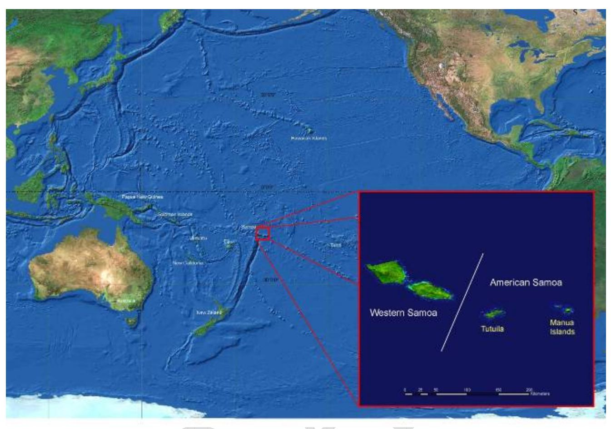

Figure 1. Location of the Samoan Archipelago and islands of American Samoa in the south central Pacific.

 American Samoa consists of one large island (Tutuila), four smaller islands (Aunu'u, Ofu, Olosega, and Ta'u) two remote atolls (Rose, Swains) and has a total land area of approximately 197 km2 . The highest elevations in the islands are at Mt. Lata on Ta'u (945 m) and Matafao Peak on Tutuila (653 m). The islands date to the Pliocene and were formed as hot-spot shield volcanoes, with older more deeply eroded islands located on the western end of the chain (Stearns, 1944). Tutuila has been extensively eroded into a central ridge of steep mountains that drop abruptly to a sinuous coastline with little or no coastal plain. Ofu, Olosega, and Ta'u are less extensively eroded and have topography that is more characteristic of younger shield volcanoes. Land available for agriculture, roads, and development on all the islands is limited to a narrow strip between the ocean and the mountains, with most steeper slopes cloaked with dense tropical forest (Figure 2).

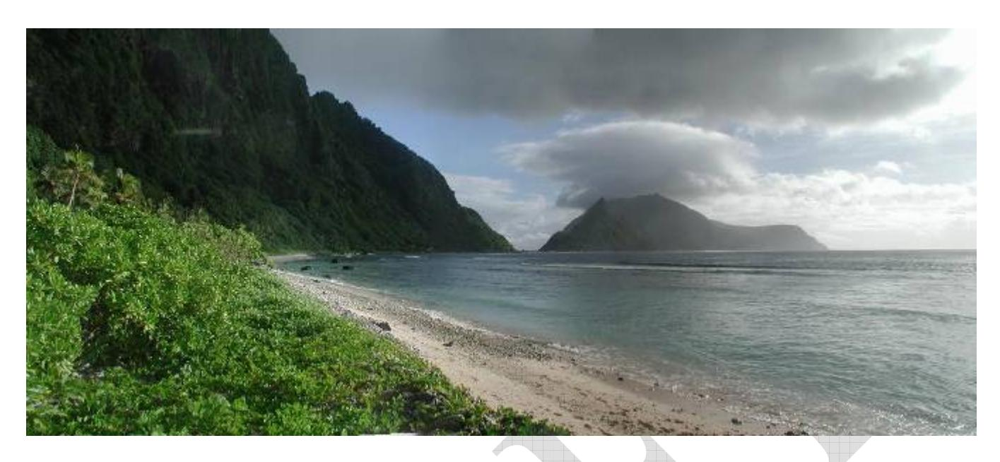

Figure 2. North coast of Olosega Island looking west toward Ofu. Most of the islands in American Samoa have steep slopes, narrow fringing reefs and few permanent streams.

 Located in the tropics, the islands are hot, humid, and rainy throughout the year, but there is a long, wet summer season (October – May) and a shorter, slightly cooler and drier winter season (June – September). Total rainfall varies throughout the islands because of orographic effects associated with topography and ranges from approximately 318 cm/year at the Tafuna airport on Tutuila to more than 500 cm/year in some of the more mountainous areas of Tutuila and Ta'u (Izuka et al. 2005). The older islands (Tutuila, Ofu, Olosega) are dissected by numerous stream drainages, but their average length is short and few permanent streams are present in spite of high annual precipitation (Craig 2002).

The terrestrial flora and fauna in American Samoa is mostly indigenous, with representatives on nearby archipelagoes. The flora of these islands is similar to, but less diverse than the flora of continental areas of Southeast Asia. Farther east, island and archipelago level endemism increases as do species whose ancestors originated in New Zealand and the Americas (Muellor-Dombois and Fosberg 1998). Overall terrestrial diversity in American Samoa is relatively low due to the remote location of the archipelago and its small total land area (Craig 2002). This relatively low species diversity is also due to the general absence of the species radiations that mark more isolated archipelagoes of the central and eastern Pacific, especially Hawai'i. Despite this and with the exception of Hawai'i, the native Samoan flora is the largest in Polynesia consisting of 550 angiosperm species in 300 genera and 228 pteridophyte species (Whistler 2002). Endemic species in the Archipelago include one bird (Samoan Starling, *Aplonis atrifusca*) and about 32% of local plant species.

Whistler (2002) recognized six categories of terrestrial vegetation in the Samoan Archipelago, with littoral and wetlands vegetation on the coast and upland areas composed of rain forest, upland scrub vegetation, volcanic, and disturbed vegetation . Lowland rain forest (<500m) was further subdivided into five types largely determined by substrate age and weathering (Muellor-Dombois and Fosberg 1998). Cloud forest in American Samoa is not found on the larger but lower elevation island of Tutuila but is restricted to small but steep sided islands of Ta'u and Olosega which reach higher elevations.

Total reef area in the Territory of American Samoa is approximately 296 km2 , consisting primarily of narrow fringing reefs (85%) along the steep slopes of the main islands, several offshore banks (12%) and two atolls (3%) (Birkeland et al. 2000) (Figure 3). Diversity of marine species in Samoa is remarkably high relative to terrestrial habitats with 890 species of coral reef fish, over 200 coral species, and a rich assemblage of other invertebrates (Craig et al. 2005).

The diversity of marine and terrestrial biota coupled with relatively high elevations and a patchwork of human land use makes these islands an ideal place to conduct integrative research on the effects of watershed function on coastal ecosystem health. The integrity of watersheds in American Samoa is strongly influenced by human population growth and development along the coastal areas of Tutuila (Figure 3). While Polynesians have lived on the islands for over 3,000 years, population growth during the past 50 years is creating significant stress on terrestrial and coral reef resources (Craig et al. 2002). The current population in the Territory is approximately 65,000 and growing rapidly at a rate of 2% a year. Over 96% of the people live on Tutuila, with major population centers around Pago Pago harbor and on the Tafuna plain on the southern part of the island that approach densities of up to 1350 people per km2 (Craig et al. 2002). Outside of these population centers, residents are scattered in coastal villages and settlements, primarily along the southern coastlines of all of the islands. Because of the steep topography and lack of roads, substantial areas of the northern coastline of Tutuila are uninhabited and still relatively remote. The steep slopes which characterize much of American Samoa tend to restrict human habitation and most people live within several hundred yards of the shoreline (Figure 4). Many islanders still live a subsistence lifestyle that depends on smallscale agricultural plots of bananas, taro, cassava, coconut, and sweet potatoes. Of necessity, these plots are usually located just inland of villages in and adjacent to disturbed vegetation and lowland rain forest on slopes that sometimes exceed 45 degrees (Figure 5).

Overfishing, point and non-point source pollution from storm water run-off, and erosion from agricultural plots and urban development are all contributing to the decline of American Samoa's coral reef resources (Craig et al. 2002). Other factors include damage from hurricanes, at least one major infestation of the Crown of Thorns starfish (*Acanthaster planci*) in the late 1970's, shipwrecks, and recent increases in the frequency and severity of both coral bleaching events and coral diseases (Craig *et al*. 2005). In spite of these stresses, the overall condition of reefs in the territory is mixed (Craig *et al*. 2005). There has been notable coral regrowth after five major hurricanes over the past 20 years (1986, 1990, 1991, 2004, 2005), removal of shipwrecks off local reefs, and improvements in water quality in Pago Pago Harbor. On the other hand, overfishing of local reefs and lack of enforcement in existing protected areas continues to be a major problem. Somewhat surprisingly, some of these declines in coral reef health are also occurring in the lightly populated islands of Ofu, Olosega, and Tau where terrestrial ecosystems are relatively intact and where human population growth and development are not major environmental stresses.

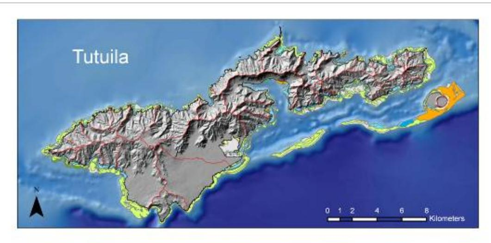

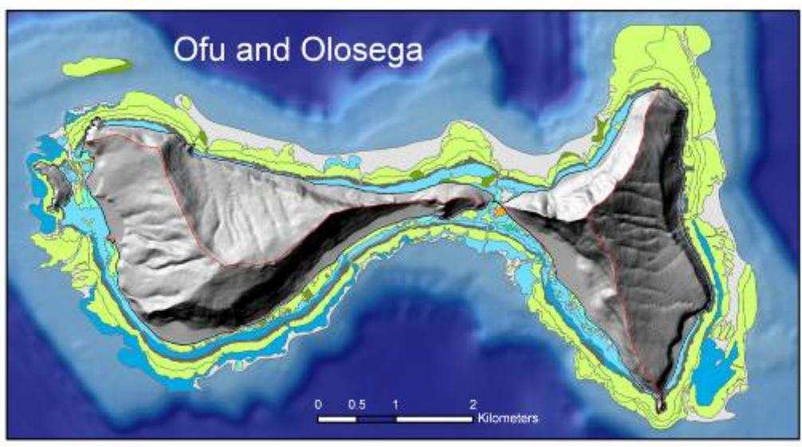

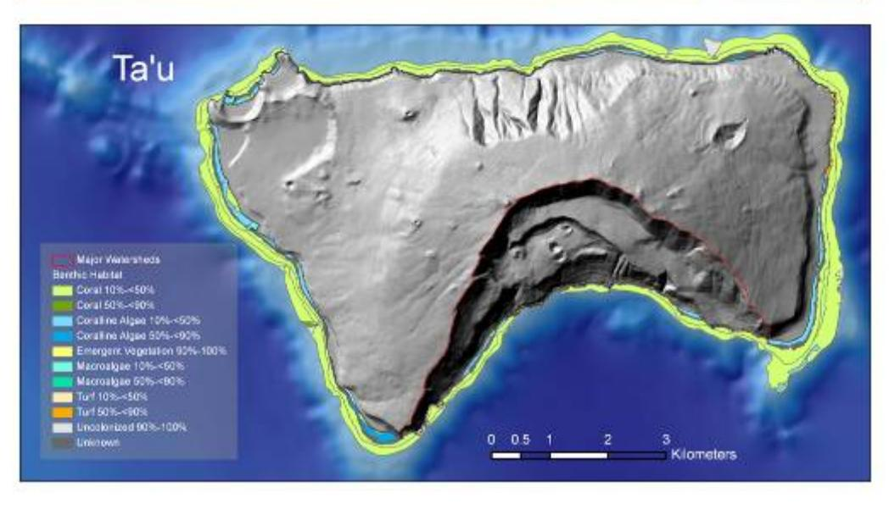

Figure 3: Benthic habitats and major watersheds on the three main islands of American Samoa

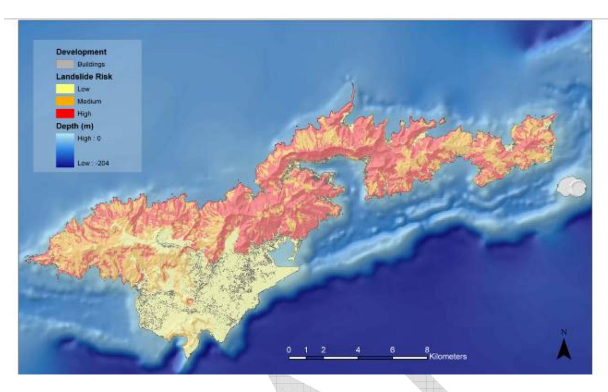

Figure 4: Population centers and landslide hazards on Tutuila.

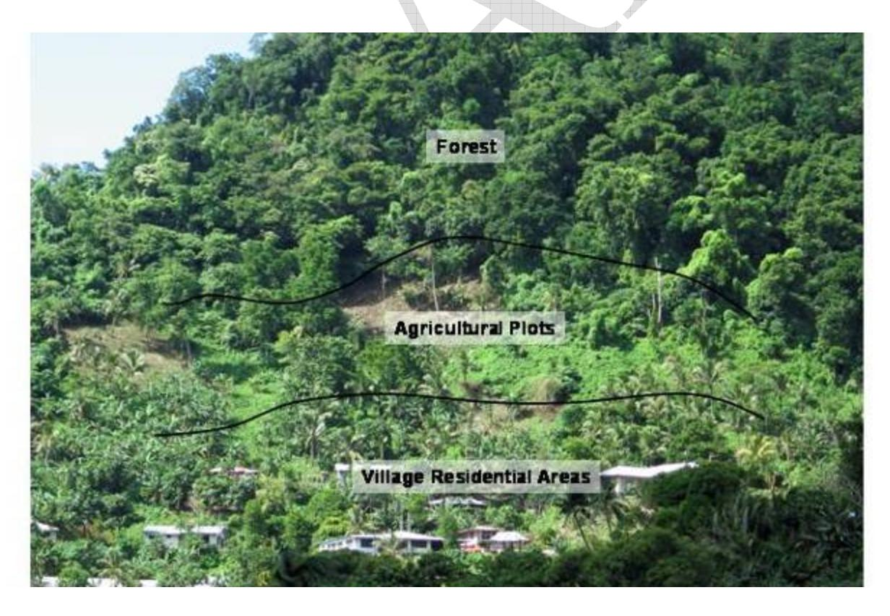

Figure 5: Typical land use practices in American Samoa. Agricultural plots are commonly located on steep slopes immediately behind village residences.

In spite of these problems, there are significant opportunities for conservation of marine and terrestrial natural resources in American Samoa. Established marine conservation areas in the territory include Rose Atoll National Wildlife Sanctuary (U.S. Fish and Wildlife Service), Fagatele Bay National Marine Sanctuary (National Oceanic and Atmospheric Administration), the National Park of American Samoa (National Park Service), and a number of smaller community based marine protected areas (Figure 6). The largest coral reef conservation areas on the main islands are part of the National Park of American Samoa which was authorized by Congress in 1988 and officially established in 1993. Terrestrial and marine units on Tutuila, Ofu, Olosega, and Ta'u are managed as 50 year leases from villages on each island. Proposed NPS additions on Ofu and Olosega would increase the Park size by 30%. This unusual arrangement between NPS and local villages provides a yearly income for villages that hold the leases and at the same time helps provide protection for these unique natural resources. Coupled with environmental education and outreach programs operated by the National Park Service and various departments in the American Samoa government, the arrangement has outstanding potential for reinforcing cultural and historical links that the people of American Samoa have with the unique natural resources of the archipelago.

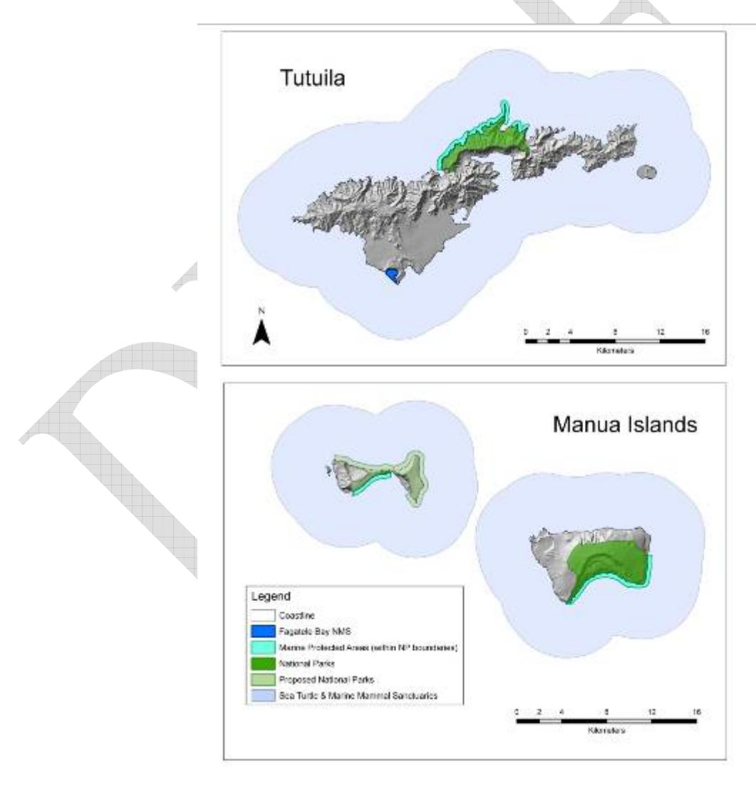

Figure 6. Marine and Terrestrial Protected Areas in American Samoa.

# **Research and Monitoring in American Samoa**

We conducted a site visit to American Samoa from June 24 to July 3, 2005 to meet with potential partners and collaborators and to learn more about existing terrestrial and coral reef research and monitoring in the territory. We arranged to meet with contacts at the National Park of American Samoa (NPSA), American Samoa Department of Marine and Wildlife Resources (DMWR), Department of Commerce (DOC), American Samoa Environmental Protection Agency (ASEPA), National Oceanic and Atmospheric Administration – Fagatele Bay National Marine Sanctuary (NOAA), U.S. Department of Agriculture Natural Resource and Conservation Service (NRCS), U.S. Department of Agriculture, Forest Service (USDA-FS), and U.S. Department of Agriculture, and Land Grant, American Samoa Community College (USDA-Land Grant). Prior to the site visit, we also met with USGS and U.S. Fish and Wildlife Service staff. Other organizations and Universities have a long history of work in the region and include the Bishop Museum and the USGS Hawai'i Cooperative Fisheries Unit.

Table 1. Agencies and organizations conducting environmental research and monitoring in American Samoa.

| Agency                                                                  | Ongoing or Past Activity                                                                                                            | References                                                                               |
|-------------------------------------------------------------------------|----------------------------------------------------------------------------------------------------------------------------------------|------------------------------------------------------------------------------------------|
| American Samoa Invasive Species Team (ASIST)                         | Ongoing surveys, monitoring, and control of selected invasive species                                                         |                                                                                          |
| Bishop Museum                                                           | Past marine surveys for introduced benthic organisms                                                                             | Coles et al. 2003                                                                        |
| National Park of American Samoa (NPSA)                               | Subsistence fishing by creel survey, fish, coral, invertebrate belt transects, terrestrial surveys for invasive species | Craig 2002, Craig et al. 2005, Craig and Basch 2001, Whistler 1992, 1994, 1995. |
| American Samoa Department of Marine and Wildlife Resources (DMWR)    | Expert Fish Surveys, Expert Coral Surveys, Inshore Creel Surveys, terrestrial studies of birds, bats, plants               | Green 1996, Wilson 2002, Mundy 1996, Page 1988, Fisk and Birkeland 2002         |
| Land Grant, American Samoa Community College                         | Outreach and public education                                                                                                       |                                                                                          |
| American Samoa Department of Commerce (DOC)                          | Outreach and public education, targeted projects on economic values of coral reefs in American Samoa                       | Cornish and Wilson 2002                                                               |
| National Oceanic and Atmospheric Agency (NOAA) Fagatele Bay National | Permanent marine transects, coral, fish,                                                                                            | Birkeland et al. 1987, 1988, Green et al.                                             |

| Marine Sanctuary                                                              | macroinvertebrate,                                                                                                                                                                                                  | 1999                                                                                                                       |
|-------------------------------------------------------------------------------|---------------------------------------------------------------------------------------------------------------------------------------------------------------------------------------------------------------------|----------------------------------------------------------------------------------------------------------------------------|
|                                                                               | algal surveys.                                                                                                                                                                                                      |                                                                                                                            |
| NOAA Fisheries – Coral Reef Ecosystem Investigation                        | Rapid assessment of a large number of sites for fish, hard corals, octocorals, algae, macroinvertebrates, towed diver habitat/fish surveys, deeper habitat and oceanographic monitoring, | Brainard et al. 2002, NOAA 2005                                                                                         |
| U.S. Geological Survey – Pacific Island Ecosystems Research Center (PIERC) | Terrestrial surveys for avian disease                                                                                                                                                                            | Atkinson et al. 2006, Jarvi et al. 2002.                                                                                |
| U.S. Geological Survey – National Wildlife Health Center (NWHC)            | Coral disease surveys                                                                                                                                                                                               | Work and Raymeyer 2002                                                                                                  |
| U.S. Geological Survey – Hawaii Cooperative Fishery Unit                   | Aua Transect Surveys                                                                                                                                                                                                | Green et al. 1997                                                                                                          |
| U.S. Geological Survey – Pacific Islands Water Science Center              | Ongoing stream gaging and climate monitoring                                                                                                                                                                  | Eyre 1994, Izuka 1996, Izuka 1997, Gingerich et al. 1998, Izuka 1999a, 1999b, Izuka 2005, Izuka et al. 2005 |
| U.S. Fish and Wildlife Service (USFWS)                                        | Stream faunal surveys                                                                                                                                                                                               |                                                                                                                            |
| American Samoa Environmental Protection Agency (ASEPA)                     | Beach and stream water quality monitoring,                                                                                                                                                                    | Winger 2004                                                                                                                |
| U.S. Department of Agriculture Natural Resouce Conservation Service (NRCS) | Landslide hazards, point source pollution and erosion                                                                                                                                                         |                                                                                                                            |
| U.S. Department of Agriculture Forest Service (FS)                         | Sustainable forestry practices                                                                                                                                                                                   |                                                                                                                            |

**American Samoa Department of Commerce:** The American Samoa Department of Commerce is interested in the long-term sustainability of coral reef resources in the territory because of their importance as a resource for both subsistence and commercial fisheries. The Department is actively engaged in sponsoring research projects with a number of Universities to assess public awareness of the economic and biological significance of coral reef resources in the islands and to develop strategies for ensuring their long term sustainability.

**American Samoa Environmental Protection Agency:** ASEPA is actively engaged in long term stream and beach water quality monitoring in American Samoa. This has involved monthly assessments of water hydrography (pH, turbidity, temperature, dissolved oxygen), water chemistry (total nitrogen, total phosphorus, nitrate, ammonium) and fecal bacterial contamination in selected perennial streams on Tutuila (Craig et al 2005). Goals are to establish a water quality database that will identify water quality trends, identify sources of pollution, document the impacts of development and land-based activities on water quality, and document the effects of

demonstration projects and regulatory requirements on quality of land-based discharges and pollution sources. More recently, ASEPA has been collaborating with Centers for Disease Control (CDC) on surveying streams for contamination with *Leptospira* and its contribution to high case rates of Leptospirosis in the local population. Their findings suggest a strong association between piggeries, contact with stream water, and contact with local dogs as primary factors driving high incidence of the disease in American Samoa. There are extraordinary opportunities for coordinating these stream data with assessments of coral reef health as part of the CRAG coral reef monitoring program.

**American Samoa Invasive Species Team (ASIST):** The National Park plays a significant role in the American Samoa Invasive Species Team (ASIST), a multiagency organization (NPS, DMWR, DOC, ASEPA, CRAG) that is working to prevent new introductions of invasive species and to eradicate insipient species as they are detected.

**American Samoa Department of Marine and Wildlife Resources:** The Department of Marine and Wildlife Resources is the primary agency in American Samoa responsible for management of marine and terrestrial resources throughout the territory. Ongoing research and monitoring programs focus on coral reef and fisheries resources, creel surveys, marine mammals and turtles, birds, bats, and long-term studies of the phenology of vegetation plots throughout the territory. The Department also has an active outreach program with educational materials for local schools. Program goals include monitoring of natural variability and long-term trends in reef ecosystems, acquisition of information on status of stocks of key reef fishery resources, acquisition of information on abundance of key finfish and invertebrate fishery species, acquisition of information on exploitation rates of key reef fishery resources, formulation of management recommendations, and development of an inshore fisheries/coral reef fisheries management plan.

**National Oceanic and Atmospheric Association:** The National Oceanic and Atmospheric Association manages the Fagatele Bay National Marine Sanctuary on the southeastern coast of Tutuila and also sponsors shallow water multibeam bathymetric surveys, submersible dives, and coral, fish, macro-invertebrates and algal monitoring, and public outreach through the NOAA Coral Reef Ecosystem Investigation (CREI) monitoring program (NOAA Fisheries). Coral reef monitoring goals at Fagatele Bay have focused on determining harvest trends in subsistence fisheries in the Sanctuary and impacts of illegal fishing, changes in condition of reef ecosystems over time, impacts of snorkelers/divers/fishing on coral and impacts of pollutants from the Fogagogo outfall. Monitoring goals of the CREI ecological assessment and monitoring program are more regional and include documentation of baseline conditions of the health of coral reefs in the U.S. Pacific Islands, refining species inventory lists for these island areas, monitoring reef impacts over time to quantify natural and anthropogenic impacts, documenting natural temporal and spatial variability in reef communities, and improving understanding of linkages among species, trophic levels, and surrounding environmental conditions.

**National Park of American Samoa:** Since its formation in 1994, the National Park of American Samoa has been increasing in size and management capacity, with marine and terrestrial units on Tutuila, Ofu, Olosega and Ta'u. NPSA currently manages over 105 hectares, including 25 hectares of offshore marine regions and about 80 hectares of terrestrial ecosystems, primarily native rain forests and including entire watersheds, on the four of the largest islands of American Samoa. The park may expand on Ofu by addition of new units on the north slope and fringing

reefs. NPSA is currently developing monitoring programs for reef fishes, coral, and water quality to provide specific answers to questions about impacts of fishing pressure on park resources, effects of non-point source pollutants on water quality, and effects of global warming on coral. More recently, NPSA established a series of vegetation plots in the Ta'u unit of the park in 2004 that are currently being resampled to measure effects of hurricane Olaf in February 2005.

**U.S. Department of Agriculture – Natural Resource Conservation Service:** The Natural Resource Conservation Service has active programs to promote responsible surface water management and water quality near piggeries in American Samoa and to promote responsible erosion control during subsistence farming on steep slopes. NRCS has produced detailed maps of landslide hazards on Tutuila and has an active interest in the effects of erosion and non-point source agricultural pollution on coral reef health.

**USGS-Hawaii Cooperative Fishery Unit:** The U.S. Geological Survey Hawaii Cooperative Fishery Unit, based at the University of Hawaii, Manoa, has been conducting research and monitoring activities in American Samoa for over 20 years. These include monitoring along established transects in Fagatele Bay National Marine Sanctuary to assess damage from Crown of Thorns Starfish outbreaks and hurricanes, surveys in Pago Pago Harbor to monitor long-term changes in coral reef communities, and research at the Ofu unit of the National Park of American Samoa to investigate resiliency of coral reef communities to temperature changes associated with global warming.

**USGS – National Wildlife Health Center:** The U.S. Geological Survey – National Wildlife Health Center, Honolulu Field Station has been conducting surveys to determine the distribution and incidence of coral diseases in waters around Tutuila, Ofu and Ta'u.

**USGS-Pacific Island Ecosystems Research Center:** The U.S. Geological Survey – Pacific Island Ecosystems Research Center conducted terrestrial surveys of vector-borne avian diseases on Tutuila, Ofu, Olosega and Ta'u in collaboration with the National Park of American Samoa and the Department of Marine and Wildlife Resources between 2001 and 2005 and is currently collaborating with the Department of Marine and Wildlife Resources on surveys of avian blood parasites in Western Samoa, Fiji and New Caledonia. The Center has also provided technical assistance to the National Park of American Samoa on monitoring and prevention of invasive species in the territory.

**USGS-Pacific Islands Water Science Center:** The U.S. Geological Survey Pacific Islands Water Science Center has a long history of investigating water resources in American Samoa. Activities have included operation of stream gaging stations and climatological stations on Tutuila and studies of ground water quality.

**U.S. Fish and Wildlife Service:** The U.S. Fish and Wildlife Service has conducted sporadic monitoring at Rose Atoll National Wildlife Refuge that includes permanent coral transects and monitoring of opportunistic invasive algal and cyanobacteria species associated with remains of a Taiwanese fishing vessel that grounded in 1993. More recently (2004), the agency has collaborated with the American Samoa EPA to complete fresh water stream surveys in 8 watersheds around Tutuila in an effort to link stream water quality and faunal diversity with coral reef health (G. Smith, personal communication). Final reports and analyses are still pending, but they indicate that diversity of fresh water fauna in Samoan streams is remarkably high, with most streams effected by pollution and development only in their last few hundred yards before discharging to the ocean.

# **Ridge to Reef – an Existing Paradigm for American Samoa**

We observed a high degree of interagency collaboration and communication, pro-active outreach programs, and public support for coral reef conservation programs in Samoa. Central to these efforts is the Coral Reef Advisory Group (CRAG), a collaborative effort between DMWR, DOC, ASEPA, ASCC, and NPSA. This group works together "by mutual consensus to manage coral reefs in American Samoa by planning achievable programs, identifying and collaborating with other partners, obtaining funding for project, tracking project compliance, promoting public awareness, and developing local capacity for eventual self-sustainability" (CRAG Mission Statement, *http://doc.asg.as/crag/About\_CRAG.htm*). While initially an informal working body with ties to the Coral Reef Initiative (CRI), it is now an official advisory task force of the territorial Governor's office.

CRAG and the Coral Reef Initiative are actively sponsoring both research and monitoring in key offshore areas around American Samoa. This builds on a long history of coral reef monitoring efforts in the archipelago that extend as far back as 1917 (Craig et al. 2005). An integrated coral reef monitoring plan is currently in the process of being implemented at 11 core sites distributed around Tutuila, based on a workshop that was held in 2002 to integrate existing monitoring in the Territory and to identify core sites for targeted long-term studies (Cornish and Wilson 2002) (Figure 7). One goal of this plan is to develop a management driven program that is achievable with on-island staff and resources and that is resilient to staff turnover. It will be closely tied to individual agency monitoring efforts, e.g. DMWR Inshore Creel Survey, as well as the Community-based Fisheries Management Program at DMWR. Variables that will be measured include coral condition, algal condition, fish, macro-invertebrates, water quality, anthropogenic damage, and weather (Craig et al. 2005).

CRAG also funds a number of projects that directly support conservation of American Samoa's coral reefs. These range from basic research and monitoring to efforts to development of public coral reef education strategies for the Territory (Table 2)

Partner organizations within CRAG recognized early on that outreach and public education are essential for long-term conservation of coral reef resources in the territory. Partner organizations within CRAG invest substantial resources on outreach efforts. Some examples include support for printing the Natural History Guide to American Samoa in both English and Samoan, Teachers' Challenge Awards which provide small grants to teachers for materials and supplies necessary to carry out coral reef lessons, a series of brochures on key threats to Samoan reefs, a monthly column in the local newspaper, posters, newsletters, local advertising and local radio and television spots.

 CRAG is the common thread/clearinghouse for coral reef information and research in American Samoa with strong links to policy makers in the American Samoan government. Members of this *ad hoc* organization recognize the value of integrated research and have a history of encouraging collaborations between researchers interested in coral reef biology, terrestrial ecosystems and the natural links between the two. These linkages are already occurring in locations throughout the territory, particularly when terrestrial research occurs in watersheds with near-shore coral reef monitoring/research studies. An example of these interactions is a joint project between the American Samoa EPA and the U.S. Fish and Wildlife Service to link water quality, stream faunal surveys and coral reef health in 8 selected watersheds around Tutuila.

Table 2. Examples of CRAG-supported coral reef projects (http://doc.asg.as/crag/About\_CRAG.htm).

| Title                                                                                                                                                                                                             | Investigators                                                |
|-------------------------------------------------------------------------------------------------------------------------------------------------------------------------------------------------------------------|--------------------------------------------------------------|
| Genetic research on corals to determine temperature-tolerant adaptations                                                                                                                                       | Chuck Birkeland (USGS) and Lance Smith (UH-Manoa)         |
| Mycosporine-like amino acids study to determine if corals in different habitats exhibit different                                                                                                              | Eric Meilbrecht (Emeral Coast Consulting)                    |
| levels or types of "sunscreen" Incidence of coral disease around the islands of American Samoa                                                                                                              | Greta Abey (UH-Manoa) and Thierry Work (USGS)             |
| Quantification of the influence of the near shore hydrodynamics and broad scale ocean circulation patterns on coral population dynamics and larval dispersal between reefs and Marine Protected Areas | Eric Treml (Duke University)                                 |
| Development of a long-term coral reef fishery management plan for the Territory of American Samoa                                                                                                           | Stacey Kilarski (University of California, Santa Barbara) |
| Bridging the gap between science and stakeholders: a synthesis of technical studies for laymen use                                                                                                          | Edgar Rudberg (University of Miami)                          |
| Development of a coral reef education strategy for American Samoa                                                                                                                                              | Rachel Turner (University of Newcastle)                      |

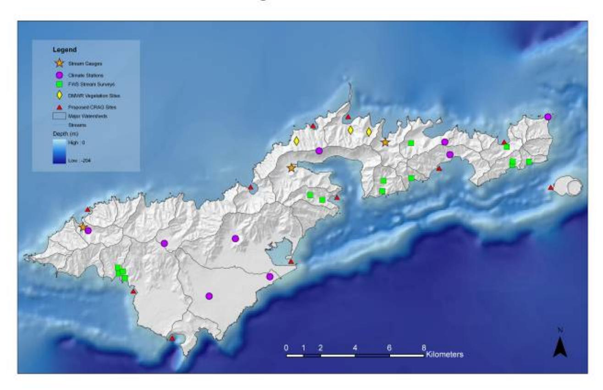

Figure 7: Approximate locations of current research and monitoring projects on Tutuila Island.

# **Research Opportunities for USGS in American Samoa**

The USGS is currently conducting studies in Hawai'i to assess conditions that lead to high levels of sediment movement from island watersheds onto reefs and to evaluate the impact of sediment on reef habitat. Examples include collaborative studies among federal, state and local partners to assess the impact of feral goats and pigs and invasive plants on erosion of soil in the upper reaches of island watersheds on the south slopes of Molokai and in the Hanalei River watershed on Kauai. In conjunction with this USGS and partner organizations are also monitoring stream runoff, sediment load, and water quality during storm events, developing Landscape Erosion Vulnerability Maps that integrate slope, soil type, land use and land cover characteristics and conducting studies of sediment transport on large reef flats off the south shore of Molokai (Rogers et al. 2005, Ogston et al. 2004). Together, these studies will permit watershed-scale simulations of sediment erosion, transport and discharge onto coral reefs and will be linked to ongoing efforts to monitor coral reef diversity and health in these study areas.

 USGS studies in Hawaii are directly applicable to ongoing integrated projects in American Samoa. Potential links between Hawaii and Samoa include 1) terrestrial studies of the impacts of invasive plant species and feral ungulates on erosion and water quality, particularly as the NPS begins efforts to manage these species, 2) use of remote sensing/vegetation mapping for delineating natural communities on the main Samoan Islands and monitoring the spread of selected invasive species, 3) deployment of state-of-art stream gaging and sediment monitoring stations that can support existing efforts by the American Samoa EPA to monitor linkages between water quality and coral reef recovery and 4) identifying transport, duration and impacts of sediment on narrow fringing reefs that surround Tutuila, Ofu, Olosega and Ta'u. Additional areas of investigation with direct relevance to American Samoa include the physiological effects of nutrients, non-point source pollutants, and wastewater treatment plant byproducts, including estrogens and fecal coliform bacteria, on coral reef growth and demography. The USGS-Hawaii Cooperative Fishery Unit has one graduate student project on the effects of land management practices and bacterial contamination on coral reef biology that has high relevance to coral reefs surrounding high population centers of Tutuila.

# *Effects of Invasive Species on Water Quality and Sediment Transport*

Invasive species represent perhaps the greatest of all threats to the long-term survival of the native rain forest biota of islands of eastern Polynesia (Loope et al. 1988; Meyer 2000; Vitousek et al. 1997). At present, the National Park of American Samoa contains many areas that are relatively free of human disturbance and alien invasion and largely represent pre-human contact vegetation. In these areas, management resources are being directed toward minimizing human induced disturbance and the dispersal and establishment of invaders. The Park has made impressive advances in calling attention to the unique natural heritage of Samoa and it's harmonic coexistence with the long-established concept of *fa'asamoa*, the traditional Samoan way of life. However, the threat from new introductions of invasive alien plants and animals poses immense cause for concern (Loope et al. 2001).

One of the most conspicuous plant invaders of native ecosystems of American Samoa is *Falcataria moluccana* (Miquel) Barneby and Grimes (Fabaceae). This large soft-wooded overstory tree species is native to rain forests of the Moluccas, New Guinea, New Britain and the Solomon Islands. Introduced as a forestry species throughout many tropical and subtropical sites throughout the world including Samoa (Whistler 2004), this species has gained a reputation of being one of the fastest growing of all tree species (Budelman 1989). Under ideal conditions, *Falcataria* seedlings can reach 7 m height in one year, 15 m height in three years, and 30 m height in 10 years and accumulate biomass of 39-50 m3 /ha/year (Budelman 1989). In *Falcataria*  plantations, nitrogen and phosphorus levels increased markedly, the former likely due to *Rhizobium-*assisted nitrogen fixation and the latter presumably the product of enhanced mycorrhizal activity (Budelman 1989). The nitrogen-fixing and phosphorus increasing abilities of this species may influence succession in native Samoan forests by promoting the establishment of non-native plant species in a manner very similar to another invasive nitrogen-fixing species in Hawaii, *Morella faya* (Myricaceae) (Vitousek and Walker 1989), but this hypothesis has not been tested.

The distribution of Falcataria in American Samoa is limited primarily to Tutuila Island, with an unconfirmed report of a single tree on Olosega in the Manu'a group (Figure 8). *Falcataria* is an aggressive colonizer of barren areas such as landslide scars (Figure 9). Budelman (1989)

states, "The tree regenerates so easily by natural seeding on any clearing that it can spread rapidly and become a pest…" Soil erosion in *Falcataria* plantations can be a problem and this species is not recommended for planting on steep hillsides (Budelman 1989). We observed landslides both in NPSA and along highways on Tutuila in association with the presence of *Falcataria* and the role of this tree in promoting landslide frequency and sediment transport is worthy of research.

 The National Park of American Samoa is undertaking an ambitious project to control *Falcataria* in core population areas around Fagasa and Pago Pago where more than 800 trees have been removed since 2001. The focus of this project is to eliminate outliers on protected lands at Vatia and Pago Pago and then continue southward towards the core *Falcataria* population in Fagasa. Between August 22 and October 14, 2005, 169 *Falcataria* trees were girdled and killed over a 700-acre area from Afono village and Olo ridge to Agasavili point and from Mt. Fatifati to Leua stream in Fagasa (T. Togia, personal communication). When fully grown, the trees have an enormous canopy, which shades indigenous forest trees. This distinctive canopy can be recognized in satellite images, but the usefulness of this imagery in mapping current distribution of the tree in American Samoa has not been evaluated. Both satellite imagery and high-resolution aerial imagery may be extremely useful in tracking spread of this species. USGS could provide support to this management effort by developing monitoring strategies to document changes in forest community structure/composition as the *Falcataria* canopy dies, with corresponding measurements within these watersheds to document changes in sediment transfer and water quality.

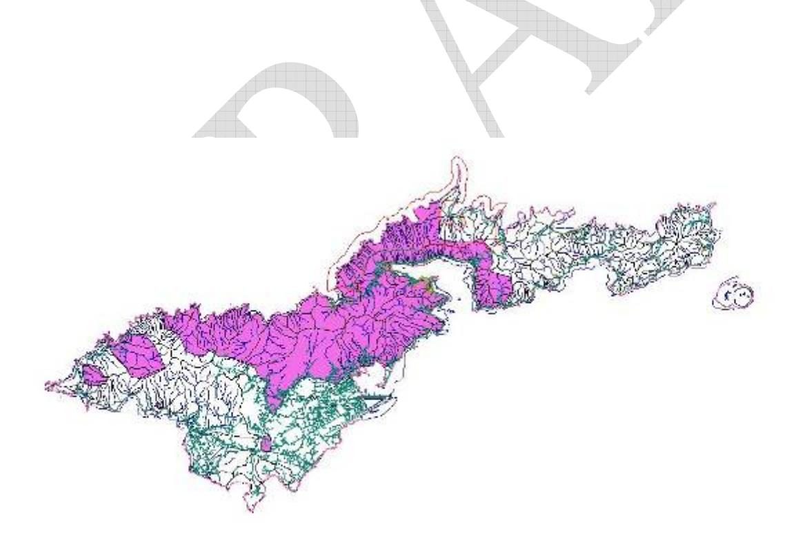

Figure 8. Distribution of *Falcataria* on Tutuila based on field observations by resource managers at NPSA.

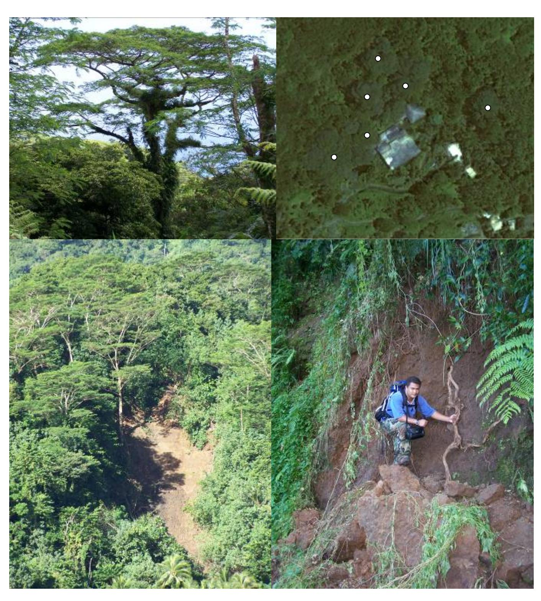

Figure 9. Landslide on steep slope behind the village of Fangasa (lower left). Large Falcataria trees surround the slide. Tavita Togia (lower right) with roots of a *Falcataria* tree in NPSA. The root system of this very quick growing and large invasive tree is shallow and tentacular. Ground and satellite images of mature *Falcataria* trees. Upper left, mature *Falcataria* tree in NPSA. The

large spreading canopy towers above indigenous forest plants. Upper right, Quickbird imagery of the Old Marist School on Tutuila Island. Mature *Falcataria* trees (spots) surround the school.

 Other significant invasive species that are becoming established in Tutuila include Strawberry guava (*Psidium cattleianum*), *Clidemia hirta*, and Panama Rubber Tree (*Castilla elastica*, Moraceae) with unknown effects on erosion and water quality. Based on recent discoveries (T. Togia, personal communication), Strawberry guava is now thought to have been cultivated without documentation on Tutuila island in American Samoa for over 40 years and to have become naturalized in lowland rain forest on the western region of that island. Though of limited occurrence in NPSA, the Panama rubber tree is considered to be an important threat to native forests in American Samoa because it has displaced significant areas of lowland forest in Western Samoa. By contrast, *Clidemia* is more or less ubiquitous in the park, but appears to be less habitat modifying in American Samoa compared with its behavior in Hawaii (Loope and Medeiros 2001). This may have been due to the introduction of *Thrips urichii*, a Neotropical thrip and biocontrol agent introduced earlier in Fiji and Hawaii (Conant 2002).

 Feral pigs are also sources of soil disturbance that may increase erosion and facilitate the establishment of invasive plant species in Samoan forests. Although Polynesians brought pigs to Samoa as early as 3,000 years ago, the currently severe environmental damage done by pigs apparently began much more recently and seems to have resulted entirely from release of domestic, non-Polynesian genotypes (Diong 1982). Polynesian pigs were much smaller, more docile, and less prone to taking up feral existence than those introduced in historic times (Tomich 1986). The effect of feral pigs can be particularly severe in remote sites where hunting cannot control their populations. In such areas, the effect of feral pigs is destruction of understory vegetation and the transformation of these sites to bare, plowed soil can be similar to situations encountered in the Hawaiian archipelago. One site where we have witnessed such damage in the upper slopes of Olosega island in the Manu'a group in an area proposed and being negotiated as an addition to NPSA. Of particular concern is the relatively recent spread of Strawberry Guava in western Tutuila and the effects that it could have in fostering increases in feral pig populations in watersheds where it is spreading.

 Finally, *Leptospira* carried by introduced rats, feral dogs, and pigs and *Toxoplasma* carried by domestic cats can contaminate streams and watersheds with subsequent transport to near shore environments where they pose direct threats to human health. Recent work completed by ASEPA and CDC has documented the high prevalence of Leptospirosis in the Territory and documented a statistically significant association between bathing in streams and contact with domestic dogs and incidence of the disease. Additional work to identify reservoir species may help confirm whether feral animal populations, particularly wild pigs and rats, contribute to the epidemiology of the disease.

# *Remote Sensing and Vegetation Mapping*

While American Samoa previously had an extremely active GIS user's group, there has been little direct application of remote sensing techniques to monitoring ecological changes in the archipelago beyond periodic multibeam bathymetric surveys of reef habitats by NOAA. Technologies and applications being developed by the Hawaii Ridge-to-Reef project may have direct applicability to American Samoa, particularly in regard to mapping of disturbed and undisturbed vegetation communities and tracking spread of invasive species.

# *Deployment of Stream Gaging Stations to monitor Watershed Functions*

Current watershed monitoring in American Samoa is handled primarily by ASEPA with a primary focus on the narrow coastal strip of developed land that supports more than 90% of the human population. One need identified in discussions with ASEPA during our site visit was an expanded network of stream gaging and sediment monitoring stations that can support their efforts to monitor water quality in streams. Depending on available resources, these could be located in both highly disturbed and relatively undisturbed watersheds for comparisons of water quality on coral reef health. Tied closely to these stations is a need to measure what happens to freshwater contaminants once they reach reef ecosystems. Colleagues from several agencies in American Samoa suggest that contaminants have a relatively short half-life on most fringing reefs because of strong currents, but there is little data to support this. Exceptions are some of the more protected bays around the islands and Pago Pago harbor where ASEPA has sponsored studies of contaminants in harbor sediments.

# *Physiological Effects of Non-Point Source Pollutants on Coral Reef Ecology*

There is a large body of literature about the local impacts of sedimentation, nutrient enrichment and turbidity from terrestrial runoff on coral reef health, but relatively little quantitative data about properties of reefs that contribute to their resistance and resilience to these stressors (Fabricius 2005). USGS could play a significant role in Samoa by providing information about the physical, hydrodynamic, spatial, and biological properties of fringing reefs in the Territory that determine duration and extent of exposure of coral communities to pollutants from freshwater streams. Additional areas of investigation that are currently not supported in American Samoa are the direct effects of bacterial contaminants and estrogens from sewage outflows on coral reef health (Atkinson et al. 2003, Tarrant et al. 1999), and the role that stream contamination with zoonotic pathogens (*Toxoplasma* and *Leptospira*) play in the incidence of human infections with these organisms.

# **Summary**

Coral reef resources in the territory of American Samoa face significant problems from overfishing, non-point source pollution, global warming and continuing population growth and development. The islands are still relatively isolated relative to other parts of the Pacific and have managed to avoid some of the more devastating invasive species that have reached other archipelagoes. As a result, there are opportunities for collaborative and integrative research and monitoring programs to help restore and maintain biodiversity and functioning natural ecosystems in the archipelago.

We found that the "Ridge to Reef" paradigm already exists in American Samoa, with a high degree of interagency cooperation and efficient use of limited resources already taking place in the Territory. USGS may be able to make contributions as a partner organization in CRAG through deployment of sediment monitoring instrumentation to supplement stream monitoring by ASEPA, by providing high resolution vegetation and land-use maps of main islands, by providing additional support to DMWR and NPS for monitoring of invasive species, by working with members of CRAG to initiate sediment transport studies on Samoan reefs, and by developing new projects on the effects of bacterial contamination and pollutants on coral reef physiology and demography.

# **Acknowledgements**

We thank the members of CRAG and ASIST (American Samoa Invasive Species Team) for their hospitality when we visited the territory and especially Tavita Togia for his assistance with arranging meetings and willingness to devote his weekends to showing us around Tutuila. Paul Birkowitz, Stephen Ambagis and James Jacobi provided invaluable assistance with GIS overlays and preparation of figures for this report. We also thank the USGS Terrestrial, Freshwater, and Marine Ecosystems Program for financial support that made this trip possible.

# **Literature Cited**

Atkinson, C.T., R.C. Utzurrum, J.O. Seamon, A.F. Savage, and D.A. LaPointe. 2006. Hematozoa of Forest Birds in American Samoa – Evidence for a Diverse, Indigenous Parasite Fauna from the South Pacific. Pacific Conservation Biology (in press).

Atkinson, S., M.J. Atkinson, and A.M. Tarrant. 2003. Estrogens from sewage in coastal marine environments. Environmental Health Perspectives 111: 531-535.

Birkeland, C.E., P. Craig, G. Davis, A. Edward, Y. golbuu, J. Higgens, J. Gutierrez, N. Idechong, J. Maragos, K. Miller, G. Paulay, R. Richmond, A. Tafileichig, and D. Turgeon. 2000. Status of coral reefs of American Samoa and Micronesia: U.S.-affiliated and freely associated islands of the Pacific. In: Wilkinson, C. (ed.). Status of Coral Reefs of the World: 2000. Australian Institute for Marine Science, Australia. p199-218

Birkeland, C., R.H. Randall, and S.S. Amesbury. 1988. Coral and reef-fish assessment of the Fagatele Bay National Marine Sanctuary. Report to the U.S. Department of Commerce National Oceanic and Atmospheric Association. NOAA Technical Memorandua Series NOS/MEMD

Birkeland, C., R.H. Randall, R.C. Wass, B.D. Smith, and S. Wilkins. 1987. Biological resource assessment of the Fagatele Bay National Marine Sanctuary. NOAA Technical Memoorandum, NOS MEMD 3. 229 p.

Brainard R.E., R. M. Laurs and Associates. 2002. External Program Review: Coral Reef Ecosystem Investigation. U.S. Department of Commerce, NOAA Fisheries, Honolulu Laboratory, August 2002. pp 69.

Budelman, A. 1989. Paraserianthes falcataria – Southeast Asia's Growth Champion. Nitrogen Fixing Tree Association NFT Highlights NFTA 89-05, September (*http://v1.winrock.org/forestry/factpub/factsh/p\_falcataria\_bckup.html*)

Coles, S.L., P.R. Reath, P.A. Skelton, V. Bonito, R.C. DeFelice and L. Basch. 2003. Introduced marine species in Pago Pago, Fagatele Bay and the National Park coast, American Samoa. Bishop Museum Technical Report 26: 182 p.

Conant, P. 2002. Classical biological control of Clidemia hirta (Melastomataceae) in Hawai'i using multiple strategies. Pp. 13-20 in C.W. Smith, J. Denslow, and S. Hight (editors), Proceedings of a Workshop on Biological Control of Invasive Plants in Native Hawaiian Ecosystems. Technical Report 129, Pacific Cooperative Studies Unit, University of Hawai'i at Ma¯ noa, Honolulu.

Cornish, A.S. and D.T. Wilson. 2002. The American Samoa Coral Reef Monitoring Program. An integrated long-term monitoring plan for the Territory. Coral Reef Advisory Group Report to the Govenor. 73 pp.

Craig P. & L. Basch 2001. Developing a coral reef monitoring program for the National Park of American Samoa: a practical, management-driven approach for small marine protected areas. National Park of American Samoa, Pago Pago, American Samoa. pp 16.

Craig, P. 2002. Natural History Guide to American Samoa. A Collection of Articles. National Park of American Samoa and American Samoa Department of Marine and Wildlife Resources. Pago Pago, American Samoa 76 pp.

Craig, P., G. DiDonato, D. Fenner, and C. Hawkins. 2005. The State of Coral Reef Ecosystems of American Samoa. Pp. 312-337. In: J. Waddell (ed.), The State of Coral Reef Ecosystems of the United States and Pacific Freely Associated States: 2005. NOAA Technical Memorandum NOS NCCOS 11. NOAA/NCCOS Center for Coastal Monitoring and Assessment's Biogeography Team. Silver Spring, MD. 522 pp.

Diong, C.H. 1982. Population biology and management of the feral pig (Sus scrofa L.) in Kipahulu Valley, Maui. Ph.D. thesis, University of Hawaii, Honolulu. 408 pp.

Eyre P.R., 1994, Ground-water quality reconnaissance, Tutuila, American Samoa, 1989: U.S. Geological Survey Water-Resources Investigations Report 94-4142, 15 p

Fabricius, K.E., 2005. Effects of terrestrial runoff on the ecology of corals and coral reefs: review and synthesis. Marine Pollution Bulletin 50: 125-146

Fisk, D., and C. Birkeland. 2002. Status of coral communities in American Samoa: a re-survey of long-term monitoring sites. A report prepared for Department of Marine and Wildlife Resources, American Samoa Government, August 2002. 11 + 135 p.

Gingerich, S.B., Izuka, S.K., and Presley, T.K., 1998, Ground-water resources of the coastal plain of Aunuu island, American Samoa, 1996-97: U.S. Geological Survey Water-Resources Investigations Report 98-4029, 2 sheets.

Green A. 1996. Status of the Coral Reefs of the Samoan Archipelago. Internal report, Department of Marine and Wildlife Resources, Pago Pago, American Samoa. pp 48 plus Appendices

Green A.L., Birkeland C.E., Randall R.H., Smith B.D. & Wilkens S. 1997. 78 years of

coral reef degradation in Pago Pago Harbor: a quantitative record. Proceedings 8th International Coral Reef Symposium. Vol. 2: 1883-1888.

Green A.L., C.E. Birkeland & R.H. Randall. 1999. Twenty Years of Disturbance and Change in Fagatele Bay National Marine Sanctuary, American Samoa. Pacific Science 53(4): 376-400.

Green A.L., C.E. Birkeland, R.H. Randall, B.D. Smith & S. Wilkins. 1997. 78 years of coral reef degradation in Pago Pago Harbour: a quantitative record. Lessios H.A., Macintyre I.G. (Eds). Proceedings of the Eighth International Coral Reef Symposium, Panama, June 24-29, 1996. Smithsonian Tropical Research Institute. Balboa, Panama: 1883-1888.

Izuka, S.K., 1996, Summary of ground-water and rainfall data for Tutuila and Aunuu Islands, American Samoa, for July, 1984 through September, 1995: U.S. Geological Survey Open-File Report 96-116, 44 p.

Izuka, S.K., 1997, Summary of ground-water data for Tutuila and Aunuu, American Samoa, for July 1985 through September 1996: U.S. Geological Survey Open-File Report 97-654, 44 p.

Izuka, S.K., 1999, Summary of ground-water data for Tutuila and Aunuu, American Samoa, for October 1987 through September 1997: U.S. Geological Survey Open-File Report 99-252, 34 p.

Izuka, S.K., 1999, Hydrogeologic interpretations from available ground-water data, Tutuila, American Samoa: U.S. Geological Survey Water-Resources Investigations Report 99-4064, 2 sheets.

Izuka, S.K., 2005, Reconnaissance of the Hydrogeology of Ta'u, American Samoa: U.S. Geological Survey Scientific Investigations Report 2004-5240, 20 p.

Izuka, S.K., Giambelluca, T.W., and Nullet, M.A., 2005, Potential evapotranspiration on Tutuila, American Samoa: U.S. Geological Survey Scientific Investigations Report 2005-5200, 40 p.

Jarvi, S.I., M.E.M. Farias, H. Baker, H.B. Freifeld, P.E. Baker, E. Van Gelder, J.G. Massey, and C.T. Atkinson. 2003. Detection of avian malaria (Plasmodium spp.) in native land birds of American Samoa. Conservation Genetics, 5:1-9.

Loope, L.L., O.H. Hamann, and C.P. Stone. 1988. Comparative conservation biology of oceanic archipelagoes: Hawaii and the Galapagos. BioScience 34(4): 272-282.

Loope, L.L. and A.C. Medeiros (2001) Management-related Considerations of Biological Invasions and the National Park of American Samoa: a Preliminary Report, with Special Reference to Invasive Plants. Report to National Park of American Samoa, U.S. Geological Survey, Biological Resources Division, Pacific Island Ecosystems Research Center, Haleakala Field Station,

Medeiros, A.C., L.L. Loope, P. Conant, and S. McElvaney. 1997. Status, ecology, and management of the invasive tree Miconia calvescens DC (Melastomataceae) in the Hawaiian Islands. Pp. 23-35 in N.L. Evenhuis and S.E. Miller (editors), Records of the Hawai'i Biological Survey for 1996, Occasional Papers. B.P. Bishop Museum 48, Honolulu.

Meyer, J.-Y. 2000. A preliminary review of the invasive plants in the Pacific Islands (SPREP Member Countries) Pp. 85-114 in G. Sherley (editor), Invasive Species in the Pacific: A Technical Review and Regional Strategy. South Pacific Regional Environmental Program, Apia, Samoa.

NOAA National Centers for Coastal Ocean Science. 2005. Shallow-Water Benthic Habitats of American Samoa, Guam, and the Commonwealth of the Northern Mariana Islands (CD-ROM), NOAA Technical Report. National Centers for Coastal Ocean Science.

Page M. 1988. The biology, community structure, growth and artisinal catch of parrotfishes of American Samoa. Department of Marine and Wildlife Resources, ASG, Report Series. Pp 51

Muellor-Dombois D. and F.R. Fosberg. 1998. Vegetation of the Tropical Pacific Islands. Springer-Verlag New York, 733 pp.

Mundy C. 1996. A Quantitative Survey of the Corals of American Samoa. Report to the Department of Marine and Wildlife Resources, Pago Pago, American Samoa.

Ogston, A.O., Storlazzi, C.D., Field, M.E., and Presto, M.K., 2004, Sediment resuspension and transport patterns on a fringing reef flat, Molokai, Hawaii. Coral Reefs, v. 23, p. 559-569.

Rogers, K.S., Jokiel, P.L., Smith, W.R., Farrell, F., and Uchino, K., 2005, Biological survey in support of the USGS turbidity and sediment baseline survey on south Moloka'I reef flat, April 2005. *USGS Open-File Report 2005-1361*, 30 p.

Stearns, H.T. 1944. Geology of the Samoan Islands. Geological Society of America Bulletin, 55: 1279-1332.

Tarrant, A.M., S. Atkinson, and M.J. Atkinson. 1999. Estrone and estradiol-17 beta concentration in tissue of the scleractinian coral, *Montipora verrucosa*. Comparative Biochemistry and Physiology – Part A: Molecular and Integrative Physiology 122: 85-92.

Vitousek, P.M. and L.R. Walker. 1989. Biological invasion by Myrica faya in Hawai'i: plant demography, nitrogen fixation, ecosystem effects. Ecological Monographs 59:247-265.

Vitousek, P.M., C.M. D'Antonio, L.L. Loope, M. Rejmanek, and R. Westbrooks. 1997. Introduced species: a significant component of human-caused global change. New Zealand Journal of Ecology 21:1-16.

Wilson D. T. 2002. The Ecology and Biology of Key Reef Fish Species Program – American Samoa. Department of Marine and Wildlife Resources, ASG, Report Series.

Winger, K. 2004. Leptospirosis: a seroprevalence survey on American Samoa. Centers for Disease Control and Prevention, report to Edna Buchan, Program Manager Water. American Samoa Environmental Protection Agency.9 pp. 1 appendix.

Whistler, W.A. 1992. Botanical Inventory of the Proposed Ta'u Unit of the National Park of American Samoa. Technical Report 83. Cooperative National Park Resources Studies Unit, University of Hawaii at Manoa, Honolulu, Hawaii. 85pp. + figures.

Whistler, W.A. 1994. Botanical Inventory of the Proposed Tutuila and Ofu Units of the National Park of American Samoa. Technical Report 87. Cooperative National Park Resources Studies Unit, University of Hawaii at Manoa, Honolulu, Hawaii. 142pp.

Whistler, W.A. 1995. Permanent Forest Plot Data from the National Park of American Samoa. Technical Report 98. Cooperative National Park Resources Studies Unit, University of Hawaii at Manoa, Honolulu, Hawaii. 66pp.

Whistler, W.A. 2002. The Samoan Rainforest: A Guide to the Vegetation of the Samoan Archipelago. Isle Botanica, Honolulu, Hawaii. 169pp.

Whistler, W.A. 2004. Rainforest Trees of Samoa: A Guide to the Common Lowland and Foothill Forest Trees of the Samoan Archipelago. Isle Botanica, Honolulu, Hawaii. 210pp.

Work, T. and R. Raymeyer. 2002. American Samoa reef health survey. Report to U.S. Fish and Wildlife Service by the U.S. Geological Survey, Hawaii. 41 pp.

28

### **Appendix: Travel Itinerary for American Samoa Site Visit**

*June 24 – National Park of American Samoa, Department of Commerce, American Samoa Environmental Protection Agency* 

We met with Peter Craig to discuss coral reef issues at the National Park of American Samoa (NPSA). Peter showed us the new natural history guide to American Samoa that he recently edited – it is now available online and has been translated into Samoan. We explained the Ridge to Reef concept as it is viewed in Hawaii with examples from Hanalei and Molokai. Peter described CRAG (Coral Reef Advisory Group) and the major stressors to coral reefs in American Samoa that were identified by the group – overfishing, pollution, global warming, and population growth. Overfishing is having a major impact on reef fish communities both on Tutuila and the more isolated Manu'a islands. Ten year data sets of catch sizes show loss of larger fishes from all areas. Enforcement is one of the biggest problems faced by the park – virtually nothing is currently being done because of lack of resources and the distances involved. Night scuba divers are primarily responsible for overfishing – often from Tonga – even though it was banned by the Department of Marine and Wildlife Resources 5 years ago. The park has completed village surveys on Ofu/Olosega of long time residents. By contrast, these data show little change in size classes of fish that are caught, but most of these catches are by reef rather than boat fisherman and are less likely to see loss of larger fish. Peter views sedimentation and terrestrial pollution as less of a problem to coral reef resources. Sediment plumes are frequent after heavy rains, but they disappear and disperse rapidly after storms and he has not seen convincing evidence of long term effects. When asked about importance of terrestrial issues at NPSA, Peter responded that he views invasive species as one of the primary threats to the park.

Following lunch with Tavita Togia (Resource Manager at NPSA), we met briefly with Chris Hawkins at the American Samoa Department of Commerce (DOC). DOC has three graduate students completing projects on various aspects of how Samoans view coral reefs as economic/natural resources. A very strong component of their programs is public education – trying to raise public awareness of the impacts and economic value of coral reef resources. Chris agreed to try to set up a special meeting of CRAG while we were in town.

After our meeting at Department of Commerce, we met with Peter Peshut, Acting Director of the American Samoa Environmental Protection Agency. We received an extensive briefing of EPA programs in American Samoa earlier in the year when Peter presented an overview at a Ridge to Reef Meeting in Honolulu. Most of our discussion updated what we learned at the earlier briefing. EPA has a comprehensive program in American Samoa that includes research and monitoring of water quality. The American Samoa office has funded projects on heavy metal contamination of Pago Pago harbor, cesium studies of sediment cores from the harbor to identify sedimentation rates, a Leptospirosis study in conjunction with Centers for Disease Control (CDC), and recent fresh water stream/coral reef monitoring with the Honolulu office of the U.S. Fish and Wildlife Service. The Leptospirosis study with CDC was especially good because it is leading to changes in laws that will allow EPA to cite and close piggeries that are contaminating streams. The study clearly demonstrates threats to public health – leptospirosis is a major zoonotic disease in the territory with one of the highest case and fatality rates in the Pacific. Peter feels strongly that virtually all impacts on coral reefs in American Samoa are a function of human activity – primarily population growth and associated construction. Agricultural activity on steep slopes is less important, but still a major contributor to landslides during heavy rains. He

was clearly less interested in invasive species as watershed stressors and does not view this as a priority threat to reef health. When asked what assistance USGS might be able to provide, he identified detailed stream gaging, including measurements of turbidity and sediment load. EPA considered sediment monitoring early on, but abandoned the idea because of the high cost of the instrumentation and the small size and low flow rates of the few permanent streams on Tutuila.

## *June 25 - National Park of American Samoa*

We spent the day in the field with Tavita Toaga on Alava Ridge in NPSA. Our goal was to see NPS efforts to control the introduced nitrogen-fixing tree, *Falcataria*. NPSA has girdled large trees in several small watersheds at the western end of the park and NPS has started some monitoring to evaluate changes in understory after the trees die. Tavita requested assistance from USGS in designing an effective monitoring plan to help them evaluate the effectiveness of Falcataria control as a way to restore indigenous plant communities in the park. We observed a significant number of landslides that were associated with *Falcataria* trees, both inside the park and along the road between Pago Pago and Fangasa. The rapid growth of the tree, shallow root system, and mass of mature trees all contribute to creating unstable conditions along steep slopes where the trees are growing. Immediately after slides, the area appears to be colonized by young *Falcataria* seedlings rather than indigenous species. Tavita described the significant role that villagers in Fangasa have played in restoration projects in the park. The park has reciprocated by providing resources to the villagers. For example, a large *mamalava* (*Planchonella samoensis*) tree, prized locally for its wood, which had fallen across the Alava Ridge Trail within the Park was given by the NPS to Fangasa village which used it to fashion a large slit drum for the village.

After seeing the numerous landslides in this part of the park, we began to formulate potential research questions around the effects of *Falcataria* on watersheds in the park, particularly their effects as nitrogen fixers on native plant communities and the impact of their extensive canopy on native forest structure and composition. Tavita described the rapid spread of the trees across the central portion of Tutuila. They are still mostly absent from the eastern end of the island and also possibly the Manu'a Islands. Tavita described a recent report of a tree on Olosega that has not yet been confirmed. *Falcataria* has been on Tutuila since approximately 1830 – brought by missionaries from Western Samoa. The core area of the invasion is around Fangasa and is spreading eastward. It is now a dominant canopy tree in many areas in central Tutuila, but impacts on native forest structure and watersheds still unknown. The comment was made that this may be the Miconia of American Samoa. We ended the day by visiting the reef flats at Fangasa during an unusually low tide. Families were on the flats gathering sea urchins, clams and sea cucumbers. The compressed nature of watershed was dramatically visible from the shoreline. We also saw evidence of landslides behind the village, but it was not clear how the frequency of these landslides relates to *Falcataria* and village agricultural plots.

*June 26 – Work in Hotel on CRAG Presentation* 

*June 27 – Department of Marine and Wildlife Resources* 

We met with Ruth Utzurrum, Joshua Seamon, Selaina Vaitautolu, and Douglas Fenner at the Department of Marine and Wildlife Resources office. Both Ruth and Josh focus on research

and monitoring of terrestrial resources in American Samoa. Selaina is the DMWR community coordinator and works with public outreach on coral reef issues, including collection of data on fish catches. Doug is the DMWR marine biologist and recipient of Coral Reef Initiative funding in FY2005. He is beginning a coral reef monitoring program this year with support of the initiative. DMWR views overfishing as the most pressing coral reef problem. Doug noted that virtually all older fish are gone. A good example is the Humpback Wrasse where known adult individuals are down to only three. Virtually all sharks are also gone. It will takes years for the situation to recover, even if fishing pressure is immediately stopped, primarily because of low reproductive rates and the long time it takes for individuals of some species to mature. Loss of larger fish creates imbalances in the reef ecosystem, often leading to an increase in macro-algae and loss of control of coral reef predators like the Crown of Thorns Starfish. Sediment is not viewed as being high on the list of reef stressors – it is primarily a problem in deeper bays like Pago Pago harbor where silt can accumulate in areas with little wave action or currents. In general, the outer reef is in good shape. Currents keep it sediment free. Water generally clears within hours after a heavy storm, hence satellite/remote sensing will be difficult because of cloud cover. A better strategy will be to use cameras in high places to monitor sediment plumes. Doug mentioned that he will be putting out sediment traps as part of the monitoring program he will be starting. When asked what his priority reef stressor was, Doug picked coral bleaching. He discussed the factors responsible – increasing temperature measurements at Pago Pago harbor, periods of calm, clear water with minimal currents.

Ruth and Josh felt the most pressing issues are those associated with invasive species, particularly *Falcataria* and *Psidium*. They noted that all streams, even those in the most remote watersheds with minimal human activity, carry silt during storms.

Following the meeting at DMWR, we had lunch with Ruth and Josh and spent the remainder of the day working on our presentation for the CRAG meeting.

*June 28 – National Park of American Samoa, USDA – NRCS, NOAA*

We met with Douglas Neighbor, superintendent of NPSA and had a general discussion about the Ridge to Reef concept and the value of science in making management decisions.

Following the brief meeting with Doug Neighbor, we met with Wallace Jennings, District Conservationist with the Natural Resources Conservation Service. Wallace works primarily on issues related to piggeries and soil erosion caused by agricultural development. He described Vetiver grass as a way to reduce nutrient loads of wastewater from piggeries, but this has not been applied in Samoa. The amount of land devoted to agricultural plots has been increasing with population growth, forcing more steep areas to be cleared. This agricultural development has been important to the island subsistence economy, especially for families where income is low. When asked about crops and planting, Wallace noted that agriculture in Samoa has no well planned crop rotation strategy, especially for steep slopes – farmers plant whenever they feel like it. He provided soil maps and landslide hazard maps for Tutuila island, based on a landslide mitigation study that was done for the islands by USDA in 1990. Because of the steep slopes associated with the central range of mountains on the island, most land area is within the high hazard landslide zone.

Following the meeting with NRCS, we met briefly with Nancy Daschbach, Sanctuary Manager for Fagatele Bay National Marine Sanctuary. Nancy described the sanctuary. It is within a small watershed above Fagatele Bay that is 80% forested and with minimal agriculture. While landslides are a concern, she has not seen sediment in the bay, even after heavy rainfall. Her primary concerns for the Sanctuary are groundwater contamination from the island landfill on the other side of the watershed. USGS – Water Resources studies of groundwater movement, however, suggest that flow is away from the sanctuary. Overfishing and lack of law enforcement are her top priorities. She described how dynamite fishing is causing extensive damage of the reef in the Sanctuary with as many as 30 new craters during the past month.

## *June 29 – Coral Reef Advisory Group Meeting*

We met with the Coral Reef Advisory Group, composed of representatives from the Department of Commerce, National Park of American Samoa, Department of Marine and Wildlife Resources, American Samoa Community College, NOAA, NRCS and presented information about Ridge to Reef monitoring and research that is going on in Hawaii as well as a brief assessment of what we had learned so far on this site visit. We introduced the idea that spread of the invasive tree *Falcataria* might lead to increased landslide frequency, increased sedimentation, and disturbance of the community structure of forests of American Samoa with subsequent impacts on coral reef resources. The idea was generally well received, particularly by Peter Craig and the National Park Service. Following a brief question and answer period, we left the meeting and allowed them to proceed to other business.

After the seminar, Tavita took us to meet Evelyn Weilenman, outreach coordinator for the ASIST (American Samoa Invasive Species Team) Team. She asked our advice about public education programs and talked about what is being done to increase awareness of the local environment and invasive species in Samoa. She described a general lack of confidence among American Samoa school teachers about science issues and problems with a school curriculum that was often irrelevant to the local environment with a focus on North American issues. She described a need for greater involvement between scientists and school teachers for both training and curriculum development.

### *June 30 – American Samoa Community College*

Art presented a seminar on invasive plant management to American Samoa at the USDA Land Grant building at the American Samoa Community College. In attendance were Peter Craig (NPS), Evelyn Weilenman (ASIST), Tavita Togia (NPS), Ruth Utzurrum (DMWR), Joshua Seamon (DMWR), Fred Brooks (USDA), Don Vargo (USDA), Erik Hensen (USDA), and others. We spoke briefly to Eric Hensen (USDA-Forest Service) about his work. It focuses mostly on invasive species and development of sustainable forestry practices on the islands. We also spoke to Don Vargo (USDA). He has a continuing interest in stream chemistry and water quality and their associations with the indigenous aquatic fauna.

In the evening, CTA returned to Hawaii on the biweekly Hawaiian Airline flight.

#### *July 1 – American Samoa Community College*

ACM presented a similar seminar on invasive plant issues and threats to American Samoa posed by *Falcataria* and *Psidium* to the American Samoa Invasive Species Team (ASIST) at the American Samoa Community College after which the group traveled to the village of Afao in eastern Tutuila to conduct a brief field inspection of the incipient *Psidium* population rapidly becoming naturalized in that region of the island.

July 2 – Afao, eastern Tutuila

ACM and ASSIT members conduct survey to document the naturalization of the highly invasive Neotropical tree *Psidium* in the area adjacent and upland of Afao village. Where previously only a handful of young *Psidium* trees where known, over 300 scattered individuals are located, their positions mapped with GPS, and management options discussed with Togia (ASIST) and Henson (USDA-Forest Service).

July 3 – Tutuila

ACM and ASSIT members meet in the morning to discuss the *Falcataria* and *Psidium* invasions in American Samoa and potential management and research strategies. In the evening, ACM returned to Hawaii on the biweekly Hawaiian Airline flight.

# **American Samoa Contacts**

Peter Craig, Marine Ecologist National Park of American Samoa

Pago Plaza, Suite 114

Pago Pago, American Samoa 96799

Phone: 684-633-7082 Fax: 684-633-7085 *Peter\_Craig@nps.gov*

Patrick Kenny, Superintendent National Park of American Samoa

Pago Plaza, Suite 114

Pago Pago, American Samoa 96799

Phone: 684-633-7082 Fax: 684-633-7085

Doug\_Neighbor@nps.gov

Tavita Togia, Resource Manager National Park of American Samoa

Pago Plaza, Suite 114

Pago Pago, American Samoa 96799

Phone: 684-633-7082 Fax: 684-633-7085 Tavita\_Togia*@nps.gov*

Nancy Daschbach, Sanctuary Manager (leaving for Hawaii; replacement unnamed)

Fagatele Bay National Marine Sanctuary

National Oceanic and Atmospheric Administration P.O. Box 4318

Pago Pago, American Samoa 96799

Phone: 684-633-7354 Fax: 684-633-7355

*Nancy.Daschbach@noaa.gov*

Douglas Fenner

Department of Marine and Wildlife

Resources

American Samoa Government

P.O. Box 3730

Pago Pago, American Samoa 96799

Phone: 684-633-4456 Fax: 684-633-5944

Chris Hawkins, CRAG/CRI Coordinator

Department of Commerce American Samoa Government

Phone: 684-633-5155

Eric Hansen

American Samoa Community College

P.O. Box 5319

Pago Pago, American Samoa

Phone: 684-699-2550

Don Vargo

American Samoa Community College

P.O. Box 5319

Pago Pago, American Samoa

Phone: 684-699-2550

Wallace H. Jennings, District

Conservationist

United States Department of Agriculture

Natural Resources Conservation Service

American Samoa Field Office

P.O. Box 4078

Pago Plaza Suite 211

Pago Pago, American Samoa 96799

Phone: 684-633-1031, ext. 22

Fax: 684-633-1062

*Wally.jennings@pa.usda.gov*

Peter J. Peshut, Acting Director

American Samoa Environmental Protection

Agency

P.O. Box PPA

Utulei Office Building

Pago Pago, American Samoa 96799

Phone: 684-633-2304

Fax: 684-633-5801

Ruth Utzurrum

Department of Marine and Wildlife

Resources

American Samoa Government

P.O. Box 3730

Pago Pago, American Samoa 96799

Phone: 684-633-4456 Fax: 684-633-5944

*Dmwr-wildlife@samoatelco.com*

Joshua Seamon Department of Marine and Wildlife Resources American Samoa Government P.O. Box 3730

Pago Pago, American Samoa 96799

Phone: 684-633-4456 Fax: 684-633-5944

