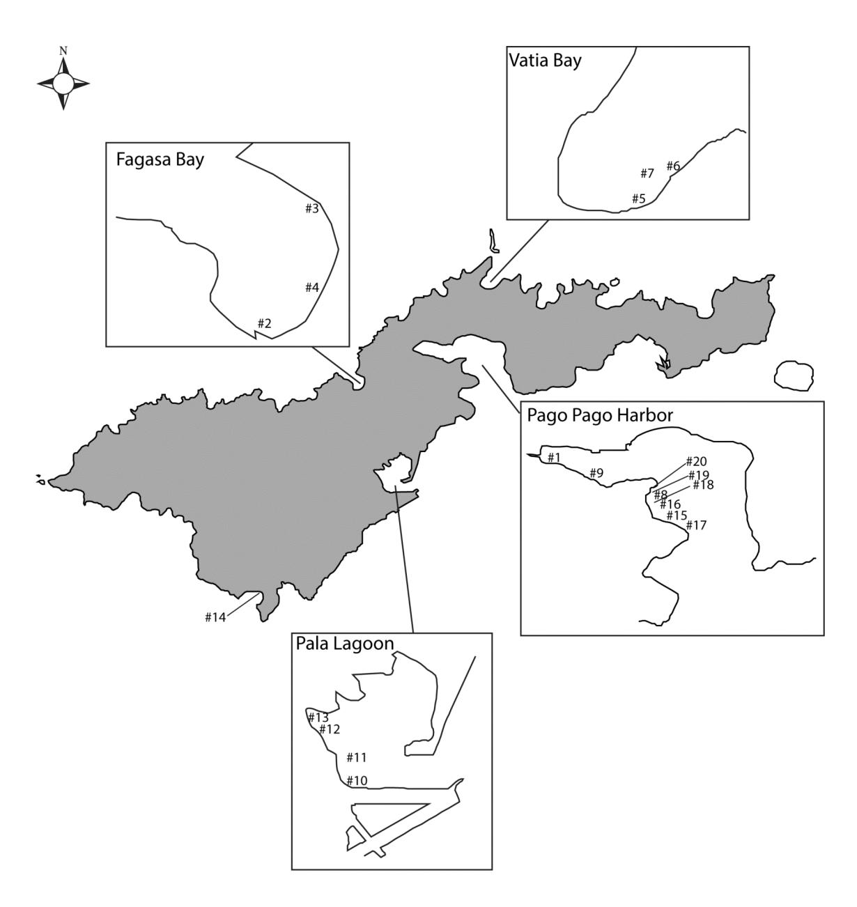
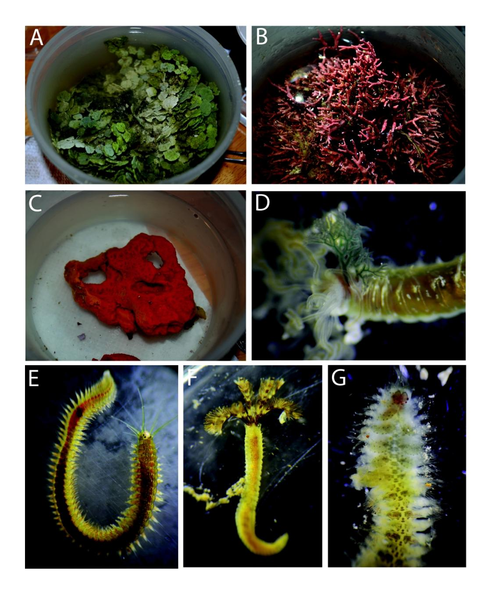

## FINAL REPORT

# **Building a Polychaete Species Database for Water Management Purposes in American Samoa**

**May 2016**

Julie H. Bailey-Brock

WRRC-2016-12

Project Number: 2014AS430B

Water Resources Research Center University of Hawaii at Manoa Honolulu, Hawaii

#### **Problem and Research Objectives**

The biodiversity of marine invertebrates from American Samoa has been poorly characterized. Most of the efforts are concentrated on studying the coral reefs, which encompasses one of the most diverse assemblages of corals and fish of the south Pacific. The Indo-Pacific polychaete fauna is one of the most diverse worldwide, but only 30 species are recorded for the Samoan Islands and this is probably a result of few collecting efforts.

There is an extensive literature and interest on Palolo worms from Samoa with the first accounts dated from 1847 (Stair 1847). The swarming event of this species is celebrated, and a cultural aspect of American Samoa, as the worms are scooped up and eaten raw or cooked by the islanders. The interest on these worms has increased along the years and several papers describe their morphology (Woodworth 1903) and reproductive characteristics (Caspers 1964, 1984; Krämer 1897). More recently, Brown (2009) described additional notes on the spawning behavior of this species and Schulze (2006) shed some light on the phylogenetic relationships between the Pacific and Caribbean Palolo worms.

Although Palolo worms have been well-studied, other polychaete families that are known as bioindicators of ecosystem health are poorly characterized in American Samoa. Some previous research about polychaetes from the Pacific Ocean are based on samples collected from the American Samoa and describe species endemic to that area. The first studies with a taxonomic perspective were done by Treadwell (1921, 1922, 1926). This author described 16 species collected from Pago Pago Harbor and among them 4 endemic species to that area. Augener (1927) and Hartmann-Schröder (1965) increased this number to about 30 species.

Shallow water polychaete species were characterized qualitatively at several sites around the island of Tutuila, American Samoa (Figure 1, Table 1). The intent was to determine the polychaete species present in soft sediments, diverse algal assemblages and coral rubble to provide a polychaete species list that would be useful for future biomonitoring projects. There are few accounts of Samoan polychaetes and only about 30 species are recorded for those islands. The Indo-Pacific polychaete fauna is one of the most diverse worldwide and the low richness of species found in the Samoan Islands is probably due to scarce collecting efforts.

### **Methodology**

#### Study Area

Fine and coarse sediment, coral rubble and several species of algae and one species of sponge were hand collected around Tutuila, with the intent of finding a diverse polychaete assemblage (Table 1, Figure 2). Twenty sampling stations were selected around the island of Tutuila (Figure 1). All samples were collected on shallow waters up to 5 m deep. After collection, samples were sieved with seawater and all the polychaetes retained were sorted and preserved in 70% or 90% ethylic alcohol. Some individuals were observed and photographed while alive.

Figure 1. Map of Tutuila Island showing the sampling stations with insets for Fagasa Bay, Vatia Bay, Pala Lagoon and Pago Pago Harbor.

Table 1. Sampling stations including coordinates, type of samples, depth, and date of collection in 2014.

| Stations | Locality                               | Coordinates                       | Sample Type                        | Depth            | Date    |
|----------|----------------------------------------|-----------------------------------|------------------------------------|------------------|---------|
| Sta. 1   | Pago Pago Harbor                       | 14° 16' 23.8" S, 170° 41' 58.1" W | Encrusting barnacles               | Dock             | 16-Sept |
| Sta. 2   | Fagasa Bay, West Side                  | 14° 17' 12.8" S, 170° 43' 31.1" W | Coarse sand and coral rubble       | intertidal       | 17-Sept |
| Sta. 3   | Fagasa Bay, East Side                  | 14° 17' 1.8" S, 170° 43' 17.0" W  | Muddy sand                         | intertidal       | 17-Sept |
| Sta. 4   | Fagasa Bay, middle, brown algae        | 14° 17' 10.1" S, 170° 43' 15.8" W | Brown algae coating rocks          | intertidal       | 17-Sept |
| Sta. 5   | Vatia Bay 1                            | 14° 15' 1.2" S, 170° 40' 13.3" W  | Sandy beach, fine grained          | intertidal       | 18-Sept |
| Sta. 6   | Vatia Bay 2                            | 14° 14' 56.6" S, 170° 40' 9.1" W  | chaetopterid mounds                | intertidal       | 18-Sept |
| Sta. 7   | Vatia Bay 3                            | 14° 14' 57.6" S, 170° 40' 12.7" W | Halimeda mounds                    | shallow subtidal | 18-Sept |
| Sta. 8   | Utulei Beach Park (sadies)             | 14° 16' 41.1" S, 170° 40' 54.2" W | Halimeda mounds                    | shallow subtidal | 19-Sept |
| Sta. 9   | Fagatogo Port                          | 14° 16' 29.5" S, 170° 41' 36.4" W | Main dock, barnacles, bryozoans    | Dock             | 19-Sept |
| Sta. 10  | Pala Lagoon 1 boat ramp                | 14° 19' 25.4" S, 170° 42' 46.9" W | Fine sand, muddy, shrimp burrows   | intertidal       | 20-Sept |
| Sta. 11  | Pala Lagoon 2                          | 14° 19' 20.6" S, 170° 42' 44.9" W | Fine sand, muddy                   | intertidal       | 20-Sept |
| Sta. 12  | Pala Lagoon across correction facility | 14° 19' 6.5" S, 170° 42' 57.9" W  | Mud                                | intertidal       | 20-Sept |
| Sta. 13  | Pala Lagoon mangrove                   | 14° 19' 2.8" S, 170° 42' 59.6" W  | Mud with organic material          | intertidal       | 20-Sept |
| Sta. 14  | Fagatele Bay                           | 14° 21' 33.3" S, 170° 45' 9.3" W  | Pink calcareous algae              | shallow subtidal | 21-Sept |
| Sta. 15  | Wastewater treatment plant 1           | 14° 16' 56.9" S, 170° 40' 43.8" W | Halimeda mounds                    | 3 m deep         | 21-Sept |
| Sta. 16  | Wastewater treatment plant 2           | 14° 16' 55.3" S, 170° 40' 45.4" W | Halimeda mounds                    | 5 m deep         | 21-Sept |
| Sta. 17  | Wastewater treatment plant 3           | 14° 16' 56.1" S, 170° 40' 42.7" W | Sand bottom in between coral reefs | 2 m deep         | 21-Sept |
| Sta. 18  | Outside Utulei Beach Park              | 14° 16' 44.5" S, 170° 40' 51.4" W | Orange sponge on coral reefs       | shallow subtidal | 22-Sept |
| Sta. 19  | Utulei Beach Park East                 | 14° 16' 42.1" S, 170° 40' 53.2" W | Halimeda mounds                    | shallow subtidal | 22-Sept |
| Sta. 20  | Utulei Beach Park West                 | 14° 16' 40.1" S, 170° 40' 51.7" W | Amphiroa? Mounds                   | shallow subtidal | 22-Sept |

Figure 2. Hand collected samples and live polychaete specimens found in surrounding waters of Tutuila, American Samoa. A) *Halimeda* sample, B) *Amphiroa* sample, C) sponge sample, D) *Nicolea* sp. (Terebellidae), E) *Platynereis tongatabuensis* (Nereididae), F) *Branchiomma* sp. 1 (Sabellidae), and G) Polynoidae.

Polychaetes were sorted and identified using dissecting and compound microscopes. Species considered to be new to science will be fully described, illustrated, and photographed under a Scanning Electron Microscope and published in peer reviewed scientific journals. Samples were collected under a scientific research and collecting permit from the National Park of American Samoa (NPSA-2014-SCI-0007) and a scientific permit from the Department of Marine and Wildlife Resources from the American Samoa Government No. 2014/005.

## **Principal Findings and Significance**

- 1. The shallow water polychaetes of American Samoa are very diverse with a total of 546 individuals collected in this study representing 25 families and 80 species (Table 2).
- 2. A new species of *Armandia* (Opheliidae) is being described and it is endemic to American Samoa (collected at Pala Lagoon).
- 3. Most of the species collected in this study (74 out of 80 species) represent new records for American Samoa and increase our knowledge of the polychaete worms present in that region of the southern Pacific Ocean.
- 4. The polychaete species from American Samoa appear to be significantly different from those of North Pacific including Hawaii and US west coast and are more similar to the communities described for New Zealand and Australia.
- 5. The species *Dipolydora socialis*, *Salmacina dysteri*, and *Sabellastarte spectabilis* are likely to have been transported to American Samoa and could be accidental introductions. Impacts of these species have been reported in other regions of the Pacific Ocean and need to be evaluated for American Samoa, especially in Pago Pago Harbor and Pala Lagoon.
- 6. The tube builder species *Mesochaetopterus minutus*, was collected in high abundance in Vatia Bay. This species is a gregarious worm that forms tufts of sand-covered tubes and plays an important role in these assemblages by binding the sediments once suspended. It represents an ecologically important species for its rapid reproduction and propagation in disturbed sandy regions.
- 7. This study was the first comprehensive study aimed to taxonomically describe and identify the polychaete worms around the island of Tutuila. All specimens will be deposited in to the collection at the Bernice Pauahi Bishop Museum, Honolulu, Hawaii, and will be available to future researchers working on water quality and the effects on the benthic macrofauna in American Samoa.

Table 2. Taxonomic list of polychaete species from Tutuila, American Samoa.

|                                                          | Found in This Study | Previously Known | New Records |
|----------------------------------------------------------|------------------------|---------------------|----------------|
| Ampharetidae                                             |                        |                     |                |
| 1. ?Ecamphicteis sp.                                     | X                      |                     | X              |
| Amphinomidae                                             |                        |                     |                |
| 2. Linopherus oculifera (Augener 1913)                   | X                      |                     | X              |
| Capitellidae                                             |                        |                     |                |
| 3. Capitella jonesi (Hartman 1959)                       | X                      |                     | X              |
| 4. Capitella nr. giardi (Hartman 1959)                   | X                      |                     | X              |
| 5. Leiocapitellides sp.                                  | X                      |                     | X              |
| 6. Notomastus sp.                                        | X                      |                     | X              |
| Chaetopteridae                                           |                        |                     |                |
| 7. Mesochaetopterus minutus (Potts 1914)                 | X                      |                     | X              |
| 8. Phyllochaetopterus verrilli (Treadwell 1943)          | X                      |                     | X              |
| 9. Spiochaetopterus sp.                                  | X                      |                     | X              |
| Cirratulidae                                             |                        |                     |                |
| 10. Caulleriella pacifica (Berkeley 1929)                | X                      |                     | X              |
| 11. Ctenodrilus sp.                                      | X                      |                     | X              |
| 12. Raphidrilus hawaiiensis (Magalhães, Bailey-Brock and |                        |                     |                |
| Davenport 2010)                                          | X                      |                     | X              |
| Dorvilleidae                                             |                        |                     |                |
| 13. Dorvillea nr. australiensis (McIntosh 1885)          | X                      |                     | X              |
| 14. Dorvillea cf. similis (Crossland 1924)               | X                      |                     | X              |
| Eunicidae                                                |                        |                     |                |
| 15. Eunice sp.                                           | X                      | X                   |                |
| 16. Lysidice unicornis (Grube 1840)                      | X                      |                     | X              |
| Glyceridae                                               |                        |                     |                |
| 17. Glycera brevicirris (Grube 1870)                     | X                      |                     | X              |
| Goniadidae                                               |                        |                     |                |
| 18. Goniadides falcigera (Hartmann-Schröder 1962)        | X                      |                     | X              |
| Hesionidae                                               |                        |                     |                |
| 19. Micropodarke dubia (Hessle 1925)                     | X                      |                     | X              |
| 20. Ophiodromus pugettensis (Johnson 1901)               | X                      |                     | X              |
| Lumbrineridae                                            |                        |                     |                |
| 21. Lumbrineris japonica (Marenzeller 1879)              | X                      | X                   |                |
| Maldanidae                                               |                        |                     |                |
| 22. Micromaldane nr. pamelae (Rouse 1990)                | X                      |                     | X              |
| Nephtyidae                                               |                        |                     |                |
| 23. Micronephthys stammeri (Augener 1932)                | X                      |                     | X              |
| Nereididae                                               |                        |                     |                |
| 24. Micronereis cf. minuta (Knox and Cameron 1970)       | X                      |                     | X              |
| 25. Nereis sp.                                           | X                      |                     | X              |
| 26. Platynereis bicanaliculata (Baird 1863)              | X                      |                     | X              |
| 27. Platynereis polyscalma (Schmarda 1861)               | X                      |                     | X              |
| 28. Platynereis tongatabuensis (McIntosh 1885)           | X                      | X                   |                |
| Oenonidae                                                |                        |                     |                |
| 29. Arabella dubia (Treadwell 1922)                      | X                      | X                   |                |

Table 2. —*Continued*.

|                                                                  | Found in   | Previously | New     |
|------------------------------------------------------------------|------------|------------|---------|
|                                                                  | This Study | Known      | Records |
| Opheliidae                                                       |            |            |         |
| 30. Armandia sp.                                                 | X          |            | X       |
| 31. Polyophthalmus pictus (Dujardin 1839)                        | X          |            | X       |
| Oweniidae                                                        |            |            |         |
| 32. Unidentified oweniid                                         | X          |            | X       |
| Phyllodocidae                                                    |            |            |         |
| 33. Eumida sp.                                                   | X          |            | X       |
| 34. Hesionura australiensis (Hartmann-Schröder and Parker 1990)  | X          |            | X       |
| Pisionidae                                                       |            |            |         |
| 35. Pisione parva (De Wilde and Govaere 1995)                    | X          |            | X       |
| Polynoidae                                                       |            |            |         |
| 36. Harmothoe villosa (Malmgren 1866)                            | X          | X          |         |
| 37. Lepidonotus polychromus (Schmarda 1861)                      | X          |            | X       |
| Sabellidae                                                       |            |            |         |
| 38. Branchiomma sp. 1                                            | X          |            | X       |
| 39. Branchiomma sp. 2                                            | X          |            | X       |
| 40. Megalomma kaikourense (Knight-Jones 1997)                    | X          |            | X       |
| 41. Sabellastarte spectabilis (Grube 1878)                       | X          |            | X       |
| Serpulidae                                                       |            |            |         |
| 42. Hydroides sp.                                                | X          |            | X       |
| 43. Hydroides longispinosus (Imajima 1976)                       | X          |            | X       |
| 44. Neodexiospira steueri (Sterzinger 1909)                      | X          |            | X       |
| 45. Pileolaria militaris (Claparède 1870)                        | X          |            | X       |
| 46. Serpula sp.                                                  | X          |            | X       |
| 47. Spirobranchus kraussii (Baird 1865)                          | X          |            | X       |
| 48. Spirobranchus sp.                                            | X          |            | X       |
| Spionidae                                                        |            |            |         |
| 49. Dipolydora socialis (Schmarda 1861)                          | X          |            | X       |
| 50. Microspio granulata (Blake and Kudenov 1978)                 | X          |            | X       |
| 51. Prionospio sp. undescribed                                   | X          |            | X       |
| 52. Prionospio nr. tatura (Wilson 1990)                          | X          |            | X       |
| 53. Pseudopolydora paucibranchiata (Okuda 1937)                  | X          |            | X       |
| 54. Spio pacifica (Blake and Kudenov 1978)                       | X          |            | X       |
| Syllidae                                                         |            |            |         |
| 55. Autolytinae gen. sp.                                         | X          |            | X       |
| 56. Branchiosyllis nr. carmenroldanae (San Martín, Hutchings and |            |            |         |
| Aguado 2008)                                                     | X          |            | X       |
| 57. Branchiosyllis cirropunctata (Michel 1909)                   | X          |            | X       |
| 58. Branchiosyllis exilis (Gravier 1900)                         | X          |            | X       |
| 59. Branchiosyllis sp. 1                                         | X          |            | X       |
| 60. Exogone (Exogone) africana (Hartmann-Schröder 1974)          | X          |            | X       |
| 61. Exogone (Exogone) naidina (Örsted 1845)                      | X          |            | X       |
| 62. Exogone wilsoni (San Martín 2005)                            | X          |            | X       |
| 63. Haplosyllis djiboutiensis (Gravier 1900)                     | X          |            | X       |
| 64. Parasphaerosyllis sp.                                        | X          |            | X       |
| 65. Pionosyllis sp.                                              | X          |            | X       |
| 66. Prosphaerosyllis xarifae (Hartmann-Schröder 1960)            | X          |            | X       |

Table 2. —*Continued*.

|                                                            | Found in This Study | Previously Known | New Records |
|------------------------------------------------------------|------------------------|---------------------|----------------|
| 67. Salvatoria koorineclavata (San Martín 2005)            | X                      |                     | X              |
| 68. Sphaerosyllis densopapillata (Hartmann-Schröder 1979)  | X                      |                     | X              |
| 69. Sphaerosyllis hirsuta (Ehlers 1897)                    | X                      |                     | X              |
| 70. Syllis cornuta (Rathke 1843)                           | X                      |                     | X              |
| 71. Syllis nr. variegata (Grube 1860)                      | X                      |                     | X              |
| 72. Syllis lutea (Hartmann-Schröder 1960)                  | X                      |                     | X              |
| 73. Syllis sp. 1                                           | X                      |                     | X              |
| 74. Trypanosyllis sp.                                      | X                      |                     | X              |
| 75. Typosyllis sp.                                         | X                      |                     | X              |
| 76. Westheidesyllis heterocirrata (Hartmann-Schröder 1959) | X                      |                     | X              |
| 77. Westheidesyllis sp.                                    | X                      |                     | X              |
| 78. Syllidae gen. sp.                                      | X                      |                     | X              |
| Terebellidae                                               |                        |                     |                |
| 79. Loimia ingens (Grube 1878)                             | X                      | X                   |                |
| 80. Nicolea sp.                                            | X                      |                     | X              |

## **Publications Cited in Synopsis**

- Augener, H. 1927. Die Polychaeten der Sammlung Thilenius von Neuseeland und Samoa. Mitteilungen aus dem zoologisches Museum, Berlin 13: 338-363.
- Brown, D.P. 2009. Spawning behaviour of *Palola viridis* (Polychaeta: Eunicidae) in American Samoa. Coral Reefs, 28, 535.
- Caspers, H. 1964. Beobachtungen und Analyse des Palolo-Schwaermes auf Samoa. Sitzungsberichte der Gesellschaft der naturforschende Freunde zur Berlin 4: 19-20.
- Caspers, H. 1984. Spawning periodicity and habitat of the palolo worm *Eunice viridis* (Polychaeta: Eunicidae) in the Samoan Islands. Marine Biology 79: 229-236.
- Hartmann-Schröder, G. 1965. Zur Kenntnis der eulitoralen Polychaetenfauna von Hawaii, Palmyra und Samoa. Naturwissenschaflichen Vereins in Hamburg, Abhandlungen und Verhandlungen Supplement 9: 81-161.
- Krämer, A. 1897. Uber den Bau der Korallenriffe und die Planktonverteilung an den Samoanischen Küsten nebst vergleichenden Bemerkungen von Augustin Krämer, Marinearzt, und einem Anhange: Ueber den Palolowurm von Dr. A. Collin. Kiel and Leipzig, Lipsius and Tischer.
- Schulze, A. 2006. Phylogeny and genetic diversity of palolo worms (*Palola*, Eunicidae) from the tropical North Pacific and the Caribbean. Biol Bull, 210:25–37.
- Stair, J.B. 1847. An account of Palolo, a sea-worm eaten in the Navigator Islands, with a description by J.E. Gray. Proceedings of the Zoological Society of London, 15: 17- 18.
- Treadwell, A.L. 1921. Report on the annelids of Puget Sound, Fiji and Samoa. Yearbook of the Carnegie Institute of Washington 19: 199-200.
- Treadwell, A.L. 1922. Leodicidae from Fiji and Samoa. Carnegie Institute of Washington Publication 312: 127-170

Treadwell, A.L. 1926. Polychaetous annelids from Fiji, Samoa, China and Japan. Proceedings of the United States National Museum 69(2641): 1-20. Woodworth, W. M. 1903. Preliminary report on the Palolo worm of Samoa, *Eunice viridis* (Gray). American Naturalist, 37(444): 875-881.