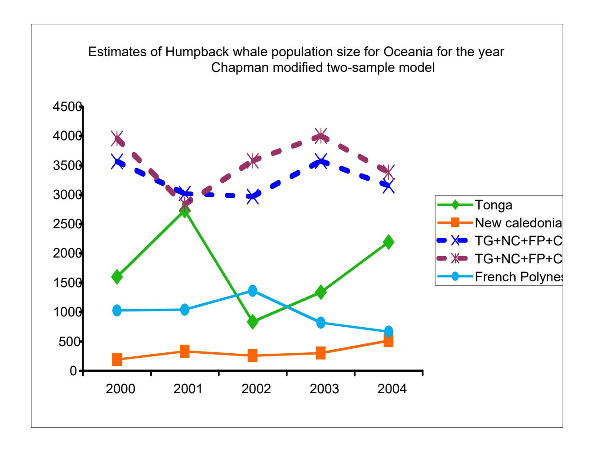

SC/A06/HW51

For Consideration by the Inter-sessional Workshop for the Comprehensive Assessment of Southern Hemisphere Humpback whales Hobart, Tasmania 3-7 April 2006

# Abundance of humpback whales in Oceania (South Pacific), 1999 to 2004

SOUTH PACIFIC WHALE RESEARCH CONSORTIUM, C. SCOTT BAKER1, CLAIRE GARRIGUE2, ROCHELLE CONSTANTINE1, BENEDICTE MADON1, MICHAEL POOLE3, NAN HAUSER4, PHIL CLAPHAM5, MICHAEL DONOGHUE6, KIRSTY RUSSELL6, TRISH O'CALLAHAN1, DAVE PATON7 AND DAVE MATTILA8

- 1 School of Biological Sciences, University of Auckland, Private Bag 92019, Auckland, New Zealand
- 2 Opération Cétacés BP 12827 98802 Nouméa, New Caledonia
- 3 Marine Mammal Research Program, BP 698 98728 Maharepa, Moorea, FRENCH POLYNESIA
- 4 Cook Islands Whale Research Takuvaine Valley PO Box 3069, Avarua Rarotonga, The Cook Islands
- 5 Alaska Fisheries Science Center, National Marine Mammal Laboratory, 7600 Sand Point Way NE, Seattle, WA 98115, USA
- 6 Department of Conservation, PO Box 10-420, Wellington, New Zealand
- 7 21 Netherby Rise Sunrise Beach Noosa Qld 4567, Australia
- 8 Hawaiian Islands Humpback Whale National Marine Sanctuary, Honolulu, Hawaii 96812 USA

#### ABSTRACT

The abundance of humpback whales on winter breeding grounds throughout Oceania (South Pacific) was estimated by sighting-resighting analysis of individual identification photographs collected from 1999 to 2004. Photographs were collected with comparable effort across the six years in four primary island breeding grounds: New Caledonia, Tonga (Vava'u) the Cook Islands and French Polynesia (Mo'orea and Rurutu). Photographs were collected in one or more years in eight other island regions or subregions: Vanuatu, Fiji, Niue, Samoa, American Samoa, the Ha'apai group (Tonga), Eua (Tonga) and Niuatoputapu (Tonga). Catalogues from all regions were reconciled through comparisons during annual meetings of the South Pacific Whale Research Consortium. Across the six years, a total of 1148 annual sighting of 1021 individual whales were documented. Most resightings occurred within regions (between years), with a smaller number of resightings between regions, (across years). Only two whales were resighted in more than one region or subregion during the same season.

Estimates of regional abundance based on closed population models (adjusted for time and individual heterogeneity but unadjusted for mortality) ranged from N = 472 (CV, 0.18) for New Caledonia (stock E2), to N = 2311 (CV, 0.22) for Tonga (stock E3) and N = 1057 (CV, 0.22) for French Polynesia (stock F). Abundance was not estimated for Cook Islands because of the absence of between year resightings. An overall estimate of N = 3827 (CV, 0.12) for Oceania (stocks E2+E3+F) was calculated with the closed population model by considering resightings across the four primary regions combined. Open-population models (e.g., POPAN) and the average of the year-to-year Petersen estimates (with the Chapman modification) were 15-25% lower than the multi-year closed population estimates. There was little indication of a trend in abundance. The degree to which the whales wintering in Oceania contribute to estimates of abundance and trends from shore-based counts along the eastern coast of Australia remains unknown.

## INTRODUCTION

Humpback whales congregate each winter to breed near islands of Oceania (South Pacific), from New Caledonia in the west to French Polynesia in the east (Townsend, 1935). It is generally assumed that whales from these island breeding grounds migrate along the coasts of New Zealand and eastern Australia to summer feeding grounds in waters of Antarctic Areas V and VI, although there is relatively little direct evidence of these assumed migratory connections (e.g., (Constantine et al., 2006; Dawbin, 1964, 1966; Garrigue et al., 2000).

Humpback whales throughout this region were subjected to intensive exploitation starting in the 19th century and continuing, in the Kingdom of Tonga, until as late as 1978. While humpback whales in some regions of the Southern Hemisphere have shown evidence of strong recovery (e.g., (Paterson et al., 2001) the numbers of humpback whales on breeding grounds of Oceania appear to remain low (Abernethy et al., 1992; Garrigue et al., 2004; Gibbs and Childerhouse, 2000; Gibbs et al., 2004; Poole, 2002).

Since 1991, a number of research projects have been initiated in various parts of Oceania, including New Caledonia, the Kingdom of Tonga, the Cook Islands and French Polynesia. These projects have collected individual identification photographs and skin biopsy samples to study the occurrence, distribution, breeding behaviour, abundance, and genetic differentiation of humpbacks at each study site (e.g. Olavarria et al. In review; (Garrigue et al., 2004; Garrigue and Gill, 1994). Since the 1999 field season, synoptic studies in each of these four primary island regions and eight additional island regions have been coordinated through the South Pacific Whale Research Consortium. Exhaustive matching of regional photo-identification catalogues has been

undertaken during annual meetings of the Consortium and preliminary results have been reported annually to the International Whaling Commission (SPWRC 2000, 2001, 2002, 2003, 2004, 2005).

Here we report the results of a full reconciliation (within- and between-region matching) of catalogues from the four primary study regions and the eight secondary regions for the years 1999-2004. We then present preliminary estimates of abundance derived from closed-population capture-recapture (sighting-resighting) models for the primary regions, except for the Cook Islands, where there have been no resights between years. To account for heterogeneity of sighting probabilities resulting from interchange between regions and uncertainty in migratory destinations, we also estimate abundance of Oceania by aggregating annual sightings and resightings across regions. Our primary objective was to provide initial estimates of abundance for the purposed of modelling the history of exploitation and judging levels of recovery for IWC 'breeding stocks' E2, E3 and F (Jackson et al. 2006, this workshop). However, as catalogues from eastern Australia have yet to be matched exhaustively to those from Oceania, we cannot judge the extent to which whales from this migratory corridor contribute to our estimates of winter breeding grounds in Oceania. Reconciliation of current catalogues from eastern Australia and those from Oceania will be undertaken by Consortium members and affiliates during a workshop planned for November 2006 in New Caledonia.

## **METHODS**

#### Primary study regions

For the purpose of this paper, we define Oceania as the large area of islands in the southwestern and south central Pacific Ocean, stretching from New Zealand and New Caledonia in the west to French Polynesia in the east; geographically, however, Oceania includes a much larger area of island groups in both southern and northern hemispheres. Dedicated surveys for humpback whales in this region were conducted during the austral winters of 1999 to 2004 in four areas: New Caledonia, Tonga, the Cook Islands and French Polynesia. We refer to these as the 'primary study regions' and the years 1999 to 2004 as the 'synoptic years' or surveys. These regions are described separately below.

*New Caledonia* (C. Garrigue). New Caledonia lies between 18° and 23° S and between 158° and 172° E. It consists of one main island and three groups of smaller ones plus many uninhabited atolls including Chesterfield that was as a whaling area by the American whaling ships during the 19th century (Townsend 1935).

Humpback whale surveys were conducted opportunistically beginning in 1991 (Garrigue and Gill 1994), and for most of three months (July, August and September) during each austral winter from 1995 (Garrigue *et al.* 2001), including the synoptic seasons of 1999 to 2004. The primary study site covers approximately 1000 km2 and is located in the southeastern portion of the lagoon off the main island. Survey effort included more than 40 days on the water in each of the synoptic years.

*Tonga* (C.S. Baker, M. Donoghue and K. Russell). The Tongan archipelago is a series of volcanic islands and coral atolls extending from 15° to 23° S and from 173° to 177° W. Tonga consists of three major island groups thought to constituted the primary area of humpback whale density: Tongatapu in the south, the Ha'apai group in the middle and the Vava'u group in the north. Hunting of humpback whales is known to have occurred in Tonga during the 19th century by American whaling ships (Townsend 1935), and hunting continued at a low level by local whalers until banned by Royal decree in 1978.

Vessel-based surveys and the collection of individual identification photographs were initiated in 1991 (Abernethy *et al.* 1992). Each of the three main island groups has been surveyed in at least one year but most of the field effort from 1999 to 2004 was concentrated around Vava'u. The majority of fieldwork was conducted in August and early September, although work in some years included late July and early October. The length of the field season varied yearly from approximately 21 days to more than six weeks.

Cook Islands (N. Hauser). The Cook Islands extend from 8° to 23° S and from 156° to 167° W, and consists of a few high islands and numerous atolls scattered over approximately 2,000,000 km² of the southwestern South Pacific. These islands are divided into two groups, the Northern Cooks and the Southern Cooks; the latter include nine islands and atolls lying between latitudes 18° S and 22° S. Little or no whaling took place in this region in the 20th century and records of earlier (historical) catches there are sparse. Surveys for humpback whales in the Southern Cook Islands began with an exploratory three-week project in 1998 and continued with three-month field efforts in both 1999 and 2000 (Hauser *et al.* 2001).

To date the survey has been focused on three locations: (i) Palmerston Atoll, a small atoll lying at 18 04' S, 163° 10' W on the northwestern margin of the Southern Cook group; (ii) Aitutaki, an island located at 18° 55' S, 159° 47'W, roughly 300 km east of Palmerston; and (iii) Rarotonga, an island located at 21° 14' S, 159° 48' W,

roughly 430 km southeast of Palmerston. More than 100 days of surveys were conducted in each of the synoptic years.

*French Polynesia* (M. Poole). French Polynesia lies between 8° and 27° S and 134° to 155° W in the central South Pacific Ocean. It comprises five groups of islands: the Marquesas, the Tuamotu atolls, the Gambiers, the Society Islands, and the Australs. Sightings of humpback whales throughout French Polynesia's waters have been submitted to a sighting and stranding network since 1988 (Poole 1993, Poole and Darling 1999).

The nearshore waters of Moorea, (17°30' S and 149°50' W) situated 18 km northwest of Tahiti in the Society Island, have been the primary study area for fieldwork since the beginning of dedicated research in 1991. Boatbased observations were conducted on both dedicated vessels and on platforms of opportunity. Additional shore- and boat-based observations of humpback whales were begun in 1999 at Rurutu (22°30' S and 151°15' W) in the Austral Islands approximately 570 km SSW of Moorea. For the 1999 to 2004 seasons, the fieldwork was mainly conducted from the end of July to November and has included as many as 148 days of effort.

## **Secondary study regions**

It is important to stress that the four primary regions represent only a small proportion of habitat potentially available habitat for humpback whales in Oceania. For this reason, photographs were collected as part of directed or opportunistic surveys in eight other regions or subregions of the South Pacific during a subset of the synoptic years: Vanuatu in 2003 (C. Garrigue and K. Russell); Fiji in 2002 and 2003 (D. Paton, S. Childerhouse and N Gibbs); Tonga, Ha'apai group and Niuatoputapu in 2000 and Eua in 2002 and 2003 (D. Paton, T. O'Callahan); Niue in 2001; independent Samoa in 2001 (D. Paton, C. Olavarria); and American Samoa, main island, Tutuila, in 2003 and 2004 (David Mattila, US National Marine Sanctuary Progam, in partnership with Dept of Marine and Wildlife Resources of American Samoa).

#### **Individual identification catalogues**

Humpback whales were individually identified from photographs of the ventral fluke pattern (Katona and Whitehead 1981). Although some of the research projects concerned used variation in other markings (notably dorsal fin shape or lateral pigmentation), as well as microsatellite genotypes (Garrigue et al., 2004) to recognise individuals, only fluke photos were employed in the comparisons described here. Photos were taken with 35 mm SLR and digital SLR cameras equipped with zoom or telephoto lenses. All primary catalogues have now been scanned for digital archiving.

Regional photographic catalogues were first reconciled internally by the principal investigators and his/her associated, providing the primary information on annual resights (between-years, within-regions). For the sighting-resighting estimates presented here, within-season resights, within regions were not considered. A small number of resights between regions, within seasons, are considered in the Results. Regional catalogues were then compared and reconciled during annual meetings of the Consortium following each season (i.e., from 2000 to 2006) and by pair-wise exchange among Consortium members and affiliates. All between-region matches were confirmed by at least three participants at the workshop and most within-region matches were examined by multiple members of regional research teams. A small number of errors for 'missed matches' (i.e., sightings of the same individual mistakenly considered to be different individuals) but no 'mis-matches' (i.e., photographs of different individuals mistakenly identified as the same individual) were found by comparison to individual identification by genotyping for New Caledonia (Garrigue et al., 2004). Similar comparisons have not yet been undertaken for other regions.

A large number of individual identification photographs are now available for eastern Australia (e.g., Kaufman *et al.* 1993; Franklin, Patton, Burns pers. comm.). These have not yet been reconciled to the Oceania catalogues, although previous comparisons have established some degree of interchange between eastern Australia and New Caledonia (Garrigue *et al.* 2000) and Tonga (Garrigue et al., 2002).

### **Capture-recapture (sighting-resighting) analysis**

We used closed population capture-mark-recapture models to estimate regional and Oceania-wide abundance from annual sight-resighting records of humpback whales. Each of the six years of fieldwork was considered as one capture event. Using the program CAPTURE (Rexstad, E., and K.P. Burnham, 1991), included in the option "closed capture" of program MARK (White and Burnham 1999), we considered models Mt, Mh, and Mth (Seber, 1986; Seber and Schwarz, 1999; Borchers et al., 2002; Seber, 2002; Amstrup et al., 2005). As described by Cooch and White (2006), model Mt assumes that capture probability varies from one occasion to another, but animals are equally catchable on any occasion (i.e., heterogeneity results only from variation in yearly capture probabilities). For model Mh, individuals are not assumed to be equally catchable but are assumed to have a constant capture probability over time: heterogeneity depends only on individual differences. Model Mth

combines the two sources of heterogeneity, i.e., capture probability varies over time and among individuals. We considered two variants of Mt (Chao and Darroch) and two variants of Mh (the jackknife and Chao).

#### **RESULTS**

#### **Matching and reconciliation of regional catalogues**

The largest regional catalogue was available for Vava'u, Tonga, with 389 annual sightings of 363 individuals (Table 1). Of the primary regions, the smallest catalogue was the Cook Islands, with 93 annual sights and no within-region resights (although there were resights to other regions; see Garrigue et al. 2006, this workshop and Garrigue et al. 2002). In some of the secondary regions, such as the Ha'apai group, the low number of sightings reflects relatively low levels of effort. In other regions, such as Fiji and independent Samoa, however, sightings were low despite considerable effort in at least one season (e.g., (Gibbs et al., 2004).

The fully reconciled catalogues of humpback whales individual identification photographs for the years 1999- 2004 includes 1148 annual sightings of 1021 individual humpback whales (Table 1). The majority of resightings (n = 100) were between years, within regions, and a smaller number (n = 27) were between various regions and years (see Garrigue et al. 2006, this meeting). Only one individual was resighted between regions in the same year (Cook Islands and Vava'u, Tonga in 1999) and one individual resighted between subregions in the same year (Vava'u and Eua, Tonga, in 2003).

The results of the exhaustive matching of all regional and subregional catalogues were used to construct three datasets: 1) reconciled by primary study region, in which annual sightings and resightings were represented only for the four primary regions of New Caledonia, Tonga, Cook Islands and French Polynesia; 2) reconciled across primary regions, in which annual sightings and resightings of individuals were represented regardless of whether the individual was sighted in New Caledonia, Tonga, Cook Islands or French Polynesia; and 3) fully reconciled, in which annual sightings and resightings were represented regardless of region or subregion.

#### **Regional estimates of abundance**

Using Dataset #1, described above, we estimated abundance for New Caledonia, Tonga and French Polynesia for the years 1999-2004 using the closed, multi-sample models (Table 2). We did not attempt to estimate the regional abundance of Cook Islands, as there were no year-to-year resights. The results showed reasonable agreement across models for New Caledonia, suggesting an abundance of about 400 whales with a CV~0.18. This is similar to previous estimates for this region based on photo-IDs although somewhat smaller than estimates from microsatellite genotypes (Garrigue et al. 2004).

For Tonga and French Polynesia, there was reasonable agreement among four of the models, but the Mh jackknife gave considerably smaller estimates of abundance and lower CVs (as expected for this model given the rather sparse resighting records). Excluding this model, the abundance of Tonga was estimated to be about 2300 with a CV~0.20 and the abundance of French Polynesia was about 1,000 with a CV~0.20.

The unweighted average of the year-to-year estimates from the Petersen two-sample model were 20-30% smaller than the multi-year closed capture models for New Caledonia and Tonga but similar for French Polynesia. More importantly, a plot of the year-to-year estimates suggested considerable differences in estimates between years for Tonga and, to a lesser extent, for French Polynesia.

## **Oceania-wide abundance**

Considering that there were reasonably similar levels of effort in each of the synoptic seasons (1999-2004) and that there is some degree of interchange between regions across years (see SPWRC, Garrigue et al. 2006), we used dataset #2 to calculate estimates across the four primary regions (Table 2). Estimates from the multi-year, closed population models range from ~3,000 to ~4,000 (CV~0.11) except for the Mh jackknife, which, again, gave lower and estimates of abundance. Given that New Caledonia is a smaller and more intensively sampled region (i.e., individuals have a higher resighting probability), we considered that inclusion of this region might bias negatively the Oceania-wide estimate. Deletion of New Caledonia resulted in a small decrease in the estimate from the other three region combined (TG+FP+CI), suggesting that this was not an important bias (Table 2).

The year-to-year estimates from the Petersen two-sample model for the four regions combined ranged from ~3,000 to ~4,000 with an unweighted average of 3550. More importantly, a plot of the year-to-year estimates for the four regions seemed to smooth some of the variance seen in the estimates from Tonga and French Polynesia. Finally, we calculated year-to-year Petersen estimates for all regions and subregions combined using dataset #3 on the assumption that might provide some indication of the effect of the many smaller regions that remained unsurveyed in most years (Table 3). Including these additional sightings had only a small effect on the

estimate of Oceania-wide abundance.

#### **DISCUSSION**

We present here, the first attempts to estimate current abundance of humpback whales wintering throughout Oceania. We emphasize that this preliminary effort was not intended to present a 'best' estimate for any individual region but, rather, to provide some basis for effort to model recovery (see Jackson et al. 2006, this meeting). Further, we recognise that Oceania is a vast region, much of which was not surveyed consistently across the study years. Given these caveats, however, we think it is possible to provide some general conclusions about these populations and suggest some direction for the future analyses:

- 1) The year-to-year differences in estimates for Tonga and French Polynesia and the known heterogeneity of individual capture probabilities in other populations of humpback whales, suggest that the Mth model is likely to provide the most robust estimates of abundance presented here. For this reason, these estimates were used in the accompanying report on modelling recovery of humpback whales in Ocean (Jackson et al. 2006).
- 2) The report by see SPWRC, Garrigue et al. (2006, this meeting) shows that regional populations of Oceania are 'open' to some degree of interchange with other populations in Oceania. Multi-state, closed-population models are needed to account for this effect.
- 3) The estimates from closed-population models used here are likely to be biased upwards by some degree of mortality across the five-year study (six sampling seasons). Open-population models, or multi-state, open-population models are needed to account for mortality and the effects of interchange.
- 4) The absence of resights between years for the Cook Islands, suggests that this is not a primary migratory destination, but rather a part of a migratory corridor used by one or more breeding stocks. Even regions, such as New Caledonia, that appear to be primary destinations for some whales, could be part of a migratory corridor for others (e.g., to Vanuatu or Tonga). This will contribute to the heterogeneity of resighting probablities within and among regions.
- 5) Although much of the potential habitat for humpback whales in Oceania remains unsurveyed, it is unlikely that large concentrations of humpback whales have been missed by the efforts of the Consortium. Over the last decade, Consortium members and affiliates have undertaken directed or opportunistic surveys in most regions where humpbacks were reported historically or currently. In some of the regions, such as the Ha'apai group of Tonga, greater survey effort is likely to increase the number of whale identified. In other regions, such as Fiji and independent Samoa, however, increased effort is unlikely to result in a proportionate increase in data (e.g., Paton et al. 2002; (Gibbs et al., 2004).
- 6) Some regions of known historical abundance show little evidence of current recovery, e.g. Fiji, the Chesterfields and the New Zealand migratory corridor (Gibbs and Childerhouse 2000; Gibbs et al. 2004; Paton et al. 2002). Estimating the abundance in these low-density regions remains problematic..
- 7) The degree of interchange between whales migrating past eastern Australia and those wintering in Oceania remains unknown. If this interchange is low, our preliminary estimates can be considered to be independent and additive with those from the EA shore-based counts (Noad et al. 2006, this workshop). If interchange between eastern Australia and Oceania is high, whales will be 'double counted' and estimates will need to be adjusted downwards (see Jackson et al. 2006, this workshop). Given the large size and rapid recovery of whales along eastern Australia, this is likely to be a much more significant effect that the degree of overlap among regions of Oceania.

#### **Literature cited**

- Abernethy, R. B., Baker, C. S., and Cawthorn, M. W. 1992. Abundance and genetic identity of humpback whales (*Megaptera novaeangliae*) in the Southwest Pacific. Scientific Committee of the International Whaling Commission, Glasgow Scotland, June 1992.
- Amstrup, Steven C., McDonald, Trent L. and Bryan F. J. Manly. 2005. *Handbook of Capture-Recapture Analysis*. Princeton University Press.
- Borchers, D.L., Buckland, S.T. and W. Zucchini. 2002. *Estimating Animal Abundance, Closed Populations*. Springer Editions.
- Constantine, R., Russell, K., Gibbs, N., Childerhouse, S., and Baker, C. S. 2006. Photo-identification of humpback whales in New Zealand waters and their migratory connections to breeding grounds of Oceania. unpublished report SC/A06/HW50 for consideration by the inter-sessional workshop for the comprehensive assessment of Southern Hemisphere humpback whales, Hobart, Tasmania 2-7 April 2006.
- Cooch, E. and G. White 2006. *Program MARK "A Gentle Introduction" 4th Edition.* [\(http://www.phidot.org/software/mark/docs/book/\)](http://www.phidot.org/software/mark/docs/book/).

Dawbin, W. H. 1964. Movements of humpback whales marked in the southwest Pacific Ocean 1952 to 1962. *Norsk Hvalfangsttid*, 53:68-78.

- —. 1966. The seasonal migratory cycle of humpback whales. In K. S. Norris (ed.), *Whales, dolphins and porpoises*, pp. 145-171. University of California Press, Berkeley.
- Garrigue, C., Aguayo, A., Amante-Helweg, V. L. U., Baker, C. S., Caballero, S., Clapham, P., Constantine, R., Denkinger, J., Donoghue, M., Flórez-González, L., Greaves, J., Hauser, N., Olavarría, C., Pairoa, C., Peckham, H., and Poole, M. 2002. Movements of humpback whales in Oceania, South Pacific. *Journal of Cetacean Research and Management*, 4:255–260.
- Garrigue, C., Dodemont, R., Steel, D., and Baker, C. S. 2004. Organismal and 'gametic' capture-recapture using microsatellite genotyping confirm low abundance and reproductive autonomy of humpback whales on the wintering grounds of New Caledonia. *Marine Ecology - Progress Series*, 274:251-262.
- Garrigue, C., Forestell, P., Greaves, J., Gill, P., Naessig, P., Patenaude, N. M., and Baker, C. S. 2000. Migratory movement of humpback whales (*Megaptera novaeangliae*) between New Caledonia, East Australia and New Zealand. *Journal of Cetacean Research and Management*, 2:111-115.
- Garrigue, C., and Gill, P. 1994. Observations of humpback whales *Megaptera novaeangliae* in New Caledonian waters during 1991-1993. *Biol. Cons.*, 70:211-218.
- Gibbs, N., and Childerhouse, S. 2000. Humpback whales around New Zealand. *Conservation Advisory Science Notes*, 287:1-32.
- Gibbs, N., Paton, D. A., Childerhouse, S. J., McConnell, H., and Oosterman, A. 2004. Final report of a survey of whales and dolphins in the Lomaiviti Island group, Fiji 2003. South Pacific Whales Research Consortium and Southern Cross University.
- Noad, M. J., Paton, D., and Cato, D. H. 2006. Absolute and relative abundance estimates of Australian east coast humpback whales (*Megaptera novaeangliae*). unpublished report SC/A06/HW- for consideration by the inter-sessional workshop for the comprehensive assessment of Southern Hemisphere humpback whales, Hobart, Tasmania 2-7 April 2006.
- Paton DA, Gibbs N, Childerhouse SJ, Noad MJ (2002) South Pacific Island Whale and Dolphin Program, Stage 1, Independent Samoa 2001, Draft Report for Comment. Southern Cross Centre for Whale Research, Southern Cross University
- Paterson, R. A., Paterson, P., and Catao, D. H. 2001. Status of humpback whales, *Megaptera novaeangliae*, in east Australia at the end of the 20th Century. *Memoirs of the Queensland Museum*, 47:579-586.
- Poole, M. 2002. Occurrence of humpback whales (*Megaptera novaeangliae*) in French Polynesia in 1988-2001. unpublished report SC/54/H14 to the Scientific Committee of the International Whaling Commission.
- Rexstad, E., and K.P. Burnham. 1991. Users Guide for Interactive Program CAPTURE. Colorado Cooperative Fish & Wildlife Research Unit, Colorado State University, Fort Collins, Colorado (http://www.mbrpwrc.usgs.gov/software.html#a).
- Seber, G.A. F. 1986. A Review of Estimating Animal Abundance. *Biometrics*, **42(2)**: 267-292.
- Seber, G. A.F. and C.J. S. Schwarz. 1999. Estimating Animal Abundance: Review III. *Statistical Science*, **14(4)**: 427-456.
- Seber, G. A. F. 2002. *The Estimation of Animal Abundance and related parameters*. Second Edition, The Blackburn Press.
- SPWRC. 2001. Report of the Annual Meeting of the South Pacific Whale Research Consortium: 9-12 April, 2001.Auckland, New Zealand.
- —. 2002. Report of the Annual Meeting of the South Pacific Whale Research Consortium: 24-28 February 2002, Auckland, New Zealand, SC/54/O14, unpublished report SC/54/O14 to the Scientific Committee of the International Whaling Commission.
- —. 2003. Report of the Annual Meeting of the South Pacific Whale Research Consortium: 13-17 February 2003, Auckland, New Zealand, unpublished report SC/55/SH2 to the Scientific Committee of the International Whaling Commission.
- —. 2004. Report of the Annual Meeting of the South Pacific Whale Research Consortium: 2-6 April 2004, Byron Bay, NSW, Australia, unpublished report SC/56/SH7 to the Scientific Committee of the International Whaling Commission.
- —. 2005. Report of the Annual Meeting of the South Pacific Whale Research Consortium: 11-13 March 2005, Auckland, New Zealand. unpublished report SC/57/SH9 to the Scientific Committee of the International Whaling Commission.
- Townsend, C. H. 1935. The distribution of certain whales as shown by logbook records of American whaleships. *Zoologica*, 19:1-50.
- White, G.C. and K. P. Burnham. 1999. Program MARK: Survival estimation from populations of marked animals. Bird Study 46 Supplement, 120-138 (http://www.warnercnr.colostate.edu/~gwhite/mark/mark.htm).

**Table 1**: Summary of individual identification photograph catalogues of humpback whales used in the estimates of abundance in Oceania.

| Region        | Subregion    |     | 1999 2000 | 2001 | 2002 | 2003 |     | 2004 Subtotal | total1 |
|---------------|--------------|-----|-----------|------|------|------|-----|---------------|--------|
| New Caledonia |              | 19  | 38        | 67   | 18   | 46   | 42  | 230           | 183    |
| Tonga         | Vava'u       | 88  | 71        | 75   | 54   | 72   | 29  | 389           | 363    |
|               | Eua          | -   | -         | -    | 23   | 20   | -   | 43            | 42     |
|               | Ha'apai      | -   | 12        | -    | -    | -    | -   | 12            | 12     |
|               | Niuatoputapu | -   | 7         | -    | -    | -    | -   | 7             | 7      |
| Cook Islands  |              | 10  | 20        | 12   | 11   | 31   | 9   | 93            | 93     |
| Fr. Polynesia |              | 56  | 35        | 28   | 46   | 69   | 94  | 328           | 302    |
| Vanuatu       |              | -   | -         | -    | -    | 6    | -   | 6             | 6      |
| Fiji          |              | -   | -         | -    | 1    | 1    | -   | 2             | 2      |
| Niue          |              | -   | -         | 2    | -    | -    | -   | 2             | 2      |
| Samoa         |              | -   | -         | 1    | -    | -    | -   | 1             | 1      |
| A. Samoa      |              | -   | -         | -    | -    | 15   | 20  | 35            | 35     |
|               | subtotal2    | 173 | 183       | 185  | 153  | 260  | 194 |               |        |
|               | subtotal3    |     |           |      |      |      |     | 1148          |        |
|               | Total4       |     |           |      |      |      |     |               | 1048   |
|               | Total5       |     |           |      |      |      |     |               | 1021   |

1) unique individuals sighted in each region (adjusted for between-year resightings)

2) unique individuals in each year (unadjusted for a small number of within-year, between-region resighting)

3) annual sightings and resightings = 1148

4) unique individuals sighted in each region (adjusted for between-year resightings, unadjusted for betweenregion resightings) = 1048

4) Total after adjusting for within- and between-region resightings = 1021

**Table 2**. Summary of estimates from multi-year closed-population models (with standard error, 95% confidence intervals and coefficient of variation) for three of the four primary regions and for the four primary regions combined, for the synoptic years, 1999-2004.

|                                          |             |        | Estimates for 1999-2004 New Caledonia |         |      |  |  |  |  |  |
|------------------------------------------|-------------|--------|---------------------------------------|---------|------|--|--|--|--|--|
| model                                    | N-hat SE |        | lowerCI                               | upperCI | CV   |  |  |  |  |  |
| Mt Chao                                  | 390         | 67.25  | 291                                   | 562     | 0.17 |  |  |  |  |  |
| Mt Darroch                               | 295         | 31.51  | 244                                   | 371     | 0.11 |  |  |  |  |  |
| Mh jackknife                             | 417         | 33.60  | 359                                   | 491     | 0.08 |  |  |  |  |  |
| Mh Chao                                  | 488         | 95.00  | 348                                   | 730     | 0.19 |  |  |  |  |  |
| Mth                                      | 472         | 87.14  | 342                                   | 692     | 0.18 |  |  |  |  |  |
| Estimates for 1999-2004 Tonga            |             |        |                                       |         |      |  |  |  |  |  |
| model                                    | N-hat       | SE     | lowerCI                               | upperCI | CV   |  |  |  |  |  |
| Mt Chao                                  | 2008        | 399.22 | 1390                                  | 2988    | 0.20 |  |  |  |  |  |
| Mt Darroch                               | 1915        | 346.35 | 1380                                  | 2818    | 0.18 |  |  |  |  |  |
| Mh jackknife                             | 1066        | 52.72  | 970                                   | 1176    | 0.05 |  |  |  |  |  |
| Mh Chao                                  | 2533        | 532.91 | 1712                                  | 3846    | 0.21 |  |  |  |  |  |
| Mth                                      | 2311        | 503.77 | 1544                                  | 3566    | 0.22 |  |  |  |  |  |
| Estimates for 1999-2004 French Polynesia |             |        |                                       |         |      |  |  |  |  |  |
| model                                    | N-hat       | SE     | lowerCI                               | upperCI | CV   |  |  |  |  |  |
| Mt Chao                                  | 937         | 180.17 | 663                                   | 1385    | 0.19 |  |  |  |  |  |
| Mt Darroch                               | 942         | 164.79 | 688                                   | 1372    | 0.17 |  |  |  |  |  |
| Mh jackknife                             | 691         | 42.93  | 615                                   | 783     | 0.06 |  |  |  |  |  |
| Mh Chao                                  | 1174        | 243.20 | 804                                   | 1781    | 0.21 |  |  |  |  |  |
| Mth                                      | 1057        | 230.08 | 715                                   | 1642    | 0.22 |  |  |  |  |  |
| Estimates for 1999-2004 TG+NC+FP+CI      |             |        |                                       |         |      |  |  |  |  |  |
| model                                    | N-hat       | SE     | lowerCI                               | upperCI | CV   |  |  |  |  |  |
| Mt Chao                                  | 3377        | 360.86 | 2761                                  | 4186    | 0.11 |  |  |  |  |  |
| Mt Darroch                               | 2801        | 235.13 | 2392                                  | 3324    | 0.08 |  |  |  |  |  |
| Mh jackknife                             | 2388        | 79.53  | 2240                                  | 2552    | 0.03 |  |  |  |  |  |
| Mh Chao                                  | 4091        | 461.47 | 3304                                  | 5126    | 0.11 |  |  |  |  |  |
| Mth                                      | 3827        | 442.54 | 3076                                  | 4824    | 0.12 |  |  |  |  |  |
| Estimates for 1999-2004 TG+FP+CI         |             |        |                                       |         |      |  |  |  |  |  |
| model                                    | N-hat       | SE     | lowerCI                               | upperCI | CV   |  |  |  |  |  |
| Mt Chao                                  | 3310        | 437    | 2582                                  | 4312    | 0.13 |  |  |  |  |  |
| Mt Darroch                               | 3102        | 361    | 2500                                  | 3953    | 0.12 |  |  |  |  |  |
| Mh jackknife                             | 2000        | 72     | 1866                                  | 2149    | 0.04 |  |  |  |  |  |
| Mh Chao                                  | 4075        | 565    | 3134                                  | 5372    | 0.14 |  |  |  |  |  |
| Mth                                      | 3772        | 563    | 2848                                  | 5082    | 0.15 |  |  |  |  |  |

**Table 3**: Summary of year-to-year estimates from the two-sample Petersen model (with Chapman modification).

| New Caledonia                     |             |      |      |      |      |      |      |  |  |  |
|-----------------------------------|-------------|------|------|------|------|------|------|--|--|--|
| year                              | 1999        | 2000 | 2001 | 2002 | 2003 | 2004 |      |  |  |  |
| sightings                         | 19          | 38   | 67   | 18   | 47   | 42   |      |  |  |  |
| resightings                       |             | 3    | 7    | 4    | 2    | 3    | mean |  |  |  |
| N                                 |             | 194  | 331  | 257  | 303  | 515  | 320  |  |  |  |
| Tonga                             |             |      |      |      |      |      |      |  |  |  |
| year                              | 1999        | 2000 | 2001 | 2002 | 2003 | 2004 |      |  |  |  |
| sightings                         | 88          | 71   | 75   | 54   | 72   | 29   |      |  |  |  |
| resightings                       |             | 3    | 1    | 4    | 2    | 0    | mean |  |  |  |
| N                                 |             | 1601 | 2735 | 835  | 1337 | 2189 | 1739 |  |  |  |
| French Polynesia                  |             |      |      |      |      |      |      |  |  |  |
| year                              | 1999        | 2000 | 2001 | 2002 | 2003 | 2004 |      |  |  |  |
| sightings                         | 56          | 35   | 28   | 46   | 69   | 94   |      |  |  |  |
| resightings                       |             | 1    | 0    | 0    | 3    | 9    | mean |  |  |  |
| N                                 |             | 1025 | 1043 | 1362 | 822  | 664  | 983  |  |  |  |
|                                   | NC+TG+FP+CI |      |      |      |      |      |      |  |  |  |
| year                              | 1999        | 2000 | 2001 | 2002 | 2003 | 2004 |      |  |  |  |
| sightings                         | 172         | 164  | 182  | 129  | 219  | 171  |      |  |  |  |
| resightings                       |             | 7    | 9    | 7    | 7    | 11   | mean |  |  |  |
| N                                 |             | 3567 | 3019 | 2973 | 3574 | 3152 | 3257 |  |  |  |
| NC+TG+FP+CI+all secondary regions |             |      |      |      |      |      |      |  |  |  |
| year                              | 1999        | 2000 | 2001 | 2002 | 2003 | 2004 |      |  |  |  |
| sightings                         | 172         | 182  | 185  | 153  | 259  | 194  |      |  |  |  |
| resightings                       |             | 7    | 11   | 7    | 9    | 14   | mean |  |  |  |
| N                                 |             | 3956 | 2836 | 3580 | 4003 | 3379 | 3551 |  |  |  |
| FP+CI+TG                          |             |      |      |      |      |      |      |  |  |  |
| year                              | 1999        | 2000 | 2001 | 2002 | 2003 | 2004 |      |  |  |  |
| sightings                         | 154         | 126  | 115  | 111  | 172  | 135  |      |  |  |  |
| resightings                       |             | 4    | 2    | 3    | 5    | 9    | mean |  |  |  |
| N                                 |             | 3936 | 4910 | 3247 | 3228 | 2352 | 3535 |  |  |  |

**Figure 1:** Year-to-year estimates of abundance for Oceania and regions of Oceania using Petersen model with Chapman modification (see Table 3).

