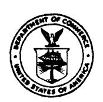

U.S. DEPARTMENT OF COMMERCE
National Oceanic and Atmospheric Administration

NATIONAL MARINE FISHERIES SERVICE Southwest Fisheries Center Honolulu Laboratory P. O. Box 3830 Honolulu, Hawaii 96812

SUBSISTENCE USE OF SEA TURTLES AT PACIFIC ISLANDS UNDER THE JURISDICTION OF THE UNITED STATES

George H. Balazs
Southwest Fisheries Center Honolulu Laboratory
National Marine Fisheries Service, NOAA
Honolulu, Hawaii 96812

September 1983

**This report is used to insure prompt dissemination of preliminary results, interim reports, and special studies to the scientific community. Contact the author if you wish to cite or reproduce this material.** 

The islands covered in this report include the State of Hawaii, American Samoa, Guam, and the U.S. Trust Territory of the Pacific Islands. The latter area is composed of the political and geographical districts of Palau, Federated States of Micronesia (Yap, Truk, Ponape, and Kosrae), the Commonwealth of the Northern Mariana Islands, and the Marshall Islands. Other U.S. islands in the Pacific include uninhabited Howland, Baker, Jarvis, and Kingman Reef; as well as Midway, Wake, and Johnston which are inhabited only by military personnel and civilian contract employees. Another U.S. Pacific island, privately owned Palmyra, is currently occupied by a few plantation workers from Kiribati.

## Trust Territory

The Trust Territory consists of 2,200 small islands spread over 7.8 million  $\rm km^2$  of ocean in the western Pacific. The total land area is only 1,800  $\rm km^2$ . There are approximately 140,000 inhabitants (mostly Micronesians), and 32% of them reside in district centers. The remainder live mostly on remote outer islands.

In 1978 the green, loggerhead, and olive ridley sea turtles were listed under the U.S. Endangered Species Act (ESA). This action had been under review for 4-1/2 years, and culminated in the publication of a Final Environmental Impact Statement by the U.S. Department of Commerce (1978). Protective regulations were promulgated along with the listing in an effort to conserve and restore sea turtle populations to their former levels of abundance. These regulations contained a provision for the continued "subsistence" taking of green turtles for personal use by residents of the Trust Territory, "...if such taking is customary, traditional, and necessary for the sustenance of such resident and his immediate family" (U.S. Department of Commerce 1978). The protective regulations apply to all U.S. states and possessions including those in the Caribbean, but the Trust Territory was the sole area to receive an exemption for subsistence use as defined above. The rationale for this action was that many of the native inhabitants follow a traditional way of life in villages on small remote islands that are limited in natural food resources. Although it is clear that sea turtle populations in the Trust Territory have declined within historical times, the risk to the turtles' survival from subsistence use had to be balanced against the nutritional and cultural needs of the native people. Research reports by Tobin (1952), McCoy (1974, 1982), Pritchard (1977, 1982), and Johannes (1981) seem to support this viewpoint. It should also be noted that the Trust Territory is not owned by the United States, but rather is administered under a United Nations trusteeship scheduled to be terminated in the near future.

## American Samoa

At the time of the listing in 1978, no request for a subsistence use exemption was received from American Samoa. American Samoans have many of the advantages of modern technology (i.e., automobiles, electricity, television, telephones, scheduled airlines). Nevertheless, there may still be some legitimate subsistence use of sea turtles, as defined in the regulations. This is likely to be true at Swains Island, a small remote

coral island, inhabited by about 25 people, that is administered as part of American Samoa. Some subsistence use of sea turtles (including hawksbills) may also be justified in certain rural villages on Tutuila and in the Manua Islands of American Samoa. However, based on a series of interviews, there is presently very little interest by Samoans in catching and eating turtles at these locations. In contrast, some of the nationals from other Pacific islands living on Tutuila are reported to regularly hunt turtles.

Guam

During the review process leading to the listing of green turtles under the ESA, the Governor of Guam submitted the following testimony:

"There presently are some minor harvesting of the green sea turtles in Guam waters. We recommend that some harvesting of green sea turtles be allowed but it should be based on accepted management practices such as size limits, limitations on numbers taken, area and time where they may be taken, etc. Also, in this part of the Pacific, any conservation or management regulations imposed must be applicable to all or most of the island areas concerned. The green sea turtles are known to migrate over long distances and conservation measures applied to only a small portion of the thousands of islands in this part of the Pacific will not produce the desired effects of conservation of the species."

The Governor's recommendation to allow continued taking of green turtles on Guam did not mention that such harvesting is necessary to meet human nutritional needs. Apparently no justification existed to support a subsistence take, as in the Trust Territory. Published studies on marine exploitation and seafood consumption by the people of Guam support this viewpoint, since no mention was made of turtles being of any importance in the diet (Callaghan 1978; Jennison-Nolan 1979).

Before the 1978 ESA listing there were no regulations controlling the taking of green turtles on Guam, although regulatory measures had been under discussion by the local government since at least 1973. When the Endangered Species Act of Guam was passed in 1979, green turtles were given full legal protection at the local government level consistent with Federal regulations (Guam 1979).

The interviews were conducted in October 1982 by the author and W. Pedro, Office of Marine Resources, Government of American Samoa.

&lt;sup>2Letter dated February 9, 1976 from R. J. Bardallo, Governor of the Territory of Guam to H. M. Hutchings of the National Marine Fisheries Service, NOAA.

## State of Hawaii

Correspondence dated July 17 and December 10, 1975 submitted by the Governor of the State of Hawaii during the review process expressed opposition to listing the Hawaiian population of green turtles under the ESA. The reason given was that a State regulation had been promulgated 14 months earlier (in May 1974) that banned commercial turtle fishing, but still permitted the ocean-taking of turtles 36 inches and larger for "home use." The view was expressed that the "total population...can sustain controlled harvest." However, no biological data were submitted to support this position. In contrast, there was evidence to show that Hawaii's green turtles had been overexploited, and, as a result, their numbers and range had been reduced. Before 1974 there were no legal controls on the taking of green turtles in Hawaii. (For a current synoptic review of the Hawaiian green turtle, see Balazs (1980, 1982a, 1982b).)

On April 1, 1976 the Governor submitted a third letter to comment on the Draft Environmental Impact Statement (DEIS) that was circulated for public review at that time. This letter stated that the State of Hawaii was "...cognizant of the 'declining trend' of the Hawaiian marine turtle population ... " but had instituted what it thought was "...adequate and effective protection" as a result of the May 1974 regulation. A strong endorsement was given for Alternative 7 listed in the DEIS to "Allow Subsistence Fishing in Areas of Traditional Sea Turtle Fisheries" for Hawaiian green turtles. Since the word "subsistence" was not defined, elaborated upon, or mentioned again in the Governor's letter, it would appear that he equated "traditional subsistence turtle fishing" with the State's precept allowing take for "home use." Home use, however, covered a far broader range of uses, since it was not limited to those persons with a nutritional need to take turtles. Under the State regulation, home use was equivalent to any "non-commercial" take of green turtles. The State regulation therefore allowed the taking of turtles because of food preference and for supplemental but not necessarily essential food for personal use. It also allowed the accidental capture of turtles during other fishing activities and the taking of turtles for sport, recreation, and trophies. After the regulation went into effect, some restaurants continued to serve what was said to be "pre-Act" turtle meat. In one restaurant this reportedly consisted of several thousand pounds stored in a freezer.

Are there people living in the State of Hawaii that could qualify for true subsistence taking of green turtles, as the exemption now applies in the Trust Territory? If there are, they would be very few, constituting only a small fraction of the State's 1 million residents. When the Hawaiian green turtle was listed in 1978 on the basis of the best scientific data available, it was decided that alternate protein food sources were available to replace any turtle meat being used by residents of the State (U.S. Department of Commerce 1978). In the 5 years that have passed since 1978, no subsistence users of green turtles have become known in Hawaii.

An estimation of the number of people having a desire to <u>legally</u> catch turtles in Hawaii can be obtained from the State's official records of the turtles taken for "home use" between May 1974 and September 1978. A total of 84 turtles was reported during this 53-month period. The available records do not show how many fishermen were involved, but it is safe to assume that multiple catches were made by a number of the same people. A liberal estimate would be 35 fishermen, although the actual number is probably less than 20. The number of people taking turtles illegally during this same period was undoubtedly many times greater. The enforcement of marine conservation measures by the State of Hawaii has been a continuing problem. Fishing regulations are often not obeyed, and when violators are caught and prosecuted the fines are too small to be a deterrent (Kiser 1978).

The State of Hawaii is a multiethnic community, and people of part-Hawaiian or Hawaiian ancestry make up about 12% of the population. The people involved in turtle fishing during past years have come from nearly all of the ethnic groups, including Caucasians, Japanese, Chinese, Filipinos, as well as Hawaiians. Sea turtles were clearly a part of ancient Hawaiian culture, entering into such aspects as folklore, personal family gods, sources of material to make fishhooks and other implements, and, for the green turtle (but not the hawksbill), a source of edible meat and fat. There is some historical evidence to show that before 1819 the consumption of turtle was restricted by Hawaiian religion to the ruling nobility, priests, and chiefs (Kalakaua 1888). Although this may not have been true on all islands and under all circumstances, it is clear that before 1819 turtle could not be eaten by women (Malo 1951).

The regulation promulgated by the State in 1974 occurred after 14 months of public review. During this time, public hearings were held on each island to allow ample opportunity for input. Apparently no requests were made at that time asking that special privileges be given for people of Hawaiian ancestry to take turtles. If any requests were received, the State must have rejected them as being unwarranted or inappropriate since such a provision was not part of the final regulation adopted. There are currently no exemptions or special privileges for Hawaiians or other racial groups in any of the fisheries or wildlife laws of the State of Hawaii, and the State administration is not in favor of such exemptions. 3

In May 1981 the State's turtle regulation was deleted as a legal precept after being described in a public notice as "obsolete and inactive." However, in March 1982, the green turtle was added to the protected list of wildlife of the State of Hawaii under Chapter 194, where it now receives full legal protection consistent with the federal ESA listing.

&lt;sup>3Correspondence dated June 15, 1983 from George R. Ariyoshi, Governor, State of Hawaii to H. K. Cherry.

## LITERATURE CITED

- Balazs, G. H.
  - 1980. Synopsis of biological data on the green turtle in the Hawaiian Islands. U.S. Dep. Commer., NOAA Tech. Memo. NMFS, NOAA-TM-NMFS-SWFC-7, 141 p.
  - 1982a. Growth rates of immature green turtles in the Hawaiian Archipelago. <u>In</u> K. A. Bjorndal (editor), Biology and conservation of sea turtles, p. 117-125. Smithson. Inst. Press, Wash., D.C.
  - 1982b. Hawai'i's fishermen help sea turtles. Hawaii Fish. News 7(11):8-9.
- Callaghan, P.
  - 1978. Some factors affecting household consumption of seafood and fish products of Guam. Bureau of Planning, Economic Planning Division, Territory of Guam, Tech. Rep. 77-3, 45 p.
- Guam, Territory of.

  1979. The Endangered Species Act of Guam (P.L. 15-36). Agana, var. pag.
- Jennison-Nolan, J.
  1979. Guam: Changing patterns of coastal and marine exploitation.
  Univ. Guam Mar. Lab. Tech. Rep. 59, 51 p.
- Johannes, R. E.
  1981. Words of the lagoon. Univ. Calif. Press, Berkeley, 245 p.
- Kalakaua, D.
  1888. The legends and myths of Hawaii. C. L. Webster and Co., N.Y.,
  530 p.
- Kiser, B.
  1978. More about poaching. Hawaii Fish. News 2(5):21.
- Malo, D.
  1951. Hawaiian antiquities. Translated from the Hawaiian by N. B.
  Emerson, Bishop Museum Press, Honolulu, 278 p.
- McCoy, M. A.
  1974. Man and turtle in the central Carolines. Micronesica
  10:207-221.
  - 1982. Subsistence hunting of turtles in the western Pacific: The Caroline Islands. <u>In</u> K. A. Bjorndal (editor), Biology and conservation of sea turtles, p. 275-280. Smithson. Inst. Press, Wash., D.C.

- Pritchard, P. C. H.
  - 1977. Marine turtles of Micronesia. Chelonia Press, San Francisco, 83 p.
  - 1982. Marine turtles of Micronesia. <u>In</u> K. A. Bjorndal (editor), Biology and conservation of sea turtles, p. 263-274. Smithson. Inst. Press, Wash., D.C.
- Tobin, J. E.
  - 1952. Land tenure in the Marshall Islands. Atoll Res. Bull. 11: 1-36.
- U.S. Department of Commerce.
  - 1978. Final Environmental Impact Statement: Listing and protecting the green sea turtle (Chelonia mydas), loggerhead sea turtle (Caretta caretta), and Pacific ridley sea turtle (Lepidochelys olivacea) under the Endangered Species Act of 1973. U.S. Dep. Commer., Wash. D.C., 144 p.