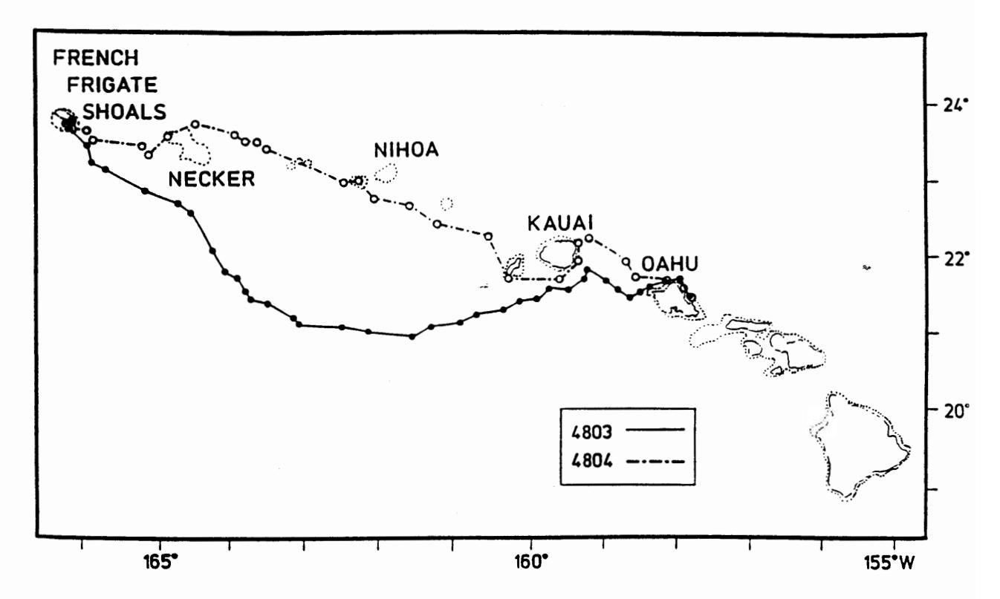
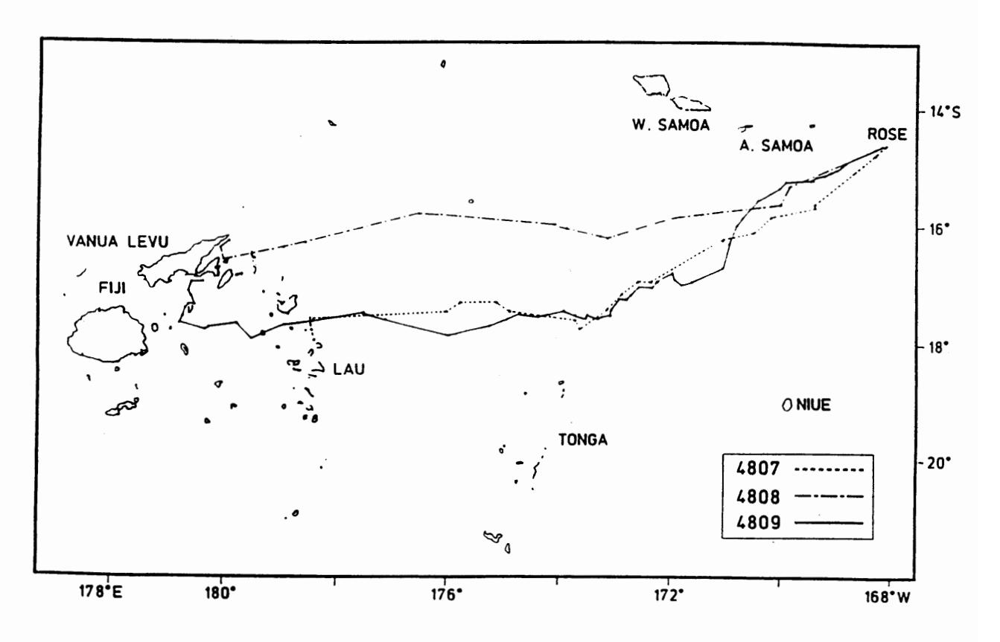

# PROCEEDINGS OF THE FOURTEENTH ANNUAL SYMPOSIUM ON SEA TURTLE BIOLOGY AND CONSERVATION

NOAA Technical Memorandum NMFS-SEFSC-351

# SATELLITE TELEMETRY OF GREEN TURTLES NESTING AT FRENCH FRIGATE SHOALS, HAWAII, AND ROSE ATOLL, AMERICAN SAMOA

George H. Balazs 1 Peter Craig 2 Bryan R. Winton 1 Russell K. Miya 1 Proceedings of the Fourteenth Annual Symposium on Sea Turtle Biology and Conservation, March 1-5, 1994, Hilton Head, South Carolina.

- National Marine Fisheries Service, Southwest Fisheries Science Center, Honolulu Laboratory, 2570 Dole Street, Honolulu, Hawaii 96822-2396 USA
- 2 Department of Marine and Wildlife Resources, American Samoa Government, P. O. Box 3730, Pago Pago, American Samoa 96799

Biotelemetry using the Argos satellite system was conducted for the second consecutive year in the Hawaiian Islands to determine migratory routes, swimming behaviors, and resident foraging pastures of green turtles, *Chelonia mydas*, nesting at French Frigate Shoals. In addition, in a cooperative study with the American Samoa Government, transmitters were deployed in the South Pacific during 1993 on green turtles nesting at Rose Atoll, the easternmost island of the Samoan Archipelago.

Satellite telemetry of sea turtles in Hawaii was initiated in 1992 and resulted in the first known successful high-seas tracking of a green turtle migrating from a nesting site to a resident foraging pasture (Balazs 1994). Satellites have not been previously used to study sea turtle migrations elsewhere in the oceanic islands of Polynesia, Melanesia, and Micronesia. Both French Frigate Shoals (Balazs 1976, 1983) and Rose Atoll (Sachet 1954, Balazs 1982, Tuato'o-Bartley et ál. 1993) are historically prominent nesting sites for green turtles in this region. Although relatively small numbers nest at these isolated rookeries, both are important components to the overall survival and ecologic understanding of green turtles in the insular Pacific.

Intensive flipper tagging at French Frigate Shoals since 1973 has shown that reproductive migrations of green turtles take place to and from numerous coastal foraging areas throughout the 2400 km span of the Hawaiian Archipelago. In contrast, few turtles (50 since 1980- all *C. mydas*) have ever been tagged at Rose Atoll. Only two distant recoveries have thus far resulted from this intermittent work. A turtle tagged at Rose in 1980 was captured and killed in a net in 1986 at Kadavu, Fiji; and another one tagged at Rose in 1988 was reported speared in the Sikatoka area of Viti Levu, Fiji, in 1992 (Balazs 1993).

## **METHODS**

Telonics ST-3 transmitters configured for backpack mounting were deployed on two turtles at French Frigate Shoals during August 1993, and on three turtles at Rose Atoll during November 1993. The transmitters were safely and securely attached using thin layers of fiberglass cloth and polyester resin. This technique was patterned after procedures used by Byles and Keinath (1990), Beavers et al. (1992), and Renaud et al. (1993). However, Rolyan Silicone Elastomer, a two-part splinting agent used in human medicine, was incorporated into the procedure. This product made it possible to rapidly and effectively custom-mount the transmitter against the contour of the carapace (at the second central scute). Silicone Elastomer cures within a few minutes after mixing, and no heat is produced in the process. During the two hours required to accomplish transmitter attachment, the turtles were harmlessly confined in a prone position using a shaded portable plywood container designed for this purpose. The ST-3 transmitters weighed 765 g and measured 17 x 10 x 3.5 cm with the antenna extending 13 cm from the top. The transmitters were programmed with a duty cycle of 6 hours on, 6 hours off.

#### RESULTS

Detailed high-seas tracking was successfully accomplished for the post-nesting migrations of all five turtles, as shown in Figures 1 and 2. These results are summarized as follows.

HAWAIIAN TURTLE 4803--Turtle 4803 departed French Frigate Shoals on 9/4/93, 11 days after being fitted with a transmitter during the latter part of the nesting season. She accomplished an 1180 km migration to the southeast, arriving at Kaneohe Bay, Oahu, on 9/30/93. The voyage took 26 days and followed a course well away from land, against prevailing winds and currents, over water thousands of meters deep. Her swimming speed averaged 1.9 km/hr. After reaching Kaneohe Bay, satellite monitoring continued for another 3.5 months. During this time she stayed entirely within the bay. Turtle 4803's route was very similar to those taken by the two turtles satellite-tracked from French Frigate Shoals to Kaneohe Bay in 1992 (Balazs 1994). Both of these previous turtles swam 2.0 km/hr during their migrations, taking 23 and 26 days each to cover 1130 and 1260 km.

HAWAIIAN TURTLE 4804--Turtle 4804 departed French Frigate Shoals on 9/1/93, 7 days after being deployed with a transmitter. She also swam southeast to Kaneohe Bay but, unlike other satellite-telemetered turtles traveling to this location, turtle 4804 followed a route mainly between the islands and reefs along the Hawaiian chain. On this pathway she periodically encountered relatively shallow water and benthic habitats. However, the total distance covered (1100 km), the time in transit (26 days), and the swimming speed (1.8 km/hr) of turtle 4804 were almost the same as the turtles that traveled offshore over open ocean. After arrival, turtle 4804 was recorded within Kaneohe Bay for 3.5 months before the transmitter signal terminated.

SAMOAN TURTLE 4807--A transmitter was deployed on turtle 4807 on 11/4/93. She subsequently stayed within or near Rose Atoll for 72 days, renesting on several occasions. On 1/15/94 she embarked on a 36-day migration, traveling to the southwest, across 1475 km of open ocean to the north of Tonga. She arrived in the Lau Group of Fiji on 2/20/94, averaging 1.7 km/hr. As of late March 1994, turtle 4807 was still transmitting from Lau in the vicinity of Argo Reefs (Mbukatatanoa), just south of Lakemba Passage.

SAMOAN TURTLE 4808--Turtle 4808 was fitted with a transmitter on 11/3/93 and subsequently remained within or near Rose Atoll for 47 days, renesting on several occasions. She departed on 12/20/93 and migrated 1450 km to the southwest, following a route well to the north of the one taken by turtle 4807. She arrived at Vanua Levu, Fiji, in the vicinity of Nateva Bay and Undu Peninsula, on 1/23/94. Her trip took 34 days and averaged 1.8 km/hr. As of late March 1994, she continued to remain in this same nearshore area.

SAMOAN TURTLE 4809--Turtle 4809 remained within or close to Rose Atoll for 22 days after being fitted with a transmitter on 11/3/93. She then left on a 10-day excursion, traveling 60 km to the south on a figure-eight course that covered 300 km at an average speed of 1.4 km/hr. She arrived back at Rose Atoll on 12/5/93 and remained there for 22 more days before departing again on 12/27/93. This time she continued to the southwest, across open ocean, following a route very similar to the one taken by turtle 4807. Turtle 4809 arrived at Vanua Levu, Fiji, on 2/10/94, after swimming 1750 km in 45 days at an average speed of 1.6 km/hr. Her migration terminated in the vicinity of Naweni Point, to the east of Savu Savu Bay on the south shore of Vanua Levu. As of late March 1994, transmitter signals were still being received from this same coastal area.

### ACKNOWLEDGMENTS

The following individuals and organizations are acknowledged for their generous contributions to this study: S. Beavers, E. Flint, G. Grant, K. McDermond, P. Trail, R. Tulafono, F. Tuilagi, M. Webber, D. Yamaguchi, the American Samoa Government, American Samoa Environmental Protection Agency,

\*U.S. Fish and Wildlife Service, National Park Service, and Sea Life Park Hawaii. Dr. Archie Carr is remembered for giving inspiration to track the ocean migrations of green turtles using earth-orbiting satellites.

#### LITERATURE CITED

Balazs, G.H. 1976. Green turtle migrations in the Hawaiian archipelago. Biol. Conserv. 9:125-140.

Balazs, G.H. 1982. Status of sea turtles in the central Pacific. In: K. A. Bjorndal (editor), Biology and conservation of sea turtles, p. 243-252. Smithsonian Institution Press, Washington, DC.

Balazs, G.H. 1983. Recovery records of adult green turtles observed or originally tagged at French Frigate Shoals, Northwestern Hawaiian Islands. U.S. Dep. Commer., NOAA Tech. Memo. NMFS, NOAA-TM-NMFS-SWFC-36, 42 p.

Balazs, G.H. 1993. Historical summary of sea turtle observations at Rose Atoll, American Samoa. unpublished manuscript, 6 p.

Balazs, G.H. 1994. Homeward bound: satellite tracking of Hawaiian green turtles from nesting beaches to foraging pastures. Proceedings of the Thirteenth Annual Symposium on Sea Turtle Biology and Conservation. U.S. Dep. Commer., NOAA Tech. Memo. NMFS, NOAA-TM-NMFS-SEFSC-341, pp. 205-208.

Beavers, S.C., E.R. Cassano, and R.A. Byles. 1992. Stuck on turtles: preliminary results from adhesive studies with satellite transmitters. Proceedings of the Eleventh Annual Workshop on Sea Turtle Biology and Conservation. U.S. Dep. Commer., NOAA Tech. Memo. NMFS, NOAA-TM-NMFS-SEFSC-302, pp.135-138.

Byles, R.A. and J.A. Keinath. 1990. Satellite monitoring sea turtles. Proceedings of the Tenth Annual Workshop on Sea Turtle Biology and Conservation. U.S. Dep. Commer., NOAA Tech. Memo. NMFS, NOAA-NMFS-SEFSC-278, pp. 73-75.

Renaud, M.L., G.R. Gitschlag, and J.K. Hale. 1993. Retention of imitation satellite transmitters fiberglassed to the carapace of sea turtles. Herpetol. Rev. 24(3):94-99.

Sachet, M. 1954. A summary of information on Rose Atoll. Atoll Res. Bull. 29:1-25.

Tuato'o-Bartley, N., T.E. Morrell, and P. Craig. 1993. Status of sea turtles in American Samoa in 1991. Pac. Sci. 47(3):215-221.

Figure 1. Migratory routes taken by Hawaiian turtles 4803 and 4804 from French Frigate Shoals to Kaneohe Bay, Oahu, in the North Pacific Ocean.

Figure 2. Migratory routes taken by Samoan turtles 4807, 4808, and 4809 from Rose Atoll, American Samoa, to the Fiji Islands in the South Pacific Ocean.