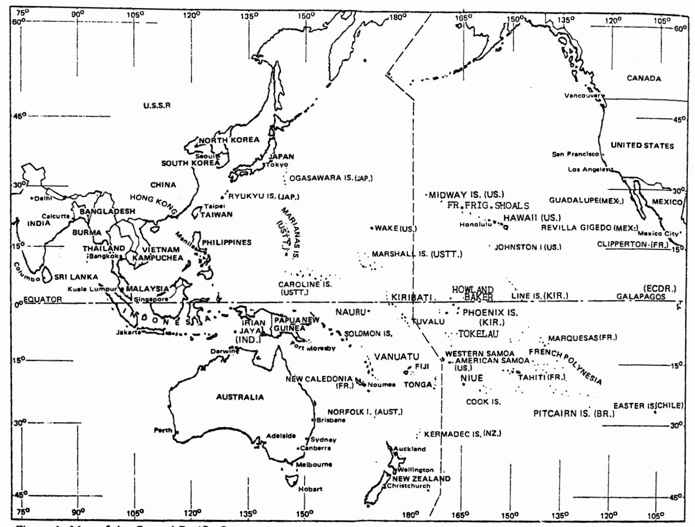
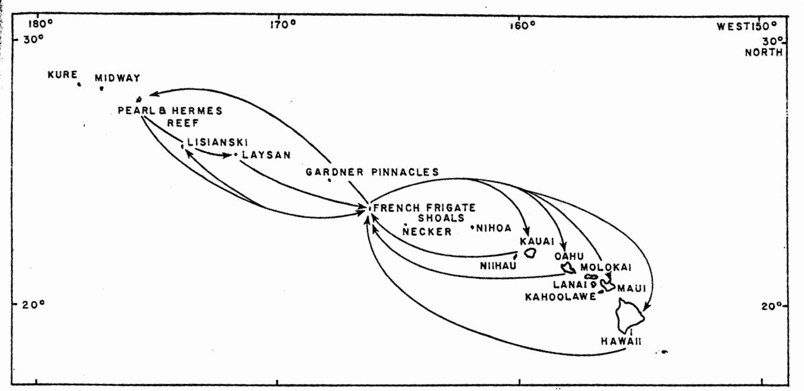
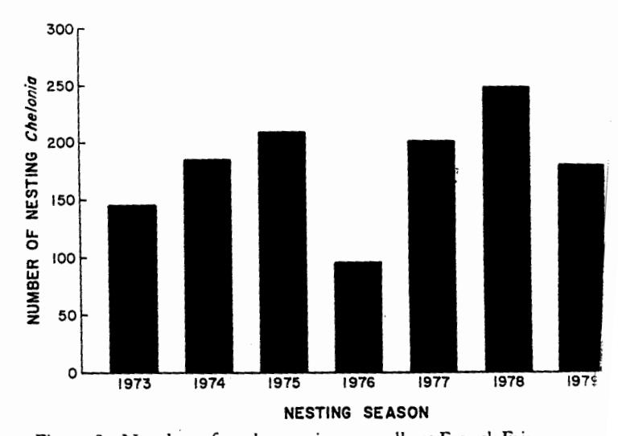

# Biology and Conservation of Sea Turtles

**Revised Edition** 

Edited by Karen A. Bjorndal

**University of Florida** 

Smithsonian Institution Press
Washington and London

Proceedings of the World Conference on Sea Turtle Conservation Washington, D.C., 26–30 November 1979

with contributions on Recent Advances in Sea Turtle Biology and Conservation, 1995 Copyright © 1995 by the Smithsonian Institution. All rights reserved.

First edition published 1982 by the Smithsonian Institution Press.

Library of Congress Cataloging-in-Publication Data

World Conference on Sea Turtle Conservation (1979 : Washington, D.C.)

Biology and conservation of sea turtles / edited by Karen A. Bjorndal. — rev. ed.

p. cm.

"Proceedings of the World Conference on Sea Turtle Conservation, Washington, D.C. 26–30 November 1979 with contributions on Recent advances in sea turtle biology and conservation, 1995."

Includes bibliographical references.

ISBN 1-56098-619-0 (alk. paper)

1. Sea turtles—Congresses. 2. Wildlife conservation—Congresses.

I. Bjorndal, Karen A. II. Title. QL666.C536W65 1979

597.92—dc20

95-18872

British Library Cataloguing-in-Publication Data is available.

The paper in this publication meets the minimum requirements
 of the American National Standard for Permanence of Paper for
 Printed Library Materials Z39.48-1984.

Manufactured in the United States of America.

02 01 00 99 98 97 96 5 4 3

For permission to reproduce the illustrations in this book, please correspond directly with the authors or with the sources, as listed in the individual captions. The Smithsonian Institution Press does not retain reproduction rights for these illustrations individually or maintain a file of addresses for photo sources.

Front cover: Adult female green turtle, Chelonia mydas, at French Frigate Shoals, the major migratory breeding site for this species in the Hawaiian Islands. Photo by G. H. Balazs.

George H. Balazs Hawaii Institute of Marine Biology P.O. Box 1346 Kaneohe, Hawaii 96744

# Status of Sea Turtles in the Central Pacific Ocean

Except for the Hawaiian Archipelago, sea turtle populations in the Central Pacific Ocean and other areas of Polynesia have not been systematically surveyed and only limited information exists on their occurrence and present survival status. This report will sammarize and review what is known for a number of locations within the region, specifically the Hawaiian Archipelago, Line Islands, Phoenix Islands, Cook Islands, American Samoa, Western Samoa, Tokelau, Tuvalu, Wake, Johnston, Howland, and Baker (Figure 1). While the information for most of these areas is clearly inadequate, there is nevertheless evidence to indicate that the numbers of turtles have declined within historical times. At those islands with indigenous human populations, the traditional conservation systems that served to protect turtles and other marine resources from overexploitation have deteriorated considerably, and in some cases vanished altogether. Three interrelated factors contributing to this breakdown have been the introduction of money economies, the decline of traditional authority, and the imposition of new laws and practices by colonial powers (Johannes 1978). In Polynesian societies, sea turtles are known to have played an important role in certain religious ceremonies, in mythology and art, in the production of implements and medication, and as high protein food sources generally reserved for chiefs and priests (Buck 1932; Emory 1933, 1947; Emory, Bonk, and Sinoto 1968; Kalakaua 1888; Pukui and Elbert 1971).

Of the islands covered in this report, only the ones under United States jurisdiction currently have governmental regulations for sea turtles. Under the U.S. Endangered Species Act, all sea turtles at these U.S. areas are fully protected.

#### Status

Hawaiian Archipelago (United States)

Three species of sea turtles occur in Hawaiian waters, the green turtle, Chelonia mydas, the hawksbill, Eret-

Figure 1. Map of the Central Pacific Ocean.

mochelys imbricata, and the leatherback, Dermochelys coriacea. The olive ridley, Lepidochelys olivacea, and the loggerhead, Caretta caretta, have been recorded, but only as rare visitors.

The Hawaiian hawksbill population is small and only known to occur in coastal waters of the 8 main and inhabited islands at the southeastern end of the 2,450-km-long archipelago. Several nestings have been documented on the island of Hawaii where black volcanic sand beaches are utilized. A single nesting has also been recorded on the island of Molokai (Ernst and Barbour 1972).

Leatherbacks are regularly sighted in offshore waters at the southeastern end of the archipelago, but nesting does not take place. During August 1979, at least 10 leatherbacks ranging from 60 to 120 cm in carapace length were sighted in pelagic waters to the northwest of the Hawaiian Archipelago between 40° to 43°N and 175° to 179°W (G. Naftel, in litt.).

Green turtles are by far the most abundant of Hawaiian sea turtles, with mixed aggregations of adults

and immature individuals larger than 35 cm residing in coastal waters throughout the archipelago where they feed on several kinds of benthic algae. In excess of 90 percent of all nesting occurs on 6 small sand islands at French Frigate Shoals (23°45'N, 166°10'W), a 35 km long atoll situated in the middle of the archipelago. Tagging has demonstrated that long-distance migrations to this site are periodically undertaken by adults from numerous resident foraging areas, all of which are within the Hawaiian chain (Figure 2; Balazs 1976a, 1979). Hawaiian green turtles therefore appear to be genetically isolated from other populations in the Pacific. Systematic monitoring of the breeding colony at French Frigate Shoals was initiated in 1973 and has continued during each subsequent year. The number of females nesting annually has been found to fluctuate considerably, with the range extending from 94 in 1976 to 248 in 1978 (Figure 3). No population trends are apparent for the 7-year study period. The production of hatchlings since 1973 has ranged from approximately 12,500 in 1976 to 32,900 in 1978. Predation

Figure 2. Documented migrations of adult green turtles in the Hawaiian Archipelago.

on eggs does not take place at French Frigate Shoals, and predation on hatchlings appears to be minimal. However, predation by tiger sharks (*Galeocerdo cuvier*) on both adults and immature turtles throughout the chain may be substantial (Balazs 1979). Prior to 1973, the annual breeding colony at French Frigate Shoals was incorrectly estimated by previous workers to contain as many as 2,600 to 5,200 turtles (Hendrickson 1969; Amerson 1971).

Hawaiian green turtles exhibit the rare behavioral trait among sea turtles of coming ashore to bask or rest, but only at certain undisturbed sand beaches or rock ledges in the uninhabited Northwestern Hawaiian Islands (Wetmore 1925; Balazs 1976b; Eliot 1978; Lipman 1978). This behavior provides access for the tagging of males as well as females, both at the breeding grounds and at a number of resident foraging areas. However, caution is being exercised in these research activities so that normal behavioral patterns will not be adversely affected.

Large numbers of green turtles were commercially exploited in the Hawaiian Archipelago until 1974 when the State of Hawaii adopted a protective regulation banning this activity. In 1909 all of the Northwestern Hawaiian Islands except Midway were designated as a Bird Reservation, which in 1940 became known as the Hawaiian Islands National Wildlife Refuge. However, the exploitation of turtles in these areas, particularly at French Frigate Shoals, periodically continued until at least 1969 (Amerson 1971; Balazs 1975a). Of concern at the present time is the well-documented, drastic decline of the foraging and basking aggregations in the Northwestern Hawaiian Islands at Laysan Island, Lis-

ianski Island and, to a lesser extent, at Pearl and Hermes Reef. Furthermore, the forthcoming development of various commercial fisheries in this segment of the chain represents a potential threat to the remaining aggregations. Terrestrial areas in the Northwestern Hawaiian Islands are under review by the Fish and Wildlife Service for designation as Critical Habitat under the U.S. Endangered Species Act (Dodd 1978; see also Balazs 1978).

# Johnston Atoll (United States)

Johnston Atoll is located at 16°45'N, 169°31'W and

Figure 3. Number of turtles nesting annually at French Frigate Shoals.

contains 4 islands, 2 of them completely man-made. From the late 1950s until 1962, nuclear weapons' testing was conducted over the atoll. The area is administered by the Nuclear Defense Agency, but is now used prinicipally as a storage site for chemical munitions (Inder 1978). Johnston is concurrently managed as a National Wildlife Refuge.

Both immature and adult green turtles are regularly seen foraging in shallow waters, but nesting is not known to take place. Courtship behavior and possibly sustained copulation have, however, been periodically reported by resident personnel. Numerous species of algae occur within the atoll (Buggeln and Tsuda 1966), including Caulerpa racemosa, Codium arabicum and Gelidium pusillum which are known food sources of green turtles (Balazs 1979). Large sharks that are probably tiger sharks have been observed attacking and feeding on turtles (C. Cecrle in litt.).

## Wake (United States)

Wake is an inhabited atoll located at 19°18'N, 166°35'E that is administered by the U. S. Air Force. Both immature and adult green turtles are regularly observed foraging in the lagoon and along the outside perimeter of the atoll. Nesting has never been recorded.

# Howland and Baker (United States)

Howland (0°48'N, 176°38'W) and Baker (0°13'N, 176°28'W), 2 low coral islands, were designated National Wildlife Refuges in 1974 and are now uninhabited. Turtles were reported to be "abundant" in the waters around Howland by residents present in May and June of 1935 (Bryan 1974). No information on turtles exists for Baker. Feral cats, which are known in some areas to be predators of hatchlings and eggs, are present on both of these islands.

#### Line Islands

All of the Line Islands are low coral islands and atolls. The Northern Line Islands consist of Kingman Reef, Palmyra and Jarvis, under the jurisdiction of the United States; and Washington, Fanning and Christmas under the jurisdiction of the newly independent nation of Kiribati (formerly the Gilbert Islands). The Southern Line Islands are also under the jurisdiction of Kiribati and consist of Malden, Starbuck, Vostok, Caroline, and Flint, all of which are now uninhabited. Information on sea turtles exists only for the following locations.

• Palmyra (5°53'N, 162°05'W). From 1958 to 1965, green turtles were periodically seen in shallow waters at the eastern side of the atoll. On one of these occasions a group of 11 adults was observed foraging together (P. Helfrich and J. Naughton, personal com-

munication). Similar observations have also been made during recent years (M. Vitousek, personal communication). There are no reports of nesting. Algal collections at Palmyra have included *Pterocladia*, a known food source of green turtles (Dawson 1959; Balazs 1979). The atoll is now used as a copra plantation and has a small resident human population. Along with Midway and Wake, the U.S. government is considering Palmyra as an international storage site for nuclear wastes.

- Jarvis (0°23'S, 160°01'W). A low level of nesting, apparently involving green turtles, was recorded along the western coast of Jarvis by residents present in August of 1935 (Bryan 1974). The island was designated a National Wildlife Refuge in 1974 and is now uninhabited. Feral cats are present on the island.
- Fanning (3°52'N, 159°20'W). Turtles were reported to "abound" at Fanning in the 1850s (Burnett 1910, quoted by Wiens 1962). The atoll has been continuously inhabited since 1852 and used principally as a copra plantation. A small number of turtles are regularly sighted in the lagoon, and a low level of nesting still takes place. The residents capture turtles whenever possible.
- Christmas (1°59'N, 157°30'W). When Captain James Cook discovered uninhabited Christmas atoll in late December of 1777, between 200 and 300 green turtles were captured during the 8-day visit (Beaglehole 1967). Turtles were taken both in the shallow lagoon and on the beaches, with weights ranging from 20 to 90 kg. Publicity resulting from Captain Cook's visit caused numerous whaling vessels to stop at the atoll for provisions (Bryan 1942). Green turtles were still abundant in 1838 (Tresilian 1838, quoted by Wiens 1962). Christmas has been inhabited and used as a copra plantation since 1902. Nuclear weapons' testing was conducted over the atoll by the British from 1956 to 1958, and by the United States in 1962 (Inder 1978). In 1975 a visitor noted that some nesting was still taking place, but no details were available (D. Crear, personal communication).
- Vostok (10°06'S, 152°23'W). In June of 1965, Clapp and Sibley (1971a) saw several turtles in the waters surrounding Vostok, but no signs of nesting were found. M. Vitousek (personal communication) was informed that numerous turtle tracks were seen on the beaches during a visit made in recent years, but no details are available. Vostok is only 1.2 km².
- Malden (4°1'S, 154°58'W). No evidence of turtles has been found during several recent visits to Malden (E. Vitousek, personal communication).
- Caroline (9°58'S, 150°14'W). Dixon (1884) reported that turtles were seen at Caroline, but not in great numbers. No turtles were seen by Clapp and Sibley (1971b) during a 2-day visit in June 1965.

## Phoenix Islands

The Phoenix group is under the jurisdiction of Kiribati and consists of 8 low coral islands and atolls. Only Canton is now inhabited.

- Canton (2°50'S, 171°43'W). Green turtles nest along the northern, eastern and western shores of Canton throughout the year, but greater numbers are present during October and November (Balazs 1975b). The total annual number of nesting females using the atoll may involve as many as 200 turtles. Large populations of ghost crabs (Ocypode spp.) and hermit crabs (Coenobita perlitus) are present and probably prey heavily on hatchlings. It is not uncommon for nesting females and hatchlings to become disoriented and travel inland where they die of hyperthermia. Adult males and females in groups of up to 40 individuals have been observed foraging close to shore in water less than 50-cm deep (J. Hass, in litt.). Algal collections from Canton have included Caulerpa racemosa, Codium arabicum, Gelidium pusillum, and Pterocladia (Dawson 1959).
- Enderbury (3°07'S, 171°03'W). Green turtles nest along Enderbury's western and eastern shores (Balazs, 1975b; J. Keys, in litt.). King (1973) listed this island as one of the most important nesting sites for green turtles in the Central Pacific. Two Korean fishing vessels were wrecked on the island during recent years.
- Phoenix (3°43'S, 170°43'W). Turtle bones were found on Phoenix during a visit in 1924 and nesting was presumed to take place (Bryan, 1942). Feral rabbits are present on the island.
- Birnie (3°35'S, 171°31'W). During a low-altitude overflight of the Phoenix group in January 1978, the author found the beaches of Birnie to be covered with turtle tracks. Birnie is the smallest island in the Phoenix group (0.5 by 1.25 km) and the only one that has never been inhabited or mined for guano.
- Hull (4°30'S, 172°10'W). Green turtles nest along the northeastern and southeastern shores of Hull (Balazs 1975b; J. Keys, in litt.). When the U.S. Exploring Expedition visited this atoll in August 1840, a Frenchman and 11 Tahitians were found to have been stationed there to catch turtles (Wilkes 1845). In May 1974 large numbers of dead fish and an adult male green turtle were found washed ashore from inside the lagoon. The cause of this mortality could not be determined.
- Sydney (4°27'S, 171°16'W). Turtle tracks have been observed on Sydney's northwestern shore (Balazs, 1975b). Evidence of trespassing by crewmembers of foreign fishing vessels has been found on this atoll during recent years.
- Gardner (4°40'S, 174°32'W). Turtle tracks have been observed on Gardner's southwestern shore (Balazs 1975b). Evidence of trespassing has also been found on this atoll.

• McKean (3°36'S, 174°08'W). No information on turtles exists for McKean. Several foreign fishing vessels have been wrecked on the island.

# American Samoa (United States)

American Samoa consists of the mountainous volcanic islands of Tutuila and the Manua group (Ofu, Olosega, Tau), and Swains and Rose Atoll which are of coral origin. Approximately 94 percent of the Polynesian inhabitants reside on Tutuila (port city—Pago Pago). Rose is the only uninhabited island in the group. Certain terrestrial areas, including Swains and Rose, are under review by the Fish and Wildlife Service for designation as Critical Habitat under the U.S. Endangered Species Act (Dodd 1978).

- Tutuila (14°16'S, 170°40'W) and Manua group (14°10'S, 169°35'W). Green turtles and hawksbills occur in the waters surrounding these islands, but apparently only in small numbers. There is some indication that the hawksbill is the more abundant species. Occasional nesting on isolated beaches is thought to take place (Coffman 1977; S. Swerdloff, W. Pedro and R. Wass, personal communication).
- Swains (11°03'S, 171°05'W). Green turtles and hawksbills are known to nest at Swains (Swerdloff, personal communication). Turtle eggs were observed being gathered by the native inhabitants during July and August 1963 (Pedro, personal communication). The atoll is only 2 km in diameter.
- Rose Atoll (14°33'S, 168°09'W). Green turtles, and probably some hawksbills, nest on the islets (Rose and Sand) at Rose Atoll. An account in the 1800s stated that large numbers of turtles nest during August and September, and that numerous sharks prey on the hatchlings (Graeffe 1873, quoted by Hirth 1971a). On 7 October 1970, Hirth (1971a) counted 35 and 301 nesting pits of varying age on Sand and Rose Islets, respectively. Fishermen in Pago Pago confirmed that the peak nesting season is August and September.

On a low-altitude overflight in October 1974, 75 adult turtles were counted within the lagoon (P. Sekora, personal communication). During a 5-day visit in May 1976, only 3 adults and 1 immature green turtle were observed, and no nesting took place (Coffman 1977). During a daytime visit on 29 March 1978, Coleman (1978) recorded 1 recently excavated pit on Rose and 4 that he estimated to be 1-month old. Other older pits were noted, as well as a single adult green turtle in the lagoon and the rib bones of a turtle on Sand Islet. Numerous black-tipped sharks (Carcharbinus melanopterus) 20- to 40-cm long were present.

Direct observations of predation on hatchlings by rats have been made during recent years (Swerdloff,

personal communication), but the extent and significance are unknown. Mayor (1921) was the first author to record rats at Rose. Hirth (1971a) stated that Rose Islet "swarms with rats (possibly Rattus exulans)." Coleman (1978) found that rats were "extremely abundant" and thought that black rats (Rattus rattus) might be present.

Following the recommendations of Hirth (1971a), Rose Atoll was designated a National Wildlife Refuge in 1974 (see also Rockefeller and Rockefeller 1974).

#### Western Samoa

Western Samoa is an independent nation consisting of 2 large islands of volcanic origin (Savaii and Upolu) and several offshore islets. The islands are located between 13° to 15°S and 168° to 173°W. Approximately 72 percent of the 152,000 Polynesian inhabitants reside on Upolu Island.

Green turtles and hawksbills occur in the surrounding waters of both Savaii and Upolu. The green turtle has been reported by fishermen to be the more abundant (Hirth 1971a). It is uncertain whether this species nests in the area. Hawksbills are known to nest, but now only on the offshore islets of Namua, Nuutele, and Nuulua located at the western end of Upolu. The nesting season extends from October to June, with most activity occurring in January and February. Nesting tracks counted by Witzell (1972a) suggest that not more than 45 females use these beaches each season. The number of hawksbills is believed to have declined considerably, due mostly to human exploitation of eggs and nesting females (Witzell 1972a, 1972b, 1974). The coasts of both Upolu and Savaii were reported to have abounded with turtles in the early 1800s (Williams 1837).

In 1971 a hatchery project was initiated by the Fisheries Division and 2 U.S. Peace Corps volunteers in an attempt to replenish the hawksbill population. This effort has continued until the present time. During each nesting season as many freshly laid eggs as possible are transferred from the 3 islets and reburied at a protected facility on the adjacent mainland shore of the Aleipata district. Hatchlings are held for up to 3 months in concrete tanks before being released into offshore waters. Marginal scutes have been notched for identification purposes. Hatchery data for the years 1973 through 1975 are as follows (from Anonymous 1974, 1975; A. Phillip, O. Gulbrandsen and T. Poutoa, personal communication):

| Year | Eggs collected | Eggs hatched       |
|------|----------------|--------------------|
| 1973 | 4,656          | 3,257 (70 percent) |
| 1974 | 6,231          | 4,951 (79 percent) |
| 1975 | 5,159          | 2,460 (48 percent) |

This restocking effort has been considered at least a partial success by fisheries personnel because several marked immature turtles have been found for sale on Upolu (Anonymous 1975). Educational programs have also been periodically conducted to inform the populace of the need to conserve sea turtles (Witzell 1972b, 1974).

Based on the advice of an FAO sea turtle consultant, plans were prepared for a ranching industry in which hawksbill hatchlings would be grown to a size suitable for stuffing and export to Japan (Banner 1971). However, raising the turtles for more than a few months was not found to be feasible. Difficulties encountered included the need to frequently change the sea water in the rearing tanks, the presence of disease which caused serious tissue necrosis, the turtles' constant biting of one another, and the absence of a suitable, inexpensive food (Witzell 1972a; Anonymous 1974).

# Tokelau

Tokelau is a New Zealand dependency consisting of three atolls (Atafu, Fakaofo, Nukunonu) located between 8° to 10°S and 171° to 173°W. The total Polynesian population is 1,600.

Hirth (1971a) reported that green turtles and, to a much lesser extent, hawksbills nest in Tokelau during September and October, but that their numbers were rapidly declining. In 1977, 1 of the remaining nesting sites was along the southern portion of Taulagapapa Islet at Nukunonu Atoll (N. Walton, personal communication).

#### Tuvalu

Tuvalu, formerly known as the Ellice Islands, is a newly independent nation comprised of 9 coral islands and atolls located between 5° to 10°S and 176° to 180°E. From north to south, the group consists of Nanumea, Niutao, Nanumanga, Nui, Vaitupu, Nukufetau, Funafuti, Nukulaelae, and Niulakita. The total Polynesian population is estimated to be 9,000. The capital of the group, Funafuti Atoll (8°30'S, 179°10'E), is 18 by 25 km and contains 30 islets (Inder 1978).

Hedley (1896), quoted by Wiens (1962), stated that "the green turtle was the only one found at Funafuti," but no additional information was provided. Carr (1965) listed the atoll as a minor green turtle nesting area, while Hirth (1971b) included it among important nesting sites in the western hemisphere. No other information on turtles is known to exist for Funafuti or other members of the group. However, in 1972 an intense tropical cyclone struck Funafuti and deposited an 18-km-long rampart of coral rubble along the atoll's southeastern outer reef (Maragos, Baines, and Beveridge 1973). The impact of this new formation on

available nesting habitat could be substantial.

The coinage of Tuvalu includes a \$1-piece displaying the green turtle. Furthermore, the commemorative stamps issue in 1976 features a leatherback and the uninhabited atoll of Niulakita. This would suggest that leatherbacks either nest or are sighted in the area.

#### Cook Islands

The Cook group, a self-governing state associated with New Zealand, consists of 15 volcanic islands and atolls located between 9° to 23°S and 156° to 167°W. The islands of volcanic origin include Rarotonga, Aitutaki, Atiu, Mitiaro, Mauke, and Mangaia, while the coral atolls, most of which are in the northern portion of the group, include Palmerston, Suwarrow, Pukapuka (not to be confused with Pukapuka in the Tuamotu Archipelago), Nassau, Manihiki, Rakahanga, Penrhyn (Tongareva), Manuae, and Takutea. There are approximately 18,000 Polynesian inhabitants, 54 percent of which live on Rarotonga. Information on the occurrence of turtles exists for the following locations.

• Palmerston (18°04'S, 163°10'W). Powell (1957), quoted by Weins (1962), indicated that green turtle eggs were "fairly plentiful" at Palmerston and that both turtles and eggs were frequently used for food by the 85 inhabitants. Carr (1965) considered Palmerston to be a major Pacific nesting site for green turtles. Although Hirth (1971b) included the atoll in a list of important nesting sites in the western hemisphere, it was stressed that the number of turtles involved was unknown and that the situation warranted immediate research attention.

In 1977 each family on the atoll had a tradition of raising 15 hatchlings in floating cages for 1 to 3 months before releasing them as a restocking effort (S. Kavakana and D. Brandon, personal communication). This practice apparently started in the 1950s following recommendations offered by Powell (1957). However, other reports in 1977 indicated that, instead of being released, many of the turtles were gutted, injected with formalin, and sent as curios to relatives in New Zealand. From 1972 to 1977 a decline in the number of nesting turtles was observed by the inhabitants, thereby prompting the local Island Council to prohibit the use of spearguns (T. Wichman, personal communication). Approximately 4 to 5 turtles are sent from Palmerston each year to the market in Rarotonga where the meat is not readily accepted by the residents and sells for only US\$0.45 to 0.90 per kg. Large shells, however, bring US\$50.00 or more in the growing tourist trade. Hatchlings were reported to be present at Palmerston in January (Brandon 1977), but the range of months in which nesting takes place is unknown.

Prior to 1862 Palmerston was uninhabited. In that

- year an Englishman (William Marsters) and 3 women from Penrhyn settled on the atoll and founded the colony that now exists (Bryan 1942).
- Pukapuka (10°53'S, 165°49'W). Green turtles and some hawksbills nest on one of the uninhabited islets at Pukapuka. Turtles and eggs that are taken from this location must be shared among the native inhabitants of the atoll (D. Clark, personal communication).
- Manihiki (10°25'S, 161°01'W). Green turtles, and possibly some hawksbills, nest at Manihiki. The natives take both the turtles and eggs for food. Hatchlings are also raised for a few months and preserved with formalin for shipment to relatives in New Zealand (T. Wichman, personal communication).
- Rakahanga (10°02'S, 161°05'W). Both Carr (1965) and Hirth (1971b) list Rakahanga as a nesting site for green turtles. Gill (1876), quoted by Wiens (1962), stated that "Several species of turtle—loggerhead, hawksbill, green turtle, etc.,—are very plentiful on Rakahanga in the breeding season." Although loggerheads (as well as leatherbacks) have occasionally been sighted in the Cook Islands (Brandon, 1977), this is the only known report of nesting. The northwestern point of Rakahanga is named Te Mata i Pahonu and relates to sea turtles.
- Penrhyn (9°0'S, 157°59'W). Green turtles and some hawksbills are known to nest at Penrhyn and forage in the adjacent waters. During 1976 between 40 and 50 turtles of unknown sizes were taken principally for their shell. A few were sent to Rarotonga, but most were used for trading with Japanese, Korean, and Taiwanese fishing vessels that illegally visit the atoll (Brandon 1977 and personal communication).
- Suwarrow (13°15'S, 163°06'W). Brandon (1977) lists Suwarrow as a nesting site for turtles, but no details are provided. One of the islets is named Turtle Island. Only one person lives on the atoll.
- Manuae (19°16'S, 158°58'W). In May of 1975 the Cook Islands' Government donated Manuae for use as the first World Marine Park (Allen 1975; see also Shadbolt 1967). However, questions of ownership of the atoll have prevented this action from being carried out. Manuae is listed by Brandon (1977) as a nesting site for turtles, but details are not provided.
- Takutea (19°49'S, 158°18'W). Takutea is also listed as a nesting site for turtles by Brandon (1977), but again no details are provided.

From 1974 to 1977, studies on the rearing of green turtles as a village industry were conducted at Rarotonga with financial support from the South Pacific Commission (Baird 1975; see also Powell 1957; Anonymous 1972). As part of this project, laboratory experiments were also carried out at the University of the South Pacific in Fiji (Raj 1975). The findings of this work were similar to those made in Western Samoa, in that problems of disease and a suitable, inex-

pensive food supply could not be resolved (Brandon 1977, Balazs 1977, Anonymous 1978).

#### Recommendations

The survival status of sea turtle populations occurring in the areas covered by this report can be enhanced through implementation of the following recommendations.

- 1. Where appropriate, island governments should attempt to reinforce the traditional conservation systems that formerly served as a buffer for sea turtles. The absence of governmental regulations for most of the areas covered makes it imperative that some protective action be undertaken, but in close consultation with native inhabitants.
- 2. Known rookeries should be intensively monitored during the peak period of at least 1, but preferably several, nesting seasons to determine the number of females present. As a minimum, this should include Rose Atoll, Enderbury, Birnie, Palmerston, Penrhyn, and the offshore islets of Namua, Nuutele, and Nuulua in Western Samoa. Tagging with durable tags (see Balazs, this volume) should be carried out as an integral part of this work to gain some insight into the occurrence of international migrations, hence shared usage of resources.
- 3. Based on the results of Recommendation 2, and in harmony with Recommendation 1, governments should be encouraged to designate certain islands and their surrounding waters as sea turtle sanctuaries. This would be a relatively uncomplicated undertaking in the Phoenix group and Southern Line Islands where most of the islands are currently uninhabited and unused by man.
- 4. The illegal landings on uninhabited islands by foreign fishing vessels should be investigated by an international task force. Such violations constitute a worldwide problem and usually involve the theft and destruction of natural resources that include sea turtles.
- 5. A comprehensive appraisal should be undertaken of the 9-year-old hawksbill hatchery in Western Samoa. The results of this little-known conservation experiment may be of considerable value to worldwide efforts aimed at saving endangered hawksbill populations.
- 6. The predation on hatchlings by rats at Rose Atoll should be quantified and control methods implemented if the conditions warrant.
- 7. Military agencies of the U.S. government administering islands covered in this report should undertake

a thorough investigation of the aggregations of sea turtles occurring at such sites. This would include Johnston Atoll, Kingman Reef, Wake, and Midway in the Northwestern Hawaiian Islands. Any plans for the storage of nuclear wastes and other highly toxic substances on Pacific islands should include a careful evaluation of the potential impact on both nesting and foraging aggregations of turtles.

8. The Hawaiian Islands National Wildlife Refuge should encompass a substantial amount of surrounding marine habitat to serve as a buffer against the forthcoming development of commercial fisheries.

# Acknowledgments

The research involved in preparing this report was jointly funded by the State of Hawaii, Office of the Marine Affairs Coordinator, and the University of Hawaii Sea Grant College Program under Institution Grant Numbers 04-7-158-44129, 04-8-MOI-178 and NA79AA-D-0085 (NOAA, Office of Sea Grant, Department of Commerce). I would also like to gratefully acknowledge the support and assistance of the U.S. Fish and Wildlife Service, the National Marine Fisheries Service (Honolulu Laboratory), the Hawaii State Division of Fish and Game, the South Pacific Commission, the Fourteenth U.S. Coast Guard District, the Fifteenth Air Base Wing of the U.S. Air Force, and the New York Zoological Society. Appreciation is also extended to Fisheries Departments of the Cook Islands and Western Samoa for their hospitality and assistance during my visits in 1977. This is contribution number 578 of the Hawaii Institute of Marine Biology and conference paper number UNIHI-SEAGRANT-CP-80-05 of the University of Hawaii Sea Grant College Program.

From 11 to 14 December 1979 a workshop on sea turtles in the Pacific islands was to be jointly held by the South Pacific Commission and the U. S. National Marine Fisheries Service in Noumea, New Caledonia.

#### Literature Cited

Allen, R.

1975. Marine Parks: the Cinderella of conservation. New Scientist 14 August: 366-69.

Amerson, A. B.

 The natural history of French Frigate Shoals, Northwestern Hawaiian Islands. Atoll Research Bulletin 150:1-303.

Anonymous

- Cook Islands Marine and Atoll Development Agency (CIMADA)—total atoll production system. Aquaculture 1:231.
- 1974. Fisheries Division annual report 3. Turtle Project. Government of Western Samoa, Apia.
- 1975. Fisheries Division annual report—Turtle Project.

Government of Western Samoa, Apia.

1978. Report on the South Pacific Commission turtle project in the Cook Islands. Noumea, New Caledonia: South Pacific Commission.

Baird, R., editor

1975. SPC inshore special project: turtles. The SPC Fisheries Newsletter 13:13-14.

Balazs, G. H.

1975a. Green turtle's uncertain future. Defenders 50:521-23.

1975b. Marine turtles in the Phoenix Islands. Atoll Research Bulletin 184:1-7.

1976a. Green turtle migrations in the Hawaiian Archipelago. Biological Conservation 9:125-40.

1976b. Hawaii's Seabirds, Turtles and Seals. Honolulu: World Wide Distributors.

1977. South Pacific Commission Turtle Project—a constructive review and evaluation with recommendations for future action. Report prepared for the South Pacific Commission, Noumea, New Caledonia. University of Hawaii, Hawaii Institute of Marine Biology, Kaneohe.

1978. Terrestrial critical habitat for sea turtles under United States jurisdiction in the Pacific region. 'Elepaio 39:37–41.

1979. Synopsis of biological data on the green turtle in the Hawaiian Islands. National Oceanic and Atmospheric Administration, National Marine Fisheries Service, contract number 79–ABA–02422.

Banner, A. C.

1971. Proposal and plan for a turtle ranch at Aleipata to determine the feasibility of developing an export industry for hawksbill turtles. Aleipata, Western Samoa.

Beaglehole, J. C., editor

1967. The Journals of Captain James Cook: The Voyage of the Resolution and Discovery, 1776-1780. Cambridge: Hakluyt Society

Brandon, D. J.

1977. Turtle farming: progress report on the South Pacific Commission turtle farming project in the Cook Islands. Proceedings of the SPC Ninth Technical Meeting on Fisheries, Working Paper 21:1-12.

Bryan, E. H., Jr.

1942. American Polynesia and the Hawaiian Chain. Honolulu: Tongg Publishing Company.

1974. Panala'au Memoirs. Honolulu: Bernice P. Bishop Museum.

Buck, P. H.

1932. Ethnology of Tongareva. Bernice P. Bishop Museum Bulletin 92:1-225.

Buggeln, R. G., and R. T. Tsuda

1966. A preliminary marine algal flora from selected habitats on Johnston Atoll. University of Hawaii, Hawaii Institute of Marine Biology, Technical Report 9:1-29.

Burnett, F.

1910. Through Tropic Seas. London: F. Griffiths.

Carr, A.

1965. The navigation of the green turtle. Scientific American 212:79-86.

Clapp, R. B., and F. C. Sibley

1971a. The vascular flora and terrestrial vertebrates of Vostok Island, South-Central Pacific. Atoll Research Bulletin 144:1–10.

1971b. Notes on the vascular flora and terrestrial vertebrates of Caroline Atoll, Southern Line Islands. Atoll Research Bulletin 145:1-18.

Coffman, D. M.

1977. An inventory of the wildlife and wildlife habitat of the islands of American Samoa. Report to the United States Fish and Wildlife Service, Honolulu. Environmental Consultants, Inc., vol. 1.

Coleman, R. A.

1978. Trip Report—Rose Atoll National Wildlife Refuge, 28–30 March 1978. United States Fish and Wildlife Service, Honolulu. Manuscript, 3 pp.

Dawson, E. Y.

1959. Some marine algae from Canton Atoll. Atoll Research Bulletin 65:1-5.

Dixon, W. S.

1884. Notes on the zoology of Caroline Island. In Report of the operations of the American expedition to observe the total eclipse 1883, May 6 at Caroline Island, South Pacific Ocean. *National Academy of Sciences*, Memoirs Number 2:90–92.

Dodd, C. K., Jr.

1978. Terrestrial critical habitat and marine turtles. Bulletin Maryland Herpetological Society 14:233-40.

Eliot, J. L.

 Hawaii's far-flung wildlife paradise. National Geographic 153:670–91.

Emory, K. P.

1933. Stone remains in the Society Islands. Bernice P. Bishop Museum Bulletin 116:1-179.

1947. Tuamotuan religious structures and ceremonies.

Bernice P. Bishop Museum Bulletin 191:1-101.

Emory, K. P.; W. J. Bonk; and Y. H. Sinoto

1968. Fishhooks. Bernice P. Bishop Museum Special Publication 47:1-62.

Ernst, C. H., and R. W. Barbour

1972. Turtles of the United States. The University Press of Kentucky.

Gill, W.

1876. Life in the Southern Isles. London: Religious Tract Society.

Graeffe, E.

1873. Samoa oder die schifferinseln. I. Topographie von Samoa. Jour. Mus. Godeffroy 1:1-32.

Hedley, C.

1896. General account of the atoll Funafuti. Australia Museum Memoirs, no. 3.

Hendrickson, J. R.

 Report on Hawaiian marine turtle populations. IUCN Publications New Series 20:89–95.

Hirth, H. F.

1971a. South Pacific islands—marine turtle resources. A report prepared for the Fisheries Development Agency Project. FAO, Rome.

1971b. Synopsis of biological data on the green turtle Chelonia mydas (Linnaeus) 1758. FAO Fisheries Synopsis 85:1:1-8:19.

Inder, S., editor

Pacific Islands Year Book. Sydney: Pacific Publications.

Johannes, R. E.

 Traditional marine conservation methods in Oceania and their demise. Annual Review of Ecology and Systematics 9:349-64.

Kalakaua, D., King

1888. The Legends and Myths of Hawaii. New York: C. L. Webster and Company.

King, W. B.

 Conservation status of birds of Central Pacific islands. The Wilson Bulletin 85:89-103.

Lipman, V.

1978. Hawaii's endangered wildlife: what chances for survival? Honolulu Magazine 13:47-62.

Maragos, J. E.; G. B. K. Baines; and P. J. Beveridge

1973. Tropical cyclone Bebe creates a new land formation on Funafuti Atoll. *Science* 181:1161–64.

Mayor, A. G.

1921. Rose Atoll, Samoa. Science 54:390.

Powell, R.

1957. Breeding turtles for profit. South Pacific Commission Quarterly Bulletin 7:41-42.

Pukui, M. K., and S. H. Elbert

 Hawaiian Dictionary. Honolulu: The University Press of Hawaii.

Raj, V.

1975. U.S.P.-based turtle research: progress report 1974–1975 breeding season. Proceedings of the SPC Eighth Technical Meeting on Fisheries, Noumea, New Caledonia, Working Paper 23:1–8.

Rockefeller, M., and L. S. Rockefeller

1974. Problems in paradise. *National Geographic* 146:782–93.

Shadbolt, M.

1967. New Zealand's Cook Islands: paradise in search of a future. *National Geographic* 132:203-31.

Tresilian, F.

1838. Remarks on Christmas Island. *Hawaiian Spectator* 1:245-47.

Wetmore, A.

1925. Bird life among lava rock and coral sand. National Geographic 48:77-108.

Wiens, H. J.

1962. Atoll Environment and Ecology. New Haven: Yale University Press.

Wilkes, C.

 Narrative of the United States Exploring Expedition, 1838–1842, vol. 5. Philadelphia: Lea C. Blanchard.

Williams, J.

1837. A Narrative of Missionary Enterprises in the South Sea Islands, with Remarks upon the Natural History of the Islands, Origin, Languages, Traditions and Usages of the Inhabitants. New York: D. Appleton and Company.

Witzell, W. N.

1972a. The hawksbill turtle (Eretmochelys imbricata squamata) in western Samoa. Proceedings of the SPC Fifth Technical Meeting on Fisheries, Noumea, New Caledonia, Working Paper 3:1-22.

1972b. To live or not to live. International Turtle and Tor-

toise Society Journal 6:32-35.

1974. The conservation of the hawksbill turtle in Western Samoa. South Pacific Bulletin, First Quarter:33-36.