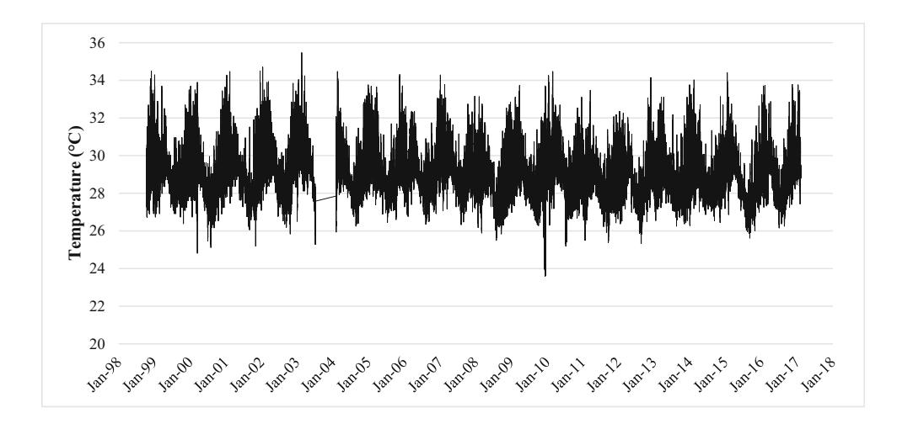
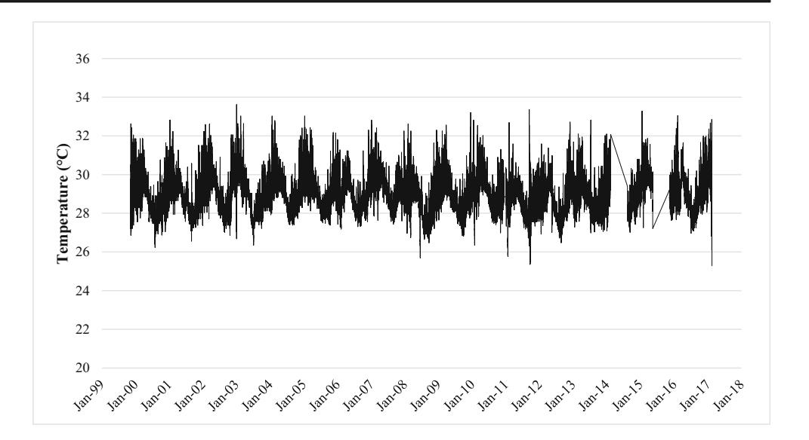
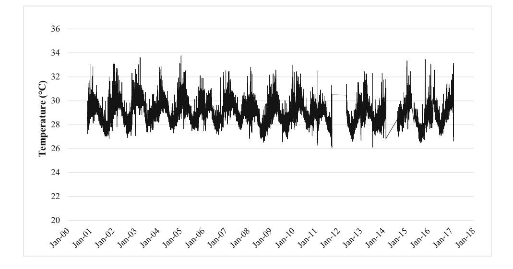
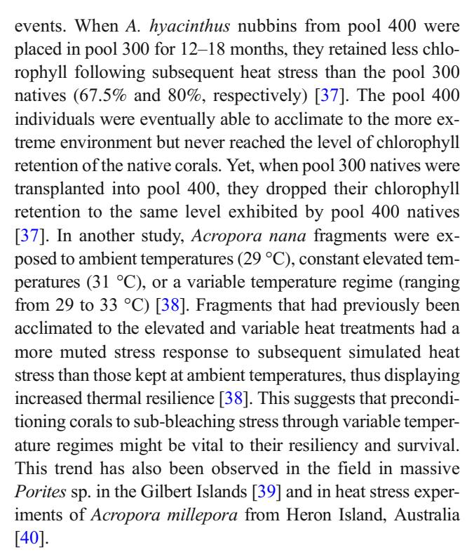

#### CORALS AND CLIMATE CHANGE (C LANGDON, SECTION EDITOR)

# Exceptional Thermal Tolerance of Coral Reefs in American Samoa: a Review

Victoria Barker1

# Springer Nature Switzerland AG 2018

#### Abstract

As climate change poses an ever increasing threat to coral reefs globally, understanding why particular corals are resistant to bleaching is paramount to their continued survival. The coral reefs of Ofu Island, American Samoa, provide a living laboratory to examine mechanisms of coral adaptation to extreme thermal conditions and serve as an analog for a future environment impacted by climate change. Three backreef pools exhibit remarkably different temperature regimes, which consequently results in varying levels of coral thermal tolerance. In pool 300, temperatures can reach 35 °C and fluctuate up to 6 °C throughout the day. Pools 400 and 500 are less variable, with temperatures rarely exceeding 32 °C. Yet, the pools contain a highly diverse community of corals, including an abundance of thermally sensitive species. This review summarizes the results of nearly two decades of research into the mechanisms contributing to differential bleaching resistance among pools. Factors examined include the effects of intermittent water flow, previous exposure to subbleaching temperatures, Symbiodinium genotype, modifications of genetic expression within the polyp, and the associated bacterial microbiome. Corals within the highly variable pool 300 appear to be more adequately adapted to thermal extremes by retaining chlorophyll concentrations during frequent heat pulses, associating with thermally tolerant endosymbionts, upregulating gene expression associated with heat acclimatization, and potentially possessing an advantageous microbiome composition. Though encompassing a small geographic area, the findings from Ofu's reefs have widespread implications for coral conservation as they serve to elucidate the impacts of these many confounding factors and their contributions to bleaching resistance.

Keywords American Samoa . National Park of American Samoa . Ofu Island . Coral bleaching . Thermal tolerance

## Introduction

Coral reefs are vital ecosystems that support immense biological diversity and provide ecological goods and services totaling nearly \$30 billion USD globally [[1](#page-8-0), [2](#page-8-0)]. They are also one of the ecosystems most heavily impacted by climate change and rising ocean temperatures. Nearly 27% of the world's coral reefs have been effectively lost, with little or no chance at recovery [[3\]](#page-8-0). Widespread coral bleaching events due to thermal stress,

This article is part of the Topical Collection on Corals and Climate Change

rare only 20–30 years ago, have become a commonplace phenomenon, leading to coral death and overall reef decline [[4](#page-8-0)–[6](#page-8-0)]. Bleaching occurs when the coral host expels its symbiotic zooxanthellae (Symbiodinium sp.) due to adverse environmental conditions. If conditions improve rapidly, the coral polyps are able to restore this vital symbiosis; however, if adverse conditions persist, the coral will likely die of starvation (for a full review of coral bleaching, see [[7](#page-8-0)–[10](#page-8-0)]). Even when corals are capable of recovering from bleaching events, they often experience a decline in growth rates, reproductive potential, and overall health [\[11,](#page-8-0) [12](#page-8-0)]. As tropical corals already exist within 1– 2 °C of their thermal maxima, it is expected that bleaching events will increase both in frequency and intensity as ocean temperatures continue to rise [\[13\]](#page-8-0).

However, there is hope for corals in the struggle against thermally induced bleaching. On Ofu Island, a remote island in the Samoan archipelago, corals routinely experience extreme temperatures without widespread bleaching and

\* Victoria Barker [victoria\\_barker@partner.nps.gov](mailto:victoria_barker@partner.nps.gov)

1 American Conservation Experience, National Park of American Samoa, Pago Pago, AS 96799, USA

**Table 1** Physical characteristics of Ofu backreef pools. Data from [15, 17] and NPSA (unpublished metadata).

|                | Pool 300    | Pool 400   | Pool 500   |
|----------------|-------------|------------|------------|
| Latitude       | - 14.18287  | - 14.17888 | - 14.17159 |
| Longitude      | - 169.65951 | -169.65416 | -169.64381 |
| Area (m2)      | 874         | 14,889     | 2938       |
| Mean depth (m) | 1.1         | 1.8        | 1.4        |

Area values are approximations. The pools are not well defined and values vary dramatically between reports, journal articles, and GIS metadata. Area values provided in this table are reported in [15]

mortality. American Samoa is located in the south central Pacific Ocean, approximately 4700 km southwest of Hawaii. The US territory is composed of five volcanic islands and two remote atolls: Tutuila, Aunu'u, Ta'ū, Ofu, Olosega, Rose Atoll, and Swains Island. Combined total land area is small, comprising only 196 km² [14]. The remote island of Ofu, the site of these exceptional coral reefs, is only 7.3 km² in size [14].

A fringing reef surrounds the island of Ofu, extending 80-180 m wide [15]; however, most research has been conducted in a shallow (< 2.5 m) lagoon on the southeastern side of the island, within the boundaries of the National Park of American Samoa (NPSA) [14-16]. Within this lagoon are several backreef pools, which have been the sites of extensive study. At low tide, the pools (referred to in the literature as pool 300/HV, 400/MV, and 500/LV) are cut off from oceanic currents by a high reef crest, and during daytime low-tide events, the water temperature rises dramatically (see Table 1 for physical characteristics). While all of the pools are subjected to elevated temperatures, pool 300 is the most variable. In this pool, water temperatures reach over 35 °C, well above the established regional coral bleaching threshold (approx. 32 °C), and temperatures have been recorded fluctuating over 6 °C throughout the day (see Figs. 1, 2, and 3 for long-term temperature datasets) [15, 16]. Over 85 species of corals have

been identified within the pools, with *Acropora*, *Pocillopora*, *Porites*, and *Millepora* species present in high numbers [15, 16]. Live coral coverage ranges from 25 to 30% and is dominated by massive *Porites* colonies forming microatolls surrounded by large sandy patches [16, 18].

Exceptional thermal tolerance has previously been displayed by corals living in extreme temperature environments such as the Persian Gulf [19] and Australia [20]. However, often only "hardy" coral genera such as Pavona and Cyphastrea are able to withstand these high temperatures [21, 22]. Meanwhile, thermally susceptible corals, such as Acropora and Pocillopora, are often disproportionately affected [23, 24]. Of u is exceptional in that a diverse assemblage of corals is thermally resistant to bleaching, with almost the entire coral community surviving these temperature extremes. The factors behind the corals' thermotolerance has been the basis of extensive study for nearly two decades. Research suggests that intermittent water flow, previous exposure to elevated, sub-bleaching temperatures, the genetics of endosymbiotic Symbiodinium, modified coral gene expression, and the associated bacterial microbiome may all contribute to bleaching resistance. This review discusses these various factors in detail and critically evaluates their contribution to the thermal tolerance of corals in Ofu.

#### **Water Flow Rates**

Constant high flow environments have been shown to influence coral growth rates [25], calcification rates [26], metabolism [26], reproductive rates [25], recovery post-bleaching [27], and mortality [25]. High flow rates also reduce oxidative stress on the photosynthetic apparatus of *Symbiodinium*, which may enhance coral resilience and minimize bleaching [28, 29]. A laboratory study testing calcification rates of *Acropora formosa* (now *A. muricata*) concluded that dark calcification rates were reduced by nearly 60% and light-

**Fig. 1** Record of temperature fluctuations in pool 300. Data spikes due to logger malfunction were manually removed. Data gap exists between 9/7/2003 and 12/25/2003 due to logger drift

**Fig. 2** Record of temperature fluctuations in pool 400. Data spikes due to logger malfunction were manually removed. Data gaps exist between 2/11/2014–9/13/2014 and 5/13/2015–12/11/2015

enhanced calcification rates were reduced by around 25% in calm conditions [26]. The authors suggested that this was due to increased metabolism in energetic conditions, which resulted in faster skeletal growth. Testing this in situ on Ofu, *Porites cylindrica* growth increased by nearly 7 cm/year when corals were transplanted from their original source pool 400 (mean water flow 10 cm/s) to highly variable pool 300 (mean water flow 16 cm/s) [30]. In a reciprocal transplant study, *Pocillopora eydeuxi* fragments were transplanted from moderate pool 400 to highly variable pool 300, where the coral doubled its growth during the 18-month experiment [17]. Due to this result, the authors suggested that growth rate of *P. eydeuxi* in the Ofu pools was dictated by environmental factors rather than genetics.

Rather than being a constant high flow environment, the flow regime in the Ofu pools is often one of intermittent high flow, characterized by semi-diurnal flushing during high tides (flow rate  $\sim 25$  cm/s) followed by periods of low or no flow during low tide (flow rate  $\sim 5$  cm/s) [31]. It was unknown if this intermittent high flow regime confers the same positive impact on bleaching resistance as constant high flow regimes. Therefore, Porites lobata and P. cylindrica were exposed to elevated temperatures with varying flow treatments [31]. The first treatment was an intermittent high-low-flow treatment which replicated the natural diurnal tidal cycle of the Ofu pools. This treatment exposed corals to high flow (15-20 cm/s) for 6 h alternated with low flow (2–5 cm/s) for 6 h. A second, constant low-flow treatment maintained water flow between 2 and 5 cm/s for the duration of the experiment. After 4 days at elevated temperatures (31.5 °C), the density of zooxanthellae in *P. lobata* dropped from  $3.14 \times 10^6$  zooxanthallae cells/cm2 to  $1.08 \times 10^6$  zooxanthallae cells/cm2 in the constant low-flow treatment but only  $1.97 \times 10^6$  zooxanthallae cells/ cm2 in the high-low-flow treatment. A similar result occurred

**Fig. 3** Record of temperature fluctuations in pool 500. Data spikes due to logger malfunction were manually removed. Data gaps exist between 9/21/2011–5/15/2012 and 2/11/2014–8/13/2014

with the samples of P. cylindrica [\[31](#page-9-0)]. Increased symbiont retention under thermal stress may be enhanced due to intermittent water flow but this area of study has been limited to a small number of species. More research is needed before any widespread conclusions can be made regarding the efficacy of an intermittent high flow tidal regime in mitigating bleaching across the entire coral community.

Despite the positive Ofu results, there is little consensus in the literature regarding the impact of water flow on bleaching resilience. Field studies in Mauritius found the opposite relationship, with a correlation between higher water flow and more severe bleaching [\[32](#page-9-0)]. The authors suspect that high flow reduces background environmental stress on the coral during periods of moderate temperatures. Therefore, less acclimation occurred to thermal extremes. Meanwhile, laboratory studies on high versus low-flow environments have demonstrated higher growth rates and reduced bleaching for Pocillopora damicornis and Stylophora pistillata under constant high flow environments [[33](#page-9-0)]. The intermittently strong water flow displayed in the Ofu pools may play a key role in enhancing bleaching resistance, yet it is a variable that requires additional examination at other thermally resilient sites around the world as the majority of work in this area has been conducted in the Ofu pools. However, in Ofu, it appears that this tidally driven flow regime may confer some level of protection from extreme thermal stress, at least for particular species.

# Previous Short-term Exposure to Elevated Temperatures

Another line of research suggests that elevated, sub-bleaching temperatures may serve to protect corals from acute bleaching stress [[34,](#page-9-0) [35\]](#page-9-0). This sub-lethal pulse of heat preconditions corals for subsequent bleaching events. Variable heat stress of this type occurs regularly in pool 300 over a strong tidal cycle, when ocean temperatures spike at low tide. In one field study, a widespread transcriptional response that involved hundreds of genes was observed in colonies of Acropora hyacinthus at temperatures above 30.5 °C [\[36](#page-9-0)]. These genes are vital to the unfolded protein response, an ancient eukaryotic cellular response to physiological stress. During the course of the experiment, these genes were only expressed on days of strong tides, elevated temperatures, and large pH and salinity fluctuations. After the temporary heat pulse, expression of these genes returned to baseline levels. When this response was tested in a laboratory setting, the gene expression increased as corals paled and then bleached, suggesting that the unfolded protein response becomes more dramatic as physiological stress increases [[36](#page-9-0)].

Pool 300 corals also appear to be able to regulate their Symbiodinium more effectively due to previous thermal stress

Coral mortality may also be affected by variable temperature regimes. When nubbins of A. hyacinthus from both pools 300 and 400 were placed in elevated (31.5 °C) and ambient (28 °C) experimental tanks, mortality varied depending upon the source pool [[41\]](#page-9-0). Corals taken from pool 400 experienced nearly 50% mortality, regardless of Symbiodinium type. Corals from pool 300, which regularly experiences a wide range of thermal variability, experienced low mortality (16.6 ± 8.8%), statistically indistinguishable from the control group [[41\]](#page-9-0). It has been suggested that the harsher environment found in pool 300 acts as a Bselective sieve^ for poorly adapted individuals, which are quickly removed from the population [\[42\]](#page-9-0). In one analysis, a large range in daily temperatures was found to be the most important variable in predicting future bleaching prevalence [[43](#page-9-0)]. The authors concluded that a 1 °C increase in diel temperature fluctuations reduced the risk of severe bleaching by a factor of 33. In pool 300, temperatures can fluctuate over 6 °C during a strong tidal cycle [\[16](#page-8-0)], which may be a critical component to the corals' thermotolerance.

## Dinoflagellate Endosymbionts

The advent of new genetic sequencing technologies has allowed researchers to examine the unique genetic structure of endosymbiotic Symbiodinium and determine how various clades enhance coral health and bleaching resistance. It is generally concluded that Symbiodinium clade D confers enhanced thermal tolerance to the coral host and can increase

post-stress survival [\[44](#page-9-0)–[47](#page-9-0)]. Clade D has been shown to associate with a wide-variety of scleractinian coral genera including branching Acropora, massive Montastrea, encrusting Montipora, as well as free living Fungia [[48\]](#page-9-0). Clade D is a relatively rare clade that represents less than 10% of total dinoflagellate endosymbionts [[48](#page-9-0)] but is prevalent in American Samoa, particularly at the backreef pools [[49\]](#page-9-0).

The Symbiodinium makeup of the Ofu corals is primarily composed of one genotype of clade D and four genotypes of clade C, which may exist in the same colony at various abundances [\[50](#page-9-0)]. In one study, 88% of corals tested hosted multiple genotypes (for a full list of clade differentiation by species, see Table 2) [\[50\]](#page-9-0). In another, 9 out of 10 sampled coral species associated with multiple clades, with only Porites annae exclusively containing clade C in both pools 300 and 400 [[51\]](#page-9-0). Hosting multiple clades may allow for rapid acclimatization to changing temperatures [\[54](#page-9-0)] but clade D's thermotolerance was clear: only clade D was detected within A. hyacinthus in pool 300, while the less variable pools 400 and 500 contained a mix of both clades C and D [[49](#page-9-0)]. In another study, clade D made up a higher proportion of Symbiodinium associated with pool 300 corals in 8 out of 9 species examined [\[50\]](#page-9-0). In an extreme example, Acropora pulchra showed 100% of samples dominated by clade C in pool 400 and 100% of samples dominated by clade D in pool 300 (p = 0.005, Table 2).

It is poorly understood how different clades vary physiologically under thermal stress and how these variations may impact coral bleaching resistance. While the coral hosts can modify their gene expression in response to heat stress ([[55\]](#page-9-0), see B[Host Genetics](#page-5-0)^), Symbiodinium do not appear to do the same [\[56\]](#page-9-0). Neither clade C nor D Symbiodinium exhibited a transcriptome-wide response to short-term heat stress after 3 days of elevated temperatures [[56](#page-9-0)]. However, between clades, hundreds of genes naturally exhibit different expressions as the result of divergent genotypes. This paradox has been termed the Btranscriptional conundrum^; different clades of Symbiodinium result in differing thermal tolerances yet display little to no short-term response to heat stress. The answer may lie in environmental constraints, as it is likely that Symbiodinium are limited in their ability to respond to temperature changes by modifying their gene expression.

While the prevalence of clade D Symbiodinium is promising, there are still concerns about which corals it associates with, particularly regarding abundant Poritesspecies. The Ofu pools contain at least six known species of Poritesincluding P. lobata, P. lichen, P. cylindrica, P. annae, and Porites mound sp., as well as an unknown species designated Porites sp. 2 (recently classified as P. randalli) [[16,](#page-8-0) [51](#page-9-0), [57\]](#page-9-0). All samples of P. lobata, P. annae, and Porites mound sp. tested contained primarily clade C Symbiodinium [[17,](#page-8-0) [51](#page-9-0)]. This trend has also been observed in a habitually warm marine lake in Palau, where 6 out of 7 Porites species tested harbored clade C [\[58\]](#page-9-0). The authors suggest that Porites may be unique in this

Table 2 Symbiodinium composition of coral species in the Ofu backreef pools. When multiple clades were detected, an asterisk (\*) indicates which clade was dominant

| Species                | Location | Symbiodinium clade(s) present | Citation |
|------------------------|----------|----------------------------------|----------|
| Acropora austera       | Pool 300 | A, C, D*                         | [51]     |
|                        | Pool 400 | C*, D                            | [51]     |
| Acropora formosa       | Pool 300 | D*                               | [50]     |
|                        | Pool 400 | D*                               | [50]     |
| Acropora hyacinthus    | Pool 300 | D*                               | [49]     |
|                        | Pool 300 | D*                               | [50]     |
|                        | Pool 300 | C, D*                            | [52]     |
|                        | Pool 400 | C, D*                            | [49]     |
|                        | Pool 400 | C, D*                            | [50]     |
|                        | Pool 400 | C*, D                            | [52]     |
|                        | Pool 400 | C*, D                            | [53]     |
|                        | Pool 500 | C, D                             | [49]     |
| Acropora pagoensis     | Pool 300 | A, C, D*, F                      | [51]     |
|                        | Pool 400 | A, C, D*                         | [51]     |
| Acropora pulchra       | Pool 300 | D*                               | [50]     |
|                        | Pool 400 | C*                               | [50]     |
| Favia matthaii         | Pool 300 | A, C*, D                         | [51]     |
|                        | Pool 400 | A, C*, D                         | [51]     |
| Gonaistrea retiformis  | Pool 300 | A, C*, D                         | [51]     |
|                        | Pool 400 | A, C*, D                         | [51]     |
| Leptoria phyrgia       | Pool 300 | A, C*, D                         | [51]     |
|                        | Pool 300 | C*, D                            | [50]     |
|                        | Pool 400 | A, C*                            | [51]     |
|                        | Pool 400 | C*                               | [50]     |
| Pavona cactus          | Pool 300 | C*, D                            | [50]     |
|                        | Pool 400 | C*, D                            | [50]     |
| Pavona venosa          | Pool 300 | A, C*, D                         | [51]     |
|                        | Pool 400 | C*, D                            | [51]     |
| Pocillopora damicornis | Pool 300 | A, C*, D                         | [51]     |
|                        | Pool 300 | D*                               | [50]     |
|                        | Pool 400 | A, C*, D                         | [51]     |
|                        | Pool 400 | C*, D                            | [50]     |
| Pocillopora eydeuxi    | Pool 300 | C*, D                            | [17]     |
|                        | Pool 300 | C*, D                            | [50]     |
|                        | Pool 400 | C*                               | [17]     |
|                        | Pool 400 | C*, D                            | [50]     |
| Pocillopora verrucosa  | Pool 300 | C*, D                            | [50]     |
|                        | Pool 400 | C*                               | [50]     |
| Porites annae          | Pool 300 | C*                               | [51]     |
|                        | Pool 400 | C*                               | [51]     |
| Porites lobata         | Pool 300 | C*                               | [17]     |
|                        | Pool 400 | C*                               | [17]     |
| Porites mound sp.      | Pool 300 | C*                               | [51]     |
|                        | Pool 400 | A, C*, D                         | [51]     |
| Psammocora contigua    | Pool 300 | A, C*, D                         | [51]     |
|                        | Pool 400 | A, C*                            | [51]     |

respect as zooxanthellae are passed down maternally to the gametes. Therefore, the Symbiodinium makeup of juvenile Porites sp. is determined in part by the clade composition within the maternal colony, rather than the composition in the surrounding water column [\[58](#page-9-0)]. While clade D may confer thermal tolerance, it appears to be selectively associating with coral hosts, which could leave a large portion of the Ofu community vulnerable to thermal bleaching.

For corals that are not associated with a high abundance of clade D, some may partake in symbiont swapping to favor more thermally tolerant individuals and selectively expel more sensitive symbionts [\[59](#page-9-0)]. Pre-bleaching, coral polyps may contain a variety of Symbiodinium clades, which may or may not confer thermal tolerance. Yet, when examined postbleaching, clade D often becomes dominant. In a study conducted on Keppels Island, Australia, 93.5% of A. millepora sampled before bleaching contained clade C2, a thermally sensitive clade of Symbiodinium. After bleaching, genetic analyses showed that 71% of the surviving colonies had switched to clade D or clade C1 being dominant [\[60\]](#page-9-0). This trend has been consistently observed on reefs in Australia [\[46\]](#page-9-0), Panama [\[61,](#page-9-0) [62\]](#page-9-0), and the Persian Gulf [\[62](#page-9-0)], though estimates of how many species can successfully swap symbionts vary widely [\[50,](#page-9-0) [63](#page-9-0)–[65](#page-9-0)].

In order to determine where these newly associated symbionts originate, the Symbiodinium make up of Ofu lagoon's water, sediments, and ten species of corals was examined [\[51](#page-9-0)]. While clade D was only present in small amounts in water samples, it made up a high proportion of the Symbiodinium population detected in sediment samples from both pools. Clade D was more abundant in the sediments of pool 300 than pool 400, which was often, though not always, reflected in the corals' Symbiodinium composition (see Table [2\)](#page-4-0).

Though specific Symbiodinium clades may increase coral survival of extreme heat stress events, after the temperature stressor is removed, coral colonies often revert back to their original symbionts within 7–12 months [\[47](#page-9-0), [66\]](#page-9-0). Clade D Symbiodinium are thermotolerant but this ability comes with an energetic cost. Clade D appears to slow coral growth rates by up to half in Acropora tenuis [\[67](#page-9-0)] and A. millepora [[67,](#page-9-0) [68](#page-9-0)]. Though the mechanism behind this depressed coral growth is still unclear, it has been postulated that the faster population growth rate of clade C Symbiodinium provides more nutrition to the coral, facilitating faster growth rates [\[67\]](#page-9-0). However, the opposite effect has been found in colonies of P. eydeuxi on Ofu [\[17\]](#page-8-0). Individuals in pool 300 actually had greater skeletal growth than their pool 400 conspecifics, despite the presence of clade D Symbiodinium. These contrasting results may have to do with environmental factors. The authors postulate that high water flow in pool 300 during rough conditions may have had an effect on growth rate and that high growth rates are essential to give P. eydeuxi colonies a distinct advantage in the Ofu pools, where space is limited [\[17](#page-8-0)].

However, it has also been suggested that symbiont type explains Ba negligible fraction^ of the variation in bleaching resistance [\[37\]](#page-9-0). In transplantation studies, the introduction of coral fragments to a more extreme environment would suggest that the corals would partake in symbiont swapping, favoring a more thermotolerant clade. However, only a minimal shift in clade composition (< 1 to around 2%) was observed when A. hyacinthusfragments were transplanted from pool 400 to pool 300 [[37\]](#page-9-0). Another study conducted in pool 400 found that only one of seven colonies of A. hyacinthus modified its associated Symbiodinium composition to include a higher percentage of clade D during a natural bleaching event [[53\]](#page-9-0). Ten months later, the colony had returned to its pre-bleaching proportions.

There is also evidence of corals living in extreme thermal environments that associate with more generalist clades and still experience minimal visible bleaching [[19\]](#page-8-0). In a comparison of the endosymbiotic makeup of 9 coral species in the Arabian/Persian Gulf, none were found to associate with clade D, despite summer temperatures reaching up to 36 °C [[19\]](#page-8-0). These results bring into question the importance of Symbiodinium clade and postulate that association with thermally tolerant endosymbionts is not the sole determining factor in coral thermotolerance. Clearly, the effects of Clade D Symbiodinium on their coral hosts is more nuanced than the widely held belief that clade D is ideal for enhancing coral thermotolerance but poor for accelerated growth. More research is needed to determine under which environmental conditions Clade D is advantageous and how this impacts other physiological aspects of the coral host.

## Host Genetics

The coral host is capable of modifying its gene expression under conditions of thermal stress [[55,](#page-9-0) [69](#page-9-0), [70\]](#page-10-0). This is a transcriptome-wide response, influencing the expression of hundreds of genes related to heat acclimatization, including those regulating apoptosis, antioxidant enzymes, and heat shock proteins [[37](#page-9-0), [55\]](#page-9-0). These changes occur widely throughout the coral tissue, with both epidermal and symbiontcontaining gastrodermal cells impacted [[71\]](#page-10-0). When comparing gene expression between coral individuals in the different Ofu pools, A. hyacinthus in pool 300 appears to Bfrontload^ many of these protective genes, expressing them at higher levels under control conditions than pool 400 conspecifics [\[55](#page-9-0)].

Transcriptome-wide changes occur rapidly after the onset of heat stress. For instance, 14% of the A. hyacinthus transcriptome was differentially expressed after 120 min at 34– 35 °C [[70\]](#page-10-0). In another study, twenty-seven percent of the A.

hyacinthus transcriptome was significantly regulated after 1 h at 35 °C [[69\]](#page-9-0). However, after 15 h of heat exposure, only 12% of the transcriptome was significantly regulated, despite visible bleaching. This return to normal levels of gene expression after acute stress has been deemed Btranscriptome resilience^ and it could play a key part in determining bleaching severity [\[69\]](#page-9-0). When gene expression levels dropped off quickly, the coral generally experienced limited bleaching. However, if these high levels of gene expression were sustained over a long period of time, bleaching was often severe [[69](#page-9-0)]. Therefore, it may not only matter which genes are impacted but the rate at which they return to baseline levels which determines bleaching severity.

It is important to note that early signs of cellular degeneration can occur several days before bleaching is observed [\[72\]](#page-10-0) and transcriptome-wide stress responses may persist for months after [\[53\]](#page-9-0). Even when corals do not appear visibly bleached, they exhibit cellular effects with severe necrosis of both the coral and Symbiodinium cells [\[71](#page-10-0)]. After only 5 h of elevated temperatures, Symbiodinium appeared misshapen, with shrunken and lysed nuclei [[71\]](#page-10-0). Further, genetic effects in the coral host are felt long after the bleaching event has subsided. Nearly 20% of the transcriptome of A. hyacinthus colonies was impacted during the 2015 bleaching event and a large proportion remained perturbed for up to 6 months later, even after temperatures had fallen and Symbiodinium populations had rebounded [\[53](#page-9-0)]. Hundreds of genes remained upregulated for a full year after the bleaching event, including those associated with apoptotic and stress response proteins [[53](#page-9-0)]. Therefore, any sustained temperatures above the mean monthly maximum should be treated as potentially damaging, even when bleaching is not evident or the coral appears to be fully recovered.

Analysis of coral gene expression demonstrates that bleaching resistance is at least partially the result of many small genetic changes working in concert. The Ofu studies have been conducted primarily on A. hyacinthus but A. millepora [[73](#page-10-0)], A. palmata [\[74\]](#page-10-0), Porites astreoides [[75\]](#page-10-0), and Montastrea faveolata [\[76\]](#page-10-0) have also been shown to differentially express genes associated with thermotolerance during heat stress events. One study even suggests that dramatic variations in gene expression can differentially occur at the same time within the same coral colony [\[73\]](#page-10-0), indicating that small scale variation in gene expression may be important to coral survival and post-bleaching recovery.

# Microbiome

The microbiome associated with Ofu corals varies between pools and may shift during periods of heat stress. A. hyacinthus colonies within pools 300 and 400 were determined to have a significantly different assemblage of bacterial microbiomes (p < 0.001) [[77\]](#page-10-0). Pool 300 microbiomes were characterized by three main bacterial families: Alteromonadaceae (~ 15%), Rhodospirillaceae (~ 15%), and Hahellaceae (13%). Pool 400 microbiomes were dominated by Hahellaceae (27%) and Alteromonadaceae (24%), but were lacking in Rhodospirillaceae (< 2%). In a 17-month reciprocal transplant study, pool 400 natives altered their microbial composition when placed in the thermally variable pool 300, yet pool 300 natives retained their original microbiomes when transplanted. In a follow-up laboratory study, the pool 400 microbiomes were significantly affected by stress within 20 h and the corals were visibly bleached [[77\]](#page-10-0). Very little experimentation has been conducted to determine if particular bacteria enhance coral thermotolerance; however, the dramatic difference in bacterial community composition between pools 300 and 400 suggests that the microbiome is similarly affected by heat stress. Microbiome composition may be a novel component to examine in understanding coral bleaching physiology and resilience.

## Managing Ofu Coral Reefs in the Time of Climate Change

Ofu corals face a myriad of natural and anthropogenic challenges but climate change is the most concerning and widespread. One third of corals are already at an elevated risk of extinction due to climate change-related events and as ocean temperatures continue to rise, bleaching events are expected to occur more frequently and with more devastating effects [\[13,](#page-8-0) [78\]](#page-10-0). During the 2015–2016 mass bleaching event, corals on the island of Tutuila were heavily impacted, with some sites showing nearly 100% bleaching, particularly of thermally sensitive genera such as Acropora and Pocillopora [[79\]](#page-10-0). Followup surveys in a backreef pool by the Pago Pago International Airport estimated Acropora sp. mortality at nearly 80%, likely due to the bleaching event. Corals in the Ofu pools were impacted by the bleaching event as well, though to a lesser extent. Surveys conducted in February 2015 indicated low to moderate bleaching with Acropora, Millepora, and some massive Porites species impacted. Additional surveys were not conducted again until February 2017, when widespread bleaching was observed by the American Samoa Coral Reef Advisory Group (CRAG) scientists. Bleaching prevalence appeared nondiscriminatory as affected corals included both branching and plating Acropora, massive Porites, Isopora, Montipora, Pocillopora, Favia, and Favites species [\[79](#page-10-0)]. Percent mortality from this bleaching event is unknown. NPSA bleaching surveys conducted in September and November 2017 indicate continued bleaching with Acropora, Montipora, Goniastria, Pocillopora colonies affected [\[79](#page-10-0)].

Whether or not corals will be able to survive the changing climate is unknown. The number of reefs globally that are impacted by bleaching stress has tripled since 1985 and 97% of reef areas examined display an increasing trend in sea surface temperatures [[4\]](#page-8-0). One evolutionary model based upon the prevalence of heat-adapted alleles in A. hyacinthus from Rarotonga, Cook Islands, suggests that those corals will be able to genetically adapt to tolerate temperatures predicted under IPCC Representative Concentration Pathways (RCPs) low CO2 emission plans RCP2.6 and RCP4.5 [[80](#page-10-0)]. However, simulated populations were unable to adapt quickly enough to survive the dramatic temperature increases predicted in RCP6.0 or RCP8.5. It is projected that the Pacific Ocean will continue to warm under RCP4.5 – RCP8.5 trajectories [[81\]](#page-10-0), and therefore, under this evolutionary model, A. hyacinthus population collapse will occur when the average temperature reaches 29 °C, or approximately 2040 under RCP8.5 [[80](#page-10-0)]. Therefore, it seems likely that without massive reductions in greenhouse gas emissions, many corals will potentially face extinction in the coming century. The Ofu pools serve as an analog for a future environment impacted by climate change, simulating the thermal extremes projected to occur as the planet continues to warm. They therefore serve as a valuable resource in determining how to mitigate future thermal bleaching.

However, climate change is unlikely to be solved with short-term, local scale management solutions and instead will rely on sweeping changes in national and international policy [\[82,](#page-10-0) [83](#page-10-0)]. Therefore, resource managers at the National Park of American Samoa are working to improve reef resiliency by mitigating local stressors, such as outbreaks of crown of thorns seastars and terrestrial nutrient runoff, which are more responsive to local management. They are also taking a passive monitoring approach by measuring environmental variables such as sea surface temperature, salinity, ocean acidity, etc. in order to quickly respond to any future algae outbreaks or sources of nutrient eutrophication. Well-managed coral ecosystems can recover from bleaching events more quickly and more successfully than their degraded counterparts, which may reduce the time required for full reef recovery by years or even decades [[82\]](#page-10-0). American Samoa's coral reefs and associated mangroves provide nearly \$6 million annually in fisheries, recreation, and shoreline protection, accounting for 1.2% of the territory's gross domestic product [\[84\]](#page-10-0). This makes their management a top priority for marine resource managers and the local community. In order to achieve longterm success, the local drivers of coral bleaching need to be carefully understood and monitored so that resource managers can predict future bleaching events and adopt an adaptive management style based on environmental fluctuations and trends.

One possible method of reducing physiological stress during bleaching events would be the introduction of shading. To date, only one study has explored the potential of using shading techniques to protect Ofu corals from intense sunlight under elevated water temperatures [[85\]](#page-10-0). Fragments of A. muricata, P. damicornis, and P. cylindrica from pool 400 were placed in aquaria where the corals were subjected to various temperature and light regimes: a control (28.5 °C, approximately the mean seawater temperature of pool 400), and elevated thermal conditions (31.5 °C) with no shading, 50% shading, and 75% shading. It was found that a higher the degree of shading resulted in a reduction in bleaching severity. Statistically significant changes in coral coloration from the control were detected as early as DHW 1 for thermally sensitive A. muricata fragments under elevated temperatures with no shading. All corals under elevated water temperatures grew slower than the controls, with non-shaded corals growing less than those in the 50% or 75% shade. This study indicates that shading corals can reduce their risk of bleaching under elevated water temperatures, particularly for thermally sensitive species such as A. muricata and P. cylindrica [[85\]](#page-10-0). However, very little research has been done in this area and the efficacy of coral shading during a bleaching event has yet to be tested in the field. Further, one important consideration regarding shading is whether or not it is practical at the scale of an entire reef. It would likely be difficult, if not impossible, to adequately shade corals across the entirety of pool 400, or even a small subsection, due to logistical concerns. Therefore, while shading has been shown to reduce light intensity and subsequent bleaching, far more work is needed to determine if this method is realistic to offset the effects of thermal stress.

One potential long-term goal of the National Park may be to spread the genetic basis of these Bsuper corals^ by enhancing outside populations through transplantation. The hydrographic isolation of the Ofu pools and the amount of time spent cut off from the broader currents of the area limit the feasibility of coral recruitment into the wider region. While no current studies have been conducted to determine the success of larval transport and dispersal to neighboring islands, Ofu corals are genetically distinct from corals found on the nearby island of Tutuila, despite being less than 100 km apart [[86\]](#page-10-0). Therefore, while Ofu may not serve as a viable Bseed^ reef for other islands in the region, it serves as a stronghold of thermally tolerant genetic diversity and could function as a nursery site for future coral transplantation work. Due to the financial and logistical complications involved in remote coral transplantation, robust species with high rates of survivorship post-transplantation should be selected for, such as slowgrowing massive Porites species [[87\]](#page-10-0). Corals thriving in adverse thermal conditions are found only in a few places around the world and their predisposition to rising ocean temperatures may prove vital in restoring heavily impacted, higher latitude reefs. Coral larvae have been shown to experience a tenfold increase in survival during heat events (35.5 °C) when their parents came from warm, low latitude environments, which is

likely due to inherited differences in the expression of thermotolerant genes [[88\]](#page-10-0). Therefore, Ofu corals could serve as a reserve of thermotolerant diversity, to be transplanted on imperiled reefs into the future.

The success of Ofu's corals offers a beacon of hope for corals globally in the face of climate change and rising ocean temperatures. The many interconnected factors associated with bleaching resilience make it difficult to determine the proportion that each factor contributes to overall reef resiliency. While a small number of studies have focused on multiple factors such as the role of water flow and the symbiont genotype on bleaching prevalence [17], we are still far from a holistic understanding of how all of these factors interact. However, the distinctive abiotic environment, previous exposure to elevated temperatures, thermotolerant endosymbionts, modification of coral gene expression, and the associated bacterial microbiome all appear to contribute to Ofu corals' thermal tolerance. In one resiliency model, having an abundance of heat-tolerant coral species was determined to be the most important indicator for predicting longterm reef success and survival [[89](#page-10-0)]. The second most important indicator was previous exposure to temperature variability [[89\]](#page-10-0). Therefore, it is likely that Ofu corals are at a distinct advantage and may fare better than many reefs globally. However, from 2015 to 2017, bleaching was observed within the Ofu backpool reefs [\[79\]](#page-10-0), making the need for immediate global mitigation of climate change not only necessary but critical to coral survival. The Ofu corals face a unique predicament; while they are highly adapted to hightemperature environments, when will they too reach their thermal limits?

Acknowledgements The author would like to thank D. Barshis, B. Fuiava, I. Moffitt, and two anonymous reviewers for their constructive comments and review of this manuscript.

#### Compliance with Ethical Standards

Conflict of Interest The author is currently an employee of American Conservation Experience who works as a marine technician at the National Park of American Samoa. All parties state that there is no conflict of interest.

# References

- 1. Moberg F, Folke C. Ecological goods and services of coral reef ecosystems. Ecol Econ. 1999;29:215–33.
- 2. Cesar H, Burke L, Pet-Soede L. The economics of worldwide coral reef degradation. Arnhem: Cesar Environmental Economics Consulting Arnhem; 2003. [http://eprints.uberibz.org/48/1/](http://eprints.uberibz.org/48/1/Rappor03.pdf) [Rappor03.pdf.](http://eprints.uberibz.org/48/1/Rappor03.pdf) Accessed 8 Aug 2018.
- 3. Wilkinson C. Global status of coral reefs. Townsville: Australian Institute of Marine Science; 2000. [https://www.icriforum.org/sites/](https://www.icriforum.org/sites/default/files/gcrmn2000.pdf) [default/files/gcrmn2000.pdf](https://www.icriforum.org/sites/default/files/gcrmn2000.pdf). Accessed 8 Aug 2018.

- 4. Heron SF, Maynard JA, Van Hooidonk R, Eakin CM. Warming trends and bleaching stress of the World's coral reefs 1985–2012. Sci Rep. 2016;6:1–14.
- 5. Hoegh-Guldburg O, Poloczanska ES, Skirving W, Dove S. Coral reef ecosystems under climate change and ocean acidification. Front Mar Sci. 2017;4:158.
- 6. Hughes TP, Kerry JT, Álvarez-Noriega M, Álvarez-Romero JG, Anderson KD, Baird AH, et al. Global warming and recurrent mass bleaching of corals. Nature. 2017;543:373–7.
- 7. Glynn PW. Coral reef bleaching: ecological perspectives. Coral Reefs. 1993;12:1–17.
- 8. Brown BE. Coral bleaching: causes and conclusions. Coral Reefs. 1997;16:S129–38.
- 9. Douglas AE. Coral bleaching––how and why? Mar Pollut Bull. 2003;46:385–92.
- 10. Jokiel PL. Temperature stress and coral bleaching. In: Rosenberg E, Loya Y, editors. Coral health and disease. Heidelberg: Springer-Verlag; 2004. p. 401–25.
- 11. Szmant A, Gassman NJ. The effects of prolonged Bbleaching^ on the tissue biomass and reproduction of the reef coral Montastrea annularis. Coral Reefs. 1990;8:217–24.
- 12. Baird AH, Marshall PA. Mortality, growth and reproduction in scleractinian corals following bleaching on the Great Barrier Reef. Mar Ecol Prog Ser. 2002;237:133–41.
- 13. Hoegh-Guldberg O. Climate change, coral bleaching and the future of the world's coral reefs. Mar Freshw Res. 1999;50:839–66.
- 14. Craig P. Natural history guide to American Samoa. Pago Pago: National Park of American Samoa, Department of Marine and Wildlife Resources, American Samoa Community College; 2009, 3rd edition.
- 15. Smith L, Birkeland C. Managing NPSA's coral reefs in the face of global warming: research project report for year 1; 2003. [http://](http://www.botany.hawaii.edu/basch/uhnpscesu/pdfs/sam/Smith2003AS.pdf) [www.botany.hawaii.edu/basch/uhnpscesu/pdfs/sam/Smith2003AS.](http://www.botany.hawaii.edu/basch/uhnpscesu/pdfs/sam/Smith2003AS.pdf) [pdf](http://www.botany.hawaii.edu/basch/uhnpscesu/pdfs/sam/Smith2003AS.pdf). Accessed 8 Aug 2018.
- 16. Craig P, Birkeland C, Belliveau S. High temperatures tolerated by a diverse assemblage of shallow-water corals in American Samoa. Coral Reefs. 2001;20:185–9.
- 17. Smith LW, Wirshing HH, Baker AC, Birkeland C. Environmental versus genetic influences on growth rates of the corals Pocillopora eydouxi and Porites lobata (Anthozoa: Scleractinia). Pac Sci. 2008;62:57–69.
- 18. Hunter CL, Friedlander A, Magruder WH, Meier KZ. Ofu reef survey: baseline assessment and recommendations for longterm monitoring of the proposed National Park, Ofu, American Samoa. Final report to the US National Park Service, American Samoa; 1993. [http://www.botany.hawaii.edu/basch/uhnpscesu/pdfs/](http://www.botany.hawaii.edu/basch/uhnpscesu/pdfs/Hunter93.pdf) [Hunter93.pdf](http://www.botany.hawaii.edu/basch/uhnpscesu/pdfs/Hunter93.pdf). Accessed 8 Aug 2018.
- 19. Hume B, D'Angelo C, Burt J, Baker AC, Riegl B, Wiedenmann J. Corals from the Persian/Arabian Gulf as models for thermotolerant reef-builders: prevalence of clade C3 Symbiodinium, host fluorescence and ex situ temperature tolerance. Mar Pollut Bull. 2013;72:313–22.
- 20. Richards ZT, Garcia RA, Wallace CC, Rosser NL, Muir PR. A diverse assemblage of reef corals thriving in a dynamic intertidal reef setting (Bonaparte Archipelago, Kimberley, Australia). PLoS One. 2015;10:e0117791.
- 21. McClanahan TR. The relationship between bleaching and mortality of common corals. Mar Biol. 2004;144:1239–45.
- 22. McClanahan TR, Muthuga NA, Mangi S. Coral and algal changes after the 1998 coral bleaching: interaction with reef management and herbivores on Kenyan reefs. Coral Reefs. 2001;19:380–91.
- 23. Marshall P, Baird A. Bleaching of corals on the Great Barrier Reef: differential susceptibilities among taxa. Coral Reefs. 2000;19:155–63.
- 24. Jiménez C, Cortés J, León A, Ruíz E. Coral bleaching and mortality associated with the 1997-98 El Niño in an upwelling environment in the eastern Pacific (Gulf of Papagayo, Costa Rica). Bull Mar Sci. 2001;69:151–69.

- 25. Jokiel PL. Effects of water motion on reef corals. J Exp Mar Biol Ecol. 1978;35:87–97.
- 26. Dennison WC, Barnes DJ. Effect of water motion on coral photosynthesis and calcification. J Exp Mar Biol Ecol. 1988;115:67–77.
- 27. Nakamura T, Yamasaki H, van Woesik R. Water flow facilitates recovery from bleaching in the coral Stylophora pistillata. Mar Ecol Prog Ser. 2003;256:287–91.
- 28. Nakamura T, van Woesik R, Yamasaki H. Photoinhibition of photosynthesis is reduced by water flow in the reef-building coral Acropora digitifera. Mar Ecol Prog Ser. 2005;301:109–18.
- 29. Finelli CM, Helmuth BS, Pentcheff ND, Wethey DS. Water flow influences oxygen transport and photosynthetic efficiency in corals. Coral Reefs. 2006;25:47–57.
- 30. Smith LW. Influence of water motion on resistance of corals to high temperatures: evidence from a field transplant experiment. Proc 10th Int Coral Reef Symp 1. 2006;724–728.
- 31. Smith LW, Birkeland C. Effects of intermittent flow and irradiance level on back reef Porites corals at elevated seawater temperatures. J Exp Mar Biol Ecol. 2007;341:282–94.
- 32. McClanahan TR, Maina J, Moothien-Pillay R, Baker AC. Effects of geography, taxa, water flow, and temperature variation on coral bleaching intensity in Mauritius. Mar Ecol Prog Ser. 2005;298: 131–42.
- 33. Nakamura T, Yamasaki H. Requirement of water-flow for sustainable growth of Pocilloporid corals during high temperature periods. Mar Pollut Bull. 2005;50:1115–20.
- 34. Ainsworth TD, Heron SF, Ortiz JC, Mumby PJ, Grech A, Ogawa D, et al. Climate change disables coral bleaching protection on the Great Barrier Reef. Science. 2016;352:338–42.
- 35. Middlebrook R, Hoegh-Guldberg O, Leggat W. The effect of thermal history on the susceptibility of reef-building corals to thermal stress. J Exp Biol. 2008;211:1050–6.
- 36. Ruiz-Jones LJ, Palumbi SR. Tidal heat pulses on a reef trigger a fine-tuned transcriptional response in corals to maintain homeostasis. Sci Adv. 2017;3:e1601298.
- 37. Palumbi SR, Barshis DJ, Traylor-Knowles N, Bay RA. Mechanisms of reef coral resistance to future climate change. Science. 2014;344:895–8.
- 38. Bay RA, Palumbi SR. Rapid acclimation ability mediated by transcriptome changes in reef-building corals. Genome Biol Evol. 2015;7:1602–12.
- 39. Carilli J, Donner SD, Hartmann AC. Historical temperature variability affects coral response to heat stress. PLoS One. 2012;7: e34418.
- 40. Bellantuono AJ, Hoegh-Guldberg O, Rodriguez-Lanetty M. Resistance to thermal stress in corals without changes in symbiont composition. Proc R Soc B. 2011; rspb20111780.
- 41. Oliver TA, Palumbi SR. Do fluctuating temperature environments elevate coral thermal tolerance? Coral Reefs. 2011;30:429–40.
- 42. Bay RA, Palumbi SR. Transcriptome predictors of coral survival and growth in a highly variable environment. Ecol Evol. 2017;7: 4794–803.
- 43. Safaie A, Silbiger NJ, McClanahan TR, Pawlak G, Barshis DJ, Hench JL, et al. High frequency temperature variability reduces the risk of coral bleaching. Nat Commun. 2018;9
- 44. Glynn PW, Maté JL, Baker AC, Calderón MO. Coral bleaching and mortality in Panama and Ecuador during the 1997–1998 El Niño– Southern Oscillation event: spatial/temporal patterns and comparisons with the 1982–1983 event. Bull Mar Sci. 2001;69:79–109.
- 45. Rowan R. Coral bleaching: thermal adaptation in reef coral symbionts. Nature. 2004;430:742.
- 46. Berkelmans R, van Oppen MJH. The role of zooxanthellae in the thermal tolerance of corals: a 'nugget of hope' for coral reefs in an era of climate change. Proc Biol Sci. 2006;273:2305–12.

- 47. Sampayo EM, Ridgway T, Franceschinis L, Roff G, Hoegh-Guldberg O, Dove S (2016) Coral symbioses under prolonged environmental change: living near tolerance range limits Sci Rep 6.
- 48. Stat M, Gates RD. Clade D Symbiodinium in scleractinian corals: a Bnugget^ of hope, a selfish opportunist, an ominous sign, or all of the above? J Mar Biol. 2011;1–9.
- 49. Oliver TA, Palumbi SR. Distributions of stress-resistant coral symbionts match environmental patterns at local but not regional scales. Mar Ecol Prog Ser. 2009;378:93–103.
- 50. Oliver TA, Palumbi SR. Many corals host thermally resistant symbionts in high-temperature habitat. Coral Reefs. 2011;30:241–50.
- 51. Cunning R, Yost DM, Guarinello ML, Putnam HM, Gates RD. Variability of Symbiodinium communities in waters, sediments, and corals of thermally distinct reef pools in American Samoa. PLoS One. 2015;10:e0145099.
- 52. Bay RA, Palumbi SR. Multilocus adaptation associated with heat resistance in reef-building corals. Curr Biol. 2014;24:2952–6.
- 53. Thomas L, Palumbi SR. The genomics of recovery from coral bleaching. Proc R Soc B. 2017;284:20171790.
- 54. Ladner JT, Barshis DJ, Palumbi SR. Protein evolution in two cooccurring types of Symbiodinium: an exploration into the genetic basis of thermal tolerance in Symbiodinium clade D. BMC Evol Biol. 2012;12:217.
- 55. Barshis DJ, Ladner JT, Oliver TA, Seneca FO, Traylor-Knowles N, Palumbi SR. Genomic basis for coral resilience to climate change. Proc Natl Acad Sci. 2013;110:1387–92.
- 56. Barshis DJ, Ladner JT, Oliver TA, Palumbi SR. Lineage-specific transcriptional profiles of Symbiodinium spp. unaltered by heat stress in a coral host. Mol Biol Evol. 2014;31:1343–52.
- 57. Forsman ZH, Birkeland C. Porites randalli: a new coral species (Scleractinia, Poritidae) from American Samoa. Zootaxa. 2009;2244:51–9.
- 58. Fabricius KE, Mieog JC, Colin PL, Idip D, van Oppen MJH. Identity and diversity of coral endosymbionts (zooxanthellae) from three Palauan reefs with contrasting bleaching, temperature and shading histories. Mol Ecol. 2004;13:2445–58.
- 59. Rowan R, Knowlton N, Baker A, Jara J. Landscape ecology of algal symbionts creates variation in episodes of coral bleaching. Nature. 1997;388:265–9.
- 60. Jones AM, Berkelmans R, van Oppen MJ, Mieog JC, Sinclair W. A community change in the algal endosymbionts of a scleractinian coral following a natural bleaching event: field evidence of acclimatization. Proc Biol Sci. 2008;275:1359–65.
- 61. Baker AC. Ecosystems: reef corals bleach to survive change. Nature. 2001;411:765–6.
- 62. Baker AC, Starger CJ, McClanahan TR, Glynn PW. Coral reefs: corals' adaptive response to climate change. Nature. 2004;430:741.
- 63. Goulet TL. Most corals may not change their symbionts. Mar Ecol Prog Ser. 2006;321:1–7.
- 64. Goulet TL. Most scleractinian corals and octocorals host a single symbiotic zooxanthella clade. Mar Ecol Prog Ser. 2007;335:243–8.
- 65. Baker AC, Romanski AM. Multiple symbiotic partnerships are common in scleractinian corals, but not in octocorals: comment on Goulet (2006). Mar Ecol Prog Ser. 2007;335:237–42.
- 66. Sampayo EM, Ridgway T, Bongaerts P, Hoegh-Guldberg O. Bleaching susceptibility and mortality of corals are determined by fine-scale differences in symbiont type. Proc Natl Acad Sci. 2008;105:10444–9.
- 67. Little AF, van Oppen MJ, Willis BL. Flexibility in algal endosymbioses shapes growth in reef corals. Science. 2004;304:1492–4.
- 68. Jones A, Berkelmans R. Potential costs of acclimatization to a warmer climate: growth of a reef coral with heat tolerant vs. sensitive symbiont types. PLoS One. 2010;5:e10437.
- 69. Seneca FO, Palumbi SR. The role of transcriptome resilience in resistance of corals to bleaching. Mol Ecol. 2015;24:1467–84.

- 70. Traylor-Knowles N, Rose NH, Sheets EA, Palumbi SR. Early transcriptional responses during heat stress in the coral Acropora hyacinthus. Biol Bull. 2017;232:91–100.
- 71. Traylor-Knowles N, Rose NH, Palumbi SR. The cell specificity of gene expression in the response to heat stress in corals. J Exp Biol. 2017;220:1837–45.
- 72. Ainsworth TD, Hoegh-Guldberg O, Heron SF, Skirving WJ, Leggat W. Early cellular changes are indicators of pre-bleaching thermal stress in the coral host. J Exp Mar Biol Ecol. 2008;364:63–71.
- 73. Császár NBM, Seneca FO, van Oppen MJH. Variation in antioxidant gene expression in the scleractinian coral Acropora millepora under laboratory thermal stress. Mar Ecol Prog Ser. 2009;392:93– 102.
- 74. DeSalvo MK, Sunagawa S, Voolst ra CR, Medina M. Transcriptomic responses to heat stress and bleaching in the elkhorn coral Acropora palmata. Mar Ecol Prog Ser. 2010;402: 97–113.
- 75. Kenkel CD, Meyer E, Matz MV. Gene expression under chronic heat stress in populations of the mustard hill coral (Porites astreoides) from different thermal environments. Mol Ecol. 2013;22:4322–34.
- 76. DeSalvo MK, Voolstra CR, Sunagawa S, Schwarz JA, Stillman JH, Coffroth MA, et al. Differential gene expression during thermal stress and bleaching in the Caribbean coral Montastraea faveolata. Mol Ecol. 2008;17:3952–71.
- 77. Ziegler M, Seneca FO, Yum LK, Palumbi SR, Voolstra CR. Bacterial community dynamics are linked to patterns of coral heat tolerance. Nat Commun. 2017;8:14213.
- 78. Carpenter KE, Abrar M, Aeby G, Aronson RB, Banks S, Bruckner A, et al. One-third of reef-building corals face elevated extinction risk from climate change and local impacts. Science. 2008;321: 560–3.
- 79. American Samoa Coral Reef Advisory Group (CRAG). American Samoa Bleaching Monitoring Report 2015–2017; 2017. Unpublished draft. Accessed 5 July 2018.
- 80. Bay RA, Rose NH, Logan CA, Palumbi SR. Genomic models predict successful coral adaptation if future ocean warming rates are reduced. Sci Adv. 2017;3:e1701413.

- 81. Hoegh-Guldberg O, Cai R, Poloczanska ES, Brewer PG, Sundby S, Hilmi K, Fabry VJ, Jung S (2014) The ocean. In: Climate change 2014: impacts, adaptation, and vulnerability. Part B: regional aspects. Contribution of Working Group II to the Fifth Assessment Report of the Intergovernmental Panel on Climate Change [Barros VR, Field CB, Dokken DJ, Mastrandrea MD, Mach KJ, Bilir TE, Chatterjee M, Ebi KL, Estrada YO, Genova RC, Girma B, Kissel ES, Levy AN, MacCracken S, Mastrandrea PR, White LL (eds.)]. Cambridge University Press, Cambridge, United Kingdom and New York, NY, USA, pp. 1655–1731.
- 82. Marshall PA, Schuttenberg H. A reef manager's guide to coral bleaching. Townsville: Great Barrier Reef Marine Park Authority; 2006.
- 83. Mumby PJ, Steneck RS. Coral reef management and conservation in light of rapidly evolving ecological paradigms. Trends Ecol Evol. 2008;23:555–63.
- 84. Fenner D, Speicher M, Gulick S. The state of coral reef ecosystems of American Samoa. The State of Coral Reef Ecosystems of the United States and Pacific Freely Associated States: 2008. P 307-351.
- 85. Coehlo VR, Fenner D, Caruso C, Bayles BR, Huang Y, Birkeland C. Shading as a mitigation tool for coral bleaching in three common indo-Pacific species. J Exp Mar Biol Ecol. 2017;497:1592–163.
- 86. Palumbi S, Oliver T. Genetic evidence of dispersal limitation and local adaptation in Samoan reef corals: report on ongoing research: March, 2006; 2006. [http://www.botany.hawaii.edu/basch/](http://www.botany.hawaii.edu/basch/uhnpscesu/pdfs/sam/Palumbi2006AS.pdf) [uhnpscesu/pdfs/sam/Palumbi2006AS.pdf.](http://www.botany.hawaii.edu/basch/uhnpscesu/pdfs/sam/Palumbi2006AS.pdf) Accessed 21 Aug 2018.
- 87. Clark S, Edwards AJ. Coral transplantation as an aid to reef rehabilitation: evaluation of a case study in the Maldive Islands. Coral Reefs. 1995;14:201–13.
- 88. Dixon GB, Davies SW, Aglyamova GV, Meyer E, Bay LK, Matz MV. Genomic determinants of coral heat tolerance across latitudes. Science. 2015;348:1460–2.
- 89. McClanahan TR, Donner SD, Maynard JA, MacNeil MA, Graham NA, Maina J, et al. Prioritizing key resilience indicators to support coral reef management in a changing climate. PLoS One. 2012;7: e42884.

