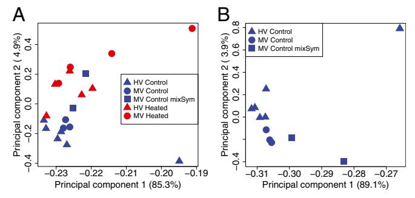
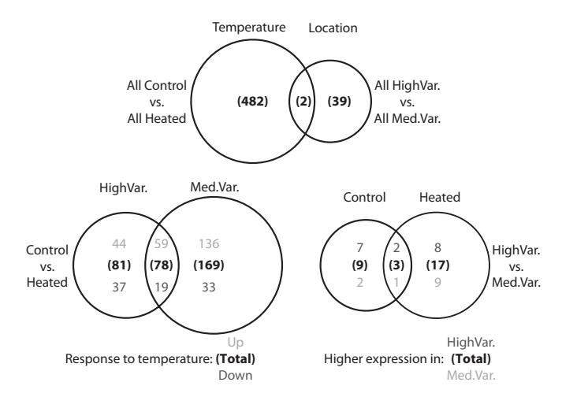
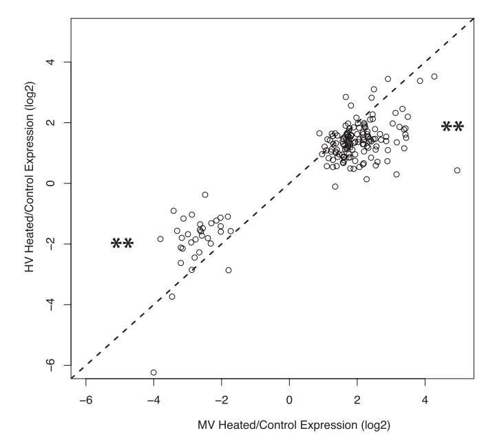
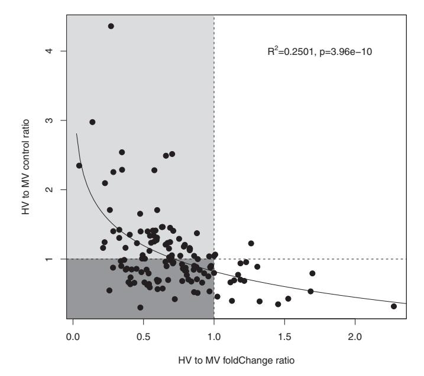

# Genomic basis for coral resilience to climate change

Daniel J. Barshis1,2, Jason T. Ladner, Thomas A. Oliver, François O. Seneca, Nikki Traylor-Knowles, and Stephen R. Palumbi

Department of Biology, Hopkins Marine Station, Stanford University, Pacific Grove, CA 93950

Edited by David M. Hillis, The University of Texas at Austin, Austin, TX, and approved November 30, 2012 (received for review June 15, 2012)

Recent advances in DNA-sequencing technologies now allow for in-depth characterization of the genomic stress responses of many organisms beyond model taxa. They are especially appropriate for organisms such as reef-building corals, for which dramatic declines in abundance are expected to worsen as anthropogenic climate change intensifies. Different corals differ substantially in physiological resilience to environmental stress, but the molecular mechanisms behind enhanced coral resilience remain unclear. Here, we compare transcriptome-wide gene expression (via RNA-Seq using Illumina sequencing) among conspecific thermally sensitive and thermally resilient corals to identify the molecular pathways contributing to coral resilience. Under simulated bleaching stress, sensitive and resilient corals change expression of hundreds of genes, but the resilient corals had higher expression under control conditions across 60 of these genes. These "frontloaded" transcripts were less up-regulated in resilient corals during heat stress and included thermal tolerance genes such as heat shock proteins and antioxidant enzymes, as well as a broad array of genes involved in apoptosis regulation, tumor suppression, innate immune response, and cell adhesion. We propose that constitutive frontloading enables an individual to maintain physiological resilience during frequently encountered environmental stress, an idea that has strong parallels in model systems such as yeast. Our study provides broad insight into the fundamental cellular processes responsible for enhanced stress tolerances that may enable some organisms to better persist into the future in an era of global climate change.

acquired stress tolerance  $\mid$  Acropora hyacinthus  $\mid$  thermal stress  $\mid$  transcriptomics  $\mid$  Cnidarian

any species have evolved to tolerate a multitude of stressful environmental changes (1). Comparisons across plants (2) and animals (3–5) have shown some species and populations to be far more resilient than others, with marked influences on growth, survival, disease resistance, and ultimately evolutionary fitness (4, 6, 7). At the species level, physiological stress regimes are known to set biogeographic limits, determine microhabitat preferences, and generate ecological patterns such as intertidal zonation (3, 8–10). The advent of climate change has heightened the need to understand stress responses (10, 11), especially for species such as terrestrial plants and many sedentary marine taxa that cannot easily migrate to new environmental optima (12–14).

At the genomic scale, some species show a rapid, widespread stress response across thousands of genes. In cells of the budding yeast *Saccharomyces cerevisiae*, this environmental stress response (ESR) is broadly consistent across a profusion of external stressors (15). In nonmodel organisms in natural habitats, such as reefbuilding corals, the genome-wide responses to environmental stress are only just beginning to be described (16). However, in the current era of a rapidly changing climate, it is imperative to understand the mechanisms of the stress response, particularly those that may confer enhanced tolerance of changing environmental conditions (10, 11, 14).

Reef-building corals, the foundation of tropical coastal marine resources, are exceptionally vulnerable to climate change (e.g., refs. 17 and 18). In recent decades, the increasing frequency and severity of catastrophic coral bleaching (the dissociation of the coral host and its endosymbiotic algae *Symbiodinium sp.*) and

bleaching-induced mortality (19–22) has called into question whether corals have the capacity to acclimatize or adapt to global climate change (19, 20). However, during mass coral bleaching events, survival of scattered coral colonies suggests that some groups of corals may possess inherent physiological tolerance to environmental stress (23, 24). In addition, some high-temperature environments naturally retain healthy, growing coral populations (25–27), and these corals can show elevated bleaching tolerances (e.g., refs. 18 and 28). These thermotolerant corals are among the most likely to cope with future climate change (sensu ref. 24) and, thus, represent an essential source of information about mechanisms underlying observed differences in coral physiological resilience (defined here as the capacity for an organism to experience relative environmental extremes and either resist cellular stress or rapidly recover from it; sensu ref. 29).

At the molecular level, recent evidence suggests that differential regulation of apoptosis (i.e., programmed cell death) may be essential to postbleaching survival of resilient corals (30). Alternatively, enhanced thermotolerance in other marine organisms (e.g., intertidal limpets, mussels, sea cucumbers, and amphipods) has been linked to higher constitutive expression of heat shock proteins (Hsps) (31–34). A growing number of studies find that the basic coral heat stress response involves a wide array of cellular processes, akin to the ESR in yeast (15). These include induction of molecular chaperones (e.g., Hsps) and antioxidant enzymes but also involve Ca2+ homeostasis disruption, cytoskeletal reorganization, and altered cell signaling and transcriptional regulation (e.g., refs. 35–37). As a result, differences in physiological resilience could be caused by regulation of many molecular processes.

In this study, we report transcriptome-wide gene expression patterns underlying marked differences in thermal resilience between two populations of the common reef-building coral *Acropora hyacinthus* on Ofu Island, American Samoa. The backreef environment in Ofu is composed of distinct pools that experience variable levels of temperature, pH, and oxygen driven by tidal fluctuations (26, 38). The most variable of these pools reach  $\geq$ 34 °C during summer low tides and exhibits daily thermal fluctuations up to 6 °C (26, 38). Corals in the more variable pools show higher stress protein biomarker levels (39), more heat-tolerant *Symbiodinium* genotypes (27), faster growth rates (38, 40), and enhanced thermal tolerance (28). These studies demonstrate that more physically challenging areas of the back reef harbor

Author contributions: D.J.B., T.A.O., and S.R.P. designed research; D.J.B., J.T.L., and T.A.O. performed research; D.J.B. and J.T.L. contributed new reagents/analytic tools; D.J.B., J.T.L., T.A.O., F.O.S., N.T.-K., and S.R.P. analyzed data; and D.J.B., J.T.L., T.A.O., F.O.S., N.T.-K., and S.R.P. wrote the paper.

The authors declare no conflict of interest

This article is a PNAS Direct Submission.

Freely available online through the PNAS open access option.

Data deposition: The sequences reported in this paper have been deposited in the Transcriptome Shotgun Assembly database, www.ncbi.nlm.nih.gov/genbank/tsa (BioProject PRJNA177515), and the Dryad data repository (dx.doi.org/10.5061/dryad.bc0v0).

1Present address: Institute of Marine Science, NOAA Fisheries, University of California Santa Cruz, Santa Cruz, CA 95060.

2To whom correspondence should be addressed. E-mail: barshis@gmail.com.

This article contains supporting information online at www.pnas.org/lookup/suppl/doi:10.1073/pnas.1210224110/-/DCSupplemental.

some of the most thermotolerant corals in the region, but the key molecular mechanisms involved are entirely unknown.

To identify potential mechanisms behind physiological resilience, we conducted a simulated bleaching experiment on A. hyacinthus from a previously characterized thermally tolerant coral population [highly variable (HV) pool] and a more sensitive neighboring population [moderately variable (MV) pool] (pools 300 and 400, respectively, from ref. 28). Replicate fragments of A. hyacinthus were sampled from the two populations (n = 6 individuals from the HV pool and n = 5 individuals from the MV pool). Samples of each colony were exposed to control/ ambient (mean, 29.2 °C) and heated (mean, 32.9 °C) temperatures in outdoor, flow-through aquaria for 72 h. We used the RNA-Seq method [Illumina platform (41)] to measure gene expression differences between heated corals and corals under normal conditions from both pools (see *Materials and Methods* for further details). To control for tank and transplant effects, our experiments compared gene expression profiles of heated corals to genetically identical fragments exposed to normal temperature conditions. Overall, we identified hundreds of transcripts that respond to heat stress; however, heat-tolerant and heat-sensitive corals showed different patterns of gene expression. In particular, 60 of the genes up-regulated in response to heat stress in the sensitive coral population show a reduced response and a higher constitutive level of expression in tolerant corals (i.e., they are already up-regulated under control conditions in tolerant corals). We hypothesize that this transcriptional "frontloading" of stress-related genes may be a primary mechanism of thermal tolerance of high temperatures in reef-building corals.

#### Results

Shared Response to Thermal Exposure. At the onset of bleaching (after 72 h), expression across 33,496 reference contigs (i.e., contiguous gene sequences) showed heat-related differences in both the tolerant (HV) and susceptible (MV) populations [principal components analysis (PCA) and hierarchical clustering of gene expression; Fig. 1 and Figs. S1 and S2].

The largest numbers of differentially expressed genes were found in the comparisons of control and heated treatments [484, 247, and 159 for all, MV, and HV samples, respectively; 5% false-discovery rate (FDR) correction; Fig. 2]. Among these three comparisons, 574 unique contigs were identified comprising 404 unique Uniprot matches (Table S1). These genes had an average fold change of 3.58 (range, 1.73-14.02) for up-regulated and -3.61 (range, -2.01 to -27.24) for down-regulated contigs (Dataset S1A).

Fig. 1. PCA components 1 and 2 (x and y axis, respectively) of expression values for all 33,496 contigs in the reference assembly for all samples (A) and control coral samples (B). The numbers in parentheses represent the proportion of variance explained by that principal component. Specific colors reflect treatments and shapes reflect sample populations as shown in each legend (mixSym represents those colonies where <95% of a single Symbiodinium clade type was found). PCA was computed in R using the princomp function and a correlation matrix.

Fig. 2. Venn diagram showing the number of differentially expressed genes detected during analysis based on temperature, location, within-location temperature response, and within-treatment location differences. Bold numbers in parentheses represent totals and respective shades of gray denote up- vs. down-regulated or higher in HV vs. MV, respectively.

There were 78 genes that responded identically to heat stress in the HV and MV groups: 59 were up-regulated and 19 downregulated (Fig. 2). However, the MV corals showed 55% more differentially expressed genes than the HV corals (247 vs. 159; Fig. 2). The most highly up-regulated of the 78 genes found in both the MV and HV control vs. heated comparisons was a tumor necrosis factor receptor-associated factor 3 homolog (TRAF3) (contig180146\_147773; Dataset S1 B and C), which can play roles in apoptosis, negative regulation of NF-κB/Nfkb1 transcription factor activity, and immune regulation (42, 43). Another member of the tumor necrosis factor family (TNF receptor superfamily member 27; contig147815) was also significantly upregulated in heated corals (Dataset S1 A–C). Conspicuously absent in these shared-response genes are other common coral stress response transcripts such as Hsps, other molecular chaperones, and antioxidants.

The most highly down-regulated gene in control-heated colony comparisons (27.2 fold reduction) was a mannose-binding lectin (contig600050; Dataset S1 A and C), with putative roles in positive immune regulation, positive regulation of nitric-oxide synthase activity, and positive regulation of nitric oxide synthase biosynthetic process.

Categorical classification of genes with altered expression during heat stress identified the highest number of genes relating to (i) the components of membranes (168 contigs), (ii) maintenance of calcium ion homeostasis (64 contigs), and (iii) involvement in transcription and DNA replication (61 and 54 contigs, respectively; Table S1). Cell-cell adhesion proteins (37 contigs) and genes involved in apoptosis and apoptosis regulation (24) contigs) were also numerous and showed mixed up- and downregulation responses. Four out of five genes associated with coral calcification were down-regulated under heat stress (Table S1).

Population-Specific Gene Expression Within-Treatment. Even without heat stress, control corals from the HV and MV pools differed significantly in gene expression across 12 genes [9 higher in HV corals (mean fold change, 8.12); and 3 higher in MV corals (mean fold change, 6.92); Fig. 2 and Dataset S1E]. HV controls up-regulated genes in 19 gene ontology (GO) categories comprised primarily of genes related to collagen and extracellular matrix components (Dataset S2E). After heat treatment, HV and MV corals differed at 20 genes [10 higher in HV corals (mean fold change, 21.50); and 10 higher in MV corals (mean fold change, 12.15); Fig. 2 and Dataset S1E]. Three of these genes were shared with the set of 12 differentially expressed genes among control samples. HV heated corals remained significantly up-regulated in collagen and extracellular matrix proteins compared with MV heateds (Dataset S2E). By contrast, MV heateds up-regulated a number of cytochrome P450 family members, which are preliminarily annotated as iron or tetrapyrrole binding (Dataset S2E).

Population-Specific Response to Temperature. Thermally resilient (HV) corals showed strikingly different transcriptomic response to heat exposure than more sensitive (MV) corals in several important ways. In HV corals, 81 genes reacted significantly to heat stress but did not significantly change in the MV corals (Fig. 2). Further inspection of the data showed that in MV corals, these 81 genes exhibited similar mean fold changes across MV and HV groups (Fig. S3). However, 64 of these 81 (79%) genes did not pass our standard deviation filter in the MV comparison because of high intercolony variability in MV corals. Thus, most genes that responded significantly in HV corals also responded in a similar fashion in MV corals, although significance was precluded by more variable responses among individuals.

By contrast, we found 169 genes that reacted to heat stress in MV corals but not in HV corals. All but one of these 169 genes showed the same direction of change in HV and MV corals. In most of these cases (87%), however, lack of significant change in HV corals is a result of a reduced magnitude of response (i.e., lower fold change) of these genes in HV corals, not higher variance; all 169 genes passed the SD filter in the HV analysis. This pattern (Fig. 3) was apparent for down-regulated contigs (30 out of 33 showed greater decrease in MV corals;  $\chi^2$  test;  $P < 2.2e^{-16}$ ), as well as up-regulated contigs (117 out of 136 genes showed greater increase in MV corals;  $\chi^2$  test;  $P < 2.6e^{-6}$ ).

Across all 117 genes with reduced up-regulation in HV corals, many showed higher expression in HV versus MV controls (60 of

Fig. 3. Scatterplot of the log2 fold changes in gene expression in response to heat stress in the MV corals vs. the HV corals for the 169 genes that were unique to the MV control vs. heated comparison. Each open circle represents an individual contig, the dashed line is a 1:1 line, \*\* denotes a highly significant departure ( $P < 1e^{-15}$  and  $1e^{-5}$  for up- and down-regulated contigs, respectively) from a 50/50 null expectation of distribution around the 1:1 line  $(\chi^2$  test for goodness of fit).

117). Furthermore, reduced up-regulation in HV (measured as each gene's ratio of HV to MV fold change upon heat stress) is associated with higher constitutive expression in HV (measured as each gene's ratio of HV to MV control expression; Fig. 4). This relationship shows that genes reacting less during heat stress in HV corals may start off with a higher level of expression before heat stress. A similar pattern, although reversed, is true for down-regulated genes: most genes with reduced down-regulation in HV corals show lower expression levels of these genes in HV controls (21 of 30). In other words, these data show that many up-regulated genes in the thermally sensitive MV corals are already expressed at higher levels in thermally tolerant HV corals and that many down-regulated genes are at lower constitutive levels (i.e., turned off under control conditions) in HV corals.

Transcripts at higher constitutive expression under ambient conditions and lower reactivity to heat stress in HV corals include canonical heat stress genes such as Hsp70, TNF, peroxidasin, and zinc metalloproteases (Dataset S3). Genes with lower constitutive expression and lower response to heat stress in HV corals include a carbonic anhydrase, multiple lectins, and a suite of transcription factors (Dataset S3). These genes represent candidates potentially playing key roles in coral resilience to increased environmental temperatures.

### Discussion

Coral Analog to the Yeast ESR? Elevated temperature exposure elicited a significant change in gene expression profiles among corals (Figs. 1 and 2). Many of the differences we identified correspond to specific genes or functional categories reported previously to respond to thermal stress in corals, including Hsps, antioxidants/oxidative stress enzymes, cell–cell adhesion molecules, apoptosis regulators, and proteins involved in calcium ion homeostasis (Table S1 and Dataset S1; e.g., refs. 36, 37, and 44–46). These previous studies were conducted across a range of life stages, coral species, exposure conditions, and durations, suggesting that many aspects of the coral heat-stress response may be highly conserved.

Conceptually, this multigene response in corals is similar to the genomic ESR in yeast (15), wherein a broad suite of genes and molecular processes respond in a coordinated fashion to a multitude of exogenous stressors (47). Thermal stress has received the most attention in corals, although substantial conservation in the pathways responding to stress has also been shown following darkness (48) and low pH (49) exposures. Although additional studies, standardization in technologies, and testing of various stress exposures are required to match the breadth of experimentation for model systems such as yeasts, evidence to date supports a potential coral analog to the yeast ESR.

Reduced Reaction in Physiologically Resilient Corals. Although components of the coral stress response are conserved, PCA and differential gene expression analysis also revealed substantial differences between the tolerant and sensitive corals in their reaction to heat (Figs. 2–4) and in baseline expression under control conditions (Figs. 1 and 4 and Figs. S1 and S2). Many of the genes that respond differently to heat stress in our two populations show a striking pattern of consistently reduced response in corals from the more resilient HV population (Fig. 3). Up-regulated genes are less up-regulated in 117 of 136 cases, whereas down-regulated genes are less down-regulated in 30 of 33 cases (Fig. 3).

A reduced heat stress reaction in the more tolerant coral population may result from two potential gene regulatory phenomena. First, some of these genes could have reduced reaction because they begin at a higher constitutive level in resilient corals under control conditions. These "frontloaded" genes may confer resilience through faster reaction at the protein level during

Fig. 4. Scatterplot comparing the relative ratio of heat-to-control fold changes in expression between HV and MV corals (on the x axis) to the HV to MV control expression ratio (on the y axis) across the 135 up-regulated genes unique to the MV comparison set to examine whether HV controls show higher constitutive expression (points that are >1 on y axis) relative to MV controls for those genes with reduced response to heat stress in HV corals (points that are <1 on x axis). The lighter and darker portions of the graph represent the genes that are potentially frontloaded or stress indicators in expression, respectively. The trend line was calculated using a logarithmic regression, and associated  $R^2$  and P values are shown in the plot.

transient heat stress. As a result, frontloading may prepare an individual for frequently encountered stress.

Alternatively, a reduced response may be a result of resilience, rather than a cause. The more heat-tolerant HV corals may have experienced lower levels of physiological stress during our experiment and, therefore, may exhibit smaller expression changes in these "stress-indicator" genes as a result. We present these categories of frontloaded and stress-indicator genes as a useful conceptual framework from which to explore the potential mechanisms that may distinguish reactions among stress tolerant and stress sensitive populations.

**Frontloaded Genes.** We find 60 genes that are potentially frontloaded in heat-tolerant corals (Fig. 4, *Upper Left*, light shading). One well-known gene in this frontloaded subset is Hsp70 (contig81180 matches Hsp70/HSPA5; Dataset S3A). Much of the early work on gene expression and environmental tolerances focused on relative levels of Hsp expression (see refs. 50 and 51 for reviews). Hsp70 often has higher constitutive gene expression levels in more thermally tolerant populations or populations from more thermally extreme habitats, as has been shown in a diversity of metazoan taxa including crustaceans, insects, echinoderms, and molluscs (e.g., refs. 32-34 and 52). Our expression results broaden the scope of this phenomenon beyond Hsps and suggest that a number of genes in the more physiologically resilient HV corals follow a similar pattern of frontloading.

Beyond the Hsps, a set of genes involved in cell death signaling and/or immunity also shows a clear pattern of frontloading. Seven of the 12 most strongly frontloaded genes (>70% higher expression in HV vs. MV controls) fall in these categories, including a TNF receptor, two hemicentins in the immunoglobin superfamily, a serine protease precursor (plasminogen), a serine/threonine protein kinase, and two zinc metalloproteinases (Dataset S34). These genes may play a role in shifting the set points at which apoptosis or immune system activation occur in the presence of environmental stress and change the way coral cells commit to apoptosis, immune response, or cell repair (53).

A different sort of frontloading may occur among down-regulated genes. We find that a majority (21 of 30; 70%; Dataset S3B) of the down-regulated, reduced reaction genes exhibit lower constitutive expression in HV than MV controls. The role of reduced expression of these genes in thermal resilience is unclear but reduced expression of some of these genes [e.g., transcription factors HES1, SP5 (54)] could have direct effects on expression of other coral genes.

Mild stress exposures are known to elicit subsequent increases in stress tolerance in a broad suite of organisms [e.g., humans (55), plants (56), bacteria (57), fungi (58), corals (59), fish (60)]. In yeast, such acquired stress resistance is strongest when the mild or primary stress is the same as the more severe or secondary stress [e.g., mild heat stress, followed by severe heat shock (58)]. In intertidal sculpins, fish survived an osmotic or hypoxic shock better if they had had pre-exposure to a moderate heat stress 8-48 h prior (60). These examples are analogous to the increased stress tolerance seen in HV corals, except that in our case, the acquired stress resistance appears to be a result of natural exposure to the extremes of temperature, flow, pH, or other conditions in the HV pool (26, 28, 38), rather than exposure to a single mild primary stress in the laboratory.

Yeast cells that had acquired stress resistance showed smaller changes in gene expression across a large subset of ESR genes in subsequent stress treatments (58). Similarly, the genes that show a reduced reaction to heat stress in the tolerant corals are comprised of many genes and molecular pathways previously shown to change in expression during heat stress exposure (35– 37, 44-46). However, our analysis goes a step further to reveal that many of these genes are frontloaded under control conditions in HV corals, suggesting that constitutive transcriptional activity may be altered by natural environmental exposures in the more tolerant population. Additional research into the temporal nature of the frontloading response, as well as the direct role of exposure to environmental variability in acquired stress tolerance in corals, could provide further insight into the mechanistic link between frontloading and the enhanced resilience of the HV coral population.

Linked Cell Death and Immune Response. Included among the frontloaded genes are the TNF receptors (TNFRs). Members of this gene family, along with the similar TNF receptor-associated factors (TRAFs) also show significantly increased expression under heat stress in all comparisons (Datasets S1 A-C and S3). The TNFRs and TRAFs are important regulators of the apoptosis cascade because they initiate signal transduction pathways that can result in caspase activation and apoptosis (e.g., ref. 43). Several recent studies have focused on the role of apoptosis regulation in coral bleaching and differential bleaching tolerance (30, 53). Additionally, four other frontloaded genes have functional annotations as oncogenes or protooncogenes (e.g., oncoprotein induced transcript 3, *RET* protooncogene; Dataset S3). Although implicated in a diversity of functions such as uric acid reabsorption and extracellular signaling, each of these can play an important role in regulating apoptosis/cell death (61, 62).

However, the role of the TNFRs and TRAFs goes beyond apoptosis in other organisms and their reaction to heat stress and frontloading may signify a very different cellular cascade. These genes are also involved in the regulation of the immune system through activation of nuclear factor-κB (NF-κB/Nfkb1) and c-Jun N-terminal kinase (JNK/MAPK8) (43). Thus, the differential expression of these genes, combined with the implication of apoptosis regulation in enhanced coral stress tolerance and the role of innate immunity in coral disease resistance (e.g., ref. 63), makes this particular protein family a prime candidate for

involvement in multiple pathways related to coral health and stress tolerance.

**Stress-Indicator Genes.** The second category of genes that respond less to heat stress in HV corals may contain those that are less up- or down-regulated because of lower levels of intracellular stress in more heat-tolerant colonies. In yeast, reduced transcription during secondary stress was partly attributed to the increased availability of stress-reducing proteins generated during a primary stress (58). In our dataset, these genes would show equal or lower expression in HV controls compared with MV controls and reduced reaction (i.e., lower fold change) during heat stress in tolerant corals (Fig. 4, Lower Left, dark shading). Approximately 39% (57 up-regulated and 9 down-regulated) of the 169 reduced-reaction genes fall into this category. These include two genes with blast matches to small Hsps (contig214198 and contig182527 matching Hsp23/HSPB1 and Hsp16.2, respectively), one gene with a match to the cell-cell adhesion protein Sushi, von Willebrand factor (CSMD1; contig77844), and one gene with a match to the antioxidant Cu-Zn superoxide dismutase (Cu-Zn SOD) (contig212121\_178489; Dataset S3). Cu-Zn SOD is involved in reducing damage from oxygen radicals thought to be produced by heat-stressed symbionts (64), and the reduced expression changes in this case may signify less need for this process in tolerant corals.

**Symbiodinium and Stress.** An additional layer of complexity in the coral stress response is the contribution of different *Symbiodinium* types to coral stress resistance. In particular, association with *Symbiodinium* clade D leads to reduced levels of bleaching and greater maintenance of photosynthetic efficiency during heat stress in multiple species including *A. hyacinthus* (28, 65). However, the molecular linkages between clade D and enhanced coral tolerance limits are almost completely unknown. In our experiments, all corals from the more thermally tolerant HV population hosted >94% clade D (Fig. S4 and *SI Materials and Methods*), whereas MV corals were largely clade C (only two of five individuals hosting 19% and 23% clade D in control fragments; Fig. S4). Thus, the expression patterns observed here potentially represent insight into the machinery behind *Symbiodinium* influence on differential coral thermal tolerance limits.

Prior research has shown only a subtle effect of Symbiodinium genotype on coral gene expression patterns (66). The mixed corals (76-81% clade C and 19-23% clade D; Fig. S4) in our dataset show slightly different position in PCAs (Fig. 1B and Fig. S1), but they are not intermediate between the two groups. Along principal component axis 2, the major axis distinguishing MV and HV corals, mixed corals are more distant from corals with clade D Symbiodinium than are corals with predominantly clade C (Fig. 1B). These data suggest that corals with different Symbiodinium types might express stress genes slightly differently but that the major transcription differences in MV and HV corals may not be attributable to symbiont-type. However, this trend is not conclusive and future studies might focus on clades C and D in a common garden or common host (sensu ref. 67) to fully characterize the potential linkages between Symbiodinium type, host gene expression patterns, and enhanced coral bleaching resilience.

## **Conclusions**

Corals respond to their environment in a complex fashion, as befits a long-lived organism with little isolation between external physical and internal cellular environments. Our transcriptome data focus on conspecific corals with differing degrees of bleaching resilience and suggest that, in addition to the large number of genes involved in acute heat stress, coral resilience may involve the constitutive, frontloaded expression of several genes that are important in the reaction to environmental stress. Other genes that are different between resilient and sensitive

corals may be stress indicators and reflect lower states of physiological stress in corals with cellular mechanics tuned for high temperatures. These concepts parallel emerging data from model systems, and yet represent further insight into what genomic mechanisms may be responsible for naturally occurring elevated resilience in organisms that are consistently exposed to variable environmental conditions. Additional research will be required to elucidate which frontloaded genes are absolutely required for enhanced thermotolerance, what long-term costs frontloading may have, and whether this phenomenon is acclimatory or adaptive.

Our division of genes into frontloaded and stress-indicator categories represents a mechanistic hypothesis about the way corals respond to temperature, which might serve to explain other differences in coral bleaching thresholds such as latitudinal variation (18). Such mechanistic information about the links between climate and coral health is critical for predicting future impacts of global climate change.

### **Materials and Methods**

Sample Collection and Stress Exposure. Small branchlets (~2 cm³) of A. hyacinthus were collected from 16 different coral colonies from two back reef pools on the south side of Ofu Island, American Samoa (14°11'S, 169°36'W). Ten colonies of A. hyacinthus were sampled from a larger MV pool, and six colonies were sampled from a smaller HV pool (pools 400 and 300, respectively; for temperature profiles, see ref. 28). Replicate samples (n = 2) of the same colony were randomly placed in one of two experimental tanks per condition. The ambient/control condition ranged from 26.8-34.5 °C (mean = 29.2 °C, n = 2 tanks), whereas the heat stress condition was elevated by ~2.7 °C over ambient conditions (27–37.6 °C; mean, 31.9 °C; n=2 tanks). Coral health was monitored every 6–12 h, and samples were taken at 1200 hours after 72 h of exposure to the experimental conditions. The 72-h time point was chosen based on our previous study: a 72-h exposure to elevated temperatures induced initial mortality in the MV samples, whereas HV samples remained alive and appeared resilient (figure 5 from ref. 28). All samples were preserved in RNAlater (Life Technologies) and stored at -80 °C until subsequent analysis.

RNA Isolation and mRNA Sequencing. Total RNA was extracted from each sample using a modified TRIzol (GibcoBRL/Invitrogen) protocol (SI Materials and Methods). A total of 31 libraries were constructed and sequenced using the Illumina Genome Analyzer II (Illumina) at three different sequencing facilities (for full details, see SI Materials and Methods). One of the elevated temperature samples from the HV pool (colony 3) was not sequenced because of poor RNA extraction. The reference transcriptome [33,496 contigs; National Center for Biotechnology Information (NCBI) Transcriptome Shotgun Assembly database under BioProject PRJNA177515 and the Dryad data repository (dx.doi.org/10.5061/dryad.bc0v0)] was generated using CLC Genomics Workbench (Version 4; CLC Bio) incorporating all high-quality reads (Table S2; for full details, see SI Materials and Methods).

Gene Expression Analysis. A total of 31 libraries representing 35 individual Illumina lanes were aligned to the reference transcriptome (Table S2 and S/ Materials and Methods). After quality check (SI Materials and Methods), a total of 11 lanes (6 control and 5 heated; n = 6 individuals) from the HV population and 9 lanes (5 control and 4 heated; n = 5 individuals) from the MV population were used for gene expression analyses. Read counts were analyzed using the package DESeq (68) in the statistical environment R (www.CRAN.R-project.org). Low-expression (average normalized expression, <5) contiguous sequences (i.e., "contigs") were excluded from analyses to avoid potential artifact caused by assembly and/or sequencing errors, and high-interindividual variability contigs (within group mean, <1 SD) were also excluded, so that statistical comparisons would not be overly influenced by outlier individuals. The FDR was controlled at 5% according to the method of Benjamini and Hochberg (ref. 69; p.adjust in R). A total of six pairwise comparisons were performed on the dataset to investigate differences in gene expression patterns in response to temperature and based on locations: (i) all controls vs. all heateds; (ii) all HV vs. all MV corals; (iii) HV controls vs. HV heateds; (iv) MV controls vs. MV heateds; (v) HV controls vs. MV controls; and (vi) HV heateds vs. MV heateds.

**ACKNOWLEDGMENTS.** We thank P. Craig, T. Clark, C. Caruso, and the rest of the staff at the National Park of American Samoa for access to field sites and logistical help; T. Waterson and C.S. McKeon for valuable field assistance;

and two anonymous reviewers and the editor for providing comments that improved the manuscript. This work was supported by Conservation

- International, BioX Stanford, the Schmidt Ocean Institute, and the Gordon and Betty Moore Foundation.
- 1. de Nadal E, Ammerer G, Posas F (2011) Controlling gene expression in response to stress. Nat Rev Genet 12(12):833–845.
- 2. Ingram J, Bartels D (1996) The molecular basis of dehydration tolerance in plants. Annu Rev Plant Physiol Plant Mol Biol 47:377–403.
- 3. Somero GN (2002) Thermal physiology and vertical zonation of intertidal animals: Optima, limits, and costs of living. Integr Comp Biol 42(4):780–789.
- 4. Hochachka PW, Somero GN (2002) Biochemical Adaptation: Mechanism and Process in Physiological Evolution (Oxford Univ. Press, New York).
- 5. Huey RB, Kingsolver JG (1993) Evolution of resistance to high-temperatures in ectotherms. Am Nat 142(Suppl):S21–S46.
- 6. Parsons PA (2005) Environments and evolution: Interactions between stress, resource inadequacy and energetic efficiency. Biol Rev Camb Philos Soc 80(4):589–610.
- 7. Nevo E (2001) Evolution of genome-phenome diversity under environmental stress. Proc Natl Acad Sci USA 98(11):6233–6240.
- 8. Breeman AM, Pakker H (1994) Temperature ecotypes in seaweeds adaptive significance and biogeographic implications. Bot Mar 37(3):171–180.
- 9. Tomanek L, Somero GN (1999) Evolutionary and acclimation-induced variation in the heat-shock responses of congeneric marine snails (genus Tegula) from different thermal habitats: Implications for limits of thermotolerance and biogeography. J Exp Biol 202(Pt 21):2925–2936.
- 10. Somero GN (2012) The physiology of global change: Linking patterns to mechanisms. Ann Rev Mar Sci 4:39–61.
- 11. Somero GN (2010) The physiology of climate change: How potentials for acclimatization and genetic adaptation will determine 'winners' and 'losers' J Exp Biol 213(6): 912–920.
- 12. Doney SC, et al. (2012) Climate change impacts on marine ecosystems. Annu Rev Mar Sci 4:11–37.
- 13. Walther G-R, et al. (2002) Ecological responses to recent climate change. Nature 416(6879):389–395.
- 14. Reusch TBH, Wood TE (2007) Molecular ecology of global change. Mol Ecol 16(19): 3973–3992.
- 15. Gasch AP, et al. (2000) Genomic expression programs in the response of yeast cells to environmental changes. Mol Biol Cell 11(12):4241–4257.
- 16. Davy SK, Allemand D, Weis VM (2012) Cell biology of cnidarian-dinoflagellate symbiosis. Microbiol Mol Biol Rev 76(2):229–261.
- 17. Hoegh-Guldberg O (1999) Climate change, coral bleaching and the future of the world's coral reefs. Mar Freshw Res 50(8):839–866.
- 18. Jokiel PL, Coles SL (1990) Response of Hawaiian and other Indo-Pacific reef corals to elevated temperature. Coral Reefs 8(4):155–162.
- 19. Hoegh-Guldberg O, et al. (2007) Coral reefs under rapid climate change and ocean acidification. Science 318(5857):1737–1742.
- 20. Hughes TP, et al. (2003) Climate change, human impacts, and the resilience of coral reefs. Science 301(5635):929–933.
- 21. Pandolfi JM, Connolly SR, Marshall DJ, Cohen AL (2011) Projecting coral reef futures under global warming and ocean acidification. Science 333(6041):418–422.
- 22. Glynn PW (1993) Coral reef bleaching: Ecological perspectives. Coral Reefs 12(1):1–17.
- 23. Marshall PA, Baird AH (2000) Bleaching of corals on the Great Barrier Reef: Differential susceptibilities among taxa. Coral Reefs 19(2):155–163.
- 24. West JM, Salm RV (2003) Resistance and resilience to coral bleaching: Implications for coral reef conservation and management. Conserv Biol 17(4):956–967.
- 25. Coles S (1997) Reef corals occurring in a highly fluctuating temperature environment at Fahal Island, Gulf of Oman (Indian Ocean). Coral Reefs 16(4):269–272.
- 26. Craig P, Birkeland C, Belliveau S (2001) High temperatures tolerated by a diverse assemblage of shallow-water corals in American Samoa. Coral Reefs 20(2):185–189.
- 27. Oliver TA, Palumbi SR (2011) Many corals host thermally resistant symbionts in hightemperature habitat. Coral Reefs 30(1):241–250.
- 28. Oliver TA, Palumbi SR (2011) Do fluctuating temperature environments elevate coral thermal tolerance? Coral Reefs 30(2):429–440.
- 29. Palumbi SR, McLeod K, Grunbaum D (2008) Ecosystems in action: Lessons from marine ecology about recovery, resistance, and reversibility. Bioscience 58(1):33–42.
- 30. Tchernov D, et al. (2011) Apoptosis and the selective survival of host animals following thermal bleaching in zooxanthellate corals. Proc Natl Acad Sci USA 108(24): 9905–9909.
- 31. Lesser MP, Bailey MA, Merselis DG, Morrison JR (2010) Physiological response of the blue mussel Mytilus edulis to differences in food and temperature in the Gulf of Maine. Comp Biochem Physiol A Mol Integr Physiol 156(4):541–551.
- 32. Bedulina DS, Zimmer M, Timofeyev MA (2010) Sub-littoral and supra-littoral amphipods respond differently to acute thermal stress. Comp Biochem Physiol B Biochem Mol Biol 155(4):413–418.
- 33. Dong YW, Ji TT, Meng XL, Dong SL, Sun WM (2010) Difference in thermotolerance between green and red color variants of the Japanese sea cucumber, Apostichopus japonicus Selenka: Hsp70 and heat-hardening effect. Biol Bull 218(1):87–94.
- 34. Dong YW, Miller LP, Sanders JG, Somero GN (2008) Heat-shock protein 70 (Hsp70) expression in four limpets of the genus Lottia: Interspecific variation in constitutive and inducible synthesis correlates with in situ exposure to heat stress. Biol Bull 215(2): 173–181.
- 35. DeSalvo MK, Sunagawa S, Voolstra CR, Medina M (2010) Transcriptomic responses to heat stress and bleaching in the elkhorn coral Acropora palmata. Mar Ecol Prog Ser 402:97–113.

- 36. Meyer E, Aglyamova GV, Matz MV (2011) Profiling gene expression responses of coral larvae (Acropora millepora) to elevated temperature and settlement inducers using a novel RNA-Seq procedure. Mol Ecol 20(17):3599–3616.
- 37. DeSalvo MK, et al. (2008) Differential gene expression during thermal stress and bleaching in the Caribbean coral Montastraea faveolata. Mol Ecol 17(17):3952–3971.
- 38. Smith LW, Wirshing H, Baker AC, Birkeland C (2008) Environmental versus Genetic Influences on Growth Rates of the Corals Pocillopora eydouxi and Porites lobata (Anthozoa: Scleractinia). Pac Sci 62(1):57–69.
- 39. Barshis DJ, et al. (2010) Protein expression and genetic structure of the coral Porites lobata in an environmentally extreme Samoan back reef: Does host genotype limit phenotypic plasticity? Mol Ecol 19(8):1705–1720.
- 40. Smith LW, Barshis DJ, Birkeland C (2007) Phenotypic plasticity for skeletal growth, density and calcification of Porites lobata in response to habitat type. Coral Reefs 26(3):559–567.
- 41. De Wit P, et al. (2012) The simple fool's guide to population genomics via RNA-Seq: An introduction to high-throughput sequencing data analysis. Mol Ecol Resour 12(6): 1058–1067.
- 42. Arch RH, Gedrich RW, Thompson CB (1998) Tumor necrosis factor receptor-associated factors (TRAFs)—a family of adapter proteins that regulates life and death. Genes Dev 12(18):2821–2830.
- 43. Shen H-M, Pervaiz S (2006) TNF receptor superfamily-induced cell death: Redox-dependent execution. FASEB J 20(10):1589–1598.
- 44. Polato NR, et al. (2010) Location-specific responses to thermal stress in larvae of the reef-building coral Montastraea faveolata. PLoS ONE 5(6):e11221.
- 45. Rodriguez-Lanetty M, Harii S, Hoegh-Guldberg O (2009) Early molecular responses of coral larvae to hyperthermal stress. Mol Ecol 18(24):5101–5114.
- 46. Voolstra CR, et al. (2009) Effects of temperature on gene expression in embryos of the coral Montastraea faveolata. BMC Genomics 10:627.
- 47. Gasch AP (2007) Comparative genomics of the environmental stress response in ascomycete fungi. Yeast 24(11):961–976.
- 48. DeSalvo M, Estrada A, Sunagawa S, Medina M (2011) Transcriptomic responses to darkness stress point to common coral bleaching mechanisms. Coral Reefs 31(1): 215–228.
- 49. Moya A, et al. (2012) Whole transcriptome analysis of the coral Acropora millepora reveals complex responses to CO2-driven acidification during the inititation of calcification. Mol Ecol 21(10):2440–2454.
- 50. Feder ME, Hofmann GE (1999) Heat-shock proteins, molecular chaperones, and the stress response: Evolutionary and ecological physiology. Annu Rev Physiol 61:243–282.
- 51. Sorensen JG, Kristensen TN, Loeschcke V (2003) The evolutionary and ecological role of heat shock proteins. Ecol Lett 6(11):1025–1037.
- 52. Gehring WJ, Wehner R (1995) Heat shock protein synthesis and thermotolerance in Cataglyphis, an ant from the Sahara desert. Proc Natl Acad Sci USA 92(7):2994–2998.
- 53. Ainsworth TD, et al. (2011) Defining the tipping point. A complex cellular life/death balance in corals in response to stress. Scientific Reports 1(160):1–9.
- 54. Weidinger G, Thorpe CJ, Wuennenberg-Stapleton K, Ngai J, Moon RT (2005) The Sp1 related transcription factors sp5 and sp5-like act downstream of Wnt/β-catenin signaling in mesoderm and neuroectoderm patterning. Curr Biol 15(6):489–500.
- 55. Hahn GM, Ning SC, Elizaga M, Kapp DS, Anderson RL (1989) A comparison of thermal responses of human and rodent cells. Int J Radiat Biol 56(5):817–825.
- 56. Durrant WE, Dong X (2004) Systemic acquired resistance. Annu Rev Phytopathol 42: 185–209.
- 57. Hecker M, Pané-Farré J, Völker U (2007) SigB-dependent general stress response in Bacillus subtilis and related gram-positive bacteria. Annu Rev Microbiol 61:215–236.
- 58. Berry DB, Gasch AP (2008) Stress-activated genomic expression changes serve a preparative role for impending stress in yeast. Mol Biol Cell 19(11):4580–4587.
- 59. Bellantuono AJ, Hoegh-Guldberg O, Rodriguez-Lanetty M (2011) Resistance to thermal stress in corals without changes in symbiont composition. Proc Biol Sci 279(1731): 1100–1107.
- 60. Todgham AE, Schulte PM, Iwama GK (2005) Cross-tolerance in the tidepool sculpin: The role of heat shock proteins. Physiol Biochem Zool 78(2):133–144.
- 61. Yan B, Zhang Z-Z, Huang L-Y, Shen H-L, Han Z-G (2012) OIT3 deficiency impairs uric acid reabsorption in renal tubule. FEBS Lett 586(6):760–765.
- 62. Jhiang SM (2000) The RET proto-oncogene in human cancers. Oncogene 19(49): 5590–5597.
- 63. Reed KC, Muller EM, van Woesik R (2010) Coral immunology and resistance to disease. Dis Aquat Organ 90(2):85–92.
- 64. Lesser M (1997) Oxidative stress causes coral bleaching during exposure to elevated temperatures. Coral Reefs 16(3):187–192.
- 65. Berkelmans R, van Oppen MJH (2006) The role of zooxanthellae in the thermal tolerance of corals: A 'nugget of hope' for coral reefs in an era of climate change. Proc Biol Sci 273(1599):2305–2312.
- 66. DeSalvo MK, et al. (2010) Coral host transcriptomic states are correlated with Symbiodinium genotypes. Mol Ecol 19(6):1174–1186.
- 67. Howells EJ, et al. (2011) Coral thermal tolerance shaped by local adaptation of photosymbionts. Nat Clim Chang 2:116–120.
- 68. Anders S, Huber W (2010) Differential expression analysis for sequence count data. Genome Biol 11(10):R106.
- 69. Benjamini Y, Hochberg Y (1995) Controlling the false discovery rate: A practical and powerful approach to multiple testing. J R Stat Soc, B 57(1):289–300.