# Sediment accumulation and composition on coral reefs in Faga'alu Bay, American Samoa

# Final Report

Project period: November 1, 2013 – April 30, 2016 Trent Biggs1 Alex Messina1 1. San Diego State University, San Diego, CA 92182

### Executive summary

Sediment accumulation (*S*) was measured at nine sedimenttrap locations in Faga'alu Bay at a monthly interval over a 1 year period (20142015), and sediments analyzed for geochemistry and particle size. The spatial distribution of *S* was related to circulation patterns documented with GPSenabled drifters, and a statistical model assembled to predict monthly *S* as a function of watershed suspended sediment load and ocean forcing (wave height).

*S* was highest in the northern part of the bay, due to wind and wavedriven circulation patterns that force the streamsupplied sediment plume northward. At several locations and periods, *S* exceeded coral health and mortality thresholds found in scientific literature, and high *S* was spatially associated with indices of low coral cover, though quantitative analysis of the relationship was not performed under the scope of this project. Sediments collected from the reef and accumulated in traps were dominantly coralline (carbonate), including where *S* was highest on the northern reef, though terrigenous was dominant at some locations near the outlet of the watershed. At all trap locations except for near the stream outlet, *S* was most strongly correlated with wave forcing and not sediment yield from the watershed, suggesting that accumulated sediments were resuspended from local material, rather than deposited from sediment plumes discharged from the stream during storms that occurred during the collection period. Overall, the results suggest that:

- 1. Sediment accumulation rates at some locations are high enough to degrade coral health
- 2. Water circulation patterns result in higher sediment stress and lower coral health on the northern reef
- 3. Most sediment accumulated in traps was from benthic material surrounding the trap resuspended by wave action
- 4. Waves, rather than watershed inputs during the period of collection, are the main driver of temporal variations in *S*, suggesting that sediment deposited by previous anthropogenic

activities may influence sediment accumulation and coral health over timescales longer than single events.

### Significant outcomes and deliverables

The results of the research include a peerreviewed NOAA report, 5 presentations to both international scientific communities and to the community in American Samoa, and two dissertation chapters (Messina). Two publications for peer review are in revision and in prep, both for submission to *Coral Reefs*.

#### *Peerreviewed reports*

HolstRice, S., Messina, A. T., Biggs, T. W., VargasAngel, B., & Whitall, D. 2016. *Baseline Assessment of Faga'alu Watershed: A Ridge to Reef Assessment in Support of Sediment Reduction Activities and Future Evaluation of their Success*. Silver Spring, MD. doi:10.7289/V5BK19C3

#### *Presentations*

- Messina, A., 2016, *Terrigenous Sediment Dynamics in a Small, Tropical FringingReef Embayment, American Samoa*, July 7, 2016, Presentation to the American Samoa Coral Reef Advisory Group LBSP working group, Pago Pago, AS.
- Messina, A., Biggs, T., Storlazzi, C., 2016, *Terrigenous Sediment Dynamics in a Small, Tropical FringingReef Embayment, American Samoa*, June 22, 2016, Poster Presentation, 13 International Coral Reef Symposium, Honolulu, Hawaii.
- Messina, A., Biggs, T., 2016, *Terrigenous Sediment Dynamics in a Small, Tropical FringingReef Embayment, American Samoa*, April 30, 2016, CSU Research Competition hosted at CSU Bakersfield.
- Messina, A., Biggs, T., 2016, *Terrigenous Sediment Dynamics in a Small, Tropical FringingReef Embayment, American Samoa*, March 4, 2016, SDSU Student Research Symposium. Received President's Award for Research.
- Storlazzi, C., Messina, A., Cheriton, O., 2014, *Eulerian and Lagrangian Measurements of Water Flow and Residence Time in a Fringing Coral Reef Embayment,* Poster Presentation, American Geophysical Union, San Francisco, CA.

#### *Peerreviewed publications*

Messina, A.T., Storlazzi, C.D., Biggs, T., Cheriton, O. (in revision). Eulerian and Lagrangian measurements of water flow and residence time in a fringing reef flatlined embayment: Faga'alu Bay, American Samoa.

Messina, A.T., Storlazzi, C.D., Biggs, T. (in preparation). Watershed and oceanic controls on spatial and temporal patterns of sediment accumulation in a fringing coral reef embayment: Faga'alu Bay, American Samoa

#### *PhD Dissertation:*

Messina, A.T., 2016. *Terrigenous Sediment Dynamics in a Small, Tropical FringingReef Embayment, American Samoa*. Dissertation for San Diego State University/UC Santa Barbara JointDoctoral Program, Department of Geography.

### Motivation: Increased sediment loads from land use

The health of many coral reefs in the United States and its territories is threatened by landbased pollution. Sediment transported from watersheds through runoff attenuates light for photosynthesis and may be deposited directly on the coral, stressing coral organisms and preventing larval recruitment (Fabricius 2005). Both coralline and terrigenous sediment can be resuspended due to wave and wind action, causing persistent negative impacts to ecosystem health. Houk et al. (2005) and monitoring by Sabater (unpublished) concluded the reef in Faga'alu Bay, was nonsupportive of marine life and degraded due to high sediment accumulation rates. Watershed disturbances including agriculture, deforestation, roads, urbanization, and most significantly an open pit aggregate quarry have altered the composition and volume of landbased sediment delivered to coral reefs at the outlet of Faga'alu stream (Messina et al., 2016), requiring watershed restoration and sediment mitigation strategies to reduce the levels of suspended sediment discharged to the bay. Current and future efforts towards coral conservation across many U.S. jurisdictions still lack key scientific information describing the complex linkages between landbased sources of pollution and coral health, as well as lowcost methods to quantify impacts and direct management. This project aimed to fill strategic science gaps in our understanding of terrigenous sediment dynamics in coral reefs, as well as provide specific information to managers in a highpriority site where mitigation efforts were already planned.

# Management response and scientific uncertainties

In response to the threats posed to the marine ecosystem, NOAA designated Faga'alu a priority watershed for conservation activity and in 2012 the US Coral Reef Task Force (USCRTF) designated Faga'alu a Pacific Plus One Watershed under the Watershed Partnership Initiative (WPI). The National Fish and Wildlife Foundation (NFWF), together with the USCRTF begun mitigation efforts in 2012 to reduce sediment loading from the quarry, and

preliminary engineering plans were prepared by an engineering firm (HorsleyWitten 2012). In anticipation of restoration, NOAA was interested in establishing premitigation baselines of sediment loading from the watershed, sediment accumulation rates on the reef, and coral reef condition. The Village of Faga'alu, with assistance and guidance from NOAA formed a Watershed Committee to address human impacts to the bay through education, outreach, and mitigation actions. See HolstRice (2015) for a full description of mitigation activities in Faga'alu watershed.

While previous (Curtis et al. 2011) and ongoing fieldwork (Messina et al FY2011 and FY2013 AS Territorial Management Grants) identified and quantified sources of sediment loading in the watershed, there was little baseline information about the magnitude and spatial distribution of sediment accumulation on the reef itself. There was also no information on the particle sizes of the sediment from different watershed sources that settles on the reef. Quantifying sediment processes more rigorously was anticipated to inform and focus recommendations for mitigation actions by NFWF and the USCRTF by pointing to the specific size classes of sediment that settle in the bay and suggest more effective strategies to reduce landbased pollution to priority coral reef sites.

# Sediment loading and sedimentation: Influence of ocean and meteorological conditions

While suspended sediment loading from the watershed was hypothesized to be the dominant control on sediment accumulation rates in the bay, the ultimate impact of the sediment loading from the watershed depends on oceanographic conditions and water circulation in the bay. Interpretation of any change in sediment accumulation following mitigation activities therefore requires a conceptual and mathematical model of the dominant circulation conditions that control sediment accumulation on the reef. Large swell and storm events can resuspend both terrigenous and coralline sediments, causing legacy impacts even when sediment loading from the watershed is not occurring, or conversely they may encourage flushing of accumulated sediments to improve coral health.

# Objectives for this project

- 1. Measure sediment accumulation at nine locations in the bay at a monthly timestep over one full year, with the aim to record spatially distributed sediment accumulation rates under varying ocean conditions;
- 2. Use ocean circulation data collected in Faga'alu to model flow conditions that are hypothesized to control sedimentation;
- 3. Analyze the geochemical composition of collected sediments to determine the percent terrigenous sediment and provide data on the particle size distribution to managers to

- direct mitigation strategies to reduce loading of the specific classes of sediment that are settling in the bay;
- 4. Develop an interpretive and modeling framework to account for the importance of watershed, oceanic, and meteorological processes controlling the spatial distribution and magnitude of sediment accumulation on the reef.

This report documents accomplishments in achieving these 4 project objectives and suggestions for future research.

# Objective 1: Measure sediment accumulation

*Measure sediment accumulation at nine locations in the bay at a monthly timestep over one full year, with the aim to record spatially distributed sediment accumulation rates under varying ocean conditions.*

# Summary

Sediment accumulation on flatsurfaced sediment pods and in tubular sediment traps was monitored quasimonthly at 9 sites in Faga'alu Bay, American Samoa, over a oneyear period. Accumulation rates were highest on the northern reef, and exceeded possible lethal rates at several sites during several periods. Per reviewer suggestions, we compared sediment accumulation rates with maps of coral cover and reef health. Maps of coral and algal cover indicate that high sediment accumulation rates coincide with low coral cover.

### Methods

To accomplish Objective 1, sediment accumulation was measured at all 9 locations (Figure 1.1, Table 1.1) at quasimonthly intervals from March, 2014 to April, 2015. A total of 11 collections were made. Project collaborator Curt Storlazzi of the USGS Pacific Coastal and Marine Science Center in Santa Cruz, CA, advised we use a combination of two sediment accumulation measuring devices: tubular traps and SedPods. Sediment accumulation was measured at all nine locations with tubular traps (2 in. dia. PVC pipes), which prevent resuspension of trapped sediment and therefore measure gross accumulation rates, and with SedPods (Field et al., 2012), which allow resuspension and therefore measure net accumulation rates (Figure 1.2). See Messina (2016) and HolstRice et al (2015) for details on the traps and pods.

Collected sediments were analyzed for bulk weight and particle size by wetsieving at Don Vargo's lab at American Samoa Community College, and analyzed for geochemical composition by Loss on Ignition (LOI) in Dr. Sarah Gray's laboratory at University of San Diego. Benthic sediments surrounding the sediment trap locations and elsewhere on the reef

were also collected and analysed using the same procedures for particle size and geochemical composition.

Table 1.1. Sediment traps deployment locations, environmental setting, and characteristics of surrounding benthic sediment.

| Side  | Location   | Latitude  | Longitude  | Substrate | Reef                 | Depth (m) | Benthic sediment composition |                |                  |
|-------|------------|-----------|------------|-----------|----------------------|--------------|------------------------------|----------------|------------------|
|       |            |           |            |           |                      |              | % Organic                 | % Carbonate | % Terrigenous |
| North | 1A         | -14.29001 | -170.68153 | Sand/mud  | backreef             | 1            | 4                            | 81             | 15               |
| North | 1B         | -14.28937 | -170.67921 | Coral     | reef flat            | 1            | 5                            | 82             | 13               |
| North | 1C         | -14.28838 | -170.67804 | Coral     | forereef             | 10           | 5                            | 82             | 13               |
| North | 2A         | -14.29179 | -170.68196 | Sand/mud  | backreef backreef | 1            | 4                            | 31             | 65               |
| South | 2 <b>B</b> | -14.29149 | -170.67992 | Coral     | pools                | 2            | -                            | <u>~</u>       | 3/4/             |
| North | 2C         | -14.28989 | -170.67663 | Coral     | forereef             | 15           | 5                            | 82             | 13               |
| South | 3A         | -14.29269 | -170.67896 | Coral     | reef flat            | 1            | 4                            | 88             | 8                |
| South | 3B         | -14.29364 | -170.67710 | Coral     | reef flat            | 2            | 4                            | 88             | 8                |
| South | 3C         | -14.29268 | -170.67545 | Coral     | forereef             | 10           | 170                          | -              | 9570             |

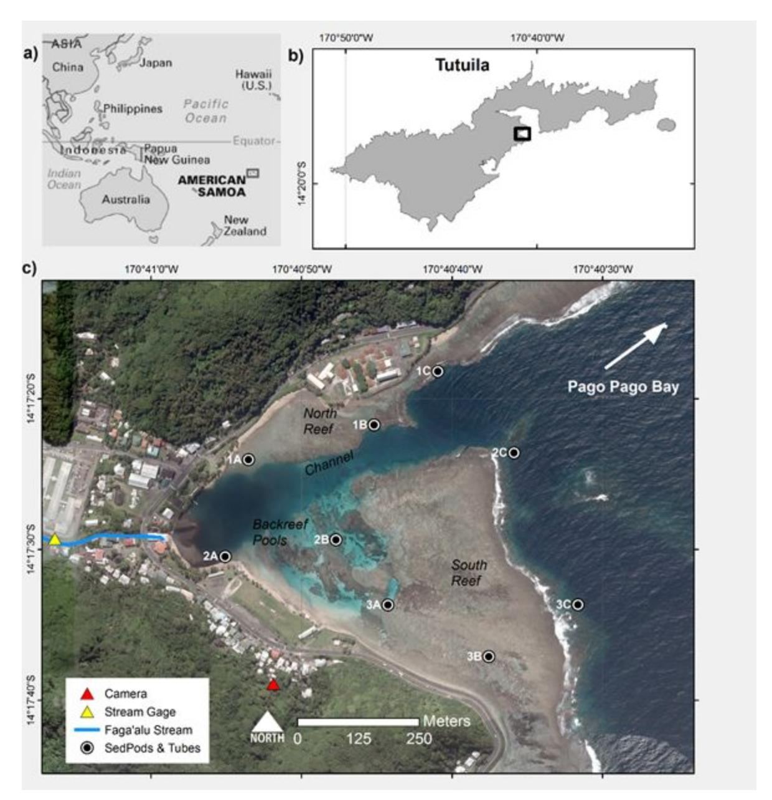

Figure 1.1.. Maps of the study area and instrumentation in Faga'alu Bay. a) Location of American Samoa in the South Pacific region. b) Location of Faga'alu Bay on Tutuila Island, American Samoa. c) SedPods and sediment traps were deployed at nine locations (1A3C) for one year and collected quasimonthly to measure sediment accumulation rates and composition. Suspended sediment yield from the watershed was measured at "Stream Gage." Further details on SSY measurements and modeling can be found in Messina and Biggs (2016). A timelapse camera was installed at "Camera" to record images of transient sediment plumes during storms.

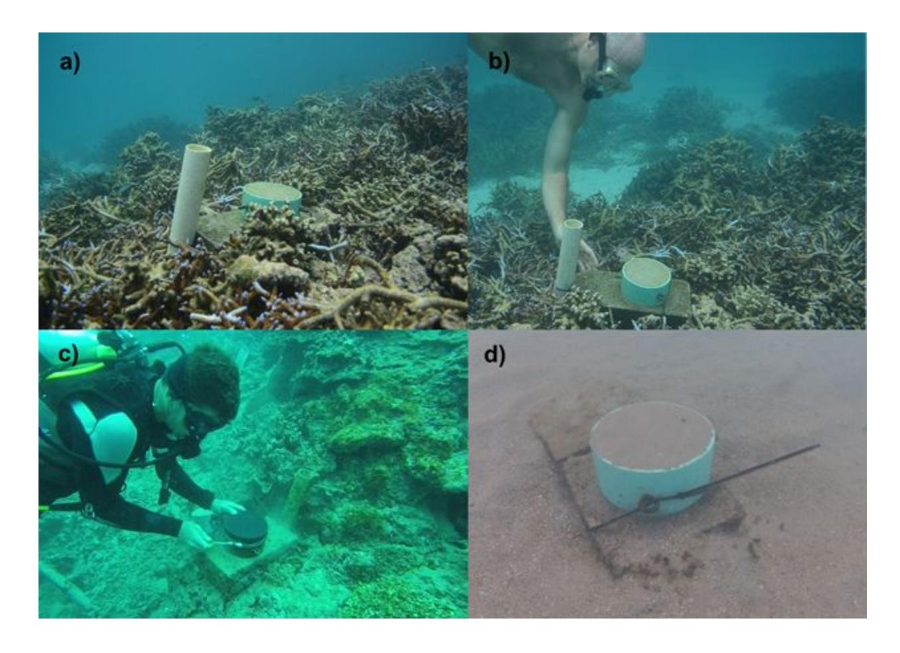

Figure 1.2. Pictures of the sediment tube traps and SedPods. ab) At Site 3A in an area of branching coral rubble, approx.. depth 2m c) Capping the SedPod for retrieval at Site 1C, approx. 10m depth d) At Site 1B, the surrounding area is mixed terrigenous and carbonate benthic sediment.

# Observed spatial distribution of accumulation rates

Mean total sediment accumulation (g m2d 1) over the yearlong study period was an order of magnitude higher in sediment traps than on SedPods at all sites (Figure 1.3). Sediment accumulation on SedPods was higher in the sheltered, more quiescent parts of the bay near the stream outlet (site 2A), on the quiescent northern reef (sites 1AC), and near the outlet of the channel (site 2C), whereas almost no sediment accumulation was observed on SedPods over the more energetic southern reef (sites 2B, 3A, 3B, 3C) (Figure 1.3b). Although total sediment accumulation was lower on SedPods compared to sediment traps, the same spatial pattern and relative magnitude of sediment accumulation rates was observed, with the exception of sites 3A and 3B on the south reef. Sediment accumulation rates in sediment traps on the southern reef flat (sites 3A and 3B) were much higher than corresponding sediment pods, suggesting removal of sediment that was transiently deposited on SedPods.

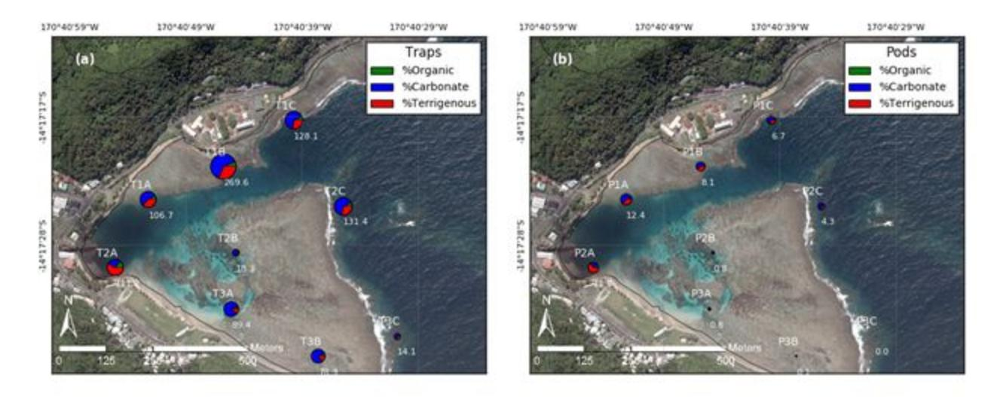

Figure 1.3. Mean sediment accumulation rates (g m2 d1) and composition at sediment traps and sediment pods in Faga'alu Bay during all deployments. a) Sediment traps. b) Sediment pods.

## Comparison with coral health

The sedimentation rates in the tubes exceeded thresholds of coral health suggested by Erftemeijer et al. (2012) and Fabricius (2005) at several times and locations, including sites 1B, 2A, and 3A (Figure 1.4).

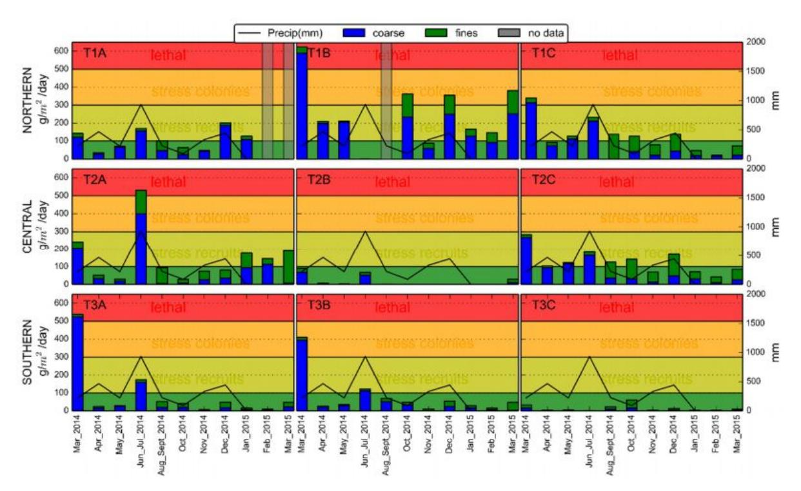

Figure 1.4. Sediment accumulation rates in tubes by month. Colored regions indicate stress on corals, with red indicating potentially lethal rates of sediment accumulation. Grey bars indicate missing data due to trap disturbance. Source: HolstRice et al (2014).

Where accumulation rates were highest (northern reef) coral condition was also compromised, with low values of the reefbuilder ratio (RBR) in the northern reef compared with the southern reef, where the RBR is the ratio of mean cover of corals and crustose coralline algae combined to cover of nonaccreting organisms (Figure 1.5). Future work will test for the statistical significance of correlations between sedimentation rates and indicators of coral health.

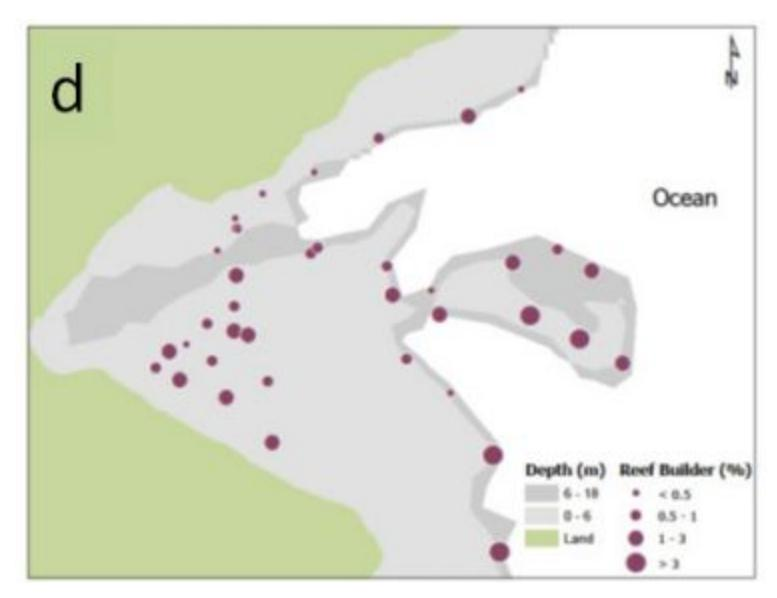

Figure 1.5. Map of the reefbuilder index in Faga'alu Bay. Data collected by Bernardo Vargas and team, March 2012 to August 2013. Source: HolstRice et al (2014).

# Objective 2: Measure and model flow conditions

*Use ocean circulation data collected in Faga'alu to model flow conditions that control sediment accumulation.*

# Summary

A combination of ADCPs, wave tide recorders, and GPSenabled drifters were deployed over a range of tide, wind, and wave conditions to document the spatial pattern in flow velocities and directions. The dominant circulation pattern is clockwise from the southern reef to the northern reef, with highest velocities during wavedriven conditions. The circulation pattern is consistent with the observed pattern of sediment accumulation in Objective 1, suggesting that hydrodynamics are the dominant forcing on the spatial pattern of sediment accumulation.

### Methods

Following discussions with collaborators at USGS (Storlazzi) and UCSB (Washburn), a combination of ADCPs (N=3), wavetide recorders (N=1), and GPSenabled drifters (N=5) were deployed in Fagaalu Bay (Figure 2.1). The drifters were specially designed for shallow water conditions (Figure 2.2). The five drifters were deployed 30 times from 19 January 2014 to 23 February 2014. Twentyone releases occurred during the deployment period for a set of three acoustic current profilers (ADCP) (February 1623). Drifters were released from five separate launch zones (Figure 2.1) within a 10min period at the beginning of each deployment. Drifter position was recorded by the GPS logger at 5s intervals and averaged to 1 min. ADCPs collected a vertical profile of current velocity every 10 min, averaged from 580 samples collected at 2 Hz. Each profile was composed of eight 0.2m bins starting from 0.35 m above the seabed, using a blanking distance of 0.1 m. For details of the drifter design and experiments, see Messina (2016).

The instruments sampled "endmember" forcing conditions that characterize the study area, such as high winds, high waves, or calm conditions (Yamano et al., 1998). This approach isolates the influence of wind and wavedriven forcing to determine the resulting flow patterns. Calm conditions are characterized by low winds and waves, and we refer to these conditions as "tidal", to indicate the dominant forcing. Endmember periods were defined postdeployment using modeled and in situ wave, wind, and tide data following the methodology described by Presto et al. (2006). Incident wave conditions were recorded by a NIWA DobieA wave/tide gauge (DOBIE) deployed on the southern forereef at a depth of 10 m. The DOBIE sampled a 512s burst at 2 Hz every hour. The DOBIE malfunctioned and recorded no data coinciding with the ADCP deployment, but the data that was collected before the malfunction compared well (not shown) with NOAA/NCEP Wave Watch III (WW3; Tolman, 2009) modeled data on swell height and direction (Hoeke et al., 2011). Thus, the WW3 model data are considered sufficient for defining the wave climatology during the ADCP and drifter deployments.

# Meteorologic and oceanographic forcing

A large range of tide, wind, and wave conditions typical of the study site was sampled during the 8d period of overlapping ADCP and drifter deployments, YD 4754 (GMT) (Figure 2.3). Three distinct periods were observed and defined as endmember forcings: 1) a strong onshore wind event with small waves ('WIND') during YD 4750.5; 2) weak winds from variable directions and small waves, where tidal forcing was dominant ('TIDE') during YD 50.552.5; and 3) a large southeast swell with weak winds ('WAVE') during YD 52.554 (Table 2.1).

### Flow patterns

Drifter tracks from all thirty deployments covered nearly the entire reef flat (Figure 2.5), showing three general spatial patterns: 1) faster flows over the exposed southern reef flat; 2) slower, more variable flows over the backreef pools, sheltered northern reef, and deep in the embayment, near the stream outlet; and 3) flows exiting the seaward end of the channel.

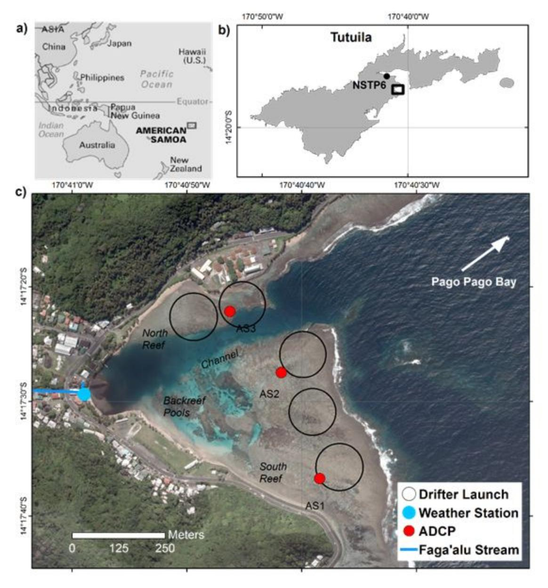

Figure 2.1. Maps of the study area and instrumentation in Faga'alu Bay. Wind speed and direction were recorded at NDBC station NSTP6 (b). Acoustic current profilers (ADCP) were deployed at three locations for one week to measure current speed and direction, and GPSlogging drifters were deployed thirty times (19 January to 23 February 2014) from five launch zones (Drifter Launch).

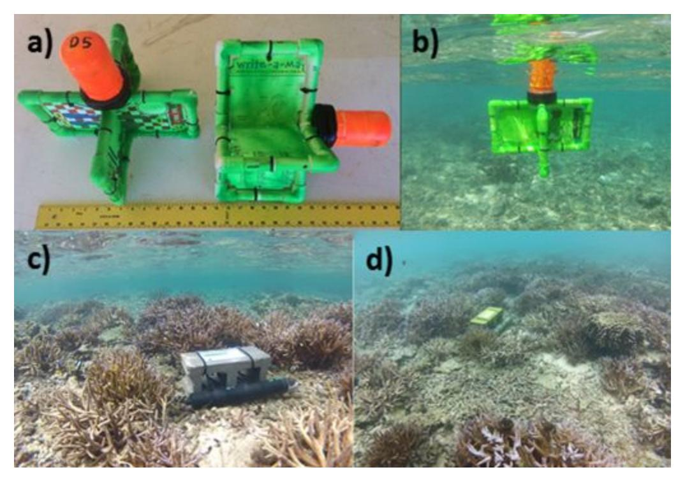

Figure 2.2. Images of the oceanographic instrumentation at high tide. a) Shallowwater drifters on land with ruler for scale. b) Drifter deployed in the field over the reef flat. cd) The ADCP at location AS1.

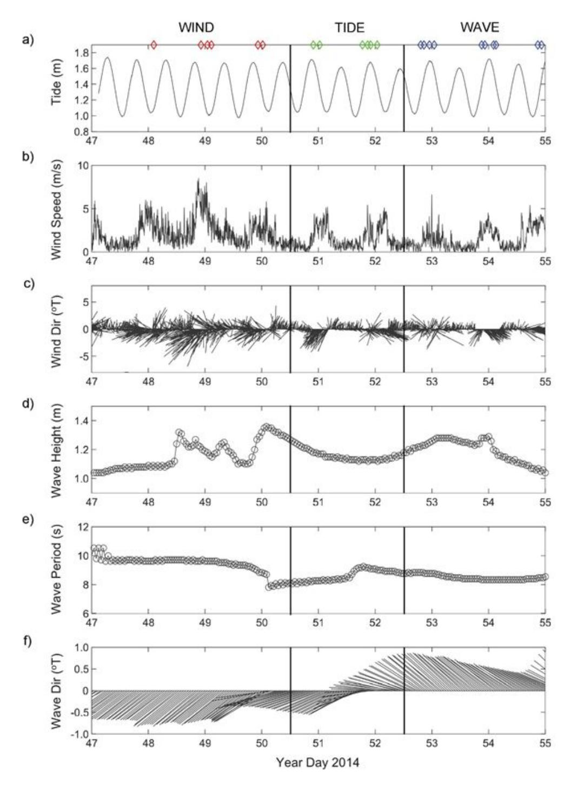

Figure 2.3. Time series of physical forcing data used to define endmember forcings for analysis. Diamonds at the top indicate times of drifter deployments, and capital titles (WIND, TIDE, WAVE) indicate endmembers periods dominated by each major forcing factor. During WIND, wave direction was from the southwest, resulting in small waves in Faga'alu. a) Tidal stage. b) Wind speed. c) Wind speed and direction. d) Wave height. e) Wave period. f) Wave height and direction. Vectors denote direction "to". Wind data are from NDBC station NSTP6; wave model data (significant wave height, peak wave direction) are from NOAA WW3.

### Circulation during endmember conditions:

In general, TIDE was characterized by slow flow speeds and variable directions, WIND by slow flow speeds and mostly onshore directions, and WAVE by the fastest flow speeds and most consistent directions (Figure 2.5). Mean (±STD) flow velocities of all ADCP data during WIND, TIDE and WAVE were 7.4±7.3 cm s1, 5.6±6.1 cm s1, and 11.2±10.1 cm s1 , respectively. Similar to the longterm ADCP results, mean drifter speeds (±STD) during WIND, TIDE, WAVE were 8.0±6.5 cm s1, 7.1 ±5.8 cm s1, and 12.3±8.1 cm s1 , respectively (Table 2.1).

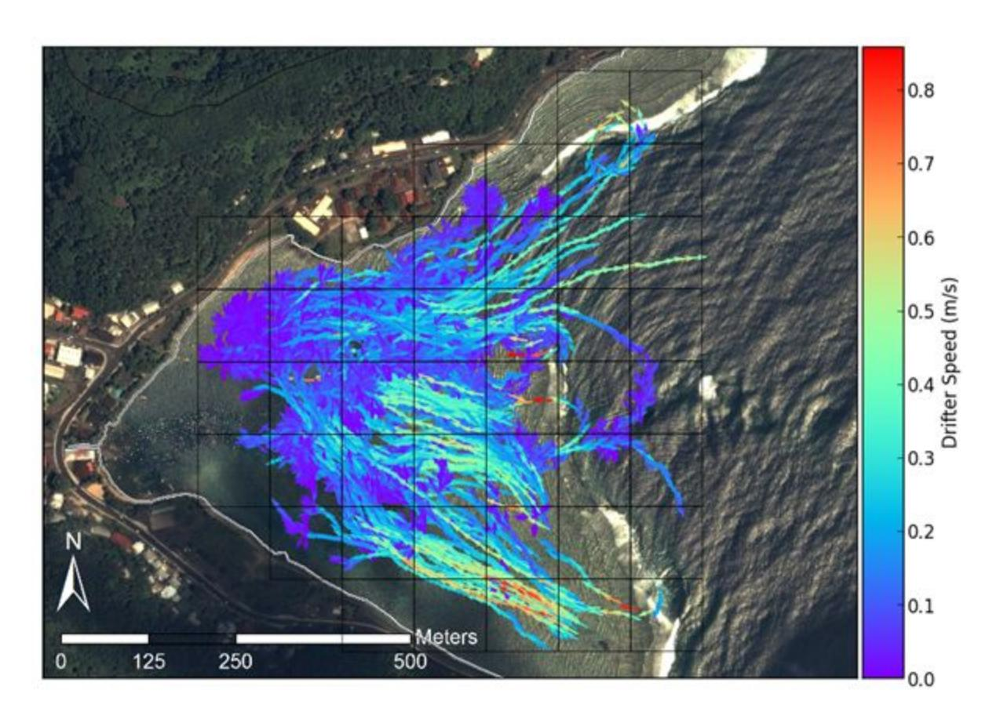

Figure 2.4. Map of all drifter tracks during the experiment, colored by speed (m s1).

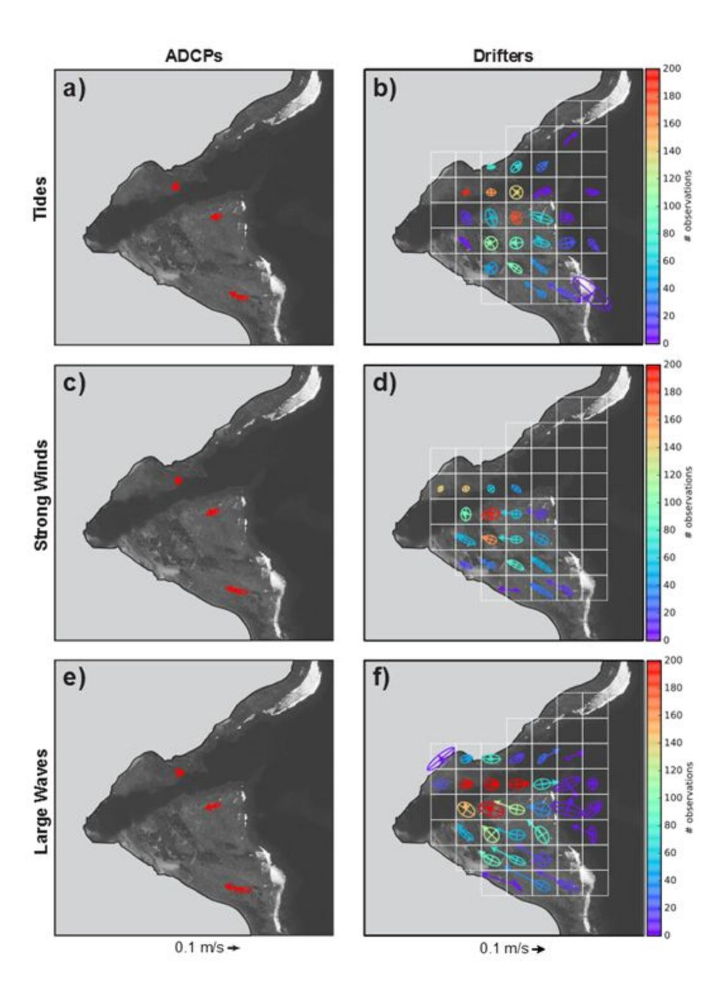

Figure 2.5. Variance ellipses and mean currents for the ADCP data and spatiallybinned drifter data under endmember forcings. a) ADCP data under tidal forcing. b) Drifter data under tidal forcing. c) ADCP data during strong winds. d) Drifter data during strong winds. e) ADCP data during large waves. f) Drifter data during large waves. Drifter data are colored by number of observations to illustrate the varying data density.

# Objective 3: Geochemical composition and particle sizes of sediments

*Analyze geochemical composition of the collected sediments to determine the percent terrigenous sediment and provide data on the particle sizes to managers to direct mitigation strategies to reduce loading of the specific classes of sediment that are settling in the bay.*

## Summary

The geochemical composition of sediments was determined using lossonignition techniques. Over the whole sampling period, trapped sediments were dominantly coralline (carbonate) on the energetic southern reef. On the quiescent northern reef, trapped sediment was dominantly coralline in some periods, especially further from the stream outlet, but dominantly terrigenous in some periods and closer to the stream outlet. The geochemical composition differed by particle size, with more terrigenous material in the fine fraction (<63 um) compared with the coarse fraction (>63 um): the fine fraction was percentage was 37% carbonate, 51% terrigenous and 12% organic compared with 53% carbonate, 38% terrigenous and 10% organic for the coarse fraction in the traps on the northern reef. Overall, the results show that coralline sediment from wavedriven resuspension of surrounding benthic deposits is an important component of sediment accumulated in traps and on SedPods. Accumulation of stormsupplied terrigenous sediment was only evident near the stream outlet, and varied at timescales other than our monthly measurements, suggesting sediment stress from legacy deposits is likely to persist over the northern reef despite reduction of sediment loading from the watershed.

### Methods

Sediment bulk weight and grain size class were analyzed by wet sieving, and composition was determined by the Loss on Ignition (LOI) method. Gravelsize shells and organisms (>2 mm) were sieved and removed from analysis, then the coarse (2 mm – 63 *µ*m) and fine fractions (63 *μ*m 2 *μ*m) were separated by wet sieving. The fine fraction was collected on preweighed 15cm diameter, 2*μ*m nominal pore size glass fiber filters. To remove salts, the coarse fraction was rinsed in the sieve with distilled water, whereas the fine fraction was gravity filtered with distilled water at least three times. Coarse and fine fractions were dried at 100 C for 2 hr, cooled, and weighed to determine the bulk sediment mass. The sediment samples were then analyzed for geochemical composition using the LOI method of combusting 3 hr at 550 C for % organic and 950 C for 3 hr for % carbonate, respectively, by mass (Heiri et al., 2001; Santisteban et al., 2004). The proportion (%) of terrigenous sediment was then determined by subtraction from the % organic and % carbonate (DeMartini et al., 2013; Gray et al., 2012). Wet sieving conducted by different lab analysts showed a significant difference in coarse and fine fraction separation, with

significant differences pre and post October 2014. Here, the mean particle size fractions were calculated on samples taken from October 2014March 2015. Future studies of particle size should use laser diffraction instead of wetsieving if possible to obtain more robust data on particle size distribution. Sediment accumulation results were normalized for trap diameter and deployment time (g m2 d 1) (Storlazzi et al., 2009) to compare sediment pods and sediment traps and variable deployment times.

### Results

We analyzed benthic and trapped sediment to provide data on the particle size distribution to direct mitigation strategies to reduce loading of the specific classes of sediment that are settling in the bay. The initial hypothesis was that any finegrained sediment, particularly terrigenous sediment, settling on corals was derived from the watershed and could be mitigated. Our data on particle size fraction and composition showed that there is a significant amount of finegrained carbonate sediment, so particle size alone cannot be used as an indication of watershed impacts.

Benthic sediment includes significant amounts of terrigenous sediment, which are mobilized during wave and winddriven resuspension and deposited in sediment traps and on corals. Terrigenous sediment was assumed to be derived exclusively from the watershed and either deposited on coral directly from the plume discharged by the stream during storms, or deposited near the stream outlet and deposited on coral during later resuspension events. The presence of terrigenous benthic sediment on the southern reef (which is unimpacted by the streamsupplied plumes) indicates there is terrigenous sediment from in situ weathering of volcanic rock outcroppings out on the reef flat and along shorelines. While the presence of terrigenous sediment in benthic and trapped sediment may indicate the impact of streamsupplied sediment (that could be targeted for mitigation), it could be confused with older, weathered volcanic rock. More sophisticated geochemical analyses are needed to separate the contributions of suspended sediment from the stream and relict terrigenous sediment.

The terrigenous fraction of benthic sediments was approximately 2x higher over the northern reef flat (~15%) compared to the more energetic southern reef flat (8%) (Table 1.1). Near the stream outlet, benthic sediment was dominated by the terrigenous fraction (65% terrigenous) but showed similar percentages of organics as the reef flats.

The terrigenous fraction of sediment collected in the traps was higher on the northern reef (40%) compared with the southern reef (23%), which was higher than the terrigenous fraction of sediment in the pods (Figure 3.1, 3.2). The coralline fraction accounted for more than 50% of the sediment collected in both tubes and pods for all but one location (Figure 1.3), and on the northern reefs, coralline fraction was greater than 50% for all but 3 collection times (Figure 3.1). Higher rates of sedimentation on the northern reef were from both terrigenous and coralline deposits.

Though total sediment accumulation was higher in sediment traps, the average percent contributions of organic, terrigenous, and carbonate sediment were similar for sediment traps and sediment pods at each site. With the exception of site 2A near the stream outlet, sediment accumulation on both the north and south reefs was dominated by the carbonate fraction. On the more energetic southern reef, the ratio of terrigenous and carbonate sediment accumulation observed in sediment traps (sites 2B, 3A, 3B, and 3C) mainly reflected the composition of surrounding benthic sediment. For the southern reef, 3A and 3B showed the largest relative increase in terrigenous fraction compared to surrounding benthic sediment, likely due to some small storm drains emptying into the bay near those sites. On the more quiescent northern reef, in both sediment traps and sediment pods, the terrigenous fraction of sediment accumulation rates was higher than surrounding benthic sediment; the organic fraction was also higher than surrounding benthic sediment, but only in sediment traps and not on sediment pods.

The fine fraction of sediment in the traps was slightly lower on the northern reef (50%) compared with the southern reef (60%), suggesting that a significant amount of relatively coarse (>63um) sediment is resuspended and deposits in the traps. Together with the geochemical analysis, this suggests that the sediment accumulating in the traps on the northern reef were dominated by coarse carbonate (27%) and fine terrigenous (26%) followed by 19% coarse terrigenous, 19% fine carbonate, and 10% organic.

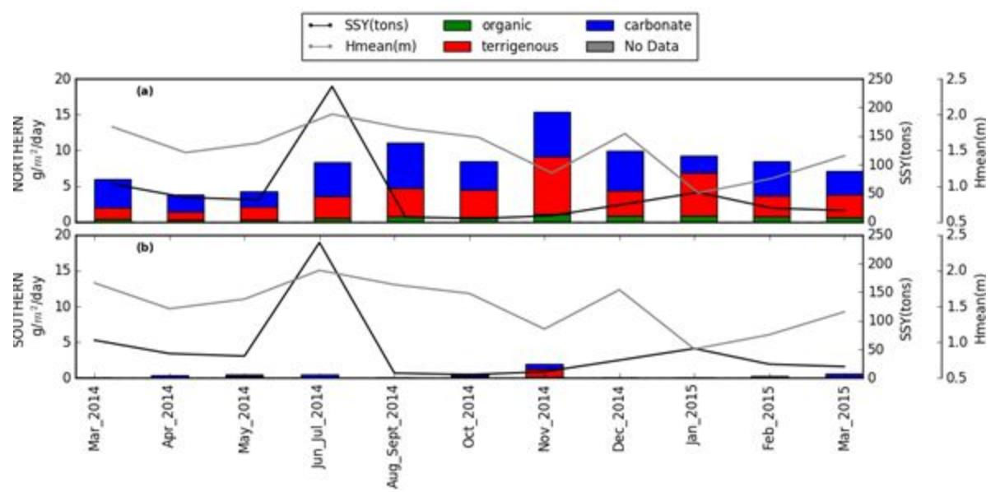

Figure 3.1. Mean sediment accumulation (g m2 d1) on sediment pods during the study period over the a) north reef including sites 1A, 1B, 1C, 2A, 2C, and b) south reefs including sites 2B, 3A, 3B, 3C.

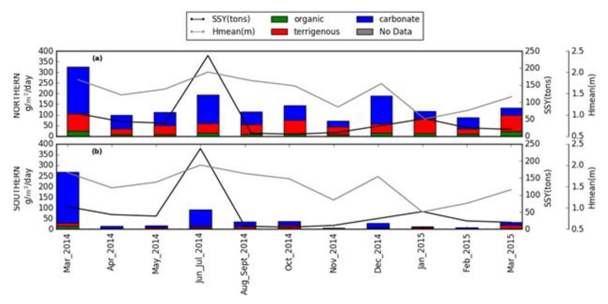

Figure 3.2. Mean sediment accumulation (g m2 d1) in sediment traps during the study period over the a) north reef including sites 1A, 1B, 1C, 2A, 2C, and b) south reefs including sites 2B, 3A, 3B, 3C.

# Objective 4: Modeling sediment accumulation from watershed and ocean processes

*Develop an interpretive and modeling framework to account for the importance of watershed, oceanic, and meteorological processes controlling the spatial distribution and magnitude of sedimentation on the reef.*

# Summary

A statistical model relating sediment accumulation to watershed inputs and oceanic forcing (mean wave height) was constructed for each of the nine monitoring locations. Wave height was the best predictor of sediment accumulation for all but one site that was closest to the watershed outlet, suggesting that resuspension of existing sediment, rather than deposition of watershedderived material during events, was the dominant source of sediment to the tubes and pods.

# Methods

Statistical models relating sediment accumulation observed in the traps and pods were developed using watershed inputs (suspended sediment yieldSSY) and mean wave height during the collection periods as predictor variables. Both univariate and bivariate regression models were used to test for the significance of SSY and waves in observed sediment accumulation in each pod and trap.

SSY: Messina and Biggs (2016) developed an empirical model for Faga'alu Stream to predict eventwise suspended sediment yield (SSYEV ) from maximum event water discharge (Qmax). A second QmaxSSYEV model was calibrated for the time period following the sediment mitigation (October 2014April 2015) to reflect the reduction in SSYEV from the same magnitude Qmax (unpublished). For this study, a timeseries of SSYEV to the Bay during the study period was developed from measured SSYEV when both water discharge (Q) and suspended sediment concentration (SSC) data were available; when only Q data were available, SSYEV was predicted from the empirical QmaxSSYEV models of Messina and Biggs (2016). Additional terrigenous sediment yield to the bay from ephemeral streams was not measured, and assumed to be correlated with SSYEV from Faga'alu Stream.

Wave height: In situ wave data was not available at the study site during sediment trap deployments, but data from a wave gauge installed previously in Faga'alu for 2 months compared well with NOAA WaveWatch III Samoa Regional Wave Model (WW3) (PACIOOS, 2016). The WW3 Samoa Regional Model takes into account island bathymetry and shadowing, so only swell directions from the Southwest to Southeast were included in the analysis, since other swell directions do not impact Faga'alu Bay. To characterize wave conditions during sediment trap deployments, mean wave height between the deployments (*Hmean*, in m) was calculated from WW3 data on daily mean significant wave height during the period between collections (RangelBuitrago et al., 2014; Seymour, 2011).

This analysis did not investigate the influence of winds directly, but wind waves generated by trade winds are included in the WW3 model output. Strong trade winds are typical in MaySeptember when significant wave height is also high due to trade wind generated waves and Austral winter storms. The cooccurrence of light winds and large groundswellgenerated waves is infrequent but most common during the wet season from October to May. This analysis assumes the dominant effects of strong, onshore trade winds from the southeast are adequately captured by the WW3 significant wave height and would be significantly correlated with calculated mean wave height.

# Relationships between forcing and sediment accumulation

In univariate correlations and regressions, mean wave height (*Hmean*) was positively correlated with total and carbonate sediment accumulation in the traps at every site except near the stream outlet (site 2A), on the more energetic southern reef (site 2B), and on the more quiescent southern fore reef (site 3C) (Table 4.1). *Hmean* was positively correlated with mean total and carbonate sediment accumulation in traps on the northern and southern reefs, but when controlling for SSY in the multiple regression, only mean carbonate accumulation was weakly correlated with *Hmean* on the northern reef (Figure 4.1). On the northern and southern fore reef (sites 1C, 2C, and 3C), univariate and multivariate linear regressions showed both total and

carbonate sediment accumulation in sediment traps were significantly correlated with mean wave height, and showed a nonlinear relationship with wave heights in many cases (Figure 4.1).

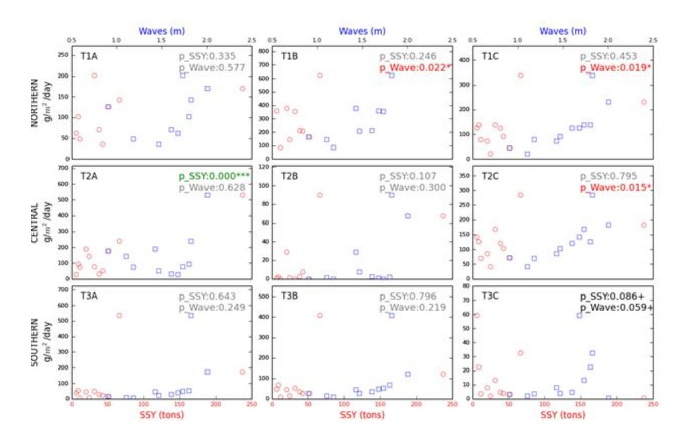

Figure 4.1. Relationships between total sediment accumulations in sediment traps vs watershed suspended sediment yield (SSY) or mean wave height (Waves)*. P*values (p\_SSY and p\_Wave) are for the significance of each given variable in the multiple regression.

### Future research

- 1. Geochemical fingerprinting: We documented the importance of terrigenous sediment for total sediment accumulation in tubes and traps. The origin of the terrigenous sediment is unknown and could include naturally derived sediment from the watershed, anthropogenically derived sediment from the watershed, or weathering of rock in the coastal environment. Future research could include more detailed mineraologic and geochemical analysis of the sediment in the watershed and bay to fingerprint anthropogenic sediment and its contribution to total sedimentation. Such research would address the question: What is the origin of terrigenous sediment, both from the watershed and that accumulating in the traps/pods?
- 2. Sedimentation during events: Our analysis was based on monthly sedimentation data, which cannot separate the impact of specific events. Eventwise sampling of sediment in

- traps and pods could help establish the importance of storm events on sedimentation, including temporary deposition that may harm corals but do not accumulate on pods. The questions include: Is terrigenous deposition related to watershed inputs on an eventbasis?
- 3. Sediment fate and transport: We concluded that sediment accumulating in the traps and pods were derived from local benthic material due to the high correlation between sedimentation and wave action. Future research could attempt to determine the residence time of terrigenous sediment in the bay. Questions include: How long does terrigenous sediment remain in the bay? How long might it take a plume of sediment deposited during an event to leave the bay?
- 4. Sediment deposition and coral health: We document a spatial relationship between sedimentation rates and coral condition, and compared measured sedimentation rates with coral stress thresholds in the literature. Much remains to be known about the relationship between sediment and coral health. Remaining questions include: What are the relative impacts of sediment loading from the watershed, sediment resuspension and subsequent redeposition, and turbidity on coral health?
- 5. Coral recovery following restoration: Watershedbased work has documented that the sediment mitigation activities at the quarry have reduced sediment loads back to their natural, predisturbance conditions. How long will it take for coral to recover to predisturbance conditions? What is the relationship between reduction in sediment load and coral health?

### References

- DeMartini E, Jokiel P, Beets J, Stender Y, Storlazzi C, Minton D, Conklin E (2013) Terrigenous sediment impact on coral recruitment and growth affects the use of coral habitat by recruit parrotfishes (F. Scaridae). J. Coast. Conserv. 17:417–429
- Erftemeijer, P.L., Riegl, B., Hoeksema, B.W., Todd, P., 2012. Environmental impacts of dredging and other sediment disturbances on corals: A review. Mar. Pollut. Bull. 64, 1737–1765. doi:10.1016/j.marpolbul.2012.05.008
- Fabricius, K.E., 2005. Effects of terrestrial runoff on the ecology of corals and coral reefs: review and synthesis. Mar. Pollut. Bull. 50, 125–46. doi:10.1016/j.marpolbul.2004.11.028
- Gray SC, Sears W, Kolupski ML, Hastings ZC, Przyuski NW, Fox MD, Degrood A (2012) Factors affecting landbased sedimentation in coastal bays, US Virgin Islands. Proceedings of the 12th International Coral Reef Symposium, Cairns, Australia, 9–13 July 2012.

- Heiri O, Lotter AF, Lemcke G (2001) Loss on ignition as a method for estimating organic and carbonate content in sediments : reproducibility and comparability of results. J. Paleolimnol. 25:101–110
- HolstRice, S., Messina, A. T., Biggs, T. W., VargasAngel, B., & Whitall, D. 2016. *Baseline Assessment of Faga'alu Watershed: A Ridge to Reef Assessment in Support of Sediment Reduction Activities and Future Evaluation of their Success*. Silver Spring, MD. doi:10.7289/V5BK19C3
- Messina, A.T., Biggs, T.W., 2016. Contributions of human activities to suspended sediment yield during storm events from a small, steep, tropical watershed. J. Hydrol. 538:726742.
- RangelBuitrago N, Anfuso G, Phillips M, Thomas T, Alvarez O, Forero M (2014) Characterization of wave climate and extreme events into the SW Spanish and Wales coasts as a first step to define their wave energy potential. J. Coast. Res. 70:314–319
- Santisteban JI, Mediavilla R, LopezPamo E, Dabrio CJ, Zapata MBR, Garcia MJG, Castano S, MartínezAlfaro PE (2004) Loss on ignition: a qualitative or quantitative method for organic matter and carbonate mineral content in sediments? J. Paleolimnol. 32:287–299
- Seymour RJ (2011) Evidence for Changes to the Northeast Pacific Wave Climate. J. Coast. Res. 27:194–201
- Storlazzi CD, Field ME, Bothner MH, Presto MK, Draut AE (2009) Sedimentation processes in a coral reef embayment: Hanalei Bay, Kauai. Mar. Geol. 264:140–151

# Table of proposed and delivered products

| Specific task from 3b.                                            | Products and Deliverables                                                                | Status                                                                                                              |  |
|-------------------------------------------------------------------|------------------------------------------------------------------------------------------|---------------------------------------------------------------------------------------------------------------------|--|
| 1.  Seasonal analysis of watershed input and ocean circulation | Journal article 1:  "Local circulation estimation from regional wave models"          | Chapter 2 in Messina (2016). Article in revision, for submission to Coral Reefs                            |  |
| 2.  Statistical circulation model                                 | Journal article 1:  "Local circulation estimation from regional wave models"          | Chapter 2 in Messina (2016). Article in revision, for submission to Coral Reefs                            |  |
| 3.  Monthly sedimentation measurements                         | Monitoring summary, Database of sedimentation                                         | Holst­Rice et al (2016)                                                                                             |  |
| 4.  Sediment chemical analysis                                    | Monitoring summary, Database of sedimentation                                         | Holst­Rice et al (2016)                                                                                             |  |
| 5.  Sediment particle size analysis                               | Monitoring summary, Database of sedimentation                                         | Holst­Rice et al (2016)                                                                                             |  |
| 6.  Sedimentation model                                           | Journal article 2:  "Sedimentation on a coral reef:  Watershed and ocean controls" | Chapter 3 in Messina (2016). Article in revision, for submission to Coral Reefs                            |  |
| 7.  Baseline establishment                                        | Journal article 2; "Sedimentation on a coral reef:  Watershed and ocean controls"  | Holst­Rice et al (2016) Chapter 3 in Messina (2016). Article in revision, for submission to Coral Reefs |  |