Tutuila, the main island of American Samoa, began sinking relatively rapidly (in geological time) since an earthquake in 2009 near Tonga seemed to have destabilized it. At Masefau Bay in 27 March 1979, we photographed the exposed reef (first 8 photos) during a low tide (- 0.59 ft = 18 cm). We photographed the same exposed reef in 28 September 2023 (final 7 photos) during nearly the same low tide level (- 0.51 ft = 15.55 cm). The difference in reef submergence in the photos appears to be more than one inch or 2.5 cm. But NOAA tide tables are based on recent mean sea levels and do not take into account longterm sea level changes or island sinking. The long-term sea level changes have been about 1.4 mm/yr from 1979 – 2006 and 3.6 mm/yr from 2006 till now. Therefore, sea level has possibly risen on Tutuila roughly 10.3 cm since 1079. Tutuila has been sinking since a Tonga/Samoa earthquake in 2009 (Han S-C et al. 2024). From 1979 to 2009, Tutuila was probably sinking at about 1.5 mm/yr. From 2009 till now, the island may have been sinking about 7.5 mm/yr. Therefore, the island may have sunk 15.75 cm since 1979. Adding sea level rise to island sinking (and the 2.54 cm difference in low tides), the effective sea level rise (10.3 cm) and the degree to which the reef is more submerged in 2023 (15.75 cm) should be about 26 cm (or 28.6 cm when adding the lower tide level) and this may be what the photos show. The community changed from *Acropora* to *Pocillopora* during the 45 years. The person in the 2023 photos is Eric Brown.

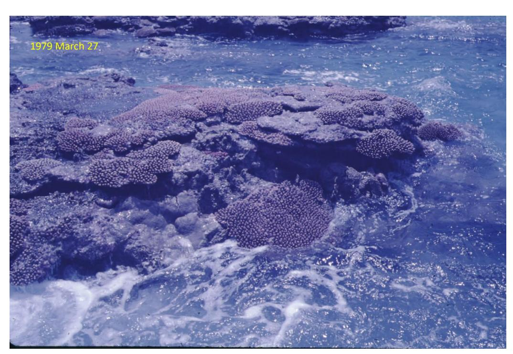

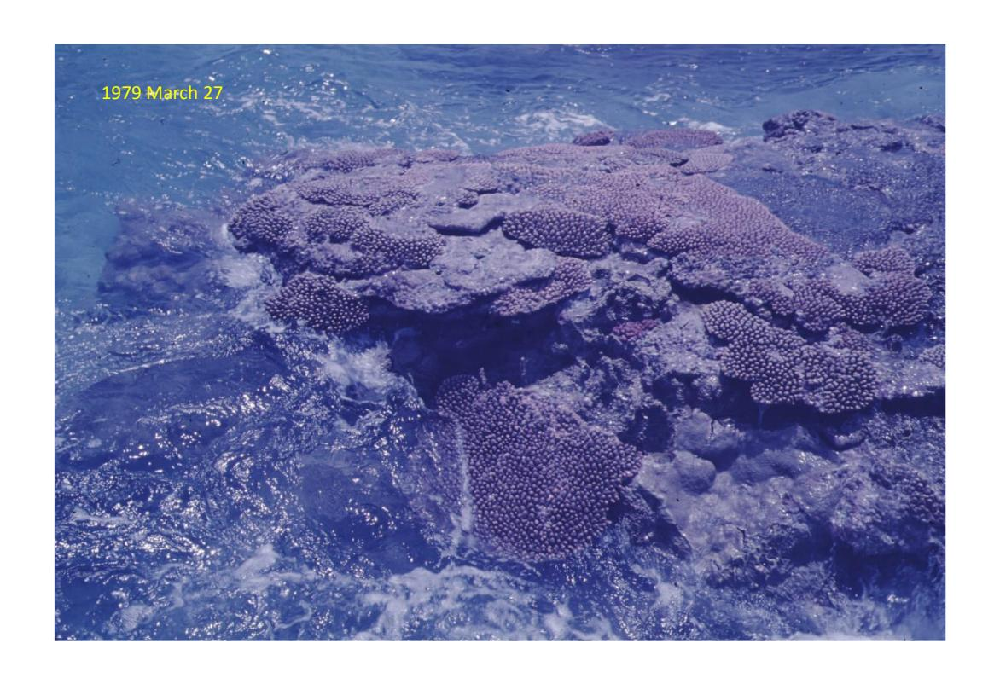

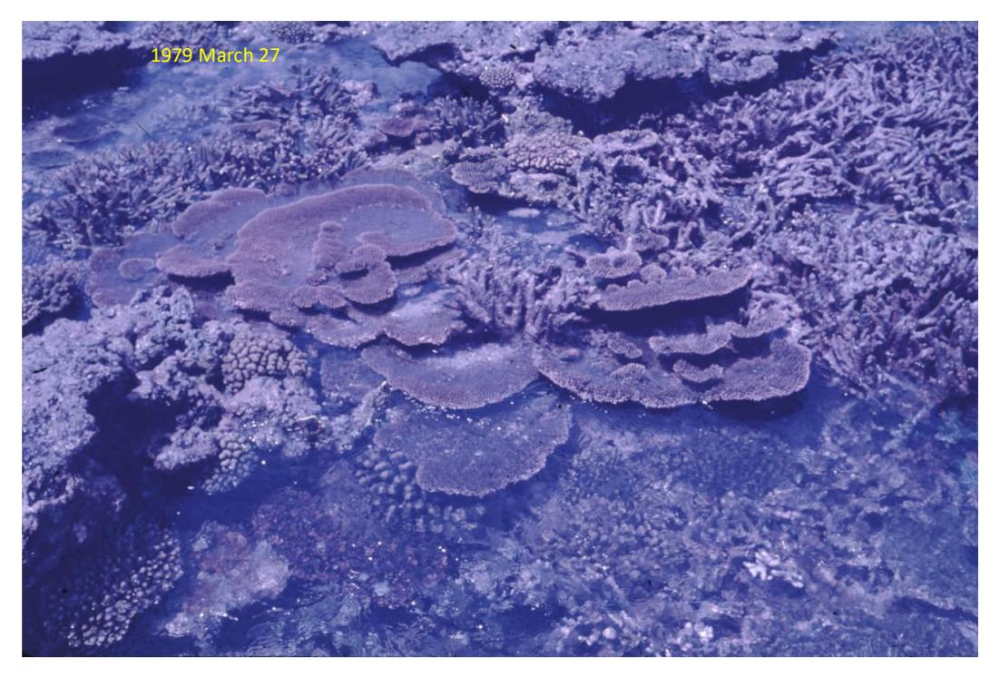

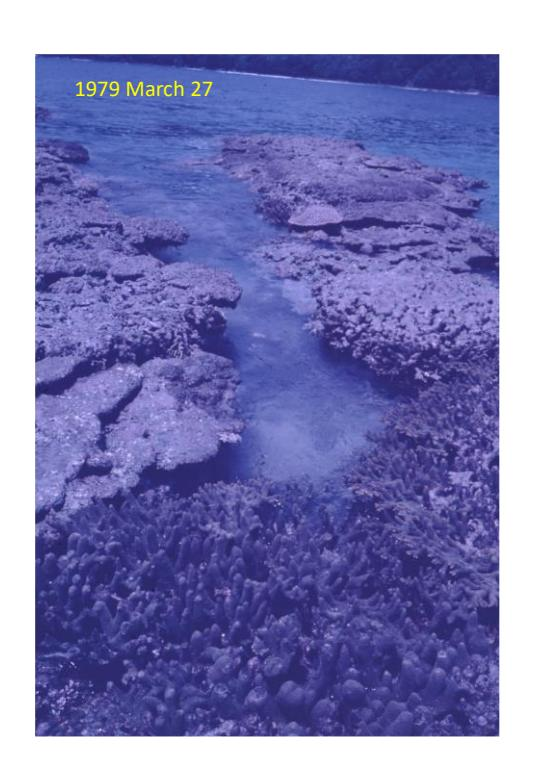

1979 March 27

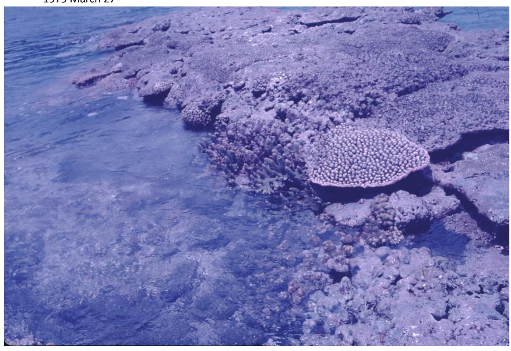

1979 March 27

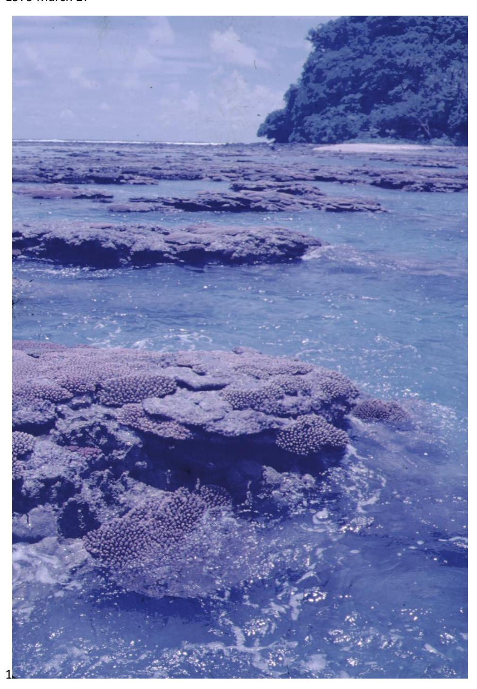

1979 March 27

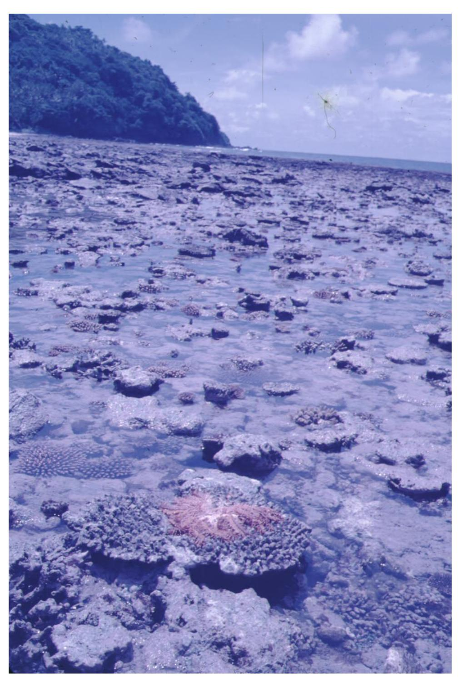

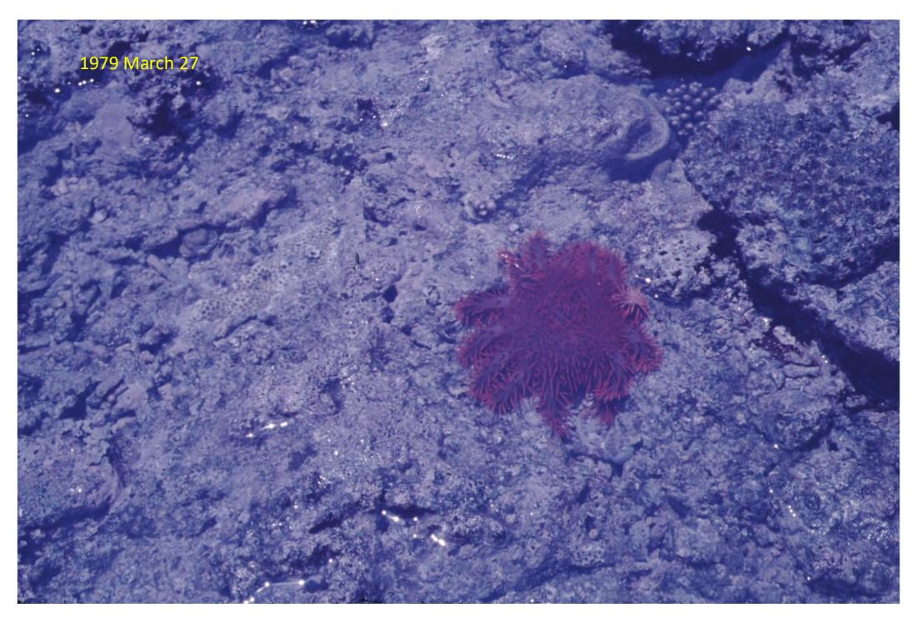

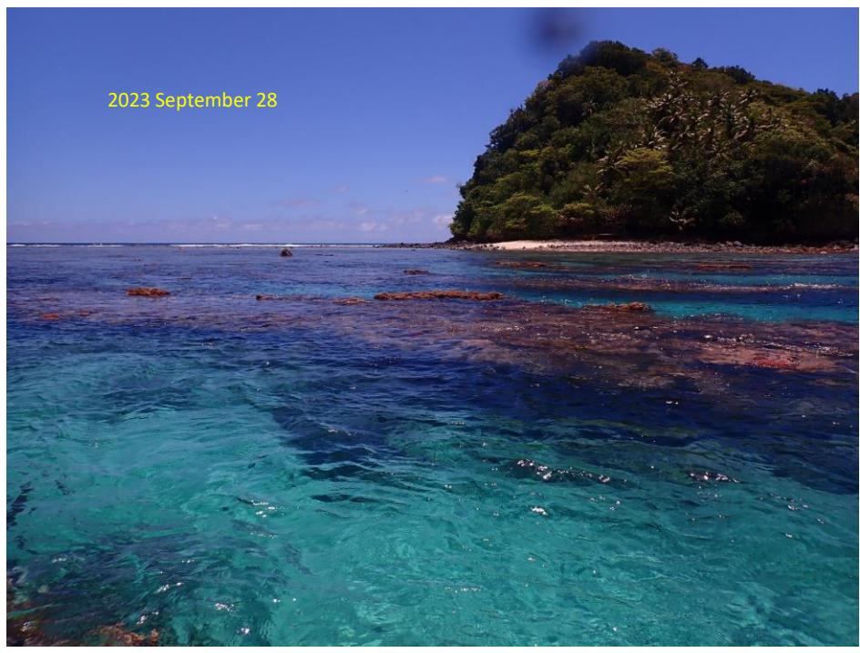

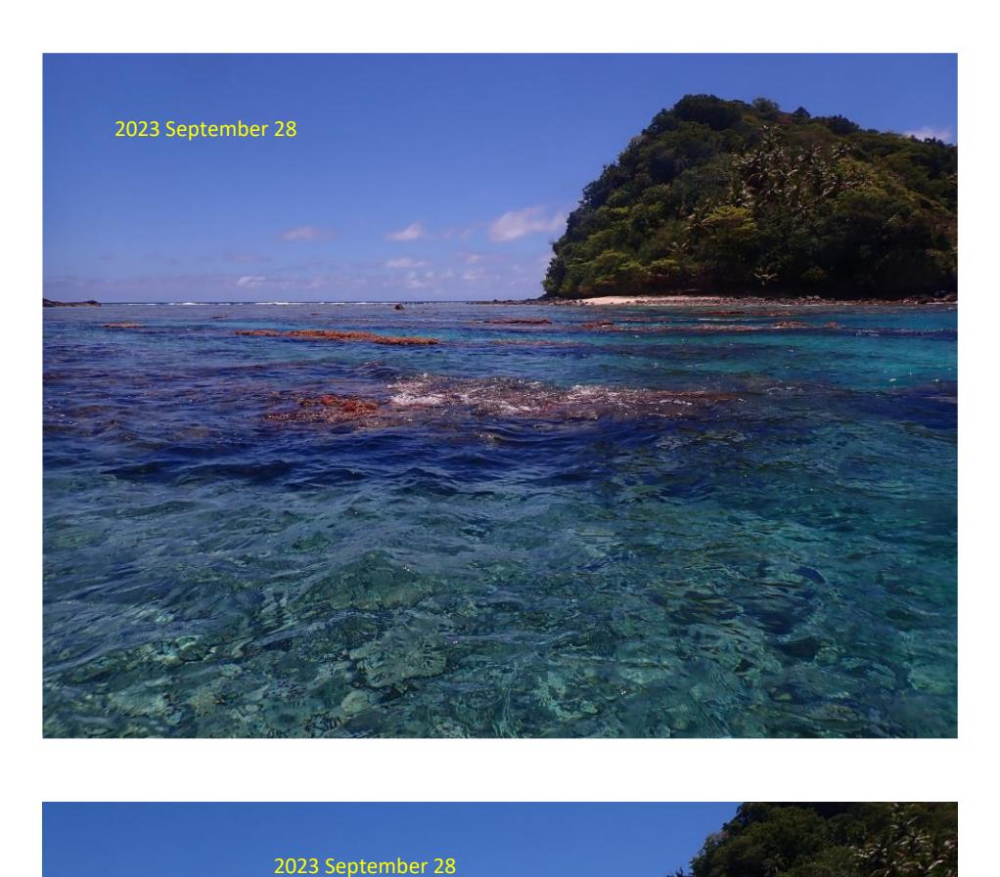

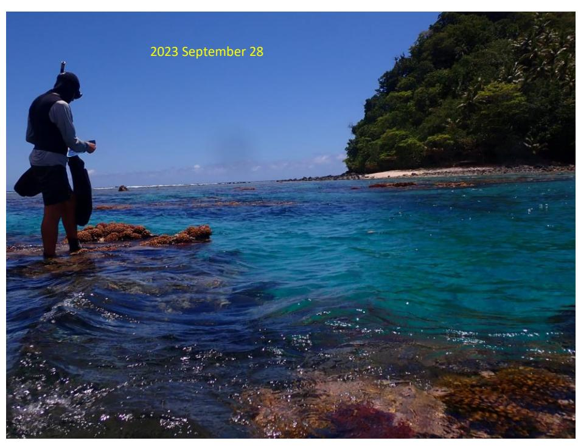

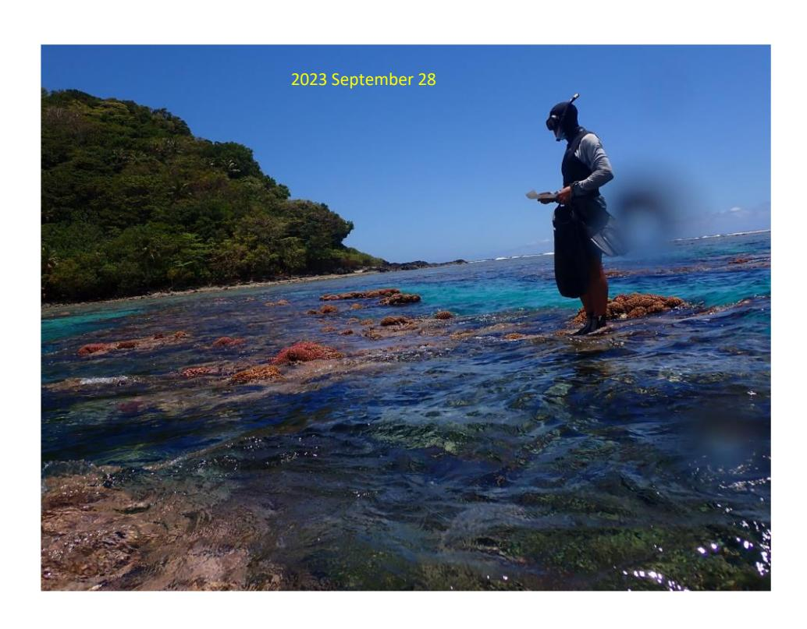

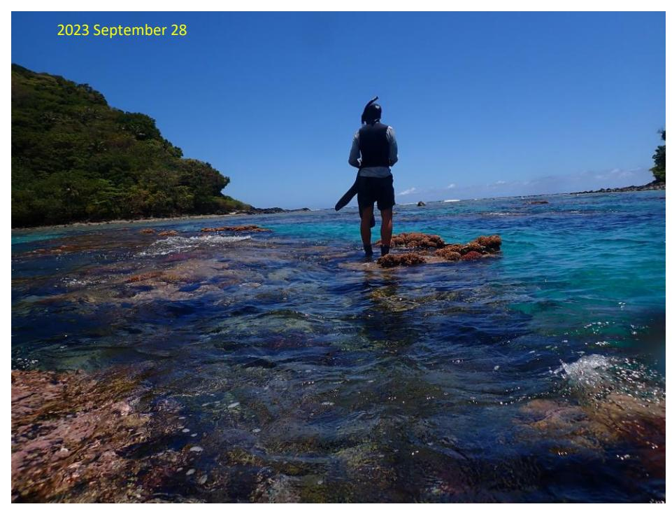

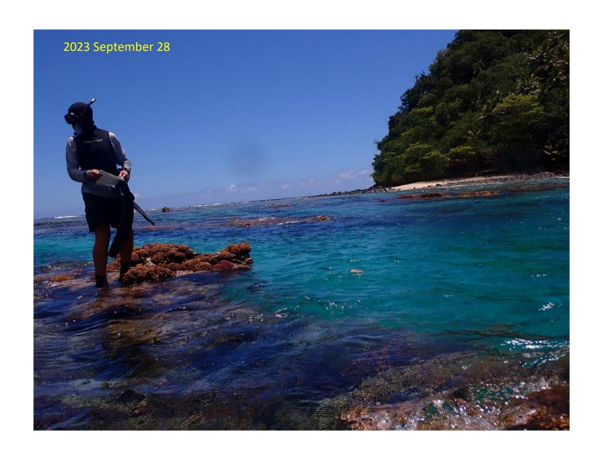

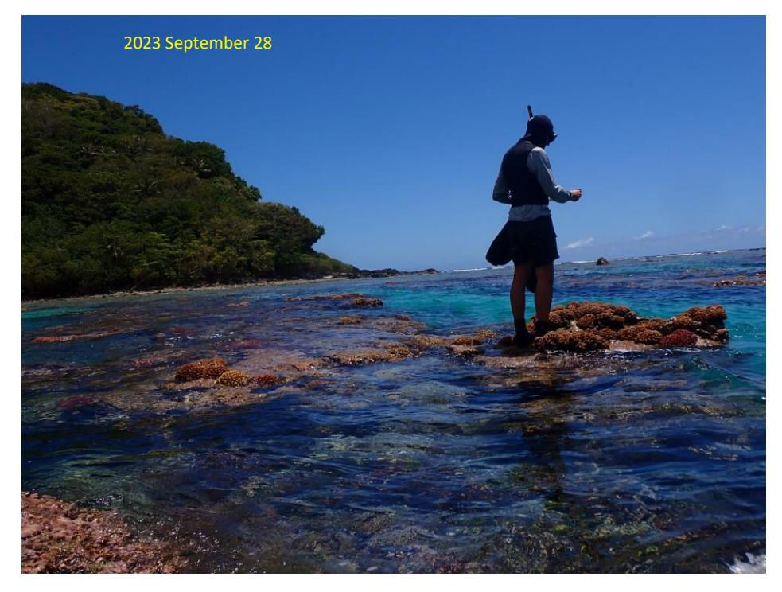