# CORAL REEF ECOSYSTEM MONITORING REPORT FOR **AMERICAN SAMOA**

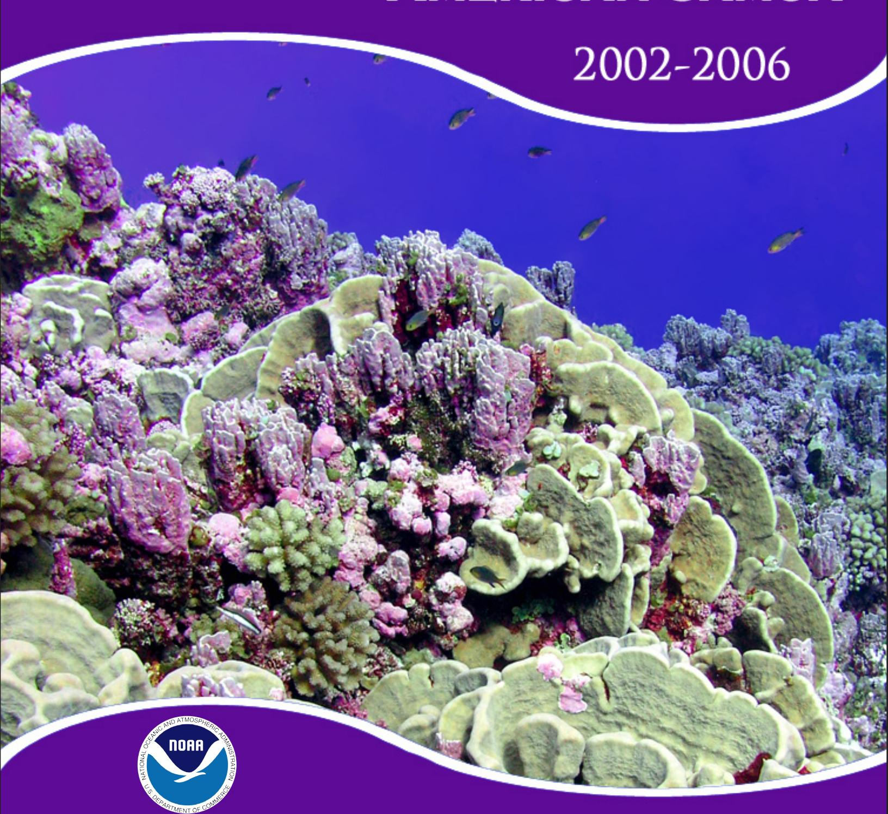

# CORAL REEF ECOSYSTEM DIVISION Pacific Islands Fisheries Science Center

# Coral Reef Ecosystem Monitoring Report for America Samoa: 2002–2006

#### *Lead Author*

Russell Brainard1

#### *Primary Authors*

Jacob Asher2 , Jamison Gove2 , Jason Helyer2 , Jean Kenyon2 , Frank Mancini2 , Joyce Miller2 , Sarah Myhre2 , Marc Nadon2 , John Rooney2 , Robert Schroeder2 , Ellen Smith2 , Bernardo Vargas-Angel2 , Susan Vogt2 , Peter Vroom2

#### *Contributing Authors*

Seema Balwani1 , Peter Craig4 , Annette DesRochers2 , Scott Ferguson1 , Ronald Hoeke2 , Marc Lammers2 , Emily Lundblad2 , James Maragos3 , Russell Moffitt2 , Molly Timmers2 , Oliver Vetter2

National Oceanic and Atmospheric Administration, Pacific Islands Fisheries Science Center, Coral Reef Ecosystem Division University of Hawaii, Joint Institute of Marine and Atmospheric Research U.S. Fish and Wildlife Service, Pacific Remote Islands National Wildlife Refuge Complex

4 National Park Service, National Park of American Samoa

NOAA Special Report NMFS PIFSC 2008

United States Department of Commerce

National Oceanic and Atmospheric Administration

National Marine Fisheries Service

Carlos M. Gutierrez Secretary

Vice Admiral Conrad C. Lautenbacher, Jr. USN (Ret.) Adminstrator

James W. Balsiger, Ph.D. Acting Assistant Administrator for Fisheries

#### U.S. DEPARTMENT OF COMMERCE National Oceanic and Atmospheric Administration NATIONAL MARINE FISHERIES SERVICE Pacific Islands Fisheries Science Center

2570 Dole St. • Honolulu, Hawaii 96822-2396 (808) 983-5300 • Fax: (808) 983-2902

#### ERRATA SHEET for Coral Reef Ecosystem Monitoring Report for American Samoa 2002-2006

| d l D J 2 3 2 0 0 8 t a e : u y , |  |  |
|-----------------------------------------------------------------------------------|--|--|

Title Page:

#### Delete:

NOAA Special Report NMFS PIFSC 2008

#### Replace with:

Pacific Islands Fisheries Science Center, PIFSC Special Publication, SP-08-002.

Page 13:

In chart, the word "Prevelance" should be changed to "Prevalence."

Pages 178, 181, 184, and 187:

In maps, the word "Ologesa" should be changed to "Olosega."

Page 263:

In chart, the word "Prevelance" should be changed to "Prevalence."

Francine L. Fiust Editorial Assistant

# **Acknowledgements**

In addition to the authors of the *Coral Reef Ecosystem Monitoring Report for American Samoa: 2002–2006*, we would like to thank and credit each of the Coral Reef Ecosystem Division (CRED) staff members who supported the Report by helping to cover ongoing workloads, staff cruises, process data, provide administrative and management support, and most importantly, by helping to maintain high morale during the long days and nights of writing.

| Stephane Charette    | Kyle Koyanagi     | Darryl Tagami     |
|----------------------|-------------------|-------------------|
| Edmund Coccagna      | Frances Lichowski | Rossyn Tasaka     |
| Susan Cooper Alletto | Kevin Lino        | Haiying Wang      |
| Bonnie DeJoseph      | Daniel Merritt    | Jonathan Weiss    |
| Matthew Dunlap       | Megan Moews       | Juliana Wong      |
| Alice Fongtran       | Michael Parke     | Kevin Wong        |
| Amy Hall             | Noah Pomeroy      | Charles Young     |
| Vikram Khurana       | Luis Salinas      | Brian Zgliczynski |

CRED also thanks the former staff members and numerous partners who planned and participated in the American Samoa Reef Assessment and Monitoring Program cruises. Without their assistance, the cruises and this Report's creation would not have been possible.

| Paula Ayotte     | Siaifoi Fa'aumu    | Bruce Mundy       |
|------------------|--------------------|-------------------|
| Sun He Bak       | Katie Fagan        | Craig Musburger   |
| Tony Beeching    | Doug Fenner        | Marcia Oshiro     |
| Gene Brighouse   | Beth Flint         | Kimberly Page     |
| Holly Bolick     | Scott Godwin       | Penetekoso Peau   |
| Jim Bostick      | Lara Hansen        | Linda Preskitt    |
| Jeff Burgett     | Kyle Hogrefe       | Francesca Riolo   |
| Joseph Chojnacki | Stephani Holzwarth | Fatima Sauafea    |
| Andrew Cornish   | Jeremy Jones       | Joshua Seamon     |
| Peter Craig      | Elizabeth Keenan   | Jamie Smith       |
| Meghan Dailer    | Bill Kiene         | Meredith Speicher |
| Nancy Daschbach  | Christy Kistner    | Wallace Thompson  |
| Ed DeMartini     | Joseph Laughlin    | Della Tuamoheloa  |
| Eva DiDonato     | Frances Le'iato    | Aline Tribollet   |
| Guy DiDonato     | Tanya Maiava-Ochoa | Todd Wass         |
| Eric Dobbs       | James Maragos      | Douglas Wilson    |
| Terry Donaldson  | Ramzi Mirshak      |                   |
|                  |                    |                   |

CRED has been fortunate to work with many wonderful partners in American Samoa at various institutions and agencies. While this list is by no means comprehensive, we do want to sincerely thank the individuals who have helped us along the way.

Governor Togiola T.A. Tulafono, who took time out of his busy schedule to meet with us and learn about our research efforts; Lelei Peau, the American Samoa Point of Contact for the U.S. Coral Reef Task Force and strong conservation advocate, who has maintained his support since the beginning; Andy Cornish, whose expertise helped start the monitoring effort in American Samoa; and Christopher Hawkins and Meredith Speicher, who have provided us with on the ground coordination and support.

At the Department of Marine and Wildlife Resources, Director Ray Tulafono, who has remained supportive and interested in our efforts through the years, and helped provide staff and resources for American Samoa Reef Assessment and Monitoring Program (ASRAMP) research cruises; Doug Fenner, who participated in the 2006 cruise and has provided extensive knowledge and feedback integral to improving our research; and Tony Beeching, who provided extensive advice, coordination, and logistical support to implement the first ASRAMP cruise in 2002.

At the National Park of American Samoa, Peter Craig, who has provided and continues to provide invaluable insights and support as we continue to evolve our research program; Eva DiDonato, for her assistance and logistical support during the early years, particularly in supporting replacement of sea surface temperature buoys.

At the Fagatele Bay National Marine Sanctuary, Nancy Daschbach for sharing her wealth of knowledge and for continually supporting our research; Bill Kiene for his feedback on the Report and continual support and encouragement; and Gene Brighouse for her coordination and support. At NOAA Fisheries, Fatima Sauafea for her coordination and especially her help in our mapping efforts. At the American Samoa Environmental Protection Agency, Guy DiDonato for his watershed advice.

We thank the many officers and crews of the NOAA Ships *Townsend Cromwell*, *Oscar Elton Sette*, and *Hi`ialakai*, who have worked incredibly hard over the years to safely support the challenging and demanding around-the-clock operations of Pacific RAMP.

The staff of the U. S. Fish and Wildlife Service provided valuable advice and assistance in planning and prosecuting the ASRAMP cruises. Jim Maragos participated in all three ASRAMP cruises and Beth Flint was part of the terrestrial team in 2002. Don Palawski provided guidance on management concerns at the Rose Atoll National Wildlife Refuge (NWR) and Dominique Horvath was endlessly patient and helpful in providing assistance with logistics support and special use permit applications. Our work at Rose Atoll NWR was conducted under U.S. Fish and Wildlife Permits 12521-02009, 12521-02010, 12521-04001, 12521-06006, 12521-06007, 12521-06008, 12521-06009, 12521-06010 and 12521-06011.

When ashore we've relied on the warm hospitality of Tisa and Candyman who always welcomed all of us on the beautiful beach at Alega, Tutuila. On Ofu, Marge and Tito Malae were always gracious and patient hosts at Vaoto Lodge.

Finally, we would like to give a very special thanks to the many important but often unrecognized folks who made the Pacific RAMP possible. In the early years, Tom Hourigan and the late Dail Brown of NOAA Fisheries played a leading role in the creation of CRED; their vision and steadfast support resulted in the first Pacific long-term, integrated ecosystem-based monitoring program. We hope our efforts make them proud. David Kennedy and his team at the NOAA Coral Reef Conservation Program, including Roger Griffis and Kara Meckley, have continually provided valuable advice and financial support, and we are lucky and grateful to be working with them. At the Joint Institute of Marine and Atmospheric Research, many thanks to Kevin Higaki and his wonderful team for keeping CRED afloat.

*This Report is dedicated to Governor Tauese P. F. Sunia, who passed away in 2003 but had never missed a U.S. Coral Reef Task Force meeting during his lifetime. He was instrumental in moving marine resource conservation forward, and will always be remembered for his staunch commitment to protecting coral reef ecosystems. We appreciate his gracious hospitality in hosting and honoring the participants of ASRAMP 2002. Finally, we will always remember his kind and thoughtful ways and his enthusiasm for life, as evidenced by his beautiful songs and the twinkle in his eyes.* 

# **Table of Contents**

| Chapter 1         Introduction to the Monitoring Report.         7           1.1         The Territory of American Samoa.         7           1.2         Coral Reef Management.         8           3.3         Ecosystem Approach to Management.         12           1.4         Background and Purpose of the Pacific Reef Assessment and Monitoring Program (RAMP).         13           1.5         Scope of the Pacific RAMP.         15           1.6         Limitations of Pacific RAMP.         18           1.7         Structure of Report.         23           Chapter 2         Program Design, Operational Background, Data Collection, and Processing Methodologies.         27           2.1         Operational Background         28           2.2         Benthic Habitat Mapping.         29           2.2.1         Operational Background and Logistics.         30           2.2.2         Deprational Background and Surveys.         34           2.3         Oceanography and Water Quality.         36           2.3.1         Operational Background and Survey Design.         37           2.3.2         Shipboard Surveys.         37           2.3.3         Nearshore Spatial Surveys.         38           2.3.4         Surface Moorings.         40 |
|--------------------------------------------------------------------------------------------------------------------------------------------------------------------------------------------------------------------------------------------------------------------------------------------------------------------------------------------------------------------------------------------------------------------------------------------------------------------------------------------------------------------------------------------------------------------------------------------------------------------------------------------------------------------------------------------------------------------------------------------------------------------------------------------------------------------------------------------------------------------------------------------------------------------------------------------------------------------------------------------------------------------------------------------------------------------------------------------------------------------------------------------------------------------------------------------------------------------------------------------------------------------------------------------|
| 1.1       The Territory of American Samoa       .7         1.2       Coral Reef Management       .8         1.3       Ecosystem Approach to Management       .12         1.4       Background and Purpose of the Pacific Reef Assessment and Monitoring Program (RAMP)       .13         1.5       Scope of the Pacific RAMP       .15         1.6       Limitations of Pacific RAMP       .18         1.7       Structure of Report       .23         Chapter 2       Program Design, Operational Background, Data Collection, and Processing Methodologies       .27         2.1       Operational Background       .28         2.2       Benthic Habitat Mapping       .29         2.2.1       Operational Background and Logistics       .30         2.2.2       Acoustic Mapping       .32         2.3       Oceanography and Water Quality       .36         2.3.1       Operational Background and Survey Design       .37         2.3.2       Shipboard Surveys       .37         2.3.3       Nearshore Spatial Surveys       .38         2.3.4       Surface Moorings       .39         2.3.5       Subsurface Moorings       .40         2.3.6       Oceanographic Equipment Deployment       .41         2.3.7 </th                                                             |
| 1.3       Ecosystem Approach to Management.       12         1.4       Background and Purpose of the Pacific Reef Assessment and Monitoring Program (RAMP).       13         1.5       Scope of the Pacific RAMP.       15         1.6       Limitations of Pacific RAMP.       18         1.7       Structure of Report.       23         Chapter 2 Program Design, Operational Background, Data Collection, and Processing Methodologies.       27         2.1       Operational Background.       28         2.2       Benthic Habitat Mapping.       29         2.2.1       Operational Background and Logistics.       30         2.2.2       Acoustic Mapping.       32         2.2.3       Optical Validation Surveys.       34         2.3       Oceanography and Water Quality.       36         2.3.1       Operational Background and Survey Design.       37         2.3.2       Shipboard Surveys.       37         2.3.3       Nearshore Spatial Surveys.       38         2.3.4       Surface Moorings.       39         2.3.5       Subsurface Moorings.       40         2.3.6       Oceanographic Equipment Deployment.       41         2.3.7       Satellite Remote Sensing and Ocean Modeling.       42 <t< td=""></t<>                                               |
| 1.4       Background and Purpose of the Pacific Reef Assessment and Monitoring Program (RAMP)       13         1.5       Scope of the Pacific RAMP       15         1.6       Limitations of Pacific RAMP       18         1.7       Structure of Report       23         Chapter 2 Program Design, Operational Background, Data Collection, and Processing Methodologies       27         2.1       Operational Background       28         2.2       Benthic Habitat Mapping       29         2.2.1       Operational Background and Logistics       30         2.2.2       Acoustic Mapping       32         2.2.3       Optical Validation Surveys       34         2.3       Oceanography and Water Quality       36         2.3.1       Operational Background and Survey Design       37         2.3.2       Shipboard Surveys       37         2.3.2       Shipboard Surveys       38         2.3.1       Operational Background and Survey Design       37         2.3.2       Shipboard Surveys       37         2.3.2       Shipboard Surveys       38         2.3.4       Surface Moorings       40         2.3.5       Subsurface Moorings       40         2.3.6       Oceanographic Equipment De                                                                            |
| (RAMP)       13         1.5       Scope of the Pacific RAMP       15         1.6       Limitations of Pacific RAMP       18         1.7       Structure of Report       23         Chapter 2 Program Design, Operational Background, Data Collection, and Processing Methodologies         2.1       Operational Background       28         2.2       Benthic Habitat Mapping       29         2.2.1       Operational Background and Logistics       30         2.2.2       Acoustic Mapping       32         2.2.3       Optical Validation Surveys       34         2.3       Oceanography and Water Quality       36         2.3.1       Operational Background and Survey Design       37         2.3.2       Shipboard Surveys       37         2.3.3       Nearshore Spatial Surveys       38         2.3.4       Surface Moorings       39         2.3.5       Subsurface Moorings       40         2.3.6       Oceanographic Equipment Deployment       41         2.3.7       Satellite Remote Sensing and Ocean Modeling       42         2.3.8       Surface Drifters       43         2.3.9       Bioacoustic Surveys       44         2.4.1       REA Surveys                                                                                                               |
| (RAMP)       13         1.5       Scope of the Pacific RAMP       15         1.6       Limitations of Pacific RAMP       18         1.7       Structure of Report       23         Chapter 2 Program Design, Operational Background, Data Collection, and Processing Methodologies         2.1       Operational Background       28         2.2       Benthic Habitat Mapping       29         2.2.1       Operational Background and Logistics       30         2.2.2       Acoustic Mapping       32         2.2.3       Optical Validation Surveys       34         2.3       Oceanography and Water Quality       36         2.3.1       Operational Background and Survey Design       37         2.3.2       Shipboard Surveys       37         2.3.3       Nearshore Spatial Surveys       38         2.3.4       Surface Moorings       39         2.3.5       Subsurface Moorings       40         2.3.6       Oceanographic Equipment Deployment       41         2.3.7       Satellite Remote Sensing and Ocean Modeling       42         2.3.8       Surface Drifters       43         2.3.9       Bioacoustic Surveys       44         2.4.1       REA Surveys                                                                                                               |
| 1.5       Scope of the Pacific RAMP.       15         1.6       Limitations of Pacific RAMP.       18         1.7       Structure of Report.       23         Chapter 2 Program Design, Operational Background, Data Collection, and Processing Methodologies.       27         2.1       Operational Background.       28         2.2       Benthic Habitat Mapping.       29         2.2.1       Operational Background and Logistics.       30         2.2.2       Acoustic Mapping.       32         2.3       Oceanography and Water Quality.       36         2.3.1       Operational Background and Survey Design.       37         2.3.2       Shipboard Surveys.       37         2.3.3       Nearshore Spatial Surveys.       38         2.3.4       Surface Moorings.       39         2.3.5       Subsurface Moorings.       40         2.3.6       Oceanographic Equipment Deployment       41         2.3.7       Satellite Remote Sensing and Ocean Modeling.       42         2.3.8       Surface Drifters.       43         2.3.9       Bioacoustic Surveys.       44         2.4.1       REA Surveys.       46         2.4.1.2       Algae.       55         <                                                                                                           |
| 1.6         Limitations of Pacific RAMP.         18           1.7         Structure of Report.         23           Chapter 2 Program Design, Operational Background, Data Collection, and Processing Methodologies         27           2.1         Operational Background         28           2.2         Benthic Habitat Mapping.         29           2.2.1         Operational Background and Logistics.         30           2.2.2         Acoustic Mapping.         32           2.2.3         Optical Validation Surveys.         34           2.3         Oceanography and Water Quality.         36           2.3.1         Operational Background and Survey Design         37           2.3.2         Shipboard Surveys.         37           2.3.3         Nearshore Spatial Surveys.         38           2.3.4         Surface Moorings.         39           2.3.5         Subsurface Moorings.         40           2.3.6         Oceanographic Equipment Deployment         41           2.3.7         Satellite Remote Sensing and Ocean Modeling.         42           2.3.8         Surface Drifters.         43           2.3.9         BioacousticSurveys.         44           2.4.1         REA Surveys.         45                                              |
| Chapter 2                                                                                                                                                                                                                                                                                                                                                                                                                                                                                                                                                                                                                                                                                                                                                                                                                                                                                                                                                                                                                                                                                                                                                                                                                                                                                  |
| Processing Methodologies         27           2.1         Operational Background         28           2.2         Benthic Habitat Mapping         29           2.2.1         Operational Background and Logistics         30           2.2.2         Acoustic Mapping         32           2.2.3         Optical Validation Surveys         34           2.3         Oceanography and Water Quality         36           2.3.1         Operational Background and Survey Design         37           2.3.2         Shipboard Surveys         37           2.3.3         Nearshore Spatial Surveys         38           2.3.4         Surface Moorings         39           2.3.5         Subsurface Moorings         40           2.3.6         Oceanographic Equipment Deployment         41           2.3.7         Satellite Remote Sensing and Ocean Modeling         42           2.3.8         Surface Drifters         43           2.3.9         Bioacoustic Surveys         44           2.4         Reef Benthic (Coral, Algae, Macroinvertebrate) and Fish Surveys         45           2.4.1         Coral, Algae, Macroinvertebrates         57           2.4.1.3         Other Macroinvertebrates         57                                                                 |
| 2.1       Operational Background       28         2.2       Benthic Habitat Mapping       29         2.2.1       Operational Background and Logistics       30         2.2.2       Acoustic Mapping       32         2.2.3       Optical Validation Surveys       34         2.3       Oceanography and Water Quality       36         2.3.1       Operational Background and Survey Design       37         2.3.2       Shipboard Surveys       37         2.3.3       Nearshore Spatial Surveys       38         2.3.4       Surface Moorings       39         2.3.5       Subsurface Moorings       40         2.3.6       Oceanographic Equipment Deployment       41         2.3.7       Satellite Remote Sensing and Ocean Modeling       42         2.3.8       Surface Drifters       43         2.3.9       Bioacoustic Surveys       44         2.4       Reef Benthic (Coral, Algae, Macroinvertebrate) and Fish Surveys       45         2.4.1       REA Surveys       46         2.4.1.2       Algae       55         2.4.1.3       Other Macroinvertebrates       57         2.4.1.4       Reef Fish       58         2.4.2       Towed-diver Surveys                                                                                                                        |
| 2.2       Benthic Habitat Mapping.       29         2.2.1       Operational Background and Logistics.       30         2.2.2       Acoustic Mapping.       32         2.2.3       Optical Validation Surveys.       34         2.3       Oceanography and Water Quality.       36         2.3.1       Operational Background and Survey Design.       37         2.3.2       Shipboard Surveys.       37         2.3.3       Nearshore Spatial Surveys.       38         2.3.4       Surface Moorings.       39         2.3.5       Subsurface Moorings.       40         2.3.6       Oceanographic Equipment Deployment.       41         2.3.7       Satellite Remote Sensing and Ocean Modeling.       42         2.3.8       Surface Drifters.       43         2.3.9       Bioacoustic Surveys.       44         2.4       Reef Benthic (Coral, Algae, Macroinvertebrate) and Fish Surveys.       45         2.4.1       REA Surveys.       46         2.4.1.2       Algae.       55         2.4.1.3       Other Macroinvertebrates.       57         2.4.1.4       Reef Fish.       58         2.4.2       Towed-diver Surveys.       59         References.       <                                                                                                                 |
| 2.2.1       Operational Background and Logistics       30         2.2.2       Acoustic Mapping       32         2.2.3       Optical Validation Surveys       34         2.3       Oceanography and Water Quality       36         2.3.1       Operational Background and Survey Design       37         2.3.2       Shipboard Surveys       38         2.3.3       Nearshore Spatial Surveys       38         2.3.4       Surface Moorings       39         2.3.5       Subsurface Moorings       40         2.3.6       Oceanographic Equipment Deployment       41         2.3.7       Satellite Remote Sensing and Ocean Modeling       42         2.3.8       Surface Drifters       43         2.3.9       Bioacoustic Surveys       44         2.4       Reef Benthic (Coral, Algae, Macroinvertebrate) and Fish Surveys       45         2.4.1       REA Surveys       46         2.4.1.2       Other Macroinvertebrates       55         2.4.1.3       Other Macroinvertebrates       57         2.4.1.4       Reef Fish       58         2.4.2       Towed-diver Surveys       59         References       67         Chapter 3       Tutuila and Aunu'u Islands                                                                                                                  |
| 2.2.2       Acoustic Mapping.       32         2.2.3       Optical Validation Surveys.       34         2.3       Oceanography and Water Quality.       36         2.3.1       Operational Background and Survey Design.       37         2.3.2       Shipboard Surveys.       37         2.3.3       Nearshore Spatial Surveys.       38         2.3.4       Surface Moorings.       39         2.3.5       Subsurface Moorings.       40         2.3.6       Oceanographic Equipment Deployment.       41         2.3.7       Satellite Remote Sensing and Ocean Modeling.       42         2.3.8       Surface Drifters.       43         2.3.9       Bioacoustic Surveys.       44         2.4       Reef Benthic (Coral, Algae, Macroinvertebrate) and Fish Surveys.       45         2.4.1       REA Surveys.       46         2.4.1.2       Algae.       55         2.4.1.3       Other Macroinvertebrates.       57         2.4.1.4       Reef Fish.       58         2.4.2       Towed-diver Surveys.       59         References.       67         Chapter 3       Tutuila and Aunu'u Islands.       69                                                                                                                                                                          |
| 2.2.2       Acoustic Mapping.       32         2.2.3       Optical Validation Surveys.       34         2.3       Oceanography and Water Quality.       36         2.3.1       Operational Background and Survey Design.       37         2.3.2       Shipboard Surveys.       37         2.3.3       Nearshore Spatial Surveys.       38         2.3.4       Surface Moorings.       39         2.3.5       Subsurface Moorings.       40         2.3.6       Oceanographic Equipment Deployment.       41         2.3.7       Satellite Remote Sensing and Ocean Modeling.       42         2.3.8       Surface Drifters.       43         2.3.9       Bioacoustic Surveys.       44         2.4       Reef Benthic (Coral, Algae, Macroinvertebrate) and Fish Surveys.       45         2.4.1       REA Surveys.       46         2.4.1.2       Algae.       55         2.4.1.3       Other Macroinvertebrates.       57         2.4.1.4       Reef Fish.       58         2.4.2       Towed-diver Surveys.       59         References.       67         Chapter 3       Tutuila and Aunu'u Islands.       69                                                                                                                                                                          |
| 2.2.3 Optical Validation Surveys                                                                                                                                                                                                                                                                                                                                                                                                                                                                                                                                                                                                                                                                                                                                                                                                                                                                                                                                                                                                                                                                                                                                                                                                                                                           |
| 2.3.1 Operational Background and Survey Design.       37         2.3.2 Shipboard Surveys.       37         2.3.3 Nearshore Spatial Surveys.       38         2.3.4 Surface Moorings.       39         2.3.5 Subsurface Moorings.       40         2.3.6 Oceanographic Equipment Deployment.       41         2.3.7 Satellite Remote Sensing and Ocean Modeling.       42         2.3.8 Surface Drifters.       43         2.3.9 Bioacoustic Surveys.       44         2.4 Reef Benthic (Coral, Algae, Macroinvertebrate) and Fish Surveys       45         2.4.1 REA Surveys.       46         2.4.1.1 Coral and Coral Disease.       49         2.4.1.2 Algae.       55         2.4.1.3 Other Macroinvertebrates.       57         2.4.1.4 Reef Fish.       58         2.4.2 Towed-diver Surveys.       59         References.       67         Chapter 3       Tutuila and Aunu'u Islands.       69                                                                                                                                                                                                                                                                                                                                                                                      |
| 2.3.1 Operational Background and Survey Design       37         2.3.2 Shipboard Surveys       37         2.3.3 Nearshore Spatial Surveys       38         2.3.4 Surface Moorings       39         2.3.5 Subsurface Moorings       40         2.3.6 Oceanographic Equipment Deployment       41         2.3.7 Satellite Remote Sensing and Ocean Modeling       42         2.3.8 Surface Drifters       43         2.3.9 Bioacoustic Surveys       44         2.4 Reef Benthic (Coral, Algae, Macroinvertebrate) and Fish Surveys       45         2.4.1 REA Surveys       46         2.4.1.1 Coral and Coral Disease       49         2.4.1.2 Algae       55         2.4.1.3 Other Macroinvertebrates       57         2.4.1.4 Reef Fish       58         2.4.2 Towed-diver Surveys       59         References       67         Chapter 3       Tutuila and Aunu'u Islands       69                                                                                                                                                                                                                                                                                                                                                                                                       |
| 2.3.2       Shipboard Surveys.       37         2.3.3       Nearshore Spatial Surveys.       38         2.3.4       Surface Moorings.       39         2.3.5       Subsurface Moorings.       40         2.3.6       Oceanographic Equipment Deployment.       41         2.3.7       Satellite Remote Sensing and Ocean Modeling.       42         2.3.8       Surface Drifters.       43         2.3.9       Bioacoustic Surveys.       44         2.4       Reef Benthic (Coral, Algae, Macroinvertebrate) and Fish Surveys.       45         2.4.1       REA Surveys.       46         2.4.1.1       Coral and Coral Disease.       49         2.4.1.2       Algae.       55         2.4.1.3       Other Macroinvertebrates.       57         2.4.1.4       Reef Fish.       58         2.4.2       Towed-diver Surveys.       59         References.       67         Chapter 3       Tutuila and Aunu'u Islands.       69                                                                                                                                                                                                                                                                                                                                                            |
| 2.3.4       Surface Moorings                                                                                                                                                                                                                                                                                                                                                                                                                                                                                                                                                                                                                                                                                                                                                                                                                                                                                                                                                                                                                                                                                                                                                                                                                                                               |
| 2.3.5       Subsurface Moorings       40         2.3.6       Oceanographic Equipment Deployment       41         2.3.7       Satellite Remote Sensing and Ocean Modeling       42         2.3.8       Surface Drifters       43         2.3.9       Bioacoustic Surveys       44         2.4       Reef Benthic (Coral, Algae, Macroinvertebrate) and Fish Surveys       45         2.4.1       REA Surveys       46         2.4.1.1       Coral and Coral Disease       49         2.4.1.2       Algae       55         2.4.1.3       Other Macroinvertebrates       57         2.4.1.4       Reef Fish       58         2.4.2       Towed-diver Surveys       59         References       67         Chapter 3       Tutuila and Aunu'u Islands       69                                                                                                                                                                                                                                                                                                                                                                                                                                                                                                                                 |
| 2.3.6       Oceanographic Equipment Deployment       41         2.3.7       Satellite Remote Sensing and Ocean Modeling       42         2.3.8       Surface Drifters       43         2.3.9       Bioacoustic Surveys       44         2.4       Reef Benthic (Coral, Algae, Macroinvertebrate) and Fish Surveys       45         2.4.1       REA Surveys       46         2.4.1.1       Coral and Coral Disease       49         2.4.1.2       Algae       55         2.4.1.3       Other Macroinvertebrates       57         2.4.1.4       Reef Fish       58         2.4.2       Towed-diver Surveys       59         References       67         Chapter 3       Tutuila and Aunu'u Islands       69                                                                                                                                                                                                                                                                                                                                                                                                                                                                                                                                                                                  |
| 2.3.7       Satellite Remote Sensing and Ocean Modeling.       42         2.3.8       Surface Drifters.       43         2.3.9       Bioacoustic Surveys.       44         2.4       Reef Benthic (Coral, Algae, Macroinvertebrate) and Fish Surveys.       45         2.4.1       REA Surveys.       46         2.4.1.1       Coral and Coral Disease.       49         2.4.1.2       Algae.       55         2.4.1.3       Other Macroinvertebrates.       57         2.4.1.4       Reef Fish.       58         2.4.2       Towed-diver Surveys.       59         References.       67         Chapter 3       Tutuila and Aunu`u Islands.       69                                                                                                                                                                                                                                                                                                                                                                                                                                                                                                                                                                                                                                      |
| 2.3.7       Satellite Remote Sensing and Ocean Modeling.       42         2.3.8       Surface Drifters.       43         2.3.9       Bioacoustic Surveys.       44         2.4       Reef Benthic (Coral, Algae, Macroinvertebrate) and Fish Surveys.       45         2.4.1       REA Surveys.       46         2.4.1.1       Coral and Coral Disease.       49         2.4.1.2       Algae.       55         2.4.1.3       Other Macroinvertebrates.       57         2.4.1.4       Reef Fish.       58         2.4.2       Towed-diver Surveys.       59         References.       67         Chapter 3       Tutuila and Aunu`u Islands.       69                                                                                                                                                                                                                                                                                                                                                                                                                                                                                                                                                                                                                                      |
| 2.3.8       Surface Drifters                                                                                                                                                                                                                                                                                                                                                                                                                                                                                                                                                                                                                                                                                                                                                                                                                                                                                                                                                                                                                                                                                                                                                                                                                                                               |
| 2.4       Reef Benthic (Coral, Algae, Macroinvertebrate) and Fish Surveys.       .45         2.4.1       REA Surveys.       .46         2.4.1.1       Coral and Coral Disease.       .49         2.4.1.2       Algae.       .55         2.4.1.3       Other Macroinvertebrates.       .57         2.4.1.4       Reef Fish.       .58         2.4.2       Towed-diver Surveys.       .59         References.       .67         Chapter 3       Tutuila and Aunu`u Islands.       .69                                                                                                                                                                                                                                                                                                                                                                                                                                                                                                                                                                                                                                                                                                                                                                                                        |
| 2.4       Reef Benthic (Coral, Algae, Macroinvertebrate) and Fish Surveys.       .45         2.4.1       REA Surveys.       .46         2.4.1.1       Coral and Coral Disease.       .49         2.4.1.2       Algae.       .55         2.4.1.3       Other Macroinvertebrates.       .57         2.4.1.4       Reef Fish.       .58         2.4.2       Towed-diver Surveys.       .59         References.       .67         Chapter 3       Tutuila and Aunu`u Islands.       .69                                                                                                                                                                                                                                                                                                                                                                                                                                                                                                                                                                                                                                                                                                                                                                                                        |
| 2.4.1       REA Surveys       46         2.4.1.1       Coral and Coral Disease       49         2.4.1.2       Algae       55         2.4.1.3       Other Macroinvertebrates       57         2.4.1.4       Reef Fish       58         2.4.2       Towed-diver Surveys       59         References       67         Chapter 3       Tutuila and Aunu`u Islands       69                                                                                                                                                                                                                                                                                                                                                                                                                                                                                                                                                                                                                                                                                                                                                                                                                                                                                                                     |
| 2.4.1.2 Algae       55         2.4.1.3 Other Macroinvertebrates       57         2.4.1.4 Reef Fish       58         2.4.2 Towed-diver Surveys       59         References       67         Chapter 3       Tutuila and Aunu`u Islands       69                                                                                                                                                                                                                                                                                                                                                                                                                                                                                                                                                                                                                                                                                                                                                                                                                                                                                                                                                                                                                                             |
| 2.4.1.3 Other Macroinvertebrates       57         2.4.1.4 Reef Fish       58         2.4.2 Towed-diver Surveys       59         References       67         Chapter 3       Tutuila and Aunu`u Islands       69                                                                                                                                                                                                                                                                                                                                                                                                                                                                                                                                                                                                                                                                                                                                                                                                                                                                                                                                                                                                                                                                            |
| 2.4.1.3 Other Macroinvertebrates       57         2.4.1.4 Reef Fish       58         2.4.2 Towed-diver Surveys       59         References       67         Chapter 3       Tutuila and Aunu`u Islands       69                                                                                                                                                                                                                                                                                                                                                                                                                                                                                                                                                                                                                                                                                                                                                                                                                                                                                                                                                                                                                                                                            |
| 2.4.2 Towed-diver Surveys                                                                                                                                                                                                                                                                                                                                                                                                                                                                                                                                                                                                                                                                                                                                                                                                                                                                                                                                                                                                                                                                                                                                                                                                                                                                  |
| References                                                                                                                                                                                                                                                                                                                                                                                                                                                                                                                                                                                                                                                                                                                                                                                                                                                                                                                                                                                                                                                                                                                                                                                                                                                                                 |
| References                                                                                                                                                                                                                                                                                                                                                                                                                                                                                                                                                                                                                                                                                                                                                                                                                                                                                                                                                                                                                                                                                                                                                                                                                                                                                 |
| •                                                                                                                                                                                                                                                                                                                                                                                                                                                                                                                                                                                                                                                                                                                                                                                                                                                                                                                                                                                                                                                                                                                                                                                                                                                                                          |
| •                                                                                                                                                                                                                                                                                                                                                                                                                                                                                                                                                                                                                                                                                                                                                                                                                                                                                                                                                                                                                                                                                                                                                                                                                                                                                          |
| 3.1 Geopolitical Context                                                                                                                                                                                                                                                                                                                                                                                                                                                                                                                                                                                                                                                                                                                                                                                                                                                                                                                                                                                                                                                                                                                                                                                                                                                                   |
| 3.2 Survey Effort                                                                                                                                                                                                                                                                                                                                                                                                                                                                                                                                                                                                                                                                                                                                                                                                                                                                                                                                                                                                                                                                                                                                                                                                                                                                          |
| 3.3 Benthic Habitat Mapping and Characterization                                                                                                                                                                                                                                                                                                                                                                                                                                                                                                                                                                                                                                                                                                                                                                                                                                                                                                                                                                                                                                                                                                                                                                                                                                           |
| 3.3.1 Acoustic Mapping and Optical Validation                                                                                                                                                                                                                                                                                                                                                                                                                                                                                                                                                                                                                                                                                                                                                                                                                                                                                                                                                                                                                                                                                                                                                                                                                                              |
| 3.3.2 Habitat Characterization                                                                                                                                                                                                                                                                                                                                                                                                                                                                                                                                                                                                                                                                                                                                                                                                                                                                                                                                                                                                                                                                                                                                                                                                                                                             |
|                                                                                                                                                                                                                                                                                                                                                                                                                                                                                                                                                                                                                                                                                                                                                                                                                                                                                                                                                                                                                                                                                                                                                                                                                                                                                            |
| 3.4 Oceanography and Water Quality                                                                                                                                                                                                                                                                                                                                                                                                                                                                                                                                                                                                                                                                                                                                                                                                                                                                                                                                                                                                                                                                                                                                                                                                                                                         |
| 3.4 Oceanography and Water Quality                                                                                                                                                                                                                                                                                                                                                                                                                                                                                                                                                                                                                                                                                                                                                                                                                                                                                                                                                                                                                                                                                                                                                                                                                                                         |

|      |          | 2004 Spatial Surveys                           | 84  |
|------|----------|------------------------------------------------|-----|
|      |          | 2006 Spatial Surveys                           | 86  |
|      | 3.4.2    | Temporal Comparison—Hydrographic Data          |     |
|      | 3.4.3    | Time Series Observations.                      |     |
|      | 3.4.4    | Bioacoustic Observations.                      | 96  |
| 3.5  | Coral a  | nd Coral Disease                               | 98  |
|      | 3.5.1    | Coral Surveys                                  |     |
|      |          | 2002 Spatial Surveys                           |     |
|      |          | 2004 Spatial Surveys                           |     |
|      |          | 2006 Spatial Surveys                           |     |
|      | 3.5.2    | Coral Disease Surveys                          |     |
|      |          | 2006 Spatial Surveys.                          |     |
|      | 3.5.3    | Temporal Comparison—Coral and Coral Disease    | 115 |
| 3.6  | Algae    |                                                |     |
|      | 3.6.1    | Algal Surveys                                  | 118 |
|      |          | 2002 Spatial Surveys                           |     |
|      |          | 2004 Spatial Surveys.                          | 119 |
|      |          | 2006 Spatial Surveys                           | 122 |
|      | 3.6.2    | Coralline Algal Disease Surveys                |     |
|      |          | 2006 Spatial Surveys                           | 124 |
|      | 3.6.3    | Temporal Comparison—Algae                      | 125 |
| 3.7  | Benthic  | Macroinvertebrates                             | 128 |
|      | 3.7.1    | Benthic Macroinvertebrate Surveys              | 128 |
|      |          | 2002 Spatial Surveys                           | 128 |
|      |          | 2004 Spatial Surveys                           | 129 |
|      |          | 2006 Spatial Surveys                           | 131 |
|      | 3.7.2    | Temporal Comparison—Benthic Macroinvertebrates | 132 |
| 3.8  | Reef Fi  | sh                                             | 134 |
|      | 3.8.1    | Reef Fish Surveys.                             | 134 |
|      | 2        | 2002 Spatial Surveys                           | 134 |
|      | 2        | 2004 Spatial Surveys                           | 137 |
|      | 2        | 2006 Spatial Surveys                           | 140 |
|      | 3.8.2    | Temporal Comparison—Reef Fish                  | 141 |
| 3.9  | Island S | Summary and Integration                        | 142 |
| Refe | rences   |                                                | 149 |
|      |          |                                                |     |
| -    | oter 4   | Ofu and Olosega Islands                        |     |
| 4.1  | -        | itical Context                                 |     |
| 4.2  | -        | Effort                                         |     |
| 4.3  |          | Habitat Mapping and Characterization           |     |
|      |          | Acoustic Mapping and Optical Validation        |     |
|      |          | Habitat Characterization                       |     |
| 4.4  |          | ography and Water Quality                      |     |
|      | 4.4.1    | Hydrographic Data                              |     |
|      |          | 2002 Spatial Surveys                           |     |
|      |          | 2004 Spatial Surveys                           |     |
|      |          | 2006 Spatial Surveys                           | 169 |

|      | 4.4.2  | Temporal Comparison—Hydrographic Data          | 173 |
|------|--------|------------------------------------------------|-----|
|      | 4.4.3  | Time Series Observations                       | 173 |
| 4.5  | Cora   | al and Coral Disease                           | 175 |
|      | 4.5.1  | Coral Surveys                                  | 175 |
|      |        | 2002 Spatial Surveys                           | 176 |
|      |        | 2004 Spatial Surveys                           | 178 |
|      |        | 2006 Spatial Surveys                           |     |
|      | 4.5.2  | Coral Disease Surveys                          | 190 |
|      |        | 2006 Spatial Surveys                           |     |
|      | 4.5.3  | Temporal Comparison—Coral and Coral Disease    |     |
| 4.6  | Algae  | <u> </u>                                       | 194 |
|      | 4.6.1  | Algal Surveys                                  | 194 |
|      |        | 2002 Spatial Surveys                           | 194 |
|      |        | 2004 Spatial Surveys                           | 195 |
|      |        | 2006 Spatial Surveys                           | 196 |
|      | 4.6.2  | Coralline Algal Disease Surveys.               | 199 |
|      |        | 2006 Spatial Surveys                           | 199 |
|      | 4.6.3  | Temporal Comparison—Algae                      | 200 |
| 4.7  | Benth  | ic Macroinvertebrates                          |     |
|      | 4.7.1  | Benthic Macroinvertebrate Surveys.             |     |
|      |        | 2002 Spatial Surveys                           |     |
|      |        | 2004 Spatial Surveys                           |     |
|      |        | 2006 Spatial Surveys                           |     |
|      | 4.7.2  | Temporal Comparison—Benthic Macroinvertebrates |     |
| 4.8  |        | Fish                                           |     |
|      | 4.8.1  | Reef Fish Surveys                              |     |
|      |        | 2002 Spatial Surveys                           |     |
|      |        | 2004 Spatial Surveys                           |     |
|      | 400    | 2006 Spatial Surveys                           |     |
| 4.0  | 4.8.2  | Temporal Comparison—Reef Fish                  |     |
| 4.9  | Island | Summary and Integration                        | 216 |
| Char | pter 5 | Ta`u Island                                    | 223 |
| 5.1  | _      | Ditical Context.                               |     |
| 5.2  |        | ey Effort                                      |     |
| 5.3  |        | ic Habitat Mapping and Characterization        |     |
| 0.5  | 5.3.1  | Acoustic Mapping and Optical Validation        |     |
|      | 5.3.2  | Habitat Characterization.                      |     |
| 5.4  |        | ography and Water Quality                      |     |
|      | 5.4.1  | Hydrographic Data.                             |     |
|      |        | 2002 Spatial Surveys                           |     |
|      |        | 2004 Spatial Surveys                           |     |
|      |        | 2006 Spatial Surveys                           |     |
|      | 5.4.2  | Temporal Comparison—Hydrographic Data          |     |
|      | 5.4.3  | Time Series Observations.                      | 246 |
| 5.5  | Coral  | and Coral Disease                              | 248 |
|      | 5 5 1  | Coral Surveys                                  | 248 |

|      |        | 2002 Spatial Surveys                           | 248 |
|------|--------|------------------------------------------------|-----|
|      |        | 2004 Spatial Surveys                           | 251 |
|      |        | 2006 Spatial Surveys                           | 257 |
|      | 5.5.2  | Coral Disease Surveys                          |     |
|      |        | 2006 Spatial Surveys                           |     |
|      | 5.5.3  | Temporal Comparison—Coral and Coral Disease    | 264 |
| 5.6  | Algae  |                                                | 267 |
|      | 5.6.1  | Algal Surveys                                  | 267 |
|      |        | 2002 Spatial Surveys                           |     |
|      |        | 2004 Spatial Surveys                           | 268 |
|      |        | 2006 Spatial Surveys                           | 270 |
|      | 5.6.2  | Coralline Algal Disease Surveys                | 272 |
|      |        | 2006 Spatial Surveys                           | 272 |
|      | 5.6.3  | Temporal Comparison—Algae                      |     |
| 5.7  | Benth  | ic Macroinvertebrates                          |     |
|      | 5.7.1  | Benthic Macroinvertebrate Surveys              | 275 |
|      |        | 2002 Spatial Surveys                           | 275 |
|      |        | 2004 Spatial Surveys                           | 276 |
|      |        | 2006 Spatial Surveys                           | 278 |
|      | 5.7.2  | Temporal Comparison—Benthic Macroinvertebrates |     |
| 5.8  | Reef I | Fish                                           | 281 |
|      | 5.8.1  | Reef Fish Surveys                              | 281 |
|      |        | 2002 Spatial Surveys                           |     |
|      |        | 2004 Spatial Surveys                           | 283 |
|      |        | 2006 Spatial Surveys                           | 285 |
|      | 5.8.2  | Temporal Comparison—Reef Fish                  | 287 |
| 5.9  | Island | Summary and Integration                        | 288 |
| Refe | rences |                                                | 292 |
| Cha  | pter 6 | Rose Atoll                                     | 293 |
| 6.1  | Geopo  | olitical Context                               | 293 |
| 6.2  | Surve  | y Effort                                       | 293 |
| 6.3  | -      | ic Habitat Mapping and Characterization        |     |
|      | 6.3.1  | Acoustic Mapping and Optical Validation        | 296 |
|      | 6.3.2  | Habitat Characterization.                      | 298 |
| 6.4  | Ocean  | ography and Water Quality                      | 303 |
|      | 6.4.1  | Hydrographic Data                              |     |
|      |        | 2002 Spatial Surveys                           | 303 |
|      |        | 2004 Spatial Surveys                           | 306 |
|      |        | 2006 Spatial Surveys                           | 308 |
|      | 6.4.2  | Temporal Comparison—Hydrographic Data          | 311 |
|      | 6.4.3  | Time Series Observations                       | 313 |
| 6.5  | Coral  | and Coral Disease                              | 316 |
|      | 6.5.1  | Coral Surveys                                  | 316 |
|      |        | 2002 Spatial Surveys                           |     |
|      |        | 2004 Spatial Surveys                           |     |
|      |        | 2006 Spatial Surveys                           |     |

|      | 6.5.2       | Coral Disease Surveys                          | 332 |
|------|-------------|------------------------------------------------|-----|
|      |             | 2006 Spatial Surveys                           | 332 |
|      | 6.5.3       | Temporal Comparison—Coral and Coral Disease    |     |
| 6.6  | Algae       | -                                              |     |
|      | 6.6.1       | Algal Surveys.                                 |     |
|      |             | 2002 Spatial Surveys                           |     |
|      |             | 2004 Spatial Surveys                           |     |
|      |             | 2006 Spatial Surveys                           |     |
|      | 6.6.2       | Coralline Algal Disease Surveys.               |     |
|      |             | 2006 Spatial Surveys                           |     |
|      | 6.6.3       | Temporal Comparison—Algae                      |     |
| 6.7  |             | ic Macroinvertebrates                          |     |
|      | 6.7.1       | Benthic Macroinvertebrate Surveys              |     |
|      |             | 2002 Spatial Surveys                           |     |
|      |             | 2004 Spatial Surveys.                          |     |
|      |             | 2006 Spatial Surveys.                          |     |
|      | 6.7.2       | Temporal Comparison—Benthic Macroinvertebrates |     |
| 6.8  |             | Fish                                           |     |
| 0.0  | 6.8.1       | Reef Fish Surveys                              |     |
|      | 0.0.1       | 2002 Spatial Surveys.                          |     |
|      |             | 2004 Spatial Surveys                           |     |
|      |             | 2006 Spatial Surveys.                          |     |
|      | 6.8.2       | Temporal Comparison—Reef Fish                  |     |
| 6.9  |             | Summary and Integration.                       |     |
|      |             |                                                |     |
| 1010 |             |                                                |     |
| Char | oter 7      | Swains Island                                  | 367 |
| 7.1  |             | olitical Context                               |     |
| 7.2  | -           | y Effort                                       |     |
| 7.3  | •           | ic Habitat Mapping and Characterization        |     |
| ,    |             | Acoustic Mapping.                              |     |
|      | 7.3.2       | Habitat Characterization.                      |     |
| 7.4  | Ocean       | ography and Water Quality                      |     |
| ,    | 7.4.1       | Hydrographic Data                              |     |
|      | , , , , , , | 2002 Spatial Surveys                           |     |
|      |             | 2004 Spatial Surveys.                          |     |
|      |             | 2006 Spatial Surveys.                          |     |
|      | 7.4.2       | Temporal Comparison—Hydrographic Data          |     |
|      | 7.4.3       | Time Series Observations                       |     |
| 7.5  |             | and Coral Disease                              |     |
| 7.5  | 7.5.1       | Coral Surveys.                                 |     |
|      | 7.5.1       | 2002 Spatial Surveys.                          |     |
|      |             | 2004 Spatial Surveys                           |     |
|      |             | 2006 Spatial Surveys                           |     |
|      | 7.5.2       | Coral Disease Surveys                          |     |
|      | 1.3.4       | 2006 Spatial Surveys                           |     |
|      | Algae       | 1                                              | 409 |
| 7.6  | A 1079A     |                                                | ДПИ |

|      | 7.6.1     | Algal Surveys                                  | 409  |
|------|-----------|------------------------------------------------|------|
|      |           | 2002 Spatial Surveys                           | 409  |
|      |           | 2004 Spatial Surveys                           | 410  |
|      |           | 2006 Spatial Surveys                           | 412  |
|      | 7.6.2     | Coralline Algal Disease Surveys                | 413  |
|      |           | 2006 Spatial Surveys                           | 413  |
|      | 7.6.3     | Temporal Comparison—Algae                      | 413  |
| 7.7  | Benth     | ic Macroinvertebrates                          | 415  |
|      | 7.7.1     | Benthic Macroinvertebrate Surveys              | 415  |
|      |           | 2002 Spatial Surveys                           | 415  |
|      |           | 2004 Spatial Surveys                           | 416  |
|      |           | 2006 Spatial Surveys                           | 418  |
|      | 7.7.2     | Temporal Comparison—Benthic Macroinvertebrates | 419  |
| 7.8. | Reef l    | Fish                                           | 422  |
|      | 7.8.1     | Reef Fish Surveys                              | 422  |
|      |           | 2002 Spatial Surveys                           | 422  |
|      |           | 2004 Spatial Surveys                           | 424  |
|      |           | 2006 Spatial Surveys                           |      |
|      | 7.8.2     | Temporal Comparison—Reef Fish                  |      |
| 7.9  | Island    | Summary and Integration                        |      |
| Chai | pter 8    | Archipelagic Comparisons                       | 433  |
| 8.1  |           | olitical Context                               |      |
| 8.2  | -         | y Effort                                       |      |
| 8.3  |           | ic Habitat Mapping and Characterization        |      |
| 8.4  |           | ography and Water Quality                      |      |
|      | 8.4.1     | Vertical Structure                             |      |
|      | 8.4.2     | Seasonal Variation                             |      |
| 8.5  | Coral     | and Coral Disease                              |      |
|      | 8.5.1     | Coral Surveys.                                 |      |
|      | 8.5.2     | Coral Disease Surveys                          |      |
| 8.6  | Algae     | · · · · · · · · · · · · · · · · · · ·          |      |
|      | 8.6.1     | Algal Surveys.                                 |      |
|      | 8.6.2     | Coralline Algal Disease Surveys                |      |
| 8.7  |           | ic Macroinvertebrates.                         |      |
| 8.8  |           | Fish                                           |      |
| 8.9  |           | pelagic Summary                                |      |
|      | -         |                                                |      |
|      |           |                                                |      |
|      | endices.  |                                                |      |
| 1 1  | endix I   | Methods, Instrumentation, Classification.      |      |
| 1 1  | endix II  | Oceanographic Instrument Deployments           |      |
| 1 1  | endix III |                                                |      |
| Anna | ndiv IV   | Reef Fish Surveys                              | Δ_17 |

#### **Executive Summary**

This *Coral Reef Ecosystem Monitoring Report for American Samoa: 2002–2006* provides the most comprehensive integrated ecosystem assessment of the coral reefs of American Samoa performed to date. This benchmark report is the culmination of interdisciplinary surveys accomplished during three American Samoa Reef Assessment and Monitoring Program (ASRAMP) research cruises completed in 2002, 2004, and 2006. These ASRAMP cruises were part of the National Oceanic and Atmospheric Administration (NOAA) Coral Reef Conservation Program's broad-scale Pacific RAMP, which conducts extensive benthic habitat mapping, ecological and environmental assessment and monitoring, and applied management-relevant research to support improved ecosystem-based management and conservation of the United States (U.S.)-affiliated Pacific Islands. Each of the Pacific RAMP research cruises, including ASRAMP, are led by the Coral Reef Ecosystem Division (CRED) of the Pacific Islands Fisheries Science Center, in close collaboration with key partners from other NOAA offices, federal, state, and territorial agencies, academia, and nongovernmental organizations. In particular, late Governor Sunia and Governor Tulafono, and the many individuals of the American Samoa Coral Reef Advisory Group agencies played pivotal roles in planning and implementing all three ASRAMP surveys discussed in this report.

The vast quantity of ecosystem information gathered during the three ASRAMP surveys has been thoroughly processed and analyzed for user-friendly graphical presentation and discussion in this report, thus allowing complex ecosystem observations and concepts to be more easily interpreted by resource managers, policymakers, and key stakeholders. Since these integrated ecosystem observations are consistent with and comparable to other Pacific RAMP observations in the Hawaiian Archipelago, the Territory of Guam, the Commonwealth of the Northern Mariana Islands, and the Pacific Remote Island Areas, they provide an unprecedented opportunity to better understand the condition and health of the coral reefs of American Samoa relative to other reefs across the Pacific.

The first chapter of the *Coral Reef Ecosystem Monitoring Report for American Samoa*: *2002– 2006* presents the background, goals, objectives, operational and research scope, and inherent limitations of Pacific RAMP. The second chapter describes the methodologies used to collect, process, and analyze field observations and discipline-specific datasets. Chapters three through seven provide detailed spatial and temporal analyses for each of the five island/atoll groups within American Samoa (Tutuila and Aunu`u Islands, Ofu and Olosega Islands, Ta`u Island, Swains Island, and Rose Atoll). Each of these island/atoll chapters includes presentations of data and discussions on each of the following topic areas: geopolitical context, survey effort, benthic habitat mapping and characterization, oceanography and water quality, coral and coral disease, algae, benthic macroinvertebrates, reef fish, and an island summary and integration that discusses relationships among these different ecosystem components. The final chapter examines similarities and differences in each of these ecosystem components between the different islands across American Samoa.

The benthic habitat mapping and characterization sections present comprehensive results based on extensive multibeam bathymetry, backscatter, and photographic data collected during the three ASRAMP surveys. These data revealed a number of previously unknown, unrecognized, or poorly understood submarine features.

- A large and complex relict barrier reef and several submerged bank structures were comprehensively mapped around most of Tutuila, northwest of Ofu, and southeast of Olosega. These relict reefs and submerged banks include some areas with high (> 50%) live coral cover in waters deeper than 20 m. •
- Towed-diver habitat surveys completed during ASRAMP 2002 discovered two areas with massive (5-6 m × ~ 14 m) and ancient *Porites* coral colonies (estimated to be between 500 and 1000 years old) off the east and southwest coasts of Ta`u. The areas around the largest coral colonies are currently under consideration for designation as possible marine protected areas by the American Samoa Government. •
- Multibeam bathymetric surveys in 2004 and 2006 revealed a series of small seamounts between Ta`u and Olosega. Underwater video cameras showed the discovery of a luxuriant coral reef in water depths of 38 m and deeper. •

With respect to the inherent geographic, geologic, and geopolitical factors, analyses of the extensive biological, benthic habitat, and oceanographic observations reveal both direct and inverse relationships with parameters such as island area and topography, location, population, and/or temporal events (e.g., hurricanes). In some instances, it was relatively straightforward to ascertain relationships among certain ecosystem parameters. However, because many of the geographic, geologic, and geopolitical parameters are themselves interrelated, many of the ecosystem relationships are complex and difficult to interpret. For example, the largest islands generally have the highest human population densities (coupled with the associated anthropogenic impacts), as well as the more extensive surrounding bank habitat areas. Some of these complex relationships may eventually be better understood as additional comparative analyses are completed using the broader basin-wide surveys of Pacific RAMP.

Some of the more consistent and straightforward observed correlations may be explained by the theory of island biogeography, which states that larger islands support greater biodiversity as a result of an increased number of habitat types. Tutuila, which has both the largest land area and bank area (almost 10 times larger than any other island) in American Samoa, was observed to have greater diversity of corals, algae, and noncoral invertebrates than the smaller islands, although fish diversity was not.

- Island-wide, the number of coral genera was greatest around Tutuila (~ 35 genera) and least around Swains (~ 14 genera). More genera were observed around each of the larger high Manu`a Islands (Ofu, Olosega, and Ta`u) than the smaller low islands/ atolls (Swains and Rose). •
- Mean coral generic richness was highest around the larger high islands (e.g., ~ 22 genera per site around Ofu and Olosega) and lowest around the smaller low islands (e.g., ~ 7 genera per site around Swains). •
- Significantly more algal genera and functional groups were found around Tutuila than the other smaller islands. The three geographically close, high volcanic Manu`a Islands exhibited the second highest number of recorded algal genera and Rose and Swains the lowest. •

Although the numbers of both coral and algal genera exhibited positive correlations with

island size, both habitat complexity and live coral cover were negatively correlated with island size. Island-wide mean habitat complexity was estimated to be very high around both Swains and Rose, but only high to medium-high around the larger high islands. Mean live coral cover was highest around Swains with a value of ~ 45% and consistently lower around the other islands with values between 20% and 30%.

Sea urchins and sea cucumbers were relatively more abundant around the larger, high islands and uncommon around Rose and Swains. Although the mean density of giant clams was highest around Ta`u, the largest localized concentration was found at Rose.

Rose and Swains are both small, low islands with no substantive terrigenous inputs to the nearshore water and no surrounding bank or shelve habitats, with slopes plunging steeply to abyssal depths. In contrast, the larger high islands (Tutuila, Ofu, Olosega, and Ta`u) have surrounding banks where sand can accumulate. Towed-diver surveys observed that mean sand covers around Rose and Swains were less than 5%, while it was 9–15% around the larger islands. Sand habitats generally had low topographic complexity and coral cover. Since both Rose and Swains have no or very low human populations, higher habitat complexities than the larger islands, and fewer low complexity/low coral cover sand flats, it is hypothesized that the steepness of the forereef slopes, island area, and/or the low human populations could be causative factors for the higher coral or crustose coralline algae cover around Swains and Rose, respectively.

Swains, which had substantially higher mean live coral cover than any other island in American Samoa, lies 350 km north of the other islands and experiences notably different oceanographic conditions. The waters around Swains were generally warmer, less saline, more productive (higher chlorophyll-a), and less windy than the waters around the other islands. The relatively high coral cover around Swains, which ranged from 20% to 75%, can most likely be explained by its geographic location and more favorable oceanographic conditions.

Quantitative observations of coral and crustose coralline algal disease were initiated during ASRAMP 2006. The mean overall prevalence of coral diseases and afflictions (e.g., predation lesions) around American Samoa was relatively low with a recorded value of 0.34%. In contrast, observations from both the Caribbean and the Great Barrier Reef have reported prevalence values an order of magnitude higher. Coral disease prevalence values around American Samoa were comparable to values reported at other remote Pacific Island locations. While the highest mean coral disease prevalence values were observed around Rose (~ 0.96%), most of these afflictions were caused by predation. The next highest disease prevalence values were recorded around Tutuila (~ 0.15%), the largest and most populated island. Interestingly, the disease prevalence was higher on the less populated north side of the island than on the more populated south side of the island. The lowest mean coral disease prevalence values were found around Ofu and Olosega (0.05%) and the remote Swains (0.04%). Swains had the most evidence of predation lesions of any of the islands caused by an ongoing crown-of-thorns seastar (COTS) infestation.

The mean prevalence of crustose coralline algal disease was about 45% higher than that observed for coral diseases across the archipelago. Nearly 94% of these cases occurred around Tutuila and Ofu and Olosega, 6% around Ta`u and Rose, and none around Swains. Intriguingly, Ofu and Olosega exhibited the highest relative abundance of coralline algal disease (higher than Tutuila), but the second lowest prevalence of coral disease. The most abundant type of coralline algal disease (92%) was the coralline lethal orange disease, which was distributed in an aggregated pattern, suggesting that this disease pathogen may be readily transmitted by grazing organisms. In contrast to coral diseases, coralline algal diseases were more prevalent on the south coast of Tutuila than the north coast, particularly in the region adjacent to Pago Pago Harbor watersheds. Distribution and abundance of disease, together with other coral reef ecosystem metrics, can provide proxies to ecosystem integrity and health.

While the impact of human activity on several parameters (e.g., percentage of live coral cover, habitat complexity, and disease) can sometimes be difficult to interpret, a number of ecosystem observations reported here appear to be related to human activities:

- Total reef fish (all sizes) and large fish (> 50 cm) biomass were comparatively depleted around the populated islands of Tutuila and the Manu`a Islands (similar values for Tutuila and Manu`a Islands). This difference follows patterns throughout the U.S. affiliated Pacific Islands, where populated islands have depleted reef fish biomass and uninhabited areas have greater reef fish biomass (Schroeder et al., in press). •
- Total reef fish (all sizes) and large fish (> 50 cm) biomass were highest around the unpopulated islands. Total mean biomass around Rose (2.1 tons ha-1) and Swains (1.4 tons ha-1) greatly exceeded the mean for the high islands (0.8 tons ha-1). Although higher than the populated islands, Rose had significantly lower biomass values than other uninhabited National Wildlife Refuge islands in the more remote parts of the Pacific (Schroeder et al., in press). •
- Total reef fish (all sizes) and large fish (> 50 cm) biomass appeared to decline from a mean of ~ 1.0 tons ha-1 in 2002 and 2004 to a mean of ~ 0.5 tons ha-1 in 2006. •
- Nutrient levels were generally highest and most variable around Tutuila, most likely caused by highly varying watersheds and population distributions. •
- Over a 7–week period in 2006, 23 of 34 vessels (67%) detected by an Ecological Acoustic Recorder in the National Park of American Samoa were detected during nighttime hours, providing resource managers a new awareness of local threats from human activity. •
- Biological data collected around Rose have further elucidated the long-term impacts of shipwrecks on nearby coral reef ecosystems. In October 1993, a ship grounded on the reef at Rose and caused a fuel spill that killed corals and coralline algae over a broad reach of the southwest reef crest and upper reef margins. Later, dissolved iron from the wreckage stimulated growth of invasive cyanobacteria that still carpets much of the southwest reef crest and slopes. Although the U.S. Fish & Wildlife Service has removed much of the wreckage debris, the cyanobacteria mats have apparently slowed the recovery of coralline algae and corals, both of which show low diversity and low richness in the area of the grounding. In addition, the numbers and biomass of pooled herbivorous fish (surgeonfishes, parrotfishes, and angelfishes) were greater at the wreck site than at neighboring control sites. •

One of the key goals of the CRED integrated ecosystem observation and monitoring effort

is to effectively detect and differentiate spatial patterns and temporal changes in ecosystem health metrics to inform resource managers and improve decision making. Temporal events and trends include storms and their aftereffects, global warming, coral bleaching, ocean acidification, disease afflictions, and COTS infestations. Since the biennial ASRAMP surveys have been conducted only three times from 2002 to 2006, and some of the methodologies continued to evolve during that period, it is difficult to make statistically rigorous temporal comparisons over this short period. However, some notable spatial patterns and temporal effects and trends have been described.

Since CRED initiated ecosystem monitoring around American Samoa, two major storms, Hurricane Heta (2004) and Hurricane Olaf (2005), have impacted the area. High levels of coral breakage and stress were observed at Swains one month after the passage of Hurricane Heta. The mean density of COTS was higher around Swains during the 2004 and 2006 surveys than any of the other islands/atoll, where COTS were rarely observed. Whether COTS population levels increased at Swains as a result of the destructive activity of hurricanes on coral communities cannot be determined from the available data. In addition, low algal diversity and scoured benthic communities observed in the Manu`a Islands during ASRAMP 2004 were hypothesized to be related to the passage of Hurricane Heta. By the time of the ASRAMP 2006 surveys algal diversity had apparently rebounded. No obvious direct ecosystem impacts were observed during the ASRAMP 2006 surveys despite the passage of Hurricane Olaf a year earlier.

Although these initial time series observations do not cover a period sufficient for rigorous statistical analysis, long-term trends associated with climate change, such as ocean warming and acidification, sea-level rise, and changing storm tracks and intensities, are significant threats now facing coral reef ecosystems globally, including American Samoa. Known ecological impacts of these climate-change-induced threats include coral bleaching and disease, reduced calcification or even dissolution, decreased coral-growth rates, and localized destruction caused by storms. As noted previously, prevalence of coral disease was generally low throughout American Samoa. Some mild coral bleaching was observed around each of the islands of American Samoa in 2006. There was also an apparent overall net decline in coral cover between 2002 and 2006, but this observation might be the effect of different observers, survey locations, and/or methods rather than actual ecological changes and should be interpreted with caution. However, these initial integrated ecosystem observations around American Samoa and each of the other U.S.-affiliated Pacific Islands establishes an unprecedented baseline that can be used to measure future changes.

Scientists are only beginning to understand the effects from global warming and ocean acidification on coral reef ecosystems, and the 5 years spanned thus far during ASRAMP surveys is much too short of a period in which to detect change in a statistically robust manner. However, this report provides an essential scientific foundation for informed decision making for the long-term conservation and management of the coral reef ecosystems of American Samoa. The spatial maps of all observed ecosystem components in this report allow managers the unique ability to evaluate spatial management options, such as determining the preferred locations of marine protected areas, based on multiple scientific criteria. The temporal comparisons and time series observations are useful in distinguishing between natural and anthropogenic ecosystem variability, which can be used to assist resource managers in evaluating the effectiveness of both existing and proposed management measures. In conclusion, the islands/atoll and archipelagic comparison chapters give resource managers and policymakers an unprecedented ability to examine the status and trends of each ecosystem around and among their respective islands, with the hope of protecting and conserving these unique resources for generations to come.

#### **References**

Schroeder RE, Nadon M, Richards BL, Zgliczynski BJ, Sabater M (In press) Reef fish densities inversely follow human population levels across American Samoan Islands. In: Proceedings of the 11th International Coral Reef Symposium, Fort Lauderdale, FL, July 7–11, 2008. Available from Pacific Islands Fisheries Science Center Coral Reef Ecosystem Division, 1125B Ala Moana Blvd., Honolulu, HI 96814.

# **Chapter 1 Introduction to the Monitoring Report**

# **1.1 The Territory of American Samoa**

#### *Geographic Context*

American Samoa is a territory of the United States (U.S.) located approximately 4200 km south of Hawai`i in the central South Pacific Ocean directly east of Samoa (Fig. 1.1a). It is the southernmost U.S. possession and the only U.S. jurisdiction in the southern hemisphere. American Samoa includes five volcanic islands (Tutuila, Aunu`u, Ofu, Olosega, and Ta`u) and two coral atolls (Swains Island and Rose Atoll), with a combined land area of ~ 200 km 2 and total area of coral reef habitat (to a 100-m depth) of ~ 355 km (~ 315 km 2 around Tutuila alone). Each island has unique, defining geographic characteristics. Tutuila is a highly eroded, volcanic structure bounded by a bank that extends more than 3 km from the shore in most locations. The shallow-water habitats of the Manu`a Islands (Ofu, Olosega, and Ta`u) consist primarily of narrow reef flat lagoons and fringing coral reefs, with only limited shallow submerged banks surrounding each of the islands. Swains and Rose are small coral atolls with fringing coral reef and inner lagoonal habitats.

The islands and atolls of American Samoa vary in geographic size, isolation, and population. Tutuila, including nearby Aunu`u, is the largest (145 km 2 ) and most populated (55 885 people)

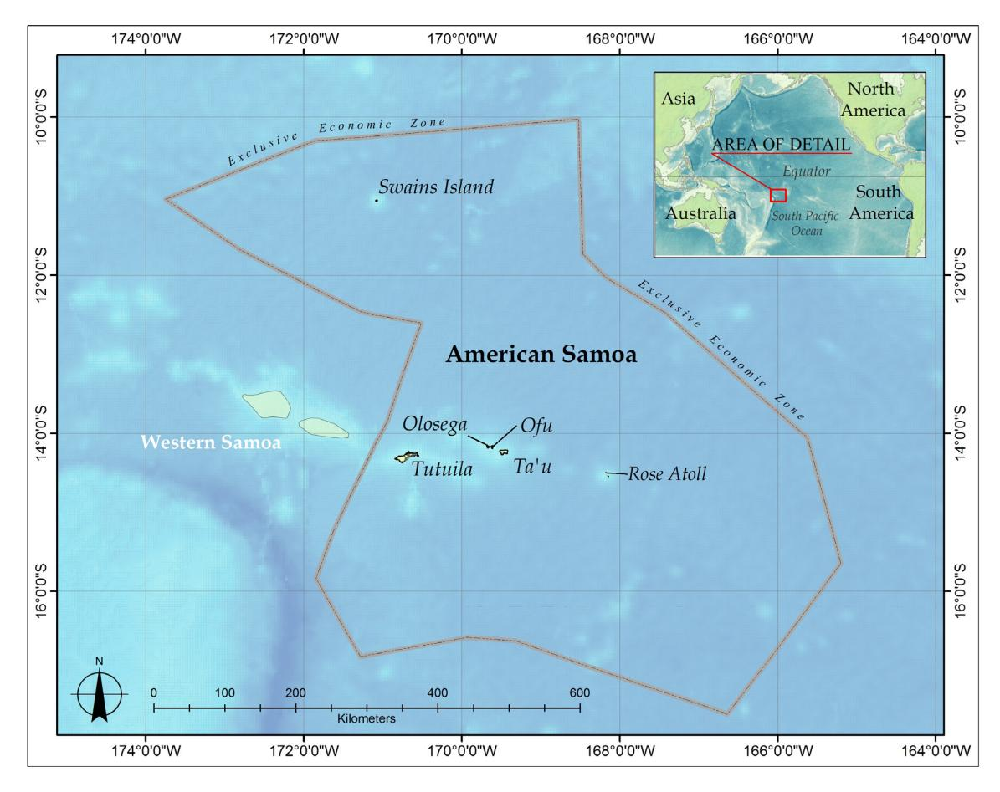

**Figure 1.1a.** The Territory of American Samoa in relation to the Pacific Ocean Basin (inset map) and Samoa. (Federal Register).

island in American Samoa and serves as the center of government, commerce, and business. The Manu`a Islands, which include Ofu (289 people), Olosega (216 people) and Ta`u (380 people), lie approximately 100 km east of Tutuila and have a combined land area of less than 56 km 2 . With respect to marine protected areas, the National Park of American Samoa encompasses 4250 ha (170 of which are marine areas), which are located on Ofu, Ta`u, and Tutuila and are leased by the National Park Service from Samoan families under communal Samoan traditions. Fagatele Bay National Marine Sanctuary, on the south coast of Tutuila, is the smallest of the nation's 13 marine sanctuaries administered by the National Oceanic and Atmospheric Administration (NOAA). Swains, a small coral atoll with a completely enclosed brackish lagoon located approximately 350 km north of Tutuila, has a population of 37 people. Uninhabited Rose, a national wildlife refuge that lies 140 km east-southeast of Ta`u, is under the jurisdiction of the U.S. Fish and Wildlife Service (U.S. Census Bureau, 2007).

# *Political Structure*

As a political entity, American Samoa is an unincorporated, unorganized, and self-governing territory of the U.S., administered by the Office of Insular Affairs, U.S. Department of the Interior. It is "unincorporated" because not all provisions of the U.S. Constitution apply to the territory. The U.S. Congress gave plenary authority over the territory to the Secretary of the Interior, and American Samoans were able to draft their own constitution under which their government functions. The American Samoa Constitution, which was ratified in 1966 and went into effect in 1967 (Office of Insular Affairs, 2007), provides for an elected governor, lieutenant governor, and legislature. The bicameral legislature of American Samoa, known as the Fono, is made up of a Senate (18 members chosen according to Samoan custom in each of the 14 political counties) and a House of Representatives (20 members elected by popular vote).

The traditional village system of the "Fa`amatai" and "Fa`asamoa" operates as a locally based political and social governing collective. The Fa`asamoa is the language and customs, and the Fa`amatai includes the protocols of the "Fono" (council) and the chiefly system. The Fa`amatai and the Fono take place at all levels of Samoan political organization, from the family, to the village, to the region, to national matters. The "matai" (chiefs) are elected by consensus within the Fono of the extended family and village(s). The matai and the Fono (which is made up of matai) decide on the distribution of family exchanges and tenancy of communal land; thereby the majority of land in American Samoa and Samoa is communal. A matai can represent a small family group or a great extended family that reaches across islands, and to both American Samoa and Samoa. This political and social construct is unique and fundamental to the integrity of the Samoan people and culture (Lal and Fortune, 2000).

#### **1.2 Coral Reef Management**

#### *National Coral Reef Management*

In 1998, President Clinton signed Executive Order (E.O.) #13089 to preserve and protect the biodiversity, health, heritage, social, and economic value of U.S. coral reef ecosystems and the marine environment. This E.O. created the U.S. Coral Reef Task Force (CRTF), with the Secretary of the Interior and the Secretary of Commerce acting as co-chairs and Federal Agencies as participants. Their primary task was to work with state, territorial, commonwealth, and local government, nongovernmental organizations, and commercial interests:

- To coordinate a comprehensive program to map and monitor U.S. coral reefs; 1.
- To develop and implement research aimed at identifying the major causes and consequences of degradation to coral reef ecosystems; 2.
- To develop, recommend, and seek or secure implementation of measures necessary to reduce and mitigate coral reef ecosystem degradation and to restore damaged coral reefs; and 3.
- To assess the U.S. role in international trade and protection of coral reef species and implement appropriate strategies and actions to promote conservation and sustainable use of coral reef resources worldwide. 4.

The E.O. set the stage for national coral reef conservation efforts by emphasizing the need to undertake a comprehensive rather than statespecific program of ecosystem research, mapping, and monitoring of all U.S. coral reefs. In 2000, the CRTF developed the *National Action Plan to Conserve Coral Reefs* (National Action Plan) as the first U.S. blueprint to address the loss and degradation of U.S. and international coral reef ecosystems. Coral reef conservation was framed into two broad themes:

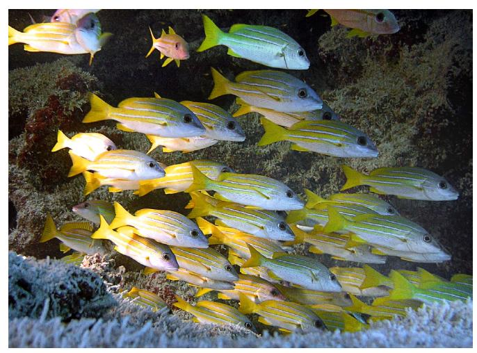

**Figure 1.2a.** Snapper (*Lutjanus kasmira)* in American Samoa. (*Photograph provided by NOAA PIFSC CRED*)

- Understanding coral reef ecosystems; and 1.
- Reducing the adverse impacts of human activities. 2.

The National Action Plan stated, "Ultimately, our success – or failure – in conserving these highly complex and extremely fragile ecosystems will depend on a parallel approach of proactive, precautionary management measures coupled with a much more sophisticated level of understanding about their fundamental ecology and response to environmental stressors". The four goals outlined for the first theme were:

- To develop comprehensive maps of all U.S. reefs; 1.
- To develop a nationally coordinated coral reef inventory, assessment, and monitoring program; 2.
- To support strategic research focused on the determinants of coral reef health and recovery, including basic ecological processes, bleaching and disease, and best management practices for coral reefs and closely linked marine and terrestrial habitats; and 3.
- To conduct socioeconomic studies of the human dimension of successful coral reef conservation. 4.

As with the E.O., the National Action Plan emphasized a nationally coordinated, comprehensive investigation of coral reef ecosystems from a mapping, research, and monitoring perspective.

The Coral Reef Conservation Act (CRCA) of 2000 (P.L. 106–562; 16 U.S.C. 6401 et seq; December 23, 2000), which served as the congressional response to the E.O., laid out a national framework to address these issues. It required the development of a national coral reef action strategy, wherein its goals and objectives would include mapping, information management, research, and monitoring. The CRCA of 2000 also created the national Coral Reef Conservation Program (CRCP) under the direction of the Secretary of Commerce. The CRCA requires NOAA to conduct collaborative research, mitigation, and outreach activities that would directly contribute to the conservation of coral reefs and coral reef ecosystems. Some of the authorized activities included:

- Mapping, monitoring, assessment, restoration, and scientific research that benefits the understanding, sustainable use, and long-term conservation of coral reef ecosystems; 1.
- Enhancing public awareness, education, understanding, and appreciation of coral reef ecosystems; 2.
- Collaborating with local, regional or international programs, and partners for the cooperative conservation and management of coral reefs and coral reef ecosystems. 3.

NOAA, in cooperation with the CRTF, produced the *National Coral Reef Action Strategy* (National Action Strategy) in 2002 to fulfill the requirements of the CRCA, and to help track the implementation of the National Action Plan. Among other things, two actions to address the needs of the National Action Strategy included:

- *Map all U.S. coral reef ecosystems*, to address the threats of overfishing, habitat destruction, coastal development, and coastal pollution; and *••*
- *Assess and monitor coral reef health*, to address the threats of global warming/climate change, diseases, overfishing, destructive fishing practices, habitat destruction, invasive species, coastal development, coastal pollution, sedimentation/runoff, and overuse from tourism.

#### *Coral Reef Management in American Samoa*

The American Samoa Coral Reef Advisory Group (CRAG) was created by the American Samoa Government in 1998 and is a collaboration of the following five agencies having links to the management and conservation of the coral reef resources of American Samoa:

- Department of Marine and Wildlife Resources; •••••
- Department of Commerce;
- American Samoa Environmental Protection Agency;
- American Samoa Community College; and
- National Park of American Samoa.

Initially established as an informal entity, CRAG now receives its mandate via the Governor's Office as a functioning advisory task force (American Samoa Coral Reef Advisory Group, 2007).

NOAA's reports, *The State of Coral Reef Ecosystems of the United States and the Pacific Freely Associated States: 2002* (Turgeon et al., 2002) and *The State of Coral Reef Ecosystems of the United States and the Pacific Freely Associated States: 2005* (Waddell, 2005), were created to provide overall assessments of coral reef ecosystems in U.S. jurisdictions at the time and are organized based on the primary threats, topics, and goals outlined in the National Action Strategy. The American Samoa chapter in the 2005 Report (Craig et al., 2005) provides an overview of monitoring activities, a summary of known results, current management activities, and overall conclusions and recommendations. According to this report, the coral reefs of American Samoa face immediate disturbances and threats. Local stressors/threats are variable and originate from multiple sources, including, but not limited to, coastal development, sedimentation, point and nonpoint source pollution (e.g., human-waste runoff) and marine resource extraction (e.g., fishing).

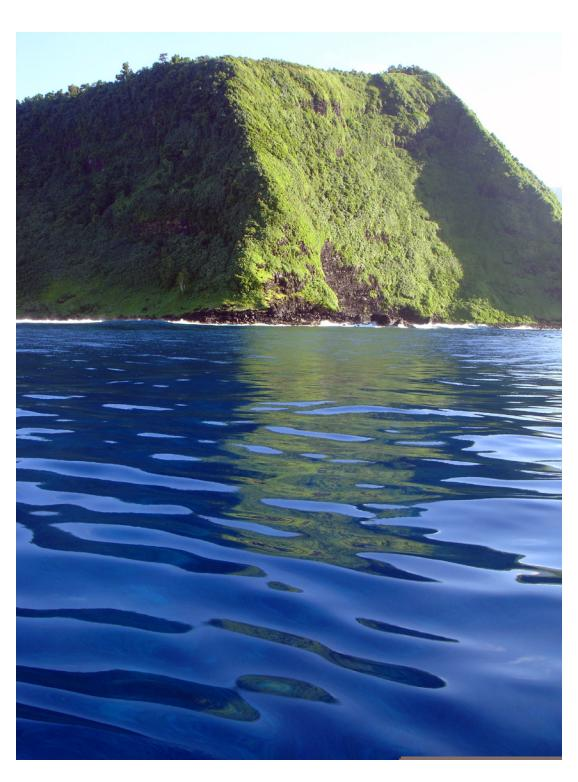

**Figure 1.2b.** One of the high islands of the Manu`a group. (*Photograph provided by NOAA PIFSC CRED* )

Specifically, "The Territory's high population growth rate (2.1% per year) continues to strain the environment with issues such as extensive coastal alterations, fishing pressure, loss of wetlands, soil erosion and coastal sedimentation, solid and hazardous waste disposal, and pollution" (Craig et al., 2005).

As with coral reef ecosystems globally, the reefs of American Samoa are vulnerable to natural and anthropogenic disturbances. Examples of natural disturbance events include hurricanes, which occasionally cause mechanical damage to coral skeletons, and outbreaks of coral predators, such as the crown-of-thorns seastar (e.g., *Acanthaster planci*) or the gastropod *Drupella*, which can destroy vast tracts of live coral tissue. Physical threats to coral reef ecosystems, such as increasing sea surface temperatures and the acidification of seawater as a result of increased carbon dioxide uptake, are often coupled with associated acute or chronic biological effects. For example, evidence suggests that certain coral species experience reduced calcification when exposed to elevated CO2(Gattuso et al., 1998; Kleypas et al., 2006). Other effects include increased levels and incidents of coral beaching and the elevated prevalence of marine diseases.

With recent rapid population growth in American Samoa, concerns about anthropogenic threats, including overfishing, land-based sources of pollution, and coastal development, are

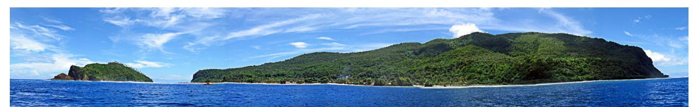

**Figure 1.2c.** The islands of Ofu and Olosega in American Samoa. (*Photograph provided by NOAA PIFSC CRED; A. Hall, JIMAR* )

likewise increasing. In response to these concerns and a resolution by the CRTF, CRAG has created 3-year Local Action Strategies to prioritize local management efforts to address the following key stressors: population pressure, overfishing, land-based sources of pollution, and climate change (American Samoa Coral Reef Advisory Group, 2007).

#### **1.3 Ecosystem Approach to Management**

Fishery and marine resource managers are required to make management decisions that will allow humans to sustainably interact with and use complex ecosystems while ensuring longterm ecosystem conservation and viability for future generations. To date, fishery management plans have traditionally focused on single stocks or, at most, commercially important groupings of stocks. Under these types of plans, fishery managers typically set biomass harvest or mortality rate goals with limited consideration of other characteristics of the stock or of broader ecosystem concerns. In recent years, however, there has been a growing understanding that exploited marine resources must be considered an integral component of a functioning

ecosystem instead of phenomena that operate independently of the broader biological community and the environment.

Internationally, there has been widespread recognition of the need to move toward an ecosystem-based approach to fisheries management, a development spearheaded by the Food and Agriculture Organization of the United Nations through the Code of Conduct for Responsible Fisheries, and supported by numerous regional and national institutions as well as academia, nongovernmental organizations and the public-at-large (Cury and Christensen, 2005). In the U.S., the 2005 Report of the U.S. Commission on Ocean Policy stated that our understanding of marine ecosystems should ground our ocean policy, and our management approach should account for the complex interrelationships between

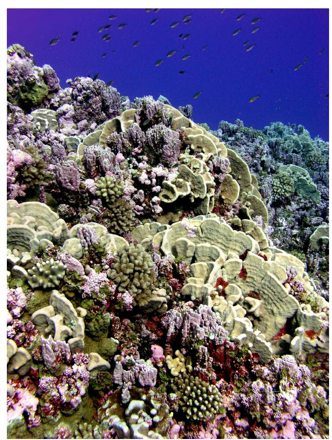

**Figure 1.3a.** American Samoa coral reef community. (*Photograph provided by NOAA PIFSC CRED*)

abiotic environmental factors driving oceanic, atmospheric, and terrestrial processes and their interaction with living organisms on systematic ecological levels (Committee on Ocean Policy, 2005). In theory, an ecosystem-based approach to management might overcome the challenges in addressing issues that cross traditional jurisdictional boundaries (local, state, national, and international) and continually adapt to new scientific information and improved management tools.

While agencies generally agree on the need to transition to ecosystem-based fisheries management and marine resource management, vigorous debate continues at all levels on how to implement policies to accomplish the transition. However, agencies agree on the need for unbiased, credible, and up-to-date scientific information examining the status and trends of ecosystem health and increasing the understanding of mechanistic functions that determine ecosystem processes. As an example of on-going efforts in the Pacific Islands Region, the Western Pacific Regional Fishery Management Council has initiated the development and implementation of ecosystem-based fisheries management through the establishment of the *Coral Reef Ecosystem Fishery Management Plan*, and more recently, the development of archipelagic Fishery Ecosystem Plans (FEP) for the U.S.-affiliated Pacific Islands regions. A draft American Samoa Archipelago FEP, which represents the first steps in an incremental and collaborative approach to implement ecosystem approaches to fisheries management in the archipelago, was originally drafted in 2005. Moreover, there is likewise consensus on the need to translate scientific findings into useful and timely information products for policy makers, managers, educators, and the public. Resource managers and policy makers need scientific feedback to make informed decisions and to effectively implement ecosystembased management principles with the objective of balancing sustainable use and long-term ecosystem conservation.

#### **1.4 Background and Purpose of the Pacific Reef Assessment and Monitoring Pro gram (RAMP)**

In response to the executive and legislative mandates and policies outlined in Section 1.2: Coral Reef Management and Section 1.3: Ecosystem Approach to Management (including E.O. #13089, the National Action Plan, and the CRCA of 2000), the NOAA Pacific Islands Fisheries Science Center (PIFSC) Coral Reef Ecosystem Division (CRED) was formed in 2001 with the support of the CRCP. CRED's mission is to lead an integrated, multidisciplinary, ecosystem-based program of research, mapping, and long-term monitoring of coral reef ecosystems of the U.S.-affiliated Pacific Islands to promote conservation, management, and public awareness through innovative and collaborative science of the highest integrity.

Sustainable management and long-term conservation of coral reef ecosystems of the U.S. affiliated Pacific Islands require comprehensive habitat mapping, and multidisciplinary assessment and monitoring of environmental conditions, biological communities, and human-use practices. CRED's goal is to provide high quality, unbiased ecosystem-based data and value-added information products to resource managers and policy makers on local, regional, national, and international levels in a timely manner.

As a key component of these efforts, CRED leads the Pacific RAMP, which conducts comprehensive ecosystem monitoring surveys every 1 to 3 years at ~ 50 U.S.-affiliated Pacific islands, atolls, and shallow banks in the Hawaiian Archipelago (Main Hawaiian Islands

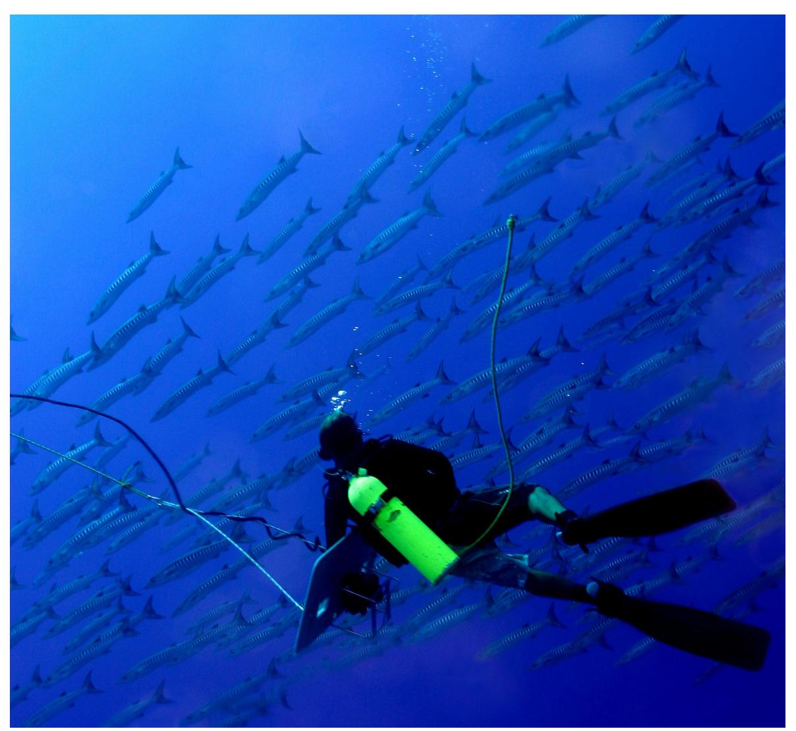

**Figure 1.4a.** CRED towed diver estimating the number and sizes of fish within a school of barracuda (*Sphyraena genie*). (*Photograph provided by NOAA PIFSC CRED; E. Keenan, JIMAR* )

and Northwestern Hawaiian Islands), the Mariana Archipelago (Territory of Guam and the Commonwealth of the Northern Mariana Islands), Territory of American Samoa, and the Pacific Remote Island Areas (Wake, Johnston, Palmyra, and Kingman Atolls and Howland, Baker, and Jarvis Islands). To accomplish this, CRED uses NOAA research vessels capable of supporting multidisciplinary research teams of 20 to 22 scientists for extended voyages lasting 2 to 3 months.

All Pacific RAMP research cruises are conducted in collaboration with colleagues and partners from other NOAA offices, federal, state, and territorial agencies, academia, industry, and nongovernmental organizations. These partnerships are essential to the effectiveness of long-term ecosystem monitoring in the region since they bring together marine scientists and managers with local, regional, national, and international experience over a broad range of scientific and management issues. They also provide much needed logistical and operational support that could not be accomplished on an on-going basis by CRED staff alone.

CRED's approach to integrated coral reef ecosystem monitoring uses a suite of complementary

methods across key biotic (corals, algae, macroinvertebrates, and fish) and abiotic (benthic habitats, oceanography, and water quality) components of the ecosystem. These methods are used consistently across the Pacific Islands Region to conduct biogeographic and ecological comparisons examining diverse ecological, environmental, oceanographic, and socioeconomic gradients. Ecological gradients include biodiversity, endemism, geomorphology (high island/low island), island landmass, reef classification and zonation, and others. Environmental and oceanographic gradients include temperature (based on seasonal/interannual variability or geographic location), wave energy, tropical storm frequency and intensity, current patterns, precipitation and runoff, water quality (nutrient availability and carbon chemistry), and others. Socioeconomic gradients include population density, coastal development, fishing pressure, agricultural use, cultural practices, and others. By having similar multidisciplinary datasets for coral reef ecosystems across these complex and diverse gradients, it is possible to significantly improve our understanding of ecosystem relationships and implicate cause-and-effect mechanisms that influence the health and resilience of these reef ecosystems.

As described in Chapter 2: Program Design, Operational Background, Data Collection, and Processing Methodologies, CRED uses a diverse array of research platforms, tools, and methods to support the CRCP's Coral Reef Ecosystem Integrated Observing System (CREIOS) for the U.S.-affiliated Pacific Islands. Generally, the CRED-led components of CREIOS in the Pacific include the following:

- Benthic habitat mapping and characterization: to better understand the benthic environment that provides shelter and habitat for the living reef resources. Methods for benthic habitat mapping and characterization include the use of multibeam acoustic surveys to acquire data for moderate depth bathymetric mapping and backscatter image analyses, towed-camera systems and towed-diver surveys for optical validation and ground-truthing, and other experimental technologies to improve efficiencies for optical ground-truthing (laser line scan, LIDAR (Light Detection and Ranging), remotely operated vehicles [ROVs], and autonomous underwater vehicles [AUVs]).
- Oceanographic and water quality observations: to better understand the physical and chemical processes controlling, supporting, and maintaining the health of the living reef resources. Oceanographic observations are collected using shipboard and small boat-based vertical profilers of water properties, moored surface and subsurface instrument arrays, satellite remote sensing of surface properties, and numerical ocean modeling. In addition, CRED conducts bioacoustic monitoring of benthic soniferous organisms and water column scatterers.
- Biological observations: to better understand living reef resources (corals, algae, macroinvertebrates, and fish). Rapid Ecological Assessment (REA) and towed-diver surveys are used to collect biological and ecological observations on shallow reefs (0–30 m), and towed cameras, ROVs, and AUVs are used to document deeper reef resources.

#### 1.5 Scope of the Pacific RAMP

The Pacific RAMP encompasses comprehensive efforts to map, assess and monitor, and observe the coral reef ecosystems of the U.S.-affiliated Pacific Islands. In the process, CRED strives to provide high quality, unbiased, ecosystem-based data and value-added information

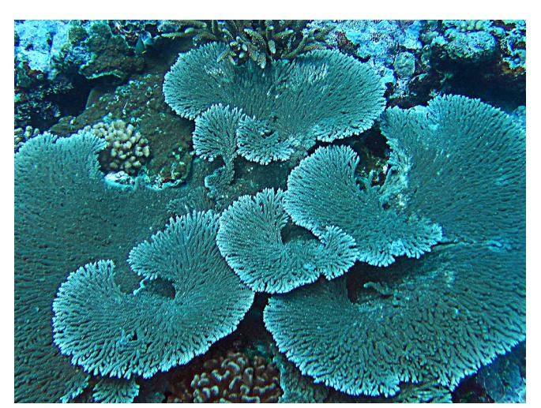

**Figure 1.5a.** Table coral (*Acropora*) growth at a Tutuila reef. (*Photograph provided by NOAA PIFSC CRED; J. Kenyon, JIMAR* )

products to resource managers and policy makers on local, regional, national, and international levels to support informed decision making for the long-term management and conservation of coral reef ecosystems. The broader scope reflects the reality that coral reef ecosystems are influenced by local, regional, and global processes and stressors.

Though local resource managers generally implement policies influencing human uses of and impacts to local resources, the ecosystems themselves are significantly influenced

by processes both within and well beyond local jurisdictional boundaries, including those occurring on regional and global scales. The Pacific RAMP aims to assist local and regional resource managers by providing essential information about these broader-scale biogeographic and ecological processes that are influencing the local and regional resources. As such, the Pacific RAMP is envisioned as a key component of the national backbone to provide broadscale baseline assessments for the Pacific region. These baseline assessments are explicitly expected to be complemented by local, more focused monitoring programs within each of the jurisdictions, including those funded by the coral reef monitoring grants administered by the CRCP. The Pacific RAMP efforts provide the ecological and oceanographic context within which the local ecosystems are embedded. These broad spatial and temporal surveys across the Pacific region support and guide local monitoring efforts by helping to identify ecological concerns and defining the appropriate questions for more focused research and monitoring at the local level.

One of the key goals of the Pacific RAMP is to provide essential observations to describe, understand, and predict ecological and environmental conditions across broad, and inherently variable, spatial and temporal scales. Though local and regional resource managers and policy makers cannot manage or directly influence these large-scale processes, it is important to recognize that they cannot effectively manage local resources without good information, knowledge, and predictions about these large-scale processes. While there are certainly ecological processes and changes that occur at finer spatial and temporal scales than can be addressed by the Pacific RAMP, many of the pervasive and chronic threats facing coral reef ecosystems are on global and climatic scales.

The temporal scope of the Pacific RAMP, with surveys conducted every 1 to 3 years, is to observe and improve our understanding of ecosystem variability over time scales ranging from many years to decades or centuries. More specifically, the program is designed to examine the potential ecological impacts of long-term threats facing coral reefs, including those related to climate change such as: mass coral bleaching and increased incidence of coral diseases in response to ocean warming; decreased calcification rates of corals, crustose coralline algae, and other calcifying organisms in response to ocean acidification based on changing water chemistry (increased uptake of carbon dioxide from the atmosphere); and restructuring of many coastal and reef communities in response to rising sea levels, changing storm tracks and intensities, and modified ocean circulation patterns. Though most of these forecasted threats and scenarios are poorly understood at present, they clearly pose significant risks to coral reef ecosystems across all scales ranging from local to regional to global. Recent analyses (Kleypas et al., 2006) suggest that the combined impacts of ocean acidification and warming could potentially dwarf those of many of the traditional local stressors (fishing, coastal development, pollution, etc.) that marine resource managers struggle to address. As these global- and climate-scale processes are becoming better understood, the need for longterm, broad-scale ecosystem observations (biotic and abiotic) provided by the Pacific RAMP are becoming more evident.

Accurate and up-to-date characterizations of the coral reef ecosystems of American Samoa are necessary to develop and evaluate effective management strategies to aid economically and culturally dependent local populations and the scientific management community. The ecosystem "snapshots" acquired during the Pacific RAMP surveys incorporate baseline data from the previously listed marine disciplines to identify both short-term and longterm spatial and temporal changes of coral reef organisms and their environment. CRED's unique, ecosystem-based approach to reef assessment and monitoring in American Samoa will provide local, regional, and national resource managers with an effective scientific tool to begin implementing ecosystem approaches to management.

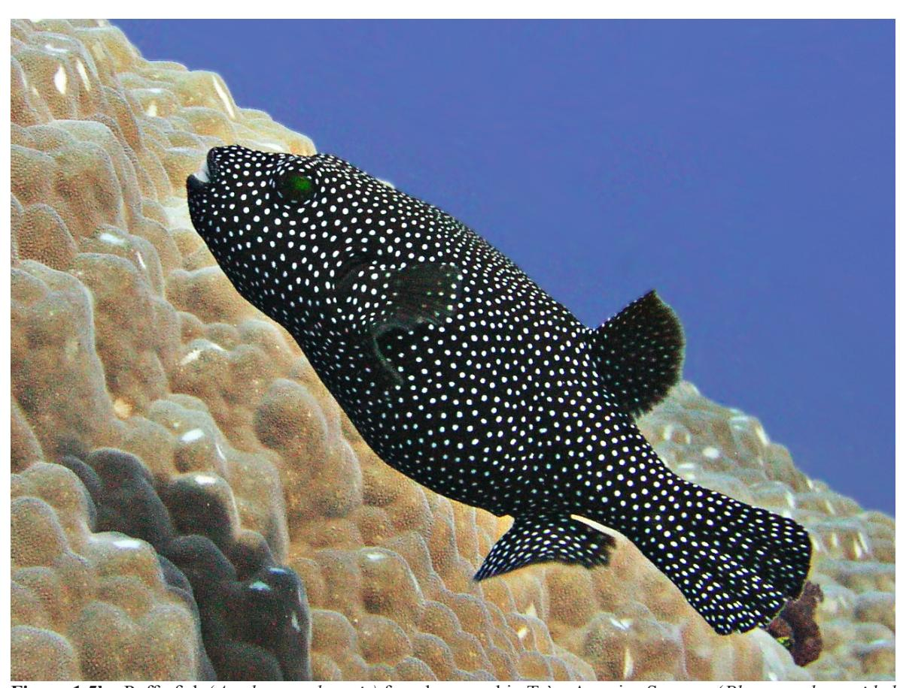

**Figure 1.5b.** Pufferfish (*Arothron meleagris)* found on coral in Ta`u, America Samoa. (*Photograph provided by NOAA PIFSC CRED; R. Schroeder, JIMAR* )

#### *RAMP in American Samoa*

As part of the Pacific-wide monitoring effort, CRED conducted its first American Samoa RAMP (ASRAMP) cruise in 2002, with subsequent ASRAMP cruises in 2004 and 2006. Partners from the local management agencies, including the scientists and managers from American Samoa's Department of Marine and Wildlife Resources and Department of Commerce, the National Park of American Samoa, and NOAA's Fagatele Bay National Marine Sanctuary worked alongside CRED scientists to plan and conduct the surveys and determine and establish monitoring sites, and conduct the surveys. Chapter 2, Section 2.1: Operational Background lists specific individuals from American Samoa who participated in the planning and/or implementation of ASRAMP cruises.

The value of the ASRAMP effort may not have been fully realized during earlier stages of the program. Based on the observations to date, scientists and managers can begin to characterize the spatial patterns of variability of the reef ecosystems around American Samoa and compare them to other regions in the Pacific. The value of the program will increase steadily as observations are extended in time and the ability to detect significant ecological changes and climate fluctuations increases. Over time, ecological and environmental trends may include biodiversity shifts, population increases or decreases, sudden species die-offs, disease outbreaks or bleaching pandemics, and introductions of bioinvasive species. With continually improved observations and understanding, our ability to develop predictive models will likewise increase, thereby providing managers with improved tools for protecting and conserving reef resources. CRED is committed to providing high quality, unbiased, integrated ecosystem observations of the reefs of American Samoa, as well as other U.S. Pacific Islands jurisdictions, well into the future.

#### **1.6 Limitations of Pacific RAMP**

As with any large research effort, the Pacific RAMP has limitations based on logistical, operational, and scientific constraints. These constraints shape the nature of the data presented within the body of this document and provide a matrix for future improvement and continued program development. The program limitations are discussed here to clarify the current state of the program, the nature of the data, and the future of CRED's Pacific RAMP research.

Since the beginning of the program, CRED has worked with partners in each jurisdiction to adaptively develop and implement comprehensive Pacific RAMP ecosystem monitoring surveys. During the initial years (2000–2003), many monitoring programs were in place across the Pacific and although many monitoring workshops had evaluated scientific methods and approaches, there was (and still is) little consensus within the scientific community on any singular investigative approach. Moreover, as CRED and the Pacific RAMP were being established, few, if any, examples existed of coral reef monitoring programs of this geographical scale or multidisciplinary, ecosystem-based scope from which the program could draw lessons. As a newly established program, CRED and affiliated partners needed to:

- Determine, develop, test, and adapt sampling methods and protocols; ••
- Create protocols, algorithms, and tools for data processing, quality control, and

- analysis; and
- Devise and implement a data management, integration, and dissemination infrastructure.

As the program was established, a significant majority of the  $\sim 50$  islands, atolls, and banks surveyed by the Pacific RAMP had virtually no prior ecological surveys, bathymetric or habitat maps, or in situ oceanographic observations. There was little or no information about what to expect in terms of habitats, biogeographic structure, oceanographic conditions, or species compositions. In almost all regards, those prior surveys of the Pacific RAMP were exploratory baseline assessments. Perhaps more than anything else, the logistical and financial challenges presented by the vastness and remoteness of the region structured the initial scope of the program and continue to shape its evolution.

The primary role of an ecosystem-based monitoring program is to characterize natural variability within the environment and biological community to enable detection and understanding of anthropogenic impacts. In the marine environment, and specifically for dynamic coral reef ecosystems, this is a unique challenge. Quantifying the patterns of natural variability is done over broad temporal and spatial scales. Temporal scales include diurnal, seasonal, episodic (e.g., weather and storms), interannual (e.g., El Niño Southern Oscillation), decadal (e.g., Pacific Decadal Oscillation), and longer-term climate changes. Spatially, reef ecosystems vary over scales ranging from meters to thousands of kilometers. Ecological zones, such as intertidal, lagoonal, or barrier reef, and habitat types, such as reef slope, forereef, reef crest, backreef, and patch reefs, often vary as a function of prevailing or episodic oceanographic conditions (waves and currents, water quality, terrestrial inputs, etc.).

As previously stated, the Pacific RAMP surveys are conducted every 1 to 3 years to document the climate frequency oscillations. With the exception of oceanographic and bioacoustic moorings, which observe nearly continuously, the Pacific RAMP cannot detect high-frequency ecological fluctuations. The periodic Pacific RAMP surveys are designed to examine longer-term ecological variability (interannual to multidecadal), taking 'snapshots' of each ecosystem at the time of the surveys. As such, it is necessary to have many years of these so-called 'snapshots' before it is possible to rigorously discuss longer-term changes.

Operational and dive safety protocols limit the large majority of the biological observations to daylight hours in areas experiencing 'workable' weather, sea, and current conditions. Though some of the survey methodologies provide a safe working environment in harsher conditions (e.g., towed-diver surveys), all have working safety limits. Based on these operational limitations, it is probable that many species remain spatially or behaviorally isolated from our surveys. For example, nocturnal species of fish and invertebrates and/or species found preferentially in high wave energy environments cannot be effectively monitored using the existing sampling protocols.

Methodological improvements among different Pacific RAMP cruises introduce a degree of variability into the data. Such changes are necessary and common during developmental stages of long-term monitoring programs and reflect the relative infancy of Pacific RAMP. For American Samoa, much of the data generated during ASRAMP 2002 was qualitative in nature, providing baseline data and allowing the program to test different methodologies.

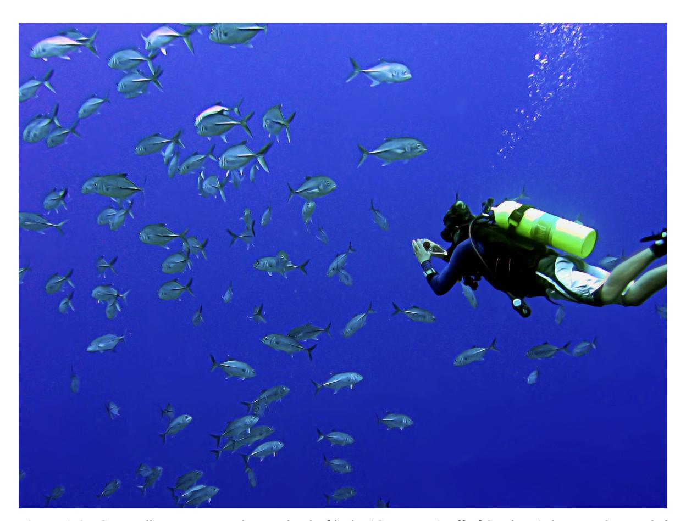

**Figure 1.6a.** CRED diver amongst a large school of jacks (*Caranx* sp.) off of Swains. (*Photograph provided by NOAA PIFSC CRED* )

Subsequent sampling years (2004 and 2006) used the qualitative analyses from 2002 to design more efficient and effective quantitative sampling methodologies. While this evolution was necessary, it made temporal comparisons across the sampling years challenging because of the intrinsic difficulties in comparing qualitative data to quantitative data. In addition, numerous methodological and survey protocol changes occurred in response to the improved understanding of these ecosystems or as a result of logistical constraints imposed on the program by external forces (funding, safety, etc.). Given these changes and limitations, it is difficult (with the existing American Samoa datasets) to rigorously distinguish real temporal changes within the ecosystem from artifacts resulting from changing methods and/or observers. The multiyear development of this Monitoring Report has assisted CRED scientists to better identify and evaluate potential shortcomings of the existing monitoring methods. While troublesome in these earlier stages, these findings and adaptive adjustments will ensure the program's ability to provide managers with the information needed to implement ecosystembased approaches to conservation and management in the years ahead.

REA and towed-diver surveys are the two general methodologies used to assess biological communities around each of the islands and reefs surveyed during Pacific RAMP cruises. However, the spatial repeatability of these methods to date is still under consideration by CRED. As Figure 1.6b demonstrates, both towed-diver survey tracks and REA sites vary across years in location between ~ 10 and 500 m; therefore biennial surveys to date have not explicitly surveyed precisely the same reef community. Instead, the repeated surveys to date

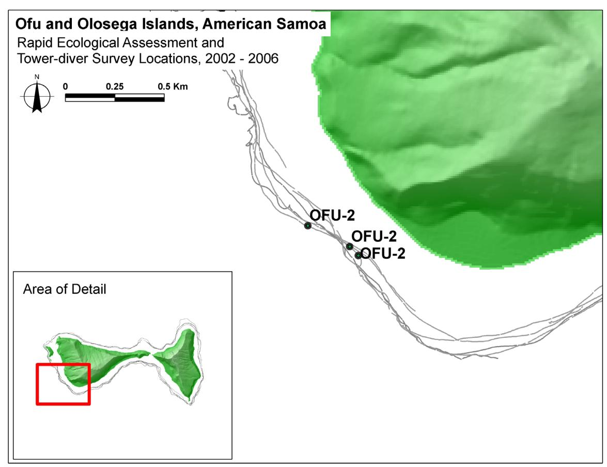

**Figure 1.6b.** REA site and towed-diver survey track location variability among 2002, 2004 and 2006 Pacific RAMP cruises.

reflect similar reef habitats. Take into consideration the inherent spatial heterogeneity often observed in coral reef communities, and it becomes clear that a high degree of variability between biennial datasets could be based on variability of site or towed-diver survey track locations. While this does not decrease the viability of CRED's datasets, it should be included into the context of the data analyses presented within the body of this document.

Research that relies on consistent observer objectivity and training presents unique challenges with respect to the reduction of errors and biases. The decrease of observer bias is based on repeated field observations completed in the same areas by the same scientific observers over subsequent RAMP deployments, consistent research protocol, and proper training. Lack of continuity among scientific personnel and reciprocity divers from multiple institutions among RAMP cruises, changing methodologies, and implementation of the proper training protocols have all created large challenges necessary to reduce interobserver variability. While many of these will continue to evolve in subsequent years, recent analyses for this Monitoring Report have highlighted the need to focus more resources toward improving consistency in field methodologies, onsite data collection, and comprehensive training protocols to help reduce interobserver variability.

The CRCP and its predecessor, the Office of Habitat Conservation of the National Marine Fisheries Service, have provided the significant majority of the financial support for CRED and the Pacific RAMP since 2001. In addition to program management and administrative support, this funding provides for the staffing of research cruises, the purchase of equipment and instrumentation, the completion of data analyses and integration/management, and the publications associated with processed data. The availability of funds drives CRED's capacity, directly influencing the level of staffing in each of the disciplines. Staff members are often at sea for 2 to 5 months per year, which impacts the speed of data processing and dissemination. As a result, CRED is highly dependent on its local partners for staffing support of research cruises, thus enhancing local knowledge and understanding of coral reef resources, but possibly increasing variability in data consistency.

Large-scale data organization, quality control, and database structure are high priorities for the CRED scientific team. Proper data management and data flow practices are vital for streamlining and organizing the huge datasets that are an inherent part of CRED's research effort in the Pacific. Though significant progress has been made, as evidenced by this Coral Reef Ecosystem Monitoring Report for American Samoa, the implementation of data management protocols remains an effort in progress. This area, in particular, has suffered from long-term level funding that does not allow for annual cost of living increases. In essence, actual ship and field operational costs have increased annually, which has led to net decreases in funding for data management infrastructure over the past several years.

While keeping in mind these constraints, CRED strives to increase efficiencies and improve all aspects of its scientific program. This initial Monitoring Report represents the first installment of the ongoing effort to bring resource managers and interested stakeholders the best available, ecosystem-based data to help them make informed decisions about the sustainable use and conservation of their resources.

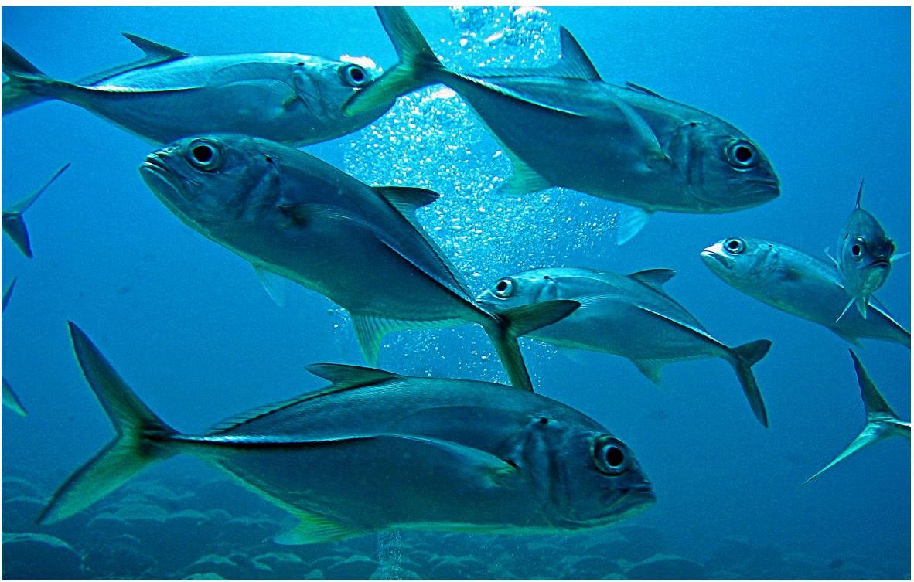

**Figure 1.6c.** Jacks (*Caranx sexfasciatus*) in the waters of American Samoa. (*Photograph provided by NOAA PIFSC CRED* )

#### 1.7 Structure of Report

This report is designed to present large-scale spatial and temporal "snapshots" of the coral reef resources in American Samoa, based on data collected during the CRED-led ASRAMP cruises in 2002, 2004, and 2006. Methodological descriptions and resultant analyses of habitat, oceanographic, and biological datasets are presented within discipline-specific categories. These categories include habitat mapping and characterization (multibeam bathymetry and acoustic backscatter, Towed Optical Assessment Device optical validation, and towed-diver benthic assessments), oceanographic and water quality monitoring (spatial hydrographic surveys and moored time series observations), and biological community monitoring (coral, coral/coralline algae disease, algae, macroinvertebrates, and reef fish).

Each chapter shows comprehensive multidisciplinary data analyses for each island or atoll system. Habitat mapping and characterization data for each island/atoll are presented as multiyear composite analyses across all survey years. Oceanographic and biological monitoring data are presented in a cruise-specific format so that temporal and spatial patterns of abundance and distribution can be distinguished. The main body of the text provides data collected for each island or atoll, spatial and temporal analyses of the data, as well as an integrated, ecosystem-based assessment of findings. The report includes a final chapter that examines archipelagic comparisons of each of the datasets to compare similarities and differences among the islands on a regional scale, including the large-scale processes that influence these coral reef ecosystems.

This document provides unbiased scientific data to assist local, territorial, and federal stakeholders with the challenges they face in the long-term management and conservation of their coral reef ecosystem resources. This report is intended to provide baseline information to:

- Obtain overall spatial and temporal "snapshots" of the coral reef resources and ecosystem conditions around each of the islands in American Samoa during each survey period; and
- Present an effective monitoring tool for stakeholders and resource managers to investigate marine areas of interest and formulate evolving management questions about how to best manage marine resources.

In all years, data collected by CRED scientists and local partners have been presented to the resource management agencies in American Samoa in the form of cruise reports at the conclusion of each ASRAMP cruise. The cruise reports contain summary information, including area and type of operations, itinerary and daily activities, cruise statistics, missions and results, a list of scientific personnel, and types of data collected. Appendices to these cruise reports have provided more in-depth data and information, including an expansive description of methods for each of the disciplines, and qualitative and quantitative data for each discipline by island. The American Samoa Monitoring Report is intended to provide the in-depth analyses to complement the summary data provided in the cruise reports.

# **References**

- American Samoa Coral Reef Advisory Group (2007) American Samoa's Coral Reef Initiative. Online at [http://doc.asg.as/crag](http://doc.asg.as/crag/) /. Accessed May 18, 2007.
- Committee on Ocean Policy (2005) Federal Ocean and Coastal Activities Report to the U.S. Congress. Online at [http://ocean.ceq.gov/welcome.htm](http://ocean.ceq.gov/welcome.html) l.
- Craig P, DiDonato G, Fenner D, Hawkins C (2005) The State of Coral Reef Ecosystems of American Samoa. *In:* Waddell J (ed.), The State of Coral Reef Ecosystems of the United States and the Pacific Freely Associated States: 2005. NOAA Tech. Memorandum NOS NCCOS 11, NOAA NCCOS Center for Coastal Monitoring and Assessment's Biogeography Team, Silver Spring, MD. p. 312–337.
- Cury PM, Christensen V (2005) Quantitative ecosystem indicators for fisheries management. ICES J Mar Sci 62:307–310.
- Federal Register (1995) Exclusive Economic Zone and Maritime Boundaries: Notice of Limits. Online at http://nauticalcharts.noaa.gov/csdl/eez.htm .
- Gattuso JP, Frankignoulle M, Bourge I, Romaine S, Buddemeier RW (1998) Effort of calcium carbonate saturation of seawater on coral calcification. Global Planet Change 18:37–46.
- Kleypas JA, Feely RA, Fabry VJ, Langdon C, Sabine CL, Robbins LL (2006) Impacts of Ocean Acidification on Coral Reefs and Other Marine Calcifiers: A Guide for Future Research. Report of a workshop sponsored by NSF NOAA USGS. Online at [http://www.](http://www.ucar.edu/news/releases/2006/report.shtml) [ucar.edu/news/releases/2006/report.shtm](http://www.ucar.edu/news/releases/2006/report.shtml) l. 88 pp.
- Lal BV, Fortune K (2000) The Pacific Islands: An Encyclopedia. China: University of Hawai `i Press. p. 138–139.
- Office of Insular Affairs, U.S. Department of the Interior (2007) American Samoa. Online at [http://www.doi.gov/oia/Islandpages/asgpage.ht](http://www.doi.gov/oia/Islandpages/asgpage.htm) m. Accessed May 8, 2007.
- Turgeon DD, Asch RG, Causey BD, Dodge RE, Jaap W, Banks K, Delaney J, Keller BD, Speiler R, Matos CA, Garcia JR, Diaz E, Catanzaro D, Rogers CS, Hillis-Starr Z, Nemeth R, Taylor M, Scmahl GP, Miller MW, Gulko DA, Maragos JE, Friedlander AM, Hunter CL, Brainard RE, Craig P, Richmond PH, Davis G, Starmer J, Trianni M, Houk P, Birkeland CE, Edward A, Golbuu Y, Gutierrez J, Idechong N, Paulay G, Tafileichig A, Vander Velde N (2002) The State of Coral Reef Ecosystems of the United States and Pacific Freely Associated States: 2002. NOAA NOS NCCOS, Silver Spring, MD. 265 pp.
- U.S. Census Bureau (2007) Census 2000 Data for American Samoa. Online at [http://www.](http://www.census.gov/census2000/americansamoa.html) [census.gov/census2000/americansamoa.htm](http://www.census.gov/census2000/americansamoa.html) l. Accessed May 17, 2007 .

Waddell JE (ed.; 2005) The State of Coral Reef Ecosystems of the United States and the Pacific Freely Associated States: 2005. NOAA Tech. Memorandum NOS NCCOS 11. NOAA NCCOS Center for Coastal Monitoring and Assessment's Biogeography Team, Silver Spring, MD. 522 pp.

# **Chapter 2 Program Design, Operational Background, Data Collection, and Processing Methodologies**

The Pacific Reef Assessment and Monitoring Program (RAMP) field collection methodologies produce a series of integrated, comprehensive, and multidisciplinary ecosystem observations for the ~ 50 islands, atolls, and shallow-water banks of the United States (U.S.)-affiliated Pacific Islands. The data collections are designed to characterize the spatial and temporal variability of the distribution, abundance, and diversity of fish, corals, other invertebrates, and algae in the context of their benthic and oceanographic habitats. Though most of the ecological and oceanographic observations are collected every 2 years during Pacific RAMP research cruises, time series observations of key environmental conditions influencing reef processes are also made continuously by an array of moored oceanographic and bioacoustic instruments deployed and maintained as part of the National Oceanic and Atmospheric Administration (NOAA) Coral Reef Watch (CRW) program. These biological and environmental observations are further complemented by a suite of benthic habitat mapping products produced collaboratively by the NOAA Pacific Islands Fisheries Science Center (PIFSC) Coral Reef Ecosystem Division (CRED) and the Center for Coastal Monitoring and Assessment (CCMA) Biogeography Program of the NOAA National Centers for Coastal Ocean Science. Collectively, CRED's Pacific RAMP, CRW, and benthic habitat mapping are part of the NOAA Coral Reef Conservation Program's (CRCP's) Coral Reef Ecosystem Integrated Observing System (CREIOS) in the Pacific Islands.

The primary objectives of these CRED-led activities in the U.S.-affiliated Pacific Islands are:

- To conduct benthic habitat mapping of reefs and submerged banks using ship- and launch-based multibeam echosounders, underwater towed-camera systems, and towed-diver surveys for characterizing the benthic environments that provide habitat and shelter for reef biota; •
- To conduct near and offshore oceanographic and water quality surveys and deploy a variety of surface and subsurface oceanographic and bioacoustic instruments, to quantify, assess, and gain a better understanding of the overall hydrographic and bioacoustic environments (e.g., water temperature, salinity, nutrients, waves, tides, currents, and ambient sound levels) influencing reef biota; •
- To employ complementary and overlapping methods, collectively referred to as Rapid Ecological Assessment (REA) surveys to assess and monitor species composition, abundance, percent cover, size distribution, diversity, and general health of fish, corals, other invertebrates, and algae in shallow-water (< 35 m) habitats; •
- To monitor coral and coralline algal diseases in conjunction with continued long-term monitoring of fish, coral, invertebrates, and algae; •
- To conduct broad-scale towed-diver surveys that provide a spatial assessment of the composition and condition of shallow-water benthic habitats, and general distribution and abundance patterns of ecologically and/or economically important macroinvertebrates and reef fish (> 50 cm total length); and •
- To ascertain the existence of threats to the health of coral reef resources from natural and/or anthropogenic sources. •

Ecosystem observations and monitoring of this scope and detail are unprecedented and unequaled in the waters of American Samoa. As such, the initial years of these multidisciplinary Pacific RAMP research expeditions were exploratory in nature, often providing the first-ever baseline assessments of reef resources in these mostly remote and uninhabited regions of the Pacific. As the analyses of initial baseline assessments have progressed, the program has shifted from an assessment phase to a long-term ecosystem monitoring phase. With this shift, the suite of methods used by the program has slowly evolved to continually improve the quality of the data and ability to detect temporal changes in ecosystem processes and community structure.

To qualify the nature and temporal variation of the data gathered during Pacific RAMP cruises and to provide a context for how surveys were performed, the operational background of the three American Samoa RAMP (ASRAMP) cruises conducted to date and details on the suite of assessment and monitoring methods employed are presented in the following sections.

#### **2.1 Operational Background**

As part of the Pacific-wide monitoring effort, CRED conducted its first ASRAMP cruise in 2002 with subsequent cruises in 2004 and 2006. Partners from the local management agencies, including the scientists and managers from American Samoa's Department of Marine and Wildlife Resources (DMWR), the Department of Commerce (DOC), the National Park of American Samoa (NPAS), and NOAA's Fagatele Bay National Marine Sanctuary (FBNMS) worked alongside CRED scientists to plan the surveys, determine and establish monitoring sites, and conduct surveys. Specific individuals from American Samoa who participated in the planning and/or implementation of ASRAMP cruises included:

- 2002: Tony Beeching (DMWR), Dr. Andrew Cornish (DMWR), Dr. Peter Craig (NPAS), Nancy Daschbach (FBNMS), Gene Brighouse (DOC), Eva Pasko-DiDonato (NPAS), Dr. Douglas Wilson (DMWR), Joshua Seamon (DMWR), Saiofoi Fa`aumu (DMWR), Dr. Ray Tulafono (DMWR), Lelei Peau (DOC), Wallace Thompson (Swains Island Representative) •
- 2004: Dr. Douglas Fenner (DMWR), Dr. Peter Craig, Christopher Hawkins (DOC), Nancy Daschbach, Gene Brighouse, Dr. Ray Tulafono, Lelei Peau, Fatima Sauafea (DMWR), Francesca Riolo (DMWR), Wallace Thompson, Penekosova Peau (student) •
- 2006: Dr. Douglas Fenner, Dr. Peter Craig, Nancy Daschbach, Gene Brighouse, Dr. Karl Brookins (DMWR), Dr. Ray Tulafono, Lelei Peau, Wallace Thompson, Merideth Speicher (DOC), Dr. Bill Keine (FBNMS), Fatima Sauafea •

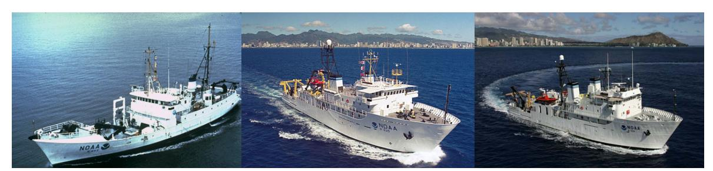

**Figure 2.1a.** The NOAA ships used to conduct ASRAMP cruises in 2002, 2004, and 2006. From left to right: *Townsend Cromwell*, *Oscar Elton Sette*, and the *Hi*`*ialakai*. (*Photographs provided by NOAA PIFSC CRED)*

The first three ASRAMP expeditions were conducted from the NOAA Ships *Townsend Cromwell* between February 9 and March 3, 2002, *Oscar Elton Sette* between February 3 and 26, 2004, and *Hi*`*ialakai* between February 9 and March 10, 2006 (Fig. 2.1a). Each of these research vessels, as well as their officers and crews, had different capabilities and limitations. In its 39th year of service supporting NOAA missions, the aging *Townsend Cromwell* was significantly smaller (50 m) than the other two vessels (69 m). The smaller size restricted the vessel's ability to carry, launch, and recover small boats and also limited the maximum scientific complement to 12 scientists. With the addition of the larger *Oscar Elton Sette* in 2003, the capacity to support Pacific RAMP requirements increased significantly. The *Oscar Elton Sette* can accommodate a complement of 20 scientists and has the ability to carry and deploy larger small boats. The addition of the *Hi*`*ialakai* in 2005 increased the maximum complement to 22 scientists and significantly improved the ability of CRED to conduct benthic habitat mapping missions because of the ship's hull-mounted shallow- and deepwater multibeam systems and the ability to carry CRED's 8-m multibeam survey launch R/V *Acoustic Habitat Investigator* (*AHI*). The *Hi*`*ialakai* is also equipped with diesel-powered 8-m and 10-m small boats, a cascade Nitrox compressor system, and a permanently installed diving recompression chamber.

Concurrent with changes in vessels from 2002 to 2006, CRED increased its small-boat and dive-support capabilities with the addition of two 6-m SAFEboats and a portable cascade Nitrox compressor system. During this period, support of diving operations was enhanced as the NOAA Dive Center endorsed the transition from exclusive use of decompression tables to the standard use of dive computers and began providing a portable recompression chamber aboard the *Oscar Elton Sette* during cruises requiring extensive diving operations.

# **2.2 Benthic Habitat Mapping**

Accurate, high-resolution benthic habitat maps are essential tools for the effective conservation and management of coral reef ecosystems. CRED, through its Pacific Islands Benthic Habitat Mapping Center (PIBHMC), supports mapping operations during dedicated mapping cruises, combined RAMP/mapping cruises, and cruises with other missions on which mapping is piggybacked. The data collected during these missions were used to create a set of comprehensive map products that are available to resource management agencies, researchers, and the general public.

High-resolution multibeam echosounder bathymetric data serve as the primary base layer for CRED's benthic habitat mapping. The highly accurate and detailed maps generated from these data are useful for a number of management and research applications. Maps illustrating or highlighting other seafloor characteristics, including slope, rugosity (a measure of topographic roughness and convolutedness), and bathymetric position index structures and zones, are derived from the bathymetric data.

In addition to bathymetric and derived data products, modern multibeam echosounders produce backscatter intensity data which provide an indication of the acoustic roughness and/or hardness of the seafloor. Used in various combinations, depth, slope, rugosity, and backscatter intensity can yield significant information about seafloor characteristics that

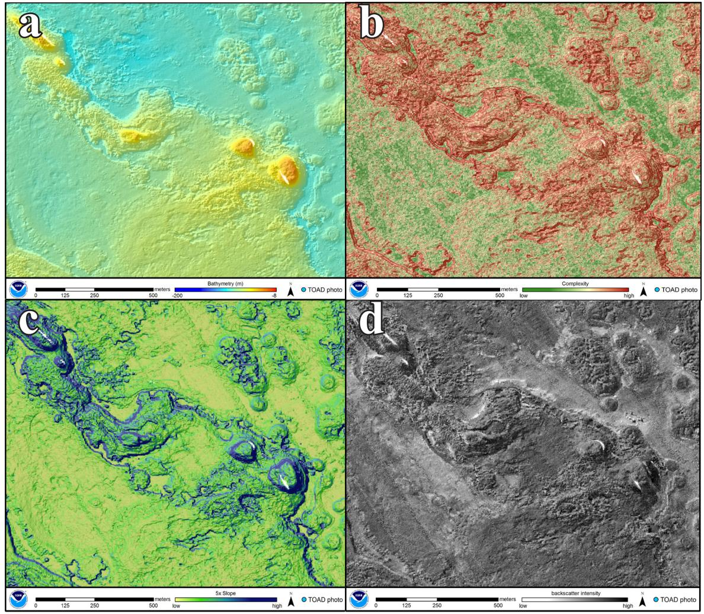

**Figure 2.2a.** Multibeam bathymetry **(a)**, slope **(b)**, rugosity **(c)**, and multibeam backscatter **(d)** data provide valuable information about seafloor characteristics.

are important to specific groups of organisms and can be used to identify and delineate the benthic habitats they use (Fig. 2.2a).

To fully interpret and understand the wealth of data from multibeam echosounders, additional optical data are needed to validate (ground-truth) interpretations of the acoustically derived information. Towards this end, towed-camera surveys using a Towed Optical Assessment Device (TOAD) and towed-diver habitat surveys were routinely conducted to collect observations, still photographs, and video imagery of the seafloor. Towed-camera systems covered depths between 20 and 150 m and towed-diver surveys covered depths between 3 and 30 m.

#### **2.2.1 Operational Background and Logistics**

In *The National Action Plan to Conserve Coral Reefs*, the U.S. Coral Reef Task Force identified mapping of all U.S. coral reef habitats as one of their highest priorities. The NOAA CRCP established a goal to map all U.S. coral reef areas to support conservation and management of U.S. coral reefs. In support of these goals, CRED and the CCMA Biogeography Program have been leading efforts to produce benthic habitat maps of coral

reef areas from the shoreline to moderate depths (≤ 1000 m). The Biogeography Program has been leading collaborative efforts to develop shallow-water benthic habitat maps using aerial and satellite-based methods. As a result of visibility constraints, these techniques are best suited for shallow-water habitats (≤ 20 m deep). CRED has been leading efforts using multibeam acoustic echosounders and optical assessment technologies to extend the existing shallow-water maps to moderate depths (~ 20–1000 m) where aerial- and satellite-based techniques are less suitable.

As stated above, three different NOAA ships were used to support mapping operations in American Samoan waters between 2002 and 2006. These include the NOAA Ships *Townsend Cromwell* (2002), *Oscar Elton Sette* (2004), and the *Hi*`*ialakai* (2006). In addition, the CRED R/V *AHI*, an 8-m survey launch, was deployed in 2004 and 2006 to conduct shallow-tomoderate depth habitat mapping.

A variety of operational scenarios have been developed to optimize the efficiency of mapping operations. During cruises aboard the *Hi*`*ialakai*, shipboard multibeam mapping surveys were conducted primarily during nighttime hours to avoid interfering with daytime reef ecosystem monitoring and nearshore oceanographic surveys requiring small boat and diverbased operations. R/V *AHI*-based mapping operations were conducted during daylight hours to perform multibeam surveys in shallow, nearshore waters inaccessible to the *Hi*`*ialakai*.

During previous cruises aboard the *Townsend Cromwell* and *Oscar Elton Sette*, optical validation data were typically collected using a towed camera sled deployed from the ships in deeper waters (20–150 m) during nighttime hours and by towed-diver surveys in shallower waters (3–30 m) during daylight hours.

Operationally, depth limitations existed for both multibeam surveying and optical data collection. As a general rule, multibeam surveys by CRED have focused on collecting data at depths between approximately 20 and 1000 m. The 20-m inshore limit is based on: (1) safety concerns relating to increased risks in shallow water as a result of possible groundings and/or breaking waves, and (2) significant decreases in mapping efficiencies because the area mapped decreases proportionally to water depth. Combined, these factors meant that survey work in waters shallower than 20 m would have required increasingly larger amounts of time that were spent working in potentially dangerous conditions, particularly in areas with steep forereef slopes.

Similarly, ship-based towed-camera optical data collection has been limited to depths between approximately 20 and 150 m based on the depth limitations of the instruments. Towed-diver surveys provide optical data to about a 30-m maximum depth. Below this depth, the divers would be subject to increased risk of decompression sickness. Ship- and launchbased multibeam surveying, as well as towed-camera and towed-diver optical assessment data collection procedures adhere strictly to NOAA safety policies applicable to ship, small boat, and scuba diving operations.

# **2.2.2 Acoustic Mapping**

# *Equipment*

Aboard the *Townsend Cromwell*, acoustic mapping was conducted using a Simrad EQ-50 (50 kHz) single-beam echosounder that was integrated with a Quester Tangent Corporation (QTC) View data acquisition and bottom classification system. This system was subsequently transferred to the *Oscar Elton Sette*, where the QTC View was interfaced to one quadrant of a 38 kHz split-beam transducer used in conjunction with a Simrad EK-60 echosounder. Acoustic seafloor classification systems such as QTC are best used in reasonably flat areas such as the continental shelf off the eastern seaboard of the continental U.S. It was found that in areas where the seafloor is quite steep, including much of the seafloor around the islands of American Samoa, classification results are not very reliable. For this and other reasons, acoustic surveying transitioned to multibeam echosounder technology at the earliest opportunity.

The *Hi*`*ialakai* is equipped with two multibeam sonars: a Kongsberg 300 kHz EM3002 multibeam echosounder that can map at depths between roughly 20 and 150 m, and a Kongsberg 30 kHz EM300 multibeam that is capable of mapping in depths ranging from about 50 to 3000 m. The *AHI* is equipped with a 240 kHz RESON 8101ER multibeam echosounder capable of mapping at depths between approximately 10 and 250 m. When used in conjunction with the *Hi*`*ialakai*, the *AHI* can be deployed and recovered in locations far from sheltered harbors, allowing shallow-water surveys to be conducted throughout the remote U.S.-affiliated Pacific Island areas (Fig. 2.2.2a).

# *Survey Design*

The quality and geographic coverage of existing bathymetric data, as well as consultation with key resource managers and stakeholders, were used to determine survey priorities. Data collected on previous cruises were typically combined with existing datasets, allowing the mapping team to develop survey plans to most effectively target gaps in the bathymetry coverage.

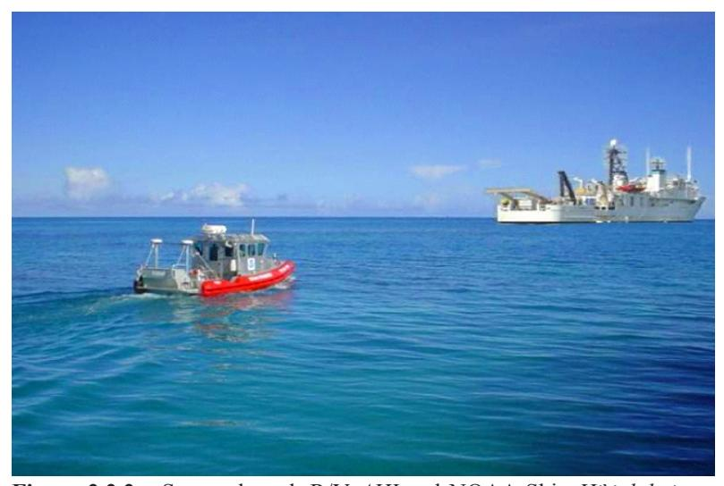

**Figure 2.2.2a.** Survey launch R/V *AHI* and NOAA Ship *Hi*`*ialakai* are outfitted with three multibeam echosounders that facilitate mapping in depths ranging from ~ 20 to 3000 m. (*Photograph provided by NOAA PIFSC CRED*)

Prior to 2002, only a few, limited shallowand moderate-depth bathymetry datasets existed for the nearshore waters of American Samoa. Existing nautical charts of Tutuila Island showed surrounding banks (0–60 m) with an area of approximately 300 km2 , but little was known about the coral reef and other shallow habitats that existed on these banks. Almost no shallow bathymetric information existed around Ofu, Olosega, Ta`u, and Swains Islands or Rose Atoll. Aside from nautical charts, the available limited data (Wright, 2002) served as the primary base for the 2004 planning process.

In early 2004, shallow-water multibeam surveying was conducted around Tutuila and the Manu`a Islands using the R/V *AHI*. During the ASRAMP 2004 cruise, the *AHI* operated independently of the *Oscar Elton Sette* and was based out of Pago Pago Harbor and the Ofu small boat harbor. During that deployment, the shallow waters surrounding Ofu, Olosega and Ta`u were completely surveyed, as were approximately 60% of the banks surrounding Tutuila. Substantial amounts of deeper multibeam data were collected in American Samoan waters during a variety of academic research deployments between 2004 and 2006. These datasets were collated in the online Seamount Catalog ([http://earthref.or](http://earthref.org)g), and also incorporated more recent data obtained from NOAA and University of Hawaii (UH) research activities aboard the R/V *Kilo Moana* and the R/V *Kaimi*`*kai O Kanaloa*. These data, combined with multibeam data collected from previous CRED cruises, formed the base for the 2006 survey planning. In 2006, the *AHI* was deployed from the *Hi*`*ialakai* and surveyed the shallow waters surrounding Rose and Swains while the ship surveyed the deeper flanks. Surveys of the banks surrounding Tutuila were completed by a combination of the two vessels.

#### *Data Collection and Processing*

Though the QTC habitat classification system can be used with a variety of sonar systems and different frequencies, data collected at different sonar frequencies or transmission characteristics cannot be easily integrated. Unfortunately, this meant that QTC classifications acquired during the 2002 surveys aboard the *Townsend Cromwell* could not be compared with QTC classifications acquired during the 2004 surveys aboard the *Oscar Elton Sette*. Nevertheless, the spatial variability of the habitat classifications, rather than the classifications themselves, was determined to be a good predictor of bottom type for use in targeting areas for optical ground-truth surveys.

Since 2004, the R/V *AHI* and *Hi*`*ialakai* have been the exclusive platforms for CRED multibeam mapping missions. Real-time data acquisition and processing often occurred concurrently and involved several processing steps and software packages. See the Documentation section of PIBHMC's web site ([http://www.soest.hawaii.edu/pibhm](http://www.soest.hawaii.edu/pibhmc)c) for more details.

#### *Data Acquisition*

Multibeam data were collected using the ISS-2000 collection module. Sensors were interfaced to the system through a software module called a Data Transaction Center (DTC) that was used to set sensor settings, calibration parameters, quality control parameters, input formats, and output file formats. Each of the DTC modules stored the data from its corresponding sensor in the appropriate file formats and assigned the appropriate names to each file. Most data were ASCII text files, but binary Generic Sensor Format (GSF; Ferguson and Chayes, 1995; SAIC, 2007) were used specifically for multibeam data. Each filename was unique and based on the sensor collecting the data, the collection date, and a sequential extension.

A benefit of ISS-2000 was that all echosounder correctors were applied in real-time during data collection. All data were displayed in real-time for quality control purposes and for guidance of the progress of the survey. Each GSF echosounder file not only stored all information necessary to provide the depth for each beam, but each file also contained a record of every action taken on the data file.

# *Data Processing*

Data collected using the ISS-2000 software were fully corrected for ship's motion, navigation, sound velocity, and predicted tides (if selected). Predicted tidal correctors were applied (using data from the NOAA Center for Operational Oceanographic Products and Services) to multibeam data during collection to minimize apparent errors which may be caused by tide offsets or other system problems. Using Science Applications International Corporation's (SAIC's) compatible Survey Analysis and area Based EditoR (SABER) processing package, many of these corrections can be reapplied or changed, if desired. The following four processing steps were needed for the majority of multibeam bathymetric data collected:

- The application of alternate sound velocity profiles to a limited number of multibeam swath files; •
- The application of corrected tides (if available and/or needed) to some or all multibeam swath files to replace the predicted tides applied in real-time; •
- The visual editing of individual multibeam swath data files in GSF; and •
- The assembly of all data in a given area within a Pure File Magic (PFM) grid and visual editing using an area-based editor. •

After edits were made to the PFM grid the data were downloaded back to the GSF files, where flags were set to indicate the edits. These processed GSF files were used for data synthesis work at PIBHMC and were documented with metadata; the GSF files with metadata were sent to the NOAA National Geophysical Data Center on a cruise-by-cruise basis.

After the grid editing was complete, the PFM grid was downloaded to ASCII, Cartesian or other grid formats, or the original GSF files were regridded and output to these formats. The GSF files, ASCII, Cartesian, and/or grid files were then transferred to other data processing and visualization packages, including:

- MBSystem: an open-source software package for the processing and display of bathymetry and backscatter imagery data derived from multibeam, interferometry, and sidescan sonars (<http://www.mbari.org/data/mbsystem/>). MBSystem is supported by the National Science Foundation (NSF); and •
- Generic Mapping Tools (GMT): GMT is an open-source collection of about 60 tools for manipulating geographic and Cartesian datasets and producing output in the encapsulated postscript format. It is supported by the NSF [\(http://www.soest.hawaii.](http://www.soest.hawaii.edu/gmt/) [edu/gmt/](http://www.soest.hawaii.edu/gmt/)). •

#### **2.2.3 Optical Validation Surveys**

#### *TOAD*

CRED's initial TOAD integrated a digital still camera, an underwater video camera, lights, and parallel scaling lasers on a Guideline Minibat tow body (Fig. 2.2.3a). The Minibat design allowed limited control of the vehicle's position while towing by changing the angle of the Minibat wings. The TOAD operator entered the estimated layback distance into the Minibat software, which integrated it with the ship's position to provide an estimated position of the

tow body along the survey track. Estimated positional accuracies using this method were on the order of 50 m. Various operational scenarios were tested, including towing the TOAD at speeds of 1 to 3 kn and using it in a drift mode. After several cruises, it was determined that the drift technique was most effective and presented the least overall risk to both the tow body and shipboard personnel operating the winch, particularly over high relief terrain.

Seafloor videography collected during TOAD deployments were analyzed using a series of five small circles extending in a straight horizontal line marked on a video monitor screen. The types of substrate (sand, rock, etc.) and living cover (macroalgae, scleractinian coral, hydrocorals or other benthic fauna, etc.) that fell within these circles were identified at 20-m or 30-sec increments along the camera's trackline. Other biologically relevant observations were made as well. The full listing of benthic habitat classifications is shown in Appendix I, Table I. i. TOAD habitat classifications are incorporated in attribute tables associated with Arc© shapefiles that show the location of TOAD tracks over the seafloor.

#### *Towed-diver Benthic Habitat Characterization*

Data characterizing the benthic habitats around American Samoa in depths between 3 and 30 m were collected during towed-diver surveys. These benthic habitat characterizations provide background for analyses of biological data collected during the towed-diver surveys and also can be used to validate (ground-truth) habitat maps created by acoustic and/or satellite-derived information. The benthic characterization data collected during benthic towed-diver surveys are discussed in Section 2.4.2, Towed-diver Surveys. Only a brief overview of towed-diver surveys and details on the benthic habitat categories used to make habitat characterization maps are presented in this section.

The towed-diver methodology involved towing two divers/observers approximately 60 m behind a small boat while they each maneuver their towboard to maintain their position about 1 m above the bottom. A typical survey covered approximately 2 linear km of habitat and lasted about 50 min. Surveys were divided into ten 5-min segments (~ 200 m in length) during which the benthic diver/observer recorded visual estimates of habitat complexity and benthic substrate cover within a 10-m swath (5 m on either side of the tow line). In addition to visual estimates of benthic cover, continuous video imagery of the benthos was collected in 2002 and still camera photographs of the benthos were taken at 15-sec intervals in 2004 and 2006. The photos and video imagery have been archived for future analyses.

Classification of habitat complexity was a subjective assessment of topographical diversity and complexity over a large scale (~ 2000 m2 ) based on six categories: low, medium-low, medium, mediumhigh, high, and very high. For example, a sandy bottom with scattered macroalgae has low habitat complexity. In contrast, a shallow reef with numerous

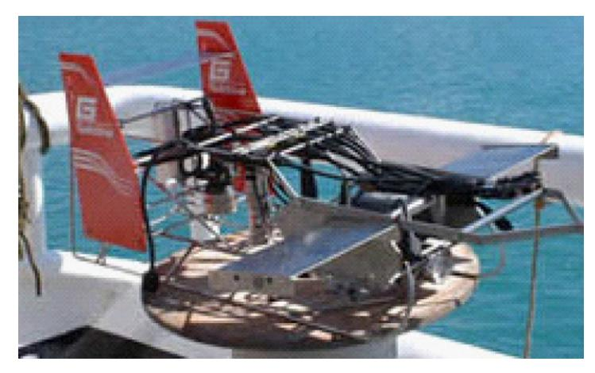

**Figure 2.2.3a.** TOAD. (*Photograph provided by NOAA PIFSC CRED*)

growth forms of corals and three-dimensional structure providing shelter for reef fish of various size categories would be rated medium-high to very high. See Figure 2.4.2b in Section 2.4.2: Towed-diver Surveys for visual examples of each complexity category.

Benthic cover was estimated for four different types of substrate: hard substrate/pavement, sand, rubble, and live hard (scleractinian) coral. A description of each substrate type is given in Table 2.2.3a. It is important to note that in 2006 the definition of rubble changed to include only unconsolidated fragments of coral skeleton or reef rock not visibly encrusted by fleshy or calcareous algae or corals. Also in 2006, the hard substrate/pavement category was not recorded. All other benthic substrate definitions remained the same for towed-diver surveys from 2002 to 2006.

Towed-diver benthic data were used to make habitat characterization maps for complexity, sand, hard substrate/pavement, rubble, and live hard (scleractinian) coral. For each habitat characterization map, estimates of respective benthic features were plotted in ArcGIS 9.2 using the midpoint of each 5-min towed-diver segment. Results from the 2002, 2004, and 2006 surveys were combined and then an inverse distance weighting (IDW) interpolation function (ArcGIS 9.2) was applied to the combined dataset. The IDW function produced a continuous plot of the salient benthic features around each island.

**Table 2.2.3a.** Benthic cover categories used to create habitat characterization products from towed-diver surveys, 2002-2006 (Kenyon et al., 2006a).

| Benthic Cover Category     | Description                                                                                                                                                                      |
|-------------------------------|----------------------------------------------------------------------------------------------------------------------------------------------------------------------------------|
| Live Hard Coral               | Colonies or portions of colonies, of live pigmented tissue.                                                                                                                      |
| Sand                          | Unconsolidated sediment, ranging in texture and size from fine to course. Origins are both inorganic (eroded rock) and organic (eroded fragments of calcareous organisms). |
| Rubble*                       | Unconsolidated fragments of coral skeleton or reef rock whose sizes are larger than sand.                                                                                     |
| Hard Substrate/ Pavement** | Consolidated substrate, typically composed of calcareous and/or basaltic elements that have become cemented together by biogenic and physical processes.                   |

*\* In 2006 the definition changed to include only rubble that was not visibly encrusted by macroalgae, calcareous algae or corals.*

#### **2.3 Oceanography and Water Quality**

Knowledge of local oceanographic processes and water quality parameters is fundamental to understanding the natural dynamics and anthropogenic influences controlling many environmental aspects of coral reef ecosystems, including organism distribution, abundance, and biodiversity; biological productivity; larval dispersal and recruitment; localized and large-scale patterns of coral bleaching and disease; and degrees of disturbance from episodic storms and human-related activities. To assess the oceanographic and water quality conditions influencing the environmental aspects of coral reef ecosystems in American Samoa, CRED collected and integrated five key data streams, including: (1) deep-water oceanographic

*\*\* In 2006 the hard substrate/pavement category was not recorded.*

surveys characterizing prevailing water properties and ocean currents around the islands of American Samoa; (2) intensive closely spaced nearshore oceanographic and water quality surveys conducted concurrently with REA and towed-diver biological surveys; (3) an array of surface and subsurface moored instruments providing continuous, high-resolution time series observations; (4) satellite remote sensing products providing spatial time series observations of key oceanographic properties (e.g., sea surface temperature [SST], sea surface height, surface winds, chlorophyll-a, and other derived products), and (5) numerical models (e.g., Wave Watch III) providing spatial and temporal estimates of various oceanographic parameters.

#### **2.3.1 Operational Background and Survey Design**

CRED has used a diverse array of data collection methodologies to monitor and assess local oceanographic and water quality conditions, including in situ telemetered surface and subsurface moored instruments, shipboard and nearshore spatial hydrographic surveys performed during research cruises, and bioacoustic surveys. Oceanographic equipment and instrument specifications are detailed in Appendix I, Table I. ii. Shipboard surveys were conducted by the three different NOAA ships (discussed in Section 2.1: Operational Background), and nearshore surveys and instrument deployment/retrievals were accomplished by small boats deployed from these ships.

The monitoring sites were selected to characterize the prevailing climatic and oceanographic conditions by spatially and temporally quantifying key physical forcing mechanisms pertinent to biological processes (e.g., temperature, salinity, currents, wave energy, ultraviolet [UV] radiation, nutrients, chlorophyll, dissolved oxygen, and dissolved inorganic carbon) over seasonal, interannual, and decadal time scales. By so doing, CRED is generating a baseline for long-term observation of environmental conditions influencing reef ecosystems that are particularly important in aiding efforts to understand and predict the ecological impacts of climate change.

#### **2.3.2 Shipboard Surveys**

Shipboard deep-water (500 m) conductivity, temperature, and depth (CTD) casts with simultaneous water sample collection were conducted to determine prevailing water property profiles surrounding the islands and atolls of American Samoa. These deep-water casts provide high-resolution vertical profiles of conductivity (salinity), temperature, dissolved oxygen, and chlorophyll-a concentration versus depth. In addition, shipboard acoustic Doppler current profiler (ADCP) transects were conducted

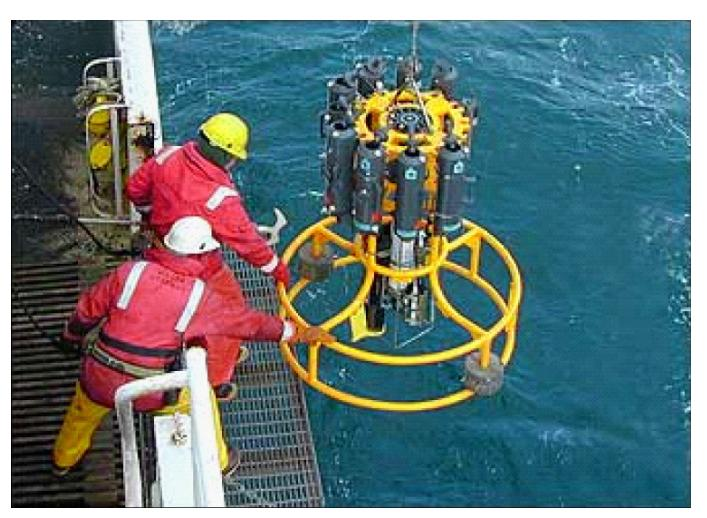

**Figure 2.3.2a.** Deep-water CTD (SBE 911*plus*) with rosette and Niskin water bottles being deployed from ship. (*Photograph provided by NOAA PIFSC CRED*)

in the deep-water regions around each of the islands and atolls to examine the horizontal and vertical structure of the prevailing ocean currents (Lumpkin and Pazon, 2005).

#### *Deep-water CTD Surveys*

A Sea-Bird Electronics, Inc. (SBE) SBE 911*plus* CTD with a SBE 43 dissolved oxygen sensor and Wetlabs ECO FLNTU fluorescence and turbidity sensors was used to collect vertical profiles of water properties from the surface to 500 m deep in offshore environments around each island/atoll surveyed. In addition, a rosette with multiple 5-l Niskin bottles (Fig. 2.3.2a) was used to collect water samples at selected depths for chlorophyll-a and nutrient analyses. Data from the deep-water CTD casts are presented in the archipelago chapter of this report (Chapter 8, Section 8.4.2: Seasonal Variation).

# *Shipboard ADCPs*

Transects of ocean current velocity profiles were collected using shipboard ADCPs during ASRAMP cruises in 2002, 2004, and 2006. During the 2002 cruise aboard the *Townsend Cromwell*, the surveys were conducted using a hull-mounted 153-kHz RD Instruments (RDI) narrow beam ADCP, which collected current profiles in 8-m sampling bins over depths between 20 and approximately 250 m, averaged into over 5-min ensembles. During the 2004 and 2006 cruises aboard the *Oscar Elton Sette* and *Hi*`*ialakai*, the surveys were conducted using hull-mounted 75 kHz RDI Ocean Surveyor instruments. These systems were configured with an 8-m pulse length which typically collects current profiles in 16-m depth bins between depths ranging from 25 to about 600 m averaged into 15-min ensembles. The actual depth range depended on the density and abundance of scattering material in the water column. In addition to dedicated ADCP transect grids around the islands data were generally collected continuously while the vessels were underway. Data from the shipboard ADCPs are not presented in this report.

# **2.3.3 Nearshore Spatial Surveys**

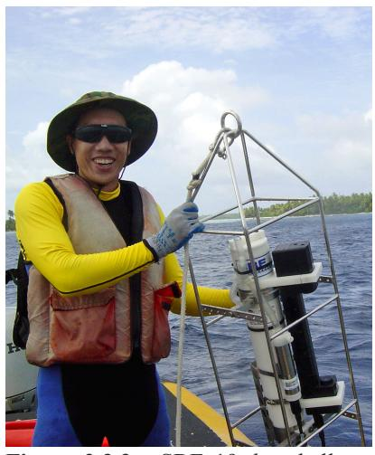

**Figure 2.3.3a.** SBE 19*plus* shallowwater CTD used for nearshore profiling of salinity, temperature and pressure-based depth. (*Photograph provided by NOAA PIFSC CRED*)

Closely spaced nearshore CTD surveys were conducted throughout the shallow-water environments around each of the islands, atolls, and reefs surveyed during all of the ASRAMP cruises. The distance between adjacent casts ranged from 0.25 to 2.0 km, depending on the size of the area being sampled with each cast typically being conducted approximately 30 m deep. These surveys were conducted to characterize the spatial structure of the physical and chemical properties of the ocean environment influencing the living coral reef resources observed during REA and towed-diver surveys. Water samples were collected at a subset of the shallow-water CTD sites to examine nearshore water quality.

#### *Shallow-water CTD Surveys*

The shallow-water CTD surveys provided vertical profiles of conductivity and temperature versus depth using an SBE 19*plus* CTD. Beam transmission data were collected concurrently using a Wetlabs C-Star Transmissometer. The CTD profiles were collected by hand-lowering the CTD profiler (Fig. 2.3.3a) from a small boat at a descent rate of approximately 0.5 to 0.75 m s-1 to a 30-m maximum depth. The shallow-water CTD observations around each island/atoll are presented as vertical cross-section plots generated using Ocean Data View software ([http://odv.awi.d](http://odv.awi.de)e). Subsets of the data representing the same oceanographic parameters at a 20-m depth are presented to further illustrate their spatial structure around each of the islands and atolls of American Samoa.

#### *Seawater Laboratory Analyses*

Water samples were collected at a subset of the shallow- and deep-water CTD sites. During the shallow-water CTD surveys, a daisy chain of 1.75- and 5-l Niskin bottles were lowered to collect water samples at various depths (1, 10, 20, and 30 m) by triggering the bottles to close shut using a trip weight (messenger) sent down the line. These water samples were preserved for laboratory analyses of water quality including levels of: chlorophyll-a, nitrates, nitrites, phosphates, silicates, total nitrogen, partial pressure of carbon dioxide (*p*CO2 ), and/or alkalinity. Chlorophyll-a water samples were processed by Dr. Paul Bienfang of Analytical Services, Inc., Honolulu, Hawaii. Nutrients, *p*CO2 , and alkalinity were processed at the NOAA Pacific Marine Environmental Laboratory in the nutrient laboratory of Dr. Calvin Mordy and in the carbon chemistry laboratory of Dr. Richard Feely.

#### **2.3.4 Surface Moorings**

As a key component of CREIOS, buoys were moored in shallow-water environments at many U.S.-affiliated Pacific Islands. These buoys provide near real-time observations of key oceanographic conditions influencing coral reef ecosystem processes to managers, stakeholders, and the public. These surface observations were transmitted via satellite for daily dissemination at the CRED website <http://www.pifsc.noaa.gov/cred/>.

#### *Coral Reef Early Warning System (CREWS) Buoys*

CREWS buoys are sea surface moorings that telemeter in situ observations of atmospheric and oceanographic parameters influencing reef conditions (Fig. 2.3.4a). CREWS buoys have been providing near real-time observations of highresolution SST and surface conductivity (or salinity) at a 1-m depth, air temperature, barometric pressure, and wind velocity. Enhanced versions additionally provide photosynthetically available radiation (PAR) and UV radiation. All data were sampled at 30-min intervals and internally recorded. Subsets of data have been transmitted daily via satellite telemetry to provide near real-time updates of changing environmental conditions. The sensors used to collect and record the data include an SBE 37 MicroCAT conductivity and temperature recorder, an RM Young WS425 air temperature sensor, a Heise Instruments DXD barometric pressure sensor and a Vaisala Instruments acoustic wind velocity sensor. Enhanced versions of the CREWS buoys also include Biospherical Instrument's

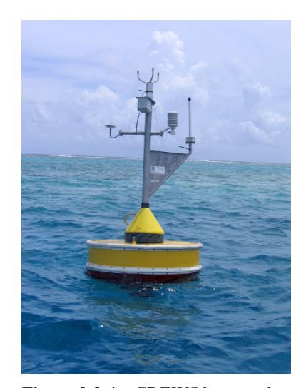

**Figure 2.3.4a.** CREWS buoys relay oceanographic and meteorological data via satellite telemetry. (*Photograph provided by NOAA PIFSC CRED*)

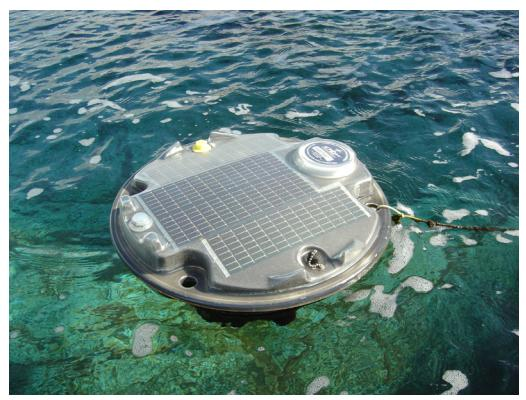

**Figure 2.3.4b.** OTR SB200 SST buoy. (*Photograph provided by NOAA PIFSC CRED*)

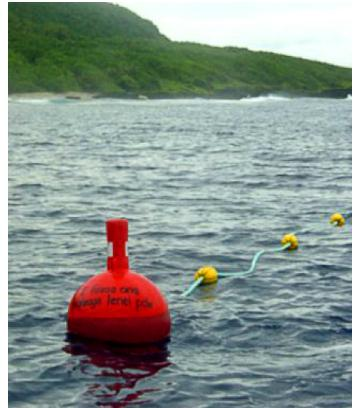

**Figure 2.3.4c.** SOSI Model SST-001 SST buoy. (*Photograph provided by NOAA PIFSC CRED*)

PAR and UV radiation sensors. Data from the CREWS buoy at Rose are presented in Chapter 6, Section 6.3.2: Habitat Characterization.

#### *SST Buoys*

SST buoys are sea surface moorings that telemeter in situ observations of high-resolution SST in near real-time. Data are recorded internally and transmitted, via satellite, at 1-hour intervals. The two types of buoys, an Ocean Trek Research (OTR) SB200 solar rechargeable buoy and the battery-powered Sound Ocean Systems, Inc. (SOSI) Model SST-001 use a SBE 39 temperature recorder for SST measurements.

Images of the two types of SST buoys can be seen in Figures 2.3.4b and 2.3.4c. Data from the SST buoys are presented in the respective island/atoll chapters of this report.

#### **2.3.5 Subsurface Moorings**

Ocean data platforms (ODPs), wave and tide recorders (WTRs), subsurface temperature recorders (STRs), and Aanderaa current meters are subsurface moorings deployed at selected locations and configured to continuously record important oceanographic parameters that influence reef conditions. These moorings were recovered on a periodic basis and replaced with refurbished units to maintain a continuous time series of data at each location. ODPs record observations of ocean current profiles, wave energy, temperature, and salinity;

WTRs record observations of sea level height, wave energy, and temperature; STRs record observations of subsurface temperature; and Aanderaa current meters record observations of

ocean current velocity (at a fixed depth) and temperature.

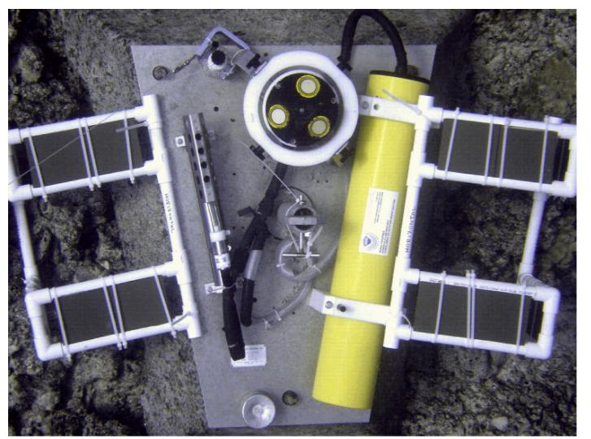

**Figure 2.3.5a.** ODP mooring. (*Photograph provided by NOAA PIFSC CRED*)

# *ODPs*

ODPs recorded directional current profiles and wave spectra using a Sontek 1000-kHz ADCP, and high-resolution ocean temperature and salinity using a SBE 37 MicroCAT conductivity and temperature recorder (Fig. 2.3.5a).

Sample intervals for current and wave data varied depending on duration of deployment; temperature and salinity were sampled at 30-min intervals. Deployment depths typically ranged from 15 to 35 m. Data were internally recorded and retrieved from platforms during subsequent ASRAMP cruises. Data from the ODPs are not presented in this report.

#### *WTRs*

WTRs are subsurface moored instruments consisting of an SBE 26*plus* SEAGAUGE WTR that records observations of high-resolution pressure (wave height and tides) and temperature. Data were internally recorded with sample intervals determined by duration of deployment. Deployment depths typically ranged from 10 to 25 m.

# *STRs*

STRs are subsurface moored instruments consisting of SBE 39 temperature recorders, which are physically attached to reef structures to record observations of high-resolution temperature influencing the corals and other benthic biota. Unlike CREWS buoys, SST buoys, and satellite observations of SST, STRs record the actual temperatures at the depth of the corals living near their point of deployment. These observations are particularly important during calm conditions conducive to coral bleaching. At these times, the water column is often well-stratified, meaning that many of the corals may not be subjected to the warmer temperatures at the surface, thereby potentially lessening the likelihood of bleaching. STRs have been deployed in a variety of locations and habitats throughout the coral reef ecosystems of American Samoa, particularly those considered most prone to coral bleaching.

#### *Aanderaa RCM 9 Recording Current Meter (RCM)*

The Aanderaa RCM 9 current meter is an autonomous subsurface mooring used to record observations of the speed and direction of ocean currents at a specific depth. Data were internally recorded with sample intervals determined by duration of the deployment.

# *Ecological Acoustic Recorders (EARs)*

EARs (Fig. 2.3.9a) are passive acoustic recording devices developed specifically for monitoring fish, invertebrates, and human activity in marine habitats (Lammers et al., in press). The EAR is a digital, low-power system based on a Persistor CF2 microprocessor and a 16-bit analog-to-digital converter that records ambient sounds up to 30 kHz on a programmable schedule for up to 1 to 2 years. The EAR also responds to transient acoustic events that meet specific criteria, such as cetaceans or motorized vessels passing nearby. A total of eight EARs were deployed in American Samoa during ASRAMP 2006. Deployment depths typically ranged from 10 to 25 m. Four EARs were retrieved and their data (only for Tutuila) are presented in this report.

#### **2.3.6 Oceanographic Equipment Deployment**

Oceanographic instrumentation has been deployed across the American Samoa Archipelago since 2002. These deployments, accompanied by successive retrievals for specific devices, are summarized in Table 2.3.6a. At each island and atoll in the archipelago, important oceanographic features were evaluated and specific management concerns were addressed by selecting pertinent monitoring locations and using appropriate instrumentation. These instruments and the data they have collected are described in the oceanography and water quality sections of each island/atoll chapter.

**Table 2.3.6a.** Number of oceanographic instruments deployed (Dep) and retrieved (Ret) by year in the American Samoa region. Instrument Types: CREWS buoy, EAR, ODP, RCM, STR, SST buoy, and WTR.

| Instrument |     | 2002 |     | 2004 |     | 2005 | 2006 |     |      |         |
|------------|-----|------|-----|------|-----|------|------|-----|------|---------|
| Type       | Dep | Ret  | Dep | Ret  | Dep | Ret  | Dep  | Ret | Lost | CURRENT |
| CREWS      | 1   | 0    | 1   | 1    | 0   | 0    | 1    | 1   | 0    | 1       |
| EAR        | 0   | 0    | 0   | 0    | 0   | 0    | 4    | 0   | 0    | 4       |
| ODP        | 1   | 0    | 0   | 1    | 0   | 0    | 0    | 0   | 0    | 0       |
| RCM        | 2   | 0    | 0   | 2    | 0   | 0    | 0    | 0   | 0    | 0       |
| STR        | 0   | 0    | 17  | 1    | 4   | 0    | 27   | 17  | 3    | 27      |
| SST        | 8   | 4    | 5   | 5    | 3   | 2    | 5    | 3   | 2    | 5       |
| WTR        | 0   | 0    | 2   | 0    | 1   | 1    | 2    | 2   | 0    | 2       |
| TOTAL      | 12  | 4    | 25  | 10   | 8   | 3    | 39   | 23  | 5    | 39      |

#### **2.3.7 Satellite Remote Sensing and Ocean Modeling**

#### *Satellite Remote Sensing*

All satellite-derived data products presented in this report are produced and distributed publicly by various government and private organizations. Brief summaries of data providers and any further analyses performed by CRED are outlined below.

- 1. NOAA AVHRR Pathfinder 5.0 SST (Casey, 2006)
  - <http://www.nodc.noaa.gov/sog/pathfinder4km/> •
  - Infrared Radiometer SST from NOAA polar orbiter satellites •
  - 4-km resolution grid •
  - Climatology: Produced by National Oceanographic Data Center (NODC) using data from 1985 to 2001 •
  - Time series plots: Pathfinder 5.0 weekly data and climatology time series plots are based on data extracted from 1° × 1° latitude-longitude boxes surrounding the area of interest •
- 2. National Aeronautics and Space Administration (NASA) Quikscat Scatterometer Winds
  - [http://winds.jpl.nasa.gov/missions/quikscat/index.cf](http://winds.jpl.nasa.gov/missions/quikscat/index.cfm)m •
  - Microwave scatterometer that measures near-surface wind speed and direction •
  - 0.25-degree resolution grid •
  - Climatology: Produced by CRED and NODC for OceanEye project using data from 2000 to 2003 •
- 3. NASA SeaWiFS imager
  - <http://oceancolor.gsfc.nasa.gov/SeaWiFS/> •
  - Measures bio-optical properties of the ocean, including a calculation of chlorophyll-a levels •
  - 9-km resolution grid •
  - Climatology: Produced by CRED and NODC for OceanEye project using data from 1998 to 2003 •

#### *Ocean Modeling: Bleaching Threshold*

As early as 1997, the NOAA National Environmental Satellite, Data, and Information Service began producing near real-time, web accessible, satellite-derived SST products to monitor conditions conductive to coral bleaching from thermal stress around the globe. This activity evolved into a crucial part of CRW in 2000 ([http://coralreefwatch.noaa.gov/satellite/index.](http://coralreefwatch.noaa.gov/satellite/index.html) [html](http://coralreefwatch.noaa.gov/satellite/index.html)).

The Bleaching Threshold, developed by CRW ([http://www.coralreefwatch.noaa.go](http://www.coralreefwatch.noaa.gov)v), serves as a general indicator for coral bleaching and is defined by 1°C above the maximum monthly climatological SST value for a particular geographic area.

CRED generated SST and wave height time series around the islands and atolls of American Samoa between January 2002 and April 2006. Remotely sensed data (SST Climatology and weekly Pathfinder-derived SST) and modeled significant wave height derived from Wave Watch III were overlaid with CRED in situ observations from various locations around each island and atoll in the archipelago, with indicators for each region's bleaching threshold and ASRAMP cruise dates. In situ and telemetered data were used to produce the time series record for each island or atoll, as shown in the respective oceanography and water quality sections of each island/atoll chapter.

*Ocean Modeling: Wave Watch III*

Wave Watch III is a third-generation full spectral ocean wind-wave model which provides historical and near real-time open-ocean, deep-water modeled spectral wave data (height, period, and direction). Three hourly forecasts of wave conditions, up to 144 hours (6 days) in advance, are generated twice daily.

Wave Watch III solves the spectral action density balance equation for the wave numberdirection spectra. The implicit assumption of this equation is that properties of medium (water depth and current) as well as the wave field itself vary on time and space scales that are much larger than the variation scales of a single wave. A further constraint is that the parameterizations of physical processes included in the model do not address conditions where the waves are strongly depth-limited. These two basic assumptions imply that the model can generally be applied on spatial scales (grid increments) larger than 1 to 10 km, and outside the surf zone ([http://polar.ncep.noaa.gov/waves/wavewatch/wavewatch.htm](http://polar.ncep.noaa.gov/waves/wavewatch/wavewatch.html)l). Additional information can be referenced in Tolman (1999; 2002).

## **2.3.8 Surface Drifters**

Satellite-tracked Lagrangian surface drifting buoys, commonly called drifters, measure SST and mixed layer currents in the upper ocean. As part of the World Ocean Circulation Experiment's (WOCE) Surface Velocity Program (SVP), drifters are designed with a surface buoy attached by a thin tether to a subsurface holey-sock drogue or sea anchor, centered at 15 m beneath the sea surface. Twenty-five SVP-compliant drifters (Lumpkin and Pazos, 2005) have been deployed in the American Samoa region during ASRAMP research cruises since 2002 (Table 2.3.8a). Two drifter models have been used: the ClearSat-15 with on-board global positioning system (GPS) navigation manufactured by Clearwater Instrumentation and the WOCE SVP drifting buoys with on-board GPS navigation manufactured by Technocean. GPS data (including date, time [accurate to ± 1.0 sec] and location [accurate to ± 0.0001°]), SST, drogue presence and battery level are transmitted daily via satellite telemetry to the satellite-based Argos data collection system and delivered to CRED periodically by e-mail.

**Table 2.3.8a**. Number of WOCE SVP drifter buoys deployed by year and location in the American Samoa Archipelago (Lumpkin and Pazos, 2005).

| Deployment Year | Drifter Manufacturer | Drifter Model    | Tutuila | Manu`a Islands | Rose | Swains |
|--------------------|-------------------------|---------------------|---------|-------------------|------|--------|
| 2002               | Technocean              | GPS, drogue at 15 m | 4       | 1                 | 1    | 1      |
| 2003               | Clearwater              | ClearSat-15 GPS  | 3       | 1                 | 0    | 1      |
| 2004               | Clearwater              | ClearSat-GPS- HP | 3       | 1                 | 1    | 1      |
| 2006               | Clearwater              | ClearSat-GPS- HP | 3       | 1                 | 2    | 0      |

#### 2.3.9 Bioacoustic Surveys

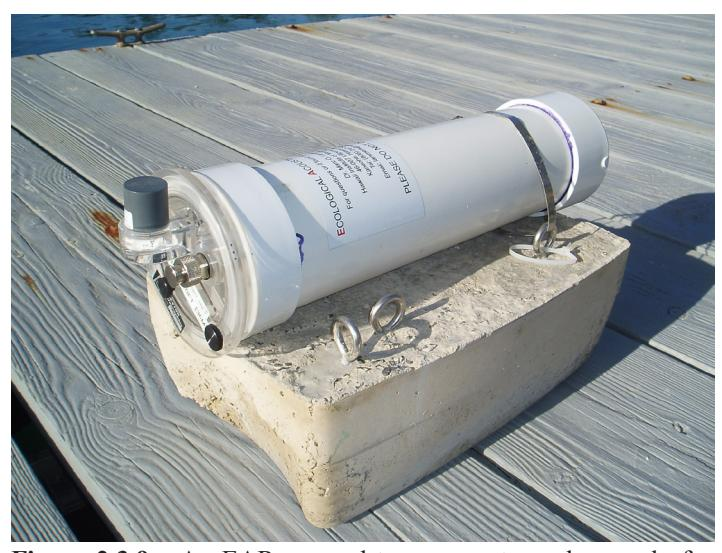

**Figure 2.3.9a.** An EAR secured to a concrete anchor ready for deployment. (*Photograph provided by NOAA PIFSC CRED*)

Understanding the biological interactions in coral reef ecosystems requires longterm observations of inter- and intraspecies relationships and environments. existing monitoring instruments are capable of measuring longterm physical environmental trends, they currently lack the ability to observe most biological processes. The sounds present in marine habitats can be an effective indicator of many biological processes such as spawning events, courtship behavior, feeding, and competition among

many species of fish, invertebrates, and aquatic mammals. Acoustic monitoring of marine habitats is a promising means of tracking biological activity and detecting ecological responses to changing environmental conditions. In addition to tracking biological activity, acoustic monitoring can also be an effective tool for detecting human activities in the marine habitat, such as vessel traffic and fishing using explosives. This application is of particular use in areas where traditional monitoring methods are difficult or impossible to implement, such as remote islands and atolls. Long-term acoustic monitoring can provide a cost-effective means of logging the human presence at a particular location and thus help gauge the effectiveness of management practices.

CRED explored the benefits of bioacoustic surveys by collaboratively developing and deploying EARs with Drs. Marc Lammers and Whitlow Au of UH's Hawaii Institute of Marine Biology. Refer to Section 2.3.5: Subsurface Moorings for additional information.

# **2.4 Reef Benthic (Coral, Algae, Macroinvertebrate) and Fish Surveys**

Information on the condition, abundance, diversity, and distribution of biological communities is vital to the effective management of coral reef resources. To provide resource managers with such information, CRED has supported two biological assessment teams focused on collecting reef fish and benthic community datasets. An REA team conducted fine-scale assessments at specific reef sites (~ 300 m2 ), while a team of towed divers conducted broadscale surveys (~ 15 000–25 000 m2 per survey) around the islands and atolls of American Samoa. The two assessment teams collected complementary data relating to four ecological disciplines: coral, algae, other macroinvertebrates, and reef fish (Table 2.4a). An overview of each assessment team and its sampling design, operational description, and methods is presented in the following sections.

**Table 2.4a.** Overview of the biological data collected by the REA and towed-diver assessment teams presented in this report.

|                            | Survey Results Presented in Report                                                                                                                                                                                                                         |                                                                                                                         |  |  |  |  |  |  |
|----------------------------|------------------------------------------------------------------------------------------------------------------------------------------------------------------------------------------------------------------------------------------------------------|-------------------------------------------------------------------------------------------------------------------------|--|--|--|--|--|--|
| Discipline                 | REA                                                                                                                                                                                                                                                        | Towed-diver                                                                                                             |  |  |  |  |  |  |
| Coral                      | • Coral community composition and generic richness • Percent live coral cover • Coral density (# colonies m-2) • Scleractinian (stony) coral size class distribution • Coral disease distribution and prevalence | • Percent live scleractinian (stony) coral cover • Percent dead/stressed coral cover                  |  |  |  |  |  |  |
| Algae                      | • Algae percent occurrence by genera/functional group • Coralline algae disease distribution and density                                                                                                                                    | • Percent fleshy/ macroalgae cover • Percent coralline algae cover                                       |  |  |  |  |  |  |
| Other Macroinvertebrate | • Macroinvertebrate species presence • Macroinvertebrate species richness                                                                                                                                                                   | • Crown-of-thorns seastar (COTS), giant clam, sea cucumber, and sea urchin distribution and abundance |  |  |  |  |  |  |
| Reef Fish                  | • Reef fish community composition and species richness • Reef fish biomass                                                                                                                                                                  | • Large fish (> 50 cm) biomass • Large fish species composition                                          |  |  |  |  |  |  |

Within this report, summary statistics are presented as either standard deviation of the mean (SD) or the estimated standard deviation of the error (SE), depending on the variable being analyzed. SD quantifies how much values vary from one another. SE quantifies precision within the true mean of the population, factoring in both sample size and SD. Results from both REA and towed-diver surveys primarily include SE summary statistics because of the variations in the number and location of sites visited within and between years caused by environmental conditions (e.g., higher number of REA surveys along leeward versus windward sides). Data analyzed within ArcGIS from towed-diver surveys (e.g., depth data) include SD summary statistics primarily because of the inability of the software to directly calculate SE at the time of this report.

# **2.4.1 REA Surveys**

REA surveys are investigations that provide a high degree of taxonomic resolution for coral, algae, other macroinvertebrate, and reef fish communities. The surveys were conducted using a combination of dive teams which generally included a two- to three-person fish team, a two-person coral/coral disease team, and a combined team of two algae biologists and a single macroinvertebrate biologist. The majority of REA surveys were conducted along the forereef slopes of individual islands at depths between 10 and 20 m. However, additional surveyed habitats included lagoonal patch reefs at Rose and a shallow offshore oceanic bank near Tutuila.

# *Selection of Sampling Sites and Transect Locations*

The selection of REA sites in 2002 was not made randomly in close consultation with Dr. Andy Cornish, the coral reef monitoring coordinator for American Samoa's Coral Reef Advisory Group (CRAG). Factors considered during REA site selection included: (1) ensuring a range of sample sites representative of the benthic and reef fish habitats around each island; (2) selecting a mixture of sites within and outside of marine protected areas; (3) selecting a mixture of both 'impacted' and 'least impacted' sites; (4) selecting some sites adjacent to local villages, and (5) selecting a number of sites that could be compared to and complement previous assessment and monitoring work done by Drs. Alison Green, Charles Birkeland, and Peter Craig, as well as future coral reef monitoring proposed by CRAG. It is important to note that access to REA sites can be limited by wave exposure, weather conditions, and other environmental factors such as currents, which can affect the ability to resurvey sites between years.

The nonrandom nature of site selection places limits on the degree to which biotic metrics such as percent cover, density, diversity, and coral/coralline algal disease prevalence can be extrapolated through statistic inference to the larger population constituted by each island/ atoll. It nonetheless remains statistically appropriate to examine differences among the same sites sampled over different years, which is the priority of CRED's long-term monitoring efforts.

An additional caveat in tracking temporal changes in relatively immobile resources (e.g., coral, algae) versus mobile resources (e.g., schools of fish) is that benthic spatial plots may accrue cumulative, temporally non-independent impacts over a succession of surveys depending on the type of impact (e.g., successive years of bleaching versus singular hurricane events), whereas mobile schools of fish would be re-randomizing themselves in space when surveys

are conducted over time in the same sites.

At each site, transects were deployed by the fish REA survey team, whose members were the first to enter the water. Transect placement was guided by: (1) a focus on hard-bottom communities; (2) deploying lines along an isobath to the extent possible at each site, and (3) laying the transect lines into the prevailing current. The latter was an important safety consideration to facilitate divers working against the current at the start of each dive but swimming with the current towards the end of each dive when they were more fatigued. The placement of transects by the fish team, rather than the benthic team, also helped reduce bias in the selection of specific benthic habitat that might otherwise be inadvertently introduced. Each benthic sub-discipline (e.g., corals, coral disease, algae, other macroinvertebrates) used survey protocols driven by: (1) accepted methods within the sub-discipline, and (2) the number of divers available and the need to choreograph each dive so as to stay within NOAA safety guidelines (e.g., proximity to a buddy). All sub-disciplines used the two transect lines as the geographical reference by which their selection of point, area, or quadrat placement was guided. Both random numbers and fixed intervals, which were used by the algal and macroinvertebrate researchers for quadrat placement, are commonly used sampling methods; both methods reduce observer bias by forcing scientists to sample pre-set areas.

#### *Operational Description*

During REA surveys, biological assessment teams follow highly structured protocols that are repeated at each REA site. Upon arrival at an REA site, three teams of divers enter the water over spaced time intervals. The first team to enter the water is the fish team, which consists of two to three investigators. The fish team deploys a 25-m transect line and two of the divers begin to survey along that transect while the remaining fish diver begins stationary point count assessments in the general vicinity. After approximately 20 min, the two-person coral team enters the water and begins to work along the first transect line. By this time the fish team has deployed and begun surveys along a second 25-m transect. About 10 min later, the algal/invertebrate team, consisting of two to three investigators, enters the water and begins surveying the first transect. In total, the fish team surveys three transects at each site (transects 1, 2, and 3), and the coral and algal/invertebrate teams survey transects 1 and 2 (Fig. 2.4.1a). The sampling effort takes between 60 and 80 min to complete.

#### *REA Disciplines and Methods*

The biological assessment teams used specific methodologies targeting their respective biological communities. These methodologies overlapped and complemented each other to ensure that collected data were representative of the biological state at each REA site. A timeline of methods development for each discipline is displayed in Tables 2.4.1a and 2.4.1b, and the methods used by each assessment team are discussed in the following paragraphs.

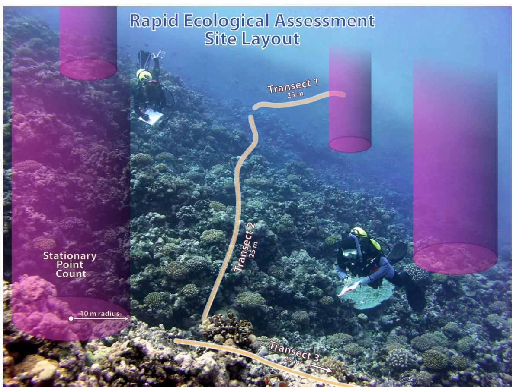

**Figure 2.4.1a.** Schematic of REA site layout. The reef fish assessment team surveys transects 1, 2, and 3 and conducts four stationary point count surveys. The coral/coral disease and algae/macroinvertebrate teams each survey transects 1 and 2. (*Photograph provided by NOAA PIFSC CRED; J. Kenyon, JIMAR*)

**Table 2.4.1a.** Timeline of methods development for each of the REA disciplines. Each REA discipline is separated by the various measured parameters.

|      | REA Disciplines                                                                                                                                       |     |     |     |     |                                   |                     |  |  |  |
|------|-------------------------------------------------------------------------------------------------------------------------------------------------------|-----|-----|-----|-----|-----------------------------------|---------------------|--|--|--|
|      | Coral and Coral Disease                                                                                                                               |     |     |     |     |                                   | Algae               |  |  |  |
| Year | Colony Generic Percent density (# Size Disease richness/ live colonies class prevalence composition cover m-2) |     |     |     |     | Percent occurrence (Genera) | Species presence |  |  |  |
| 2002 | MD                                                                                                                                                    | —   | —   | —   | —   | MD                                | —                   |  |  |  |
| 2004 | BLT                                                                                                                                                   | VE  | BLT | BLT | —   | QS, PQS                           | VS                  |  |  |  |
| 2006 | BLT                                                                                                                                                   | LPI | BLT | BLT | BLT | QS, PQS                           | VS                  |  |  |  |

*Method Acronyms: BLT = Belt Transect, LPI = Line Point Intercept, MD = Methods Development, PQS = Photoquadrat Survey, QS = Quadrat Survey, VE = Visual Estimate, VS = Voucher Specimen.*

**Table 2.4.1b.** Timeline of methods development for each of the REA disciplines. Each REA discipline is separated by the various measured parameters.

|                                 | REA Disciplines     |                     |                                                                                       |     |          |  |  |  |  |
|---------------------------------|---------------------|---------------------|---------------------------------------------------------------------------------------|-----|----------|--|--|--|--|
| Macroinvertebrates Reef Fish |                     |                     |                                                                                       |     |          |  |  |  |  |
| Year                            | Species presence | Species richness | Total fish Fish biomass biomass (all Species richness (> 25 cm) sizes) |     |          |  |  |  |  |
| 2002                            | MD                  | —                   | —                                                                                     | —   | BLT, RDS |  |  |  |  |
| 2004                            | BLT, RDS            | BLT, RDS            | BLT, RDS                                                                              | SPC | BLT, RDS |  |  |  |  |
| 2006                            | BLT, QS             | —                   | BLT, RDS                                                                              | SPC | BLT, RDS |  |  |  |  |

*Method Acronyms: BLT = Belt Transect, MD = Methods Development, QS = Quadrat Survey, RDS = Roving-diver Survey, SPC = Stationary Point Count.*

#### **2.4.1.1 Coral and Coral Disease**

The coral community at each REA site was assessed to quantify the diversity, abundance, density, and size class distribution of the anthozoan and hydrozoan1 corals. The methods employed by the coral assessment team in American Samoa were different in all survey years. These methods included several complementary and noninvasive underwater survey techniques, e.g., visual estimate, line point intercept, and belt-transect; all of which provide viable and complementary datasets for quantitative and descriptive analyses (Kenyon et al., 2006a). Details on each method are discussed below including a description of the development of coral methods during 2002 REA surveys (*Coral Methods Development*). The temporal variation of coral sampling methodologies is summarized in Table 2.4.1a. A common name index of American Samoan coral species can be found in Appendix I, Table I. iii.

#### *Coral Methods Development*

The REA coral surveys during ASRAMP 2002 were the first surveys conducted in American Samoa by CRED. As such, the methods employed varied between sites and were mostly qualitative and exploratory in nature. Tested methods included: (1) relative abundance estimates of coral by species or genus using a semiquantitative DACOR (dominant, abundant, common, occasional, and rare) protocol (Maragos et al., 2004); (2) visual estimates of the percent coral cover at each REA site; (3) belt transects consisting of a coral biologist swimming along as many transect lines as bottom time permitted identifying coral species (or genus, when species identification in the field was ambiguous) occurring within approximately 0.5 m of each side of the transect lines; each colony was assigned to one of seven size classes (≤ 5, 6–10, 11–20, 21–40, 41–80, 81–160 or > 160 cm) based on a visual estimate of the maximum colony diameter; (4) wide-angle photo-documentation of the benthos using a Nikon RS camera with a 13-mm lens, and (5) video documentation of the three 25-m transects using a Sony PC digital PC100 camcorder in a Gates underwater housing while slowly swimming about 1 m above the seafloor along the length of each transect.

1 Anthozoan = Any of the Cnidarian class Anthozoa, such as the corals and sea anemones, that have radial segments and grow singly or in colonies. Hydrozoan = Any of the Cnidarian class Hydrozoa, such as the colonial hydrocorals, that secrete a calcium carbonate skeleton.

#### *Visual Estimates*

Percent live coral cover was recorded at REA sites in 2004 using visual estimates. Estimation of coral cover was a subjective, qualitative assessment in which the coral biologist estimated (by eye) the percentage of benthic substrate that was covered by live coral in the general area traversed by the transect lines.

# *Line Point Intercepts*

The line point intercept technique was used to quantitatively assess average percent live coral cover and other benthic substrates at REA sites during ASRAMP 2006 (Hill and Wilkinson, 2004). A coral biologist swam along two 25-m transect lines recording all benthic elements falling directly underneath the transect line at 50-cm intervals. Benthic elements were recorded as one of nine benthic categories: live coral, dead coral, carbonate pavement, coralline algae, macroalgae, coral rubble, sand, rock, and other benthic sessile invertebrates. Living benthic elements (e.g., coral, algae, and other invertebrates) were identified to the lowest taxonomic level possible.

# *Belt Transects*

Colony density and size classes of each coral colony were quantitatively assessed using belt-transect surveys (Fig. 2.4.1.1a). At the beginning of each dive, subjective perceived colony density dictated the belt width: 1-m width was used in high density areas, while 2-m width was used in low density areas. The coral biologist surveyed two 25-m transect lines, recording the maximum diameter of all coral colonies whose centers fell within 0.5 to 1 m (depending on density) on either side of the transect line. Colonies were recorded to the genus level and assigned, by visual estimation, to one of seven size classes: ≤ 5, 6–10, 11–20, 21–40, 41–80, 81–160, and > 160 cm (binning of coral colony size classes based on Mundy [1996]). Estimation of individual coral colony boundaries in the field can be complicated especially for species with life history strategies involving clonal propagation (e.g., *Acropora formosa*) or fissioning (e.g., *Porites lobata*). When estimating coral colony boundaries, consideration was given to tissue color, interfaces (e.g., skeletal ridges) with neighboring colonies of the same species, and variations in growth form. If determinations of individual colony boundaries could not be made on these criteria alone, conspecific areas of live tissue separated by more than 10 cm were considered to be separate colonies.

Results from 2004 and 2006 coral surveys were used to calculate generic richness, percent live coral cover, coral density (# colonies m-2), and size class distributions of scleractinian corals for each REA site. Generic richness was computed as the maximum number of coral genera recorded within belt transects at a site. Coral community composition values were calculated from the relative percentages of coral genera observed during belt-transect surveys. Percent live coral was calculated from the raw site estimates of coral cover during ASRAMP 2004 and the average of the line point intercept results from each 25-m transect during ASRAMP 2006. Coral size class histograms were created by calculating the relative frequencies of all scleractinian corals in each of the seven size classes recorded during belt-transect surveys.

Coral and coralline algal diseases and predation scars were quantified at each REA site to assess the health and viability of the coral reef populations in the nearshore waters. Coral and coralline algal diseases and predation were first surveyed during ASRAMP 2006 using belt transects.

Coral disease and predation assessments were conducted along two 25-m belt transects during which each affected coral colony was identified to the lowest taxonomic level possible. The width of belt transects varied depending on diver's bottom time, but was generally conducted within 3 to 5 m perpendicular to each transect line (~ 300–400 m2 per site). For each affected coral the following information was recorded: colony size,

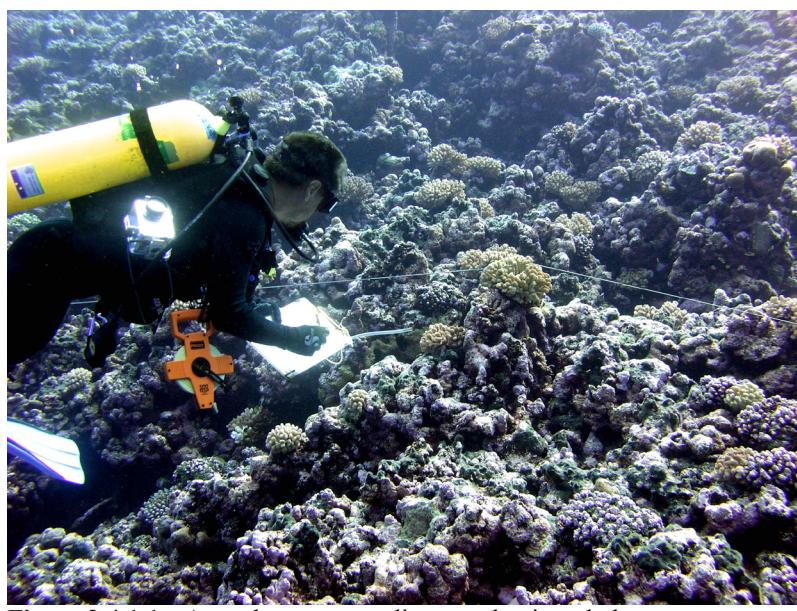

**Figure 2.4.1.1a.** A coral assessment diver conducting a belt-transect survey. (*Photograph provided by NOAA PIFSC CRED; J. Kenyon, JIMAR*)

type of affliction, area affected, percent live/dead, and severity of the affliction (mild = 1– 10%, moderate = 11–25%, marked = 26–50%, severe = 51–75%, acute = 76–100%). Coral afflictions were classified into one of six general categories (following Willis et al., 2004) including: bleaching, tissue loss, black band disease, skeletal growth anomaly, predation, and other lesions. This latter category included algal overgrowth, as well as unidentified syndromes causing deterioration of scleractinian corals. Afflictions to coralline algae were also enumerated based on the high incidence of lesions found in American Samoa. Coralline algae afflictions were classified into three general categories: coralline lethal orange disease (CLOD), coralline fungal disease, and unidentified coralline discoloration. Photographic records and tissue samples of select diseased colonies were also collected for future laboratory analysis. Descriptions of coral and coralline algae disease states are listed below.

#### *Bleaching*

Coral bleaching was characterized by a reduction in intensity or the complete absence of coloration within living coral as a result of loss of pigmentation and/or expulsion of the endosymbiotic zooxanthellae. The tissue of bleached corals can be transparent, making the coral appear white because of the skeleton of the coral (Fig. 2.4.1.1b[a]). However, coral tissue of corals can also appear pale, pinkish or bluish when bleaching occurs. Patterns of bleaching can vary, with only the upper surface or lower surface of the colony being affected and can also appear patchy or mottled or as a circular blotch, ring or wedge.

#### *Tissue Loss*

Losses of coral tissue were characterized by coral lesions of sharp, clean bands appearing where tissue was completely removed from the skeleton. The clean band of exposed skeleton is sometimes coupled with a region of filamentous and turf algae (Fig. 2.4.1.1b[b]). Tissue loss is sometimes also referred to as white syndrome and is distinguished from feeding scars by the narrow width of the zone of recently exposed white skeleton and the relatively regular appearance of the tissue front. These features contrast with the wide zone of white skeleton commonly exposed following COTS (*Acanthaster planci*) predation or the scalloped or irregular tissue front produced by the thaidinae gastropod *Drupella* (Willis et al., 2004).

# *Black Band Disease*

Black band disease was characterized by a black mat, about 0.5 to 4 cm wide, moving across the living coral tissue and leaving behind bare white skeleton, while unaffected coral tissue remains normal in color and morphology (Fig. 2.4.1.1b[c]). The major component of the black mat is *Phormidium corallyticum*, a photosynthesizing cyanobacterium. Other microorganisms, including marine fungi, heterotrophic bacteria, sulfur-oxidizing bacteria (*Beggiatoa*), and sulfate-reducing bacteria (*Desulfovibrio*), are present in the black mat and also contribute to the loss of coral tissue (Ducklow and Mitchell, 1997; Richardson, 1996).

#### *Skeletal Growth Anomaly*

Skeletal growth anomalies were characterized by changes in the shape or form of coral skeletons resulting in unusual lumps and protuberances associated with an abnormal deposition of calcium carbonate (Fig. 2.4.1.1b[d]). Skeletal growth anomalies are caused by changes in the coral cells that deposit the carbonate skeleton. The two most common types of skeletal growth anomalies are hyperplasia, a process that leads to an increase in the number of cells in a tissue or organ, thereby increasing the bulk of the tissue or the organ, and neoplasia, a pathologic process that results in the formation and growth of an undifferentiated mass of cells.

# *Other Lesions and Pigmentation Response*

Some reef corals, such as *Porites*, *Montipora*, and *Astreopora*, appear to respond to a variety of allopathic and parasitic interactions by producing a hyperpigmentation of polyps in contact with or adjacent to areas of interaction. These interactions sometimes result in impairment or inhibition of normal coral function (e.g., growth, calcification, and reproduction) and may take on the character of a disease (Willis et al., 2004). Pigmentation responses are often launched by the coral along adherent edges involved in interactions with algae, but also with cyanobacteria, polychaetes, molluscs, trematodes, etc. The range of pigmentation responses vary for each coral genera ranging from pink to light blue in *Astreopora*, from pink to purple but also blue to brown in *Montipora* (Fig. 2.4.1.1b[e]), and from pink to purple but also accompanied by swelling or enlargement of the affected polyps in *Porites*. These pigmentation responses, together with other unidentified cases of disease, were grouped under "*other lesions*" during coral disease surveys.

#### *Predation*

Coral predators often leave scars devoid of tissue which may lead to decreased health status and increased susceptibility to algal overgrowth, invasion by other pathogens or lower reproductive output. The pattern of tissue loss from predation often differs from tissue loss patterns stemming from other causes. Predation scars were characterized by wide zones of exposed coral skeleton commonly seen following predation by the COTS, *Acanthaster planci* (Fig. 2.4.1.1b[f]) or by scalloped or irregular tissue fronts that are often produced by the thaidinae gastropod, *Drupella* (Willis et al., 2004).

#### *CLOD*

CLOD was characterized by a band of bright orange slimy material spreading across the algal surface, leaving behind the bare skeletal carbonate remains of the coralline algae (Fig. 2.4.1.1c[a]). When this material reaches the margin of the algal thallus, it forms upright

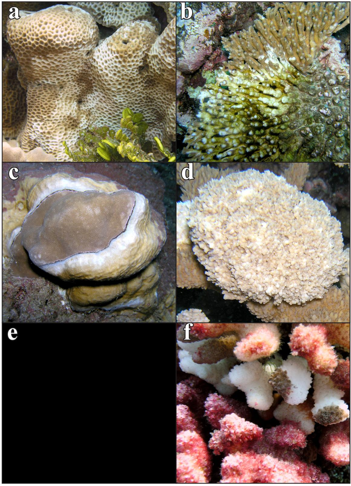

**Figure 2.4.1.1b.** Coral Diseases. Underwater photographs illustrating the field appearance of lesions affecting scleractinian corals in the American Samoa Archipelago during ASRAMP 2006. **(a)** bleaching on *Gardineroseris planulata*; **(b)** tissue loss on *Acropora cytherea*; **(c)** black band disease on *Porites*; **(d)** skeletal growth anomalies on *Acropora abrontanoides*; **(e)** pigmentation response on *Montipora* sp. (Note blue pigmentation surrounding areas of allopathic interaction); **(f)** predation lesions on *Pocillopora*, probably caused by the corallivorous snail *Drupella*; also, note algal overgrowth on old dead colony surfaces. (*Photographs by NOAA PIFSC CRED; B. Vargas-Angel, JIMAR*)

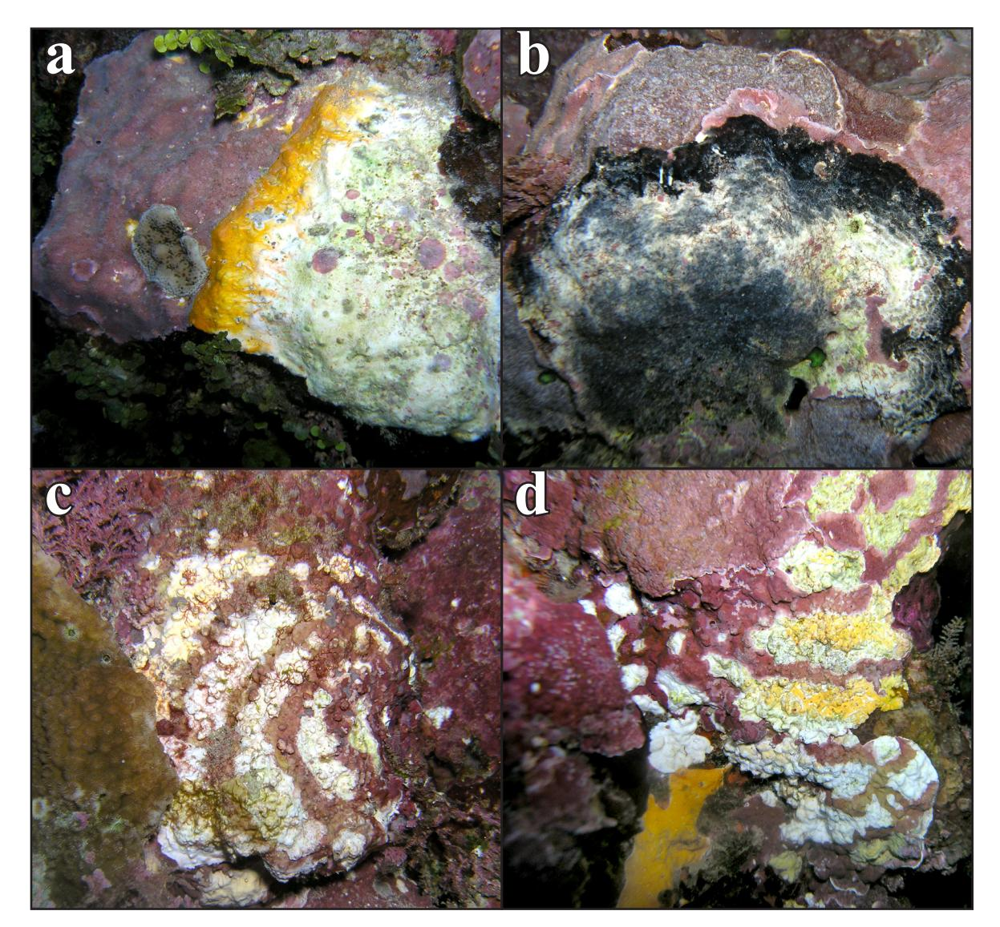

**Figure 2.4.1.1c.** Underwater photographs illustrating the field appearance of diseases affecting crustose coralline algae in the American Samoa Archipelago, 2006. **(a)** CLOD; **(b)** coralline fungal disease; **(c)** and **(d)** unidentified coralline discoloration. (*Photographs provided by NOAA PIFSC CRED; B. Vargas-Angel, JIMAR*)

filaments and globules, similar to those formed by terrestrial slime molds. The globules can be caught by waves and easily spread to nearby corallines. Microscopic examination of the orange material revealed motile gliding rods of a colonial bacterium in a mucilaginous matrix. The orange globules can be experimentally transferred to other coralline algae and cause the same disease and loss of algal tissue. Additional studies of this bacterium associated with CLOD are underway (Littler and Littler, 1998).

#### *Coralline Fungal Disease*

This disease is characterized by a 1 to 5 cm black mat, moving across the surface of the coralline algae and leaving behind bare white carbonate skeleton (Fig. 2.4.1.1c[b]). Coralline fungal disease was discovered in 1996 by Diane and Mark Littler who observed abundant populations of this undescribed fungal disease in both calm and exposed coral reef environments in American Samoa (Littler and Littler, 2003).

# *Unidentified Coralline Discoloration*

Discolored (light yellow, green or white) bands, measuring 0.5 to 3 cm in width, which spread across the algal surface leaving behind the bare skeletal carbonate remains of the coralline algae were characterized as unidentified coralline discoloration (Figs. 2.4.1.1c [c] and 2.4.1.1c[d]). In some cases discolorations appeared as concentric, annular or horseshoe shaped bands radiating from a focal point (Littler and Littler, 2003). In other cases, discoloration appeared as wide, irregular, white bands along adherent edges.

Results of coral and coralline algae surveys were used to calculate prevalence values for coral disease and density values for coralline algae disease. Coral disease prevalence was computed as the percentage of diseased colonies (counts) out of the total estimated number of colonies within the survey area. The estimated number of colonies within the survey area was calculated by multiplying the coral density (# colonies m-2) value obtained from the coral belt transect by the total area covered in the disease survey at each site (Prevalence = [No. cases within the area surveyed for disease × 100] ÷ [colony density × area surveyed for presence of disease]). The relative abundance of coralline algal diseases per site was calculated by adding the total number of cases over the two transects and dividing by the total area surveyed for each site. Coral disease results are presented within the coral section of each island while coralline algae disease results are discussed within the algae section.

#### **2.4.1.2 Algae**

Algal populations were surveyed to assess the relative abundance and species diversity of algae in the American Samoa Archipelago. Algal survey methods in 2002 differed from methods employed in 2004 and 2006. Underwater survey methods included quadrat surveys, photoquadrat surveys, and voucher specimen surveys. Details on each method are discussed below including a description of the development of algal methods during 2002 REA surveys (*Algal Methods Development*). Temporal sampling variation is detailed in Table 2.4.1a.

#### *Algal Methods Development*

REA algae surveys in 2002 were the first surveys conducted in American Samoa by CRED. As such, the methods employed were mostly qualitative and exploratory in nature. Methods included collecting samples of algae and qualitative observations of the algal populations at each REA site.

#### *Quadrat Surveys*

Quadrat surveys were employed to document the relative abundance of macroalgal genera in the field. At each REA site, 12 sample 0.18-m2 quadrats were surveyed along two 25-m transects. Six quadrats were located at randomly selected points along each transect (three per transect), and six other quadrats were located at points 3 m perpendicular from each random point in the direction of shallower water (Preskitt et al., 2004; Vroom et al., 2005a). Macroalgae were identified to genus level in the field, whereas crustose-coralline red algae, branched coralline red algae, turf algae and cyanophytes were lumped into functional group categories. In addition, each genus or functional group found in each quadrat was assigned a rank based on its relative abundance in the quadrat (1 being the most abundant, 2 being the next most abundant, etc.). All ranked data for a given survey year were collected by the same individual, minimizing the effects of observer bias.

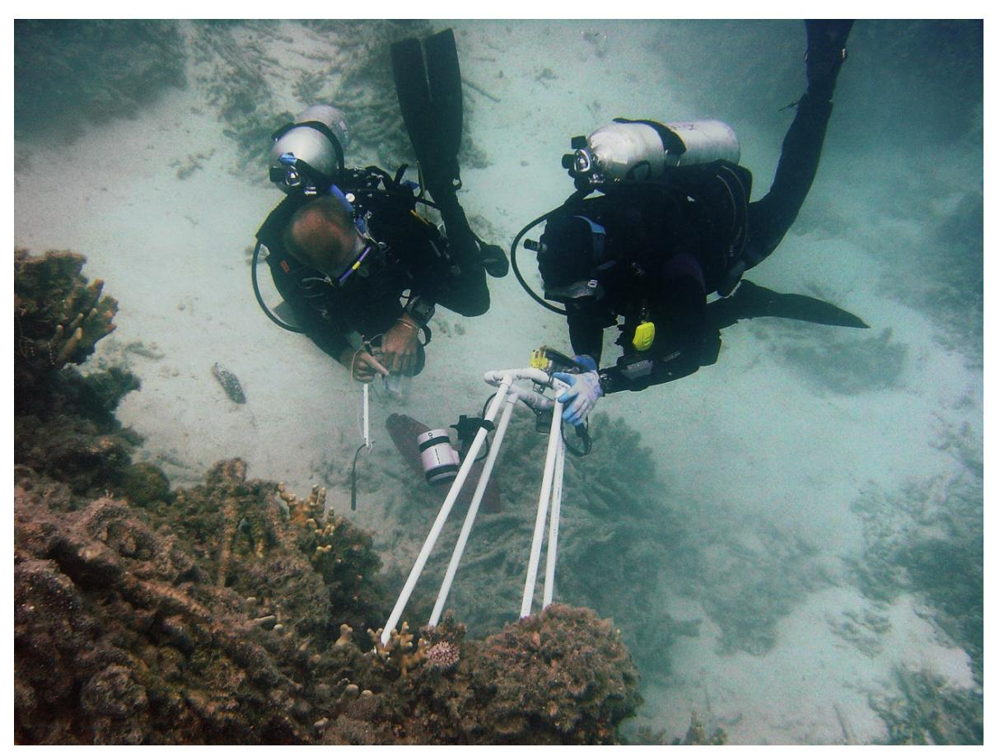

**Figure 2.4.1.2a.** The algal assessment team conducting photoquadrat surveys. (*Photograph provided by NOAA PIFSC CRED; J. Kenyon, JIMAR*)

#### *Photoquadrat Surveys*

During quadrat surveys, photographic documentation of each 0.18-m2 quadrat assessed was recorded to provide a quantitative dataset for further in-depth, algae species-level percent cover analyses. Twelve photos were taken at each site using either a Sony DSC P-9 or an Olympus C-4040 digital still camera and an Ikelite substrobe DS-50 (Fig. 2.4.1.2a). Photographs are being analyzed using Coral Point Count with Excel extensions (Kohler and Gill, 2006) to determine percent cover of benthic organisms at the species level (when possible).

#### *Voucher Specimen Surveys*

Algal voucher specimens were collected from a 2-m swath on either side of the same two 25 m transects surveyed during the quadrat surveys. Samples were brought back to the laboratory for qualitative species identification at the microscopic level to assemble comprehensive species lists for each site. Voucher specimen surveys were conducted at all sites, even when environmental conditions (e.g., strong currents or surge) did not allow for the quantitative photoquadrat protocol to be completed.

Algae diver observation results from quadrat surveys were used to calculate percent occurrence of algae genera/functional groups for each REA site. Percent occurrence values were calculated by summing the number of quadrats in which each algal genus/functional group was observed and dividing by the total number of quadrats surveyed at the site (12). Percent occurrence results were then used to create distributional maps of algal abundance for each island/atoll. In addition, algal composition results by island/atoll were calculated by summing the percent occurrence values for each algal genus/functional group and then dividing the respective occurrence values by the sum.

#### **2.4.1.3 Other Macroinvertebrates**

Macroinvertebrate surveys were focused on quantifying the noncoral invertebrates that are common to the reef habitats of American Samoa. Several different survey techniques were used in each of the survey years to quantify the diverse communities. These methods included belt-transect, roving-diver, and quadrat surveys. The development of REA macroinvertebrate survey methods and the details of each are described below (*Macroinvertebrate Methods Development*). Temporal sampling variation is detailed in Table 2.4.1b.

It should be noted that in situ methods record invertebrate species that are generally noncryptic (i.e., visible) and easily enumerated during the course of a single scuba dive. Therefore, the marine invertebrate species recorded and identified during the course of these observations only represent the noncryptic fauna of the reef habitat and should not be considered the only species present at each site. It should also be noted that many invertebrate species are nocturnal and therefore unlikely to be observed during the daylight surveys conducted during Pacific RAMP.

#### *Macroinvertebrate Methods Development*

REA macroinvertebrate surveys in 2002 were the first surveys conducted in American Samoa by CRED. As such, the methods employed were mostly qualitative and exploratory in nature, aimed at collecting baseline data that would be used to refine methodologies for subsequent surveys. Two separate 50-m transect lines were surveyed using a zigzag search pattern that extended roughly 2 m on either side of each transect line. In addition, a roving-swim survey was conducted to survey a larger area and account for macroinvertebrate species not found in the transect area. During both surveys, species of macroinvertebrates were recorded and assigned a qualitative abundance ranking using the DACOR method (Maragos et al., 2004).

# *Belt-transect Surveys*

Quantitative invertebrate counts were recorded along two 25-m belt transects in 2004 and 2006. Highly detailed invertebrate observations (the target species list is presented in Appendix III) were recorded within 2 m on either side of each transect (total area = 100 m2 ) in 2004. During ASRAMP 2006, the target list of macroinvertebrates (Appendix IV) became more general, although the quantitative count methodology remained the same.

#### *Roving-swim Surveys*

In 2004 and 2006, a 500-m (10 × 50 m) roving-swim survey was conducted with the goal of quantifying larger invertebrates such as COTS and Tritons Trumpet molluscs which may not be seen during belt-transect surveys. The roving swim was accomplished by swimming a zigzag pattern extending 5 m to either side of both 25-m transect lines.

#### *Quadrat Surveys*

In 2006 quadrat surveys were used to quantify the smaller, more cryptic macroinvertebrates which were sometimes overlooked or too numerous to count during belt-transect surveys. Ten 0.25-m2 quadrats were laid out at 2-m intervals along two of the 25-m transects (total

area = 5 m2 ). For each quadrat the percent cover of sponges, octocorals (e.g., *Sarcophyton*, *Lobophytum*, *Sinularia* or *Cladiella*) and zoanthids was recorded, as well as all of the *Echinostrephus* spp. and *Echinometra* spp. urchins, hermit crabs of the genus *Calcinus*, trapezid crabs, and coralliophilid snails.

Macroinvertebrate results were used to calculate presence/absence data for each REA site. Presence data are only presented for ASRAMP 2004 and 2006 surveys and results from all survey methods employed during a respective year were used to calculate presence data. In addition, results from the 2004 macroinvertebrate surveys were used to calculate species richness values. Species richness values are not presented for 2006 as a result of the abbreviated target species list.

#### **2.4.1.4 Reef Fish**

Three complementary methods were used to catalog the diversity (species richness) and abundance (numeric density [# fish 100 m-2] and biomass density [kg 100 m-2]) of diurnally active reef fish assemblages including belt-transect, stationary point count, and roving-diver surveys. The methods remained the same for all survey years with the exception of stationary point counts which were first used in 2004. For all methods, fish were identified at the species level, when possible, and assigned to a size bin ranging from 1 to 200 cm based on a visual estimate of total fish length. The temporal variation of reef fish sampling is detailed in Table 2.4.2b.

#### *Belt-transect Surveys*

The entire diurnal fish community (all size classes) was quantified using belt-transect surveys. At each site, three 25-m lines were surveyed. Two fish biologists swam side-by-side along a transect, each recording all fish larger than 20 cm observed within a 4-m wide belt perpendicular to their respective side of the transect (200 m2 area per line, 100 m2 per diver). Then the fish biologists made a second pass along each transect recording all fish less than 20 cm observed within a 2-m wide belt (100 m2 area per line, 50 m2 per diver). The survey of large fish took approximately 5 min to complete while the survey of smaller fish took about 10 min to complete. All reef-associated fish, including those in the water column (including planktivores), were counted. Any coastal pelagic species (e.g., clupeids [sardines], belonids [beakfish], antherinids [silversides]) seen near the surface were not recorded.

#### *Stationary Point Count Surveys*

Quantification of larger, more mobile reef fish species that can be missed on belt-transect surveys was performed using the stationary point count method (Bohnsack and Bannerot, 1986). For each stationary point count survey, the fish biologist swam approximately 15 m away from a transect line concurrently being surveyed by the other fish biologists. The stationary point count biologist then recorded all fish greater than 25 cm in length that passed within a visually estimated 20-m diameter cylinder centered on the diver's fixed position (10-m radius, total area = 314 m2 ). The survey time for each stationary point count survey was 5 min and a total of four stationary point count surveys were conducted at each REA site. The method for counting fish was the same as the method used in belt-transect surveys as described above.

# *Roving-diver Surveys*

Following belt-transect and stationary point count surveys, and as diver bottom time permitted, the fish assessment team conducted random swim surveys throughout the REA site area, recording, to the species level or the lowest recognizable taxon, the presence of reef fish not encountered during previous methods.

Results from REA reef fish surveys were used to calculate biomass estimates. Fish counts from belt-transect surveys were converted to biomass estimates (kg 100 m-2) using published length-weight relationships for individual species (Kulbicki et al., 2005). Total fish biomass at each REA site was calculated by combining fish biomass from the 100-m2 belt transects (small fish) with the biomass from the 200-m2 belt transects (larger fish). Biomass estimates were summed by fish families and used to create biomass totals by site and year as well as fish family composition graphs, which represent the biomass percent breakdown by fish family. In addition to total fish biomass estimates, data collected from belt-transect surveys were used to calculate species richness (# species 100 m-2) values at each site. Stationary point count and roving-diver survey results are not presented in this report.

# **2.4.2 Towed-diver Surveys**

Towed-diver surveys were used to characterize benthic habitats and to quantify the abundance and spatial distributions of ecologically and economically important fish, coral, and macroinvertebrate taxa over a much broader area than is possible using REA techniques. While typical REA surveys provided species level documentation of marine organisms over spatial areas of approximately 300 m2 , towed-diver surveys documented patterns of habitat condition and distributions of larger marine organisms over areas ranging from 15 000 to 25 000 m2 . In addition, towed-diver surveys were able to access exposed coasts (e.g., windward-facing shores and high swell conditions) not surveyed by stationary REA surveys, which are fundamentally limited to survey areas with more favorable environmental conditions (e.g., lower currents or lower surge/wave action).

The broad-scale nature of towed-diver surveys has helped to increase the breadth of the ecological benthic data collected by CRED and to improve the program's ability to investigate and quantify large-scale environmental stresses, such as bleaching events (Kenyon et al., 2006c) and COTS outbreaks. Towed-diver surveys were likewise tasked with recording unusual or important sightings which included significant biological or habitat gradients, derelict fishing gear or other types of marine debris, shipwrecks, and unexploded ordinance located on the seafloor.

This method also allowed for "snapshot assessments" of larger fish (e.g., sharks, jacks, and barracudas), and schools of various species whose range and abundance may be underestimated during area-limited REA surveys. Finally, other "species of concern" (e.g., sea turtles, cetaceans, and pinnipeds) not normally observed or examined by REA scientists were also recorded during towed-diver surveys.

#### *Sampling Design*

Towed-diver surveys were typically completed along the outer reef slopes and forereefs of individual islands/atolls, with additional surveys completed along backreefs, lagoons, and/or offshore banks. Towed-diver survey tracks were intended to cover as many habitat types (e.g., slope, forereef, backreef, lagoon, and bank) and as much of a complete revolution around each island or atoll as time allowed while surveying along a relatively constant isobath (typically targeted at 15 to 20 m).

Towed-diver surveys typically completed circumnavigations around each of the islands and atolls of American Samoa, with most individual surveys covering linear distances between 1.5 and 2.5 km along relatively fixed isobaths (10–20 m). For the smaller islands and atolls, such as Swains and Rose, multiple circumnavigations were conducted targeting different isobath depths (e.g., 5, 15, and 25 m).

# *Operational Description*

Towed-diver surveys were conducted by teams of four scientists who alternated between data gathering and boat handling responsibilities. Surveys consisted of towing two divers approximately 60 m behind a small boat with one diver tasked with benthic composition and macroinvertebrate data collection while the other collected data on fish species larger than 50 cm total length (Fig. 2.4.2a). Each diver made observations over a 10-m swath (5 m to each side of their respective tow lines, which act as transect lines). The diver/observers attempted to maintain their position approximately 1 m above the seafloor, while being towed at an average speed of 0.5 to 1.3 m s-1 (1–2.5 kn). Each survey took approximately 50 min with four to six surveys completed each field day.

To geo-reference all data collected during a tow, a GPS receiver located on the towboat was programmed to record longitude and latitude coordinates every 5 sec. When the divers were ready to begin recording data, an acoustic signal from the fish towed diver was sent to the towboat coxswain via telegraph. The coxswain would mark a waypoint indicating the start point of the towed-diver survey. The coxswain followed along a predetermined depth contour using a bathymetric chart, a singlebeam echosounder, and shoreline features (when present) as a guide while maintaining speed. Additional "o.k." signals were sent to the towboat every 5 min to inform the coxswain of the diver's status, while "mark" signals were sent to record any sites of interest (natural or anthropogenic). At the end of the survey, prior to beginning an ascent to the safety stop, another coded signal was sent to the towboat to record the endposition of the survey.

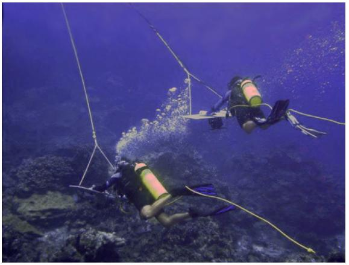

**Figure 2.4.2a.** Towed divers conducting a survey in American Samoa. (*Photograph provided by NOAA PIFSC CRED*)

In the years following the initial toweddiver surveys in 2002, specific routes were pre-programmed into the GPS prior to initiating field activities. This was done to: (1) transition from assessment to monitoring, and obtain as much track and area overlap with previous years as possible, and (2) coincide with logistical challenges associated with operating remote field operations involving several disciplines (REA, mapping, oceanography).

A byproduct of repeating previous towed-

diver survey tracks is that in certain areas it results in an inherent sampling bias assigned to nonrandomized route selection and the subsequent survey analyses including biological estimates generated. Some locations (e.g., Tutuila) have considerable portions of coastline that cannot be surveyed repeatedly due to operational, logistical, budgetary, and/or environmental constraints. The consequence is that certain abiotic and biotic metrics (e.g., concatenated habitat complexity from GIS IDW analyses) have to be inferred based on the results from surrounding survey areas. In addition, biological estimates of other metrics (e.g., macroinvertebrate populations) remain unknown for areas not surveyed. This is in contrast to smaller islands/atolls (e.g., Swains), where the entire island can be easily circumnavigated.

Following each day of field operations, GPS waypoints (survey start and stop points), trackline files, and SBE 39 depth and temperature data (recorded every 5 sec) were downloaded for each towed-diver survey of the day. All geo-referenced tracklines had associated, inherent positioning errors created by the difference between the location of the GPS unit aboard the towboat and the underwater position of the towed divers. To reduce this source of error, a custom-designed ArcView script was written based on a "layback" model created during the development of towed-diver survey methods (Kenyon et al., 2006a). The layback model was applied to all downloaded tow tracks within ArcView, which used SBE 39 depth and temperature data merged with GPS track information to calculate more accurate diver positions. Data were then uploaded into ArcGIS for further analysis with towed-diver data.

#### *Data Collection*

Data from towed-diver surveys were collected through direct diver observations and electronic instrumentation attached to the towboards. Observations were recorded by both the benthic and fish diver/observer every 5 min (~ 200 m survey length), summarizing the benthic habitat and biological organisms encountered throughout the segment. A total of 10 observations were made over a typical 50 min survey, although the actual time and length of surveys varied depending on environmental conditions, diver air supply, bottom time, etc.

Temperature and depth data for each towed diver were recorded every 5 sec using an attached SBE 39 temperature and pressure recorder, while image data were collected using a forwardfacing video and a downward-facing video or digital still camera. Details on diver observations and accessory instrument data collection techniques are discussed below.

#### *Diver Observations*

#### *Benthic*

Benthic towed-diver methods changed among the field surveys completed in 2002, 2004, and 2006 with the hope of fine-tuning data resolution and reducing the underwater task loading of the diver/observer. Methodological changes were generally limited to two aspects of the protocols: classification of benthic substrate categories and estimation of benthic substrate percent cover. Details on the interannual variations of towed-diver survey methods are outlined in Table 2.4.2a.

At 5-min intervals, the benthic diver/observer recorded a suite of information including: the predominant reef zone (forereef, backreef, lagoon, bank, bank escarpment, and channel), estimates of average habitat complexity, estimates of average percent cover for benthic substrate types (live and stressed hard coral, fleshy/macroalgae, coralline algae, sand, and rubble), and counts of macroinvertebrates (COTS, sea urchin, sea cucumber, and giant clam) encountered within a 10-m tow swath (5 m on either side of the tow line).

**Table 2.4.2a.** Benthic cover composition categories (Kenyon et al., 2006a).

| Benthic Category   | Description                                                                                                                                                                                                                                                                                                                                                                                                                                                                                                                                       | Year                 |
|-----------------------|---------------------------------------------------------------------------------------------------------------------------------------------------------------------------------------------------------------------------------------------------------------------------------------------------------------------------------------------------------------------------------------------------------------------------------------------------------------------------------------------------------------------------------------------------|----------------------|
| Live Hard Coral    | All live hard coral species observed in the tow path. This included both stressed (see below), and unstressed corals. It did not include soft corals or dead coral. Live hard corals were characterized by colonies or portions of colonies covered with living tissue. Living tissue usually appeared colored (e.g., olive green, brown or bluish lavender) because of the presence of pigments in coral tissue and/or their symbiotic zooxanthellae; however, stressed coral tissue can also appear pale or completely white. | 2002 2004 2006 |
| Stressed Coral     | Live hard coral that appeared to be stressed or bleached as a result of loss of zooxanthellae and/or their pigments. Signs of stress included pale to white coloration caused by bleaching, COTS predation, disease or recent coral death. Recently dead corals were characterized by a heavily bleached white coloration representing exposed coral skeleton. In some cases it might be hard to differentiate between recently dead and severely bleached corals; for this reason, they were both classified as stressed.      | 2004 2006         |
| Dead Coral            | Bare white colonies (or portions of) that had lost living tissue and had not been visibly encrusted by macroalgae or epiphytes were classified as dead coral. Lack of encrustation suggested tissue death was recent relative to encrusted portions of dead colonies. Dead coral with macroalgae growth, epiphytes or other forms of substrate cover were considered part of the fleshy/macroalgae or other category.                                                                                                              | 2002                 |
| Soft Coral            | All soft corals observed in the tow swath.                                                                                                                                                                                                                                                                                                                                                                                                                                                                                                        | 2006                 |
| Fleshy Algae       | Fleshy or frondose algaes (e.g., Sargassum or Padina), heavily calcified (e.g., Halimeda) species and turf algaes.                                                                                                                                                                                                                                                                                                                                                                                                                             | 2002 2004         |
| Macro algae        | Macroalgae were characterized by the fleshy or frondose algae (e.g., Sargassum or Padina) and heavily calcified (e.g., Halimeda) species. This did not include turf algae.                                                                                                                                                                                                                                                                                                                                                                  | 2006                 |
| Coralline Algae    | Encrusting calcareous algal species observed within the tow swath. These encrusting algae deposit calcium carbonate as part of their structure, often giving a pinkish or lavender appearance to the encrusted substrate. In some areas these algae can also form three-dimensional spires.                                                                                                                                                                                                                                              | 2002 2004 2006 |
| Sand                  | Sand was characterized by unconsolidated sediment, ranging in texture and size from fine to coarse and including both inorganic (eroded rock) and organic (eroded fragments of calcareous organisms) sediments.                                                                                                                                                                                                                                                                                                                             | 2002 2004 2006 |
| Rubble                | Unconsolidated fragments of coral skeleton or reef rock whose sizes are larger than sand. May be visibly encrusted by macroalgae, calcareous algae or corals.                                                                                                                                                                                                                                                                                                                                                                                  | 2002 2004         |
| Rubble                | Unconsolidated fragments of coral skeleton or reef rock whose sizes are larger than sand. Only rubble that was not visibly encrusted by macroalgae, calcareous algae or corals was included.                                                                                                                                                                                                                                                                                                                                                | 2006                 |
| Carbonate Pavement | Consolidated substrate, typically composed of calcareous and/or basaltic elements, which have become cemented together by biogenic and physical processes.                                                                                                                                                                                                                                                                                                                                                                                  | 2002 2004         |

Estimates of habitat complexity were subjective assessments of topographical diversity and complexity of the benthic habitat and were classified according to one of six categories: low, medium-low, medium, medium-high, high, and very high (Fig. 2.4.2b). As examples, low habitat complexity is often associated with flat sand plains or rubble habitats; medium habitat complexity is often associated with small to moderate spur and groove, coral or boulder habitats; and high or very high habitat complexity are often observed as high or extreme vertical relief associated with steep spur-and-groove canyons, pinnacles, and walls.

Estimates of average benthic substrate cover were recorded as direct percents during ASRAMP 2002 and 2004 and then as percentage bins ranging from 1 to 10 during ASRAMP 2006. Descriptions of benthic substrate categories and the percentage bins used in 2006 are described in Tables 2.2.3c and 2.2.3d, respectively. Noncoral macroinvertebrates,

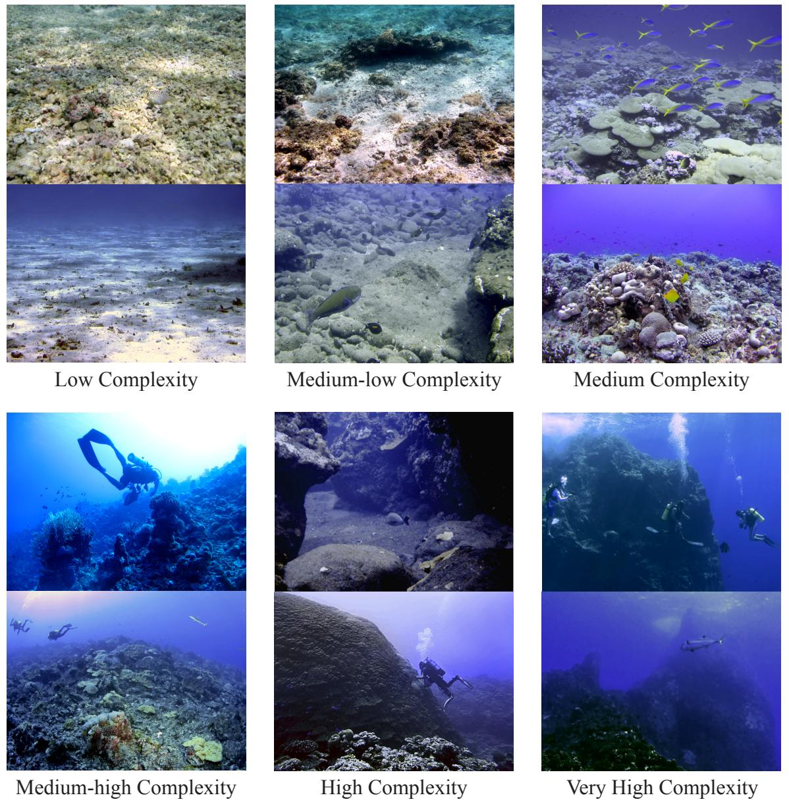

**Figure 2.4.2b.** Examples of low, medium-low, medium, medium-high, high, and very high complexity habitats. Note that towed divers calculate average complexity during each 5-min sampling period as they regularly encounter multiple habitat types. (*Photographs provided by NOAA PIFSC CRED*)

except COTS, were counted singly up to 25 and then binned as follows: 26–50, 51–100, 101–250, 251–500, 501–1000, and > 1000 organisms. COTS were counted singly up to 100 organisms.

Results from benthic towed-diver observations were used to create: (1) habitat characterization maps for habitat complexity, sand, rubble, hard substrate/carbonate pavement, and live coral (discussed in Section 2.2.3: Optical Validation Surveys); (2) percent cover for live coral, stressed/dead coral, fleshy/macroalgae, and coralline algae, and (3) macroinvertebrate densities and distribution maps.

Diver observations for each 5-min tow segment were graphically projected onto ArcGIS maps using the midpoint for each tow segment (tow segment length = ~ 200 m, midpoint = ~ 100 m). For benthic cover estimates, midpoint values in 2002 and 2004 were projected as the direct percents recorded by towed divers, while in 2006 the midpoint values were projected as the midpoint of the binned observations (midpoints of percent cover bins are listed in Table 2.4.2b). Macroinvertebrate values were projected as the total number of organisms observed per tow segment or as the midpoint of their binned range. Densities were calculated as the total number of macroinvertebrates observed during a tow divided by the area covered during the tow (10-m tow swath multiplied by tow length and presented in hectares).

| Table 2.4.2b. Benthic cover binning categories used during ASRAMP 2006 towed-diver surveys. |  |
|---------------------------------------------------------------------------------------------|--|
|---------------------------------------------------------------------------------------------|--|

| Bin | Benthic Cover (%) | Midpoint |
|-----|-------------------|----------|
| 1   | 0.1–1             | 0.5      |
| 2   | 1.1–5             | 2.5      |
| 3   | 5.1–10            | 7.5      |
| 4   | 10.1–20           | 15.0     |
| 5   | 20.1–30           | 25.0     |
| 6   | 30.1–40           | 35.0     |
| 7   | 40.1–50           | 45.0     |
| 8   | 50.1–62.5         | 56.25    |
| 9   | 62.6–75           | 68.75    |
| 10  | 75.1–100          | 87.5     |

#### *Fish*

During each 5-min tow segment, the fish towed diver conducted a 360-degree scan during the first minute of the survey, recording all fish ≥ 50 cm total length within the range of visibility. During the remaining 4 min of each 5-min segment, all large fish ≥ 50 cm in total length that appeared within a 10-m survey swath (5 m to either side of the towline and 10 m in front were recorded). Species of particular concern observed outside the survey swath were classified as presence/absence data and recorded separately from the quantitative towed-diver survey data.

Results from towed-diver fish observations were used to calculate large-fish biomass figures for each tow and ultimately for each island. The length of each individual was determined visually with each individual being assigned to predetermined size classes. Large-fish biomass was calculated for each towed-diver survey by applying the midpoint length for each size class to published length-weight relationships (w = a × Lb ) for individual species (Kulbicki

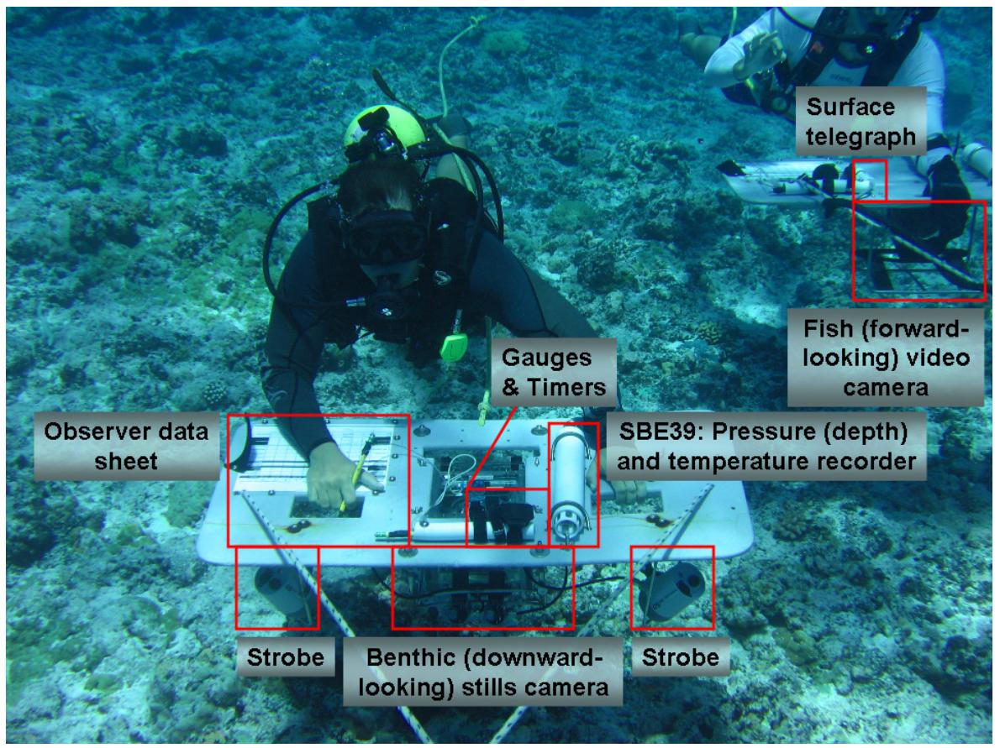

**Figure 2.4.2c.** SBE 39 temperature and pressure units and other towed-diver instrumentation. (*Photograph provided by NOAA PIFSC CRED*)

et al., 2005). When species-specific length-weight formulas were not available, formulas for the next higher class (genera, body type, etc.) were used. Large-fish sightings were summed for each tow segment and used to calculate total biomass estimates per tow as well as the biomass by fish family.

# *Accessory Instrumentation*

# *Forward-facing Video Camera*

A forward-facing digital video camera was attached to the fish towboard and used to collect streaming video images on Mini DV. Video footage from the forward-facing camera was archived as a durable record of the fish towed-diver survey track and can be used to quantify habitat composition and complexity, as well as abundance and distribution of ecologically and economically important fish taxa. No results derived from fish video imagery are presented in this report.

# *Downward-facing Video Camera and High-resolution Still Camera*

A downward-facing digital video camera in a Gates underwater housing was mounted on the benthic towboard and used to record the benthos along each tow track during ASRAMP 2002. During ASRAMP 2004 and 2006, the benthos was documented using a downwardfacing, high-resolution, digital still camera (Canon EOS-10D) in a customized underwater housing with dual Ikelite strobes. The camera was programmed to automatically photograph the benthos every 15 sec. In all survey years, the diver/observer attempted to maintain the downward-looking video/high-resolution still camera 1 to 2 m above the bottom.

Results from towed-diver benthic videos/photographs are archived as durable records of the benthos at the various islands and atolls. Some of these data have been analyzed by researchers who subsampled frame grabs/photos for more detailed benthic composition analyses (Kenyon et al., 2006a). These results are not presented in this report.

# *Temperature and Pressure Recorders*

SBE 39 temperature and pressure recorders were mounted on both benthic and fish towboards to accurately determine the temperature and depth of each diver and camera during toweddiver benthic and fish surveys. Data from both SBE 39 recorders were downloaded at the end of the day and merged with GPS tracklines to obtain accurate diver positions using the layback model described above. An image of a towboard with a subsurface temperature and pressure recorder and additional instrumentation (e.g., dive bottom timers/backup depth gauge, survey timers, and telegraph) is shown in Figure 2.4.2c.

Only depth data from SBE 39 temperature and pressure recorders are presented in this report. Mean depths for each tow segment were calculated and used to create depth distribution maps for each survey year.

#### **References**

- Bohnsack JA, Bannerot SP (1986) A stationary visual census technique for quantitatively assessing community structure of coral reef. NOAA Tech. Report NMFS 41, NOAA, Silver Spring. 15 pp.
- Casey K (2006) 4 km Pathfinder Version 5.0 User Guide. Online at [http://www.nodc.noaa.](http://www.nodc.noaa.gov/sog/pathfinder4km/userguide.html) [gov/sog/pathfinder4km/userguide.htm](http://www.nodc.noaa.gov/sog/pathfinder4km/userguide.html)l.
- Ducklow HM, Mitchell R (1979) Observations on naturally and artificially diseased tropical corals: a scanning electron microscope study. Microb Ecol 5:215–223.
- Ferguson JS, Chayes A (1995) Use of a Generic Sensor Format to Store Multibeam Data. Mar Geod 18:299–315.
- Hill J, Wilkinson C (2004) Methods for Ecological Monitoring of Coral Reefs: A Resource for Managers (version 1). Australian Institute of Marine Science, Townsville, Australia. 117 pp.
- Kenyon JC, Brainard RE, Hoeke RK, Parrish FA, Wilkinson CB (2006a) Towed-diver Surveys, a Method for Mesoscale Spatial Assessments of Benthic Reef Habitat: A Case Study at Midway Atoll in the Hawaiian Archipelago. Coast Manage 34:339–349.
- Kenyon JC, Vroom PS, Page KN, Dunlap MJ, Wilkinson CB, Aeby GS (2006b) Community structure of hermatypic corals at French Frigate Shoals, Northwestern Hawaiian Islands: Capacity for resistance and resilience to selective stressors. Pac Sci 60(2):153–175.
- Kenyon JC, Aeby GS, Brainard RE, Chojnacki JD, Dunlap MJ, Wilkinson CB (2006c) Mass coral bleaching on high-latitude reefs in the Hawaiian Archipelago. Proceedings of the 10th International Coral Reef Symposium Okinawa 2:631–643.
- Kohler KE, Gill SM (2006) Coral Point Count with Excel extensions (CPCe): a Visual Basic program for the determination of coral and substrate coverage using random point count methodology. Comput Geosci 32:1259–1269.
- Kulbicki M, Guillemot N, Amand M (2005) A general approach to length-weight relationships for New Caledonian lagoon fishes. Cybium 29:235–252.
- Lammers MO, Brainard RE, Au WWL, Mooney TA, Wong K (In press) An Ecological Acoustic Recorder (EAR) for long-term monitoring of biological and anthropogenic sounds on coral reefs and other marine habitats. J Acoust Soc Am.
- Littler MM, Littler DS (1998) An undescribed fungal pathogen of reef-building crustose 1998) An undescribed fungal pathogen of reef-building crustose coralline algae discovered in American Samoa. Coral Reefs. 144 pp.
- Littler DS, Littler MM (2003) South Pacific reef plants: a diver's guide to the plant life of South Pacific coral reefs. Off-set Graphics Inc., Washington. 330 pp.

- Lumpkin R, Pazos M (2005) Measuring surface currents with Surface Velocity Program drifters: the instrument, its data, and some recent results. Online at: [http://www.aoml.](http://www.aoml.noaa.gov/phod/dac/LumpkinPazos.pdf) [noaa.gov/phod/dac/LumpkinPazos.pd](http://www.aoml.noaa.gov/phod/dac/LumpkinPazos.pdf)f. Accessed February 1, 2007.
- Maragos JE, Potts DC, Aeby GS, Gulko D, Kenyon JC, Siciliano D, VanRavenswaay D (2004) 2000–2002 Rapid Ecological Assessments of corals (Anthozoa) on shallow reefs of the Northwestern Hawaiian Islands. Part 1: species and distribution. Pac Sci 58(2):211–230.
- Mundy C (1996) A Quantitative Survey of the Corals of American Samoa. Biological Report Series, Dept of Marine and Wildlife Resources, American Samoa. 75 pp.
- Preskitt LB, Vroom PS, Smith CM (2004) A rapid ecological assessment (REA) quantitative survey method for benthic algae using photo quadrats with SCUBA. Pac Sci 58:201– 209.
- Richardson L (1996) Horizontal and vertical migration patterns of *Phormidium corallyticum* and *Beggiatoa* spp. associated with black-band disease. Microbial Ecol 32:323–335.
- SAIC (2007) Generic Sensor Format Specification (version 2.05). (Prepared for Naval Oceanographic Office by Science Applications International Corporation, 221 Third Street, Newport, RI 02840).
- Tolman HL (1999) User manual and system documentation of WAVEWATCH-III (version 1.18). NOAA NWS NCEP OMB Technical Note 166, 110 pp.
- Tolman HL (2002) User manual and system documentation of WAVEWATCH-III (version 2.22). NOAA NWS NCEP OMB Technical Note 222, 133 pp.
- Vroom PS, Page KN, Peyton KA, Kukea-Shultz JK (2005) Spatial heterogeneity of benthic community assemblages with an emphasis on reef algae at French Frigate Shoals, Northwestern Hawaiian Islands. Coral Reefs 24:574–581.
- Willis BL, Page C, Dinsdale E (2004) Coral Diseases on the Great Barrier Reef. *In*: Rosenberg E, Loya Y (eds), Coral Health and Disease, Springer-Verlag, Berlin. p. 69–104.
- Wright DJ (2002) Mapping the Seafloor in American Samoa. Geospatial Solutions 12(7):24– 25.

# **Chapter 3 Tutuila and Aunu`u Islands**

# **3.1 Geopolitical Context**

Tutuila and Aunu`u Islands are highly eroded, volcanic structures bounded by a broad bank extending 3 or more kilometers from the shore in most locations. Of the seven primary islands that make up American Samoa, Tutuila contains the greatest land area (145 km²) and the greatest coral reef habitat area (315 km²). The majority of Tutuila consists of steep mountainous terrain with Matafao Peak (653 m) as the highest point. Two prominent marine protected areas are located around Tutuila Island: Fagatele Bay National Marine Sanctuary and the National Park of American Samoa (Fig. 3.1a). Aunu`u, a small volcanic island located approximately 2 km southeast of Tutuila, has a land area of 1.5 km² that includes Aunu`u Crater and Faimulivai Marsh, the largest marsh wetland in American Samoa.

Tutuila and Aunu`u have a tropical climate with an average year-round temperature of 27°C and an average annual rainfall of ~ 5 m. Climatologically, the heaviest rainfall occurs during the warm Austral summer period from December to March, which also coincides with the peak period for tropical cyclones. The complex mountainous terrain and high rainfall at Tutuila suggest that the nearshore marine ecosystems are influenced by significant freshwater and nutrient inputs from local watersheds (Fig. 3.1a).

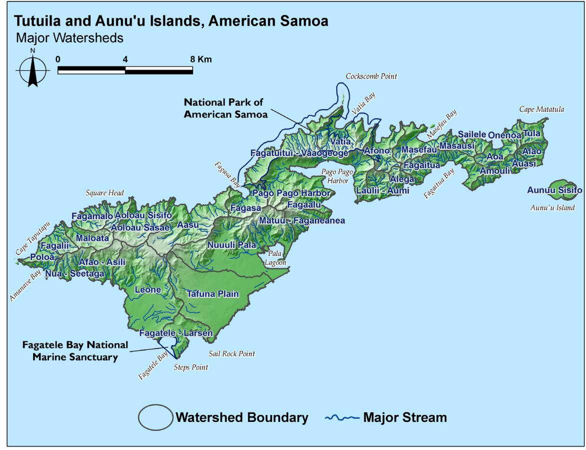

**Figure 3.1a.** Watershed boundaries, streams, and counties for Tutuila and Aunu`u. Also shown is the boundary of the National Park of American Samoa (American Samoa Department of Commerce, Coastal Management Program).

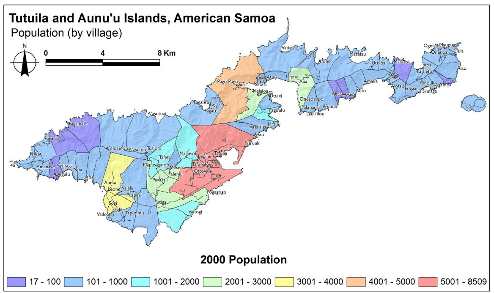

**Figure 3.1b.** Population density by village for Tutuila and Aunu`u in 2000 (U.S. Census Bureau, 2000).

Tutuila has the largest population of the American Samoan Islands, with 55 876 people counted during the 2000 census, including 476 residents of Aunu`u (Fig. 3.1b). Population density is highest on the Tafuna Plain and the villages surrounding Pago Pago Harbor. The government of American Samoa is the largest employer, followed closely by the tuna canneries located in Pago Pago. Tourism plays a relatively small role in the local economy (Office of Insular Affairs, 2007).

#### **3.2 Survey Effort**

A large amount of physical and biological data have been collected around Tutuila and Aunu`u since 2002 as part of the American Samoa Reef Assessment and Monitoring Program (ASRAMP). The extent and timeframe of these survey efforts are discussed below. To aid in the discussion of spatial patterns of ecological and oceanographic observations throughout this chapter, nine geographic regions, which are often exposed to different environmental conditions, are delineated in Figure 3.2a.

**Table 3.2a.** Total area of benthic habitat surveyed using acoustic multibeam sonar and Towed Optical Assessment Device (TOAD) surveys around Tutuila and Aunu`u during ASRAMP 2002, 2004 and 2006.

| Survey Type              | 2002            | 2004              | 2006    |
|--------------------------|-----------------|-------------------|---------|
| Acoustic Multibeam Sonar | 0               | 189 km2           | 400 km2 |
| TOAD                     | 2.6 km (6 tows) | 25.6 km (47 tows) | 0       |

Benthic habitat mapping data were collected around Tutuila and Aunu`u using a combination of acoustic and optical survey methods summarized in Table 3.2a. These are further examined in Section 3.3: Benthic Habitat Mapping and Characterization.

Figure 3.2a shows the locations of Rapid Ecological Assessment (REA) and towed-diver survey efforts during 2002, 2004, and 2006. The number of surveys, their mean depth in meters, and area in hectares are presented by year in Table 3.2b.

Depth ranges from towed-diver surveys are presented for each year in Figure 3.5.1a (2002), 3.5.1d (2004), and 3.5.1k (2006). Although the towed-diver survey methodologies are aimed at following specific isobaths, the actual depths surveyed are often quite variable. These figures illustrate the variability of depths observed during towed-diver surveys and can be referenced when further exploring the towed-diver datasets.

**Table 3.2b.** Number, area, and depth of REA and towed-diver surveys around Tutuila and Aunu`u during ASRAMP 2002, 2004, and 2006.

| Year | REA       |               | Towed-diver Survey |             |               |  |
|------|-----------|---------------|--------------------|-------------|---------------|--|
|      | Number of | Mean Depth    | Number of          | Survey Area | Mean Depth    |  |
|      | Surveys   | (m)           | Surveys            | (ha)        | (m)           |  |
| 2002 | 14*       | 13.5 (SD 1.5) | 16                 | 38.0        | 10.4 (SD 3.7) |  |
| 2004 | 22*       | 17.7 (SD 2.0) | 43                 | 82.0        | 11.9 (SD 5.0) |  |
| 2006 | 22**      | 14.3 (SD 1.4) | 44                 | 87.5        | 11.6 (SD 8.3) |  |

*\* No coral disease surveys were conducted in 2002 and 2004.*

*\*\* Coral surveys were only conducted at 16 of the 22 sites in 2006 because of a logistical problem with one of the REA divers.*

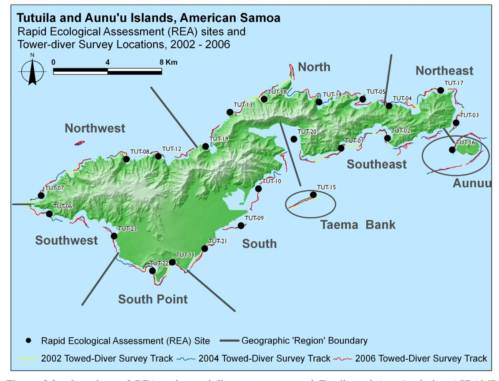

**Figure 3.2a.** Locations of REA and towed-diver surveys around Tutuila and Aunu`u during ASRAMP 2002, 2004, and 2006. Nine arbitrary geographic regions have been delineated to aid in discussion of spatial

Spatial and temporal observations of key oceanographic and water quality parameters influencing reef conditions around Tutuila and Aunu`u were collected using a diverse suite of long-term moored instrumentation packages and closely spaced conductivity, temperature and depth (CTD) surveys of the vertical structure of water properties during ASRAMP 2002, 2004, and 2006 (Chapter 2, Section 2.3: Oceanography and Water Quality). A summary of deployed instruments/collection activities is provided in Table 3.2c, and are further examined in Section: 3.4: Oceanography and Water Quality.

**Table 3.2c.** Numbers of oceanographic instrument deployments during 2002-2006 and shallow- and deep-water CTD casts around Tutuila and Aunu`u during ASRAMP 2002, 2004, and 2006. Instrument types include: sea surface temperature (SST) buoys, subsurface temperature recorders (STRs), wave and tide recorders (WTRs), recording current meters (RCMs), and ecological acoustic recorders (EARs). Shallow-water CTD casts were conducted from the surface to a 30-m depth. Deep-water CTD casts were conducted from the surface to a 500 m depth. Deep-water CTD cast information is presented in Chapter 8, Archipelagic Comparisons.

| Observation Type        | 2002 | 2004 | 2005 | 2006 |
|----------------------------|------|------|------|------|
| SST                        | 6    | 0    | 1    | 2    |
| STR                        | 0    | 4    | 3    | 7    |
| WTR                        | 0    | 1    | 1    | 1    |
| RCM                        | 1    | 0    | 0    | 0    |
| EAR                        | 0    | 0    | 0    | 4    |
| Shallow-water CTD casts | 48   | 122  | 0    | 113  |
| Deep-water CTD casts    |      | 8    | 0    | 14   |

#### **3.3 Benthic Habitat Mapping and Characterization**

Benthic habitat mapping and characterization of the nearshore waters around Tutuila and Aunu`u were conducted using acoustic multibeam sonar, underwater video and still imagery, and towed-diver survey observations. Acoustic multibeam sonar mapping provided bathymetric and backscatter data products in depths between ~ 20 and 250 m. Optical validation and benthic characterization via underwater video, still imagery, and diver observations were performed using both shipboard TOAD surveys in depths between ~ 20 and 80 m and toweddiver surveys in depths between 1 and 30 m.

#### **3.3.1 Acoustic Mapping and Optical Validation**

Pacific Islands Fisheries Science Center (PIFSC) Coral Reef Ecosystem Division (CRED) collected multibeam acoustic bathymetry and backscatter imagery around Tutuila and Aunu`u between 2002 and 2006, encompassing an area of ~ 589 km2 , with ~ 320 km2 in water depths less than 100 m. This extensive and generally flat shelf area is hypothesized to be a fossil reef carbonate platform developed during periods of lower relative sea level. Multibeam-derived bathymetry from the shelf around Tutuila reveals a complex system

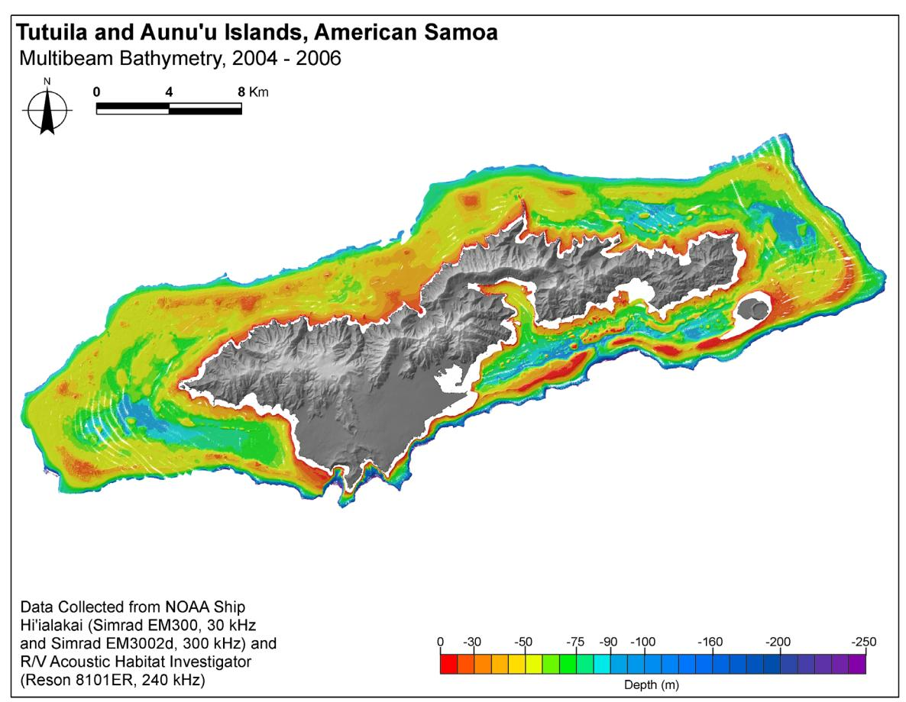

**Figure 3.3.1a.** Multibeam bathymetry acquisition around Tutuila and Aunu`u was conducted between 10 and 205 m in March 2004 and March 2006 from the R/V *Acoustic Habitat Investigator* (*AHI*) and the NOAA Ship *Hi`ialakai*. Shelves extend from the north shore of Tutuila; offshore banks surround the southeast and west sides, and the bank drops steeply to abyssal depths off the south point region.

of embayments, nearshore habitats, and a number of offshore banks that extend from the seafloor to as shallow as 20 m (Fig. 3.3.1a). What is hypothesized to be a relict barrier reef with ridge-like structures as shallow as 20 m is found around most of the perimeter of the island platform. Multibeam bathymetry collected by a number of university and National Oceanic and Atmospheric Administration (NOAA) vessels in deeper water shows that the bank drops off sharply to abyssal depths immediately outside this relict reef structure. Late stage volcanic eruptions formed Aunu`u and the large flat Tafuna Plain (also known as the Leone Peninsula), as discussed by Stearns (1944). This Tafuna eruption buried a large portion of the southern bank and reef inside the outer barrier. The Tafuna lava flows appear to have been bounded by the outer shoal structure and, where the recent flows cover the bank, there is a steep descent to depths greater than 1000 m. On the banks, but inside of the outermost barrier, depths range from ~ 20 to 100 m, including many isolated high features.

One of the important characteristics of this complex bank structure is a profusion of hard, probably carbonate, structures, particularly around the outer edges of the bank over 1.5 km offshore of Tutuila. Because of their locations and depth, it is speculated that the relict barrierreef structures may contain significant live coral cover and associated reef communities. A limited number of TOAD survey tracks across these features have confirmed the presence of live scleractinian coral colonies in a number of areas scattered around all sides of the island and high concentrations of scleractinian coral colonies in a few locations.

Most of the extensive shelf around Tutuila appears to be composed of hard substrate, except for sediment that appears to be washing out of several watersheds (Fig. 3.3.1b). Off the north shore this sediment tends to collect in a shore-parallel band at the base of a gentler slope below the forereef slope of the living reef, ~ 100 m deep. We speculate that the base of this slope may be a paleo shoreline, possibly representing the position of sea level during the last glacial maximum, which ended ca. 18 000 years ago. There are also what appear to be scattered pockets of sediment that have collected in low areas on the offshore shelf. There is an ovalshaped sediment field ca. 2 x 3 km in size in a depression offshore of Masefau Bay near the eastern end of the north shore. Several patch reefs extend up above the sediment field there and are likely capped with coral reef. Interestingly, another large depression approximately 2 km east of Cape Matatula is devoid of significant sedimentary deposits, possibly a result of predominantly westerly currents. On the southern side of Tutuila, the seafloor of Pago Pago Harbor appears to be composed almost entirely of acoustically absorbent sediments which extend out the mouth of the harbor and collect offshore between Taema Bank and the harbor. That sediment field continues several kilometers both east and west of the harbor entrance and appears to be supplemented by sediment washing in from a few smaller watersheds east of the harbor. Late volcanic stage lava flows making up the Tafuna Plain have covered over

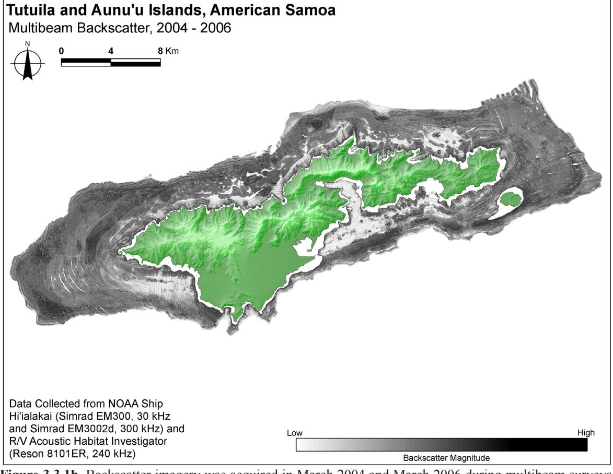

**Figure 3.3.1b.** Backscatter imagery was acquired in March 2004 and March 2006 during multibeam surveys around Tutuila and Aunu`u from the R/V *AHI*. Lighter shades represent low-intensity backscatter and likely indicate substrates that are acoustically absorbent and typically indicate unconsolidated sediment. Darker shades represent high-intensity backscatter and likely indicate consolidated hard-bottom and coral substrates.

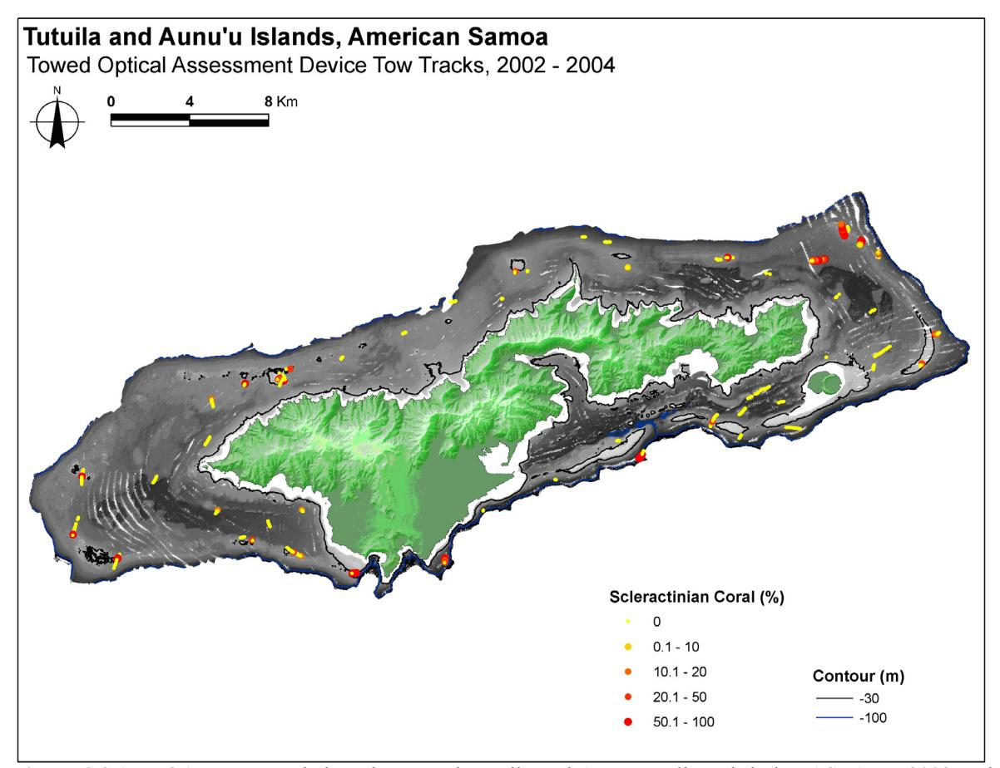

**Figure 3.3.1c.** TOAD camera sled tracks around Tutuila and Aunu`u collected during ASRAMP 2002 and 2004. The video imagery are post processed to identify substrate type (sand, rock, etc.), living cover (coral, macroalgae, etc.), and other characteristics. The TOAD survey tracks display percentage of live scleractinian coral classified using a point count method with a mean spacing of 20 m along each track. Yellow indicates 0% coral cover, orange colors indicate 0–20% coral cover, and red colors indicate 20–50% and 50–100% coral cover.

much of the insular shelf on the southern side of the island between Pala Lagoon and Leone. West of Fagatele Bay, the insular shelf reappears and rapidly widens, extending approximately 9 km westward of Cape Taputapu, the westernmost point of Tutuila. A large sediment field is located approximately 5 x 2 km off Leone. A large shallow depression on the insular shelf with depths reaching ~ 90–100 m is located farther offshore, about 4 km southwest of Cape Taputapu. Other than the sediment deposits described above, the insular shelf around Tutuila appears to be composed of predominantly hard, and presumably carbonate, substrate.

TOAD photographic and video imagery optical validation surveys were conducted around Tutuila and Aunu`u in 2002 and 2004 (131 still photographs and 52 video segments). Camera sled tracks from ASRAMP 2002 and 2004, shown in Figure 3.3.1c, are color coded to indicate the percentage of the seafloor inhabited by live scleractinian coral. Based on the optical data, coral cover around Tutuila ranged from 0% to > 50% at a few outer bank locations scattered around different sides of the island. These optical data were classified in accordance with a benthic classification scheme which is similar to that used to classify benthic towed-diver survey data in water depths shallower than ~ 30 m, but with a few differences that reflect methodological limitations of the camera sled data.

#### **3.3.2 Habitat Characterization**

Towed-diver benthic survey observations around Tutuila and Aunu`u from ASRAMP 2002, 2004, and 2006 were concatenated into mean spatial distributions (see methods Chapter 2, Section 2.2.3: Optical Validation Surveys) of the following benthic components: habitat complexity (Fig. 3.3.2a), percent cover of sand (Fig. 3.3.2b), hard substrate/pavement (Fig. 3.3.2c), rubble (Fig. 3.3.2d), and live coral (Fig. 3.3.2e). For areas where towed-diver survey tracks overlapped between years, the concatenated values represent temporal means; thereby averaging out temporal changes in percent covers of sand, rubble, and live coral cover (actual values of coral cover for each year are shown in coral section).

For areas where towed-diver tracks did not overlap precisely between years, the interpolated values provide additional insights into onshore-offshore gradients. Since these habitat characterization maps represent different complementary components of the same mean habitats, it is useful to analyze them in relation to each other, the local watersheds, and exposure to prevailing oceanographic conditions.

Mean benthic topographic complexity (Fig. 3.3.2a) is a subjective parameter of a threedimensional structure of the benthic habitat and reflects the ecological complexity of the nearshore environment. As shown, habitat complexity around Tutuila and Aunu`u was

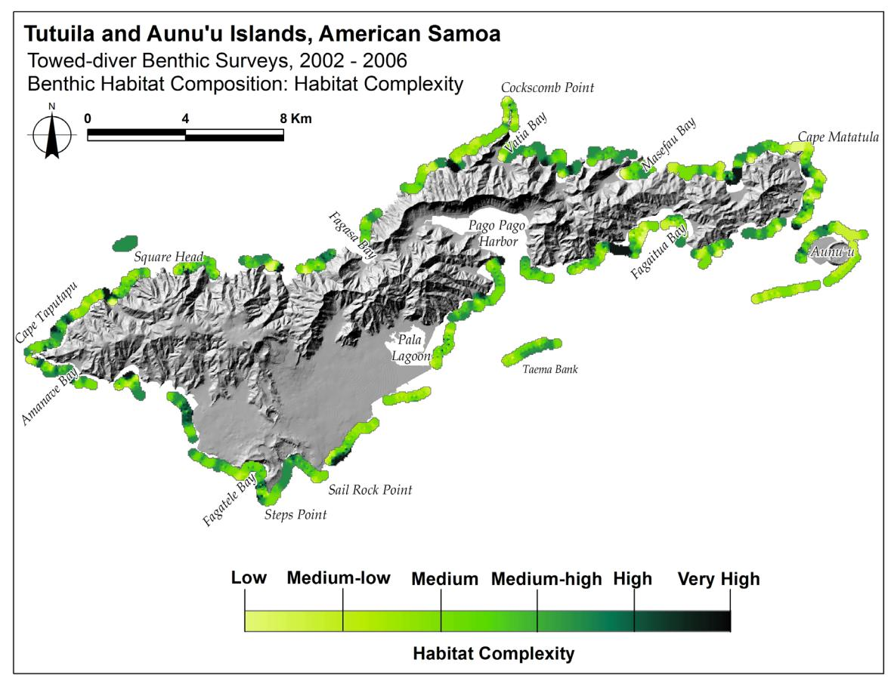

**Figure 3.3.2a.** Mean benthic habitat complexity concatenated from towed-diver survey observations around Tutuila and Aunu`u during ASRAMP 2002, 2004, and 2006. Habitat complexity was subjectively rated by diver-observers over 5-min ensembles (~ 200 x 10 m) over a 6-point scale representing low (1), medium-low (2), medium (3), medium-high (4), high (5), and very high (6) topographic complexity. Yellow colors indicate low habitat complexity, and dark green colors indicate high habitat complexity.

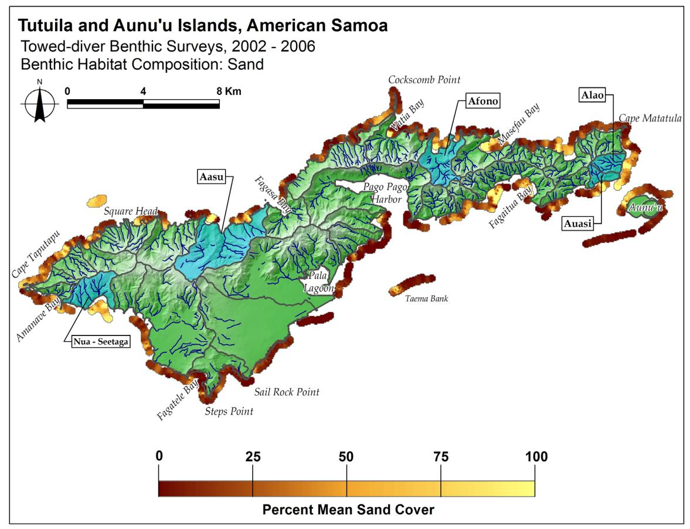

**Figure 3.3.2b.** Mean percent cover of sand concatenated from towed-diver habitat survey observations around Tutuila and Aunu`u during ASRAMP 2002, 2004, and 2006. Major streams (blue lines) overlay the topographic map of the islands, indicating the location of inputs of freshwater runoff into the marine ecosystem. Selected watersheds (Fig. 3.1a) are highlighted in blue. Sand composition was subjectively rated by diver-observers over 5-min ensembles (~ 200 m x 10 m) over a 1–100% scale. Light shades indicate high percent cover of sand, and dark shades indicate low percent cover of sand.

observed to be highly variable with values ranging across the scale from low to very high scattered around all regions of the island.

The distribution of sand around Tutuila and Aunu`u is shown in Figure 3.3.2b. Regions of high sand cover appear well correlated to the primary watershed discharges around Tutuila, including Nua-Seetagam, Aasu, Afono, Auasi and Alao districts, and Vatia, Masefau, and Fagaitua Bays. These results highlight the role of watersheds in supplying terrigenous sediments to the nearshore habitats. It can be inferred that the inverse of sandy, soft benthic habitat is hard substrate or pavement. Areas of low sand cover appear to correlate with areas of higher benthic complexity (Fig. 3.3.2a) and coral cover (Fig. 3.3.2e), and vice versa.

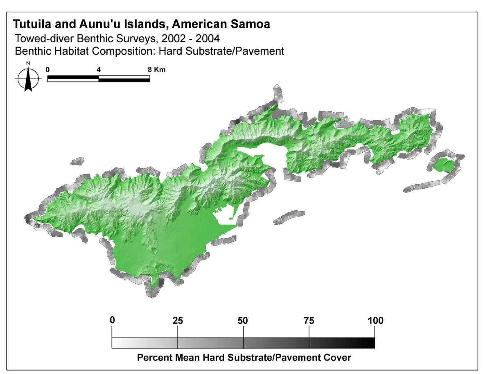

**Figure 3.3.2c.** Mean percent cover of hard substrate/pavement, concatenated from towed-diver survey observations around Tutuila and Aunu`u during ASRAMP 2002 and 2004. Hard substrate/pavement composition was subjectively rated by diver-observers over 5-min ensembles (~ 200 m x 10 m) over a 1–100% scale. Dark shades indicate high percent cover of hard substrate, and light shades indicate low percent cover of hard substrate.

The distribution of hard substrate/pavement around Tutuila and Aunu`u is shown in Figure 3.3.2c. As described here, hard substrate/pavement includes live and dead coral, rock, and algal covered carbonate pavement. As expected, these hard-bottom habitats were inversely distributed around the islands in comparison to areas of sand cover. In general, the majority of the forereef slopes around Tutuila consisted of hard substrate/pavement habitats, with highest percent cover of hard substrate/pavement often in areas of steep terrestrial topography and low percent cover of hard substrate/pavement often in watershed discharge areas.

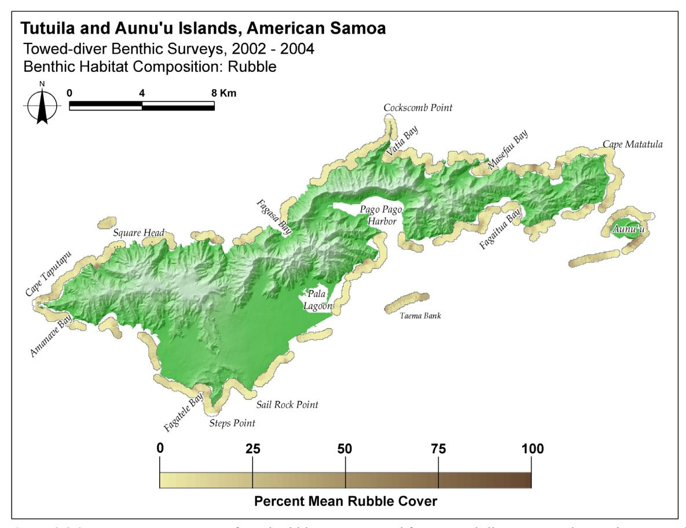

**Figure 3.3.2d.** Mean percent cover of coral rubble, concatenated from towed-diver survey observations around Tutuila and Aunu`u during ASRAMP 2002 and 2004. Rubble composition was subjectively rated by diverobservers over 5-min ensembles (~ 200 m x 10 m) over a 1–100% scale. Light shades indicate low percent cover of coral rubble, and dark shades indicate high percent cover of coral rubble.

The distribution of percent cover of coral rubble in the nearshore environments around Tutuila and Aunu`u is shown in Figure 3.3.2d. The spatial distribution of coral rubble was variable, with generally low percent cover of rubble dominating most habitats around the islands. Lowest coral rubble values were observed in low complexity sand habitats, and higher coral rubble values were recorded in areas of moderate-to-high complexity and coral cover. Rubble habitats often indicate mechanical or biological erosion, suggesting either exposure to high wave energy forcing or an abundance of bioeroding invertebrates, respectively. In the case of bioeroding invertebrates, percent cover of rubble habitat may serve as a potential indicator of invertebrate biodiversity.

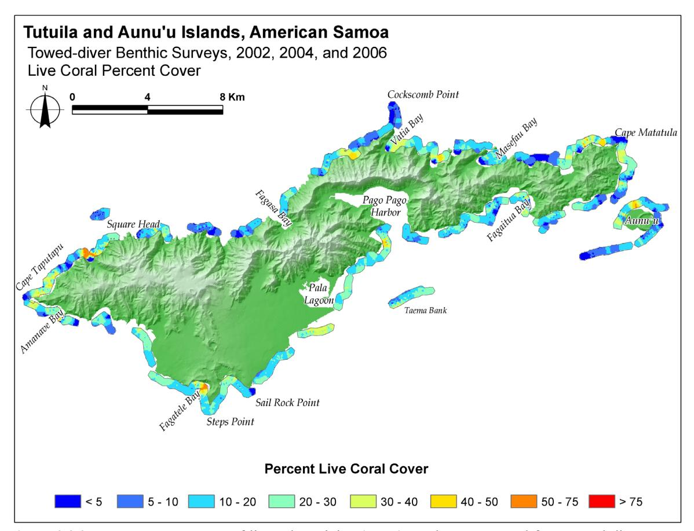

**Figure 3.3.2e.** Mean percent cover of live scleractinian (stony) coral, concatenated from towed-diver survey observations around Tutuila and Aunu`u during ASRAMP 2002, 2004, and 2006. Live coral cover composition was subjectively rated by diver-observers over 5-min ensembles (~ 200 m × 10 m) over a 1–100% scale. Blue colors indicate low percent cover of coral, and reddish colors indicate high percent cover of coral.

The distribution of the mean percent cover of live coral around Tutuila and Aunu`u is shown in Figure 3.3.2e. Generally, the spatial distribution of live coral cover was variable, with highest live coral cover often found in sheltered areas, such as bays and leeward coasts, and lowest live coral cover often found in areas exposed to prevailing seas or strong currents, such as major headlands and capes. Close examination shows onshore-offshore gradients of live coral cover, probably associated with changes in depth. For instance, near Maloata in the northwest region, live coral cover was low (< 5%) in shallow water next to the shoreline, high (> 50%) just offshore in intermediate depths, and moderate (0–10%) farther offshore to the north.

# **3.4 Oceanography and Water Quality**

Oceanographic and water quality observations were collected in the waters surrounding Tutuila and Aunu`u between 2002 and 2006. Instrumentation and equipment descriptions, deployment locations, and a subset of the resultant datasets are discussed below. Specific details of deployments and additional data are presented in Appendix II, Table II.i.

# **3.4.1 Hydrographic Data**

#### *2002 Spatial Surveys*

During ASRAMP 2002, 48 shallow-water CTD casts were conducted in nearshore waters around Tutuila during the periods February 11–12 and March 3–4 (Figs. 3.4.1a and 3.4.1b). Data from these vertical profiles show that salinity, temperature, and density were closely correlated for all casts; higher temperatures corresponded to lower salinity and density. The most striking feature of these data was a north-south disparity in water properties. The northern shore had a highly stratified water column compared with cooler, less saline, and less stratified (well-mixed) water on the south side of the island. The single cast taken on the east side showed a well-mixed water column of relatively cool water that suggests there was a gradient on the east side between the northern and southern water masses. The less saline waters measured on the south side of the island likely reflect the broad watersheds and large embayments present on the south, compared with those on the north, resulting in increased rainfall runoff.

During the ASRAMP 2002 survey period, temperature and salinity values at a 20-m depth around surveyed portions of Tutuila varied inversely with one another; cooler temperatures were generally associated with higher salinities while warmer temperatures were associated with lower salinities (Fig. 3.4.1c). The highest temperatures and lowest salinities were

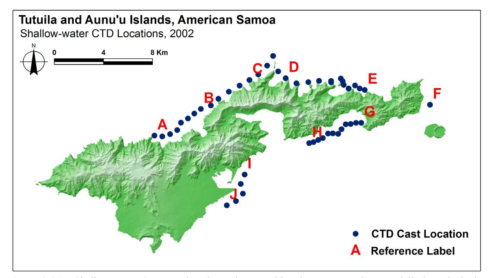

**Figure 3.4.1a.** Shallow-water CTD cast locations, shown as blue dots, expressed sequentially in a clockwise direction around Tutuila (A–J) during ASRAMP 2002, February 10–11 and March 3–4.

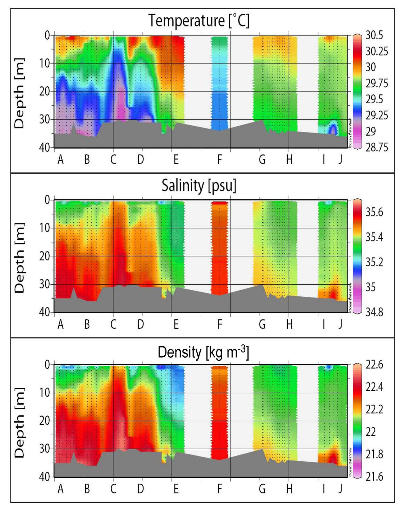

**Figure 3.4.1b.** Shallow-water CTD cast profiles to a 30-m depth around Tutuila during ASRAMP 2002, February 10–11 and March 3–4, including temperature (°C), salinity (psu), and density (kg m-3). Profiles are shown sequentially in a clockwise direction around the island (A–J), as shown in Figure 3.4.1a.

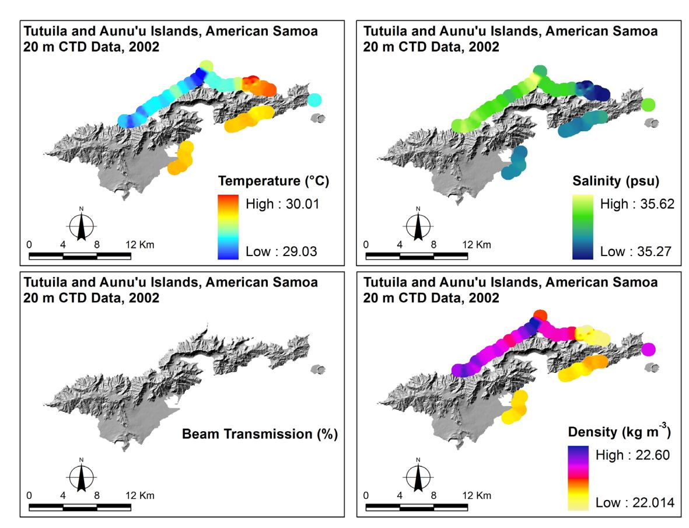

**Figure 3.4.1c.** Interpolated water temperature (top left), salinity (top right), and density (bottom right) at a 20 m depth derived from shallow-water CTD casts around Tutuila during ASRAMP 2002, February 10–11 and March 3–4. Beam transmission data (bottom left) were not collected.

observed in the northeast region of Tutuila and the coolest, most saline waters were observed off Cockscomb Point in the north region. The south and southeast regions of the island, both east and west of the Pago Pago Harbor, were observed to have similar temperatures and salinities as in the northeast. Since the 2002 observations were conducted over a 3-week period, the assumed synopticity is not likely realistic. As such, it is not possible to determine whether the observed patterns reflect spatial, temporal, or combined shifts.

#### *2004 Spatial Surveys*

During ASRAMP 2004, 122 evenly spaced shallow-water CTD casts were conducted in nearshore waters surrounding Tutuila and Aunu`u over the February 19–25 period (Figs. 3.4.1d and 3.4.1e). Data from these vertical profiles show noteworthy spatial differences in water temperature (± 2°C), salinity (± 1 psu) and density during the sampling period (Fig. 3.4.1e). Salinity, temperature, and density changes were typically correlated around the island, with higher temperatures corresponding to lower salinities and densities. There were two main features apparent at Tutuila during this time. The waters in the northwest region were observed to be warm with relatively low salinity and density (A–B). The most striking feature, east of Aunu`u, was a region of strong vertical gradients of temperature, salinity, and density. These observations were suggestive of localized upwelling of cooler, more saline offshore waters encountering the nearshore topography of the eastern bank (Fig. 3.4.1f). A shallow lens (upper 2 m) of relatively fresh water was observed in the southwest region of the island (K–L), suggestive of recent freshwater input from the nearby watersheds. The beam transmission was highest (~ 95%) in both the warm northwest region (A–B) and also at the coldest spike on the east end of Tutuila (E–H).

Analysis of hydrographic data collected at a 20-m depth around Tutuila and Aunu`u during the ASRAMP 2004 survey period shows moderate ranges in temperature (29.03–29.85°C), beam transmission (84.87–94.85%), and computed density (21.78–22.43 kg m-3), and a large range in salinity (34.99–35.51 psu). At all locations around the islands, temperature varied inversely with salinity and density; warmer waters were generally fresher and less dense while cooler waters were more saline and more dense. Waters in the northwest region were warmer, less saline, and less dense compared to the other regions around the islands. Beam transmission, a measure of turbidity, appears to have varied independently of the other observed water properties; the least turbid waters occurred in the southwest region of Tutuila encompassing Leone and Amanave Bays, while the most turbid waters occurred in Pago

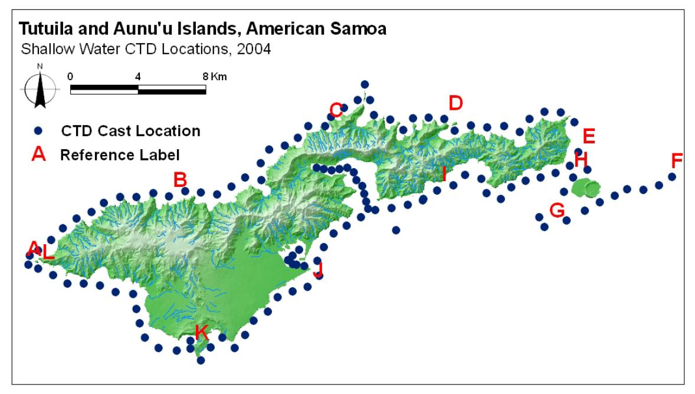

**Figure 3.4.1d.** Shallow-water CTD cast locations, shown as blue dots, expressed sequentially in a clockwise direction around Tutuila and Aunu`u (A–L) during ASRAMP 2004, February 19–25.

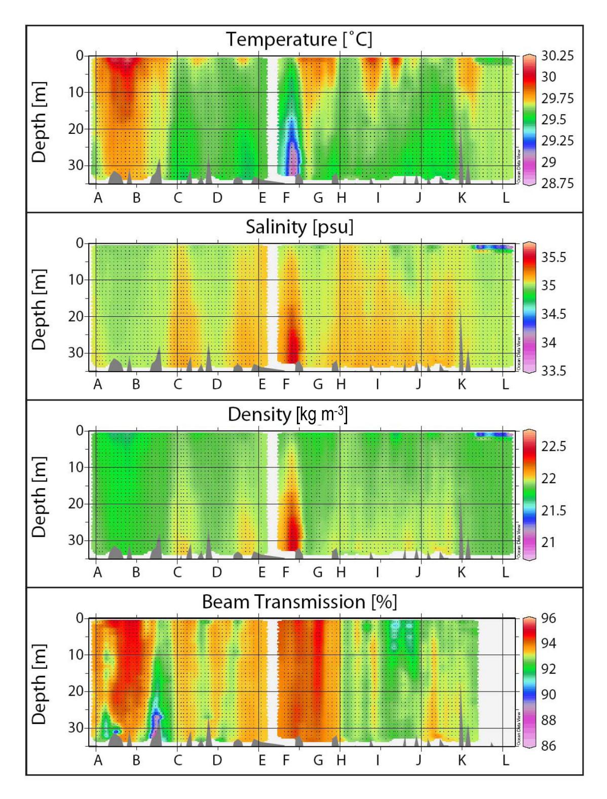

**Figure 3.4.1e.** Shallow-water CTD cast profiles to a 30-m depth around Tutuila and Aunu`u during ASRAMP 2004, February 19–25, including temperature (°C), salinity (psu), density (kg m-3), and beam transmission (%). Profiles are shown sequentially in a clockwise direction around the islands (A–L), as shown in Figure 3.4.1d.

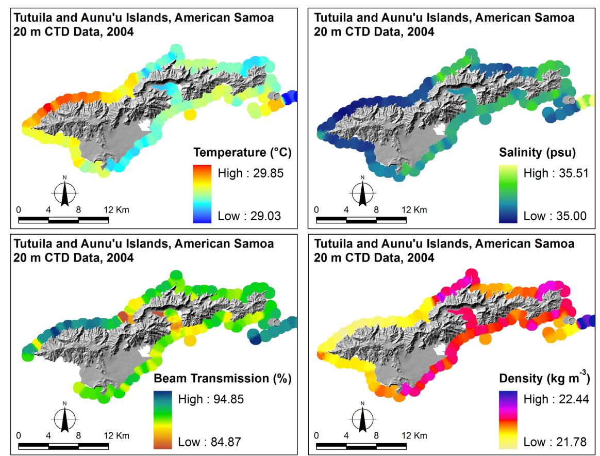

**Figure 3.4.1f.** Interpolated water temperature (top left), salinity (top right), beam transmission (bottom left) and density (bottom right) at a 20-m depth derived from shallow-water CTD casts around Tutuila and Aunu`u during ASRAMP 2004, February 19–25.

Pago Harbor on the south side and in Fagasa Bay in the north region.

#### *2006 Spatial Surveys*

During ASRAMP 2006, 113 evenly spaced shallow-water CTD casts were conducted in nearshore waters surrounding Tutuila and Aunu`u over the February 18–26 period (Fig. 3.4.1g). In addition, water samples for nutrient and chlorophyll-a analyses were collected at water depths of 1, 10, 20, and 30 m, where possible, at 33 of the 113 shallow CTD sites. Dissolved inorganic carbon (DIC) samples were collected at 16 of these sites.

Vertical profiles of temperature, salinity, density, and beam transmission around Tutuila and Aunu`u during ASRAMP 2006 found significant spatial patterns (Fig. 3.4.1h). The most striking feature from these observations was a clear pattern of three distinct and different oceanographic regions. The north coast, all the way from Cape Taputapu at the west end to Cape Matatula at the northeast end (A–E), was characterized by warm (~ 29.5°C), saline, moderately well-stratified (particularly temperature), and relatively turbid waters. The east coast, from Cape Matatula to Aunu`u (E–G) was characterized by colder (~ 28.5°C), less saline, well-mixed, and clear waters. The south coast, from southeast region to Cape Taputapu, was characterized by cooler, fresher, well-stratified, mostly clear waters. There was a strong (1–1.5°C), water column-deep (0–30 m), temperature gradient between the north and south at the eastern end of Tutuila (D–E). There was also an interesting tongue of high beam transmission (low turbidity), relatively warm, low salinity, low density water observed offshore near Pala Lagoon (Fig. 3.4.1i). This was possibly a result of river and estuarine outflow from Pago Pago Harbor (G–H). Density distribution around the islands was largely uniform, with the exception of this same region (G–I). The position of this tongue of low salinity water relative to the inlet suggests that currents on the south shore were traveling east to west during this period. This is consistent with the direction of the southeast trade winds in the region. Beam transmission was generally high (> 90%) around the islands. The highest beam transmission was observed between positions E and F, in the region of the largest temperature gradient, near the eastern tip of Tutuila.

The spatial patterns of observed physical water properties around Tutuila and Aunu`u at a 20 m depth during ASRAMP 2006 reveal generally warmer waters on the north side of Tutuila (~ 28.88°C) and cooler waters (~ 28.43°C) on the south side, particularly offshore of Aunu`u Island (Fig. 3.4.1i). Patterns from the salinity observations tend to parallel temperature; waters were generally more saline (~ 34.87 psu) on the north side and less saline (~ 34.50 psu) on the south side, particularly in and around Pago Pago Harbor. Density was lowest (21.80 kg m-3) near Pago Pago Harbor, while beam transmission values were low around much of the island.

Water quality, as deduced by the laboratory analyses of key nutrients from the in situ water samples collected at a 20-m depth around Tutuila and Aunu`u during ASRAMP 2006, was

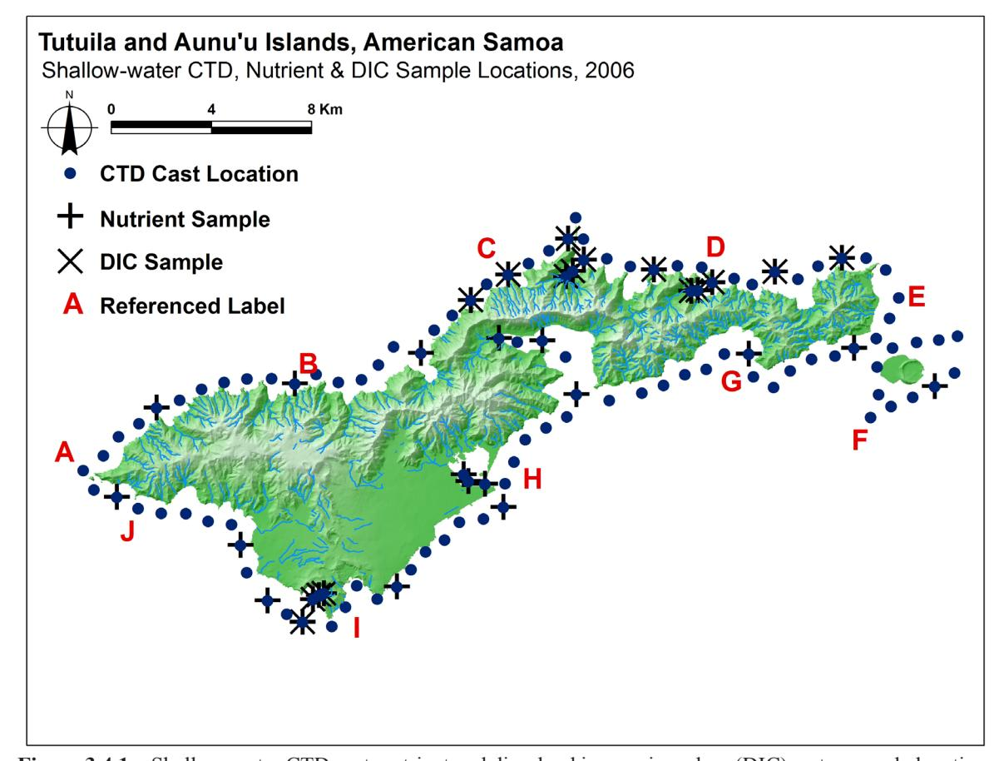

**Figure 3.4.1g.** Shallow-water CTD cast, nutrient and dissolved inorganic carbon (DIC) water sample locations around Tutuila and Aunu`u (A–J) during ASRAMP 2006, February 18–26.

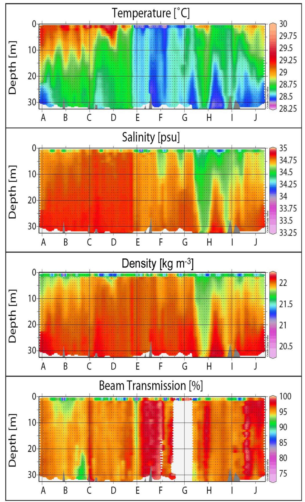

**Figure 3.4.1h.** Shallow-water CTD cast profiles to a 30-m depth around Tutuila and Aunu`u during ASRAMP 2006, February 18–26, including temperature (°C), salinity (psu), density (kg m-3), and beam transmission (%). Profiles are shown sequentially in a clockwise direction around the islands (A–J), as shown in Figure 3.4.1g.

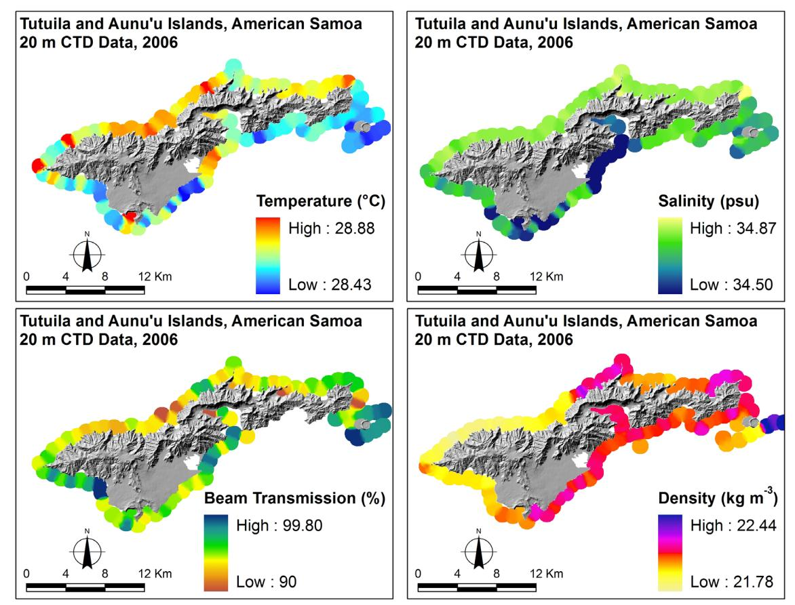

**Figure 3.4.1i.** Interpolated water temperature (top left), salinity (top right), beam transmission (bottom left), and density (bottom right) at a 20-m depth derived from shallow-water CTD casts around Tutuila and Aunu'u during ASRAMP 2006, February 18–26.

characterized by interesting spatial patterns (Fig. 3.4.1j). The following ranges in water quality parameters were observed around the islands: chlorophyll-a, 0.43–1.66 µg l  $^{-1}$ ; phosphate (PO $_4$ ), 0.09–0.17 µM; silicate (SiO $_2$ ), 0.54–2.21 µM; and total nitrogen (N $_{tot}$  = NO $_3$  + NO $_2$ ), 0.01–0.48 µM. Nitrogen concentrations on the north side of Tutuila exhibited spatial homogeneity while chlorophyll-a, phosphate, and silicate showed higher spatial variability. Constituent concentrations in the south and southwest regions were more variable spatially, with the highest levels measured in Pago Pago Harbor. It is likely that the relatively high nutrient concentrations observed around parts of the island, such as those visible in the Pago Pago Harbor region, can be attributed to terrestrial runoff.

The rain gauge at the Pago Pago International Airport showed that Tutuila received in excess of 1.5 m of precipitation over the period of January through March 2006, representing the highest 3 month mean rainfall during the 6-year record shown (Fig. 3.4.3d). The substantial amounts of rainfall during the ASRAMP 2006 survey period likely increased suspended sediment, caused reduction in salinity and temperature, and affected nutrient and chlorophyll concentrations in the water column, particularly near waters around Pago Pago Harbor.

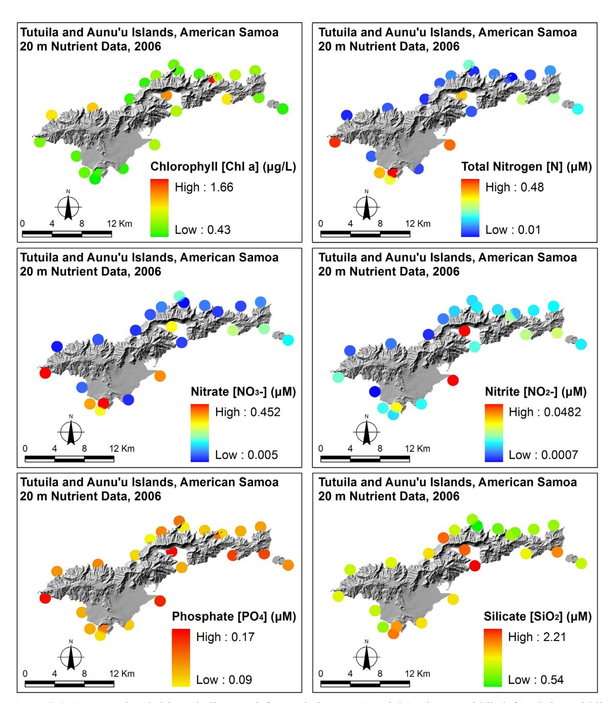

**Figure 3.4.1j.** Interpolated chlorophyll-a (top left), total nitrogen (top right), nitrate (middle left), nitrite (middle right), phosphate (bottom left) and silicate (bottom right) concentrations, at a 20-m depth derived from water samples collected in concert with shallow-water CTD casts around Tutuila and Aunu`u during ASRAMP 2006, February 18–26.

# **3.4.2 Temporal Comparison—Hydrographic Data**

Nearshore CTD and water quality observations during the ASRAMP surveys in 2002, 2004, and 2006 exhibited noteworthy spatial patterns and temporal differences of survey years. Temperature values varied marginally between survey periods. Salinity showed a northsouth, negative gradient in 2002 and 2004 and a positive (low–high) gradient in 2006. A substantial decrease in salinity occurred in 2006 compared to the previous surveys as a result of the record-setting rainfall which coincided with the ASRAMP 2006 survey period. Density

values in each of the datasets paralleled salinity rather than temperature. Beam transmission measurements during 2004 and 2006 were low in Fagatele Bay and in Pago Pago Harbor, implying high terrigenous input in these areas. The substantial rainfall that occurred during the 2006 survey period increased the levels of terrestrial runoff into the coral reef ecosystem and likely impacted water quality data. These results will serve as a baseline to compare future nutrient datasets.

#### **3.4.3 Time Series Observations**

A suite of moored instruments was deployed around Tutuila and Aunu`u over the 2002– 2006 period to collect time series observations of key oceanographic properties influencing reef conditions (Fig. 3.4.3a). Deployment and retrieval dates and time durations of each instrument are detailed Appendix II, Table II.i. Figure 3.4.3b shows a time series of in situ and remotely sensed SST and modeled wave properties from January 2002 to April 2006.

Pathfinder SST and in situ temperature observations around Tutuila show a strong seasonal cycle superposed with moderate intraseasonal and interannual variability. In general, the warmest surface temperatures (~ 30.2°C) were observed during January–March and the coolest temperatures (~ 27.5°C) during June–August (Fig. 3.4.3b, top panel). Over the entire period, Pathfinder-derived SST followed the climatological record relatively closely, with deviations of ~ 0.5–1.0°C. In contrast, all in situ observations from moored instruments, particularly at Fagasa Bay in the north region, indicated warmer temperatures than the

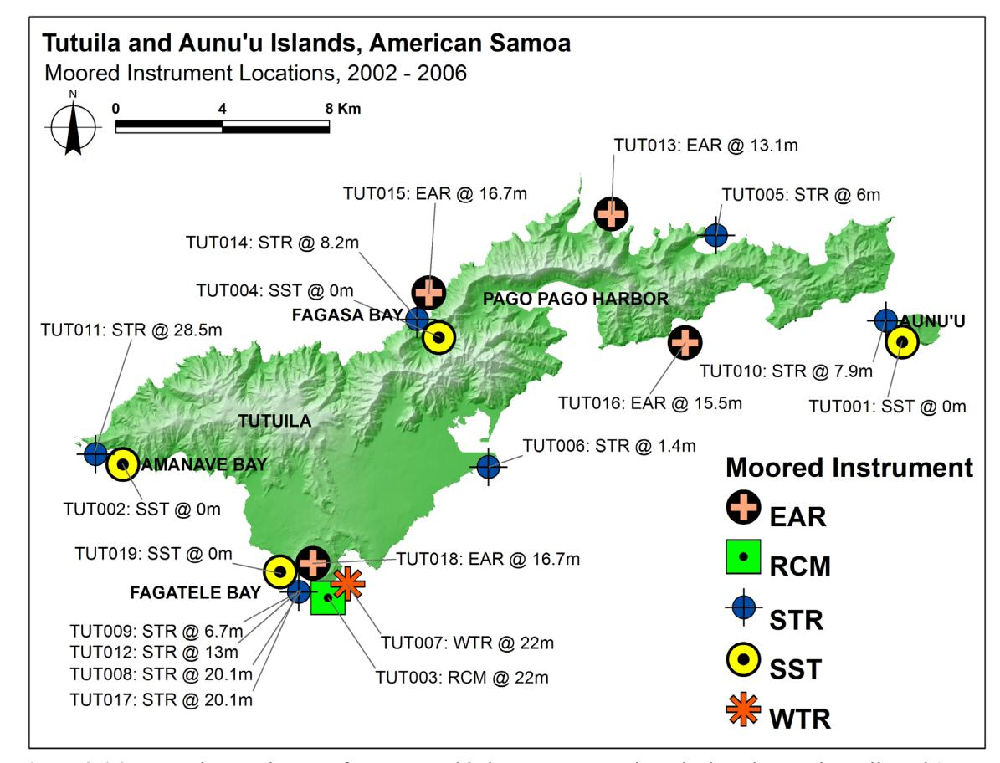

**Figure 3.4.3a.** Locations and types of oceanographic instrument moorings deployed around Tutuila and Aunu`u between 2002 and 2006. Moored instrument types include: EAR, RCM, STR, SST buoy, and WTR.

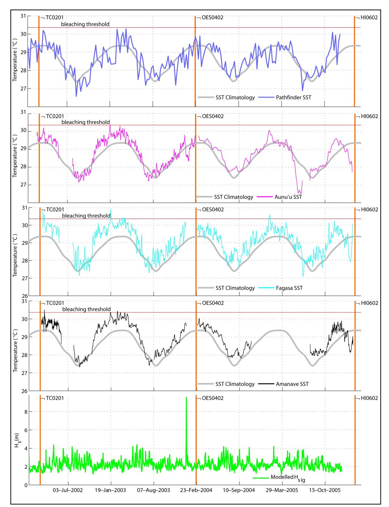

**Figure 3.4.3b.** SST and wave height time series around Tutuila and Aunu`u between January 2002 and April 2006. Remotely sensed data (SST Climatology and weekly Pathfinder-derived SST) and modeled significant wave-height data derived from Wave Watch III are overlaid with CRED in situ temperature observations from Aunu`u Island, Fagasa Bay, and Amanave Bay (locations shown in Fig. 3.4.3a). The horizontal red and vertical orange bars represent the bleaching threshold and the ASRAMP research cruise dates, respectively. In situ (15 min sampling frequency) and telemetered temperature data (4-hour mean) were used to produce the Aunu`u and Amanave time-series.

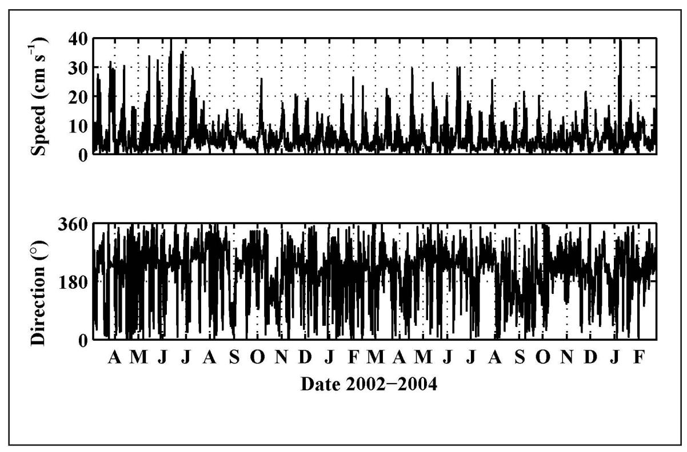

**Figure 3.4.3c.** Data from an Aanderaa RCM9 current meter deployed at a 22-m depth off Steps Point (TUT003), from March 2002 to February 2004. Top panel: Current speed (cm s-1). Bottom panel: direction (0 from north).

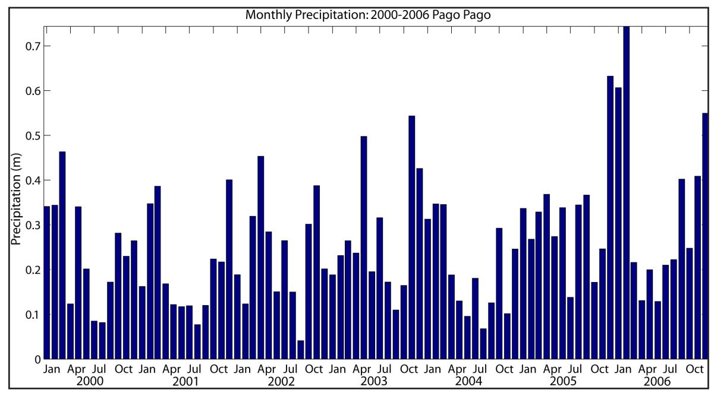

**Figure 3.4.3d.** Average monthly rainfall from Pago Pago International Airport from January 2000 to December 2006 (SOURCE: National Weather Service, Honolulu, Hawaii: http://www.prh.noaa.gov/hnl/). Note the unusually high rainfall during the ASRAMP 2006 survey period in February.

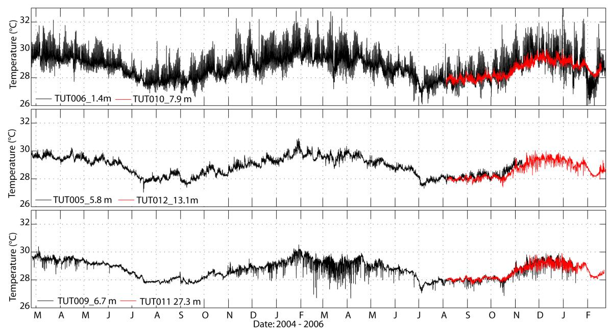

**Figure 3.4.3e.** Time series observations of temperature from March 2004 to February 2006 collected from six STRs deployed at different locations and depths around Tutuila. See Figure 3.4.3a for mooring locations.

climatological mean with periodic temperature drops. Warm temperatures were observed in each of the moored instrument temperature datasets during the austral summer of 2002–2003. Maximum observed temperatures at Fagasa Bay reached 1.5°C above the climatological mean (0.5°C degree above the bleaching threshold). In situ observations and Pathfinder SST at Aunu`u were anomalously cooler (~ 1.5°C and ~ 1.0°C, respectively) than climatological values during June 2005.

Modeled significant wave-height data for Tutuila shows weak seasonal variation superposed with episodic, cyclone-induced extreme wave events. Large wave heights (> 3 m) typically occurred during winter months compared to smaller wave heights (~ 2 m) during the summer months. One extreme swell event (> 8 m), produced by tropical cyclone Heta, was observed in January 2004 (Fig. 3.4.3b, bottom panel).

An Aanderaa RCM9 current meter was deployed in 22 m of water off Step's Point, on the southernmost point of Tutuila (TUT003) in the south point region. The objective of this 2 year deployment was to determine current flow in the region. The median current direction at Step's Point was ~ 230°, indicating south-westward flow (Fig. 3.4.3.c). Mean current speed was ~ 5 cm s-1 with strong diurnal tidal forcing. The westward skew of the observations suggests that wind forcing from the east is a possible contributor to the flow regime (Fig. 3.4.3c). The prevailing wind conditions and currents measured during the deployment suggest that water movement along the south shore of Tutuila was generally east to west.

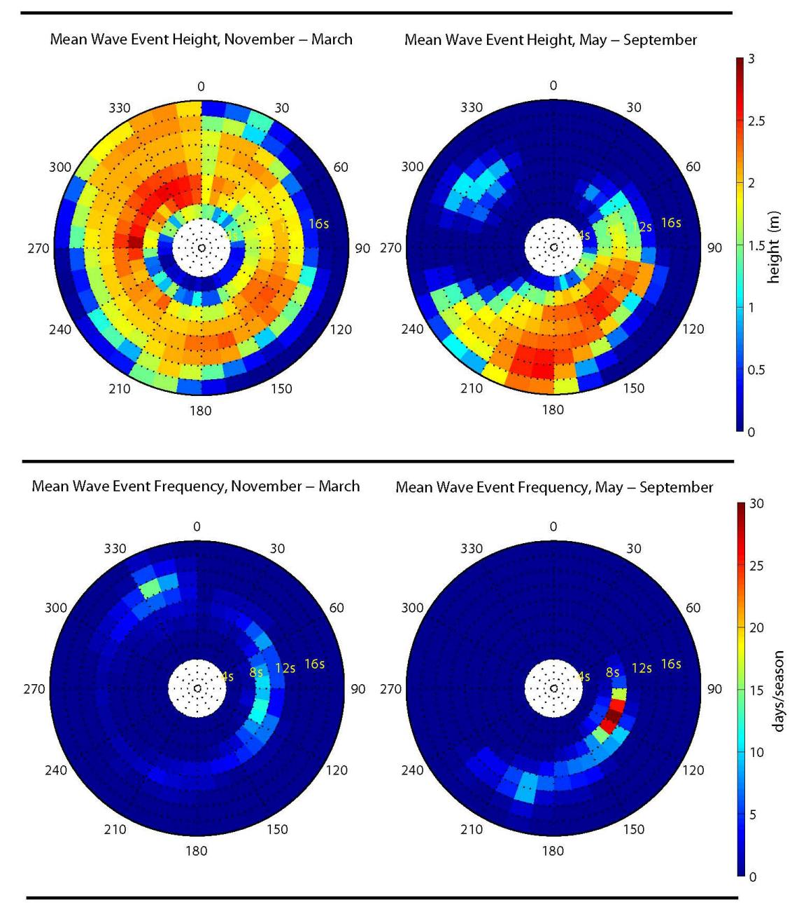

**Figure 3.4.3f.** NOAA Wave Watch III directional wave climatology for American Samoa from January 1, 1997 and April 1, 2007. The climatology was created by binning (six times daily) significant wave height, dominant period, and dominant direction from a 1° × 1° box centered on the Manu`a group (14.2° S, - 169.5° W). Top panel: mean significant wave height for all observations in each directional/frequency bin from November to March and from May to September. The months of April and October, transition months, are omitted for clarity. Bottom panel: mean number of days conditions in each directional/frequency bin occur in each season; e.g., if the color indicates 30, then, on average, the condition occurs on 30 out of 150 days each season (or 30 out of 365 days each year).

# **3.4.4 Bioacoustic Observations**

In 2006, four EARs were deployed in nearshore waters around Tutuila (Appendix II, Table II.I.i). Two EARs were located in the National Park of American Samoa in the north region, while the remaining two were deployed in Fagatele Bay National Marine Sanctuary in the south point region and in Alega Bay in the southeast region (Figs. 3.4.4a and 3.4.4b). These units were programmed to record ambient sounds at frequencies up to 12.5 kHz for 30 seconds every 15 minutes and set to activate on vessel generated sounds. To date, only preliminary data exist from the EAR deployed at the eastern end of the National Park of American Samoa because it was recovered for preventative maintenance (and replaced) after only 7 weeks of data collection.

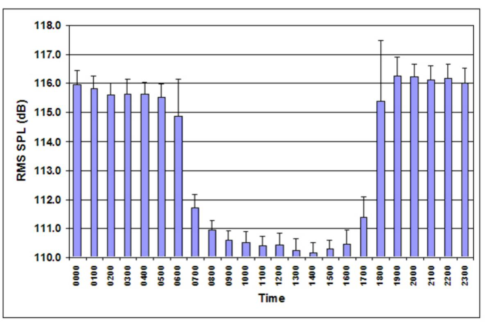

**Figure 3.4.4a.** Hourly averaged acoustic energy over the 7-week period from an EAR deployed in the National Park of American Samoa. Dominant sounds were produced by snapping shrimp.

The EAR recovered from the National Park of American Samoa contained sounds from a variety of sources, including fish, snapping shrimp, whales, rain showers, and vessels. The predominant sound was produced by snapping shrimp, which had a distinct diel pattern with higher levels occurring at night than during the day (Fig. 3.4.4a). This diel pattern is significant because there is nearly a doubling of acoustic energy (6 dB difference) between noon and midnight.

Snapping shrimp exhibited longer-term patterns of acoustic variability. Over the 7-week deployment period, a distinct periodicity was observed in the nighttime levels examined. This periodicity appears to be correlated with the lunar cycle, with higher levels occurring during the new moon and lower levels during the full moon (Fig. 3.4.4b). Both the diurnal and lunar cycles indicate that snapping shrimp produce significantly more sound during periods of increased darkness.

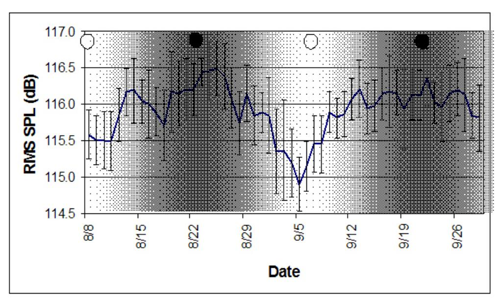

**Figure 3.4.4b.** Periodicity in the nighttime acoustic energy produced by snapping shrimp during the EAR deployment period superimposed by the lunar cycle. The shaded circle and darker-shaded sections of the graph signify a new moon and increased nighttime darkness, while the open-white circle and lighter areas signify a full moon and increased nighttime luminosity.

The EAR's vessel detection trigger was activated 34 times during the deployment period, providing a minimum estimate of vessel traffic that occurred in the area. This is a minimum estimate because vessels transiting farther away may not have produced enough acoustic energy at the unit to trigger it to record. Of interest is the timing of the vessel traffic that was observed. The majority of vessel detections (23/35–65.7%) occurred during periods of dusk or nighttime between 1800 hr and 0600 hr (Fig. 3.4.4c).

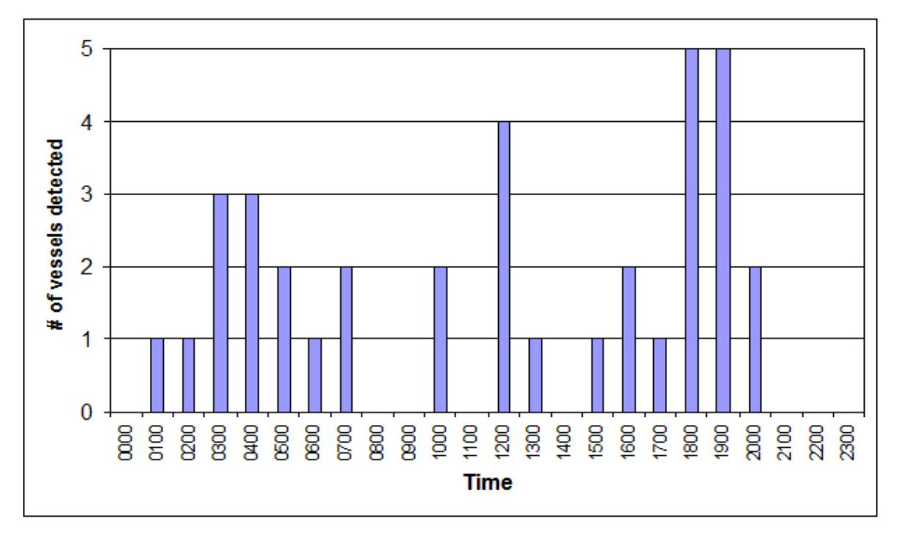

**Figure 3.4.4c.** The number of vessels detected during a 7-week record from an EAR deployed in the National Park of American Samoa during each hour of the day.

# **3.5 Coral and Coral Disease**

# **3.5.1 Coral Surveys**

#### *2002 Spatial Surveys*

Sixteen towed-diver surveys were conducted along the forereef slopes of Tutuila during ASRAMP 2002 (Fig. 3.5.1a), with a mean depth of 10.5 m (SD 3); individual tow tracks varied in depth from 8 m (SD 3) to 14 m (SD 3). An island-wide mean of live scleractinian (stony) coral percent cover of 28.9% (SE 2.5) was observed (Fig. 3.5.1b). The island-wide mean dead coral percent cover was 2.3% (SE 0.8), which was assessed as an independent component of the benthic habitat (Fig. 3.5.1c).

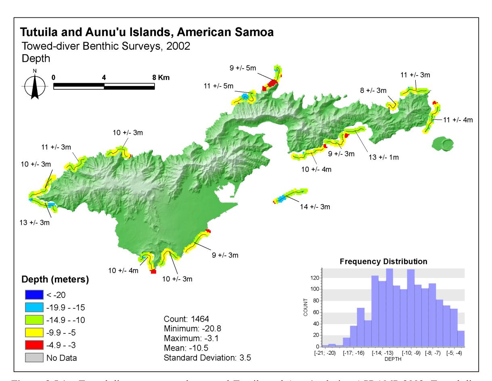

**Figure 3.5.1a.** Towed-diver survey tracks around Tutuila and Aunu`u during ASRAMP 2002. Towed-diver survey tracks are color coded with mean depths for each 5-min segment. Mean depths and standard deviations for each towed-diver survey are shown in black text. Depth histogram and statistics (counts, minimum depth, maximum depth, mean, and standard deviation) from 30-sec depth recordings during towed-diver surveys are included.

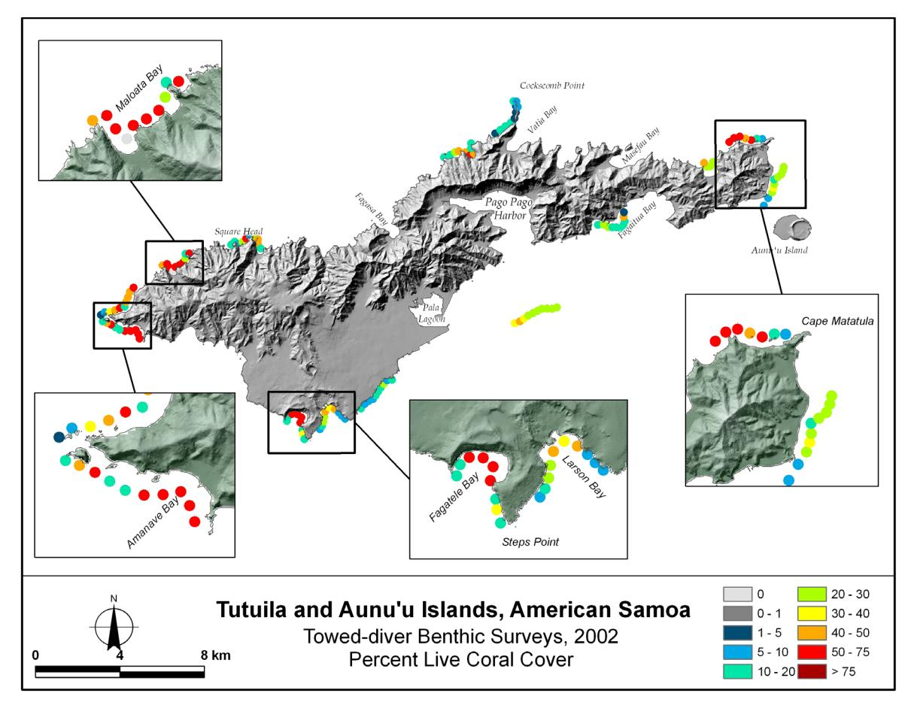

**Figure 3.5.1b.** Towed-diver benthic survey observations of live scleractinian (stony) coral cover around Tutuila during ASRAMP 2002. Each colored point represents an integrated estimate over a 5-min observation segment covering a survey swath of ~ 200 m × 10 m (~ 2000 m2 ). Symbol size represents the percent live coral cover on the benthic habitat. Note that coral cover was measured as a direct percentage of overall benthic cover in 2002.

Although representing only a small fraction of the total reef area around Tutuila (~ 20% of the coastline was surveyed), the areas of highest live coral cover observed during the towed-diver surveys were in Fagatele Bay (4 tow segments; mean: 57.5%), Amanave Bay (5 tow segments; mean: 60.0%), Maloata Bay in the northwest region (7 tow segments; mean: 46.4%), and off Onenoa in the northeast region (5 tow segments; mean: 52.2%). Estimates of recently dead coral from the towed-diver surveys were highest in the areas over Taema Bank (7 tow segments; mean: 10.0%), off Alega Beach in the southeast region (3 tow segments; mean: 10.0%), and in Aoa Bay in the northeast region of Tutuila (3 tow segments; mean: 10.0%). Although the 2002 observations of recently dead coral do not indicate the cause of the mortality, the open exposure of Taema Bank to south swell suggests the possibility of wave energy damage, and the relatively closed circulation in Aoa and Alega Bays suggests the possibility of coral bleaching.

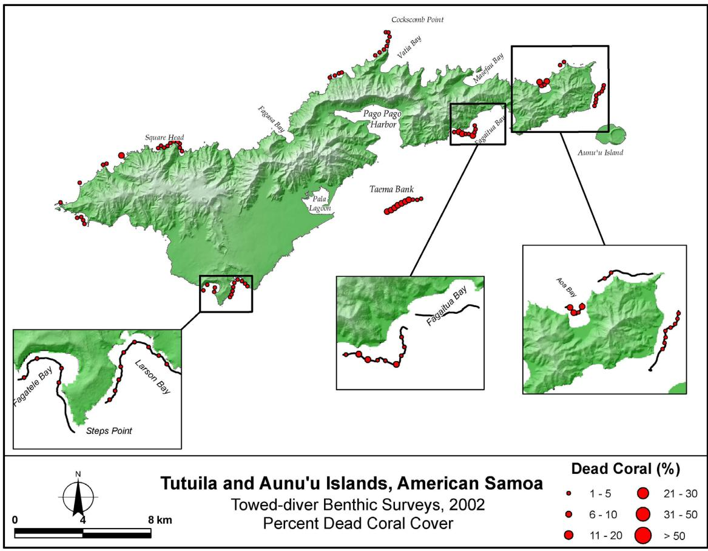

**Figure 3.5.1c.** Towed-diver benthic survey observations of dead coral cover around Tutuila during ASRAMP 2002. Each colored point represents an integrated estimate over a 5-min observation segment covering a survey swath of ~ 200 m × 10 m (~ 2000 m2 ). Symbol size represents the percent dead coral cover on the benthic habitat.

ASRAMP REA coral surveys in 2002 were the first surveys conducted in American Samoa by CRED. Although five sites were surveyed around Tutuila by a CRED coral biologist, much of the focus of those surveys was to explore different coral monitoring methodologies. An additional nine sites were surveyed by a CRED partner who focused on expanding the coral species list for Tutuila. Since both of these survey efforts were exploratory and qualitative in nature, no data are presented in this more quantitative report.

# *2004 Spatial Surveys*

A total of 43 towed-diver benthic surveys were conducted along the forereef slopes around most of Tutuila and Aunu`u during ASRAMP 2004 (Fig. 3.5.1d), with a mean depth of 12.1 m (SD 4.8); individual tow tracks varied in depth from 5 m (SD 2) to 21 m (SD 2). An island-wide mean percent live scleractinian coral cover of 20.9% (SE 1.1) was observed (Fig. 3.5.1e). It should be noted that the 2004 towed-diver surveys were generally conducted in deeper waters than during 2002 because of a change in NOAA diving safety protocols, allowing for the use of dive computers and hull-mounted fathometers. Generally, higher live coral cover was observed along the southern regions of Tutuila. Areas of the highest live coral cover were observed along the northern side of Aunu`u (4 tow segments; mean: 43.5%), west of Pago Pago Harbor near Niuloa Point (3 tow segments; mean: 55.0%), as well as numerous tow segments along the southern coast of Tutuila and within the sheltered portions of bays along the northeast region.

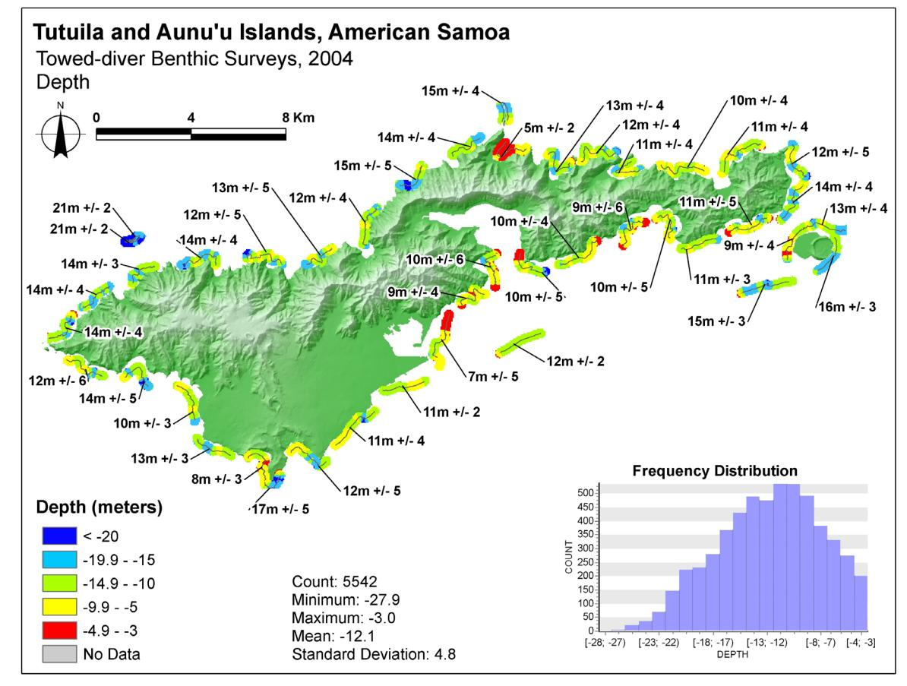

**Figure 3.5.1d.** Towed-diver survey tracks around Tutuila and Aunu`u during ASRAMP 2004. Towed-diver survey tracks are color coded with mean depths for each 5-min segment. Mean depths and standard deviations for each towed-diver survey are shown in black text. Depth histogram and statistics (counts, minimum depth, maximum depth, mean, and standard deviation) from 30-sec depth recordings during towed-diver surveys are included.

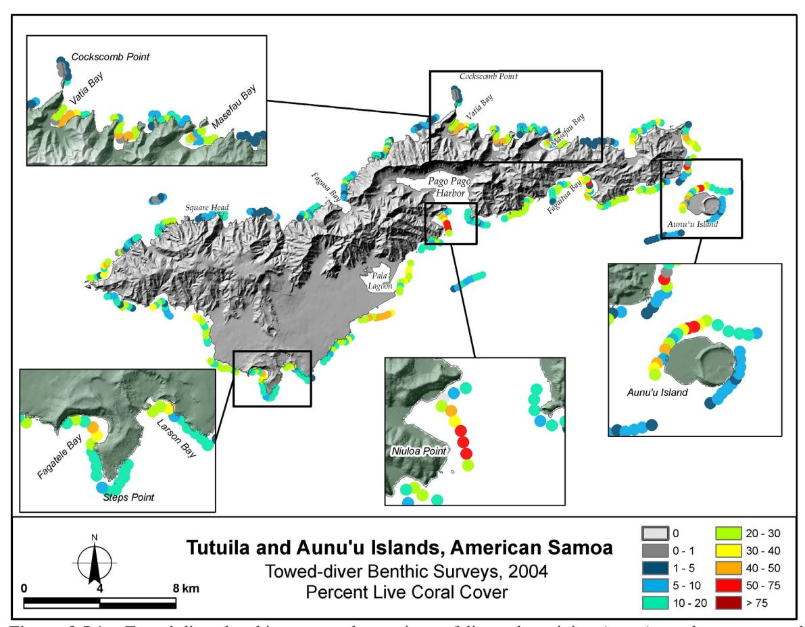

**Figure 3.5.1e.** Towed-diver benthic survey observations of live scleractinian (stony) coral cover around Tutuila and Aunu`u during ASRAMP 2004. Each colored point represents an integrated estimate over a 5-min observation segment covering a survey swath of ~ 200 m × 10 m (~ 2000 m2 ). Symbol size represents the percent live coral cover on the benthic habitat.

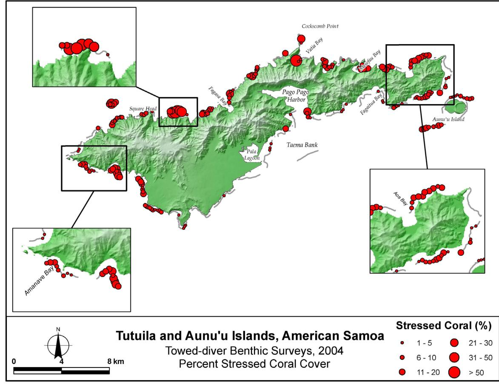

**Figure 3.5.1f.** Towed-diver benthic survey observations of stressed coral cover around Tutuila and Aunu`u during ASRAMP 2004. Each colored point represents an integrated estimate over a 5-min observation segment covering a survey swath of ~ 200 m × 10 m (~ 2000 m2 ). Symbol size represents the percent of stressed coral cover of the total coral benthic coverage. Note that stressed coral cover was measured as a percentage of overall coral cover in 2004.

Rather than documenting recently dead coral, as was done during ASRAMP 2002 surveys, towed-diver surveys during ASRAMP 2004 recorded observations of stressed coral, which included fully bleached (white), pale or discolored, malformed or tumored corals (Fig. 3.5.1f). Overall, the mean of stressed coral cover estimates from towed-diver surveys around Tutuila and Aunu`u was 4.9% (SE 0.7). Relatively high estimates of coral stress were observed at numerous locations along the southwest, northwest, north, and northeast regions of Tutuila. Estimates of coral stress were generally low along the south and southeast regions, with one notable exception. A relatively high observation of coral stress (28%) was recorded during a tow segment just inside the Pago Pago Harbor entrance near Breaker Point. The highest percent coral stress (mean: 53.4%) was observed during 5 tow segments west of Massacre Bay within the northwest region of Tutuila.

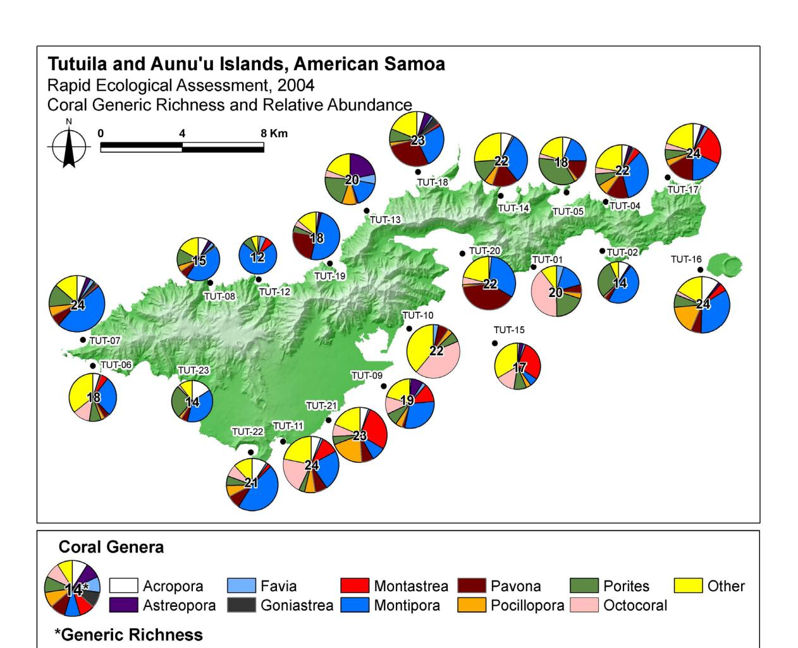

**Figure 3.5.1g.** Relative abundance of coral genera and generic richness from REA surveys around Tutuila and Aunu`u during ASRAMP 2004. Percent relative abundance of key coral genera are indicated by color-coded portions of the pie charts. Size of the pie charts and black numbers in the center of the pie charts indicate the number of coral genera observed at each REA site.

Twenty-two coral REA surveys were conducted around Tutuila and Aunu`u during ASRAMP 2004. At least 37 anthozoan/hydrozoan genera were recorded around Tutuila and Aunu`u with members of *Montipora*, *Porites*, and octocorals (*Sinularia/Lobophytum/Sarcophyton*) each contributing more than 10% of the total number of colonies recorded at the islands (Fig. 3.5.1g). *Montipora* was the most common coral genus at most sites around the island, comprising on average 30% of the coral community. Octocorals were more common at sites in the southeast region of Tutuila, especially at sites TUT-10 and TUT-01 where they were the dominant coral making up 42% and 39% of the coral community, respectively. Other genera were locally abundant, especially *Lobophyllia* at TUT-09, *Echinopora* at TUT-06, and *Astreopora* at TUT-13 and TUT-09 (Fig. 3.5.1g). Site-specific relative abundance of corals, shown as the percentage by taxon of total number of coral colonies, is presented in Appendix III, Table III.i.

Generic richness was relatively high around the islands, with a mean of 19.8 coral genera (SE 0.8) recorded per site (Fig. 3.5.1g). Relatively high coral richness (22–24 coral genera) was observed at several north and northeast region sites (TUT-18, -14, -04, and -17), at Aunu`u (TUT-16), and in the south and southeast regions of Tutuila (TUT-11, -21, -10, and -20). A`ua

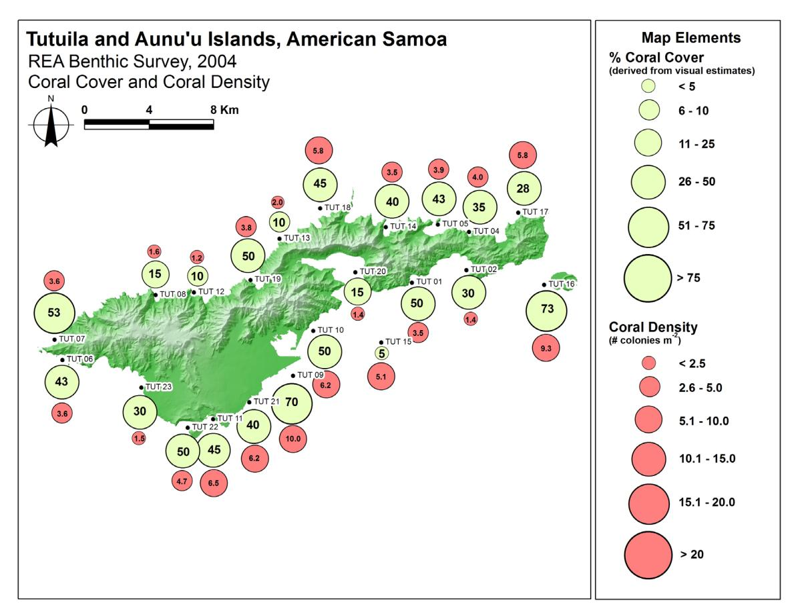

**Figure 3.5.1h.** Live scleractinian (stony) coral cover and coral colony density from REA surveys around Tutuila and Aunu`u during ASRAMP 2004. The size of the symbol is proportional to the value of each parameter. It is important to note that coral percent cover was determined by qualitative visual estimates.

reef (TUT-20), inside nutrient-subsidized Pago Pago Harbor, was found supporting a few genera not common elsewhere, which contributed to the site's high coral diversity (22 coral genera). Coral richness was relatively lower at two sites within the northwest region (TUT-12 and TUT-08) where 12 and 15 coral genera were recorded, respectively.

During the ASRAMP 2004 REA coral surveys, visual estimates of coral cover around Tutuila and Aunu`u were variable (Fig. 3.5.1h), with an island-wide mean of 37.7% (SE 3.9). Coral cover was highest at TUT-16 off Aunu`u and TUT-09 in the south region (73% and 70%, respectively). Estimates of coral cover were relatively low (5–15%) in the north and northwest regions at sites TUT-08, TUT-12, and TUT-13, at Taema Bank at site TUT-15, and outside Pago Pago Harbor at site TUT-20 (Fig. 3.5.1h).

During ASRAMP 2004 surveys around Tutuila and Aunu`u, a total of 8219 coral

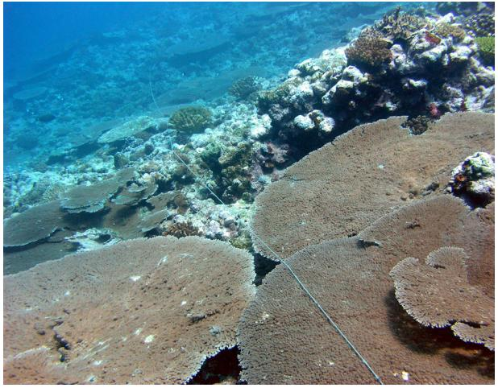

**Figure 3.5.1i.** Numerous large, mature table corals (*Acropora* sp.) along belt transect at Tutuila. (*Photograph provided by NOAA PIFSC CRED; J Kenyon, JIMAR*)

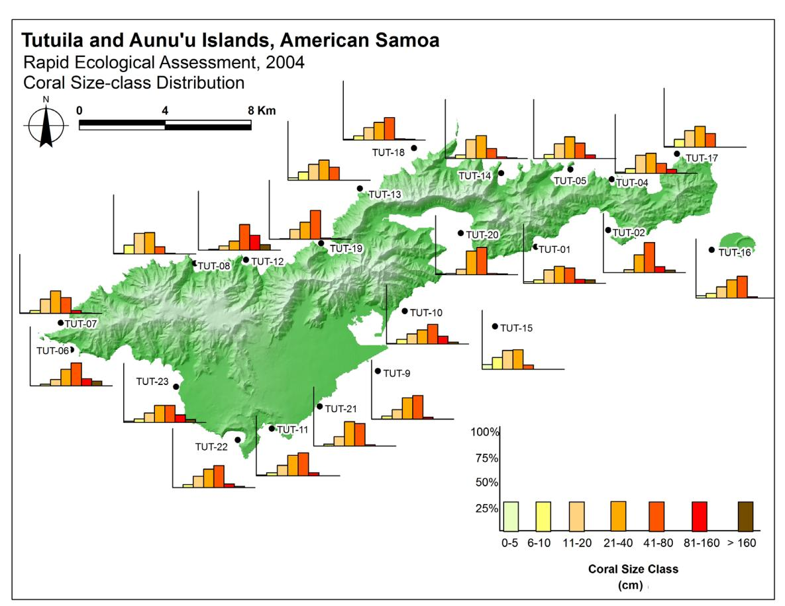

**Figure 3.5.1j.** Scleractinian coral size-class distribution around Tutuila and Aunu`u from REA surveys during ASRAMP 2004. The height of the *y*-axis in each size class chart represents 100%. The seven observed size classes (0–5, 6–10, 11–20, 21–40, 41–80, 81–160, and > 160 cm), are color coded in size frequency diagrams at each REA site.

colonies were counted within a total survey area of 2030 m2 . Mean coral densities per site around Tutuila and Aunu`u were variable with 4.3 colonies m-2 (SE 2.4) reported (Fig. 3.5.1h). The highest coral density values (9.3 and 10.0 colonies m-2) were recorded off Aunu`u at site TUT-16 and in the south region at TUT-09, respectively. Relatively low coral densities (1.2 to 2 colonies m-2) were generally reported in the northwest and north regions at sites TUT-07, TUT-08, TUT-12, and TUT-13, and inside Pago Pago Harbor at site TUT-20. The highest coral cover and colony densities observed around Tutuila and Aunu`u in 2004 occurred at the same two sites: TUT-09 and TUT-16.

During ASRAMP 2004 surveys around Tutuila and Aunu`u, size-class distributions of scleractinian (stony) corals showed the majority of corals (63.2%) had diameters between 20 cm and 80 cm (Fig. 3.5.1j). Sites with more than 25% of corals having maximum diameters greater than 40 cm were mostly located within southern regions of Tutuila: southwest (TUT0- 6, -23), South Point (TUT-22), south (TUT-10,-11), southeast (TUT-01), and Aunu`u (TUT-16), while only site TUT-12 in the northwest region had abundant large corals (Fig. 3.5.1j). Only site TUT-15 at Taema Bank had more than 10% of coral colonies in the smallest (< 5 cm) size class.

#### *2006 Spatial Surveys*

During ASRAMP 2006, large swells made towed-diver surveys difficult, leading to deeper and less consistent sampling than in previous years (Fig. 3.5.1k). Towed-diver surveys around Tutuila and Aunu`u in 2006 had a mean depth of 16.1 m (SD 4.7); individual tow tracks varied in depth from 10 m (SD 4) to 24 m (SD 3). For the 44 towed-diver benthic surveys completed in 2006, the overall mean scleractinian (stony) coral cover was 13.7% (SE 0.7) (Fig. 3.5.1l), while the associated mean stressed coral cover was 3.2% (SE 0.4; Fig. 3.5.1m).

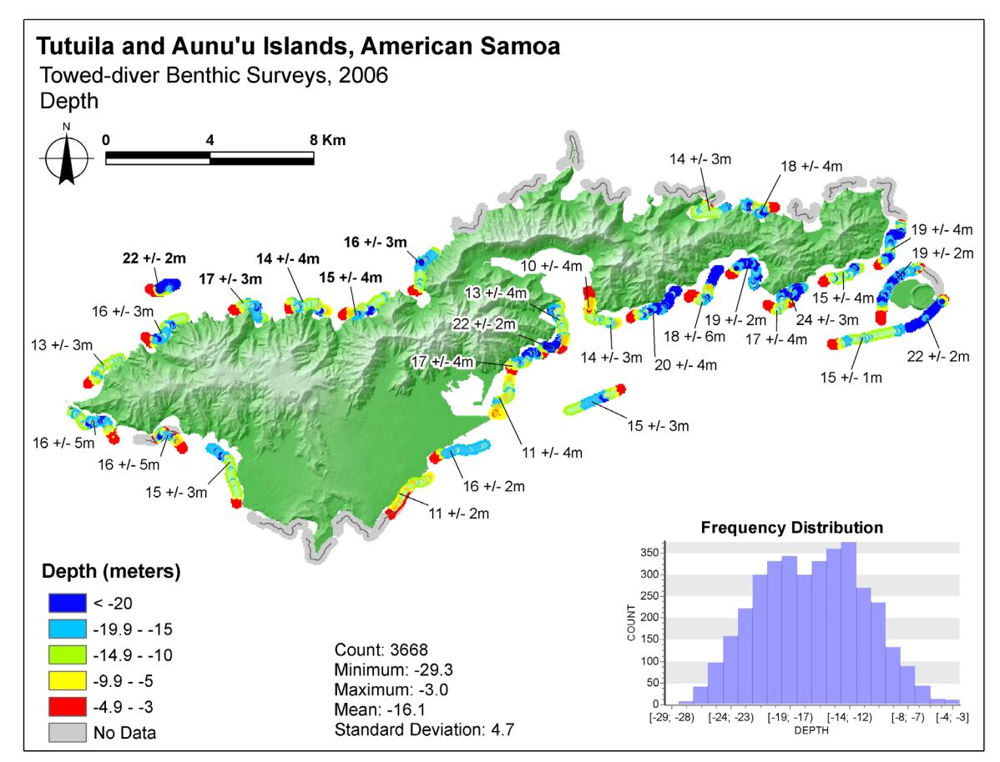

**Figure 3.5.1k.** Towed-diver survey tracks around Tutuila and Aunu`u during ASRAMP 2006. Towed-diver survey tracks are color coded with mean depths for each 5-min segment. Mean depths and standard deviations for each towed-diver survey are shown in black text. Depth histogram and statistics (counts, minimum depth, maximum depth, mean, and standard deviation) from 30-sec depth recordings during towed-diver surveys are included.

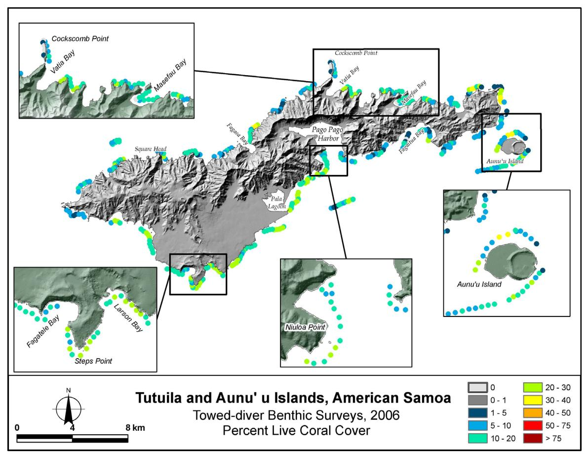

**Figure 3.5.1l.** Towed-diver benthic survey observations of live scleractinian (stony) coral cover around Tutuila and Aunu`u during ASRAMP 2006. Each colored point represents an integrated estimate over a 5-min observation segment covering a survey swath of ~ 200 m × 10 m (~ 2000 m2 ). Symbol size represents the percent live coral cover on the benthic habitat. See Chapter 2, Table 2.4.2b for more information on benthic towed-diver binning categories during ASRAMP 2006.

Areas of high coral cover included the forereef near the airport runway and Matautuotafuna Point (5 tow segments; mean: 25%) in the south region, the northern side of Aunu`u (2 tow segments; mean: 35%), and 3 tow segments near Papuloa Point east of Aoa Bay in the northeast region (mean: 31.7%; Fig. 3.5.1l).

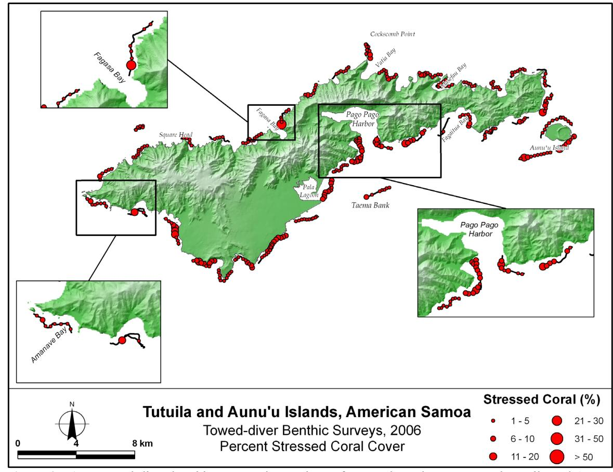

**Figure 3.5.1m.** Towed-diver benthic survey observations of stressed coral cover around Tutuila and Aunu`u during ASRAMP 2006. Each colored point represents an integrated estimate over a 5-min observation segment covering a survey swath of ~ 200 m × 10 m (~ 2000 m2 ). Symbol size represents the percent of stressed coral cover of the total coral benthic coverage. See Chapter 2, Table 2.4.2b for more information on benthic toweddiver binning categories during ASRAMP 2006.

Stressed coral (Fig. 3.5.1m) was found in a number of locations, including the area near Breakers Point entering the eastern side of Pago Pago Harbor (3 tow segments; mean: 10.0%), the area on the southeastern side of Aunu`u (5 tow segments; mean: 9.0%), and within Leone Bay near Logologo Point (3 tow segments; mean: 15%) in the southwest region. A high level of stressed coral (25%) was also recorded during a single 5-min tow segment near Fagasa Bay in the north region; however, no additional information regarding the type or potential cause of the stress was noted.

A total of 16 coral REA surveys were conducted around Tutuila and Aunu`u during ASRAMP 2006. Coral population parameters (density, richness, and size classes) were not recorded at REA sites TUT-06, -07, -08, -12, -19, and -23 because of logistical diving problems. At least 35 anthozoan/hydrozoan genera were recorded during surveys around Tutuila and Aunu`u. Coral community composition varied greatly at sites around the islands, with no single coral genus showing dominance throughout (Fig. 3.5.1n). *Montipora*, *Pavona*, *Porites*, and octocorals were the most common corals seen, each accounting for 10–20% of the coral community. *Porites* was more common at sites off the north coast of Tutuila, making up on average 22% of the coral community compared to only 3.5% of the coral community for the rest of the island. Octocorals were most common at sites TUT-01, -10, and -15 in the southeast, south, and Taema Bank regions, where they accounted for more than 40% of colonies. Other genera were locally abundant, especially *Lobophyllia* at TUT-10 in the south region, *Echinopora* at TUT-06 in the southwest region, and *Astreopora* at TUT-13 and -09 in the north and south regions. Site-specific relative abundance of corals, shown as the percentage by taxon of total number of coral colonies, is presented in Appendix III, Table III. ii.

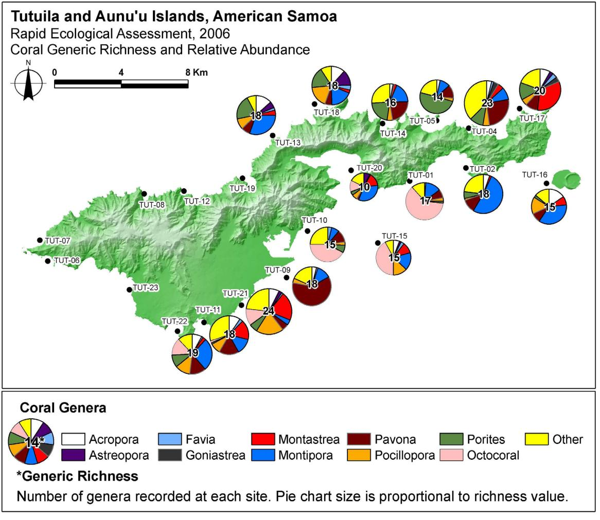

**Figure 3.5.1n.** Relative abundance of coral genera and generic richness from REA surveys around Tutuila and Aunu`u during ASRAMP 2006. Percent relative abundance of key coral genera are indicated by color-coded portions of the pie charts. Size of pie charts and black numbers in the center of the pie charts indicate the number of coral genera observed at each REA site. Data were not recorded at REA sites TUT-06, -07, -08, -12, -19, and -23 because of logistical diving problems.

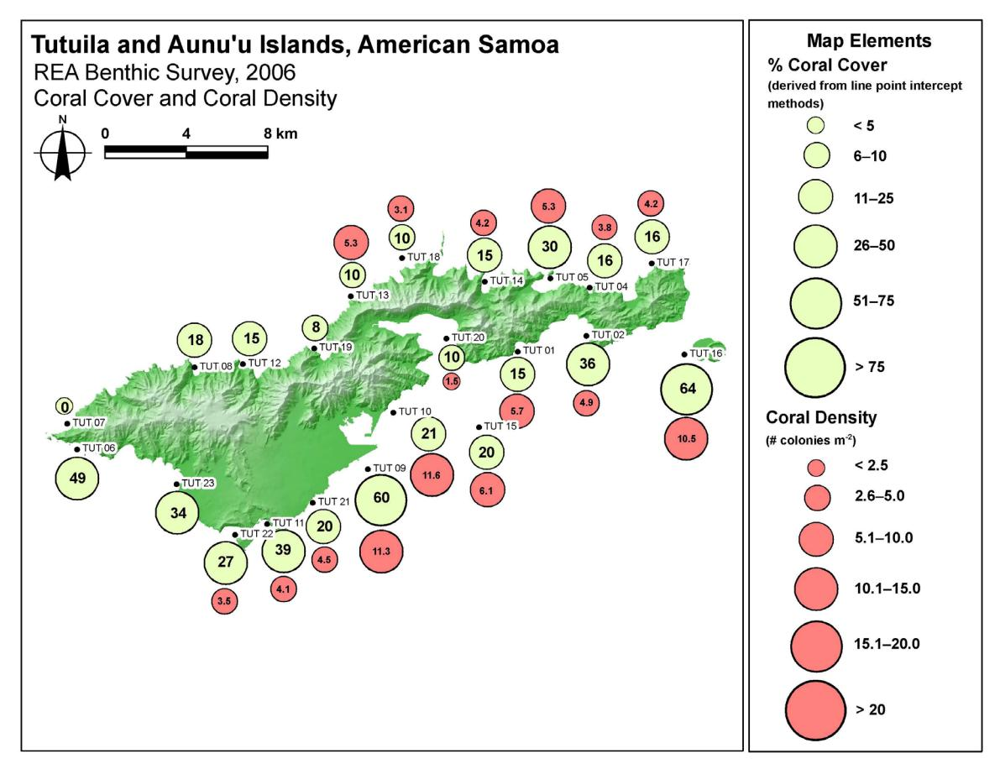

**Figure 3.5.1o.** Live scleractinian (stony) coral cover and coral colony density from REA surveys around Tutuila and Aunu`u during ASRAMP 2006. The size of the symbol is proportional to the value of each parameter. Data were not recorded at REA sites TUT-06, -07, -08, -12, -19, and -23 because of logistical diving problems.

Generic richness was variable with a mean of 17.4 coral genera per site (SE 0.8) (Fig. 3.5.1n). High richness (20–24 coral genera) was found at sites TUT-04 and -17 in the northeast region and also at site TUT-21 in the south region. Coral richness was relatively low inside Pago Pago Harbor at site TUT-20, with only 10 coral genera being recorded.

During ASRAMP 2006 surveys, a total of 4251 coral colonies were counted within belt transects covering 875 m2 . Mean coral densities per site around Tutuila and Aunu`u were variable with 5.6 colonies m-2 (SE 2.4) reported (Fig. 3.5.1o). The highest coral densities (10–12 colonies m-2) were recorded at sites TUT-09 and TUT-10 in the south region and at site TUT-16 off Aunu`u. Low coral densities (3.1–5.3 colonies m-2) were generally reported at north-facing sites (TUT-17, -04, -05, -14, -18, and -13) while the lowest coral density (1.5 colonies m-2) was found inside the Pago Pago Harbor (TUT-20).

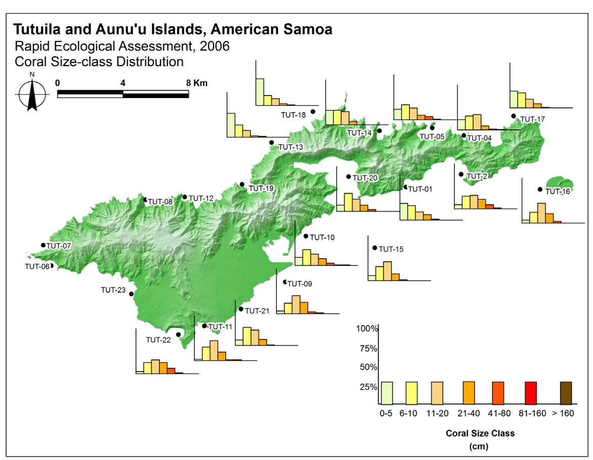

**Figure 3.5.1p.** Scleractinian coral size-class distribution around Tutuila and Aunu`u from REA surveys during ASRAMP 2006. The height of the *y*-axis in each size class chart represents 100%. The seven observed size classes (0–5, 6–10, 11–20, 21–40, 41–80, 81–160, and > 160 cm), are color coded in size frequency diagrams at each REA site. Data were not recorded at REA sites TUT-06, -07, -08, -12, -19, and -23 because of logistical diving problems.

Size-class distributions of scleractinian corals showed the majority of corals (80.1%) had diameters less than 20 cm (Fig. 3.5.1p). Only at site TUT-22 in Fagatele Bay in the south point region were greater than 25% of the corals observed to have diameters greater than 40 cm. Generally, corals were smaller off the north coast, with most sites having a relatively high percentage of corals with diameters less than 10 cm. Sites TUT-13 and TUT-18 in the north region each had more than 50% of corals with maximum diameters less than 5 cm.

# **3.5.2 Coral Disease Surveys**

# *2006 Spatial Surveys*

Coral diseases were first surveyed around Tutuila and Aunu`u during ASRAMP 2006; disease surveys covered 9100 m2 of reef habitat. Within this survey area a total of 73 cases of disease, predation, and other types of lesions were enumerated. Of the 22 sites visited, 13 (59%) contained disease and visible signs of predation (Fig. 3.5.2a, b). The mean overall prevalence of bleaching, disease, and 'other lesions', excluding predation, was 0.12% (SE 0.03). Sites TUT-18, TUT-14, and TUT-17 in the north and northeast regions exhibited the greatest occurrence of disease (> 80% of cases; Fig. 3.5.2a).

The most common disease state at Tutuila and Aunu`u was 'other lesions', which involved coral hyperpigmented irritations (Fig. 3.5.2b). This condition was observed predominantly on corals of the genera *Montipora* and *Porites*, but also on *Astreopora* and *Leptoria*. Skeletal growth anomalies were the second most common type of lesion; mean prevalence values for this disease state were as high as 0.24% at site TUT-08 in the northwest region, where 56 growth anomalies were enumerated on one single colony of *Acropora abrotnoides*. Skeletal

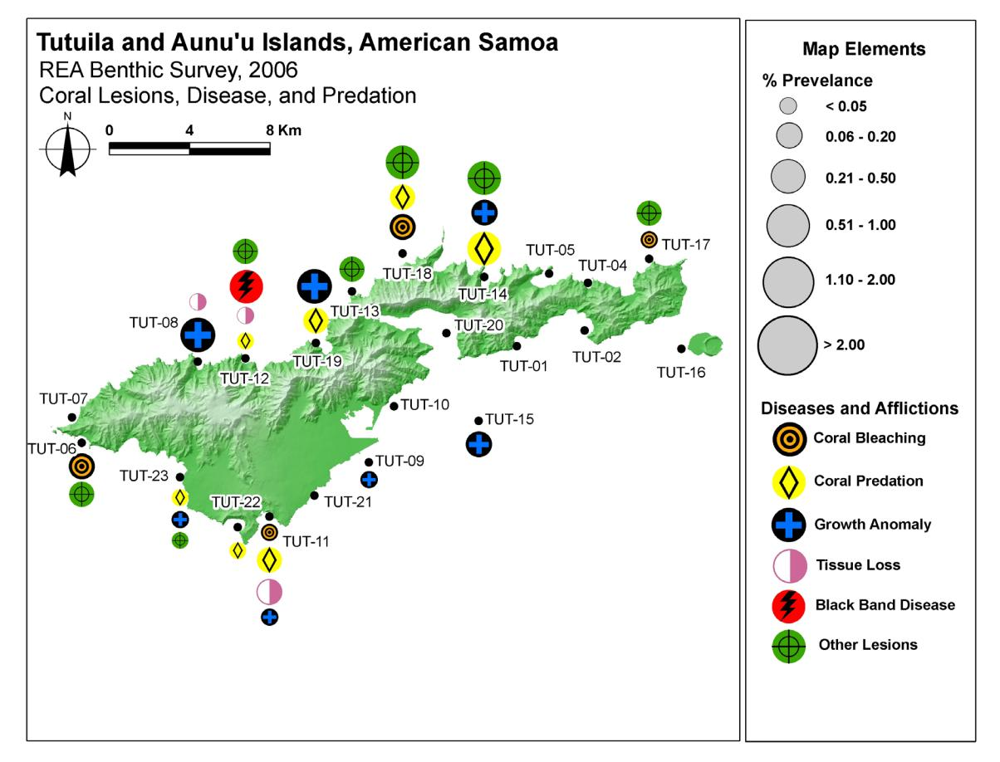

**Figure 3.5.2a.** Prevalence of predation, bleaching, growth anomalies, tissue loss, black band disease, and other lesions at Tutuila and Aunu`u during ASRAMP 2006. Prevalence was calculated relative to the average colony density estimates and is indicated by the size of the respective disease symbols. Colony density data were not recorded at REA sites TUT-06, -07, -08, -12, -19, and -23 because of logistical diving problems. Percent prevalence for those sites was estimated using the mean colony density for the entire island.

growth anomalies were also detected on corals of the genera *Astreopora*, and *Favites*. Coral bleaching was observed in low prevalence at sites TUT-18, TUT-17, TUT-11, and TUT-06 in the north, northeast, south point, and southwest regions; bleaching was generally mild and focal. Scleractinian genera that exhibited bleaching included: *Porites*, *Montastrea*, and *Leptoria*. Other disease states present on corals around Tutuila and Aunu`u included tissue loss (0.07%), all on colonies of *Acropora cytherea*, and one case of black band disease on *Porties* cf. *lobata* (0.04%).

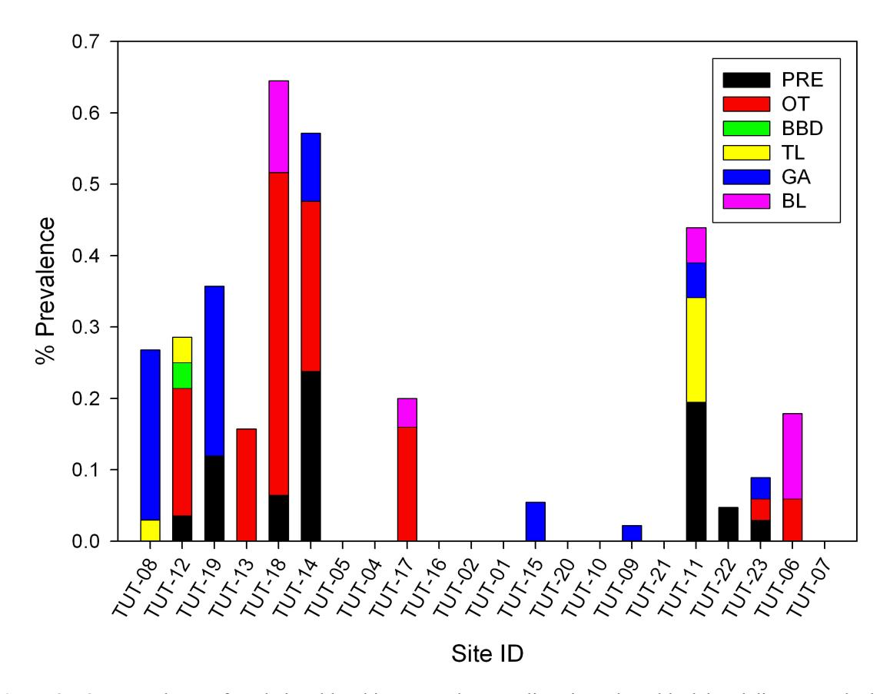

**Figure 3.5.2b.** Prevalence of predation, bleaching, growth anomalies, tissue loss, black band disease, and other lesions at Tutuila and Aunu`u during ASRAMP 2006. Prevalence was calculated relative to the average colony density estimates. Colony density data were not recorded at REA sites TUT-06, -07, -08, -12, -19, and -23 because of logistical diving problems. Percent prevalence for those sites was estimated using the mean colony density for the entire island. PRE—*Acanthaster* and/or *Drupella* predation; OT—other lesions, including hyperpigmented irritations; BBD— black band disease; TL— tissue loss; GA—skeletal growth anomalies; and BL— bleaching.

# **3.5.3 Temporal Comparison—Coral and Coral Disease**

Mean percent live scleractinian coral cover, as derived from towed-diver surveys, declined from 28.9% (SE 2.5) in 2002, to 20.9% (SE 1.1) in 2004, to 13.7% (SE 0.7) in 2006 (Fig. 3.5.3a). Coral cover values from the towed-diver surveys were consistently lower than REA coral cover values. This result is expected, based on the difference in methodologies: towed-diver surveys record benthic cover along all habitat types (i.e. hard-bottom and softbottom substrates), while REA surveys tend to focus on hard-bottom substrate. Generally, soft-bottom habitats have lower coral cover than hard-bottom habitats, likely explaining the higher coral cover reported by REA surveys. It is interesting to note that despite the inherent differences between the two methods of estimating coral cover, estimates of the relative percent decline of coral cover between 2004 and 2006 were similar for both methods (36% and 34%, respectively, for REA and towed-diver surveys).

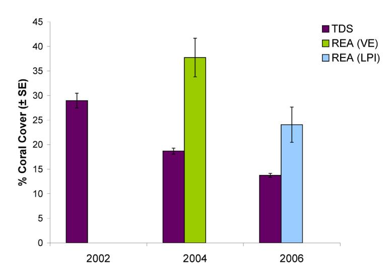

**Figure 3.5.3a.** Temporal comparison of mean percent live coral cover from REA surveys and towed-diver surveys around Tutuila and Aunu`u during ASRAMP 2002, 2004, and 2006. The purple bars represent observations collected during towed-diver benthic surveys. The green bar represents REA data collected by visual estimates during REA surveys and the blue bar represents data collected by the line point intercept technique during REA surveys. See Chapter 2, Section 2.4: Reef Benthic (Coral, Algae, Macroinvetebrate) and Fish Surveys for considerations when comparing the results of these methodologies.

Total live coral cover declined in REA surveys (2004–2006) as well as towed-diver surveys (2002–2006). Mean coral cover for 2004 (37.7% [SE 3.9]) and 2006 (24.1% [SE 3.6]) REA surveys are graphed in Figure 3.5.3a. Direct comparison of REA percent coral cover values between years is not appropriate because the methods used to estimate percent coral cover were different in 2004 and 2006 (visual estimate and line intercept, respectively). Evaluating percent coral cover on a per-site basis would likely lead to misguided conclusions, because visual estimates can vary widely from estimates derived from more rigorous quantitative methods such as the line point intercept technique. However, a general trend of areas with high and low coral cover was observed. During ASRAMP 2004 and 2006, the highest coral cover was found at TUT-16 (64–73%) off Aunu`u and off the south coast of Tutuila at TUT-09 (60–70%). Relatively low coral cover values recorded at site TUT-08 in the northwest region, at site TUT-13 in the north region, and inside Pago Pago Harbor at site TUT-20 also remained similar between years.

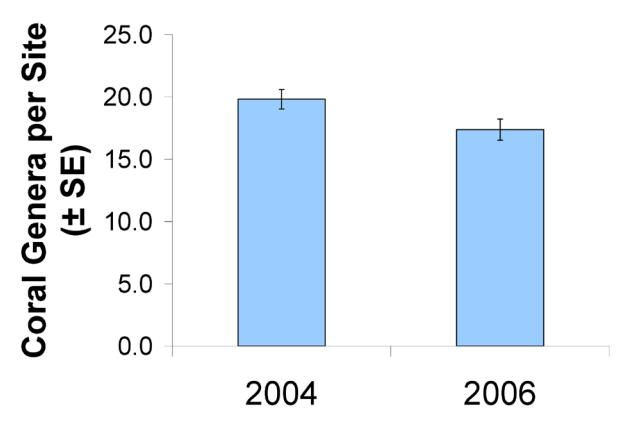

**Figure 3.5.3b.** Temporal comparison of mean coral genera per site from REA surveys around Tutuila and Aunu`u during ASRAMP 2004 and 2006.

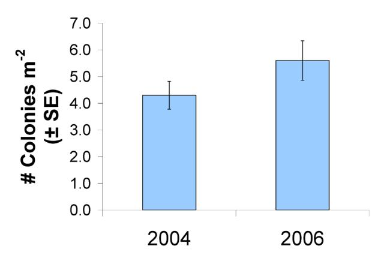

**Figure 3.5.3c.** Temporal comparison of mean coral colony density from REA surveys around Tutuila and Aunu`u during ASRAMP 2004 and 2006.

Island-wide coral community composition was quite stable between 2004 and 2006, with 37 genera reported in 2004 and 35 genera reported in 2006. During both years, the same suite of coral genera (*Montipora*, *Pavona*, *Porites*, octocorals) each contributed more than 10% of the total numerical abundance of coral colonies. Mean generic richness of corals per site was slightly higher in 2004 (19.8 coral genera per site [SE 0.8]) compared to 2006 (17.4 genera per site [SE 0.8]; Fig. 3.5.3b). The greatest difference in coral richness was seen at site TUT-20 inside Pago Pago Harbor. In 2004, 22 coral genera were reported at TUT-20, while in 2006 only 10 genera were reported. A probable explanation for this difference in estimated coral diversity is that the placement of belt transects varied between years. Sites are located with the use of global positioning system coordinates marked from a dive boat, and currently no permanent transects have been installed in American Samoa. Of the 20 genera reported at TUT-20 in 2004, 14 were rare, with only one or two colonies present. Consequently, a slight change in the placement of the transect lines in 2006 would have easily put many of these genera outside the survey area, thus leading to the large discrepancy in estimated generic richness between survey years.

Coral density increased from a mean of 4.3 coral colonies m-2 (SE 0.5) in 2004 to 5.6 colonies m-2 (SE 0.7) in 2006 (Fig. 3.5.3c). In both 2004 and 2006, spatial trends in coral density were similar to those in REA coral cover with the highest densities recorded at TUT-09 and TUT-

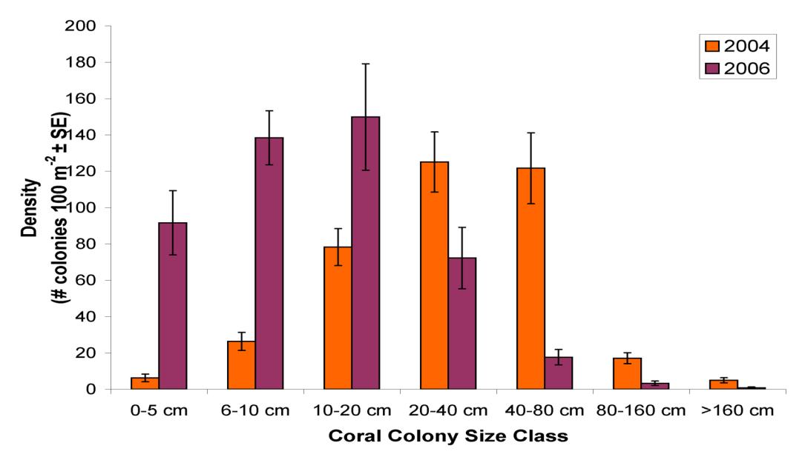

**Figure 3.5.3d.** Coral colony size-class mean density around Tutuila and Aunu`u for ASRAMP 2004 and 2006. Differences between 2004 and 2006 are thought to be the result of interobserver variability.

16, and lower densities reported at north-facing sites and TUT-20, inside Pago Pago Harbor. Based on REA surveys around Tutuila and Aunu`u during ASRAMP 2004 and 2006 (Fig. 3.5.3d), scleractinian coral size-class distributions appear to have shifted from one in which the majority of corals had diameters greater than 20 cm in 2004 to one in which the majority of corals had diameters less than 20 cm in 2006. Although extreme natural events such as tropical cyclones and other storm activities can have great impacts on coral reef communities, analyses suggest that this difference in estimated size-class distributions between 2004 and 2006 is most likely a result of interobserver variability. There are a number of considerations pertinent to observer variability, including the use of different observers both within and between years and inherent variation in coral morphologies.

In 2004, two coral biologists collected coral population data concurrently (each surveyed one 25-m transect at each site) and their results were combined to produce the coral population parameters presented in this report. An investigation of site-specific data collected in 2004 by the two coral biologists revealed a general trend throughout all American Samoa sites for one of the coral biologists to classify corals into larger size classes than the other coral biologist. Figure 3.5.3e shows that the majority of corals recorded by observer #1 had maximum estimated diameters between 10 cm and 40 cm, while the majority of corals recorded by observer #2 had maximum diameters between 40 cm and 80 cm. In 2006, of the 16 sites where size class data were recorded, 3 were surveyed by observer #1 and the remaining 13 sites were surveyed by 2 additional coral biologists. This observer bias partially explains the temporal differences within the large coral size-classes and leads us to regard interobserver variability as the chief source of the discrepancy of Tutuila and Aunu`u size class distributions between 2004 and 2006.

One potential source for interobserver error derives from the clonal nature of corals which sometimes complicates the estimation of individual coral colony boundaries. While the boundaries of colonies of some genera (e.g., *Pocillopora*) are discrete and therefore their sizes simple to determine, many other taxa (e.g., *Acropora*, *Montipora*, *Porites*, *Favia*, and

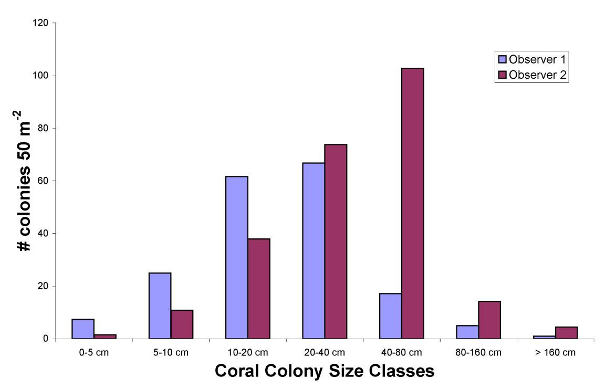

**Figure 3.5.3e.** Interobserver variability of coral colony size-class mean density around Tutuila and Aunu`u for ASRAMP 2004. Data were collected concurrently by two coral biologists and combined to create Figure 3.5.1j.

*Goniastrea*) undergo substantial fragmentation and/or fission as part of their life history. This tendency introduces uncertainty in determining the boundaries of individual colonies and hence implicitly introduces interobserver error into the data. Although written criteria were established for making field judgments concerning the number of colonies represented by a spatially fragmented mass of con-specific coral tissue, different judgments will inevitably be made by different field observers. CRED is presently initiating efforts to investigate alternative methods that may reduce the degree to which interobserver error confounds interpretations of apparent temporal variation.

#### **3.6 Algae**

#### **3.6.1 Algal Surveys**

It is important to note when considering these results that turf algae, crustose coralline red algae, branched non-geniculate coralline red algae, and cyanophytes (blue-green algae) all need to be analyzed microscopically for proper taxonomic identification and, therefore, must be lumped into functional group categories in the field. Of these functional groups, turf algae are the most diverse with the possibility of up to 100 species occurring in a 10 cm2 area. Also, macroalgae are large, fleshy, sometimes calcified entities that may be identifiable to genus or species in the field, but often require microscopic analysis to confirm taxonomic identities.

#### *2002 Spatial Surveys*

A total of 16 towed-diver benthic surveys were conducted around Tutuila during ASRAMP

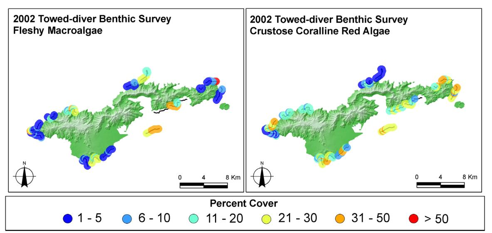

**Figure 3.6.1a.** Percent cover of fleshy macroalgae (including turf algae) and crustose coralline algae from towed-diver benthic surveys around Tutuila and Aunu`u during ASRAMP 2002. Each colored point represents an integrated estimate over 5-min observation segments covering a survey swath of ~ 200 m × 10 m (~ 2000 m2 ).

2002, with fleshy macroalgae and crustose coralline red algae covering, on average, 34% of the benthic substrate. Mean fleshy macroalgal cover was 14.8% (SE 1.2) and mean crustose coralline algal cover was 20% (SE 1.1) of the benthic substrate (Fig. 3.6.1a). The greatest percent covers of fleshy macroalgae were observed consistently over Taema Bank, offshore of Pago Pago Harbor, near Alega Bay in the south region, and during a single 5-min segment near Cape Matatula in the northeast region. The greatest percent covers of crustose coralline algae were observed near the westernmost, easternmost, and southernmost points of the island, and offshore of Pago Pago Harbor, all areas of moderately high wave energy and current flow.

Qualitative REA algal surveys were also conducted around Tutuila during ASRAMP 2002, and 14 bags of algal voucher specimens were collected around Tutuila. These surveys provided baseline data used to design and scale the future methodology of algal REA surveys.

# *2004 Spatial Surveys*

A total of 43 towed-diver surveys were conducted around Tutuila and Aunu`u during ASRAMP 2004. The island-wide mean combined algal cover, including macroalgae, turf, and crustose coralline algae, was 63%. Mean fleshy macroalgal cover (including turf) was 33.6% (SE 0.7), and mean crustose coralline algal cover was 29% (SE 0.7) (Fig. 3.6.1b). Generally, greater cover of macroalgae was observed off the north and northwest regions, while greater crustose coralline algal cover was observed along the south point, south, and southeast regions. Macroalgae were not abundant off Cape Matatula, Cape Taputapu, or off the airport runway extension on the south region. Crustose coralline algae were not abundant off the National Park of American Samoa in the north region, Amanave Bay in the southwest region, and in Fagaitua Bay in the southeast region.

In 2004, algal REA surveys were conducted at 22 sites around Tutuila and Aunu`u (Fig.

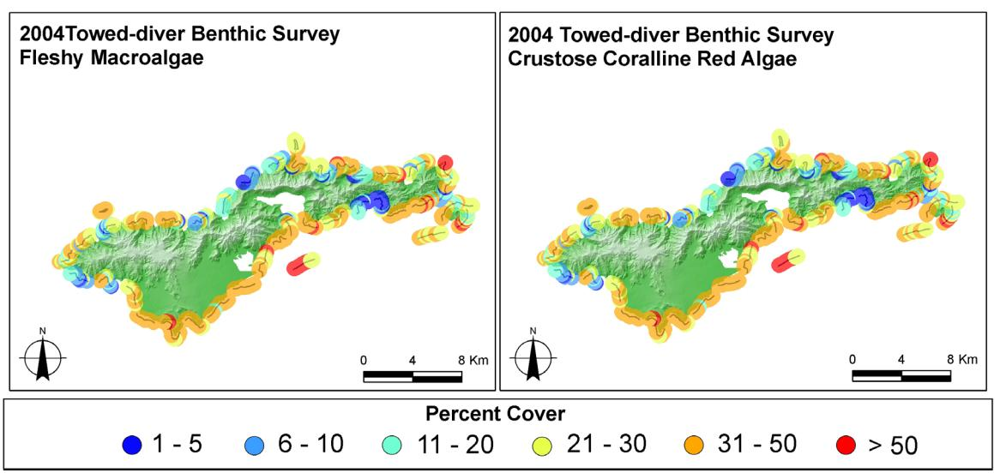

**Figure 3.6.1b.** Percent cover of fleshy macroalgae (including turf algae) and crustose coralline algae from towed-diver benthic surveys around Tutuila and Aunu`u during ASRAMP 2004. Each colored point represents an integrated estimate over 5-min observation segments covering a survey swath of ~ 200 m × 10 m (~ 2000 m2 ).

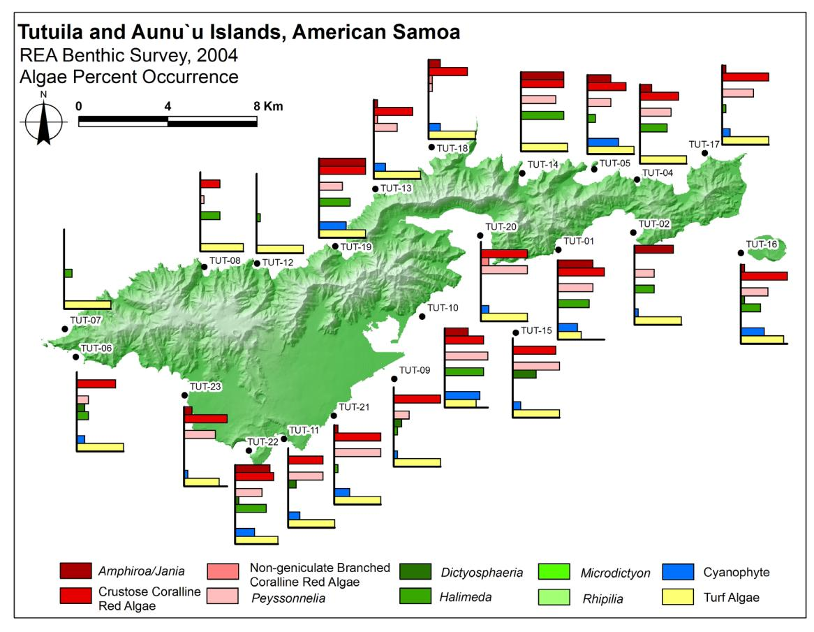

**Figure 3.6.1c.** Percent occurrence of select macroalgal genera and algal functional groups from REA surveys around Tutuila and Aunu`u during ASRAMP 2004. Percent occurrence is equivalent to the percentage of photoquadrats in which an algal genus or functional group was observed. Length of *x*-axis denotes 100% occurrence.

3.6.1c). Twenty-nine macroalgal genera (9 green, 18 red, and 2 brown) and 4 additional algal functional groups (turf algae, crustose coralline red algae, branched non-geniculate coralline red algae, and cyanophytes) were observed in the field. Once it is complete, laboratory-based taxonomic identification of all algal species (including turf algae, epiphytes, and crustose coralline red algae) will greatly increase the known algal diversity. Sites TUT-19 (National Park of American Samoa) and TUT-22 (Fagatele Bay National Marine Sanctuary) had the highest recorded macroalgal generic diversity with 11 and 9 genera recorded, respectively. Lowest macroalgal diversity was found at sites TUT-20 (Pago Pago Harbor) and TUT-15 (Taema Bank) where only 1 and 2 macroalgal genera were found, respectively.

Around Tutuila and Aunu`u, turf and crustose coralline red algae were the dominant marine flora, observed in over 75% of sampled quadrats (Fig. 3.6.1c). Absence or low abundance of crustose coralline red algae was observed in the northwest region and at TUT-02 in the southeast region of Tutuila. The distribution of cyanophytes around the island was patchy, with the majority of northeast, southeast, and south region sites containing low to moderate abundances of this functional group. Photoquadrats from the three sites in the northwest region of Tutuila contained no cyanophytes.

In 2004, several significant patterns were observed among the relative abundance of macroalgal genera around Tutuila and Aunu`u. This likely stems from Tutuila's large size allowing for many habitats to exist, with each habitat supporting different types of algal communities. Of note, however, the calcified red algal genus, *Peyssonnelia*, was particularly abundant on the south side of the island, occurring in 75% of sampled photoquadrats at sites TUT-11, TUT-21, TUT-10, TUT-20, and TUT-01 (Figs. 3.6.1c and 3.6.1d). In contrast,

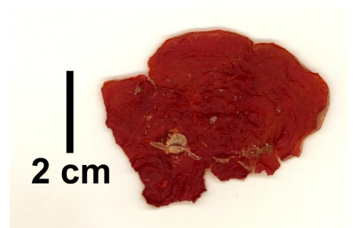

**Figure 3.6.1d.** A species of the calcified red alga, *Peyssonnelia*, from the island of Tutuila, American Samoa. This alga was particularly abundant on southern shores during ASRAMP 2004. (*Photograph provided by NOAA PIFSC CRED; P. Vroom, JIMAR*)

*Peyssonnelia* occurred in only 50% to 65% of photoquadrats in the southeast and northeast regions of Tutuila, and was lacking in the northwest. Species of the sand-producing, tropical green alga *Halimeda* were locally abundant and found in low to moderate relative abundance at numerous sites around the island with more than 90% of the photoquadrats in Masefau Bay (TUT-14) containing species of the genus. The green alga, *Dictyosphaeria*, was generally absent from photoquadrats at most sites along the north coast while the calcified red algal genera, *Amphiroa*/*Jania*, were generally more abundant in photoquadrats on the eastern half of the island. Although not shown in Figure 3.6.1c, the brown algal genus *Lobophora* was extremely common offshore at Taema Bank (TUT-15), occurring in 100% of sampled photoquadrats. *Lobophora* was completely lacking at all sites on the southern and western parts of Tutuila close to shore, and although found in northeast and 'Aunu`u' regions, it was documented in less than 50% of sampled photoquadrats.

#### *2006 Spatial Surveys*

A total of 44 towed-diver surveys were conducted around Tutuila and Aunu`u during ASRAMP 2006. Mean combined fleshy macroalgae (excluding turf) and crustose coralline algae cover was 27% of the benthic substrate. Mean fleshy macroalgal cover was 10.3% (SE 0.4) and mean crustose coralline algal cover was 16.9% (SE 0.8). The percent cover of fleshy macroalgae was moderately high (3–50%) in only a few scattered areas around Tutuila, including: an area near at the entrance to Pago Pago Harbor near Breaker's Point, an area in Fagaitua Bay in the southeast region, an area in Masefau Bay in the northeast region, and a single segment at Taema Bank (Fig. 3.6.1e). Aside from these few localized areas of moderately high cover, fleshy macroalgae were not observed to vary substantially around the island. The percent cover of crustose coralline algae was generally high (31–50%) across much of the southern regions, including south point, south, southeast, Aunu`u, and Taema Bank, as well as few scattered portions in the northwest and north regions. Very high crustose coralline algal cover (> 50%) was observed at three small, localized areas (single 5-min segments) over the western spur off Aunu`u, off Cape Fogausa, and a submerged offshore reef in the northwest region.

In 2006, algal REA surveys were conducted at the same 22 sites that were sampled in 2004 (Fig. 3.6.1f). Thirty-four macroalgal genera (8 green, 23 red, and 3 brown) and 4 additional algal functional groups (turf algae, crustose coralline red algae, branched non-geniculate coralline red algae, and cyanophytes) were observed in the field. Macroalgal generic diversity at each site ranged from 5 to 16; although once laboratory-based taxonomic identification of algal species is complete, algal diversity for each site will be much higher. Two south shore sites, TUT-22 (Fagatele Bay National Marine Sanctuary) and TUT-21, had the highest recorded macroalgal generic diversity around the island with 16 and 15 genera recorded, respectively. Lowest macroalgal diversity was found off the Tafuna Plain near the airport runway extension (TUT-05 ) and just north of Cape Taputapu (TUT-07), where only 5 and 6 macroalgal genera were found, respectively.

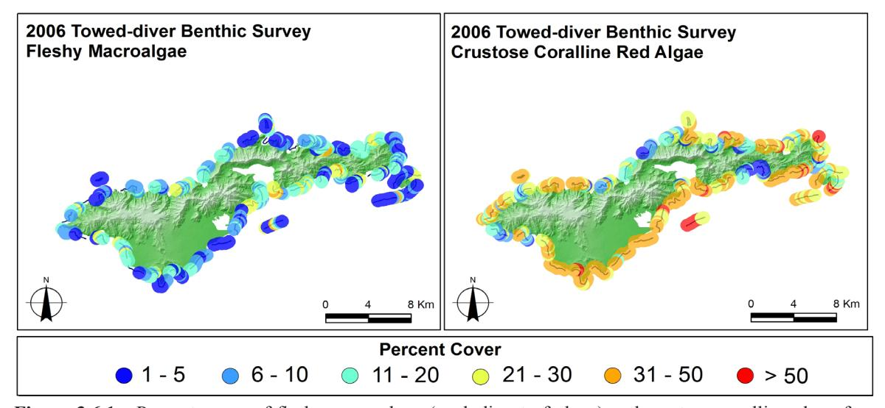

**Figure 3.6.1e.** Percent cover of fleshy macroalgae (excluding turf algae) and crustose coralline algae from towed-diver benthic surveys around Tutuila and Aunu`u during ASRAMP 2006. Each colored point represents an integrated estimate over 5-min observation segments covering a survey swath of ~ 200 m × 10 m (~ 2000 m2 ).

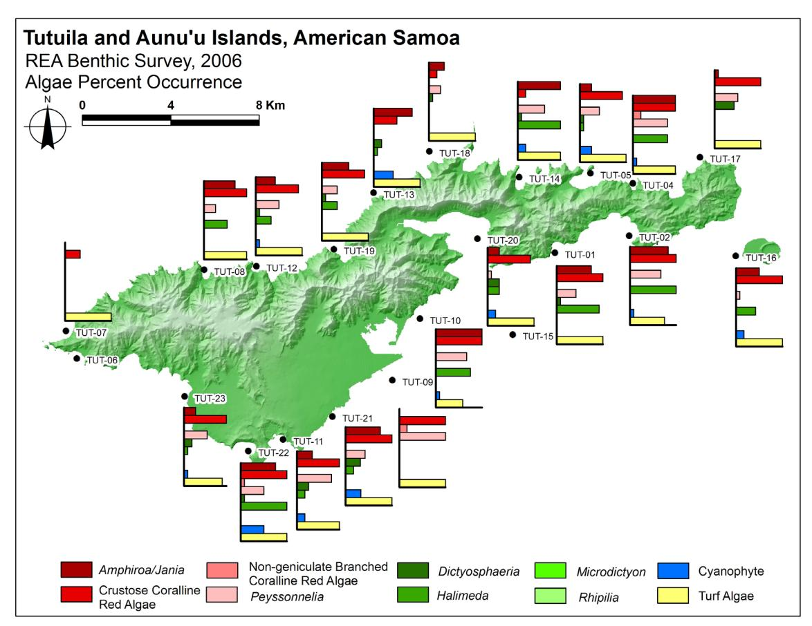

**Figure 3.6.1f.** Percent occurrence of select macroalgal genera and algal functional groups from REA surveys around Tutuila and Aunu`u during ASRAMP 2006. Percent occurrence is equivalent to the percentage of photoquadrats in which an algal genus or functional group was observed. Only qualitative information was collected at sites TUT-06 and TUT-15 because of weather conditions; therefore, no results are shown. Length of *x*-axis denotes 100% occurrence.

Around Tutuila and Aunu`u, turf algae were the dominant marine flora found, being observed in over 75% of sampled quadrats except for TUT-10, where turf algae was found in only a little above 50% of sampled photoquadrats (Fig. 3.6.1f). Crustose coralline red algae were also prevalent at most sites around the islands (> 75% of sampled photoquadrats per site), but were of lowest abundance near Cape Taputapu at the westernmost point of Tutuila and at TUT-18 in the National Park of American Samoa in the north region. The distribution of cyanophytes around the islands was patchy, with the majority of northeast and southern (south point, south, southeast, and Aunu`u regions) sites containing low to moderate abundances of this functional group. Photoquadrats in the northwest region of Tutuila contained few to no cyanophytes.

In 2006, the south and northeast regions exhibited the highest relative abundance of fleshy and calcified macroalgal genera, although few other obvious distributional trends could be discerned. The calcified, sand-producing green algal genus *Halimeda* occurred in over 90% of sampled photoquadrats at 20% of sites around the island, but the location of these sites appears random (Fig. 3.6.1f). Similarly, the calcified red algal genus, *Peyssonnelia*, occurred in more than 75% of sampled photoquadrats at two south region sites, TUT-11 and TUT-20, and also at one site in the northwest region, TUT-04. The geniculate, calcified, red

algal genera *Amphiroa* and *Cheilosporum*, and the brown algal genus, *Dictyota*, were locally abundant, occurring in more than 75% of photoquadrats.

#### **3.6.2 Coralline Algal Disease Surveys**

#### *2006 Spatial Surveys*

Afflictions to coralline algae were noted while 22 REA surveys were conducted during ASRAMP 2006 (Fig. 3.6.2a). A total of 195 cases were enumerated, almost three times more numerous than coral lesions and disease. Of the 22 sites visited, 9 (41%) contained coralline algal disease. An opposite spatial distribution pattern to that of coral diseases applied to coralline algal disease; the south-facing shores exhibited the majority of the cases (98%). Coralline lethal orange disease (CLOD) was particularly abundant at site TUT-22 in Fagatele Bay National Marine Sanctuary (mean 0.13 cases/m2 ), at site TUT-21 south of the airport in the south region (mean 0.06 cases m-2), and at site TUT-15 at Taema Bank (mean 0.09 cases/ m2 ). The black coralline fungal disease was the second most abundant affliction to coralline algae. Twenty-one cases were enumerated for the whole island, 19 of which occurred at site TUT-10, southwest of Pago Pago Harbor. Additionally, six cases of unidentified coralline algal discoloration were noted at site TUT-11.

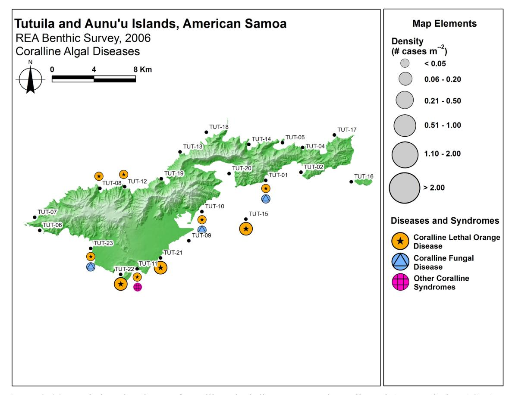

**Figure 3.6.2a.** Relative abundance of coralline algal diseases around Tutuila and Aunu`u during ASRAMP 2006. Disease density is indicated by the size of the respective disease symbols.

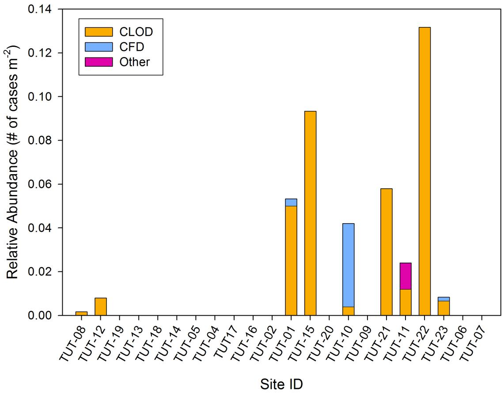

**Figure 3.6.2b.** Relative abundance of coralline algal disease around Tutuila and Aunu`u during ASRAMP 2006. CLOD: coralline lethal orange disease; CFD: coralline fungal disease; and Other: undetermined coralline discolorations.

# **3.6.3 Temporal Comparison—Algae**

The number of macroalgal genera observed around Tutuila and Aunu`u increased from 29 in 2004 to 34 in 2006, and the relative abundance of fleshy and calcified macroalgal genera also appeared to increase between sampling years (Figs. 3.6.1c and 3.6.1f). The apparent lower algal diversity and abundance in 2004 was likely caused by the passing of Hurricane Heta close to Tutuila in January of 2004 immediately prior to surveys. However, a manuscript being written by Tribollet, Dailer, and Vroom (Tribollet et al., in prep) includes a multivariate statistical temporal analysis of the relative abundance of macroalgae around Tutuila. Preliminary results indicate that despite apparent temporal trends, the mix and relative abundance of algal genera recorded around Tutuila and Aunu`u in 2004 and 2006 did not vary significantly between sampling years.

Anecdotally, many algal population characteristics between the survey years appear similar, and generalized trends pertain to both 2004 and 2006 (Fig. 3.6.3a). Low algal relative abundance along the northwest shore of Tutuila suggests that environmental factors, such as wave energy, may limit algal populations in this area. Fagatele Bay consistently contained among the highest macroalgal diversity seen on the island, suggesting that the increased management protection this area receives may be positively impacting algal community

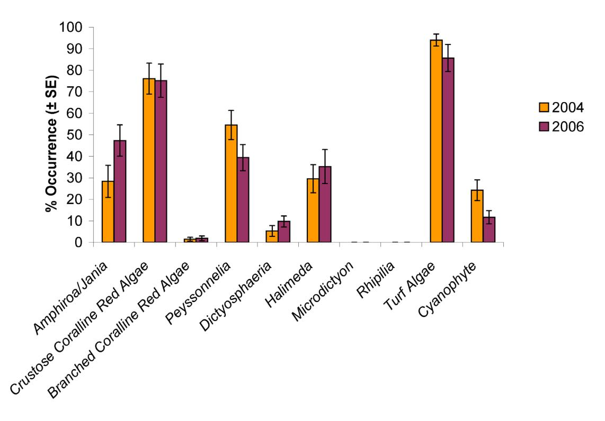

**Figure 3.6.3a.** Temporal comparison of REA algal genera and functional group percent occurrence around Tutuila and Aunu`u between ASRAMP 2004 and 2006.

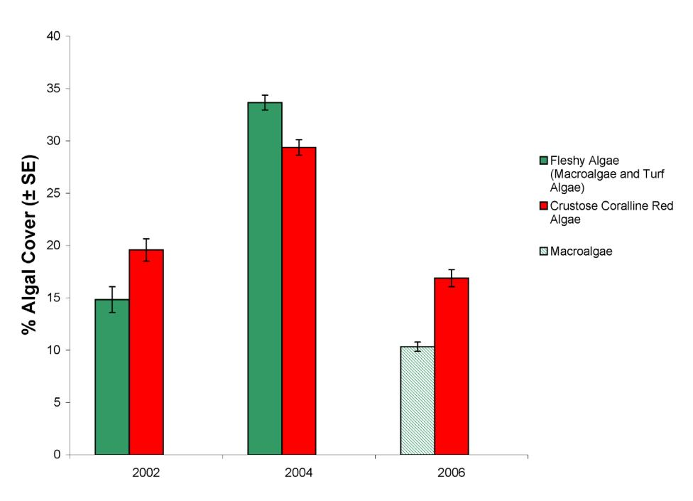

**Figure 3.6.3b.** Temporal comparison of REA algal genera and functional group percent occurrence around Tutuila and Aunu`u between ASRAMP 2004 and 2006. See Chapter 2, Section 2.4: Reef Benthic (Coral, Algae, Macroinvetebrate) and Fish Surveys for considerations when comparing the results off these methodologies between years.

diversity and structure. No large cyanobacterial outbreaks or monotypic stands of invasive algae were discovered in 2004 or 2006.

A major difference between 2004 and 2006 is the increased abundance of *Amphiroa*/*Jania* at western sites, and the higher percent occurrence of the sand-producing green alga *Halimeda* at multiple sites around the island in 2006 (Fig. 3.6.3a). These population increases may be linked to the absence of heavy storm activity prior to the 2006 surveys. *Jania*, *Amphiroa*, and *Halimeda* are all geniculate calcified genera and may fragment during periods of heavy wave energy, thereby producing asexual reproductive units that can travel in storm-generated currents and resettle when calmer conditions prevail.

As a result of methodological changes, variance in observer's assessment of percent cover of algae, particularly turf algae, and differing tow tracks between years, it is difficult to characterize temporal change in abundance of algae from the existing towed-diver survey observations (Fig. 3.6.3b). Observations of percent cover of crustose coralline algae varied from ~ 20% during ASRAMP 2002 (38 ha) to ~ 30% during ASRAMP 2004 (82 ha) to ~ 17% during ASRAMP 2006 (87.5 ha). Since these observations have not yet been calibrated to determine observer errors or biases, estimates of temporal change should be interpreted with caution. CRED staff members are presently developing methodological revisions to allow more rigorous temporal comparisons during future surveys.

#### **3.7 Benthic Macroinvertebrates**

# **3.7.1 Benthic Macroinvertebrate Surveys**

#### *2002 Spatial Surveys*

Towed-diver benthic macroinvertebrate surveys around Tutuila during ASRAMP 2002 found variable distributions of giant clams, sea cucumbers, and sea urchins (Fig. 3.7.1a). Giant clams were observed in greatest density in the northwest region with a mean density of 1.4 organisms ha-1. Sea urchins were observed in greatest densities in the south, north and south point regions (3155, 1473, and 1324 organisms ha-1, respectively). Urchins were almost completely absent in the northeast and southeast regions. No crown-of-thorns seastar (COTS) were observed around Tutuila in 2002. As mentioned in the introduction (Section 1.6: Limitations of Pacific RAMP), ASRAMP 2002 surveys were limited by shipboard logistics and development of ongoing methods which may have contributed to the paucity of macroinvertebrates observed in 2002.

A total of 14 qualitative REA invertebrate surveys, which focused on general macroinvertebrate biodiversity, were conducted around Tutuila during ASRAMP 2002. These surveys provided

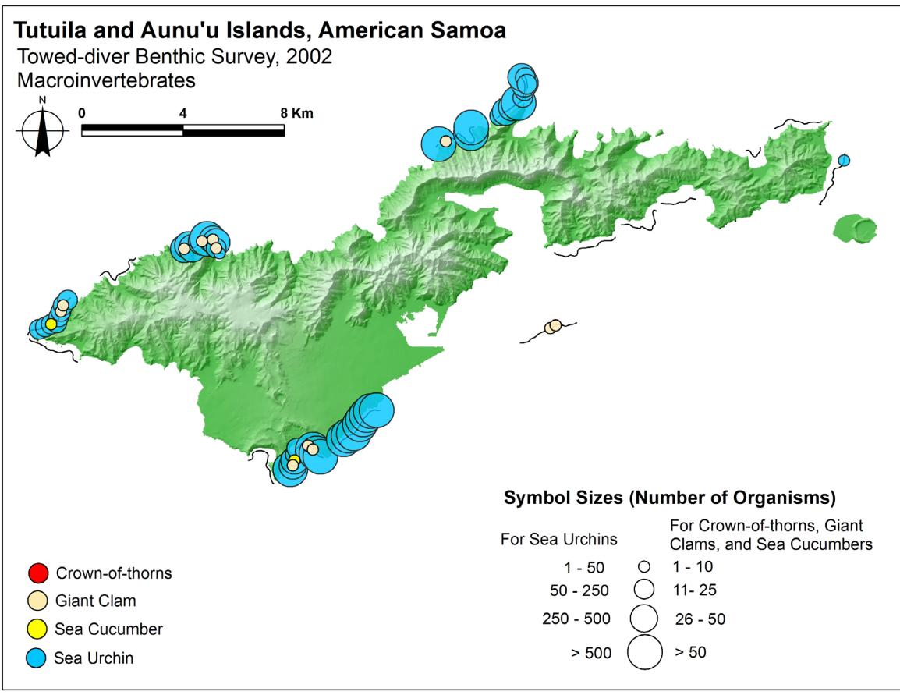

**Figure 3.7.1a.** Distribution of estimated population densities of COTS, giant clams, sea cucumbers, and sea urchins around Tutuila and Aunu`u from towed-diver benthic surveys during ASRAMP 2002. Circle locations represent an integrated estimate over 5-min observation segments covering a survey swath of ~ 200 m × 10 m (~ 2000 m2 ). The sizes of the circles indicate the number of organisms counted or estimated in each ~ 2000 m2 segment with one scale for COTS, giant clams, and sea cucumbers (1–10, 11–25, 26–50, and > 50) and another scale for sea urchins (1–50, 51–250, 250–500, and > 500).

baseline data used to design and scale the future methodology of macroinvertebrate REA surveys. No data are presented.

#### *2004 Spatial Surveys*

Towed-diver benthic macroinvertebrate surveys around Tutuila and Aunu`u during ASRAMP 2004 found variable distributions of giant clams, sea cucumbers, and sea urchins (Fig. 3.7.1b). Giant clams were widely distributed around Tutuila and Aunu`u with generally low mean densities (~ 5–10 organisms ha-1). One noteworthy exception was a localized area in the south region with a high density of giant clams (21.7 organisms ha-1). Sea cucumber mean densities were greatest in the north (1.1 organisms ha-1) and northeast regions (0.7 organisms ha-1). Sea urchin mean densities were greatest on Taema Bank (1869 organisms ha-1), off Aunu`u (1623 organisms ha-1), and in the south and south point regions (1515 and 1712 organisms ha-1, respectively). Perhaps more surprising, however, was the near absence of urchins along long stretches of towed-diver survey tracks in the southeast and southwest regions. Only two COTS were observed around Tutuila and Aunu`u in 2004, both in Masefau Bay in the north region.

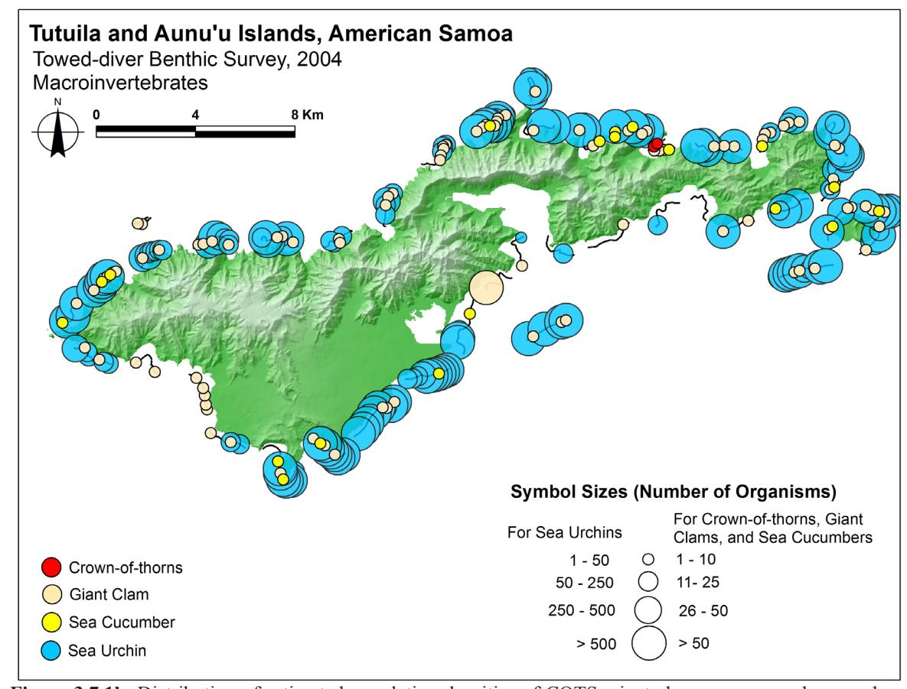

**Figure 3.7.1b.** Distribution of estimated population densities of COTS, giant clams, sea cucumbers, and sea urchins around Tutuila and Aunu`u from towed-diver benthic surveys during ASRAMP 2004. Circle locations represent an integrated estimate over 5-min observation segments covering a survey swath of ~ 200 m × 10 m (~ 2000 m2 ). The sizes of the circles indicate the number of organisms counted or estimated in each ~ 2000 m2 segment with one scale for COTS, giant clams, and sea cucumbers (1–10, 11–25, 26–50, and > 50) and another scale for sea urchins (1–50, 51–250, 250–500, and > 500).

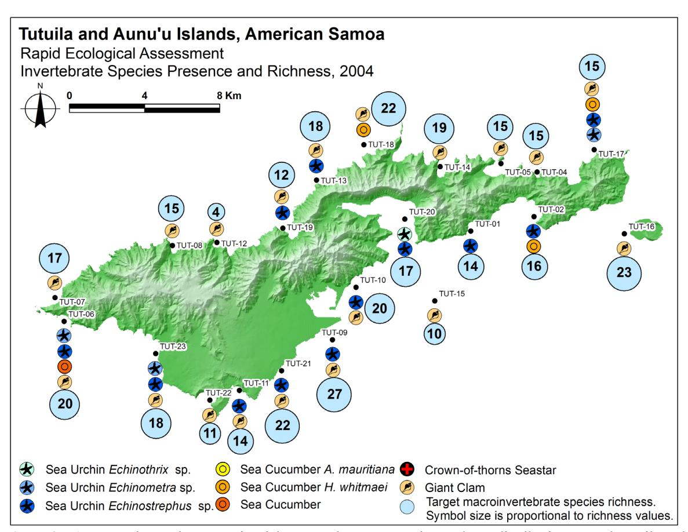

**Figure 3.7.1c.** Macroinvertebrate species richness, and target macroinvertebrate distribution around Tutuila and Aunu`u from REA surveys during ASRAMP 2004. Size of light blue circles and values in circles indicate target species richness values for each REA site. Other symbols indicate the presence of specific target species.

During ASRAMP 2004, invertebrate species richness at REA sites around Tutuila and Aunu`u was variable, ranging from a total of 4 species found at site TUT-12 in the northwest region, to a high of 27 species recorded at site TUT-09 in the southwest region (Fig. 3.7.1c). Generally, higher species richness was observed on the southern coast of Tutuila. Target invertebrate species were common, with giant clams present at all sites, except the three sites in the southeast region. Sea urchins were found at over half of the REA sites around Tutuila, but were not observed within the northwest region and parts of the northeast region. The most common urchin was *Echinostrephus* sp., which was found mostly off the southern coast. Sea cucumbers were observed at only four widely scattered sites around Tutuila. No COTS were recorded at any of the 22 REA sites.

# *2006 Spatial Surveys*

Towed-diver benthic macroinvertebrate surveys around Tutuila and Aunu`u during ASRAMP 2006 found variable distributions of giant clams, sea cucumbers, and sea urchins (Fig. 3.7.1d). Giant clam mean densities were greatest in the northern region and around the south point region of Tutuila (1.8 and 1.6 organisms ha-1, respectively). Sea cucumber mean densities were greatest in the southeast region (1.5 organisms ha-1) while no sea cucumbers were observed along most of the northern, northeastern, south point, Taema Bank, and southwestern regions. Sea urchin mean densities were greatest around Aunu`u (936 organisms ha-1), in the southern region (747 organisms ha-1), and in the south point region (608 organisms ha-1). Sea urchins were observed in very low densities in the Taema Bank and northwest regions. Only one COTS was observed around Tutuila in 2006, in the south point region within Larsen's Bay.

Macroinvertebrates were common at REA sites around Tutuila and Aunu`u during ASRAMP 2006. Sea urchins were abundant, being present at all but three REA sites, two of which were located in the southwest region of Tutuila (TUT-06, -23). The most common sea urchin was *Echinostrephus aciculatus*, being found at 17 of 22 sites. *Echinometra matheii* was also

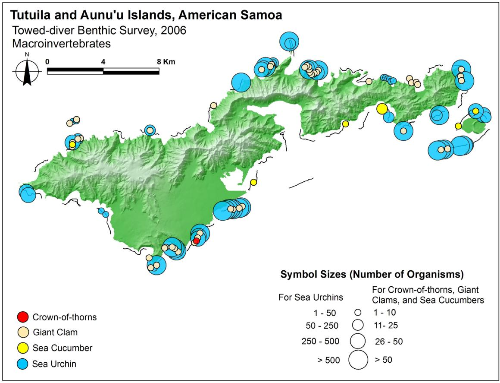

**Figure 3.7.1d.** Distribution of estimated population densities of COTS, giant clams, sea cucumbers, and sea urchins around Tutuila and Aunu`u from towed-diver benthic surveys during ASRAMP 2006. Circle locations represent an integrated estimate over 5-min observation segments covering a survey swath of ~ 200 m × 10 m (~ 2000 m2 ). The sizes of the circles indicate the number of organisms counted or estimated in each ~ 2000 m2 segment with one scale for COTS, giant clams, and sea cucumbers (1–10, 11–25, 26–50, and > 50) and another scale for sea urchins (1–50, 51–250, 250–500, and > 500).

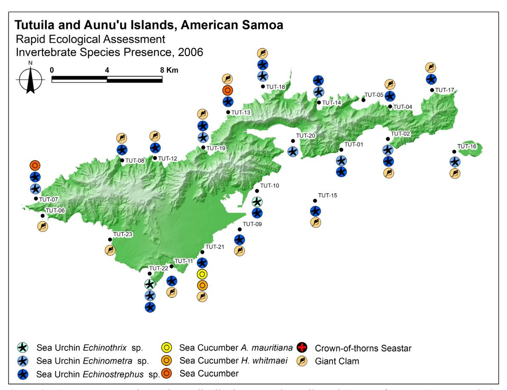

**Figure 3.7.1e.** Target macroinvertebrate distribution around Tutuila and Aunu`u from REA surveys during ASRAMP 2006. surveys during ASRAMP 2006.

commonly found at sites in the south and southeast regions of Tutuila and at Aunu`u (TUT-20, -01, -02, -16). Giant clams were widely distributed, being present at 15 of the 22 REA sites around Tutuila. As observed during towed-diver macroinvertebrate surveys, giant clams were absent at sites TUT-20, TUT-01, and TUT-10 in the south region. Sea cucumbers were relatively uncommon and no COTS were recorded at REA sites in 2006.

Macroinvertebrate species richness was not quantified in 2006 at REA sites.

# **3.7.2 Temporal Comparison—Benthic Macroinvertebrates**

Temporal patterns of island-wide mean benthic macroinvertebrate density (organisms ha-1) around Tutuila and Aunu`u from towed-diver benthic surveys during ASRAMP 2002, 2004, and 2006 cruises are shown in Figure 3.7.2a (COTS), Figure 3.7.2b (giant clams), Figure 3.7.2c (sea cucumbers), and Figure 3.7.2d (sea urchins). Towed-diver survey results show trends in density within each surveyed organism and between each sampling year.

Benthic macroinvertebrate distribution and abundance around Tutuila and Aunu`u in 2002, 2004 and 2006 were temporally and spatially variable; however patterns emerge around specific coastlines. In general, higher densities of sea urchins were observed along the southern coast, with the exception of Pago Pago Harbor and the southeast region, where overall macroinvertebrate densities were low (Figs. 3.7.1b and 3.7.1d). In addition, while

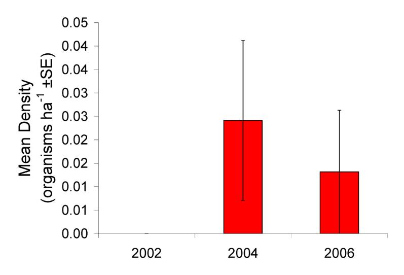

**Figure 3.7.2a.** Mean density of COTS around Tutuila and Aunu`u from towed-diver surveys during ASRAMP 2002, 2004 and 2006.

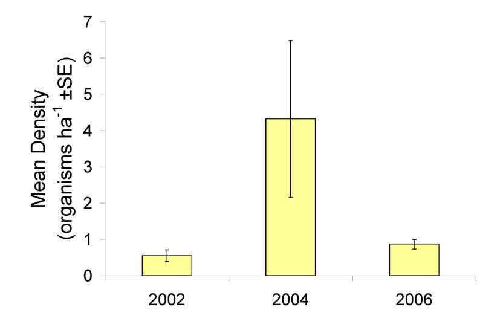

**Figure 3.7.2b.** Mean density of giant clams around Tutuila and Aunu`u from towed-diver surveys during ASRAMP 2002, 2004, and 2006.

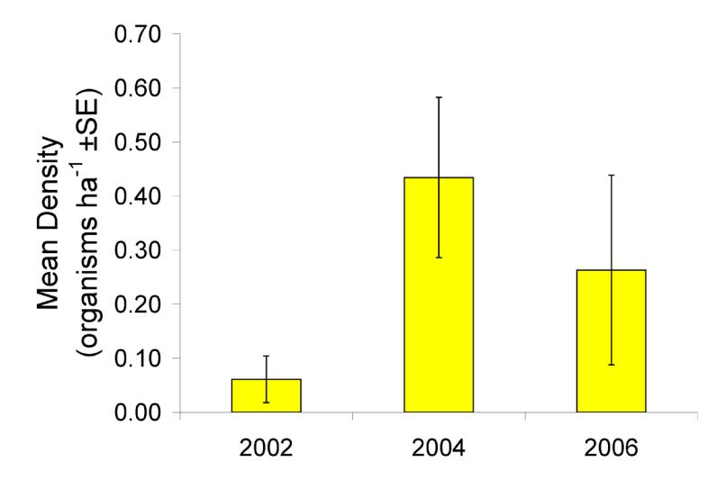

**Figure 3.7.2c.** Mean density of sea cucumbers (holothuroids) around Tutuila and Aunu`u from towed-diver surveys during ASRAMP 2002, 2004 and 2006.

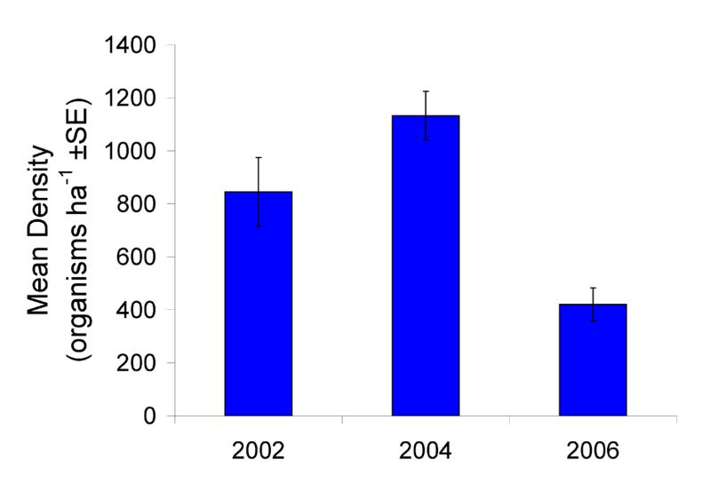

**Figure 3.7.2d.** Mean density of sea urchins (echinoids) around Tutuila and Aunu`u from towed-diver surveys during ASRAMP 2002, 2004 and 2006.

surveys indicated an overall broad distribution of giant clams around the island, very few were reported in the southeast region during either towed-diver or REA surveys in all years (Figs. 3.7.1a, 3.7.1 b, 3.7.1c, 3.7.1d, and 3.7.1e). COTS observations were rare in all years.

It is important to note that quantifying benthic macroinvertebrate communities presents multiple challenges. Benthic macroinvertebrates are specialized and can be mobile in the marine environment. Both REA and towed-diver surveys sampling methodologies can vary in location and depth, thereby varying the specific reef system that is surveyed and affecting the benthic macroinvertebrate survey results. Changes that have occurred in the towed-diver methodology over these survey years and observer errors impact the comparability of data across years. Because of these known discrepancies in macroinvertebrate data, results must be analyzed with caution.

#### **3.8 Reef Fish**

#### **3.8.1 Reef Fish Surveys**

#### *2002 Spatial Surveys*

The majority of the biomass of large fish (total length > 50 cm) around Tutuila during ASRAMP 2002 towed-diver surveys were composed of wrasses, sharks, and jacks (Fig. 3.8.1a). Barracudas were encountered in discrete schools on the western end of the island, south of Cape Taputapu, in the northwest region. Parrotfish were observed to be more evenly distributed, but seemed to be most consistent across reefs along in portions of the southeast, south, and Taema Bank regions of the island. In general, the northern side of Tutuila had the highest biomass of large fish. The mean large fish biomass for the island was 0.048 tons ha-1 (SE 0.040).

Shark species were uncommon during the ASRAMP 2002 surveys, with a small number of whitetip reef sharks (*Triaenodon obesus*) scattered along the southern shores of the

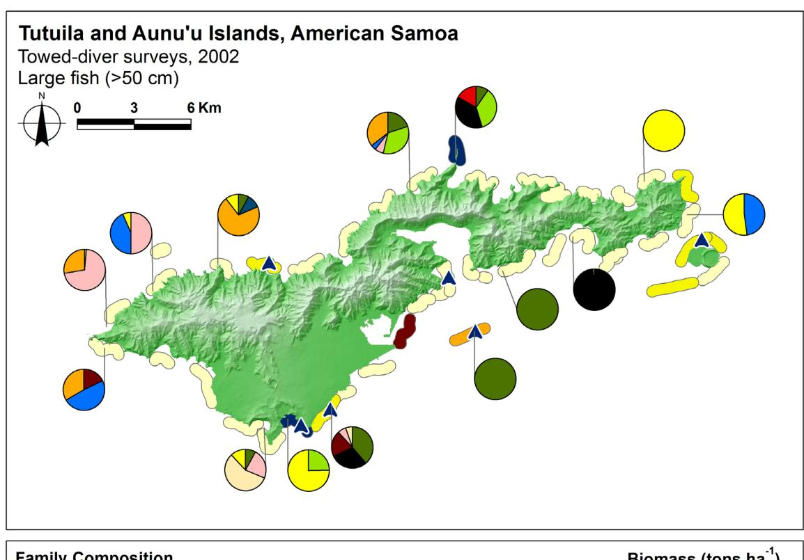

**Figure 3.8.1a.** Large fish biomass, family composition, and individual shark sightings around Tutuila recorded during ASRAMP 2002 towed-diver surveys. Large fish (length > 50 cm) biomass on each individual toweddiver survey is represented by the color of the survey track (tons ha-1). Composition by trophic group is indicated by the family colors (green—mostly herbivores; other colors—mostly predators or mixed). Individual shark sightings, observed inside or outside the survey area, are represented by blue triangles.

island (Fig. 3.8.1a). Very few gray reef sharks (*Carcharhinus amblyrhynchos*) were observed. An adult leopard shark (*Stegostoma varium*) was recorded just north of the channel between Tutuila and Aunu`u, and a juvenile of the same species was seen (not during quantitative survey) in the same area. Jacks were also uncommon during the 2002 surveys, aside from the sighting of a school of about 60 bigeye trevallies (*Caranx sexfasciatus*). While jack density was low, diversity was as expected with five species present: bigeye trevally (*Caranxsexfasciatus*), giant trevally (*C. ignobilis*), bluefin trevally

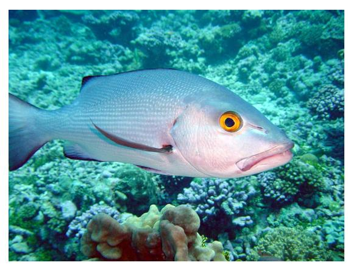

**Figure 3.8.1b.** Twinspot snapper (*Lutjanus bohar*) on reef, American Samoa. (*Photograph provided by NOAA PIFSC CRED; R. Schroeder, JIMAR*)

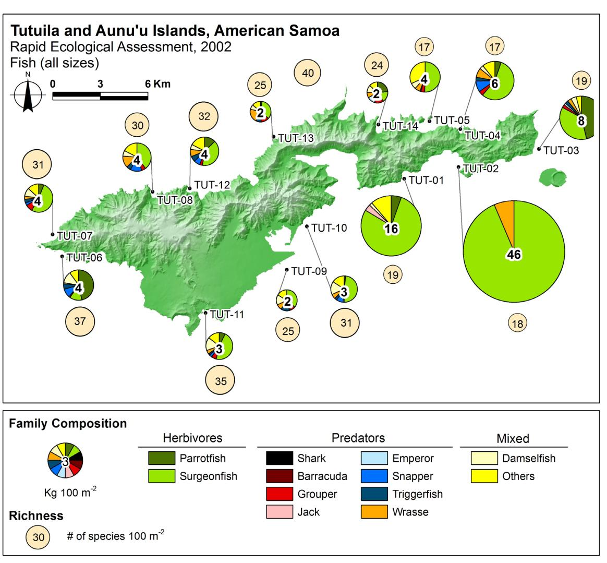

**Figure 3.8.1c.** Total fish biomass, family composition, and species richness of fishes around Tutuila and Aunu`u recorded during ASRAMP 2002 REA belt-transect surveys. Total fish biomass (all species and size classes) is represented at each site by the size of the pie chart with the actual biomass value in the center (kg 100 m-2). Composition by trophic group is indicated by the family colors (green—mostly herbivores; other colors mostly predators or mixed). Species richness at each REA site is indicated by numbers (species 100 m-2) and the size of the beige circles.

(*C. melampygus*), yellow-spotted trevally (*Carangoides orthogrammus*), and rainbow runner (*Elagatis bipinnulata*). About 15 species of groupers were noted, the most common being the small flagtail (*Cephalopholis urodeta*) and peacock groupers (*Cephalopholis argus*). Nine species of snappers (Lutjanidae) were observed, with the twinspot snapper (*Lutjanus bohar*; Fig. 3.8.1b) being the most common in 2002. A relatively high number of humphead wrasses (*Cheilinus undulatus*) were seen at the western point of Tutuila near Cape Taputapu (Fig. 3.8.1a.).

In 2002, total fish biomass was generally similar around Tutuila, 7.6 kg 100 m-2 (SE 4.6), except for two particular sites in the southeast region (TUT-01 and TUT-02), where a massive recruitment event of the surgeonfish *Ctenochaetus striatus* was observed (Fig. 3.8.1c). At these sites, juvenile *Ctenochaetus striatus* (5-10 cm in length) were found in high densities of around 250 individuals 100 m-2. Few predators were recorded around the island on belttransect surveys during ASRAMP 2002 surveys.

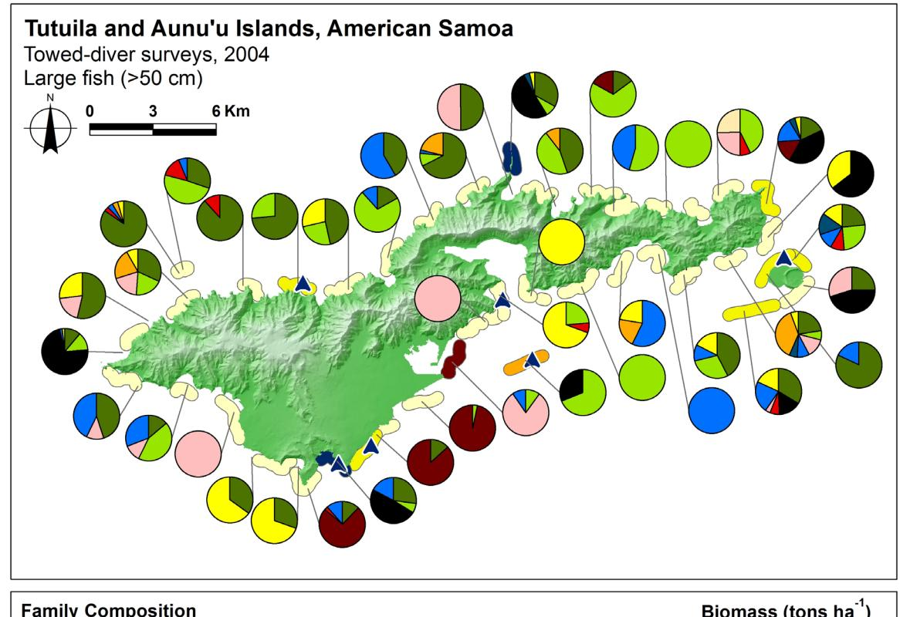

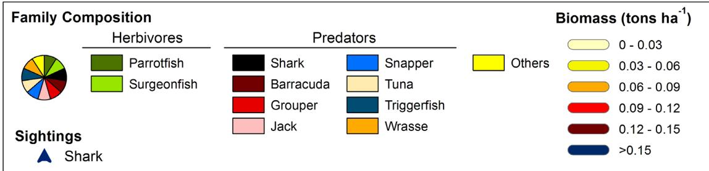

**Figure 3.8.1d.** Large fish biomass, family composition, and individual shark sightings around Tutuila and Aunu`u recorded during ASRAMP 2004 towed-diver surveys. Large fish (length > 50 cm) biomass on each individual towed-diver survey is represented by the color of the survey track (tons ha-1). Composition by trophic group is indicated by the family colors (green—mostly herbivores; other colors—mostly predators or mixed). Individual shark sightings, observed inside or outside the survey area, are represented by blue triangles.

Based on ASRAMP 2002 REA surveys, fish species richness was greatest (~ 30–40 species 100 m-2) along the western half of Tutuila in the south point, southwest, and northwest regions compared to the lower richness found along the eastern half of the island (~ 20 species100 m-2; Fig. 3.7b).

# *2004 Spatial Surveys*

During the ASRAMP 2004 surveys, conditions at about half of the sites along the north side of Tutuila were hampered by large swells that resuspended sediment in the water column and reduced visibility (i.e., 1–4 m). For this reason, some of the quantitative fish data at these sites need to be interpreted with caution.

During 2004 towed-diver surveys around Tutuila and Aunu`u, both barracudas and parrotfish

were the large fishes with the highest biomass, with barracudas present in large schools (Fig. 3.8.1d). The large fish biomass was 0.041 tons ha-1 (SE 0.016) for Tutuila and Aunu`u. Sharks were observed all around the island, particularly at the eastern end, south of Cape Matatula. A total of nine humphead wrasses were sighted at numerous spatially distributed sites around the island.

During 2004, total fish biomass from REA surveys was generally equally distributed around Tutuila, as in 2002 (Fig. 3.8.1e). The mean total fish biomass in 2004 was 9.4 kg 100 m-2 (SE 5.5). Two particular sites, TUT-17 near Cape Matatula in the northeast region and TUT-21 off the Tafuna Plain (Vaitogi) in the south region had exceptionally elevated fish biomass estimates caused by shark sightings, while TUT-11 in Larsen's Bay in the south point region had elevated biomass primarily because of a high surgeonfish abundance (Fig. 3.8.1e). Herbivores were the dominant trophic group, surgeonfish being abundant in all regions on the south side of the island and parrotfish most abundant in the north region.

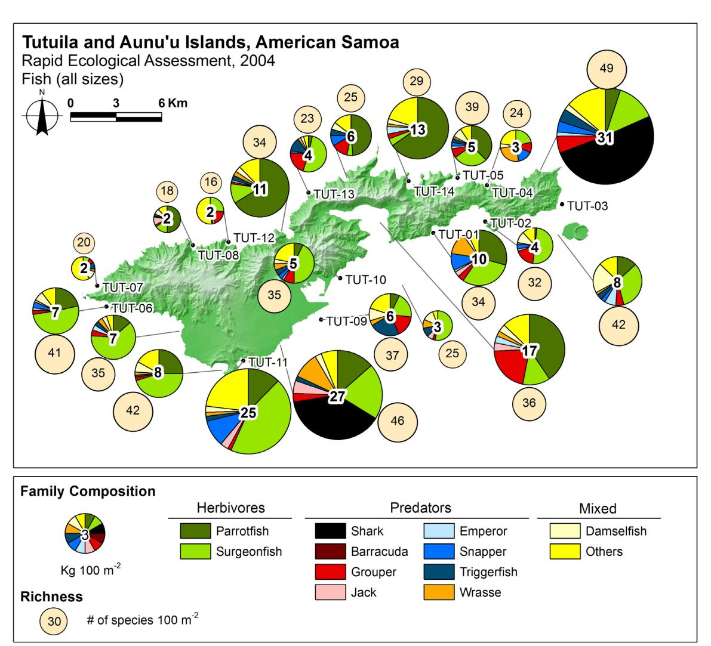

**Figure 3.8.1e.** Total fish biomass, family composition, and species richness of fishes around Tutuila and Aunu`u recorded during ASRAMP 2004 REA belt-transect surveys. Total fish biomass (all species and size classes) is represented at each site by the size of the pie chart with the actual biomass value in the center (kg 100 m-2). Composition by trophic group is indicated by the family colors (green—mostly herbivores; other colors mostly predators or mixed). Species richness at each REA site is indicated by numbers (species100 m-2) and the size of the beige circles.

Stationary point counts were initiated in 2004 to more effectively measure abundance of medium to large fish (> 25 cm total length). Based on biomass estimates from the stationary point count surveys, parrotfish were the dominant taxon for medium-to-large fish around Tutuila. Other relatively common families included snappers, groupers, surgeonfish, emperors, and wrasses.

During the ASRAMP 2004 surveys, fish species richness was highest in the south point region (~ 42–54 species 100 m-2; Fig. 3.8.1e). Species richness was also moderately high in the southwest, south, and southeast regions (~ 25–42 species 100 m-2). In addition, a previously unsurveyed site, TUT-17, near Cape Matatula in the northeast region also demonstrated high diversity (~ 45 species 100 m-2). Most of the north shore sites were observed to have fewer species, with less than 30 per 100 m-2. The lowest species richness was observed in the northwest region with ~ 16–34 species 100 m-2.

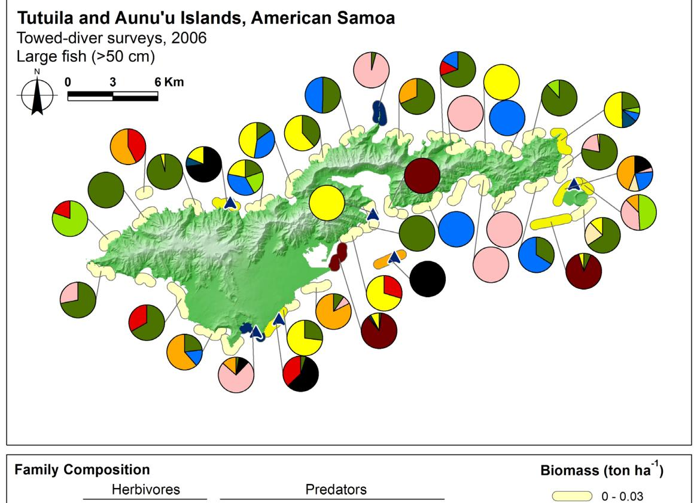

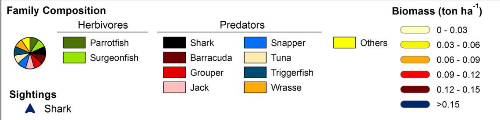

**Figure 3.8.1f.** Large fish biomass, family composition, and individual shark sightings around Tutuila and Aunu`u recorded during ASRAMP 2006 towed-diver surveys. Large fish (length > 50 cm) biomass on each individual towed-diver survey is represented by the color of the survey track (tons ha-1). Composition by trophic group is indicated by the family colors (green—mostly herbivores; other colors—mostly predators or mixed). Individual shark sightings, observed inside or outside the survey area, are represented by blue triangles.

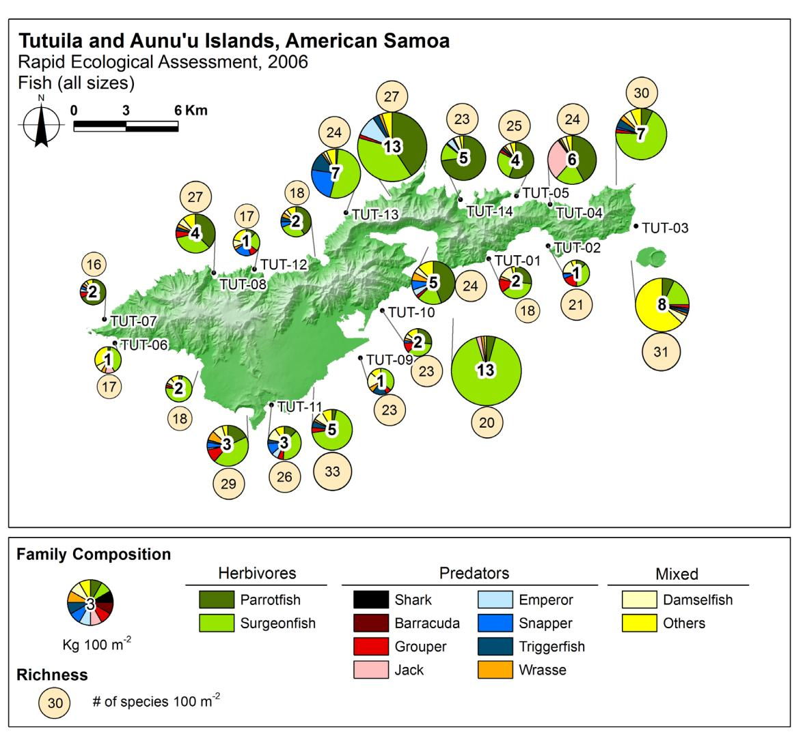

**Figure 3.8.1g.** Total fish biomass, family composition, and species richness of fishes around Tutuila and Aunu`u recorded during ASRAMP 2006 REA belt-transect surveys. Total fish biomass (all species and size classes) is represented at each site by the size of the pie chart with the actual biomass value in the center (kg 100 m-2). Composition by trophic group is indicated by the family colors (green—mostly herbivores; other colors—mostly predators or mixed). Species richness at each REA site is indicated by numbers (species 100 m-2) and the size of the beige circles.

#### *2006 Spatial Surveys*

During the ASRAMP 2006 large fish towed-diver surveys, parrotfish, sharks, and jacks made up the majority of the large fish biomass around Tutuila and Aunu`u (Fig. 3.8.1f). Common large fish included bigeye trevallies (*Caranx sexfasciatus*) and blackfin barracudas (*Sphyraena qenie*). Mean large fish biomass was 0.042 tons ha-1 (SE 0.026).

A total of nine humphead wrasses (*Cheilinus undulatus*) were observed widely scattered, though predominantly along the southern regions of Tutuila during the 2006 surveys (Fig. 3.8.1f). Six sharks (from three species) and one bumphead parrotfish (*Bolbometopon muricatum*) were sighted around Tutuila (Fig. 3.8.1f).

During the ASRAMP 2006 REA surveys, the general pattern of total fish biomass was similar

to previous years, with the southern sections of Tutuila harboring a mean fish biomass of ~ 3 kg 100 m-2 and the northern sections harboring a mean fish biomass of ~ 5 kg 100 m-2 (Fig. 3.8.1g). However, reef fish biomass was generally much lower than in 2002 and 2004. Surgeonfish and parrotfish dominated total biomass at most sites island‑wide. Piscivores were rarely recorded during fish belt-transect surveys. Total fish biomass in 2006 was around 4.5 kg 100 m-2 (SE 1.8).

Estimates of abundance of medium-large fish surveyed using stationary point counts remained relative low around Tutuila during ASRAMP 2006 (Fig. 3.8.1g). Parrotfish (i.e., *Scarus japanensis*) biomass estimates continued to dominate this size class, with fewer surgeonfish, snappers (*Macolor* spp.), wrasses (*Halichoeres* spp.), and groupers (*Cepahlopholis* spp.). Twin-spot snappers (*Lutjanus bohar*) were rare.

In 2006, there were generally fewer species encountered per 100 m2 (~ 20-30 species at most sites), and there was a less discernable spatial pattern in species richness between sides of the island (Fig. 3.7f). Though less than during ASRAMP 2004 surveys, relatively high species richness was observed in the south point (26–33 species100 m-2) region, Aunu`u (31 species 100 m-2), and near Cape Matatula (30 species 100 m-2). Lowest species richness was observed in the northwest and southwest regions.

#### **3.8.2 Temporal Comparison—Reef Fish**

Estimates of total mean fish biomass (tons ha-1) around Tutuila and Aunu`u, with and without recruitment events, from the 2002, 2004, and 2006 REA surveys are shown in Figure 3.8.2a. Total mean fish biomass estimates around Tutuila are relatively consistent between 2002 and 2004, followed by a steep decrease in 2006. Only one significant recruitment event was reported during ASRAMP surveys around Tutuila in the 3 years surveyed, a localized recruitment of *Ctenochaetus striatus* at TUT-02 and TUT-01 in 2002. Considering all years surveyed, it is apparent that total fish biomass is distributed fairly evenly around the island and is predominantly composed of herbivorous fish (e.g., parrotfish and surgeonfish). The all-year average for total fish biomass is 0.72 tons ha-1 (SE 0.41).

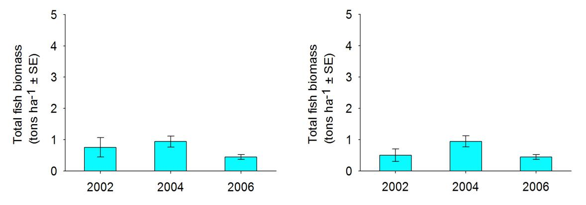

**Figure 3.8.2a.** Total fish biomass with (left) and without (right) recruitment events around Tutuila and Aunu`u during ASRAMP REA surveys in 2002 (14 sites), 2004 (22 sites), and 2006 (22 sites).

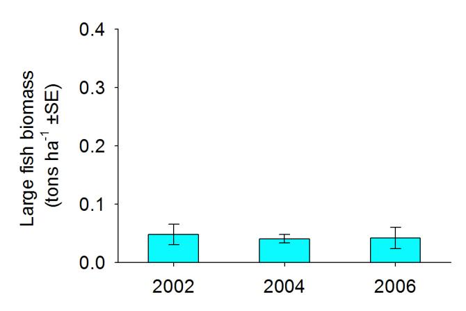

**Figure 3.8.2b.** Large fish biomass around Tutuila Aunu`u during ASRAMP towed-diver surveys in 2002 (16 tow surveys), 2004 (43 tow surveys), and 2006 (44 tow surveys).

Mean large fish biomass estimates (tons ha-1) for the 2002, 2004, and 2006 towed-diver surveys (Fig. 3.8.2b) are almost an order of magnitude less than the mean total fish biomass (from REA belt-transect surveys) around Tutuila (> 50 cm fish represent ~ 10% of the total fish biomass). Mean large fish biomass estimates show temporal consistency across the sampling years. No particular section of the island has higher large fish biomass, although areas near prominent points and capes (Step's and Cockscomb Points and Capes Matatula and Taputapu) and offshore islands (Aunu`u) and banks (Taema) appeared to have relatively higher large fish biomass than most of the other coastal areas. The all-year average for large fish biomass is 0.044 tons ha-1 (SE 0.027). Species of particular interest (sharks and humphead wrasses) are generally sighted around the entire island, with a similar distributional pattern as noted for large fish. During towed-diver and REA surveys over the three ASRAMP cruises, only a single bumphead parrotfish (*Bolbometopon muricatum*) was observed indicating that they are either extremely rare or they do not have a preference for the habitat, depth range or time of day surveyed during ASRAMP.

Relative patterns of species richness around Tutuila in 2006 are somewhat different from previous years surveyed with fewer species encountered at REA sites and a less discernable spatial distribution pattern. Though this pattern was less consistent in 2006, the south point region of Tutuila generally harbored fish communities with the highest species richness.

#### **3.9 Island Summary and Integration**

In the preceding sections of this chapter, the spatial structure and temporal variability of the individual components of the coral reef ecosystems around Tutuila and Aunu`u were discussed. These components included the geological, physical, chemical, and biological descriptions which spanned, to varying degrees, portions of the terrestrial, atmospheric, and marine environments of Tutuila and Aunu`u.

While the ecosystem observations of ASRAMP appear to be relatively complete compared with many monitoring datasets, many variables cannot adequately be measured and are only sparsely observed spatially and temporally. Though necessarily incomplete, this synopsis

of observed patterns and relationships provides an essential framework that can be used to build an improved understanding of ecosystem dynamics and greater ability to infer cause and effect relationships. In addition, quantitative methodologies using multivariant statistical analyses and ecosystem modeling approaches are currently being developed for incorporation into future reports and to allow for an improved understanding of ecosystem integration.

Although some biological groups, or parameters relevant to them, showed a fairly even distribution around the island, the distribution and abundance of most biological groups or parameters showed spatial variations around the island. Several discernable geographic patterns emerged when combining biological and physical observations and comparing results among disciplines.

Bathymetry, which describes the depth structure of the benthic environment, is one of the many factors by which biological communities are stratified. Multibeam-derived bathymetry completed around Tutuila and Aunu`u has revealed what is hypothesized to be a relict barrier reef with ridge-like structures as shallow as 20 m around the perimeter of the island platform. Inside this barrier, shelves extend from the north coast and offshore banks with depths ranging to 100 m surround the south, east, and west sides (Fig. 3.3.1a). It is hypothesized that these relict barrier reefs and submerged banks may dampen incoming wave energy or episodic wave events, potentially providing a small degree of protection to nearshore environments. Based on acoustic backscatter observations, it appears that most of the offshore bank that extends to the north of Tutuila is hard substrate (Fig. 3.3.1b), except for sediment that appears to have been discharged from several watershed embayments, and collecting in a band parallel to shore at the base of a gentler slope below the forereef slope of the living reef at a depth of ~ 100 m. The base of this slope may represent a paleo shoreline, and possibly the position of sea level during the last glacial maximum that ended ca. 18 000 years ago. It also appears that scattered pockets of sediment have collected in low areas on the offshore shelf (Fig. 3.3.1b). Some living coral colonies were recorded during optical TOAD surveys over the ridge-like structures around the perimeter of the presumed relict barrier (Fig. 3.3.1c). In some cases, high concentrations of corals were observed, suggesting that these structures may support significant coral reef communities.

In the northeast region of Tutuila, backscatter data suggests that the insular shelf is primarily composed of hard substrate. An exception was noted within an oval-shaped sediment field located in a depression (ca. 2 × 3 km footprint) immediately offshore of Masefau Bay, with several patch reefs extending up above the sediment field (Fig. 3.3.1b). TOAD optical validation surveys conducted in this region in depths > 30 m (Fig. 3.3.1c) showed several high concentrations of live coral colonies, with tows from the ridge at the northeastern corner of the Tutuila shelf showing the highest percentages of coral cover of any TOAD surveys on the shelf.

Water samples collected at 11 sites along the length of the northern coast in 2006 indicated that nitrate and nitrite exhibited spatial homogeneity, with more heterogeneous distributions of chlorophyll-a, phosphate, and silicate (Fig. 3.4.1j). Shallow-water CTD casts in all 3 survey years showed the water column along the northern coast was generally warmer, more saline, and more stratified during the period sampled (February/March) compared to waters on the south side of Tutuila (Figs. 3.4.1b, 3.4.1e, and 3.4.1h). During the austral summer, all sections of the northern coast were influenced by infrequent, long period swell (Fig. 3.3.2a) stemming from North Pacific boreal winter storms.

In the northwest and north regions (Fig. 3.2a), towed-diver surveys indicate that coral cover was generally low (< 10%), with the exception of occasional spots in which cover increased to 30–40% along narrow spurs extending seaward off points of land (Figs. 3.5.1e and 3.5.1l). Much of the nearshore area in the north region lies within the National Park of American Samoa; REA sites TUT-13 and TUT-18 lie within the National Park boundaries, while sites TUT-19 (Fagasa Bay) and TUT-14 lie immediately adjacent to the west and east borders of the park, respectively (Fig. 3.2a). Similar to towed-diver surveys, REA surveys at many northwest and north locations (TUT-07, 08, 12, 19, 13, 18) also found low coral cover (Figs. 3.5.1h and 3.5.1o). Coral diversity was generally low in these regions as well, with the exception of the two most northerly sites, TUT-18 and TUT-14, both inside shallow embayments and either within, or adjacent to, National Park boundaries (Figs. 3.5.1g and 3.5.1n). Site TUT-13, within the National Park, was distinctive for its high abundance of the coral genus *Astreopora* and for an unusually high proportion of very small (< 5 cm) coral colonies which, together with low colony density, suggests a high level of coral recruitment at this site. Site TUT-19 in Fagasa Bay had among the highest turbidity values in 2004, and time series datasets of in situ SST from moored instruments show that the bay experienced a maximum surface temperature 1.5°C above the SST climatology, or 0.5°C degree above the bleaching threshold, in the austral summers of 2002-2003. Towed-diver surveys in 2006 reported an unusually high level of coral stress (25%) during a single 5-min observation segment near Fagasa Bay (Fig. 3.5.1m). Although no additional information regarding the type or potential cause of the stress was noted, it is possible that heightened SST may have weakened coral communities in this region. Relative to the island-wide average incidence of coral disease of 0.12% (SE 0.03), disease prevalence was moderately high along the north coast (Figs. 3.5.2a and 3.5.2b), with the only observed case of *Porites* black-band disease seen in American Samoa found in the northwest region (Fig. 3.5.2b), and *Acropora* white syndrome seen in the north region.

With regard to algal communities in the northwest and north regions, towed-diver surveys indicated high macroalgal cover but low cover by crustose coralline algae (Figs. 3.6.1a, 3.6.1b, and 3.6.1e); site-specific REA surveys along this coast also reported low cover by crustose coralline algae, with TUT-18, inside the National Park, having the lowest such cover of all sites around Tutuila. Low macroalgal generic diversity also typified the northwest and north regions, with the exception of site TUT-19 in Fagasa Bay, where the highest macroalgal diversity (11 genera) of all sites around Tutuila was recorded in 2006. Crustose coralline algal disease (i.e., CLOD) was present only in low abundance (northwest region) or was lacking (north region; Fig. 3.6.2a). Sea urchins were found in high densities in the northwest and north regions in 2002 and 2004, but appeared to be much less abundant in 2006 (Figs. 3.7.1a, 3.7.1b, and 3.7.1d).

Towed-diver surveys in shallow (< 30 m) water in the northeast region showed generally higher coral cover than in the northwest and north regions; coral cover values ranged from < 5% to 40%, with highest values found on either side of, but not at Cape Matatula (Figs. 3.5.1e and 3.5.1l). Higher than average coral diversity was observed at REA sites TUT-04 and TUT-17 in both survey years (Figs. 3.5.1g and 3.5.1n) and, as in the northwest and north regions,

the incidence of coral disease was moderately high relative to the island-wide average (Figs. 3.5.2a and 3.5.2b). In contrast to the low crustose coralline algae cover along the northwest and north regions, towed divers reported localized high cover of this algal functional group in the eastern portion of the northeast region in all survey years (Figs. 3.6.1a, 3.6.1b, and 3.6.1e). No coralline lethal algal disease (i.e., CLOD) was reported from this region in 2006 REA surveys (Fig. 3.6.2g). Sea urchins were encountered in especially low densities by towed divers in 2002 (Fig. 3.7.1a), with increased densities observed in subsequent survey years (Figs. 3.7.1b and 3.7.1d). As in the north region, somewhat reduced abundance and diversity of fish were recorded in the northeast region compared to other regions of Tutuila.

Many of the parameters characterizing the nature of northern coral reef communities, particularly those in the northwest and north regions, vary substantially from those characterizing southern coast communities. The wide (4 km average) insular shelf (< 100 m depth) that extends along the entire north coast continues to extend along the southwest region of the island. However, the shelf is more attenuated in its offshore extent along the south and southeast regions, and drops steeply to abyssal depths off the "south point" region (Fig. 3.3.1a). Moored instruments indicate the predominant wave regime in the austral winter is from the southeast, with occasional higher waves from the southwest caused by winter storms (Fig. 3.4.3a). Thus, the "south point" region, including Fagatele and Larsen's Bays, is more exposed to extreme winter wave events than regions partially protected by the offshore bank. CTD casts around the island in all three survey years indicate that the water column (< 35 m) on the south side is cooler, less saline, and less stratified than along the northern coast (Figs. 3.4.1b, 3.4.1e, and 3.4.1h) during the period sampled (February/March), which likely reflects the broad watersheds and large embayments on the south side compared with those on the north (Fig. 3.1a).

The convergence of several independent metrics suggests that the southern coast, taken as a whole, harbors more robust coral communities than those found in the north. Towed-diver surveys generally show higher coral cover along southern regions (Figs. 3.5.1b, 3.5.1e, and 3.5.1l), with levels of stressed coral lower along the southern coast (Fig. 3.5.1f). Site-specific REA surveys also indicate overall higher coral cover (Figs. 3.5.1h and 3.5.1o), higher coral diversity (Figs. 3.5.1g and 3.5.1n), higher coral densities (Fig. 3.5.1o), and a number of sites where there was an unusually high proportion (> 25% of total) of large (> 40 cm maximum diameter) coral colonies. Compared to the north coast, southern REA sites showed a lower incidence of coral disease (Figs. 3.5.2a and 3.5.2b). Towed-diver surveys found high sea urchin densities along the southern coastline in 2004 and 2006, although surveys in the areas immediately to the east and west of Pago Pago Harbor found a marked drop in numbers (Figs. 3.7.1b and 3.7.1d). Site-specific surveys for macroinvertebrates in 2004 indicated that higher species richness was observed along the southern coast, with the most common sea urchin, *Echinostrephus* sp., being found mostly off the southern coast. In contrast to this general pattern of more robust reef communities along the southern coast, 2006 REA surveys revealed that an opposite spatial distribution to that of coral diseases applied to CLOD, as the south-facing shores exhibited the majority (98%) of the CLOD cases observed (Fig. 3.6.2a).

In general, total fish biomass (predominantly composed of herbivorous fish, e.g., parrotfish and surgeonfish) and large (> 50 cm) fish biomass (Figs. 3.8.1a, 3.8.1d, and 3.8.1f) were fairly evenly distributed around the island, with somewhat reduced abundance and diversity of fish recorded in the north region compared to other regions of Tutuila. Site-specific fish surveys in 2004 indicated more diverse fish communities were found along the southern coast, and in the "south point" region in particular, though this pattern was less discernable in 2006.

As discussed above, each described biological community (corals, algae, macroinvertebrates, and fish) revealed some discernable island-wide distribution patterns and congruencies with oceanographic variables. Certain southern sites showed some particularly interesting multidisciplinary convergences of biological parameters that fell outside average values and therefore, deserve special attention. These sites, moving from west to east along the south shore, are Fagatele Bay (TUT-22), Larsen's Bay (TUT-11), Taema Bank (TUT-15), Pago Pago Harbor (TUT-20), and Aunu`u (TUT-16).

Benthic communities at Fagatele Bay National Marine Sanctuary (TUT-22) stand out in numerous regards. A towed-diver survey in 2002 spanned the width of the bay and estimated high coral cover (> 50%) on four of the six tow segments (Fig. 3.5.1b). A towed-diver survey conducted in 2004 estimated lower, but still high, values of coral cover (maximum 40–50%; Fig. 3.5.1e), with only low incidences of stressed coral reported (Fig. 3.5.1f). Towed-diver surveys in 2006 did not cover the interior of the Bay where high coral cover was observed in 2002 and 2004 (Fig. 3.5.1l). REA surveys were not conducted at Fagatele Bay in 2002 but were included in subsequent years at the special request of the Sanctuary Manager. REA surveys conducted in both 2004 and 2006 reported higher than average coral cover (Figs. 3.5.1h and 3.5.1o), higher than average coral diversity (Figs. 3.5.1g and 3.5.1n), and an unusually high proportion (> 25% of total) of large (> 40 cm maximum diameter) coral colonies (Figs. 3.5.1j and 3.5.1p). In addition, higher than average coral density (Fig. 3.5.1h) was reported in 2004. No evidence of coral disease was found in 2006 (Figs. 3.5.2a and 3.5.2b) and only a low incidence of coral predation was observed (Fig. 3.5.2a). REA surveys for algae conducted in 2004 and 2006 showed that Fagatele Bay contained among the highest macroalgal diversity seen at Tutuila. However, CLOD was particularly abundant at Fagatele during 2006 surveys (Fig. 3.6.2b). Fish communities were also among the most diverse in both 2004 (Fig. 3.8.1e) and 2006 (Fig. 3.8.1g). These combined results indicate a particularly robust biological assemblage at Fagatele Bay, suggesting that the current management protection this area receives may be positively impacting the ecosystem. On the other hand, a current meter off Step's Point (Fig. 3.4.3e) to the east of the Bay showed mostly southwestward flow, which may carry water masses east to west along the south shore of Tutuila; this may be a source of contaminants discharged from Pago Pago Harbor around Step's Point and toward Fagatele Bay.

Adjacent to Fagatele Bay, and roughly comparable in size, is Larsen's Bay (TUT-11). Like Fagatele Bay, there is a steep descent to depths greater than 500 m just beyond the embayment (Fig. 3.3.1a), such that the bays are not as protected from southerly winter wave regimes (Fig. 3.3.2b) as are other nearshore areas fronted by the wider offshore bank. REA surveys in 2004 and 2006 showed higher than average coral cover (Figs. 3.5.1h and 3.5.1o) and coral diversity (Figs. 3.5.1g and 3.5.1n) in Larsen's Bay, with an usually high proportion (> 25% of total) of large (> 40 cm maximum diameter) colonies reported in 2004 (Fig. 3.5.1j). Algal surveys in both years showed the calcified red genus *Peyssonnelia* (Fig. 3.6.1d) was particularly abundant, occurring in 75% of sampled photoquadrats (Figs. 3.6.1c and 3.6.1f).

However, six cases of unidentified algal discoloration were noted at this site in 2006 (Fig. 3.6.2b). Larsen's Bay was noteworthy among fish REA surveys in 2004 as the site of highest fish species richness (54 species, Fig. 3.8.1e) and for its elevated biomass, primarily because of surgeonfish sightings.

Taema Bank (TUT-15) is a shallow (< 15 m, Figs. 3.5.1a, 3.5.1d, and 3.5.1k) bank off the southern coast of Tutuila. Open to south swell (Fig. 3.4.3a), its biological communities reflect its exposed and scoured nature. REA surveys in 2004 and 2006 revealed lower than average coral cover (Figs. 3.5.1h and 3.5.1o), lower than average coral diversity (Figs. 3.5.1g and 3.5.1n), and an unusually high proportion (> 10% of total) of very small (< 5 cm maximum diameter) coral colonies (Fig. 3.5.1j). Towed-diver surveys in 2002 and 2004 recorded the highest estimates of recently dead coral (10.0%, Fig. 3.5.1c) and low live coral cover (1–10%, Fig. 3.5.1e), respectively. Algal REA surveys in 2004 indicated this site had the next-to-lowest macroalgal diversity (two genera), with the encrusting genus *Lobophora* extremely common. In 2006, a towed-diver survey indicated Taema harbored among the highest percent cover of fleshy macroalgae (Fig. 3.6.1a), and an REA survey indicated a particularly high abundance of CLOD (Fig. 3.6.2b). High densities of sea urchins were recorded at Taema (Fig. 3.7.1b) by a towed diver in 2004. Fish surveys in all years conclude that, while no particular section of the island had higher large fish biomass, Taema was among the few sites that appeared to have relatively higher large fish biomass than most of the other coastal areas. This collective physical and biological profile of low coral and algal diversity, high algal cover, high urchin density, and relatively high large fish biomass appear to characterize a habitat responding to higher-energy ocean conditions than those experienced by more nearshore areas bounded by the land mass.

Towed-diver and REA surveys in the outer portion of Pago Pago Harbor (TUT-20) also reveal a number of biological parameters below island-wide average values, and oceanographic data provide water quality metrics indicative of conditions that challenge healthy reef communities. Low coral cover was recorded by towed divers in 2004 (Fig. 3.5.1e) and 2006 (Fig. 3.5.1l), with unusually high coral stress values (10–28% of cover) reported inside the eastern harbor entrance near Breakers Point in both years (Figs. 3.5.1f and 3.5.1m). REA surveys in 2004 and 2006 reported very low coral cover values (Figs. 3.5.1h and 3.5.1o) and were among the lowest coral densities (Figs. 3.5.1h and 3.5.1o). The relatively high coral diversity (22 genera) reported in 2004 (Fig. 3.5.1g) was likely a result of the presence of one or two colonies in the majority (14) of these genera, which were not captured within the slightly varied placement of belt transects in 2006, when only 10 genera were reported (Fig. 3.5.1n). Algal REA surveys in 2004 recorded the lowest macroalgal diversity (one genus) at this site (Fig. 3.6.1c), while towed divers in 2006 reported among the highest percent cover values of fleshy macroalgae (Fig. 3.6.1e). Perhaps surprisingly, no coral diseases or coralline lethal algal disease (i.e., CLOD) were noted at this site in 2006 (Figs. 3.6.2a and 3.6.2b). Overall macroinvertebrate densities were low at sites immediately east and west of the harbor (Figs. 3.7.1b and 3.7.1d). No giant clams were seen during either towed-diver or REA surveys in all years, even though island-wide REA surveys otherwise show a broad distribution of giant clams (Figs. 3.7.1c and 3.7.1e). High turbidity and some of the highest nutrient levels were measured in the Pago Pago Harbor region in 2006 (Fig. 3.4.1j), likely caused by increased terrestrial runoff generated by exceptional rainfall during January– March, 2006 (Fig. 3.4.2d).

In contrast to the ecologically compromised condition of Pago Pago Harbor, Aunu`u (TUT-16) displayed above-average values in a number of biological parameters. The highest coral cover (43.5% average) reported by towed divers in 2004 was observed along the northern side of Aunu`u, with > 75% coral cover estimated for some tow segments (Fig. 3.5.1e). High coral cover (35% average) was also reported by towed divers along the northern side of Aunu`u in 2006 (Fig. 3.5.1l), although a higher than average incidence of stressed coral was reported along the southeast side (Fig. 3.5.1m). The highest coral cover values were reported at this site in REA surveys in 2004 and 2006 (73% and 64%, respectively; Figs. 3.5.1h and 3.5.1o). Higher than average coral diversity (Fig. 3.5.1g), high colony density (Fig. 3.5.1h), and an unusually high proportion (> 25%) of large (> 40 cm maximum diameter) colonies (Fig. 3.5.1j) were recorded at this site in 2004. Neither coral disease, predation, nor coralline lethal algal disease was observed at this site in 2006 (Figs. 3.5.2a, 3.5.2b, and 3.5.2a). High sea urchin densities (Fig. 3.7.1d, e) and relatively high fish species richness (42 species) were observed in 2006 (Fig. 3.8.1e) and, while no particular section of the island had higher large fish biomass, Aunu`u was among the few sites that appeared to have a large fish biomass higher than in most other coastal areas. Collectively, these parameters describe a robust, thriving coral reef community. An apparent upwelling of cooler offshore water, captured by CTD casts just south of Aunu`u in 2004 (Fig. 3.4.1e, Temperature), may be a factor contributing to the richer biological assemblage here. Sea surface temperatures anomalously cooler than climatological values, detected by in situ and satellite methods in June 2005 (~ 1.5°C and ~ 1.0°C), also suggest the presence of oceanographic mechanisms by which extreme thermal events, such as those that can result in coral bleaching, may be moderated at this location.

The topography of the terrestrial environment (including watershed dynamics), bathymetry of the marine environments, and temporally varying oceanographic conditions determine the specific conditions in which biological communities develop. The composition and health of these communities are shaped by the complex interactions of diverse factors including depth, benthic composition, prevailing and episodic oceanographic and water quality parameters, extreme environmental events, such as tropical cyclones and anomalous thermal events, species and trophic interactions, and activities of humans both in the marine environment and adjacent terrestrial habitats. Of all the islands in American Samoa, Tutuila contains the greatest land area, greatest area and diversity of coral reef habitats, and the highest coral, algal, and fish species diversity. Some taxonomic groups, or parameters relevant to them, showed a fairly even spatial distribution around the island. Giant clams and sea cucumbers, assessed through both towed-diver and REA surveys, were widely distributed (albeit at low densities), in comparison with sea urchin populations, which were variable both spatially and temporally between years. There was a general absence of COTS, with only three COTS observed during all three ASRAMP surveys by both survey methods combined. In all survey years, total fish biomass and biomass of large (> 50 cm) fish were relatively consistently distributed around Tutuila.

#### **References**

- American Samoa Coastal Management Program, American Samoa Government (2002) Tutuila Major Watersheds. Online at <http://dusk.geo.orst.edu/djl/samoa/>. Accessed August 6, 2007.
- Office of Insular Affairs, U.S. Department of the Interior (2007) American Samoa. Online at [http://www.doi.gov/oia/Islandpages/asgpage.ht](http://www.doi.gov/oia/Islandpages/asgpage.htm)m. Accessed May 8, 2007.
- Stearns, HT (1944) Geology of the Samoan Islands. Geol Soc of Am Bull 55:270–332.
- Tribollet AD, Dailer ML, Vroom PS (In prep.) Analysis of relative abundance of macroalgae (RAM) in the islands of American Samoa: spatial variability between 2004 to 2006. Available from Pacific Islands Fisheries Science Center Coral Reef Ecosystem Division, 1125B Ala Moana Blvd., Honolulu, HI 96814.
- U.S. Census Bureau (2000) Census 2000 Data for American Samoa. Online at [http://www.](http://www.census.gov/census2000/americansamoa.html) [census.gov/census2000/americansamoa.htm](http://www.census.gov/census2000/americansamoa.html)l. Accessed May 17, 2007.

#### Chapter 4 Ofu and Olosega Islands

#### 4.1 Geopolitical Context

Ofu and Olosega Islands are twin volcanic islands separated by the Asaga Strait, a shallow, narrow break in the reef flat between the islands that is  $\sim 75$  m wide at its narrowest point. The two islands are located in the westernmost part of the Manu'a Islands group, approximately 100 km northeast of Tutuila Island. Ta'u Island, the third island of the Manu'a group, is located approximately 10 km to the southeast. Ofu, with a land area of 7.2 km², lies to the west and Olosega, with a land area of 5.4 km², lies to the east (Fig. 4.1a). The islands are formed by two eroded, coalescing basaltic shield volcanoes whose slopes dip to the east and west. Steep cliffs, up to 600 m in height, are located on both the northern and southern sides of the two islands.

While volcanic activity has not been recorded for either island in recent history, a submarine eruption took place in 1866 at a distance of 3 km to the southeast of Olosega and along the ridge that connects Olosega with Ta'u (<a href="http://www.volcano.si.edu/world/volcano">http://www.volcano.si.edu/world/volcano</a>). More recent submarine eruptions during the 2001–2005 period have been observed at Vailulu'u Seamount, located approximately 50 km east of Ta'u, which indicates that the entire region remains geologically active. Ofu and Olosega are connected by a bridge and road built across the shallow reef flat of Asaga Strait. As discussed in Section 4.3, Benthic Habitat Mapping

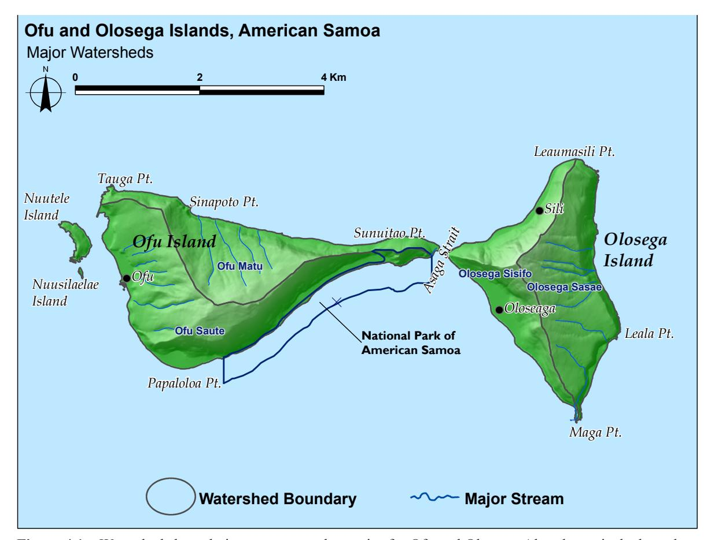

**Figure 4.1a.** Watersheds boundaries, streams, and counties for Ofu and Olosega. Also shown is the boundary of the National Park of American Samoa.

and Characterization, shallow multibeam mapping was conducted in 2004 and revealed ~ 60 km2 of previously uncharted bank top (< 300 m) that extends 0.2 to 2 km from shore and then drops abruptly to abyssal depths.

The population of the Manu`a Islands has been steadily decreasing since the 1950s from approximately 3000 residents in 1950 to a little more than 1700 residents in 1980. An additional 600 people left the Manu`a Islands and relocated to Tutuila after the 1987 Hurricane Tusi stripped most of the islands' vegetation and left the majority of the population homeless. According to the 2000 U.S. Census, 1378 residents populated the Manu`a Islands, with 289 located on Ofu and 216 on Olosega (U.S. Census Bureau, 2000). The main population centers are located in Ofu Village (northwestern coast of Ofu), which is the location of the small airport and protected harbor, Olosega Village (southwestern coast of Olosega), and Sili Village (northwestern coast of Olosega; Fig. 4.1a).

Land use trends on the Manu`a Islands continue to follow practices associated with Fa`asamoa society with respect to agriculture and subsistence harvesting. An estimated two-thirds of Ofu and Olosega remain undeveloped.

#### **4.2 Survey Effort**

A large amount of physical and biological data has been collected around Ofu and Olosega

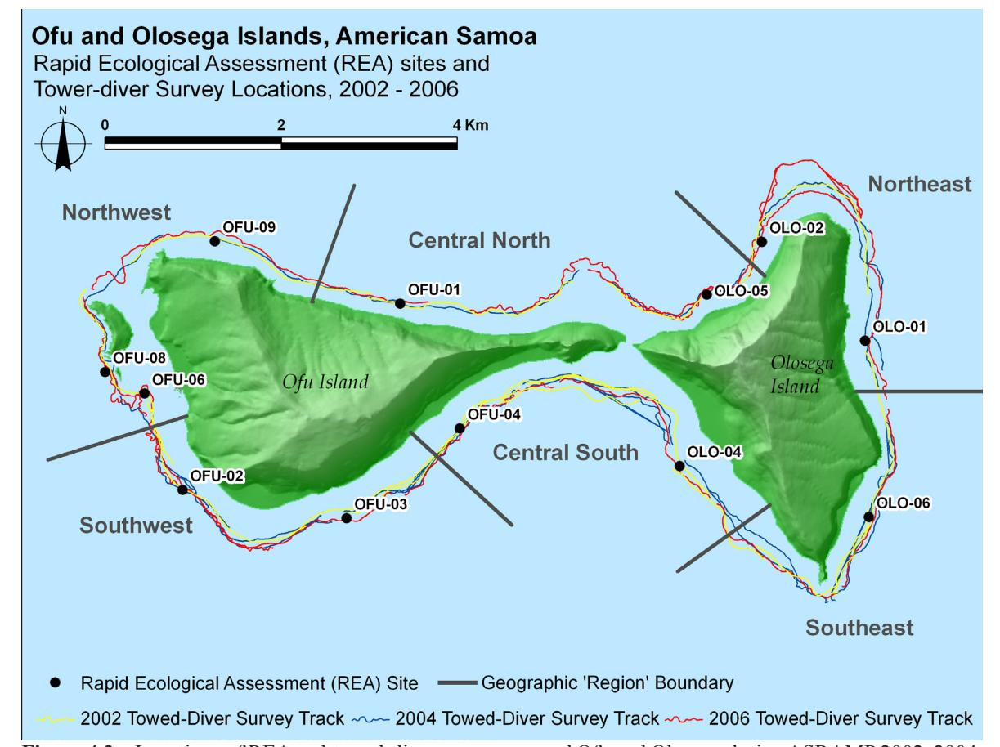

**Figure 4.2a.** Locations of REA and towed-diver surveys around Ofu and Olosega during ASRAMP 2002, 2004, and 2006. Arbitrary geographic regions have been delineated to aid in discussion of spatial patterns.

since 2002 as part of the American Samoa Reef Assessment and Monitoring Program (ASRAMP). The extent and timeframe of these survey efforts are discussed below. To aid in the discussion of spatial patterns of ecological and oceanographic observations around these paired islands throughout this chapter, six geographic regions are delineated in Figure 4.2a. Figure 4.2a also shows the locations of Rapid Ecological Assessment (REA) and toweddiver survey efforts during ASRAMP 2002, 2004, and 2006.

Benthic habitat mapping data were collected around Ofu and Olosega using a combination of acoustic and optical survey methods, the extent of which are summarized in Table 4.2a. These are further examined in Section 4.3, Benthic Habitat Mapping and Characterization. The number, mean depth, and area of these survey efforts are presented by year in Table 4.2b.

**Table 4.2a.** Total area of benthic habitat surveyed from acoustic multibeam sonar and Toad Optical Assessment Device (TOAD) surveys around Ofu and Olosega during ASRAMP 2002, 2004 and 2006.

| Survey Type              | 2002   | 2004         | 2006             |
|--------------------------|--------|--------------|------------------|
| Acoustic Multibeam Sonar | 0      | 82.3* km2 | gap filling only |
| TOAD                     | 3 tows | 13 tows      | 10 tows          |

*\* Total multibeam surveying conducted across the Manu`a Islands.*

**Table 4.2b.** Number, area, and depth of REA and towed-diver surveys around Ofu and Olosega during ASRAMP 2002, 2004, and 2006.

| Year | REA Surveys          |                   | Towed-diver Surveys  |                     |                   |  |
|------|----------------------|-------------------|----------------------|---------------------|-------------------|--|
|      | Number of Surveys | Mean Depth (m) | Number of Surveys | Survey Area (ha) | Mean Depth (m) |  |
| 2002 | 6*                   | 13.7 (SD 0.0)     | 14                   | 46.4                | 9.8 (SD 4.5)      |  |
| 2004 | 8*                   | 15.6 (SD 1.1)     | 17                   | 45.5                | 11.9 (SD 5.3)     |  |
| 2006 | 12                   | 14.0 (SD 1.2)     | 17                   | 46.0                | 12.6 (SD 4.8)     |  |

*\* No coral disease surveys were conducted in 2002 and 2004.*

The ranges of survey depths from towed-diver surveys are presented for each year in Section 4.5, Corals and Coral Disease: Figure 4.5.1a (2002), Figure 4.5.1d (2004), and Figure 4.5.1j (2006). Although the towed-diver survey methodology is aimed at following specific isobaths, the actual depths surveyed are often quite variable. These figures illustrate the variability of depths observed during towed-diver surveys and can be referenced when further exploring the towed-diver datasets.

Spatial and temporal observations of key oceanographic and water quality parameters influencing reef conditions around Ofu and Olosega were collected using a diverse suite of long-term moored instrumentation packages and closely spaced conductivity, temperature, and depth (CTD) surveys of the vertical structure of water properties during ASRAMP 2002, 2004, and 2006 (see Chapter 2, Section 2.3: Oceanography and Water Quality). A summary of deployed instruments and collection activities is provided in Table 4.2c, and they are further examined in Section 4.4, Oceanography and Water Quality.

**Table 4.2c.** Numbers of subsurface temperature recorders (STR) deployments and shallow and deep CTD casts around Ofu and Olosega during ASRAMP 2002, 2004, and 2006. Shallow-water CTD casts were conducted from the surface to a 30-m depth. Deep-water CTD casts were conducted from the surface to a 500-m depth. Deep-water CTD cast information is presented in Chapter 8: Archipelagic Comparisons.

| Observation Type        | 2002 | 2004 | 2006 |
|-------------------------|------|------|------|
| STR                     | 0    | 5    | 7    |
| Shallow-water CTD casts | 39   | 50   | 33   |
| Deep-water CTD casts    | 15*  | 7*   | 17*  |

*\* Total deep-water CTD casts conducted across the Manu`a Islands.* 

# **4.3 Benthic Habitat Mapping and Characterization**

Benthic habitat mapping and characterization of the nearshore waters around Ofu and Olosega were conducted using acoustic multibeam sonar, underwater video and still imagery, and towed-diver survey observations between the depths of ~ 1 m and ~ 300 m. Acoustic multibeam sonar mapping provided bathymetric and backscatter data products over the depth range between ~ 20 m and ~ 250 m. Optical validation and benthic characterization via underwater video, still imagery, and diver observations were performed using both shipboard towed cameras (i.e., TOAD) in depths between ~ 20 m and ~ 80 m and towed-diver surveys in depths between ~ 1 m and 30 m.

# **4.3.1 Acoustic Mapping and Optical Validation**

Ofu and Olosega are extremely steep, eroding volcanic islands with limited low slope terrestrial habitats. A narrow band of shallow reef flat and lagoon habitats are found immediately seaward of the land around significant portions of both islands. These narrow reef flats and lagoons are most prevalent in areas protected from prevailing southeast trade winds and/or large northwest swells, particularly the south central, southwest, and north central regions of the islands. Immediately offshore in the southeast, northwest, and northeast regions, there

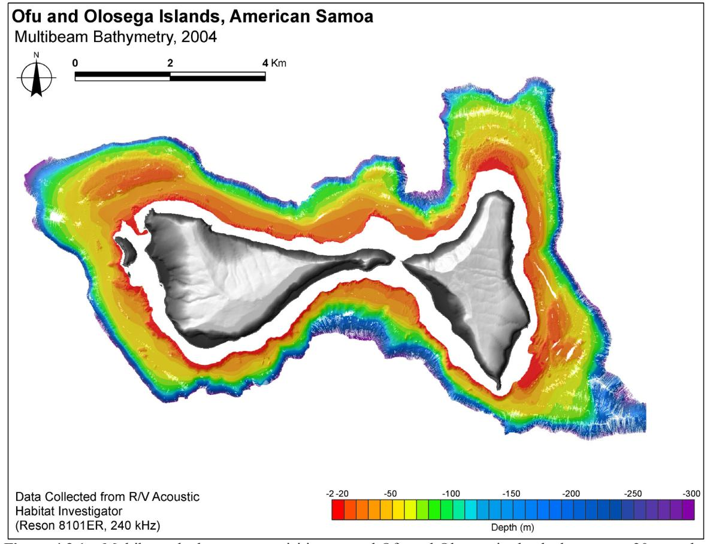

**Figure 4.3.1a.** Multibeam bathymetry acquisition around Ofu and Olosega in depths between ~ 20 m and ~ 300 m was completed in March 2004 from the R/V *Acoustic Habitat Investigator* (*AHI*). Submerged banks extend southeast and north of Olosega and northwest of Ofu. Elsewhere around the islands, steep slopes are observed.

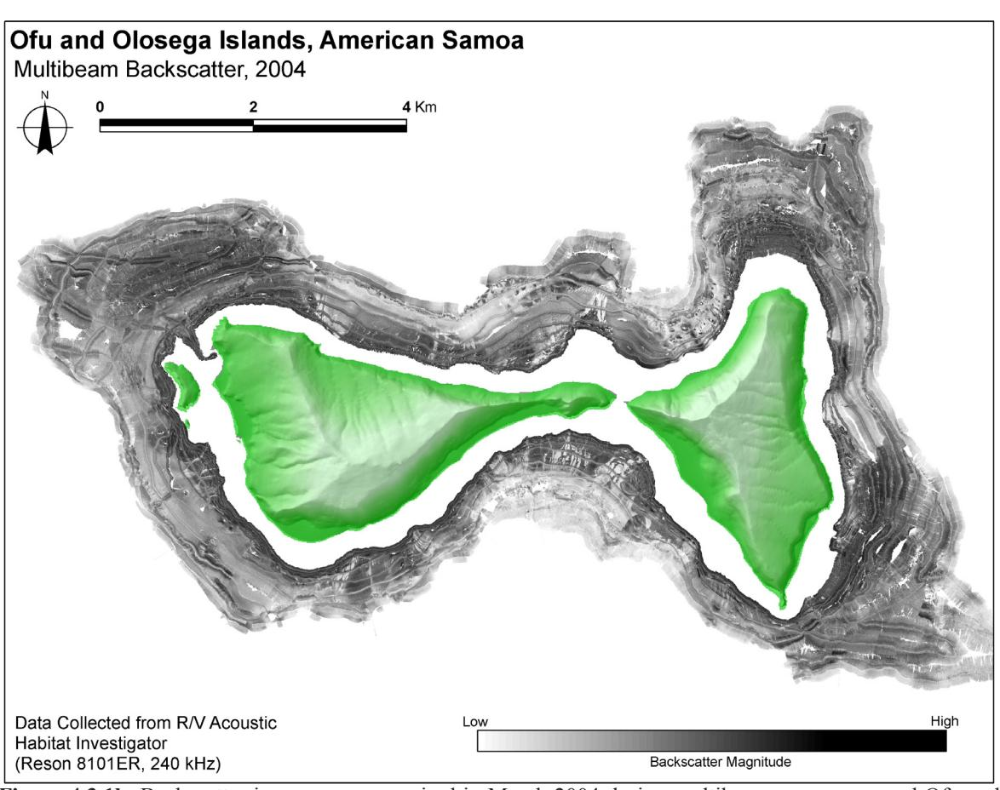

**Figure 4.3.1b.** Backscatter imagery was acquired in March 2004 during multibeam surveys around Ofu and Olosega from the R/V *AHI*. Lighter shades represent low intensity backscatter and likely indicate substrates that are acoustically absorbent and typically indicate unconsolidated sediment. Darker shades represent highintensity backscatter and likely indicate consolidated hard-bottom and coral substrates.

are submerged banks extending ~ 2 km offshore over the depth range between ~ 10 m and ~ 100 m (an area encompassing approximately 25 km2 ; Figs. 4.3.1a and 4.3.1b). Outside of this bank the slopes drop steeply to depths of 500 m and greater.

One area of major management interest is the southernmost tip of Ofu, in the southwest region (Fig. 4.1a), where the airport is located. This airport lies immediately adjacent to the underwater National Park of American Samoa. The American Samoa Government has been evaluating the feasibility of extending the airport runway westward by filling in portions of the reef to allow larger aircraft to visit Ofu. In 2005, at the request of local and federal management agencies, Coral Reef Ecosystem Division (CRED) scientists integrated all multibeam and optical data in the area into an ArcGIS project, thereby allowing photographic and video data to be quickly and easily displayed in a geographic framework.

During ASRAMP 2002, three TOAD optical surveys were conducted around Ofu and Olosega from the NOAA Ship *Townsend Cromwell*, yielding two video transects and 100 still photos. Thirteen optical data videos were collected around Ofu and Olosega during ASRAMP 2004 from the NOAA Ship *Oscar Elton Sette*. The locations of these optical data tracks are shown in Figure 4.3.1c. Ten optical data videos were collected around Ofu and Olosega from R/V *AHI* during ASRAMP 2006, but these data are still being processed and are not included in

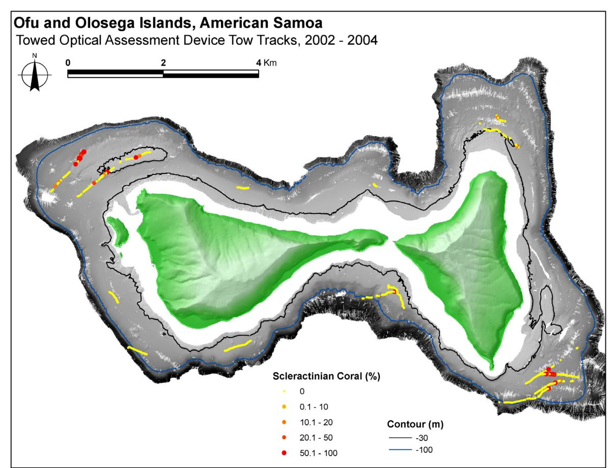

**Figure 4.3.1c.** TOAD camera sled tracks around Ofu and Olosega during ASRAMP 2002 and 2004. The video imagery are post processed to identify substrate type (sand, rock, etc.), living cover (coral, macroalgae, etc.), and other characteristics. The TOAD survey tracks display percentage of live scleractinian coral classified using a point count method with a mean spacing of 20 m along each track. Yellow indicates 0% coral cover, orange colors indicate 0–20% coral cover, and red colors indicate 20–50%.and 50–100% coral cover.

the figure. Most of the offshore and relatively deep surveys indicated that few corals were found in those areas. However, coral communities have been discovered on each of the three relatively shallow banks extending off the northwest, northeast, and southeast corners of the islands, some at depths in excess of 50 m.

The backscatter imagery from the 2004 surveys was successfully used as a predictive guide for determining sites for the optical surveys in 2006. For example, the backscatter analyses suggested large sand channels and hard-bottom substrates on the northwest bank of Ofu and the northeast bank of Olosega, each of which were confirmed during TOAD surveys in 2006. The hard-bottom substrates on the northwest and northeast banks were observed to support coral-rich environments in some areas.

#### **4.3.2 Habitat Characterization**

Towed-diver benthic survey observations around Ofu and Olosega from ASRAMP 2002, 2004, and 2006 were concatenated into mean spatial distributions (see methods Chapter 2, Section 2.2.3: Optical Validation Surveys) of the following benthic components: habitat complexity (Fig. 4.3.2a), percent cover of sand (Fig. 4.3.2b), hard substrate/pavement (Fig. 4.3.2c), rubble (Fig. 4.3.2d), and live coral (Fig. 4.3.2e). Since these habitat characterization maps represent different and complementary components of the same habitats, it is useful to analyze them in relation to each other, the local watersheds, and exposure to prevailing oceanographic conditions.

Habitat complexity was observed to vary significantly around Ofu and Olosega, with observations ranging from low to very high (Fig. 4.3.2a). Habitat complexity appeared consistently high to very high along significant portions of both the north coast of Ofu in the central north region and the shallower portions of the central south region. Scattered areas of increased complexity were observed in the northeast region along the windward coast of Olosega and off Ofu Village in the northwest region.

Generally, most of the forereef slope areas surveyed around Ofu and Olosega were observed to have low-to-moderate sand cover (Fig. 4.3.2b), with several notable exceptions. Areas with the highest consistent levels of sand cover were observed in a section of the windward side of Olosega in the northeast region, a small section in the northwest region north of Nu`utele Island off the Ofu Harbor entrance, and the deep area at the base of the forereef slope in the region south of Asaga Strait in the central south region. As one would expect, the high sand cover area on the windward side of Olosega corresponds well with observed low habitat complexity (Fig. 4.3.2a).

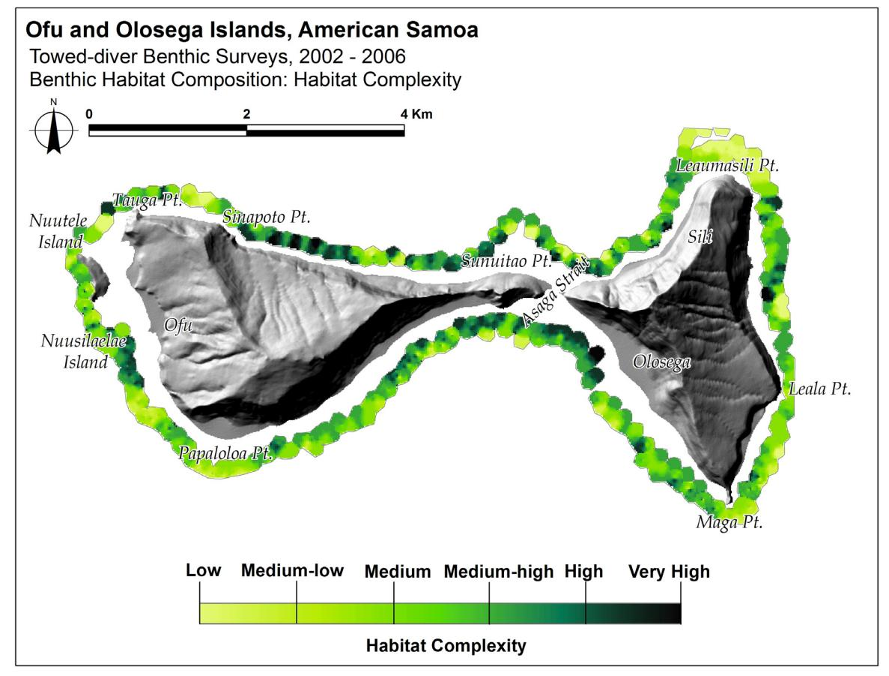

**Figure 4.3.2a.** Mean benthic habitat complexity concatenated from towed-diver survey observations around Ofu and Olosega during ASRAMP 2002, 2004, and 2006. Habitat complexity was subjectively rated by diverobservers over 5-min ensembles (~ 200 x 10 m) on a 6-point scale representing low (1), medium-low (2), medium (3), medium-high (4), high (5), and very high (6) topographic complexity. Yellow colors indicate low habitat complexity, and dark green colors indicate high habitat complexity.

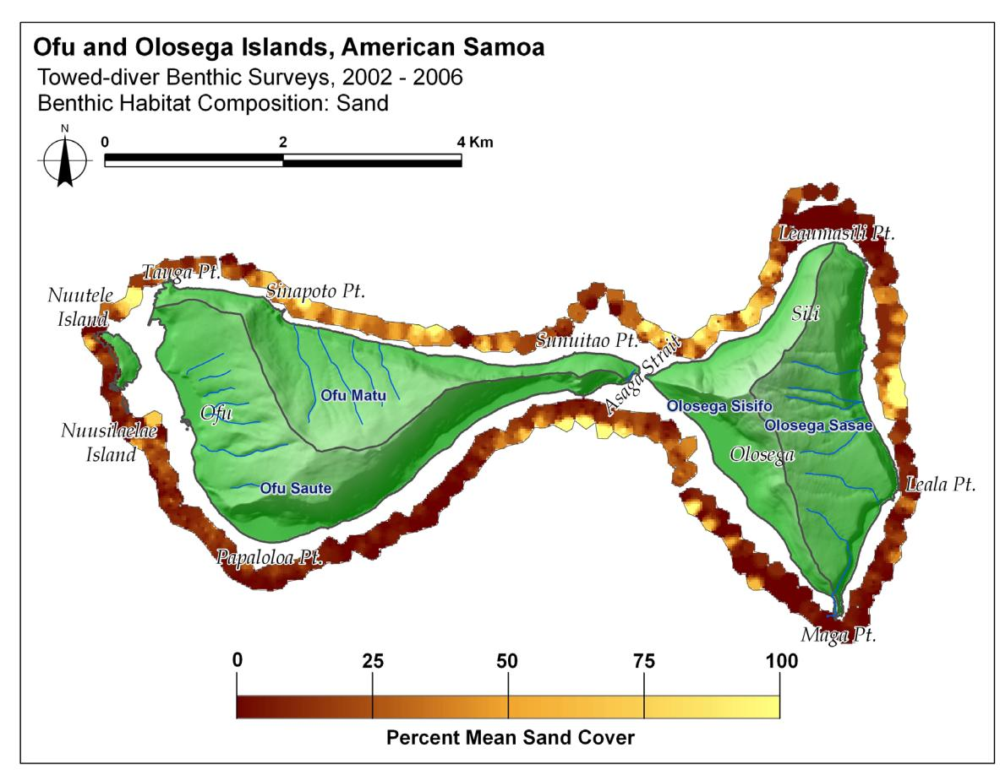

**Figure 4.3.2b.** Mean percent cover of sand concatenated from towed-diver habitat survey observations around Ofu and Olosega during ASRAMP 2002, 2004, and 2006. Major streams (blue lines) overlay the topographic map of the islands, indicating the location of inputs of freshwater runoff into the marine ecosystem. Selected watershed (Fig. 3.1a) are highlighted in blue. Sand composition was subjectively rated by diver-observers over 5-min ensembles (~ 200 x 10 m) on a 1–100% scale. Light shades indicate high percent cover of sand, and dark shades indicate low percent cover of sand.

Both the complexity and sand cover reversed patterns immediately on either side of this low relief sand channel. The area near Ofu Harbor was likewise observed to vary from high complexity and low sand cover to low complexity and high sand cover. Observations of the central north region, which has generally high complexity as described above (Fig. 4.3.2a), revealed that most of the area has moderate levels of sand cover. This combination of high complexity and moderate sand cover suggests that much of the north coast is dominated by broad spur-and-groove habitat, where grooves are dominated by sand channels between high-relief reef spurs.

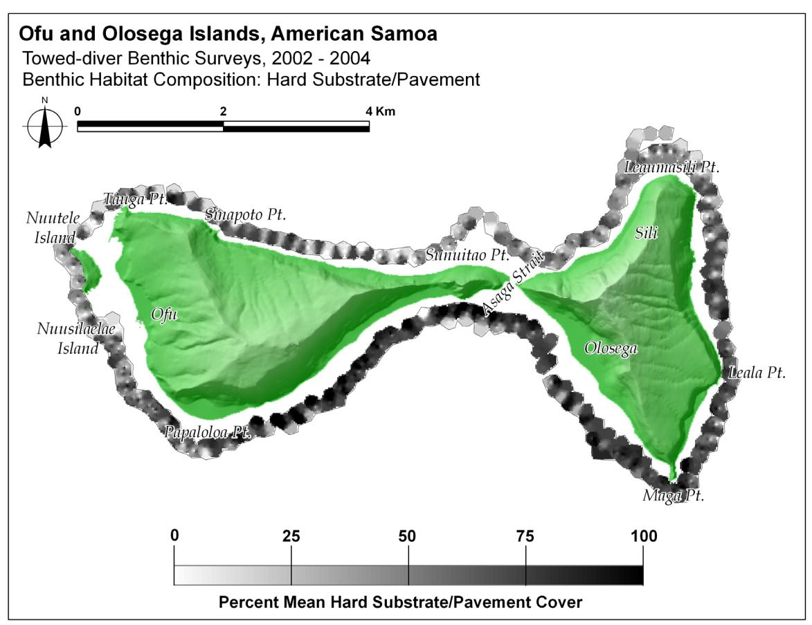

**Figure 4.3.2c.** Mean percent cover of hard substrate/pavement, concatenated from towed-diver survey observations around Ofu and Olosega during ASRAMP 2002 and 2004. Hard substrate/pavement composition was subjectively rated by diver-observers over 5-min ensembles (~ 200 x 10 m) on a 1–100% scale. Dark shades indicate high percent cover of hard substrate, and light shades indicate low percent cover of hard substrate.

Generally, the percent cover of hard substrate/pavement was variable around Ofu and Olosega with higher values in the central south and southeast regions and relatively lower values in the central north and northwest regions (Fig. 4.3.2c). As one would expect, the percent cover of hard substrate/pavement had an inverse pattern relative to the percent cover of sand. Consistent with observations of complexity and sand cover, variable observations of hard substrate/pavement along the north sides of Ofu and Olosega also suggests a predominance of spur-and-groove habitats.

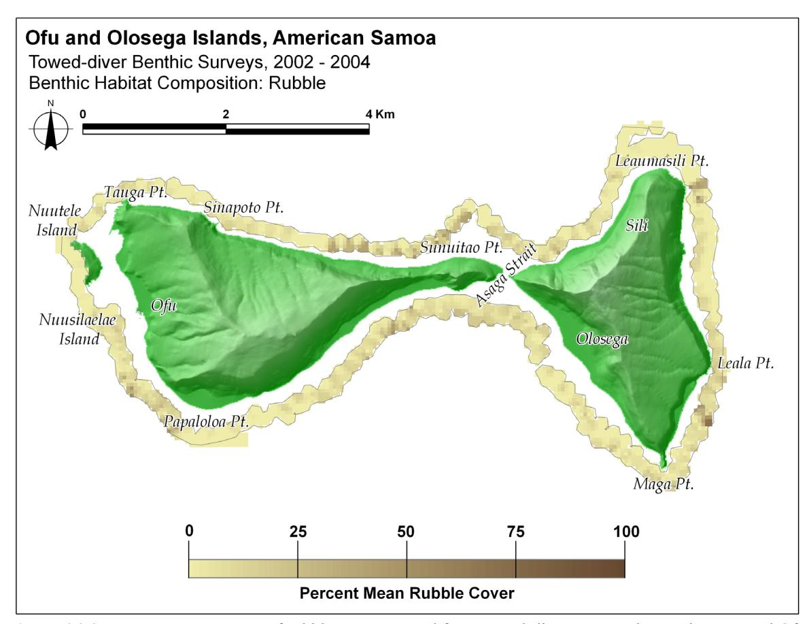

**Figure 4.3.2d.** Mean percent cover of rubble, concatenated from towed-diver survey observations around Ofu and Olosega during ASRAMP 2002 and 2004. Rubble composition was subjectively rated by diver-observers over 5-min ensembles (~ 200 x 10 m) on a 1–100% scale. Light shades indicate low percent cover of coral rubble, and dark shades indicate high percent cover of coral rubble.

Generally, benthic composition around Ofu and Olosega was observed to have relatively low percent cover of coral rubble, with values at most of the forereef habitats around both islands being less than 10% (Fig. 4.3.2d). Percent cover of rubble was elevated to values of ~ 25% in small patches, most notably along the southeast and northeast windward sides of Olosega in the southeast and northeast regions, in the central north region to the west of Asaga Strait, and in the southwest region near the proposed airport extension of Ofu. The area in the central north region was also observed to have moderate habitat complexity, low sand cover, and moderate hard substrate/pavement cover, possibly indicating pockets of rubble collecting in the grooves instead of sand.

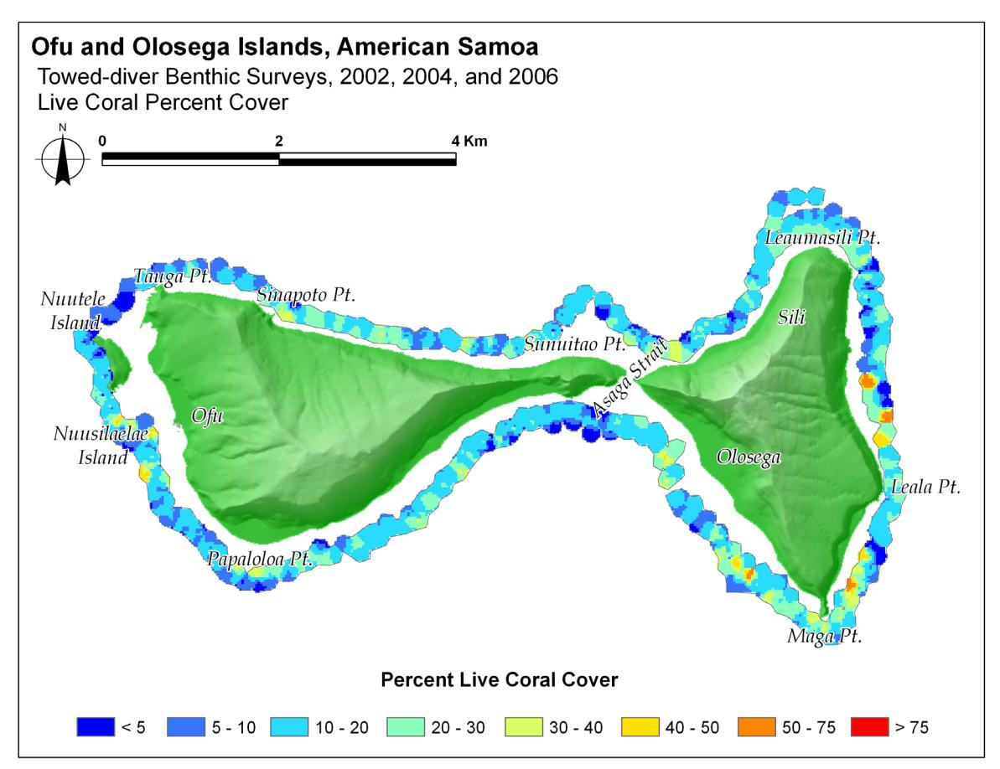

**Figure 4.3.2e.** Mean percent cover of live scleractinian (stony) coral, concatenated from towed-diver survey observations around Ofu and Olosega during ASRAMP 2002, 2004, and 2006. Live coral cover composition was subjectively rated by diver-observers over 5-min ensembles (~ 200 × 10 m) on a 1–100% scale. Blue colors indicate low percent cover of coral, and reddish colors indicate high percent cover of coral.

Generally, live scleractinian coral cover around Ofu and Olosega was relatively low and variable, with values in most areas in the range between 0% and 30%. The highest percentages of live coral cover, with isolated, localized values of ~ 50%, were found in the northeast and southeast regions on the windward side of Olosega (Fig. 4.3.2e). It appears that the elevated coral cover in the northeast was found in areas of medium-to-high habitat complexity on different sides of a large sand channel (Figs. 4.3.2a and 4.3.2b), while the elevated coral cover in the southeast was located in an area immediately south of a localized area of relatively high rubble composition (Fig. 4.3.2d). Additional localized areas of elevated live coral cover, with values of ~ 40%–50% include the region immediately west of Maga Point in the southeast region, and several localized areas off Ofu Village near REA site OFU-06 and the boundary between the northwest and southwest regions (Fig. 4.2a).

# **4.4 Oceanography and Water Quality**

Oceanographic and water quality observations were collected in the waters surrounding Ofu and Olosega over the period between 2002 and 2006. Instrumentation and equipment descriptions, deployment and retrieval dates and locations, and a subset of results are detailed below. Specific details of deployments and additional data are presented in Appendix II, Table II. ii.

# **4.4.1 Hydrographic Data**

#### *2002 Spatial Surveys*

During ASRAMP 2002, 39 shallow-water CTD casts were conducted in nearshore waters around Ofu and Olosega over the February 13–15 period (Fig. 4.4.1a). Data from these vertical profiles showed a stratified water column along northern exposures (A–D) in the northwest and central north regions and around the south sides of the islands (G–J) in the southeast, central south, and southwest regions.

The nearshore water column was relatively well mixed on the eastern side of Olosega (E–F) in the northeast region and to a lesser extent off the southern point of Ofu (J–K) (Fig. 4.4.1b). The area (E–F) is exposed to easterly trade winds and associated seas, which likely caused

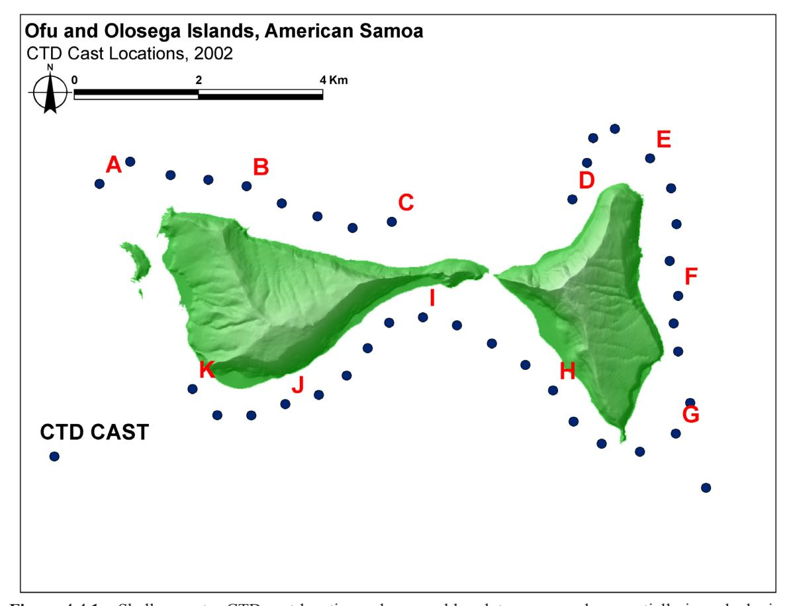

**Figure 4.4.1a.** Shallow-water CTD cast locations, shown as blue dots, expressed sequentially in a clockwise direction around Ofu and Olosega (A–K) during ASRAMP 2002, February 13–15.

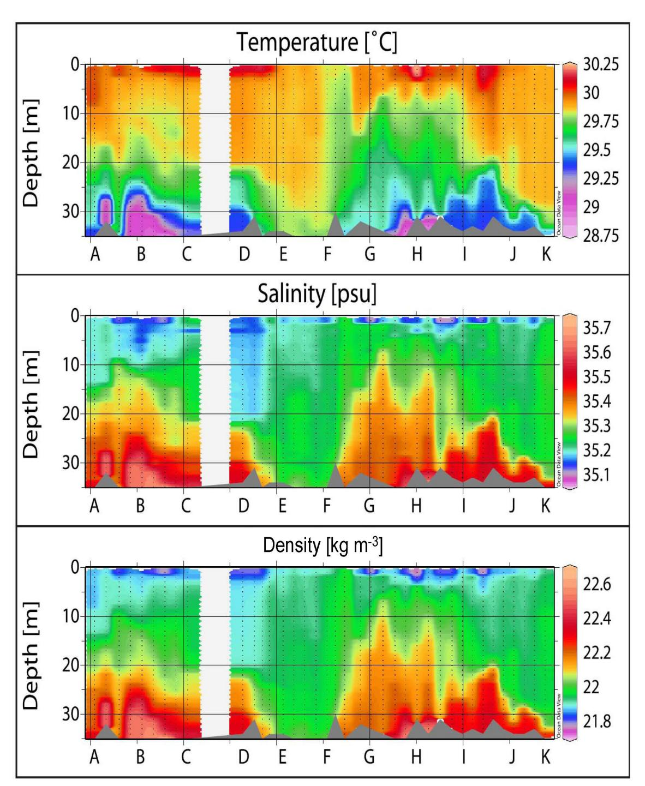

**Figure 4.4.1b.** Shallow-water CTD cast profiles to a 30-m depth around Ofu and Olosega during ASRAMP 2002, February 13–15, including temperature (°C), salinity (psu), and density (kg m-3). Profiles are shown sequentially in a clockwise direction around the island (A–J), as shown in Figure 4.4.1a.

mechanical mixing of the water column. Other than this small area of mixing, temperature, salinity, and density were consistently stratified around the two islands. Temperature salinity and density were typically related: high temperature (> 30°C) corresponding to low salinity (< 35.2 psu) and low density (< 22 kg m-3). Salinity values were relatively low (< 35.2 psu) in the upper 10 m of the water column in the central north region (B–D). Since bottom-water salinity in the area was elevated, it suggests the source of this low salinity water may have been precipitation or runoff.

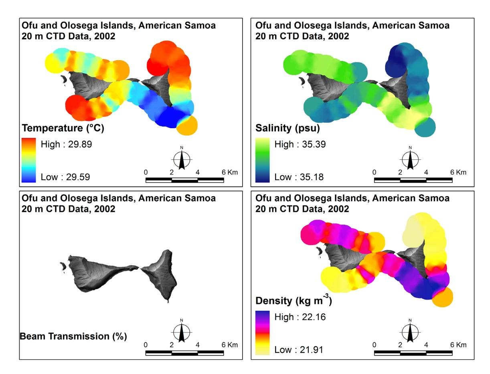

**Figure 4.4.1c.** Interpolated water temperature (top left), salinity (top right), and density (bottom right) at a 20-m depth derived from shallow-water CTD casts around Ofu and Olosega during ASRAMP 2002, February 13–15. Beam transmission data (bottom left) were not collected.

Spatial analyses of these basic water properties at a 20-m depth from the ASRAMP 2002 surveys indicate clear spatial structure, though ranges in temperature (29.59–29.88°C), salinity (35.18–35.39 psu), and density (21.91–22.16 kg m-3) were relatively small. Spatial patterns in each of the three properties were similar: the northeast and southwest regions were characterized by warmer, fresher, and less dense waters; the southeast region was characterized by cold, salty, and dense waters; and the northwest region was characterized by intermediate values for each of these parameters.

# *2004 Spatial Surveys*

During ASRAMP 2004, 50 shallow-water CTD casts were conducted in nearshore waters around Ofu and Olosega over the periods February 6–8 and 13 (Fig. 4.4.1d). Data from these vertical profiles showed spatial patterns that are notably different from the 2002 surveys, with relatively well-mixed water columns around both islands (Fig. 4.4.1e). The ranges of temperature and salinity variations around the islands over the depth profiles (0–30 m) were < 0.8°C and 35–35.5 psu, respectively. Salinity and density were lowest and beam transmission was highest (low turbidity) on the eastern side of Olosega (F–G). Since the water in the area was much fresher in the upper part of the water column (0–10 m) than near the bottom (20–30 m), the likely cause of this signal may have been runoff from the east side of Olosega. The low density, low salinity surface lens that this created appeared to subsequently get mechanically mixed vertically deeper into the water column by trade winds and wave action. The west side of Ofu in the northwest and southwest regions (K–B) was characterized by warm, fresh, turbid, and less dense surface waters (0–10 m) and cooler, more saline, and more dense bottom waters (20–30 m). Finally, an area of relatively well-mixed cool water (~ 29.2°C) extending from the surface to the bottom was observed in the south central region (I–J), just west of Asaga Strait, the shallow channel between the two islands.

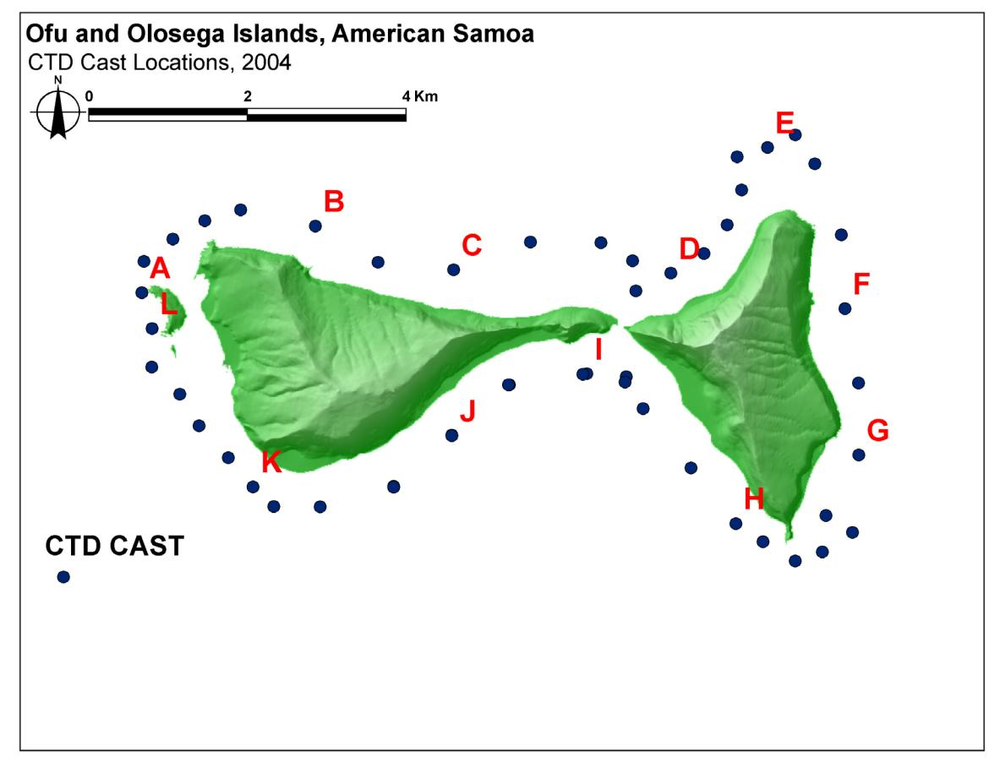

**Figure 4.4.1d.** Shallow-water CTD cast locations, shown as blue dots, expressed sequentially in a clockwise direction around Ofu and Olosega (A–L) during ASRAMP 2004, February 6–8.

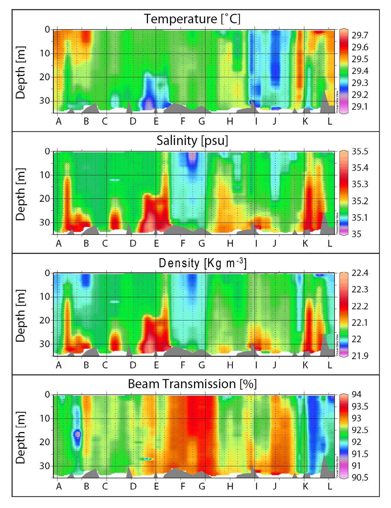

**Figure 4.4.1e.** Shallow-water CTD casts to a 30-m depth around Ofu and Olosega during ASRAMP 2004, February 6–8, including temperature (°C), salinity (psu), density (kg m-3), and beam transmission (%). Profiles are shown sequentially clockwise around the island (A–L), as shown in Figure 4.4.1d.

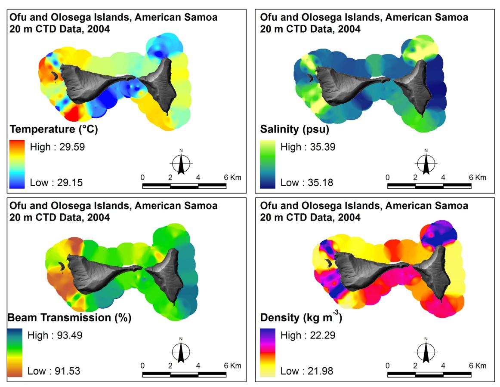

**Figure 4.4.1f.** Interpolated water temperature (top left), salinity (top right), beam transmission (bottom left) and density (bottom right) at a 20-m depth derived from shallow-water CTD casts around Ofu and Olosega during ASRAMP 2004, February 6–8 and 13.

The spatial patterns of observed physical water properties around Ofu and Olosega at a 20-m depth during ASRAMP 2004 were characterized by relatively small, but noteworthy, ranges in temperature (29.15–29.59°C), salinity (35.18–35.39 psu), beam transmission (91.53–93.49%), and computed density (21.98–22.29 kg m-3) (Fig. 4.4.1f). The eastern side of Olosega was observed to have low salinity and density value, and moderately high beam transmission (low turbidity) and temperature, possibly suggesting a vertically mixed freshwater lens formed by precipitation or runoff during the sampling period. The submerged bank in the northeast region and the western part of the central south region off Ofu were characterized by cool, saline, dense waters with moderate beam transmission. Interestingly, very strong and distinct spatial gradients between the east and northeast sides of Olosega were observed. Significant spatial variability was observed along the western side of Ofu in the southwest and northwest regions, where alternate areas of warm and cool, fresh and saline, and low and high beam transmission were observed in close proximity. Beam transmission was generally lowest (high turbidity) in this area, particularly off Ofu Village and an area off the northern point of the island.

#### *2006 Spatial Surveys*

During ASRAMP 2006, 33 CTD casts were conducted in nearshore waters around Ofu and Olosega over the period February 26–28 (Fig. 4.4.1g). In addition, water samples were collected for nutrient analyses at depths of 1, 10, 20, and 30 m, where possible, at 18 of the CTD sites. At these locations, 35 Dissolved Inorganic Carbon (DIC) samples and 61 water samples were collected for analyses of nutrient concentration.

Vertical profiles of water properties from the shallow-water CTD surveys around Ofu and Olosega during ASRAMP 2006 found noteworthy spatial patterns of all observed properties (Fig. 4.4.1h). Areas with both well-mixed and stratified water columns were observed around the two islands. The nearshore waters were vertically well mixed along the north sides of the two islands from the northwest point of Ofu in the northwest region through the central north region, to the north point of Olosega in the northeast region (A–C). The nearshore waters were generally well stratified along the windward side of Olosega in the northeast and southeast regions and along most of the south coasts of both islands in the southeast, central south, and southwest regions (C–G), being most pronounced along the southwest (lee) sides of both Ofu and Olosega, possibly as a result of decreased mechanical mixing by wind and wave energy. Two regions of warm, low-saline, low-density waters were observed off the north side of Olosega (B–C) and off the western side of Ofu (F–A). Additionally, a region of relatively cool, high-salinity, high-density, bottom water (> 20 m) occurred around the

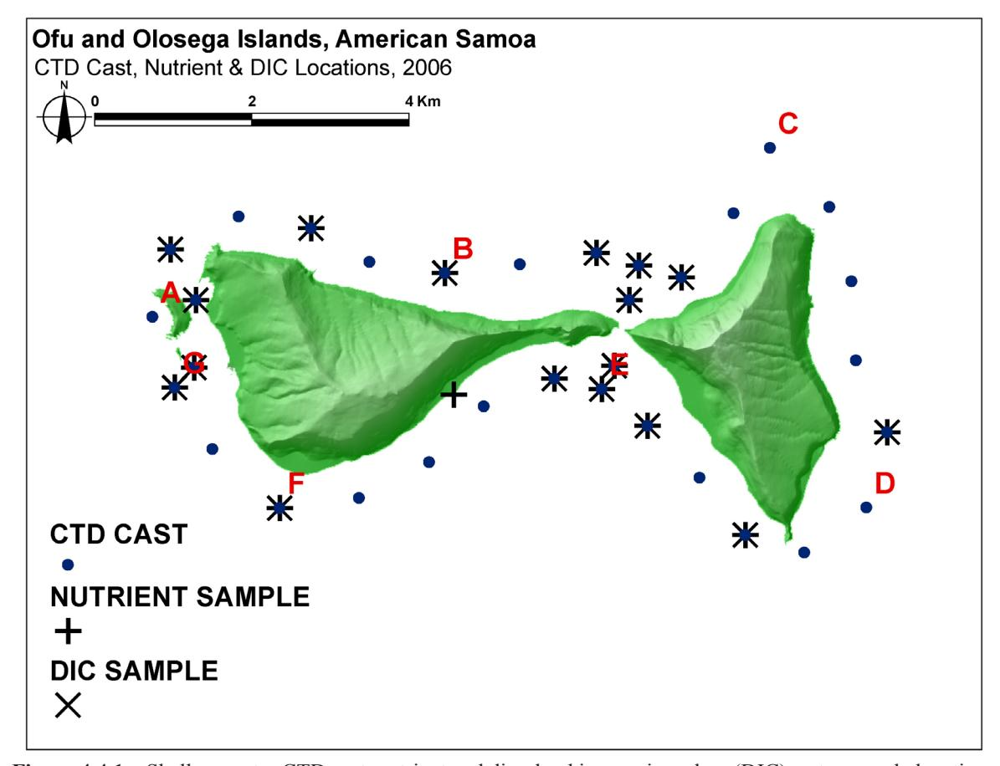

**Figure 4.4.1g.** Shallow-water CTD cast, nutrient and dissolved inorganic carbon (DIC) water sample locations around Ofu and Olosega (A–G) during ASRAMP 2006, February 26–28.

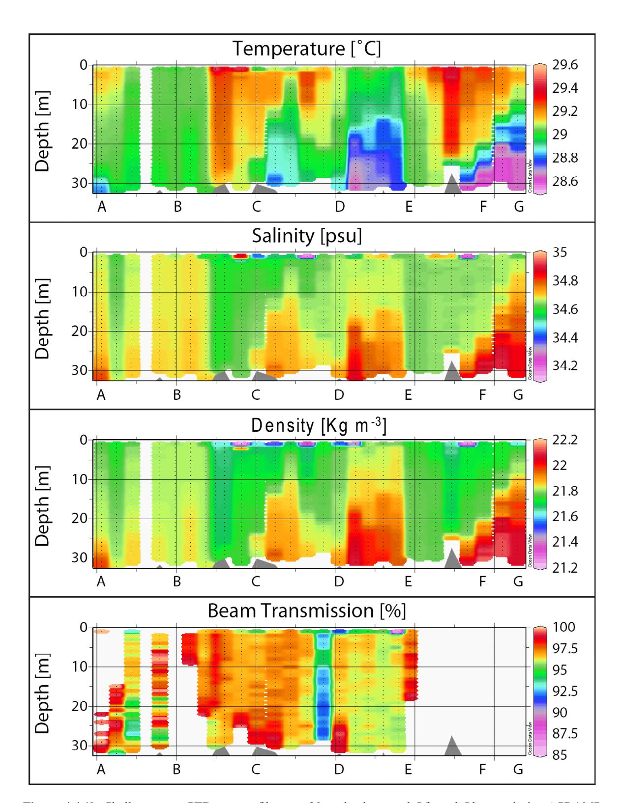

**Figure 4.4.1h.** Shallow-water CTD cast profiles to a 30-m depth around Ofu and Olosega during ASRAMP 2006, February 26–28, including, temperature (°C); salinity (psu); density (kg m-3); and beam transmission (%). Profiles are shown sequentially in a clockwise direction around the island (A–G), as shown in Figure 4.4.1g.

southern point of Olosega (D–E). Within this region beam transmission observations were high, suggesting upwelling of deeper water into this region. Beam transmission during this time was intermittent based on a faulty instrument.

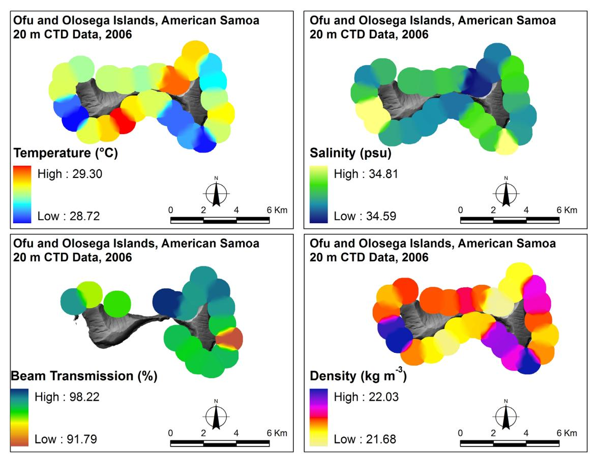

**Figure 4.4.1i.** Interpolated water temperature (top left), salinity (top right), beam transmission (bottom left) and density (bottom right) at a 20-m depth, derived from shallow-water CTD casts around Ofu and Olosega during ASRAMP 2006, February 26–28.

The spatial patterns of observed physical water properties around Ofu and Olosega at a 20-m depth during ASRAMP 2006 were characterized by moderate ranges in temperature (28.72– 29.30°C), salinity (34.59–34.81 psu), density (21.68–22.03 kg m-3), and beam transmission (91.79–98.22%; Fig. 4.4.1i). A distinct oceanographic feature along the northern coastline where the two islands meet was characterized by relatively warm water temperatures, low salinity and density, and very high beam transmission (low turbidity). These characteristics suggest a freshwater feature at that location during the sampling period. Similar characteristics were also seen along the western portion of the southern coastline off the southeast coast of Ofu. The eastern side of Olosega showed local variability in these physical oceanographic parameters, including a region with low beam transmission (high turbidity). The western side of Ofu was observed with relatively cold, saline, and dense water, suggesting a possible upwelling feature in that region.

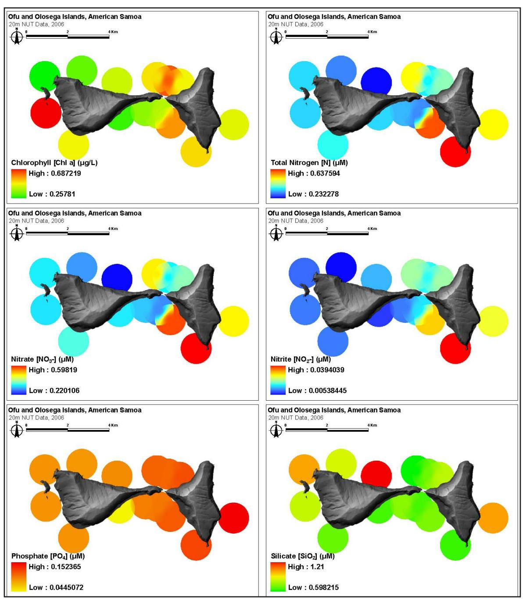

**Figure 4.4.1j.** Interpolated chlorophyll-a (top left), total nitrogen (top right), nitrate (middle left), nitrite (middle right), phosphate (bottom left) and silicate (bottom right) concentrations, at a 20-m depth derived from water samples collected in concert with shallow-water CTD casts around Ofu and Olosega during ASRAMP 2006, February 26–28.

Water quality, as deduced by laboratory analyses of key nutrients from the in situ water samples collected at a of 20-m depth around Ofu and Olosega during ASRAMP 2006, showed interesting spatial patterns (Fig. 4.4.1j). The following ranges in water quality parameters were observed around the two islands: chlorophyll-a, 0.26–0.69  $\mu$ g L-1; phosphate (PO4) 0.04–0.15  $\mu$ M; silicate (SiO2), 0.60–1.21  $\mu$ M; and total nitrogen (Ntot = NO3 + NO2), 0.23–0.64  $\mu$ M. Sites near inhabited locations, northwest of Ofu and southwest of Olosega, had higher chlorophyll-a and total nitrogen values, respectively. The highest values of nitrates, nitrites, and total nitrogen were observed in the southeast region, possibly indicating

upwelling or current-derived nutrients. It is possible that this may also be associated with the submerged volcanic ridgeline that extends to the eastern coastline of Olosega from nearby Ta`u. Values of the nitrates, nitrites, and total nitrogen were generally low around all sides of Ofu. Chlorophyll-a was substantially highest off Ofu Village, with significantly lower values around the remainder of Ofu.

# **4.4.2 Temporal Comparison—Hydrographic Data**

During each of the ASRAMP survey periods in 2002, 2004 and 2006, the nearshore CTD and water quality data exhibited noteworthy spatial heterogeneity, though actual ranges of most properties were relatively small. Temperature variations were small between sample periods. Salinity showed minimal variability between sample periods; however, salinity values were considerably lower during 2006. Density observations tended to parallel salinity more so than temperature, which is typically the dominant constituent when computing density. Turbidity measurements, when comparing 2004 and 2006, were extremely low at select locations in the latter survey period; the reason is unknown without additional observations.

# **4.4.3 Time Series Observations**

A suite of moored instruments were deployed around Ofu and Olosega over the period between 2002 and 2006 to collect time series observations of key oceanographic properties influencing reef conditions (Fig. 4.4.3a). Deployment and retrieval dates are detailed in

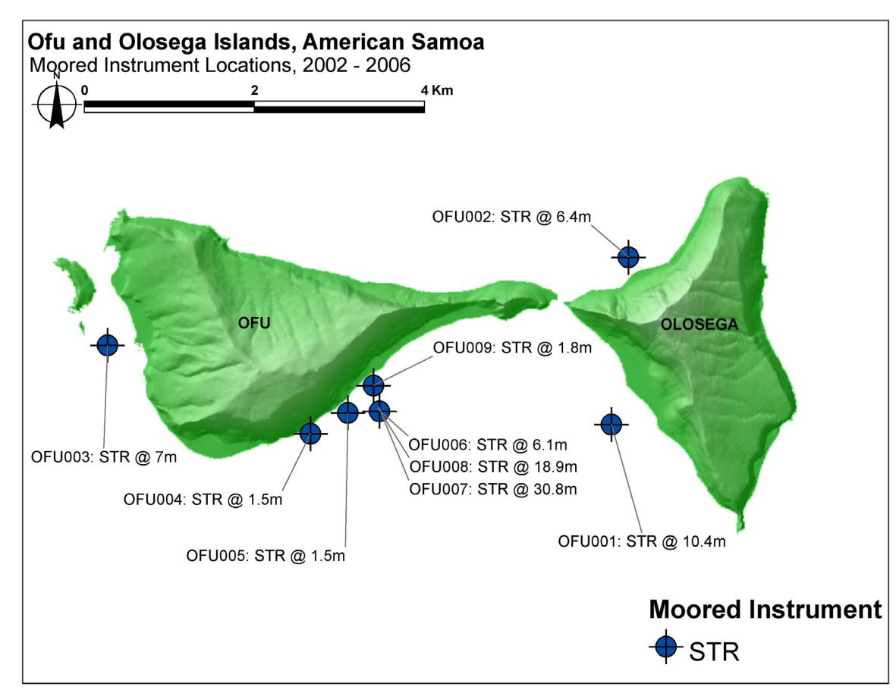

**Figure 4.4.3a.** Locations and depths of STR deployments around Ofu and Olosega between 2002 and 2006.

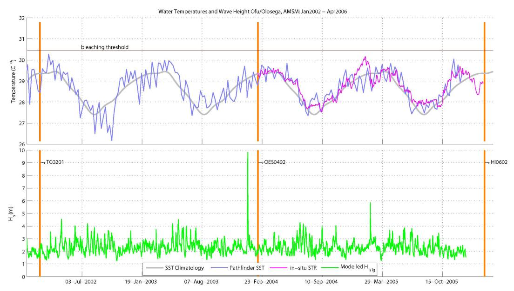

**Figure 4.4.3b.** SST and wave height time series records at Ofu and Olosega between January 2002 and April 2006. Remotely sensed data (SST climatology and weekly Pathfinder-derived SST) and modeled significant wave height derived from Wave Watch III are overlaid with CRED in situ temperature observations from an STR deployed at a 1.5-m depth at OFU005, in Ofu Lagoon. The horizontal red and vertical orange bars represent the bleaching threshold and the ASRAMP research cruise dates, respectively.

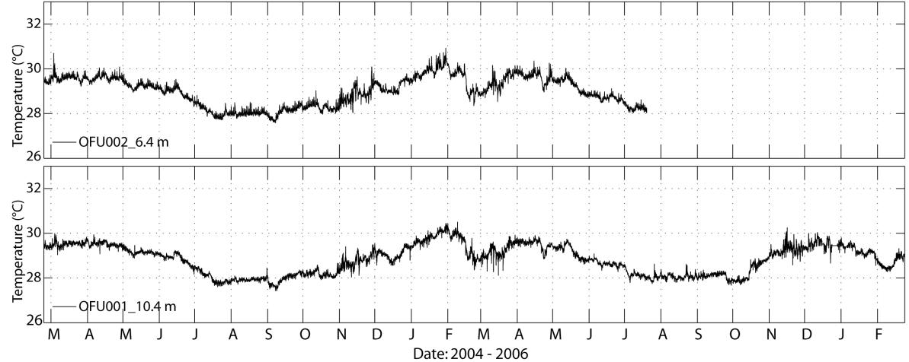

**Figure 4.4.3c.** Time series observations of sea temperature, over the period March 2004 to February 2006 from an STR deployed at OFU002 in a water depth of 6.4 m north of Olosega Island (top panel) and at OFU001 in a water depth of 10.4 m west of Olosega Island (bottom panel). See Figure 4.4.3a for mooring locations.

Appendix II, Table II. ii. Figure 4.4.3b shows a time series of in situ and remotely sensed sea surface temperature (SST) and modeled wave properties from January 2002 to April 2006.

Pathfinder SST and in situ temperature observations around Ofu and Olosega show strong seasonal variation, with warmest temperatures (~ 30°C) during January–March and coolest temperatures (~ 27.5°C) in June–August (Fig. 4.4.3b; top panel). A particularly cool episode, with temperatures falling 2°C below the SST climatology, was observed in austral winter in 2002, before sharply rising 3°C to return to climatological temperatures later that year. In situ

temperature observations tended to track satellite-derived temperature observations closely, with one exception in early 2005, when in situ values were nearly 1.5°C above Pathfinderderived SST.

Temperature time series from two subsurface temperature recorders (STRs) from 2004 to 2006 show 2–3°C temperature fluctuations as a result of seasonal variability (Fig. 4.4.3c). In each of these time series records, minimal (< 1°C) diurnal temperature fluctuations were observed.

Modeled significant wave height data for Ofu and Olosega reveal weak seasonal variability superposed with episodic, cyclone-induced extreme wave events. Larger wave heights (~ 3–4 m) typically occurred during winter months compared to smaller wave heights (~ 2 m) during the summer months. Two extreme swell events were observed during the time series record: the first, in January 2004, was produced by cyclone Heta and the second, in February 2005, was produced by Cyclones Olaf and Percy (Fig. 4.4.3b; bottom panel).

## **4.5 Coral and Coral Disease**

# **4.5.1 Coral Surveys**

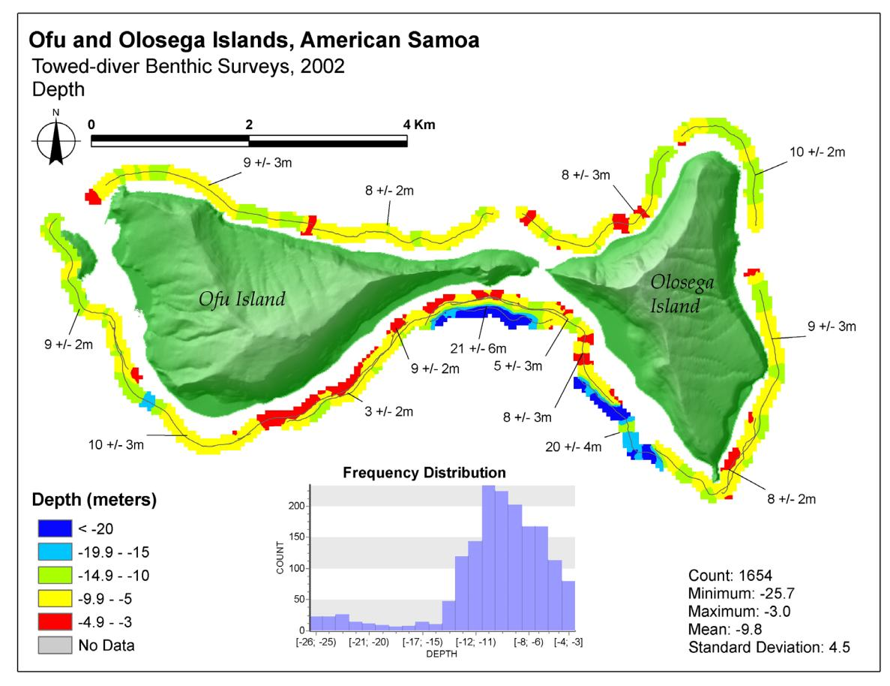

**Figure 4.5.1a.** Towed-diver survey tracks around Ofu and Olosega during ASRAMP 2004. Towed-diver survey tracks are color coded with mean depths for each 5-min segment. Mean depths and standard deviations for each towed-diver survey are shown in black text. Depth histogram and statistics (counts, minimum depth, maximum depth, mean, and standard deviation) from 30-sec depth recordings during towed-diver surveys are included.

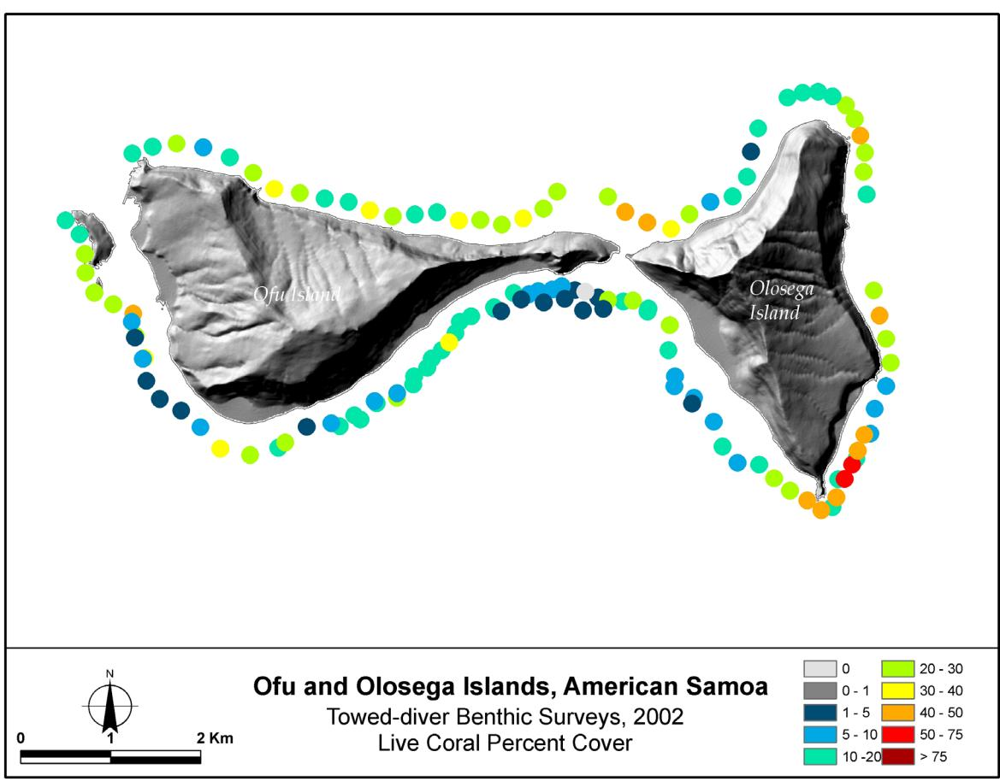

**Figure 4.5.1b.** Towed-diver benthic survey observations of live scleractinian (stony) coral cover around Ofu and Olosega during ASRAMP 2002. Each colored point represents an integrated estimate over a 5-min observation segment covering a survey swath of ~ 200 × 10 m (~ 2000 m2 ). Symbol size represents the percent live coral cover on the benthic habitat. Note that coral cover was measured as a direct percentage of overall benthic cover in 2002.

#### *2002 Spatial Surveys*

Fourteen towed-diver surveys, with a mean depth of 9.8 m, were conducted around Ofu and Olosega during ASRAMP 2002. Individual towed-diver survey track depths ranged from 3 m (SD 2) to 21 m (SD 6; Fig. 4.5.1a). An island-wide mean of 20.3% (SE 3.5) live scleractinian (stony) coral cover was observed (Fig. 4.5.1b). The island-wide mean dead coral percent cover was 3.3% (SE 0.6), which was assessed as an independent component of the benthic community (Fig. 4.5.1c).

The area of highest observed live coral cover was recorded in the southeast region around Maga Point (9 tow segments, mean: 43.3%) in relatively shallow water. In addition, other areas of high live coral cover were found in the northwest region (5 tow segments south of Nu`utele Island, mean: 31.0%), in the central north region (10 tow segments north of Sunuitao Point, mean: 31.0%), and in the northeast region (5 tow segments east of Leaumasili Point, mean: 29%). Low coral cover in the central south region was found to align with deeper towed-diver survey depths, suggesting that coral communities around Ofu and Olosega were stratified by depth. Two areas of elevated dead coral were observed: in the southwest region

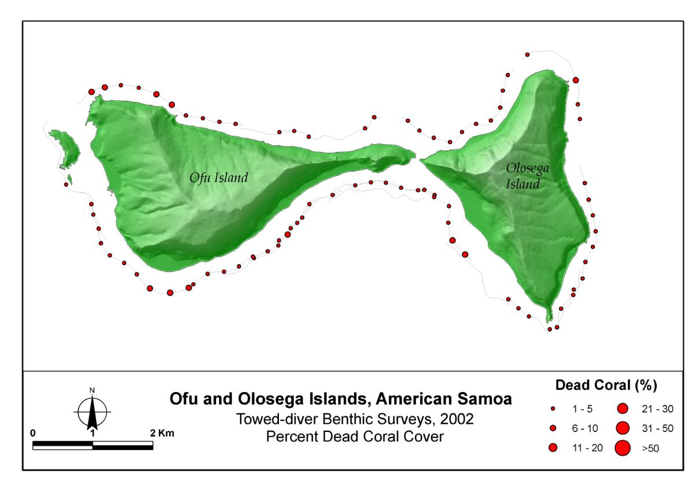

**Figure 4.5.1c.** Towed-diver benthic survey observations of dead coral cover around Ofu and Olosega during ASRAMP 2002. Each colored point represents an integrated estimate over a 5-min observation segment covering a survey swath of ~ 200 × 10 m (~ 2000 m2 ). Symbol size represents the percent dead coral cover on the benthic habitat.

(3 tow segments adjacent to Papaloloa Point, mean: 8.6%) and in the northwest region (6 tow segments off of Ta`uga Point, mean: 8.3%).

REA coral surveys during ASRAMP 2002 were the first surveys conducted in American Samoa by CRED. Though seven sites were surveyed around Ofu and Olosega by a CRED coral biologist, much of the focus of those surveys was to explore different coral monitoring methodologies. Since the surveys were exploratory and qualitative in nature, no data are presented in this more quantitative report.

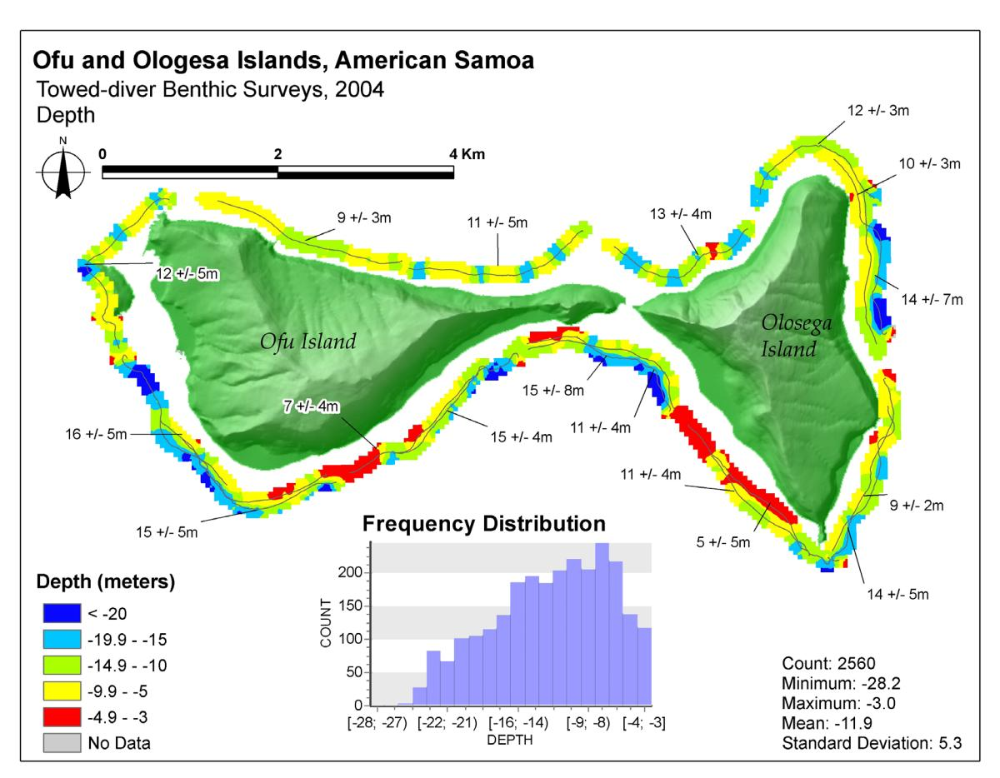

**Figure 4.5.1d.** Towed-diver survey tracks around Ofu and Olosega during ASRAMP 2004. Towed-diver survey tracks are color coded with mean depths for each 5-min segment. Mean depths and standard deviations for each towed-diver survey are shown in black text. Depth histogram and statistics (counts, minimum depth, maximum depth, mean, and standard deviation) from 30-sec depth recordings during towed-diver surveys are included.

#### *2004 Spatial Surveys*

A total of 18 benthic towed-diver surveys were conducted around Ofu and Olosega during ASRAMP 2004, with a mean tow depth of 11.9 m. Individual towed-diver survey depths ranged from 5 m (SD 5) to 15 m (SD 8; Fig. 4.5.1d). The southwest, central south, and southeast regions had the greatest range of variability in towed-diver survey depths, while the northwest, central north, and northeast regions had consistent mid-range depths. An island-wide mean percent cover of live scleractinian coral was recorded at 14.5% (SE 1.2; Fig. 4.5.1e). An island-wide mean estimate of the percent of stressed coral from the towed-diver benthic surveys was 2.4% (SE 0.8; Fig. 4.5.1f).

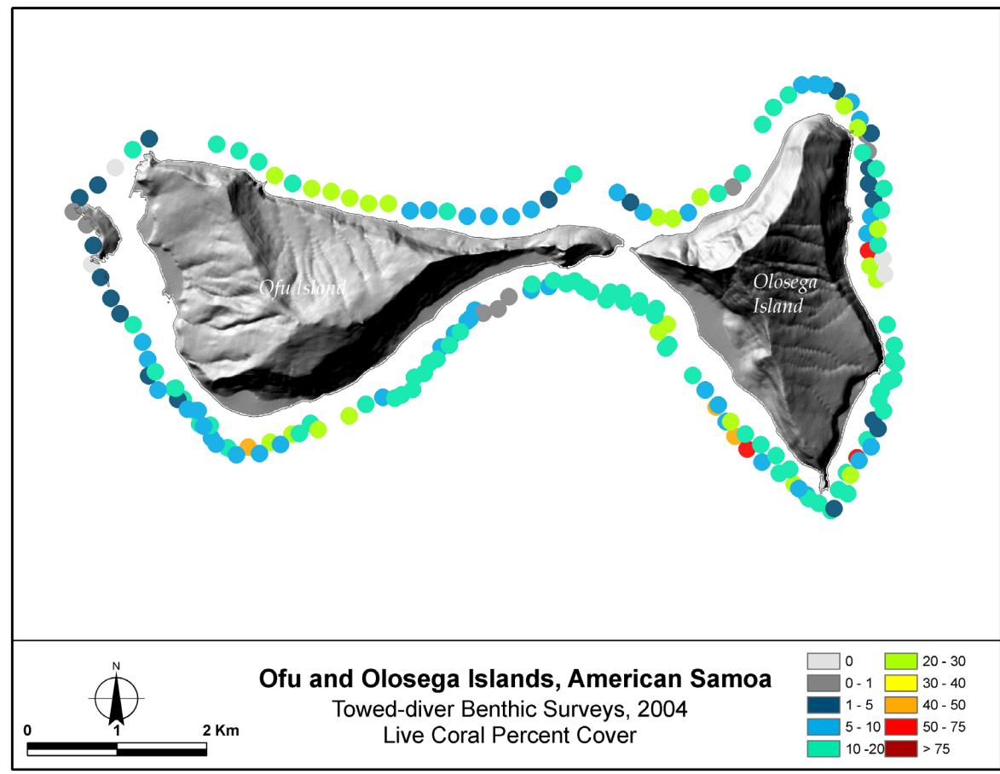

**Figure 4.5.1e.** Towed-diver benthic survey observations of live scleractinian (stony) coral cover around Ofu and Olosega during ASRAMP 2004. Each colored point represents an integrated estimate over a 5-min observation segment covering a survey swath of ~ 200 × 10 m (~ 2000 m2 ). Symbol size represents the percent live coral cover on the benthic habitat.

Percent cover of live scleractinian coral from towed-diver benthic surveys around Ofu and Olosega showed significant spatial variation (Fig. 4.5.1e). The two specific locations with the highest observed live percent coral cover were in the northeast region (50%) and in the southeast region (52%). High live coral cover was also recorded in the southeast region (west of Maga Point, 3 tow segments, mean: 43.6%), in the northwest and central north regions (east of Sinapoto Point, 7 tow segments, mean: 25.9%), and in the southwest region (adjacent to Papaloloa Point, 9 tow segments, mean: 22.6%).

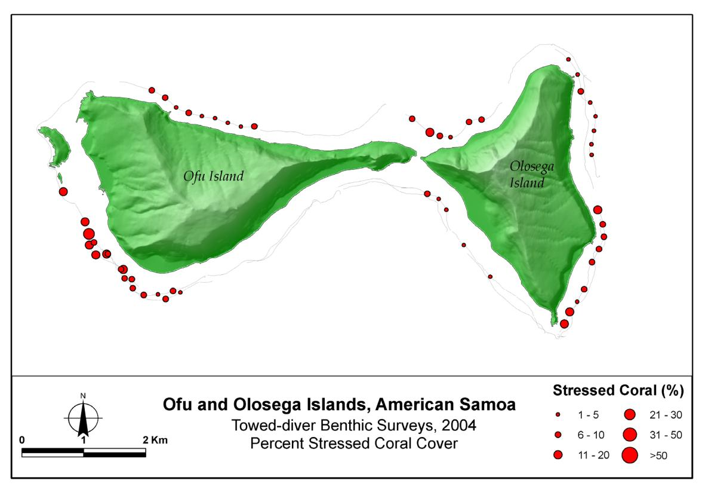

**Figure 4.5.1f.** Towed-diver benthic survey observations of stressed coral cover around Ofu and Olosega during ASRAMP 2004. Each colored point represents an integrated estimate over a 5-min observation segment covering a survey swath of ~ 200 × 10 m (~ 2000 m2 ). Symbol size represents the percent of stressed coral cover of the total coral benthic coverage. Note that stressed coral cover was measured as a percentage of overall coral cover in 2004.

The percent cover of stressed corals was generally low-to-moderate around Ofu and Olosega, though three separate regions had elevated values (Fig. 4.5.1f). The highest estimate of stressed coral was recorded in the southwest and the most southern tip of the northwest region (9 tow segments, mean: 15.1%). High coral stress was also recorded in the southeast region (9 tow segments, mean: 8.9%) and in the central north region (6 tow segments, mean: 7.2%). The alternating spatial pattern of stressed coral observations between towed-diver surveys suggests the possibility of observer bias.

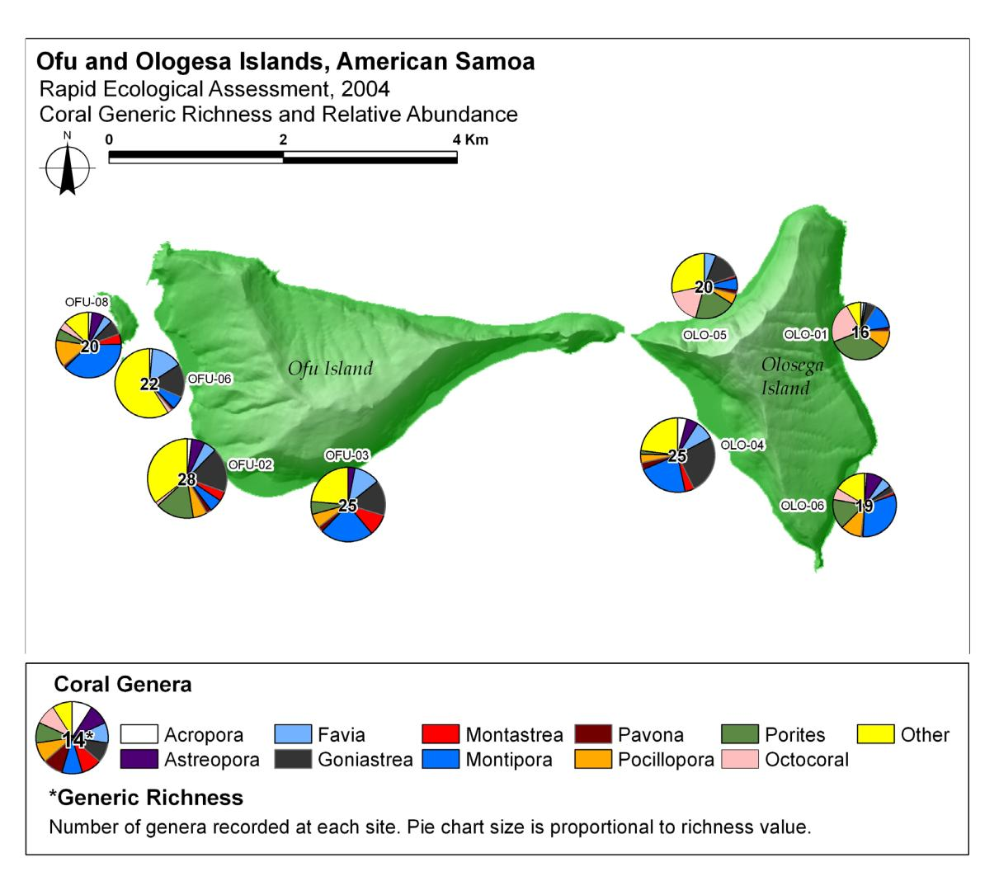

**Figure 4.5.1g.** Relative abundance of coral genera and generic richness from REA surveys around Ofu and Olosega during ASRAMP 2004. Percent relative abundance of key coral genera are indicated by color-coded portions of the pie charts. Size of the pie charts and black numbers in the center of the pie charts indicate the number of coral genera observed at each REA site.

Eight coral REA surveys were conducted around Ofu and Olosega during ASRAMP 2004. Colonies belonging to at least 34 anthozoan/hydrozoan genera were reported around the two islands (Fig. 4.5.1g). The coral communities varied greatly among sites with no single genus of corals dominating all sites. Members of the genera *Montipora*, *Goniastrea*, and *Porites* were the most common corals, with each genus contributing more than 10% of the total number of colonies at Ofu and Olosega.

Generic richness was relatively high at Ofu and Olosega, with an average of 21.9 (SE 1.3) coral genera recorded per site (Fig. 4.5.1g). Higher diversity was recorded at sites off the south coast of the islands in the southwest and central south regions, with the highest coral genera count (28) recorded at OFU-02. Site-specific data regarding the relative abundance of coral genera, by colony counts within belt transects, are shown in Appendix III, Table III. iii.

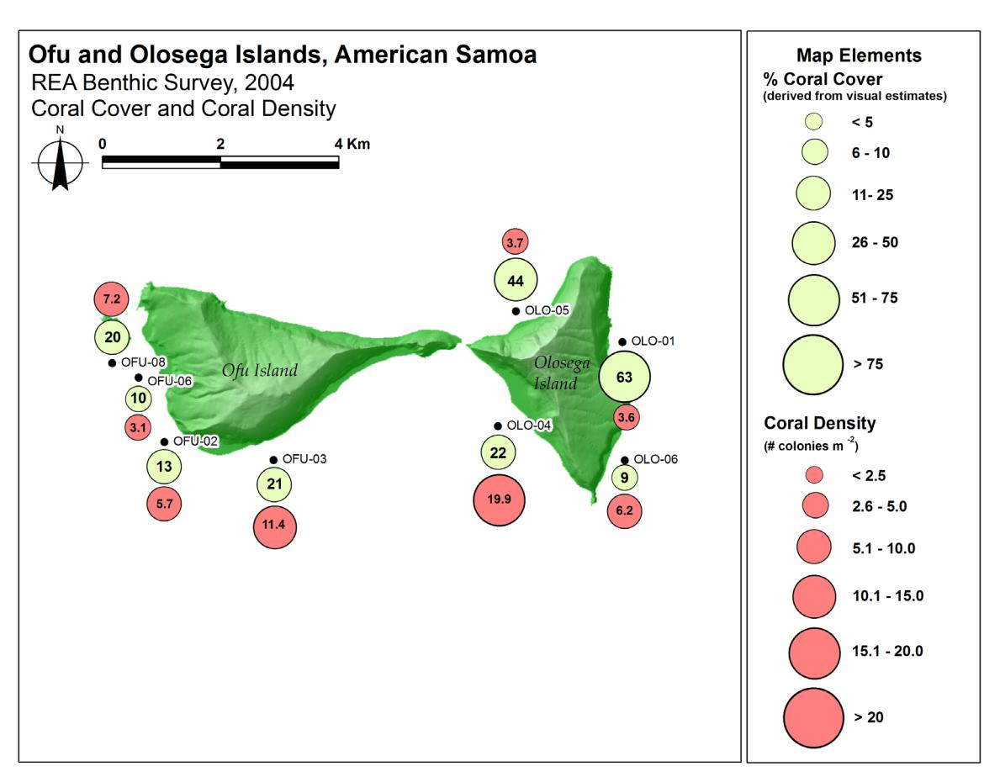

**Figure 4.5.1h.** Live scleractinian (stony) coral cover and coral colony density from REA surveys around Ofu and Olosega during ASRAMP 2004. The size of the symbol is proportional to the value of each parameter. It is important to note that coral percent cover was determined by qualitative visual estimates.

The mean percent live scleractinian (stony) coral cover (derived through visual estimates) observed during REA surveys around Ofu and Olosega was 25.3% (SE 6.3; Fig. 4.5.1h). High coral covers (44% and 63%) were observed at OLO-05 in the central north region and OLO-01 off east coast of Olosega in the northeast region, respectively. Relatively low coral cover (9%) was recorded at OLO-06 along the southeast region of Olosega.

During ASRAMP 2004 surveys around Ofu and Olosega, a total of 4041 coral colonies were counted within a survey area of 678 m2 . Mean coral density per site was 7.6 colonies m-2 (SE 1.9; Fig. 4.5.1h). Coral density was low (≤ 3.6 colonies m-2) at site OLO-05 in the central north region off Olosega, site OLO-01 in the northeast region on the windward side of Olosega, and at site OFU-06 in the northwest region off Ofu Village. Two relatively high coral densities were recorded along the central south and southwest regions of the islands, with densities of 19.9 colonies m-2 and 11.4 colonies m-2 at OLO-04 and OFU-03, respectively.

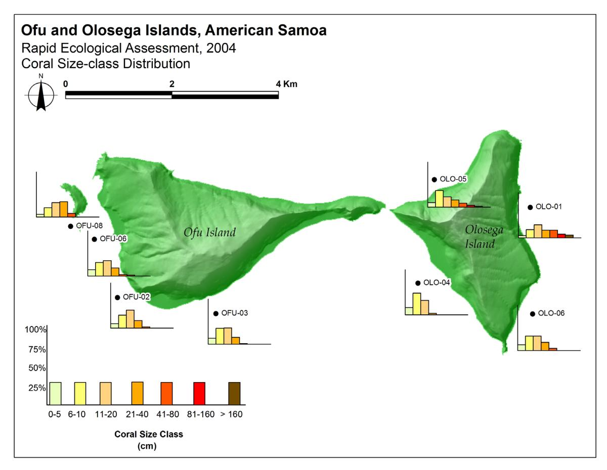

**Figure 4.5.1i.** Scleractinian coral size-class distribution around Ofu and Olosega from REA surveys during ASRAMP 2004. The height of the *y*-axis in each size class chart represents 100%. The seven observed size classes (0–5, 6–10, 11–20, 21–40, 41–80, 81–160, and > 160 cm), are color coded in size frequency diagrams at each REA site.

Size class distributions show the majority of corals (75.1%) had maximum diameters less than 20 cm (Fig. 4.5.1i) during the ASRAMP 2004 surveys. Corals with maximum diameters less than 5 cm were common; six of eight sites had more than 10% of corals within this size class. Only two sites, OLO-05 and OLO-01, in the central north and northeast regions off the north and east coasts of Olosega, respectively, had abundant large corals with more than 10% of corals measuring greater than 40 cm in diameter.

#### *2006 Spatial Surveys*

A total of 17 towed-diver benthic surveys were conducted around Ofu and Olosega during ASRAMP 2006, with a mean towed-diver survey depth of 12.6 m. Individual toweddiver surveys ranged in depth from 7 m (SD 3) to 17 m (SD 4; Fig. 4.5.1j). These surveys characterized live scleractinian (stony) coral cover, and found an island-wide mean of 17.9% (SE 1.5; Fig. 4.4.1k). Stressed coral was also characterized by these surveys and was gathered as a subset percentage of live coral percent cover. An island-wide mean of 3.3% (SE 0.4) stressed coral was found (Fig. 4.5.1l).

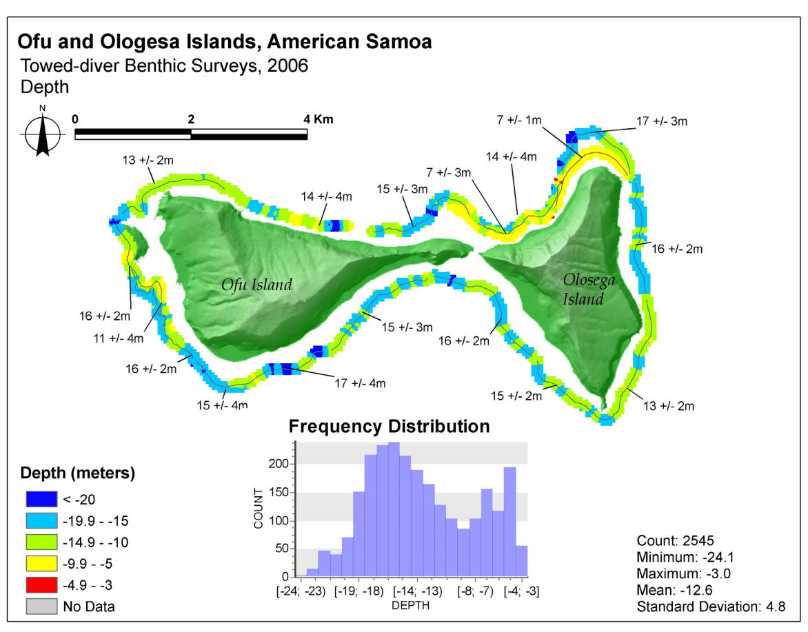

**Figure 4.5.1j.** Towed-diver survey tracks around Ofu and Olosega during ASRAMP 2006. Towed-diver survey tracks are color coded with mean depths for each 5-min segment. Mean depths and standard deviations for each towed-diver survey are shown in black text. Depth histogram and statistics (counts, minimum depth, maximum depth, mean, and standard deviation) from 30-sec depth recordings during towed-diver surveys are included.

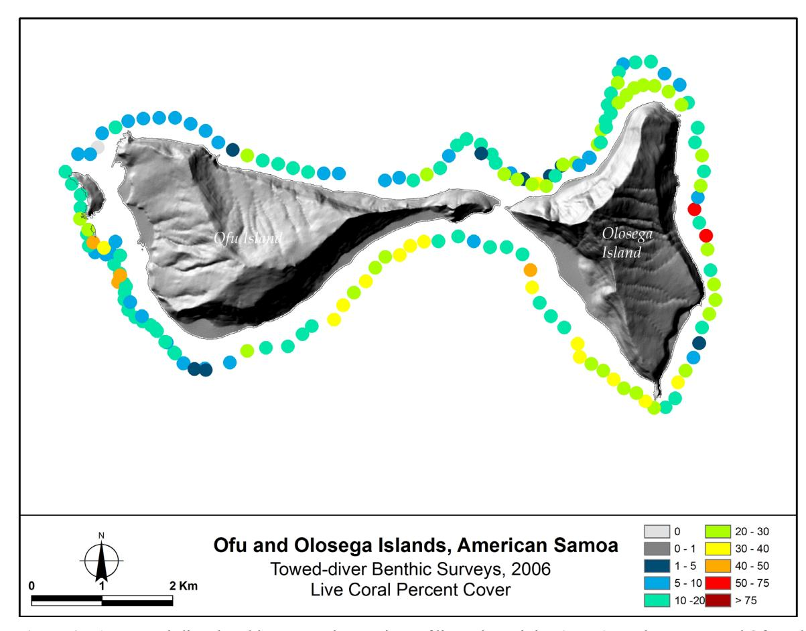

**Figure 4.5.1k.** Towed-diver benthic survey observations of live scleractinian (stony) coral cover around Ofu and Olosega during ASRAMP 2006. Each colored point represents an integrated estimate over a 5-min observation segment covering a survey swath of ~ 200 × 10 m (~ 2000 m2 ). Symbol size represents the percent live coral cover on the benthic habitat. See Chapter 2, Table 2.4.2b for more information on benthic towed-diver binning categories during ASRAMP 2006.

On the east coast of Olosega, in the northeast region, a small area of high live coral was observed (3 tow segments, mean: 42.3%). High live coral cover was also recorded in the central south region (west of Sunuitao Point, 9 tow segments, mean: 31.7%), in the northwest region (south of Nu`usilaelae Island, 8 tow segments, mean: 27.8%) and in the southeast and central south regions (west of Maga Point, 8 tow segments, mean: 28.8%).

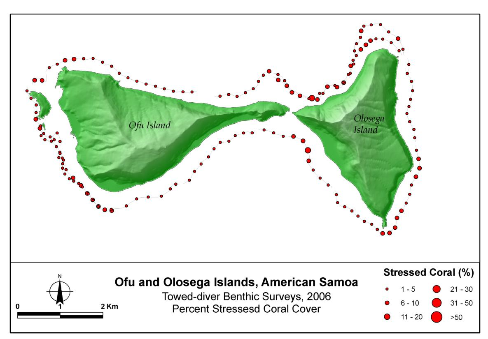

**Figure 4.5.1l.** Towed-diver benthic survey observations of stressed coral cover around Ofu and Olosega during ASRAMP 2006. Each colored point represents an integrated estimate over a 5-min observation segment covering a survey swath of ~ 200 × 10 m (~ 2000 m2 ). Symbol size represents the percent of stressed coral cover of the total coral benthic coverage. See Chapter 2, Table 2.4.2b for more information on benthic towed-diver binning categories during ASRAMP 2006.

Hotspots of stressed coral were observed in the central north (8 tow segments, mean: 11.1%) and in the central south (4 tow segments, mean 9.4%) regions. In addition, regions of elevated stressed coral included the southeast (Maga Point, 5 tow segments, mean: 7.5%; Leala Point, 3 tow segments, mean: 7.5%) and the southwest (8 tow segments, mean: 6.9%; Fig. 4.5.1l).

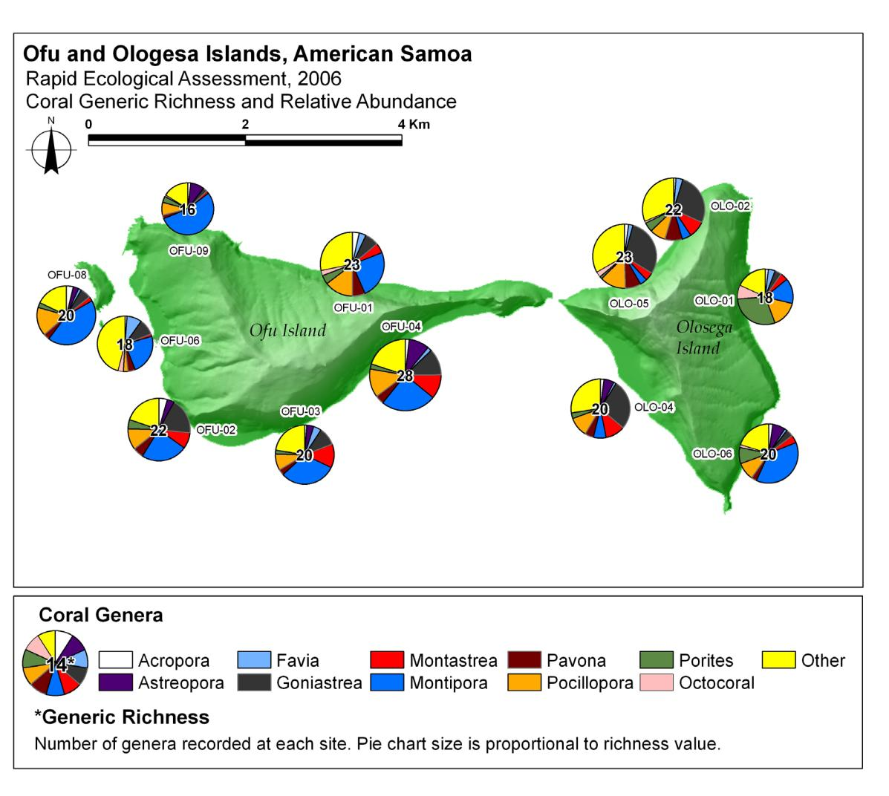

**Figure 4.5.1m.** Relative abundance of coral genera and generic richness from REA surveys around Ofu and Olosega during ASRAMP 2006. Percent relative abundances of key coral genera are indicated by color-coded portions of the pie charts. Size of pie charts and black numbers in center of pie charts indicate the number of coral genera observed at each REA site.

Twelve coral REA surveys were conducted around Ofu and Olosega during ASRAMP 2006. Colonies belonging to 34 anthozoan/hydrozoan genera were reported, with members of the genera *Montipora*, *Goniastrea*, and *Pocillopora* each contributing more than 10% of the total number of colonies (Fig. 4.5.1m). *Montipora* was the most common coral at most sites, with the exception of sites OLO-02, -04, -05, making up on average 24% of the coral community. Coral communities off the southwest coast of Olosega were dominated by *Goniastrea*, where it constituted, on average, 28% of the coral community, in comparison to constituting 8.1% of the coral community at the remaining sites around Ofu and Olosega.

Generic richness was relatively high around Ofu and Olosega, with an average of 20.8 (SE 1.0) coral genera recorded per site (Fig. 4.5.1m). The highest coral diversity was observed at OFU-04 in the central south region, where 28 coral genera were recorded. Interestingly, this high generic diversity (28) was found at a site showing among the lowest live coral cover (16.7%; Fig. 4.5.1n). Site-specific data regarding the relative abundance of coral genera, by colony counts within belt transects, are shown in Appendix III, Table III. iv.

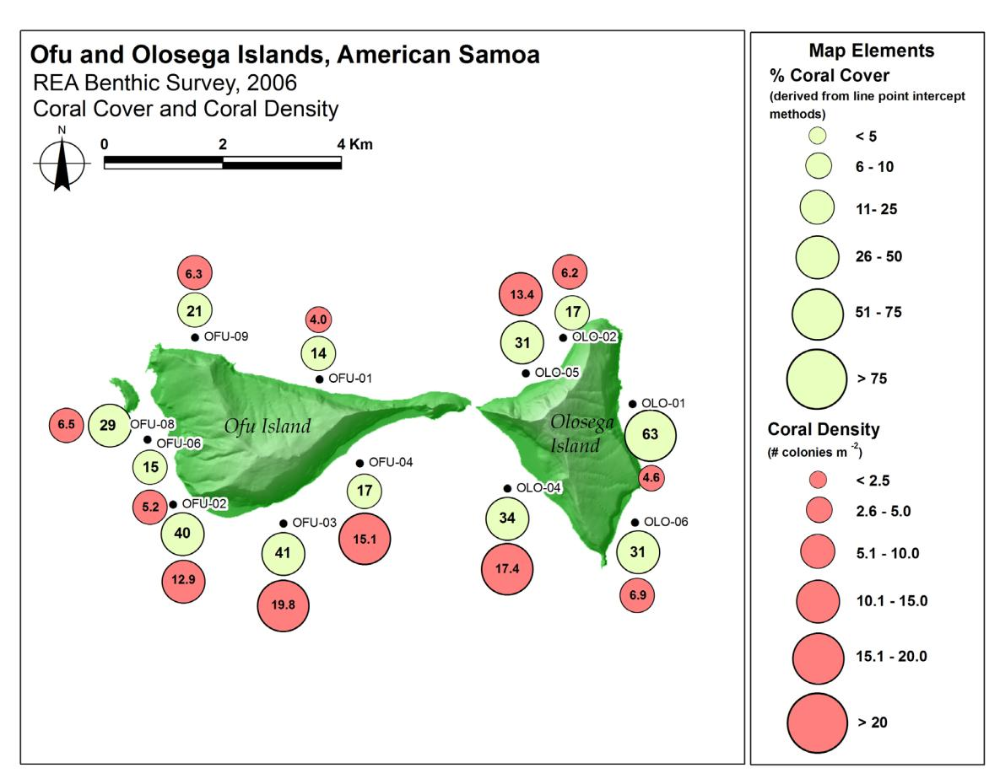

**Figure 4.5.1n.** Live coral cover and coral colony density from REA surveys around Ofu and Olosega during ASRAMP 2006. The size of the symbol is proportional to the value of each parameter.

Island-wide mean percent scleractinian (stony) coral cover around Ofu and Olosega, derived from the line-intercept method, was 29.7% (SE 4.8). Live coral cover was highest (62.7%) in the northeast region on the east side of Olosega (OLO-01) (Fig. 4.5.1n). Relatively high coral cover (~ 40%) was also recorded in the central south and southwest regions (OFU-02, -03). Relatively low coral cover (< 20%) was observed at the following four sites: OLO-02, OFU-01, OFU-06, and OFU-04.

During ASRAMP 2006 surveys around Ofu and Olosega, a total of 4185 coral colonies were counted within a total survey area of 495 m2 . Mean coral density per site was 9.9 colonies m-2 (SE 1.8; Fig. 4.5.1n). In general, coral density was relatively high around Ofu and Olosega, especially at sites in the central south and southwest regions of the islands (OFU-02, -04 and OLO-04), with the highest density (19.8 colonies m-2) recorded at OFU-03. The lowest coral density (4.0 colonies m-2) was recorded in the central north region at OFU-01.

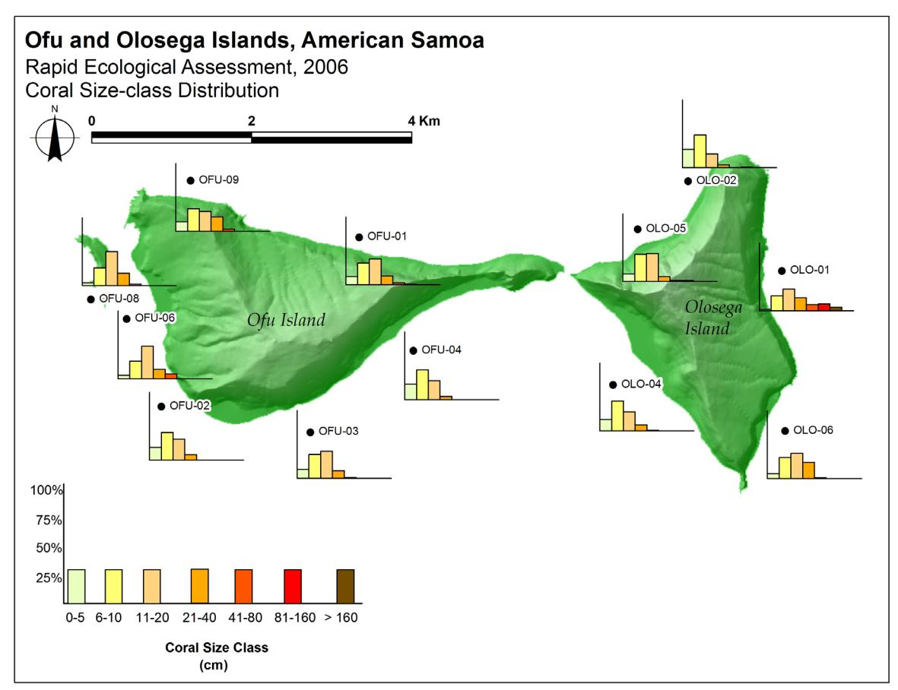

**Figure 4.5.1o.** Scleractinian coral size-class distribution around Ofu and Olosega from REA surveys during ASRAMP 2006. The height of the *y*-axis in each size class chart represents 100%. The seven observed size classes (0–5, 6–10, 11–20, 21–40, 41–80, 81–160, and > 160 cm), are color coded in size frequency diagrams at each REA site.

During ASRAMP 2006, coral size class distributions showed the majority of corals (85.2%) had maximum diameters less than 20 cm (Fig. 4.5.1o), with the greatest number of colonies occurring in the 5–10 cm size class. Small corals were common, especially off the north and south coasts, where all eight sites had more than 10% of corals with maximum diameters less than 5 cm. Only one site, OLO-01 off the east coast of Olosega, had abundant large corals, with 24% of corals having maximum diameters greater than 40 cm.

# **4.5.2 Coral Disease Surveys**

# *2006 Spatial Surveys*

Coral health and disease REA surveys covered a total survey area of 4800 m2 around Ofu and Olosega during ASRAMP 2006. A total of 22 cases of coral disease and predation were detected, translating to an estimated overall mean prevalence of 0.05% (SE 0.03; Figs. 4.5.2a and 4.5.2b). Around Ofu and Olosega, bleaching and growth anomalies were the only two afflictions observed to affect corals within the 10–15 m depth contours. Of the 12 sites surveyed, coral diseases were observed at 50%; the northeast, northwest, southeast, and southwest regions exhibited the majority of cases. Overall, the most common affliction encountered was bleaching, which affected corals in the genera *Platygyra*, *Leptoria*, *Montipora*, and *Porites*. Prevalence of bleaching did not exceed 0.16%, and bleaching was generally mild and focal within colonies. Prevalence of skeletal growth anomalies amounted to 0.16% at site OLO-01, on the east coast of Olosega, where all cases were detected. Interestingly, all cases of growth anomalies occurred only on *Acropora abrotanoides*. Finally, signs of *Acanthaster* and *Drupella* predation were observed at sites OLO-04 and OLO-06, where prevalence values amounted to 0.01 and 0.14%, respectively.

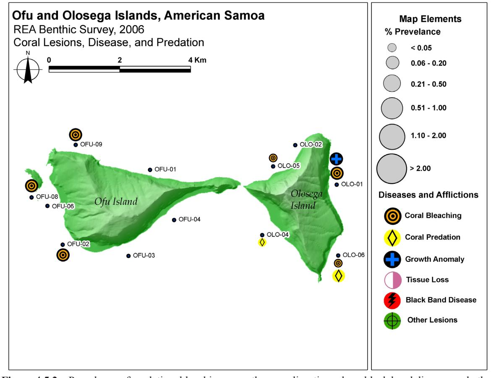

**Figure 4.5.2a.** Prevalence of predation, bleaching, growth anomalies, tissue loss, black band disease, and other lesions at Ofu and Olosega during ASRAMP 2006. Prevalence was calculated relative to the average colony density estimates and is indicated by the size of the respective symbols.

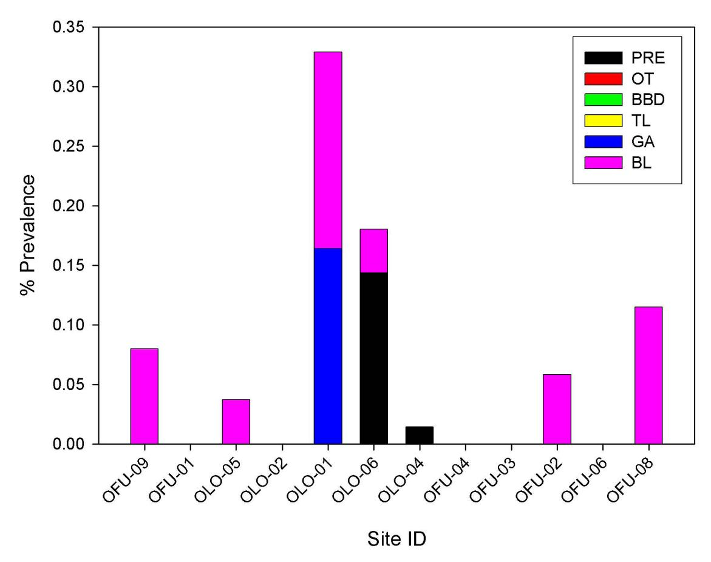

**Figure 4.5.2b.** Prevalence of predation, bleaching, growth anomalies, tissue loss, black band disease, and other lesions around Ofu and Olosega during ASRAMP 2006. Prevalence was calculated relative to the average colony density estimates. PRE—*Acanthaster* and/or *Drupella* predation; OT—other lesions, including hyperpigmented irritations; BBD—black band disease; TL— tissue loss; GA—skeletal growth anomalies; and BL—bleaching.

# **4.5.3 Temporal Comparison—Coral and Coral Disease**

The distribution of high scleractinian coral cover observed during towed-diver benthic surveys around Ofu and Olosega over the three ASRAMP cruises was sporadic, which is likely a result of natural variation and differing towed-diver depths between survey years. The overall means of towed-diver coral cover around Ofu and Olosega were between 14% and 20% (Fig. 4.5.3a). However, locations around the two islands show elevated coral cover levels across the three survey years. The northeast and southeast regions of Olosega showed consistent high coral cover, especially around the east and west sides of Maga Point, with mean values of 43.3%, 43.6%, and 42.3% in 2002, 2004, and 2006, respectively. High coral cover was also recorded along the southern coast of Nu`utele Island and along Nu`usilaelae Island in 2002 and 2006 (mean: 31% and 27%, respectively). Shallower towed-diver tracks roughly corresponded with areas of elevated coral cover over all years.

Mean island-wide live scleractinian coral percent cover around Ofu and Olosega during ASRAMP 2004 and 2006 REA surveys were 25.3% (SE 6.3) and 29.0% (SE 4.8), respectively (Fig. 4.5.3a). Although these values are similar, it is important to note the methods to estimate coral percent cover were different in 2004 (visual estimates) and 2006 (line point intercept technique). For both years, site OLO-01 off the east side of Olosega in the northeast region

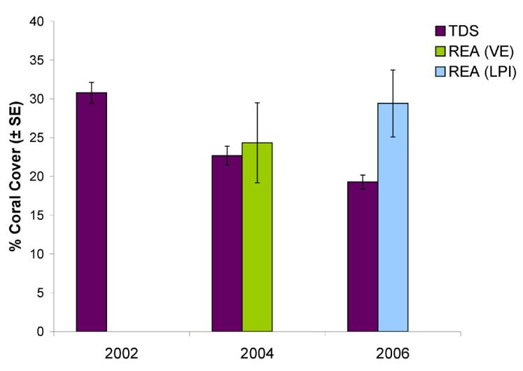

**Figure 4.5.3a.** Temporal comparison of mean percent live coral cover from REA surveys and towed-diver surveys around Ofu and Olosega during ASRAMP 2002, 2004, and 2006. The purple bars represent observations collected during towed-diver habitat surveys. The green bar represents REA data collected by visual estimates during REA surveys and the blue bar represents data collected by the line point intercept technique during REA surveys. See Chapter 2, Section 2.4: Reef Benthic (Coral, Algae, Macroinvetebrate) and Fish Surveys for considerations when comparing the results of these methodologies.

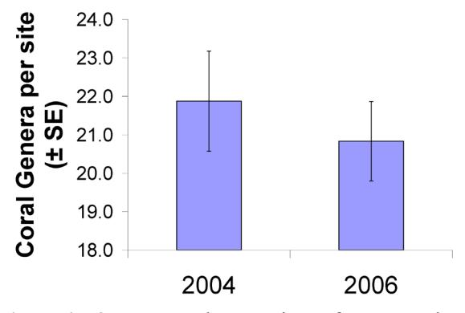

**Figure 4.5.3b.** Temporal comparison of mean coral genera per site around Ofu and Olosega during ASRAMP 2004 and 2006 REA surveys.

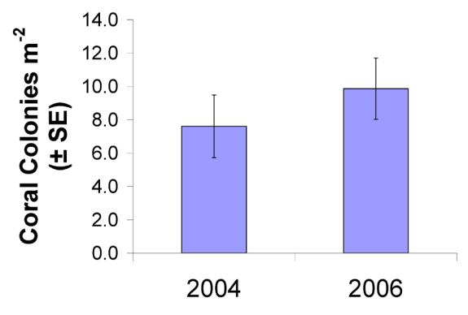

**Figure 4.5.3c.** Temporal comparison of mean coral colony density around Ofu and Olosega during ASRAMP 2004 and 2006 REA surveys.

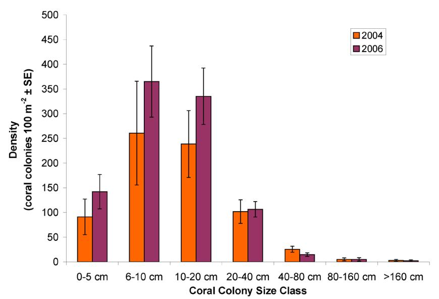

**Figure 4.5.3d.** Coral colony size class mean density from REA surveys around Ofu and Olosega during ASRAMP 2004 and 2006.

had the highest live coral percent cover around the islands (63% for both years), which corresponded geographically to the high values recorded by towed divers. REA data from 2006 also showed elevated coral cover values along the southern shore of Olosega and Ofu (OFU-03, 41%; OFU-02, 40%; OLO-04, 34%). In addition, site OLO-05 had elevated coral percent cover during both years (2004, 44%; 2006, 31%).

Island-wide, 34 coral genera were observed around Ofu and Olosega during both 2004 and 2006. Generic richness between survey years was relatively uniform, with a mean of 21.9 genera per site (SE 1.3) during ASRAMP 2004 and a mean of 20.8 (SE 1.0) during ASRAMP 2006 (Fig. 4.5.3b), even with the additional sampling effort in 2006. *Montipora* and *Goniastrea* were the dominant genera in both years. In 2004, *Porites* was a numerically dominant genus, and in 2006 *Pocillopora* was a dominant genus. This change could be accounted for by a recruitment event or variability in transect locations.

Coral colony density was relatively consistent between 2004 and 2006 REA surveys. In 2004 the mean density was 7.6 colonies m-2 (SE 1.9) and in 2006 it was 9.9 colonies m-2 (SE 1.8; Fig. 4.5.3c). For both years, colony density was low in the northwest and southwest regions and high in the central south and southeast regions. Interestingly, site OLO-01, which has consistent high coral cover, had consistently low colony density.

Coral colony mean size class density was relatively comparable between 2004 and 2006, with no discernable shifts in community size structure (Fig. 4.5.3d). For both years the largest coral colonies were observed at site OLO-01 on the east side of Olosega, which is also consistently the site of the highest coral cover.

# **4.6 Algae**

It is important to note when considering these results that turf algae, crustose coralline red algae, branched non-geniculate coralline red algae, and cyanophytes (blue-green algae) all need to be analyzed microscopically for proper taxonomic identification and, therefore, must be lumped into functional group categories in the field. Of these functional groups, turf algae are the most diverse with the possibility of up to 100 species occurring in a 10 cm2 area. As well, macroalgae are large, fleshy, sometimes calcified entities that may be identifiable to genus or species in the field, but often require microscopic analysis to confirm taxonomic identities.

# **4.6.1 Algal Surveys**

# *2002 Spatial Surveys*

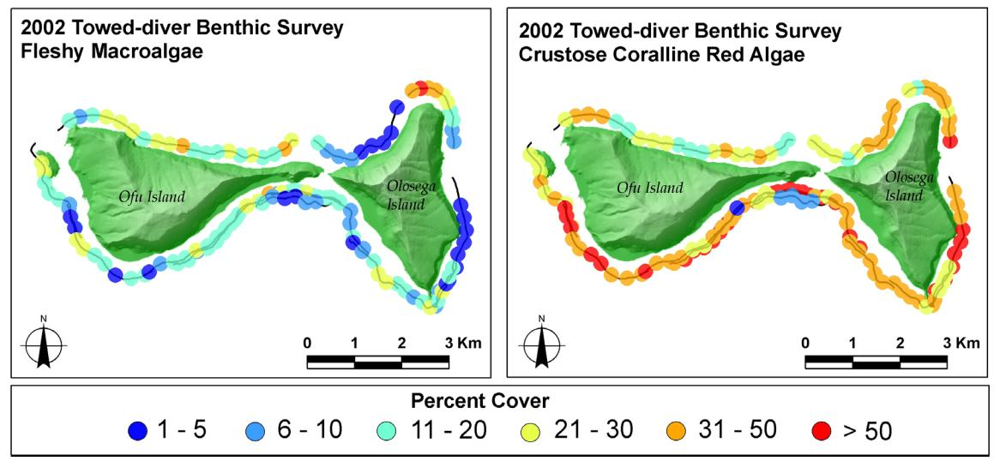

**Figure 4.6.1a.** Percent cover of fleshy macroalgae (including turf algae) and crustose coralline algae from towed-diver benthic surveys around Ofu and Olosega during ASRAMP 2002. Each colored point represents an integrated estimate over 5-min observation segments covering a survey swath of ~ 200 × 10 m (~ 2000 m2 ).

A total of 14 towed-diver benthic surveys were conducted around Ofu and Olosega during ASRAMP 2002, with fleshy macroalgae and crustose coralline red algae constituting, on average, 57.5% of the benthic substrate. Mean fleshy macroalgal cover was 17.2% (SE 1.0) while crustose coralline red algae covered 40.3% (SE 1.3) of the benthic substrate (Fig. 4.6.1a). The highest percent cover of fleshy macroalgae was observed off the northern point of Olosega in the northeast region, although the northern side of Ofu also has a higher percent cover of fleshy macroalgae than most other areas. The highest percent covers of crustose coralline red algae were observed in the southwest, central south, and southeast regions of the islands.

Qualitative REA algal surveys were conducted around Ofu and Olosega during ASRAMP 2002, and six bags of algal voucher specimens were collected. These surveys provided baseline data used to design and scale the future methodology of algal REA surveys.

# *2004 Spatial Surveys*

A total of 17 towed-diver benthic surveys around Ofu and Olosega during ASRAMP 2004 found a mean combined fleshy macroalgal and crustose coralline red algal cover of 68%. The percent cover of crustose coralline red algae was higher than fleshy macroalgae around the islands, with each functional group covering 42.5% (SE 1.2) and 25.6% (SE 0.9) of the benthic substrate, respectively (Fig. 4.6.1b). Crustose coralline red algae exhibited the highest percent cover in the southwest and southeast regions of the islands. Fleshy macroalgae were most abundant in a localized area on the western coast of Ofu just south of Nu`u tele Island in the northwest region but were also fairly prevalent in the central south and southeast regions.

During ASRAMP 2004, quantitative algal surveys were conducted at seven sites around Ofu and Olosega (Fig. 4.6.1c). A total of 12 macroalgal genera (4 green, 7 red, and 1 brown) and 3 additional algal functional groups (turf algae, crustose coralline red algae, and cyanophytes) were observed in the field. Diversity of large, easily observed macroalgal genera (some of which contain multiple species) at each site ranged from 3 to 7, although once laboratorybased taxonomic identification of all algal species (including turf algae, epiphytes, and crustose coralline red algae) from each site is completed, algal diversity for each site will be much higher. OFU-02, located in the southwest region off the southern end of Ofu and close to the proposed runway extension, exhibited the greatest algal diversity. OFU-06, offshore from the village of Ofu, and OLO-01 off the east side of Olosega in the northeast region, had the lowest macroalgal diversity.

Around Ofu and Olosega, turf algae were the dominant marine flora found, being observed in more than 75% of sampled quadrats (Fig. 4.6.1c). Similarly, crustose coralline red algae were extremely prevalent at all sites around the islands (> 75% of sampled photoquadrats per

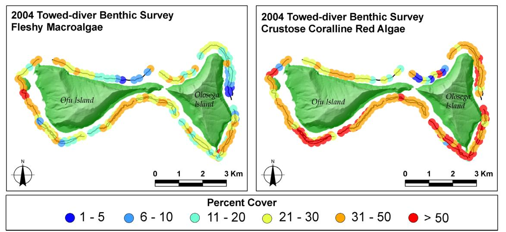

**Figure 4.6.1b.** Percent cover of fleshy macroalgae (including turf algae) and crustose coralline algae from towed-diver benthic surveys around Ofu and Olosega during ASRAMP 2004. Each colored point represents an integrated estimate over 5-min observation segments covering a survey swath of ~ 200 × 10 m (~ 2000 m2 ).

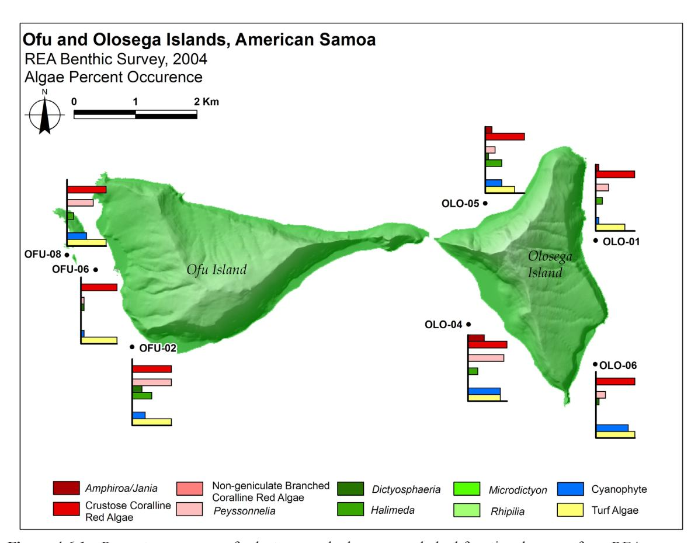

**Figure 4.6.1c.** Percent occurrence of select macroalgal genera and algal functional groups from REA surveys around Ofu and Olosega during ASRAMP 2004. Percent occurrence is equivalent to the percentage of photoquadrats in which an algal genus or functional group was observed. Length of *x*-axis denotes 100% occurrence.

site). Cyanophytes were found at all sites sampled around the islands, although no definite distributional trends were obvious.

During ASRAMP 2004, the most ubiquitous macroalgae observed was the calcified, sandproducing genus *Halimeda*, although except for OFU-02, it was of fairly low abundance at most sites and occurred in < 50% of sampled photoquadrats. The red alga, *Peyssonnelia*, was also common and, at times, locally abundant, occurring in more than 75% of photoquadrats at some western and southern sites. Overall, few obvious distributional trends were observed among macroalgal populations around Ofu and Olosega. The calcified red algal genera, *Amphiroa*/*Jania*, were only found in photoquadrats from sites around Olosega, although poor sampling coverage on north and south shores of Ofu may not have allowed for adequate habitat assessments around this island. *Laurencia*, a red algal genus in the order Ceramiales, had a disjunct distribution, being found in photoquadrats in the northwest region of Ofu, and in very high abundance in the southeast region off Olosega.

#### *2006 Spatial Surveys*

A total of 17 towed-diver benthic surveys were conducted around Ofu and Olosega during ASRAMP 2006, with fleshy macroalgae and crustose coralline red algae constituting, on

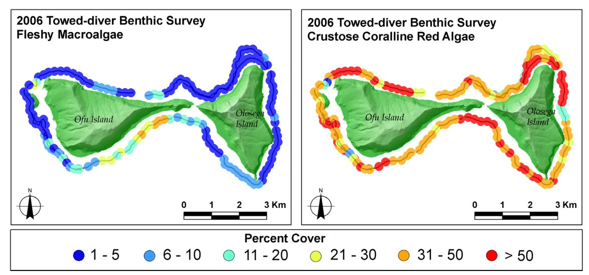

**Figure 4.6.1d.** Percent cover of fleshy macroalgae (including turf algae) and crustose coralline algae from towed-diver benthic surveys around Ofu and Olosega during ASRAMP 2006. Each colored point represents an integrated estimate over 5-min observation segments covering a survey swath of ~ 200 m × 10 m (~ 2000 m2 ).

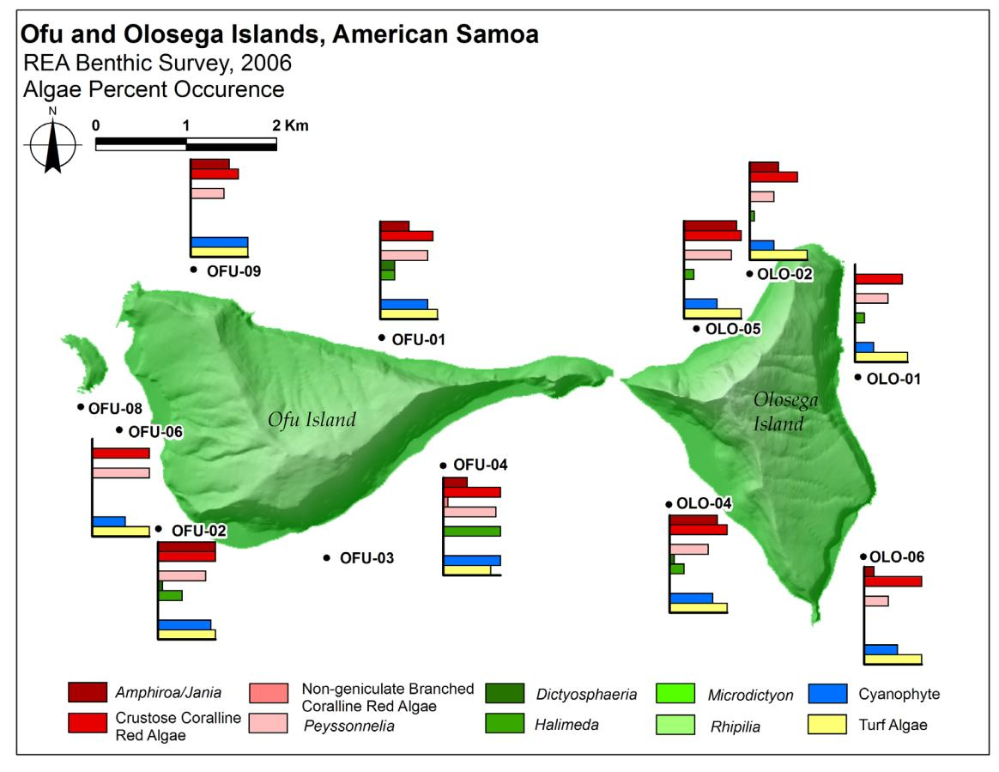

**Figure 4.6.1e.** Percent occurrence of select macroalgal genera and algal functional groups from REA algal surveys around Ofu and Olosega during ASRAMP 2006. Percent occurrence is equivalent to the percentage of photoquadrats in which an algal genus or functional group was observed. OFU-03 and OFU-08 were not surveyed in 2006. Length of *x*-axis denotes 100% occurrence.

average, 48.3% of the benthic substrate (Fig. 4.6.1d). Mean fleshy macroalgal cover was 5.3% (SE 0.6) while crustose coralline red algae covered 43.0% (SE 1.3) of the benthic substrate. The percent cover of fleshy macroalgae was relatively low around both islands, with the densest populations occurring in the central south region off the southeast coast of Ofu. In contrast, crustose coralline red algae were very abundant around both islands, with observations in many areas exceeding 50% cover. The lowest percent covers of crustose coralline red algae were observed in a few segments off the eastern side of Olosega and a couple of segments in the northwest region, both localized areas with high sand cover (Fig. 4.3.2b).

During ASRAMP 2006, quantitative algal surveys were conducted at 10 sites around Ofu and Olosega, including six of the seven sites surveyed in 2004. A total of 22 macroalgal genera (7 green, 13 red, and 2 brown) and 4 additional algal functional groups (turf algae, crustose coralline red algae, branched non-geniculate coralline red algae, and cyanophytes) were observed in the field. Diversity of large, easily observed macroalgal genera (some of which contain multiple species) at each site ranged from 4 to 12, although once laboratorybased taxonomic identification of all algal species (including turf algae, epiphytes, and crustose coralline red algae) from each site is completed, algal diversity for each site will be much higher. OFU-01, OLO-02, and OLO-05, all north shore sites in the central north and northeast regions, exhibited the highest algal diversity. Surprisingly, the two lowest diversity sites, OFU-09 and OLO-01 bordered each side of the highest diversity area. The same number of macroalgal genera (although not the same genera taxonomically) were found at all south shore sites.

Around Ofu and Olosega, turf algae were the dominant marine flora being observed in more than 75% of sampled quadrats at every site (Fig. 4.6.1e). Similarly, crustose coralline red algae were found in at least 75% of photoquadrats at each site. Cyanophytes were found at all sites sampled around the islands, and although no definite distributional trends were obvious, they anecdotally appear more abundant around Ofu than Olosega. The calcified red algal genus, *Peyssonnelia*, was among the most prevalent species found, occurring in more than 75% of photoquadrats at 50% of sites surveyed. Similarly, an unidentified member of the red algal order Gelidiales and the geniculate, calcified, red alga, *Jania*, were recorded in more than 75% of photoquadrats at 40% of sites visited. The green alga, *Halimeda*, was a common although not abundant member of the algal flora at most sites sampled, and was particularly prevalent at OFU-04 in the central south region.

#### **4.6.2 Coralline Algal Disease Surveys**

# *2006 Spatial Surveys*

Coralline algal diseases were abundant at Ofu and Olosega with a total of 278 cases enumerated (Figs. 4.6.2a and 4.6.2b). Coralline algal disease was detected at all sites, except for OFU-03, on the south-facing shore. More than 75% of all cases detected were found at sites OFU-01, -04, and -08 in the central north, central south, and northwest regions. Two types of coralline afflictions were detected: coralline lethal orange disease (CLOD) and an unidentified coralline discoloration. CLOD was common and abundant, accounting for greater than 96% of all coralline algal disease cases.

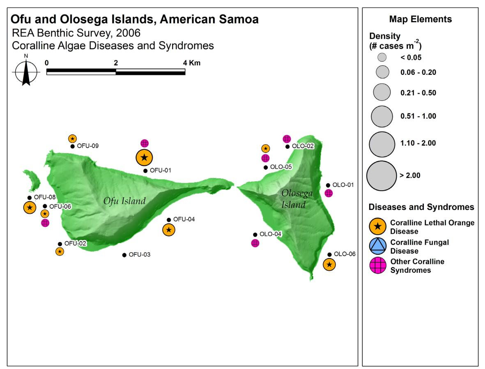

**Figure 4.6.2a.** Relative abundance of coralline algal diseases around Ofu and Olosega during ASRAMP 2006. Disease density is indicated by the size of the respective symbols.

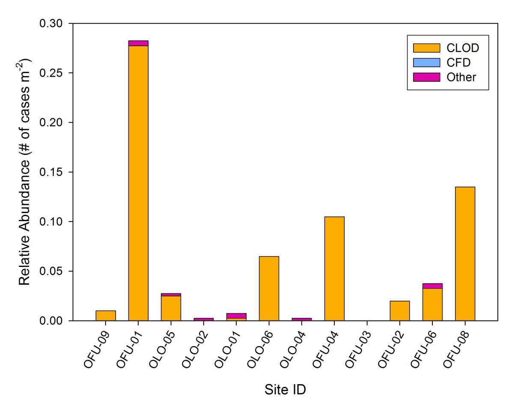

**Figure 4.6.2b.** Relative abundance of coralline algal disease around Ofu and Olosega during ASRAMP 2006. CLOD: coralline lethal orange disease; CFD: coralline fungal disease; Other: undetermined coralline discolorations.

# **4.6.3 Temporal Comparison—Algae**

Temporal comparisons of both REA algal data and towed-diver survey data are shown in Figures 4.6.3a and 4.6.3b, respectively. A greater sampling density around Ofu and Olosega during ASRAMP 2006 allowed for a more complete picture of algal populations. Populations of the calcified, geniculate red algal genera *Amphiroa/Jania* were more evenly distributed and of greater abundance around the two islands than was indicated during the ASRAMP 2004 sampling period. Cyanophytes also exhibited a much higher and more evenly distributed pattern around the islands than was previously discerned. Distributional patterns of the calcified, sand-producing green alga, *Halimeda*, remained similar between survey periods. As in 2004, lowest algal diversity and abundance occurred off the populated coast of Ofu Village.

As also noted for Ta`u (Section 5.6), a dramatic difference between the number of algal genera and their abundance was reported around Ofu and Olosega between the 2004 and 2006 sampling periods. In 2004, Ofu and Olosega did not exhibit much diversity of macroalgal genera, but by 2006 they contained macroalgal populations almost twice as diverse as seen in 2004. Although Tropical Cyclone Heta did not pass directly over the Manu`a Islands, it is

hypothesized that severe wave energy generated from the storm scoured benthic communities shortly before 2004 surveys were conducted, shredding algal communities and making the islands appear to have low algal diversity. By 2006, observations of the algal communities suggest they may have fully recovered.

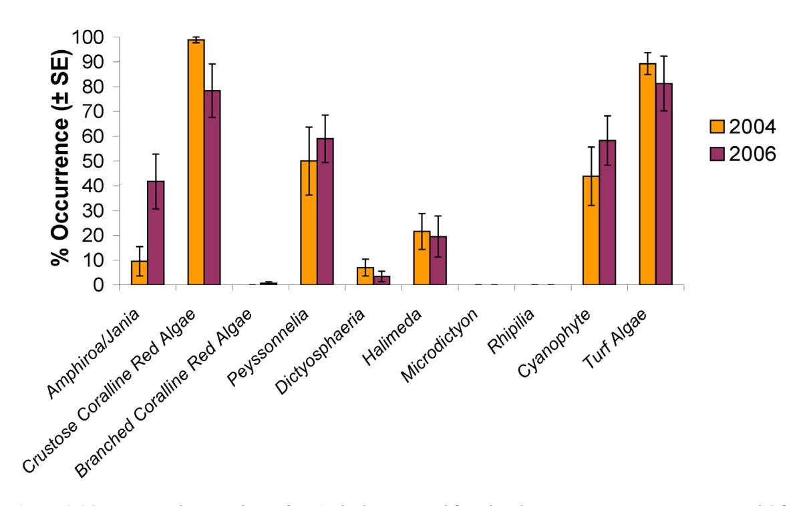

**Figure 4.6.3a.** Temporal comparison of REA algal genera and functional group percent occurrence around Ofu and Olosega between ASRAMP 2004 and 2006.

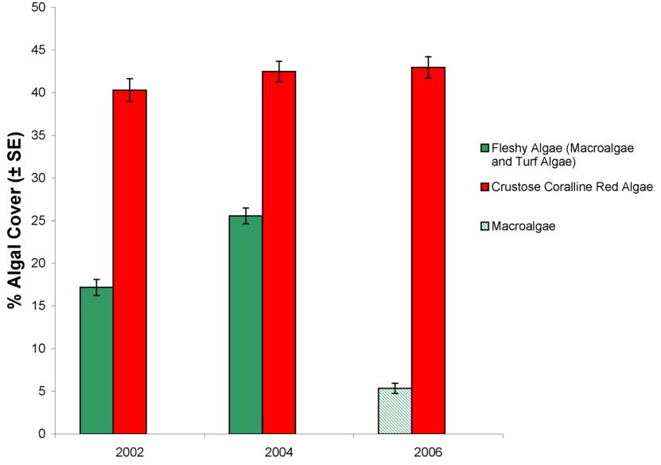

**Figure 4.6.3b.** Temporal comparison of towed-diver benthic survey algal percent cover results for fleshy, crustose coralline and macroalgae for 2002, 2004, and 2006 ASRAMP surveys around Ofu and Olosega. See Chapter 2, Section 2.4: Reef Benthic (Coral, Algae, Macroinvetebrate) and Fish Surveys for considerations when comparing the results off these methodologies between years.

#### **4.7 Benthic Macroinvertebrates**

# **4.7.1 Benthic Macroinvertebrate Surveys**

#### *2002 Spatial Surveys*

Towed-diver benthic macroinvertebrate surveys around Ofu and Olosega during the ASRAMP 2002 cruise found relatively low densities of giant clams, sea cucumbers and sea urchins (Fig. 4.7.1a). Crown-of-thorns seastars (COTS) were observed within the northwest and central north regions (1.1 and 0.2 mean organisms ha-1, respectively). As mentioned in the introduction (Chapter 1, Section 1.6: Limitations of Pacific RAMP), 2002 surveys were limited by shipboard logistics and methods development which may have contributed to the paucity of macroinvertebrates observed in 2002. A total of six qualitative REA invertebrate surveys, focusing on general macroinvertebrate biodiversity, were conducted around Ofu and Olosega during ASRAMP 2002. These surveys provided baseline data used to design and scale the future methodology of macroinvertebrate REA surveys. No data are presented.

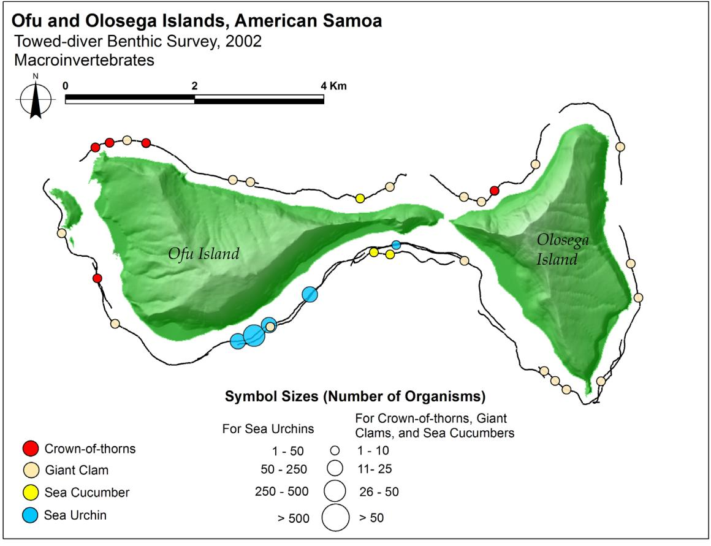

**Figure 4.7.1a.** Distribution of estimated population densities of COTS, giant clams, sea cucumbers, and sea urchins around Ofu and Olosega from towed-diver benthic surveys during ASRAMP 2002. Circle locations represent an integrated estimate over 5-min observation segments covering a survey swath of ~ 200 × 10 m (~ 2000 m2 ). The sizes of the circles indicate the number of organisms counted or estimated in each ~ 2000 m2 segment with one scale for COTS, giant clams, and sea cucumbers (1–10, 11–25, 26–50, and > 50) and another scale for sea urchins (1–50, 51–250, 250–500, and > 500).

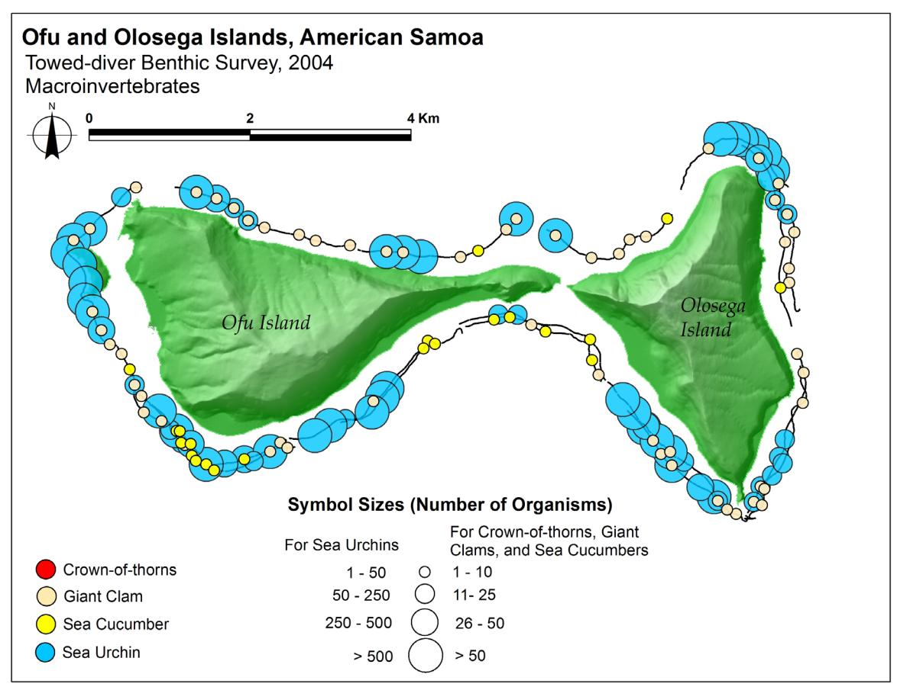

**Figure 4.7.1b.** Distribution of estimated population densities of COTS, giant clams, sea cucumbers, and sea urchins around Ofu and Olosega from towed-diver benthic surveys during ASRAMP 2004. Circle locations represent an integrated estimate over 5-min observation segments covering a survey swath of ~ 200 × 10 m (~ 2000 m2 ). The sizes of the circles indicate the number of organisms counted or estimated in each ~ 2000 m2 segment with one scale for COTS, giant clams, and sea cucumbers (1–10, 11–25, 26–50, and > 50) and another scale for sea urchins (1–50, 51–250, 250–500, and > 500).

Towed-diver benthic macroinvertebrate surveys around Ofu and Olosega during the ASRAMP 2004 cruise found variable distributions of sea cucumbers and sea urchins (Fig. 4.7.1b). Giant clams were evenly distributed around Ofu and Olosega (3.3 mean organisms ha-1). Sea urchin density was patchy, with the highest values found along Nu`utele Island in the northwest region (2453 mean organisms ha-1) and the southwest region (1339 mean organisms ha-1). High sea urchin densities were observed near the corners of the southwest, southeast, and northeast regions of the islands; lowest densities were observed in the central north and central south regions. Sea cucumbers were most common in the central south, central north, and southwest regions (1.9, 0.6, and 1.9 mean organisms ha-1, respectively). No COTS were observed.

During ASRAMP 2004, invertebrate species richness was variable among the seven REA sites surveyed around Ofu and Olosega (Fig. 4.7.1c). Target species richness values ranged from a low of 10 invertebrate species in the northeast region off Olosega (OLO-01) to a

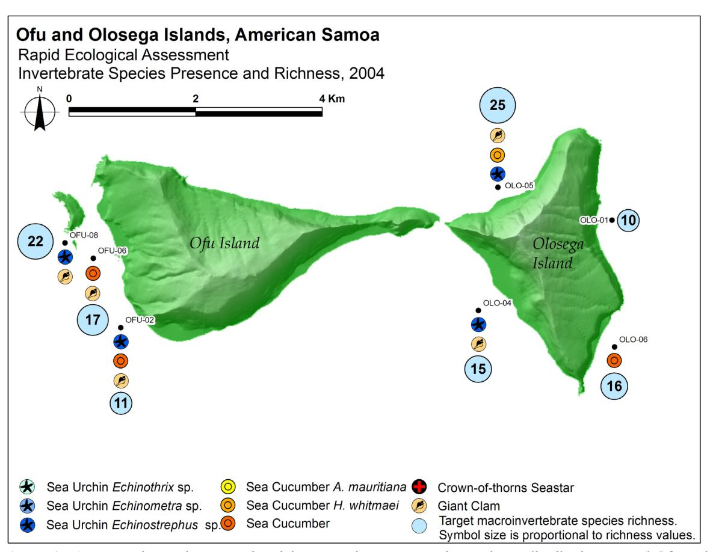

**Figure 4.7.1c.** Macroinvertebrate species richness, and target macroinvertebrate distribution around Ofu and Olosega from REA surveys during ASRAMP 2004. Size of light blue circles and values in circles indicate target species richness values for each REA site. Other symbols indicate the presence of specific target species.

high of 25 species found off the north coast of Olosega (OLO-05). Giant clams were found at most REA sites except off the east coast of Olosega (OLO-01). The only species of sea urchin found was *Echinostrephus aciculatus*, which was found at most sites, excluding OLO-01 and OLO-06 off the east coast of Olosega. Sea cucumbers were present at three of seven sites, two of which were located off the west coast of Ofu. Four different species of sea cucumbers were recorded at these sites, including *Stichopus chloronotus*, *Bohadschia argus*, and *Holothuria hilla*. No COTS were observed during REA surveys.

# *2006 Spatial Surveys*

Towed-diver benthic macroinvertebrate surveys around Ofu and Olosega during ASRAMP 2006 found patchy distributions of sea urchins and sea cucumbers, while giant clams were evenly distributed (Fig. 4.7.1d). Sea urchins were concentrated within the northwest region along the west coast of Nu`utele Islands (693 mean organisms ha-1) and off the north tip of Olosega (1006 mean organisms ha-1) in the northeast region. Giant clams were evenly distributed around Ofu and Olosega (3.3 mean organisms ha-1). No COTS were observed.

During ASRAMP 2006, invertebrate species richness was variable among the 12 REA sites surveyed around Ofu and Olosega (Fig. 4.7.1e). Giant clams were present at 10 of the 12 REA sites. The only species of sea urchin found during REA surveys was *Echinostrephus aciculatus*, being found at 7 of 12 sites. Sea cucumbers were present at 4 of 12 REA sites. Two species of sea cucumbers were present, *Holothuria whitmaeii* and an unidentified holothuroid, both being present at two sites. No COTS were observed during REA surveys.

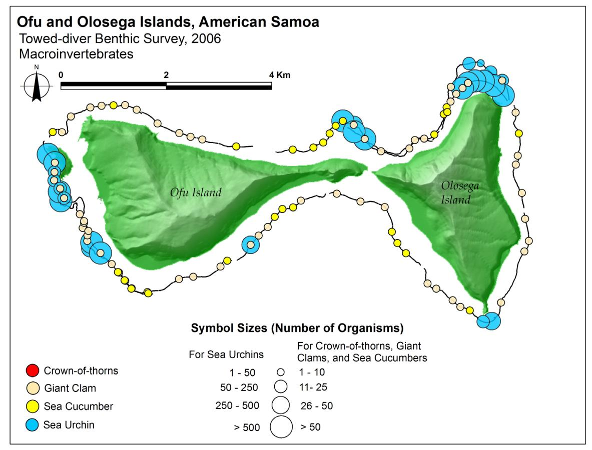

**Figure 4.7.1d.** Distribution of estimated population densities of COTS, giant clams, sea cucumbers, and sea urchins around Ofu and Olosega from towed-diver benthic surveys during ASRAMP 2006. Circle locations represent an integrated estimate over 5-min observation segments covering a survey swath of ~ 200 m × 10 m (~ 2000 m2 ). The sizes of the circles indicate the number of organisms counted or estimated in each ~ 2000 m2 segment with one scale for COTS, giant clams, and sea cucumbers (1–10, 11–25, 26–50, and > 50) and another scale for sea urchins (1–50, 51–250, 250–500, and > 500).

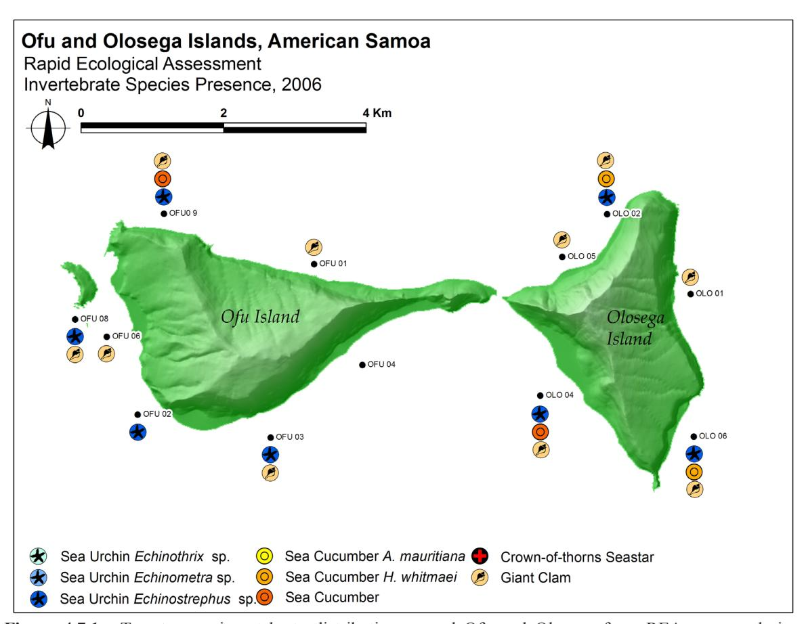

**Figure 4.7.1e.** Target macroinvertebrate distribution around Ofu and Olosega from REA surveys during ASRAMP 2006.

#### **4.7.2 Temporal Comparison—Benthic Macroinvertebrates**

Temporal patterns of island-wide mean benthic macroinvertebrate density (organisms ha-1) around Ofu and Olosega from towed-diver benthic surveys during ASRAMP 2002, 2004

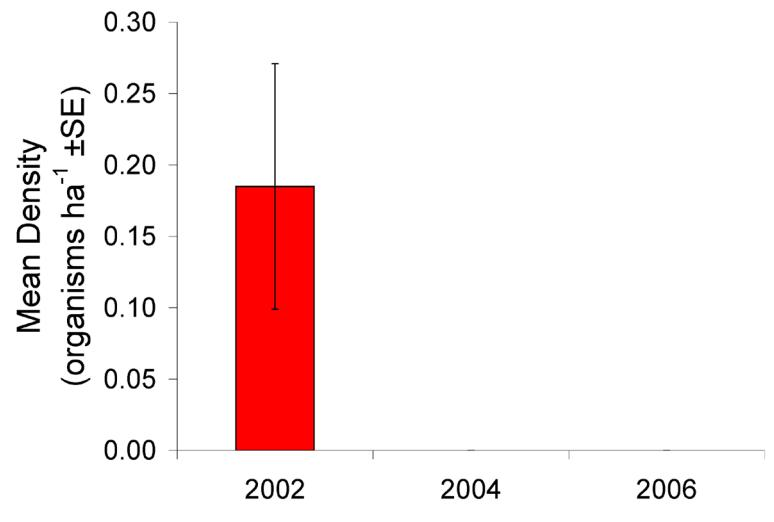

**Figure 4.7.2a.** Mean density of COTS around Ofu and Olosega from towed-diver surveys during ASRAMP 2002, 2004 and 2006.

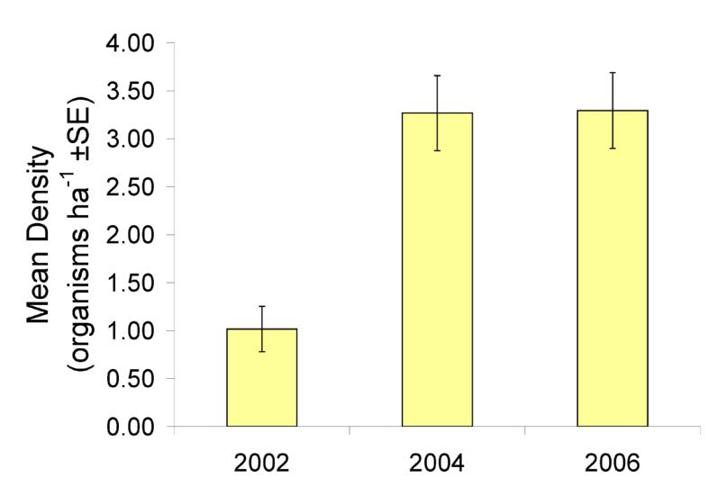

**Figure 4.7.2b.** Mean density of giant clams around Ofu and Olosega from towed-diver surveys during ASRAMP 2002, 2004, and 2006.

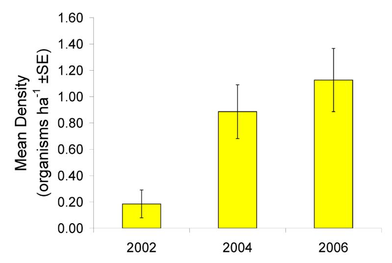

**Figure 4.7.2c.** Mean density of sea cucumber (holothuroids) around Ofu and Olosega from towed-diver surveys during ASRAMP 2002, 2004 and 2006.

and 2006 are shown in Figures 4.7.2a (COTS), 4.7.2b (giant clams), 4.7.2c (sea cucumbers), and 4.7.2d (sea urchins). Towed-diver survey results show trends in density among each surveyed organism and between each sampling year.

Only five COTS were observed around Ofu and Olosega during the 2002 towed-diver benthic surveys, and none was observed during 2004 or 2006 surveys. Densities of giant clams, sea cucumbers, and sea urchins were relatively similar along the forereefs of Ofu and Olosega during 2004 and 2006 towed-diver surveys. Neither giant clam nor sea cucumber mean densities were substantially different between the 2004 and 2006 surveys. As discussed in the introduction and methods chapters, numerous logistical and operational challenges were encountered during the 2002 surveys which render those macroinvertebrate counts suspect. Although spatially and temporally patchy, sea urchins were the most common benthic

macroinvertebrate observed during both years. Observations indicate substantially fewer sea urchins were recorded during 2006 compared to 2004.

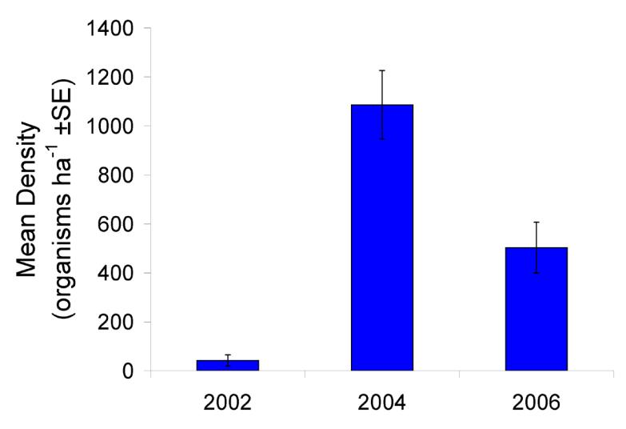

**Figure 4.7.2d.** Mean density of sea urchins (echinoids) around Ofu and Olosega from towed-diver surveys during ASRAMP 2002, 2004 and 2006.

#### **4.8 Reef Fish**

#### **4.8.1 Reef Fish Surveys**

#### *2002 Spatial Surveys*

Large fish (total length > 50 cm) biomass measured by towed divers was evenly distributed around Ofu and Olosega during ASRAMP 2002; ~ 0.028 tons ha-1 (SE 0.017; Fig. 4.8.1a). One towed-diver survey in the central north region of the islands had particularly elevated biomass due mainly to shark and humphead wrasse sightings. Generally, most of the biomass was parrotfish and snappers.

Sharks were widely observed around both islands; none was recorded in the southeast region off Olosega (Fig. 4.8.1a). Blacktip reef sharks (*Carcharhinus melanopterus*) accounted for the majority of shark sightings. A few humphead wrasses were sighted but only around Ofu.

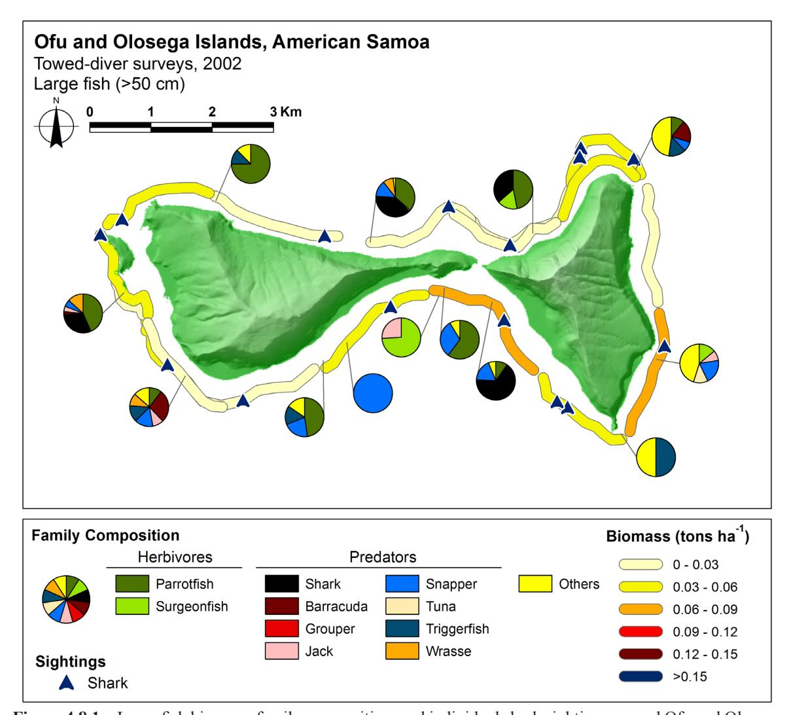

**Figure 4.8.1a.** Large fish biomass, family composition, and individual shark sightings around Ofu and Olosega recorded during ASRAMP 2002 towed-diver surveys. Large fish (length > 50 cm) biomass on each individual towed-diver survey is represented by the color of the survey track (tons ha-1). Composition by trophic group is indicated by the family colors (green—mostly herbivores; other colors—mostly predators or mixed). Individual shark sightings, observed inside or outside the survey area, are represented by blue triangles.

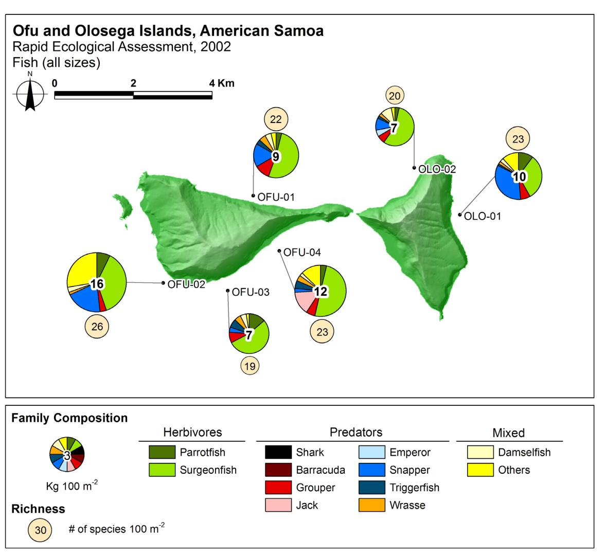

**Figure 4.8.1b.** Total fish biomass, family composition, and species richness of fishes around Ofu and Olosega recorded during ASRAMP 2002 REA belt-transect surveys. Total fish biomass (all species and size classes) is represented at each site by the size of the pie chart, with the actual biomass value in the center (kg 100 m-2). Composition by trophic group is indicated by the family colors (green—mostly herbivores; other colors mostly predators or mixed). Species richness at each REA site is indicated by a number (# species 100 m-2) and the size of beige circles.

Total fish biomass was similar around the two islands, with biomasses ranging from 7 to 16 kg 100 m-2 of reef habitat (Fig. 4.8.1b). Herbivores, mainly surgeonfish, were the most dominant group at all sites. Top predators were present in moderate abundance at most sites and were mostly represented by snappers and groupers. Mean total fish biomass for these islands in 2002 was 10.2 kg 100 m-2 (SE 2.0).

Species richness was relatively low at most sites around Ofu and Olosega (~ 20–25 species 100 m-2 at most sites; Fig. 4.8.1b). No clear geographic pattern emerged from the 2002 data.

#### *2004 Spatial Surveys*

Results from towed-diver surveys during ASRAMP 2004 showed that parrotfish made up the

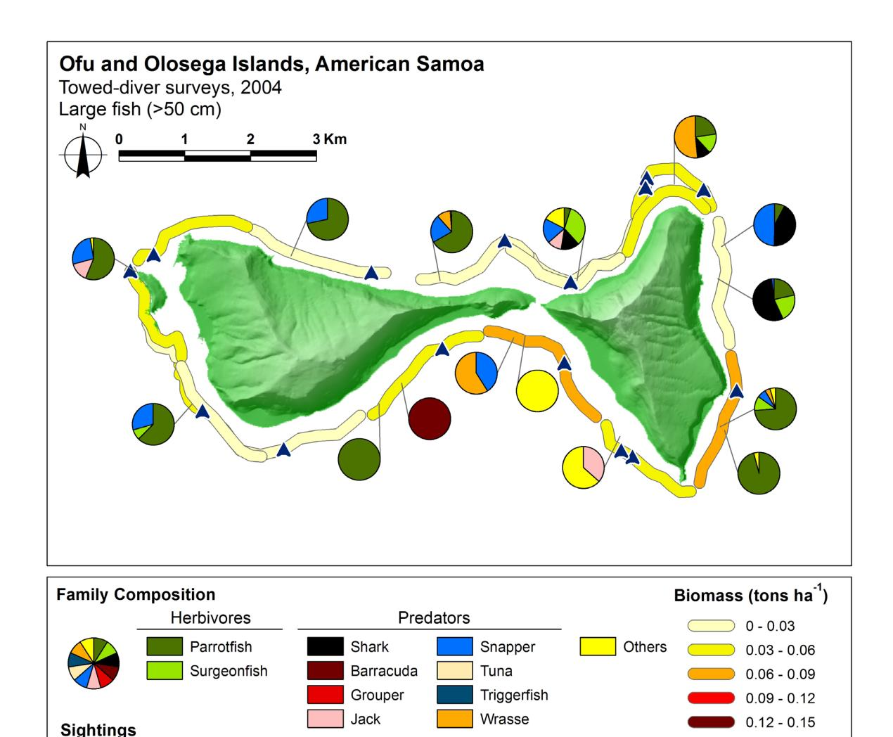

**Figure 4.8.1c.** Large fish biomass, family composition, and individual shark sightings around Ofu and Olosega recorded during ASRAMP 2002 towed-diver surveys. Large fish (length > 50 cm) biomass on each individual towed-diver survey is represented by the color of the survey track (tons ha-1). Composition by trophic group is indicated by the family colors (green—mostly herbivores; other colors—mostly predators or mixed). Individual shark sightings, observed inside or outside the survey area, are represented by blue triangles.

majority of large fish biomass around Ofu and Olosega, followed by sharks, surgeonfish, and snappers (Fig. 4.8.1c). Jack diversity was low, with bluefin trevallies (*Caranx melampygus*) accounting for most observations. A large school of barracudas was observed in the central south region off the southeast coast of Ofu. Overall, large fish biomass was 0.039 tons ha-1 (SE 0.025) and appeared to be slightly greater in the central north, central south, and northeast regions of the islands.

Sharks were sighted frequently in the northeast region on the east side of Olosega. A few humphead wrasses were observed at scattered locations around both islands (Fig. 4.8.1c).

During ASRAMP 2004, overall total fish biomass was similar between sites, 14.3 kg100 m-2 (SE 5.1), with the highest recordings around the western and eastern sides of the islands (~ 30 kg of fish 100 m-2; Fig. 4.8.1d). Surgeonfish and, to a lesser extent, parrotfish dominated the biomass at most sites. Predator biomass was only moderately abundant at most sites, except

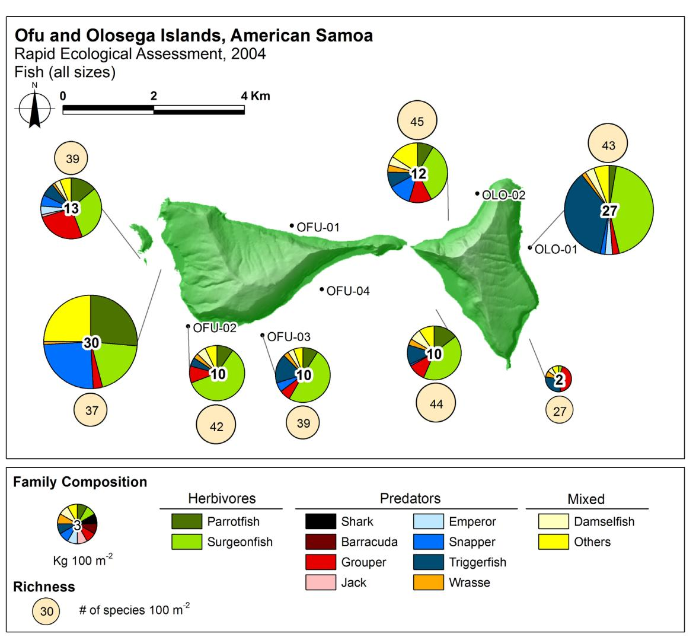

**Figure 4.8.1d.** Total fish biomass, family composition, and species richness of fishes around Ofu and Olosega recorded during ASRAMP 2004 REA belt-transect surveys. Total fish biomass (all species and size classes) is represented at each site by the size of the pie chart with the actual biomass value in the center (kg 100 m-2). Composition by trophic group is indicated by the family colors (green—mostly herbivores; other colors mostly predators or mixed). Species richness at each REA site is indicated by numbers (# species 100 m-2) and the size of the beige circles.

for two sites, where large quantities of snappers (OFU-06) and triggerfish (OLO-01) were recorded. Groupers, mainly *Cephalopholis argus*, were recorded in noticeable abundance at nearly all sites.

Parrotfish and groupers were the majority of the biomass for medium-large fish surveyed on stationary point counts. Snappers, surgeonfish, and wrasses had slightly lower biomass. The most common large fish was the peacock grouper (*Cephalopholis argus*). The most common snappers were the smalltooth jobfish (*Aphareus furca*), twinspot snapper (*Lutjanus bohar*), and blue-lined snapper (*L*. *kasmira*).

Similar to 2002, fish species richness was relatively constant around the two islands (Fig. 4.8.1d). However, richness was much higher in 2004 than in 2002 (~ 40 species 100 m-2), likely a reflection of the fact that the 2002 surveys were more exploratory in nature.

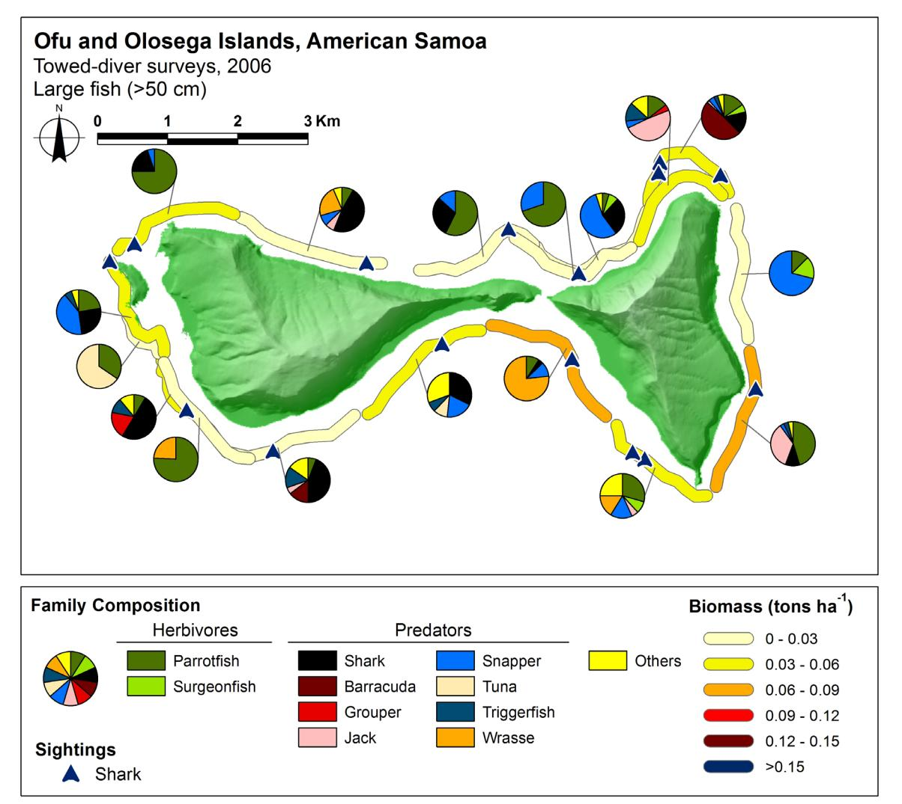

**Figure 4.8.1e.** Large fish biomass, family composition, and individual shark sightings around Ofu and Olosega recorded during ASRAMP 2006 towed-diver surveys. Large fish (length > 50 cm) biomass on each individual towed-diver survey is represented by the color of the survey track (tons ha-1). Composition by trophic group is indicated by the family colors (green—mostly herbivores; other colors—mostly predators or mixed). Individual shark sightings, observed inside or outside the survey area, are represented by blue triangles.

# *2006 Spatial Surveys*

On towed-diver surveys during ASRAMP 2006, overall large fish biomass (all families pooled) was similar to 2004, 0.033 tons ha-1 (SE 0.014), and evenly distributed around the islands. Large parrotfish, snappers, and sharks were the majority of the large fish biomass. Sharks and humphead wrasses were observed regularly around both islands. Sharks were sighted particularly frequently in 2006 (Fig. 4.8.1e).

Similar to previous years, the total reef fish biomass during ASRAMP 2006, 5.4 kg 100 m-2 (SE 1.2), was distributed evenly at sites around the two islands. Surgeonfish and parrotfish were the majority of reef fish biomass (Fig. 4.8.1f); for example, the Steephead parrotfish (*Chlorurus microrhinos*) was commonly seen around Ofu and Olosega (Fig. 4.8.1g). Grouper (i.e., *Cephalopholis argus*) and triggerfish biomass were also relatively important at many sites.

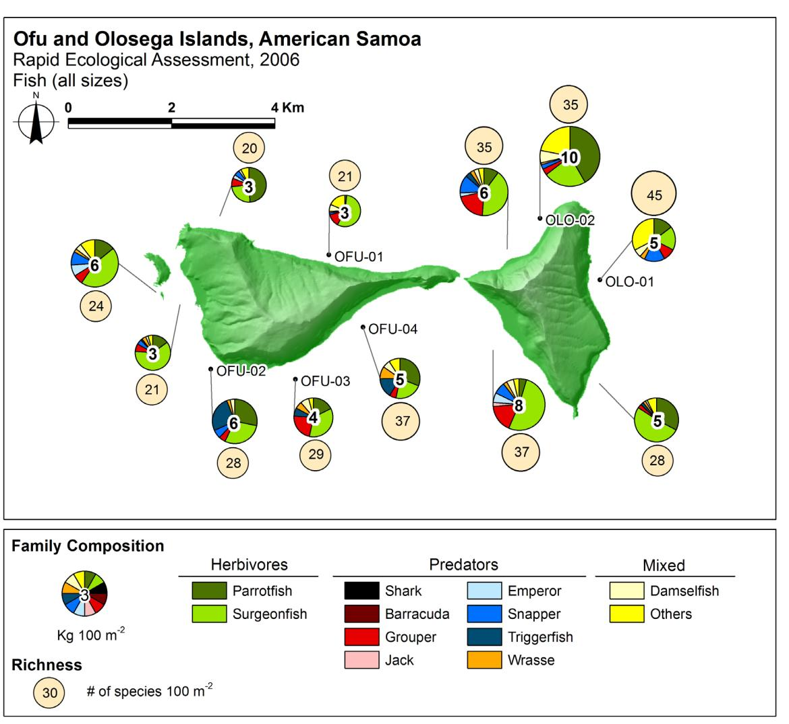

**Figure 4.8.1f.** Total fish biomass, family composition, and species richness of fishes around Ofu and Olosega recorded during ASRAMP 2006 REA belt-transect surveys. Total fish biomass (all species and size classes) is represented at each site by the size of the pie chart with the actual biomass value in the center (kg 100 m-2). Composition by trophic group is indicated by the family colors (green—mostly herbivores; other colors mostly predators or mixed). Species richness at each REA site is indicated by numbers (# species 100 m-2) and the size of the beige circles.

On stationary point counts during ASRAMP 2006, parrotfish and groupers again accounted for the highest biomass of medium-large fish around Ofu and Olosega, followed by snappers, wrasses, and surgeonfish.

Species richness was generally higher around Olosega and in the central south section of Ofu (~ 30–45 species 100 m-2) compared to the west side (~ 20–30 species 100 m-2; Fig. 4.8.1f).

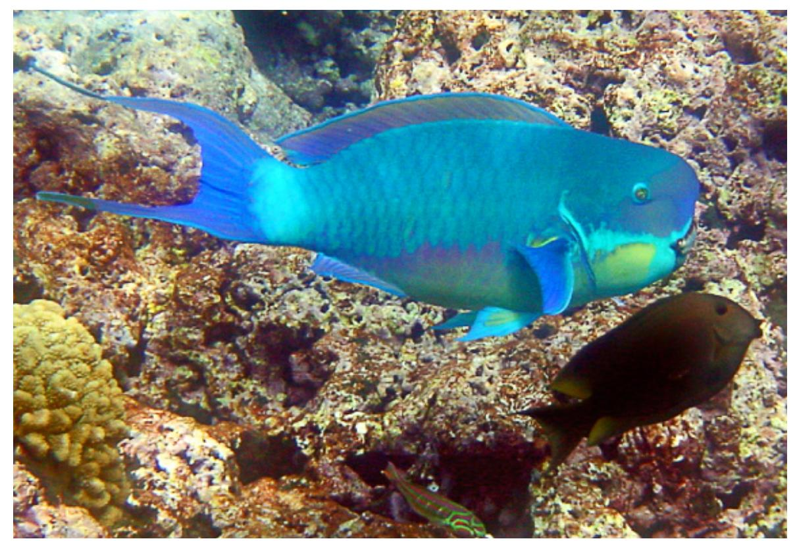

**Figure 4.8.1g**. Steephead parrotfish (*Chlorurus microrhinos*), a common species on Samoan reefs. (*Photograph provided by NOAA PIFSC CRED; R. Schroeder, JIMAR*)

# **4.8.2 Temporal Comparison—Reef Fish**

The three ASRAMP survey periods in 2002, 2004, and 2006 showed no clear geographic patterns of total fish biomass around Ofu and Olosega. The majority of the biomass was herbivorous surgeonfish and parrotfish. Total fish biomass around these islands was slightly above 1 tons ha-1 in 2002 and 2004 but appears to have decreased to 0.54 tons ha-1 in 2006 (Fig. 4.8.2a). Overall, total fish biomass is around 1.0 tons ha-1 (SE 0.3) for Ofu and Olosega.

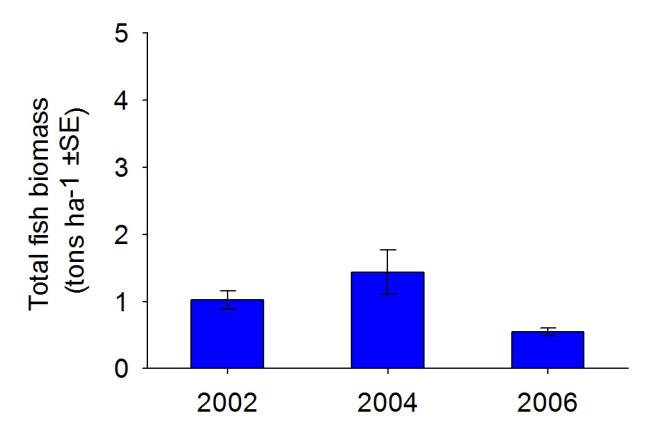

**Figure 4.8.2a.** Total fish biomass around Ofu and Olosega during ASRAMP 2002 (6 sites), 2004 (8 sites), and 2006 (12 sites) REA surveys.

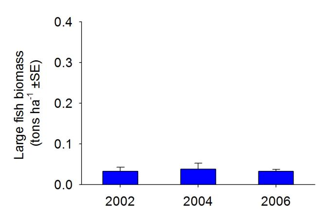

**Figure 4.8.2b.** Large fish biomass around Ofu and Olosega from towed-diver surveys during ASRAMP 2002 (13 surveys), 2004 (18 surveys), and 2006 (17 surveys).

Large fish biomass is mostly parrotfish, barracudas, and shark species and is distributed evenly around the island in all years surveyed. Large fish biomass remained constant in all years surveyed at around 0.033 tons ha-1 (SE 0.019; Fig. 4.8.2b). Sharks and humphead wrasses were frequently sighted around both islands, although with no clear geographic pattern emerging between years. There does not appear to be a population of bumphead parrotfish around these islands.

There is no consistent species richness pattern between years around Ofu and Olosega, with similar species counts occurring around both islands in all years surveyed.

All the biomass per island means referenced in the above section can be found in Appendix IV, Tables IV.i and IV.ii. Fish density per island means can also be found in Appendix IV, Tables IV.iii and IV.iv.

#### **4.9 Island Summary and Integration**

Ofu and Olosega are extremely steep, quickly eroding volcanic islands in the Manu`a Island group that are located in an area that remains geologically dynamic and active. Bathymetric and backscatter data from multibeam surveys (Figs. 4.3.1a and 4.3.1b) around the islands revealed the presence of a narrow (~ 1 km) insular shelf, with banks extending off the northwestern, northeastern, and southeastern sides up to 2 km offshore. The shelf and banks were generally composed of mostly hard substrate extending seaward from the reef crest. Sand fields were also located at the base of the forereef slope off the watershed drainage areas on the north sides of both islands visible within the backscatter imagery (Fig. 4.3.1b), which corresponded with shallower towed-diver observations that found high levels of sand cover in the central north and northwest regions (Fig. 4.3.2b). Towed-diver observations in the north also noted elevated sand cover and habitat complexity within/east of the Asaga Strait separating Ofu and Olosega, suggesting sand channel(s) in rugose habitat (Figs. 4.3.2a and 4.3.2b). Two broad sand channels were identified off the east side of Olosega that merged into a sand field at the base of the forereef slope in that location. Along the northeast windward coast of Olosega, towed-diver surveys also identified an area of moderate-high complexity corresponding with low/moderate sand cover that was immediately followed by an area of low complexity with a visible parallel change from low to high sand cover.

In each of the ASRAMP survey periods in 2002, 2004, and 2006, the nearshore CTD and water quality observations exhibited spatial heterogeneity, though in many cases the ranges of the spatial changes were relatively small. Between survey periods, temperature and salinity variations were generally small. Despite the relatively small changes in physical properties, some spatial patterns around Ofu and Olosega were clear.

A particularly cool episode, with temperatures reaching nearly 2°C below the SST climatology, was observed in austral winter 2002 before sharply rising 3°C to climatologically normal temperatures in late 2002. In situ temperature observations generally tracked satellite-derived temperature products rather closely, with one exception in early 2005, when in situ values were nearly 1.5°C above satellite SST. Salinity values island-wide were considerably lower during the 2006 surveys in comparison with previous years and may be attributed to aboveaverage rainfall (Fig. 3.4.3d). Density observations tended to parallel salinity more closely than temperature, which is typically the dominant constituent when computing density. Turbidity levels, when comparing 2004 and 2006, were extremely high at select locations in the latter survey period (Fig. 4.4.1i), most likely a result of the exceptional precipitation preceding the ASRAMP 2006 surveys.

In general, the northern coastline, including the northwest, central north, and northeast regions was characterized by infrequent, long period swells from North Pacific boreal winter storms, while the southern coastline, including the southwest, central south, and southeast regions, was characterized by frequent short period (8–12 sec) waves (~ 2 m) from trade wind swells and less frequent, larger (~ 3 m), longer period (12–18 sec) swells generated by winter storms in the Southern Ocean (Fig. 3.4.3f). Aside from the large-scale east to west currents, no nearshore current data are available to resolve finer scale patterns.

The forereef slope off the north side of Ofu in the central north region and the eastern portion of the northwest region was characterized during towed-diver benthic surveys as having very high habitat complexity, moderate levels of sand, hard substrate/pavement, and rubble, and moderate-to-low live coral cover (Figs. 4.3.2a, 4.3.2b, 4.3.2c, 4.3.2d, and 4.3.2e). Combined, these characteristics describe the high-relief spur-and-groove habitat of the area, reflecting the regions exposure to significant wave energy during austral summer months as long period ocean swells from the northwest sector (Fig. 3.4.3f) impact the biogeography of these northern exposed reefs, despite the fact that these swells are generated by North Pacific winter storms located more than 5000 km away.

Other results from the 2004 and 2006 surveys were likely influenced by the large-swell event generated by Tropical Cyclone Heta in January 2004. In 2004, the eastern side of Olosega displayed low salinity and density values, and high-beam transmission values (low turbidity), suggesting the presence of a freshwater lens during the sampling period in that region (Figs. 4.4.1e and 4.4.1f). The cause of this signal was likely rainfall and subsequent runoff from the many streams which line the east side of Olosega, which may have caused an influx of freshwater to the surface waters that mixed deeper into the water column through trade wind and wave action. In contrast, the western part of the island group showed localized variability, including the lowest measured beam transmission values (high turbidity) of the survey period. While the western side of Ofu also has a number of mapped streams, no evidence of a freshwater influx was observed in the 2004 nearshore CTD survey data.

Conversely, in 2006, the eastern part of the island group showed much more local variability in these physical oceanographic parameters, including a region with some of the lowest measured beam transmission values (Figs. 4.4.1h and 4.4.1i). The area around the northern Asaga Strait was characterized by relatively high water temperature and beam transmission values, along with low salinity and density values. These characteristics suggest a freshwater feature at that location during the sampling period in 2006 because of rainwater runoff and the formation of a freshwater lens near the surface, or through some other mechanism that was undetected. In contrast, the western coastline displayed relatively cold, saline, and dense water, suggesting a possible upwelling feature in that region (Figs. 4.4.1h and 4.4.1i). The leeward sides of both Ofu and Olosega were observed to be more stratified than around most of the rest of the islands, likely indicating surface heating and lack of wave-induced vertical mixing.

The southwestern shoreline of Olosega showed the highest total nitrogen (Ntot; Fig. 4.4.1j) in the American Samoa Archipelago, possibly indicating a deep subsurface source. Sites near the northwest village of Ofu and the town of Olosega along the southern coast all showed higher Chlorophyll-a values than most of the other areas of the island group (Fig. 4.4.1j).

Figure 4.3.2e shows estimates of live coral percent cover from towed-diver surveys integrated across the survey years and probably provides the most complete picture of live coral distribution patterns. The highest consistent live coral cover values were recorded along the east-facing, windward coast in the northeast and southeast regions of Olosega, which mirrored localized areas of moderate-to-high habitat complexity that bordered low-complexity sand channels (Figs. 4.3.2a and 4.3.2b). The east and west sides of Maga Point at the southern tip of Olosega in the southeast region also showed especially high live coral cover, with mean values of 43.3%, 43.6%, and 42.3% in 2002, 2004, and 2006, respectively (Figs. 4.5.1b, 4.5.1e, and 4.5.1k). Additional high coral cover areas varied by year, and included areas of the central south and northwest regions (Figs. 4.5.1b, 4.5.1e, and 4.5.1k).

Since towed-diver survey tracks varied between the survey years, Figure 4.3.2e also shows gradients of live coral cover in the inshore-offshore (shallow-deep) direction. In many areas, such as the east and west sides of Maga Point in the southeast region, higher live coral cover values were observed in the shallower inshore areas. In other areas, high live coral cover values were observed at intermediate or deeper depths further offshore. These observed patterns support the hypothesis that coral community structure is both spatially heterogeneous and depth-stratified around Ofu and Olosega. These patterns were likewise observed during TOAD optical surveys, where there were few colonies observed during offshore and relatively deep tows (Fig. 4.3.1c). On each of the three relatively shallow banks extending off corners of the two islands, coral communities were noted, specifically on the submerged banks in the southeast, northeast, and northwest regions. Interestingly, some of these communities occurred at depths greater than ~ 50 m, which indicates that coral stratification does not necessarily preclude the formation of deeper colonies. Though deeper coral communities are generally limited by penetration of sufficient light to support photosynthesis, their depth

provides some ecological benefits, such as significantly reduced exposure to damaging wave energy from surface gravity waves.

Similarly, coral growth and depth stratification patterns noted during towed-diver and TOAD surveys were also mirrored in some of the REA surveys between years. For example, site OFU-02, located on the southwestern corner of Ofu in the southwest region, shows mixed results between years. In 2004, low coral cover, low coral density, and high diversity were recorded. In 2006, a survey at the presumed same site revealed a threefold increase in coral cover, a twofold increase in coral density, and a 20% reduction in the number of reported genera. A closer examination of dive metadata revealed that the 2004 survey of OFU-02 was completed in water depths ranging between ~ 5 and ~ 15 m, while the 2006 survey was completed in depths ranging between ~ 14 and 20 m. In this case, the higher coral cover and density were observed in the deeper depth range, possibly a reflection of the increased wave energy in the shallower habitat.

A total of 34 coral genera were found around Ofu and Olosega. *Montipora* and *Goniastrea* were the most dominant genera in 2004 and 2006, with *Porites* and *Pocillopora* also appearing dominant in 2004 and 2006, respectively (Figs. 4.5.1g and 4.5.1m). The change could be a result of recruitment events, variability in transect locations or some other unknown mechanisms.

The REA site with the highest live scleractinian coral cover was consistently OLO-01 (2004/2006, 63%; Figs. 4.5.1h and 4.5.1n) in the northeast region on the east side of Olosega. This site also coincided with the area of highest live coral cover from the towed-diver benthic surveys (Figs. 4.3.2e, 4.5.1e, and 4.5.1k). The towed-diver benthic survey also found this area to have high habitat complexity that bordered a distinct sand channel (Figs. 4.3.2a and 4.3.2c), which ran from the reef crest to the sand field at the base of the slope (Fig. 4.3.1b). REA data from 2006 also showed elevated coral cover values in the central south region of Ofu and Olosega (OFU-03, 41%; OFU-02, 40%; OLO-04, 34%; Fig. 4.5.1m), while site OLO-05 on the eastern end of the central north region had elevated percent live coral cover for both years (2004, 44%; 2006, 31%; Fig. 4.5.1m).

The lowest overall live coral cover was found in the northwest region at OFU-06 (2004, 10%; 2006: 15%; Fig. 4.5.1m), which coincidentally appears to lie in an area of low-medium complexity (Fig. 4.3.2a) and sand cover (Fig. 4.3.2b) bordered to the east and west by areas of higher complexity and coral cover (Fig. 4.3.2e). Other areas of low coral cover included OFU-09 (2006, 21%; Fig. 4.5.1m) in the northwest region and OFU-01 in the central north region (2006: 14%). OLO-06 in the lower southeast region recorded low coral cover in 2004 (9%) vs. much higher cover in 2006 (31%), which may be attributed to shifts in the site selection/depth changes or transect variability.

During 2004 and 2006, colony densities were highest along the southern-facing shores of the central south, and southwest regions of Ofu and Olosega. Specific sites of high coral density included OLO-04 (2004, 19.9; 2006: 17.4 colonies m-2) and OFU-04 in the central south region (2006: 15.1 colonies m-2), along with OFU-03 in the southwest region (2004, 11.4; 2006, 19.8 colonies m-2). Coral densities were consistently lowest in the northwest and southwest regions, although sites in the southeast (OLO-01 and OLO-06) also recorded low

coral densities in both 2004 and 2006 (Figs. 4.5.1h and 4.5.1n).

Generic richness around Ofu and Olosega between 2004 (21.9 genera/site [SE 1.3]) and 2006 (20.8 genera/site [SE 1.0]) was relatively uniform, even with the additional sampling effort in 2006 (Fig. 4.5.3b). Interestingly, OLO-01 had the highest recorded live coral cover and largest coral colony sizes around Ofu and Olosega during both 2004 and 2006 (Figs. 4.5.1h, 4.5.1i, 4.5.1n, and 4.5.1o), but also had the one of the lowest coral generic richness values of the island system in comparison with other REA sites in both 2004 and 2006 (Figs. 4.5.1g and 4.5.1m). In contrast, the highest coral diversity was recorded at OFU-04 in the central south region where 28 coral genera were recorded, but live coral cover was among the lowest observed (16.7%).

There are a number of potential hypotheses for some of these observed trends. Larger, more stable coral communities at sites OLO-01 and OLO-05 in the northeast and central north regions may have higher coral cover, larger colonies, diminished species richness, and decreased colony densities as a result of protected cover from large swells generated by southern storms and/or other moderate-to-high levels of environmental disturbance (Fig. 3.4.3f). Though site OLO-01 on the east side of Olosega is exposed to prevailing trade wind swells, it is generally protected from the larger swell wave energy from both the south and northwest, which may help explain why that area has the highest live coral cover and largest coral size class distributions around Ofu and Olosega. Being exposed to persistent trade wind-driven ocean circulation, the reefs in that area are continually flushed and nourished, yet they are not exposed to the extreme and destructive wave events of other areas around these two islands. The vertical profiles of water properties for the shallow-water CTD surveys generally found the east end of Olosega to have a well-mixed water column, suggesting an increased likelihood of localized upwelling of nutrients (Figs. 4.4.1b and 4.4.1e). High coral densities of smaller colonies in portions of the central south and southwest regions might be congruent with higher levels of species richness, also suggesting an oceanographic link to wave energy.

Sea surface temperature observations between February 2002 and February 2004 revealed no evidence of temperatures exceeding the bleaching threshold, and no large-scale bleaching was observed during ASRAMP 2002 or 2004 surveys. Bleaching of colonies was the most common coral disease/affliction observed during 2006 REA field surveys (Figs. 4.5.2a and 4.5.2b). Towed-diver benthic surveys found regions of elevated stressed coral in the southeast region near REA site OLO-06 (Maga Point, 5 tow segments, mean: 7.5%; Leala Point, 3 tow segments, mean: 7.5%), the southwest region near OFU-02 (8 tow segments, mean: 6.9%), and the central north region near OLO-05 (8 tow segments, mean: 11.1%; Figs. 4.5.1f and 4.5.1l), indicating a possible connection. However, towed-diver benthic surveys also found elevated levels of stressed coral in different locations in the central south (4 tow segments, mean 9.4%), which did not visibly correspond to nearby REA sites. Considering the overall mean decrease in salinity observed during 2006 relative to the previous years, it is possible that elevated terrestrial runoff and freshwater input resulted in these localized coral stress areas. Coral stress and diseased areas did not appear to directly correspond with areas of human habitation.

Turf algae and coralline crustose red algae were the dominant benthic organisms around the

nearshore areas of Ofu and Olosega and were fairly evenly distributed. However, several interesting observations were noted. The percent cover of fleshy macroalgae was relatively low around both islands in both 2004 and 2006 (Figs. 4.6.1b and 4.6.1d), with the densest populations occurring along the central south region along the southeast coast of Ofu. the greatest macroalgal diversity was observed at REA site OFU-02, located in the southwest region near the southern point of Ofu close to the proposed runway extension. In contrast, site OFU-06, offshore of Ofu village in the northwest region, and site OLO-01, off the east side of Olosega in the northeast region, had the lowest macroalgal diversity (Figs. 4.6.1c and 4.6.1e). In general, coralline crustose red algae cover was highest on the southern versus northern coastline, which may be a result of exposure to higher levels of wave and current energies. In addition, populations of the calcified red algal *Amphiroa*/*Jania* and cyanophytes were more evenly distributed and of greater abundance around the two islands in 2006 than during 2004 surveys, and populations of macroalgae were almost twice as diverse in 2006 versus 2004. These changes in populations are hypothesized to be a result of, in part, wave energy generated by Tropical Cyclone Heta at 1 month prior to the ASRAMP 2004 surveys. The cyclone may have affected the abundance and distribution of algal species as observed during surveys in 2004, but algal communities may have recovered by the time the 2006 surveys were conducted. Of note, coralline algal diseases were also abundant and widespread (all REA sites except for OFU-03) around Ofu and Olosega, with a total of 278 cases (Figs. 4.6.2a and 4.6.2b).

Macroinvertebrate distributions were relatively similar during towed-diver benthic surveys from each year. Only five COTS were observed over 138.1 ha of reef surveyed around Ofu and Olosega by the towed-diver survey teams, all of which were recorded in 2002 (Figs. 4.7.1a, 4.7.1b, and 4.7.1d). No additional COTS were sighted by either towed-diver or REA teams during subsequent years. Although there were no obvious patterns in the distribution of giant clams, *Tridacna* sp. were relatively common, with more than 100 individuals observed during towed-diver surveys in both 2004 and 2006. Giant clams were also common at REA sites (present at 10 of 12 sites; Fig. 4.7.1e). Sea cucumbers were observed to be widely distributed around Ofu and Olosega during towed-diver surveys in both 2004 and 2006, and there were notable patterns of aggregation along the southwest corner of Ofu in the southwest region, along the southeast side of Ofu and southwest side of Olosega in the central south region, and a small area just northwest of Asaga Strait in the central north region (Figs. 4.7.1b and 4.7.1d). Generally, each of these areas tended to be characterized by relatively higher percent cover of coral rubble habitat (Fig. 4.3.2d). While spatially and temporally patchy, sea urchins were the most common invertebrate observed around Ofu and Olosega (Figs. 4.7.1b and 4.7.1d). Generally, sea urchins were observed in high densities off the west coast of Nu`utele Island in the northwest region, off the southern point of Ofu in the southwest region, off the northern bank of Olosega in the northeast region, and north of Asaga Strait in the central north region in both 2004 and 2006. During 2004, significantly more urchins were observed, particularly in the southeast region and along the north coast of Ofu in the northwest region, where few were observed during 2006 surveys.

With respect to fish populations, there was no clear geographical pattern of the total fish biomass around Ofu and Olosega. The majority of the biomass was relatively evenly distributed and composed primarily of herbivorous surgeonfish and parrotfish, with total fish biomass averaging around 1.0 tons ha-1. Large fish biomass was mostly parrotfish, barracudas,

#### **Chapter 5 Ta`u Island**

# **5.1 Geopolitical Context**

Ta`u Island is the easternmost member of the Manu`a Island group, located ~ 150 km northeast of Tutuila Island and ~ 20 km east of Olosega Island. Ta`u, with a land area of 44 km2 , is an extremely steep volcanic island ringed by sea cliffs, some nearly 600 m high, with limited low altitude, level land areas. The seafloor surrounding Ta`u drops steeply, sometimes almost vertically, to abyssal. Collapse and landslides off the remnants of the southern caldera resulted in a south-facing embayment with a steep headwall that overlooks several flat benches, with the most prominent being the Liu Bench overlooking Papaloaloa Point (Fig. 5.1a). Between Olosega and Ta`u lies an unnamed submerged volcanic ridge and cone that was previously active in 1866 (Craig, 2002), and more recently mapped between 2004 and 2006. The broader area is still considered to be geologically active since the submerged volcanic cone of Vailulu`u Seamount is rapidly (in a geologic sense) forming approximately 50 km east of Ta`u.

Ta`u is divided into three counties: Faleasao County, Fiti`uta County, and Ta`u County. The population of Ta`u has mirrored similar trends reported at Ofu and Olosega Islands, with larger populations recorded in the mid-20th century that have seen a steady decline over the course of the last 60 years. Cyclones Tusi (1987), Ofa (1990), and Val (1991) resulted in

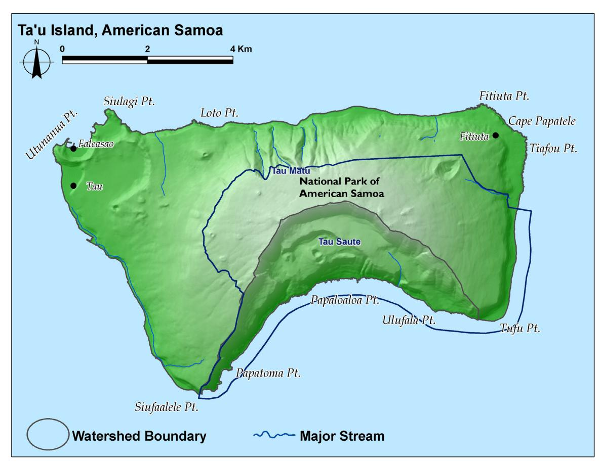

**Figure 5.1a.** Watershed boundaries, streams, landmarks and villages for Ta`u. Also shown is the boundary for the National Park of American Samoa (NPAS).

approximately one-third of the population moving to Tutuila (Meehl, 1996). The current population of Ta`u was recently estimated at a total of 873 people (U.S. Census Bureau, 2000), with 135 people in Faleāsao County, 380 in Ta`u County, and 358 in Fiti`uta County. The residents of Ta`u rely primarily on subsistence farming, agroforestry, and fishing. There is a relatively low level of tourism to the island. The majority of the residential, agricultural, and commercial land remains in the north and west sides of the island, while the southern and eastern portions remain mostly under the jurisdiction of the NPAS.

Several particular areas and landmarks of Ta`u are notable. A boat harbor is located in the northwestern corner of the island between Utumanu`a Point and Si`ulagi Point near the village of Faleāsao (Fig. 5.1a). The village of Ta`u is located to the south of Faleāsao, along a road that ends halfway down the western coastline. From Ta`u, the same road continues east of Faleāsao passing the airport runway, located near Fiti`uta Point and the village of Fiti`uta, and continues along the eastern coastline before ending near Tufu Point in the southeast. Finally, the NPAS begins halfway between Fiti`uta Point and Tufu Point, and continues along the southern coastline, ending near Si`ufa`alele Point in the southwest.

# **5.2 Survey Effort**

A large amount of physical and biological data have been collected around Ta`u since 2002 as

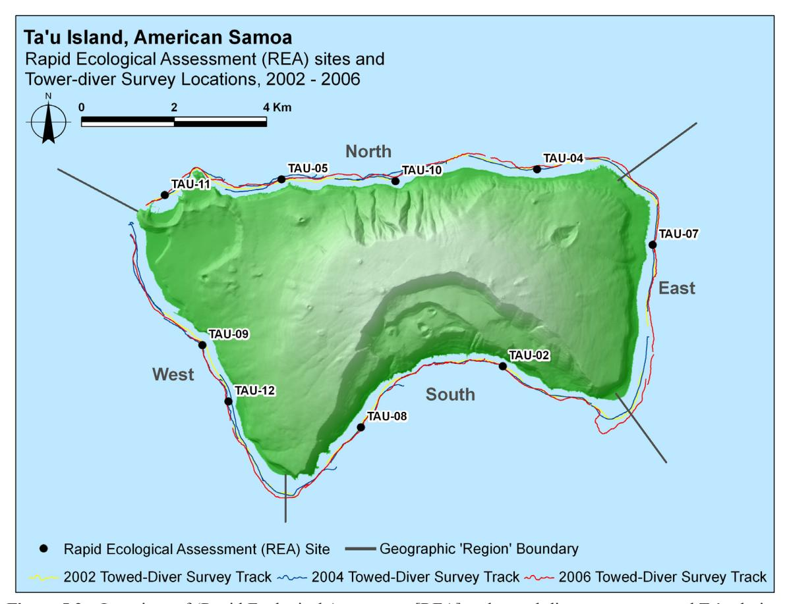

**Figure 5.2a.** Locations of (Rapid Ecological Assessment [REA] and towed-diver surveys around Ta`u during ASRAMP 2002, 2004, and 2006. Four arbitrary geographic regions have been delineated to aid in discussion of spatial patterns.

part of the Pacific Islands Fisheries Science Center (PIFSC) Coral Reef Ecosystem Division's (CRED's) American Samoa Reef Assessment and Monitoring Program (ASRAMP). The extent and timeframe of these survey efforts are discussed below. To aid in the discussion of spatial patterns of ecological and oceanographic observations around Ta`u throughout this chapter, four geographic regions were delineated based on cardinal directions (Fig. 5.2a).

Benthic habitat mapping data were collected around Ta`u using a combination of acoustic and optical survey methods, the extent of which is summarized in Table 5.2a. These are further examined in Section 5.3: Benthic Habitat Mapping and Characterization.

The locations of REA and towed-diver survey efforts during ASRAMP cruises in 2002, 2004, and 2006 are shown in Figure 5.2a. The number, mean depth, and area of these surveys are presented by year in Table 5.2b.

**Table 5.2a.** Total area of benthic habitat surveyed from acoustic multibeam sonar and Towed Optical Assessment Device (TOAD) surveys around Ta`u during ASRAMP efforts between 2002 and 2006.

| Survey Type              | 2002   | 2004          | 2006             |
|--------------------------|--------|---------------|------------------|
| Acoustic Multibeam Sonar | 0      | 82.3 km2 * | gap filling only |
| TOAD                     | 0 tows | 11 tows       | 5 tows           |

*\* Total multibeam surveying conducted across the Manu`a Islands.*

**Table 5.2b.** Numbers, areas, and mean depths of REA and towed-diver surveys around Ta`u during ASRAMP 2002, 2004, and 2006.

| Year |                      | REA Surveys Towed-diver Surveys |                      |                     |                   |  |
|------|----------------------|------------------------------------|----------------------|---------------------|-------------------|--|
|      | Number of Surveys | Mean Depth (m)                  | Number of Surveys | Survey Area (ha) | Mean Depth (m) |  |
| 2002 | 5*                   | 13.7 (SD 0.0)                      | 10                   | 28.3                | 8.8 (SD 2.7)      |  |
| 2004 | 9*                   | 15.2 (SD 0.7)                      | 18                   | 36.9                | 11.3 (SD 4.7)     |  |
| 2006 | 9                    | 14.3 (SD 0.6)                      | 15                   | 35.8                | 14.9 (SD 2.6)     |  |

*\* No coral disease surveys were conducted in 2002 and 2004.*

Depth ranges from towed-diver surveys are presented for each year in Figures 5.5.1a (2002), 5.5.1d (2004), and 5.5.1j (2006). Although the towed-diver survey methodology is aimed at following specific isobaths, the actual depths surveyed are often quite variable. These figures illustrate the variability of depths observed during towed-diver surveys and can be referenced when further exploring the towed-diver datasets.

Spatial and temporal observations of key oceanographic and water quality parameters influencing reef conditions around Ta`u were collected using a diverse suite of long-term moored instrumentation packages and closely spaced conductivity, temperature, and depth (CTD) surveys of the vertical structure of water properties during ASRAMP 2002, 2004, and 2006 (see Chapter 2, Section 2.3: Oceanography and Water Quality). A summary of deployed instruments/collection activities is provided in Table 5.2c, and are further examined in Section 5.4: Oceanography and Water Quality.

**Table 5.2c.** Numbers of oceanographic instrument deployments and shallow- and deep-water CTD casts around Ta`u during ASRAMP 2002, 2004, and 2006. Instrument types include sea surface temperature (SST) buoys, and subsurface temperature recorders (STRs). Deep-water CTD casts were conducted from the surface to a 500-m depth. Deep-water CTD cast information is presented in Chapter 8: Archipelagic Comparisons.

| Observation type        | 2002 | 2004 | 2006 |
|-------------------------|------|------|------|
| SST                     | 2    | 1    | 2    |
| STR                     | 0    | 2    | 1    |
| Shallow-water CTD casts | 30   | 37   | 35   |
| Deep-water CTD casts    | 15*  | 7*   | 17*  |

*\* Total deep-water CTD casts conducted across the Manu`a Islands.* 

# **5.3 Benthic Habitat Mapping and Characterization**

Benthic habitat mapping and characterization of the nearshore waters around Ta`u were conducted using acoustic multibeam sonar, underwater video and still imagery, and toweddiver survey observations between ~ 1 and ~ 250 m (and deeper). Acoustic multibeam sonar mapping provided bathymetric and backscatter data products for depths between ~ 20 and ~ 250 m. Optical validation and benthic characterization via underwater video, still imagery, and diver observations were performed using both shipboard towed cameras (i.e., TOAD) in depths between ~ 20 and ~ 80 m and towed-diver surveys in depths between ~ 1 and 30 m.

#### **5.3.1 Acoustic Mapping and Optical Validation**

Because Ta`u is a steep volcanic island with almost no offshore bank areas, depths of 350 m and greater were found less than 1 km offshore (Fig. 5.3.1a). A series of small, relatively shallow, seamount features were discovered ~ 2 km to the northwest of Utumanu`a Point on the northwestern corner of Ta`u. Some of these seamount summits are as shallow as 38 m.

The backscatter imagery acquired during the ASRAMP 2004 surveys was successfully used as a predictive guide for determining sites for the optical surveys conducted during ASRAMP

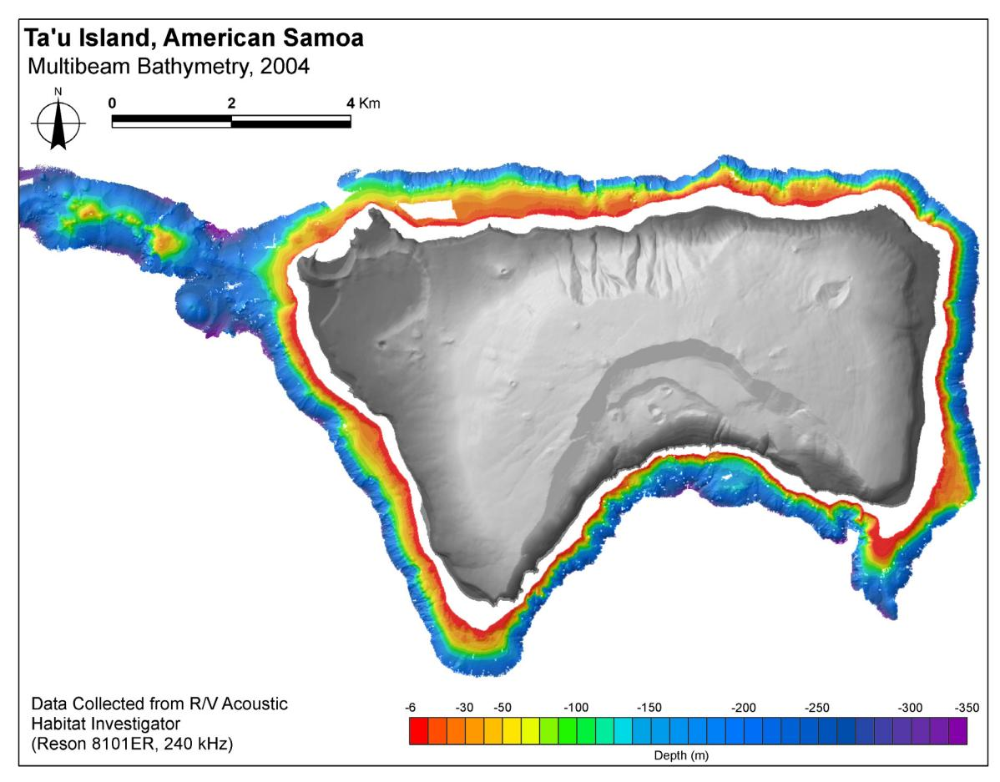

**Figure 5.3.1a.** Multibeam bathymetry acquisition around Ta`u in depths between ~ 10 and ~ 350 m was completed in March 2004, from the R/V *Acoustic Habitat Investigator* (*AHI*). The island drops steeply from all sides and is connected to Olosega via a series of small seamounts along a submerged ridge tending toward the northwest.

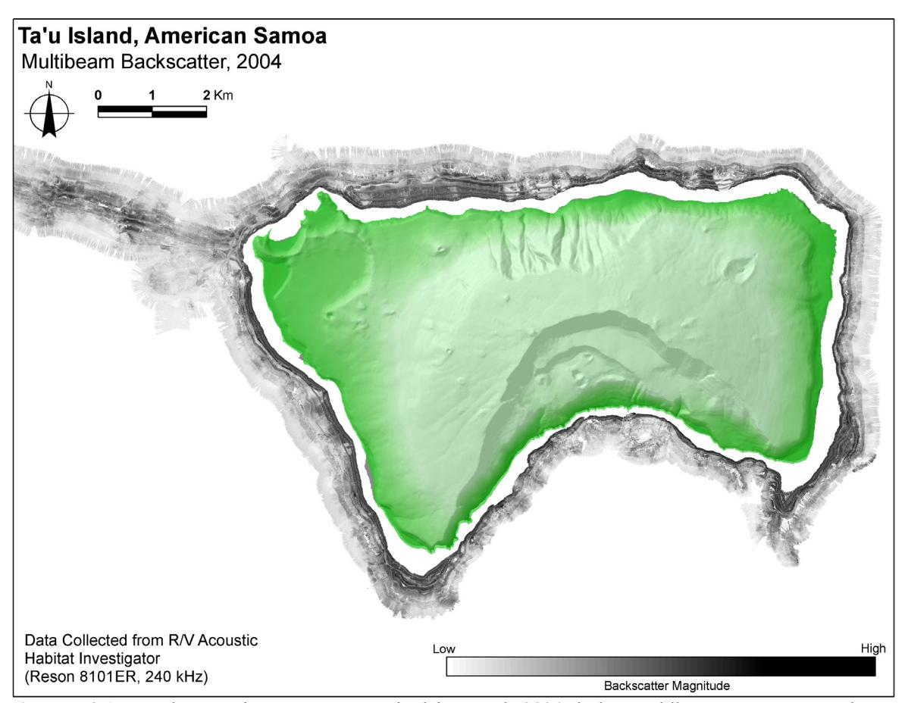

**Figure 5.3.1b.** Backscatter imagery was acquired in March 2004 during multibeam surveys around Ta`u from the R/V *AHI*. Lighter shades represent low intensity backscatter and likely indicate substrates that are acoustically absorbent and typically indicate unconsolidated sediment. Darker shades represent high-intensity backscatter and likely indicate consolidated hard-bottom and coral substrates.

2006 (Fig. 5.3.1b). For example, observations of high backscatter intensity on the seamounts to the northwest of Ta`u suggested they were likely composed of hard-bottom habitat, possibly including some live coral. During TOAD camera surveys of these seamounts during ASRAMP 2006, video observations confirmed the presence of living corals. Similarly, the southwest point of Ta`u was ground-truthed as hard-bottom habitat and areas in the west region with lower backscatter intensity were determined to include more sedimentary habitats.

Only a limited amount of optical data were collected around Ta`u (Fig. 5.3.1c) because of the difficulties and inherent hazards of maneuvering large vessels close to the island, along with the inherent depth limits imposed on TOAD optical equipment (~ 80 m). Eleven optical data videos were collected from the National Oceanic and Atmospheric Administration (NOAA) Ship *Oscar Elton Sette* in 2004 (examples seen in Fig. 5.3.1d), and an additional five tows were conducted aboard the R/V *AHI* in 2006. Optical data collected during the 2006 TOAD surveys are still being processed and are not included in these results. However, surveys from both 2004 and 2006 indicate the presence of significant coral communities, both off the southeastern corner of the island and the seamount 2 km northwest of Utumanu`a Point.

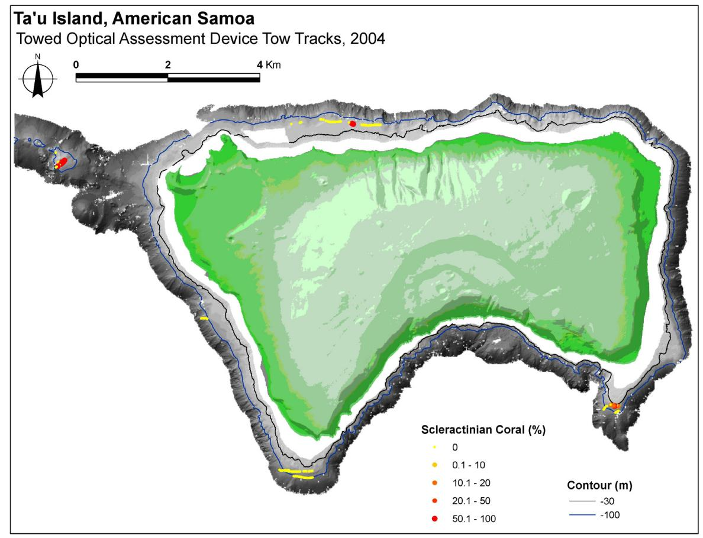

**Figure 5.3.1c.** TOAD tracks around Ta`u during ASRAMP surveys in 2002 and 2004. The video imagery are post processed to identify substrate type (e.g., sand, rock), living cover (e.g., coral, macroalgae), and other characteristics. The TOAD survey tracks display percentage of live scleractinian coral classified using a point count method with a mean spacing of 20 m along each track. Yellow indicates 0% coral cover, orange colors indicate 0–20% coral cover, and red colors indicate 20–50% and 50–100% coral cover.

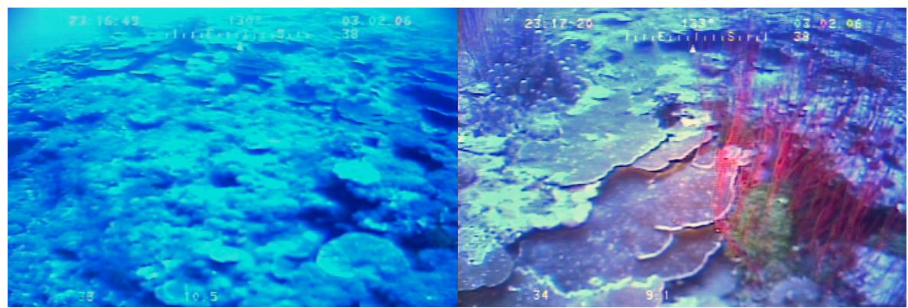

**Figure 5.3.1d.** Optical validation images acquired during TOAD surveys over the small seamount northwest of Ta`u, showing an abundance of live scleractinian corals at depths of ~ 40–45 m. (*Photographs provided by NOAA PIFSC CRED*)

# **5.3.2 Habitat Characterization**

Towed-diver benthic survey observations around Ta`u from ASRAMP 2002, 2004, and 2006 were concatenated into mean spatial distributions of benthic composition (see Chapter 2, Section 2.2.3: Optical Validation Surveys). These analyses for Ta`u are presented as mean distributions of habitat complexity (Fig. 5.3.2a) and percent cover of sand (Fig. 5.3.2b), hard substrate/pavement (Fig. 5.3.2c), rubble (Fig. 5.3.2d), and live coral (Fig. 5.3.2e). Since these habitat characterization maps represent different complementary components of the same habitat, it is useful to analyze them in relation to each other, the local watersheds, and exposure to prevailing oceanographic conditions.

Habitat complexity was observed to vary significantly around Ta`u, with observations ranging from low to very high (Fig. 5.3.2a). Habitat complexity appeared high to very high in portions of the east, south, and north regions. High to very high habitat complexity was observed along an ~ 1 km stretch of the forereef slope in the east region, specifically the area near the midpoint between Tiafou Point at the northeast corner and Tufu Point at the southeast corner. In this particular area, towed divers have recorded observations of extremely large massive Porites coral heads, some exceeding 5-6 m in height and 14 m in diameter (Figs. 5.3.2f and

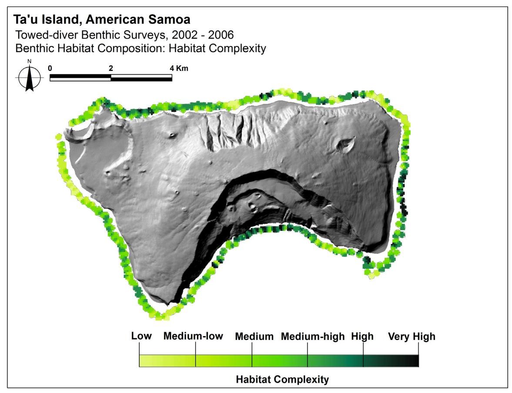

**Figure 5.3.2a.** Mean benthic habitat complexity concatenated from towed-diver survey observations around Ta`u during ASRAMP 2002, 2004, and 2006. Habitat complexity was subjectively rated by divers over 5-min ensembles (~ 200 m × 10 m) on a 6-point scale representing low (1), medium-low (2), medium (3), mediumhigh (4), high (5), and very high (6) topographic complexity. Yellow colors indicate low habitat complexity, and dark green colors indicate high habitat complexity.

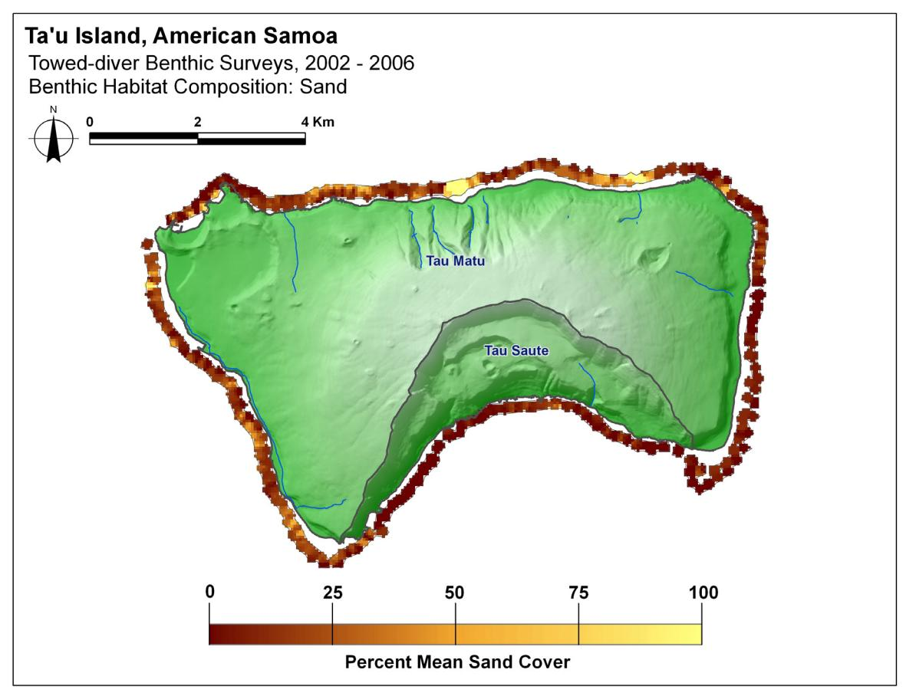

**Figure 5.3.2b.** Mean percent cover of sand concatenated from towed-diver benthic survey observations around Ta`u during ASRAMP 2002, 2004, and 2006. Major streams (blue lines) overlay the topographic map of the islands, indicating the location of inputs of freshwater runoff into the marine ecosystem. Sand composition was subjectively rated by divers over 5-min ensembles (~ 200 m × 10 m) over a 1–100% scale. Light shades indicate high percent cover of sand, and dark shades indicate low percent cover of sand.

5.3.2g). An additional area of high complexity was noted along the south coast, specifically under the Liu Bench embayment and underneath the headwall surrounding Papaloaloa Point. In this area, divers observed a dramatic vertical rock wall descending as far as visibility allowed (~ 40 m). Few areas of high habitat complexity were also observed widely scattered in the north region. Areas of lower habitat complexity were recorded in a number of regions, specifically near Si`ufa`alele Point along the southwest corner of the island, in the vicinity of the village of Ta`u in the west region and in isolated, clearly defined areas in the north region.

Towed-diver observations concur with backscatter imagery and towed-diver benthic complexity data on the location of several prominent sand channels scattered in the north region, and with the presence of accumulations of sand at the base of the forereef slope in the west region (Fig. 5.3.2b). Both sources suggest that the sand deposits are patchier and less substantial than similar deposits on the islands with more pronounced insular shelves (i.e., Tutuila, Ofu, and Olosega).

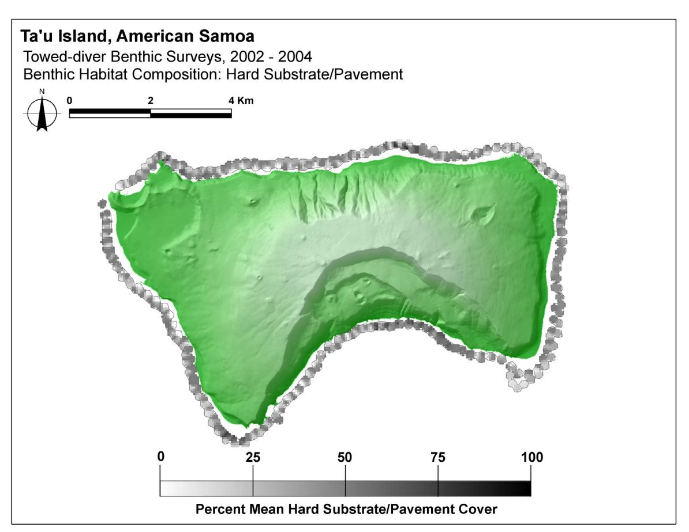

**Figure 5.3.2c.** Mean percent cover of hard substrate/pavement concatenated from towed-diver benthic survey observations around Ta`u during ASRAMP 2002 and 2004. Hard substrate/pavement composition was subjectively rated by divers over 5-min ensembles (~ 200 m × 10 m) over a 1–100% scale. Dark shades indicate high percent cover of hard substrate, and light shades indicate low percent cover of hard substrate.

The mean percent cover of hard substrate/pavement around Ta`u was generally evenly distributed, with several localized increases (Fig. 5.3.2c) near the base of the Liu Bench and Papaloaloa Point in the south region, around Si`ufa`alele Point at the southwest corner of the island, and in the north in a region directly adjacent to one of the sand channels previously identified with backscatter, complexity, and percent sand cover.

Generally, the mean percent cover of coral rubble around Ta`u from towed-diver survey observations was consistently low, with typical values less than 5% (Fig. 5.3.2d). In a few areas, particularly along the forereef slope in the west region, there were stretches where observed values were closer to 25%. There appeared to be a slight correlation between the increases of sand and rubble in the west region, suggesting the area may be subjected to increased runoff, weathering, bioerosion or combination of these and/or other unknown causes.

The highest observed mean percent covers of live scleractinian coral were recorded in the east region between Tiafou Point and Tufu Point, with values ranging from 30% to 75%, and in the eastern portion of the south region near Ulufala Point, with similar high values (Fig. 5.3.2e). The high coral cover area in the central portion of the east region coincides with observed high levels of habitat complexity and observations of extremely large colonies of massive *Porites* sp. discussed previously in this section. These massive colonies are thought to be among the oldest known living coral colonies in the world. A similar community of ancient massive *Porites* sp. colonies was also discovered on the opposite side of the island in the southern portion of the west region (Figs. 5.3.2f and 5.3.2g). Several colonies were huge and were estimated to be between 500 and 1000 years old. Unfortunately, many of these massive corals in this region had also suffered mortality or near-mortality events. It is not

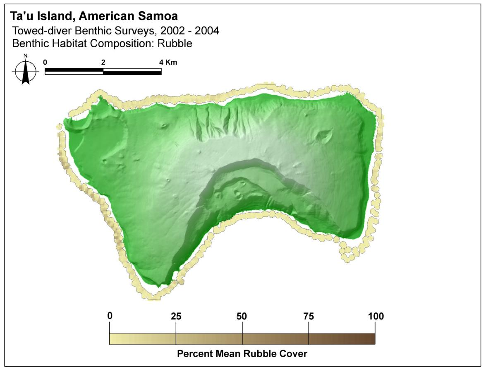

**Figure 5.3.2d.** Mean percent cover of rubble concatenated from towed-diver survey observations around Ta`u during ASRAMP 2002 and 2004. Rubble composition was subjectively rated by divers over 5-min ensembles (~ 200 m × 10 m) over a 1–100% scale. Light shades indicate low percent cover of coral rubble, and dark shades indicate high percent cover of coral rubble.

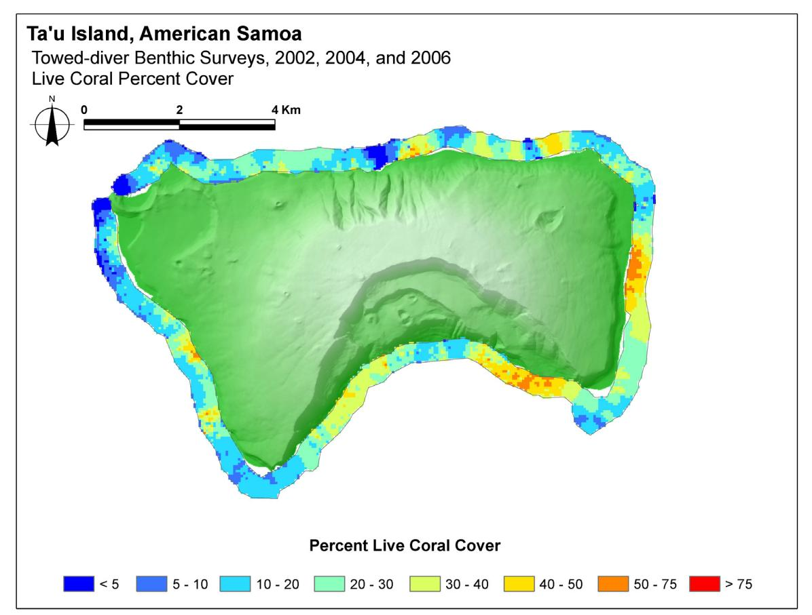

**Figure 5.3.2e.** Mean percent cover of live scleractinian (stony) coral concatenated from towed-diver survey observations around Ta`u during ASRAMP 2002, 2004, and 2006. Live coral cover composition was subjectively rated by divers over 5-min ensembles (~ 200 m × 10 m) on a 1–100% scale. Blue colors indicate low percent cover of coral, and reddish colors indicate high percent cover of coral.

known when or why these massive colonies died off.

In the south region, and to a lesser extent, percent cover of live coral was moderately high (20–50%) in the area east of Papaloaloa Point. Interestingly, the area in between the two high coral cover areas in the south region was highly complex, but generally contained much lower coral cover (0–20%). This may be a result of freshwater inputs running off the southern-facing, stair-step caldera complex off of the Liu Bench, geologic activity (e.g., rockslides) or a combination of these and/or other environmental factors. Additional areas of high coral cover included several areas in the north region between REA sites TAU-10 and TAU-04 and two sites in the west region, north of Si`ufa`alele Point near REA sites TAU-09 and TAU-12 (Figs. 5.2a and 5.3.2e).

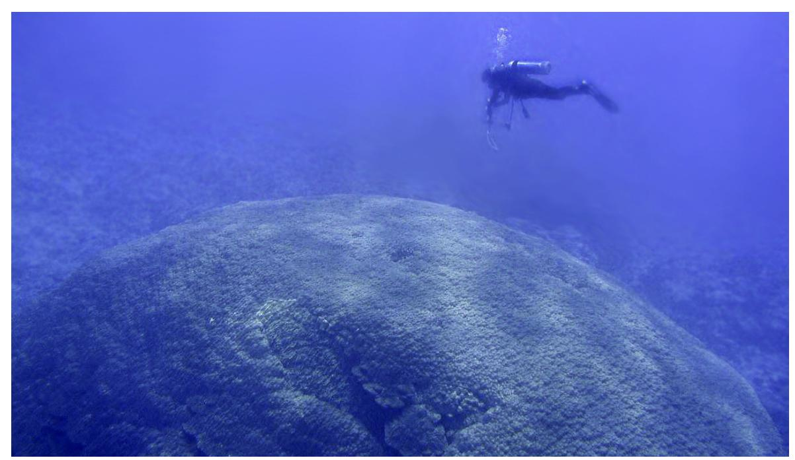

**Figure 5.3.2f.** Massive *Porites* sp. coral heads first discovered by the CRED towed-diver observers on the southwest side of Ta`u during ASRAMP 2002. (*Photograph provided by NPAS*)

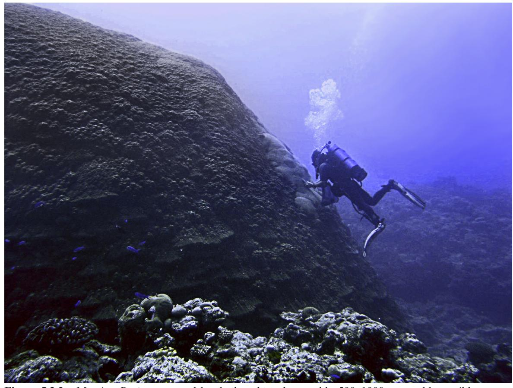

**Figure 5.3.2g.** Massive *Porites* sp. coral heads thought to be roughly 500–1000 years old, possibly among the oldest known coral colonies in the world, and are one of the most unique findings by CRED scientists in American Samoa. (*Photograph provided by NPAS*)

# **5.4 Oceanography and Water Quality**

Oceanographic and water quality data have been collected in the waters surrounding Ta`u over the period between 2002 and 2006. Instrumentation and equipment descriptions, deployment dates and locations, and a subset of the results are discussed below. Specific details of deployments and additional data are presented in Appendix II, Figure II. iii.

# **5.4.1 Hydrographic Data**

#### *2002 Spatial Surveys*

During ASRAMP 2002, 30 shallow-water CTD casts were conducted in nearshore waters around Ta`u between February 11 and 13 (Figs. 5.4.1a and 5.4.1b). Data from these profiles show evidence of vertical stratification of the water column around all sides of the island surveyed (A–J; Fig. 5.3.1b), although this stratification was weaker around the southwest sector of the island (G–J) in the south and west regions. The mid-depth (~ 10–30 m) portion of the water column in the north region (A–D) was generally cooler, more saline (> 35.5 psu) and more dense (> 22.4 kg m-3) than in the south and west regions (E–J). The western portion of this north region (A–B) had particularly strong stratification with warmer surface waters (~ 30°C) and relatively cool bottom water (~ 28.5°C). Though temperature was stratified in

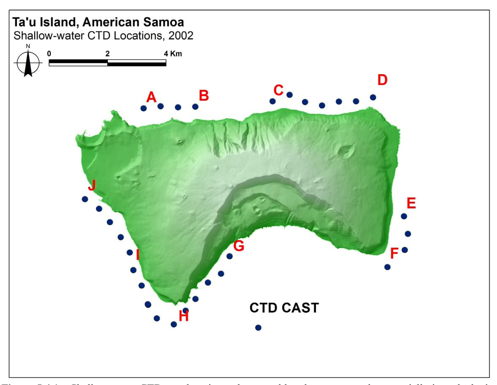

**Figure 5.4.1a.** Shallow-water CTD cast locations, shown as blue dots, expressed sequentially in a clockwise direction around Ta`u (A–J) during ASRAMP 2002, February 11–13.

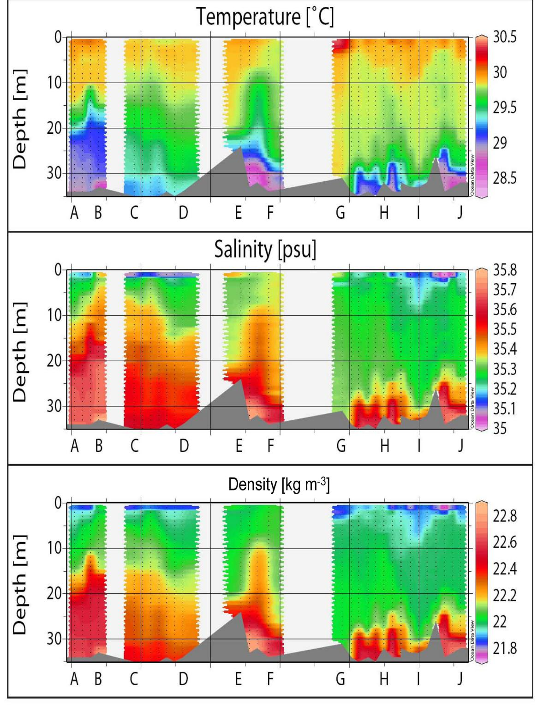

**Figure 5.4.1b.** Shallow-water CTD cast profiles to a 30-m depth around Ta`u during ASRAMP 2002, February 11–13, including temperature (°C), salinity (psu), and density (kg m-3). Profiles are shown sequentially in a clockwise direction around the island (A–J), as shown in Figure 5.3.1a.

the southwest sector (G–J), with warm surface water (< 5 m) and cool bottom water (> 20 m), salinity (~ 35.2 psu) and density (~ 22 kg m-3) were relatively well-mixed in the mid-depth portion of the water column. These observations suggest surface heating with limited vertical

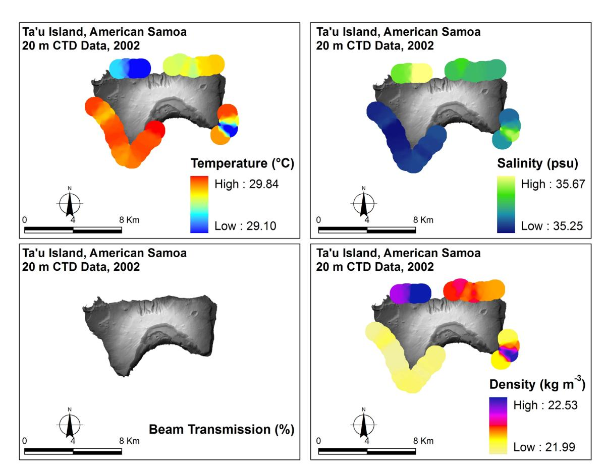

**Figure 5.4.1c.** Interpolated water temperature (top left), salinity (top right), and density (bottom right) at a 20 m depth derived from shallow-water CTD casts around Ta`u during ASRAMP 2002, February 11–13. Beam transmission data (bottom left) were not collected.

mixing because of this sector's location in the lee of the island.

Spatial analyses of these physical water properties at a 20-m depth from the ASRAMP 2002 surveys shows moderate ranges in temperature (29.09°–29.83°C), salinity (35.13–35.33 psu), and computed density values (21.99–22.53 kg m-3; Fig. 5.4.1c). In general, waters in the south and west regions of Ta`u were warmer, less saline, and less dense than observations in the north region of Ta`u where the waters were notably cooler and more saline, particularly the western portion (A–B) of the north region.

#### *2004 Spatial Surveys*

During ASRAMP 2004, 37 evenly spaced shallow-water CTD casts were conducted in the nearshore waters around Ta`u between February 4 and 5 (Fig. 5.4.1d). Data from these CTD profiles show a relatively well-mixed water column along the north coast (A–C) from just north of Utumanu`a Point on the northwest corner to Tiafou Point on the northeast corner, with increased stratification in the waters below ~ 25 m, where waters were noticeably cooler and more saline than the waters above (Fig. 5.4.1e). Around the southeast point of Ta`u (D–E), a pronounced increase in temperature from ~ 29.45° to ~ 29.7°C throughout the upper ~ 25 m was not obviously correlated with significant changes in salinity or density. There was an observed increase in beam transmission in this warm water tongue. Along the entire south

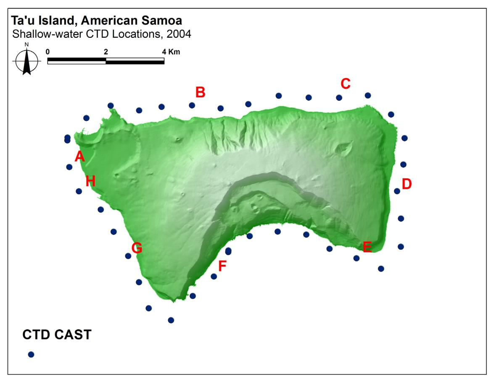

**Figure 5.4.1d.** Shallow-water CTD cast locations, shown as blue dots, expressed sequentially in a clockwise direction around Ta`u (A–H) during ASRAMP 2004, February 4–5.

coast from Tufu Point to just past Si`ufa`alele Point (E–G), the most striking feature was the presence of relatively cold (29.2°C), saline (35.4 psu) bottom water (~ 30–35 m depths), and moderate vertical stratification through the water column. The stratification of the water off the southern shores was likely because of the calmer waters within the embayment allowing surface heating and limited mixing from wind and wave forcing.

The patterns of observed physical water properties at a 20-m depth around Ta`u during ASRAMP 2004 showed clear spatial structure with small to moderate ranges in temperature (29.35°–29.69°C), salinity (34.78–35.09 psu), computed density (21.87–22.26 kg m-3), and beam transmission (92.27–93.94%; Fig. 5.4.1f). For temperature, warmest waters were observed along most of the coast in the east region, in the same area with the highest observed coral cover, high habitat complexity, and large *Porites* coral heads. Coolest waters at a 20-m depth were observed along most of the south shore region, including Si`ufa`alele Point at the southwest corner of the island. For salinity, the entire north region had relatively low salinity water compared to the more saline south region. These combined temperature and salinity patterns at the 20-m depth resulted in low-density waters along the north coast and highdensity waters along the south region. For beam transmission, the patterns appeared more variable with highest values (low turbidity) and lowest values scattered at three separated areas along the north region of the island.

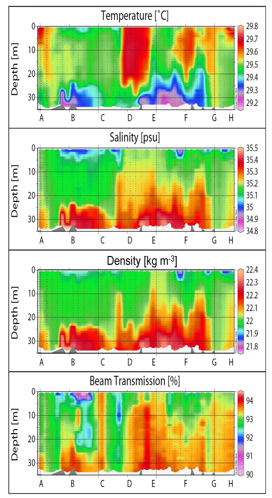

**Figure 5.4.1e.** Shallow-water CTD cast profiles to a 30-m depth around Ta`u during ASRAMP 2004, February 4–5, including temperature (°C), salinity (psu), density (kg m-3), and beam transmission (%). Profiles are shown sequentially in a clockwise direction around the island (A–L), as shown in Figure 5.3.1d.

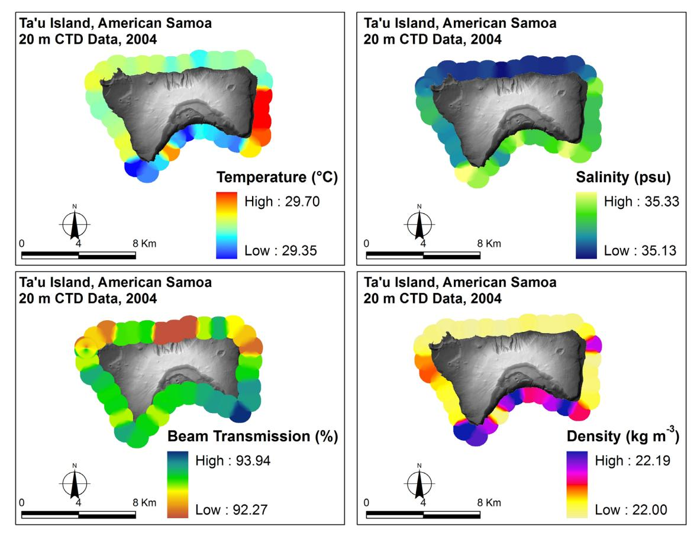

**Figure 5.4.1f.** Interpolated water temperature (top left), salinity (top right), beam transmission (bottom left), and density (bottom right) at a 20-m depth derived from shallow-water CTD casts around Ta`u during ASRAMP 2004, February 4–5.

## *2006 Spatial Surveys*

During ASRAMP 2006, 35 CTD casts were conducted in nearshore waters surrounding Ta`u between March 2 and 4 (Fig. 5.4.1g). In addition, water samples for nutrient and chlorophyll analysis were collected at 1-, 10-, 20-, and 30-m depths, where possible, at seven of these shallow-water CTD sites. Dissolved inorganic carbon (DIC) samples were collected at each of these seven sites (Fig. 5.4.1j).

Vertical profiles of water properties from shallow-water CTD surveys around Ta`u during ASRAMP 2006 indicate three main features (Fig. 5.4.1h). The first feature was an alternating pattern of well-mixed regions of the water column along the north and east coasts of the island (B–E) with different characteristics. Most of this stretch was characterized by relatively cool (29°C) water with moderate salinity values. At the northeast corner near Cape Papatele, a well-mixed warm (29.3°C) tongue was observed from the surface to the bottom. Although salinity was not different in this area, the warm temperature resulted in a corresponding tongue of low density water. The second feature was a region of warm (> 29.5°C), low salinity (< 34.5 psu) surface water and a moderately well-mixed subsurface water column along the south coast (E–F). The third feature was a stratified, relatively cool (< 28.75°C), dense (>

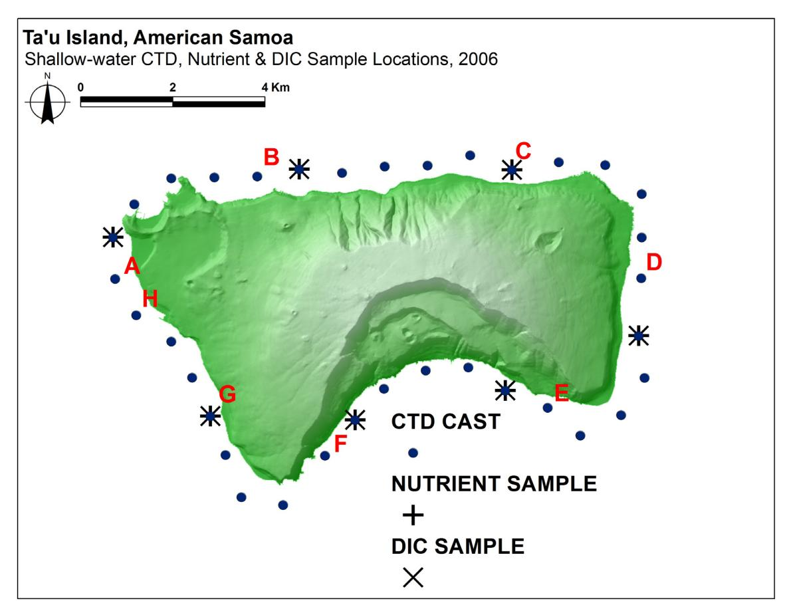

**Figure 5.4.1g.** Shallow-water CTD cast and nutrient and DIC water sample locations around Ta`u (A–H) during ASRAMP 2006, March 2–4.

22.2 kg m-3), saline (> 35 psu) mass of bottom water in the leeward west region of the island (G–A). These bottom temperatures were strikingly lower than any others observed around the island. Because of a faulty sensor, beam transmission data collected during ASRAMP 2006 were insufficient to develop any conclusions.

The moderately well-mixed waters of the north and east regions (B–E) of Ta`u were exposed to wave and wind action during the observation period, causing mechanical mixing of warm surface water with cooler bottom waters. Relatively protected waters in the embayment on the south side of Ta`u (E–F) may have been subjected to surface heating and limited, wave-induced mixing in the upper water column. Additionally, river and land runoff, and possibly subsurface springs, are likely to be prevalent within this embayment. Runoff may be indicated by the low salinity (34.4 psu) and density (21.5 kg m-3) values observed in the upper water column (E–F).

Physical water properties at a 20-m depth during the 3-day survey around Ta`u in 2006 showed a moderate range in temperature (28.64°–29.23°C), with cooler waters observed to the west and warmest waters observed around Cape Papatele at the northeast corner of the island (Fig. 5.4.1j). As with temperature, observed salinity showed moderate variability (34.78– 35.09 psu) around the island. The spatial pattern in salinity was marked by low salinities on the west half of the island and moderate salinities on the eastern half. The lowest salinities are observed at Utumanu`a Point in the northwest and Si`ufa`alele Point at the southwest

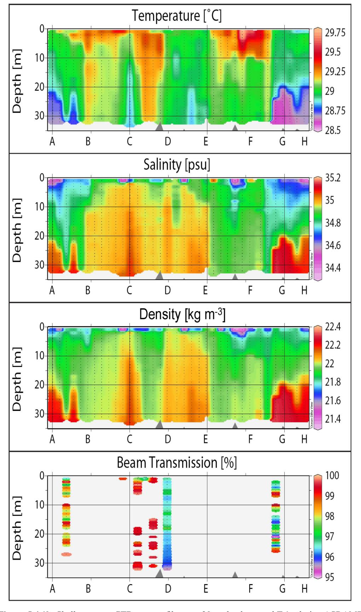

**Figure 5.4.1h.** Shallow-water CTD cast profiles to a 30-m depth around Ta`u during ASRAMP 2006, March 2–4, including temperature (°C), salinity (psu), density (kg m-3), and beam transmission (%). Profiles are shown sequentially in a clockwise direction around the island (A–J), as shown in Figure 5.4.1g.

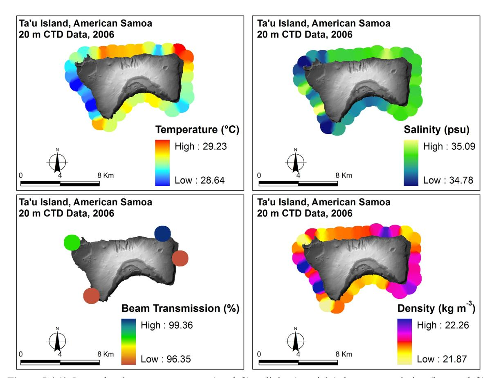

**Figure 5.4.1i.** Interpolated water temperature (top left), salinity (top right), beam transmission (bottom left), and density (bottom right) at a 20-m depth derived from shallow-water CTD casts around Ta'u during AS-RAMP 2006, March 2–4.

corner. Beam transmission observations were limited because of instrument problems but varied between 96.35% and 99.36%, with highest values (lowest turbidity) observed in the northeast corner and lowest values observed in the east and west regions (near Si`ufa`alele Point). A point source of terrigenous input, or land-based sediment, was potentially the cause of the notable increases in turbidity, particularly since Si`ufa`alele Point also had low salinity. More data are needed to properly assess the nature of the signal. Computed density values (21.87–22.26 kg m-3) show similar distributions as salinity; the lowest and highest density values occurred on the northwest, west, and southwest portions of the island.

The in situ nutrient data collected at Ta`u displayed the following ranges: chlorophyll-a (Chl-a), 0.26–0.69 µg L¹; phosphate (PO₄), 0.04–0.15 µM; silicate (SiO₂), 0.6–1.21 µM; and total nitrogen (Ntot = NO₃ + NO₂), 0.23–0.64 µM. Water samples showed an increase in Chl-a concentrations near the harbor area, while most other nutrient concentrations showed increased values along the south shore of Ta`u (Fig. 5.4.1j). The south shore of Ta`u has the highest SiO₂ values in the American Samoa Archipelago. The south shore also exhibited a spike in PO₄ and NO₂ values. The vast majority of the population resides on the west coast, where nitrogen levels appeared elevated. There is also a small airport on the northeast corner of the island, although no increase in nutrients was observed in that area.

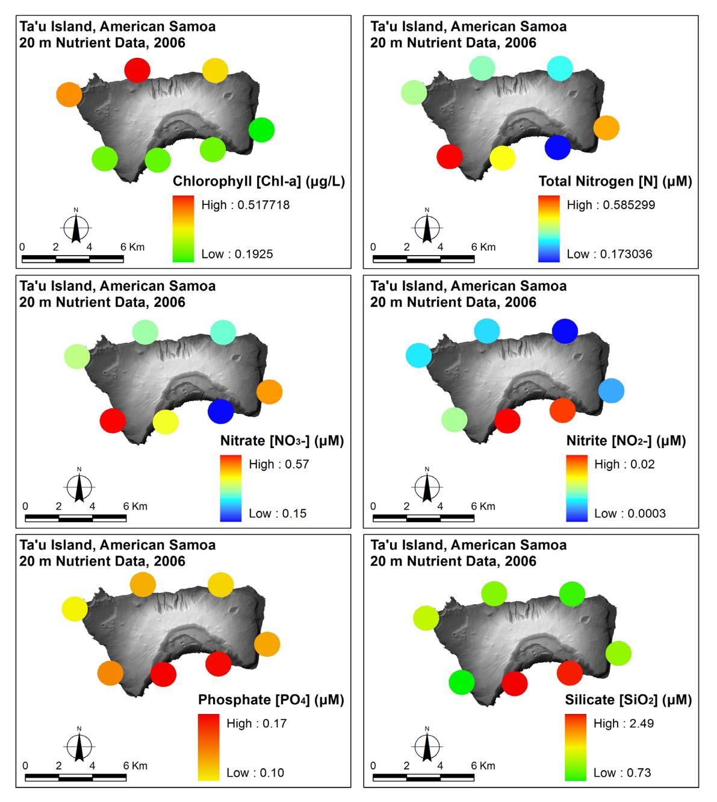

**Figure 5.4.1j.** Interpolated Chl-a (top left), total nitrogen (top right), nitrate (middle left), nitrite (middle right), phosphate (bottom left) and silicate (bottom right) concentrations, at a 20-m depth derived from water samples collected in concert with shallow-water CTD casts around Ta`u during ASRAMP 2006, March 2–4.

#### **5.4.2 Temporal Comparison—Hydrographic Data**

During each of the ASRAMP survey periods in 2002, 2004, and 2006, the nearshore shallow-water CTD and water quality observations showed noteworthy spatial structure. Temperature, salinity, and density values each varied spatially during each survey periods, although observed patterns were not consistent between survey periods. Ta`u was similar to Ofu and Olosega in terms of nutrient results. Site-to-site variability within nutrient value results was slightly less than the variability seen around Tutuila. These results are a baseline for comparison with future nutrient datasets. It is important to note that substantial rainfall

occurred during the survey period and that resulting terrestrial runoff affected results of the nutrient sampling.

#### **5.4.3 Time Series Observations**

A suite of moored instruments were deployed around Ta`u over the period between 2002 and 2006 to collect time series observations of key oceanographic properties influencing reef conditions (Fig. 5.4.3a). Deployment and retrieval dates of each instrument are detailed in Appendix II, Table II.iii. Figure 5.4.3b shows a time series of in situ and remotely sensed SST and modeled wave properties from January 2002 to April 2006.

Pathfinder SST data from Ta`u showed predominantly seasonal variability with warmest temperatures (~ 30.0°C) observed during January–March and coolest temperatures (~ 27.5°C) in June–August (Fig. 5.3.2b, top panel). A particularly cool episode, with temperatures reaching nearly 1.5°C below SST climatology, was observed in austral winter 2002 before temperatures rose sharply to climatologically normal values in late 2002. In situ SST data were observed to be cooler and more variable when compared to Pathfinder SST temperature. Throughout most of the in situ record (July 2002–2004), moored SST values were observed to be 0°–3.5°C cooler than that observed via satellite and, for the most part, cooler when compared to the SST climatology. Telemetered in situ SST data from March 2004 to February 2005 correlated well with both Pathfinder SST and climatology.

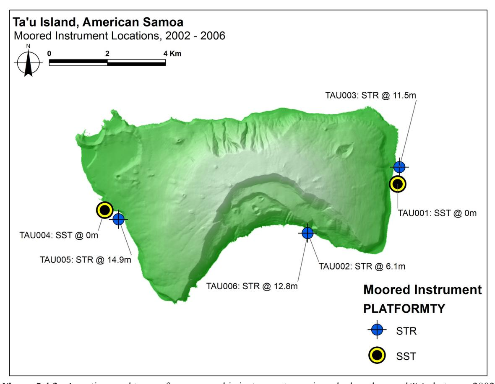

**Figure 5.4.3a.** Locations and types of oceanographic instrument moorings deployed around Ta`u between 2002 and 2006. Moored instrument types include STR and SST.

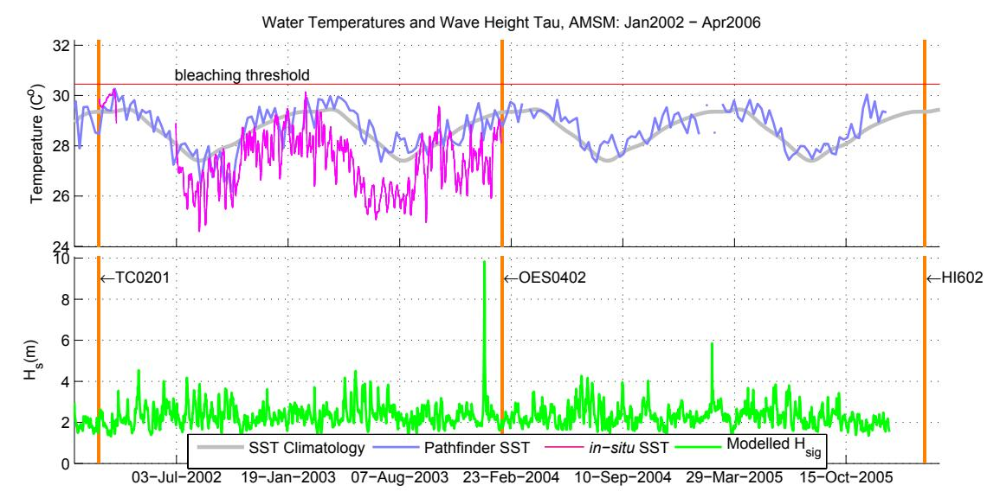

**Figure 5.4.3b.** SST and wave height time series around Ta`u between January 2002 and April 2006. Remotely sensed data (SST climatology and weekly Pathfinder-derived SST) and modeled significant wave height derived from Wave Watch III are overlaid with CRED in situ temperature observations. The horizontal red and vertical orange bars represent the bleaching threshold and the ASRAMP research cruise dates, respectively. In situ (15-min sampling frequency) and telemetered data (4-hour mean) were used to produce the Ta`u time series record shown.

Temperature time series from three STRs during the 2004 to 2006 time period show 2°-3°C temperature fluctuations because of seasonal variability (Fig. 5.4.3c). In each of the time series, minimal (< 1°C) diurnal temperature fluctuations were observed.

Modeled significant wave height data for Ta'u showed weak seasonal variation superposed with episodic, cyclone-derived extreme wave events. Larger wave heights (~ 3–4 m) typically occurred during winter months compared to smaller wave heights (~ 2 m) during the summer months. Two extremely large swell events were observed in the time series: one in January 2004 produced by Cyclone Heta and the other in February 2005 produced by Cyclones Olaf and Percy (Fig. 5.3.2b, bottom panel).

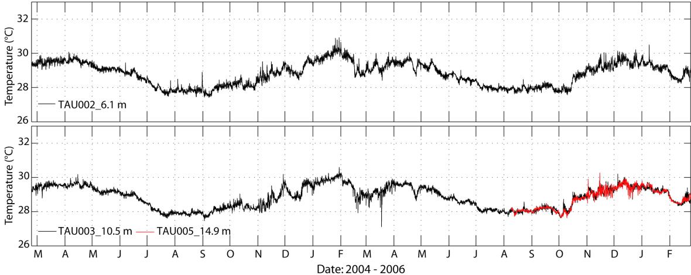

**Figure 5.4.3c.** Time series observations of temperature between March 2004 and February 2006 from three STRs deployed at different locations and depths around Ta`u, American Samoa (see Figure 5.3.2a for mooring locations).

# **5.5 Coral and Coral Disease**

# **5.5.1 Coral Surveys**

#### *2002 Spatial Surveys*

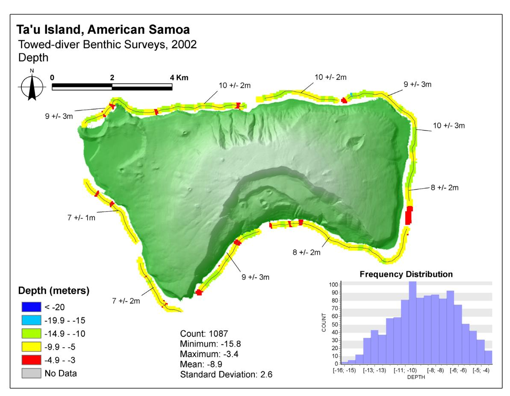

**Figure 5.5.1a.** Towed-diver survey tracks around Ta`u during 2002 ASRAMP. Towed-diver survey tracks are color coded with mean depths for each 5-min segment. Mean depths and standard deviations for each toweddiver survey are shown in black text. Depth histogram and statistics (counts, minimum depth, maximum depth, mean, and standard deviation) from 30-sec depth recordings during towed-diver surveys are included.

Ten towed-diver surveys along the forereef slopes of Ta`u were conducted in 2002, with a mean depth of 8.9 m (Fig. 5.5.1a). Individual towed-diver survey depths varied from 7 m (SD 1) to 10 m (SD 3). Estimates of live coral percent cover were 30.8% (SE 2.7; Fig. 5.5.1b), and estimates of recently dead coral cover were 2.4% (SE 0.6; Fig. 5.5.1c).

The highest live coral cover was observed during two towed-diver segments within the north region of Ta`u (mean: 62.5%). Other areas of high coral cover included the northeast windward coastline, beginning at Fiti`uta Point and heading south past Tiafou Point (6 tow segments, mean: 51.7%) and two tow segments along the west region of Ta`u (mean: 52.5%). Estimates of dead coral were low and variable around most of Ta`u, with the highest dead coral (up to 10%) observed on the northwest corner, from Cape Papatele south past Tiafou Point, as well in the south region, from Ulufala Point west to Papaloaloa Point.

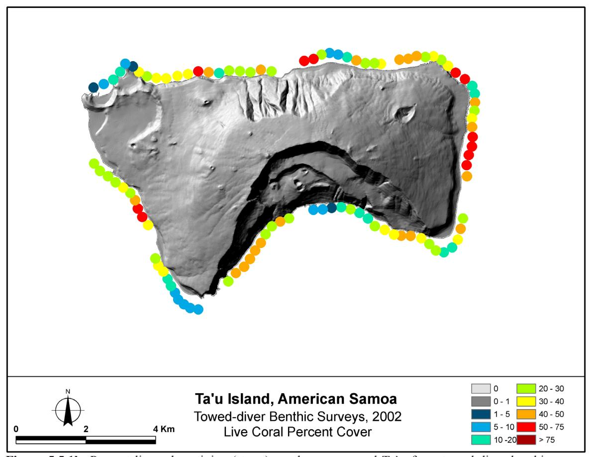

**Figure 5.5.1b.** Percent live scleractinian (stony) coral cover around Ta`u from towed-diver benthic survey observations during ASRAMP 2002. Each colored point represents an integrated estimate over a 5-min observation segment covering a survey swath of ~ 200 m × 10 m (~ 2000 m2 ). The ramped color scheme expresses the range of percent live coral cover on the benthic habitat. Note that coral cover was measured as a direct percentage of overall benthic cover in 2002.

During ASRAMP 2002, towed-diver observers first discovered unique massive *Porites* sp. communities in the east and west regions of Ta`u, as first mentioned in Section 5.3.2: Habitat Characterization. In the west region, these massive coral colonies were estimated to be 5-6 m in height and 14 m in diameter (Figs. 5.3.2f and 5.3.2g). Through simple comparisons with known coral cores, these massive coral heads within this unique and isolated community are estimated to be between 500 and 1000 years old and are among the oldest known living coral colonies in the world. The finding of this massive and ancient community in 2002 is one of the most unique and exciting discoveries by CRED scientists in all of American Samoa.

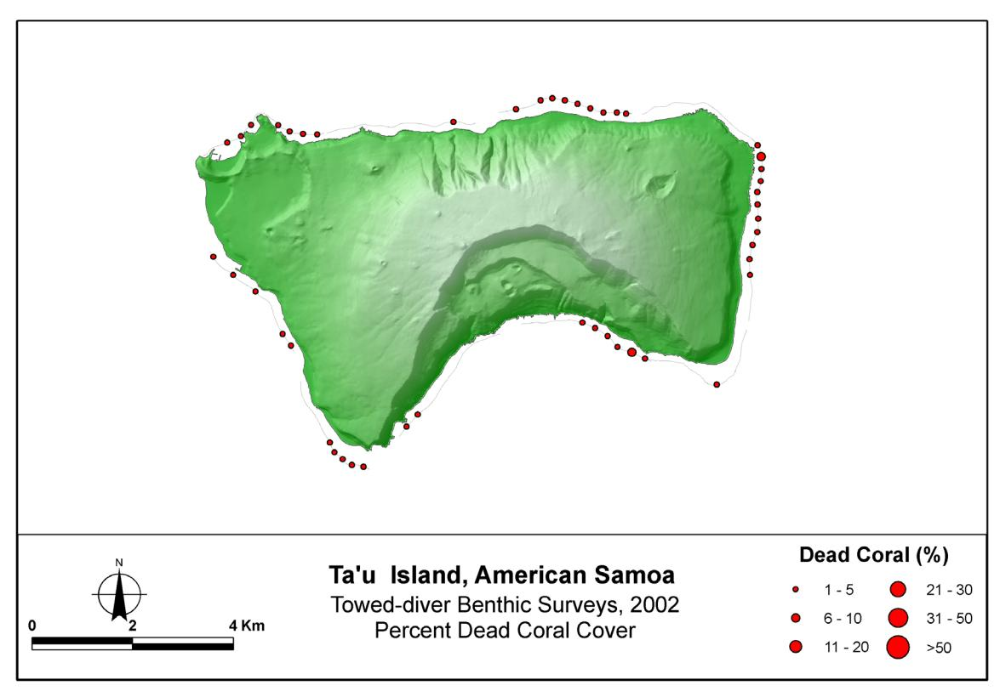

**Figure 5.5.1c.** Towed-diver benthic survey observations of dead coral cover around Ta`u during ASRAMP 2002. Each colored point represents an integrated estimate over a 5-min observation segment covering a survey swath of ~ 200 m × 10 m (~ 2000 m2 ). Symbol size represents the percent dead coral cover on the benthic habitat.

REA coral surveys during ASRAMP 2002 were the first surveys conducted in American Samoa by CRED. Although six sites were surveyed around Ta`u by a CRED coral biologist, the main focus of those surveys was to explore different coral monitoring methodologies. Since the surveys were exploratory and qualitative in nature, no data are presented in this more quantitative report.

# *2004 Spatial Surveys*

Eighteen towed-diver benthic surveys along the forereef slopes of Ta`u were conducted during ASRAMP 2004, with a mean depth of 11.4 m (Fig. 5.5.1d). Individual towed-diver survey depths varied from 6 m (SD 3) to 17 m (SD 5). Island-wide live coral percent cover was 22.7% (SE 2.9; Fig. 5.5.1e), with an estimate of 5.8% (SE 1.2) of the live coral appearing stressed (pale or white; Fig. 5.5.1f).

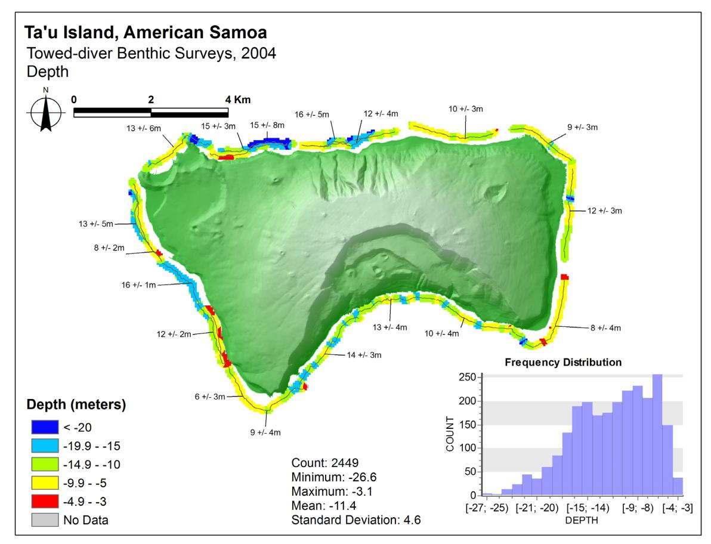

**Figure 5.5.1d.** Towed-diver survey tracks around Ta`u during ASRAMP 2004. Towed-diver survey tracks are color coded with mean depths for each 5-min segment. Mean depths and standard deviations for each toweddiver survey are shown in black text. Depth histogram and statistics (counts, minimum depth, maximum depth, mean, and standard deviation) from 30-sec depth recordings during towed-diver surveys are included.

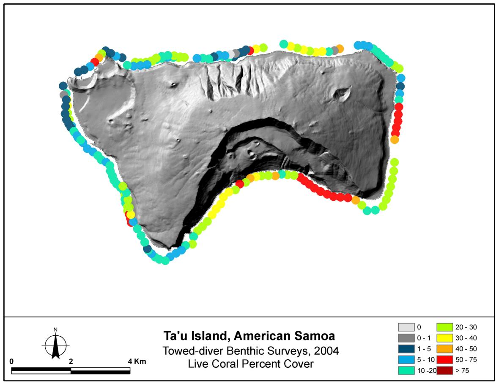

**Figure 5.5.1e.** Towed-diver benthic survey observations of live scleractinian (stony) coral cover around Ta`u during ASRAMP 2004. Each colored point represents an integrated estimate over a 5-min observation segment covering a survey swath of ~ 200 m × 10 m (~ 2000 m2 ). Symbol size represents the percent live coral cover on the benthic habitat.

Estimates of live scleractinian (stony) coral cover were variable, with generally higher coral cover observed within the east and south regions. The highest live stony coral cover was recorded during nine towed-diver segments along the south region forereef, close to Ulufala Point (mean: 60.4%). Other areas of higher coral cover included the area surveyed along the east region, south of Tiafou Point (5 tow segments, mean: 59.0%).

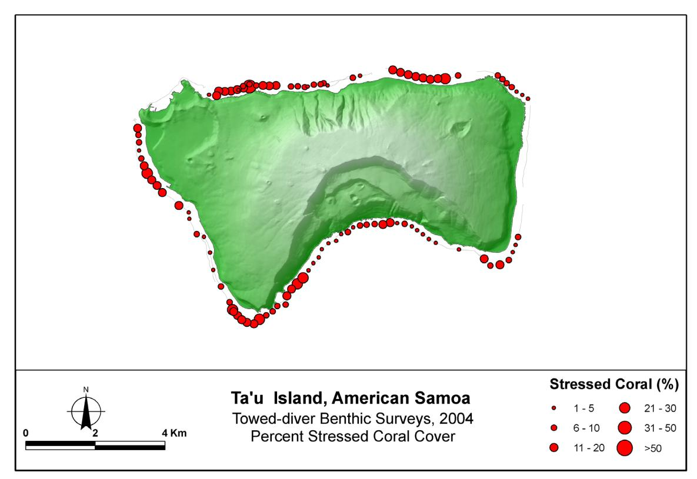

**Figure 5.5.1f.** Towed-diver benthic survey observations of stressed coral cover around Ta`u during ASRAMP 2004. Each colored point represents an integrated estimate over a 5-min observation segment covering a survey swath of ~ 200 m × 10 m (~ 2000 m2 ). Symbol size represents the percent of stressed coral cover of the total coral benthic coverage. Note that stressed coral cover was measured as a percentage of overall coral cover in 2004.

Estimates of stressed corals (pale and white) were variable with relatively high percentages of stressed coral recorded in a number of areas. Continuous areas of high coral stress were observed on the southwestern point, from Papaotoma Point west to Si`ufa`alele Point (15 tow segments, mean: 16.5%), along the west region south of Utumanu`a Point (9 tow segments, mean: 12.7%), and along two stretches off the north region, from Siulagi Point east to Loto Point (10 tow segments, mean: 16.6%) and west of Fitu`ata Point (10 tow segments, mean: 14.7%).

It is important to note that most areas exhibiting high percentages of stressed coral had relatively low percent live coral cover. In 2004, the towed-diver methodology reported an estimate for percent live coral cover and stressed (pale/white) coral cover separately for each 5-min observation segment. To standardize the presentation of towed-diver benthic cover data between 2002 and 2004, live coral and stressed coral values from 2004 were summed to produce the total live coral category and then stressed coral was calculated as the percentage of live coral that was estimated as stressed. This may partially explain the high coral stress values reported for most areas where low coral cover was reported.

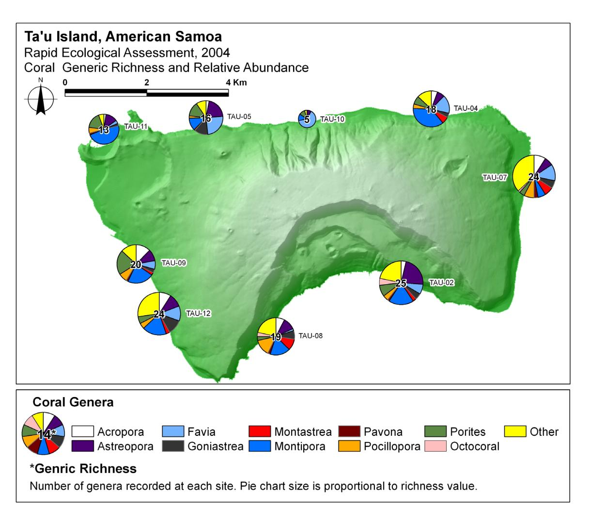

**Figure 5.5.1g.** Relative abundance of coral genera and generic richness from REA surveys around Ta`u during ASRAMP 2004. Percent relative abundance of key coral genera are indicated by color-coded portions of the pie charts. Size of the pie charts and black numbers in the center of the pie charts indicate the number of coral genera observed at each REA site.

Nine coral REA surveys were conducted around Ta`u during ASRAMP 2004. At least 32 anthozoan/hydrozoan genera were observed around Ta`u with members of the genera *Montipora*, *Astreopora*, *Favia*, and *Porites* each contributing more than 10% of the total number of colonies recorded around the island (Fig. 5.5.1g). *Montipora* was the most common coral genus at most sites, making up on average 21% of each site's coral community. Corals of the genus *Favia* were generally more common at sites TAU-04, TAU-05, and TAU-10 in the north region, especially at site TAU-10 where *Favia* was the dominant coral genus (64% of coral colonies). *Porites* was generally more common at sites TAU-05, TAU-10, and TAU-11 in the north region and at site TAU-09 in the west region, accounting for an average of 15.6% of the coral community compared to only 4.8% of the coral community at the other sites around the island.

Generic richness was variable with a mean of 18.2 (SE 2.1) coral genera recorded per site. Patterns of generic richness were similar to those for percent coral cover and coral density, with the lowest generic diversity (5 coral genera) recorded at site TAU-10 in the north region and the highest generic diversity (25 coral genera) recorded at site TAU-02 in the south

**Figure 5.5.1h.** Live scleractinian (stony) coral cover and coral colony density from REA surveys around Ta`u during ASRAMP 2004. The size of the symbol is proportional to the value of each parameter. It is important to note that coral percent cover was determined by qualitative visual estimates.

region (Fig. 5.4g). Site-specific data regarding the relative abundance of coral genera, by colony counts within belt transects, are available in Appendix III, Table III. v.

The mean percent live scleractinian coral cover around Ta`u was 24.3% (SE 5.2; Fig. 5.5.1h). Visual estimates of coral cover were relatively low at REA sites TAU-04, TAU-05, and TAU-10 in the north region of Ta`u, ranging between 1% and 10%. Percent coral cover was relatively higher at sites TAU-07 in the east region and sites TAU-02 and TAU-08 in the south region of Ta`u, with the highest live coral cover being recorded at site TAU-02, near the Lafuti stream outfall on the south shore.

During ASRAMP 2004 surveys around Ta`u, a total of 2887 coral colonies were counted within a total survey area of 610 m2 . Mean coral densities per site at Ta`u were 5.5 colonies m-2 (SE 1.1; Fig. 5.5.1h). Coral density was fairly consistent at sites throughout the island, except for site TAU-10 in the north region (0.6 colonies m-2) and site TAU-02 in the south region (11.2 colonies m-2), where the lowest and highest coral densities were recorded, respectively.

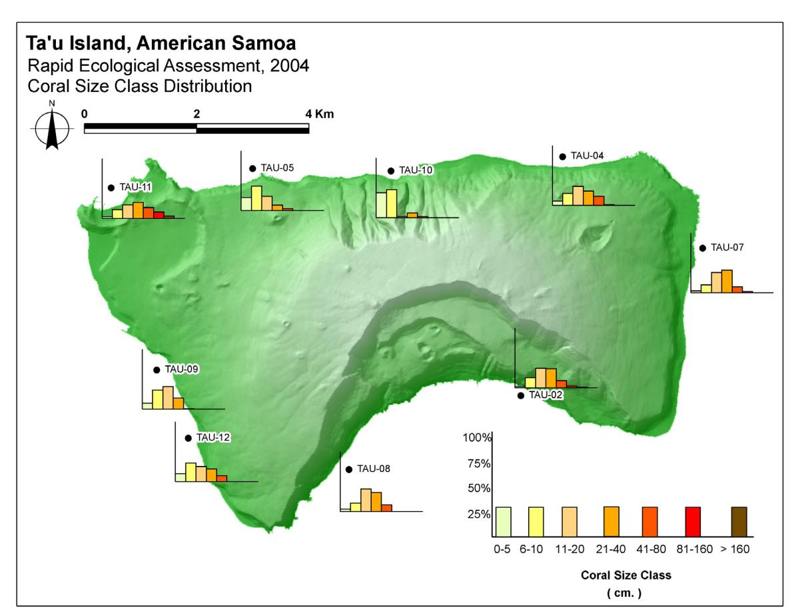

**Figure 5.5.1i.** Scleractinian coral size-class distribution around Ta`u from REA surveys during ASRAMP 2004. The height of the *y*-axis in each size-class chart represents 100%. The seven observed size classes (0–5, 6–10, 11–20, 21–40, 41–80, 81–160, and > 160 cm), are color coded in size frequency diagrams at each REA site.

Size-class distribution of scleractinian corals shows the majority of corals (63.9%) had diameters less than 20 cm (Fig. 5.5.1i). High abundance of small corals (diameters less than 5 cm) was generally observed at sites TAU-05 and TAU-10 in the north region and at sites TAU-09 and TAU-12 in the west region of Ta`u. Abundant large corals were only observed at TAU-11, off the northwest tip of Ta`u, with corals greater than 80 cm accounting for 14% of all colonies recorded. Interestingly, sites TAU-07, TAU-02, and TAU-08, which contained the highest proportions of the larger coral size classes, also had some of the highest coral cover seen around Ta`u. Coral size-class information is not recorded during towed-diver benthic survey observations; however, the divers noted many large *Porites* coral heads in the area south of REA site TAU-07 and in the area near TAU-12.

# *2006 Spatial Surveys*

Fifteen towed-diver benthic surveys were conducted along the forereef slopes of Ta`u during ASRAMP 2006, with a mean depth of 14.9 m (Fig. 5.5.1j). Individual towed-diver survey depths varied from 14 m (SD 3) to 17 m (SD 3). Island-wide estimates of live coral percent cover were 19.3% (SE 2.0; Fig. 5.5.1k), and estimates of stressed (pale and white) coral were 2.0% (SE 0.3; Fig. 5.5.1l).

The highest live scleractinian stony coral cover was observed during a towed-diver survey along the south region forereef, close to Ulufala Point (3 tow segments, mean: 45%) and east of Papaotoma Point (7 tow segments, mean: 26.4%). Other areas of higher coral cover included the area surveyed along the east region coast (16 tow segments, mean: 30%) and along the east side of the north region (7 tow segments, mean: 25%).

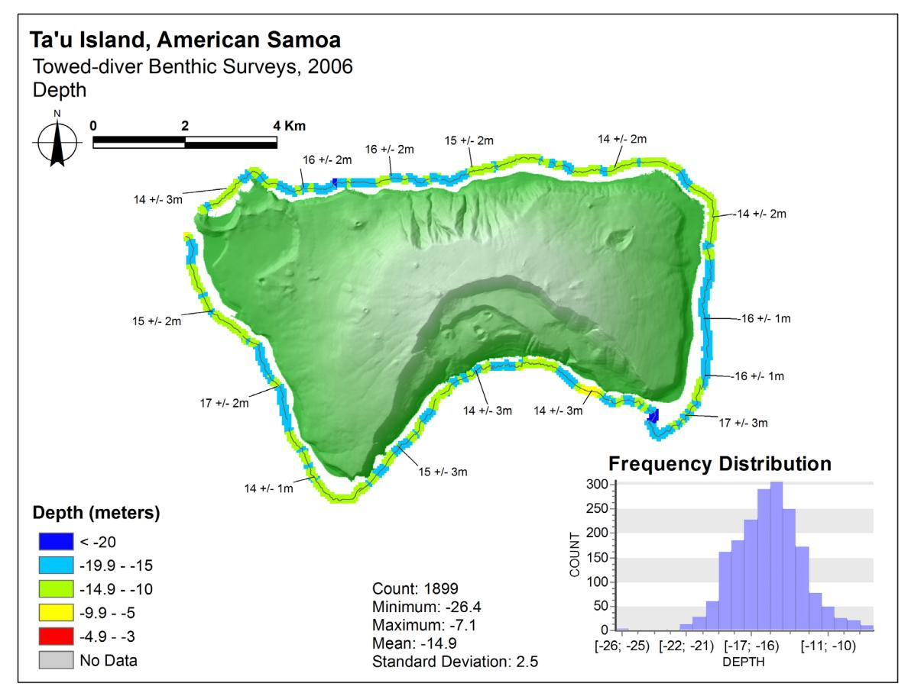

**Figure 5.5.1j.** Towed-diver survey tracks around Ta`u during ASRAMP 2006. Towed-diver survey tracks are color coded with mean depths for each 5-min segment. Mean depths and standard deviations for each toweddiver survey are shown in black text. Depth histogram and statistics (counts, minimum depth, maximum depth, mean, and standard deviation) from 30-sec depth recordings during towed-diver surveys are included.

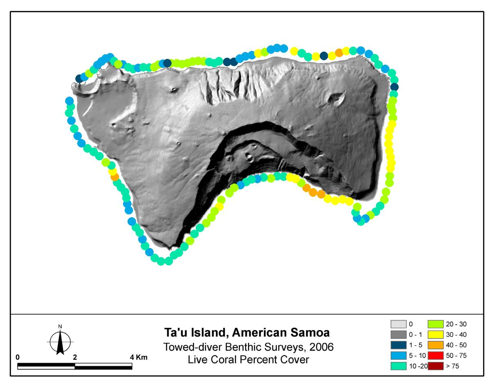

**Figure 5.5.1k.** Towed-diver benthic survey observations of live scleractinian (stony) coral cover around Ta`u during ASRAMP 2006. Each colored point represents an integrated estimate over a 5-min observation segment covering a survey swath of ~ 200 m × 10 m (~ 2000 m2 ). Symbol size represents the percent live coral cover on the benthic habitat. See Chapter 2, Table 2.4.2b for more information on benthic towed-diver binning categories during ASRAMP 2006.

Estimates of stressed coral were low for most of the forereef around Ta`u. Areas of elevated coral stress were noted along the north region shoreline from Siulagi Point to Loto Point (8 tow segments, mean: 7.5%) and past Loto Point heading east (3 tow segments, mean: 7.5%), as well as along the east region shoreline near Tiafou Point (2 tow segments, mean: 7.5%).

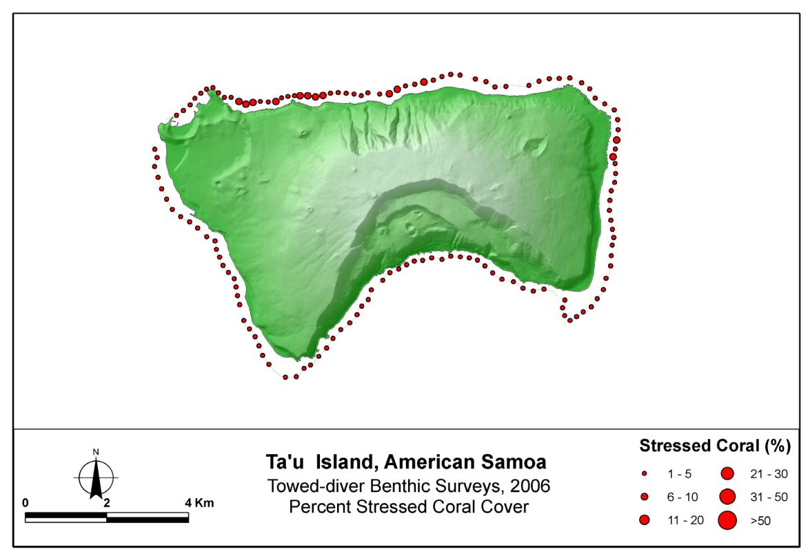

**Figure 5.5.1l.** Towed-diver benthic survey observations of stressed coral cover around Ta`u during ASRAMP 2006. Each colored point represents an integrated estimate over a 5-min observation segment covering a survey swath of ~ 200 m × 10 m (~ 2000 m2 ). Symbol size represents the percent of stressed coral cover of the total coral benthic coverage. See Chapter 2, Table 2.4.2b for more information on benthic towed-diver binning categories during ASRAMP 2006.

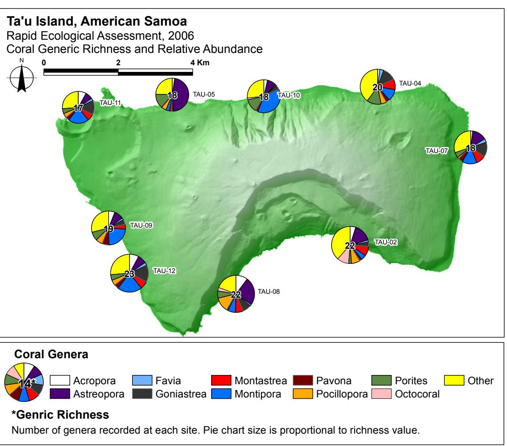

**Figure 5.5.1m.** Relative abundance of coral genera and generic richness from REA surveys around Ta`u during ASRAMP 2006. Percent relative abundance of key coral genera are indicated by color-coded portions of the pie charts. Size of pie charts and black numbers in the center of the pie charts indicate the number of coral genera observed at each REA site.

A total of nine coral REA surveys were conducted around Ta`u during ASRAMP 2006. Colonies belonging to at least 29 anthozoan/hydrozoan genera were reported around Ta`u. Members of the genera *Montipora* and *Astreopora* were the most common corals found, composing a mean of 16% and 15% of the coral community at each site, respectively (Fig. 5.5.1m). *Porites* was common at REA sites TAU-04, TAU-05, and TAU-10 in the north region of Ta`u, with a mean of 14% of the total coral community, in comparison to only 5% of the total coral community at all other sites off Ta`u. Other coral genera that were locally abundant include octocorals at site TAU-02 in the south region, *Pocillopora* at site TAU-08 in the south region, and *Goniastrea* at several sites.

Generic richness of corals was relatively high with 19.7 (SE 0.1) coral genera recorded per site (Fig. 5.5.1m). Coral richness was relatively similar at most sites around Ta`u, ranging from 17 to 23 coral genera per site. Interestingly, site TAU-11 in the northwest corner had both the lowest generic diversity (17 genera) and the highest percent coral cover (54%). Sitespecific data regarding the relative abundance of coral genera, by colony counts within belt transects, are available in Appendix III, Table III. vi.

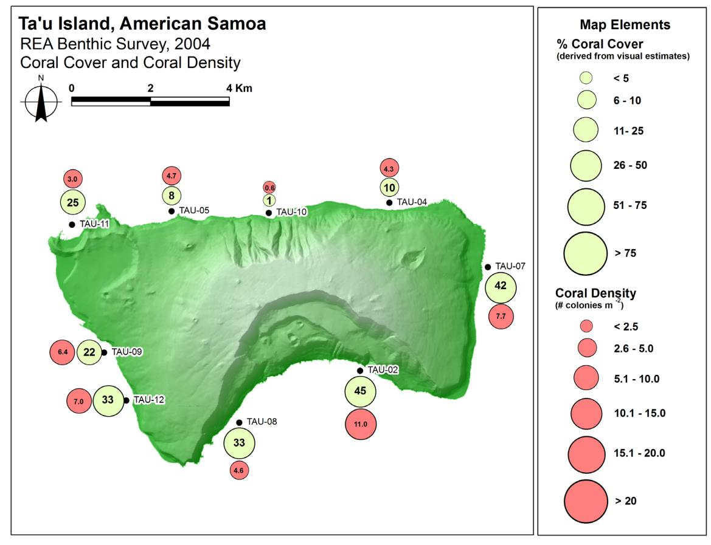

**Figure 5.5.1n.** Live scleractinian (stony) coral cover and coral colony density from REA surveys around Ta`u during ASRAMP 2006. The size of the symbol is proportional to the value of each parameter.

Percent live scleractinian coral cover around Ta`u, derived from the line point intercept method, was 29.7% (SE 4.3; Fig. 5.5.1n). Live coral cover was highest (54%) at site TAU-11 off the northwest point of the island. Relatively high coral cover (38–45%) was also observed at sites TAU-02 and TAU-08 in the south region of Ta`u. Coral cover was similar at the remaining six sites (19–25%).

During ASRAMP 2006 surveys around Ta`u, a total of 3436 of coral colonies were counted within a total survey area of 400 m2 . Coral density per site was variable, with a mean of 9.0 colonies m-2 (SE 1.1; Fig. 5.5.1n). High coral densities were generally observed off the west and south coasts, with most sites having densities greater than 10 colonies m-2. The lowest coral density (3.5 colonies m-2) was observed at site TAU-10 in the north region.

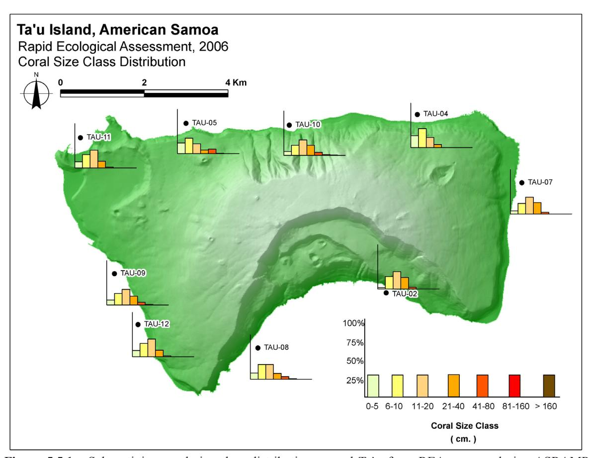

**Figure 5.5.1o.** Scleractinian coral size-class distribution around Ta`u from REA surveys during ASRAMP 2006. The height of the *y*-axis in each size-class chart represents 100%. The seven observed size classes (0–5, 6–10, 11–20, 21–40, 41–80, 81–160, and > 160 cm), are color coded in size frequency diagrams at each REA site.

Size-class distribution of scleractinian corals indicated the majority of corals (78.8%) had maximum diameters less than 20 cm, with the greatest number of colonies occurring in the 10–20 cm size class (Fig. 5.5.1o). Corals less than 5 cm in diameter were common, with six out of nine sites around Ta`u having more than 10% of their coral colonies within this size class. Larger corals were common at only two sites, TAU-05 and TAU-10, both off the north coast. At both sites, more than 10% of coral colonies had maximum diameters greater than 40 cm.

# **5.5.2 Coral Disease Surveys**

# *2006 Spatial Surveys*

Coral health and disease REA surveys were conducted at nine sites around Ta`u during ASRAMP 2006 and covered a total survey area of 3850 m2 . Within this area, a total of 56 cases of coral disease, predation, and other types of lesions were enumerated. Of the nine sites surveyed, eight (89%) contained disease (Fig. 5.5.2a). Figure 5.5.2b illustrates the variation in prevalence of disease and predation among sites. Overall mean prevalence was 0.10% (SE 0.03). REA sites TAU-11 in the northwest corner and TAU-07 in the east region exhibited the greatest prevalence (0.27% and 0.29%, respectively; Fig. 5.5.2b).

Skeletal growth anomaly was the most prevalent coral disease; 22 cases were detected, and within this disease category the scleractinian genera *Astreopora* and *Montipora* exhibited 50% of the documented cases. At site TAU-11, on the northwest corner, 50% of island-wide cases were detected. Bleaching was also detected at Ta`u, although with low prevalence (0.03%). Similarly to the other islands in the archipelago, bleaching was mild and focal. Scleractinian genera exhibiting bleaching included: *Montipora*, *Porites*, *Pocillopora*, and *Montastrea*. Other coral diseases observed at the survey sites included four cases of hyperpigmentation (dark spots) on *Astreopora*, *Pavona varians*, *Montipora*, and *Coscinaraea* (Fig. 5.5.2b).

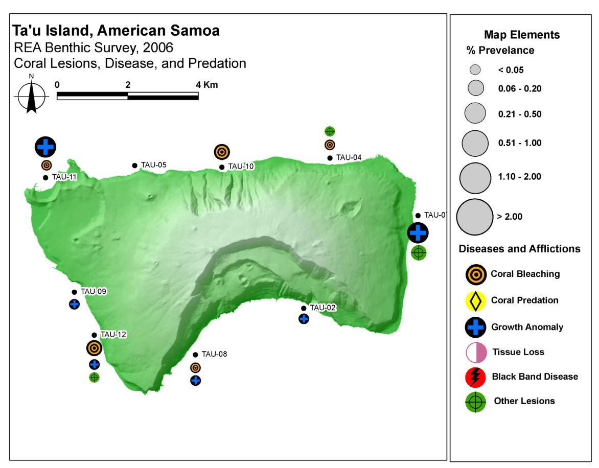

**Figure 5.5.2a.** Prevalence of predation, bleaching, growth anomalies, tissue loss, black band disease, and other lesions at Ta`u during ASRAMP 2006. Prevalence was calculated relative to the average colony density estimates and is indicated by the size of the respective symbols.

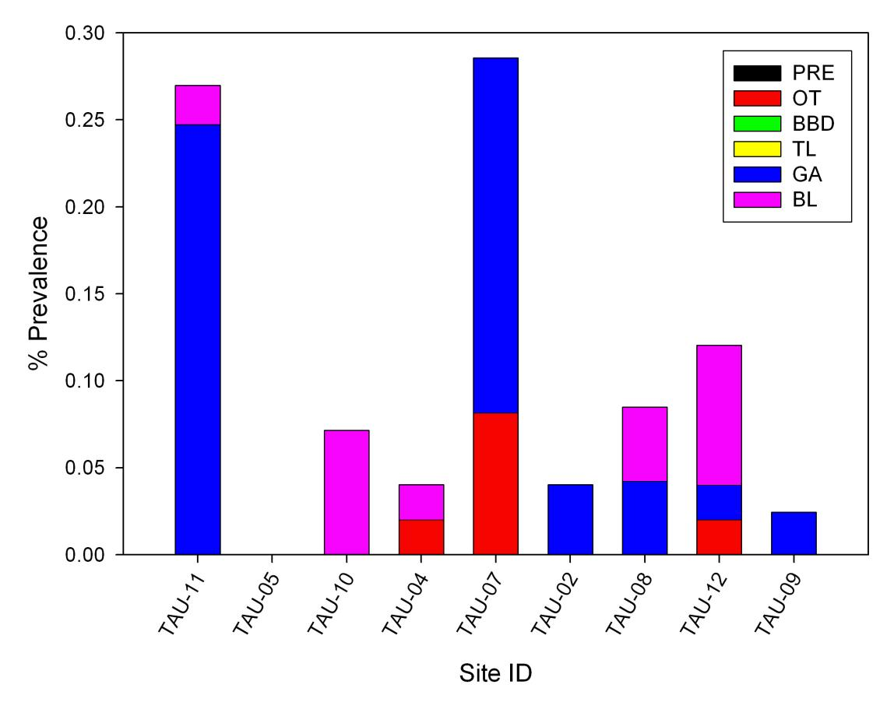

**Figure 5.5.2b.** Prevalence of predation, bleaching, growth anomalies, tissue loss, black band disease, and other lesions at Ta`u during ASRAMP 2006. Prevalence was calculated relative to the average colony density estimates. PRE—*Acanthaster* and/or *Drupella* predation; OT—other lesions, including hyperpigmented irritations; BBD— black band disease; TL— tissue loss; GA—skeletal growth anomalies; and BL— bleaching.

#### **5.5.3 Temporal Comparison—Coral and Coral Disease**

High live scleractinian coral cover was consistently reported by towed-diver observers for surveys completed in 2002, 2004, and 2006 (Fig. 5.5.3a), specifically along the east region windward coastline, beginning at Tiafou Point and heading south (42%, 38%, and 33%). Area surveyed along the south shore also recorded high coral cover in 2004 and 2006. Variations between years may be because of natural variation, changes in data collection protocol, trackline spacing (i.e., variation between towed-diver survey tracks between years), and observer variability resulting from changes in scientific personnel.

Average percent live coral cover from 2004 REA surveys (24.3%, all nine sites) compared favorably with 2006 REA surveys (29.4%, same nine sites; Fig. 5.5.3a). When site TAU-10 is removed from the analysis (as transect lines were laid over substantially different substrate in each year), the cover estimates for both years become even more congruent (27.3% in 2004 vs. 30.5% in 2006). When comparing the estimates between years from site TAU-11, there are substantial differences (25% in 2004 vs. 54% in 2006). Visual estimates were used in 2004 to report coral cover whereas the line point intercept technique was used in 2006, and visual estimates can vary from those derived from the line point intercept technique even when made concurrently. CRED's coral survey methods have evolved over time; ideally, there should be two observers conducting coral surveys and the surveys should include quantitative population parameters and coral disease observations. This will allow for improved sitespecific comparisons to be made to surveys conducted in the future.

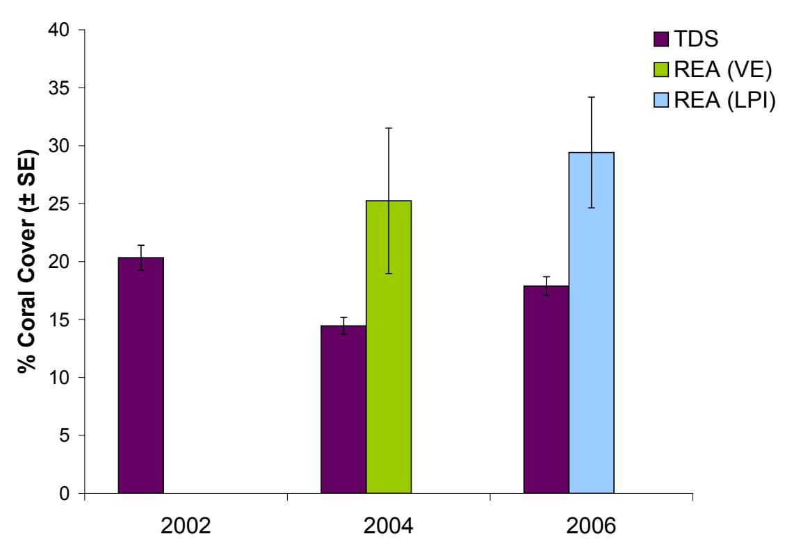

**Figure 5.5.3a.** Temporal comparison of mean percent live coral cover from REA surveys and towed-diver surveys around Ta`u during ASRAMP 2002, 2004, and 2006. The purple bars represent observations collected during towed-diver habitat surveys. The green bar represents REA data collected by visual estimates during REA surveys and the blue bar represents data collected by the line point intercept technique during REA surveys. See Chapter 2, Section 2.4: Reef Benthic (Coral, Algae, Macroinvertebrate) and Fish Surveys for considerations when comparing the results of these methodologies.

Overall, mean generic richness did not vary substantially between 2004 and 2006 (Fig. 5.5.3b). Mean colony densities increased from 5.5 colonies m-2 (SE 1.1) in 2004 to 9.0 colonies m-2 (SE 1.1) in 2006 (Fig. 5.5.3c). Even when site TAU-10 is removed from the analysis, there is a substantial difference in mean coral density around Ta`u between 2004 and 2006 (6.1 colonies m-2 [SE 0.9] vs. 9.7 colonies m-2 [SE 1.0], respectively). As with the apparent increase in coral density at Ofu and Olosega from 2004 to 2006, it is difficult to know if this apparent change, which could result from new recruits to the population or fragmentation/fissioning of existing colonies, is real or is an artifact of survey area. That is, 610 m2 of benthic substrate were surveyed in 2004 (by two biologists), but only two-thirds of that area (400 m2 ) could be examined by the single biologist allocated to coral population parameters in 2006. Again, it is hoped that personnel allocations and survey protocols will be the same in future years so that improved comparisons can be made.

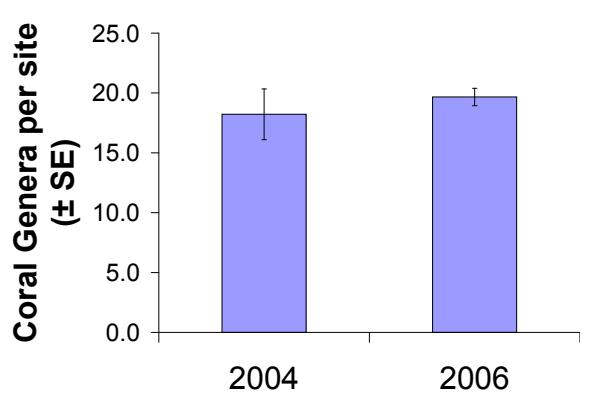

**Figure 5.5.3b.** Temporal comparison of mean coral genera per site from around Ta`u during ASRAMP 2004 and 2006 REA surveys.

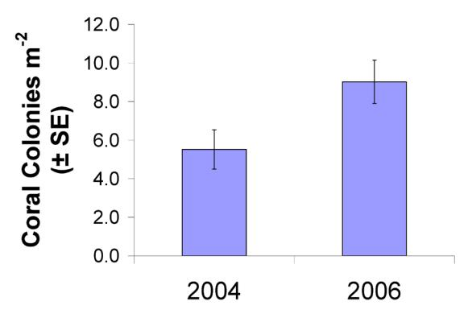

**Figure 5.5.3c.** Temporal comparison of mean coral colony density from around Ta`u during ASRAMP 2004 and 2006 REA surveys.

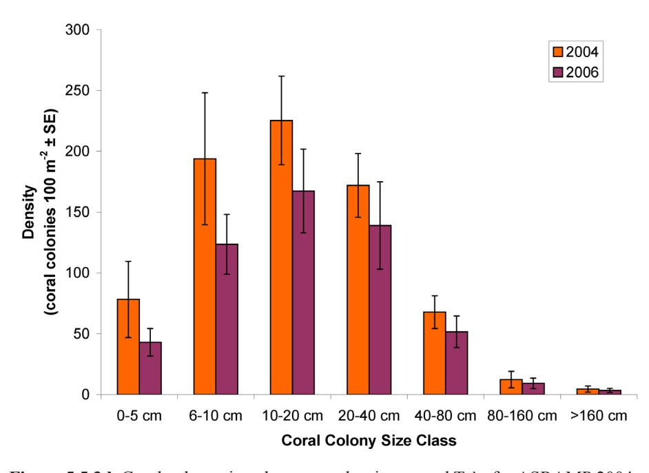

**Figure 5.5.3d.** Coral colony size-class mean density around Ta`u for ASRAMP 2004 and 2006 REA surveys.

In total, three fewer genera were reported from Ta`u in 2006 than in 2004 (29 vs. 32, respectively). Those genera that were only reported in a single year, however, were rare (*Diploastrea*, *Echinophyllia*, *Goniopora*/*Alveopora*, *Heliopora*, and *Merulina*; 1–5 colonies). In both years, *Montipora*, *Astreopora*, and *Porites* were among the four most abundant genera. In 2004, *Favia* was the third most abundant genus (11.9% of colonies) while in 2006 *Goniastrea* was the third most abundant genus (9.3% of colonies). This apparent difference in generic dominance could easily result from the difference in survey area, as discussed in the preceding paragraph. In both 2004 and 2006, site TAU-02 on the south region was the site with the greatest generic diversity. It is interesting to note that biodiversity was highest along the south region of both Ofu/Olosega and Tutuila. TAU-10, despite placing the transect lines to include more hard-bottom substrate in 2006, displayed the lowest coral diversity in both years. Overall coral colony size-class distributions computed from 2004 and 2006 REA surveys are highly similar (Fig. 5.5.3d).

#### **5.6 Algae**

#### **5.6.1 Algal Surveys**

# *2002 Spatial Surveys*

It is important to note when considering these results that turf algae, crustose coralline red algae, branched non-geniculate coralline red algae, and cyanophytes (blue-green algae) all need to be analyzed microscopically for proper taxonomic identification, and therefore, must be lumped into functional group categories in the field. Of these functional groups, turf algae are the most diverse with the possibility of up to 100 species occurring in a 10 cm2 area. As well, macroalgae are large, fleshy, sometimes calcified entities that may be identifiable to genus or species in the field but often require microscopic analysis to confirm taxonomic identities.

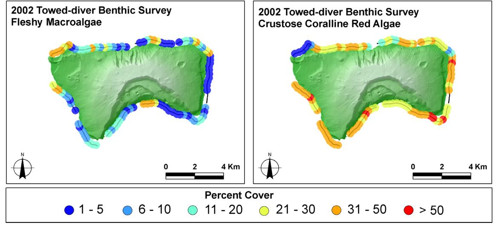

**Figure 5.6.1a.** Percent cover of fleshy macroalgae (including turf algae) and crustose coralline algae from towed-diver benthic surveys around Ta`u during ASRAMP 2002. Each colored point represents an integrated estimate over 5-min observation segments covering a survey swath of ~ 200 m × 10 m (~ 2000 m2 ).

Ten towed-diver surveys around Ta`u during ASRAMP 2002 found that combined fleshy macroalgal and crustose coralline red algal cover was 49.8%. The percent cover of crustose coralline red algae was relatively higher than fleshy macroalgae around Ta`u, with each functional group covering 34.9% (SE 1.3) and 14.9% (SE 1.2) of the benthic substrate, respectively (Fig. 5.6.1a). Crustose coralline red algal cover abundance was lowest along the northwestern corner of the island, while fleshy macroalgal cover abundance was among the highest.

Qualitative REA algal surveys were conducted in 2002 around Ta`u, and six bags of algal voucher specimens were collected. These surveys provided baseline data used to design and scale the future methodology of algal REA surveys.

#### *2004 Spatial Surveys*

Eighteen towed-diver surveys were conducted around Ta`u during ASRAMP 2004 and revealed that 54% of the benthic substrate was covered with fleshy macroalgae and crustose coralline red algae. Fleshy macroalgae were slightly more common than crustose coralline red algae, with each category averaging 31.7% (SE 1.1) and 22.3% (SE 1.0), respectively (Fig. 5.6.1b). Fleshy macroalgae were relatively uniform along the forereefs of Ta`u except for one towed-diver benthic survey near Siulagi Point in the north region, where percent cover averaged 58%.

Algal surveys were conducted at nine sites around Ta`u during ASRAMP 2004 (Fig. 5.6.1c). A total of 14 macroalgal genera (7 green, 6 red, and 1 brown) and 3 additional algal functional groups (turf algae, crustose coralline red algae, and cyanophytes) were observed in the field. Diversity of large, easily observed macroalgal genera (some of which contain multiple species) at each site ranged from 0 to 8. However, once laboratory-based taxonomic

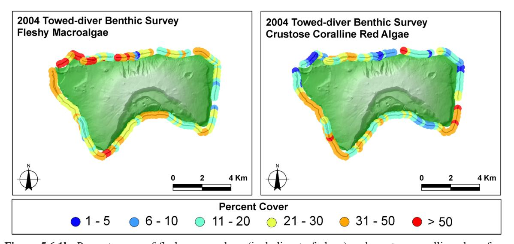

**Figure 5.6.1b.** Percent cover of fleshy macroalgae (including turf algae) and crustose coralline algae from towed-diver benthic surveys around Ta`u during ASRAMP 2004. Each colored point represents an integrated estimate over 5-min observation segments covering a survey swath of ~ 200 m × 10 m (~ 2000 m2 ).

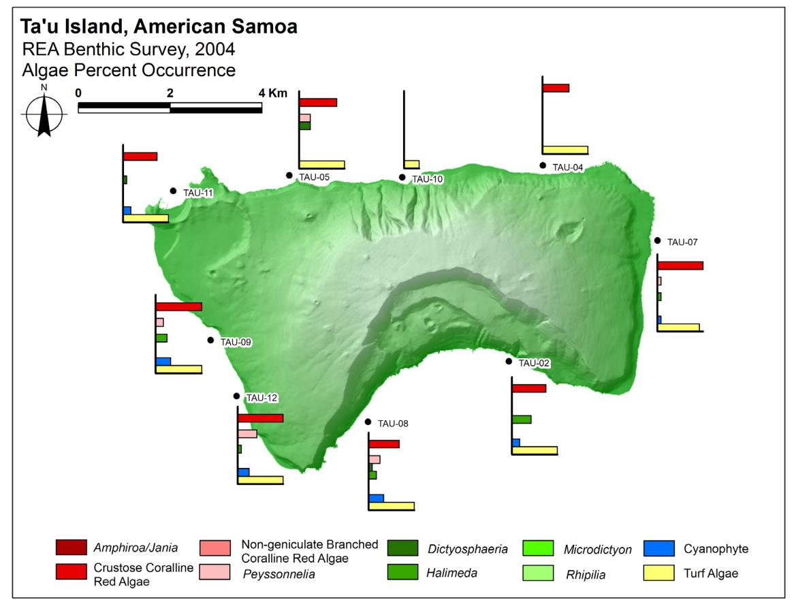

**Figure 5.6.1c.** Percent occurrence of select macroalgal genera and algal functional groups from REA algal surveys around Ta`u during ASRAMP 2004. Percent occurrence is equivalent to the percentage of photoquadrats in which an algal genus or functional group was observed. Length of *x*-axis denotes 100% occurrence.

identification of all algal species (including turf algae, epiphytes, and crustose coralline red algae) from each site is completed, algal diversity for each site will be much higher. Site TAU-12 in the west region had more than twice the recorded macroalgal generic diversity as observed at most other sites with eight genera recorded. Five genera were recorded at site TAU-05 in the north region; all other sites contained four or fewer macroalgal genera. No macroalgae were found at site TAU-10, located on the north central side of the island.

Around Ta`u, turf algae were the dominant marine flora found, being observed in more than 75% of sampled quadrats in all locations except site TAU-10 in the north region (Fig. 5.6.1c). Similarly, crustose coralline red algae were dominant at most sites around the island (50–100% of sampled photoquadrats per site),

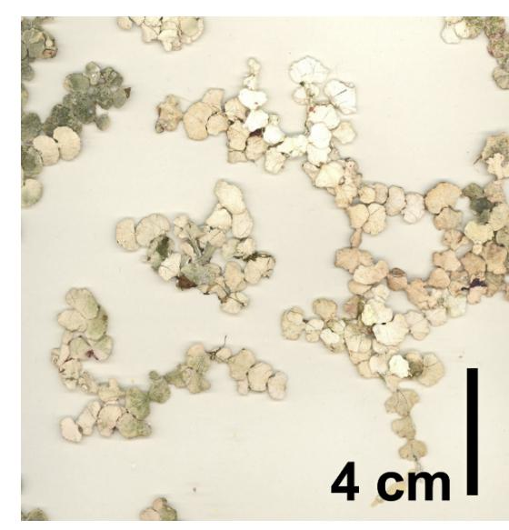

**Figure 5.6.1d.** A species of the calcified, sandproducing alga, *Halimeda*, from Ta`u. This alga can often form extensive draperies or mats over the benthic substrate. (*Photograph provided by NOAA PIFSC CRED; P. Vroom, JIMAR*)

but as with turf algae, were completely lacking at site TAU-10. Cyanophytes were lacking from photoquadrats at all three northern stations but were found in relatively low abundance at western, eastern, and southern sites with the highest abundance in the southwest corner.

Macroalgae were not abundant around Ta`u, with the calcified sand producing green alga *Halimeda* (Fig. 5.6.1d), being the most abundant by occurring in 42% of photoquadrats at site TAU-02. The green alga *Dictyosphaeria*, the brown alga *Lobophora*, and the red alga *Peyssonnelia* were found in 25% of photoquadrats at only one site each: TAU-09, TAU-05, TAU-08, and TAU-12, respectively. Macroalgae were extremely scarce at all other locales. The northern shores were essentially depauperate of macroalgal genera, with only turf algae being recorded in select photoquadrats at site TAU-10.

# *2006 Spatial Surveys*

Fifteen towed-diver surveys around Ta`u during ASRAMP 2006 reported an average algal substrate cover of 37%. The percent cover of crustose coralline red algae was relatively higher than fleshy macroalgae around Ta`u, with each functional group covering 27.8% (SE 1.3) and 9.1% (SE 0.5) of the benthic substrate, respectively (Fig. 5.6.1e). Crustose coralline red algae were most abundant during tows along the east coast of the island, from Tiafou Point to Tufu Point, covering up to 50% of the benthic habitat.

Quantitative algal surveys were conducted at eight of the same nine sites around Ta`u as were monitored in 2004 (site TAU-08 was not resurveyed; Fig. 5.6.1f). A total of 24 macroalgal genera (9 green, 13 red, and 2 brown) and 3 additional algal functional groups (turf algae, crustose coralline red algae, and cyanophytes) were observed in the field. Diversity of large, easily observed macroalgal genera (some of which contain multiple species) at each site ranged from 8 to 18, although once laboratory-based taxonomic identification of all algal species (including turf algae, epiphytes, and crustose coralline red algae) from each site is completed, algal diversity for each site will be much higher. Sites TAU-05 and TAU-09 in the north and west regions, respectively, exhibited the highest macroalgal generic diversity with 18 and 15 genera recorded, respectively. Divers recorded 8–9 genera at most other sites.

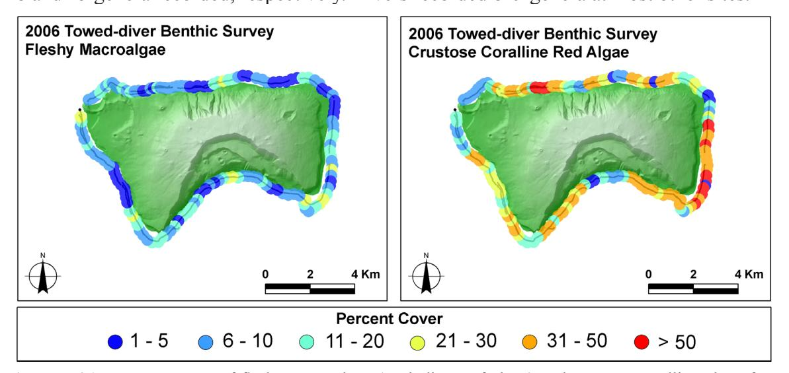

**Figure 5.6.1e.** Percent cover of fleshy macroalgae (excluding turf algae) and crustose coralline algae from towed-diver benthic surveys around Ta`u during ASRAMP 2006. Each colored point represents an integrated estimate over 5-min observation segments covering a survey swath of ~ 200 m × 10 m (~ 2000 m2 ).

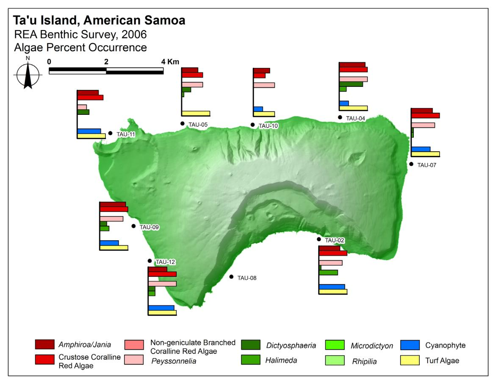

**Figure 5.6.1f.** Percent occurrence of select macroalgal genera and algal functional groups from REA surveys around Ta`u during ASRAMP 2006. Percent occurrence is equivalent to the percentage of photoquadrats in which an algal genus or functional group was observed.

Around Ta`u, turf algae were the dominant marine flora found, being observed in more than 75% of sampled quadrats in all locations (Fig. 5.6.1f). Similarly, crustose coralline red algae were dominant at most sites around the island (50–100% of sampled photoquadrats per site). Cyanophytes were surprisingly high in abundance, being found in more than 50% of photoquadrats at eastern, western, and southern sites. They were of lowest abundance on the north shore, being completely lacking at site TAU-05.

Macroalgae were extremely abundant around Ta`u during ASRAMP 2006 with several genera occurring in more than 75% of sampled photoquadrats at multiple sites. Site TAU-04, on the northeast corner of the island, had among the highest abundances of several taxa with the red algal genera *Peyssonnelia* and *Jania*, and the green algal genus *Dictyosphaeria* occurring in more than 75% of sampled photoquadrats (Fig. 5.6.1f). Additionally, an unidentified genus in the red algal order Gelidiales occurred in more than 80% of photoquadrats sampled at the site. In addition to their high abundance at TAU-04, *Peyssonnelia*, the unidentified member of the Gelidiales, and *Jania* were among the most common macroalgae found around the island, occurring at every site sampled. The brown alga, *Dictyota*, and the green alga, *Dictyosphaeria*, occurred at all sites except TAU-11 and TAU-10 in the north region, respectively.

# **5.6.2 Coralline Algal Disease Surveys**

#### *2006 Spatial Surveys*

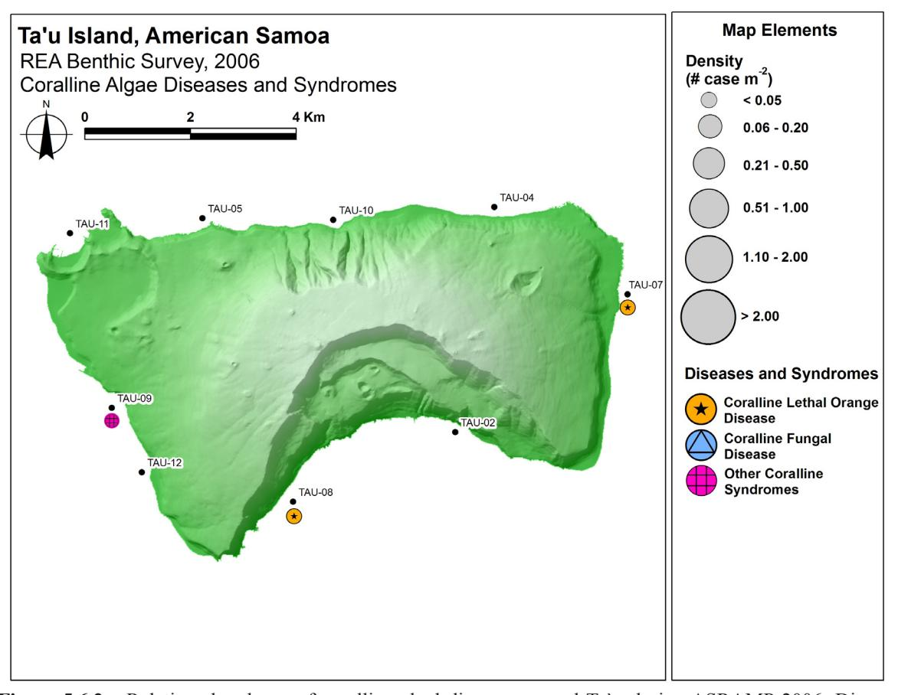

**Figure 5.6.2a.** Relative abundance of coralline algal diseases around Ta`u during ASRAMP 2006. Disease density is indicated by the size of the respective symbols.

Afflictions to coralline algae were also observed at the study sites, but in low abundances (Fig. 5.6.2a). Figure 5.6.2b illustrates the variation in the relative abundance of coralline algal disease among sites. Around Ta`u, only 21 cases of coralline algal disease (CLOD and CFD) were detected, mainly concentrated at sites TAU-07 (52%) on the east-facing shore, and TAU-08 (43%) on the south shore.

#### **5.6.3 Temporal Comparison—Algae**

A dramatic difference between the number of algal genera and their abundance was reported at Ta`u between the 2004 and 2006 sampling periods. In 2004, Ta`u exhibited the most meager algal community of all islands in American Samoa, but by 2006 it contained the most diverse and healthy algal community observed. Although Hurricane Heta did not pass over the Manu`a Island group, possibly severe wave energy generated from the storm in 2004 scoured benthic communities around Ta`u shortly before 2004 surveys were conducted, shredding algal communities and making the island appear to have low algal diversity. By

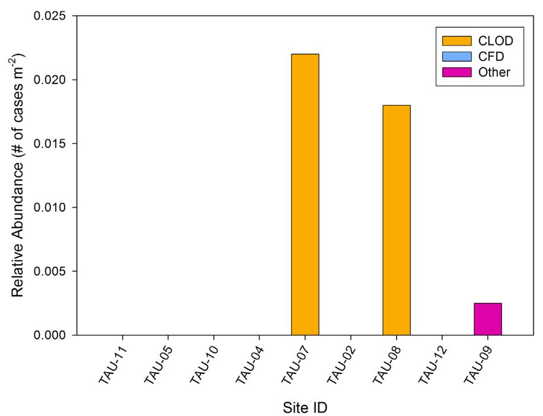

**Figure 5.6.2b.** Relative abundance of coralline algal disease around Ta`u during ASRAMP 2006. CLOD: coralline lethal orange disease; CFD: coralline fungal disease; and Other: undetermined coralline discolorations.

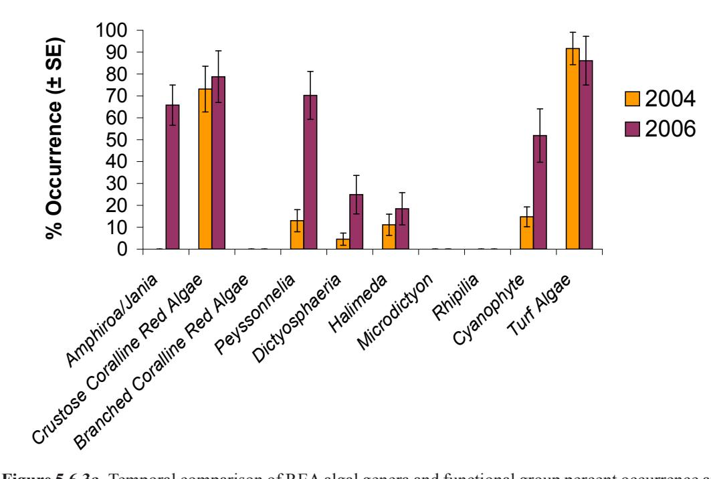

**Figure 5.6.3a.** Temporal comparison of REA algal genera and functional group percent occurrence around Ta'u between ASRAMP 2004 and 2006.

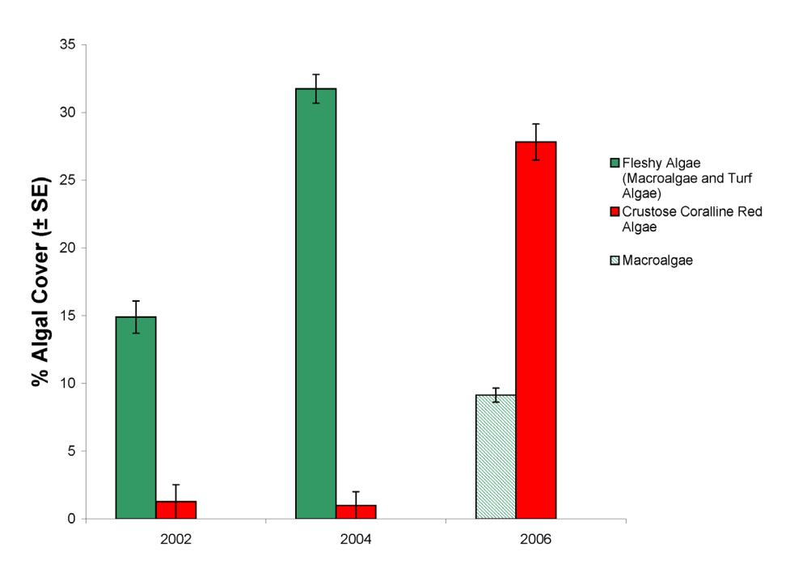

**Figure 5.6.3b.** Temporal comparison of towed-diver benthic survey algal percent cover results for fleshy, crustose coralline and macroalgae for ASRAMP 2002, 2004 and 2006 surveys around Ta`u.

2006, the algal communities had fully recovered. Almost twice the number of genera was recorded in 2006 compared to 2004, and abundances of macroalgae in photoquadrats increased from < 25% to almost 100% at most sites (Fig. 5.6.3a). Macroalgal diversity, as determined through field observations of the relative abundance of macroalgae, was exceptionally higher along the northern shore of the island in 2006 as compared to 2004. As at Tutuila, a major difference between the 2004 and 2006 sampling periods was the presence of the red algal genera, *Amphiroa*/*Jania*, which were not recorded in 2004, but were extremely prevalent at almost every site in 2006. Populations of the green algae *Halimeda* and *Dictyosphaeria* remained relatively constant in both years, although *Dictyosphaeria* was very abundant at TAU-04 in 2006, whereas it was completely lacking in 2004.

# **5.7 Benthic Macroinvertebrates**

# **5.7.1 Benthic Macroinvertebrate Surveys**

#### *2002 Spatial Surveys*

Towed-diver benthic macroinvertebrate surveys around Ta`u during the 2002 ASRAMP cruise found no crown-of-thorns seastars (COTS) or sea cucumbers (Fig. 5.7.1a). Giant clams were found mostly along the north shore of the island (mean: 18.8 organisms ha-1). Sea urchin distribution was concentrated on the northwestern corner of the island. As mentioned in the introduction (Chapter 1, Section 1.6: Limitations of Pacific RAMP), surveys in 2002 were limited by shipboard logistics and methods development, which may have contributed to the low numbers of macroinvertebrates observed in 2002.

A total of six qualitative REA invertebrate surveys, focusing on general information about the macroinvertebrate communities, were conducted around Ta`u during ASRAMP 2002. These surveys provided baseline data used to design and scale the future methodology of REA surveys. No data are presented.

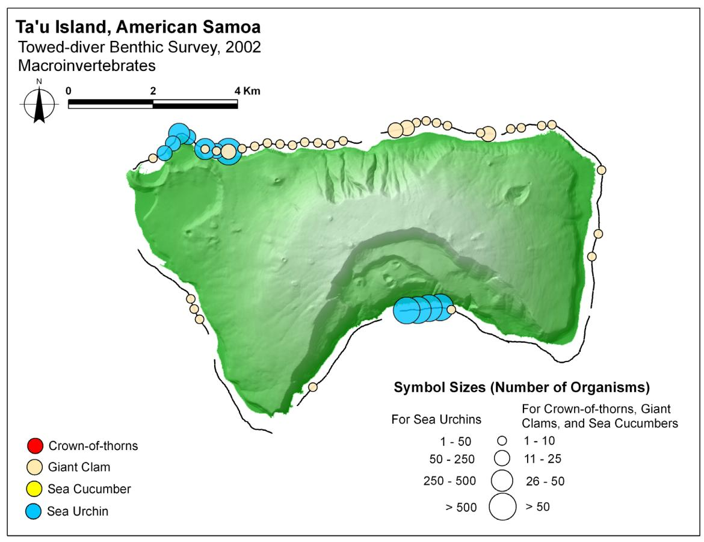

**Figure 5.7.1a.** Distribution of estimated population densities of COTS, giant clams, sea cucumbers, and sea urchins around Ta`u from towed-diver benthic surveys during ASRAMP 2002. Circle locations represent an integrated estimate over 5-min observation segments covering survey swaths of ~ 200 m × 10 m (~ 2000 m2 ). The sizes of the circles indicate the number of organisms counted or estimated in each ~ 2000 m2 segment with one scale for COTS, giant clams, and sea cucumbers (1–10, 11–25, 26–50, and > 50) and another scale for sea urchins (1–50, 51–250, 251–500, and > 500).

# *2004 Spatial Surveys*

Towed-diver benthic macroinvertebrate surveys around Ta`u during ASRAMP 2004 found variable distributions of giant clams, sea cucumbers, and sea urchins (Fig. 5.7.1b). No COTS were observed. Giant clams were found predominantly in the north (mean: 36.7 organisms ha-1 ) and west regions (mean: 18.0 organisms ha-1). Sea urchins appeared at their highest numbers and densities on the northwestern and the southwestern corners (mean: 1620 organisms ha-1) of the island, while sea cucumbers remained rare and were found predominantly in the west region of the island (mean: 1.3 organisms ha-1).

Invertebrate species richness at REA sites around Ta`u was variable, ranging from 9 to 27 invertebrate species (Fig. 5.7.1c). High richness was observed at sites TAU-02 and TAU-07 in the south and east regions. Sea urchins were present at five of seven REA sites, with *Echinostrephus* sp. being the most common urchin. Giant clams were present at all but one site, TAU-04 off the north coast of Ta`u. Three species of sea cucumbers were observed (*Holothuria cinerascens*, *Bohadschia argus*, and *Holothuria whitmaei*) around Ta`u at site TAU-11 in the northwest corner and site TAU-12 in the west region.

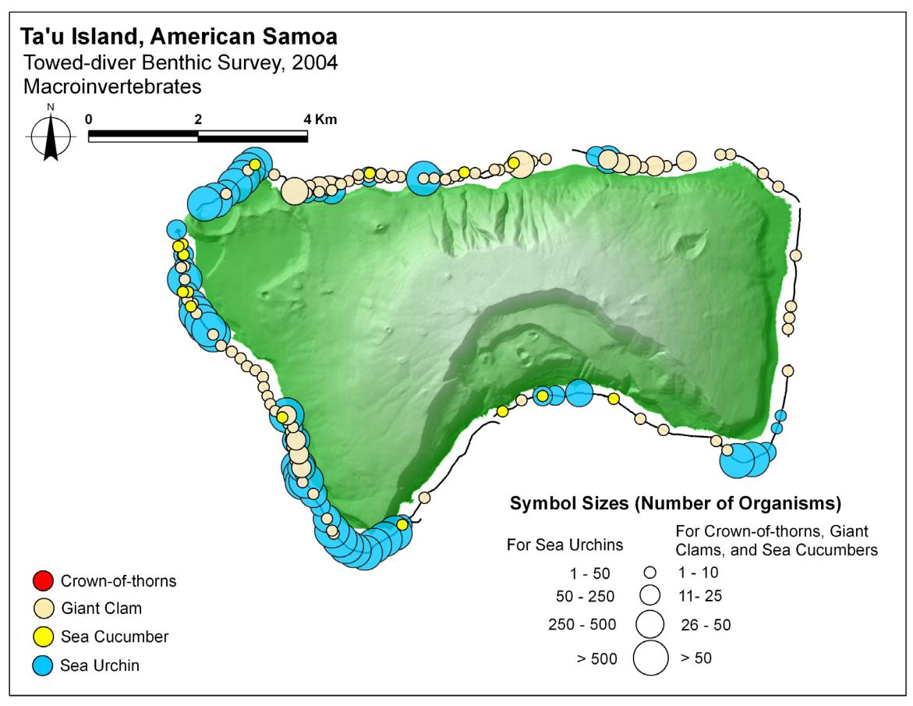

**Figure 5.7.1b.** Distribution of estimated population densities of COTS, giant clams, sea cucumbers, and sea urchins around Ta`u from towed-diver benthic surveys during ASRAMP 2004. Circle locations represent an integrated estimate over 5-min observation segments covering a survey swath of ~ 200 m × 10 m (~ 2000 m2 ). The sizes of the circles indicate the number of organisms counted or estimated in each ~ 2000 m2 segment with one scale for COTS, giant clams, and sea cucumbers (1–10, 11–25, 26–50, and > 50) and another scale for sea urchins (1–50, 51–250, 250–500, and > 500).

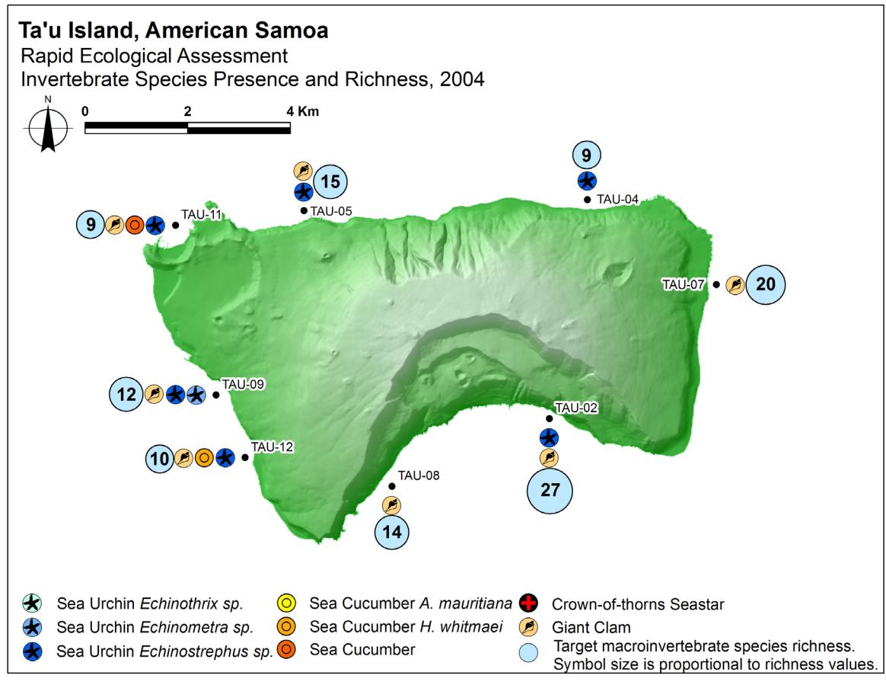

**Figure 5.7.1c.** Macroinvertebrate species richness, and target macroinvertebrate distribution around Ta`u from REA surveys during ASRAMP 2004. Size of light blue circles and values in circles indicate target species richness values for each REA site. Other symbols indicate the presence of specific target species.

# *2006 Spatial Surveys*

Towed-diver benthic macroinvertebrate surveys around Ta`u during the 2006 ASRAMP cruise found varying distributions of giant clams, sea cucumbers, and sea urchins, and the absence of COTS (Fig. 5.7.1d). Giant clams were most common in the north region of Ta`u (mean: 14.6 organisms ha-1), but were also relatively common in the west region (mean: 9.7 organisms ha-1) and east region (mean: 6.7 organisms ha-1). As in previous years, sea cucumbers remained uncommon, with the highest sea cucumber density found in the west region of the island (mean: 1.7 organisms ha-1). Similar to 2004, sea urchins were found in the highest densities on the northwestern, southwestern, and northeastern corners of the island.

Target macroinvertebrates were common around Ta`u during ASRAMP 2006, with sea urchins present at all nine REA sites (Fig. 5.7.1e). The boring urchin, *Echinostrephus aciculatus*, was the most common urchin species seen around Ta`u. Giant clams were present at eight of the nine REA sites. Sea cucumbers present at REA sites included *Actinopyga mauritiana* and an unidentified holuthuroid seen at one site each. No COTS were observed during REA surveys.

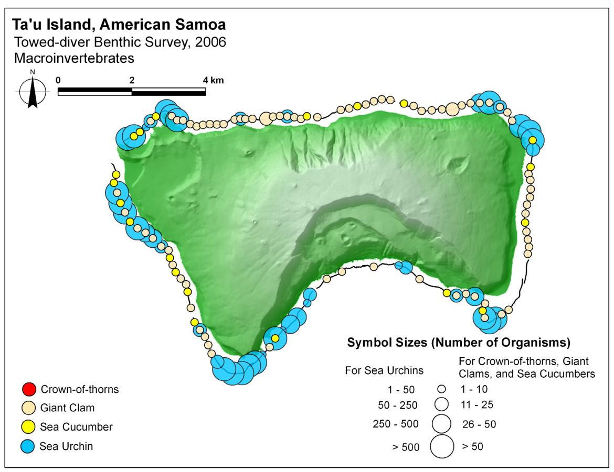

**Figure 5.7.1d.** Distribution of estimated population densities of COTS, giant clams, sea cucumbers, and sea urchins around Ta`u from towed-diver benthic surveys during ASRAMP 2006. Circle locations represent an integrated estimate over 5-min observation segments covering a survey swath of ~ 200 m × 10 m (~ 2000 m2 ). The sizes of the circles indicate the number of organisms counted or estimated in each ~ 2000 m2 segment with one scale for COTS, giant clams, and sea cucumbers (1–10, 11–25, 26–50, and > 50) and another scale for sea urchins (1–50, 51–250, 251–500, and > 500).

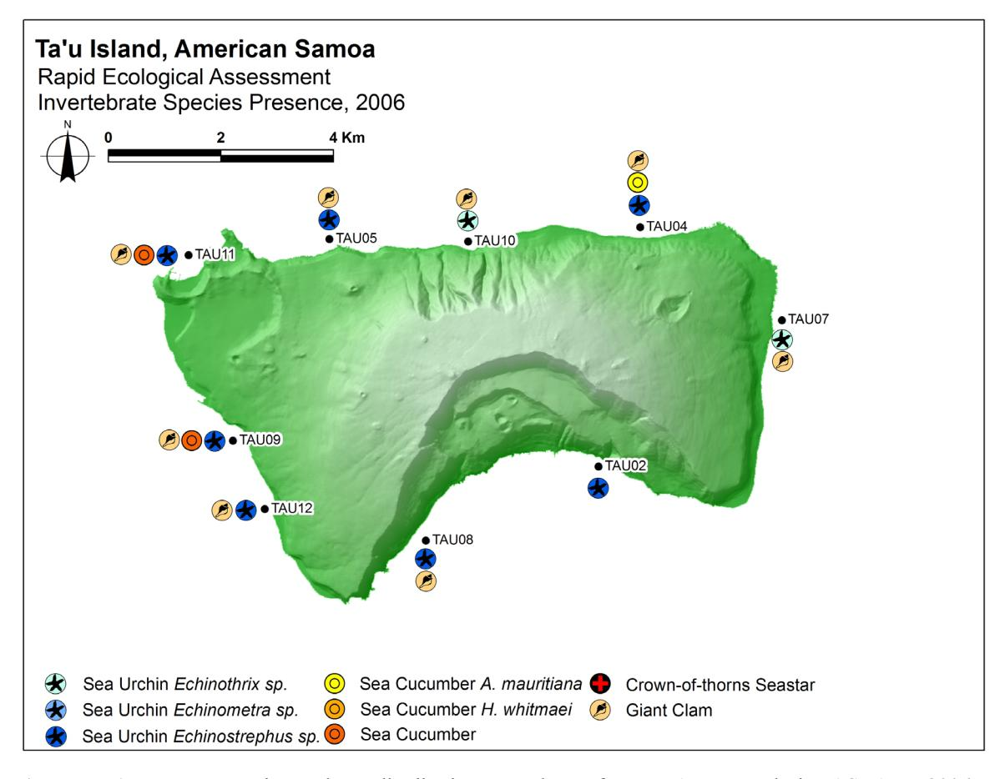

**Figure 5.7.1e.** Target macroinvertebrate distribution around Ta`u from REA surveys during ASRAMP 2006.

#### **5.7.2 Temporal Comparison—Benthic Macroinvertebrates**

Macroinvertebrate distributions were relatively similar along the forereefs of Ta`u, especially during 2004 and 2006 towed-diver surveys. However, results did show some temporal trends in organism densities. COTS were not present around Ta`u during any of the sampling years. Mean giant clams densities (Fig. 5.7.2a) were shown to fluctuate between sampling periods, which could be attributed to natural causes (e.g., population changes), changes in toweddiver survey depths and encounter rates, storm effects or through other (un)known causes. However, giant clams were common with slightly higher occurrences found off the north and west coasts of Ta`u in both 2004 and 2006. Sea cucumbers remained uncommon in both sampling years, with only small increases between years in the numbers encountered (Fig. 5.7.2b). Most sea cucumbers were found in the west region of Ta`u. Finally, sea urchins were the most common invertebrates and were observed mainly along the west coast of Ta`u (Fig. 5.7.2c). However, densities appeared highest along the northwestern and southwestern corners of the island, and also appeared in elevated numbers along the northeastern corner for surveys completed in both 2004 and 2006.

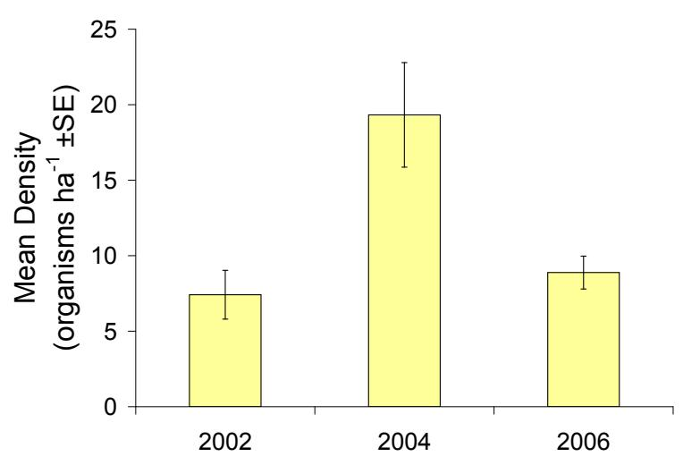

**Figure 5.7.2a.** Mean density of giant clams around Ta`u from towed-diver surveys during ASRAMP 2002, 2004, and 2006.

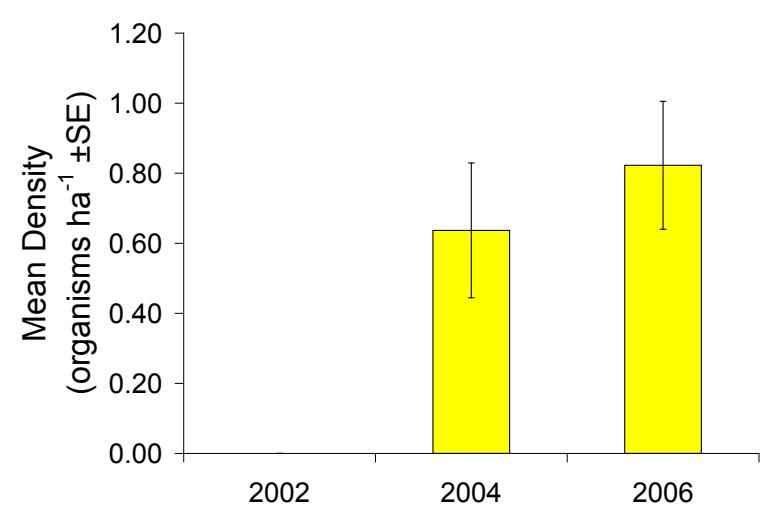

**Figure 5.7.2b.** Mean density of sea cucumbers (holothuroids) around Ta`u from towed-diver surveys during ASRAMP 2002, 2004, and 2006 cruises.

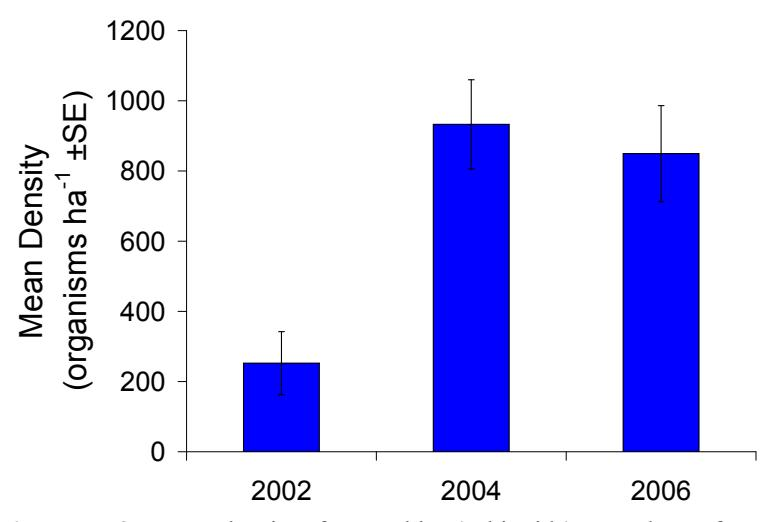

**Figure 5.7.2c.** Mean density of sea urchins (echinoids) around Ta`u from towed-diver surveys during ASRAMP 2002, 2004 and 2006.

#### **5.8 Reef Fish**

# **5.8.1 Reef Fish Surveys**

#### *2002 Spatial Surveys*

The biomass of large fish (length > 50 cm) around Ta`u, as surveyed by towed divers during ASRAMP 2002, was predominantly characterized by elevated abundances of parrotfish and snappers at most sites around the island, with a patchy distribution of sharks, surgeonfish, and groupers. Overall, large fish biomass was around 0.024 tons ha-1 (SE 0.013) and was distributed evenly around the island (Fig. 5.8.1a).

Two rare bumphead parrotfish (*Bolbometapon muricatum*) were sighted on the northern side of Ta`u. Only two sharks and a few humphead wrasses were observed, mostly in the east

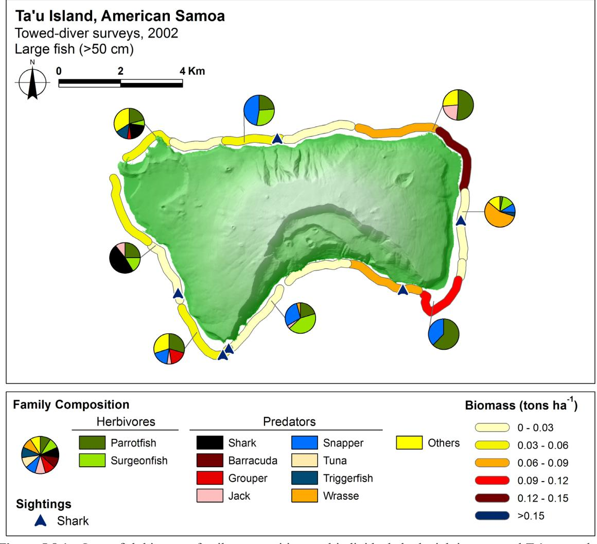

**Figure 5.8.1a.** Large fish biomass, family composition, and individual shark sightings around Ta`u recorded during ASRAMP 2002 towed-diver surveys. Large fish (length > 50 cm) biomass on each individual toweddiver survey is represented by the color of the survey track (tons ha-1). Composition by trophic group is indicated by the family colors (green—mostly herbivores; other colors—mostly predators or mixed). Individual shark sightings, observed inside or outside the survey area, are represented by blue triangles.

section of the island (Fig. 5.8.1a).

Total fish biomass was similar around Ta`u during the 2002 ASRAMP surveys (7.7 kg 100 m-2 [SE 3.0]). Herbivores, mainly surgeonfish, were generally the most abundant fish group, but this was not clear at all sites (Fig. 5.8.1b). Lower-level predators (emperors and triggerfish) were also abundant, especially at TAU-02 in the south region of Ta`u.

Peacock grouper (*Cephalopholis argus*) were the most dominant grouper species present and were also the most common species on stationary point counts (> 20 cm total length). Several snappers—the smalltooth jobfish (*Aphareus furca*), the twinspot snapper (*Lutjanus bohar*), and the blue-lined snapper (*L*. *kasmira*)—were also common.

Fish species richness was similar around Ta`u with averages of ~ 20 species 100 m-2 (Fig. 5.8.1b).

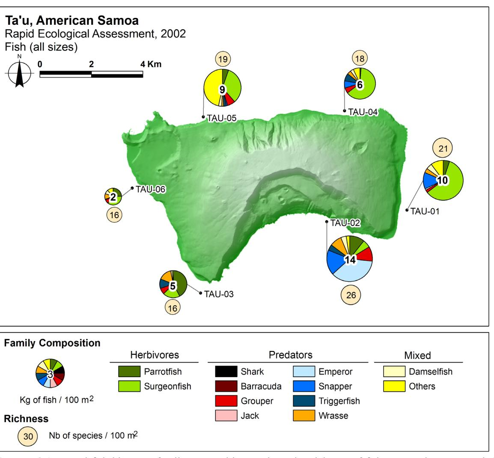

**Figure 5.8.1b.** Total fish biomass, family composition, and species richness of fishes around Ta`u recorded during ASRAMP 2002 REA belt-transect surveys. Total fish biomass (all species and size classes) is represented at each site by the size of the pie chart with the actual biomass value in the center (kg 100 m-2). Composition by trophic group is indicated by the family colors (green—mostly herbivores; other colors—mostly predators or mixed). Species richness at each REA site is indicated by numbers (# species 100 m-2) and the size of the beige circles.

# *2004 Spatial Surveys*

Large fish biomass around Ta`u during ASRAMP 2004 was mostly composed of parrotfish, followed by surgeonfish and wrasses. On average, large fish biomass was around 0.030 tons ha-1 (SE 0.015) for the island. No particular side of the island harbored higher fish biomass, although particularly high fish biomass was recorded on the northwest tip of the island, mostly because of shark and humphead wrasse sightings (Fig. 5.8.1c).

Two bumphead parrotfish were observed in the vicinity of the 2002 sightings, while a few sharks and humphead wrasses were seen at scattered locations around the island (Fig. 5.8.1c).

During 2004, total fish biomass was highest on the south and east sides of Ta`u (~ 18 kg 100 m-2) compared to the north and west sides (~ 6 kg 100 m-2). Herbivores (e.g., surgeonfish)

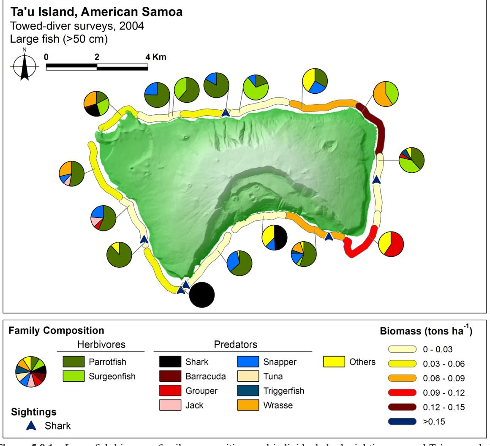

**Figure 5.8.1c.** Large fish biomass, family composition, and individual shark sightings around Ta`u recorded during ASRAMP 2004 towed-diver surveys. Large fish (length > 50 cm) biomass on each individual tow is represented by the color of the survey track (tons ha-1). Composition by trophic group is indicated by the family colors (green—mostly herbivores; other colors—mostly predators or mixed). Individual shark sightings, observed inside or outside the survey area, are represented by blue triangles.

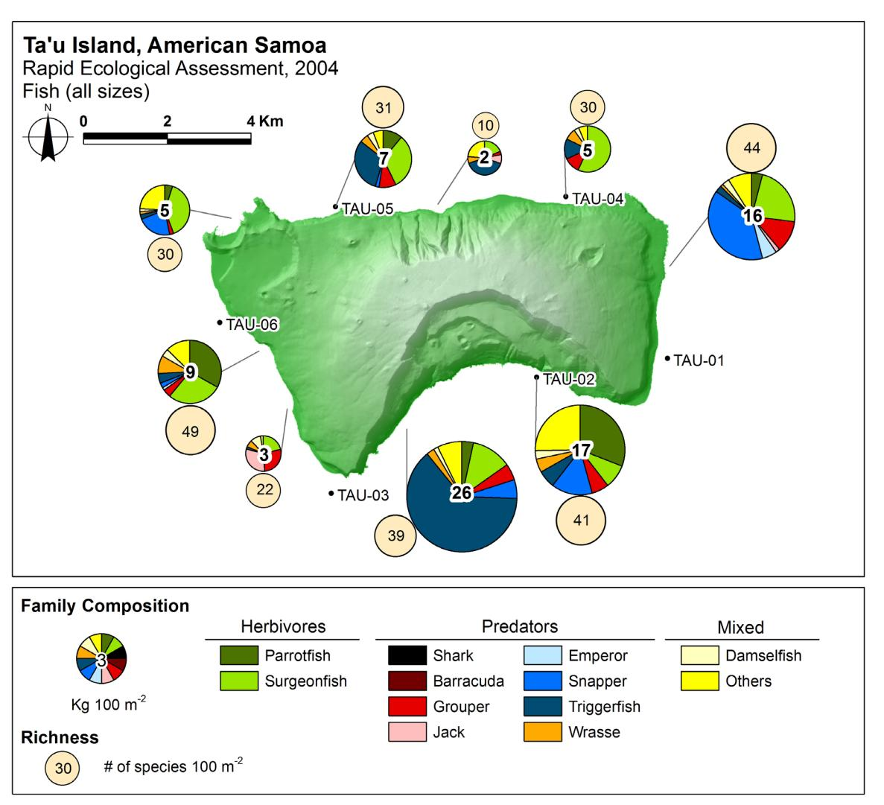

**Figure 5.8.1d.** Total fish biomass, family composition, and species richness of fishes around Ta`u recorded during ASRAMP 2004 REA belt-transect surveys. Total fish biomass (all species and size classes) is represented at each site by the size of the pie chart with the actual biomass value in the center (kg 100 m-2). Composition by trophic group is indicated by the family colors (green—mostly herbivores; other colors—mostly predators or mixed). Species richness at each REA site is indicated by numbers (# species 100 m-2) and the size of the beige circles.

made up most of the biomass, but lower-level predators (mainly triggerfish) were also noticeably abundant, especially at sites TAU-08 and TAU-05 in the south and north regions, respectively (Fig. 5.8.1d). Mean total fish biomass around Ta`u was around 10.1 kg 100 m-2 (SE 4.4) in 2004.

Parrotfish, surgeonfish, and snappers had the highest biomass for medium-large fish recorded on stationary point counts (> 25 cm total length) around Ta`u during ASRAMP 2004. Also relatively abundant were wrasses, triggerfish, and emperors.

Species richness ranged from 30 to 45 fish species 100 m-2 at most sites (Fig. 5.8.1d) and was slightly lower along the north side of this island.

# *2006 Spatial Surveys*

Mean biomass for large fish (> 50 cm total length, all families pooled) around Ta`u during ASRAMP 2006 was similar to previous years (0.046 tons ha-1 [SE 0.019]). Large parrotfish and snappers represented most of the biomass in this size class. Large fish biomass was mostly evenly distributed around the island, although with some particularly elevated biomass values around the northeast tip of the island attributed to schools of barracuda (Fig. 5.8.1e).

Several humphead wrasses (50–120 cm total length) were observed around the island, especially around the southeastern point. Sharks were sighted regularly at scattered locations (Fig. 5.8.1e). Contrary to previous years, no bumphead parrotfish were observed in 2006.

During 2006, total fish biomass was similar around Ta`u, 4.4 kg 100 m-2 (SE 1.6), with the exception of site TAU-11 in the north region, where a large school of barracuda was recorded

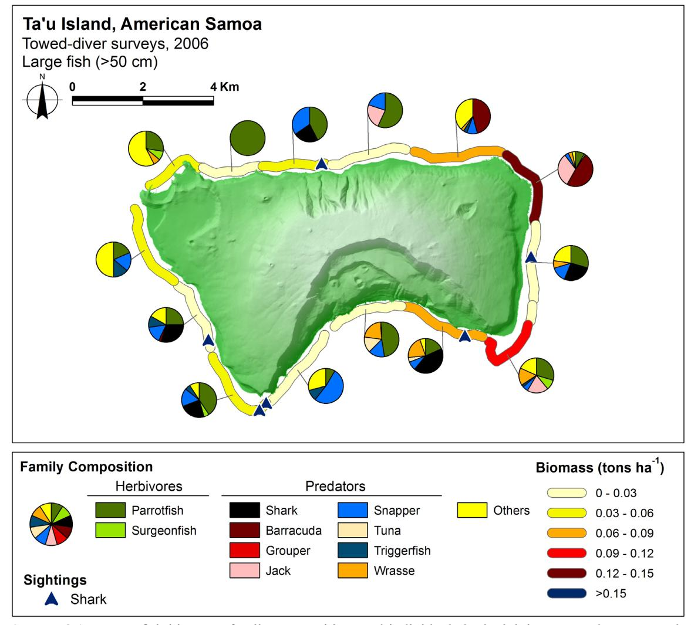

**Figure 5.8.1e.** Large fish biomass, family composition, and individual shark sightings around Ta`u recorded during ASRAMP 2006 towed-diver surveys. Large fish (length > 50 cm) biomass on each individual tow is represented by the color of the survey track. Composition by trophic group is indicated by the family colors (green—mostly herbivores; other colors—mostly predators or mixed). Individual shark sightings, observed inside or outside the survey area, are represented by blue triangles.

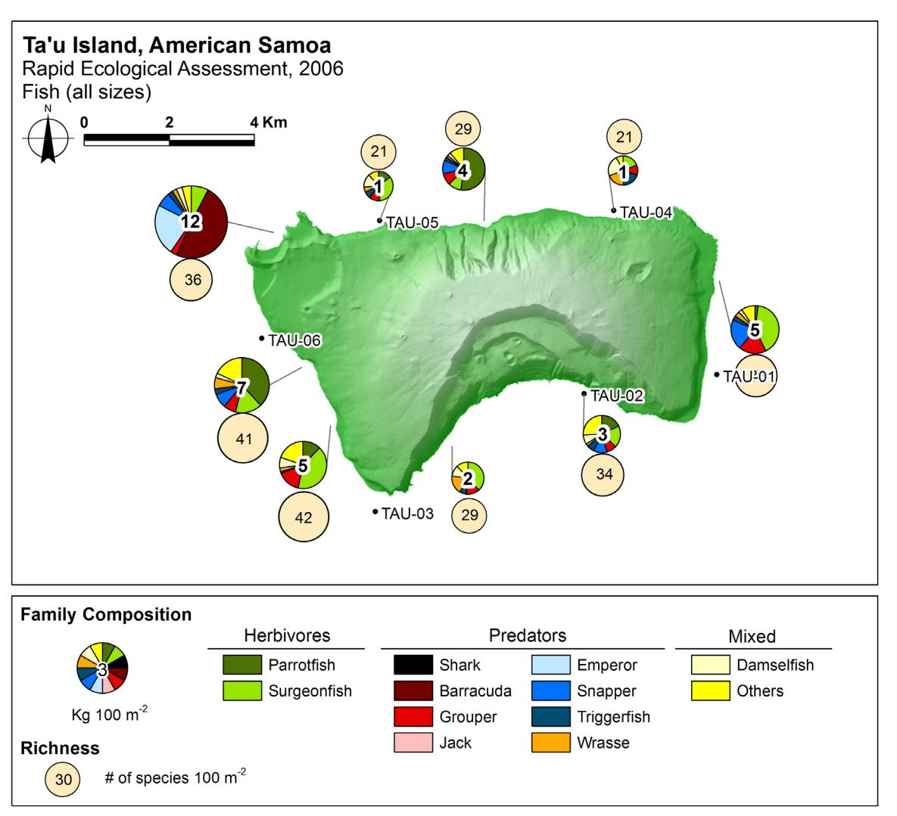

**Figure 5.8.1f.** Total fish biomass, family composition, and species richness of fishes around Ta`u recorded during ASRAMP 2006 REA belt-transect surveys. Total fish biomass (all species and size classes) is represented at each site by the size of the pie chart with the actual biomass value in the center (kg 100 m-2). Composition by trophic group is indicated by the family colors (green—mostly herbivores; other colors—mostly predators or mixed). Species richness at each REA site is indicated by numbers (# species 100 m-2) and the size of the beige circles.

(Fig. 5.8.1f). Herbivores were the dominating group, with parrotfish and surgeonfish equally abundant.

In descending order, snappers, parrotfish, groupers, and surgeonfish dominated the biomass of medium-large fishes recorded on stationary point counts (> 25 cm total length). Families with moderate biomass included emperors, wrasses, and goatfish.

Around the island, species richness was around 30 species 100 m-2 but was slightly lower on the north side of the island (Fig. 5.8.1f).

# **5.8.2 Temporal Comparison—Reef Fish**

Total fish biomass is not systemically higher on a particular side of the island and is generally dominated by herbivores and a noticeable presence of small predators (e.g., triggerfish, emperors, and wrasses). Total fish biomass was constant between 2002 and 2004 at around 0.9 tons ha-1 but appears to have decreased to 0.4 tons ha-1 in 2006 (Fig. 5.8.2a). Considering all years surveyed, total fish biomass around Ta`u was around 0.74 tons ha-1 (SE 0.31).

In a similar fashion to other islands, large fish biomass is generally evenly distributed and is composed mostly of parrotfish, snappers, and surgeonfish. Large fish biomass appears to be slightly increasing from 0.024 tons ha-1 in 2002 to 0.046 tons ha-1 in 2006 (Fig. 5.8.2b). The overall average, all years combined, was around 0.034 tons ha-1 (SE 0.015).

The only clear richness pattern that emerges is a generally lower species count 100 m-2 on the northern side of Ta`u.

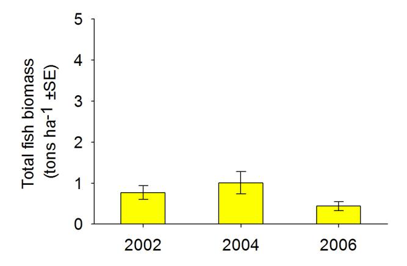

**Figure 5.8.2a.** Total fish biomass around Ta`u during ASRAMP 2002 (6 sites), 2004 (9 sites), and 2006 (9 sites) REA surveys.

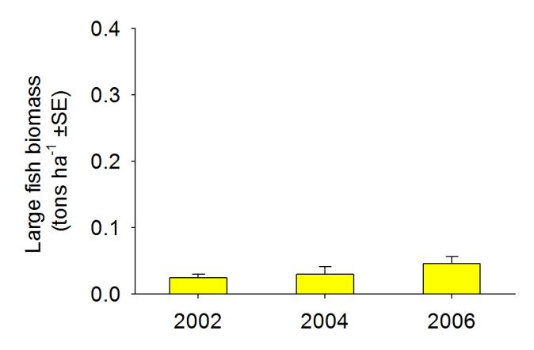

**Figure 5.8.2b.** Large fish biomass around Ta`u during ASRAMP 2002 (8 tow surveys), 2004 (18 tow surveys), and 2006 (15 tow surveys) towed-diver surveys.

#### **5.9 Island Summary and Integration**

Ta`u is a small, steeply sloped island in the Manu`a Island chain. Bathymetric data from multibeam surveys around Ta`u reveal the presence of a narrow (< 1 km) shelf that is wider along the north and west sides of the island (Fig. 5.3.1a). A series of small seamounts are ~ 2 km northwest of Ta`u, along an east-west tending ridge, with depths as shallow as 38 m. The upper portions of this ridge of small, shallow seamounts were probably exposed during periods of lower sea level.

Similarity between biota around neighboring islands probably derives from their spatial proximity which allows for substantial contemporary gene flow. Moreover, mapping efforts indicate a relatively shallow bridge between the islands that was likely historically exposed during lower stands of sea level, which may have provided stepping stones for colonization by taxa with short larval lifespans. TOAD optical validation surveys confirmed that these northwestern seamounts are colonized by coral communities (Fig. 5.3.1c).

The benthic composition surrounding Ta`u was highly variable (Figs. 5.3.2a, 5.3.2b, 5.3.2c, 5.3.2d, and 5.3.2e). However, spatial and temporal patterns of the distributions of habitat types are apparent within the data. Low benthic topographical complexity was roughly correlated to the spatial distribution of sand (Fig. 5.3.2a). The south region, over the three survey periods, had consistently high benthic complexity, especially around Papaloaloa Point and the shoreline adjacent to the Liu Bench. High benthic complexity also was seen on the northern shore, but in smaller, more isolated areas.

Because of the steeply sloped nature of Ta`u, terrestrial watersheds and existing drainages modify the marine benthic habitat (Fig. 5.1a). This is evident from concatenated toweddiver benthic habitat maps (Fig. 5.3.2b) and multibeam backscatter maps (Fig. 5.3.1b). Sand and/or soft-bottom distribution on particularly the north shore benthos is directly correlated to terrestrial watersheds. There are also a few sand fields at the base of the forereef slope, especially off the western side of the island (Fig. 5.3.1b).

While on a larger scale, physical oceanographic properties appeared to be somewhat homogeneous, distinct spatial patterns of all measured parameters were observed around Ta`u at smaller scales. There is believed to be a large-scale east-to-west current in the vicinity of Ta`u; however, no nearshore current data are available to resolve finer-scale patterns. Because of the steeply sloped nature of the island (Fig. 5.3.1a), the coral reef communities around Ta`u may be more exposed to wave energy than those at some of the other islands in American Samoa, such as Tutuila, which has a broad submerged bank that rises to depths as shallow as 20 m and extends several kilometers offshore. The north and west sides of Ta`u are exposed to infrequent, long-period swells from North Pacific boreal winter storms during the austral summer (Fig. 5.4.3b). The east and south sides of the island predominantly experience frequent short period (8–12 sec) waves (~ 2 m) from trade wind swell; they are also exposed to less frequent, larger (~ 3 m), longer period (12–18 sec) swells generated by winter storms in the Southern Ocean (Appendix II, Figure II. II. iv). A large swell event from tropical cyclone Heta in January 2004 (Fig. 5.4.3b) appears to have had at least some impact on all sides of the island.

During each of the ASRAMP survey periods in 2002, 2004, and 2006, the nearshore shallowwater CTD and water quality observations exhibited spatial heteorgeneity, although in many cases the magnitudes of the spatial changes were relatively modest (Figs. 5.4.1b, 5.4.1e, and 5.4.1h). Waters in the east region were generally found to be well-mixed in the upper ~ 20 m of the water column, likely because of the influence of southeasterly trade winds. Interestingly, during mostly light-to-moderate winds for the survey periods, waters on the east side were generally stratified below ~ 20 m. The west region of the island was generally observed to have increased stratification in the upper water column, with the northern and southern sides falling in between. Water turbidity was highest along the central north region of Ta`u (Figs. 5.4.1c, 5.4.1f, and 5.4.1i). Interpretation of salinity values from CTD data indicates there are likely point sources of fresh, cool water on the north side, probably from watersheds or subsurface springs. This would additionally account for the increase in turbidity values on the north side, as sediment input from terrigenous sources is often associated with freshwater outflows. Increases in turbidity could also be explained by austral summer swell from the northwest that could be stirring up benthic sediments. In situ SST values (July 2002–February 2004) were observed to be 0°–3.5°C cooler than those observed via satellite and, for the most part, cooler when compared to the SST climatology (Fig. 5.4.3b). Nutrient concentrations show increased values along the south shore of Ta`u, and elevated nitrogen levels were found on the west side (Fig. 5.4.1j). Water samples indicated an increase in Chl-a concentrations near the harbor area on the northwestern side of the island. In both 2004 and 2006, this area was observed to have elevated turbidity and low salinity, which may be indicative of a point source of sediment and freshwater input.

A total of 32 coral genera have been observed around Ta`u, with higher diversity in the south region, and *Montipora*, *Astreopora*, *Favia*, and *Porites* being the most common. Approximately 64% of the coral colonies measured in 2004 (Fig. 5.5.1i), and 79% of them in 2006 (Fig. 5.5.1o), were relatively small (< 20 cm maximum diameter). The high percentages of small colonies may reflect periodic disturbances from large wave events. In contrast to most areas, abundant large colonies have been found at some sites on the northwestern and northern sides of the island, which are hypothesized to be have been somewhat more sheltered than other areas from large but infrequent Southern Ocean swell and tropical cyclones. That said, towed-diver benthic surveys along the central portion of the east region have observed, without quantification, areas with large *Porites* colonies. Massive *Porites* colonies were also observed in the west, and are believed to be among the largest known (~ 6 m in height and ~ 14 m in diameter), and possibly the oldest observed coral colonies in the world. Toweddiver benthic surveys also found a region in the southern portion of the west region that had similar, but slightly smaller, coral skeletons. Although the coral communities appear to mostly be healthy, 88% of REA sites on Ta`u were observed to contain minor amounts (< 0.3%) of diseased coral, mainly growth anomalies and bleaching (Figs. 5.5.2a and 5.5.2b). SST profiles between February 2002 and February 2004 reveal a short spike above the coral bleaching threshold in March 2002 (Fig. 5.4.3b). However, this spike was not of sufficient duration to be expected to trigger bleaching, and no substantial coral bleaching was observed during 2002 or 2004 surveys.

Figure 5.3.2e shows towed-diver survey estimates of live scleractinian coral cover integrated between years and probably provides the most complete picture of higher coral cover areas. It indicates higher percent cover to the southeast and lower percent cover to the northwest.

All four corners of the island have relatively low coral percent cover in nearshore waters, possibly a result of wave energy refracting and concentrating onto these areas during high wave events. Generally higher coral percent cover to the southeast may possibly reflect increased circulation, flushing, and mixing in response to increased exposure to persistent southeastern trade winds. Interestingly, these findings are similar to those on the east side of Olosega.

Towed-diver surveys, most notably in 2006, suggested that high live coral cover and increased topographical complexity are tightly coupled (Fig. 5.5.1k). High coral cover recorded by towed-diver surveys was variably distributed around Ta`u and showed temporally consistent hotspots on the eastern and south coasts.

The towed-diver and REA survey mean percent coral cover for all years was found to be approximately 25% for nearshore waters (Fig. 5.5.3a). Island-wide percentages of coral cover steadily declined between 2002 and 2006 in the towed-diver survey observations, while REA results showed an increase between 2004 and 2006. Towed-diver survey estimates of the percentage of stressed coral declined between 2004 and 2006 from ~ 6% to 2% (Figs. 5.5.1f and 5.5.1l). Locations around the island showing the highest coral cover varied between years, and to some degree results also varied by method. It is likely that the variations in results among different years (2002, 2004, and 2006) and survey methods (towed-diver surveys, visual estimates, and line point intercept) reflect differences in survey locations, changes in data collection protocols from year to year, and heterogeneity of coral distribution more than they do changes in coral community structure over time.

Corals were mostly absent in the TOAD optical imagery from deeper (~ 30–80 m) areas. However, a coral community was found off the southeastern corner of the island. An additional luxuriant coral reef was observed over the summit of a shallow seamount 2 km northwest of Ta`u (Fig. 5.3.1c).

It is important to include the extremely large and ancient communities of *Porites* sp. corals found on the east and west sides of the island (Figs. 5.3.2f and 5.3.2g) when characterizing the coral communities of Ta`u. In the more protected southern portion of the west region, the colonies were mostly dead and decaying; however, these ancient and massive corals are thought to be between 500 and 1000 years old and may be among the oldest known living coral colonies found in the world. At the request of Governor Tulafono of American Samoa, CRED scientists provided images, video, and background information about these unique coral colonies for his presentation at the United States Coral Reef Task Force meeting in May 2006. At the time of publication, the American Samoa government is considering designation of this area as a Marine Protected Area.

These massive and ancient coral colonies, some living and some dead, are unique and deserve special attention as objects of study to advance the conservation and management of coral reef ecosystems in American Samoa and elsewhere. Combined, they contain within their cores a unique history of climate and ecological impacts of climate change over the past 500–1000 years. Important questions concerning why the ancient corals have continued to thrive on the both the east and west sides of Ta`u, while their companion colonies on the west side have not, may improve our understanding of the ecological impacts of climate change

and therefore provide guidance on how to better manage and conserve coral reefs during upcoming climate changes.

Turf algae and crustose coralline red algae were the dominant benthic organisms at most nearshore areas around Ta`u and were usually fairly uniformly distributed around the island with a few exceptions (Figs. 5.6.1a, 5.6.1b, and 5.6.1e). The lowest cover of crustose coralline algae and the highest cover and diversity of macroalgae were found off the northwestern corner of the island. We hypothesize that the high concentration of macroalgae may be a result of the high influx of fresh water and terrestrial sediments mentioned previously and possibly terrestrial nutrients. Macroalgae also exhibited high local abundance in other areas, but were absent at REA site TAU-10, located in a predominantly sandy area. *Halimeda* was the most abundant macroalgae, occurring at 42% of the sampled sites in 2006 (Fig. 5.6.1f). A dramatic difference in the number of algal genera and their abundance around Ta`u was reported between the 2004 and 2006 survey periods (Fig. 5.6.3a). It is hypothesized that that the macroalgal community, in particular, may have been scoured by high wave energy generated by tropical cyclone Heta in January 2004, but that the community had recovered by 2006. Crustose coralline algae were most abundant in the east region, covering up to 50% of the substrate during ASRAMP 2004 (Fig. 5.6.1a). Low occurrence and abundance of coralline algal diseases were noted around Ta`u. Ta`u contained only 4.2% of the region-wide total of coralline algae disease cases (21 infections observed), and the cases were distributed over only 30% of the surveyed sites (Figs. 5.6.2a and 5.6.2b).

Macroinvertebrate distributions were relatively similar along the forereefs of Ta`u during the 2004 and 2006 surveys (Figs. 5.7.1b and 5.7.1d). Giant clams were present at all but one site, TAU-04, off the north coast of Ta`u (Figs. 5.7.1c and 5.7.1e). In general, giant clams have been more prevalent in the north and west regions and least common on the south side of the island. No COTS were recorded during any survey. Sea urchins have been observed at most REA sites around the island during most years of surveying, with the boring urchin *Echinostrephus* sp. being the most common species. During each of the three ASRAMP cruises, the distribution of sea urchins has been observed to be concentrated on the northwestern corner of the island (Figs. 5.7.1a, 5.7.1b, and 5.7.1d), with concentrations on the northeastern and southwestern corners in some years as well. Interestingly, the corners of the island have relatively low percentages of coral (Fig. 5.3.2e), but it is not known if there is a link between the coral and urchin distributions. Sea cucumbers were most prevalent in the west region of the island, but have also been observed at other locations. Three sea cucumber species were observed around Ta`u (*Holothuria cinerascens*, *Bohadschia argus*, *Holothuria whitmaei*) and were present at all REA sites along the west coast.

Total fish biomass was fairly consistent around the island, and relatively low at 0.7 tons ha-1 (Figs. 5.8.1a, 5.8.1c, and 5.8.1e). Fish communities were dominated by herbivores and a noticeable presence of small predators (e.g., triggerfish, emperor, and wrasse). The biomass of large (> 50 cm total length) fish was distributed relatively evenly around the island, considering data from all survey years, and was dominated by parrotfish, snappers, and surgeonfish. The only clear richness pattern that emerges is a generally lower species count 100 m-2 on the northern side of Ta`u (Figs. 5.8.1b, 5.8.1d, and 5.8.1f). By way of comparison, at the uninhabited Rose Atoll, large fish biomass was mostly composed of barracuda, jacks, and snappers. Sharks were also common around the outside of the atoll. Similar differences in the composition of fish communities at inhabited and uninhabited islands have been observed at sites across the Pacific and may be indicative of higher fishing pressure at the inhabited islands.

#### **References**

- Craig P (2002) Natural history guide to American Samoa: a collection of articles. National Park of American Samoa, Pago Pago, American Samoa. 76 pp.
- Meehl GA (1996) Vulnerability of freshwater resources to climate change in the tropical Pacific region. Water Air Soil Pollut 92:203–213.
- U.S. Census Bureau (2000) Census 2000 Data for American Samoa. Online at [http://www.](http://www.census.gov/census2000/americansamoa.html) [census.gov/census2000/americansamoa.htm](http://www.census.gov/census2000/americansamoa.html)l. Accessed May 17, 2007.

#### **Chapter 6 Rose Atoll**

# **6.1 Geopolitical Context**

Rose Atoll is an uninhabited, diamond-shaped atoll located at the far eastern end of the American Samoa Archipelago, approximately 300 km east of Tutuila Island. The barrier reef encloses approximately 6.5 km2 (~ 1600 acres) of lagoonal habitat, with a 40-m wide channel located in the northern corner of the atoll. It remains one of the smallest atolls in the world, with Sand Island located in the north and Rose Island located in the east. These land areas total around 0.06 km2 (~ 15 acres; United States Fish and Wildlife Service). While Rose Island is vegetated, neither island has any streams, associated watershed areas or notable freshwater sources.

Rose is a National Wildlife Refuge administered by the United States Fish and Wildlife Service within the Pacific Remote Islands National Wildlife Refuge Complex.

#### **6.2 Survey Effort**

A large amount of physical and biological data has been collected around Rose since 2002 as part of the American Samoa Reef Assessment and Monitoring Program (ASRAMP). The

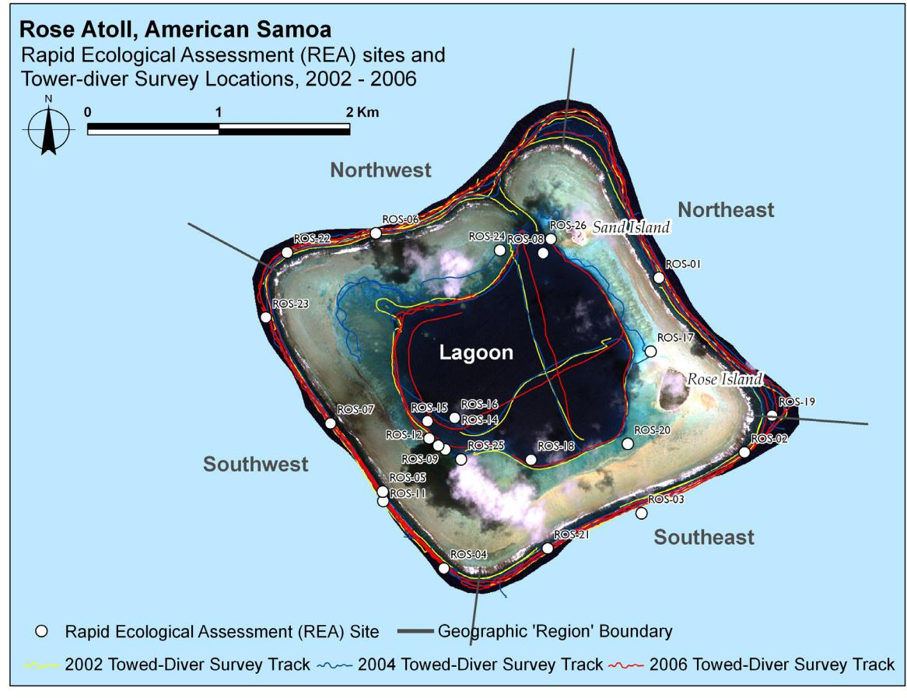

**Figure 6.2a.** Locations of Rapid Ecological Assessment (REA) and towed-diver surveys around Rose during ASRAMP 2002, 2004, and 2006. Five arbitrary geographic regions have been delineated to aid in discussion of spatial patterns.

extent and timeframe of these surveys are discussed below. To aid in the discussion of spatial patterns of ecological and oceanographic observations around Rose throughout this chapter, five geographic regions are delineated in Figure 6.2a.

Benthic habitat mapping data were collected around Rose using acoustic multibeam survey methods, which mapped a total of 269 km2 in and around Rose during ASRAMP 2006. These data are further examined in Section 6.3: Benthic Habitat Mapping and Characterization.

Figure 6.2a shows the locations of REA and towed-diver surveys around Rose during ASRAMP 2002, 2004, and 2006. The number, mean depth, and area of these surveys are presented by year in Table 6.2a.

**Table 6.2a.** Numbers, areas, and depths of REA and towed-diver surveys around Rose during ASRAMP 2002, 2004, and 2006.

| Year |                      | REA Surveys Towed-diver Surveys |                      |                     |                   |  |
|------|----------------------|------------------------------------|----------------------|---------------------|-------------------|--|
|      | Number of Surveys | Mean Depth (m)                  | Number of Surveys | Survey Area (ha) | Mean Depth (m) |  |
| 2002 | 9*                   | 13.2 (SD 2.0)                      | 18                   | 38.3                | 5.5 (SD 6.8)      |  |
| 2004 | 12*                  | 16.1 (SD 2.6)                      | 22                   | 46.1                | 11.1 (SD 7.0)     |  |
| 2006 | 13                   | 13.0 (SD 2.5)                      | 21                   | 48.7                | 13.0 (SD 5.2)     |  |

*\* No coral disease surveys were conducted in 2002 and 2004.*

The ranges of survey depths from towed-diver surveys are presented for each year in Section 6.5: Corals and Coral Disease; Figures 6.5.1a (2002), 6.5.1d (2004), and 6.5.1k (2006). Although the towed-diver survey methodology is aimed at following specific isobaths, the actual depths surveyed are often quite variable. These figures illustrate the variability of depths observed during towed-diver surveys and can be referenced when further exploring the towed-diver datasets.

Spatial and temporal observations of key oceanographic and water quality parameters influencing reef conditions around Rose were collected using a diverse suite of long-term moored instrumentation packages and closely spaced conductivity, temperature, and depth (CTD) surveys of the vertical structure of water properties (see Chapter 2, Section 2.3: Oceanography and Water Quality). A summary of deployed instruments and collection activities is provided in Table 6.2b. Results are examined further in Section 6.4: Oceanography and Water Quality.

**Table 6.2b.** Numbers of oceanographic instrument deployments and shallow and deep CTD casts around Rose during ASRAMP 2002, 2004, and 2006. Instrument types include recording current meters (RCMs), Coral Reef Early Warning System (CREWS), wave and tide recorders (WTRs), and subsurface temperature recorders (STRs). Shallow-water CTD casts were conducted from the surface to a 30-m depth. Deep-water CTD casts were conducted from the surface to a 500-m depth. Deep-water CTD cast information is presented in Chapter 8, Archipelagic Comparisons.

| Observation Type        | 2002 | 2004 | 2006 |
|-------------------------|------|------|------|
| RCM                     | 1    | 0    | 0    |
| CREWS                   | 1    | 0    | 0    |
| WTR                     | 0    | 1    | 1    |
| STR                     | 0    | 4    | 6    |
| Shallow-water CTD casts | 28   | 44   | 31   |
| Deep-water CTD casts    | 12   | 10   | 17   |

# **6.3 Benthic Habitat Mapping and Characterization**

Benthic habitat mapping and characterization around Rose were accomplished using acoustic multibeam sonar between water depths of ~ 1 m and ~ 3000 m. Acoustic multibeam sonar mapping provided bathymetric and acoustic backscatter data in the depth range between ~10 m and 3000 m. Nearshore habitat mapping was conducted using towed-diver benthic surveys between ~ 1 m (lagoon) and 30 m (forereef).

# **6.3.1 Acoustic Mapping and Optical Validation**

Multibeam mapping operations were conducted around Rose in early 2006 by the R/V *Acoustic Habitat Investigator* (*AHI*) and the NOAA Ship *Hi`ialakai* (Fig. 6.3.1a). Favorable conditions allowed the *AHI* to enter the lagoon through the narrow pass on the NW arm of the island to survey in the interior lagoon area. No optical data were collected around Rose because of the difficulty of maneuvering vessels close to this extremely steep atoll and limited areas within the depth range of the optical equipment.

Much like Swains Island, Rose is a steeply sloped, conical emergent atoll with rift zones that extend from each corner of the reef down to at least 3000 m. The bathymetry immediately

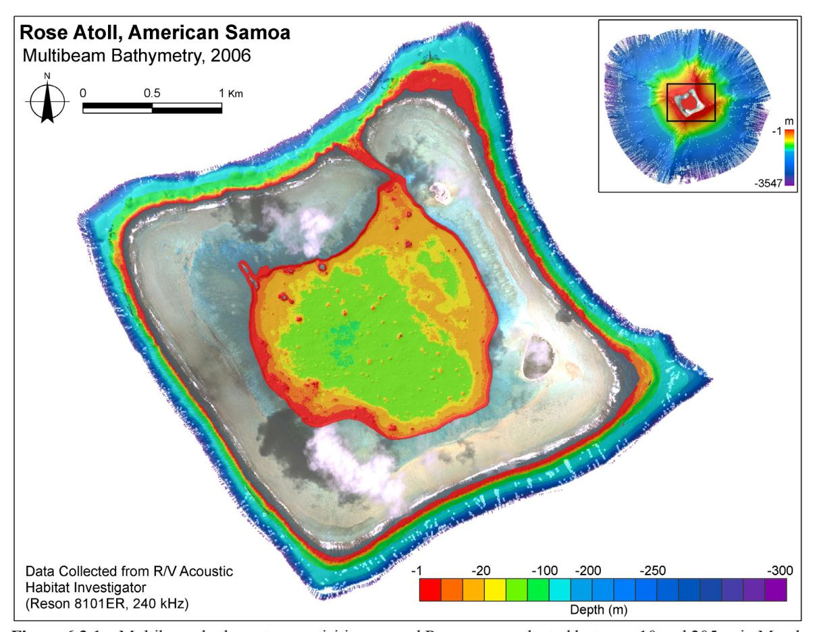

**Figure 6.3.1a.** Multibeam bathymetry acquisition around Rose was conducted between 10 and 205 m in March 2004 and March 2006 from the R/V *AHI* and the NOAA Ship *Hi'ialakai*. The north side of the atoll has a small shelf, while the rest is surrounded by steep underwater slopes. The lagoon contains a scattering of small coral heads and a few large coral outcrops; it reached a maximum recorded depth of 27 m in some places.

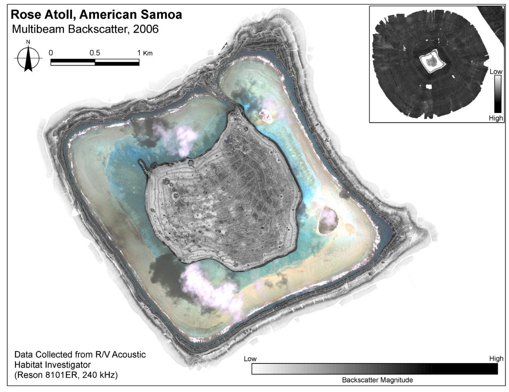

**Figure 6.3.1b.** Backscatter imagery was acquired in March 2004 and March 2006 during multibeam surveys around Rose from the R/V *AHI*. Lighter shades represent low-intensity backscatter and likely indicate substrates that are acoustically absorbent and typically indicate unconsolidated sediment. Darker shades represent highintensity backscatter and likely indicate consolidated hard-bottom and coral substrates.

adjacent to the exposed reef is very steep, with smooth sides that exhibit few signs of mass wasting. Inside the lagoon, the bathymetry indicates the presence of many coral heads and colonial aggregates, ranging in size from a few centimeters up to 1 m or larger.

These bathymetric data are corroborated with backscatter imagery (Fig. 6.3.1b), which shows soft-bottom habitat within the lagoon, interspersed with hard-bottom coral pinnacles. Outside the lagoon, backscatter intensity is high, indicating a predominantly hard substrate. Toweddiver survey observations indicate that much of the benthos within at least the top 30 m of the water column is populated by coral and crustose coralline algae dominated communities.

#### **6.3.2 Habitat Characterization**

Towed-diver benthic survey observations around Rose from ASRAMP 2002, 2004, and 2006 were concatenated into mean spatial distributions (see Chapter 2, Section 2.2.3: Optical Validation Surveys) of the following benthic components: habitat complexity (Fig. 6.3.2a), percent cover of sand (Fig. 6.3.2b), hard substrate/pavement (Fig. 6.3.2c), rubble (Fig. 6.3.2d), and live coral (Fig. 6.3.2e). Since these habitat characterization maps represent different and complementary components of the same habitats, it is useful to analyze them in relation to each other and exposure to prevailing oceanographic conditions.

Towed-diver survey observations indicate that benthic complexity was generally high on the outside of Rose, especially in the northwest and southwest forereef regions, while more moderate complexity was recorded for the northeast forereef (Fig. 6.3.1a). Habitat complexity was generally low within the lagoon (Fig. 6.3.2a).

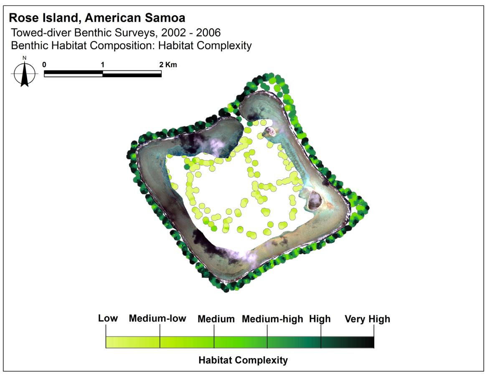

**Figure 6.3.2a.** Mean benthic habitat complexity concatenated from towed-diver survey observations around Rose during ASRAMP 2002, 2004, and 2006. Habitat complexity was subjectively rated by diver-observers over 5-min ensembles (~ 200 x 10 m) on a 6-point scale representing low (1), medium-low (2), medium (3), medium-high (4), high (5), and very high (6) topographic complexity. Yellow colors indicate low habitat complexity, and dark green colors indicate high habitat complexity.

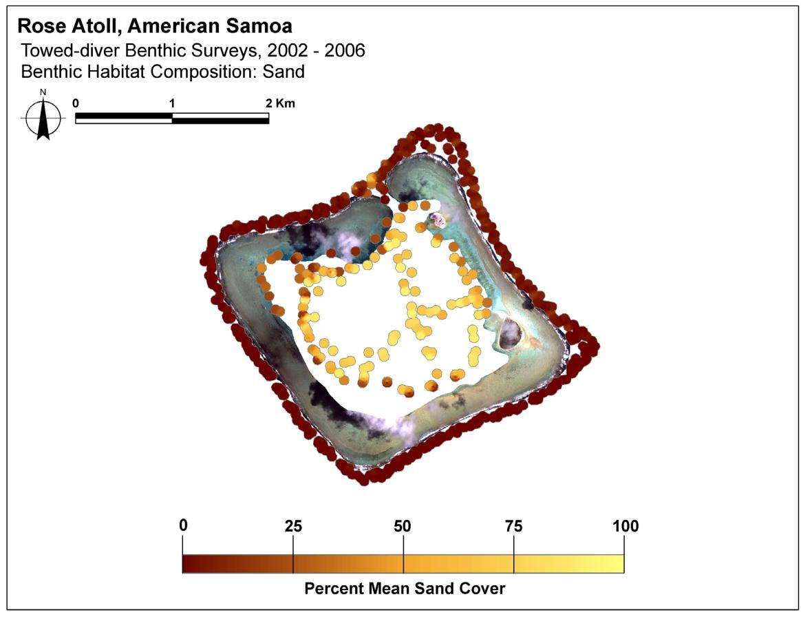

**Figure 6.3.2b.** Mean percent cover of sand concatenated from towed-diver habitat survey observations around Rose during ASRAMP 2002, 2004, and 2006. Sand composition was subjectively rated by diver-observers over 5-min ensembles (~ 200 m x 10 m) over a 1–100% scale. Light shades indicate high percent cover of sand, and dark shades indicate low percent cover of sand.

The bottom of the lagoon was primarily composed of sand (Fig. 6.3.2b), with isolated areas of hard substrate (Fig. 6.3.2c) and rubble (Fig. 6.3.2d) scattered around the central lagoon. True to its nature as a steeply sloped, conical atoll, there was very low sand cover along the forereef. The only sand that was found outside of the lagoon was located just outside of the northwestern channel entrance.

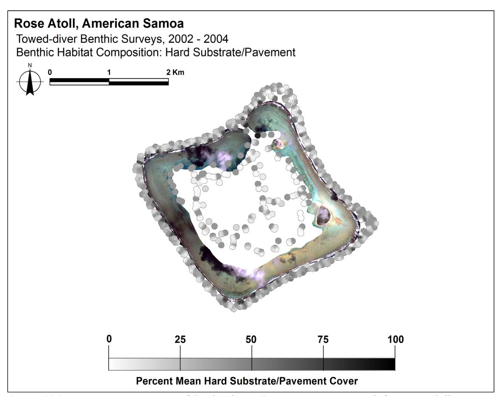

**Figure 6.3.2c.** Mean percent cover of hard substrate/pavement, concatenated from towed-diver survey observations around Rose during ASRAMP 2002 and 2004. Hard substrate/pavement composition was subjectively rated by diver-observers over 5-min ensembles (~ 200 m x 10 m) over a 1–100% scale. Dark shades indicate high percent cover of hard substrate, and light shades indicate low percent cover of hard substrate.

While percent cover of hard substrate/pavement inside the lagoon was patchy, the outside of the atoll was characterized by moderate, evenly distributed hard substrate/pavement cover, although the northeast and southeast regions appeared to have slightly higher percent cover (Fig. 6.3.2c). High levels of coral rubble were primarily found inside the lagoon, with highest rubble cover recorded along the base of the backreef slopes of the lagoon perimeter (Fig. 6.3.2d). Along the outer forereef, the most elevated levels of rubble were found in the northeast region; however, because of the steep nature of the outer reef, rubble was low on all sides.

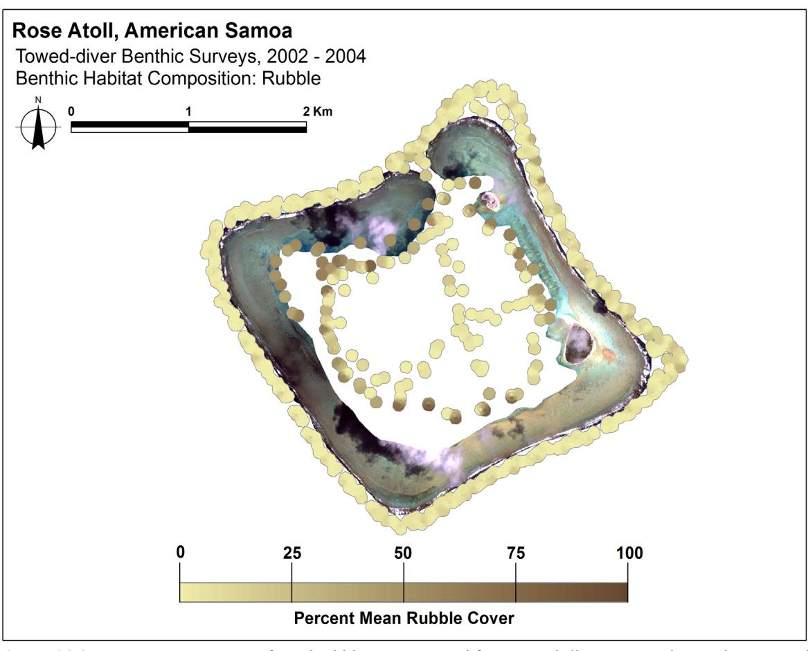

**Figure 6.3.2d.** Mean percent cover of coral rubble, concatenated from towed-diver survey observations around Rose during ASRAMP 2002 and 2004. Rubble composition was subjectively rated by diver-observers over 5 min ensembles (~ 200 m x 10 m) over a 1–100% scale. Light shades indicate low percent cover of coral rubble, and dark shades indicate high percent cover of coral rubble.

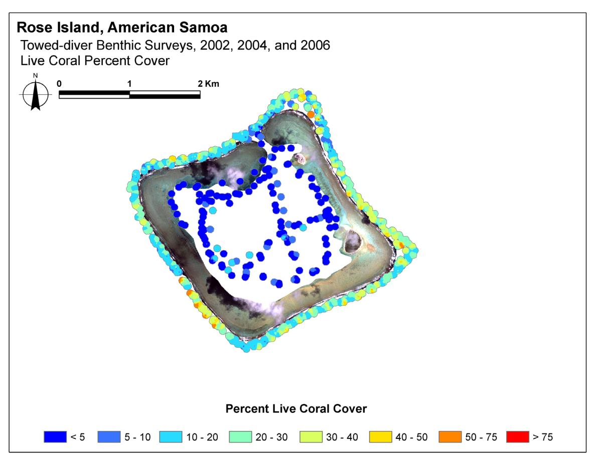

**Figure 6.3.2e.** Mean percent cover of live scleractinian (stony) coral, concatenated from towed-diver survey observations around Rose during ASRAMP 2002, 2004, and 2006. Live coral cover composition was subjectively rated by diver-observers over 5-min ensembles (~ 200 m × 10 m) over a 1–100% scale. Blue colors indicate low percent cover of coral, and reddish colors indicate high percent cover of coral.

Percent mean live coral cover ranged from 10% to 50% along the forereef slope, with the highest percentages in the northeast region just north of the eastern-most point of the atoll and the southwest region, immediately west of the southern corner of the atoll (Fig. 6.3.2e). Percentages recorded within the lagoon were much lower, ranging from 0 to 10%. The highest levels of coral cover within the lagoon were generally recorded along the southwestern corner.

# **6.4 Oceanography and Water Quality**

Oceanographic and water quality observations were collected in the waters surrounding Rose over the period between 2002 and 2006. Instrumentation and equipment descriptions, deployment locations, and a subset of results are detailed below. Specific details of deployments and additional data are presented in Appendix II, Table II. v.

# **6.4.1 Hydrographic Data**

#### *2002 Spatial Surveys*

During ASRAMP 2002, 28 shallow-water CTD casts were conducted in the nearshore and lagoonal waters around Rose on February 26 (Figs. 6.4.1a and 6.4.1b). Data from these vertical profiles around the outside of the atoll showed two main water masses: warmer (> 30°C), lower salinity (< 35.3 psu), less dense (< 22 kg m-3) water off the northwest and northeast regions (A–C), and cooler (~ 29.5°C), higher salinity (> 35.3 psu), higher density (> 22 kg m-3) waters off the southwest and southeast regions (C–E) (Fig. 6.4.1b). The southwest and southeast sides of the atoll showed greater stratification, with warm surface water, a temperate central water column, and cooler bottom (> 20 m) waters. These data suggest that the southern sides of the atoll may have been more protected from wind and wave-induced mixing, while the northern sides were more exposed to these forces, resulting in vertical mixing (or overturning) of warm surface waters into the main water column.

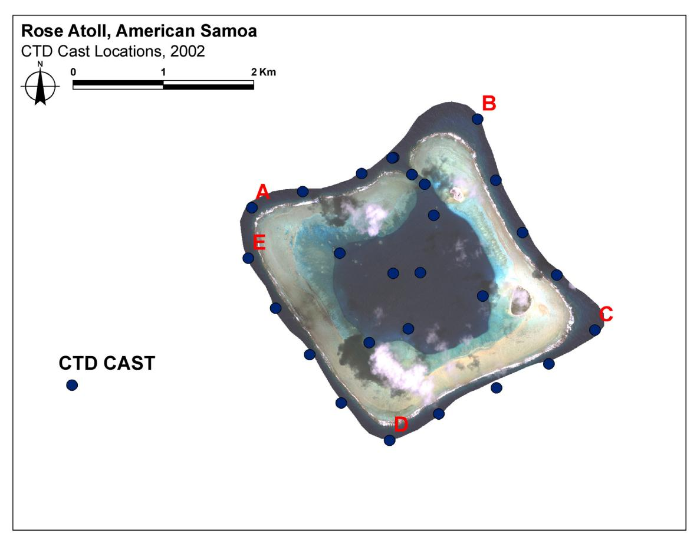

**Figure 6.4.1a.** Shallow-water CTD cast locations, shown as blue dots, expressed sequentially in a clockwise direction around Rose (A–E) during ASRAMP 2002, February 26.

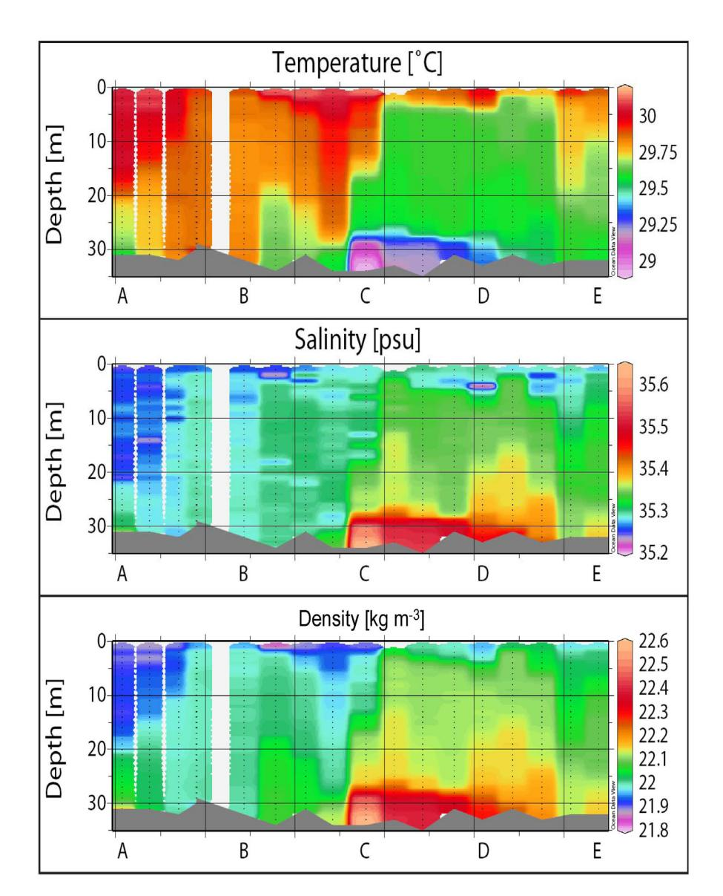

**Figure 6.4.1b.** Shallow-water CTD cast profiles to a 30-m depth around Rose during ASRAMP 2002, February 26, including temperature (°C), salinity (psu), and density (kg m-3). Profiles are shown sequentially in a clockwise direction around the island (A–E), as shown in Figure 6.4.1a.

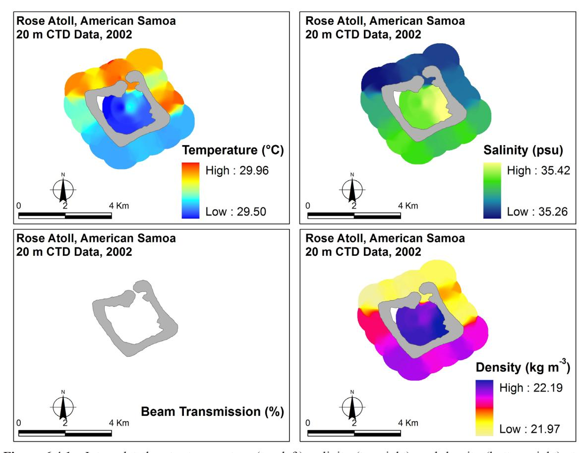

**Figure 6.4.1c.** Interpolated water temperature (top left), salinity (top right), and density (bottom right) at a 20-m depth derived from shallow-water CTD casts around Rose during ASRAMP 2002, February 26. Beam transmission data were not collected.

Physical water properties at a 20-m depth around Rose during ASRAMP 2002 showed moderate ranges in temperature (29.50–29.96°C), density (21.97–22.19 kg m-3), and salinity (35.26–35.42 psu; Fig. 6.4.1c). The warmer, less saline, less dense waters of the northern regions of the atoll indicate a distinctive hydrographic structure. More data are needed to further investigate the cause of this feature. Interestingly, the waters in the lagoon at a 20 m depth, which is below the sill depth of the only channel, were substantially cooler, more saline, and denser than any of the waters outside the atoll.

#### *2004 Spatial Surveys*

During ASRAMP 2004, 44 evenly spaced, shallow-water CTD casts were conducted in nearshore waters around Rose between February 9 and 11 (Fig. 6.4.1d). These vertical profiles conducted along the steep forereef slopes around the atoll show significant spatial and vertical structure (Fig. 6.4.1e). Near the west point (A) of the northwest region, the water column was well mixed vertically with warm temperatures (> 29.1°C), low beam transmission (< 91%), and moderate salinity (35.4 psu) throughout the column. Strikingly, the area near the channel and around the north point (B) had cool (~ 28.9°C), low salinity (34.8 psu), and low density (21.9 kg m-3) water in the surface layer (0– ~ 10 m) overlaying a mid-depth water mass with warm (29.1°C) temperatures in depths between 10 and 20 m, and cool (28.9°C), high salinity (35.5 psu) and density (22.4 kg m-3) water in depths between 20 and 35 m). This complex, highly stratified feature appears to reflect a discharge of fresh surface water from the lagoon out the channel. The remainder of the northeast forereef (B–C) was well mixed with moderate values for each of the observed water properties. The southeast region (C–D), on the other hand, was characterized by significant vertical structure, with an interesting plume of cool (28.7°C), high salinity (35.5 psu), and high beam transmission (~ 94%) water near the bottom (20–35 m), particularly near the eastern point (C). This feature appeared to disperse upward and southward.

Physical water properties at a 20-m depth around the steep forereef slopes and within the lagoon at Rose during ASRAMP 2004 showed relatively small ranges in temperature (29.50–

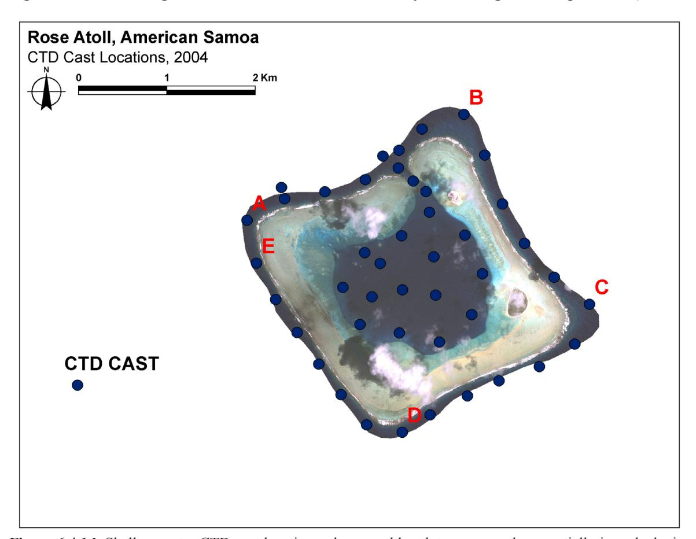

**Figure 6.4.1d.** Shallow-water CTD cast locations, shown as blue dots, expressed sequentially in a clockwise direction around Rose (A–E) during ASRAMP 2004, February 9–11.

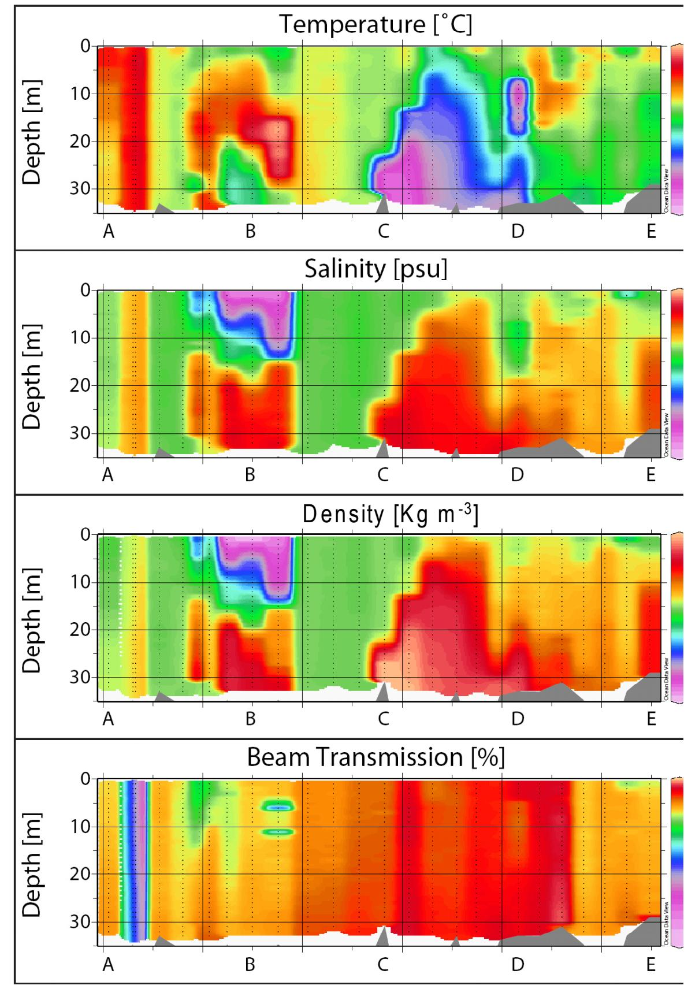

**Figure 6.4.1e.** Shallow-water CTD cast profiles to a 30-m depth around Rose during ASRAMP 2004, February 9–11, including temperature (°C), salinity (psu), density (kg m-3), and beam transmission (%). Profiles are shown sequentially in a clockwise direction around the island (A–E), as shown in Figure 6.4.1d.

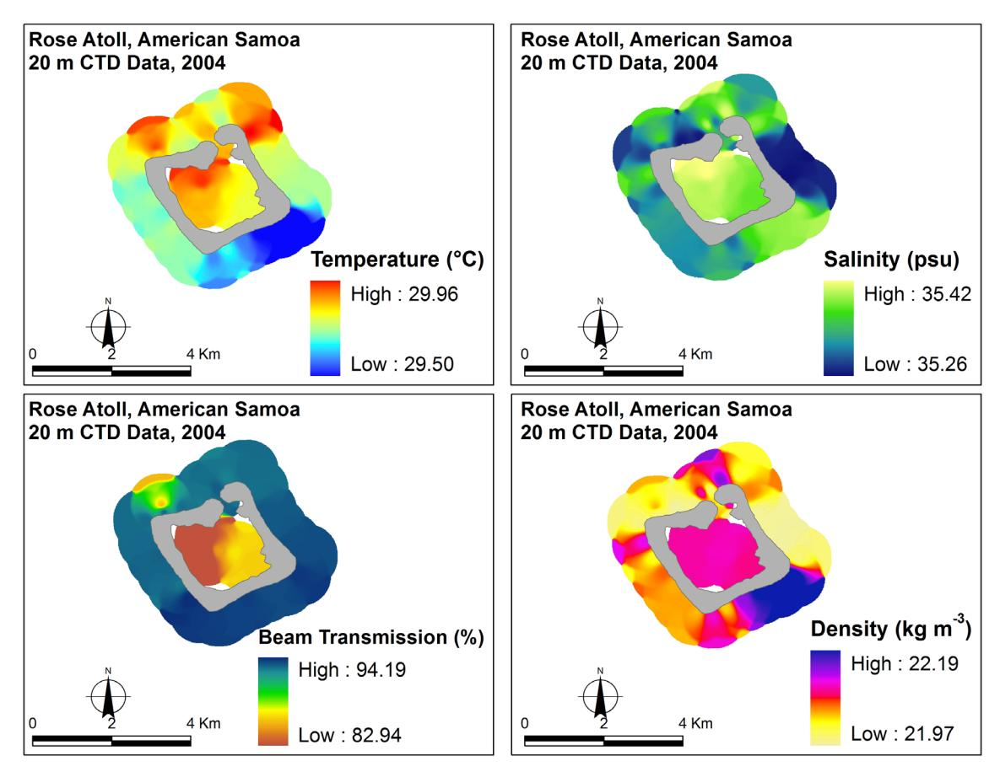

**Figure 6.4.1f.** Interpolated water temperature (top left), salinity (top right), beam transmission (bottom left) and density (bottom right) at a 20-m depth derived from shallow-water CTD casts around Rose during ASRAMP 2004, February 9–11.

29.96°C) and density (21.97–22.19 kg m-3), and moderate ranges in salinity (35.26–35.42 psu) and beam transmission (82.94–94.19%; Fig. 6.3.1f). The warmest, saltiest, and most turbid waters at the 20-m depth occurred in the western half of the lagoon. The waters of the forereef slopes showed increased spatial variability in water properties at a 20-m depth. The easternmost portion of the island exhibited a hydrographic feature where two slightly different water masses appeared to meet. The northern water was warmer, less saline and less dense, and the southern waters were colder, more saline, and denser. Though density at the 20-m depth within the lagoon was high (~ 22.2 kg m-3) in 2004, as during the 2002 surveys, the density at the 20-m depth was higher over the southeast forereef (~ 22.5 kg m-3) in 2004 than in 2002.

#### *2006 Spatial Surveys*

During ASRAMP 2006, 31 evenly spaced, shallow-water CTD casts were conducted around the steep, nearshore forereef slopes and lagoon of Rose between March 5 and 9 (Fig. 6.4.1g). Water samples were collected for nutrient analyses at 1, 10, 20, and 30-m depths, where possible, at seven of these shallow CTD sites. At these locations, 15 Dissolved Inorganic Carbon (DIC) samples, 23 nutrient samples, and 23 chlorophyll-a (Chl-a) water samples were collected (Fig. 6.4.1g).

Shallow-water CTD profiles around the steep forereef slopes of Rose during ASRAMP 2006 indicated horizontal and vertical structure (Fig. 6.4.1h). In the northwest region (A–B), particularly near the channel and northern point, the water column was well-stratified with warm (~ 29.7°C), relatively low salinity (> 35 psu) surface waters (0–10 m) over a body of cool (< 29.2°C), saline (> 35 psu), and relatively dense water (> 22 kg m-3). At the CTD site directly off the channel, these properties were locally deeper than surrounding areas. The southeast and southwest sides of the island (C–E) showed evidence of mixing during this period, with the exception of a single cast taken immediately south of the eastern point which showed a well-stratified water column, possibly indicative of two waters masses converging in this area. Just north of this point at the site labeled (C), a well-mixed, very low salinity (~ 34.95 psu) water column was observed.

Physical water properties at a 20-m depth around the steep forereef slopes and within the lagoon at Rose during ASRAMP 2006 showed moderate ranges in temperature (28.711– 29.17°C), salinity (35.26–35.52 psu), and density (21.91–22.19 kg m-3) (Fig. 6.4.1i), with interesting spatial structure. The warmest waters at the 20-m depth were observed in the northern portion of the northeast region and immediately offshore of the channel into the lagoon. The coolest waters at the 20-m depth were found inside the lagoon, where the most saline and highest density waters were observed. Water density values in the lagoon (22.19 kg m-3) were similar to those recorded in 2002. The least saline waters were observed along the forereefs of the northeast region and around the southern point where the southeast and southwest regions meet.

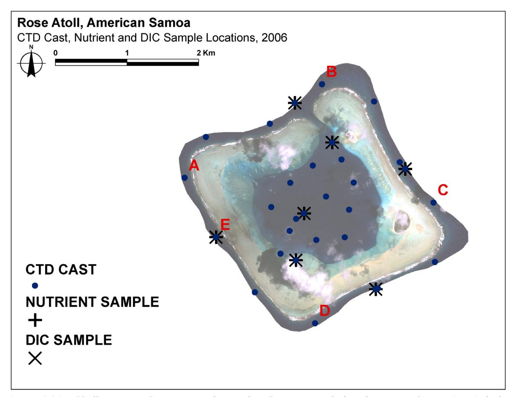

**Figure 6.4.1g.** Shallow-water CTD cast nutrient and DIC water sample locations around Rose (A–E) during ASRAMP 2006, March 5–9.

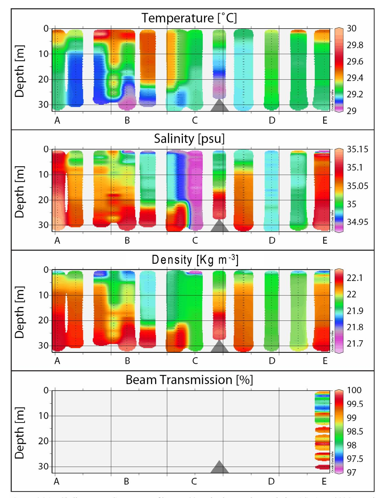

**Figure 6.4.1h.** Shallow-water CTD cast profiles to a 30-m depth around Rose during ASRAMP 2006, March 5–9, including temperature (°C), salinity (psu), density (kg m-3), and beam transmission (%). Profiles are shown sequentially in a clockwise direction around the island (A–E), as shown in Figure 6.4.1g. The beam transmission sensor in 2006 was faulty and corrupted data were removed.

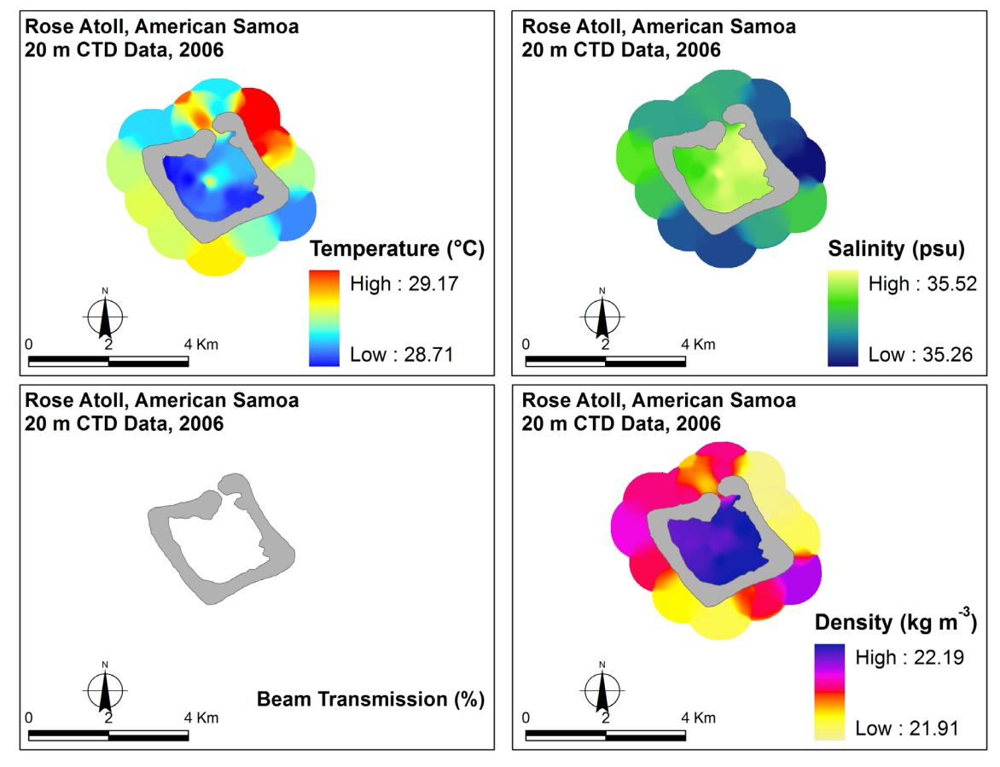

**Figure 6.4.1i.** Interpolated water temperature (top left), salinity (top right), beam transmission (bottom left), and density (bottom right) at a 20-m depth derived from shallow-water CTD casts around Rose during ASRAMP 2006, March 5–9. Beam transmission values for 2006 were removed because of faulty instrumentation.

Water quality analyses of the in situ water samples collected at a 20-m depth around Rose during ASRAMP 2006 exhibit the following ranges (Fig. 6.4.1j): Chl-a, 0.04–0.41  $\mu$ g L-1; nitrite (NO2-) 0.005–0.01  $\mu$ M; phosphate (PO4) 0.14–0.16  $\mu$ M; and silicate (SiO2) 0.93–1.23  $\mu$ M. The highest values of chlorophyll-a, nitrites, and silicates were observed in the lagoon, where the most saline and dense waters were also observed. The lowest values of nitrites and phosphates were observed along the southeast forereef. Phosphate had the highest observed values outside the lagoon, along the southwest forereef. Interestingly, values of chlorophyll-a, nitrite, and silicate at the site immediately adjacent to the channel entrance were substantially different from those within the lagoon.

#### 6.4.2 Temporal Comparison—Hydrographic Data

During each of the ASRAMP survey periods in 2002, 2004 and 2006, the nearshore CTD and water quality observations exhibited surprisingly high levels of spatial heterogeneity, given the small area of the atoll and its exposure to the surrounding ocean environment. Though somewhat small in magnitude, temperature and salinity variations around and within the atoll were notable. While some of the spatial patterns changed, the actual range of values of most of the water properties did not vary considerably among survey years. Lagoon salinity and density values were consistently high at a 20-m depth, suggesting that water residence times below the sill depth may be substantial. Outside the lagoon, spatial patterns of water

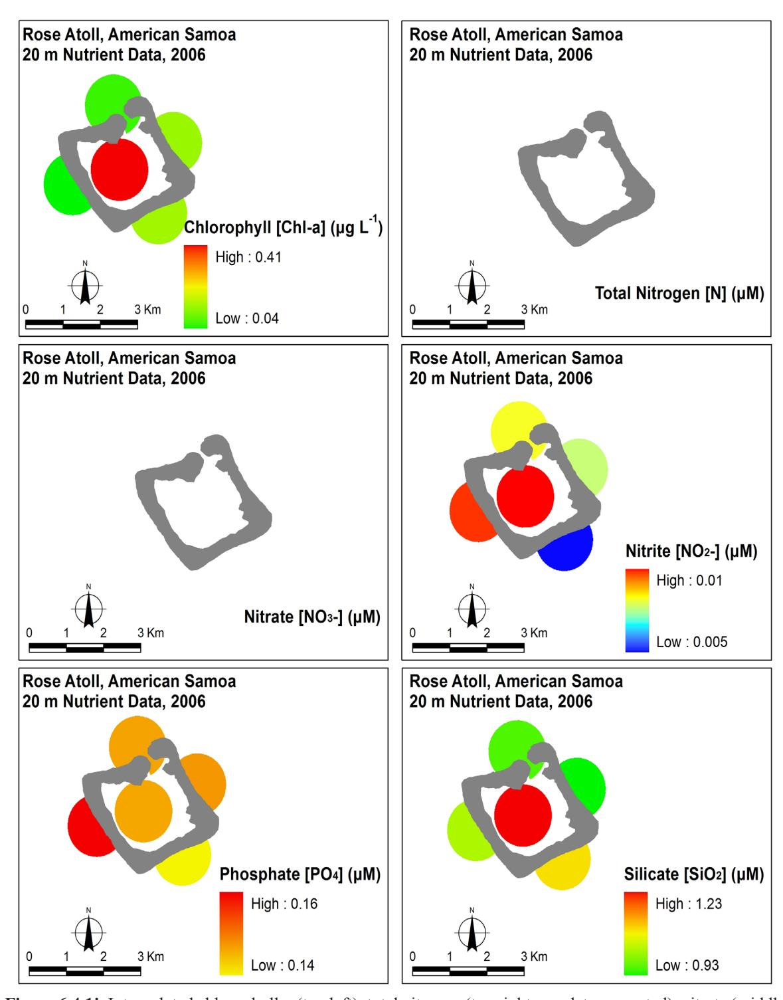

**Figure 6.4.1j.** Interpolated chlorophyll-a (top left), total nitrogen (top right - no data presented), nitrate (middle left - no data presented), nitrite (middle right), phosphate (bottom left) and silicate (bottom right) concentrations, at a 20-m depth derived from water samples collected in concert with shallow-water CTD casts around Rose during ASRAMP 2006, March 5–9.

properties over the forereefs varied between years. Nearshore conditions observed around Rose are likely representative of the ambient oceanographic conditions influencing the atoll during the austral summer season.

Prevailing, light, easterly winds measured by the moored in situ CREWS buoy may influence local surface currents that affect the oceanographic and water quality properties of this region (Fig. 6.4.3c). Datasets collected during ASRAMP cruises will act as a baseline for comparing future oceanographic and water quality datasets.

#### **6.4.3 Time Series Observations**

Between 2002 and 2006, a suite of moored instruments were deployed around Rose to collect time series observations of key oceanographic parameters influencing reef conditions (Fig. 6.4.3a). Deployment and retrieval dates and other details about the deployments are provided in Appendix II, Table II. v.

Figure 6.4.3b shows a time series of in situ and remotely sensed SST and modeled wave properties from January 2002 to April 2006. Pathfinder SST and in situ temperature observations around Rose show strong seasonal variation, with warmest temperatures (~ 29.5°C) observed during January–March and coolest temperatures (~ 27.5°C) in June–August

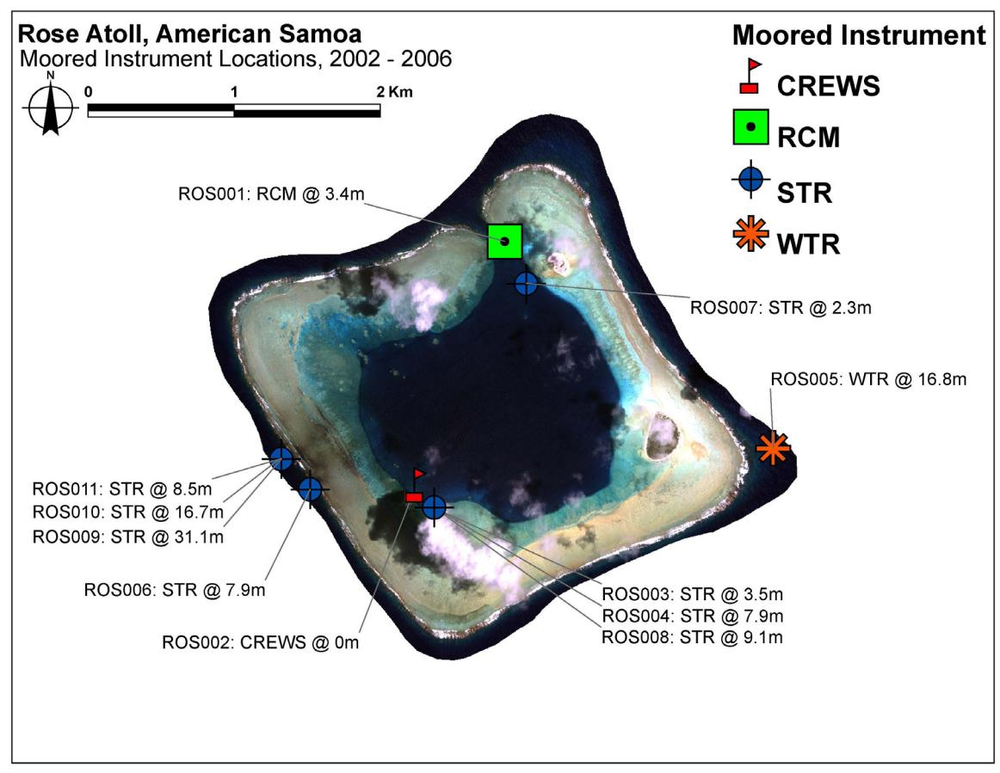

**Figure 6.4.3a.** Locations and types of oceanographic instrument moorings deployed around Rose between 2002 and 2006. Moored instrument types include: ecological acoustic recorder (EAR), RCM, STR, sea surface temperature (SST) buoy, and WTR.

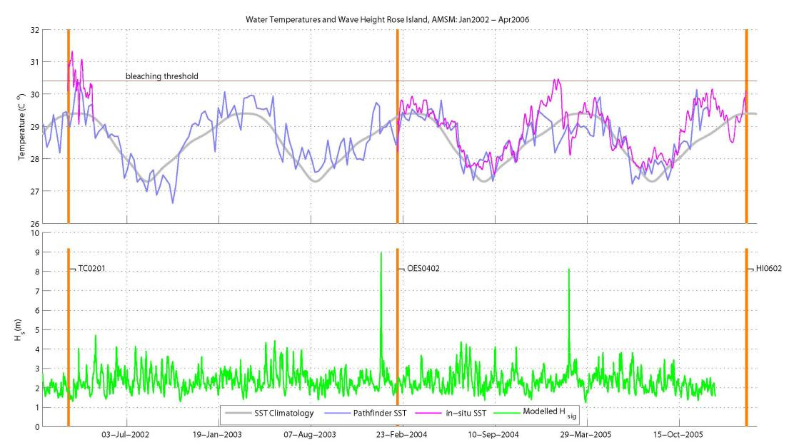

**Figure 6.4.3b.** SST and wave height time series around Rose between January 2002 and April 2006. Remotely sensed data (SST Climatology and weekly Pathfinder-derived SST) and modeled significant wave height derived from Wave Watch III are overlaid with Pacific Islands Fisheries Science Center (PIFSC) Coral Reef Ecosystem Division (CRED) in situ temperature observations from (CREWS buoy at ROS-06). The horizontal red and vertical orange bars represent the bleaching threshold and the ASRAMP research cruise dates, respectively.

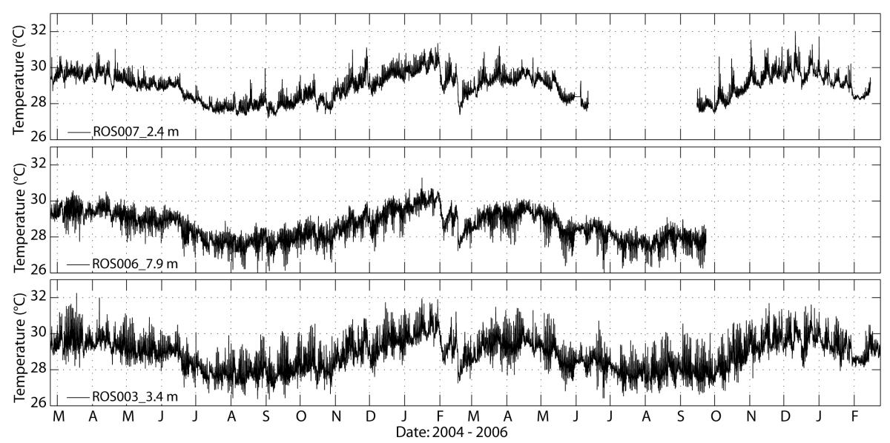

**Figure 6.4.3c.** Time series observations of temperature from March 2004 to February 2006 collected from six STRs deployed at different locations and depths around Rose. See Figure 6.4.3a for mooring locations.

(Fig. 6.3.2b; top panel). A particularly cool episode, with Pathfinder SST dropping nearly 2°C below the SST climatology, was observed during austral winter 2002 prior to sharply rising 3°C to return to climatological temperatures later that year. Another cool episode, captured via in situ measurements, was observed in February 2005, when SST dropped by ~ 2°C in a matter of days. This SST change was not observed via satellite-based measurements, as no data for Rose existed during that time period (possibly caused by cloud cover or other atmospheric conditions).

Modeled significant waveheight data for Rose revealed weak seasonal variability superposed with episodic, cyclone-derived extreme wave events. Larger wave heights (~ 3–4 m) typically occurred during winter months and smaller wave heights (~ 2 m) during the summer months. Two extreme swell events were observed during the time series record: the first, in January 2004, was produced by Cyclone Heta, and the second in February 2005, was produced by Cyclones Olaf and Percy (Fig. 6.4.3b, bottom panel).

Time series observations of temperature from four STRs deployed around Rose during the 2004 to 2006 time period showed maximum temperature

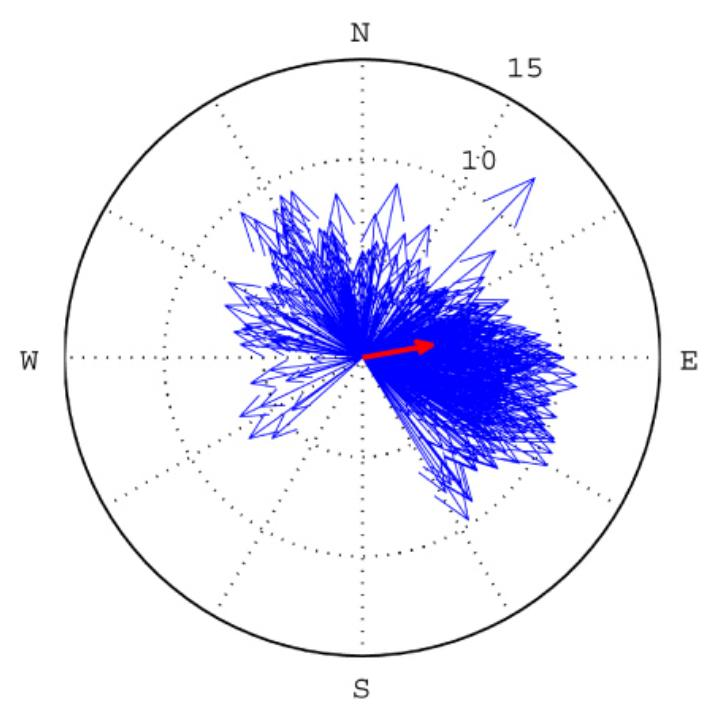

**Figure 6.4.3d.** Wind rose derived from CREWS buoy wind observations at a height of 2 m above the sea surface at Rose over the period February 8, 2004, to April 11, 2006. Blue arrows represent the daily average wind direction. Length of the blue arrows indicates wind speed (0–15 m s-1). The red arrow represents the average for the entire time period, depicting the prevailing light easterly winds. The wind vectors point to the direction from which the wind is blowing. Data points outside three standard deviations from the mean were removed prior to plotting.

fluctuations of ~ 6°C caused by seasonal variability (Fig. 6.4.3c). Shallow STRs recorded significant diurnal warming and cooling with diurnal temperature fluctuations of up to 3°C. The temperatures recorded on STRs deployed deeper along the forereef slopes and within the lagoon indicated less high frequency (diurnal) variability.

When comparing the two datasets, it appears the large wave event (6-m wave heights) in February 2005 coincided with observed decreases in water temperatures at each of the in situ recorders. Rose is enclosed by emergent reef with a small opening to the north, which is the only opening for water exchange to the surrounding environment. It is likely that the lagoon, where several in situ temperature recorders were deployed, experienced rapid cooling caused by the large waves breaking over the emergent reef and flushing of the lagoon with pelagicbased waters.

Local surface wind direction and speed observations recorded by the in situ CREWS buoy are shown in Figure 6.4.3d. Though variability is high, mean wind speeds were typically light (~ 4 m s-1; 8 knots) and mean wind direction was typically from the east. The figure also shows that winds are frequently ~ 10 m s-1 (20 knots) from the east-southeast. These wind observations were recorded at a height of 2 m above the sea surface. When corrected for boundary layer effects, actual winds at the standard meteorological height of 10 m will substantially increase these values.

# **6.5 Coral and Coral Disease**

# **6.5.1 Coral Surveys**

#### *2002 Spatial Surveys*

A total of 22 towed-diver surveys, with a mean depth of 10.1 m, were conducted around the forereef and lagoon habitats of Rose during ASRAMP 2002. Individual towed-diver survey track depths varied from 5 m (SE 1) to 23 m (SE 3; Fig. 6.5.1a). Percent cover of live scleractinian coral and dead coral, both of which were independent benthic observations, were separated into two separate zones: ocean-exposed forereef habitat (18 surveys) and lagoonal/backreef habitat (4 surveys). No towed-diver survey track depths were recorded within the lagoon because of faulty instruments.

During ASRAMP 2002, the percent cover of live scleractinian (stony) coral in forereef habitats around Rose was calculated as 29.2% (SE 2.0; Fig. 6.5.1b), while the percent cover of recently dead coral in forereef habitats was calculated as 0.4% (SE 0.1; Fig. 6.5.1c). The percent cover of live coral of lagoonal habitats was 1.7% (SE 0.5). No recently dead coral was recorded for lagoonal habitats.

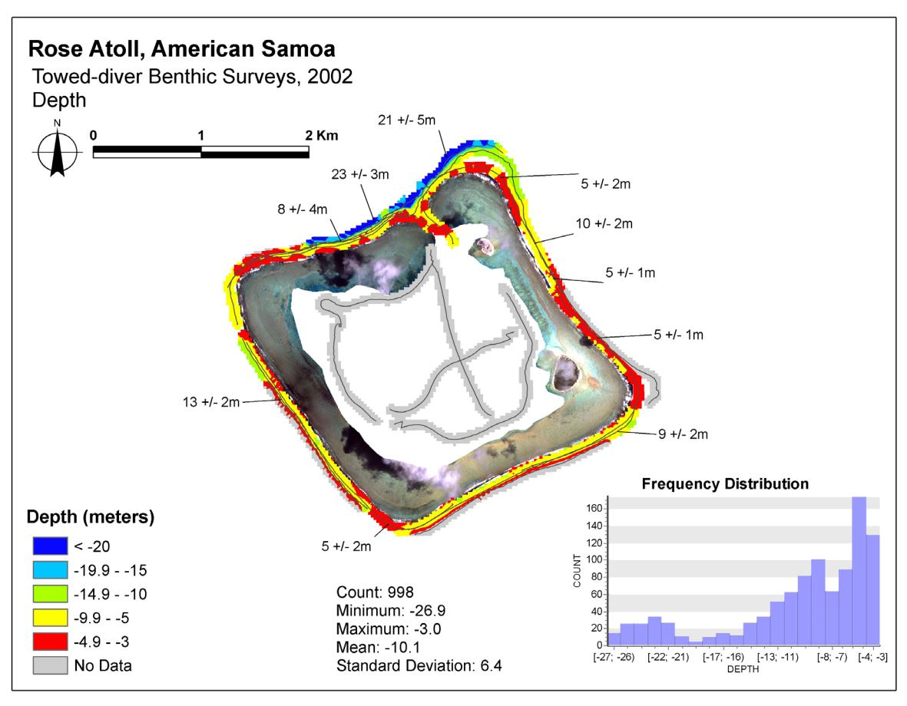

**Figure 6.5.1a.** Towed-diver survey tracks around Rose during ASRAMP 2004. Towed-diver survey tracks are color coded with mean depths for each 5-min segment. Mean depths and standard deviations for each toweddiver survey are shown in black text. Depth histogram and statistics (counts, minimum depth, maximum depth, mean, and standard deviation) from 30-sec depth recordings during towed-diver surveys are included.

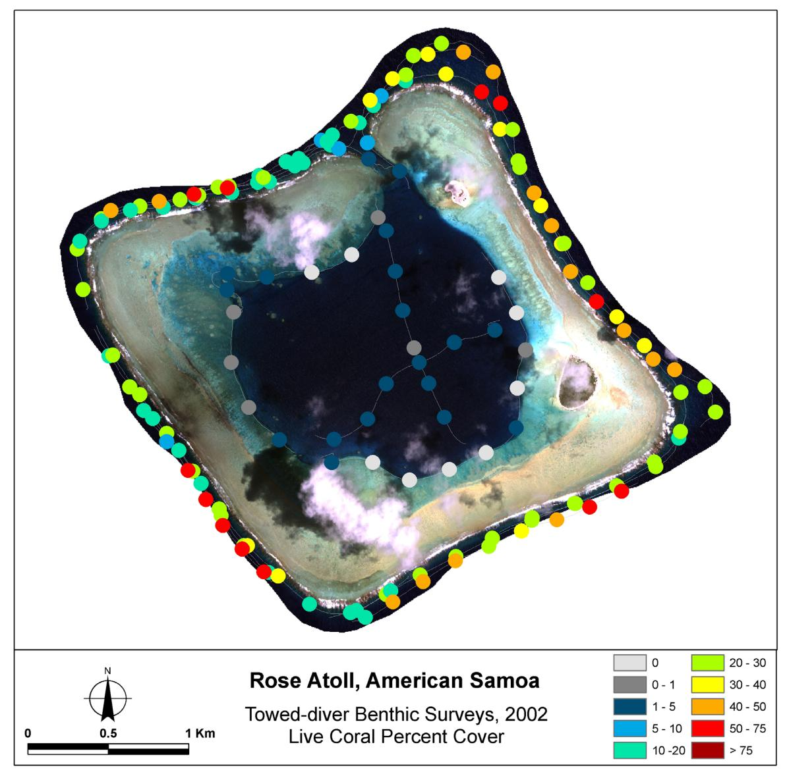

**Figure 6.5.1b.** Towed-diver benthic survey observations of live scleractinian (stony) coral cover around Rose during ASRAMP 2002. Each colored point represents an integrated estimate computed over a 5-min observation segment covering a survey swath of ~ 200 m × 10 m (~ 2000 m2 ). Symbol size represents the percent live coral cover on the benthic habitat. Coral cover was measured as a direct percentage of overall benthic cover in 2002.

The percent cover of live scleractinian (stony) coral in forereef habitats around Rose was relatively uniform in distribution during 2002. Elevated live coral cover was observed sporadically distributed around the atoll. Five tow segments in the southwest region (mean: 61.0%) were deeper than their adjacent tow segments and had elevated coral cover. The northeast region (most northern corner, 4 tow segments, mean: 55%) also exhibited patches of elevated coral cover. The percent cover of recently dead coral was very low (0–5%), and had a uniform distribution around the island. The largest difference in coral cover was noted between the forereef and lagoonal habitats. Towed-diver survey track depth did not directly correspond to variable live or recently dead coral cover values.

In October 1993, Rose experienced a ship grounding (the Taiwanese fishing vessel *Jin Shaing Fa*) and associated fuel spill that killed corals and coralline algae over a broad reach

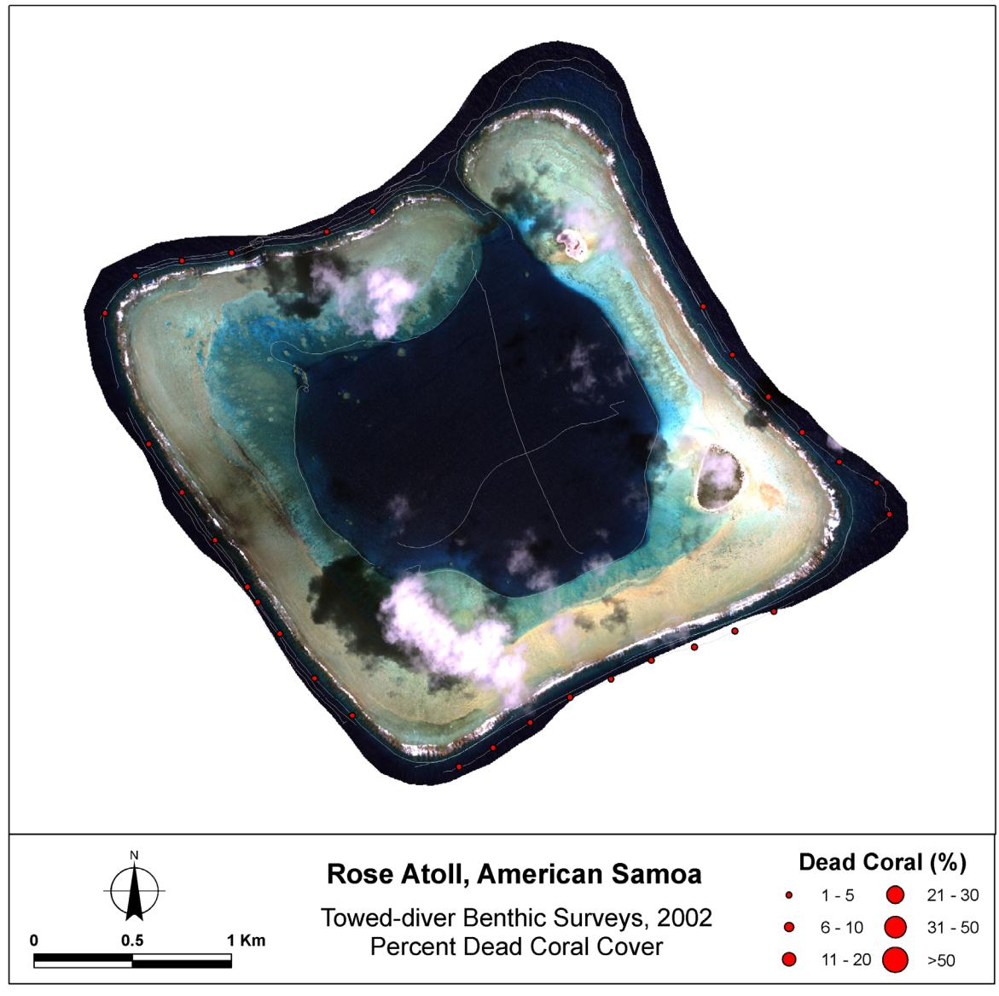

**Figure 6.5.1c.** Towed-diver benthic survey observations of dead coral cover around Rose during ASRAMP 2002. Each colored point represents an integrated estimate computed over a 5-min observation segment covering a survey swath of ~ 200 m × 10 m (~ 2000 m2 ). Symbol size represents the percent dead coral cover on the benthic habitat.

of the southwest reef crest and upper reef margins. Later, dissolved iron from the wreckage stimulated growth of invasive cyanobacteria that still carpets much of the southwest reef crest and slopes, which has slowed the recovery of coralline algae and corals (Schroeder et al., 2008). In April 1994, shortly after the grounding, Rose experienced massive coral bleaching in all habitats to depths of ~ 20–25 m1 . The bleaching was observed during the first post-shipwreck coral surveys at ocean-facing reef slopes and lagoon backreefs around all four sides of the atoll led by the U.S. Fish and Wildlife Service (USFWS). In 1999–2000, Dr. Jim Maragos revisited Rose as part of an emergency partial cleanup of the ship debris and established eight permanent transects at the base of patch reefs in the lagoon, but was unable to resurvey ocean reefs.

1Maragos, J, USFWS. Pers. Commun.

USFWS REA coral surveys during ASRAMP 2002 were the first surveys conducted in American Samoa by CRED. During that deployment, four of the lagoon sites were revisited and three new permanent transects were established: one in the central lagoon and two off the southwest ocean-facing reef at sites ROS-05 and ROS-07). Additional qualitative REA surveys were also conducted around all four ocean-facing sides of the atoll in 2002. Though a total of 13 sites were surveyed around Rose by a coral biologist, much of the focus of those surveys was to compile species inventories. Since the surveys were exploratory and qualitative in nature, no data are presented in this more quantitative report.

#### *2004 Spatial Surveys*

A total of 27 towed-diver benthic surveys, with a mean depth of 13.0 m, were conducted around the forereef and lagoon habitats of Rose during ASRAMP 2004 (Fig. 6.5.1d). Individual towed-diver survey track depths ranged from 5.0 m (SE 2.0 ) to 21.0 m (SE 3.0), with purposeful efforts to target three depth ranges: shallow (~ 5 m), mid-depth (~ 10–15 m), and deep (~ 20–25 m), as reflected in the depth histogram. For analysis, the percent live scleractinian coral and stressed coral were separated into two separate zones: ocean-exposed forereef habitat (20 surveys) and lagoonal/backreef habitat (7 surveys). The percent cover of live scleractinian (stony) coral in forereef habitats was 23.5% (SE 1.2; Fig. 6.5.1e), while the

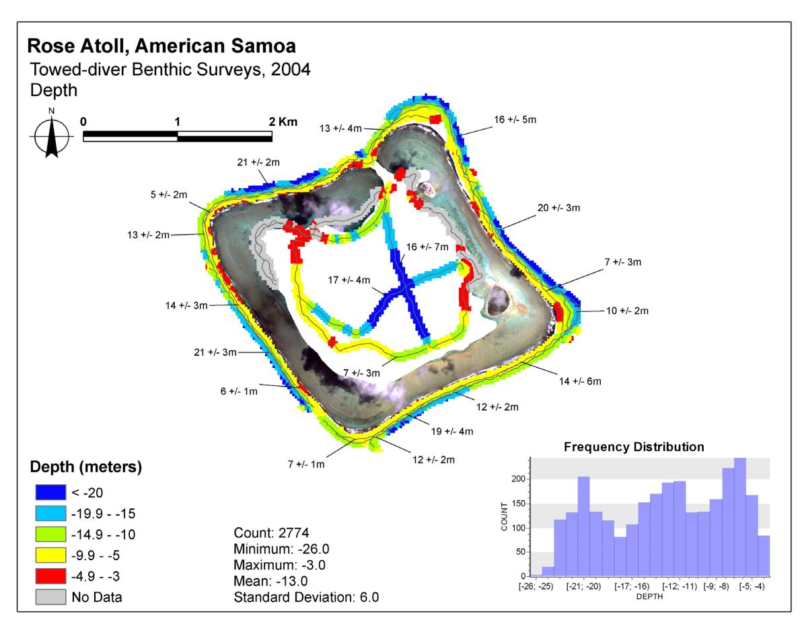

**Figure 6.5.1d.** Towed-diver survey tracks around Rose during ASRAMP 2004. Towed-diver survey tracks are color coded with mean depths for each 5-min segment. Mean depths and standard deviations for each toweddiver survey are shown in black text. Depth histogram and statistics (counts, minimum depth, maximum depth, mean, and standard deviation) from 30-sec depth recordings during towed-diver surveys are included.

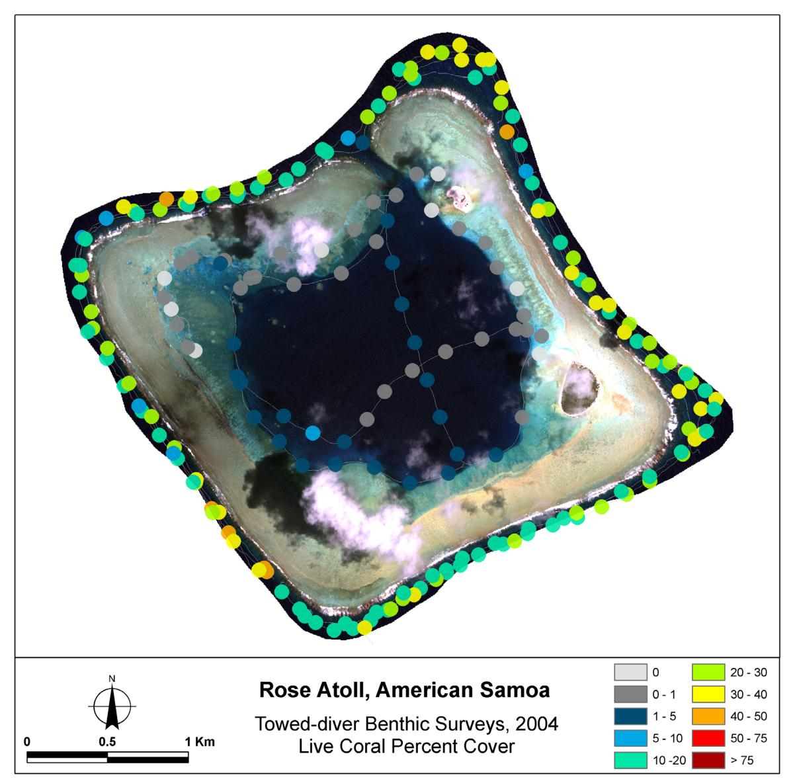

**Figure 6.5.1e.** Towed-diver benthic survey observations of live scleractinian (stony) coral cover around Rose during ASRAMP 2004. Each colored point represents an integrated estimate computed over a 5-min observation segment covering a survey swath of ~ 200 m × 10 m (~ 2000 m2 ). Symbol size represents the percent live coral cover on the benthic habitat.

percent cover of stressed coral, which is a subset of live coral cover, was 5.6% (SE 1.0; Fig. 6.5.1f). The percent cover of live coral of lagoonal habitats was 1.5% (SE 0.3; Fig. 6.5.1e), while the percent cover of stressed coral was 0.4% (SE 0.4; Fig. 6.5.1f).

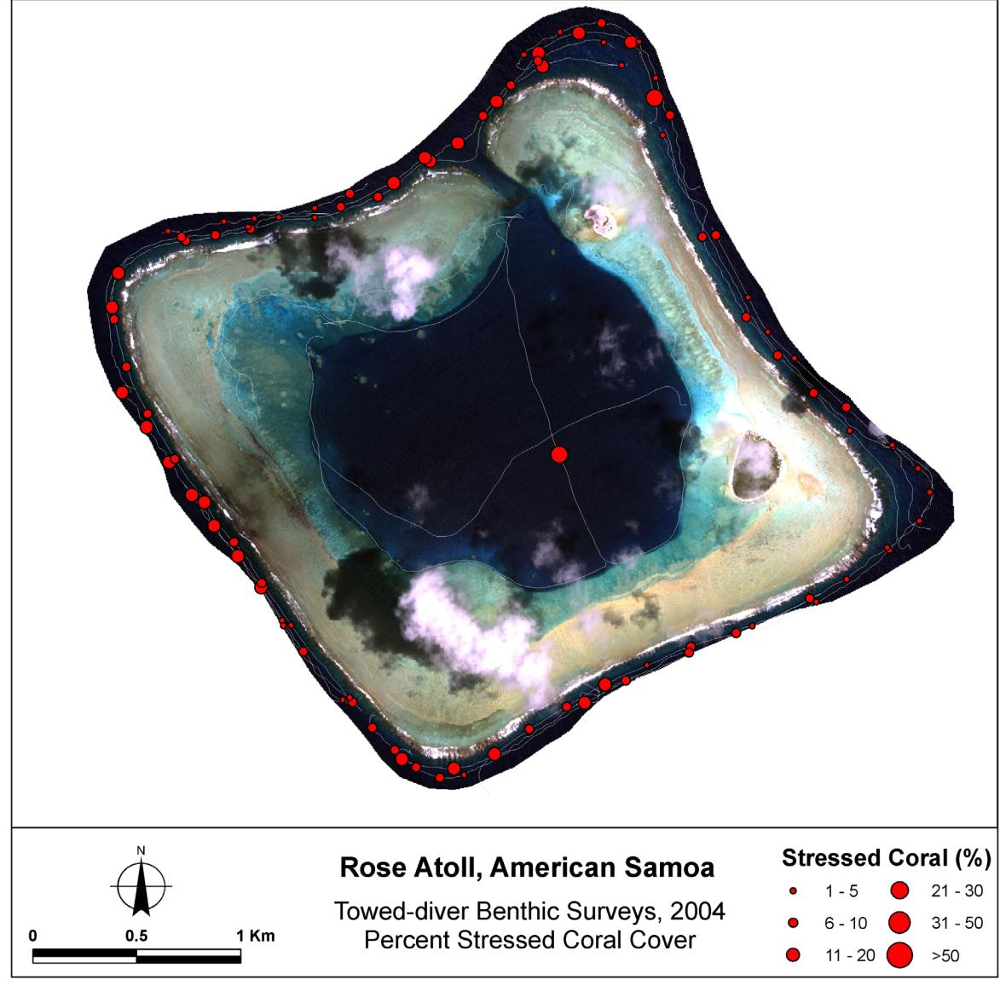

**Figure 6.5.1f.** Towed-diver benthic survey observations of stressed coral cover around Rose during ASRAMP 2004. Each colored point represents an integrated estimate computed over a 5-min observation segment covering a survey swath of ~ 200 m × 10 m (~ 2000 m2 ). Symbol size represents the percent of stressed coral cover of the total coral benthic coverage. Stressed coral cover was measured as a percentage of overall coral cover in 2004.

Percent cover of live scleractinian coral and stressed coral from towed-diver survey observations around Rose during ASRAMP 2004 showed a relatively uniform island-wide coral community. The most noteworthy spatial pattern observed indicated large differences in percent cover between forereef and lagoonal habitats; the lagoon was largely a softbottom community, with sporadic coral pinnacles and low coral cover, while the forereef was composed primarily of hard substrate with moderate levels of live coral cover (10–40%). Percent cover of stressed coral was generally low, but occasionally as high as 11–20% of the live coral, apparently most focused on the north, west, and south points. Very little stressed coral was observed on the windward east point of Rose.

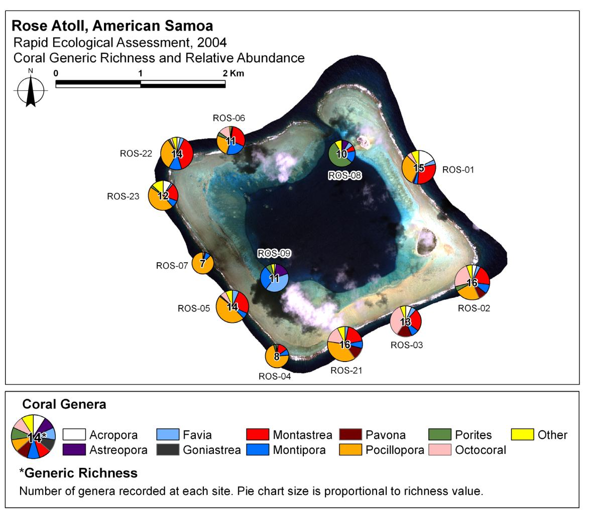

**Figure 6.5.1g.** Relative abundance of coral genera and generic richness from REA surveys around Rose during ASRAMP 2004. Percent relative abundance of key coral genera are indicated by color-coded portions of the pie charts. Size of the pie charts and black numbers in the center of the pie charts indicate the number of coral genera observed at each REA site.

Twelve REA coral surveys were conducted around Rose during ASRAMP 2004. At least 26 anthozoan/hydrozoan genera were recorded around Rose (Fig. 6.5.1g). As expected, the coral communities at ocean-facing forereef sites were substantially different than at sites within the lagoon. Members of the genera *Pocillopora* and *Montastrea* dominated the forereef communities, accounting for, on average, 42% and 21% of the coral community, respectively. Octocorals were also common at sites ROS-02, ROS-03, and ROS-21 along the southeast forereef, accounting for 23.1% of the corals at these three sites. Sites ROS-09 and ROS-08 inside the lagoon had unique coral communities compared to sites on the forereef. *Porites* constituted over half of the coral colonies found at site ROS-08 in the lagoon near the channel, while *Favia* (40%) and *Astreopora* (18%) were dominant genera at site ROS-9P.

Generic richness was consistent at all forereef sites around Rose during ASRAMP 2004, averaging 12.3 (SE 0.9) coral genera per site, except at site ROS-07, where the ship grounding occurred, and site ROS-04, where only seven and eight coral genera were recorded, respectively (Fig. 6.5.1g). Site-specific data regarding the relative abundance of coral genera, by colony counts within belt transects, are available in Appendix III, Table III. ix.

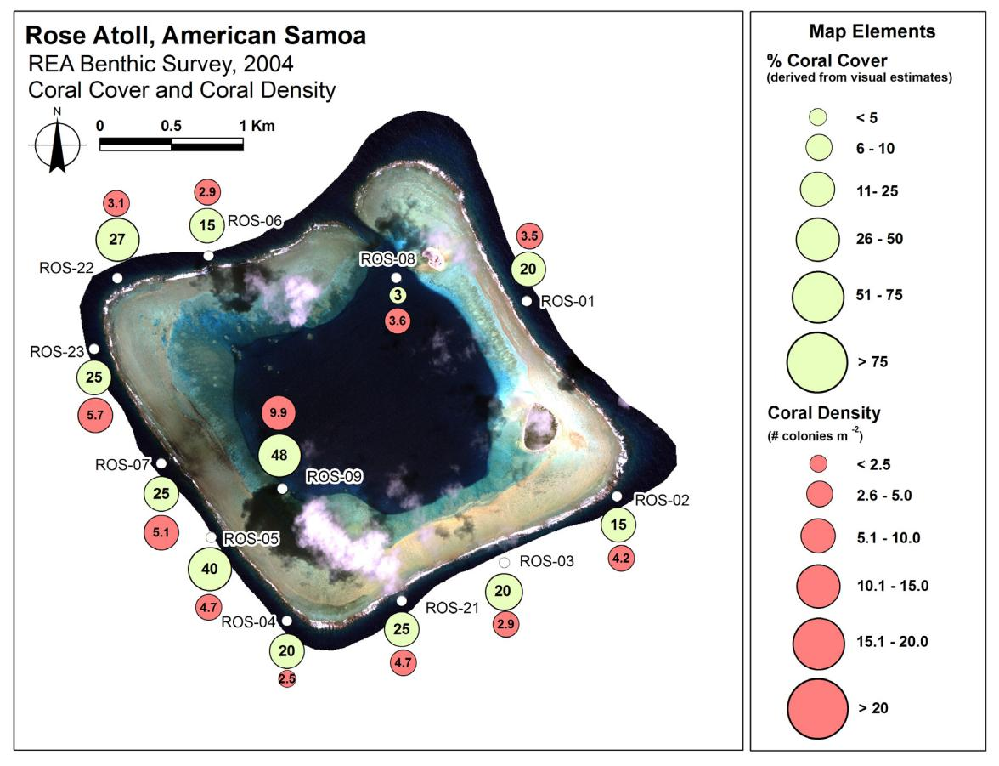

**Figure 6.5.1h.** Live scleractinian (stony) coral cover and coral colony density from REA surveys around Rose during ASRAMP 2004. The size of the symbol is proportional to the value of each parameter. Coral percent cover was determined by qualitative visual estimates.

The mean percent cover of live scleractinian (stony) coral observed around forereef sites during ASRAMP 2004 REA surveys (derived through visual estimates) was 23.6% (SE 4.1; Fig. 6.5.1h). Coral cover at forereef sites was consistent and ranged from 15% to 27%. The only exception was site ROS-05, off the southwest region of the atoll, where cover was recorded as 40%. Visual estimates of coral cover within the lagoon were variable, with low coral cover (~ 3%) recorded near the channel at site ROS-08. In contrast, the lagoon pinnacle at site ROS-09 had the highest coral cover (48%) of any REA site around Rose.

During ASRAMP 2004, a total of 4695 coral colonies were counted within a total survey area of 1086 m2 (Fig. 6.5.1h). Coral densities around Rose were variable, with a mean coral density per site of 4.3 colonies m-2 (SE 0.7). Coral density was low at all forereef sites (2.5 colonies m-2 to 5.7 colonies m-2). The highest coral density (9.9 colonies m-2) around Rose was found inside the lagoon at ROS-09.

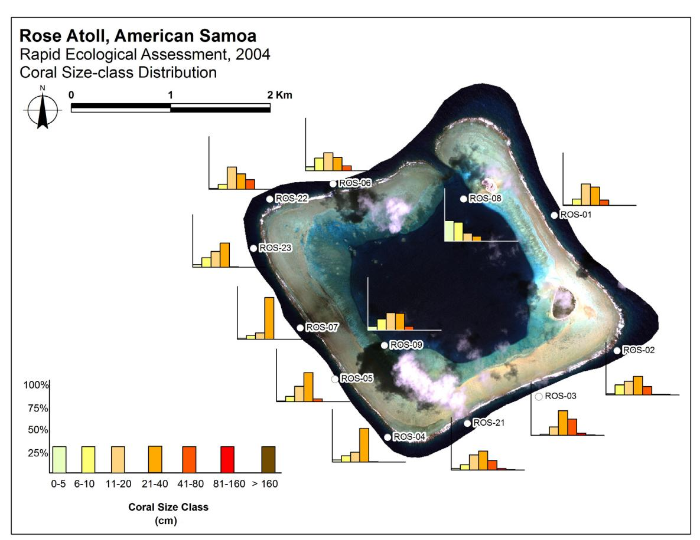

**Figure 6.5.1i.** Scleractinian coral size-class distribution around Rose from REA surveys during ASRAMP 2004. The height of the *y*-axis in each size class chart represents 100%. The seven observed size classes (0–5, 6–10, 11–20, 21–40, 41–80, 81–160, and > 160 cm) are color coded in size frequency diagrams at each REA site.

During ASRAMP 2004, size class distributions around Rose show that 48.9% of coral colonies had maximum diameters less than 20 cm (Fig. 6.5.1i). Corals greater than 40 cm were common at forereef sites around Rose, with five of the eight forereef sites having more than 10% of corals within these larger size classes. Only one site, ROS-08 inside the lagoon, had abundant small corals, with almost 40% of corals having maximum diameters less than 5 cm.

Site ROS-07 is unique at this atoll, because it is located at a 1993 ship grounding site. Coral cover at this site is relatively low (Fig. 6.5.1h), and the community is dominated by *Pocillopora*, a genus known to quickly colonize available substrate. Large blooms of cyanobacteria have been observed at ROS-07, suggesting a causal relationship between the ship grounding and the algal bloom (Fig. 6.5.1j). The long-term effects of this grounding are examined in a recent manuscript (Schroeder et al., 2008).

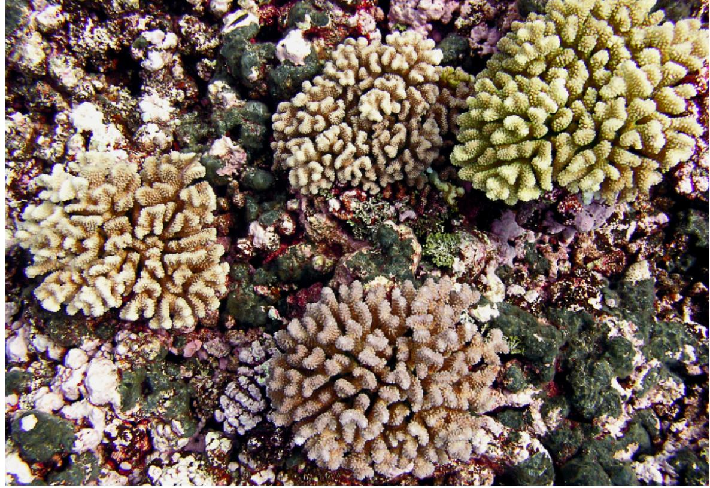

**Figure 6.5.1j.** Corals in the genus *Pocillopora* are among the first to colonize disturbed benthic areas, as seen at site ROS-07. Cyanobacteria (seen here as the dark green coloration between coral colonies) are abundant as a result of persistent effects stemming from a 1993 vessel grounding. (*Photograph provided by NOAA PIFSC CRED; J. Kenyon, JIMAR*)

# *2006 Spatial Surveys*

A total of 26 towed-diver benthic surveys, with a mean depth of 13.0 m, were conducted around the forereef and lagoon habitats of Rose during ASRAMP 2006 (Fig. 6.5.1k). Individual towed-diver survey track depths ranged from 4.0 m (SE 2.0)to 21.0 m (SE 3.0), with purposeful efforts to target three depth ranges: shallow (~ 5 m), mid-depth (~ 10–15 m), and deep (~ 20–25 m), as reflected in the depth histogram.

Percent cover of live scleractinian (stony) coral and stressed coral were analyzed within two separate zones: ocean-exposed forereef habitats (21 surveys) and lagoonal/backreef habitats (5 surveys). The percent cover of live scleractinian (stony) coral on forereef habitats was 20.1% (SE 1.8; Fig. 6.5.1l), while stressed coral, which was a subset of live coral cover, was 4.5% (SE 1.2; Fig. 6.5.1m). The percent cover of live coral on lagoonal/backreef sites was 5.9% (SE 0.9; Fig. 6.5.1l), while the percent cover of stressed coral was 0.9% (SE 0.4; Fig. 6.5.1m).

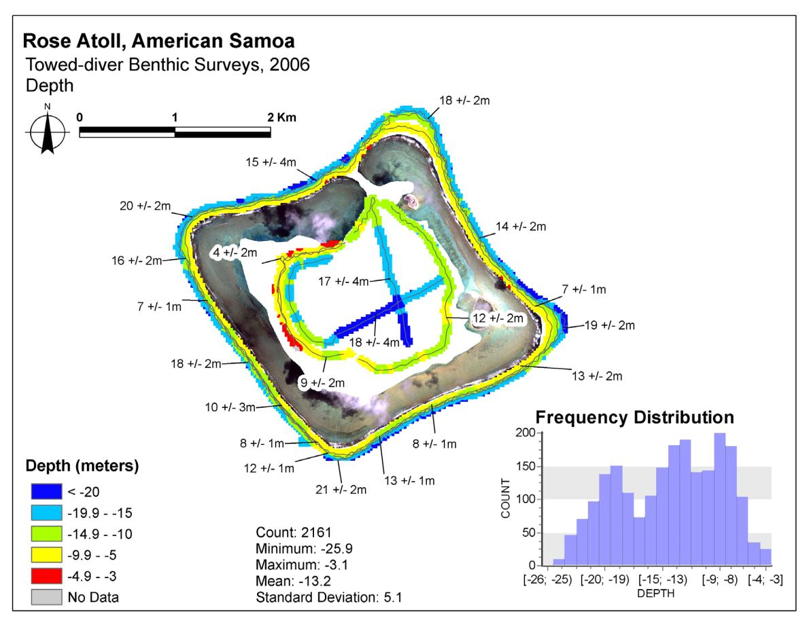

**Figure 6.5.1k.** Towed-diver survey tracks around Rose during ASRAMP 2006. Towed-diver survey tracks are color coded with mean depths for each 5-min segment. Mean depths and standard deviations for each toweddiver survey are shown in black text. Depth histogram and statistics (counts, minimum depth, maximum depth, mean, and standard deviation) from 30-sec depth recordings during towed-diver surveys are included.

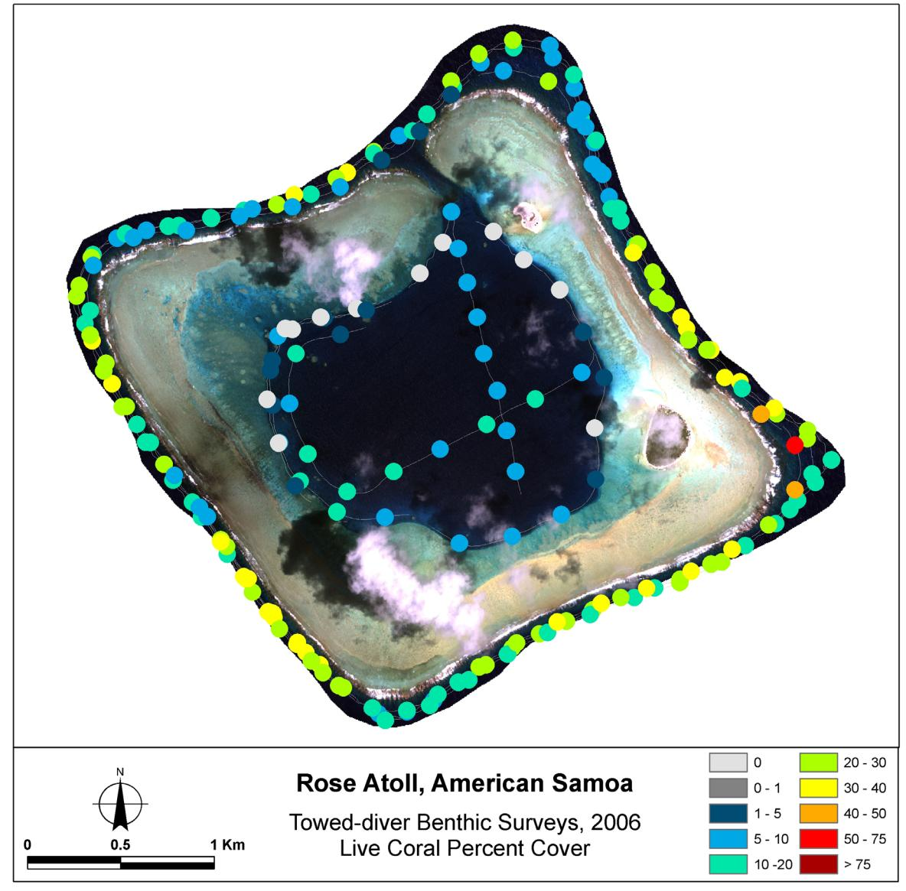

**Figure 6.5.1l.** Towed-diver benthic survey observations of live scleractinian (stony) coral cover around Rose during ASRAMP 2006. Each colored point represents an integrated estimate over a 5-min observation segment covering a survey swath of ~ 200 m × 10 m (~ 2000 m2 ). Symbol size represents the percent live coral cover on the benthic habitat. See Chapter 2, Section 2.4.2, Table 2.4.2b for more information on benthic towed-diver binning categories during ASRAMP 2006.

Spatially, the percent cover of live coral around Rose was relatively uniform, with notable high coral cover areas: tow segments in the southwest region (7 tow segments, mean: 33.6%), northeast region (5 tow segments, 33.2%), and the southeast region (6 tow segments, 28.3%). Stressed coral cover was low island-wide, with the only localized increases recorded along the northwest region of the island, where six contiguous segments from the shallow, inshore survey track found relatively high coral stress (36.3%).

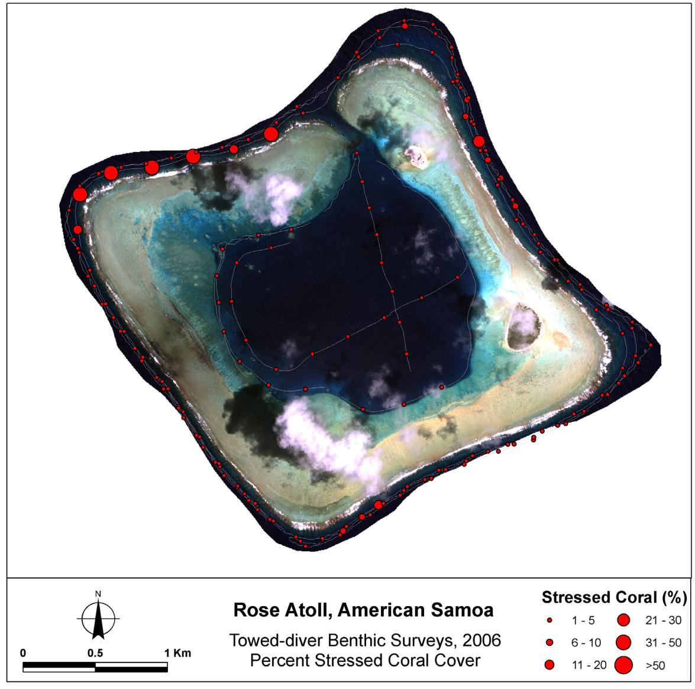

**Figure 6.5.1m.** Towed-diver benthic survey observations of stressed coral cover around Rose during ASRAMP 2006. Each colored point represents an integrated estimate over a 5-min observation segment covering a survey swath of ~ 200 m × 10 m (~ 2000 m2 ). Symbol size represents the percent of stressed coral cover of the total coral benthic coverage. See Chapter 2, Section 2.4.2, Table 2.4.2b for more information on benthic towed-diver binning categories during ASRAMP 2006.

Eleven REA coral surveys were conducted around the steep forereef slopes and lagoon/ backreef habitats of Rose during ASRAMP 2006. Colonies belonging to at least 27 anthozoan/hydrozoan genera were counted at Rose, with members of the genera *Pocillopora*, *Porites*, *Montastrea*, and *Montipora* each contributing more than 10% of the total number (Fig. 6.5.1n). *Pocillopora* dominated the forereef communities, accounting for, on average, 48% of the coral colonies. *Astreopora* was only common inside the lagoon at sites ROS-08 and ROS-09. Site-specific data regarding the relative abundance of coral genera, by colony counts within belt transects, are available in Appendix III, Table III. x.

Generic richness was similar among REA sites (excluding the shipwreck site, ROS-07) with 13.5 coral genera (SE 1) recorded per site. Lower richness was seen inside the lagoon (Fig.

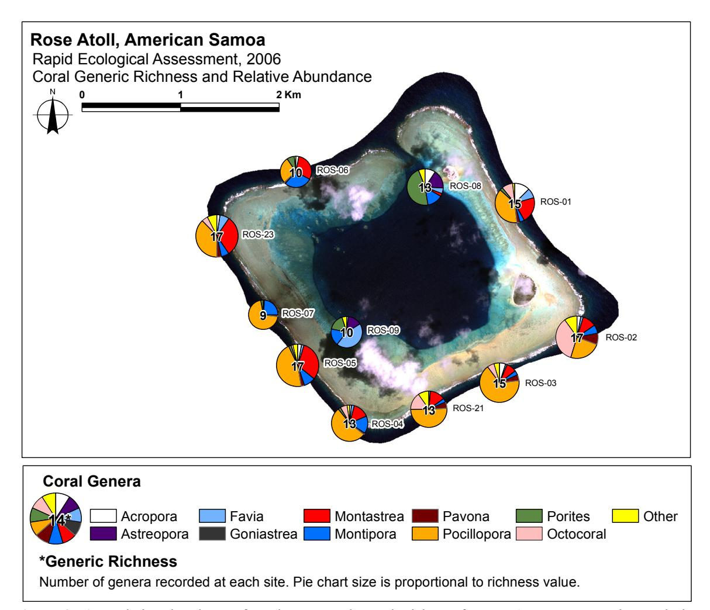

**Figure 6.5.1n.** Relative abundance of coral genera and generic richness from REA surveys around Rose during ASRAMP 2006. Percent relative abundance of key coral genera are indicated by color-coded portions of the pie charts. Size of pie charts and black numbers in the center of the pie charts indicate the number of coral genera observed at each REA site. ROS-22 was not surveyed in 2006 because of inclement environmental conditions.

6.5.1n). Lower coral richness at ROS-07, the site of the 1993 ship grounding, may be a result of the narrow range of recruiting coral species colonizing the substrate.

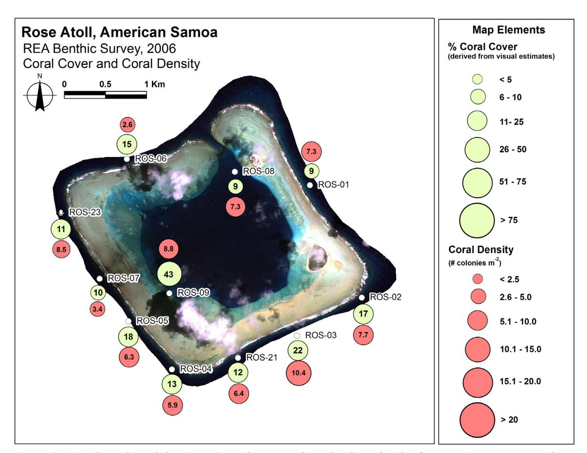

**Figure 6.5.1o.** Live scleractinian (stony) coral cover and coral colony density from REA surveys around Rose during ASRAMP 2006. The size of the symbol is proportional to the value of each parameter. ROS-22 was not surveyed in 2006 because of inclement environmental conditions.

Island-wide mean percent cover of live scleractinian (stony) coral in the forereef habitats of Rose, derived from the line point intercept method, was 13.8% (SE 1.3; Fig. 6.5.1o). The percent cover of live coral at forereef sites was highest (17.6%) at site ROS-05 in the southwest region, and lowest (8.8%) at site ROS-01 in the northeast region. ROS-07 site of the 1993 ship grounding exhibited low coral cover (9.8%). Coral cover at the lagoon site near the channel (ROS-08) was low (8.8%) while the lagoon pinnacle site farther from the channel (ROS-09) had the highest coral cover of any site at Rose (43.1%).

During ASRAMP 2006 surveys around Rose, a total of 4267 coral colonies were counted within a total survey area of 605 m2 . Mean coral density between REA sites was variable, with 6.8 colonies m-2 reported (SE 0.8; Fig. 6.5.1o). The highest coral density (10.4 colonies m-2) was observed at site ROS-03 on the southeast forereef, while the lowest coral density (2.6 colonies m-2) was recorded at site ROS-06 on the northwest forereef.

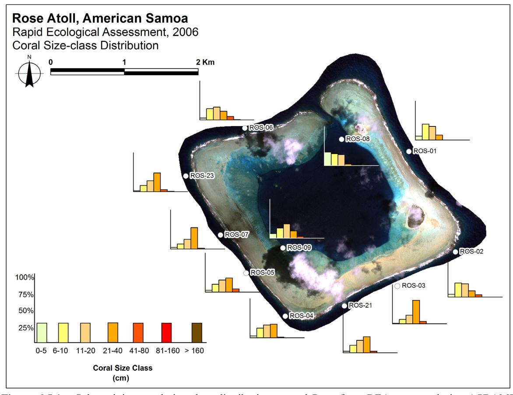

**Figure 6.5.1p.** Scleractinian coral size-class distribution around Rose from REA surveys during ASRAMP 2006. The height of the *y*-axis in each size class chart represents 100%. The seven observed size classes (0–5, 6–10, 11–20, 21–40, 41–80, 81–160, and > 160 cm), are color coded in size frequency diagrams at each REA site. ROS-22 was not surveyed in 2006 because of inclement environmental conditions.

During ASRAMP 2006, size class distributions showed that the majority (68.9%) of coral colonies had maximum diameters less than 20 cm (Fig. 6.5.1p). Corals greater than 40 cm maximum diameter were not common at any site. Abundant small corals were common at sites ROS-08 and ROS-09 inside the lagoon and at site ROS-01 on the northeast forereef, with more than 10% of corals having maximum diameters less than 5 cm at each site.

# **6.5.2 Coral Disease Surveys**

# *2006 Spatial Surveys*

Coral disease surveys during ASRAMP 2006 covered a total survey area of 4425 m2 around Rose, with 361 cases of coral disease, predation, and other lesions observed. This number translates to an overall average prevalence of 1.0% (SE 0.5). Of the eleven sites surveyed, nine (82%) contained disease. Figure 6.5.2a illustrates the variation in prevalence of disease and predation among sites. Overall, the most common type of affliction encountered was 'other lesions,' which involved hyperpigmented irritations. This condition was observed at all sites surveyed, except for site ROS-01 in the northeast region and site ROS-07 in the southwest region (shipwreck grounding site). For this type of lesion, 64% of the cases (149) were enumerated at site ROS-23 on the western point, which amounts to a prevalence of 4.9%. Site ROS-06, in the northwest region, also exhibited elevated prevalence (4.3%) for this affliction with 55 cases detected (Fig. 6.5.2b). Hyperpigmented irritations affected corals in all size classes and in varying degrees of severity, ranging from mild to acute, and were found mainly in the genera *Montastrea* (42%), *Favia* (35%), *Montipora* (10%), and *Porites* (5%). Filamentous algal overgrowth was associated with many of the above-mentioned lesions (Fig. 6.5.2c).

Lesions attributable to predation ranked as the second most prevalent fitness-impairing

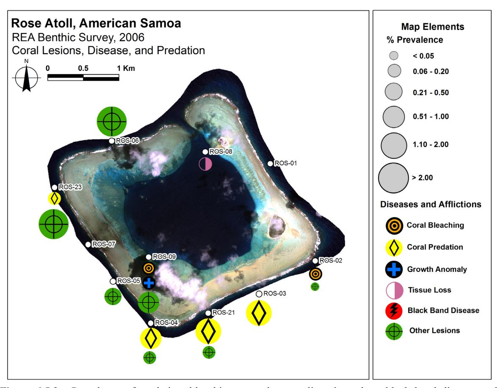

**Figure 6.5.2a.** Prevalence of predation, bleaching, growth anomalies, tissue loss, black band disease, and other lesions at Rose during ASRAMP 2006. Prevalence was calculated relative to the average colony density estimates and is indicated by the size of the respective symbols.

condition around Rose during ASRAMP 2006. Predation was observed at sites ROS-03, ROS-04, and ROS-21 around the southern point, and site ROS-23 at the western point, mostly affecting colonies of the genus *Pocillopora*. Prevalence values ranged between 0.9% and 1.3% (Figs. 6.5.2a and 6.5.2b). The type and size of feeding scars is indicative of *Drupella* predation. Because of the lack of coral health and disease assessments at Rose prior to 2006, an evaluation of the impact of predation is precluded; further research on this matter is needed.

Other coral diseases and lesions detected on corals around Rose during ASRAMP 2006

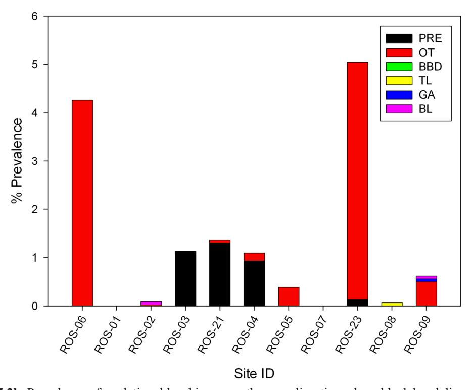

**Figure 6.5.2b.** Prevalence of predation, bleaching, growth anomalies, tissue loss, black band disease, and other lesions at Rose during ASRAMP 2006. Prevalence was calculated relative to the average colony density estimates. PRE—*Acanthaster* and/or *Drupella* predation; OT—other lesions, including hyperpigmented irritations; BBD— black band disease; TL— tissue loss; GA—skeletal growth anomalies; and BL— bleaching.

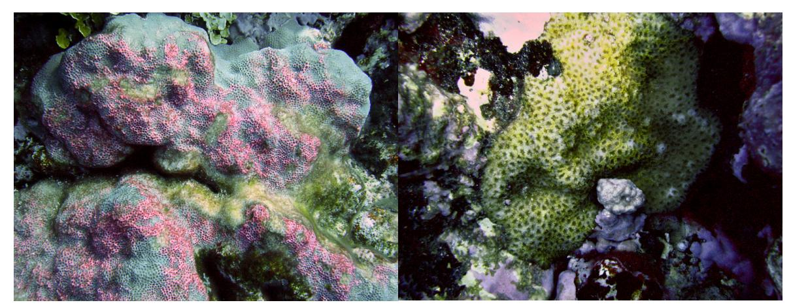

**Figure 6.5.2c.** Rose; pink-shaded irritation on *Porites* sp. (left panel) and yellow-shaded, irritation with filamentous algal overgrowth on *Favia stelligera* (right panel). Close-up inspection revealed yellow discoloration corresponding to areas of filamentous algal overgrowth. (*Photograph provided by NOAA PIFSC CRED; B. Vargas-Angel, JIMAR*)

included three cases of bleaching, one case of skeletal growth anomaly, and one case of tissue loss. The two latter cases were observed at site ROS-08 inside the lagoon. The abovementioned diseases were detected on colonies of *Pocillopora*, *Astreopora*, and *Acropora*, respectively. As at other sites in the American Samoa Archipelago, coral bleaching at Rose was generally mild and focal.

#### **6.5.3 Temporal Comparison—Coral and Coral Disease**

Live scleractinian coral cover observed in towed-diver benthic surveys around Rose during the three ASRAMP cruises remained relatively consistent. Coral cover on the forereef habitats ranged from 20.1% (SE 1.8; 2006) to 29.1% (SE 2.0; 2002; Fig. 6.5.3a). Coral cover in the lagoon was markedly lower, ranging from 1.5% (SE 0.5; 2004) to 5.9% (SE 0.9; 2006; Fig. 6.5.3b). Forereef coral cover data from towed-diver surveys and REA surveys were relatively similar, with island-wide mean differences no greater than ~ 15%.

In contrast, the estimate of REA mean live coral cover in the lagoon was extremely uncertain, as depicted by the high standard error (Fig. 6.5.3b). Percent cover of live coral from REA surveys was consistently higher than values recorded during the towed-diver benthic surveys (Fig. 6.5.3b). This difference was probably a result of REA site selection, which targeted hard-bottom substrate and coral pinnacles. The majority of the lagoon at Rose was composed of soft, sandy bottom interspersed with coral rubble, with little coral cover aside from coral

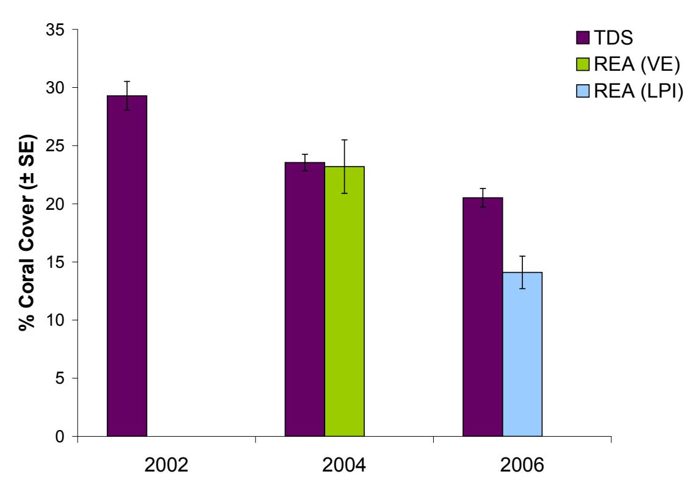

**Figure 6.5.3a.** Temporal comparison of mean percent live coral cover from REA surveys and towed-diver surveys around the forereef Rose during ASRAMP 2002, 2004, and 2006 surveys. The purple bars represent observations collected during towed-diver habitat surveys. The green bar represents REA data collected by visual estimates (VE) during REA surveys, and the blue bar represents data collected by the line point intercept (LPI) technique during REA surveys. See Chapter 2, Section 2.4: Reef Benthic (Coral, Algae, Macroinvertebrate) and Fish Surveys for considerations when comparing the results of these methodologies.

pinnacles and small isolated patch reefs. Because towed-diver surveys averaged benthic cover over 5-min, 200-m (approx.) observation segments, it is not surprising that mean live percent coral cover was significantly lower than in REA surveys.

General trends in coral cover and coral density were observed around Rose, with low coral cover and density recorded at site ROS-06 in the northwest region of the atoll, while high cover and density were found at site ROS-09 inside the lagoon (Fig. 6.5.1o). Mean generic

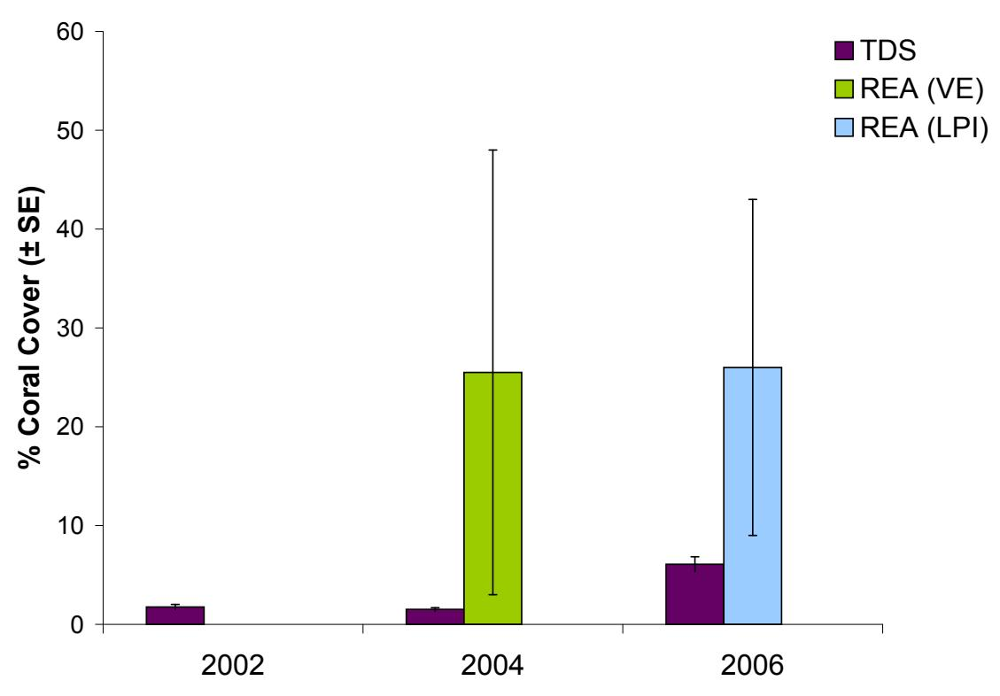

**Figure 6.5.3b.** Temporal comparison of mean percent live coral cover from REA surveys and towed-diver surveys in the lagoon of Rose Atoll during ASRAMP 2002, 2004, and 2006 surveys. The purple bars represent observations collected during towed-diver habitat surveys. The green bar represents REA data collected by visual estimates (VE) during REA surveys, and the blue bar represents data collected by the line point intercept (LPI) technique during REA surveys. See Chapter 2, Section 2.4: Reef Benthic (Coral, Algae, Macroinvertebrate) and Fish Surveys for considerations when comparing the results of these methodologies.

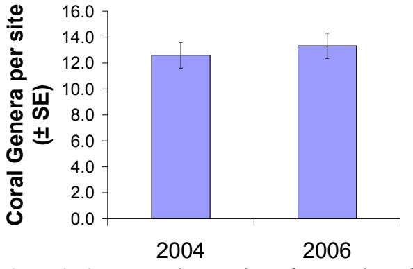

**Figure 6.5.3c.** Temporal comparison of mean values of coral genera per site on forereef habitats around Rose during ASRAMP 2004 and 2006 REA surveys.

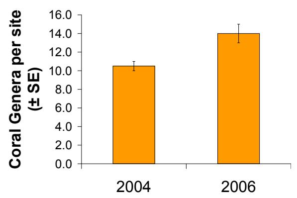

**Figure 6.5.3d.** Temporal comparison of mean values of coral genera per site on lagoon habitats at Rose during ASRAMP 2004 and 2006 REA surveys.

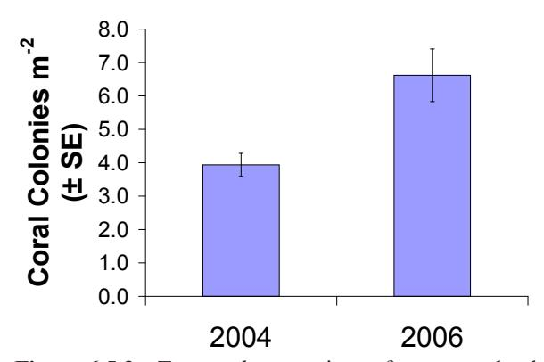

**Figure 6.5.3e.** Temporal comparison of mean coral colony density from REA surveys on forereef sites around Rose during ASRAMP 2004 and 2006.

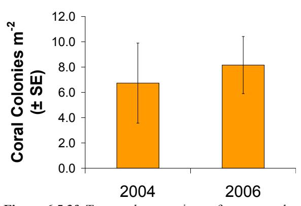

**Figure 6.5.3f.** Temporal comparison of mean coral colony density from REA surveys on lagoon habitats at Rose during ASRAMP 2004 and 2006.

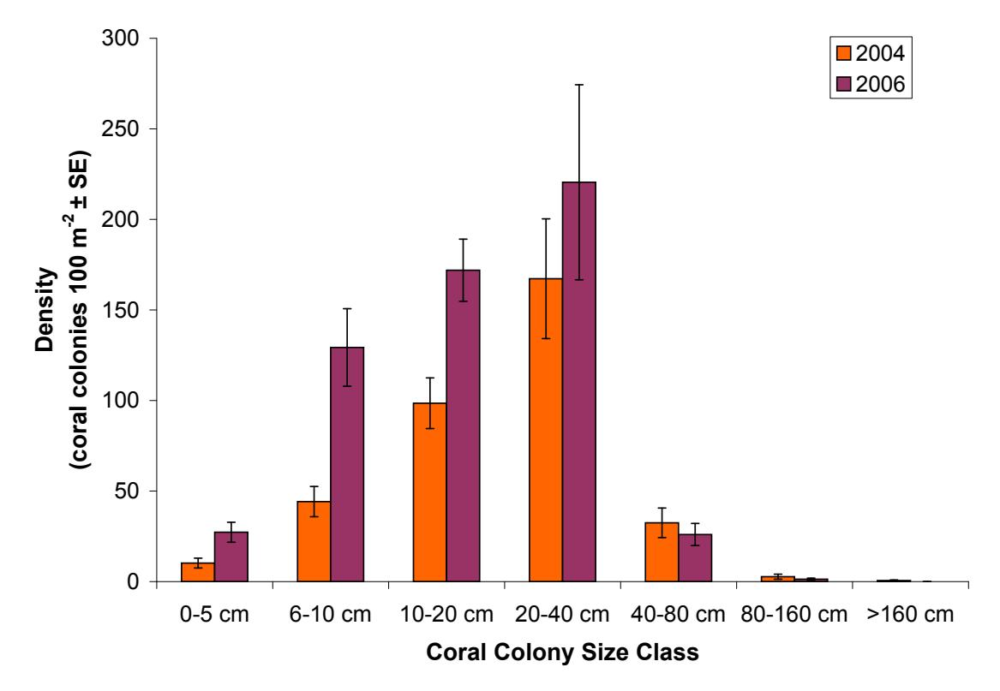

**Figure 6.5.3g.** Coral colony size class mean density from REA surveys at forereef sites around Rose during ASRAMP 2004 and 2006.

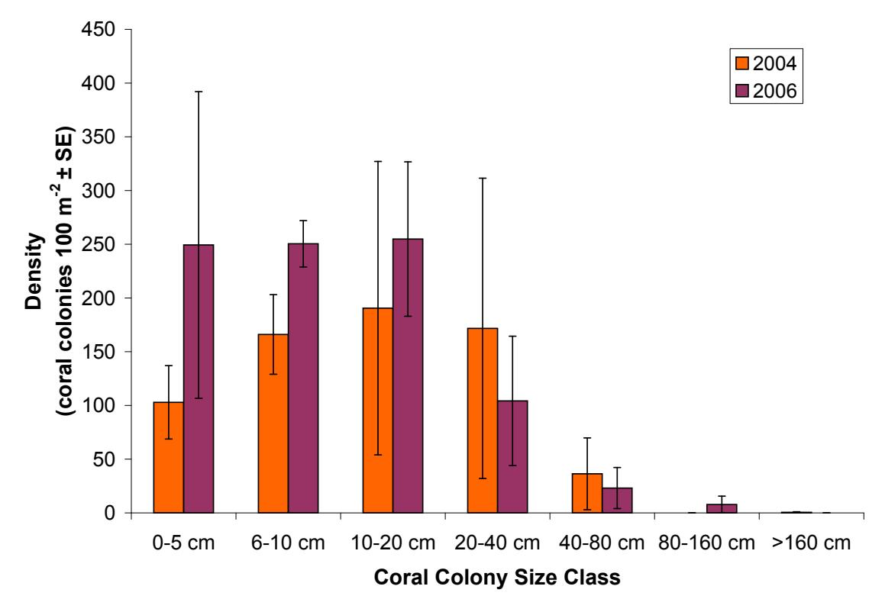

**Figure 6.5.3h.** Coral colony size class mean density from REA surveys on lagoon habitats at Rose during ASRAMP 2004 and 2006.

richness at forereef sites did not vary substantially between 2004 and 2006 (Fig. 6.5.3c), but somewhat higher generic richness was documented at the two lagoon sites in 2006 than in 2004 (Fig. 6.5.3d); site ROS-02 off the southeast corner of Rose exhibited the highest diversity (16-17 genera) and site ROS-07 in the southwest region (the ship grounding site) with the lowest recorded diversity (7-9 genera) in both quantitative survey years. Interestingly, site ROS-02, which had the highest generic diversity, also had low coral cover, thereby supporting two points stressed throughout this report: (1) different quantitative parameters describing coral communities (percent cover, colony density, diversity) were not necessarily congruent in the magnitude of their values at a given site, and (2) more than a single parameter should be considered in assessing the value or condition of coral communities.

Atoll-wide, mean coral colony densities increased from 4.4 colonies m-2 in 2004 to 6.8 colonies m-2 in 2006 (Figs. 6.5.3e and 6.5.3f). Even when site ROS-22, which was not resurveyed in 2006, was removed from the analysis, there was a substantial difference noted between mean coral density at Rose between 2004 and 2006. As with the apparent parallel increase in coral density at Ofu/Olosega and at Ta`u from 2004 to 2006, it is difficult to know if this potential change, which could result from new recruits to the population or fragmentation/fissioning of existing colonies, is "real" or an artifact of interobserver error. In this regard, it is interesting to note that site ROS-03 was observed to have among the lowest coral densities in 2004 (2.9 colonies m-2) but the highest coral density in 2006 (10.4 colonies m-2).

During ASRAMP 2006, two coral biologists conducted population parameter surveys. One biologist enumerated all colonies > 5 cm maximum diameter, while the second biologist closely inspected the benthos for very small (< 5 cm) colonies. While this experimental alteration of survey protocols, which was undertaken only at site ROS-03, may result in more accurate data, it appeared to have biased temporal comparisons as a result of the increased small colony search effort. This provided another useful lesson for stabilizing personnel allocations and method protocols in 2008 so that improved comparisons could be made in future surveys.

The lack of large (> 80 cm) colonies at Rose in 2004 and 2006 suggests that most large corals at the shallow depths died after the 1994 bleaching event, and that coral recovery remains ongoing (Figs. 6.5.3g and 6.5.3h). The proportion of corals in medium (20–40 cm) and medium-large (40–80 cm) size classes was reduced in 2006 compared to 2004. Overall, 48% of corals belonged to these size classes (i.e., 20–80 cm) in 2004, compared to 31% in 2006. The correspondingly higher proportion of corals in smaller size classes in 2006 (i.e. 0–20 cm) was consistent with the calculated higher density values. Hurricanes Olaf and Percy in early 2005, which may have moved the anchored 1200-lb CREWS buoy inside the protected lagoon, could potentially explain the smaller corals observed in 2006. These tropical cyclones may have caused considerable damage to the shallower reefs, including fragmentation of corals, resulting in increased densities and a shift to smaller size classes.

#### **6.6 Algae**

#### **6.6.1 Algal Surveys**

It is important to note when considering these results that turf algae, crustose coralline red

algae, branched non-geniculate coralline red algae, and cyanophytes (blue-green algae) all need to be analyzed microscopically for proper taxonomic identification and therefore, must be lumped into functional group categories in the field. Of these functional groups, turf algae are the most diverse with the possibility of up to 100 species occurring in a 10 cm2 area. As well, macroalgae are large, fleshy, sometimes calcified entities that may be identifiable to genus or species in the field, but often require microscopic analysis to confirm taxonomic identities.

# *2002 Spatial Surveys*

A total of 18 towed-diver benthic surveys were conducted around Rose during ASRAMP 2002. Fleshy macroalgae and crustose coralline red algae covered, on average, 58.1% of the forereef and 10.3% of the backreef and lagoon substrate. On the forereef habitats, mean fleshy macroalgal cover was 19.0% (SE 0.9) and mean crustose coralline algal cover was 39.1% (SE 1.5) of the benthic substrate (Fig. 6.6.1a). On the backreef and lagoon habitats, mean fleshy macroalgal cover was 10.2% (SE 1.6), and mean crustose coralline algal cover was 10.2% (SE 0.8; Fig. 6.6.1a). Highest percent cover of fleshy macroalgae was observed along the northwest, southwest, and southeast forereef slopes of the atoll. The highest percent cover of crustose coralline algae was observed near the westernmost, easternmost, and southernmost points of the atoll, all likely areas of moderate-to-high wave energy and current flow. Lowest coralline algal cover was observed in the lagoon.

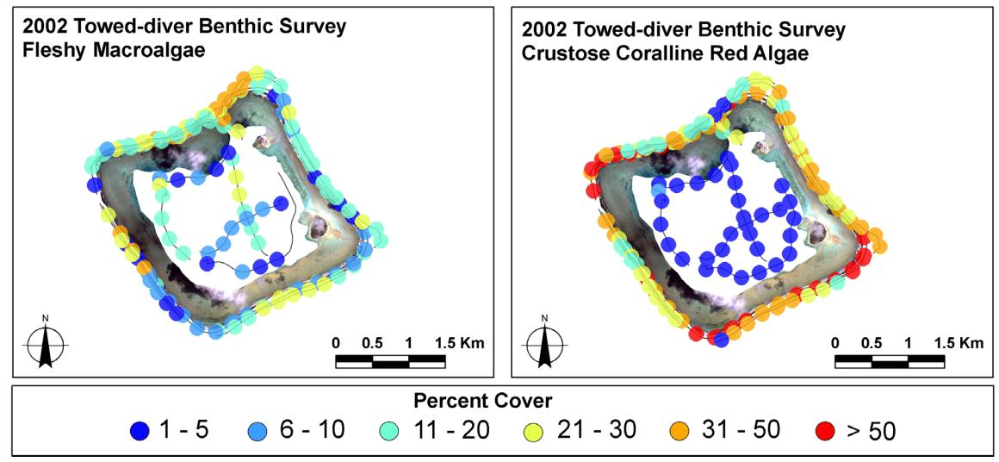

**Figure 6.6.1a.** Percent cover of fleshy macroalgae (including turf algae) and crustose coralline algae from towed-diver benthic surveys around Rose during ASRAMP 2002. Each colored point represents an integrated estimate computed over 5-min observation segments covering a survey swath of ~ 200 m × 10 m (~ 2000 m2 ).

Qualitative REA algal surveys were conducted in and around Rose during ASRAMP 2002, and 11 bags of algal voucher specimens were collected. These surveys provided baseline data to be used in designing and scaling the future methodology of algal REA surveys.

# *2004 Spatial Surveys*

A total of 22 towed-diver benthic surveys around Rose during ASRAMP 2004 recorded a mean combined algal cover (including macroalgae, turf, and crustose coralline algae) of 71.1% in the forereef habitats and 37.8% in the lagoon habitats. On the forereef, mean fleshy macroalgal cover (including turf) was 27.6% (SE 1.1), and mean crustose coralline algal cover was 43.5% (SE 1.3; Fig. 6.6.1b). In the lagoon habitats, mean fleshy macroalgal cover (including turf) was 25.5% (SE 2.0), and mean crustose coralline algal cover was 11.2% (SE 2.0; Fig. 6.6.1b). Generally, higher cover of macroalgae was observed along the southwest and southeast forereefs and in lagoonal areas. Coralline algae were most abundant near the westernmost, easternmost, and southernmost points of the island, all likely areas of moderateto-high wave energy and current flow.

During ASRAMP 2004, quantitative algal REA surveys were conducted at 12 sites around Rose (Fig. 6.6.1c). A total of 13 macroalgal genera (6 green, 4 red, and 3 brown) and 4 additional algal functional groups (turf algae, crustose coralline red algae, branched nongeniculate coralline red algae, and cyanophytes) were observed in the field. Once completed, laboratory-based taxonomic identification of all algal species (including turf algae, epiphytes, and crustose coralline red algae) will greatly increase the known algal diversity. Crustose coralline red algal and turf algal functional groups (each of which contain numerous species) were the dominant algae found, being observed in more than 50% of sampled quadrats at 83% of sites. The lagoon sites at Rose were dominated by algal turf, low abundances of crustose coralline red algae, and a few cyanophytes. No macroalgal genera were found at the lagoon sites.

Several clear distributional trends were observed among macroalgal populations around Rose during ASRAMP 2004. Most outer forereef sites around Rose contained high abundances of the sand producing green alga, *Halimeda*, although population numbers of this genus were low on east-facing forereefs, and at site ROS-07 (shipwreck grounding site). At southeast

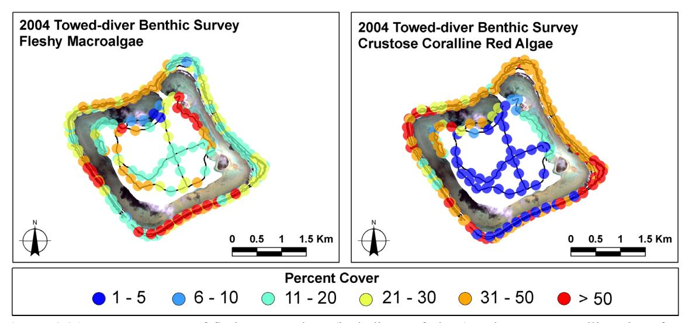

**Figure 6.6.1b.** Percent cover of fleshy macroalgae (including turf algae) and crustose coralline algae from towed-diver benthic surveys around Rose during ASRAMP 2004. Each colored point represents an integrated estimate over 5-min observation segments covering a survey swath of ~ 200 m × 10 m (~ 2000 m2 ).

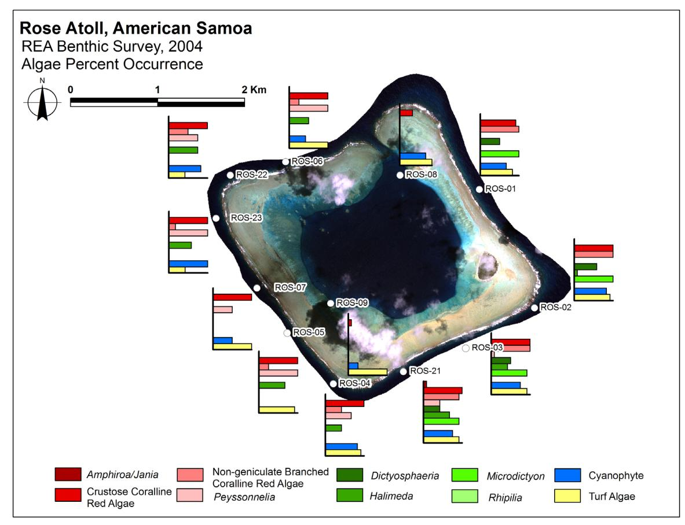

**Figure 6.6.1c.** Percent occurrence of select macroalgal genera and algal functional groups from REA surveys around Rose during ASRAMP 2004. Percent occurrence is equivalent to the percentage of photoquadrats in which an algal genus or functional group was observed. Length of *x*-axis denotes 100% occurrence.

and northeast sites, *Microdictyon umbilicatum* (Velley) Zanardini formed large blades that occurred in more than 90% of the photoquadrats assessed; however, it was completely lacking from photoquadrats at southwest and northwest sites. Another green siphonocladean algal genus *Dictyosphaeria*, a common component of marine algal floras only on the northeast and southeast sides of the island, followed this trend. In contrast to *M*. *umbilicatum* and species of *Dictyosphaeria*, the red algal genus *Peyssonnelia* was not recorded from photoquadrats at sites ROS-01, ROS-02, and ROS-03 in the northeast and southeast regions on the east side of island but was very abundant at the remaining forereef sites on west and north-facing shores. Although crustose coralline red algae were extremely abundant in all photoquadrats at sites around the perimeter of Rose, other calcified red algal genera were less abundant. The geniculate red algal genera *Amphiroa*/*Jania* were only found in photoquadrats at site ROS-21 in the southeast region and in relatively low abundance. Non-geniculate branched red algae, although found at sites around the perimeter of the island, were most abundant at eastern and southern sites. Of interest, the green alga *Caulerpa cupressoides* (Vahl C. Agardh) was recorded at Rose for the first time and will be a new addition to the species list for American Samoa.

#### *2006 Spatial Surveys*

A total of 21 towed-diver benthic surveys that were conducted around Rose during ASRAMP

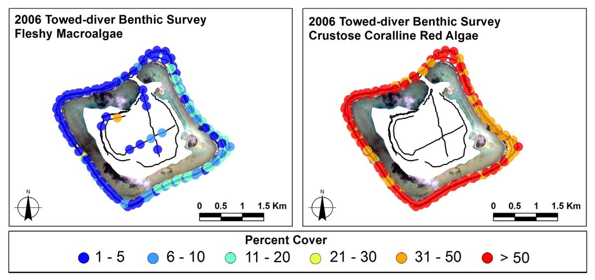

**Figure 6.6.1d.** Percent cover of fleshy macroalgae (including turf algae) and crustose coralline algae from towed-diver benthic surveys around Rose during ASRAMP 2006. Each colored point represents an integrated estimate over 5-min observation segments covering a survey swath of ~ 200 m × 10 m (~ 2000 m2 ).

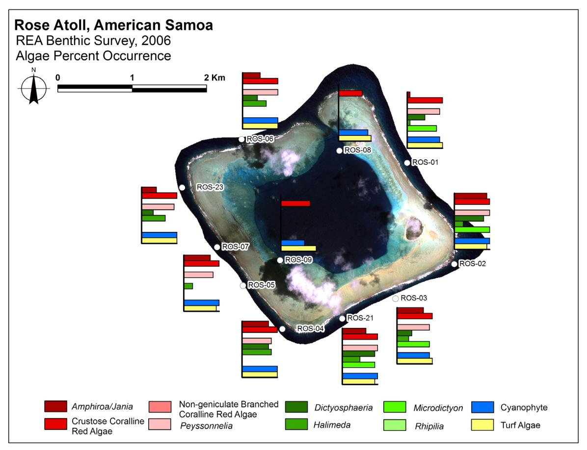

**Figure 6.6.1e.** Percent occurrence of select macroalgal genera and algal functional groups from REA surveys around Rose during ASRAMP 2006. Percent occurrence is equivalent to the percentage of photoquadrats in which an algal genus or functional group was observed. Length of *x*-axis denotes 100% occurrence.

2006 recorded a mean combined algae cover (fleshy macroalgae and crustose coralline, excluding turf algal) of 62.5% on the forereef habitats. On the forereef, mean fleshy macroalgal cover was 7.0% (SE 0.5), and mean crustose coralline algal cover was 55.5% (SE 1.2; Fig. 6.5d). In the lagoon, mean fleshy macroalgal cover was 1.4% (SE 0.8), and crustose coralline red algae was not recorded (Fig. 6.6.1d). Crustose coralline algae were prevalent around the outer portion of the atoll, but were scarce in the lagoon. Macroalgal populations were low around the island but exhibited the highest percent cover along eastern shores and in a single, localized spot in the northwestern part of the lagoon.

During ASRAMP 2006, quantitative algal REA surveys were conducted at 11 sites that were previously surveyed in 2004, with 9 sites on the outer forereef, and 2 sites within the lagoon (Fig. 6.6.1e). At site ROS-05, only qualitative information was collected because of weather conditions. Twenty macroalgal genera (11 green, 7 red, and 2 brown) and 3 additional algal functional groups (turf algae, crustose coralline red algae, and cyanophytes) were observed in the field. Crustose coralline red algal and turf algal functional groups (each of which contain numerous species) were the dominant algae found, being observed in more than 50% of sampled quadrats at 100% of the sites. The central lagoon of Rose was dominated by algal turf, low abundances of crustose coralline red algae, and a few cyanophytes. No macroalgal genera were found within the lagoon. With the exception of the red alga *Peyssonnelia*, which was very abundant at most outer reef sites, many of the distributional trends of macroalgal populations observed around Rose in 2004 were observed again in 2006. At southeast and

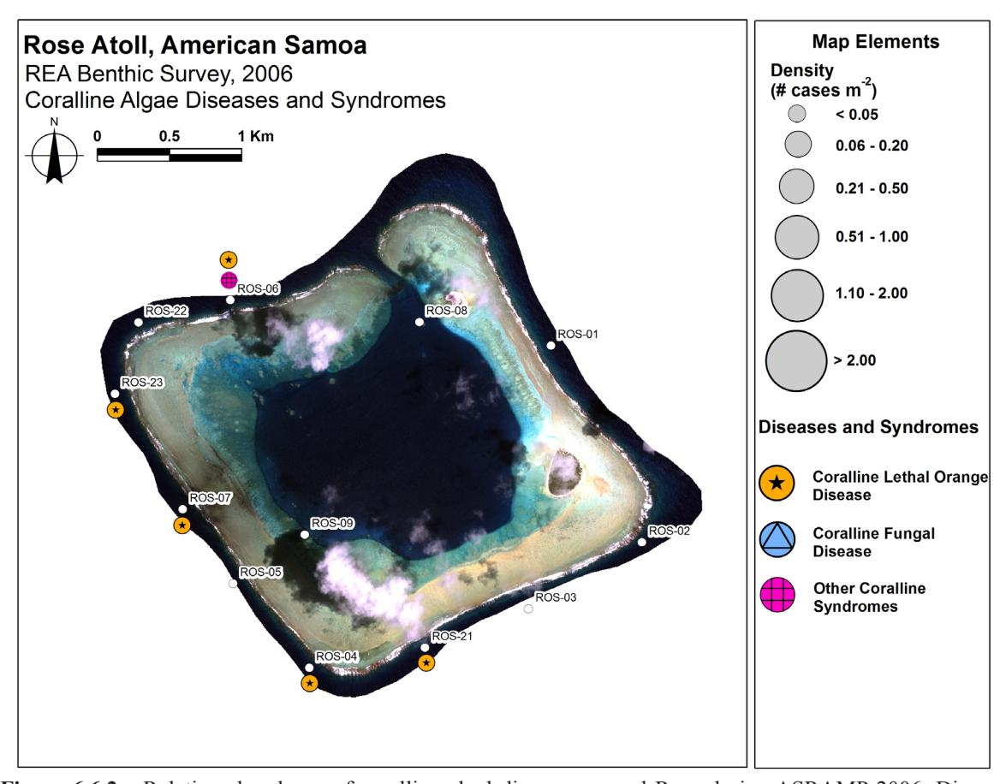

**Figure 6.6.2a.** Relative abundance of coralline algal diseases around Rose during ASRAMP 2006. Disease density is indicated by the size of the respective disease symbols.

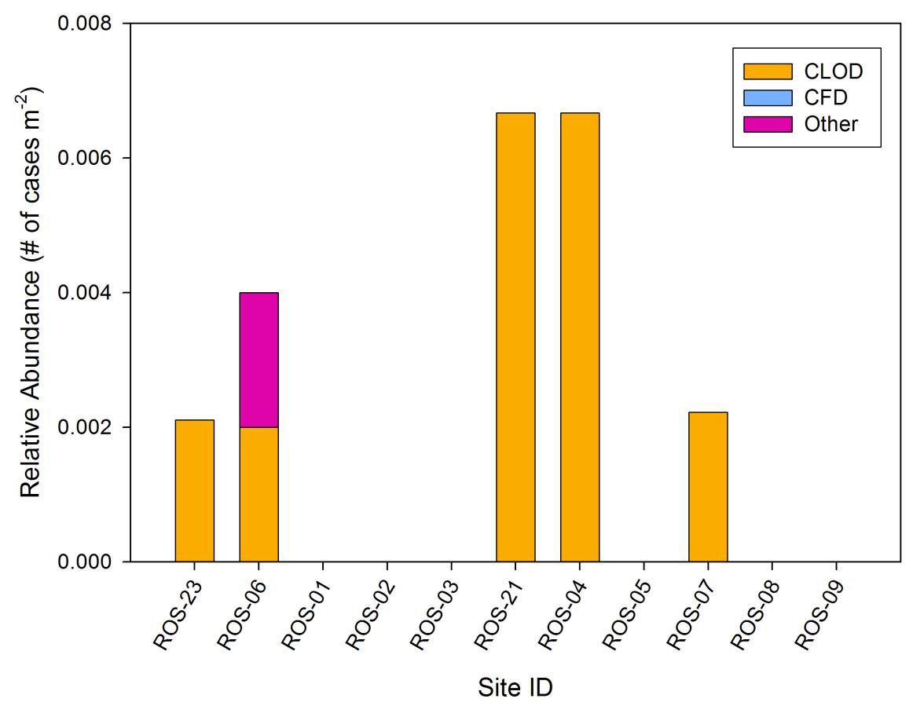

**Figure 6.6.2b.** Relative abundance (# cases m-2) of coralline algal disease around Rose during ASRAMP 2006. CLOD: coralline lethal orange disease; CFD: coralline fungal disease; and Other: undetermined coralline discolorations.

northeast sites, *Microdictyon umbilicatum* (Velley) Zanardini formed large blades that occurred in more than 90% of photoquadrats assessed; however, it was completely lacking from photoquadrats on northwest and southwest sites and inside the central lagoon. Most outer forereef sites around Rose contained high abundances of the sand producing green alga *Halimeda*.

#### **6.6.2 Coralline Algal Disease Surveys**

#### *2006 Spatial Surveys*

Relatively few coralline algae diseases and syndromes were noted around Rose during ASRAMP 2006 REA surveys. Nine cases of coralline lethal orange disease and one case of unidentified coralline discoloration were observed. Figures 6.6.2a and 6.6.2b illustrate the variation in relative abundance of coralline algal disease among sites around Rose.

# **6.6.3 Temporal Comparison—Algae**

Temporal comparisons of both REA algal data and towed-diver benthic survey data are shown in Figures 6.6.3a, 6.6.3b, and 6.6.3c, respectively. The number of macroalgal genera observed

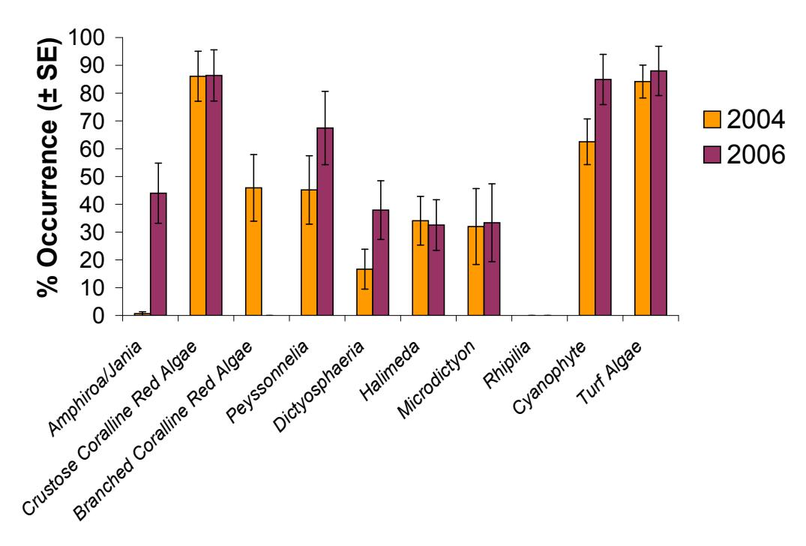

**Figure 6.6.3a.** Temporal comparison of REA algal genera and functional group percent occurrence around Rose between ASRAMP 2004 and 2006. See Chapter 2, Section 2.4: Reef Benthic (Coral, Algae, Macroinvertebrate) and Fish Surveys for considerations when comparing the results of these methodologies between years.

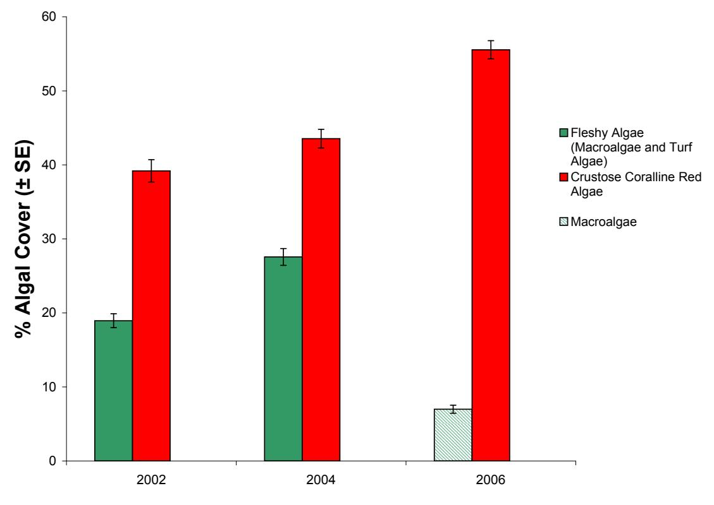

**Figure 6.6.3b.** Temporal comparison of towed-diver benthic survey algal percent cover results for fleshy, crustose coralline, and macroalgae for ASRAMP 2002, 2004, and 2006 surveys around Rose forereef habitats.

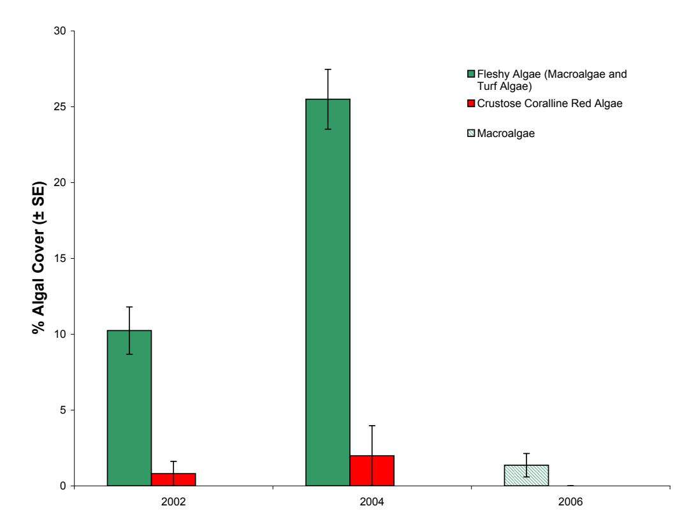

**Figure 6.6.3c.** Temporal comparison of towed-diver benthic survey algal percent cover results for fleshy, crustose coralline and macroalgae for ASRAMP 2002, 2004, and 2006 surveys in Rose lagoon habitats.

around Rose increased from 13 in 2004 to 20 in 2006, and the relative abundance of fleshy and calcified macroalgal genera also appeared to increase between sampling years. The apparent lower algal diversity and abundance in 2004 was likely caused by the passage of Hurricane Heta close to Rose in January of 2004, immediately prior to surveys. A manuscript currently being written by Cooper-Alletto and Vroom explores changes to benthic algal communities at Rose among sampling years.

Unlike the 2004 surveys, where the red alga *Peyssonnelia* was restricted to the northwest and southwest regions of the island, this genus was a very common component of most sites sampled in 2006. Populations of other algae remained similar. As in 2004, the central lagoon was dominated by turf algae and cyanophytes, with no low abundance of crustose coralline algae and no macroalgal genera encountered in the photoquadrats. No large cyanobacterial outbreaks or monotypic stands of invasive algae were discovered at Rose in 2004 or 2006.

# **6.7 Benthic Macroinvertebrates**

# **6.7.1 Benthic Macroinvertebrate Surveys**

#### *2002 Spatial Surveys*

Towed-diver benthic macroinvertebrate surveys around Rose during ASRAMP 2002 found few target macroinvertebrates (Fig. 6.7.1a). As mentioned in the introduction (Chapter 1, Section 1.6: Limitations of Pacific RAMP) surveys in 2002 were limited by shipboard logistics and methods development which may have contributed to the paucity of macroinvertebrates observed in 2002.

A total of 6 qualitative REA invertebrate surveys, focusing on general macroinvertebrate biodiversity, were conducted around Rose during ASRAMP 2002. These surveys provided baseline data to be used in designing and scaling the future methodology of macroinvertebrate REA surveys. No data are presented.

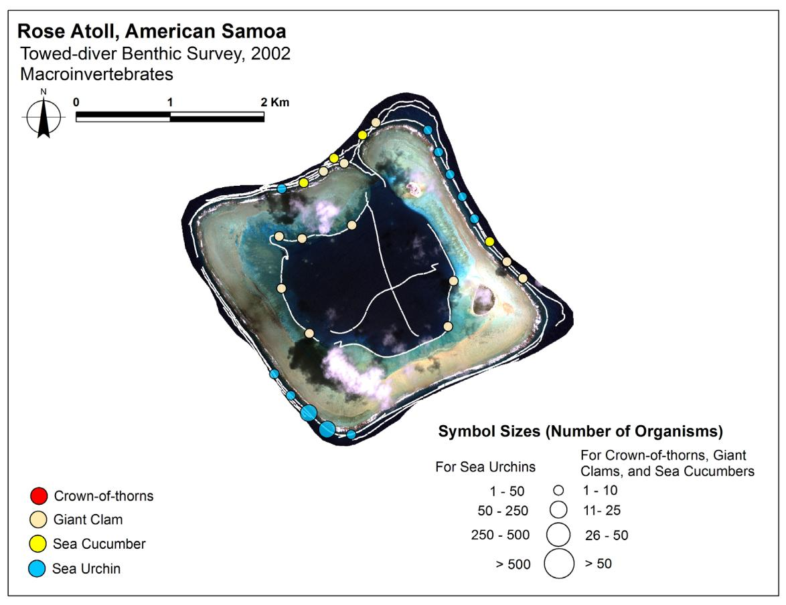

**Figure 6.7.1a.** Distribution of estimated population densities of crown-of-thorns seastar (COTS), giant clams, sea cucumbers, and sea urchins at Rose from towed-diver benthic surveys during ASRAMP 2002. Circle locations represent an integrated estimate over 5-min observation segments covering a survey swath of ~ 200 m × 10 m (~ 2000 m2 ). The sizes of the circles indicate the number of organisms counted or estimated in each ~ 2000 m2 segment with one scale for COTS, giant clams, and sea cucumbers (1–10, 11–25, 26–50, and > 50) and another scale for sea urchins (1–50, 51–250, 250–500, and > 500).

# *2004 Spatial Surveys*

Towed-diver benthic macroinvertebrate surveys around Rose during ASRAMP 2004 found variable distributions of giant clams and sea cucumbers and few sea urchins (Fig. 6.7.1b). Giant clams were found predominantly inside the lagoon (mean density 102.5 organisms ha-1). Sea cucumbers mean densities were highest inside the lagoon (0.7 organisms ha-1) and within the northeast region (0.7 organisms ha-1). A total of 7 COTS were observed within the lagoon (mean density 0.6 organisms ha-1).

Diversity of macroinvertebrates at REA sites across Rose was variable, ranging from 6 to 22 invertebrate species (Fig. 6.7.1c). Relatively high richness was observed at site ROS-23 within the northwest region. Sea urchins were present at 8 of 12 REA sites, with *Echinostrephus aciculatus* being the most common urchin species encountered. Giant clams were present at sites ROS-06, ROS-21, and ROS-22 on forereef sites in the northwest and southeast regions and at site ROS-09 in the lagoon. One species of sea cucumber, *Holothuria whitmaei*, was observed at sites ROS-06 and ROS-09 in the lagoon. No COTS were recorded.

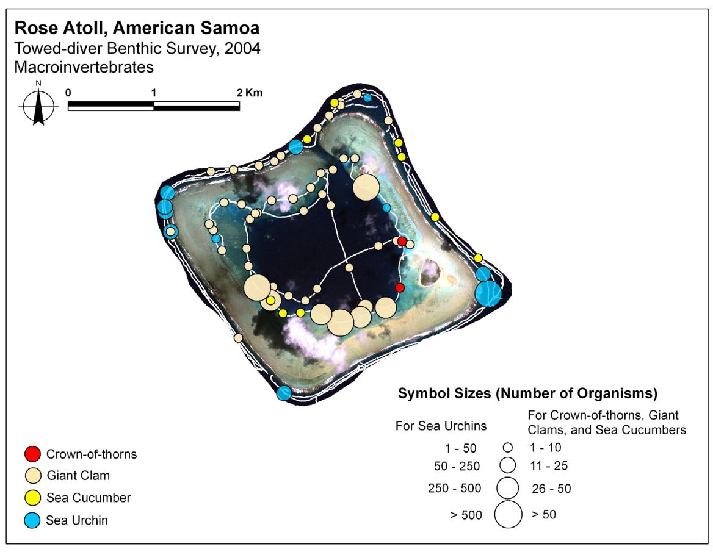

**Figure 6.7.1b.** Distribution of estimated population densities of COTS, giant clams, sea cucumbers, and sea urchins at Rose from towed-diver benthic surveys during ASRAMP 2004. Circle locations represent an integrated estimate over 5-min observation segments covering a survey swath of ~ 200 m × 10 m (~ 2000 m2 ). The sizes of the circles indicate the number of organisms counted or estimated in each ~ 2000 m2 segment with one scale for COTS, giant clams, and sea cucumbers (1–10, 11–25, 26–50, and > 50) and another scale for sea urchins (1–50, 51–250, 250–500, and > 500).

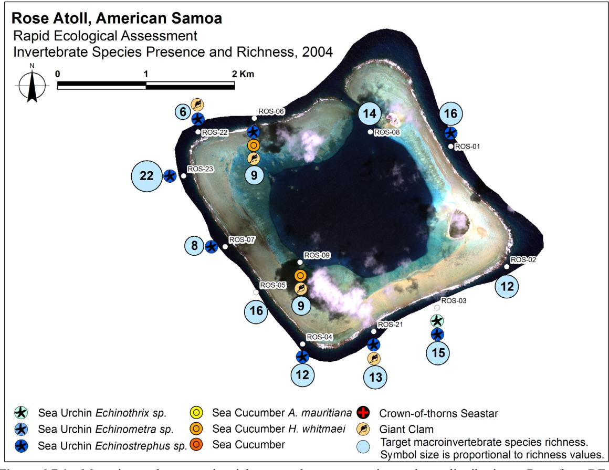

**Figure 6.7.1c.** Macroinvertebrate species richness, and target macroinvertebrate distribution at Rose from REA surveys during ASRAMP 2004. Size of light blue circles and values in circles indicate target species richness values for each REA site. Other symbols indicate the presence of specific target species.

# *2006 Spatial Surveys*

A total of 21 towed-diver benthic macroinvertebrate surveys around Rose during ASRAMP 2006 found variable distributions of giant clams and sea cucumbers, few sea urchins, and no COTS (Fig. 6.7.1d). Giant clam mean densities were highest inside the lagoon (44.4 organisms ha-1). Relatively high mean densities of sea cucumbers were observed in the northeast region (1.3 organisms ha-1) and inside the lagoon (0.7 organisms ha-1).

REA surveys around Rose during ASRAMP 2006 resulted in a low presence of target invertebrate species (Fig. 6.7.1e). Giant clams were observed at sites ROS-08 and ROS-09 within the lagoon and sites ROS-03 and ROS-05 on the southeast and southwest forereefs, respectively. REA surveys showed urchins to be present at sites ROS-03, ROS-04, and ROS-21 around the southern point in the southeast and southwest forereefs and site ROS-06 on the northwest forereef. *Echinothrix diadema* was the most common urchin species. Only one species of sea cucumber, *Holothuria whitmaei*, was present and was found at site ROS-09 within the lagoon. No COTS were encountered during REA surveys.

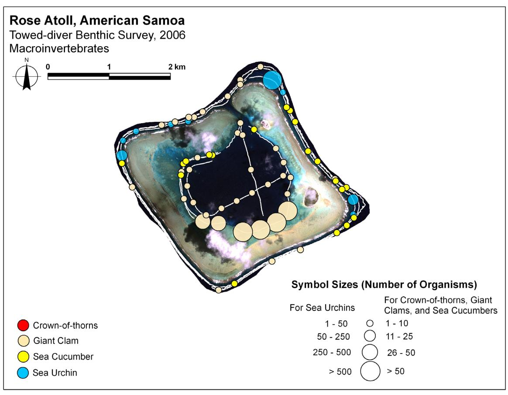

**Figure 6.7.1d.** Distribution of estimated population densities of COTS, giant clams, sea cucumbers, and sea urchins at Rose from towed-diver benthic surveys during ASRAMP 2006. Circle locations represent an integrated estimate over 5-min observation segments covering a survey swath of ~ 200 m × 10 m (~ 2000 m2 ). The sizes of the circles indicate the number of organisms counted or estimated in each ~ 2000 m2 segment with one scale for COTS, giant clams, and sea cucumbers (1–10, 11–25, 26–50, and > 50) and another scale for sea urchins (1–50, 51–250, 250–500, and > 500).

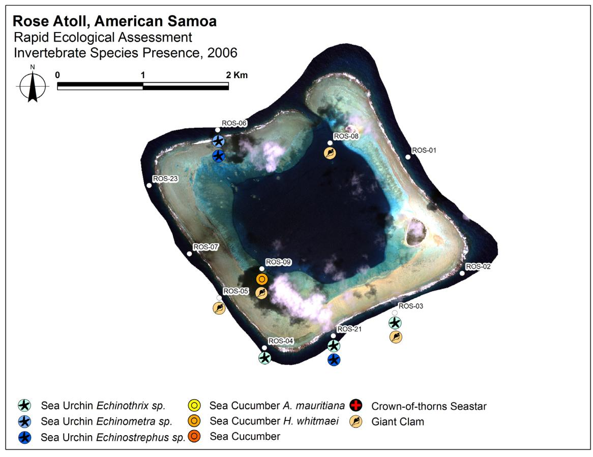

**Figure 6.7.1e.** Target macroinvertebrate distribution at Rose from REA surveys during ASRAMP 2006.

#### **6.7.2 Temporal Comparison—Benthic Macroinvertebrates**

Temporal patterns of island-wide mean benthic macroinvertebrate density (organisms ha-1) around Rose from towed-diver benthic surveys during the 2002, 2004, and 2006 ASRAMP cruises are shown in Figure 6.7.2a (COTS: forereef and lagoon), Figure 6.7.2b (giant clams: forereef), Figure 6.7.2c (giant clams: lagoon), Figure 6.7.2d (sea cucumbers: forereef and lagoon), and Figure 6.7.2e (sea urchins: forereef and lagoon).

Macroinvertebrate communities were distinct between the forereef and the lagoon. Despite significant survey effort over the forereef habitats in each of the 3 survey years, no COTS were observed during any of the towed-diver surveys of the forereefs, and only 7 were observed in the lagoon, all during ASRAMP 2004 in the east side of the lagoon near Rose Island (Fig. 6.7.1b). More than 1000 giant clams were observed in both 2004 and 2006 in Rose, with the vast majority of observations occurring within the lagoon (Figs. 6.7.2b and 6.7.2c). Between 2004 and 2006, mean giant clam densities on forereef habitats were observed to increase slightly, while densities appeared to decline substantially on lagoon habitats. The cause of this decline is unknown, although there has often been speculation about poaching for giant clams within the lagoon at Rose. Mean density of sea cucumbers, which were found predominantly within the sheltered soft-bottom habitats of the atoll lagoon, did not change substantially between 2004 and 2006 (Fig. 6.7.2d). Mean density of sea urchins, which were found predominantly on the forereef habitats, did not change substantially between 2002 and 2006, though the density was noticeably higher during the 2004 surveys (Fig. 6.7.2e).

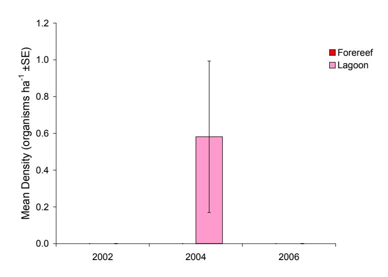

**Figure 6.7.2a.** Mean density of COTS at Rose from towed-diver surveys during ASRAMP 2002, 2004 and 2006.

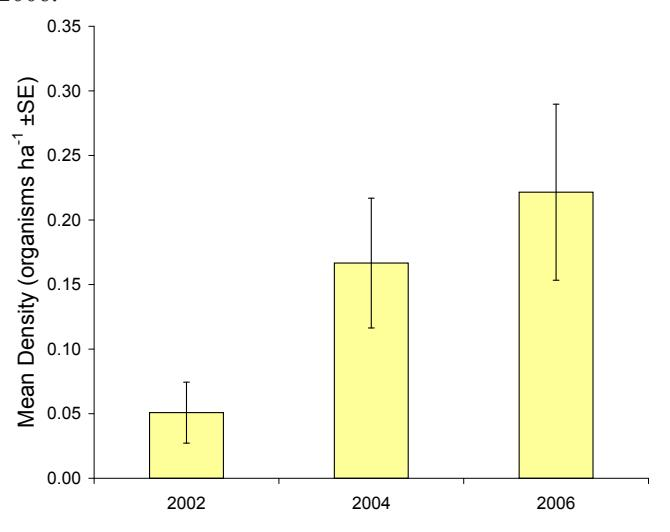

**Figure 6.7.2b.** Mean density of giant clams in Rose forereef habitats from towed-diver surveys during ASRAMP

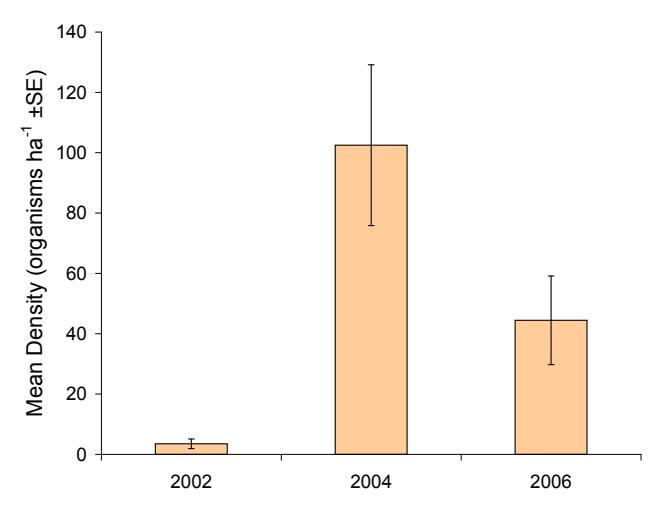

**Figure 6.7.2c.** Mean density of giant clams in Rose lagoon habitats from towed-diver surveys during ASRAMP 2002, 2004, and 2006.

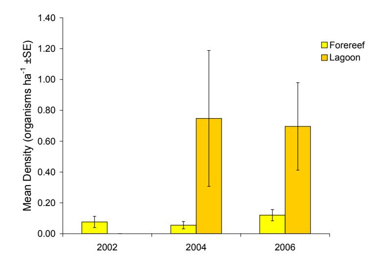

**Figure 6.7.2d.** Mean density of sea cucumber (holothuroids) at Rose from towed-diver surveys during ASRAMP 2002, 2004, and 2006 for forereef (yellow) and lagoon (orange) habitats.

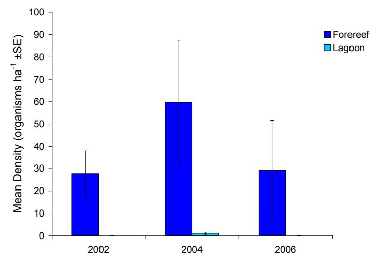

**Figure 6.7.2e.** Mean density of sea urchins (echinoids) at Rose from towed-diver surveys during ASRAMP 2002, 2004, and 2006.

# **6.8 Reef Fish**

#### **6.8.1 Reef Fish Surveys**

#### *2002 Spatial Surveys*

During ASRAMP 2002 towed-diver surveys of large fish (> 50 cm total length) around Rose, large fish biomass was around 0.143 tons ha-1 (SE 0.087) for the atoll as a whole, with the bulk of the biomass located in the northwest region near the channel into the lagoon (Fig. 6.8.1a). This pass, which has a predominantly strong outgoing ebb tidal current modulated by large swell events pushing water over the atoll barrier reef, attracted large schools of predatory fish, including persistent schools of (~ 200–700) *Caranx sexfasciatus* and barracudas. Jacks dominated the largest size class (> 50 cm total length) followed by lower levels of snappers and barracudas.

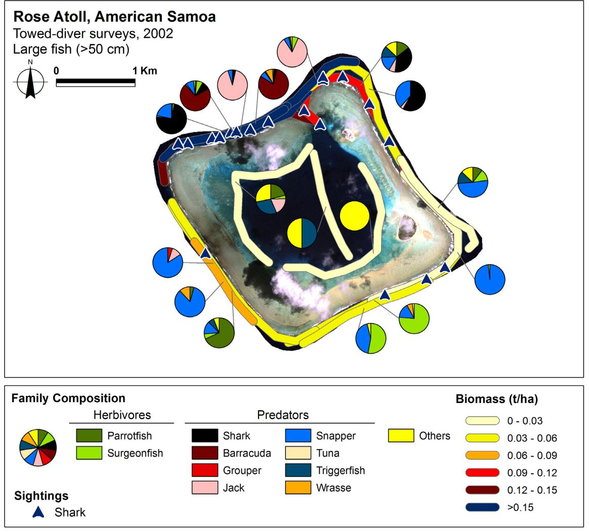

**Figure 6.8.1a.** Large fish biomass, family composition, and individual shark sightings at Rose recorded during ASRAMP 2002 towed-diver surveys. Large fish (length > 50 cm) biomass on each individual towed-diver survey is represented by the color of the survey track (tons ha-1). Composition by trophic group is indicated by the family colors (green—mostly herbivores; other colors—mostly predators or mixed). Individual shark sightings, observed inside or outside the survey area, are represented by blue triangles.

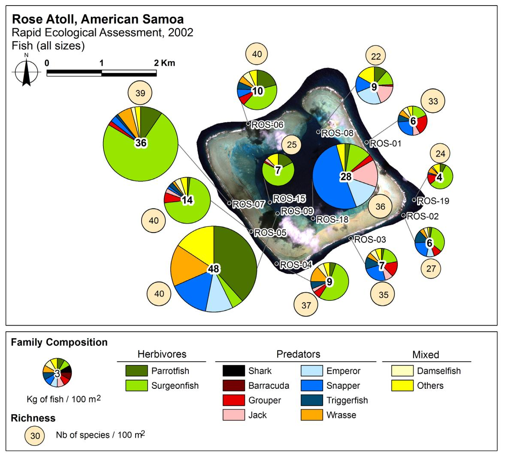

**Figure 6.8.1b.** Total fish biomass, family composition, and species richness of fishes at Rose recorded during ASRAMP 2002 REA belt-transect surveys. Total fish biomass (all species and size classes) is represented at each site by the size of the pie chart with the actual biomass value in the center (kg 100 m-2). Composition by trophic group is indicated by the family colors (green—mostly herbivores; other colors—mostly predators or mixed). Species richness at each REA site is indicated by numbers (species 100 m-2) and the size of the beige circles.

Groupers were mostly represented by large peacock (*Cephalopholis argus*) and flagtail groupers (*Cephalopholis urodeta)*. The smalltooth jobfish (*Aphareus furca*), twinspot snapper (*Lutjanus bohar*), and blue-lined snapper (*L*. *kasmira*) were also relatively common. Jacks were primarily represented by the bluefin trevally (*Caranx melampygus*). Several large dogtooth tunas (*Gymnosarda unicolor*) were also recorded. Humphead wrasses (*Cheilinus undulatus*) were rarely seen. Sharks were frequently observed, including blacktips, whitetips (*Triaenodon obesus*), and gray reef sharks (*Carcharhinus amblyrhynchos*), especially on the northwest forereef habitat of the island (Fig. 6.8.1a).

Certain species of jacks were observed exhibiting spawning behavior, with dark and light fish pairs swimming side-by-side, and may have been taking advantage of the predictable out flowing current from the lagoon to transport spawn away from the reef.

Twelve sites were surveyed by the REA Fish team in 2002. Results show total fish biomass was highest on the southwest forereef habitat of Rose (~ 25 kg 100 m-2), as well as inside the lagoon (~ 23 kg 100 m-2; Fig. 6.8.1b). These large biomass values were related to high abundances of the surgeonfish *Naso lituratus* on the southwest side and the parrotfish *Chlorurusfrontalis* and the snapper *Lutjanus kasmira* in the lagoon. Overall total fish biomass for the atoll was around 15.4 kg 100 m-2 (SE 8.1).

Species richness around Rose during the ASRAMP 2002 surveys was around 30 species 100 m-2, with high diversity sites (~ 40 species) located on all sides of the atoll and on patch reefs inside the lagoon (Fig. 6.8.1b). Diversity was slightly higher in the southwest region compared to the northeast region.

# *2004 Spatial Surveys*

During ASRAMP 2004 towed-diver surveys for large fish (> 50 cm total length), biomass

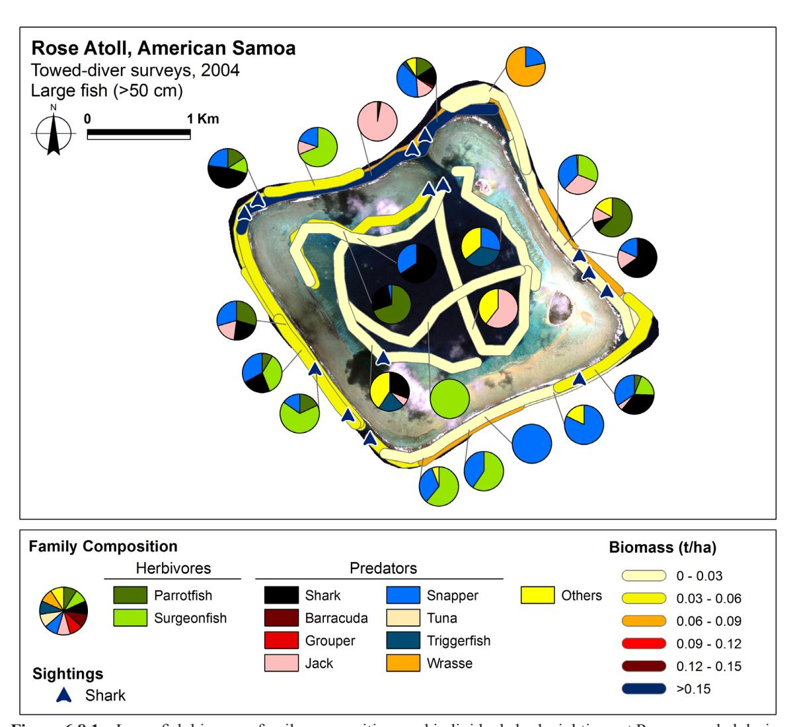

**Figure 6.8.1c.** Large fish biomass, family composition, and individual shark sightings at Rose recorded during ASRAMP 2004 towed-diver surveys. Large fish (length > 50 cm) biomass on each individual towed-diver survey is represented by the color of the survey track (tons ha-1). Composition by trophic group is indicated by the family colors (green—mostly herbivores; other colors—mostly predators or mixed). Individual shark sightings, observed inside or outside the survey area, are represented by blue triangles.

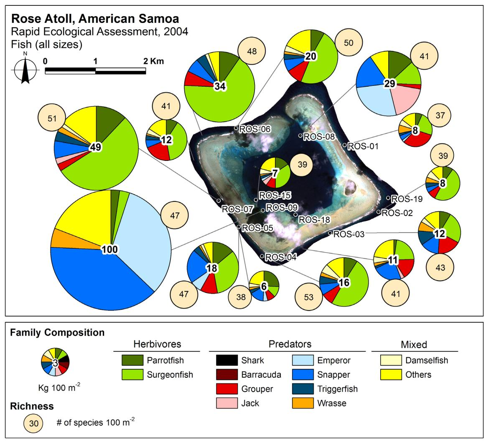

**Figure 6.8.1d.** Total fish biomass, family composition, and species richness of fishes around Rose recorded during ASRAMP 2004 REA belt-transect surveys. Total fish biomass (all species and size classes) is represented at each site by the size of the pie chart with the actual biomass value in the center (kg 100 m-2). Composition by trophic group is indicated by the family colors (green—mostly herbivores; other colors—mostly predators or mixed). Species richness at each REA site is indicated by numbers within the beige circles (species 100 m-2) and the size of the circles.

was mostly composed of jacks, snappers, and sharks (Fig. 6.8.1c). Aside from the massive abundance of jacks at the lagoon entrance, large fish were distributed evenly around the remainder of the atoll. Overall, large fish biomass was near 0.098 tons ha-1 (SE 0.076).

Sharks were also frequently sighted, both inside the lagoon and on forereef habitats on all sides of the atoll (Fig. 6.8.1c). Only two humphead wrasses were sighted.

As in 2002, total fish biomass around Rose during 2004 was highest along the southwest (26 kg 100 m-2) and northwest (~ 27 kg 100 m-2) forereefs, and inside the lagoon (~ 45 kg 100 m-2; Fig. 6.8.1d). The northwest and southwest forereef habitats also harbored large quantities of herbivorous surgeonfish (e.g., *Naso lituratus*; Fig. 6.8.1d,e), while the lagoon was mostly inhabited by predators (*Lutjanus kasmira* and *Gnathodentex aureolineatus*). Overall biomass around Rose was around 23.7 kg 100 m-2 (SE 12.2).

During ASRAMP 2004 stationary point count surveys around Rose for medium-to-large fish (> 25 cm total length), snappers showed the highest biomass. Moderately high densities were recorded for surgeonfish, parrotfish, and groupers.

In 2004, species richness was clearly higher than during surveys completed in 2002, averaging around 44 species100 m-2. In addition, the southwest forereef habitat of the atoll had slightly higher species richness than the eastern side when compared with 2002 survey data (Fig. 6.8.1d).

#### *2006 Spatial Surveys*

During ASRAMP 2006 towed-diver surveys around Rose for large fish (> 50 cm total length), barracudas (*Sphyraena qenie*), seen in several large schools near the channel entrance, had the highest biomass, followed by jacks and sharks. Sharks accounted for a sizeable portion of large fish biomass in 2006, as opposed to previous years. Overall, large fish biomass was 0.068 tons ha-1 (SE 0.046) which was mostly concentrated on the northwest forereef of the atoll (Fig. 6.8.1f).

A few large humphead wrasses were sighted on all sides of the atoll. A dozen whitetip sharks and 5 other sharks (grouped in three other species) were also sighted outside the lagoon (Fig. 6.8.1f). No bumphead parrotfish were observed around Rose during 2006 by either toweddiver or REA survey teams.

As in previous years, total fish biomass was highest on the southwest forereef of the atoll (~ 32 kg 100 m-2) and in the lagoon (~ 60 kg 100 m-2; Fig. 6.8.1g). Fish biomass inside the lagoon mainly consisted of the parrotfish *Chlorurus frontalis*, the snapper *Lutjanus kasmira*,

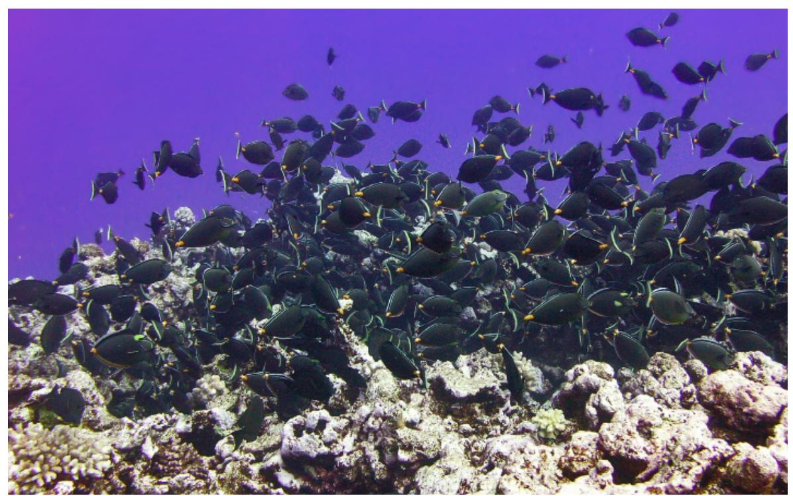

**Figure 6.8.1e.** Herbivorous surgeonfish (mostly orangespine unicornfish, *Naso lituratus*) near site of the 1993 ship grounding at Rose. (*Photograph provided by NOAA PIFSC CRED; R. Schroeder, JIMAR*)

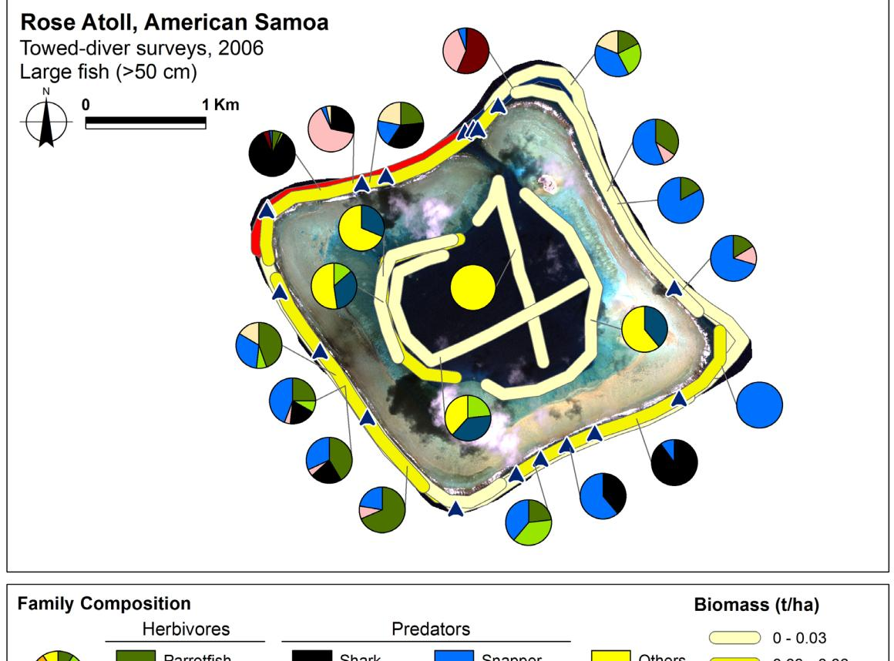

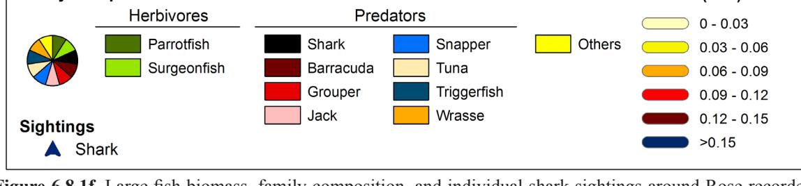

**Figure 6.8.1f.** Large fish biomass, family composition, and individual shark sightings around Rose recorded during ASRAMP 2006 towed-diver surveys. Large fish (length > 50 cm) biomass on each individual toweddiver survey is represented by the color of the survey track (tons ha-1). Composition by trophic group is indicated by the family colors (green—mostly herbivores; other colors—mostly predators or mixed). Individual shark sightings, observed inside or outside the survey area, are represented by blue triangles.

and the emperor *Gnathodentex aureolineatus*. The average for the whole atoll was 22.8 kg 100 m-2 (SE 14.0).

During ASRAMP 2006 stationary point count surveys for medium-to-large fish (> 25 cm total length), snappers and parrotfish were nearly equal as the highest biomass taxa around Rose. In lesser numbers were groupers, surgeonfish, and wrasses.

Patterns of reef fish diversity were less clear in 2006, with all sides of the atoll having a uniformly lower richness of about 30 species 100 m-2 (Fig. 6.8.1g).

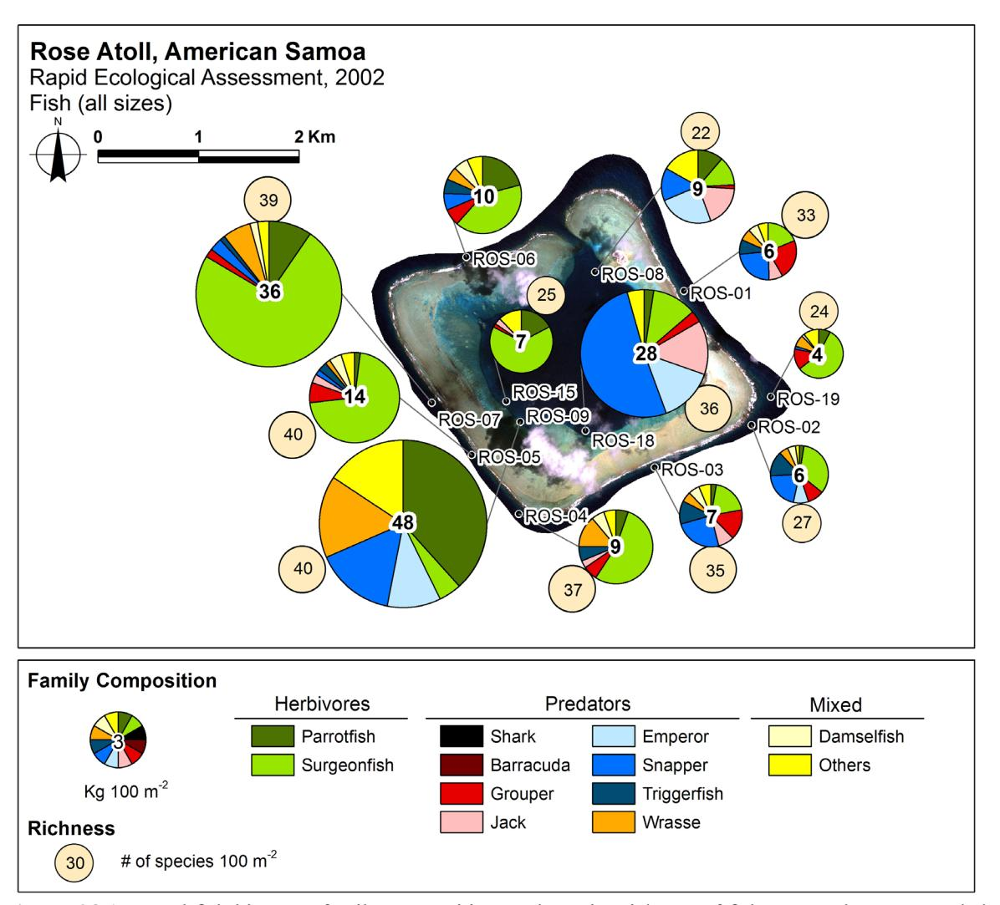

**Figure 6.8.1g.** Total fish biomass, family composition, and species richness of fishes around Rose recorded during ASRAMP 2006 REA belt-transect surveys. Total fish biomass (all species and size classes) is represented at each site by the size of the pie chart with the actual biomass value in the center (kg 100 m-2). Composition by trophic group is indicated by the family colors (green—mostly herbivores; other colors—mostly predators or mixed). Species richness at each REA site is indicated by numbers within the beige circles (species 100 m-2) and the size of the circles.

#### **6.8.2 Temporal Comparison—Reef Fish**

Over all surveys years, total fish biomass around Rose appeared to be highest on the southwest forereef of the atoll and inside the lagoon. Predators (snappers and emperors) were more common in the lagoon, while herbivores (surgeonfish and parrotfish) were highly abundant on the southwest forereef. Parrotfish, mainly *Chlorurus frontalis*, were also common inside the lagoon. The northeast and southeast forereefs of Rose consistently had relatively lower fish biomass compared to the island-wide mean (2.1 tons ha-1). Total fish biomass was slightly lower in 2002 (1.5 tons ha-1 [SE 8.1]) compared to 2004 and 2006 (2.3 tons ha-1 [SE 1.1]; Fig. 6.8.2a).

Large fish biomass was mostly concentrated around the lagoon channel on the northwest and northeast sections of the atoll. As with Swains Island (Chapter 7), most of the large fish

biomass around Rose consisted of barracudas, jacks, and snappers. Contrary to total fish biomass, large fish biomass appeared to be decreasing from 0.143 tons ha-1 (SE 0.087) in 2002 to 0.068 tons ha-1 (SE 0.046) in 2006 (Fig. 6.8.2b). The overall multiyear mean of large fish biomass from towed-diver surveys was around 0.103 tons ha-1 (SE 0.061).

Sharks were frequently sighted around Rose, although they were seldom observed inside the lagoon. Humphead wrasses were present, but relatively rare. Within the constraints of ASRAMP methodologies (daytime only, 0–30 m), no bumphead parrotfish population appears to be present at Rose based on these multiyear observations.

Considering all years surveyed, the diversity of fish communities around Rose appeared to be uniform.

The mean biomass estimates per island referenced in the above section are given in Appendix IV, Tables IV. i and IV. ii. Mean fish densities per island are given in Appendix IV, Tables IV. iii and IV. iv.

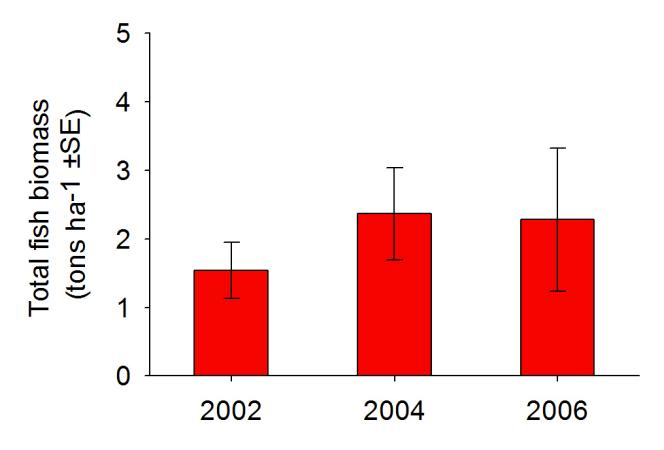

**Figure 6.8.2a.** Large fish biomass at Rose during ASRAMP 2002 (17 tow surveys), 2004 (22 tow surveys), and 2006 (21 tow surveys) towed-diver surveys.

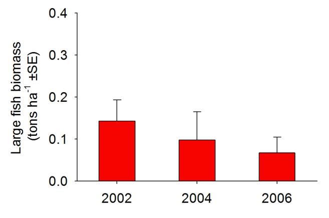

**Figure 6.8.2b.** Large fish biomass around Rose from towed-diver surveys during ASRAMP 2002 (17 surveys), 2004 (22 surveys), and 2006 (21 surveys).

#### **6.9 Island Summary and Integration**

Rose is a small, uninhabited, remote coral atoll at the far eastern end of the American Samoa Archipelago, approximately 140 km east-southeast of Ta`u Island. Multibeam-derived bathymetry showed that the forereef around the outside of the atoll slopes drops steeply into deep water (to at least 3000 m), with a slightly wider shallow bank around the northern and eastern points (Figs. 6.3.1a and 6.3.1b). Towed-diver survey observations indicated high benthic habitat complexity along most of the forereef habitats, especially in the northwest and southwest regions. Lower habitat complexity was noted on the northeast forereef of the atoll, consistent with multibeam bathymetry and backscatter data. Habitat complexity was generally low within the confines of the lagoon (Fig. 6.3.2a), which was primarily composed of sand and rubble (Figs. 6.3.2b and 6.3.2d) substrate interspersed with numerous small coral heads and a few pinnacles and small patch reefs. True to Rose's nature as a steeply sloped, conical atoll, there was very low sand cover along the forereef of the atoll, with only low levels recorded just outside of the channel in the northwest region.

During each of the ASRAMP survey periods in 2002, 2004, and 2006, the nearshore CTD and water quality data were both heterogeneous and highly variable, though differences in water properties were typically small. However, several distinct differences were noted within the confines of the lagoon.

Modeled significant wave height data for Rose revealed weak seasonal variability superposed with episodic, cyclone-derived extreme wave events. Larger wave heights (~ 3-4 m) typically occurred during austral winter months and smaller wave heights (~ 2 m) prevailed during the summer months. When comparing 2004 and 2006 data, it appears the large wave event (6-m wave heights) in February 2005 coincided with observed decreases in water temperatures at each of the in situ recorders. Rose is enclosed by emergent reef with a small opening to the north, the only opening for water exchange to the surrounding environment. It is likely that the lagoon, where several in situ temperature recorders were deployed, experienced rapid cooling caused by the large waves breaking over the emergent reef and flushing of the lagoon with pelagic-based waters through the opening of the 40 m channel in the north (channel current speeds were estimated at several knots through the pass during the 2006 ASRAMP survey).

Beam transmission (turbidity), effectively measured only during shallow-water CTD casts in 2004 (Fig. 6.4.1f), was notably lower inside the lagoon compared with other surveyed areas outside of the atoll2 . The lagoon also displayed higher values of Chl-a, NO2-, and SiO2 , (Fig. 6.4.1j), when compared with the forereef. Finally, the lagoon consistently registered the densest and most saline waters at Rose for each ASRAMP cruise, especially well below the sill depth of the single channel into and out of the lagoon (~ 5 m). These elevated nutrient concentrations, coupled with increased or variable turbidity, suggest prolonged periods of mixing, flushing, and nutrient cycling within the surface water layers of the protected shallow-water lagoon. The RCM current meter deployed in the channel near the sill between 2002 and 2004 recorded strong outbound currents for most of the period, even during periods of flood tides, suggesting an elevated sea-level within the lagoon driven by wave setup over the reef crest on all sides of the island, depending on wave height and tidal cycle. Waveinduced lagoonal circulation is tidally modulated as more wave set-up occurs during high

 2006 shallow-water beam transmission values were removed from analysis because of equipment malfunction.

tides and less during low tides. The net effect, however, is that surface waters in the lagoon likely have short residence times. The high-salinity and high-density subsurface waters in the lagoon, on the other hand, have no obvious means to circulate and flush out of the lagoon. Hence, lagoonal bottom waters likely have very long residence times.

The coral reef ecosystem along the steep forereef slopes surrounding Rose was found to be generally healthy, with exceptions noted at the vessel grounding site. Towed-diver surveys recorded relatively uniform live scleractinian (stony) coral cover, with high live coral cover noted in several isolated areas in the northeast region, and a consistent, linear stretch of elevated live coral cover in the southwest region (Fig. 6.3.2e). This area, in particular, appeared to coincide with the elevated habitat complexity recorded in the southwest (Fig. 6.3.2e). Mean towed-diver coral cover on the forereef ranged from 20.1% (SE 1.8; 2006) to 29.1% (SE 2.0; 2002; Fig. 6.5.3a), while lagoonal coral cover ranged from 1.5% (SE 0.5; 2004) to 5.9% (SE 0.9; 2006) (Fig. 6.5.3b). Forereef coral cover data from towed-diver surveys and REA surveys were relatively similar, with island-wide mean differences no greater than approximately 15% (Fig. 6.5.3a). In contrast, percent live coral cover in the lagoon was consistently much higher in REA surveys than towed-diver surveys (Figs. 6.5.1h, 6.5.1o, and 6.5.3b). At site ROS-09 around a coral pinnacle within the lagoon, live coral cover doubled in comparison with island-wide averages. This difference was probably a result of REA site selection. The REA surveys targeted hard-bottom substrate at the coral pinnacles, whereas towed-diver surveys collected data by sampling multiple segments of the benthic substrate totaling 2000 m2 . These differences in average coral cover together with benthic habitat data, confirm that the protected waters of the lagoon were primarily composed of shallower, soft benthic components (Figs. 6.3.2b, 6.3.2c and 6.3.2d) with sporadic coral pinnacles and patch reefs, while the forereef was mostly a steeply sloped, exposed hard-bottom community (Fig. 6.3.1b) with few unconsolidated elements.

With respect to coral densities, it is difficult to know if observed interannual changes were a result of new recruits added, fragmentation/fissioning of existing colonies caused by storm events, interobserver error, or a combination of these or unknown factors. In particular, site ROS-03 showed among the lowest coral densities in 2004 (2.9 colonies m-2), but the highest coral density in 2006 (10.4 colonies m-2). Future ASRAMP cruises will focus on stabilizing field collection methods to reduce bias.

The lack of large (> 80 cm) colonies at Rose in both 2004 and 2006 suggests that large shallower corals may have died after the reported mass coral bleaching event at Rose in 19943 and that coral recovery remains ongoing (Figs. 6.5.3g and 6.5.3h). In addition, the proportion of corals in medium (20–40 cm) and medium-large (40–80 cm) size classes was reduced in 2006 compared to 2004 (2004: 48% vs. 2006: 31% of corals 20–80 cm) which may possibly be attributed to coral fragmentation and fissioning associated with the large swell event recorded in 2005 with the passage of Hurricanes Percy and Olaf, or other environmental events, sampling and observer biases, or a combination of these and other unknown factors.

Spatial patterns in coral generic richness were observed around Rose, with site ROS-02 off the southeast forereef exhibiting the highest diversity (16–17 genera), and site ROS-07 (the ship grounding site) on the southwest forereef recording the lowest diversity (7–9 genera) in both quantitative survey years. The effects of the 1993 ship grounding were still evident See footnote 1.

in both coral cover and diversity at site ROS-07. Visual estimates of percent live coral cover ranged from 7% at the site of impact to 28% at a "control" site > 650 m to the southeast, with the lowest consistent coral diversity at ROS-07 in both 2004 and 2006 (Figs. 6.5.1g and 6.5.1n). Pocilloporids, which are among primary habitat colonizers, were especially numerous at sites clearly impacted by the grounding. Finally, the resident cyanobacteria bloom noted in the region, in response to iron from the shipwreck (Schroeder et al., 2008) may be limiting coral recruitment in this area.

The prevalence of diseased corals was generally low, although shallow-water corals appeared to exhibit higher levels of stress than deeper corals. The primary genera affected by coral disease were *Montastrea* (42%), *Favia* (35%), and *Montipora* (10%), with hyperpigmented lesions and predation vastly outnumbering other diseases and syndromes (Figs. 6.5.2a and 6.5.2b). Sea surface temperature in the lagoon spiked over the bleaching threshold in March 2002 and again almost to the bleaching level in December 2004. However, no major bleaching events were recorded at Rose, and only three cases of bleached coral colonies were observed during ASRAMP 2006. During towed-diver surveys in 2006, stressed coral cover was low island-wide, with the only localized increase recorded during a single shallow survey on the northwest forereef of the island (Fig. 6.5.1m). Though the cause is not known, observed levels of stressed coral from towed-diver surveys were elevated island-wide in 2004, with a mean percent of 5.6% (SE 1.0) for forereef habitats (Fig. 6.5.1f) and a mean percent of 0.4% (SE 0.4) for lagoon/backreef habitats.

The shallow reefs around Rose were dominated by crustose coralline red algae, which contribute to both the primary structure of the atoll reefs and provide their inherent "rose" color (hence the name of Rose). It was noted that the green alga *Halimeda* was in lower abundance at the wreck site (ROS-07). Comparing 2004 and 2006 observations, lower algae species diversity in 2004 may have resulted from the passage of Hurricane Heta immediately prior to the 2004 surveys (Figs. 6.6.1c and 6.6.1e). Crustose coralline algae were especially prevalent along the outer reef slopes around the entire atoll, especially at the points of the atoll, which experience high wave energy and current flow.

The target species of macroinvertebrates were generally rare around Rose during all years. COTS were only recorded in 2004 and only in very low numbers (7 total) inside a small area of the lagoon near Rose Island (Fig. 6.7.1b). An exception was noted for giant clams (i.e., *Tridacna maxima*), with over 1000 observed in both 2004 and 2006, primarily in southern areas of the lagoon (Figs. 6.7.1b and 6.7.1d). The towed-diver surveys of the forereefs around Rose recorded low mean numbers/densities of giant clams, which were mostly distributed in the northwest on either side of the channel. Though the cause remains unknown, mean density of giant clams within the lagoon declined from 2004 to 2006, leaving open on-going speculation about poaching within this National Wildlife Refuge. The fact that Rose has a single entrance makes it an ideal location for deployment of a passive EAR to detect vessel traffic including potential visits by poachers.

Low numbers of sea cucumbers were noted around the atoll, with the highest numbers observed in the west and southwest side of the lagoon, and northeast side of the forereef. Interestingly, both Rose and Swains Islands, separated by hundreds of kilometers, but having similar forereef bathymetry, consistently reported low densities of sea urchins during all years. By contrast, however, nearly zero COTS were observed around Rose in all years, while large numbers/densities have been observed around Swains during both 2004 and 2006.

Fish communities around Rose were relatively abundant and diverse. Total fish biomass (2.1 tons ha-1) at Rose was the highest recorded in American Samoa and appeared to be highest on the southwest forereef of the atoll and inside the lagoon versus other areas of the atoll. Reef predators (snappers and emperors) were more common inside the protected waters of the lagoon (Fig. 6.8.2a), while herbivores (surgeonfish and parrotfish) were present in high abundance on the southwest forereef.

The highest densities of large fish (> 50 cm total length), such as jacks and barracuda, were recorded just outside the pass along the northwest side. Coupled with strong outgoing currents reaching several knots, this may be a preferred site for feeding on prey or plankton flowing out of the lagoon or may be a preferred site for spawning activity. Close by, REA site ROS-08 is a pinnacle/patch reef located just inside the channel pass that is believed to be heavily and historically poached4 . This may be reflected in the overall biomass of large fish at Rose reported by towed-divers, which appears to have decreased from 0.143 tons ha-1 (SE 0.087) in 2002 to 0.068 tons ha-1 (SE 0.046) in 2006 (Fig. 6.8.2b).

Fish diversity (species richness) was relatively high. Fish were abundant and diverse, with very high densities (~ 100–200 individuals 100 m-2) of small damselfish (mainly the planktivore *Chromis acares*). As found elsewhere in American Samoa, this damselfish was overwhelmingly the most abundant species by number. Common larger bodied fishes included grouper, snapper, and parrotfish. Towed-diver surveys found sharks to be uncommon, mainly seen in shallow water just below the surf. The highest densities of large fish (> 50 cm total length) were recorded just outside the pass along the northwest side, and were represented primarily by jacks and barracuda. This may be a preferred site for preying on fish and plankton flowing out of the lagoon or for spawning activity.

Fish surveys in the lagoon were only conducted around several of the larger pinnacle patch reefs, where small-to-medium sized fish were very abundant. These pinnacle patch reefs appeared to serve as refuges for fish inside the lagoon, where parrotfish, snapper, emperor, goatfish, and jacks were common.

CRED reef ecosystem surveys around Rose over the period 2002-2006 found that both the numbers and biomass of pooled herbivores (surgeonfishes, parrotfishes, angelfishes) were greater at the wreck site, (ROS-07), than at neighboring sites ("controls") along this southwest forereef and elsewhere around the atoll. This greater abundance of herbivores at the impact site, where some corroding steel debris was still present, was associated with significantly greater substrate cover of turf algae and cyanobacteria (Schroeder et al., 2008). While multiple removal efforts by the USFWS over the past decade have significantly reduced the amount of debris at the wreck site (ROS-07), local ecosystem impacts continue to persist. The high concentration of herbivorous fish, dominance of turf algae/cyanobacteria, the low coral cover, and the abundance of primary coral colonizers at the ship grounding site suggest that the reef is still undergoing ecological successional changes that may persist for an indeterminate length of time.

4 See footnote 1.

# **References**

Schroeder RE, Green AL, DeMartini EE, Kenyon JC (2008) Long-term effects of a shipgrounding on coral reef fish assemblages at Rose Atoll, American Samoa. BULL MAR SCI 82(3):345–364.

# **Chapter 7 Swains Island**

# **7.1 Geopolitical Context**

Swains Island is the northernmost island in the Territory of American Samoa, situated 1228 km south of the equator and approximately 350 km north of Tutuila Island. Geologically, it is not a part of the Samoan hot-spot track, but part of the Tokelau volcanic chain. Swains is approximately 2.4 km in diameter, containing a 2.6-km 2 ring of highly vegetated sand and coral rising no more than 6 m above sea level, with a rain-fed lagoon of brackish water that is cut off from the ocean.

The island retains a relatively small population, with as many as 164 full-time residents on the island in the 1950s. Swains had seen a steady decline since then, with only 16 people reported in 1990. The island is currently inhabited by 30 people or less at any particular time, primarily in the northwest village of Taulaga, to retain private ownership by the Jennings family and as part of the Territory of American Samoa. An additional village in the southeast (Etaena) remains largely abandoned. It remains covered by a circle of coconut trees; however, it is not run as an active plantation. The population on Swains survives primarily by farming, specifically bananas, taro, breadfruit and papaya, and subsistence fishing.

#### **7.2 Survey Effort**

Physical and biological data have been collected around Swains since 2002 as part of the Pacific Islands Fisheries Science Center (PIFSC) Coral Reef Ecosystem Division's (CRED's) American Samoa Reef Assessment and Monitoring Program (ASRAMP). The extent and timeframe of these survey efforts are discussed below. To aid in the discussion of spatial patterns of ecological and oceanographic observations around the island throughout this chapter, four geographic regions are delineated in Figure 7.2a.

Benthic habitat mapping data were collected around Swains using acoustic multibeam survey methods, which completed mapping a total survey area of 256 km 2 during ASRAMP 2006. These data are further examined in Section 7.3: Benthic Habitat Mapping and Characterization.

| Table 7.2a. Numbers, areas, and depths of REA and towed-diver surveys around Swains during ASRAMP |  |  |
|---------------------------------------------------------------------------------------------------|--|--|
| 2002, 2004, and 2006.                                                                             |  |  |

| Year |                                           | REA Surveys   | Towed-diver Surveys  |                     |                   |  |
|------|-------------------------------------------|---------------|----------------------|---------------------|-------------------|--|
|      | Number of Mean Depth Surveys (m) |               | Number of Surveys | Survey Area (ha) | Mean Depth (m) |  |
| 2002 | 10*                                       | 15.5 (SD 2.9) | 9                    | 23.1                | 10.3 (SD 4.9)     |  |
| 2004 | 8*                                        | 18.1 (SD 1.9) | 14                   | 26.5                | 12.5 (SD 6.9)     |  |
| 2006 | 8                                         | 14.5 (SD 0.6) | 9                    | 18.6                | 14.9 (SD 3.0)     |  |

*\* No coral disease surveys were conducted in 2002 and 2004.*

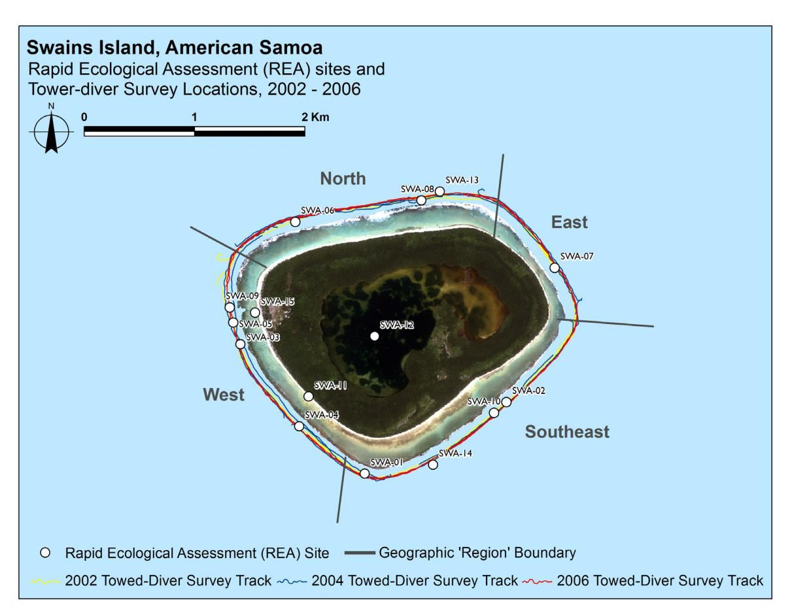

**Figure 7.2a.** Locations of REA and towed-diver surveys around Swains during ASRAMP 2002, 2004, and 2006. Four arbitrary geographic regions have been delineated to aid in discussion of spatial patterns.

Figure 7.2a shows the locations of Rapid Ecological Assessment (REA) and towed-diver survey efforts during ASRAMP 2002, 2004 and 2006. The number, mean depth, and area of these survey efforts are presented by year in Table 7.2a.

Depth ranges from towed-diver surveys are presented for each year in Figures 7.5.1b (2002), 7.5.1e (2004), and 7.5.1m (2006). Although the towed-diver survey methodology is aimed at following specific isobaths, the actual depths surveyed are often quite variable. These figures illustrate the depth variability observed during towed-diver surveys and should be referenced when further exploring the towed-diver datasets.

Spatial and temporal observations of key oceanographic and water quality parameters influencing reef conditions around Swains were collected using a diverse suite of long-term moored instrumentation packages and closely spaced conductivity, temperature, and depth (CTD) surveys of the vertical structure of the water column during ASRAMP 2002, 2004, and 2006 (see methods Chapter 2, Section 2.3: Oceanography and Water Quality). A summary of deployed instruments and collection activities is provided in Table 7.2b and are examined further in Section 7.4: Oceanography and Water Quality.

**Table 7.2b.** Numbers of oceanographic instrument deployments and shallow- and deep-water CTD casts around Swains during ASRAMP 2002, 2004, and 2006. Instrument types include ocean data platform (ODP) and subsurface temperature recorder (STR). Shallow-water CTD casts were conducted from the surface to a 30-m depth. Deep-water CTD casts were conducted from the surface to a 500-m depth. Deep-water CTD cast information is presented in Chapter 8: Archipelagic Comparisons.

| Observation Type        | 2002 | 2004 | 2006 |
|-------------------------|------|------|------|
| ODP                     | 1    | 0    | 0    |
| STR                     | 0    | 1    | 3    |
| Shallow-water CTD casts | 19   | 29   | 27   |
| Deep-water CTD casts    | 10   | 8    | 9    |

# **7.3 Benthic Habitat Mapping and Characterization**

Benthic habitat mapping and characterization around Swains were conducted using acoustic multibeam sonar in depths between ~ 10 and ~ 3000 m. The shipboard Towed Optical Assessment Device (TOAD) could not be safely deployed around Swains because of the steep terrain and associated navigational concerns. Nearshore habitat mapping was conducted during towed-diver benthic surveys in depths between ~ 10 and 30 m.

# **7.3.1 Acoustic Mapping**

Multibeam mapping was conducted around Swains in early 2006 (Fig. 7.3.1a). Continuous coverage was achieved in depths between ~ 10 and 3000 m. An additional noncontiguous swath was surveyed during deep-water acoustic Doppler current profiler transects that extended the bathymetric mapping to depths greater than 4000 m. TOAD optical surveys were not conducted around Swains because of the difficulty of maneuvering vessels close to this extremely steep seamount and limited areas within the depth range limitations of the TOAD optical equipment.

Multibeam mapping surveys show Swains to be a steep, conical emergent seamount/atoll with

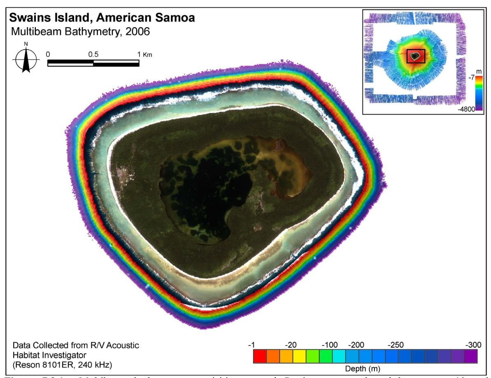

**Figure 7.3.1a.** Multibeam bathymetry acquisition around Swains was conducted between ~ 10 and ~ 4000 m in March 2006 from the National Oceanic and Atmospheric Administration (NOAA) Ship *Hi`ialakai*  and the R/V *Acoustic Habitat Investigator* (*AHI*). The island drops steeply on all sides to form an intact, conical volcanic pedestal.

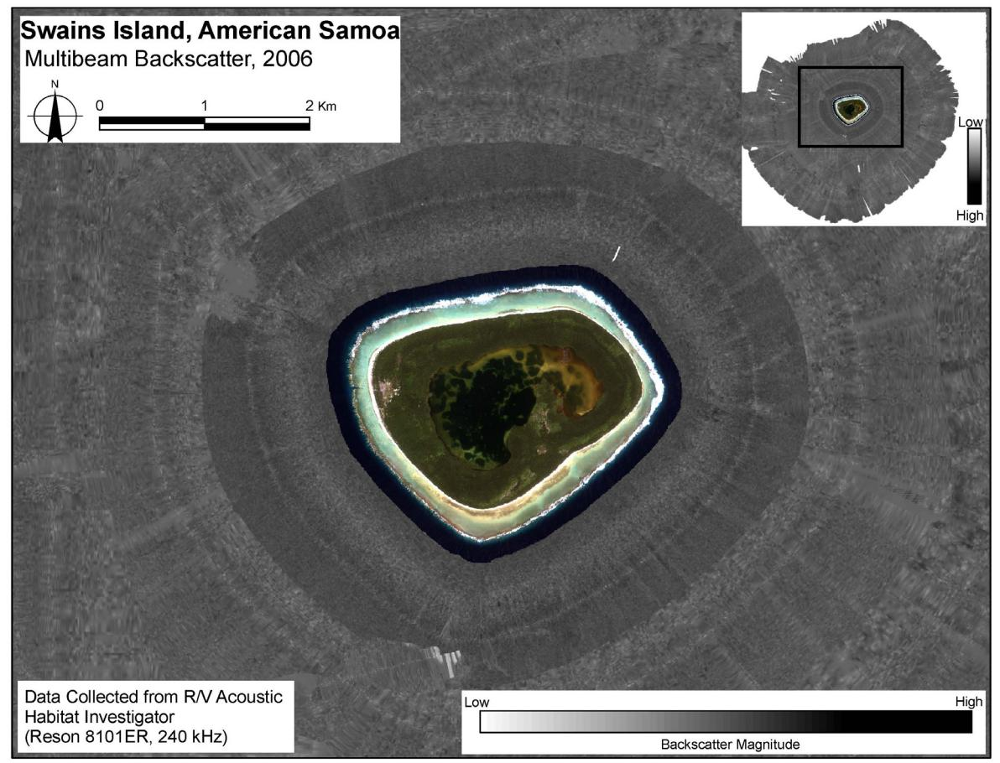

**Figure 7.3.1b.** Backscatter imagery was acquired in March 2006 during multibeam surveys around Swains from the NOAA Ship *Hi`ialakai* and the R/V *AHI*. Lighter shades represent low-intensity backscatter and likely indicate substrates that are acoustically absorbent and typically indicate unconsolidated sediment. Darker shades represent high-intensity backscatter and likely indicate consolidated hard-bottom and coral substrates.

rift zones that extend from each corner of the reef down to at least 3000 m. The bathymetry immediately adjacent to the exposed reef is very steep and shows no evidence of significant spur-and-groove structures. However spur-and-groove features are evident at some locations on the reef crest and shallow forereef. The sides of the seamount are relatively smooth and exhibit no signs of mass wasting. Based on the bathymetric data collected, it is apparent that reef communities around the island do not benefit from the protections provided by the insular shelves found at other islands in American Samoa.

Backscatter acquisition results from around Swains (Fig. 7.3.1b) showed a high-magnitude return surrounding the entire island. This result suggests that the seafloor surrounding Swains is composed of hard substrate. Towed-diver imagery and diver observations confirm that much of the benthos within the top 30 m of the water column is colonized by coral dominated communities.

# **7.3.2 Habitat Characterization**

Towed-diver benthic survey observations around Swains from ASRAMP 2002, 2004, and 2006 were concatenated into mean spatial distributions (see Chapter 2, Section 2.2.3: Optical Validation Surveys) of the following benthic components: habitat complexity (Fig. 7.3.2a), percent cover of sand (Fig. 7.3.2b), hard substrate/pavement (Fig. 7.3.2c), rubble (Fig. 7.3.2d), and live coral (Fig. 7.3.2e). Since these habitat characterization maps represent different and complementary components of the same habitats, it is useful to analyze them in relation to one another as well as to the local watersheds and exposure to prevailing oceanographic conditions.

Habitat complexity was elevated on all coasts of the island, but appeared highest along the west region, specifically along the southwestern-facing shore of the atoll (Fig. 7.3.2a). Complexity was also elevated in the northeast along the dividing line between the north and east regions.

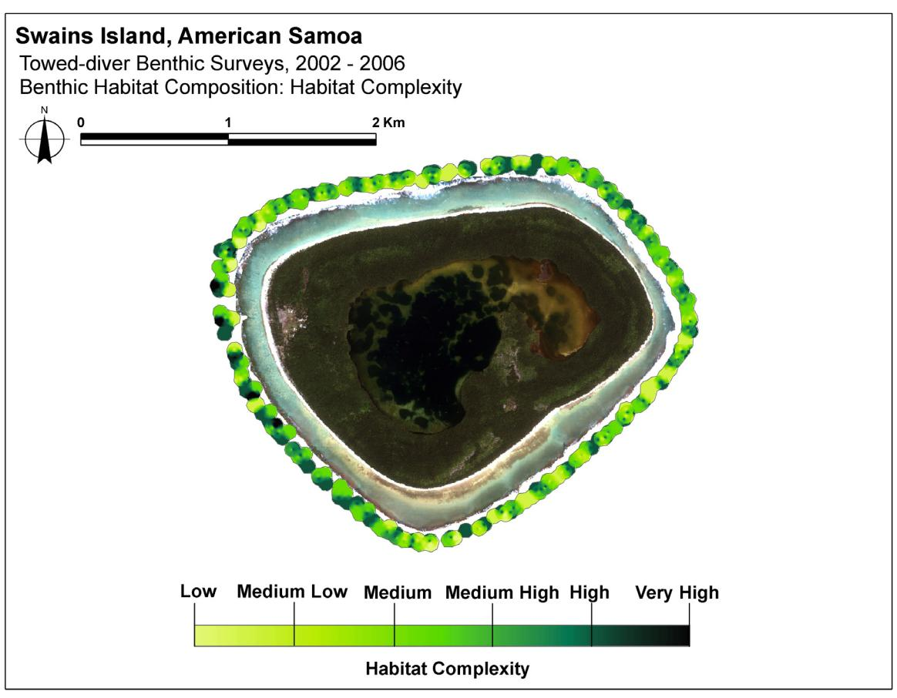

**Figure 7.3.2a.** Mean benthic habitat complexity concatenated from towed-diver survey observations around Swains during ASRAMP 2002, 2004, and 2006. Habitat complexity was subjectively rated by divers over 5-min ensembles (~ 200 m × 10 m) over a 6-point scale representing low (1), medium-low (2), medium (3), mediumhigh (4), high (5), and very high (6) topographic complexity. Yellow colors indicate low habitat complexity, and dark green colors indicate high habitat complexity.

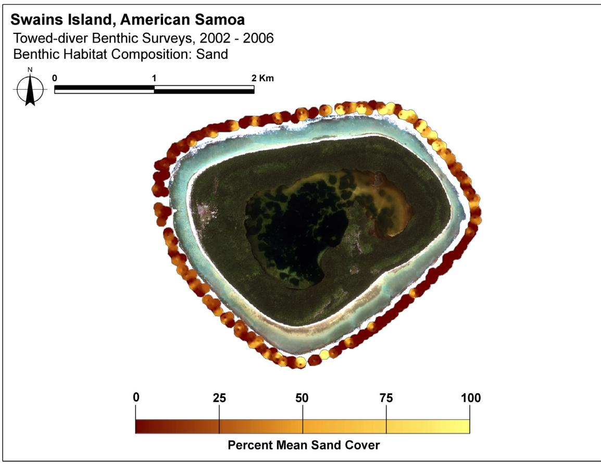

**Figure 7.3.2b.** Mean percent cover of sand concatenated from towed-diver habitat survey observations around Swains during ASRAMP 2002, 2004, and 2006. Sand composition was subjectively rated by divers over 5-min ensembles (~ 200 m × 10 m) over a 1–100% scale. Light shades indicate high percent cover of sand, and dark shades indicate low percent cover of sand.

True to Swains' nature as a steep, conical seamount, towed-diver observations indicated low levels of sand, except for small scattered deposits located around the northeast corner of the island (Fig. 7.3.2b), indicative of steep spur-and-groove features along the forereef crest when coupled with moderate-to-high habitat complexity in the same region.

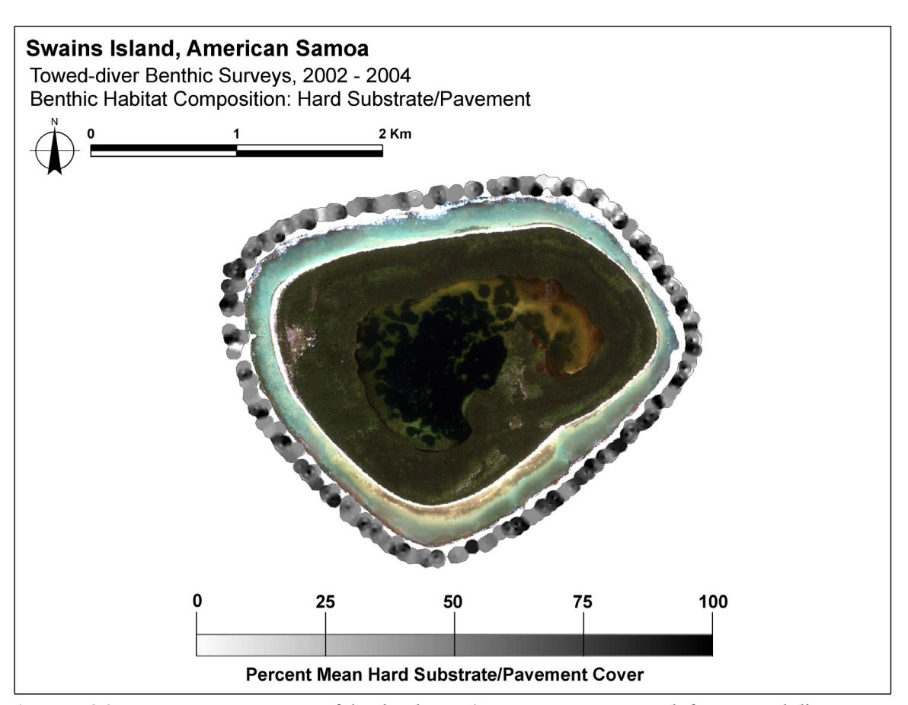

**Figure 7.3.2c.** Mean percent cover of hard substrate/pavement, concatenated from towed-diver survey observations around Swains during ASRAMP 2002 and 2004. Hard substrate/pavement composition was subjectively rated by divers over 5-min ensembles (~ 200 m × 10 m) on a 1–100% scale. Dark shades indicate high percent cover of hard substrate, and light shades indicate low percent cover of hard substrate.

Hard substrate/pavement composition appeared relatively uniform around the island, with slightly elevated cover along the windward east-facing coastline (Fig. 7.3.2c).

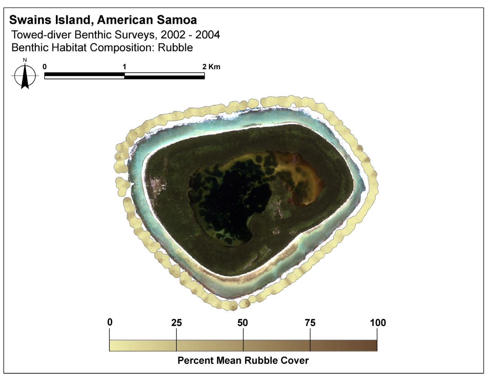

**Figure 7.3.2d.** Mean percent cover of coral rubble, concatenated from towed-diver survey observations around Swains during ASRAMP 2002 and 2004. Rubble composition was subjectively rated by divers over 5-min ensembles (~ 200 m × 10 m) on a 1–100% scale. Light shades indicate low percent cover of coral rubble, and dark shades indicate high percent cover of coral rubble.

Mean percent cover of coral rubble appeared highest around the northwest corner of the west region (Fig. 7.3.2d), which may have been biased higher than normal by inclusion of extensive coral fracturing and breakage observed during ASRAMP 2004 following the passage of Hurricane Heta. Additional patches of elevated coral rubble were recorded along the east corner and in the southeast region; these areas were widely scattered and localized (Fig. 7.3.2d).

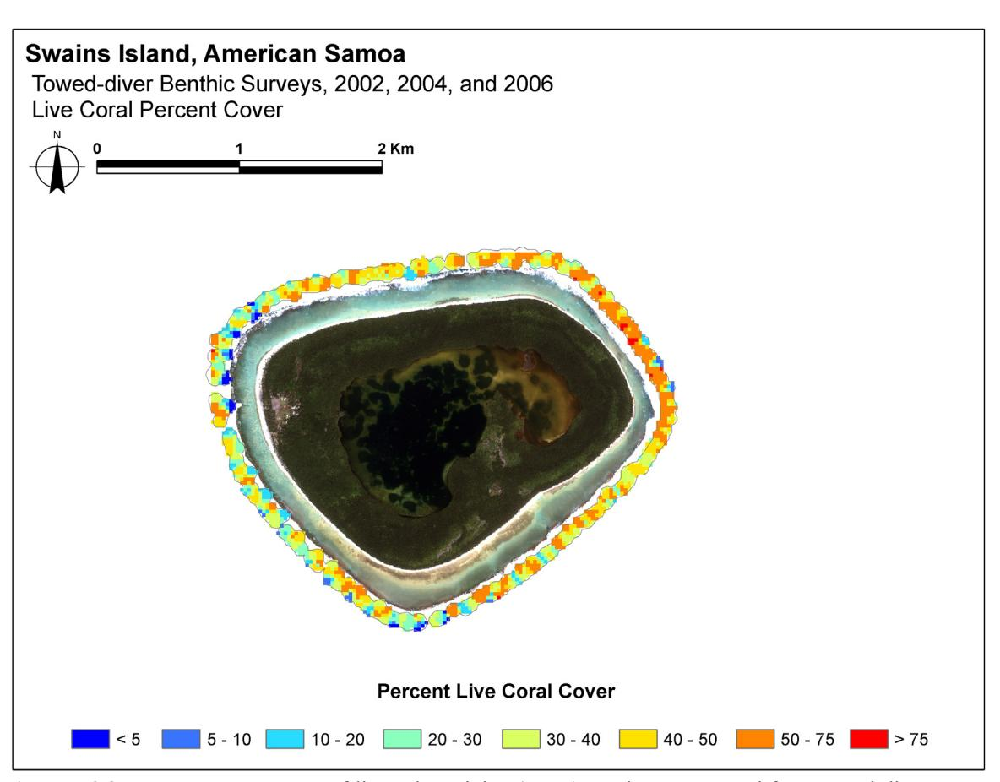

**Figure 7.3.2e.** Mean percent cover of live scleractinian (stony) coral, concatenated from towed-diver survey observations around Swains during ASRAMP 2002, 2004, and 2006. Live coral cover composition was subjectively rated by divers over 5-min ensembles (~ 200 m × 10 m) on a 1–100% scale. Blue colors indicate low percent cover of coral, and reddish colors indicate high percent cover of coral.

Mean percent cover of live scleractinian (stony) coral was exceptionally and consistently high around Swains compared with the other islands in American Samoa (Fig. 7.3.2e). Coral cover values were highest in the windward east region, with values ranging from 50% to 100%. Coral cover values were likewise high in the north and southeast regions, with values ranging from ~ 40% to ~ 75%. Though some high coral cover values were recorded in the west region, this side and the southwest corner had much more variable coral cover with values ranging from ~ 5% to ~ 75%. This formed an apparent gradient with the highest cover on the northeast, ranging down to the lowest cover on the southwest. Still, less cover was found on the corners of the island bracketing the southwestern side (Fig. 7.3.2e).

# **7.4 Oceanography and Water Quality**

Oceanographic and water quality observations were collected in the waters surrounding Swains between 2002 and 2006. Instrumentation and equipment descriptions and locations, and a subset of results are discussed below. Specific details of deployments and additional data are presented in Appendix II, Table II. ii.

# **7.4.1 Hydrographic Data**

#### *2002 Spatial Surveys*

During ASRAMP 2002, 19 shallow-water CTD casts were conducted between February 9 and 10 in nearshore waters around Swains and within the lagoon (Fig. 7.4.1a).

Data from these vertical profiles around the outside of the island show little variability in temperature, salinity, or density (Fig. 7.4.1b). The north side of the island in the north and east regions (A–C), and the eastern portion of the southeast region were marginally cooler (29.46°–29.52°C) than the southern side of the island (29.54°–29.56°C). However, salinity and density showed little vertical structure (well-mixed) or horizontal variability, with the exception of a single CTD at the northwest point where a low salinity tongue was observed throughout the water column. The reason for the lower salinity water is not clear, but the weak gradient of lowest salinity water near the bottom suggests the possibility of a subsurface

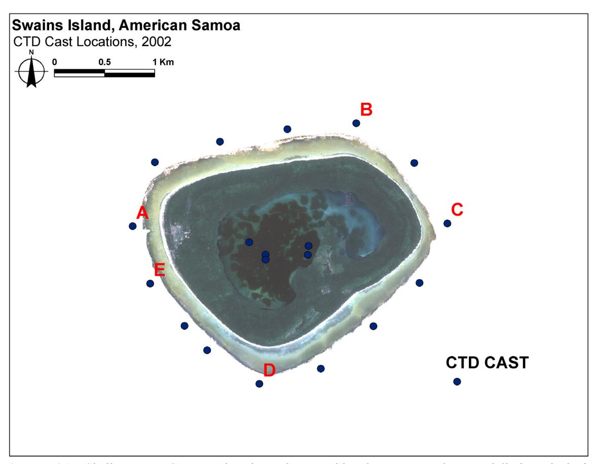

**Figure 7.4.1a.** Shallow-water CTD cast locations, shown as blue dots, expressed sequentially in a clockwise direction around Swains (A–E) during ASRAMP 2002, February 19–20.

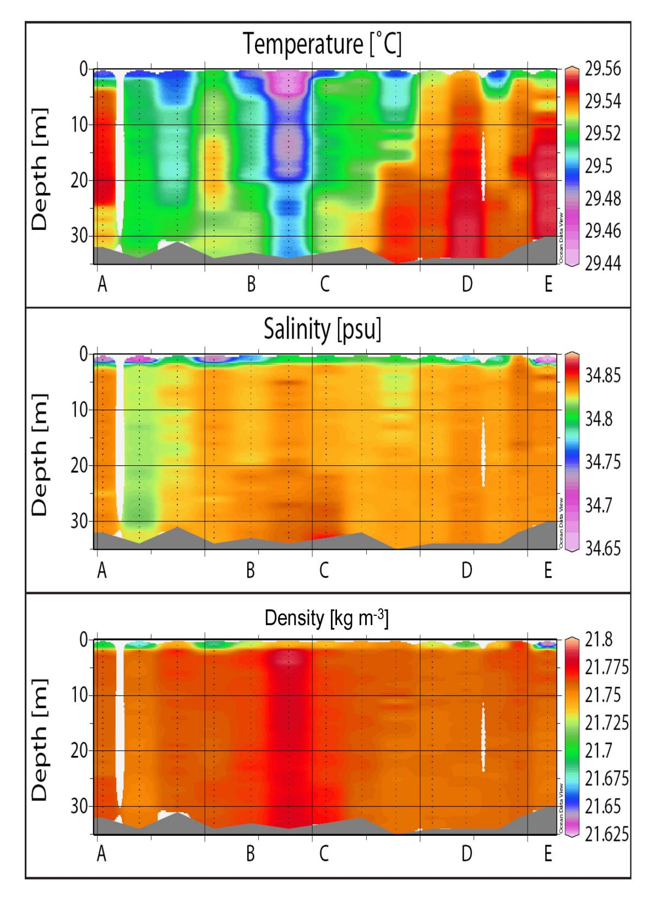

**Figure 7.4.1b.** Shallow-water CTD cast profiles to a 30-m depth around Swains during ASRAMP 2002, February 19–20, including temperature (°C), salinity (psu), and density (kg m-3). Profiles are shown sequentially in a clockwise direction around the island (A–E), as shown in Figure 7.4.1a.

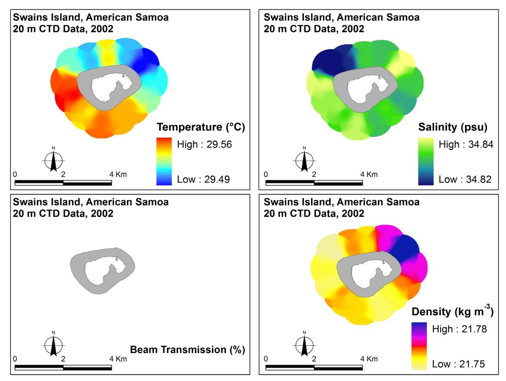

**Figure 7.4.1c.** Interpolated water temperature (top left), salinity (top right), and density (bottom right) at a 20 m depth derived from shallow-water CTD casts around Swains during ASRAMP 2002, February 19–20. Beam transmission data were not collected (botom left).

freshwater spring at the northwest corner.

Analysis of the following physical water properties at a 20-m depth during this survey period (Fig. 7.4.1c) shows relatively little spatial variance or range in measured values: temperature (29.49°–29.56°C), salinity (34.82–34.84 psu), and density (21.75–21.78 kg m-3). Though gradients were small, general weak patterns were apparent. Waters at 20-m depths were warmer in the west and south regions and cooler in the north and northeast, where one CTD cast at the northeast corner recorded noticeably cooler temperature. The salinity minimum described at the northwest corner is strikingly apparent at the 20-m depth. The area to the northeast corner with cool water was also observed to have high salinity, resulting in a localized area of high density.

# *2004 Spatial Surveys*

During ASRAMP 2004, 29 equally spaced shallow-water CTD casts were conducted in nearshore waters around Swains between February 15 and 18 (Fig. 7.4.1d). Data from these vertical profiles around the outside of the atoll showed limited variability in temperature, salinity, and density (Fig. 7.4.1e). Surface waters (0–5 m) in the north and east regions (A–C) and the eastern portion of the southeast region of the atoll were warmer by 0.2°–0.3°C than those on the south and west coast (C–E). The most significant feature observed was a lower temperature (29.7°C), higher salinity (34.8 psu), and higher density (21.55 kg m-3) body of bottom water (> 20 m) around the east side of the island (B–C). The west side of the island had a region of low salinity (34.6 psu) and transmittance (93.5%), with some evidence of stratification toward the south and west sides (D–E). Beam transmission levels were only slightly variable with the highest along the southeast shore (> 94%) and lowest along the west shore (~ 93%).

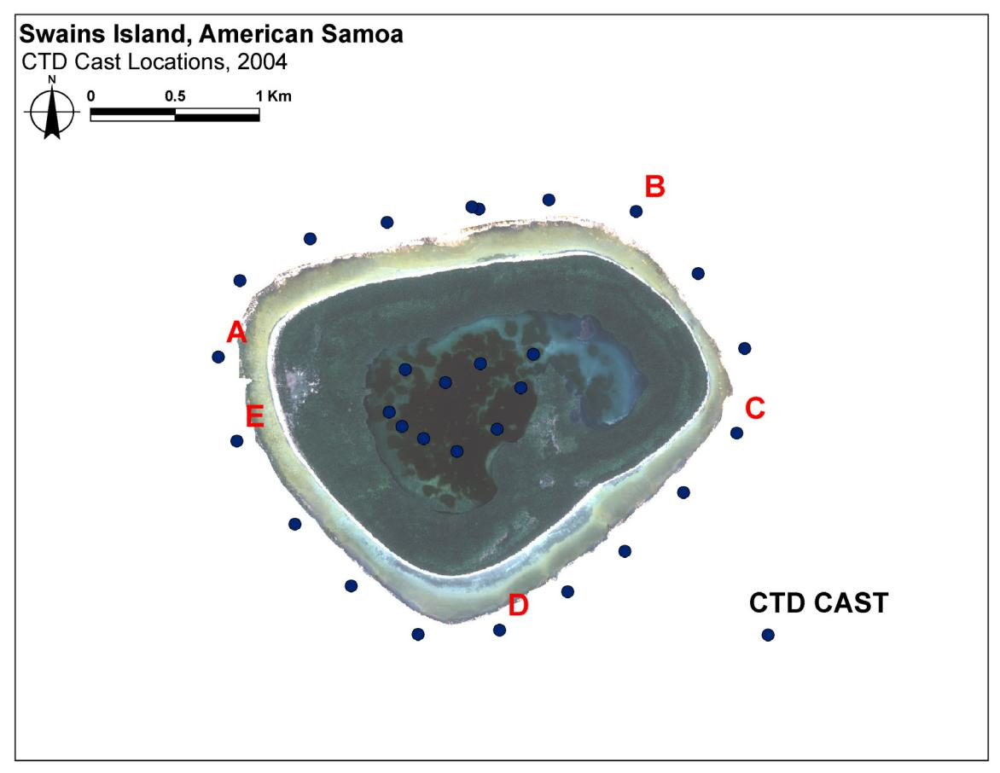

**Figure 7.4.1d.** Shallow-water CTD cast locations, shown as blue dots, expressed sequentially in a clockwise direction around Swains (A–E) during ASRAMP 2004, February 15–18. Notice 10 additional CTD locations within the brackish lake of the island.

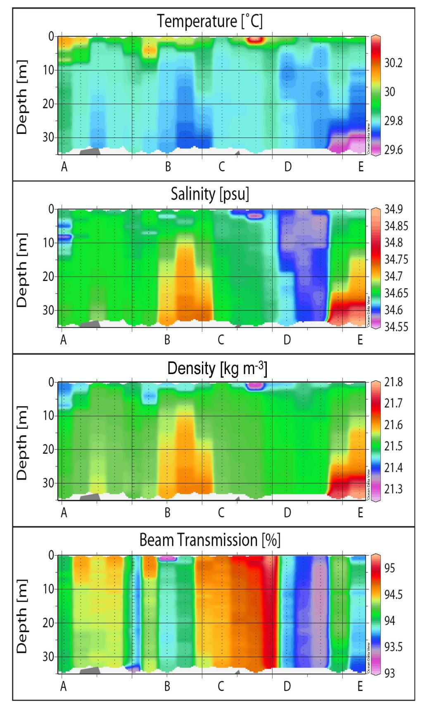

**Figure 7.4.1e.** Shallow-water CTD cast profiles to a 30-m depth around Swains during ASRAMP 2004, February 15–18, including temperature (°C), salinity (psu), density (kg m-3), and beam transmission (%). Profiles are shown sequentially in a clockwise direction around the island (A–E), as shown in Figure 7.4.1d.

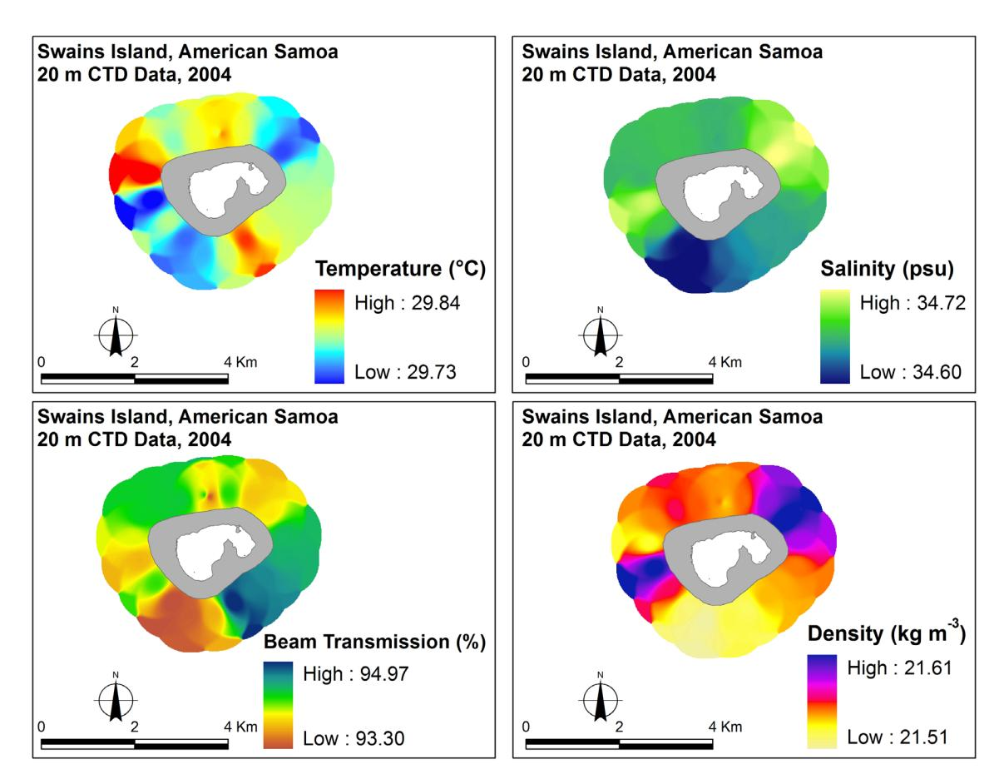

**Figure 7.4.1f.** Interpolated water temperature (top left), salinity (top right), beam transmission (bottom left) and density (bottom right) at a 20-m depth derived from shallow-water CTD casts around Swains during ASRAMP 2004, February 15–18.

Spatial patterns of physical water properties at 20-m depths around Swains during ASRAMP 2004 were observed, though differences were typically small (Fig. 7.4.1f). Ranges of key properties varied as follows: temperature (29.73°–29.84°C), salinity (34.60–34.72 psu), beam transmission (93.30–94.97%), and computed density (21.51–21.61 kg m-3). Alternating from relatively warm to cool to warm, the small temperature differences did not reveal any specific spatial pattern. For salinity, the most striking feature was an area of low salinity (34.6 psu) around the south point between the west and southeast regions. This area was also characterized by low beam transmission (high turbidity), which suggests possible weak seepage of lagoon waters into the nearshore environment.

# *2006 Spatial Surveys*

During ASRAMP 2006, 27 CTD casts were conducted in nearshore waters around Swains between February 12 and 13 (Fig. 7.4.1g). Water samples were collected for nutrient analysis at 1-, 10-, 20-, and 30-m depths, where possible, at 11 of these shallow CTD sites. Dissolved inorganic carbon (DIC) samples were also collected at these locations.

Shallow-water CTD profiles from ASRAMP 2006 showed primarily well-mixed waters with little spatial variability in temperature, salinity or density around Swains (Fig. 7.4.1h). Temperatures on the east and southeast (B–D) regions were marginally higher than the north (A–B) and west (D–A) sides and were uniform with depth. Salinity, density and beam transmittance showed very little spatial or vertical variability around the island. The lagoon at Swains appeared to have little effect on the physical properties of the ocean outside the perimeter in 2006. This is caused by the lack of outflow from the inner lagoon to the ocean and to the low-lying geography, little vegetation, and no anthropogenic sources to affect rainfall runoff.

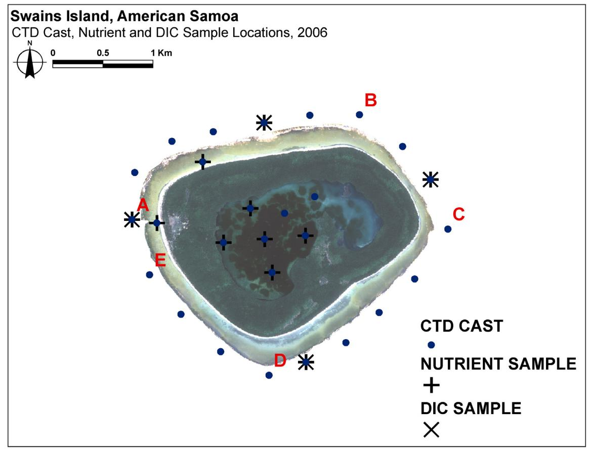

**Figure 7.4.1g.** Shallow-water CTD cast, nutrient and DIC water sample locations around Swains (A–E) during ASRAMP 2006, February 12–13.

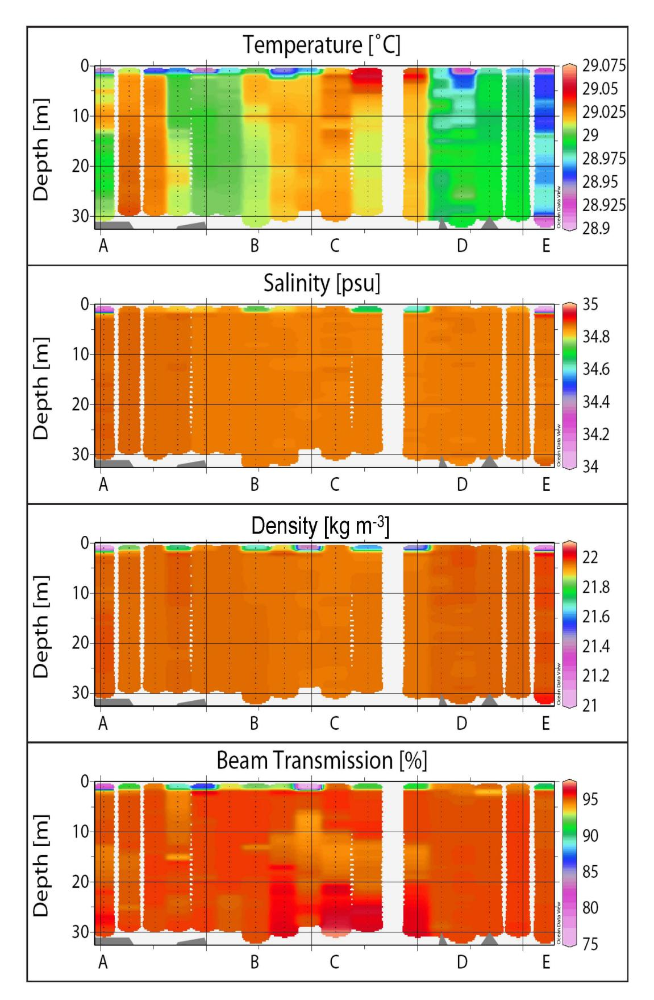

**Figure 7.4.1h.** Shallow-water CTD cast profiles to a 30-m depth around Swains during ASRAMP 2006, February 12–13, including temperature (°C), salinity (psu), density (kg m-3), and beam transmission (%). Profiles are shown sequentially in a clockwise direction around the island (A–E), as shown in Figure 7.4.1g.

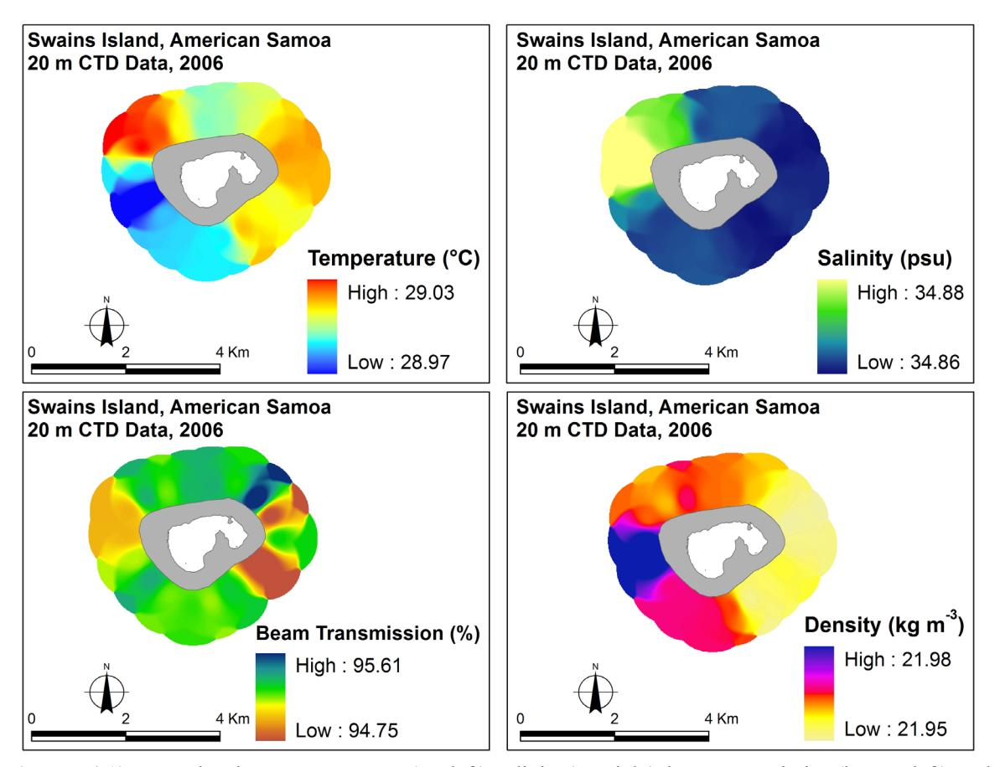

**Figure 7.4.1i.** Interpolated water temperature (top left), salinity (top right), beam transmission (bottom left), and density (bottom right) at a 20-m depth derived from shallow-water CTD casts around Swains during ASRAMP 2006, February 12–13.

Physical water properties at a 20-m depth around Swains showed limited, but noticeable, less discernable spatial patterns in the vertical sections (Fig. 7.4.1i). The actual spatial differences and ranges of the following properties around the island were small: temperature (28.97°–29.03°C), salinity (34.86–34.88 psu), beam transmission (94.75–95.61%), and density (21.95–21.98 kg m-3). The northwest corner of the island was observed to have a weak signal of increased temperature, salinity and density, and decreased beam transmission, possibly related to water discharge through the reef channel from the shallow reef flat surrounding the island.

Several spatial patterns of observed water quality properties at 20-m depths existed around Swains during ASRAMP 2006. Water quality analyses of the in situ samples collected at 20 m display the following ranges (Fig. 7.4.1j): chlorophyll-a, only 1 sample at 0.36  $\mu g \ L^{-1}$ ; phosphate (PO4), 0.14–0.16  $\mu M$ ; silicate (SiO2), 0.95–1.24  $\mu M$ ; and total nitrogen (Ntot = NO3 + NO2), 0.07–0.19  $\mu M$ . Although the actual ranges in values were small, Swains exhibited higher PO4 concentrations than the other islands in the archipelago, with the highest values falling on the east and west sides of the island. The measured nitrogen components also showed the greatest values from the sites sampled on the east and west sides of the island. Silicate, conversely, showed the greatest concentration on the south side of the island.

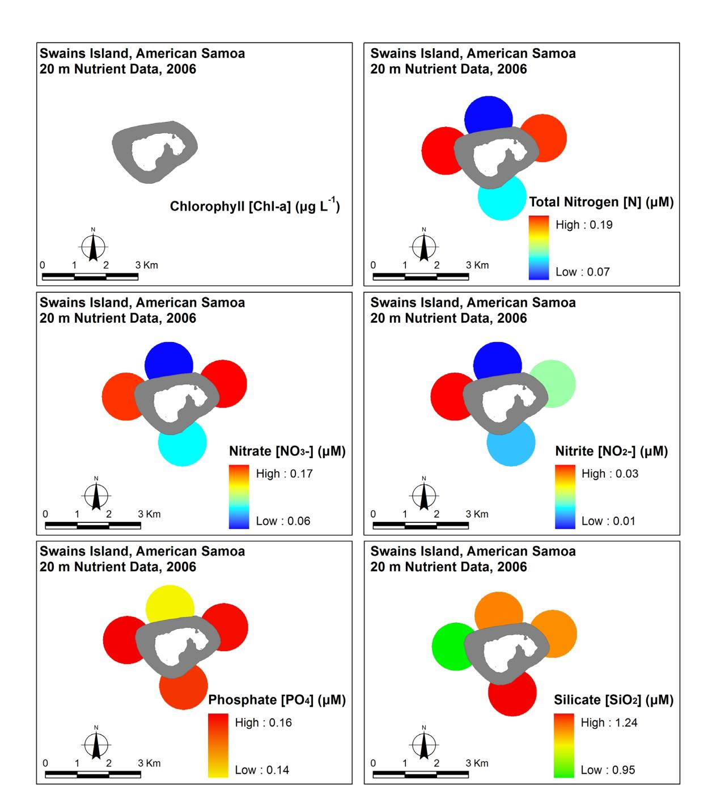

**Figure 7.4.1j.** Interpolated total nitrogen (top right), nitrate (middle left), nitrite (middle right), phosphate (bottom left) and silicate (bottom right) concentrations, at a 20-m depth derived from water samples collected in concert with shallow-water CTD casts around Swains during ASRAMP 2006, February 12–13. Chlorophyll-a interpolation is not included in this figure because there was only one data point for this parameter .

#### **7.4.2 Temporal Comparison—Hydrographic Data**

In each of the hydrographic survey periods of Swains, water properties and nutrient concentrations exhibited little spatial variability around the island. This is not a surprising result given the small size of the island; most small-scale processes, and certainly all large-scale oceanographic processes, would influence waters on all sides of the island. These results will act as a baseline from which to compare future oceanographic and water quality datasets.

# **7.4.3 Time Series Observations**

A limited suite of moored instruments were deployed around Swains over the period between 2002 and 2006 to collect time series observations of key oceanographic properties influencing reef conditions (Fig. 7.4.3a). Deployment and retrieval dates are detailed in Appendix II, Table II. iv. Figure 7.4.3b shows a time series of in situ and remotely sensed sea surface temperature (SST) and modeled wave properties from January 2002 to April 2006.

Pathfinder SST and in situ temperature observations around Swains show strong seasonal variation with warmest temperatures (~ 30.5°C) observed during January–March and coolest temperatures (~ 28.5°C) in June–August (Fig. 7.4.3b, top panel). Pathfinder-derived SST and in situ temperature data showed similar variability; however, in situ observations were warmer (0°–2.0°C) than those measured via satellite, particularly during austral winters. This trend is also consistent when comparing Pathfinder climatology with in situ observations.

One STR was deployed at Swains from 2004 to 2006 (Fig. 7.4.3a). The STR sensor showed 2°–3°C temperature fluctuations caused by seasonal variability in addition to minimal (< 1°C) diurnal temperature fluctuations during this time (Fig. 7.4.3c).

Modeled significant wave-height data for Swains revealed weak seasonal variability superimposed with episodic, cyclone-derived extreme wave events. Larger wave heights (~ 3–4 m) typically occurred during winter months compared to smaller wave heights (~ 2 m)

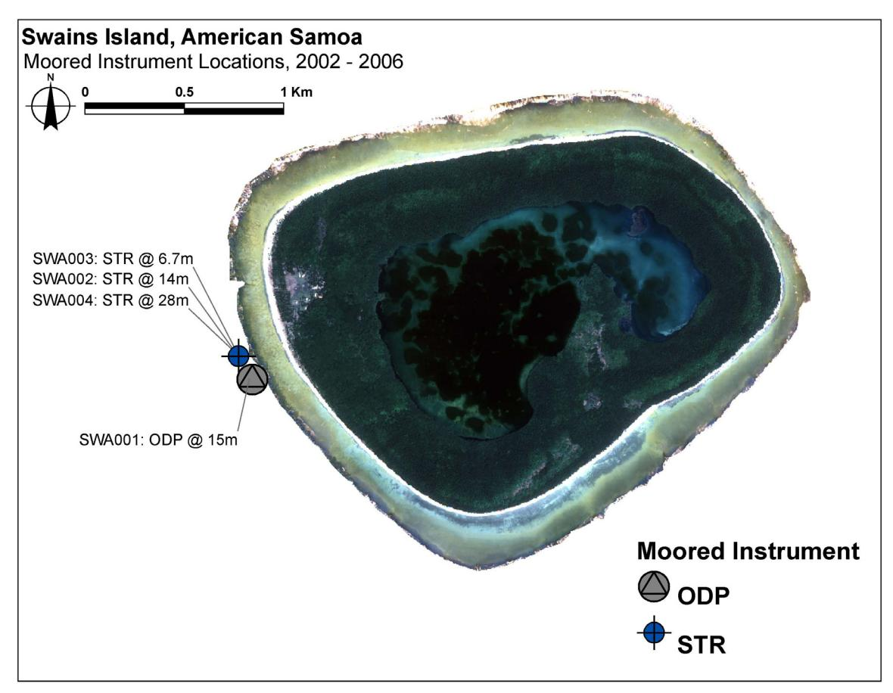

**Figure 7.4.3a.** Locations and types of oceanographic instrument moorings deployed around Swains between 2002 and 2006. Moored instrument types include ODP and STR.

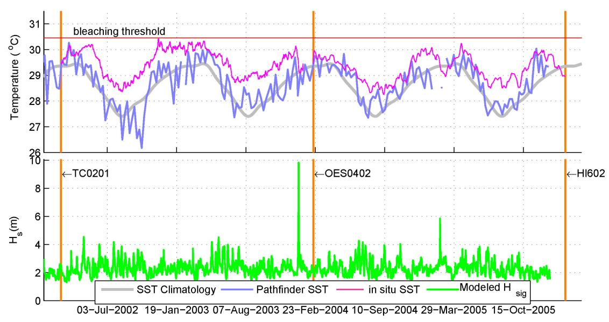

**Figure 7.4.3b.** SST and wave height time series around Swains between January 2002 and April 2006. Remotely sensed data (SST climatology and weekly Pathfinder-derived SST) and modeled significant wave-height data derived from Wave Watch III are overlaid with CRED in situ temperature observations from an ODP deployed at a 15-m depth at site SWA001, and an STR deployed at a 14-m depth at site SWA002 (locations shown in Fig. 7.4.3a). The horizontal red and vertical orange bars represent the bleaching threshold and the ASRAMP research cruise dates, respectively.

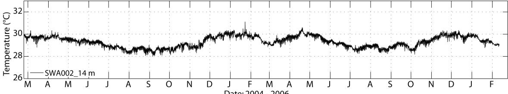

**Figure 7.4.3c.** Time series observations of temperature from March 2004 to February 2006 collected from an STR deployed at SWA002 at a 14-m depth at Swains. See Figure 7.4.3a for mooring locations.

during the summer months. Two extreme swell events were observed during the time series record. The first, in January 2004, was produced by Cyclone Heta and the second in February 2005 was produced by Cyclones Olaf and Percy (Fig. 7.4.3b, bottom panel).

# **7.5 Coral and Coral Disease**

# **7.5.1 Coral Surveys**

#### *2002 Spatial Surveys*

Nine towed-diver benthic surveys, with a mean depth of 10.3 m, were conducted around Swains during ASRAMP 2002. Individual towed-diver survey track depths ranged from 6 m (SD 2) to 23 m (SD 2; Fig. 7.5.1a). High live scleractinian (stony) coral cover characterized the benthic community surrounding Swains, with an island-wide mean of 60.0% (SE 4.6) live scleractinian (stony) coral cover (Fig. 7.5.1b). Dead coral percent cover observations were recorded as an independent component of the benthic community, with an island-wide mean of 4.0% (SE 0.8; Fig. 7.5.1c).

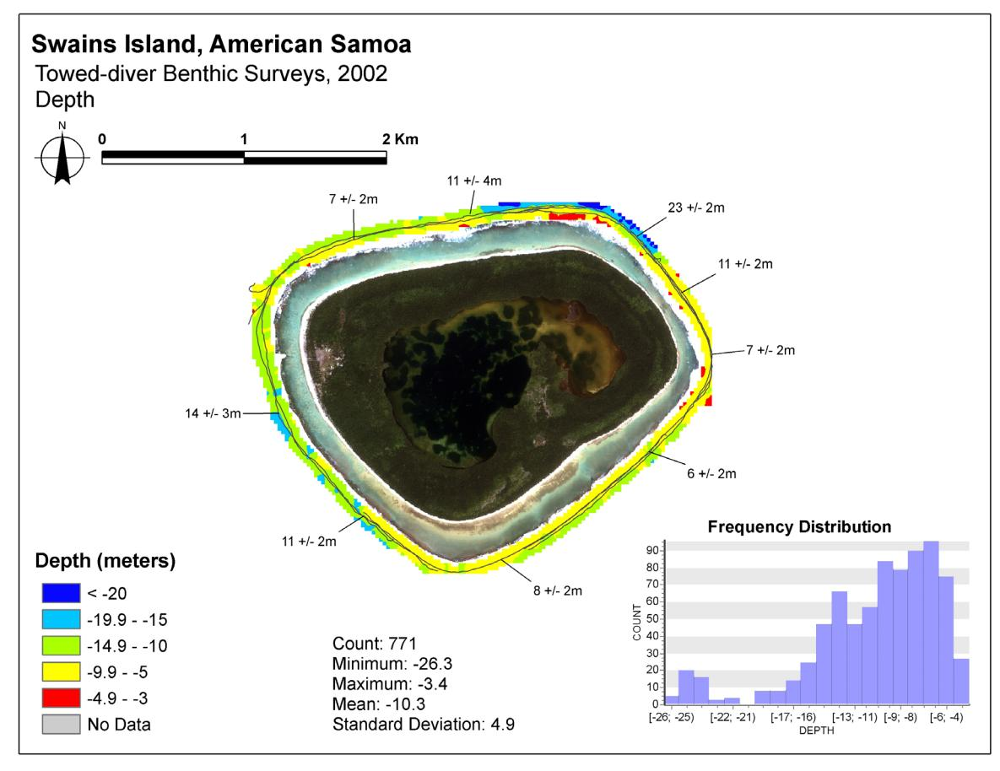

**Figure 7.5.1a.** Towed-diver survey tracks around Swains during ASRAMP 2002. Towed-diver survey tracks are color coded with mean depths for each 5-min segment. Mean depths and standard deviations for each towed-diver survey are shown in black text. Depth histogram and statistics (counts, minimum depth, maximum depth, mean, and standard deviation) from 30-sec depth recordings during towed-diver surveys are included.

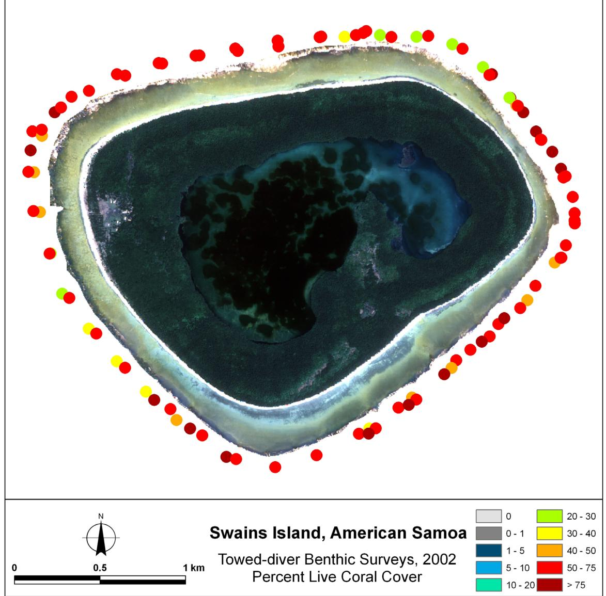

**Figure 7.5.1b.** Towed-diver benthic survey observations of live scleractinian (stony) coral cover around Swains during ASRAMP 2002. Each colored point represents an integrated estimate over a 5-min observation segment covering a survey swath of ~ 200 m × 10 m (~ 2000 m ). Symbol size represents the percent live coral cover on the benthic habitat. Note that coral cover was measured as a direct percentage of overall benthic cover in 2002. For more information, see Chapter 2, Section 2.4.2: Towed-diver Surveys.

High live coral cover typified the benthic community around Swains (Fig. 7.5.1b). However, specific hotspots of elevated live coral cover were observed during the 2002 towed-diver surveys. The northwest corner of the island, intersecting both the north and the west regions, was observed to have exceptionally high live coral cover (4 tow segments, mean: 73.8%). Other high coral cover areas included the east region (10 tow segments, mean: 71.8%) and the west region (6 tow segments, mean: 65.8%). Dead coral cover (Fig. 7.5.1c) was sporadically distributed around Swains, with increased levels observed in the west region (northwest corner of the island, 8 tow segments, mean: 8.9%) and in the north region (5 tow segments, mean: 6.6%).

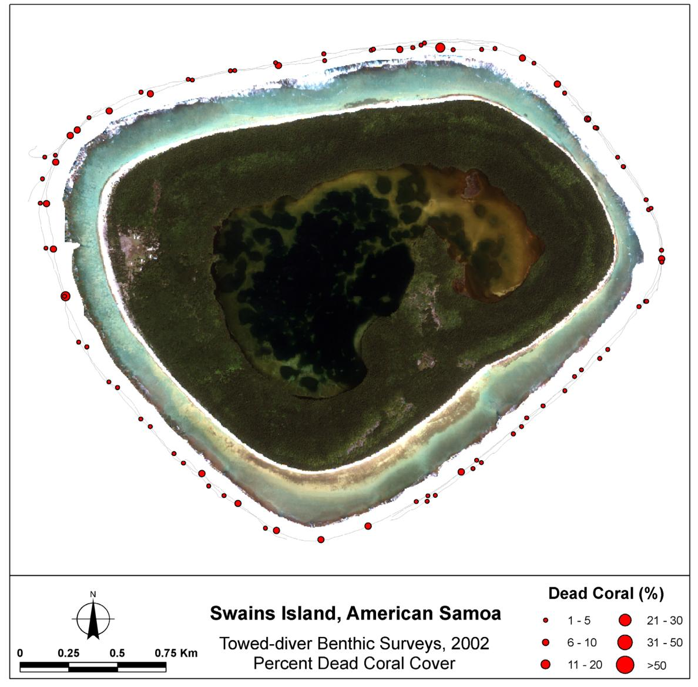

**Figure 7.5.1c.** Towed-diver benthic survey observations of dead coral cover around Swains during ASRAMP 2002. Each colored point represents an integrated estimate over a 5-min observation segment covering a survey swath of ~ 200 m × 10 m (~ 2000 m ). Symbol size represents the percent of dead coral cover on the benthic habitat.

REA coral surveys during ASRAMP 2002 were the first surveys conducted in American Samoa by CRED. Although 15 sites were surveyed around Swains by a coral biologist, much of the focus of those surveys was to compile species inventories and explore different coral monitoring methodologies. Since the surveys were exploratory and qualitative in nature, no data are presented in this more quantitative report.

#### *2004 Spatial Surveys*

A total of 14 towed-diver benthic surveys were conducted around Swains during ASRAMP 2004. The mean towed-diver survey depth was 12.5 m, with individual towed-diver survey depths ranging from 5 m (SD 2) to 16 m (SD 8; Fig. 7.5.1d).

As a result of the numerous towed-diver survey tracks in 2004 and the shift to using dive computers instead of decompression tables, towed-diver surveys were intentionally conducted in three depth ranges (as reflected in the depth histogram in Fig. 7.5.1d): shallow (~ 5 m), mid-depths (~ 10–15 m), and deep (20–25 m).

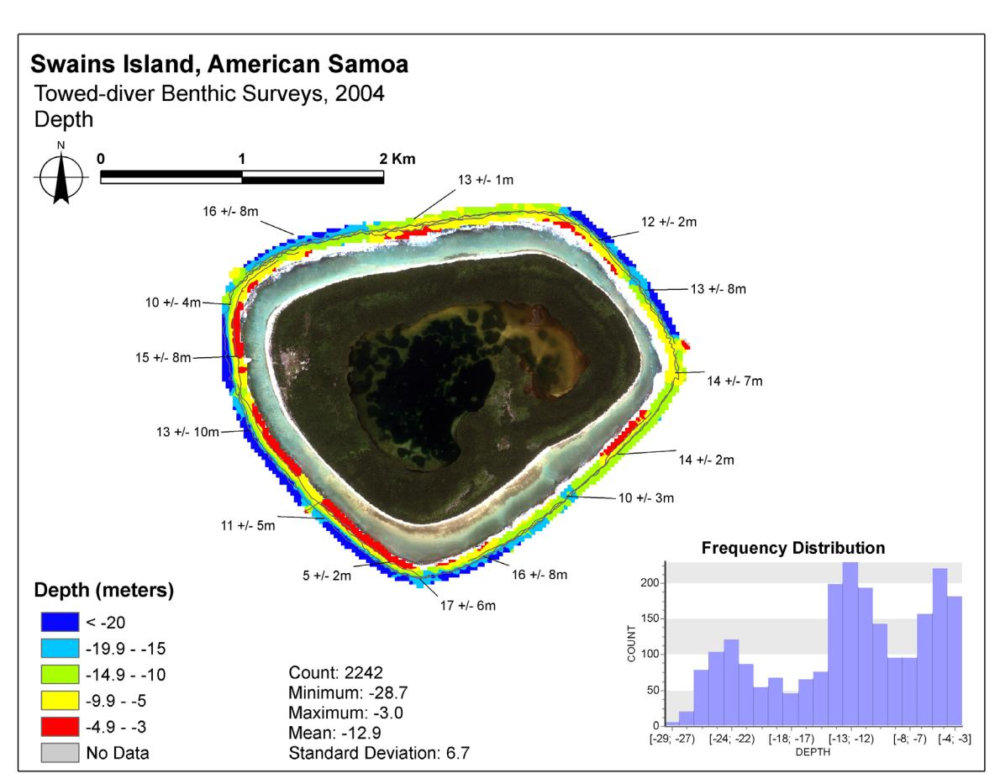

**Figure 7.5.1d.** Towed-diver survey tracks around Swains during ASRAMP 2004. Towed-diver survey tracks are color coded with mean depths for each 5-min segment. Mean depths and standard deviations for each towed-diver survey are shown in black text. Depth histogram and statistics (counts, minimum depth, maximum depth, mean, and standard deviation) from 30-sec depth recordings during towed-diver surveys are included.

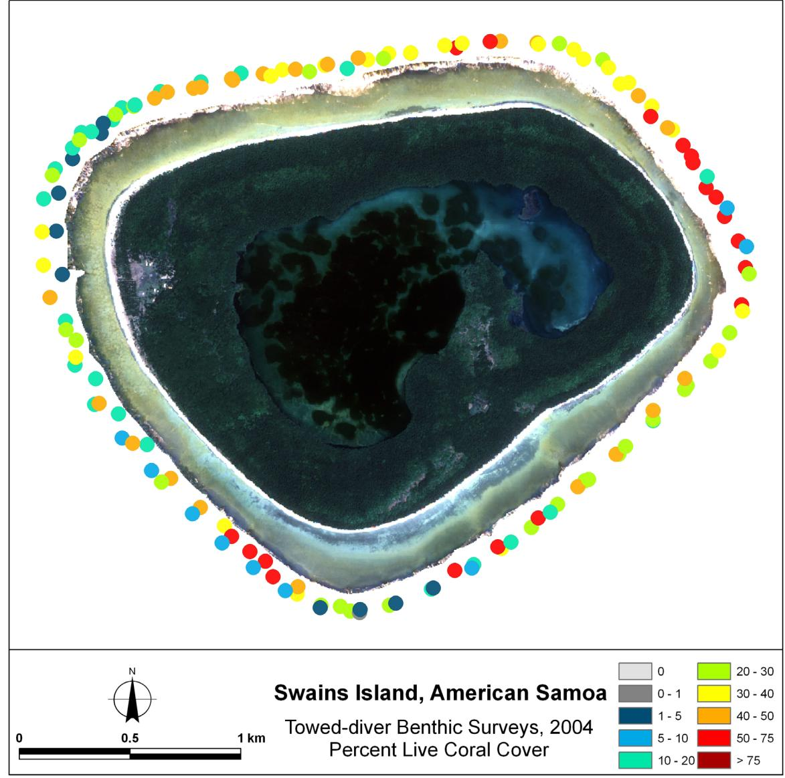

**Figure 7.5.1e.** Towed-diver benthic survey observations of live scleractinian (stony) coral cover around Swains during ASRAMP 2004. Each colored point represents an integrated estimate over a 5-min observation segment covering a survey swath of ~ 200 m × 10 m (~ 2000 m ). Symbol size represents the percent live coral cover on the benthic habitat. For more information, see Chapter 2, Section 2.4.2: Towed-diver Surveys.

An island-wide mean percent cover of live scleractinian coral was 30.5% (SE 2.7; Fig. 7.5.1e). Coral cover was much more spatially variable during the 2004 surveys than observed during 2002. Areas of high coral cover were observed in the east region (16 tow segments, mean: 46.0%) and in the west region (5 tow segments, mean: 46.2%). Interestingly, the northwest corner, which had exceptionally high coral cover during 2002, and the southwest corner of Swains had the lowest observed live coral cover values during ASRAMP 2004, with values ranging from 1–5% to 20–30%.

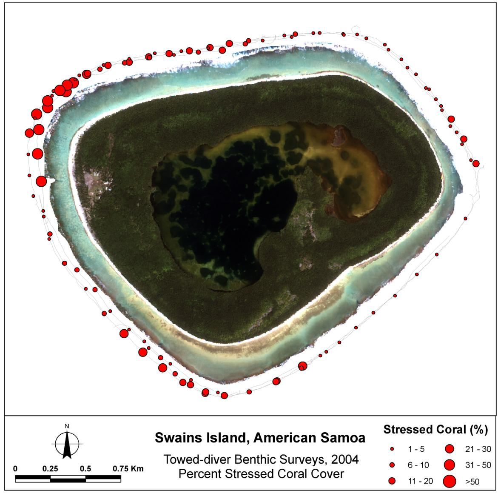

**Figure 7.5.1f.** Towed-diver benthic survey observations of stressed coral cover around Swains during ASRAMP 2004. Each colored point represents an integrated estimate over a 5-min observation segment covering a survey swath of ~ 200 m × 10 m (~ 2000 m ). Symbol size represents the percent of stressed coral cover of the total coral benthic coverage. Note that stressed coral cover was measured as a percentage of overall coral cover in 2004.

The island-wide mean of stressed coral, which was recorded as a subset value of percent live coral cover, was particularly high during ASRAMP 2004 (7.8% [SE 2.0]; Fig. 7.5.1f). High levels of stressed coral cover were observed in the west and north regions (most northwestern corner, 15 tow segments, mean: 30%). This clump of elevated coral stress was not associated with an area of high live coral cover in 2004, though this area had high observed coral cover during 2002 surveys. High coral stress was observed in the west and southeast regions, particularly the southern corner (13 tow segments, mean: 16.8%). Coral stress in this region was seen in the deeper tow segments, and similarly to the west/north region; these deeper sites with elevated coral stress had lower live coral percent cover. Results from 2004 indicated that coral stress on Swains was relatively independent of live coral percent cover and may be more directly associated with deeper coral communities. More importantly, the high levels of coral stress observed around Swains during 2004 most likely reflect significant coral breakage caused by Hurricane Heta 1 month prior to the

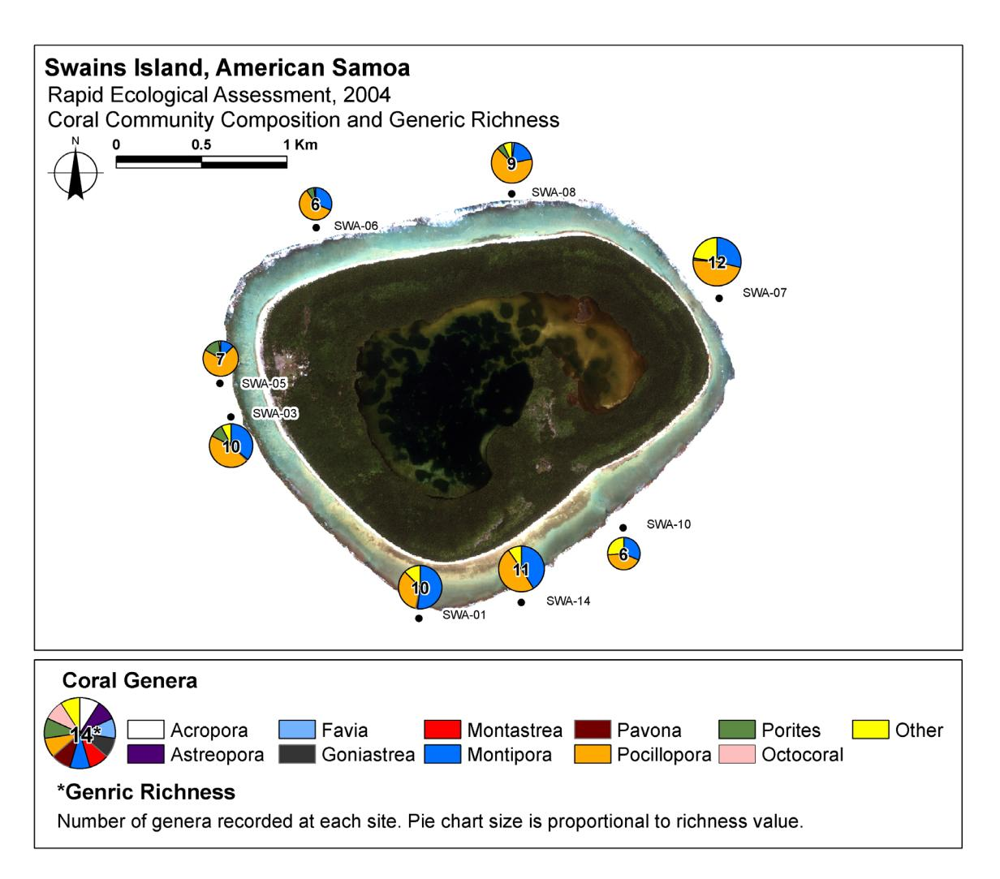

**Figure 7.5.1g.** Relative abundance of coral genera and generic richness from REA surveys around Swains during ASRAMP 2004. Percent relative abundance of key coral genera are indicated by color-coded portions of the pie charts. Size of the pie charts and black numbers in the center of the pie charts indicate the number of coral genera observed at each REA site.

surveys and a significant crown-of-thorns seastar (COTS) infestation that was observed at the time of these surveys, as described in Section 7.7.1: Benthic Macroinvertebrate Surveys.

Eight REA coral surveys were conducted around Swains during ASRAMP 2004. Coral communities at Swains were very similar across sites (Fig. 7.5.1g). Fifteen anthozoan and hydrozoan genera were observed, with members of the genera *Montipora* and *Pocillopora*  dominating the coral fauna. Each genus contributed an island-wide mean of 31% (*Montipora*) and 51% (*Pocillopora*) to the total number of coral colonies recorded (Fig. 7.5.1g). *Porites* was more common at sites SWA-03, -05, -06, and -08 in the west and north regions (10% mean of the coral community), compared to less than 1% of the coral communities at the remaining sites around Swains. Generic richness of corals at Swains was relatively low (8.9 coral genera per site [SE 0.8]), ranging from 6 to 12 coral genera observed at each site (Fig. 7.5.1g). Site-specific data regarding the relative abundance of coral genera, by colony counts within belt transects, are available in Appendix III, Table III. vii.

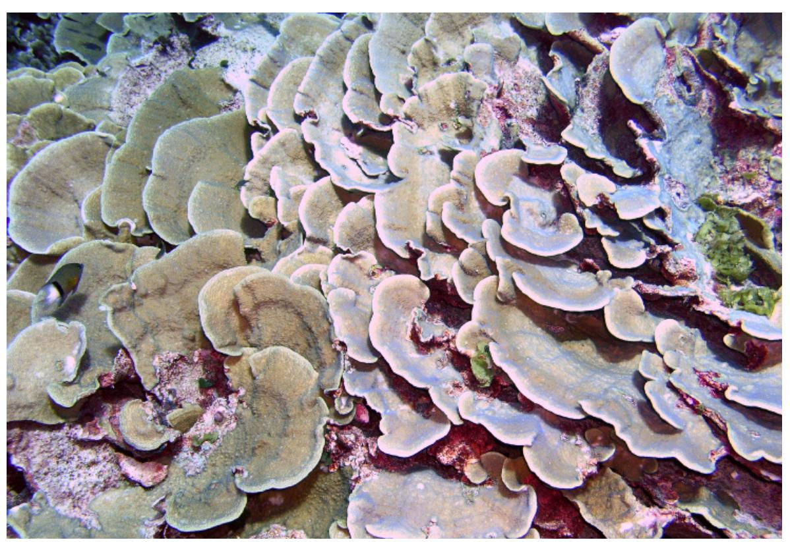

**Figure 7.5.1h.** Coral communities at Swains are typified by shelving colonies of *Montipora*. (*Photograph provided by NOAA PIFSC CRED; J. Kenyon, JIMAR* )

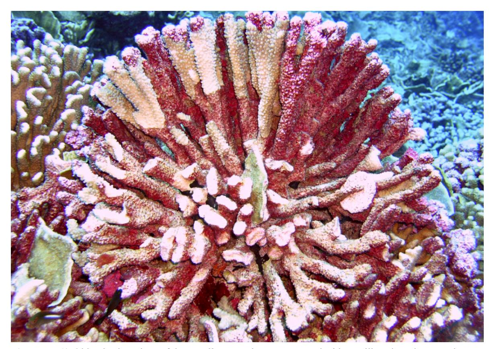

**Figure 7.5.1i.** Older dead portions of the *Pocillopora* colony are covered with coralline algae, but new damage in the form of storm-induced coral breakage was observed as well. (*Photograph provided by NOAA PIFSC CRED; J. Kenyon, JIMAR* )

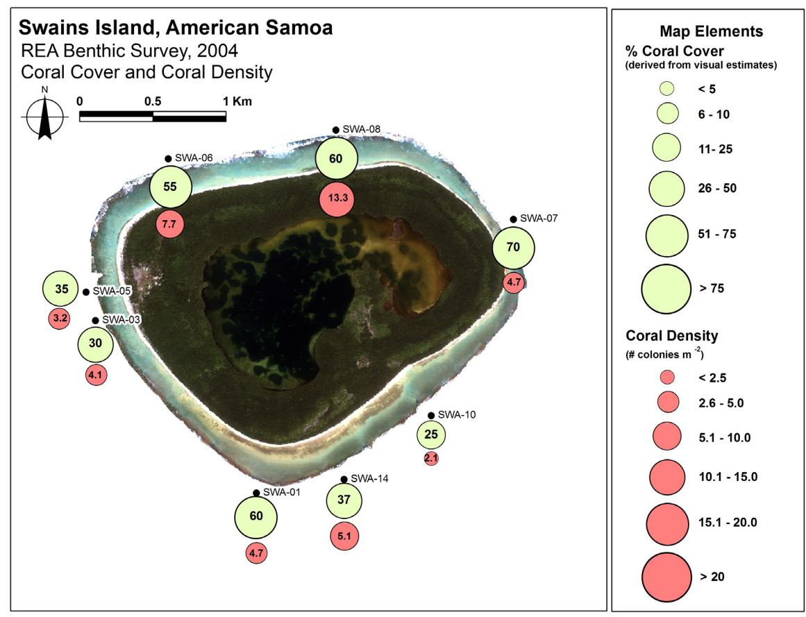

**Figure 7.5.1j.** Live scleractinian (stony) coral cover and coral colony density from REA surveys around Swains during ASRAMP 2004. The size of the symbol is proportional to the value of each parameter. It is important to note that coral percent cover was determined by qualitative visual estimates.

Figures 7.5.1h and 7.5.1i illustrate common *Montipora* and *Pocillopora* morphologies that typify the coral communities around Swains.

The mean percent live scleractinian (stony) coral cover (derived through visual estimates) observed during REA surveys at Swains was high, with an overall mean of 46.5% (SE 5.9; Fig. 7.5.1j). Coral cover was highest at sites SWA-06, -07, and -08 on the north and east region forereefs, ranging from 55% to 70%.

During ASRAMP 2004, a total of 3073 coral colonies were counted within a survey area of 642 m2 . Coral densities around Swains were variable (5.6 colonies m-2 [SE 1.2]) with the highest coral densities observed at north region sites (Fig. 7.5.1j). High coral densities were observed at sites SWA-06 and -08, both off the north coast of Swains, with 7.7 colonies m-2 and 13.3 colonies m-2, respectively. The lowest coral density (2.1 colonies m-2) was recorded at SWA-10 in the southeast region.

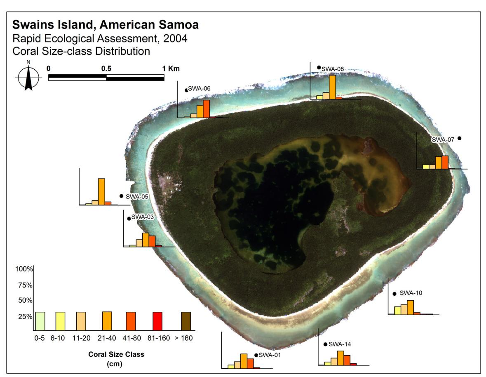

**Figure 7.5.1k.** Scleractinian coral size-class distribution around Swains from REA surveys during ASRAMP 2004. The height of the *y*-axis in each size-class chart represents 100%. The seven observed size classes (0–5, 6–10, 11–20, 21–40, 41–80, 81–160, and > 160 cm) are color coded in size frequency diagrams at each REA site.

Size-class distribution shows that 41.9% of coral colonies had maximum diameters between 20 and 40 cm (Fig. 7.5.1k) during ASRAMP 2004 surveys. Spatial patterns in coral size distributions were not apparent. Five of eight sites surveyed at Swains had more than 25% of corals with diameters larger than 40 cm (SWA-01, -03, -06, -07, -14). Corals with diameters less than 5 cm were uncommon at all sites around Swains.

# *2006 Spatial Surveys*

Nine towed-diver benthic surveys were conducted around Swains during ASRAMP 2006, with a mean towed-diver survey depth of 12.7 m. Individual survey depths ranged from 10 m (SD 3) to 16 m (SD 3), and were fairly uniform around the island (Fig. 7.5.1l). The island-wide mean of live scleractinian (stony) coral cover was 43.9% (SE 4.4; Fig. 7.5.1m). Stressed coral was also characterized during these surveys and was gathered as a subset percentage of live coral percent cover. The island-wide mean stressed coral cover was 1.9% (SE 0.4; Fig. 7.5.1n), substantially lower than observed during 2004.

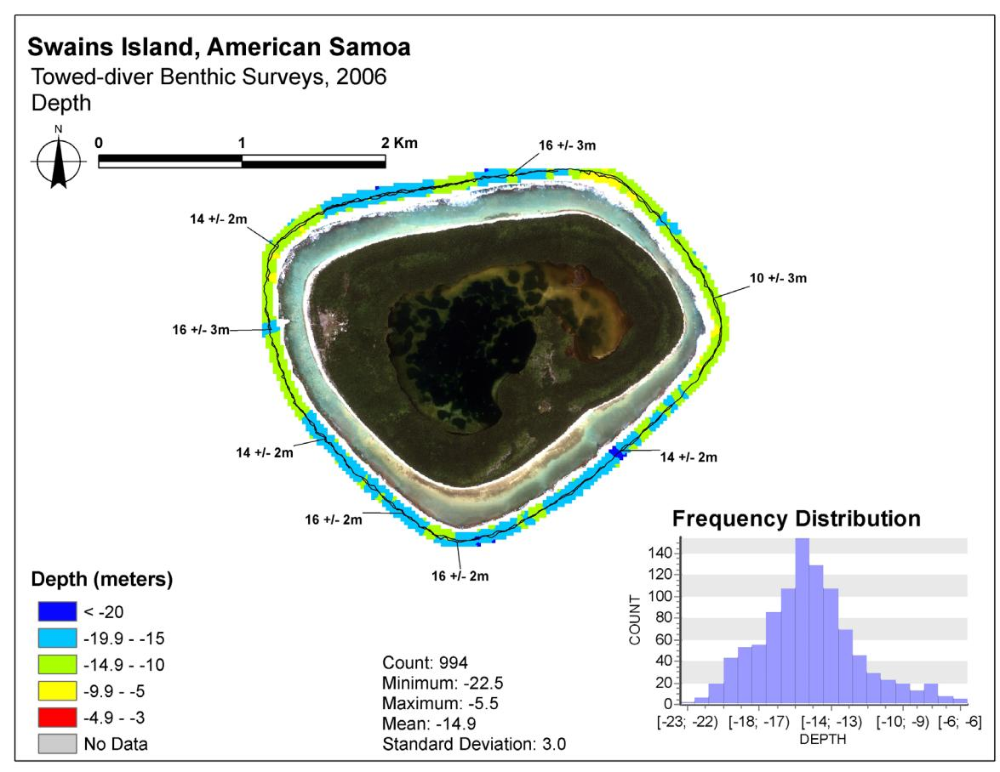

**Figure 7.5.1l.** Towed-diver survey tracks around Swains during ASRAMP 2006. Towed-diver survey tracks are color coded with mean depths for each 5-min segment. Mean depths and standard deviations for each toweddiver survey are shown in black text. Depth histogram and statistics (counts, minimum depth, maximum depth, mean, and standard deviation) from 30-sec depth recordings during towed-diver surveys are included.

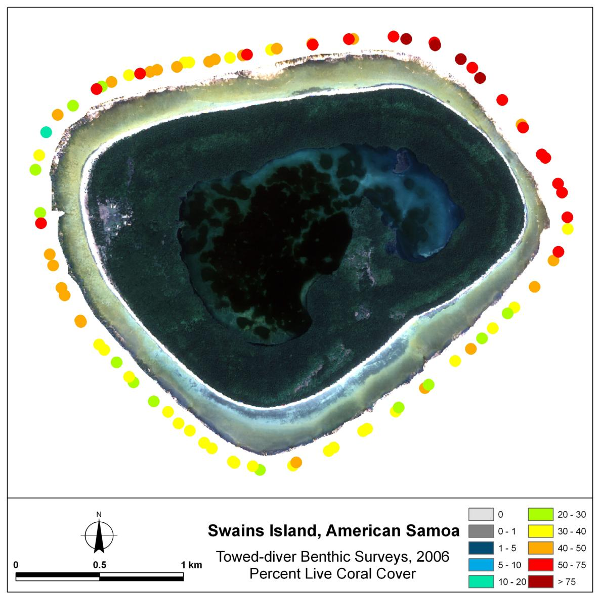

**Figure 7.5.1m.** Towed-diver benthic survey observations of live scleractinian (stony) coral cover around Swains during ASRAMP 2006. Each colored point represents an integrated estimate over a 5-min observation segment covering a survey swath of ~ 200 m × 10 m (~ 2000 m ). Symbol size represents the percent live coral cover on the benthic habitat. See Chapter 2, Table 2.4.2b for more information on benthic towed-diver binning categories during ASRAMP 2006.

Exceptionally high live coral cover was observed in the east (northeastern corner) region of Swains (6 tow segments, mean: 79.5%). The tow segments were also some of the shallowest sites surveyed around Swains in 2006, suggesting that coral communities were stratified by depth around the island. Coral cover was moderately high (30–50%) around most of the remainder of the island. Stressed corals were low in abundance around Swains in 2006, with only one hotspot of stress observed in the west region (southernmost corner of the region, 5 tow segments, mean: 7%).

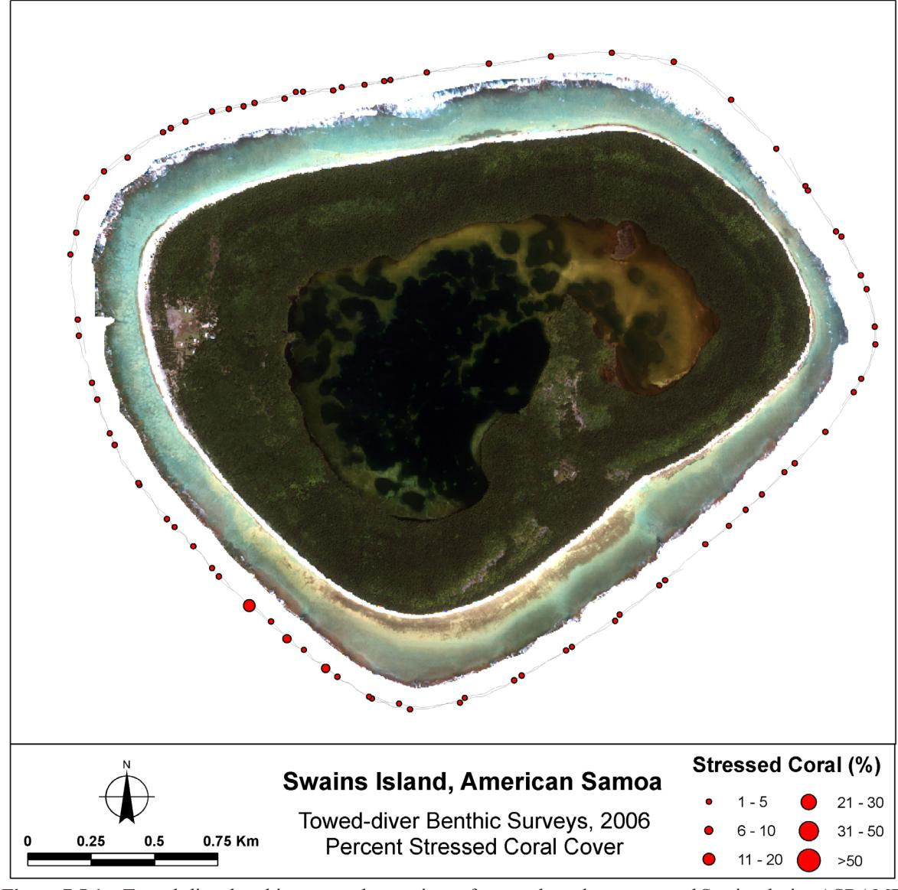

**Figure 7.5.1n.** Towed-diver benthic survey observations of stressed coral cover around Swains during ASRAMP 2006. Each colored point represents an integrated estimate over a 5-min observation segment covering a survey swath of ~ 200 m × 10 m (~ 2000 m ). Symbol size represents the percent of stressed coral cover of the total coral benthic coverage. See Chapter 2, Table 2.4.2b for more information on benthic towed-diver binning categories during ASRAMP 2006.

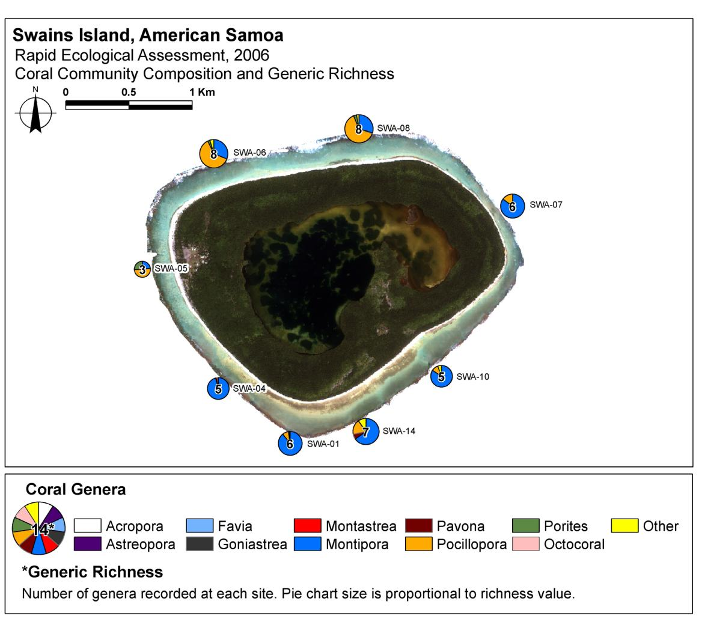

**Figure 7.5.1o.** Relative abundance of coral genera and generic richness from REA surveys around Swains during ASRAMP 2006. Percent relative abundance of key coral genera are indicated by color-coded portions of the pie charts. Size of pie charts and black numbers in the center of the pie charts indicate the number of coral genera observed at each REA site. Note that SWA-03 (surveyed in 2004) was not resurveyed but substituted with SWA-04 in 2006 to improve spatial coverage of survey sites.

Eight REA coral surveys were conducted around Swains during ASRAMP 2006. At least 12 genera of anthozoan and hydrozoan corals were reported around Swains (Fig. 7.5.1o). Members of the genera *Montipora* and *Pocillopora* dominated the coral fauna, and the community composition was quite different between northern and southern sites. *Montipora* dominated sites with southern exposures (SWA-01, -04, -07, -10, -14, mean: 83% of the coral community), while *Pocillopora*  was common at northern sites (SWA-05, -06, -08, mean: 58% of the coral community). Generic richness of corals at Swains was relatively low at 6.0 coral genera per site (SE 0.6), with between 3 and 8 coral genera observed at each site. Site-specific data regarding the relative abundance of coral genera, by colony counts within belt transects, are available in Appendix III, Table III. viii.

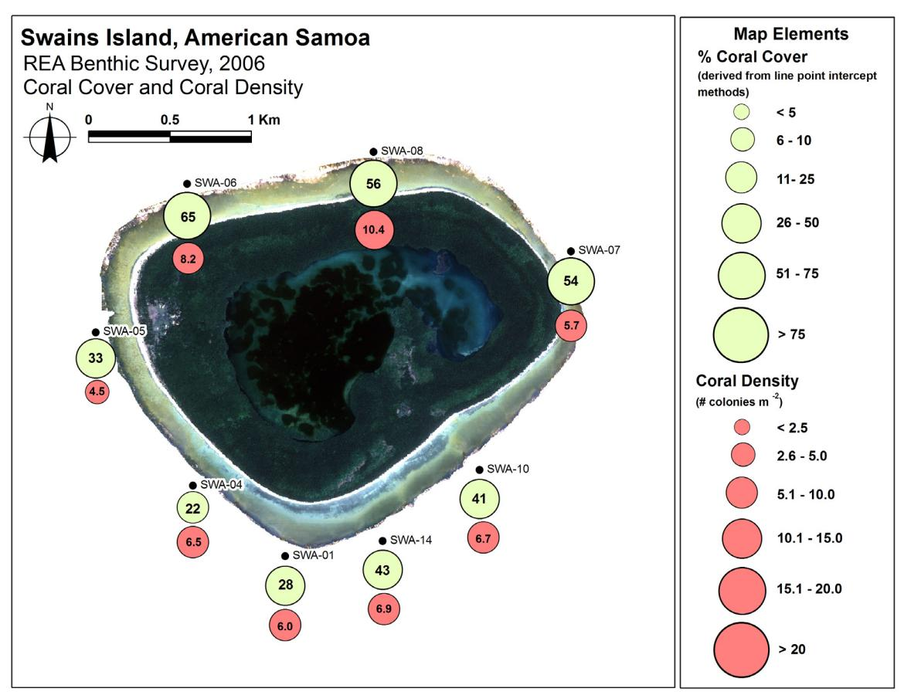

**Figure 7.5.1p.** Live scleractinian (stony) coral cover and coral colony density from REA surveys around Swains during ASRAMP 2006. The size of the symbol is proportional to the value of each parameter.

Island-wide mean percent scleractinian (stony) coral cover around Swains was relatively high, with an island-wide mean of 42.8% (SE 5.2). Coral cover was greatest at sites SWA-06, -07, and -08 on the north and east region forereefs and ranged from 54% to 65% (Fig. 7.5.1p). Relatively lower coral cover was reported at sites SWA-04 and -01 (22% and 28%, respectively) in the west region and south corner.

During ASRAMP 2006 surveys around Swains a total of 2739 coral colonies were counted within a total survey area of 400 m 2 . Mean coral density between REA sites was variable with 6.9 colonies m-2 (SE 0.6) reported. Relatively higher coral densities were recorded at sites in the north region, with 8.2 colonies m-2 and 10.4 colonies m-2 recorded at SWA-06 and -08, respectively (Fig. 7.5.1p).

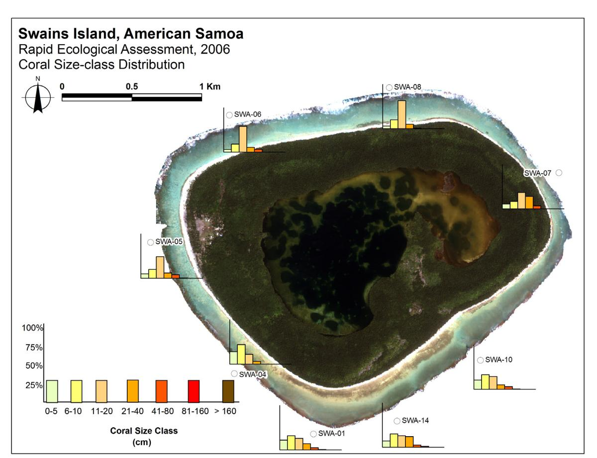

**Figure 7.5.1q.** Scleractinian coral size-class distribution around Swains from REA surveys during ASRAMP 2006. The height of the *y*-axis in each size-class chart represents 100%. The seven observed size classes (0–5, 6–10, 11–20, 21–40, 41–80, 81–160, and > 160 cm) are color coded in size frequency diagrams at each REA site.

During ASRAMP 2006, coral size-class distributions showed that 40.6% of coral colonies had maximum diameters between 10 and 20 cm (Fig. 7.5.1q). Small corals were common at Swains, with six out of eight sites having more than 10% of corals with diameters less than 5 cm. The only two sites that did not have abundant small corals were located off the north shore sites SWA-06 and -08. Corals larger than 40 cm were not common at any sites.

# **7.5.2 Coral Disease Surveys**

# *2006 Spatial Surveys*

Coral health and disease surveys covered a total survey area of 3200 m 2 around Swains during ASRAMP 2006, with 80 cases of coral disease, predation, and other lesions observed. Figure 7.5.2a illustrates the variability in prevalence of the different health states among sites. Coral diseases around Swains were uncommon, with only two of the eight sites surveyed containing disease. The estimated mean overall prevalence was 0.04% (SE 0.03; Fig. 7.5.2a), and all cases occurred at sites SWA-04 and -05, on the west region of the island. Growth anomalies totaled three cases, all on *Porites* spp. and in deeper water (16–18 m). In addition, lesions involving hyperpigmented irritations were also noted around Swains (two on *Porites* cf. *rus* and *P*. cf. *monticulosa*, and the other one on *Pocillopora eydouxi*). One case of mild bleaching was also observed at SWA-06.

Lesions attributable to *Acanthaster* and *Drupella* predation were quite abundant and common (Figs. 7.5.2a, 7.5.2b, and 7.5.2c). The estimated mean overall prevalence of predation was 0.33% (SE 0.05). Predation scars were the most numerous at SWA-01, where coral cover values were among the lowest reported for the island. SWA-06 exhibited the second greatest number of scars per area surveyed and also exhibited the highest percent of live coral cover for the entire island. Even though montiporid corals composed more than 66% of live coral cover, predation scars were more abundantly observed on *Pocillopora* (42%).

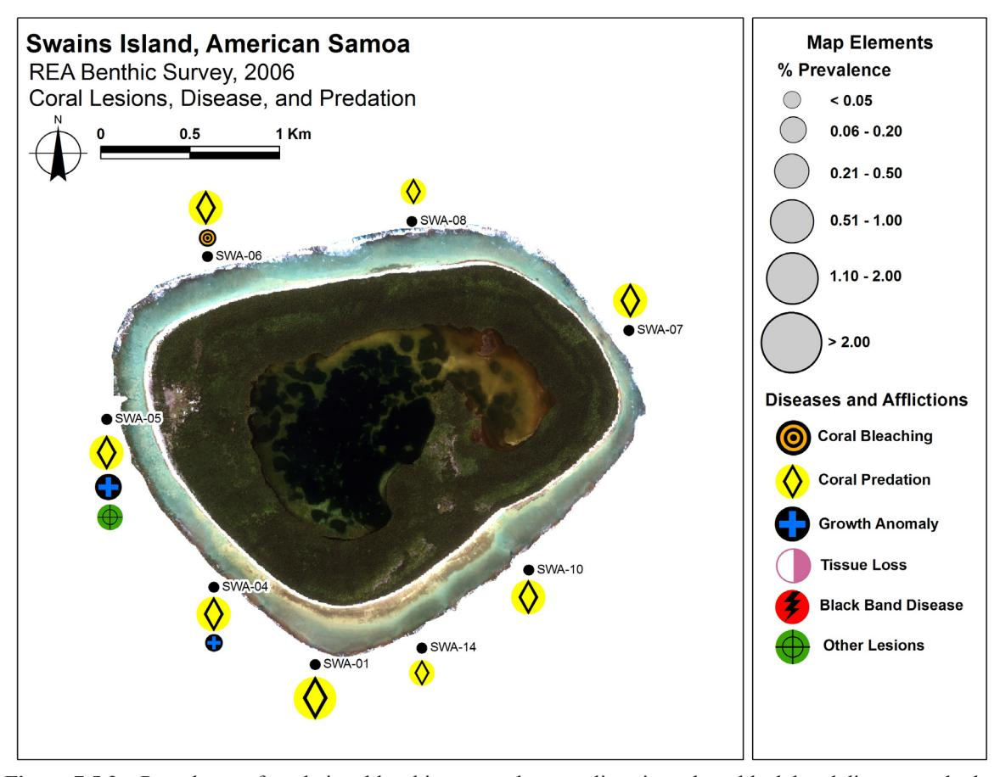

**Figure 7.5.2a.** Prevalence of predation, bleaching, growth anomalies, tissue loss, black band disease, and other lesions at Swains during ASRAMP 2006. Prevalence was calculated relative to the average colony density estimates and is indicated by the size of the respective symbols.

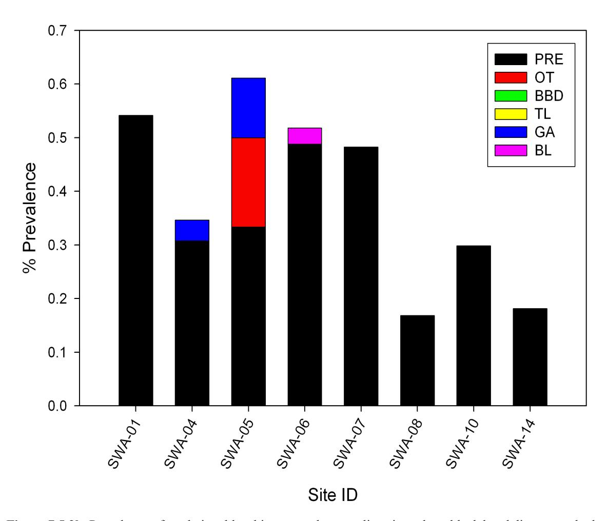

**Figure 7.5.2b.** Prevalence of predation, bleaching, growth anomalies, tissue loss, black band disease, and other lesions at Swains during ASRAMP 2006. Prevalence was calculated relative to the average colony density estimates. PRE—*Acanthaster* and/or *Drupella* predation; OT—other lesions, including hyperpigmented irritations; BBD—black band disease; TL—tissue loss; GA—skeletal growth anomalies; and BL—bleaching.

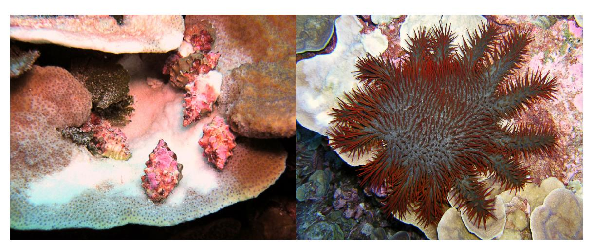

**Figure 7.5.2c.** Corallivore *Drupella* gastropods feeding on platy *Montipora* (left panel), and COTS (*Acanthaster planci*) feeding on *Montipora* sp. (right panel). (*Photographs provided by NOAA PIFSC CRED; B. Vargas-Angel, JIMAR*)

# **7.5.3 Temporal Comparison—Coral and Coral Disease**

Very high live scleractinian coral cover observed during the towed-diver benthic surveys around Swains during the three ASRAMP cruises typified the reef ecosystem. The overall towed-diver island-wide mean percent cover of live coral ranged from a high of 60.0% (SE 4.6) in 2002 to a low of 30.5% (SE 2.7) in 2004, and then back up to 43.4% (SE 1.7) in 2006 (Fig. 7.5.3a). Moreover, island-wide mean percent cover of stressed coral was 7.8% in 2004 and 1.9% in 2006. Combined, these island-wide means for live coral cover and percent stressed coral may reflect a progression from a relatively unperturbed ecosystem in 2002 to an ecosystem affected by both Hurricane Heta and a COTS infestation in 2004 (see Section 7.7: Benthic Macroinvertebrates), followed by a partial recovery stage from the storm damage by Hurricane Heta, but continued perturbation by COTS in 2006. In either case, exceptionally high mean values of live coral cover have been consistently observed around Swains, particularly when compared with coral cover observations at most other sites surveyed around the United States-affiliated Pacific Islands as part of Pacific RAMP.

Island-wide live coral percent cover, as recorded by REA surveys, was very similar between 2004 (46.5% [SE 5.9]) and 2006 (42.8% [SE 5.2]; Fig. 7.5.3a). Although these values are similar, it is important to note the methods to estimate coral percent cover were different in 2004 (visual estimates) and 2006 (line point intercept technique). The highest REA coral cover values were observed in the north and east regions in both 2004 and 2006 (Figs. 7.5.1j and 7.5.1p). Sites SWA-06 and -08 on the north coast had very high live coral cover values in both 2004 (55% and 60%, respectively) and 2006 (65% and 56%, respectively). Site SWA-07 in the east region also had very high live coral in both 2004 (70%) and 2006 (54%). High coral cover at SWA-07 from REA results corroborated results obtained from towed-diver surveys.

Low generic diversity was observed around Swains, with 15 genera identified island wide in 2004 and 12 genera identified island wide in 2006. Per-site diversity was also low with 8.9 genera per site (SE 0.8) in 2004 and 6.0 genera per site (SE 0.6) in 2006 (Fig. 7.5.3b). *Montipora* and *Pocillopora* dominated the coral community in both 2004 and 2006. The data from 2006 shows a division within the distribution of coral genera, with the southeast, west, and east region sites dominated by *Montipora* (83% of the coral community) and north region sites (in addition to SWA-05 in the west region) dominated by *Pocillopora* (58% of the coral community; Fig. 7.5.1o).

Coral colony density increased slightly between 2004 (5.6 [SE 1.2]) and 2006 (6.9 [SE 0.6]; Fig. 7.5.3c). High colony density was directly associated with regions of high coral percent cover, as demonstrated by the north region sites SWA-06 and -08. Density at these two sites in 2004 was 7.7 colonies m-2 (SWA-06) and 14.4 colonies m-2 (SWA-08). In 2006, density at the same two sites was 8.2 colonies m-2 (SWA-06) and 10.4 colonies m-2 (SWA-08), respectively.

The majority of corals in 2006 had diameters between 10 and 20 cm, in contrast to observations in 2004 where the majority of corals had diameters between 20 and 40 cm (Fig. 7.5.3d). The difference in size-class distributions between the years may reflect one or several factors, including breakage from hurricane or other storm activity and interobserver variability.

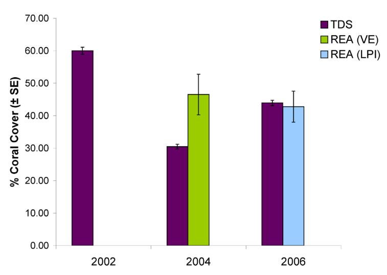

**Figure 7.5.3a.** Temporal comparison of mean percent live coral cover from REA surveys and towed-diver surveys around Swains during ASRAMP 2002, 2004, and 2006 surveys. The purple bars represent observations collected during towed-diver habitat surveys. The green bar represents REA data collected by visual estimates during REA surveys, and the blue bar represents data collected by the line point intercept technique during REA surveys. See Chapter 2, Section 2.4: Reef Benthic (Coral, Algae, Macroinvertebrate) and Fish Surveys for considerations when comparing the results of these methodologies.

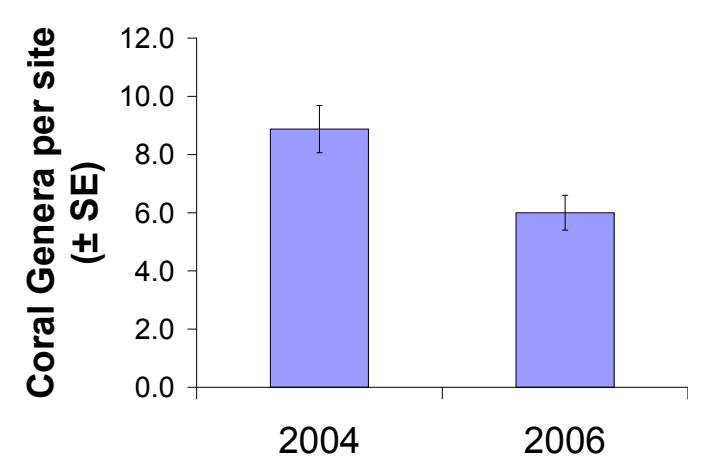

**Figure 7.5.3b.** Temporal comparison of mean values of coral genera per site around Swains during ASRAMP

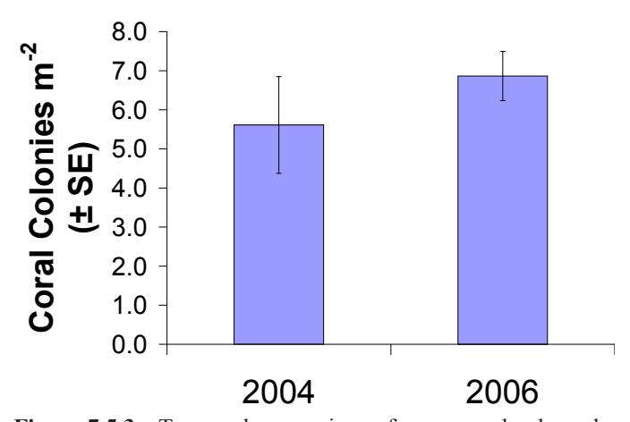

**Figure 7.5.3c.** Temporal comparison of mean coral colony density from REA surveys at sites around Swains during ASRAMP 2004 and 2006.

High coral cover on towed-diver surveys was not spatially linked with areas of high coral stress or dead coral percent cover, which indicates that other factors may have been responsible for the distribution of stressed or dead coral. Across the years of towed-diver surveys, the east region and the most southern tip of the west/southeast regions had the highest cover of live coral.

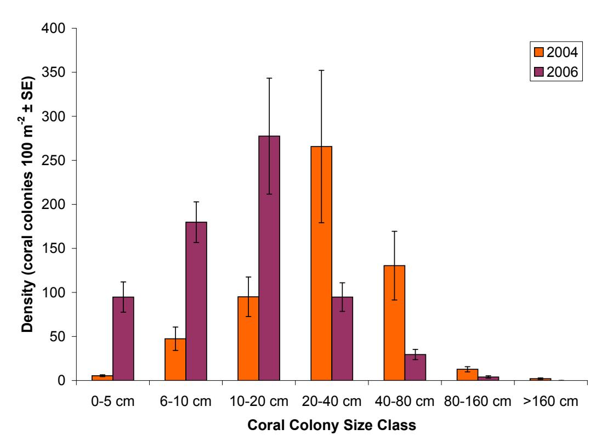

**Figure 7.5.3d.** Coral colony size-class mean density from REA surveys at sites around Swains during ASRAMP 2004 and 2006.

#### 7.6 Algae

It is important to note when considering these results that turf algae, crustose coralline red algae, branched non-geniculate coralline red algae, and cyanophytes (blue-green algae) all need to be analyzed microscopically for proper taxonomic identification and therefore must be lumped into functional group categories in the field. Of these functional groups, turf algae are the most diverse with the possibility of up to 100 species occurring in a 10 cm² area. As well, macroalgae are large, fleshy, sometimes calcified entities that may be identifiable to genus or species in the field, but often require microscopic analysis to confirm taxonomic identities.

#### 7.6.1 Algal Surveys

#### 2002 Spatial Surveys

Nine towed-diver surveys were conducted around Swains during ASRAMP 2002, with fleshy macroalgae and crustose coralline red algae covering, on average, 32.7% of the benthic substrate. Mean fleshy macroalgal cover was 16.2% (SE 1.3), and mean crustose coralline algal cover was 16.5% (SE 0.7) of the benthic substrate (Fig. 7.6.1a). Highest percent cover of fleshy macroalgae was observed along the north and west shores of the island. Percent cover of crustose coralline

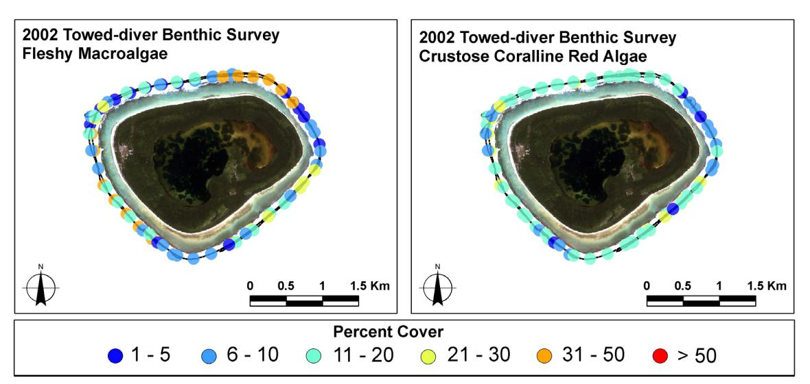

**Figure 7.6.1a.** Percent cover of fleshy macroalgae (including turf algae) and crustose coralline algae from towed-diver benthic surveys around Swains during ASRAMP 2002. Each colored point represents an integrated estimate over 5-min observation segments covering a survey swath of ~ 200 m × 10 m (~ 2000 m ).

algae was fairly uniform around the perimeter of the island.

Qualitative REA algal surveys were conducted around Swains during ASRAMP 2002, and nine bags of algal voucher specimens were collected. These surveys provided baseline data used to design and scale the future methodology of algal REA surveys.

#### *2004 Spatial Surveys*

A total of 14 towed-diver benthic surveys around Swains during ASRAMP 2004 recorded a mean combined algal cover (including fleshy macroalgal, turf, and crustose coralline red algae) of 60.8% (Fig. 7.6.1b). Mean fleshy macroalgal cover (including turf) was 28.6% (SE 1.4), and mean crustose coralline algal cover was 32.2% (SE 0.9; Fig. 7.6.1b). Generally, higher cover of macroalgae was observed along the south coast than compared to other areas. Percent cover of crustose coralline algae was fairly uniform around the perimeter of the island.

During ASRAMP 2004, quantitative algal surveys were conducted at nine sites around Swains (Fig. 7.6.1c). A total of 10 macroalgal genera (4 green, 4 red, and 2 brown) and 4 additional algal functional groups (turf algae, crustose coralline red algae, branched non-geniculate coralline red algae, and cyanophytes) were observed in the field. Once completed, laboratory-based taxonomic identification of all algal species (including turf algae, epiphytes, and crustose coralline red algae) will greatly increase the known algal diversity. Crustose coralline red algal and turf algal functional groups (each containing numerous species) were the dominant algae found around Swains and observed in over 50% of sampled quadrats at 100% of sites.

Around Swains, the green alga *Rhipilia orientalis* was one of the dominant algal species found in high abundance at all sites assessed (Fig. 7.6.1c). *Microdictyon umbilicatum* (Velley) Zanardini, a green algal species in the order Siphonocladales, was also in high abundance at most sites at Swains. Surprisingly, the calcified siphonous green algal genus, *Halimeda*, which is usually common in tropical marine environments, was relatively uncommon at most sites monitored around Swains, only being found in photoquadrats at one southern site (SWA-14). The green algal genus, *Dictyosphaeria*, was present in low abundance at most sites. Of interest, the green

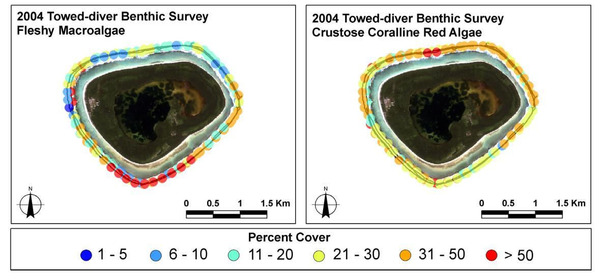

**Figure 7.6.1b.** Percent cover of fleshy macroalgae (including turf algae) and crustose coralline algae from towed-diver benthic surveys around Swains during ASRAMP 2004. Each colored point represents an integrated estimate over 5-min observation segments covering a survey swath of ~ 200 m × 10 m (~ 2000 m ).

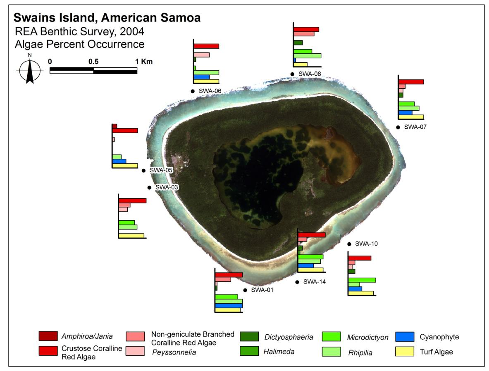

**Figure 7.6.1c.** Percent occurrence of select macroalgal genera and algal functional groups from REA surveys around Swains during ASRAMP 2004. Percent occurrence is equivalent to the percentage of photoquadrats in which an algal genus or functional group was observed. Length of *x*-axis denotes 100% occurrence.

alga *Caulerpa serrulata* was found during random collections made outside of quantitative photoquadrats and is a new record for Swains.

During ASRAMP 2004, some distributional trends were observed among macroalgal populations around Swains. The red algal genus, *Peyssonnelia*, was most abundant in photoquadrats at sites on the northwest corner of the island and was only observed in low abundance elsewhere. Alternatively, non-geniculate branched red algae were lacking from photoquadrats at northwestern sites but were fairly common at all other sites around the island. Sites on the west side of the island contained slightly lower algal species diversity than other areas.

# *2006 Spatial Surveys*

A total of nine towed-diver surveys were conducted around Swains during ASRAMP 2006. Together, the mean cover of fleshy macroalgae (excluding turf) and crustose coralline algae made up 55.5% of the benthic substrate. Mean fleshy macroalgal cover was 36.1% (SE 1.8), and mean crustose coralline algal cover was 19.4% (SE 1.2; Fig. 7.6.1d). Macroalgal populations were greatest in the north region and were also elevated along southern-facing reefs. Crustose coralline algae were also of greatest abundance along the southern-facing reefs of Swains.

During ASRAMP 2006, quantitative algal surveys were conducted at eight sites around Swains, including seven of the eight sites surveyed in 2004 (Fig. 7.6.1e). A total of 11 macroalgal genera (7 green, 2 red, and 2 brown) and 3 additional algal functional groups (turf algae, crustose coralline red algae, and cyanophytes) were observed in the field. The diversity of crustose coralline red algal and turf algal functional groups (each of which contains numerous species) were the dominant algae found around Swains, being observed in over 50% of sampled quadrats at 71% and 57% of sites, respectively (Fig. 7.6.1e). The green algal genus *Rhipilia* was one of the dominant algal species found in high abundance at all sites. Surprisingly, the calcified siphonous green algal genus, *Halimeda*, which is usually common in tropical marine environments, was absent around Swains. *Microdictyon umbilicatum*, a green algal species in the order Siphonocladales, was common at northern, eastern, and southern sites around Swains. The northwestern side of the island exhibited the lowest algal diversity and abundance.

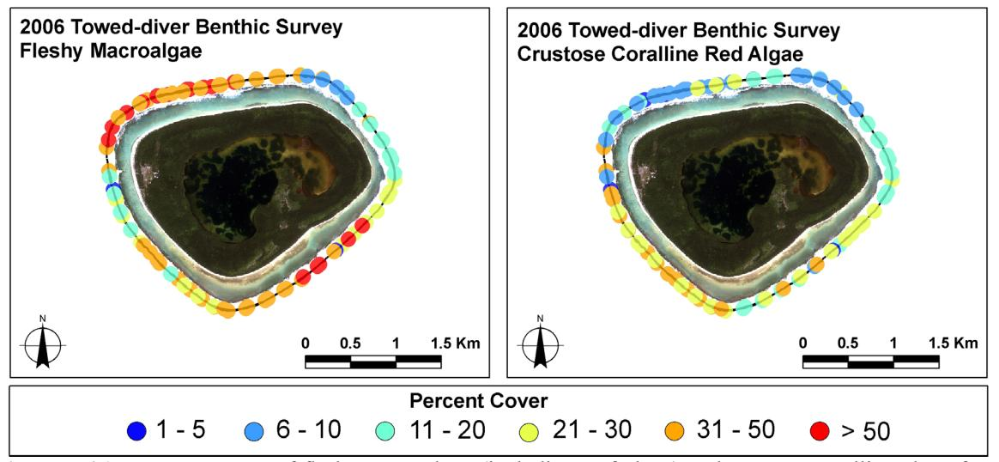

**Figure 7.6.1d.** Percent cover of fleshy macroalgae (including turf algae) and crustose coralline algae from towed-diver benthic surveys around Swains during ASRAMP 2006. Each colored point represents an integrated estimate over 5-min observation segments covering a survey swath of ~ 200 m × 10 m (~ 2000 m ).

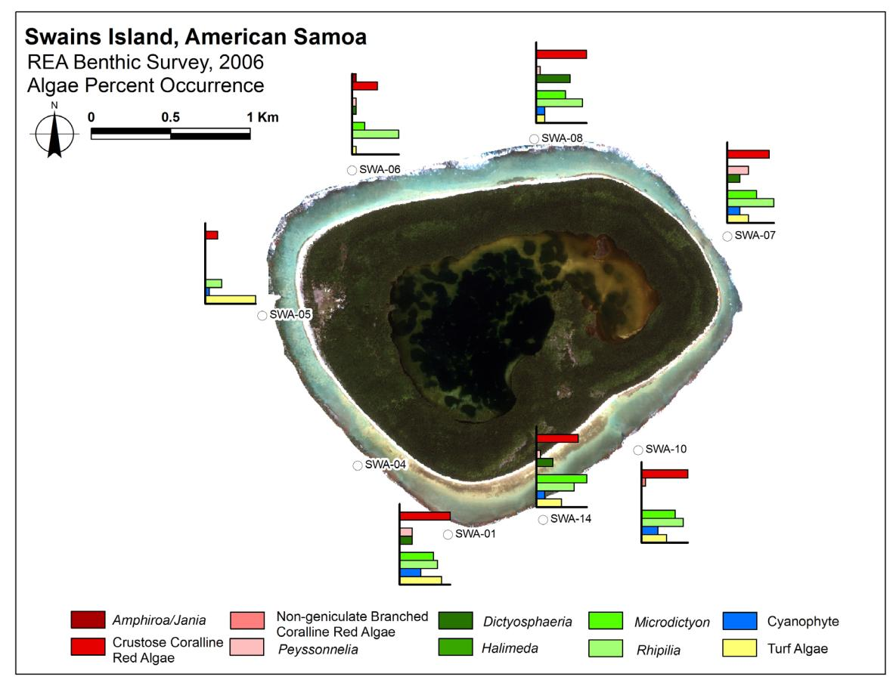

**Figure 7.6.1e.** Percent occurrence of select macroalgal genera and algal functional groups from REA surveys around Swains during ASRAMP 2006. Percent occurrence is equivalent to the percentage of photoquadrats in which an algal genus or functional group was observed. Length of *x*-axis denotes 100% occurrence.

# **7.6.2 Coralline Algal Disease Surveys**

#### *2006 Spatial Surveys*

No coralline algal diseases or afflictions were observed at Swains in 2006.

#### **7.6.3 Temporal Comparison—Algae**

Temporal comparisons of both REA algal data and towed-diver benthic survey data are shown in Figures 7.6.3a and 7.6.3b, respectively. Algal populations around Swains were similar between ASRAMP 2004 and 2006. The number of macroalgal genera observed around Swains was similar for both years, with 10 and 11 genera recorded, respectively. The red calcified, geniculate genera *Amphiroa/Jania* were uncommon only occurring on the northwest corner of the atoll. The calcified green algal genus *Halimeda* was lacking from all photoquadrats sampled. No large cyanobacteria outbreaks or monotypic stands of invasive algae were discovered in 2004 or 2006.

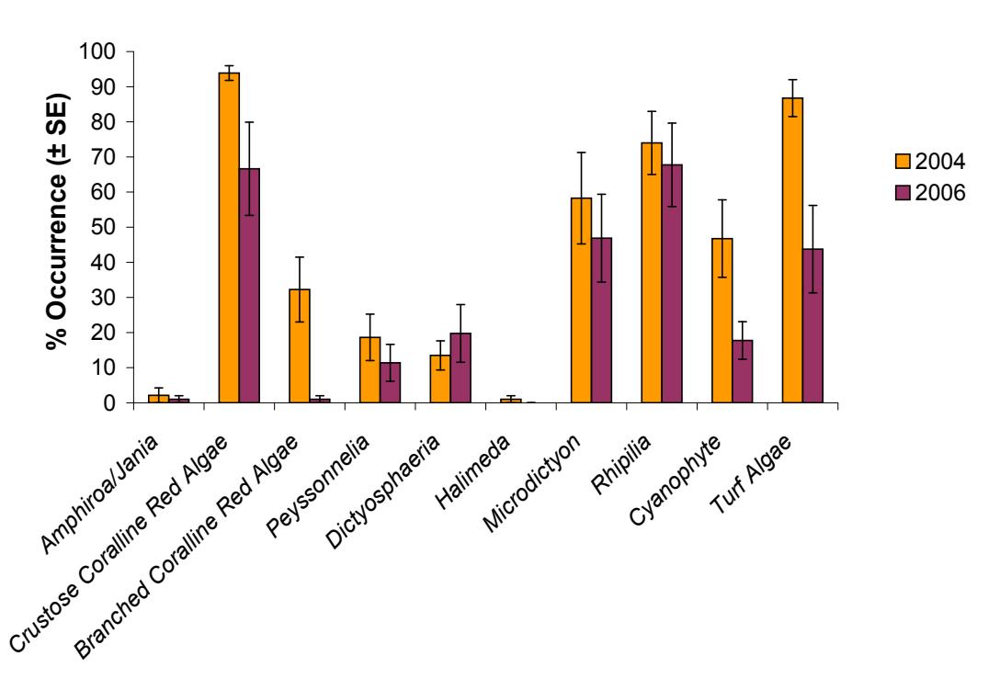

**Figure 7.6.3a.** Temporal comparison of REA algal genera and functional group percent occurrence around Swains between ASRAMP 2004 and 2006. See Chapter 2, Section 2.4: Reef Benthic (Coral, Algae, Macroinvertebrate) and Fish Surveys for considerations when comparing the results of these methodologies between years.

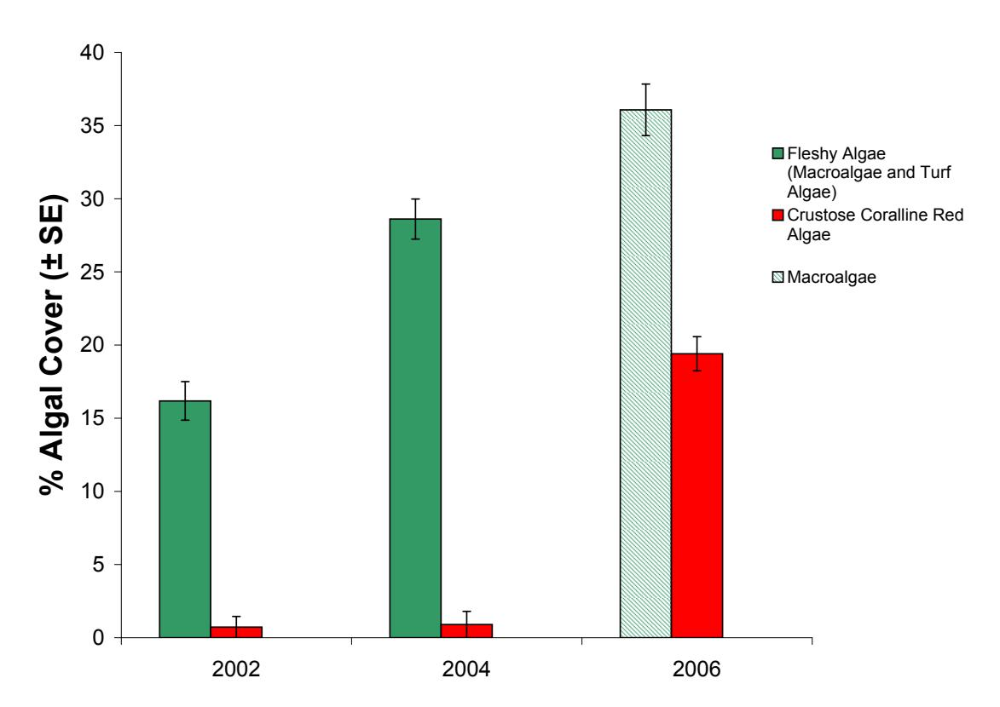

**Figure 7.6.3b.** Temporal comparison of towed-diver benthic survey algal percent cover results for fleshy crustose coralline and macroalgae for 2002, 2004, and 2006 ASRAMP surveys around Swains.

# **7.7 Benthic Macroinvertebrates**

# **7.7.1 Benthic Macroinvertebrate Surveys**

#### *2002 Spatial Surveys*

Towed-diver benthic macroinvertebrate surveys around Swains during ASRAMP 2002 found that COTS were commonly observed around the entire island with a mean density of 1.0 organisms ha-1), but especially in the west, southeast, and north regions. No sea urchins or sea cucumbers were reported (Fig. 7.7.1a). Giant clam mean density was 0.4 organisms ha-1, found along the north section of the island. As mentioned in the introduction (Chapter 1, Section 1.6: Limitations of Pacific RAMP), surveys in 2002 were limited by shipboard logistics and methods development that may have contributed to the paucity of macroinvertebrates observed in that year.

A total of 10 qualitative REA invertebrate surveys, focusing on general macroinvertebrate biodiversity, were conducted around Swains during ASRAMP 2002. These surveys provided baseline data used to design and scale the future methodology of macroinvertebrate REA surveys. No data are presented.

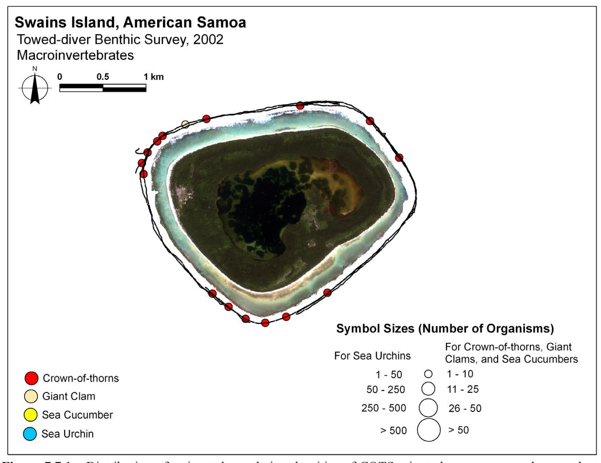

**Figure 7.7.1a.** Distribution of estimated population densities of COTS, giant clams, sea cucumbers, and sea urchins at Swains from towed-diver benthic surveys during ASRAMP 2002. Circle locations represent an integrated estimate over 5-min observation segments covering a survey swath of ~ 200 m × 10 m (~ 2000 m ). The sizes of the circles indicate the number of organisms counted or estimated in each ~ 2000 m2 segment with one scale for COTS, giant clams, and sea cucumbers (1–10, 11–25, 26–50, and > 50) and another scale for sea urchins (1–50, 51–250, 251–500, and > 500).

# *2004 Spatial Surveys*

Towed-diver benthic macroinvertebrate surveys around Swains during ASRAMP 2004 found few macroinvertebrates around Swains, with the exception of COTS (Fig. 7.7.1b). Only one giant clam was encountered during towed-diver surveys. Sea urchins (mean: 13.7 organisms ha-1) and sea cucumbers (mean: 0.1 organisms ha-1) were seen in very low densities around the island. A total of 91 COTS were observed around Swains (mean: 3.3 organisms ha-1). The distribution of COTS was variable with a slightly higher concentration observed around the southern corner of the island.

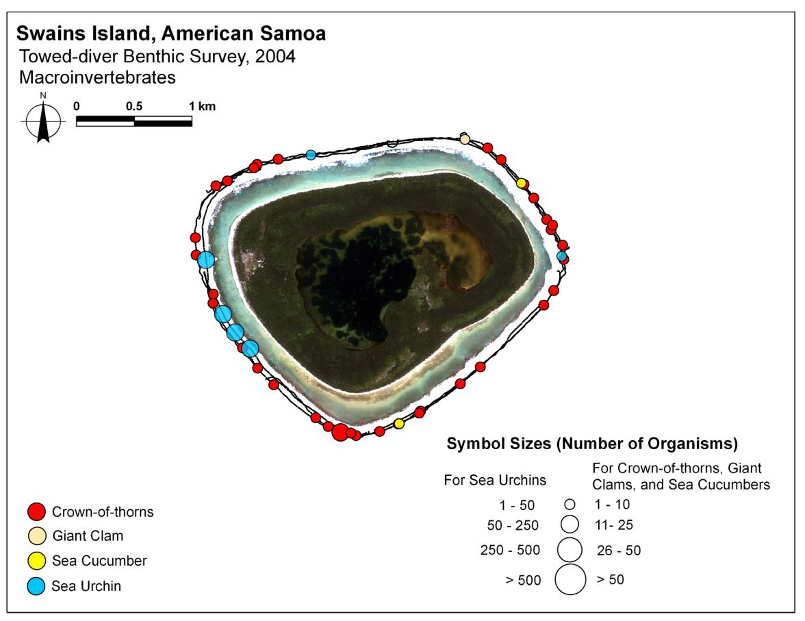

**Figure 7.7.1b.** Distribution of estimated population densities of COTS, giant clams, sea cucumbers, and sea urchins at Swains from towed-diver benthic surveys during ASRAMP 2004. Circle locations represent an integrated estimate over 5-min observation segments covering a survey swath of ~ 200 m × 10 m (~ 2000 m ). The sizes of the circles indicate the number of organisms counted or estimated in each ~ 2000 m2 segment with one scale for COTS, giant clams, and sea cucumbers (1–10, 11–25, 26–50, and > 50) and another scale for sea urchins (1–50, 51–250, 251–500, and > 500).

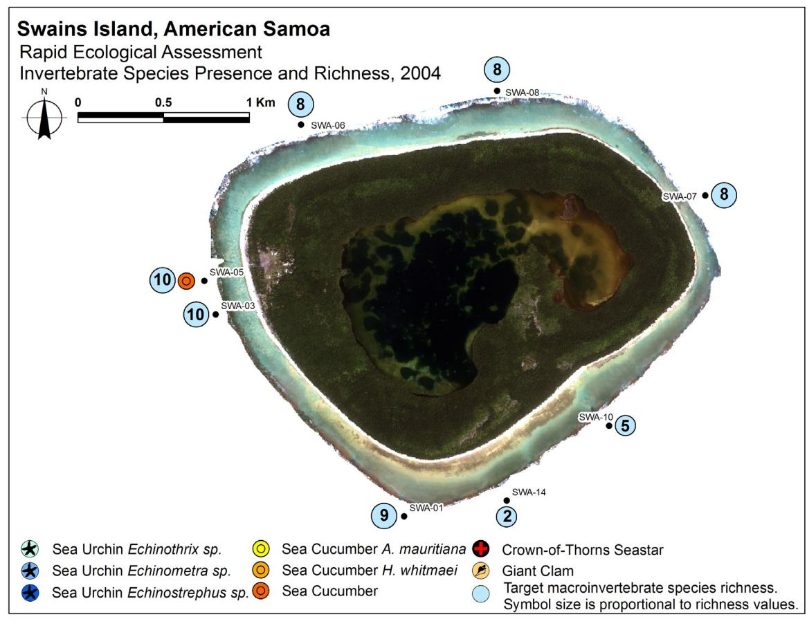

**Figure 7.7.1c.** Macroinvertebrate species richness, and target macroinvertebrate distribution at Swains from REA surveys during ASRAMP 2004. Size of light blue circles and values in circles indicate target species richness values for each REA site. Other symbols indicate the presence of specific target species.

During ASRAMP 2004, invertebrate species richness was relatively low at all REA sites around Swains, ranging from 2 species observed at SWA-14 to 10 species observed at SWA-05 and -03 (Fig. 7.7.1c). No giant clams or sea urchins were recorded, while only a single sea cucumber, *Thelonota ananas,* was observed (SWA-05). Unlike towed-diver surveys, no COTS were recorded at REA sites.

# *2006 Spatial Surveys*

Towed-diver benthic macroinvertebrate surveys during ASRAMP 2006 found few macroinvertebrates around Swains, with the exception of COTS (Fig. 7.7.1d). Two sea cucumbers were observed within the west region of Swains, while no giant clams or sea urchins were encountered. A total of 88 COTS were observed around Swains in 2006 for a mean density of 4.9 organisms ha-1. COTS were relatively common in the west and southeast coasts of Swains, but encounters were far less frequent during towed-diver surveys along the north and east regions.

During ASRAMP 2006, target invertebrates were almost completely absent from REA surveys around Swains (Fig. 7.7.1e). Two species of sea urchins, *Echinostrephus aciculatus* and *Echinometra mathei*, were present at one site each (SWA-05 and -14, respectively). COTS were observed at three sites, all along the west coast of Swains.

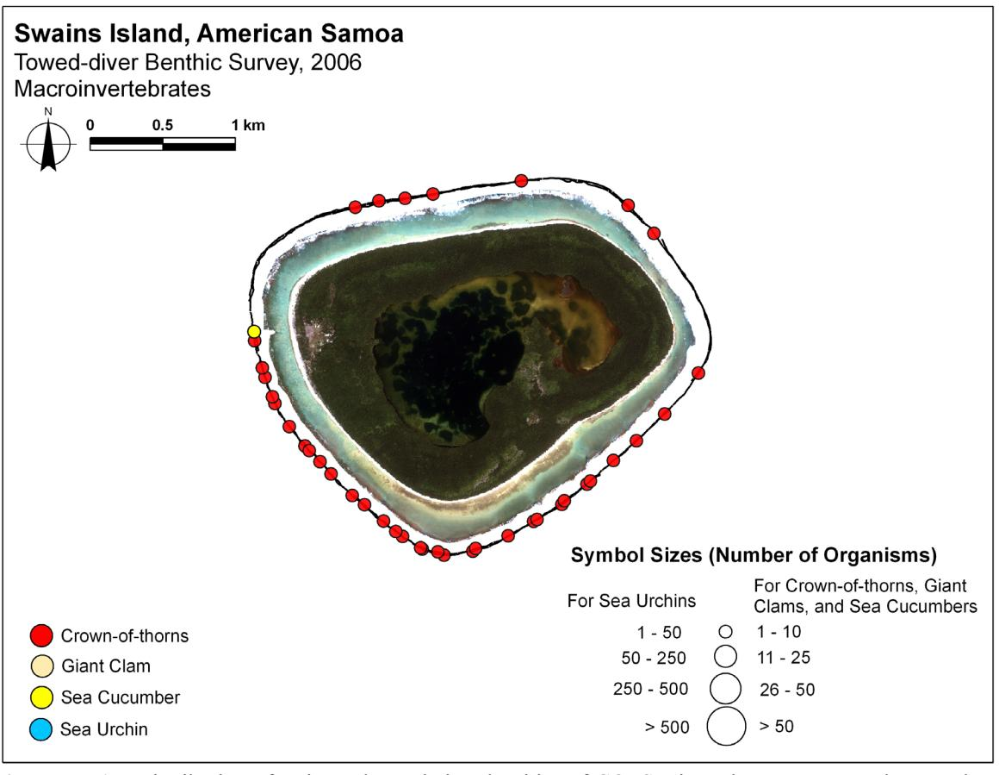

**Figure 7.7.1d.** Distribution of estimated population densities of COTS, giant clams, sea cucumbers, and sea urchins at Swains from towed-diver benthic surveys during ASRAMP 2006. Circle locations represent an integrated estimate over 5-min observation segments covering a survey swath of ~ 200 m × 10 m (~ 2000 m 2 ). The sizes of the circles indicate the number of organisms counted or estimated in each ~ 2000 m2 segment with one scale for COTS, giant clams, and sea cucumbers (1–10, 11–25, 26–50, and > 50) and another scale for sea urchins (1–50, 51–250, 251–500, and > 500).

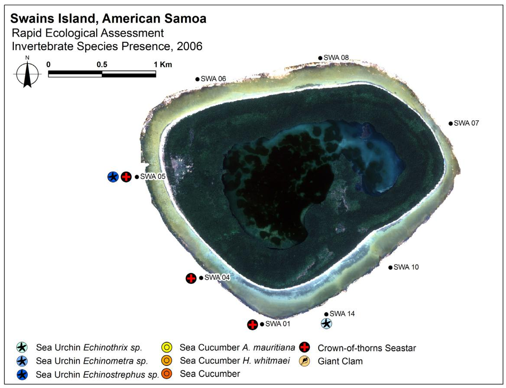

**Figure 7.7.1e.** Target macroinvertebrate distribution at Swains from REA surveys conducted during ASRAMP 2006.

#### **7.7.2 Temporal Comparison—Benthic Macroinvertebrates**

Temporal patterns of island-wide mean benthic macroinvertebrate density (# organisms m-2) around Swains from towed-diver benthic surveys during ASRAMP 2002, 2004 and 2006 are shown in Figures 7.7.2a (COTS), 7.7.2b (giant clams), 7.7.2c (sea cucumbers), and 7.7.2d (sea urchins). Towed-diver survey results show trends in density within each surveyed organism and between each sampling year.

With the exception of the COTS, macroinvertebrates were extremely rare around Swains during both 2004 and 2006 surveys. The average COTS sighting per hectare increased almost fivefold between 2002 and 2006, from 1 COTS ha-1 in 2002 to 4.7 COTS ha-1 in 2006 (Fig. 7.7.2a). Giant clams (*Tridacna* sp.) declined between 2002 and 2006, with no giant clams observed in 2006; the reason for this decline is unknown (Fig. 7.7.2b). Sea cucumbers and sea urchins were not seen in high densities in any years (Figs. 7.7.2c and 7.7.2d).

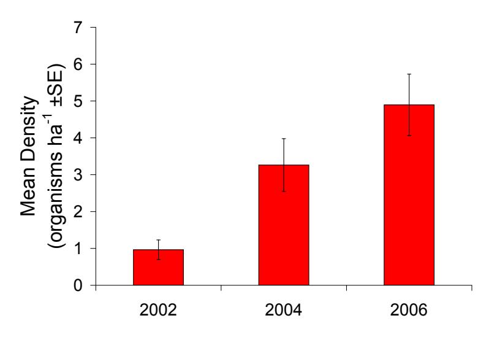

**Figure 7.7.2a.** Mean density of COTS at Swains from towed-diver surveys during ASRAMP 2002, 2004, and 2006.

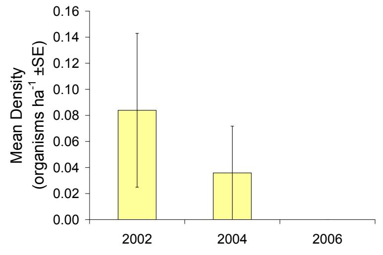

**Figure 7.7.2b.** Mean density of giant clams at Swains from towed-diver surveys during ASRAMP 2002, 2004, and 2006.

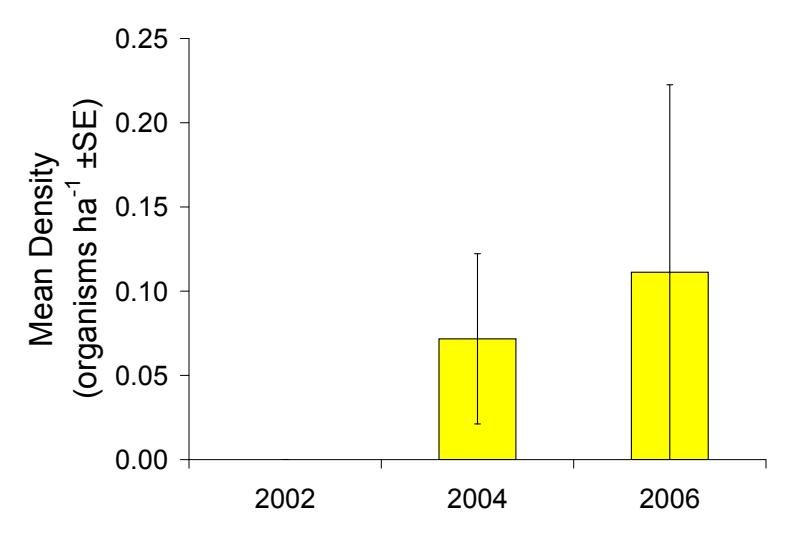

**Figure 7.7.2c.** Mean density of sea cucumber (holothuroids) at Swains from towed-diver surveys during ASRAMP 2002, 2004, and 2006.

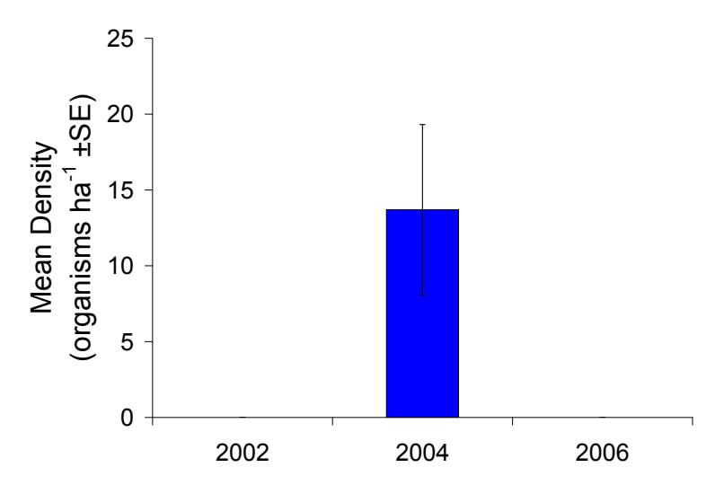

**Figure 7.7.2d.** Mean density of sea urchins (echinoids) at Swains from towed-diver surveys during ASRAMP 2002, 2004, and 2006.

# **7.8. Reef Fish**

# **7.8.1 Reef Fish Surveys**

#### *2002 Spatial Surveys*

Large fish (> 50 cm) biomass was relatively elevated and evenly distributed around Swains during ASRAMP 2002 (0.256 tons ha-1 [SE 0.130]; Fig. 7.8.1a). Barracudas clearly dominated biomass, followed closely by lower biomass of jacks and snappers.

Sharks were most frequently sighted in the east and southeast regions and were represented by the grey reef shark (*Carcharhinus amblyrhynchos*) and the reef whitetip shark (*Triaenodon obesus*; Fig. 7.8.1a). Humphead wrasses (*Cheilinus undulatus* ) were observed less frequently at various locations around the island. In addition, several large (> 1.5 m total length) dogtooth

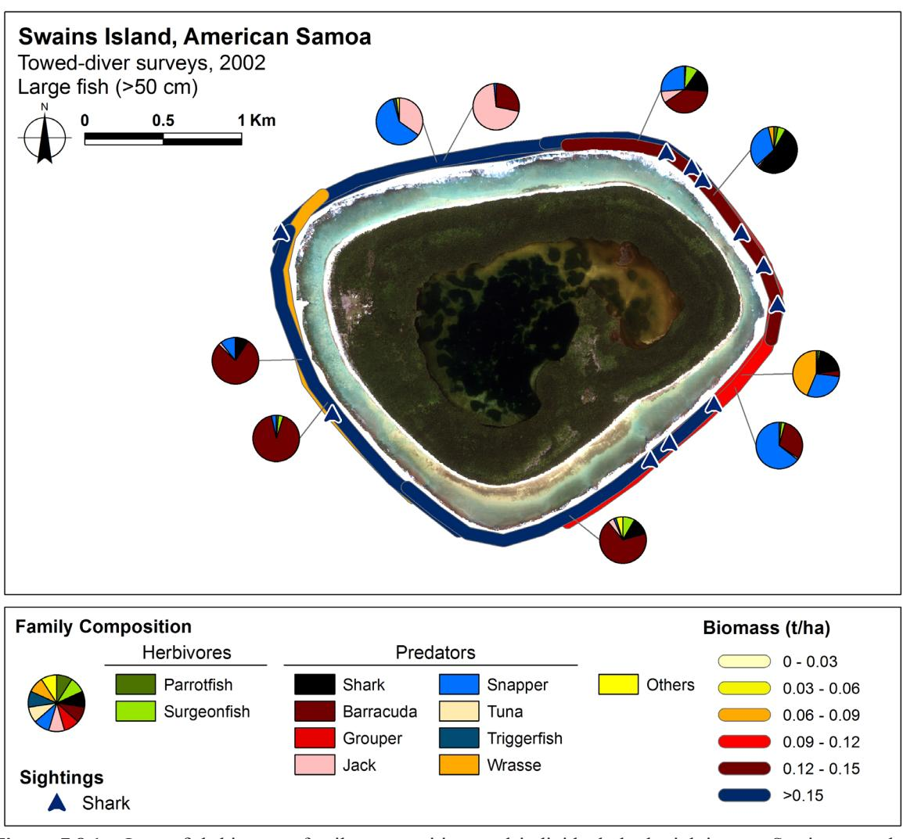

**Figure 7.8.1a.** Large fish biomass, family composition, and individual shark sightings at Swains recorded during ASRAMP 2002 towed-diver surveys. Large fish (length > 50 cm) biomass on each individual toweddiver survey is represented by the color of the survey track. Composition by trophic group is indicated by the family colors (green—mostly herbivores; other colors—mostly predators or mixed). Individual shark sightings, observed inside or outside the survey area, are represented by blue triangles.

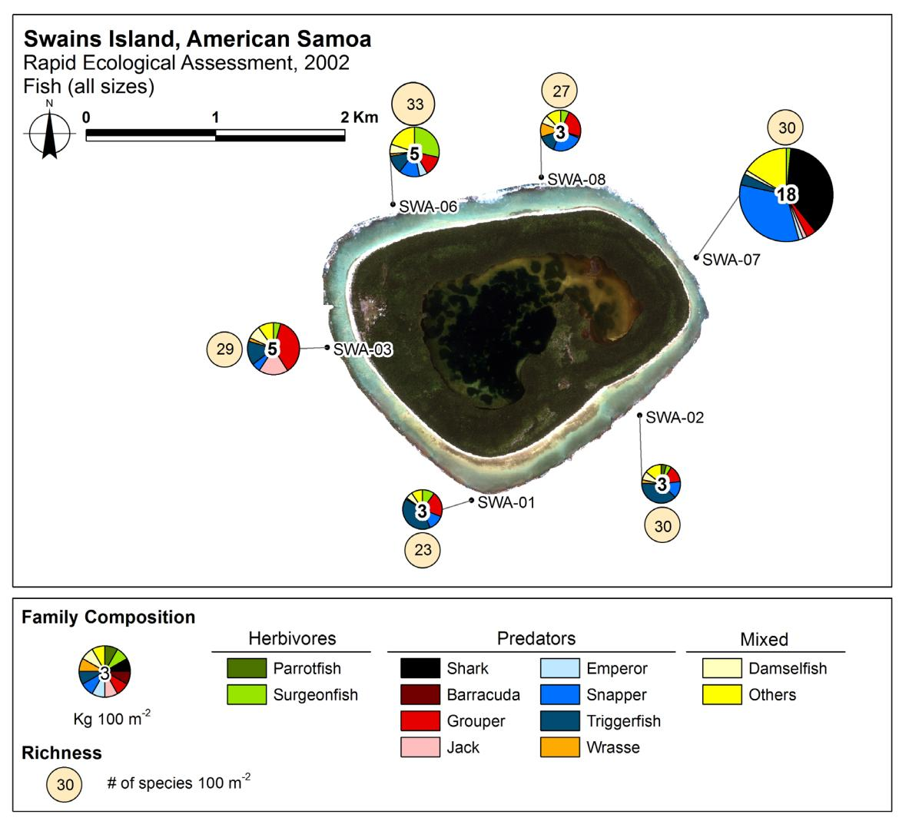

**Figure 7.8.1b.** Total fish biomass, family composition, and species richness of fishes at Swains recorded during ASRAMP 2002 REA belt-transect surveys. Total fish biomass (all species and size classes) is represented at each site by the size of the pie chart with the actual biomass value in the center (kg 100 m-2). Composition by trophic group is indicated by the family colors (green—mostly herbivores; other colors—mostly predators or mixed). Species richness at each REA site is indicated by numbers and the size of the beige circles.

tunas (*Gymnosarda unicolor*) and a school of approximately 100 blackfin barracudas (*Sphyraena qenie*) were sighted.

Total fish biomass was similar at most sites around Swains during 2002 surveys (6.3 kg 100 m-2 [SE 3.6]), except for site SWA-07 which had an elevated biomass related to a rare shark sighting on one transect (Fig. 7.8.1b). Predators, mainly snappers, groupers, and triggerfish, were the most abundant trophic group at all sites. The most common snapper and grouper were *Lutjanus bohar*  and *Cephalopholis argus*, respectively. Herbivores were observed in relatively low abundance.

Species richness was approximately 30 fish species at each REA site and fairly consistent around the island (Fig. 7.8.1b).

# *2004 Spatial Surveys*

Results from towed-diver surveys during ASRAMP 2004 showed that barracudas composed most of the large fish (> 50 cm total length) biomass around Swains, followed by snappers and jacks. The blacktongue unicornfish (Surgeonfish; *Naso hexacanthus*) was especially abundant. Distinct schools of more than 100 barracuda (*Sphyraena qenie*) and bigeye trevally (*Caranx sexfasciatus*) were again encountered. Overall, large fish biomass was very high around the island (0.164 tons ha-1 [SE 0.102]), particularly in the north region (Fig. 7.8.1c).

Humphead wrasses (*Chelinus undulatus*) were seen in loose aggregations of up to 10 individuals (50 to > 150 cm total length), mostly in the west and east regions of the island. Behavior and densities suggest that this may be a resident spawning aggregation. In contrast to the abundance of other large fish taxa, shark sightings were relatively scarce (Fig. 7.8.1c).

During ASRAMP 2004, the overall fish biomass around Swains was around 29.3 kg 100 m-2

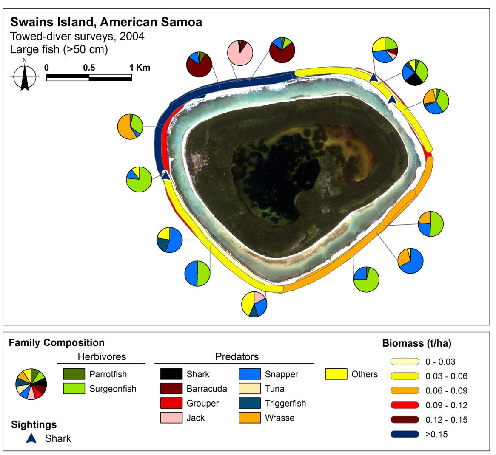

**Figure 7.8.1c.** Large fish biomass, family composition, and individual shark sightings at Swains recorded during ASRAMP 2004 towed-diver surveys. Large fish (length > 50 cm) biomass on each individual toweddiver survey is represented by the color of the survey track. Composition by trophic group is indicated by the family colors (green—mostly herbivores; other colors—mostly predators or mixed). Individual shark sightings, observed inside or outside the survey area, are represented by blue triangles.

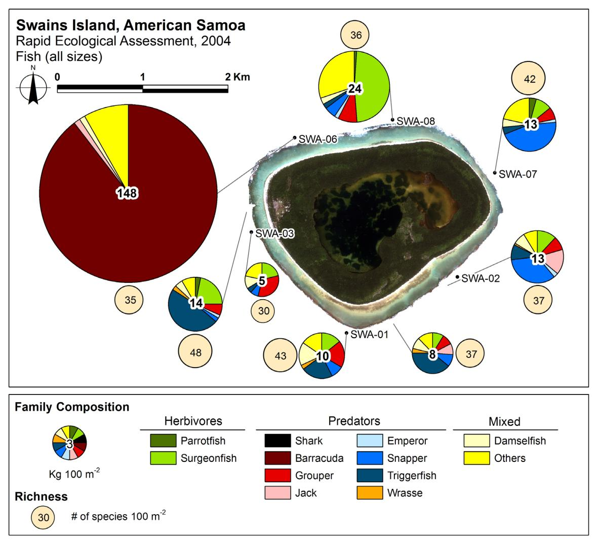

**Figure 7.8.1d.** Total fish biomass, family composition, and species richness of fishes around Swains recorded during ASRAMP 2004 REA belt-transect surveys. Total fish biomass (all species and size classes) is represented at each site by the size of the pie chart with the actual biomass value in the center. Composition by trophic group is indicated by the family colors (green—mostly herbivores; other colors—mostly predators or mixed). Species richness at each REA site is indicated by numbers and the size of the beige circles.

(SE 20.1); the greatest biomass was around the north region of the island (~ 86 kg 100 m-2; Fig. 7.8.1d). This observation remained constant even when the singular occurrence of a massive school of barracudas (*Sphyraena qenie*) encountered at site SWA-06 was removed from the analysis (~ 22 kg 100 m-2). Predators remained the dominant trophic group around the island (e.g., triggerfish, snappers, and groupers).

Medium-large fish (> 25 cm total length) biomass recorded during stationary point count surveys was dominated by snappers, followed by surgeonfish and groupers. Moderate levels were recorded for triggerfish, parrotfish, and jacks.

Species richness was slightly higher than in 2002 (~ 40 species 100 m-2) and was distributed evenly around Swains (Fig. 7.8.1d).

# *2006 Spatial Surveys*

During ASRAMP 2006, the overall large fish (> 50 cm total length) biomass (all families pooled) was on average of 0.132 tons ha-1 (SE 0.085; Fig. 7.8.1e). Similar to 2004, large fish biomass was mainly composed of jacks, barracudas, and sharks and was concentrated in the north and, to a lesser extent, south regions of the island.

A relatively high number of humphead wrasses were observed in 2006. Sharks were generally encountered in the north and south sections of the island during towed-diver surveys (Fig. 7.8.1e).

Similar to previous years, the total reef fish biomass during ASRAMP 2006 was highest in the north section of the island (~ 11 kg 100 m-2) caused by a large school of jacks (*Caranx sexfasciatus*; Fig. 7.8.1f). Overall total biomass was a relatively low 6.5 kg 100 m-2 (SE 2.9).

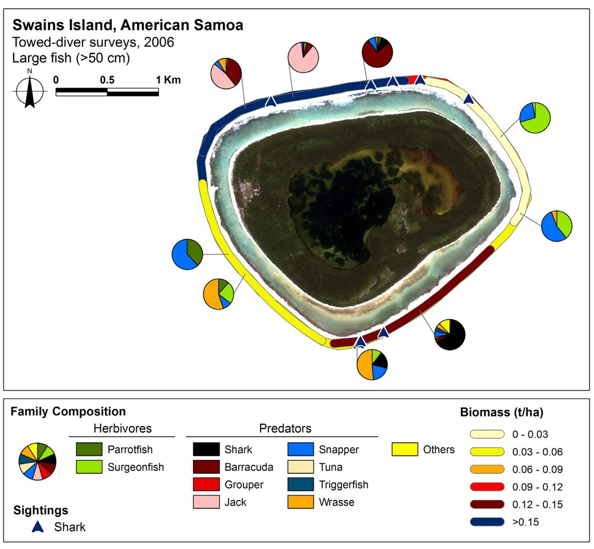

**Figure 7.8.1e.** Large fish biomass, family composition, and individual shark sightings around Swains recorded during ASRAMP 2006 towed-diver surveys. Large fish (length > 50 cm) biomass on each individual toweddiver survey is represented by the color of the survey track. Composition by trophic group is indicated by the family colors (green—mostly herbivores; other colors—mostly predators or mixed). Individual shark sightings, observed inside or outside the survey area, are represented by blue triangles.

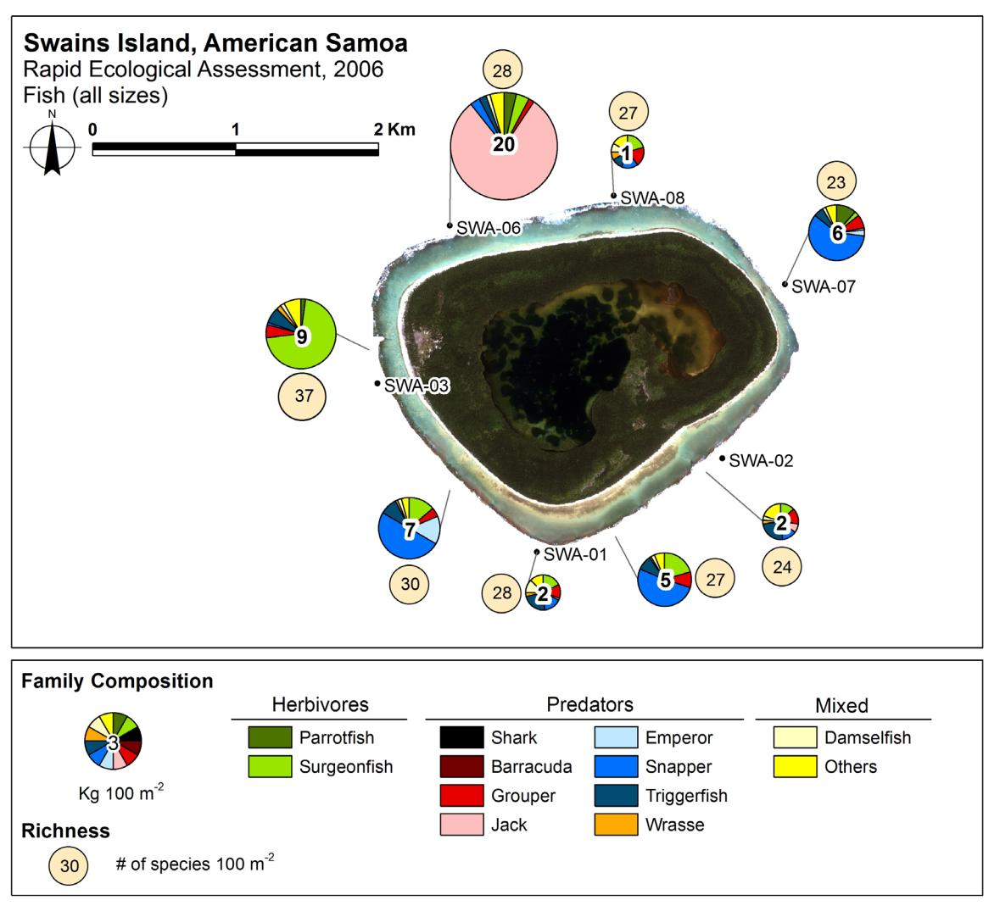

**Figure 7.8.1f.** Total fish biomass, family composition, and species richness of fishes around Swains recorded during ASRAMP 2006 REA belt-transect surveys. Total fish biomass (all species and size classes) is represented at each site by the size of the pie chart with the actual biomass value in the center. Composition by trophic group is indicated by the family colors (green—mostly herbivores; other colors—mostly predators or mixed). Species richness at each REA site is indicated by numbers and the size of the beige circles.

Snappers still represented the highest biomass of medium-large (> 25 cm total length) taxa around Swains, based on stationary point count surveys. Surgeonfish, wrasses (including several humpheads), grouper, and jacks (e.g., schools of rainbow runner, *Elegatis bipinnulata*) were also common. Parrotfish were rare around the island.

Fish species richness was slightly higher on the western side of the island (~ 30 species 100 m-2) compared to the eastern side (~ 25 species 100 m-2). In general, species richness was similar to 2002, which was lower than 2004 (Fig. 7.8.1f).

#### **7.8.2 Temporal Comparison—Reef Fish**

Total fish biomass distribution was variable among years, but this is mainly caused by the chance occurrence of very large schools at various sites (e.g., jacks, emperors, or barracudas). Swains was characterized by these large schools of predators and the general dominance of other predators

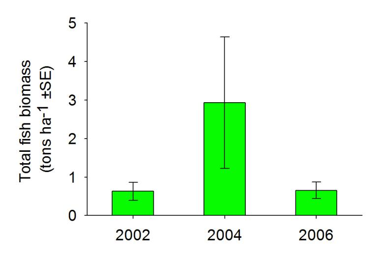

**Figure 7.8.2a.** Total fish biomass at Swains during ASRAMP 2002 (6 sites), 2004 (8 sites), and 2006 (8 sites) REA surveys.

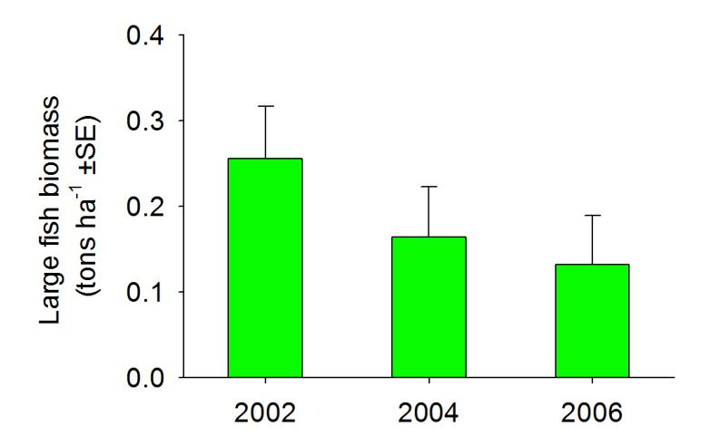

**Figure 7.8.2b.** Large fish biomass at Swains during ASRAMP 2002 (9 surveys), 2004 (14 surveys), and 2006 (9 surveys) towed-diver surveys.

at practically all sites in all years surveyed. This also explains the high interyear variability in total fish biomass (Fig. 7.8.2a). Overall fish biomass for the island was around 1.84 tons ha-1 (SE 0.86).

Large fish biomass (> 50 cm total length) was high around the entire island but mainly concentrated in the northwest section. Large schools of barracudas and jacks were almost always encountered there. The bulk of the biomass was represented by barracudas, jacks, snappers, and sharks. Similar to Rose Atoll, large fish biomass around Swains appears to have decreased by half, from 0.256 tons ha-1 in 2002 to 0.132 tons ha-1 in 2006 (Fig. 7.8.2b). Overall, large fish biomass around Swains is around 0.184 tons ha-1 (SE 0.105).

Sharks and humphead wrasses were frequently seen around the entire island. Shark species

commonly sighted were grey and whitetip reef sharks. No evidence of bumphead parrotfish populations have been observed around the island. Dogtooth tuna (*Gymnosarda unicolor*) were more common here than at any other island in American Samoa.

Fish diversity, measured as species richness, was mostly homogeneous around Swains (~ 32 species 100 m-2).

All the biomass per island means referenced in the above section can be found in Appendix IV, Table IV. i and Table IV. ii. Fish density per island means can also be found in Appendix IV, Table IV. iii and Table IV. iv.

# **7.9 Island Summary and Integration**

Among the islands that make up American Samoa, Swains is the smallest in area (2.6 km ) and most distant in the archipelago, located about 350 km to the north of Tutuila. High-resolution bathymetry shows Swains as a steep, conical atoll with depths dropping off precipitously within close proximity to the island. Nearshore, the island is surrounded by a shallow (~ 1 m) reef flat from the shoreline to the reef crest, but lacks an insular shelf and is characterized by intermittent spur-and-groove features along the reef crest.

Habitat complexity was relatively high around all coasts of the island, but appeared highest along the west region, specifically along the southwestern-facing shore, and along the northeast side of the atoll near the dividing line between the north and east regions (Fig. 7.3.2a). Divers also noted small scattered deposits of sand in the northeast (Fig. 7.3.2b), which was indicative of spur-andgroove features along the forereef crest when coupled to habitat complexity observations (Fig. 7.3.2a), bathymetry (Fig. 7.3.1a), and backscatter intensity (Fig. 7.3.1b) in the same area.

Spatially, oceanographic conditions around Swains, because of its small size, geographic isolation, and lack of any prominent bathymetric features, were largely homogeneous at any given time as most small- and large-scale oceanographic processes influence waters on all sides of the island. Temporally, oceanographic conditions around Swains were principally dominated by seasonal variability with respect to temperature and wave heights (Figs. 7.4.1c, 7.4.1f, 7.4.1i, and 7.4.3b). The prevailing wave climate is shaped primarily by events originating from southeasterly directions. Episodic large swell (> 4 m) events derived from passing cyclones do occur, and in general, originate southeast of American Samoa and track northwest. As previously stated, the lagoon at Swains appeared to have little effect on the physical properties of the ocean outside the island perimeter. This is caused by the lack of outflow from the inner lagoon to the ocean and to the low-lying geography, limited vegetation, and lack of anthropogenic sources to affect nearshore nutrient loading during precipitation events.

Habitat complexity and the distribution and abundance of coral and invertebrate communities around Swains appear to be covariant. Habitat complexity, as observed by towed divers, was high along the north and west portions of the island, while the southeast side was characterized with low values (Fig. 7.3.2a). REA surveys recorded high values of mean coral cover and coral density also along the north and east (Figs. 7.5.1j and 7.5.1p, respectively), with the lowest values observed on the southeast side of the island. Towed-diver surveys also recorded high live coral cover (> 75%) on the east side of the island and the low cover (20–30%) at the southern and western points of the island (Fig. 7.3.2e). The high island-wide mean coral cover estimates from both REA and towed-diver surveys were somewhat exceptional when compared with most of the other island and atolls surveyed as part of Pacific RAMP, suggesting that Swains is a unique ecosystem deserving thoughtful consideration for long-term management and conservation.

Coral size-class distribution at all REA sites was dominated by relatively small colonies; however, the 2006 surveys indicate a trend towards even smaller coral colonies on the southeast forereef (Figs. 7.5.1k and 7.5.1q). The relatively low habitat complexity and coral size and cover observed on the southeast side may be attributable in part to directional wave climatology of Swains, including the episodic large swell events that hit this region of the island.

Coral community composition in each of the survey years was principally composed of *Monitpora*  and *Pocillopora* spp.*,* although a shift in abundance by site and location was observed. During the 2004 survey, *Pocillopora* was most common at all sites, while in 2006, *Montipora* was the most abundant at sites located on the southeast, east, and one site on the west side of Swains, while *Pocillopora* remained abundant to the north (Figs. 7.5.1g and 7.5.1o). Coral generic richness appeared more random in distribution, yet at all REA sites, richness decreased between the two survey periods. Coral diseases at Swains were uncommon, with diseases observed at only two of the eight sites surveyed (Fig. 7.5.2a).

Algal populations around Swains did not appear to be as covariant with habitat complexity, and they are slightly more evenly distributed relative to coral communities. In 2004, the green algal genera *Rhipilia* and *Microdictyon* were common at all sites around the island (Figs. 7.6.1c and 7.6.3a). The geniculate (branching) red coralline alga *Peyssonnelia*, however, was only observed at sites located on the north and west where the non-geniculate corallines were concurrently lacking. Algal diversity was slightly higher on the eastern side of the island compared to the west (Figs. 7.6.1c, 7.6.1e, and 7.6.3a).

Invertebrate species richness at all REA sites was low around Swains (Figs. 7.7.1c and 7.7.1e); however, invertebrate distributions during the 2004 survey exhibited similar spatial patterns as those observed in live coral and habitat complexity. The greatest numbers of invertebrate species were recorded at sites SWA-05 and -03 in the west region, and the lowest numbers were observed at site SWA-14 on the southeast side (Fig. 7.7.1c). Target invertebrates were nearly absent from REA surveys around Swains during 2006 (Fig. 7.7.1e). Invertebrate data collected by towed divers found the distribution of COTS to vary between years; abundance was high along the southern tip of the island (Fig. 7.7.1b) in 2004, while in 2006, COTS were far less frequent in the north region compared to the southeast, west, and east regions (Fig. 7.7.1d). In addition, toweddiver surveys around Swains found high values of stressed coral (7.8%) in 2004 (Fig. 7.5.1f). This corresponded with both a threefold increase in COTS between 2002 and 2004 and the nearby passage of Hurricane Heta the month prior to the ASRAMP 2004 surveys. An additional category 3 tropical cyclone (Percy), which produced 6-m wave heights, passed within close proximity (< 50 km) to Swains in 2005; however, significantly lower coral stress values were recorded in 2006 (1.9%; Fig. 7.5.1n) in comparison with 2004. It is very likely that a combination of known and unknown oceanographic and biological interactions contributed to the COTS population increase, which will likely be further examined during future ASRAMP deployments.

Similar to algal populations, fish populations around Swains appeared more evenly distributed relative to coral and macroinvertebrate communities. Total fish biomass was high overall, but varied between years (e.g., chance encounters of jack, emperor or barracuda schools on quantitative surveys; Figs. 7.8.1b, 7.8.1d, 7.8.1f, and 7.8.2a). Large fish biomass was characterized primarily by schools of predators (including barracudas, jacks, snappers and sharks) that dominated at most sites around Swains and were concentrated on the northwest corner (Figs. 7.8.1a, 7.8.1c, 7.8.1e, and 7.8.2b). Species richness, a measure of diversity, was essentially uniform for fish populations around Swains.

Although it is difficult to adequately characterize the coral reef ecosystem of Swains with high spatial and temporal resolution from biennial surveys, the large amount of oceanographic, geological, and biological data collected during ASRAMP cruises since 2002 is sufficient to highlight many general ecosystem trends. Spatial patterns in habitat complexity and the distribution and abundance of corals and invertebrates appear well associated with the unidirectional nature of incoming wave energy. Consistent short period swell batters the southeastern shoreline of Swains, and although the specific nature of the physical-biological interactions requires further study, it appears the wave energy is reducing habitat complexity, reducing live coral growth, impinging upon coral densities and distribution, and affecting invertebrate distribution. Algae and fish distributions do not appear to have similar spatial variability or to be associated with the wave climatology data. Observed variability in the distribution and abundance of invertebrates, including COTS, and coral community composition and generic richness between ASRAMP cruises, was potentially caused by category 3 tropical Cyclone Percy that produced 6-m wave heights and passed within close proximity (< 50 km) to Swains in 2005. Integration of the ecosystem level components measured and observed around Swains between 2002 and 2006 yields a picture of a small isolated island, with no notable human population, minor terrigenous input, and little bathymetric variability, and whose biological components are highly subject to the ambient physical oceanographic conditions including the seasonally variable wave climatology.

# **Chapter 8 Archipelagic Comparisons**

Each of the previous five chapters provided comprehensive and detailed descriptions of coral reef ecosystems in the Territory of American Samoa (Tutuila and Aunu`u Islands, Ofu and Olosega Islands, Ta`u Island, Rose Atoll, Swains Island). These discussions included the following topics: geopolitical context, survey efforts, benthic habitat mapping and characterization, oceanography and water, coral and coral disease, algae, benthic macroinvertebrates, reef fish, and island summary and ecosystem integration. In this chapter, the same topics will be discussed but the focus will shift from individual islands to interisland comparisons across the American Samoa Archipelago. The spatial patterns and temporal variability of the island/atoll ecosystems will be examined on a regional scale. This broaderscale ecosystem examination explicitly provides important information for local management and conservation at these islands/atolls. However, it also presents useful insights which can be applied more generally towards the management and conservation of coral reefs on a regional, national, and international level.

#### **8.1 Geopolitical Context**

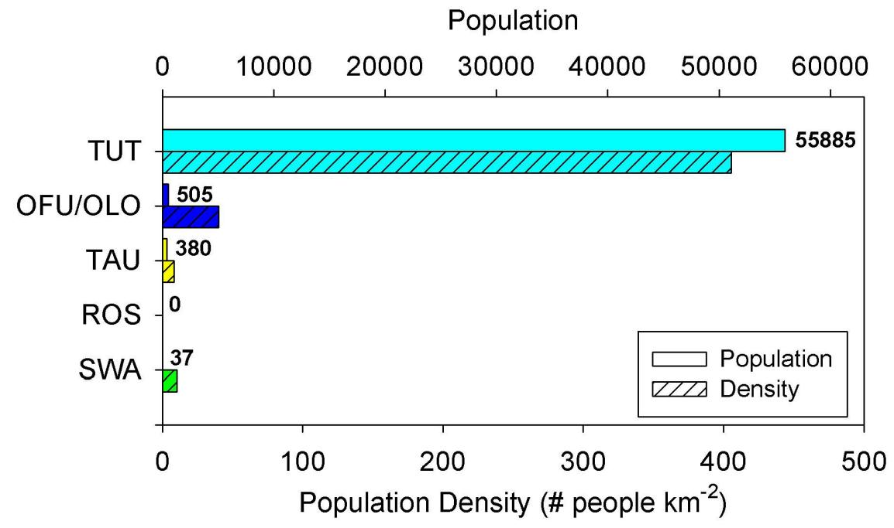

**Figure 8.1a.** Human population numbers and densities of Tutuila and Aunu`u (TUT), Ofu and Olosega (OFU/ OLO), Ta`u (TAU), Rose (ROS), and Swains (SWA). The solid bars indicate population numbers per island, while the striped bars indicate population densities (U.S. Census Bureau, 2000).

The Territory of American Samoa is composed of five volcanic high islands (Tutuila, Aunu` u, Ofu, Olosega, and Ta` u) and two low coral atolls (Swains and Rose). Tutuila (including Aunu` u) is the largest (145 km²) and most densely populated (55 885 residents) island in American Samoa (Figs. 8.1a and 8.1b). In addition, Tutuila harbors the most shallow-water coral reef habitat (315 km²) of any island in American Samoa (Fig. 8.1b).

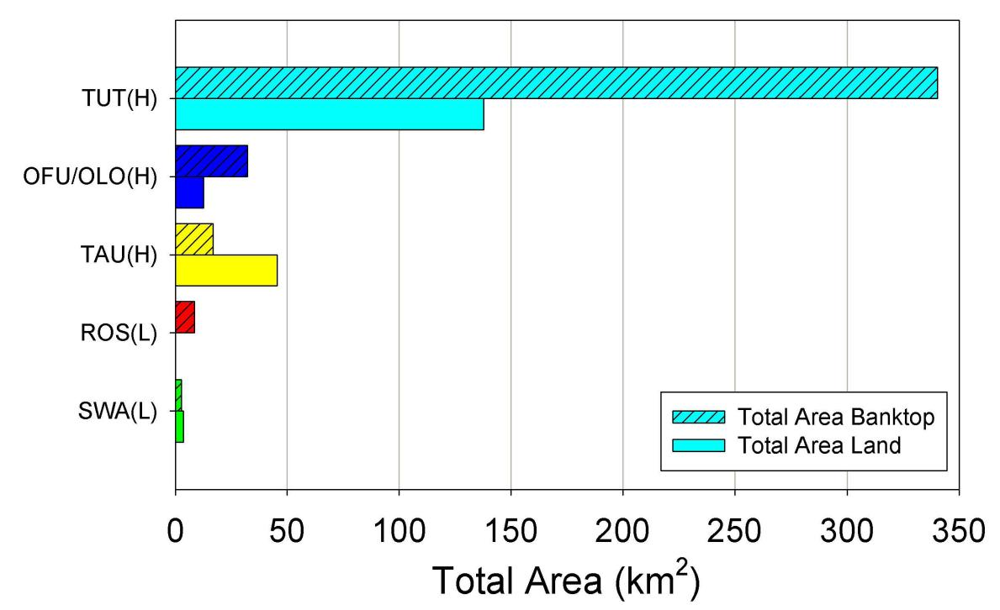

**Figure 8.1b.** Total banktop area and total terrestrial land area of Tutuila and Aunu`u (TUT), Ofu and Olosega (OFU/OLO), Ta`u (TAU), Rose (ROS) and Swains (SWA).High volcanic islands are denoted with the letter H, low carbonate islands/atolls with the letter L.

Because of higher population densities and large areas of coral reef habitat on Tutuila (Figs. 8.1a and 8.1b), the potential for detrimental anthropogenic impacts (e.g., agricultural runoff, point and nonpoint source pollutants, and excessive resource use) is of concern. The Pago Pago Harbor/International Airport and densely populated coastline surrounding Pala Lagoon (Fig. 3.1b) are areas potentially subject to elevated industrial and commercial pressures. Several marine protected areas have been established on Tutuila, including: Fagatele Bay National Marine Sanctuary near Step's Point in the south point region (Fig. 3.1a); the National Park of American Samoa (NPAS), which spans a large stretch of northern coastline from Fagasa Bay to Cockscomb Point and Vatia Bay; and additional areas addressed by the communitybased Fisheries Management Program of American Samoa. Despite their protected status, these areas may still be subject to anthropogenic pressure. In particular, during a 7-week record from an ecological acoustic recorder deployed in the NPAS, the majority of vessel detections (23 out of 35 instances) occurred at night (Fig. 3.4.4c), which may indicate local fishing effort in that marine park.

Human population numbers and densities decrease as one travels east along the American Samoa Archipelago (Fig. 8.1a). The Manu`a Islands are located approximately 100 km east of Tutuila, and include Ofu, Olosega, and Ta`u. The population of the Manu`a Islands has been steadily decreasing since the 1950s as a result of a migration to Tutuila for employment opportunities and several damaging storms affecting the Manu`a Islands.

Ofu, with a land area of 7.2 km2 , and Olosega, with a land area of 5.4 km2 , have a combined population of 505 people, with 289 living on Ofu and 216 living on Olosega (Figs. 8.1a and 8.1b). The populations are located around two primary villages: Ofu Village (northwestern coast of Ofu), which is the location of the small airport and protected harbor, and Olosega

Village (southwestern coast of Olosega). Sili Village, located on the northwestern coast of Olosega, remains sparsely inhabited. An estimated two-thirds of Ofu and Olosega remain undeveloped, with the majority of the southern coastline of Ofu under the administrative jurisdiction of the NPAS.

Ta`u, with a land area of 44 km2 , is home to 380 people primarily located in the villages of Ta`u and Faleasao in the northwest and Fiti` uta in the northeast (Figs. 8.1a and 8.1b). The undeveloped southeastern and southern coastlines of Ta`u are under the jurisdiction of the National Park Service. Coastal subsistence agriculture/agrofarming and subsistence fishing likely constitute the majority of potential anthropogenic stressors to the reef environment, along with the activities associated with the boat harbor and airport in Ofu Village and the small airport near Fiti` uta.

Rose Atoll is the uninhabited, easternmost territory under the joint administration of the Territory of American Samoa and the United States Fish and Wildlife Service. The barrier reef encloses approximately 6.5 km2 (~ 1600 ac) of lagoonal habitat, with a 40-m wide channel located in the northern corner of the atoll (Figs. 8.1a and 8.1b). Two small islands (Rose and Sand) constitute only 0.06 km2 (~ 15 ac) of land. While Rose Island is vegetated, both islands do not have any streams, associated watershed areas or notable freshwater sources. Potential anthropogenic stressors to Rose Atoll are probably not a result of continued habitation by residents. However, the effects of the 1993 shipwreck, wildlife poaching (anecdotal evidence) and unmonitored fishing pressure likely constitute the main anthropogenic impacts at Rose Atoll.

Swains is a geographically small island and is geologically isolated from the rest of the American Samoa Archipelago (Chapter 1, Fig. 1.1a). The island is only 1.9 km² and is consistently home to ≤ 30 residents who are concentrated in the village of Taulaga in the northwest (Figs. 8.1a and 8.1b). As a result of the small population and lack of industry on this island, the anthropogenic stresses on the coral reef ecosystems are limited to subsistence fishing pressures and localized subsistence agricultural runoff.

#### **8.2 Survey Effort**

A considerable amount of bathymetric, oceanographic, and biological data has been collected in the American Samoa Archipelago between 2002 and 2006. These data allow better understanding of the spatial and temporal variability of the coral reef ecosystems around each of the islands/atolls. Using spatially consistent Pacific Reef Assessment and Monitoring Program (RAMP) methodologies, a similar suite of observations and data have been collected for each island/atoll within the archipelago. Because of differences in the reef habitat areas, ship availability, and weather and sea conditions, the amount and spatial resolution of these data vary among islands. Details of survey efforts for each island/atoll are discussed in their respective chapters as follows: Tutuila and Aunu`u Islands (Chapter 3, Section 3.2: Survey Effort), Ofu and Olosega Islands (Chapter 4, Section 4.2: Survey Effort), Ta`u Island (Chapter 5, Section 5.2: Survey Effort), Swains Island (Chapter 6, Section 6.2: Survey Effort), and Rose Atoll (Chapter 7, Section 7.2: Survey Effort). The respective island/atoll datasets have been coalesced to produce the archipelagic comparative analyses presented in this chapter.

In addition to offering archipelagic comparisons of the mapping, oceanographic, and biological observations discussed in the five island/atoll chapters, these analyses explore information about the prevailing deep-water oceanographic environments surrounding each of the islands by using a series of the deep-water (to a ~ 500-m depth) conductivity, temperature, and depth (CTD) casts conducted from the National Oceanic and Atmospheric Administration (NOAA) Ships *Townsend Cromwell*, *Oscar Elton Sette*, and *Hi`ialakai* during American Samoa RAMP (ASRAMP) cruises in 2002, 2004, and 2006. The oceanographic data from these deep-water CTD casts are shown and discussed in Section 8.4.1: Vertical Structure. Regional oceanographic patterns on seasonal time scales were also examined.

#### **8.3 Benthic Habitat Mapping and Characterization**

The nearshore waters of the American Samoan Islands were surveyed using multibeam echosounders at depths between ~ 15 and at least 200 m, and in many cases, to depths as great as 3000 m. Optical imagery (video and still photographs) and diver observations of the seafloor at depths between ~ 3 and ~ 80 m were collected during Towed Optical Assessment

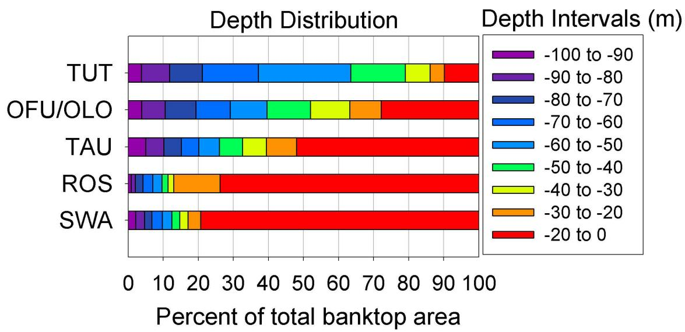

**Figure 8.3a.** Percentage of the total banktop area included in each depth interval. Tutuila and Aunu`u (TUT), Ofu and Olosega (OFU/OLO), Ta`u (TAU), Rose (ROS) and Swains (SWA).

Device (TOAD) surveys and towed-diver surveys. Multibeam bathymetry of the different islands revealed a trend of smaller insular shelves progressing away from Tutuila to the east (toward the Manu` a Islands and Rose) and north (toward Swains). The amount of reef habitat area (depths < 100 m) is substantially higher around Tutuila when compared with the rest of the archipelago, followed by Ofu and Olosega (combined), Ta` u, Rose, and Swains (Fig. 8.1b). Possible reasons for this pattern will be discussed shortly.

As seen in Figure 8.1b, the relationship between total banktop area (defined as all submerged marine habitats at depths between the shoreline and 100 m) and total land area of the high islands (Tutuila, Ofu, Olosega, and Ta`u) is distinct from the low islands (Swains and Rose Atoll). Tutuila, the largest of the islands, has an extensive banktop surrounding the island. Depth intervals around Tutuila decline gradually from shoreline to ~ 100 m, an indication of

the gently sloping and extensive banktop habitat surrounding the island (Figs. 8.1b and 8.3a). Ta`u, Ofu, and Olosega are all relatively small islands with significantly smaller surrounding banktop habitat areas. For these islands, bathymetric depth intervals surveyed from shoreline to ~ 100 m descend much more steeply than around Tutuila, with Ta`u descending the most steeply (Fig. 8.3a). Rose Island (within Rose Atoll) is so small that it cannot be displayed on Figure 8.1b; the total emergent land of the island is less than 8.2 ha. Both Rose Atoll and Swains have very limited shallow banktop (Fig. 8.1b). Figure 8.3a shows that depths rapidly descend from 20 to 100 m at both Rose Atoll and Swains. The percent that is shallower than 20 m (backreefs, reef flats, reef crests, and shallow forereef slopes) is greatest at the smallest islands/atolls (Swains and Rose Atoll) and smallest at the largest island (Tutuila; Fig. 8.3.a).

The American Samoan Islands rest on a portion of the earth's crust known as the Pacific Plate, which, in the vicinity of these islands, is drifting to the west at a rate of ~ 7 cm per year (McDougall, 1985). Most of these islands, as well as the islands of Savai` i and Upolu in Samoa (west of American Samoa), were formed by volcanic eruptions when the portion of the plate on which they are resting passed over a thermal plume in the Earth's mantle, the "Samoan hotspot" (Hart et al., 2000). Thus, islands farther to the southeast are generally younger, while the islands farther to the northwest are older. A new volcanic edifice named Vailulu` u that may one day become an island is currently being formed approximately 50 km east of Ta`u. Tutuila is about 1.5 million years old, while Ofu and Olosega, and Ta`u are about 300 000 and 100 000 years old, respectively. Although politically part of American Samoa, Swains and Rose are built on much older volcanoes and are, geologically speaking, not part of the Samoan volcanic chain (Hart et al., 2004).

For at least the last 800 000 years, global sea level has fluctuated about 120 m every 100 000 years or so in response to glacial-interglacial cycles. In the current interglacial period, sea level is near the top of its 120-m oscillation (Ruddiman et al., 1989). When sea level is static for a prolonged period, it tends to erode terraces into land areas. Tutuila has been exposed to erosion from glacial low-stands of sea level for far longer than the more easterly islands and consequently has an insular shelf that is ~ 4 km wide on average, with ~ 320 km2 of coral reef ecosystem area shallower than 100 m. Ofu and Olosega have a narrow shelf that is ~ 1 km wide in most areas, and banks eroded into several corners of the islands that extend ~ 2 km offshore. Ta`u has an insular shelf that is narrower still, being generally absent on the south and eastern sides of the island. Elsewhere it is generally a few hundred meters wide, except off corners of the island and along the western half of the north shore, where it may be ~ 1 km wide. The volume of sediment stored on the shelves appears to be generally correlated with shelf area. Sediment reservoirs are found in channels offshore of terrestrial drainages, at the base of the forereef slope, and in mid-shelf depressions around Tutuila.

The greater age of Tutuila has enabled the development of other features in addition to the insular shelf itself. Multibeam bathymetry of Tutuila provides a detailed picture of an elevated ridge around the seaward rim of the insular shelf of the island, which probably corresponds to a drowned barrier reef complex. Fishing boats have been observed congregating along this feature, and high coral cover areas have been seen in TOAD imagery in a number of locations (Chapter 3, Section 3.3: Benthic Habitat Mapping and Characterization). Given the potential importance of coral reef resources along the ridge, it will be an area of increased focus during the ASRAMP 2008 cruise.

Multibeam bathymetry has also revealed details of other seafloor features of interest, including a series of small seamounts along an east-west tending ridge starting about ~ 2 km west of Ta`u. TOAD imagery has revealed a luxuriant coral reef on the top of the seamount closest to Ta`u at 38-m depths and deeper (Chapter 5, Section 5.3: Benthic Habitat Mapping and Characterization). Other coral reefs have also been found between 30 and 50 m or even deeper on several of the spurs extending seaward from corners of the Manu`a Islands.

Towed-diver benthic surveys indicate that, on average, the American Samoan Islands had live scleractinian coral cover ranging from ~ 5% to ~ 40%. The Manu`a Islands tended to have greater cover on the southeastern half of the islands and Ta`u, in particular, had areas with > 50% live scleractinian coral cover. In contrast, high coral cover areas around Tutuila tended to occur in sheltered locations, such as Fagatele Bay or on ridges that extend out towards the open ocean. Swains had markedly higher live coral cover than the rest of the islands with values ranging from 20% to exceptionally high values of 75%, with a trend of increasing coral cover to the northeast.

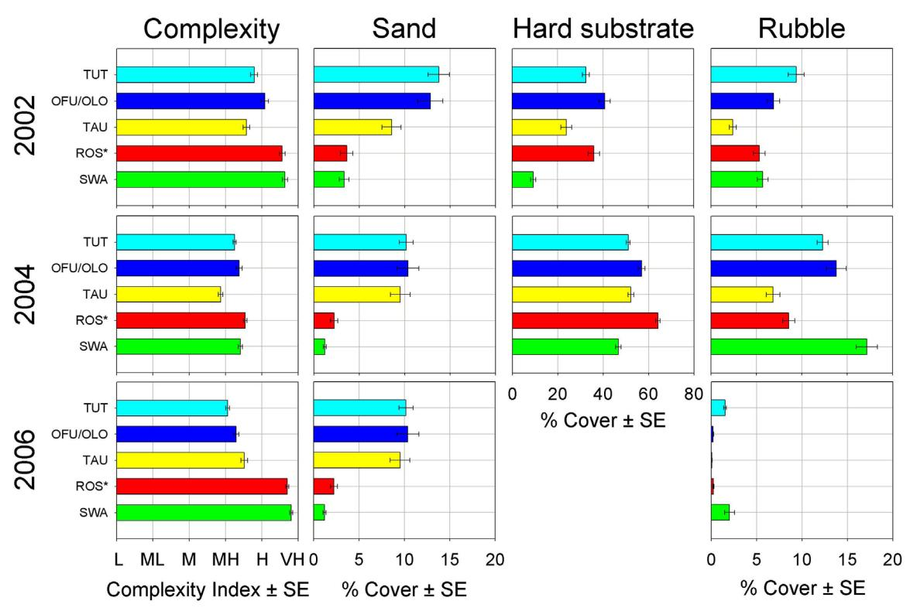

**Figure 8.3b.** Island-wide mean benthic habitat composition for each of the islands/atolls of the American Samoa Archipelago from towed-diver benthic survey observations during ASRAMP 2002, 2004 and 2006 for Tutuila and Aunu`u (TUT), Ofu and Olosega (OFU/OLO), Ta`u (TAU), Rose (ROS), and Swains (SWA).The shallow-water habitat was characterized by four measures: habitat complexity (L = low, ML = medium-low, M = medium, MH = medium-high, H = high, VH = very high), sand, hard substrate, and coral rubble. It is not clear at this time whether changes between years are indicative of actual changes in seafloor characteristics or are more reflective of variations in the location of towboard tracks and uncertainty in observer estimates. Note that lagoon data are not presented for Rose; only forereef data are presented for better comparison with the other islands that lack a lagoon.

Benthic habitat characterization data were collected at relatively shallow depths (majority < 20 m) during towed-diver surveys. Results varied within and between years because of changes in survey depths and locations, different divers, and changes in data collection protocols. However, even with these inconsistencies, trends were identified in benthic habitat characteristics from west (Tutuila) to east (Rose) to north (Swains).

Mean habitat complexity was fairly similar between islands and survey periods, generally falling in the range of medium to medium-high complexity from 2002 to 2006 (Fig. 8.3b). However, several notable trends were observed. Overall habitat complexity generally increased moving from west to east and north along the archipelago with Swains having the highest overall mean complexity in most years (2002 and 2006) followed closely by Rose. Habitat complexity was slightly lower around Tutuila versus the Manu`a Island group, possibly because of prolonged exposure to erosion, resulting in large sections of fairly flat shelf areas around Tutuila. Habitat complexity was highest at Swains and Rose partly because of the steepness of their slopes. In addition, both islands are subject to the full effects of largescale westerly currents and trade wind waves from the east, without the mitigating influence of an insular shelf. The resulting greater nearshore water motion at these two islands (Swains in particular) is hypothesized to at least partly explain why they have higher live coral cover than the islands with greater shelf area, and why coral cover is highest on their more easterly sides.

In contrast, the percentage of benthic sand cover decreased from west to east and north across the archipelago, with Rose and Swains recording the least amount of sandy habitat. These results are supported by the bathymetric and backscatter data, which suggest that sand retention appears to be related to shelf area. Rose and Swains are older than Tutuila but lack the insular shelves found at other islands in American Samoa. The lack of an insular shelf is believed to be the reason for the almost complete lack of sandy habitat seaward of the reef crest. Note, however, that Rose lagoon is predominantly composed of sandy substrate.

Hard substrate/pavement composition varied between years and locations. However, an interesting, if perplexing, trend was noted between 2002 and 2004, with Swains recording the lowest overall hard substrate/pavement cover, followed by Ta`u and Tutuila. It is not clear at this time whether changes between years are indicative of actual changes in seafloor characteristics or are more reflective of variations in the location of towboard tracks and uncertainty in observer estimates. Ofu, Olosega, and Rose constituted the highest recorded hard substrate/pavement cover for 2002 and 2004.

Rubble composition varied by location and by year, which was mostly attributable to changes in classification protocol, with no obvious or discernable archipelago-wide relationship.

#### 8.4 Oceanography and Water Quality

#### 8.4.1 Vertical Structure

Shallow Nearshore Surveys

Nearshore mean-temperature profiles from the shallow-water CTD surveys around each of the islands/atolls during ASRAMP 2002, 2004, and 2006 were relatively consistent throughout the five islands, with depth-associated variability in the upper 30 m of the water column typically < 0.5°C (Fig. 8.4.1a). Swains, the northern and most isolated island of the group, had the warmest, least vertically stratified, least variable temperature profile, with a mean temperature of  $\sim 29.5$ °C from the surface to the bottom. Rose, the easternmost island/atoll in American Samoa, had the coolest, most vertically stratified, and most variable temperature profile in the upper 30 m of the water column. The greatest mean temperature variation was observed around Ta`u, with temperature reduced 0.5°C from  $\sim 29.6$ °C at the surface (1 m) to  $\sim 29.1$ °C at a 32-m depth.

Mean island-wide salinity profiles show much more noteworthy differences among the islands (Fig. 8.1a). Rose had the highest mean salinity (35.3 psu), the largest variability with depth, and the highest variance in surface waters (above the sill depth  $[\sim 6 \text{ m}]$  in the channel pass). This is reflected in the high salinity lagoonal waters below the sill depth. The high variance found in the surface waters could be caused by wave setup over the reef crest around the atoll. Mean salinity levels were lowest (~ 34.7 psu) around Swains, with little depth variation in the upper 30 m. Variability of salinity was also high in the surface layer (0–2 m) around Tutuila, probably reflecting a frequent freshwater lens caused by terrestrial runoff from high levels of precipitation. Mean transmission showed little depth variability around all islands. Rose and Ta'u had the highest transmission levels (97–98%) while Swains and Tutuila had the lowest transmission ( $\sim 95\%$ ). The variance of transmission was generally low, except in the near-surface waters around Tutuila, probably reflecting terrigenous inputs from watershed runoff. Mean density profiles showed similar trends to that of salinity. Highest density water and most significant depth variation were found around Rose, while lowest density (21.75 kg m-3) and least depth variability were observed around Swains. The highest variance of density was observed in the upper ~ 8 m around Tutuila, also probably reflecting watershed runoff.

Across the archipelago (Fig. 8.4.1b) mean profiles of water properties at each of the islands/atolls showed that Swains, located over 350 km north of the other islands/atolls, was an outlier characterized by significantly different physical water properties. Data from the top 1 m of the water column were potentially skewed because of surface heating and instrument temperature equilibration and should therefore be treated with caution. However, since the data are not unreasonable, they have been included for completeness.

Across the archipelago, Tutuila exhibited the highest concentrations of chlorophyll-a (Chla;  $0.7 \mu g L^{-1}$ ), silicates (SiO2  $2.5 \mu M$ ), and nitrates (NO2  $0.025 \mu M$ ), although these values were highly variable between sites, as indicated by the elevated standard deviations (Fig. 8.4.1b). Phosphate (PO4) concentrations were similar amongst the five islands ( $0.10-0.15 \mu M$ ), with the exception of Ofu and Olosega, which had slightly lower concentrations. Mean

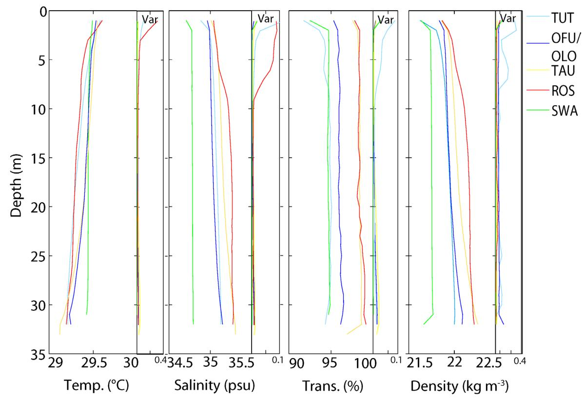

**Figure 8.4.1a.** Means and variances of temperature, salinity, beam transmission, and density were calculated from shallow-water (< 40 m) CTD casts around each island during ASRAMP 2002, 2004, and 2006 for Tutuila and Aunu`u (TUT), Ofu and Olosega (OFU/OLO), Ta`u (TAU), Rose (ROS) and Swains (SWA).Data obtained within the freshwater lagoon at Swains were removed before averaging as they were incomparable with the other CTD casts. Data from the lagoon at Rose were included for this analysis.

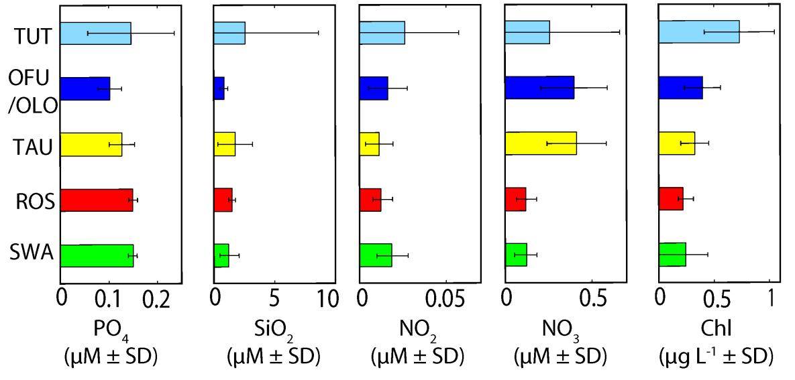

**Figure 8.4.1b.** Water sampling was conducted at American Samoa during ASRAMP 2006 for Tutuila and Aunu`u (TUT), Ofu and Olosega (OFU/OLO), Ta`u (TAU), Rose (ROS), and Swains (SWA). Island-wide averages were derived to compare chemical variability throughout the whole archipelago. Data obtained within the freshwater lagoon at Swains were removed as they were incomparable with nearshore oceanographic samples and skewed the results.

nitrite (NO3 μM) concentrations were highest around Ofu, Olosega, and Ta`u (~ 0.4–0.5 μM), and lowest around Swains and Rose (~ 0.1 μM). Generally, variances of all water quality parameters were highest around Tutuila, probably reflecting the greater range of habitat types and exposures to ocean conditions, and terrigenous inputs from local watersheds.

Mean chemical concentrations from around the islands and atolls of American Samoa indicate that orographic relief, land mass, and population size strongly impact nearshore nutrient and water quality concentrations. The large landmass and higher elevation of Tutuila compared with the other islands produced more seasonal rainfall and increased sedimentation to surrounding waters. Because of these factors, combined with the large population and associated land use, it is not surprising that Tutuila had the highest nutrient and Chl-a concentrations across the archipelago. The large standard deviation in the data obtained from Tutuila were probably caused by spikes in nutrient concentrations near developed areas, where nutrient and contaminant runoff is generally high compared with more rural areas where contaminants are relatively low. The variability of water quality parameters at all other islands is most likely linked to island size and population, as islands of similar land area and number of inhabitants appear to have markedly similar nearshore chemical concentrations.

#### *Deep-water Offshore Surveys*

For the deep-water (~ 500 m) CTD casts completed around each island/atoll during the ASRAMP 2002, 2004, and 2006 cruises, each of the four mean vertical profiles of water properties (temperature, salinity, density, dissolved oxygen, and fluorometry) showed that Swains was again an outlier compared with the other islands and atolls (Fig. 8.4.1c). Temperature was consistent throughout the five islands/atolls, each varying from ~ 30°C at the surface to ~ 8°C at 500 m. Although Swains exhibited higher temperatures in the surface waters and slightly lower temperatures below 200 m, the overall temperature variance was < 1°C and was significantly less than this in the surface waters (< 100 m). The island's mean salinity profiles showed similar patterns with depth, peaking at ~ 270 m at 36 psu. The mean salinity profile around Swains followed the general pattern of the other islands but exhibited lower salinity in surface (< 100 m) and deeper (> 220 m) waters. Variability was limited to the surface water and never exceeded 0.1 psu. Oxygen saturation in surface waters was similar around all islands and diverged and undulated with depths below 70 m. Swains had the lowest oxygen saturation with two main troughs: one at ~ 100 m deep (2.6 ml L-1) and another at ~ 350 m deep (at 2.4 ml L-1). Fluorometer levels were low (< 0.1 ml L-1) in surface waters, and peaked at depths around 100 m around each of the islands/atolls. Swains showed the greatest depth variability with a subsurface maximum of 0.35 ml L-1. Rose had the smallest peak in fluorometry at < 0.2 ml L-1. Fluorometry values tended to 0.0 ml L-1 below ~ 250-m depths, which corresponds to the deepest penetration of light into the water column. Variances of the fluorometry observations were greatest near the peak at 100-m depths.

Means from both deep- and shallow-water CTD casts show that the coral reef ecosystems around Swains consistently reside in a different oceanographic environment, with different temperatures, salinities, oxygen, and fluorometry readings than the other islands/atolls of the archipelago, at least during the austral summer months of the ASRAMP surveys.

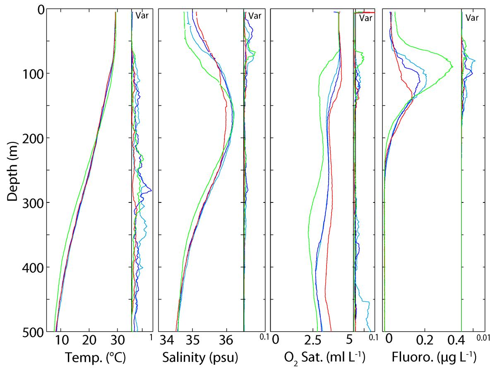

**Figure 8.4.1c.** Means and variances of temperature, salinity, O2 saturation, and fluorometry were calculated from shipboard deep-water (~ 500 m) CTD casts taken around each island during ASRAMP 2002, 2004, and 2006 for Tutuila and Aunu`u (TUT), Ofu, Olosega, and Ta`u (MAN), Rose (ROS) and Swains (SWA).

# **8.4.2 Seasonal Variation**

In the previous section, the spatial variability of the vertical structure of water properties around the American Samoa Archipelago was described. Those observations characterized the oceanographic and water quality environment influencing the coral reef ecosystems around the islands and atolls at the times of the surveys, which were conducted only during the austral summer months. In this section, satellite remote sensing observations are used to explore the seasonal variability of key sea surface properties (temperature, Chl-a, and wind speed) across the region in an effort to better understand the range of environmental conditions influencing these reef ecosystems.

Mean sea surface temperature (SST) climatologies for the American Samoa region (10°–15° S; 167°–173° W) are presented for each season (summer [Jan–Mar], fall [Apr–Jun], winter [Jul–Sep], and spring [Oct–Dec]) to examine the seasonal temperature variability across the archipelago (Fig. 8.4.2a). This figure shows an annual temperature range across the region of ~ 3°C; warm temperatures were observed during summer months (~ 29°–30°C) with cooler temperatures during the winter (~ 27°–28°C). During fall, winter, and spring, a pronounced SST gradient occurred between 12° and 13° S, with warmer waters observed to the north of this gradient and cooler waters observed to the south. The gradient weakened and became more diffuse during the summer months; however, north-south differences in SST are still

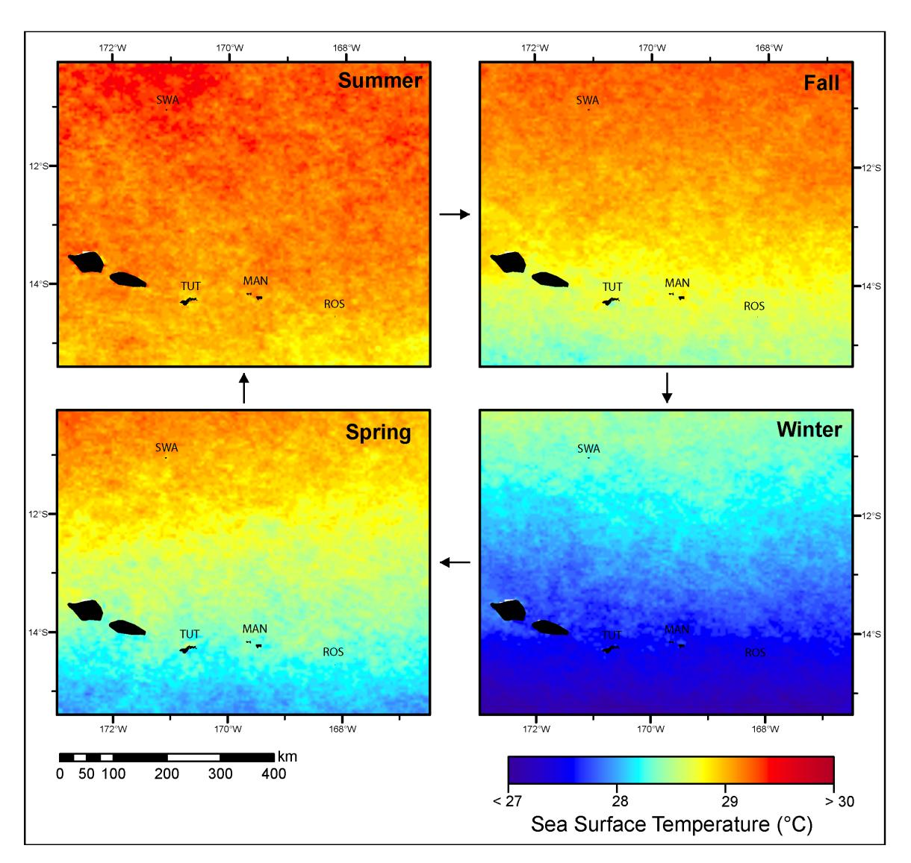

**Figure 8.4.2a.** Seasonal SST climatology for the American Samoa region (10°–15° S, 167°–173° W). Data is from NOAA Pathfinder 5.0 SST seasonal climatology from 1985 to 2001 produced by National Oceanographic Data Center (NODC; http://www.nodc.noaa.gov/sog/pathfinder4km). Seasons are defined as: Summer = Jan– Mar, Fall = Apr–Jun, Winter = Jul–Sep, and Spring = Oct–Dec. Island abbreviations: TUT = Tutuila, MAN = Manu`a, ROS = Rose, and SWA = Swains.

apparent. As shown in Figure 8.4.2a, Swains is sufficiently far north to lie within a different temperature regime, which is typically 0.5°–1.5°C warmer throughout the year than the waters surrounding the other islands of the archipelago.

Mean climatological Chl-a concentration showed seasonal variability in the American Samoa region (Fig. 8.4.2b), with the lowest concentrations occurring during the austral summer and the highest concentrations during the winter. Latitudinal gradients of Chl-a concentration were absent in the summer, weak in the fall, and relatively strong during the spring and winter, with a south to north increase in Chl-a occurring at ~ 11° S. Swains is located in the middle of this seasonal Chl-a gradient and was in a region of relatively high productivity during the winter and spring. The other islands in the archipelago are located well south of this Chl-a gradient and are surrounded by generally oligotrophic (low productivity) waters throughout the year. When examining specific island effects, it appears clearly that Chl-a

values increase to the southwest of Tutuila and Samoa, which may be caused by terrigenous input or topographically induced upwelling influencing local productivity. Rose was observed to have relatively high Chl-a throughout the year; however, this was perhaps an artifact of enhanced reflectance associated with the lagoon, aliasing ocean color in the area.

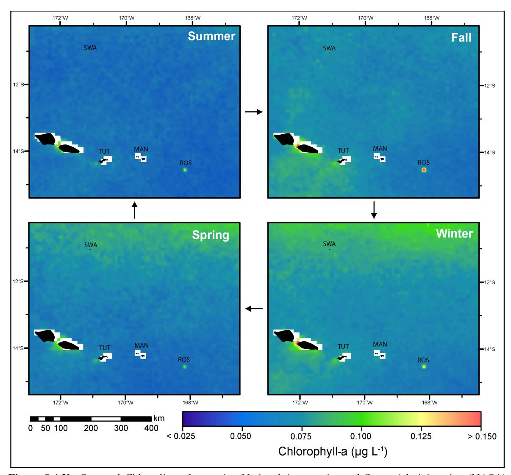

**Figure 8.4.2b.** Seasonal Chl-a climatology using National Aeronautics and Space Administration (NASA) SeaWiFS imagery for the American Samoa region (10°–15° S, 167°–173° W; [http://oceancolor.gsfc.nasa.gov/](http://oceancolor.gsfc.nasa.gov/SeaWiFS) [SeaWiFS](http://oceancolor.gsfc.nasa.gov/SeaWiFS)). Climatology from 2000 to 2003 produced by Pacific Islands Fisheries Science Center Coral Reef Ecosystem Division (CRED) and NODC for OceanEye project. Seasons are defined as: Summer = Jan–Mar, Fall = Apr–Jun, Winter = Jul–Sep, and Spring = Oct–Dec. Island abbreviations: TUT = Tutuila, MAN = Manu` a, ROS = Rose, and SWA = Swains.

Mean climatological wind speed around the American Samoa region showed seasonal differences with greater speeds in the fall (7–8 m s-1) and winter (8–9 m s-1) compared to winds in the spring (6–7 m s-1) and summer (5–6 m s-1; Fig. 8.4.2c). Overall, winds in the American Samoa region decrease in strength towards the equator. Southeast trades are the dominant winds in this area; however, because of the northerly geographic location of Swains, the island is subject to both weaker annual mean wind speeds, as well as lower variability throughout the year. Weaker mean wind speeds in the vicinity of Swains would be expected to locally increase upper ocean and nearshore water temperatures by decreasing vertical

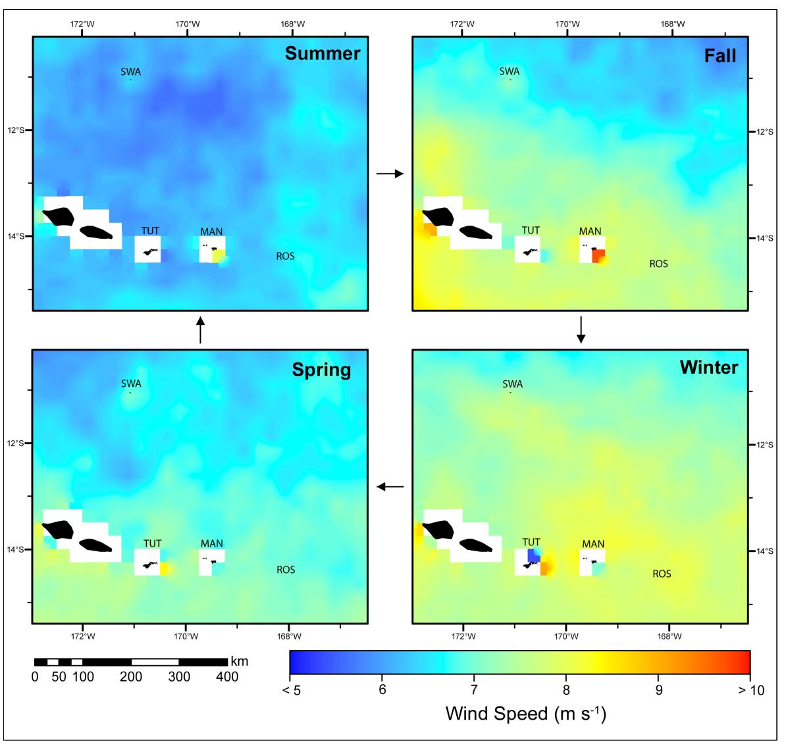

**Figure 8.4.2c.** Seasonal wind climatology using NASA QuikScat Scatterometer Winds for the American Samoa region (10°–15° S, 167°–173° W; [http://winds.jpl.nasa.gov/missions/quikscat/index.cf](http://winds.jpl.nasa.gov/missions/quikscat/index.cfm)m).Climatology from 2000 to 2003 produced by CRED and NODC for OceanEye project. Seasons are defined as: Summer = Jan–Mar, Fall = Apr–Jun, Winter = Jul–Sep, and Spring = Oct–Dec. Island abbreviations: TUT = Tutuila, MAN = Manu` a, ROS = Rose, and SWA = Swains.

#### wind and wave-induced mixing.

Satellite-derived seasonal climatologies for SST, Chl-a, and wind speed were highly variable in the region surrounding American Samoa. Winter conditions were characterized by stronger winds, increased surface productivity, and decreased SST, all of which show strong latitudinal gradients. In contrast, summer conditions exhibit weak latitudinal gradients with generally weak winds, low surface productivity, and increased SST across most of the region.

Satellite-derived climatologies of oceanographic and meteorological data provide a regional and seasonal context for which in situ observations can be interpreted. Although in situ data

from each island are discrete with respect to both space and time, incorporating remotely sensed climatological data allows, to a limited extent, for space-time discrepancies to be resolved and general conclusions to be made regarding interisland environmental variability.

Swains is geographically separate from the rest of American Samoa resulting in appreciably different physical oceanographic conditions, as seen via in situ observations and satellite climatologies. However, each of the three ASRAMP surveys occurred during late austral summer (February–March), when minimal gradients in climatological SST and wind were observed. Presumably, in situ oceanographic condition disparities at Swains compared with the rest of the islands in American Samoa would be accentuated during austral winter, when latitudinal gradients in SST and wind are more pronounced.

Conversely, mean in situ Chl-a concentrations in American Samoa seem to be principally dependent on individual island characteristics rather than differences in geographical distribution. For example, Rose and Swains, nearly equal in size, have similar mean chlorophyll values, despite the substantial difference in latitude between them. Island means and interisland comparisons would undoubtedly change if ASRAMP surveys had occurred during the austral winter, when a pronounced north-south gradient and an overall increase in Chl-a are observed (Chapter 7, Fig. 7.3d). While satellite-derived data products are an excellent tool for illustrating temporal changes in Chl-a surface concentrations in the greater American Samoa region, they typically are not dependable for nearshore environments because of complex ocean color issues related to bottom reflectance. The measured in situChla values, for example, are orders of magnitude greater than satellite-derived climatological values. This demonstrates the significance of using high-resolution (spatial) in situ subsurface and nearshore data, in addition to remotely sensed data, to best describe and understand the oceanographic and water quality properties influencing the reef ecosystems around each island/atoll in the region.

#### **8.5 Coral and Coral Disease**

# **8.5.1 Coral Surveys**

In all survey years, visual estimates recorded by towed divers indicated the highest coral cover was observed around Swains (Fig. 8.5.1a; Table 8.5.1a). Rose and Ta`u consistently showed the next highest coral cover values in all survey years. The relative ranking of Tutuila and Ofu and Olosega with regard to coral cover values varied among survey years, though mean coral cover around Tutuila exceeded the coral cover around Ofu and Olosega during 2 of the 3 survey years. Thus, the ranking of island-wide coral cover among American Samoan Islands and atolls, as determined through towed-diver surveys, is best described as Swains > Rose ≥ Ta`u > Tutuila > Ofu and Olosega.

Based on towed-diver surveys, mean island-wide live coral cover values around all islands declined from 2002 to 2004 (Fig. 8.5.1a; Table 8.5.1a). Between 2004 and 2006, mean live coral cover again declined around Tutuila, Ta`u, and Rose, but increased at Ofu and Olosega and Swains (although not to 2002 values). However, these data are based on visual estimates, which are subject to observer variability between survey years. Also, while every effort is made to replicate tracklines between survey years, slight differences in the lateral surface

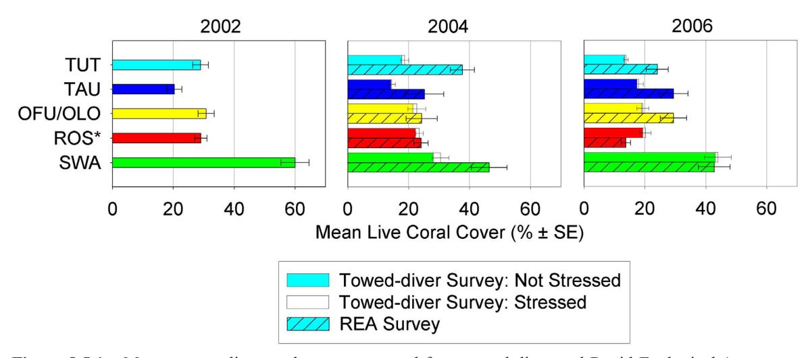

**Figure 8.5.1a.** Mean percent live coral cover measured from towed-diver and Rapid Ecological Assessment (REA) surveys around Tutuila and Aunu`u (TUT), Ofu and Olosega (OFU/OLO), Ta`u (TAU), Rose (ROS), and Swains (SWA) during ASRAMP 2002, 2004, and 2006. Note that lagoon data are not presented for Rose; only forereef data are presented for better comparison with the other islands that lack a lagoon.

position of the towboat can translate to the divers being in different depth strata between survey years. See depth histograms in towed-diver survey track figures in chapter texts (e.g., Chapter 4, Figs. 4.5.1a, 4.5.1d, and 4.5.1j). This effect is particularly pronounced at Rose and Swains, which have steeply sloping forereefs. Therefore, the apparent net decline in coral cover at all locations between 2002 and 2006 should be interpreted with caution.

**Table 8.5.1a.** Mean percent live coral cover values (as presented in Fig. 8.5.1a).N.A. = not available

| Mean Live Coral Cover |      |            |                    |          |  |  |  |
|-----------------------|------|------------|--------------------|----------|--|--|--|
| Island                | Year | REA Survey | Towed-diver Survey |          |  |  |  |
|                       |      |            | Unstressed         | Stressed |  |  |  |
| Tutuila               | 2002 | N.A.       | 29.0               | N.A.     |  |  |  |
| Ofu/Olo               | 2002 | N.A.       | 20.3               | N.A.     |  |  |  |
| Ta`u                  | 2002 | N.A.       | 30.8               | N.A.     |  |  |  |
| Rose*                 | 2002 | N.A.       | 29.1               | N.A.     |  |  |  |
| Swains                | 2002 | N.A.       | 60.0               | N.A.     |  |  |  |
| Tutuila               | 2004 | 37.7       | 18.7               | 4.9      |  |  |  |
| Ofu/Olo               | 2004 | 25.3       | 14.5               | 2.4      |  |  |  |
| Ta`u                  | 2004 | 24.3       | 22.7               | 5.8      |  |  |  |
| Rose*                 | 2004 | 23.6       | 23.5               | 5.6      |  |  |  |
| Swains                | 2004 | 46.5       | 30.5               | 7.8      |  |  |  |
| Tutuila               | 2006 | 24.1       | 13.7               | 3.2      |  |  |  |
| Ofu/Olo               | 2006 | 29.4       | 17.9               | 3.3      |  |  |  |
| Tau                   | 2006 | 29.7       | 19.3               | 2.0      |  |  |  |
| Rose*                 | 2006 | 13.8       | 20.1               | 4.5      |  |  |  |
| Swains                | 2006 | 42.8       | 43.9               | 1.9      |  |  |  |

*\*Forereef only*

"Stressed" is an inclusive category including coral that may exhibit the effects of bleaching, disease, sedimentation or predation. It is not usually possible to clearly determine the cause of stress while being towed above the benthos. During 2004 and 2006, the survey years in which the stressed coral percent cover was estimated, island-wide mean values suggested that 1.9–7.8% of live coral exhibited some form of stress. Swains showed the extremes of this range, with the highest values of stressed coral in 2004 (7.8%) but the lowest values in 2006 (1.9%; Fig. 8.5.1a; Table 8.5.1a). Between 2004 and 2006, stress values declined at all locations except Ofu and Olosega, which showed a slight increase. As with coral cover, these values are based on visual estimates, which are subject to observer variability between survey years.

During 2004 and 2006, the years in which quantitative surveys were conducted, the REA methodologies also indicated the highest island-wide mean live coral percent cover to be around Swains (Fig. 8.5.1a; Table 8.5.1a). The relative ranking of the other islands with regard to coral cover varied between survey years and also varied from that determined during towed-diver surveys. Thus, except for the highest coral cover being found at Swains, it is difficult to generalize archipelago-wide trends of coral cover from data collected during REA surveys. For all islands and survey years, except for Swains in 2006, mean estimates of island-wide live coral percent cover derived from REA surveys were higher than mean estimates derived from towed-diver surveys. Because towed-diver surveys include softbottom substrate (e.g., sand) while site-specific REA surveys target hard-bottom substrate, and because towed divers survey substantially more area than free-swimming divers during site-specific REA surveys, the estimates derived from towed-diver surveys probably provide a better measure of mean coral cover across large expanses of habitat than do site-specific surveys. Even though data from the two methods are not strictly comparable, they can be used to make broad generalizations that complement each other. The towed-diver surveys are designed to obtain estimates of benthic composition (including both hard- and soft-bottom substrates) over broad spatial scales, whereas the REA surveys are site specific and designed to better detect changes at target locations.

Between 2004 and 2006, REA surveys showed a decline in live coral percent cover around Tutuila, Rose, and Swains, and an increase around Ofu and Olosega, and Ta`u. The declines around Tutuila and Rose, and the increase at Ofu and Olosega, are congruent with the changes indicated by towed-diver surveys over the same time period and are, therefore, more likely to represent an accurate trend. While the declines in coral cover around Tutuila and Rose appear to be substantial (13.6% and 9.1%, respectively), these data must also be interpreted with caution, as different methods of estimating coral cover were used in 2004 and 2006 (visual estimates and line intercept method, respectively), and estimates derived from the two methods can vary substantially. The line point intercept method will be retained on future surveys to facilitate comparability of data over time.

During both 2004 and 2006 surveys, the total number of coral genera recorded for all REA sites at each island showed the same pattern; the highest number of coral genera was found around Tutuila, followed by Ofu and Olosega, Ta`u, Rose, and Swains (Fig. 8.5.1b). Summing observations over both years, at least 37 scleractinian genera were observed around Tutuila, 34 around Ofu and Olosega, 34 around Ta`u, 23 around Rose, and 18 around Swains (Table

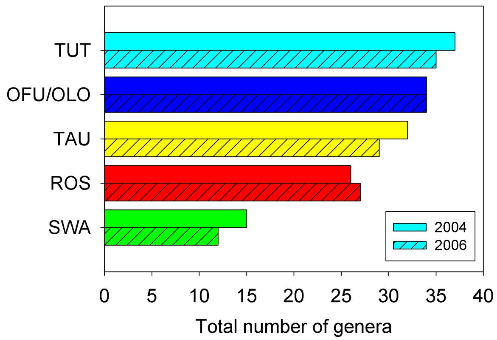

**Figure 8.5.1b.** Number of coral genera recorded at all REA sites during ASRAMP 2004 and 2006 for Tutuila and Aunu`u (TUT), Ofu and Olosega (OFU/OLO), Ta`u (TAU), Rose (ROS) and Swains (SWA).

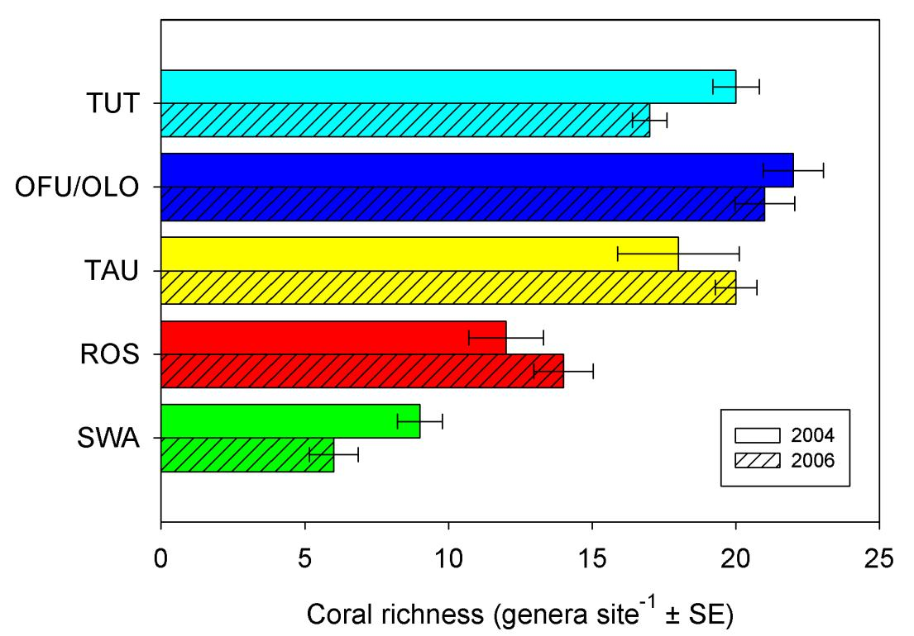

**Figure 8.5.1c.** Mean coral generic richness per site for REA surveys conducted during ASRAMP 2004 and 2006 around Tutuila and Aunu`u (TUT), Ofu and Olosega (OFU/OLO), Ta`u (TAU), Rose (ROS) and Swains (SWA).

**Table 8.5.1b.** Number of colonies of each coral genus (or group of similar genera) enumerated during 2004 and 2006 REA surveys.Yellow boxes indicate no colonies of these taxa were observed.

| Taxa                              | TUT 04 | TUT 06 | OFU 04 | OFU 06 | TAU 04 | TAU 06 | ROS 04 | ROS 06 | SWA 04 | SWA 06 |
|-----------------------------------|--------|--------|--------|--------|--------|--------|--------|--------|--------|--------|
| Acanthastrea                      | 10     | 4      | 14     | 10     | 9      | 12     |        | 16     | 1      |        |
| Acropora                          | 414    | 191    | 67     | 98     | 187    | 207    | 179    | 157    | 3      |        |
| Astreopora                        | 172    | 65     | 169    | 162    | 364    | 489    | 196    | 120    |        |        |
| Coscinaraea                       | 53     | 23     | 7      | 3      | 11     | 3      | 15     | 20     | 11     |        |
| Cyphastrea                        | 15     | 5      | 10     | 16     | 6      | 22     | 45     | 38     |        |        |
| Diploastrea                       | 8      | 2      | 0      | 4      | 5      |        |        |        |        |        |
| Echinophyllia                     | 24     | 14     | 10     | 5      |        | 4      | 2      | 3      |        |        |
| Echinopora                        | 95     | 29     | 13     | 14     | 6      | 5      |        | 1      |        | 1      |
| Favia                             | 144    | 64     | 271    | 108    | 344    | 76     | 499    | 287    | 19     | 8      |
| Favites                           | 44     | 29     | 61     | 190    | 105    | 304    | 7      | 1      |        |        |
| Fungia/Cycloseris                 | 141    | 107    | 31     | 63     | 6      | 22     | 40     | 30     | 61     | 6      |
| Galaxea                           | 194    | 115    | 285    | 215    | 79     | 112    |        | 1      |        |        |
| Gardineroseris                    | 1      | 8      |        | 3      |        |        |        |        |        |        |
| Goniastrea                        | 70     | 19     | 509    | 581    | 183    | 320    | 3      | 3      |        | 1      |
| GonioporaAlveopora                | 27     | 26     | 6      | 2      | 1      |        | 2      | 2      |        |        |
| Heliopora                         |        |        | 2      | 3      |        | 5      |        |        | 8      | 2      |
| Hydnophora                        | 68     | 36     | 13     | 16     | 5      | 292    | 5      | 6      | 2      |        |
| Leptastrea                        | 452    | 133    | 145    | 188    | 138    | 1      | 43     | 25     |        |        |
| Leptoseris/Pachyseris             | 92     | 31     | 6      | 7      | 2      | 8      | 30     | 15     | 38     | 12     |
| Lobophyllia/Symphyllia            | 186    | 27     | 6      | 10     | 2      | 8      | 7      | 2      |        |        |
| Merulina/Scapophyllia             | 23     | 2      | 8      |        | 5      |        | 2      |        |        |        |
| Millepora                         | 29     | 8      | 23     | 7      | 1      | 2      | 1      |        |        |        |
| Montastrea                        | 584    | 337    | 153    | 289    | 102    | 218    | 711    | 514    |        |        |
| Montipora                         | 2123   | 569    | 832    | 1026   | 627    | 547    | 631    | 367    | 1037   | 1642   |
| Mycedium                          | 2      | 2      | 2      | 5      |        | 8      |        |        |        |        |
| Oulophyllia                       |        |        | 23     | 3      | 16     | 26     |        |        |        |        |
| Palythoa/Zoanthus                 | 90     | 7      | 7      | 4      | 11     | 26     | 1      |        | 1      |        |
| Pavona                            | 804    | 412    | 76     | 190    | 40     | 116    | 148    | 121    | 19     | 40     |
| Platygyra/Leptoria                | 65     | 30     | 257    | 186    | 91     | 108    | 2      | 1      |        |        |
| Plesiastrea                       | 1      |        |        |        |        |        |        |        |        |        |
| Pocillopora                       | 461    | 305    | 306    | 451    | 164    | 203    | 1402   | 1375   | 1527   | 859    |
| Porites                           | 857    | 366    | 462    | 208    | 300    | 258    | 314    | 283    | 138    | 97     |
| Psammocora                        | 82     | 43     | 23     | 9      | 1      | 6      | 41     | 22     | 53     | 8      |
| Sandalolitha/Halomitra/Herpolitha | 6      | 3      | 2      | 5      | 7      | 2      |        |        |        |        |
| Sinularia/Lobophytum/             |        |        |        |        |        |        |        |        |        |        |
| Sarcophyton/Cladiella             | 854    | 392    | 228    | 60     | 38     | 56     | 368    | 312    |        |        |
| Stylaster/Distichopora            |        |        |        |        |        |        |        | 5      |        | 16     |
| Stylocoeniella                    | 1      |        | 1      |        |        |        |        | 10     |        |        |
| Stylophora                        | 4      | 2      |        |        |        |        |        |        | 154    | 47     |
| Tubastrea                         | 1      |        |        |        |        |        |        |        |        |        |
| Turbinaria                        | 1      | 12     | 7      | 44     | 16     | 4      | 1      |        |        |        |

8.5.1b). This trend is in agreement with the theory of Island Biogeography; the larger the area, the greater number of species occur. Although the relative proportions of the number of coral genera are not the same as the relative proportions of banktop area among islands (Fig. 8.1b), the same trend holds from "most" to "least." However, the evenness with which these genera are distributed at REA sites around the islands varied slightly from this pattern (Fig. 8.5.1c). Although Ofu and Olosega had fewer genera than Tutuila (Fig. 8.5.1b), a higher number of genera per site were observed during both 2004 and 2006 around Ofu and Olosega than around Tutuila, indicating greater generic evenness around Ofu and Olosega than around Tutuila.

Using the number of colonies enumerated at REA sites as a metric, some taxa were ubiquitous and abundant (e.g., *Montipora, Pocillopora, Porites*), some were ubiquitous but uncommon (e.g., *Acanthastrea*, *Leptoseris/Pachyseris, Psammocora*), and others ranged from relatively common (e.g., *Astreopora, Favia, Leptastrea*) to rare (e.g., *Gardineroseris*, *Mycedium, Plesiastrea, Stylocoeniella, Tubastrea*) at the islands where they occurred (Table 8.5.1b). In Table 8.5.1b, the yellow boxes indicate the absence of observed colonies and provide a visual aide for island-wide variability in generic diversity and abundance. Figure 8.5.1d shows in graphic form the relative abundance of primary coral genera during REA surveys during both 2004 and 2006. With the exception of *Acropora*, all the genera shown represent > 10% of colony abundance in at least one of the islands in American Samoa (Fig. 8.5.1d).

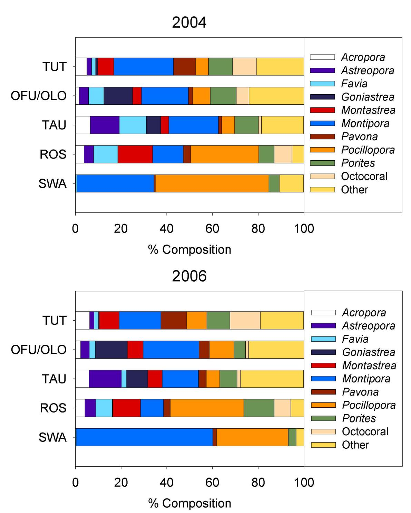

**Figure 8.5.1d.** Relative abundance of coral genera from ASRAMP 2004 and 2006 REA surveys around Tutuila and Aunu`u (TUT), Ofu and Olosega (OFU/OLO), Ta`u (TAU), Rose (ROS), and Swains (SWA).

*Montipora* numerically dominated all locations with the exception of Rose (both years) and Swains (2004), where *Pocillopora* dominated. The rank order of generic abundance thereafter varies among islands, though generally *Porites*, *Pocillopora*, *Astreopora*, or *Goniastrea* are the next most abundant genera.

Figure 8.5.1e shows island-wide mean coral colony density per site at each island/atoll from

REA surveys during ASRAMP 2004 and 2006. Mean colony densities were greatest around Ofu and Olesega (~ 9 colonies m-2) and Ta` u (~ 7.5 colonies m-2) and least around Tutuila (~ 5 colonies m-2). Mean colony densities around both Rose and Ta`u appeared to increase somewhat between survey years. Increased density can result from larval recruitment, fragmentation, and fissioning (partial mortality). However, it should be noted that site ROS-23 was not surveyed in 2006 because of strong current, and that transect deployment at TAU-10 was shifted in 2006 relative to 2004; 2004 transects were occasionally deployed over habitats with partial composition of sand, whereas 2006 transects were more strictly deployed over hard substrates. These between-year variations in the assemblage of sites or substrate surveyed may contribute to the apparent difference in mean coral densities observed around Rose and Ta`u.

Figure 8.5.1e also shows colony size distributions around each island/atoll from REA surveys during ASRAMP 2004 and 2006. Colonies around Tutuila and Swains appear to have undergone a general shift towards smaller size classes. However, as discussed elsewhere in the individual chapter texts, field judgments regarding the boundaries of individual colonies are prone to variability among observers because of the highly clonal nature of most coral taxa. In this vein, it is noteworthy that Tutuila and Swains were surveyed by two different coral biologists in 2004 and 2006, whereas one of the coral biologists conducting 2004 surveys also collected the majority of 2006 size class data at Ofu, Olosega, Ta`u, and Rose. Caution must therefore be exercised when examining datasets collected by different observers around Tutuila and Swains. At Ofu, Olosega, Ta`u, and Rose, where the same observer recorded most of the size data in both years, size class distributions did not change substantially between survey years.

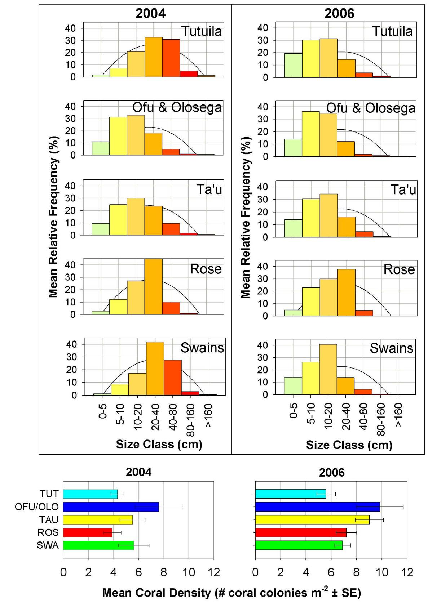

**Figure 8.5.1e.** Coral colony size class distributions and densities from ASRAMP 2004 and 2006 REA surveys around Tutuila and Aunu`u (TUT), Ofu and Olosega (OFU/OLO), Ta`u (TAU), Rose (ROS), and Swains (SWA).

# **8.5.2 Coral Disease Surveys**

Sixty-two coral disease surveys, totaling 25 375 m2 were conducted around Tutuila, Ofu, Olosega, Ta`u, Swains, and Rose. Within this area, an estimated total of 192 850 colonies were examined. Except for two lagoon surveys conducted at Rose, all belt transects were placed along forereef communities at depths ranging from 10 to 15 m. Within this context, a total of 352 individual cases of coral bleaching and disease, in addition to 217 cases of *Acanthaster* and *Drupella* predation, were enumerated. Disease conditions occurred at all islands, but not at all sites. Sixty-three percent of the sites surveyed exhibited disease, with Rose, Ta`u and Swains reporting cases at 81%, 88%, and 100% of the sites surveyed, respectively. Comparatively, only 55% of sites surveyed around Tutuila, Ofu, and Olosega exhibited the conditions mentioned above.

During the ASRAMP 2006 surveys, at least four disease states (i.e., bleaching, growth anomalies, band disease, and 'other lesions') with the potential for more were observed on corals in American Samoa. This is low compared to the nearly 30 diseases states reported for the Caribbean and western Atlantic (Green and Bruckner, 2000; Weil, 2004). Our surveys also revealed that the mean disease prevalence for all 62 sites combined was 0.34% (SE 0.1). This number is at least one order of magnitude lower than those reported for either the Caribbean or the Great Barrier Reef (Weil, 2004; Willis, 2004). Distribution and overall mean prevalence of disease varied greatly. Figure 8.5.2a shows overall prevalence of disease and predation; predation was highest at Swains, but overall disease prevalence was the lowest, 0.04% (SE 0.03), for all islands surveyed. The highest overall disease prevalence, 0.96% (SE 0.6), was recorded at Rose. At Tutuila, Ofu and Olosega, and Ta`u, disease prevalence values were moderately low: 0.12% (SE 0.04), 0.05% (SE 0.03), and 0.1% (SE 0.03), respectively (Fig. 8.5.2a; Vargas-Ángel et al., in prep.).

Of the ~ 45 different scleractinian coral genera enumerated during the ASRAMP REA surveys, 15 exhibited signs of disease and predation. Figure 8.5.2b illustrates the percentage of coral genera affected by disease and predation derived from the 2006 disease survey data. The greatest number of afflicted genera (9) was detected around Ta`u, Ofu, and Olosega, contrasted by only 6 at Swains. Around Tutuila, 7 different coral genera exhibited disease and predation, compared to 8 at Rose. Figure 8.5.2b also shows that only a limited number of coral genera were disproportionately affected by disease and predation at the study locations. These patterns may be dictated by host/prey and predator abundance, as well as modes of disease transmission, pathogen life history and virulence. In the American Samoa Archipelago, the rank order of coral generic propensity to disease and predation appears to be *Montipora*, *Pocillopora*, and *Porites*. With respect to other taxa, the rank order varies among islands, although *Acropora*, *Astreopora*, and *Montastrea* appear to be the next more commonly afflicted coral genera. Trends like these suggest that the ecological impacts of disease and predation may be more severe in populations of infrequent or rare coral taxa.

Of the 352 cases of disease itemized in this study, the category 'other lesions' represented 75.3%. Around Rose alone, 98% of lesions involved this condition affected, in decreasing order of importance, corals in the genera Favia, Montastrea, and Porites. Comparatively, 'other lesions' represented only 30% of cases for Tutuila and Ta`u combined. 'Other lesions' were not encountered at any of the sites surveyed around Ofu and Olosega. Lesions involving skeletal

growth anomalies represented 13.3% of all disease cases. Skeletal growth anomalies were also detected around all islands, but affected predominantly corals in the genera Acropora and Astreopora. Within colonies of Acropora, the greatest mean occurrence of growth anomalies was recorded around Ofu and Olosega, particularly on specimens of A. abrontanoides and A. cytherea. Coral bleaching was also detected around all islands; bleaching represented 9.4% of all disease cases and was most commonly observed around Ofu and Olosega. All lesions were small and focal, and severity was mild. Bleaching occurred most commonly on Porites, Montastrea, and Montipora. Lesions involving tissue loss represented 1.7% of all disease cases; a total of 6 instances were enumerated for all islands combined. Acroporid acute tissue loss (a.k.a. white syndrome) was registered at Tutuila and Rose only. Finally, black band disease was the least common type of lesion, with 1 case detected among the 62 sites surveyed; estimated prevalence was 0.02% (Vargas-Ángel et al., in prep.). Acanthaster and Drupella predation were also ubiquitous, with Rose exhibiting 58% of cases and the majority of these occurred on colonies of Pocillopora. Acanthaster and Drupella predation were also common around Swains, where 34% of cases were encountered mainly on plate-like colonies of Montipora and Pocillopora. The remaining cases were observed around Tutuila, Ofu, and Olosega. No Acanthaster and Drupella predation were observed around Ta`u (Vargas-Angel et al., in prep.).

Disease prevalence and predation, together with other coral reef ecosystem bio-indicators, such as changes in live coral percent cover, diversity, size class distribution, and changes in abundance and diversity of algae, fish density and biomass, and key macroinvertebrate assemblages, may provide proxies to ecosystem integrity and health. Although it appears

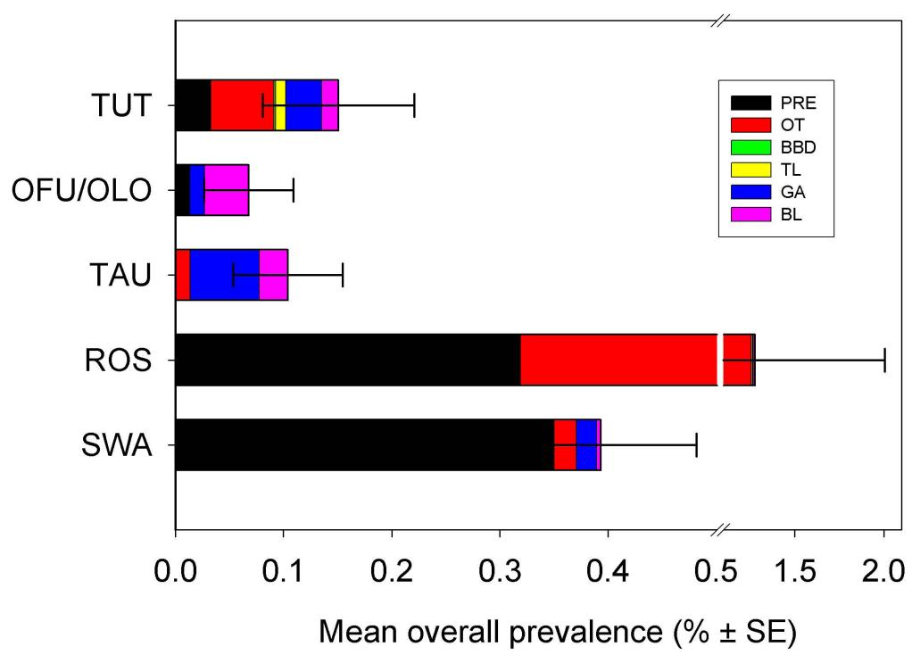

**Figure 8.5.2a**. Mean overall prevalence of coral disease and predation determined from REA surveys during ASRAMP 2006 around Tutuila and Aunu`u (TUT), Ta`u (TAU), Ofu and Olosega (OFU), Rose (ROS), and Swains (SWA). PRE = Acanthaster and/or Drupella predation; OT = other lesions, including hyperpigmented irritations and discolorations other than bleaching; BBD = black band disease; TL = tissue loss; GA = skeletal growth anomalies; and BL = bleaching.

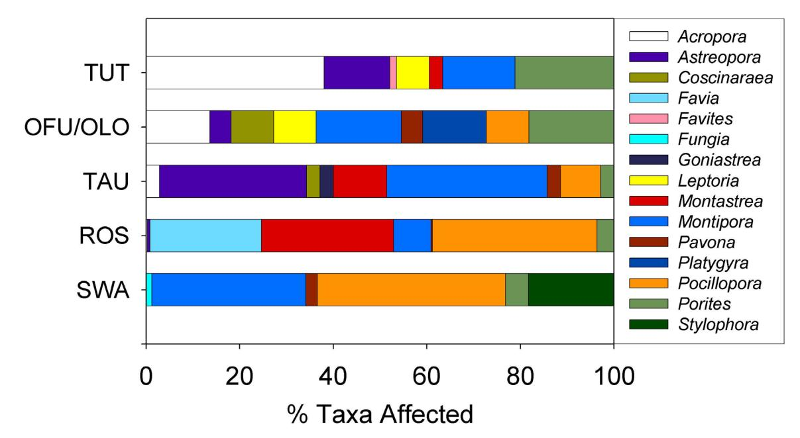

**Figure 8.5.2b.** Percent scleractinian coral taxa affected by disease and predation, based on the ASRAMP 2006 REA surveys around Tutuila and Aunu`u (TUT), Ofu and Olosega (OFU/OLO), Ta`u (TAU), Rose (ROS), and Swains (SWA).

that mean overall disease prevalence and predation were low in the American Samoa Archipelago, until extensive surveys are conducted and more is known about the etiology of Indo-Pacific coral diseases, it is difficult to compare prevalence levels in American Samoa with other parts of the Indo-Pacific.

Disease and predator outbreaks are among several other recurrent natural disturbances of corals including episodic sea warming and storms. Coral disease may be exacerbated by human activities, which have been increasing in Indo-Pacific coral reef ecosystems, including those in the American Samoa Archipelago (Craig et al., 2005). At Tutuila, for example, deforestation and urban development along the south-facing shores, in concert with increased levels of rainfall, have the potential for adversely affecting coastal water quality and therefore the well being of nearshore coral communities. In addition to detrimental direct effects of siltation stress on coral reefs (see review by Rogers, 1990), equally important is the potential for increased occurrence and prevalence of coral disease, such as those observed at Rose. 'Other lesions', particularly hyperpigmented irritations with algal overgrowth, reached the greatest levels of prevalence for any disease (4.9%) at site ROS-23. It has been proposed that the iron leaching from the corroding metal debris scattered during the 1993 Jin Shiang Fa shipwreck is likely responsible for stimulating and maintaining elevated cover of benthic turf algae/cyanobacteria at the wreck and neighboring sites at Rose (Green et al., 1997; Schroeder et al., in prep.). Little is known about the secondary effects of this disturbance on adjacent and neighboring sites. However, it is plausible that the conditions mentioned above are connected to the prominent number of cases of coral irritations and algal overgrowth enumerated at Rose. Further research on this topic is needed.

#### **8.6 Algae**

# **8.6.1 Algal Surveys**

During the ASRAMP 2002 and 2004 survey periods, the towed-diver benthic survey protocol aggregated observations of turf and macroalgae into a single category. In contrast during ASRAMP 2006, macroalgae were recorded as a distinct category and turf algae were not recorded. Therefore, it is not surprising to see a two- to threefold decrease in algal cover around Tutuila, the Manu`a Islands, and Rose in 2006 over what was recorded in previous years (Fig. 8.6.1a).

This does not indicate that macroalgal cover decreased across American Samoa from 2002 to 2006. In fact, an increase in macroalgal cover is evident around Swains (Fig. 8.6.1a) despite the change in protocol to no longer include turf algae. The percent cover of macroalgae or macroalgae and turf algae was generally similar among all islands in all years (15–30% cover when turf algae and macroalgae were combined; typically < 10% cover when macroalgae were considered alone); the main exceptions being a higher turf and macroalgae cover around Rose in 2002 (~ 40%) and a higher macroalgae cover around Swains in 2006 (~ 40%) than at other islands. The reason for the observed high mean macroalgae percent cover around Swains in 2006 is not clear, although it could reflect the perturbations to the ecosystem at Swains caused by both coral breakage associated with tropical cyclones Heta (observed) in 2004 and Percy and Olaf in 2005, and the ongoing increase of crown-of-thorns seastar (COTS) populations observed around Swains in both 2004 and 2006.

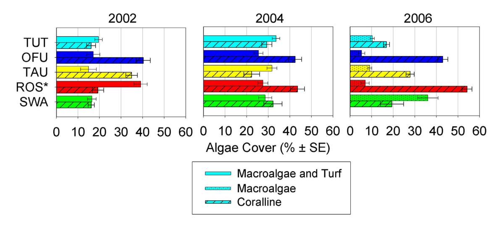

**Figure 8.6.1a.** Percent cover of algal functional groups from towed-diver surveys in the American Samoa Archipelago during ASRAMP 2002, 2004 and 2006 for Tutuila and Aunu`u (TUT), Ofu and Olosega (OFU/OLO), Ta`u (TAU), Rose (ROS forereef only) and Swains (SWA). Note that lagoon data are not presented for Rose; only forereef data are presented for better comparison with the other islands that lack a lagoon.

During ASRAMP 2002, the Manu`a Islands (Fig. 8.6.1a) appeared to have a substantially higher crustose coralline algae percent cover (> 30%) than Tutuila, Rose, or Swains (all < 20%). During ASRAMP 2004, crustose coralline algal cover appeared similar at all islands and ranged from ~ 25% to 45%, with Rose and Ofu and Olosega both having observed values of ~ 45%. During ASRAMP 2006, the crustose coralline algae percent cover around Rose was almost 55%, while other islands ranged from 15% to 45%, with Ofu and Olosega again having ~ 45% cover. Differences among years may be attributed to other benthic organisms covering crustose coralline algae (e.g., macroalgal overgrowth), thereby influencing diver observations.

During ASRAMP 2004, 13 genera of green algae, 27 genera of red algae, 3 genera of brown algae, and 4 algal functional groups were reported from REA sites surveyed across American Samoa (Table 8.6.1a). The number of genera found at each site will increase as detailed taxonomic laboratory analyses at the species level are completed. During 2006, 17 genera of green algae, 32 genera of red algae, 2 genera of brown algae, and 4 algal functional groups were reported. The theory of Island Biogeography states that larger islands will contain greater biodiversity because they generally exhibit a greater number of habitat types. Table 8.6.1a reveals that field surveys around Tutuila, with the largest area of habitat and number of habitat types in American Samoa, documented substantially more algal genera or functional groups than other islands surveyed during both years of field sampling. The three geographically close, high, volcanically derived Manu`a Islands that are situated east of Tutuila exhibited the second highest number of recorded algal genera. The two smallest islands in American Samoa, Rose and Swains (both low, oceanic atoll systems), contained the least amount of algal diversity. Swains had less than half the number of algal genera as Tutuila, which is consistent with the small habitat area and number of habitat types.

**Table 8.6.1a.** Number of green, red, and brown macroalgal genera and functional groups (non-geniculate branched red coralline algae, crustose coralline red algae, turf algae, cyanophytes) reported during in situ surveys around each island or island group in American Samoa during ASRAMP 2004 and 2006 cruises. The number of genera found at each site will increase as detailed taxonomic laboratory analyses are completed. Xs represent genera or functional groups found during 2004, Ys represent genera or functional groups found during 2006.

| ing 2006.                       |                                      |                                     |                                   |                                      |
|---------------------------------|--------------------------------------|-------------------------------------|-----------------------------------|--------------------------------------|
|                                 | Manu`a Islands                    | Rose                                | Swains                            | Tutuila                              |
|                                 | 6 – 2004                             | 6 – 2004                            | 5 – 2004                          | 11 – 2004                            |
| Total # Green Macroalgal Genera | 12 – 2006                            | 12 – 2006                           | 8 – 2006                          | 12 – 2006                            |
|                                 | 12 – total                           | 12 – total                          | 8 – total                         | 14 – total                           |
| Boergesenia                     |                                      |                                     |                                   | X                                    |
| Boodlea                         | XY                                   | Y                                   |                                   | XY                                   |
| Bornetella                      | Y                                    |                                     |                                   |                                      |
| Bryopsis                        | Y                                    | XY                                  |                                   | XY                                   |
| Caulerpa                        | Y                                    | XY                                  | XY                                | XY                                   |
| Chaetomorpha                    |                                      | Y                                   | Y                                 |                                      |
| Chlorodesmis                    | XY                                   | Y                                   |                                   | XY                                   |
| Cladophora                      | Y                                    | Y                                   |                                   | Y                                    |
| Codium                          |                                      |                                     | Y                                 | Y                                    |
| Dictyosphaeria                  | XY                                   | XY                                  | XY                                | XY                                   |
| Halimeda                        | XY                                   | XY                                  | XY                                | XY                                   |
| Microdictyon                    |                                      | XY                                  | XY                                |                                      |
| Neomeris                        | XY                                   | Y                                   |                                   | XY                                   |
| Rhipilia                        |                                      |                                     | XY                                |                                      |
| Tydemania                       | XY                                   |                                     |                                   | X                                    |
| Udotea                          | Y                                    | Y                                   |                                   | Y                                    |
| Valonia                         | Y                                    | XY                                  |                                   | XY                                   |
| Ventricaria                     |                                      |                                     | Y                                 | XY                                   |
| Total # Red Macroalgal Genera   | 10 – 2004 24 – 2006 25 – total | 4 – 2004 13 – 2006 14 – total | 4 – 2004 6 – 2006 7 – total | 24 – 2004 28 – 2006 32 – total |
| Actinotrichia                   | XY                                   | Y                                   |                                   | XY                                   |
| Acrosymphyton                   |                                      |                                     |                                   | X                                    |
| Amansia                         | Y                                    |                                     |                                   |                                      |
| Amphiroa                        | XY                                   | XY                                  |                                   | XY                                   |
| Botryocladia                    |                                      |                                     |                                   | Y                                    |
| Callophycus                     |                                      |                                     |                                   | X                                    |
| Carpopeltis                     | XY                                   |                                     |                                   |                                      |
| Champia                         | Y                                    | Y                                   |                                   | Y                                    |
| Cheilosporum                    | Y                                    | Y                                   |                                   | XY                                   |
| Chrysymenia                     | Y                                    |                                     |                                   | XY                                   |
| Corynocystis                    |                                      |                                     |                                   | XY                                   |
| Dasya                           | Y                                    | Y                                   | Y                                 | Y                                    |
| Dudresnaya                      |                                      |                                     |                                   | X                                    |
| Galaxaura                       | XY                                   | XY                                  | XY                                | XY                                   |
| gelid                           | XY                                   | Y                                   |                                   | XY                                   |
| Gelidiopsis                     | Y                                    | Y                                   | Y                                 | XY                                   |
| Gibsmithia                      | Y                                    |                                     |                                   | XY                                   |
| Gracilaria                      | Y                                    |                                     |                                   |                                      |
| Grateloupia                     | Y                                    | Y                                   |                                   | Y                                    |
| Griffithsia                     |                                      | Y                                   |                                   | Y                                    |
| Haloplegma                      | XY                                   |                                     |                                   | XY                                   |

| Halichyrsis                                                     | Y                                 |                                   |                                   | Y                                 |
|-----------------------------------------------------------------|-----------------------------------|-----------------------------------|-----------------------------------|-----------------------------------|
| Halymenia                                                       |                                   |                                   |                                   | XY                                |
| Hypoglossum                                                     | Y                                 |                                   |                                   | Y                                 |
| Jania                                                           | Y                                 | Y                                 | XY                                | XY                                |
| Laurencia/Chondrophycus                                         | XY                                | X                                 | Y                                 | XY                                |
| Liagora                                                         | X                                 |                                   |                                   | XY                                |
| Lithanophora                                                    |                                   |                                   |                                   | Y                                 |
| Martensia                                                       | Y                                 | Y                                 |                                   | XY                                |
| Peyssonnelia                                                    | XY                                | XY                                | XY                                | XY                                |
| Portieria                                                       | XY                                |                                   |                                   | XY                                |
| Predaea                                                         |                                   |                                   |                                   | XY                                |
| Titanophora                                                     | Y                                 |                                   |                                   | XY                                |
| Trichogloea                                                     |                                   |                                   |                                   | X                                 |
| Tricleocarpa                                                    |                                   |                                   |                                   | XY                                |
| Wrangelia                                                       | Y                                 |                                   | X                                 |                                   |
| Total # Brown Macroalgal Genera                                 | 1 – 2004 2 – 2006 2 – total | 3 – 2004 2 – 2006 3 – total | 2 – 2004 2 – 2006 2 – total | 2 – 2004 2 – 2006 2 – total |
| Dictyota                                                        | Y                                 | XY                                | XY                                | XY                                |
| Lobophora                                                       | XY                                | XY                                | XY                                | XY                                |
| Stypopodium                                                     |                                   | X                                 |                                   |                                   |
| Total # Algal Functional Groups                                 | 3 – 2004 4 – 2006 4 – total | 3 – 2004 4 – 2006 4 – total | 4 – 2004 4 – 2006 4 – total | 4 – 2004 4 – 2006 4 – total |
| non-geniculate branched coralline red algae                     | Y                                 | X                                 | XY                                | XY                                |
| crustose coralline red algae                                    | XY                                | XY                                | XY                                | XY                                |
| turf algae                                                      | XY                                | XY                                | XY                                | XY                                |
| cyanophytes                                                     | XY                                | XY                                | XY                                | XY                                |
| Total # of macroalgal genera or functional groups documented | 43                                | 33                                | 21                                | 52                                |

To gain a sense of which algae were the most common at each island, the percentage of quadrats in which a genus or functional group occurred at a given island within each sampling period was calculated (Table 8.6.1b). These were then added together, and the contribution of each single genus or functional group divided by the total to determine the relative proportion of occurrence for each genus or functional group at each island (Fig. 8.61d). If algal species composition at a single island begins to change temporally, the relative proportion of occurrence of algal genera or functional groups will change.

**Table 8.6.1b.** Percentage of quadrats in which select macroalgal genera or functional groups occurred at each island. Data without parentheses represent 2004, data within parentheses represent 2006. \*The person recording data had difficulty identifying algal genera at Rose in 2006, so these numbers may be incorrect.

|                                             | Ofu            | Olosega          | Ta`u           | Tutuila        | Rose            | Swains         |
|---------------------------------------------|----------------|------------------|----------------|----------------|-----------------|----------------|
| Green Macroalgal Genera                     |                |                  |                |                |                 |                |
| Dictyosphaeria                              | 11.1 (6.7)  | 4.2 (1.7)     | 4.6 (28.1)  | 5.3 (10.8)  | 16.7 (40.8*) | 13.5 (19.8) |
| Halimeda                                    | 22.2 (33.3) | 20.8 (10.0)   | 11.1 (19.8) | 29.6 (38.8) | 37.1 (36.7*) | 1.0 (0)     |
| Microdictyon                                | 0              | 0                | 0              | 0              | 31.9 (91.7*) | 58.3 (51.6) |
| Rhipilia                                    | 0              | 0                | 0              | 0              | 0               | 74.0 (74.0) |
| Red Macroalgal Genera                       |                |                  |                |                |                 |                |
| Peyssonnelia                                | 47.2 (83.3) | 10.4 (58.3)   | 3.7 (79.2)  | 45.8 (43.0) | 2.1 (74.2*)  | 13.5 (20.8) |
| Brown Macroalgal Genera                     |                |                  |                |                |                 |                |
| Lobophora                                   | 30.6 (0)       | 33.3 (0)      | 10.2 (12.5) | 10.2 (6.3)  | 38.2 (74.2*) | 6.3 (16.7)  |
| Algal Functional Groups                     |                |                  |                |                |                 |                |
| turf algae                                  | 97.2 (96.7) | 83.3 (98.3)   | 91.7 (95.8) | 93.9 (92.5) | 83.0 (94.2)  | 85.4 (55.2) |
| crustose coralline red algae                | 97.2 (95.0) | 100.00 (93.3) | 73.2 (88.5) | 76.1 (82.1) | 86.1 (95.0)  | 93.8 (76.0) |
| non-geniculate branched coralline red algae | 0 (3.3)        | 0                | 0              | 1.5 (1.3)   | 45.8 (0*)    | 32.3 (0)    |
| cyanophytes                                 | 30.6 (86.7) | 54.2 (55.0)   | 14.8 (58.3) | 24.2 (12.5) | 62.5 (93.3*) | 46.9 (17.7) |

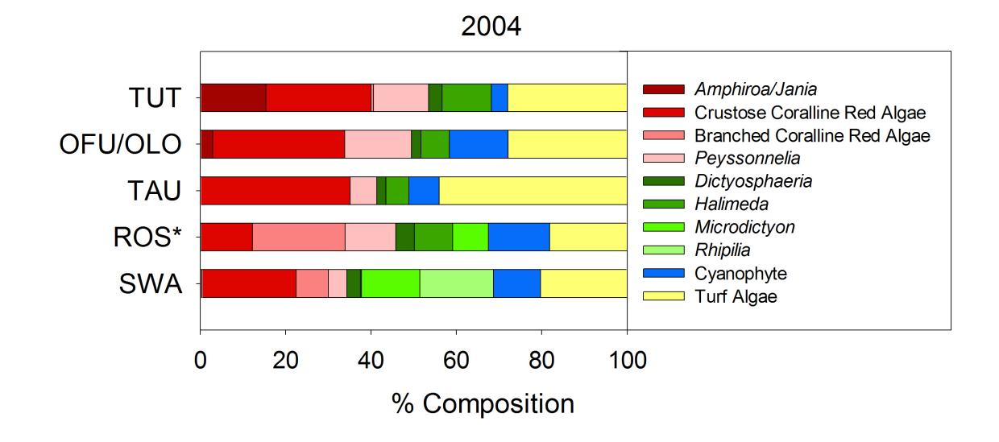

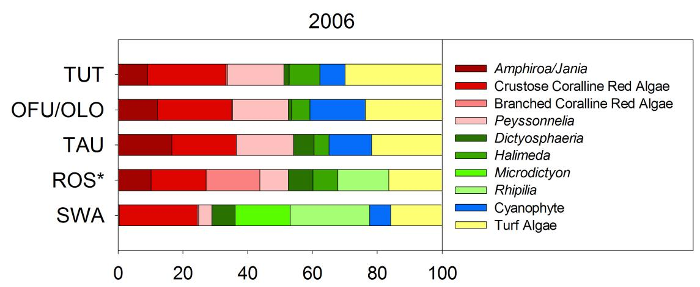

**Figure 8.6.1b.** Percent occurrence of select algal genera and functional groups at REA sites around American Samoa during ASRAMP 2004 and 2006 for Tutuila and Aunu`u (TUT), Ofu and Olosega (OFU/OLO), Ta`u (TAU), Rose (ROS) and Swains (SWA). Note that lagoon data are not presented for Rose; only forereef data are presented for better comparison with the other islands that lack a lagoon.

Figure 8.6.1b clearly shows how algal composition at the various islands compare within a given year. Table 8.6.1b lists the percentage of quadrats in which select macroalgal genera or functional groups occurred around each island. It is clear that the algal functional groups of turf algae and crustose coralline red algae were the most commonly encountered algae in almost every quadrat across all islands during both years sampled. This is not surprising since dense turf algal communities rapidly colonize available substrate. Crustose coralline red algae have also been found to be an early colonizer with rapid rates of growth. Crustose red algae play a critically important role in reef ecosystems by cementing together loose rubble and serving as a suitable settling surface for invertebrate (especially coral) larvae.

Some macroalgal genera reveal distinct differences among islands and may be useful in terms of spatially describing differences in reefs across American Samoa. Swains was the only ecosystem reported to contain the green alga, *Rhipilia*, where it was very common. Similarly, both Rose and Swains, two island systems remote from the rest of American Samoa, supported communities of the green alga, *Microdictyon*, and non-geniculate branched coralline red algae. Because these algae were either not found or else scarce on larger, high islands, these algal distributional patterns may suggest oceanographic or geomorphic differences between islands. Other macroalgal genera, such as the green alga, *Dictyosphaeria*, appear ubiquitous across islands, appearing with similar frequency everywhere. Such genera might be useful indicators of reef health, signaling a decline in health if their presence is no longer recorded or if blooms occur.

Temporal comparison of 10 common algal genera or functional groups found at islands in American Samoa (Fig. 8.6.1b) reveal genera such as the green alga, *Dictyosphaeria*, to be a common component of reef systems across the American Samoa Archipelago, although in relatively low density (Fig. 8.6.1b). Other genera such as the green alga *Halimeda* (Fig. 8.6.1b) are fairly prevalent on some islands (Tutuila, Manu` a, and Rose), but less common on others (Swains). Finally, other genera are only found in specific locations (e.g., *Rhipilia orientalis* only occurs at Swains, *Microdictyon* [Fig. 8.6.1b] only occurs on Rose and Swains). Such island differences may be useful in helping to define attributes of a healthy reef system. For instance, if the ubiquitous alga, *Dictyosphaeria*, suddenly disappears from certain reef settings, this may indicate a decrease in reef health. Alternatively, if an alga that is only known from one island suddenly appears on geographically distant islands, it may indicate a human introduction that will necessitate monitoring to ensure than it does not become invasive in its nonnative environment.

# **8.6.2 Coralline Algal Disease Surveys**

Surveys during ASRAMP 2006 enumerated a total of 504 cases of coralline algal disease in the American Samoa Archipelago (Vargas-Ángel et al., in prep.); this is nearly 45% higher than the incidence of coral diseases. Of this number, nearly 94% of cases occurred around Tutuila, Ofu, and Olosega and 6% around Ta` u and Rose; no cases were reported for Swains. Of the 504 cases, 92% corresponded to coralline lethal orange disease (CLOD). Cases of CLOD were highly abundant around Tutuila and around the more remote Ofu and Olosega (Fig. 8.6.2a). Around Tutuila, CLOD occurred preponderantly along the south-facing shores, in both relatively pristine as well as impacted locales, such as Fagatele Bay (TUT-21) and the area south of the airport (TUT-09), respectively. Comparatively, around Ofu and Olesega, CLOD was ubiquitous, occurring at 11 out of 12 survey sites. For both islands, CLOD was distributed in an aggregated pattern, suggesting that this disease pathogen(s) may be readily transmitted by organisms such as grazers. CLOD is caused by a bacterium that moves in a band, similar to the black band disease of corals (Littler and Littler, 2003) and leaving behind the dead algal carbonate structure.

Coralline fungal disease and other coralline discolorations were also present in the American Samoa Archipelago, but in low abundance (Fig. 8.6.2a). Because these pathogens can result in elimination/reduction in coralline algal cover with subsequent replacement by mats of cyanobacteria or turf algae, CLOD, coralline fungal disease, and other coralline diseases can adversely affect successful coral larval recruitment (Vargas-Ángel et al., in prep.). Further research is indicated in this matter.

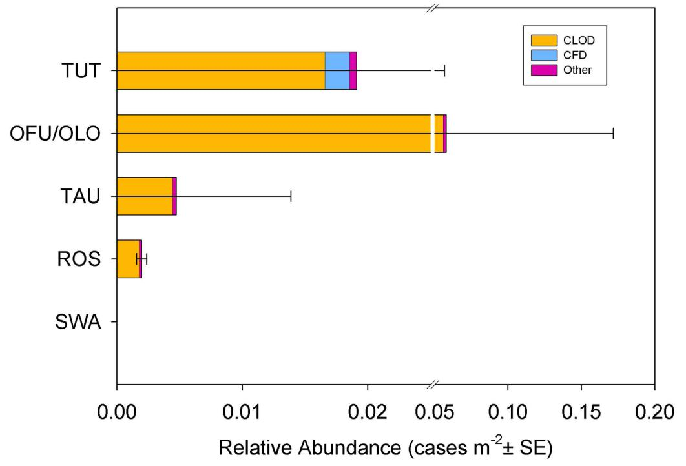

**Figure 8.6.2a.** Relative abundance (# cases m-2) of coralline algal disease from ASRAMP 2006 REA surveys for Tutuila and Aunu`u (TUT), Ofu and Olosega (OFU), Ta`u (TAU), Rose (ROS) and Swains (SWA).CLOD = coralline lethal orange disease; CFD = coralline fungal disease; Other = undetermined coralline discolorations.

# **8.7 Benthic Macroinvertebrates**

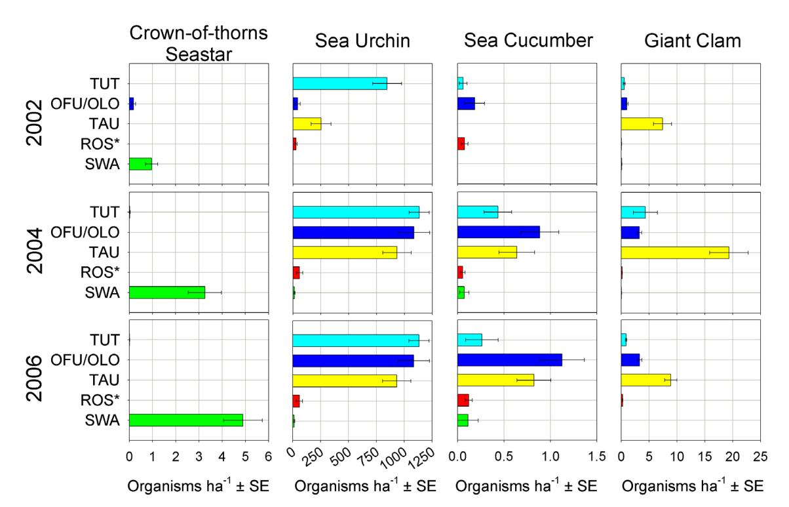

**Figure 8.7a.** Island-wide mean densities of key macroinvertebrates from towed-diver surveys around American Samoa during ASRAMP 2002, 2004 and 2006 for Tutuila and Aunu`u (TUT), Ofu and Olosega (OFU/OLO), Ta`u (TAU), Rose (ROS) and Swains (SWA). \*Only forereef communities at Rose were included in this analysis for continuity across islands.See Chapter 6, Section 6.6: Benthic Macroinvertebrates, for a discussion on the unique lagoonal communities at Rose. Note that lagoon data are not presented for Rose; only forereef data are presented for better comparison with the other islands that lack a lagoon.

Island-wide mean densities (organisms ha-1) of key macroinvertebrates, including COTS, giant clams, sea cucumbers, and sea urchins around the islands and atolls of American Samoa during ASRAMP 2002, 2004, and 2006 cruises are shown in Figure 8.7a. Archipelago-wide densities of COTS were extremely low, with the exception of large and increasing numbers of COTS observed around Swains in successive years where a 300% increase in mean density of COTS was observed between 2002 and 2004, and a nearly 500% increase between 2002 and 2006 (50% between 2004 and 2006). The spatial distribution of COTS was variable between years. In 2004, COTS were more abundant along the southern tip of Swains, while in 2006 they were more abundant on the southeastern, western, and eastern shores and relatively uncommon in the north. Cyclone Heta, nearly a category 5 typhoon, passed to the west of Swains (traveling south to north) in January 2004, shortly before ASRAMP 2004, generating high winds and damaging swells. REA sites along the northern and northeastern shore displayed the greatest degree of coral breakage and dispersal, and towed-diver surveys around Swains recorded high values of stressed coral (7.8%). This may have corresponded with the overall island-wide increase in COTS between 2002 and 2004. An additional category 3 tropical cyclone (Percy), which produced 6-m wave heights, passed within 50 km of Swains in 2005; however, lower coral stress values were recorded in 2006 (1.9%) in comparison with 2004. The effects of such disturbances on COTS population dynamics are poorly understood and the topic needs further study.

Only 3 COTS were observed around Tutuila during all 3 survey years; around Ofu and Olosega, 5 were recorded in 2002 with no subsequent sightings in 2004 and 2006, and 7 were recorded in a localized area inside the lagoon at Rose in 2004. There were no sightings of COTS around Ta`u during any of the 3 survey years.

Island-wide mean densities of sea urchins for each of the islands and atolls of American Samoa displayed a significant degree of spatial and temporal variation, which could be attributed to differences in survey attributes, sea urchin population dynamics, and other factors (Fig. 8.7a). The highest numbers and densities of sea urchins were consistently reported around Tutuila, Ofu, Olosega, and Ta`u. Mean densities of sea urchins were consistently very low around Rose and Swains.

Around Tutuila, higher densities of sea urchins were consistently reported in the northwest and north regions in 2002 and 2004. Densities were much lower in 2006 (Figs. 3.6a, 3.6b, and 3.6d). High densities were also reported along the southern coastline in 2004 and 2006, although surveys immediately to the east and west of Pago Pago Harbor entrance were surprisingly devoid of sea urchins over large areas of habitat. Mean density of sea urchins around Ofu and Olosega was relatively similar between years. Sea urchins were observed in high densities off the west coast of Nu`utele in 2004 and 2006. Other areas that recorded higher densities included the northernmost point of Olosega (2004/2006) and the southern points of both Ofu and Olosega (2004). Around Ta`u, a similar trend was noted with the highest densities being observed around the southwest and northwest points in 2004 and 2006, with consistent, but lower, densities noted in the southeast and northeast corners in both years. Coastline surveys between those points generally encountered low densities of sea urchins. The numbers and densities of sea urchins around Rose and Swains were very low, with specimens observed only along the western, northern, and eastern points of the island at Rose and the west forereef of Swains.

Island-wide mean densities of sea cucumbers around the islands and atolls of American Samoa were fairly consistent, with the highest numbers and densities reported around Ofu and Olosega in all survey years. Ta`u recorded the next highest numbers for all years surveyed, followed by Tutuila in 2004 and 2006. Few sea cucumbers were reported around Rose and Swains in all survey years.

Around Tutuila, Ofu, and Olosega, sea cucumbers were widely distributed, albeit at low densities. At Ta`u, sea cucumbers were also evenly distributed, although slightly higher densities were reported along the western and northern coasts.

Island-wide mean densities of giant clams were relatively consistent between islands, with Ta`u recording the highest mean densities of all islands in the American Samoa Archipelago in 2002, 2004, and 2006, followed by Ofu and Olosega and Tutuila in 2002 and 2006. In 2004, densities were slightly higher around Tutuila than Ofu and Olosega. At Rose and Swains, giant clams were recorded in low numbers along the forereef and fringing reef habitats. In the lagoon at Rose, on the other hand, giant clams were extremely dense in localized areas.

Towed-diver and REA surveys around Tutuila found giant clams to be widely and evenly distributed in low densities. Giant clams were relatively common around Ofu and Olosega, with no apparent skew towards any particular coastline or region. Around Ta`u, giant clams were generally present at all but one REA site and were evenly distributed around the island. High densities were reported within the inner lagoon of Rose Atoll, with over 1000 individuals noted during each survey year; the highest concentration was observed along the southern end of the lagoon (see Chapter 6, Section 6.6: Benthic Macroinvertebrates). The forereef surveys recorded few giant clams and at low mean densities. Giant clams were mostly distributed in the northwest on either side of the channel. Around Swains, REA survey records indicate that giant clams were evenly distributed in low numbers .

# **8.8 Reef Fish**

Figure 8.8a shows island-wide mean fish biomass recorded during ASRAMP 2002, 2004, and 2006. Total fish biomass around the populated high islands of American Samoa (Tutuila and Aunu`u, Ofu and Olosega, and Ta`u) was stable in 2002 and 2004 at around 1.0 ton ha-1 (SE 0.3), but fell to 0.5 ton ha-1 (SE 0.1) in 2006. Conversely, fish biomass around Rose went from 1.5 ton ha-1 (SE 0.8) in 2002 to 2.3 ton ha-1 (SE 1.2) in both 2004 and 2006. Future surveys will confirm whether these changes form clear trends or are simply within the range of natural population variability. The fish biomass around Swains was dominated by large transient schools and is thus harder to quantify with site-scale surveys. This is apparent in the highly variable interyear averages for total fish biomass around Swains (0.6 ton ha-1 (SE 0.3) in 2002, 2.9 ton ha-1 (SE 2.0) in 2004, and 0.7 ton ha-1 (SE 0.3) in 2006). It is clear, however, that Swains harbors a high fish biomass ( average 1.4 ton ha-1 (SE 0.8) over all survey years) which is comparable to Rose. This is confirmed by towed-diver surveys which show that Swains consistently has the highest biomass of large fish (> 50 cm) in the archipelago. When all years are averaged, the total fish biomasses around the two low islands, Swains (1.4 ton ha-1) and Rose (2.1 ton ha-1), was substantially higher than the mean for the high island group (~ 0.8 ton ha-1).

The fish communities around the entire archipelago were mainly composed of herbivores (> 50% of total biomass), with the exception of Swains where herbivores represented only 10% of biomass. Nearly 60% of the biomass around Swains was composed of large schools of predators (barracudas, snappers, and jacks).

Similar to total fish biomass, large fish biomass (> 50 cm total length) was consistently low in the high island group for all years surveyed (0.03–0.04 ton ha-1 (SE 0.01)). The two remote islands, Rose and Swains, had clearly higher large fish biomasses, but observed values declined from 0.20 ton ha-1 (SE 0.09) in 2002 to 0.13 ton ha-1 (SE 0.08) in 2004, and 0.10 ton ha-1 (SE 0.05) in 2006 (Fig. 8.8a). When all years were averaged, Rose and Swains had a fish biomass almost 4 times greater than that of the high islands (0.14 ton ha-1 vs. 0.04 ton ha-1).

The total fish biomass values around the populated high islands (~ 0.8 ton ha-1; 50% herbivores) were comparable to values reported for the populated Main Hawaiian Islands (MHI; ~ 0.7 ton ha-1; 55% herbivores; Friedlander and DeMartini, 2002). Conversely, the biomass values for the two low islands (~ 1.7 ton ha-1) compare more closely to those reported in the uninhabited Northwestern Hawaiian Islands (NWHI; ~ 2.4 ton ha-1), with the

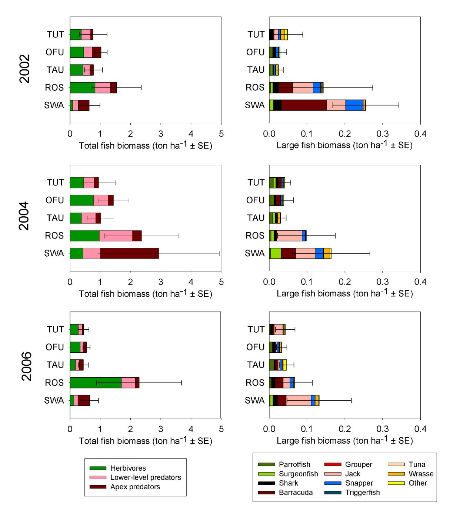

**Figure 8.8a.** Total (all families and sizes) and large fish (> 50 cm length) mean biomasses observed during AS-RAMP 2002, 2004, and 2006. Total fish biomasses are divided into trophic groups, while large fish biomasses are divided into the 10 main families.

higher top predator biomass proportion found on Swains (60%) also matching the average value reported in the NWHI (55%; Friedlander and DeMartini, 2002). Similarly, the large fish biomass around the populated high island group in American Samoa (~ 0.037 ton ha-1) was only slightly higher than the value for the MHI (~ 0.028 ton ha-1; Zgliczynski and Richards, unpubl. data). The large fish biomass around Rose and Swains (~ 0.143 ton ha-1) was also closely comparable to the NWHI values (~ 0.126 ton ha-1; Zgliczynski and Richards, unpubl. data). However, the relatively high large fish biomass recorded on the two remote atolls is still low compared to the very high values encountered in the U.S. Pacific

Remote Island Areas, which are on the order of 0.700 ton ha-1 (Zgliczynski and Richards, unpubl. data).

Finally, reef fish diversity, measured as the number of species encountered per 100 m2, is a more variable measure than fish biomass, making comparisons between years less clear. When all years are combined, a pattern of diversity similar to that for biomass emerges where the two isolated atolls, Rose and Swains, have slightly higher fish diversity (36 and 32 species 100 m-2, respectively) compared to the populated high islands of Ofu and Olosega (31 species 100 m-2), Ta`u (29 species 100 m-2), and Tutuila (28 species 100 m-2).

#### **8.9 Archipelagic Summary**

The archipelagic comparison of biotic and abiotic components of the coral reef ecosystems of American Samoa reveals diverse and complex spatial patterns coupling together human populations, biogeography, oceanographic, and environmental conditions. Not surprisingly, human population was an order of magnitude greater at Tutuila than at the other islands, presumably due to substantially greater land area, complex island topography which affords numerous separate watersheds and protected embayments, and relatively level coastal terrain to support more nearshore villages and higher population densities. Tutuila also has extensive shallow water coral reef habitats, including significant submerged relic reef structures located 3 to 5 km offshore around most of the island. These areas likely provide more marine food sources than the other islands, which have comparatively limited shallow water benthic habitats.

Human populations generally deceased eastward from Tutuila to Ofu, Olesega, Ta`u, and uninhabited Rose Atoll. Though Ta`u is substantially larger in total land area than Ofu and Olesega combined, the steep topography of the island probably limits the areas suitable for human habitation. North of these geologically-linked islands, Swains had a small caretaker population of 37 residents during the 2000 census, though there were less than 10 residents on the island during each of the three ASRAMP surveys in 2002, 2004, and 2006. Both Rose and Swains have small land and shallow habitat areas that are probably not capable of supporting large human populations.

The high islands (Tutuila, Ofu, Olosega, and Ta`u) generally had slightly lower benthic habitat (topographic) complexity and significantly higher percent cover of sand habitats than the low islands (Rose and Swains), likely reflecting greater terrigenous inputs from the watershed drainages into the nearshore ecosystems. A suite of oceanographic observations indicated that Swains, which is located at 11° S, is situated in a different oceanographic environment that the other four islands located along 14°S, with warmer water, lighter winds, and higher chlorophyll a. Nutrient levels, on the other hand, were generally highest and most variable around Tutuila, most likely due to a combination of larger landmass of higher elevation producing more seasonal runoff and sedimentation in local watersheds, nutrient loading from agriculture, and contaminant runoff from urban areas

As a likely function of island biogeography, greater shallow water habitat area, and a more diverse range of habitat types and oceanographic conditions, diversity of coral and algae, as measured by mean coral richness, coral genera, and algal genera/functional groups, was

greater around the high islands than around the low islands. Swains was similar to Rose with smaller benthic habitat and land areas, lower numbers of coral genera and mean coral generic richness, and fewer algal genera and functional groups. While lower in coral diversity, the overall mean coral cover, as measured by both towed-diver surveys covering all habitats and REA surveys, were consistently highest around Swains, presumably due to the different oceanographic environment and lack of significant terrigenous inputs and sedimentation.

Despite localized impacts around portions of the high islands, the mean overall prevalence of coral disease for all of the islands was an order of magnitude less than equivalent contemporary surveys have indicated for well surveyed sites in either the Caribbean or Great Barrier Reef ecosystems. Coral disease prevalence levels were generally very low (less than 0.5%), with the highest disease prevalence values observed around Rose. That said, a large proportion of these elevated prevalence values were the result of predation by Drupella snails. The second highest disease prevalence values were observed around Swains, of which about 85% was recorded as predation by elevated numbers of COTS.

The presence and distribution of coralline algae disease across an archipelagic continuum (94% of all recorded cases for Tutuila, Ofu and Olosega, 6% for Ta`u and Rose, and 0% for Swains) indicates that there may be a direct or indirect link with higher human population numbers and densities, or that these diseases may be propagating naturally through localized grazer movements.

Invertebrate surveys across the archipelago found extremely low densities of COTS around each of the islands except Swains, where high densities and associated coral predation were observed in 2004 and 2006. Sea urchins were observed in moderate densities around the high islands and in extremely low densities around the low islands. Mean densities of giant clams were consistently highest around Ta`u, although some extremely high giant clam densities were found at localized sites within the lagoon at Rose.

Finally, total reef fish (all sizes) and large fish biomass (TL<50 cm), were lowest around the most populated islands (Tutuila, Ofu, Olosega, Ta`u) and highest around the least populated (Swains and Rose). This suggests that a combination of anthropogenic stressors, including but not limited to fishing, coastal development, sedimentation, and pollution are likely impacting reef fish populations.

# **References**

- Craig P, DiDonato G, Fenner D, Hawkins C (2005) The state of coral reef ecosystems of American Samoa. *In:* Waddell, J (ed), The state of the coral reef ecosystems of the United States and Pacific Freely Associated States: 2005. NOAA Tech. Memo. NOS NCCOS 11, NOAA NCCOS Center for Coastal Monitoring and Assessment's Biogeography Team, Silver Spring, MD. p. 312–337.
- Friedlander AM, DeMartini EE (2002) Contrasts in density, size, and biomass of reef fishes between the northwestern and the main Hawaiian Islands: the effects of fishing down apex predators. Mar Ecol Prog Ser 230:253–264.
- Green E, Bruckner A (2000) The significance of coral disease epizootiology for coral reef conservation. Biol Conserv 96:347–361.
- Green E, Burgett J, Molina M, Palawski D, Gabrielson P (1997) The impact of a ship grounding and associated fuel spill at Rose Atoll National Wildlife Refuge, American Samoa. U.S. Fish and Wildlife Service Report, Honolulu, Hawaii, 60 pp.
- Hart SR, Coetzee M, Workman RK, Blustajn J, Johnson KTM, Sinton JM, Steinberger B, Hawkins JW (2004) Genesis of the Western Samoa seamount province: age, geochemical fingerprint and tectonics. Earth Planet Sc Lett 227:37–56.
- Hart SR, Staudigel H, Koppers AAP, Blustajn J, Baker ET, Workman R, Jackson M, Hauri E, Kurz M, Sims K, Fornari D, Saal A, Lyons S (2000) Vailulu` u undersea volcano: the new Samoa. Geochem Geophys Geosyst GC0000108:1–13.
- Littler DS, Littler MM (2003) South Pacific reef plants: a diver's guide to the plant life of the South Pacific coral reefs. Off Shore Graphics Inc, Washington, p. 331.
- McDougall I (1985) Age and evolution of the volcanoes of Tutuila, American Samoa. Pac Sci 39:311–320.
- Rogers C (1990) Responses of coral reefs and reef organisms to sedimentation. Mar Ecol Prog Ser 62:185–202.
- Ruddiman WF, Raymo ME, Martinson DG, Clement BM, Backman J (1989) Pleistocene evolution: northern hemisphere ice sheets and North Atlantic Ocean. Paleoceanography 4:353–412.
- Schroeder RE, Green AL, DeMartini EE, Kenyon JC (2008) Long-term effects of a shipgrounding on coral reef fish assemblages at Rose Atoll, American Samoa. BULL MAR SCI 82(3):345–364.
- Vargas-Angel B, Kenyon JK, Fenner D, Brainard RE (In prep.) Rapid ecological assessment of coral disease on shallow coral reef habitats of the American Samoa archipelago: distribution and abundance. Available from Pacific Islands Fisheries Science Center Coral

# **Appendices**

# **Appendix I Methods, Instrumentation, Classification**

**Table I.i.** Towed Optical Assessment Device (TOAD) benthic habitat validation categories.

| Zones        | Classes                              | Zones                        | Classes                            |
|--------------|--------------------------------------|------------------------------|------------------------------------|
| Depressions  | Narrow Depression                    | Crests                       | Depression on Crest                |
|              | Broad Depression with Open Bottom |                              | Narrow Crest                       |
|              | Local Crest in Depression            | Flats                        | Local Depression on Flat           |
| System       | Basalt Island                        |                              | Broad Flat                         |
|              | Sea Stack                            |                              | Shelf                              |
|              | Carbonate Island                     |                              | Local Crest on Flat                |
|              | Closed Atoll                         | Slopes                       | Lateral Midslope Depression     |
|              | Open Atoll                           |                              | Open Slope                         |
|              | Submerged Bank/Reef                  |                              | Lateral Midslope Crest             |
|              | Continental Reef                     |                              | Steep Slope                        |
| Zone         | Intertidal                           | Coral (Growth) Morphology | Massive                            |
|              | Lagoon                               |                              | Plate-like                         |
|              | Reef Flat                            |                              | Encrusting                         |
|              | Back Reef                            |                              | Branching                          |
|              | Reef Crest                           |                              | Columnar                           |
|              | Fore Reef                            |                              | Free-living                        |
|              | Shelf                                | Holes                        | no cavities                        |
|              | Escarpment                           |                              | few small cavities                 |
|              | Land                                 |                              | many small cavities                |
| Living Cover | Seagrass                             |                              | few large cavities                 |
|              | Non-Scleractinian Coral              |                              | many large cavities                |
|              | Scleractinian Coral                  |                              | few sml and lrg cavities           |
|              | Coralline Algae                      |                              | many sml & lrg cavities            |
|              | Coral or Coralline Algae             |                              | many sml & few lrg cavities        |
|              | Macroalgae                           | Substrate                    | Unconsolidated (Mud)               |
|              | Turf Algae                           |                              | Unconsolidated (Sand)              |
|              | Unclassified Algae                   |                              | Hardbottom (Rubble)                |
|              | Emergent Vegetation                  |                              | Hardbottom (Boulder)               |
|              | Giant Clam                           |                              | Hardbottom (Rock)                  |
|              | Other Non-Mobile Invertebrates    |                              | Hardbottom (Man-made Structure) |

| Classes                              | Zones      | Classes                            |
|--------------------------------------|------------|------------------------------------|
| Narrow Depression                    | Crests     | Depression on Crest                |
| Broad Depression with Open Bottom |            | Narrow Crest                       |
| Local Crest in Depression            | Flats      | Local Depression on Flat           |
| Basalt Island                        |            | Broad Flat                         |
| Sea Stack                            |            | Shelf                              |
| Carbonate Island                     |            | Local Crest on Flat                |
| Closed Atoll                         | Slopes     | Lateral Midslope Depression     |
| Open Atoll                           |            | Open Slope                         |
| Submerged Bank/Reef                  |            | Lateral Midslope Crest             |
| Continental Reef                     |            | Steep Slope                        |
|                                      | Morphology | Massive                            |
| Lagoon                               |            | Plate-like                         |
| Reef Flat                            |            | Encrusting                         |
| Back Reef                            |            | Branching                          |
| Reef Crest                           |            | Columnar                           |
| Fore Reef                            |            | Free-living                        |
| Shelf                                | Holes      | no cavities                        |
| Escarpment                           |            | few small cavities                 |
| Land                                 |            | many small cavities                |
| Seagrass                             |            | few large cavities                 |
| Non-Scleractinian Coral              |            | many large cavities                |
| Scleractinian Coral                  |            | few sml and lrg cavities           |
| Coralline Algae                      |            | many sml & lrg cavities            |
| Coral or Coralline Algae             |            | many sml & few lrg cavities        |
| Macroalgae                           | Substrate  | Unconsolidated (Mud)               |
| Turf Algae                           |            | Unconsolidated (Sand)              |
| Unclassified Algae                   |            | Hardbottom (Rubble)                |
| Emergent Vegetation                  |            | Hardbottom (Boulder)               |
| Giant Clam                           |            | Hardbottom (Rock)                  |
| Other Non-Mobile Invertebrates    |            | Hardbottom (Man-made Structure) |

**Table I.ii.** Oceanographic equipment and instrumentation: company name, instrument type, applicable measurement and associated accuracy range.

| Company              | Instrument                   | Measurement                        | Accuracy +\-                |
|----------------------|------------------------------|------------------------------------|-----------------------------|
| Sea-Bird Electronics | SBE 37                       | Sea Surface Temperature         | 0.002 0 C                |
| Sea-Bird Electronics | SBE 37                       | Surface conductivity               | 0.0003 S m-1                |
| Sea-Bird Electronics | SBE 39                       | Sea Surface Temperature         | 0.002 0 C                |
| Sea-Bird Electronics | SBE 26plus                   | Wave and Tide: Via pressure     | 0.01 % Feet of seawater     |
| Sea-Bird Electronics | SBE 19plus                   | Shallow water CTD Conductivity  | 0.005 S m-1                 |
| Sea-Bird Electronics | SBE 19plus                   | Shallow water CTD Temperature   | 0.0002 0 C               |
| Sea-Bird Electronics | SBE 19plus                   | Shallow water CTD Pressure      | 0.1 % Feet of seawater      |
| Wetlabs              | C-Star Transmissometer    | Shallow water CTD Turbidity     | Not specified               |
| Sea-Bird Electronics | SBE 911plus                  | Deep water CTD Conductivity     | 0.003 S m-1                 |
| Sea-Bird Electronics | SBE 911plus                  | Deep water CTD Temperature      | 0.001 0 C                |
| Sea-Bird Electronics | SBE 911plus                  | Deep water CTD Pressure         | 0.015 % Feet of seawater |
| Sea-Bird Electronics | SBE 43                       | Deep water CTD Dissolved Oxygen | 2 % Saturation              |
| Wetlabs              | ECO FLNTU                    |                                    | 0.01 NTU                    |
| Wetlabs              | ECO FLNTU                    | Deep water CTD Fluorescence     | 0.01 μg l-1                 |
| Sea-Bird Electronics | SBE 21                       | Thermosalinograph                  | 0.0001 S m-1                |
| Young Instruments    | WS425                        | Air Temperature                    | 0.3 0 C                  |
| Heise Instruments    | DXD                          | Barometric Pressure                | 0.02 % Feet of seawater     |
| Vaisala Instruments  | Weather Station              | Wind Speed                         | 0.135 m s-1                 |
| Vaisala Instruments  | Weather Station              | Wind Direction                     | 2 0                         |
| SonTek               | Acoustic Doppler Profiler | Current profiler                   | 0.005 m s-1`                |
| SonTek               | Acoustic Doppler Profiler | Wave spectra: Via pressure      | 0.1 % Feet of seawater      |

**Table I.iii.** Common name index for American Samoan Corals.

| Common Name                 | Scientific Name            |
|-----------------------------|----------------------------|
| Antler Coral                | Pocillopora eydouxi        |
| Bewick Coral                | Leptastrea bewickenisi     |
| Blue Coral                  | Heliopora coerulea         |
| Bottlebrush Coral           | Acropora elseyi            |
| Branching Staghorn Coral    | Acropora nasuta            |
| Bushy Staghorn Coral        | Acropora valida            |
| Cauliflower Coral           | Pocillopora meandrina      |
| Corrugated Coral            | Pavona varians             |
| Crust Coral                 | Leptastrea purpurea        |
| Disk Anemone                | Discosoma sp.              |
| Finger Staghorn Coral       | Acropora humilis           |
| Fire Coral                  | Millepora sp               |
| Fuzzy Table Coral           | Acropora paniculata        |
| Haime's Lump Coral          | Psammocora haimeana        |
| Honeycomb Coral             | Gardineroseris planulata   |
| Lace Coral                  | Pocillopora damicornis     |
| Leather Coral               | Lobophytum sp.             |
| Leather Coral               | Sinularia sp.              |
| Lichen Coral                | Porites lichen             |
| Lobe Coral                  | Porites lobata             |
| Lumpy Rice Coral            | Montipora turgescens       |
| Maldive Coral               | Pavona maldivensis         |
| Mosaic Coral                | Leptastrea purpurea        |
| Mound Coral                 | Porites lutea              |
| Mushroom Coral              | Fungia fungites            |
| Nodule Coral                | Porites annae              |
| Ocellated Coral             | Cyphastrea                 |
| Oval Mushroom Coral         | Fungia scutaria            |
| Plate-and-Pillar Coral      | Porites rus                |
| Potato Chip Coral           | Pavona cactus              |
| Rice Coral                  | Montipora verrucosa        |
| Ridge Coral                 | Leptsoseris mycetoseroides |
| Soft Corals                 | Alcyoniidae                |
| Solid Coral                 | Porites solida             |
| Spiny Plate Coral           | Echinopora lamellosa       |
| Staghorn Coral              | Acropora austera           |
| Stinging Coral              | Millepora sp.              |
| Superficial Coral           | Psammocora superficialis   |
| Swelling Coral              | Leptsoseris incrustans     |
| Table Coral                 | Acropora cytherea          |
| Transverse Coral            | Leptastrea transversa      |
| Verrill's Ringed Rice Coral | Montipora verrilli         |
| Yonge's Staghorn Coral      | Acropora yongei            |

Extracted from: [http://www.nps.gov/archive/npsa/NPSAcorl/corlnamcom.htm#to](http://www.nps.gov/archive/npsa/NPSAcorl/corlnamcom.htm#top)p

# Appendix II Oceanographic Instrument Deployments

**Table II.i.** Moored instrument deployments and retrievals around Tutuila and Aunu'u Islands: sea surface temperature (SST) buoy, recording current meter (RCM), wave and tide recorder (WTR), subsurface temperature recorder (STR), ecological acoustic recorder (EAR). **TRANSMITTING & LOGGING** – instrument records and transmits data via satellite; **LOGGING** – instrument records data until retrieved.

| SITE   | INSTRUMENT | DEPLOYED  | RETRIEVED      | DEPTH |
|--------|------------|-----------|----------------|-------|
| SITE   | TYPE       |           | ·              | (m)   |
|        | SST        | 2/10/2002 | 7/2/2002       | 0     |
| TUT-1  | SST        | 7/29/2002 | 7/1/2005       | 0     |
| 101-1  | SST        | 8/4/2005  | TRANSMITTING & | 0     |
|        |            |           | LOGGING        |       |
|        | SST        | 2/27/2002 | 6/27/2002      | 0     |
| TUT-2  | SST        | 7/29/2002 | TRANSMITTING & | 0     |
|        |            |           | LOGGING        | _     |
| TUT-3  | RCM        | 3/3/2002  | 2/24/2004      | 22    |
|        | SST        | 3/4/2002  | 6/27/2002      | 0     |
| TUT-4  | SST        | 7/29/2002 | 2/20/2006      | 0     |
| 101-4  | SST        | 3/29/2006 | TRANSMITTING & | 0     |
|        |            |           | LOGGING        |       |
| TUT-5  | STR        | 2/20/2004 | 2/19/2006      | 5.8   |
| 101-3  | STR        | 2/19/2006 | LOGGING        | 6.1   |
| TUT-6  | STR        | 2/23/2004 | 2/24/2006      | 1.2   |
| 101-0  | STR        | 2/24/2006 | LOGGING        | 1.5   |
|        | WTR        | 2/24/2004 | 8/6/2005       | 22    |
| TUT-7  | WTR        | 8/6/2005  | 2/25/2006      | 21.34 |
|        | WTR        | 2/25/2006 | LOGGING        | 22.56 |
| TUT-8  | STR        | 2/25/2004 | LOGGING        | 20.1  |
| TUT-9  | STR        | 2/27/2004 | 2/24/2006      | 6.7   |
| TUT-10 | STR        | 8/4/2005  | 2/18/2006      | 8.23  |
| 101-10 | STR        | 2/18/2006 | LOGGING        | 7.62  |
| TUT-11 | STR        | 8/5/2005  | 2/21/2006      | 27.13 |
| 10111  | STR        | 2/21/2006 | LOGGING        | 29.87 |
| TUT-12 | STR        | 8/6/2005  | 2/26/2006      | 13.11 |
|        | STR        | 2/26/2006 | LOGGING        | 12.8  |
| TUT-13 | EAR        | 2/19/2006 | LOGGING        | 13.1  |
| TUT-14 | STR        | 2/20/2006 | LOGGING        | 8.23  |
| TUT-15 | EAR        | 2/20/2006 | LOGGING        | 16.7  |
| TUT-16 | EAR        | 2/23/2006 | LOGGING        | 15.5  |
| TUT-17 | STR        | 2/24/2006 | LOGGING        | 20.1  |
| TUT-18 | EAR        | 2/25/2006 | LOGGING        | 16.7  |
| TUT-19 | SST        | 2/26/2006 | TRANSMITTING & | 0     |
| 101-17 | 551        | 2/20/2000 | LOGGING        | 0     |

**Table II.ii.** Moored instrument deployments and retrievals offshore of Ofu and Olosega Islands: sea surface temperature (SST) buoy. **TRANSMITTING & LOGGING** – instrument records and transmits data via satellite; **LOGGING** – instrument records data until retrieved.

| SITE          | INSTRUMENT TYPE | DEPLOYED  | RETRIEVED | DEPTH (m)    |
|---------------|--------------------|-----------|-----------|--------------|
| OFFIA04       | STR                | 2/7/2004  | 2/26/2006 | ( <b>m</b> ) |
| OFU001        | STR                | 2/26/2006 | LOGGING   | 10.9         |
| OEH003        | STR                | 2/7/2004  | 2/27/2006 | 6.4          |
| OFU002        | STR                | 2/27/2006 | LOGGING   | 6.4          |
| OFU003        | STR                | 2/8/2004  | 3/1/2006  | 6.1          |
| OF 0003       | STR                | 3/1/2006  | LOGGING   | 7.92         |
| OFU004        | STR                | 8/25/2004 | LOGGING   | 1.5          |
| OFU005        | STR                | 8/26/2004 | LOGGING   | 1.5          |
| OFU006        | STR                | 2/27/2006 | LOGGING   | 6.1          |
| <b>OFU007</b> | STR                | 2/27/2006 | LOGGING   | 30.78        |
| OFU008        | STR                | 2/27/2006 | LOGGING   | 18.9         |
| OFU009        | STR                | 3/1/2006  | LOGGING   | 1.8          |

**Table II.iii.** Moored instrument deployments and retrievals offshore of Ta'u Island: sea surface temperature (SST) buoy, subsurface temperature recorder (STR). **TRANSMIT-TING & LOGGING** – instrument records and transmits data via satellite; **LOGGING** – instrument records data until retrieved.

| SITE          | INSTRUMENT TYPE | DEPLOYED  | RETRIEVED              | DEPTH (m) |
|---------------|--------------------|-----------|------------------------|-----------|
| TAU001        | SST                | 2/12/2002 | 6/27/2002              | 0         |
| IAUUUI        | SST                | 7/9/2002  | 2/7/2004               | 0         |
| TAU002        | STR                | 2/4/2004  | 3/3/2006               | 6.1       |
| TAU003        | STR                | 2/5/2004  | 3/3/2006               | 10.1      |
| IAUUUS        | STR                | 3/3/2006  | LOGGING                | 12.8      |
| <b>TAU004</b> | SST                | 2/6/2004  | TRANSMITTING & LOGGING | 0         |
| TAU005        | STR                | 8/8/2005  | 3/4/2006               | 14.3      |
| 1AU005        | STR                | 3/4/2006  | LOGGING                | 15.5      |
| TAU006        | STR                | 3/3/2006  | LOGGING                | 12.8      |

**Table II.iv.** Moored instrument deployments and retrievals around Swains Island: ocean data platform (ODP), subsurface temperature recorder (STR). **TRANSMITTING & LOGGING** – instrument records and transmits data via satellite; **LOGGING** – instrument records data until retrieved.

| SITE    | INSTRUMENT TYPE | DEPLOYED  | RETRIEVED | DEPTH (m) |
|---------|--------------------|-----------|-----------|-----------|
| SWA001  | ODP                | 2/27/2002 | 2/16/2004 | 15        |
| SWA002  | STR                | 2/16/2004 | 2/11/2006 | 14        |
| S WAUU2 | STR                | 2/11/2006 | LOGGING   | 14        |
| SWA003  | STR                | 2/11/2006 | LOGGING   | 6.7       |
| SWA004  | STR                | 2/11/2006 | LOGGING   | 28        |

**Table II.v.** Moored instrument deployments and retrievals around Rose Atoll: RCM recording current meter (RCM), Coral Reef Early Warning System (CREWS) buoy, wave and tide recorder (WTR), subsurface temperature recorder (STR). **TRANSMITTING & LOGGING** – instrument records and transmits data via satellite; **LOGGING** – instrument records data until retrieved.

| records data until |                    |           |                           |              |
|--------------------|--------------------|-----------|---------------------------|--------------|
| SITE               | INSTRUMENT TYPE | DEPLOYED  | RETRIEVED                 | DEPTH (m) |
| ROS001             | RCM                | 2/23/2002 | 2/9/2004                  | 3.4          |
| ROS002             | CREWS              | 2/24/2002 | TRANSMITTING & LOGGING | 0            |
| DOC002             | STR                | 2/10/2004 | 3/8/2006                  | 3.4          |
| ROS003             | STR                | 3/8/2006  | LOGGING                   | 3.66         |
| ROS004             | STR                | 2/10/2004 | 3/8/2006                  | 7.9          |
| DOC005             | WTR                | 2/11/2004 | 3/5/2006                  | 17.1         |
| ROS005             | WTR                | 3/5/2006  | LOGGING                   | 16.46        |
| ROS006             | STR                | 2/11/2004 | 9/30/2005                 | 7.9          |
| ROS007             | STR                | 2/11/2004 | 3/7/2006                  | 2.4          |
| KOS007             | STR                | 3/7/2006  | LOGGING                   | 2.1          |
| ROS008             | STR                | 3/7/2006  | LOGGING                   | 9.14         |
| ROS009             | STR                | 3/7/2006  | LOGGING                   | 31.09        |
| ROS010             | STR                | 3/7/2006  | LOGGING                   | 16.7         |
| ROS011             | STR                | 3/7/2006  | LOGGING                   | 8.5          |

# **Appendix III Coral Abundance**

**Table III.i.** Results from 2004 REA coral surveys around Tutuila and Aunu'u Islands.

|                                            |               |      |        |       |       |        |        |        |        |        | Site  |       |        |        |       |        |        |        |        |       |       |       |
|--------------------------------------------|---------------|------|--------|-------|-------|--------|--------|--------|--------|--------|-------|-------|--------|--------|-------|--------|--------|--------|--------|-------|-------|-------|
| Taxa                                       | TUT-15 TUT-16 |      | TUT-17 | TUT-4 | TUT-5 | TUT-14 | TUT-18 | TUT-13 | TUT-19 | TUT-12 | TUT-2 | TUT-1 | TUT-20 | TUT-10 | TUT-9 | TUT-21 | TUT-11 | TUT-22 | TUT-23 | TUT-6 | TUT-7 | TUT=8 |
|                                            | %             | %    | %      | %     | %     | %      | %      | %      | %      | %      | %     | %     | %      | %      | %     | %      | %      | %      | %      | %     | %     | %     |
| Acanthastrea                               | 0.0           | 0.2  | 0.2    | 0.0   | 0.3   | 0.0    | 0.2    | 0.0    | 0.0    | 0.9    | 0.0   | 0.0   | 1.5    | 0.0    | 0.0   | 0.3    | 0.2    | 0.0    | 0.0    | 0.3   | 0.0   | 0.0   |
| Acropora                                   | 1.4           | 10.2 | 4.9    | 4.3   | 6.0   | 7.1    | 4.8    | 0.5    | 1.8    | 1.7    | 8.9   | 0.8   | 1.5    | 0.3    | 1.0   | 5.1    | 5.6    | 9.1    | 15.8   | 4.7   | 5.6   | 7.8   |
| Astreopora                                 | 2.7           | 1.4  | 1.6    | 1.8   | 0.0   | 0.3    | 4.3    | 21.5   | 1.8    | 0.9    | 1.5   | 0.3   | 0.7    | 0.0    | 7.8   | 0.6    | 0.5    | 0.4    | 0.0    | 0.3   | 2.5   | 2.6   |
| Coscinaraea                                | 0.8           | 0.3  | 2.1    | 1.8   | 0.0   | 1.1    | 0.3    | 0.0    | 0.9    | 0.0    | 0.0   | 0.3   | 1.5    | 0.2    | 0.8   | 1.0    | 0.3    | 0.0    | 0.8    | 1.1   | 0.0   | 0.0   |
| Cyphastrea                                 | 0.0           | 0.3  | 0.0    | 0.3   | 0.3   | 0.8    | 0.2    | 0.5    | 1.8    | 0.0    | 0.0   | 0.0   | 0.0    | 0.0    | 0.0   | 0.0    | 0.0    | 0.2    | 0.0    | 0.3   | 0.0   | 0.0   |
| Diploastrea                                | 0.0           | 0.0  | 0.0    | 0.0   | 0.0   | 0.6    | 0.0    | 0.5    | 0.4    | 0.0    | 1.5   | 0.0   | 1.5    | 0.0    | 0.0   | 0.0    | 0.0    | 0.0    | 0.0    | 0.0   | 0.0   | 0.0   |
| Echinophyllia                              | 0.0           | 0.0  | 0.0    | 0.0   | 0.0   | 0.0    | 0.0    | 0.5    | 0.0    | 0.0    | 0.0   | 1.4   | 3.7    | 1.8    | 0.0   | 0.3    | 0.0    | 0.0    | 0.3    | 0.0   | 0.0   | 0.0   |
| Echinophyllia/Oxypora                      | 0.0           | 0.0  | 3.6    | 0.8   | 0.0   | 0.3    | 0.0    | 0.0    | 0.0    | 0.0    | 0.0   | 0.6   | 2.2    | 0.2    | 0.0   | 0.6    | 0.2    | 0.2    | 0.0    | 16.5  | 0.6   | 0.0   |
| Favia                                      | 1.6           | 0.9  | 2.6    | 0.5   | 0.0   | 1.1    | 1.5    | 6.0    | 0.9    | 5.2    | 0.7   | 4.8   | 0.7    | 3.1    | 2.6   | 1.0    | 1.4    | 1.3    | 0.0    | 0.8   | 2.5   | 2.6   |
| Favites                                    | 0.4           | 0.2  | 0.9    | 0.0   | 0.0   | 0.0    | 1.7    | 0.0    | 0.4    | 0.9    | 0.0   | 0.3   | 0.0    | 0.5    | 0.4   | 0.3    | 0.2    | 0.2    | 0.8    | 0.3   | 0.0   | 7.2   |
| Fungia/Cycloseris                          | 0.0           | 2.9  | 0.7    | 5.8   | 5.4   | 2.3    | 0.3    | 0.0    | 1.8    | 0.0    | 0.7   | 0.6   | 1.5    | 3.2    | 0.6   | 3.9    | 0.3    | 3.4    | 0.0    | 0.6   | 0.0   | 0.0   |
| Galaxea                                    | 0.0           | 2.0  | 1.2    | 1.0   | 0.5   | 0.3    | 0.2    | 2.5    | 2.6    | 0.0    | 0.0   | 0.3   | 2.2    | 3.1    | 6.2   | 5.5    | 7.1    | 4.0    | 3.4    | 2.0   | 0.0   | 0.0   |
| Gardineroseris                             | 0.0           | 0.0  | 0.0    | 0.0   | 0.0   | 0.0    | 0.0    | 0.0    | 0.0    | 0.0    | 0.0   | 0.0   | 0.0    | 0.0    | 0.0   | 0.0    | 0.2    | 0.0    | 0.0    | 0.0   | 0.0   | 0.0   |
| Goniastrea                                 | 0.0           | 0.8  | 0.9    | 1.8   | 0.5   | 0.3    | 4.8    | 0.5    | 0.9    | 0.0    | 0.7   | 0.8   | 0.7    | 0.0    | 0.0   | 0.0    | 0.3    | 0.2    | 0.0    | 1.1   | 2.5   | 2.0   |
| GonioporaAlveopora                         | 0.0           | 0.0  | 0.2    | 0.0   | 3.9   | 1.1    | 0.7    | 0.0    | 0.0    | 0.0    | 0.0   | 0.0   | 0.0    | 0.5    | 0.0   | 0.0    | 0.0    | 0.0    | 0.0    | 0.0   | 0.0   | 0.0   |
| Heliopora                                  | 0.0           | 0.0  | 0.0    | 0.0   | 0.0   | 0.0    | 0.0    | 0.0    | 0.0    | 0.0    | 0.0   | 0.0   | 0.0    | 0.0    | 0.0   | 0.0    | 0.0    | 0.0    | 0.0    | 0.0   | 0.0   | 0.0   |
| Hydnophora                                 | 3.7           | 1.8  | 1.4    | 0.5   | 0.0   | 0.0    | 0.0    | 0.5    | 0.0    | 0.0    | 0.0   | 0.0   | 0.0    | 0.8    | 1.2   | 0.6    | 1.2    | 0.0    | 0.6    | 0.0   | 0.6   | 1.3   |
| Leptastrea                                 | 27.1          | 4.8  | 5.2    | 5.5   | 5.4   | 4.2    | 10.3   | 1.5    | 1.3    | 0.9    | 0.0   | 0.8   | 0.7    | 0.2    | 9.2   | 2.3    | 2.3    | 1.7    | 2.0    | 6.1   | 9.9   | 1.3   |
| Leptoseris/Pachyseris                      | 0.0           | 0.8  | 0.3    | 1.0   | 2.1   | 7.3    | 1.7    | 0.0    | 3.1    | 0.0    | 3.0   | 1.1   | 3.0    | 0.0    | 0.0   | 0.0    | 0.2    | 0.4    | 0.6    | 0.3   | 0.6   | 7.2   |
| Lobophyllia/Symphyllia                     | 0.0           | 0.0  | 0.9    | 0.3   | 0.0   | 0.0    | 0.2    | 0.0    | 0.0    | 0.0    | 0.0   | 4.5   | 0.0    | 25.8   | 0.0   | 0.0    | 0.0    | 0.4    | 0.3    | 0.0   | 0.0   | 0.0   |
| Merulina/Scapophyllia                      | 0.0           | 0.0  | 0.0    | 0.0   | 0.0   | 0.3    | 0.7    | 0.0    | 0.0    | 0.0    | 0.0   | 0.0   | 0.0    | 0.0    | 0.0   | 0.3    | 0.2    | 0.0    | 0.0    | 4.5   | 0.0   | 0.0   |
| Millepora                                  | 0.2           | 0.0  | 0.0    | 0.0   | 0.0   | 0.0    | 0.0    | 9.5    | 0.0    | 0.0    | 0.0   | 0.0   | 0.0    | 0.0    | 0.6   | 0.0    | 0.0    | 0.0    | 1.4    | 0.3   | 0.0   | 0.0   |
| Montastrea                                 | 28.4          | 4.5  | 22.4   | 4.0   | 0.0   | 0.6    | 1.5    | 0.5    | 0.0    | 7.0    | 0.0   | 0.3   | 0.0    | 0.5    | 12.2  | 27.0   | 10.1   | 2.1    | 0.3    | 4.7   | 1.2   | 0.7   |
| Montipora                                  | 5.9           | 33.5 | 18.4   | 33.9  | 18.7  | 30.2   | 25.9   | 16.5   | 48.9   | 70.4   | 46.7  | 15.5  | 31.1   | 0.8    | 29.5  | 8.4    | 22.9   | 46.2   | 38.0   | 26.8  | 47.2  | 43.8  |
| Mycedium                                   | 0.0           | 0.0  | 0.0    | 0.0   | 0.0   | 0.0    | 0.0    | 0.0    | 0.0    | 0.0    | 0.0   | 0.0   | 0.7    | 0.0    | 0.0   | 0.0    | 0.0    | 0.0    | 0.0    | 0.0   | 0.6   | 0.0   |
| Oulophyllia                                | 0.0           | 0.0  | 0.0    | 0.0   | 0.0   | 0.0    | 0.0    | 0.0    | 0.0    | 0.0    | 0.0   | 0.0   | 0.0    | 0.0    | 0.0   | 0.0    | 0.0    | 0.0    | 0.0    | 0.0   | 0.0   | 0.0   |
| Palythoa/Zoanthus                          | 0.2           | 1.7  | 0.2    | 0.0   | 0.3   | 0.0    | 0.0    | 1.5    | 0.0    | 0.9    | 0.0   | 0.0   | 0.7    | 0.8    | 0.4   | 1.6    | 8.5    | 0.4    | 0.3    | 0.3   | 0.0   | 0.0   |
| Pavona                                     | 0.2           | 6.0  | 16.5   | 13.8  | 14.0  | 15.8   | 28.0   | 1.5    | 23.8   | 0.0    | 3.7   | 5.4   | 38.5   | 6.3    | 2.0   | 7.1    | 7.1    | 8.4    | 5.1    | 3.9   | 6.2   | 5.9   |
| Platygyra/Leptoria                         | 0.4           | 0.3  | 2.4    | 1.8   | 0.3   | 0.3    | 1.0    | 1.0    | 0.0    | 0.0    | 0.0   | 0.3   | 0.0    | 0.5    | 1.0   | 1.6    | 0.5    | 0.4    | 0.0    | 2.5   | 1.2   | 0.0   |
| Plesiastrea                                | 0.0           | 0.0  | 0.0    | 0.0   | 0.0   | 0.0    | 0.2    | 0.0    | 0.0    | 0.0    | 0.0   | 0.0   | 0.0    | 0.0    | 0.0   | 0.0    | 0.0    | 0.0    | 0.0    | 0.0   | 0.0   | 0.0   |
| Pocillopora                                | 3.5           | 16.8 | 3.6    | 6.5   | 2.3   | 5.1    | 2.2    | 9.0    | 0.4    | 0.9    | 1.5   | 3.4   | 1.5    | 3.1    | 4.4   | 20.3   | 6.2    | 7.0    | 2.5    | 2.5   | 5.6   | 4.6   |
| Porites                                    | 9.0           | 7.2  | 5.9    | 7.3   | 35.5  | 13.0   | 7.9    | 20.5   | 4.0    | 7.8    | 29.6  | 19.5  | 0.0    | 6.0    | 8.4   | 4.8    | 3.4    | 5.7    | 25.9   | 8.1   | 13.0  | 12.4  |
| Psammocora                                 | 0.6           | 0.2  | 0.7    | 3.5   | 1.3   | 7.1    | 1.4    | 0.5    | 1.3    | 2.6    | 0.7   | 0.0   | 0.7    | 0.8    | 0.0   | 0.3    | 0.5    | 0.6    | 0.3    | 0.0   | 0.0   | 0.0   |
| Sandalolitha/Halomitra/Herpolitha          | 0.0           | 0.5  | 0.0    | 0.3   | 0.3   | 0.0    | 0.0    | 0.0    | 0.0    | 0.0    | 0.7   | 0.0   | 0.0    | 0.0    | 0.0   | 0.0    | 0.0    | 0.0    | 0.0    | 0.0   | 0.0   | 0.0   |
| Seriatopora                                | 0.0           | 0.0  | 0.0    | 0.0   | 0.0   | 0.0    | 0.0    | 0.0    | 0.0    | 0.0    | 0.0   | 0.0   | 0.0    | 0.0    | 0.0   | 0.0    | 0.0    | 0.0    | 0.0    | 0.0   | 0.0   | 0.0   |
| Sinularia/Lobophytum/Sarcophyton/Cladiella | 13.9          | 2.3  | 3.5    | 3.8   | 3.1   | 0.8    | 0.0    | 4.5    | 4.0    | 0.0    | 0.0   | 39.0  | 4.4    | 41.7   | 11.4  | 7.1    | 20.8   | 7.6    | 1.7    | 11.7  | 0.0   | 0.7   |
| Stylaster/Distichopora                     | 0.0           | 0.0  | 0.0    | 0.0   | 0.0   | 0.0    | 0.0    | 0.0    | 0.0    | 0.0    | 0.0   | 0.0   | 0.0    | 0.0    | 0.0   | 0.0    | 0.0    | 0.0    | 0.0    | 0.0   | 0.0   | 0.0   |
| Stylocoeniella                             | 0.0           | 0.0  | 0.0    | 0.0   | 0.0   | 0.0    | 0.0    | 0.5    | 0.0    | 0.0    | 0.0   | 0.0   | 0.0    | 0.0    | 0.0   | 0.0    | 0.0    | 0.0    | 0.0    | 0.0   | 0.0   | 0.0   |
| Stylophora                                 | 0.0           | 0.6  | 0.0    | 0.0   | 0.0   | 0.0    | 0.0    | 0.0    | 0.0    | 0.0    | 0.0   | 0.0   | 0.0    | 0.0    | 0.0   | 0.0    | 0.0    | 0.0    | 0.0    | 0.0   | 0.0   | 0.0   |
| Tubastrea                                  | 0.0           | 0.0  | 0.0    | 0.0   | 0.0   | 0.0    | 0.0    | 0.0    | 0.0    | 0.0    | 0.0   | 0.0   | 0.7    | 0.0    | 0.0   | 0.0    | 0.0    | 0.0    | 0.0    | 0.0   | 0.0   | 0.0   |
| Turbinaria                                 | 0.0           | 0.0  | 0.0    | 0.0   | 0.0   | 0.0    | 0.0    | 0.0    | 0.0    | 0.0    | 0.0   | 0.0   | 0.0    | 0.0    | 0.0   | 0.0    | 0.0    | 0.0    | 0.0    | 0.3   | 0.0   | 0.0   |
| Total # colonies                           | 510           | 650  | 577    | 398   | 386   | 354    | 583    | 200    | 227    | 115    | 135   | 354   | 135    | 619    | 498   | 311    | 645    | 474    | 355    | 358   | 161   | 153   |
| Area surveyed, m2                          | 100           | 70   | 100    | 100   | 100   | 100    | 100    | 100    | 60     | 100    | 100   | 100   | 100    | 100    | 50    | 50     | 100    | 100    | 100    | 100   | 100   | 100   |
|                                            |               |      |        |       |       |        |        |        |        |        |       |       |        |        |       |        |        |        |        |       |       |       |

**Table III.ii.** Results from 2006 REA coral surveys around Tutuila and Aunu'u Islands.

| Taxa                                       | TUT-5      | TUT-4      | TUT-17     | TUT-14     | TUT-18     | TUT-13     | TUT-2      | TUT-1      | TUT-15     | TUT-16     | TUT-20     | TUT-9      | TUT-10     | TUT-22     | TUT-11     | TUT-21     |
|--------------------------------------------|------------|------------|------------|------------|------------|------------|------------|------------|------------|------------|------------|------------|------------|------------|------------|------------|
|                                            | %          | %          | %          | %          | %          | %          | %          | %          | %          | %          | %          | %          | %          | %          | %          | %          |
| Acanthastrea                               | 0.0        | 0.0        | 0.5        | 0.0        | 0.0        | 1.1        | 0.0        | 0.0        | 0.0        | 0.0        | 0.0        | 0.0        | 0.0        | 0.3        | 0.0        | 0.4        |
| Acropora                                   | 3.4        | 3.6        | 8.0        | 2.9        | 11.6       | 13.3       | 5.3        | 1.1        | 5.6        | 15.3       | 3.9        | 0.0        | 0.3        | 8.0        | 9.5        | 7.3        |
| Astreopora                                 | 0.0        | 1.0        | 2.8        | 0.0        | 12.9       | 5.3        | 0.0        | 0.0        | 1.7        | 0.0        | 0.0        | 7.1        | 0.0        | 0.3        | 0.0        | 2.4        |
| Coscinaraea                                | 0.4        | 3.1        | 2.8        | 0.5        | 0.0        | 0.0        | 0.4        | 0.0        | 0.0        | 0.0        | 0.0        | 0.4        | 1.0        | 0.0        | 1.0        | 0.0        |
| Cyphastrea                                 | 0.0        | 0.0        | 0.0        | 0.0        | 0.6        | 0.8        | 0.0        | 0.0        | 0.0        | 0.0        | 0.0        | 0.0        | 0.0        | 0.6        | 0.0        | 0.4        |
| Diploastrea                                | 0.0        | 0.0        | 0.0        | 0.0        | 0.0        | 0.0        | 0.0        | 0.4        | 0.0        | 0.0        | 2.6        | 0.0        | 0.0        | 0.0        | 0.0        | 0.0        |
| Echinophyllia                              | 0.0        | 0.0        | 0.0        | 0.0        | 0.0        | 0.0        | 0.0        | 0.0        | 0.0        | 0.0        | 5.2        | 0.4        | 3.1        | 0.0        | 0.0        | 0.0        |
| Echinophyllia/Oxypora                      | 0.0        | 0.5        | 0.9        | 0.0        | 0.0        | 0.0        | 0.0        | 0.0        | 0.0        | 0.0        | 0.0        | 0.0        | 2.1        | 0.6        | 3.6        | 0.7        |
| Favia                                      | 0.0        | 1.6        | 3.8        | 1.0        | 3.9        | 2.3        | 0.4        | 0.4        | 3.0        | 0.8        | 1.3        | 1.1        | 3.8        | 1.1        | 2.7        | 1.1        |
| Favites                                    | 0.0        | 0.0        | 0.0        | 0.0        | 0.0        | 0.0        | 0.0        | 2.1        | 0.0        | 0.4        | 2.6        | 3.5        | 0.0        | 0.6        | 0.2        | 3.1        |
| Fungia/Cycloseris                          | 3.0        | 6.8        | 0.0        | 2.4        | 0.0        | 0.0        | 6.1        | 4.6        | 0.0        | 0.8        | 3.9        | 0.4        | 1.4        | 2.6        | 11.7       | 0.2        |
| Galaxea                                    | 0.4        | 3.6        | 0.5        | 0.5        | 1.3        | 0.8        | 6.6        | 0.0        | 0.0        | 0.0        | 0.0        | 0.0        | 0.0        | 4.0        | 8.0        | 8.9        |
| Gardineroseris                             | 0.0        | 3.6        | 0.0        | 0.0        | 0.0        | 0.0        | 0.0        | 0.0        | 0.0        | 0.0        | 0.0        | 0.0        | 0.0        | 0.0        | 0.0        | 0.2        |
| Goniastrea                                 | 0.4        | 3.6        | 3.8        | 1.0        | 0.6        | 0.4        | 0.0        | 0.0        | 0.0        | 0.0        | 0.0        | 0.0        | 0.0        | 0.0        | 0.0        | 0.0        |
| GonioporaAlveopora                         | 8.3        | 0.5        | 0.0        | 0.0        | 0.0        | 0.0        | 0.8        | 0.4        | 0.3        | 0.0        | 0.0        | 0.0        | 0.0        | 0.0        | 0.0        | 0.0        |
| Heliopora                                  | 0.0        | 0.0        | 0.0        | 0.0        | 0.0        | 0.0        | 0.0        | 0.0        | 0.0        | 0.0        | 0.0        | 0.0        | 0.0        | 0.0        | 0.0        | 0.0        |
| Hydnophora                                 | 0.0        | 0.0        | 0.9        | 0.0        | 0.0        | 0.0        | 0.0        | 0.0        | 1.7        | 0.8        | 0.0        | 3.2        | 0.3        | 0.0        | 2.2        | 2.2        |
| Leptastrea                                 | 7.1        | 7.8        | 7.1        | 6.2        | 4.5        | 1.1        | 2.0        | 0.7        | 3.6        | 9.9        | 2.6        | 8.9        | 0.0        | 2.0        | 1.5        | 1.8        |
| Leptoseris/Pachyseris                      | 0.8        | 2.6        | 0.0        | 11.0       | 0.0        | 0.0        | 0.0        | 0.0        | 0.0        | 0.0        | 0.0        | 0.0        | 0.0        | 0.0        | 0.2        | 0.0        |
| Lobophyllia/Symphyllia                     | 0.0        | 0.0        | 0.0        | 0.0        | 0.0        | 0.0        | 0.0        | 2.8        | 0.0        | 0.0        | 0.0        | 0.0        | 7.6        | 0.0        | 0.7        | 0.4        |
| Merulina/Scapophyllia                      | 0.0        | 0.0        | 0.9        | 0.0        | 0.0        | 0.0        | 0.0        | 0.0        | 0.0        | 0.0        | 0.0        | 0.0        | 0.0        | 0.0        | 0.0        | 0.0        |
| Millepora                                  | 0.0        | 0.0        | 0.0        | 0.0        | 0.0        | 1.9        | 0.4        | 0.0        | 0.7        | 0.0        | 0.0        | 0.0        | 0.0        | 0.0        | 0.0        | 1.1        |
| Montastrea                                 | 0.8        | 4.2        | 33.5       | 2.4        | 2.6        | 4.2        | 1.6        | 0.7        | 9.9        | 8.0        | 0.0        | 15.2       | 0.3        | 2.9        | 16.5       | 20.3       |
| Montipora                                  | 9.8        | 8.9        | 0.0        | 18.2       | 18.1       | 30.3       | 51.2       | 13.3       | 16.2       | 35.5       | 11.7       | 32.6       | 7.2        | 26.6       | 13.1       | 3.8        |
| Mycedium                                   | 0.0        | 1.0        | 0.0        | 0.0        | 0.0        | 0.0        | 0.0        | 0.0        | 0.0        | 0.0        | 0.0        | 0.0        | 0.0        | 0.0        | 0.0        | 0.0        |
| Oulophyllia                                | 0.0        | 0.0        | 0.0        | 0.0        | 0.0        | 0.0        | 0.0        | 0.0        | 0.0        | 0.0        | 0.0        | 0.0        | 0.0        | 0.0        | 0.0        | 0.0        |
| Palythoa/Zoanthus                          | 0.0        | 0.0        | 0.0        | 0.0        | 0.0        | 0.0        | 0.0        | 0.0        | 0.0        | 0.4        | 0.0        | 0.0        | 0.0        | 0.6        | 0.0        | 1.1        |
| Pavona                                     | 12.8       | 25.5       | 9.9        | 22.5       | 5.8        | 7.2        | 11.1       | 7.4        | 1.0        | 8.8        | 61.0       | 2.5        | 11.4       | 13.1       | 16.5       | 4.7        |
| Platygyra/Leptoria                         | 0.0        | 0.5        | 2.4        | 0.0        | 1.9        | 0.4        | 0.4        | 0.7        | 1.7        | 0.0        | 0.0        | 0.4        | 0.0        | 0.3        | 0.5        | 2.4        |
| Plesiastrea                                | 0.0        | 0.0        | 0.0        | 0.0        | 0.0        | 0.0        | 0.0        | 0.0        | 0.0        | 0.0        | 0.0        | 0.0        | 0.0        | 0.0        | 0.0        | 0.0        |
| Pocillopora                                | 3.0        | 4.7        | 5.2        | 4.8        | 18.1       | 9.1        | 1.6        | 2.8        | 12.9       | 15.6       | 3.9        | 6.4        | 3.1        | 12.3       | 8.8        | 19.4       |
| Porites                                    | 49.2       | 9.9        | 13.7       | 21.5       | 17.4       | 20.5       | 5.7        | 1.8        | 0.7        | 2.3        | 0.0        | 4.3        | 6.9        | 10.0       | 1.2        | 6.0        |
| Psammocora                                 | 0.8        | 6.8        | 3.3        | 5.3        | 0.6        | 1.1        | 0.0        | 0.0        | 0.0        | 0.0        | 1.3        | 0.7        | 1.7        | 0.0        | 0.2        | 0.0        |
| Sandalolitha/Halomitra/Herpolitha          | 0.0        | 0.0        | 0.0        | 0.0        | 0.0        | 0.0        | 0.4        | 0.0        | 0.0        | 0.8        | 0.0        | 0.0        | 0.0        | 0.6        | 0.0        | 0.0        |
| Seriatopora                                | 0.0        | 0.0        | 0.0        | 0.0        | 0.0        | 0.0        | 0.0        | 0.0        | 0.0        | 0.0        | 0.0        | 0.0        | 0.0        | 0.0        | 0.0        | 0.0        |
| Sinularia/Lobophytum/Sarcophyton/Cladiella | 0.0        | 0.0        | 0.0        | 0.0        | 0.0        | 0.0        | 0.0        | 61.1       | 41.3       | 0.0        | 0.0        | 13.1       | 42.1       | 13.7       | 1.7        | 11.8       |
| Stylaster/Distichopora                     | 0.0        | 0.0        | 0.0        | 0.0        | 0.0        | 0.0        | 0.0        | 0.0        | 0.0        | 0.0        | 0.0        | 0.0        | 0.0        | 0.0        | 0.0        | 0.0        |
| Stylocoeniella Stylophora               | 0.0 0.0 | 0.0 0.0 | 0.0 0.0 | 0.0 0.0 | 0.0 0.0 | 0.0 0.0 | 0.0 0.8 | 0.0 0.0 | 0.0 0.0 | 0.0 0.8 | 0.0 0.0 | 0.0 0.0 | 0.0 0.0 | 0.0 0.0 | 0.0 0.0 | 0.0 0.0 |
| Tubastrea                                  | 0.0        | 0.0        | 0.0        | 0.0        | 0.0        | 0.0        | 0.0        | 0.0        | 0.0        | 0.0        | 0.0        | 0.0        | 0.0        | 0.0        | 0.0        | 0.0        |
| Turbinaria                                 | 0.0        | 0.0        | 0.0        | 0.0        | 0.0        | 0.4        | 4.9        | 0.0        | 0.0        | 0.0        | 0.0        | 0.0        | 0.0        | 0.0        | 0.0        | 0.0        |
| Other scleractinians                       | 0.0        | 0.0        | 0.0        | 0.0        | 0.0        | 0.0        | 0.0        | 0.0        | 0.0        | 0.0        | 0.0        | 0.0        | 7.6        | 0.0        | 0.0        | 0.0        |
|                                            |            |            |            |            |            |            |            |            |            |            |            |            |            |            |            |            |
| Total # colonies                           | 100        | 100        | 100.0      |            |            |            |            |            |            |            |            |            |            |            |            |            |
|                                            |            |            |            | 100        | 100        | 100        | 100        | 100        | 100        | 100        | 100        | 100        | 100        | 100        | 100        | 100        |

**Table III.iii.** Results from 2004 REA coral surveys around Ofu and Olosega Islands.

**Relative abundance of corals (# of colonies), by site and by taxon, Ofu and Olosega, American Samoa, 2004. % = % of total. Values representing >10% of numerical abundance at each site are in bold.** 

|                                  |       |       |       |       | Site  |       |       |       |
|----------------------------------|-------|-------|-------|-------|-------|-------|-------|-------|
|                                  | OLO-1 | OLO-4 | OLO-5 | OLO-6 | OFU-6 | OFU-3 | OFU-2 | OFU-8 |
| Taxa                             | %     | %     | %     | %     | %     | %     | %     | %     |
| Acanthastrea                     | 0.0   | 0.2   | 0.0   | 0.0   | 0.0   | 1.1   | 0.9   | 0.1   |
| Acropora                         | 1.7   | 4.0   | 0.5   | 1.3   | 1.3   | 0.8   | 1.9   | 1.7   |
| Astreopora                       | 0.0   | 5.0   | 0.3   | 8.3   | 0.0   | 3.0   | 5.3   | 6.1   |
| Coscinaraea                      | 1.1   | 0.2   | 0.0   | 0.0   | 0.0   | 0.0   | 0.2   | 0.1   |
| Cyphastrea                       | 0.0   | 0.0   | 0.3   | 0.5   | 0.0   | 0.2   | 0.7   | 0.1   |
| Diploastrea                      | 0.0   | 0.0   | 0.0   | 0.0   | 0.0   | 0.0   | 0.0   | 0.0   |
| Echinophyllia                    | 0.0   | 0.2   | 0.0   | 0.0   | 1.0   | 0.7   | 0.4   | 0.0   |
| Echinopora                       | 0.8   | 0.0   | 0.5   | 0.0   | 0.6   | 0.3   | 0.7   | 0.0   |
| Favia                            | 1.4   | 8.2   | 5.7   | 5.3   | 14.4  | 11.1  | 5.1   | 4.3   |
| Favites                          | 0.0   | 1.7   | 2.5   | 1.3   | 2.2   | 2.3   | 1.4   | 1.0   |
| Fungia                           | 0.0   | 1.3   | 0.3   | 0.0   | 1.3   | 1.0   | 2.5   | 0.0   |
| Galaxea                          | 3.1   | 5.6   | 19.4  | 1.1   | 20.4  | 3.4   | 12.6  | 1.7   |
| Gardineroseris                   | 0.0   | 0.0   | 0.0   | 0.0   | 0.0   | 0.0   | 0.0   | 0.0   |
| Goniastrea                       | 5.6   | 25.3  | 13.9  | 3.4   | 15.3  | 15.2  | 18.1  | 7.3   |
| GonioporaAlveopora               | 0.8   | 0.4   | 0.3   | 0.0   | 0.0   | 0.0   | 0.0   | 0.0   |
| Heliopora                        | 0.0   | 0.0   | 0.0   | 0.3   | 0.0   | 0.0   | 0.0   | 0.0   |
| Hydnophora                       | 0.0   | 0.0   | 0.0   | 0.0   | 2.2   | 0.0   | 1.1   | 0.0   |
| Leptastrea                       | 0.0   | 4.4   | 0.5   | 6.9   | 0.3   | 5.6   | 1.9   | 4.6   |
| Leptoseris/Pachyseris            | 0.0   | 0.2   | 0.0   | 0.0   | 1.6   | 0.0   | 0.0   | 0.0   |
| Lobophyllia/Symphyllia           | 0.0   | 0.8   | 0.0   | 0.0   | 0.3   | 0.0   | 0.2   | 0.0   |
| Merulina/Scapophyllia            | 0.0   | 0.0   | 0.0   | 0.0   | 1.9   | 0.2   | 0.2   | 0.0   |
| Millepora                        | 0.0   | 0.0   | 0.0   | 0.5   | 3.8   | 0.8   | 0.5   | 0.0   |
| Montastrea                       | 0.6   | 4.0   | 1.1   | 1.4   | 1.0   | 9.2   | 4.0   | 5.2   |
| Montipora                        | 14.0  | 21.8  | 6.0   | 30.9  | 6.1   | 23.1  | 5.3   | 38.1  |
| Mycedium                         | 0.0   | 0.0   | 0.0   | 0.0   | 0.6   | 0.0   | 0.0   | 0.0   |
| Oulophyllia                      | 0.0   | 0.4   | 0.0   | 0.8   | 1.3   | 0.7   | 0.9   | 0.4   |
| Palythoa/Zoanthus                | 0.3   | 0.2   | 0.0   | 0.0   | 0.0   | 0.3   | 0.4   | 0.1   |
| Pavona                           | 2.2   | 2.9   | 1.9   | 1.1   | 1.3   | 2.3   | 2.1   | 1.4   |
| Platygyra/Leptoria               | 0.6   | 5.9   | 3.3   | 4.2   | 20.4  | 5.6   | 10.2  | 4.6   |
| Pocillopora                      | 10.1  | 3.8   | 5.2   | 10.7  | 0.0   | 6.1   | 5.8   | 13.4  |
| Porites                          | 33.8  | 1.5   | 19.9  | 15.4  | 0.6   | 5.6   | 15.6  | 5.6   |
| Psammocora                       | 0.0   | 1.3   | 0.8   | 0.6   | 0.0   | 0.8   | 0.7   | 0.1   |
| Sandalolitha                     | 0.0   | 0.0   | 0.0   | 0.0   | 0.0   | 0.3   | 0.0   | 0.0   |
| Seriatopora                      | 0.0   | 0.0   | 0.0   | 0.0   | 0.0   | 0.0   | 0.0   | 0.0   |
| Sinularia/Lobophytum/Sarcophyton | 22.6  | 0.6   | 17.2  | 5.9   | 1.9   | 0.3   | 1.4   | 3.9   |
| Stylaster/Distichopora           | 0.0   | 0.0   | 0.0   | 0.0   | 0.0   | 0.0   | 0.0   | 0.0   |
| Stylocoeniella                   | 0.0   | 0.0   | 0.3   | 0.0   | 0.0   | 0.0   | 0.0   | 0.0   |
| Stylophora                       | 0.0   | 0.0   | 0.0   | 0.0   | 0.0   | 0.0   | 0.0   | 0.0   |
| Turbinaria                       | 1.4   | 0.2   | 0.0   | 0.0   | 0.0   | 0.0   | 0.2   | 0.0   |
|                                  |       |       |       |       |       |       |       |       |
| Total # colonies                 | 358   | 478   | 366   | 624   | 313   | 610   | 570   | 716   |
| Area surveyed, m2                | 100   | 24    | 100   | 100   | 100   | 53.5  | 100   | 100   |

**Table III.iv.** Results from 2006 REA coral surveys around Ofu and Olosega Islands.

|                                   |       |       |       |       |       | Site  |       |       |       |       |       |       |
|-----------------------------------|-------|-------|-------|-------|-------|-------|-------|-------|-------|-------|-------|-------|
| Taxa                              | OLO-6 | OLO-1 | OLO-2 | OLO-4 | OFU-4 | OFU-3 | OLO-5 | OFU-1 | OFU-9 | OFU-2 | OFU-6 | OFU-8 |
|                                   | %     | %     | %     | %     | %     | %     | %     | %     | %     | %     | %     | %     |
| Acanthastrea                      | 0.0   | 0.0   | 0.0   | 0.0   | 0.5   | 0.4   | 0.0   | 0.0   | 0.0   | 0.3   | 1.1   | 0.3   |
| Acropora                          | 2.3   | 1.8   | 1.3   | 1.7   | 1.9   | 1.2   | 2.1   | 3.5   | 1.9   | 4.3   | 1.1   | 3.7   |
| Astreopora                        | 6.9   | 0.0   | 0.6   | 9.2   | 5.6   | 3.8   | 0.9   | 0.5   | 8.6   | 3.6   | 0.0   | 3.1   |
| Coscinaraea                       | 0.0   | 0.0   | 0.0   | 0.0   | 0.0   | 0.0   | 0.3   | 0.0   | 0.0   | 0.0   | 0.0   | 0.6   |
| Cyphastrea                        | 0.3   | 0.0   | 1.6   | 0.6   | 0.8   | 0.4   | 0.9   | 0.0   | 0.0   | 0.0   | 0.0   | 0.0   |
| Diploastrea                       | 0.0   | 0.0   | 0.0   | 0.0   | 0.0   | 0.0   | 0.9   | 0.5   | 0.0   | 0.0   | 0.0   | 0.0   |
| Echinophyllia                     | 0.0   | 0.0   | 0.0   | 0.0   | 0.8   | 0.0   | 0.3   | 0.0   | 0.0   | 0.2   | 0.0   | 0.0   |
| Echinophyllia/Oxypora             | 0.3   | 0.4   | 0.0   | 0.0   | 0.3   | 0.0   | 0.3   | 0.5   | 0.0   | 0.6   | 1.1   | 0.6   |
| Favia                             | 1.4   | 3.9   | 3.5   | 2.0   | 1.3   | 4.3   | 2.1   | 3.5   | 0.6   | 0.9   | 8.8   | 1.5   |
| Favites                           | 4.9   | 1.3   | 7.7   | 2.9   | 6.3   | 6.1   | 2.1   | 4.0   | 3.5   | 4.2   | 4.6   | 5.2   |
| Fungia/Cycloseris                 | 0.0   | 0.0   | 2.2   | 0.6   | 2.6   | 1.2   | 7.5   | 2.5   | 0.0   | 1.1   | 0.4   | 0.0   |
| Galaxea                           | 1.2   | 2.6   | 4.2   | 3.7   | 5.3   | 2.0   | 14.3  | 7.0   | 1.9   | 4.2   | 16.1  | 3.7   |
| Gardineroseris                    | 0.0   | 0.0   | 0.6   | 0.0   | 0.3   | 0.0   | 0.0   | 0.0   | 0.0   | 0.0   | 0.0   | 0.0   |
| Goniastrea                        | 4.0   | 3.9   | 26.9  | 11.8  | 27.2  | 9.7   | 29.3  | 7.0   | 2.6   | 18.4  | 9.2   | 5.8   |
| GonioporaAlveopora                | 0.0   | 0.0   | 0.0   | 0.0   | 0.0   | 0.0   | 0.0   | 1.0   | 0.0   | 0.0   | 0.0   | 0.0   |
| Heliopora                         | 0.0   | 0.4   | 0.0   | 0.0   | 0.0   | 0.4   | 0.0   | 0.0   | 0.0   | 0.0   | 0.0   | 0.0   |
| Hydnophora                        | 0.6   | 0.0   | 0.6   | 0.0   | 0.3   | 0.6   | 1.5   | 0.0   | 0.0   | 0.0   | 0.8   | 0.3   |
| Leptastrea                        | 5.8   | 0.4   | 10.6  | 5.5   | 4.0   | 5.3   | 0.9   | 2.0   | 9.6   | 4.5   | 0.4   | 2.1   |
| Leptoseris/Pachyseris             | 0.0   | 0.4   | 0.0   | 0.0   | 0.0   | 0.0   | 0.0   | 2.5   | 0.0   | 0.0   | 0.4   | 0.0   |
| Lobophyllia/Symphyllia            | 0.0   | 0.0   | 0.0   | 0.3   | 0.8   | 0.2   | 0.6   | 0.0   | 0.0   | 0.5   | 0.0   | 0.0   |
| Merulina/Scapophyllia             | 0.0   | 0.0   | 0.0   | 0.0   | 0.0   | 0.0   | 0.0   | 0.0   | 0.0   | 0.0   | 0.0   | 0.0   |
| Millepora                         | 1.2   | 0.0   | 0.0   | 0.0   | 0.0   | 0.0   | 0.0   | 0.0   | 0.3   | 0.0   | 0.0   | 0.6   |
| Montastrea                        | 4.3   | 4.4   | 8.7   | 11.0  | 10.6  | 13.2  | 4.2   | 5.0   | 1.6   | 8.2   | 1.5   | 2.5   |
| Montipora                         | 37.8  | 14.5  | 4.8   | 24.8  | 6.9   | 31.0  | 3.6   | 24.1  | 53.7  | 23.6  | 23.4  | 43.3  |
| Mycedium                          | 0.0   | 0.0   | 0.6   | 0.0   | 0.3   | 0.0   | 0.0   | 0.0   | 0.0   | 0.0   | 0.8   | 0.0   |
| Oulophyllia                       | 0.0   | 0.0   | 0.0   | 0.0   | 0.3   | 0.0   | 0.0   | 0.0   | 0.0   | 0.0   | 0.4   | 0.3   |
| Palythoa/Zoanthus                 | 0.0   | 0.4   | 0.0   | 0.6   | 0.0   | 0.0   | 0.0   | 0.5   | 0.0   | 0.0   | 0.0   | 0.0   |
| Pavona                            | 2.9   | 0.9   | 9.0   | 4.0   | 4.8   | 3.2   | 7.8   | 6.5   | 2.2   | 5.3   | 4.2   | 3.4   |
| Platygyra/Leptoria                | 5.2   | 1.3   | 1.9   | 4.0   | 2.9   | 5.1   | 3.6   | 3.5   | 0.6   | 3.6   | 19.9  | 4.0   |
| Plesiastrea                       | 0.0   | 0.0   | 0.0   | 0.0   | 0.0   | 0.0   | 0.0   | 0.0   | 0.0   | 0.0   | 0.0   | 0.0   |
| Pocillopora                       | 9.8   | 15.4  | 8.3   | 12.7  | 10.8  | 8.9   | 13.1  | 14.6  | 8.0   | 11.0  | 2.7   | 15.6  |
| Porites                           | 8.9   | 29.4  | 4.8   | 2.3   | 3.2   | 2.2   | 1.2   | 4.5   | 3.8   | 4.7   | 0.0   | 2.8   |
| Psammocora                        | 0.0   | 0.0   | 0.6   | 0.6   | 0.0   | 0.8   | 0.0   | 0.5   | 0.0   | 0.0   | 0.0   | 0.0   |
| Sandalolitha/Halomitra/Herpolitha | 0.0   | 0.0   | 0.0   | 0.0   | 1.1   | 0.0   | 0.0   | 0.0   | 0.0   | 0.2   | 0.0   | 0.0   |
| Seriatopora                       | 0.0   | 0.0   | 0.0   | 0.0   | 0.0   | 0.0   | 0.0   | 0.0   | 0.0   | 0.0   | 0.0   | 0.0   |
| Sinularia/Lobophytum/Sarcophyton  | 1.4   | 7.9   | 1.0   | 0.6   | 0.5   | 0.0   | 2.7   | 2.5   | 1.0   | 0.5   | 3.1   | 0.6   |
| Stylaster/Distichopora            | 0.0   | 0.0   | 0.0   | 0.0   | 0.0   | 0.0   | 0.0   | 0.0   | 0.0   | 0.0   | 0.0   | 0.0   |
| Stylocoeniella                    | 0.0   | 0.0   | 0.0   | 0.0   | 0.0   | 0.0   | 0.0   | 0.0   | 0.0   | 0.0   | 0.0   | 0.0   |
| Stylophora                        | 0.0   | 0.0   | 0.0   | 0.0   | 0.0   | 0.0   | 0.0   | 0.0   | 0.0   | 0.0   | 0.0   | 0.0   |
| Tubastrea                         | 0.0   | 0.0   | 0.0   | 0.0   | 0.0   | 0.0   | 0.0   | 0.0   | 0.0   | 0.0   | 0.0   | 0.0   |
| Turbinaria                        | 0.9   | 10.5  | 0.3   | 1.2   | 0.8   | 0.0   | 0.0   | 3.5   | 0.0   | 0.3   | 0.0   | 0.0   |
|                                   |       |       |       |       |       |       |       |       |       |       |       |       |
| Total # colonies                  | 347   | 228   | 312   | 347   | 378   | 494   | 335   | 199   | 313   | 645   | 261   | 326   |
| Area surveyed, m2                 | 50    | 50    | 50    | 20    | 25    | 25    | 25    | 50    | 50    | 50    | 50    | 50    |

**Table III.v.** Results from 2004 REA coral surveys Ta'u Island.

**Relative abundance of corals (# of colonies), by site and by taxon, Ta'u, American Samoa, 2004. % = % of total. Values representing >10% of numerical abundance at each site are in bold.** 

|                                  |       |       |       |       | Site  |       |        |        |        |
|----------------------------------|-------|-------|-------|-------|-------|-------|--------|--------|--------|
|                                  | TAU-7 | TAU-2 | TAU-8 | TAU-4 | TAU-5 | TAU-9 | TAU-10 | TAU-11 | TAU-12 |
| Taxa                             | %     | %     | %     | %     | %     | %     | %      | %      | %      |
| Acanthastrea                     | 0.0   | 0.7   | 0.0   | 0.0   | 1.1   | 0.0   | 0.0    | 0.3    | 0.2    |
| Acropora                         | 9.0   | 3.6   | 7.4   | 5.5   | 2.9   | 12.3  | 0.0    | 2.3    | 8.9    |
| Astreopora                       | 6.6   | 22.5  | 10.8  | 6.7   | 20.6  | 9.7   | 7.8    | 12.6   | 10.0   |
| Coscinaraea                      | 1.4   | 0.7   | 0.0   | 0.3   | 0.3   | 0.2   | 0.0    | 0.0    | 0.2    |
| Cyphastrea                       | 0.0   | 0.0   | 0.0   | 0.0   | 0.0   | 0.0   | 0.0    | 0.0    | 1.3    |
| Diploastrea                      | 0.0   | 0.5   | 0.0   | 0.3   | 0.0   | 0.0   | 0.0    | 0.0    | 0.4    |
| Echinophyllia                    | 0.0   | 0.0   | 0.0   | 0.0   | 0.0   | 0.0   | 0.0    | 0.0    | 0.0    |
| Echinopora                       | 0.7   | 0.0   | 0.0   | 0.0   | 0.0   | 0.2   | 0.0    | 0.0    | 0.7    |
| Favia                            | 12.5  | 7.3   | 1.7   | 16.3  | 24.4  | 7.2   | 64.1   | 3.7    | 11.3   |
| Favites                          | 9.7   | 5.0   | 5.6   | 1.5   | 1.7   | 1.6   | 0.0    | 2.0    | 4.1    |
| Fungia                           | 1.0   | 0.5   | 0.0   | 0.0   | 0.0   | 0.0   | 0.0    | 0.0    | 0.2    |
| Galaxea                          | 8.7   | 2.6   | 5.6   | 1.8   | 3.2   | 0.7   | 0.0    | 0.7    | 1.7    |
| Gardineroseris                   | 0.0   | 0.0   | 0.0   | 0.0   | 0.0   | 0.0   | 0.0    | 0.0    | 0.0    |
| Goniastrea                       | 5.9   | 4.7   | 7.4   | 3.7   | 12.9  | 3.0   | 0.0    | 2.7    | 11.1   |
| GonioporaAlveopora               | 0.0   | 0.2   | 0.0   | 0.0   | 0.0   | 0.0   | 0.0    | 0.0    | 0.0    |
| Heliopora                        | 0.0   | 0.0   | 0.0   | 0.0   | 0.0   | 0.0   | 0.0    | 0.0    | 0.0    |
| Hydnophora                       | 0.3   | 0.2   | 0.4   | 0.3   | 0.3   | 0.0   | 0.0    | 0.0    | 0.0    |
| Leptastrea                       | 1.4   | 1.9   | 1.3   | 5.2   | 1.1   | 8.3   | 4.7    | 2.3    | 12.2   |
| Leptoseris/Pachyseris            | 0.0   | 0.0   | 0.4   | 0.0   | 0.0   | 0.0   | 0.0    | 0.0    | 0.2    |
| Lobophyllia/Symphyllia           | 0.3   | 0.0   | 0.0   | 0.0   | 0.0   | 0.0   | 0.0    | 0.0    | 0.2    |
| Merulina/Scapophyllia            | 0.0   | 0.2   | 0.4   | 0.0   | 0.0   | 0.2   | 0.0    | 0.0    | 0.4    |
| Millepora                        | 0.0   | 0.0   | 0.0   | 0.0   | 0.3   | 0.0   | 0.0    | 0.0    | 0.0    |
| Montastrea                       | 6.9   | 2.6   | 10.0  | 6.4   | 1.1   | 2.3   | 0.0    | 0.0    | 2.8    |
| Montipora                        | 5.9   | 18.5  | 17.7  | 36.2  | 12.0  | 22.2  | 12.5   | 47.5   | 18.3   |
| Mycedium                         | 0.0   | 0.0   | 0.0   | 0.0   | 0.0   | 0.0   | 0.0    | 0.0    | 0.0    |
| Oulophyllia                      | 1.4   | 1.2   | 0.4   | 0.6   | 0.0   | 0.0   | 0.0    | 0.0    | 0.9    |
| Palythoa/Zoanthus                | 0.7   | 2.1   | 0.0   | 0.0   | 0.0   | 0.0   | 0.0    | 0.0    | 0.0    |
| Pavona                           | 3.1   | 1.4   | 2.2   | 0.3   | 0.6   | 1.6   | 0.0    | 2.0    | 0.9    |
| Platygyra/Leptoria               | 9.4   | 3.3   | 6.9   | 2.8   | 1.1   | 0.7   | 0.0    | 0.3    | 3.7    |
| Pocillopora                      | 7.6   | 4.0   | 14.3  | 4.0   | 2.3   | 7.4   | 0.0    | 6.3    | 4.4    |
| Porites                          | 4.2   | 8.5   | 3.5   | 7.4   | 13.5  | 20.8  | 10.9   | 17.3   | 5.2    |
| Psammocora                       | 0.0   | 0.0   | 0.0   | 0.0   | 0.0   | 0.2   | 0.0    | 0.0    | 0.0    |
| Sandalolitha                     | 0.3   | 0.2   | 0.4   | 0.0   | 0.0   | 0.5   | 0.0    | 0.0    | 0.4    |
| Seriatopora                      | 0.0   | 0.0   | 0.0   | 0.0   | 0.0   | 0.0   | 0.0    | 0.0    | 0.0    |
| Sinularia/Lobophytum/Sarcophyton | 1.4   | 5.0   | 3.5   | 0.6   | 0.3   | 0.5   | 0.0    | 0.0    | 0.0    |
| Stylaster/Distichopora           | 0.0   | 0.0   | 0.0   | 0.0   | 0.0   | 0.0   | 0.0    | 0.0    | 0.0    |
| Stylocoeniella                   | 0.0   | 0.0   | 0.0   | 0.0   | 0.0   | 0.0   | 0.0    | 0.0    | 0.0    |
| Stylophora                       | 0.0   | 0.0   | 0.0   | 0.0   | 0.0   | 0.0   | 0.0    | 0.0    | 0.0    |
| Turbinaria                       | 1.4   | 2.4   | 0.0   | 0.0   | 0.3   | 0.2   | 0.0    | 0.0    | 0.0    |
|                                  |       |       |       |       |       |       |        |        |        |
|                                  | 288   | 422   | 231   | 326   | 349   | 432   | 64     | 301    | 459    |
| Total # colonies 2            |       |       |       |       |       |       |        |        |        |
| Area surveyed, m                 | 37.5  | 37.5  | 50    | 75    | 75    | 68    | 100    | 100    | 66     |

**Table III.vi.** Results from 2006 REA coral surveys around Ta'u Island.

**Relative abundance of corals (# of colonies), by site and by taxon, Ta'u, American Samoa, 2006. % = % of total. Values representing >10% of numerical abundance at each site are in bold.** 

|                                   |       |        |       |       | Site  |       |        |       |        |
|-----------------------------------|-------|--------|-------|-------|-------|-------|--------|-------|--------|
| Taxa                              | Tau-5 | Tau-10 | Tau-4 | Tau-7 | Tau-2 | Tau-8 | Tau-12 | Tau-9 | Tau-11 |
|                                   | %     | %      | %     | %     | %     | %     | %      | %     | %      |
| Acanthastrea                      | 0.7   | 1.1    | 0.3   | 0.0   | 1.2   | 0.2   | 0.2    | 0.0   | 0.2    |
| Acropora                          | 2.3   | 3.4    | 1.9   | 2.0   | 4.8   | 10.2  | 7.9    | 6.0   | 7.9    |
| Astreopora                        | 46.5  | 9.1    | 0.0   | 14.3  | 15.8  | 24.6  | 7.5    | 8.9   | 7.5    |
| Coscinaraea                       | 0.0   | 0.0    | 0.0   | 0.0   | 0.6   | 0.0   | 0.0    | 0.2   | 0.0    |
| Cyphastrea                        | 0.0   | 0.0    | 1.6   | 0.4   | 0.0   | 0.2   | 1.3    | 0.2   | 1.3    |
| Diploastrea                       | 0.0   | 0.0    | 0.0   | 0.0   | 0.0   | 0.0   | 0.0    | 0.0   | 0.0    |
| Echinophyllia                     | 0.0   | 0.0    | 0.0   | 0.0   | 0.3   | 0.0   | 0.2    | 0.2   | 0.2    |
| Echinophyllia/Oxypora             | 0.0   | 0.0    | 0.0   | 0.4   | 0.0   | 0.0   | 0.2    | 0.4   | 0.2    |
| Favia                             | 0.3   | 1.1    | 3.5   | 3.7   | 1.8   | 1.5   | 2.7    | 1.9   | 2.7    |
| Favites                           | 14.7  | 12.6   | 16.7  | 13.1  | 9.9   | 4.9   | 5.9    | 6.2   | 5.9    |
| Fungia/Cycloseris                 | 2.3   | 0.0    | 1.6   | 0.0   | 0.0   | 0.6   | 0.5    | 0.2   | 0.5    |
| Galaxea                           | 2.7   | 5.7    | 3.2   | 3.7   | 5.1   | 5.1   | 2.2    | 1.9   | 2.1    |
| Gardineroseris                    | 0.0   | 0.0    | 0.0   | 0.0   | 0.0   | 0.0   | 0.0    | 0.0   | 0.0    |
| Goniastrea                        | 1.7   | 4.0    | 12.5  | 14.7  | 3.9   | 7.6   | 14.3   | 4.7   | 14.3   |
| GonioporaAlveopora                | 0.0   | 0.0    | 0.0   | 0.0   | 0.0   | 0.0   | 0.0    | 0.0   | 0.0    |
| Heliopora                         | 0.0   | 0.6    | 0.3   | 0.8   | 0.0   | 0.2   | 0.0    | 0.0   | 0.0    |
| Hydnophora                        | 0.0   | 2.9    | 10.6  | 2.4   | 2.4   | 4.2   | 11.8   | 17.1  | 11.8   |
| Leptastrea                        | 0.0   | 0.0    | 0.0   | 0.0   | 0.0   | 0.0   | 0.0    | 0.0   | 0.2    |
| Leptoseris/Pachyseris             | 0.3   | 0.0    | 0.3   | 0.0   | 0.0   | 0.0   | 0.5    | 0.0   | 0.5    |
| Lobophyllia/Symphyllia            | 0.3   | 0.0    | 0.3   | 0.0   | 0.0   | 0.0   | 0.5    | 0.0   | 0.5    |
| Merulina/Scapophyllia             | 0.0   | 0.0    | 0.0   | 0.0   | 0.0   | 0.0   | 0.0    | 0.0   | 0.0    |
| Millepora                         | 0.0   | 0.6    | 0.0   | 0.0   | 0.3   | 0.0   | 0.0    | 0.0   | 0.0    |
| Montastrea                        | 1.7   | 0.6    | 9.6   | 9.0   | 8.4   | 6.6   | 7.0    | 4.5   | 7.0    |
| Montipora                         | 3.7   | 37.7   | 10.9  | 14.7  | 4.5   | 6.8   | 20.8   | 23.5  | 20.7   |
| Mycedium                          | 0.3   | 0.0    | 0.6   | 0.0   | 0.3   | 0.2   | 0.2    | 0.2   | 0.2    |
| Oulophyllia                       | 0.0   | 0.0    | 0.0   | 0.0   | 7.2   | 0.0   | 0.2    | 0.0   | 0.2    |
| Palythoa/Zoanthus                 | 0.0   | 0.0    | 0.0   | 0.0   | 7.2   | 0.0   | 0.2    | 0.0   | 0.2    |
| Pavona                            | 0.0   | 2.3    | 3.2   | 4.5   | 2.1   | 1.3   | 3.9    | 6.6   | 3.9    |
| Platygyra/Leptoria                | 2.3   | 1.1    | 3.8   | 7.3   | 4.2   | 3.6   | 2.3    | 2.3   | 2.3    |
| Plesiastrea                       | 0.0   | 0.0    | 0.0   | 0.0   | 0.0   | 0.0   | 0.0    | 0.0   | 0.0    |
| Pocillopora                       | 4.7   | 0.6    | 5.1   | 1.6   | 7.5   | 12.7  | 4.5    | 6.4   | 4.5    |
| Porites                           | 14.4  | 13.1   | 13.1  | 5.3   | 2.4   | 6.4   | 5.0    | 8.4   | 5.2    |
| Psammocora                        | 0.0   | 1.1    | 0.3   | 1.2   | 0.0   | 0.0   | 0.0    | 0.0   | 0.0    |
| Sandalolitha/Halomitra/Herpolitha | 0.3   | 0.0    | 0.0   | 0.0   | 0.0   | 0.2   | 0.0    | 0.0   | 0.0    |
| Seriatopora                       | 0.0   | 0.0    | 0.0   | 0.0   | 0.0   | 0.0   | 0.0    | 0.0   | 0.0    |
| Sinularia/Lobophytum/Sarcophyton  | 0.3   | 1.7    | 0.3   | 0.0   | 10.4  | 3.0   | 0.2    | 0.0   | 0.2    |
| Stylaster/Distichopora            | 0.0   | 0.0    | 0.0   | 0.0   | 0.0   | 0.0   | 0.0    | 0.0   | 0.0    |
| Stylocoeniella                    | 0.0   | 0.0    | 0.0   | 0.0   | 0.0   | 0.0   | 0.0    | 0.0   | 0.0    |
| Stylophora                        | 0.0   | 0.0    | 0.0   | 0.0   | 0.0   | 0.0   | 0.0    | 0.0   | 0.0    |
| Tubastrea                         | 0.0   | 0.0    | 0.0   | 0.0   | 0.0   | 0.0   | 0.0    | 0.0   | 0.0    |
| Turbinaria                        | 0.3   | 0.6    |       | 0.8   | 0.0   | 0.0   | 0.0    | 0.0   | 0.0    |
|                                   |       |        |       |       |       |       |        |       |        |
| Total # colonies                  | 299   | 175    | 312   | 245   | 335   | 472   | 558    | 514   | 560    |
| Area surveyed, m2                 | 50    | 50     | 25    | 50    | 25    | 50    | 50     | 50    | 50     |

**Table III.vii.** Results from 2004 REA coral surveys around Rose Atoll.

**Area surveyed, m2**

**ROS 1 ROS 2 ROS 3 ROS 21 ROS 4 ROS 22 ROS 23 ROS 7 ROS 5 ROS 6 ROS 8/8P ROS9/ 9P % % % % % % % % % % % %** 0.0 0.0 0.0 0.0 0.0 0.0 0.0 0.0 0.0 0.0 0.0 0.0 **17.5** 4.3 6.2 0.8 1.6 3.2 9.2 2.0 0.4 1.4 1.1 2.0 0.0 0.2 0.0 0.0 0.0 0.0 0.0 0.0 0.0 0.0 7.6 **17.7** 0.0 2.4 0.0 0.2 0.0 1.1 0.0 0.0 0.4 0.0 0.0 0.0 2.8 0.0 2.4 0.8 0.0 2.2 1.1 0.0 2.1 0.0 2.8 0.0 0.0 0.0 0.0 0.0 0.0 0.0 0.0 0.0 0.0 0.0 0.0 0.0 0.3 0.0 0.3 0.0 0.0 0.0 0.0 0.0 0.0 0.0 0.0 0.0 0.0 0.0 0.0 0.0 0.0 0.0 0.0 0.0 0.0 0.0 0.0 0.0 4.5 3.5 5.5 3.0 0.4 3.9 2.1 0.0 6.4 1.0 6.2 **40.0** 0.6 0.0 0.0 0.2 0.0 0.7 0.0 0.0 0.9 0.0 0.0 0.0 0.8 0.2 0.3 0.2 0.0 0.0 **10.6** 0.2 1.3 0.0 0.0 0.0 0.0 0.0 0.0 0.0 0.0 0.0 0.0 0.0 0.0 0.0 0.0 0.0 0.0 0.0 0.0 0.0 0.0 0.0 0.0 0.0 0.0 0.0 0.0 0.0 0.3 0.0 0.0 0.0 0.0 0.7 0.0 0.0 0.0 0.0 0.0 0.0 0.0 0.0 0.0 0.0 0.0 0.0 0.0 0.0 0.0 0.7 0.0 0.0 0.0 0.0 0.0 0.0 0.0 0.0 0.0 0.0 0.0 0.0 0.0 0.0 0.0 0.5 0.0 0.4 0.0 0.0 0.0 0.0 0.4 0.0 0.0 0.0 0.0 0.0 0.0 0.0 0.0 0.0 0.0 0.0 0.0 0.3 2.5 3.5 2.8 0.9 1.7 1.7 0.4 0.0 0.0 0.0 0.9 0.0 0.0 0.0 0.0 0.0 0.3 1.3 0.0 0.0 0.0 0.0 0.0 0.0 0.0 0.0 0.0 0.0 0.0 0.0 0.0 0.0 0.0 0.0 0.0 0.0 0.0 0.2 0.0 0.0 0.0 0.0 0.0 0.0 0.4 0.0 0.0 0.0 0.0 0.0 **28.8 19.1 23.4 18.8 13.6 37.6 19.4** 1.8 **25.3 29.1** 6.7 0.0 3.7 8.7 8.3 6.8 8.4 **12.9** 7.7 8.3 6.0 **22.9 14.6 28.5** 0.0 0.0 0.0 0.0 0.0 0.0 0.0 0.0 0.0 0.0 0.0 0.0 0.0 0.0 0.0 0.0 0.0 0.0 0.0 0.0 0.0 0.0 0.0 0.0 0.0 0.2 0.0 0.0 0.0 0.0 0.0 0.0 0.0 0.0 0.0 0.0 2.0 7.6 **15.9** 11.4 0.0 0.4 0.4 0.0 0.0 1.0 0.0 0.4 0.0 0.0 0.0 0.0 0.0 0.0 0.0 0.0 0.0 0.0 0.0 0.2 **30.5 23.2** 0.0 **36.7 70.8 32.3 45.4 86.6 47.6 25.3** 0.0 0.0 0.3 4.3 0.0 0.2 3.2 1.8 2.5 0.6 1.3 4.1 **54.3** 6.5 0.3 1.2 0.7 2.1 0.0 0.7 1.1 0.0 0.9 0.7 3.6 0.1 0.0 0.0 0.0 0.0 0.0 0.0 0.0 0.0 0.0 0.0 0.0 0.0 0.0 0.0 0.0 0.0 0.0 0.0 0.0 0.0 0.0 0.0 0.0 0.0 4.8 **23.6 34.8 15.4** 1.6 2.2 0.4 0.6 6.0 **13.4** 0.6 0.8 0.0 0.0 0.0 0.0 0.0 0.0 0.0 0.0 0.0 0.0 0.0 0.0 0.0 0.0 0.0 0.0 0.0 0.0 0.0 0.0 0.0 0.0 0.0 0.0 0.0 0.0 0.0 0.0 0.0 0.0 0.0 0.0 0.0 0.0 0.0 0.0 0.0 0.0 0.0 0.0 0.0 0.4 0.0 0.0 0.0 0.0 0.0 0.0 354 423 290 474 250 279 284 509 233 292 357 950 **Relative abundance of corals (# of colonies), by site and by taxon, Rose Atoll, American Samoa, 2004. % = % of total. Values representing >10% of numerical abundance at each site are in bold. Taxa Site** *Acanthastrea Acropora Astreopora Coscinaraea Cyphastrea Diploastrea Echinophyllia Echinopora Favia Favites Fungia Galaxea Gardineroseris Goniastrea GonioporaAlveopora Heliopora Hydnophora Leptastrea Leptoseris/Pachyseris Lobophyllia/Symphyllia Merulina/Scapophyllia Millepora Montastrea Montipora Mycedium Oulophyllia Palythoa/Zoanthus Pavona Platygyra/Leptoria Pocillopora Porites Psammocora Sandalolitha Seriatopora Sinularia/Lobophytum/Sarcophyton Stylaster/Distichopora Stylocoeniella Stylophora Turbinaria* **Total # colonies**

100 100 100 100 100 90 50 100 50 100 100 96

**Table III.viii.** Results from 2006 REA coral surveys around Rose Atoll..

**Relative abundance of corals (# of colonies), by site and by taxon, Rose Atoll, American Samoa, 2006. % = % of total. Values representing >10% of numerical abundance at each site are in bold.** 

|                                   |       |       |       |       |        | Site  |       |        |        |       |       |
|-----------------------------------|-------|-------|-------|-------|--------|-------|-------|--------|--------|-------|-------|
| Taxa                              | ROS-2 | ROS-1 | ROS-8 | ROS-6 | ROS-9P | ROS-5 | ROS-7 | ROS-23 | ROS-21 | ROS-4 | ROS-3 |
|                                   | %     | %     | %     | %     | %      | %     | %     | %      | %      | %     | %     |
| Acanthastrea                      | 0.0   | 0.0   | 0.0   | 0.0   | 0.0    | 0.0   | 0.0   | 2.2    | 2.3    | 0.0   | 0.0   |
| Acropora                          | 2.8   | 12.4  | 9.3   | 3.1   | 1.5    | 2.9   | 1.2   | 2.2    | 0.0    | 1.7   | 5.0   |
| Astreopora                        | 0.0   | 0.5   | 16.4  | 0.0   | 14.6   | 0.0   | 0.0   | 0.0    | 0.0    | 0.0   | 0.0   |
| Coscinaraea                       | 2.6   | 0.0   | 0.0   | 0.0   | 0.0    | 0.3   | 0.0   | 1.6    | 0.5    | 0.3   | 0.0   |
| Cyphastrea                        | 1.4   | 0.5   | 0.8   | 0.0   | 0.5    | 0.3   | 0.0   | 0.9    | 3.4    | 0.7   | 1.2   |
| Diploastrea                       | 0.0   | 0.0   | 0.0   | 0.0   | 0.0    | 0.0   | 0.0   | 0.0    | 0.0    | 0.0   | 0.0   |
| Echinophyllia                     | 0.0   | 0.0   | 0.0   | 0.0   | 0.0    | 0.6   | 0.0   | 0.0    | 0.0    | 0.0   | 0.2   |
| Echinophyllia/Oxypora             | 0.0   | 0.0   | 0.0   | 0.0   | 0.0    | 0.3   | 0.0   | 0.0    | 0.0    | 0.0   | 0.0   |
| Favia                             | 1.9   | 8.1   | 5.2   | 0.8   | 44.2   | 1.9   | 0.6   | 7.2    | 1.3    | 2.4   | 1.3   |
| Favites                           | 0.0   | 0.0   | 0.0   | 0.0   | 0.0    | 0.0   | 0.0   | 0.3    | 0.0    | 0.0   | 0.0   |
| Fungia/Cycloseris                 | 0.0   | 0.5   | 0.0   | 0.8   | 0.0    | 1.0   | 0.6   | 1.6    | 1.0    | 0.0   | 2.7   |
| Galaxea                           | 0.0   | 0.0   | 0.0   | 0.0   | 0.0    | 0.3   | 0.0   | 0.0    | 0.0    | 0.0   | 0.0   |
| Gardineroseris                    | 0.0   | 0.0   | 0.0   | 0.0   | 0.0    | 0.0   | 0.0   | 0.0    | 0.0    | 0.0   | 0.0   |
| Goniastrea                        | 0.5   | 0.2   | 0.0   | 0.0   | 0.0    | 0.0   | 0.0   | 0.0    | 0.0    | 0.0   | 0.0   |
| GonioporaAlveopora                | 0.2   | 0.0   | 0.0   | 0.0   | 0.0    | 0.3   | 0.0   | 0.0    | 0.0    | 0.0   | 0.0   |
| Heliopora                         | 0.0   | 0.0   | 0.0   | 0.0   | 0.0    | 0.0   | 0.0   | 0.0    | 0.0    | 0.0   | 0.0   |
| Hydnophora                        | 0.7   | 0.0   | 0.0   | 0.0   | 0.0    | 0.0   | 0.0   | 0.0    | 0.5    | 0.3   | 0.0   |
| Leptastrea                        | 0.0   | 0.0   | 3.8   | 0.0   | 2.3    | 0.3   | 0.0   | 0.0    | 0.3    | 0.0   | 0.0   |
| Leptoseris/Pachyseris             | 1.4   | 0.5   | 0.0   | 0.0   | 0.0    | 0.0   | 0.0   | 0.0    | 1.0    | 0.7   | 0.2   |
| Lobophyllia/Symphyllia            | 0.0   | 0.0   | 0.0   | 0.0   | 0.0    | 0.0   | 0.0   | 0.0    | 0.0    | 0.0   | 0.4   |
| Merulina/Scapophyllia             | 0.0   | 0.0   | 0.0   | 0.0   | 0.0    | 0.0   | 0.0   | 0.0    | 0.0    | 0.0   | 0.0   |
| Millepora                         | 0.0   | 0.0   | 0.0   | 0.0   | 0.0    | 0.0   | 0.0   | 0.0    | 0.0    | 0.0   | 0.0   |
| Montastrea                        | 10.6  | 21.1  | 2.5   | 29.5  | 0.0    | 31.0  | 0.6   | 30.7   | 13.6   | 14.6  | 8.3   |
| Montipora                         | 6.4   | 3.8   | 14.0  | 28.7  | 17.6   | 8.9   | 23.3  | 6.0    | 3.4    | 15.6  | 3.8   |
| Mycedium                          | 0.0   | 0.0   | 0.0   | 0.0   | 0.0    | 0.0   | 0.0   | 0.0    | 0.0    | 0.0   | 0.0   |
| Oulophyllia                       | 0.0   | 0.0   | 0.0   | 0.0   | 0.0    | 0.0   | 0.0   | 0.0    | 0.0    | 0.0   | 0.0   |
| Palythoa/Zoanthus                 | 0.0   | 0.0   | 0.0   | 0.0   | 0.0    | 0.0   | 0.0   | 0.0    | 0.0    | 0.0   | 0.0   |
| Pavona                            | 8.5   | 2.4   | 0.0   | 1.6   | 0.3    | 2.6   | 1.7   | 3.4    | 5.7    | 1.4   | 4.6   |
| Platygyra/Leptoria                | 0.0   | 0.0   | 0.0   | 0.0   | 0.3    | 0.0   | 0.0   | 0.0    | 0.0    | 0.0   | 0.0   |
| Plesiastrea                       | 0.0   | 0.0   | 0.0   | 0.0   | 0.0    | 0.0   | 0.0   | 0.0    | 0.0    | 0.0   | 0.0   |
| Pocillopora                       | 24.1  | 38.3  | 0.0   | 27.1  | 0.0    | 45.7  | 68.6  | 37.3   | 50.7   | 53.6  | 66.4  |
| Porites                           | 0.5   | 2.4   | 46.6  | 7.8   | 16.8   | 1.9   | 2.9   | 0.9    | 0.3    | 2.4   | 0.4   |
| Psammocora                        | 2.1   | 0.5   | 0.3   | 0.8   | 0.5    | 0.3   | 0.0   | 0.9    | 0.5    | 0.3   | 0.0   |
| Sandalolitha/Halomitra/Herpolitha | 0.0   | 0.0   | 0.0   | 0.0   | 0.0    | 0.0   | 0.0   | 0.0    | 0.0    | 0.0   | 0.0   |
| Seriatopora                       | 0.0   | 0.0   | 0.0   | 0.0   | 0.0    | 0.0   | 0.0   | 0.0    | 0.0    | 0.0   | 0.0   |
| Sinularia/Lobophytum/Sarcophyton  | 35.1  | 8.9   | 0.0   | 0.0   | 0.0    | 1.3   | 0.6   | 4.7    | 15.4   | 6.1   | 5.6   |
| Stylaster/Distichopora            | 1.2   | 0.0   | 0.0   | 0.0   | 0.0    | 0.0   | 0.0   | 0.0    | 0.0    | 0.0   | 0.0   |
| Stylocoeniella                    | 0.0   | 0.0   | 1.1   | 0.0   | 1.5    | 0.0   | 0.0   | 0.0    | 0.0    | 0.0   | 0.0   |
| Stylophora                        | 0.0   | 0.0   | 0.0   | 0.0   | 0.0    | 0.0   | 0.0   | 0.0    | 0.0    | 0.0   | 0.0   |
| Tubastrea                         | 0.0   | 0.0   | 0.0   | 0.0   | 0.0    | 0.0   | 0.0   | 0.0    | 0.0    | 0.0   | 0.0   |
| Turbinaria                        | 0.0   | 0.0   | 0.0   | 0.0   | 0.0    | 0.0   | 0.0   | 0.0    | 0.0    | 0.0   | 0.0   |
|                                   |       |       |       |       |        |       |       |        |        |       |       |
| Total # colonies                  | 100   | 100   | 100   | 100   | 100    | 100   | 100   | 100    | 100    | 100   | 100   |
| Area surveyed, m2                 | 50    | 60    | 50    | 50    | 45     | 50    | 50    | 50     | 50     | 50    | 50    |

This table does not include data from 8P, which was recorded at a different depth by Maragos

Data from ROS-1 is confounded by Maragos surveying 5 m of the 2nd transect line after Kenyon had already done so

**Table III.ix.** Results from 2004 REA coral surveys around Swains Island.

**Relative abundance of corals (# of colonies), by site and by taxon, Swains Island, American Samoa, 2004. % = % of total. Values representing >10% of numerical abundance at each site are in bold.** 

|                                  | Site  |       |       |        |        |       |       |       |  |
|----------------------------------|-------|-------|-------|--------|--------|-------|-------|-------|--|
|                                  | SWA-8 | SWA-6 | SWA-7 | SWA-10 | SWA-14 | SWA-1 | SWA-3 | SWA-5 |  |
| Taxa                             | %     | %     | %     | %      | %      | %     | %     | %     |  |
| Acanthastrea                     | 0.0   | 0.0   | 0.0   | 0.0    | 0.0    | 0.0   | 0.0   | 0.6   |  |
| Acropora                         | 0.0   | 0.2   | 0.2   | 0.0    | 0.0    | 0.0   | 0.0   | 0.6   |  |
| Astreopora                       | 0.0   | 0.0   | 0.0   | 0.0    | 0.0    | 0.0   | 0.0   | 0.0   |  |
| Coscinaraea                      | 0.0   | 0.0   | 0.4   | 0.0    | 0.2    | 1.7   | 0.0   | 0.0   |  |
| Cyphastrea                       | 0.0   | 0.0   | 0.0   | 0.0    | 0.0    | 0.0   | 0.0   | 0.0   |  |
| Diploastrea                      | 0.0   | 0.0   | 0.0   | 0.0    | 0.0    | 0.0   | 0.0   | 0.0   |  |
| Echinophyllia                    | 0.0   | 0.0   | 0.0   | 0.0    | 0.0    | 0.0   | 0.0   | 0.0   |  |
| Echinopora                       | 0.0   | 0.0   | 0.0   | 0.0    | 0.0    | 0.0   | 0.0   | 0.0   |  |
| Favia                            | 2.1   | 0.4   | 0.6   | 0.0    | 0.8    | 0.2   | 0.5   | 0.0   |  |
| Favites                          | 0.0   | 0.0   | 0.0   | 0.0    | 0.0    | 0.0   | 0.0   | 0.0   |  |
| Fungia                           | 0.0   | 0.2   | 11.8  | 0.0    | 0.0    | 1.1   | 0.0   | 0.0   |  |
| Galaxea                          | 0.0   | 0.0   | 0.0   | 0.0    | 0.0    | 0.0   | 0.0   | 0.0   |  |
| Gardineroseris                   | 0.0   | 0.0   | 0.0   | 0.0    | 0.0    | 0.0   | 0.0   | 0.0   |  |
| Goniastrea                       | 0.0   | 0.0   | 0.0   | 0.0    | 0.0    | 0.0   | 0.0   | 0.0   |  |
| GonioporaAlveopora               | 0.0   | 0.0   | 0.0   | 0.0    | 0.0    | 0.0   | 0.0   | 0.0   |  |
| Heliopora                        | 0.3   | 0.0   | 0.4   | 0.0    | 0.8    | 0.0   | 0.2   | 0.0   |  |
| Hydnophora                       | 0.0   | 0.0   | 0.0   | 0.0    | 0.2    | 0.0   | 0.2   | 0.0   |  |
| Leptastrea                       | 0.0   | 0.0   | 0.0   | 0.0    | 0.0    | 0.0   | 0.0   | 0.0   |  |
| Leptoseris/Pachyseris            | 5.7   | 0.0   | 2.1   | 1.0    | 0.4    | 0.6   | 0.2   | 0.6   |  |
| Lobophyllia/Symphyllia           | 0.0   | 0.0   | 0.0   | 0.0    | 0.0    | 0.0   | 0.0   | 0.0   |  |
| Merulina/Scapophyllia            | 0.0   | 0.0   | 0.0   | 0.0    | 0.0    | 0.0   | 0.0   | 0.0   |  |
| Millepora                        | 0.0   | 0.0   | 0.0   | 0.0    | 0.0    | 0.0   | 0.0   | 0.0   |  |
| Montastrea                       | 0.0   | 0.0   | 0.0   | 0.0    | 0.0    | 0.0   | 0.0   | 0.0   |  |
| Montipora                        | 19.6  | 31.3  | 28.4  | 31.3   | 40.0   | 51.6  | 35.8  | 12.5  |  |
| Mycedium                         | 0.0   | 0.0   | 0.0   | 0.0    | 0.0    | 0.0   | 0.0   | 0.0   |  |
| Oulophyllia                      | 0.0   | 0.0   | 0.0   | 0.0    | 0.0    | 0.0   | 0.0   | 0.0   |  |
| Palythoa/Zoanthus                | 0.0   | 0.0   | 0.0   | 0.5    | 0.0    | 0.0   | 0.0   | 0.0   |  |
| Pavona                           | 0.3   | 0.0   | 0.6   | 0.0    | 0.8    | 1.5   | 1.0   | 0.0   |  |
| Platygyra/Leptoria               | 0.0   | 0.0   | 0.0   | 0.0    | 0.0    | 0.0   | 0.0   | 0.0   |  |
| Pocillopora                      | 65.4  | 58.4  | 46.6  | 42.8   | 48.2   | 33.6  | 45.3  | 70.0  |  |
| Porites                          | 5.7   | 7.9   | 1.5   | 0.0    | 0.8    | 0.4   | 10.0  | 15.0  |  |
| Psammocora                       | 0.6   | 0.0   | 1.5   | 1.0    | 1.8    | 4.9   | 2.2   | 0.6   |  |
| Sandalolitha                     | 0.0   | 0.0   | 0.0   | 0.0    | 0.0    | 0.0   | 0.0   | 0.0   |  |
| Seriatopora                      | 0.0   | 0.0   | 0.0   | 0.0    | 0.0    | 0.0   | 0.0   | 0.0   |  |
| Sinularia/Lobophytum/Sarcophyton | 0.0   | 0.0   | 0.0   | 0.0    | 0.0    | 0.0   | 0.0   | 0.0   |  |
| Stylaster/Distichopora           | 0.0   | 0.0   | 0.0   | 0.0    | 0.0    | 0.0   | 0.0   | 0.0   |  |
| Stylocoeniella                   | 0.0   | 0.0   | 0.0   | 0.0    | 0.0    | 0.0   | 0.0   | 0.0   |  |
| Stylophora                       | 0.3   | 1.5   | 5.8   | 23.6   | 6.1    | 4.3   | 4.4   | 0.0   |  |
| Turbinaria                       | 0.0   | 0.0   | 0.0   | 0.0    | 0.0    | 0.0   | 0.0   | 0.0   |  |
|                                  |       |       |       |        |        |       |       |       |  |
| Total # colonies                 | 332   | 517   | 468   | 208    | 512    | 467   | 408   | 160   |  |
| Area surveyed, m2                | 25    | 67    | 100   | 100    | 100    | 100   | 100   | 50    |  |

**Table III.x.** Results form 2006 REA coral surveys around Swains Island.

**Number of coral colonies counted, by site and by taxon, Swains Island, American Samoa, 2006. % = % of total. Values representing >10% of numerical abundance at each site are in bold.**

|                                   | Site |                      |      |       |       |       |       |        |
|-----------------------------------|------|----------------------|------|-------|-------|-------|-------|--------|
| Taxa                              |      | SWA-10P SWA-14 SWA-7 |      | SWA-8 | SWA-6 | SWA-1 | SWA-4 | SWA-5P |
|                                   | %    | %                    | %    | %     | %     | %     | %     | %      |
| Acanthastrea                      | 0.0  | 0.0                  | 0.0  | 0.0   | 0.0   | 0.0   | 0.0   | 0.0    |
| Acropora                          | 0.0  | 0.0                  | 0.0  | 0.0   | 0.0   | 0.0   | 0.0   | 0.0    |
| Astreopora                        | 0.0  | 0.0                  | 0.0  | 0.0   | 0.0   | 0.0   | 0.0   | 0.0    |
| Coscinaraea                       | 0.0  | 0.0                  | 0.0  | 0.0   | 0.0   | 0.0   | 0.0   | 0.0    |
| Cyphastrea                        | 0.0  | 0.0                  | 0.0  | 0.0   | 0.0   | 0.0   | 0.0   | 0.0    |
| Diploastrea                       | 0.0  | 0.0                  | 0.0  | 0.0   | 0.0   | 0.0   | 0.0   | 0.0    |
| Echinophyllia                     | 0.0  | 0.0                  | 0.0  | 0.0   | 0.0   | 0.0   | 0.0   | 0.0    |
| Echinophyllia/Oxypora             | 0.0  | 0.0                  | 0.0  | 0.0   | 0.2   | 0.0   | 0.0   | 0.0    |
| Favia                             | 0.0  | 0.0                  | 0.3  | 1.0   | 0.5   | 0.0   | 0.0   | 0.0    |
| Favites                           | 0.0  | 0.0                  | 0.0  | 0.0   | 0.0   | 0.0   | 0.0   | 0.0    |
| Fungia/Cycloseris                 | 0.0  | 0.0                  | 0.0  | 1.2   | 0.0   | 0.0   | 0.0   | 0.0    |
| Galaxea                           | 0.0  | 0.0                  | 0.0  | 0.0   | 0.0   | 0.0   | 0.0   | 0.0    |
| Gardineroseris                    | 0.0  | 0.0                  | 0.0  | 0.0   | 0.0   | 0.0   | 0.0   | 0.0    |
| Goniastrea                        | 0.0  | 0.0                  | 0.3  | 0.0   | 0.0   | 0.0   | 0.0   | 0.0    |
| GonioporaAlveopora                | 0.0  | 0.0                  | 0.0  | 0.0   | 0.0   | 0.0   | 0.0   | 0.0    |
| Heliopora                         | 0.0  | 0.0                  | 0.0  | 0.2   | 0.0   | 0.0   | 0.0   | 0.4    |
| Hydnophora                        | 0.0  | 0.0                  | 0.0  | 0.0   | 0.0   | 0.0   | 0.0   | 0.0    |
| Leptastrea                        | 0.0  | 0.0                  | 0.0  | 0.0   | 0.0   | 0.0   | 0.0   | 0.0    |
| Leptoseris/Pachyseris             | 0.0  | 0.3                  | 0.0  | 1.2   | 0.2   | 0.7   | 0.6   | 0.0    |
| Lobophyllia/Symphyllia            | 0.0  | 0.0                  | 0.0  | 0.0   | 0.0   | 0.0   | 0.0   | 0.0    |
| Merulina/Scapophyllia             | 0.0  | 0.0                  | 0.0  | 0.0   | 0.0   | 0.0   | 0.0   | 0.0    |
| Millepora                         | 0.0  | 0.0                  | 0.0  | 0.0   | 0.0   | 0.0   | 0.0   | 0.0    |
| Montastrea                        | 0.0  | 0.0                  | 0.0  | 0.0   | 0.0   | 0.0   | 0.0   | 0.0    |
| Montipora                         | 83.8 | 64.7                 | 83.6 | 29.2  | 30.8  | 89.0  | 94.4  | 23.3   |
| Mycedium                          | 0.0  | 0.0                  | 0.0  | 0.0   | 0.0   | 0.0   | 0.0   | 0.0    |
| Oulophyllia                       | 0.0  | 0.0                  | 0.0  | 0.0   | 0.0   | 0.0   | 0.0   | 0.0    |
| Palythoa/Zoanthus                 | 0.0  | 0.0                  | 0.0  | 0.0   | 0.0   | 0.0   | 0.0   | 0.0    |
| Pavona                            | 0.6  | 6.4                  | 0.0  | 1.0   | 0.2   | 0.3   | 2.8   | 0.0    |
| Platygyra/Leptoria                | 0.0  | 0.0                  | 0.0  | 0.0   | 0.0   | 0.0   | 0.0   | 0.0    |
| Plesiastrea                       | 0.0  | 0.0                  | 0.0  | 0.0   | 0.0   | 0.0   | 0.0   | 0.0    |
| Pocillopora                       | 9.9  | 18.4                 | 14.7 | 62.9  | 61.4  | 8.4   | 0.9   | 50.7   |
| Porites                           | 0.0  | 0.9                  | 0.3  | 3.5   | 2.4   | 1.3   | 1.2   | 25.6   |
| Psammocora                        | 0.0  | 1.7                  | 0.3  | 0.0   | 0.0   | 0.3   | 0.0   | 0.0    |
| Sandalolitha/Halomitra/Herpolitha | 0.0  | 0.0                  | 0.0  | 0.0   | 0.0   | 0.0   | 0.0   | 0.0    |
| Seriatopora                       | 0.0  | 0.0                  | 0.0  | 0.0   | 0.0   | 0.0   | 0.0   | 0.0    |
| Sinularia/Lobophytum/Sarcophyton  | 0.0  | 0.0                  | 0.0  | 0.0   | 0.0   | 0.0   | 0.0   | 0.0    |
| Stylaster/Distichopora            | 4.8  | 0.0                  | 0.0  | 0.0   | 0.0   | 0.0   | 0.0   | 0.0    |
| Stylocoeniella                    | 0.0  | 0.0                  | 0.0  | 0.0   | 0.0   | 0.0   | 0.0   | 0.0    |
| Stylophora                        | 0.9  | 7.6                  | 0.3  | 0.0   | 4.1   | 0.0   | 0.0   | 0.0    |
| Tubastrea                         | 0.0  | 0.0                  | 0.0  | 0.0   | 0.0   | 0.0   | 0.0   | 0.0    |
| Turbinaria                        | 0.0  | 0.0                  | 0.0  | 0.0   | 0.0   | 0.0   | 0.0   | 0.0    |
|                                   |      |                      |      |       |       |       |       |        |
| Total # colonies                  | 100  | 100                  | 100  | 100   | 100   | 100   | 100   | 100    |
| Area surveyed, m2                 | 50   | 50                   | 50   | 50    | 50    | 50    | 50    | 50     |

# **Appendix IV Reef Fish Surveys**

**Table IV.i.** Total fish fish biomass (kg 100m-2) in American Samoa, measured on fish belts (dividing by 10 gives values in tons ha-1).

| Year | Island            | n  | Total       | Barracuda   | Damsel      | Emperor     | Grouper     | Jack        | Parrotfish  |
|------|-------------------|----|-------------|-------------|-------------|-------------|-------------|-------------|-------------|
| 2002 | TUT               | 14 | 7.6 ± 4.6   | 0           | 0.30 ± 0.04 | 0.04 ± 0.02 | 0.16 ± 0.03 | 0.06 ± 0.05 | 0.59 ± 0.35 |
|      | OFU/ OLO       | 6  | 10.2 ± 2.0  | 0           | 0.40 ± 0.05 | 0.07 ± 0.05 | 0.67 ± 0.06 | 0.30 ± 0.24 | 0.70 ± 0.13 |
|      | TAU               | 6  | 7.7 ± 3.0   | 0           | 0.29 ± 0.06 | 0.85 ± 0.68 | 0.52 ± 0.16 | 0           | 0.84 ± 0.25 |
|      | ROS               | 12 | 15.4 ± 8.1  | 0           | 0.31 ± 0.08 | 0.96 ± 0.58 | 0.63 ± 0.13 | 0.67 ± 0.36 | 2.35 ± 1.71 |
|      | SWA               | 6  | 6.3 ± 3.6   | 0           | 0.28 ± 0.03 | 0.09 ± 0.05 | 0.85 ± 0.19 | 0.22 ± 0.13 | 0.02 ± 0.02 |
|      | Average           | 44 | 9.4 ± 4.3   | 0           | 0.32 ± 0.05 | 0.40 ± 0.27 | 0.57 ± 0.11 | 0.25 ± 0.16 | 0.90 ± 0.49 |
| 2004 | TUT               | 22 | 9.4 ± 5.5   | 0           | 0.42 ± 0.11 | 0.14 ± 0.07 | 0.62 ± 0.25 | 0.15 ± 0.11 | 2.10 ± 0.83 |
|      | OFU/ OLO       | 8  | 14.3 ± 5.1  | 0           | 0.48 ± 0.08 | 0.17 ± 0.10 | 1.26 ± 0.29 | 0.06 ± 0.03 | 1.83 ± 0.81 |
|      | TAU               | 9  | 10.1 ± 4.4  | 0           | 0.27 ± 0.05 | 0.13 ± 0.10 | 0.75 ± 0.19 | 0.18 ± 0.09 | 1.19 ± 0.59 |
|      | ROS               | 14 | 23.7 ± 12.2 | 0           | 0.50 ± 0.07 | 3.00 ± 2.84 | 1.49 ± 0.26 | 0.50 ± 0.47 | 1.94 ± 0.50 |
|      | SWA               | 8  | 29.3 ± 20.1 | 16.3 ± 15.3 | 0.94 ± 0.13 | 0.17 ± 0.06 | 1.23 ± 0.19 | 0.54 ± 0.28 | 0.15 ± 0.08 |
|      | Average           | 61 | 17.4 ± 9.5  | 3.3 ± 3.1   | 0.52 ± 0.09 | 0.72 ± 0.63 | 1.07 ± 0.24 | 0.29 ± 0.19 | 1.44 ± 0.56 |
| 2006 | TUT               | 22 | 4.5 ± 1.8   | 0           | 0.21 ± 0.03 | 0.10 ± 0.08 | 0.13 ± 0.03 | 0.11 ± 0.11 | 1.10 ± 0.38 |
|      | OFU/ OLO       | 12 | 5.4 ± 1.2   | 0           | 0.25 ± 0.04 | 0.11 ± 0.05 | 0.53 ± 0.12 | 0.02 ± 0.02 | 1.21 ± 0.30 |
|      | TAU               | 9  | 4.4 ± 1.6   | 0.6 ± 0.5   | 0.21 ± 0.03 | 0.30 ± 0.25 | 0.41 ± 0.08 | 0           | 0.67 ± 0.27 |
|      | ROS               | 14 | 22.8 ± 14.0 | 0           | 0.48 ± 0.07 | 1.62 ± 1.30 | 0.57 ± 0.09 | 0.29 ± 0.26 | 8.24 ± 5.42 |
|      | SWA               | 8  | 6.5 ± 2.9   | 0           | 0.16 ± 0.02 | 0.16 ± 0.09 | 0.38 ± 0.02 | 2.06 ± 1.58 | 0.19 ± 0.09 |
|      | Average           | 65 | 8.7 ± 4.3   | 0.1 ± 0.1   | 0.26 ± 0.04 | 0.46 ± 0.35 | 0.40 ± 0.07 | 0.50 ± 0.39 | 2.28 ± 1.29 |
|      | All-years average |    | 11.8 ± 6.0  | 1.1 ± 1.1   | 0.37 ± 0.06 | 0.53 ± 0.42 | 0.68 ± 0.14 | 0.34 ± 0.25 | 1.54 ± 0.78 |

| Year | Island            | n  | Snapper     | Surgeon     | Trigger     | Wrasse      | Others      |
|------|-------------------|----|-------------|-------------|-------------|-------------|-------------|
| 2002 | TUT               | 14 | 0.17 ± 0.06 | 5.14 ± 3.62 | 0.13 ± 0.03 | 0.41 ± 0.24 | 0.58 ± 0.15 |
|      | OFU/ OLO       | 6  | 1.55 ± 0.46 | 4.58 ± 0.39 | 0.29 ± 0.07 | 0.32 ± 0.04 | 1.31 ± 0.54 |
|      | TAU               | 6  | 0.73 ± 0.33 | 2.61 ± 0.74 | 0.32 ± 0.08 | 0.48 ± 0.13 | 1.06 ± 0.53 |
|      | ROS               | 12 | 2.42 ± 1.40 | 5.27 ± 2.39 | 0.37 ± 0.10 | 1.13 ± 0.71 | 1.26 ± 0.67 |
|      | SWA               | 6  | 1.40 ± 0.72 | 0.43 ± 0.16 | 0.83 ± 0.11 | 0.12 ± 0.04 | 3.14 ± 2.21 |
|      | Average           | 44 | 1.26 ± 0.59 | 3.61 ± 1.46 | 0.39 ± 0.08 | 0.49 ± 0.23 | 1.47 ± 0.90 |
| 2004 | TUT               | 22 | 0.32 ± 0.19 | 2.47 ± 0.79 | 0.30 ± 0.13 | 0.37 ± 0.19 | 3.74 ± 2.89 |
|      | OFU/ OLO       | 8  | 1.33 ± 0.82 | 5.12 ± 1.08 | 2.01 ± 1.05 | 0.32 ± 0.04 | 1.75 ± 0.77 |
|      | TAU               | 9  | 1.31 ± 0.69 | 2.07 ± 0.36 | 2.50 ± 1.78 | 0.39 ± 0.09 | 1.27 ± 0.43 |
|      | ROS               | 14 | 4.44 ± 3.27 | 6.94 ± 2.59 | 0.67 ± 0.18 | 0.74 ± 0.43 | 3.44 ± 1.57 |
|      | SWA               | 8  | 1.80 ± 0.72 | 2.59 ± 1.17 | 1.86 ± 0.70 | 0.27 ± 0.08 | 3.45 ± 1.33 |
|      | Average           | 61 | 1.84 ± 1.14 | 3.84 ± 1.20 | 1.47 ± 0.77 | 0.42 ± 0.17 | 2.73 ± 1.39 |
| 2006 | TUT               | 22 | 0.15 ± 0.09 | 1.94 ± 0.73 | 0.13 ± 0.05 | 0.11 ± 0.02 | 0.50 ± 0.28 |
|      | OFU/ OLO       | 12 | 0.31 ± 0.08 | 2.00 ± 0.26 | 0.25 ± 0.12 | 0.16 ± 0.03 | 0.58 ± 0.18 |
|      | TAU               | 9  | 0.36 ± 0.10 | 0.93 ± 0.20 | 0.15 ± 0.02 | 0.19 ± 0.04 | 0.54 ± 0.11 |
|      | ROS               | 14 | 2.16 ± 1.39 | 7.98 ± 5.02 | 0.19 ± 0.04 | 0.22 ± 0.07 | 1.05 ± 0.39 |
|      | SWA               | 8  | 1.35 ± 0.40 | 1.25 ± 0.55 | 0.46 ± 0.04 | 0.10 ± 0.01 | 0.44 ± 0.06 |
|      | Average           | 65 | 0.86 ± 0.41 | 2.82 ± 1.35 | 0.24 ± 0.06 | 0.16 ± 0.04 | 0.62 ± 0.20 |
|      | All-years average |    | 1.32 ± 0.72 | 3.42 ± 1.34 | 0.70 ± 0.30 | 0.36 ± 0.14 | 1.60 ± 0.80 |

**Table IV.ii.** Large fish biomass (tail length > 50 cm; tons ha-1) in American Samoa, measured by towed-diver surveys.

| Year    | Island     | n   | Total             | Barracuda       | Grouper         | Jack                | Parrotfish      |
|---------|------------|-----|-------------------|-----------------|-----------------|---------------------|-----------------|
| 2002    | TUT        | 13  | 0.048 ± 0.040     | 0.0025 ± 0.0021 | 0               | 0.0109 ± 0.0102     | 0.0013 ± 0.0008 |
|         | OFU/OLO    | 13  | 0.028 ± 0.017     | 0.0006 ± 0.0004 | 0.0003 ± 0.0003 | $0.0006 \pm 0.0002$ | 0.0084 ± 0.0029 |
|         | TAU        | 8   | 0.024 ± 0.013     | 0               | 0.0009 ± 0.0008 | $0.0007 \pm 0.0003$ | 0.0056 ± 0.0012 |
|         | ROS        | 17  | 0.143 ± 0.087     | 0.0372 ± 0.0257 | 0.0003 ± 0.0002 | $0.0535 \pm 0.0418$ | 0.0040 ± 0.0017 |
|         | SWA        | 9   | 0.256 ± 0.130     | 0.1198 ± 0.0588 | 0.0002 ± 0.0002 | $0.0498 \pm 0.0355$ | 0.0023 ± 0.0009 |
|         | Average    | 60  | 0.100 ± 0.058     | 0.0320 ± 0.0174 | 0.0003 ± 0.0003 | $0.0231 \pm 0.0176$ | 0.0043 ± 0.0015 |
| 2004    | TUT        | 43  | 0.041 ± 0.016     | 0.0087 ± 0.0060 | 0.0009 ± 0.0004 | 0.0016 ± 0.0005     | 0.0112 ± 0.0028 |
|         | OFU/OLO    | 18  | $0.039 \pm 0.025$ | 0.0127 ± 0.0127 | 0               | $0.0009 \pm 0.0007$ | 0.0080 ± 0.0021 |
|         | TAU        | 18  | 0.030 ± 0.015     | 0.0003 ± 0.0003 | 0.0004 ± 0.0002 | $0.0003 \pm 0.0003$ | 0.0087 ± 0.0024 |
|         | ROS        | 22  | 0.098 ± 0.076     | 0.0009 ± 0.0009 | 0.0001 ± 0.0001 | $0.0676 \pm 0.0655$ | 0.0051 ± 0.0019 |
|         | SWA        | 14  | 0.164 ± 0.102     | 0.0385 ± 0.0239 | 0               | 0.0521 ± 0.0511     | 0.0039 ± 0.0017 |
|         | Average    | 115 | $0.074 \pm 0.047$ | 0.0122 ± 0.0088 | 0.0003 ± 0.0001 | $0.0245 \pm 0.0236$ | 0.0074 ± 0.0022 |
| 2006    | TUT        | 44  | 0.042 ± 0.026     | 0.0038 ± 0.0031 | 0.0009 ± 0.0004 | 0.0228 ± 0.016      | 0.0037 ± 0.0009 |
|         | OFU/OLO    | 17  | 0.033 ± 0.014     | 0.0016 ± 0.0013 | 0.0005 ± 0.0004 | $0.0033 \pm 0.0020$ | 0.0087 ± 0.0024 |
|         | TAU        | 15  | 0.046 ± 0.019     | 0.0068 ± 0.0050 | 0               | $0.0047 \pm 0.0033$ | 0.0110 ± 0.0023 |
|         | ROS        | 21  | 0.068 ± 0.046     | 0.0212 ± 0.0210 | 0               | 0.0179 ± 0.0145     | 0.0044 ± 0.0011 |
|         | SWA        | 9   | 0.132 ± 0.085     | 0.0233 ± 0.0119 | 0               | $0.0659 \pm 0.0530$ | 0.0024 ± 0.0007 |
|         | Average    | 106 | 0.064 ± 0.038     | 0.0113 ± 0.0085 | 0.0003 ± 0.0002 | $0.0229 \pm 0.0178$ | 0.0060 ± 0.0015 |
| All-yea | rs average |     | 0.079 ± 0.048  | 0.0185 ± 0.0115 | 0.0003 ± 0.0002 | 0.0235 ± 0.0197     | 0.0059 ± 0.0017 |

| Year   | Island      | n   | Shark              | Snapper             | Surgeonfish         | Wrasse              | Others              |
|--------|-------------|-----|--------------------|---------------------|---------------------|---------------------|---------------------|
| 2002   | TUT         | 13  | 0.0088 ± 0.0082    | $0.0060 \pm 0.0057$ | 0.0004 ± 0.0003     | 0.0092 ± 0.0054     | 0.0104 ± 0.0078     |
|        | OFU/ OLO | 13  | 0.0069 ± 0.0037    | $0.0056 \pm 0.0018$ | $0.0010 \pm 0.0005$ | 0.0011 ± 0.0007     | $0.0060 \pm 0.0069$ |
|        | TAU         | 8   | 0.0016 ± 0.0011    | $0.0040 \pm 0.0014$ | $0.0038 \pm 0.0021$ | 0.0040 ± 0.0038     | 0.0046 ± 0.0019     |
|        | ROS         | 17  | 0.0156 ± 0.0069    | $0.0193 \pm 0.0041$ | $0.0057 \pm 0.0023$ | 0.0027 ± 0.0021     | $0.0074 \pm 0.0024$ |
|        | SWA         | 9   | 0.0210 ± 0.0095    | $0.0461 \pm 0.0154$ | 0.0092 ± 0.0038     | 0.0053 ± 0.0046     | 0.0024 ± 0.0018     |
|        | Average     | 60  | 0.0108 ± 0.0059    | $0.0162 \pm 0.0057$ | 0.0040 ± 0.0018  | $0.0045 \pm 0.0033$ | $0.0061 \pm 0.0042$ |
| 2004   | TUT         | 43  | 0.0045 ± 0.0019    | $0.0028 \pm 0.0006$ | 0.0066 ± 0.0017     | 0.0015 ± 0.0008     | 0.0036 ± 0.0013     |
|        | OFU/ OLO | 18  | 0.0055 ± 0.0038    | $0.0041 \pm 0.0014$ | $0.0041 \pm 0.0023$ | 0.0017 ± 0.0012     | 0.0016 ± 0.0010     |
|        | TAU         | 18  | 0.0036 ± 0.0024    | $0.0021 \pm 0.0007$ | $0.0069 \pm 0.0035$ | $0.0069 \pm 0.0042$ | 0.0013 ± 0.0006     |
|        | ROS         | 22  | 0.0062 ± 0.0021    | $0.0086 \pm 0.0019$ | $0.0072 \pm 0.0025$ | $0.0009 \pm 0.0009$ | 0.0020 ± 0.0006     |
|        | SWA         | 14  | 0.0009 ± 0.0009    | $0.0204 \pm 0.0040$ | $0.0274 \pm 0.0078$ | 0.0165 ± 0.0115     | $0.0052 \pm 0.0015$ |
|        | Average     | 115 | 0.0041 ± 0.0022    | $0.0076 \pm 0.0017$ | 0.0104 ± 0.0036     | $0.0055 \pm 0.0037$ | $0.0027 \pm 0.0010$ |
| 2006   | TUT         | 44  | $0.0040 \pm 0.002$ | $0.0010 \pm 0.0003$ | $0.0009 \pm 0.0005$ | 0.0028 ± 0.0015     | 0.0030 ± 0.0009     |
|        | OFU/ OLO | 17  | 0.0061 ± 0.0014    | $0.0049 \pm 0.0014$ | $0.0006 \pm 0.0003$ | 0.0037 ± 0.0028     | $0.0054 \pm 0.0017$ |
|        | TAU         | 15  | 0.0047 ± 0.0024    | $0.0053 \pm 0.0011$ | $0.0012 \pm 0.0007$ | 0.0035 ± 0.0016     | $0.0104 \pm 0.0030$ |
|        | ROS         | 21  | 0.0100 ± 0.0050    | $0.0085 \pm 0.0022$ | $0.0015 \pm 0.0005$ | 0                   | $0.0067 \pm 0.0022$ |
|        | SWA         | 9   | 0.0119 ± 0.0097    | $0.0100 \pm 0.0020$ | $0.0076 \pm 0.0024$ | $0.0086 \pm 0.0035$ | 0.0029 ± 0.0018     |
|        | Average     | 106 | 0.0074 ± 0.0041    | $0.0060 \pm 0.0014$ | 0.0024 ± 0.0009     | 0.0037 ± 0.0019     | 0.0057 ± 0.0019     |
| All-ye | ars average | e   | 0.0074 ± 0.0041    | $0.0099 \pm 0.0029$ | 0.0056 ± 0.0021     | 0.0046 ± 0.0030     | 0.0048 ± 0.0024     |

**Table IV.iii.** Total fish densities (count 100m-2) in American Samoa, measured on fish belts.

| Year | Island            | n  | Total      | Butterflyfish | Damselfish  | Emperor     | Grouper   | Jack      |
|------|-------------------|----|------------|---------------|-------------|-------------|-----------|-----------|
| 2002 | TUT               | 14 | 184 ± 43   | 7.7 ± 1.6     | 70 ± 6      | 0.4 ± 0.1   | 2.0 ± 0.4 | 0.2 ± 0.1 |
|      | OFU/OLO           | 6  | 246 ± 47   | 9.5 ± 4.3     | 138 ± 19    | 0.5 ± 0.2   | 4.3 ± 0.3 | 0.8 ± 0.6 |
|      | TAU               | 6  | 198 ± 55   | 2.1 ± 0.7     | 120 ± 29    | 2.4 ± 2.2   | 3.1 ± 0.6 | 0         |
|      | ROS               | 12 | 304 ± 80   | 3.7 ± 0.8     | 205 ± 43    | 2.8 ± 1.4   | 3.7 ± 0.7 | 0.7 ± 0.3 |
|      | SWA               | 6  | 233 ± 38   | 6.6 ± 0.8     | 187 ± 28    | 0.1 ± 0.0   | 5.8 ± 0.6 | 0.9 ± 0.8 |
|      | Average           | 44 | 233 ± 52   | 5.9 ± 1.6     | 144 ± 25    | 1.2 ± 0.8   | 3.8 ± 0.5 | 0.5 ± 0.4 |
| 2004 | TUT               | 22 | 200 ± 52   | 5.9 ± 1.3     | 85 ± 14     | 0.3 ± 0.1   | 2.0 ± 0.4 | 0.1 ± 0.1 |
|      | OFU/OLO           | 8  | 295 ± 87   | 7.5 ± 4.4     | 207 ± 50    | 0.8 ± 0.5   | 5.7 ± 0.7 | 2.6 ± 2.5 |
|      | TAU               | 9  | 146 ± 38   | 3.4 ± 0.7     | 91 ± 20     | 0.5 ± 0.5   | 4.1 ± 0.7 | 0.2 ± 0.1 |
|      | ROS               | 14 | 421 ± 94   | 6.4 ± 1.3     | 293 ± 47    | 5.9 ± 3.9   | 7.6 ± 1.0 | 0.3 ± 0.2 |
|      | SWA               | 8  | 527 ± 132  | 5.6 ± 1.0     | 452 ± 62    | 0.1 ± 0.1   | 6.2 ± 1.1 | 0.4 ± 0.2 |
|      | Average           | 61 | 318 ± 81   | 5.8 ± 1.8     | 226 ± 38    | 1.5 ± 1.0   | 5.1 ± 0.8 | 0.7 ± 0.6 |
| 2006 | TUT               | 22 | 93 ± 15    | 2.0 ± 0.4     | 50 ± 6      | 0.4 ± 0.3   | 0.8 ± 0.2 | 0.2 ± 0.2 |
|      | OFU/OLO           | 12 | 201 ± 53   | 1.9 ± 0.4     | 132 ± 38    | 0.4 ± 0.1   | 3.3 ± 0.5 | 0.1 ± 0.0 |
|      | TAU               | 9  | 172 ± 36   | 2.7 ± 0.6     | 112 ± 19    | 0.6 ± 0.6   | 4.6 ± 0.4 | 0         |
|      | ROS               | 14 | 428 ± 94   | 2.8 ± 1.0     | 321 ± 44    | 4.5 ± 3.8   | 3.8 ± 0.6 | 0.4 ± 0.4 |
|      | SWA               | 8  | 142 ± 46   | 2.4 ± 0.6     | 87 ± 15     | 0.1 ± 0.0   | 2.8 ± 0.4 | 2.6 ± 2.4 |
|      | Average           | 65 | 207 ± 49   | 2.4 ± 0.6     | 140 ± 25    | 1.2 ± 1.0   | 3.1 ± 0.4 | 0.6 ± 0.6 |
|      | All-years average |    | 253 ± 61   | 4.7 ± 1.3     | 170 ± 29    | 1.3 ± 0.9   | 4.0 ± 0.6 | 0.6 ± 0.5 |
| Year | Island            | n  | Parrotfish | Snapper       | Surgeonfish | Triggerfish | Wrasse    | Others    |
| 2002 | TUT               | 14 | 5.7 ± 3.0  | 1.6 ± 0.4     | 81 ± 27     | 2.4 ± 0.6   | 13 ± 2    | 13 ± 2    |
|      | OFU/OLO           | 6  | 4.9 ± 1.0  | 6.1 ± 2.2     | 51 ± 5      | 2.8 ± 0.7   | 27 ± 3    | 35 ± 10   |
|      | TAU               | 6  | 6.6 ± 2.3  | 2.9 ± 1.6     | 28 ± 9      | 5.4 ± 1.8   | 27 ± 2    | 25 ± 6    |
|      | ROS               | 12 | 8.9 ± 4.9  | 13.1 ± 9.0    | 42 ± 12     | 1.7 ± 0.4   | 22 ± 2    | 19 ± 6    |
|      | SWA               | 6  | 0.1 ± 0.1  | 1.5 ± 0.2     | 9 ± 1       | 4.7 ± 0.6   | 18 ± 3    | 17 ± 3    |
|      | Average           | 44 | 5.3 ± 2.2  |               |             |             |           |           |
| 2004 |                   |    |            | 5.0 ± 2.7     | 42 ± 11     | 3.4 ± 0.8   | 21 ± 2    | 22 ± 5    |
|      | TUT               | 22 | 2.9 ± 0.6  | 1.7 ± 1.0     | 87 ± 26     | 3.0 ± 1.4   | 12 ± 1    | 22 ± 6    |
|      | OFU/OLO           | 8  | 2.7 ± 0.5  | 3.0 ± 1.1     | 35 ± 7      | 4.1 ± 1.1   | 26 ± 3    | 55 ± 16   |
|      | TAU               | 9  | 1.4 ± 0.6  | 4.0 ± 1.9     | 19 ± 4      | 4.9 ± 2.3   | 17 ± 3    | 21 ± 5    |
|      | ROS               | 14 | 5.7 ± 1.4  | 11.3 ± 6.2    | 66 ± 14     | 2.5 ± 0.4   | 23 ± 2    | 64 ± 17   |
|      | SWA               | 8  | 0.4 ± 0.2  | 1.4 ± 0.4     | 18 ± 4      | 7.5 ± 1.9   | 35 ± 6    | 189 ± 56  |
|      | Average           | 61 | 2.6 ± 0.7  | 4.3 ± 2.1     | 45 ± 11     | 4.4 ± 1.4   | 23 ± 3    | 70 ± 20   |
| 2006 | TUT               | 22 | 2.3 ± 0.7  | 0.3 ± 0.1     | 27 ± 3      | 1.6 ± 0.8   | 8 ± 1     | 9 ± 2     |
|      | OFU/OLO           | 12 | 3.5 ± 1.0  | 2.4 ± 1.0     | 34 ± 3      | 1.3 ± 0.4   | 22 ± 3    | 21 ± 6    |
|      | TAU               | 9  | 0.8 ± 0.3  | 1.5 ± 0.5     | 24 ± 5      | 2.3 ± 0.4   | 23 ± 4    | 25 ± 6    |
|      | ROS               | 14 | 14.2 ± 9.8 | 10.9 ± 7.8    | 51 ± 15     | 1.5 ± 0.3   | 18 ± 2    | 21 ± 8    |
|      | SWA               | 8  | 0.3 ± 0.1  | 1.4 ± 0.4     | 19 ± 8      | 4.2 ± 0.5   | 22 ± 3    | 53 ± 15   |
|      | Average           | 65 | 4.2 ± 2.4  | 3.3 ± 1.9     | 31 ± 7      | 2.2 ± 0.5   | 19 ± 3    | 26 ± 7    |

**Table IV.iv.** Large fish densities (total length > 50 cm; count per hectare) in American Samoa, measured on fish belts.

| Year      | Island      | n   | Total      | Barracuda       | Jack          | Grouper        | Parrotfish  | Shark          |
|-----------|-------------|-----|------------|-----------------|---------------|----------------|-------------|----------------|
| 2002      | TUT         | 13  | 6 ± 5      | $1.38 \pm 1.45$ | 2.00 ± 1.88   | 0.06 ± 0.06    | 0.44 ± 0.21 | 0.12 ± 0.05    |
|           | OFU/ OLO | 13  | 6 ± 3      | $0.14 \pm 0.08$ | 0.20 ± 0.08   | 0.07 ± 0.07    | 2.88 ± 1.28 | 0.30 ± 0.20    |
|           | TAU         | 8   | 4 ± 2      | 0               | 0.22 ± 0.08   | 0.28 ± 0.22    | 1.43 ± 0.31 | 0.11 ± 0.07    |
|           | ROS         | 17  | 31 ± 20    | 15.54 ± 10.64   | 8.86 ± 7.13   | 0.05 ± 0.04    | 0.96 ± 0.46 | 0.34 ± 0.16    |
|           | SWA         | 9   | 62 ± 24    | 30.47 ± 9.66    | 17.13 ± 7.94  | 0.09 ± 0.06    | 0.40 ± 0.15 | 0.53 ± 0.36    |
|           | Average     | 60  | 22 ± 11 | $9.51 \pm 4.37$ | 5.68 ± 3.42   | 0.11 ± 0.09    | 1.22 ± 0.48 | 0.28 ± 0.17    |
| 2004      | TUT         | 43  | 7 ± 2      | $1.45 \pm 0.92$ | 0.30 ± 0.09   | 0.12 ± 0.04    | 1.70 ± 0.37 | 0.09 ± 0.04    |
|           | OFU/ OLO | 18  | 5 ± 3      | $1.22 \pm 1.22$ | 0.17 ± 0.11   | 0              | 1.83 ± 0.53 | 0.10 ± 0.04 |
|           | TAU         | 18  | 4 ± 2      | $0.02 \pm 0.02$ | 0.07 ± 0.05   | 0.07 ± 0.04    | 1.64 ± 0.47 | 0.10 ± 0.07 |
|           | ROS         | 22  | 20 ± 17 | $0.73 \pm 0.77$ | 14.46 ± 14.80 | 0.02 ± 0.02    | 1.14 ± 0.41 | 0.26 ± 0.11    |
|           | SWA         | 14  | 28 ± 16    | 10.79 ± 6.17    | 6.51 ± 6.34   | 0              | 0.63 ± 0.28 | 0.03 ± 0.03    |
|           | Average     | 115 | 13 ± 8     | $2.84 \pm 1.82$ | 4.30 ± 4.28   | 0.04 ± 0.02    | 1.39 ± 0.41 | 0.12 ± 0.06    |
| 2006      | TUT         | 44  | 5 ± 3      | $0.75 \pm 0.61$ | 2.61 ± 1.89   | 0.10 ± 0.03    | 0.61 ± 0.14 | 0.05 ± 0.03    |
|           | OFU/ OLO | 17  | 6 ± 2      | $0.63 \pm 0.57$ | 0.49 ± 0.28   | 0.05 ± 0.04    | 1.96 ± 0.49 | 0.33 ± 0.13    |
|           | TAU         | 15  | 8 ± 4      | $2.44 \pm 1.82$ | 0.97 ± 0.69   | 0              | 2.44 ± 0.53 | 0.15 ± 0.09    |
|           | ROS         | 21  | 14 ± 10 | $6.21 \pm 6.18$ | 3.25 ± 2.56   | 0              | 0.90 ± 0.23 | 0.27 ± 0.10    |
|           | SWA         | 9   | 75 ± 57    | 10.71 ± 6.32    | 59.05 ± 48.86 | 0              | 0.44 ± 0.15 | 0.39 ± 0.25    |
|           | Average     | 106 | 21 ± 15 | $4.15 \pm 3.10$ | 13.27 ± 10.86 | 0.03 ± 0.01    | 1.27 ± 0.31 | 0.24 ± 0.12    |
| All-years | average     |     | 19 ± 11 | $5.50 \pm 3.10$ | 7.75 ± 6.19   | 0.06 ± 0.04 | 1.29 ± 0.40 | 0.21 ± 0.12    |

| Year      | Island      | Snapper        | Surgeonfish     | Triggerfish     | Tuna        | Wrasse         | Others         |
|-----------|-------------|----------------|-----------------|-----------------|-------------|----------------|----------------|
| 2002      | TUT         | 0.41 ± 0.34    | $0.41 \pm 0.29$ | $0.03 \pm 0.03$ | 0.32 ± 0.31 | 0.18 ± 0.09 | 0.66 ± 0.31    |
|           | OFU/ OLO | 1.80 ± 0.64    | $0.20 \pm 0.09$ | $0.17 \pm 0.06$ | 0.03 ± 0.03 | 0.17 ± 0.11 | 0.43 ± 0.24    |
|           | TAU         | 1.10 ± 0.42 | $0.77 \pm 0.42$ | $0.17 \pm 0.12$ | 0           | 0.17 ± 0.12 | 0.04 ± 0.29    |
|           | ROS         | 3.78 ± 0.81    | $0.91 \pm 0.38$ | $0.41 \pm 0.20$ | 0           | 0.08 ± 0.04    | 0.34 ± 0.56    |
|           | SWA         | 11.05 ± 4.66   | $1.01 \pm 0.43$ | $0.09 \pm 0.09$ | 0           | 0.18 ± 0.14 | 0.70 ± 0.05    |
|           | Average     | 3.63 ± 1.38    | $0.66 \pm 0.32$ | $0.17 \pm 0.10$ | 0.07 ± 0.07 | 0.15 ± 0.10 | 0.43 ± 0.29    |
| 2004      | TUT         | 0.42 ± 0.09    | $1.04 \pm 0.25$ | $0.05 \pm 0.03$ | 0.01 ± 0.01 | 0.10 ± 0.05 | 1.92 ± 0.21 |
|           | OFU/ OLO | 0.88 ± 0.30    | $0.61 \pm 0.34$ | 0               | 0           | 0.10 ± 0.04 | 0.32 ± 0.45    |
|           | TAU         | 0.46 ± 0.17 | $1.00 \pm 0.51$ | $0.05 \pm 0.03$ | 0           | 0.17 ± 0.09 | 0.20 ± 0.47    |
|           | ROS         | 1.47 ± 0.37    | $1.06 \pm 0.38$ | $0.07 \pm 0.05$ | 0           | 0.02 ± 0.02    | 0.53 ± 0.16    |
|           | SWA         | 4.28 ± 1.00    | $5.00 \pm 1.50$ | $0.13 \pm 0.06$ | 0           | 0.22 ± 0.09    | 0.51 ± 0.80    |
|           | Average     | 1.50 ± 0.39    | $1.74 \pm 0.59$ | $0.06 \pm 0.03$ | 0           | 0.12 ± 0.06    | 0.70 ± 0.42    |
| 2006      | TUT         | 0.17 ± 0.05    | $0.11 \pm 0.04$ | $0.06 \pm 0.03$ | 0.03 ± 0.02 | 0.09 ± 0.03    | 0.34 ± 0.22    |
|           | OFU/ OLO | 1.40 ± 0.47 | $0.14 \pm 0.06$ | $0.23 \pm 0.08$ | 0.05 ± 0.04 | 0.10 ± 0.05 | 0.38 ± 0.10    |
|           | TAU         | 1.03 ± 0.20    | $0.23 \pm 0.15$ | $0.23 \pm 0.09$ | 0.06 ± 0.04 | 0.26 ± 0.08    | 0.17 ± 0.43    |
|           | ROS         | 1.97 ± 0.59 | $0.31 \pm 0.10$ | $0.27 \pm 0.16$ | 0.08 ± 0.04 | 0              | 0.38 ± 0.19    |
|           | SWA         | 1.96 ± 0.29 | $1.61 \pm 0.51$ | $0.10 \pm 0.10$ | 0           | 0.44 ± 0.15    | 0.10 ± 0.31    |
|           | Average     | 1.30 ± 0.32    | $0.48 \pm 0.17$ | $0.18 \pm 0.09$ | 0.04 ± 0.03 | 0.18 ± 0.06    | 0.27 ± 0.25    |
| All-years | average     | 2.14 ± 0.69    | $0.96 \pm 0.36$ | $0.14 \pm 0.07$ | 0.04 ± 0.03 | 0.15 ± 0.07    | 0.47 ± 0.32    |

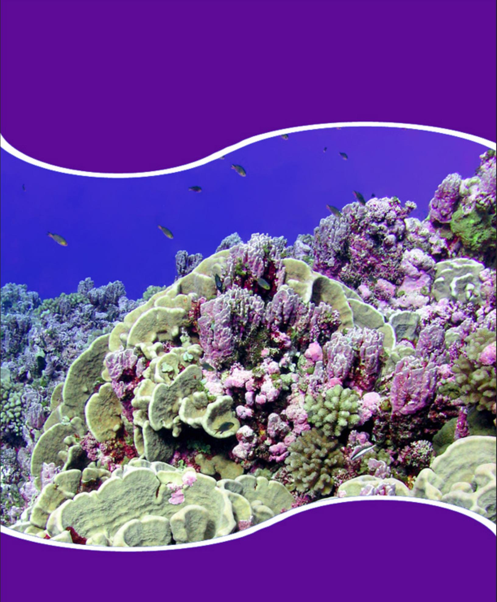