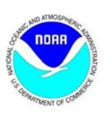
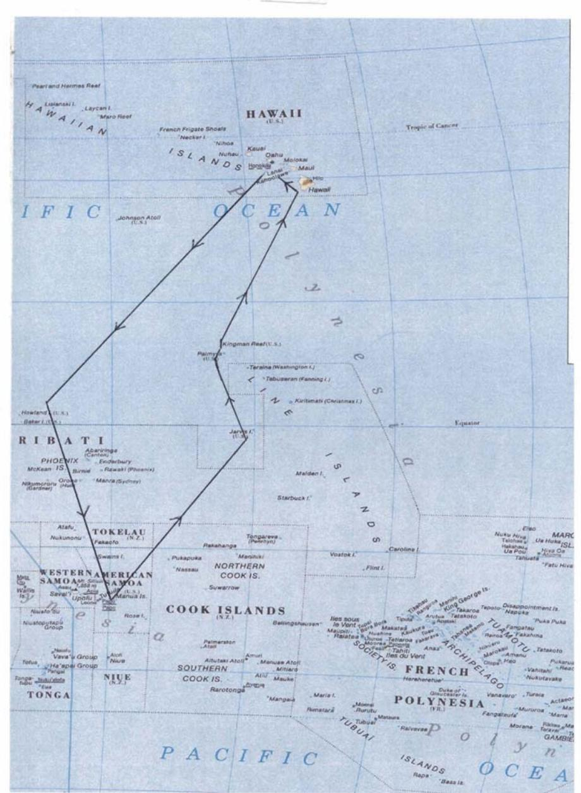

#### **U.S. DEPARTMENT OF COMMERCE National Oceanic and Atmospheric Administration NATIONAL MARINE FISHERIES SERVICE/NOAA FISHERIES**

**Pacific Islands Fisheries Science Center 2570 Dole St.** • **Honolulu, Hawaii 96822-2396 (808) 983-5300** • **Fax: (808) 983-2902** 

# **CRUISE REPORT1**

**VESSEL:** *TOWNSEND CROMWELL*, Cruise 02-01 (TC-275)

**CRUISE**

**PERIOD:** 21 January − 25 March 2002

**AREA OF**

**OPERATION:** U.S. Pacific Remote Island Areas (PRIAs), American Samoa

**TYPE OF** 

**OPERATION:** Personnel from the Coral Reef Ecosystem Investigation (CRED),

Honolulu Laboratory (HL), National Marine Fisheries Service

(NMFS), and NOAA conducted reef assessment/monitoring in waters

surrounding the U.S. Pacific Remote Island Areas (PRIAs) and

American Samoa.

# **ITINERARY:**

21 January Embarked Brainard, Mundy, and Zgliczynski of NMFS, Holzwarth,

Kenyon, Chojnacki, and Hoeke of University of Hawaii (UH)−Joint Institute for Marine and Atmospheric Research (JIMAR), Maragos of

USFWS, Godwin (Bishop Museum), and Vroom (UH-Botany). Departed Honolulu at 1015 en route to Howland (~ 1650 nmi).

21-28 January Conducted dive safety drills; tested Remote Underwater Digital

Acoustic Recorders (RUDARs); initiated moored Sontek acoustic Doppler current profilers (ADCPs) and Aanderaa current meters; prepped and painted Coral Reef Early Warning System (CREWS) buoys, subsurface moorings, and ARGOS SST buoys; modified towboards; analyzed habitat data tapes; and reviewed IKONOS

imagery to determine potential mooring locations.

1 PIFSC Cruise Report CR-06-001 Issued 20 January 2006

28 January Arrived Howland (lat. 0˚48'N, long. 176˚38'W) at 1730 and conducted three Tethered Optical Assessment Device (TOAD) camera drift dives in conjunction with QTC acoustic seabed classification surveys. At 2100, conducted a 500-m, conductivity-temperature-depth (CTD) station E of Howland. Commenced ADCP transects around Howland.

29 January Departed Howland and arrived W side of Baker (lat. 0°12'N, long. 176°29'W) at 0800. While towboard/mooring team (Brainard, Holzwarth, Kenyon, and Chojnacki) attempted to enter shallow reef flat on SE side of island, the jet boat was swamped by a wave in the surf zone washing coxswain Saunders, Holzwarth, Kenyon, and Chojnacki and numerous pieces of equipment overboard. The boat and all personnel remained safe but two regulators and some connector hoses for a pneumatic drill and a radio were lost overboard. Brainard and Holzwarth snorkeled into the shallow reef flat and conducted a habitat survey and evaluated potential SST buoy sites. Benthic (Maragos, Godwin, Vroom) and fish (Mundy, Zgliczynski) teams conducted two rapid ecological assessment (REA) stations on the previously inaccessible (because of rough sea conditions in 2000 and 2001) E and NE reef terraces and revisited a permanent station on W reef slope. Fish team conducted five shallow water CTDs to a depth of 30 m and deployed the RUDAR at lat. 0°11.822'N, long. 176°28.140'W. Benthic team conducted an additional rapid ecological assessment (REA) on the W side. Towboard team conducted toweddiver habitat surveys of E terrace and N reef slope to locate potential subsurface ADCP/CTD mooring sites. Hoeke and White conducted TOAD/QTC drift dives over E reef terrace and deep slope. Conducted three 500-m CTDs and multiple ADCP transects around Baker.

30 January Towboard team deployed subsurface ADCP/CTD mooring #3 in 19 m of water over E terrace at lat. 0°11.403'N, long. 176°27.615'W. Fish and benthic teams conducted three REA stations. Benthic team established a new permanent station on the E terrace of Baker. Fish team recovered the RUDAR and conducted 18 shallow-water CTD stations around Baker. At night, the ship conducted four CTD stations to a depth of 500 m and ran repeated ADCP transects around Baker.

31 Jan Departed Baker enroute to Howland conducting ADCP transects. Towboard team conducted three towed-diver habitat surveys around SE, E, N, and W sides of Howland. Towboard team (Kenyon, Chojnacki) conducted a drop dive over N reef terrace to collect samples for examining sexual coral reproductive status. Fish and benthic teams conducted two new REA dives on the previously inaccessible E and NE reef slopes and revisited one of the permanent stations on the W reef slope. Fish team deployed the RUDAR at lat. 0°48.370'N, long. 176°37.279'W and conducted 15 shallow-water CTD stations. Hoeke and White conducted TOAD camera and QTC acoustic habitat classification surveys along NE reef slope. The ship

conducted three CTDs to a depth of 500 m and repeated ADCP transects around Howland throughout the night.

1 February Towboard/mooring team (Brainard, Holzwarth, Chojnacki) surveyed an area along S end of the steep reef slope on W side as a possible SST mooring site, conducted a towed-diver habitat survey of N reef terrace, and deployed ARGOS SST buoy #5 in 16 m of water at lat. 0°49.396'N, long. 176°37.458'W. Fish and benthic (w/ Kenyon) teams conducted REAs at permanent stations on W side. Benthic team established a third permanent site along W side. Fish team recovered the RUDAR. The ship departed Howland en route to Pago Pago, American Samoa.

6 February Arrived Pago Pago, American Samoa to end Leg I. Provided tours of *Townsend Cromwell* to National Park Service employees. Met with Ray Tulafono, Director of the Department of Marine and Wildlife Resources, Tony Beeching, and Andy Cornish of DMWR.

7 February Provided tours of *TOWNSEND CROMWELL* to staff of DMWR, Department of Commerce, American Samoa Community College marine science students, and Governor Sunia's staff and cabinet. Participated in a reception in honor of the *TOWNSEND CROMWELL's* visit to American Samoa hosted by the governor.

8 February Conducted cruise planning meetings with A. Cornish of DMWR. Disembarked Mundy and Maragos.

9 February Embarked A. Cornish, E. Keenan, and R. Schroeder. Departed Pago Pago. Conducted four, towed-diver habitat/fish surveys over Taema Bank and S shore of Tutuila. Conducted two fish and benthic rapid ecological assessment (REA) surveys. Conducted TOAD and QTC acoustic habitat classification surveys around N and E sides of Tutuila.

10 February Deployed surface velocity drifter buoy (#35645) at lat. 14º12.465'S, long. 170º31.604'W on the NE side of Tutuila. Deployed Argos SST buoy #2 in 7.6 m of water off Aunuu Island at lat. 14º17.023'S, long. 170º33.737'W. Conducted three fish and benthic REAs along E and NE shores of Tutuila. Conducted four towed-diver habitat/fish surveys along SE, E, and NE reefs of Tutuila. Conducted QTC habitat classification surveys of SE banks of Tutuila. Departed Tutuila enroute to Ta'u Island. Deployed surface velocity drifter buoy (#35646) at lat. 14º15.174'S, long. 170º07.911'W midway between Tutuila and Manu'a Islands.

11 February Arrived Ta'u Island at 0730 to commence diving operations. Conducted 6 towed-diver habitat/fish surveys along E, S, and W shores. Conducted three fish and benthic REAs. Conducted 19 shallow water CTD stations around W, S and E shores of Ta'u. Deployed

RUDAR along S shore of Ta'u. Conducted oceanographic surveys (CTD and ADCP) around Manu'a Islands throughout the night.

12 February Deployed Argos SST buoy #3 in 17 m of water on the reef slope on the E side of Ta'u Island at14º14.140'S, 169º25.134'W. Conducted four towed diver habitat/fish surveys along N and NW sides of Ta'u. Conducted three fish and benthic REAs along N and W sides of Ta'u. Conducted 11 shallow-water CTDs around N shore of Ta'u. Recovered RUDAR with water in housing. Although data was secure, the water in the housing damage some of the integrated circuits. Conducted TOAD drift dive and QTC acoustic habitat classification surveys. Conducted oceanographic surveys (CTD and ADCP) around Manu'a Islands throughout the night.

13 February Transited to Olesega Island. Conducted six towed-diver habitat/fish surveys along W, N, and NW reefs of Olesega and Ofu Islands. Conducted three fish and benthic REAs at W and NE sides of Olesega and NW side of Ofu. Conducted 20 shallow-water CTDs around N and E sides of Olesega and Ofu. Deployed RUDAR along E side of Olesega. Conducted TOAD camera operations and QTC acoustic habitat classification surveys around Ofu and Olesega. Conducted oceanographic surveys (CTD and ADCP) around Manu'a Islands throughout the night.

14 February Conducted six towed diver habitat/fish surveys along W, S, and E shores of Ofu and Olesega. Conducted three fish and benthic REAs along S shore of Ofu. Recovered RUDAR. Conducted 19 shallowwater CTDs around S shore of Ofu and Olesega. Conducted TOAD/QTC operations during the evening. Conducted oceanographic surveys (CTD and ADCP) around Manu'a Islands throughout the night.

15 February Conducted two towed-diver habitat/fish surveys to 30-m depth along S shore. Conducted fish and coral REA to 30-m depth along south side of Olesega. Conducted invertebrate survey of shallow reef flats along SE side of Ofu. Departed Manu'a Islands enroute to Pago Pago. Arrived Pago Pago at 1930. Met with Representative Wallace Thompson of Swain's Island. Disembarked Keenan, Vroom, and Chojnacki.

16 February Embarked E. DeMartini, L. Preskitt, and J. Maragos. Met with W. Thompson and Nancy Daschbach, manager of NOAA NMS Fagatele Bay. Departed Pago Pago at 0900 enroute to Swains Island.

17 February Arrived Swain's Island at 1045. Conducted four towed-diver habitat/fish surveys of NW, NE, and E reef slopes at two depths (8 m and 15 m). Conducted two fish and benthic rapid ecological assessments (REAs) along SW reef slope. Disembarked terrestrial

biologists Seamon and Fa'aumu ashore at SE side where they hiked to Taulaga, retrieved boat from island caretaker (Palapi), and shifted gear to Taulaga campsite by nightfall. Deployed RUDAR along reef slope on S side of island. Conducted gear tests with TOAD. Conducted ADCP and CTD oceanographic surveys around Swains Island.

18 February Conducted four towed-diver habitat/fish surveys along SE and SW reef slopes. Conducted two fish and benthic REAs along SW reef slope. Established permanent benthic transect along SW reef slope and conducted fish and benthic REAs. Conducted fish and benthic roving diver survey. Recovered RUDAR. Conducted search for potential sites for ADCP mooring and SST buoy along SW reef slope. Terrestrial team set arthropod transect (ATR#1) from Taulaga to Namu; established, flagged, and surveyed Vegetation Transect (VTR) from SE of old Eli Jennings residence to Taulaga clearing; and checked and collected specimens from ATR #1.Conducted ADCP and CTD oceanographic surveys throughout the night.

19 February Conducted 14 shallow-water CTDs to a depth of 30 m around the island at 0.35-nm spacing. Conducted three fish and benthic REAs on windward N and NE reef slopes. Surveyed for sites to deploy moorings and buoys. Deployed subsurface ADCP/CTD mooring #001 in a small hole in the SW reef slope at lat. 11º03.509'S, long. 171º05.455'W in 15.5 m of water. Two arrays of eight settlement plates were attached to the concrete mooring anchor. Deployed RUDAR along SW reef slope in 21 m of water. Terrestrial team created, marked, and surveyed vegetation transect #2—N from Taulaga to N coast, then SE to Namu (lagoon); conducted manual survey and collection of littoral (macro) insect fauna S from Taulaga shore access point; and checked and collected specimens from arthropod transect #1. Conducted ADCP and CTD oceanographic surveys throughout the night.

20 February Surveyed reef flat for potential SST buoy deployment sites. Conducted invertebrate and algae surveys of reef flats on SW and SE sides of island. Conducted REA to a depth of 30 m to survey deeper fish and corals. Surveyed the brackish lake in the center of Swains Island for fish, algae, invertebrate, and corals. Conducted CTD survey in lake. Conducted two towed-diver habitat/fish surveys around NE reef slope. Collected coral core sample along SW reef slope. Established 2nd permanent coral transect station along SW reef slope. Recovered RUDAR from reef slope. Terrestrial team created arthropod transects #2 (littoral) and #3 (grassy clearing and agroforest edge in Taulaga); created, marked, and surveyed vegetation transect #3 along coast S from Taulaga; checked and collected samples from all anthropod transects; pulled all traps. Embarked terrestrial biologists Seamon and Fa'aumu. Departed Swains Island enroute to Pago Pago. Deployed

surface velocity drifter buoy #35650 at position lat. 11º07.261'S, long. 171º04.809'W.

21 February Arrived Pago Pago at 1730 to embark Beth Flint and Jeff Burgett of USFWS and obtain some 55 gallon drums of gasoline for small boats. Departed Pago Pago en route to Rose Atoll.

22 February Arrived Rose Atoll. Disembarked Flint, Burgett, Seamon, and Fa'aumu to Rose Island for terrestrial surveys. Transported Aanderaa current meter mooring thru reef pass into lagoon and anchored it in temporary location to await slack water. Located site for Coral Reef Early Warning System (CREWS) buoy near twin pinnacles in lagoon. Transported and moored CREWS mooring anchor. Conducted two fish and benthic REAs on NE and E reef slopes. Conducted ADCP and CTD oceanographic surveys around Rose Atoll throughout the night.

 Terrestrial teams: DMWR created area feature of vegetation perimeter (offset) around entirety of Rose Island; set single light trap in clearing (dominated by *Boerhavia repens*) in *Tournefortia argentea* forest. Light trap checked at 2030, 0100, and 0400—trap pulled after 0400 check. USFWS conducted maintenance of the 30-meter sampling grid, censused of active nests of all breeding birds using the two islands at the atoll, continued the study monitoring the response and recovery of the plant community following the eradication of the Polynesian rat (*Rattus exulans*), and continuation of a study evaluating the effects of iron enrichment from the 1993 wreck of the F/V *JIN SHIANG FA* on the coralline algae reef at Rose Atoll.

23 February Deployed CREWS buoy (SOSI #262-005) in 9.1 m of water in lagoon at position lat. 14º33.084'S, long. 168º09.611'W. Deployed Aanderaa RCM9 current meter (SN417) in central portion of the high velocity entrance channel to Rose Lagoon at position lat. 14º32.111'S, long. 168º09.289'W in 6.1 m of water. Deployed two arrays of eight settlement plates around the anchor for the CREWS buoy. Conducted three fish and benthic REAs along SE and SW reef slopes. Conducted two towed diver habitat/fish surveys along SE and SW reef slopes at 10−15 m depths. Modified TOAD and conducted successful performance tests. Conducted ADCP and CTD oceanographic surveys around Rose Atoll throughout the night.

 Terrestrial teams: DMWR established three arthropod transects (ATR), each with five stations at 10 m intervals, each station with one yellow trap and one wet pitfall; ATR 1 in recently colonizing *T. argentea* area, coralline gravel substrate; ATR 2 in field dominated by dense ground cover of *B. repens*; ATR 3 begins in a clump of *Pisonia grandis*, ends under *T. argentea* forest, substrate moist soil; georeferenced and took dbh for all mature *P. grandis;* checked and collected captures from ATR 1-3; set a single light trap in a recently

colonizing *T. argentea* area on NW corner of Rose Island; trap checked at 0200 and 0600, when the trap was pulled. USFWS conducted bird and vegetation surveys and continued monitoring the recovery of the reef flats following a 1993 shipwreck.

24 February Conducted six towed-diver habitat/fish surveys of shallow water reefs of fore reef slope around entire atoll. Conducted two fish and benthic REAs at reef slope sites and one permanent site at a lagoonal pinnacle. Removed derelict fishing seine net from reef slope on SE side of atoll. Modified TOAD and conducted successful performance tests. Conducted ADCP and CTD oceanographic surveys around Rose Atoll throughout the night. Deployed surface velocity drifter buoy #35651 at position 14º36.335'S, 168º05.533'W.

 Terrestrial teams DMWR rechecked and georeferenced ATRs 1−3 because of rain; created ATR 4 in very exposed, coralline gravel area (no vegetation) on E side; created ATR 5 under canopy of mature *T. argentea* forest, through patch of *Cordia subcordata* and *Cocos nucifera;* checked and collected samples from all ATR; set single light trap in *P. grandis* grove and checked at 2200 and pulled at 0400. continued surveys of birds, vegetation, rats and reef flats. USFWS conducted bird and vegetation surveys and continued monitoring the recovery of the reef flats following a 1993 shipwreck.

25 February Conducted two, deep (~ 30 m) towed-diver habitat/fish surveys around NW and N reef slopes. Conducted four, towed-diver habitat/fish surveys across the central lagoon and around the perimeter of the lagoon. Conducted three benthic REAs at lagoonal pinnacles. Conducted three fish REAs at a reef slope site and two lagoonal pinnacles. Conducted 28 shallow-water CTDs around atoll perimeter, in the reef pass, and at several sites within the lagoon. Conducted ADCP surveys around Rose Atoll throughout the night.

 Terrestrial teams: DMWR determined dbh and georeferenced the locations of all *C. subcordata*, *C. nucifera*, and *Hibiscus tiliaceus*; determined locations for all recruits of these species; created 10-m radius (314 m2 ) circular plot in mature *T. argentea* forest, in which locations and dbh (locations only of recruits too small to have a reliably measured dbh) of all individual woody plants were recorded; checked all ATR, collected samples, and pulled ATR 1-3; continued surveys of birds, vegetation, rats and reef flats. USFWS conducted bird and vegetation surveys and continued monitoring the recovery of the reef flats following a 1993 shipwreck.

26 February Conducted four, deep (20−25 m) towed-diver habitat/fish surveys around SE, SW, NE, and NW reef slopes. Conducted deep (30 m) fish and benthic REA of pinnacles on N reef slope. Conducted benthic surveys of reef flat. Conducted two fish REAs. Collected specimens of two species of Acropora corals on the SW reef slope to examine reproductive status. Embarked terrestrial biologists Seamon, Fa'aumu, Flint, and Burgett. Departed Rose Atoll en route to Tutuila.

 Terrestrial teams: DMWR created two additional 314 m2 circular plots, one at ATR 1 station 5 and one at ATR 2 station 5; removed FAD debris from reef; hiked to Sand Island where another 314 m2 circular plot was created; determined dbh and locations for all other woody trees (*T. argentea*) present; checked and collected samples from ATR 4 and 5, then pulled remaining ATR. USFWS conducted bird and vegetation surveys and continued monitoring the recovery of the reef flats following a 1993 shipwreck.

27 February Arrived S shore of Tutuila. Scientists Fa'aumu and Seamon assisted in securing permission to deploy SST buoy by contacting pulenu'u of Amanave village. Disembarked terrestrial biologists Seamon, Fa'aumu, Flint, and Burgett via small boat at Leone. Deployed SST buoy #4 in 27 m of water in Amanave Bay on a sand bottom at position 14º19.694'S, 170º50.006'W. Conducted four, towed-diver habitat/fish surveys around W and NW reef slopes. Conducted three fish and benthic REAs in Amanave, Poloa and Aoloau Bays. Modified and conducted successful tow tests with the TOAD. Conducted QTC and TOAD habitat mapping operations around northwest bank. The TOAD fouled hard onto reef severely damaging frame and bending steel I-beam on the ship. Electronic components and cameras continued to work throughout grounding. Deployed surface velocity drifter buoy #35649 at position 14º16.538'S, 170º54.923'W. Deployed surface velocity drifter buoy #35647 at position 14º23.846'S, 170º50.761'W.

28 February Arrived Pago Pago, American Samoa for fueling and resupply. Met with Ray Tulafono and Tony Beeching of the Department of Marine and Wildlife Resources (DMWR). Met with Nancy Daschbach of Fagatele Bay National Marine Sanctuary to discuss observing and modeling oceanographic processes around Tutuila. DMWR hosted barbeque for *CROMWELL* scientists and crew.

1 March In port Pago Pago. Disembarked DeMartini.

2 March Embarked Ramzi Mirshak and Joe Chojnacki. Departed Pago Pago at 0930. Deployed Aanderaa current meter off Step's Point, Tutuila in 21 m of water at position 14º22.499'S, 170º45.498'W. Conducted three, towed-diver habitat/fish surveys of Fagatele Bay, Larsen's Bay and E along the S shore of Tutuila. Conducted three fish and benthic REAs at Neeosegi Cove near the road works projects, off the airport, and in Larsen's Bay. Conducted QTC acoustic habitat mapping throughout the night. Made modifications to the TOAD to allow use as a drop camera.

3 March Installed swivel pin into reef in Fagasa Bay for attachment of SST buoy #1 in 2 m of water at position 14º17.057'S, 170º43.320'W (buoy will be attached by Dr. Andy Cornish of DMWR). Conducted three, towed-diver habitat/fish surveys along central N shore of Tutuila. First tow was aborted because of hard grounding of towboard on rocky point. Conducted three fish and benthic REAs at Massacre Bay, Agapie Cove, and Afono Bay. Conducted 22 shallow-water CTDs to a depth of 30 m along central N shore. Conducted three drop camera deployments and QTC acoustic habitat mapping operations during the night.

4 March Deployed surface velocity drifter buoy #35648 at position 14º25.150'S, 170º36.112'W. Disembarked Andy Cornish, Linda Preskitt, and Ron Hoeke and embarked Peter Vroom and Dominique Horvath via small boat into Pago Pago. At 0900 departed Tutuila enroute to Jarvis Island of the U.S. Line Islands.

6 March A. Cornish installed SST buoy #1 at site established on 3 March. DMWR recovered grounded surface velocity drifter #35645 from the E end of Tutuila for repairs and redeployment.

9 March Arrived Jarvis Island at 1215. Disembarked Horvath and White to conduct terrestrial surveys of vegetation and birds. Deployed subsurface ADCP/CTD mooring (SOSI #002) in 15 m of water on the southwest reef terrace at position 0º22.750'S, 160º00.932'W. Conducted two fish and benthic REAs along reef slopes on west and south sides. Established permanent transect along south side. Collected specimens of one species of *Acropora* coral to determine sexual reproductive status. Conducted six shallow-water CTDs to a depth of 30 m. Conducted four CTDs to 500 m and conducted ADCP transects around Jarvis throughout the night.

10 March Conducted four, towed-diver habitat/fish surveys around entire island at depths 8−16 m. Conducted three fish and benthic rapid ecological assessment surveys (one fish survey aborted as a result of aggressive and persistent sharks). Established permanent transect off small boat channel on west side. Deployed SST buoy #6 in 13.5 m of water on sand patch on east terrace at position 0º22.524'S, 159º58.422'W. Conducted nine shallow-water CTDs to a depth of 30 m around west half of island. Embarked Horvath and White. Departed Jarvis Island at 1845 enroute to Palmyra Atoll (395 nm).

9 March Arrived Jarvis Island at 1215. Disembarked Horvath and White to conduct terrestrial surveys of vegetation and birds. Deployed subsurface ADCP/CTD mooring (SOSI #002) in 15 m of water on the southwest reef terrace at position 0º22.750'S, 160º00.932'W. Conducted two fish and benthic REAs along reef slopes on W and S

sides. Established permanent transect along S side. Collected specimens of one species of *Acropora* coral to determine sexual reproductive status. Conducted six shallow-water CTDs to a depth of 30 m. Conducted four CTDs to 500 m and conducted ADCP transects around Jarvis throughout the night.

10 March Conducted four, towed-diver habitat/fish surveys around entire island at depths 8−16 m. Conducted three fish and benthic REAs (one fish survey aborted because of aggressive and persistent sharks). Established permanent transect off small boat channel on W side. Deployed SST buoy #6 in 13.5 m of water on sand patch on E terrace at position 0º22.524'S, 159º58.422'W. Conducted nine shallow water CTDs to a depth of 30 m around W half of island. Embarked Horvath and White. Departed Jarvis Island at 1845 enroute to Palmyra Atoll (395 nm).

12 March Arrived at Palmyra Atoll at 1200. Conducted three, towed-diver habitat/fish surveys of E terrace (aborted early as a result of hazardous sea conditions) and two along the S reef slope. Conducted two fish and benthic REAs at SW reef terrace and inside E coral pools. Conducted eight shallow water CTDs to a depth of 30 m. Conducted four CTDs to 500 m at sites N, E, S, and W of atoll. During the fourth CTD, the winch controller failed, causing the CTD to two-block and then free fall. A quick response by Survey Tech Phil White, who rushed to secure the hydraulic pump, stopped the CTD at a depth of about 87 m. The ship's crew used the capstan from the Oceo winch to haul the CTD aboard. Conducted ADCP current surveys throughout the night.

13 March Conducted six, towed-diver habitat/fish surveys along the S, SW, N, and NW reef slopes and the W reef terrace (2). Conducted three fish and benthic REAs of NW reef slope, SW reef terrace, and near the entrance channel. Conducted two shallow water CTDs to a depth of 30 m along W reef terrace. Conducted a WOG drop camera drift dive. Conducted four CTDs to a depth of 500 m on S, E, N, and W sides of Palmyra Atoll.

14 March Surveyed multiple potential sites to deploy CREWS buoy. Deployed enhanced CREWS buoy (SOSI #261-003) in 8.2 m of water on a sand bottom in a small lagoon at position 5º53.081'N, 162º06.170'W at 1815 HST (0415 UTC March 15). Installed two arrays of settlement plates over CREWS mooring anchor. Conducted three fish and benthic REAs. Conducted five shallow water CTDs to a depth of 30 m. *Townsend Cromwell* entered Palmyra Atoll and moored port side.

15 March In port Palmyra Atoll. Conducted algae and invertebrate surveys of lagoon and reef flats on N side of Cooper Island. Surveyed shallow coral pools on E end of atoll. *Townsend Cromwell* hosted shoreside barbeque for all hands and for The Nature Conservancy and USFWS crews ashore.

16 March Deployed Seabird SBE39 temperature and pressure recorder #0379 in 1.5 m of water in coral pools at E end of Palmyra lagoon at position 5º52.220'N, 162º02.705'W (the beginning of permanent coral transect PAL-15P established by Maragos in 2001). Conducted four, toweddiver habitat/fish surveys along NE reef slope and W terrace. Conducted three fish and benthic REAs over SE reef slope and W reef terrace. Conducted eight shallow-water CTDs to a depth of 30 m. Embarked Horvath from Palmyra Atoll shore party. Conducted one WOG drop camera drift dive to a depth of 70 m. Conducted two CTDs to a depth of 500 m on W, N, E, and S sides of Palmyra Atoll and ADCP transects between each station.

17 March Departed Palmyra Atoll enroute to Kingman Atoll. Arrived Kingman Atoll at 0730. Deployed standard CREWS buoy (SOSI #262-006) in 8 m of water in the coral pools at the E end of Kingman Lagoon at position 6º23.544'N, 162º20.531'W. Conducted three fish and benthic REAs at one permanent site at the E end of the lagoon established in 2000 and two new sites in the lagoon. Conducted 15 shallow-water CTDs to a depth of 30 m in the lagoon. Conducted four CTDs to a depth of 500 m and ADCP transects around the perimeter of the atoll.

18 March Conducted six, towed-diver habitat/fish surveys: two in the lagoon from S to SE to E to NE; four along the outer reef slope of the S side of the atoll from the E end to near the SW corner. Conducted three fish and benthic REAs along the NE inner barrier (backreef), a lagoonal patch reef, and at the CREWS buoy site. A permanent transect was established at the CREWS buoy site. Horvath and White conducted terrestrial surveys of Sand Island. Conducted four CTDs to a depth of 500 m and ADCP transects around the perimeter of the atoll.

19 March Conducted five towed-diver habitat/fish surveys: three along NE and N outer reef slopes and two along the S inner reef slope and flat. Conducted three fish and benthic REAs along S barrier reef and two patch reefs. Departed Kingman Atoll at 1820 en route to Kawaihae, Hawaii.

24 March Arrived off Kawaihae, Hawaii. Disembarked Brainard, Zgliczynski, Holzwarth, and Kenyon and towboard gear to conduct NMFS-NOS towboard/remote-sensing validation study. Departed Kawaihae en route to Honolulu.

25 March Arrived in Honolulu, Hawaii at 0730 to end TC-02-01. Disembarked Schroeder, Chojnacki, Maragos, Vroom, Godwin, Horvath, and Mirshak.

# **CRUISE STATISTICS:**

Towed-diver habitat surveys 102 tows, ~ 310 km Towed-diver fish surveys 102 tows, ~ 310 km QTC acoustic habitat mapping ~ 1025 km Tethered Optical Assessment Device (TOAD/WOG) 26 dives, ~ 1300 digital photos,

Fish REA surveys 90 stations Benthic REA surveys 90 stations

Acroporid Coral Samples

Aanderaa RCM9

Seabird SBE39 temperature and pressure recorder deployments 1: Palmyra Lagoon coral pools

RUDAR acoustic recordings 6 stations (10 GB) Shallow water (30 m) CTDs 254 stations Deep water (500 m) CTDs 69 stations ADCP current profiles ~ 12,500 km Thermosalinograph transects ~ 11,500 km

~ 11 hours of video

Dives ~ 950 SCUBA, ~ 500 snorkel Permanent Transects Established 9: Howland Island, Baker Island, Jarvis Island, Palmyra Atoll, Kingman Atoll, Rose Atoll, Swains Island (3)

Coral cores (for growth rates) 3: Howland Island, Swains Island, Kingman Atoll

(to determine reproductive status): Howland Island, Tutuila Island, Rose Atoll, Swains Island, Jarvis Island, Palmyra Atoll, Kingman Atoll

CREWS buoy deployments 3: Rose Atoll, Palmyra Atoll, Kingman Atoll Settlement plate deployments 6: Baker Island, Swains Island, Rose Atoll, Jarvis Island, Palmyra Atoll, Kingman Atoll SST buoy deployments 6: Howland Island, Tutuila Island (2), Aunuu Island, Ta'u Island, Jarvis Island Subsurface ADCP/CTD deployments 3: Baker Island, Swains Island, Jarvis Island

current meter deployments 3: Rose Atoll pass; Step's Point (Tutuila Island); Kingman Atoll, La Paloma Channel

Surface Velocity Drifters 8: Tutuila Island (4), Ta'u Island, between Tutuila and Manu'a Group, Rose Atoll, Swains Island

Terrestrial Surveys Swains Island, Rose Atoll, Jarvis Island, Palmyra Atoll, Kingman Atoll

# **MISSIONS AND RESULTS:**

See Appendices A−I

# **SCIENTIFIC PERSONNEL:**

Russell Brainard, PhD, Chief Scientist—National Marine Fisheries Service/ NOAA Corps

Stephani Holzwarth, Towboards—Joint Institute for Marine and Atmospheric Research JIMAR

Jean Kenyon, Towboard and Coral Teams—JIMAR

Brian Zgliczynski, Towboard and Fish Team—NMFS/NOAA

Bruce Mundy, Fish Team—NMFS/NOAA

Joe Chojnacki, Towboard Team—JIMAR

Ronald Hoeke, Oceanography Team—JIMAR

Jim Maragos, Coral Team—U.S. Fish and Wildlife Service, USFWS

Scott Godwin, Benthic Team—Bishop Museum

Peter Vroom, Benthic Team—UH Botany

Ed DeMartini, Fish Team—NMFS/NOAA

Robert Schroeder, Fish Team—JIMAR

Elizabeth Keenan, Towboard Team—JIMAR

Linda Preskitt, Benthic Team—UH Botany

Andy Cornish, Coral Team—American Samoa

Joshua Seamon, Terrestrial Team—American Samoa

Ruth Utzurrum, Terrestrial Team—American Samoa

Beth Flint, Terrestrial Team—USFWS

Ramzi Mirshak, Oceanographer Team—JIMAR

Dominique Horvath, Terrestrial Team—USFWS

Siaifoi Fa'aumu, Terrestrial Team—American Samoa

| (/s/Russell Brainard)                 |
|---------------------------------------|
| Submitted by:                         |
| Russell Brainard                      |
| Chief Scientist                       |
|                                       |
|                                       |
| (/s/Samuel G. Pooley) Approved by: |
| Samuel G. Pooley                      |
| Science Director                      |

Pacific Islands Fisheries Science Center

Attachments

Appendix A: Fish REA Team Activity Report (Brain Zgliczynski, Bruce Mundy, Robert Schroeder, and Edward DeMartini)

#### Howland and Baker Islands

Surveyed six stations at Baker and five at Howland. Stations at the N and E sides of both islands were included, areas not surveyed on the 2000 and 2001 cruises because of sea conditions. Fish surveys were also conducted at permanent transects established during the 2000 and 2001 cruises at each island to initiate monitoring activities. Fish transect-stations consisted of three consecutive 25-m lines set along a single depth at 10–14 m. After each line was set, the observers swam along either side of it at 5-m apart, each counting and recording size classes for all fishes > 20 cm total length (TL) within an area 4-m wide and 4-m high. At the end of each 25-m line, the divers turned and, while remaining on either side of the line, began counting and recording size classes of all fishes < 20 cm TL within 2 m along their side of the line and 4 m off the bottom. Numbers of highly abundant species such as anthiine basslets, planktivorous damselfishes, and fusiliers were estimated. A list of observed fish species was recorded after each three-line transect was completed, except at one station on Howland where currents were too strong to allow all three lines to be completed.

In general, the fish populations at Howland/Baker in 2002 were found to differ little from those observed in 2001. Large sharks seemed to be less abundant on the transects than in the previous year, although numerous grey reef sharks > 1 m were observed off the transects during other operations. Reef whitetip sharks were the only other shark species seen in 2002 on the fish team surveys. A few reef blacktip sharks and one hammerhead shark were observed by the towboard team. Pelagic fish species were also seen less frequently than in 2001. Manta rays were observed only at a couple of stations and rainbow runner, while locally abundant, were also seen less often on the fish transects than in 2001. Tuna had been observed from dropoff habitats in previous years but were not seen in 2002. Possible explanations for these differences were the reduced visibility and warmer water temperatures in 2002 as compared with 2001. Lower visibility limited our ability to see fishes in open water and warmer temperatures may have influenced larger predators to remain in deeper water during daytime hours when the surveys were conducted. Warmer water temperatures were also the likely explanation for smaller numbers of deeper-dwelling species, such as blueline triggerfish, slenderspine grouper, and redtip grouper, that were seen in 2002 compared with 2000 and 2001. Exceptions to the lower numbers of larger predators seen in 2002 were numbers of big twinspot snapper which were comparable to those in 2000 and 2001, and increased sightings of great barracuda in this year's survey.

In contrast to the lower numbers of larger fish, small fish were abundant at Howland/Baker in 2002. Small juvenile anthiines and damselfish were numerous, suggesting a good recruitment year, and adult anthiines were very abundant in their respective habitats. In addition, fusiliers, which are also planktivores although much larger than the anthiines, were very abundant this year. Only yellowback fusilier had been observed in numbers in 2001 but in 2002 schools of bluestreak fusilier and twinstripe fusilier were seen on several occasions.

Few new fish species records were obtained from Howland/Baker this year, partly as a result of the accumulated number of species already found in 2000 and 2001, partly because of fewer fish-team observers during this cruise, and partly because less time was available during the stations for species inventories this year. One noteworthy addition to the fish fauna of Baker was the clown triggerfish, a highly valued fish in the aquarium trade. Also of note were single records of rare species previously recorded from Baker – longfin spadefish, bluestriped chub—an eastern tropical Pacific species, and humphead bannerfish.

## Tutuila (Part I) and Manua Islands, American Samoa

The fish-census team surveyed five stations at Tutuila, six stations at Ta'u, two stations at Olosega, and four stations at Ofu. Stations on all sides of the islands were included on these transects, except at Tutuila where work was conducted around the E half of the island. The benthic team followed the fish team at all census sites. In addition, the fish team took CTD casts around each island at stations approximately 0.35 nmi apart, to 30-m depths. A total of 21 CTD casts were completed at Tutuila Island, 31 at Ta'u Island, and 39 combined casts at Olosega and Ofu Islands (see below).

Fish transect-stations consisted of three consecutive 25-m lines set along a single depth at 13-15 m. After each line was set, the observers swam along either side of it at 5-m apart, counting and recording size classes for all fishes > 20 cm total length (TL) within an area 4-m wide and 4-m high. At the end of each 25-m line, the divers turned and, while remaining either side of the line, began counting and recording size classes of all fishes < 20 cm TL within 2 m along their side of the line and 4 m off the bottom. Numbers of highly abundant species such as juvenile damselfishes (Pomacentridae), and schooling fusiliers (Caesionidae) were estimated. A list of observed fish species was recorded for each island/area.

Although this was the first time an extensive fish survey has been conducted by the NMFS in American Samoan waters, the general consensus was that the fish populations at each station were found to be of generally low diversity (of the total pool of species known to occur at these islands), with a relative absence of many large fish or sharks. In general, the predatory species seen during the surveys were smaller-bodied than perhaps expected, with many of the Snappers (Lutjanidae) Groupers, (Serranidae), and Trevallies (Carangidae) observed along the transects being smaller than 30 cm total length. Grey reef sharks (Carcharhinus amblyrynchos), reef whitetip sharks (Triaenodon obesus) and reef blacktip sharks (Carcharhinus melanopterus) were the only three species of shark seen during the surveys, with none of the sightings occurring along the 25-m transects. Possible explanations for the smaller predatory fish and sparse shark sightings could be a result of pressure from fishing or (less likely) the tendency for larger predators to remain in deeper water during daytime hours when the surveys were conducted. Artisanal fishing in the Manu'a group is believed to be very light.

A species of *Pomacanthidae* was observed at Ta'u, Ofu, and Olosega that displayed unique characteristics from any other described species. Using an annotated species checklist of Samoan fishes (Wass, 1984) as a reference, the fish would be described as *Centropyge heraldi*, but after reviewing more recent works (Allen G, Steene R, Allen M,

1998) we believe the *Centropyge sp.* to be a new species that is being described by Rudie Kuiter. This particular *Centropyge sp.* is thought to be a close relative of C. *heraldi* and until present was only thought to inhabit rubble bottoms in the Coral Sea off of Australia's Great Barrier Reef. Therefore with further analysis and verification of the photographs taken, a possible range extension could be made for this pomacanthid species.

Fish species records were noted during the limited time following each census dive but no fish-team observer was dedicated to making a species checklist during each dive. At the end of each day, species records were recorded and photographs were reviewed to aid in compiling a species checklist form each site. Andy Cornish also contributed to the fish species checklist. A total of 127 species were observed at Ta'u I. and 168 at Olosega/Ofu I.

On 15 February, a deep dive (to 90 ft.) was performed on the S. side of Olosega followed by snorkeling in the National Park at Ofu to complete the species records. During the 30-m dive, a single pink anemonefish (Amphiprion periderion) was observed for the first time during the survey and a large dogtooth tuna (Gymnosarda unicolor) 1.6-m TL was observed. No other unique or unusual observations were made during the dive.

#### Swains Island, American Samoa

The fish-census team surveyed 10 stations at Swains Island. Quantitative transects were conducted at six stations and qualitative REA surveys at another four stations. Stations were located on all sides of the island. The N side was exposed to a large (> 2-m) swell and strong surge at < 10-m depths during this time but underwater visibility was consistently > 30 m. At some stations moderate surge occurred at the transect depth (15 m). The benthic team followed the fish team at all visual census sites and most REA sites.

Fish transect stations were conducted using the same, previously described surveying protocols used on the Phoenix Islands cruise leg and around the main islands of American Samoa. All quantitative transects were set along a single depth at 13–15 m. Additional qualitative surveys spanned 1- to 30-m depths.

This was the first time coral reef fish surveys were conducted by the NMFS at Swains Island. Fish species diversity (richness) was generally low at the spatial scale (2000-5000 m²) of individual stations, averaging only about 30–35 species out of the total pool of species observed at Swains. Pelagic predators like yellowfin tuna were encountered. Sharks and some other reef-associated apex predators such as giant trevally were rare. Other large reef-associated fish (snappers, emperors, rainbow runner, barracuda, dogtooth tuna) were nevertheless more abundant at Swains than observed previously at Tutuila or the Manua Islands. Groupers also were more abundant at Swains but small (< 30 cm total length). Grey reef sharks (Carcharhinus amblyrhynchos), reef whitetip sharks (Triaenodon obesus), and reef blacktip sharks (Carcharhinus melanopterus) were the only three species of shark seen at Swains, with only one sighting on the transects. Local fishing pressure at Swains is presently very light as only one family of four currently resides on the island, but up to 100 families have lived on Swains in recent decades.

In addition to the six quantitative stations, four qualitative stations (two deep: maximum 23-28 m and two shallow: 3-10 m) were conducted to supplement the list of total fish species present at Swains. Additional fish species were also noted during the limited time following each visual transect but no fish-team observer was dedicated to making a species checklist during the entire dive. Andy Cornish Linda Preskitt (benthic team) and Brian Zgliczynski (tow team) also contributed to the fish species checklist at the end of each day. A grand total of 168 fish species were observed at Swains during the 4-day visit. The only other existing fish survey data at Swains consist of a single pair of stations visually surveyed by A. Green on the SW side in 1995 and described in her 1996 unpublished report to the Department of Marine and Aquatic Resources of American Samoa. Green reported 67 fish species at 10-m depth.

New species (currently being described by others) Dascyllus "aurupinnus" (yellow below) and Centropyge cf. hearldi (w/black soft dorsal) were also observed at Swains.

DeMartini and Schroeder also collected 15 specimens of the arceye hawkfish, *Paracirrhites arcatus*. These specimens will be used for an ongoing study of the genetics of this polymorphic species throughout the Pacific being conducted by DeMartini and G. Bernardi of the University of California at Santa Cruz.

# Rose Atoll and Tutuila (Part II), American Samoa Rose Atoll

The fish-census team surveyed 15 stations at Rose Atoll. Quantitative transects were conducted at 12 stations, most of which were followed by qualitative REAs conducted while snorkeling shallower at the same station. Qualitative REA surveys were conducted at another three deep (average 23- to 28-m) stations. Four stations were located inside the lagoon and 11 were located on the forereef (on the seaward side of the barrier reef). Habitat diversity at Rose was greater than Swains. Suitable fish habitat within the lagoon at Rose was limited to a few pinnacles/patch reefs (mostly along the W), which served as focal points for large fish in the lagoon, and isolated small coral heads on the backreef flat, which harbored small species or recent recruits/juveniles. Structural complexity on the slope outside was low, partly as a result of the general lack of large old coral colonies, which may have accounted for low fish densities. Sea conditions were generally calm and underwater visibility excellent (> 35 m) outside, but visibility was only about 5-20 m inside the lagoon. Surge from large ocean swells was present at the more wave-exposed stations. The benthic team followed the fish team at most visual census stations. Habitat types surveyed were the forereef slope, outer reef terraces, inner reef flat, and lagoonal patch (pinnacle) reefs.

Fish transect-stations were conducted using the same, previously described surveying protocols used on the earlier legs of this cruise. All quantitative transects were set along a single depth at 13-15 m. Additional qualitative surveys spanned 1- to 30-m depths.

These were the first reef fish surveys conducted by the NMFS at Rose Atoll. Fish species diversity (richness) was generally low (and only slightly greater than at Swains Island) at the spatial scale (2000–5000 m2) of individual stations, averaging only about 35–40 species out of the total pool of 222 species observed at Rose during the 5-day visit. This

contrasts with 103 species recorded at Rose (at six, 10-m deep forereef stations, two of which were supplemented by observations on the adjacent reef flat and backreef) by Alison Green during two brief visits in 1994 and 1995. Sharks and other large reef-associated predators were uncommon. Only three maori wrasse (Cheilinus undulatus) were sighted. No bumphead parrotfish (Bolbometopon muricatum) was sighted. Both species were noted by the USFWS as common at Rose Atoll in the early 1990s. Larger individuals of other scarids (parrotfishes) were concentrated in the surge zone (< 10 m). Grey reef sharks (Carcharhinus amblyrhynchos), reef whitetip sharks (Triaenodon obesus), and reef blacktip sharks (Carcharhinus melanopterus) were the only three species of shark seen at Rose, most of which were small and none of which were common. Only a few sightings were made of large pelagic fish (e.g, jacks, rainbow runner, dogtooth tuna). Rose Atoll is uninhabited and levels of past or present fishery exploitation are unknown.

The qualitative REA dives were conducted to supplement the list of total fish species present. Additional fish species were also noted during the limited time (5–10 min.) following each visual transect but no fish-team observer was dedicated to making a species checklist during the entire dive. Cornish and Preskitt (benthic team) and Zgliczynski (tow team) also contributed to the fish species checklist at the end of each day.

Perhaps the most interesting biological observation made at Rose Atoll was the apparently greater diversity and density of herbivorous fishes at and near the site of the 1993 grounding of the SHIANG FA (a 250-mT Taiwanese longliner). The numbers of pygmy angelfishes (Centropyge loriculus and C. flavissimus) and emperor angelfish (Pomacentrus imperator), as well as the numbers and biomass of many species of herbivorous surgeonfishes (Acanthurus nigrofuscus and A. triostegus, Ctenochaetus striatus, Naso lituratus) appeared notably greater at the wreck site, compared to reference sites located one-half to several kilometers on either side of it, at depths extending from the reef crest to at least 15 m. A greater herbivore abundance at the wreck site most likely reflects a persistent redistribution of grazers in response to a conspicuous bloom of primarily blue green algae at the coral-affected and iron-enriched site.

#### <u>Tutuila</u>

The fish-census team surveyed nine additional stations (SW, W and N sides) around Tutuila 27 February and 2-3 March (5 stations were surveyed 9-10 February and discussed in an earlier report). Quantitative transects were conducted at these sites, most of which were followed by qualitative REAs while snorkeling shallower at the same station. No additional deep qualitative REA surveys were conducted. The benthic team followed the fish team at all stations. Habitat diversity ranged from low relief exposed outer reef slopes to highly rugose coral structure in protected bays. Sea conditions were generally calm and underwater visibility average to good (20-30 m). Slight surge from larger ocean swells was present at some stations, except in protected embayments.

Fish transect stations were conducted using the same previously described surveying protocols used on the earlier legs of this cruise. All quantitative transects were set along a single depth at 13-15 m. Additional qualitative shallow REA surveys spanned 1- to 12-m depths.

Fish species were noted (qualitative REA) during the limited time (5-10 minutes) following each visual transect, but no fish-team observer was dedicated to making a species checklist during the entire dive. Cornish and Preskitt (benthic team) and Holzwarth (tow team) also contributed to the fish species checklist at the end of each day.

Fish species diversity (richness) was generally low at the spatial scale (2000–5000 m2) of individual stations, averaging only about 25–35 species out of the total pool of about 228 species observed at Tutuila during both visits. This contrasts with 173 species recorded at Tutuila by Alison Green in 1994 and 1995.

Juvenile fish dominated at all stations indicating recent heavy recruitment. Fish diversity appeared to relate to habitat complexity, lowest at low relief stations (e.g., S and highly scoured, exposed N stations) and highest where substrate rugosity was high (e.g., spur/groove zones, diversity of coral structural types in W,N bay). The low diversity might also be attributed to the effect of recent hurricanes on substrate complexity. The S station near the road construction site (land fill) appeared to have more algae and herbivorous damsels and surgeonfishes seemed more abundant here as compared to other REA stations around the island.

Sharks and other large reef-associated predators were very rare; they were not seen by the fish or benthic dive teams. Although most maori wrasse (Cheilinus undulatus) observed were small-medium size, a few, very large (> 150 cm), terminal-phase maori wrasses were observed along the W shores of Tutuila. These wrasses were the largest observed among all of the islands surveyed. None of the large growing bumphead parrotfish (Bolbometopon muricatum) were observed during our surveys and most groupers and snappers seen were small.

#### Jarvis Island

# Fish team activity summary, TC-02-01—Jarvis Island

From 9 to 10 March, the fish-census team surveyed five stations at Jarvis Island. Quantitative transects were conducted at four stations and a qualitative REA survey at one station. Habitat type included outer reef slope and a large shallow shelf off the E side and a small shelf off the NW. Structural complexity in all areas was high but some underlying rubble and advanced recolonization of corals was apparent on the exposed sides (N, E, S). Sea conditions were moderate, with large ocean swells on the E, and underwater visibility was fair (> 15-20 m). The benthic team followed the fish team at all stations. Water temperature was lower than Samoan sites, about 26.7°C because of upwelling.

Fish transect stations were conducted using the same, previously described, surveying protocols used on the earlier legs of this cruise. All quantitative transects were set along a single depth at 13–15 m. The transect attempted at Station 10 (E shelf) was aborted after 20 minutes because of approximately 30 sharks (gray reef [Carcharhinus amblyrhynchos] whitetip [Triaenodon obesus], 4-6 ft. total length), several of which were aggressive (biting each other, charging divers, displaying pre-attack posturing), and increasing bottom current. This station was logged as an REA dive. In addition to the qualitative REA dive, additional fish species were noted during the limited time (5

minutes) following each visual transect, but no fish-team observer was dedicated to making a species checklist during the entire dive. Members of the tow team (S. Holzwarth, R. Brainard) also contributed to the fish species checklist.

This is the third consecutive year the NMFS has surveyed reef fish at Jarvis and findings were generally similar. Fish species diversity (richness) was high with 146 total species observed during the 1.5 day visit (five dives). Anthiases (mostly Pseudanthias bartlettorum and Luzonichthys whitleyi) numbered in the 1000s, damselfishes (Lepidozygus tapeinosoma) and cardinalfish (predominately Apogon apogonides) in the 100s on most transects (25-m line). Large reef-associated predators (jacks, snapper, shark, grouper, moray eel) were very abundant. Along some transect lines, jacks (mostly Caranx lugubris) numbered in the hundreds. Several species of large (> 40 cm TL) parrotfish (Scaridae) were observed along with a single sighting of the maori wrasse (Cheilinus undulatus). Although the bumphead parrotfish (Bolbometopon muricatum) was observed during prior-year's survey, no sightings were reported this year. Frequent displays of courting and mating behavior were commonly observed among some angelfish (Pomacathidae), surgeonfish (Acanthuridae), parrotfish (Scaridae), and wrasse (Labridae) species. Large reef associated fish such as rainbow runner (Elagatis bipinnulata), dogtooth tuna (Gymnosarda unicolor), great barracuda (Spyraena barracuda), and scalloped hammerhead (Sphyrna lewini) were also seen. Jarvis is an uninhabited National Wildlife Refuge administered by the USFWS and levels of past or present fishing are unknown. Some heavily fouled fishing line (longline gear) was observed on the S and E reef shelf along with two sightings of gray reef sharks (C. amblyrhynchos) appearing to have been foul hooked, one of the sharks missing its first dorsal fin.

A few additional biological observations from Jarvis are worth noting. First, some new record sightings were found increasing the range for a few fishes, but until further analysis only the following positive identifications are listed: the leopard hind grouper (Cephalopholis leopardius) and the milkfish (Chanos chanos). Second, the blue-lined triggerfish (Xanthichthys caeruleolineatus) and the red-tipped grouper (Epinephelus retouti), which is usually found inhabiting deep seaward reefs in depths ranging from 70–200 m, were observed during the surveys at depths less than 15 m. This is likely a result of the equatorial undercurrent current causing upwelling as it runs into Jarvis, ultimately creating a highly productive ecosystem and allowing for certain deeper dwelling fishes to be found in shallower depths.

# Palmyra Atoll

The fish-census team conducted quantitative transects at 10 stations at Palmyra atoll and a qualitative REA at one station. Six stations were new, and five were resurveys of sites conducted in 2000 or 2001. Habitat type included the outer reef slope, back reef flat (coral gardens), and top of the extensive W terrace. Reef structural complexity was good at all sites. No transects were conducted in the main lagoon, which was heavily dredged and murky. Sea conditions were moderate, with variable bottom surge at most sites and current on the west bank. Underwater visibility was good (generally 30+ m). The benthic team followed the fish team at all stations.

Fish transects were conducted using the same, previously described surveying protocols used on previous legs of this cruise. Most quantitative transects were set along a single depth at 13–15 m; one was conducted at 4 m and one at 18 m. A single, qualitative REA drift dive was conducted at 19 m on the W bank, where surface conditions were too rough to anchor and bottom current was too strong to set and hold to a transect line. Additional fish species were also noted during the limited time (5–15 minutes) following each visual transect. No fish-team observer was dedicated to making a species checklist during the entire dive. Other divers S. Godwin (Benthic Team), R. Brainard, and S. Holzwarth (Tow Team) also contributed to the fish species checklist.

This is the third consecutive year the NMFS has surveyed reef fish at Palmyra and findings were generally similar, while several observations are worth noting. Overall fish species diversity (richness) was high with 195 total species observed during the four days of survey. Local diversity was also high. Over 100 species were sighted during a 40minute drift REA dive covering about 200 m on the W bank. The diversity of parrotfish (Scaridae) and wrasse (Labridae) was particularly high with 14 species of parrotfish and 37 species of wrasse observed during this year's survey at Palmyra. This high diversity is associated with the North Equatorial Counter Current supplying this atoll with larvae from the highly diverse Western Pacific and because of the diversity of reef habitats found at Palmyra. Sharks, mostly gray reef (Carcarhinus amblyrhynchos), were common with several present on most dives, but they were not overly aggressive in behavior. Their abundance was highest along the outer (exposed) reef slope on the E. Large (> 50 cm) snappers, predominantly red snapper (Lutjanus bohar) were abundant and medium-large (30–50 cm) groupers (various species) were common. The camouflage grouper (Epinephelus polyphekadion) and lyretail grouper (Variola louti) were the most common large-sized groupers observed at the stations. Several medium-size (50-100 cm) maori wrasse (Cheilinus undulatus) were seen on a number of the dives. Large (> 100 cm) bumphead parrotfish (Bolbometopon muricatum) were sighted but rare. Other parrotfishes (various species) were abundant on all dives. Large reef-associated fish, such as rainbow runner (Elagatis bipinnulata), great barracuda (Spyraena barracuda), blackfin barracuda (S. qenie), and manta ray (Manta birostris), were common. Scalloped hammerhead shark (Sphyrna lewini) were sighted on two occasions, but only briefly, consistent with its reported shy behavior. Four species of jack (Carangidae) were seen at all sites with the black jack (Caranx lugubris) and bluefin trevally (C. melampygus) being the most common. Palmyra is USFWS National Wildlife Refuge owned and operated by The Nature Conservancy. Fishing is limited to catch and release and daily limits. Any level of illegal fishing is unknown.

A few additional observations on the fish from Palmyra are worth noting. First, some new record sightings were found increasing the range for a few fishes, but until further analysis only the following positive identifications are listed: the bronze soldierfish (Myripristis adusta), which has been observed at other locations in the Line Islands was observed for the first time at Palmyra during this expedition. The cheeklined maori wrasse (Oxycheilinus digrammus) has also been observed at other locations throughout the Line Islands but is a new record for Palmyra. Finally, the broom filefish (Amanses scopas) was also observed for the first time during the 2002 surveys.

# Kingman Reef

The fish-census team conducted quantitative transects at nine stations at Kingman Atoll. Five stations were new, and four stations were re-surveys of sites conducted in previous years. Habitat type included the outer reef slope, inner reef slope, inner reef flat, and the slope of lagoonal patch reefs. Reef structural complexity was highest in shallow waters (< 10 m). Sea conditions were moderate, however, much of the reef (e.g., exposed outer E side, W side) was unworkable as a result of large ocean swells creating bottom surge and current. Underwater visibility was good (generally 20–25 m). The benthic team followed the fish team at all stations.

Fish transects were conducted using the same, previously described surveying protocols used on the previous legs of this cruise. Most quantitative transects were set along a single depth at 13–15 m; one was conducted 6 m. No independent qualitative REA dives were conducted; however, additional fish species were noted during the limited time (5–20 minutes) following each visual transect. No fish-team observer was dedicated to making a species checklist during the entire dive. Tow team divers S. Holzwarth, R. Brainard, and J. Chojnacki also contributed to the fish species checklist.

This is the third consecutive year the NMFS has surveyed reef fish at Kingman and findings were generally similar, with a few exceptions. Overall fish species diversity (richness) was high with 149 total species observed during the 3-day visit. Large reef-associated predators, particularly red snapper (Lutjanus bohar) and gray reef shark (C. amblyrhynchos) were very abundant. About a dozen sharks were present during a typical dive. Jacks were less abundant. As in previous years, no maori wrasse (Cheilinus undulatus) or bumphead parrotfish (Bolbometopon muricatum) were observed by any dive team. Large reef associated fish such as rainbow runner (Elagatis bipinnulata), great barracuda (Spyraena barracuda), silvertip shark (C. albimarginatus), scalloped hammerhead (Sphyrna lewini) and the great hammerhead (S. mokarran) were also seen. Kingman is an uninhabited USFWS wildlife refuge and levels of past or present fishing are unknown. Marine debris found on the reef included fouled fishing net, buoys, and long-line gear.

A few additional observations on the fish from Kingman are worth noting. First, some new record sightings were found increasing the range for a few fishes, but until further analysis only the following positive identifications are listed: A black ear wrasse (Halichoeres melasmapomus) was sighted at two separate sites along the outer reef. The sighting of this wrasse increases its range and is a new record for Kingman reef. A silvertip shark (C. albimarginatus) was sited by S. Holzwarth of the tow team and is also a new record for the site. This species of shark is common inhabitant of steep outer slopes throughout the Indo-pan-pacific but is uncommon in depths shallower than 30 m and was not observed at any of the transect sites during this trip. Second, fish diversity and abundance at some stations (15, 12, and 5P) inside the lagoon was very low at the transect depth (13 –15 m) but became noticeablyhigher at shallower depths (< 10 m), even though apparently suitable reef habitat (e.g., 80% live coral cover) extended well below the transect depth. Third, sharks and snappers at Kingman were very abundant with the gray reef shark (C. amblyrhynchos) and twinspot snapper (L. bohar) being the most abundant. Of the sharks observed, many were over 160 cm and the average size of the twinspot snappers were larger than 50 cm. The last noteworthy observation was that

several other species considered common in neighboring islands/atolls were absent in the Kingman surveys (e.g., the blue-stripe snapper Lutjanus kasmiri). Parrotfishes (Scaridae) were represented by only 10 species at Kingman compared to 17 species at Palmyra Atoll. While the two atolls are separated by only about 40 miles and have many similar habitats, there are likewise many significant distinctions between habitat types. The reef area at Kingman is restricted to the barrier reef perimeter and a small number of lagoonal patch reefs. The lagoon at Kingman is completely open on the entire west half of the atoll allowing significant water exchange, particularly when the NECC is flowing. Palmyra, on the other hand, has large reef terraces on both the E and W ends and a large and essentially closed lagoon.

Appendix B: Coral REA Team Activity Report (James Maragos, Jean Kenyon, and Andy Cornish)

#### Howland and Baker Islands

Six sites were surveyed at each of Baker and Howland, complementing the total of 12 and 11 sites surveyed in 2000 and 2001, respectively. Three of the 2002 survey sites at each island were species inventories and REAs of coral populations, including several off E reefs that were inaccessible prior to 2002 because of rough sea conditions. In addition, a few rare corals were collected at Baker, and one 30 cm Porites coral core was collected at Howland in 2002. The three other sites surveyed at each island in 2002 were devoted to resurveying or establishing new permanent transects.

## REAs of Coral Populations

The additional REAs accomplished in 2002 helped to close remaining gaps in survey coverage around both islands, especially along E reefs, and allowed windward fore reef habitats to be surveyed adequately for the first time. Normally the benthic team would video the first two of the 25-m transect lines laid by the fish team for later quantitative analysis. However, at Howland the housing for the video camera began to leak at the beginning of the first dive that damaged the camera and possibly the videotape record of all the earlier Baker sites. As a consequence, remaining REA surveys focused on listing coral species and their relative abundance, using the DACOR protocol (assigning each species to one of the five abundance categories: dominant, abundant, common, occasional, and rare), and "still camera" photographic documentation of corals and other reef life, especially of new or rare species.

Results of the 2002 REA surveys revealed several new species and genera records for corals at the two islands, in part because of the ability for scientists to examine less accessible windward habitats, especially off Howland. Of interest was the first record of the rare mushroom coral Cycloseris vaughani outside of Hawaii at Howland. Other important new records at Howland included the brain corals Cyphastrea serailia and Leptastrea transversa, the Corallimorph Discosoma, the stone snake coral Herpolitha limax, and the fire coral Millepora platyphylla. Several new records were also reported at Baker, including Diploastrea heliopora via the TOAD digital and video output. The dominant corals at the two islands continue to be the staghorn corals Acropora robusta at Baker and A. acuminata at Howland, the table corals A clathrata, and A polystoma, the brain corals Favia stelligera and Hydnophora microconos and the bracket coral Montipora aequituberculata. A total of 91 species and 25 genera have now been reported from Howland, and 80 species and 28 genera reported from Baker. Coral populations appear healthy and similar to those observed during 2000 and 2001 surveys.

# Permanent Transects

In 2002, new 50-m-long transects were established off the E side of Baker and the NW side of Howland, supplementing 100-m long transects established off the W side of each island during each of the preceding 2 years. Both of the earlier transects at each island were successfully relocated and resurveyed in 2002. By the end of the 2002 surveys, all permanent transects were repaired (re-fastening loose pins) and installed with additional pins to achieve a density of one pin at every 5-m interval along 50 m of each transect line. The remainder of the older transect lines are still fashioned with pins at 10-m

intervals. The purposes of the greater pin density for all transects were to facilitate more rapid relocation of transects during future surveys and to insure that transect lines are consistently laid over the same alignments on the reefs. The transects were shortened to 50 m to accommodate the limited time available to locate, survey, and repair each line (a maximum of one dive per transect by one person).

For each survey or resurvey, a 50-m-long calibrated surveyor tape was paid out along each transect by attaching or placing the line near each of the stainless steel pins. Then a square meter photo-quadrat frame was placed over each one meter interval along the line and photographed. Approximately 36-m of the line (equivalent to one 36-exposure roll of slide film) were photographed. Then the transect line was usually videoed. However, as noted earlier, the video camera was damaged at the beginning of the Howland surveys and the transects were not videoed in 2002. The video footage for the Baker transects may also have been damaged since the same tape cassette was in the camcorder at the time of the malfunction.

Analyses of the differences in coral frequency, cover, size distribution, and species richness at the same transect sites photographed at different times is being accomplished during the cruise. Preliminary results reveal no substantial differences between 2000 and 2001 data for coral populations along the same segments of the transect line at Baker site established in 2000.

# Coral Core Studies

Coral cores are also being collected as part of the 2002 expedition, including the first core obtained at Howland. The core measures 30-mm long, and was taken from a large head of the lobe coral *Porites australiensis*. The cores will be analyzed for density banding and oxygen isotope ratios to calculate coral growth rates, age, and response to elevated temperatures over the past two decades. Additional cores are to be taken at other reefs during the cruise, provided that suitable corals are available and accessible. The cores will also serve as an equatorial "control" sample as part of a larger UCSC study evaluating carbonate production, coral growth rates, the age of large coral heads, and coral responses to temperature fluctuations in the NW Hawaiian Islands, with Daria Siciliano serving as the lead investigator.

# <u>Coral Settlement Plates</u>—Kenyon (NMFS-UH-JIMAR)

An array of ceramic settlement plates has been attached to the subsurface ADCP/CTD mooring deployed at Baker to investigate long-term recruitment and settlement of corals, invertebrates and algae. These plates will be removed in 2 years to determine what species have settled onto the plates over these longer time periods. Some of the plates are positioned vertically and others are positioned horizontally.

## Coral Reproductive Status—Kenyon (NMFS-UH-JIMAR)

Coral samples of numerous species were collected from the N reef terrace at Howland to determine the sexual reproductive status in this remote region, where only very limited information exists on the sexual coral reproductive cycles exist.

# Tutuila (Part I) and Manua Islands, American Samoa

## Stony Corals

Jean Kenyon participated in shallow water coral surveys as part of larger benthic and fish survey teams. These are the first coral surveys conducted in American Samoa by the Coral Reef Ecosystem Investigation. Five sites were surveyed at Tutuila, six sites at Ta'u, four sites at Ofu, and three sites at Olosega. The survey sites were chosen in consultation with A. Cornish, Coral Reef Initiative Coordinator with the Territorial Government of American Samoa Department of Marine and Wildlife Resources. Sites were chosen based on the lack of surveys in the general area by previous investigators and/or by their location within the boundaries of the National Park of American Samoa.

All of the survey sites at each island were species inventories and rapid ecological assessments (REAs) of coral populations. In addition, a total of 72 samples from 7 species of *Acropora* were collected from Tutuila, Ta'u, and Ofu and fixed in formalin to assess their sexual reproductive status.

## Rapid Ecological Assessments (REAs) of coral populations

With the exception of the final, deep dive to 90 ft off Olosega Village, at each survey site the fish team laid out three, 25-m-long transect lines along a 45-ft depth contour; the beginning of the second and third transect lines were separated from the end of the previous transect line by 3-4 m. Kenyon videotaped all three transect lines while slowly swimming ~ 1 m above the length of the line; these video sequences will enable later, computer-assisted quantitative analysis of percent coverage of corals, algae, and substrate types. Additionally, at the beginning of each of the three transect lines, a 360° panoramic view of the surrounding reef area was videotaped to document the topography and general nature of the surrounding area. Kenyon then swam back along as many of the transect lines as bottom time permitted and listed coral species (or genus, when species identification in the field was ambiguous) occurring within ~ 0.5 m of each side of the transect lines, the size class to which the maximum diameter of the colony belonged (≤5 cm; 5-10 cm; 10-20 cm; 20-40cm; 40-80 cm; 80-160 cm; or  $\geq 160$  cm) and the relative abundance of the species/genus using the DACOR protocol (dominant, abundant, common, occasional, and rare). These size classes were chosen based on a 1996 report by Craig Mundy1, so as to make results of the present study comparable with Mundy's surveys of other reef sites around Tutuila and the Manu'a Group.

Analyses of coral frequency, cover, and size distribution from nominal and numerical data collected during the surveys will be accomplished as time permits for the remainder of the TC02-01 cruise. Analysis of digital video taken along the transect lines will be conducted using duplicates of the videotapes rather than the originals, which will be archived as a permanent record of the state of the reefs in early 2002. Analysis of the transect videos will be conducted at a future date after returning to the Honolulu Lab. However, preliminary analysis suggests that the two most numerically abundant coral genera in Mundy's study, *Montipora* and *Porites*, continue to comprise the largest percentage of all coral colonies recorded. Similarly, these two genera appear to represent the highest overall proportion of coral cover. However, variations from this general pattern existed at several sites; for example, at a site along the eastern coast of Ta'u (~ 3/8 mile NNE of Tufu Point) the laminar species *Turbinaria reniformis* was dominant

while species of both *Montipora* and *Porites* were either rare or only occurred occasionally. A site close to Asaga Strait on the south coast of Ofu also exemplifies divergence from the general overall pattern, as members of the genus *Goniastrea* formed a large number of small colonies, while members of the genera *Montipora* and *Porites* were only occasionally noted.

Mundy's report of his surveys conducted in October and November 1995 concluded that the reefs of American Samoa were in a recovery phase following a combination of natural and anthropogenic impacts. Chief among these impacts was an outbreak of the corallivorous crown-of-thorns starfish (*Acanthaster planci*) in the mid-1980s and two severe tropical cyclones ("Val" in 1990 and "Ofu" in 1991). As evidence of this recovery he points to the size class distribution of more than 18,000 colonies measured during his surveys. Although the number of coral colonies measured during this survey (n = 2268) is substantially less than in Mundy's surveys, a comparison of their overall size class distribution suggests that this process of recovery is continuing, as existing colonies continue to increase in size and new coral recruits enter the reef community.

# Octocoral (Soft coral) surveys—Andy Cornish (DMWR)

The goals of the octocoral surveys are to catalogue and quantify the diversity and abundance of octocoral fauna in the shallow water reef ecosystems of American Samoa and examine patterns in their distribution.

# **Methodology**

- (1) Describing the octocorals of American Samoa is a continuation of a study initiated on Tutuila and Ofu in late 2001. The TOWNSEND CROMWELL cruise also allows collections in Tau, Olosega, and two atolls that make up the territory, greatly increasing the coverage and value of this baseline study. Collections are made opportunistically during the quantitative surveys and are therefore limited to 15-m depth, although deeper dives will occur wherever possible. Specimens are photographed in the field and collected when they are not recognized as being previously encountered. These specimens will be examined at a later date (as a high-powered microscope is required to examine the spicules for species-level identifications) and a checklist compiled. Specimens will later be deposited in The Museum and Art Gallery of the Northern Territory, Australia, where Dr. P. Aldersdale, a prominent octocoral taxonomist, is a curator.
- (2) The methodology used to examine the distribution of octocorals is an adaption of the semi-quantitative rapid assessment methodology employed by Fabricius and De'ath (2000) to survey octocorals on the Great Barrier Reef. Swim surveys of no less than 100 m in length are conducted at three depths at each site. NOAA dive tables and the need to buddy with another member of the benthic team limit the deepest depth to 15 m with another at 8 m. The reef crest (0-3 m) is surveyed (where one is present) by snorkeling. Octocorals are surveyed at different depths as their distribution varies more with depth than along the reef, at least on small scales (Fabricius & Aldersdale, 2001). Octocorals are identified to genera and the abundance of each along the swim survey (and within ± 1 m of the depth contour) estimated into one of five abundance categories. Hard and soft coral cover is estimated in the categories 0-5%, 5-10 %, 10-20%, 20-30%, etc. Estimates of horizontal visibility and sediment levels are also performed.

# Progress to date

The semi-quantitative surveys were performed at 17 sites (six at Ta'u, six at Ofu/Olosega and five at Tutuila). Around 10 specimens have been collected during these surveys and during an additional deeper dive to 28 m on the southern shore at Olosega. So far, the results show that the shallow water octocoral fauna at these locations is dominated by four genera (Sinularia, Cladiella, Sarcophyton and Lobophytum), all from the family Alcyoniidae. Specimens believed to be of another genera in this family of leathery soft corals, Klyxum have been collected and were quite abundant while one colony of Rumphella, a gorgonian in the family Gorgoniidae, was also recorded.

While the data have yet to be analyzed, a pattern of higher octocoral abundance and diversity appears to occur in sites with higher coral cover. Many of the reef sites in Manu'a appear to be recovering from one or several mass mortality events and the soft corals unsurprisingly are richest at sites where the hard corals appear to have been less affected, or where recovery has been quicker. Octocorals were not the dominant benthic fauna at any site, with cover always being estimated at less than 10%. With regards to depth, soft coral communities were richest at either the 8 or 15 m depths. Octocorals were scarce along the reef crest at most sites, especially in Manu'a where all of the surveyed reefs had high exposure.

The deeper dive at Olosega was disappointing in that it did not reveal sea fans or tree corals (*Nephtheidae*) despite apparently suitable habitat. These octocorals are often encountered on reefs in the 15–45 m depth range with good water flow on Tutuila (pers. obs), and their absence was intriguing; however, little conclusion can be drawn from a single site. Two colonies of *Rumphella* were also recorded from a deep, towed-diver survey at about 30-m depths.

#### Swains Island, American Samoa

Geologically, Swains Island is the southernmost of the four atolls comprising the Tokelau Islands, but it is under the jurisdiction of the United States and Territory of American Samoa. Few published marine biological or coral surveys are available for Swains, and our trip provided the first opportunity for detailed observations of the reefs. The local Samoan name is To'elau Lata Mai, meaning "the Tokelau island closest to Samoa", according to Foi (Siaifoi Fa'aumu), a knowledgeable terrestrial biologist with prior survey experience at Swains Island and who accompanied our expedition. According to Foi, local residents experienced a devastating hurricane in 1991, possibly a coral bleaching event in 1994, and a tsunami consisting of three large waves that passed over the S of the atoll near Etena in 1995. After the tidal waves, all residents except a small family evacuated Swains Island, leaving only four residents, the parents and their two children living on the island. According to Foi, Swains Island once had a shallow passage into the lagoon off the west side that was blocked by changes wrought by hurricanes. Residents remember the marine life dying and more turbidity in the "lagoon" after the hurricane. The marine lagoon is now a brackish water lake, devoid of any marine life.

Stony coral biologist Jim Maragos spent 4 days at Swains and accomplished SCUBA or snorkel surveys at 11 sites, including six REA and transect surveys at depths of 5-15 m, deeper (15-25 m) REAs without transects at two sites, and establishing 50-m-long

permanent transects at two sites (SWA-5P, SWA-10P) at a depth of 9–10 m. In addition, snorkel surveys were accomplished in the freshwater lake or lagoon, which is now entirely landlocked. The survey techniques followed the previously described protocols for Howland and Baker Islands, except that photographs, rather than video footage, were acquired along the transect lines at the shallow REA sites. Both video and photographs will be later analyzed to quantify coral communities along both permanent and REA transect sites in terms of size, class distribution, frequency, species richness, mortality, and percent coral cover. One 15-cm coral core of *Porites lobata* was collected at site SWA-9 off the NW reef of Swains at a depth of 6.5 m. The core will later be analyzed to estimate annual and seasonal growth rates, age, and calcification temperatures as part of a larger central and NE Pacific investigation.

Observations revealed that shallow reef slopes to depths of 15 m are dominated by stony corals covering 50-95% of the fore reef around the island and averaging 75% live coral for the entire perimeter of the island. What is surprising is that the total coral species complement for Swain's is only 38 stony corals and 2 non-stony corals. The coral communities are poorly zoned at depths less than 15 m, although larger heads of Porites, Pavona, and Favia predominate below depths of 15 m. Only a scant few table corals (Acropora) and brain corals (Echinopora, Favia, Leptastrea) were present, an unusual circumstance for low-latitude central Pacific coral reefs. Above a 15-m depth, the largest corals measured 2 m in diameter (mostly the fast growing plate coral *Montipora* aequituberculata) but most other colonies are less than one-half to one meter in diameter, suggesting a young and healthy "pioneering" coral community reestablishing on the previously denuded ocean reef slopes of Swains. Several species besides M. aequituberculata dominate the coral communities, including Stylophora pistillata (max. diameter of 50 cm), Pocillopora eydouxi and P. meandrina (max. diameter 1 m and 0.5 m respectively), and P. verrucosa (30-50 cm max. diameter). Collectively, these five species accounted for 90% of the coral communities at depths less than 15 m.

Further evidence of a shift to a younger population are residual large (2-4 m diameter) colonies of *Porites, Pavona, Favia*, and others in deeper water that likely survived the forces that devastated corals at lesser depths. This leads to the conclusion that large waves from the hurricane may have destroyed the corals on the shallow reef slopes, leading to rapid growth and colonization of new coral colonies now dominating these reef slopes. The crown-of-thorns starfish, *Acanthaster planci*, are actively feeding on live corals, especially below depths of 10 m, and the predation may be selectively reducing the proportion of preferred prey species: *Fungia scutaria*, *Pavona maldivensis*, *Favia stelligera*, *Montipora aequituberculata*, and *Pavona duerdeni* and even *Porites* which is not normally preyed on. Table corals (*Acropora*) are normally a preferred prey food for the crown-of-thorns starfish, and perhaps earlier predation contributed to the present paucity of these species at Swains.

Conditions are very favorable for coral growth and diversification in future years in the absence of catastrophic events. Underwater visibility exceeded 60 m at most sites, and there are no known sources of pollution, contaminant, sedimentation, and construction impacts. Anchor damage was noted near the two small boat passages and perhaps heavy fishing pressure occur at Swains, but the effects on stony corals are negligible to date. In the absence of data collected prior to the large hurricane of 1991, it seems safe to

conclude that Swains' corals and reefs are in healthy condition and well on the road to complete recovery. The lower diversity of coral may be in part the result of geographic isolation, the small size of the island, the lack of sufficient time for many other species to successfully establish at Swains in the wake of the catastrophic events of the early 1990s. Certainly the maximum diameters of shallow water corals observed at Swains falls, within the range of known coral growth rates for similar species (1–10 cm per year, depending on species and growth form). Certainly all of the dominant species could have established within the past decade under the favorable conditions observed at Swains. Resurvey of permanent transects and additional transect studies elsewhere in future years will help explain the present situation and better predict future conditions for corals at Swains.

# Octocoral (Soft coral) surveys—Andy Cornish (DMWR)

The swim-survey methodology conducted at Tutuila and the Manu'a group was continued at Swains Island. Six transects spaced widely around the atoll, three along the N shores and three on the S, were surveyed with the fish and benthic teams. In addition, two deeper collecting dives were made off the SW coast (depths between 20 and 28 m) and observations made whilst assisting with other surveys at three additional sites.

Swains Island proved to be remarkably depauperate with regard to octocorals; none were recorded on the reef slope to 15-m depth, either along the 12 x 100 m swim surveys at 8 and 15 m or during any of the dives to these depths. Furthermore, no octocorals were observed by S. Godwin and L. Preskitt in their survey of the intertidal zone, nor by the towboard teams that completely circumnavigated the island at two depths. Indeed, the only octocorals encountered were a small community of Sinularia colonies, some long-established, on a vertical wall at 25 m on the NW tip of the atoll. Several specimens were taken for more detailed identification.

The total absence of octocorals on the Swains shallow reef slope is in stark contrast to similar habitat in Tutuila and Manu'a, where octocorals were present at 16 of the 17 sites. The only site where octocorals were absent there was a highly exposed reef at Ta'u where live coral cover was estimated to be less than 5%. It was noted from previous sites that there was a general trend of increasing soft coral diversity and abundance with increased hard coral cover. This trend clearly did not hold for Swains where soft corals were absent but where hard coral cover was consistently high, being estimated at between 40–50%, and 80–90% on all 8- and 15-m depth transects.

The most likely explanation for the scarcity of octocorals at Swains Island is that communities were largely wiped out by the widespread mortality event that seems to have devastated the hard corals (see this report). This theory is supported by the presence of an established octocoral community on deeper reef where old scleractinian coral colonies were also present. Several pioneering hard coral species are now flourishing at Swain's. The octocorals, in contrast, show no signs at present of recolonizing the shallow reef slope. This is likely a result of a paucity of larvae reaching the shallow reef slope propagated by surviving colonies in deeper waters, or other nearby reefs (which are notably few). Another explanation may be that octocorals have always been scarce at Swains because of poor larval flow (the habitat would seem to be suitable), a theory which is hard to disprove without historical data showing the presence of soft corals in

the shallows at Swains. The available literature will be examined for this in the future. In the meantime, these surveys will be invaluable in acting as baseline data in documenting any colonization of the reef slope by octocorals in the future.

Rose Atoll and Tutuila (Part II), American Samoa

#### Rose Atoll

Stony corals were surveyed at 11 sites off lagoon and ocean reefs at Rose Atoll NWR. Ocean reef work consisted of seven REAs and two, permanent 50-m transects. Lagoon work consisted of two REAs sites, resurveying four, existing 50-m permanent transects, and establishing one, new 50-m permanent transect on lagoon patch reefs.

Additionally, Maragos assisted in the collection and removal of marine debris from near Rose Island, and assisted Burgett (see terrestrial surveys) during collection of 35 water samples and completion of algal quadrat surveys along the reef flat and surf zone along the SW side of the atoll. Surveys of fish, corals, giant clams, benthic algae, and dissolved iron have been monitored several times since 1994 to assess damages and coral reef response to the grounding. In conjunction with this initiative, Maragos accomplished a general coral survey of seven ocean and lagoon sites in March 1994, and established seven permanent transects on lagoon patch reefs in 1999–2000.

The grounding on the longliner resulted in a major fuel and chemical spill that killed off reef organisms on the shallow SW perimeter reef flat, fore reef, and lagoon back reef in late 1993. A salvage tug was successful in removing only the bow section of the ship from the reef. The remaining two-thirds of the vessel quickly broke up and disintegrated into pieces, with lighter, non-metallic debris washing into the lagoon. In turn, invasive blue green algae (Lyngbya, Schizothrix, etc.) quickly established on the dead reef areas and have spread along the entire length of the SW reef, threatening resident crustose coralline algae. Dissolved iron concentrations from the metallic debris was thought to be stimulating the blue greens, and 1997 chemical analyses of iron concentrations have corroborated this relationship (Green et al., 1998). The grounding-related threats to the reef compelled the USFWS to sponsor the partial removal of the metallic debris from the SW reef flats and fore reef. Maragos served as COTR and salvage diving supervisor during three separate cleanup efforts in 1999-2000 that removed 125 mT of metallic debris from the reefs. An additional 40 mT of larger metallic debris remain to be removed from mostly the fore reef and another 10 mT of non-metallic debris remain to be removed from the lagoon. The 2002 visit of the *Cromwell* allowed USFWS scientists to continue monitoring efforts and assess the effect of earlier debris cleanup operations.

The March 1994 coral survey revealed that coral populations were only locally stressed by the ship grounding, but an unrelated coral bleaching event was underway along the ocean reefs to depths of 20–30 m. Many large table, rose, lobe, and brain corals were in the process of bleaching. The 1994 survey duration was too short to determine the fate of the bleached corals. The 2002 *Cromwell* visit allowed fore reefs off all four sides of the atoll to be resurveyed for the first time since the 1993–1994 grounding and bleaching events.

The 2002 coral surveys revealed that coral populations are in the early stages of recovery from a massive kill, presumably the 1994 bleaching event that affected all reef areas and the more localized effects of the 1993 grounding and spill. Coral diversity is high on

ocean reefs ranging from 29 to 51 species per site on ocean reefs and 13 to 15 species on lagoon reefs. A total of 72 species of corals were reported at the atoll in 2002, compared to only 49 in 1994. Altogether, 103 species of corals belonging to 37 genera have now been reported from the atoll. The most common corals are the rose corals *Pocillopora*; *Montipora* encrusting corals; the brain corals *Montastrea*, *Leptastrea*, *Favia*, and *Favites*; the lobe corals *Porites*;, and several small table coral species of *Acropora*. Some large 2-m-diameter corals of *Porites* and *Favia* were reported on deeper ocean fore reefs, but larger 3-m-diameter *Porites* heads were reported at the base of lagoon patch reefs in the S corner of the lagoon. These heads apparently survived the bleaching event of 1994.

Coral cover on fore reefs is lower on windward fore reefs, averaging 15–20% cover compared to 30–67% on more sheltered reefs. The 1994 estimates for coral cover averaged 60–70% on fore reefs, indicating that coral recovery has not yet reached prebleaching levels. Coral cover on lagoon patch reefs varied from 25–33%. Lagoon back reefs near the grounding site now support many small colonies of the brain corals Favia and Favites and several species of small table corals of Acropora. Reef flats in the surf zone of the SW reef near the grounding site now support high densities of the rose coral Pocillopora. Despite these gains, many thalli of the blue green algae Lyngbya are breaking off and drifting downstream into the lagoon and snagging on and injuring young corals. Large drifts of other blue green algae accumulate in the sluggish NW lagoon, suggesting that algal growth rates are still high.

Pink crustose coralline algae have recovered somewhat since the completion of the 1999–2000 metallic debris cleanup. The zone of heavy growths of *Schizothrix* and associated blue-greens has shrunk from a 700-m to a 400-m-wide "black" swath along the shallow SW reef, with a less severe "brown" extending an additional 200 m at each end. The collective 2002 observations reveal that most of the remaining 40 mT of iron still needs to be removed before crustose coralline algae can fully recolonize reef flats, shallow back reef, spurs-and-groove, and shallow fore reef habitats of the SW perimeter of the atoll.

Since prior cleanup operations, metallic debris remains stabilized on the shallow-to-middepth fore reef slopes with only a few small pieces washed up on the reef flat from the ocean side. Most of the pieces are estimated at less than 5 mT, but the 15 mT drive train of the ship remains imbedded in the upper reef margin in the surf zone. Further debris removal will require a salvage-class tug, large lift-bags, heavy-duty cable and winch and underwater cutting operations to mobilize and remove remaining metallic debris from the fore reef. Removal of the debris should eventually allow pink crustose coralline algae to compete successfully against the blue-green algae and reestablish their role as primary reef builders at the atoll.

#### <u>Tutuila</u>

Stony coral biologist Jim Maragos conducted surveys of corals as part of a larger benthic team. Nine sites (6 through 14) were surveyed to depths of 15 m, all off the W half of the island. Jean Kenyon previously reported on the coral surveys off E Tutuila.

The nine survey sites consisted of REAs, generally following established protocols developed in 2000. As part of the benthic team, the coral biologist took wide-angle

photographs, using a Nikon RS camera with a 13-mm lens, along the first two 25-m transect lines previously laid out by the fish team at each site. These photos will be processed and later analyzed to calculate quantitative data on coral cover, population size distribution, frequency, and generic-level richness and diversity indices. Unfortunately, a camera was not available for surveys at the first three sites, and instead corals were counted in situ along each of the two transects at each site. All corals with their centers within 1 m of each side of the line were assigned to one of seven size classes and each identified to the genus level. Data were collected on ~ 150 to 200 corals in this manner along each line. These data have been collated and will be used to calculate the same coral parameters as those using the photographs.

In addition, all stony coral species within the general dive area (roughly 5,000 m) were listed and assigned an abundance level visually approximated at the end of each dive. These levels are dominant (D), abundant (A), common (C), occasional (O), and rare (R). At each site, estimates were made of the overall percent live coral cover, diameter data on the largest corals at each site, and recorded notes on bleaching, predation, competition with algae, tumors, and diseases, if any.

The corals of Tutuila have been surveyed several times over the past 25 years, including Lamberts in 1979, Birkeland et al. over several times since the early 1980s, Maragos et. al. in 1991–1992, Mundy in 1995, and Maragos 2002 as a part of the present *Cromwell* expedition. The locations and methodologies of these studies vary, rendering comparisons difficult. However, six of the nine sites surveyed in 2002 were also surveyed in 1992 by the same investigator, following very similar protocols and allowed comparisons over a decade of coral cover and species richness at these sites.

A total of 173 species of corals were reported at the nine 2002 sites, including 162 stony coral species. This compares to 175 species reported in 1991–1992 at 40 sites using very similar techniques. Adding 1991-1992 and 1995 species not seen in 2002, a total of 255 species of corals have now been recorded from Tutuila over the past decade. Additional species were reported by earlier investigators, but major uncertainties remain for consistent and accurate identification of many corals, especially for the plethora of Acropora and Montipora species. Many of the named (nominal) are sure to be combined with other species. Nevertheless, there are likely between 250 and 300 stony coral species in American Samoa, including species only reported elsewhere in American Samoa. These totals are high compared to those of other U.S. coral reefs in the eastern and central Pacific, but are comparable to other archipelagos bordering the western Pacific where reef biodiversity is higher.

Species of Acropora and Montipora accounted for nearly half the species and a majority of the coral cover at most sites. Other common corals included Pocillopora, Astreopora, Favia, Porites, Pavona, and Montastrea. Large colonies of most of these species were present, and exceptionally large (and old) colonies of Lobophyllia, Echinopora, and Merulina were also noted at some sites. Coral cover was high at all sites, between 50-80%, except at one exposed basaltic headland (TUT-13) on the N coast where corals covered only 10% of the bottom. Coral cover was also high at the one site close to heavily urbanized Pago Pago Harbor (TUT-10). The highest abundance and diversity of corals were reported off southwest corner of Tutuila, with the highest off Amanave Bay

(87 species, 80% coral cover). At least 50 species of corals were reported at every site, an exceptional level of diversity compared to other U.S. reefs to the NE of Samoa.

Maragos conducted surveys at 40 Tutuila sites in 1991-1992 shortly after two devastating hurricanes and a decade after a severe crown-of-thorns sea star (*Acanthaster*) infestation. In fact, the hurricanes struck before coral populations could recover from the earlier infestation. Moreover, eutrophication from heavily urbanized Pago Pago Harbor also stressed adjacent reefs in 1992. However, the 2002 surveys revealed that coral populations have almost completely recovered from the earlier stresses and natural catastrophes. At the six same sites surveyed in 1992 and 2002, coral cover and species richness nearly doubled during the decade at all but one site (see table below). The fact that as many coral species were reported at nine sites in 2002 vis-à-vis 40 sites in 1992 is additional evidence of corals on the road to recovery off W Tutuila.

Comparison of coral cover and species richness at six W Tutuila sites surveyed by Maragos in 1991–1992 and 2002. Earlier data after Maragos et al. 1994.

| SITE             | 1991- 1992 |          |   | 2002    |          |  |
|------------------|---------------|----------|---|---------|----------|--|
|                  | % cover       | No. spp. | Ш | % cover | No. spp. |  |
| A'asu            | < 1 to 25     | 33       | П | 60      | 65       |  |
| Afono            | < 1 to 1      | 22       |   | 65      | 71       |  |
| Airport-Nu'u'uli | 1 to 10       | 25       |   | 55      | 76       |  |
| Amanave          | 5 to 50       | 64       |   | 80      | 87       |  |
| Larsen Bay       | 1 to 40       | 55       |   | 50      | 54       |  |
| Poloa            | 1 to 10       | 39       |   | 80      | 77       |  |

# Coral Settlement Plates—Jean Kenyon (NMFS-UH-JIMAR) and Brian Zgliczynski (NMFS)

An array of ceramic settlement plates has been attached to the anchor at the base of the CREWS buoy (below) deployed in the lagoon at Rose Atoll to investigate long-term recruitment and settlement of corals, invertebrates and algae. In 2 years, these plates will be removed to determine what species have settled onto the plates over these longer time periods. Some of the plates are positioned vertically and others are positioned horizontally.

# Coral Reproductive Studies—Jean Kenyon (NMFS-UH-JIMAR) and Rusty Brainard (NMFS)

As part of a study to begin to determine coral spawning cycles in this part of the Pacific, samples were collected from four species of the important reef-building coral genus *Acropora* at Rose Atoll between 23 and 26 February, and at Fagasa Bay, Tutuila on March 3. For most coral species in which spawning has been either directly observed, or inferred from the size and color of maturing gonads, spawning occurs only once per year. The degree of spawning synchrony among different coral species varies geographically, from mass coral spawning of more than 150 species on the Great Barrier Reef of Australia, to little interspecific synchrony in Hawaii. What little work has performed on

this subject in American Samoa (C. Mundy, personal communication from L. Basch) suggests that coral spawning occurs in October and November.

Species of the coral genus *Acropora* were prioritized in this study because their reproductive cycles have been well studied in other areas. Eggs take about 9 months to develop, and testes less than 2 months. In the month prior to spawning, eggs of many species become brightly colored and can be easily seen in fresh samples by a trained observer. Fresh, mature testes typically have a yellow coloration in fresh samples. The presence of colored eggs and yellow testes is therefore an indicator that spawning will occur in several weeks.

At Rose Atoll, samples (n = 5-10) were collected from Acropora cerealis and A. nasuta in the shallow (< 10 ft) lagoon, while A. digitifera and a fourth acroporid species still to be identified were collected from the shallow (15-20 ft) atoll reef slope. All samples were fixed in 10% formalin-seawater for later analysis of the presence and size of any developing gonads. It is noteworthy, however, that most samples of A. digitifera had dark orange eggs and deep yellow testes that were easily visible to the naked eye, supporting the prediction that spawning will occur in several weeks. This result indicates that much remains to be determined concerning coral spawning cycles at Rose Atoll, and in the larger region of American Samoa.

# Octocoral (Soft coral) Surveys—Andy Cornish (DMWR)

#### Rose Atoll

The swim-survey methodology conducted at Tutuila, Manu'a, and Swains was repeated at Rose Atoll. Eight sites were surveyed on the reef slope around the atoll while four pinnacles were surveyed within the lagoon. Additionally, coral bommies in the lagoon were snorkeled around in several locations while two deeper REA dives, both to 30 m, were made on the reef slope; one on the SW shore and the other just to the N of the lagoon channel.

Sinularia and Lobophytum were the most abundant octocorals, present on nearly all of the reef slope transects at 8 and 15 m depths. Both genera were particularly abundant on the E shores although were not estimated to exceed 5% cover at any site. Sarcophyton was present in small quantities on some transects. All three genera were recorded on both deep dives in addition to two patches of approximately 10 Rumphella colonies also encountered on the dive close to the lagoon pass. Only Lobophyton was recorded on reef crest transects, and only then in small quantities. Sediment levels were negligible on the reef slope, unlike within the lagoon where there were considerable amounts. Octocorals were absent at depths of 15 m (the lagoon was only deep enough to allow a transect to be surveyed at 15 m on one of the four pinnacles) and at 8 m within the lagoon, apart from one pinnacle where a small amount of Sarcophyton was recorded. Soft coral diversity and abundance were greater, although still generally low, on the pinnacle crests. Sarcophyton was the most common genera on the crests. Some colonies were bleaching, probably because of the high water temperature (33°C). Casual observations around large bommies in the shallow of the back reef suggested that Sarcophyton was the also most abundant genera in that habitat and was concentrated just under the low water mark.

Overall, octocoral communities appear healthy on the reef slopes at Rose Atoll. These communities are regenerating, as indicated by the small size of most colonies, in contrast to larger colonies (> 1 m diameter) encountered on the deeper dives in the 25–30 m depth range. The most likely source of the disturbance to the shallower reefs would be the hurricanes in the early 90s that appear to have caused considerable damage to Manu'a and Swains. The lack of sea-fans, gorgonians apart from Rumphella, and tree corals in the family Nephtheidae, which were observed to be absent on the two deep dives to depths of 40 m is probably a result of a paucity of larval supply or unsuitable environment (the habitat itself was similar to deeper reef on Tutuila where such octocorals thrive). The complete lack of Cladiella, which is abundant in Tutuila, and to a lesser extent, Manu'a was also of interest and is probably related to the nutrient-poor environment of atolls (Maragos, pers. comm.).

In the lagoon, the environment appears to be less-than-optimal habitat for most octocorals with its high sediment levels and elevated temperatures. It is no surprise that Sarcophyton was the dominant genera there as these corals are known to be able to thrive waters with high sediment loadings (Fabricius & Aldersdale, 2001). The towboard team noted a few small colonies of Rumphella within the central portion of the lagoon in 20–25 m of water (Brainard, pers. comm.).

#### <u>Tutuila</u>

Fourteen sites were surveyed around the main island of Tutuila, seven on the N shores and seven on the S. As with the other sites, 100-m, semi-quantitative swim surveys were conducted at 0-3, 8, and 15 m depths. Sites were conducted primarily on coral reef slopes in bays but also along exposed rocky shorelines.

From this and ongoing surveys by the same researcher, Tutuila has the highest soft coral and sea-fan diversity of any of the islands and atolls of American Samoa. Five genera were recorded during this survey: Lobophytum, Cladiella, Sarchphyton, Sinularia, Rumphella, and another type believed to be Klyxum (samples will need to be identified with a high-power microscope). Collections made previously in dives to 40 m have also found Dendronephthya, Keroides and Anella, genera not recorded at Manu'a, Rose Atoll or Swain's Island. Lobophytum, Cladiella, and Sinularia were the most abundant genera with Klyxum (?) and Sarcophyton encountered in small amounts occasionally and Rumphella being rare. Tutuila had the only site where octocorals had a % cover higher than hard corals, at 8 m at the Nuuuli site (TUT 10) on the S shore where octocorals, primarily Cladiella, which was dominant, were estimated at 30–40% cover. As with all other locations apart from the pinnacles in the Rose Atoll lagoon, soft corals were more abundant at 8-m and 15-m depths than on the reef crest.

Further observations will have to wait until more detailed analysis of the data can be performed. Tutuila has the most diverse array of habitats of any of the reefs in America Samoa. Although many of the sites appear to have healthy octocoral communities, diversity and abundance were also low in some areas, particularly those more exposed sites. Such a variety of octocoral communities obscures any differences with the other islands and atolls other than those noted in previous progress reports for those localities.

#### Jarvis Island

Shallow-water coral reef surveys were conducted at five sites at Jarvis Island as part of larger benthic and fish survey teams. Two of the sites were new REAs (JAR-10 and 11P), two were resurvey of old REA sites (JAR-7 and 9), one site was a resurvey of the monitoring transect established in early 2000 (JAR-4P), and one was a new permanent monitoring transect (JAR-11P). In total there are now two permanent monitoring sites on the reefs, one each off the S and W central coasts of the island. The 11 total survey sites provide adequate coverage of all reefs and coastlines, especially the E fore reef that has not been adequately surveyed until 2002.

The REAs involve visual estimates of the abundance of each species of coral reported at each site, assigned to one of five "DACOR" categories: dominant (D), abundant (A), common (C), occasional (O), and rare (R). The overall percent cover of live coral was also estimated, along with the diameters of the largest corals, coral diseases, predation, and bleaching, if any. In addition, photographs were taken along the first two of the fish teams 25-m transects at each REA site and along each of the 50-m permanent transects. The photographs (color slides) will be used to provide quantitative data on coral populations, including population size-age classes, frequency, percent coral, generic richness, and generic diversity indices, complementing species richness and visual abundance estimates at the REA sites.

The combined surveys now provide good coverage of all major sides and habitats of the reefs at Jarvis to depths of 15 m, except for inshore reef flat habitats. In addition, two deeper sites were surveyed off the W (in 2000) and SW (in 2001) coast to depths of 33 m and 23 m, respectively. The 2002 surveys now raise the total to 47 stony coral species and 2 soft corals for a total of 49 species now reported from Jarvis, compared to 32 and 44 after the 2000 and 2001 surveys, respectively. A few new records of Acropora and Porites corals were recorded in 2002, and the continued dominance of a soft coral Sinularia at only one SW site (JAR-7) exposed to upwelling were reported. A possible new species of Coscinaraea was reported at an additional west site in 2002. The abundance of corals off the permanent transect (site 4A) has increased over the past 2 years from about 30 to 50%. All coral populations observed in 2002 appear to be increasing and averaging about 50% cover, appear healthy with no known health or mortality problems, and are rapidly recovering from a suspected 1998 coral bleaching event. While a few crown-of thorns sea star feeding scars on Pocillopora were observed in 2001, none were observed in 2002. The plate coral *Montipora* and several species of *Pocillopora* continue to be the two dominant coral forms at Jarvis, and *Acropora* is beginning to be more conspicuous on most reefs. Some of the coral species have been assigned to other names in light of recent taxonomic revisions of Indo-Pacific stony reef corals (Veron 2000).

Despite the healthy condition of reefs at Jarvis, the total number of stony coral species reported there (47) is about half those reported from either Howland (91) or Baker (80). These discrepancies are not the result of sampling deficiencies since the shallow water habitats of all three have now been thoroughly surveyed. Furthermore, all three islands have similar physiography and occur within one degree of latitude of the equator. The major distinctions are geographic, with Jarvis much more isolated from nearby islands and located nearly 1000 miles due E of Howland and Baker. Hence, geographic isolation

and location of Jarvis in the less biodiverse eastern-central Pacific may be the most likely explanations for its reduced coral diversity.

Large amounts of dead staghorn coral rubble have accumulated on the slopes of especially the N reefs, and mixtures of both rubble and shingle deposits of dead staghorn and table coral on the E reef slopes, reflecting the dominance of these *Acropora* corals in bygone years prior to bleaching events and possibly destructive waves reduced their abundance. Much of these previously loose deposits are now being cemented together via the growth of pink coralline algae and may be expanding the dimensions of the reefs in a seaward direction, especially off the E fore reefs.

# Palmyra Atoll

Coral surveys were conducted at 12 sites at Palmyra Atoll. Two previous REA sites (PAL-9-10) and the entire 100 m of one permanent transect in the E coral gardens (PAL-15P) were re-surveyed. In addition, seven new REA sites were surveyed and one new permanent transect (PAL-16P) established. The relative abundance of corals was estimated at all REA sites based on visual observations, and photographs were collected along two of the transects at each REA site for later estimation of coral abundance, distribution and population characteristics. In addition, coral specimens were collected at Palmyra for further analysis of the possible occurrence of new species of *Porites* and *Leptastrea*. A total of 26 REA and monitoring sites have now been surveyed during the joint USFWS and NMFS *Cromwell* expeditions in 2000, 2001, and 2002, adding to earlier corals surveys at the atoll by Maragos (1979 and 1988) and Molina and Maragos (1998). REA survey coverage now extends along most of the W, S, and N coasts, but adverse waves and winds still prevented surveys off the far NE and E reefs.

A total of 170 species and 46 genera of corals have now been reported at Palmyra, including 156 species and 36 genera of stony corals. These include 14 new species records and one new genus record, the fire coral *Millepora*. These totals are substantially higher than that reported at any other of the Line Islands except nearby Kingman Reef (155 total species and 45 total genera and 145 stony coral species and 35 stony coral genera). Both E and W setting currents move past Palmyra (and Kingman) at different times and could help explain the large concentration of coral species at the atolls relative to the other nearby Line Island atolls and islands. In particular, the westward flowing North Equatorial Counter Current could be supplying the larvae of many coral species from the much more diverse western tropical Pacific.

Corals have still not recovered at all in the Center and East Lagoons of Palmyra, despite 64 years since massive dredge and fill operations to establish a naval base, and coral recovery has been negligible in West Lagoon. However, corals are continuing to rapidly recolonize ocean-facing reefs in the aftermath of a massive bleaching episode in 1997 or early 1998. Corals off the broad W reef terrace appear healthy and diverse off all visited slopes (N, W, S), although not yet as abundant as observed in 1987 in the same locales. The lobe coral *Porites* appears to be the dominant colonizer and survivor of coral populations off the W and S reefs and now appears more abundant than *Pocillopora*, which was the most abundant coral at these same areas in 1998 and 2000. Many large colonies of lobe coral (2–4 m in diameter) are testament to their ability to survive prior bleaching events. Compared to earlier surveys, coral abundance and diversity is

dramatically higher off SE ocean facing reefs, exceeding 50% cover and 50 species at most sites. Several species of table and staghorn *Acropora* species are also now conspicuous, although they are nowhere near the levels observed at these same locales in 1987.

The crown-of-thorns sea star, Acanthaster planci, preys on a variety of stony corals and were observed on many reefs during the 2002 surveys. The sea star approached infestation levels on SW ocean-facing reefs during my September 2001 visit to the atoll, and re-survey of one of these sites (PAL-X) during a recreation dive during the 2002 Cromwell visit revealed only a few crown-of-thorns remain but noticeably reduced coral cover and diversity and greater reef erosion in the aftermath of the infestation. The crown-of-thorns may continue to threaten reefs elsewhere as corals attempt to increase and recover from previous bleaching events. They were observed feeding on many types of corals, including table corals (Acropora), brain corals (Favia, Favites), encrusting corals (Montipora), and rose corals (Pocillopora), among the most important reef builders at the atoll. Minor predation was also observed on lobe coral (Porites), which is normally not favored by the starfish. It will be important to monitor crown-of-thorns and coral levels during future visits.

Abundance of reef fish and particularly sharks appears noticeably higher compared to 2000 surveys, especially in comparison to 1998 levels when very few sharks were observed and actively avoided divers. This is in stark contrast to 1979 and 1987 underwater observations when sharks, especially black-tip reef and grey reef sharks, were numerous in all shallow ocean and lagoon reef habitats. The ever-increasing levels of sharks over the past several years continue to suggest an episode of extensive shark finning at the atoll within a year or two prior to the November 1998 surveys. Conversations between The Nature Conservancy and fishermen corroborate an episode of shark finning during this time frame (Chuck Cook, pers. comm.).

The coral gardens in the SE reef pools remain exceedingly diverse and healthy. Over 25 species of Acropora thrive in the pools, and many are rare or absent elsewhere at the atoll. Future analysis of 2001 and 2002 photoquadrat data from the permanent transect (15P) shall allow quantitative comparisons and detection of trends, if any, over time. Of concern is the vulnerability of the coral gardens area to bleaching events, heavy wave action, and suspended sediments backing out of East Lagoon towards the gardens during ebb tides. A temperature and pressure recorder has been installed at the transect to keep track of temperature levels during the coming year. In addition, the USFWS and TNC will continue to press for the evaluation and possible removal of a portion of the north-south causeway (between Center and East Lagoons) as a means to reduce sedimentation loads on the E reef flats and adjacent pools.

# Kingman Reef

Prior to the 2000 survey of Kingman Reef, the atoll was among the least studied of any U.S. reef in the Pacific. Nine SCUBA-assisted dives to survey corals at Kingman were accomplished during the 2002 TOWNSEND CROMWELL visit, bringing the total to 23 dives at 17 different sites since the previous CROMWELL visits of 2000–2001. The 2002 dives included (1) a second resurvey of the first permanent transect (KIN-5P) on the elongated reef separating the deeper E lagoon from the shallower E pools, (2)

establishing a second permanent transect at the site of the CREWS buoy in the E pool, (3) resurvey of several past REA sites [KIN7, 11, 12], (4) conducting several REAs at new sites (KIN13-17), and (5) collecting one coral core at KIN7, a patch reef in the central E lagoon. Despite the many dives now accomplished at Kingman, coverage to date is still incomplete in part because of the large size, unusual configuration of the reef, and lack of many safe anchorages for small boats. The W lagoon and ocean reefs and the E ocean facing point of Kingman have yet to be surveyed, except by the towed-diver habitat and fish surveys. Moreover, only two dives have been accomplished off the N reefs. As a consequence, only about one-third of the entire atoll has been adequately surveyed for corals during dives at fixed sites although towboard surveys have been much more extensive.

At times, Kingman Atoll lies in the path of the ever-meandering North Equatorial Counter Current, bringing coral larvae from the biodiversity-rich reefs of the western Pacific that may help to explain the good variety and health of coral populations in that area. The reef itself is a narrow triangle with its apex pointing due E, a configuration that continually attracts wave set-up along windward reefs, allowing clean, transparent oceanic waters to circulate efficiently throughout the lagoon and along perimeter reefs. Aside from the high abundance of table (Acropora), rose (Pocillopora), fire (Millepora), and mushroom (Fungia) corals in most habitats, remarkably large populations of giant clams (Tridacna), crustose coralline algae, and anemones (Heteractis) flourish on shallow reef and pool habitats.

A total of 13 additional species records and two new genera records for an anemone and corallomorph were reported in 2002, bringing the totals to 155 species and 45 genera for all corals and 142 species and 35 genera for stony corals. These totals are only slightly less than those of Palmyra, which has been more extensively surveyed over the past 15 years, leading to the conclusion that both atolls have comparable coral diversity levels, the highest of any other island or atoll in the central Pacific. In contrast to Palmyra's stressed lagoon environments, Kingman's lagoon is large, deep, pristine, and provides additional habitat variety and quantity for corals. Coral cover was high at all sites (50% or more) except two, and coral diversity exceeded 50 species at most sites. Fish and particularly shark population levels appear to have dramatically increased, and the average size of lobe coral (*Porites*) has increased substantially on the first permanent transect since initial surveys in early 2000.

The crown-of-thorns sea star (Acanthaster planci) was reported at all survey sites preying on stony corals and was reported at infestation levels at a few sites. The sea stars targeted many corals, particularly table corals (Acropora), rose corals (Pocillopora), mushroom corals (Fungia), brain corals (Favia), encrusting corals (Montipora), and disk corals (Pavona). Even species of the hardy lobe coral (Porites) suffered some predation. The abundance of crown-of-thorns at the atoll is not surprising given the preponderance of prey (corals) at virtually all sites. However, the levels of predation at some sites has dramatically reduced coral abundance and diversity and has led to the transformation of live coral assemblages to piles of dead coral rubble and eroding coral "washes" along ocean facing reef slopes exposed to wave action. Over the past year, coral diversity and abundance was cut in half at one REA patch reef site (7), and I suspect that the decrease was a result of Acanthaster predation. Although many coral-rich sites have been spared

heavy predation by the crown-of-thorns, the high levels of *Acanthaster* and their accessibility to many coral-rich habitats warrant close monitoring over the next few years.

# Appendix C: Algae REA Team Activity Report (Peter Vroom and Linda Preskitt)

#### Howland and Baker Islands

Healthy tropical reef systems are usually characterized by high coral cover, extensive amounts of calcified red algae, moderate amounts of turf algae, and relatively little, large macroalgae. Both Baker and Howland Islands conform to this generalized paradigm. Although still awaiting microscopic confirmation, macrophytes collected include 2 brown algal genera, 8 green algal genera (11 species), and 10 red algal genera. A vast number of species of turf algae are still unidentified and await future laboratory assessment. Based on collections, Vroom predicts at least two dozen species of turf algae to be found, the majority of which will be members of the red algal families *Ceramiaceae* and *Rhodomelaceae*.

#### Baker

Algae were collected from seven sites representing diverse habitats. Crustose coralline red algae and turf communities were found in every environment. Species of the green alga, Halimeda, were also prevalent in all but one of the sampling sites. Two sites consisted of uninterrupted Acropora beds between 10- and 12-m deep where algal diversity was extremely low (only *Halimeda*, turf algae, and coralline reds were found between the living coral branches). Two sites, both about 15-m deep, had much higher coral diversity, with large sand and rubble patches. Minute representatives of the green algal genera Dictyosphaeria, Caulerpa, Phyllodictyon, and Cladophoropsis were found in depressions on the seafloor. Two sites were located on a steep wall on the W side of the island, collections occurred between 3-10-m deep. Heavy surge and a diverse fish population usually allowed only turf algae a few millimeters in height to survive, although species of the red alga, Hypnea, the green alga, Bryopsis, and the brown alga, Lobophora, were found in cracks in the pavement. An extensive, dead Acropora bed at one site provided numerous crevices in which larger macrophytes could survive, including: Dictyota and Lobophora (brown algae), Halimeda, Cladophoropsis, and an unidentified uniaxial siphonous alga (green algae), and Hypnea, Champia, and Jania (red algae). Finally, Holzworth collected intertidal algae during a snorkel survey of the shallow reef flat on the E side and found species of the macroalgae, Halimeda and Dictyosphaeria (green algae), Laurencia and Jania (red algae), and an unidentified cyanobacteria growing in 0-1 m of water.

#### **Howland**

A total of six sites were sampled at Howland: two from the E side, and four from the W side. The two E sites, were between 12–14 m deep and consisted of a diverse coral reef system with sand patches and rubble. Turf algae, coralline red algae, and species of Halimeda were the main algae represented. However, an unidentifed, uncalcified, flabellate siphonous green alga (perhaps Avrainvillea or Rhipilia) and a ceramiacious red filamentous mat (similar to mats formed by Lejolisea) were also found. The four W sites were all almost identical in habitat and species composition. The W side of the island consists of a wall that rapidly falls into deep water. Sampling occurred between 3–10-m deep. Several species of fleshy macroalgae reside in the area despite the high fish population. The red alga, Wrangelia, was extremely common, and found in no other places on the Phoenix Islands sampled during this expedition. Additionally, large clusters of the unidentified siphonous blade were prevalent together with Halimeda. Mats of the

red ceramiacious alga were also very common. Other genera found growing in protected gaps between dead coral fingers include *Dictyosphaeria cavernosa* and *Caulerpa serrulata* (green algae), *Dictyota* (brown alga), and *Amphiroa* (red alga).

# Tutuila (Part I) and Manua Islands, American Samoa

American Samoa has a rich algal flora that is in need of detailed scientific research. Although a few studies have documented species composition from select areas, published species records probably vastly under-represent actual species numbers. Based on recent investigations, sites around Tutuila Island and the Manua Island group revealed a diverse turf community that undoubtedly consists of several dozen filamentous red, green, and brown algal species. Macroalgae varied in abundance between sites, and although laboratory confirmation is still required, represent over 43 species in 35 genera. Additionally, crustose coralline red algae were of major importance at all sites, forming pavements that cement the reef together.

One of the most interesting aspects of algal collections from Samoa is the paucity of brown algae. Although brown algae are usually present in smaller numbers than green and red algae in tropical locations, only one species of *Dictyota* was collected during our 7 days of field surveys. Future laboratory analysis of preserved specimens may reveal additional genera; however, the percentage of browns will remain unusually low compared to the percentage of greens and reds collected.

Tutuila Island
Samples still being collected.

#### Tau Island

Sites TAU1 (E side), TAU2 (S side), TAU4 (N side), and TAU5 (N side) all ranged from between 30- to 50-ft deep, and exhibited diverse coral communities with a surprisingly high number of algal species compared to other islands in the Manu'a group. The green algal genera Dictyosphaeria, Chlorodesmis, and Halimeda were found at essentially all these sites. Other genera included: Dictyota sp. (brown alga); Acetabularia sp., Boodlea sp., Bryopsis sp., Caulerpa taxifolia, Cladophora sp., Tydemania expeditionis, and Valonia sp. (green algae); Actinotrichia sp., Amphiroa sp., Chondria sp., Haloplegma sp., Halymenia sp., Hypnea sp., Jania sp., Laurencia sp., Martensia sp., Peyssonnelia sp., Portieria hornemannii, and Wrangelia sp. (red algae).

Site TAU3 was located on the SW corner of the island, and obviously was an area subjected to extreme water motion. The site was scoured clean of essentially all but small corals and turf algae. The only macroalgae found consisted of small clumps of Dictyosphaeria versluysii located within depressions in the carbonate pavement, and a few small clumps of Laurencia. Site TAU6, located on the W side of the island, exhibited an environment in between that of TAU3 and the four previously described sites. Although it looked as if it had been recently scoured (perhaps by a hurricane?), it exhibited a richer algal flora than site TAU3. Genera discovered included: Acetabularia sp., Chlorodesmis sp., Dictyosphaeria sp., Halimeda sp., Neomeris sp. (green algae); Chondria sp., Jania sp., and Laurencia sp. (red algae).

## Ofw/Olosega Islands

All sites consisted of typical spur and groove reef formations (30-50 ft deep) with fairly diverse coral communities, but relatively little macroalgal cover. The one exception was site OFU4 where dense and extensive beds of *Halimeda* species occurred. The most common algal genera encountered included: *Chlorodesmis sp.*, *Halimeda discoidea*, and *Halimeda opuntia* (green algae); and *Actinotrichia sp.* and *Peyssonnelia sp.* (red algae); and an unknown cyanophyte. Other genera that were not as abundant, but could probably be found in any of the regions sampled included: *Dictyota sp.* (brown alga); *Neomeris sp.* and *Tydemania expeditionis* (green algae); *Chondria sp.*, *Halymenia sp.*, *Hypnea sp.*, *Jania sp.*, *Laurencia sp.*, and an unidentified geniculate coralline (red algae).

#### Swains Island, American Samoa

This investigation provides the first inventory of algae at Swains Island. With no previous algal records, algal surveys focused on sample collection for herbarium archives and laboratory identification, and field photography of algal communities to initiate a formal record of species composition at Swains Island. Nine surveys conducted with the benthic coral team were located around the perimeter of the island to sample a variety of locations with varying exposure. The sites were surveyed by SCUBA at 8 to 15 m, with one site at 22 m. All the sites were on reef slopes subjected to constant surge from wave action and little current. Snorkel surveys on two reef flats and in the lagoon lake were also conducted.

All nine reef slope sites were heavily covered by corals and the algae community has a surprisingly low diversity. The algal community was dominated by a number of crustose and upright species of coralline algae, and the non-corallines were represented primarily by a few species of green macroalgae and red filamentous algae. The sites were quite homogenous, with a handful of macroalgae species found at all sites. The macroalgae community consisted of Microdictyon setchellianum, Halimeda sp., Udotea sp., Dictyosphaeria cavernosa and versluysii, and Caulerpa sp. (green algae). The most common algae was Microdictyon setchellianum, which was located in open exposed areas where it forms dense, tightly packed turfs tucked in among the spreading Montipora corals and was sometimes covered with microscopic algal epiphytes and red filamentous algae. Species of Udotea, Caulerpa and Halimeda grew in small communities and individual stands in the more shaded, protected areas under overhangs and coral heads. Much of the coral rubble and open hard substrate was covered with many species of crustose and upright coralline red algae. Peyssonellia sp. (red) and small, diverse turfs were attached to the base of the uprights. The underside of most of the Montipora plates was covered with thick red turfs. The few red macroalgae that were found included small epiphytic calcareous species of Jania, Laurencia sp. in the turfs, and one sample of a Dasya sp. attached to the underside of a Montipora coral plate. At all sites, red filamentous algae were attached to the edges of coral and coralline algae or in thick, spreading mats attached to coral rubble. The filamentous and turf algae require additional laboratory analysis for identification.

The reef flat was a shallow (approximately 1-m deep) carbonate pavement with occasional grooves with coarse sand and some algae attached to the sides. The algal community on the reef flat was composed of *Dictyosphaeria cavernosa* and versluysii, *Caulerpa sp., Boodlea sp., Microdictyon setchellianum*, and diverse turfs. The reef flat

also produced two additional species of red macroalgae: a calcareous gooey (possibly a *Trichogloeopsis sp.*), and another *Jania sp*.

The lagoon lake was a lens of fresh water over a deeper layer of salt water. From the coral rubble and mollusk shells scattered on the substrate, it appears to have at one time been an open saltwater lagoon. The freshwater lake's substrate was completely covered with cyanobacteria colonies, either as a solid sheet in which small fish lived in burrows, or in the form of irregular small masses that congregated on the bottom and formed a thick, loose moving layer, estimated at over 2 ft deep in some areas. Cyanobacteria colonies in marine turf conditions are known to be high in photosynthesis activity and important nitrogen fixers. These successful strategies may be partly responsible for this unusual phenomena on the lake bottom. Samples of the different colonies were taken, but additional laboratory analysis is necessary for identification.

# Rose Atoll and Tutuila (Part II), American Samoa Rose Atoll

Algal Community Summary

The perimeter of Rose Atoll is composed of steep reef slopes with waves breaking over the reef crest and falling quickly to 150+ ft with good visibility. High visibility at Rose Atoll provides light to the algae community at deeper depths. It may be for this reason that there is little vertical zonation in the algal community on these reef slopes. Any zonation appears to be horizontal, with the macroalgae abundance changing as one moves around the perimeter of the atoll. The outer reef slopes of Rose Atoll are dominated by algae. Crustose and upright columnar forms of coralline algae dominate the reef community at all of the outer reef locations, averaging around 40% of the substrate, with the abundant macroalgae changing around the reef perimeter.

On the NE reef slope near the lagoon channel, the most abundant algae in the macroalgal community are species of Halimeda. On the E outer reef, where the trade winds blow across the atoll and the surge and wave action is the heaviest, the most abundant macroalgae is Microdictyon setchellianum, with a Caulerpa sp. the second most abundant. Right around the E corner, the Caulerpa sp. becomes the most abundant macroalgae, growing over much of the recessed substrate and between coral heads and coralline algae mounds with Microdictyon setchellianum as the second most abundant. On the S side of the atoll, Microdictyon setchellianum again is dominant, with very little of the Caulerpa sp. present and more crustose forms, such as Peyssonnelia sp. and Dictyosphaeria versluysii more evident. Moving W around the S tip, the Microdictyon setchellianum and Caulerpa sp. disappear and a number of Halimeda sp. are more abundant. The SW reef slope of the atoll changes dramatically, however, with macroalgae giving way to heavy coverage of small turfs and Lobophora sp., both epiphytized by bluegreens. This side of the atoll was the site of a shipwreck in October, 1993. The debris, much of it iron, remained on the reef until salvage removed most of it in 1999. It is likely that the debris has affected the water quality, thus the predominance of bluegreens. Once the debris has completely disintegrated and the water quality normalizes, the bluegreens will mostly likely disappear.

The lagoon was covered with a lens of very warm water (~ 34°C) that is heated as it moves over the wide, carbonate pavement reef flat. The calm, lagoon water is heavily

stratified in thermoclines, with the upper 1-3 m very warm. The pinnacles also show a zonation in the algae community. The deeper depths from 3-2 m have large masses of bluegreens in the form of ropes, balls, and mats covering much of the sides of the pinnacles. Mats of bluegreens stretch across the lagoon bottom as well. Other algae at these depths are *Halimeda sp.* and *Peyssonnelia sp.*, with red turfs on the underhangs. The upper 2-3 m of the pinnacle and the flat pinnacle top is riddled with holes and recesses. These areas were home to species of *Bryopsis*, *Halimeda*, *Dictyosphaeria versluysii*, crustose corallines, and turfs. The reef flat was mainly bare carbonate pavement subjected to the hot sun at low tide. A few species of algae were found in pools and holes in the pavement. These were mainly species found on the reef slopes: *Halimeda*, *Caulerpa*, and *Bryopsis*, with turfs.

Though the atoll is small, the changing character of the algal community on the reef slope around the perimeter was surprising. *Microdictyon* and *Caulerpa sp*. were more prevalent in high energy regimes, while the calmer areas had more turfs and crustose macroalgae forms. The entire perimeter was dominated by coralline algae, which often grew in fantastic and coral-like shapes. The lagoon, on the other hand, had little variety, with the only zonation occurring with the thermocline. Further observations of the area around the shipwreck for a possible recovery of the coral and algal community is recommended.

#### Jarvis Island

Five sites were surveyed at Jarvis Island, yielding a total of 20 species of macroalgae. "JAR-10," located off the SE corner of the island, was one of the healthiest reef communities sampled. Because of the swift South Equatorial Current and adverse sea conditions, this area was inaccessible to the REA teams in 2000 and 2001. However, we were fortunate to experience only a half-knot current the day we visited. Numerous sharks revealed that top predators still structured the community, and the overall fish population was large and diverse. Coralline red algal pavement dominated the benthos, making the entire reef appear pink. At one point in time, large table corals dominated this area, and coralline red algae had cemented the remains of these massive coral structures together. No living table coral was seen, although many other smaller coral species were observed. Fleshy macroalgae were sparse and not diverse (only 7 species found), with species of *Halimeda* being the most common. A relatively large, unknown dichotomously branching red alga was also observed. All other algal genera, including *Jania sp.*, *Chondria sp.*, and *Herposiphonia sp.*, were tiny in stature.

Sites "JAR-7," "JAR-9," and "JAR-11P" were very similar in appearance and algal species composition. "JAR-7" and "JAR-11P" were both located on the W side of the island, and "JAR-9" was located near the NNW corner. All sites contained spur-and-groove reef formations that quickly dropped into deep water. A species of Halimeda was the most prevalent alga, and obviously contributed a lot of calcium carbonate to the environment, as could be seen by the deep patches of Halimeda sand contained in the grooves of the reef system. Both Dictyosphaeria versluysii and D. cavernosa were common, occurring in patches that spanned from 4–10 cm in diameter. Calcareous red algae covered with a little, red gelid-type alga that stood less than 1-cm tall covered much of the benthos at all these sites. Other species encountered included the same unknown, dichotomous red as found at "JAR-10," Valonia sp., Caulerpa serrulata, Jania sp., Hypnea sp., Chondria sp., Peyssonnelia sp., and an unknown cyanophyte.

Site "JAR-4P," located on the S side of the island, was particularly interesting for two reasons. First, while anchoring at the site, hundreds of floating Bryopsis thalli quickly surrounded the boat, forming an uninterrupted mat the stretched ~ 5 m in length. Some of these spherical orbs of Bryopsis were up to 8 cm in diameter and had small amounts of Hypnea intertwined within them. These are the only floating mats of algae observed during this expedition. Second, algal diversity at this site was greater than at any other site visited on this island, with 15 species found. Once again, Halimeda dominated, although Dictyosphaeria versluysii, D. cavernosa, Valonia sp., Dictyota sp., and Lobophora sp. commonly occurred in the cracks and crevices of the reef. This is the only site on the island where brown algal genera (Dictyota and Lobophora) were found. Many small, but healthy coral heads dominated much of the site; however, a swath of dead, crumbling Acropora also traversed the middle of the permanent transect line. Other algal species found included: Peyssonnelia sp., Hypoglossum sp., Chondria sp., and a species of Jania.

Turf algae and calcareous algae were present at all sites sampled but will have to await identification back in the laboratory. It is hypothesized that up to two dozen species of turf and calcareous algae were collected.

## Palmyra Atoll

Algae were sampled at 16 sites: 10 subtidal areas located around the perimeter of the atoll, 1 subtidal area located in a protected lagoonal region towards the E end of the atoll, 4 shallow lagoonal areas less than 1-m deep, and 1 intertidal reef flat. A total of 24 algal species were tentatively identified from these sites, and many additional turf and coralline algae await laboratory identification. Species of *Halimeda* were the most common algae present in subtidal habitats, although were lacking in shallow lagoonal and reef flat regions. All other algal species were sparsely distributed or completely lacking at many sites.

Sites at the NW corner of the atoll (PAL-18, PAL-20), SW corner (PAL-17, PAL-26), and N side (PAL-21) exhibited similar physical characteristics and algal species composition. All areas appeared to endure high current regimes during at least part of the year. Patches of deal coral rubble were interspersed with areas of high coral cover and Halimeda sand patches. Halimeda opuntia formed large three-dimensional aggregates of plants at these sites, with photosynthetic areas restricted to the outer portions of the clumps while interior areas contained non-pigmented segments. Two other common Halimeda species grew as discrete individuals among the coral. Coralline red algae covered dead coral heads, which was then covered with filamentous turf algae (mostly red ceramiacious genera, yet to be identified). Both Dictyosphaeria cavernosa and D. versluysii (green algae) commonly grew between fingers of deal coral, along with a lesscommon unidentified, cartilaginous, dichotomously branched, red alga and a species of Valonia (green alga). Surprisingly, the green alga Avrainvillea amadelpha occurred sporadically at these sites. This species of Avrainvillea is an invasive alga in Hawai'i. To see it as a natural and non-invasive component of the ecosystem in the Line Islands (relatively close to Hawai'i) suggests it might have spread to Hawai'i naturally, rather than anthropogenically.

Sites PAL-10 and PAL-25 were located on the SE corner of the atoll and represented reef slope regions that dropped off into deep water (as opposed to the above-mentioned sites that were relatively flat and ranged from 14- to 18-m deep). Sampling was conducted between 10- and 15-m deep. Species composition was similar to subtidal sites on other parts of the island. Halimeda was the dominant alga, although an unidentified species of Caulerpa was also regularly encountered. Dictyosphaeria cavernosa, D. versluysii, and Valonia sp. (green algae), and Chondria sp., Jania sp. Laurencia sp., and Peyssonnelia sp. (red algae) were also found.

Sites PAL-9, PAL-16P, and PAL-19 represent the S side of the island. Sites PAL-9 and PAL-19 were almost identical in terms of habitat and species composition. Both were situated on a reef slope, and although algal species composition was identical to the above-mentioned sites, the area had a distinctly different "feel" than the rest of the sites visited. This difference might be explained better by coral or fish composition. Site PAL-16P, located close to the channel entering the lagoon, was once a flourishing coral community that is now completely dead. Coral skeletons representing many different species were abundant. Most were covered with turf algae, species of *Dictyosphaeria*, gelid-like species (red algae), and the red alga, *Dasya*. Large masses of *Halimeda opuntia* were common, as were patches of *Halimeda* sand.

The last subtidal site visited (PAL-15) was located in only about 3 m of water inside the lagoonal area on the E side of the island. The number of coral species was staggering, although relatively little algal diversity was seen. Halimeda opuntia was found between coral heads, as were small patches of Caulerpa serrulata and Avrainvillea amadelpha. Filamentous turf algae were prevalent on coral rubble. The brown alga, Turbinaria (with a species of Jania as a common epiphyte), was commonly found floating at the surface above the site, although no attached representatives were encountered.

Four shallow sites (< 1 m) were visited at the W lagoon. At all sites, extremely silty conditions reduced visibility, and provided little hard substrate for algal settlement. The algae found were growing on dead coral heads or dead tridacnid shells and included *Turbinaria*, an unidentified gelid-type species, and blue-green algae. The seawall on which the *Townsend Cromwell* was moored proved more diverse in terns of algal species composition, yielding a species of *Codium*, *Caulerpa macrophysa*, *Galaxaura filamentosa*, and a species of *Jania*.

An extensive walk over the intertidal reef flats on the N side of Cooper Island during low tide revealed low algal diversity. This area was only about 10-cm deep, and water temperature rose to well above 32°C during afternoon hours. Caulerpa serrulata was the only macroagla to occur in large numbers. Most of the rocks were covered with slimy cyanophytes, although one sprig of Acanthophora spicifera (red alga) and some Jania were found. Once analyzed in the lab, turf communities collected from the area might reveal greater species richness.

## Kingman Reef

Six sites inside the lagoonal region of Kingman Reef and three sites on the outer reef slopes were surveyed. Twenty-two species of marine algae were tentatively identified,

with many additional crustose coralline and turf algae remaining to be identified in future laboratory analyses. No brown algal species were found at Kingman Reef.

Based on sites sampled, outer reef slope communities (KIN-11, KIN-13, KIN-17) appear to exhibit higher macroalgal species diversity than lagoonal regions. The outer reef slope sites were all areas of high current and high fish diversity. The same three species of Halimeda, Avrainvillea amadelpha, and the unidentified Caulerpa species found at Palmyra Atoll were common, growing in sand between living coral, or else on dead coral skeletons. In-between dead coral fingers, Dictyosphaeria cavernosa, D. versluysii, Microdictyon sp., Valonia sp., and Ventricaria ventricosa (green algae), and Chondria sp., Chysymenia sp., Jania sp., Laurencia sp., Peyssonnelia sp., a gelid-like species, and a plate-like, calcified species (red algae) were found. It is interesting to note that Chysymenia sp. and Ventricaria ventricosa were not collected at Palmyra Atoll, even though it is only 40 miles S of Kingman Reef.

Deep lagoonal sites below 10 m (KIN7, KIN12, KIN14, KIN15) were all located on reef slopes or on top of pinnacles. Species composition was similar, although slightly less diverse, than outer reef regions. Surprisingly, no *Halimeda opuntia* (the dominant species of *Halimeda* at almost all sites at Palmyra and Kingman) was found at site KIN-14, and was a minor component at site KIN-15. Other species of *Halimeda* were relatively common at all inner lagoon sites. The only alga found in the inner lagoon that was lacking on outer reefs (and also did not occur at Palmyra) was a species of *Neomeris sp.* (green alga).

Sites KIN-5P and KIN-16P were shallow water lagoon sites (> 8 m) where the benthos was almost hidden beneath a solid layer of healthy Fungiid coral species, Tridacnid clams, and larger coral forms. Algal species diversity was low, as was algal cover. Halimeda opuntia and an unidentified Halimeda species were the most common algae found. Avrainvillea amadelpa, Caulerpa sp., Dictyosphaeria versluysii, Microdictyon sp., and Neomeris sp. (green algae), and Chysymenia sp., Chondria sp., Laurencia sp., and Peyssonnelia sp. (red algae) were also found.

# Appendix D: Macroinvertebrate REA Team Activity Report (Scott Godwin, leg 1)

# Howland and Baker Islands

Surveys for macro marine invertebrates were conducted qualitatively along two separate 25-m transect lines. A zig-zag pattern that extended roughly two meters on either side of the transect line was completed for each of the two lines. Once this was accomplished, a brief swim of the general area was conducted to account for species away from the transect area. Species were recorded and the qualitative abundance was given using the DACOR method. Six site surveys were conducted for both Baker and Howland. The focus was to conduct surveys of previously established sites by SCUBA diving, as part of the long-term monitoring effort for these remote U.S. possessions. Also, weather permitting, areas not previously included were surveyed.

#### Baker

Favorable weather allowed surveys of three locations in an area that has been inaccessible in the past. A permanent monitoring site was set up at one of these sites. The two, long-term monitoring sites previously established on the W side were re-surveyed. One additional site was surveyed in the vicinity of the long term monitoring sites on the W side. The habitats of the survey sites could be characterized as having over 90% Acropora coral cover, coral/sand habitat, and carbonate pavement substrate. The sites in which the substrate is over 90% coral cover tended to have a low diversity and abundance of macro-invertebrates. The predominant group of macroinvertebrates tended to be echinoid and asteroid echinoderrms. In areas of rubble accumulation and breaks in the coral cover, small pockets of zoanthid cnidarians were observed. At the base of the extensive coral cover other marine invertebrates exist but cannot be observed without damaging excavation of coral habitat. Coral/sand habitat allowed for greater abundance and diversity of marine invertebrates. In this habitat a greater diversity of echinoderms was present, and molluscs, crustaceans, annelids were present. Large and charismatic species such as Turbo (snail), Octopus, and Tridacna (giant clam) were present in limited numbers. The sites on the W side of the island were carbonate pavement slopes that had an intertidal zone. This habitat had the greatest marine macro-invertebrate diversity, with large numbers of molluscs, crustaceans, and echinoderms ranging from the intertidal to a depth of 10 m.

#### Howland

Favorable weather allowed surveys of two locations in an area that was inaccessible in previous years. The two long-term monitoring sites previously set up on the W side were re-surveyed. A third permanent monitoring site was established on the W side. A fourth site on the W site was surveyed. The habitats of the survey sites are characterized in the same way as Baker Island: over 90% Acropora coral cover, coral/sand habitat, and carbonate pavement substrate. The areas of predominately coral cover had low abundance and diversity of macroinvertebrates. Echinoid and asteroid echinoderms were the dominant species, with sparse coverage by zoanthids. Breaks in the coral cover harbored some crustaceans and annelid worms. The coral/sand habitat surveyed at Howland had more of a sloping character than Baker. The diversity for echinoderms at one site on the E of Howland was the highest for all sites surveyed. The carbonate pavement habitat on the W side had a more abrupt slope than the similar habitat at Baker. This made the intertidal less extensive but this did not change this habitat from having the highest

overall diversity for molluscs, crustaceans, and echinoderms. This habitat at Howland was notable in the fact that it had a greater abundance of Tridacna (giant clams) than the same habitat at Baker.

Overall both Baker and Howland had very intact habitats which seem to be affected only by natural oceanographic variability and storms. Storms affect disturbances in the habitats that form rubble habitats that allow greater diversity of marine invertebrates. There appeared to be a healthy balance between predators and prey species, because of the common-to-abundant presence of both. Lobsters were not recorded from any of the sites at Howland or Baker but were noted in three locations by the towboard surveys. Octopus was common in the coral/sand and carbonate pavement habitats at both islands. One surprising finding was the seemingly low abundance of holothuroids (sea cucumbers). There is abundant suitable habitat for holothuroids but only three species were seen, of which none were numerous. Many species of crabs and gastropods (snails) are nocturnal in these habitats. Daytime surveys will only show a segment of the marine macroinvertebrate species make-up of these habitats. There appears to be no anthropogenic pressure on the marine macroinvertebrate communities at either of these islands.

# Tutuila (Part I) and Manua Islands, American Samoa

A total of five sites for Tutuila and 10 for the Manu'a Islands were surveyed during the February 9–15 period. The focus was to cover as much area at each site as possible. No permanent transects were set up during this survey period. The accomplishments for each survey site are as follows:

Tutuila: Surveys were begun E of Pago Pago and continued to the central N shoreline. Sites surveyed include: Alega, Fagaitua Bay, Alao, Fasausi, Masafau Bay.

#### Manu'a Islands

Ta'u—Surveys were begun at the SE shore and proceeded to the SE, then a second set was begun on the NE shore and completed on the central W shore. Sites surveyed include: due north of Tufu Pt, Laufuti waterfall, Si'ufa'alele Pt, NE shore, Loto Pt, and Ta'u Village.

Olosega—One site was surveyed on the E shore and one on the W shore. Sites surveyed include central E shore and Sili village.

Ofu—Beginning on the central N shore and moving to the central S shore, the following five sites were surveyed around Ofu: N shore, the proposed airport extension, S shore due E of Papaloloa Pt, S shore near To'aga, S shore near To'aga (deep dive > 80 ft) in conjunction with snorkel survey of intertidal area.

# General Impressions

From interviews with local residents and with the American Samoa Bureau of Marine and Wildlife Resources, there does not appear to be heavy near-shore fishing pressure from local residents at any of the sites. Stresses to the near-shore communities appear to be from natural events. Damage attributed to storms and heavy wave action appear to be the most influential and predator activity, such as crown-of-thorns starfish, seems to have minimal impact. The populations of macroinvertebrates do not appear to be affected by human activities.

The distribution of marine macroinvertebrates does not appear to be evenly distributed between the shallow back-reef area and the shallow reef slope (20–45 ft). Many more species regularly occur in the reef flats and not on the reef slope. This is especially true of echinoderms, which are rare to absent on the shallow reef slope. The one macroinvertebrate species that is an exception is the giant clam. These appear rarely in the reef flats and exist more commonly on the shallow reef from 15 to 30 ft. On Tutuila, giant clams were rare on the south shore and common on the north shore, and they were common to abundant throughout sites in the Manua Islands. Overall, the macroinvertebrates on the shallow reef slopes tended to be hermit crabs, gastropod molluscs, and giant clams. The back-reef flat areas had large numbers of sea cucumbers and sea urchins, and comparable numbers of other species found throughout the habitat from the reef flat to the reef slope.

## Swains Island, American Samoa

Surveys focusing on marine invertebrates other than corals were performed in conjunction with surveys of coral and macroalgae, collectively termed the benthic survey. A freshwater lake exists in the central portion of Swains Island, and this was roughly surveyed by snorkeling.

#### <u>Methods</u>

Surveys for marine macroinvertebrates were conducted qualitatively along two separate 50-m transect lines. A zig-zag pattern that extended roughly 2 m on either side of the transect line was completed for each of the two lines. Once this was accomplished, a brief swim of the general area was conducted to account for species away from the transect area. A single intertidal survey was accomplished by swimming two transects from the shoreline to the reef crest. Swain's Lake was surveyed by swimming two transects from the shoreline to the center of the lake. Species were recorded and the qualitative abundance was given using the DACOR method (D = dominant, A = abundant, C = common, O = occasional, and R = rare).

#### **Accomplishments**

A total of 10 surveys for marine invertebrates were conducted while at Swains Island, which are summarized as follows: eight outer reef surveys on N, S, E, and W sides of the island with seven surveys ranging from 5 to 15 m and one survey ranging from 15 to 22 m; one intertidal survey from shoreline to reef crest on the southern most portion of the island; and one survey of Swain's Lake from shoreline to the center, which included a bottom survey and plankton tow.

# General Impressions

#### **Outer Reef**

The outside reef slope areas of Swains Island had impressive coral cover but a low diversity. This coral reef community appears to be a pioneer stage following a large scale disturbance that has affected the entire reef around the island. Marine invertebrates were not very abundant and not very diverse over all sites. The sites will be summarized by a breakdown of taxonomic groups.

#### Molluscs

Gastropods ranged from common to occasional with there being an even makeup between the families recorded. The gastropod species recorded were mostly distributed in the 15-30-ft depth zone. Giant clams were extremely rare across the eight sites surveyed and only appeared in the 15-20-ft depth zone

#### Crustacean

As with most coral reef habitats, most decapod crustaceans, with the exception of hermit crabs, are cryptic during daylight hours. With this in mind, hermit crabs are the most likely crustaceans noted during the surveys. It is possible to observe lobsters as well, if holes, overhangs, and other recesses are examined during surveys. Hermit crabs were commonly observed through the 5–10-m depth zone but were rarly observed in the deeper areas. Judging by cursory morphological examination, only two common species were observed during surveys. No lobsters were seen during surveys but a segment of a molt was found during the 15–22-m survey dive.

#### **Echinoderms**

There was a surprising lack of sea urchins, sea cucumbers, and sea stars through out all habitats surveyed. The only species commonly occurring through all sites surveyed was a single species of rock-boring urchin. These urchins occurred in small numbers on the walls of surge channels. A single species of sea cucumber was noted below 70 ft on a sandy area of the slope but at no other sites surveyed. The crown-of-thorns sea star was the only commonly seen sea star, and it tended to stay at depths below 40 ft. Brittle stars were found irregularly at the bottom of surge channels.

# Other species

Other species were commonly seen at all sites surveyed, which tend to be grouped under the sessile fouling organism category. A single species of yellow sponge was regularly seen as well as two species of hydroids. Other common sessile species normally found in this habitat were conspicuously absent.

#### Intertidal

The intertidal area surveyed was hard carbonate pavement with sparse coral rock and abundant holes scoured into the surface. The same taxonomic groups common on the outer reef were present in the intertidal.

# **Molluscs**

Gastropods were more abundant and diverse in the intertidal but still less than would be expected. Giant clams were completely absent in this habitat at Swains Island.

#### Crustaceans

A single species of hermit was abundant in the habitat. Lobster carapace was noted occasionally, as was carapace of a large xanthid crab.

## **Echinoderms**

Expectations were to find the echinoderm groups absent from the reef slope in the intertidal. Although a single species of sea cucumber was found commonly, the echinoderm fauna was truly lacking in the intertidal zone. The rock-boring urchin seen on the reef habitat was rare to absent in the intertidal area surveyed. Lastly, there was a single species of brittle star associated with rare coral boulders located in this habitat.

#### Swains Lake

This was an unusual habitat dominated by blue-green algae mats located on the lake bottom. An abundance of three different bivalve shells and a single snail shell was found on the bottom but no live specimens were found. Two fish specimens (Gobiidae) were obtained during the survey.

## Rose Atoll and Tutuila (Part II), American Samoa

Surveys for marine macroinvertebrates were conducted qualitatively along two, separate 50-m transect lines. A zig-zag pattern that extended roughly 2 m on either side of the transect line was completed for each of the two lines. Once this was accomplished, a brief swim of the general area was conducted to account for species away from the transect area. Species were recorded and the qualitative abundance was given using the DACOR method (D = dominant, A = abundant, C = common, O = occasional, and R = rare).

Intertidal surveys for invertebrates and algae were conducted in the lagoon at Rose Atoll. These were done at low tide and began at the shallow lagoon in 1.5 m of water and proceeded to the buttresses at the reef edge.

# **Accomplishments**

During the February 22-March 3 period, the Rose Atoll National Wildlife Refuge was surveyed and the continuation and completion of the survey around Tutuila was accomplished. A total of 15 benthic surveys were conducted at Rose Atoll and 9 at Tutuila. Favorable weather gave unlimited access to windward and leeward sides of Rose Atoll. At Rose, eight sites evenly spaced around the outside of the reef Rose were surveyed, as well as the site of a shipwreck that has caused environmental changes at the site of the grounding. At Tutuila, an additional nine sites were surveyed to bring the cruise total for Tutuila to 14. The breakdown of the sites for Rose Atoll and Tutuila are as follows:

#### Rose Atoll

- 6 sites at a maximum of 50 ft, evenly spaced on the outside reef
- 1 site at 95 ft
- 1 new permanent transect set up in the vicinity of the wreck site at 35 ft.
- 4 surveys of previously established transects on lagoon patch reefs at a maximum of 35 ft
- 1 new permanent transect set up on a deep lagoon patch reef at 35 ft
- 2 surveys of invertebrates and algae from the shallow lagoon (5 ft) to the reef buttresses.

#### Tutuila

# Standard REA sites:

- 1. Amanave Village
- 2. Poloa Village
- 3. Aoluau Bay
- 4. Airport runway
- 5. Road construction site
- 6. Larsen Bay
- 7. Massacre Bay
- 8. Muliulu Point
- 9. Afono Bay

# **General Impressions**

#### Rose Atoll

Rose Atoll is a classic atoll with a clear division between outer reef zone and lagoon. The surveys began by focusing on the outer reef, proceeded to lagoon patch reef habitats, and finished with an intertidal survey.

## Outer Reef

A great deal of reef structure on the windward side of the atoll is composed of coralline algae, which creates an extremely rugose terrain, and the leeward sides has typical carbonate structure. The macroinvertebrate fauna on the outer reef was dominated by plumarid and stylasterid hydroids. As far as mobile invertebrate fauna, hermit crabs and molluses were occasional to common. The molluses were primarily in the 5–7.5 m range and were typically composed of Conidae, Cypraeidae, and Thaididae gastropods. *Trochus* was seen occasionally in the 5–7.5-m range and surprisingly was common at a depth of 29 m at a single site. Giant clams were rare on the outer reef slope.

## Lagoon Patch Reefs

The lagoon was a vast expanse of sand with periodic patch reefs that ranged from 3- to 14- m deep at the base. These islands of habitat had abundant populations of spondylid oysters, giant clams, and chaetopterid tube worms. One exception was a single patch reef located close to the channel entrance, which was almost devoid of giant clams. At the base of the patch reef in the sandy areas were signs of abundant *Tonna*, with shells everywhere. Also in the vicinity of the patch reefs were common occurrences of sea cucumbers and sea urchins.

#### Intertidal

The shallow lagoon areas on the E and W sides of Rose Island were highly abundant with giant clams. Reef flats on the E and W sides differ by their species composition. The E flat had an even distribution of gastropods, urchins and hermit crabs, while the W side was dominated by holothuroids. Giant clams were rare on the reef flats on both sides of Rose Island.

#### Tutuila

As with the previous surveys, most sites were embayments near villages but a site near the airport runway, a road repair project, and an exposed point were also surveyed. The surveys began with the W and SW, proceeded to the S, and then finished in the N and NW. There was no conformity of species between sites of the similar embayment habitat. The only species common to each embayment site were hydroids, whereas the gastropods, hermit crabs, and echinoderms differed greatly. The airport site was a gently sloping low reef that had an abundant and diverse community of gastropods and hermit crabs. The site of the road project had many sessile organisms, such as zoanthids and tunicates, while didemnid tunicates and gastropods dominated the exposed area at Muliulu Point. Giant clams were occasional to common at all sites surveyed.

#### Jarvis Island

Surveys focusing on marine invertebrates other than corals were performed in conjunction with surveys of coral and macroalgae, collectively termed the benthic survey. Surveys for macro marine invertebrates were conducted qualitatively along two separate 50-m transect lines. A zigzag pattern that extended roughly 2 m on either side of the transect line was completed for each of the two lines. Once this was accomplished, a brief swim of the general area was conducted to account for species away from the transect area. Species were recorded and the qualitative abundance was given using the DACOR method (D = dominant, A = abundant, C = common, O = occasional, and R = rare).

## **Accomplishments**

Windward sides of the island were more accessible than in previous years at Jarvis Island. The E side of the island had been surveyed only by the towboard team in prior years so the favorable weather was used to fill in information gaps in this area.

Five sites were surveyed at Jarvis. The sites were as follows:

- ♦ three sites from previous studies were resurveyed—JAR-07, JAR-09, JAR-4P
- one new site on the southern east side—JAR-10
- one newly established permanent transect on the west side—JAR-11P

#### General Impressions

In comparison to the other equatorial islands, Howland and Baker, Jarvis is located in an area with strong ocean upwelling. This translates into greater productivity in fish populations but was also seen in the macroinvertebrate populations. It is believed that Jarvis also experienced a coral bleaching event that has killed off the *Acropora* coral populations to great extent. Coral communities appear to be rebounding at a fast rate and the dead corals are providing habitat to a healthy macroinvertebrate population. A review of the main invertebrate groups is as follows:

# **Echinoderms**

All sites surveyed had abundant echinoid, holothuroid, and asteroid populations. The urchin *Diadema sauvignyi* was found in great abundance at all sites, and *Echinothrix calamaris* was commonly abundant. The holothuroid *Holothuria atra* was found commonly at all sites except for the one site on the eastern side. The starfish *Linckia multifora* abundant at all sites, and the average size of individuals was twice that of Baker

and Howland Islands. Another starfish *Linckia guildingi* was common at all sites except for the location on the eastern side.

#### Crustacea

Crustacean populations were dominated by diogenid hermit crabs of the genus Aniculus and Calcinus and coral guard crabs (Trapezidae). In many cases, spiny lobster carapace from moulting was seen and a single large palinurid lobster Panulirus pencillatus was noted on the transect at JAR-11P. Hippolytid and Stenopid shrimps were a common occurrence at all sites.

#### Molluscs

Great abundance and diversity of gastropod molluscs were observed at all sites. The genus *Turbo* was dominant throughout all sites, with the single site on the eastern side having amazing abundance. The remainder of gastropods were common to abundant and were made up of the families Conidae, Stombiidae, Ranellidae, Cypraeidae. There were no giant clams noted at any sites and no signs of old shells were present. A single black-lipped pearl oyster was seen during the survey at site JAR-11P.

# Other groups

The most common macroinvertebrate were the Hydroida Stylaster and Distichophora. These were taking advantage of overhangs and coral rubble from the past bleaching event. The substrate at site JAR-4P was dominated by old Acropora rubble, which had large populations of unknown brachiopods, and provided habitat for a variety of mobile and sessile macroinvertebrates. There was a great incidence of commensal type invertebrates at all sites at Jarvis. This was not the case at either Baker or Howland.

#### Final Comments

Overall, Jarvis Island's very intact habitats seem to be affected only by natural storm activities and a past coral-bleaching event. These natural disturbances form rubble habitats that allow greater diversity of marine invertebrates. There appeared to be a healthy balance between predators and prey species. Compared to Baker and Howland, Jarvis appears to benefit greatly from the upwelling that occurs in the area. There were not too many more species at Jarvis compared to the other two but the abundance and biomass were far greater at Jarvis.

### Palmyra Atoll

Surveys focusing on marine invertebrates other than corals were performed in conjunction with surveys of coral and macroalgae, collectively termed the benthic survey. Surveys for macro marine invertebrates were done qualitatively along two separate 50-m transect lines. A zigzag pattern that extended roughly 2 m on either side of the transect line was completed for each of the two lines. Once this was accomplished, a brief swim of the general area was done to account for species away from the transect area. Species were recorded and the qualitative abundance was given using the DACOR method (D = dominant, A = abundant, C = common, O = occasional, and R = rare).

A total of 14 sites were surveyed for marine invertebrates other than corals.

- ♦ 3 sites from previous surveys on the outer reef (PAL-16P, PAL-09, PAL-10)
- ♦ 1 site from previous surveys in the eastern coral pools (PAL-15P)
- ♦ 7 new survey sites on the outer reef (PAL-17, PAL-18, PAL-19, PAL-20, PAL-21, PAL-25, PAL-26)
- ♦ 3 snorkel surveys in the lagoon for invertebrates and algae only (PAL-22, PAL-23, PAL-24)

## General Impressions

Palmyra Atoll has had a history of great disturbance through alteration of the geography of the atoll by the U.S. military. These alterations are in the form of causeways built to connect islands. The causeway construction has cut off the natural flow into the lagoons, which has killed corals and other species. In recent years, coral bleaching and crown-of thorns starfish (*Acanthaster*) outbreaks have altered much of the outer reef habitat.

#### **Echinoderms**

The near shore environment and shallow lagoon habitats were the only locations of high echinoderm occurrence. In the case of these shallow habitats, holothuroids of the genus *Holothuria*, *Bohadschia*, *Stichopus* and *Actinopyga* were present. On the outer reef, there were mainly ophuiroids of the genus *Ophiocoma*, and asteroids composed of *Acanthaster* and an unknown species. Also on the outer reef there were rare occurrences of holothuroids of the genus *Holothuria* and *Thelonota*. There was a surprising lack of sea urchins throughout all sites surveyed. The only observations of sea urchins were on intertidal flats on the north shore, and were identified as *Tripneustes gratilla*.

#### Crustacea

There was not much in the way of crustacean fauna at Palmyra Atoll. Hermit crabs were a rare occurrence at any of the sites surveyed and the only commonly seen crustacean were coral guard crabs of the genus *Trapezia*. The spiny lobster *Panulirus versicolor* was recorded as rare at one site near the channel and at two outer reef locations. Abundant crabs were found on the terrestrial side, with the exception of the coconut crab *Birgus latro*.

## Molluscs

Gastropod molluscs were not very diverse throughout all sites. One particular cypraeid gastropod was abundant throughout all shallow lagoon sites and was the dominant mollusc at Palmyra Atoll. Giant clams were only an occasional site, and only on outer reef areas. *Tridacna maxima* were the dominant species and there were rare observations of *Tridacna squamosa*. The egg cowrie *Ovulum*, a predator on the soft coral *Sarcophyton*, was found at all south shore outer reef locations.

## Other species

The Hyroida Stylaster and Distichophora were very abundant on outer reef locations throughout Palmyra Atoll. Hydroids of the genus Pennaria were also very abundant throughout all outer reef locations. Sponges of the genus Mycale and Sigmadocea were noted on the sea wall in the lagoon and could potentially be alien species.

# Kingman Reef

Surveys focusing on marine invertebrates other than corals were performed in conjunction with surveys of coral and macroalgae, collectively termed the benthic survey. Surveys for macro marine invertebrates were conducted qualitatively along two separate 50-m transect lines. A zigzag pattern that extended roughly 2 m on either side of the transect line was completed for each of the two lines. Once this was accomplished, a brief swim of the general area was conducted to account for species away from the transect area. Species were recorded and the qualitative abundance was given using the DACOR method (D = dominant, A = abundant, C = common, O = occasional, and R = rare).

A total of nine sites were surveyed at Kingman Atoll.

- ♦ 2 new outer reef sites (KIN-13, KIN-17)
- ◆ 1 previously surveyed outer reef site (KIN-11)
- ◆ 2 previously surveyed lagoon sites (KIN-5P, KIN-07)
- ♦ 3 newly surveyed lagoon sites (KIN-13, KIN-14, KIN-15)
- ♦ 1 newly established permanent transect at CREWS buoy site (KIN-16P)

Even with their close proximity, Kingman and Palmyra Atolls are drastically different in their abundance and diversity of marine invertebrate fauna. The lagoon habitat at Kingman has amazing abundance of molluscs and echinoderms in comparison to the depauperate fauna in Palmyra's lagoon. The outer reef zones at Kingman have high coral cover and high abundance of echinoderms.

# **Echinoderms**

There was high abundance and diversity of echinoids and holothuroids but low diversity and high abundance in asteroids. The echionoids were made up of the genus *Echinothrix*, *Diadema*, *Eucidaris*, *Heterocentrotus*, *Tripneustes*, and a rare occurrence of *Toxopneustes*. Holothuroids were abundant at Kingman. One site, KIN-12, yielded eight different species on one transect. The holothuroids throughout Kingman were made up of the genus *Holothuria*, *Actinopyga*, *Bohadschia*, and *Thelonota*. The crown-of-thorns sea star (*Acanthaster plancii*) was the dominant asteroid at Kingman. This species could possibly be on the verge of a major infestation at Kingman Reef because of its homogenous distribution throughout all habitats and its localized large abundance on some outer reef areas.

#### Crustaceans

Crustaceans were the least abundant and diverse marine invertebrate group at Kingman. Hermit crabs were not commonly seen in any of the habitats. The lobster *Panulirus* versicolor was seen at two sites but was not considered common.

#### Molluscs

Both giant clam species, *Tridacna maxima* and *Tridacna squamosa*, were present but *T. maxima* were more common. At some sites within the lagoon *Tridacna maxima* was the dominant marine invertebrate. This was never the case on the outer reef, although abundance at some locations was unusually high for the habitat. The bivalve *Spondylus* was abundant at sites in the lagoon, especially at lagoon pinnacles.

Other groups
Sea anemones of the genus Heteractis and Stychodactyla were a common site on outer reefs and lagoon habitats throughout Kingman Reef.

Appendix E: Towed-Diver Team Activity Report (Rusty Brainard, Jean Kenyon, Stephani Holzwarth, and Joe Chojnacki, leg 1)

#### Howland and Baker Islands

<u>Towed-diver Surveys</u>—Shallow-water habitats to about 20 m were surveyed using pairs of towed-divers on towboards equipped with downward and forward-looking digital video cameras to quantify habitat composition and complexity, respectively. The downward-looking camera was equipped with paired lasers, which project a 20-cm scale onto the video imagery. The diver-observer on this towboard observed and recorded habitat characteristics over 5-minute ensembles. The diver-observer on the towboard with the forward-looking camera recorded economically or ecologically important fish taxa greater than 50-cm total length in the same 5-minute ensembles. Both towboards were instrumented with precision temperature and depth recorders. GPS positions, temperature, and depth were recorded every 5 s along each transect. The data were downloaded and presented in an ArcView GIS over the high resolution IKONOS imagery. Two and four, towed-diver habitat/fish surveys were conducted at Baker and Howland, respectively, covering a total of about 18 km of habitat. In addition to assessing and monitoring the benthic habitat, these surveys were used to assist in identifying suitable locations for the subsurface and surface oceanographic moorings. Preliminary findings from the towboard surveys suggest that these two island ecosystems remain healthy and intact. If anything, the overall coral cover and health may have improved compared with the 2000 and 2001 surveys.

# Tutuila (Part I) and Manua Islands, American Samoa

Towed-Diver Surveys—Conducted 7, towed-diver habitat/fish surveys around SE, E, and NE portions of Tutuila and 10 and 14, towed-diver habitat/fish surveys completely around Ta'u and Ofu/Olesega Islands, respectively. A total of about 17 km of benthic habitat was mapped at Tutuila and 70 km of habitat was mapped in the Manu'a Islands. Preliminary findings from the towboard surveys suggest that while these island ecosystems remain relatively healthy, the shallow water corals of the reef slopes appear to have suffered extensive damage because of large storm waves or other natural events of the past (literature suggests possibly the strong hurricanes in 1990 and 1991). Although complex reef structures indicate extensive past coral development at many of these sites, many of the corals have not recovered from this event as evidenced by low live coral cover (5-10%) and high coralline algae cover (> 50%) on many sides of these islands. The E side of Ta'u and portions of the N sides of Ofu and Olesega had particularly intact and healthy coral cover. Very large, healthy coral bommies were abundant along the E shore of Ta'u. These large Porites heads are presumably very old, indicating high stability on this side of the island over long time periods. The towboard fish surveys revealed generally low abundances of commercially or economically important apex predators, including sharks. The towboard team observed two leopard sharks along the SE corner of Tutuila.

#### Swains Island, American Samoa

<u>Towed-diver Surveys</u>—Conducted 10, towed-diver habitat/fish surveys around the reef slopes surrounding all of Swains Island at 2 depths (typically 8–12 m and 12–20 m). A total of about 29 km of benthic habitat was mapped around Swains Island. The towboard surveys revealed very high, live coral cover around the entire island at most depths.

While generally relatively homogeneous, the coral and algal communities showed pronounced vertical and subtle horizontal heteorogeneity. As would be expected, coral cover was low near the reef crests in water depths less than about 4 m. Coral cover quickly increased away from the surf zone with 55–90% live coral cover being common in depths of 8–15 m. Below about 20-m depths, coral cover was typically reduced to 20–40%. As mentioned in the coral section below, towboard surveys found relatively low coral diversity and relatively high homogeneity around the island. Generally, the SW and NW reef slopes tended to have the highest live coral cover (typically 75–90% over 5minute ensembles). The NE reef slope tended to have reduced coral cover and increased coralline and fleshy algae cover (up to 45% in some areas). Although most of the reef slopes had relatively high live coral cover, most of the coral colonies were small and apparently relatively young. This would support the hypothesis that a devastating natural event (hurricane, tsunami or bleaching) occurred in the early to mid-1990s as discussed below. Some areas of the reef slope had notable abundances of crown-of-thorns sea stars (Acanthaster) and the associated coral damage. Some areas had dead coral, apparently a result of Acanthaster and possibly bleaching, as high as an estimated 8%. Only two giant clams were observed during the ~ 29 km of towboard surveys. Interestingly, no urchins, sea cucumbers or lobsters were observed during the towboard surveys. Very little marine debris was observed during the towboard surveys. Only a few small pieces of handline fishing gear were seen during the surveys.

The fish surveys from the towboards revealed higher abundances of sharks (Carcharhinus amblyrhynchos, Triaenodon obesus), snappers (Malcolor niger, Lutjanus monostigma, L. bohar), barracuda (Sphyraena barracuda, S.putnamiae), rainbow runners (Elagatis bipinnulata), and Napoleon wrasses (Cheilinus undulates) than observed during surveys in the Manu'a Islands or Tutuila. Except for the sharks, most of these were also larger than those observed in the Manu'a Island or Tutuila.

# Rose Atoll and Tutuila (Part II), American Samoa Habitat surveys

#### Rose Atoll

Fourteen, towed-diver habitat/fish surveys were conducted around the reef slopes surrounding all of Rose Atoll at two or three depths (typically 2-10 m, 10-18 m, and 18-28 m) and four towed-diver habitat/fish surveys inside the lagoon. A total of ~ 54 km of benthic habitat representing all major habitat types, except the very shallow reef flats, were surveyed at Rose Atoll. Habitat "complexity", a subjective assessment of the threedimensional rugosity of the reef structure, varied from medium-high to very-high throughout all surveys. Assessments of habitat complexity attempt to integrate both the fundamental architecture of the reef structure and the finer-scale microhabitats that are available to reef organisms for space and shelter. The outer reef slope at Rose Atoll therefore provides a rich spatial heterogeneity in which a wide variety of reef organisms can potentially exist. The outer reef slopes are generally very steep, except for gently sloping terraces on the N end and on the NE end of the diamond shaped atoll. Coral and algae cover are generally depth-stratified on all of the reef slopes. Typically, live coral cover is low over the shallow forereefs (2-5 m) and moderately good (15-40%) over the intermediate depths (5-18 m). In these intermediate depths, members of the genus Pocillopora dominate the coral fauna, followed by faviids, Porites, Montipora, Acropora, and soft corals. Live coral had a healthy appearance, with few indications of bleaching or crown-of-thorns starfish (*Acanthaster*) predation. No crown-of-thorns sea stars were noted during any of the tows. Along some of the deeper (18–30 m) areas, such as the reef slope on the SE and NW sides, live coral cover, particularly octocorals and the presence of massive colonies of *Porites*, was high (40–60%).

The carbonate platform that forms the basis of the atoll is heavily encrusted with coralline algae and, to a substantially lesser extent, fleshy and turf algae. Assessments of 40–60 % cover by coralline algae are common throughout the surveys. Interestingly, at the intermediate depths (5–18 m), the coralline algae commonly forms three-dimensional castle-like "rosettes", tending to increase the overall rugosity of the habitat at these depths. Among the fleshy algae observed, encrusting Lobophora and calcareous Halimeda are dominant. Virtually no barren carbonate platform exists; it is invariably covered with encrusting coral or algae.

At each of the three depths surveyed along the SW reef slope, large increases in cyanobacteria (blue-green algae) were observed as the surveys approached the site of the 1993 shipwreck of the longliner Jin Shiang Fa. The effects of the wreck can be clearly seen over a distance of about 1 km. Well before the physical scars and denuded reef (directly caused by the wreckage) are seen, a dark layer of cyanobacteria (blue-green algae) appears. Live coral cover drops precipitously, from 20–30% to 5%. As one continues to move towards the center of the wreck site, the gouged carbonate pavement is increasingly covered and dominated by the dark cyanobacteria; aside from a few small coral heads and the cyanobacteria-covered carbonate, little other benthic life exists.

Portions of two tows included the high-current channel into the lagoon. The benthos had a scoured, barren appearance, with only a few small colonies of *Pocillopora* or *Acropora* managing to survive in this narrow pass that is daily subject to currents that are reported to reach as high as 5 m/s (10 knots). Note: a current meter (described below) was installed to document the currents in this channel.

The towed-diver surveys of the lagoon revealed primarily rubble and sand habitat (85–95%) around the perimeter of the lagoon with occasional pinnacle patch reefs, particularly along the W half of the lagoon. The sand and rubble backreef slopes are generally steep (~30-40°). Although the towed-diver surveys are not the best survey tool for the pinnacle patch reefs, it was evident from the surveys that the pinnacles were havens for much of the fauna of the lagoon. Relatively high densities of giant clams (Tridacna sp.) were observed on most of the pinnacles surveyed. The central portion of the lagoon consists of homogeneous sand (silt) substrate (~95%) interspersed with occasional live or dead coral outcroppings (~3-4%). The live coral primarily included Astreopora myriophthalma, Montipora verrucosa, Favia pallida, and Acropora kirstyae. Typical depths of lagoon interior are 20-25 m.

Towed-diver surveys at Rose Atoll revealed very few conspicuous macroinvertebrates. The few giant clams which were observed, aside from the lagoon pinnacles (above), were found on the intermediate depth reef slopes on the N side. No free urchins, crown-of-thorns sea stars (*Acanthaster*), or lobsters were observed at Rose Atoll. In some areas of

the shallow reef slopes, boring urchins were observed in high abundance. Very few sea cucumbers (*Holothuroidea*) were observed during the towed-diver surveys.

A small seine net was observed on the SE reef slope. This net was later recovered by ship's divers Mowitt and White. A single, coralline algae encrusted longline (could not distinguish whether bottom or pelagic longline) was observed extending about 40 m along the N reef slope. Based on the complete coralline algae cover, it is assumed that this debris has been at Rose for many years. Two anchors and a stainless steel box of some sort were found on the bottom just outside the channel into the pass in about 30 m of water. Several components of the 1993 shipwreck were observed along the SW reef slope.

#### Tutuila

In addition to the eight towed-diver surveys conducted around the SE, E, and NE sides of Tutuila on Febreuary 9-10 (reported previously), nine, towed-diver habitat/fish surveys were conducted along the reef slopes of the SW, W, and N sides of Tutuila on February 27 and March 2-3. Each of these surveys was conducted within the 5-18-m intermediate depth range. These surveys revealed surprisingly high coral diversity and live coral cover in many areas. The SW and W end of Tutuila were noted to have much higher coral diversity and cover than observed along the SE, E, and NE reef slopes earlier in the month. High spatial heterogeneity of habitat was observed at all locations, most likely dependent on the level of protection from ocean wave conditions. The topography can be generally characterized as a series of spurs and grooves, with occasional steep walls; along with their associated fauna, these topographical characters provided regions of high to very high habitat complexity. Punctuating these high-complexity areas, however, were flat, relatively featureless stretches of carbonate pavement or basalt with only sparse coverage of live coral. The more protected bays, such as Amanave Bay, were observed to have the highest live coral cover and diversity while the more exposed headlands and other points were often predominantly basalt habitat with only limited live coral of lower species diversity.

Topographic complexity was typically mirrored by the degree of live benthic coverage. On the high-complexity spurs of the spur-and-groove structure, coral coverage ran as high as 60%, with the chief components composed of Acropora, Pocillopora, Astreopora, faviids, encrusting Montipora, Porites, and soft corals. Impressive stretches of large table acroporids stood in stark contrast to their absence along the tracks of towboard surveys conducted in early February along the E portions of Tutuila. A low level (< 2%) of unencrusted dead coral was generally noted, assessed to be the result of bleaching rather than crown-of-thorns sea star predation. No crown-of-thorns sea stars were noted on any of the surveys.

In contrast to Rose Atoll, where carbonate pavement was invariably covered with live coral or algae and barren pavement was extremely rare, substantial amounts of bare carbonate or basalt pavement were noted on tows conducted along the W portions of Tutuila, particularly in areas of low relief. Not uncommonly, this bare pavement was covered with a thin veneer of sediment. This difference is likely attributable to both the different geologic nature of the two reef areas (i.e., atoll vs. volcanic high island) and the effects of human populations utilizing Tutuila.

# Fish Surveys

#### Rose Atoll

The towed-diver fish surveys at Rose Atoll found some interesting results which complement the fish surveys of the fish rapid ecological assessments. Although the humphead wrasse (Cheilinus undulatus) was observed during the towed-diver fish surveys, they were not as common as expected and observed individuals were generally small (< 150 cm TL) compared to the wrasse's maximum size of 229 cm total length. This was surprising, because of the remoteness of Rose Atoll along with the belief that low human interaction and fishing pressure exist at the atoll. The humphead wrasse is one of the largest reef fish in the Pacific and is one of the few predators of the toxic crown-ofthorns sea star (Acanthaster planci). Another large fish vulnerable to fishing pressure previously reported to be common at Rose, the giant bumphead parrotfish (Bolbometopon muricatum), was not observed during any of the 18 towed-diver surveys (nor during the fish REAs discussed below). Three other species of large growing parrotfish (> 50 cm total length) were observed during the surveys. Both terminal and initial phase pacific steephead parrotfish (Chlorurus microrhinos) was commonly observed inhabiting the reef front while large redlip parrotfish (Scarus rubroviolaceus) and large terminal-phase red parrotfish (S. xanthopleura) were commonly seen inhabiting waters deeper than 10 m. Large aggregations of the smaller tan-faced parrotfish (C. frontalis) were also seen during the surveys. Sharks and rays were not as common as expected but of the three species observed, blacktip reef (Carcharhinus melanopterus), gray reef (C. amblyrhynchos), and whitetip reef (Triaenodon obesus), the blacktip reef shark was observed to be the most abundant but only found inhabiting the shallow reef crest. The spotted eagle ray (Aetobatis narinari) and a large (> 3 mTL) black-blotched stingray (Taenuira meyenii) were the two species of ray order myliobatidiformes that were observed inside the lagoon during the towboard surveys. Jacks (Carangidae) and snappers (Lutjanidae) were common inhabitants of the reef with the bigeye trevally (Caranx sexfaciatus) and the bluefin trevally (C. melampygus) being the most abundant jack and the black and white snapper (Macolor niger) and black snapper (M. macularis) being the most abundant large snappers (> 50 cmTL) at Rose Atoll. The green jobfish (Aprion virescens) and smalltooth jobfish (Aphareus furca) were also seen commonly during the surveys but not recorded as a result of their size often being less than 50 cmTL.

#### Tutuila

The towed-diver fish surveys along the reef slopes of the W portions of Tutuila revealed numerous interesting features. Juvenile fish appeared to be abundant during most of the towboard surveys. Fish diversity was moderately high and appeared to relate to habitat complexity, lowest at areas with low relief (e.g., S and highly scoured exposed N stations) and highest where substrate rugosity was high (e.g., spur/groove zones, high coral diversity). Sharks and other large reef-associated predators were very rare; very few were observed during the towed-diver surveys. Although most maori wrasse (Cheilinus undulatus) observed were small-medium size, a few, very large (> 150 cm) terminal-phase maori wrasses were observed along the W shores of Tutuila. No bumphead parrotfish (Bolbometopon muricatum) were observed during our surveys.

#### Jarvis Island

Towed-diver Surveys—Four towed-diver habitat/fish surveys around the reef slopes surrounding all of Jarvis Island at depths between 6 and 18 m were conducted. This towboard technique allows wide spatial coverage of the reef habitat but cannot provide the degree of fine-scale resolution afforded by more stationary, drop dives. A total of about 12 km of benthic habitat was mapped around Jarvis Island. This preliminary report summarizes the salient observations regarding the benthic habitat as directly noted by two divers during the towboard surveys.

Of the four surveys, one was conducted along the reef slope along the E terrace, one was along the S side, one was along the W side, and one along the N side of the island. Habitat "complexity", a subjective assessment of the three-dimensional rugosity of the reef structure, varied from medium-low to very-high. Assessments of habitat complexity attempt to integrate both the fundamental architecture of the reef structure and the finer-scale microhabitats that are available to reef organisms for space and shelter. The middepth reef at Jarvis Island therefore provides a variety of benthic habitats that are available to reef organisms. Seawater temperature ranged between 26.1°C and 27.2°C during the surveys.

Reef structure and habitat complexity were considerably dependent on the orientation of the reef. Spur-and-groove formations dominated reef structure on both the E terrace and the W side of the island, resulting in assessments of habitat complexity between mediumhigh and very-high. In contrast, the reef slopes on the S and N sides of the island lacked the topographical variability of spur-and-groove formations and were generally assessed with lower habitat complexities, ranging between medium-low and medium-high.

Estimates of live coral cover varied from a high of 70% on the reef slope off the SW corner of Jarvis, to a uniform low of 5–15% along the N side. Seventy-five percent (75%) of all assessments of percent live coral cover (n = 40) were 35% or less, indicating a generally sparse coverage of live coral on Jarvis' mid-depth reefs. The dominant live corals included the pocilloporids (*Pocillopora eydouxi*, *P. meandrina*, and, in shallow (< 25 ft) depths, *P. damicornis*) and *Montipora aequituberculata*, which, with its plate-like growth form, shelved down the reef slope. Acroporids, which frequently dominate shallow-to-mid-depth slopes on tropical reefs, were notably uncommon. Fire coral, *Millepora platyphylla*, was abundant along many sections of the surveys. Live coral had a healthy appearance, with few indications of bleaching or crown-of-thorns sea star (*Acanthaster*) predation. No crown-of-thorns sea stars were noted.

Abundant indications suggested, in the form of extensive fields of coral rubble and flat sheets of carbonate formed by dead, overturned coral tables and plates, a thriving reef with higher live coral cover than likely existed in the recent past. The rubble is partially consolidated through the action of coralline algae and the contribution of the calcareous algae *Halimeda*, while the carbonate pavement is invariably coated with a thick veneer of algal turf and/or coralline algae. Numerous coral recruits, particularly pocilloporids and montiporids, can be seen growing atop this partially-consolidated rubble and carbonate plates. These features, although present to a varied degree along all sides of the island, are particularly prevalent along the N side. The size of these coral recruits, coupled with the extensiveness of the rubble fields and overturned carbonate plates, suggest that a

severe, presumably natural, disturbance affected Jarvis within the past 5 to 15 years, substantially pruning the coral communities, and setting the stage for re-growth and recovery under more moderate conditions. The communities along the N side of Jarvis may be more hindered in their recovery, and hence present a more devastated appearance at present, as a result of heavy winter swells from the N.

Because of the location of Jarvis along the equator, it is hypothesized that large scale oceanographic events associated with the El Nino Southern Oscillation result in dramatic variability of the coral reef ecosystem on interannual to decadal time scales. El Nino warm events, particularly the very strong events of 1982/83 and 1998, very likely resulted in extensive coral bleaching and widespread mortality. Stressed by the bleaching events, the impacts of high energy wave conditions could have then pulverized the exposed reefs into the vast areas of rubble and shingles observed during the towed-diver surveys. Based on numerous coral recruits and apparent improved coral cover since the 2000 surveys, Jarvis may be in a stable recovery period until the next, large ENSO warm event.

The fish surveys from the towboards revealed very high abundances of reef fishes around all sides of the island. Over most areas along the reef slopes, anthias populations were consistently so high that visibility was often impaired. Large reef-associated predators, such as jacks, snapper, shark, and grouper, were very abundant along most of the survey lines. Large reef-associated fish such as rainbow runner (*Elagatis bipinnulata*), dogtooth tuna (*Gymnosarda unicolor*), great barracuda (*Spyraena barracuda*) and scalloped hammerhead (*Sphyrna lewini*) were also seen. Turtle sightings were also extremely high with as many as 31 turtles sighted during a single 50-minute transect. Several large manta rays and spotted eagle rays were sighted during the towed-diver surveys. Some heavily fouled longline fishing gear was observed on the SW and W reef slopes.

## Palmyra Atoll

Towed-diver Surveys—Thirteen, towed-diver habitat/fish surveys around representative portions the reef slopes and terraces on all sides of Palmyra Atoll at depths between 1 and 18 m were conducted to provide wide spatial coverage of the reef habitats. A total of about 36 km of benthic habitat was mapped around Palmyra Atoll. This preliminary report summarizes the salient observations regarding the benthic habitat as directly noted by two divers during the towboard surveys.

Of the 13 surveys, 3 each were conducted along the reef slopes along the N and S sides of the island, 4 were conducted over the W terrace and slopes, and 3 were conducted over the E terrace and slopes. One of the surveys on the E terrace was terminated after 15 minutes as a result of unworkable sea conditions.

Habitat "complexity", a subjective assessment of the three-dimensional rugosity of the reef structure, varied from medium-low to very-high. Assessments of habitat complexity attempt to integrate both the fundamental architecture of the reef structure and the finer-scale microhabitats that are available to reef organisms for space and shelter. The shallow and mid-depth reefs at Palmyra Atoll therefore provide a variety of benthic habitats that are available to reef organisms.

Reef structure and habitat complexity is highly dependent on the exposure of the habitat to waves and currents. Reefs along the S and SW transects had a generally trampled appearance, i.e., as much as 60% of the benthos was composed of extensive areas of rubble and carbonate pavement, partially consolidated by coralline algae. Live coral cover in these areas rarely exceeds 10%. Interspersed among these "trampled" areas are patches of luxuriant reef development, with live coral coverage as high as 60%. Pocilloporids, acroporids, soft corals, *Porites*, encrusting montiporids, and faviids comprise the chief groups of live corals in both types of areas. No discernable topographical or other physical boundaries existed between these two types of areas that could readily account for their biotic differences. The quantity of coral rubble and size of carbonate sheets in the rubble areas suggest that they had once harbored a more flourishing reef community. Moreover, the wide size range of living coral colonies in these "trampled" areas suggest that these previously flourishing communities were affected not by a single, catastrophic natural event but by a series of more moderate disturbances, after each of which coral recruitment and growth resumed, only to be pruned by another moderate disturbance. The SE reef slope, on the other hand, has nearly continuous tracts of luxuriant reef development with live coral coverage typically about 60%.

Tows conducted along the W terrace included both the reef slope and the shallow (1-6 m) reef flat. Estimates of live coral coverage along the reef slope ranged between 40 and 70%. Whereas pocilloporid corals dominated most communities sampled at Palmyra Atoll during the present series of surveys, numerous small mounds of *Porites lutea* dominated the W terrace reef slope. The shallow reef flats were largely composed of extensive areas of rubble and carbonate sheets, partially consolidated by coralline algae, as was similarly noted along the S transects.

Soft corals dominated the coral fauna along the N side of the atoll where towboard transects were conducted, with pocilloporids and faviids representing the two next most abundant groups. Estimates of live coral coverage varied between 25 and 45%. Estimates of live coral cover during the single tow conducted along the NE reef slope are high, ranging from 40 to 60% throughout.

The survey area along the NW side of Palmyra Atoll generally had good reef development, with estimates of live coral cover up to 50%. Soft corals dominated the benthos, along with an abundance of pocilloporids, acroporids, and *Millepora*. Punctuating these tracts of high live coral coverage were smaller areas largely composed of partially-consolidated rubble and carbonate sheets. As was the case along the S and SW side of the atoll, there was no discernable physical boundary that could readily account for these abrupt transitions between areas of live, diverse coral coverage and rubble/carbonate that was heavily colonized by coralline algae. While some of the rubble areas may have been disturbed by oceanographic events, (bleaching or wave damage), the localized nature of some of these disturbances suggests that the cause may have been prior crown-of-thorn sea star (*Acanthaster sp.*) infestations, particularly in light of observations at Kingman Atoll.

Crown-of-thorns sea stars (*Acanthaster sp.*) were noted on 5 of the 13 towed-diver surveys located on the N, NE, S, SW, and W portions of the atoll. Therefore, there did

not appear to be any geographical clustering in their occurrence. Their numbers, where seen, ranged between 1 and 11 (mean = 5.4) over the standard 50-minute (~ 3 km) transects. The highest percentage of recently dead coral (as represented by white skeletons) noted in any 5-minute sampling period was 5%. There were no indications of significant recent bleaching or Acanthaster destruction. Only three giant clams (Tridacna sp.) and two lobsters were noted during towboard surveys. Higher abundances of Tridacna were observed in shallow protected waters while the towboard team conducted reconnaissance surveys for a site to deploy the CREWS buoy. Where macroalgae was noted, the prevalent genus was Halimeda. Few other conspicuous macroinvertebrates were noted during any of the surveys.

# Kingman Reef

# Habitat Surveys—Brainard (NMFS) and Kenyon (NMFS-UH-JIMAR)

Towed-diver Surveys—Eleven towed-diver habitat/fish surveys were conducted around representative shallow and mid-depth (1–18 m) habitats to allow wide spatial coverage of the reef habitats of Kingman Atoll. Seven of the towboard surveys were conducted along the reef slopes of the outside barrier (four along the S and three along the NE and N reef slopes) in water depths of 5–18 m. Three towed-diver surveys were conducted along the inner slope of the E half of the lagoon in water depths of 3–18 m. One towed-diver survey was conducted over the shallow back reef on the SE corner of the lagoon in water depths of 1–4 m. A total of about 33 km of benthic habitat was mapped around Kingman Atoll. This preliminary report summarizes the salient observations regarding the benthic habitat as directly noted by two divers during the towboard surveys.

In many respects, the reef habitats of Kingman Atoll are unique compared with any of the habitats surveyed in the other Line or Phoenix Islands or American Samoa. Kingman Atoll is a large, roughly triangular-shaped atoll open to the ocean for its entire W half. The opening allows for a free exchange of water and continual flushing of the lagoon during periods when the NECC is flowing from the W. Each of the areas surveyed appeared to have good water exchange. Particularly unique in the E portion of the lagoon was a tremendous abundance of giant clams (Tridacna sp.) and mushroom corals (Fungiidae). In many areas, the abundance of Tridacna and Fungia was so high that they represented a dominant percentage of the habitat. The average estimated number of giant clams over all four transects conducted inside the lagoon was 960 per 5-minute segment (~ 300 m), ranging between 10 and 5000 over 36 ensembles. Abundance of giant clams is greatest in water depths of less than 8 m. In the shallow backreef of the SE corner of the atoll, the reef appeared to be partially built of live and dead Tridacna shells. Although fungiids were not quantified, their numbers were overwhelmingly dominant amongst the coral fauna. The next most abundant corals were Porites lutea, acroporids, Turbinaria, Millepora, and Porites rus. The average estimate of live coral cover during the lagoon surveys was 43.7 % (range = 20% to 82%, n = 36).

The most noteworthy and troublesome observation from the towed-diver habitat surveys was the presence of an on-going infestation of crown-of-thorns sea stars (*Acanthaster*) at many sites. Estimates of dead coral inside the lagoon, as represented by white coral skeletons, averaged 5.0% (range = 2-15%, n=36) along the lagoon transects. Many observations of dead, white skeletons could be clearly associated with the presence of crown-of-thorns sea stars (*Acanthaster sp.*). The number of *Acanthaster* observed during

each 5-minute segment in the lagoon (mean = 6.3; range = 0-40, n = 36) is an underestimation of their actual numbers, as observations on separate, stationary dives show that many sea stars appear on the underside or recesses of coral colonies where they would not be seen during towboard surveys. These coral predators appeared to be feeding preferentially on large table acroporids; it was not uncommon to observe half a dozen or more crown-of-thorns aggregated on a single tabular acroporid. Some areas of the lagoon that had healthy live coral cover during our 2000 and 2001 habitat surveys appear to have been turned to rubble by *Acanthaster* in the year since our last visit. Holothurians and large, free-living, spiny sea urchins were numerous along lagoon surveys as well, their estimated numbers generally ranging between 25 and 100 during a 5-minute segment for each class of Echinoderm.

In contrast to their consistently high numbers inside the shallow, inner perimeter of the lagoon, giant clams were rarely seen on the outer atoll reef slope. A total of only 39 giant clams were recorded during the seven towboard surveys along the outer reef. Crown-ofthorns sea stars were recorded during only 1 of the 7 outer barrier reef surveys, and then in very high numbers: 154 individuals were recorded during a tow along the W half of the S outer barrier. The crown-of-thorns sea stars were not uniformly distributed but rather clumped in areas where they were devastating the surrounding coral habitats. In some instances, relatively large areas (~ 100-1000 m2) had already been killed by the Acanthaster, which appeared to be simply progressing along the reef toward healthy coral habitats. Despite the apparent absence of crown-of-thorn starfish on 6 of the 7 outer barrier surveys, observations of 2-3% dead coral (white skeleton) were noted on those surveys where scleractinian corals dominated the live coral fauna, suggesting the cryptic presence of these coral predators. On outer barrier surveys where neither crown-of-thorns sea stars nor dead coral were noted, the dominant components of the coral fauna were acroporids and soft corals. The acroporids were particularly dominant on the SE reef slope and along the middle portion of the NE reef slope. Crown-of-thorns are not known to feed on soft corals. In addition, high counts of *Acanthaster* were incidentally observed in portions of La Paloma channel while the tow team was installing the RCM9 current meter. Aside from the localized damage by crown-of-thorns, this channel has very high live coral cover (~ 80%).

As was noted at Palmyra Atoll, areas of relatively luxuriant reef growth alternated with areas that were largely composed of partially-consolidated rubble and carbonate pavement along the some areas of the outer barrier (S and N reef slopes) of Kingman Atoll. The SE reef slope and middle portion of the NE reef slope, on the other hand, have consistently high live coral cover with few areas of rubble. One possible explanation for the occurrence of these regions of rubble and carbonate, which do not seem to be isolated from more luxuriant reef areas by physical boundaries, is suggested by the patchy distribution of crown-of-thorns sea stars on portions of the outer barrier reef. A localized outbreak of corallivorous sea stars may consume much of the living coral tissue over a given area, which then degrades to rubble and carbonate through the action of bioeroding organisms, wave and swell action, and storms. With time, the rubble and carbonate becomes partially consolidated through the growth of coralline algae and other cementing processes. Opportunistic, fast-growing corals, such as pocilloporids and certain soft corals, are the first members of the coral fauna to populate such newly cleared

space. The mechanisms that keep *Acanthaster* populations in check or, by contrast, fail to control their infestations, are still poorly understood.

Appendix F: Oceanography Team Activity Report (Rusty Brainard, Jean Kenyon, Stephani Holzwarth, Ronald Hoeke, Brian Zgliczynksi, Bruce Mundy, and Joe Chojnacki, leg 1;)

Howland and Baker Islands

# Subsurface ADCP/CTD Mooring

A subsurface mooring (#3) was deployed on the E reef terrace at Baker Island to remotely monitor background oceanographic conditions of the U.S. Phoenix Islands. This mooring consists of a 1200 lb concrete anchor with an easily removable instrument package which includes a Sontek acoustic Doppler current profiler and a Seabird MicroCat conductivity-temperature-depth (CTD). These systems will record in-situ measurements of bottom temperature, salinity, and pressure, profiles of three-dimensional ocean currents (speed and direction) from near the bottom to near the surface at 1 m intervals, wave energy and direction every 2 hours (or less) for the next 2 years. Since the changes to the coral reefs in this extremely remote region are more likely to result from oceanographic variability than by anthropogenic causes (other than anthropogenically forced climate changes), it important to have these baseline monitoring systems in place observing the ocean variability over time scales from days to decades. By having a time series of this basic environmental information, scientists and resource managers we will be better prepared to evaluate the changes to these reef ecosystems during the infrequent survey visits.

# Surface Argos SST Buoy

A surface Argos SST buoy (#5) was moored on the N reef terrace at Howland to record sea surface temperature (SST) every 10 minutes and transmit hourly averages daily using the Argos satellite system. These near real-time measurements will provide scientists and resource managers with the ability to remotely monitor the actual water temperatures over the reefs. Since water temperature is one of the key variables affecting reef health, this monitoring will allow us to remotely evaluate potential threats to the ecosystem caused by extreme warming due to strong El Ninos or global warming. These in-situ measurements will be linked to the Coral Reef Early Warning System (CREWS) to provide early warnings and to groundtruth satellite measurements of S\$T in this region.

Closely-spaced (.25 nmi) CTDs were conducted around Howland and Baker to investigate the small scale ocean dynamics of these reef ecosytems associated with the complex equatorial current systems. These CTD's, which were conducted to a depth of 30 m, included measurements of temperature, salinity and chlorophyll a versus depth. Cruises in 2000 and 2001 revealed amazing horizontal gradients of temperature around the island systems as a result of intense interactions of the westward South Equatorial Current at the surface, the eastward Equatorial Undercurrent, and the abrupt topography of the islands.

Shipboard CTDs were conducted to a depth of 500 m around both Howland and Baker and acoustic Doppler current profiler transects were repeated conducted around each of the islands to examine the surrounding conditions.

## Tutuila (Part I) and Manua Islands, American Samoa

# Surface Argos SST Buoys

A surface Argos SST buoy (#2) was moored in 7.6 m of water on a sand and coral rubble patch near the entrance to the small boat harbor at Aunuu Island at position 14°17.023'S, 170°33.73'W. Another surface Argos SST buoy #3 was moored in 17 m of water on the reef slope on the E side of Ta'u Island at 14°14.140'S, 169°25.134'W. These buoys record sea surface temperature (SST) every 10 minutes and transmit hourly averages daily using the Argos satellite system. These near real-time measurements will provide scientists and resource managers with the ability to remotely monitor the actual water temperatures over the reefs. Since water temperature is one of the key variables affecting reef health, this monitoring will allow us to remotely evaluate potential threats to the ecosystem caused by extreme warming as a result of strong El Ninos or global warming. These insitu measurements will be linked to the Coral Reef Early Warning System (CREWS) to provide early warnings and to groundtruth satellite measurements of SST in this region.

Closely-spaced (~.35 nmi) CTDs were conducted around Tutuila (21), Ta'u (31), and Ofu/Olesega (39) Islands to investigate the small scale ocean dynamics of these reef ecosystems. These CTDs, which were conducted to a depth of 30 m, included measurements of temperature, salinity, and chlorophyll a versus depth.

A grid of four shipboard CTD stations were conducted to a depth of 500 m around the Manu'a Islands, and acoustic Doppler current profiler transects were repeated each night for 4 nights to examine the vertical structure of water properties (temperature, salinity, and chlorophyll a versus depth) and ocean currents surrounding these islands.

#### Surface Velocity Drifters—Hoeke, White and Brainard

Three satellite-tracked surface velocity drifter buoys were deployed to track upper ocean currents in the waters of American Samoa. Information on ocean surface currents will assist scientists in evaluating larval transport and recruitment dynamics in the waters of American Samoa and will assist resource managers in evaluating locations and the effectiveness of marine protected areas. Drifter buoy #35645 was deployed 3.5 nm NE of Tutuila. Drifter buoy #35646 was deployed midway between Tutuila and the Manu'a Islands. Drifter buoy #35644 was deployed E of Ta'u. Positions for these positions are determined using the Argos satellite system. Drifter tracks will be made available on the Honolulu Laboratory website.

# Swains Island, American Samoa

# Subsurface ADCP/CTD Mooring

A subsurface mooring (#001) was deployed on the steep SW reef slope of Swains Island to remotely monitor an suite of oceanographic conditions affecting the health of the reef ecosystem. The mooring is situated in a relatively small flat sandy hole completely surrounded by healthy coral reefs with about 80% live coral cover including high abundances of *Montipora sp.* and *Pocillopora sp.* Breaking waves are observable on the nearby reef crest above this steep reef slope. This mooring consists of a 1200-lb concrete anchor with an easily removable instrument package which includes a Sontek acoustic Doppler current profiler and a Seabird MicroCat conductivity-temperature-depth (CTD).

These systems will record in-situ measurements of bottom temperature, salinity, and pressure, profiles of three-dimensional ocean currents (speed and direction) from near the bottom to near the surface at 0.5-m intervals, and wave energy and direction every 2 hours (or less) for the next 2 years. The coral reef ecosystem of Swains Island is constantly changing in response to changes in ocean temperature (affecting coral growth rates and survival), the destructive forces of large wave events associated with hurricanes and tsunamis, and the transport and recruitment of larvae by the ocean currents. This subsurface monitoring system will assist scientists and resource managers in better understanding biological changes to this remote ecosystem.

# **Surface Argos SST Buoys**

Although we intended to deploy a surface Argos SST buoy at Swains Island to allow near real-time transmissions of sea surface temperature, extensive surveys of reef slopes and reef flats were unable to locate any sites acceptable for long-term survival of the buoy. The reef slopes on all sides were much too steep. Given the required scope in the mooring line (2.5:1), any mooring sites on the reef slope would have placed the buoys in the breaking surf during on-shore wind conditions. The reef flats were awash or too shallow during low tide to allow safe mooring there.

The SST buoys deployed off Aunuu Island and Ta'u Island are properly transmitting temperatures to the Honolulu Laboratory.

Fourteen closely-spaced (~ 0.35 nm) CTDs were conducted around Swains Island to investigate the small scale ocean dynamics of these reef ecosystems. These CTDs, which were conducted to a depth of 30 m, included measurements of temperature, salinity, and chlorophyll a versus depth. An additional five CTDs were conducted within Swains Lake to determine possible exchange rates with the surrounding ocean. For the lake survey, the flurometer was replaced with a dissolved oxygen sensor. The lake was only slightly brackish (~ 2.5 PSU) down to the depth of a soft crust layer of blue-green algae covering the lake's bottom. When the CTD was allowed to penetrate into this thick algae layer, temperature increased by about 1°C from 28.5°C to 29.5°C, salinity increased from ~ 2.5 PSU to over 15 PSU, and dissolved oxygen decreased from ~ 6 ml/l to ~ 3ml/l. This algal layer appeared to be at least 1 m deep.

A grid of four shipboard CTD stations were conducted to a depth of 500 m around the Swains Island, and acoustic Doppler current profiler transects were repeated each night for 3 nights (two CTDs on the 3rd night) to examine the vertical structure of water properties (temperature, salinity, chlorophyll a, and dissolved oxygen versus depth) and ocean currents surrounding this remote island.

# Surface Velocity Drifters—White, Hoeke, and Brainard

Satellite-tracked surface velocity drifter buoy #35 was deployed to track upper ocean currents in the waters of American Samoa. Information on ocean surface currents will assist scientists in evaluating larval transport and recruitment dynamics in the waters of American Samoa and will assist resource managers in evaluating locations and the effectiveness of marine protected areas. Drifter buoy #35645 was deployed 3.5 nm NE of Tutuila. Drifter buoy #35646 was deployed midway between Tutuila and the Manu'a Islands. Drifter buoy #35644 was deployed E of Ta'u. Positions for these positions are

determined using the Argos satellite system. Drifter tracks will be made available on the Honolulu Laboratory website.

Rose Atoll and Tutuila (Part II), American Samoa

## Rose Atoll

A permanent, Coral Reef Early Warning System (CREWS) buoy was established near twin pinnacle patch reefs inside the lagoon at Rose Atoll to monitor long-term variability of sea surface temperature and meteorological conditions. CREWS buoy (SOSI #262-005) was moored in 9.1 m of water at position 14°33.084'S, 168°09.611'W. This buoy is instrumented with a precision water temperature recorder at a depth of 1 m, an air temperature sensor, a barometric pressure sensor, an acoustic anemometer to measure wind direction and speed and an ARGOS transmitter to transmit subsets of the data multiple times each day. This information will be posted on the Honolulu Laboratory Coral Reef Ecosystem Investigation website to allow research scientists and resource manager up-to-date information about conditions at Rose Atoll. This information will also be forwarded to Dr. Jim Hendee at NOAA's AOML in Miami as part of the Coral Reef Early Warning System to alert resource managers of potential bleaching or other natural events that may be detrimental to coral reef ecosystem health.

In addition to the CREWS buoy at Rose Atoll, an Aanderaa RCM9 current meter (SN417) was deployed in the central portion of the high velocity entrance channel to Rose Lagoon at position 14°32.111'S, 168°09.289'W at the sill depth in 6.1 m of water. Numerous investigators (Maragos, Burgett, and others) have reported routinely high current velocities, estimated as high as 5 m/s (10 kts), thru this channel and have speculated that the water is always exiting the lagoon because of wave setup around the remainder of the atoll. The current meter will provide a 2-year record of current speed and direction through the pass and water temperature and will allow oceanographers to test these hypotheses and better understand the dynamics of this ecosystem.

#### Tutuila

Two additional Sea Surface Temperature (SST) buoys were moored on the W end and N shore of Tutuila to complement the observations from the SST buoy deployed off Aunuu Island on the E side of Tutuila on February 10. SST buoy #4 was deployed in 27 m of water in Amanave Bay on a sand bottom at position 14°19.694'S, 170°50.006'W. SST buoy #1 was deployed on a shallow reef pinnacle in 2 m of water in Fagasa Bay at position 14°17.057'S, 170°43.320'W. The locations of these SST buoys were determined in collaboration with the American Samoa Coral Reef Advisory Group (CRAG) and the Department of Marine and Wildlife Resources. The Director of DMWR worked closely with the leaders of the nearby villages to make sure the local communities would take ownership of these buoys and help protect them from the elements or potential vandalism. DMWR plans a series of meetings and television announcements to raise awareness in the local communities of the value these measurements have in protecting their resources. These buoys record temperature at a depth of about 25 cm every 10 minutes. Subsets of the hourly averages of these data are transmitted daily to Honolulu Laboratory for posting on the CREI website using the ARGOS satellite system. This near real-time temperature data will be used to ground-truth the satellite-based Coral Reef Watch managed by Dr. Al Strong at NOAA NESDIS. DMWR plans to post this

information in local newspapers to allow the communities to make effective use of the information in a timely manner.

In response to a request from the NOAA/NOS Fagatele Bay National Marine Sanctuary, an Aanderaa RCM9 current meter was deployed off Step's Point, Tutuila to monitor ocean currents and bottom temperatures at this southernmost point of Tutuila situated next to the Fagatele Bay NMS. This information on the temporal variability of ocean currents will assist Fagatele Bay managers in evaluating potential threats of upstream sources of pollution and other concerns.

A grid of 28 closely-spaced (~ 0.35 nmi) CTDs were conducted around the perimeter of Rose Atoll, in the channel, and inside the lagoon to investigate the small-scale ocean dynamics of this reef ecosystems. These CTDs, which were conducted to a depth of 30 m, included measurements of temperature, salinity and chlorophyll a versus depth. To the surprise of oceanographers and divers alike, a very strong and shallow thermocline was observered in most regions of the lagoon. The thermocline was generally found at a depth of about 0.5 m, with surface temperatures greater than 33°C and bottom temperatures at 10 m of 29°C. The very warm surface waters in the lagoon were likely a result of minimal wind-driven or convective mixing during the period of our visit. Sustained high water temperatures could result in coral bleaching and other stresses to the shallow reef organisms.

A grid of four shipboard CTD stations were conducted to a depth of 500 m around Rose Atoll and acoustic Doppler current profiler transects were repeated each night for 3 nights to examine the vertical structure of water properties (temperature, salinity, chlorophyll a, and dissolved oxygen versus depth) and ocean currents surrounding this remote atoll.

#### Surface Velocity Drifters—White, Hoeke, and Brainard

Eight satellite-tracked surface velocity drifter buoys were deployed to track upper ocean currents in the waters of American Samoa. During the February 22—March 4 period, surface velocity drifter buoys were deployed off Rose Atoll and off the SW, NW, and S sides of Tutuila. The Rose Atoll drifter # 35651 was deployed at position 14°36.335'S, 168°05.533'W. The three Tutuila drifter buoys, #35649, #35647, and #35648 were deployed at positions: 14°16.538'S, 170°54.923'W, 14°23.846'S, 170°50.761'W, and 14°25.150'S, 170°36.112'W, respectively. Information on ocean surface currents will assist scientists in evaluating larval transport and recruitment dynamics in the waters of American Samoa and will assist resource managers in evaluating locations and the effectiveness of marine protected areas. Positions for these drifters are determined using the Argos satellite system. Drifter tracks will be made available on the Honolulu Laboratory CREI website.

The tracks of the first drifters deployed in American Samoa off Tutuila, between Tutuila and Manu'a, off Ta'u and off Swains indicated a general trend in the flow to the E or SE. The one exception is the drifter deployed 6 km NE of Tutuila. It drifted directly toward the E end of Tutuila and grounded. This drifter was recovered by a local fisherman and returned to the DMWR for redeployment.

#### Jarvis Island

# Subsurface ADCP/CTD Mooring

A subsurface ADCP/CTD mooring (SOSI #002) was deployed in 15 m of water on the SW reef terrace of Jarvis Island at position °22.750'S, 160°00.932'W to remotely monitor a suite of oceanographic conditions affecting the health of the reef ecosystem. The mooring is situated in a small relatively flat sand and rubble patch surrounded by hummocks of live coral and rubble encrusted with coralline algae. The hummocks are 1-2 m in height and should prevent the mooring from moving during significant wave events. This mooring consists of a 1200 lb concrete anchor with an easily removable instrument package which includes a Sontek acoustic Doppler current profiler and a Seabird MicroCat conductivity-temperature-depth (CTD). These systems will record insitu measurements of bottom temperature, salinity, and pressure, profiles of threedimensional ocean currents (speed and direction) from near the bottom to near the surface at 0.5-m intervals, and wave energy and direction every 2 hours (or less) for the next 2 years. The coral reef ecosystem of Jarvis Island is constantly changing in response to changes in ocean temperature (affecting coral growth rates and survival), the destructive forces of large wave events associated with hurricanes and tsunamis, and the transport and recruitment of larvae by the ocean currents. The position of the mooring on the SW reef terrace will enable the mooring to monitor swell and other wave energy from the N, S, and W directions where one might anticipate the largest wave events. The mooring will not, in general, measure the tradewind-driven waves from the E. The SW location should allow measurements of the strong topographically-induced upwelling caused the interaction of the strong eastward flowing Equatorial Undercurrent (~ 1-1.5 m/s) and the island topography. In 2000, strong upwelling along the west shore resulted in 3°C sea surface temperature differences between the W and S shores. With the SST buoy on the E terrace (below) and this mooring on the SW corner, this mooring should provide a measure of the amount of localized upwelling. This subsurface monitoring system will assist scientists and resource managers in better understanding biological changes to this remote ecosystem.

# Surface Argos SST Buoys

Sea Surface Temperature (SST) buoy #6 was deployed in 13.4 m of water on the east reef terrace of Jarvis Island on a sand bottom surrounded by live coral and rubble at position 0°22.524'S, 159°58.422'W. This buoy records temperature at a depth of about 25 cm every 10 minutes. Subsets of the hourly averages of these data are transmitted daily to Honolulu Laboratory for posting on the CREI website using the ARGOS satellite system. This near real-time temperature data will be used to ground-truth the satellite-based Coral Reef Watch managed by Dr. Al Strong at NOAA NESDIS. Its position on the east terrace will reflect temperatures of the strong westward flowing South Equatorial Current (~0.25–1 m/s), which often flows onto this terrace.

Fifteen closely-spaced (~ 0.35 nmi) shallow water CTDs were conducted to a depth of 30 m around the W half of Jarvis Island to investigate the small scale ocean dynamics of these reef ecosystems. These CTDs included measurements of temperature, salinity and chlorophyll a versus depth. These observations will be used to examine the strength and nearshore physical and biological responses to the localized upwelling driven by the interaction of the EUC and the island topography.

A grid of four shipboard CTD stations were conducted to a depth of 500 m around Jarvis Island and acoustic Doppler current profiler transects were repeated several times around the island to examine the vertical structure of water properties (temperature, salinity, chlorophyll a, and dissolved oxygen versus depth) and ocean currents surrounding this remote equatorial island. The effect of the island is clearly seen in temperature-salinity plots which indicate upwelling on the W side and blocking of the EUC on the E side.

# Palmyra Atoll CREWS buoy

A permanent enhanced Coral Reef Early Warning System (CREWS) buoy was established in a well-protected lagoon within Palmyra Atoll to monitor long-term variability of sea surface temperature and salinity at a depth of 1 m, photosynthetically active radiation (PAR) and UV-B radiation (at a depth of 1 m in the water and in the air), wind speed and direction, barometric pressure and air temperature. CREWS buoy (SOSI #261-003) was moored on a sand bottom in 8.2 m of water at position 5°53.081'N, 162°06.170'W. This buoy transmits subsets of the data multiple times each day using the ARGOS satellite system. This information will be posted on the Honolulu Laboratory Coral Reef Ecosystem Investigation website to allow research scientists and resource managers up-to-date information about conditions at Palmyra Atoll. This information will also be forwarded to Dr. Jim Hendee at NOAA's AOML in Miami as part of the Coral Reef Early Warning System to alert resource managers of potential bleaching or other natural events which may be detrimental to coral reef ecosystem health. The optical sensors on the CREWS buoy will be cleaned and maintained frequently by Chris Deflak of the USFWS and Matt Lang of The Nature Conservancy.

# Temperature and Depth Recorder

In addition to the CREWS buoy at Palmyra Atoll, a Seabird SBE39 temperature and pressure recorder (#0379) was deployed in the diverse and spectacular shallow water coral pools on the E end of the lagoon at Palmyra at position 5°52.220°N, 162°02.705°W at a depth of 1.5 m of water. The instrument was moored to three stakes marking the beginning of a permanent coral transect (PAL-15P) established in 2001 by Maragos. This instrument records temperature and pressure every 15 minutes and will provide a high resolution record of temperature and tide conditions within this special location and enable researchers and resource managers to better understand future changes to the reef structure.

Twenty-three, closely-spaced (~ 0.75 nmi) shallow water CTDs were conducted to a depth of 30 m around most of the perimeter of Palmyra Atoll to investigate the small scale ocean dynamics of these reef ecosystems. These CTDs included measurements of temperature, salinity and chlorophyll a versus depth. These observations will be used to examine the strength and nearshore physical and biological responses to the interaction of the seasonally varying surface currents of the North Equatorial Counter Current (eastward) and the North Equatorial Current (westward) and the island topography.

A grid of four shipboard CTD stations were conducted to a depth of 500 m around Palmyra Atoll and acoustic Doppler current profiler transects were repeated three times around the atoll to examine the vertical structure of water properties (temperature, salinity, chlorophyll a and dissolved oxygen versus depth) and ocean currents

surrounding this remote atoll. Significant spatial variability around the atoll is noted in temperature-salinity plots.

# Kingman Reef CREWS buoy

A permanent standard Coral Reef Early Warning System (CREWS) buoy was established near the center of the shallow-water coral pools at the E end of the lagoon at Kingman Atoll to monitor long-term variability of sea surface temperature and meteorological conditions. CREWS buoy (SOSI #262-006) was moored in 8 m of water at position 6°23.544'N, 162°20.531'W. This buoy is instrumented with a precision water temperature recorder at a depth of 1 m, an air temperature sensor, a barometric pressure sensor, an acoustic anemometer to measure wind direction and speed, and an ARGOS transmitter to transmit subsets of the data multiple times each day. This information will be posted on the Honolulu Laboratory Coral Reef Ecosystem Investigation website to allow research scientists and resource manager up-to-date information about conditions at Kingman Atoll. This information will also be forwarded to Dr. Jim Hendee at NOAA's AOML in Miami as part of the Coral Reef Early Warning System to alert resource managers of potential bleaching or other natural events which may be detrimental to coral reef ecosystem health.

# Aanderaa RCM9 Current Meter

An Aanderaa RCM9 current meter (SN414) was deployed in the central portion of La Paloma entrance channel to Kingman lagoon at position 6°22.958'N, 162°21.555'W at a depth of 6.4 m. It is hypothesized that this location in the channel will provide an index of the existence and magnitude of the eastward flowing North Equatorial Counter Current (NECC) into the lagoon at Kingman Atoll. It is believed that the NECC, which migrates N and S seasonally and interannually, provides larval supply from the more biodiverse Western Pacific to Kingman and Palmyra Atolls. The La Paloma entrance channel support a thriving and diverse coral reef community presently undergoing a potential infestation of crown-of-thorns sea stars. While, in general, the reef is healthy, large numbers of crown-of-thorns and associated dead coral were observed during the deployment of the current meter. In addition to measuring current speed and direction every 30 minutes, the RCM9 records temperature and provides and measures water temperature differences inside and outside the atoll.

Fifteen, closely-spaced (~ 0.75 nmi) shallow-water CTDs were conducted to a depth of 30 m around the inside perimeter of the E half of the lagoon at Kingman Atoll to investigate the small-scale ocean dynamics of these reef ecosystems. These CTDs included measurements of temperature, salinity, and chlorophyll a versus depth. These observations will be used to examine the strength and nearshore physical and biological responses to the interaction of the seasonally varying surface currents of the North Equatorial Counter Current (eastward) and the North Equatorial Current (westward) and the atoll submarine topography.

A grid of four shipboard CTD stations were conducted to a depth of 500 m around Kingman Atoll and acoustic Doppler current profiler transects were repeated two times around the atoll to examine the vertical structure of water properties (temperature,

salinity, chlorophyll a, and dissolved oxygen versus depth) and ocean currents surrounding this remote atoll.

# Appendix G: Night Operations Activity Report (Ronald Hoeke and Ramzi Mirshak)

Howland and Baker Islands

#### TOAD/OTC

Benthic habitat mapping and characterization of deeper reef habitats (20–60 m) combined using the TOAD towed camera system and the QTC acoustic seabed classification. The TOAD consists of a modified Mini-Bat chassis with a high resolution downward-looking digital still camera with a strobe taking pictures every 15 s and a forward-looking digital video camera with floodlights. Both cameras transmit their images to monitors aboard the ship continuously. At Howland and Baker, the TOAD was used to investigate the fauna of these deeper habitats for the first time. Preliminary analyses suggest many new records of corals and fish for Howland and Baker. In addition to examining species composition, the TOAD is used to ground-truth the acoustic habitat classifications provided by the QTC. Because of the extremely steep topography surrounding both Howland and Baker, TOAD/QTC surveys were limited in their extent.

Tutuila (Part I) and Manua Islands, American Samoa

# TOAD/QTC—Hoeke (NMFS-UH-JIMAR) & White (TC)

The TOAD was used to investigate the fauna of the deeper habitats (to 60 m) along the SE banks around Tutuila and at various sites around the Manu'a Islands. Surprisingly, the TOAD images revealed healthy, diverse coral communities at depths of 50 m. In addition to examining species composition, the TOAD is used to ground-truth the acoustic habitat classifications provided by the QTC.

#### Swains Island, American Samoa

Very steep topography surrounding Swains Island prevented the ship from approaching close enough to the shallow water sites to allow QTC acoustic and TOAD optical habitat mapping. Since the TOAD and QTC could not be used for habitat mapping at Swains, the opportunity was afforded to make work on and test modifications to the TOAD. The ship's engineering department provided assistance in fabricating replacement components to try to improve the TOADs performance while towing.

## Rose Atoll and Tutuila (Part II), American Samoa

Very steep topography surrounding Rose Atoll prevented the ship from approaching close enough to allow QTC acoustic and TOAD optical habitat mapping. Since the TOAD and QTC could not be used for habitat mapping at Rose, the opportunity was afforded to continue developing and testing the TOAD with the assistance of the ship's chief engineer Jay Prueher and Nathan Elrod. After continued refinements, the TOAD team conducted successful performance tests off Tutuila on February 27. During TOAD/QTC operations on the night of February 27, the TOAD ran hard aground and fouled onto the bottom in about 22 m of water. Upon fouling the TOAD, efforts were made to pay out cable and slow the ship as quickly as possible. Even with these efforts, the 4" steel I-beam supporting the cable block was severely bent and twisted as cable tension increased to very high loads. Miraculously, the TOAD came free of the bottom and all components were recovered. While the TOAD frame and other structural

components were irreparably damaged, somehow the cameras, strobes, floodlights, altimeter and lasers survived relatively unharmed. The TOAD team used the remaining components to build a modified version of TOAD called the Wrecked Optical Gadget (WOG) to allow digital still and video camera drops over selected habitats.

QTC acoustic seabed classification surveys were conducted around most of the remaining unsurveyed areas of the shallow submerged bank habitats surrounding Tutuila on February 27 and March 2–4. A total of 985 km of QTC habitat survey lines were conducted around Tutuila. A total of 341 digital still photos and about 9 hours of video were recorded by the TOAD and WOG, revealing complex heterogeneity of habitats on these deeper banks. Some areas have high live and consolidated coral cover, others have high fleshy and coralline algal cover, and others have high sand cover. Many areas have complex bathymetry and high rugosity. The photographs and videos will be used to validate the acoustic classifications of the QTC.

Appendix H: Acoustic Team Activity Report (Rusty Brainard, Ronald Hoeke, Brian Zgliczynksi, and Joe Chojnacki)

#### Howland and Baker Islands

In collaboration with colleagues at Eastern Carolina University (Luczkovich and Sprague), we deployed a prototype Remote Underwater Digital Acoustic Recorder (RUDAR) at Howland and Baker to continue gathering baseline information about the acoustic signatures of coral reef ecosystems. These systems continuously record acoustic signals of the reef habitats for 25-hour deployments. Each deployment records 2 GBytes of information that will be used to help develop a method to remotely monitor to biological health of these remote ecosystems acoustically.

# Tutuila (Part I) and Manua Islands, American Samoa

In collaboration with colleagues at Eastern Carolina University (Luczkovich and Sprague), we deployed a prototype Remote Underwater Digital Acoustic Recorder (RUDAR) at Ta'u and Olesega Islands to continue gathering baseline information about the acoustic signatures of coral reef ecosystems. These systems continuously record acoustic signals of the reef habitats for 25-hour deployments. Each deployment records 2 GBytes of information which will be used to help develop a method to remotely monitor to biological health of these remote ecosystems acoustically. The RUDAR deployed at Ta'u had water inside the housing on recovery. While the data was saved, the instrument suffered electronic damage which cannot be repaired in the field.

## Swain's Island, American Samoa

In collaboration with colleagues at Eastern Carolina University (Luczkovich and Sprague), we deployed a prototype Remote Underwater Digital Acousite Recorder (RUDAR) at two sites along the S and SW reef slopes of Swains Island to continue gathering baseline information about the acoustic signatures of coral reef ecosystems. These systems continuously record acoustic signals of the reef habitats for 25-hour deployments. Each deployment records 2 GBytes of information that will be used to help develop a method to remotely monitor to biological health of these remote ecosystems acoustically. On recovery, the second RUDAR deployment at Swain's had water inside the housing upon recovery. While the data was saved, the instrument suffered electronic damage that cannot be repaired in the field. This is the second flooded unit of the cruise, suggesting a faulty design in the commercially provided unit.

Appendix I: Terrestrial Team Activity Report (Joshua Seamon and Siaifoi Fa'aumu)

# Methodology

Set Arthropod Transect (ATR) #1 SE from Taulaga to Namu (lagoon): 10 sets of wet/dry pitfalls and yellow traps. Established, flagged (single red flags), and surveyed Vegetation Transect (VTR) #1 extending roughly from SE of SI (old Eli Jennings residence) to Taulaga clearing—23 stations at 100 m intervals. At each station, a categorical assessment of woody plants (not herbaceous, fern, or vine) abundance was conducted by scoring presence or absence in each of four quadrants oriented along the primary cardinal quarters for each species, as well as notes on phenology, size and other species representing significant components of the vegetative community. Checked and collected specimens from ATR#1. Created, marked, and surveyed VTR#2 —N from Taulaga to N coast, then SE to Namu (lagoon)—18 stations, std methods. Conducted manual survey and collection of littoral (macro) insect fauna S from Taulaga shore access point. Checked and collected specimens from ATR#1. Created ATR#2 (littoral, 10 stations, yellow traps only) and ATR#3 (grassy clearing and agroforest edge in Taulaga, 5 stations, yellow traps only). Created, marked, and surveyed VTR#3 along coast S from Taulaga (20 stations, std methods); Checked and collected samples from all ATR, then all traps pulled.

#### Notes:

- 1. Geographical positions were recorded for salient points using a Trimble GeoExplorer3. Generally, only two points were taken per VTR/ATR because of difficulties in obtaining satisfactory signals in the forested areas.
- 2. Bird and mammal observations were recorded incidentally during other surveys.
- 3. This text was prepared sans taxonomic guides, so generic or specific misspellings may occur.

# Summary:

<u>Vegetation</u>—Cocos nucifera is the most dominant component of the vegetative community in forested areas of Swains Island (SI), but most of the standard low-island flora are also represented. Species distributed widely and commonly across SI include Guettarda speciosa, two species of Pandanus, and Hernandia nymphaefolia. Species that are locally common but more clumped in distribution include Calophyllum inophyllum, Cordia subcordata, and Pisonia grandis. The shoreline community is composed of species commonly found on remote Pacific islands, with Scaevola taccata and Tournefortia argenteus the most common. Of note is the occurrence of very large individuals of Artocarpus altilis, C. inophyllum, C. subcordata, and T. argenteus, and the generally small and stunted physiognomy of Morinda citrifolia (which may be a more recent arrival).

Arthropods—Preliminary impressions (since systematic analysis of trapping data will be conducted later) suggest a skewed insect/aranid fauna. Well represented (allowing for the isolation of SI) are Lepidoptera, Diptera and Hymenoptera (primarily ants). Mosquito abundance was high, but more specific collection methods should be used to assess their species diversity. Most other groups seem poorly represented, including Coleoptera and Arachnids, although at least one representative of most (higher-level) taxa was observed.

<u>Mammals</u>—Rattus: very little evidence of rats was found—only a single individual was seen, and that well inside the forest. Felis—common in Taulagi (~ 10 individuals seen), only occasional in more remote areas, typically along beaches (two individuals seen, plus occasional tracks). Homo—most recent invasive activity (e.g., cutting vegetation instead of simple gleaning) seems to be confined to preexisting settlement areas such as Taulagi and the old Jennings residence or major paths connecting such areas.

<u>Birds</u>—Only two land (not shore) bird species were found: <u>Ducula pacifica</u> (presumably resident, since ample resources appear available) and <u>Eudynamis taitensis</u> (a putative migrant from the southwest Pacific, although occasionally seen throughout the year on Tutuila). Abundant shorebirds include <u>Pluvialis fulva</u> (coastal beaches and exposed reefs, grassy areas, and lagoon edge) and <u>Heteroscelus incanus</u> (coastal and lagoon margins). Arenaria interpres was less abundant but regular on coasts and grassy areas. Both white and dark morphs of <u>Egretta sacra</u> were seen, but abundance was not high. Seabird nesting was only (indirectly) confirmed for two species: <u>Gygis alba</u> and <u>Anous stolidus</u>. The latter was very abundant, both at sea and over land. Other seabirds common to the region were observed only over the ocean near SI, not on the island proper.

Rose Atoll and Tutuila (Part II), American Samoa

## **Summary**

Arthropods: Collected significant numbers of insect samples using yellow traps, pitfalls, light traps, and manual collection from all macrohabitats at Rose Atoll, many of which will require microscopic examination to verify taxonomic affinity. The arthropod fauna appears as depauperate as would be expected from an island with such limited area, limited habitat types, and a frequent disturbance regime. The fauna included significantly fewer Lepidopteran and Dipteran species than Swains, an island of similar isolation. A significant and apparently debilitating scale insect infestation occurred on all *P. grandis* observed, including small recruits some distance from the adults. The scale insects were also observed on a few *T. argentea* proximal to heavily infested adult *P. grandis*. We recommend a rapid response to this problem, and will contact entomological colleagues (e.g., Dr. M. Schmaedick) at the American Samoa Community College—Land Grant for methods shown to be successful on Tutuila, on which the same species is widespread.

<u>Vegetation</u>: We established four, 10-m-radius circular plots along a continuum of exposure, from internal forest habitat on Rose Island to the ephemeral and frequently disturbed Sand Island. Tracking recruitment and survival over time in these plots should generate useful predictions about population dynamics in such an isolated and exposed environment. We also collected size and location data on all newly colonizing tree species (*C. nucifera*, *C. subcordata*, and *H. tiliaceus*). In total, we now have location and size data on 241 individual adults and recruits of the five dominant tree species on Rose Atoll. The health of the vegetation on Rose Island may be in jeopardy from heavy scale-insect infestation (see preceding section on Arthropods).

#### <u>Notes</u>

1. J. Seamon tried to lessen USFWS concerns about potential minor negative impacts to seabirds with terrestrial activities conducted by himself and Fa'auma. He pointed out that

the bird species present on Rose Island are neither rare nor restricted to the area; and the bird species present are long-lived, breed more or less continuously throughout the year, and are naturally subject to significant interannual variation in chick mortality (and thus recruitment).

- 2. The assistance and cooperation of USFWS personnel in providing invasive-species clean equipment for DMWR use while on Rose Atoll, as well as generous sharing of consumables such as food, is greatly appreciated. Invaluable assistance and accommodation from the crew and staff of the *Townsend Cromwell* was acknowledged.
- 3. Very regrettably, the DMWR plant voucher specimens were accidentally discarded by a scientific staff member. All staff will be reminded that a conservative response and inquiry should follow any uncertainty regarding specimen collections. Specimens should never be discarded unless absolutely confirmed by the owner.

Seabird and wildlife assessments—Beth Flint and Jeff Burgett (USFWS)

National Wildlife Refuge wildlife biologists Beth Flint and Jeff Burgett traveled to Rose Atoll National Wildlife Refuge for a standard short monitoring visit courtesy of the NOAA Vessel Townsend Cromwell. The primary objectives of this visit were to assess wildlife and wildlife habitat at the refuge and document any problems that might be affecting ecosystem health. Priorities for the visit included maintenance and repair of the 30-m sampling grid in place on Rose Island, census of active nests of all breeding birds using the two islands at the atoll, continuation of the study monitoring the response and recovery of the plant community following the eradication of the Polynesian rat (Rattus exulans) that was initiated in 1990, and continuation of a study evaluating the effects of iron enrichment from the 1993 wreck of the F/V Jin Shiang Fa, a Taiwanese longline vessel, on the coralline algae reef at Rose Atoll. Two scientists from the American Samoa Department of Marine and Wildlife Resources also accompanied refuge staff with the objectives of documenting the current status of the terrestrial arthropods and some aspects of the plant community (to be reported separately).

The bird community at Rose appeared to be thriving with 10 of 12 seabird species observed actively breeding at the colony. Most numerous breeders during this visit were Black Noddies with 362 active nests, followed by Brown Boobies with 232 nests. Five migrant shorebird species were using the atoll along with resident Pacific Reef Herons and a migrant Long-tailed Cuckoo from New Zealand.

At least two green sea turtle nests hatched on the island during our stay and numerous turtle nests were observed around the island perimeters. Land crab (*Coenobita sp.*) numbers continued to be depressed from those observed in the early 1990s.

The plant community appeared generally healthy with the exception of the grove of *Pisonia grandis*, a tall coastal tree much favored by nesting seabirds, which is suffering from a severe infestation of a scale insect. This insect was collected for identification and refuge staff will formulate management actions to try and save the few trees on Rose Island.

Burgett quantitatively assessed the algal abundance and species composition on the intertidal reef flat of the atoll, most importantly on the SW arm, which was directly affected by the 1993 shipwreck and oil spill. Previous surveys of this type were conducted in 1995, 1996, and 1998. He also measured the concentration of dissolved iron on 1000 meters of the reef front to detect any changes subsequent to cleanup efforts in 2000. The cleanup removed tons of corroding steel that had produced a plume of iron-rich water flowing onto the reef. We suspect that this iron source has produced the persistent and anomalous growth of cyanobacteria on the reef flat and in the lagoon noted on previous trips. Quantitative results must await analysis of survey data and water samples, but his general impression is that there has been no substantial recovery of the reef flat since his last visit in 1998. We observed a large area of cyanobacteria on the reef flat, and fragments of the ship remain in the intertidal and subtidal zones. We suspect that the iron anomaly persists despite the cleanup effort and is suppressing the recovery of the normal algal community of the Refuge.

There were no obvious signs of recent trespass on the refuge. We removed a raft with netting and a transmitter, presumably used as a fish aggregating device (FAD), from the reef crest to prevent wildlife entanglement and further coral damage.

# Jarvis Island

In 2002, USFWS Refuge Operations Specialist, Dominique Horvath, and NOAA Ship *Townsend Cromwell* Senior Survey Technician, Philip White, went ashore at Jarvis Island National Wildlife Refuge from 1400 on 9 March to 1600 on 10 March. Both landings at the north cut on the west side of the island occurred with no incidents. The high temperature during the stay on island was 35°C and the low was 24°C. There was a brief rain shower on the afternoon of 9 March and another brief shower overnight. There was heavy rainfall beginning at 1130 on 10 March and continuing past 1600 on the same day.

The shore party conducted several wildlife surveys, including direct counts of Masked Boobies, Red-footed Boobies, Brown Boobies, and Red-tailed Tropicbirds on approximately 90% of the island. One area of standing water in the SE corner of the island, although ephemeral, provides additional habitat for visiting shorebirds. In general, the island habitat looked healthy, and all expected seabird species were present. There were no signs of feral cats or of human trespassers. No skinks were seen, but house mice were observed in daylight and night hours. The Phoenix Petrel caller that was deployed in February 2001 was in good condition and still functioning and was left in place. There were no signs that it had attracted any Phoenix Petrels to nest on Jarvis Island. From 0300 to 0500 on 10 March, Horvath and White listened for White-throated Storm Petrels near the day beacon, where three birds were sighted in 2000. No petrels were heard. Both the Phoenix Petrel and the White-throated Storm Petrel nest at nearby Christmas Island (193 nm northeast of Jarvis) where they are preyed on by feral cats. The USFWS, since eradicating feral cats from Jarvis Island NWR, hopes to attract and provide safe nesting habitat to these two species of pelagic seabirds.

Finally, in addition to general observations and wildlife surveys conducted, a University of Hawaii (UH) provided Global Positional System (GPS) unit was used to collect data at the UH GPS monument that was erected in February 2001. Over 24 hours of data were

collected. Philip White also used the USFWS GPS unit to mark several items on shore that can be seen from offshore. These locations can be used for ship navigation purpose.

# Palmyra Atoll

# Palmyra Atoll National Wildlife Refuge

The Nature Conservancy provided room and board at Palmyra Atoll for Horvath from 12 March to 16 March. During this time, Horvath conducted bait station surveys for the rat eradication project on a daily basis. One obstacle that the project had come up against was the hermit crabs eating the rat bait. The hermit crabs seemed to be eating a large portion of the bait before the rats had a chance to get to it. Therefore, the rat eradication crew was testing two new bait station options. The first was a raised platform. A single round plastic stake was used to elevate a 12 in x 12 in wood platform. On the platform was mounted a 1.5-in round PVC pipe. Inside the pipe, two pieces of bait are placed. The second experimental bait station consists of a 2-gallon bucket with a 2-in round-hole cut about 8 in up the side of the bucket. The bucket is then filled with sand up to the bottom of the hole. Two pieces of bait are placed in the bucket and a lid is placed on the bucket. Both of these designs were placed in the B set of transects on Cooper Island. A random sample of 40 bait stations, either bucket or platform stations, was selected by a computer program. These 40 stations were checked on a daily basis for 5 days to determine the efficacy of the bucket stations vs. the platform stations. Horvath conducted these surveys and refilled the bait stations as needed so that all 40 of these sample stations had two pieces of bait after being checked each day. The efficacy will be determined by the amount of bait that was taken from the stations in one day. The eradication crew was assuming that only rats were able to remove bait from these two types of stations.

Additionally, Horvath conducted a coconut crab count on Dudley Island, Leslie Island and Sand Island which was led by Elizabeth and Chrissy of The Nature Conservancy on 14 March.

# Kingman Reef

# Kingman Reef National Wildlife Refuge

Horvath visited both the NE and S sand spits. Neither spit had any evidence of trespass actually occurring on the spits. Sixteen Brown Boobies were seen flying from the NE spit and 1 Bristle Thighed Curlew was seen on the spit. Twenty-three Brown Boobies were seen flying from the S spit and one Wandering Tattler was seen on the spit.

About 300 m off the E side of the NE spit a longline location buoy was spotted on the reef flat between the island and the breakers. The buoy was too far away from the island to safely walk to retrieve it and in too shallow of water to retrieve it by boat. A large fishing net was retrieved from the reef flat just off the shore of the S spit.