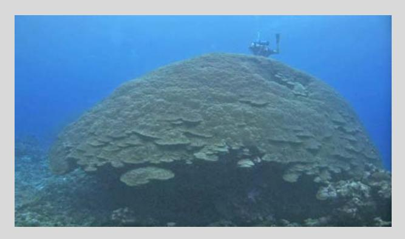
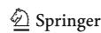

## American Samoa's island of giants: massive Porites colonies at Ta'u island

Received: 28 August 2008 / Accepted: 25 March 2009

Springer-Verlag 2009

Fig. 1 Porites colony in Ta'u, American Samoa

One of the largest and oldest single hermatypic coral colonies known is a massive Porites coral located on the southwest corner of Ta'u island (14-15¢S, 169-30¢W) in the Manu'a group of American Samoa. The coral is believed to be Porites lutea based on colony and corallite morphology; however, Porites taxonomy is notoriously difficult and recent genetic work has revealed surprising levels of cryptic diversity (Forsman et al. 2009). Small (1 cm) cores were collected for genetic and microscopic work, and to determine skeletal density. DNA sequence for mitochondrial (COI, COIII) and nuclear (ITS region) markers were deposited in GenBank (accession numbers ITS-FJ416523-6, mt COI-FJ423967, and mt control FJ427369), and skeletal voucher specimens have been deposited at the Bishop Museum (SC4164).

The colony is hemi-ellipsoidal in shape, and sits atop a pedestal of dead skeleton (Fig. 1). It is located in 17 m of water and measures 7 m tall, 41 m in circumference, has a

maximum straight-line length of 17 m and a roughly estimated minimum straight-line length of 12 m. It is 34 m · 20 m across the arc of live tissue, not including the base of skeleton upon which it rests. Unlike some other large Porites that have had anthropogenic damage (Soong et al. 1999), this colony appears quite healthy, with approximately 98% live tissue. There is however one, 1 m · 2 m persistent tumor on the colony.

The colony is composed of around 200 million polyps, assuming a smooth hemispherical surface and a polyp size of 1 mm2 , and has a skeletal density of 1.4 g/cm3 (~52% average porosity). Using the volume and density estimates, the skeleton was estimated to have a dryweight of approximately 129 metric tons. Based on published growth rates for massive Porites (Lough and Barnes 2000; Potts et al. 1985), the core skeletal density, and annual mean water temperature, this coral is estimated to be between 360 and 800 years old, though it may be considerably older. It is surrounded by several smaller colonies, which measure between 4 and 28 m in circumference. Approximately 1 km to the south of this site are another dozen massive Porites measuring 16–24 m in circumference as well as several this size on the northeast corner of the island, and a few others in the waters of nearby islands.

While these corals in Ta'u may not be as old as some deep water corals, they are among the oldest known on tropical hermatypic reefs. Their large size, good health, and close proximity to each other implies that this location has had conditions conducive to coral growth for a long time.

Acknowledgments The authors thank R. Brainard and A. Green for their help on this project and for their critical review and comments. Dedicated in memory of F. Tuilagi, who discovered this coral.

## References

Forsman ZH, Barshis D, Hunter CL, Toonen RJ (2009) Shape-shifting corals: molecular markers show morphology is evolutionarily plastic in Porites. BMC Evol Biol 9:45

Lough JM, Barnes DJ (2000) Environmental controls on growth of the massive coral Porites. J Exp Mar Biol Ecol 245:225–243 Potts DC, Done TJ, Isdale PJ, Fisk DA (1985) Dominance of a coral community by the genus Porites (Scleractinia). Mar Ecol Prog Ser 23:79–84 Soong K, Chen CA, Chang J-C (1999) A very large poritid colony at Green Island, Taiwan. Coral Reefs 18:42

D. P. Brown (&)

National Park of American Samoa, Pago Pago, AS 96799, USA e-mail: Paul\_Brown@nps.gov

L. Basch D. Barshis Z. Forsman

University of Hawaii, Honolulu, HI 96822, USA

D. Fenner J. Goldberg

American Samoa Coral Reef Advisory Group, Pago Pago, AS 96799, USA

Coral Reefs (2009) Reef sites DOI 10.1007/s00338-009-0494-8

