# **National Park of American Samoa Marine Fish Trend Report for 2010–2019**

*Pacific Island Network*

Natural Resource Report NPS/NPSA/NRR—2022/2346

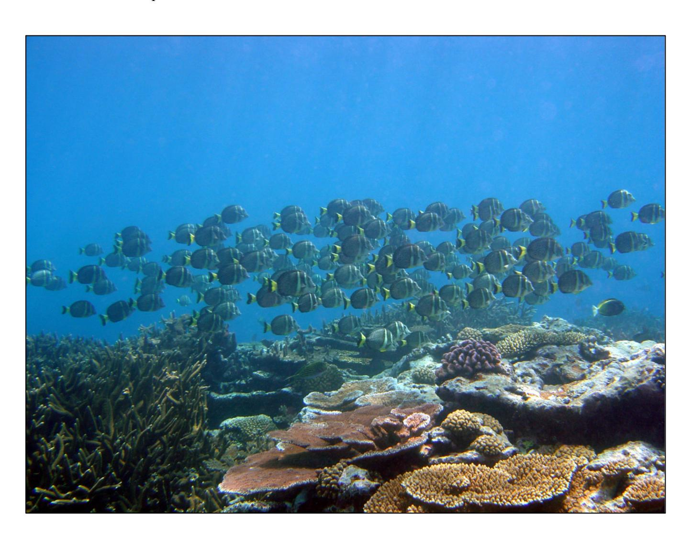


# **National Park of American Samoa Marine Fish Trend Report for 2010–2019**

### *Pacific Island Network*

Natural Resource Report NPS/NPSA/NRR—2022/2346

Eric Brown<sup>1</sup> , Tim Clark2 , Bert Fuiava1 , Ian Moffitt1 , Sheila A. McKenna<sup>3</sup> , and Laura-Li Jeannot1

1 National Park Service National Park of American Samoa MHJ Building, 2nd floor American Samoa, Tutuila, Pago Pago 96799

2 U.S. Fish and Wildlife Service 2800 Woodlawn Drive, Suite 200 Honolulu, Hawai'i 96822

3 Pacific Island Network Inventory and Monitoring Program National Park Service Hawai'i Volcanoes National Park P.O. Box 52, 1 Crater Rim Drive Hawai'i National Park, Hawai'i 96718

January 2022

U.S. Department of the Interior National Park Service Natural Resource Stewardship and Science Fort Collins, Colorado

The National Park Service, Natural Resource Stewardship and Science office in Fort Collins, Colorado, publishes a range of reports that address natural resource topics. These reports are of interest and applicability to a broad audience in the National Park Service and others in natural resource management, including scientists, conservation and environmental constituencies, and the public.

The Natural Resource Report Series is used to disseminate comprehensive information and analysis about natural resources and related topics concerning lands managed by the National Park Service. The series supports the advancement of science, informed decision-making, and the achievement of the National Park Service mission. The series also provides a forum for presenting more lengthy results that may not be accepted by publications with page limitations.

All manuscripts in the series receive the appropriate level of peer review to ensure that the information is scientifically credible and technically accurate.

Views, statements, findings, conclusions, recommendations, and data in this report do not necessarily reflect views and policies of the National Park Service, U.S. Department of the Interior. Mention of trade names or commercial products does not constitute endorsement or recommendation for use by the U.S. Government.

This report is available from th[e Pacific Island Inventory & Monitoring Network website](https://www.nps.gov/im/pacn/index.htm) and the [Natural Resource Publications Management website.](https://www.nps.gov/im/publication-series.htm) If you have difficulty accessing information in this publication, particularly if using assistive technology, please email [irma@nps.gov.](mailto:irma@nps.gov)

Please cite this publication as:

Brown, E., T. Clark, B. Fuiava, I. Moffitt, S. A. McKenna, and L. Jeannot. 2022. National Park of American Samoa marine fish trend report for 2010–2019: Pacific Island Network. Natural Resource Report NPS/NPSA/NRR—2022/2346. National Park Service, Fort Collins, Colorado. [https://doi.org/10.36967/nrr-2289963.](https://doi.org/10.36967/nrr-2289963)

# Contents

|                                                     | Page |
|-----------------------------------------------------|------|
| Figures                                             | iv   |
| Tables                                              | vi   |
| Appendices                                          | vii  |
| Executive Summary                                   | viii |
| Acknowledgments                                     | xi   |
| List of Terms and Acronyms                          | xii  |
| Introduction                                        | 1    |
| Methods                                             | 6    |
| Sampling Locations                                  | 6    |
| Survey Methods                                      | 7    |
| Data Analysis                                       | 7    |
| Results                                             | 10   |
| Status of Fish Assemblage Characteristics           | 10   |
| Trophic Composition of the Fish Assemblage          | 13   |
| Top Ten Fish Species                                | 14   |
| Trends in Fish Assemblage Characteristics           | 16   |
| Endemic and Invasive Species                        | 17   |
| Factors Influencing Fish Assemblage Characteristics | 17   |
| Discussion                                          | 20   |
| Literature Cited                                    | 35   |

### <span id="page-5-0"></span>**Figures**

|                                                                                                                                                                                                                                                                                                                   | Page |
|-------------------------------------------------------------------------------------------------------------------------------------------------------------------------------------------------------------------------------------------------------------------------------------------------------------------|------|
| Figure 1. Map of the Samoan archipelago with the National Park of American Samoa<br>(NPSA) boundaries delineated in green 2                                                                                                                                                                                       |      |
| Figure 2. Examples of nearshore reef habitats in the National Park of American Samoa<br>(NPSA) Tutuila unit, coral colonies interspersed with crustose coralline algae on a basalt<br>substrate; fore reef slope with high coral cover; fore reef slope with low coral cover and<br>dominated by turf algae.<br>3 |      |
| Figure 3. Sampling frame between 10 m and 20 m depth on hard-bottom substrate at the<br>National Park of American Samoa 6                                                                                                                                                                                         |      |
| Figure 4. Fish species richness (no. transect−1<br>) at the 15 fixed sites (averaged over 10<br>years) and 135 temporary sites surveyed in the National Park of American Samoa from<br>2010–2019 10                                                                                                               |      |
| Figure 5. Fish numerical density (no. m−2<br>) at the 15 fixed sites (averaged over 10 years)<br>and 135 temporary sites surveyed in the National Park of American Samoa from 2010–<br>2019 11                                                                                                                    |      |
| Fish biomass (g m−2<br>Figure 6.<br>) at the 15 fixed sites (averaged over 10 years) and 135<br>temporary sites surveyed in the National Park of American Samoa from 2010–2019 12                                                                                                                                 |      |
| Figure 7. Fish diversity (H') at the 15 fixed sites (averaged over 10 years) and 135<br>temporary sites surveyed in the National Park of American Samoa from 2010–2019 13                                                                                                                                         |      |
| Figure 8. Percentage of fish consumer groups by numerical density (no. m−2<br>) and<br>biomass at the National Park of American Samoa averaged from 2010–2019 14                                                                                                                                                  |      |
| Figure 9. Trends in fish species richness (no. transect-1), numerical density (no. m−2<br>),<br>biomass (g m−2<br>), and diversity (H') at the 15 fixed sites and 15 temporary sites surveyed<br>in each year at the National Park of American Samoa from 2010–2019 17                                            |      |
| Figure 10. Typical substrate profile at Kalaupapa National Historical Park on Moloka'i,<br>Hawai'i) and the Tutuila unit of the National Park of American Samoa 21                                                                                                                                                |      |
| Figure 11. Size frequency distribution of fish at the four U.S. national parks in the<br>Pacific 22                                                                                                                                                                                                               |      |
| Figure 12. Map showing the mean near-surface and near bed current directions at each<br>mooring site as heading ("going to"), in degrees from true North, and speeds in meters<br>per second (m/s), during conditions dominated by southeasterly trade winds and large                                            |      |
| waves during the 2015 study conducted by USGS in collaboration with NPSA 24                                                                                                                                                                                                                                       |      |

### **Figures (continued)**

|                                                                                                                                                                                             | Page |
|---------------------------------------------------------------------------------------------------------------------------------------------------------------------------------------------|------|
| Figure 13. Surface current patterns of the Samoan archipelago and surrounding region<br>for October through April and May through September 26                                              |      |
| Figure 14. Mean fish biomass (g m−2<br>) for top predators and other consumer groups at<br>various island locations in the Pacific and the Caribbean 28                                     |      |
| Figure 15. Historical and current human habitation along the north shore of Tutuila and<br>within the Tutuila unit of the National Park of American Samoa 29                                |      |
| Figure 16. Mean herbivore fish biomass (g m-2) for the four functional guilds at the 30<br>transects surveyed in each year at the National Park of American Samoa from 2010–<br>2019 30     |      |
| Figure 17. Sea surface temperature (SST) record using the monthly NOAA ERDAP<br>HadISST data set from 1870 to 2019 at the nearest latitude and longitude (−14.5°,<br>−170.5°) to Tutuila 33 |      |

### <span id="page-7-0"></span>**Tables**

|                                                                                                                                                | Page |
|------------------------------------------------------------------------------------------------------------------------------------------------|------|
| Table 1. Top ten fish species by numerical density (no. m-2) at the National Park of                                                           |      |
| American Samoa averaged over the study period from 2010 to 2019 14                                                                             |      |
| Table 2. Top ten fish species by biomass (g m-2) at the National Park of American Samoa<br>averaged over the study period from 2010 to 2019 15 |      |
| Table 3. Factors influencing fish assemblage characteristics for species richness,                                                             |      |
| numerical density, and biomass using a Generalized Additive Mixed Model 18                                                                     |      |

### <span id="page-8-0"></span>**Appendices**

|                                                                                                                                                                                | Page |
|--------------------------------------------------------------------------------------------------------------------------------------------------------------------------------|------|
| Appendix A: Fish species documented in the National Park of American Samoa 46                                                                                                  |      |
| Appendix B: Database queries used to generate data for figures, tables, and statistical<br>analyses 56                                                                         |      |
| Appendix C: R code used in trend analysis (panel linear model) and analysis of<br>influential predictors (generalized additive mixed model) along with interpretative plots 58 |      |

### <span id="page-9-0"></span>**Executive Summary**

The National Park of American Samoa (NPSA) has three park units, which are located on three different islands (Tutuila, Ofu, and Ta'ū). Each park unit has a marine component that includes fringing reef habitat from nearshore to deep-water representing reef zones from backreef lagoon to reef slope. The seaward boundary is ¼ mile (400 m) offshore of park units where waters reach 65 m in depth for the Tutuila unit, 20 m for the Ofu unit, and 250 m for the Ta'ū unit.

NPSA is one of four parks within the Inventory and Monitoring (I&M) Program of the Pacific Island Network (PACN) where marine Vital Signs (i.e., an indicator of physical, chemical, biological elements, or ecosystem processes selected to represent the overall health or condition of natural resources within parks) for the fish and benthic communities are monitored by peer-reviewed standardized protocols.

The objective of the PACN Marine Fish Monitoring Protocol at NPSA is to annually determine the numerical density, biomass, and size of reef fish species at sites randomly selected on hard substrata between the 10 and 20 m depths (Brown et al. 2011). From 2010–2019, a total of 150 transects, each 25 m in length, were sampled. A split panel sampling design was used with 30 transects sampled annually on hard-bottom substrate. Fifteen transects were randomly established in 2007 as permanent transects and subsequently surveyed on an annual basis. The remaining 15 temporary transects were randomly selected each year and surveyed only in that year. Data collection consisted of a visual count and size estimation of all fishes within a 25 m underwater belt transect that was surveyed in two passes. The first pass counted fish larger than 20 cm in a 4 m wide belt and then fishes less than 20 cm were enumerated on the return pass that was 2 m in width. Scientific divers were used to conduct these surveys and focused on all diurnal or day-active fish species.

This report includes the status and trends of the fish populations observed at NPSA from 2010–2019 as determined by implementation of the I&M PACN Marine Fish Monitoring Protocol (Brown et al. 2011).

Spatial patterns for the fish data pooled across all transects indicated that:

- Fish species richness ranged from 4 to 44 species per transect with a total of 254 species documented from 2010–2019. Overall mean richness was 24.7 ± 6.8 (Standard Deviation; SD) species per transect. No clear spatial patterns emerged for species richness, although several transects in Vatia Bay and one off the northern tip of Pola Island had lower species richness.
- Fish species numerical density ranged from 0.3–5.5 fish m-2. Overall mean was 1.9 ± 0.9 SD fish m-2 from 2010–2019. Transects with the highest densities tended to be concentrated around Pola Island and Manofa Rock with large schools of jacks (Carangidae), fusiliers (Caseionidae), and emperors (Letherinidae) fishes
- Fish biomass estimates ranged from 3.5 to 1,879.8 grams (g) m-2. Overall mean was 72.7 ± 122.4 SD g m-2 from 2010–2019. Fish biomass was generally lower in Vatia Bay, which was skewed by the high biomass value from a single large, round ribbontail stingray (*Taeniurops meyeni*) in the western section of the park.

● Fish diversity (H') ranged from 1.19 to 3.36 at all transects from 2010–2019. Overall mean was 2.53 ± 0.37 SD H'. Diversity was relatively uniform around the park, but slightly lower on the northern tip of Pola Island and in Vatia Bay.

Small, planktivorous damselfish such as the half-and-half chromis (*Chromis iomelas*) and the princess damselfish (*Pomacentrus vaiuli*) dominated the trophic composition of the fish assemblage in terms of density. The bulk of the biomass was accounted for by the striped bristletooth surgeonfish (*Ctenochaetus striatus*) (6.7 g.m-2), a secondary consumer, whose biomass was about 3% more than the following secondary consumer, a round ribbontail stingray (*Taeniurops meyeni*) (6.5 g m-2). Eight of the top ten most abundant species by numerical density were secondary consumers, while only two were primary consumers. In contrast, the top ten most abundant species by biomass were composed of seven primary consumers and three secondary consumers. Top predators had small contributions to numerical density (1%) and biomass (4%).

#### Trends for the fish data indicated that:

- Mean fish species richness declined from 2010 (28.0 ± 5.6 SD no. transect-1) to 2019 (22.7 ± 7.2 SD) with several years (2017, 2018) documenting even lower species richness. This declining pattern was consistent for both fixed and temporary transects.
- Mean fish numerical density declined from 2010 (2.4 ± 0.9 SD fish m-2) to 2019 (1.5 ± 0.8 SD fish m-2) with 2017 (1.3 ± 0.5 SD fish m-2) and 2018 (1.2 ± 0.5 SD fish m-2) recording lower fish numerical density levels.
- Mean fish biomass increased statistically from 2010 to 2019, but results were mixed. Biomass initially declined from a high in 2010 (128.2 ± 98.6 SD g m-2) to a low in 2013 (34.2 ± 21.6 SD g m-2) then stablized for several years before starting to increase in 2018.
- Diversity did not show a statistically significant change from 2010 to 2019, with annual fish diversity ranging between 2.73 ± 0.29 SD H' in 2015 to 2.32 ± 0.41 SD H' in 2018 and overall mean diversity 2.53 ± 0.37 SD H'.
- No invasive fish species have been documented in the park, or American Samoa.

In conclusion, the fish assemblage around NPSA appears to be in decline for fish species richness and numerical density, increasing for biomass to pre-cyclone levels and stable for diversity. Possible explanations for declining fish species richness and numerical density include fishing pressure, poor water quality in certain areas such as Vatia Bay, the 2009 tsunami that altered reef structure, a recent Crown-of-Thorns (CoTS) outbreak from 2011–2015, and changes in climate leading to bleaching events in 1991, 1994, 2002, 2003, 2015 and 2017. The increase in fish biomass at NPSA to precyclone Wilma levels should be interpreted with caution, however, because it is unclear whether this is an ecologically significant increase, a natural fluctuation due to stochasatic events, or merely an artifact of measurement error and a few outliers that are influencing the statistical trends. Overall, it appears that the fish assemblage at NPSA is severely impacted by fishing activities compared to areas around the Pacific that have not been overfished. Consequently, continued monitoring of the assemblage must be viewed in the context of a baseline that has shifted to an overfished state. This is a critical perspective given the impending changes in the climate and potential negative impacts on

the coral reef ecosystem at NPSA from ocean warming and acidification. To return the fish assemblage to a healthier state it is recommended that management actions include establishment of more marine protected or marine managed areas, banning certain gear types such as gill nets, and incorporating traditional knowledge and associated practices focused on spawning seasons and areas.

### <span id="page-12-0"></span>**Acknowledgments**

We would like to thank the entire NPSA aiga (family) for their logistical support in implementing the I&M PACN Marine Fish Monitoring Protocol to collect data for this report. In particular, we would like to acknowledge the hard work of previous marine technicians such as Jim Nimz and those individuals participating in an internship through the American Conservation Experience: Tasi Toloa, Sarah Lummis, Paolo Marra-Biggs, Kersten Schnurle, Kristin Beem, Susan Bryan, Caitlyn Webster, Valentine Vaeoso, Victoria Barker, and Michelle Feldberg. We would also like to thank our international partners at AgroSup Dijon University: Lydia Begue, Amelie Tagliaferro, and Romain Mouillard, at AgroParisTech University: Diane Laforge for their assistance. Local volunteers included Chanel Fatu, Christian Lorenzo, Cassie Mahuka, and Johann Volrath, We would also like to acknowledge and thank the American Samoa Department of Marine & Wildlife (ASDMWR) and Coral Reef Advisory Group (CRAG) current and previous staff for their assistance throughout the years: Kristine Bucchianeri, Hideyo Hattori, Atuatasi Peau, Jeremy Raynal, Alice Lawrence, and Mareike Sudek. In addition, the I&M program provided support for technician salaries, funding for equipment and supplies, development of statistical analyses, and reviews of report findings. In particular, Gordon Dicus, Allison Synder, and Kelly Kozar from the I&M program assisted in the development of the marine fish database and provided extensive support with data management, quality assurance, and analysis efforts. Finally, Alan Friedlander (University of Hawai'i-Mānoa) and Jim Beets (University of Hawai'i-Hilo) were instrumental in establishing the methodology and assisting us with the initial sampling efforts (Friedlander in 2010). Nolita Motu (National Park of American Samoa) provided assistance with the archaeological references and site locations. Alan Friedlander, Peter Craig, and Ryan Monello provided valuable feedback during the review process. We could not have done the work without their support.

### <span id="page-13-0"></span>**List of Terms and Acronyms**

NPSA: National Park of American Samoa

km: kilometers

I&M: Inventory and Monitoring Program

m: meters

PACN: Pacific Island Network

SD: Standard Deviation

SE: Standard Error

Trophic groups: groups of fish classified by nutritional habits and requirements

### <span id="page-14-0"></span>**Introduction**

The marine fish assemblages in the Pacific Island Network (PACN) of U.S. National Parks is an ecologically diverse system with numerous trophic groups intertwined within extensive coral reef ecosystems. In most tropical marine parks, coral reefs form the geomorphologic framework of the ecosystem. These ecosystems have been compared to tropical rainforests because of their high species diversity and complex interactions (Connell 1978, Birkeland 1997). Because of their importance ecologically, culturally, and economically, it is critical that PACN parks have scientifically rigorous data on the current health and long-term trends of the marine fish assemblages within their boundaries. Within coral reefs, marine fishes are one of the most visible and certainly the most exploited resource.

Coral reef fish assemblages are essential to the traditional subsistence lifestyles and cultures of Samoan, Hawaiian, Chamorro, Carolinean, and other peoples in the islands throughout the PACN (Kittinger 2013). Furthermore, coral reef fishes provide critical elements of commerce from artisanal fishing (Doulman and Kearny 1991), local and charter-sport fishing, as well as other visitor recreational activities (e.g., snorkeling, scuba diving, boating), which are major economic drivers throughout the Pacific Islands (Cesar et al. 2002, Waddell 2005). Due to the ecological, cultural, and economic importance of these assemblages, it is critical that the PACN parks continue to examine long-term trends of these crucial fish communities as well as their associated habitats.

The PACN Inventory & Monitoring (I&M) program is one of 32 National Park Service (NPS) I&M Networks across the country facilitating collaboration, information sharing, and economies of scale in natural resources monitoring. The NPS I&M program was funded by Congress in 1998 to implement peer-reviewed standardized protocols to collect data on numerous Vital Signs for natural resources. A Vital Sign is an indicator of physical, chemical, biological elements, or ecosystem processes selected to represent the overall health or condition of natural resources within parks. The PACN marine fish Vital Sign is closely linked with the benthic marine Vital Sign, and monitoring efforts are co-located and sampled at the same time to maximize data value (Brown 2011). This Vital Sign monitoring protocol is implemented in four parks: Kaloko-Honokōhau National Historical Park (KAHO), Kalaupapa National Historical Park (KALA), National Park of American Samoa (NPSA), and War in the Pacific National Historical Park (WAPA).

NPSA's three park units are located in the territory of American Samoa on the north shore of the island of Tutuila, and on the south shores of the islands of Ofu and Ta'ū. They encompass not only submerged marine resources, but also lowland coastal, mesic, and paleotropical rainforest habitats (Figure 1). This park is one of the few in the NPS system that includes entire watersheds and their adjacent nearshore marine habitats within its boundaries. The park preserves archeological and cultural resources and sites, while supporting *Fa'asamoa* (Samoan way of life) in local communities. Encompassing approximately 2,800 ac (11.3 km2 ) across all three park units, the marine boundary extends from the shoreline to a quarter mile (0.4 km) offshore where waters reach 65 m in depth for the Tutuila unit (1,275 ac, 5.2 km2 ), 20 m for the Ofu unit (380 ac, 1.5 km2 ), and 250 m for the Ta'ū unit (1,145 ac, 4.6 km2 ). NPSA has the only Indo-Pacific coral reef ecosystem in the national park

system south of the equator and features high ecological diversity with more than 900 species of fish (Wass 1984) and more than 280 species of coral (Birkeland et al. 2008). Within American Samoa, the marine fish assemblage consists of all native species with three known endemics and includes 11 species that are endangered or vulnerable (Craig et al. 2019). Other significant marine resources include giant clams (*Tridacna* sp.), endangered green sea turtles (*Chelonia mydas*), endangered hawksbill turtles (*Eretmochelys imbricata*), endangered humpback whales (*Megaptera novaeangliae*), coral reef communities with coral cover higher than 40%, endangered and threatened coral species, and relatively intact marine intertidal resources.

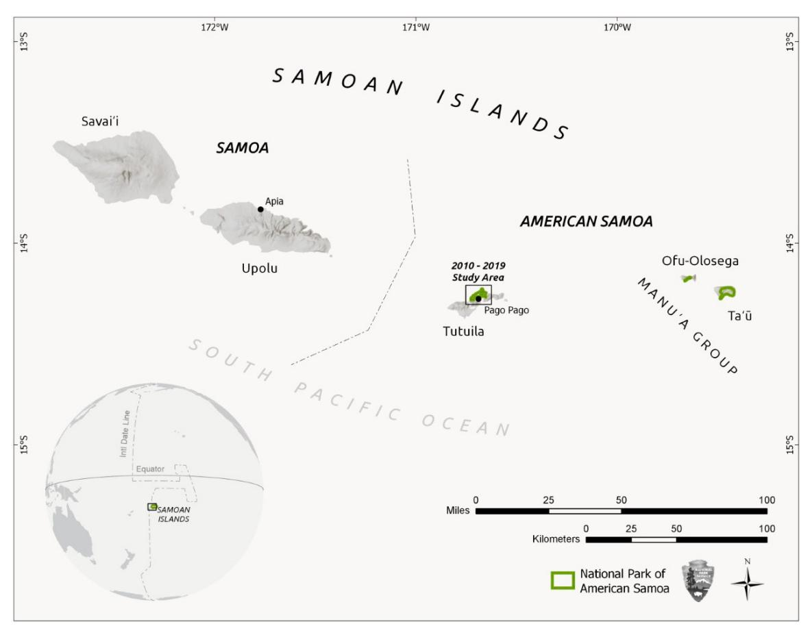

<span id="page-15-0"></span>**Figure 1.** Map of the Samoan archipelago with the National Park of American Samoa (NPSA) boundaries delineated in green. NPSA manages coral reef resources within park waters on the islands of Tutuila, Ofu, and Ta'ū. The international date line bisects the eastern (American) and western (Independent) islands of the archipelago and is indicated by a dashed line on the map. The study area for this report is outlined in a box on Tutuila.

The hard-bottom substrate within the park consists primarily of aggregated coral reefs with ~30% coral cover in-between smaller sections of basalt pavement and sand habitats (Craig et al. 2019). Sandy bottoms extend out from the rivers draining the principal watersheds within the park such as Tafeu Cove and Vatia Bay on Tutuila and Laufuti on Ta'ū. The coral reefs within the park on Tutuila and Ta'ū are considered fringing reefs with limited or no reef flats that slope steeply on the fore reef

down to depths of 30–40 m. On the island of Ofu, an extensive reef flat with interspersed lagoons occupies most of the park marine boundary. Examples of nearshore marine habitats in NPSA are shown in Figure 2. The primary physical disturbance to the marine community consists of cyclonic storms in the summer and fall months (January – April) (Craig et al. 2019).

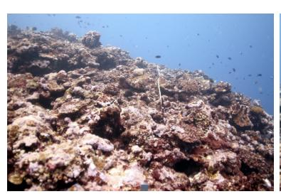

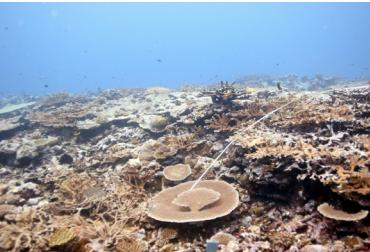

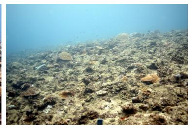

**Figure 2.** Examples of nearshore reef habitats in the National Park of American Samoa (NPSA) Tutuila unit, coral colonies interspersed with crustose coralline algae on a basalt substrate (left); fore reef slope with high coral cover (center); fore reef slope with low coral cover and dominated by turf algae (right). (Photos: NPS).

<span id="page-16-0"></span>The initial source of information on the fish assemblage at NPSA is from fish surveys conducted in 1977–1978 by the American Samoa, Department of Marine and Wildlife Resources (Wass 1982). These data on species richness, numerical density, biomass, and diversity was the first known study to document fish habitat utilization patterns within the park boundaries. Wass (1982) focused most of his efforts in water depths of 2–10 m, which is shallower than the sampling frame of this report. Consequently, comparisons between Wass (1982) and the NPSA I&M program are limited. More recently, the National Oceanographic and Atmospheric Administration (NOAA) American Samoa Reef Assessment and Monitoring Program (ASRAMP) began surveying reefs around all the islands at two to three-year intervals starting in 2002 (NOAA 2018). The broader spatial scale, but the more limited temporal scale of these surveys, offers a different perspective on archipelago conditions. Inventories of fish assemblages on Tutuila (Green and Hunter 1998), Ofu (Hunter et al. 1993, Green 2002), and Ta'ū (Green and Hughes 1999) provide a historical comparison of fish assemblage metrics where sites and reef areas overlap. In many of these studies, the low fish assemblage metrics for American Samoa were noted in comparison to other coral reef ecosystems in the Pacific (Craig et al. 2019).

The methodology to monitor coral reef fishes has been developed since the early 1980s, resulting in several commonly used survey techniques (e.g., Bohnsack and Bannerot 1986, Rogers et al. 1994, English et al. 1997, Samoilys 1997, Sweatman et al. 1998, Atlantic and Gulf Rapid Reef Assessment 2000, Hill and Wilkinson 2004). The technique adopted to collect scientifically rigorous data on the status and long-term trends of the fish communities for PACN consisted of a visual count and size estimation of fish by scientific divers along underwater 25 m x 5 m belt transects in Hawai'i and a dual pass of 25 m x 4 m and 25 m x 2 m in more speciose PACN parks (Brown et al. 2011). This non-destructive technique initiated in 2006 addressed one primary monitoring question and corresponding objective. The question is: what are the long-term trends in the numerical density, biomass, and size of reef fishes in a park? The primary objective is to annually determine the

numerical density, biomass, and size of the major component of the coral reef fish assemblage—the diurnal or day-active fish species, which are highly visible due to their mobile behavior and generally larger size. These species are the most heavily targeted by local fishers. While the small, cryptic, or nocturnal species contribute to biodiversity and may be of ecological or management importance, the additional effort and time required to sample these fishes is not feasible with available resources in a park. Sample sites are randomly selected on hard substrata between the 10 and 20 m depths (selected for ecological and safety reasons).

Visual estimation of fish size is an important component of these surveys for several reasons. First, fish lengths allow a conversion from numbers to biomass by using established length-weight relationships (e.g., Friedlander et al. 2007). Second, lengths are often a useful indicator of fishing pressure or population dynamics, e.g., a trend of decreasing sizes may indicate overfishing, or recruitment year classes (Bejarano et al. 2013). Third, there is a strong positive correlation between fish size and fecundity (reproductive potential) which, along with recruitment success, is important in assessing ecological services provided by park fish assemblages (Saenz-Aqudelo et al. 2015).

Fishing activities within the park include small-scale subsistence and recreational fishing. Artisanal (small-scale commercial) and commercial fishing at an industrial scale are prohibited except offshore outside of park boundaries (Craig et al. 1993, 2019). Subsistence fishing is identified in the enabling legislation, which states:

"(2) Subsistence uses of the marine areas of the park shall also be permitted in accordance with paragraph (1), and no fishing or gathering shall be permitted in such marine areas for other than subsistence purposes." (U.S. Public Law 100-571-Oct. 31, 1988).

Additional fishing gear restrictions apply in park waters (NPSA 2014), but NPSA lacks resources to enforce these regulations. Therefore, it is possible that some artisanal or even commercial fishing occurs within park waters and negatively impacts the fish assemblage.

Currently, a traditional use study is underway with the University of Hawai'i to define subsistence use within the park by neighboring villages and identify targeted resource species. Compliance with any rules requires establishing long-term relationships with the villagers and seeking buy-in on community measures to protect the resources. Territorial laws, however, supersede village guidelines. For example, it is illegal by the Governor's Executive Order 002-2012 to take or possess rare species such as all sharks and rays, humphead wrasse (*Cheilinus undulatus*), bumphead parrotfish (*Bolbometopon muricatum*), and giant grouper (*Epinephelus lanceolatus*) (Craig et al. 2019). Territorial fishing laws are enforced by the local Department of Marine and Wildlife Resources (DMWR).

Access to the marine areas of the park is typically by boat for Tutuila and Ta'ū, and from the shore for Ofu. Visitors on boats may legally travel within the park boundaries, but fishing must still follow subsistence practices established by local villagers and territorial laws regarding seasonal closures, bag limits, gear types, and size limits. Boats are not allowed to anchor in park waters unless needed to do so in the case of an emergency. It should be noted that commercial activities within the park

boundary, such as charter dive boats and filming activities must adhere to the park service commercial use authorization or special use permit regulations.

The purpose of this report was to characterize the marine fish assemblage at NPSA from 2010 to 2019 and examine any changes that might have occurred over this time period. First, an overview of fish assemblage characteristics from 2010 to 2019 is presented for species richness, numerical density, biomass, and diversity using spatial distribution maps. Second, the trophic composition of the entire assemblage averaged over the study period was examined for both numerical and biomass densities. Third, the top ten species from 2010 to 2019 in terms of numerical density and biomass were identified to examine specific components of the assemblage. Fourth, trends in the entire assemblage from 2010–2019 were plotted for species richness, numerical density, biomass, and diversity. Finally, factors influencing the fish assemblage characteristics were examined.

### <span id="page-19-0"></span>**Methods**

#### <span id="page-19-1"></span>**Sampling Locations**

A split panel design was used with 30 belt transects (25 m long x variable width) sampled annually between 2007 and 2019. For the purposes of this 10-year report, only data from 2010 to 2019 were used due to inconsistencies in the 2007–2009 data. All transects were randomly selected using ArcGIS® within the NPSA sampling frame (Figure 3). The frame includes all fore-reef slope, hardbottom communities between 10 and 20 m depths within the park's legislated boundaries plus Vatia Bay, which is almost fully enclosed by the Tutuila park unit boundary and may impact (or be impacted by) park resources. At this time, only the Tutuila unit has been sampled on an annual basis and the sampling frame has been restricted to the depth contours above for safety, logistical, and cost reasons (Brown et al. 2011). Fifteen fixed (permanent) transects were randomly selected at the onset of the monitoring program in 2007 and marked with galvanized steel pins for relocation purposes. These sites were subsequently re-sampled each year. The remaining 15 temporary transects were randomly selected each year of monitoring and sampled only once. In 2014, only fixed transects were surveyed due to unfavorable weather conditions and staff limitations. A GPS unit was used to navigate to the transects in the field.

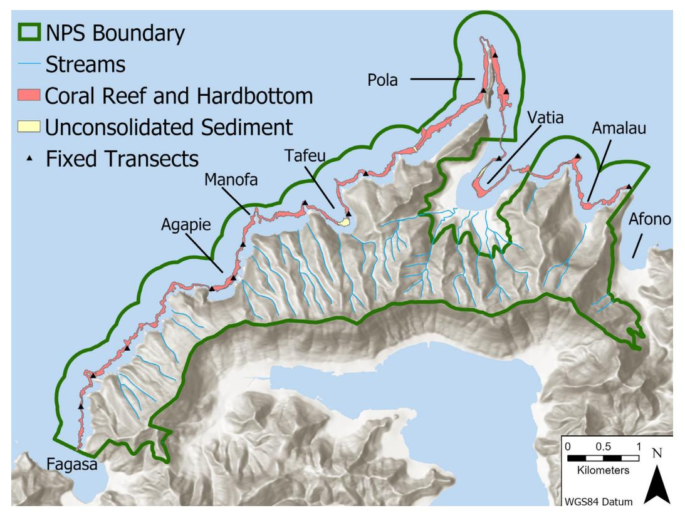

<span id="page-19-2"></span>**Figure 3.** Sampling frame between 10 m and 20 m depth on hard-bottom substrate at the National Park of American Samoa. Sand habitat is shown by yellow polygons while coral reef and hard-bottom habitat is indicated by light pink polygons. Green line indicates National Park boundary.

#### <span id="page-20-0"></span>**Survey Methods**

Fish surveys occurred during the austral summer and fall months from February through May in concurrence with the benthic and water quality surveys. At each site, the fish observer, using open circuit scuba (2010–2012, 2017–2019) or open circuit bailout on a closed-circuit rebreather (2013– 2016) for comparability, deployed a 25 m transect line along a constant depth contour, which was typically parallel to shore. Each fish survey consisted of two passes. Fish ≥ 20 cm were observed in a 4 m wide belt on the first pass, while fish under 20 cm were documented in a 2 m wide belt on the second pass. This approach was adopted from Brainard et al. (2008) for their annual surveys in the South Pacific to accommodate the high species diversity on these reefs and allow for comparisons with prior studies.

A total of three fish observers (Alan Friedlander-AF, Tim Clark-TC, Ian Moffitt-IM) recorded data from 2010–2019; one observer recorded 2010 data (AF), another recorded 2011–2016 data (TC), and the last recorded 2017–2019 (IM). To minimize observer bias, sizing calibration dives were conducted using fish models of known size at the beginning of each field season. Observer crossover training was done using two observers side by side for at least one season when possible. The observer counted and estimated the total length (TL, to the nearest centimeter) of all fishes encountered along the transect from the bottom to the surface in the transect belt. Data were recorded on pre-printed waterproof forms attached to a slate. The location, bearing, survey date, and depth of transects, which constituted the sampling unit, were recorded after each dive. Total area sampled on each transect was 100 m2 for a total area of 3000 m2 across all 30 transects.

### <span id="page-20-1"></span>**Data Analysis**

Fish species richness for each transect was calculated by summing the number of different species observed per transect area. Transect area varied depending on the size of the fish being surveyed. Fish ≥ 20 cm were surveyed on the 25 m x 4 m transect with an area of 100 m2 as the diver swam out the initial leg, while fish < 20 cm were surveyed on the 25 m x 2 m transect with an area of 50 m2 on the return leg.

Fish numerical density at each transect was calculated as the total number of fish by species observed within each transect area. These values were converted to number per square meter (no. m-2) for data analysis.

Length estimates of fishes were converted to biomass using the following length-mass relationship derived for each species: Mass = a\*(Fork Length)b where a and b are species-specific constants for the allometric growth equation, fork length (FL) is in centimeters, and mass is in grams (Kulbicki et al. 1993, Friedlander et al. 2003). TL was converted to FL using conversion factors obtained from FishBase (www.fishbase.org). Length–mass fitting parameters were available for 1340 species commonly observed on visual fish transects in the Pacific from the French National Research Institute for Sustainable Development (IRD) laboratory in New Caledonia (Kulbicki, unpublished data). This was supplemented with information from other published and web-based sources (Appendix A). In the cases where length–mass information did not exist for a given species, the parameters from similar bodied congeners were used. Biomass estimates for each transect were converted to grams per square meter (g m-2) to facilitate comparisons with other studies worldwide.

The Shannon-Wiener index (H') was used to calculate species diversity within each transect using the following formula:

$$H' = -\sum_{i=1}^{S} (p_i \ln p_i)$$

where S is the total number of species and *pi* is the frequency of the *i*th species in that transect (Krebs 1999).

To determine the trophic composition of the fish assemblage, each species was classified as a primary consumer, secondary consumer, or top predator. In a coral reef ecosystem, primary consumers such as surgeonfishes and parrotfishes consume primary producers such as phytoplankton, algae, and sea grasses. Primary consumers were further delineated into functional feeding guilds of browser, farmer, grazer, and scraper/excavator. Secondary consumers include larger reef fishes such as triggerfishes and wrasses that feed on invertebrates and some of the primary fish consumers as well as producers. Planktivores were separated out of this group for the graphical display since planktivores have different spatial patterns over reef communities compared to other secondary consumers and their response to disturbances provides insights into ecosystem function. Tertiary consumers or top predators are the top of the food web and include sharks, groupers, jacks, and the larger snappers. Information on fish trophic group classifications was obtained from Friedlander et al. (1997), FishBase, and other web-based sources.

A panel linear mixed model in the R statistical software (ver. 4.0.0, plm in the plm package) was used for trend estimation of fish species richness, density, biomass, and diversity (R Core Team 2020). To meet the assumptions of normality, data were transformed using a sqrt(x) transformation for density and a log(x+1) transformation for biomass (Zar 1999). The raw data for species richness and diversity were used in the analysis since the errors were normally distributed for these data. The main fish assemblage characteristics (fish species richness, density, biomass, and diversity) were analyzed separately in the panel linear mixed model as the dependent variables. In 2014, the temporary transects were not surveyed so the plm package treated the missing data as an unbalanced data set. In addition, a single round ribbontail stingray (*Taeniurops meyeni*) was omitted from the biomass analysis due to the high leverage of this specimen on the overall linear trend.

To incorporate the split panel design into the panel analysis, a unique identifier for transect number was treated as a random site effect. Fixed transects were labeled 1–15 and repeated every year. Temporary transects were labeled 16–30 in 2010 and then incremented sequentially in subsequent years (e.g., 31–45 in 2011, 46–60 in 2012, etc.). This approach incorporated both fixed and temporary transects to examine temporal patterns for trend estimation with increased spatial distribution for robust status estimation (Starcevich 2013). Transect type (fixed, temporary) was also included in the model as a fixed effect to evaluate any overall differences between panels. The structure of the data, however, did not allow for estimation of any interaction terms to evaluate the relationship between transect type and year. In future years with a larger data set, it may be informative to conduct additional analyses with just fixed or temporary transects or comparisons between the transect types to examine the measurement effects of sampling in the same location

compared to new areas. This analysis was not conducted in the present study due to the small data set.

Temporal autocorrelation was examined post hoc by assessing the homogeneity of random effects groups using paired plots of the site effects for each year. The slopes of the random sites were plotted against random site intercepts by year and included both fixed and temporary transects. The patterns for the fixed transects displayed no obvious relationship, but a linear relationship did exist for the temporary transects. This result for the temporary transects, however, may be due to the lack of replication for a given site because these sites were never revisited, so it is reasonable to assume independence among years and temporary sites (Piepho and Ogutu 2002). Overall, the results indicated that the assumptions were met, and that autocorrelation was not a significant issue.

The importance of various independent variables on fish assemblage characteristics (species richness, density, biomass, and diversity) was investigated using generalized additive mixed models in R (ver. 4.0.0, gamm in the mgcv package). The gamm is similar to a generalized linear mixed model, but the package uses smoothing functions to explore non-linearity in the relationships with no *a priori* assumptions (Wood, 2019). Independent predictors included wave exposure (categorical fixed term [NW – northwest swell, NE – northeast swell]) and the following continuous terms: percent cover of live coral, crustose coralline algae (CCA), macroalgae, turf algae (arcsine square root transformed, spline smoothed terms, k = 5); depth, rugosity, minimum sea surface temperature (SST), average SST, and maximum SST (raw data, spline smoothed terms, k = 5). Rugosity is a dimensionless index of spatial relief and the methodology along with the data are described by Brown et al. (2014). Monthly SST data were obtained from the Environmental Research Division's Data Access Program (ERDDAP) (2020) web site. Year of sampling (2010 – 2019) and transect number were entered in the model as random effects. The transect number was given a unique identifier in the same manner as in the panel linear mixed model setup to differentiate between fixed and temporary transects. Socio-economic predictors (e.g., fishing pressure, distance to market, management type, level of economic development) were considered for the model; however, the resolution or spatial scale of the study area was not sufficient to differentiate among sites. In addition, data for several physical predictors such as maximum significant wave height and LiDAR (light detection and ranging) benthic topography are currently not available to help explain the observed fish assemblage patterns. For the dependent variables, raw species richness and the derived diversity (H') values were used, numerical density was transformed using a square root (√x) transformation and a log(x+1) transformation was applied to biomass to meet the assumptions of a normal error distribution. Statistical significance was evaluated at the α = 0.05 level.

Spatial distribution figures were generated in ArcGIS Pro v. 2.4.0 using an Inverse Density Weighted (IDW) analysis with a variable search radius and an exponential distance power of 2. Twelve of the nearest input sample points were used with an output cell size of 10 and the results were clipped to the extent of the NPSA interpolation area.

### <span id="page-23-0"></span>**Results**

A total of 15 fixed (revisited annually) and 135 temporary transects (total for all years) were surveyed at NPSA from 2010–2019. The queries used to retrieve the data from the PACN I&M Access Database for the ArcGIS maps, charts, and statistical analyses are listed in Appendix B.

### <span id="page-23-1"></span>**Status of Fish Assemblage Characteristics**

Fish species richness ranged from 4–44 species per transect from 2010 to 2019 with a total of 254 species found around the park (Figure 4). Overall average species richness was 24.7 ± 6.8 SD fish species per transect. No clear pattern of species richness was evident within the park, although pockets of low species richness were found in Vatia Bay and off the northern tip of Pola Island.

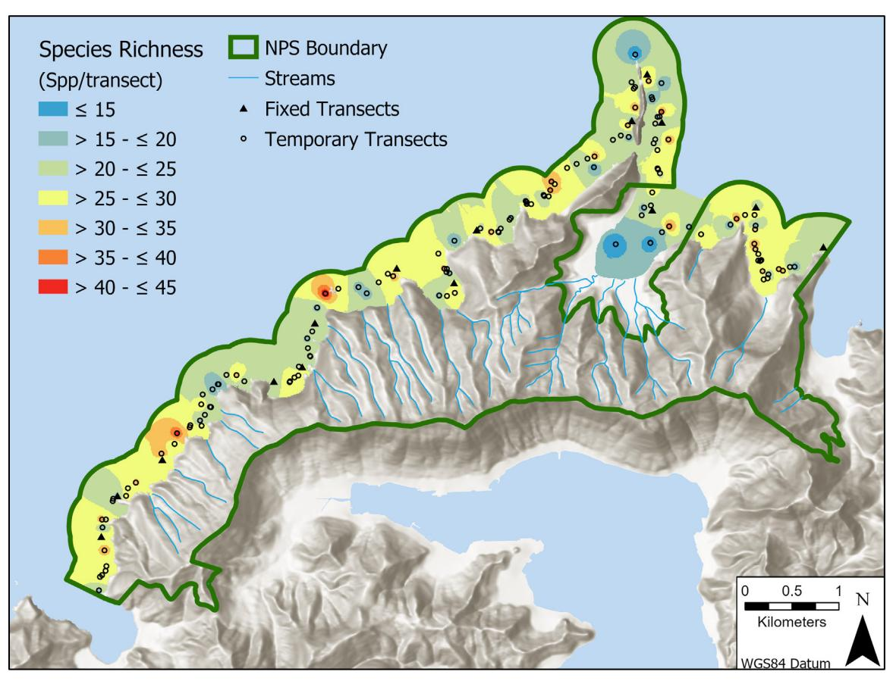

<span id="page-23-2"></span>**Figure 4.** Fish species richness (no. transect<sup>−</sup>1) at the 15 fixed sites (averaged over 10 years) and 135 temporary sites surveyed in the National Park of American Samoa from 2010–2019 (N = 285 total transects represented by black dots). Contour plots include the hard-bottom sampling frame and other habitats within the marine boundary to visually accentuate the spatial patterns and are not intended as realistic representations of actual distributions. The legend displays the range of species richness values at equally spaced intervals.

The numerical density of fishes at all transects from 2010 to 2019 ranged from 0.30–5.46 fish m-2 (Figure 5) with an overall average of 1.85 ± 0.85 SD fish m-2. Transects with the highest densities

(e.g., Temporary transect 11 in 2011) tended to be concentrated by Pola Island and Manofa Rock. Both sites are characterized by steep relief and are typically associated with large schools of jacks, fusiliers, and emperor fishes. The lowest densities (e.g., Fixed transect 10 in 2018) were typically found in habitats with low topographical complexity or with lower coral cover such as the southern section of Vatia Bay.

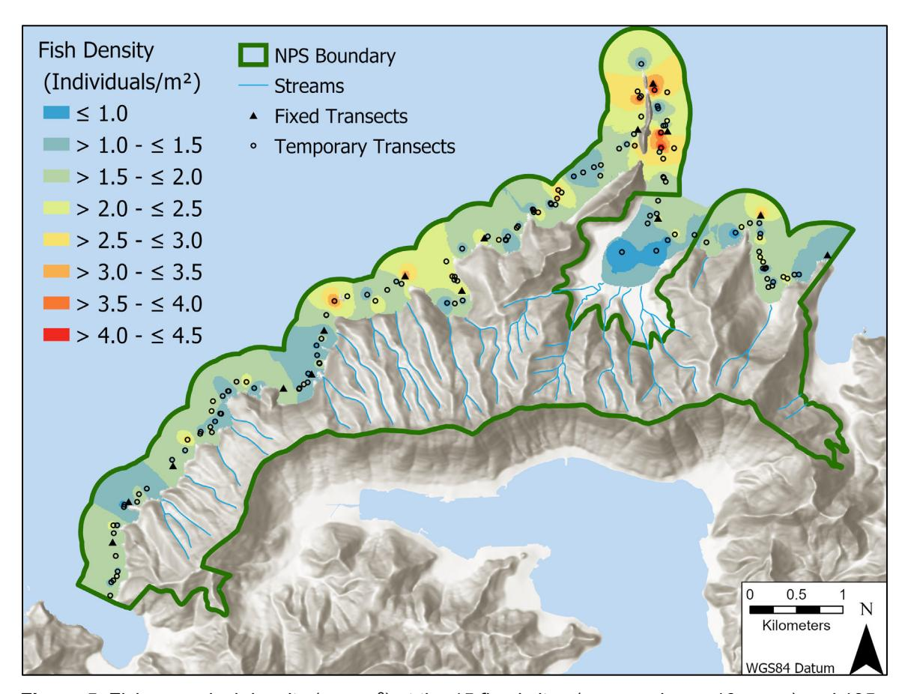

<span id="page-24-0"></span>**Figure 5.** Fish numerical density (no. m<sup>−</sup>2) at the 15 fixed sites (averaged over 10 years) and 135 temporary sites surveyed in the National Park of American Samoa from 2010–2019 (N = 285 total transects represented by black dots). Contour plots include the hard-bottom sampling frame and other habitats within the marine boundary to visually accentuate the spatial patterns and are not intended as realistic representations of actual distributions. The legend displays the range of fish density values at equally spaced intervals.

Fish biomass ranged between 3.5–1879.8 g m-2 at all transects from 2010 to 2019 and averaged 72.7 ± 122.4 SD g m-2 over the entire survey period (Figure 6). Temporary transect 13, located along the eastern shoreline of Vatia Bay, had the lowest biomass in 2011. In comparison, temporary transect 11 in 2012, located just west of Agapie Cove, had the highest biomass due a single large, round ribbontail stingray (*Taeniurops meyeni*) recorded on transect.

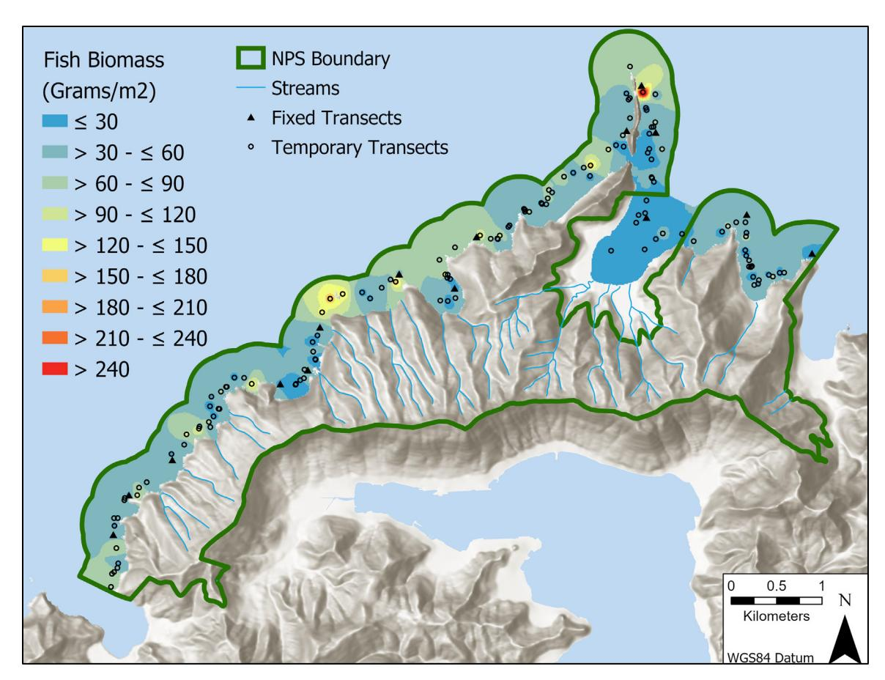

<span id="page-25-0"></span>**Figure 6.** Fish biomass (g m<sup>−</sup>2) at the 15 fixed sites (averaged over 10 years) and 135 temporary sites surveyed in the National Park of American Samoa from 2010–2019 (N = 285 total transects represented by black dots). Contour plots include the hard-bottom sampling frame and other habitats within the marine boundary to visually accentuate the spatial patterns and are not intended as realistic representations of actual distributions. The legend displays the range of fish biomass values at equally spaced intervals.

Fish diversity (H') ranged from 1.19 to 3.36 at all transects from 2010 to 2019 (Figure 7). The overall average diversity was 2.53 H' ± 0.37 SD. Fixed transect 10, which also had the lowest species richness, had the lowest species diversity at 1.19 H' in 2018. In contrast, fixed transect 3 towards the western edge of the park boundary had the highest species diversity at 3.36 in 2015. Diversity was relatively uniform around the park, but slightly lower around Pola Island and Vatia Bay.

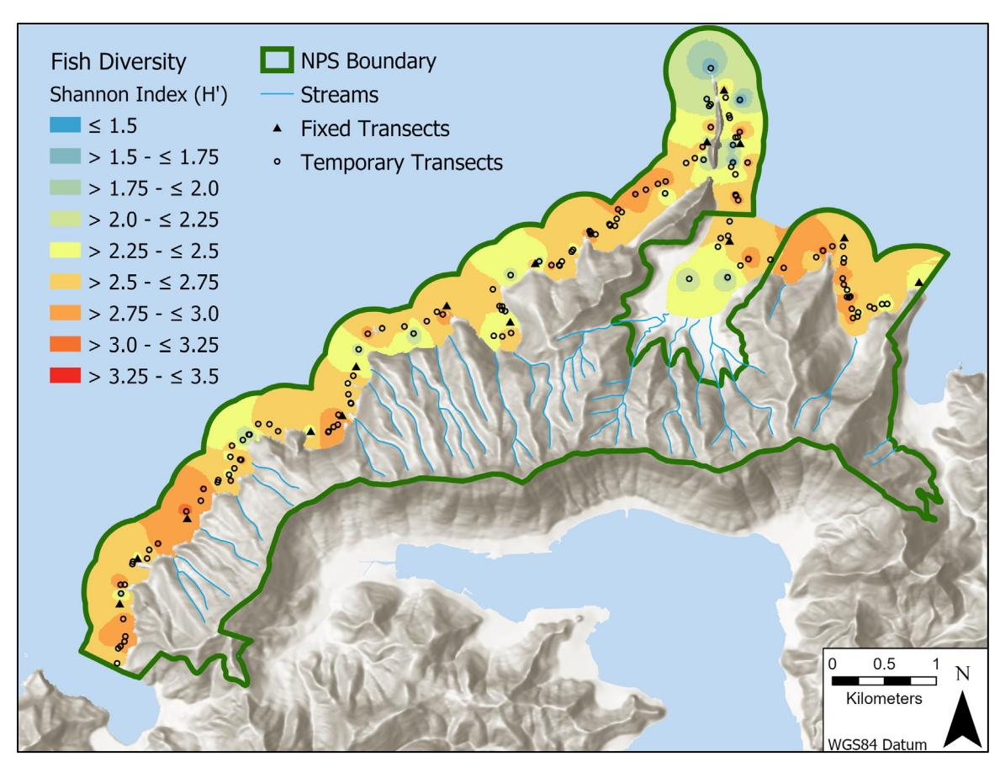

<span id="page-26-1"></span>**Figure 7.** Fish diversity (H') at the 15 fixed sites (averaged over 10 years) and 135 temporary sites surveyed in the National Park of American Samoa from 2010–2019 (N = 285 total transects represented by black dots). Contour plots include the hard-bottom sampling frame and other habitats within the marine boundary to visually accentuate the spatial patterns and are not intended as realistic representations of actual distributions. The legend displays the range of fish diversity values at equally spaced intervals.

#### <span id="page-26-0"></span>**Trophic Composition of the Fish Assemblage**

The average trophic composition of the fish assemblage at NPSA from 2010 to 2019 varied in terms of density and biomass. Secondary consumers accounted for approximately 80% of the fish numerical density observed during surveys from 2010–2019, with top predators accounting for <1%, and primary consumers making up the remaining 26% (Figure 8). Planktivores comprised 45% of the total numerical density with 29% as other secondary consumers. In comparison, the relative biomass of secondary consumers was only 56% (11% Planktivores, 45% Other secondary consumers), compared to 4% for top predators and 40% for primary consumers (Figure 8).

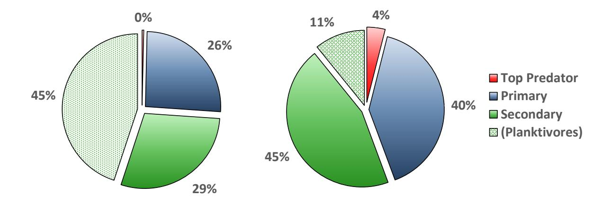

<span id="page-27-1"></span>**Figure 8.** Percentage of fish consumer groups by numerical density (no. m<sup>−</sup>2) (left) and biomass (right) at the National Park of American Samoa averaged from 2010–2019. Note that Planktivores are broken out from the other Secondary Consumers.

#### <span id="page-27-0"></span>**Top Ten Fish Species**

In terms of density, *Chromis iomelas*, a small planktivorous damselfish, was the most abundant species found at NPSA from 2010–2019 with 0.22 m-2 documented (Table 1). It is closely followed by the secondary consumers *Pomacentrus vaiuli* (0.18 m-2) and *Chromis margaritifer* (0.15 m-2), both small damselfish. The bulk of the biomass, however, was accounted for by *Ctenochaetus striatus* (6.7 g.m-2), a secondary consumer, whose biomass was about 3% more than the following secondary consumer *Taeniurops meyeni* (6.5 g m-2; Table 2). Seven of the top ten most abundant species by density were secondary consumers, while only three were primary consumers (Table 1). The top ten most abundant species by biomass were composed of seven primary consumers and three secondary consumers (Table 2).

<span id="page-27-2"></span>**Table 1.** Top ten fish species by numerical density (no. m-2) at the National Park of American Samoa averaged over the study period from 2010 to 2019. Common names are from Allen et al. (2007) and Randall (2005), Samoan names are from Goldin (2002). Herbivore codes from Fishbase and other webbased sources: BR=browser. FA=farmer, GR=grazer, SC=scraper.

| Species               | Common Name           | Samoan name     | Consumer<br>Group | Feeding<br>Guild | Density<br>(no. m-2) |
|-----------------------|-----------------------|-----------------|-------------------|------------------|----------------------|
| Chromis iomelas       | half-and-half chromis | tu'u'u i'usina  | Secondary         | Planktivore      | 0.22                 |
| Pomacentrus vaiuli    | princess damsel       | tu'u'u vaiuli   | Primary           | Herbivore/FA     | 0.18                 |
| Chromis margaritifer  | bicolor chromis       | tu'u'u i'usina  | Secondary         | Planktivore      | 0.15                 |
| Chromis xanthura      | pale-tail chromis     | tu'u'u i'usina  | Secondary         | Planktivore      | 0.08                 |
| Chromis acares        | midget chromis        | tu'u'u fō       | Secondary         | Planktivore      | 0.07                 |
| Pomacentrus coelestis | neon damsel           | tu'u'u segasega | Secondary         | Planktivore      | 0.07                 |

**Table 1 (continued).** Top ten fish species by numerical density (no. m-2) at the National Park of American Samoa averaged over the study period from 2010 to 2019. Common names are from Allen et al. (2007) and Randall (2005), Samoan names are from Goldin (2002). Herbivore codes from Fishbase and other web-based sources: BR=browser. FA=farmer, GR=grazer, SC=scraper.

| Species                       | Common Name        | Samoan name | Consumer<br>Group | Feeding<br>Guild | Density<br>(no. m-2) |
|-------------------------------|--------------------|-------------|-------------------|------------------|----------------------|
| Pomacentrus brachialis        | charcoal damsel    | tu'u'u faga | Secondary         | Planktivore      | 0.06                 |
| Ctenochaetus striatus         | lined bristletooth | pone        | Secondary         | Detritivore      | 0.06                 |
| Plectroglyphidodon lacrymatus | jewel damsel       | tu'u'u lau  | Primary           | Herbivore/FA     | 0.05                 |
| Acanthurus nigrofuscus        | brown damsel       | pone pone   | Primary           | Herbivore/GR     | 0.05                 |

<span id="page-28-0"></span>**Table 2.** Top ten fish species by biomass (g m-2) at the National Park of American Samoa averaged over the study period from 2010 to 2019. Common names are from Allen et al. (2007) and Randall (2005), Samoan names are from Goldin (2002). Herbivore codes from Fishbase: BR=browser. GR=grazer, SC=scraper.

| Species               | Common Name                  | Samoan Name                     | Consumer<br>Group | Feeding<br>Guild | Biomass<br>(g m-2) |
|-----------------------|------------------------------|---------------------------------|-------------------|------------------|--------------------|
| Ctenochaetus striatus | lined bristletooth           | pone                            | Secondary         | Detritivore      | 6.71               |
| Taeniurops meyeni     | round ribbontail<br>stingray | fai                             | Secondary         | Piscivore        | 6.49               |
| Acanthurus nigricans  | whitecheek<br>surgeonfish    | pone                            | Primary           | Herbivore/GR     | 3.69               |
| Naso lituratus        | orangespine<br>unicornfish   | 'ili'ilia, umelei               | Primary           | Herbivore/BR     | 2.73               |
| Chlorurus microrhinos | steephead parrotfish         | fugausi, laea,<br>ulumato, galo | Primary           | Herbivore/SC     | 2.59               |
| Scarus rubroviolaceus | redlip parrotfish            | laea mala                       | Primary           | Herbivore/SC     | 2.32               |
| Melichthys vidua      | pinktail triggerfish         | sumu<br>'apa'apasina            | Primary           | Planktivore      | 2.14               |
| Chlorurus spilurus    | bullethead parrotfish        | fuga gutumu<br>fugausi tuavela  | Primary           | Herbivore/SC     | 2.10               |
| Chlorurus japanensis  | Japanese parrotfish          | laea ulusama                    | Primary           | Herbivore/SC     | 1.85               |
| Monotaxis grandoculis | bigeye emperor               | mū matavaivai                   | Secondary         | Mobile Invert    | 1.77               |

### <span id="page-29-0"></span>**Trends in Fish Assemblage Characteristics**

For the 30 transects (15 fixed and 15 temporary) surveyed annually from 2010 to 2019 (in 2014 only 15 fixed transects were surveyed) trends varied by metric (Figure 9, Appendix C) and are summarized below.

- Mean fish species richness varied from an average high of 29.1 ± 6.2 SD species per transect for fixed transects in 2011 to an average low of 18.8 ± 6.0 SD species for fixed transects in 2018 (Figure 9). The trend panel analysis indicated that the species richness declined significantly (r2 = 0.55, *z* = −6.18, p < 0.001) from 2010 to 2019.
- Mean fish numerical density ranged from an average high of 2.6 ± 1.0 SD no. m-2 on the fixed transects in 2010 to an average low of 1.1 ± 0.3 SD no. m-2 on the temporary transects in 2018 from 2010 to 2019 (Figure 9). The overall trend for this time period showed a statistically significant decline in fish density (r2 = 0.49, *z* = −9.50, p < 0.001) with a nearly significant difference between the fixed and temporary transects (*z* = −1.96, p = 0.051).
- Mean fish biomass statistically increased from 2010 to 2019 (r2 = 0.58, *z* = 3.59, p < 0.001), but the results were mixed. Biomass initially declined from a high on the temporary transects in 2010 (148.9 ± 128.8 SD g m-2) to a low in 2012 on the fixed transects (28.2 ± 10,1 SD g m-2) then stablized for several years before starting to increase in 2018 (Figure 9). The high variance in 2012 on the temporary transects was due to a single, large round ribbontail stingray (*Taeniurops meyeni*), which was omitted from the trend analysis.
- Mean fish diversity (H') ranged from a low of 2.27 ± 0.46 SD (H') on fixed transects in 2018 to a high of 2.82 ± 0.28 SD (H') on temporary transects in 2015 (Figure 9). Diversity did not show a significant change over time (r2 = 0.80, *z* = −1.03, p = 0.302) from 2010 to 2019. There were also no significant differences between fixed and temporary transects for any of the tests.

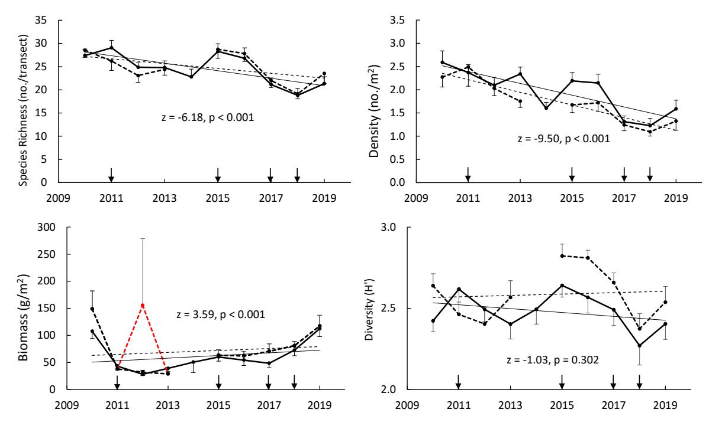

<span id="page-30-2"></span>**Figure 9.** Trends in fish species richness (no. transect-1) (top left), numerical density (no. m−2) (top right), biomass (g m<sup>−</sup>2) (bottom left), and diversity (H') (bottom right) at the 15 fixed sites (solid line) and 15 temporary sites (dashed lines) surveyed in each year at the National Park of American Samoa from 2010–2019. Error bars are one standard error of the mean with linear trend lines and panel linear model *z* statistics displayed. The sign of the *z* statistic indicates whether it is a positive or negative trend. Note: no temporary transects were surveyed in 2014. In the biomass plot, the raw data for the temporary transects in 2012 are displayed in red in comparison to the adjusted temporary transects in black, which omitted the single *Taeniurops meyeni* from the trend analysis. Arrows along the timeline denote cyclone Wilma in 2011, coral bleaching in 2015 and 2017, and cyclone Gita in 2018.

#### <span id="page-30-0"></span>**Endemic and Invasive Species**

Three endemic fish species have been documented in the territory of American Samoa: *Cirrhilabrus walshi, Amblyeleotris ellipse* and *Odontanthias wassi* (FishBase). These species have not been recorded during I&M annual surveys as of 2019, most likely due to their deeper depth distribution. No invasive or non-native marine fish species have been recorded in American Samoa (e.g., Fenner 2019).

#### <span id="page-30-1"></span>**Factors Influencing Fish Assemblage Characteristics**

A number of factors explained a portion of the variability in each of the models and are listed in order of their contributions (Table 3, Appendix C). The presence of CCA appeared to be the strongest predictor for all of the fish assemblage metrics due to the larger F statistics, with higher cover of CCA associated with higher values for most fish assemblage characteristics. Percent coral cover was another influential predictor in explaining fish assemblage structure, with higher coral cover associated with higher fish assemblage metric values. Rugosity had a positive relationship with fish species richness. Fish species richness had an unusual response to SST Maximum with higher values at both ends of the temperature range. Percent turf algae cover, SST Minimum, and depth had

a negative relationship with the fish assemblage metrics. The direction of wave exposure from prevailing wind patterns was only a significant factor in explaining the variation in fish species richness. A higher average number of species per transect were documented on the northwestern side of Pola Island compared to the northeastern section of the park. Continuous predictors that did not appear to affect the fish assemblages were macroalgae cover and SST Average. The R2 adjusted values were low for all of the models indicating that some important predictors (e.g., maximum significant wave height, fishing pressure) were missing from the model.

<span id="page-31-0"></span>**Table 3.** Factors influencing fish assemblage characteristics for species richness, numerical density, and biomass using a Generalized Additive Mixed Model. Statistically significant parameters for the smoothed terms are ranked by F statistic and p-value from most important to least important in explaining the variability in the model for each of the assemblage characteristics. The factors are separated out between the categorical factor (wave exposure) and the smoothed terms. Wave exposure is compared to the first level entered into the model (e.g., the estimate is for sites exposed to waves from the northwest (NW) compared to sites exposed to waves from the northeast). Abbreviations: CCA = crustose coralline algae cover, SST = sea surface temperature.

| Parameter/                             |                       |          |       |        |
|----------------------------------------|-----------------------|----------|-------|--------|
| R2 Adjusted                            | Fixed Term            | Estimate | t     | p      |
| Species richness                       | Waves from the NW     | 2.01     | 2.39  | 0.018  |
| (no. spp transect-1)/<br>R2 Adj = 0.29 | Smoothed terms, k = 5 | Edf      | F     | p      |
|                                        | CCA                   | 3.0      | 6.52  | <0.001 |
|                                        | Rugosity              | 3.1      | 4.47  | 0.003  |
|                                        | Coral Cover           | 3.1      | 3.85  | 0.009  |
|                                        | SST Maximum           | 1.0      | 5.82  | 0.010  |
| Density                                | Waves from the NW     | 0.05     | 1.31  | 0.192  |
| (no. m-2)/<br>R2 Adj = 0.15            | Smoothed terms, k = 5 | Edf      | F     | p      |
|                                        | Coral Cover           | 1.0      | 8.22  | 0.004  |
|                                        | CCA                   | 1.0      | 7.22  | 0.005  |
|                                        | Turf Algae Cover      | 1.0      | 6.11  | 0.014  |
| Biomass                                | Waves from the NW     | 0.03     | 0.72  | 0.471  |
| (g m-2)/<br>R2 Adj = 0.20              | Smoothed terms, k = 5 | Edf      | F     | p      |
|                                        | CCA                   | 1.0      | 13.41 | <0.001 |
|                                        | Turf Algae Cover      | 1.0      | 6.92  | 0.009  |
|                                        | Coral Cover           | 1.0      | 6.63  | 0.011  |

**Table 3 (continued).** Factors influencing fish assemblage characteristics for species richness, numerical density, and biomass using a Generalized Additive Mixed Model. Statistically significant parameters for the smoothed terms are ranked by F statistic and p-value from most important to least important in explaining the variability in the model for each of the assemblage characteristics. The factors are separated out between the categorical factor (wave exposure) and the smoothed terms. Wave exposure is compared to the first level entered into the model (e.g., the estimate is for sites exposed to waves from the northwest (NW) compared to sites exposed to waves from the northeast). Abbreviations: CCA = crustose coralline algae cover, SST = sea surface temperature.

| Parameter/              |                       |          |       |       |
|-------------------------|-----------------------|----------|-------|-------|
| R2 Adjusted             | Fixed Term            | Estimate | t     | p     |
| Diversity               | Waves from the NW     | <0.01    | −0.02 | 0.985 |
| (H')/<br>R2 Adj = .0.14 | Smoothed terms, k = 5 | Edf      | F     | p     |
|                         | CCA                   | 1.0      | 10.30 | 0.001 |
|                         | Coral Cover           | 1.0      | 7.58  | 0.006 |
|                         | Depth                 | 1.0      | 7.26  | 0.007 |
|                         | SST Minimum           | 1.0      | 4.76  | 0.030 |
|                         | Turf Algae Cover      | 1.0      | 3.88  | 0.049 |

### <span id="page-33-0"></span>**Discussion**

Survey results from 2010 to 2019 indicated that transects with the highest values for fish species richness, numerical density, biomass, and diversity were scattered throughout the park at various times during the survey period. Generally, hotspots were found off points and on the reef shelf east of Pola Island. Low fish assemblage metrics were consistently documented at the tip of Pola Island and in the southern part of Vatia Bay. At a larger spatial scale, Kendall et al. (2011a) documented proportionally lower levels of fish species richness and biomass along the north shore of Tutuila compared to other areas around the archipelago, including the independent nation of Samoa. Kendall et al. (2011a), published their biogeographic assessment just as the park service fish monitoring program was getting established so it is difficult to ascertain at this time how the overall spatial patterns would differ with the more current park service data.

Ecological factors influencing the spatial distribution of the fish assemblage characteristics within NPSA include variations in reproductive output from source populations (Claisse et al. 2009), postsettlement mortality (Hunt and Scheibling 1997), habitat extent (Caselle and Warner 1996) and complexity (Friedlander et al. 2007), physical disturbances (e.g., cyclones, 2009 tsunami), and currents. Overlaid on these natural elements are anthropogenic factors such as water quality, and fishing pressure that are influenced by human population levels at local and regional scales (Williams et al. 2015). Several of these factors (e.g., fish reproductive output and post-settlement mortality) are beyond the scope of this study so elements that have been directly measured will be addressed first, followed by factors that were assessed through the literature.

Habitat factors that could influence the fish assemblage structure around NPSA include the spatial extent of shallow water habitat and complexity of the substrate. Around Tutuila, the spatial extent of shallow water habitat (depth <100 m) that is suitable for coral reef development is approximately 315 km<sup>2</sup> (Brainard et al. 2008). In comparison, Ofu-Olosega has approximately 25 km<sup>2</sup> of coral reef habitat and Ta'ū has approximately 15 km2 in <100 m of water depth. This expansive range of suitable habitat in close proximity to the Tutuila unit should theoretically enable connectivity among fish populations and in turn could provide a rapid recovery following any disturbance events.

The complexity or rugosity of the substrate at NPSA (mean: 1.63 ± 0.33 SD) is structured primarily by varying levels of aggregated coral reef structures growing on top of foundational volcanic substrate rather than an underlying complexity of the benthos. Kalaupapa National Historical Park (KALA) with similar values of rugosity (mean: 1.66 ± 0.31 SD) consists of large basalt boulders, which have numerous spaces for larger fish to hide (Brown et al. 2014) (Figure 10). In contrast, rugosity at NPSA consists of smaller holes and overhangs that are more suitable as shelter for smaller fish such as damselfish or juveniles of various species (Figure 10). This is a fundamental issue with rugosity measured using the chain and tape approach because similar values can have vastly different implications not only in terms of the composition of the benthic community (Bayley et al. 2019) but also the ecological interactions with organisms closely associated with the benthos (Nash et al. 2013). Having LiDAR data around Tutuila would enhance predictive modeling of the fish assemblage (e.g., Wedding et al. 2019).

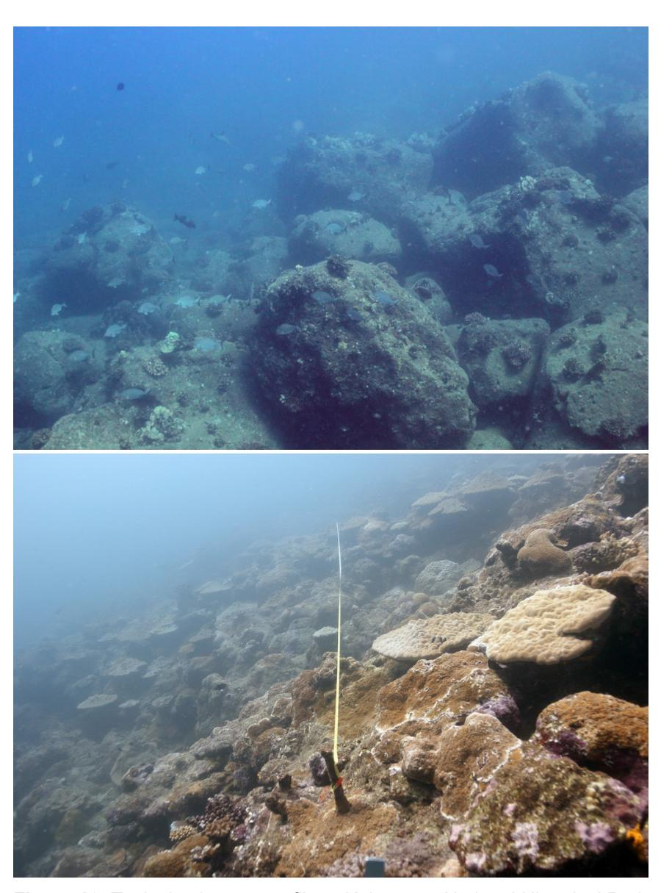

**Figure 10.** Typical substrate profile at Kalaupapa National Historical Park on Moloka'i, Hawai'i (top) and the Tutuila unit of the National Park of American Samoa (bottom). Photos by a.) Sylvester Lee on September 24, 2014 and b.) Valetine Vaeoso on May 6, 2019.

<span id="page-34-0"></span>Previous studies (e.g., Friedlander et al. 2007) have shown that the reef habitat complexity explained a large percentage of the variability in fish species richness and biomass; higher habitat complexity was associated with higher fish assemblage metrics, although legal protection from fishing pressure also resulted in higher values for many fish assemblage characteristics (Friedlander et al. 2007). The results of this study differ somewhat in that rugosity was only a significant predictor of fish species richness. Several explanations exist for the difference. First, Friedlander et al. (2007) focused on a much broader range of habitat types, wave exposure regimes, and fish assemblage composition. Consequently, the similar rugosity among sites in this study made it more difficult to discern differences when evaluated in the context of similar fish assemblage characteristics within the park. Second, the most numerous fish were primarily pomacentrids (damselfish) and acanthurids

(surgeonfish), which are small-bodied fish that tend to be positively correlated with smaller "hole" size (Friedlander and Parrish 1996). The weighted average size of fishes in this study was 9.1 cm compared to larger sizes at KAHO (9.4 cm) and KALA (13.0 cm) in Hawai'i (Figure 11). Kulbicki et al. (2015) found that the proportion of small to mid-sized fishes (8–15 cm range) in the South Pacific increased with coral cover, which concurred with the results of this study. In contrast, they observed that small fishes (<7 cm) were unaffected by coral cover and fishes larger than 15 cm were negatively correlated with coral cover. Finally, this study incorporated a temporal component, which added a layer of variability not accounted for in the Friedlander et al. (2007) study.

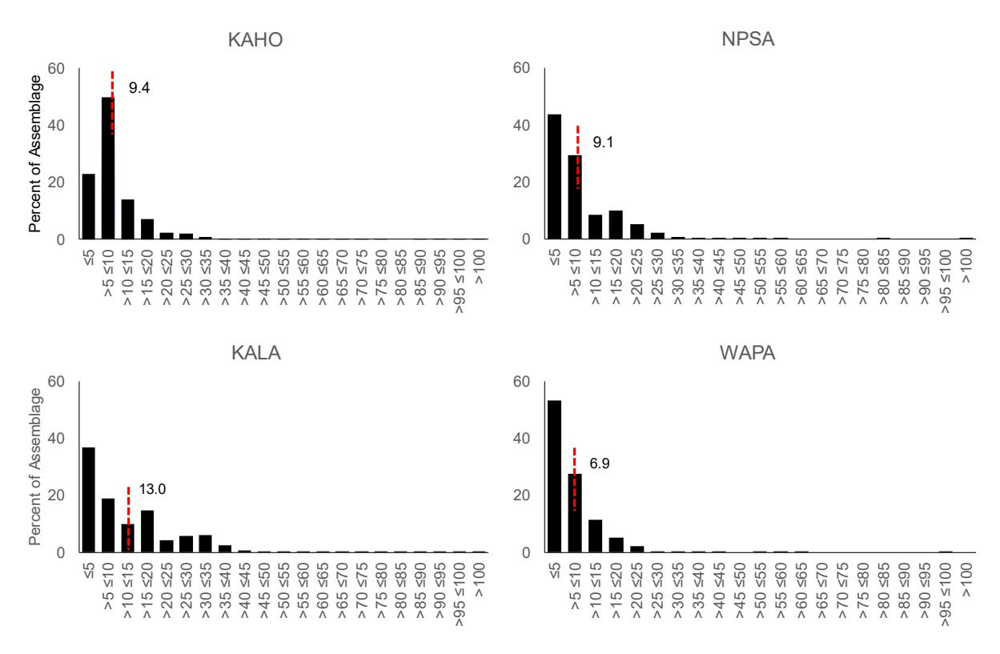

<span id="page-35-0"></span>**Figure 11.** Size frequency distribution of fish at the four U.S. national parks in the Pacific. The weighted average of size is shown by the value on the chart to the right of the red dashed vertical line. Size categories are in cm. Park acronyms are as follows, KAHO = Kaloko-Honokohau National Historical Park, KALA = Kalaupapa National Historical Park, NPSA = National Park of American Samoa, and WAPA = War in the Pacific National Historical Park.

Physical disturbances such as cyclones and tsunamis have impacted the Samoan archipelago during the study period. Cyclone Wilma (category 1) hit Tutuila in January 2011 and cyclone Gita (category 1) came within 60 miles of Tutuila in February 2018. Impact assessments from the storms were generally focused on damage to the coral reefs and not the fish assemblages. In the case of Wilma, the storm came directly over Tutuila on the northwestern side of the island (Revell et al. 2014) with the strongest winds and largest waves hitting the north central and eastern side of the island. Correspondingly, reefs were heavily damaged in Vatia Bay and on the eastern side of Pola Island (Fenner 2019). Results from the current study indicated that the fish assemblage did not appear to

change much except for biomass, which recorded a substantial drop in the 2011 surveys that took place after cyclone Wilma. No known impacts on the marine community have been reported for Gita, and coral cover did not appear to change much from 2017 to 2018 supporting the general observations (NPS unpublished data). In this study, fish species richness, density, and diversity all were documented at their lowest levels in the 2018 surveys that followed cyclone Gita. Interestingly, fish biomass actually increased after the storm, in stark contrast to what was observed in 2011 after Wilma. Previous studies from around the globe typically have either documented little impact from cyclones (e.g., Greenwood et al. 2006) or a recovery of the fish assemblage after a major storm within two years (e.g., Walsh 1983). Walsh (1983) documented that a large segment of the fish assemblage at his study sites in Hawai'i moved to deeper water as a result of the habitat damage that occurred at the shallow sites. The fish moved back into the shallower water over a period of 16 months as the habitat stabilized.

On September 29, 2009, an 8.1 magnitude earthquake east of the Tonga Trench generated a tsunami that impacted the Samoan archipelago (Dunbar and Weaver 2015). Fenner (2019) reported that damage to the coral reefs from the tsunami varied around the island with the most significant impacts occurring on the southwest coastline of Tutuila around Poloa to Leone. No detectable effects to the coral reefs were documented within the park on the north shore (NPS unpublished data). In terms of the fish assemblage, it is difficult to discern any measurable impacts given the lack of pre-tsunami data, but based on other studies there appears to be either relatively few changes to the fish assemblage following the event (e.g., Campbell et al. 2007) or a rapid recovery (e.g. Masuda et al. 2016). In the case of the massive 2011 tsunami in Japan, Masuda et al. (2016) estimated that it took approximately three years for the coastal reef fish assemblage to recover.

Currents, which are the main mode of dispersal for planktonic larvae, have not been studied extensively around the park. Storlazzi et al. (2017) documented that the predominant surface currents were parallel to shore with faster currents offshore compared to slower currents nearshore and restricted movement in embayments. Surface and bottom currents were primarily driven by tides with rising tides moving water west and falling tides moving water east. During the austral winter or trade wind season (May–November) with winds from the east and south, temperatures were cooler, water was more vertically mixed, and seas were calmer. In the austral summer (December–April), larger waves on the north shore coupled with variable winds resulted in warmer, more turbid water that became more stratified. Current patterns did not vary considerably between these two seasons with mean surface flow in a north-to-northeastward direction and mean seabed flow in a north-tonorthwestward direction (Figure 12). Jacob et al. (2012) documented similar tidal cycle current patterns further west at Fagamalo with westward flow during rising tides both offshore and nearshore and eastward flow nearshore during falling tides. They also found stronger current velocity offshore during rising tides compared to nearshore. Falling tides, however, showed stronger eastward currents nearshore with weaker offshore currents. Their study only examined tidal flow over a single tidal cycle and did not account for any seasonality.

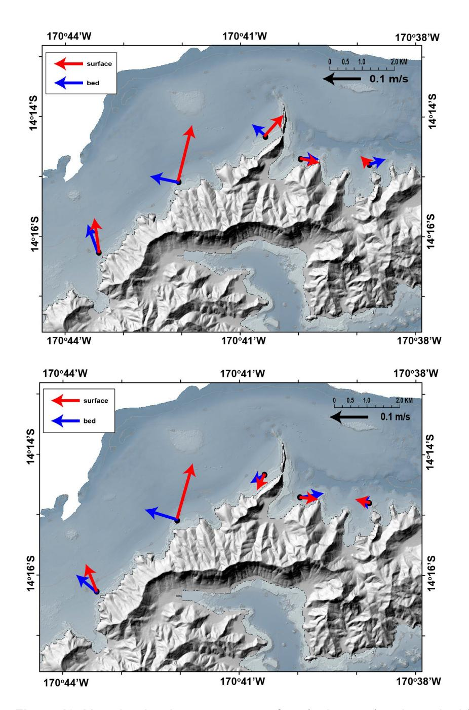

<span id="page-37-0"></span>**Figure 12.** Map showing the mean near-surface (red arrows) and near bed (blue arrows) current directions at each mooring site as heading ("going to"), in degrees from true North, and speeds in meters per second (m/s), during conditions dominated by southeasterly trade winds (top) and large waves (bottom) during the 2015 study conducted by USGS in collaboration with NPSA. (Modified from Storlazzi et al. 2017)

At a regional scale, Qiu and Chen (2004) reported that currents primarily flow from east to west through the archipelago in the South Equatorial Current (SEC) but can reverse directions in the South Equatorial Counter Current (SECC) depending on the season and/or year (Figure 13). Kendall et al.

(2011b), using model simulations of current flow and coral larvae productivity, suggested that Tutuila would be a source for larvae and that net larval transport would be primarily westward along the Samoan archipelago. As a sink, self-seeding of reefs could contribute up to 40% of the larval supply on Tutuila for organisms with a short 10 day planktonic larval duration, but the majority of larvae would come from outside sources such as the Manu'a Islands, Upolu, and Savai'i during current reversal periods. The north coast of Tutuila where the park is located, is close enough to the east flowing SECC that depending on the timing of the spawning event, many of the larvae would be entrained in the feedback loop and return to American Samoa (Kendall et al. 2011b). Ultimately, additional methods (e.g., fish larval traps, fish recruitment surveys, tag and release, fish tracking, etc.) would be needed to clarify whether NPSA serves as a source or sink population of fish larvae.

The two primary local anthropogenic factors influencing the fish assemblage in the park are water quality and fishing pressure. The influence of water quality parameters on fish assemblages has been periodically evaluated for tropical estuaries (Duque et al. 2020) and tropical reef systems (e.g., Fabricius et al. 2005). In general, studies have shown that anthropogenic factors such as poor water quality reduced levels of species richness, abundance, and biomass and the species composition shifted towards more tolerant species (e.g., Duque et al. 2020). Within park waters, several studies have examined water quality parameters since 2009. Whitall et al. (2019) documented excess nutrients and anthropogenic markers (e.g., sucralose and caffeine) from 2015 to 2017 in Vatia Bay. Median values for total phosphate and total nitrogen exceeded EPA levels at all their sampling sites indicating that the bay was under nutrient stress. Vargas-Angel and Schumacher (2018) also found excess nutrients and high sedimentation levels in Vatia Bay. The lowest values for the fish assemblage metrics compared to the rest of the park were documented in Vatia Bay, which supports the observations of the previous studies and suggests a local, long-term negative impact from human habitation in this bay. Raikow et al. (2021) examined a variety of water quality parameters over the entire park from 2009 to 2015. Generally speaking, marine areas near Tutuila and within NPSA displayed almost no spatial variation and were in good condition in terms of water quality. On average, they found dissolved oxygen saturation varied more in marine areas of Tutuila compared to sites in other marine parks in the Pacific but the other parameters (e.g., nutrient concentrations, temperature, salinity, chlorophyll) were unremarkable (Raikow et al. 2021). Consequently, it is inferred from the assemblage metrics and concurrent studies that poor water quality would negatively influence the fish assemblage at only a few sites directly impacted by humans such as in Vatia Bay.

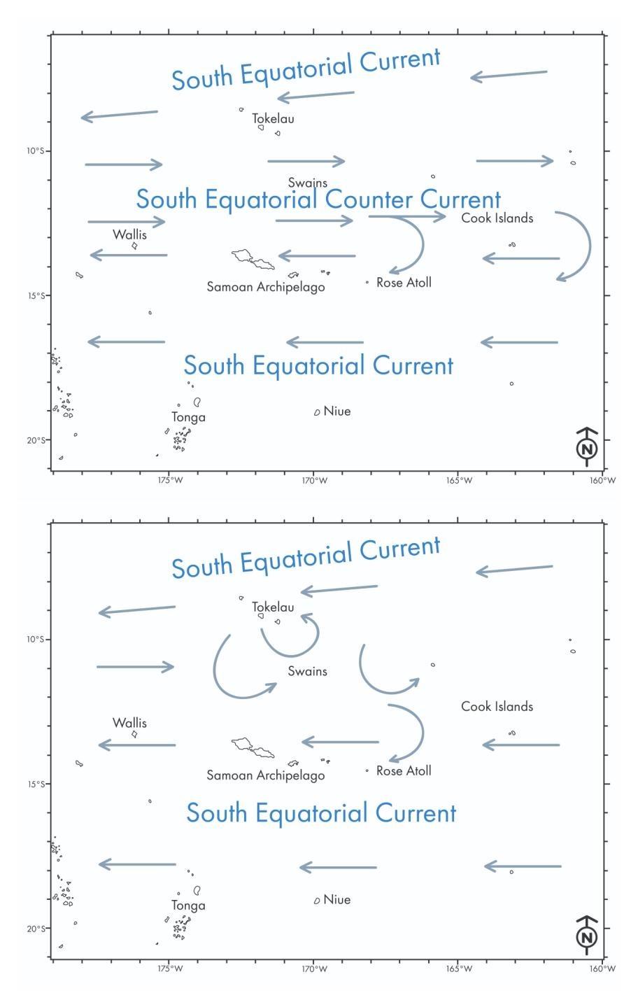

<span id="page-39-0"></span>**Figure 13.** Surface current patterns of the Samoan archipelago and surrounding region for October through April (top) and May through September (bottom). The position of curled current vectors and meanders are highly variable and denote general patterns only. Patterns are based on data from the Hybrid Coordinate Oceanographic Model (HYCOM) (Christie et al. 2010) from 2004–2009 and NOAA's Global Drifter Program (n=216). Source: Modified from Kendall et al (2011b).

Fishery independent metrics reported in this study suggest that fishing pressure within the park has negatively altered fish populations over time and these populations remain suppressed compared to more remote and well protected assemblages throughout the Pacific. For example, no large sharks were observed, and few large top predators such as snappers and groupers were documented on transects. Nadon et al. (2012) and Williams et al. (2015) have both reported that fishing pressure throughout the territory has had adverse effects on the nearshore fish assemblages. Nadon et al. (2012) estimated that the shark population in American Samoa is 94–96% lower than pre-fishing stocks. Williams et al. (2015) projected that fish biomass around Tutuila has been depleted by 56% over time.

One of the most important metrics to examine from a resource manager's perspective is total fish biomass. In comparison to other locations around the Pacific and Caribbean, total biomass at NPSA was similar to levels seen in fished areas such as the main Hawaiian Islands, and much higher than levels documented in the US Virgin Islands, Philippines, and Guam (Figure 14). These biomass levels are anywhere from <10% to only 20% of biomass levels documented in remote, uninhabited islands, indicating sustained impact from fishing. McClanahan et al (2011) in the Western Indian Ocean estimated that fish biomass levels below 30 g m-2 resulted in degradation of ecological functions and processes while fish diversity (number of species and fish life histories) declined with biomass below 60 g m-2 (McClanahan and Abunge 2015). McClanahan et al. (2019) suggested a fishery benchmark of ~1000 kg ha-1 (100 g m-2) and a wilderness benchmark of ~1900 kg ha-1 (190 g m-2) for ecological purposes that included large and mobile species. Based on these biomass levels, the average documented biomass of 72.7 g m-2at NPSA further suggests that the fish assemblage in the park is towards the low end of sustainability and well below levels considered wilderness areas.

Fishery statistics also paint a grim picture of the negative human impacts on the fish assemblage in American Samoa. Zeller et al. (2006) reconstructed coral reef fisheries catches in the territory and estimated a 79% decrease in catch between 1950 and 2002. This study focused primarily on the shoreline subsistence and artisanal, small-boat fishery for bottom and reef fish species. Much of this decline was attributed to the rapid increase in the human population on Tutuila that saw a concomitant increase from 18,940 in 1950 to 59,562 in 2005 (Worldometer, 2020). Even by the 1990s, overfishing was reported as a problem for the domestic fisheries in American Samoa (Craig et al. 1993). Gear types used in the nearshore subsistence and recreational fishery are relatively non intensive and include rod-reel, spear guns, boat line, gillnet, handline, throw net and more traditional gear like weirs, handlines, and basket traps (Craig et al. 2008). Past and current levels of fishing effort suggests that not much initial or sustained effort is required to depress coral reef fish assemblages (e.g., Hawkins and Roberts 2004) or alter species composition for long-lived species if population densities are low and recruitment is limited (Heppell et al. 2005). Worldwide, it is evident that fishing pressure changes fish assemblages as food webs are fished down from apex predators to lower trophic levels (Pauly et al. 1998) and as a consequence fisheries catches are declining (Pauly and Zeller 2016).

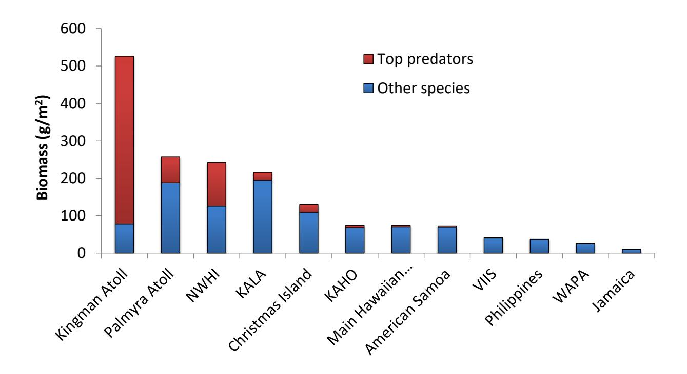

<span id="page-41-0"></span>**Figure 14.** Mean fish biomass (g m<sup>−</sup>2) for top predators and other consumer groups at various island locations in the Pacific and the Caribbean. Acronyms are as follows: NWHI = Northwestern Hawaiian Islands, KALA = Kalaupapa National Historical Park, KAHO = Kaloko-Honokōhau National Historical Park, VIIS = Virgin Islands National Park, WAPA = War in the Pacific National Historical Park. Modified from Friedlander et al., (2008) and this study.

Archeological studies along the north shore region surrounding the park provide insight into human activities over time that may have impacted the fish assemblage in the area. Clark and Herdrich (1993) discovered the largest basalt quarry in Eastern Tutuila at Fagasa, which is on the western boundary of the park, but did not state the age of the site. Clark and Michlovic (1996) subsequently reported on an early settlement at 'Aoa valley, which is further east of the park. This settlement was dated at 3,000 years old and is one of the earliest known sites in the archipelago. Fishing equipment and faunal remains were not documented at this site, so it is unclear about the extent of fishing activities along this shoreline. On the southern coastline, fishing pressure and changes in the fish trophic composition were evident at "Fatumafuti-ma-Futi" over 1,500 years ago (Morrison and Addison 2009). One aspect of the archaeological studies that is notable is the higher number of archaeological sites compared to the number of present-day villages on the north shore (Figure 15). These sites would suggest a more active human presence on the north shore compared to the present, especially within the park. Consequently, it is conceivable that fishing pressure may have historically altered the fish assemblage in the park as far back as several thousand years ago and continues to impact it today with more modern equipment enabling fishers to reach more remote areas in the park.

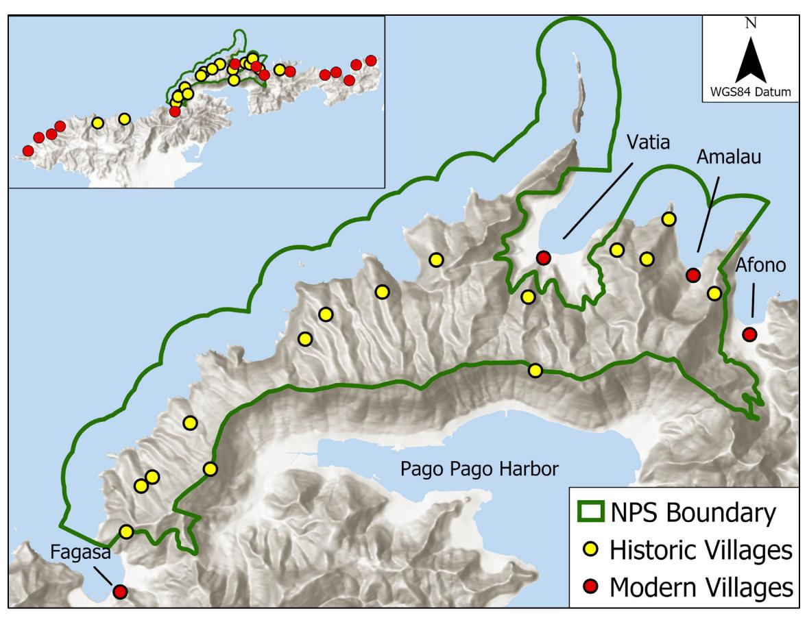

<span id="page-42-0"></span>**Figure 15.** Historical and current human habitation along the north shore of Tutuila (inset) and within the Tutuila unit of the National Park of American Samoa. Modern villages are labeled (Sources: Clark and Michlovic (1996), Pearl and Johnson (2006), Bayman and Calugay (2014)).

The trophic composition of the fish assemblage was dominated by planktivores (secondary consumers) and a few herbivores (primary consumers) in terms of fish density. These results might suggest that NPSA has an abundance of plankton stemming from high primary productivity along the shoreline. Pirhalla et al. (2011), however, reported low chlorophyll levels year around and Craig et al. (2019) attributed the current fish assemblage structure to fishing pressure rather than primary productivity levels. Sandin et al. (2008) noted that small plantivores numerically dominate reef assemblages in the absence of mesocarnivores and that pattern appears to hold for NPSA. Biomass is considered a more sensitive metric for fishing pressure (e.g., Edwards et al. 2013) and was also skewed towards primary and secondary consumers rather than top predators, indicating fishing pressure had altered the fish assemblage. Examining herbivore biomass using finer functional guilds revealed that the scrapers and to a lesser degree the browsers were driving the temporal patterns for the entire assemblage (Figure 16). Even though one browser (*Naso lituratus*) had high biomass levels, the scrapers such as parrotfish in the Scaridae family, contributed slightly more to the overall herbivore biomass than browsers. Edwards et al. (2013) documented that the browser functional group tended to be most susceptible to fishing with a higher biomass decline in fished areas versus inaccessible areas compared to other functional groups. In this study, it is difficult to determine if the browsers are being targeted preferentially over other herbivores because overall biomass levels were

already low compared to other areas around the Pacific (e.g., MacNeil et al. 2015). It is anticipated that the fish species targeted for subsistence and commercial catch within the park will be elucidated in the next few years with the completion of a traditional use study by the University of Hawai'i-Mānoa.

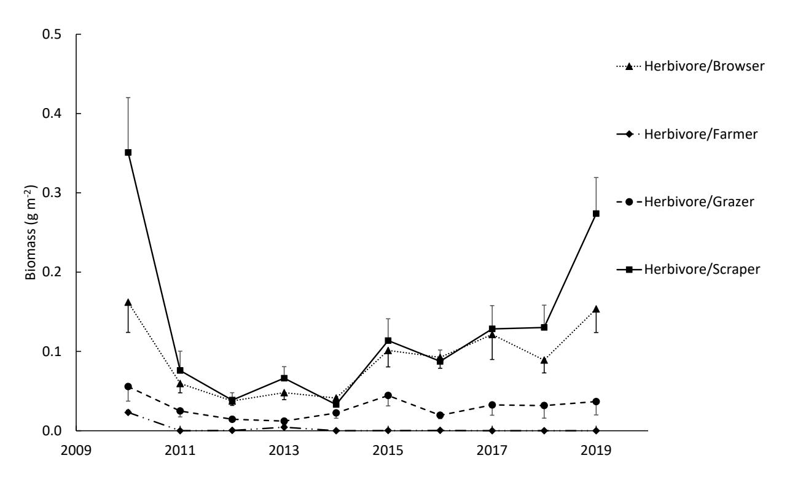

<span id="page-43-0"></span>**Figure 16.** Mean herbivore fish biomass (g m-2) for the four functional guilds at the 30 transects surveyed in each year at the National Park of American Samoa from 2010–2019. Note: no temporary transects were surveyed in 2014. Error bars are one standard error of the mean.

Of particular ecological importance are the top predators. Worldwide, large top predators have been on the decline with many, including sharks, disappearing at alarming rates due to intense fishing pressure (Worm et al. 2006, MacNeil et al. 2020). These (typically) large predators are important to the reef because their absence can cause dramatic shifts in the species composition and dominant taxa of a reef (Sandin et al. 2008). Casey et al. (2017), however, found that on the outer Great Barrier Reef (GBR) where top predators had been removed, but other confounding anthropogenic impacts (e.g., fishing of herbivorous fish and pollution) were minimal, top-down ecological forces were weak. Casey et al. (2017) concluded that "predator-mediated trophic cascades are probably the exception rather than the rule in complex ecosystems" such as the GBR. NPSA probably has a simpler ecosystem than the GBR based on biodiversity measures for fish and invertebrates (Roberts et al. 2002), so it is possible that trophic cascade effects occur depending on the level of fishing pressure. In examining numerical density and biomass of herbivorous fish and planktivores there did appear to be some level of predator release with lower relative levels for these trophic groups compared to other locations around the archipelago (Brainard et al. 2008). Consequently, it is evident from the overall trophic structure at NPSA that the fish assemblage more closely resembles fished

reefs rather than unfished reefs where biomass is dominated by top predators and a trophic composition approximates an inverted pyramid (Friedlander and DeMartini 2002, Sandin et al. 2008).

From 2010 to 2019, biomass trends showed an overall increase, but the u-shaped trend line coupled with the high variability in the early years on the temporary transects suggested that the results be interpreted with caution. Removing the outlier in 2012 with the one large blackblotched stingray on transect, resulted in a 9% larger positive parameter estimate supporting the conclusion that the fish biomass is increasing with biomass levels approaching a more discernable upward pattern beginning in 2015. Even though biomass data have a high sensitivity to fishing pressure they are typically quite variable (e.g. McClanahan et al. 2016) with low statistical power so trends need to be evaluated over time periods of decades (Brown et al. 2011). Trends in species richness and numerical density indicated declines at NPSA over that time period. Diversity appeared to be relatively stable over the course of the survey period. These latter metrics, however, are not considered the most important measures of fish assemblage structure and function so focusing on biomass and specifically trophic functional guilds is more illustrative in understanding ecosystem function (Edwards, et al. 2014).

Several factors may have contributed to the temporal patterns documented in the fish assemblage metrics, even over this short time period. First, is natural variation inherent in the system. Second, is the continued fishing pressure within park waters using modern and efficient fishing methods and equipment compared to more traditional approaches (Craig et al. 1993). Admittedly, few fishers have been observed within park waters during daylight hours, but recent acoustic studies have documented vessel traffic primarily at night (Wong and Lammers 2010). Third, was the Crown-of-Thorns (CoTS) sea star outbreak that occurred from 2011 to 2015 (Clark et al. 2016), which may have indirectly influenced the fish assemblage by altering the benthic community. Although changes in coral cover were not detected (Brown et al. 2016), this event might partially explain the decline in several of the fish metrics such as species richness and numerical density. Sano (2000) documented a significant decrease in fish species richness and numerical density five years after a CoTS outbreak at Iriomote Island south of Japan. Fifteen years after the outbreak, there was a near full recovery of the fish assemblage associated with an increase in coral cover. The reefs at NPSA might be experiencing a similar trajectory in terms of species richness and numerical density with a slight upturn in both metrics in 2019. However, in the Sano (2000) study the associated coral reef was decimated by the CoTS compared to the minimal impact documented at NPSA. Consequently, there does not appear to be much supporting evidence that the CoTS outbreak influenced either the benthic community (McCutcheon and McKenna In Press) or the NPSA fish assemblage. Fourth, as noted earlier the human population of Tutuila has steadily increased since the 1950s to a peak of 59,562 in 2005 and has now stabilized to approximately 55,000 since 2015 (Worldometer 2020). The high population level for an island with a total land area of only 142 km<sup>2</sup> coupled with the poor water quality conditions documented in several embayments (e.g., Whitall et al. 2019) and the fisheries independent results from this study, indicate that the human presence has had a negative impact on the natural resources for at least some of the metrics. It will be interesting to see in several years if the uptick in all four fish assemblage metrics observed in recent years continues. Analyzing the fish

assemblage using multivariate techniques may also reveal more subtle changes not detected by the univariate approach.

The increase in fish biomass, especially in recent years is intriguing. As noted earlier, biomass dropped substantially after cyclone Wilma in 2011 and then increased slowly to pre-cyclone levels by 2019. It is not clear why species richness and density did not follow a similar path because these metrics tend to be influenced by biogeographical and energetic factors compared to biomass, which is strongly influenced by anthropogenic factors (Quimbayo et al. 2019). Perhaps the fish assemblage that made it through the cyclone did not receive enough new recruits to increase species richness or numerical density but continued to increase in size. More likely is that herbivores, which seemed to drive biomass levels at the scale of the park, moved to areas outside of the study area during the cyclone and then recruited back into the sampling area in subsequent years. In comparison, Ceccarelli et al. (2016) found that the planktivores were the predominate trophic group that declined in both biomass and numerical density following a cyclone. In this study, planktivores did not change in numerical density or biomass following the cyclone. Another possible explanation for the biomass increases in recent years is that park activities through school programs and conservation activities are shifting the mindset of adjacent villages to a conservation ethic with a desire to protect the reefs near the park. Economic factors can also play a role in conservation as villagers shift away from subsistence fishing activities due to the high financial cost and challenging lifestyle of fishing compared to more lucrative and low risk careers on land (e.g., Chen et al. 2021). However, given the lack of data in American Samoa on temporal human use patterns on a spatial scale relevant to this study, it is difficult to justify changes in these human activities as an explanation for the increase in biomass. An ongoing study, in partnership with the University of Hawai'i, on traditional use patterns of park waters hopes to clarify the evolution of fishing activities. Some socio-economic factors currently being examined include increasing fuel prices, challenges with vessel maintenance, cheaper food alternatives, alternative careers, and a potential increase in conservation ethics.

Future changes in the fish assemblage can be evaluated in the context of temperature and ocean chemistry. It is anticipated that atmospheric changes in climate will have corresponding impacts on both parameters. Sea surface ocean temperatures recorded and reconstructed by the NOAA Environmental Research Division's Data Access Program (ERDDAP) Hadley Centre Sea Ice and Sea Surface Temperature data set (HadISST) indicate that temperatures at the nearest latitude and longitude (−14.5°, −170.5°) to Tutuila have increased by nearly 0.5° C since 1870 with most of the change occurring after 1982 (ERDDAP 2020) (Figure 17). Several brief cooling periods have occurred during the intervening years (e.g., 1890s and late 1970 to early 1980s), but the recent spike in temperatures since 1982 along with the associated coral bleaching events in 1991, 1994, 2002, 2003, 2015, and 2017 (Craig et al. 2019, Fenner 2019) indicate that the warming trend is continuing. Over a longer time period, ocean temperatures are expected to continue rising by 1.4–2.6 °C due to increased CO2 emissions and the concomitant increase in atmospheric temperatures [\(IPCC 2013\)](http://www.ipcc.ch/publications_and_data/publications_ipcc_fourth_assessment_report_wg1_report_the_physical_science_basis.htm). Even though the impact of increasing temperature on coral reef fish assemblages has not been studied as well as temperature impacts on coral reef habitat, there are some recent studies that highlight potential issues. For example, Bellwood et al. (2012) reported that the cryptobenthic fish assemblage in the central Great Barrier Reef failed to recover to pre-bleaching conditions following the 1998 El

Niño bleaching event from prolonged high temperatures, even though the coral community recovered fully. Figueira and Booth (2010), Nakamura et al. (2013), and Feary et al. (2014) have identified 365 tropical reef fish species that have expanded their latitudinal ranges poleward in recent years as a result of warming ocean temperatures. Habary et al. (2016) examined a thermally sensitive damselfish (*Chromis viridis*) and found physiological impacts (e.g., weight loss, increase in basal metabolic requirements) as well as the lack of acclimation at warmer temperatures projected by 2100. This tropical species was only able to survive by moving to cooler temperatures. Given the recent increases in temperature, we are anticipating more bleaching events and associated coral mortality, resulting in loss of fish habitat as well as potential shifts in assemblage composition at NPSA to more thermally tolerant species.

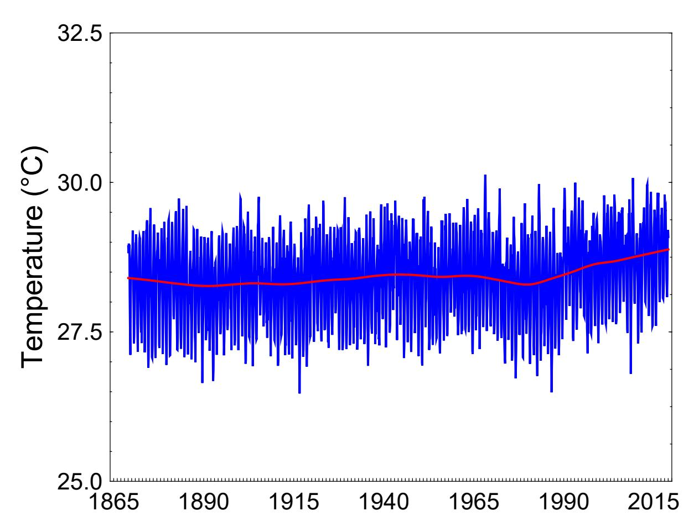

<span id="page-46-0"></span>**Figure 17.** Sea surface temperature (SST) record using the monthly NOAA ERDAP HadISST data set from 1870 to 2019 at the nearest latitude and longitude (−14.5°, −170.5°) to Tutuila (ERDDAP 2020). The red line indicates a Lowess function fitted to the data.

Ocean chemistry is also expected to change with increasing CO2 emissions [\(IPCC 2013\)](http://www.ipcc.ch/publications_and_data/publications_ipcc_fourth_assessment_report_wg1_report_the_physical_science_basis.htm). In particular, pH is expected to decrease, resulting in more acidic conditions and negatively impacting organisms (e.g., corals, mollusks, sea urchins, etc.) that secrete a calcium carbonate skeleton. Hoegh-Guldberg et al. (2007) projected that by 2050, coral reef ecosystems will reach a tipping point and

corals will be unable to calcify and grow. NPSA began monitoring ocean pH quarterly with other parameters in 2009 as part of the PACN I&M water quality protocol (Jones et al. 2011), but to date, pH has remained relatively constant at approximately 8.15 (Raikow et al. 2021). Deploying pH loggers over longer time periods may help detect temporal patterns in ocean chemistry. In addition, a newly deployed CO2 buoy on the southern coastline in Fagatele Bay will provide long-term continuous measurements of this gas, both in the atmosphere and in the ocean, along with associated changes in pH. Potential concerns with elevated CO2 levels on coral reef fishes include direct effects on internal calcifying structures such as otoliths (Ateweberhan et al. 2013), changes in fish predatorprey behavior (Cripps et al. 2011), changes in fish assemblage structure (e.g., loss of biodiversity) associated with declining coral reef habitat (Hixon 2011), and synergistic effects of stressors (Ateweberhan et al. 2013). The most widely studied aspect of these climate change impacts has focused on the negative effects of habitat decline on the related fish assemblage (Graham et al. 2009, Ateweberhan et al. 2013). At present, the relative decline in the fish assemblage for most of the metrics suggests that other factors besides increases in temperatures or decreases in pH levels have influenced the fish parameters measured in this study.

Further observations will be needed to determine whether these long-term trends of decline or increase in the fish community are real. The trends may be due to natural fluctuations in fish assemblage characteristics, or measurement error associated with the methodology that is masking the long-term pattern. Data collection and robust quantitative measures of uncertainty and associated factors will help us determine if the observed trends are ecologically significant and cause for management concern, as long-term change in the fish taxa or assemblages may be indicative of variation in certain environmental stressors or drivers. For example, a decrease in fish biomass has often been associated with increasing fishing pressure (Friedlander and DeMartini 2002, Friedlander et al. 2018) or a reduction in fish species richness corresponding to a degraded habitat such as high turbidity levels (Bejarano and Appeldoorn 2013). Co-location of this marine fish monitoring protocol with the benthic community monitoring protocol and the water quality monitoring protocol will allow us to determine if any such associations exist at NPSA.

In conclusion, the fish assemblage around NPSA appears to be in decline for fish species richness and numerical density, increasing for biomass to pre-cyclone levels and stable for diversity. It is important to note that the fish assemblage appears to be severely impacted by fishing activities compared to areas that have not been overfished (e.g., Sandin et al. 2008, Friedlander et al. 2014). Consequently, continued monitoring of the assemblage but must be viewed in the context of a baseline that has shifted to an overfished state. To return the fish assemblage to a healthier state it is recommended that management actions include establishment of more marine protected or marine managed areas, banning certain gear types such as gill nets, and incorporating traditional knowledge and associated practices focused on spawning seasons and areas.

### <span id="page-48-0"></span>**Literature Cited**

- Allen, G., R. Steene, P. Humann, and N. Deloach. 2007. Reef Fish Identification. Tropical Pacific.
- Ateweberhan M., D. A. Feary, S. Keshavmurthy, A. Chen, M. H. Schleyer, and C. R. C. Sheppard. 2013. Climate change impacts on coral reefs: Synergies with local effects, possibilities for acclimation, and management implications. Marine Pollution Bulletin. 74: 526:529.
- Atlantic and Gulf Rapid Reef Assessment (AGRRA). 2010. The AGRRA protocols. Available at <http://www.agrra.org/method/methodhome.html>(accessed 11 May 2014).
- Bayley, D. T. I., A. O. M. Mogg, H. Koldewey, and A. Purvis. 2019. Capturing complexity: fieldtesting the use of 'structure from motion' derived virtual models to replicate standard measures of reef physical structure. PeerJ 7:e6540 DOI 10.7717/peerj.6540
- Bayman, J. M., and C. G. Calugay. 2014. Archaeological overview and assessment of the National Park in American Samoa. Honolulu: Pacific Western Regional Office, Report to U.S. National Park Service. 89 p.
- Bejarano, I., and R. S. Appeldoorn. 2013. Seawater turbidity and fish communities on coral reefs of Puerto Rico. Marine Ecology Progress Series 474: 217–226.
- Bejarano, S., Y. Golbuu, T. Sapolu, and P. J. Mumby. 2013. Ecological risk and the exploitation of herbivorous reef fish across Micronesia. Marine Ecology Progress Series 482: 197–215.
- Bellwood, D. R., A. H. Baird, M. Depczynski, A. González-Cabello, A. S. Hoey, C. D. Lefèvre, and J. K. Tanner. 2012. Coral recovery may not herald the return of fishes on damaged coral reefs, Oecologia 170: 567–573.
- Birkeland, C. 1997. Symbiosis, fisheries and economic development on coral reefs. Trends in Ecology and Evolution 12: 364–367.
- Birkeland, C., P. Craig, D. Fenner, L. Smith, W. E. Kiene, and B. Reigl. 2008. Geologic setting and ecological functioning of corals reefs in American Samoa. Pages 741–765 in B. M. Riegl and R. E. Dodge (editors), Coral Reefs of the USA: 2009. Springer Science.
- Bohnsack, J., and S. Bannerot. 1986. A stationary visual census technique for quantitatively assessing community structure of coral reef fishes. NOAA Technical Report NMFS 41, National Oceanic and Atmospheric Administration, Southeast Science Fisheries Center, Miami, Florida.
- Brainard R., and 25 others. 2008. Coral reef ecosystem monitoring report for American Samoa: 2002–2006. NOAA Special Report NMFS PIFSC. 472 p.

- Brown, E., J. Beets, P. Brown, P. Craig, A. Friedlander, T. Jones, K. Kozar, M Capone, L. Kramer, and L. Basch 2011. Marine fish monitoring protocol: Pacific Islands Network (Version 1.0). Natural Resource Report NPS/PACN/NRR—2011/421. National Park Service, Fort Collins, Colorado.
- Brown, E., S. J. Lee, K. Tice, and S. A. McKenna. 2014. Kalaupapa National Historical Park Benthic marine community monitoring trend report for 2006–2010: Pacific Island Network. Natural Resource Technical Report NPS/KALA/NRTR—2014/913. National Park Service, Fort Collins, Colorado.
- Brown, E. K., S. A. McKenna, S. C. Beavers, T. Clark, M. Gawel, and D. F. Raikow. 2016. Informing coral reef management decisions at four U.S. National Parks in the Pacific using longterm monitoring data. Ecosphere 7(10):e01463. 10.1002/ecs2.1463
- Campbell, S. J., M. S. Pratchett, A. W. Anggoro, R. L. Ardiwijaya, M. Fadli, Y. Herdiana, T. Kartawijaya, D. Mahyiddin, A. Mukminin, S. T. Pardede, E. Rudi, A. M. Siregar, and A. H. Baird. 2007. Disturbance to coral reefs in Aceh, Northern Sumatra: Impacts of the Sumatra-Andaman tsunami and pre-tsunami degradation. In: D. R. Stoddart, D. R. (Ed.) Tsunamis and coral reefs. 544: 55–78.
- Caselle, J. E., and R. R. Warner. 1996. Variability in recruitment of coral reef fishes: the importance of habitat at two spatial scales. Ecology 77: 2488−2504.
- Casey, J. M., A. H. Baird, S. J. Brandl, M. O. Hoogenboom, J. R. Rizzari, A. J. Frisch, C. E. Mirbach, and S. R. Connolly. 2017. A test of trophic cascade theory: fish and benthic assemblages across a predator density gradient on coral reefs. Oecologia 183: 161–175.
- Ceccarelli, D. M., M. J. Emslie, and Z. T. Richards. 2016. Post-Disturbance Stability of Fish Assemblages Measured at Coarse Taxonomic Resolution Masks Change at Finer Scales. PLoS ONE 11(6): e0156232. doi:10.1371/journal. pone.0156232
- Cesar, H., P. van Beukering, S. Pintz, and S. Dierking. 2002. Economic valuation of the coral reefs of Hawai'i. Hawai'i Coral Reef Initiative Research Program Final Report. National Oceanic and Atmospheric Administration, Coastal Ocean Program and University of Hawai'i, Honolulu, Hawai'i.
- Chen, J.-L.; Y.-J Hsiao, K. -K. Yip. 2021. Risk Management of Marine Capture Fisheries under Climate Change: Taking into Consideration the Effects of Uncertainty. Sustainability 13, 3892. [https://doi.org/10.3390 /su13073892](https://doi.org/10.3390%20/su13073892)
- Christie, M. R., B. N. Tissot, M. A. Albins, J. P. Beets, Y. Jia, D. M. Ortiz, S. E. Thompson, and M. A. Hixon. 2010. Larval Connectivity in an Effective Network of Marine Protected Areas, PLos ONE 5(12),:e15715, doi:10.1371/journal. pone.0015715.

- Claisse, J. T., S. A. McTee, and J. D. Parrish. 2009. Effects of age, size, and density on natural survival for an important coral reef fishery species, yellow tang, *Zebrasoma flavescens*. Coral Reefs 28: 95−105.
- Clark, J. T., and D. J. Herdrich. 1993. Prehistoric Settlement System in Eastern Tutuila, Ameri- can Samoa. Journal of the Polynesian Society 102: 147–185.
- Clark, J. T., and M. G. Michlovic. 1996.An Early Settlement in the Polynesian Homeland: Excavations at 'Aoa Valley, Tutuila Island, American Samoa. Journal of Field Archaeology 23: 151–167.
- Clark, T. 2016. Control of Crown of Thorns starfish at the National Park of American Samoa. Report to National Park of American Samoa, Pago Pago, American Samoa. 66 p.
- Connell, J. H. 1978. Diversity in tropical rain forests and coral reefs. Science 199: 1302–1310.
- Craig, P., B. Ponwith, F. Aitaoto, and D. Hamm. 1993. The commercial, subsistence and recreational fisheries of American Samoa. Marine Fisheries Review 55: 109–116.
- Craig, P., A. Green, and F. Tuilagi. 2008. Subsistence harvest of coral reef resources in the outer islands of American Samoa: modern, historic and prehistoric catches. Fisheries Research 89: 230–240.
- Craig, P., J. Wimpy, N. Reigner, W. Valliere, and T. Cummings. 2019. Natural resource condition assessment: National Park of American Samoa. Natural Resource Report NPS/NPSA/NRR— 2019/1894. National Park Service, Fort Collins, Colorado.
- Cripps, I. L., P. L. Munday, M. and I. McCormick. 2011. Ocean acidification affects prey detection by a predatory reef fish. PLoS ONE 6: e22736. [http://dx.doi.org/10.1371/journal.pone.0022736.](http://dx.doi.org/10.1371/journal.pone.0022736)
- Doulman, D., R. Keaney. 1991. The domestic tuna industry in the Pacific islands region. Pacific Islands Development. Program, East-West Cent., Univ. Hawaii (Honolulu). Res. Rep. Ser. 7. 75 p.
- Dunbar, P. K., and C. S. Weaver. 2015. United States and territories national tsunami hazard assessment: Historical record and sources for waves-update. NOAA tsunami program special report. 30 p.
- Duque, G., D. E. Gamboa-Garcia, A. Molina, P. Cogua. 2020. Effect of water quality variation on fish assemblages in an anthropogenically impacted tropical estuary, Colombian Pacific. Environmental Science and Pollution Research 27: 25740–25753.
- Edwards, C. B. A. M. Friedlander, A. G. Green, M. J. Hardt, E. Sala, H. P. Sweatman, I. D. Williams, B. Zgliczynski, S. A. Sandin, and J. E. Smith. 2014 Global assessment of the status of coral reef herbivorous fishes: evidence for fishing effects. Proceedings of the Royal Society B 281: 20131835.<http://dx.doi.org/10.1098/rspb.2013.1835>

- English, S., C. Wilkinson, and V. Baker. 1997. Survey manual for tropical marine resources, 2nd edition, Australian Institute of Marine Science, Townsville, Australia.
- Environmental Research Division's Data Access Program (ERDDAP). HadISST Average Sea Surface Temperature, 1°, Global, Monthly, 1870-present. Data set accessed 03 Jun 2020. [https://coastwatch.pfeg.noaa.gov/erddap/griddap/erdHadISST.html,](https://coastwatch.pfeg.noaa.gov/erddap/griddap/erdHadISST.html) 2020.
- Fabricius, K., G. De'ath, L. McCook, E. Turak, D. McB. Williams. 2005. Changes in algal, coral and fish assemblages along water quality gradients on the inshore Great Barrier Reef. Marine Pollution Bulletin 51: 384–398.
- Feary, D. A., M. S. Pratchett, M. J. M. J. Emslie, A. M. Fowler, W. F. Figueira, O. J. Luiz, Y. Nakamura, and D. J. Booth. 2013. Latitudinal shifts in coral reef fishes: why some species do and others do not shift. Fish and Fisheries 15: 593–615.
- Fenner, D. 2019. The Samoan Archipelago. In: Charles Sheppard (Ed.). World Seas: An Environmental Evaluation. Volune II: The Indian Ocean to the Pacific. Academic Press, London, United Kingdom. 619–643.
- Figueira, W. F., D. J. Booth. 2010. Increasing ocean temperatures allow tropical fishes to survive overwinter in temperate waters. Global Change Biology 16: 506–516.
- Friedlander, A. M., and J. D. Parrish. 1996. Habitat characteristics affecting fish assemblages on a Hawaiian coral reef. Journal of Experimental Marine Biology and Ecology 224: 1–30.
- Friedlander, A. M., R. C. DeFelice, J. D. Parrish, and J. L. Frederick. 1997. Habitat resources and recreational fish population at Hanalei Bay, Kauai. Final Report to State of Hawai'i, Department of Land and Natural Resources, Division of Aquatic Resources, Honolulu, Hawai'i.
- Friedlander A. M., and E. E. DeMartini. 2002. Contrasts in density, size, and biomass of reef fishes between the northwestern and the main Hawaiian Islands: the effects of fishing down apex predators. Marine Ecology Progress Series 230:253–264.
- Friedlander, A. M., E. K. Brown, P. L. Jokiel, W. R. Smith, and S. K. Rodgers. 2003. Effects of habitat, wave exposure, and marine protected area status on coral reef fish assemblages in the Hawaiian archipelago. Coral Reefs 22: 291–305.
- Friedlander, A. M, E. K. Brown, and M. E. Monaco. 2007. Defining reef fish habitat utilization patterns in Hawaii: implications for the effective design of marine protected areas. Marine Ecology Progress Series 351: 221–233.

- Friedlander, A., G. Aeby, R. Brainard, E. Brown, K. Chaston, A. Clark, P. McGowan, T. Montgomery, W. Walsh, I. Williams, and others. 2008. The State of Coral Reef Ecosystems of the Main Hawaiian Islands. Pages 219–261 *in* J. Waddell (editor), The State of Coral Reef Ecosystems of the United States and Pacific Freely Associated States: 2008. NOAA Technical Memorandum NOS NCCOS 11. NOAA/NCCOS Center for Coastal Monitoring and Assessment's Biogeography Team. Silver Spring, MD.
- Friedlander, A. M., J. E. Caselle, E. Ballesteros, E. K. Brown, A. Turchik, and E. Sala. 2014. The real bounty: Marine biodiversity in the Pitcairn Islands. PLOS One 9(6): 1–11.
- Friedlander, A. M., M. K. Donovan, K. A. Stamoulis, I. D. Williams, E. K. Brown, E. J. Conklin, E. E. DeMartini, K. S. Rodgers, R. T. Sparks, and W. J. Walsh. 2018. Human‐induced gradients of reef fish declines in the Hawaiian Archipelago viewed through the lens of traditional management boundaries. Aquatic Conservation: Marine and Freshwater Ecosystems 28: 146–157
- Goldin, M. R. 2002. Field guide to the Samoan Archipelago.
- Graham, N. A. J., S. K. Wilson, M. S. Pratchett, N. V. C. Polunin, and M. D. Spalding. 2009. Coral mortality versus structural collapse as drivers of corallivorous butterflyfish decline. Biodiversity Conservation. 18: 3325–3336.
- Green, A. 2002. Status of coral reefs on the main volcanic islands of American Samoa: a resurvey of long-term monitoring sites. Report to Dept. Marine and Wildlife Resources. American Samoa. 135 p.
- Green, A., and C. Hunter. 1998. A preliminary survey of the coral reef resources in the Tutuila Unit of the National Park of American Samoa. Report to National Park Service. 42 p.
- Green, A., and T. Hughes. 1999. Rapid ecological assessment of the coral reef resources in the Ta'u Unit of the National Park of American Samoa. Report to National Park Service. 14 p.
- Greenwood, M. F. D., P. W. Stevens, R. E. Matheson Jr. 2006. Effects of the 2004 hurricanes on the fish assemblages in two proximate southwest Florida estuaries: Change in the context of interannual variability. Estuaries and Coasts. 29: 985–996.
- Habary, A., J. L. Johansen, T. J. Nay, J. F. Steffensen, and J. L. Rummer. 2016. Adapt, move or die how will tropical coral reef fishes copes with ocean warming? Global Change Biology doi: 10.1111/gcb.13488. 1–12.
- Hawkins, J P., C. M. Roberts. 2004. Effects of artisanal fishing on Caribbean coral reefs. Conservation Biology 18: 215–226.
- Heppell, S. S., S. A. Heppell, A. J. Read, and L. B. Crowder. 2005. Effects of fishing on long-lived marine organisms. Pages 211–231 *in* E. A. Norse and L. B. Crowder (editors), Marine Conservation Biology: The Science of Maintaining the Sea's Biodiversity. Island Press, Washington, DC.

- Hill, J., and C. Wilkinson. 2004. Methods for ecological monitoring of coral reefs. Australian Institute of Marine Science, Townsville, Australia.
- Hixon, M. A. 2011. 60 Years of coral reef fish ecology: past, present, future. Bulletin of Marine Science 87: 727–765.
- Hoegh-Guldberg O., P. J. Mumby, A. J. Hooten, R. S. Steneck, P. Greenfield, E. Gomez, C. D. Harvell, P. F. Sale, A. J. Edwards, K. Caldeira, and others. 2007. Coral reefs under rapid climate change and ocean acidification. Science 318: 1737–1742.
- Hunt, H. L., and R. E. Scheibling. 1997. Role of early post-settlement mortality in recruitment of benthic marine invertebrates. Marine Ecology Progress Series 155: 269−301.
- Hunter, C., A. Friedlander, W. Magruder, and K. Meier. 1993. Ofu reef survey: baseline assessment and recommendations for long-term monitoring of the proposed National Park in Ofu, American Samoa. Report to National Park Service. 135 p.
- IPCC, 2013: Summary for Policymakers. In: Climate Change 2013: The Physical Science Basis. Contribution of Working Group I to the Fifth Assessment Report of the Intergovernmental Panel on Climate Change [Stocker, T.F., D. Qin, G.-K. Plattner, M. Tignor, S. K. Allen, J. Boschung, A. Nauels, Y. Xia, V. Bex and P.M. Midgley (eds.)]. Cambridge University Press, Cambridge, United Kingdom and New York, NY, USA.
- Jacob, L., P. Wiles, T. Aitaoto, and S. Lam Yuen. 2012. Coastal Currents in American Samoa. Their Role in Marine Protected Area Network Design. Department of Marine and Wildlife Resources, American Samoa. Pp. 23.
- Jones, T., K. DeVerse, G. Dicus, D. McKay, A. Farahi, K. Kozar, and E. Brown. 2011. Water quality vital signs monitoring protocol for the Pacific Island Network:Volume 1; Version 1.0. Natural Resource Report NPS/PACN/NRR—2011/418. National Park Service, Fort Collins, Colorado.
- Kendall, M., M. Poti, B. Carroll, D. Fenner, A. Green, L. Jacob, J. Ah Leong, B. Kinlan, I. Williams, and J. Zamzow. 2011a. Biogeographic Assessment of Fish and Coral Communities of the Samoan Archipelago. Pages 97–122 *in* Kendall, M.S. and M. Poti (eds.), 2011. A Biogeographic Assessment of the Samoan Archipelago. NOAA Technical Memorandum NOS NCCOS 132. Silver Spring, MD.
- Kendall, M.S., M. Poti, T. Wynne, B. Kinlan, and L. Bauer. 2011b. Ocean Currents and Larval Transport Among Islands and Shallow Seamounts of the Samoan Archipelago and Adjacent Island Nations. In: Kendall, M.S. and M. Poti (eds.), 2011. A Biogeographic Assessment of the Samoan Archipelago. Pages 27–96 *in* NOAA Technical Memorandum NOS NCCOS 132. Silver Spring, MD.
- Kittinger, J. K. 2013. Human dimensions of small-scale and traditional fisheries in the Asia-Pacific region. Pacific Science 67: 315–325.

- Krebs, C. J. 1999. Ecological methodology, second edition. Addison-Welsey Educational Publishers, Inc, Menlo Park, California.
- Kulbicki, M., G. Mou Tham, P. Thollot, and L. Wantiez. 1993. Length-weight relationships of fish from the lagoon of New Caledonia. Naga, ICLARM Q. 16:26–29.
- Kulbicki, M., V. Parravicini, and D. Mouillot. 2015. Patterns and process in reef fish body size. Pages 104–115 *in* C. Mora (editor), Ecology of Fishes on Coral Reefs. Cambridge University Press, Cambridge, U.K.
- MacNeil, M. A., N. A. J. Graham, J. E. Cinner, S. K. Wilson, I. D. Williams, J. Maina, S. Newman, A. M. Friedlander, S. Jupiter, N. V. C. Polunin, and T. R. McClanahan. 2015. Recovery potential of the world's coral reef fishes. Nature 520: 341–344.
- MacNeil, M. A., D. D. Chapman, M. Heupel, C. A. Simpfendorfer, M. Heithaus, M. Meekan, E. Harvey, J. Goetze, J. Kiszka, M. E. Bond, L. M. Currey-Randall, et al. 2020. Global status and conservation potential of reef sharks. Nature 583: 801–806.
- Masuda R., M. Hatakeyama, K. Yokoyama, M. Tanaka. 2016. Recovery of Coastal Fauna after the 2011 Tsunami in Japan as Determined by Bimonthly Underwater Visual Censuses Conducted over Five Years. PLoS ONE 11(12): e0168261. doi:10.1371/journal.pone.0168261
- McClanahan T. R., N. A. J. Graham, M. A. MacNeil, N. A. Muthiga, J. E. Cinner, J. H. Bruggemann, et al. 2011. Critical thresholds and tangible targets for ecosystem-based management of coral reef fisheries. Proceedings of the National Academy of Sciences. 108(41):17230–3. doi: 10.1073/pnas.1106861108.
- McClanahan T. R., and C. A. Abunge. 2015. Perceptions of management options and the disparity of benefits among stakeholder communities and nations of southeastern Africa. Fish and Fisheries. doi: 10.1111/ faf.12118.
- McClanahan T. R., J. M. Maina, N. A. J. Graham, K. R. Jones. 2016. Modeling reef fish biomass, recovery potential, and management priorities in the Western Indian Ocean. PLoS ONE 11(5): e0154585. doi:10.1371/journal.pone.0154585
- McClanahan, T.R., R. E. Schroeder, A. M. Friedlander, L. Vigliola, L. Wantiez, J. E. Caselle, N. A. J. Graham, S. Wilson, G. J. Edgar, R. D. Stuart-Smith, R. M. Oddenyo, J. E. Cinner. 2019. Global baselines and benchmarks for fish biomass: comparing remote reefs and fisheries closures. Marine Ecology Progress Series 612: 167–192.
- McCutcheon, A. L. and S. A. McKenna. In press. Coral bleaching, Mortality and Benthic Assemblages on the Reefs within the Pacific Island Network National Parks. Natural Resource Report NPS/PACN/NRR—2021/XXXX. National Park Service, Fort Collins, Colorado.

- Morrison, A. E., D. J. Addison. 2009. Examining Causes and Trends in Marine Trophic Level Change: 1500 Years of Fish Exploitation at Fatu-ma-Futi, Tutuila Island, American Sāmoa, The Journal of Island and Coastal Archaeology, 4:2, 177–194, DOI:10.1080/15564890903245264
- Nadon, M., J. Baum, I. Williams, J. McPherson, B. Zgliczynski, B. Richards, R. Schroeder, and R. Brainard. 2012. Re-Creating missing population baselines for Pacific reef sharks. Conserv Biol. 26: 493–503. doi: 10.1111/j.1523-1739.2012.01835.x.
- Nakamura, Y., D. A. Feary, M. Kanda, and K. Yamaoka. 2013. Tropical fishes dominate temperate reef fish communities within Western Japan. PLoS ONE 8: e81107. doi.org:10.1371/journal.pone.0081107
- Nash K. L., N. A. J. Graham, S. K. Wilson, and D. R. Bellwood. 2013. Cross-scale habitat structure drives fish body size distributions on coral reefs. Ecosystems 16:478–490 DOI 10.1007/s10021- 012-9625-0.
- NOAA. 2018. US Coral Reef Monitoring Data Summary 2018. NOAA Coral Reef Conservation Program. NOAA Technical Memorandum CRCP 31, 224 pp. DOI: 10.25923/g0v0-nm61
- NPSA. 2014. Superintendent's compendium of designations, closures, permit requirements and other restrictions imposed under discretionary authority. National Park Service.
- Pauly, D., V. Christensen, J. Dalsgaard, R. Froese, and F. Torres Jr., 1998. Fishing down marine food webs. Science 279: 860–863.
- Pauly, D., and D. Zeller. 2016. Catch reconstructions reveal that global marine fisheries catches are higher than reported and declining. Nature Communications 7:10244 | DOI: 10.1038/ncomms10244: 1–9.
- Pearl, F. B., and P. R. Johnson. 2006. Survey, mapping, and assessment of prehistoric mountain settlement at Lefutu, Levaga village, and Old Vatia village. Report to the American Samoa Historic Preservation Office. 75 p.
- Piepho, H. P., and J. O. Ogutu. 2002. A simple mixed model for trend analysis in wildlife populations. Journal of Agricultural, Biological, and Environmental Statistics 7(3): 350–360.
- Pirhalla, D., V. Ransi, M. Kendall, and D. Fenner. 2011. Oceanography of the Samoan Archipelago. p. 3–26. *In*: M. Kendall and M. Poti (eds.). A biogeographic assessment of the Samoan Archipelago. NOAA Tech. Memo., NOS NCCOS 132, Silver Springs, Maryland.
- Qiu, B. and S. Chen. 2004. Seasonal modulations in the eddy field of the South Pacific Ocean. Journal of Physical Oceanography 34: 1515–1527.

- Quimbayo, J. P., M. S. Dias, M. Kulbicki, T. C. Mendes, R. W. Lamb, A. F. Johnson, O. Aburto-Oropeza, J. J. Alvarado, A. A. Bocos, C. E. L. Ferreira, E. Garcia, O. J. Luiz, I. Mascareñas-Osorio, H. T. Pinheiro, F. Rodriguez-Zaragoza, E. Salas, F. A. Zapata, S. R. Floeter, 2019. Determinants of reef fish assemblages in tropical oceanic islands. Ecography 42:77–87.
- R Core Team. 2020. R: A language and environment for statistical computing. R Foundation for Statistical Computing, Vienna, Austria. ISBN 3-900051-07-0, URL [http://www.R-project.org/](http://www.r-project.org/)
- Raikow, D. F., S. Kichman, A.L. McCutcheon, and A. Farahi. 2021. Marine Water Quality in Pacific Island National Parks: Temporal, spatial, and chemical patterns 2008–2015. Natural Resource Report NPS/PACN/NRR—2021/2220. National Park Service, Fort Collins, Colorado.
- Randall, J. E. 2005. Reef and shore fishes of the South Pacific. University of Hawai'i Press, Honolulu, Hawai'i.
- Revell, C., S. Ready, J. Renwick, and H. J. Diamond. 2014. A case study of Tropical Cyclone Wilma, January 2011. Weather and Climate 34: 20–35.
- Roberts, C. M., C. J. McClean, J. E. N. Veron, J. P. Hawkins, G. R. Allen, D. E. McAllister, C. G. Mittermeier, F. W. Schueler, M. Spalding, F. Well, and others. 2002. Marine biodiversity hotspots and conservation priorities for tropical reefs. Science 295: 1280–1284.
- Rogers, C. S., G. Garrison, R. Grober, A. M. Hillis, and M. A. Franke. 1994. Coral reef monitoring manual for the Caribbean and western Atlantic. National Park Service, Virgin Islands National Park, Central, U.S. Virgin Islands.
- Saenz-Aqudelo, P., G. P. Jones, S. R. Thorrold, and S. Planes. 2015. Mothers matter: contribution to local replenishment is linked to female size, mate replacement and fecundity. Marine Biology 162: 3–14.
- Samoilys, M. 1997. Manual for assessing fish stocks on Pacific coral reefs. Australian Centre for International Agricultural Research, Department of Primary Industries, Brisbane, Australia.
- Sano, M. 2000. Stability of reef fish assemblages: responses to coral recovery after catastrophic predation by *Acanthaster planci.* Marine Ecology Progress Series 198: 121–130.
- Sandin, S. A., J. E. Smith, E. E. DeMartini, E. A. Dinsdale, S. D. Donner, A. M. Friedlander, T. Konotchick, M. Malay, J. E. Maragos, D. Obura, and others. 2008. Baselines and degradation of coral reefs in the northern Line Islands. PLoS ONE 3(2): e1548.
- Storlazzi, C.D., O. M. Cheriton, K. J. Rosenberger, J. B. Logan, and T. B. Clark. 2017, Coastal circulation and water-column properties in the National Park of American Samoa, February–July 2015: U.S. Geological Survey Open-File Report 2017–1060, 104 p., [https://doi.org/10.3133/ofr20171060.](https://doi.org/10.3133/ofr20171060)

- Starcevich, L. A. H. 2013. Trend and power analysis for National Park Service marine data from 2006 to 2010: Pacific Island Network. Natural Resource Technical Report NPS/PACN/NRTR— 2013/771. National Park Service, Fort Collins, Colorado.
- Sweatman, H., D. Bass, A. Cheal, G. Coleman, I. Miller, R. Ninio, K. Osborne, W. Oxley, D. Ryan, A. Thompson, and P. Tomkins. 1998. Long-term monitoring of the Great Barrier Reef. Australian Institute of Marine Science, Townsville, Australia.
- Vargas-Angel, B., B.D. Schumacher. 2018. Baseline Surveys for Coral Reef Community Structure and Demographics in Vatia and Faga'alu Bay, American Samoa NOAA Pacific Islands Fisheries Science Center, PIFSC Special Publication, SP-18-002, 38 p.
- Waddell, J. E., editor. 2005. The state of coral reef ecosystems of the United States and Pacific Freely Associated States: 2005. Technical Memorandum 11, NOAA [National Oceanic and Atmospheric Administration], NOS [National Oceanic Service], NCCOS [National Centers for Coastal Ocean Science], Silver Spring, Maryland.
- Walsh, W. J. 1983. Stability of a coral reef fish community following a catastrophic storm. Coral Reefs 2: 49–63.
- Wass, R. 1982. Characterization of inshore Samoan fish communities. Draft report. American Samoa Dept. Marine and Wildlife Resources, Biological Report Series No. 6. *In*: Hart, R. 2008. Environmental digital library for the Samoan archipelago. National Park Service, Pacific Network Inventory & Monitoring Program and National Park of American Samoa. DVD (Version 2). [https://www.nps.gov/npsa/learn/nature/digitallibr.htm,](https://www.nps.gov/npsa/learn/nature/digitallibr.htm) [http://www.botany.hawaii.edu/basch/uhnpscesu/picrp/complbibCont.htm#top,](http://www.botany.hawaii.edu/basch/uhnpscesu/picrp/complbibCont.htm%23top) or [http://www.botany.hawaii.edu/basch/uhnpscesu/picrp/complbibA.htm#top.](http://www.botany.hawaii.edu/basch/uhnpscesu/picrp/complbibA.htm%23top)
- Wass, R. 1984. An annotated list of the fishes of Samoa. NOAA Tech. Rept. SSRF-781. 43 p.
- Wedding, L M., S. Jorgensen, C. A. Lepczyk, and A. M. Friedlander. 2019. Remote sensing of threedimensional coral reef structure enhances predictive modeling of fish assemblages. Remote Sensing in Ecology and Conservation 5: 150–159.
- Whitall, D, M. Curtis, A. Mason, and B. Vargas-Angel. 2019. Excess Nutrients in Vatia Bay, American Samoa: Spatiotemporal Variability, Source Identification and Impact on Coral Reef Ecosystems. NOAA Technical Memorandum NOS NCCOS 266. Silver Spring. 69 pages. doi:10.25923/j8cp-x570.
- Williams, I., J. Baum, A. Heenan, K. Hanson, M. Nadon, and R. Brainard. 2015. Human, oceanographic and habitat drivers of central and western Pacific coral reef fish assemblages. PLoS ONE 10(4): e0120516. doi:10.1371/journal.pone.0120516.
- Wong, K. B., and M. O. Lammers. 2010. Ecological Acoustic Recorder (EAR) 19-July-2006 to 29- September-2006Level 1 Analysis of Passive Acoustic Observations. Pacific Islands Fisheries Science Center, Internal Report IR-10-006.

- Wood, S. 2019. mgcv: Mixed GAM Computation Vehicle with Automatic Smoothness Estimation. R package version 1.8-31.
- Worldometer, 2020. American Samoa Population. Available at <https://www.worldometers.info/world-population/american-samoa-population/> (accessed 27 May 2020).
- Worm, B., E. B. Barbier, N. Beaumont, J. E. Duffy, C. Folke, B. S. Halpern, J. B. C. Jackson, H. K. Lotze, F. Micheli, S. R. Palumbi, and others. 2006. Impacts of biodiversity loss on ocean ecosystem services. Science 314: 787–790.
- Zar, J. H. 1999. Biostatistical analysis, 4th edition. Prentice Hall, Upper Saddle River, NJ.
- Zeller, D., S. Booth, P. Craig, and D. Pauly. 2006. Reconstruction of coral reef fisheries catches in American Samoa, 1950–2002. Coral Reefs. 25: 144–152.

# <span id="page-59-0"></span>**Appendix A: Fish species documented in the National Park of American Samoa**

**Table A-1.** Fish species documented on transects in the National Park of American Samoa along with trophic information and length–mass fitting parameters used in the allometric growth equation. Functional guild abbreviations are as follows: C = Corallivore, D = Detritivore, H/BR = Herbivore browser, H/FA = Herbivore farmer, H/GR = Herbivore grazer, H/SC = Herbivore scraper, MI = Mobile invertebrate feeder, O = Omnivore, P = Piscivore, Pk = Planktivore, SI = Sessile invertebrate feeder. The size conversion column represents the multiplication factor to convert total length (cm) to fork length.

| Taxon                      | Consumer  | Functional<br>Guild | a          | b          | Size<br>Conversion |
|----------------------------|-----------|---------------------|------------|------------|--------------------|
| Acanthurus achilles        | Primary   | H/GR                | 0.02803288 | 2.98288421 | 0.900              |
| Acanthurus albipectoralis  | Secondary | Pk                  | 0.02803288 | 2.98288421 | 0.910              |
| Acanthurus blochii         | Primary   | H/GR                | 0.02505596 | 3.03192925 | 0.930              |
| Acanthurus dussumieri      | Primary   | H/BR                | 0.04256118 | 2.86826353 | 0.930              |
| Acanthurus lineatus        | Primary   | H/GR                | 0.02803288 | 2.98288421 | 0.830              |
| Acanthurus maculiceps      | Primary   | H/GR                | 0.02803288 | 2.98288421 | 0.858              |
| Acanthurus nigricans       | Primary   | H/BR                | 0.02803288 | 2.98288421 | 0.980              |
| Acanthurus nigricauda      | Primary   | H/GR                | 0.01678476 | 3.16772469 | 0.840              |
| Acanthurus nigrofuscus     | Primary   | H/BR                | 0.02637048 | 3.02836671 | 0.910              |
| Acanthurus nigroris        | Primary   | H/BR                | 0.02803288 | 2.98288421 | 0.940              |
| Acanthurus olivaceus       | Primary   | H/GR                | 0.02803288 | 2.98288421 | 0.890              |
| Acanthurus pyroferus       | Primary   | H/GF                | 0.02803288 | 2.98288421 | 0.940              |
| Acanthurus thompsoni       | Secondary | Pk                  | 0.02803288 | 2.98288421 | 0.710              |
| Acanthurus xanthopterus    | Primary   | H/GR                | 0.02673046 | 2.98448664 | 0.870              |
| Aethaloperca rogaa         | Top       | P                   | 0.01341523 | 3.03051425 | 0.990              |
| Amblyeleotris fasciata     | Secondary | C                   | 0.02638753 | 2.62256560 | 1.000              |
| Amblyeleotris guttata      | Secondary | C                   | 0.02638753 | 2.62256560 | 1.000              |
| Amblyeleotris sp           | Secondary | Pk                  | 0.02638753 | 2.62256560 | 1.000              |
| Amphiprion chrysopterus    | Secondary | Pk                  | 0.01886647 | 3.19020988 | 1.000              |
| Amphiprion clarkii         | Secondary | Pk                  | 0.01886647 | 3.19020988 | 0.960              |
| Anampses caeruleopunctatus | Secondary | C                   | 0.02260940 | 2.79271102 | 1.000              |
| Anampses melanurus         | Secondary | MI                  | 0.02260940 | 2.79271102 | 1.000              |
| Anampses meleagrides       | Secondary | MI                  | 0.02260940 | 2.79271102 | 1.000              |

**Table A-1 (continued).** Fish species documented on transects in the National Park of American Samoa along with trophic information and length–mass fitting parameters used in the allometric growth equation. Functional guild abbreviations are as follows: C = Corallivore, D = Detritivore, H/BR = Herbivore browser, H/FA = Herbivore farmer, H/GR = Herbivore grazer, H/SC = Herbivore scraper, MI = Mobile invertebrate feeder, O = Omnivore, P = Piscivore, Pk = Planktivore, SI = Sessile invertebrate feeder. The size conversion column represents the multiplication factor to convert total length (cm) to fork length.

| Taxon                       | Consumer  | Functional<br>Guild | a          | b          | Size<br>Conversion |
|-----------------------------|-----------|---------------------|------------|------------|--------------------|
| Anampses twistii            | Secondary | SI                  | 0.02260940 | 2.79271102 | 1.000              |
| Aphareus furca              | Secondary | P                   | 0.01673604 | 3.02215238 | 0.870              |
| Apolemichthys trimaculatus  | Secondary | SI                  | 0.05843515 | 2.71827770 | 1.000              |
| Arothron meleagris          | Secondary | MI/SI               | 0.03523542 | 2.90132591 | 1.000              |
| Arothron nigropunctatus     | Secondary | C                   | 0.03523542 | 2.90132591 | 1.000              |
| Aulostomus chinensis        | Secondary | P                   | 0.00021408 | 3.51443202 | 1.000              |
| Balistapus undulatus        | Secondary | SI                  | 0.00569644 | 3.39302801 | 1.000              |
| Balistoides conspicillum    | Secondary | C                   | 0.01900361 | 3.07823962 | 1.000              |
| Balistoides viridescens     | Secondary | SI                  | 0.02442230 | 3.01828477 | 1.000              |
| Bodianus axillaris          | Secondary | SI                  | 0.01081521 | 3.17305191 | 1.000              |
| Bodianus loxozonus          | Secondary | C                   | 0.01081521 | 3.17305191 | 1.000              |
| Bodianus mesothorax         | Secondary | MI                  | 0.01081521 | 3.17305191 | 1.000              |
| Caesio caerulaurea          | Secondary | Pk                  | 0.01996239 | 2.99140569 | 0.860              |
| Caesio teres                | Secondary | Pk                  | 0.00928912 | 3.25273067 | 0.873              |
| Calotomus carolinus         | Primary   | H/SC                | 0.02223697 | 2.97068234 | 1.000              |
| Cantherhines dumerilii      | Secondary | O                   | 0.01222481 | 3.03275681 | 1.000              |
| Cantherhines sandwichiensis | Primary   | H/GR                | 0.01222481 | 3.03275681 | 1.000              |
| Canthigaster amboinensis    | Secondary | O                   | 0.04237662 | 2.82202079 | 1.000              |
| Canthigaster solandri       | Secondary | SI                  | 0.02989064 | 2.97880580 | 1.000              |
| Caranx ignobilis            | Top       | P                   | 0.01638314 | 3.05869327 | 0.890              |
| Caranx lugubris             | Top       | P/MI                | 0.01983308 | 2.98604621 | 0.900              |
| Caranx melampygus           | Top       | P                   | 0.02339817 | 2.91798706 | 0.890              |
| Caranx sexfasciatus         | Top       | P                   | 0.01983308 | 2.98604621 | 0.910              |
| Centropyge bicolor          | Primary   | H/GR                | 0.07448102 | 2.57693438 | 1.000              |
| Centropyge bispinosa        | Primary   | H/GR                | 0.09194969 | 2.45798686 | 1.000              |
| Centropyge flavissima       | Primary   | H/GR                | 0.07448102 | 2.57693438 | 1.000              |
| Centropyge heraldi          | Primary   | H/GR                | 0.07448102 | 2.57693438 | 1.000              |

**Table A-1 (continued).** Fish species documented on transects in the National Park of American Samoa along with trophic information and length–mass fitting parameters used in the allometric growth equation. Functional guild abbreviations are as follows: C = Corallivore, D = Detritivore, H/BR = Herbivore browser, H/FA = Herbivore farmer, H/GR = Herbivore grazer, H/SC = Herbivore scraper, MI = Mobile invertebrate feeder, O = Omnivore, P = Piscivore, Pk = Planktivore, SI = Sessile invertebrate feeder. The size conversion column represents the multiplication factor to convert total length (cm) to fork length.

|                           |           | Functional |            |            | Size       |
|---------------------------|-----------|------------|------------|------------|------------|
| Taxon                     | Consumer  | Guild      | a          | b          | Conversion |
| Centropyge loricula       | Primary   | H/GR       | 0.07448102 | 2.57693438 | 1.000      |
| Cephalopholis argus       | Top       | P          | 0.00929300 | 3.18074251 | 1.000      |
| Cephalopholis leopardus   | Secondary | P          | 0.01145715 | 3.10934638 | 1.000      |
| Cephalopholis miniata     | Secondary | P          | 0.01065578 | 3.11410065 | 1.000      |
| Cephalopholis urodeta     | Secondary | P          | 0.02822286 | 2.81775070 | 1.000      |
| Cetoscarus ocellatus      | Primary   | H/SC       | 0.02223697 | 2.97068234 | 0.923      |
| Chaetodon auriga          | Secondary | SI         | 0.04039709 | 2.82943061 | 1.000      |
| Chaetodon bennetti        | Secondary | SI         | 0.03839496 | 2.88507866 | 1.000      |
| Chaetodon citrinellus     | Secondary | C          | 0.03529875 | 2.83413776 | 1.000      |
| Chaetodon ephippium       | Secondary | SI         | 0.02248547 | 3.06092152 | 1.000      |
| Chaetodon lunula          | Secondary | SI         | 0.04500811 | 2.81415860 | 1.000      |
| Chaetodon lunulatus       | Secondary | C          | 0.03110105 | 2.97565911 | 1.000      |
| Chaetodon mertensii       | Secondary | SI         | 0.00429680 | 3.79338207 | 1.000      |
| Chaetodon ornatissimus    | Secondary | C          | 0.04500811 | 2.81415860 | 1.000      |
| Chaetodon pelewensis      | Secondary | C/SI       | 0.01532622 | 3.29658737 | 1.000      |
| Chaetodon quadrimaculatus | Secondary | C          | 0.04500811 | 2.81415860 | 1.000      |
| Chaetodon reticulatus     | Secondary | C          | 0.04500811 | 2.81415860 | 1.000      |
| Chaetodon trifascialis    | Secondary | C          | 0.02577699 | 2.96907706 | 1.000      |
| Chaetodon ulietensis      | Secondary | C          | 0.03114158 | 2.87411657 | 1.000      |
| Chaetodon unimaculatus    | Secondary | C          | 0.05330290 | 2.83327856 | 1.000      |
| Chaetodon vagabundus      | Secondary | O          | 0.02775533 | 2.97346480 | 1.000      |
| Cheilinus chlorourus      | Secondary | C          | 0.01972456 | 2.99315167 | 1.000      |
| Cheilinus fasciatus       | Secondary | SI         | 0.01550828 | 3.05791695 | 1.000      |
| Cheilinus oxycephalus     | Secondary | MI         | 0.01550828 | 3.05791695 | 1.000      |
| Cheilinus trilobatus      | Secondary | SI         | 0.01623269 | 3.05946998 | 1.000      |
| Cheilinus undulatus       | Secondary | C          | 0.01130957 | 3.13620212 | 1.000      |
| Cheilio inermis           | Secondary | MI         | 0.00349073 | 3.08156914 | 1.000      |

**Table A-1 (continued).** Fish species documented on transects in the National Park of American Samoa along with trophic information and length–mass fitting parameters used in the allometric growth equation. Functional guild abbreviations are as follows: C = Corallivore, D = Detritivore, H/BR = Herbivore browser, H/FA = Herbivore farmer, H/GR = Herbivore grazer, H/SC = Herbivore scraper, MI = Mobile invertebrate feeder, O = Omnivore, P = Piscivore, Pk = Planktivore, SI = Sessile invertebrate feeder. The size conversion column represents the multiplication factor to convert total length (cm) to fork length.

|                                |           | Functional |            |            | Size       |
|--------------------------------|-----------|------------|------------|------------|------------|
| Taxon                          | Consumer  | Guild      | a          | b          | Conversion |
| Cheilodipterus quinquelineatus | Secondary | P          | 0.01607164 | 2.99922920 | 0.913      |
| Chlorurus japanensis           | Primary   | H/SC       | 0.02337388 | 2.95646312 | 1.000      |
| Chlorurus microrhinos          | Primary   | H/SC       | 0.02469409 | 2.95547576 | 0.930      |
| Chlorurus spilurus             | Primary   | H/SI/SC    | 0.02431142 | 2.96930628 | 1.000      |
| Chromis acares                 | Secondary | Pk         | 0.02285909 | 3.17522814 | 0.860      |
| Chromis alpha                  | Secondary | Pk         | 0.02285909 | 3.17522814 | 0.815      |
| Chromis amboinensis            | Secondary | Pk         | 0.02285909 | 3.17522814 | 0.760      |
| Chromis fumea                  | Secondary | Pk         | 0.01444037 | 3.35137490 | 0.870      |
| Chromis iomelas                | Secondary | Pk         | 0.01504900 | 3.38292704 | 0.900      |
| Chromis margaritifer           | Secondary | Pk         | 0.02285909 | 3.17522814 | 0.750      |
| Chromis ternatensis            | Secondary | Pk         | 0.01597147 | 3.40800267 | 0.880      |
| Chromis vanderbilti            | Secondary | Pk         | 0.02285909 | 3.17522814 | 0.860      |
| Chromis xanthura               | Secondary | Pk         | 0.02285909 | 3.17522814 | 0.770      |
| Chrysiptera brownriggii        | Primary   | H/FA       | 0.02594684 | 2.92638960 | 0.950      |
| Chrysiptera taupou             | Secondary | Pk         | 0.02198861 | 3.00114644 | 0.970      |
| Cirrhilabrus exquisitus        | Secondary | Pk         | 0.01066935 | 3.17764968 | 1.000      |
| Cirrhilabrus katherinae        | Secondary | SI         | 0.01066935 | 3.17764968 | 1.000      |
| Cirrhilabrus punctatus         | Secondary | MI         | 0.01066935 | 3.17764968 | 1.000      |
| Cirrhilabrus scottorum         | Secondary | Pk         | 0.01066935 | 3.17764968 | 1.000      |
| Cirrhitichthys falco           | Secondary | P          | 0.00333238 | 3.84926287 | 1.000      |
| Cirripectes polyzona           | Secondary | H/MI       | 0.01304112 | 3.14965590 | 1.000      |
| Cirripectes stigmaticus        | Primary   | H/GR       | 0.01830204 | 2.96850417 | 1.000      |
| Cirripectes variolosus         | Primary   | H/GR       | 0.01304112 | 3.14965590 | 1.000      |
| Coris aygula                   | Secondary | C          | 0.00265973 | 3.48857492 | 1.000      |
| Coris gaimard                  | Secondary | MI         | 0.00650084 | 3.25441380 | 1.000      |
| Ctenochaetus binotatus         | Secondary | D          | 0.03915684 | 2.87462881 | 0.910      |
| Ctenochaetus cyanocheilus      | Secondary | D          | 0.02371233 | 3.05581445 | 0.960      |

**Table A-1 (continued).** Fish species documented on transects in the National Park of American Samoa along with trophic information and length–mass fitting parameters used in the allometric growth equation. Functional guild abbreviations are as follows: C = Corallivore, D = Detritivore, H/BR = Herbivore browser, H/FA = Herbivore farmer, H/GR = Herbivore grazer, H/SC = Herbivore scraper, MI = Mobile invertebrate feeder, O = Omnivore, P = Piscivore, Pk = Planktivore, SI = Sessile invertebrate feeder. The size conversion column represents the multiplication factor to convert total length (cm) to fork length.

| Taxon                      | Consumer  | Functional<br>Guild | a          | b          | Size<br>Conversion |
|----------------------------|-----------|---------------------|------------|------------|--------------------|
| Ctenochaetus flavicauda    | Secondary | D                   | 0.02370000 | 3.05600000 | 0.939              |
| Ctenochaetus striatus      | Secondary | D                   | 0.02313218 | 3.06347208 | 0.910              |
| Dascyllus auripinnis       | Secondary | Pk                  | 0.04617409 | 2.91051336 | 0.960              |
| Dascyllus reticulatus      | Secondary | Pk                  | 0.03110523 | 3.13271431 | 0.950              |
| Dascyllus trimaculatus     | Secondary | Pk                  | 0.03132429 | 3.04325068 | 0.980              |
| Echidna nebulosa           | Secondary | MI                  | 0.00028206 | 3.35161078 | 1.000              |
| Ecsenius bicolor           | Primary   | H/GR                | 0.02391453 | 2.58307158 | 0.930              |
| Ecsenius opsifrontalis     | Secondary | MI                  | 0.02387963 | 2.58407281 | 1.000              |
| Epibulus insidiator        | Secondary | MI                  | 0.01613837 | 3.08101846 | 0.930              |
|                            |           |                     |            |            |                    |
| Epinephelus socialis       | Secondary | C                   | 0.01223698 | 3.05267078 | 1.000              |
| Eviota guttata             | Secondary | MI                  | 0.02638753 | 2.62256560 | 1.000              |
| Exallias brevis            | Secondary | C                   | 0.00217634 | 3.90064283 | 1.000              |
| Fistularia commersonii     | Secondary | P                   | 0.00045958 | 3.04826935 | 1.000              |
| Forcipiger flavissimus     | Secondary | SI                  | 0.04205095 | 2.84733177 | 1.000              |
| Forcipiger longirostris    | Secondary | MI                  | 0.04205095 | 2.84733177 | 1.000              |
| Gnathodentex aureolineatus | Secondary | MI                  | 0.01803967 | 3.06254326 | 0.910              |
| Gobiidae                   | Secondary | O                   | 0.01416464 | 2.90248801 | 1.000              |
| Gomphosus varius           | Secondary | MI                  | 0.02436678 | 2.70268809 | 1.000              |
| Gracila albomarginata      | Secondary | P                   | 0.01341523 | 3.03051425 | 1.000              |
| Gymnothorax javanicus      | Top       | P                   | 0.00051794 | 3.30314261 | 1.000              |
| Gymnothorax meleagris      | Secondary | P                   | 0.00051794 | 3.30314261 | 1.000              |
| Halichoeres biocellatus    | Secondary | MI                  | 0.01601332 | 2.98741997 | 1.000              |
| Halichoeres chrysus        | Secondary | MI                  | 0.01601332 | 2.98741997 | 1.000              |
| Halichoeres hortulanus     | Secondary | MI                  | 0.01601332 | 2.98741997 | 1.000              |
| Halichoeres margaritaceus  | Secondary | C                   | 0.01601332 | 2.98741997 | 1.000              |
| Halichoeres marginatus     | Secondary | SI                  | 0.01601332 | 2.98741997 | 1.000              |
| Halichoeres melasmapomus   | Secondary | SI                  | 0.01601332 | 2.98741997 | 1.000              |

**Table A-1 (continued).** Fish species documented on transects in the National Park of American Samoa along with trophic information and length–mass fitting parameters used in the allometric growth equation. Functional guild abbreviations are as follows: C = Corallivore, D = Detritivore, H/BR = Herbivore browser, H/FA = Herbivore farmer, H/GR = Herbivore grazer, H/SC = Herbivore scraper, MI = Mobile invertebrate feeder, O = Omnivore, P = Piscivore, Pk = Planktivore, SI = Sessile invertebrate feeder. The size conversion column represents the multiplication factor to convert total length (cm) to fork length.

| Taxon                        | Consumer  | Functional<br>Guild | a          | b          | Size<br>Conversion |
|------------------------------|-----------|---------------------|------------|------------|--------------------|
|                              |           |                     |            |            |                    |
| Halichoeres ornatissimus     | Secondary | MI                  | 0.01601332 | 2.98741997 | 1.000              |
| Halichoeres prosopeion       | Secondary | C                   | 0.01601332 | 2.98741997 | 1.000              |
| Halichoeres trimaculatus     | Secondary | C                   | 0.02749007 | 2.73584338 | 1.000              |
| Hemigymnus fasciatus         | Secondary | MI                  | 0.02479004 | 2.91284477 | 1.000              |
| Hemigymnus melapterus        | Secondary | MI                  | 0.02423443 | 2.92261785 | 1.000              |
| Heniochus acuminatus         | Secondary | C                   | 0.02469887 | 3.10580226 | 1.000              |
| Heniochus monoceros          | Secondary | MI                  | 0.01699705 | 3.21058208 | 1.000              |
| Heniochus varius             | Secondary | MI/SI               | 0.02515192 | 3.08217700 | 1.000              |
| Hologymnosus doliatus        | Secondary | MI                  | 0.01066935 | 3.17764968 | 1.000              |
| Kyphosus cinerascens         | Primary   | H/BR                | 0.01285290 | 3.15058869 | 0.920              |
| Labrichthys unilineatus      | Secondary | C                   | 0.01066935 | 3.17764968 | 1.000              |
| Labridae                     | Secondary | P/MI                | 0.01066935 | 3.17764968 | 0.990              |
| Labroides bicolor            | Secondary | C                   | 0.00636579 | 3.20157774 | 1.000              |
| Labroides dimidiatus         | Secondary | P                   | 0.00585491 | 3.23093426 | 1.000              |
| Labroides rubrolabiatus      | Secondary | C                   | 0.00636579 | 3.20157774 | 1.000              |
| Labropsis xanthonota         | Secondary | C                   | 0.01066935 | 3.17764968 | 1.000              |
| Lethrinus rubrioperculatus   | Secondary | C                   | 0.01279218 | 3.10807073 | 0.910              |
| Lutjanus bohar               | Secondary | P                   | 0.01562847 | 3.05864649 | 0.960              |
| Lutjanus fulvus              | Secondary | MI                  | 0.02106145 | 2.97433152 | 0.960              |
| Lutjanus gibbus              | Secondary | C                   | 0.01309287 | 3.13752067 | 0.890              |
| Lutjanus kasmira             | Secondary | MI                  | 0.00842481 | 3.24696409 | 0.950              |
| Lutjanus monostigma          | Top       | P                   | 0.02218467 | 2.91252239 | 0.980              |
| Macolor macularis            | Secondary | P                   | 0.01673604 | 3.02215238 | 0.921              |
| Macolor niger                | Secondary | C                   | 0.01673604 | 3.02215238 | 0.921              |
| Macropharyngodon meleagris   | Secondary | MI                  | 0.01066935 | 3.17764968 | 1.000              |
| Macropharyngodon negrosensis | Secondary | C                   | 0.01066935 | 3.17764968 | 1.000              |
| Malacanthus brevirostris     | Secondary | SI                  | 0.00490000 | 3.00000000 | 1.000              |

**Table A-1 (continued).** Fish species documented on transects in the National Park of American Samoa along with trophic information and length–mass fitting parameters used in the allometric growth equation. Functional guild abbreviations are as follows: C = Corallivore, D = Detritivore, H/BR = Herbivore browser, H/FA = Herbivore farmer, H/GR = Herbivore grazer, H/SC = Herbivore scraper, MI = Mobile invertebrate feeder, O = Omnivore, P = Piscivore, Pk = Planktivore, SI = Sessile invertebrate feeder. The size conversion column represents the multiplication factor to convert total length (cm) to fork length.

|                              |           | Functional |            |            | Size       |
|------------------------------|-----------|------------|------------|------------|------------|
| Taxon                        | Consumer  | Guild      | a          | b          | Conversion |
| Meiacanthus atrodorsalis     | Secondary | Pk         | 0.00086532 | 4.47021274 | 0.830      |
| Melichthys vidua             | Primary   | H/Pk       | 0.00569644 | 3.39302801 | 1.000      |
| Monotaxis grandoculis        | Secondary | MI         | 0.02295942 | 3.02223458 | 0.890      |
| Mulloidichthys flavolineatus | Secondary | MI         | 0.01197390 | 3.10109252 | 0.920      |
| Mulloidichthys vanicolensis  | Secondary | MI         | 0.00742633 | 3.29343881 | 0.884      |
| Myripristis adusta           | Secondary | C          | 0.02761911 | 3.03041323 | 0.857      |
| Myripristis kuntee           | Secondary | Pk         | 0.00991193 | 3.46764686 | 0.857      |
| Naso brachycentron           | Primary   | H/BR       | 0.00848066 | 3.24964416 | 0.856      |
| Naso brevirostris            | Primary   | H/BR       | 0.01064945 | 3.24297329 | 1.000      |
| Naso hexacanthus             | Secondary | Pk         | 0.02016519 | 2.95582519 | 0.950      |
| Naso lituratus               | Primary   | H/BR       | 0.00848066 | 3.24964416 | 0.970      |
| Naso unicornis               | Primary   | H/BR       | 0.01788029 | 3.03545410 | 0.960      |
| Naso vlamingii               | Secondary | O          | 0.00848066 | 3.24964416 | 0.920      |
| Nemateleotris magnifica      | Secondary | Pk         | 0.02638753 | 2.62256560 | 1.000      |
| Neoniphon sammara            | Secondary | MI         | 0.02761540 | 2.88835358 | 0.920      |
| Neopomacentrus metallicus    | Secondary | Pk         | 0.02583326 | 2.93268892 | 0.840      |
| Odonus niger                 | Secondary | Pk         | 0.00569644 | 3.39302801 | 0.920      |
| Ostorhinchus angustatus      | Secondary | MI         | 0.00492937 | 3.78006094 | 0.940      |
| Ostracion meleagris          | Secondary | SI         | 0.12882216 | 2.51949459 | 1.000      |
| Oxycheilinus digramma        | Secondary | C          | 0.01066935 | 3.17764968 | 1.000      |
| Oxycheilinus unifasciatus    | Secondary | P          | 0.01550828 | 3.05791695 | 1.000      |
| Oxymonacanthus longirostris  | Secondary | C          | 0.01222481 | 3.03275681 | 1.000      |
| Paracirrhites arcatus        | Secondary | MI         | 0.00927327 | 3.26840110 | 1.000      |
| Paracirrhites forsteri       | Secondary | P          | 0.00927327 | 3.26840110 | 1.000      |
| Paracirrhites hemistictus    | Secondary | P          | 0.00927327 | 3.26840110 | 1.000      |
| Parapercis clathrata         | Secondary | MI         | 0.01331178 | 2.94268243 | 1.000      |
| Parapercis millepunctata     | Secondary | C          | 0.01331178 | 2.94268243 | 1.000      |

**Table A-1 (continued).** Fish species documented on transects in the National Park of American Samoa along with trophic information and length–mass fitting parameters used in the allometric growth equation. Functional guild abbreviations are as follows: C = Corallivore, D = Detritivore, H/BR = Herbivore browser, H/FA = Herbivore farmer, H/GR = Herbivore grazer, H/SC = Herbivore scraper, MI = Mobile invertebrate feeder, O = Omnivore, P = Piscivore, Pk = Planktivore, SI = Sessile invertebrate feeder. The size conversion column represents the multiplication factor to convert total length (cm) to fork length.

|                                  |           | Functional |            |            | Size       |
|----------------------------------|-----------|------------|------------|------------|------------|
| Taxon                            | Consumer  | Guild      | a          | b          | Conversion |
| Parupeneus barberinus            | Secondary | MI         | 0.01306709 | 3.12249225 | 0.900      |
| Parupeneus crassilabris          | Secondary | C          | 0.01444606 | 3.12991984 | 0.896      |
| Parupeneus cyclostomus           | Secondary | P          | 0.01444606 | 3.12991984 | 0.957      |
| Parupeneus insularis             | Secondary | MI         | 0.01690000 | 3.10000000 | 0.896      |
| Parupeneus multifasciatus        | Secondary | MI         | 0.01135854 | 3.21081918 | 0.865      |
| Pempheris oualensis              | Secondary | MI         | 0.01330000 | 3.00000000 | 1.000      |
| Pictichromis porphyrea           | Secondary | MI         | 0.00956342 | 3.16714279 | 1.000      |
| Plagiotremus laudandus           | Secondary | P          | 0.00180493 | 3.58055900 | 0.870      |
| Plagiotremus tapeinosoma         | Secondary | P          | 0.00565736 | 2.90832100 | 0.980      |
| Plectorhinchus vittatus          | Secondary | C          | 0.01966315 | 2.96926220 | 0.993      |
| Plectroglyphidodon dickii        | Secondary | SI         | 0.02090877 | 3.19080029 | 0.889      |
| Plectroglyphidodon johnstonianus | Secondary | C          | 0.02090877 | 3.19080029 | 0.945      |
| Plectroglyphidodon lacrymatus    | Primary   | H/FA       | 0.02090877 | 3.19080029 | 0.874      |
| Plectropomus laevis              | Secondary | P          | 0.00590835 | 3.23774433 | 0.970      |
| Pomacanthus imperator            | Secondary | SI         | 0.06694348 | 2.72233293 | 1.000      |
| Pomacentrus brachialis           | Secondary | H/Pk/FA    | 0.01160343 | 3.38668491 | 0.954      |
| Pomacentrus coelestis            | Secondary | Pk         | 0.02800791 | 3.02385215 | 0.925      |
| Pomacentrus pavo                 | Secondary | Pk         | 0.02517825 | 2.97152977 | 0.860      |
| Pomacentrus philippinus          | Secondary | Pk         | 0.02314403 | 3.05760840 | 0.945      |
| Pomacentrus vaiuli               | Primary   | H/FA       | 0.04719916 | 2.77524922 | 0.950      |
| Pomachromis richardsoni          | Secondary | Pk         | 0.02090877 | 3.19080029 | 0.910      |
| Pseudanthias pascalus            | Secondary | Pk         | 0.01403476 | 3.13990474 | 0.805      |
| Pseudocheilinus evanidus         | Secondary | MI         | 0.01066935 | 3.17764968 | 1.000      |
| Pseudocheilinus hexataenia       | Secondary | MI         | 0.01066935 | 3.17764968 | 1.000      |
| Pseudocheilinus octotaenia       | Secondary | MI         | 0.01066935 | 3.17764968 | 1.000      |
| Pseudodax moluccanus             | Secondary | C          | 0.01066935 | 3.17764968 | 1.000      |

**Table A-1 (continued).** Fish species documented on transects in the National Park of American Samoa along with trophic information and length–mass fitting parameters used in the allometric growth equation. Functional guild abbreviations are as follows: C = Corallivore, D = Detritivore, H/BR = Herbivore browser, H/FA = Herbivore farmer, H/GR = Herbivore grazer, H/SC = Herbivore scraper, MI = Mobile invertebrate feeder, O = Omnivore, P = Piscivore, Pk = Planktivore, SI = Sessile invertebrate feeder. The size conversion column represents the multiplication factor to convert total length (cm) to fork length.

|                             |           | Functional |            |            | Size       |
|-----------------------------|-----------|------------|------------|------------|------------|
| Taxon                       | Consumer  | Guild      | a          | b          | Conversion |
| Pseudojuloides cerasinus    | Secondary | MI         | 0.01066935 | 3.17764968 | 1.000      |
| Ptereleotris evides         | Secondary | Pk         | 0.02638753 | 2.62256560 | 0.943      |
| Ptereleotris heteroptera    | Secondary | Pk         | 0.02638753 | 2.62256560 | 0.974      |
| Ptereleotris zebra          | Secondary | Pk         | 0.02638753 | 2.62256560 | 0.975      |
| Pterocaesio marri           | Secondary | Pk         | 0.00920000 | 3.23400000 | 0.910      |
| Pterocaesio tile            | Secondary | Pk         | 0.00914540 | 3.23378660 | 0.890      |
| Pygoplites diacanthus       | Secondary | SI         | 0.05843515 | 2.71827770 | 1.000      |
| Rhinecanthus rectangulus    | Secondary | MI         | 0.00569644 | 3.39302801 | 1.000      |
| Sargocentron caudimaculatum | Secondary | MI         | 0.02191512 | 3.04738687 | 0.914      |
| Sargocentron diadema        | Secondary | MI         | 0.02504776 | 2.95522247 | 0.921      |
| Sargocentron sp             | Secondary | P/MI       | 0.02191512 | 3.04738687 | 0.912      |
| Sargocentron spiniferum     | Secondary | MI         | 0.01540585 | 3.11881111 | 0.948      |
| Sargocentron tiere          | Secondary | MI         | 0.01540585 | 3.11881111 | 0.825      |
| Scarus altipinnis           | Primary   | H/SC       | 0.01839628 | 3.02932080 | 0.973      |
| Scarus dimidiatus           | Primary   | H/SC       | 0.02337388 | 2.95646312 | 1.000      |
| Scarus festivus             | Primary   | H/SC       | 0.02337388 | 2.95646312 | 0.898      |
| Scarus forsteni             | Primary   | H/SC       | 0.02337388 | 2.95646312 | 0.947      |
| Scarus frenatus             | Primary   | H/SC       | 0.02337388 | 2.95646312 | 0.973      |
| Scarus globiceps            | Primary   | H/SC       | 0.02337388 | 2.95646312 | 0.963      |
| Scarus niger                | Primary   | H/SC       | 0.01334604 | 3.15995703 | 0.963      |
| Scarus oviceps              | Primary   | H/SC       | 0.02337388 | 2.95646312 | 0.965      |
| Scarus psittacus            | Primary   | H/SC       | 0.01045090 | 3.31870889 | 0.905      |
| Scarus rubroviolaceus       | Primary   | H/SC       | 0.02337388 | 2.95646312 | 0.910      |
| Scarus schlegeli            | Primary   | H/SC       | 0.02305866 | 2.96919167 | 0.976      |
| Scarus sp                   | Primary   | H/SC       | 0.02337388 | 2.95646312 | 0.963      |
| Scarus spinus               | Primary   | H/SC       | 0.02337388 | 2.95646312 | 0.920      |

**Table A-1 (continued).** Fish species documented on transects in the National Park of American Samoa along with trophic information and length–mass fitting parameters used in the allometric growth equation. Functional guild abbreviations are as follows: C = Corallivore, D = Detritivore, H/BR = Herbivore browser, H/FA = Herbivore farmer, H/GR = Herbivore grazer, H/SC = Herbivore scraper, MI = Mobile invertebrate feeder, O = Omnivore, P = Piscivore, Pk = Planktivore, SI = Sessile invertebrate feeder. The size conversion column represents the multiplication factor to convert total length (cm) to fork length.

| Taxon                      | Consumer  | Functional<br>Guild | a          | b          | Size<br>Conversion |
|----------------------------|-----------|---------------------|------------|------------|--------------------|
| Scarus tricolor            | Primary   | H/SC                | 0.02290000 | 3.10600000 | 0.877              |
| Stegastes fasciolatus      | Primary   | H/FA                | 0.00281307 | 4.06294312 | 0.884              |
| Stethojulis bandanensis    | Secondary | Pk                  | 0.03034790 | 2.58100000 | 1.000              |
| Stethojulis strigiventer   | Secondary | MI                  | 0.01908391 | 2.87625764 | 1.000              |
| Stethojulis trilineata     | Secondary | C                   | 0.01851403 | 2.89235522 | 1.000              |
| Sufflamen bursa            | Secondary | MI                  | 0.03244088 | 2.92911541 | 1.000              |
| Sufflamen chrysopterum     | Secondary | MI                  | 0.03244088 | 2.92911541 | 1.000              |
| Sufflamen fraenatum        | Secondary | MI                  | 0.02865176 | 2.96582773 | 1.000              |
| Synodus variegatus         | Secondary | P                   | 0.00314282 | 3.48379860 | 0.960              |
| Taeniurops meyeni          | Secondary | C                   | 0.00937386 | 3.35248721 | 1.000              |
| Thalassoma amblycephalum   | Secondary | Pk                  | 0.01230595 | 3.09702036 | 0.787              |
| Thalassoma hardwicke       | Secondary | MI                  | 0.01783024 | 2.97765272 | 0.970              |
| Thalassoma lutescens       | Secondary | MI                  | 0.01299570 | 3.04186211 | 0.787              |
| Thalassoma quinquevittatum | Secondary | MI                  | 0.01230595 | 3.09702036 | 0.950              |
| Valenciennea strigata      | Secondary | SI                  | 0.01039783 | 2.85894808 | 1.000              |
| Variola louti              | Secondary | P                   | 0.01218784 | 3.07913058 | 0.880              |
| Zanclus cornutus           | Secondary | SI                  | 0.01470374 | 3.36990807 | 0.960              |
| Zebrasoma flavescens       | Primary   | H/BR                | 0.03783369 | 2.85676740 | 1.000              |
| Zebrasoma scopas           | Primary   | H/GR                | 0.02905303 | 2.99273961 | 1.000              |
| Zebrasoma veliferum        | Primary   | H/GR                | 0.03425216 | 2.86580578 | 1.000              |

# <span id="page-69-0"></span>**Appendix B: Database queries used to generate data for figures, tables, and statistical analyses**

**Table B-1.** Fish Assemblage Spatial Patterns.

| Data                   | Database Query                           |
|------------------------|------------------------------------------|
| Fish species richness  | qs_j043_Fish_Summary_totals_per_transect |
| Fish numerical density | qs_j043_Fish_Summary_totals_per_transect |
| Fish biomass           | qs_j043_Fish_Summary_totals_per_transect |
| Fish diversity         | qs_j043_Fish_Summary_totals_per_transect |

#### **Table B-2.** Trophic Composition.

| Data                                     | Database Query                                          |
|------------------------------------------|---------------------------------------------------------|
| Trophic composition by numerical density | qs_j133_Fish_Consumer_Abundance(#/m2)_per_transect_xtab |
| Trophic composition by biomass           | qs_j153_Fish_Consumer_Biomass_per_transect_xtab         |

#### **Table B-3.** Top Ten Fish Species.

| Data                                      | Database Query                                  |
|-------------------------------------------|-------------------------------------------------|
| Fish top ten species by numerical density | qs_j053_Fish_Top_25_Density_per_park_all_years  |
| Fish top ten species by biomass           | qs_j063b_Fish_Top_25_Biomass_per_park_all_years |

#### **Table B-4.** Trend Line Graphs.

| Data                   | Database Query                |
|------------------------|-------------------------------|
| Fish species richness  | qs_j253_Fish_Trend_Stat_Setup |
| Fish numerical density | qs_j253_Fish_Trend_Stat_Setup |
| Fish biomass           | qs_j253_Fish_Trend_Stat_Setup |
| Fish diversity         | qs_j253_Fish_Trend_Stat_Setup |

**Table B-5.** Endemic and Invasive Species.

| Data                                 | Database Query                                                     |
|--------------------------------------|--------------------------------------------------------------------|
| Endemic and Invasive Fish by density | qs_j083_Fish_Endemic<br>Invasive_Species_Density_per_park_per_year |
| Endemic and Invasive Fish by biomass | qs_j103_Fish_Endemic-Invasive_Species_Biomass_per_park_year        |

**Table B-6.** Factors Influencing Fish Assemblage Chacteristics.

| Data                      | Database Query                                       |
|---------------------------|------------------------------------------------------|
| Fish assemblage metrics   | qs_j253_Fish_Trend_Stat_Setup                        |
| Benthic community metrics | qs_f041_Benthic_Cover_type_percent_per_transect_xtab |

# <span id="page-71-0"></span>**Appendix C: R code used in trend analysis (panel linear model) and analysis of influential predictors (generalized additive mixed model) along with interpretative plots**

```
# Species Richness Trend Analysis
# Load the required packages
Sys.setenv(TZ="US/Samoa")
Sys.getenv("TZ")
Sys.time()
library(lmerTest) # This package contains the linear mixed model 
(lmer) used for diagnostics
library(lmtest) # This package contains the Breusch-Pagan 
test (bptest) for homoskedascity
library(ggplot2)
library(doBy)
library(plm) # This package contains the panel linear 
model (plm) program
getwd() # Returns the working directory
setwd("D:/Transfer/I&M/Fish") # Sets the working directory to 
C:\transfer\I&M\Fish
Fish<-read.table("NPSA_Fish_Data_10-19.txt", header=TRUE, sep="\t") 
# Imports the data file into the object Fish
head(Fish) # Prints out the first six rows of the 
data set
 Year Park Loc_Type Transect Transect2 Richness Density Biomass 
Diversity Even
1 2010 NPSA Fixed 1 1 30 3.66 96.43 
2.22 0.65
2 2010 NPSA Fixed 2 2 21 2.73 88.49 
1.86 0.61
3 2010 NPSA Fixed 3 3 25 1.08 44.64 
2.76 0.86
4 2010 NPSA Fixed 4 4 22 2.02 87.29 
2.43 0.79
5 2010 NPSA Fixed 5 5 27 2.86 184.86 
2.62 0.79
6 2010 NPSA Fixed 6 6 18 1.02 54.43 
2.07 0.72
```

*meanse<-summaryBy(Richness~Year\*Loc\_Type, data=Fish, FUN=function(x) c(count=length(x), mean=mean(x), sd=sd(x), se=sd(x)/sqrt(length(x)))) # Generates table of Count, Mean, SD, SE of Richness X Year X Transect type print(meanse)*

*p <-ggplot(meanse, aes(x=Year, y=Richness.mean, col=Loc\_Type)) + geom\_line(aes(colour=Loc\_Type)) + geom\_point(size=8)+ geom\_smooth(method="loess", se=TRUE) + theme\_classic() + ylim(0,40) + labs(y="Species Richness (no./Transect)") #Plots 2 loess regression lines on the same plot for Richness X Year X transect type with 95% confidence interval error bands. One can substitute "lm" for "loess" to get a simple linear trend.*

*p + theme(text=element\_text(size=50)) + scale\_x\_continuous(breaks = seq(2009,2020,1)) #Adds chart elements such as text=50 points and an x-scale from 2008 to 2020 at 1 year intervals.*

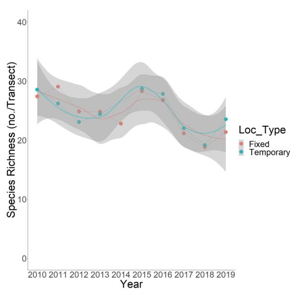

*fit1<-plm(Richness~Year + Loc\_Type, data=Fish, index="Transect2", model="within") # Runs the plm program for the fixed effects model summary(fit1) # Prints the output of the fixed effects model*

*fit2<-plm(Richness~Year + Loc\_Type, data=Fish, index="Transect2", model="random") # Runs the plm program for the random effects model*

```
summary(fit2) # Prints the output of the random effects model
phtest(fit1,fit2) # Runs hausman test to compare the within or 
fixed effects model to the random effects model. If the null 
hypothesis (random model) is rejected at the p<0.5 level then 
accept the results of the within/fixed effects model.
fit3<-lmer(Richness ~ Year*Loc_Type + (1|Transect2), data=Fish) # 
Runs the linear mixed effects model
summary(fit3) # Prints the output of the linear mixed effect 
model
ResidDiagnostic<-function(fit) { # Examine residuals of raw data 
fit
par(mfrow=c(2,2))
plot(fitted(fit), resid(fit))
qqnorm(resid(fit))
hist(resid(fit))}
ResidDiagnostic(fit3)
pbgtest(fit2) # Testing for serial or auto correlation. If 
p<0.05 then yes.
bptest(Richness~Year + Loc_Type, data=Fish, studentize=F) # 
Testing for homoskedasticity (homogeneity of variance). If p<0.05 
then no.
# Numerical Density Trend Analysis
# Load the required packages
Sys.setenv(TZ="US/Samoa")
Sys.getenv("TZ")
Sys.time()
library(lmerTest) # This package contains the linear mixed 
model (lmer) used for diagnostics
library(lmtest) # This package contains the Breusch-Pagan 
test (bptest) for homoskedascity
library(ggplot2)
library(doBy)
```

```
library(plm) # This package contains the panel linear 
model (plm) program
getwd() # Returns the working directory
setwd("D:/Transfer/I&M/Fish") # Sets the working directory to 
C:\transfer\I&M\Fish
Fish<-read.table("NPSA_Fish_Data_10-19.txt", header=TRUE, sep="\t") 
# Imports the data file into the object Fish
head(Fish) # Prints out the first six rows of the 
data set
 Year Park Loc_Type Transect Transect2 Richness Density Biomass 
Diversity Even
1 2010 NPSA Fixed 1 1 30 3.66 96.43 
2.22 0.65
2 2010 NPSA Fixed 2 2 21 2.73 88.49 
1.86 0.61
3 2010 NPSA Fixed 3 3 25 1.08 44.64 
2.76 0.86
4 2010 NPSA Fixed 4 4 22 2.02 87.29 
2.43 0.79
5 2010 NPSA Fixed 5 5 27 2.86 184.86 
2.62 0.79
6 2010 NPSA Fixed 6 6 18 1.02 54.43 
2.07 0.72
meanse<-summaryBy(Density~Year*Loc_Type, data=Fish, FUN=function(x) 
c(count=length(x), mean=mean(x), sd=sd(x), 
se=sd(x)/sqrt(length(x)))) # Generates table of Count, 
Mean, SD, SE of Richness X Year X Transect type
```

#### *print(meanse)*

*p <-ggplot(meanse, aes(x=Year, y=Density.mean, col=Loc\_Type)) + geom\_line(aes(colour=Loc\_Type)) + geom\_point(size=8)+ geom\_smooth(method="loess", se=TRUE) + theme\_classic() + ylim(0,5) + labs(y="Density (no./m2)") #Plots 2 loess regression lines on the same plot for Density X Year X transect type with 95% confidence interval error bands. One can substitute "lm" for "loess" to get a simple linear trend.*

*p + theme(text=element\_text(size=50)) + scale\_x\_continuous(breaks = seq(2009,2020,1)) #Adds chart elements such as text=50 points and an x-scale from 2008 to 2020 at 1 year intervals.*

*logit<-function(x) return(sqrt(x)) # Transform the data if it is right skewed. Better than log for NPSA 2010-2019 data.*

*Fish\$LogitDensity<- logit((Fish\$Density)) # Creates a variable called LogitDensity, which is the square-root of the density.*

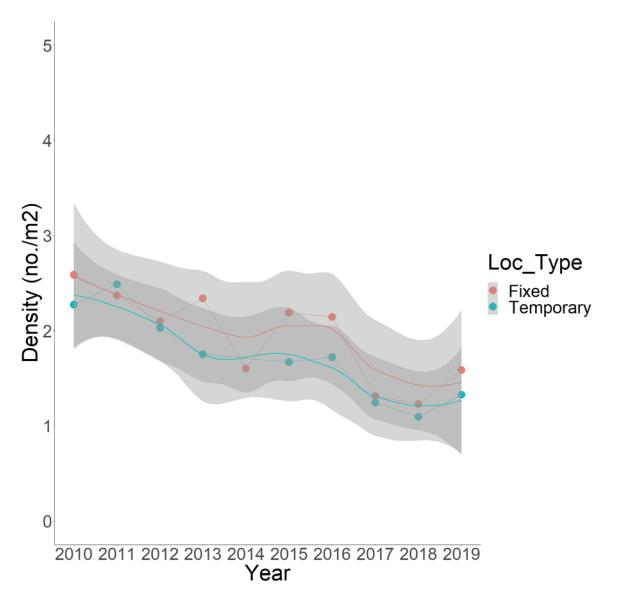

*fit1<-plm(LogitDensity~Year + Loc\_Type, data=Fish, index="Transect2", model="within") # Runs the plm program for the fixed effects model summary(fit1) # Prints the output of the fixed effects model*

*fit2<-plm(LogitDensity~Year + Loc\_Type, data=Fish, index="Transect2", model="random") # Runs the plm program for the random effects model summary(fit2) # Prints the output of the random effects model*

*phtest(fit1,fit2) # Runs hausman test to compare the within or fixed effects model to the random effects model. If the null hypothesis (random model) is rejected at the p<0.5 level then accept the results of the within/fixed effects model.*

```
fit3<-lmer(Density ~ Year*Loc_Type + (1|Transect2), data=Fish) # 
Runs the lme model
summary(fit3) # Prints the output of the linear mixed effect 
model
ResidDiagnostic<-function(fit) { # Examine residuals of raw data 
fit
  par(mfrow=c(2,2))
  plot(fitted(fit), resid(fit))
  qqnorm(resid(fit))
  hist(resid(fit))}
ResidDiagnostic(fit3)
pbgtest(fit2) # Testing for serial or auto correlation. If 
p<0.05 then yes.
bptest(Density~Year + Loc_Type, data=Fish, studentize=F) # 
Testing for homoskedasticity (homogeneity of variance). If p<0.05 
then no.
# Biomass Trend Analysis
# Load the required packages
Sys.setenv(TZ="US/Samoa")
Sys.getenv("TZ")
Sys.time()
library(lmerTest) # This package contains the linear mixed 
model (lmer) used for diagnostics
library(lmtest) # This package contains the Breusch-Pagan 
test (bptest) for homoskedascity
library(ggplot2)
library(doBy)
library(plm) # This package contains the panel linear 
model (plm) program
getwd() # Returns the working directory
setwd("D:/Transfer/I&M/Fish") # Sets the working directory to 
C:\transfer\I&M\Fish
```

*Fish<-read.table("NPSA\_Fish\_Data\_10-19.txt", header=TRUE, sep="\t") # Imports the data file into the object Fish head(Fish) # Prints out the first six rows of the data set*

 *Year Park Loc\_Type Transect Transect2 Richness Density Biomass Diversity Even 1 2010 NPSA Fixed 1 1 30 3.66 96.43 2.22 0.65 2 2010 NPSA Fixed 2 2 21 2.73 88.49 1.86 0.61 3 2010 NPSA Fixed 3 3 25 1.08 44.64 2.76 0.86 4 2010 NPSA Fixed 4 4 22 2.02 87.29 2.43 0.79 5 2010 NPSA Fixed 5 5 27 2.86 184.86 2.62 0.79 6 2010 NPSA Fixed 6 6 18 1.02 54.43 2.07 0.72*

*meanse<-summaryBy(Biomass~Year\*Loc\_Type, data=Fish, FUN=function(x) c(count=length(x), mean=mean(x), sd=sd(x), se=sd(x)/sqrt(length(x)))) # Generates table of Count, Mean, SD, SE of Richness X Year X Transect type print(meanse)*

*p <-ggplot(meanse, aes(x=Year, y=Biomass.mean, col=Loc\_Type)) + geom\_line(aes(colour=Loc\_Type)) + geom\_point(size=8)+ geom\_smooth(method="loess", se=TRUE) + theme\_classic() + ylim(- 20,200) + labs(y="Biomass (g/m2)") #Plots 2 loess regression lines on the same plot for Biomass X Year X transect type with 95% confidence interval error bands. One can substitute "lm" for "loess" to get a simple linear trend.*

*p + theme(text=element\_text(size=50)) + scale\_x\_continuous(breaks = seq(2009,2020,1)) #Adds chart elements such as text=50 points and an x-scale from 2008 to 2020 at 1 year intervals.*

*logit<-function(x) return(log(x+1)) # Transform the data if it is strongly right skewed.*

```
Fish$LogitBiomass<- logit((Fish$Biomass)) #Better 
transformation than sqrt.
```

```
fit1<-plm(LogitBiomass~Year + Loc_Type, data=Fish, 
index="Transect2", model="within")
summary(fit1) # Prints the output of the fixed effects model
fit42<-plm(LogitBiomass~Year + Loc_Type, data=Fish, 
index="Transect2", model="random")
summary(fit2) # Prints the output of the random effects model
phtest(fit1,fit2) # Runs hausman test to compare the within or 
fixed effects model to the random effects model. If the null 
hypothesis (random model) is rejected at the p<0.5 level then 
accept the results of the within/fixed effects model.
fit3<-lmer(Biomass ~ Year*Loc_Type + (1|Transect2), data=Fish) # 
Runs the lme model
summary(fit3) # Prints the output of the linear mixed effect 
model
ResidDiagnostic<-function(fit) { # Examine residuals of raw data 
fit
  par(mfrow=c(2,2))
  plot(fitted(fit), resid(fit))
```

```
qqnorm(resid(fit))
  hist(resid(fit))}
ResidDiagnostic(fit3)
pbgtest(fit2) # Testing for serial or auto correlation. If 
p<0.05 then yes.
bptest(Biomass~Year + Loc_Type, data=Fish, studentize=F) # 
Testing for homoskedasticity (homogeneity of variance). If p<0.05 
then no.
# Diversity Trend Analysis
# Load the required packages
Sys.setenv(TZ="US/Samoa")
Sys.getenv("TZ")
Sys.time()
library(lmerTest) # This package contains the linear mixed 
model (lmer) used for diagnostics
library(lmtest) # This package contains the Breusch-Pagan 
test (bptest) for homoskedascity
library(ggplot2)
library(doBy)
library(plm) # This package contains the panel linear 
model (plm) program
getwd() # Returns the working directory
setwd("D:/Transfer/I&M/Fish") # Sets the working directory to 
C:\transfer\I&M\Fish
Fish<-read.table("NPSA_Fish_Data_10-19.txt", header=TRUE, sep="\t") 
# Imports the data file into the object Fish
head(Fish) # Prints out the first six rows of the 
data set
 Year Park Loc_Type Transect Transect2 Richness Density Biomass 
Diversity Even
1 2010 NPSA Fixed 1 1 30 3.66 96.43 
2.22 0.65
2 2010 NPSA Fixed 2 2 21 2.73 88.49 
1.86 0.61
```

| 3 2010 NPSA<br>2.76 0.86 | Fixed | 3 | 3 | 25 | 1.08 | 44.64  |
|--------------------------|-------|---|---|----|------|--------|
| 4 2010 NPSA              | Fixed | 4 | 4 | 22 | 2.02 | 87.29  |
| 2.43 0.79<br>5 2010 NPSA | Fixed | 5 | 5 | 27 | 2.86 | 184.86 |
| 2.62 0.79<br>6 2010 NPSA | Fixed | 6 | 6 | 18 | 1.02 | 54.43  |
| 2.07 0.72                |       |   |   |    |      |        |

*meanse<-summaryBy(Diversity~Year\*Loc\_Type, data=Fish, FUN=function(x) c(count=length(x), mean=mean(x), sd=sd(x), se=sd(x)/sqrt(length(x)))) # Generates table of Count, Mean, SD, SE of Richness X Year X Transect type print(meanse)*

*p <-ggplot(meanse, aes(x=Year, y=Diversity.mean, col=Loc\_Type)) + geom\_line(aes(colour=Loc\_Type)) + geom\_point(size=8)+ geom\_smooth(method="loess", se=TRUE) + theme\_classic() + ylim(0,4) + labs(y="Diversity (H')") #Plots 2 loess regression lines on the same plot for Diversity X Year X transect type with 95% confidence interval error bands. One can substitute "lm" for "loess" to get a simple linear trend.*

*p + theme(text=element\_text(size=50)) + scale\_x\_continuous(breaks = seq(2009,2020,1)) #Adds chart elements such as text=50 points and an x-scale from 2008 to 2020 at 1 year intervals.*

```
fit1<-plm(Diversity~Year + Loc_Type, data=Fish, index="Transect2", 
model="within") 
summary(fit1) # Prints the output of the fixed effects model
fit2<-plm(Diversity~Year + Loc_Type, data=Fish, index="Transect2", 
model="random")
summary(fit2) # Prints the output of the random effects model
phtest(fit1,fit2) # Runs hausman test to compare the within or 
fixed effects model to the random effects model. If the null 
hypothesis (random model) is rejected at the p<0.5 level then 
accept the results of the within/fixed effects model.
fit3<-lmer(Biomass ~ Year*Loc_Type + (1|Transect2), data=Fish) # 
Runs the lme model
summary(fit3) # Prints the output of the linear mixed effect 
model
ResidDiagnostic<-function(fit) { # Examine residuals of raw data 
fit
  par(mfrow=c(2,2))
  plot(fitted(fit), resid(fit))
  qqnorm(resid(fit))
  hist(resid(fit))}
ResidDiagnostic(fit3)
```

```
pbgtest(fit2) # Testing for serial or auto correlation. If 
p<0.05 then yes.
bptest(Diversity~Year + Loc_Type, data=Fish, studentize=F) # 
Testing for homoskedasticity (homogeneity of variance). If p<0.05 
then no.
#Influential predictors on species richness using gamm with raw y 
variable and transformed predictors
# Load the required packages
Sys.setenv(TZ="US/Samoa")
Sys.getenv("TZ")
Sys.time()
library(lattice)
library(ggplot2)
library(scales)
library(doBy)
library(mgcv) # This is the package that contains the 
generalized additive mixed model (gamm) program
getwd() # Returns the working directory
setwd("D:/Transfer/I&M/Fish") # Sets the working directory to 
D:\Transfer\I&M\Fish
Fish<-read.table("NPSA_Fish_Data_10-19_Predictor.txt", header=TRUE, 
sep="\t") # Imports the data file in the Fish object
head(Fish) # Prints out the first six rows of the 
data set
meanse1<-summaryBy(Richness~Year*Loc_Type, data=Fish, 
FUN=function(x) c(count=length(x), mean=mean(x), sd=sd(x), 
se=sd(x)/sqrt(length(x)))) # Generates table of Count, 
Mean, SD, SE of Richness X Year X Transect type
print(meanse1)
meanse<-summaryBy(Richness~Wave*Loc_Type, data=Fish, 
FUN=function(x) c(count=length(x), mean=mean(x), sd=sd(x), 
se=sd(x)/sqrt(length(x)))) # Generates table of Count, 
Mean, SD, SE of Richness X Wave X Transect type
```

```
print(meanse)
fit1<-
gamm(Richness~s(Depth,k=5)+s(AlgaeT,k=5)+s(CoralT,k=5)+s(CCAT,k=5)+ 
s(TurfT,k=5)+s(Rugosity,k=5)+Wave+ 
s(SSTAvgE,k=5)+s(SSTMinE,k=5)+s(SSTMaxE,k=5), data=Fish, 
random=list(Year=~1,Transect2=~1))
summary(fit1$lme) # Details of the underlying linear mixed 
effects (lme) fit)
summary(fit1$gam) # This summary table provides the breakdown 
by predictors and their importance
plot(fit1$gam,pages=1) #examines all of the smoothed 
independent variables
gam.check(fit1$gam,pch=16) #checks residuals and normality. Also 
examines if k values are too low (i.e. EDF close to k-1 and p-value 
is significant). Solution is to increase k for that variable.
# Plot out the significant relationships using the raw data.
p1<-ggplot(Fish, aes(x=Wave, y=Richness)) + geom_boxplot() + 
theme_classic()+ labs(y="Species Richness (no. transect-1)") + 
theme(text=element_text(size=75)) #Plots a boxplot with text=75 
points.
p2<-xyplot(Richness~CCA, groups=Loc_Type, 
auto.key=list(points=TRUE, columns=2, cex=2), 
par.settings=list(superpose.symbol=list(pch=16,cex=1.7)), 
scales=list(tck=c(1,0), x=list(cex=2), y=list(cex=2)), 
xlab=list(cex=2), ylab=list(cex=2), lwd=5, type=c("p","smooth"), 
data=Fish) #Scatterplot of Richness by CCA X Transect type with 
lowess line.
p3<-xyplot(Richness~Rugosity, groups=Loc_Type, 
auto.key=list(points=TRUE, columns=2, cex=2), 
par.settings=list(superpose.symbol=list(pch=16,cex=1.7)), 
scales=list(tck=c(1,0), x=list(cex=2), y=list(cex=2)), 
xlab=list(cex=2), ylab=list(cex=2), lwd=5, type=c("p","smooth"), 
data=Fish) #Scatterplot of Richness by Rugosity with lowess line.
```

```
p4<-xyplot(Richness~SSTMaxE, groups=Loc_Type, 
auto.key=list(points=TRUE, columns=2, cex=2), 
par.settings=list(superpose.symbol=list(pch=16,cex=1.7)), 
scales=list(tck=c(1,0), x=list(cex=2), y=list(cex=2)), 
xlab=list(cex=2), ylab=list(cex=2), lwd=5, type=c("p","smooth"), 
data=Fish) #Scatterplot of Richness by SSTMaxE X Transect type 
with lowess line.
p5<-xyplot(Richness~Coral, groups=Loc_Type, 
auto.key=list(points=TRUE, columns=2, cex=2), 
par.settings=list(superpose.symbol=list(pch=16,cex=1.7)), 
scales=list(tck=c(1,0), x=list(cex=2), y=list(cex=2)), 
xlab=list(cex=2), ylab=list(cex=2), lwd=5, type=c("p","smooth"), 
data=Fish) #Scatterplot of Richness by Coral X Transect type with 
lowess line.
p1
print(p2, position=c(0,0.5,0.5,1),more=TRUE)
print(p3, position=c(0.5,0.5,1,1),more=TRUE)
print(p4, position=c(0,0,0.5,0.5),more=TRUE)
print(p5, position=c(0.5,0,1,0.5),more=FALSE)
```

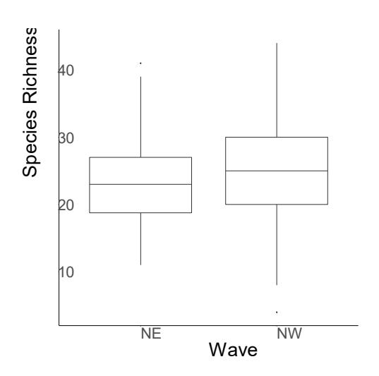

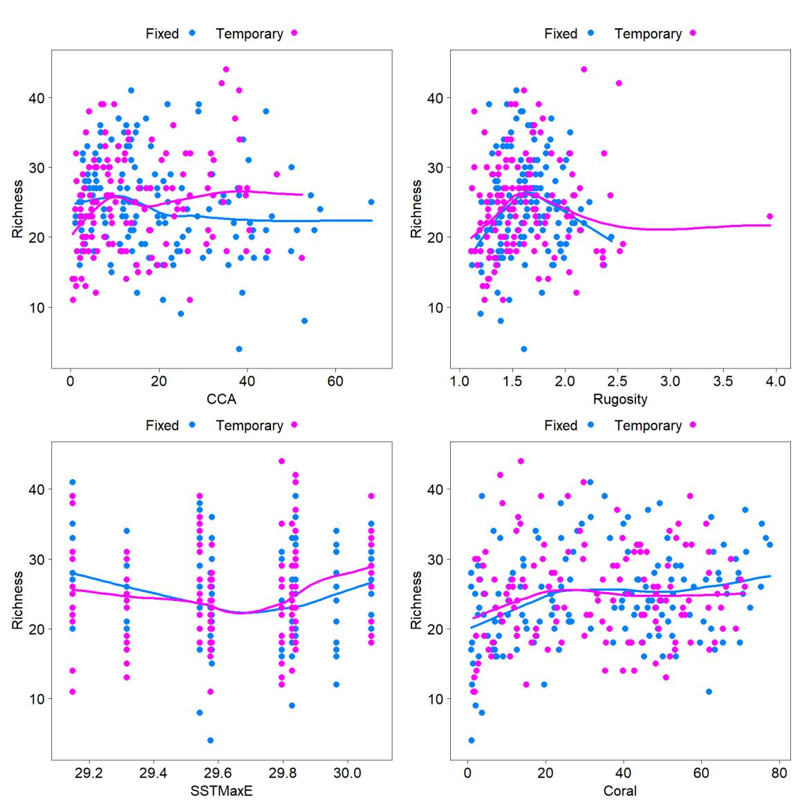

### *#Influential predictors on numerical density using gamm with transformed y variable and transformed predictors*

*# Load the required packages*

```
Sys.setenv(TZ="US/Samoa")
Sys.getenv("TZ")
Sys.time()
library(lattice)
library(ggplot2)
library(scales)
library(doBy)
library(mgcv) # This is the package that contains the 
generalized additive mixed model (gamm) program
getwd() # Returns the working directory
setwd("D:/Transfer/I&M/Fish") # Sets the working directory to 
D:\Transfer\I&M\Fish
Fish<-read.table("NPSA_Fish_Data_10-19_Predictor.txt", header=TRUE, 
sep="\t") # Imports the data file in the Fish object
head(Fish) # Prints out the first six rows of the 
data set
meanse1<-summaryBy(Density~Year*Loc_Type, data=Fish, 
FUN=function(x) c(count=length(x), mean=mean(x), sd=sd(x), 
se=sd(x)/sqrt(length(x)))) # Generates table of Count, 
Mean, SD, SE of Density X Year X Transect type
print(meanse1)
meanse<-summaryBy(Density~Wave*Loc_Type, data=Fish, FUN=function(x) 
c(count=length(x), mean=mean(x), sd=sd(x), 
se=sd(x)/sqrt(length(x)))) # Generates table of Count, 
Mean, SD, SE of Density X Wave X Transect type
print(meanse)
fit1<-
gamm(DensityT~s(Depth,k=5)+s(AlgaeT,k=5)+s(CoralT,k=5)+s(CCAT,k=5)+
s(TurfT,k=5)+s(Rugosity,k=5)+Wave+ 
s(SSTAvgE,k=5)+s(SSTMinE,k=5)+s(SSTMaxE,k=5), data=Fish, 
random=list(Year=~1,Transect2=~1))
```

```
summary(fit1$lme) # Details of the underlying linear mixed 
effects (lme) fit)
summary(fit1$gam) # This summary table provides the breakdown 
by predictors and their importance
plot(fit1$gam,pages=1) #examines all of the smoothed independent 
variables
gam.check(fit1$gam,pch=16) #checks residuals and normality. Also 
examines if k values are too low (i.e. EDF close to k-1 and p-value 
is significant). Solution is to increase k for that variable.
close to k-1 and p-value is significant). Solution is to increase k 
for that variable.
# Plot out the significant relationships using the raw data.
p1<-ggplot(Fish, aes(x=Wave, y=Density)) + geom_boxplot() + 
theme_classic()+ labs(y="Species Density (no./m2)") + 
theme(text=element_text(size=75)) #Plots a boxplot with text=75 
points.
p2<-xyplot(Density~CCA, groups=Loc_Type, auto.key=list(points=TRUE, 
columns=2, cex=2), 
par.settings=list(superpose.symbol=list(pch=16,cex=1.7)), 
scales=list(tck=c(1,0), x=list(cex=2), y=list(cex=2)), 
xlab=list(cex=2), ylab=list(cex=2), lwd=5, type=c("p","smooth"), 
data=Fish) #Scatterplot of Density by CCA X Transect type with 
lowess line.
p3<-xyplot(Density~Turf, groups=Loc_Type, 
auto.key=list(points=TRUE, columns=2, cex=2), 
par.settings=list(superpose.symbol=list(pch=16,cex=1.7)), 
scales=list(tck=c(1,0), x=list(cex=2), y=list(cex=2)), 
xlab=list(cex=2), ylab=list(cex=2), lwd=5, type=c("p","smooth"), 
data=Fish) #Scatterplot of Density by Turf with lowess line.
p4<-xyplot(Density~Coral, groups=Loc_Type, 
auto.key=list(points=TRUE, columns=2, cex=2), 
par.settings=list(superpose.symbol=list(pch=16,cex=1.7)), 
scales=list(tck=c(1,0), x=list(cex=2), y=list(cex=2)),
```

*xlab=list(cex=2), ylab=list(cex=2), lwd=5, type=c("p","smooth"), data=Fish) #Scatterplot of Density by Coral X Transect type with lowess line.*

```
p1
print(p2, position=c(0,0.5,0.5,1),more=TRUE)
print(p3, position=c(0.5,0.5,1,1),more=TRUE)
print(p4, position=c(0,0,0.5,0.5),more=FALSE)
```

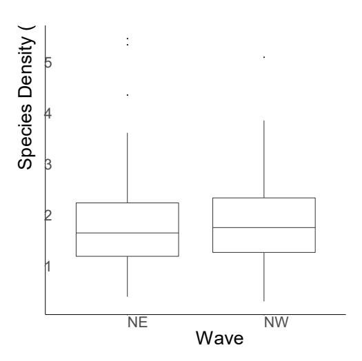

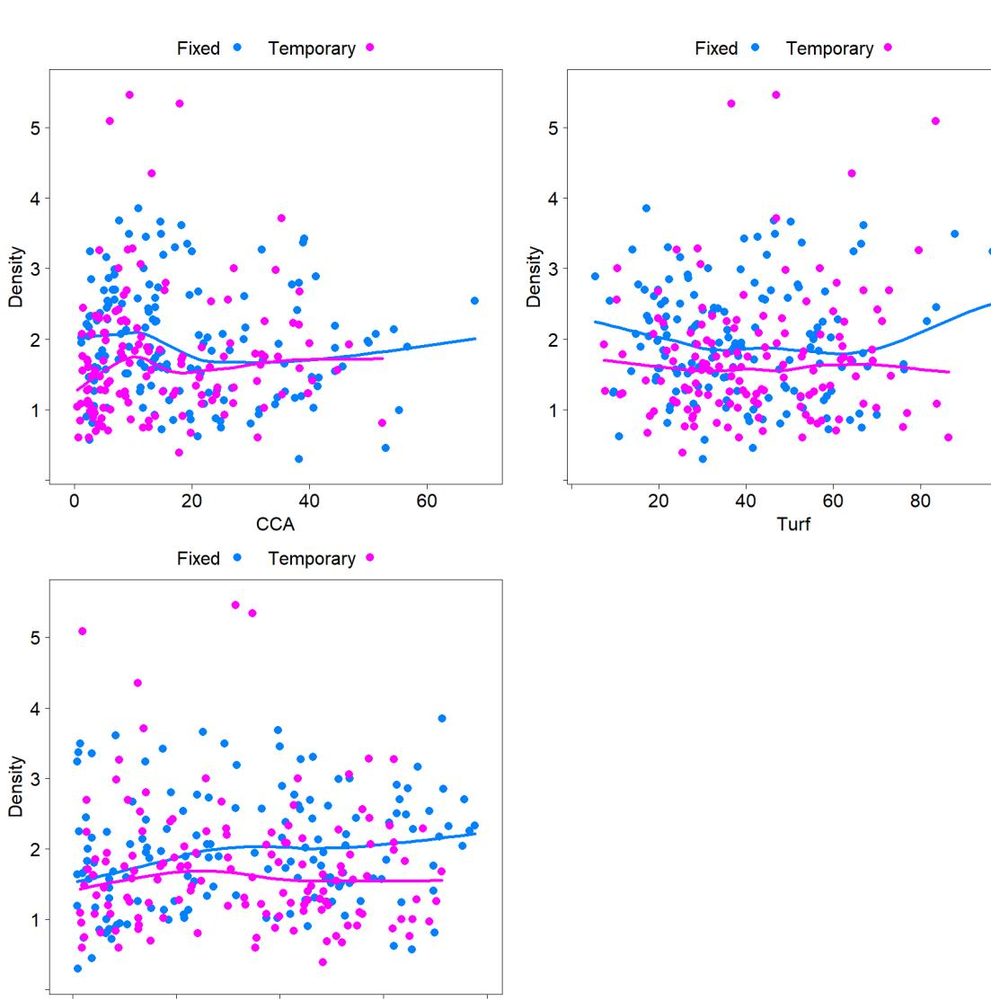

### *#Influential predictors on biomass using gamm with transformed y variable and transformed predictors*

*# Load the required packages*

```
Sys.setenv(TZ="US/Samoa")
Sys.getenv("TZ")
Sys.time()
library(lattice)
library(ggplot2)
library(scales)
library(doBy)
library(mgcv)
getwd() # returns the working directory
setwd("D:/Transfer/I&M/Fish") # sets the working directory to 
C:\transfer\I&M\Fish
Fish<-read.table("NPSA_Fish_Data_10-19_Predictor.txt", header=TRUE, 
sep="\t")
head(Fish) # Examine the first six rows of the data 
set
summaryBy(Biomass~Year*Loc_Type, data=Fish, FUN=function(x) 
c(count=length(x), mean=mean(x), sd=sd(x), 
se=sd(x)/sqrt(length(x)))) # Count, Mean, SD, SE of Coral 
X Year BEST
meanse<-summaryBy(Biomass~Wave*Loc_Type, data=Fish, FUN=function(x) 
c(count=length(x), mean=mean(x), sd=sd(x), 
se=sd(x)/sqrt(length(x)))) # Generates table of Count, 
Mean, SD, SE of Biomass X Wave X Transect type
print(meanse)
fit1<-
gamm(BiomassT~s(Depth,k=5)+s(AlgaeT,k=5)+s(CoralT,k=5)+s(CCAT,k=5)+
s(TurfT,k=5)+s(Rugosity,k=5)+Wave+ 
s(SSTAvgE,k=5)+s(SSTMinE,k=5)+s(SSTMaxE,k=5), data=Fish, 
random=list(Year=~1,Transect2=~1))
summary(fit1$lme) # Details of the underlying linear mixed 
effects (lme) fit)
```

```
summary(fit1$gam) # This summary table provides the breakdown 
by predictors and their importance
plot(fit1$gam,pages=1) #examines all of the smoothed independent 
variables
gam.check(fit1$gam,pch=16) #checks residuals and normality. Also 
examines if k values are too low (i.e. EDF close to k-1 and p-value 
is significant). Solution is to increase k for that variable.
# Plot out the significant relationships using the raw data.
p1<-ggplot(Fish, aes(x=Wave, y=Biomass)) + geom_boxplot() + 
theme_classic()+ labs(y="Biomass (g/m2)") + 
theme(text=element_text(size=75)) #Plots a boxplot with text=75 
points.
p2<-xyplot(Biomass~CCA, groups=Loc_Type, auto.key=list(points=TRUE, 
columns=2, cex=2), 
par.settings=list(superpose.symbol=list(pch=16,cex=1.7)), 
scales=list(tck=c(1,0), x=list(cex=2), y=list(cex=2)), 
xlab=list(cex=2), ylab=list(cex=2), lwd=5, type=c("p","smooth"), 
data=Fish) #Scatterplot of Biomass by CCA X Transect type with 
lowess line.
p3<-xyplot(Biomass~Turf, groups=Loc_Type, 
auto.key=list(points=TRUE, columns=2, cex=2), 
par.settings=list(superpose.symbol=list(pch=16,cex=1.7)), 
scales=list(tck=c(1,0), x=list(cex=2), y=list(cex=2)), 
xlab=list(cex=2), ylab=list(cex=2), lwd=5, type=c("p","smooth"), 
data=Fish) #Scatterplot of Biomass by Turf with lowess line.
p4<-xyplot(Biomass~Coral, groups=Loc_Type, 
auto.key=list(points=TRUE, columns=2, cex=2), 
par.settings=list(superpose.symbol=list(pch=16,cex=1.7)), 
scales=list(tck=c(1,0), x=list(cex=2), y=list(cex=2)), 
xlab=list(cex=2), ylab=list(cex=2), lwd=5, type=c("p","smooth"), 
data=Fish) #Scatterplot of Biomass by Coral X Transect type with 
lowess line.
```

```
p1
print(p2, position=c(0,0.5,0.5,1),more=TRUE)
print(p3, position=c(0.5,0.5,1,1),more=TRUE)
print(p4, position=c(0,0,0.5,0.5),more=FALSE)
```

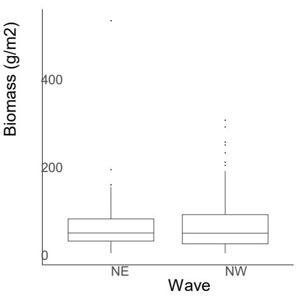

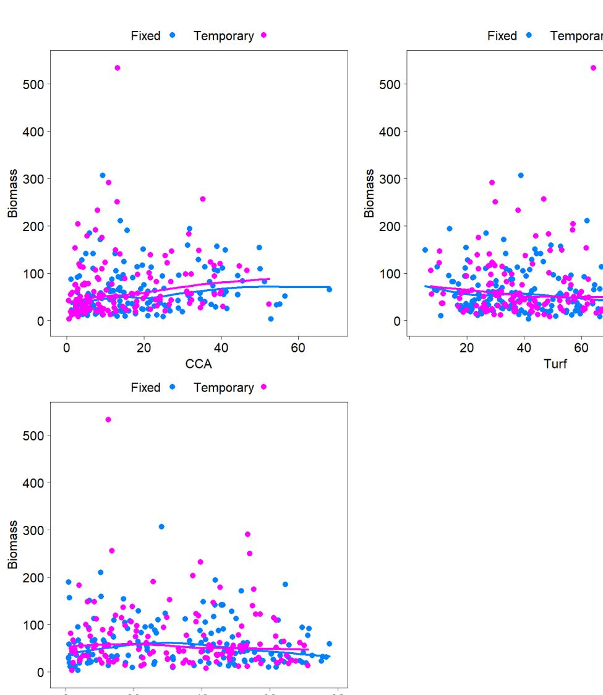

## *#Influential predictors on diversity using gamm with raw y variable and transformed predictors # Load the required packages Sys.setenv(TZ="US/Samoa") Sys.getenv("TZ") Sys.time() library(lattice) library(ggplot2) library(scales) library(doBy) library(mgcv) getwd() # returns the working directory setwd("D:/Transfer/I&M/Fish") # sets the working directory to C:\transfer\I&M\Fish Fish<-read.table("NPSA\_Fish\_Data\_10-19\_Predictor.txt", header=TRUE, sep="\t") head(Fish) # Examine the first six rows of the data set summaryBy(Div~Year\*Loc\_Type, data=Fish, FUN=function(x) c(count=length(x), mean=mean(x), sd=sd(x), se=sd(x)/sqrt(length(x)))) # Count, Mean, SD, SE of Coral X Year BEST meanse<-summaryBy(Div~Wave\*Loc\_Type, data=Fish, FUN=function(x) c(count=length(x), mean=mean(x), sd=sd(x), se=sd(x)/sqrt(length(x)))) # Generates table of Count, Mean, SD, SE of Div X Wave X Transect type print(meanse) fit1< gamm(Div~s(Depth,k=5)+s(AlgaeT,k=5)+s(CoralT,k=5)+s(CCAT,k=5)+s(Tur fT,k=5)+ s(Rugosity,k=5)+Wave+ s(SSTAvgE,k=5)+s(SSTMinE,k=5)+s(SSTMaxE,k=5), data=Fish, random=list(Year=~1,Transect2=~1))*

*summary(fit1\$lme) summary(fit1\$gam)*

```
plot(fit1$gam,pages=1,pch=16) #examines all of the smoothed 
independent variables
gam.check(fit1$gam,pch=16) #checks residuals and normality. Also 
examines if k values are too low (i.e. EDF close to k-1 and p-value 
is significant). Solution is to increase k for that variable.
# Plot out the significant relationships using the raw data.
p1<-ggplot(Fish, aes(x=Wave, y=Div)) + geom_boxplot() + 
theme_classic()+ labs(y="Diversity (H')") + 
theme(text=element_text(size=75)) #Plots a boxplot with text=75 
points.
p2<-xyplot(Div~CCA, groups=Loc_Type, auto.key=list(points=TRUE, 
columns=2, cex=2), 
par.settings=list(superpose.symbol=list(pch=16,cex=1.7)), 
scales=list(tck=c(1,0), x=list(cex=2), y=list(cex=2)), 
xlab=list(cex=2), ylab=list(cex=2), lwd=5, type=c("p","smooth"), 
data=Fish) #Scatterplot of Div by CCA X Transect type with lowess 
line.
p3<-xyplot(Div~Turf, groups=Loc_Type, auto.key=list(points=TRUE, 
columns=2, cex=2), 
par.settings=list(superpose.symbol=list(pch=16,cex=1.7)), 
scales=list(tck=c(1,0), x=list(cex=2), y=list(cex=2)), 
xlab=list(cex=2), ylab=list(cex=2), lwd=5, type=c("p","smooth"), 
data=Fish) #Scatterplot of Div by Turf with lowess line.
p4<-xyplot(Div~Coral, groups=Loc_Type, auto.key=list(points=TRUE, 
columns=2, cex=2), 
par.settings=list(superpose.symbol=list(pch=16,cex=1.7)), 
scales=list(tck=c(1,0), x=list(cex=2), y=list(cex=2)), 
xlab=list(cex=2), ylab=list(cex=2), lwd=5, type=c("p","smooth"), 
data=Fish) #Scatterplot of Div by Coral X Transect type with 
lowess line.
p5<-xyplot(Div~SSTMinE, groups=Loc_Type, auto.key=list(points=TRUE, 
columns=2, cex=2), 
par.settings=list(superpose.symbol=list(pch=16,cex=1.7)),
```

```
scales=list(tck=c(1,0), x=list(cex=2), y=list(cex=2)), 
xlab=list(cex=2), ylab=list(cex=2), lwd=5, type=c("p","smooth"), 
data=Fish) #Scatterplot of Div by SST Minimum ERDAP X Transect 
type with lowess line.
p6<-xyplot(Div~Depth, groups=Loc_Type, auto.key=list(points=TRUE, 
columns=2, cex=2), 
par.settings=list(superpose.symbol=list(pch=16,cex=1.7)), 
scales=list(tck=c(1,0), x=list(cex=2), y=list(cex=2)), 
xlab=list(cex=2), ylab=list(cex=2), lwd=5, type=c("p","smooth"), 
data=Fish) #Scatterplot of Div by Depth X Transect type with 
lowess line.
p1
print(p2, position=c(0.33,0.66,0.66,1),more=TRUE)
print(p3, position=c(0.66,0.66,1,1),more=TRUE)
print(p4, position=c(0,0.33,0.33,0.66),more=TRUE)
print(p5, position=c(0.33,0.33,0.66,0.66),more=TRUE)
print(p6, position=c(0.66,0.33,1,0.66),more=FALSE)
```

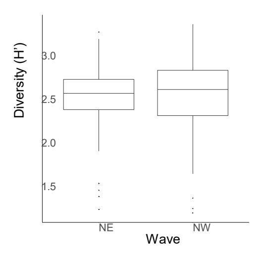

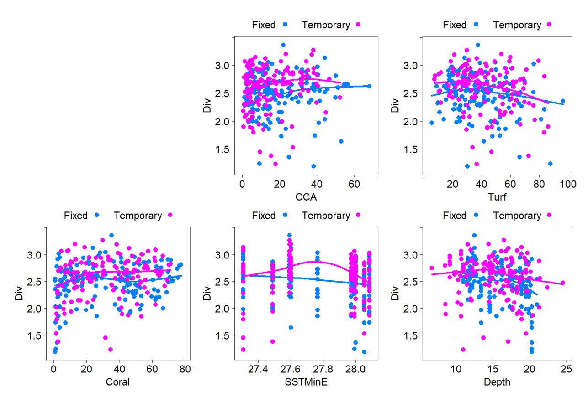


**National Park Service U.S. Department of the Interior**


#### **[Natural Resource Stewardship and Science](https://www.nps.gov/orgs/1778/)**

1201 Oakridge Drive, Suite 150 Fort Collins, CO 80525