# [Meteorologic, oceanographic, and geomorphic controls on circulation and](https://www.researchgate.net/publication/323524617_Meteorologic_oceanographic_and_geomorphic_controls_on_circulation_and_residence_time_in_a_coral_reef-lined_embayment_Faga%27alu_Bay_American_Samoa?enrichId=rgreq-3e1da4c72474038f2ae6c87c7b79dacc-XXX&enrichSource=Y292ZXJQYWdlOzMyMzUyNDYxNztBUzo2OTc2MzA4NDE2NTkzOTJAMTU0MzMzOTU2MjEyNQ%3D%3D&el=1_x_3&_esc=publicationCoverPdf) residence time in a coral reef-lined embayment: Faga'alu Bay, American Samoa

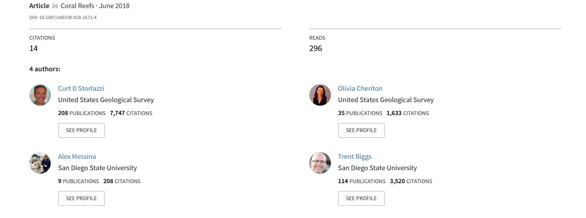

#### REPORT

# Meteorologic, oceanographic, and geomorphic controls on circulation and residence time in a coral reef-lined embayment: Faga'alu Bay, American Samoa

C. D. Storlazzi1 · O. M. Cheriton1 · A. M. Messina2 · T. W. Biggs2

Received: 1 November 2017/Accepted: 21 February 2018/Published online: 2 March 2018 © US Government 2018

**Abstract** Water circulation over coral reefs can determine the degree to which reef organisms are exposed to the overlying waters, so understanding circulation is necessary to interpret spatial patterns in coral health. Because coral reefs often have high geomorphic complexity, circulation patterns and the duration of exposure, or "local residence time" of a water parcel, can vary substantially over small distances. Different meteorologic and oceanographic forcings can further alter residence time patterns over reefs. Here, spatially dense Lagrangian surface current drifters and Eulerian current meters were used to characterize circulation patterns and resulting residence times over different regions of the reefs in Faga'alu Bay, American Samoa, during three distinct forcing periods: calm, strong winds, and large waves. Residence times varied among different geomorphic zones of the reef and were reflected

Topic Editor Prof. Eberhard Gischler

**Electronic supplementary material** The online version of this article (https://doi.org/10.1007/s00338-018-1671-4) contains supplementary material, which is available to authorized users.

O. M. Cheriton ocheriton@usgs.gov

A. M. Messina amessina@rohan.sdsu.edu

T. W. Biggs tbiggs@mail.sdsu.edu

- 1 US Geological Survey, Pacific Coastal and Marine Science Center, Santa Cruz, CA 95060, USA
- Department of Geography, San Diego State University, San Diego, CA 92182, USA

in the spatially varying health of the corals across the embayment. The relatively healthy, seaward fringing reef consistently had the shortest residence times, as it was continually flushed by wave breaking at the reef crest, whereas the degraded, sheltered, leeward fringing reef consistently had the longest residence times, suggesting this area is more exposed to land-based sources of pollution. Strong wind forcing resulted in the longest residence times by pinning the water in the bay, whereas large wave forcing flushed the bay and resulted in the shortest residence times. The effect of these different forcings on residence times was fairly consistent across all reef geomorphic zones, with the shift from wind to wave forcing shortening mean residence times by approximately 50%. Although ecologically significant to the coral organisms in the nearshore reef zones, these shortened residence times were still 2-3 times longer than those associated with the seaward fringing reef across all forcing conditions, demonstrating how the geomorphology of a reef environment sets a first-order control on reef health.

**Keywords** Coral reefs  $\cdot$  Water circulation  $\cdot$  Residence time  $\cdot$  Tides  $\cdot$  Waves  $\cdot$  Winds  $\cdot$  Lagrangian drifters

### Introduction

Water circulation and residence time are critical to coral health by controlling the chemistry, biology, and sediment dynamics on coral reefs (Lowe and Falter 2015). By regulating the interaction of benthic organisms with water constituents, flow speeds and directions affect biologically important processes such as nutrient cycling, larval dispersal, and temperature regimes (Storlazzi et al. 2006; Falter et al. 2008; Wyatt et al. 2012; Koweek et al. 2015;

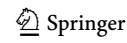

Shedrawi et al. [2017\)](#page-13-0). The impact of stressors on coral reefs is controlled by water circulation that (a) concentrates or disperses the stressor and (b) either allows the water mass with the stressor to persist over the coral reef, or quickly advects it away (Erftemeijer et al. [2012](#page-12-0); Shedrawi et al. [2017\)](#page-13-0). Understanding spatial flow speeds and patterns is therefore critical for interpreting spatial and temporal variations in stressors on reefs and their relation to coral health (Storlazzi et al. [2004;](#page-13-0) Presto et al. [2006;](#page-13-0) Storlazzi et al. [2009;](#page-13-0) Hoeke et al. [2013\)](#page-12-0).

Flows over fringing coral reefs are predominantly controlled by wave, wind, and tidal forcing (Storlazzi et al. [2004;](#page-13-0) Presto et al. [2006;](#page-13-0) Hench et al. [2008](#page-12-0)). Variations in reef morphology relative to the orientation of meteorological and oceanographic forcing can generate heterogeneous waves and currents over small spatial scales (tens of m), unlike more homogeneous patterns observed along linear sandy shorelines (Storlazzi et al. [2009](#page-13-0); Hoeke et al. [2011,](#page-12-0) [2013](#page-12-0)). Currents over reefs exposed to remotely generated swell are generally dominated by wave forcing where current speeds typically scale linearly with wave height (Hench et al. [2008](#page-12-0); Monismith [2014](#page-13-0)), whereas wind forcing can dominate shallow reefs protected from swell (Yamano et al. [1998](#page-13-0); Presto et al. [2006](#page-13-0)). Tidal stage modulates both wave-driven currents by controlling wave energy propagation onto the reef flat (Storlazzi et al. [2004](#page-13-0); Falter et al. [2008](#page-12-0)) and wind-driven currents by regulating water depth for wind–wave development (Presto et al. [2006\)](#page-13-0). Flows over fringing reefs exposed to episodic wave events are controlled by bathymetry and are typically characterized by rapid, cross-shore flow near the shallow reef crest that slows moving shoreward and turns alongshore toward channels, where water returns seaward (Hench et al. [2008;](#page-12-0) Lowe et al. [2009a](#page-12-0); Wyatt et al. [2010](#page-13-0)). In wind-driven systems, current speeds generally vary linearly with wind speed and directions are predominantly downwind with possible cross-shore exchange over the reef crest (Storlazzi et al. [2004](#page-13-0); Presto et al. [2006;](#page-13-0) Monismith [2014\)](#page-13-0). Forcing conditions often operate in combination, and areas near the reef crest may be strongly controlled by wave forcing, whereas adjacent lagoons may be unaffected by waves and flushed only by tidal or wind forcing (Lowe et al. [2009b](#page-12-0)). The circulation regime at any particular reef is determined by the annual distribution of episodic wave and wind events, as well as prevailing trade winds in the tropics.

Although existing theory can predict general wave-driven flow patterns, such theory is based on simplified models of reef structure and forcing (Monismith [2014](#page-13-0); Lowe and Falter [2015\)](#page-13-0) that is not well suited to predicting flow patterns in geomorphically complex reefs that characterize most areas with corals. Complex and dynamic flow patterns under variable forcing conditions are logistically

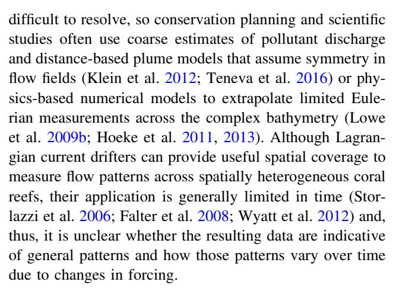

The coral reef-lined Faga'alu Bay on the island of Tutuila in American Samoa was selected by the US Coral Reef Task Force as a Watershed Partnership Initiative priority study site for watershed restoration to reduce terrestrial sediment impacts to corals in the bay and, in turn, improve coral reef health (Holst-Rice et al. [2016](#page-12-0); Messina and Biggs [2016\)](#page-13-0). As part of this effort, it was necessary to collect field data on flow patterns to understand how terrestrial sediment is advected over the coral reefs and out of the bay to evaluate the influence of watershed restoration on coral reef health. Here, the data from this effort are used to: (1) characterize flow patterns in a coral reef-lined embayment using both temporally extensive Eulerian and spatially extensive Lagrangian measurements and (2) determine the geomorphic and spatially and temporally varying meteorologic and oceanographic controls on flow patterns in the embayment. Together, these combined measurements make it possible to test fundamental hypotheses about controls on circulation patterns and the resulting residence time in the bay and how they influence the resulting biophysical processes that shape coral reef health.

# Materials and methods

### Study area

Faga'alu Bay is a v-shaped embayment situated on the western side of Pago Pago Bay, on the island of Tutuila in American Samoa (Fig. [1\)](#page-3-0). The bay is surrounded by topography with high relief that blocks wet-season northerly winds from October to April, but is exposed to dryseason southeasterly trade winds and accompanying shortperiod wind waves from May to September (Craig [2009](#page-12-0)). A semidiurnal, microtidal (0.78 m mean tidal range) regime exposes parts of the shallow reef crest and reef flat at extreme low tides. Faga'alu Bay is exposed to swell from the south to southeast, and southerly swell refracts to

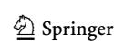

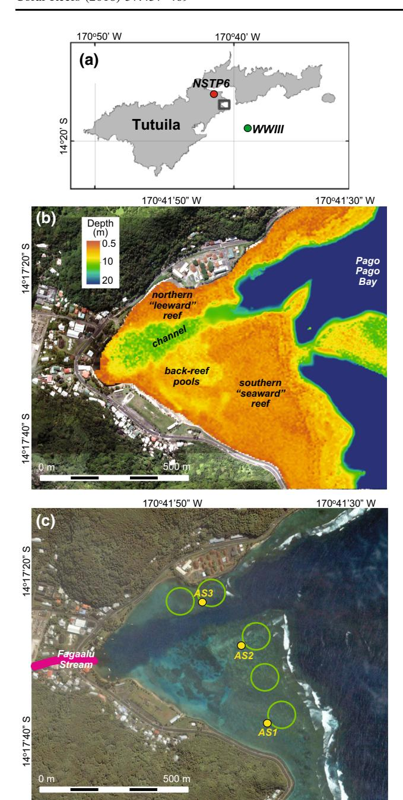

Fig. 1 Maps of the study area and instrumentation in Faga'alu Bay. a Location of the study area on the island of Tutuila, the WaveWatch III node, and NDBC station NSTP6. b Map of the bathymetry in the study area, modified from Cochran et al. [\(2016](#page-12-0)). c Photograph showing reef character and locations of the ADCPs (yellow), drifter deployment zones (green), and Faga'alu Stream (red)

the west, reducing the wave energy impacting the bay. Offshore significant wave heights (Hs) are generally less than 2.5 m and rarely exceed 3.0 m; peak wave periods (Tp) are generally about 9 s or less, rarely exceed 13 s, but occasionally reach 25 s during austral winter storms (Thompson and Demirbilek [2002\)](#page-13-0). Vetter ([2013\)](#page-13-0) recorded Hs up to 1.7 m at a depth of 13 m on the fore reef in Faga'alu, but Hs greater than 1.0 m were rare during the 1-yr monitoring period (2012–2013); flow was noted to be primarily out of the channel, with speeds on the order of 0.1–0.2 m s-1 during small waves and 0.4–0.5 m s-1 during large wave conditions. Tropical cyclones typically occur in the South Pacific from November to April (Militello et al. [2003\)](#page-13-0), impacting American Samoa every decade or so since 1981 (Craig [2009](#page-12-0)); though more frequently, high waves impact the reefs without the storm making landfall (Feagaimaalii-Luamanu [2016\)](#page-12-0).

Faga'alu Bay receives fluvial discharge and terrestrial sediment from several small, steep watersheds (Messina and Biggs [2016\)](#page-13-0), including the perennial Faga'alu Stream in the northwest corner of the bay and several ephemeral streams (Fig. 1), none of which are gauged. The bathymetrically complex reef is characterized by shallow reef flats that descend at an approximately 1:1 slope to the insular shelf in Pago Pago Bay at approximately 20 m depth. An anthropogenically altered, vertical-walled, 5–15 m-deep paleostream channel (''channel'') floored with terrigenous mud extends from the outlet of Faga'alu Stream eastward to Pago Pago Bay; this channel divides the reef into a larger, more exposed southern fringing reef (''seaward reef'') and a smaller, more sheltered northern fringing reef (''leeward reef''). Inshore of the seaward reef there are small, carbonate sediment-floored pools (depth \* 1–5 m) with coral bommies (''back-reef pools''), and near the stream outlet and leeward reef there are 1–5-mdeep flat areas of carbonate sand and terrigenous mud. See Cochran et al. [\(2016](#page-12-0)) for a detailed description of the bathymetry and coral cover. Near the reef crest, the reef flat is primarily cemented reef pavement, but within a few tens of m, transitions into thickets of primarily Acropora spp. (Cochran et al. [2016\)](#page-12-0) and carbonate rubble. In general, coral coverage varied from more than 50% on the healthier seaward reef and in the back-reef pools to less than 10% on the degraded leeward reef (Fig. [2](#page-4-0)).

## Eulerian measurements

Three Nortek Aquadopp 2-MHz Acoustic Doppler Current Profilers (ADCP) recorded current profiles on the reef flat for the 1-week deployment period (Fig. 1). The ADCPs were deployed on sand or rubble patches among the corals, as deep as possible to maintain adequate water levels over the ADCP during low tide (Fig. [2](#page-4-0)). Mean water depths at the ADCP sites were 0.97 m on the seaward reef (AS1), 1.30 m on the reef adjacent to the back-reef pools (AS2), and 0.34 m on the leeward reef (AS3). The ADCPs collected a vertical profile of current velocity every 10 min, averaged from 580 samples collected at 2 Hz. Each profile was composed of 0.2-m bins starting from 0.35 m above the seabed, using a blanking distance of 0.1 m. Measurements with a signal strength

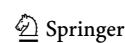

460 Coral Reefs (2018) 37:457–469

Fig. 2 Images of the reefs and oceanographic instrumentation. a The ADCP at location AS1 on the healthy seaward reef. b Drifter deployed over the degraded leeward reef

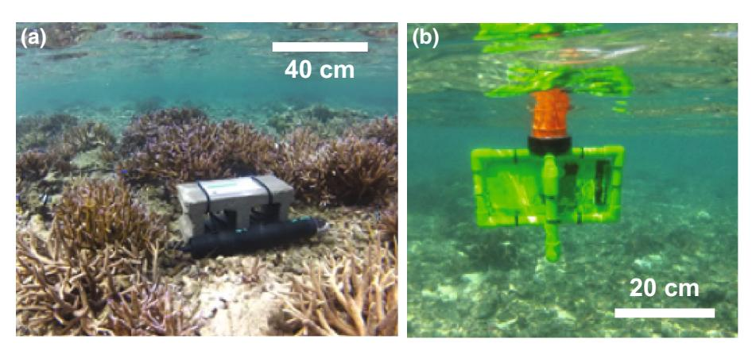

(amplitude) of B 20 counts and the top 10% from the water surface level of each profile were removed. Occasionally during low tide, water depths were insufficient for AS3 to collect usable data due to the blanking and surface effects, so flow was assumed to be nearly zero given the low water depth relative to the height of the corals, some of which were emergent.

### Lagrangian measurements

Given the relatively small area of Faga'alu Bay (0.25 km2 ), data with high spatial density could be collected with five Lagrangian ocean surface current drifters. The cruciform drifter design of Austin and Atkinson [\(2004](#page-12-0)) was adapted for use on the shallow reef with a durable PVC frame and a float collar to maintain upright orientation (Fig. 2b). The drifter fins were approximately 30 cm wide and 18 cm tall, constructed of 1.3-cm-diameter PVC with holes drilled to flood the piping. HOLUX M1000 GPS loggers were installed in 5-cm-diameter PVC housings at the top of the drifters, extending 7 cm above the fins, though when deployed, they only extended approximately 3 cm above the water surface and thus had little surface area the wind could affect.

The five drifters were deployed 21 times during 16–23 February 2014 (2014 Year Day 47–54; Supplementary Table 1). For each release, the drifters were launched from sites over the seaward and leeward reef flats (Fig. [1\)](#page-3-0) within a 10-min period. Drifter position was recorded by the GPS logger at 5-s intervals and averaged to 1-min intervals to increase signal-to-noise ratios; speed and direction were calculated using a forward difference scheme on the drifter locations (Davis [1991](#page-12-0); MacMahan et al. [2010\)](#page-13-0). Drifters were generally allowed to drift until they exited the channel or otherwise needed to be recovered due to operational limitations (i.e., drifters entering regions where they would not be recoverable). Drifter releases were timed such that, as much as possible, a similar number of releases occurred across different tidal stages.

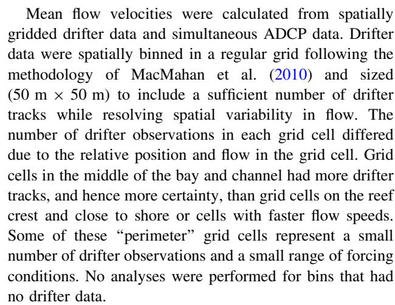

# Comparison of Eulerian and Lagrangian measurements

One of the main challenges to integrating measurements from fixed ADCPs and Lagrangian drifters is evaluating the agreement and reconciling the differences between the two data types. In addition to providing increased temporal coverage, the ADCP measurements essentially provide a ''ground truth'' for the drifters: Are the Lagrangian drifter observations accurately capturing surface flow patterns? If yes, then the high spatial density of the Lagrangian measurements can elucidate circulation patterns in the embayment. For comparisons with the Lagrangian drifter measurements, both the shallowest (i.e., ''top bin'') valid measurement and the full water column profiles from the ADCP measurements were used. For each ADCP site, only drifter measurements collected within a 50 m radius around the site were considered due to geomorphic heterogeneity, and the data were delineated by forcing period (calm, strong winds, large waves). During the periods of calm conditions and strong winds, the difference between the drifter and top-bin ADCP mean current speeds ranged from 0.00 to 0.03 m s-1 , on a par with the ADCP's

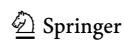

horizontal velocity precision of 0.02 m s-1. During the period with large wave forcing, the drifters measured faster current speeds than the top bin of the ADCPs, with differences in the mean current speeds of 0.04 m s-1 at AS2, 0.05 m s-1 at AS3, and 0.10 m s-1 at AS1. However, the period of large waves coincided with the greatest overall current speeds. To examine whether this difference in drifter and ADCP current speeds could be attributed to the more vigorous flow and thus vertical velocity shear, the difference between the mean drifter current speed and that predicted by a logarithmic fit to the ADCP profile was calculated. For all sites, these differences were less than or equal to 0.01 m s-1, indicating that the much faster current speeds measured by the drifters at the surface are plausible given the subsurface ADCP profile.

A similar analysis was performed with the directionality of the ADCP and drifter current measurements. Compared to the current speeds, the current directions measured by the drifters and the ADCPs differed more across all forcing periods, but also had a greater degree of variability, particularly for the ADCP top-bin current directions. Because of this variability within each data type, both the mean directions and the range were considered for the different forcing periods. For the two sites on the seaward reef flat, AS1 and AS2, nearby drifters were consistently directed in a more northerly direction, with a mean clockwise offset of 25° for both sites across all three forcing periods. Despite the offset between the mean directions, the directional range (mean  $\pm$  1 SD) for the drifters at AS1 and AS2 fell within the range of the top-bin ADCP measurements for all forcing periods except for AS2 during large waves. This directional offset at AS2 during the large wave period could have resulted from current deflection throughout the water column and/or an error in the drifter trajectories introduced by Stokes drift or wave "surfing." During the large wave period at the AS2 site, waves breaking on the seaward reef interacted with waves refracting through the channel, increasing the likelihood of a bias in the drifter measurements. The current directions at AS3 were highly variable, with overall standard deviations of 77° for the ADCP top-bin measurements and 57° for the drifters. However, for the strong wind and large wave periods, the ADCP and drifter mean directions were only offset by 9° at AS3, showing consistent flow to the east, out of the embayment. This agreement at AS3 did not hold for the calm period, when the mean direction of the uppermost ADCP measurements was nearly oppositely directed (130° counterclockwise). This lack of agreement at AS3 during the calm period may simply reflect the lack of clear directionality at this site, as it is unlikely that wind or wave effects would have introduced error into the drifter trajectories during this time period.

Given these comparisons, there was sufficient agreement between the Eulerian and Lagrangian current velocities to consider the spatially dense drifter measurements an accurate representation of surface flows, with the one caveat of possible bias in the Lagrangian current directions over the leeward, offshore portion of the seaward reef flat near the mouth of the channel.

#### Ancillary data

NOAA/NCEP's WaveWatch III (Tolman 2009) hindcast model provided deep-water incident wave conditions at a location approximately 7 km south of the study area (Fig. 1) for the study period. A NIWA Dobie-A wave/tide gauge was deployed on the seaward fore reef at a depth of 10 m and sampled a 512-s burst at 2 Hz every hour. The DOBIE malfunctioned and recorded no data coinciding with the 1-week ADCP deployment, but the data collected before the malfunction compared well ( $r^2 = 0.68$ , p < 0.05) with the WaveWatch III model data. The WaveWatch III model data were therefore considered sufficient for qualitatively defining the deep-water wave conditions during the ADCP and drifter deployments.

Wind and tide data were recorded at 6-min intervals at the NOAA National Data Buoy Center (2014) station NSTP6, located approximately 1.8 km north of Faga'alu (Fig. 1b). Wind speed and direction measured at NSTP6 were slightly different than at the study site due to topographic effects, but are considered sufficient for defining relative wind conditions during the study.

#### Residence time

"Residence time" is typically defined as the time it takes for a water parcel to travel across some feature (Tartinville et al. 1997), whereas "water age" is typically the time for a water parcel to reach some point after entering the feature, but these can be determined for any spatial domain (Monsen et al. 2002). In order to determine the duration of exposure of a given portion of reef to a given water parcel, a "local" residence time was calculated using the drifter observations. The embayment was divided into 4 zones based on the geomorphology of the reef: seaward reef, back-reef pools, channel, and leeward reef (Fig. 1). For each forcing period, individual drifter tracks were parsed by these zones and, for each track, the average speed and overall travel distance across the zone were catalogued. The mean residence time for each zone was computed as the mean of all the drifter distances divided by the mean of the speeds. Then, because the zones have different spatial extents, we normalized the residence time by the planimetric area of the zone. This local residence time computation differs from other approaches where the focus is on

flushing times for individual water masses. Here, our intent is to utilize the high spatial density of current observations to address questions of coral health and to what degree organisms in different parts of the reef may be exposed to a stressor in the water column.

#### Results

### Meteorological and oceanographic forcing

A range of tide, wind, and wave conditions typical of the study site was sampled during the 7-d period of overlapping ADCP and drifter deployments, Year Day (YD) 47.0–54.0 (Fig. 3; note: all times reported in GMT). Three distinct periods were observed and defined as "end-members" to isolate the influence of the three main forcing mechanisms: (1) a strong onshore wind event with small waves ("strong wind forcing") during YD 47.0–50.5; (2) weak winds from variable directions and small waves ("calm conditions") during YD 50.5–52.5; and (3) a large southeast swell with weak winds ("large wave forcing") during YD 52.5–54.0 (Supplementary Table 1). There were 1580 drifter velocity measurements during calm conditions, 1314 during strong wind forcing, and 2461 during large wave forcing conditions.

During strong wind forcing, the winds were gusty and out of the northeast to southeast with average speeds of  $2.6-4.9 \text{ m s}^{-1}$  and maximum gusts of  $14.5 \text{ m s}^{-1}$  (Fig. 3). The direction and magnitude of the winds during this period are typical of the prevailing trade wind conditions at Faga'alu Bay. During calm conditions, wind speeds decreased to 1.5-3.4 m s-1 and wind directions were variable; these wind patterns are more representative of the wet season from October through April. During the large wave forcing period, the maximum wave heights reached 1.3 m, which is near the annual maximum height expected for this location (Vetter 2013). The wave record also shows large waves during the strong wind forcing and calm periods; however, these large waves were from the north (Fig. 3) and blocked by the island, resulting in small waves at the study site. During the strong wind and calm periods, wave breaking was not observed at the study site except on the seaward reef crest; then, on Year Day 52, at the start of the large wave period, the swell direction rotated to the southeast, causing large breaking waves on the seaward reef crest.

### Temporal and spatial variability in flow patterns

The three different forcing conditions produced consistent differences in the flow speeds and directions at AS1, AS2, and AS3 (Fig. 4). Under all conditions, current speeds near

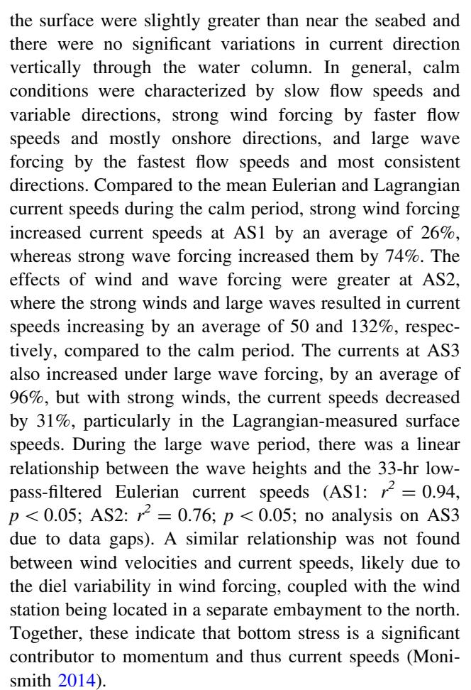

Tides affected circulation primarily through the modulation of flow speeds by changing water levels, whereby higher water levels lead to faster flows—a common phenomenon on reef flats and consistent with decreasing depth-averaged flow resistance with increasing flow depth (Storlazzi et al. 2004; Presto et al. 2006; Hench et al. 2008; Costa et al. 2016). This effect was most clear at AS1 and AS2 during the period of large wave forcing (Fig. 4e) and less evident during the calm conditions and strong wind forcing. A similar pattern was evident in the Lagrangian current measurements: Higher water levels during the large wave period resulted in faster current speeds (data not shown), but similar to the Eulerian records, this relationship did not hold for the calm or strong wind periods. Although changing water levels modulated current speeds, there was no discernable change in current directions during different tidal stages for either the Eulerian or Lagrangian observations.

Drifter tracks show spatial patterns in current velocity that corresponded with geomorphic setting: (1) faster, unidirectional flows over the exposed seaward reef flat, with slightly slower flows in the back-reef pools; (2) slower, more variable flows over the sheltered leeward reef and channel near the stream outlet; and (3) seaward flows

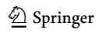

Coral Reefs (2018) 37:457-469

Fig. 3 Time series of meteorologic and oceanographic data used to define time periods of different forcing conditions (calm, strong winds, and large waves) for analysis. a Tide level at location AS1. b Wind speed. c Wind speed and direction. d Significant wave height. e Peak wave period. f Wave height and direction. Vectors denote direction "to" in degrees from true north. Wind data are from NDBC station NSTP6; significant wave height and peak wave direction data are from the NOAA/NCEP WW3 model

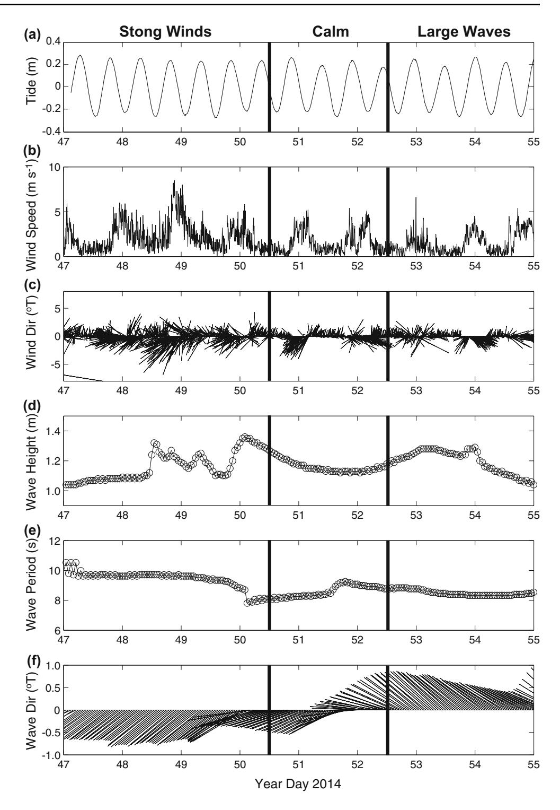

over the channel and leeward reef during calm and large wave forcing conditions (Fig. 5).

In general, flow directions on the seaward reef were consistently into the bay, whereas flows on the leeward reef were more variable (Figs. 4, 5). Under both calm conditions and large wave forcing, a clockwise flow pattern was evident in the embayment (Fig. 5a, c), likely driven by

wave breaking on the seaward reef crest. With large waves, the offshore-directed surface flow was directed along the channel axis, whereas under calm conditions, surface flow from the seaward reef and back-reef pools generally crossed the channel to the leeward reef and exited the embayment over the leeward reef crest. During strong winds, the clockwise flow pattern was absent; surface flows

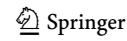

Fig. 4 Time series of ADCP data on the reef flat. a Tide level at location AS1. b Current velocity at AS1. c Current velocity at AS2. d Current velocity at AS3. e Current speeds at all three locations. Vectors denote direction ''to'' in degrees from true north. The data gaps in the record at AS3 were because the water depths at low tide were too shallow for measurements. Note the variations in current speeds both in space and in time due to the different forcing conditions shown in Fig. [3](#page-7-0)

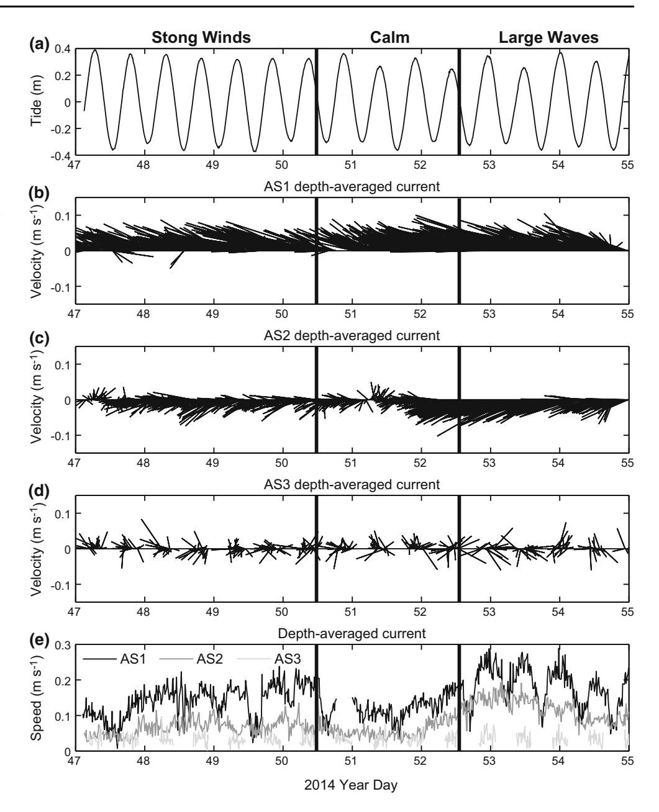

in the channel and on the leeward reef stagnated, and only a weak seaward flow was present over the seaward portion of the channel (Fig. [5b](#page-9-0)).

Complementary to the gridded, mean Lagrangian current measurements, the individual drifter tracks can reveal other details about flow patterns. Under calm conditions, there was evidence of enhanced surface water exchange across the channel, particularly from the leeward reef flat to the seaward reef and back-reef pools, counter to the general clockwise flow pattern (Fig. [5d](#page-9-0)). For drifters that were launched on the leeward reef flat during calm conditions, 40% exited the bay and another 40% crossed the channel and ended on the seaward reef flat or back-reef pools. For the drifter trajectories that began over the seaward reef flat under calm conditions, 38% terminated on the seaward reef flat and 29% in the back-reef pools and 19% exited the bay. Under strong wind forcing, no drifters exited the bay and the surface flow was directed more shoreward, with no evidence of cross-channel surface exchange. During strong wind forcing, all of the drifters released on the seaward reef flat ended in the back-reef pools or on the seaward reef flat after briefly entering the channel. It is likely that the persistent shoreward surface flow during strong winds sets up an offshore flow at depth in the channel, similar to that observed by Hench et al. [\(2008](#page-12-0)).

During large wave forcing, flows were vigorous, but the continuity between the seaward reef flat and flows out the channel was unclear (Fig. [5f](#page-9-0)). For the drifters that began on

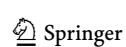

Coral Reefs (2018) 37:457–469 465

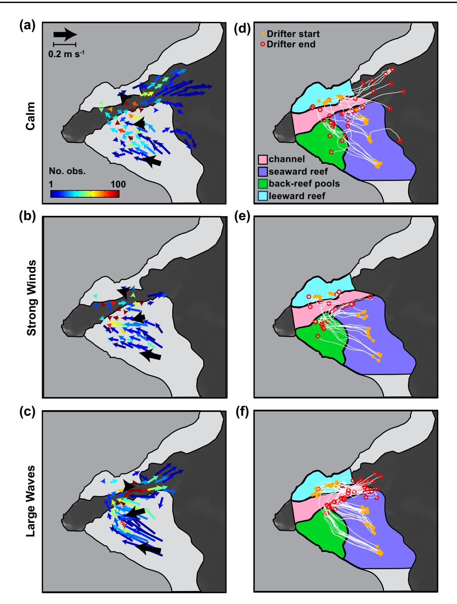

Fig. 5 Surface circulation patterns during calm (top row), strong winds (middle row), and large waves (bottom row). Left panels (a– c) display mean currents for the top-bin ADCP measurements (black arrows) and drifters (color arrows); the number of drifter observations in each grid cell is indicated by the color scale. The scales for the ADCP and drifter vectors are shown in (a). Right panels (d–f) show

the leeward reef flat, 79% either exited the bay or ended in the outer portion of the channel. In contrast, for the drifters launched on the seaward reef flat, only 13% of those trajectories exited the bay, while 77% terminated in small (10 s m), eddy-like features along the boundary between individual drifter tracks, with orange stars indicating deployment locations and red circles indicating recovery locations. In all figures, the land (medium gray), reef flats (light gray), and the deeper portions of the reef and insular shelf (dark gray) are indicated; the leeward reef flat (blue), channel (pink), back-reef pools (green), and the seaward reef flat (purple) geomorphic zones are indicated in the right panels

the seaward reef flat and the channel. These eddies likely arise when the fast-moving flow over the shallow seaward reef flat converges with waves refracted through the channel. The termination of these drifter tracks in these eddies is partly an artifact of sampling operations, whereby

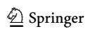

the fast-moving currents, coupled with the large wave breaking on the reef crest, necessitated recovering the drifters once they reached this area of the reef. The consistent path of drifters from the leeward reef flat into the channel and out of the bay suggests that strong wave forcing leads to greater flushing of this embayment. It is possible that the outgoing water is replaced by water originating from the seaward reef flat that flows across the channel more shoreward than the drifter coverage, or by deep water in the channel.

# Residence times

The residence times for the different geomorphic zones range from 37 to 116 min (Fig. 6a); however, because the zones have different spatial extents, these values are not directly comparable and do not reflect the residence times experienced by organisms on the reef. Thus, to compare the residence times between different zones, we first normalized them by the planimetric area of each. The normalized mean residence time patterns in the embayment reflect the general circulation patterns, with the seaward reef having the shortest residence times and the back-reef pools and leeward reef flat the longest (Fig. 6b). There was also a high degree of variability in the residence times, particularly for the calm and strong wind periods. Each geomorphic zone had a similar response to strong wind and large wave forcing: Strong winds caused an increase in residence times, whereas large waves caused a decrease, and, for all zones except the channel, the shortest residence times occurred during large wave forcing. The channel had its shortest residence time during the calm period. This is because, in the absence of strong winds or large waves, surface flow in the channel was often directed perpendicular to the channel axis, from the seaward reef flat to the leeward reef flat (Fig. [5](#page-9-0)). Because the channel is significantly deeper than the other zones of the embayment, the surface flow patterns likely do not reflect the residence times of water deeper in the channel. Due to continuity of mass, return or other sheared flows may be present in the channel that were not resolved. The back-reef pools had the most substantial decrease in residence time in response to large wave forcing (59% decrease), followed by the leeward reef (47%). Despite these shortened residence times, the seaward reef consistently had mean residence times 2–39 shorter than those of the leeward reef and back-reef pools.

### Discussion

Coral reefs are physically and biologically heterogeneous, and ecologically relevant flow speeds and trajectories are difficult to measure in relation to long-term forcing conditions (Monsen et al. [2002](#page-13-0)). Many studies that seek to characterize flow in reef environments rely on (a) models that often significantly simplify the study site bathymetry or forcing conditions (e.g., Lowe et al. [2010\)](#page-13-0); (b) complex models with little sense of their spatial accuracy (Hoeke et al. [2013\)](#page-12-0); or (c) field observations from only a few fixed instrument locations (e.g., Hench et al. [2008](#page-12-0)). Here, the strategy of combining frequent and sustained Lagrangian drifter deployments that achieve high spatial resolution with Eulerian current meters that provide high temporal

Fig. 6 Residence time statistics for each geomorphic zone of the reef during the different forcing conditions: calm conditions (light gray), strong winds (medium gray), and large waves (dark gray). For (b), the residence times have been normalized to the area of each geomorphic zone. The black dots indicate the mean values, and the lines indicate the ± 1 standard deviation range. Values in parentheses are the number of drifter tracks used in each computation for both (a, b) panels

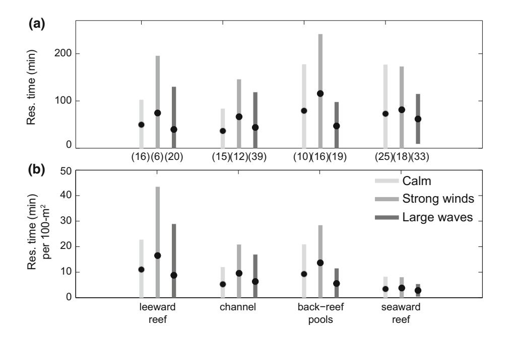

resolution provides great insight into the complex flow patterns over different portions of the reef and how these patterns change under different forcing conditions.

### Residence times: meteorologic and oceanographic controls

Wave breaking on the seaward reef crest seems to exert the dominant control on circulation patterns within the embayment. During large waves, the drifter tracks document a fast-moving clockwise surface flow pattern shoreward over the exposed seaward reef, through the back-reef pools and near the stream mouth, and out to sea over the sheltered leeward reef and deep channel (Fig. [5\)](#page-9-0). Despite some wave breaking on the leeward reef crest, the flow over the leeward reef flat was seaward, toward the reef crest, likely driven by the strong landward flow across the exposed seaward reef and back-reef pools. During the strong wind and calm periods, wave breaking was still observed on the seaward reef crest, suggesting that wave breaking there exerts an influence on the general flow patterns even when wave heights are small, as was observed by Vetter [\(2013](#page-13-0)).

One might expect strong winds to ultimately drive faster flows (e.g., Storlazzi et al. [2004;](#page-13-0) Presto et al. [2006;](#page-13-0) Storlazzi and Jaffe [2008](#page-13-0)) in the bay, and, consequently, shorter residence times. However, the measurements presented here demonstrate how strong winds blowing across the mouth of the bay act to hinder circulation, effectively pinning bay water closer to shore over the reefs and stagnating the seaward flow over the leeward reef flat and channel, although this surface flow is likely balanced by offshore-directed flow at depth in the channel as was measured by Vetter ([2013\)](#page-13-0). As a result, periods of strong winds and small waves are when corals in the bay have the potential to experience the greatest exposure to sediment, nutrients, and/or contaminants. The calm conditions during our study period are representative of wet-season conditions for the study area. If the greatest frequency and magnitude of terrestrial runoff and fluvial input occur during the wet season, then those periods may be when corals are ultimately most exposed to stressors, despite the more moderate residence times. During rain events, the majority of sediment input to the bay comes from the Faga'alu Stream outlet at the landward end of the channel (Messina and Biggs [2016\)](#page-13-0). If rain events coincide with relatively calm conditions, enhanced cross-channel surface flow would be expected, which would result in a greater transport of suspended material from the stream to the reef flats. Such pollutant-delivery events during calm condition that result in greater residence times and exposure to elevated stressor loads in the water column have been identified in other tropical, coral reef-lined embayments (Draut et al. [2009;](#page-12-0) Storlazzi et al. [2009](#page-13-0); Hoeke et al. [2013](#page-12-0)).

### Residence times: geomorphic controls

Changing from a wind- to a wave-dominated forcing regime reduced the normalized residence times by 46% for the leeward reef flat and 59% for the back-reef pools, but the different zones showed a fairly constant ranking throughout the changing forcing conditions, with the seaward reef flat residence times consistently 2–39 shorter than the other regions (Fig. [6b](#page-10-0)). This indicates that although meteorologic and oceanographic forcing controls the temporal variability in current speeds at a given location, the overall reef geomorphology imparts an even greater control on currents and, thus, residence times.

In addition to the effects of geomorphology and reef characteristics on flow patterns, the depths of the different regions can also greatly affect the amount of time it takes for suspended material to settle onto the reef. The shallower water depths over the leeward reef will allow more sediment to deposit on the reef than in the channel. These results demonstrate how the geomorphology sets a firstorder control on circulation patterns and residence times within complex embayments. Thus, when seeking to understand flow patterns for a particular reef, while it is worthwhile to evaluate how the flow patterns shift under different forcing scenarios, it is even more important to first resolve the flow patterns with sufficient spatial resolution to distinguish regions defined by their geomorphic characteristics.

## Implications of circulation patterns and residence times on reef health

Sediment, nutrients, and contaminants discharged from adjacent watersheds can have negative effects on coral reef health, but the linkage between stressors and coral health is modulated by the water circulation over the reef, with highenergy reefs generally being less affected than low-energy reefs. Conversely, those portions of the reef exposed to cooler offshore waters may be more resistant to thermally induced bleaching. The flow pattern illustrated by the data indicates that open ocean water flows rapidly over the relatively healthy seaward reef, flushing it and reducing the impact of any sources of land-based pollution, such as nutrient- or contaminant-laden submarine groundwater discharge (e.g., Swarzenski et al. [2012\)](#page-13-0). Terrestrial sediment discharged from Faga'alu Stream is deflected away from the energetic seaward reef and towards the leeward reef where it persists for longer durations, likely resulting in greater terrigenous sediment stress and reduced coral health from particle settling and light reduction

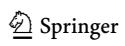

(Erftemeijer et al. 2012; Storlazzi et al. [2015](#page-13-0)). Thus, in addition to the water residence times for the geomorphic zones, the location of the zones relative to the stream outlet and bay circulation (i.e., are they ''upstream'' or ''downstream'' from the sediment source?) determines the amount of suspended material affecting each zone. For example, the back-reef pools have the second longest residence times (Fig. [6](#page-10-0)b), but the coral reef organisms there are relatively healthy, likely because this area receives flow primarily from the seaward reef, and little from the channel and Faga'alu Stream outlet (Fig. [5](#page-9-0)). During storms, time-lapse photography (not shown) shows terrestrial fluvial sediment plumes extending from the stream outlet over the leeward reef and channel, persisting for several hours to days. Although sediment accumulation on coral blocks all light for photosynthesis, Storlazzi et al. ([2015\)](#page-13-0) showed even low concentrations of fine-grained terrestrial sediment in the water column can substantially reduce photosynthetically active radiation over small depth ranges, the impact of which would be enhanced over the leeward reef due to longer residence times.

Information on water circulation is critical for understanding both the natural ecological processes and the anthropogenic impacts on coral reefs. The combined Eulerian–Lagrangian measurement scheme presented here provided an unprecedented data set with high temporal resolution and extensive spatial coverage collected over a relatively wide range of forcing conditions. Thus we could discriminate the geomorphic, meteorologic, and oceanographic controls on flow patterns and residence time in this bathymetrically complex, coral reef-lined embayment. For a given embayment, once the circulation patterns are resolved, there are several additional steps to directly linking spatial and temporal patterns of water movement with coral health. First, information about the source of the stressors, such as stream discharge rates and sediment loads during storms, is needed. Second, the concentrations as well as the geological and chemical characteristics of the suspended and deposited sediment are required to quantify the coral's exposure. Lastly, one must understand the sedimentation and turbidity thresholds of the coral species being affected. Only through such coupled biophysical research can the impacts of land-based pollution on coral reefs be accurately quantified.

Acknowledgements This work was carried out in collaboration between San Diego State University and the US Geological Survey's Coral Reef Project. Funding was provided by the NOAA Coral Reef Conservation Program Grant NA13NOS4820025 and the US Geological Survey's Coastal and Marine Geology Program. We would like to thank Michael Favazza for providing field logistical support. We would also like to thank Liv Herdman (USGS) and two anonymous reviewers who contributed excellent suggestions and timely reviews of our work. The use of trademark names does not imply USGS endorsement of products.

#### Compliance with ethical standards

Conflict of interest On behalf of all authors, the corresponding author states that there is no conflict of interest.

### References

- Austin J, Atkinson S (2004) The Design and Testing of Small, Lowcost GPS-tracked Surface Drifters. Estuaries 27:1026–1029
- Cochran SA, Gibbs AE, D'Antonio NL, Storlazzi CD (2016) Benthic habitat map of U.S. Coral Reef Task Force Faga'alu Bay priority study area, Tutuila, American Samoa: U.S. Geological Survey Open-File Rport 2016-1077
- Costa MBSF, Arau´jo M, Arau´jo TCM, Siegle E (2016) Influence of reef geometry on wave attenuation on a Brazilian coral reef. Geomorphology 253:318–327
- Craig P (2009) Natural History Guide to American Samoa. National Park of American Samoa, Pago Pago, American Samoa
- Davis R (1991) Lagrangian ocean studies. Annu Rev Fluid Mech 23:43–64
- Draut AE, Bothner MH, Field ME, Reynolds RL, Cochran SA, Logan JB, Storlazzi CD, Berg CJ (2009) Supply and dispersal of flood sediment from a steep, tropical watershed: Hanalei Bay, Kaua'i, Hawai'i, USA. Geol Soc Am Bull 121:574–585
- Erftemeijer PL, Riegl B, Hoeksema BW, Todd PA (2012) Environmental impacts of dredging and other sediment disturbances on corals: A review. Mar Pollut Bull 64:1737–1765
- Falter JL, Lowe RJ, Atkinson MJ, Monismith SG, Schar DW (2008) Continuous measurements of net production over a shallow reef community using a modified Eulerian approach. J Geophys Res Ocean 113:1–14
- Feagaimaalii-Luamanu J (2016) High surf generated by TC Victor washes over roads and property. Samoa News
- Hench JL, Leichter JJ, Monismith SG (2008) Episodic circulation and exchange in a wave-driven coral reef and lagoon system. Limnol Oceanogr 2681–2694
- Hoeke RK, Storlazzi CD, Ridd P (2011) Hydrodynamics of a bathymetrically complex fringing coral reef embayment: Wave climate, in situ observations, and wave prediction. J Geophys Res 116:C04018
- Hoeke RK, Storlazzi CD, Ridd PV (2013) Drivers of circulation in a fringing coral reef embayment: A wave-flow coupled numerical modeling study of Hanalei Bay, Hawaii. Cont Shelf Res 58:79–95
- Holst-Rice S, Messina A, Biggs TW, Vargas-Angel B, Whitall D (2016) Baseline Assessment of Faga'alu Watershed: A Ridge to Reef Assessment in Support of Sediment Reduction Activities and Future Evaluation of their Success
- Klein CJ, Jupiter SD, Selig ER, Watts ME, Halpern BS, Kamal M, Roelfsema C, Possingham HP (2012) Forest conservation delivers highly variable coral reef conservation outcomes. Ecol Appl 22:1246–1256
- Koweek DA, Dunbar RB, Monismith SG, Mucciarone DA, Woodson CB, Samuel L (2015) High-resolution physical and biogeochemical variability from a shallow back reef on Ofu, American Samoa: an end-member perspective. Coral Reefs 34:979–991
- Lowe RJ, Falter JL, Monismith SG, Atkinson MJ (2009a) Wave-Driven Circulation of a Coastal Reef-Lagoon System. J Phys Oceanogr 39:873–893
- Lowe RJ, Falter JL, Monismith SG, Atkinson MJ (2009b) A numerical study of circulation in a coastal reef-lagoon system. J Geophys Res Ocean 114:1–18

- Lowe RJ, Hart C, Pattiaratchi CB (2010) Morphological constraints to wave-driven circulation in coastal reef-lagoon systems: A numerical study. J Geophys Res 115:C09021
- Lowe RJ, Falter JL (2015) Oceanic Forcing of Coral Reefs. Ann Rev Mar Sci 7:43–66
- MacMahan J, Brown J, Brown J, Thornton E, Reniers A, Stanton T, Henriquez M, Gallagher E, Morrison J, Austin MJ, Scott TM, Senechal N (2010) Mean Lagrangian flow behavior on an open coast rip-channeled beach: A new perspective. Mar Geol 268:1–15
- Messina AT, Biggs TW (2016) Contributions of human activities to suspended sediment yield during storm events from a small, steep, tropical watershed. J Hydrol 538:726–742
- Militello A, Scheffner NW, Thompson EF (2003) Hurricane-Induced Stage-Frequency Relationships for the Territory of American Samoa. USACOE Technical Report CHL-98-33
- Monismith S (2014) Flow through a rough, shallow reef. Coral Reefs 33:99–104
- Monsen NE, Cloern JE, Lucas LV, Monismith SG (2002) The use of flushing time, residence time, and age as transport time scales. Limnol Oceanogr 47:1545–1553
- NOAA National Data Buoy Center (2014) Online data for station NSTP6. [http://www.ndbc.noaa.gov/station\\_page.php?station=](http://www.ndbc.noaa.gov/station_page.php%3fstation%3dNSTP6) [NSTP6](http://www.ndbc.noaa.gov/station_page.php%3fstation%3dNSTP6)
- Presto MK, Ogston AS, Storlazzi CD, Field ME (2006) Temporal and spatial variability in the flow and dispersal of suspendedsediment on a fringing reef flat, Molokai, Hawaii. Estuar Coast Shelf Sci 67:67–81
- Shedrawi G, Falter JL, Friedman KJ, Lowe RJ, Pratchett MS, Simpson CJ, Speed CW, Wilson SK, Zhang Z (2017) Localized hydrodynamics influence vulnerability of coral communities to environmental disturbances. Coral Reefs 36:861–872
- Storlazzi CD, Ogston A, Bothner M, Field M, Presto M (2004) Waveand tidally-driven flow and sediment flux across a fringing coral reef: Southern Molokai, Hawaii. Cont Shelf Res 24:1397–1419
- Storlazzi CD, Brown EK, Field ME (2006) The application of acoustic Doppler current profilers to measure the timing and patterns of coral larval dispersal. Coral Reefs 25:369–381
- Storlazzi CD, Jaffe BE (2008) The relative contribution of processes driving variability in flow, shear, and turbidity over a fringing coral reef: West Maui, Hawaii. Est Coast Shelf Sci 77(4):549–564

- Storlazzi CD, Field ME, Bothner MH, Presto MK, Draut AE (2009) Sedimentation processes in a coral reef embayment: Hanalei Bay, Kauai. Mar Geol 264:140–151
- Storlazzi CD, Norris BK, Rosenberger KJ (2015) The influence of grain size, grain color, and suspended-sediment concentration on light attenuation: Why fine-grained terrestrial sediment is bad for coral reef ecosystems. Coral Reefs 34:967–975
- Swarzenski PW, Dailer ML, Glenn CR, Smith CG, Storlazzi CD (2012) A geochemical and geophysical assessment of coastal groundwater discharge at select sites in Maui and Oahu, Hawaii. Groundwater in the Coastal Zones of the Asia Pacific, 1–36
- Tartinville B, Deleersnijder E, Rancher J (1997) The water residence time in the Mururoa atoll lagoon: sensitivity analysis of a threedimensional model. Coral Reefs 16:193–203
- Teneva LT, Mcmanus MA, Jerolmon C, Neuheimer AB, Clark SJ, Walker G, Kaho K, Shimabukuro E, Ostrander C, Kittinger JN (2016) Understanding Reef Flat Sediment Regimes and Hydrodynamics can Inform Erosion Mitigation on Land. Collabra 2:1–12
- Thompson EF, Demirbilek Z (2002) Wave Response, Pago Pago Harbor, Island of Tutuila, Territory of American Samoa. USACOE Coastal and Hydraulics Laboratory ERDC/CHL TR-02-20
- Tolman HL (2009) User manual and system documentation of WAVEWATCH III version 3.14. NOAA National Center for Environmental Prediction Technical Note
- Vetter O (2013) Inter-Disciplinary Study of Flow Dynamics and Sedimentation Effects on Coral Colonies in Faga'alu Bay, American Samoa: Oceanographic Investigation Summary. NOAA CRCP Project #417
- Wyatt ASJ, Lowe RJ, Humphries S, Waite A (2010) Particulate nutrient fluxes over a fringing coral reef: relevant scales of phytoplankton production and mechanisms of supply. Mar Ecol Prog Ser 405:113–130
- Wyatt ASJ, Falter JL, Lowe RJ, Humphries S, Waite AM (2012) Oceanographic forcing of nutrient uptake and release over a fringing coral reef. Limnol Oceanogr 57:401–419
- Yamano H, Kayanne H, Yonekura N, Nakamura H, Kudo K (1998) Water circulation in a fringing reef located in a monsoon area: Kabira Reef, Ishagaki Island, Southwest Japan. Coral Reefs 17:89–99

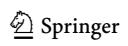