# **Oceanography of the Samoan Archipelago**

Doug Pirhalla1 , Varis Ransi1 , Matthew S. Kendall2 and Doug Fenner3

# **IntrOductIOn**

The biogeography and health of coral reef ecosystems in the Samoan Archipelago are shaped in part by the oceanographic conditions and processes of the equatorial South Pacific. Larvae that reach the archipelago are carried to the region on ocean currents and those organisms that arrive and thrive must be adapted to the climatic conditions that characterize the region including temperature, winds, waves, nutrients, tides, sea level, and other factors. Once established, reef ecosystems can be stressed and modified by a wide range of climate-related phenomena such as elevated ocean temperatures, sea level fluctuations, and ocean acidification. Many oceanographic and atmospheric processes affecting Samoan reefs are presently in flux due to global climate change (Chase and Veitayaki 1992, Timmerman et al. 1999, US EPA 2007, Young 2007, Barshis et al. 2010). This chapter provides a

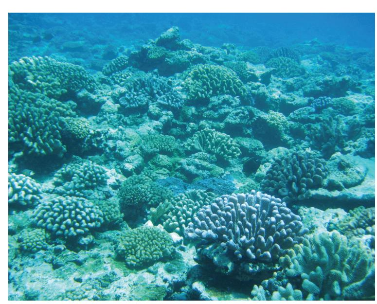

**Image 3.** A close-up look at a diverse benthic community. Photo credit: Matt Kendall, NOAA, Biogeography Branch.

summary of regional atmospheric and oceanographic conditions and trends including winds, waves, currents, sea surface temperature, chlorophyll, and sea surface height anomalies, and discusses potential influences they may have on Samoan reef ecosystems.

#### **climate Background**

The climate of the Samoan Archipelago is characterized by year-round mild air temperatures, high humidity, persistent easterly or northeasterly trade winds, and infrequent but severe cyclonic storms. Mean daily air temperature varies between 22°C and 30°C (SPSLCMP 2007). The islands are noted for high annual rainfall that averages >3,000 mm (120 inches) per year but varies locally depending on topography (http://www7. ncdc.noaa.gov/CDO/cdo). Maximum rainfall occurs in the austral summer (December-February) where it can exceed 300 mm/month. In winter (June-August), rainfall is 30% lower at approximately 200 mm/month.

# **dAtA And MethOdS**

A diversity of satellite sensors has provided estimates of oceanic and atmospheric variables at global scales for the last few decades. These satellite-based datasets and other supporting information were used to describe the typical seasonal fluctuations, inter-annual variability, long-term trends, and anomalous events of importance to coral reef ecosystems in the Samoan Archipelago. Oceanographic variables in this assessment include winds, waves, ocean circulation, sea surface temperature, chlorophyll, and sea surface height anomalies. For each variable, the assessment provides: 1) a brief description of the remote sensing and other data that were analyzed, 2) a broad-scale overview of the major ocean features and processes at work while highlighting the position of the Samoa and American Samoa Exclusive Economic Zones (EEZs), 3) a finer-scale description of the seasonal patterns for each variable comparing ocean measurements close to the islands of Savai'i (172.66 W, 14.26 S) and Tutuila (170.2 W, 14.26 S) respectively (for these analyses, ocean characteristics were extracted for an area of 80 km2at the same latitude excluding land and shallow water areas) and throughout the American Samoa EEZ (only the American Samoa EEZ is included for simplicity since it encompasses the conditions experienced in the Samoan EEZ), 4) a time series of available

NOAA/NOS/NCCOS/CCMA Coastal Oceanographic Assessment Status and Trends Branch

2 NOAA/NOS/NCCOS/CCMA Biogeography Branch

3American Samoa/Department of Marine and Wildlife Resources

data showing multi-year trends in climate patterns, and 5) a description of the frequency and intensity of anomalous conditions that are of particular relevance to coral reef ecosystems. Ocean pixels in the satellite data that were contaminated with land or shallow water signatures were excluded in analyses. Preliminary analysis revealed that for most variables, monthly averages or plots for every other month were suitable to convey seasonal patterns. Where annual cycles are plotted, monthly means are averaged across all years of data. For example, there were 21 years of sea surface temperature (SST) data. Average SST for January in all 21 years was averaged to create a composite seasonal cycle. This enables identification of typical seasonal patterns but can obscure important short-term phenomena. Such extreme values that have occurred in specific years or months are highlighted in separate plots. Original remote sensing data used in this study are freely available and should be downloaded from original sources (Table 2.1).

Table 2.1. Original data sources.

| PRODUCT TYPE                                                               | DATA SOURCE                   | TIME FRAME | SPATIAL RESOLUTION | TEMPORAL SUMMARY | UNITS                   |
|----------------------------------------------------------------------------|-------------------------------|---------------|--------------------|---------------------|-------------------------|
| QuikSCAT Sea Surface Winds                                                 | Remote Sensing Systems        | 1999-2007     | 25 km              | Weekly/Monthly      | m/s, degrees from north |
| Jason-1, Topex/Poseidon, ERS-1/2ENVISAT Geostrophic Surface Currents | AVISO, SSALTO/DUACS & CNES | 1992-2006     | 1/3° grids         | Weekly/Monthly      | cm/s degrees from north |
| Pathfinder SST and SST Anomaly (CoRTAD))                                | NOAA/NESDIS/NODC              | 1985-2006     | 4 km               | Weekly/Monthly      | °C                      |
| GOES-10/11SST and SST fronts                                            | NESDIS/NODC/STAR              | 2000-2007     | 4 km               | Daily/Monthly       | °C                      |
| SeaWiFS Ocean Color Chlorophyll and Anomalies                           | NASA                          | 1997-2007     | 1 km               | Daily/Monthly       | μg L-1, Steradian -1 |
| Jason-1, Topex/Poseidon, ERS-1/2ENVISAT Sea Surface Height Anomolies | AVISO, SSALTO/DUACS & CNES | 1992-2006     | 1/4° grids         | Weekly/Monthly      | cm                      |

#### **RESULTS**

#### Wind

Magnitude and direction of winds near the ocean surface are measured by the QuikSCAT satellite's microwave scatterometer (http://www.remss.com/qscat/qscat\_description.html). Weekly and monthly averaged data are available at a 25 km spatial resolution for a 7-year period (July 1999 to September 2007). Data were used to discern the broad-scale atmospheric circulation features in the South Pacific, place the Samoan EEZs into regional context, and to depict prevailing wind patterns within the archipelago over a typical annual cycle.

The region is dominated by the Trade Winds, a persistent atmospheric system where surface winds blow from the northeast to the southwest (yellow-green colors; Figure 2.1). Trade Winds are typically stronger in winter (July) than in summer (Merrill 1989). A major atmospheric feature affecting the Samoan climate is the South Pacific Convergence Zone (SPCZ) where Trade Winds converge at the surface (Figure 2.1). To the north of the convergence zone winds are generally southwestward. To the south of the convergence zone winds are generally westward/northwestward. This area of convergence results in heightened rainfall, especially during summer months (December-February). The SPCZ undergoes shifts in position and intensity on both a seasonal and interannual basis. The SPCZ crosses over the Samoan Archipelago twice a year (Alory and Delcroix 1999). It is most clearly established over the Samoan Archipelago during the summer months (December – February) whereas in winter (June – August) the zone shifts slightly northward resulting in stronger winds and lower rainfall (Alory and Delcroix 1999).

Interannual and decadal-scale variability of winds and many other aspects of climate within the Samoan Archipelago are associated with the El Niño and Southern Oscillation (ENSO) phenomenon (Alory and Delcroix 1999, Halpin et al. 2004) (see CPC website: http://www.cpc.noaa.gov). The Southern Oscillation is the change in atmospheric pressure between the eastern and the western regions of the South Pacific (Chowdhury et al. 2007). The Southern Oscillation Index (SOI) measures the strength of the oscillation and is com-

**Figure 2.1.** Wind direction measured by the QuikSCAT satellite. Monthly averages are based on the years from 1999 to 2007. Key atmospheric features and wind vectors (black arrows) are labeled in the plot for January at upper left. Odd numbered months are displayed. EEZs of Samoa and American Samoa are outlined in the center of each map.

puted from the difference in atmospheric pressure at Tahiti and Darwin, Australia. Sustained negative values of the SOI often indicate El Niño episodes which are characterized by a decrease in strength of the Trade Winds (Luick 2000) and warmer surface waters in the equatorial Pacific (Vecchi and Wittenberg 2010). This shifts the SPCZ to the north and coincides with higher winds in the Samoan region (Alory and Delcroix 1999). Positive SOI values indicate La Niña episodes where equatorial Trade Winds are strengthened. A time series of SOI values is provided for reference alongside plots of several variables in the assessment including SST, sea surface height anomaly (SSHA), and chlorophyll to demonstrate its relationship with ocean climate in the Samoan Archipelago.

Cyclonic storms (also called tropical storms, hurricanes or typhoons elsewhere) are infrequent but severe departures from the typical wind climate described above. The Samoan EEZs lie along the eastern edge of a region conducive to development of cyclonic storms in the South Pacific (Craig 2009). Six cyclones have struck or passed near the Samoan Archipelago in the past 30 years including 2 recent and very powerful Category 5 storms with sustained winds over 155 mph (Figure 2.2). In 2004, the eye of Heta passed south of the archipelago coming within 150 km of Savai'i (Fenner et al. 2008) creating a 0.3 m storm surge (SPSL-CMP 2007) and variable damage to Samoan reefs (Tausa and Samuelu 2004). In 2005, Olaf passed through the middle of the Samoan EEZs from northwest to southeast going almost directly over the Manu'a Islands where it caused substantial damage to both terrestrial and marine resources.

# **Waves**

The wave climate of the Samoan Archipelago has been characterized extensively through Waverider buoys (Barstow and Haug 1994), wave and tide recorders (Brainard and others 2008), models such as NOAA Wavewatch III (Tolman 2010), and satellite altimetry (Barstow and Haug 1994). Wave power exposures are

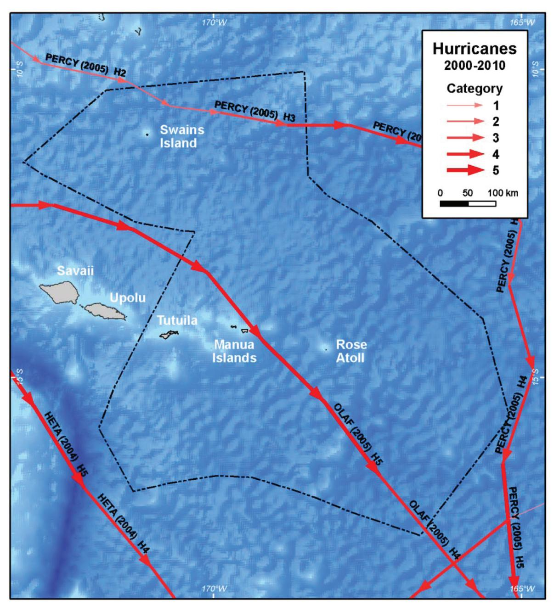

**Figure 2.2.** Path and intensity of cyclones passing through the EEZs of Samoa or American Samoa from 2000-2007.

typically highest on the eastern and southern facing coasts of Samoan islands but can vary seasonally and among years (Barstow and Haug 1994).The wave climate can be split into two main components, short period (~2-10 seconds) "wind seas" that result from local forces such as the easterly Trade Winds versus long period (~10-20 seconds) "ocean swells" that originate from storms many of which are far south of the archipelago (Barstow and Haug 1994). Ocean swell from the south and wave power in general are highest during May-September (2-3 m wave height is common) with the increased intensity of the Trade Winds and frequency of swell producing storms at higher latitudes (Barstow and Haug 1994, Brainard et al. 2008). November through March is a period often characterized by shorter period waves, lower wave heights (~2 m), and more variable directionality (Brainard et al. 2008). Although correlations with the SOI are somewhat irregular as with other variables, there is some evidence that El Niño conditions increase wave height (Barstow and Haug 1994). In contrast to the typical seasonal and interannual patterns, anomalous wave events occur due to tsunamis (Roeber et al 2010), the passage of cyclones (Militello et al 2003) (e.g. >8 m wave heights were recorded during Cyclone Ofa in 1990 and Heta in 2004) and even storms in the North Pacific which can cause unusually large swells on the relatively more calm northern coasts of the islands (Barstow and Haug 1994, Brainard and others 2008).

# **Ocean circulation**

At the broadest scale, the Samoan Archipelago lies along the northern edge of the South Pacific Gyre, a series of connected ocean currents with a counter-clockwise flow (Alory and Delcroix 1999, Tomczak and Godfrey 2003, McClain et al. 2004, Craig 2009) (Figure 2.3). At a regional scale, there are 2 major surface currents affecting the archipelago (Qiu and Chen 2004): (1) the westward flowing South Equatorial Current (SEC), and (2) the eastward flowing South Equatorial Counter Current (SECC) (Figure 2.3). The intensity of these currents in Samoan waters is variable among seasons and years.

**Figure 2.3.** Major surface currents of the Southern Pacific Ocean adapted from Tomczak and Godfrey (2003). EEZs of Samoa and American Samoa are outlined in the center of the map.

Current patterns are major influences on larval transport and connectivity among islands in the Samoan Archipelago and adjacent island nations (Treml et al. 2008). Finer-scale patterns in currents and implications for larval transport will be discussed in greater detail in Chapter 3.

### **Ocean temperature**

Sea surface temperature (SST) data are collected globally by the NOAA/NASA Advanced Very High Resolution Radiometer (AVHRR) Oceans Pathfinder Program, which measures and reprocesses sea surface temperature, global cloud cover, vegetation cover and other variables. These data are the basis for the Coral Reef Temperature Anomaly Database, which has produced weekly average SST estimates for a 20 year period (January 1985 to December 2005) at a resolution of 4 km (Selig 2008). Monthly averaged data for the entire time period were used to discern the broad SST patterns in the South Pacific, place the SST of the Samoan Archipelago into context, depict changes in SST within the Samoan EEZs over an average annual cycle, and identify anomalous or unusually

**Image 4.** Bleached acropora. Photo: D. Fenner, ASDMWR.

high or low SST events in the waters of the archipelago. Continuous water temperature data have recently been recorded by data loggers deployed at several near shore locations around American Samoa by NOAA's Coral Reef Ecosystem Division. These data are discussed in detail by Brainard and others (2008) and provide an important record of localized temperature variability.

At the edge of the equatorial Pacific warm water pool, the entire Samoan Archipelago experiences relatively high and stable ocean temperatures throughout a typical annual cycle (Figure 2.4). Average SST ranges approximately 2° C from a low of 27.2° C in August to a high of 29.5° C in March. Maximum SST occurs three months behind the maximum sunlight intensity, which indicates that SST increases as long as the intensity of sunlight is higher than its mean annual value (Alory and Delcroix 1999). Regional maps of monthly mean

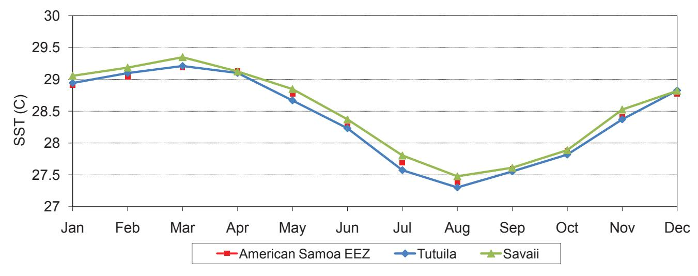

**Figure 2.4.** Sea surface temperature data from CoRTAD presented as an average annual cycle. Monthly averages are based on data from 1985 to 2006. Colors denote average values for the EEZ of American Samoa (red), waters adjacent to Tutuila (blue), and Savai'i (green).

SST reveal gradual seasonal patterns (Figure 2.5). On average there is a ~1° C SST range latitudinally in the American Samoa EEZ in any given season such that waters around Swains Island are 0.5 – 1° C warmer than those around the rest of the Samoan Islands. There is minimal longitudinal variation in SST. Sea surface temperature fronts that frequently occur at higher latitudes and are associated with enhanced biological productivity (Polovina et al. 2001) are essentially absent from the Samoan EEZs (Figure 2.5).

The 21 year time series of available SST and temperature anomaly data revealed both seasonal and more irregular patterns (Figure 2.6). Overall trends in SST within the American Samoa EEZ exhibit an increase of ~1° C from 1985 through 2006 (p < 0.0003, R2= 0.05, SST = 28.1 + 0.0023\*month). All years since the major El Niño of 1997-1998 showed generally positive SST anomalies in the Samoan Archipelago, indicating warmer than average conditions.

**Figure 2.5.** Sea surface temperatures from CoRTAD. Monthly averages are based on the years 1985 to 2006. EEZs of Samoa and American Samoa are outlined in the center of each map.

**Figure 2.6.** Sea surface temperature and anomaly values from CoRTAD for the years 1985 to 2006. Values are monthly averages for the EEZ of American Samoa. Southern Oscillation Index (SOI) values for the same time period are from NOAA/NWS. El Niño conditions are represented in dark blue with strong negative SOI values. La Niña conditions are represented by orange with strong positive values.

The seasonal SST range of 1-3° C is evident in all years. The specific range and temperature extremes in any given year are affected in part by the Southern Oscillation (Alory and Delcroix 1999). This is shown by focusing on winter (July) temperature anomalies, when the effects of El Niño are most pronounced in the region. During strong El Niño years significant warming of ocean temperatures occurs in the equatorial central/eastern Pacific (Chowdhury et al. 2007) and generally cooler SST conditions occur in the Samoan Archipelago (Alory and Delcroix 1999, Fenner et al. 2008). Temperature minima generally occur during peak negative SOI values but begin several months prior (Alory and Delcroix 1999)(Figure 2.6). For example, July 1987 and 1997 featured persistent SOI values of less than -2, indicative of strong El Niño conditions. SST within the Samoan EEZs during this time was 26.5°C, approximately 1°C cooler than average during both years (Figure 2.7). With one notable exception (1998), during La Niña conditions (e.g. 1989, 1999, 2000, 2001) the July anomalies show cooler SST along the equator but little change from expected values in the Samoan EEZs. Inspection of other SOI patterns reveals that the SST/atmospheric interactions are complex and do not yield perfect correlations. Of note is the strong negative SST anomaly in the equatorial region in July 1998 that is coupled with strong negative values in the Samoan Archipelago (Figure 2.7), a pattern not seen in the other 19 years of available data. This strong negative Samoan SST is a potential lag effect from the 1997 El Niño, may be related to the rapid shift from El Niño to La Niña conditions during 1998, and highlights the complexity and uncertainty of the effects of climate oscillations (SPSLCMP 2007).

Water temperatures can also become too high for the corals on reefs in the Samoan Archipelago. Hermatypic, or reef building corals, require warm tropical water, however when ocean temperatures are higher than 1° C above the highest temperature expected in the summer, corals can become stressed (Glynn and D'Croz 1990). This temperature is called the "bleaching threshold" and if this elevated temperature persists for long enough or temperatures are especially high for even a short period of time, corals will expel their symbiotic algae (zooxanthellae) and appear white. Three recent major coral bleaching events have been documented in American Samoa (Craig 2009) with a severe event in 1994 (Goreau and Hayes 1994) and additional widespread events documented in the summers of 2002 (Fisk and Birkeland 2002) and 2003 (Fenner et al. 2008).

Because the length of time the water temperatures are elevated plays a role in coral stress and bleaching, a metric called Degree Heating Weeks (DHW) is often used to highlight peak periods. It is a weekly metric

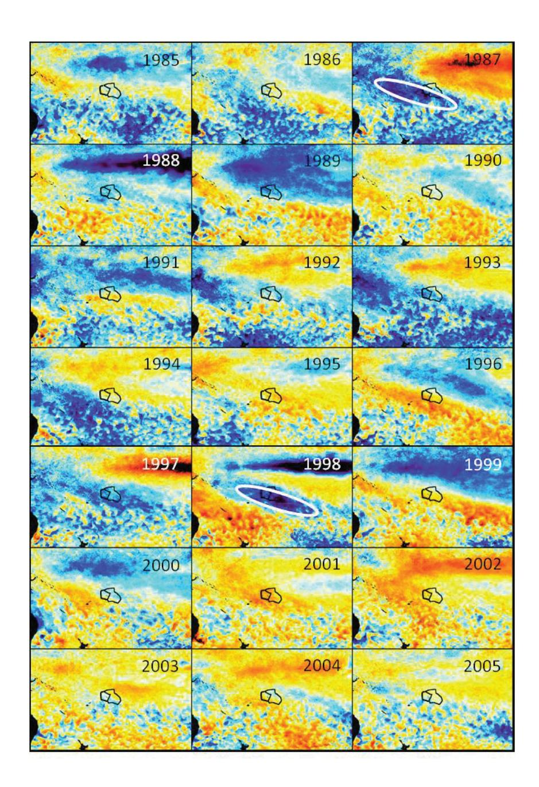

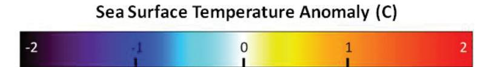

**Figure 2.7.** Sea surface temperature anomalies from CoRTAD during the month of July for the years 1997 to 2005. EEZs of Samoa and American Samoa are outlined in the center of each map.

calculated based on the number of the previous 12 weeks when the temperature exceeded the bleaching threshold as well as the number of degrees the temperature is above the bleaching threshold. Based on research conducted at NOAA's Coral Reef Watch (http://coralreefwatch.noaa.gov/), when the thermal stress reaches a value of 4 DHW, significant coral bleaching is likely. When thermal stress is 8 DHW or higher, widespread bleaching and mortality from the thermal stress is likely.

Using the Coral Reef Temperature Anomaly Database (CoRTAD), DHW was calculated for 1985-2006 for waters near Savai'i and Tutuila (Figure 2.8). Elevated DHW (>4 degree C) occurred at irregular intervals with

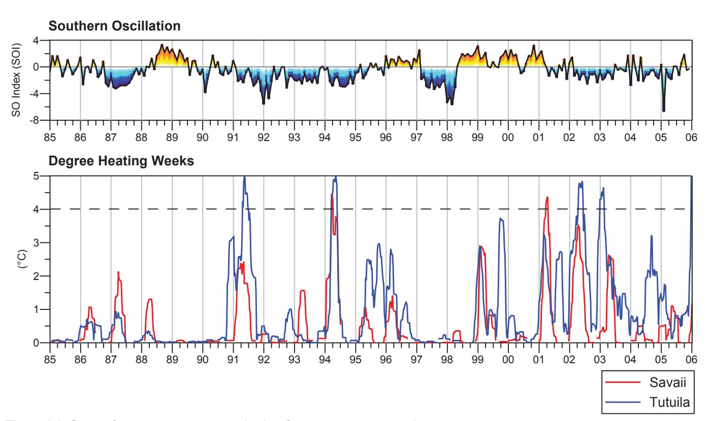

**Figure 2.8.** Sea surface temperature anomaly plots for warmest water month.

stronger peaks observed since 1990. Elevated DHW values generally occurred in Fall (April-May). Thermal stress exceeded 4 DHW in Savai'i and/or Tutuila in 1991, 1994, 2001, 2002, and 2003 with 3 of these years corresponding to documented coral bleaching events (Goreau and Hayes 1994, Fisk and Birkeland 2002, Craig 2009, Fenner et al. 2008). Unlike the SST anomaly time series, there appears to be minimal relationship between SOI and DHW in this region. Regional snapshots during peak DHW events in the time series reveal considerable variability in their spatial extent. A latitudinal but patchy band of increased DHW is evident in the region at these times.

NOAA Coral Reef Watch monitors bleaching conditions at a different site than those considered here and is based on waters off Ofu in the Manu'a Islands of American Samoa (Ofu virtual monitoring station- based on SST measured in a 50 km pixel centered at 14° S, 170° W). From 2000 to 2009 bleaching watches were issued by NOAA in all months between November and June with the core Summer/Fall months of January through May experiencing a watch at some time during nearly all nine years of data. Only in 2008 were SSTs consistently low and no bleaching watches were issued. Only one year during the nine years of data did SST at the Ofu site rise above the bleaching threshold. This occurred at times during three consecutive months from January to March of 2003. During this period, NOAA Coral Reef Watch issued 3 bleaching warnings and tracked a period of several weeks from late March through mid April where temperatures at Ofu surpassed the 4 DHW threshold for which significant coral bleaching is likely. Differences in DHW between the Ofu virtual monitoring site and the Savai'i and Tutuila sites examined here are likely due to the localized variability in water temperature that can occur in the regions (e.g. Figure 2.9).

Overall, these data suggest that the coral reefs of the Samoan Archipelago have been subjected to thermal stress conditions in ~1/3 of the last 15 years. An important caveat to interpretation however, is that localized water temperatures and other factors, primarily including shallow depths, wind conditions, incident light, and low circulation, may produce bleaching conditions in particular lagoons and reef flats that is not predicted by the satellite based approach used here. In fact, most of the in situ temperature loggers deployed on reefs around Tutuila and Swains Island recorded sustained temperatures 0.5 to 1° C higher than those based on satellites (Brainard and others 2008). In an extreme example, on one day in 2005 satellite measurements by NOAA Coral Reef Watch indicated an average SST of 30° C for an area that included an in situ temperature

**Figure 2.9.** Bleaching alert time-series from NOAA Coral Reef Watch.

logger which recorded a value of 34.9° C (Fagaitua, American Samoa) (Fenner et al. 2008). In contrast, in situ temperature loggers around Ta'u recorded values typically 1° C lower than those based on satellitederived surface estimates (Brainard and others 2008). This indicates that localized bleaching events are not always well predicted or detected by satellite based monitoring. Annual coral bleaching from 2004-2008 has been documented in two lagoon pools near the airport on Tutuila (Fenner et al. 2008). Even for widespread bleaching events, the severity can vary widely across islands in the Samoan Archipelago (Fisk and Birkeland 2002) with some corals and localities able to withstand thermal conditions typically associated with bleaching (Craig et al. 2001).

#### **chlorophyll**

The ocean color dataset from the Sea-viewing Wide Field-of-View Sensor (SeaWiFS) satellite provided a ten-year (September 1997 to October 2007) dataset of estimated chlorophyll concentration, at 9-km spatial resolution. Chlorophyll a is the dominant pigment in marine photosynthetic organisms and measuring its con-

**Image 5.** Red algal bloom in Pago Pago Harbor. Photo: D. Fenner , ASDMWR.

centration in ocean waters provides one measure of nutrient input to surface waters and subsequent biological productivity. Chlorophyll a concentration, referred to simply as chlorophyll in this report, can be estimated using SeaWiFS color sensors. Monthly averaged data for this period were used to discern broad chlorophyll patterns in the South Pacific, place the Samoan Archipelago into context, depict changes in chlorophyll within the Samoan EEZs over an average annual cycle, and identify unusually high or low chlorophyll events in the waters of the archipelago.

The entire archipelago shows low chlorophyll levels all year with very limited but discernable seasonal variability (Figure 2.10) (Dandonneau et al. 2004, McClain et al. 2004). Chlorophyll averages range 0.02 to 0.03  $\mu$ g/L from a low of 0.05  $\mu$ g/L in January to a high near 0.08  $\mu$ g/L in July. The archipelago lies at the northwestern edge of a distinct region of minimal oceanic productivity associated with the South Pacific Gyre (Figure 2.11) (Dandonneau et al. 2004, McClain et al. 2004), a region recently shown to be expanding at a rate of 1.4% per year (Polovina et al. 2008). Slight chlorophyll increases are evident just north of the EEZ at approximately 8° S and to the southwest near the Islands of Fiji.

**Figure 2.10.** Chlorophyll concentration estimated from SeaWiFS and presented as an average annual cycle. Monthly averages are based on the years 1998 to 2007. Colors denote average values for the EEZ of American Samoa (red), waters adjacent to Tutuila (blue), and Savai'i (green).

The 10-year time series shows two short-lived episodic increases in chlorophyll (Figure 2.12). During fallwinter (April-June) of 2002 and 2005, subtle chlorophyll increases of 0.12 µg/L to 0.2 µg/L were evident in ocean waters near Savai'i and Tutuila, respectively but not in the ocean around the other smaller islands of the archipelago (Figure 2.13). Minimal change was evident when chlorophyll concentration was averaged for the entire EEZ of American Samoa during the same months. The limited spatial extent of these events is

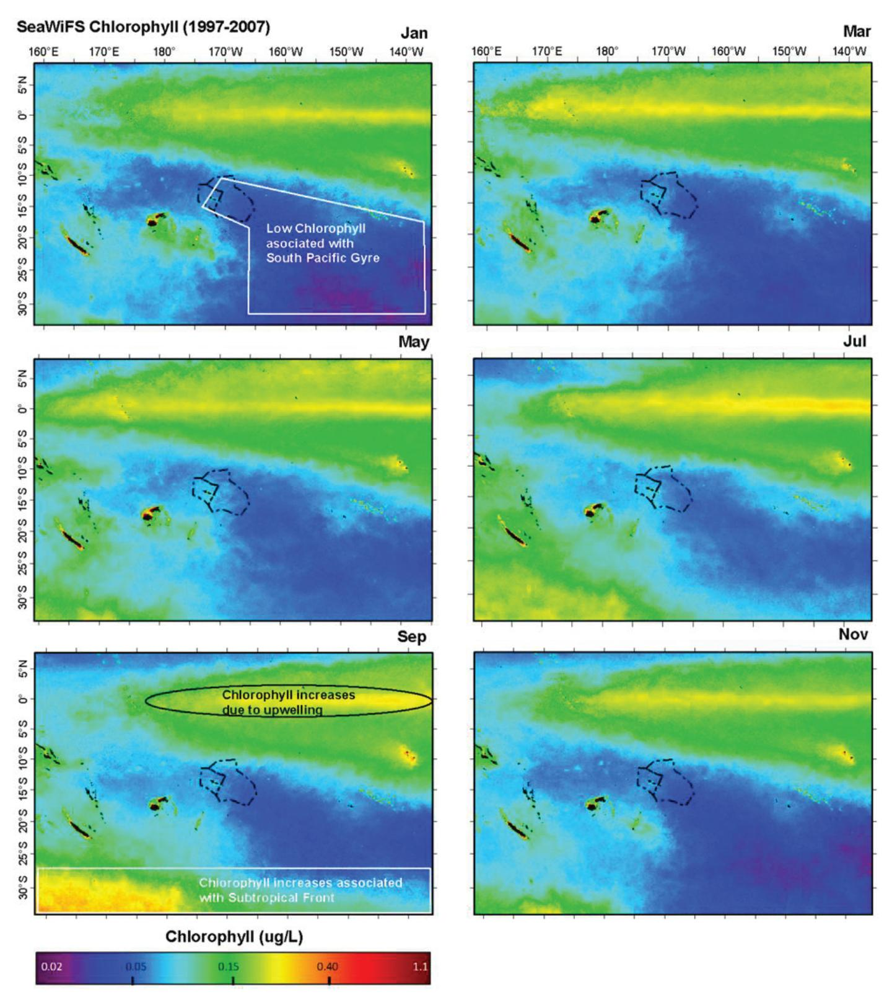

**Figure 2.11.** Chlorophyll concentration estimated from the SeaWiFS satellite. Monthly averages are based on the years 1998 to 2007. Odd numbered months are displayed. EEZs of Samoa and American Samoa are outlined in the center of each map.

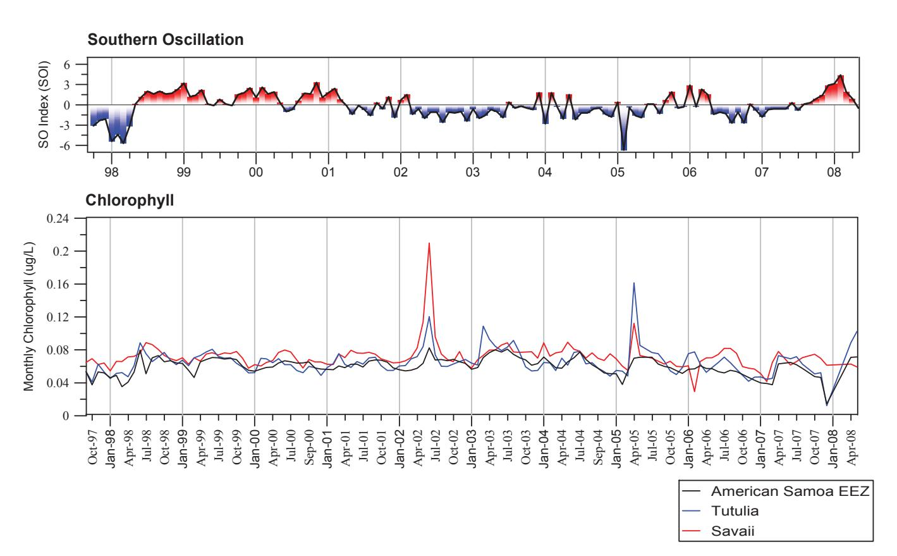

**Figure 2.12.** Chlorophyll concentrations estimated from SeaWiFS for the years 1997 to 2005. Values are monthly averages for the EEZ of American Samoa (black), waters adjacent to Tutuila (blue), and Savai'i (red). Southern Oscillation Index (SOI) values for the same time period are from NOAA/NWS. El Niño conditions are represented in dark blue with strong negative SOI values. La Niña conditions are represented by orange with strong positive values.

highlighted in regional plots for June 2002 and April 2005 (Figure 2.13). These episodic events are generally not associated with large-scale climatic phenomenon. It is speculated that these chlorophyll anomalies are the result of increased eddy activity inside the EEZ (Barber et al. 1996, Foley et al. 1997, Strutton et al. 2001). Enhanced westward circulation of the SEC on the north side of the EEZ and eastward circulation of the SECC during the fall-winter (March-June) time frame could promote eddies and meanders (see Chapter 3). The resulting mixing could result in areas of localized nutrient enrichment and heightened chlorophyll (Domokos et al. 2007). It is also possible that topographically induced upwelling around the larger islands of the archipelago could cause the elevated chlorophyll signature (Brainard and others 2008). April is a time of high flow for the SECC, which flows directly across the Samoan Archipelago during some years and can be deflected by the larger islands. Another possibility is that rainfall runoff and associated terrestrial and human nutrient inputs at these times elevated the chlorophyll levels around the larger islands in the archipelago that have greater land area and higher human populations (Brainard and others 2008).

Water samples collected within 1-2 km around the islands and atolls of American Samoa during February/ March 2006 were analyzed for chlorophyll and nutrient concentrations by NOAA CRED (Brainard and others 2008). These nearshore samples typically showed an order of magnitude higher concentration of chlorophyll than those measured by satellite farther offshore reported here. Nearshore water samples for the largest and most populated island Tutuila, showed the highest and most variable concentrations of chlorophyll (average of 0.7 µg/L) with lower values for Ofu, Olosega, and Ta'u (averages of 0.3-0.4 µg/L) and lower still values for Rose and Swains atolls (0.2-0.25 µg/L).

Despite some measureable seasonality and episodic, but very small, spikes in chlorophyll concentration, the oceanic waters of Samoan EEZs are nutrient poor and have low biological productivity year round. This results in clear water, deep light penetration, and conditions suitable for growth of the coral reef ecosystems that characterize the region.

# **Sea surface height anomalies**

Anomalies in sea surface height are best understood in the context of tides and sea level trends. A positive trend in mean sea level of 2.07 mm/ year ± 0.90 (95% CI) is evident at Pago Pago from 1948 to the present (http://tidesandcurrents. noaa.gov/sltrends) (Figure 2.14). Sea level is also monitored in the region by the South Pacific Sea Level and Climate Monitoring Project (SPSL-CMP), which operates a SEAFRAME (Sea Level Fine Resolution Acoustic Measuring Equipment) gauge which measures sea level in Apia, Samoa. Data from this gauge shows a similar if not higher rate of sea level rise (4.9 mm/year) for the period 1993-2007 although a longer time series of data is needed to establish a more reliable estimate at this site (SPSLCMP 2007). Tides in the archipelago consist of two highs and lows daily with a mean range of 2.51 ft as measured at Pago Pago (http:// tidesandcurrents.noaa.gov/). Seismic events and the associated tsunami signals are also recorded on these instruments.

The Archiving, Validation and Interpretation of Satellite Data in Oceanography (AVISO) Program merges sea surface height data from the Topex/ Poseidon (T/P), Jason-1/2, ERS-1/2 and ENVISAT satellites. Sea Surface Height Anomaly (SSHA) refers to vertical deviations from expected mean sea level. To calculate SSHAs, a map of estimated mean sea level is created from T/P data for the

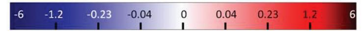

**Figure 2.13.** Chlorophyll anomalies estimated from SeaWiFS for June 2002 and April 2005. EEZs of Samoa and American Samoa are outlined in the center of each map.

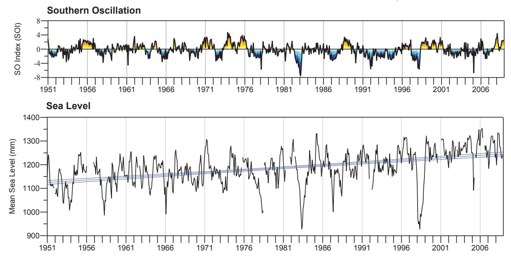

**Figure 2.14.** Sea level values for Pago Pago, American Samoa from 1948 to 2008. Values are monthly averages. Data are from U. Hawaii Sea Level Center/National Oceanographic Data Center Joint Archive for Sea Level. Southern Oscillation Index (SOI) values for the same time period are from NOAA/NWS. El Niño conditions are represented in dark blue with strong negative SOI values. La Niña conditions are represented by orange with strong positive values.

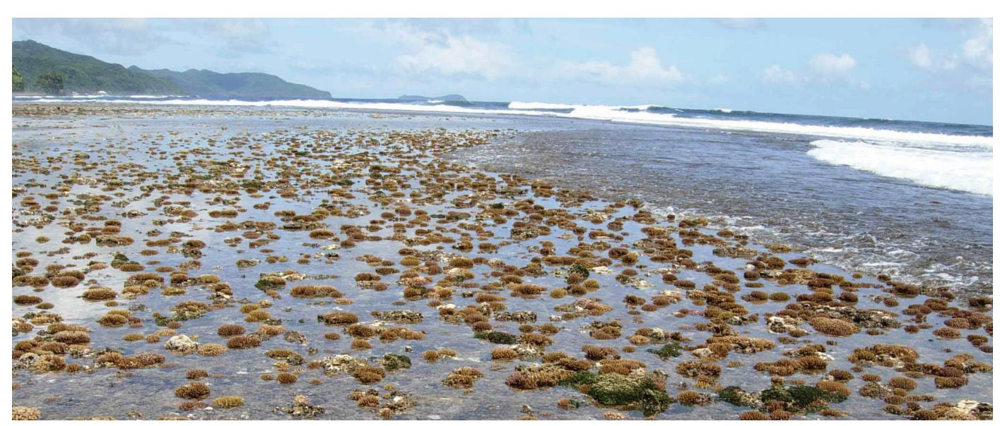

**Image 6.** Exposed corals on a reef flat, southern Tutuila. Photo: D. Fenner, ASDMWR.

period January 1993 to December 1999 at a global scale. All deviations in sea surface height are presented in reference to mean sea level during this period (http://www.aviso.oceanobs.com/fileadmin/documents/data/ tools/hdbk\_duacs.pdf). Observed deviations from this mean sea level were plotted and evaluated in several ways for the study region. A 15 year dataset (1992-2006) of monthly mean SSHAs was obtained from AVISO and used to discern broad patterns of sea level fluctuation in the South Pacific, place SSHAs of the Samoan EEZs into context, depict seasonal and inter-annual patterns of SSHAs in the Samoan EEZs, and identify unusual or extreme observations of SSHAs and discuss their relevance to coral reef ecosystems.

The entire Samoan Archipelago experiences similar changes in SSHA during a typical annual cycle. Anomalies are highest in winter (May-August) and lowest in summer (December-January) and have a range of only ~4 cm (Figure 2.15). Note that all SSHAs in Figure 2.16 are positive and expressed relative to the global mean sea level calculated for 1993-1999. Maps of SSHA averaged by month reveal somewhat predictable spatial variations in sea level in the region. Elevated sea surface height anomalies on the northern side of the EEZ around Swains Islands (~ 5°S) are noted in March (circled red; Figure 2.16). A general southward shift of this anomaly across the archipelago in the band of elevated heights can be seen from March to May.

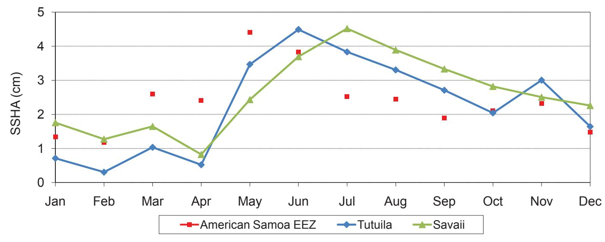

**Figure 2.15.** Sea surface height anomalies from AVISO are presented as an average annual cycle. Monthly averages are based on the years 1993 to 2006. Colors denote average values for the EEZ of American Samoa (red), waters adjacent to Tutuila (blue), and Savai'i (green). Note that the scale is relative to the global mean sea level for the period 1993 to 1999.

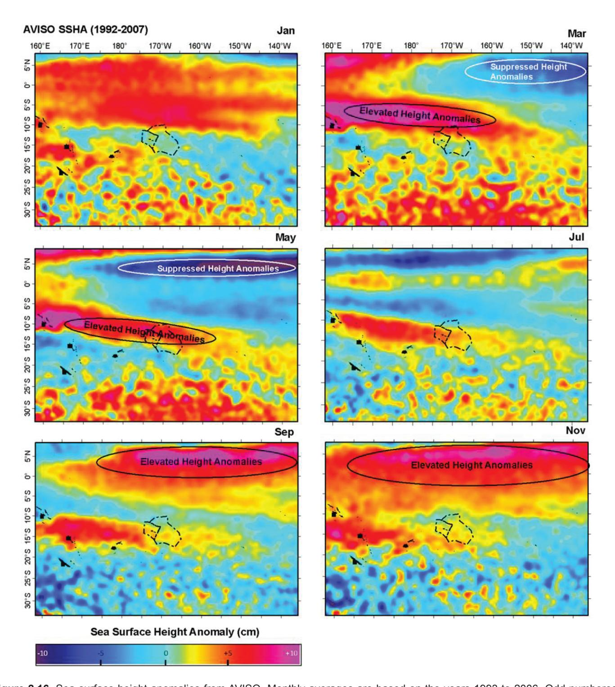

**Figure 2.16.** Sea surface height anomalies from AVISO. Monthly averages are based on the years 1993 to 2006. Odd numbered months are displayed. EEZs of Samoa and American Samoa are outlined in the center of each map.

These elevated heights represent the signature of the SEC and SECC and their corresponding seasonal shifts (Domokos et al. 2007). These SSHAs and currents dissipate and become less intense and defined from winter through spring (also see Currents Section).

When monthly values are not averaged across years and instead are shown as a 15 year time series, several key patterns emerge. SSHAs in the Samoan Archipelago have a significant response to the Southern Oscillation (Alory and Delcroix 1999). A major negative height anomaly occurred in the Samoan EEZs during the strong El Niño of 1998 (SPSLCMP 2007). Sea surface heights in the EEZ averaged 25 cm below normal

**Figure 2.17.** Sea surface height anomalies from AVISO for the years 1993 to 2006. Values are monthly averages for the EEZ of American Samoa. Southern Oscillation Index (SOI) values for the same time period are from NOAA/NWS. El Niño conditions are represented in dark blue with strong negative SOI values. La Niña conditions are represented by orange with strong positive values.

during March-April, 1998 (Figure 2.17). This event was recorded by sea level gauges widely in the South Pacific (SPSLCMP 2007). Another noteworthy event correlated with an El Niño occurred during March of 2005, where vertical sea surface heights dropped 10 cm below mean sea level in the Samoan Archipelago. The very broad spatial extent of these negative height anomalies, well beyond the Samoan EEZs, is evident in SSHA plots for March 1998 (and see SPSLCMP 2007) and 2005 in comparison to the same month in other years (circled blue; Figure 2.18). An east-west band of lower SSHA, at its largest extent in March, affected the South Pacific from the central Cook Islands to the Solomon Islands, a distance of ~3,000km. The area where sea level is most affected by El Niño corresponds closely with the SPCZ (Figure 2.1), because of changes in the strength and position of the Trade Winds and the SEC (Figure 2.3) (SPSLCMP 2007). Longterm sea level data for Pago Pago, American Samoa confirmed the SSHA events depicted in satellite altimetry in 1998 and 2005 but also revealed sea level drops in 1954, 1958, 1966, 1973, 1978, 1983, 1987, and 1992 (Figure 2.14). All of these low sea level anomalies correspond to documented El Niño events (Chowdhury et al. 2007). Based on this time series, low water conditions can be expected in the Samoan EEZs every 4-8 years with the frequency of the anomalies being directly related to the timing of negative SOI values with greatest height anomaly values occurring roughly eight months behind the SOI (Alory and Delcroix 1999). To determine if the magnitude of sea level drop was correlated with the strength of the El Niño (SOI) a linear regression of SSHA versus SOI was conducted. For every documented El Niño event since 1954, the lowest SOI (standardized) value observed was obtained from the NOAA's Climate Prediction Center (http://www. cpc.noaa.gov/). For each El Niño event, the corresponding maximum deviation from monthly mean sea level observed at Pago Pago (station 1770000) was obtained from NOAA's Center for Operational Oceanographic Products and Services (http://tidesandcurrents.noaa.gov). The results of the regression indicate a significant positive relationship between magnitude of negative sea level anomalies and El Niño strength (p < 0.001, R2 =0.63, |sea level deviation|=0.034 + 0.081\*SOI) (Figure 2.19), emphasizing the strong ocean- atmospheric interconnections for the region. This corroborates a lag correlation analysis that found a value of 0.58 between SOI and height anomalies at eight months following SOI minima (Alory and Delcroix 1999). Figure 18. Sea surface height anomalies from AVISO for the years 1993 to 2006. Values are monthly averages for the EEZ of American Samoa American Samoa. Southern Oscillation Index (SOI) Oscillation Index values for the same time period are from NOAA/NWS. El Niño conditions are represented in dark blue with strong negative SOI values. La Niña conditions are represented by orange with strong positive values.

The deviations from mean sea level reported here may at first seem to be of such low magnitude that they have little significance to coral reef ecosystems. The maximum deviation observed was for sea level to be ~30 cm lower than the expected monthly average. In fact however, when coupled with the right environmen-

**Figure 2.18.** Sea surface height anomalies from AVISO during the month of March for the years 1993 to 2006. EEZs of Samoa and American Samoa are outlined in the center of each map.

tal conditions, these low sea level events can have a major impact on coral communities of reef flats. Reef flats make up an extensive component of the coral ecosystems around most of the islands in the Samoan Archipelago. The vertical growth limit of corals on reef flats is closely tied to the height of low tides. Coral colonies in the reef flat zone have flattened tops that clearly demarcate water depths suitable for growth and survival during average SSH conditions. Coral colonies and branches within the same colony are observed to achieve a remarkably uniform vertical growth of within 1-2 cm. An anomalous drop in sea level 30 cm below the lowest tide that the reef flat corals have established as their growth limit has indeed resulted in exposure of corals and fatal conditions for large areas of the reef flat.

A massive reef flat mortality event during which up to 84% of corals died due to sea surface height anomalies and the corresponding "extreme low tides" was documented by researchers in American Samoa in 1998 (Alison Green, unpublished data). Locally, Samoans refer to such events as "kaimasa", a term related to the odor from decaying coral. For an exposure event to occur, a low tide must be present at the same time as a low sea surface height anomaly. Factors reducing sea surface height documented by this report include inter-annual events associated with documented El Niño cases (~-30 cm magnitude) and seasonal patterns (~-4 cm magnitude). Severity and extent of the event next depends on additional factors most

**Figure 2.19.** Linear regression of maximum monthly sea level deviation versus SOI during El Niño events since 1954. p < 0.001, R²=0.63, |sea level deviation|=0.034 + 0.081\*|SOI|

likely related to incident light, winds, and waves. High solar radiation as measured by low cloud cover and high sun angle heats and desiccates corals exposed during periods of low sea surface height. Calm seas prevent wave swash from regularly covering, moistening, and cooling exposed reef flats. When all, or some critical number and intensity of these conditions are in phase, reef flat exposure and coral mortality could result. Satellite images presented here indicate that low sea surface height events can affect vast areas of the Pacific (Figure 2.18). Understanding and predicting the periodicity, extent, and severity of such events should be a focus of future research to inform coastal planning for reef flat habitats.

#### CONCLUSIONS

The islands and atolls of Samoa and American Samoa are characterized by small seasonal fluctuations in ocean conditions and often much larger multiyear fluctuations in response to larger climatic cycles such as ENSO. The major source of variability is seasonal for winds, waves, and SST whereas chlorophyll and sea surface height are affected more by interannual processes (Alory and Delcroix 1999). Nearly all aspects of ocean climate for the Samoan Archipelago vary much more significantly by latitude than by longitude. As expected, most variables examined here demonstrate that Samoa and American Samoa lie in essentially identical ocean climates. Swains Island, located in the northern extremity of the American Samoa EEZ and not derived from the same volcanic hot spot as the Samoan island chain, is affected by slightly different oceanic or atmospheric features than the rest of the archipelago depending on the year. This is influenced primarily by the latitudinal shifts in features such as the South Pacific Convergence Zone, South Equatorial Current, and the South Equatorial Counter Current.

**Image 7.** Flat topped coral head. Photo credit: M. Anderson.

Overall, the Samoan Archipelago lies in a region with relatively stable oceanic conditions compared to areas to the north and south. The Archipelago is generally unaffected by the more dynamic ocean fluctuations such as subtropical sea surface temperature fronts that occur farther south and equatorial upwelling to the north. This is demonstrated through time series plots of SST at the intersection of 170° W longitude (the approximate boundary between Samoa and American Samoa) and 0°, 5° S, 10° S, 15° S, 20° S, 25° S, and 30° S latitude (Figure 2.20). The Samoan EEZs lie roughly between 10 and 17° S latitude. The SST in this region has a much smaller range of values, fewer extreme fluctuations, and less interannual variability than SST observed at higher or lower latitudes. This relative stability of the Samoan coral reef environment is worth considering in the context of reef resiliency. The relative constancy of conditions may be among the factors that have allowed the very long-term survival and growth of some of the largest individual hermatypic coral colonies in the world such as those located off the island of Ta'u at the eastern extremity of the archipelago. Some Porites colonies are up to 41 m in circumference and 500-1,000 years old (Brainard and others 2008, Brown et al. 2009). It is important to continue monitoring the oceanic characteristics of the region in response to global climate change (Chase and Veitayaki 1992, US EPA 2007, Vecchi and Soden 2007, Young 2007, Barshis et al. 2010). The low chlorophyll and biological productivity values associated with the South Pacific Gyre have recently been shown to be expanding at a rate of 1.4% per year (Polovina et al. 2008). ENSO activity and characteristics will continue to affect Samoan sea levels, the eastward expansion of the warm water pool, and long-term precipitation patterns in the region (Vecchi and Wittenberg 2010). Sea level rise has obvious implications to a human population already crowded into a narrow and often low lying coastal zone (Chase and Veitayaki 1992, Coral Reef Advisory Group 2007). Increasing water temperatures pose a serious threat to corals already living near their thermal tolerance (Craig et al. 2001, Barshis et al. 2010). Given that the reefs of the archipelago have developed in a region with relatively stable conditions, oceanic anomalies or trends exacerbated by climate change may have greater affects on Samoan reefs than in regions adapted to such perturbations (US EPA 2007, Barshis et al. 2010).

**Figure 2.20.** Sea Surface Temperature from CoRTAD at the intersection of 170° W longitude (the approximate boundary between Samoa and American Samoa) and 0°, 5° S, 10° S, 15° S, 20° S, 25° S, and 30° S latitude respectively.

### **AcKnOWledGeMentS**

The authors wish to thank the following individuals for contributing valuable discussions, data, general information and review comments to drafts of this material: Kelley Anderson (The Climate Foundation), Russell Brainard (NOAA/NMFS/PIFSC/CRED), Jamison Gove (NOAA/NMFS/PIFSC/CRED), Alison Green (The Nature Conservancy), Clare Shelton (Coral Fellow, Coral Reef Advisory Group, American Samoa Department of Commerce), Oliver Vetter (NOAA/NMFS/PIFSC/CRED), and Phil Wiles (Oceanographer, American Samoa EPA).

### **reFerenceS**

Alory, G. and T. Delcroix. 1999. Climatic variability in the vicinity of Wallis, Futuna, and Samoa islands (13°-15° S, 180°- 170° W). Oceanologica Acta 22: 249-263.

Barber, R.T., M.P. Sanderson, S.T. Lindley, F. Chai, J. Newton, C.C. Trees, D.G. Foley, and F.P. Chavez. 1996. Primary productivity and its regulation in the equatorial Pacific during and following the 1991-92 El Nino. Deep-Sea Research II 43: 933-970.

Barshis, D.J., J.H. Stillman, R.D. Gates, R.J. Toonen, L.W. Smith, and C. Birkeland. 2010. Protein expression and genetic structure of the coral *Porites lobata* in an environmentally extreme Samoan back reef: does host genotype limit phenotypic plasticity? Molecular Ecology 19: 1705-1720.

Barstow, S.F. and O. Haug. 1994. The wave climate of Western Samoa. SOPAC Technical Report 204. 34 pp.

Brainard R., and 25 others. 2008. Coral reef ecosystem monitoring report for American Samoa: 2002-2006. NOAA Special Report NMFS PIFSC. 472 pp.

Brown, D.P., L. Basch, D. Barshis, Z. Forsman, D. Fenner, and J. Goldberg. 2009. American Samoa's island of giants: massive *Porites* colonies at Ta'u island. Coral Reefs 28: 735.

Chase, R. and J. Veitayaki. 1992. Implications of Climate Change and Sea Level Rise for Western Samoa. United Nations Environmental Project. Apia, Western Samoa. 43 pp.

Chowdhury, M.R., P.S. Chu, and T.A. Schroeder. 2007. ENSO and seasonal sea-level variability: A diagnostic discussion for the U.S. affiliated Pacific islands. Theoretical and Applied Climatology. 88: 213-224.

Coral Reef Advisory Group. 2007. Potential Climate Change Impacts to American Samoa. February 12, 2007. American Samoa Governors Coral Reef Advisory Group. 8 pp.

Craig, P., C. Birkland, and S. Belliveau. 2001. High temperatures tolerated by a diverse assemblage of shallow-water corals in American Samoa. Coral Reefs 20: 185-189.

Craig, P. (editor). 2009. Natural history guide to American Samoa. 3rd Edition. National Park of American Samoa, Department of Marine and Wildlife Resources, and American Samoa Community College. Pago Pago, American Samoa. 131 pp.

Domokos, R., M.P. Seki, J.J. Polovina, and D.R. Hawn. 2007. Oceanographic investigation of the American Samoa albacore (Thunnus alalunga) habitat and longline fishing grounds. Fisheries Oceanography 16: 555-572.

Dandonneau, Y., P.Y. Deschamps, J.M. Nicolas, H. Loisel, J. Blanchot, Y. Montel, F. Thieuleux, and G. Becu. 2004. Seasonal and interannual variability of ocean color and composition of phytoplankton communities in the North Atlantic, equatorial Pacific and South Pacific. Deep-Sea Research II 51: 303-318.

Fenner, D., M. Speicher, S. Gulick, and 35 others. 2008. The State of Coral Reef Ecosystems of American Samoa. Pp. 307-351. In: The State of Coral Reef Ecosystems of the United States and Pacific Freely Associated States: 2008. Waddell, J.E. and A.M. Clarke (eds.). NOAA Technical Memorandum NOS NCCOS 73. NOAA/NCCOS Center for Coastal Monitoring and Assessment. Biogeography Team. Silver Spring, MD. 569 pp.

Fisk, D. and C. Birkeland. 2002. Status of coral communities on the volcanic islands of American Samoa. Department of Marine and Wildlife Resources, Government of American Samoa. Pago Pago, American Samoa. 135 pp.

Foley, D.G., T.D. Dickey, M.J. McPhaden, R.R. Bidigare, M.R. Lewis, R.T. Barber, S.T. Lindley, C. Garside, D.V. Manov, and J.D. McNeil. 1997. Longwaves and primary productivity variations in the equatorial Pacific at 0, 140 W. Deep Sea Research II 44: 1801-1826.

Glynn, P.W. and L. D'Croz. 1990. Experimental evidence for high temperature stress as the cause of El Niño coincident coral mortality. Coral Reefs 8: 181-191.

Goreau, T.J. and R. Hayes. 1994. Survey of coral reef bleaching in the South Central Pacific during 1994: Report to the International Coral Reef Initiative. Global Coral Reef Alliance. Chappaqua, New York. 201 pp.

Halpin, P.M., P.T. Strub, W.T. Peterson, and T.M. Baumgartner. 2004. An overview of interactions among oceanography, marine ecosystems, climatic and human disruptions along the eastern margins of the Pacific Ocean. Revista Chilena de Historia Natural 77: 371-409.

Luick, J. 2000. Seasonal and interannual sea levels in the western Equatorial Pacific from Topex/Poseidon. Journal of Climate 13: 672-676.

McClain, C.R., S.R. Signorini, and J.R. Christian. 2004. Subtropical gyre variability observed by ocean-color satellites. Deep-Sea Research Part II 51: 281–301.

Merrill, J.T. 1989. Atmospheric long range transport to the Pacific Ocean. Chemical Oceanography 10: 15-50.

Militello, A., N.W. Scheffner, and E.F. Thompson. 2003. Hurricane - induced stage-frequency relationships for the Territory of American Samoa. Coastal and Hydraulics Laboratory. Technical Report CHL-98-33 Revised, 226 pp.

Polovina, J.J., E. Howell, D.R. Kobayashi, and M.P. Seki. 2001. The transition zone chlorophyll front, a dynamic global feature defining migration and forage habitat for marine resources. Progress in Oceanography 29:1670-1685.

Polovina, J.J., E. Howell, and M. Abecassis. 2008. Ocean's least productive waters are expanding. Geophysical Research Letters. 35:L03618, doi:10.1029/2007GL031745, 2008.

Qiu, B. and S. Chen. 2004. Seasonal modulations in the eddy field of the South Pacific Ocean. Journal of Physical Oceanography 34: 1515-1527.

Roeber, V., Y. Yamazaki, and K.F. Cheung. 2010. Resonance and impact of the 2009 Samoa tsunami around Tutuila, American Samoa. Geophysical Research Letters 37:L21604 doi: 10.1029/2010GL044419.

Selig, E.R. 2008. The Coral Reef Temperature Anomaly Database (CoRTAD) - Global, 4 km, Sea Surface Temperature and Related Thermal Stress Metrics for 1985-2005 (NODC Accession 0044419): University of North Carolina (UNC) – Chapel Hill. NOAA National Oceanographic Data Center, Silver Spring, Maryland.

SPSLCMP (South Pacific Sea Level and Climate Monitoring Project). 2007. Pacific Country Report on Sea Level and Climate: Their Present State, Samoa. South Pacific Sea Level and Climate Monitoring Project. http://www.bom.gov.au/ pacificsealevel/ 36 pp.

Strutton, P.G., J.P. Ryan, and F.P. Chaves. 2001. Enhanced chlorophyll associated with tropical instability waves in the equatorial Pacific. Geophysical Research Letters 28: 2005-2008.

Tausa, N. and J. Samuelu. 2004. Summary report on current status of coral reefs in Samoa after Cyclone Heta. Fisheries Division, Ministry of Agriculture and Fisheries. Apia, Samoa 5 pp.

Timmermann, A., J. Oberhuber, A. Bacher, M. Esch, M. Latif, and E. Roeckner. 1999. Increased El Niño frequency in a climate model forced by future greenhouse warming. Nature 398: 694-697.

Tolman, H.L. 2010. WAVEWATCH III (R) development best practices Ver. 0.1. NOAA / NWS / NCEP / MMAB Technical Note 286, 19 pp.

Tomczak, M. and J.S. Godfrey. 2003. Regional Oceanography: an Introduction. 2nd improved edition. Daya Publishing House, Delhi. 390 pp.

Treml, E.A., P.A. Halpin, D.L. Urban, and L.F. Pratson. 2008. Modeling population connectivity by ocean currents, a graph theoretic approach for marine conservation. Landscape Ecology 23: 19-36.

US EPA (United States Environmental Protection Agency). 2007. Climate change and interacting stressors: Implications for coral reef management in American Samoa. Global Change Research Program, National Center for Environmental Assessment, Washington DC; EPA/600/R-07/069 http://www.epa.gov/ncea 61 pp.

Vecchi, G.A. and B.J. Soden. 2007. Global Warming and the Weakening of the Tropical Circulation. Journal of Climate 20: 4316-4340.

Vecchi, G.A. and A.T. Wittenberg. 2010. El Niño and our future climate: where do we stand? Wiley Interdisciplinary Reviews: Climate Change. DOI 10.1002/wcc.33.

Young, W.J. 2007. Climate risk profile for Samoa. Samoa Meteorology Division. 26 pp.