## **Ocean Currents and Larval Transport Among Islands and Shallow Seamounts of the Samoan Archipelago and Adjacent Island Nations**

Matthew S. Kendall1 , Matthew Poti2 , Timothy Wynne3 , Brian P. Kinlan2 and Laurie B. Bauer2

#### **INTRODUCTION**

The biogeography of coral reef ecosystems in the Samoan Archipelago is shaped in part by the ocean currents which carry the eggs and larvae of marine biota to and from the islands and seamounts in the region (Craig and Brainard 2008). Many of the marine organisms that inhabit the coral reef ecosystems of the region posses a pelagic larval phase. This includes bony fish, broadcast spawning corals, giant clams, palolo worms, crown-of-thorns starfish and a diversity of other fauna that are subject to transport by ocean currents for at least some portion of their larval life. The connectivity among island populations that results from larval transport is important because it means that the ecology, conservation, and management of each place in the Samoan Archipelago is intricately linked to and dependent on decisions made at other locations (Gaines et al. 2007, Christie et al. 2010). Even when man-

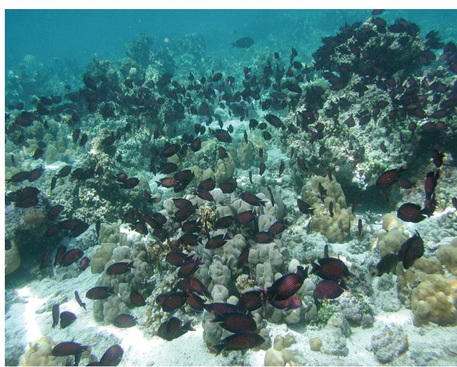

**Image 8.** Mass recruitment event of *Ctenochaetus striatus*. Photo credit: Peter Craig, NPS.

agement efforts are focused on particular sites within the archipelago, information on connectivity patterns via larval exchange is necessary to achieve management and conservation planning goals (Gaines et al. 2007, Cowen and Sponaugle 2009, Costello et al. 2010). This chapter provides a detailed characterization of ocean currents in and around the archipelago and discusses their potential influence on important sources of larvae for maintaining Samoan reef ecosystems, and the contribution of Samoan reefs to population replenishment throughout the regional ecosystem.

There has been a recent proliferation of studies on reef connectivity and MPA resilience (Almany et al. 2009, Jones et al. 2009, McCook et al. 2009, Steneck et al. 2009, Sale et al. 2010). It has become clear that planning a regional network of MPAs that are resilient to disturbance, whether natural or anthropogenic, is dependent upon an understanding of larval transport (Gaines et al. 2003, Shanks et al. 2003, Botsford et al. 2009, Planes et al. 2009). Sufficient larval sources must be protected and spaced appropriately such that network sites can successfully repopulate between disturbance events. In addition, the fates of larvae produced at network sites should be considered to understand the role of protected areas in maintaining the broader ecosystem (Botsford et al. 2009, Christie et al. 2010, Costello et al. 2010).

A variety of factors can affect the transport of larvae among islands. Most obviously it is necessary to understand the speed, direction, and seasonality of the ocean currents by which larvae are transported. It is also necessary to understand how aspects of the larvae themselves can affect their transport. Size of source populations, timing of spawning, duration of the larval period, daily mortality rates, sensory and swimming capabilities, and even random chance arising from the turbulent nature of ocean flows can all affect the probability that larvae will be transported from a source island to a particular destination (Siegel et al. 2008, Cowen and Sponaugle 2009).

1 NOAA/NOS/NCCOS/CCMA Biogeography Branch

2 NOAA/NOS/NCCOS/CCMA/Biogeography Branch and Consolidated Safety Services, Inc., Fairfax, VA, under NOAA Contract No. DG133C07NC0616

3 NOAA/NOS/NCCOS/CCMA Coastal Oceanographic Assessment Status and Trends Branch

The goals of this chapter were to:

- 1. Quantify and describe regional ocean currents in the Samoan Archipelago,
- 2. Model the potential transport pathways of virtual larvae among island sources throughout the region,
- 3. Identify key sources and destinations of larvae for each island, and,
- 4. Quantify the influence of various combinations of larval life history characteristics (e.g. larval longevity, daily mortality rate) on those connections.

To achieve these goals, we have combined observational data on ocean currents with simulations of larval dispersal in a three-dimensional regional ocean model.

#### **METHODS**

The study region was centered on the islands and seamounts of the Samoan Archipelago but also included surrounding island nations of Tokelau, western Cook Islands, Niue, Tonga, and Wallis Island to understand regional connectivity (Figure 3.1). Two primary techniques were used to quantify currents and larval connections among islands and shallow seamounts: observational ocean current data from passive drifters and transport simulations of virtual larvae from a three-dimensional hydrodynamic model.

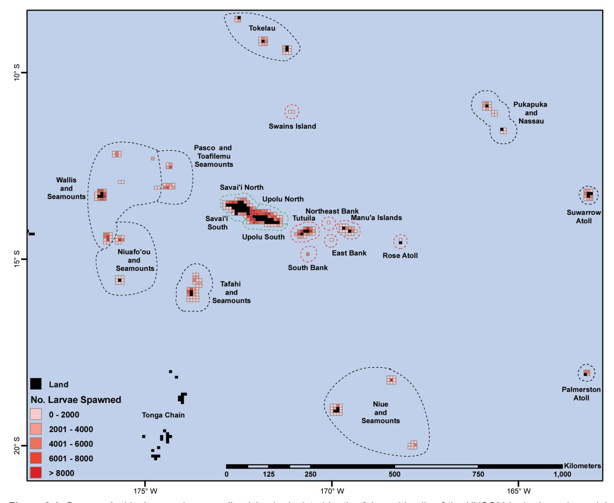

**Figure 3.1.** Samoan Archipelago and surrounding islands depicted by the 9 km grid cells of the HYCOM hydrodynamic model. Dotted lines denote separate islands, seamounts, or island groups clustered for analysis. Red lines denote larval sources from American Samoa. Green lines denote sources from Samoa. Black lines denote all other sources.

The NOAA Global Drifter Program uses satellites to track an extensive array of passively drifting drogues deployed at 15 m depth (NOAA Coral Reef Ecosystem Division [CRED], NOAA Global Drifter Program [GDP]- Surface Drifter Program 2010). Drifter position, speed, and heading are recorded every six hours and provide a detailed record of actual surface currents. These data were used to describe patterns of surface currents, ground truth the current vectors of the hydrodynamic model, and select realistic parameters for modeling larval transport.

The Hybrid Coordinate Oceanographic Model (HYCOM) is a three dimensional hydrodynamic model (Bleck and Boudra 1981, Bleck and Benjamin 1993, Halliwell et al. 1998, Christie et al. 2010) with a horizontal resolution of 1/12 degree (approximately 9 by 9 km grid cell size), a 1 day time step, and is available for the period 2004-2009 in the study area. The surface/mixed layer of HYCOM (surface to ~10 m depth) was used to map the currents in the study area and to model the movement of passive particles or "virtual larvae" of corals, invertebrates and reef fish. Current vector data were downloaded from the HYCOM consortium (http://opendap.org/download). The 9 km model resolution is not sufficient to capture localized eddy and convection currents very close to shore (Swearer et al. 1999, Harlan et al. 2002) and we therefore used it only to evaluate broader scales of larval transport among islands. Islands are represented in HYCOM as grid cells with null current vectors (black cells in Figure 3.1). These null cells were used as a land mask and blocked larval movement.

The drifter data and hydrodynamic model were first used to describe the currents in and around the study area and then to model interisland connectivity of virtual coral and fish larvae with realistic parameters. Our general approach was to evaluate a range of model parameters that have the potential to affect dispersal (Leis 2007) rather than specifying model parameters for the life history and behaviors of a particular species. We instead examined how a wide range of combinations of larval durations, precompetency periods, swimming capabilities, and mortality rates reported in the scientific literature may impact the connectivity of Samoan reef ecosystems.

### **HYCOM Validation**

Modeled currents from HYCOM were validated by comparing them with drifter data on daily and monthly timescales. To evaluate daily current vectors, latitudinal and longitudinal drifter velocities were compared to the corresponding model velocities using linear regression at 100 randomly chosen drifter dates/positions during a randomly chosen model year (2004) (e.g. Rudorff et al. 2009). To evaluate the modeled current vectors on longer timescales, average monthly current vectors for every model year were plotted and visually compared to the tracks of drifters present in the study area (216 total) during the corresponding month/year.

#### **General Current Patterns**

To describe seasonal and interannual patterns in ocean currents in the region, average HYCOM monthly current vectors for 2004 to 2009 were plotted at ~36 km resolution. Monthly vector plots at this spatial resolution were suitable for this purpose and showed gradual transitions in the major current patterns. Modeled current vectors (e.g. Figures 3.2-3.3) were visually compared to drifter paths (e.g. Figure 3.4) during the same month/year to qualitatively check model accuracy. In addition, drifter data were analyzed separately to determine the influence of season, El Niño/Southern Oscillation (ENSO), and region within the study area on current heading, speed and potential transport distance. For this analysis, drifter data were categorized into several groupings, 1) winter (June-August) or summer (December-March) seasons with transition months excluded for simplicity, 2) El Niño (2005), La Niña (2008), or neutral years (2004, 2006, and 2007) based on the Southern Oscillation Index, and 3) by position in the study area relative to the typical position of the major currents described for the region. The South Equatorial Current occurs all year throughout the region but is interrupted in the latitudes between 9º S and 12º S by the South Equatorial Counter Current during the summer. The influence of these variables on drifter heading, speed, and transport distance were evaluated using ANOVA, multiple means comparisons, and histograms to understand the significant differences and sources of variability in currents among seasons, years, and positions in the study area. Median bearing and mean speed were calculated for each drifter by season, ENSO status, and region (South Equatorial Current or South Equatorial Counter Current) and used as response variables in the ANOVAs. The low number of drifters observations that fell completely within a given season, region, and ENSO year prevented use of the

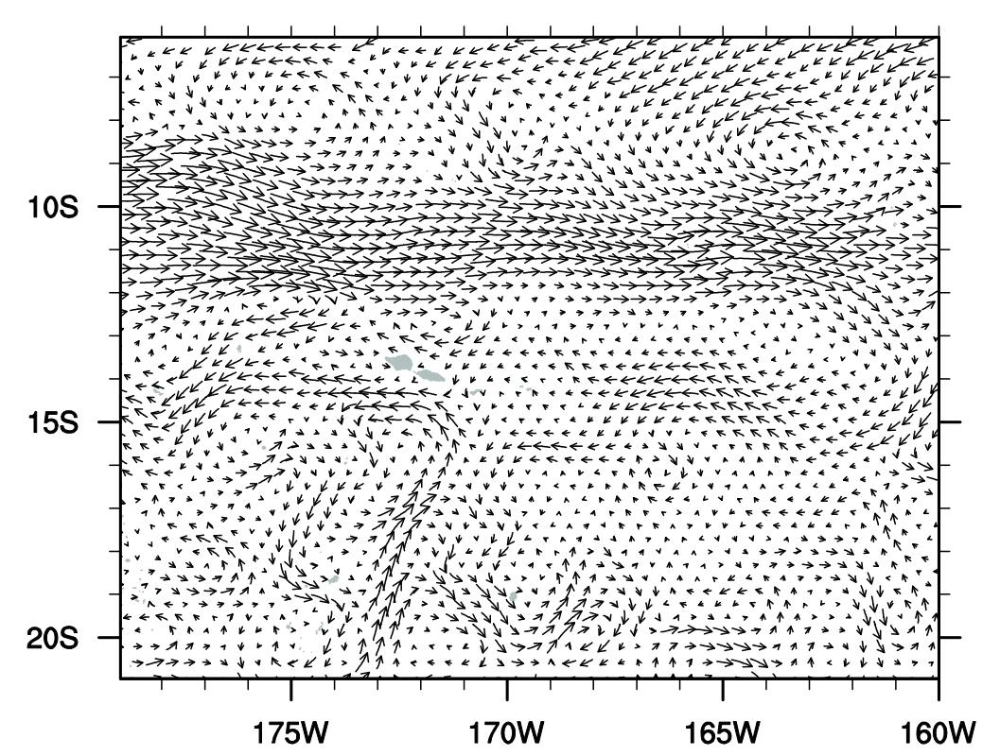

**Figure 3.2.** Example of regional current vectors. Average surface current vectors from HYCOM for February 2004. The South Equatorial Counter Current is evident as eastward vectors between 10 and 12 S.

**Figure 3.3.** Tonga Trench Eddy. This clockwise eddy formed in September through December of 2006, 2008, and 2009. Average current vectors for April 2009.

Figure 3.4. Example of typical drifter paths. January 2007 drifters shown (NOAA Global Drifter Program).

multi-way ANOVA analysis for transport distance. Instead, gross and net transport distances were calculated for all drifters in the study area that were at large for 10, 20, 30, 50, and 100 days respectively, and plotted as means and histograms. Net displacement is simply the straight-line distance between the start and end points of a drifter after a specific number of days whereas gross displacement is the total length of the drifters path (sums of all path segments recorded every six hours).

#### **Larval Sources**

Virtual larvae were started at each of 20 island groups and shallow seamounts in the study area (Figure 3.1; Appendix A). Islands and seamounts very close together were aggregated into larger groups especially at the edges of the study region to simplify and focus presentation of the results on the Samoan Archipelago. Only islands in the northern extent of the Tonga chain and eastern portion of the Wallis chain were included as larval sources since preliminary analysis indicated that most larvae from farther out would quickly leave the study area westward toward Fiji.

Larval production was scaled to the area of the insular shelf (or seamount) with potential coral reef habitat. This was defined as the area from shore to the 150 m isobath and was based on the approximate depth limits of both photic and meso-photic reef communities in the area (Mesophotic Coral Ecosystems 2010, Bare et al. 2010). Initially, a set of 10,000 larvae were placed randomly within each coastal grid cell in HYCOM. This number of larvae was then adjusted based on the proportion of the cell with bottom depths between 0 and 150 m. For example, a cell comprised of 50% land, 20% water deeper than 150 m, and 30% water with depth between 0 and 150 m, was assigned a total of 3000 larvae (30% of 10,000) (Figure 3.1). This provided a very large but computationally reasonable number of virtual larvae scaled to potential area of reef habitat that could be "spawned" or started moving in simulations by HYCOM currents on any date specified.

Fish and corals do not spawn at random positions on the reef as modeled here and, in the case of some fish species, move to areas where currents sweep eggs and larvae rapidly away from coasts to avoid reef based predators. For example, many fish species exhibit a vertical "spawning rush" away from reefs toward the surface and position themselves in habitats conducive to broadcast spawning. Mature surgeon fish in American Samoa are most abundant on points and headlands where strong currents are found (Ochavillo et al. 2011) and spawning can often be observed in reef channels where water flows in a seaward direction as it drains the reef flat (Craig 1998). Such localized currents are not included at the scale of HYCOM and should be studied using models with greater spatial resolution.

#### **Mass spawning events and start dates of larval transport**

Many coral species and other organisms in Independent and American Samoa and nearby Fiji have been observed to spawn 5-7 nights after the full moons in either late October or early November (Mildner 1987, Itano and Buckley 1988, Mildner 1991, Mundy and Green 1996). The presence of coral spawning slicks is used as a cue for harvest of the edible Palolo worm, *Eunice viridis*, (Craig 2009) which is also known to engage in a synchronous spawning event and has a well documented lunar timing in the Samoan Archipelago (Mundy and Green 1996). This annual mass spawning event for coral was the focus of our simulations. Starting dates for each model year were identified as six days after the first full moon to occur after October 12. These dates were 3 November 2004, 23 October 2005, 11 November 2006, 1 November 2007, and 20 October 2008. It is recognized that some spawning can occur across several days or even following successive full moons in October and November. However, preliminary evaluations of the model indicated that transport patterns did not differ substantially when start dates were on successive days or even separated by as much as a month among various phases of the moon, a finding similar to other studies (James et al. 2002) and consistent with time-scales of variation in ocean current patterns within the region.

In addition to the October-November mass spawning event, year round spawning has been observed for several fish species in American Samoa (Craig 1998). A locally important fisheries species, the surgeonfish *Acanthurus lineatus*, has peak spawning in November-January (Craig et al. 1997) which would result in similar transport patterns to those reported here. However, to evaluate the inter-island connectivity associated with year-round spawning, additional start dates and modeling would be required, especially for islands in the region of the strongly seasonal South Equatorial Counter Current described below.

#### **Larval Transport and Model Uncertainty**

Virtual larvae began at random locations within each coastal grid cell and were moved in the direction and distance specified by the corresponding current vectors from HYCOM for that date and grid cell. The General NOAA Operational Modeling Environment (GNOME v 1.3.0) was used to track larvae for all simulations. Diffusion or random variability in larval paths originating from the same location is an important aspect of connectivity studies (Polovina et al. 1999, Cowen et al. 2000, Siegel et al. 2003, Kobayashi 2006, Chiswell and Booth 2008, Treml et al. 2008, Rudorff et al. 2009). GNOME provides both a deterministic "best guess" calculation of larval path that assumes no error in current vectors and also enables a controlled amount of random variability to be applied to vectors at each time step for a more stochastic path. Adding random variability or uncertainty to larval transport results in a cloud of potential pathways even when larvae all start at the same date and grid cell. The cloud has variable density with more larvae occurring along paths with higher probability of occurrence but also regions with fewer larvae that indicate less probable larval paths.

To identify an appropriate level of diffusion/uncertainty, actual drifter paths tracked by satellite were compared to the paths predicted by HYCOM for virtual larvae originating at the same date and location as the drifters. Only drifter segments that began near islands (within ~30 km) were used for this analysis because the goal was to evaluate variability of transport paths originating from these features. A total of 58 drifters (n = 13 NOAA CRED, n = 45 NOAA GDP) met this criterion. The start date and position of drifters from a subset of model years were loaded into HYCOM as starting points for particle drift. To identify an appropriate level of variability in particle drift, separate model runs using 1000 larvae were performed using a range of random error values (10-50%) in current vectors. Model paths were compared to each drifter path for general agreement while recognizing that a given drifter represents only one possible track out of a wide potential distribution that reflects variation in drift. Using only 10% uncertainty rarely produced a probability cloud of the 1000 larvae that included the drifter paths. Using 50% uncertainty nearly always encompassed drifter tracks and provided reasonable clouds of larval pathways which highlighted more likely tracks (those occurring more frequently had greater density) while also depicting less likely, but still possible, pathways. All subsequent model runs were conducted using 50% random error in current vectors at each time step to reflect this realistic level of randomness in larval transport.

## **Precompetency**

Spawned gametes, fertilized eggs and young larvae cannot immediately settle even if they encounter suitable habitat and instead must spend some time developing as plankton. Precompetency is the term used to describe the planktonic phase prior to achieving a body form capable of settlement. For many reef fish species, settlement is documented over a range of

**Image 9.** *A. guttatus* spawning aggregations at dusk. Photo credit: Peter Craig, NPS.

larval ages (e.g. settlement marks recorded on otoliths at 14 to 21 days old). For a wide variety of reef fish species for which reasonable sample sizes are available it is evident that individuals begin to settle once 60-90% of their maximum larval lifespan (see next section: Pelagic Larval Duration) has elapsed (calculated from values in Victor 1986, Thresher et al. 1989, Wellington and Victor 1989, and Junker et al. 2006). Precompetency periods for coral larvae are less known and appear somewhat more variable (Harrison et al. 1984, Wilson and Harrison 1998, Miller and Mundy 2003, Graham et al. 2008, Jones et al. 2009). To simulate this developmental period, virtual larvae in the present study were prevented from settlement until a minimum of 60% of their Pelagic Larval Duration (see next section) was completed.

#### **Pelagic Larval Duration**

Pelagic larval duration (PLD) is defined as the period of development spent in the water column during which larvae are susceptible to transport by ocean currents. For many species, larvae simply die in the plankton at the end of their PLD if they lack a suitable settlement habitat or energy source. PLD is quite varied among coral reef organisms even within the same genus and can be hours, days, weeks, or months (e.g. Bonhomme and Planes 2000, Blanco-Martin 2006, Junker et al. 2006, Graham et al. 2008). Within species there can be considerable variability in PLD as well (Wilson and Harrison 1998, McCormick 1999, Junker et al. 2006) with influences such as water temperature and availability of suitable settlement habitat (McCormick and Molony 1995, Munday et al. 2009). In addition, larvae can shorten or lengthen their competent time in the plankton through various mechanisms such as delaying or partly reversing metamorphosis until a suitable habitat is encountered (McCormick 1999, Richmond 1985), directed swimming faster than ambient currents for some portion of their larval phase (Leis and Carson-Ewart 2003), and entrainment into coastal eddies to avoid extensive offshore transport (Swearer et al. 1999, Harlan et al. 2002, Paris et al. 2007).

Also of note, climate change and the associated rise in sea surface temperatures may accelerate larval development of many species, cause earlier reef seeking behaviors, and even increase larval swimming efficiency (Wilson and Harrison 1998, Munday et al. 2009). All of these factors may serve to shorten PLDs overall, making it important to simulate connectivity over a range of PLD values and shift predictions toward potentially shorter dispersal distances.

Rather than modeling particular species with specific life history parameters, we used a wide range of PLDs. This enables a variety of species and their corresponding PLDs (and changes to PLD due to factors such as climate change) to be considered. We evaluated PLDs of 10, 20, 30, 50, and 100 days which encompasses the range of PLDs expected for a wide variety of the fish and coral species of the Samoan Archipelago and adjacent island nations (e.g. summary tables in Bonhomme and Planes 2000, Blanco-Martin 2006, Graham et al. 2008, Jones et al. 2009). Longer planktonic longevity is possible (e.g. >200 days for some coral species, Graham et al. 2008); however, preliminary analyses revealed that many tracked particles had left the study area after 100 days, and modeled trajectories probably have reduced accuracy for such long periods. Also of note, some species have very short larval period (minutes or hours) and are never subjected to the interisland currents studied here.

#### **Buffer for 'Settlement Zones**'

Fish larvae can sense the reef from some distance away and perform behaviors that can help them reach desirable settlement habitats including vertical migrations into current fields moving toward reefs or simply out-swimming

**Image 10.** *A. triostegus* and *A. guttatus* spawning aggregations at dusk. Photo credit: Peter Craig, NPS.

the ambient currents they are embedded in (Leis 2002, 2006, Gerlach et al. 2007, Leis 2007,). For as much as 50% of their larval phase, some fish larvae may be capable of sustained directional swimming that is sufficient to overcome their treatment as merely passive particles in ocean currents (Leis and Carson-Ewart 2003, Fisher 2005, Leis 2006). Larval fish can probably sense odor plumes from appropriate settlement habitat at distances of several kilometers (Atema et al. 2002, Leis 2006) and orient their movements horizontally or vertically in the water column to increase their chances of reaching settlement habitat. Recent studies show that some reef fish larvae can swim impressive distances on the range of 10-50 km (Atema et al. 2002, Leis 2002), although this swimming could not be intentionally directed toward a reef beyond the sensory zone in which the larvae could detect the reef. Although the precise distance at which fish larvae can begin to orient towards reefs and the effectiveness of this orientation against ambient currents are topics of active debate, it is clear that larvae need not rely exclusively on passive transport in currents to arrive precisely at a distant island and instead need simply to come within a "settlement zone" sufficiently close such that they can sense and swim to the settlement habitat. Consequently, recent researchers have used buffers around islands to represent this "settlement zone" ranging from 1 to >100 km depending on the species under investigation (Lugo-Fernández et al. 2001, James et al. 2002, Cowen et al. 2006, Chiswell and Booth 2008).

In this study, we investigated a range of potential settlement zone distances including 9 km (the resolution of the coastal grid cells in HYCOM), 18 km, and 36 km to accommodate a wide spectrum of organisms and potential sensory and swimming capabilities. A buffer of each distance was calculated using the maximum depth contour for mesophotic reefs around all islands and shallow seamounts and was designated as a settlement zone. If a larvae passed into an island's settlement zone after its precompetency period it was considered to have successfully settled at that island. Preliminary analysis revealed that, while settlement rates were somewhat affected by buffer distance, the spatial patterns of connectivity were relatively unaffected. We therefore display results for only the 18 km settlement zone in this report.

#### **Mortality**

Larval mortality has a significant effect on successful transport especially over long distances and lengthy time periods. Daily mortality rates are affected by environmental conditions and can vary significantly. Cowen et al. (2000) reported a wide range of mortality estimates for fish larvae of 42 species ranging from 3 to 46% per day with a mode of 18%. At these rates it is clear that most larvae will die prior to reaching settlement habitat, especially for small islands or seamounts that don't produce many larvae to begin with. For example, for every 1000 larvae produced at a source, after 20 days in the plankton, approximately 544 would remain if daily mortality were 3%, 19 would remain if mortality were 18%, and less than 1 would remain if mortality were 46%.

In the present study, we investigated the influence of a range of daily mortality rates including 3%, 18%, and 46% to reflect the spectrum of known values (Cowen et al. 2000). For each daily mortality rate, these percentages of the larval population were randomly selected and removed from the larvae remaining at each daily time step.

#### **Calculating Connectivity**

Results are first summarized for the entire study area as connectivity matrices that display the island/seamount sources and destinations of all the virtual larvae tracked in the study. Islands in the southern part of the Tonga and western Wallis Island chains were not modeled as larval sources but were still shown in the connectivity matrices as destinations. For each PLD and mortality rate, we counted the number of simulated larvae released at each source location that travelled to each of the possible destination locations, cumulated over all 5 model years. Matrix cells denote the proportion of larvae from each source (rows) that arrived at a given destination (columns). Rows thus sum to a number <= 100%. The fraction of larvae that are lost (that do not successfully settle at any one of the destinations in our study) is equal to 100% minus the sum of each row. Columns can sum to >100%, because it is possible for a high proportion of the larvae produced at several sources to travel to the same destination. Separate matrices are provided for each combination of PLD and daily mortality rate. Note that connectivity calculated in this way depicts the pattern of larval transport pathways, without considering the variation in number of larvae produced at each source that could occur as a result of large differences in the size of reef populations.

Each of the islands and shallow seamounts within the Samoan Archipelago was examined in detail as a larval source and destination. Each island/seamount was characterized individually using a combination of plots of larval distribution by PLD, three dimensional graphs that display larval retention and how reliant each location is on outside larval sources for each PLD and daily mortality rate, and bar graphs showing larval sources and destinations by location.

#### **RESULTS AND DISCUSSION**

#### **HYCOM Validation**

Current vectors from HYCOM showed good correspondence to actual drifter paths on both short (daily) and long (monthly) timescales. Drifter and model velocities at 100 randomly chosen dates/positions were positively correlated in both the longitudinal (p < 0.0001) and latitudinal (p < 0.0001) directions based on linear regression. Monthly current vectors from HYCOM showed good general correspondence to drifter paths in visual comparisons. These findings indicate that the modeled current vectors from HYCOM are a reasonable representation of actual transport processes in the study area.

## *Drifter heading, speed and transport distance*

The multiway ANOVAs and histogram analyses of drifter data indicated that current headings are significantly affected by season and region within the study area (Figures 3.5-3.6, Table 3.1). Overall transport throughout the

**Figure 3.5.** Box plots of median current headings by region, season, and ENSO conditions based on drifter data. EN = El Niño, LN = La Niña, na = neutral ENSO, SEC = South Equatorial Current, SECC = South Equatorial Counter Current.

region was westward except in the region between ~8º S and 12º S during summer, wherein drifter motion was nearly opposite with most heading ESE. This marks the region of the South Equatorial Counter Current. ENSO was not a significant influence on drifter headings and contributed only a minor and indirect effect in that headings were more variable in La Niña and neutral ENSO years relative to the El Niño year. Current speeds were largely uniform throughout the study region at 20 to 30 cm/s with drifter speed not influenced significantly by season, region, or ENSO alone (Table 3.2, Figure 3.7).

ENSO did not have a major effect on drifters, however it should be noted that only one El Niño year occurred in the analysis period. Ideally, many El Niño years could be included in the analysis and drifters among years would have greater independence. Unfortunately, the analysis was limited to the Southern Oscillation conditions that oc-

curred during the time drifters have been deployed. Additional years of drifter data and model runs with varying ENSO conditions would be necessary to more fully understand the effects of ENSO on current patterns.

Gross transport distance (path length of drifters) was positively and linearly related to time at large whereas net displacement distances were 40-70% shorter and leveled off between 50 and 100 days as currents looped many drifters back closer to their starting points at longer time scales (Figure 3.8). These results are consistent with the diffusive nature of dispersal by turbulent ocean currents (Okubo 1980). As a reference for dimensions in considering the scale of larval connectivity in this region, it is useful to note that 400 km is the approximate length of the sides of a triangle with vertices at Rose Atoll, the western tip of Savai'i, and Swains Island and includes all islands of the Samoan Archipelago. After ~30 days, mean net transport of drifters was over

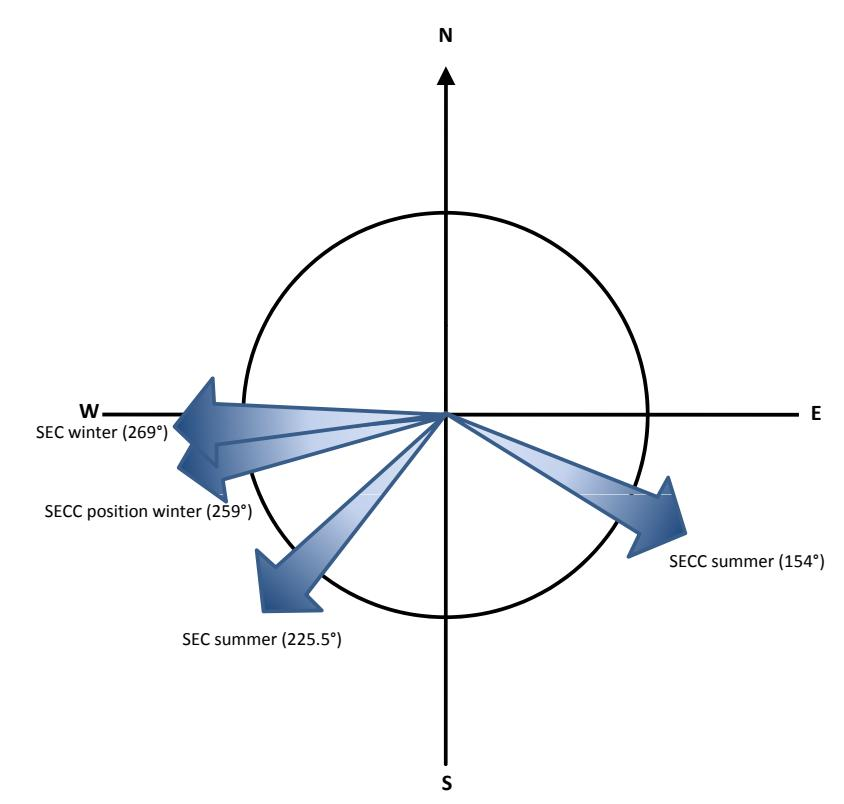

**Figure 3.6.** Median current headings by season and region based on drifter data.

**Table 3.1.** Full factorial ANOVA on the effects of region, season, and ENSO status on median drifter heading. Significant effects are labeled according to the level of significance.

| Figure Variables | 6: Df | Median Sum Sq.           | current headings Mean Sq. | by season F value | and region p value |
|---------------------|----------|-----------------------------|---------------------------------|-------------------------|--------------------------|
| based region     | on 1  | drifter data. 134,317 | 134,317                         | 92.4                    | < 2.2e-16 ***            |
| season              | 1        | 421,055                     | 421,055                         | 289.7                   | < 2.2e-16 ***            |
| ENSO                | 2        | 2,182                       | 1,091                           | 0.8                     | 0.473                    |
| region:season       | 1        | 41,411                      | 41,411                          | 28.5                    | 2.0e-07 ***              |
| region:ENSO         | 2        | 13,818                      | 6,909                           | 4.8                     | 0.009**                  |
| season:ENSO         | 2        | 5,274                       | 2,637                           | 1.8                     | 0.165                    |
| region:season:ENSO  | 2        | 612                         | 306                             | 0.2                     | 0.810                    |
| Residuals           | 266      | 386,599                     | 1,453                           |                         |                          |

Signif. codes: p < 0.001 (\*\*\*); p < 0.01 (\*\*); and p < 0.05 (\*) Residual standard error: 38.12 on 266 degrees of freedom Multiple R-squared: 0.62, Adjusted R-squared: 0.6 F-statistic: 38.7 on 11 and 266 DF, p-value: < 2.2e-16

**Table 3.2.** Full factorial ANOVA on the effects of region, season, and ENSO status on mean drifter speed. Significant effects are labeled according to the level of significance.

| Variables          | Df  | Sum Sq.  | Mean Sq. | F value | p value    |
|--------------------|-----|----------|----------|---------|------------|
| region             | 1   | 0.5      | 0.51     | 0.01    | 0.914      |
| season             | 1   | 36.1     | 36.13    | 0.8     | 0.366      |
| ENSO               | 2   | 160.0    | 80.02    | 1.8     | 0.164      |
| region:season      | 1   | 6.3      | 6.29     | 0.1     | 0.705      |
| region:ENSO        | 2   | 35.0     | 17.48    | 0.4     | 0.672      |
| season:ENSO        | 2   | 857.7    | 428.83   | 9.7     | 8.3e-05*** |
| region:season:ENSO | 2   | 459.7    | 229.84   | 5.2     | 0.006**    |
| Residuals          | 267 | 11,765.2 | 44.06    |         |            |

Signif. codes: p < 0.001 (\*\*\*); p < 0.01 (\*\*); and p < 0.05 (\*) Residual standard error: 6.64 on 267 degrees of freedom Multiple R-squared: 0.11, Adjusted R-squared: 0.08 F-statistic: 3.209 on 11 and 267 DF, p-value: 0.0004

400 km and gross transport of some individual drifters was over 1000 km indicating ample opportunity for connections among islands for larvae with a PLD ≥ 30 days. In addition, histograms were used to characterize the spread of transport distances associated with each duration of drift. As expected, the longer drifters were at large, the greater the range and more extreme the tails in distribution of gross distance traveled (Figure 3.9a). For net distance however, there was little difference in distance traveled between 50 and 100 days because many drifters actually looped back on currents or eddies and ended up not far from their starting points despite being at large for twice as long (Figure 3.9b). The difference in net and gross transport must be interpreted with care because the maximum net transport distance possible was limited by the size of the study area (~ 1300 km wide) whereas gross distances essentially could be infinite.

# **Quantitative Description of Regional Ocean Currents**

At the broadest scale, the Samoan Archipelago lies along the northern edge of the South

Pacific Gyre, a series of connected ocean currents with a counter-clockwise flow that spans the Pacific basin (Alory and Delcroix 1999, Tomczak and Godfrey 2003, Craig 2009) (Chapter 2 Figure 2.3). Based on analysis of the modeled current vectors and drifter tracks, 4 major surface currents or eddies were identified that affect the archipelago (Figure 3.10a-b). From north to south these are: 1) the westward flowing South Equatorial Current at the northern edge of the study area, 2) the eastward flowing South Equatorial Counter Current that seasonally bifurcates the surface flow of the South Equatorial Current, 3) a westward but meandering flow of

the South Equatorial Current directly across the archipelago, and 4) a regularly occurring eddy south of the archipelago, hereafter referred to as the Tonga Trench Eddy due to its consistent position over this geologic feature. The heading, position, and strength, as well as yearly and seasonal variability for each of these four major current features in the study area are described below.

## South Equatorial Current

(north of the South Equatorial Counter Current)

The northern edge of the South Pacific Gyre is the westward flowing South Equatorial Current (SEC). The SEC is visible as westward or south-southwestward vectors along the northern edge of the study area during most seasons and years (Figures 3.3 and 3.10). Typical velocity based on drifter data is ~25 cm/s. Although its latitude is variable among seasons and years, this component of the SEC seldom extends far below ~9° S

**Figure 3.7.** Box plots of median current speeds by region, season, and ENSO conditions based on drifter data. EN = El Niño, LN = La Niña, na = neutral ENSO, SEC = South Equatorial Current, SECC = South Equatorial Counter Current.

**Figure 3.8.** Mean gross and net displacement of drifters after 10, 20, 30, 50, and 100 days.

**Figure 3.9a.** Gross displacement of individual drifters as a frequency histogram after 10, 20 ,30, 50 and 100 days at large.

or into the EEZ of American Samoa or Samoa (Kessler and Taft 1987). Flow has been characterized as strongest from March to July and weakest from October to February (Kessler and Taft 1987), although this was not necessarily evident in the study region in recent years. A narrow region between ~6º S and 9º S of mild eddy formation (relative to the southern half of the study area)(Qui and Chen 2004, Domokos et al. 2007) is apparent between the SEC and the opposite flowing South Equatorial Counter Current described next.

#### *South Equatorial Counter Current*

Embedded on the SEC at latitudes between ~8º S and 12º S lies the eastward flowing South Equatorial Counter Current (SECC) (Kessler and Taft 1987, Chen and Qiu, 2004, Domokos et al. 2007), the most clearly visualized current feature in the region (Figures 3.2, 3.4, and 3.10). The SECC is a shallow current that exists above the main thermocline at ~200 m depth (Kessler and Taft 1987, Chen and Qui 2004). Below the thermocline the SEC continues a weak westward flow (Kessler and Taft 1987). Swains Island in the northern EEZ of American Samoa often lies in the middle of the SECC current field. The eastern end of this current generally

**Figure 3.9b.** Net displacement of individual drifters as a frequency histogram after 10, 20 ,30, 50 and 100 days at large. Grey shading depicts net transport distances greater than the maximum possibility as determined by the size of the study area (~1,300 km wide).

curls south between ~160º and 170º W and ultimately joins the southern component of the SEC headed west across the Samoan Archipelago (Chen and Qui 2004). The SECC is well developed in most years between October and April with peak speed and width observed during January and February in this region. Typical summer velocities based on drifters range from 22 to 30 cm/s and current heading is east-southeast (Figures 3.5-3.7). The current is often dissipated or absent in May through September (Chen and Qui 2004, Qui and Chen 2004), as confirmed by meandering or even westward drifter tracks and lower drifter speeds of 19 to 25 cm/s during these winter months (Figures 3.6 and 3.7). The signature of this current can however, be present yearlong as was observed in 2005, an El Niño year. Interestingly, the SECC was absent throughout 1982 and 1984, neutral ENSO years that bounded the strong El Niño conditions of 1983 (Kessler and Taft 1987). Also of note, the SECC was also virtually absent throughout 2009, a period of La Niña conditions. These observations highlight the irregular correlations between ENSO and SECC and the need for additional study during various ENSO conditions.

**Figure 3.10a.** Surface current patterns of the Samoan EEZs and surrounding region for October through April. The position of curled current vectors and meanders are highly variable and denote general patterns only. Patterns are based on data from HYCOM (2004- 2009) and NOAA's Global Drifter Program (n=216).

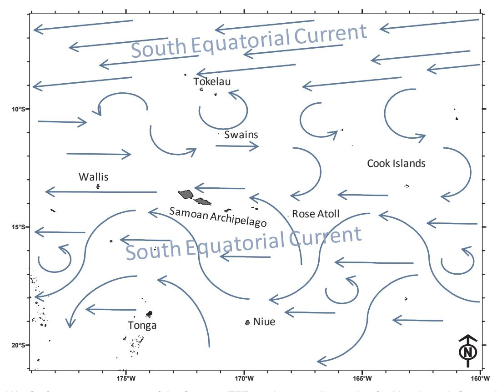

**Figure 3.10b.** Surface current patterns of the Samoan EEZs and surrounding region for May through September. The position of curled current vectors and meanders are highly variable and denote general patterns only. Patterns are based on data from HYCOM (2004-2009) and NOAA's Global Drifter Program (n=216).

### *South Equatorial Current (south of the South Equatorial Counter Current)*

The SEC continues its westward flow south of the SECC between ~13º S and 19º S, including all the islands of the Samoan Archipelago and the southern half of the study region. In contrast to the northern component of the SEC described above, the SEC in this region is characterized by many irregular meanders and eddies (Domokos et al. 2007). This overall westward but meandering flow pattern is apparent in current vectors for all years and seasons (Figures 3.2 and 3.10) and is confirmed by the overall westward tracks of drifters (mean heading of 225º in summer to 269º in winter) (Figures 3.4 - 3.6). Typical velocities are ~25 cm/s. Much irregular eddy activity is apparent between the opposite flowing SECC and this component of the SEC (Domokos et al. 2007).

#### *Tonga Trench Eddy*

The last regularly occurring feature of note is a clockwise eddy (negative vorticity) centered at 16º S and 172º W, a location south of the Samoan Islands and positioned approximately over the Tonga Trench (Figure 3.3). The eddy was most common in September through December in 2006, 2008, and 2009, all of which correspond to mild or moderate La Niña conditions. Beginning in September 2008, the eddy was present throughout 2009. This feature is persistent and not to be confused with the relatively short-lived (~weekly) eddies and dynamics recently investigated by Domokos et al. (2007).

**Figure 3.11.** Proportion of virtual larvae in the study area that were started from each island, seamount, or island group. Red shading denotes larval sources from American Samoa. Green shading denotes sources from Samoa.

#### **Larval Sources**

Based on potential reef area, the major sources of larvae in the study region are likely to be Upolu (~25% of the total larvae), Savai'i (~15%), and the Wallis Island group (~15%), although many of the larvae originating from this more diffuse group are quickly transported westward out of the study area (Figure 3.11, Table 3.3). Altogether the islands of Samoa and American Samoa were the source of over half the virtual larvae tracked in the study.

#### **Larval Connectivity: Overall Patterns**

The connectivity matrices reveal broad patterns of overall larval transport and several island groups with strong internal connectivity (Figure 3.12). Beginning at the origin of the connectivity matrices it is clear that Wallis, Tonga, and the many small islands and seamounts associated with them are strongly interconnected but contribute few larvae to the Samoan Archipelago or elsewhere in the study region. Their position in the western or southwestern region of the study area results in most of the larvae from them being gradually transported westward out of the

**Table 3.3.** Islands, seamounts, or island groups used as source locations in simulations of regional larval connectivity, their corresponding potential reef area (0-150 m shelf), number of virtual larvae used in modeling, and the percentage of the simulated larval pool contributed by each source. Green shading denotes islands of Samoa. Red denotes islands and seamounts of American Samoa.

| Site                          | Potential Reef Area (km2 ) | No. Larvae Spawned | Percent Larvae Spawned |
|-------------------------------|-------------------------------------|-----------------------|------------------------------|
| Wallis and Seamounts          | 993                                 | 132,722               | 16.2                         |
| Niuafo'ou and Seamounts       | 34                                  | 4,606                 | 0.6                          |
| Pasco and Toafilemu Seamounts | 279                                 | 37,067                | 4.5                          |
| Tafahi and Seamounts          | 400                                 | 54,704                | 6.7                          |
| Niue                          | 285                                 | 40,304                | 4.9                          |
| Savai'i South                 | 300                                 | 39,793                | 4.9                          |
| Savai'i North                 | 600                                 | 80,919                | 9.9                          |
| Upolu South                   | 571                                 | 76,831                | 9.4                          |
| Upolu North                   | 949                                 | 127,661               | 15.6                         |
| Tutuila                       | 576                                 | 77,873                | 9.5                          |
| South Bank (Papatua Guyot)    | 33                                  | 4,481                 | 0.6                          |
| East Bank (Tulaga Seamount)   | 3                                   | 448                   | 0.1                          |
| Northeast Bank (Muli Guyot)   | 10                                  | 1,335                 | 0.2                          |
| Manu'a Islands                | 186                                 | 25,182                | 3.1                          |
| Rose Atoll                    | 12                                  | 1,564                 | 0.2                          |
| Swains Island                 | 16                                  | 2,133                 | 0.3                          |
| Tokelau                       | 350                                 | 45,644                | 5.6                          |
| Pukapuka and Nassau           | 187                                 | 24,507                | 3.0                          |
| Suwarrow Atoll                | 203                                 | 26,796                | 3.3                          |
| Palmerston Atoll              | 90                                  | 12,440                | 1.5                          |
| Total                         | 6,077                               | 817,010               | 100.00                       |

study region in the direction of Fiji. In fact, this is the reason that some of the islands in these groups were not included as sources in the analysis. The island nation south of American Samoa, Niue and its associated seamounts, is largely isolated from the other islands in the study region. This is due to Niue's long distance from both upstream and downstream islands. Connections with its nearest downstream neighbor, Tonga may have been stronger were it not for the frequent development of the Tonga Trench Eddy between these two island groups which entrained many larvae until their PLD elapsed. Upolu and Savai'i in Samoa are highly interconnected and also have a large export of larvae to the islands and seamounts to the west such as Wallis, Niuafo'ou (Tonga), and Tafahi (Tonga). Samoa exports a smaller proportion of its larvae eastward against the SEC toward American Samoa. The islands and seamounts of American Samoa are also internally connected. The pattern of transport is such that most of the larvae either settle at the source or are transported to destinations downstream to the west, including the islands of Samoa, but often not as far as Wallis Island and its associated seamounts and not in very high proportions. Swains Island and Tokelau are relatively isolated from the other islands in the study area and are the sources of only relatively minor larval contributions to the Samoan Archipelago via the return loop of the SECC. Islands and seamounts in the Cook Islands group (Suwarrow Atoll, Palmerston Atoll, and Pukapuka Atoll and Nassau) are largely isolated, even from each other, and show few larval connections with other sites considered here despite their generally upstream position in the SEC. These islands were simply too far away and produced too few larvae to be a significant larval source for even the Samoan Archipeago, the next islands downstream.

Overall, the spatial pattern of connectivity was controlled by the SEC with islands to the east providing larvae to both themselves and islands to the west. Despite expectations that the eastward flowing SECC and its feedback loop to the SEC would carry larvae from sites such as Swains Island back along the Samoan

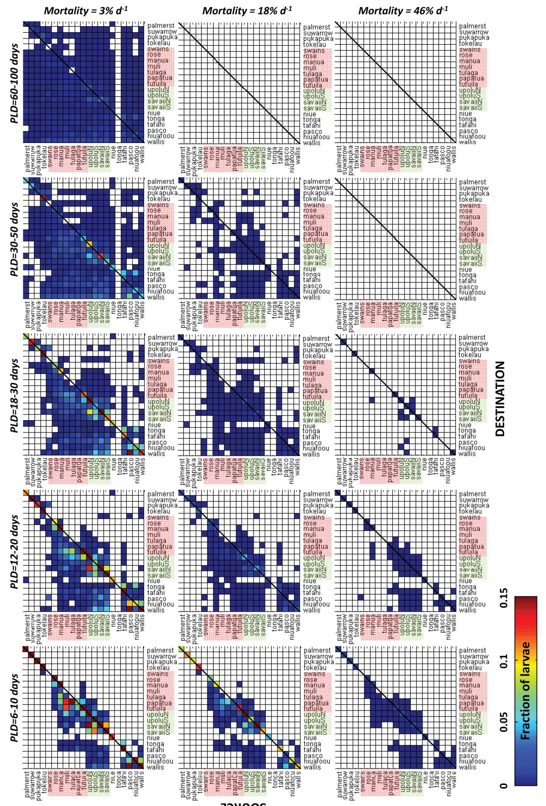

**Figure 3.12.** Cumulative connectivity, 2004-2008. Color scale indicates fraction of simulated larvae released at source settling at destination. Shading of labels indicates core island groups: red, American Samoa; green, Samoa.

Archipelago, such connectivity patterns were not seen in the simulations. Swains is simply too far north in the SECC current field and there are simply too few larvae that can survive the long transport time necessary for current loops to carry them back to settlement sites.

An important caveat to interpretation of matrix elements for islands close to the edges of the study area is that virtual larvae that hit the edge of the hydrodynamic model were lost to further transport. In the real world, eddies or current reversals may have eventually looped larvae back into the study area for possible settlement for larvae with longer PLDs. The importance of these lost trajectories is probably minor due to the compounding of daily larval mortality. Islands at the edge of our study extent may also play important larval source or destination roles with adjacent islands just outside of our study region that were not characterized here (e.g. Fiji). For these reasons matrix elements for islands near the edge of the study area must be interpreted only in the context of the study extent. Findings for islands in the core of the study area, American Samoa and Samoa are the most robust.

Also important is that, whereas we tracked >800,000 virtual larvae, the real larval output of these marine systems is orders of magnitude higher. Blank cells in our matrices denote cases in which zero virtual larvae connected a source and destination, but had we used more virtual larvae in the simulation or in a real world spawning event involving many more larvae, some may have actually made the connection. For this reason, blank cells in our simulations should not be viewed as impossible connections but instead thought of as relatively less probable.

The proportion of larvae traveling to a destination will be a function not only of source population locations, size, and ocean current patterns, but also of the size of the destination (specifically, the size of the destination island and its surrounding settlement zone). Since this is an inherent feature of the geography of the region, we do not standardize the connectivity values for size of the destination area, although this may be desirable for some population modeling purposes.

#### **Influence of PLD and Daily Mortality Rate**

Longer PLDs had three main effects on inter-island connectivity (Figure 3.12). First, the proportion of self seeding (fraction of larvae produced at a source location that settled at the same location) was reduced overall since larvae were not competent to settle until they had been transported farther from sources. Second, connectivity with islands farther downstream increased noticeably after PLDs of 10 days. This was especially noticeable in seeding of Wallis, Niuafo'ou (Tonga), Tafahi (Tonga), and the nearby seamounts with larvae from American Samoa. Third, larvae with PLDs of 50 or 100 days could be transported nearly any place in the study area although in very low abundance provided that the mortality rate was low enough. This widespread potential for transport at long PLDs suggests that the low amount of connectivity needed to prevent species divergence by genetic drift is easily possible throughout the study area. This is especially true considering that our study reflects cumulative connectivity over only a five year period, which is short relative to the generation time of many species in Samoan reef ecosystems. This widespread transport could also promote rapid (re-) colonization of unoccupied reefs, although the likelihood of colonization actually occurring when larvae arrive in low density is influenced by a variety of life history features (Kinlan et al. 2005). Widespread transport of organisms with longer PLDs could be important in understanding and predicting resilience to disturbance and responses to climate change of this regional ecosystem.

The fate of long-lived larvae is highly dependent on mortality rates. For low to moderate daily mortality rates at PLDs up to 30 days, the islands involved in predicted larval exchange changed little, but mortality and PLD did affect the strength of the connection (cell color changed but pattern of empty cells in the matrix did not) (Figure 3.12). In contrast, higher mortality rates affected both the strength of the connections (cell color) as well as the spatial pattern of island connections (many more blank cells), especially at longer PLDs. At high levels of mortality only those islands that were large larval sources (e.g. Savai'i, Upolu, Wallis) or that were close together had any measureable connectivity. For the very longest PLDs and medium to high mortality rates considered, no larvae settled successfully at any islands (Figure 3.12; three matrices in lower right corner). They all simply died before the end of these very long PLDs. This highlights the importance of better information on larval mortality, particularly for species with long PLDs.

#### **Influence of Interannual Variability**

There was little difference in the drifter or current data among years, a pattern that was borne out in the simulations of larval transport. The one exception was in 2008, a year in which the SECC failed to develop. This had only a small effect on transport of larvae for most islands in the study region except for Swains, which lies in the middle of this current field. In most model years, larvae from Swains were quickly carried eastward in the SECC (Figure 3.13). In contrast, in 2008 the SEC persisted in its westward transport throughout the region and entrained Swains larvae in the opposite direction.

#### **Larval Connectivity: Islands/Seamounts within the Samoan Archipelago**

Each of the islands and shallow seamounts in the Samoan Archipelago are characterized separately in the following sections. Moving from west to east along the archipelago and ending with Swains Island, each site is the focus of a detailed set of analyses to characterize its role as a larval source and destination in the region. The north and south shores of Savai'i and Upolu are each

**Figure 3.13.** Transport of virtual larvae from Swains Island by model year. All PLDs shown as same color for each year.

characterized separately due to their large size and slightly different patterns of larval connectivity. The Manu'a Islands (Ofu, Olosega, and Ta'u) are combined due to their small size and close proximity relative to the scale of the hydrodynamic model.

## **SAVAI'I (SOUTH COAST)**

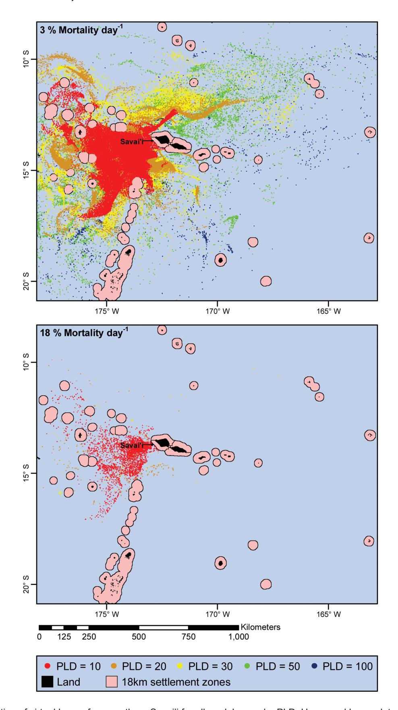

**Figure 3.14.** Position of virtual larvae from southern Savai'i for all model years by PLD. Upper and lower plots denote 3% and 18% daily mortality respectively.

#### Destinations

Southern Savai'i has a moderate area of potential reef compared to other islands and was the source of 5% of the larvae for the region (Figure 3.11, Table 3.3). Most larvae from Savai'i's south coast are transported to the southwest via the SEC and have reached Wallis and the northern islands and seamounts of the Tonga group (Niuafo'ou, Tafahi, etc.) after only 10 days (Figure 3.14). A smaller number of larvae are passed northward and then entrained into the eastward flowing SECC which carries them between Swains Island and the rest of the Samoan Archipelago after 30 to 50 days.

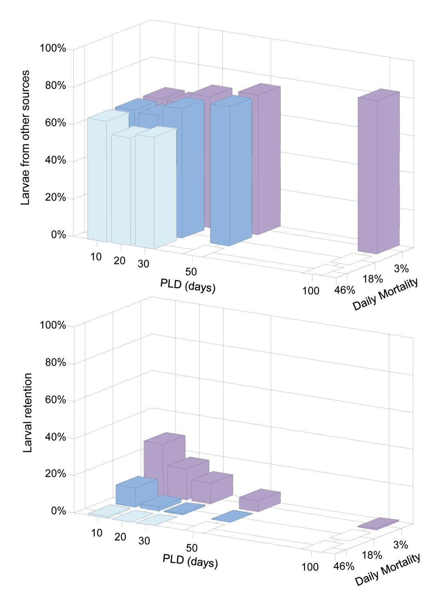

**Figure 3.15.** External larval supply and local larval retention at Savai'i-South as a function of PLD and mortality rate. Top panel: Percent of simulated larvae settling at this site that were produced at other sites. Bottom panel: Percent of simulated larvae produced at this site that return here.

**Figure 3.16.** Destinations (and sources) of simulated larvae originating from (arriving at) Savai'i-South for low, medium, and high larval mortality rates. Shading of labels indicates core island groups: red, American Samoa; green, Samoa. ND= no data.

Nearly 25% of the larvae spawned from southern Savai'i are retained there for the low mortality scenario and 10 day PLD (Figure 3.15). Much smaller fractions of local production are retained for longer PLDs and higher mortality. As PLD is lengthened, an increasingly large fraction of the settling larvae end up at destinations to the west such as Wallis and the islands and seamounts of northern Tonga (Figure 3.16). Higher mortality rates result in only a small proportion of the larvae produced at southern Savai'i successfully returning there (Figure 3.15), but very small proportions successfully settle anyplace else either (Figure 3.16). This highlights the point that most larvae produced at Savai'i die without reaching suitable settlement habitat.

#### Sources

Southern Savai'i is reliant on outside larval sources for a relatively consistent ~60-80% of its arriving larvae depending on PLD and daily mortality rate (Figure 3.15). Although many larvae that reach southern Savai'i come from southern Savai'i, large fractions also arrive from the northern and southern coasts of Upolu (Figure 3.16). Notably, southern Savai'i receives over half of its larval supply from Upolu regardless of mortality rate and PLD. Were these major larval sources to be disturbed, recovery at Southern Savai'i could be relatively slow and reliant on the much smaller larval sources from Tutuila and the other islands of American Samoa.

## **SAVAI'I (NORTH COAST)**

**Figure 3.17.** Position of virtual larvae from northern Savai'i for all model years by PLD. Upper and lower plots denote 3% and 18% daily mortality respectively.

#### Destinations

Northern Savai'i has a large potential reef area and was among the larger larval sources in the study (Figure 3.11, Table 3.3). Transport of larvae from Savai'i's north coast is similar to the south shore described previously except the distribution is shifted northward (Figure 3.17). More larvae are transported westward toward Wallis and fewer are carried toward the southern part of the Tonga Chain compared to the larvae originating from the south shore. Also, many more larvae are entrained into the SECC and reach Swains after PLDs of 20 to 50 days depending on the year.

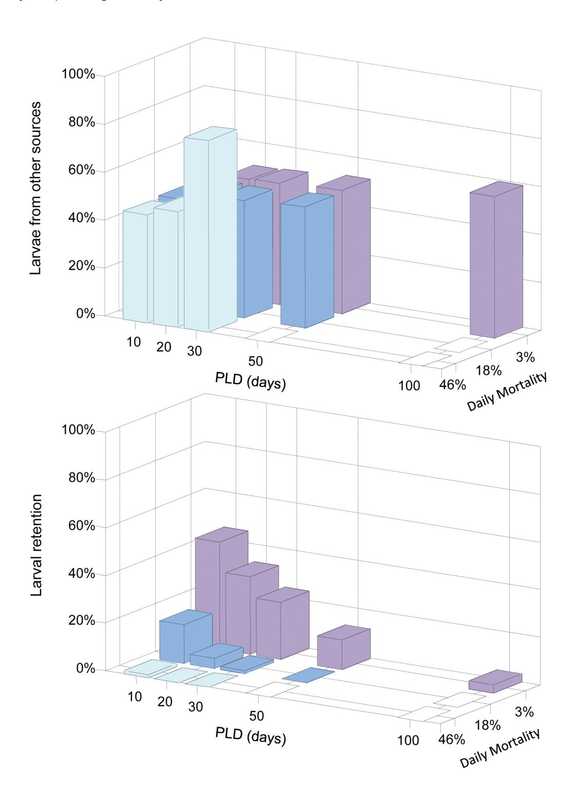

**Figure 3.18.** External larval supply and local larval retention at Savai'i-North as a function of PLD and mortality rate. Top panel: Percent of simulated larvae settling at this site that were produced at other sites. Bottom panel: Percent of simulated larvae produced at this site that return here.

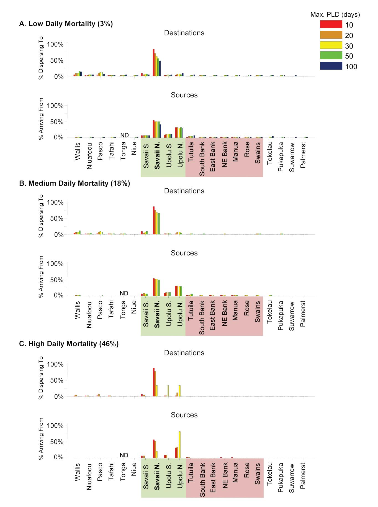

**Figure 3.19.** Destinations (and sources) of simulated larvae originating from (arriving at) Savai'i-North for low, medium, and high larval mortality rates. Shading of labels indicates core island groups: red, American Samoa; green, Samoa. ND= no data.

Over 40% of the larvae spawned off northern Savai'i end up settling there for the low mortality and 10 day PLD scenarios (Figure 3.18). Progressively smaller fractions of local production are returned there for longer PLDs and higher mortality rates. Much smaller fractions of larvae settle elsewhere in Samoa and at sites to the west as compared to Southern Savai'i (Figure 3.19).

#### Sources

Northern Savai'i is reliant on outside larval sources for 40-70% of its arriving larvae depending on PLD and daily mortality rate (Figure 3.18). An increasing fraction of larvae come from elsewhere at longer PLDs. Larvae that reach northern Savai'i come primarily from the north sides of Savai'i and Upolu and to a lesser degree the south sides of these islands for all PLDs (Figure 3.19). Were the major larval sources disturbed, recovery of northern Savai'i would be reliant on the much smaller larval sources from Tutuila and the other islands of American Samoa.

## **UPOLU (SOUTH COAST)**

daily mortality respectively. **Figure 3.20.** Position of virtual larvae from southern Upolu for all model years by PLD. Upper and lower plots denote 3% and 18%

#### Destinations

Upolu's south coast is a large source of larvae for the region (Figure 3.11, Table 3.3). Most larvae are transported westward or southwestward in the SEC (Figure 3.20). Some larvae slip northward between Upolu and Savai'i or around Savai'i and are entrained in the SECC which can ultimately send them eastward between Swains Island to the north and the rest of the Samoan Archipelago to the south after 20-50 days.

Over 20% of larvae spawned at southern Upolu are retained there for the low mortality and 10 day PLD scenario (Figure 3.21). Much smaller fractions of local production are returned there for longer PLDs and higher

**Figure 3.21.** External larval supply and local larval retention at Upolu-South as a function of PLD and mortality rate. Top panel: Percent of simulated larvae settling at this site that were produced at other sites. Bottom panel: Percent of simulated larvae produced at this site that return here.

**Figure 3.22.** Destinations (and sources) of simulated larvae originating from (arriving at) Upolu-South for low, medium, and high larval mortality rates. Shading of labels indicates core island groups: red, American Samoa; green, Samoa. ND= no data.

mortality. A large proportion of the larvae from Upolu's south coast settle back on the Islands of Samoa especially for short PLDs (Figure 3.22). Wallis and its neighboring seamounts as well as Niuafo'ou are significant destinations for PLDs of 20-50 days even under scenarios with moderate mortality.

#### Sources

Southern Upolu is reliant on outside larval sources for 15-70% of its arriving larvae depending on PLD and daily mortality rate (Figure 3.21). At short PLDs the area is seeded primarily from local production whereas larvae with longer PLDs arrive from outside sources. The fraction of larvae arriving from northern Upolu and Tutuila increases with PLD for scenarios with low or moderate mortality and demonstrates the importance of these larval sources for southern Upolu (Figure 3.22).

## **UPOLU (NORTH COAST)**

**Figure 3.23.** Position of virtual larvae from northern Upolu for all model years by PLD. Upper and lower plots denote 3% and 18% daily mortality respectively.

#### Destinations

The northern coast of Upolu is the largest source of larvae in the Samoan Archipelago with more potential reef area than all the islands and seamounts of American Samoa combined (Figure 3.11, Table 3.3). The pattern of dispersal is similar to the southern coast described previously but the distribution is shifted northward with more larvae entrained into the SECC (Figure 3.23). Most larvae are trajected westward or southwestward in the SEC and have reached Wallis and northern Tonga after only 10 days. Larvae entrained in the SECC are ultimately sent eastward between Swains Island to the north and the rest of the Samoan Archipelago to the south after 20-50 days. Some in the 50 day range have reached as far as Pukapuka and Nassau in the Cook Islands.

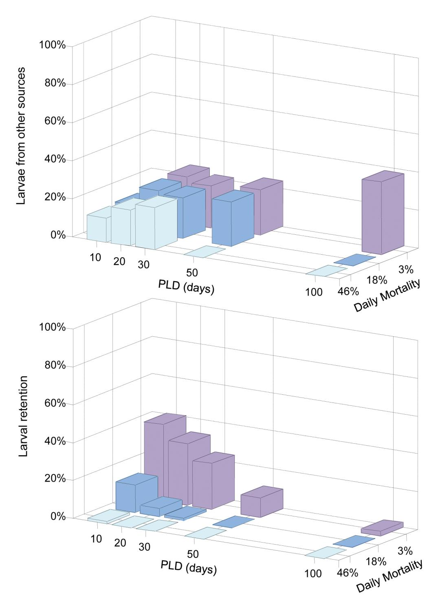

**Figure 3.24.** External larval supply and local larval retention at Upolu-North as a function of PLD and mortality rate. Top panel: Percent of simulated larvae settling at this site that were produced at other sites. Bottom panel: Percent of simulated larvae produced at this site that return here.

**Figure 3.25.** Destinations (and sources) of simulated larvae originating from (arriving at) Upolu-North for low, medium, and high larval mortality rates. Shading of labels indicates core island groups: red, American Samoa; green, Samoa. ND= no data.

Over 40% of the larvae from Upolu's north coast return there for the short PLD and low mortality scenarios (Figure 3.24). Smaller fractions of local production are returned to northern Upolu for longer PLDs and higher mortality scenarios. A large proportion of larvae from northern Upolu settle at Savai'i for all mortality scenarios (Figure 3.25).

#### Sources

Northern Upolu is reliant on outside larval sources for only 10-35% of its arriving larvae depending on PLD and daily mortality rate (Figure 3.24). The site is among the least reliant on outside larval sources since most of the successfully settling larvae here are produced locally for PLDs up to 50 days and scenarios with low or moderate mortality. The next highest source of larvae for northern Upolu is Tutuila although the proportion of larval supply is relatively minor compared to self-seeding (Figure 3.25). Were northern Upolu's larval production to be disturbed, it would be reliant on the smaller sources of Tutuila and the other islands of American Samoa for recovery.

## **TUTUILA**

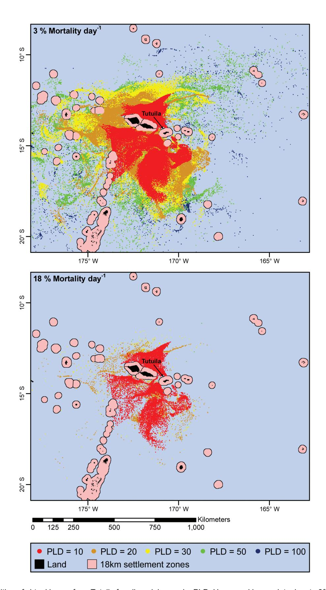

**Figure 3.26.** Position of virtual larvae from Tutuila for all model years by PLD. Upper and lower plots denote 3% and 18% daily mortality respectively.

#### Destinations

Tutuila has a large potential reef area relative to the other islands and seamounts in American Samoa but is comparatively small relative to Savai'i and Upolu as a source of larvae to the region (Figure 3.11, Table 3.3). Transport of larvae from Tutuila is westward in the SEC and splits into two groups along the north and south shores of Samoa (Figure 3.26). At PLDs of 10 days, larvae have just passed western Savai'i and begun to reach Tafahi in the northern end of the Tonga chain. By PLDs of 20-50 days larvae are well into Wallis and its neighboring seamounts farther west. Many larvae trajected south of Tutuila are entrained in the Tonga Trench Eddy. Larvae trajected north of Tutuila that are entrained into the SECC are quickly swept to the east and pass south of Swains Island with little settlement occurring there.

**Figure 3.27.** External larval supply and local larval retention at Tutuila as a function of PLD and mortality rate. Top panel: Percent of simulated larvae settling at this site that were produced at other sites. Bottom panel: Percent of simulated larvae produced at this site that return here.

**Figure 3.28.** Destinations (and sources) of simulated larvae originating from (arriving at) Tutuila for low, medium, and high larval mortality rates. Shading of labels indicates core island groups: red, American Samoa; green, Samoa. ND= no data.

Nearly 40% of the larvae spawned at Tutuila settle back there for the 10 day PLD and low mortality scenario. Much smaller fractions of local production are returned there for longer PLDs and higher mortality scenarios (Figure 3.27). Larvae that are exported settle primarily at northern Upolu, and to a lesser extent southern Upolu, northern Savai'i, and Wallis and the northern Tongan Islands for longer PLDs (Figure 3.28).

#### Sources

Tutuila is reliant on outside larval sources for 10-65% of its arriving larvae depending on PLD and daily mortality rate (Figure 3.27). Outside sources become proportionally more important at longer PLDs, especially when mortality is low. Larvae that reach Tutuila come primarily from Tutuila especially at short PLDs (Figure 3.28). The Manu'a Islands, Upolu, and even Savai'i are the most notable sources of outside larvae and would be important to Tutuila's recovery if local larval production were disrupted.

## **SOUTH BANK**

**Figure 3.29.** Position of virtual larvae from South Bank for all model years by PLD. Upper and lower plots denote 3% and 18% daily mortality respectively.

#### Destinations

South Bank (Papatua Guyot in Seamount Catalog, Koppers et al. 2010) is a relatively small guyot south of Tutuila and provides a very small contribution to the total larval pool of the region (Figure 3.11, Table 3.3). Most larvae are transported south and west from this site with very few slipping north between islands of the Samoan Archipelago (Figure 3.29). Transport is either westward in the SEC between Savai'i and Tafahi (Tonga), or southward into the Tonga Trench Eddy.

**Figure 3.30.** External larval supply and local larval retention at South Bank as a function of PLD and mortality rate. Top panel: Percent of simulated larvae settling at this site that were produced at other sites. Bottom panel: Percent of simulated larvae produced at this site that return here.

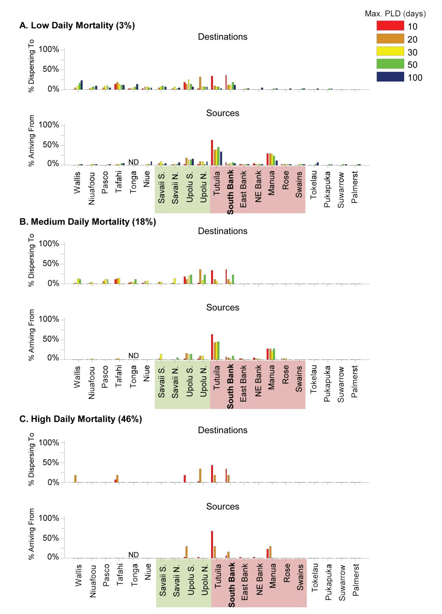

**Figure 3.31.** Destinations (and sources) of simulated larvae originating from (arriving at) South Bank for low, medium, and high larval mortality rates. Shading of labels indicates core island groups: red, American Samoa; green, Samoa. ND= no data.

In contrast to the other sites discussed so far, a very low proportion of larvae from South Bank are retained locally for any PLD or mortality scenario (Figure 3.30). Tutuila and Upolu receive a significant proportion of larvae in the 10-50 PLD ranges (Figure 3.31). Tafahi (Tonga), Wallis, and other sites near them receive a noticeable proportion of the larvae originating from South Bank at longer PLDs. Of note, recent field surveys of South Bank indicate that the seamount is relatively uncolonized by corals and reef fish (R. Brainard, NOAA CRED and D. Fenner, American Samoa DMWR pers. comm.), which could indicate recruitment limitation and is consistent with the chronically low larval supply predicted by our model runs. It also suggests that South Bank is even less of a larval source than estimated here based purely on the potential reef area inferred from bathymetry.

#### Sources

Unlike most other sites discussed thus far, South Bank is reliant on outside larval sources for a very large proportion, 80-95%, of its arriving larvae regardless of PLD or daily mortality rate (Figure 3.30). The major sources of larvae for South Bank are Tutuila and Manu'a (Figure 3.31). Were these primary sources disturbed, South Bank would rely primarily on Upolu as a larval source.

## **EAST BANK**

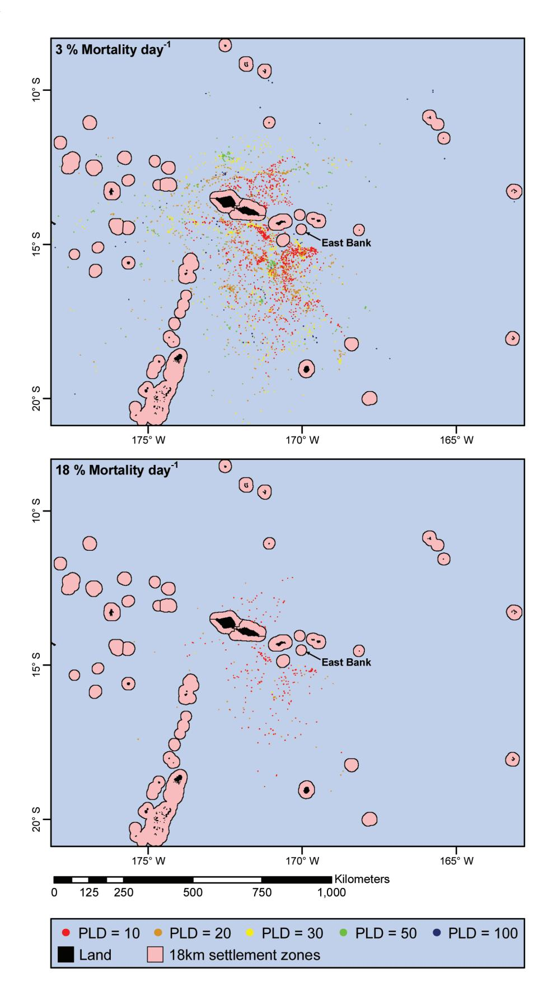

**Figure 3.32.** Position of virtual larvae from East Bank for all model years by PLD. Upper and lower plots denote 3% and 18% daily mortality respectively.

#### Destinations

East Bank (Tulaga seamount in Seamount Catalog, Koppers et al. 2010) is the shallow crest of a submerged ridge extending east from Tutuila. Due to its small reef area it is a very small contributor to the regional larval pool in this study (Figure 3.11, Table 3.3). Many larvae from East Bank are trajected westward in the SEC along the north and south shores of the Samoan Archipelago (Figure 3.32). Others are transported southward toward Niue but few arrive due to the long transport distance, larval mortality, and the low number of starting larvae spawned in the simulation.

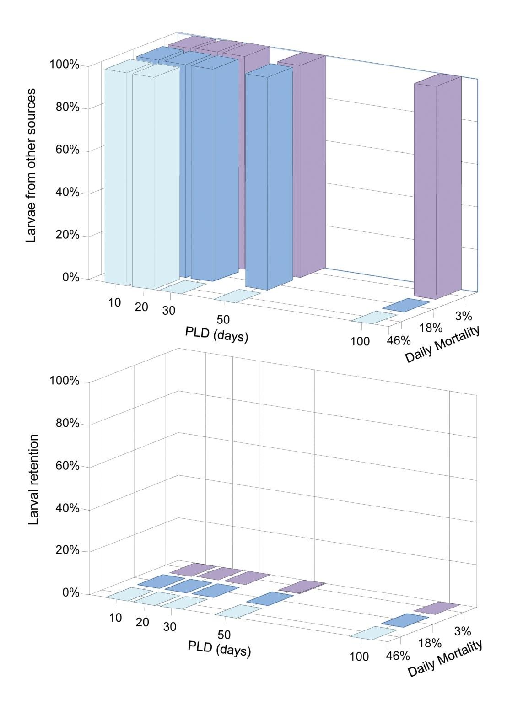

**Figure 3.33.** External larval supply and local larval retention at East Bank as a function of PLD and mortality rate. Top panel: Percent of simulated larvae settling at this site that were produced at other sites. Bottom panel: Percent of simulated larvae produced at this site that return here.

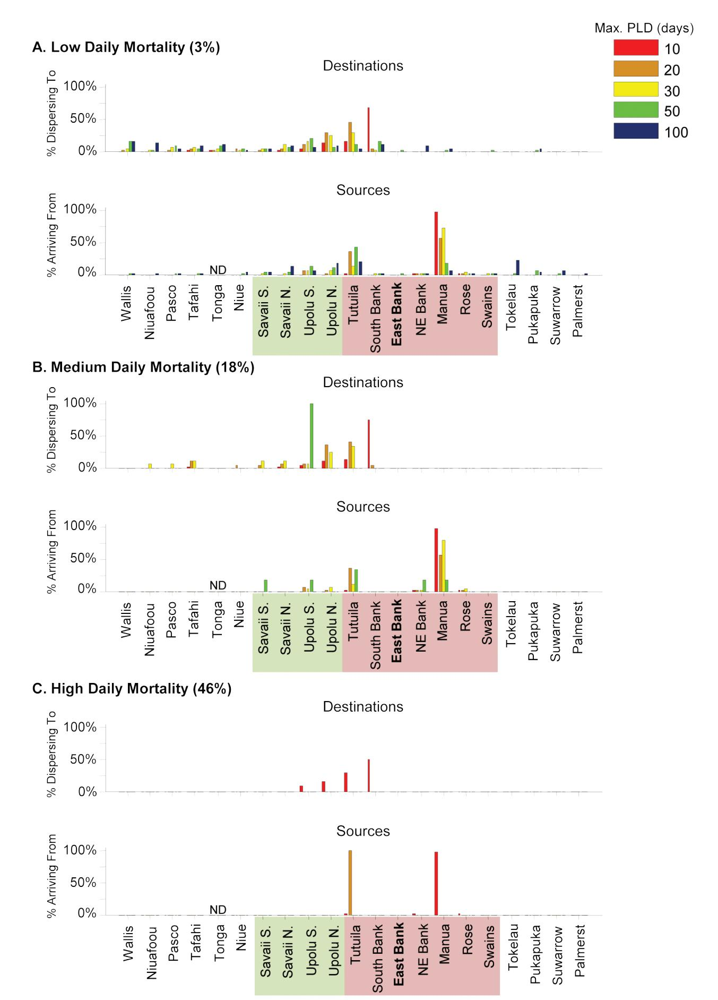

**Figure 3.34.** Destinations (and sources) of simulated larvae originating from (arriving at) East Bank for low, medium, and high larval mortality rates. Shading of labels indicates core island groups: red, American Samoa; green, Samoa. ND= no data.

East Bank has virtually no retention of locally produced larvae (Figure 3.33). A high proportion of larvae settle at South Bank at the 10 day PLD, Tutuila and Upolu at 20 to 30 day PLDs and islands farther west for longer PLDs (Figure 3.34). Note that longer PLDs, high mortality, and few larvae to begin with result in few strong connections west of Savai'i despite prevailing currents.

#### Sources

Similar to South Bank, East Bank is reliant on outside larval sources for a very large proportion, 95-100%, of its arriving larvae regardless of PLD or daily mortality rate (Figure 3.33). The majority of larvae settling at East Bank are from Manu'a for PLDs of 10-30 days (Figure 3.34). A large fraction of successful settlers come from Tutuila at 20 to 30 day PLDs especially at higher mortality rates given the relatively low number of larvae starting from Manu'a. Were these larval sources to be disturbed, East Bank would rely primarily on Upolu as a (much smaller) larval source. A small but measureable proportion of larvae are from Tokelau, well to the north, for the 100 day PLD with low mortality rate.

## **NORTHEAST BANK**

**Figure 3.35.** Position of virtual larvae from Northeast Bank for all model years by PLD. Upper and lower plots denote 3% and 18% daily mortality respectively.

#### Destinations

Northeast Bank (Muli Guyot in Seamount Catalog, Koppers et al. 2010) is a small seamount between Tutuila and Manu'a. Due to its small size Northeast Bank is a very minor contributor to the total larval pool of the region (Figure 3.11, Table 3.3). Most larvae from Northeast Bank are trajected westward along the north side of the Samoan Archipelago (Figure 3.35). Many are quickly entrained in the eastward flowing SECC well south of Swains Island where they are largely dispersed and die in the open ocean between American Samoa and the Cook Islands. Many are also trajected south and expire in the region of the Tonga Trench Eddy prior to reaching Niue.

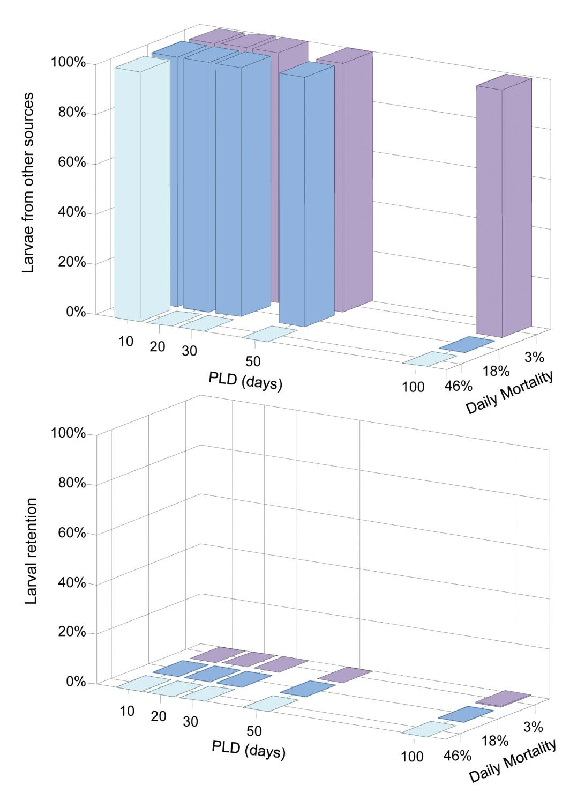

**Figure 3.36.** External larval supply and local larval retention at Northeast Bank as a function of PLD and mortality rate. Top panel: Percent of simulated larvae settling at this site that were produced at other sites. Bottom panel: Percent of simulated larvae produced at this site that return here.

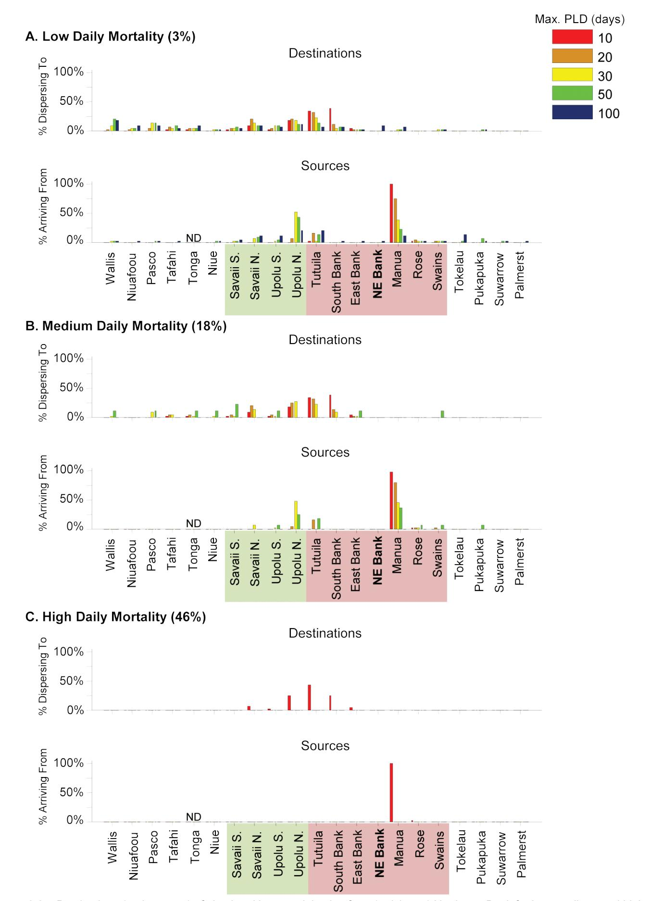

**Figure 3.37.** Destinations (and sources) of simulated larvae originating from (arriving at) Northeast Bank for low, medium, and high larval mortality rates. Shading of labels indicates core island groups: red, American Samoa; green, Samoa. ND= no data.

Northeast Bank has virtually no retention of locally produced larvae (Figure 3.36). For short PLDs of 10-30 days, most larvae from Northeast Bank end up at South Bank, Tutuila, and the north coasts of Upolu and Savai'i (Figure 3.37). Longer PLDs of 30-50 days result in a more even dispersal of larvae spread along the islands farther west all the way to Wallis and its associated seamounts. At high mortality rates, the few larvae starting from Northeast Bank are largely dead after the 10 day PLD and no connections among islands were detected.

#### Sources

Like the other seamounts of American Samoa, Northeast Bank is reliant on outside larval sources for 90- 100% of its arriving larvae regardless of PLD or daily mortality rate (Figure 3.36). The majority of larvae with a 10 day PLD arrive at Northeast Bank from the Manu'a Islands (Figure 3.37). Interestingly, a significant source of larvae in the 30-50 day PLD range is northern Upolu. A large group of larvae from 2006 were quickly entrained in the SECC and arrived at Northeast Bank after 18-30 days. A small but measureable proportion of larvae are from Tokelau in the 100 day PLD with low mortality rate.

## **MANU'A ISLANDS**

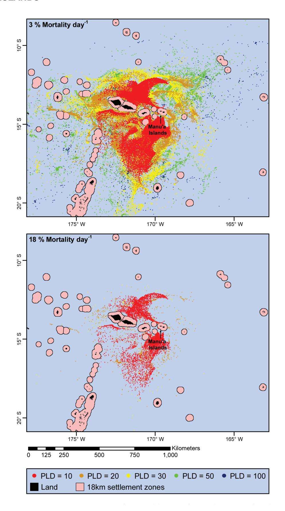

**Figure 3.38.** Position of virtual larvae from Manu'a for all model years by PLD. Upper and lower plots denote 3% and 18% daily mortality respectively.

#### Destinations

The Manu'a Islands of Ta'u, Ofu, and Olosega represent the last moderately sized source of larvae in the Samoan Archipelago (Figure 3.11, Table 3.3). Larvae from Manu'a split into two groups, one along the northern side of the Samoan Archipelago and another that is cast southwestward into the region of the Tonga Trench Eddy (Figure 3.38). Many in the northern trajectory are entrained in the SEC and transported well south of Swains where they mostly expire in the open ocean between the Samoan Archipelago and the Cook Islands. Over 20% of the larvae spawned at Manu'a are retained there for the 10 day PLD and low mortality scenario (Figure 3.39). Much smaller fractions of local production are retained locally for longer PLDs and higher mor-

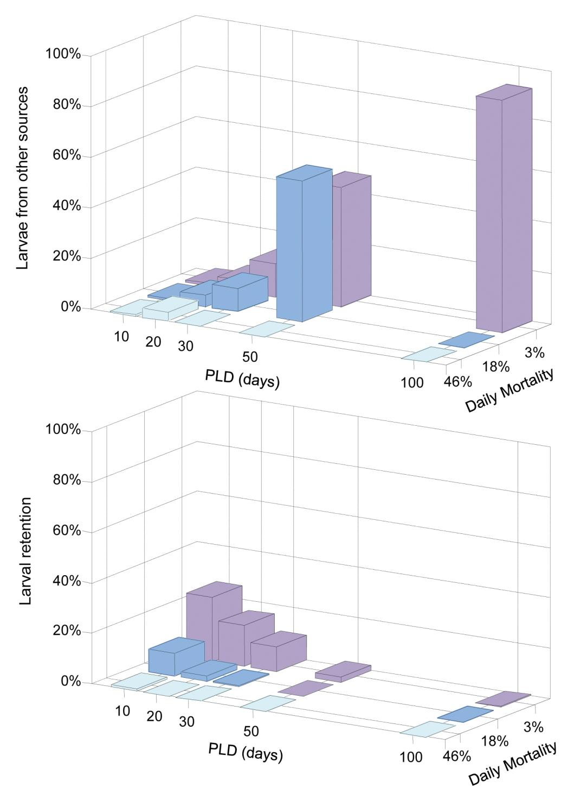

**Figure 3.39.** External larval supply and local larval retention at Manu'a as a function of PLD and mortality rate. Top panel: Percent of simulated larvae settling at this site that were produced at other sites. Bottom panel: Percent of simulated larvae produced at this site that return here.

**Figure 3.40.** Destinations (and sources) of simulated larvae originating from (arriving at) Manu'a for low, medium, and high larval mortality rates. Shading of labels indicates core island groups: red, American Samoa; green, Samoa. ND= no data.

tality scenarios. Larvae settle along the archipelago on the seamounts, Tutuila, and the islands of Samoa in similar proportions (Figure 3.40). Larvae are then spread farther westward reaching Wallis and nearby islands and seamounts in the 50-100 day range in the low to moderate mortality scenarios.

#### Sources

The Manu'a Islands are reliant on outside larval sources for a wide range, 0-90%, of their arriving larvae depending on PLD and daily mortality rate (Figure 3.39). Nearly all larvae with a 100 day PLD are from outside sources whereas a high proportion of self seeding occurs for larvae in the 10-30 day PLD range. For longer PLDs, sources include Tutuila and Samoa with larvae entrained in the eastward flowing SECC and then fed back south along the Samoan Archipelago including Manu'a in the 50-100 day range (Figure 3.40). Small but measureable contributions to the larvae arriving at Manu'a in the low to moderate mortality rate scenarios are from Tokelau to the north and Pukapuka and Nassau, and Suwarrow to the east.

## **ROSE ATOLL**

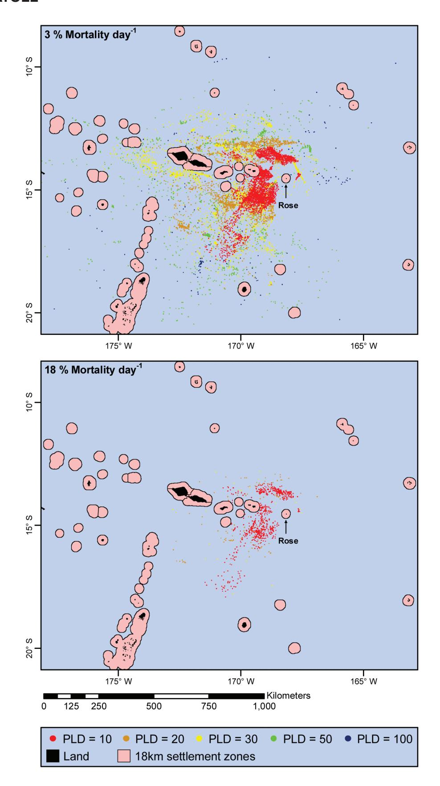

**Figure 3.41.** Position of virtual larvae from Rose Atoll for all model years by PLD. Upper and lower plots denote 3% and 18% daily mortality respectively.

#### Destinations

Rose Atoll (Motu O Manu or Muliāva by many locally) is a small island at the eastern tip of the Samoan Archipelago. Due to its small size Rose is a very minor contributor to the total larval pool of the region (Figure 3.11, Table 3.3). Larvae from Rose split into two groups depending on the year, one is transported north for partial entrainment into the SECC and the other group is moved southwestward in the SEC and Tonga Trench Eddy (Figure 3.41). For such a small, isolated source, there is a moderate amount of retention of locally produced larvae for the short PLD, low mortality scenario (Figure 3.42). For the short PLDs of 10-20 days, larvae from Rose Atoll settle primarily locally or at the nearby Manu'a Islands (Figure 3.43). Longer PLDs of 30-100 days

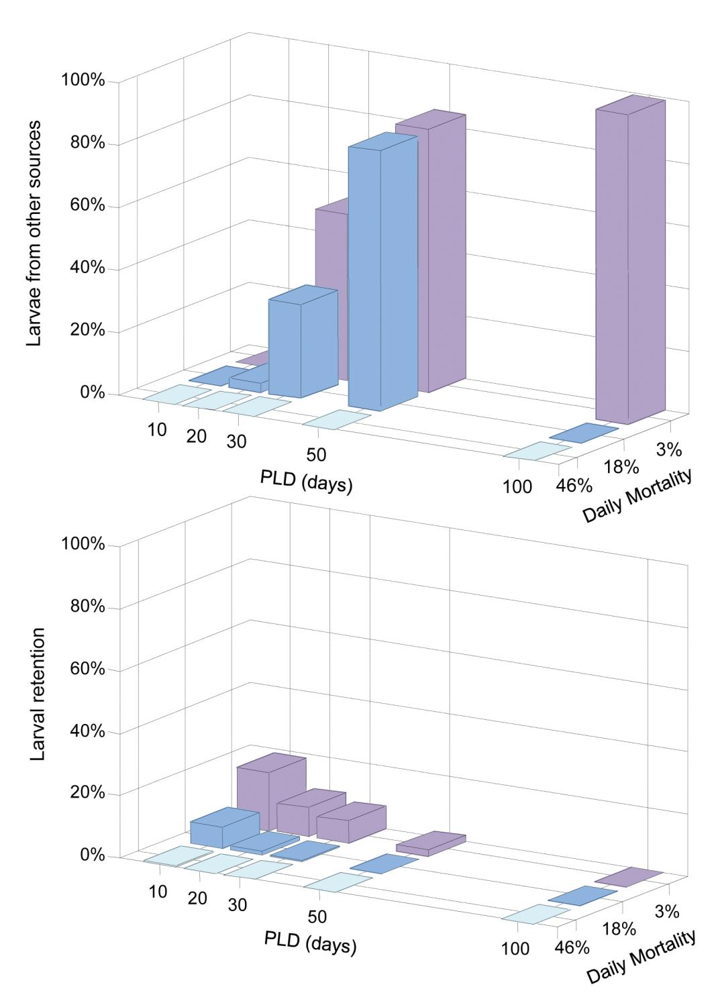

**Figure 3.42.** External larval supply and local larval retention at Rose Atoll as a function of PLD and mortality rate. Top panel: Percent of simulated larvae settling at this site that were produced at other sites. Bottom panel: Percent of simulated larvae produced at this site that return here.

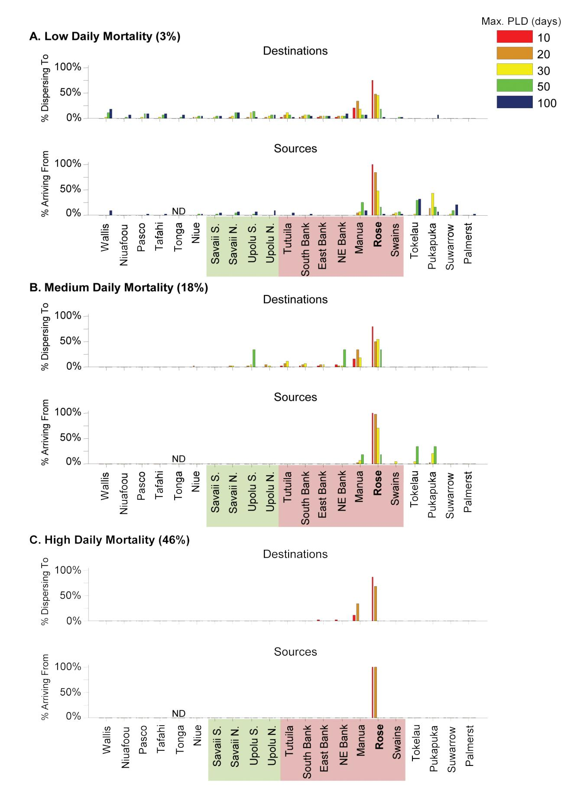

**Figure 3.43.** Destinations (and sources) of simulated larvae originating from (arriving at) Rose Atoll for low, medium, and high larval mortality rates. Shading of labels indicates core island groups: red, American Samoa; green, Samoa. ND= no data.

cast small proportions of larvae to all the seamounts and islands to the west via the SEC and can even reach Wallis in the scenario with low mortality.

#### Sources

Similar to Manu'a, Rose Atoll is reliant on outside larval sources for a very wide range of larvae recruits, with 0-100% of its larvae arriving from elsewhere depending on PLD and daily mortality rate (Figure 3.42). Nearly all larvae with 50-100 day PLDs are from outside sources, whereas Rose Atoll is heavily reliant on local larval production for PLDs of 10-20 days. For these short PLDs, Rose receives few larvae from elsewhere and then only in scenarios with low mortality. Pukapuka to the east and Tokelau to the north contribute measureable proportions of larvae to Rose but only in low to moderate mortality scenarios and for PLDs of 30-50 days (Figure 3.43). This highlights the isolation of Rose from the rest of the islands in the region since it is so far downstream in the SEC from the small larval sources provided by the Cook Islands and so far upstream relative to the large sources of larvae produced elsewhere in the Samoan Chain.

Of note, the locally used name "Muliāva" can be translated from Samoan to English as "end of the current". This could refer to its position at one end of the Samoan Archipelago at the upstream end of the SEC.

## **SWAINS ISLAND**

**Figure 3.44.** Position of virtual larvae from Swains Island for all model years by PLD. Upper and lower plots denote 3% and 18% daily mortality respectively.

#### Destinations

Swains Island is an isolated atoll in the northern part of the American Samoa EEZ and lies in a region of very different ocean currents relative to the Samoan Archipelago. The position of these currents isolates Swains even more as a larval source or destination than suggested by distance alone. Due to its small size, it is not a major larval source to the region (Figure 3.11, Table 3.3). Swains lies in the center of the SECC in most years (2004-2007) and consequently most of the larvae spawned there are entrained in currents flowing eastward toward Pukapuka and Nassau in the Cook Islands (Figure 3.44).

**Figure 3.45.** External larval supply and local larval retention at Swains Island as a function of PLD and mortality rate.Top panel: Percent of simulated larvae settling at this site that were produced at other sites. Bottom panel: Percent of simulated larvae produced at this site that return here.

**Figure 3.46.** Destinations (and sources) of simulated larvae originating from (arriving at) Swains Island for low, medium, and high larval mortality rates. Shading of labels indicates core island groups: red, American Samoa; green, Samoa. ND= no data.

Virtually no larvae are retained locally at Swains for any PLD or mortality scenario (Figure 3.45). Due to the long distances that must be traveled and the low number of larvae starting from a small site like Swains, only larvae in the 20-50 day PLD can range make it to Pukapuka and Nassau successfully and only in the low to moderate mortality scenarios (Figure 3.46). In 2008 however, a dramatically different pattern emerged with the eastward flowing SECC not forming at all, a condition that affected Swains more than any other island considered. In 2008, all the larvae from Swains can be observed moving westward in the SEC with many reaching Pasco and Taufilemu seamounts after 20 days, and Wallis and nearby seamounts by 50-100 days (Figures 3.13, 3.44, 3.46).

#### Sources

Swains Island is reliant on outside larval sources for virtually 100% of its arriving larvae regardless of PLD or daily mortality rate (Figure 3.45). Tokelau is the main source of larvae for Swains Island and practically the only source for larvae with a 10 day PLD (Figure 3.46). Swains receives many of its larvae in the 20-100 day PLD range from the major larvae producers of Samoa and even Wallis and its seamounts. A significant proportion of the larvae from these sources are entrained in the eastward flowing SECC and due to the large numbers of larvae involved and position farther north and west relative to American Samoa, some larvae can arrive at far off Swains even before the moderate mortality rate eliminates them all. In contrast, none of the islands of American Samoa are a significant source of recruits for Swains. Most of the larvae entrained in the SECC from these islands are swept eastward towards the Cook Islands prior to reaching Swains.

#### **CONCLUSIONS**

Our results indicate a high but variable degree of inter-island connectivity in the Samoan Archipelago and surrounding region, with substantial larval retention at most locations, but also substantial larval export and some degree of dependency of any individual reef on outside sources even at the shortest PLDs considered. The overall picture is of an inter-connected system in which no single location operates in isolation. Although some locations are isolated in the sense that they are not important sources for other reefs, these same locations are in general dependent on larval arrival from external sources (e.g. Swains). Conversely, some sites that are not particularly common destinations can be significant sources to other reefs (e.g. Rose). These findings have important implications for the conservation and management of Samoan reef ecosystems (Craig and Brainard 2008).

Most sites in the central portion of the study region are broadly connected to a wide variety of other sites as both sources and destinations, indicating that turbulent diffusion plays a significant role in spreading larvae widely despite the strong mean flow patterns in this region. In fact, for longer PLDs and, when mortality is sufficiently low, virtually all sites in the region are interconnected by at least some small rate of larval exchange (Figure 3.12). However, the predominant patterns of current flow are clearly evident in patterns of connectivity, particularly at shorter PLDs and high mortality rates.

Current flow, and consequently larval transport, is primarily westward along the Samoan Archipelago via the SEC. In general, larvae produced at any given location in the Samoan Archipelago tend to seed their natal reefs and island neighbors to the west. An overall effect of this directional tendency is that the islands of American Samoa export much larval production to Samoa especially for organisms with shorter PLDs of 10- 30 days. That would be the extent of the connectivity pattern, and probably is for much of the year, were it not for the seasonally strong SECC. The north coasts of Samoa are far enough west and north that many larvae produced there are entrained in the east flowing SECC and can ultimately settle along the islands of American Samoa via the feedback loops connecting the SECC with the SEC at ~165-170º W longitude. These currents are often well developed throughout the PLDs of organisms spawned in late October or November as simulated here. These feedback currents make Samoa an important source of larvae for American Samoa especially for organisms with PLDs of 30-100 days. The connections established by this larval conveyor belt, while based on organisms with different PLDs, demonstrate the potential benefits of coordinated management of marine resources and conservation planning between Samoa and American Samoa. The orientation of the dominant currents and the long distances downstream from any other large source of larvae suggest that much of the Samoan Archipelago is largely dependent on internal sources of larvae transported among islands and should be managed accordingly. This is reflected in the interconnected "core" of the connectivity matrices, especially evident at short PLDs and high mortality rates (Figure 3.12).

The islands of Samoa are probably the major source of larvae for the region overall given their very large potential reef area. Moving east along the Samoan Archipelago the islands are smaller, have less potential reef area, and therefore smaller potential spawning populations. Tutuila and the Manu'a Islands of American Samoa have moderate levels of larval production relative to Upolu and Savai'i. Swains Island and the seamounts of American Samoa are almost entirely dependent on larvae from elsewhere and, due to their very small size, contribute relatively little to the larval pool of the Archipelago.

Despite the potential for circular transport in the current loops connecting the SEC and SECC as noted above, the simulations demonstrate that Swains Island is too far north in the SECC current field to function in this way and is thus largely disconnected from the rest of the Samoan Archipelago. Most larvae from Archipelago sources entrained in the SEC-SECC current system are quickly swept south of Swains and either loop back into American Samoa or expire in the open ocean between Rose Atoll and the Cook Islands at the end of their PLD. Only the large larval sources on the northern sides of Upolu and Savai'i reach Swains in the SECC under the right conditions. Larvae from Swains are largely lost to the open ocean and are not entrained quickly enough into the feedback loops connecting the SECC to the SEC for highly successful settlement in the Samoan Archipelago. It is important to note that the SECC is a strong, but highly seasonal current. Were spawning dates to occur at a different time of year, connectivity patterns in the region of the SECC would be quite different. Additional simulation start dates are needed to evaluate larval transport during the rest of the year.

The larval sources upstream in the SEC from the Samoan Archipelago are in the Cook Islands group. These sites are quite far upstream and not well connected to islands in the Samoan chain. Organisms with short PLDs fail to reach Samoa from Cook Islands sources due to the long distance that must be travelled. Even organisms with long PLDs from the Cook Islands are probably not very likely to reach Samoa due to larval mortality, the length of time it takes to get to the Samoan Archipelago, the turbulent diffusion that spreads larvae widely in the ocean, and because the Cook Islands are small larval sources to begin with.

It is important to remember that larval dispersal is an inherently stochastic process because it is driven by current fields of a turbulent ocean (Siegel et al. 2008). We have focused on cumulative patterns

**Image 11.** Satellite imagery of tiny Rose Atoll, approximately 3.6 kilometers across, an isolated end-point along the SEC. Image Provided By: NCCOS.

of connectivity over a recent and representative 5 year period, but individual dispersal events are impossible to predict, and the patterns we have described here represent an accumulation of connectivity over a particular time period. There is always the possibility that a single, rare, anomalous current pattern will result in unusual patterns of larval dispersal that deviate from those predicted here. Such events could transport large numbers of larvae even from small sources, if they are timed just right, and could connect cells that are blank in our simulated connectivity matrices under the right circumstances. Robustness to the inherent stochasticity and variability in connectivity is another attractive feature of well-designed MPA networks.

The patterns of connectivity documented here have important implications for the resilience of reef ecosystems to disturbance events, whether anthropogenic or natural. Resilience refers to the rate of recovery of a population, community, or ecosystem following disturbances that could include storms, fishing, pollution, bleaching, predator outbreaks (e.g. crown-of-thorns starfish) or disease. Sites such as Rose Atoll and Swains Island are far upstream from any large larval sources and thus may be among the slowest to recover following a disturbance due to a lack of recruits. One reason these two locations have a biogeographically distinct community structure relative to the rest of the archipelago (Tribollet et al. 2010, Williams et al. 2010, Chapter 4) may be a preponderance of either species with no pelagic dispersal, or species with very long PLDs that are capable of making the trip from distant sources. For these two reasons (probable slower recovery potential following disturbance and biogeographic uniqueness/isolation) these sites are worthy of consideration for special protection status. In contrast to the isolation of Rose and Swains, Samoa is an important source of larvae for itself and the entire region. Recovery from localized disturbance elsewhere in the archipelago may depend on larvae from Upolu and Savai'i which make them important to consider when devising a resilient regional MPA network. Were these two sites disturbed, recovery would probably be slow due to their high self seeding and would depend primarily on the relatively more modest larval sources from Tutuila and Manu'a in American Samoa. The highly inter-connected pattern of larval connectivity in the Samoan Archipelago suggests that a regional planning effort, aimed at the design of an integrated network of marine conservation and management areas, would be more likely to achieve management and conservation goals than any effort undertaken at a single location without considering linkages with other sites. When connectivity is high, variable, and asymmetric among locations, as is the case in this region, integrated spatial planning can improve realization of conservation, fisheries, and economic goals and can help to identify "win-win" strategies that reduce multiple use conflicts and provide benefits to multiple stakeholder groups (Gaines et al. 2007, Cowen and Sponaugle 2009, Costello et al. 2010).

#### **ACKNOWLEDGEMENTS**

Peter Craig (National Park Service) led the charge on understanding interisland connectivity in the Samoan Archipelago for many years and inspired much of the present study. Doug Fenner (American Samoa DMWR) provided insightful comments during development of the approach and review of drafts of the report. Don Kobayashi (NOAA/NMFS/PIFSC) has provided models for the study of connectivity in the Pacific and provided helpful comments on this work. Phil Wiles (AS EPA) reviewed a draft of this work. Many thanks to the NCCOS IT staff and our office neighbors for facilitating the use of the dozen computers needed to run the hydrodynamic model simulations.

#### **REFERENCES**

Alory, G. and T. Delcroix. 1999. Climatic variability in the vicinity of Wallis, Futuna, and Samoa islands (13º-15º S, 180º-170º W). Oceanologica Acta 22: 249-263.

Almany, G.R., S.R. Connolly, D.D. Heath, J.D. Hogan, G.P. Jones, L.J. McCook, M. Mills, R.L. Pressey, and D.H. Williamson. 2009. Connectivity, biodiversity conservation and the design of marine reserve networks for coral reefs. Coral Reefs 28: 339-351.

Atema, J., M.J. Kingsford, and G. Gerlach. 2002. Larval fish could use odour for detection, retention and orientation to reefs. Marine Ecology Progress Series 241: 151-160.

Bare, A.Y., K.L. Grimshaw, J.J. Rooney, M.G. Sabater, D. Fenner, and B. Carrol. 2010. Mesophotic communities of the insular shelf at Tutuila, American Samoa. Coral Reefs 29: 369-377.

Blanco-Martin, B. 2006. Dispersal of coral larvae: a modeling perspective on its determinants and implications. Doctoral Dissertation. School of Marine Biology and Aquaculture, James Cook University. 281 pp.

Bleck, R. and D. Boudra. 1981. Initial testing of a numerical ocean circulation model using a hybrid (quasi-isopycnic) vertical coordinate. Journal of Physical Oceanography 11: 755-770.

Bleck, R. and S. Benjamin. 1993. Regional weather prediction with a model combining terrain-following and isentropic coordinates. Part I: Model description. Monthly Weather Review 121: 1770-1785.

Bonhomme, F. and S. Planes. 2000. Some evolutionary arguments about what maintains the pelagic interval in reef fishes. Environmental Biology of Fishes 59: 365-383.

Botsford, L.W., J.W. White, M.A. Coffroth, C.B. Paris, S. Planes, T.L. Shearer, S.R. Thorrold, and G.P. Jones. 2009. Connectivity and resilience of coral reef metapopulations in marine protected areas: matching empirical efforts to predictive needs. Coral Reefs 28: 327-337.

Chen, S. and B. Qiu. 2004. Seasonal variability of the South Equatorial Countercurrent, Journal of Geophysical Research 109, C08003, doi:10.1029/2003JC002243.

Chiswell, S.M. and J.D. Booth. 2008. Sources and sinks of larval settlement in *Jasus edwardsii* around New Zealand: Where do larvae come from and where do they go? Marine Ecology Progress Series 354: 201-217.

Christie, M.R., B.N. Tissot, M.A. Albins, J.P. Beets, Y. Jia, D.M. Ortiz, S.E. Thompson, and M.A. Hixon. 2010. Larval Connectivity in an Effective Network of Marine Protected Areas, PLos ONE 5(12),:e15715, doi:10.1371/journal. pone.0015715.

Costello, C., A. Rassweiler, D.A. Siegel, G. De Leo, F. Micheli, and A. Rosenberg. 2010. The value of spatial information in MPA network design. Proceedings of the National Academy of Sciences of the United States of America. In press.

Cowen, R.K., K.M.M. Lwiza, S. Sponaugle, C.B. Paris, and D.B. Olson. 2000. Connectivity of marine populations: Open or closed? Science 287: 857-859.

Cowen, R.K., C.B. Paris, and A. Srinivasan. 2006. Scaling of connectivity in marine populations. Science 311: 522-527.

Cowen, R.K. and S. Sponaugle. 2009. Larval Dispersal and Marine Population Connectivity. Annual Review of Marine Science 1: 443-466.

Craig, P.C. 1998. Temporal spawning patterns of several surgeonfishes and wrasses in American Samoa. Pacific Science 1: 35-39.

Craig, P.C., J.H. Choat, L.M. Axe, and S. Saucerman. 1997. Population biology and harvest of the coral reef surgeonfish *Acanthurus lineatus* in American Samoa. Fishery Bulletin 95: 680-693.

Craig, P. and R. Brainard. 2008. Connectivity among coral reef fish populations in the remote Samoan Archipelago: metapopulation concept and implications. Pp 120-130. In: Kilarski S and A Everson (Eds.). Proceedings of the American Samoa Coral Reef Fishery Workshop (Oct. 2008). U.S. Dept. of Commerce. NOAA Tech. Memo. NMFS - F/SPO 114, 143 pp.

Craig, P.C. (editor). 2009. Natural history guide to American Samoa. 3rd Edition. National Park of American Samoa, Department of Marine and Wildlife Resources, and American Samoa Community College. Pago Pago, American Samoa. 131 pp.

Domokos, R., M.P. Seki, J.J .Polovina, and D.R. Hawn. 2007. Oceanographic investigation of the American Samoa albacore (*Thunnus alalunga*) habitat and longline fishing grounds. Fisheries Oceanography 16: 555-572.

Fisher, R. 2005. Swimming speeds of larval coral reef fishes: impacts on self-recruitment and dispersal. Marine Ecology Progress Series 285: 223-232.

Gaines, S.D., B. Gaylord, and J.L. Largier. 2003. Avoiding current oversights in marine reserve design. Ecological Applications 13 Supplement:S32-S46.

Gaines, S.D., B. Gaylord, L.R. Gerber, A. Hastings, and B.P. Kinlan. 2007. Connecting places: The ecological consequences of dispersal in the sea. Oceanography 20: 90-99.

Gerlach, G., J. Atema, M.J. Kingsford, K.P. Black, and V. Miller-Sims. 2007. Smelling home can prevent dispersal of reef fish larvae. Proceedings of the National Academy of Sciences 104:.858-863.

Graham, E.M., A.H. Baird, and S.R. Connolly. 2008. Survival dynamics of scleractinian coral larvae and implications for dispersal. Coral Reefs 27: 529-539.

Halliwell, G., R. Bleck, and E. Chassignet. 1998. Atlantic Ocean simulations performed using a new hybrid-coordinate ocean model. EOS, Trans. AGU, Fall 1998 AGU meeting.

Harlan, J.A., S.E. Swearer, R.R. Leben, and C.A. Fox. 2002. Surface circulation in a Caribbean island wake. Continental Shelf Research 22: 417-434.

Harrison, P.L., R.C. Babcock, G.D. Bull, J.K. Oliver, C.C. Wallace, and B.L. Willis. 1984. Mass spawning in tropical reef corals. Science 223: 1186-1189.

Itano, D. and T. Buckley. 1988. Observations of the mass spawning of corals and Palolo (*Eunice viridis*) in American Samoa. American Samoa Government, Department of Marine and Wildlife Resources. Report 11. 13 pp.

James, M.K., P.R. Armsworth, L.B. Mason, and L. Bode. 2002. The structure of reef fish metapopulations: modeling larval dispersal and retention patterns. Proceedings of the Royal Society of London B 269: 2079-2086.

Jones, G.P., G.R. Almany, G.R. Russ, P.F. Sale, R.S. Steneck, M.J.H. van Oppen, and B.L. Willis. 2009. Larval retention and connectivity among populations of corals and reef fishes: history, advances and challenges. Coral Reefs 28: 307-325.

Junker, M., L. Wantiez, and D. Ponton. 2006. Flexibility in size and age at settlement of coral reef fish: spatial and temporal variations in Wallis Islands (South Central Pacific). Aquatic Living Resources 19: 339-348.

Kessler, W.S. and B.A. Taft. 1987. Dynamic heights and zonal geostrophic transports in the Central Tropical Pacific during 1979-84. Journal of Physical Oceanography 17: 97-122.

Kinlan, B.P., S.D. Gaines, and S.E. Lester. 2005. Propagule dispersal and the scales of marine community process. Diversity and Distributions 11: 139-148.

Kobayashi, D.R. 2006. Colonization of the Hawaiian Archipelago via Johnston Atoll: a characterization of oceanographic transport corridors for pelagic larvae using computer simulation. Coral Reefs 25: 407-417.

Koppers, A.A.P., H. Staudigel, and R. Minnett. 2010. Seamount catalog: Seamount morphology, maps, and data files. Oceanography 12: 37.

Leis, J.M. 2002. Pacific coral-reef fishes: the implications of behavior and ecology of larvae for biodiversity and conservation, and a reassessment of the open population paradigm. Environmental Biology of Fishes 65: 199-208.

Leis, J.M. 2006. Are larvae of demersal fishes plankton or nekton? Advances in Marine Biology 51: 59-141.

Leis, J.M. 2007. Behavior as input for modeling dispersal of fish larvae: behavior, biogeography, hydrodynamics, ontogeny, physiology and phylogeny meet hydrography. Marine Ecology Progress Series 347: 185-193.

Leis, J.M. and B. Carson-Ewart. 2003. Orientation of pelagic larvae of coral-reef fishes in the ocean. Marine Ecology Progress Series 252: 239-253.

Lugo-Fernández, A., K.J.P. Deslarzes, J.M. Price, G.S. Boland, and M.V. Morin. 2001. Inferring probably dispersal of Flower Garden Banks coral larvae (Gulf of Mexico) using observed and simulated drifter trajectories. Continental Shelf Research 21: 47-67.

McCook, L.J., G.R. Almany, M.L. Berumen, J.C. Day, A.L. Green, G.P. Jones, L.M. Leis, S. Planes, G.R. Russ, P.F. Sale, and S.R. Thorrold. 2009. Management under uncertainty: guide-lines for incorporating connectivity into the protection of coral reefs. Coral Reefs 28: 353-366.

McCormick, M.I. 1999. Delayed metamorphosis of a tropical reef fish (*Acanthurus triostegus*): a field experiment. Marine Ecology Progress Series 176: 25-38.

McCormick, M.I. and B.W. Molony. 1995. Influence of water temperature during the larval stage on size, age, and body condition of a tropical reef fish at settlement. Marine Ecology Progress Series 118: 59-68.

Mesophotic Coral Ecosystems. 2010. A research cooperative between the NOAA Center for Sponsored Coastal Ocean Research, Perry Institute of Marine Science, and the Centre for Marine Studies at the University of Queensland. Website accessed March 2010, http://www.mesophotic.org.

Mildner, S. 1987. Investigation into coral reproduction on the fringing reefs of Western Samoa. Research Report No. 2. December 1987. Samoa, Fisheries Division, Ministry of Agriculture, Forests, Fisheries, and Meteorology. 7 pp.

Mildner, S. 1991. Aspects of the reproductive biology of selected scleractinian corals on Western Samoa and Fijian reefs. Thesis, James Cook University of North Queensland. 118 pp.

Miller, K. and C. Mundy. 2003. Rapid settlement in broadcast spawning corals: implications for larval dispersal. Coral Reefs 22: 99-106.

Munday, P.L., J.M. Leis, L.M. Lough, C.B. Paris, M.J. Kinsford, M.L. Berumen, and J. Lambrechts. 2009. Climate change and coral reef connectivity. Coral Reefs 28: 379-395.

Mundy, C. and A. Green. 1996. Spawning observations of corals and other invertebrates in American Samoa. American Samoa Government, Department of Marine and Wildlife Resources Report. 12 pp.

NOAA Global Drifter Program. 2010. http://www.aoml.noaa.gov/phod/dac/gdp.html.

Ochavillo, D., S. Tofaeono, M. Sabater, and E.L. Trip. 2011. Population structure of *Ctenochaetus striatus* (Acanthuridae) in Tutuila, American Samoa: The use of size-at-age data in multi-scale population size surveys. Fisheries Research 107: 14-21.

Okubo, A. 1980. Diffusion and ecological problems: mathematical models. Springer-Verlag, Berlin.

Paris, C.B., L.M. Cherubin, and R.K. Cowen. 2007. Surfing, spinning, or diving from reef to reef: effects on population connectivity. Marine Ecology Progress Series 347: 285-300.

Planes, S., G.P. Jones, and S.R. Thorrold. 2009. Larval dispersal connects fish populations in a network of marine protected areas. Proceedings of the National Academy of Sciences 106: 5693-5697.

Polovina, J.L., P. Kleiber, and D.R. Kobayashi. 1999. Application of TOPEX-POSEIDON satellite altimetry to simulate transport dynamics of larvae of spiny lobster, *Panulirus marginatus*, in the Northwestern Hawaiian Islands, 1993-1996. Fisheries Bulletin 97: 132-143.

Qiu, B. and S. Chen. 2004. Seasonal modulations in the eddy field of the South Pacific Ocean. Journal of Physical Oceanography 34: 1515-1527.

Richmond, R.H. 1985. Reversible metamorphosis in coral planula larvae. Marine Ecology Progress Series 22: 181-185.

Rudorff, C.A., J.A. Lorenzzetti, D.F.M. Gherardi, and J.E. Lins-Oliveira. 2009. Modeling spiny lobster larval dispersion in the Tropical Atlantic. Fisheries Research 96: 206-215.

Sale, P.F., H. Van Lavienren, M.C. Ablan Lagman, J. Atema, M. Butler, C. Fauvelot, J.D. Hogan, G.P. Jones, K.C. Lindeman, C.B. Paris, R. Steneck, and H.L. Stewart. 2010. Preserving Reef connectivity: A handbook for marine protected area managers. Connectivity Working Group, Coral Reef Targeted Research & Capacity Building for Management Program, UNU-INWEH. 79 pp.

Shanks, A.L., B.A. Grantham, and M.H. Carr. 2003. Propagule dispersal distance and the size and spacing of marine reserves. Ecological Applications 13 Supplement: S159-S169.

Siegel, D.A., B.P. Kinlan, B. Gaylord, and S.D. Gaines. 2003. Lagrangian descriptions of marine larval dispersion. Marine Ecology Progress Series 260: 83-96.

Siegel, D.A., S. Mitarai, C.J. Costello, S.D. Gaines, B.E. Kendall, R.R. Warner, and K.B. Winters. 2008. The stochastic nature of larval connectivity among nearshore marine populations. Proceedings of the National Academy of Sciences of the United States of America 105: 8974-8979.

Steneck, R.S., C.B. Paris, S.N. Arnold, M.C. Ablan-Lagman, A.C. Alcala, M.J. Butler, L.J. McCook, G.R. Russ, and P.F. Sale. 2009. Thinking and managing outside the box: coalescing connectivity networks to build region-wide resilience in coral reef ecosystems. Coral Reefs 28: 367-378.

Swearer, S.E., J.E. Caselle, D.W. Lea, and R.R. Warner. 1999. Larval retention and recruitment in an island population of a coral-reef fish. Nature 402: 799-802.

Thresher, R.E., P.L. Colin, and L.J. Bell. 1989. Planktonic duration, distribution and population structure of Western and Central Pacific Damselfishes (Pomacentridae). Copeia 1989(2): 420-434.

Tomczak, M. and J.S. Godfrey. 2003. Regional Oceanography: an Introduction. 2nd improved edition. Daya Publishing House, Delhi. 390 pp.

Treml. E.A., P.A. Halpin, D.L. Urban, and L.F. Pratson. 2008. Modeling population connectivity by ocean currents, a graph theoretic approach for marine conservation. Landscape Ecology 23: 19-36.

Tribollet, A.D., T. Schils, and P.S. Vroom. 2010. Spatio-temporal variability in macroalgal assemblages of American Samoa. Phycologia 49(6): 574-591.

Victor, B.C. 1986. Duration of the planktonic larval stage for one hundred species of Pacific and Atlantic wrasses (family Labridae). Marine Biology 90: 317-326.

Wellington, G.M. and B.C. Victor. 1989. Planktonic larval duration of one hundred species of Pacific and Atlantic damselfishes (Pomacentridae). Marine Biology 101: 557-567.

Williams, I.D., B.L. Richards, S.A. Sandin, J.K. Baum, R.E. Schroeder, M.O. Nadon, B. Zgliczynski, P. Craig, J.L. McIlwain, and R.E. Brainard. 2010. Differences in Reef Fish Assemblages between Populated and Remote Reefs Spanning Multiple Archipelagos Across the Central and Western Pacific. Journal of Marine Biology 2011: 14pp. Article ID 826234, doi:10.1155/2011/826234.

Wilson, J.R. and P.L. Harrison. 1998. Settlement-competancy periods of larvae of three species of scleractinian corals. Marine Biology 131: 339-345.