# **Biogeographic Assessment of Fish and Coral Communities of the Samoan Archipelago**

Matthew S. Kendall1 , Matthew Poti2 , Ben Carroll3 , Doug Fenner3 , Alison Green4 , Lucy Jacob3 , Joyce Samuelu Ah Leong5 , Brian P. Kinlan2 , Ivor D. Williams6 , Jill Zamzow6

## **INTRODUCTION**

Reef fish and corals are two of the most iconic and locally important components of the marine ecosystem in the Samoan Archipelago. These organisms provide a wealth of aesthetic, cultural, and economic opportunities to island residents and visitors (Craig 2009, Sabater 2010). Coral reefs of the archipelago fringe the steep sided islands and atolls forming a diversity of structures including lagoons, reef flats, slopes, pinnacles, and banks (NOAA NCCOS 2005, Brainard and others 2008, Bare et al. 2010). The rich biodiversity of corals comprising these structures with their various encrusting, massive, and branching morphologies form the physical foundation of the reef and thereby provide a home for most other organisms in the reef ecosystem. Reef fish in turn have evolved sizes, colors, and shapes to fill every habitat and occupation on the reef.

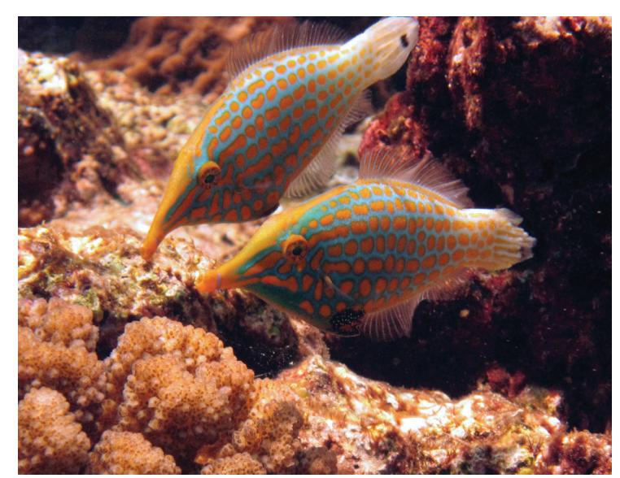

**Image 12.** Pair of long nosed filefish in American Samoa. Photo credit: Kevin Leno. NOAA/CRED.

There are multiple scales at which the marine biogeography of the Samoan Archipelago may be described. At the broadest scale, the entire archipelago has been placed into a global context as a unit in the "central Polynesia" ecoregional province within the "eastern Indo-Pacific" realm as defined by Spalding et al. (2007) and has a biodiversity determined by its location on the diversity gradient between the high at the "Coral Triangle" in the Philippines, Indonesia, northern New Guinea and the Solomon Islands, and the low at the Pacific Americas (Veron 2000, Veron et al. 2009). The present study focuses at finer scales on biogeographic patterns of fish and coral among and within the islands of American Samoa and Samoa.

Coral and fish communities are not evenly distributed throughout the Samoan Archipelago. Island age (e.g. distance from volcanic hotspot), size, geomorphology, reef structure, oceanographic climate (Chapter 2), position in ocean currents (Chapter 3), habitats, wave exposure, human impacts, and other factors have shaped the distribution of reef fish and coral among and within the islands (e.g. Green 1996, 2002, Craig et al. 2005, Whaylen and Fenner 2005, Sabater and Tofaeono 2006, 2007, Birkeland et al. 2008, Brainard and others 2008, Fenner 2008, Fenner et al. 2008, Samuelu and Sapatu 2008, Craig 2009, Fenner 2009 a b, Houk et al. 2010, Carroll 2010, Williams et al. 2011, Ochavillo et al. 2011). Basic physiography alone can be used to broadly divide the archipelago from west to east into relatively larger high islands with several broad reef flats and shallow lagoon areas (Savai'i and Upolu), a moderately sized high island with relatively narrow fringing reefs as well as submerged bank reef formations (Tutuila), smaller high islands with fringing reefs and steep shelf slopes (Manu'a Islands of Ofu, Olosega, and Ta'u), and the small, low-lying and geologically separate atolls of Rose (Muliāva) which lies to the east of the Samoan volcanic hotspot, and Swains Island, which lies ~400 km to the north and may share geologic origins with the Tokelau Island group. The purpose of this chapter of the characterization was to identify geographic patterns, spatial trends, and relatively high values or "hotspots" of coral and fish distribution among and around these islands. Documenting biogeographic patterns of these foundational resources is a first step in devising informed monitoring, management, conservation, and sustainable use strategies (Oram 2008, Conservation International et al. 2010).

1 NOAA/NOS/NCCOS/CCMA/Biogeography Branch

2 NOAA/NOS/NCCOS/CCMA/Biogeography Branch and Consolidated Safety Services, Inc., Fairfax, VA, under NOAA Contract No. DG133C07NC0616

3 American Samoa/Department of Marine and Wildlife Resources

4 The Nature Conservancy, Asia Pacific Resource Center

5 Samoa/Ministry of Agriculture and Fisheries/Fisheries Division

6 NOAA/NMFS/PIFSC/Coral Reef Ecosystem Division

This assessment combines data from many pre-existing studies into a more robust characterization of the reef communities of Samoa and American Samoa that none of the studies could have achieved alone. Although there are challenges inherent in normalizing and combining results from many studies, this approach maximizes use of available information, provides the broadest possible geographic scope, and reduces sensitivity of the findings to the biases associated with any one dataset. We took the approach of using more datasets for greater geographic coverage and information density at the expense of taxonomic resolution. The assessment focused on six general groups of variables: percent cover of live coral, morphological variety of corals, community structure or relative abundance of corals, biomass of reef fish, variety of reef fish, and community structure or relative abundance of reef fish. A wide diversity of additional measures of reef ecosystem conditions are possible, however these six variable groups are collected by most researchers, are simple to calculate and interpret, can offer relatively comparable data even when moderately different survey methods are used, and characterize some of the most important aspects of reef ecosystems for scientists and managers.

Specifically, our objectives were to:

- 1) Combine multiple studies of coral and reef fish using normalized data into an analysis of the recent status of the six key variable groups.
- 2) Assign relatively high, medium, or low values to study sites within the archipelago for each of the coral and fish variables and plot their positions around each island.
- 3) Identify geographic patterns of hotspots, breakpoints, and spatial trends in the coral and fish variables among and within islands of the archipelago.

#### **METHODS**

The analysis was restricted to data sets that, 1) included a broad component of the coral or fish communities (i.e. were not restricted to a single taxon or trophic group), 2) had sites spread widely among islands or extensively around one of the larger islands, 3) were recent (less than ~10 years old), and 4) utilized a relatively un-biased approach to site selection that enabled broad geographic inference (e.g. random stratified design). Many studies were not included in this assessment primarily because they lacked a broad distribution of sites and therefore lacked the widespread geographic scope of inference sought in the characterization. Eight studies met the criteria above and are included in the analysis (Figure 4.1, Table 4.1).

Typical reef morphology differs significantly between Samoa and American Samoa. Zonation of Samoan reefs generally consists of a much wider reef flat and shallow lagoon area relative to the narrower fringing reef flats that predominate around American Samoa (Green 1996) such that reef flats and shallow lagoons comprise a much greater percentage of the total reef area in Samoa. The sampling designs of many reef studies in these two jurisdictions reflect this difference in dominant structure in that a majority of studies around American Samoa focus on reef slopes (fore reef) whereas most around Samoa focus on shallow lagoons. Consequently, the scope of inference for our assessment differs between these jurisdictions and reflects the reef zones where most monitoring stud-

ies have taken place.

The three coral variables and three fish variables for our analysis were selected primarily on the basis of their widespread use, ease of comparison across studies, and effectiveness in quantifying the status of coral and reef fish around the Samoan Archipelago (see "Included Datasets" side bar). Percent cover of live coral is among the simplest measures recorded in coral reef science and provides an estimate of the areal extent of live coral habitat at a given site. Impacts often reduce coral cover, so sites having high values are often considered higher quality or less impacted reefs (e.g. Nyström et al. 2008, Cheal et al. 2010, but see Vroom 2011). Percent cover of live coral was available from all 8 of the studies in our analysis (Table 4.1). Coral diversity, or the variety

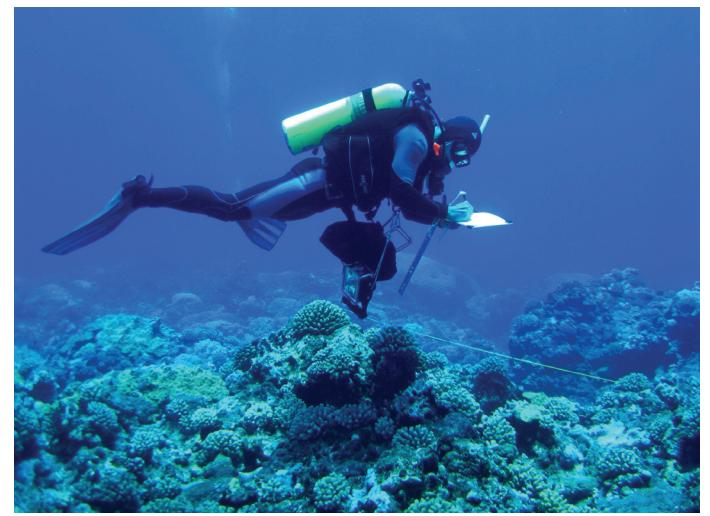

Image 13. Diver collecting fish and coral data in American Samoa. Photo credit: NOAA/CRED.

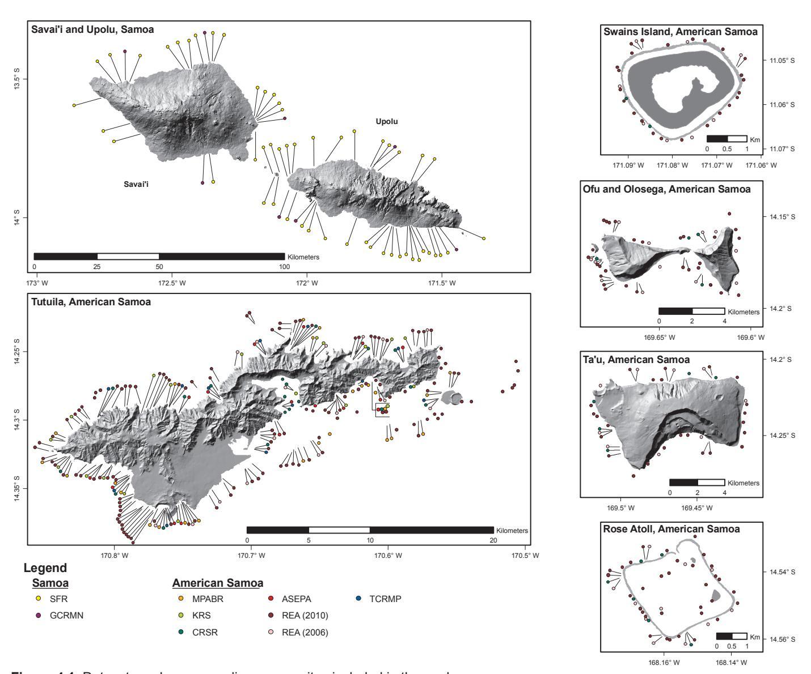

**Figure 4.1.** Datasets and corresponding survey sites included in the analyses.

of corals on a reef, is another measurement commonly used to describe reef communities. High values are often considered to indicate higher quality reefs that may be more resilient to some stressors (Nyström et al. 2008), and there are reports that human impacts reduce coral diversity (Edinger et al. 1998, Houk and Musberger 2008). As a measure of coral diversity, we calculated the number of coral genera or morphologies (depending on data recorded by each particular study) observed at each site. This metric will hereafter be referred to as coral richness and was available from 7 of the 8 studies used in our analysis. Next, reefs may have similar values of coral cover and richness but actually be comprised of completely different species or species groups. The relative abundances of coral genera or morphologies at each site were therefore used to distinguish similarities and differences among sites in community composition and to identify those sites with unique communities. Community structure data was available from 7 of the studies used in our analysis.

A similar suite of 3 variables was used to evaluate reef fish communities. A common measure of the quality of reef fish assemblages is fish abundance or biomass per unit of area. Higher values, meaning more or larger fish in an area, are often considered to indicate higher quality or less impacted reefs (e.g. Friedlander et al. 2002, Cheal et al. 2010). All 8 of the studies in our analysis provided either fish abundance, fish biomass, or both. We used biomass per unit area surveyed when available (7 of the 8 studies), and hereafter refer to this metric as fish biomass. As a measure of reef fish diversity, we calculated the number of species or species groups of reef fish observed at each site. This metric will be referred to as fish richness and was available from all 8 of the studies used in our analysis. The relative abundances (biomass measures when available) of reef fish species or species groups were used to identify sites with unique or similar reef fish community structures. Reef fish community structure was available from 7 of the 8 studies used in our analysis.

**Table 4.1.** List of datasets and variables used in the analysis. Y denotes that the variable was included in the analyses whereas NA indicates the variable was either not recorded or was unavailable for analysis.

|                                                   |                | Coral Variables   |                    | Fish Variables  |                  |                   |  |
|---------------------------------------------------|----------------|-------------------|--------------------|-----------------|------------------|-------------------|--|
| Study                                             | Coral Cover | Coral Richness | Coral Community | Fish Biomass | Fish Richness | Fish Community |  |
| American Samoa Enviromental Protection Agencya | Y              | Y                 | Y                  | Y               | Y                | Y                 |  |
| Coral Reef Status Reportb,c                       | Y              | Y                 | Y                  | Y               | Y                | Y                 |  |
| Global Coral Reef Monitoring Networkd             | Y              | Y                 | Y                  | Y               | Y                | Y                 |  |
| Key Reef Speciese                                 | Y              | NA                | NA                 | Y               | Y                | Y                 |  |
| Marine Protected Area Bioreconaissancef           | Y              | Y                 | Y                  | Y               | Y                | NA                |  |
| Rapid Ecological Assessmentg,h                    | Y              | Y                 | Y                  | Y               | Y                | Y                 |  |
| Samoan Fish Reservesi                             | Y              | Y                 | Y                  | Y               | Y                | Y                 |  |
| Territorial Coral Reef Monitoring Programj        | Y              | Y                 | Y                  | Y               | Y                | Y                 |  |

a from Houk and Musberger 2008; b from Green 1996; coral cover, fish biomass, and fish richness data were from 1994-5 surveys of American Samoa; c from Green 2002; coral richness, coral community, and fish community data were from 2002 surveys of Tutuila and Manu'a; d from Samoan Ministry of Agriculture and Fisheries, Fisheries Division and Wilkinson 2008; e from Sabater and Tofaeono 2006; f from Oram 2008; g from Brainard and others 2008 and Williams et al. 2011; h coral cover, fish biomass, fish richness, and fish community data were available from 2010 surveys; coral richness and coral community data were available from 2006 surveys; i from Samoan Ministry of Agriculture and Fisheries, Fisheries Division; j from American Samoa Department of Marine and Wildlife Resources and Whaylen and Fenner 2005.

#### **Included Datasets: American Samoa**

American Samoa Environmental Protection Agency

*Seventeen sites around Tutuila have been monitored approximately every two years since 2003 by the American Samoa Environmental Protection Agency (hereafter ASEPA) (Houk and Musburger 2008). Sites were selected to assess pollution impacts associated with watersheds of varying size and human population. Surveys were conducted at ~10 m depth on homogenous habitat of the reef slope near stream discharges. Three replicate transects of bottom cover were conducted at each site using a 50 m tape and video. Percent coral cover was quantified using randomly selected points and the video data. Fish communities were quantified at each site using 5 replicate stationary point counts (Bohnsack and Bannerot 1986). Only those fish >20 cm long and those exploited in fisheries were surveyed. Data for 16 sites (Figure 4.1) from 2007 and 2008, the most recent years available, were used for this analysis (Houk and Musburger 2008). From these surveys, all six key variables were calculated (Table 4.1).* 

## Coral Reef Status Report

*A resurvey of sites in Samoa and American Samoa was recently evaluated for a Coral Reef Status Report (hereafter CRSR) (Green 1996, 2002). In this study, 28 sites around Tutuila and the Manu'a Islands, 6 sites around Rose Atoll, and 2 sites at Swains Island were surveyed in 1994-95 using visual census techniques (Figure 4.1). Sites at Tutuila and Manu'a were resurveyed in 2002. Seven sites around Upolu in Samoa were surveyed in 1994-95 however these data were not used in this study due to incomplete spatial coverage around only one island and a focus on a different reef zone relative to the more spatially comprehensive Samoan studies. Sites were selected to have broad distribution around the islands of American Samoa in a range of physical settings. At each site, 3-5 replicate 50 m transects were surveyed at ~10 m depth on the reef slope. Percent coral cover and colony morphology was quantified at three positions every 2 m along the transects. Fish communities were quantified along a 50 by 3 m belt (Green 2002). All diurnally active, non-cryptic reef fish were recorded to the species level. Each individual fish was counted and a length estimate made. Data from 1994-95, the oldest in the study, were used in the analysis of coral cover, fish biomass, and fish richness since it encompassed the broadest spatial coverage including Swains and Rose Atolls. Coral community data from 1994-95 categorized corals into only 4 morphological groups, which limited the ability to resolve differences among sites based on coral richness and community structure. Also, fish abundance by species or species group at each site was not available in the report based on the 1994-95 data (Green 1996). Therefore, 2002 data for American Samoa was used for coral richness and coral and fish community based analyses (Table 4.1).*

#### Key Reef Species Program

*The Key Reef Species Program (hereafter KRS) is conducted by the American Samoa Department of Marine and Wildlife Resources (DMWR). Twenty four sites have been monitored annually around Tutuila using transects conducted at ~10 m depth on the reef slope. Sites were selected based on wave exposure and coastal region and were well distributed around Tutuila. Four replicate video transects of bottom cover were conducted at each site using a 30 m tape and used to calculate percent coral cover. Fish communities were quantified using 3-4 replicate 30 by 5 m transects at each site (Sabater and Tofaeono 2006). This program only monitors fish that are targeted locally as a food source. Data from 2006, the most recent year made available for this analysis included 19 sites (Figure 4.1). From these surveys, 4 of the 6 key variables could be calculated (Table 4.1).*

#### MPA Biological Reconnaissance Assessment

*To support the development of a network of "no-take" MPAs, fish and coral surveys were conducted around Tutuila by the MPA Program of the American Samoa DMWR (hereafter MPABR) (Oram 2008). A total of 26 survey sites were spread within 14 regions selected based on literature review and scientific opinion of the best potential locations for no-take MPAs (Figure 4.1). Surveys used a semi-quantitative scoring system for a number of coral and fish variables conducted during roving dives up the reef slope (Oram 2008). Each survey site was divided into eight five-minute observation stations beginning at the deeper part of the reef slope and progressing shallower (Oram 2008, Lucy Jacob DMWR pers. comm.). Data were collected in 2006-2008. From these surveys 5 of the 6 key variables could be calculated (Table 4.1).*

#### Rapid Ecological Assessment

*The Rapid Ecological Assessment (hereafter REA) is one component of the monitoring conducted by NOAA's Coral Reef Ecosystem Division (CRED). Sites have been monitored every two years around all islands of American Samoa since 2002. Prior to 2008, sites were selected at 10-15 m depth on the reef slope primarily to be representative of reef conditions and management settings around the islands. Two replicate surveys of bottom cover were conducted at each site using a 25 m tape and recording the cover type at 0.5 m intervals (Brainard and others 2008). Beginning in 2008, but more comprehensively in 2010, sampling effort was distributed based on the areas of three depth strata (0-6, 6-18 and 18-30 m). Sites were randomly selected a minimum of 100 m apart and fish communities were quantified using a stationary point count (Bohnsack and Bannerot 1986) with ~ two to four replicates at each site. Data from 2010 surveys at 241 sites were available for coral cover, fish biomass, fish richness, and fish community structure. Coral richness and community structure data were not available from the 2010 survey at the time of this analysis and so data from the most recent year available (2006 at 56 sites) were used for those two variables (Figure 4.1, Table 4.1).* 

#### Territorial Coral Reef Monitoring Program

*The Territorial Coral Reef Monitoring Program (hereafter TCRMP) is conducted by the American Samoa DMWR (Whaylen and Fenner 2005, Fenner 2008, 2009a, b, Carroll 2010). Twelve sites (Figure 4.1) have been monitored annually around Tutuila using transects conducted at ~10 m depth on the reef slope. Sites were selected to achieve an equitable distribution around Tutuila and to represent various wave exposure and human impact levels. Benthic surveys were conducted using four replicate transects at each site using a 50 m tape. Coral cover by species was recorded to the lowest taxonomic group possible at 0.5 m intervals. All diurnally active, non-cryptic reef fish were recorded to species level using belt transects. At each site, 6 replicate 30 m long transects were conducted with several passes and widths being used to sample different groups. The first pass (15 m wide) sampled larger, more mobile species (e.g. sharks, snapper, jacks, large grouper), the second pass sampled parrotfish (10 m wide), the third pass surgeonfish(5 m wide), and remaining species are sampled on the fourth pass (5 m wide). Each individual fish was counted and a length estimate made. Data from 2006-2008 (fish) and 2008 (coral), the most recent years available, were used for this analysis. From these surveys, all six key variables were calculated (Table 4.1).* 

#### **Included Datasets: Samoa**

#### Global Coral Reef Monitoring Network

*Eight permanent sites have been monitored around Samoa since 2002 as part of the Global Coral Reef Monitoring Network (hereafter GCRMN) (Samuelu and Sapatu 2008, Wilkinson 2008). The sites were selected to have a broad distribution around the islands and to be representative of Samoa following GCRMN protocols. Sites were located in the shallow lagoon and reef flat habitats around Upolu and Savai'i in 2-5 m depth. At each site, divers survey fish and corals using repeated passes along a 50 by 2 m transect. First, a set of indicator fish species selected by GCRMN are tallied followed by invertebrates. Next substrate type is recorded every two meters along the 50 m transect by 3 divers, one directly above the transect tape and also at 1 m on both sides of the transect tape. Data were collected around Savai'i and Upolu from 2002-2010 (Figure 4.1). We used the most recent data available for each of the 8 sites in our analysis. From the available data, all 6 key variables could be calculated (Table 4.1).*

#### Fish Reserves Monitoring

*Fish reserves are monitored by Samoa's Ministry of Agriculture and Fisheries, Fisheries Division as part of the technical assistance provided to the Community Based Fisheries Management Program (hereafter referred to as Samoan, Fisheries, Reserves or SFR) (King and Faasili 1998). Currently there are 54 fish reserves of variable size (average of ~75,000 m2 ). These comprise <1% of the total reef area of Samoa and are typically located in the broad reef flat or shallow lagoon areas at depths ranging from 2-10 m. The exact location and size for the fish reserves are proprietary for each village and regulations range widely including potential rules such as no-take zones, seasonal closures, methods restrictions, or size limits (Johannes 2002). Preliminary analyses indicated that reserves are providing a random effect and are unlikely to introduce any consistent bias in the results. This is possibly due to the high variability in size and regulations among the reserves (Samuelu 2003, J Samuelu Ah Leong pers. comm.). Fish and coral data are recorded at 5 replicate 50 m transects that are randomly placed within each reserve. Methods are similar to those used by GCRMN described previously and require multiple passes over the transect. Food fish are recorded to species level and all others are tallied at the family level. Data were collected around Savai'i and Upolu from 2003-2010. We used the most recent data available for each of the sites in our analysis (Figure 4.1). From the available data, all 6 key variables could be calculated (Table 4.1).*

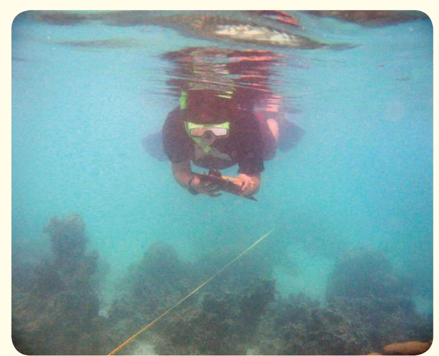

**Image 14.** Snorkler collecting fish and coral data in Samoa. Photo credit: Joyce Samuelu Ah Leong, MAF/FD.

# **Analysis of Coral Cover, Coral Richness, Fish Biomass, and Fish Richness**

It was not possible to simply pool site values for each variable from all the datasets into a single analysis due to three main issues. First, studies in American Samoa were on reef slopes whereas those in Samoa were on reef flats and shallow lagoons making direct quantitative comparisons inappropriate. Second, even within a jurisdiction, data collection methods differed among studies resulting in incompatible values even when the underlying variable being measured was the same (e.g. stationary point counts vs. transects of multiple dimensions for reef fish). Last, studies also quantified different aspects of the coral and fish community that were not directly comparable (e.g. coral richness measured at the genus level vs. by morphologic group, assessment

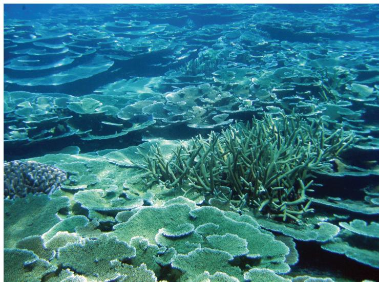

**Image 15.** A high coral cover, low diversity reef in American Samoa. Photo credit: Matt Kendall, NOAA Biogeography.

of only food fish vs. day active fish vs. all fish seen). Therefore, a wide range of standardization, scoring, and scaling approaches were explored to transform the raw data among the diverse studies into comparable values. Results are reported separately by jurisdiction.

We devised a standardized approach to classify values of each variable at each site as high, medium, or low relative to other sites surveyed in the archipelago with the same study methods. Sites were only scored relative to each other within the same study to avoid incompatibility issues among datasets. For each individual study and variable, site values were calculated from raw data (averaging over replicates where necessary) and ordered from highest to lowest. We then used the Natural Breaks function in ArcMap version 9.3 to identify two class breaks in the distribution of each variable for every study separately. The Natural Breaks algorithm chooses class breaks to maximize similarity of values within classes and maximize differences among classes, effectively setting boundaries where there are relatively big jumps in data values. The very general summary variables and analytical approach that we used were generally insensitive to highly skewed data for individual species. However, class breaks were reviewed individually to ensure that anomalous or extreme observations for a particular species did not bias the results (e.g. mass recruitment events in March/ April [Craig et al. 1997, Green 2002]). The two class breaks were used to assign site values of each variable as high, medium, or low relative to all the sites surveyed within a given study (Table 4.2, Appendix C; Figures C.1-C.31). This summarized site values in a consistent but qualitative scale for the variables percent coral cover, coral richness, fish biomass, and fish richness respectively. It is important to note that cut off values for

**Table 4.2.** Assigned breakpoints between low and medium (L → M) and medium and high (M → H) values for each of the fish and coral variables by dataset. Breakpoints were assigned based on natural breaks in the data (see Appendix A).

| Study | Coral Cover |       | Coral Richness |       | Fish Biomass |              | Fish Richness |       |
|-------|-------------|-------|----------------|-------|--------------|--------------|---------------|-------|
|       | L → M       | M → H | L → M          | M → H | L → M        | M → H        | L → M         | M → H |
| ASEPA | 18 %        | 33 %  | 8a             | 11a   | 5034 g       | 14008 g      | 6b            | 13b   |
| CRSR  | 16 %        | 31 %  | 4c             | 5c    | 375 kg/ha    | 682 kg/ha    | 102d          | 148d  |
| GCRMN | 7 %         | 44 %  | 4c             | 7c    | 12 kg/trans. | 29 kg/trans. | 4b            | 6b    |
| KRS   | 26 %        | 40 %  | NAe            | NAe   | 84 kg/km2    | 184 kg/km2   | 25b           | 34b   |
| MPABR | NAf         | 41 %  | 26g            | 42g   | 25g          | 33g          | 52g           | 67g   |
| REA   | 15 %        | 35 %  | 11a            | 18a   | 24 g/m2      | 60 g/m2      | 24b           | 31b   |
| SFR   | 11 %        | 38 %  | 3c             | 6c    | 5 kg/trans.  | 18 kg/trans. | 4b            | 7b    |
| TCRMP | 23 %        | 42 %  | 7b             | 12b   | 55 g/m2      | 72 g/m2      | 15b           | 19b   |

a number of genera per transect; b number of species per transect; c number of morphologies per transect; d number of species per 750 m2 (area surveyed at each site); e no coral richness data for KRS; f no MPABR coral cover data values classified as low; g custom scoring scale (see Oram 2008)

the high, medium, and low categories varied widely among studies due primarily to differences in methodology and units of the data recorded. It is suggested that readers examine Table 4.2 and the Figures C.1-C.31 in Appendix C where quantitative cutoffs are shown and then refer to the corresponding description of each study to understand the expected range of high, medium, and low values that can result given each particular methodology.

# **Analysis of Coral and Fish Community Structure**

To identify sites with similar coral and fish assemblages we performed a series of non-metric multi-dimensional scaling (MDS) analyses for each study using PRIMER version 6 (Clarke and Gorley 2006). MDS provided a plot of survey sites for each dataset based on their relative similarity to each other. Sites closer together in chart space have more similar communities to each other than sites plotted farther apart (Clarke 1993, Legendre and Legendre 1998). Separate MDS plots were created for each dataset for coral community structure and fish community structure. The raw data for coral community analysis was percent coral cover by genus or morphological group depending on the study. The raw data for analyses of fish communities consisted of fish biomass by species or species groups. From these values, the Bray-Curtis coefficient was calculated among all pairs of sites to measure community similarity. The Bray-Curtis similarity is commonly used in studies of ecological communities and emphasizes shared patterns in species abundances rather than simply the presence/absence of species (Clarke 1993, McCune and Grace 2002). Sites were then plotted in two-dimensional chart space (MDS plots) based on these similarity values such that dissimilar sites are far apart and similar sites are grouped close together.

To support the qualitative interpretation of the MDS plots, we also explored potential groupings of sites in each dataset according to their fish and coral assemblages using hierarchical clustering (Clarke 1993, Legendre and Legendre 1998). Differences among clusters and among biogeographic regions (see below) were explored using an analysis of similarities (ANOSIM) test (Clarke 1993, Legendre and Legendre 1998, Clarke and Gorley 2006). ANOSIM produces a statistic (R), analogous to a correlation coefficient, that measures the association between pre-defined groups (e.g. biogeographic regions) and MDS patterns. A p-value indicating the statistical significance of the R statistic is also provided. Once MDS and cluster analysis were completed for all datasets (Appendix C; Figures C.32-C.34), the results and plots were visually compared among the datasets for consistent patterns in site groupings. Results are highlighted where two or more datasets showed consistent patterns, groups of sites exhibited similar fish or coral communities, or sites had unique community composition.

## **Identification of Biogeographic Patterns**

All sites were mapped according to their corresponding high, medium, or low classification for each variable. Site classifications were summarized at multiple spatial scales to facilitate comparisons among islands and to place sites into their regional context. For coral cover, coral richness, fish biomass, and fish richness respectively, the proportion of sites categorized as high, medium, and low were summarized in pie charts hierarchically for 1) Samoa and American Samoa, 2) for each island or island group (Savai'i, Upolu, Tutuila, Manu'a, Swains, and Rose Atoll, and 3) at the finest scale, along biogeographically distinct segments of coast. Due to the variable density of survey sites among regions, summary charts were scaled by approximate reef length, using shoreline length as a proxy, to account for unequal sample sizes. For this reason, results within biogeographic regions are presented as the proportion of survey sites within each category (high, medium, or low) whereas results summarized across multiple biogeographic regions are weighted averages of the proportions for each region, with weights given by the length of shoreline. Regions with no surveys were excluded from summaries. For every analysis scale, the number of studies and number of sites comprising a given pie chart is provided. These values provide a measure of the relative confidence of the results with higher values representing more studies/sites and therefore a more robust analysis.

Biogeographically distinct regions were identified through simultaneous consideration of two factors. First, each island was visually examined for spatial patterns in the high, medium, and low values of the survey sites with the goal of identifying clusters of similar values. Second, prominent features of coastal geomorphology (e.g. points, banks, bays, exposure, and even specific villages) were identified on either side of the clusters with the goal of defining the physical boundaries of each distinct region. This process was conducted for all six variables such that adjacent regions differ in their relative proportions of high, medium, and low values or coral and fish communities for at least one variable. The end result was that biogeographic regions, hereafter called "Bioregions", with distinct reef fish and coral communities were identified as defined above.

## **Identification of Biogeographic Hotspots**

Bioregions with an especially large proportion of high site values compared to the study area as a whole can be considered ecologically important areas worthy of special monitoring or management considerations. For this study, such ecological "hotspots" were first identified for each variable individually (coral cover, coral richness, fish abundance, and fish richness) and then across multiple variables since monitoring and management importance is often heightened for an area when hotspots co-occur for multiple variables.

The term "hotspot" has been used widely to describe concentrations of high value sites using a diversity of approaches, scales, and variables (e.g. total number of species, threatened species, and/or endemics) and must be clearly defined. To identify hotspots for this study, we calculated the proportion of sites classified as high for each variable within each Bioregion. Any Bioregion with a proportion of high values greater than the proportion of high values in the entire jurisdiction (Samoa or American Samoa respectively) was considered to be a hotspot for the indicated variable. This was done for each variable individually and then hotspot results were tallied across the four variables to determine the number of variables contributing to each Bioregion's hotspot status.

In addition, to aid in interpretation of hotspot values for each jurisdiction, the probability that the proportion of high value sites from any particular hotspot could have arisen by random chance was estimated using the statistical method of resampling. In this analysis, for each Bioregion identified as a hotspot we took 1\*106 random samples of n sites from the entire pool of survey sites within a given jurisdiction, where n is the number of sites in the Bioregion, and calculated the proportion of sites classified as high in each random sample. The number of times the proportion of high value sites was greater than or equal to the actual observed proportion for the Bioregion was divided by 1\*106 to provide a p-value that expressed the probability that the observed proportion (or greater) of high sites could have arisen by random chance. Lower p-values denote observations considered less likely to have occurred through random chance. For example, if the observed proportion of high sites was met or exceeded in 100,000 of the 1,000,000 random draws it could be assumed that the observed pattern could occur merely by chance only 10% of the time (p = 0.1). This analysis was not used to assign a formal significance level but rather as an aid to interpreting the observed proportions. Hotspots with high p-values should be interpreted more cautiously than those with lower values.

## **RESULTS**

## **Distribution Of Survey Effort**

The number of studies and individual survey sites are summarized by variable for each jurisdiction, among islands, and according to biogeographic breakpoints. We identified 30 biogeographic regions (Bioregions) based on the six variables considered (Figure 4.2). Because results for Bioregions with more studies and higher numbers of survey sites are more robust than those with fewer, those Bioregions with few studies or sites will be presented in mapped results but discussed only sparingly due to the comparatively reduced confidence in the results.

Of the eight datasets suitable for the study, six took place around American Samoa compared to only two around Samoa despite its much larger potential reef area (Figure 4.1). By far the greatest number of studies and survey sites occurred around Tutuila for all variables making results for that island the most robust in the assessment. For example, an average of 14 survey sites from 4 studies included coral cover data within Bioregions around Tutuila whereas much larger Bioregions around Samoa were represented by an average of only 6 sites from 2 studies. The high density of points around Tutuila facilitated a much more detailed breakout of biogeographically distinct regions (n = 15) compared to the other islands. The Manu'a group was split into three regions, Ofu/Olosega, eastern Ta'u, and western Ta'u. Many more biogeographically distinct regions probably exist around Upolu and Savai'i than were identified here (n = 6 and 5 respectively) but could not be detected due to the limited number of surveys around those islands. The distribution of values at sites around Swains and Rose Atolls were spatially uniform for most variables on the reef slopes (exception was

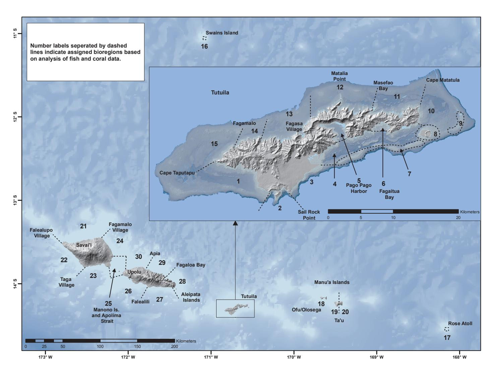

**Figure 4.2.** Biogeographic regions (Bioregions) assigned based on analyses of fish and coral data. Islands and key geographic features such as villages, bays, or points that are referred to in the text are labeled.

for sites inside versus outside the lagoon at Rose) and these islands were generally too small to warrant further biogeographic breakdown of fish and coral patterns based on the variables we considered.

Despite the relatively intense sampling around Tutuila, it should be emphasized that the scope of inference for Tutuila from this analysis is largely limited to the reef slope where the vast majority of survey effort took place. Only ~5% of survey effort was spent on bank reefs around the island, and those surveys were almost exclusively on Taema and Nafanua Banks. There is a very large shelf area around Tutuila with many bank and pinnacle reef formations (Bare et al. 2010, Appendix B) that are poorly known relative to the reef slopes and are beyond the scope of this analysis. Most of the area of these banks lies much deeper than 10 m, the depth at which many studies used here were focused, and is below the depths of safe diving for extended survey work. Some surveys have been conducted on reef flats; however, those data were spatially limited and therefore not used in this assessment. Similarly, since survey effort around Samoa is focused landward of the reef crest, the scope of inference for that region is largely limited to the reef flat and lagoon reef zones and results are discussed separately for the two jurisdictions.

## **Percent Coral Cover: Samoa**

Percent coral cover for Samoa overall was rated as high for over 40% of the coast (Figure 4.3a). Results summarized by island revealed that a much larger proportion of Savai'i (~60% of coastline) was rated as having high coral cover compared to Upolu (~30%). Biogeographic patterns of coral cover revealed north/ south patterns of coral cover that differed by island. The north and northeast facing coasts of Savai'i possess a large proportion of sites with high coral cover (Figure 4.3b). In contrast, Upolu has more moderate and vari-

**Figure 4.3.** Coral cover at survey sites across Samoa and American Samoa. Sites and pie charts are coded as high, medium, or low coral cover values. (a) Proportions of high, medium, and low values by jurisdiction and by island. (b,c) Proportions of high, medium, and low values for individual Bioregions. Number labels represent the number of studies and sites (in parentheses) comprising each pie chart.

able values with areas of low coral cover along the north and west coasts, especially in the Manono Island/ Apolima Strait area and between Apia and Fagaloa Bay (Bioregions 25 and 29).

# **Percent Coral Cover: American Samoa**

American Samoa overall had only 22% of the coast rated as having high coral cover and the rest split approximately evenly between the medium and low categories (Figure 4.3a). Results summarized by island revealed that Swains Island had high coral cover (~55% of sites) whereas a relatively large proportion of some islands such as Tutuila (~50% of coastline) and Rose Atoll (~75% of sites) had low coral cover. Spatial patterns of coral cover within islands or island groups revealed highly variable values even among adjacent segments of coast. Tutuila has some areas with a very large proportion of high coral cover sites (e.g. SW coast from Cape Taputapu to Sail Rock Point [Bioregions 1 and 2], coast east of Fagamalo Village [Bioregion 14], northern coast including Matalia/Cockscomb Point [Bioregion 12], and southeastern regions including Aunu'u and the eastern tip of the island and Fagaitua Bay [Bioregions 8, 10, and 6]) separated by distinct areas with relatively low values (i.e. NW coast offshore from Fagali'i and Fagasa villages [Bioregions 13 and 15], coastlines including and extending away from Pago Pago Harbor and the airport [Bioregions 3 and 4]) (Figure 4.3c). The Manu'a Islands showed perceptible biogeographic differences as well. The east side of Ta'u (Bioregion 20) possessed a large proportion of sites with high coral cover whereas western Ta'u (Bioregion 19) and Ofu/Olosega (Bioregion 18) possessed relatively lower values (Figure 4.3b). Swains Island (Bioregion 16) had generally high values of coral cover whereas Rose Atoll (Bioregion 17) possessed generally low values.

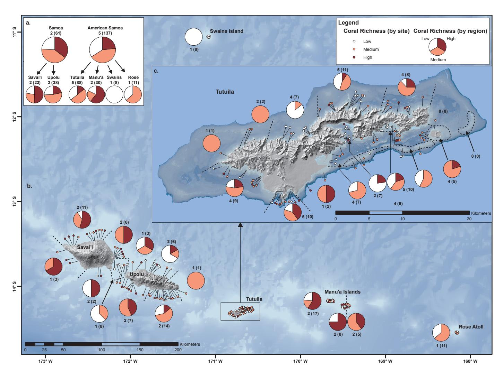

**Figure 4.4.** Coral richness at survey sites across Samoa and American Samoa. Sites and pie charts are coded as high, medium, or low coral richness values. (a) Proportions of high, medium, and low values by jurisdiction and by island. (b,c) Proportions of high, medium, and low values for individual Bioregions. Number labels represent the number of studies and sites (in parentheses) comprising each pie chart.

## **Coral Richness: Samoa**

Coral richness for Samoa overall was rated as high for ~35% of the coastline (Figure 4.4a). Results summarized by island revealed that a very large proportion of Savai'i (50% of the coastline) was rated as having high coral richness compared to Upolu (<25%). Biogeographic patterns of coral richness within islands or island groups revealed a few notable spatial trends. Savai'i possesses a small proportion of sites with low coral richness relative to Upolu (Figures 4.4a-b). The proportion of sites with high coral richness generally declines eastward in Samoa. Compared to Savai'i, Upolu has somewhat more moderate and variable values with concentrated areas of low coral richness in the Manono Island/Apolima Strait area and between Apia and Fagaloa Bay (Bioregions 25 and 29).

## **Coral Richness: American Samoa**

American Samoa overall had 23% of the coast rated as having high coral richness and the rest split approximately evenly between the medium and low categories (Figure 4.4a). Results summarized by island revealed that the Manu'a group had high coral richness (~60% of coastline) whereas a relatively large proportion of sites at other islands, especially Swains (100% of sites), had lower values. Spatial patterns within islands or island groups revealed a north/south pattern for Tutuila but also some highly variable patterns even among adjacent segments of coast. Areas around Tutuila with relatively high coral richness (~25% of sites) include the SW coast from Cape Taputapu to Sail Rock Point (Bioregions 1 and 2), the northeastern coast from Masefao Bay to Matatula Point (Bioregion 11), southeastern regions including around Aunu'u Island and Fagaitua Bay (Bioregions 8 and 6 respectively), and even Pago Pago Harbor (Bioregion 5) which had mostly sites with low coral richness (>75%) but a few in the high richness category (Figure 4.4c). The rest of the regions around Tutuila were characterized by low or moderate values. The Manu'a group showed perceptible biogeographic differences as well. The east side of Ta'u (Bioregion 20) had only sites with moderate or high coral richness whereas western Ta'u (Bioregion 19) and Ofu/Olosega (Bioregion 18) were more variable and possessed relatively more high richness sites but also some with low values (Figure 4.4b). All of the coral richness values around Swains Island were low (Bioregion 16). Rose Atoll possessed only moderate and low values (Bioregion 17).

# **Coral Community Structure: Samoa**

Sparse data and extensive overlap of sites in MDS plots limited the interpretation of results for coral community structure in Bioregions around Samoa. However, both datasets (GCRMN, SFR) revealed consistent patterns of overlap among sites around southern Upolu (Bioregions 26 and 27) and northern Savai'i (21 and 24) as well as a separate and unique coral community in sites on southern Savai'i (Bioregion 23).

# **Coral Community Structure: American Samoa**

The MDS analyses for each study in American Samoa revealed extensive overlap in coral communities among sites and otherwise biogeographically distinct regions (Appendix C; Figures C.32 and C.34). Only two studies showed significant differences among Bioregions in the global ANOSIM (MPABR, R = 0.327 and p = 0.002; REA, R = 0.566 and p = 0.001), and only 2-4 statistically different groups could be identified for some datasets through cluster analysis. Despite the overall finding of high overlap, coral communities of a few Bioregions showed consistent patterns of similarity or uniqueness among datasets (Figure 4.5). Sites in Pago Pago Harbor (Bioregion 5) consistently showed a unique coral assemblage among datasets (ASEPA, REA,

**Figure 4.5.** Summary of Bioregions sharing similar coral communities and those with unique coral communities as identified from the MDS analyses.

TCRMP). Note that unique sites are typically thought of in a positive sense, but in this case may indicate a uniquely unhealthy coral community because this Bioregion is heavily impacted by human activities (Pedersen Planning Consultants 2000). Sites between Cape Taputapu and Sail Rock Point (Bioregions 1 and 2) and also those around Aunu'u often plotted with the same group among datasets (ASEPA, CRSR, MPABR, REA, and TCRMP). Parts of NE (Bioregion 11) and NW Tutuila (Bioregion 14) showed similarities in coral community structure in two datasets (CRSR, TCRMP) as did the north/central coast including Matalia/Cockscomb Point (Bioregion 12) and Fagaitua Bay (Bioregion 6) (CRSR, MPABR) although these areas were represented by few sites. Most sites in east and west Ta'u (Bioregions 20 and 19) and to a lesser degree Ofu/Olosega (Bioregion 18) were similar to each other (CRSR, REA). Rose Atoll (Bioregion 17) and Swains Island (Bioregion 16) sites plotted separately in relatively compact groups at the periphery of the MDS plot (surveyed in REA data only). This indicates a somewhat unique and homogeneous coral community as would be expected for each of these two small and isolated island Bioregions, a pattern also found in analysis of their algal communities (Tribollet et al. 2010).

#### Fish Biomass: Samoa

Fish biomass in surveys around Samoa overall showed that only ~10% of coastlines were classified as having high biomass with the remainder divided approximately evenly between the low and medium categories (Figure 4.6a). A relatively large proportion of Savai'i, ~22% of coastline, had high fish biomass whereas none of Upolu's coast was classified as high. Biogeographic patterns of fish biomass within islands revealed that the northern coasts of Savai'i between Falealupo Village and Apolima Strait possess a large propor-

**Figure 4.6.** Fish biomass at survey sites across Samoa and American Samoa. Sites and pie charts are coded as high, medium, or low biomass values. (a) Proportions of high, medium, and low values by jurisdiction and by island. (b,c) Proportions of high, medium, and low values for individual Bioregions. Number labels represent the number of studies and sites (in parentheses) comprising each pie chart.

tion of sites with high fish biomass whereas Upolu has large regions of low biomass in the Manono Island/Apolima Strait area (Bioregion 25), between Apia and Fagaloa Bay (Bioregion 29), and on the southeastern coast between Falealili and Aleipata Islands (Bioregion 27) (Figure 4.6b).

# **Fish Biomass: American Samoa**

Fish biomass in surveys around American Samoa overall showed that ~10% of coastlines were classified as having high biomass with the remainder divided approximately evenly between the low and medium categories (Figure 4.6a). Patterns among islands in American Samoa were relatively uniform although Swains and Rose Atolls had a relatively greater proportion of sites with high biomass as would be expected for these two remote islands (Williams et al. 2011). Tutuila had a greater pro-

**Image 16.** Halfspotted hawkfish on a reef with low coral cover in American Samoa. Photo credit: Kevin Lino, NOAA/CRED.

portion of low rated coastline compared to other islands. Biogeographic patterns within islands or island groups revealed that Tutuila has a more uniform distribution of biomass values relative to other variables. Areas around Tutuila with relatively high fish biomass (>20% of sites) include the eastern tip (Bioregion 10), Aunu'u (Bioregion 8), Fagaitua Bay (Bioregion 6), and Taema and Nafanua Banks (Bioregion 7; Figure 4.6c). The rest of Tutuila was dominated by low or moderate values which comprised >90% of the sites in those regions. The Manu'a group showed less pronounced biogeographic differences with Ofu/Olosega (Bioregion 18) possessing a relatively large proportion of high biomass sites relative to Ta'u (Bioregions 19-20; Figure 4.6b). Swains (Bioregion 16, ~15% of values in the high biomass category) and Rose (Bioregion 17, ~10% of values in the high category) possessed generally similar proportions in fish biomass categories.

## **Fish Richness: Samoa**

Coastlines for Samoa overall were approximately evenly divided among high, medium, and low fish richness values (Figure 4.7a). In contrast to other variables, Upolu had a greater proportion of sites classified as high richness and fewer classified as low richness relative to Savai'i. Biogeographic patterns within islands revealed that Savai'i possessed fewer high values and a large proportion of low value sites for fish richness on its northern coasts than were seen for other variables (Figure 4.7b). Upolu had greater proportions of high site values on the southern coasts than were seen in other variables. Areas of low richness were however, again found in the Manono Island/Apolima Strait area and eastward past Apia to Fagaloa Bay (Bioregions 25, 29, and 30).

## **Fish Richness: American Samoa**

American Samoa overall had 22% of the coast rated as having high fish richness and nearly 50% classified as moderate. Patterns among islands in American Samoa were more uniform with typically ~25% of sites classified as high and ~50% classified as medium fish richness. The exception was Rose Atoll which had very few sites classified as high and nearly half the remaining sites classified as having low richness. Biogeographic patterns of fish richness within islands or island groups revealed highly variable patterns even among adjacent segments of coast. Tutuila especially had a more variable distribution of richness values around the island relative to some other variables. Notable locations around Tutuila with ~40-50% of sites having high fish richness were around Aunu'u and the bank to the east (Bioregions 8 and 9), Fagatele and Larsen Bays (Bioregion 2), and along the NW coast east of Fagamalo village (Bioregion 14) (Figure 4.7c). The Manu'a group showed less pronounced biogeographic differences with the west half of Ta'u (Bioregion 19) possessing a greater proportion of sites with high fish richness (~40%) than Ofu/Olosega (Bioregion 18) and the east half of Ta'u (~20% of sites) (Bioregion 20). Swains (Bioregion 16) had ~25% of richness values

**Figure 4.7.** Fish richness at survey sites across Samoa and American Samoa. Sites and pie charts are coded as high, medium, or low fish richness values. (a) Proportions of high, medium, and low values by jurisdiction and by island. (b,c) Proportions of high, medium, and low values for individual Bioregions. Number labels represent the number of studies and sites (in parentheses) comprising each pie chart.

in the high category and only a small proportion in the low category whereas Rose (Bioregion 17) had only ~5% of values in the high category and nearly 50% in the low category.

## **Fish Community Structure: Samoa**

For Samoa, the MDS analysis of fish community structure was limited by only 2 datasets and extensive overlap among sites. Despite this, both datasets (GCRMN, SFR) again revealed consistent patterns of overlap among sites around southern Upolu (Bioregions 26 and 27) and northern Savai'i (21 and 24), a finding similar to the coral community analysis.

# **Fish Community Structure: American Samoa**

Even more so than was observed with the coral community analysis, there was a great deal of overlap and similarity in fish communities among sites and Bioregions within each study in MDS plots for American Samoa (Appendix C; Figures C.33-C.34). Only three studies showed significant differences among Bioregions in the global ANOSIM (KRS, R = 0.375 and p = 0.003; REA, R = 0.372 and p = 0.001; SFR, R = 0.197 and p = 0.003), and only 2-3 statistically different groups could be identified for some datasets through cluster analysis. Despite the overall finding of high overlap among sites, fish communities of a few Bioregions showed consistent patterns of similarity or uniqueness among datasets (Figure 4.8). Sites around Aunu'u (Bioregion 8) showed a unique fish assemblage in three datasets (KRS, REA, TCRMP). Sites between Cape Taputapu and Sail Rock Point (Bioregions 1 and 2) generally plotted in the same group among three datasets as well (ASEPA, REA, TCRMP). Sites along the north/central coast including Matalia/Cockscomb Point (Bioregion

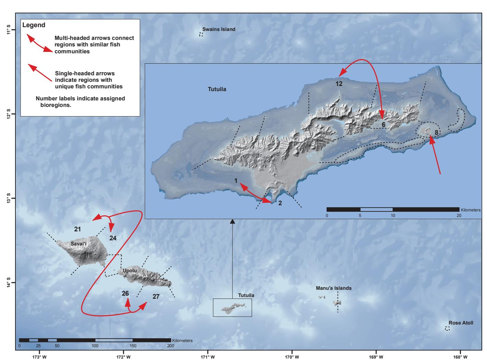

**Figure 4.8.** Summary of Bioregions sharing similar fish communities and those with unique fish communities as identified from the MDS analyses.

12) and Fagaitua Bay (Bioregion 6) also showed some regularly occurring similarities among sites (ASEPA, TCRMP), a finding similar to the analysis of coral communities although based on two different datasets. There were other notable results within particular studies (ASEPA showed Pago Pago Harbor as unique, REA showed a distinct fish community at Swains, KRS showed separation of northern versus southern sites around Tutuila, CRSR showed separation of fish communities at eastern and western Ta'u), but these patterns were not confirmed across multiple datasets.

## **Biogeographic Hotspots**

Biogeographic patterns in coral and fish variables were evident at several spatial scales. Comparing among Samoan islands, Savai'i had consistently high values for multiple fish and coral variables. The exception was for fish richness, for which Savai'i possessed a large proportion of low scoring coastline. There were notable locations in American Samoa at the island or island group level for single variables. Manu'a had many high values for coral richness and Swains had many high values for coral cover. Notable locations with a marked proportion of low values at the island or island group scale included Swains for coral richness, Upolu for fish biomass, and Rose Atoll for coral cover. Note that in some cases, such low values may be "normal" for these locations and are not to be considered as a derogatory finding. Rose Atoll, for example, has a high cover of crustose coralline algae, a variable not presented here, and represents a unique area that contributes to the overall diversity and health of the archipelago (Vroom 2011).

In the hotspot analysis at the scale of Bioregions, 51 hotspots were identified among the four variables and 12 of those had a very low (<10%) probability of occurring by random chance (Table 4.3, Figure 4.9). Of the

**Table 4.3.** Hotspot analysis summary table. The proportion of sites categorized as 'high' is given for each variable and Bioregion. Bioregions with a greater proportion of high sites than calculated for the jurisdiction overall (in italics) are defined as hotspots and highlighted in green. Adjacent p-values indicate the probability of each hotspot occurring merely by chance (\* denotes values <10%).

| Coral Cover |                                   | Coral Richness                      |                                   | Fish Biomass                        |                                   | Fish Richness                       |                                   |                                     |         |                      |
|-------------|-----------------------------------|-------------------------------------|-----------------------------------|-------------------------------------|-----------------------------------|-------------------------------------|-----------------------------------|-------------------------------------|---------|----------------------|
|             | Proportion High Overall = 0.22 |                                     | Proportion High Overall = 0.23 |                                     | Proportion High Overall = 0.10 |                                     | Proportion High Overall = 0.22 |                                     |         |                      |
|             | Bioregion                         | Proportion High for Bioregion | p-value                           | Proportion High for Bioregion | p-value                           | Proportion High for Bioregion | p-value                           | Proportion High for Bioregion | p-value | Hotspot variables |
| moa         | 1                                 | 0.67*                               | 0.000                             | 0.22                                |                                   | 0.11                                | 0.679                             | 0.29                                | 0.219   | 3                    |
|             | 2                                 | 0.42                                | 0.147                             | 0.40                                | 0.203                             | 0.08                                |                                   | 0.38                                | 0.147   | 3                    |
|             | 3                                 | 0.17                                |                                   | 0.50                                | 0.423                             | 0.00                                |                                   | 0.17                                |         | 1                    |
|             | 4                                 | 0.00                                |                                   | 0.00                                |                                   | 0.04                                |                                   | 0.25                                | 0.462   | 1                    |
|             | 5                                 | 0.00                                |                                   | 0.22                                |                                   | 0.11                                | 0.680                             | 0.11                                |         | 1                    |
|             | 6                                 | 0.31                                | 0.351                             | 0.20                                |                                   | 0.19                                | 0.296                             | 0.13                                |         | 2                    |
|             | 7                                 | 0.25                                | 0.564                             | 0.00                                |                                   | 0.25*                               | 0.081                             | 0.20                                |         | 2                    |
|             | 8                                 | 0.33                                | 0.385                             | 0.20                                |                                   | 0.33*                               | 0.082                             | 0.56*                               | 0.032   | 3                    |
|             | 9                                 | 0.00                                |                                   | n/a                                 |                                   | 0.00                                |                                   | 0.40                                | 0.314   | 1                    |
|             | 10                                | 0.50                                | 0.252                             | n/a                                 |                                   | 0.25                                | 0.398                             | 0.25                                | 0.639   | 3                    |
| merican Sa  | 11                                | 0.11                                |                                   | 0.25                                | 0.610                             | 0.06                                |                                   | 0.17                                |         | 1                    |
|             | 12                                | 0.42*                               | 0.070                             | 0.09                                |                                   | 0.00                                |                                   | 0.11                                |         | 1                    |
| A           | 13                                | 0.00                                |                                   | 0.00                                |                                   | 0.06                                |                                   | 0.00                                |         | 0                    |
|             | 14                                | 0.43                                | 0.232                             | 0.00                                |                                   | 0.14                                | 0.589                             | 0.43                                | 0.193   | 3                    |
|             | 15                                | 0.00                                |                                   | 0.00                                |                                   | 0.08                                |                                   | 0.15                                |         | 0                    |
|             | 16                                | 0.54*                               | 0.001                             | 0.00                                |                                   | 0.19                                | 0.190                             | 0.27                                | 0.365   | 3                    |
|             | 17                                | 0.05                                |                                   | 0.00                                |                                   | 0.13                                | 0.528                             | 0.10                                |         | 1                    |
|             | 18                                | 0.13                                |                                   | 0.59*                               | 0.002                             | 0.18                                | 0.213                             | 0.29                                | 0.218   | 3                    |
|             | 19                                | 0.06                                |                                   | 0.75*                               | 0.003                             | 0.06                                |                                   | 0.39*                               | 0.088   | 2                    |
|             | 20                                | 0.44                                | 0.156                             | 0.40                                | 0.348                             | 0.09                                |                                   | 0.18                                |         | 2                    |
|             |                                   |                                     | Proportion High Overall = 0.43 |                                     | Proportion High Overall = 0.35 |                                     | Proportion High Overall = 0.09 | Proportion High Overall = 0.31   |         |                      |
|             | Bioregion                         | Proportion High for Bioregion | p-value                           | Proportion High for Bioregion | p-value                           | Proportion High for Bioregion | p-value                           | Proportion High for Bioregion | p-value | Hotspot variables |
|             | 21                                | 0.91*                               | 0.003                             | 0.55*                               | 0.092                             | 0.22                                | 0.279                             | 0.11                                |         | 3                    |
|             | 22                                | 0.00                                |                                   | 0.67                                | 0.231                             | n/a                                 |                                   | n/a                                 |         | 1                    |
|             | 23                                | 1.00                                | 0.130                             | 0.50                                | 0.526                             | 0.00                                |                                   | 0.50                                | 0.437   | 3                    |
| moa         | 24                                | 0.67                                | 0.129                             | 0.50                                | 0.277                             | 0.67*                               | 0.002                             | 0.17                                |         | 3                    |
| Sa          | 25                                | 0.00                                |                                   | 0.00                                |                                   | 0.00                                |                                   | 0.29                                |         | 0                    |
|             | 26                                | 0.29                                |                                   | 0.43                                | 0.379                             | 0.00                                |                                   | 0.50                                | 0.169   | 2                    |
|             | 27                                | 0.21                                |                                   | 0.14                                |                                   | 0.00                                |                                   | 0.33                                | 0.352   | 1                    |
|             | 28                                | 1.00                                | 0.360                             | 0.00                                |                                   | 0.00                                |                                   | 1.00                                | 0.249   | 2                    |
|             | 29                                | 0.00                                |                                   | 0.17                                |                                   | 0.00                                |                                   | 0.00                                |         | 0                    |
|             | 30                                | 0.00                                |                                   | 0.33                                |                                   | 0.00                                |                                   | 0.00                                |         | 0                    |

30 Bioregions, none were identified as a hotspot for all four variables considered in the analysis. Ten of the Bioregions were hotspots for three variables. This included the SW coast of Tutuila from Cape Taputapu to Larsen Bay (Bioregions 1 and 2), the eastern tip of Tutuila (Bioregion 10), the northwestern coast of Tutuila east of Fagamalo (Bioregion 14), Swains Island (Bioregion 16), Ofu/Olosega Islands (Bioregion 18), and the north, northeast, and south facing coasts of Savai'i (Bioregions 23, 21, and 24). It should be noted however, that none of these three-variable hotspots had a high degree of certainty (p<0.10 in the re-sampling analysis)

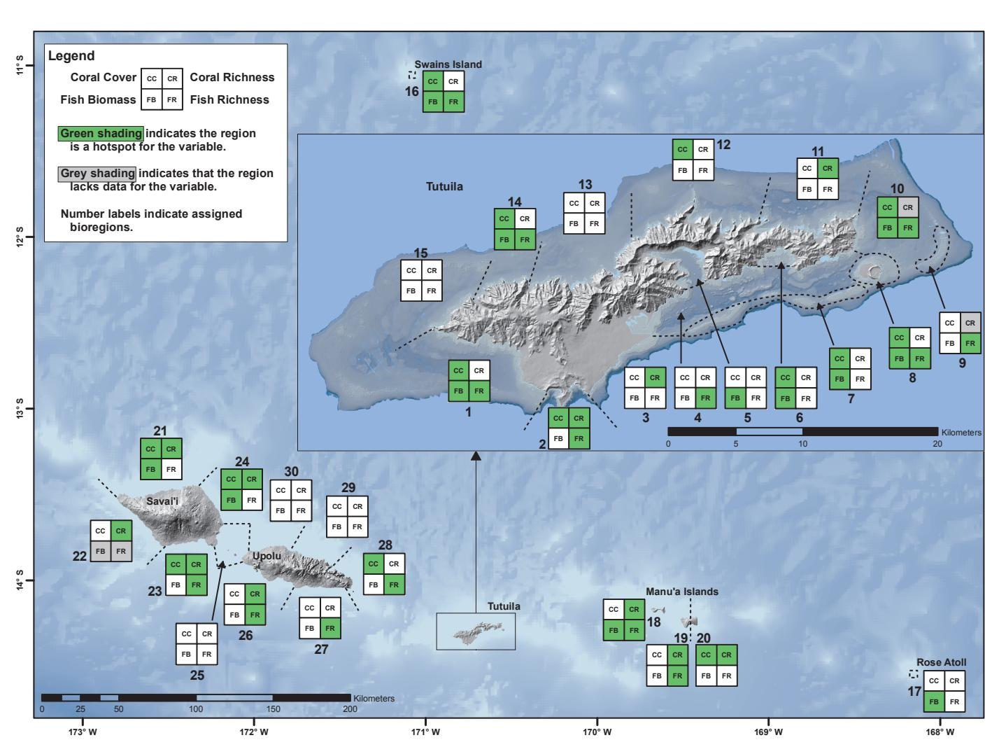

**Figure 4.9.** Fish and coral hotspots by Bioregion.

for all three variables. Considering only hotspots that were highly robust to chance observations (p<0.10), three Bioregions stood out as hotspots for multiple variables: Aunu'u (Bioregion 8, for fish biomass and richness), western Ta'u (Bioregion 19, for coral and fish richness), and the northern coast of Savai'i (Bioregion 21 for coral cover and richness).

Also of note, of the 30 Bioregions, only 5 were not considered a hotspot for any variable. These "coolspots" included 3 regions along the north and western coast of Upolu from Manono Island/Apolima Strait eastward past Apia to Fagaloa Bay (Bioregions 25, 29, and 30), and two regions on the north coast of Tutuila including the NW coast between Cape Taputapu and Fagamalo Village (Bioregion 15) and the north central coast of Tutuila around Fagasa Village (Bioregion 13). Note that, except for the small watershed directly around Fagasa Bay, these last two coolspots straddle a hotspot for 3 variables (Bioregion 14) and occur along relatively less densely populated coast compared to the rest of Tutuila. Additional coolspots probably exist around Samoa but could not be identified due to the low density of surveys. All the other Bioregions were considered hotspots for at least one or two variables.

#### CONCLUSIONS

Reef fish and corals are distributed unevenly around the islands of the Samoan Archipelago. Among the most notable hotspots for fish and corals using the variables considered here were northern Savai'i, parts of northwestern and southwestern Tutuila, the eastern tip of Tutuila, the Manu'a Island group, and Swains Island, although many other regions were identified as important for particular variables. Smaller hotspots at the scale of individual sites were evident as well (e.g. a site with high coral cover surrounded by many low cover sites) but were not the focus of this study and should be the subject of separate, finer-scale analyses. The

biogeographic hotspots and breakpoints identified here may be useful for several purposes including: placing the existing network of marine protected areas (MPA) and marine managed areas (MMA) into regional context for the variables included here, prioritizing Bioregions requiring more detailed study, and supporting review of overall natural resources monitoring practices throughout the region.

It is important to note that this is not a study of reef resiliency and these results alone should not be used as the basis for MPA network design. Nor should these results be interpreted to suggest that only places identified as hotspots in this analysis are biologically significant and worthy of conservation (e.g. Rose Atoll). The relative importance of each variable studied here and targeted in future assessments will vary based on the objectives of a particular management or conservation application (Roberts et al. 2003, Wilson et al. 2009) and should be specified in a process beyond the scope of this document. An effort focused on protecting biodiversity might focus on coral and fish richness hotspots, collecting more datasets that identify fish and coral to the species level, and using tools such as rarefaction curves to identify combinations of sites that efficiently represent the widest variety of species and communities (Beger et al. 2003). Alternatively, if the goal was to protect large larval sources for seeding of unprotected areas (e.g. to enhance sustainability or yield of fisheries), one might focus on hotspots of coral cover or fish biomass (Murray et al. 1999, Ochavillo et al. 2011) that overlap with source origins (Chapter 3). Once MPA/MMA network objectives are clearly identified, the general ecological variables presented throughout this report (Chapters 2-4) could be appropriately weighted and combined, more focused analyses conducted, additional key datasets collected, and a variety of MPA/ MMA design scenarios applied to identify combinations of management strategies and areas to achieve those objectives (e.g. Kendall et al. 2008, Watts et al. 2009).

The objective of this assessment was principally to identify biogeographic patterns of a few variables rather than to determine explanatory processes behind them. Reef type, larval supply, wave exposure, ocean climate, water quality, herbivore abundance, community processes, and various human pressures such as fishing, development, pollution and other factors no doubt interact at each site to produce the bioregional patterns identified here. The sparsely populated islands of Manu'a and Savai'i had generally higher values for most variables than the more densely populated Islands of Tutuila and Upolu. Within Tutuila and Upolu, highest population density areas such as around Pago Pago Harbor and Apia had many of the lowest values. These patterns are consistent with anthropogenic effects on fish communities correlated with human population density as noted for other Pacific Islands (Williams et al. 2011).

Some prior researchers have broken the coast of Tutuila into four sectors (NE, NW, SE, and SW) based primarily on seasonal patterns of wave exposure (e.g. Mundy 1996, Green 1996, 2002, Sabater and Tofaeono

2006). The edges of these sectors correspond well to the boundaries of some Bioregions identified here (1 and 15, 12 and 13, 3 and 4, and 4 and 10) although the combined use of many datasets enabled the discrimination of many additional distinct regions of the coast for Tutuila based on the variables that were considered. In fact, it is apparent from our study using the combined results of many datasets that even adjacent Bioregions with apparently similar environmental conditions can have very different coral and fish assemblages. Along the north shores of Tutuila and Upolu, for example, lie regions with outwardly similar environmental characteristics but very different values for the coral and fish variables considered here. Disentangling the many influences shaping regional biogeographic patterns will be an important next step for research. This could be undertaken with the datasets gathered in this study through further stratification of sites

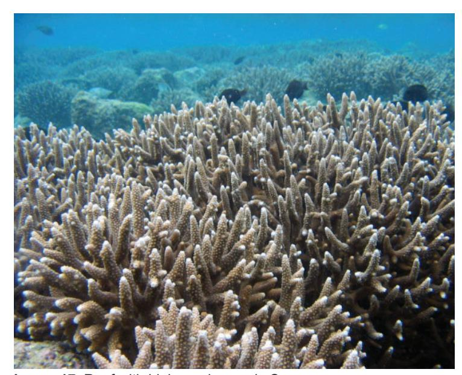

**Image 17.** Reef with high coral cover in Samoa. Photo credit: Joyce Samuelu Ah Leong, MAF/FD.

by such factors as reef type, watershed influences, and exposure regime and the use of correlation or MDS based analysis (e.g. Houk et al. 2010, Ochavillo et al. 2011). This is a key step for identifying those factors that can be managed through agency, village, or MPA/MMA actions, identifying resilient reefs, and predicting how areas may respond over time to management (Nyström et al. 2008).

In general, the fish variables showed a more equitable distribution of values at all scales of analysis relative to the coral variables. There were less extreme changes in the spatial distribution of fish abundance and richness values and fewer differences in fish communities between adjacent Bioregions. Even the SFR dataset, based in village fish reserves around Samoa, did not

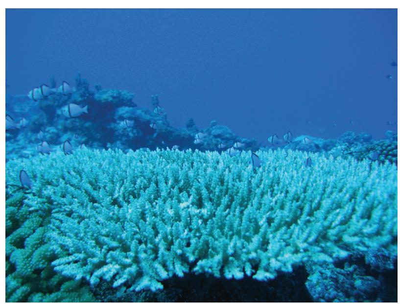

**Image 18.** Reticulated Dascyllus sheltering on a branching coral. Photo credit: Matt Kendall, Biogeography Branch.

appear to have consistently biased the results of fish biomass toward higher values. This could be due to the mobility of adult fish and their potential for relatively rapid redistribution in response to fishing pressure, natural disturbance events, or other density dependent factors. Corals in contrast, may only become redistributed during the larval phase. At least for harvested species, targeted fishing pressure alone may act to smooth out the hotspots for fish density or biomass (Williams et al. 2011).

The processes of larval transport documented in Chapter 3 are probably at least partly responsible for some of the observed biogeographic patterns among islands in the fish and coral variables documented here. The analysis of larval connectivity used shelf-area within ~9 km grid cells to set the number of potential larvae around each source island as a simplifying assumption. However, the results here demonstrate that there can actually be considerable variability in reef condition and therefore presumably spawning potential at finer scales. Although the coarse spatial scale of the hydrodynamic model limits its application to interpretation of the interisland-scale data presented in this chapter, some consistent patterns are evident.

Swains Island, an atoll that did not originate at the Samoan volcanic hotspot and may be geologically part of the Tokelau island group, lies in a somewhat different ocean climate (Chapter 2). Swains Island was also clearly the most physically isolated Bioregion based on currents and larval connectivity (Chapter 3) and, as would be expected, also had a very unique and isolated fish and coral community based on MDS analysis (and see Tribollet et al. 2010 for algal analysis). Rose Atoll, also a small island isolated from large upstream sources of fish and coral larvae, had relatively low values for coral and fish richness. This low biodiversity is consistent with predictions from Island Biogeography Theory (MacArthur and Wilson 1967) for small target islands a great distance from larval sources. In addition, east to west trends along the archipelago of increasing values for coral cover, richness, and even fish biomass are aligned with the prevailing current in the region (South Equatorial Current, Chapter 3). Within Samoa, Upolu generally has lower values than the downstream island of Savai'i. Within American Samoa, Rose has lower fish and coral richness than the downstream islands of Manu'a and Tutuila. These patterns are also consistent with Island Biogeography Theory in that larger downstream islands provide big settlement targets for fish and coral larvae spawned to the east and then carried to destinations westward along the archipelago in the South Equatorial Current. As noted above, however, there is much more at work shaping the reef communities than currents. For example, studies at finer scales around Tutuila have measured effects from more localized processes such as fishing, coastal development and poor water quality (e.g. Houk et al. 2010, Williams et al. 2011). Reef zonation and the much larger reef flat and lagoon area of potential juvenile habitat around Samoa as well as the greater diversity of habitat types there may also play a role in enhancing some fish populations (Green 1996, Adams et al. 2006). Archipelago-wide benthic maps produced using a consistent scale and classification scheme are a critical information need to support an analysis of habitat differences.

There are several key caveats to interpretation of these findings. First, based on the high, medium, and low scoring system, all analyses and results are inherently expressed only relative to the suite of available data in the archipelago. This scale is not defined relative to reef conditions globally or even more widely in the south Pacific region. Were additional data collected at much higher or lower quality sites for any of the individual studies, or if very different islands outside the study region were to be included, the classification of "high," "medium" and "low" categories would have been redistributed. For example, if an island group with many severely impacted sites of lower reef quality had been included, the values of all Samoan reefs would have been scored "relatively" higher. Also, because data from American Samoa is from reef slopes and data for Samoa is from lagoons, the scope of inference differs between these jurisdictions and comparison of "high" values between them is not possible. Also, although results are based heavily on recent data to reflect current status, catastrophic events and major environmental shifts may alter the distributions of even these very general variables. Of note however, is the observation that datasets used here show very consistent and robust patterns despite occurring over a decade marked by several hurricanes and bleaching events (Chapter 2) and even older data show patterns consistent with those described here (e.g. Mundy 1996). Next, although the variables included in the analysis were among those considered to be important in describing reef conditions, only six variables were analyzed and they are based on very general aspects of the marine community. Distribution and abundance of particular species or groups of concern should be addressed in separate studies (e.g. parrotfish as in Page 1998, algae as in Tribollet et al. 2010, or surgeonfish as in Ochavillo et al. 2011) and may result in the perception of different Bioregions (smaller, larger, or with different breakpoints). Last, the great disparity in the concentration of survey effort among islands and the comparatively low numbers of surveys around Upolu and Savai'i resulted in Bioregions of variable size. Archipelago-wide sampling using a randomized design, consistent methodology, more detailed taxonomic information, and more equitable distribution of survey effort stratified based on reef area and zonation (e.g. lagoon, reef slope) is a critical information need. Such a monitoring design and coordinated effort is necessary to understand the shared marine resources across the archipelago and to make informed management decisions cooperatively among regional management entities. The ongoing lack of archipelago-wide monitoring data collected with a consistent methodology and sampling design will hinder attempts at coordinated management between Samoa and American Samoa.

# **ACKNOWLEDGEMENTS**

All "meta analysis" investigations rely on information from many studies. The acknowledgements section of each individual study used here should be consulted for a complete list of the contributions to each investigation. Several people made specific contributions to this chapter. Peter Houk provided original data from AS EPA monitoring as well as helpful suggestions on an early draft of the chapter. Marlowe Sabater, former Chief of Fisheries with AS DMWR, generously provided original datasets and suggestions during the inception and design phases of the study. Risa Oram designed the survey method and collected much of the raw data for the Bioreconnaissance Assessments for the no-take MPA Program at DMWR. Paul Anderson facilitated data acquisition in Samoa with local contacts. Larry Claflin of the NOAA's Biogeography Branch provided a helpful review of draft material.

## **REFERENCES**

Adams, A.J., C.P. Dahlgren, G.T. Kellison, M.S. Kendall, C.A. Layman, J.A. Ley, I. Nagelkerken, and J.E. Serafy. 2006. Nursery function of tropical back-reef systems. Marine Ecology Progress Series 318: 287–301.

Bare, A.Y., A.L. Grimshaw, J.R. Rooney, M.G. Sabater, D. Fenner, and B. Carroll. 2010. Mesophotic communities of the insular shelf at Tutuila, American Samoa. Coral Reefs 29: 369-377.

Beger, M., G.P. Jones, and P.L. Munday. 2003. Conservation of coral reef biodiversity: a comparison of reserve selection procedures for corals and fishes. Biological Conservation 111: 53-62.

Birkeland, C., P. Craig, D. Fenner, L.W. Smith, W.E. Kiene, and B. Riegl. 2008. Chapter 20: Geologic setting and ecological functioning of coral reefs in American Samoa. Pages 741-765 in B. Riegl and R. Dodge, Coral Reefs of the USA, Springer.

Bohnsack, J.A. and S.P. Bannerot. 1986. A stationary visual census technique for quantitatively assessing community structure of coral reef fishes. NOAA Technical Report NMFS 41. 15 pp.

Brainard, R., and 25 others. 2008. Coral reef ecosystem monitoring report for American Samoa: 2002-2006. NOAA Special Report NMFS PIFSC. 472 pp.

Carroll, B.P. 2010. Coral Reef Fish Monitoring Report: 2006 - 2008. American Samoa Coral Reef Monitoring Program. Dept. of Marine and Wildlife Resources, Biological Report Series, No: 1002.

Cheal, A.J., M. Aaron MacNeil, E. Cripps, M.J. Emslie, M. Jonker, B. Schaffelke, and H. Sweatman. 2010. Coral-macroalgal phase shifts or reef resilience: links with diversity and functional roles of herbivorous fishes on the Great Barrier Reef. Coral Reefs 29: 1005-1015.

Clarke, K.R. 1993. Non-parametric multivariate analyses of changes in community structure. Australian Journal of Ecology 18: 117-143.

Clarke, K.R. and R.N. Gorley. 2006. PRIMER v6: User Manual/Tutorial. PRIMER-E, Plymouth.

Conservation International- Pacific Islands Programme, Ministry of Natural Resources and Environment, Secretariat of the Pacific Regional Environmental Programme. 2010. Priority sties of conservation in Samoa: Key biodiversity areas. Apia, Samoa. 32 pp.

Craig, P.C., J.H. Choat, L.M. Axe, and S. Saucerman. 1997. Population biology and harvest of the coral reef surgeonfish *Acanthurus lineatus* in American Samoa. Fishery Bulletin 95: 680-693.

Craig, P.C., G. DiDonato, D. Fenner, and C. Hawkins. 2005. The state of coral reef ecosystems of American Samoa. pp. 312-337. In Waddell, J. (ed.), 2005. The status of coral reef ecosystems of the US and Pacific freely associated states. NOAA Tech Report NOS NCCOS 11. 522 pp.

Craig, P. (editor). 2009. Natural history guide to American Samoa. 3rd Edition. National Park of American Samoa, Department of Marine and Wildlife Resources, and American Samoa Community College. Pago Pago, American Samoa. 131 pp.

Edinger, E.N., J. Jompa, G.V. Limmon, W. Widjatmoko, and M.J. Risk. 1998. Reef degradation and coral biodiversity in Indonesia: effects of land-based pollution, destructive fishing practices, and changes over time. Marine Pollution Bulletin 36: 617-630.

Fenner, D. 2008. Annual Report for 2006 of the Territorial Coral Reef Monitoring Program for American Samoa, Benthic Section. Dept. of Marine & Wildlife Resources, American Samoa.

Fenner, D., et al. 2008. The state of coral reef ecosystems of American Samoa. P. 307-351 in J.E. Waddell and A.M. Clarke (eds.), The State of Coral Reef Ecosystems of the United States and Pacific Freely Associated States: 2008. NOAA Technical Memorandum NOS NCCOS 73. NOAA/NCCOS Center for Coastal Monitoring and Assessment's Biogeography Team. Silver Spring, MD. 569 pp.

Fenner, D. 2009a. Annual Report for 2008 of the Territorial Coral Reef Monitoring Program for American Samoa, Benthic Section. Dept. of Marine & Wildlife Resources, American Samoa.

Fenner D. 2009b. Annual Report for 2007 of the Territorial Coral Reef Monitoring Program for American Samoa, Benthic Section. Dept. of Marine & Wildlife Resources, American Samoa.

Friedlander, A.F. and E.E. DeMartini. 2002. Contrasts in density, size, and biomass of reef fishes between the northwestern and the main Hawaiian Islands: the effects of fishing down apex predators. Marine Ecology Progress Series 230: 253-264.

Green, A. 1996. Status of the coral reefs of the Samoan Archipelago. American Samoa Department of Marine and Wildlife Resources. Pago Pago, American Samoa. 126 pp.

Green, A. 2002. Status of coral reefs on the main volcanic islands of American Samoa: A resurvey of long term monitoring sites. Report Prepared for the American Samoa Government, Department of Marine and Wildlife Resources. Pago Pago, American Samoa. 86 pp.

Houk, P. and C. Musberger. 2008. Assessing the effects of non-point source pollution on American Samoa's coral reef communities. Report to American Samoa Environmental Protection Agency, 38 pp.

Houk, P., C. Musberger, and P. Wiles. 2010. Water quality and herbivory interactively drive coral reef recovery patterns in American Samoa. Plos One 5:1-9 e13913.

Johannes, R.E. 2002. The renaissance of community-based marine resource management in Oceania. Annual Review of Ecology and Systematics 33: 317-340.

Kendall, M.S., K.A. Eschelbach, G. McFall, J. Sullivan, and L. Bauer. 2008. MPA design using sliding windows: Case study designating a research area. Ocean & Coastal Management 51: 815-825.

King, M. and U. Faasili. 1998. A network of small, community-owned village fish reserves in Samoa. Parks 8: 11-16.

Legendre, P. and L. Legendre. 1998. Numerical Ecology. Second English Edition. Elsevier, Amsterdam.

MacArthur, R.H. and E.O. Wilson. 1967. The Theory of Island Biogeography. Princeton, N.J.: Princeton University Press.

McCune, B. and J.B. Grace. 2002. Analysis of ecological communities. MjM Software Design, Gleneden Beach, OR.

Mundy, C. 1996. A quantitative survey of the corals of American Samoa. University of Queensland, Australia. Report Prepared for the American Samoa Government, Department of Marine and Wildlife Resources. Pago Pago, American Samoa. 25 pp.

Murray, S.N., R.F. Ambrose, J.A. Bohnsack, L.W. Botsford, M.H. Carr, G.E. Davis, P.K. Dayton, D. Gotshall, D.R. Gunderson, M.A. Hixon, J. Lubchenco, M. Mangel, A. MacCall, D.A. McArdle, J.C. Ogden, J. Roughgarden, R.M. Starr, M.J. Tegner, and M.M. Yoklavich. 1999. No-take reserve networks: sustaining fishery populations and marine ecosystems. Fisheries 24: 11-25.

NOAA, NCCOS (National Centers for Coastal Ocean Science). 2005. Shallow-water benthic habitats of American Samoa, Guam, and the Commonwealth of the Northern Mariana Islands (CD ROM). NOAA Technical Memorandum NOS NCCOS 8, Biogeography Team, Silver Spring, Maryland.

Nyström, M., N.A.J. Graham, J. Lokrantz, and A.V. Norström. 2008. Capturing the cornerstones of coral reef resilience: linking theory to practice. Coral Reefs 27:795-809.

Ochavillo, D., S. Tafaeono, M. Sabater, and E.L. Trip. 2011. Population structure of *Ctenochaetus striatus* (Acanthuridae) in Tutuila, American Samoa: The use of size-at-age data in multi-scale population size surveys. Fisheries Research 107: 14-21.

Oram, R.G. 2008. Marine protected area master plan: A manual to guide the establishment and management of notake marine protected areas. American Samoa Government, Department of Marine and Wildlife Resources. Biological Report Series 2008-01. January 2008. Pago Pago, American Samoa. 64 pp.

Page, M. 1998. The biology, community structure, growth and artisanal catch of parrotfishes of American Samoa. American Samoa Government, Department of Marine and Wildlife Resources. Pago Pago, American Samoa. 52 pp.

Pedersen Planning Consultants. 2000. American Samoa Watershed Protection Plan. Prepared for American Samoa Environmental Protection Agency and Coastal Zone Management Program. Pago Pago, American Samoa. Volumes 1-4.

Roberts, C., S. Andelman, G. Branch, R. Bustamante, J.C. Castilla, J. Dugan, B. Halpern, H. Leslie, K. Lafferty, J. Lubchenco, D. McArdle, H. Possingham, M. Ruckelshaus, and R.R. Warner. 2003. Ecological criteria for evaluating candidate sites for marine reserves. Ecological Applications 13: S199-214.

Sabater, M. 2010. American Samoa Archipelagic Fishery Ecosystem Report. American Samoa Government, Department of Marine and Wildlife Resources. Biological Report Series No: 1001. Pago Pago, American Samoa. 48 pp.

Sabater, M. and S. Tofaeono. 2006. Spatial variation in biomass, abundance and species composition of "key reef species" in American Samoa. American Samoa Government, Department of Marine and Wildlife Resources. Pago Pago, American Samoa. 54 pp.

Sabater, M.G. and S. Tofaeono. 2007. Effects of scale and benthic composition on biomass and trophic group distribution of reef fishes in American Samoa. Pacific Science 61: 503-520.

Samuelu, J. 2003. Village fish reserve report for Vaisala (re-survey). August 2003. Assessment, Research and Management Section Fisheries Division. Ministry of Agriculture, Forestry, Fisheries, and Meteorology. 6 pp.

Samuelu, J. and M Sapatu. 2008. Status of coral reefs in Samoa 2008. Global Coral Reef Monitoring Network 2008 Report. Fisheries Division, Ministry of Agriculture and Fisheries. Apia, Samoa. 33 pp.

Spalding, M.D., H.E. Fox, G.R. Allen, N. Davidson, Z.A. Feraña, M. Finlayson, B.S. Halpern, M.A. Jorge, A. Lombana, S.A. Lourie, K.D. Martin, E. McManus, J. Molnar, C.A. Recchia, and J. Robertson. 2007. Marine ecoregions of the world: A bioregionalization of coastal and shelf areas. Bioscience 57: 573-583.

Tribollet, A.D., T. Schils, and P.S. Vroom. 2010. Spatio-temporal variability in macroalgal assemblages of American Samoa. Phycologia 49: 574-591.

Veron, J.E.N. 2000. Corals of the World, Vol. 1-3. Australian Institute of Marine Science and CRR Ltd.

Veron, J.E.N., L.M. DeVantier, E. Turak, A.L. Green, S. Kininmonth, M. Stafford-Smith, and N. Peterson. 2009. Delineating the coral triangle. Galaxea, Journal of Coral Reef Studies 11: 91-100.

Vroom, P.S. 2011. "Coral Dominance": A dangerous ecosystem misnomer? Journal of Marine Biology 2011: Article ID 164127, 8 pp.

Watts, M.E., I.R. Ball, R.R. Stewart, C.J. Klein, K.A. Wilson, C. Steinback, R. Lourival, L. Kircher, and H.P. Possingham. 2009. Marxan with Zones: Software for optimal conservation based land- and sea-use zoning. Environmental Modeling & Assessment 24: 1513-1521.

Whaylen, L. and D. Fenner. 2005. The American Samoa Coral Reef Monitoring Program. Report Prepared for the Department of Marine and Wildlife Resources and Coral Reef Advisory Group, American Samoa. March 2005. Pago Pago, American Samoa. 34 pp. + appendices.

Wilkinson, C. 2008. Status of coral reefs of the world: 2008. Global Coral Reef Monitoring Network and Reef and Rainforest Research Centre, Townsville, Australia, 296 p.

Williams, I.D., B.L. Richards, S.A. Sandin, J.K. Baum, R.E. Schroeder, M.O. Nadom, B. Zgliczynski, P. Craig, J.L. Mc-Ilwain, and R.E. Brainard. 2011. Differences in reef fish assemblages between populated and remote reefs spanning multiple archipelagos across the Central and Western Pacific. Journal of Marine Biology 2011: Article ID 826234, 14 pages. Doi:10.1155/2011/826234.

Wilson, K.A., J. Carwardine, and H.P. Possingham. 2009. Setting Conservation Priorities. Annals of the New York Academy of Sciences. 1162: 237-364.