### The Existing Network of Marine Protected Areas in American Samoa

Matthew Poti1, Matthew S. Kendall2, Gene Brighouse3, Tim Clark4, Kevin Grant3, Lucy Jacob5, Alice Lawrence5, Mike Reynolds4 and Selaina Vaitautolu5

#### INTRODUCTION

Marine Protected Areas and Marine Managed Areas (hereafter referred to collectively as MPAs) are considered key tools for maintaining sustainable reef ecosystems. By limiting or promoting particular resource uses and activities in different areas and raising awareness issues on reef sustainability within MPAs, managers can promote long term resiliency. Multiple local and federal agencies have eagerly embraced MPA concepts in Samoa and American Samoa with a diversity of MPAs now in place across the archipelago from the village and local community level to national protected areas and those with international significance. Many of the different MPAs in the network were created through independent processes and therefore have different objectives, have been in existence for different lengths of time, have a wide range of sizes and protection regulations, and have different management authorities. Each contributes to the di-

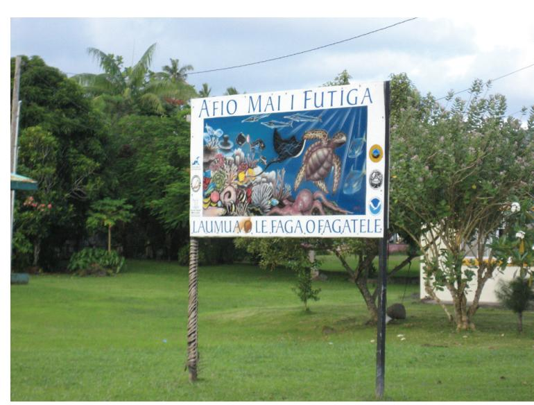

**Image 19.** Fagatele Bay National Marine Sanctuary sign. Photo credit: Matt Kendall, NOAA Biogeography.

verse mosaic of marine resource management in the region (See Text Box: Summary of MPA Programs).

Understanding the variety of fish, coral, and habitat resources that this multifaceted network of MPAs encompasses is critical for assessing the scope of current protection and thoughtfully designing additional network elements. Here we seek to summarize what aspects of the coral reef ecosystem are protected by MPAs individually, through brief summaries of each MPA, and then collectively, through analysis of the combined area encompassed by all MPAs. Based on the available datasets used to broadly characterize the biogeography of the region in the previous chapters and appendices of this assessment, key concepts of MPA network design including biogeographic representation and replication will be addressed. Representation is the idea that at least part of each distinct biogeographic region should be included in a 'complete' network of MPAs. Replication is the idea that there should be more than one MPA in each distinct biogeographic region. Replication spreads protection within each region thereby reducing the risk to the network that is associated with localized degradation at any one site.

In this chapter of the assessment we focus our analysis only on the MPAs of American Samoa. While Samoa is a key part of the MPA landscape in the archipelago as demonstrated in Chapters 3 and 4, two key datasets are in need of further development. First, benthic maps similar in spatial scope and categorical detail to those available in American Samoa are needed to inventory the protected habitats of Samoa. Second, MPA boundaries in Samoa must be made available for analysis, but at present many are proprietary at the village level as part of the Community Based Fisheries Management Program (King and Faasili 1998, Samuelu 2003).

The objectives of this chapter were to:

- 1) Characterize the reef fishes, corals, habitats, and other key features of each existing MPA relative to all of American Samoa.
- 2) Evaluate the distribution of MPA sites in the context of the biogeographic regions and ecological hotspots defined in Chapter 4 and identify key areas not currently in the network.
- 3) Summarize the area of reef ecosystem, by bottom type and reef type, that is currently protected relative to American Samoa overall.

NOAA/NOS/NCCOS/CCMA/Biogeography Branch and Consolidated Safety Services, Inc., Fairfax, VA, under NOAA Contract No. DG133C07NC0616

&lt;sup>2 NOAA/NOS/NCCOS/CCMA Biogeography Branch

&lt;sup>3 Fagatele Bay National Marine Sanctuary

&lt;sup>4 National Park of American Samoa

&lt;sup>5 American Samoa/Department of Marine and Wildlife Resources

#### **SUMMARY OF MPA PROGRAMS**

*There are several agencies involved in MPA management and planning in American Samoa. Here we provide a brief summary of these programs and their objectives in American Samoa. They are separated into those that are exclusively Territorial in manage ment authority and those that are co-managed by Territorial and Federal agencies.*

#### **Territorial MPAs**

Department of Commerce Special Management Areas (SMAs)

*The American Samoa Government authorized the American Samoa Coastal Management Program through the American Samoa Coastal Management Act of 1990 (ASCA § 24.0503) to designate, as Special Management Areas (SMAs), places that "possess unique and irreplaceable habitat, products or materials, offer beneficial functions or affect the cultural values or quality of life significant to the general population of the Territory and fa'a Samoa" (ASAC § 26.0221). Three such places – Leone Pala, Nu'uuli Pala, and Pago Pago Harbor – have been designated as SMAs as of January 2011. Although no formal management plans exist for these SMAs, projects within these areas must comply with standards described in ASAC § 26.0221.*

Department of Marine and Wildlife Resources Community-Based Fisheries Management Program (CFMP)

*The American Samoa Government created the Community-Based Fisheries Management Program within the Department of Marine and Wildlife Resources (DMWR) in 2001 so that the "historical, cultural, and natural resources" of American Samoa and its marine environment would be "protected, managed, controlled, and preserved for the benefit of all people of the Territory and future generations" (ASAC § 24.10). The CFMP promotes sustainable management of marine resources and enhances fisheries stocks through mechanisms such as seasonal closures and fishing restrictions within designated reserves, as agreed upon by village leaders and DMWR (ASAC § 24.10). As of January 2011, eleven CFMP reserves were in existence around Tutuila. These reserves are sometimes referred to as village marine protected areas (VMPAs). Fishing restrictions within reserves may include prohibiting destructive fishing methods (e.g. use of bleach, poison, or dynamite), use of scuba gear and nets, the breaking up of corals, and fishing by outsiders. The number of CFMP reserves, their boundaries, and regulations are as of January 2011 but are regularly modified to meet local needs.*

Department of Marine and Wildlife Resources No-Take Marine Protected Area Program

*The American Samoa Government established the No-Take MPA Program within DMWR in 2006 in response to Governor Tauese Sunia's recommendation to protect 20% of American Samoa's coral reefs as no-take MPAs (Sunia 2000). The goal of the No-Take MPA Program is to "ensure protection of unique, various, and diverse coral reef habitat and spawning stocks" through the creation of a network of no-take areas (Sunia 2000, Oram 2008). The No-Take MPA Program is currently using the authority under the Community-Based Fisheries Management Program (under ASAC § 24.1001) to enforce no-take regulations.* 

#### Other Territorial MPAs

*Two additional MPAs are present in American Samoa but are not part of the formal programs listed above. One is a private reserve established in 1985 at Alega Bay by a local restaurant owner, Tisa Fa'amuli. This reserve is hereafter referred to as Alega Private Marine Reserve. The other is a small marine park adjacent to the Ofu unit of the National Park that was established by territorial legislation in 1994 to protect the "unique coral reef wildlife habitat while enabling the public to enjoy the natural beauty of the site" (ASCA § 18.0214). At present time the Ofu Vaoto Territorial Marine Park has no enforcement, monitoring, or management plan.* 

#### **Federal or Federal/Territorial Co-Managed MPAs**

National Marine Sanctuaries

*The Office of National Marine Sanctuaries (ONMS) is authorized by the National Marine Sanctuaries Act (NMSA, 1972 with sub sequent amendments) to designate and protect areas of the marine environment with "special national significance" due to their "conservation, recreational, ecological, historical, scientific, cultural, archeological, educational, or aesthetic qualities" as national marine sanctuaries (16 U.S.C. 1431 et seq.). The Sanctuaries Program is intended to "improve the conservation, understanding, management, and wise and sustainable use of marine resources", to "enhance public awareness, understanding, and apprecia tion of the marine environment", and to "maintain for future generations the habitat, and ecological services, of the natural as semblage of living resources that inhabit these areas" (16 U.S.C. 1431 et seq.). In American Samoa, the Fagatele Bay National Marine Sanctuary (FBNMS) was designated in 1986 and is co-managed with the Territorial Government through the American Samoa Department of Commerce (15 C.F.R. 922.100-104). Additional potential areas were brought to the attention of ONMS via public meetings in 2009. A Site Selection Working Group of the Sanctuary Advisory Council evaluated each of the suggested areas using NMSA criteria to determine if they possess qualities of national significance worthy of sanctuary designation. Also, per Presidential Proclamation 8337, the marine areas of the Rose Atoll Marine National Monument shall be added to FBNMS in accordance with the NMSA (16 U.S.C. 1431 et seq., Proclamation No. 8337).*

#### National Parks

*The National Park Service (NPS) was created in 1916 to "conserve the scenery and the natural and historic objects and the wild life therein and to provide for the enjoyment of the same in such manner and by such means as will leave them unimpaired for the enjoyment of future generations" (16 U.S.C. 1). Under the direction of Congress, the NPS conducted a feasibility study in 1986-87 to identify areas of significant natural and cultural resources in American Samoa and to assess the suitability of these areas for inclusion in a national park (NPS 1988). Through this process and consultation with village leaders and the Govern ment of American Samoa, the NPS identified two areas (north-central Tutuila from Vatia Bay to Fagasa Bay and the south-central portion of Ta'u) that best met the criteria for inclusion in a national park. Additional areas, including the south coast of Ofu, were suggested as possible future additions (NPS 1988). Under recommendation of the NPS, the National Park of American Samoa (NPSA) was designated by Congress in 1988 to "preserve and protect the tropical forest and archaeological and cultural re sources of American Samoa, and of associated reefs, to maintain the habitat of flying foxes, preserve the ecological balance of the Samoan tropical forest, and, consistent with the preservation of these resources, to provide for the enjoyment of the unique resources of the Samoan tropical forest by visitors from around the world" (16 U.S.C. 410qq). The NPSA currently consists of 3 separate units – the areas on Tutuila and Ta'u identified by the feasibility study and the south coast of Ofu (NPS 1997). In 2002 Congress authorized the addition of portions of the islands of Ofu and Olosega to the NPSA (16 U.S.C. 410qq-1). Formal estab lishment of these additions awaits approval of a lease with the local villages. The NPSA is managed by the NPS in consultation with the territorial DMWR and the individual villages. Management of the NPSA maintains traditional Samoan customs and allows subsistence fishing by native American Samoans using traditional tools and methods in accordance with rules established by the NPS and village leaders.*

National Wildlife Refuges and Marine National Monuments

*The United States Fish and Wildlife Service (USFWS) mission is, working with others, to conserve, protect and enhance fish, wildlife, and plants and their habitats for the continuing benefit of the American people. In 1966 Congress authorized the USFWS through the National Wildlife Refuge System Administration Act (1966, with subsequent amendments) to "administer a national network of lands and waters for the conservation, management, and where appropriate, restoration of the fish, wildlife, and plant resources and their habitats within the United States for the benefit of present and future generations of Americans" (16 U.S.C. 668dd-668ee). In American Samoa, Rose Atoll National Wildlife Refuge (NWR) was established in 1973 through a cooperative agreement between the American Samoa Government and the USFWS (RANWR 1974). Rose Atoll NWR has been closed to the public since its establishment to protect the fish and wildlife in the refuge.*

*In 2009 Rose Atoll Marine National Monument (MNM), which includes the Rose Atoll NWR was established by Presidential Proclamation 8337 to protect objects of historic and scientific interest under the authority of the Antiquities Act of 1906 (16 U.S.C. 431). The NWR is managed exclusively by USFWS, but management of the MNM is more complex. The Proclamation gave the Department of Interior (USFWS) management responsibility for the MNM in consultation with the Department of Commerce (NOAA). However, NOAA was given management responsibility for fisheries outside of the NWR, and the Secretary of Commerce was tasked with initiating the process of adding the marine areas of the MNM to Fagatele Bay National Marine Sanctuary.*

#### **METHODS**

#### **Inventory of existing MPAs**

Working with local MPA practitioners, the American Samoa Coastal Zone Management Program, and Island GIS User Group, we obtained boundary maps (GIS shapefiles) and implementation documents for the 23 MPAs existing in American Samoa as of January 2011. This included eleven Community-Based Fisheries Management Program (CFMP) Reserves, one No-Take MPA, one Marine National Monument (MNM), one National Wildlife Refuge (NWR), one National Marine Sanctuary (NMS), three National Park units, one pri vate marine reserve, three Special Management Areas (SMAs), and one Territorial Marine Park (Figure 5.1, Table 5.1, Appendix D).

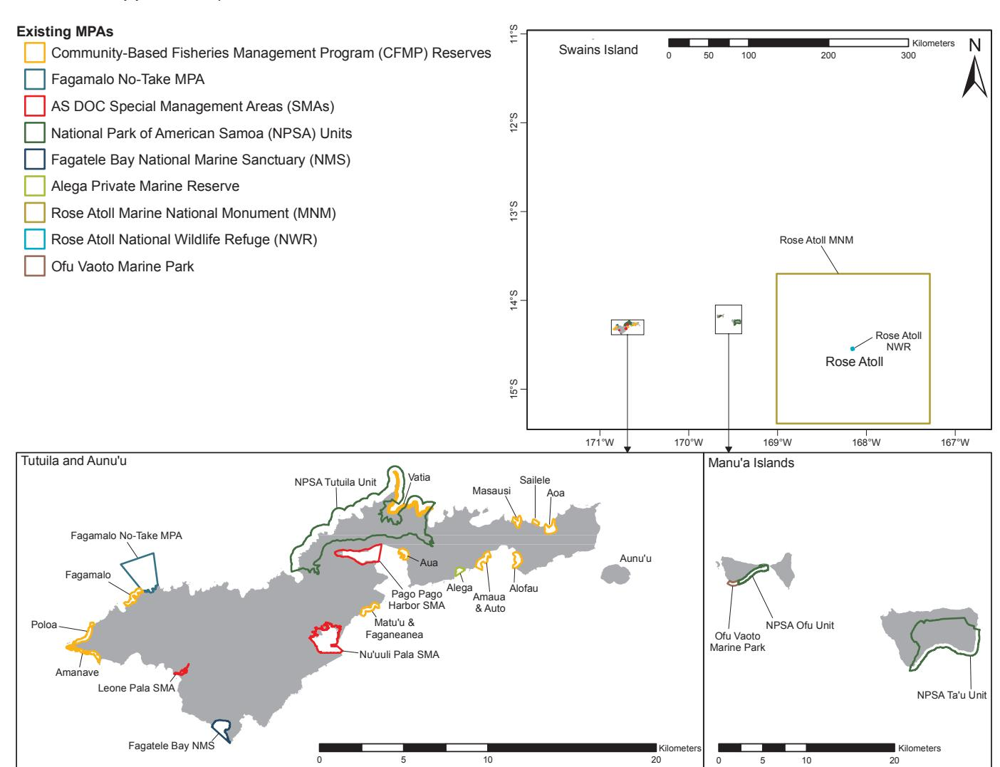

**Figure 5.1.** Existing MPAs in American Samoa as of January 2011.

**Table 5.1.** Existing MPAs in American Samoa as of January 2011.

| MPA Program/Type                                | Level of Government            | Management Authority | Sites (No., Locations)                                                                                                 |
|-------------------------------------------------|-----------------------------------|-------------------------|------------------------------------------------------------------------------------------------------------------------|
| Community-Based Fisheries Management Program | Territorial                       | DMWR, villages          | 11: Alofau, Amanave, Amaua & Auto, Aoa, Aua, Fagamalo, Masausi, Matu'u & Faganeanea, Po - loa, Sailele, Vatia |
| Marine National Monuments                       | Federal                           | NOAA, USFWS             | 1: Rose Atoll                                                                                                          |
| National Marine Sanctuaries                     | Federal/Territorial Co-Managed | NOAA, ASDOC             | 1: Fagatele Bay                                                                                                        |
| National Park of American Samoa              | Federal                           | AS NPS                  | 3: Ofu, Ta'u, Tutuila                                                                                                  |
| National Wildlife Refuge System              | Federal                           | USFWS                   | 1: Rose Atoll                                                                                                          |
| No-Take MPA Program                             | Territorial                       | DMWR                    | 1: Fagamalo                                                                                                            |
| Private Marine Reserves                         | Private                           | Alega village           | 1: Alega Bay                                                                                                           |
| Special Management Areas                        | Territorial                       | ASCMP, villages         | 3: Leone Pala, Nu'uuli Pala, Pago Pago Harbor                                                                          |
| Territorial Marine Parks                        | Territorial                       | DPR, DMWR               | 1: Ofu                                                                                                                 |

These boundaries were then reviewed, modified as necessary in the GIS, and confirmed for accuracy by their corresponding management authorities.

For each MPA, we created a site profile that summarizes key information focused on the MPA's biogeograph ic setting. For each 2-page profile, we first provide an overview that includes a site map and short description of MPA size, location, implementation date, and rationale. We also identify general characteristics of adjacent lands that may impact the marine environment including size and condition of watersheds, population density, erosion and runoff potential, and notable human use impacts (e.g. major sources of pollution). This informa tion was obtained from the American Samoa Watershed Protection Plan prepared for the American Samoa Environmental Protection Agency in 2000 (Pedersen Planning Consultants 2000a-c). In addition, because pigs are a major source of nearshore pollution affecting coral reef ecosystems, the density of domestic pigs in watersheds adjacent to each MPA is noted. Pig density is described using four categories (high = >50 pigs/ km 2 , medium = 12-50 pigs/km 2 , low = <12 pigs/km 2 , and zero) assigned to watershed data from the ASEPA Piggery Compliance Program (ASEPA Piggery Compliance Program 2011) using the natural breaks function in ArcGIS (Figure 5.2). In addition, key natural resource regulations for each MPA are listed, specifically those that pertain to fishing or the ecological reasons for establishing the site. Original designation documents for each site should be consulted for a complete list of regulations. A more comprehensive description of each individual MPA including implementation, purpose, management practices, fishing regulations, biological and socio-economic monitoring, community involvement, and current and future projects, is provided in Appendix D.

The main focus of each site profile is on the reef ecosystem habitats, reef fish, and coral communities pro tected within each MPA. Boundary maps of each MPA were overlaid upon recently completed benthic maps of American Samoa (Appendix B, NOAA NCCOS 2005). Boundaries were used to clip portions of habitat polygons inside each MPA. Benthic maps for American Samoa categorize bottom features on the basis of 2 attributes: 1) "structure" which refers to predominant physical composition of the feature and includes 15 mutually exclusive bottom types such as patch reef, pavement, and sand, and 2) "zone" which refers to each feature's position on the insular shelf and includes 13 mutually exclusive categories such as lagoon, reef crest, fore reef (locally referred to as reef slope), and bank/shelf (Appendix B, NOAA NCCOS 2005). We summarized the areas within each MPA by structure type using pie charts and compared the proportions of benthic habitats within each MPA to those of American Samoa overall. A hierarchical approach was taken wherein the relative proportions of all coral reef and hardbottom structures are discussed, followed by those structure types representative of only the highest quality reef habitats. These include aggregate reef, patch reef, aggregated patch reefs, and spur and groove which all typically have high structural rugosity and often possess high coral cover and relatively more abundant and diverse fish communities compared to other hardbottom types. These four bottom types are hereafter referred to collectively as "coral reef habitats".

**Figure 5.2.** Density of pigs (pigs/km²) in piggeries by watershed for Tutuila and Manu'a watersheds. Watersheds were classified as having high, medium, or low pig density using the natural breaks function in ArcGIS.

Similarly, we summarized the zonation of the coral reef and hardbottom structures within each MPA in pie charts and compared the proportions of these reef zones to American Samoa overall. All zones are provided but description focused on reef flats, due to the importance of this habitat for village use by gleaners, and the fore reef, a high-value reef zone which has the greatest diversity of reef fish and is the focus of most reef monitoring around American Samoa.

We also evaluated general reef fish and coral variables at each MPA compared to American Samoa overall. These variables were the same as those considered in Chapter 4: coral cover, coral richness, fish biomass, and fish richness classified into high, medium, and low categories (see Chapter 4 for a description of survey data and classification methods). Our goal was only to describe each MPA relative to the rest of American Samoa; therefore, only datasets with many, widely spread sites around Tutuila or the other islands of American Samoa were used. Many MPAs are also characterized more individually with customized studies and methodology, but those studies did not enable island-wide comparison due to differences in site selection, methodology, or timing of surveys. Consequently, such studies are not included in the analysis but are noted in each profile for those interested in more detailed site characterization.

Survey sites within each MPA were categorized as high, medium, or low for fish and coral variables, plotted on maps with the MPA boundaries, and summarized in pie charts. For MPAs with four or more survey sites, the proportions of high, medium, and low values within each MPA were compared to the proportions for American Samoa overall (see Chapter 4) using pie charts. Survey results for MPAs with too few sites to make sound comparisons are provided but are not compared to American Samoa overall. In addition, the spatial

distribution of survey sites within MPAs was evaluated and key locations where greater effort is required are noted.

While it would be useful to compile species lists and cumulative numbers of species observed for each MPA, our profiles did not include this information for two main reasons. First, because of the very different survey methods used among studies and lack of consistent species level information, creating rarefaction curves was not possible. Second, the very different levels of survey effort among the MPAs have resulted in severe inconsistency in total area surveyed (e.g. an MPA with 30 surveys inside it will have a much larger species list than one with only a few surveys). As a result of these limitations, our analysis was focused on more general summary variables described above for evaluating sites.

Last, for each MPA we identified the biogeographic region (hereafter "Bioregion") in which it lies based on the archipelago-wide analysis of fish and coral data in Chapter 4. Also noted is the "hotspot" status for the reef fish and coral variables analyzed in Chapter 4 and any similarities between the fish and coral communities in the Bioregion of the MPA and those in other Bioregions. Key results from Chapter 3 on potential sources and destinations for coral and fish larvae are also noted.

#### **How much of American Samoa is protected in the MPA Network?**

To evaluate the proportion of the total area of potential reef ecosystem in American Samoa protected by MPAs, we used a pie chart to summarize the total area within MPAs versus the area outside. Potential reef ecosystem was defined as areas shallower than 150 m, which approximates the depth limit for photic and mesophotic reef communities in the region (Bare et al. 2010, Mesophotic Coral Ecosystems 2010, Appendix B). For most MPAs this is the same value as the total area since they only encompass regions shallower than 150 m deep. Areas were categorized by structure type. For simplicity, some map categories were aggregated into major groups. These were coral reef habitats (aggregate reef, patch reef, aggregated patch reefs, spur and groove), other hardbottom types (pavement, pavement with patch reefs, pavement with sand channels, reef rubble, rock/boulder), and unconsolidated substrates (mud, sand with scattered coral/rock, sand). We repeated this comparison using only the coral reef category to examine how much coral reef habitat is pro tected relative to the total area of coral reef habitat around American Samoa. Along with these comparisons we also provided charts showing the proportions of potential reef ecosystem and coral reef habitat with notake restrictions and with other fishing restrictions.

#### **Which biogeographic regions and ecological hotspots are represented in the MPA network?**

The coastline of American Samoa can be divided into 20 ecologically distinct biogeographic regions (termed "Bioregions") based on the distribution of reef fish and corals (Chapter 4). Thirty-six ecological hotspots among these 20 Bioregions have been defined relative to American Samoa overall for each of four variables: coral cover (hotspot in n = 10 Bioregions), coral richness (n = 6), fish biomass (n = 10), and fish richness (n =10). Boundaries of the existing MPAs were overlaid onto the Bioregions and ecological hotspots to deter mine which were already represented in the MPA network and which lacked an MPA and may be considered as gaps in coverage.

#### **Size and regulatory comparisons among MPAs**

MPAs in American Samoa have a wide range of sizes. We compared the sizes among MPAs by scaling the size of the habitat pie chart for each MPA relative to the total area of potential reef ecosystem within it. Scal ing the size of pie charts in this manner allowed us to evaluate the relative contributions of each MPA to the overall network and also to compare the proportions of benthic habitats among the MPAs while taking into consideration the total area protected. This is significant because an MPA that has a high proportion of reef habitats but that is very small may actually protect a smaller reef area than an MPA that has a lower propor tion of reef habitats but a much larger overall area. In addition, we identified which MPAs or parts of MPAs provide the strongest level of protection, complete no-take.

#### **RESULTS: BENTHIC HABITATS OF AMERICAN SAMOA**

Coral reef and hardbottom structures together comprise ~30% of the almost 400 km2 of mapped benthic habitat around American Samoa (Figure 5.3a). Coral reef structures cover almost twice as much area as hardbottom structures. with aggregated patch reefs, spur and groove, and aggregate reef covering  $\sim 7\%$ ,  $\sim 6\%$ , and  $\sim 5\%$ of the area, respectively. However, the majority (~60%) of the mapped benthic habitat around American Samoa is algal plain in the bank/shelf zone. Nearly half of the coral reef and hardbottom around American Samoa is found in the bank/shelf zone, ~20% is in the fore reef, and ~10% is in each of the reef flat and bank/ shelf escarpment zones (Figure 5.3b, see Appendix B Figure B.1 for cross section of zones).

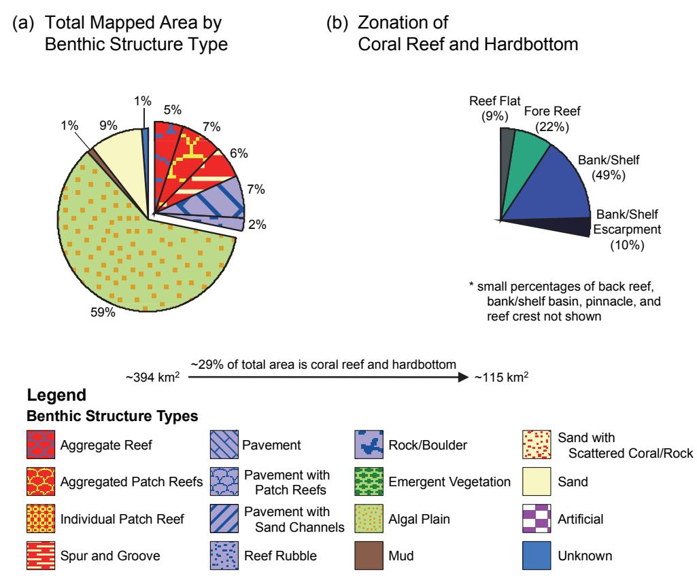

**Figure 5.3.** (a) Proportion of mapped benthic structure types in American Samoa overall. (b) Proportion of coral reef and hardbottom in each reef zone. Structure types or zones representing <1% of the total mapped area are not shown.

The zonation of coral reef and hardbottom structures varies with shelf geomorphology among the islands of American Samoa. The progression of reef zones from shoreline to reef slope is similar for Tutuila and the Manu'a Islands. However, the bank/shelf around Tutuila extends much farther from the shoreline than it does around the Manu'a Islands and includes pinnacle and bank/shelf basin zones not found on the other islands. As a result of the narrower shelf, a greater percentage of coral reef and hardbottom is in the reef flat zone around the Manu'a Islands compared to Tutuila. The two steep-sided atolls in American Samoa, Swains Island and Rose Atoll, are also fundamentally different features. At Rose Atoll, almost two-thirds of the coral reef and hardbottom is in the back reef, whereas ~10% is in each of the reef crest, fore reef, and bank/shelf zones. The coral reef and hardbottom at Swains Island in contrast is mostly in the reef flat, with lesser amounts in the reef crest and fore reef and none in the completely enclosed lagoon area.

#### **RESULTS: SITE CHARACTERIZATIONS**

#### **Territorial MPAs**

#### Alega Private Marine Reserve

#### Overview

Alega Private Marine Reserve is located in the southeast of Tutuila in Alega Bay and extends from Vaiola Point to Tifa Point (Figure 5.4). It was initiated by Tisa Fa'amuli in 1985 to protect the coral reef ecosystem in Alega Bay from overfishing and other destructive practices. By maintaining a low level of subsistence fishing,

**Figure 5.4.** Benthic habitat (by structure type) and fish and coral survey data within Alega Private Marine Reserve. Coral cover, coral richness, fish biomass, and fish richness values at each survey site are classified as high (red shading), medium (pink shading), or low (white shading). Grey shading indicates variables with no data at a given site. Fish and coral survey data are from ASEPA, KRS, and REA.

the reserve allows for sustainable use of the marine resources in the reserve by the village community now and in future generations. The reserve fronts a ~1.3 km² watershed in minimally impacted condition with low human population density. There are no domestic pigs reported in the watershed. In addition to natural sedimentation caused by highly erosive soils on the steep slopes of the watershed, nearshore waters may also have been slightly impacted by urban runoffs and insufficiently treated wastewater. Only subsistence fishing with traditional methods by village members is allowed within the reserve. Commercial fishing and fishing by outsiders are prohibited within Alega Private Marine Reserve.

# Habitat Composition, Reef Fish, and Coral Communities

This small MPA is dominated by coral reef and hardbottom structures which together comprise ~88% of the area within the reserve (Figure 5.5a). Coral reef structures comprise ~41% of the area and include aggregate reef  $(\sim 37\%)$  and patch reef  $(\sim 4\%)$ . In addition, pavement covers ~44% of the area. In comparison, these three structure types comprise less than 15% of American Samoa overall. About 50% and ~42% of the coral reef and hardbottom in the reserve are in the reef flat and fore reef zones, respectively, compared to only ~9% and ~22% around American Samoa (Figure 5.5b).

Only 3 surveys were located within Alega Private Marine Reserve. Coral data at these sites includes one medium and two low values for cover and one medium value for richness. Fish data includes one low and two medium values for both biomass and richness (Figure 5.6). The small sample size greatly limits the scope of these findings and does not allow comparisons with American Samoa overall. Additional, more widely spread surveys are needed to more fully characterize the reef fish and coral communities within this MPA.

# (a) Total Area by Benthic Structure Type (b) Zonation of Coral Reef and Hardbottom Reef Flat (50%) Fore Reef (42%) ~88% of total area is coral reef and hardbottom

**Figure 5.5.** (a) Proportion of benthic structure types in Alega Private Marine Reserve. (b) Proportion of coral reef and hardbottom in each reef zone. Structure types or zones representing <1% of the total area are not shown.

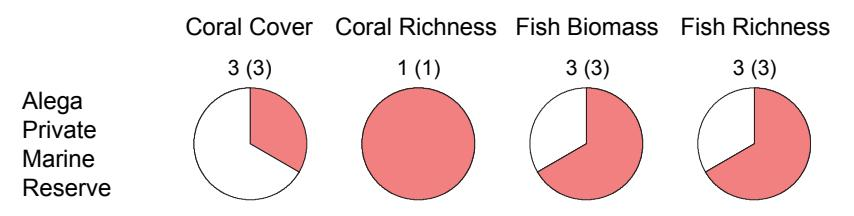

~0.13 km2

**Figure 5.6.** Fish and coral data collected in Alega Private Marine Reserve. Pie charts depict the proportions of high (red), medium (pink), and low (white) values for coral cover, coral richness, fish biomass, and fish richness. Number labels represent the number of studies and sites (in parentheses) comprising each pie chart.

#### Biogeographic Characteristics

Alega Private Marine Reserve is a small part of a biogeographic region that is a hotspot for fish richness (Bioregion 4, Chapter 4).

~0.15 km2

#### **Alofau CFMP Reserve**

#### Overview

The village of Alofau is located in SE Tutuila on the eastern side of Fagaitua Bay. The Alofau CFMP reserve (Figure 5.7) was established in 2001 to "conserve the marine resources in the ocean and on the village reef" (ASDMWR 2002a). The ~0.3 km² reserve extends north to south from Asasama Point at the boundary with Pagai village to Uea Point on Cape Fogausa with a seaward boundary that includes the entire reef area (ASDMWR 2002a). It fronts the eastern end of a ~4.9 km² watershed in intermediately impacted condition with moderate human population density and a medium density of pigs. In addition to natural sedimentation caused by highly erosive soils on the steep slopes of the watershed, nearshore waters have also been impacted by urban runoffs and insufficiently treated wastewater. Fishing is prohibited within the reserve with the excep-

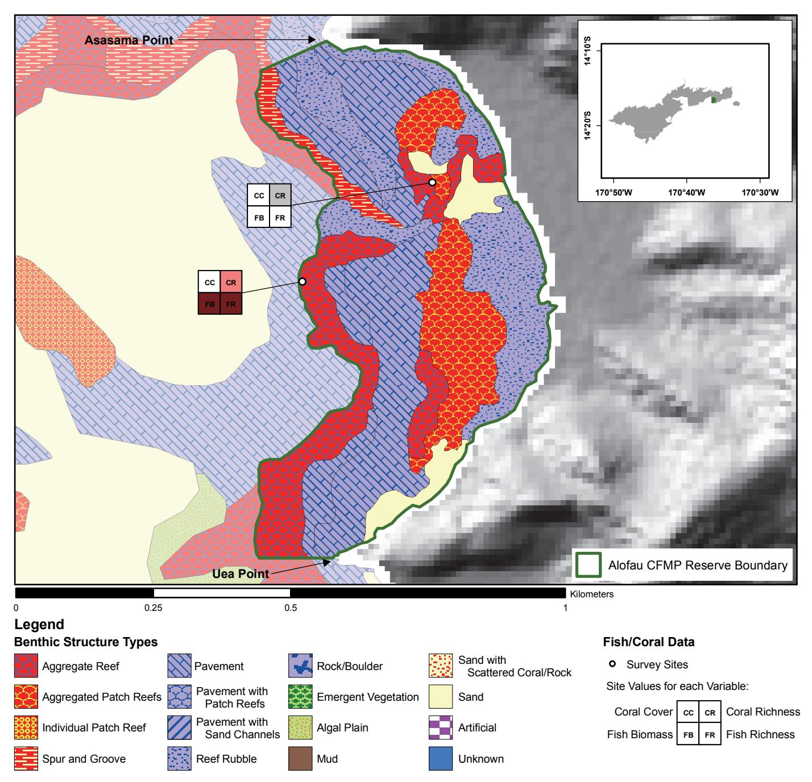

**Figure 5.7.** Benthic habitat (by structure type) and fish and coral survey data within the Alofau CFMP reserve. Coral cover, coral richness, fish biomass, and fish richness values at each survey site are classified as high (red shading), medium (pink shading), or low (white shading). Grey shading indicates variables with no data at a given site. Fish and coral survey data are from ASEPA and REA.

tion of occasional Saturday openings for subsistence fishing. Destructive fishing methods, including the use of bleach, poisons, and dynamite, are banned and fishing by outsiders is also prohibited (ASDMWR 2002a).

# Habitat Composition, Reef Fish, and Coral Communities

The benthic habitat within the Alofau CFMP reserve is dominated by coral reef and hardbottom structures, which together comprise ~95% of the area within the reserve (Figure 5.8a). Coral reef structures comprise ~37% of the area and include aggregate reef (~19%), aggregated patch reefs  $(\sim 16\%)$ , and spur and groove  $(\sim 3\%)$ . In comparison, these three structure types comprise only ~18% of the mapped benthic habitat around American Samoa. About 52% and ~17% of the coral reef and hardbottom in the reserve are in the reef flat and fore reef zones, respectively, compared to ~9% and ~22% around American Samoa (Figure 5.8b). Also of note, another ~20% of the coral reef and hardbottom structures are in the lagoon.

Only two fish and coral surveys were located within the Alofau CFMP reserve. Coral data at these sites includes two low values for cover and one medium value for richness. Fish data includes one low and one high value for both biomass and richness (Figure 5.9). The small sample size greatly limits the scope of these findings and does not allow comparisons with American Samoa overall. Additional, more widely spread surveys are needed to more fully characterize the reef fish and coral communities within this MPA.

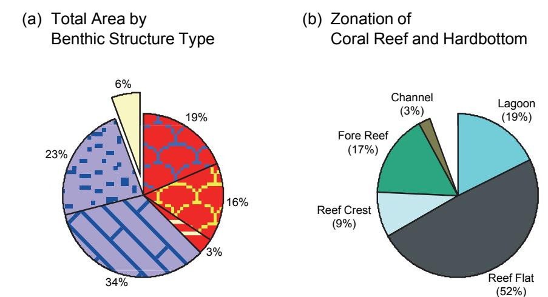

**Figure 5.8.** (a) Proportion of benthic structure types in the Alofau CFMP reserve. (b) Proportion of coral reef and hardbottom in each reef zone. Structure types or zones representing <1% of the total area are not shown.

~94% of total area is coral reef and hardbottom

~0.30 km2

**Figure 5.9.** Fish and coral data collected in the Alofau CFMP reserve. Pie charts depict the proportions of high (red), medium (pink), and low (white) values for coral cover, coral richness, fish biomass, and fish richness. Number labels represent the number of studies and sites (in parentheses) comprising each pie chart.

#### Biogeographic Characteristics

The Alofau CFMP reserve lies in a biogeographic region (Bioregion 6, Chapter 4) that is a hotspot for coral cover and fish biomass. The region's fish and coral communities are similar to those around north-central Tutuila, where the Tutuila unit of the National Park and the Vatia CFMP reserve are located.

#### Additional References

Orcutt 1993, Andrews 2004, Musburger 2004, Houk 2010

#### **Amanave CFMP Reserve**

#### Overview

The village of Amanave is found on the western tip of Tutuila. The Amanave CFMP reserve (Figure 5.10) was established in 2009 to ensure the availability of the resources in the reserve for the villagers today and in the future. The ~0.3 km² reserve extends offshore approximately 50 yards between the boundary with Poloa village and the boundary with Fa'ilolo village. It fronts a ~1.0 km² watershed in intermediately impacted condition with moderate human population density and medium density of pigs. In addition to natural sedimentation caused by highly erosive soils on the steep slopes of the watershed, nearshore waters have also been impacted by urban runoffs and insufficiently treated wastewater. The reserve is closed to all commercial and recreational fishing apart from when it is opened for subsistence fishing one month every year.

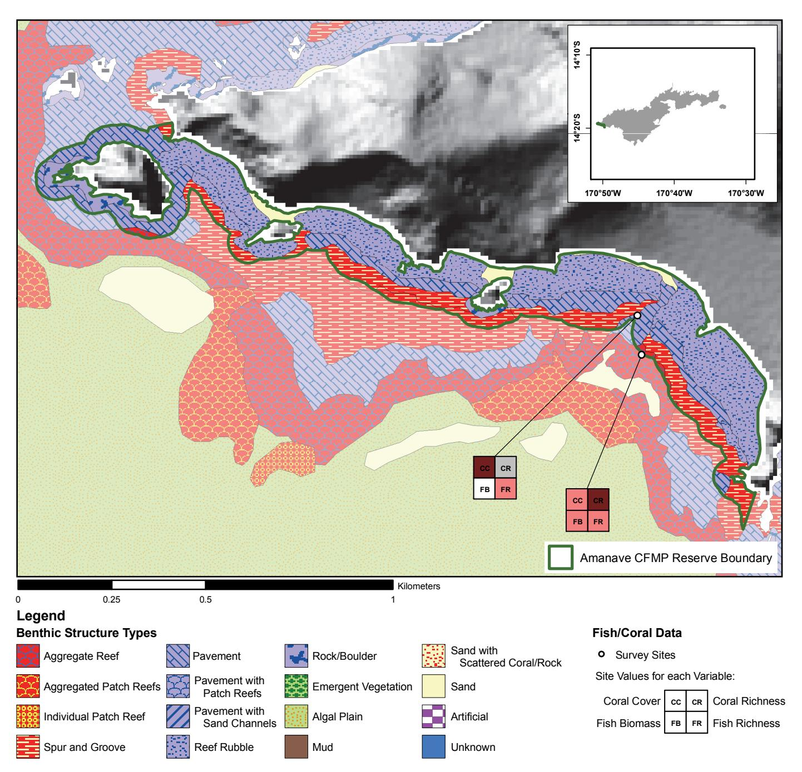

**Figure 5.10.** Benthic habitat (by structure type) and fish and coral survey data within the Amanave CFMP reserve. Coral cover, coral richness, fish biomass, and fish richness values at each survey site are classified as high (red shading), medium (pink shading), or low (white shading). Grey shading indicates variables with no data at a given site. Fish and coral survey data are from KRS and REA.

(44%)

#### Habitat Composition, Reef Fish, and Coral Communities

Coral reef and hardbottom structures together comprise ~97% of the area within the Amanave CFMP reserve (Figure 5.11a). Coral reef structures, primarily spur and groove, comprise ~22% of the area. Also of note. almost half of the benthic habitat within the reserve is covered by reef rubble. In comparison, spur and groove and reef rubble cover ~6% and ~2%, respectively, of American Samoa overall. About 44% and ~20% of the coral reef and hardbottom in the reserve are in the reef flat and fore reef zones, respectively, compared to ~9% and ~22% around American Samoa (Figure 5.11b).

Only two fish and coral surveys were located within or just outside the Amanave CFMP reserve and these were both located near the eastern end of the reserve. Coral data at these sites includes one medium and one high value for cover and one high value for richness. Fish data includes one low and one medium value for biomass and two medium values for richness (Figure 5.12). The small sample size greatly limits the scope of these findings and does not allow comparisons with American Samoa overall, Additional, more widely spread surveys are needed to more fully characterize the reef fish and coral communities within this MPA.

#### (a) Total Area by (b) Zonation of Benthic Structure Type Coral Reef and Hardbottom

Figure 5.11. (a) Proportion of benthic structure types in the Amanave CFMP reserve. (b) Proportion of coral reef and hardbottom in each reef zone. Structure types or zones representing <1% of the total area are not shown.

Figure 5.12. Fish and coral data collected in the Amanave CFMP reserve. Pie charts depict the proportions of high (red), medium (pink), and low (white) values for coral cover, coral richness, fish biomass, and fish richness. Number labels represent the number of studies and sites (in parentheses) comprising each pie chart.

#### Biogeographic Characteristics

The Amanave CFMP reserve lies in a distinct biogeographic region (Bioregion 1, Chapter 4) that is a regional hotspot for coral cover as well as fish biomass and richness. The region's fish and coral communities are representative of southwestern Tutuila.

#### Additional References

Randall and Devaney 1974, Orcutt 1993

#### **Amaua and Auto CFMP Reserve**

#### Overview

The villages of Amaua and Auto are located in SE Tutuila on the western side of Fagaitua Bay. In response to concerns over declines in fish and shellfish populations from overfishing, the Amaua and Auto CFMP reserve (Figure 5.13) was established in 2003 to "manage, protect, and preserve the fish, shellfish, and the coastal area of the village of Amaua and Auto" (ASDMWR 2003a). The ~0.4 km² reserve extends from the western boundary of Auto to the eastern boundary of Amaua with a seaward boundary ranging from 250 yards to the edge of the reef area (ASDMWR 2003a). It fronts the western end of a ~4.9 km² watershed in intermediately impacted condition with a moderate human population density and medium density of pigs. In the part of the watershed fronted by the reserve there is moderate to high potential for runoff and erosion because of

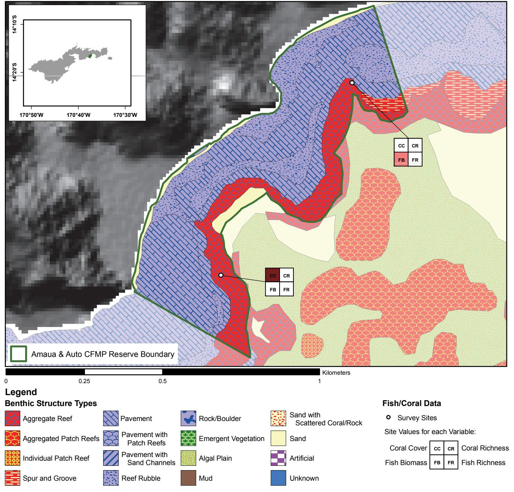

**Figure 5.13.** Benthic habitat (by structure type) and fish and coral survey data within the Amaua and Auto CFMP reserve. Coral cover, coral richness, fish biomass, and fish richness values at each survey site are classified as high (red shading), medium (pink shading), or low (white shading). Grey shading indicates variables with no data at a given site. Fish and coral survey data are from MPABR and TCRMP.

the highly erosive soils and steep slopes. Nearshore waters are also impacted to a lesser extent by urban runoffs and insufficiently treated wastewater. The reserve is closed to all commercial and recreational fishing apart from when it is opened for subsistence fishing at certain times of the year. Destructive fishing methods, including the use of bleach and poisons, are banned (ASDMWR 2003a).

# Habitat Composition, Reef Fish, and Coral Communities

The Amaua and Auto CFMP reserve is dominated by coral reef and hardbottom structures. which together comprise ~95% of the area within the reserve (Figure 5.14a). Coral reef structures, primarily aggregate reef, comprise ~22% of the area. Also, pavement covers ~50% of the area. In comparison, aggregate reef and pavement comprise ~5% and ~7%, respectively, of American Samoa overall, About 63% and ~24% of the coral reef and hardbottom in the reserve are in the reef flat and fore reef zones, respectively, compared to ~9% and ~22% around American Samoa (Figure 5.14b).

Only two surveys were located within the Amaua and Auto CFMP reserve, and these were in the aggregate reef close to the seaward boundary of the reserve. Coral data at these sites includes one low and one high value for cover and two low values for richness. Fish data includes one low and one medium value for biomass and two low values for richness (Figure 5.15). The small sample size greatly limits the scope of these findings and does not allow comparisons with American Samoa overall. Additional, more widely spread surveys are needed to more fully characterize the reef fish and coral communities within this MPA.

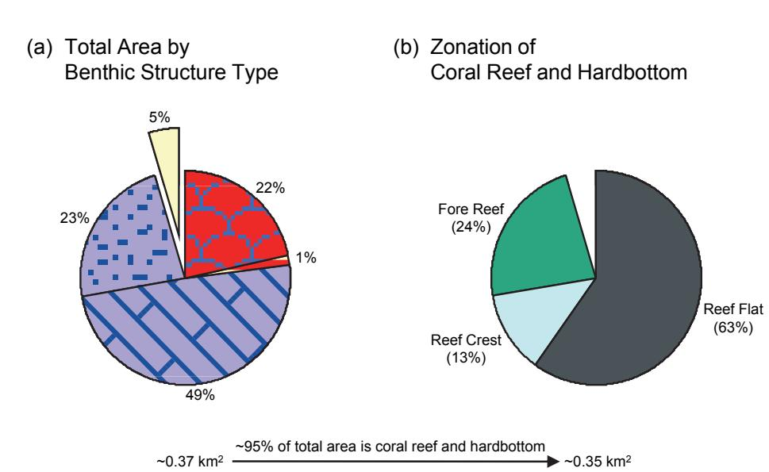

**Figure 5.14.** (a) Proportion of benthic structure types in the Amaua and Auto CFMP reserve. (b) Proportion of coral reef and hardbottom in each reef zone. Structure types or zones representing <1% of the total area are not shown.

**Figure 5.15.** Fish and coral data collected in the Amaua and Auto CFMP reserve. Pie charts depict the proportions of high (red), medium (pink), and low (white) values for coral cover, coral richness, fish biomass, and fish richness. Number labels represent the number of studies and sites (in parentheses) comprising each pie chart.

#### Biogeographic Characteristics

The Amaua and Auto CFMP reserve lies in a biogeographic region (Bioregion 6, Chapter 4) that is a hotspot for coral cover and fish biomass. The region's fish and coral communities are similar to those around north-central Tutuila, where the Tutuila unit of the National Park and the Vatia CFMP reserve are located.

Additional References
Andrews 2004, Musburger 2004, Houk 2010

#### **Aoa CFMP Reserve**

#### Overview

The village of Aoa is in NE Tutuila. The Aoa CFMP reserve (Figure 5.16) was established in 2005 to improve the coral reef habitat and restore fish and invertebrate stocks within the reserve. The ~0.3 km² reserve includes the entire Aoa Bay between Motusaga Point and Palau Point and extends offshore approximately 50 yards from the reef edge. The reserve fronts a ~2.2 km² watershed in intermediately impacted condition with moderate human population density and a medium density of pigs. In some areas of the watershed there is moderate to high potential for periodic natural erosion due to the soil type and steep slopes, but sedimentation is moderated by the Aoa wetland. Nearshore waters are also impacted to a lesser extent by urban runoffs and insufficiently treated wastewater. The reserve is closed to all commercial and recreational fishing apart from when it is opened for subsistence fishing at certain times of the year.

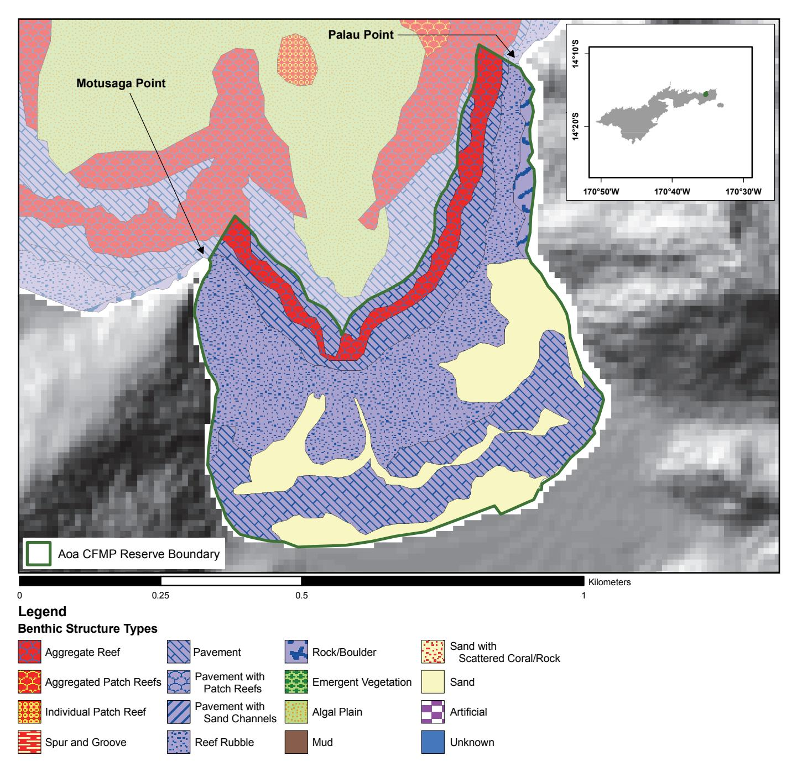

Figure 5.16. Benthic habitat (by structure type) within the Aoa CFMP reserve. No reef fish or coral surveys from the island-wide comparison were located within the Aoa CFMP reserve.

# Habitat Composition, Reef Fish, and Coral Communities

The Aoa CFMP reserve is dominated by coral reef and hardbottom structures, which together comprise ~80% of the area within the reserve (Figure 5.17a). Coral reef structures in the form of aggregate reef cover ~8% of the area, while pavement and reef rubble together comprise ~70% of the area. In comparison, aggregate reef covers ~5% of American Samoa overall. About 73% and ~10% of the coral reef and hardbottom in the reserve are in the reef flat and fore reef zones, respectively, compared to ~9% and ~22% around American Samoa (Figure 5.17b).

#### (a) Total Area by Benthic Structure Type

#### (b) Zonation of Coral Reef and Hardbottom

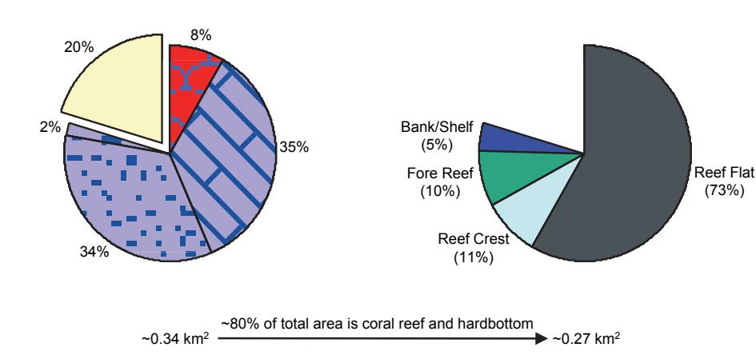

**Figure 5.17.** (a) Proportion of benthic structure types in the Aoa CFMP reserve. (b) Proportion of coral reef and hardbottom in each reef zone. Structure types or zones representing <1% of the total area are not shown.

There were no fish and coral surveys from the island-wide comparison located within the Aoa CFMP reserve.

#### Biogeographic Characteristics

The Aoa CFMP reserve is located in a distinct biogeographic region that was a hotspot for coral richness (Bioregion 11, Chapter 4). The region's coral communities are similar to those in NW Tutuila, where the Fagamalo CFMP reserve and No-Take MPA are located.

#### Additional References

Randall and Devaney 1974, Birkeland et al. 1987, Orcutt 1993, Birkeland et al. 1994, Birkeland et al. 2003, Houk 2010

#### **Aua CFMP Reserve**

#### Overview

The village of Aua is located on the eastern side of Pago Pago Harbor. The Aua CFMP reserve (Figure 5.18) was established in 2002 to "manage, protect, and preserve the fish, shellfish, and the coastal area of the village of Aua" (ASDMWR 2003b). The ~0.2 km² reserve extends from Ava Point to Muliti Point with a seaward boundary ranging from 200 yards to the edge of the reef area (ASDMWR 2003b). It fronts the northeast portion of a ~10.4 km² watershed in extensively impacted condition. In addition to natural sedimentation caused by highly erosive soils on the steep slopes of the watershed and increased surface runoffs due to extensive urbanization, nearshore water quality has also been severely degraded by nutrient and chemical discharges by the tuna canneries and other historical industrial, commercial, and military activities adjacent to Pago Pago Harbor. There is a medium density of pigs in the watershed compared to all of American Samoa. The

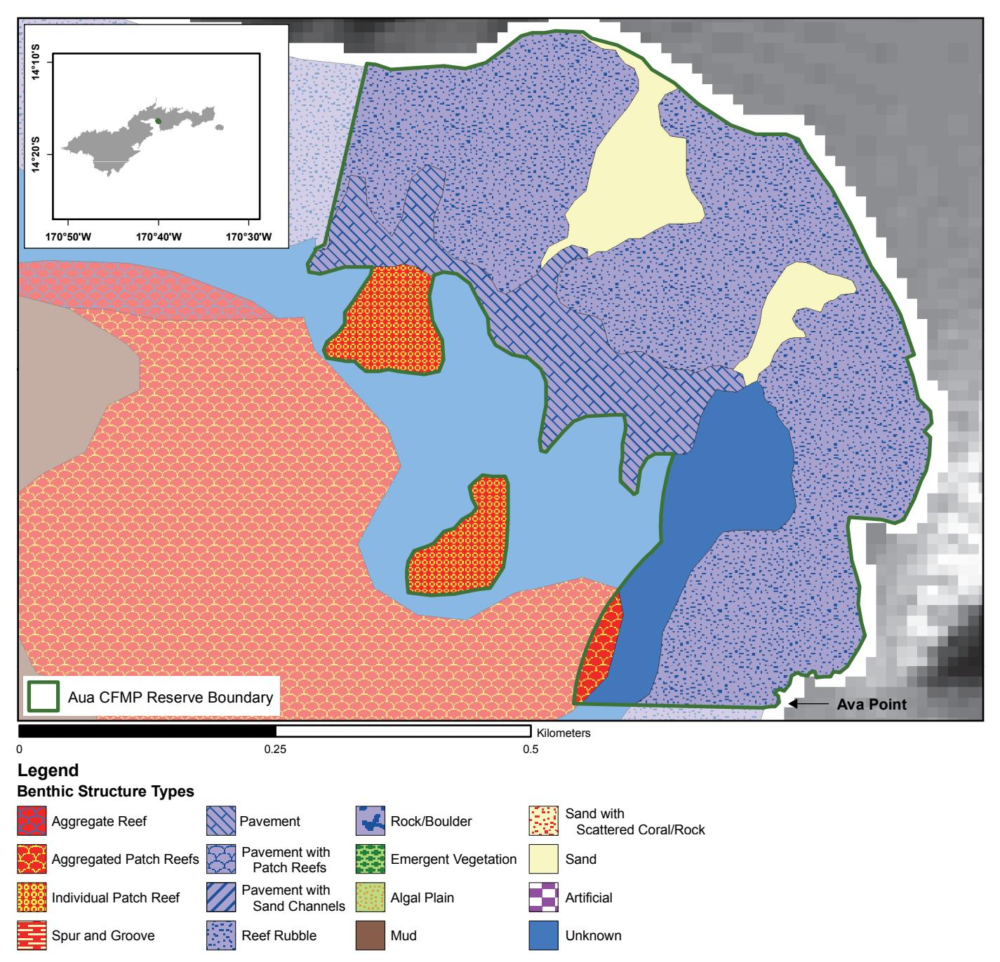

Figure 5.18. Benthic habitat (by structure type) within the Aua CFMP reserve. No reef fish or coral surveys from the island-wide comparison were located within the Aua CFMP reserve.

reserve is closed to all commercial and recreational fishing apart from when it is opened for subsistence fishing at certain times of the year. Destructive fishing methods, including the use of bleach, poisons, and explosives are banned. The use of scuba gear and nets for fishing and the breaking up of corals for fishing are also banned, as is fishing by outsiders (ASDMWR 2003b).

# Habitat Composition, Reef Fish, and Coral Communities

Coral reef and hardbottom structures together comprise ~82% of the area within the Aua CFMP reserve (Figure 5.19a). Coral reef structures in the form of patch reefs comprise ~7% of the area, while reef rubble is predominant and covers ~60% of the area. In comparison, individual patch reef and reef rubble cover less than 1% and ~2%, respectively, of American Samoa overall. About 75% and ~16% of the coral reef and hardbottom in the reserve are in the reef flat and fore reef zones, respectively, compared to ~9% and ~22% around American Samoa (Figure 5.19b). Also of note. an additional ~8% of the coral reef and hardbottom is in the lagoon.

# (a) Total Area by Benthic Structure Type

(b) Zonation of

Coral Reef and Hardbottom

**Figure 5.19.** (a) Proportion of benthic structure types in the Aua CFMP reserve. (b) Proportion of coral reef and hardbottom in each reef zone. Structure types or zones representing <1% of the total area are not shown.

There were no fish and coral surveys from the island-wide comparison located within the Aua CFMP reserve.

#### Biogeographic Characteristics

The Aua CFMP reserve is in a biogeographic region that includes Pago Pago Harbor and is a hotspot for fish biomass and has a unique coral community (Bioregion 5, Chapter 4). Note that high fish biomass may be due to the ban on sale of fish from the harbor and while the coral community is "unique" relative to elsewhere in American Samoa it is not necessarily "healthy".

#### Additional References

Mayor 1924, Dahl and Lamberts 1977, Mc-Connaughey 1993, Orcutt 1993, Green et al. 1997a, Fisk and Birkeland 2002, Coles et al. 2003, Andrews 2004, Birkeland et al. 2004, Cornish and DiDonato 2004, Green et al. 2005

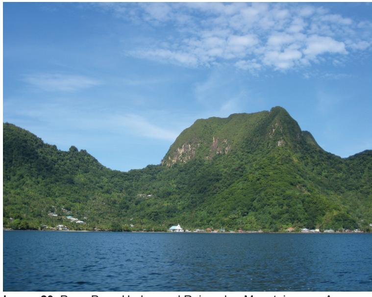

**Image 20.** Pago Pago Harbor and Rainmaker Mountain near Aua. Photo credit: Matt Kendall, NOAA Biogeography.

#### **Fagamalo CFMP Reserve**

#### Overview

The village of Fagamalo is located in NW Tutuila. The Fagamalo CFMP reserve (Figure 5.20) was established in 2003 to "preserve the coral reef area of the village of Fagamalo" and amended in 2010 (ASDMWR 2003c). The ~0.4 km² reserve extends from Niutulua Point in the west to Tafaga Point in the east and offshore approximately 200 yards. It abuts the Fagamalo No-Take MPA and fronts a ~2.1 km² watershed in pristine condition with very low human population density and a low density of pigs. While human impacts are minimal in the watershed, there is moderate to high potential for runoff and erosion because of the soil types and steep slopes with sediment transport into Fagamalo Bay primarily via Matavai Stream. The reserve is closed to all commercial and recreational fishing apart from when it is opened for subsistence fishing at certain

**Figure 5.20.** Benthic habitat (by structure type) and fish and coral survey data within the Fagamalo CFMP reserve. Coral cover, coral richness, fish biomass, and fish richness values at each survey site are classified as high (red shading), medium (pink shading), or low (white shading). Grey shading indicates variables with no data at a given site. Fish and coral survey data are from CRSR, REA, and TCRMP.

times of the year. Destructive fishing methods, including the use of bleach, electrical shocking devices, and explosives, are banned. In addition, fishing within Fagamalo streams is also prohibited (ASDMWR 2003c).

Habitat Composition, Reef Fish, and Coral Communities The Fagamalo CFMP reserve is dominated by coral reef and hardbottom structures, which together comprise ~85% of the area within the reserve (Figure 5.21a). Coral reef structures, primarily aggregate reef, cover just over half of the area. In comparison, aggregate reef covers only ~5% of the mapped benthic habitat around American Samoa. About 4% and ~59% of the coral reef and hardbottom in the reserve are in the reef flat and fore reef zones. compared to ~9% and ~22% around American (Figure 5.21b). Also of note, ~14% of the coral reef and hardbottom is in the shoreline intertidal zone

**Figure 5.21.** (a) Proportion of benthic structure types in the Fagamalo CFMP reserve. (b) Proportion of coral reef and hardbottom in each reef zone. Structure types or zones representing <1% of the total area are not shown.

Only 3 surveys were located within the Fagamalo CFMP reserve. Coral data at these sites includes one low and two medium values for cover and two medium values for richness. Fish data includes one high and two low values for biomass and one low and two high values for richness (Figure 5.22). The small sample size greatly limits the scope of these findings and does not allow comparisons with American Samoa overall. Additional, more widely spread surveys are needed to more fully characterize the reef fish and coral communities within this MPA.

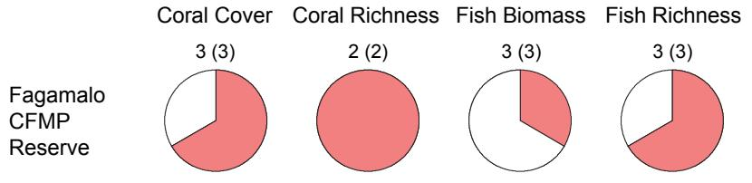

**Figure 5.22.** Fish and coral data collected in the Fagamalo CFMP reserve. Pie charts depict the proportions of high (red), medium (pink), and low (white) values for coral cover, coral richness, fish biomass, and fish richness. Number labels represent the number of studies and sites (in parentheses) comprising each pie chart.

#### Biogeographic Characteristics

The Fagamalo CFMP reserve lies in a distinct biogeographic region (Bioregion 14, Chapter 4) that is a hotspot for coral cover and fish biomass and richness. The region's coral communities are similar to those in NE Tutuila, where the Masausi, Sailele, and Aoa CFMP reserves are located.

#### Additional References

Orcutt 1993, Fisk and Birkeland 2002, Musburger 2004

#### Fagamalo No-Take MPA

#### Overview

The village of Fagamalo is located in NW Tutuila. The village signed a cooperative agreement with DMWR in May 2010 to join the No-Take MPA Program. The boundaries were finalized in December 2010 and the agreement was made to activate the no-take regulations (ASAC § 24.1008 (c)(i)) for an initial period of 10 years. The completion of the revised management plan is still underway and expected completion is May 2011. The ~2.9 km² no-take boundary extends from Tafaga Point (in the west) to Oali'i (in the east) and ~2 km offshore (Figure 5.23). It fronts a ~2.1 km² watershed in pristine condition with very low human population density and a low density of pigs. While human impacts are minimal in the watershed, there is moderate to high potential for runoff and erosion because of the soil types and steep slopes. All types of fishing and extractive use are prohibited within the no-take MPA.

**Figure 5.23.** Benthic habitat (by structure type) and fish and coral survey data within the Fagamalo No-Take MPA. Coral cover, coral richness, fish biomass, and fish richness values at each survey site are classified as high (red shading), medium (pink shading), or low (white shading). Grey shading indicates variables with no data at a given site. Fish and coral survey data are from REA.

Composition, Habitat Reef Fish. and Coral Communities Coral reef and hardbottom structures together comprise ~46% of the area within the Fagamalo No-Take MPA (Figure 5.24a). Coral reef structures comprise ~44% of the area and include aggregated patch reefs (~39%) and aggregate reef (~5%). However, over half of the mapped benthic habitat within the MPA is covered by algal plain. In comparison, aggregate reef and aggregated patch reefs cover less than 15% of American Samoa overall. Only ~1% and ~11% of the coral reef and hardbottom in the MPA are in the reef flat and fore reef zones, respectively. Almost 90% of the coral reef

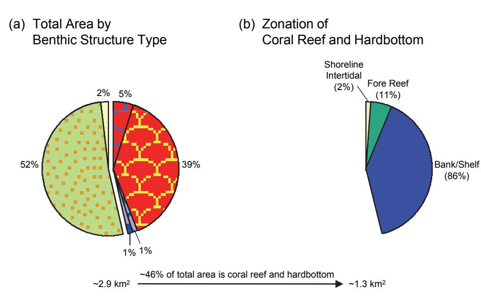

**Figure 5.24.** (a) Proportion of benthic structure types in the Fagamalo No-Take MPA. (b) Proportion of coral reef and hardbottom in each reef zone. Structure types or zones representing <1% of the total area are not shown.

and hardbottom is in the bank/shelf (Figure 5.24b). In comparison, only ~50% of the coral reef and hardbottom around American Samoa is in the bank/shelf, ~9% is in the reef flat and ~22% is in the fore reef.

Only 4 surveys were located within or just outside the Fagamalo No-Take MPA and, of these, one was in the reef and hardbottom formations nearest to the shoreline and three were carried out on the offshore bank made up of reef and hardbottom formations. Coral cover and fish richness are relatively higher at these sites compared to all of American Samoa, whereas fish biomass values are relatively lower (Figure 5.25). No coral richness data was collected with these surveys. Additional, more widely spread surveys are needed to adequately characterize the reef fish and coral communities within this MPA.

**Figure 5.25.** Comparison of fish and coral data collected in the Fagamalo No-Take MPA to data from all of American Samoa. Pie charts depict the proportions of high (red), medium (pink), and low (white) values for coral cover, coral richness, fish biomass, and fish richness. Number labels represent the number of studies and sites (in parentheses) comprising each pie chart.

#### Biogeographic Characteristics

The Fagamalo No-Take MPA lies in a distinct biogeographic region that is a hotspot for coral cover as well as fish biomass and richness (Bioregion 14, Chapter 4). The region's coral communities are similar to those in NE Tutuila, where the Masausi, Sailele, and Aoa CFMP reserves are located. Also of note, this is the only MPA that encompasses bank reef formations, making it a valuable and unique component of the MPA network.

Additional References
Orcutt 1993, Musburger 2004, Oram 2008

#### **Leone Pala Special Management Area**

#### Overview

The Leone Pala Special Management Area (SMA) (Figure 5.26) is located in SW Tutuila and was designated a special management area by the American Samoa Coastal Management Act of 1990 because of its "unique and valuable characteristics" and the "imminent threat from development pressures" (ASCA § 24.0503). It includes both a ~0.02 km² marine component, delineated by a straight line from the mouth of Leafu stream, and the adjacent wetland areas (ASAC § 26.0221). The primary reason for this and other designated SMAs is to regulate on-shore activities that could be harmful to unique marine ecosystems (Gombos et al. 2007). The Leone Pala SMA fronts a ~14.7 km² watershed in extensively impacted condition with high human population density as well as a high density of pigs. Encroachment into the wetland area and nutrient, sediment, and silt discharges into the streams that flow into the lagoon have significantly impacted the ability of the wetland to

**Figure 5.26.** Benthic habitat (by structure type) within the Leone Pala SMA. No reef fish or coral surveys from the island-wide comparison were located within the Leone Pala SMA.

filter sediment and nutrients. Management of Leone Pala SMA is primarily by the American Samoa Coastal Management Program (ASCMP) of the Department of Commerce, but no fishing regulations exist beyond territorial regulations and there is not a written management plan (Gombos et al. 2007).

#### *Habitat Composition, Reef Fish, and Coral Communities*

Coral reef and hardbottom structures together comprise ~0.25% of the very small Leone lagoon that is the marine component of Leone Pala SMA. Instead, its benthic environment consists mainly of mud (Figure 5.27) with a mangrove shoreline that was too small to be included in island-scale mapping (NOAA NCCOS 2005). Because coral reef and hardbottom struc tures comprise only ~0.25% of the lagoon, we do not include the zonation of coral reef and hardbottom in Figure 5.27.

There were no fish and coral surveys from the island-wide comparison located within the Leone Pala SMA.

#### *Biogeographic Characteristics*

Leone Pala SMA lies adjacent to a biogeographic region that is a hotspot for coral cover, fish biomass, and fish richness (Bioregion 1, Chapter 4). However, this MPA lacks well developed reefs and is intended for protec tion of wetland and nearshore habitats.

*Additional References*

#### Total Area by Benthic Structure Type

~0.02 km

2

**Figure 5.27.** Proportion of benthic structure types in the Leone Pala SMA. Structure types or zones repre senting <1% of the total area are not

Gilman et al. 2007 shown.

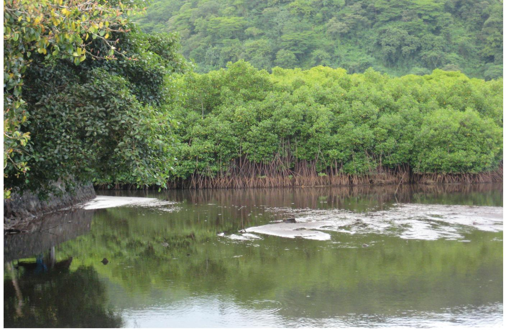

**Image 21.** Mangroves at Leone Pala SMA. Photo credit: Matt Kendall, NOAA Biogeography.

#### Masausi CFMP Reserve

#### Overview

The village of Masausi lies in NE Tutuila. The Masausi CFMP reserve (Figure 5.28) was established in 2002 to "conserve the marine resources in the ocean or in the village reef" (ASDMWR 2003d). The ~0.2 km² reserve extends from Puputagi Point in the west to Folau Point in the east and offshore approximately 200 yards. It fronts a ~1.6 km² watershed in minimally impacted condition with low population density concentrated in Masausi Village and a medium density of pigs. Because of the erosive soil types and steep slopes, there is moderate to high potential for periodic natural erosion with sediments carried into the nearshore waters fronting the watershed. Nearshore waters are also impacted to a lesser extent by urban runoffs. The reserve is closed to all commercial and recreational fishing apart from when it is opened for subsistence fishing at certain times of the year. Destructive fishing methods, including the use of bleach, poisons, and explosives,

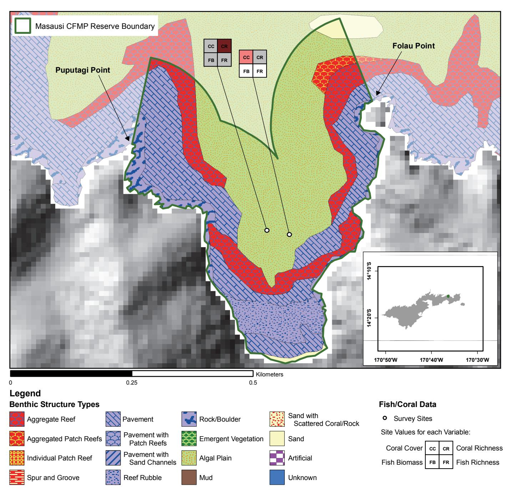

**Figure 5.28.** Benthic habitat (by structure type) and fish and coral survey data within the Masausi CFMP reserve. Coral cover, coral richness, fish biomass, and fish richness values at each survey site are classified as high (red shading), medium (pink shading), or low (white shading). Grey shading indicates variables with no data at a given site. Fish and coral survey data are from REA.

are banned. The use of scuba gear for fishing, flashlights for night fishing, and the breaking up of corals for fishing are also banned, as is fishing by outsiders (ASDMWR 2003d).

~0.20 km2

# Habitat Composition, Reef Fish, and Coral Communities

The Masausi CFMP reserve is dominated by coral reef and hardbottom structures, which together comprise ~59% of its area (Figure 5.29a). Coral reef structures, mostly aggregate reef, comprise ~18% of the area, while ~40% of the area is covered by algal plain. In comparison, aggregate reef covers ~5% of American Samoa overall. About 23% and ~54% of the coral reef and hardbottom in the reserve are in the reef flat and fore reef zones, respectively, compared to ~9% and ~22% around American Samoa (Figure 5.29b). Also of note, ~10% of the coral reef and hardbottom is in the shoreline intertidal zone.

#### (a) Total Area by (b) Zonation of Benthic Structure Type Coral Reef and Hardbottom Shoreline Intertidal 1% (10%)Reef Flat (23%)Reef Crest 40% (11%)Fore Reef Bank/Shel (54%) (3%)~59% of total area is coral reef and hardbottom

**Figure 5.29.** (a) Proportion of benthic structure types in the Masausi CFMP reserve. (b) Proportion of coral reef and hardbottom in each reef zone. Structure types or zones representing <1% of the total area are not shown.

Only two surveys were located within the Masausi CFMP reserve, and these were located in the area covered by algal plain rather than the reef and pavement areas. Coral data at these sites includes one medium value for cover and one high value for richness. Fish data includes one low value each for biomass and richness (Figure 5.30). The small sample size greatly limits the scope of these findings and does not allow comparisons with American Samoa overall. Additional, more widely spread surveys are needed to more fully characterize the reef fish and coral communities within this MPA.

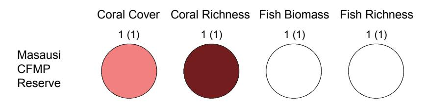

~0.12 km2

**Figure 5.30.** Fish and coral data collected in the Masausi CFMP reserve. Pie charts depict the proportions of high (red), medium (pink), and low (white) values for coral cover, coral richness, fish biomass, and fish richness. Number labels represent the number of studies and sites (in parentheses) comprising each pie chart.

#### Biogeographic Characteristics

The Masausi CFMP reserve is located in a biogeographic region that is a hotspot for coral richness (Bioregion 11, Chapter 4). The region's coral communities are similar to those in NW Tutuila, where the Fagamalo CFMP reserve and No-Take MPA are located.

Additional References
Orcutt 1993, Musburger 2004

#### Matu'u and Faganeanea CFMP Reserve

#### Overview

The villages of Matu'u and Faganeanea are found on the south central coast of Tutuila. The Matu'u and Faganeanea CFMP reserve (Figure 5.31) was established in 2005 with the primary goal of "protecting the coral reefs of Matu'u and Faganeanea to provide more fish for the future generation" (ASDMWR 2005). The ~0.3 km² reserve extends from the western tip of Utulaina Point to Matautuloa Point and offshore approximately 100 yards (ASDMWR 2005). It fronts a ~2.6 km² watershed in intermediately impacted condition, has moderate human population density and a low density of pigs. Because of the erosive soil types and steep slopes, there is moderate to high potential for periodic natural erosion with sediments carried into the nearshore waters fronting the watershed. Nearshore waters are also impacted to a lesser extent by insufficiently treated

**Figure 5.31.** Benthic habitat (by structure type) and fish and coral survey data within the Matu'u and Faganeanea CFMP reserve. Coral cover, coral richness, fish biomass, and fish richness values at each survey site are classified as high (red shading), medium (pink shading), or low (white shading). Grey shading indicates variables with no data at a given site. Fish and coral survey data are from ASEPA and REA.

wastewater. The reserve is closed to all commercial and recreational fishing apart from when it is opened for subsistence fishing at certain times of the year. Loitering in the reserve and in village streams is also prohibited (ASDMWR 2005).

## Habitat Composition, Reef Fish, and Coral Communities

The Matu'u and Faganeanea CFMP reserve is dominated by coral reef and hardbottom structures, which together comprise ~94% of the area within the reserve (Figure 5.32a). Coral reef structures in the form of aggregate reef comprise ~29% of the area, while reef rubble covers more than 50% of the area. In comparison, aggregate reef and reef rubble cover ~5% and ~2%, respectively, of the mapped benthic habitat around American Samoa. About 2% and ~70% of the coral reef and hardbottom in the reserve are in the reef flat and fore reef zones, respectively, compared to ~9% and ~22% around American Samoa (Figure 5.32b). Also of note, ~16% of the coral reef and hardbottom is in the reef crest zone

#### Only two surveys were located within the Matu'u and Faganeanea CFMP reserve. and these were both on the eastern end of the reserve. Coral data at these sites includes one low and one medium value for cover and one medium value for richness. Fish data includes two medium values for biomass and one low and one high value for richness (Figure 5.33). The small sample size greatly limits the scope of these findings and does not allow comparisons with American Samoa overall. Additional, more widely spread surveys are needed to more fully characterize the reef fish and coral communities within this MPA

# (a) Total Area by (b) Zonation of Benthic Structure Type Coral Reef and Hardbottom

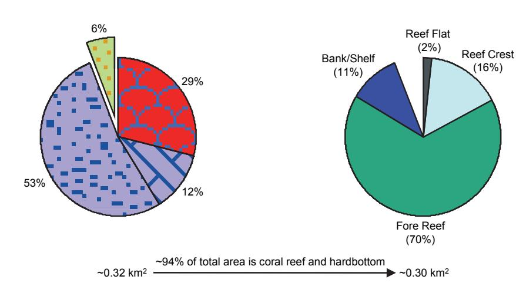

**Figure 5.32.** (a) Proportion of benthic structure types in the Matu'u and Faganeanea CFMP reserve. (b) Proportion of coral reef and hardbottom in each reef zone. Structure types or zones representing <1% of the total area are not shown.

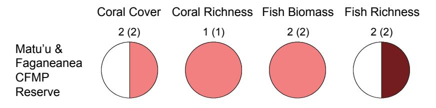

**Figure 5.33.** Fish and coral data collected in the Matu'u and Faganeanea CFMP reserve. Pie charts depict the proportions of high (red), medium (pink), and low (white) values for coral cover, coral richness, fish biomass, and fish richness. Number labels represent the number of studies and sites (in parentheses) comprising each pie chart.

#### Biogeographic Characteristics

The Matu'u and Faganeanea CFMP reserve lies in a biogeographic region that is a hotspot for fish richness (Bioregion 4, Chapter 4).

#### Additional References

Randall and Devaney 1974, McConnaughey 1993, Orcutt 1993, Peshut et al. 2007

#### Nu'uuli Pala Special Management Area

#### Overview

The Nu'uuli Pala SMA (Figure 5.34) is located in south-central Tutuila near the airport and, similar to Leone Pala SMA, was designated a special management area by the American Samoa Coastal Management Act of 1990 because of its "unique and valuable characteristics" and the "imminent threat from development pressures" (ASCA § 24.0503). It includes both a ~2.0 km² marine component, delineated by a straight line from Avatele Point to Mulinu'u Point, and the adjacent wetland areas (ASAC § 26.0221). The primary reason for this and other designated SMAs is to regulate on-shore activities in the wetland areas that could be harmful to unique marine ecosystems (Gombos et al. 2007). The Nu'uuli Pala SMA fronts a ~17.6 km² watershed in extensively impacted condition with high population density and continued pressure from residential expansion. Increased turbidity and sedimentation within the lagoon result from the steep slopes and highly erosive

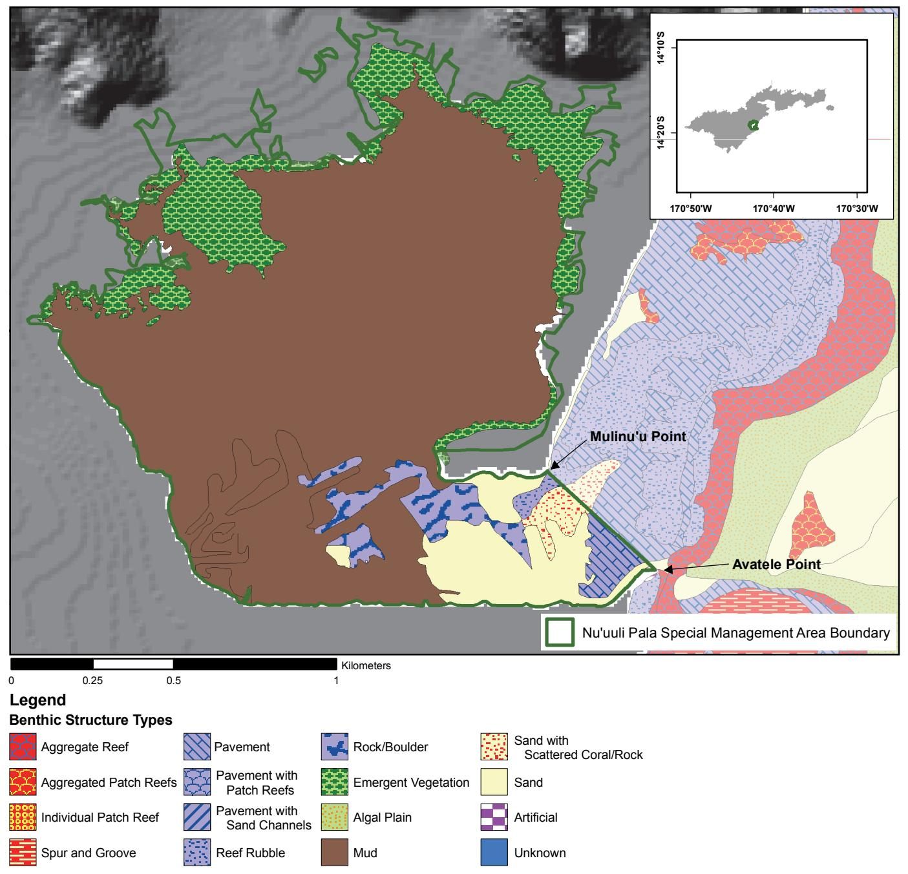

**Figure 5.34.** Benthic habitat (by structure type) and fish and coral survey data within the Nu'uuli Pala SMA. No reef fish or coral surveys from the island-wide comparison were located within the Nu'uuli Pala SMA.

soils in adjacent watersheds as well as from impervious surface runoffs in the urbanized areas. In addition, nutrient loading from insufficiently treated wastewater may impact nearshore waters. There is a medium density of pigs in the watershed. Management of Nu'uuli Pala SMA is primarily by the American Samoa Coastal Management Program (ASCMP) of the Department of Commerce, but no fishing regulations exist beyond territorial regulations and there is no written management plan (Gombos et al. 2007).

Habitat Composition, Reef Fish, and Coral Communities Coral reef and hardbottom structures together comprise only ~5% of the marine component of the Nu'uuli Pala SMA. In fact, no coral reef structures are found within this MPA. It is instead dominated by mud and mangrove habitats, which cover ~73% and ~13%, respectively, of its area (Figure 5.35a). In contrast, these structure types together comprise only ~1% of American Samoa overall. About 78% and ~8% of the coral reef and hardbottom in the SMA are in the reef flat and fore reef zones, respectively, compared to ~9% and ~22% around American Samoa (Figure 5.35b). Also of note, ~15% of the coral reef and hardbottom is in dredged areas.

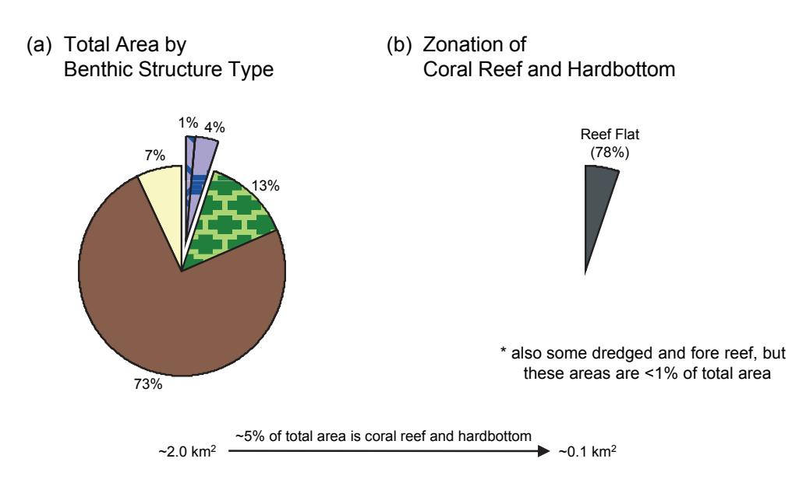

**Figure 5.35.** (a) Proportion of benthic structure types in the Nu'uuli Pala SMA. (b) Proportion of coral reef and hardbottom in each reef zone. Structure types or zones representing <1% of the total area are not shown.

There were no fish and coral surveys from the island-wide comparison located within the Nu'uuli Pala SMA.

#### Biogeographic Characteristics

This SMA lies adjacent to a biogeographic region that is a hotspot for fish richness (Bioregion 4, Chapter 4). While Nu'uuli Pala is clearly a different and separate subregion, it has by far the largest area of mangrove habitat in American Samoa and may contribute to the adjacent region's fish richness by providing habitat for juvenile fish.

#### Additional References

Helfrich 1975, Yamasaki et al. 1985, Kluge 1992, Ponwith 1992, Iose and McConnaughey 1993, Orcutt 1993, Peshut et al. 2007

#### Ofu Vaoto Territorial Marine Park (also known as Ofu Vaoto Marine Reserve)

#### Overview

The Ofu Vaoto Territorial Marine Park was established in 1994 "to protect its unique coral reef wildlife habitat while enabling the public to enjoy the natural beauty of the site" (ASCA §18.0214). It lies at the southwest tip of Ofu Island (Figure 5.36) and extends from the mean high water line seaward to approximately the ten fathom depth contour from the western end of the Ofu Airport runway to Fatauana Point, where it abuts the Ofu unit of the National Park (ASCA §18.0214). It fronts the southern tip of a ~4.4 km² watershed but is minimally impacted by land-based human activity. The nearshore waters may be impacted by natural sediment runoffs because of the steep slopes and highly erosive soils. There is a medium density of pigs in the watershed compared to all of American Samoa, but waste discharge from piggeries is less likely to impact the nearshore waters of the Park since the portion of the watershed fronting the Park is largely uninhabited. While the De-

**Figure 5.36.** Benthic habitat (by structure type) and fish and coral survey data within the Ofu Vaoto Marine Park. Coral cover, coral richness, fish biomass, and fish richness values at each survey site are classified as high (red shading), medium (pink shading), or low (white shading). Grey shading indicates variables with no data at a given site. Fish and coral survey data are from REA.

partment of Parks and Recreation (DPR) has management authority for the Park, the Department of Marine and Wildlife Resources (DMWR) exercises primary authority over fishing regulations (Gombos et al. 2007). Fishing and shellfish harvesting are prohibited, with the exception of subsistence fishing and harvesting by Ofu Island residents according to territorial regulations (ASCA §18.0214).

# Habitat Composition, Reef Fish, and Coral Communities

The benthic habitat in the Ofu Vaoto Marine Park is dominated by coral reef and hardbottom structures, which together comprise ~85% of its area (Figure 5.37a). Coral reef structures comprise ~34% of the area and include spur and groove (~24%) and aggregate reef (~10%). In addition, pavement covers ~45% of the area. In comparison, these three structure types comprise only ~15% of the mapped benthic habitat around American Samoa. Of note, ~11% of the mapped benthic habitat is of unknown structure type due to wave swash. About 42% and ~46% of the coral reef and hardbottom are in the reef flat and fore reef zones, respectively, compared to only ~9% and ~22% around American Samoa (Figure 5.37b).

**Figure 5.37.** (a) Proportion of benthic structure types in the Ofu Vaoto Marine Park. (b) Proportion of coral reef and hardbottom in each reef zone. Structure types or zones representing <1% of the total area are not shown.

Only two surveys were located within the Ofu Vaoto Marine Park, and neither of these surveys was in the reef and hard-bottom formations nearest to the shore-line. Coral data includes one low and one medium value for cover. No coral richness data was collected with these surveys. Fish data includes one low and one medium value for biomass and one low and one high value for richness (Figure 5.38). The small sample size greatly limits the scope of these findings and does

**Figure 5.38.** Fish and coral data collected in the Ofu Vaoto Marine Park. Pie charts depict the proportions of high (red), medium (pink), and low (white) values for coral cover, coral richness, fish biomass, and fish richness. Number labels represent the number of studies and sites (in parentheses) comprising each pie chart.

not allow comparisons with American Samoa overall. Additional, more widely spread surveys are needed to adequately characterize the reef fish and coral communities within the Park.

#### Biogeographic Characteristics

The Ofu Vaoto Marine Park lies in a biogeographic region that includes all of Ofu and Olosega islands (Bioregion 18, Chapter 4). This area is a regional hotspot for coral richness, fish biomass, and fish richness.

Additional References Maragos et al. 1995

#### Pago Pago Harbor Special Management Area

#### Overview

The Pago Pago Harbor SMA (Figure 5.39) is located in central Tutuila and was designated a special management area by the American Samoa Coastal Management Act of 1990 because of its "unique and valuable characteristics" and the "imminent threat from development pressures" (ASCA § 24.0503). Its marine boundaries are defined by a straight line from Goat Island Point to the jetty at Leloaloa (ASCA § 26.0221) and include ~1.2 km² of marine habitat. The primary reason for this and other designated SMAs is to regulate on-shore activities in the wetland areas that could be harmful to unique marine ecosystems (Gombos et al. 2007). The Pago Pago Harbor SMA includes the inner harbor area and fronts the western portion of a ~10.4 km² watershed in extensively impacted condition. In addition to natural sedimentation caused by highly erosive soils on steep slopes and increased surface runoffs due to extensive urbanization, nearshore

**Figure 5.39.** Benthic habitat (by structure type) within the Pago Pago Harbor SMA. No reef fish or coral surveys from the island-wide comparison were located within the Pago Pago Harbor SMA.

water quality has also been severely degraded by nutrient and chemical discharges by the tuna canneries and other historical industrial, commercial, and military activities adjacent to the harbor. There is a medium density of pigs in the watershed. Management of the SMA is primarily by the American Samoa Coastal Management Program (ASCMP) of the Department of Commerce, but no fishing regulations exist beyond territorial regulations. There is no written management plan (Gombos et al. 2007). Sale of fish or shellfish from the inner Harbor is prohibited due to contamination by heavy metals and other pollutants (ASEPA 1991).

# Habitat Composition, Reef Fish, and Coral Communities

Coral reef and hardbottom structures together comprise ~44% of the area within the Pago Pago Harbor SMA (Figure 5.40a). Coral reef structures comprise ~33% of the area and include aggregate reef (~18%) and aggregated patch reefs (~15%). In comparison, these two structure types comprise only ~12% of the mapped benthic habitat around American Samoa. In addition, a large portion (~37%) of the benthic habitat in this SMA is covered by mud. Also of note, ~15% of the mapped benthic habitat in Pago Pago Harbor SMA is of unknown structure type due to high turbidity. About 23% and ~40% of the coral reef and hardbottom in the SMA are in the reef flat and fore reef zones, respectively, compared to only ~9% and ~22% around American Samoa (Figure 5.40b).

**Figure 5.40.** (a) Proportion of benthic structure types in the Pago Pago Harbor SMA. (b) Proportion of coral reef and hardbottom in each reef zone. Structure types or zones representing <1% of the total area are not shown.

There were no fish and coral surveys from the island-wide comparison located within the Pago Pago Harbor SMA.

#### Biogeographic Characteristics

Pago Pago Harbor SMA lies at the margin of a biogeographic region that is a hotspot for fish biomass and has a unique coral community (Bioregion 5, Chapter 4). However, note that high fish biomass may be due to the ban on sale of fish from the harbor due to contaminant concerns and while the coral community may be "unique" relative to elsewhere in American Samoa it is not necessarily "healthy".

#### Additional References

McConnaughey 1993, Orcutt 1993, Green et al. 1997a, Fisk and Birkeland 2002, Coles et al. 2003, Craig et al. 2005, Green et al. 2005, Peshut et al. 2007

#### **Poloa CFMP Reserve**

#### Overview

The village of Poloa is located on the NW tip of Tutuila. The Poloa CFMP reserve (Figure 5.41) was established in 2001 to "conserve, protect, and manage the resources in the village reef" (ASDMWR 2001). The ~0.4 km² reserve extends from Legaotaema Point in the west to the boundary of Poloa with Fagali'i village and offshore to 100 yards beyond the seaward edge of the reef flat (ASDMWR 2001). It fronts a ~1.1 km² watershed in minimally impacted condition with low population density, while the northeastern tip of the reserve fronts a ~2.1 km² watershed of similar condition. While human impacts are minimal in the watershed, there is high potential for runoff and erosion because of the erosive soil types and steep slopes. There is a low density of pigs in the adjacent watersheds. The reserve is closed to all commercial and recreational fishing apart from when it is opened for subsistence fishing at certain times of the year. Destructive fishing

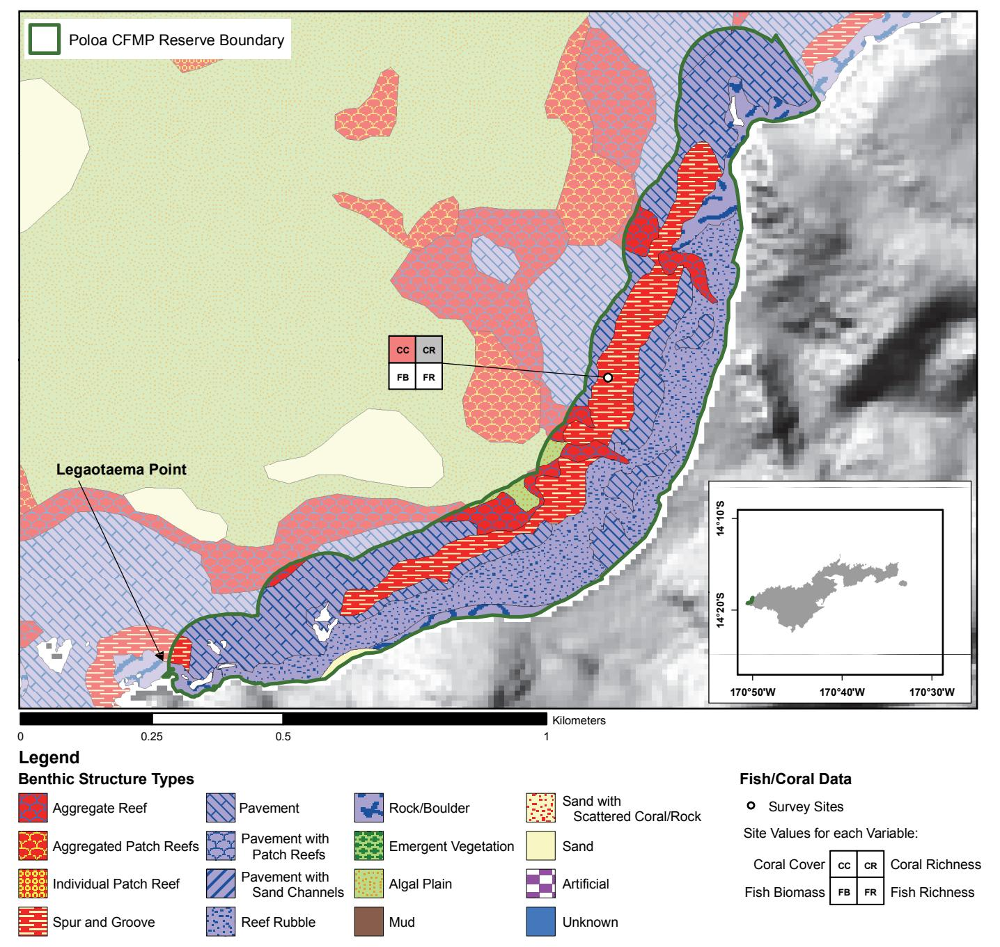

**Figure 5.41.** Benthic habitat (by structure type) and fish and coral survey data within the Poloa CFMP reserve. Coral cover, coral richness, fish biomass, and fish richness values at each survey site are classified as high (red shading), medium (pink shading), or low (white shading). Grey shading indicates variables with no data at a given site. Fish and coral survey data are from KRS.

methods including the use of bleach, poisons, and explosives are banned. The use of scuba gear for fishing, flashlights or lanterns for night fishing, and the breaking up of corals for fishing are also banned, as is fishing by outsiders (ASDMWR 2001).

# Habitat Composition, Reef Fish, and Coral Communities

The Poloa CFMP reserve is dominated by coral reef and hardbottom structures, which together comprise ~98% of the area within the reserve (Figure 5.42a). Coral reef structures comprise ~25% of the area and include spur and groove (~18%) and aggregate reef (~7%). In addition, pavement covers ~38% of the area. In comparison, these three structure types comprise only ~15% of American Samoa overall. About 33% and ~21% of the coral reef and hardbottom in the reserve are in the reef flat and fore reef zones, respectively, compared to ~9% and ~22% around American Samoa (Figure 5.42b). Also of note, over 30% of the coral reef and hardbottom is in the bank/ shelf, compared to ~50% around American Samoa.

#### (a) Total Area by (b) Zonation of Coral Reef and Hardbottom Benthic Structure Type Channel Shoreline Intertidal (2%) (3%) Reef Flat Bank/Shelf (33%) (34%)Reef Crest (7%)Fore Reef (21%)~98% of total area is coral reef and hardbottom ~0.36 km2 ~0.35 km²

**Figure 5.42.** (a) Proportion of benthic structure types in the Poloa CFMP reserve. (b) Proportion of coral reef and hardbottom in each reef zone. Structure types or zones representing <1% of the total area are not shown.

Only one survey was located within the Poloa CFMP reserve. Coral data at this includes one medium value for cover. No coral richness data was collected within the reserve. Fish data at the site includes one low value for each of biomass and richness (Figure 5.43). The small sample size greatly limits the scope of these findings and does not allow comparisons with American Samoa overall. Additional, more widely spread surveys are needed to characterize the reef fish and coral communities within this MPA.

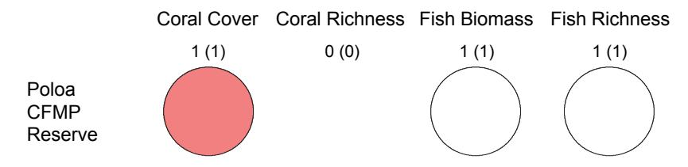

**Figure 5.43.** Fish and coral data collected in the Poloa CFMP reserve. Pie charts depict the proportions of high (red), medium (pink), and low (white) values for coral cover, coral richness, fish biomass, and fish richness. Number labels represent the number of studies and sites (in parentheses) comprising each pie chart.

#### Biogeographic Characteristics

The Poloa CFMP reserve is located in a biogeographic region that is not a hotspot for any of the coral and reef fish variables analyzed (Bioregion 15, Chapter 4).

#### Additional References

Orcutt 1993, Musburger 2004, Peshut et al. 2007

#### Sailele CFMP Reserve

#### Overview

The village of Sailele is located in NE Tutuila. The Sailele CFMP reserve (Figure 5.44) was established in 2005 to protect the reef area so it can allow sustainable use of the marine resources in the reserve. The ~0.1 km² reserve extends from Malo Point to Leanmanu Point and offshore to approximately 75 yards from the reef crest. It fronts a ~0.7 km² watershed in minimally impacted condition, with low human population density concentrated in Sailele Village. There are no pigs reported in the watershed, so any impacts by waste discharge from piggeries most likely come from elsewhere. Because of the erosive soil types and steep slopes there is moderate to high potential for periodic natural erosion with sediments carried into the nearshore waters fronting the watershed. Nearshore waters are also impacted to a lesser extent by urban runoffs. The reserve is closed to all commercial and recreational fishing apart from when it is opened for subsistence fishing at certain times of the year.

**Figure 5.44.** Benthic habitat (by structure type) within the Sailele CFMP reserve. No reef fish or coral surveys from the island-wide comparison were located within the Sailele CFMP reserve.

# Habitat Composition, Reef Fish, and Coral Communities

The Sailele CFMP reserve is dominated by coral reef and hardbottom structures, which together comprise the entire area within the reserve (Figure 5.45a). Coral reef structures in the form of aggregate reef comprise ~24% of the area, while pavement covers ~45% of the area. In comparison, these two structure types cover less than 15% of American Samoa overall. About 48% and ~35% of the coral reef and hardbottom in the reserve are in the reef flat and fore reef zones, respectively, compared to only ~9% and ~22% around American Samoa (Figure 5.45b). Also of note, ~15% of the coral reef and hardbottom is in the reef crest.

#### (a) Total Area by Benthic Structure Type

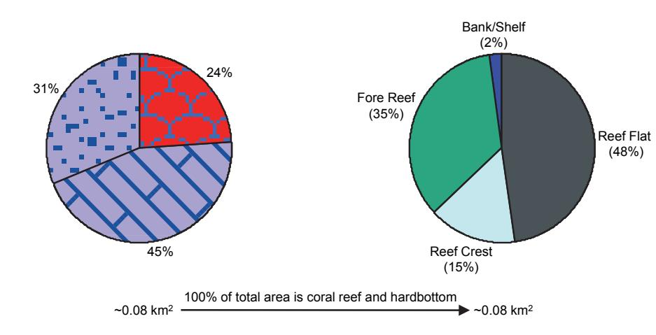

**Figure 5.45.** (a) Proportion of benthic structure types in the Sailele CFMP reserve. (b) Proportion of coral reef and hardbottom in each reef zone. Structure types or zones representing <1% of the total area are not shown.

There were no fish and coral surveys from the island-wide comparison located within the Sailele CFMP reserve.

#### Biogeographic Characteristics

The Sailele CFMP reserve is located in a biogeographic region that is a hotspot for coral richness (Bioregion 11, Chapter 4). The region's coral communities are similar to those in NW Tutuila, where the Fagamalo CFMP reserve and No-Take MPA are located.

#### Vatia CFMP Reserve

#### Overview

The village of Vatia is located on the north-central coast of Tutuila and partially overlaps the Tutuila unit of the National Park. The Vatia CFMP reserve (Figure 5.46) was established in 2001 to "manage, protect, and preserve the fish, shellfish, and the coastal area of the village of Vatia" (ASDMWR 2002b). The ~0.6 km² reserve extends from Falelofia Point at the northern end of Polatai Islet to Craggy Point at the boundary with Afono village and offshore approximately 100 yards (ASDMWR 2002b). It primarily fronts a ~4.9 km² watershed in minimally impacted condition with the population concentrated around Vatia Bay. Because of the soil types and steep slopes, there is moderate to high potential for periodic natural erosion and nearshore sediment impacts. Nearshore waters are also somewhat impacted by wastewater discharge concentrated near the vil-

**Figure 5.46.** Benthic habitat (by structure type) and fish and coral survey data within the Vatia CFMP reserve. Coral cover, coral richness, fish biomass, and fish richness values at each survey site are classified as high (red shading), medium (pink shading), or low (white shading). Grey shading indicates variables with no data at a given site. Fish and coral survey data are from KRS, MPABR, and REA.

lage. There is a low density of pigs in adjacent watersheds compared to all of American Samoa. The reserve is closed to all commercial and recreational fishing apart from when it is opened for subsistence fishing at certain times of the year. Destructive fishing methods, including the use of bleach, poisons, and explosives, are banned. The use of scuba gear for fishing, flashlights for night fishing, and the breaking up of corals for fishing are also banned, as is fishing by outsiders (ASDMWR 2002b).

# Habitat Composition, Reef Fish, and Coral Communities

The Vatia CFMP reserve is dominated by coral reef and hardbottom structures which together comprise ~96% of the area within the reserve (Figure 5.47a). Coral reef structures in the form of aggregate reef comprise ~30% of the area. In addition, pavement covers ~37% of the area. In comparison, these two structure types cover ~12% of American Samoa overall. About 22% and ~30% of the coral reef and hardbottom in the reserve are in the reef flat and fore reef zones, respectively, compared to only ~9% and ~22% around American Samoa (Figure 5.47b). Also of note, almost 40% of the coral reef and hardbottom is in the bank/shelf, compared to ~50% around American Samoa.

**Figure 5.47.** (a) Proportion of benthic structure types in the Vatia CFMP reserve. (b) Proportion of coral reef and hardbottom in each reef zone. Structure types or zones representing <1% of the total area are not shown.

Only three surveys were located within the Vatia CFMP reserve, and these were at the extreme western and eastern ends of the reserve. Coral data at these sites includes one low, one medium, and one high value for cover and one low value for richness. Fish data includes one low and one medium value for biomass and one low and two medium values for richness (Figure 5.48). The small sample size greatly limits the scope of these findings and does not allow comparisons with

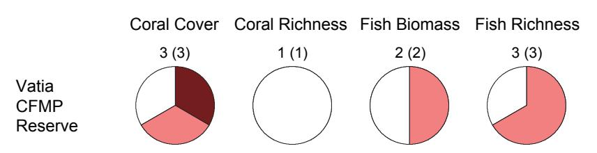

**Figure 5.48.** Fish and coral data collected in the Vatia CFMP reserve. Pie charts depict the proportions of high (red), medium (pink), and low (white) values for coral cover, coral richness, fish biomass, and fish richness. Number labels represent the number of studies and sites (in parentheses) comprising each pie chart.

American Samoa overall Additional, more widely spread surveys are needed to more fully characterize the reef fish and coral communities within this MPA.

#### Biogeographic Characteristics

The Vatia CFMP reserve lies in a biogeographic region that is a hotspot for coral cover and also includes the Tutuila unit of the National Park (Bioregion 12, Chapter 4). The region's fish and coral communities are similar to those around Fagaitua Bay on the SE side of Tutuila.

#### Additional References

Randall and Devaney 1974, Orcutt 1993, Coles et al. 2003, Andrews 2004, Musburger 2004, Houk 2010

#### Federal or Federal/Territorial Co-Managed MPAs

#### **Fagatele Bay National Marine Sanctuary**

#### Overview

Located on the SW side of Tutuila, Fagatele Bay National Marine Sanctuary (FBNMS) (Figure 5.49) encompasses ~0.7 km² of fringing coral reef ecosystem within a collapsed volcanic crater and extends from the southern tip of Fagatele Point to the southern tip of Step's Point. The Sanctuary was designated in 1986 to "protect and preserve an example of a pristine tropical marine habitat and coral reef terrace ecosystem" (15 C.F.R. 922.100-104, FBNMS Regulations 1986). FBNMS fronts a ~3.2 km² watershed in pristine condition. Human impacts within the watershed are minimal and although nearshore waters may be affected by runoff of highly erosive soils on the steep slopes of the watershed, these runoffs are not associated with significant nutrient loads. There is a low density of pigs in the

**Figure 5.49.** Benthic habitat (by structure type) and fish and coral survey data within Fagatele Bay NMS. Coral cover, coral richness, fish biomass, and fish richness values at each survey site are classified as high (red shading), medium (pink shading), or low (white shading). Grey shading indicates variables with no data at a given site. Fish and coral survey data are from ASEPA, CRSR, MPABR, REA, and TCRMP.

watershed compared to all of American Samoa, and no humans (or pigs) inhabit the portion of the watershed adjacent to Fagatele Bay. However, the only landfill on Tutuila is located north of the ridge above FBNMS, and research is recommended to assess the potential for groundwater seepage into the Bay. Fishing is presently regulated differently within two zones in FBNMS but may soon be modified to complete no-take with a management plan revision that is currently underway. Presently, fishing with designated gear types is allowed in the outer bay (seaward of a line between Matautuloa Benchmark and Fagatele Point) whereas hook and line and commercial fishing in the inner bay are prohibited.

# Habitat Composition, Reef Fish, and Coral Communities

FBNMS is dominated by coral reef and hardbottom structures. which together comprise ~91% of its area (Figure 5.50a). Coral reef structures comprise ~64% of the area and include aggregate reef (~36%) and spur and groove (~28%). In comparison, these two structure types comprise only ~11% of the mapped benthic habitat around American Samoa. About 7% and ~36% of the coral reef and hardbottom in FBNMS are in the reef flat and fore reef zones, respectively, compared to ~9% and ~22% around American Samoa (Figure 5.50b). In addition,

# (a) Total Area by Benthic Structure Type (b) Zonation of Coral Reef and Hardbottom Reef Flat (7%) Reef Crest (4%)

**Figure 5.50.** (a) Proportion of benthic structure types in Fagatele Bay NMS. (b) Proportion of coral reef and hardbottom in each reef zone. Structure types or zones representing <1% of the total area are not shown.

~22% and ~31% of the coral reef and hardbottom are in the bank/shelf and bank/shelf escarpment, respectively. In comparison, ~50% of the coral reef and hardbottom around American Samoa is in the bank shelf, whereas only ~10% is in the bank/shelf escarpment. Of note, the relative proportions and inshore/offshore zonation of these reef and hardbottom features are replicated by those found in adjacent Larsen Bay.

Eight surveys were located within Fagatele Bay and those were concentrated in the northeast aggregate reef and pavement areas. Coral data at those sites suggests relatively higher cover and richness values compared to all of American Samoa. Fish richness values are much higher than those elsewhere in American Samoa whereas biomass was comparable (Figure 5.51). Additional, more widely spread surveys are needed to more fully characterize the outer portions of the Bay.

#### Biogeographic Characteristics

FBNMS lies in a biogeographic region that

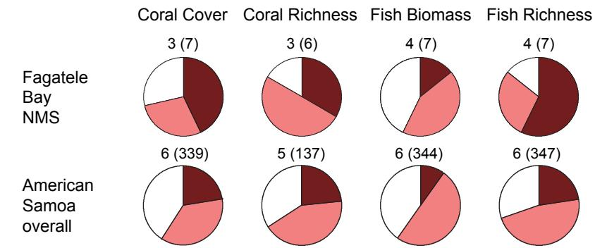

**Figure 5.51.** Comparison of fish and coral data collected in Fagatele Bay NMS to data from all of American Samoa. Pie charts depict the proportions of high (red), medium (pink), and low (white) values for coral cover, coral richness, fish biomass, and fish richness. Number labels represent the number of studies and sites (in parentheses) comprising each pie chart.

includes Larsen Bay and is a hotspot for coral cover as well as coral and fish richness (Bioregion 2, Chapter 4). The region's fish and coral communities are representative of southwestern Tutuila and have some similarities to coral communities around Aunu'u.

#### Additional References

Birkeland et al. 1987, Orcutt 1993, Birkeland et al. 1994, Green et al. 1999, Fisk and Birkeland 2002, Birkeland et al. 2003, Coles et al. 2003, Andrews 2004, Birkeland et al. 2004, Green et al. 2005

#### National Park of American Samoa - Ofu Unit

#### Overview

The Ofu unit of the National Park (Figure 5.52) was authorized by Public Law 100-571 in 1988 and formally established in 1993 following a lease agreement with the villages (16 U.S.C. 410qq-410qq-1, NPS 1997). Its boundary follows the southeast shoreline road of Ofu Island from Fatauana Point to Asega Strait and extends 0.25 miles offshore. It also extends inland to include the southern slopes of Sunu'itao Peak (16 U.S.C. 410qq-410qq-1, NPS 1997). The 1986-7 NPS feasibility study noted the "exceptionally diverse reef fish and coral communities" in this area as well as the lack of reef damage from crown-of-thorns starfish outbreaks (NPS 1988). The ~1.5 km² marine portion of the Ofu park unit fronts the largely uninhabited southeast side of a ~4.4 km² watershed. The nearshore waters are not significantly impacted by human activity but may be impacted by natural sediment runoffs because of the steep slopes and highly erosive soils. There is a

**Figure 5.52.** Benthic habitat (by structure type) and fish and coral survey data within the Ofu Unit of the National Park. Coral cover, coral richness, fish biomass, and fish richness values at each survey site are classified as high (red shading), medium (pink shading), or low (white shading). Grey shading indicates variables with no data at a given site. Fish and coral survey data are from REA.

medium density of pigs in the watershed overall, however the portion of the watershed actually fronting the Park is largely uninhabited. Fishing or gathering is prohibited in the park, except subsistence fishing by native American Samoans using traditional tools and methods in accordance with rules established by the National Park Service and village leaders (16 U.S.C. 410qq-410qq-1, NPS 1997).

# Habitat Composition, Reef Fish, and Coral Communities

The benthic habitat in this park unit is dominated by coral reef and hardbottom structures, which together comprise ~71% of the area (Figure 5.53a). Coral reef structures comprise ~32% of the area and include mostly spur and groove (~24%) and aggregated patch reefs (~6%). In comparison, these two structure types comprise only ~13% of the mapped benthic habitat around American Samoa. Of note, ~ 8% of the offshore area in the Ofu park unit was too deep for satellite based mapping. Also of note. ~9% of the benthic habitat within the park unit is of unknown bottom type due to wave swash. About 48% and ~33% of the coral reef and hardbottom in this park unit are in the reef flat and fore

**Figure 5.53.** (a) Proportion of benthic structure types in the Ofu Unit of the National Park. (b) Proportion of coral reef and hardbottom in each reef zone. Structure types or zones representing <1% of the total area are not shown.

reef zones, respectively, compared to only ~9% and ~22% around American Samoa (Figure 5.53b). Also of note, almost 20% of the coral reef and hardbottom is in the bank/shelf, compared to ~50% around American Samoa.

Only 5 surveys were located within this park unit and none included each of the key variables. Coral richness values at these sites are relatively higher compared to all of American Samoa, while coral cover and fish biomass and richness are relatively lower (Figure 5.54) although the small sample size greatly limits the scope of these findings.

#### Biogeographic Characteristics

The Ofu unit of the National Park is located in a biogeographic region that includes all of Ofu and Olosega and is a hotspot for coral richness, fish biomass, and fish richness (Bioregion 18, Chapter 4).

**Figure 5.54.** Comparison of fish and coral data collected in the Ofu Unit of the National Park to data from all of American Samoa. Pie charts depict the proportions of high (red), medium (pink), and low (white) values for coral cover, coral richness, fish biomass, and fish richness. Number labels represent the number of studies and sites (in parentheses) comprising each pie chart.

#### Additional References

Itano and Buckley 1988, Friedlander 1993, Hunter et al. 1993, Maragos et al. 1995, Craig and Basch 2001, Craig et al. 2001, Smith and Birkeland 2003, Andrews 2004, Pendleton et al. 2005, Garrison et al. 2007

#### National Park of American Samoa - Ta'u Unit

#### Overview

The Ta'u unit of the National Park (Figure 5.55) was authorized by Public Law 100-571 in 1988 and formally established in 1993 following a lease agreement with the villages (16 U.S.C. 410qq-410qq-1, NPS 1997). It occupies ~20 km² of land and ~ 4.7 km² of marine habitats in the south and southeast of Ta'u Island. The 1986-7 NPS feasibility study noted that this area includes "the largest extent of both undisturbed lowland and montane rainforest and cloud forest left in American Samoa" and would "provide important habitat for seabirds, shorebirds, flying foxes, and forest birds" (NPS 1988). Also noted is the presence of the prehistoric village of Saua, along the east coast, and Taisamasama, or the Yellow Waters of Tui Manu'a cultural site, located centrally on the south shore. The marine component of the park has a seaward boundary that extends 0.25 miles offshore from Si'ufa'alele Point eastward to the Saua site (16 U.S.C. 410qq-410qq-1, NPS 1997). Most of the marine component of the park fronts an uninhabited ~8.5

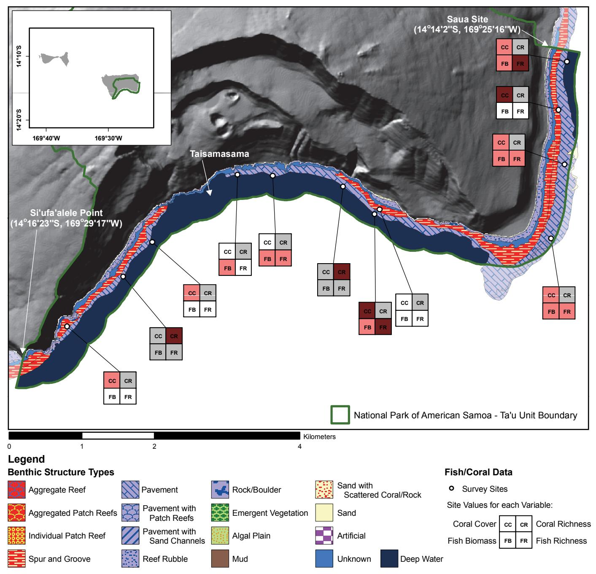

**Figure 5.55.** Benthic habitat (by structure type) and fish and coral survey data within the Ta'u Unit of the National Park. Coral cover, coral richness, fish biomass, and fish richness values at each survey site are classified as high (red shading), medium (pink shading), or low (white shading). Grey shading indicates variables with no data at a given site. Fish and coral survey data are from REA.

km² watershed in pristine condition that covers the southern portion of the island. The eastern marine component fronts an uninhabited portion of a ~37 km² watershed that occupies most of the island. Although there are no real human impacts to the nearshore waters, there is a moderate to severe potential for sediment runoffs because of the steep slopes and highly erosive soils. There is a low density of pigs in the watershed and the portion actually fronting the park unit is uninhabited, so waste discharge from piggeries is less likely to impact nearshore waters. Fishing or gathering is prohibited in the park, except subsistence fishing by native American Samoans using traditional tools and methods in accordance with rules established by NPS and village leaders (16 U.S.C. 410qq-410qq-1, NPS 1997).

# Habitat Composition, Reef Fish, and Coral Communities

The nearshore areas of the Ta'u unit of the National Park are dominated by coral reef and hardbottom structures, which together comprise ~43% of the area within the park unit (Figure 5.56a). Coral reef structures in the form of spur and groove comprise ~17% of the area. In comparison, spur and groove covers only ~6% of the mapped benthic habitat around American Samoa. Because of the steep drop off at the shelf edge, about half of the offshore area in the Ta'u unit of the National Park was too deep for satellite based mapping. In addition, ~7% of the area is of unknown bottom type due to wave swash. About 12% and ~34% of the coral reef and hardbottom in

**Figure 5.56.** (a) Proportion of benthic structure types in the Ta'u Unit of the National Park. (b) Proportion of coral reef and hardbottom in each reef zone. Structure types or zones representing <1% of the total area are not shown.

this park unit are in the reef flat and fore reef zones, respectively, while over half of the coral reef and hardbottom is in the bank/shelf (Figure 5.56b). This is similar to the proportions of reef zones around American Samoa overall.

Twelve surveys were located within the park unit. Coral data suggests comparable cover and relatively higher richness values compared to all of American Samoa, although only two surveys included coral richness data. Fish biomass and richness values are comparable or slightly lower relative to all of American Samoa (Figure 5.57).

#### Biogeographic Characteristics

The Ta'u unit of the National Park straddles two biogeographic regions that are hotspots for coral cover and coral and fish richness, and that share a unique coral community representative of Ta'u Island (Bioregions 19-20, Chapter 4).

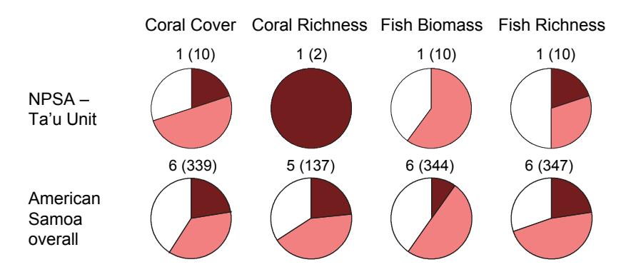

**Figure 5.57.** Comparison of fish and coral data collected in the Ta'u Unit of the National Park to data from all of American Samoa. Pie charts depict the proportions of high (red), medium (pink), and low (white) values for coral cover, coral richness, fish biomass, and fish richness. Number labels represent the number of studies and sites (in parentheses) comprising each pie chart.

#### Additional References

Green and Hughes 1999, Craig and Basch 2001, Pendleton et al. 2005

#### National Park of American Samoa – Tutuila unit

#### Overview

The Tutuila unit of the National Park (Figure 5.58) was authorized by Public Law 100-571 in 1988 and formally established in 1993 following a lease agreement with the villages (16 U.S.C. 410qq-410qq-1, NPS 1997). It lies between the villages of Fagasa and Afono on the north-central coast of Tutuila with a seaward boundary that extends 0.25 miles offshore (16 U.S.C. 410qq-410qq-1, NPS 1997). The park partially overlaps the Vatia CFMP reserve. The 1986-7 NPS feasibility study noted that this area includes "the longest stretch of undeveloped coastline and undisturbed forest on Tutuila" (NPS 1988). The ~6.5 km² marine portion of the Tutuila park unit primarily fronts two watersheds. The western of these is a ~5.1 km² watershed that is uninhabited and in relatively pristine condition. Nearshore waters may however, be impacted by sediment runoff resulting

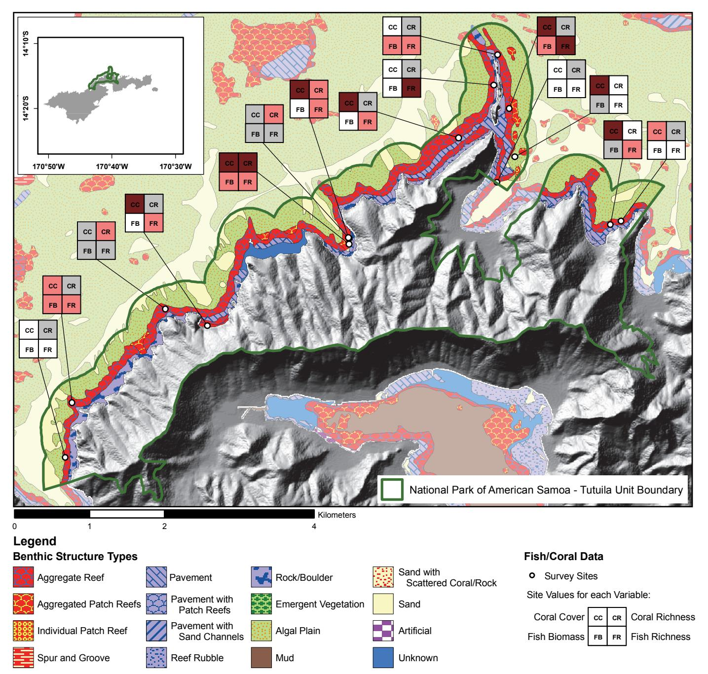

**Figure 5.58.** Benthic habitat (by structure type) and fish and coral survey data within the Tutuila Unit of the National Park. Coral cover, coral richness, fish biomass, and fish richness values at each survey site are classified as high (red shading), medium (pink shading), or low (white shading). Grey shading indicates variables with no data at a given site. Fish and coral survey data are from ASEPA, KRS, MPABR, and REA.

from the erosive soil types on steep inland slopes. To the east is a 4.9 km² watershed in minimally impacted condition with the population concentrated around Vatia Bay. In this area there is moderate to high erosion and runoff potential and slight impacts from groundwater and surface water contamination. The southwest and eastern boundaries of the park extend slightly into adjacent watersheds, with the watershed to the southwest being in intermediately impacted condition. There is a low density of pigs in these adjacent watersheds and most of the area is uninhabited. Fishing or gathering is prohibited in the park, except subsistence fishing by native American Samoans using traditional methods in accordance with rules established by NPS and village leaders (16 U.S.C. 410qq-410qq-1, NPS 1997).

# Habitat Composition, Reef Fish, and Coral Communities

Coral reef and hardbottom structures together comprise ~43% of the offshore areas of the Tutuila unit of the National Park (Figure 5.59a). Coral reef structures comprise ~28% of the area and are dominated by aggregate reefs, a structure type often with a high percentage of reef building corals. Also, algal plain covers ~43% of the area within this park unit. The relative proportions of benthic structure types within the park unit are representative of American Samoa in general. About 4% and ~59% of the coral reef and hardbottom in this park unit are in the reef flat and fore reef zones, respectively, compared to ~9% and ~22% around American Samoa (Figure 5.59b). Also of note, 36% of the

**Figure 5.59.** (a) Proportion of benthic structure types in the Tutuila Unit of the National Park. (b) Proportion of coral reef and hardbottom in each reef zone. Structure types or zones representing <1% of the total area are not shown.

coral reef and hardbottom is in the bank/shelf compared to ~50% around American Samoa.

Fifteen surveys were located within the park. Coral data suggests relatively higher cover and similar richness values compared to all of American Samoa. Fish biomass and richness values were relatively lower compared to all of American Samoa (Figure 5.60).

#### Biogeographic Characteristics

Most of the Tutuila unit of the National Park overlaps with a biogeographic region along the north shore of Tutuila that is a hotspot for coral cover (Bioregion 12, Chapter 4). The region's fish and coral communities are similar to those around Fagaitua Bay on the SE coast of Tutuila.

**Figure 5.60.** Comparison of fish and coral data collected in the Tutuila Unit of the National Park to data from all of American Samoa. Pie charts depict the proportions of high (red), medium (pink), and low (white) values for coral cover, coral richness, fish biomass, and fish richness. Number labels represent the number of studies and sites (in parentheses) comprising each pie chart.

#### Additional References

Green and Hunter 1998, Craig and Basch 2001, Coles et al. 2003, Pendleton et al. 2005

#### Rose Atoll Marine National Monument and National Wildlife Refuge

#### Overview

Rose Atoll Marine National Monument (MNM) lies at the eastern end of the Samoan archipelago and was established in 2009 by Presidential Proclamation 8337 to protect the "lands, submerged lands, waters, and marine environment around Rose Atoll" and its "dynamic reef ecosystem that is home to a very diverse assemblage of terrestrial and marine species, many of which are threatened or endangered" (Proclamation No. 8337). The Monument has a rectangular seaward boundary approximately 50 nautical miles from the mean low water line of Rose Atoll (Figure 5.61). The volcanic hotspot responsible for the Samoan Island chain, the Vailulu'u seamount, lies just west of the monument (Appendix A). The Monument encompasses almost 35,000 km², including Rose Atoll National Wildlife Refuge (NWR), which was established by cooperative agreement between the Government of American Samoa and the USFWS in 1973 and includes the ~6.8 km²

**Figure 5.61.** Mapped benthic habitat (by structure type) and fish and coral survey data within Rose Atoll MNM. Coral cover, coral richness, fish biomass, and fish richness values at each survey site are classified as high (red shading), medium (pink shading), or low (white shading). Grey shading indicates variables with no data at a given site. Fish and coral survey data are from CRSR and REA.

of land, submerged land, and waters within the mean low water line of Rose Atoll (RANWR 1974). Rose is one of the smallest atolls in the world and is uninhabited by humans. It provides important nesting grounds for the threatened green sea turtle and habitat for 17 species of federally protected migratory seabirds and shorebirds. It also supports the largest population of giant clams in American Samoa as well as many rare species of reef fish (Gombos et al. 2007). Because Rose Atoll is uninhabited, nearshore waters are not impacted by human use such as from urban runoffs and waste discharge from piggeries. Rose Atoll NWR has been closed to the public since its establishment to protect the fish and wildlife in the refuge and is managed exclusively by USFWS. Proclamation 8337 prohibits commercial fishing within the Monument and gives the Secretary of Commerce (through NOAA) primary management authority over fishery-related activities in the marine areas outside of the NWR (16 U.S.C. 1801 et seq., Proclamation No. 8337). The Secretary of Commerce has initiated the process to add the marine areas of the Monument to Fagatele Bay NMS in accordance with the National Marine Sanctuaries Act (16 U.S.C. 1431 et seq.).

# Habitat Composition, Reef Fish, and Coral Communities

Most of the ~35000 km2 within Rose Atoll MNM is open ocean and too deep to map with satellite imagery. The ~7.9 km2 of mapped benthic habitat within the Monument is dominated by coral reef and hardbottom structures. which together comprise ~63% of the area within the Monument (Figure 5.62a). Coral reef structures comprise only ~10% of the mapped benthic habitat and include aggregate reef (~2%), aggregated patch reefs (~3%), and spur and groove (~5%). In comparison, these three structure types cover ~18% of the mapped benthic habitat around

# (a) Total Mapped Area by Benthic Structure Type (b) Zonation of Coral Reef and Hardbottom

**Figure 5.62.** (a) Proportion of mapped benthic structure types in Rose Atoll MNM. (b) Proportion of coral reef and hardbottom in each reef zone. Structure types or zones representing <1% of the total mapped area are not shown.

American Samoa. Almost all of the spur and groove lies in the ~1.2 km² of benthic habitat outside the mean low water line, whereas the lagoon area contains all of the aggregate reef and aggregated patch reefs. In addition, pavement covers ~40% of the mapped area and ~25% of the mapped area within the lagoon is classified as unknown because of cloud cover or because it is part of the deeper interior of the lagoon. None of the coral reef and hardbottom in the Monument is in the reef flat, while ~8% is in the fore reef compared to ~22% around American Samoa (Figure 5.62b). Almost two-thirds of the coral reef and hardbottom in the Monument is in the back reef zone, compared to only

~3% around American Samoa.

There are 51 surveys distributed in the spur and groove and pavement areas surrounding Rose Atoll and in the inner lagoon. Coral data at these sites suggests relatively lower cover and richness values compared to all of American Samoa. Fish biomass is slightly higher relative to all of American Samoa, whereas fish richness is slightly lower (Figure 5.63). Of note, the fish and coral values within the lagoon are comprised of different fish and coral communities (unpublished MDS analyses and

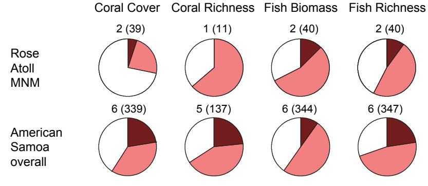

**Figure 5.63.** Comparison of fish and coral data collected in the Rose Atoll MNM to data from all of American Samoa. Pie charts depict the proportions of high (red), medium (pink), and low (white) values for coral cover, coral richness, fish biomass, and fish richness. Number labels represent the number of studies and sites (in parentheses) comprising each pie chart.

in Kenyon et al. 2010) and are considerably lower relative to the values located just outside the mean low water line in the fore reef and bank/shelf (Figure 5.61).

#### *Biogeographic Characteristics*

Rose Atoll MNM comprises a distinct biogeographic region (Bioregion 17, Chapter 4) that is a hotspot for fish biomass and has a unique coral community. Rose lies upstream in the South Equatorial Current relative to the rest of the Samoan Archipelago. Analysis of larval connectivity in the region suggests that Rose Atoll may be isolated from larval sources and less resilient to disturbance (Chapter 3). Also of note, Rose Atoll is dominated by crustose coralline algae and possesses a unique algal community (Tribollet et al. 2010).

#### *Additional References*

Wass 1981, Wass 1982, Green et al. 1997a, Wegmann and Holzwarth 2006, Schroeder et al. 2008, Tribollet et al. 2010, Vroom 2011

#### **RESULTS: MPA NETWORK ANALYSES**

#### **How much of American Samoa is protected in the MPA network?**

Approximately 427 km 2 of the nearshore area around American Samoa is shallower than 150 m and can be considered potential reef ecosystem as defined previously. As of January 2011, only ~8% (~32 km 2 ) of the potential reef ecosystem area around American Samoa is currently protected by the existing MPA network (Figure 5.64a). Considering the type of protection, only ~3% of the total potential reef ecosystem (~12 km 2 ) has complete no-take restrictions whereas ~5% (~20 km 2 ) has other regulations such as gear limits, devel opment restrictions, and bans on commercial fishing (Figure 5.64b). Considering only the ~69 km 2 of coral

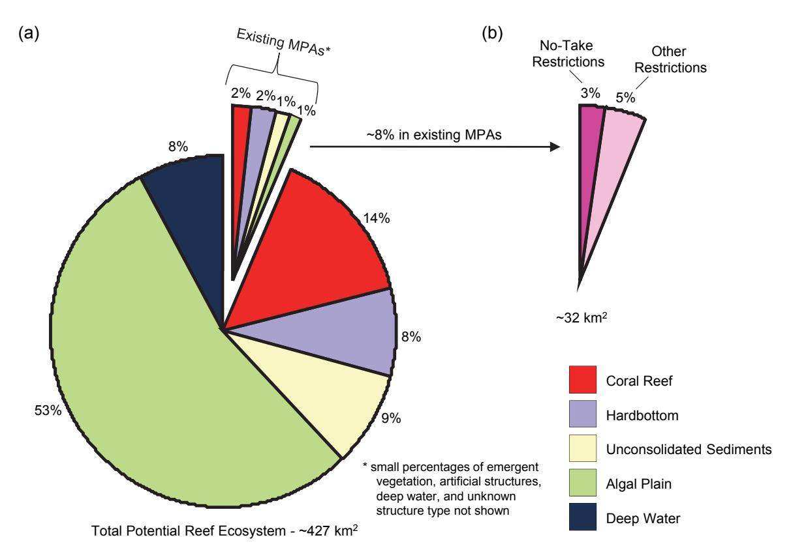

**Figure 5.64.** (a) Proportion of the total potential reef ecosystem area around American Samoa by benthic structure type for the entire suite of existing MPAs and for the rest of American Samoa. For simplicity, some structure types were aggregated into larger catego ries. Aggregate reef, patch reef, aggregated patch reefs, and spur and groove were aggregated into coral reef. Pavement, pavement with patch reefs, pavement with sand channels, reef rubble, and rock/boulder were aggregated into other hardbottom. Mud, sand with scattered coral/rock, and sand were aggregated into unconsolidated sediments. Structure types or categories representing <1% of the total area are not shown. (b) Proportion of the total potential reef ecosystem with no-take restrictions (dark pink shading) and with other fishing restrictions (light pink).

reef habitats around American Samoa, the existing MPA network protects ~10% of the area of those features (Figure 5.65a) with only ~3% (~2 km²) having complete no-take restrictions and ~7% (~5 km²) having other regulations (Figure 5.65b).

**Figure 5.65.** (a) Proportion of coral reef habitat by benthic structure type for the entire suite of existing MPAs and for the rest of American Samoa. Structure types representing <1% of the total area are not shown. (b) Proportion of coral reef habitat with no-take restrictions (dark pink shading) and with other fishing restrictions (light pink).

#### Which biogeographic regions and ecological hotspots are represented in the MPA network?

Fourteen of the twenty ecologically distinct Bioregions identified in Chapter 4 include at least one MPA, leaving

only six with no representation in the present MPA network (Table 5.2). Bioregions not currently represented in the existing MPA network that have been identified as having unique reef fish and/or coral communities in Chapter 4 include only Swains Island (Bioregion 16) and Aunu'u (Bioregion 8). Overlaying the 36 ecological hotspots defined among the Bioregions with MPA boundaries revealed which hotspots are at least partly protected by the existing network. This simple accounting indicated that 25 out of 36 hotspots are at least partly protected by existing MPAs. Results were broadly consistent among all four variables (Table 5.2).

Bioregions defined as hotspots for multiple variables may have greater ecological and conservation importance relative to regions that are hotspots for fewer variables. Seven of the Bioregions were defined as hotspots for 3 out of the 4 variables (none were hotspots for

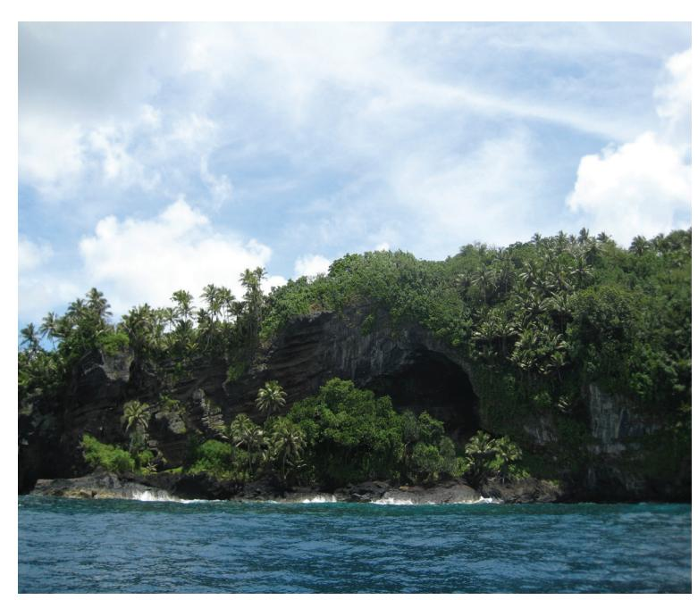

**Image 22.** Shoreline of Bioregion 2 inside Larsen Bay. Photo credit: Matt Kendall, NOAA Biogeography.

**Table 5.2.** Biogeographic regions, ecological hotspots, and overlap with existing MPAs. Biogeographic regions and hotspots are defined in Chapter 4 of this assessment. The number of existing MPAs within each Bioregion is summarized in the last column. The bottom two rows summarize the number of hotspots for each variable with at least one MPA and the proportion of hotspots for each variable rep resented by the existing MPA network.

| Bioregion                                | Coral Cover | Coral Richness | Fish Biomass | Fish Richness | Total Hotspots | Existing MPAs within Bioregion |  |
|------------------------------------------|----------------|-------------------|-----------------|------------------|-------------------|--------------------------------------|--|
| 1                                        | X              |                   | X               | X                | 3                 | 2                                    |  |
| 2                                        | X              | X                 |                 | X                | 3                 | 1                                    |  |
| 3                                        |                | X                 |                 |                  | 1                 | 0                                    |  |
| 4                                        |                |                   |                 | X                | 1                 | 3                                    |  |
| 5                                        |                |                   | X               |                  | 1                 | 2                                    |  |
| 6                                        | X              |                   | X               |                  | 2                 | 2                                    |  |
| 7                                        | X              |                   | X               |                  | 2                 | 0                                    |  |
| 8                                        | X              |                   | X               | X                | 3                 | 0                                    |  |
| 9                                        |                |                   |                 | X                | 1                 | 0                                    |  |
| 10                                       | X              |                   | X               | X                | 3                 | 0                                    |  |
| 11                                       |                | X                 |                 |                  | 1                 | 3                                    |  |
| 12                                       | X              |                   |                 |                  | 1                 | 2                                    |  |
| 13                                       |                |                   |                 |                  | 0                 | 1                                    |  |
| 14                                       | X              |                   | X               | X                | 3                 | 2                                    |  |
| 15                                       |                |                   |                 |                  | 0                 | 1                                    |  |
| 16                                       | X              |                   | X               | X                | 3                 | 0                                    |  |
| 17                                       |                |                   | X               |                  | 1                 | 2                                    |  |
| 18                                       |                | X                 | X               | X                | 3                 | 2                                    |  |
| 19                                       |                | X                 |                 | X                | 2                 | 1                                    |  |
| 20                                       | X              | X                 |                 |                  | 2                 | 1                                    |  |
| Total Hotspots                           | 10             | 6                 | 10              | 10               | 36                | 25                                   |  |
| Hotspots w/ an MPA Present            | 6              | 5                 | 6               | 6                |                   |                                      |  |
| Proportion of Hotspots Represented | 6/10           | 5/6               | 6/10            | 6/10             |                   |                                      |  |

all 4 variables) and can be considered relatively high-value sites. These include the SW coast of Tutuila between Cape Taputapu and Sail Rock Point (Bioregions 1 and 2), Aunu'u (Bioregion 8), the eastern tip of Tutuila (Bioregion 10), Fagamalo area (Bioregion 14), Swains Island (Bioregion 16), and Ofu/Olosega (Bio region 18). Existing MPAs protect portions of four of these high-value Bioregions (1, 2, 14, and 18). The highvalue Bioregions not currently protected by the existing MPA network are Aunu'u (Bioregion 8), the eastern tip of Tutuila (Bioregion 10), and Swains Island (Bioregion 16) (Figure 5.66).

The simple hotspot and bioregional summaries presented above do not take into consideration two key fac tors that vary considerably among MPAs: size of the protected area and type of protection. The mere pres ence of an MPA within a Bioregion does not guarantee sufficient protection. For example, the SW coast of Tutuila (Bioregion 1, a hotspot for 3 of the 4 fish and coral variables) contains two of the existing MPAs and therefore it may appear that this Bioregion is being adequately protected with replication. However, the two MPAs in Bioregion 1 together comprise less than 0.4 km 2 of potential reef ecosystem, leaving the vast major ity of the Bioregion unprotected.

**Figure 5.66.** Distribution of existing MPAs relative to the locations of significant ecological features, including Bioregions that are hotspots for three fish/coral variables (Chapter 4) and the mesophotic coral banks surrounding Tutuila (Appendix B).

#### Size and regulatory comparisons among MPAs

MPAs around American Samoa have a very wide range of sizes and protect very different amounts of potential reef ecosystem, from <0.02 km2 to ~9.1 km2 (Figure 5.67, Table 5.3). It is important to consider both the proportions of habitats as well as their size when evaluating relative protection of coral reef and hardbottom features. For instance, many of the smallest MPAs possess a high proportion of coral reef and hardbottom structures, often greater than 80% of their area, and so encompass some key habitats very efficiently. However, they may not be large enough to encompass the home range of the fish species they are intended to protect. The largest MPAs generally encompass a wider variety of bottom types and therefore have lower proportions of coral reef and hardbottom, often less than 50% of their area. These low proportions of coral reef and hardbottom can be misleading in judging the relative contributions of an MPA and must be considered in the context of MPA size. For example, fifteen of the twenty-two MPAs were smaller than 1 km2 individually. Collectively these fifteen MPAs encompass only ~25% of the protected coral reef and hardbottom (~4.4 km² of 16.9 km²) around American Samoa. In contrast, at Rose Atoll MNM, the largest MPA, only ~50% of the potential reef ecosystem is coral reef or hardbottom, but this encompasses 30% of the total protected coral reef and hardbottom around all of American Samoa (~5 km² out of 16.9 km²). This single MPA protects more coral reef and hardbottom than all 15 of the smallest MPAs combined. Larger MPAs are also more likely to be effective in protecting fish species with large home ranges.

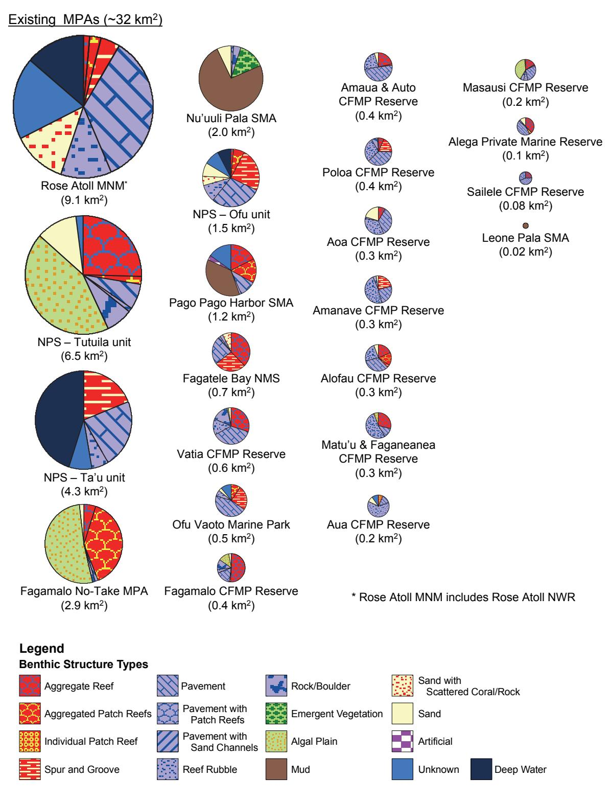

**Figure 5.67.** Proportion of potential reef ecosystem area by benthic structure type for each existing MPA. Pie sizes are scaled relative to potential reef ecosystem area.

In addition to size differences, the MPAs around American Samoa vary in the type of protection they provide. Only two existing MPAs have at least some zone designated with the strongest level of protection, complete no-take. These include the entire Fagamalo No-Take MPA and the portion of the Rose Atoll MNM landward of the 50 fathom curve (including the NWR). These no-take areas comprise only ~3% of the area identified as coral reef habitat around American Samoa. In 2000, Governor Tauese Sunia set a goal to protect 20% of American Samoa's coral reefs in no-take areas by 2010 (Sunia 2000). Existing regulations can be modified or zones created within present MPAs in consultation with DMWR's No-Take MPA Program to partly meet this

**Table 5.3.** Potential reef ecosystem area (km²) by benthic structure type for existing MPAs. Areas are given for each individual MPA program, for the entire suite of existing MPAs, and for all of American Samoa.

| Benth                    | ic Classifications              | Existing MPAs by Type |     |     |      |                |                    |      |                               |       |                   |
|--------------------------|---------------------------------|-----------------------|-----|-----|------|----------------|--------------------|------|-------------------------------|-------|-------------------|
| Habitat types         | Detailed structure types        | CFMP Reserves      | MNM | NMS | NPSA | No-Take MPA | Private Reserve | SMAs | Territorial Marine Park | Total | American Samoa |
| Coral reef               | Aggregate reef                  | 0.7                   | 0.1 | 0.3 | 1.7  | 0.1            | 0.1                | 0.2  | 0.0                           | 3.1   | 19.6              |
|                          | Aggregated patch reefs          | 0.1                   | 0.2 | 0.0 | 0.2  | 1.1            | 0.0                | 0.2  | 0.0                           | 1.8   | 28.3              |
|                          | Individual patch reef           | 0.0                   | 0.0 | 0.0 | 0.0  | 0.0            | 0.0                | 0.0  | 0.0                           | 0.0   | 1.6               |
|                          | Spur and groove                 | 0.2                   | 0.4 | 0.2 | 1.2  | 0.0            | 0.0                | 0.0  | 0.1                           | 2.0   | 19.1              |
|                          | Total coral reef                | 0.9                   | 0.8 | 0.4 | 3.1  | 1.3            | 0.1                | 0.4  | 0.2                           | 7.0   | 68.6              |
| Hardbottom               | Pavement                        | 1.1                   | 3.1 | 0.2 | 1.9  | 0.0            | 0.1                | 0.2  | 0.2                           | 6.6   | 28.8              |
|                          | Pavement with patch reefs       | 0.0                   | 0.0 | 0.0 | 0.0  | 0.0            | 0.0                | 0.0  | 0.0                           | 0.0   | 2.2               |
|                          | Pavement with sand channels     | 0.0                   | 0.0 | 0.0 | 0.0  | 0.0            | 0.0                | 0.0  | 0.0                           | 0.0   | 0.8               |
|                          | Reef rubble                     | 1.0                   | 1.1 | 0.0 | 0.5  | 0.0            | 0.0                | 0.0  | 0.0                           | 2.6   | 8.8               |
|                          | Rock/Boulder                    | 0.2                   | 0.0 | 0.0 | 0.5  | 0.0            | 0.0                | 0.1  | 0.0                           | 0.8   | 2.7               |
|                          | Total hardbottom                | 2.3                   | 4.2 | 0.2 | 2.9  | 0.1            | 0.1                | 0.2  | 0.2                           | 9.9   | 43.4              |
| Unconsolidated sediments | Mud                             | 0.0                   | 0.0 | 0.0 | 0.0  | 0.0            | 0.0                | 1.9  | 0.0                           | 1.9   | 4.1               |
|                          | Sand with scattered coral/ rock | 0.0                   | 1.1 | 0.1 | 0.1  | 0.0            | 0.0                | 0.0  | 0.0                           | 1.3   | 1.7               |
|                          | Sand                            | 0.2                   | 0.1 | 0.0 | 0.9  | 0.1            | 0.0                | 0.1  | 0.0                           | 1.3   | 36.5              |
| Other                    | Emergent vegetation             | 0.0                   | 0.0 | 0.0 | 0.0  | 0.0            | 0.0                | 0.3  | 0.0                           | 0.3   | 0.3               |
|                          | Algal plain                     | 0.2                   | 0.0 | 0.0 | 2.8  | 1.5            | 0.0                | 0.0  | 0.0                           | 4.5   | 231.2             |
|                          | Artificial                      | 0.0                   | 0.0 | 0.0 | 0.0  | 0.0            | 0.0                | 0.0  | 0.0                           | 0.0   | 0.1               |
|                          | Unknown                         | 0.0                   | 1.7 | 0.0 | 0.6  | 0.0            | 0.0                | 0.2  | 0.1                           | 2.5   | 4.3               |
|                          | Deep Water                      | 0.0                   | 1.2 | 0.0 | 2.0  | 0.0            | 0.0                | 0.0  | 0.0                           | 3.3   | 36.6              |
|                          | Total Area                      | 3.6                   | 9.1 | 0.7 | 12.3 | 2.9            | 0.1                | 3.2  | 0.5                           | 32.4  | 426.7             |

goal. However, it should be noted that because only 10% of the total coral reef habitat in American Samoa is within existing MPAs, even if all were hypothetically re-zoned as no-take, the 20% goal would only be halfway achieved. New MPAs encompassing the same total area as all existing MPAs combined would need to be implemented. This hypothetical re-zoning example demonstrates that additional large, cross sectional MPAs with no-take restrictions such as recently implemented at Fagamalo by DMWR are necessary to accomplish this goal. In addition to establishing the no-take site at Fagamalo, DMWR's No-Take Program has identified additional priority sites (e.g. Aunu'u, Chapter 4), has conducted standardized biological surveys at those sites (Oram 2008), and plans continued engagement with other MPA programs and local communities to build strong commitments to achieving the 20% goal. As the MPA network expands under various authorities to meet this goal, MPA practitioners in American Samoa can use information in this assessment on larval connectivity (Chapter 3), fish and coral communities (Chapter 4), benthic features (Appendix B), and additional information to identify areas of high ecological value that could be added to the no-take components of the MPA network.

#### **CONCLUSIONS**

Our goal in summarizing the biogeographic features within existing MPAs was to provide an accounting of the MPA landscape using a consistent set of broadly important ecosystem variables. However, it should be noted that spreading protection among Bioregions or in cluding representation of the particular ecologi cal hotspots defined in Chapter 4 is not an ex plicitly stated goal of the local MPA community in American Samoa. It is up to this community to identify the specific goals to be achieved by the network and a process to achieve them. These goals may include biogeographic repre sentation, replication, quantitative targets (e.g. 20% no-take), ensuring connectivity among sites, and protection of specific ecological or cultural sites.

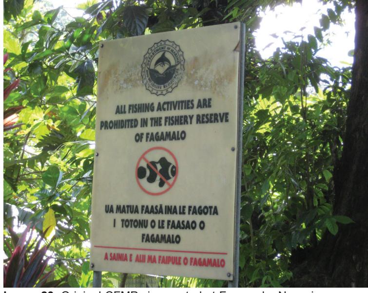

**Image 23.** Original CFMP sign posted at Fagamalo. New signage was under development in 2011.

Photo credit: Matt Kendall, NOAA Biogeography.

While our analysis has focused on broad reef fish and coral variables, some existing MPAs

have little to do with these general ecological variables since they may be designed to protect cultural re sources or specific biota (e.g. Saua and Taisamasama cultural sites on Ta'u). There is a diversity of additional features of special importance that are worthy of protection that were not addressed using the general vari ables focused on in this study. For example, the mesophotic banks around Tutuila have some vibrant coral reef communities that may be less vulnerable to climate change and nearshore stressors than shallower reefs (Riegl and Piller 2003, Bare et al. 2010) but are poorly represented in the existing MPA network. Only the Fagamalo No-Take MPA encompasses such features around Tutuila presently. Another feature, Vailulu'u, the only volcanically active seamount of the 65 in the EEZs of American Samoa and Samoa and the origin of the Samoan archipelago, lies between Rose Atoll and the Manu'a Islands (Appendix A). Vailulu'u lies just outside the Rose Atoll MNM and a small boundary modification would encompass its unique hydrothermal vent communities and likely eventual emergence as a new island (Staudigel et al. 2006). Another example of a special and unique area is off the southwest coast of Ta'u and includes several coral heads of the spe cies *Porites lutea* (Fisk and Birkeland 2002, Brown et al. 2009) that are remarkable for their enormous size. These features presently lie outside the National Park boundary on Ta'u and are not currently protected by the existing MPA network.

In addition to protecting such special or unique features at single sites, replication of non-unique regions or habitats at multiple sites that are similar is an important principle of MPA network design. This spreads the risk of degradation or loss of a particular ecosystem or resource over multiple MPAs and enhances the resiliency of the protected ecosystem or resource. Given the susceptibility of reef ecosystems to anthropo genic and natural disturbance (e.g. crown-of-thorns starfish, tsunamis, pollution), this should be an important consideration for MPA authorities in American Samoa. For example, protecting Larsen Bay would almost perfectly replicate the very similar reef ecosystem in the adjacent and already protected Fagatele Bay NMS. Also, the discontinuous coral banks around Tutuila (e.g. Taema, Nafanua, and many others) offer abundant choices to replicate protection of bank features such as those in the Fagamalo No-Take MPA. Additional re gions lacking representation or replication in the existing network are identified in Table 5.2 and Figure 5.66. The connections among MPAs due to factors such as swimming within a home range for adult fish, onto genic habitat shifts, and dispersal of fish and coral larvae are also important to consider in network design. Telemetry or tagging studies are needed to quantify the scales and frequencies of fish movements among and across MPA boundaries. Hydrodynamic models are needed to quantify connections among MPAs due to larval dispersal. Chapter 3 of this assessment used a broad-scale hydrodynamic model to evaluate connec tions among islands of the entire archipelago. It was found that Samoa's much larger islands and coral reef area are the largest source of larvae in the archipelago, some of which are circulated to American Samoa via the South Equatorial Counter Current (Chapter 3). Most of American Samoa (except Swains Island) in turn, lies upstream of Samoa in the South Equatorial Current and many larvae spawned in MPAs there may seed the reefs of Samoa. Distances between islands and MPAs and their positions in these currents partly dictate which species of larvae may be spawned in one MPA but then be transported to sustain the resident population in another. For example, the MPA at Rose Atoll MNM not only encompasses a large proportion of the protected reef habitats in American Samoa, but connectivity models indicate that some of its larval production gets exported downstream to the other islands in the archipelago. All existing and proposed MPAs should be evaluated in a similar context. For maximum benefit, the broad scale hydrodynamic models in this assessment must be coupled with finer-scale models to understand smaller current patterns and eddies around particular islands. DMWR and ASEPA are presently developing such a model around Tutuila to better understand localized larval transport and identify potential MPA sites that may provide resilient sources of larvae to the broader ecosystem and MPA network.

A comprehensive and cooperative MPA strategy with protection goals that involves the many MPA manage ment programs in American Samoa has been developed over the past 5 years (Oram 2006, 2008, Damitz 2007). The strategy consists of 5 action plans covering governance and administration, MPA designation, education and outreach, research and monitoring, and enforcement, with each containing time-bound goals and objectives. One of the key overarching goals is the need for effective dialogue and collaboration among MPA programs to most effectively align resource protection needs with appropriate management authorities. Effective communication and collaboration among MPA programs is vital to not only minimize stakeholder confusion at the village level but also to prevent competitive obstruction among many well intending agencies working in a relatively small region. To date, the MPA network strategy has facilitated the establishment of an MPA Coordinator within the Territorial government's Coral Reef Advisory Group and the formation of an MPA Network Working Group. Key next steps in the evolution of the MPA network strategy are to, 1) define over all quantitative resource protection goals, some of which have been stated by individual programs already such as establishment of 20% of coral reefs as no-take refugia (Oram 2008), 2) quantify what resources are protected within the existing MPA network (i.e. this analysis and others like it, e.g. Fisk and Birkeland 2002, NOAA NOS 2009), 3) identify ways to accomplish resource protection goals through additional MPAs or mod ification of the size, regulations, or spatial arrangement of existing MPAs, and 4) identify which management authorities, or more likely which mix of programs, can contribute the appropriate combination of financial, material, and stakeholder support roles necessary to successfully manage each site and the overall network.

The MPA network in American Samoa is an ever-changing landscape. As of January 2011, a number of po tential MPAs were at various stages in the "proposal" process. These MPAs would add potential reef ecosys tem and additional coral reef and hardbottom areas to the MPA network and may protect Bioregions, ecologi cal hotspots, or special features noted in this report that are not currently protected by the existing network. It is also important to note that MPAs in American Samoa vary considerably in terms of their permanence. Some provide fixed protection in perpetuity barring new legislation and others provide more changeable protection for shorter durations at which point they must be renewed. Many CFMP reserves, for instance, are established for an initial period of 2-3 years, after which modifications to protection level, boundaries and regulations can be made by village leaders in response to changing needs and resource conditions. As the MPA landscape around American Samoa evolves, the components of this Biogeographic Assessment can be used to evaluate the ecological contributions of additions to the network on the basis of protected habitats (Appendix B), reef fish and coral communities (Chapter 4 and Appendix C), and larval connectivity (Chapter 3).

Once comprehensive benthic maps and MPA boundary files become available for the Samoan Islands of Upolu and Savai'i, a full accounting of the MPA Network for both American Samoa and Samoa will be pos sible. This is a critical next step in regional MPA planning given the close proximity and high potential for interdependency of MPAs across both these jurisdictions. A comprehensive, archipelago-wide MPA strategy is recommended that maximizes the benefits of this potential connectivity and promotes resiliency of not only the wider MPA network, but also coral reef ecosystems more generally throughout the archipelago.

#### **ACKNOWLEDGEMENTS**

We gratefully acknowledge the assistance of several people who made very helpful contributions to this chapter. Phil Wiles at American Samoa EPA contributed valuable information from the ASEPA Piggery Com pliance Program. Christin Reynolds at American Samoa DOC provided GIS boundaries for the Alega Private Marine Reserve, Ofu Vaoto Territorial Marine Park, and the Special Management Areas plus contextual data used to characterize the watersheds adjacent to each MPA. Frank Pendleton of USFWS provided a simple and understandable description of the complicated management regime at Rose Atoll Marine National Monu ment. Sarah Bone of NPS helped us draft corrected GIS shapefiles of the NPSA boundaries. Ken Buja of the NOAA Biogeography Branch worked with Selaina Vaitautolu, the CFMP program manager, to produce GIS shapefiles of the CFMP reserve boundaries. Tisa Fa'amuli provided a description of the rationale and implementation for the Alega Private Marine Reserve.

#### **REFERENCES**

15 C.F.R. 922.100-104. Title 15: Commerce and Foreign Trade, Part 922: National Marine Sanctuary Program Regula tions, Subpart J: Fagatele Bay National Marine Sanctuary.

16 U.S.C. 1. Title 16: Conservation. Chapter 1: National Parks, Military Parks, Monuments, and Seashores, Subchapter I: National Park Service, Section 1: Service created; director; other employees.

16 U.S.C. 410qq-410qq-1. Title 16: Conservation, Chapter 1: National Parks, Military Parks, Monuments, and Sea shores, Subchapter LIX-O: National Park of American Samoa, Section 410qq: Findings and purpose, Section 410qq-1: Establishment.

16 U.S.C. 431-433. Title 16: Conservation, Chapter 1: National Parks, Military Parks, Monuments, and Seashores, Subchapter LXI: National and International Monuments and Memorials, Section 431: National Monuments; reservation of lands; relinquishment of private claims.

16 U.S.C. 668dd-668ee. Title 16: Conservation, Chapter 5A: Protection and conservation of wildlife, Subchapter III: Endangered species of fish and wildlife, Section 668dd: National Wildlife Refuge System, Section 668ee: Definitions.

16 U.S.C. 1431. Title 16: Conservation, Chapter 32: Marine Sanctuaries, Section 1431: Findings, purposes, and poli cies; establishment of system.

16 U.S.C. 1801. Title 16: Conservation, Chapter 38: Fishery conservation and management.

American Samoa Administrative Code (ASAC) § 24.10. Title 24: Ecosystem Protection and Development, Chapter 10: Community-Based Fisheries Management Program.

American Samoa Administrative Code (ASAC) § 24.1001. Title 24: Ecosystem Protection and Development, Chapter 10: Community-Based Fisheries Management Program, Section 1: Authority.

American Samoa Administrative Code (ASAC) § 24.1008 (c)(i). Title 24: Ecosystem Protection and Development, Chapter 10: Community-Based Fisheries Management Program, Section 8: Fishing or taking fish in a village marine protected area.

American Samoa Administrative Code (ASAC) § 26.0221. Title 26: Environmental Safety and Land Management, Chap ter 2: Coastal Management, Section 21: Special Management Areas.

American Samoa Code Annotated (ASCA) § 18.0214. Title 18: Parks and Recreation, Chapter 2: Department of Parks and Recreation, Section 14: Establishment of Ofu-Vaoto Marine Park.

American Samoa Code Annotated (ASCA) § 24.0503. Title 24: Natural Resources & Environmental Ecosystem Protec tion & Development, Chapter 5: Coastal Management Program; Section 3: Designation of coastal zone and special management areas.

American Samoa Department of Marine and Wildlife Resources (ASDMWR). 2001. Fisheries Management Plan for Poloa. 7 pp. + Appendices.

American Samoa Department of Marine and Wildlife Resources (ASDMWR). 2002a. Fisheries Management Plan for Alofau. 9 pp. + Appendices.

American Samoa Department of Marine and Wildlife Resources (ASDMWR). 2002b. Fisheries Management Plan for Vatia. 11 pp. + Appendices.

American Samoa Department of Marine and Wildlife Resources (ASDMWR). 2003a. Fisheries Management Plan for Amaua and Auto. 9 pp. + Appendices.

American Samoa Department of Marine and Wildlife Resources (ASDMWR). 2003b. Fisheries Management Plan for Aua. 11 pp. + Appendices.

American Samoa Department of Marine and Wildlife Resources (ASDMWR). 2003c. Fisheries Management Plan for Fagamalo. 10 pp. + Appendices.

American Samoa Department of Marine and Wildlife Resources (ASDMWR). 2003d. Fisheries Management Plan for Masausi. 8 pp. + Appendices.

American Samoa Department of Marine and Wildlife Resources (ASDMWR). 2005. Fisheries Management Plan for Matu'u and Faganeanea. 6 pp.

American Samoa Environmental Protection Agency (ASEPA). December 6, 1991. Public Health Directive: Contami nated Fish in Harbor.

American Samoa Environmental Protection Agency (ASEPA) Piggery Compliance Program. February 2011.

Andrews, Z. 2004. Effects of the Community-Based Fishery Management Programme on the coral reef communities in American Samoa. MSc Thesis, University of Wales Bangor. 128 pp. + Appendices.

Bare, A.Y., K.L. Grimshaw, J.J. Rooney, M.G. Sabater, D. Fenner, and B. Carrol. 2010. Mesophotic communities of the insular shelf at Tutuila, American Samoa. Coral Reefs 29: 369-377.

Birkeland, C.E., R.H. Randall, R.C. Wass, B. Smith, and S. Wilkins. 1987. Biological resource assessment of the Fa gatele Bay National Marine Sanctuary. NOAA Technical Memorandum NOS MEMD 3. Marine and Estuarine Manage ment Division. Washington, DC. 232 pp.

Birkeland, C.E., R.H. Randall, and S.S. Amesbury. 1994. Coral and reef-fish assessment of the Fagatele Bay National Marine Sanctuary. Report to the National Oceanic and Atmospheric Administration, U.S. Department of Commerce. 126 pp.

Birkeland, C.E., R.H. Randall, A.L. Green, B.D. Smith, and S. Wilkins. 2003. Changes in the coral reef communities of Fagatele Bay NMS and Tutuila Island (American Samoa), 1982-1995. Fagatele Bay National Marine Sanctuary Science Series. Pago Pago, AS. 226 pp.

Birkeland, C., A. Green, C. Mundy, and K. Miller. 2004. Long term monitoring of Fagatele Bay National Marine Sanctuary and Tutuila Island (American Samoa) 1985 to 2001: summary of surveys conducted in 1998 and 2001. Report to the National Oceanic and Atmospheric Administration, U.S. Department of Commerce. 158 pp.

Brown, D.P., L. Basch, D. Barshis, Z. Forsman, D. Fenner, and J. Goldberg. 2009. American Samoa's island of giants: massive Porites colonies at Ta'u island. Coral Reefs 28: 735.

Coles, S.L., P.R. Reath, P.A. Skelton, V. Bonito, R.C. DeFelice, and L. Basch. 2003. Introduced marine species in Pago Pago Harbor, Fagatele Bay, and the national park coast, American Samoa. Final report to the U.S. Fish and Wildlife Service, Fagatele Bay National Marine Sanctuary, National Park of American Samoa, and American Samoa Department of Marine and Natural Resources. Bishop Museum Technical Report No. 26. Honolulu, HI. 182 pp.

Cornish, A.S. and E.M. DiDonato. 2004. Resurvey of a reef flat in American Samoa after 85 years reveals devastation to a soft coral (Alcyonacea) community. Marine Pollution Bulletin 48: 768-777.

Craig, P. and L. Basch. 2001. Developing a coral reef monitoring program for the National Park of American Samoa. National Park Service. 17 pp.

Craig, P., C. Birkeland, and S. Belliveau. 2001. High temperatures tolerated by a diverse assemblage of shallow-water corals in American Samoa. Coral Reefs 20: 185-189.

Craig, P., G. DiDonato, D. Fenner, and C. Hawkins. 2005. The state of coral reef ecosystems of American Samoa. pp. 312-337. In Waddell J. (ed.), 2005. The status of coral reef ecosystems of the US and Pacific freely associated states. NOAA Tech Report NOS NCCOS 11. 522 pp.

Dahl, A.L. and A.E. Lamberts. 1977. Environment impact on a Samoan coral reef: a resurvey of Mayor's 1917 transect. Pacific Science 31: 309-319.

Damitz, B. 2007. American Samoa marine protected area network strategy. Technical report prepared for the American Samoa Coral Reef Advisory Group by Chromis LLC. August 2007. 53 pp.

Fagatele Bay National Marine Sanctuary (FBNMS) Regulations. 51 Fed. Reg. 15878-15883 (29 April 1986).

Fisk, D. and C. Birkeland. 2002. Status of coral communities on the volcanic islands of American Samoa. A re-survey of long-term monitoring sites. Report to the Department of Marine and Wildlife Resources. Pago Pago, AS. 134 pp.

Friedlander, A. 1993. Preliminary assessment and recommendations for long-term monitoring of reef fish populations in the proposed National Park on Ofu Island, American Samoa. Draft report to the National Park Service. 39 pp.

Garrison, V.H., K. Kroeger, D. Fenner, and P. Craig. 2007. Eutrophication comparison of coral reefs in Ofu and Olosega. Report to the American Samoa Department of Commerce. 19 pp.

Gilman, E., J. Ellison, and R. Coleman. 2007. Assessment of mangrove response to projected relative sea-level rise and recent historical reconstruction of shoreline position. Environmental Monitoring and Assessment 124: 105-130.

Gombos, M.J., R. Oram, and S. Vaitautolu. 2007. American Samoa Coral Reef MPA Summary. pp. 11-25. In Wusinich-Mendez, D. and C. Trappe (ed.), 2007. Report on the Status of Marine Protected Areas in Coral Reef Ecosystems of the United States Volume 1: Marine Protected Areas Managed by U.S. States, Territories, and Commonwealths: 2007. NOAA Technical Memorandum CRCP 2. NOAA Coral Reef Conservation Program. Silver Spring, MD. 129 pp. + Ap pendices.

Green, A.L., C.E. Birkeland, R.H. Randall, B.D. Smith, and S. Wilkins. 1997a. 78 years of coral reef degradation in Pago Pago Harbor: a quantitative record. Proceedings of the 8th International Coral Reef Symposium 2: 1883-1888.

Green, A., J. Burgett, M. Molina, D. Palawski, and P. Gabrielson. 1997b. The impact of a ship grounding and associ ated fuel spill at Rose Atoll National Wildlife Refuge, American Samoa. Report to U.S. Fish and Wildlife Service, Pacific Islands Ecoregion. Honolulu, HI. 65 pp.

Green, A. and C. Hunter. 1998. A preliminary survey of the coral reef resources in the Tutuila unit of the National Park of American Samoa. Report to the National Park of American Samoa. 42 pp.

Green, A.L., C.E. Birkeland, and R.H. Randall. 1999. Twenty years of disturbance and change in Fagatele Bay National Marine Sanctuary, American Samoa. Pacific Science 53: 376-400.

Green, A. and T. Hughes. 1999. Rapid ecological assessment of the coral reef resources in the Ta'u unit of the National Park of American Samoa. Draft report to the National Park of American Samoa. 14 pp.

Green, A., K. Miller, and C. Mundy. 2005. Long term monitoring of Fagatele Bay National Marine Sanctuary, Tutuila Is land, American Samoa: results of surveys conducted in 2004, including a re-survey of the historic Aua Transect. Report to the National Oceanic and Atmospheric Administration. U.S. Department of Commerce. 93 pp.

Helfrich, P. 1975. An assessment of the expected impact of a dredging project proposed for Pala Lagoon, American Samoa. Sea Grant Technical Report UNIHI-SEAGRANT-TR-76-02. 84 pp.

Houk, P. 2010. American Samoa Community Based Monitoring Program Data Assessment and Program Development Workshop Summary and Recommendations. 16 pp.

Hunter, C.L., W.H. Magruder, A.M. Friedlander, and K.Z. Meier. 1993. Ofu reef survey baseline assessment and recom mendations for long-term monitoring of the proposed National Park, Ofu, American Samoa. Final report to the National Park Service. 90 pp.

Iose, P.K. and J. McConnaughey. 1993. Fishery resources in Pala Lagoon. American Samoa Government, Department of Marine and Water Resources Biological Report Series, No. 37. Pago Pago, AS. 42 pp.

Itano, D. and T. Buckley. 1988. The coral reefs of the Manu'a Islands, American Samoa. American Samoa Government, Department of Marine and Water Resources Biological Report Series, No. 12. Pago Pago, AS. 26 pp.

Kenyon, J.C., J.E. Maragos, and S. Cooper. 2010. Characterization of coral communities at Rose Atoll, American Sa moa. Atoll Research Bulletin No. 586. National Museum of Natural History, Washington, DC. 30 pp.

King, M. and U. Faasili. 1998. A network of small, community-owned village fish reserves in Samoa. Parks 8:11-16.

Kluge, K. 1992. Seasonal abundances of zooplankton in Pala Lagoon. American Samoa Government, Department of Marine and Water Resources Biological Report Series, No. 36. Pago Pago, AS. 33 pp.

Maragos, J.E., K.Z. Meier, and C.L. Hunter. 1995. Reef mapping and beach monitoring project at the Ofu unit of the National Park of American Samoa and adjacent territorial reef park at Ofu Island. Report for the National Park Service prepared by Corial. Honolulu, HI. 61 pp.

Mayor, A.G. 1924. Structure and ecology of Samoan reefs. Carnegie Institute of Washington Publications 340: 1-25.

McConnaughey, J. 1993. The shoreline fishery of American Samoa in FY92. American Samoa Government, Depart ment of Marine and Water Resources Biological Report Series, No. 41. Pago Pago, AS. 68 pp.

Mesophotic Coral Ecosystems. 2010. A research cooperative between the NOAA Center for Sponsored Coastal Ocean Research, Perry Institute of Marine Science, and the Centre for Marine Studies at the University of Queensland. Web site accessed March 2010, http://www.mesophotic.org.

Musburger, C. 2004. Monitoring recommendations for the Community-Based Fisheries Management Program of Tu tuila, American Samoa. Report prepared for the Department of Marine and Wildlife Resources, Pago Pago, AS. 48 pp.

National Park Service (NPS). 1988. National Park Feasibility Study, American Samoa. Pacific Area Office, Honolulu, HI. 138 pp.

National Park Service (NPS). 1997. General management plan/environmental impact statement, National Park of Amer ican Samoa. Pacific Area Office, Honolulu, HI. 81 pp.

NOAA NCCOS (National Centers for Coastal Ocean Sciences). 2005. Shallow water benthic habitats of American Samoa, Guam, and the Commonwealth of the Northern Marianas (CD-ROM). NOAA Technical Memorandum NOS NCCOS 8, Biogeography Team. Silver Spring, MD.

NOAA National Ocean Service (NOS). 2009. Coral Reef Habitat Assessment for U.S. Marine Protected Areas: U.S. Territory of American Samoa. NOAA Coral Reef Conservation Program and NOS Special Projects Office. Silver Spring, MD. 26 pp.

Oram, R.G. 2006. American Samoa coral reef marine protected area strategy. American Samoa Government, Depart ment of Marine and Wildlife Resources. January 2007. Pago Pago, AS. 25 pp.

Oram, R.G. 2008. Marine protected area master plan: A manual to guide the establishment and management of no-take marine protected areas. American Samoa Government, Department of Marine and Wildlife Resources Biological Report Series 2008-01. Pago Pago, AS. 64 pp.

Orcutt, A.M. 1993. Fishes observed during the Tutuila coastal resources inventory. Report prepared for American Sa moa Department of Marine and Wildlife Resources, Pago Pago, AS. 67 pp.

Pedersen Planning Consultants. 2000a. American Samoa Watershed Protection Plan, Volume 1: Watersheds 1-23. Prepared for American Samoa Environmental Protection Agency and American Samoa Coastal Management Program. 390 pp.

Pedersen Planning Consultants. 2000b. American Samoa Watershed Protection Plan, Volume 2: Watersheds 24-35. Prepared for American Samoa Environmental Protection Agency and American Samoa Coastal Management Program. 313 pp.

Pedersen Planning Consultants. 2000c. American Samoa Watershed Protection Plan, Volume 3: Watersheds 36-41. Prepared for American Samoa Environmental Protection Agency and American Samoa Coastal Management Program. 124 pp.

Pendleton, E.A., E.R. Thieler, and S.J. Williams. 2005. Coastal vulnerability assessment of National Park of American Samoa (NPSA) to sea-level rise. U.S. Geological Survey Open-File Report 2005-1055.

Peshut, P.J., R.J. Morrison, and B.A. Brooks. 2007. Arsenic speciation in marine fish and shellfish from American Sa moa. Chemosphere 71: 484-492.

Ponwith, B.J. 1992. The Pala Lagoon subsistence fishery. American Samoa Government, Department of Marine and Wildlife Resources Biological Report Series, No. 27. 28 pp.

Proclamation No. 8337, 74 Fed. Reg. 1577 (January 12, 2009).

Randall, J.E. and D.M. Devaney. 1974. Marine biological surveys and resource inventory of selected coastal sites at American Samoa. U.S. Army Corps of Engineers. Pacific Ocean Division. 108 pp.

Riegl, B. and W.E. Piller. 2003. Possible refugia for reefs in times of environmental stress. International Journal of Earth Science 92: 520–531.

Rose Atoll National Wildlife Refuge (RANWR), American Samoa. 39 Fed. Reg. 71-76 (January 2, 1974).

Samuelu, J. 2003. Village fish reserve report for Vaisala (re-survey). August 2003. Assessment, Research and Manage ment Section Fisheries Division. Ministry of Agriculture, Forestry, Fisheries, and Meteorology. 6 pp.

Schroeder, R.E., A.L. Green, E.E. DeMartini, and J.C. Kenyon. 2008. Long term effects of a ship-grounding on coral reef fish assemblages at Rose Atoll, American Samoa. Bulletin of Marine Science 82: 345-364.

Smith, L. and C. Birkeland. 2003. Managing NPSA's coral reefs in the face of global warming: research project report for year 1. University of Hawaii at Manoa 10-03 Technical Report. Honolulu, HI. 32 pp.

Staudigel, H., S.R. Hart, A. Pile, B.E. Bailey, E.T. Baker, S. Brooke, D.P. Connelly, L. Haucke, C.R. German, I. Hudson, and others. 2006. Vailulu'u seamount, Samoa: Life and death on an active submarine volcano. Proceedings of the Na tional Academy of Sciences of the United States of America 103: 6448–6453.

Sunia, T. 2000. Letter from Governor Tauese Sunia to Lelei Peau (Chairperson of the American Samoa Governor's Coral Reef Advisory Group) regarding coral reef protection. August 2, 2000. American Samoa Government.

Tribollet, A.D., T. Schils, and P.S. Vroom. 2010. Spatio-temporal variability in macroalgal assemblages of American Samoa. Phycologia 49: 574-591.

Yamasaki, G., D. Itano, and R. Davis. 1985. A study and recommendations for the management of the mangrove and lagoon areas of Nu'uuli and Tafuna, American Samoa. Economic Development Planning Office. Pago Pago, AS. 99 pp.

Vroom, P.S. 2011. "Coral dominance": A dangerous ecosystem misnomer? Journal of Marine Biology. 2011 Article ID 164127, 8 pp. doi:10.1155/2011/164127.

Wass, R.C. 1981. The fishes of Rose Atoll. Unpublished Report, Office of Marine and Wildlife Resources, Government of American Samoa, Pago Pago, AS. 10 pp.

Wass, R.C. 1982. The fishes of Rose Atoll – Supplement I. Unpublished Report, Office of Marine and Wildlife Resourc es, Government of American Samoa, Pago Pago, AS. 11 pp.

Wegmann, A. and S. Holzwarth. 2006. Rose Atoll National Wildlife Refuge research compendium. Report prepared for U.S. Fish and Wildlife Service by Sula Restoration Ecology. Honolulu, HI. 93 pp.