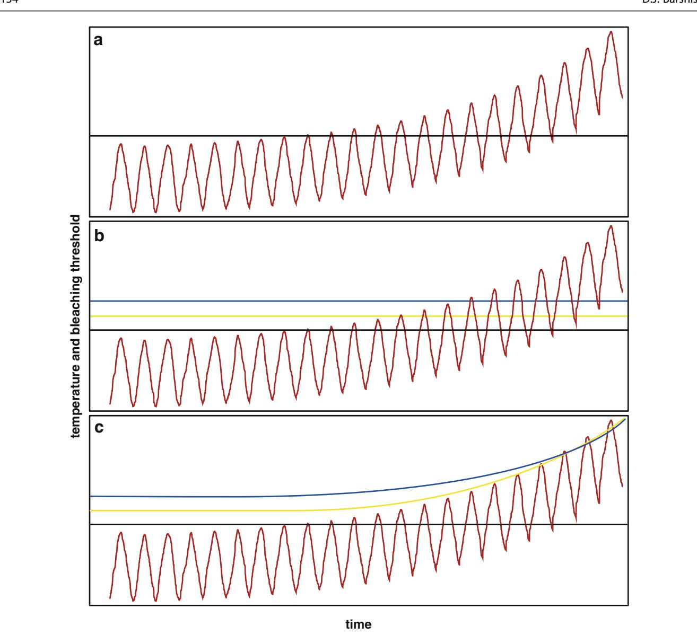
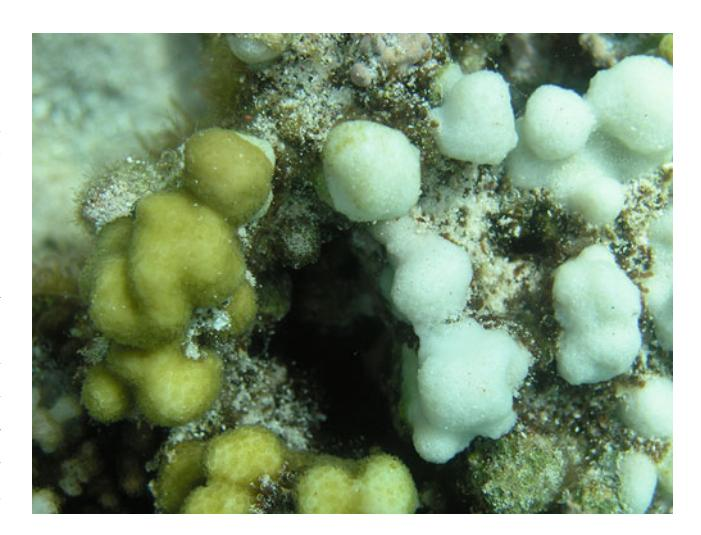

#### Abstract

One of the most pressing questions in coral reef biology today is "Will reef-building corals survive climate change?" Critical to this question is the rate at which climate change is progressing and whether that rate will be matched or exceeded by the ability of corals to acclimatize and adapt in their upper stress tolerance limits. The emerging field of genomics (i.e., genome scale genetics) holds great promise for investigation of the raw material needed for coral acclimatization and adaptation to climate change: variation in the gene sequences and activity of the molecular response pathways enabling corals and Symbiodinium to maintain key biological functions under environmental stress. A growing number of studies of gene expression signatures and gene frequency distributions are finding a diverse array of potential targets both for acclimatization potential and adaptive natural selection in climate change resistance. Additionally, research is consistently finding greater acclimatization and adaptive potential than previously thought, which when incorporated into models of coral survival in the future significantly improves the shortterm outlook for reef persistence. Much remains to be determined about the extent of relevant phenotypic diversity in coral thermal tolerance and resistance to ocean acidification as well as the relative contributions of the coral host, Symbiodinium, and associated microbes to increased stress resistance. However, application of these new technologies to the question of coral climate change survival provides new evidence that evolutionary accumulation of adaptive diversity and phenotypic plasticity may give corals increased potential for persistence in the Anthropocene.

#### Keywords

Adaptation Acclimatization Acidification Climate Selection

#### 7.1 Introduction

There is no longer a question that climate change is affecting and will continue to affect corals and coral reefs (e.g., Hoegh-Guldberg [1999](#page-11-0); Hughes et al. [2003;](#page-12-0) Carpenter et al. [2008;](#page-11-0) Doney et al. [2011](#page-11-0)). The debate now focuses on

D.J. Barshis (\*)

Department of Biological Sciences, Old Dominion University, Norfolk, VA 23529, USA

e-mail: [barshis@gmail.com](mailto:barshis@gmail.com)

how extensive these effects will be and whether enough corals possess the ability to withstand these stresses in the coming decades without a precipitous decline in coral abundance and a large-scale loss of reef ecosystems and the services they provide. Central to this debate is the rate at which climate change is progressing and whether the rate of change in the environment will be matched or exceeded by the ability of corals to acclimatize or adapt in their upper tolerance limits.

Hughes et al. ([2003\)](#page-12-0) posits a number of scenarios for how corals may respond in the future (Fig. [7.1\)](#page-1-0). The only scenario

Fig. 7.1 A schematic model representing various scenarios regarding coral bleaching thresholds in relation to future ocean warming. The red line represents continued sea surface temperature increase while the black, yellow, and blue lines represent theoretical coral thermal thresholds. (a) Represents a single thermal threshold for all corals that would be chronically exceeded in the future as sea surface

temperatures increase. (b) Represents variation among populations and species in the critical thermal threshold. (c) Represents the capacity for critical thermal thresholds to change in response to the environment either via acclimatization or adaption to climate change (Figure modeled after Figure 2 in Hughes et al. [2003](#page-12-0). Printed with permission from AAAS)

wherein coral bleaching thresholds are able to keep pace with increased ocean temperatures is one that includes the capacity for corals to acclimatize and adapt (Fig. 7.1c). It is generally accepted that climate change will alter ocean temperature and pH such that most corals will experience conditions above their current tolerance limits (Hughes et al. [2003](#page-12-0); Hoegh-Guldberg et al. [2007](#page-11-0); Pandolfi et al. [2011](#page-12-0)). What has yet to be determined experimentally and observationally, however, is what capacity corals have to shift those tolerance limits and whether they can be shifted quickly enough and with ample magnitude to keep pace with the changing environment.

Classic ecological and evolutionary theory tells us organisms may respond to environmental change via four main pathways: movement, adaptation, acclimatization, or death/extinction (Holt [1990](#page-12-0); Aitken et al. [2008](#page-10-0)). For the purposes of this chapter we will focus primarily on the As; the ability of corals to adapt or acclimatize to the environmental conditions produced by climate change. Movement relates to larval dispersal and will be touched on briefly near the end of the chapter. Death/Extinction is fairly selfexplanatory: conditions may change beyond the tolerance limits and evolutionary capacities of a given organism making survival no longer possible.

For the purposes of this chapter "adaptation" refers to evolutionary adaptation, wherein natural selection acts on individuals with heritable genetic mutations that provide increased fitness, the product of which is an increase in survival and reproduction of those advantageous genotypes in the population. "Acclimatization" refers to the ability of a single individual to adjust its phenotype during the duration of its lifetime, also referred to as phenotypic plasticity. Acclimatization signifies a phenotypic change in response to variation of multiple environmental factors under natural conditions, while acclimation refers to a phenotypic shift in response to just a single variable (e.g., temperature only; Prosser [1991\)](#page-12-0). The important distinction between adaptive and acclamatory processes is adaptation acts across multiple generations and is heritable from parent to offspring, while acclimatization acts within a single generation and is generally not heritable from parent to offspring (though see discussion of epigenetics in Brown and Cossins [2011](#page-11-0)).

### 7.2 The Role of Genomics in Coral Climate Change Science

Genomics is the emerging field of genome-scale genetics (i.e., examination of a large percentage of the genetic material of an organism rather than a small number of specific gene fragments). Recent advances in sequencing technologies have revolutionized the scale at which hypotheses can be tested and genetics data can be generated. High-throughput (also known at next generation) sequencing technologies are now capable of generating billions of base pairs (single DNA nucleotides) during a sequencing run. This data generation is orders of magnitude greater than previous technologies and allows for the simultaneous investigation of tens of thousands of genes within a single experiment. In terms of corals, these genomic technologies enable examination of the mechanisms behind the adaptation and acclimatization potential of traits that will allow corals to survive climate change: e.g. bleaching resistance, recovery from disturbance, and growth/calcification/reproduction under anomalous conditions (low pH, increased sedimentation, high temperature events). The link between these traits and the environment is the actual material needed for acclimatization and adaptation, i.e., variation in the gene sequences and activity of the molecular response pathways enabling corals and Symbiodinium to maintain key biological functions under environmental stress. This chapter provides an updated review of the role of genomics in studies of coral adaptation and acclimatization to climate change. There are a variety of previous, in-depth reviews of these concepts from a broader perspective (e.g. Coles and Brown [2003;](#page-11-0) Jokiel [2004](#page-12-0); Brown and Cossins [2011\)](#page-11-0), hence the purpose here is to provide recent updates to these previous works, as well as a more specific focus on how genomics can lend insight into the raw material responsible for these processes.

## 7.3 Acclimatization of Corals to Climate Change

The sheer temporal and spatial scales of climate change events make true tests of coral climate change acclimatization difficult, as they would require large-scale manipulations of environmental variables for many years and decades and across hundreds of kilometers of reef. Researchers have thus settled on two main experimental approaches to test coral acclimatization abilities that may be relevant to climate change survival. The first approach focuses on short-term responses by recreating thermal or pH stress events in the lab and assessing changes in response following different acclimatization treatments. This approach enables accurate recreation of the environmental perturbations of various climate change scenarios. However, these experiments are conducted over short time-scales and may not be indicative of the multi-year or decadal scale of actual climate change variation in environmental characteristics. Also, while lab approaches are powerful in their ability to isolate the effect of one or a few variables (e.g. temperature and pH), they generally examine only a subset of the different variables naturally occurring in the environment (e.g. light variability, flow regime, nutrient dynamics, sedimentation, dissolved oxygen, community assemblage interactions) and thus represent an oversimplification of the natural world.

The second approach involves using naturally occurring extreme habitats as a proxy for climate change effects on average environments. This approach is powerful in that corals that have been living in "climate change" like conditions for many generations (i.e., 100s of years) can be compared to neighboring populations from more benign habitats to examine the effects of long-term exposure to environmental stress. These natural, climate change like habitats can take the form of back reef pools regularly reaching high temperatures (Craig et al. [2001\)](#page-11-0), ocean regions like the Persian/Arabian gulf that reach upwards of 36 C (Coles [1997\)](#page-11-0), or low pH CO2 seeps (Fabricius et al. [2011\)](#page-11-0), springs (Crook et al. [2013\)](#page-11-0), and reef areas (Shamberger et al. [2014](#page-12-0)) which approximate future ocean acidification scenarios. The main drawback of these types of experiments is that present day extreme habitats are not exact replicas of future climate change scenarios and thus represent only an approximation of long-term climate change effects. However, the ability to examine the long-term effects of these types of exposures can provide valuable insight into the mechanisms responsible for adaptation and/or acclimatization across the multiple timescales over which they operate.

Brown and Cossins [\(2011](#page-11-0)) present a number of key conclusions from both laboratory and field approximation approaches in their review of temperature acclimatization potential in the face of climate change: (a) the ability of corals to acclimatize to changes in climate remains poorly characterized and should not be discounted in future predictions of reef health; (b) a growing number of studies find increases in thermal tolerance following exposure to increased solar radiation and/or sub-lethal elevated temperatures; (c) multiple host and Symbiodinium-specific mechanisms exist to facilitate acclimatization; and (d) the role of epigenetics in coral acclimatization is almost entirely unexplored and could represent additional potential for long term acclimatization gains. Since the publication of their comprehensive review, a growing number of studies have found detectable signatures of coral acclimatization, many of which involve increases in bleaching resistance following some type of sub-lethal thermal exposure. Additionally, implementation of genomic tools has opened the door for beginning to understand which genes and physiological processes may be involved in the acclimatization response.

## 7.3.1 Evidence for and Against Coral Thermal Acclimation

Contrasting ideas regarding acclimatization potential in the face of climate change have been raised over the years in a variety of taxa (including coral). For instance, Stillman [\(2003](#page-13-0)) found intertidal porcelain crabs with the highest current tolerance limits actually had the least ability to acclimate to additional heat exposures, suggesting the most thermally tolerant individuals may be the most susceptible to climate change. The opposite was found in a study of European diving beetles, wherein there was a positive relationship between upper thermal tolerance and acclimation ability, with the lowest tolerance populations being the most at risk of future climate change effects (Calosi et al. [2008](#page-11-0)). In the Mediterranean coral Oculina patagonica, Rodolfo-Metalpa et al. [\(2014](#page-12-0)) found little to no thermal acclimation ability in populations from four habitats with different thermal regimes, despite 14 weeks of slow exposure to increasing temperature. Additionally, they found little evidence for pre-existing variation in overall thermal tolerance across the various populations, suggesting few adaptive differences across the seascape in this relatively new member of the Mediterranean coral fauna (Rodolfo-Metalpa et al. [2014\)](#page-12-0).

This last finding is in contrast to multiple lines of evidence for thermal adaptation in other Scleractinia (see below Sect. [7.4](#page-5-0)). In fact, Howells et al. [\(2013](#page-12-0)), found historical thermal adaptation in Acropora millepora to a warm and cool region of the Great Barrier Reef likely restricted acclimatization capacity following a 14 month transplantation to opposing environmental conditions. Corals from the warmer, northern reef suffered 40 % mortality and grew 74–80 % slower when exposed to cold winter temperatures in the south, while corals from the cooler, southern reef suffered 50 % mortality and grew 52–59 % less in the north than in their native environment. Thus, Howells et al. [\(2013](#page-12-0)) postulate long-term adaptation of the coral host and associated Symbiodinium to their native environments may limit acclimatization potential in response to novel conditions.

136 D.J. Barshis

In contrast, a short-term thermal acclimation study by Bellantuono et al. ([2012b\)](#page-11-0) showed that a 10-day pre-conditioning exposure of Acropora millepora from the Great Barrier Reef to 3 C below their bleaching threshold (28 C) resulted in complete bleaching resistance to a subsequent 8-day exposure to 31 C compared to non-preconditioned corals. This enhanced bleaching resistance was not due to any apparent change in Symbiodinium type or microbial associates (Bellantuono et al. [2012b\)](#page-11-0). A follow up study examining the gene expression response following similar preconditioning treatments found only nine differentially expressed genes separated preconditioned and non-preconditioned corals (Bellantuono et al. [2012a\)](#page-11-0). In fact, there was almost complete overlap between the differentially expressed genes in preconditioned and non-preconditioned corals under heat stress. However, out of all of these shared genes, preconditioned corals had lower levels of expression changes compared to non-preconditioned corals, suggesting it is the magnitude of expression change, not the specific genes themselves that may be indicative of acclimation gains in heat resistance (Bellantuono et al. [2012a](#page-11-0)).

In a field transplant study over multiple years, Palumbi et al. ([2014\)](#page-12-0) transplanted colonies of Acropora hyacinthus between a highly variable back-reef pool that frequently reaches temperatures 2–3 C above the local bleaching threshold and a more moderately variable pool with corals known to have lower thermal tolerance levels (Oliver and Palumbi [2011](#page-12-0)). Following 12–27 months of acclimatization to the different pools, corals that had been transplanted into the highly variable habitat bleached significantly less when exposed to subsequent heat stress, suggesting a strong, positive effect of acclimatization on their heat resistance. However, corals that came from the more moderate area did not display the same levels of heat resistance as corals native to the highly variable habitat despite substantial acclimatization gains in under 2 years, indicating some remaining benefit of long-term acclimatization or potential adaptation of the highly variable natives (Sect. [7.4.2](#page-6-0); Palumbi et al. [2014](#page-12-0)). Investigation of the gene expression differences among corals transplanted to the various environments revealed 74 genes that were different between identical fragments transplanted to the different locations and 72 that were different between the corals native to the two different locations. This is in contrast to the results of Bellantuono et al. ([2012a](#page-11-0)), where there were no differences in gene expression between the control and preconditioned treatments after 4 and 20 days of exposure. The number of differentially expressed genes due to transplantation observed by Palumbi et al. ([2014\)](#page-12-0) may reflect a difference among the acclimatization strategies of the different species (A. hyacinthus vs. A. millepora), or could be indicative of a fundamental difference in short and long-term acclimatization mechanisms. Regardless of the differences, similar gains in thermal tolerance over short-term, longterm, lab, and field exposures in these Acropora spp., combined with the lack of change in associated Symbiodinium or microbial communities supports a substantial role for coral host acclimatization gains to contribute to coral survival in the face of climate change.

## 7.3.2 Unanswered Questions Regarding Coral Acclimatization and Future Directions

It is worth noting that acclimatization potential may come with associated costs. Maintaining the ability for large degrees of phenotypic plasticity is thought to be energetically costly and may affect the ability of a population to evolve optimal phenotypes (DeWitt et al. [1998;](#page-11-0) Relya [2002](#page-12-0)). While evidence for costs of acclimatization in corals is scant, Edmunds [\(2014](#page-11-0)) found conflicting evidence that thermal acclimation was actually beneficial for massive Porites spp. in Moorea, French Polynesia. Instead of evidence supporting the beneficial acclimation hypothesis (Leroi et al. [1994](#page-12-0)), wherein previous acclimation to a particular environment conveys increased performance during future exposure to the same environment compared to organisms acclimated to any other environmental condition, Edmunds [\(2014](#page-11-0)) found only acclimation to increasing temperatures had a positive influence on a corals ability to withstand future thermal stress (similar to many of the examples mentioned above). This was termed the "hotter is better" response, wherein acclimation to increased temperatures has value in responding to a variety of subsequent temperatures (Edmunds [2014\)](#page-11-0). It is worth noting this is one of the first studies to frame investigations of coral thermal acclimation response in terms of the beneficial acclimation hypothesis, and the results of most studies to date of thermal acclimation potential would conform to the hotter is better hypothesis. Additional studies investigating a range of acclimation treatments and subsequent crossexposures are required before the extent of the hotter is better versus the beneficial acclimation hypothesis can be determined.

#### 7.3.2.1 Little Is Known About Acclimatization to Ocean Acidification

The majority of acclimatization studies have either focused on thermal acclimation potential (discussed above) or photoacclimation potential to different light regimes of coral-associated Symbiodinium (discussed below in Sect. 7.3.2.2). While thermal stress is thought to represent the primary coral stressor associated with climate change for corals, decreasing pH associated with ocean acidification represents another important stressor that may influence future coral survival (Chap. [4\)](http://dx.doi.org/10.1007/978-94-017-7249-5_4). A few studies have employed genomic tools to examine coral response to acidification stress and have found substantial overlap in the genes responding to acidification with those responding to temperature stress (e.g., Moya et al. [2012\)](#page-12-0) which suggests acclamatory and adaptive processes for acidification tolerance may operate on similar cellular mechanisms as thermal acclimation. However, Crook et al. ([2013\)](#page-11-0) found no evidence for long term acclimatization in calcification of Porites astreoides to chronic exposure to low pH submarine springs in Quintana Roo, Mexico, despite these corals spending their entire lifetime in these conditions. This was determined by comparing P. astreoides calcification rates to those from neighboring ambient pH areas as well as lowered pH exposures conducted in previous lab studies. They found P. astreoides from the submarine springs, which reach lows of pH 7, showed as great a reduction in calcification as the same species from multiple areas across the Caribbean with normal pH conditions when exposed to acidification conditions, suggesting hundreds to thousands of years of natural exposure to reduced pH did not induce an acclimatization response (Crook et al. [2013\)](#page-11-0).

This contrasts with acclimation to low pH observed in the symbiotic anemone Anemonia viridis, where Symbiodinium gross photosynthesis and chlorophyll increased significantly following exposure to decreased pH (Jarrold et al. [2013](#page-12-0)). Non-calcifying cnidarians, however, may not be as sensitive to ocean acidification as most Scleractinians, and unifying themes are difficult to draw from these few studies. Future research is greatly needed before we can assess the acclimatization potential of corals to ocean acidification scenarios as well as the molecular machinery behind any potential acclimatization response to reduced pH.

## 7.3.2.2 Little Is Known About Host vs. Symbiodinium vs. Other Microbial Contributions to Acclimatization

There is a wealth of literature concerning the potential for Symbiodinium photoacclimation and photoadaptation to changes in light levels and spectral quality (e.g. Dustan [1982](#page-11-0); Anthony and Hoegh-Guldberg [2003;](#page-10-0) Mass et al. [2007\)](#page-12-0), however very little is known about Symbiodinium acclimatization potential to changes in temperature and seawater pH. Evidence for both fine-scale and broad-scale differences in Symbiodinium thermal adaptation are prevalent in the literature (see Sect. [7.4.2\)](#page-6-0), however direct tests of thermal acclimatization abilities are almost non-existent. The changes in photosynthetic productivity observed in Symbiodinium from Anemonia viridis in response to acidification as well as the pervasive evidence for various forms of photoacclimation certainly suggest that Symbiodinium can acclimate over short time-scales (Jarrold et al. [2013](#page-12-0)), however whether this applies to short-term acclimation responses to temperature remains to be seen and warrants further investigation. Very little is known as well about true acclimatization responses (i.e., phenotypic shifts within individual genotypes) in other coral microbial associates (e.g., bacteria, fungi, viruses), as most studies have focused on shifts in the microbial community assemblage (i.e., genetic restructuring) rather than phenotypic shifts in a constant assemblage. In fact, we know very little at all about what phenotypes these other associates may express and what functional roles they play in the entire community that comprises a coral (often termed the coral holobiont).

## 7.3.2.3 The Timing and Magnitude of Coral Acclimatization

For acclimatization to effectively aid in coral survival of climate change it must be sufficient in timing and magnitude to alleviate stress caused by subsequent high temperature and low pH exposures. To date, there are multiple lines of evidence supporting both short-term (1–2 week) and longterm (1–2 years) acclimation gains in coral thermal tolerance (e.g. Middlebrook et al. [2008](#page-12-0); Bellantuono et al. 2012; Palumbi et al. [2014](#page-12-0)). Another promising study found that Pocillopora damicornis from a highly thermally variable upwelling reef in Taiwan were able to fully acclimate to 9 months of exposure to 30 C compared to controls at 26.5 C, suggesting historical, natural exposure to upwelling variability contributed to the acclimation potential to future thermal challenge (Mayfield et al. [2013\)](#page-12-0). However, whether natural sporadic stress events will elicit the same level of acclimatization and whether acclimatization gains will be great enough for coral survival remain to be determined. Also, while Palumbi et al. [\(2014](#page-12-0)) found substantial gains in bleaching resistance after 12+ months of exposure to increased variability, they also observed a significant decrease in bleaching resistance when tolerant corals were moved from the highly variable pool to the more moderate location, suggesting acclimation gains may not persist for very long when the driving environmental conditions are removed. Future studies examining a variety of time-scales both in the lab and in the field, as well as comparing gene expression changes in lab-acclimated populations to natural transcriptional profiles of corals during pre-bleaching warming are critically needed before we can accurately predict potential long-term contributions of coral acclimatization to climate change survival.

#### 7.4 Coral Adaptation to Climate Change

138 D.J. Barshis

If organisms cannot move or acclimatize to climate change, they must adapt to survive (Parmesan [2006](#page-12-0)), a process sometimes termed "evolutionary rescue" (reviewed in Bell [2013](#page-11-0)). The concept of evolutionary processes acting as a rescue from population extinction is not new; consider the "rescue" of bacterial populations that evolve genetic resistance to antibiotics. However, scientists historically thought evolution in the environment via natural selection was a slow process, requiring hundreds to thousands of generations to elicit substantial change. Yet a growing number of studies are finding rapid evolutionary changes in nature in response to strong selection pressures over relatively few generations (Carroll et al. [2007](#page-11-0)). Rapid adaptation is thought to occur via two contrasting mechanisms: (a) rapid generation of novel mutations that confer increased fitness in response to new environmental conditions (termed novel mutation), or (b) rapid increase in the proportion of advantageous genotypes in the population via selection for already existing genetic diversity (termed standing genetic variation; Barrett and Schluter [2008](#page-11-0)). In the stickleback fish for instance, Barrett et al. ([2011\)](#page-11-0) elicited rapid adaptation in cold tolerance in just three generations of strong selection, demonstrating the standing genetic variation accumulated over thousands of years and multiple migrations from fresh to saltwater in these fish was high enough to enable rapid adaptation. For novel mutation, one can consider again the rapid evolution of antibiotic resistance in pathogenic bacterial as an example of how novel mutation (i.e., de novo evolution of a resistant strain) can facilitate rapid adaptation of an entire population when faced with strong selective pressures.

#### 7.4.1 The Contribution of Novel Mutation to Coral Climate Change Adaptation

Generally, it is believed adaptation from novel mutation occurs more slowly than that from standing genetic diversity due to: (a) potential deleterious influence of a particular mutation that has not been present in the environment long enough to be "vetted" under various environmental scenarios, and (b) new mutations likely occur in lower frequency than standing variants and may take longer to become established in a population (Barrett and Schluter [2008](#page-11-0)). In terms of reef-building corals, their long generation times (years to decades), ability to asexually reproduce, and the persistence of older individuals contributing to the gene pool for hundreds of years all make novel mutation an unlikely contributor to rapid adaptation to climate change. However, the rapid generation time of Symbiodinium and massive population sizes across the reef contrast with the coral host, and certainly open the possibility for rapid generation of functional novel mutations. This topic is almost completely unexplored in the literature and thus remains conceptual and speculative at this time, yet the life history characteristics of Symbiodinium do not preclude rapid adaptation via novel mutation.

#### 7.4.2 Coral Adaptation from Standing Genetic Variation

For rapid adaptation to occur in a population from pre-existing variation, there has to be sufficient standing genetic diversity in the specific traits needed for survival of a given selection pressure. In the case of corals and climate change this would equate to genetically based differences in thermal tolerance limits and acidification resistance. The strongest, indirect evidence for genetic variation in upper thermal tolerance limits in corals comes from the observation that the bleaching threshold of most coral populations is only 1–2 C above the mean summer maximum temperature for a given area (Jokiel and Coles [1990;](#page-12-0) Jokiel [2004\)](#page-12-0). This means the same coral species from different latitudes can have substantially different (>2 C) bleaching thresholds (Clausen and Roth [1975;](#page-11-0) Coles et al. [1976;](#page-11-0) Smith-Keune and van Oppen [2006;](#page-13-0) Howells et al. [2013\)](#page-12-0). This pattern is repeated across multiple species and multiple locations across the globe, with corals from the warmest reefs on the planet (e.g. the Persian/Arabian Gulf) having the greatest thermal tolerance limits (Riegl et al. [2011](#page-12-0), [2012](#page-12-0)), suggesting substantial standing genetic variation exists in coral bleaching thresholds around the world. Far less evidence, however, has been found concerning potential standing genetic variation in coral tolerance to ocean acidification. Of the three main study areas where coral reefs have been found in naturally acidified seawater, two find demonstrable effects on the structure and function of the coral community, with either a decrease in calcification and increase in bioerosion in the low pH springs of Mexico (Crook et al. [2013\)](#page-11-0), or a reduction in coral diversity in the moderate CO2 seeps and an absence of reef structure completely in the extreme CO2 seeps in Papua New Guinea (Fabricius et al. [2011](#page-11-0)). The third area though, holds promise, where Shamberger et al. [\(2014\)](#page-12-0) found a diverse coral community and maintenance of calcification in reef communities under chronically low pH (~7.8) in rock island bays in Palau, suggesting these communities have developed

mechanisms to maintain calcification and reef building in chronically acidic conditions.

Other studies have found persistent differences in thermal tolerance across much smaller spatial scales than the latitudinal variation discussed above. Porites astreiodes in the Florida Keys (Kenkel et al. [2013\)](#page-12-0) and Porites lobata and Acropora hyacinthus in American Samoa (Oliver and Palumbi [2011;](#page-12-0) Barshis et al. [2013;](#page-11-0)Barshis [unpublished data\)](#page-11-0) all show greater bleaching resistance in corals from warmer, more thermally variable habitats compared to cooler, more stable areas separated by as little as 500 m–7.5 km. Also, during mass bleaching events there is often survival of scattered colonies, specific communities, or whole reef sections with bleached and unbleached conspecifics found adjacent to one another (Fig. 7.2; Sotka and Thacker [2005\)](#page-13-0). While both small- and large-scale differences in coral bleaching susceptibility indicate the potential for substantial standing genetic diversity in coral thermal tolerance thresholds, most evidence to date is correlative, and comprehensive investigations of the genomic determinants of this phenotypic diversity have only just begun.

#### 7.4.2.1 Is Variation in Coral Thermal Tolerance Genetically Determined and Heritable? The Host Perspective

Unfortunately, linking genotype to complex phenotypes such as bleaching and acidification resistance in coral remains a challenging endeavor. The diversity of genes and molecular processes involved in the coral thermal and acidification stress responses (e.g., Moya et al. [2012](#page-12-0); Barshis et al. [2013\)](#page-11-0) indicate hundreds of potential targets that could

Fig. 7.2 A photo showing differential bleaching susceptibility of adjacent colonies of Porites randalli in the Ofu back reef in American Samoa. Bleaching is commonly patchy across a reef and bleached and unbleached colonies are often observed in close proximity. Whether this variability is caused by adaptation or acclimatization of the host or Symbiodinium remains to be determined

be causing an adaptive response to stress. In order for selection to result in adaptation, a substantial enough reduction in gene flow between the selected population and unselected neighbors is required, such that selected genotypes are able to increase in the population without continued dilution with less fit genetic variants from neighboring areas. Multiple studies examining neutral markers have found genetic differentiation among coral populations with distinct thermal tolerance limits, which indicates the potential for genetic isolation and accumulation of locally adapted genotypes. For instance, Smith-Keune and van Oppen ([2006\)](#page-13-0) found small but significant genetic structuring in nine populations of Acropora millepora from distinct thermal ecoregions along the Great Barrier Reef, raising the possibility of enough genetic isolation to accumulate adaptive divergence. These results are only correlative, however, and do not purport to examine genetic differentiation at adaptive markers.

Other studies have found similar genetic differentiation among different thermal habitats, though across much smaller spatial scales. Barshis et al. ([2010\)](#page-11-0) found significant genetic structuring in Porites lobata that correlated with differences in growth and thermal tolerance between corals native to a more thermally variable back reef vs. a more stable forereef separated by only 5 km in American Samoa (Smith et al. [2007](#page-13-0); Barshis [unpublished data\)](#page-11-0). Similarly, Kenkel et al. [\(2013](#page-12-0)) found thermal tolerance differences and genetic differentiation between Porites astreoides from a nearshore reef with warmer conditions and a cooler offshore reef 7.1 km away in the Florida Keys. This genetic differentiation corresponded with constitutive upregulation of metabolic genes in corals from the warmer inshore location during subsequent heat stress, suggesting a potential adaptive role of coral energy management in coral thermal tolerance (Kenkel et al. [2013](#page-12-0)).

Other studies have taken a more direct approach by either examining genetic differentiation in putatively adaptive gene regions or directly testing differences in stress tolerance among larvae of known genetic composition and parental genotypes. Lundgren et al. ([2013](#page-12-0)) performed a gene mining investigation to find specific candidate genes for adaptive genetic markers in Pocillopora damicornis and Acropora millepora across the thermal gradient from the northern to the southern Great Barrier Reef. They found significant correlations between allele frequencies (proportion of a particular genotype in the population) and thermal habitat type in up to 55 % of the gene markers examined, representing evidence for one of the first sets of candidate genes for adaptive environmental stress tolerance in corals (Lundgren et al. [2013](#page-12-0)). A different, transcriptome-wide scan between Acropora hyacinthus from a thermally tolerant vs. a more thermally susceptible population in American Samoa (the same populations investigated in Oliver and Palumbi [2011;](#page-12-0) Barshis et al. [2013](#page-11-0); Palumbi et al. [2014](#page-12-0)), identified 114 highly divergent genetic loci as candidates for environmental selection for heat resistance (Bay and Palumbi [2014](#page-11-0)). Many of these loci showed significant allele frequency correlations with temperature, in the form of amount of time spent above the local bleaching threshold of 31 C. Taken together, these investigations are starting to reveal some of the first direct signs of selection in coral genomes that might be responsible for adaptive differences in upper thermal tolerance limits.

An alternative approach to genome scans is direct examination of differences in thermal tolerance among closely related larval crosses to assess the role of genotype in determining thermal tolerance limits. These types of investigations have also found preliminary evidence that variation in thermal tolerance may be genetically-based between closely related families. In larvae from experimental crosses of Acropora millepora, two out of six families lost significantly more protein during larval development at increased temperatures, while the other families did not show an effect of temperature (Meyer et al. [2009\)](#page-12-0). In Caribbean Acropora palmata, Baums et al. ([2013\)](#page-11-0) found significant differences in larval development rate and swimming speed under high temperature among larval families, suggesting genotype may constrain larval performance during thermal exposure. Although neither of these studies directly assessed thermal tolerance differences in the parent colonies, nor the heritability of parental phenotype to the offspring, the finding of significantly different responses to temperature among closely related larval families certainly supports the hypothesis of standing genetic variation in coral temperature sensitivity.

## 7.4.2.2 Standing Genetic Variation in Symbiodinium and the Potential Contribution to Coral Adaptive Tolerance

A comprehensive review of the genetic diversity of Symbiodinium and their functional role in coral thermal tolerance is well beyond the scope of this chapter and is well covered elsewhere (e.g., Chap. [5](http://dx.doi.org/10.1007/978-94-017-7249-5_5) of this book; Berkelmans and van Oppen [2006](#page-11-0); Stat et al. [2006;](#page-13-0) Stat and Gates [2011](#page-13-0)). For the purposes of this chapter, a few common themes are relevant to the discussion herein.

First, an extraordinary amount of genetic diversity exists within coral-associated Symbiodinium and many physiological differences relevant to climate change stress tolerances have been found among different Symbiodinium genotypes. For example, association with some phylotypes of Symbiodinium clade D can provide enhanced thermal tolerance to host corals when dominated by these types (reviewed in Stat and Gates [2011](#page-13-0)). Increased prevalence of certain Symbiodinium phylotypes has also been found in habitats characterized by unusually high temperatures and in areas recently influenced by natural bleaching events (Fabricius et al. [2004](#page-11-0); Jones et al. [2008](#page-12-0); Oliver and Palumbi [2009,](#page-12-0) [2011\)](#page-12-0). Corals hosting different Symbiodinium phylotypes have also been shown to exhibit reduced levels of bleaching and greater maintenance of photosynthetic efficiency during thermal exposure (Berkelmans and van Oppen [2006;](#page-11-0) Oliver and Palumbi [2011\)](#page-12-0). Although this phenomenon is not universally the same across coral species (Fabricius et al. [2004](#page-11-0); Abrego et al. [2008\)](#page-10-0), one potential mechanism for corals to persist in a warming ocean is through association with a more thermally tolerant Symbiodinium type (Buddemeier and Fautin [1993](#page-11-0); Berkelmans and van Oppen [2006\)](#page-11-0). Additionally, substantial physiological differences exist among specific phylotypes within clades as well as between clades (e.g. Cantin et al. [2009](#page-11-0); Howells et al. [2012](#page-12-0)). Specific strains of a single subtype can show different thermal tolerances and growth rates even in isolated cultures (Howells et al. [2012](#page-12-0); Parkinson and Baums [2014](#page-12-0)), suggesting increased tolerance could be gained via association with a different strain within a subclade type or member of a different clade altogether.

As a whole, there is clearly a substantial amount of genetic variability in coral associated Symbiodinium, and we are only just beginning to understand the physiological relevance of the vast majority of this diversity. Genomic investigations have revealed potential candidates for adaptive evolution relevant to temperature tolerance differences among different Symbiodinium clades (Bayer et al. [2012](#page-11-0); Ladner et al. [2012;](#page-12-0) Barshis et al. [2014\)](#page-11-0). Highly specific host and Symbiodinium combinations exhibit substantial variation in thermal sensitivity (e.g. Abrego et al. [2008](#page-10-0); Howells et al. [2012;](#page-12-0) Parkinson and Baums [2014\)](#page-12-0), which are undoubtedly relevant to coral survival of global warming and ocean acidification. Whether specific host/Symbiodinium associations represent true adaptation vs. acclimatization remains debatable and depends on the "heritability" of the intact symbiosis from parent to offspring. Some larvae inherit the full complement of Symbiodinium from their parents ("vertical transmission") while others have to establish the symbiosis de novo from the environment each generation ("horizontal transmission"; Sect. [5.2.3](http://dx.doi.org/10.1007/978-94-017-7249-5)). Thus, the stability of the symbiosis from generation to generation depends on a number of different factors and while certain hosts can show strong fidelity to a particular Symbiodinium type, many hosts are more flexible in the associations they maintain, calling into question how persistent more tolerant host-Symbiodinium combinations would be in a changing environment (Stat et al. [2008;](#page-13-0) Putnam et al. [2012](#page-12-0)).

# 7.4.3 Coral Climate Change Adaptation in Real Time

Genetic-based changes attributable to recent anthropogenic climate change have been observed in the present-day timing of breeding and migration in animals and flowering in plants, as well as the increased frequency of warm-adapted genotypes in higher-latitude populations (reviewed in Parmesan [2006](#page-12-0); Hoffmann and Sgro [2011](#page-12-0); Crozier and Hutchings [2014\)](#page-11-0). Evidence of recent adaptation to climate change in corals also exists, though it is correlative in nature. Contrasting bleaching responses of a variety of coral taxa have been observed across years and reefs with recently differing thermal histories. Maynard et al. [\(2008](#page-12-0)) found a 30–100 % reduction in bleaching severity across three major coral genera (Acropora, Pocillopora, and Porites) during a severe thermal stress event on the Great Barrier Reef in 2002 when compared to a previous event in 1998. Acroporids and pocilloporids showed the greatest increase in tolerance, despite being more susceptible to thermal stress than Porites spp. Similarly, Guest et al. [\(2012](#page-11-0)) reported lower bleaching across multiple genera in South East Asian reefs that bleached during 1998 and had greater historical temperature variability and lower rates of warming. Again, Acropora and Pocillopora were among the most susceptible at the site with highest bleaching (Pulau Weh, Sumatra, Indonesia), yet the least susceptible at an area with a substantial history of thermal stress (Singapore). While both studies are correlative, the authors invoke acclimatization and adaptation in response to recent thermal histories as a likely explanation for the contrasting bleaching responses across sites and years and indicate Acropora and Pocillopora spp. as likely candidate taxa for rapid acclimatization and adaptation to environmental change.

Natural thermal adaptation to historical temperatures has also been suggested to explain a substantial departure in corals from the Gulf of Aqaba in the Red Sea from the putative "universal" bleaching threshold of 1–2 C above local mean summer maximum temperatures. Fine et al. [\(2013](#page-11-0)) found only mild bleaching (<45 % change in Symbiodinium density) after 4 weeks of exposure to 34 C (7 C above the summer maxima) and no bleaching after 3 weeks at 31 C (4 C above the summer maxima) for five different species (Stylophora pistillata, Pocillopora damicornis, Acropora eurystoma, Porites sp. and Favia favus). They also developed a stepping stone larval dispersal model and hypothesized coral larvae that reach the northern Red Sea could represent only those that successfully survived passage across the hotter reefs to the south (which can be 5–6 C warmer than the north). What is particularly fascinating is this mismatch between bleaching threshold and local environmental conditions may have persisted despite thousands of years of exposure to the colder conditions of the Gulf of Aqaba, suggesting either little to no selective cost of maintaining thermal tolerance in cooler conditions or a complete purging of less tolerant genotypes from the population via the heat selective barrier to the south (Fine et al. [2013](#page-11-0)). The apparent lack of reversion of these thermally tolerant corals in the north could represent a potential climate change refuge, as conditions in the Gulf of Aqaba are not projected to reach the elevated bleaching thresholds of these corals until at least 100 years after their relatives to the south.

142 D.J. Barshis

Correlative evidence representing possible thermal adaptation such as the above studies has led some to propose more radical manipulative conservation measures based on these results. Multiple authors have suggested that putative thermally adapted genotypes (e.g., those from the Arabian Gulf or Gulf of Aqaba) could be used as source material for restoration of cooler reefs following widespread bleaching and mortality (Coles and Riegl [2013](#page-11-0)). Termed "assisted migration", this would involve transplantation of adults and/or larvae to distant areas where native genotypes are not pre-adapted to increased temperatures. Researchers acknowledge that such efforts present several monumental challenges and concerns regarding biodiversity preservation, thus they should only be considered as a last resort when viable alternatives may no longer exist (Hoegh-Guldberg et al. [2008](#page-12-0); Coles and Riegl [2013\)](#page-11-0). Alternatives such as selectively cultivating these potential adapted genotypes in coral nurseries (Coles and Riegl [2013\)](#page-11-0), or even cryogenically preserving them for future reanimation (Hagedorn et al. [2012\)](#page-11-0) have also been proposed as possible conservation strategies to combat climate change effects, though these strategies also present substantial logistical and practical challenges.

## 7.4.4 Unanswered Questions in Coral Climate Change Adaptation

One of the biggest unanswered questions in terms of coral climate change adaptation is what degree of adaptive diversity exists in coral susceptibility to ocean acidification. In a recent review of the potential for adaptation to ocean acidification in all marine organisms, Kelly et al. ([2013\)](#page-12-0) suggest that variation in pH across the seascape does not follow as strong and consistent a spatial pattern as variation in temperature, which may not elicit as strong a selective force on intraspecific genetic variation. However, variation among individual genotypes in susceptibility to OA has been observed for some marine species (urchins, bryozoans, oysters, and coccolithophores), and many studies are beginning to find more spatial variability in pH conditions than initially predicted (Kelly et al. [2013\)](#page-12-0). They conclude that our understanding is still limited and additional investigations utilizing genomic approaches and technological advances in pH instrumentation are critically needed before we can begin to ask whether adaptation might rescue vulnerable populations from future acidification effects (Kelly et al. [2013\)](#page-12-0).

For corals, there appears to be significant inter-specific variability in OA sensitivity, with only certain species able to survive in naturally acidified springs and seeps (e.g. Fabricius et al. [2011](#page-11-0); Crook et al. [2013\)](#page-11-0), and significant differences among species in susceptibility to lab exposures of low pH (Edmunds et al. [2013\)](#page-11-0). Whether these interspecific differences reflect similar diversity within species and across populations remains to be determined.

We also have a limited understanding of the spatial scale of relevant diversity in coral thermal tolerance limits. While latitudinal variation in bleaching thresholds indicate the potential for evolutionary rescue of less tolerant populations in cooler regions, there needs to be sufficient dispersal ability between habitats for recolonization to be realistically possible; but not so much dispersal as to dilute the accumulation of relevant adaptive diversity (Garant et al. [2007\)](#page-11-0). The small-scale differences in temperature tolerance observed between inshore and offshore reefs in the Florida Keys (Kenkel et al. [2013](#page-12-0)) and back reef pools in American Samoa (Oliver and Palumbi [2011\)](#page-12-0) certainly fall within the range of predicted dispersal distances of most corals, but whether ecologically relevant dispersal can realistically occur between thermally adapted populations across latitudinal extremes remains unknown.

Additionally, aside from a few isolated study sites (e.g., Ofu Island in American Samoa, Sugarloaf Key in Florida), very few detailed investigations of small-scale spatial variability in thermal tolerance limits have been conducted and even in these well-studied areas, whether observed differences are truly due to evolutionary adaptation also remains to be determined. Lastly, while a growing number of studies have identified gene expression signatures of acclimatization, only a select few have started to shed light on the genes and molecular processes that may be responsible for adaptive variation in coral thermal tolerance limits. As the evolution of thermal and acidification tolerance in corals is likely determined by a variety of physiological and biochemical processes, substantial additional research is required before we can begin to understand the relationship between current genetic diversity, environmental tolerance limits, and future response of coral populations to climate change influences.

#### 7.5 Summary

Genomics has ushered in a new era of investigation into the molecular mechanisms of coral acclimatization and adaptation potential. Studies of gene expression signatures and gene frequency distributions reveal a complex pattern underlying thermal tolerance differences among corals and mechanisms of acclimatization and adaptation. There is no single gene or gene family implicated in coral temperature tolerance, but variation in both the magnitude and composition of the stress response across a multitude of different physiological and cellular processes. This represents a diverse array of potential targets both for acclimatization potential and adaptive natural selection in climate change resistance.

An increasing number of studies are finding greater acclimatization and adaptive potential than previously thought, which when incorporated into models of coral survival in the future significantly improves the short-term outlook for reef persistence (Donner et al. [2005;](#page-11-0) Logan et al. [2014\)](#page-12-0). Significant associations between large-scale and small-scale genetic differentiation and temperature tolerance continue to be discovered in corals from different eco-regions and habitats as well as closely related larval families. As a whole, these studies illustrate a substantial amount of diversity in acclimatization ability and adaptive potential in current day coral populations. However, this may only buy reefs a finite amount of time, and without serious conservation actions to mitigate effects of local stressors and reduce global CO2 emissions, environmental change in the Anthropocene will quickly outpace the ability of corals to acclimatize and adapt.

#### 7.5.1 What Is Ahead?

We are only just beginning to enter the era of coral genomics research. Already, insight from the first generation of studies is dramatically altering previous concepts regarding the extent of acclimatization and adaptation potential in coral survival of climate change. Many important questions still remain to be answered in the coming decades:

- Are genetically based differences in coral thermal tolerance truly heritable from parents to offspring?
- How stable are beneficial host/symbiont associations through time and across generations?
- What is the extent of genetic diversity and acclimatization potential in coral resistance to ocean acidification?
- What are the relevant spatial scales of standing genetic variation in thermal tolerance limits and larval dispersal potential?

Studies to date have focused on relatively few species and genera and predominantly investigated cosmopolitan species of Acropora (A. millepora and A. hyacinthus), Pocillopora damicornis, and Porites (P. astreoides and P. lobata). Release of the first coral (Acropora digitifera; Shinzato et al. [2011](#page-12-0)) and Symbiodinium (S. minutum; Shoguchi et al. [2013\)](#page-12-0) genomes has opened the door for comparative evolutionary studies and investigation of the genotype to phenotype relationship of various corals. With a variety of other draft genomes in progress (Montastraea cavernosa, Acropora millepora, Seriatopora hystrix, Stylophora pistillata, Symbiodinium clade A-type), our understanding of the genetic determinants of coral physiology and evolution is only just beginning.

#### 7.5.2 A Cautionary Note

Genomics has really changed how we analyze and look at data. We used to visually align genetic sequences and identify mutations by hand. With 100s–1000s of sequences, this was time-consuming but feasible. Now, with datasets routinely consisting of millions to billions of individual sequences, hand curation and analysis is simply impossible. Biologists are increasingly relying on computer programs to interact with and analyze data. We're essentially seeing through the eyes of the computer most of the time, and "seeing" the actual animals of interest and the environment less and less so. A holistic way forward necessitates that we combine approaches and find ways to bridge between specialties and navigate among disciplines (e.g., ecologists, taxonomists, evolutionary biologists, natural historians, and 'omics). Our tools and interpretation are only as good as the sampling and experimental design and knowledge of the animals and system. This is particularly relevant for genomics, given the enormous time and resource investment to obtain, process, and analyze these large datasets.

Similarly, while genomics is revolutionizing the scale at which we can identify the genes and molecular pathways that may be responsible for acclimatization and adaptation to climate change, it can only get us so far. Genome wide scanning and gene expression profiling are powerful tools, but ultimately only describe a correlation between genotypic and phenotypic variability. It is really the fields of quantitative genetics (e.g. controlled crosses, artificially selected family lines) and cell biology (e.g. gene knockdowns, cell cultures, genetic mutants, and genetic modifications) that truly test the effects of genotype on organismal phenotype and ultimately, the contributions of acclimatization and adaptation to coral survival in an uncertain future.

#### References

Abrego D, Ulstrup KE, Willis BL, van Oppen MJH (2008) Speciesspecific interactions between algal endosymbionts and coral hosts define their bleaching response to heat and light stress. Proc R Soc Lond Ser B Biol Sci 275:2273–2282

Aitken SN, Yeaman S, Holliday JA, Wang T, Curtis-McLane S (2008) Adaptation, migration or extirpation: climate change outcomes for tree populations. Evol Appl 1:95–111

Anthony KR, Hoegh-Guldberg O (2003) Kinetics of photoacclimation in corals. Oecologia 134:23–31

Barrett RD, Schluter D (2008) Adaptation from standing genetic variation. Trends Ecol Evol 23:38–44

144 D.J. Barshis

- Barrett RD, Paccard A, Healy TM, Bergek S, Schulte PM, Schluter D, Rogers SM (2011) Rapid evolution of cold tolerance in stickleback. Proc R Soc B 278:233–238
- Barshis DJ (unpublished data)
- Barshis D, Stillman JH, Gates RD, Toonen RJ, Smith LW, Birkeland C (2010) Protein expression and genetic structure of the coral Porites lobata in an environmentally extreme Samoan back reef: does host genotype limit phenotypic plasticity? Mol Ecol 19:1705–1720
- Barshis D, Ladner JT, Oliver TA, Seneca FO, Traylor-Knowles N, Palumbi SR (2013) Genomic basis for coral resilience to climate change. Proc Natl Acad Sci U S A 110:1387–1392
- Barshis DJ, Ladner JT, Oliver TA, Palumbi SR (2014) Lineage-specific transcriptional profiles of Symbiodinium spp. unaltered by heat stress in a coral host. Mol Biol Evol 31:1343–1352
- Baums IB, Devlin-Durante MK, Polato NR, Xu D, Giri S, Altman NS, Ruiz D, Parkinson JE, Boulay JN (2013) Genotypic variation influences reproductive success and thermal stress tolerance in the reef building coral, Acropora palmata. Coral Reefs 32:703–717
- Bay RA, Palumbi SR (2014). Multi-locus adaptation associated with heat resistance in reef-building corals. Curr Biol 24(24): \$32#2952–2956
- Bayer T, Aranda M, Sunagawa S, Yum L, DeSalvo M, Lindquist E, Coffroth MA, Voolstra CR, Medina M (2012) Symbiodinium transcriptomes: genome insights into the dinoflagellate symbionts of reef-building corals. PLoS ONE 7:e35269
- Bell G (2013) Evolutionary rescue and the limits of adaptation. Philos Trans R Soc Lond B Biol Sci 368:20120080
- Bellantuono AJ, Granados-Cifuentes C, Miller DJ, Hoegh-Guldberg O, Rodriguez-Lanetty M (2012a) Coral thermal tolerance: tuning gene expression to resist thermal stress. PLoS ONE 7:e50685
- Bellantuono AJ, Hoegh-Guldberg O, Rodriguez-Lanetty M (2012b) Resistance to thermal stress in corals without changes in symbiont composition. Proc Roy Soc B Biol Sci 279:1100–1107
- Berkelmans R, van Oppen MJH (2006) The role of zooxanthellae in the thermal tolerance of corals: a 'nugget of hope' for coral reefs in an era of climate change. Proc R Soc B 273:2305–2312
- Brown BE, Cossins AR (2011). The potential for temperature acclimatisation of reef corals in the face of climate change. In: Dubinsky Z, Stambler N (eds) Coral reefs: an ecosystem in transition. Springer, Berlin/Heidelberg/New York, pp 421–433
- Buddemeier RW, Fautin DG (1993) Coral bleaching as an adaptive mechanism. A testable hypothesis. Bioscience 43:320–325
- Calosi P, Bilton DT, Spicer JI (2008) Thermal tolerance, acclimatory capacity and vulnerability to global climate change. Biol Lett 4:99–102
- Cantin N, van Oppen MJH, Willis BL, Mieog JC, Negri A (2009) Juvenile corals can acquire more carbon from high-performance algal symbionts. Coral Reefs 28:405–414
- Carpenter KE, Abrar M, Aeby G, Aronson RB, Banks S, Bruckner A, Chiriboga A, Cortes J, Delbeek JC, DeVantier L, Edgar GJ, Edwards AJ, Fenner D, Guzman HM, Hoeksema BW, Hodgson G, Johan O, Licuanan WY, Livingstone SR, Lovell ER, Moore JA, Obura DO, Ochavillo D, Polidoro BA, Precht WF, Quibilan MC, Reboton C, Richards ZT, Rogers AD, Sanciangco J, Sheppard A, Sheppard C, Smith J, Stuart S, Turak E, Veron JEN, Wallace C, Weil E, Wood E (2008) One-third of reef-building corals face elevated extinction risk from climate change and local impacts. Science 321:560–563
- Carroll SP, Hendry AP, Reznick DN, Fox CW (2007) Evolution on ecological time-scales. Funct Ecol 21:387–393
- Clausen CD, Roth AA (1975) Effect of temperature and temperature adaptation on calcification rate in the hermatypic coral Pocillopora damicornis. Mar Biol 33:93–100

- Coles S (1997) Reef corals occurring in a highly fluctuating temperature environment at Fahal Island, Gulf of Oman (Indian Ocean). Coral Reefs 16:269–272
- Coles SL, Brown BE (2003) Coral bleaching capacity for acclimatization and adaptation, vol 46, Advances in Marine Biology. Academic, London, pp 183–223
- Coles SL, Riegl BM (2013) Thermal tolerances of reef corals in the Gulf: a review of the potential for increasing coral survival and adaptation to climate change through assisted translocation. Mar Pollut Bull 72:323–332
- Coles SL, Jokiel PL, Lewis CR (1976) Thermal tolerance in tropical versus subtropical Pacific reef corals. Pac Sci 30:159–166
- Craig P, Birkeland C, Belliveau S (2001) High temperatures tolerated by a diverse assemblage of shallow-water corals in American Samoa. Coral Reefs 20:185–189
- Crook ED, Cohen AL, Rebolledo-Vieyra M, Hernandez L, Paytan A (2013) Reduced calcification and lack of acclimatization by coral colonies growing in areas of persistent natural acidification. Proc Natl Acad Sci U S A 110:11044–11049
- Crozier LG, Hutchings JA (2014) Plastic and evolutionary responses to climate change in fish. Evol Appl 7:68–87
- DeWitt TJ, Sih A, Wilson DS (1998) Costs and limits of phenotypic plasticity. Trends Ecol Evol 13:77–81
- Doney SC, Ruckelshaus M, Duffy JE, Barry JP, Chan F, English CA, Galindo HM, Grebmeier JM, Hollowed AB, Knowlton N, Polovina J, Rabalais NN, Sydeman WJ, Talley LD (2011) Climate change impacts on marine ecosystems. Ann Rev Mar Sci 4:11–37
- Donner SD, Skirving WJ, Little CM, Oppenheimer M, Hoegh-Guldberg OVE (2005) Global assessment of coral bleaching and required rates of adaptation under climate change. Glob Chang Biol 11:2251–2265
- Dustan P (1982) Depth-dependent photoadaption by zooxanthellae of reef coral Montastrea annularis. Mar Biol 68:253–264
- Edmunds PJ (2014) Is acclimation beneficial to scleractinian corals, Porites spp.? Mar Biol 161:1531–1542
- Edmunds PJ, Carpenter RC, Comeau S (2013) Understanding the threats of ocean acidification to coral reefs. Oceanography 26:149–152
- Fabricius KE, Mieog JC, Colin PL, Idip D, van Oppen MJH (2004) Identity and diversity of coral endosymbionts (zooxanthellae) from three Palauan reefs with contrasting bleaching, temperature and shading histories. Mol Ecol 13:2445–2458
- Fabricius KE, Langdon C, Uthicke S, Humphrey C, Noonan S, De'ath G, Okazaki R, Muehllehner N, Glas MS, Lough JM (2011) Losers and winners in coral reefs acclimatized to elevated carbon dioxide concentrations. Nat Clim Chang 1:165–169
- Fine M, Gildor H, Genin A (2013) A coral reef refuge in the Red Sea. Glob Chang Biol 19:3640–3647
- Garant D, Forde SE, Hendry AP (2007) The multifarious effects of dispersal and gene flow on contemporary adaptation. Funct Ecol 21:434–443
- Guest JR, Baird AH, Maynard JA, Muttaqin E, Edwards AJ, Campbell SJ, Yewdall K, Affendi YA, Chou LM (2012) Contrasting patterns of coral bleaching susceptibility in 2010 suggest an adaptive response to thermal stress. PLoS ONE 7:e33353
- Hagedorn M, van Oppen MJ, Carter V, Henley M, Abrego D, Puill-Stephan E, Negri A, Heyward A, MacFarlane D, Spindler R (2012) First frozen repository for the great barrier reef coral created. Cryobiology 65:157–158
- Hoegh-Guldberg O (1999) Climate change, coral bleaching and the future of the world's coral reefs. Mar Freshw Res 50:839–866
- Hoegh-Guldberg O, Mumby PJ, Hooten AJ, Steneck RS, Greenfield P, Gomez E, Harvell CD, Sale PF, Edwards AJ, Caldeira K, Knowlton N, Eakin CM, Iglesias-Prieto R, Muthiga N, Bradbury RH, Dubi A, Hatziolos ME (2007) Coral reefs under rapid climate change and ocean acidification. Science 318:1737–1742

- Hoegh-Guldberg O, Hughes L, McIntyre S, Lindenmayer DB, Parmesan C, Possingham HP, Thomas CD (2008) Assisted colonization and rapid climate change. Science 321:345–346
- Hoffmann AA, Sgro CM (2011) Climate change and evolutionary adaptation. Nature 470:479–485
- Holt RD (1990) The microevolutionary consequences of climate change. Trends Ecol Evol 5:311–315
- Howells EJ, Beltran VH, Larsen NW, Bay LK, Willis BL, Van Oppen MJH (2012) Coral thermal tolerance shaped by local adaptation of photosymbionts. Nat Clim Chang 2:116–120
- Howells EJ, Berkelmans R, Van Oppen MJH, Willis BL, Bay LK (2013) Historical thermal regimes define limits to coral acclimatization. Ecology 94:1078–1088
- Hughes TP, Baird AH, Bellwood DR, Card M, Connolly SR, Folke C, Grosberg R, Hoegh-Guldberg O, Jackson JBC, Kleypas J, Lough JM, Marshall P, Nystrom M, Palumbi SR, Pandolfi JM, Rosen B, Roughgarden J (2003) Climate change, human impacts, and the resilience of coral reefs. Science 301:929–933
- Jarrold MD, Calosi P, Verberk WCEP, Rastrick SPS, Atfield A, Spicer JI (2013) Physiological plasticity preserves the metabolic relationship of the intertidal non-calcifying anthozoan-Symbiodinium symbiosis under ocean acidification. J Exp Mar Biol Ecol 449:200–206
- Jokiel PL (2004) Temperature stress and coral bleaching. In: Rosenberg E, Loya Y (eds) Coral health and disease. Springer, Heidelberg, pp 401–425
- Jokiel PL, Coles SL (1990) Response of Hawaiian and other Indo-Pacific reef corals to elevated temperature. Coral Reefs 8:155–162
- Jones AM, Berkelmans R, van Oppen MJH, Mieog JC, Sinclair W (2008) A community change in the algal endosymbionts of a scleractinian coral following a natural bleaching event: field evidence of acclimatization. Proc R Soc Lond Ser B Biol Sci 275:1359–1365
- Kelly MW, Hofmann GE, Hoffmann A (2013) Adaptation and the physiology of ocean acidification. Funct Ecol 27:980–990
- Kenkel CD, Goodbody-Gringley G, Caillaud D, Davies SW, Bartels E, Matz MV (2013a) Evidence for a host role in thermotolerance divergence between populations of the mustard hill coral (Porites astreoides) from different reef environments. Mol Ecol 22:4335–4348
- Kenkel CD, Meyer E, Matz MV (2013b) Gene expression under chronic heat stress in populations of the mustard hill coral (Porites astreoides) from different thermal environments. Mol Ecol 22:4322–4334
- Ladner JT, Barshis DJ, Palumbi SR (2012) Protein evolution in two co-occurring types of Symbiodinium: an exploration into the genetic basis of thermal tolerance in Symbiodinium clade D. BMC Evol Biol 12:217
- Leroi AM, Bennett AF, Lenski RE (1994) Temperature acclimation and competitive fitness: an experimental test of the beneficial acclimation assumption. Proc Natl Acad Sci U S A 91:1917–1921
- Logan CA, Dunne JP, Eakin CM, Donner SD (2014) Incorporating adaptive responses into future projections of coral bleaching. Glob Chang Biol 20:125–139
- Lundgren P, Vera JC, Peplow L, Manel S, Van Oppen MJH (2013) Genotype – environment correlations in corals from the Great Barrier Reef. BMC Genet 14:9
- Mass T, Einbinder S, Brokovich E, Shashar N, Vago R, Erez J, Dubinsky Z (2007) Photoacclimation of Stylophora pistillata to light extremes: metabolism and calcification. Mar Ecol Prog Ser 334:93–102
- Mayfield AB, Fan TY, Chen CS (2013). Physiological acclimation to elevated temperature in a reef-building coral from an upwelling environment. Coral Reefs 32:909–921
- Maynard JA, Anthony KRN, Marshall PA, Masiri I (2008) Major bleaching events can lead to increased thermal tolerance in corals. Mar Biol 155:173–182

- Meyer E, Davies S, Wang S, Willis BL, Abrego D, Juenger TE, Matz MV (2009) Genetic variation in responses to a settlement cue and elevated temperature in the reef-building coral Acropora millepora. Mar Ecol Prog Ser 392:81–92
- Middlebrook R, Hoegh-Guldberg O, Leggat W (2008) The effect of thermal history on the susceptibility of reef-building corals to thermal stress. J Exp Biol 211:1050–1056
- Moya A, Huisman L, Ball E, Hayward D, Grasso L, Chua C, Woo H, Gattuso J-P, Foret S, Miller DJ (2012) Whole transcriptome analysis of the coral Acropora millepora reveals complex responses to CO2-driven acidification during the initiation of calcification. Mol Ecol 21:2440–2454
- Oliver TA, Palumbi SR (2009) Distributions of stress-resistant coral symbionts match environmental patterns at local but not regional scales. Mar Ecol Prog Ser 378:93–103
- Oliver TA, Palumbi SR (2011a) Do fluctuating temperature environments elevate coral thermal tolerance? Coral Reefs 30:429–440
- Oliver TA, Palumbi SR (2011b) Many corals host thermally resistant symbionts in high-temperature habitat. Coral Reefs 30:241–250
- Palumbi SR, Barshis DJ, Traylor-Knowles N, Bay RA (2014) Mechanisms of reef coral resistance to future climate change. Science 344:895–898
- Pandolfi JM, Connolly SR, Marshall DJ, Cohen AL (2011) Projecting coral reef futures under global warming and ocean acidification. Science 333:418–422
- Parkinson JE, Baums IB (2014) The extended phenotypes of marine symbioses: ecological and evolutionary consequences of intraspecific genetic diversity in coral-algal associations. Front Microbiol 5:445
- Parmesan C (2006) Ecological and evolutionary responses to recent climate change. Annu Rev Ecol Evol Syst 37:637–669
- Prosser CL (1991) Environmental and metabolic animal physiology: comparative animal physiology. Wiley-Liss, New York
- Putnam HM, Stat M, Pochon X, Gates RD (2012) Endosymbiotic flexibility associates with environmental sensitivity in scleractinian corals. Proc Roy Soc B Biol Sci 279:4352–4361
- Relya RA (2002) Costs of phenotypic plasticity. Am Nat 159:272–282 Riegl BM, Purkis SJ, Al-Cibahy AS, Abdel-Moati MA, Hoegh-Guldberg O (2011) Present limits to heat-adaptability in corals and population-level responses to climate extremes. PLoS ONE 6: e24802
- Riegl BM, Purkis SJ, Al-Cibahy AS, Al-Harthi S, Grandcourt E, Al-Sulaiti K, Baldwin J, Abdel-Moati AM (2012). Coral bleaching and mortality thresholds in the SE Gulf: highest in the world. In: Coral reefs of the Gulf: adaptation to climatic extremes. Springer, Dordrecht/New York
- Rodolfo-Metalpa R, Hoogenboom MO, Rottier C, Ramos-Espla A, Baker AC, Fine M, Ferrier-Pages C (2014) Thermally tolerant corals have limited capacity to acclimatize to future warming. Glob Chang Biol 20:3036–3049
- Shamberger KEF, Cohen AL, Golbuu Y, McCorkle DC, Lentz SJ, Barkley HC (2014) Diverse coral communities in naturally acidified waters of a Western Pacific reef. Geophys Res Lett 41:499–504
- Shinzato C, Shoguchi E, Kawashima T, Hamada M, Hisata K, Tanaka M, Fujie M, Fujiwara M, Koyanagi R, Ikuta T, Fujiyama A, Miller DJ, Satoh N (2011) Using the Acropora digitifera genome to understand coral responses to environmental change. Nature 476:320–323
- Shoguchi E, Shinzato C, Kawashima T, Gyoja F, Mungpakdee S, Koyanagi R, Takeuchi T, Hisata K, Tanaka M, Fujiwara M, Hamada M, Seidi A, Fujie M, Usami T, Goto H, Yamasaki S, Arakaki N, Suzuki Y, Sugano S, Toyoda A, Kuroki Y, Fujiyama A, Medina M, Coffroth MA, Bhattacharya D, Satoh N (2013) Draft assembly of the Symbiodinium minutum nuclear

- genome reveals dinoflagellate gene structure. Curr Biol 23:1399–1408
- Smith L, Barshis D, Birkeland C (2007) Phenotypic plasticity for skeletal growth, density and calcification of Porites lobata in response to habitat type. Coral Reefs 26:559–567
- Smith-Keune C, van Oppen M (2006) Genetic structure of a reefbuilding coral from thermally distinct environments on the Great Barrier Reef. Coral Reefs 25:493–502
- Sotka EE, Thacker RW (2005) Do some corals like it hot? Trends Ecol Evol 20:59–62
- Stat M, Gates RD (2011) Clade D Symbiodinium in scleractinian corals: a "Nugget" of hope, a selfish opportunist, an ominous sign, or all of the above? J Mar Biol 2011:1–9
- Stat M, Carter D, Hoegh-Guldberg O (2006) The evolutionary history of Symbiodinium and scleractinian hosts–symbiosis, diversity, and the effect of climate change. Perspect Plant Ecol Evol Syst 8:23–43
- Stat M, Loh WKW, Hoegh-Guldberg O, Carter DA (2008) Symbiont acquisition strategy drives host-symbiont associations in the southern Great Barrier Reef. Coral Reefs 27:763–772
- Stillman JH (2003) Acclimation capacity underlies susceptibility to climate change. Science 301:65–65