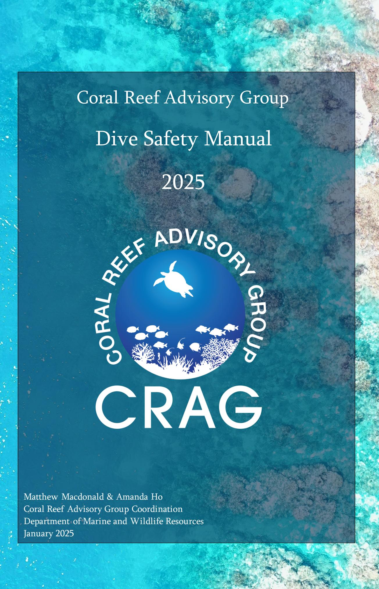
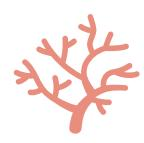
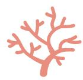
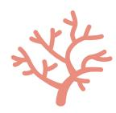
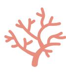

## Approved By

| Date                            |  |
|---------------------------------|--|
| Sana Lynch, CRAG Coordinator |  |
|                                 |  |

\_\_\_\_\_\_\_\_\_\_\_\_\_\_\_\_\_\_\_\_\_\_\_\_\_\_\_\_\_\_\_\_\_\_\_\_\_\_\_\_\_\_\_\_\_\_\_\_\_\_\_\_\_\_\_\_\_\_\_\_\_\_\_\_\_\_ Date \_\_\_\_\_\_\_\_\_\_\_\_

Matthew Macdonald, CRAG Dive Safety Officer

## Foreword

This document represents the minimum safety standards for diving under the auspices of the American Samoa Governor's Coral Reef Advisory Group (CRAG) as of the approval date of this manual. As best practices in the diving industry evolve, so shall this standard and it is the responsibility of every CRAG diver to ensure that it continues to reflect the latest information on safe diving. All authorized CRAG divers must familiarize themselves with the rules and regulations in this Dive Safety Manual before diving under the auspices of CRAG.

## Acknowledgements

The CRAG Scientific Diving Program thanks the American Academy of Underwater Sciences (AAUS), the National Oceanic and Atmospheric Administration (NOAA), The Government of Guam Department of Agriculture, the University of Hawai'i System, the University of Miami, and the National Park Service (NPS) for publishing documents that provided the framework and basis for this manual.

## Written and Compiled By:

Matthew Macdonald & Amanda Ho dso@crag.as Coral Reef Advisory Group Coordination Department of Marine and Wildlife Resources January 2025

## **Table of Contents**

| Chapter 1 - GENERAL POLICY                                    | <i>7</i> |
|---------------------------------------------------------------|----------|
| 1.1. Scientific Diving Standards                              | 7        |
| 1.1.1. Purpose                                                | 7        |
| 1.1.2. Definition of Scientific Diving                        | 7        |
| 1.1.3. Liability                                              | 8        |
| 1.2. Administrative Control                                   | 8        |
| 1.2.1. CRAG Auspices Defined                                  | 8        |
| 1.2.2. Dive Control Board                                     | 9        |
| 1.2.3. The Dive Safety Officer                                |          |
| 1.2.4. Dive Supervisor                                        |          |
| 1.2.5. Waiver of Requirements                                 |          |
| 1.2.6. Consequence of Violation of Regulations by CRAG Divers | 11       |
| 1.3. Record Maintenance                                       | 11       |
| Chapter 2 - Diving Regulations                                | 12       |
| 2.1. Introduction                                             | 12       |
| 2.2. Pre-Dive Procedures                                      | 12       |
| 2.2.1. Dive Plan                                              | 12       |
| 2.2.2. Diver Responsibility and Refusal to Dive               | 13       |
| 2.2.3. Pre-Dive Safety Checks                                 | 13       |
| 2.2.4. Pre-Dive Briefings                                     | 14       |
| 2.2.5. Environmental Conditions                               | 14       |
| 2.3. Diving Procedures                                        | 14       |
| 2.3.1. Buddy System                                           | 14       |
| 2.3.2. Decompression Management                               | 15       |
| 2.3.3. Boat Dives                                             | 15       |
| 2.3.4. Shore Dives                                            | 17       |
| 2.3.5. Alcohol Consumption                                    | 17       |
| 2.3.6. Termination of the dive                                | 17       |
| 2.3.7. Emergency Procedures                                   | 18       |
| 2.4. Post Dive Procedures                                     | 18       |
| 2.4.1. Post-Dive Safety Checks                                | 18       |
| 2.4.2. Emergency Procedures                                   | 18       |
| 2.4.3. Post Dive Prevention of Decompression Sickness         |          |
| 2.4.4. Personal Diving Log                                    | 19       |
| 2.4.5. Required Incident Reporting                            | 19       |
| 2.4.6. Equipment                                              | 20       |
| Chapter 3 - Diving Equipment                                  | 21       |

| 3.1. General Policy                                   | 21             |
|-------------------------------------------------------|----------------|
| 3.2. Equipment                                        | 21             |
| 3.2.2. Regulators                                     | 2 - |
| 3.2.3. Computers                                      | 2²             |
| 3.2.4. Scuba Cylinders and Gas Supply                 | 22             |
| 3.2.5. Buoyancy Control Devices (BCDs)                | 22             |
| 3.2.6. Dive Weight                                    | 22             |
| 3.2.7. Support Equipment                              | 22             |
| 3.3. Record Keeping                                   | 23             |
| Chapter 4 - Scientific Diver Authorizations           | 24             |
| 4.1. General Policy                                   | 24             |
| 4.2. Prerequisites                                    | 24             |
| 4.2.1. Administrative                                 | 24             |
| 4.2.2. Certification and Experience                   | 24             |
| 4.2.3. Medical Examination                            | 24             |
| 4.3. Skill Evaluation                                 | <b>2</b> 4     |
| 4.3.1. Swim Test                                      | 25             |
| 4.3.2. Confined Water                                 | 25             |
| 4.3.3. Open Water                                     | 25             |
| 4.3.4. Equipment                                      | 26             |
| 4.4. Diver Authorization                              | 26             |
| 4.4.1. Trainee Diver                                  | 26             |
| 4.4.2. Active Diver                                   | 27             |
| 4.4.3. Restricted Diver                               | 27             |
| 4.4.4. Inactive diver                                 | 28             |
| 4.4.5. Visiting Diver                                 | 28             |
| 4.5. Recertification Requirements                     | 29             |
| 4.5.1. Annual Requirements                            | 29             |
| Chapter 5 - Medical Standards                         | 30             |
| 5.1. Medical Requirements                             | 30             |
| 5.1.1. General                                        | 30             |
| 5.2. Medical Evaluations                              | 30             |
| 5.2.1. Frequency                                      | 30             |
| 5.2.2. Information Provided to an Examining Physician | 30             |
| 5.2.3. Content of Medical Evaluations                 | 30             |
| 5.5. Physician's Written Report                       | 31             |

| 5.6. Data Protection31                                                       |    |
|------------------------------------------------------------------------------|----|
| Appendix 1 – Emergency Information 32                                  |    |
| Appendix 2 - Diving Medical Exam33                                        |    |
| Appendix 3 - Skill Evaluation 43                                       |    |
| Appendix 4 – CRAG Diver Application 46                                 |    |
| Appendix 5 – Visiting Diver Application 47                             |    |
| Appendix 6 – Liability Release and Assumption of Risk for Visiting Divers | 49 |
| Appendix 7 – Dive Plan51                                                  |    |
| Appendix 8 – Dive Checklists52                                            |    |
| Appendix 9 - Hazards and Mitigations53                                    |    |
| Appendix 10 – Diving Incident Report55                                    |    |
| Appendix 11 – Emergency Management Procedures 56                       |    |
| Appendix 12 - Coral Disease Decontamination Protocol57                    |    |

# Chapter 1 - GENERAL POLICY

#### **1.1. Scientific Diving Standards**

## **1.1.1. Purpose**

The purpose of this manual is to ensure that all diving conducted by DMWR personnel is conducted in a manner that will maximize the protection of the divers from accidental injury or illness, and to set forth standards for training and certification that will allow reciprocity with other diving programs. Fulfilment of these purposes shall be consistent with the furtherance of research and safety.

This Manual sets minimum standards for DMWR diving operations, describes the organization for the conduct of DMWR diving, and the basic standards and procedures for safety in DMWR diving operations.

Although OSHA does not have jurisdiction over the American Samoa Govern[me](#page-6-4)nt 1 , their regulations will still serve as the minimum standard that DMWR dive operations will follow. This manual will thus contain information specific to OSHA commercial diving standards found in 29 CFR 1910 Subpart T and the scientific exemptions to those standards.

## **1.1.2. Definition of Scientific Diving**

The Occupational Safety and Health Administration (OSHA) (29CFR1910.402) defines scientific diving as "Diving performed solely as a necessary part of a scientific, research, or educational activity by employees whose sole purpose for diving is to perform scientific research tasks. Scientific diving does not include performing any tasks usually associated with commercial diving such as: Placing or removing heavy objects underwater; inspection of pipelines and similar objects; construction; demolition; cutting or welding; or the use of explosives."

The two elements that a diving program must contain as defined by OSHA in 29 CFR 1910 Subpart T 1910.401(a)(2)(iii) are:

1. Diving safety manual which includes at a minimum: Procedures covering all diving operations specific to the program; procedures for emergency care, including recompression and evacuation; and criteria for diver training and certification.

1 https://www.osha.gov/stateplans

2. Diving control board, with the majority of its members being active divers, which must at a minimum have the authority to: approve and monitor diving projects; review and revise the diving safety manual; assure compliance with the manual; certify the depths to which a diver has been trained; take disciplinary action for unsafe practices; and, assure adherence to the buddy system (a diver is accompanied by and is in continuous contact with another diver in the water) for SCUBA diving.

OSHA has granted an exemption for scientific diving from commercial diving regulations under the following guidelines (Appendix B to 29 CFR 1910 Subpart T):

- The diving control board consists of a majority of active scientific divers and has autonomous and absolute authority over the scientific diving program's operation.
- The purpose of the project using scientific diving is the advancement of science; therefore, information and data resulting from the project are non-proprietary.
- The tasks of a scientific diver are those of an observer and data gatherer. Construction and trouble-shooting tasks traditionally associated with commercial diving are not included within scientific diving.
- Scientific divers, based on the nature of their activities, must use scientific expertise in studying the underwater environment and therefore, are scientists or scientists-intraining.

CRAG diving is defined as scientific diving solely to perform training, research, or restoration. Only SCUBA diving is allowed under the auspices of CRAG diving, unless approved by the Diving Control Board (DCB). SCUBA diving is defined as diving independent of surface supply in which the diver uses open circuit self-contained underwater breathing apparatus.

#### **1.1.3. Liability**

Diving certification is not a prerequisite to employment by CRAG, but may be required if essential to a specific job with a position description including SCUBA diving. CRAG and CRAG employees who dive under this policy do so voluntarily, and assume all risks, consequences, and potential liabilities not otherwise assumed by ASG as imposed by law. All divers must possess dive insurance (e.g., DAN) prior to any dive activities.

#### **1.2. Administrative Control**

#### **1.2.1. CRAG Auspices Defined**

The auspices of CRAG include any diving operation in which CRAG is connected because of ownership of equipment used, or employer/employee relationship with the individual(s) concerned, or a diver diving under the CRAG visiting diver authorization. It is CRAG's responsibility to adhere to the OSHA standards for commercial diving. Administration of the

CRAG scientific diving safety program resides with the Dive Control Board (DCB). The regulations in this manual are to be observed at all times where diving is conducted under the auspices of CRAG.

#### **1.2.2. Dive Control Board**

The DCB shall consist of a majority of active scientific divers in addition to the CRAG Coordinator and the Department of Marine and Wildlife Resources (DMWR) Director or Deputy Director. Employees of other organizations not associated with CRAG or DMWR ar e eligible to be on the CRAG DCB in order to strengthen links with other dive programs in American Samoa. The CRAG DCB has autonomous and absolute authority over the scientific diving program's operation. Each member of the DCB has equal voting power over all matters pertaining to the CRAG dive program.

#### The DCB:

- Shall establish additional standards, protocols, and operational procedures in line with the American Academy of Underwater Sciences (AAUS) to address CRAG-specific needs and concerns.
- Review and revise the dive safety manual.
- Ensure compliance with this manual and AAUS standards.
- Take disciplinary action for unsafe practices or failure to comply with this dive manual. This will be at the discretion of the DCB.
- Recommend the issue, reissue, or the revocation of diving authorizations. This will be at the discretion of the DCB.
- Recommend changes in policy and amendments to CRAG's dive safety manual.
- Periodically review the performance of the DSO and program overall.
- Investigate diving incidents within CRAG's diving program or violations of this manual.

The CRAG DCB may delegate operational oversight of the program to the DSO; however, members of the DCB may not abdicate responsibility for the safe conduct of the diving program.

#### **1.2.3. The Dive Safety Officer**

The DSO must serve as the chair of the DCB and be an active diver.

Duties and responsibilities include:

- Shall be responsible for the conduct of the CRAG dive program and routine operational authority.
- Approve and monitor diving projects.
- Approve depths to which divers have been authorized.
- Ensure adherence to the buddy system for scientific diving.
- Act as the official representative of CRAG in matters concerning the scientific diving program.
- Recommend inspection, maintenance, and retirement of diving equipment.
- Report any dive incidents to DAN.
- May permit portions of this program to be carried out by a qualified delegate, but retains responsibility for the safe conduct of the diving program.
- Must suspend diving operations considered to be unsafe or unwise.
- The DSO must keep up to date with any advancements in diving safety protocols.
- The DSO must update the dive manual annually and agree to any changes with the DCB.

## **1.2.4. Dive Supervisor**

For each dive, one individual shall be designated as the dive supervisor. This person shall be at the dive location during the diving operation. The dive supervisor must have a certification of at least rescue diver. The diving supervisor shall be responsible for:

- Coordination with other known activities in the vicinity which are likely to interfere with diving operations.
- Ensuring all dive team members possess current authorizations and are qualified for the type of diving operation being undertaken.
- Planning dives in accordance with Section 2.2.1.
- Briefing the dive team on dive objectives; hazards or environmental conditions likely to affect the safety of the dive operation; modifications to diving or emergency procedures necessitated by the specific diving operation.
- Suspending the dive operation if conditions are unsafe.
- Ensuring that safety and emergency equipment is in working order and at the dive site.
- Reporting to the DSO any problems, near misses, or unsafe practices by any member of the dive team.

• Utilize the support of DAN's emergency helpline for any suspected illness or injury resulting from diving.

## **1.2.5. Waiver of Requirements**

The DCB may grant a waiver for specific requirements of training, depth limits, and minimum activity to maintain authorization, if these requirements have already been met for authorization to dive for another government or academic organization. Proof must be provided in the form of a written letter signed by the director or DSO of the organization for which the diver was authorized. These requirements cannot be waived for any other reason. Medical requirements cannot be waived.

## **1.2.6. Consequence of Violation of Regulations by CRAG Divers**

Failure to comply with the regulations of this dive safety manual may be cause for the revocation or restriction of the diver's CRAG authorization by action of the DCB.

#### **1.3. Record Maintenance**

CRAG must maintain consistent records for its diving program and for each participant. These records include but are not limited to: dive safety manual; equipment inspection, testing, and maintenance; dive plans; records of dive; dive medical forms; diver training records; diver authorizations; individual dive log; dive incident reports; reports of disciplinary actions by the DCB.

Any CRAG diver or visiting diver can request to have their records deleted at any time after they have finished diving under the auspices of CRAG. Note that any record pertaining to an incident may need to be kept for a longer period of time.

# Chapter 2 - Diving Regulations

#### **2.1. Introduction**

No person shall engage in diving operations under the auspices of the CRAG unless they hold a current authorization issued pursuant to the provisions of this manual. Divers can only conduct types of diving which they are trained to do by a recognized training agency and what they are authorized to do under the auspices of CRAG. All authorized CRAG divers must familiarize themselves with the rules and regulations in this Dive Safety Manual prior to diving under the auspices of CRAG.

## **2.2. Pre-Dive Procedures**

## **2.2.1. Dive Plan**

Before conducting any dive under the auspices of CRAG, the dive supervisor for a proposed dive must formulate a dive plan (Appendix 7) and emergency management plan (Appendix 11) to be submitted to the DSO for review. Approval of a dive plan signifies that the dive may be conducted under CRAG auspices. Divers conducting dives without approval of a CRAG dive plan or exceeding the parameters of an approved dive plan do so at their own risk and cannot hold CRAG, American Samoan Government (ASG), the DCB, or the DSO responsible in any way. Dives shall be planned around the competency of the least experienced or trained diver. A dive plan can contain multiple proposed dives if they occur on the same day.

The dive plan should include the following:

- Name of each participating diver.
- Number of proposed dives and duration of surface intervals.
- Gasses to be employed.
- Divers' authorizations.
- Location of proposed dives.
- Depth and bottom time anticipated.
- Anticipated pressure group derived from SSI dive tab[les](#page-11-4)2 .

12

2 SSI dive tables are more conservative than PADI or US Navy. This is a precaution taken due to the minimal emergency services available in American Samoa.

- Proposed equipment and boats to be employed.
- Any hazards and mitigation measures anticipated (Appendix 9).
- A backup plan including a description of any possible changes to the items listed above.

#### **2.2.2. Diver Responsibility and Refusal to Dive**

The decision to dive is that of the diver. The ultimate responsibility for safety rests with the individual diver. It is the diver's responsibility and duty to refuse to dive, without fear of penalty, if in their judgement, conditions are unsafety or unfavorable, or if they perceive any violations of this dive manual.

If a diver knows of a condition relating to themselves, another diver, the equipment, or the environment, which may adversely affect the health and safety of that diver or other team members, then it is that diver's responsibility to alert the dive supervisor prior to the dive commencing. Unless explicitly stated in the briefing, it should be assumed that the dive supervisor is not aware of any adverse condition.

The following rule will apply to all CRAG dives: any diver can cancel or end any dive, at any time, for any reason, without repercussions or explanation.

## **2.2.3. Pre-Dive Safety Checks**

- Prior to commencing the dive, the team must assure that every team member is healthy, trained, and authorized for the type of dive that is being attempted.
- A verbal psychological check to assure all divers feel comfortable with the dive plan and conditions.
- All divers must conduct a functional check of their diving equipment in the presence of their dive buddy using the BWRAF acronym: buoyancy, weights, releases, air, final okay. They must ensure that the equipment is functioning properly and suitable for the type of diving operation being conducted. Note that DAN does not recommend the quarter back turn when opening tan[ks](#page-12-2)3 .
- Each diver must have the capability of achieving and maintaining positive buoyancy at the surface.
- Environmental conditions at the site must be evaluated prior to entering the water.

3 https://dan.org/alert-diver/article/old-habits-die-hard/

- All divers should ensure that they are hydrated before and after each dive by drinking plenty of water or other non-caffeinated drinks. Dehydration can make a person more susceptible to decompression sickness (DC[S\)](#page-13-4)4 .
- Each person should ensure that there is no adverse condition relating to themselves, another diver, the equipment, or the environment, which is likely to adversely affect the health and safety of the diver or other dive members.

## **2.2.4. Pre-Dive Briefings**

Before conducting any dive operations under the auspices of CRAG, the dive team members must be briefed on:

- Goals and objectives for the dive.
- Buddy assignments and tasks.
- Maximum depth and bottom time.
- Environmental and operational hazards and mitigations.
- Entry, exit, descent, and ascent procedures.
- Turn around pressure and required surfacing pressure.
- Emergency and diver recall procedures.
- Relevant hazards and mitigations (Appendix 9).

#### **2.2.5. Environmental Conditions**

Before diving, environmental conditions must be assessed. It is the responsibility of the dive supervisor to do an environmental assessment before the day of the dive. The dive supervisor will monitor the weather and diving conditions and will notify divers and the DSO of changes to the dive plan. The decision to dive or cancel the dive will sometimes have to be made the day of the dive. The dive must be cancelled when small craft caution or greater is issued by NOAA. If the dive supervisor is in doubt, they must consult with the team, the DSO, or experienced personnel of other organizations.

#### **2.3. Diving Procedures**

**2.3.1. Buddy System**

14

4 https://www.dansa.org/blog/2019/07/15/nine-factors-that-play-a-major-role-in-a-scuba-diver-s-dehydration

- All diving activities shall adhere to accepted standards of the buddy system for scuba diving, which requires a minimum of two comparably equipped divers to remain in constant visual contact with one another.
- The buddy system is based upon mutual assistance, especially in the case of an emergency; therefore scuba divers shall remain close enough to each other during dives to render immediate assistance in an emergency. Too great a distance may result in a panicked diver initiating a rapid, uncontrolled ascent instead of getting assistance from their buddy.
- When conditions are such that the probability of separation of divers is high, such as low visibility or strong currents, the divers should consider terminating the dive.
- If separated during a dive, divers shall try to re-establish contact for no more than one minute, and if unsuccessful, immediately begin a slow, controlled ascent. For dives beyond 60 ft / 18 m, proceed to do a safety stop; for dives shallower than 60 ft / 18 m, omit the safety stop. In both cases, deploy the delayed surface marker buoy (DSMB) at a depth of 15 ft / 5m before surfacing. Upon surfacing and reuniting with their buddy, the buddy pair can choose to resume the dive, provided there is sufficient remaining gas and allowable bottom time. All efforts should be made to avoid losing contact during the dive.
- Solo diving is strictly prohibited under the auspices of CRAG aside from the emergency procedures described in Section 2.3.3. and Section 2.3.7.

## **2.3.2. Decompression Management**

- Both divers in a buddy pair must follow the most conservative dive profile between them.
- A safety stop of 3 minutes at 15 ft / 5 m must be conducted for any dive deeper than 30 ft / 9 m. When following the missing buddy procedure, omit the safety stop for dives shallower than 60 ft / 18 m.
- Dives to depths greater than 100 ft / 30 m are prohibited under the auspices of CRAG.
- Every CRAG diver must dive with a computer and closely observe bottom time, ascent rates, and decompression stops.
- The maximum ascent rate for diving under the auspices of CRAG is 30 ft / 9 m per minute, however, a slower ascent is recommended, particularly in the last 15 ft / 5 m of water. CRAG divers should aim to ascend at a rate of 10-15 ft / 3-5 m per minute.

#### **2.3.3. Boat Dives**

The following requirements apply to boat dives:

- When diving from a boat, the boat and crew must be approved by the DSO.
- Divers must undergo a boat briefing to become oriented to emergency exits and the locales of various emergency and safety equipment.

- SCUBA cylinders must be secured onboard with efforts to reduce prolonged exposure to heat or sunlight.
- A float plan must be left with a designated DMWR employee on shore.
- There must be a stand-by diver on board when divers are in the water. This person may conduct a solo dive in an emergency situation only to perform a rescue from depth if the distressed diver's location is known. This person is not permitted to perform a solo dive to search for missing divers.
- If diving on a transect or staying within a close radius, an SMB must be secured to the seabed at beginning of the dive to allow the boat operator to easily identify the dive location for the duration of the dive.
- The boat engines must either be in neutral or switched off when divers are entering and exiting the water. If the engines are kept in neutral, the designated boat operator must keep their attention on the throttle to ensure that it is locked in neutral while divers are entering and exiting the water. Divers should enter and exit the water as far away from the propellers as practicable.
- There must be equipment necessary to allow for an easy exit from the water.
- There must be a method for recovering an unconscious or injured diver from the water.
- A Diver Down flag or an Alpha flag of at least 20 x 24 inches must be displayed from the vessel's highest point any time a diver is in the water.
- The boat must have a surface recall method and procedure for divers.
- There must be an appropriate first aid kit and emergency oxygen kit onboard. The O2 cylinder(s) must have the ability to provide constant flow of O2 (15-25 LPM) that will allow for the delivery of 100% oxygen until the diver reaches secondary care. Oxygen cylinders must be kept out of direct sunlight and stored away from engines.
- The necessary safety equipment must be easily accessible on the dive boat including an EPIRB, additional water, a GPS, anchor and line, flares, tools for emergency repairs, an appropriate first aid kit, a VHF radio, and a fire extinguisher.
- Divers must dive with a whistle, Nautilus Lifeline or equivalent, a cutting implement, and a DSMB.
- If diving in an area with high vessel activity, divers must have a surface marker buoy (SMB) displayed for the duration of the dive in addition to the flag displayed on the boat. If diving on a transect, or staying within a close radius, the SMB may be secured to the seabed for the duration of the dive. If the SMB is towed, the spool must be held in the diver's hand and never clipped or tied to the diver.

- The dive should begin by swimming into any current, even if that means changing the dive plan. In the event of a strong current, the dive supervisor should consider cancelling the dive.
- Every effort should be made to avoid doing fieldwork if lightning is forecast. If lightning can be seen or heard by the surface support team, the dive must be aborted and recall procedures implemented. The boat must return to a safe location until no lightning is seen or heard for 30 minutes.
- No night diving is permitted under the auspices of DMWR from a vessel.

## **2.3.4. Shore Dives**

The following requirements apply to shore dives:

- A float plan must be left with a designated DMWR employee on shore.
- Shore dives must have an easy entry and exit point.
- If diving in an area with vessel activity, divers must have an SMB displayed for the duration of the dive. If diving on a transect, or staying within a close radius, the SMB may be secured to the seabed for the duration of the dive. If the SMB is towed, the spool must be held in the diver's hand and never clipped or tied to the diver.
- There must be an appropriate first aid kit and emergency oxygen kit available. The O2 cylinder(s) must have the ability to provide constant flow of O2 (15-25 LPM) that will allow for the delivery of 100% oxygen until the diver reaches secondary care. Oxygen cylinders must be kept out of direct sunlight.
- Divers must dive with a whistle, Nautilus Lifeline or equivalent, a cutting implement, and a DSMB.
- The dive should begin by swimming into any current, even if that means changing the dive plan. In the event of a strong current, the dive supervisor should consider cancelling the dive.
- No night diving is permitted under the auspices of DMWR unless permission is granted by the DCB.

#### **2.3.5. Alcohol Consumption**

No dives shall be conducted for 18 hours after consumption of alcohol. CRAG recommends not consuming any alcohol within 12 hours of surfacing. Any diver experiencing symptoms from alcohol consumption from previous days will be excluded from a dive.

#### **2.3.6. Termination of the dive**

The dive must be terminated while there is sufficient air pressure in the cylinder to permit the diver to safely reach the surface, including the required safety stop. The diver must surface

with a minimum of 35 bar / 500 psi of cylinder pressure. Any cylinder which drops below 35 bar / 500 psi must be marked with tape and reported to the DSO.

A DSMB must be deployed at 15 ft / 5 m before any group of divers surface.

## **2.3.7. Emergency Procedures**

Any diver may deviate from the requirements of this manual to the extent necessary to prevent or minimize a situation likely to cause death, serious physical harm, or major environmental damage. A written report must be submitted to the CRAG DCB explaining the circumstances and justifications.

### **2.4. Post Dive Procedures**

## **2.4.1. Post-Dive Safety Checks**

After the completion of a dive, each diver must report any physical problems, symptoms of DCS, or equipment malfunctions to the dive supervisor, which shall then be reported to the DSO and the DCB.

If a diver violates no-decompression limits, the diver shall remain awake and in the company of a dive team member.

#### **2.4.2. Emergency Procedures**

In all cases involving a known or suspected diving accident, medical personnel should be contacted immediately. Phone numbers of medical personnel can be found in Appendix 1.

- If a person is showing symptoms of DCI, the first responder must administer emergency oxygen and transport the diver to the nearest secondary treatment facility. The first responder must call emergency services for advice and may preemptively call LBJ and other relevant contacts to confirm if the hyperbaric chamber is operational. At times, visiting dive vessels with onboard chambers are in port and shall be considered as an option.
- If a person is found or becomes unconscious after a dive, first aid and CPR shall be administered along with 100% oxygen. Emergency services must be called, and arrangements should be made for evacuation of the diver to a secondary treatment facility.
- In the event of any accident or emergency, the DSO should be notified as quickly as possible. Any dive equipment must not be broken down. The dive supervisor and the people involved must fill out incident reports.

#### **2.4.3. Post Dive Prevention of Decompression Sickness**

Several activities are prohibited after diving to avoid an increased risk of DCS:

- No exercise is permitted for at least six hours after diving, particularly any exercise which puts heavy strain on muscles and joi[nts](#page-18-3)5 . This also includes yoga, deep tissue massages, and strenuous hiki[ng](#page-18-4)6 . These activities increase the risk of DCS and can also mask the initial symptoms (e.g., pain, muscular weakness, fatigue etc.), thus preventing prompt oxygen administration and medical treatment.
- No flying is permitted for at least 18 hours after div[ing](#page-18-5)7 .
- No freediving is permitted for at least 18 hours after diving.
- Before ascending to an altitude of at least 1000 ft / 305 m, divers should follow the NOAA Required Surface Interval Before Ascent to Altitude After Diving guidelin[es](#page-18-6)8 . This would be required if traveling to A'asu and some local hikes such as Mt. Alava, Matafao, or Tumu. Note that this would not be required for the drive from Pago Pago to Vatia or Fagasa.

## **2.4.4. Personal Diving Log**

Each diver shall log every dive made under the auspices of CRAG, and is encouraged to log any other dives not under the auspices of CRAG. Dives are to be logged in the spreadsheets provided in the CRAG shared drive within one week of the date of the dive.

Dive logs will include the following information:

- Name of diver and buddy.
- Date, time, and location of the dive.
- Purpose of the dive.
- Maximum depth and dive time.
- Detailed report of any near or actual incidents.

Dive logs will be kept for a maximum of two years after an employee has left CRAG.

#### **2.4.5. Required Incident Reporting**

All diving incidents requiring recompression treatment or resulting in injury or death, must be reported to DAN immediately and to the CRAG DCB once the diver is stable. CRAG must

19

5 https://www.dansa.org/blog/2017/08/25/physical-exercise-before-during-after-a-dive

6 https://blog.padi.com/7-things-you-should-never-do-immediately-after-diving/

7 https://dan.org/health-medicine/health-resources/diseases-conditions/flying-after-diving/

8 NOAA Dive Safety Manual 2023 Appendix 6. https://www.omao.noaa.gov/diving-program/resources-divers

record and report any occupational injuries and illnesses in accordance with requirements of the ASG Administrative Code. Any near misses must also be reported to the CRAG DCB.

If an incident which results in injury or a near miss occurs, the following additional information must be recorded and retained by CRAG, with the record of the dive, for a period of 5 years. Written descriptive report shall include:

- Name, address, and contact information of the people involved.
- Summary of experiences of divers involved.
- Location, description of dive site, and description of conditions that led up to the incident.
- The circumstances of the incident and the extent of any injuries or illnesses.
- Description of symptoms, including depth and time of onset.
- Description and results of treatment.
- Disposition of case.
- Recommendations to avoid repetition of the incident.

## **2.4.6. Equipment**

After all dive activity has finished for the day, the team must ensure that all equipment used is thoroughly cleaned before commencing other work or returning home.

If coral disease was prevalent at a dive site, then proper gear decontamination procedures must be followed (Appendix 12).

# Chapter 3 - Diving Equipment

#### **3.1. General Policy**

All equipment must meet standards as determined by the DSO and the DCB. All equipment must be regularly examined by the person using it. Technical equipment such as gauges, computers, regulators, and buoyancy control devices (BCDs) must be regularly tested and serviced at intervals not exceeding 12 months. All tests and services of dive gear must be logged and copies of receipts or paperwork shall be given to the DSO for filing. Equipment that is subjected to extreme usage under adverse conditions may require more frequent testing and maintenance.

Each diver will be assigned diving equipment for the duration of their employment with CRAG. A record of diving equipment assignments will be kept by the DSO. Changes to diving equipment assignments can be made at any time. Each CRAG diver is responsible for keeping their assigned equipment clean and for reporting any damage to the DSO.

CRAG divers who wish to use their own equipment at work must get that equipment checked by the DSO and show adequate service records. That diver must keep their equipment clean and report any damage to the DSO.

#### **3.2. Equipment**

#### **3.2.2. Regulators**

- Scuba regulators and gauges must be inspected and functionally tested prior to each use and serviced at intervals no greater than 12 months by a qualified technician.
- All regulator sets will be complete with a first stage, primary second stage, alternative second stage, submersible pressure gauge (SPG), and an inflator hose for the buoyancy control device (BCD).
- Divers are not permitted to use an upstream valve style second stage regulator.

### **3.2.3. Computers**

- Each must use a dive computer to track depth and time of dives. Divers are encouraged to use their own computer for familiarity. If a diver does not own their own computer, one will be provided for them. Each diver must show the DSO they know how to switch between air, gauge, and nitrox modes of their computer.
- Dive computers may not be used by multiple people within a 24 hour period.

• Dive computers cannot replace the use of SSI dive tables for planning.

## **3.2.4. Scuba Cylinders and Gas Supply**

- Scuba cylinders must be hydrostatically tested at intervals not exceeding 5 years.
- Scuba cylinders must have an internal and external inspection at intervals not exceeding 12 months.
- Scuba cylinder valves must be functionally tested at intervals not exceeding 12 months.
- Scuba cylinders pressures must avoid dropping below 35 bar / 500 psi during diving operations. Any cylinder which drops below 35 bar / 500 psi must be marked with tape and reported to the DSO.
- The use of double cylinders, side mount, or rebreathers are not permitted unless given approval by the DCB.
- Cylinders must be filled using a compressor which has been regularly maintained and undergo air testing every 6 months and must meet Compressed Gas Association (CGE) Grade E or high[er](#page-21-4)9 .
- If rental cylinders are used, proof of all maintenance and testing described above must be provided by the rental company. This can be in the form of a signed letter from the rental company.

## **3.2.5. Buoyancy Control Devices (BCDs)**

- Each diver must have the capability of achieving and maintaining neutral buoyancy underwater and positive buoyancy at the surface.
- BCDs must be equipped with an exhaust valve.
- These devices must be functionally tested before each dive and undergo periodic servicing at intervals no greater than 12 months by a qualified technician.
- Drysuits are permitted if a diver is the owner of that drysuit. They must show a service record within the last 12 months. The drysuit must be equipped with an inflator hose and exhaust valves.

#### **3.2.6. Dive Weight**

New divers must do a buoyancy test during their checkout dive. Consider adjusting weights if the use of heavy tools will be carried by the diver during surveys or underwater work.

#### **3.2.7. Support Equipment**

9 https://www.airsystems.com/Reference/CGA%20Air%20Grade%20Specifications.pdf

22

Any divers using specialist equipment including lift bags, Diver Propulsion Vehicles (DPVs), double cylinders, sidemount equipment, semi-closed circuit or closed circuit rebreathers etc., must be trained to do so and permission must be obtained from the DSO.

#### **3.3. Record Keeping**

The DSO is responsible for keeping a record of each equipment modification, repair, test, calibration, or maintenance service. Maintenance records for any equipment must be kept until that equipment is retired.

The dive supervisor must record any use of the first aid or emergency oxygen equipment and that record must be sent to the DSO.

# Chapter 4 - Scientific Diver Authorizations

#### **4.1. General Policy**

This section describes the training and performance standards for CRAG scientific divers and represents the minimum required level of knowledge and skills. No person employed by CRAG shall engage in scientific diving unless authorized by the CRAG DSO to do so. Any candidate who does not convince the DSO that they possess the necessary judgement, under diving conditions, for the safety of the diver and their buddy, may be denied CRAG diving privileges.

## **4.2. Prerequisites**

## **4.2.1. Administrative**

The CRAG dive candidate must complete all administrative documentation required by this dive manual.

## **4.2.2. Certification and Experience**

The CRAG dive candidate must, at a minimum, show documented proof of diver certification from an internationally recognized training agency. While there are some instructors onisland, they are often unavailable to teach. The closest dive center is Dive Savai'i, Samoa.

The CRAG dive program requires that candidates successfully complete prerequisites, theoretical aspects, practical training, and examinations for a minimum cumulative time of 100 hours and 12 open water dives. When a diver's resume provides clear evidence of significant scientific diving experience, the diver can be given credit for meeting portions of the 100 hour training requirements.

#### **4.2.3. Medical Examination**

The CRAG dive candidate must be medically qualified for diving as described in Chapter 5 of this manual. AAUS medical standards must be complied with. The medical examination must be completed before any of the SCUBA skill evaluations.

#### **4.3. Skill Evaluation**

All skill evaluations will be completed annually by all CRAG divers. If an active CRAG diver, who has previously passed all skill examinations, fails to show proficiency in any of the skills listed below, they must be reported to the DSO for further training and examination.

## **4.3.1. Swim Test**

The CRAG dive candidate must satisfy the DSO or approved evaluator of their ability to perform at least the following in a pool or confined water:

- Swim underwater for a distance of 75 ft / 23 m without surfacing.
- Swim 1200 ft / 366 m in less than 12 minutes without swim aids.
- Tread water for 10 minutes, or 2 minutes with arms raised above water.

## **4.3.2. Confined Water**

The CRAG dive candidate must satisfy the DSO or approved evaluator of their ability to perform at least the following in confined water:

- Enter the water fully equipped for diving.
- Transport a passive person of equal size or greater a distance of 75 feet / 23 meters in water fully equipped in scuba gear.
- Remove, replace, and clear face mask while submerged and breathing from a regulator.
- Demonstrate the ability to remove and replace SCUBA equipment while submerged.
- Demonstrate understanding of underwater signs and signals.
- Demonstrate air sharing using an alternate air source, as both donor and recipient, stationary and swimming, with and without a face mask.
- Demonstrate stationary buddy breathing as both donor and recipient.
- Demonstrate water skills and ability acceptable to the evaluator for the anticipated scientific diving conditions.

#### **4.3.3. Open Water**

The CRAG dive candidate must satisfy the DSO or approved evaluator of their ability to perform at least the following in open water:

- Surface dive to a depth of 10 ft / 3 m without SCUBA equipment.
- Kick on the surface for 1200 ft / 366 m while wearing scuba gear, but not breathing from the scuba unit.
- Demonstrate proficiency in air sharing ascent as both donor and receiver.
- Demonstrate the ability to maneuver efficiently in the environment, at and below the surface.
- Demonstrate body awareness around other divers and benthic habitats.

- Complete a simulated emergency swimming ascent by swimming horizontally without a regulator while exhaling for 30 ft / 9 m.
- Demonstrate the ability to achieve and maintain neutral buoyancy and proper trim while submerged.
- Demonstrate techniques of self-rescue, buddy assist for a tired diver, and recover and transport an unconscious diver.
- Navigate underwater.
- Plan and execute a dive.
- Demonstrate judgement adequate for safe underwater diving.
- Demonstrate the ability to deploy a DSMB at depth.
- Demonstrate the ability to manage a SMB while diving.

## **4.3.4. Equipment**

- Independently set up and dismantle dive equipment.
- Show proficiency in cleaning and storage.
- Change between dive modes of their dive computer.
- Display a knowledge of essential safety equipment including emergency oxygen, EPIRB, VHF Radio, and Nautilus Lifeline.

#### **4.4. Diver Authorization**

## **4.4.1. Trainee Diver**

This status is granted when a diver doesn't meet the 100-hour education requirement or doesn't pass the skill evaluation but wishes to continue training as a scientific diver under supervision. An active diver may become a trainee diver if they fail to show proficiency in any skill listed in Section 4.3 while on CRAG dives. The purpose of this authorization is to allow less experienced divers to assist with scientific dives as part of their on-the-job training.

- Trainee divers must be certified as at least open water or equivalent through an internationally recognized training agency.
- Trainee divers must be in a buddy pair with a CRAG active diver or a competent visiting diver approved by the DSO.
- Trainee divers must meet the 100-hour education requirement and pass all the skill evaluations before they can graduate to active authorization.

- The trainee diver shall submit records of hours and learning content to the DSO.
- Trainee divers may dive to a maximum depth of 60 ft / 18 m.
- Trainee divers may not use CRAG equipment for training dives outside of working hours unless supervised by a CRAG active diver. Trainee divers may 'check out' CRAG gear for training dives so long as they are logged, properly maintained, and returned the next working day. Dive plans must be submitted to the DSO for any training dives planned outside of working hou[rs](#page-26-2)10 .

## **4.4.2. Active Diver**

This status is granted when a diver meets all the requirements required by the CRAG dive program.

- Any active diver may act as a dive supervisor.
- An active diver must be an employee of CRAG of DMWR.
- An active diver must have valid CPR, first aid, and emergency oxygen provider certifications from a recognized training agency. Active divers are encouraged to renew CPR, first aid, and emergency oxygen provider certifications, at least every 12 months. If an active diver's CPR, first aid, or emergency oxygen provider certification expires after 24 months, they will be classified as a restricted diver until they recertify.
- An active diver may dive to a maximum depth of 100 ft / 30 m.
- Active divers may 'check out' CRAG gear for training dives so long as they are logged, properly maintained, and returned the next working day. Dive plans must be submitted to the DSO for any training dives planned outside of working hours.

#### **4.4.3. Restricted Diver**

Active divers may be classified as a restricted diver by the DSO or DCB if they:

- Do not demonstrate safe underwater practices.
- Fail to abide by this dive manual.
- Fail to meet administrative requirements (e.g., logging dives, completing dive plans, etc.).
- Fail to properly maintain their equipment.

Divers in restricted status may continue to dive under the same restrictions as trainee divers with the permission of the DSO. Divers in restricted status will have their active status reinstated upon completion of any relevant administrative requirements, or by completing

27

10 The CRAG Coordinator and DSO appreciates the benefits that come from getting more experience underwater and encourages the team to continually refresh their skills whenever possible.

the relevant skill examination conducted by the DSO or approved evaluator. Restricted divers may not use CRAG equipment for training dives outside of working hours.

### **4.4.4. Inactive diver**

- This signifies that a diver is no longer an active member of the CRAG dive program. Divers placed on inactive status may not dive under the auspices of CRAG nor with CRAG gear.
- Divers may be placed on inactive status at any time for cause as determined by the DSO or DCB, who may impose requirements or mitigations on the diver to resume active status.
- In the case of lapsed medical examinations, divers will be classified as inactive until the time where those medical examinations are completed.
- In the case where a diver is placed on inactive status due to a health condition, accident, or injury, a new medical clearance may be required for the diver to be placed back on active diver status.

#### **4.4.5. Visiting Diver**

This authorization may be used to allow non-CRAG divers to participate in scientific diving activities under CRAG auspices.

- Visiting divers must have the qualification of open water or higher from an internationally recognized training agency.
- Visiting divers must meet the medical requirements as described in Chapter 5 of this manual prior to diving.
- Unless already authorized as an active diver or equivalent by a university, government agency, or an AAUS organizational member, visiting divers must undergo the skill evaluation described in Section 4.3. This may be waived for visiting scientists who prove extensive experience in scientific diving.
- Visiting divers who wish to use their own equipment must get that equipment checked by the DSO and must meet equipment requirements described in Chapter 3 including any required servicing. That diver must keep their equipment clean and report any damage to the DSO.
- This certification is temporary and does not grant a diver permanent status in the CRAG diving program.
- Visiting divers must not act as dive supervisors, but they may lead data collection methods or survey techniques.
- Visiting divers must provide proof of liability coverage, either from their home institution or private diving insurance (e.g., DAN).

• Visiting divers must complete the Visiting Diver Application form (Appendix 5) and the Liability Release & Assumption of Risk for Visiting Divers (Appendix 6).

#### **4.5. Recertification Requirements**

#### **4.5.1. Annual Requirements**

- Active divers must make a minimum of 6 dives per year to retain authorization.
- Active divers must have active CPR, first aid and emergency oxygen provider certificates.
- Have a current medical clearance for diving by a physician.
- Active divers must re-take the skills evaluation described in Section 4.3 at intervals not exceeding 12 months.
- The DSO will record all diver recertifications.

# Chapter 5 - Medical Standards

#### **5.1. Medical Requirements**

## **5.1.1. General**

- All medical evaluations required by this manual must be performed by, or under the direction of a licensed physician of the applicant-diver's choice, preferably one trained in diving medicine.
- The diver should be free of any chronic disabling disease and any conditions contained in the list of conditions for which restrictions from diving are generally recommended (Appendix 2).
- CRAG must verify that divers have been declared fit to engage in diving activities by the examining medical authority.

#### **5.2. Medical Evaluations**

## **5.2.1. Frequency**

Medical evaluation must be completed:

- At 5 year intervals if under the age of 40.
- At 3 year intervals if over the age of 40 and under the age of 60.
- At 2 year intervals if over the age of 60.

Clearance to return to diving must be obtained from a healthcare provider following a medically cleared diver experiencing any Conditions Which May Disqualify Candidates From Diving (Appendix 2), or following any major injury or illness, or any condition requiring chronic medication.

#### **5.2.2. Information Provided to an Examining Physician**

The diver being evaluated must provide a copy of the medical evaluation requirements of this manual to the examining physician (Appendices X).

#### **5.2.3. Content of Medical Evaluations**

Medical examinations conducted initially and at the intervals specified in Section 5.2.1 must consist of the following:

• Diving physical examination (Appendix 2). Modifications or omissions of required tests are not permitted

- Applicant agreement for release of medical information to the Diving Safety Officer and the DCB.
- Medical history.

## **5.5. Physician's Written Report**

- A Medical Evaluation of Fitness For Scuba Diving Report signed by the examining physician stating the individual's fitness to dive, including any recommended restrictions or limitations will be submitted to the DSO for the diver's record after the examination is completed.
- The DSO may consult with members of the DCB regarding a dive medical examination if necessary.
- A copy of any physician's written reports will be made available to the individual.
- It is the diver's responsibility to provide to the DSO a written statement from the examining medical authority listing any restrictions, limitations, or clearances to dive resulting from medical examinations obtained by the individual outside of their normal diving medical examination cycle.

#### **5.6. Data Protection**

- All records will be kept in a password protected folder with access only available to the DSO. These records will be made available to the DCB upon request.
- Medical records belonging to CRAG employees will be kept for a maximum of two years after that employee has left. Medical records of visiting divers will be kept for two months after that person has stopped diving under the auspices of CRAG.

#### **Appendix 1 – Emergency Information**

## MEDICAL EMERGENCY: 911

## DIVERS ALERT NETWORK:

EMERGENCY HOTLINE: 919-684-8111 GENERAL PHONE: 919-684-2948

#### **Emergency Assistance for American Samoa**

| US Coast Guard Pago Pago Station | 684-633-2299 |
|----------------------------------|--------------|
| VHF                              | Channel 16   |
| DMWR Enforcement                 | 684-633-4456 |
| American Samoa Marine Patrol     | 684-633-1697 |
| National Park Services HQ        | 684-633-7082 |
| Marine Phone                     | 684-733-4151 |

## **Medical Facilities and Emergency Assistance for Tutuila**

| LBJ Tropical Medical Center               | 684-633-1222                |
|-------------------------------------------|-----------------------------|
| Chief of EMS, Fuapopo Avegalio      | 684-633-5003                |
| *Hyperbaric Treatment Facilities          |                             |
| LBJ Hyperbaric Specialist Dr. Kumar | 684-633-1222 ext. 306       |
| Industrial Gases, Andy                 | 684-699-9234 / 684-733-3890 |
| Hawai'i                                   | 808-587-3425                |
| Fiji                                      | 011-679-999-3511            |

*\*Call DAN to coordinate the hyperbaric chamber.* 

#### **Medical Facilities and Emergency Assistance for Manu'a**

| Ofu Ranger Station | 684-655-1309 |
|--------------------|--------------|
| Ofu Clinic         | 684-655-1176 |
| Ta'u Clinic        | 684-677-3513 |
| Manu'a EMS         | 684-677-3513 |

*Emergencies: call COLLECT and state: "I am reporting a diving accident"*

*\*Visiting vessels with onboard chambers may be in port and should be strongly considered if available.*

#### **Appendix 2 - Diving Medical Exam**

| To the examining physician: |                                                                                                       |
|-----------------------------|-------------------------------------------------------------------------------------------------------|
|                             | This person,, requires a medical examination to assess their fitness for                              |
|                             | certification as a Scientific Diver for the Coral Reef Advisory Group. Their answers on the Diving    |
|                             | Medical History Form (Appendix 2) may indicate potential health or safety risks as noted. Your        |
|                             | evaluation is requested on the attached SCUBA Diving Fitness Medical Evaluation Report (Appendix      |
|                             | 2). If you have questions about diving medicine, you may wish to consult one of the references on the |
| attached list or contact    | one of the physicians with expertise in diving medicine whose names and                               |
|                             | phone numbers appear on an attached list, the Undersea Hyperbaric and Medical Society, or the         |
|                             | Divers Alert Network. Please contact the undersigned Diving Safety Officer if you have any questions  |
|                             | or concerns about diving medicine or CRAG standards Thank you for your assistance.                    |
|                             |                                                                                                       |
|                             | Diving Safety Officer                                                                                 |
| Printed Name                |                                                                                                       |
| Date                        |                                                                                                       |
| Phone Number                |                                                                                                       |
|                             |                                                                                                       |

SCUBA and other modes of compressed-gas diving can be strenuous and hazardous. A special risk is present if the middle ear, sinuses, or lung segments do not readily equalize air pressure changes. The most common cause of distress is eustachian insufficiency. Recent deaths in the scientific diving community have been attributed to cardiovascular disease. Please consult the following list of conditions that usually restrict candidates from diving. (Adapted from Bove, 1998).

Conditions which may disqualify candidates from diving:

- Abnormalities of the tympanic membrane, such as perforation, presence of a monomeric membrane, or inability to auto-inflate the middle ears.
- Vertigo, including Meniere's Disease.
- Stapedectomy or middle ear reconstructive surgery.
- Recent ocular surgery.
- Psychiatric disorders including claustrophobia, suicidal ideation, psychosis, anxiety states, untreated depression.
- Substance abuse, including alcohol.

- Episodic loss of consciousness.
- History of seizure.
- History of stroke or a fixed neurological deficit.
- Recurring neurologic disorders, including transient ischemic attacks.
- History of intracranial aneurysm, other vascular malformation or intracranial hemorrhage.
- History of neurological decompression illness with residual deficit.
- Head injury with sequelae.
- Hematologic disorders including coagulopathies.
- Evidence of coronary artery disease or high risk for coronary artery disease.
- Atrial septal defects.
- Significant valvular heart disease isolated mitral valve prolapse is not disqualifying.
- Significant cardiac rhythm or conduction abnormalities.
- Implanted cardiac pacemakers and cardiac defibrillators (ICD).
- Inadequate exercise tolerance.
- Severe hypertension.
- History of spontaneous or traumatic pneumothorax.
- Asthma.
- Chronic pulmonary disease, including radiographic evidence of pulmonary blebs, bullae, or cysts.
- Diabetes mellitus.
- Pregnancy.

Name of Applicant Date of Evaluation

#### To The Examining or Supervising Physician,

Scientific divers require periodic SCUBA diving medical examinations to assess their fitness to engage in diving with self-contained underwater breathing apparatus (SCUBA). Their answers on the Diving Medical History Form may indicate potential health or safety risks as noted. SCUBA diving is an activity that puts unusual stress on the individual in several ways. Your evaluation is requested on this Medical Evaluation form. Your opinion on the applicant's medical fitness is requested. SCUBA diving requires heavy exertion. The diver must be free of cardiovascular and respiratory disease (see references, following page). An absolute requirement is the ability of the lungs, middle ears and sinuses to equalize pressure. Any condition that risks the loss of consciousness should disqualify the applicant. If you have questions about diving medicine, please consult with the Undersea Hyperbaric Medical Society or Divers Alert Network.

Although portions of this exam may be conducted by other medical professionals (P.A. or N.P.), final signature for diving must come from a Medical Doctor (M.D.) or Osteopath (D.O.).

The following tests are required for all divers:

- Medical history.
- Complete physical exam, with emphasis on neurological and otological components.
- Urinalysis.
- Any further tests deemed necessary by the physician.

The following additional tests are for those aged over 40:

- Chest X-Ray.
- Resting EKG.
- Assessment of coronary artery disease using Multiple-Risk-Factor Assessment (age, lipid profile, blood pressure, diabetic screening, smoking). Exercise stress testing may be indicated based on Multiple-Risk-Factor Assessment.

Physician's Statement:

I have evaluated the above mentioned individual according to the tests listed above. I have discussed

seriously compromise subsequent health. The patient understands the nature of the hazards and the risks involved in diving with these conditions. I find no medical conditions that may be disqualifying for participation in SCUBA diving. Diver IS medically qualified to dive for \_\_\_\_\_\_ years: \_\_\_\_\_\_\_ (initial) Diver IS NOT medically qualified to dive permanently / temporarily: \_\_\_\_\_\_\_ (initial) Name of MD or DO Date Print Name Address Telephone Number E-Mail Address My familiarity with applicant is: \_\_\_\_\_This exam only or \_\_\_\_\_Regular physician for \_\_\_\_\_\_years My familiarity with diving medicine:

with the patient any medical condition(s) that would not disqualify them from diving but which may

| Applicant's Release Of Medical Information Form                                                                                                                                                                                                                                                                                                                                                 |      |
|-------------------------------------------------------------------------------------------------------------------------------------------------------------------------------------------------------------------------------------------------------------------------------------------------------------------------------------------------------------------------------------------------|------|
|                                                                                                                                                                                                                                                                                                                                                                                                 |      |
|                                                                                                                                                                                                                                                                                                                                                                                                 |      |
|                                                                                                                                                                                                                                                                                                                                                                                                 |      |
| Name of Applicant                                                                                                                                                                                                                                                                                                                                                                               |      |
| I authorize the release of this information and all medical information subsequently acquired in association with my diving to the CRAG Diving Safety Officer and Diving Control Board or their designee. I also authorize any medical information contained in this form to be provided to medical personnel in the case of an incident which results in injury or illness to myself. |      |
| Signature                                                                                                                                                                                                                                                                                                                                                                                       | Date |

| Diving Medical History Form |  |  |
|-----------------------------|--|--|
|-----------------------------|--|--|

| Name DOB Age Wt Ht |  |  |
|--------------------|--|--|

## To the applicant:

SCUBA diving places considerable physical and mental demands on the diver. Certain medical and physical requirements must be met before beginning a diving or training program. Your accurate answers to the questions are more important, in many instances, in determining your fitness to dive than what the physician may see, hear or feel as part of the diving medical certification procedure.

This form must be kept confidential by the examining physician. If you believe any question amounts to invasion of your privacy, you may elect to omit an answer, provided that you must subsequently discuss that matter with your own physician who must then indicate, in writing, that you have done so and that no health hazard exists.

Should your answers indicate a condition, which might make diving hazardous, you will be asked to review the matter with your physician. In such instances, their written authorization will be required in order for further consideration to be given to your application. If your physician concludes that diving would involve undue risk for you, remember that they are concerned only with your wellbeing and safety.

|   | Yes | No | Please indicate whether or not the following has ever applied to you. |
|---|-----|----|-----------------------------------------------------------------------|
| 1 |     |    | Convulsions, seizures, or epilepsy                                    |
| 2 |     |    | Fainting spells or dizziness                                          |
| 3 |     |    | Been addicted to drugs                                                |
| 4 |     |    | Diabetes                                                              |
| 5 |     |    | Motion sickness or sea/air sickness                                   |
| 6 |     |    | Claustrophobia                                                        |
| 7 |     |    | Mental disorder or nervous breakdown                                  |
| 8 |     |    | Pregnancy                                                             |
| 9 |     |    | Menstrual problems                                                    |

| 10 | Anxiety spells or hyperventilation                                                          |
|----|---------------------------------------------------------------------------------------------|
| 11 | Frequent sour stomachs, nervous stomachs, or vomiting spells                                |
| 12 | Had a major operation                                                                       |
| 13 | Presently being treated by a physician                                                      |
| 14 | Taking any medication regularly                                                             |
| 15 | Been rejected or restricted from sports                                                     |
| 16 | Headaches (frequent or severe)                                                              |
| 17 | Wear dental plates                                                                          |
| 18 | Wear glasses or contact lenses                                                              |
| 19 | Bleeding disorder                                                                           |
| 20 | Alcoholism                                                                                  |
| 21 | Any problems related to diving                                                              |
| 22 | Nervous tension or emotional problems                                                       |
| 23 | Take tranquilizers                                                                          |
| 24 | Perforated ear drums                                                                        |
| 25 | Hay fever                                                                                   |
| 26 | Frequent sinus trouble, frequent drainage from the nose, post-nasal drip, or stuffy nose |
| 27 | Frequent earaches                                                                           |
| 28 | Drainage from the ears                                                                      |
| 29 | Difficulties with your ears in airplanes, mountains, or scuba diving                        |
| 30 | Ear surgery                                                                                 |
| 31 | Ringing in your ears                                                                        |
|    |                                                                                             |

| 32 | Frequent dizzy spells                                                                          |
|----|------------------------------------------------------------------------------------------------|
| 33 | Hearing problems                                                                               |
| 34 | Trouble equalizing pressure in your ears                                                       |
| 35 | Asthma                                                                                         |
| 36 | Wheezing attacks                                                                               |
| 37 | Cough (chronic or recurrent)                                                                   |
| 38 | Frequently raise sputum                                                                        |
| 39 | Pleurisy                                                                                       |
| 40 | Collapsed lung (pneumothorax)                                                                  |
| 41 | Lung cysts                                                                                     |
| 42 | Pneumonia                                                                                      |
| 43 | Tuberculosis                                                                                   |
| 44 | Shortness of breath                                                                            |
| 45 | Lung problem or abnormality                                                                    |
| 46 | Spit blood                                                                                     |
| 47 | Breathing difficulty after eating particular foods, or after exposure to pollens or animals |
| 48 | Bronchitis                                                                                     |
| 49 | Subcutaneous emphysema (air under the skin)                                                    |
| 50 | Air embolism after diving                                                                      |
| 51 | Decompression illness (arterial gas embolism or decompression sickness)                        |
| 52 | Rheumatic fever                                                                                |
| 53 | Scarlet fever                                                                                  |

| 54 | Heart murmur                                  |
|----|-----------------------------------------------|
| 55 | Large heart                                   |
| 56 | High blood pressure                           |
| 57 | Angina (heart pains or pressure in the chest) |
| 58 | Heart attack                                  |
| 59 | Low blood pressure                            |
| 60 | Recurrent or persistent swelling of the legs  |
| 61 | Pounding, rapid heartbeat or palpitations     |
| 62 | Easily fatigued or short of breath            |
| 63 | Abnormal EGK                                  |
| 64 | Joint problems, dislocations, or arthritis    |
| 65 | Back trouble or back injury                   |
| 66 | Ruptured or slipped disk                      |
| 67 | Limiting physical handicaps                   |
| 68 | Muscle cramps                                 |
| 69 | Varicose veins                                |
| 70 | Amputations                                   |
| 71 | Head injury causing unconsciousness           |
| 72 | Paralysis                                     |
| 73 | Adverse reaction to a medication              |
| 74 | Smoker                                        |
| 75 | Any problems not listed                       |

| 76 |                     | Family history of high cholesterol                                                                 |
|----|---------------------|----------------------------------------------------------------------------------------------------|
| 77 |                     | Family history of heart disease or stroke                                                          |
| 78 |                     | Family history of diabetes                                                                         |
| 79 |                     | Family history of asthma                                                                           |
| 80 |                     | Not received tetanus vaccination                                                                   |
|    |                     | Please explain any "yes" answers to the above questions.                                           |
|    |                     |                                                                                                    |
|    |                     |                                                                                                    |
|    |                     |                                                                                                    |
|    |                     |                                                                                                    |
|    |                     |                                                                                                    |
|    |                     |                                                                                                    |
|    |                     |                                                                                                    |
|    |                     |                                                                                                    |
|    | my medical history. | I certify that the above answers and information represent an accurate and complete description of |
|    | Signature           | Date                                                                                               |

## **Appendix 3 - Skill Evaluation**

Certified scientific divers and applicant scientific divers shall be able to demonstrate proficiency in the following skills during checkout dives with the DSO. The evaluator must initial and date next to each test.

| ✓ | Swim Test                                                                                                                                     |
|---|-----------------------------------------------------------------------------------------------------------------------------------------------|
|   | Swim 1200 ft / 366 m in under 12 minutes without swim aids.                                                                                   |
|   | Swim underwater for a distance of 75 ft / 23 m without surfacing.                                                                             |
|   | Tread water for 10 minutes, or 2 minutes with arms raised above the water.                                                                    |
| ✓ | Confined Water                                                                                                                                |
|   | Enter the water fully equipped for diving.                                                                                                    |
|   | Transport a passive person of equal size or greater a distance of 75 ft / 23 m in water fully equipped for diving.                         |
|   | Remove, replace, and clear face mask while submerged breathing from a regulator.                                                              |
|   | Demonstrate the ability to remove and replace SCUBA equipment while submerged.                                                                |
|   | Demonstrate understanding of underwater signs and signals.                                                                                    |
|   | Demonstrate air sharing using an alternate air source, as both donor and recipient, stationary and swimming, with and without a face mask. |
|   | Demonstrate stationary buddy breathing as both donor and recipient.                                                                           |
|   | Demonstrate water skills and ability acceptable to the evaluator for the anticipated scientific diving conditions.                         |
| ✓ | Open Water                                                                                                                                    |
|   | Surface dive to a depth of 10 ft / 3 m without SCUBA equipment.                                                                               |
|   | Kick on the surface for 1200 ft / 366 m while wearing scuba gear, but not breathing from the scuba unit.                                   |
|   | Demonstrate proficiency in air sharing ascent as both donor and receiver.                                                                     |

|   | Demonstrate the ability to maneuver efficiently in the environment, at and below the surface.                               |
|---|--------------------------------------------------------------------------------------------------------------------------------|
|   | Demonstrate body awareness around other divers and benthic habitats.                                                           |
|   | Complete a simulated emergency swimming ascent by swimming horizontally without a regulator while exhaling for 30 ft / 9 m. |
|   | Demonstrate the ability to achieve and maintain neutral buoyancy and proper trim while submerged.                           |
|   | Demonstrate techniques of self-rescue and buddy rescue.                                                                        |
|   | Navigate underwater.                                                                                                           |
|   | Plan and execute a dive.                                                                                                       |
|   | Demonstrate judgement adequate for safe underwater diving.                                                                     |
|   | Demonstrate the ability to deploy a delayed surface marker buoy (DSMB) at depth.                                               |
|   | Demonstrate the ability to manage a surface marker buoy (SMB) while diving.                                                    |
| ✓ | Equipment                                                                                                                      |
|   | Independently set up and dismantle dive equipment.                                                                             |
|   | Show proficiency in cleaning and storage.                                                                                      |
|   | Change between dive modes of their dive computer.                                                                              |
|   | Display knowledge of essential safety equipment including emergency oxygen, EPIRB, VHF Radio and Nautilus Lifeline.         |

The applicant diver named below has satisfactorily performed the above skills with apparent ease during a checkout dive.

Name of Applicant Diver (print)

| Name of DSO (print) | DSO signature | Date |
|---------------------|---------------|------|

|          | Appendix 4 – CRAG Diver Application                                                            |                                                                                                      |  |
|----------|------------------------------------------------------------------------------------------------------|------------------------------------------------------------------------------------------------------|--|
|          |                                                                                                      |                                                                                                      |  |
|          |                                                                                                      |                                                                                                      |  |
|          |                                                                                                      |                                                                                                      |  |
|          | Name of Applicant                                                                                    | Date of Birth (MM/DD/YYYY)                                                                           |  |
|          | Job Title of Applicant                                                                               |                                                                                                      |  |
|          | Emergency Contact Name                                                                            | Relationship to Applicant                                                                            |  |
|          | Phone number of emergency contact (home and mobile)                                                  |                                                                                                      |  |
|          | Please attach the following supporting documents:                                                    |                                                                                                      |  |
| 1.       | Medical Evaluation of Fitness for Scuba Diving (Appendix 2)                                          |                                                                                                      |  |
| 2.       | Copies of all previous diving certifications.                                                        |                                                                                                      |  |
| 3. 4. | Proof of current CPR and first aid training. Proof of current emergency oxygen provider training. |                                                                                                      |  |
| 5.       | Proof of valid DAN insurance.                                                                        |                                                                                                      |  |
| 6.       | Proof of required dive experience.                                                                   |                                                                                                      |  |
| 7.       | Proof of satisfactory completion of skill evaluation (Appendix 3).                                   |                                                                                                      |  |
| 8.       | List of personnel equipment intended for use in the CRAG Scientific Diving Program maintenance).  | (including manufacturer's names, models, serial numbers, and proof of required service and           |  |
|          | CRAG Dive Safety Manual:                                                                             | If authorized as a CRAG diver, I agree to adhere to the standards, procedures, and guidelines in the |  |
|          |                                                                                                      |                                                                                                      |  |

Applicant Signature Date

| Name                                                                                                                                           | Date of Birth (MM/DD/YYYY) |
|------------------------------------------------------------------------------------------------------------------------------------------------|----------------------------|
|                                                                                                                                                |                            |
|                                                                                                                                                |                            |
|                                                                                                                                                |                            |
|                                                                                                                                                |                            |
| Job title                                                                                                                                      |                            |
| Emergency Contact                                                                                                                              | Relationship to applicant  |
|                                                                                                                                                |                            |
| Phone numbers of emergency contact (home and mobile)                                                                                           |                            |
| Please attach the following supporting documents:                                                                                              |                            |
| 1. Diving medical clearance from a physician.                                                                                               |                            |
| 2. Copy of highest diving certifications.                                                                                                   |                            |
| 3. Proof of valid liability coverage.                                                                                                       |                            |
| 4. Proof of active diver status (or equivalent) from a university, government agency, organizational member.                             | or AAUS                    |
| 5. List of personnel equipment intended for use (including manufacturer's names, models, serial numbers, and proof of required service). |                            |
| Date of most recent dive (MM/DD/YYYY).                                                                                                         |                            |
| Date of last diving medical (MM/DD/YYYY).                                                                                                      |                            |
| Number of dives completed in the last 12 months.                                                                                               |                            |
| Please list any SCUBA specialties or other relevant certifications below:                                                                      |                            |

| If authorized as a visiting CRAG diver, I agree to adhere to the standards, procedures, and guidelines |                                                                                                    |  |
|--------------------------------------------------------------------------------------------------------|----------------------------------------------------------------------------------------------------|--|
| in the CRAG Dive Safety Manual:                                                                        |                                                                                                    |  |
| Applicant signature                                                                                    | Date                                                                                               |  |
|                                                                                                        |                                                                                                    |  |
| For the DSO:                                                                                           |                                                                                                    |  |
|                                                                                                        | This is to verify that the above individual is authorized as a temporary diver under the CRAG dive |  |
| program.                                                                                               |                                                                                                    |  |
|                                                                                                        |                                                                                                    |  |
|                                                                                                        |                                                                                                    |  |
| DSO Signature                                                                                          | Date                                                                                               |  |

#### **Appendix 6 – Liability Release and Assumption of Risk for Visiting Divers**

Please read each statement listed below and write your initials on the line at the beginning of each sentence to indicate your understanding of the statement, and your agreement to adhere to these terms and conditions while diving with the American Samoa Governor's Coral Reef Advisory Group. \_\_\_\_\_ I hereby declare that I have read, accepted, and agreed to abide by the terms and conditions of the CRAG Dive Safety Manual. \_\_\_\_\_ I hereby declare that I am a certified scuba diver, trained in safe diving practices, and I am aware that scuba diving has inherent risks that may result in serious injury or death. \_\_\_\_\_ I understand that diving with compressed air (including nitrox) involves certain inherent risks; decompression sickness, embolism, or other hyperbaric injuries can occur that require treatment in a recompression chamber. I further understand that the dives will be conducted at a site that is remote, either by time or distance or both, from such a recompression chamber. I choose to proceed with this dive or dives in spite of the absence of a recompression chamber in proximity to the dive site. \_\_\_\_\_ I understand that the hazards of scuba diving may include those hazards occurring during boat travel to and from the dive site. I understand that these hazards include, but are not limited to slipping or falling while on board, being cut or struck by a boat while in the water, injuries occurring while getting on or off a boat, and other perils of the sea. By signing this release, I certify that I am fully aware of and expressly assume these and all other risks involved in making the dives. \_\_\_\_\_ I understand and agree that neither CRAG, nor any of their respective officers, employees, or contractors (hereinafter referred to as "Released Parties") may be held liable or responsible in any way for any injury, death or other damages to me, my family, estate, heirs, or assigns that may occur as a result of my diving, or use of equipment, boat travel, or as a result of the negligence of any party, including the Released Parties, whether passive or active. \_\_\_\_\_ In consideration of being allowed to participate in the dives, I hereby personally assume all risks of the dive or dives, whether foreseen or unforeseen, that may befall me during the dives and boat travel. \_\_\_\_\_ I also understand that scuba diving is physically strenuous activities and that I will be exerting myself during the dives and that if I am injured as a result of heart attack, panic, hyperventilation, drowning or any other cause, that I assume the risk of said injuries and that I will not hold the Released Parties responsible for the same.

| I declare that I am in good mental health and physically fit for diving, and that I am not under             |
|--------------------------------------------------------------------------------------------------------------|
| the influence of alcohol, nor am I under the influence of any drugs that are contra -indicatory to        |
| diving. If I am taking medication, I declare that I have seen a physician and have approval to dive          |
| under the influence of the medication/drugs.                                                                 |
| I will inspect all of my equipment prior to diving and will notify the Released Parties if any of            |
| my equipment is not working properly. I will not hold the Released Parties responsible for my failure        |
| to inspect my equipment prior to diving.                                                                     |
| I further release, exempt, and hold harmless the dives and Released Parties from any claim or                |
| lawsuit by me, my family, estate, heirs, or assigns, arising from my dives, including both claims            |
| arising during the dives or after the dives.                                                                 |
| I hereby enter into an agreement between myself and CRAG for the use of CRAG equipment.                      |
| This agreement is a release of my rights to sue for injuries or death resulting from the use of this         |
| equipment.                                                                                                   |
| I further declare that I am of lawful age and legally competent to sign this liability release.              |
| I understand that the terms herein are contractual and not a mere recital, and that I have                   |
| signed this document of my own free act and with the knowledge that I hereby agree to waive my               |
| legal rights. I further agree if any provision of this Agreement is found to be unenforceable or invalid, |
| that provision shall be severed from the Agreement. The remainder of the Agreement will then be              |
| construed as though the unenforceable provision had never been contained herein.                             |
| By this instrument, it is my intention to exempt and release CRAG and all related entities as                |
| defined above, from all liability or responsibility whatsoever for personal injury, property damage, or      |
| wrongful death, however caused, including but not limited to the negligence of the released parties,         |
| whether passive or active.                                                                                   |
| I have fully informed myself of the contents of this equipment use agreement, liability release,             |
| and assumption of risk by reading it before I signed it on behalf of my heirs and myself.                    |
| I have fully informed myself of the contents of this agreement, liability release, and assumption            |
| of risk by reading it before I signed it on behalf of my heirs and myself.                                   |
|                                                                                                              |
|                                                                                                              |
|                                                                                                              |

Signature of Visiting Diver Date

#### **Appendix 7 – Dive Plan**

| Date and time of the planned dive(s):                 |
|-------------------------------------------------------|
| Location of the planned dive(s):                      |
| Purpose of planned dive(s):                           |
| Dive supervisor:                                      |
| Other diver(s):                                       |
| Dive type (circle): boat / shore – air / nitrox |
| Weather and environmental conditions:                 |
| Other hazards and mitigations:                        |
| Boat and boat operator (if applicable):               |
| Backup plan and possible alternatives:                |
|                                                       |

|        | Depth             | Bottom Time | Pressure Group |
|--------|-------------------|-------------|----------------|
| Dive 1 |                   |             |                |
|        | Surface Interval: |             |                |
| Dive 2 |                   |             |                |
|        | Surface Interval: |             |                |
| Dive 3 |                   |             |                |

51

## **Appendix 8 – Dive Checklists**

| ✓ | Dive Supervisor Equipment Checklist                                       |                                                                                                  |  |
|---|---------------------------------------------------------------------------|--------------------------------------------------------------------------------------------------|--|
|   | Dive flag / SMB                                                           | Emergency procedures booklet                                                                     |  |
|   | Dive tables                                                               | Drinking water                                                                                   |  |
|   | Task related equipment                                                    | Spare weight, mask, fins                                                                         |  |
|   | Save-a-dive kit                                                           | Surface support dive gear                                                                        |  |
|   | First aid kit                                                             | Mobile phone with credit (ASTCA)                                                                 |  |
|   | Emergency oxygen kit                                                      | Sun protection                                                                                   |  |
|   |                                                                           | Personal dive gear for each diver (Nautilus Lifeline, whistle, knife, BCD, mask, fins, regulator |  |
|   | set, DSMB, exposure suit, weights, compass).                              |                                                                                                  |  |
| ✓ |                                                                           | Essential Safety Equipment for Boat Dives                                                        |  |
|   | EPIRB                                                                     | Additional water                                                                                 |  |
|   | GPS                                                                       | Anchor and line                                                                                  |  |
|   | Flares                                                                    | Tools for emergency repairs                                                                      |  |
|   | VHF Radio                                                                 | Fire extinguisher                                                                                |  |
|   | Personal floatation devices for each person on board                      |                                                                                                  |  |
| ✓ | Pre-Dive Briefing Checklist                                               |                                                                                                  |  |
|   | Dive objectives – discuss planned work goals and procedures            |                                                                                                  |  |
|   | Established entry and exit points                                         |                                                                                                  |  |
|   | Planned underwater route and depth profile -                              | maximum time and depth limits                                                                    |  |
|   | Surface and underwater conditions and hazards (natural and anthropogenic) |                                                                                                  |  |
|   | Agreed upon air pressure for turning point and returning to the surface   |                                                                                                  |  |
|   | Discuss buddy techniques; what to do if separated                         |                                                                                                  |  |
|   | Establish and review communications procedures                            |                                                                                                  |  |
|   | Emergency procedures                                                      |                                                                                                  |  |
|   | Diver recall procedures                                                   |                                                                                                  |  |
|   | Ensure each diver is hydrated                                             |                                                                                                  |  |
| ✓ |                                                                           | Post-Dive Checklist                                                                              |  |
|   | Check for symptoms of DCI*                                                |                                                                                                  |  |
|   | Account for all equipment                                                 |                                                                                                  |  |
|   | Rinse and dry all equipment                                            |                                                                                                  |  |

\*Signs of DCS include: Pain, confusion, coughing up blood, difficult urinating, dizziness or vertigo, fatigue, headache, loss of hearing or ringing in ears, memory loss, nausea, rash, sensitive or itchy skin, shortness of breath, swelling, tingling, numbness, or paralysis, unconsciousness, uncontrollable shaking, visual disturbances, vomiting, and weakness.

#### **Appendix 9 - Hazards and Mitigations**

| Identified Hazards                             | Mitigations                                                                                                                                                                                                                                                                                                                                                                                                                                                                                                                                                                    |
|------------------------------------------------|--------------------------------------------------------------------------------------------------------------------------------------------------------------------------------------------------------------------------------------------------------------------------------------------------------------------------------------------------------------------------------------------------------------------------------------------------------------------------------------------------------------------------------------------------------------------------------|
| Entering the water from a dive vessel.      | Be sure the boat operator is aware that divers will be entering • the water. • Check with the boat operator that the engines are in neutral. Check the dive ladder or step is clear of potential hazards. • Check water for hazardous marine life. • • Assure weather conditions permit safe entry into the water.                                                                                                                                                                                                                               |
| Exiting the water to a dive vessel.         | • When divers are at their safety stop, the boat operator must keep a safe distance yet maintain visual contact. • Divers must deploy a DSMB during their safety stop. • When divers surface, they will signal okay to the boat operator. The vessel must approach slowly before shifting into reverse • and then neutral to stop when close enough for divers to swim to the boat. The crew will assist in recovering dive equipment back aboard. • • Notify the boat operator when the divers are abroad safely.             |
| Diving in strong currents.                     | • All divers must carry a whistle, DSMB, and a Nautilus Lifeline or equivalent. • Divers may wish to deploy an SMB in tow or fixed to the bottom so the boat can keep visual contact. • Currents should be assessed before entering the water and regularly thereafter until the dive is completed. • Abort the dives if the conditions go beyond safe working conditions or the comfort level of divers. A diver recall device will be deployed if current appears to be • picking up beyond safe working levels on the surface. |
| Encounters with dangerous marine life.      | Avoid potentially dangerous organisms such as sharks, rays, and • jellyfish. • If a large, potentially dangerous shark is observed and stays in the vicinity, abort the dive. Attempt to surface near the boat and omit the safety stop. • If a large, potentially dangerous shark is observed from the surface, deploy the diver recall device immediately.                                                                                                                                                                                        |
| Carrying large amounts of survey equipment. | • Keep gear as streamlined and compact as possible. • Avoid carrying unnecessary items. • Do not carry items beyond your capability. Make sure sharp objects are concealed or covered. •                                                                                                                                                                                                                                                                                                                                                                  |

|                                                           | • Have support personnel pass down equipment after entering the water.                                                                                                                                                                                                                                                                                                                                                         |
|-----------------------------------------------------------|--------------------------------------------------------------------------------------------------------------------------------------------------------------------------------------------------------------------------------------------------------------------------------------------------------------------------------------------------------------------------------------------------------------------------------------|
| Unable to locate the boat upon completion of the dive. | • Deploy an SMB if currents are strong. • Use DSMB, whistle, and Nautilus Lifeline or equivalent to signal the boat. • Surface with your buddy and remain close together to remain easily seen.                                                                                                                                                                                                                 |
| Boarding a vessel in rough seas.                    | • Do not surface near the vessel to avoid injury. • Be patient and time boarding the vessel between swell sets if possible. Get assistance from others onboard the vessel and pass • equipment if appropriate. • Keep your mask on and regulator in mouth.                                                                                                                                                |
| Diver separation                                          | Both divers must ensure that they are within the minimum • distance to provide immediate response. • If there is limited visibility, one diver should act as the working diver and the other should be there to support. • If the visibility or current creates conditions which will likely separate a buddy pair, abort the dive.                                                                          |
| Surge                                                     | • Divers should be dropped off a safe distance from the reef to avoid the boat colliding with the reef. • Abort the dive if the surge creates unsafe working conditions or if the conditions are outside divers' comfort levels. When ascending and performing the safety stop, swim toward • the open ocean to keep the vessel away from the coastline. • Divers should take seasickness medications. |
| Diver / boat collision                                    | Vessel personnel will maintain a proper lookout for divers in • water who may not have a DSMB deployed. • Keep the engine in neutral when divers are close to the engine, under all circumstances. • Keep the boat in neutral when divers are entering and exiting the water.                                                                                                                                |
| Entanglement                                              | Stay calm to avoid becoming further entangled. • • Ensure that each diver has a cutting device. • Keep close contact with your buddy.                                                                                                                                                                                                                                                                                 |

#### **Appendix 10 – Diving Incident Report**

## REQUIRED INCIDENT REPORTING

| 1. 2. 3. 4. 5. 6. 7. | Names, addresses, and phone numbers of the principal parties involved Summary of incident Certification levels of all divers involved Location and description of the dive site List of all equipment used by victim Description of the conditions Circumstances that led up to the incident Print Name of Person Submitting Report | 8. Description of the signs and symptoms, including depth and time of onset 9. Extent of the injuries or illnesses 10. Treatment provided and by whom 11. Results of treatment 12. Recommendations to avoid repetition of incident 13. Final disposition of case Signature Date |  |  |  |
|----------------------------------------|-------------------------------------------------------------------------------------------------------------------------------------------------------------------------------------------------------------------------------------------------------------------------------------------------------------------------------------------------------------|---------------------------------------------------------------------------------------------------------------------------------------------------------------------------------------------------------------------------------------------------------------------------------------------------------------|--|--|--|
|                                        |                                                                                                                                                                                                                                                                                                                                                             |                                                                                                                                                                                                                                                                                                               |  |  |  |
|                                        |                                                                                                                                                                                                                                                                                                                                                             |                                                                                                                                                                                                                                                                                                               |  |  |  |
|                                        |                                                                                                                                                                                                                                                                                                                                                             |                                                                                                                                                                                                                                                                                                               |  |  |  |
|                                        |                                                                                                                                                                                                                                                                                                                                                             |                                                                                                                                                                                                                                                                                                               |  |  |  |
|                                        |                                                                                                                                                                                                                                                                                                                                                             |                                                                                                                                                                                                                                                                                                               |  |  |  |
|                                        |                                                                                                                                                                                                                                                                                                                                                             |                                                                                                                                                                                                                                                                                                               |  |  |  |
|                                        |                                                                                                                                                                                                                                                                                                                                                             |                                                                                                                                                                                                                                                                                                               |  |  |  |
|                                        |                                                                                                                                                                                                                                                                                                                                                             |                                                                                                                                                                                                                                                                                                               |  |  |  |
|                                        |                                                                                                                                                                                                                                                                                                                                                             |                                                                                                                                                                                                                                                                                                               |  |  |  |
|                                        | Attach a Descriptive Report including the following:                                                                                                                                                                                                                                                                                                        |                                                                                                                                                                                                                                                                                                               |  |  |  |
|                                        | appropriate Labor Code section.                                                                                                                                                                                                                                                                                                                             |                                                                                                                                                                                                                                                                                                               |  |  |  |
|                                        | Workers' Compensation Claim: Yes No Note: occupational injuries and illnesses shall be recorded and reported in accordance with requirements of the                                                                                                                                                                                                |                                                                                                                                                                                                                                                                                                               |  |  |  |
|                                        |                                                                                                                                                                                                                                                                                                                                                             |                                                                                                                                                                                                                                                                                                               |  |  |  |
|                                        |                                                                                                                                                                                                                                                                                                                                                             | Other (explain):                                                                                                                                                                                                                                                                                              |  |  |  |
|                                        | Hyperoxic Hypercapnia                                                                                                                                                                                                                                                                                                                                    | Fatality                                                                                                                                                                                                                                                                                                      |  |  |  |
|                                        | Barotrauma Near drowning                                                                                                                                                                                                                                                                                                                                 | Hyperbaric treatment                                                                                                                                                                                                                                                                                          |  |  |  |
|                                        | Simple illness Serious Injury                                                                                                                                                                                                                                                                                                                            | Referred to physician                                                                                                                                                                                                                                                                                         |  |  |  |
|                                        | Check the appropriate space(s) & provide a descriptive report:                                                                                                                                                                                                                                                                                              |                                                                                                                                                                                                                                                                                                               |  |  |  |
|                                        | Date (MM/DD/YYYY) of Incident                                                                                                                                                                                                                                                                                                                               |                                                                                                                                                                                                                                                                                                               |  |  |  |
|                                        |                                                                                                                                                                                                                                                                                                                                                             |                                                                                                                                                                                                                                                                                                               |  |  |  |
|                                        |                                                                                                                                                                                                                                                                                                                                                             |                                                                                                                                                                                                                                                                                                               |  |  |  |
|                                        |                                                                                                                                                                                                                                                                                                                                                             | incident and the extent of any injuries or illnesses. This form is confidential and for statistical purposes only.                                                                                                                                                                                            |  |  |  |
|                                        |                                                                                                                                                                                                                                                                                                                                                             | All diving incidents requiring recompression treatment, or resulting in moderate injury, serious injury, or death shall be reported. The report must be attached to this form and shall specify the circumstances of the                                                                                   |  |  |  |

#### **Appendix 11 – Emergency Management Procedures**

A diving accident victim could be any person who has been breathing air underwater regardless of depth. It is essential that emergency procedures are pre-planned and that medical treatment is initiated as soon as possible. It is the responsibility of each CRAG dive supervisor to develop procedures for diving emergencies including evacuation and medical treatment for each dive location.

#### General Procedures

Depending on the nature of the diving accident, stabilize the patient, contact local Emergency Medical Services (EMS), administer 100% oxygen, as necessary, encourage fluid intake, explain the circumstances of the dive incident to the evacuation teams, medics, and physicians. Do not assume that they understand why 100% oxygen may be required for a diving accident victim or that recompression treatment may be necessary.

#### **IF THE CASUALTY IS IN THE WATER**

- 1. Designate lookouts to maintain visual contact with the casualties.
- 2. Initiate an in-water rescue.
- 3. Designate one person to activate EMS.

#### **FOR ALL SCUBA EMERGENCIES**

- 4. Keep casualty horizontal.
- 5. Account for casualty's buddy.
- 6. Check ABC's: Airway, Breathing, and Circulation.
- 7. If unconscious but breathing, place on left side. Monitor the casualty continuously.
- 8. Activate EMS, call 911
- 9. Call Divers Alert Network (DAN), 1 -919-684-8111
- 10. Designate a person, if available, to record times and events (record sheet in first aid box).
- 11. Designate a person to meet EMS.
- 12. Provide emergency oxygen first aid.
- 13. Conduct a secondary survey (interview, vital signs check, neuro exam, head-to-toe physical exam).
- 14. Prepare the area and casualty for evacuation.
- 15. Collect casualty's gear for later investigation. Do not breakdown gear.

#### **Appendix 12 - Coral Disease Decontamination Protocol**

#### **Reduce the spread of disease by cleaning and decontaminating dive gear.**

Neoprene gear, such as wetsuits, booties, and gloves, and the internal bladder of buoyancy compensation devices (BCDs) can harbor and proliferate pathogenic bacteria and other microorganisms by remaining damp and trapping water. These pathogens can also adhere to other dive and snorkel gear, especially when the diver directly contacts the bottom and touches corals and other benthic organisms. Pathogens on dive gear may survive for extended periods and can be transferred among reefs on subsequent dives, and, potentially, transmitted to reefs internationally, unless your gear is disinfected.

Dive and snorkel gear can contribute to the overall transmission of pathogenic bacteria among reefs. Just like handwashing is a common practice to prevent the spread of disease among humans, disinfecting gear and following other best practices is recommended to prevent the accidental transmission of coral disease between reefs. Divers and snorkelers can reduce their likelihood of encountering and transferring pathogenic bacteria through proper buoyancy and by avoiding touching marine organisms. As a precautionary approach, they can further minimize transmission of pathogens by sanitizing dive equipment between dives and before and after each dive excursion, especially when travelling between countries or between infected and uninfected locations.

Ammonium-based disinfectants and chlorine bleach are effective antiseptics that minimize the spread of disease-causing pathogens from infected reefs and corals to uninfected sites. However, proper use and technique are necessary to properly sanitize gear and avoid harming equipment. Freshwater washing alone will not eliminate pathogens.

#### **General Guidelines for Disinfection**

- All divers should decontaminate dive gear at the end of the day.
- Divers should inspect all dive gear and equipment carefully and remove any debris, such as seagrass, algae and sediment, following each dive.
- Divers should sanitize all gear between dives at sites with a high prevalence of disease, especially if subsequently moving to an uninfected site, and if coming into close contact with diseased corals or the bottom. The preferred option is to dive the "cleanest" site first and move to the "dirtiest" site last.
- Gear should be decontaminated between dive sites separated by large distances (>10 km), and in sensitive areas.
- Gear should be decontaminated when travelling between countries.
- To minimize spillage on dive platforms and ocean contamination, quaternary ammonium solutions should only be used to decontaminate dive gear when returning to shore. Sanitization between dives should involve a bleach solution kept in a sealed container to disinfect equipment that makes contact with corals (transect tapes, gloves, tools), and other gear should be washed in freshwater containing an antibacterial soap.
- Properly dispose of disinfectant solutions and rinse water in a sink, tub or shower. Never pour into the ocean or a storm drain. Quaternary ammonium wastewaters should not be drained through septic systems because of the potential for system upset and subsequent leakage into groundwater.

#### **Gear-Specific Guidelines for Disinfection**

Tools, collection bags, sampling gear, transect tapes, clipboards, underwater slates, weight belts and other equipment that comes in contact with the bottom should be decontaminated using diluted chlorine bleach. Bleach is extremely corrosive to metals and should not be used to decontaminate regulators or neoprene wet suits as it can compromise the integrity of polymers such as neoprene and silicone rubber components in regulators. Bleach should never be mixed with ammonia-based solutions. Bleach rapidly degrades and must be used immediately after mixing; it should be changed daily.

- After each dive, soak non-sensitive equipment and tools for 10 minutes in a 1% bleach solution (1 qt. bleach/2 gal. water prepared in a 5-gallon bucket with a lid).
- Rinse with fresh water, air dry.

Wetsuits, Buoyancy Compensation Devices (BCDs), mask and fins should be decontaminated using quaternary ammonium disinfectants such as Virkon S1, RelyOn1 and Lysol1 All Purpose Cleaner. These are broad spectrum disinfectants and are effective for treating bacteria, viruses, fungi, larval mollusks and other microorganisms.

- After each dive, soak dive gear for 10 minutes in one of the following: 0.5% RelyOn (four 5g. tablets/gal. water), 1% Virkon S (1.3 oz./2 gal.water), 6.6% Lysol (1 qt./gal.water), or an equal concentration of another quaternary ammonium disinfectant.
- Remove from disinfecting solution, soak in fresh water for 10 minutes, and allow to air dry.
- Particular attention needs to focus on decontaminating wetsuits and the internal bladders of
- BCs because of their ability to trap water that can house transmissible pathogens. Pour approximately 1⁄2 liter solution into the mouthpiece of the BC's exhaust hose while depressing the exhaust button, inflate the BC, and gently rotate the BCD in all directions to ensure the solution has reached all of the internal parts. Allow the BCD to sit for 10 minutes, and then immediately dump the solution into a container for proper disposal on land Flush the BCD two times with fresh water.

Regulators, computers, gauges, underwater cameras and other sensitive scientific equipment should be decontaminated using fresh water with antibacterial dish soap or an isopropyl alcohol wipe and let dry.

- Prepare a solution of warm water and antibacterial dish soap or OdoBan1 (5 oz./gal.). After each dive, soak regulators and other sensitive equipment for 20 minutes, rinse in fresh water and allow to dry.
- Additionally/alternatively, equipment can be wiped down with isopropyl alcohol. Be sure to wipe any small areas where water might accumulate.

*This protocol does not endorse, recommend, or favor any specific commercial product, process, or service, or the use of any trade, firm or corporation name and is provided only to inform the public. Safety data sheets (SDS) for chemicals and user's manuals for equipment developed by product manufacturers provide critical information on the physical properties, reactivity, potential health hazards, storage, disposal, and appropriate first aid procedures for handling, application, and disposing of each product in a safe manner.* 

*Familiarization with the SDS for chemical products, and manufacturer's product care and use standards, will help to ensure appropriate use of these materials and safeguard human health.*

