# AMERICAN SAMOA RAPID REEF RESPONSE PLAN

Revised 2024

**Bleaching | Vessel Grounding | Coral Disease | Crown of Thorns | Natural Disaster**

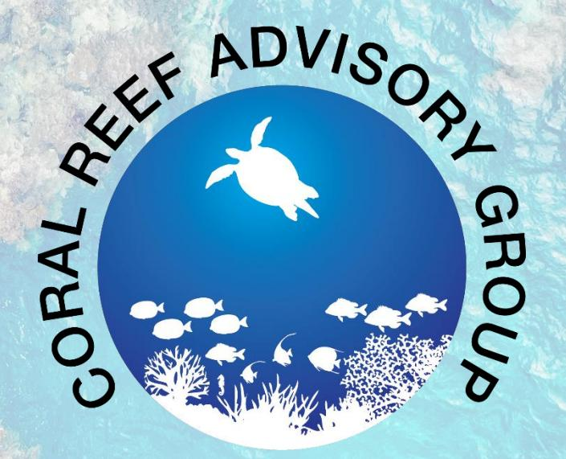

Amanda Ho, *Reef Resilience Coordinator, rrc@crag.as* Coral Reef Advisory Group Dept. of Marine and Wildlife Resources American Samoa

# 1. CONTRIBUTORS

# **Written and Compiled by:**

Amanda Ho, CRAG *Reef Resilience Coordinator* Vessel Grounding Coral Disease Crown of Thorns Permitting Guides

Whitney Hoot, Lucy Southworth, & Sana Lynch *Bleaching*

# **Contributed by**:

Amanda Ho, *Reef Resilience Coordinator, Coral Reef Advisory Group* Sana Lynch, *Coordinator, Coral Reef Advisory Group* Nicte-Ha Muñoz, *Benthic Ecologist, Coral Reef Advisory Group* Riley Garvey, *Coral Fellow, Coral Reef Advisory Group* Lucy K. Southworth*, Intern, Coral Reef Advisory Group* The Department of Marine and Wildlife Resources National Marine Sanctuary of American Samoa The National Park of American Samoa U.S. Fish & Wildlife Service Paolo Marra-Biggs, University of Hawaii at Mānoa

# **Acknowledgments:**

Funding sources: NOAA Coral Reef Conservation Program (CRCP).

The American Samoa Rapid Reef Response Plan is part of the American Samoa Local Action Strategy (2020-2025).

Response plans and management strategies from other coral reef jurisdictions were also referenced in the writing of this plan, including Hawaii's Rapid Response Contingency Plan for events of coral bleaching, disease, or crown-of-thorns outbreaks (Aeby et al. 2008); Guam Coral Bleaching Response Plan & Coral Disease Handbook, the Florida Reef Tract Coral Bleaching Response Plan (2013) produced by the Florida Reef Resilience Program; the US Virgin Islands Reef Resilience Plan; and the Belize Coral Bleaching Response & Management Plan 2008-2013 developed by ECOMAR.

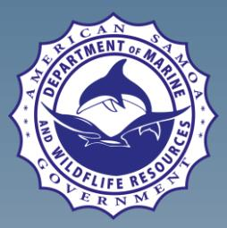

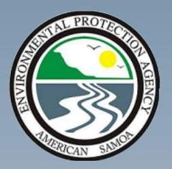

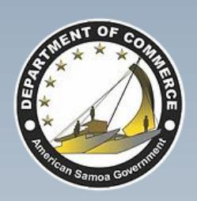

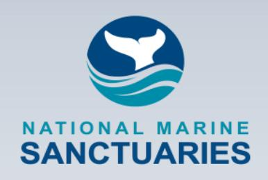

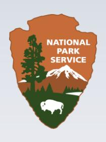

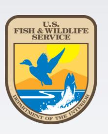

# 2. TABLE OF CONTENTS

| 1. Contributors                                                         | 2  |
|-------------------------------------------------------------------------|----|
| 2. Table of Contents                                                    | 3  |
| 2.1. List of Figures                                                    | 6  |
| 2.2. List of Tables                                                     | 7  |
| 3. How to use this Document                                             | 8  |
| 3.1. Target Audience                                                    | 8  |
| 4. Acronyms                                                             | 9  |
| 5. Samoan Words and Phrases                                             | 11 |
| 6. Preface                                                              | 12 |
| 6.1. A Note on Interagency Dive Operations                              | 13 |
| 7. Map of American Samoa Borders and Jurisdictions                      | 14 |
| 8. Contact Sheet for American Samoa Resource Agencies                   | 17 |
| 9. Introduction to American Samoa Coral Reefs                           | 20 |
| 9.1. Coral Reefs in American Samoa                                      | 20 |
| 9.2. Climate Change in American Samoa                                   | 20 |
| 9.3. Climate Change and Coral Bleaching                                 | 21 |
| 9.4. Other Impacts of Climate Change                                    | 21 |
| 10. AMERICAN SAMOA CORAL BLEACHING RESPONSE PLAN                        | 22 |
| 10.1. Overview                                                          | 22 |
| 10.2. Objectives                                                        | 23 |
| 10.3. Background on Bleaching                                           | 23 |
| 10.4. Background on Bleaching in American Samoa                         | 26 |
| 10.5. Early Warning Systems                                             | 27 |
| 10.5.1. Monitoring Ocean Conditions                                     | 27 |
| 10.6. Standard Operating Procedures When a Bleaching Event is Suspected | 33 |
| 10.6.1. Response Initiation Triggers                                    | 33 |
| 10.7. Response Management                                               | 37 |
| 10.7.1. Leadership                                                      | 37 |
| 10.7.2. American Samoa Coral Reef Response Team                         | 38 |
| 10.8. Bleaching Assessments                                             | 42 |
| 10.8.1. Priority Sites                                                  | 42 |
| 10.8.2. Rapid Reconnaissance Surveys                                    |    |
| 10.9. Post-Bleaching and Recovery Surveys                               | 61 |

| 10.10. Communication and Outreach Strategy                 | 61  |
|------------------------------------------------------------|-----|
| 10.11. Management Actions                                  | 62  |
| 10.11.1. Survey Methods and Data Sharing                   | 63  |
| 10.11.2. Areas for Future Research                         | 63  |
| 10.11.3. Natural Resource Management Actions               | 64  |
| 10.11.4. Reef Recovery and Restoration                     | 64  |
| 10.11.5. Funding for Response Activities                   | 65  |
| 11. AMERICAN SAMOA VESSEL GROUNDING RESPONSE PLAN          | 66  |
| 11.1. Overview                                             | 66  |
| 11.2. Definition of Terms                                  | 67  |
| 11.3. Objectives                                           | 68  |
| 11.4. Background                                           | 69  |
| 11.4.1. Previous Groundings in American Samoa and Impacts  | 69  |
| 11.4.2. Relevant Local Laws and Policies                   | 71  |
| 11.4.3. Relevant Federal Laws, Policies, & Agencies        | 71  |
| 11.4.4. Relevant International Laws and Policies           | 82  |
| 11.5. Standard Operating Procedure for Response            | 83  |
| 11.5.1. Vessel Grounding Response Flowchart                | 83  |
| 11.5.2. Step 1: Initiate Investigation                     | 84  |
| 11.5.3. Step 2: Pre-Assessment Safety Check                | 85  |
| 11.5.4. Step 3: Impact Assessment (Pre-removal)            | 87  |
| 11.5.5. Step 4: Removal Preparations                       | 89  |
| 11.5.6. Step 5: Removal                                    | 90  |
| 11.5.7. Step 6: Post-Removal Assessment                    | 94  |
| 11.5.8. Novel innovations for site clean-up                | 94  |
| 11.6. Post Removal Restoration or Compensatory Restoration | 94  |
| 11.7. Recommendations for Prevention                       | 95  |
| 11.8. Guidance for Policy                                  | 97  |
| 11.9. Funding for Response & Removal Activities            | 97  |
| 12. AMERICAN SAMOA CORAL DISEASE RESPONSE PLAN             | 99  |
| 12.1. Objectives                                           | 99  |
| 12.2. Overview of Coral Disease                            | 99  |
| 12.3. Background on Coral Disease in AS                    | 100 |
| 12.3.1. Diseases of Concern:                               |     |
| 12.4. Early Detection                                      |     |
| 12.5. Coral Disease Management                             |     |

| 12.4.1. Response Kits 105                                                                                                                                                                          |  |
|-------------------------------------------------------------------------------------------------------------------------------------------------------------------------------------------------------|--|
| 12.4.2. Disease Occurrence & priority sites in American Samoa 105                                                                                                                                  |  |
| 12.6. Standard Operating Procedure for Disease Response:106                                                                                                                                           |  |
| 12.7. Disease Prevention 110                                                                                                                                                                       |  |
| Appendix A: Permitting Guidance for Grounded Vessel Reef Response in American Samoa111                                                                                                                |  |
| Contents 111                                                                                                                                                                                       |  |
| Introduction 112                                                                                                                                                                                   |  |
| Regulations and Permitting Guide 112                                                                                                                                                               |  |
| Contact Sheet: Applicable Local and Federal Authorities for Vessel Grounding Response114                                                                                                              |  |
| NEPA: National Environmental Policy Act116                                                                                                                                                            |  |
| Endangered Species Act (ESA) Section 7 Consultation 116                                                                                                                                            |  |
| ESA during Emergencies 117                                                                                                                                                                         |  |
| Section 401—EPA Clean Water Act Water Quality Standard Regulations118                                                                                                                                 |  |
| Army Corps Of Engineers (USACE)118                                                                                                                                                                    |  |
| Magnuson-Stevens Act-Essential Fish Habitat (EFH) Consultation 119                                                                                                                                 |  |
| ONMS Permit120                                                                                                                                                                                        |  |
| United States Fish & Wildlife Service: Refuge Special Use Permit 120                                                                                                                               |  |
| National Parks Service Research Permit120                                                                                                                                                             |  |
| Resources121                                                                                                                                                                                          |  |
| Appendix B: Coral Disease Response Permitting Guide122                                                                                                                                                |  |
| Contents 122                                                                                                                                                                                       |  |
| Introduction 123                                                                                                                                                                                   |  |
| Regulations and Permitting Guide 123                                                                                                                                                               |  |
| Contact Sheet: Applicable Local and Federal Authorities for Coral Disease Response124                                                                                                                 |  |
| NEPA: National Environmental Policy Act125                                                                                                                                                            |  |
| Endangered Species Act (ESA) Section 7 Consultation 127                                                                                                                                            |  |
| ESA during Emergencies 128                                                                                                                                                                         |  |
| Army Corps Of Engineers (USACE)128                                                                                                                                                                    |  |
| Magnuson-Stevens Act-Essential Fish Habitat (EFH) Consultation 129                                                                                                                                 |  |
| ONMS Permit Required for any activities to take place within a National Marine Sanctuary, locations include: Fagatele Bay, Faga'alu/Fogama`a (Larsen's Cove), Aunu'u, Tau, and Swains Island130 |  |
| United States Fish & Wildlife Service: Refuge Special Use Permit 130                                                                                                                               |  |
| National Parks Service Research Permit131                                                                                                                                                             |  |
|                                                                                                                                                                                                       |  |

# 2.1. LIST OF FIGURES

| Figure 1. Depiction of the CRAG member agencies. Created by Amanda Ho (2024). 8                                                                                                                                  |
|---------------------------------------------------------------------------------------------------------------------------------------------------------------------------------------------------------------------|
| Figure 2. Map of the American Samoan Islands and pertaining boundaries and jurisdictions. Including Swains Island (top circle) and from left to right: Tutuila, the Manu'a Islands, and Rose Atoll14          |
| Figure 3. Swains Island including its surrounding National Marine Sanctuary boundary. 15                                                                                                                         |
| Figure 4. Ofu (left), Olosega (central), and Tau (right) islands and associated jurisdictional boundaries15                                                                                                      |
| Figure 5. Map of Rose Atoll's Boundaries. There is an additional USFW MPA which overlaps with the NMS but excludes the small box on the upper left side; it wasn't included because it obfuscates the atoll16 |
| Figure 6. Map of Tutuila's boundaries. 16                                                                                                                                                                        |
| Figure 7. Photo composite of before and during bleaching at Fatumafuti, Tutuila, American Samoa (image courtesy of R. Vevers, XL Catlin Seaview Survey) 22                                                    |
| Figure 8. This map shows how the average sea surface temperature around the world changed between 1901 and 2015. Data source: IPCC, 20137; NOAA, 20168 Web update: August 201625                                 |
| Figure 9. Photo composite of before, during, and after bleaching at Airport Reef, Tutuila, American Samoa (image courtesy of R. Vevers, XL Catlin Seaview Survey)27                                              |
| Figure 10. NOAA CRW daily 5 km bleaching alert map; warm colors indicate elevated thermal stress (Source: NOAA Coral Reef Watch) 29                                                                           |
| Figure 11. NOAA CRW thermal stress gauge for American Samoa (Source: NOAA Coral Reef Watch) 30                                                                                                                |
| Figure 12. Flowchart for bleaching response steps. Please see full resolution version on the crag.as website at crag.as/reef-response. 37                                                                     |
| Figure 13. Demonstration of a HOBO logger attached to a coral with a zip tie. 48                                                                                                                                 |
| Figure 14. CRAG Monitoring Sites52                                                                                                                                                                                  |
| Figure 15. Suggested survey methods, considering event classification, habitat and available resources. Created by Amanda Ho 202554                                                                              |
| Figure 16. Flow chart for coral bleaching response (Reef Resilience Network, Developing a Bleaching Response Plan). 55                                                                                        |
| Figure 17. Grounded fishing vessel in Leone, American Samoa, courtesy of USCG District 14 Hawaii Sector (USCG, 2018). 66                                                                                      |

| Figure 18. Diagram representing agency responsibilities regarding ADVs (GAO, 2017). 72                                                                                                                                                                |
|----------------------------------------------------------------------------------------------------------------------------------------------------------------------------------------------------------------------------------------------------------|
| Figure 19. Flowchart for vessel grounding response steps. Created by Amanda Ho 2024. 83                                                                                                                                                               |
| Figure 20. Diagram of proper removal via the grounding pathway. Created by Amanda Ho (2024)93                                                                                                                                                         |
| Figure 21. Examples of eco-moorings (Project Seagrass, retrieved 2024.). 96                                                                                                                                                                           |
| Figure 22. A Porites exhibiting white band syndrome in Auto/Amaua, American Samoa. Credit: CRAG 2023. 99                                                                                                                                           |
| Figure 23. Credit: Athena Burnett/NOAA https://flowergarden.noaa.gov/protection/preventcoraldisease.html106                                                                                                                                           |
| Figure 24. The Intervention flowchart is a visualization of the systematic approach used by managers to decide which method of intervention is most appropriate for a coral. See Appendix H for detailed protocols (taken from Warham & Bowman)108 |
| Figure 25. A diver applying antibiotic ointment to a SCTLD lesion. Photo by Ocean Frontiers108                                                                                                                                                           |
| Figure 26. Flow chart depicting CRAG disease response protocol109                                                                                                                                                                                        |
|                                                                                                                                                                                                                                                          |
|                                                                                                                                                                                                                                                          |
| 2.2. LIST OF TABLES                                                                                                                                                                                                                                      |
| Table 1. List of American Samoan agencies and offices with contact information. Color coding of NMSAS and NPS refers to the maps in section 717                                                                                                       |
| Table 2. Classification of bleaching severity for an entire reef area (Adapted from Marshall and Schuttenberg 2006). 34                                                                                                                            |
| Table 3. Key tasks and roles for reef assessments and bleaching response activities. 38                                                                                                                                                               |
| Table 4. Reef flat/pool monitoring sites43                                                                                                                                                                                                               |
| Table 5. Reef slope monitoring sites45                                                                                                                                                                                                                   |
| Table 6. Index of active temperature loggers deployed at the ASCRMP reef flat pool sites. 49                                                                                                                                                          |
| Table 7. Index of Active Temperature Loggers Deployed by ASCRMP on Priority Slope Sites50                                                                                                                                                                |
| Table 8. Definition of Terms used in this section67                                                                                                                                                                                                      |
| Table 9. Federal agencies responsible for relevant vessel grounding policies. 81                                                                                                                                                                      |

| Table 11. Diseases found in AS. Adapted from the NOAA Coral Reef Monitoring Program |  |
|-------------------------------------------------------------------------------------|--|
| (NCRMP) Benthic Ecological Monitoring Protocols for American Samoa (2023). 101   |  |
| Table 12. Guidelines for Determining Disease Level107                               |  |

# 3. HOW TO USE THIS DOCUMENT

# 3.1. TARGET AUDIENCE

This Response Plan's intended audience is CRAG member agencies such as DMWR, NMSAS, ASCC, AS-EPA, USFW, NPSA, and AS-DOC as well as any natural resource agencies dealing with threats to coral reefs such as: bleaching, disease, vessel grounding, marine debris, poor water quality, invasive and nuisance species, and natural disasters. These topics are global and this report may act as a reference for coral management worldwide, but this report entails aspects that are specific to American Samoa.

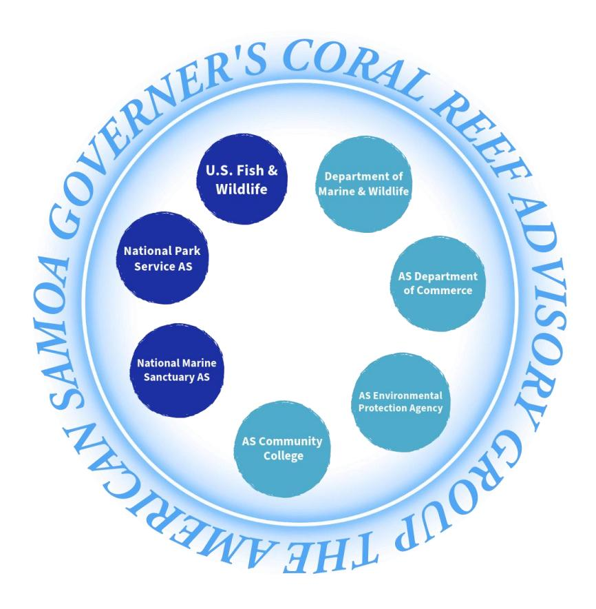

**Figure 1. Depiction of the CRAG member agencies. Created by Amanda Ho (2024).**

# 4. ACRONYMS

**ADV** Abandoned Derelict Vessel

**ASCC** American Samoa Community College

**ASCMP** American Samoa Coastal Management Program

**AS-DOC** American Samoa Department of Commerce

**AS-EPA** American Samoa Environmental Protection Agency

**ASG** American Samoa Government

**ASHPO** American Samoa Historic Preservation Office

**ASPA** American Samoa Power Authority

**CNMI** Commonwealth of the Northern Mariana Islands

**COTS** Crown of Thorn Starfish

**CRAG** Coral Reef Advisory Group

**CRW** NOAA Coral Reef Watch

**CTC** CRAG Technical Committee

**CZM** Coastal Zone Management

**DHW** Degree Heating Weeks

**DMWR** Department of Marine and Wildlife Resources

**DOC** Department of Commerce

**DOH** Department of Health

**EEZ** Exclusive Economic Zone

**EFH** Essential Fish Habitat

**ENSO** El Niño-Southern Oscillation

**EFH** Essential Fish Habitat

**ESA** Endangered Species Act

**IPCC** Intergovernmental Panel on Climate Change

**LAS** Local Action Strategy

**LBSP** Land Based Sources of Pollution

**MNRE** Ministry of Natural Resources and Environment (Independent Samoa)

**NOAA** National Oceanic & Atmospheric Administration

**MNM** Marine National Monument

**MPA** Marine Protected Area

**NMS** National Marine Sanctuary

**NMFS** National Marine Fisheries Service

**NMSAS** National Marine Sanctuaries of American Samoa

**NOAA** National Oceanic and Atmospheric Administration

**NOAA PIRO** National Oceanic and Atmospheric Administration Pacific Islands Regional Office

**NOAA OR&R** National Oceanic and Atmospheric Administration Office of Response and Restoration

**NPSA** National Park Service of American Samoa

**NRDA** Natural Resources Damage Assessment

**NWR** National Wildlife Refuge

**NWS** National Weather Service (NOAA Subsidiary)

**NRCS** Natural Resources Conservation Service

**NZSAR** New Zealand Search and Rescue

**OSA** Office of Samoan Affairs

**OSLT** Oil Spill Liability Trust

**PacIOOS** Pacific Island Ocean Observing System

**PLA** Participatory Learning and Action

**RCDC** Resource Conservation & Development Council

**SCTLD** Stony Coral Tissue Loss Disease

**SST** Sea Surface Temperature

**SPC** Secretariat of the Pacific Community

**SPREP** South Pacific Regional Environment Program

**SWCD** Soil and Water Conservation District

**TNC** The Nature Conservancy

**UH** University of Hawai'i

**USACE** United States Army Corps of Engineers

**USCG** United States Coast Guard

**USGS** United States Geological Survey

**USFWS** United States Fish and Wildlife Service

# 5. SAMOAN WORDS AND PHRASES

**Aiga**: extended family; communally owned land

**Alamea:** Crown of Thorns Starfish (*Ancanthaster planci*)

**Fa'asamoa**: the Samoan way

**Matai:** village chief

**Pulenu'u**: village mayors

# 6. PREFACE

The American Samoa (AS) Coral Reef Advisory Group (CRAG) coordinates the Territory's coral reef management efforts and activities. The group is a formal collaboration of five local agencies: the Department of Marine and Wildlife Resources (DMWR), the Department of Commerce [DOC; including AS Coastal Zone Management Program (AS-DOC-CZM) & the National Marine Sanctuary of American Samoa (NMSAS)], the American Samoa Environmental Protection Agency (AS-EPA), the American Samoa Community College (ASCC), the U.S. Fish & Wildlife Service, and the National Park of American Samoa (NPSA). CRAG member agencies and partners cooperate to manage coral reefs with the vision of healthy and resilient coral reef ecosystems in American Samoa. The group works toward this vision by guiding Territorial leaders and implementing strategies to reach goals that address various coral reef ecosystem conservation areas. Foci range from education, outreach, policy, and enforcement to scientific research and monitoring.

Coral reefs worldwide are experiencing a critical decline due to various factors. These ecosystems face threats such as overfishing, pollution, diseases, invasive species, and hurricanes, all of which contribute to the weakening of coral resilience. However, the most ominous threat looming over coral reefs is mass coral bleaching, projected to intensify throughout the 21st century as a consequence of climate change. The significance of monitoring these events lies in the sudden onset and potentially devastating consequences. Without a careful and adaptive plan in place, the recording of the impacts on coral reefs may be inadequate or, in some cases, entirely overlooked. Therefore, a well-structured response plan is essential to comprehensively document and understand the condition of coral reefs, enabling effective conservation and management strategies in the face of escalating threats.

The American Samoa Rapid Reef Response Plan is a comprehensive framework designed to facilitate the coordinated and swift response of the American Samoa Coral Reef Advisory Group (CRAG) to events impacting coral health within the Territory of American Samoa. This protocol establishes organized procedures for gathering information during the early stages of an event and serves as a foundation for informed long-term management decisions. The primary purpose of this plan is to ensure a timely and effective response to emerging threats to coral health. The plan aims to empower managers with the necessary insights to make informed decisions for the sustainable management of coral reefs in American Samoa by providing actionable steps for early information gathering and response. This plan is a living document that recognizes the dynamic nature of environmental conditions and the evolving expertise within the community. It is intended to be regularly updated as new information becomes available and local resources and expertise change. This adaptability ensures the continued relevance and effectiveness of the response strategies outlined herein.

This document is intended for use by coral reef managers and scientists on American Samoa but may also be useful to individuals and groups in other locations impacted by coral threats, especially those who are interested in developing similar Response Plans.

# 6.1. A NOTE ON INTERAGENCY DIVE OPERATIONS

In the event of a reef emergency, all CRAG member agencies and partners are relied upon for the most effective response. Pooling resources and collaborating on underwater response actions between ASCRMP, DMWR, AS-EPA, NMSAS, USFWS, and NPS is a must. Federal agencies are required to have reciprocity with all diving partners.

CRAG-ASCRMP currently has reciprocity with the following agencies:

| Agency | Expiry                   | Requirements                                                                                                           |
|--------|--------------------------|------------------------------------------------------------------------------------------------------------------------|
| DMWR   | Does not expire          | DMWR does not require reciprocity with ASCRMP.                                                                      |
| NOAA   | (expected March 2025) | The standards for reciprocity and the process to establish it can be found here. Renewals are due every 5 years. |

Contact [dso@crag.as](mailto:dso@crag.as) for more information.

# 7. MAP OF AMERICAN SAMOA BORDERS AND JURISDICTIONS

These maps are provided to act as a reference for response activities. If response action is required in American Samoa's Islands, please refer to these jurisdictional maps to ascertain which agencies need to be contacted and which laws and policies pertain to that area. Additionally, please find points of contact for each authority in the Contact Sheet in [Section 8:](#page-16-0)  [Contact Sheet for American Samoa Resource Agencies.](#page-16-0)

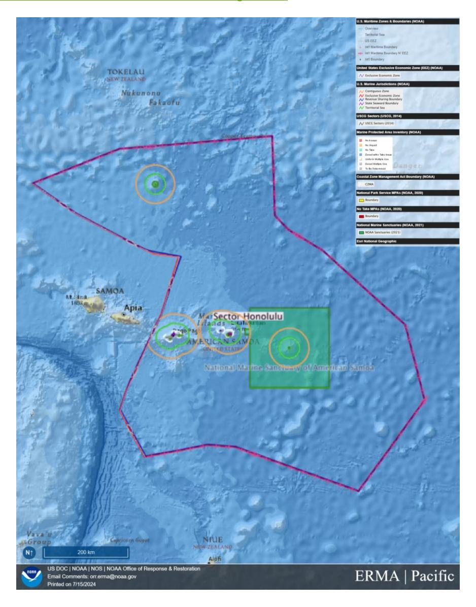

**Figure 2. Map of the American Samoan Islands and pertaining boundaries and jurisdictions. Including Swains Island (top circle) and from left to right: Tutuila, the Manu'a Islands, and Rose Atoll.**

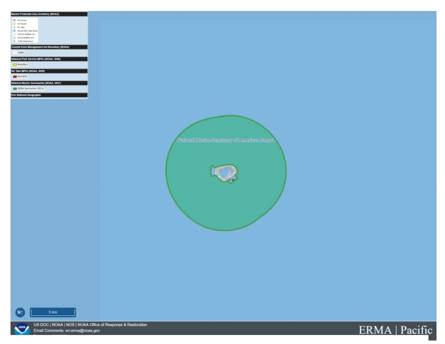

**Figure 3. Swains Island including its surrounding National Marine Sanctuary boundary.**

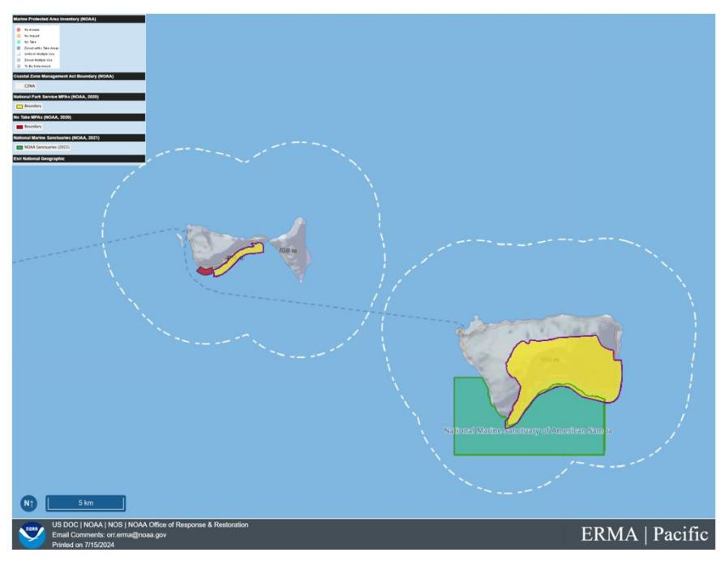

**Figure 4. Ofu (left), Olosega (central), and Tau (right) islands and associated jurisdictional boundaries.**

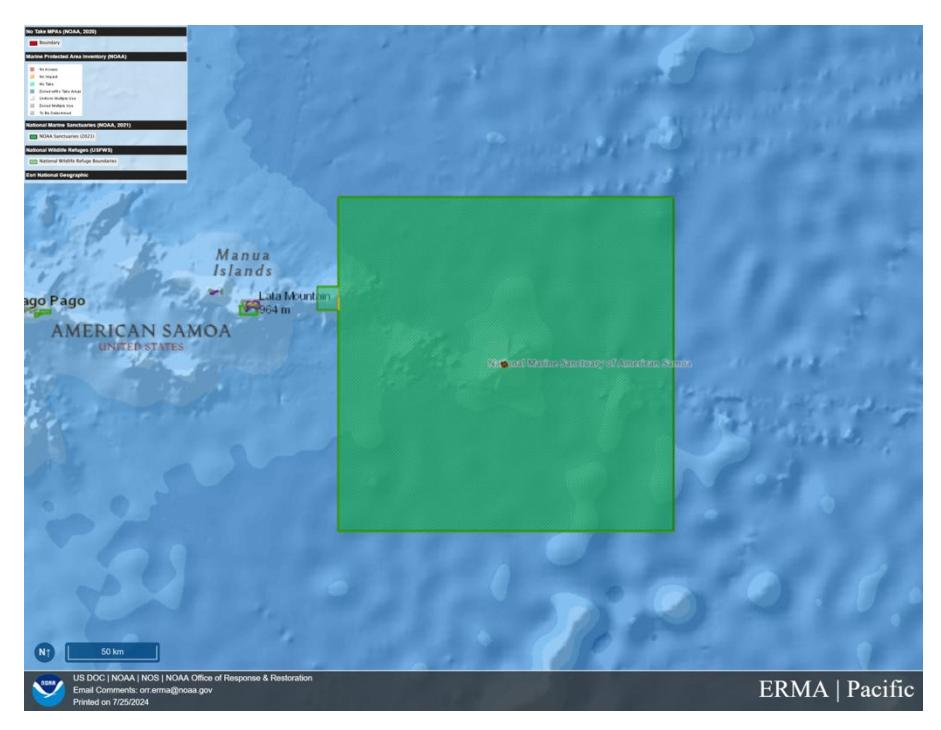

**Figure 5. Map of Rose Atoll's Boundaries. There is an additional USFW MPA which overlaps with the NMS but excludes the small box on the upper left side; it wasn't included because it obfuscates the atoll.**

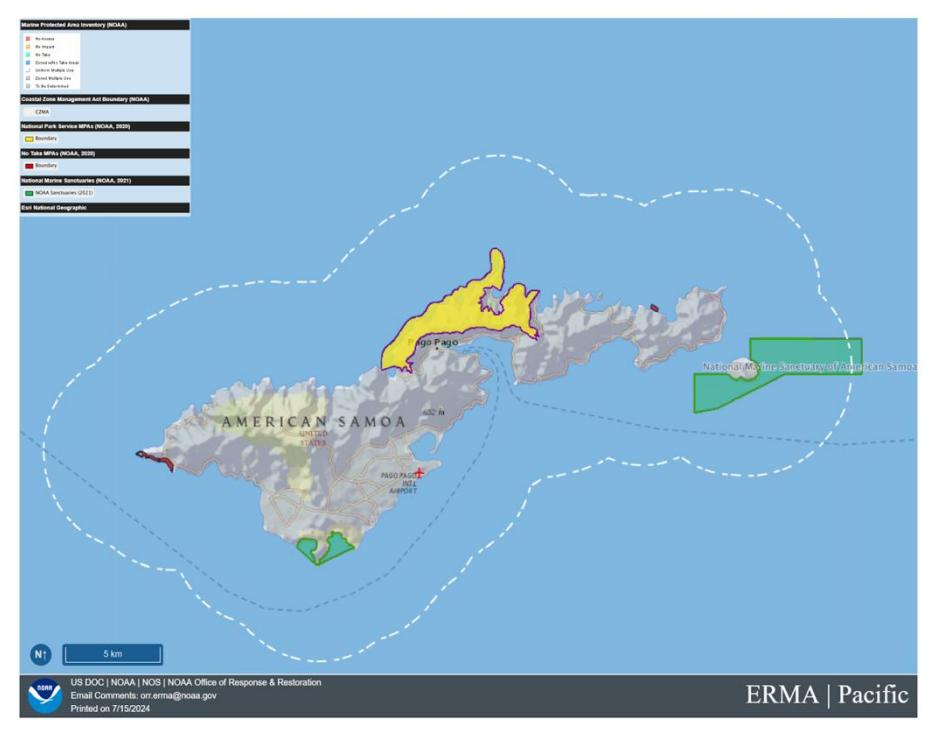

**Figure 6. Map of Tutuila's boundaries.**

# 8. CONTACT SHEET FOR AMERICAN SAMOA RESOURCE AGENCIES

**Table 1. List of American Samoan agencies and offices with contact information. Color coding of NMSAS and NPS refers to the maps in section 7.**

| Acronym | Name of Agency/Authority                                                                                                   | Jurisdiction                                                         | Points of Contact                                                                                                               |                                                                                              |
|---------|----------------------------------------------------------------------------------------------------------------------------|----------------------------------------------------------------------|---------------------------------------------------------------------------------------------------------------------------------|----------------------------------------------------------------------------------------------|
| ASCC    | American Samoa Community College                                                                                        | Research Education & Outreach                                     | SeaGrant Extension Specialist/CRAG liaison: Kelley Anderson Tagarino (kelleyat@hawaii.edu) 1-684-699-2722 ext. 1247 |                                                                                              |
|         |                                                                                                                            |                                                                      | Division Head: Jewel Tuiasosopo (jewel.tuiasosopo@epa.as.gov)                                                                |                                                                                              |
| AS-EPA  | American Samoa Environmental Protection Agency                                                                          | Water Quality Branch Drinking Water & Beach Monitoring Program |                                                                                                                                 | 1-684-633-2304 Manager: Ioakimo Makiasi (ioakimo.makiasi@epa.as.gov) 1-684-633-2304 |
|         |                                                                                                                            | Solid Waste                                                          | Manager: Faamamata Meredith (mata.meredith@epa.as.gov) 24/7: 1-684-733-2476                                               |                                                                                              |
| CRAG    | Coral Reef Advisory Group (comprised of 4 local and 3 federal agencies facilitated by the CRAG Coordination team) | AS Coral Reefs                                                       | CRAG Coordinator: Sana Lynch (coordinator@crag.as) 1-684-633-4456 ext. 229                                                |                                                                                              |
|         | Department of Commerce (Office of                                                                                          |                                                                      | Asst. Deputy Director: Gina Faiga (gina.faiga@doc.as.gov)                                                                    |                                                                                              |
| DOC     | Coastal Infrastructure Coastal Zone Management)                                                                         |                                                                      | Environmental Planner: Grace Felise (grace.felise@doc.as.gov)                                                                |                                                                                              |
|         | Department of Marine and Wildlife                                                                                          | Boating Access                                                       |                                                                                                                                 |                                                                                              |

|              | Resources                                   | Marine Enforcement Education and Outreach                                                    | Deputy Director: Selaina Vaitautolu taahinemanua@gmail.com                            |
|--------------|---------------------------------------------|-------------------------------------------------------------------------------------------------|---------------------------------------------------------------------------------------------|
| DMWR         |                                             |                                                                                                 | Chief of Fisheries: Domingo Ochavillo (ochavill@gmail.com)                               |
|              |                                             | AS Fisheries & Wildlife including coral reefs within 3 miles offshore                     | Chief of Wildlife: Adam Miles (adam.miles@dmwr.as.gov)                                   |
|              | Department of Port Administration           | Customs & Immigration                                                                           | 1-684-633-4251                                                                              |
| DPA          |                                             |                                                                                                 | Harbor Master: Puamavae Ah Mai (ahmai@pa.as.gov)                                         |
|              | Harbor Master                               | Docking and Anchoring                                                                           | Assistant Harbor Master: Beverly Tali (tali@pa.as.gov)                                   |
| -            | Fatoata                                     | NGO working to protect and restore AS marine environments                                 | Lead: Vera Peck verast.peck@gmail.com                                                    |
| NMSAS        | National Marine Sanctuary American Samoa | National Marine Sanctuaries e.g. Fagatele Bay, Aunu'u, Tau, Rose Atoll, Swains Island. | Research Coordinator: Valerie Brown (valerie.brown@noaa.gov) 1-684-633-6500 ext. 1114 |
| NOAA OR&R | NOAA Office of Response and Restoration  | Triggered via oil spills or the threat of oil spills                                         | Ruth Yender ruth.yender@noaa.gov 1-206-849-9926                                       |
| NPSA         | National Parks Service American Samoa    | National Parks of AS (locations: Tutuila, Ofu, Tau)                                          | Marine Ecologist: Eric Brown (Eric_Brown@nps.gov) 1-684-633-7082 ext. 41              |
| NWHC         | National Wildlife Health Center             | Wildlife Disease Diagnostics                                                                    | Wildlife Disease Specialist: Dr. Thierry Work (thierry_work@usgs.gov)                 |
| OSA          | Office of Samoan Affairs                    | Liaison for village mayors/chiefs                                                            | 1-684-633-5201                                                                              |

| PIRO  | Pacific Islands Regional Office (NOAA Fisheries)                                     | Rose Atoll MNM                                                       | AS Field Office: 1-684- 633-7629 Fax: 1-684-633-7630                                                                                                                                                                                                                          |
|-------|-----------------------------------------------------------------------------------------|----------------------------------------------------------------------|----------------------------------------------------------------------------------------------------------------------------------------------------------------------------------------------------------------------------------------------------------------------------------------|
| USACE | United States Army Corps of Engineers (Honolulu District which encompasses AS)    | Navigable Waterways (Pago Pago, Aunu'u, Ofu, and Ta'u Harbors) | CEPOH-PA@usace.army.mil 1-808-835-4004                                                                                                                                                                                                                                              |
| USCG  | United States Coast Guard (District 14 - Honolulu Sector which encompasses AS) | Emergencies at sea Oil and pollution hazards                      | District 14 Command Center: 1- 800-3316176 National Response Center: 1-800- 424-8802 Public Affairs Duty Phone: 1-808- 265-7748 Public Affairs Email: hawaiipacific@uscg.mil AS Contact: Lt. Cody Baggett (MSUAmericanSamoa@uscg.Mil ) 1-684-633-2299 |
| USFW  | United States Fish and Wildlife Service                                              | Rose Atoll National Wildlife Refuge                               | Rose Atoll NWR Manager & Rose Atoll MNM Superintendent: Brian Peck brian_peck@fws.gov 1-684-633-7082                                                                                                                                                                          |

# 9. INTRODUCTION TO AMERICAN SAMOA CORAL REEFS

# 9.1. CORAL REEFS IN AMERICAN SAMOA

American Samoa hosts over 200 coral and 890 fish species, representing a rich biodiversity and playing a vital role in American Samoa's reef ecosystem. These ecosystems serve as a source of subsistence and recreation for the local population. American Samoa is home to three types of coral reefs: fringing reefs close to shore, barrier reefs farther offshore with lagoons, and atolls formed far offshore, creating ring-shaped reefs around circular lagoons. American Samoan reefs boast diverse species of Indo-Pacific corals, invertebrates, and fishes.

Sunlight is crucial for coral reef survival, as it powers microscopic algae, called zooxanthellae, living in their tissues. This symbiotic relationship allows corals to thrive in nutrient-poor tropical seas by exchanging food and oxygen with the algae. Despite the numerous benefits coral reefs provide to the island, they face increasing stress due to human activities and exacerbated natural stressors. Natural stressors include bleaching events, COTS invasions, invasive species, and hurricanes. While corals historically recover from these natural disturbances, human-induced stressors such as population growth, harmful fishing practices, sedimentation, and pollution pose new and significant threats.

American Samoa's coral reefs face challenges due to climate change and local anthropogenic-induced stressors. Climate change has led to bleaching, Crown-of-Thorn starfish outbreaks, and coral death. As identified in [American Samoa's Healthy Coral Reef Local Action](https://americansamoa-data.nocache.eightyoptions.com.au/system/files/AS%20Healthy%20Coral%20Reef%20Strategy_v2020-2025.pdf)  [Strategy \(2020-2025\),](https://americansamoa-data.nocache.eightyoptions.com.au/system/files/AS%20Healthy%20Coral%20Reef%20Strategy_v2020-2025.pdf) local stressors include pollution from coastal development, inadequate sewer-waste management, and unsustainable fishing practices. Despite these challenges, coral reefs in American Samoa provide critical services, supporting commercial, recreational, and subsistence fishing. These services' estimated annual economic benefit for residents and visitors amounts to \$5 millio[n](#page-19-3)1

# 9.2. CLIMATE CHANGE IN AMERICAN SAMOA

Climate change is driven by the escalation of greenhouse gases, particularly carbon dioxide, in the Earth's atmosphere. These gases, stemming from the use of fuels like gasoline, oil, coal, natural gas, and even wood, create a natural greenhouse effect regulating heat. However, since the Industrial Revolution, the concentration of these gases has surged, thickening the atmospheric layer and contributing to global warming.

In American Samoa, the community has already felt the impacts of climate variability, facing hurricanes, droughts, heavy rainfall, and coastal inundation. These events directly and indirectly affect natural resources. Drawing on their environmental knowledge, the people of American Samoa prepare for and build resilience against these occurrences. Future climate impacts that

1 Jacobs. (2004). *Economic Valuation of Coral Reefs and Adjacent Habitats in American Samoa Final Report.*

raise concern include managing flooding and dealing with the heightened frequency and intensity of tropical storms.

Climate change manifests as altered weather patterns, increased air and sea surface temperatures, and rising sea levels. These changes lead to extended rainy seasons, triggering landslides, floods, crop damage, droughts, and airborne diseases, posing threats to health, food security, land, and economic stability.

Looking ahead, the anticipated exacerbation of these changes poses risks to marine life and habitat, impacting food security and the local economy. Understanding historical and current climate change impacts strengthens policies and regulations guiding the development and implementation of best practices. As resilient communities in American Samoa are fostered through better policies, the uncertainty of climate change leaves coral reefs vulnerable. However, through collaboration and knowledge sharing, communities can enhance their resilience and adaptability to the impacts of climate change on coral reefs.

# 9.3. CLIMATE CHANGE AND CORAL BLEACHING

Corals, essential components of marine ecosystems, harbor microscopic single-celled algae known as zooxanthellae or dinoflagellates. These algae play a crucial role by conducting photosynthesis in the presence of sunlight, producing food that contributes to the nutrition of corals. However, if sea temperatures rise significantly, these algae are expelled, resulting in the loss of color in corals. This expulsion, termed "bleaching," leaves the coral tissue transparent, revealing the white skeleton beneath. Despite the term "bleaching," no chemical bleach is involved in this process.

Bleaching occurs when sea temperatures surpass 1°C above the average summer high temperature. Corals can recover if the temperature rise remains within this range. However, if the increase exceeds 2°C above the average, some corals may begin to die. Extended periods of high temperatures can lead to widespread coral mortality, causing severe damage to reefs.

While natural climate variability has historically contributed to sporadic bleaching events globally, projections indicate an alarming increase in these events due to climate changedriven rises in sea surface temperature. Global warming is expected to make mass coral bleaching more prevalent, significantly impacting reefs' composition and overall health. Documenting these events and the resulting changes becomes crucial in understanding and mitigating the profound effects on coral reefs.

# 9.4. OTHER IMPACTS OF CLIMATE CHANGE

Climate change will impact corals in direct and indirect ways. Global climate change will result in future increases in diseases of marine organisms, storm activity, and severity of bleaching events. Although the impacts remain relatively uncertain, this plan will assist in quantifying and mitigating changes to coral reefs.

VER 2.0: April 2024

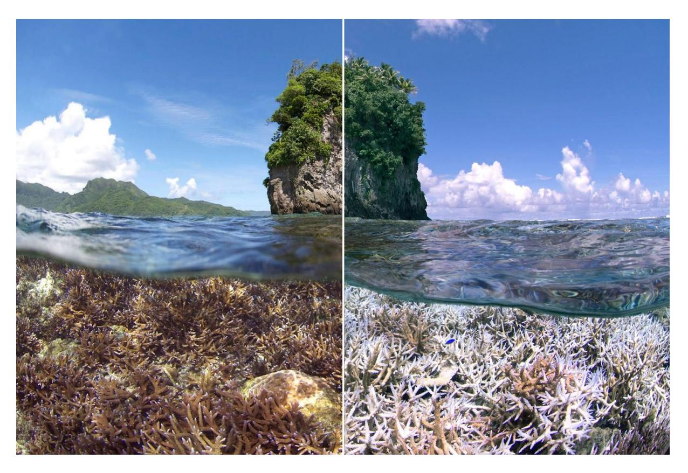

**Figure 7. Photo composite of before and during bleaching at Fatumafuti, Tutuila, American Samoa (image courtesy of R. Vevers, XL Catlin Seaview Survey)**

# 10.1. OVERVIEW

The American Samoa Coral Bleaching Response Plan exists to maximize the effective coordination of activities conducted by CRAG and the CRAG Coordination. This plan will ensure efficient use of resources and human capital by providing a standardized framework for responding to coral bleaching events.

Coral bleaching is primarily driven by ocean warming that results in the release of the colorful symbiotic algae (zooxanthellae) in coral tissues, displaying the white coral skeleton underneath (Figure 7). Corals rely on zooxanthellae for a significant portion of their diet, so the loss of zooxanthellae can cause corals to slowly starve. Unfortunately, coral bleaching cannot be directly influenced at a meaningful scale by local intervention. Therefore, the management

response to coral bleaching is especially complex and challenging. The American Samoa Bleaching Response Plan was first drafted during The Nature Conservancy Reef Resilience Workshop in 2012 and reviewed by CRAG member agencies in 2013 to include COTS. Though finalized in 2024, this document is intended to be a working draft that will be periodically updated and improved. This plan includes an in-depth description of American Samoa's early warning system for coral bleaching events, standard operating procedures for response implementation, detailed assessment protocols, and recommendations for post-bleaching management, reef recovery, and restoration approaches.

# 10.2. OBJECTIVES

- 1. Summarize the impacts of past bleaching events.
- 2. Provide up-to-date standard operating procedures to be followed before, during, and after coral bleaching events, including contact information for key parties; lists of agency assets and necessary supplies; and delineation of relevant local and federal policies and agency roles.
- 3. Develop a protocol to monitor projections of thermal stress and coral bleaching events and provide early warning of major coral bleaching events.
- 4. Create a framework for an optimal bleaching response, including:
  - a. Measurement of the spatial extent and severity of mass coral bleaching events, including impacts to noncoral organisms
  - b. Assessment of the ecological and socioeconomic impacts of mass coral bleaching events
  - c. Identify resilient reef areas and thermal tolerant coral species
  - d. Form a plan to mitigate bleaching impacts and restore bleached ecosystems
  - e. Development of a pathway for communicating findings to decision-makers.
- 5. Involve the community in monitoring the health of reefs.
- 6. Communicate with the local media and raise public awareness of the impacts of bleaching

# 10.3. BACKGROUND ON BLEACHING

Although coral reef ecosystems have existed for approximately 500 million years, their survival is threatened by local, regional, and global human impacts. About one-fifth of the planet's coral reefs have already been lost; now, more than a quarter of the remaining reefs face imminent degradatio[n](#page-23-0)2. Anthropogenic greenhouse gas emissions have dire consequences for reefs, such as reduced calcification rates due to acidification (a result of carbon dioxide uptake by the ocean), outbreaks of emergent and existing coral diseases, and coral bleaching, which is caused by both warming seas and acidification[3](#page-23-1). Fifteen Pacific coral species are listed under the U.S. Endangered Species Act; In American Samoa there are six ESA-listed coral species (*A. globiceps, A. jacquelineae, A. retusa, A. speciosa, Euphyllia paradivisa, Isopora crateriformis*), all listed as threatened4[.](#page-23-2)

Since the beginning of the 20th century, mean sea surface temperature (SST) has increased by an average of 0.07⁰C per decade (Figure 8). Between 1971 and 2010, over 90% of the energy (heat) stored by the earth was taken up by the oceans[5](#page-23-3). Most ocean warming is occurring near the surface, with an average increase of 0.11° C per decade in the shallowest 75 m of ocean waters over that period (IPCC 2014). The majority of reef-building (hermatypic) coral species depend on mutualistic relationships with symbiotic unicellular dinoflagellates, algae known as zooxanthellae, which live in the tissue of each coral polyp (genus: *Symbiodinium*). These coral species, known as the Scleractinia, obtain most of their nutrients from these photosynthetic algae and can accrete calcium carbonate to build their skeletons more rapidly than azooxanthellate corals. Scleractinian corals are restricted to relatively shallow waters, as the symbionts must receive adequate solar irradiance to supply the coral polyps with energy and oxygen6[.](#page-23-4)

2 Riegl, B., Bruckner, A., Coles, S. L., Renaud, P., & Dodge, R. E. (2009). Coral reefs: Threats and conservation in an era of global change. The Year in Ecology and Conservation Biology, 2009, Annals of the New York Academy of Sciences, 1162, 136-186.

3 Riegl, B., Bruckner, A., Coles, S. L., Renaud, P., & Dodge, R. E. (2009). Coral reefs: Threats and conservation in an era of global change. The Year in Ecology and Conservation Biology, 2009, Annals of the New York Academy of Sciences, 1162, 136-186.

4 [https://www.fisheries.noaa.gov/pacific-islands/endangered-species-conservation/marine](https://www.fisheries.noaa.gov/pacific-islands/endangered-species-conservation/marine-protected-species-american-samoa)[protected-species-american-samoa](https://www.fisheries.noaa.gov/pacific-islands/endangered-species-conservation/marine-protected-species-american-samoa)

5 Gleckler, P. J., Durack, P. J., Stouffer, R. J., Johnson, G. C., & Forest, C. E. (2016). Industrial-era global ocean heat uptake doubles in recent decades. Nature Climate Change, 6(4), 394-398. 6 Sebens, K. P. (1994). Biodiversity of coral reefs: What are we losing and why? American Zoologist, 34(1), 115-133.

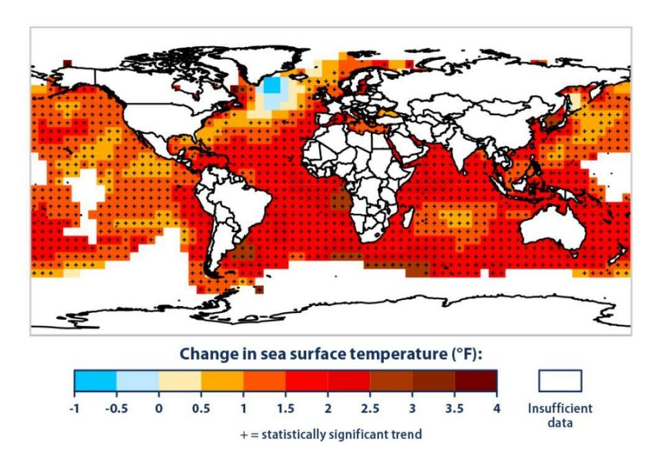

**Figure 8. This map shows how the average sea surface temperature around the world changed between 1901 and 2015. Data source: IPCC, 20137; NOAA, 20168 Web update: August 2016.**

The current concentration of CO2 in the atmosphere has reached unprecedented levels, surpassing those observed in the past 15 million years[7](#page-24-1). This elevation contributes to rising atmospheric and oceanic temperatures. The current rate of SST change is unparalleled, with predictions indicating a further increase of 1-3° C by the end of the century; this has significant implications for coral reefs, leading to more frequent and severe bleaching events[8](#page-24-2). Bleaching occurs when rising water temperatures and increased frequency of high-temperature anomalies affect the photosynthetic organelles of coral symbionts, making them toxic to their hosts. Corals, sensitive to even slight temperature changes, can experience bleaching with just a 1° C rise above long-term summer SST averages. The ongoing ocean warming, especially in tropical and Northern subtropical surface waters, combined with local stressors, is anticipated to be a major driver of coral reef degradation in the coming decades. The impacts of bleaching extend beyond immediate coral bleaching events, influencing coral vulnerability to diseases and degrading reef habitat for fish and invertebrates9. Coral mortality, habitat phase shifts, and decreased structural complexity are potential outcomes that threaten the rich biodiversity and

7 Bijma, J., Portner, H.-O., Yesson, C., & Rogers, A. D. (2013). Climate change and the oceans – What does the future hold? *Marine Pollution Bulletin*, 74, 495-505.

8 Hernandez-Delgado, E. M. (2015). The emerging threats of climate change on tropical coastal ecosystem services, public health, local economies, and livelihood sustainability of small islands: Cumulative impacts and synergies. *Marine Pollution Bulletin*, 101, 5-28.

9 Baker, A. C., Glynn, P. W., & Riegl, B. (2008). Climate change and coral reef bleaching: An ecological assessment of long-term impacts, recovery trends, and future outlook. Estuarine, Coastal, and Shelf Science, 80, 435-471.

ecosystem services coral reefs provide.

The El Niño-Southern Oscillation (ENSO), a climatic phenomenon occurring approximately every 2-7 years, introduces significant temperature fluctuations in the tropical Pacific Ocean[10](#page-25-1). ENSO events, specifically El Niño and La Niña phases, impact coral reef ecosystems by altering sea surface temperatures, winds, currents, sea levels, nutrient availability, and storm frequency. The potential impacts of global warming on ENSO frequency and magnitude remain uncertain, adding complexity to their future influence on coral reefs[11](#page-25-2). However, coral bleaching events, often correlated with ENSO, have increased frequency and severity. The 2015-2016 global coral bleaching event, linked to El Niño, is the longest on record, impacting over one-third of coral reefs worldwide. The repercussions of these mass bleaching events extend beyond immediate coral mortality, affecting fish populations, reef structure, and overall ecosystem health.

# 10.4. BACKGROUND ON BLEACHING IN AMERICAN SAMOA

Mass bleaching events were observed in American Samoa in 2015 and 2017 (Coward et al., 2020) (Figure 9). A study of these subsequent events by Smith, et al. (2022)[12](#page-25-3) found that bleaching incidents were attributed to a combination of heating stressors affecting coral reefs in Tutuila, American Samoa. These stressors, including cumulative and acute heat stress, a warming trend, and increased heating rates, collectively contributed to the widespread bleaching in 2015 and 2017. However, temperature variability between years was not the strongest predictor for bleaching. The study highlighted that relying on a single heating metric, such as cumulative heat stress, could inaccurately predict bleaching events.

Smith, et al. (2022)12 highlight that specific coral genera, particularly *Leptastrea* and *Montastre*a, exhibited the highest bleaching prevalence during the initial stages of the bleaching events. This suggests that these coral genera might as early indicators, reacting promptly to heat stress and potentially acting as a warning sign for an impending mass bleaching event. The surveys conducted at the onset of the bleaching event provided insights into the dynamics of coral reactions to heat stress and the potential role of specific coral genera in signaling the onset of such events.

10 National Ocean Service (NOS). (2016). What are El Niño and La Niña? Ocean facts. US National Oceanic and Atmospheric Administration. Retrieved from <http://oceanservice.noaa.gov/facts/ninonina.html>

11 Hoegh-Guldberg, O. (1999). Climate change, coral bleaching, and the future of the world's coral reefs. Marine & Freshwater Research, 50, 839-866.

12 Smith, J., et al. (2022). A 'perfect storm' of cumulative and acute heat stress, and a warming trend, lead to bleaching events in Tutuila, American Samoa. Retrieved from <https://doi.org/10.25923/yphg-pq04>

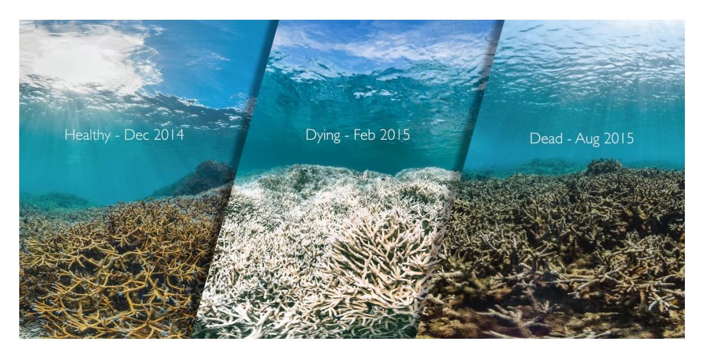

**Figure 9. Photo composite of before, during, and after bleaching at Airport Reef, Tutuila, American Samoa (image courtesy of R. Vevers, XL Catlin Seaview Survey).**

# 10.5. EARLY WARNING SYSTEMS

American Samoa's early warning system involves monitoring projections and forecasts combined with local in-situ monitoring and observations. The early warning system aims to detect and predict the conditions that lead to coral bleaching and provide a window to prepare a response before bleaching occurs. The CRAG Coordination Monitoring Team (Reef Resilience Coordinator, Benthic Ecologist, and Fish Ecologist) are the designated members to monitor the following components of the early warning system and report back to the CRAG Coordinator, who will then report to the CRAG Technical Committee (CTC).

# 10.5.1. MONITORING OCEAN CONDITIONS

I.Projections and forecasts

- A. [NOAA Coral Reef Watch](https://coralreefwatch.noaa.gov/index.php)
- B. Sea surface temperatures [\(PACIOOS\)](http://www.pacioos.hawaii.edu/regions/amsamoa/)
- C. Climate[/ENSO projections](https://psl.noaa.gov/enso/mei/)
- D. Tidal forecasts
- E. Weather forecasts
- F. Local monitoring and observations
- G. Monitoring sites: CRAG monitoring programs should record initial observations of coral bleaching at [monitoring sites.](#page-41-1) Reports can be logged into a [shared spreadsheet](https://docs.google.com/spreadsheets/d/18-9790MlNSOvpIl8Nz39mOwWAJm7ObIqLu6keQEGXaw/edit#gid=0)

- H. SST and water level instruments: loggers from the CRAG Territorial Monitoring Program can be retrieved during the bleaching season to monitor actual water temperatures and correlate with coral bleaching predictions and weather patterns. Temperature logger data can be analyzed to understand island-wide and site-specific summer temperature averages and bleaching threshold levels.
- I. Opportunistic observations: All CRAG members should keep an eye out for bleaching once temperatures reach a CRW Warning level. Reports should be logged in a central location (currently this [shared spreadsheet\)](https://docs.google.com/spreadsheets/d/18-9790MlNSOvpIl8Nz39mOwWAJm7ObIqLu6keQEGXaw/edit#gid=0).
- J. Aerial surveys: initial drone footage will be taken by CRAG monitoring programs
- K. Community reports: educational materials should be prepared and provided to fishermen, local communities, and schools to request for reporting of any bleaching observations.
- L. Validating projections

# 10.5.1.1. NOAA CORAL REEF WATCH (CRW) PRODUCTS

The NOAA CRW program provides coral bleaching alerts based on satellite data (measurements of nightly SST) used to predict reefs at risk of thermal stress and bleaching. CRW provides products at two resolutions: 5 km (daily updates) and 50 km (twice weekly updates). The highresolution 5 km products, first released in February 2015, are expected to be more accurate than the 50 km products because of increased data density, quality, resolution, and understanding of climate patterns (CRW 2016). CRW provides this high-resolution data on SST, SST anomaly, SST trend, HotSpot, and degree heating weeks (DHW) (see sidebar), accessible in data tables and on maps. In addition to viewing current daily values and archived historical data and maps, CRW provides animations depicting variable changes over the most recent 30 and 90-day periods.

The data is organized into 212 regional virtual stations designed to present the information at a jurisdictional or subregional level. This allows reef managers to assess conditions throughout their administrative areas and gain an understanding of regional impacts rather than evaluating each 5 km pixel separately (CRW 2016). Interactive functions on the CRW website allow users to view multi-year graphs and see changes in SST and DHW over two years for each virtual station.

The 5-km Bleaching Alert Area product (updated daily at 13:30 EST) shows locations where thermal stress is currently at defined bleaching threshold levels (Figure 10). This tool shows the highest stress thermal level that each pixel has been exposed to over the previous one to seven days. The maps depict areas with elevated stress levels in warm colors (Figure 11). CRW maintains a free email service that alerts users to changes in thermal stress levels at selected virtual stations (to sign up: [http://coralreefwatch-satops.noaa.gov\)](http://coralreefwatch-satops.noaa.gov/). Users can receive alerts for all stations or only those within their region of interest. Coral Reef Response Team members should regularly monitor these email alerts, with one or more persons designated to receive these alerts via email.

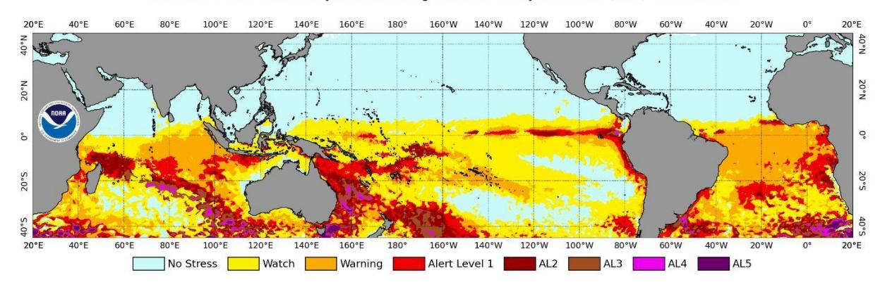

**Figure 10. NOAA CRW daily 5 km bleaching alert map; warm colors indicate elevated thermal stress (Source: NOAA Coral Reef Watch)**

CRW also provides a 5 km three-month coral bleaching thermal stress outlook based on the SST forecast from the National Weather Service (NWS) and calculated with DHW and HotSpot levels projections (Figure 10). The outlook (updated weekly on Tuesday mornings, EST) predicts the chance of coral bleaching thermal stress occurring in the upcoming three months, the usual length of one bleaching cycle. CRW provides bleaching outlooks calculated using two methodologies available in weekly or four-month ranges. The first method, which produces the 60% and 90% chance graphs, uses 28 weekly measurements of SST (4 per day) to determine a probabilistic outlook for up to 270 days in the future (Eakin et al. 2012; CRW 2016).

The most accessible element of the CRW site is the bleaching thermal stress gauges (Figure 11) and time series product, which provides summary data specific to a selected regional virtual station, including data for each 5 km pixel within the station. The bleaching outlooks for each virtual station are based on the 60% likelihood calculations. American Samoa's thermal stress gauge and time series graphs can be accessed [here.](https://coralreefwatch.noaa.gov/product/vs/gauges/samoas.php)

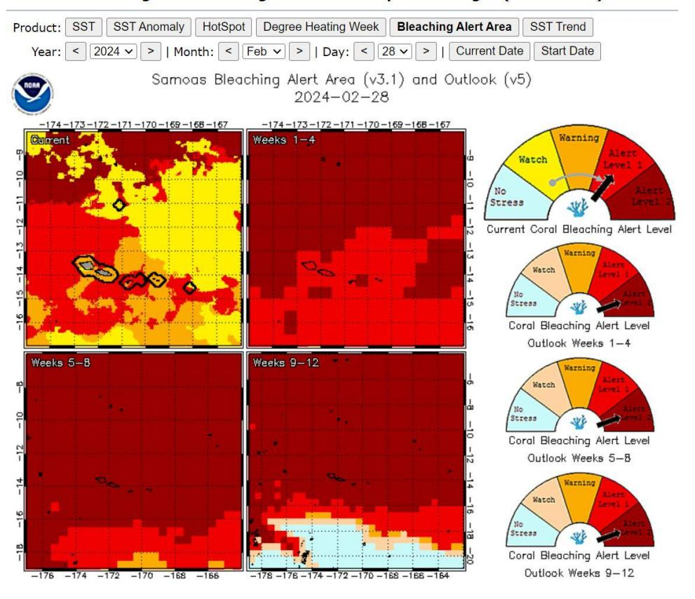

**Figure 11. NOAA CRW thermal stress gauge for American Samoa (Source: NOAA Coral Reef Watch)**

# 10.5.1.2. CLIMATE/ENSO PROJECTIONS

The CRAG Response Teams should review seasonal climate predictions by April to evaluate bleaching risk in the upcoming summer months. ENSO cycles should be closely monitored. The Multivariate ENSO Index (MEI), generated by [NOAA's Earth System Research Laboratory](http://www.esrl.noaa.gov/psd/enso/mei) (ESRL), measures air pressure and temperature, winds, SST, and cloud cover to evaluate ENSO conditions. The MEI, updated once per month, is intended for research purposes, not real-time climate monitoring, and should be used cautiously and in conjunction with other components of the early warning system when predicting bleaching (ESRL 2016). The MEI is a global index and does not describe ENSO conditions by region. Available [here.](https://psl.noaa.gov/enso/mei/)

In the National Weather Service, NOAA's Climate Prediction Center (CPC) provides weekly ENSO updates published online every Monday. A climate diagnostics bulletin is uploaded on the second Thursday of each month. These reports describe the current strength and status of ENSO conditions, shifts in SST, wind, radiation, and precipitation anomalies, and an outlook for future ENSO conditions. Weekly and monthly ENSO advisories are available [here.](https://www.cpc.ncep.noaa.gov/products/analysis_monitoring/enso_advisory/)

# 10.5.1.3. WEATHER FORECASTS

The US National Weather Service (NWS), a division of NOAA, publishes weather summaries and 7-day forecasts. Short and mid-term weather forecasts produced by the NWS should be checked regularly during the summer months, particularly when the conditions listed below last three days or longer. This data is useful in predicting the conditions that lead to elevated sea surface temperatures and, thus, coral bleaching on American Samoa. These conditions include: calm, clear weather – low winds, little cloud cover; above average summer temperatures; and below average rainfall.

- NOAA NWS 7-day forecasts for American Samoa (provides current conditions and forecasts for temperature, cloud cover, precipitation, and wind) are available [here.](https://forecast.weather.gov/MapClick.php?lat=-14.3007&lon=-170.7181)
- Windy.com marine forecast for the coastal waters of American Samoa (provides current conditions and forecasts for wind speed, wind direction, wind wave height, and swell height) is available [here.](https://www.windy.com/-14.040/-171.494?-14.644,-171.497,8)
- Weather forecasts and tidal predictions for American Samoa are found here at [Tide-](https://www.tide-forecast.com/locations/Pago-Pago-American-Samoa/tides/latest)[Forecast.com.](https://www.tide-forecast.com/locations/Pago-Pago-American-Samoa/tides/latest)

# 10.5.1.4. TIDAL FORECASTS

Tidal forecasts should also be monitored to predict conditions that may increase the risk of thermal stress that causes coral bleaching. Coral bleaching may be more likely during periods of repeated daytime extreme low tide conditions, especially during summer months. Near-shore water temperature, particularly on shallow reef flats, can become anomalously high, while exposure to air causes additional stress for coral communities. The flow of heated water from the reef flat over the reef margin (particularly through channels) and reef front may also cause coral bleaching in these zones.

- NOAA tidal predictions for Pago Pago Harbor, Tutuila Island are available [here.](https://tidesandcurrents.noaa.gov/noaatidepredictions.html?id=1770000)
- Tidal predictions and weather forecasts for American Samoa are found here at [Tide-](https://www.tide-forecast.com/locations/Pago-Pago-American-Samoa/tides/latest)[Forecast.com.](https://www.tide-forecast.com/locations/Pago-Pago-American-Samoa/tides/latest)
- UNESCO Sea Level Station Monitoring: [Tau Station](https://www.ioc-sealevelmonitoring.org/station.php?code=tauas)
- UNESCO Sea Level Station Monitoring: [Ofu Station](https://www.ioc-sealevelmonitoring.org/station.php?code=ofuas)
- UNESCO Sea Level Station Monitoring: [Aunu'u Station](https://www.ioc-sealevelmonitoring.org/station.php?code=aunuu)
- UNESCO Sea Level Station Monitoring: [Auasi Station](https://www.ioc-sealevelmonitoring.org/station.php?code=auasi)
- University of Hawai'i Sea level forecasts and observations: [UH Sea Level Center's Sea](https://uhslc.soest.hawaii.edu/sea-level-forecasts/)  [Level Forecast](https://uhslc.soest.hawaii.edu/sea-level-forecasts/)

# 10.5.1.5. SST AND WATER LEVEL INSTRUMENTS

Numerous sources of real-time in situ measurements of local SST for American Samoa are available, including instruments owned by the NOAA National Ocean Service (NOS) and the Pacific Integrated Ocean Observing System (PacIOOS).

• Fagatele Bay MAPCO2 Buoy data are available [here.](https://www.pacioos.hawaii.edu/water/wqbuoy-fagatele/)

• PacIOOS Wave Buoy at Aunu'u data are [here.](https://www.pacioos.hawaii.edu/water/buoy-aunuu/) (currently offline)

• SOFAR Spotter: [Fagatele](https://aqualink.org/sites/1144)

• SOFAR Spotter: [Fagamalo](https://aqualink.org/sites/1142) (currently offline)

• SOFAR Spotter: [Taema](https://aqualink.org/sites/1145)

# 10.5.1.6. AERIAL SURVEYS

The objective of the aerial monitoring component of the early warning system is to detect the early stages of coral bleaching events over a wide geographic area. The CRAG agencies will carry out aerial monitoring with access to drones or other aerial devices (access will be assessed at the beginning of every October). CRAG monitoring sites will be surveyed in October, January, and April (timeline of bleaching season). Drone footage should be used to note possible coral bleaching in the shallow waters surrounding the island without detracting from their primary responsibility. When bleaching is severe, an entire reef may appear white from above the surface, which can be seen from a plane[13](#page-31-0).

# 10.5.1.7. COMMUNITY REPORTS

Given the limited time and resources of response team members, community-based reporting is vital to the early warning system. With proper training, engaged participants can significantly increase American Samoa's capacity to identify and respond to bleaching events.

Tautua is an online hazard reporting platform developed specifically for American Samoa to help with community communication about hazards. Tautua was developed by Fale Cognitive Technologies, a locally-based company headed by Zach Zemby. Participants are asked to submit photographs, GPS coordinates, and drone footage with their reports when possible. The online reporting form is available [here.](https://tautua.as/)

Another option is for concerned citizens to call CRAG or DMWR to report unusual reef coloration. The information will be documented in the coral bleaching tracker [spreadsheet.](https://docs.google.com/spreadsheets/d/18-9790MlNSOvpIl8Nz39mOwWAJm7ObIqLu6keQEGXaw/edit#gid=0) This reporting can include photographs from the shoreline or vessels.

13 Oliver, J., Marshall, P., Setiasih, N., & Hansen, L. (2004). A global protocol for assessment and monitoring of coral bleaching (1st edition). WorldFish Center, Penang, Malaysia, and WWF Indonesia, Jakarta, Indonesia.

# 10.5.1.8. VALIDATING PROJECTIONS

Predicted versus actual bleaching occurrence should be compared to test the accuracy of thermal stress and coral bleaching projections. During bleaching events, the response team should compile forecasts and descriptions of ambient conditions and correlate these with thermal stress responses observed at reef sites around the island. Community reports and scientific surveys will provide a bleaching timeline that can be contrasted with alerts and forecasts. Regularly tracking this information will allow for better interpretation of existing forecasting systems and may be used to refine tools that can more accurately predict relationships between climatic and weather events and coral bleaching. Information gained at the local level should be disseminated to the appropriate federal government agencies or programs, including NOAA CRW and the National Weather Service.

The use of NOAA CRW products significantly reduces the input of local resources required to analyze remotely sensed and/or in-situ measurements of SST, but continuous feedback from local data collection is necessary to validate these products. Hence, they remain relevant to local resource management efforts. To verify the accuracy of CRW products, particularly the experimental 5 km alerts and outlooks, the Monitoring teams should provide the program with detailed reports of coral bleaching activity observed in American Samoa. CRW has requested bleaching observations (including reports of "no bleaching") from 2014 onward. Forms and instructions for submitting bleaching reports to CRW are available [here.](https://coralreefwatch.noaa.gov/satellite/research/coral_bleaching_report.php)

# 10.6. STANDARD OPERATING PROCEDURES WHEN A BLEACHING EVENT IS SUSPECTED

# 10.6.1. RESPONSE INITIATION TRIGGERS

Response initiation is based on specific decision criteria that trigger response activities. Consistent monitoring of the early warning system through interpretation of projections, analysis of local measurements, and verification of bleaching reports will allow managers and scientists to employ an appropriate level of response based on the expected extent and severity of a likely bleaching event. The decision to launch a major bleaching assessment effort is based on the geographic spread of bleaching, the observed depth of bleaching impacts, the number of species impacted, and the severity of the bleaching (Table 2). Although specific triggers and their outcomes are outlined below, decisions may often be ad hoc as bleaching event trajectory and resource availability will vary. Table 2 below and Figure 12 serve as a decision tree for response management.

**Table 2. Classification of bleaching severity for an entire reef area (Adapted from Marshall and Schuttenberg 2006).**

| Bleaching Severity | Site Level                                                                                     | Colony Level                                                                          |
|-----------------------|------------------------------------------------------------------------------------------------|---------------------------------------------------------------------------------------|
| No bleaching       | No bleaching or paling                                                                         | No bleaching or paling                                                                |
| Mild                  | Occasional pale/bleached colonies, but most not bleached (1-10% of coral cover bleached) | Partial bleaching (1-10% of colony is bleached or up to half of colony is pale) |
| Moderate              | Frequent bleaching (10-50% of all colonies observed are pale or bleached)                   | Up to half of colony (10-50%) is bleached or up to entire colony is pale        |
| Severe                | Very frequent bleaching (51%-90% of all colonies are bleached)                              | More than half of colony (51-90%) is bleached                                      |
| Very severe           | Reef is almost completely white (less than 10% of all colonies are not bleached)            | Colony is fully bleached or almost fully bleached (> 90% bleached)                 |
| Dead                  |                                                                                                | Dead/recently dead                                                                    |

# IF one of the following 2 criteria exists then initiate the sequence below. Criteria to initiate a response:

- 1. In situ telemetric instruments show rising SST and weather is calm and/or
- 2. CRW issues an alert for American Samoa (Watch or higher) with long-term bleaching outlook

# Sequence of Response Steps

- CRAG monitoring coordinator contacts their response teams and disseminates a detailed status report
- CTC is contacted via email, made aware of the bleaching risk, and asked to look carefully for signs of coral bleaching; participants may also be sent a list of the canary

sites (described in "Bleaching Assessments" section) so that they may be especially observant if visiting these sites

- o If needed, CTC may schedule additional trainings or a bleaching-specific training for all citizen scientist groups
- o If baseline data is needed, American Samoa Coral Reef Monitoring Program (ASCRMP) reef flat survey(s) may be organized
- Researchers and agencies with in-situ instruments deployed on reefs should ensure they are functioning and additional instruments should be added if needed and available
- Reports and/or other non-expert observations of bleaching must be confirmed
- Drone aerial surveys arranged with CTC

**NOTE: OSA needs to be contacted before surveying reef flat sites to ask for permission from the appropriate village's chief. Please call [\(684\) 633-5201.](https://www.google.com/search?q=office+of+samoan+affairs&rlz=1C1GCEU_en&oq=office+of+samoan+affairs&gs_lcrp=EgZjaHJvbWUqBwgAEAAYgAQyBwgAEAAYgAQyCAgBEAAYFhgeMg0IAhAAGIYDGIAEGIoFMg0IAxAAGIYDGIAEGIoFMg0IBBAAGIYDGIAEGIoFMgoIBRAAGIAEGKIEMgoIBhAAGIAEGKIEMgoIBxAAGIAEGKIEMgoICBAAGIAEGKIE0gEIMjg3N2owajeoAgCwAgA&sourceid=chrome&ie=UTF-8)**

IF American Samoa has been at bleaching watch status for longer than one week, AND the long-term thermal stress outlook projects future bleaching and increasing SST:

- Launch a public outreach campaign, which may include television advertisements, radio interviews, press releases or newspaper articles and posts on social media outlets
  - o Raise awareness of potential bleaching without causing panic or creating a false alarm
- Brief key decision makers, such as agency heads, legislators, and the governor's office, on the impacts of potential coral bleaching

IF the bleaching alert status for American Samoa is elevated to Warning or above and/or there are verified reports of bleached *Acropora* spp. at two geographically disparate reef sites:

- Launch rapid reconnaissance surveys and conduct timed swims at monitoring sites; record data (on tagged colonies if applicable) at these sites if possible
- Analyze rapid reconnaissance survey data to assess bleaching severity (at colony and site levels), spatial and depth extent, and taxa affected
- Determine resources required for appropriate response level (2), confirm available agency resources and personnel, and provide training on camera-use and calibration if photo transect surveys will be conducted
- Consider active mitigation to protect coral nursery and employ if possible

IF overall bleaching severity is mild AND there is little evidence that the event will be widespread:

- Continue monitoring components of the early warning system
- Conduct a second round of rapid reconnaissance surveys after 2-4 weeks

IF bleaching severity is moderate or worse AND outlook projects a lengthy, severe bleaching event:

- Prioritize sites for site inspections (focusing on the 16 sites surveyed in 2015), refine sampling protocols as needed, and create a schedule for response activities with contingency plans
  - o Engage ASCRMP volunteers and/or Preservation Rangers for reef flat surveys if needed
  - o Monitor weather and tidal forecasts and adjust survey schedule as needed
- Intensify public outreach and media campaign
  - o Communicate the importance of decreasing local stressors to increase the resilience of reefs – provide tips to decrease impacts and instigate behavior change
  - o Hold community meetings
  - o Update decision makers on bleaching events with emphasis on the importance of decreasing local stressors
- Conduct site inspections and additional surveys of target sites and/or taxa if possible

Please see the next page for a flow chart depicting the sequence of response.

# 10.6.1.1. RESPONSE FLOW CHART

**Figure 12. Flowchart for bleaching response steps. Please see full resolution version on the crag.as website at crag.as/reef-response.**

# 10.7. RESPONSE MANAGEMENT

# 10.7.1. LEADERSHIP

Coral bleaching response will be conducted according to the procedures within this document and input from the CTC. Prior to each bleaching season, the CTC will begin discussions on available resources to maximize the effectiveness of American Samoa's response to bleaching and advise on scientific protocols. The CRAG Reef Resilience Coordinator will organize meetings of the response team and coordinate response activities.

# 10.7.2. AMERICAN SAMOA CORAL REEF RESPONSE TEAM

The CRAG agencies are responsible for conducting bleaching response activities in American Samoa. Specific tasks are outlined below (Table 3); assignments are expected to change, and this table should be updated frequently.

**Table 3. Key tasks and roles for reef assessments and bleaching response activities.**

| ONGOING                                                                                                                                     |                           |
|---------------------------------------------------------------------------------------------------------------------------------------------|---------------------------|
| Task/Role                                                                                                                                   | Assigned Personnel/Agency |
| Read new publications and reports on coral bleaching; keep response team members informed of relevant findings                        | CRAG Monitoring Programs  |
| Monitor CRW alerts and weather patterns (with increasing frequency during ENSO cycles and summer months)                              | CRAG Monitoring Programs  |
| Maintain and update lists of agency resources that may be needed in upcoming bleaching events                                         | CRAG Coordinator, CTC     |
| Check community report responses                                                                                                            | CRAG Monitoring Programs  |
| Monitor for coral bleaching during regular aerial surveys                                                                                | CRAG Monitoring Programs  |
| PRE BLEACHING                                                                                                                               |                           |
| Task/Role                                                                                                                                   | Assigned Personnel/Agency |
| Continue monitoring CRW alerts and increase monitoring of local data sources, such as telemetric instruments, tidal patterns, weather | CRAG Monitoring Programs  |

| conditions, etc.                                                                                                            |                                                                |
|-----------------------------------------------------------------------------------------------------------------------------|----------------------------------------------------------------|
| Plan additional trainings for volunteers and contact current participants to encourage reporting                      | CRAG Outreach & Education Programs                          |
| Check community report responses; confirm reports via site survey if report includes observation of coral bleaching   | CRAG Monitoring Programs                                       |
| Organize ASCRMP monitoring event(s) to survey reef flats                                                                 | CRAG Coordination                                              |
| Media outreach, including press releases, newspaper articles, posts on social media, etc.                                | CRAG Outreach & Education Programs                          |
|                                                                                                                             | Media Coverage, Outreach & Education assistance from AS-EPA |
| Confirm available resources and personnel for response activities (this includes drones, vessels, equipment, etc.) | CRAG Coordinator, CTC                                          |
| Brief key decision makers                                                                                                   | CRAG Coordinator, CTC, CRAG Executive Council               |
| Verify that currently deployed SST and water level instruments are functioning                                        | CRAG Monitoring Programs                                       |
| Deploy additional in-situ instruments if needed to provide island-wide coverage                                          | CRAG Monitoring Programs                                       |
| Conduct aerial monitoring of and record any possible bleaching (Phase 1: October)                                        | CRAG Monitoring Programs                                       |
| Revise rapid reconnaissance datasheet if needed and share with all response team members                              | CRAG Monitoring Programs, CTC                                  |

| DURING BLEACHING                                                                                                                                    |                                                                                      |  |
|-----------------------------------------------------------------------------------------------------------------------------------------------------|--------------------------------------------------------------------------------------|--|
| Task/Role                                                                                                                                           | Assigned Personnel/Agency                                                            |  |
| Conduct rapid reconnaissance surveys at monitoring sites                                                                                         | CRAG Monitoring Programs                                                             |  |
| Assess available data in accordance with decision criteria and determine appropriate level of response based on bleaching severity and extent | CRAG Monitoring Programs                                                             |  |
| Continue and intensify media outreach and public awareness raising                                                                               | CRAG Outreach & Education Programs; Media Coverage with Assistance from AS-EPA |  |
| Host community meetings                                                                                                                             | CRAG Coordinator, CRAG Outreach & Education Programs, CTC                         |  |
| Conduct aerial monitoring of and record any possible bleaching (Phase 2: December)                                                               | CRAG Monitoring Programs                                                             |  |
| Update key decision makers on extent of bleaching, response activities to date, and plans for upcoming response activities                    | CRAG Coordinator, CTC                                                                |  |
| Check community report responses; confirm reports via site survey if report includes observation of coral bleaching                           | CRAG Monitoring Programs                                                             |  |
| Organize ASCRMP monitoring event(s) to survey reef flats if needed                                                                               | CRAG Coordinator, CRAG Monitoring Programs                                        |  |
| Prioritize reef sites for site inspections                                                                                                          | CRAG Monitoring Programs, CTC                                                        |  |

| Conduct site inspections at monitoring sites and use photo transect method                                               | CRAG Monitoring Programs                           |
|-----------------------------------------------------------------------------------------------------------------------------|----------------------------------------------------|
| POST BLEACHING                                                                                                              |                                                    |
| Task/Role                                                                                                                   | Assigned Personnel/Agency                          |
| Conduct aerial monitoring of and record any possible bleaching (Phase 3: April)                                          | CRAG Monitoring Programs                           |
| Continue assessments of reef health, mortality, and recovery                                                             | CRAG Monitoring Programs                           |
| Organize ASCRMP monitoring event(s) to survey reef flats to identify mortality and recovery                              | CRAG Coordinator, CRAG Monitoring Programs      |
| "Lessons learned" meeting with members of the response team to evaluate process and results of response activities | CRAG Coordinator, CRAG Monitoring Programs, CTC |
| Update key decision makers on impact of coral bleaching event, outcomes of response activities, and next steps     | CRAG Coordinator, CTC, CRAG Executive Council   |
| Evaluate extent of bleaching damage and implement feasible restoration projects if needed                             | CRAG Monitoring Programs                           |
| Collect and compile temperature data and other data from non-telemetric in-situ instruments                              | CRAG Monitoring Programs                           |
| Submit bleaching reports to NOAA CRW to validate CRW products                                                            | CRAG Monitoring Programs                           |
| Analyze data and determine which reefs were most                                                                            | CRAG Monitoring Programs                           |

| resilient and least resilient to bleaching        |                                                                                                           |
|---------------------------------------------------|-----------------------------------------------------------------------------------------------------------|
| Public announcement about final bleaching results | CRAG & Outreach & Education Programs Media Coverage, Outreach & Education assistance from AS-EPA |

# 10.8. BLEACHING ASSESSMENTS

American Samoa's bleaching assessment methods involve surveys of varying scales and resource requirements to measure the extent and severity of bleaching events, and evaluate the ecological impacts of coral bleaching on reef communities. The data collected during the assessments and in post-bleaching surveys will improve our understanding of the extent and severity of coral bleaching, the duration and ecological effects of bleaching events in American Samoa, the capacity of reefs to recover after bleaching, and the impact of local stressors on bleaching severity and subsequent recovery. Since coral bleaching events are expected to occur with increasing frequency and severity, we hope these assessments will provide insight into what American Samoa's future reefs may look like. We also aim to use this data to measure the relative resilience of American Samoa's reefs and produce data-driven management recommendations for American Samoa's coral reef resources.

CRAG Coordination conducts annual monitoring surveys to obtain a baseline of reef health prior to the warmer season and a potential bleaching event. Coral surveys will be completed, and temperature loggers (e.g., HOBO loggers) will be installed at each of the priority reefs in October/November to ensure ecological data is available and to record water temperature within reef flats and reef slopes for selected areas. This will allow for before-and-after comparisons of reef health, coral mortality and changes in fish and benthic assemblages if bleaching occurs. If resources allow, drone footage may be collected for each priority site. Additional reef monitoring surveys are conducted by DMWR, NPS, NMSAS, USFWS, and EPA [\(Drone Aerial Survey Waypoints\)](https://docs.google.com/spreadsheets/d/1Cxdo0V8PAg-i6pkilIMNVNHN3ncDHhkybGD18-0QGmU/edit#gid=0).

Bleaching assessments require DMWR Scientific Survey Permits that can be obtained by contacting the Chief of Fisheries (please see [Section 8. Contact Sheet for American Samoa\)](#page-16-0).

# 10.8.1. PRIORITY SITES

Following the 2015 bleaching event, coral bleaching monitoring sites were established at eight reef slope sites, three reef flat sites, and four lagoon pools (Figure 14, Tables 4, 5). Reef flats, which are an important part of the reef ecosystem, have very different communities from reef slopes, and they are subject to very different impacts, such as low tide events, gleaning, and trampling. These priority sites will be surveyed to enable temporal comparisons of bleaching occurrence, severity, and extent over an annual time series. These include snorkel sites (7):

Airport pools, Alofau pool and reef flat, Fagaalu pool, Leone reef flat, Fagasa reef flat, Nu'uuli pool and Scuba sites (8): Alofau, Amalau, Amaua, Aoa, Fagaalu, Fagamalo, Fagasa, Leone reef slopes. The protocol for surveying these sites and deploying temperature loggers can be found in the [Bleaching Monitoring Guide.](https://docs.google.com/document/d/1C3K18k2SiIHq23yhuTO2HH1cL_NPC-7x/edit) Many of these sites have temperature loggers installed over various time periods (Tables 6, 7).

If time and resources allow, further sites may be surveyed. In 2023, seven additional reef flat sites were selected as surveillance sites for invasive species, coral disease (e.g., Stony Coral Tissue Loss Disease, Black Band Disease), or fisheries management. The invasive species and coral disease sites are Onesosopo, Utulei, Gatavai, and Faga'alu. Sites of reef fisheries importance are Sa'ilele, Auto, and Amanave (where disease has also been observed). Faga'alu has also been selected as an important giant clam restoration site and a recovering priority watershed area. USFWS and partner agencies monitor the reefs at Rose Atoll NWR throughout the year, including for bleaching. The square-shaped atoll is unique within American Samoa, with outside reefs, reef flats, and inner/lagoon reefs present and in close proximity. There are two temperature loggers deployed within shallow pools on the reef flat that become isolated during low tides.

**Table 4. Reef flat/pool monitoring sites.**

|     | Monitoring Priority Sites by ASCRMP Reef Flat/Pools (Snorkel Sites) |              |                                |                                      |                          |  |
|-----|------------------------------------------------------------------------|--------------|--------------------------------|--------------------------------------|--------------------------|--|
| No. | Location                                                               | Depth (m) | Lat, Long                      | Measurements                         | Agency/POC               |  |
| 1   | Onesosopo                                                              | 0.5-1.0      | S 14. 266667 W 170.67583 | Bleaching, Benthic & fish surveys | CRAG Coordination        |  |
| 2   | Faga'alu                                                               | 1.0-2.0      | S 14.29209 W 170.68040   | Bleaching, Benthic & fish surveys | CRAG Coordination MPA |  |
| 3   | Amanave                                                                | 0.5-1.0      | S 14.32753 W 170.83188      | Bleaching, Benthic & fish surveys | CRAG Coordination MPA |  |
| 4   | Sa'ilele                                                               | 0.5-1.0      | S 14.27365 W 170.6998    | Bleaching, Benthic & fish surveys | CRAG Coordination MPA |  |

| 5  | Airport pools | 1.0     | S 14.32825 W 170.70111    | Bleaching, Benthic & fish surveys | CRAG Coordination |
|----|------------------|---------|---------------------------------|--------------------------------------|-------------------|
| 6  | Utulei           | 0.5-1.0 | S 14.16851 W 170.40894       | Bleaching, Benthic & fish surveys | CRAG Coordination |
| 7  | Gataivai         | 0.5-1.0 | S 14.16953 W 170.40659 | Bleaching, Benthic & fish surveys | CRAG Coordination |
| 8  | Nuuuli           | 0.5-1.0 | S 14.31314 W 170.69684    | Bleaching, Benthic & fish surveys | CRAG Coordination |
| 9  | Auto             | 0.5-1.0 | S 14.27357 W 170.69975 | Bleaching, Benthic & fish surveys | CRAG Coordination |
| 10 | Alofau           | 0.5-1.0 | S 14.27719 W 170.60674    | Bleaching, Benthic & fish surveys | CRAG Coordination |
| 11 | Leone            | 0.5-1.0 | S 14.33879 W 170.78910 | Bleaching, Benthic & fish surveys | CRAG Coordination |

**Table 5. Reef slope monitoring sites.**

|     | Monitoring |              | Priority Sites by ASCRMP Slopes (Dive Sites) |                                      |                      |
|-----|------------|--------------|----------------------------------------------|--------------------------------------|----------------------|
| No. | Location   | Depth (m) | Lat, Long                                    | Measurements                         | Agency/POC           |
| 1   | Fagasa     | 8-10         | S 14.2832 W 170.7233                | Bleaching, Benthic & fish surveys | CRAG Coordination |
| 2   | Alofau     | 8-10         | S 14.27716 W 170.6068               | Bleaching, Benthic & fish surveys | CRAG Coordination |
| 3   | Amalau     | 8-10         | S 14.2517 W 170.6580                | Bleaching, Benthic & fish surveys | CRAG Coordination |
| 4   | Amanave    | 8-10         | S 14.32753 W 170.83188              | Bleaching, Benthic & fish surveys | CRAG Coordination |
| 5   | Amaua      | 8-10         | S 14.27368 W 170.6219               | Bleaching, Benthic & fish surveys | CRAG Coordination |
| 6   | Nuuli      | 8-10         | S 14.31314 W 170.69684                 | Bleaching, Benthic & fish surveys | CRAG Coordination |
| 7   | Fagaalu    | 8-10         | S 14.29007 W 170.6766               | Bleaching, Benthic & fish surveys | CRAG Coordination |
| 8   | Fagamalo   | 8-10         | S 14.29713 W 170.81173              | Bleaching, Benthic & fish surveys | CRAG Coordination |

| 9  | Leone                  | 8-10 | S 14.34418 W -170.7892                                       | Bleaching, Benthic & fish surveys                       | CRAG Coordination |
|----|------------------------|------|--------------------------------------------------------------------|------------------------------------------------------------|----------------------|
| 10 | Fagatele               | 8-10 | S 14.36402 W 170.76214 (T1 - T6) *see Appendix B | Bleaching, Benthic & fish surveys, Historical Survey |                      |
| 11 | Tafeu                  | 8-10 | S 14.252780 W 170.6888                                    | Bleaching, Benthic & fish surveys                       | CRAG Coordination |
| 12 | Aunuu                  | 8-10 | S 14.284650 W 170.56363                                   | Bleaching, Benthic & fish surveys                       | CRAG Coordination |
| 13 | Aoa                    | 8-10 | S 14.258180 W 170.5887                                    | Bleaching, Benthic & fish surveys                       | CRAG Coordination |
| 14 | Massacre Bay (Aasu) | 8-10 | S 14.289570 W 170.75966                                   | Bleaching, Benthic & fish surveys                       | CRAG Coordination |
| 15 | Vatia                  | 8-10 | S 14.248162 W 170.67009                                   | Bleaching, Benthic & fish surveys                       | CRAG Coordination |
| 16 | FNPSA01_mr             | 12.2 | S 14.2761 W 170.7241                                      | Bleaching, Benthic & fish surveys                       | NPSA                 |
| 17 | FNPSA02_mr             | 13.4 | S 14.2721 W 170.7225                                      | Bleaching, Benthic & fish surveys                       | NPSA                 |

| 18 |            | 12.5 | S 14.2686  | Bleaching, Benthic & fish surveys | NPSA |
|----|------------|------|---------------|--------------------------------------|------|
|    | FNPSA03_mr |      | W 170.7181 |                                      |      |
|    |            |      |               |                                      |      |
| 19 |            | 19.5 | S 14.2611  | Bleaching, Benthic & fish surveys | NPSA |
|    | FNPSA04_mr |      | W 170.7071 |                                      |      |
| 20 |            | 11.0 | S 14.2597  | Bleaching, Benthic &                 | NPSA |
|    |            |      |               | fish surveys                         |      |
|    | FNPSA05_mr |      | W 170.7043 |                                      |      |
| 21 |            |      | S 14.2554  | Bleaching, Benthic &                 | NPSA |
|    | FNPSA06_mr | 19.9 | W 170.7030 | fish surveys                         |      |
|    |            |      |               |                                      |      |
| 22 |            |      | S 14.2501  | Bleaching, Benthic &                 | NPSA |
|    | FNPSA07_mr | 11.6 | W 170.6950 | fish surveys                         |      |
|    |            |      |               |                                      |      |
| 23 |            |      | S 14.2515  | Bleaching, Benthic &                 | NPSA |
|    | FNPSA08_mr | 14.6 | W 170.6893 | fish surveys                         |      |
|    |            |      |               |                                      |      |
| 24 |            |      | S 14.2464  | Bleaching, Benthic &                 | NPSA |
|    | FNPSA09_mr | 16.2 | W 170.6871 | fish surveys                         |      |
|    |            |      |               |                                      |      |
| 25 |            |      | S 14.2358  | Bleaching, Benthic &                 | NPSA |
|    | FNPSA10_mr | 20.3 | W 170.6718 | fish surveys                         |      |
|    |            |      |               |                                      |      |
| 26 |            |      | S 14.2313  | Bleaching, Benthic &                 | NPSA |
|    | FNPSA11_mr | 18.7 | W 170.6702 | fish surveys                         |      |
|    |            |      |               |                                      |      |
| 27 |            |      | S 14.2444  | Bleaching, Benthic &                 | NPSA |
|    | FNPSA12_mr | 11.9 | W 170.6697 | fish surveys                         |      |
|    |            |      |               |                                      |      |

| 28 | FNPSA13_mr | 17.7 | S 14.2360 W 170.6688 | Bleaching, Benthic & fish surveys | NPSA |
|----|------------|------|-------------------------------|--------------------------------------|------|
| 29 | FNPSA14_mr | 17.3 | S 14.2442 W 170.6595    | Bleaching, Benthic & fish surveys | NPSA |
| 30 | FNPSA15_mr | 18.9 | S 14.2480 W 170.6528 | Bleaching, Benthic & fish surveys | NPSA |

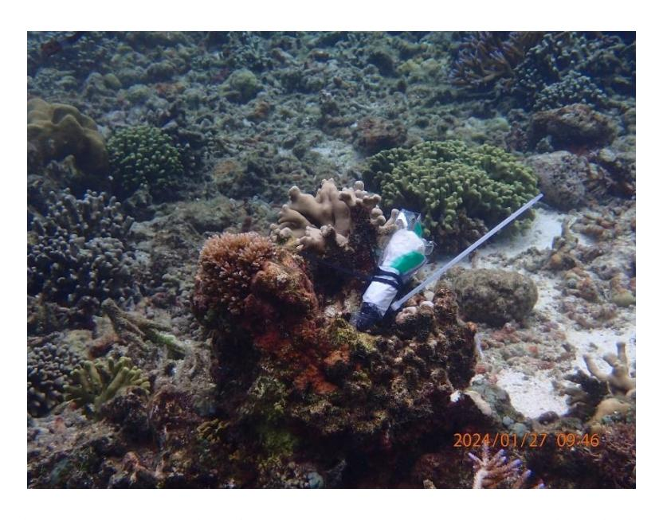

**Figure 13. Demonstration of a HOBO logger attached to a coral with a zip tie.**

**Table 6. Index of active temperature loggers deployed at the ASCRMP reef flat pool sites.**

|     | Active Temperature Loggers Deployed by ASCRMP Reef Flat/Pools (Snorkel Sites) |              |                                |              |                      |
|-----|-------------------------------------------------------------------------------|--------------|--------------------------------|--------------|----------------------|
| No. | Location                                                                      | Depth (m) | Lat, Long                      | Measurements | Agency/POC           |
| 1   | Onesosopo (Onesosospo 1)                                                   | 0.5-1.0      | S 14.290833 W 170.675833 | Temperature  | CRAG Coordination |
| 2   | Faga'alu (FAGAHOBO1)                                                          | 1.0-2.0      | S 14.291758 W 170.679545    | Temperature  | CRAG Coordination |
| 3   | Amanave (AMAHOBO1)                                                            | 0.5-1.0      | S 14.324445 W 170.833064    | Temperature  | CRAG Coordination |
| 4   | Sa'ilele (65)                                                                 | 0.5-1.0      | S 14.273650 W 170.69982     | Temperature  | CRAG Coordination |
| 5   | Olosega (OLOHOBO1)                                                         | 0.5-1.0      | S 14.179091 W 169.324551    | Temperature  | CRAG Coordination |
| 6   | Ofu (400HOBO1)                                                             | 0.5-1.0      | S 14.178528 W 169.654367    | Temperature  | CRAG Coordination |
| 7   | Airport pools (Airport)                                                       | 1.0          | S 14.266667 W 170.902778    | Temperature  | CRAG Coordination |
| 8   | Utulei (UTUHOBO1)                                                             | 0.5-1.0      | S 14.324466 W 170.833839    | Temperature  | CRAG Coordination |

| 9  | Gataivai           | 0.5-1.0 | S 14.282629 W 170.677987  | Temperature | CRAG Coordination |
|----|--------------------|---------|------------------------------|-------------|----------------------|
| 10 | Nuuuli (HOBO-NUA-S | 0.5-1.0 | S 14.317205 W 170.700014  | Temperature | CRAG Coordination |
| 11 | Auto (AUHOBOOO)    | 0.5-1.0 | S 14.273571 W 170.699759  | Temperature | CRAG Coordination |
| 12 | Alofau             | 0.5-1.0 | S 14.276255, W 170.604584 | Temperature | CRAG Coordination |
| 13 | Leone              | 0.5-1.0 | S 14.338796 W 170.789106  | Temperature | CRAG Coordination |

**Table 7. Index of Active Temperature Loggers Deployed by ASCRMP on Priority Slope Sites.**

|     | Active Temperature Loggers Deployed by ASCRMP Slopes (Dive Sites) |              |                                |              |            |                      |
|-----|-------------------------------------------------------------------|--------------|--------------------------------|--------------|------------|----------------------|
| No. | Location                                                          | Depth (m) | Lat, Long                      | Measurements | Duration   | Agency/POC           |
| 1   | Fagasa                                                            | 8            | S 14.2832 W 170.7233        | Temperature  | 03/13/2024 | CRAG Coordination |
| 2   | Alofau                                                            | 8            | S 14.27716 W 170.6068 | Temperature  | 2020       | CRAG Coordination |
| 3   | Amalau                                                            | 8            | S 14.2517                      | Temperature  | 2020       | CRAG                 |

|    |          |                      | W 170.6580                   |                             |                     | Coordination         |
|----|----------|----------------------|---------------------------------|-----------------------------|---------------------|----------------------|
| 4  | Amanave  | 8                    | S 14.32753 W 170.83188    | Temperature                 | 2020                | CRAG Coordination |
| 5  | Amaua    | 8                    | S 14.27368 W 170.6219  | Temperature                 | 2020                | CRAG Coordination |
| 6  | Fagaalu  | 8                    | S 14.29007 W 170.6766     | Temperature                 | 2020                | CRAG Coordination |
| 7  | Fagamalo | 8                    | S 14.29713 W 170.81173    | Temperature                 | 2020                | CRAG Coordination |
| 8  | Leone    | 8                    | S 14.34418 W 170.7892     | Temperature                 | 2020                | CRAG Coordination |
| 9  | Aoa      | 8                    | S 14.258180 W 170.5887 | Temperature                 | 03/12/2024          | CRAG Coordination |
| 10 | Fagasa   | 5                    | S 14.2856 W 170.7233   | Water Level/ Temperature | 09/2020 present  | NPSA                 |
| 11 | Muliulu  | 5, 10, 15, 20, 25 | S 14.2618 W 170.7128   | Temperature                 | 10/2015- 06/2020 | NPSA                 |
| 12 | Tafeu    | 5, 10, 15, 20, 25 | S 14.2492 W 170.6903   | Temperature                 | 10/2016- 03/2019 | NPSA                 |

| 13 | Utulei | 5                     | S 14.2783 W 170.6808 | Water Level/ Temperature | 03/2020 present | NPSA |
|----|--------|-----------------------|-------------------------------|-----------------------------|--------------------|------|
| 14 | Vatia  | 5, 10, 15, 20, 25- | S 14.2479 W 170.6698 | Temperature                 | 10/2015 present | NPSA |

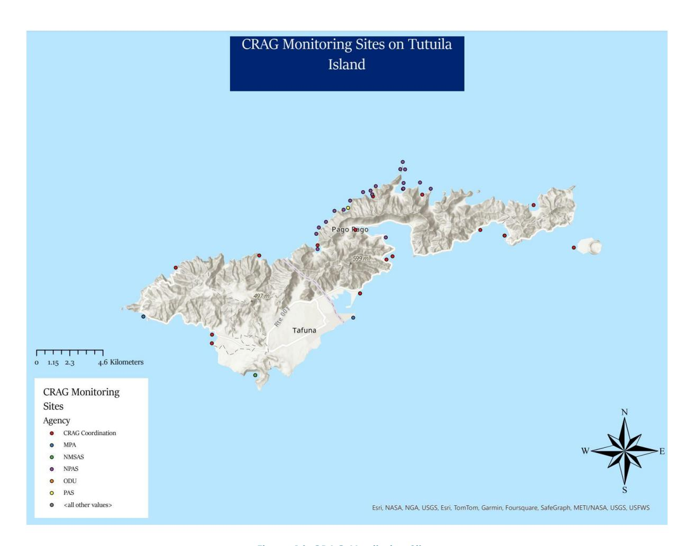

**Figure 14. CRAG Monitoring Sites.**

# 10.8.2. RAPID RECONNAISSANCE SURVEYS

If the alert status for American Samoa is elevated to warning or above and/or there are verified reports of bleached *Acropora* at two separate reef sites, rapid reconnaissance surveys will be conducted at designated priority sites around the island. The objective of these snorkel-based

surveys is to evaluate the spatial extent of coral bleaching, severity of the event using the classification levels in Table 2, and identify affected taxa. If overall bleaching is mild, rapid reconnaissance surveys may be performed again several weeks later. These sites were selected because they are easily accessible by snorkelers from the shore and are known to have populations of bleaching-susceptible corals. Before a bleaching event, the CTC will review CRAG monitoring sites. Additional sites may be selected based on resource availability and reports of localized bleaching.

Close-up inspection of a coral colony is needed to determine whether a coral is bleached or recently dead, as newly dead corals are also white. If a colony appears to be very clean and free of sediment and tentacles, which are visible when viewing the coral in profile, the colony is bleached but still alive. Dead colonies no longer secrete the mucus, allowing them to remove debris that has settled on their outer tissue layer, so any sediment built up or biofilm on a coral indicates mortality[14](#page-52-0).

Snorkelers should record colony-level data for tagged and/or affected colonies if time allows. Data to be recorded includes tag number (if tagged), species (or genera if species is unknown), colony location (lat/long), colony depth (at base), colony diameter (longest axis), bleaching description, location, and severity.

All bleached corals and tagged colonies should be photographed; GPS should be enabled to best track where photos are taken. Photographs should be labeled according to convention, uploaded to the shared folder, and made accessible to all response team members. The tag number is only included if the photo shows a tagged colony.

Photo labeling convention: SITEID\_MMDDYY\_OBSERVERINITIALS\_PHOTONUMBER\_TAGNO (e.g. S02\_052516\_JS\_001 or S10\_052516\_JS\_001\_S10A05)

# Required supplies:

• Meter stick or transect tape

- GPS-enabled camera
- Snorkel gear, dive slates, compass, GPS
- If surveying tagged colonies:
  - o Abrasive brush or other tool to remove algae from tags
  - o GPS coordinates or map for locating tagged colonies

14 Oliver, J., Marshall, P., Setiasih, N., & Hansen, L. (2004). A global protocol for assessment and monitoring of coral bleaching (1st edition). WorldFish Center, Penang, Malaysia, and WWF Indonesia, Jakarta, Indonesia.

# 10.8.2.1. CLASSIFYING BLEACHING EVENT

When determining which survey method to use, it is important to consider the following (Figure 15):

- Resources (e.g., time, gear, vessels) available
- Classification of event (minor, moderate, major). See Table 2 for classification levels
- Stage of the bleaching event (beginning, middle, end)
- Habitat (slopes, reef flats, and pools)

Depending on the event classification, the habitat types, and available resources, different survey schedules are recommended as follows:

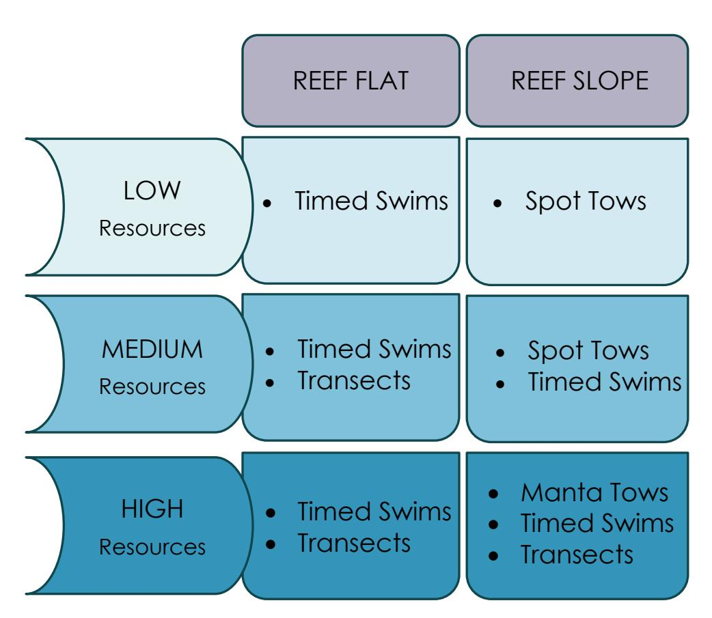

**Figure 15. Suggested survey methods, considering event classification, habitat and available resources. Created by Amanda Ho 2025.**

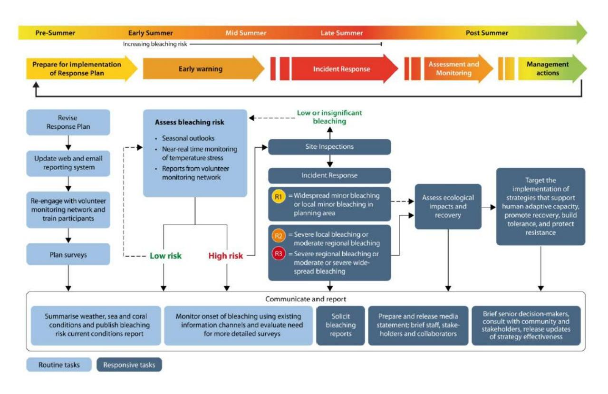

**Figure 16. Flow chart for coral bleaching response (Reef Resilience Network, Developing a Bleaching Response Plan).**

# 10.8.2.1.1. LIMITED INFORMATION/MINOR EVENT

If there is only limited information on the bleaching event or if the event was classified as 'minor,' conduct frequent spot-tows (a spot-check manta tow at a few key locations) or timed swims to get a general idea of the bleaching situation and determine if it is progressing into a moderate/major event. Resources must be considered in determining how often manta tows can be carried out and how much reef can be covered. It is recommended that spot-tows are carried out one day every month and that all four quadrants (NE, NW, SE, and SW) of the island and/or specific priority areas are covered. Collect aerial imagery using a drone at priority sites to assess the extent of bleaching and to compare bleaching over time.

# 10.8.2.1.2. MODERATE/MAJOR EVENT

If the event is classified as 'moderate' or 'major,' conduct manta tows and collect drone footage to document the bleaching event on a large scale. Identify areas of higher resilience to bleaching, as these areas are most valuable for management purposes. If possible, manta tow surveys should be carried out monthly to document bleaching progression through time. If resources are limited (e.g., limited access to boats), manta tow surveys should be carried out towards the peak of the bleaching event (when bleaching is at its worst) to be able to conclude overall severity as well as areas of higher resilience (i.e. areas that show reduced bleaching severity).

# 10.8.2.2. TIMED SWIMS - REEF FLAT, REEF SLOPES AND POOLS

Reef flat surveys are semi-quantitative snorkel-based surveys following the observation of moderate to severe bleaching at many shallow reef monitoring sites. Ideally, these surveys would begin in October/November and be conducted at 2-week intervals throughout the bleaching event and for several months afterward. If time and resources allow, photo-quadrats will also be taken.

These surveys can be conducted with two trained snorkelers or one trained snorkeler and a buddy who can take rapid recon photos while the trained snorkeler completes the surveys. At each site, three parallel transects (non-permanent) are surveyed for 30 minutes. Each time a site is surveyed, the coordinates of each transect's start and end points are recorded (written on a datasheet and marked as GPS waypoints). Following any site resurveys, the starting points from the first survey are used as the starting points for all transects during subsequent surveys. The ending points will vary as the survey is limited by time rather than distance or location, but the GPS points are always recorded so that the transect length can be approximated. The heading is also recorded during the first survey, and the same heading is repeated during all subsequent surveys.

Before entering the water, turn on the GPS track function and take a photo of the time, date, and location on the GPS so that photos taken during the surveys can be associated with the GPS points. Starting at the established waypoint for each transect, swim for 20 minutes at the established heading and record all coral colonies within a 1 m band, using the one-meter stick as a guide. For each colony, record species (or ID to genera and take a photo of both the datasheet and the colony if unable to ID to species); bleaching status (unbleached; partial pale; partial bleached or fluorescent; whole pale; whole bleached or fluorescent; whole bleached, part dead; whole dead). Note bleaching mortality for all colonies; count only recent mortality that can be reasonably attributed to bleaching. Species are recorded on the left side of the datasheet, and each colony is marked with a tally according to its bleaching status. If a colony exhibits another impact, it is marked with a letter instead of a tally in the lower portion of the cell (e.g., W = white syndrome, C = COTS, D = *Drupella*, P = *Predation*, T = *Terpios*, M = Mortality). After the surveys, it is recommended that snorkelers swim around the site and take photographs to further document the extent of bleaching and other impacts. All photos should be added to the shared response team folder on Google Drive.

Supplies and resources needed:

- 1 2 Snorkelers
- Snorkel equipment
- Datasheet, clipboard, pencil, rubberbands
- Underwater camera
- Float, GPS, and GPS drybag
- One-meter stick

This assessment aims to evaluate the nature of a specific coral event by providing detailed information on its spatial extent and severity at a designated site. The data collection process involves a team of two to four observers equipped with scuba gear, a GPS device, and a camera. The first step is to attach a waterproof GPS to a float and reel, set it on 'Tracking' mode, synchronize it with the observer's watch, and record coordinates throughout the dive at 5 second intervals. This information, along with the start and end times of the swim, is crucial for mapping the extent of the event.

For slope dives, the team conducts dives at two different depths: 12 meters and 5 meters. Observers swim along the 12-meter depth contour for 25 minutes, covering 300–400 meters, then ascend to 5 meters and swim back along the depth contour. In reef flats and pools, observers swim around the chosen area for 30 minutes. All species/genus/functional group information is recorded during the dive, considering factors like time, depth, coral cover percentage, bleaching extent, and severity. If identifying to the species or genus level, the growth form should also be noted.

Observers three and four, if available, capture opportunistic photos and video footage. Photos include wide-scale habitat scenery and individual corals from impacted and unimpacted species, genera, or functional groups. Video footage aims to record 3-5 meters of habitat within the frame.

Post-dive, observers one and two compare notes to agree upon a single estimate for different observations recorded on datasheets. Photos and videos taken by observers three and four are downloaded and reviewed by experienced individuals to provide detailed observations on estimated coral cover, bleaching extent, and bleaching severity across different coral growth forms and, if possible, coral genera. This comprehensive approach ensures a thorough and accurate assessment of the coral event.

Supplies and resources needed:

- Vessel
- 2 4 divers
- Snorkel and dive equipment
- Datasheet, clipboard, pencil, rubberbands
- Underwater camera
- Float, GPS, and GPS drybag
- One-meter stick

# Data Collected:

- Location, extent, and severity of the event
- Rapid estimates of dominant coral types affected

- Rapid assessment of proportion of coral bleached
- Estimated severity of bleaching, disease, damage or predation
- GPS points/tracks to map extent

# 10.8.2.2.1. MANTA TOWS

Before entering the water, turn on the track function and take a photo of the time, date, and location on the GPS so that photos taken during the surveys can be associated with the GPS points. Throughout the tow, coordinates are recorded at 10-second intervals, and the start and end times of the tow are documented. Monitoring involves two observers being slowly towed behind the vessel to observe extensive reef areas. Effective communication between the observer and the driver is facilitated through hand signals, with the driver maintaining a constant speed of approximately 4 km/hr along a consistent depth contour when possible. Observers diligently assess the reef area during two-minute tows and document essential information on the manta board. This includes the time and estimated depth, the percentage of live hard coral cover, and the extent and severity of impact on the coral, categorizing whether it is live, bleached, or recently dead.

If observers possess knowledge of different coral growth forms, they conduct a closer examination at the stopping point. The same information is recorded based on functional groups, considering cover, bleaching, and severity estimates for each functional group. It's important to note that these estimations are specific to the monitoring process's current location and stopping point.

Supplies and resources needed:

- Vessel
- 2 observers, including a drone pilot
- 1 drone
- Snorkel equipment
- GPS, and GPS drybag
- Manta board and towing lines
- Datasheet, clipboard, pencil, rubberbands
- Underwater camera

# Data to collect:

- GPS survey track to map affected reef area and locate hotspots
- Coral Cover (%) of live hard coral present

- Extent of impact: Rapid assessment of the proportion (%) of coral colonies affected by bleaching
- The severity of the event: Estimate the condition of the majority of affected corals, i.e., partially bleached, totally bleached, damaged, recently dead (if visible)
- Rapid estimates of dominant coral growth form affected by the bleaching

# 10.8.2.2.2. TRANSECTS

Transects through underwater visual census and photo-transects will be done to assess the impact of coral events on a smaller scale, aiming to record detailed information on the proportion and abundance of affected corals, considering factors like genus and growth forms. The goal is to quantify variations in impact severity among coral taxa and functional groups and understand the event's broader spatial and temporal influence on the reef system. These surveys are initiated once bleaching has been reported at specific reefs and reaches bleaching watch or warning levels.

Conducted in appropriate locations such as reef slope sites, reef flats, and pools, transects will be initiated in October to collect baseline data per year for each reef before SST rises. If bleaching occurs, revisits are scheduled periodically (at predetermined intervals or as time allows) to monitor the progression of loss, survival, and mortality, with the monitoring period finalizing in April when weather conditions worsen.

The process involves setting the GPS on 'Tracking' mode, attaching it to a float, and recording the location every minute. A float is attached to the reef at the beginning of the transect, where three 10-meter transects are laid out at the chosen depth on the reef flat or slope. Observer one records fish species, abundance, and size, excluding cryptic species, across a 5-meter belt on each side. Observer two counts every coral colony on a 1-meter-wide belt along the transect, recording bleaching severity. Observer three takes photos using a monopod every 1 meter along the transect. Additional observers, if available, capture wide-scale habitat scenery photos, individual corals from different impacted species, and videos of the general habitat along the transect. This ensures steady and slow movement for high-quality footage, aiming to record 3-5 meters of habitat within the frame.

Supplies and resources needed:

- Vessel (for reef slopes)
- 2 4 Divers
- Snorkel and dive equipment
  - o Reel
- 100 m transect tape x 2

\*See Appendix for more information on methodology

- Underwater camera x 2
- Float, GPS, and GPS drybag
- Datasheet, clipboard, pencil, rubber bands

# Data to collect:

- Benthic and coral community structure (Percent substrate cover by taxa and functional group)
- Fish assemblage structure (Fish abundance and size by taxa)
- Bleaching severity per colony
- Proportion of coral cover affected by bleaching
- Tagged coral colonies bleaching severity at the colony level

# 10.8.2.2.3. DETAILED TRANSECT METHODS AND TAGGING COLONY METHODS

The survey approach will prioritize reef flats, pools, and slope sites by implementing three 25 m transects per site. These transects will be strategically laid parallel to the shore for reef flats and pools, while on the reef slope, they will follow the 10 m depth contour. The surveys conducted at these sites will encompass benthic, fish, and bleaching assessments, providing a comprehensive understanding of reef health and ecology throughout the pre-, during, and post-bleaching phases. The transects will be semi-permanent, marked at their starting and ending points with GPS coordinates and large cable ties. This design allows for subsequent re-surveys of the same transects, facilitating comparisons of reef health in fish and benthic communities before, during, and after bleaching events.

Sites will be surveyed on a rotational basis, with one site assessed per week, focusing on benthic and fish assemblages and bleaching throughout the bleaching season. The initiation of these surveys will coincide with the reporting or prediction of bleaching events. This could involve a coordinated effort across agencies to survey all sites over two weeks, strategically targeting peak bleaching and the post-bleaching period to ensure a thorough understanding of the impacts across various locations.

Bleached colonies (10 per site) will be tagged to monitor mortality/recovery at the colony level over time. Tagged colonies will be photographed during and after the bleaching event. Colonies will be tagged using numbered cow tags and cable ties. The software 'ImageJ' will calculate tissue mortality and/or recovery for each colony using the cow tag as a size reference.

To ensure enough replicate colonies are tagged, five bleaching colonies of two common coral genera (Acropora & Porites) with similar growth forms will be tagged per site. Colonies will then be tracked to assess how they respond to bleaching stress throughout summer. Comparisons of bleaching impact and recovery across sites and between colonies within one site can be made to determine whether the resilience of these genera differs across sites.

To secure the tag in place, cable ties or metal wire on dead reef/ rock next to the colony can be used, or alternatively, a nail and hammer can keep the tag flat without obscuring/ damaging the coral. When possible, an image of the whole colony will be captured (i.e., table *Acropora*). Otherwise, a monopod (~75 cm) will capture a standardized colony area (i.e., *Porites cylindrica* thicket). Ensure cow tags are flat (not on an angle) when taking images of the whole colony - so they can be measured accurately in ImageJ.

# 10.9. POST-BLEACHING AND RECOVERY SURVEYS

Coral bleaching does not always result in mortality; many corals can recover from bleaching events if anomalous temperatures soon return to within normal range, and there is limited stress from other threats, such as land-based sources of pollution. When mortality does occur, the impacts on coral reef ecosystems are much more severe as the structural complexity of the habitat is degraded. Dead corals are quickly colonized by algae, making them difficult to differentiate from corals that died from other causes, such as COTS[15](#page-60-2). Branching corals such as *Acropora spp*. do not maintain their structure for long after the colony is dead and are soon reduced to loose rubble. During a lengthy bleaching event, mortality should be measured regularly to capture all deaths due to bleaching. Ideally, corals will be surveyed every 2-3 weeks to capture mortality and reliably attribute it to bleaching. The optimal sampling interval to monitor reef health following a bleaching event is after two months, six months, 12 months, and 24 months8. Post-bleaching surveys should begin once all corals have recovered or died, and no bleached corals are visible. Tagging individual colonies and surveying them before, during, and after bleaching events is a highly effective way to measure mortality and recovery. This also allows genetic analysis of samples from individuals that have proved highly resilient (or highly vulnerable) to bleaching.

# 10.10. COMMUNICATION AND OUTREACH STRATEGY

The communication and outreach strategy is designed to increase awareness among policy makers, community members, and other stakeholders of the impacts of coral bleaching on American Samoa's reefs. An effective communication strategy incorporating social marketing will alter the attitudes and perceptions of the target audiences, ultimately resulting in behavior changes. The CRAG Education and Outreach Coordinators will assist with public outreach efforts related to bleaching. Specific activities associated with this strategy include:

• Developing media messaging before bleaching and disseminating statements before, during, and after bleaching, including popular media platforms in AS (Facebook and public radio).

15 Oliver, J., Marshall, P., Setiasih, N., & Hansen, L. (2004). A global protocol for assessment and monitoring of coral bleaching (1st edition). WorldFish Center, Penang, Malaysia, and WWF Indonesia, Jakarta, Indonesia.

- Hosting community meetings and presenting briefings to agency administrators, legislators, the Governor's office, and other decision-makers.
- Instigating behavior change to reduce local stressors on coral reefs during periods of high thermal stress in order to increase resilience to coral bleaching

The American Samoa Environmental Protection Agency's Outreach and Education Program is committed to enhancing community awareness of coral bleaching issues by leveraging various media platforms such as radio, television, and social media. AS-EPA will collaborate with media outlets to ensure coverage of comprehensive concerns and engage with the community through a multifaceted outreach program. See Appendix A for communication and outreach material.

# 10.11. MANAGEMENT ACTIONS

There are currently no viable management actions at the disposal of local resource managers to mitigate the impacts of mass coral bleaching events directly. However, perhaps the most important management actions related to climate change and coral bleaching are those that deal instead with local impacts by ensuring that coral reef ecosystems are as healthy as possible, which will speed recovery following the coral mass mortality associated with bleaching. Coral reef managers can also implement temporary measures to minimize certain anthropogenic impacts during periods of known thermal stress, such as restricting entry to areas known to host susceptible coral communities.

The challenge of reducing greenhouse gas (GHG) emissions is a global-scale problem that needs to be addressed through international coordination among all levels of government. Even if GHG emissions ceased immediately, SST is still expected to rise due to the lag between the change in atmospheric GHG concentrations and consequent changes in atmospheric and oceanic temperatures due to thermal expansion in the ocean. Global average SST is expected to increase by 0.4-1.1° C by 2025[16](#page-61-1). Within 40 years, 95% of all coral reefs are expected to experience severe bleaching on a near annual frequency[17](#page-61-2) which may lead to the loss of a significant portion of the world's coral reef resources.

Recommendations to improve the effectiveness of American Samoa's coral bleaching response activities and natural resource management to increase the resilience of American Samoa's coral reef ecosystems include:

16 Adopted, I. P. C. C. "Climate change 2014 synthesis report." *IPCC: Geneva, Szwitzerland* (2014): 1059-1072.

17 Burke, L., Reytar, K., Spalding, M., & Perry, A. (2011). Reefs at risk revisited: technical notes on modeling threats to the world's coral reefs. *Washington, DC: World Resources Institute*.

# 10.11.1. SURVEY METHODS AND DATA SHARING

- Maintain detailed, descriptive records of all response activities and data collected on coral bleaching events. Make these records easily accessible to CRAG Monitoring Team members and other stakeholders.
- Develop a system for coordinated reef surveys, with maximum coverage of reef sites, types, and taxa groups, to be conducted by citizen scientists in ASCRMP, community watch, and NPS CoralWatch.
- Compile data collected in situ and provide it to NOAA CRW (e.g., through ReefBase) to validate CRW products. Interpret local data according to projections to assess the accuracy of bleaching outlooks and improve American Samoa's early warning system for future events.
- If resources permit: Establish a permanent monitoring program of staghorn colonies around the island, as these species have demonstrated high susceptibility to thermal stress and coral bleaching.

# 10.11.2. AREAS FOR FUTURE RESEARCH

- Identify and classify American Samoa's reefs according to resilience levels. Evaluate the thermal stress thresholds of specific reefs and taxa. Determine which reefs and which taxa are most and least resistant or resilient to coral bleaching. Prioritize most resistant reefs to be protected. Conservation of reefs with high tolerance to thermal stress may create a refugia network capable of providing coral larvae to degraded reefs less resilient to warming[18](#page-62-2).
- Conduct research that increases understanding of the susceptibility of American Samoa's corals to the synchronous occurrence of coral bleaching and disease outbreaks. Evaluate which corals may be more likely to succumb to disease if bleached and those that may be more likely to bleach if impacted by disease.
- Study the relationship between coral bleaching and predator outbreaks such as corallivorous gastropod *Drupella cornus* or Crown-of-Thorns Sea Star (*Acanthaster* spp.), which may receive chemical cues from stressed corals. Consider utilizing participants in American Samoa's community-based outreach programs to physically remove predators from reefs if an outbreak occurs following a bleaching event.
- Seagrasses and bivalves are important for regulating water quality, grazers, pH, and more which can promote coral reef health and recovery. Future mapping and monitoring of these benthic habitats can increase resilience in nearby reefs and inform

18 Marshall, P., & Schuttenberg, H. (2006). A Reef Manager's Guide to Coral Bleaching. Great Barrier Reef Marine Park Authority Publication.

future areas primed for transplantation and recovery.

# 10.11.3. NATURAL RESOURCE MANAGEMENT ACTIONS

- Implement interagency projects that reduce local stressors to American Samoa's reefs, such as land-based sources of pollution (LBSP) and heavy fishing pressure, which will improve the health of local coral reef ecosystems and increase their resilience to coral bleaching and other impacts of global climate change. These initiatives should be tied to American Samoa's Local Action Strategies (LAS) and their associated working groups. Impacts from coral bleaching could be reduced if local anthropogenic impacts lessened during bleaching events. Restricting access by recreational users within the preserves during bleaching events may also reduce stress and increase resilience to bleaching.
- Conduct "lessons learned" meetings with all personnel involved in response activities following each response. Continuously update the beaching response plan to reflect new scientific findings and improve the efficiency of the early monitoring system, SOPs, and data collection protocols. The bleaching plan should be updated and agreed upon by all CRAG Monitoring Team members every two years.
- Investigate the feasibility of novel, active responses to mitigate coral bleaching, such as shading, using sprinklers to increase capillary waves to decrease light, heterotrophic feeding of corals to compensate for decreased nutrition due to zooxanthellae loss, and acoustic enhancement to compensate for loss of grazers. These experimental approaches may be piloted in small areas, such as American Samoa's coral nursery or on a reef with abundant threatened and/or resilient coral taxa.
- Establish a CRAG scientific diver program and dive board to ensure dive reciprocity among agencies and increase the safety and efficiency of response activities.

# 10.11.4. REEF RECOVERY AND RESTORATION

- Create a development plan for a coral nursery as defined in the 'Action Plan for Coral Reef Restoration in American Samoa.' Transplant fragments and/or breed coral colonies that have survived bleaching and thus may be more resilient to future bleaching events. Protect the nursery during bleaching events with shading and/or water movement.
- Develop methods and capacity to scale up restoration work on American Samoa. This may include adding additional nursery sites and developing techniques to increase coral production for out-planting, such as sexual propagation, tile development and installation methods, and micro-fragmenting.
- Increase ecosystem resilience by developing protections and restoration plans for local seagrass meadows and bivalve beds that can buffer the effects of warming and nutrient pollution.

• Train community members in restoration techniques.

# 10.11.5. FUNDING FOR RESPONSE ACTIVITIES

- In the past, funding of bleaching response activities on American Samoa has been largely opportunistic, as most grant-makers are unlikely to fund activities contingent upon the uncertain occurrence of a large-scale climatic event. Planning for a bleaching response in advance is challenging, given that the frequency and severity of bleaching events are still largely unpredictable. Furthermore, agency resources, personnel, and leadership are often in flux.
- The largest expenditure for coral bleaching response in American Samoa is vessel and staff time. Personnel availability is also a limiting resource. Including funding for bleaching response in grant proposals may be possible if the activities are framed as training or capacity building. The funds will support response activities if a bleaching event occurs during a grant cycle. Still, if bleaching does not occur, the money will be spent on training for the CRAG Monitoring Teams and other stakeholders to prepare for expected future events.

# 11. AMERICAN SAMOA VESSEL GROUNDING RESPONSE PLAN

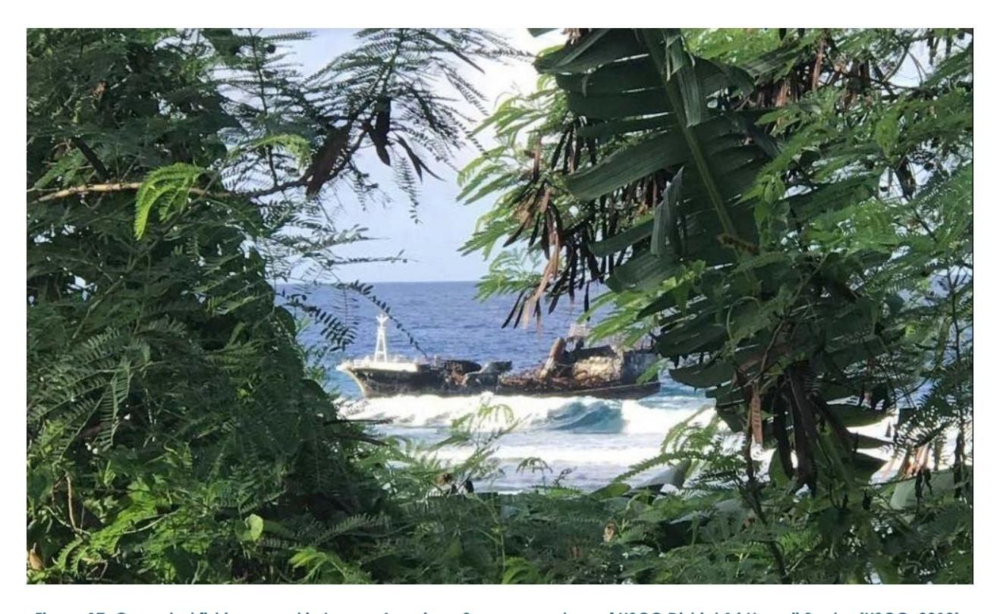

**Figure 17. Grounded fishing vessel in Leone, American Samoa, courtesy of USCG District 14 Hawaii Sector (USCG, 2018).**

# 11.1. OVERVIEW

The American Samoa Vessel Grounding Response Plan was developed to address vessels that have run aground and harmed the surrounding environment in American Samoan waters. This response plan provides information tailored to the environment and authorities of American Samoa. For a broader understanding of abandoned vessel response and best practices, please refer to [NRT Abandoned Vessel Authorities and Best Practices Guidance](https://nrt.org/sites/2/files/NRT%20Abandoned%20Vessel%20Authorities%20and%20Best%20Practices%20Guidance%20FINAL%2001JULY2020.pdf)[19](#page-65-3). Vessel groundings include any vessel that is situated on the seabed or waterside and has therefore lost its ability to navigate. Both criminal and accidental groundings shall fall under this response plan. Vessel groundings trample reefs and other benthic habitats, killing sea life in their wake. The longer a vessel is left unattended, the more damage is incurred from vessel drift. Other vessel-related damage to coral reefs include anchoring scars, mooring scars, and non-grounding collisions with the benthos. Exact impacts of grounded and abandoned vessels are wide and varying.

[https://nrt.org/sites/2/files/NRT%20Abandoned%20Vessel%20Authorities%20and%20Best%20Practices%20Gui](https://nrt.org/sites/2/files/NRT%20Abandoned%20Vessel%20Authorities%20and%20Best%20Practices%20Guidance%20FINAL%2001JULY2020.pdf) [dance%20FINAL%2001JULY2020.pdf](https://nrt.org/sites/2/files/NRT%20Abandoned%20Vessel%20Authorities%20and%20Best%20Practices%20Guidance%20FINAL%2001JULY2020.pdf)

19

Examples include: shading seagrass, crushing coral, stirring up sediment, and leaching toxic chemicals[20](#page-66-2). Further, an increased prevalence of disease has been found to be associated with vessel grounding injuries[21](#page-66-3).

In many places, including American Samoa, removing ADVs is challenging, as there are no governing laws that clearly identify responsible parties for clean-up nor assign sources of funding[22](#page-66-4). This plan will help to quickly and efficiently organize assessment and removal activities to avoid further damage and gain a full understanding of the impacts and repercussions to inform conservation goals as well as associated legal matters. Specifically, this document will help to identify on and off-island entities that can assist in removal as well as possible sources of funding.

This plan includes a definition of terms, a background on groundings in American Samoa, relevant laws and policies for grounded and abandoned vessels, permitting procedures, environmental impact assessment protocols, removal strategies, sources of funding for vessel removal, and suggestions for future policies and prevention.

# 11.2. DEFINITION OF TERMS

**Table 8. Definition of Terms used in this section.**

| Abandoned Vessel | "The surrendering of all rights to a vessel (or other obstruction) and its cargo by the owner, or owners if vessel and cargo are separately owned."23 |
|---------------------|-------------------------------------------------------------------------------------------------------------------------------------------------------------|
| Derelict Vessel     | A dilapidated vessel.                                                                                                                                       |
| Grounded Vessel     | Any vessel that is situated on the seabed or waterside and has therefore lost its ability to navigate.                                                   |

20 [https://americansamoa-data.nocache.eightyoptions.com.au/dataset/impact-ship](https://americansamoa-data.nocache.eightyoptions.com.au/dataset/impact-ship-grounding-and-associated-fuel-spill-rose-atoll-national-wildlife-refuge)[grounding-and-associated-fuel-spill-rose-atoll-national-wildlife-refuge](https://americansamoa-data.nocache.eightyoptions.com.au/dataset/impact-ship-grounding-and-associated-fuel-spill-rose-atoll-national-wildlife-refuge)

21 Raymundo LJ, Licuanan WY, Kerr AM. (2018). Adding insult to injury: Ship groundings are associated with coral disease in a pristine reef. PLoS ONE 13(9): e0202939. <https://doi.org/10.1371/journal.pone.0202939>

22 Zelo, I., & Helton, D. (2005, May). Removal of Grounded, Derelict or Abandoned Vessels as Site Restoration. In *International Oil Spill Conference* (Vol. 2005, No. 1, pp. 809-813). American Petroleum Institute.

23 33 Code of Federal Regulations (C.F.R.) § 245.5

| Marine Debris    | "Any persistent solid material that is manufactured or processed and directly or indirectly, intentionally or unintentionally, disposed of or abandoned into the marine environment or the Great Lakes."24 Further per USCG and NOAA, "An item or piece of an item originally placed or permitted in the marine environment, but that subsequently breaks apart, becomes lost, or is no longer actively monitored, could be considered disposed of or abandoned and would meet the definition of marine debris."25 |
|------------------|-----------------------------------------------------------------------------------------------------------------------------------------------------------------------------------------------------------------------------------------------------------------------------------------------------------------------------------------------------------------------------------------------------------------------------------------------------------------------------------------------------------------------------------------|
| Navigable Waters | Per the CWA, "Waters of the United States and its territorial seas."26                                                                                                                                                                                                                                                                                                                                                                                                                                                                  |
| Vessel           | Any craft used for any transportation on water.                                                                                                                                                                                                                                                                                                                                                                                                                                                                                         |

# 11.3. OBJECTIVES

- 1. Define groundings and provide contextual history of groundings and vessel-related environmental injuries in American Samoa.
- 2. Summarize the physical and chemical environmental consequences of groundings.
- 3. Map the relevant authorities' jurisdictions to expedite response actions and provide insight on relevant authorities and jurisdictional priorities.
- 4. Outline steps to assess impacts to the environment pre and post removal and monitor for recovery.
- 5. Detail permitting requirements for vessel removal.
- 6. Provide guidance on best practices for vessel removal.
- 7. Advise on vessel grounding policies and regulations surrounding vessel maintenance.
- 8. Outline funding protocols and resource acquisition for removal needs.

24 16 33 C.F.R. § 151.3000

25 74 Fed. Reg. 45555, 45558 (3 September 2009)

26 33 U.S.C. § 1362(7)

# 11.4. BACKGROUND

Vessel groundings are frequent in American Samoa due to the prevalence of fishing boats, cargo ships, passenger ferries, and adverse weather conditions that can sweep vessels aground. Groundings in American Samoa are difficult to manage as funds are limited and vessel insurance is an uncommon practice.

# 11.4.1. PREVIOUS GROUNDINGS IN AMERICAN SAMOA AND IMPACTS

# 11.4.1.1. JIN SHIANG FA SHIPWRECK 1993

Historical groundings of vessels in American Samoa include the 1993 Jin Shiang Fa Shipwreck of a Taiwanese longliner at Rose Atoll NWR, which left 100,000 gallons of diesel spilt and 300 tons of iron debris[27](#page-68-2). The excess iron leaching into the water has contributed to harmful algal blooms that are creating 'black reefs,' which refers to the reduced clarity and settlement of dark waste[28](#page-68-3). Similarly, copper from the metal wreckage and toluene and benzene from the fuel oil had leached into the water column creating toxic zones for marine organisms9. The wreck crushed the reef and killed many inhabiting invertebrates affecting 9,000 ㎡ of reef. This caused a shift in the system's ecology by removing native organisms and inviting species that are attracted to macroalgae. Prior to removal, impact assessments three years later showed meager recovery. Removal efforts, coordinated by US F&W, began 11 Nov 1993 and are ongoing as of June 2024. The vast and prolonged efforts and funds needed to investigate and remedy a vessel grounding should encourage proper regulations and subsequent enforcement as preventative measures. The current removal strategy is to have a crew of surface supplied divers saw off metal debris underwater to then float up with lift bags.

# 11.4.1.2. CHUI ZAI FA NO. 1 SHIPWRECK 2018

On 7 February 2018, an 88-foot fishing vessel named Chui Zai Fa No. 1 ran aground a coral reef off Leone in Tutuila's Western District coinciding with Tropical Storm Gita[29](#page-68-4). The vessel's crew had abandoned ship in November of 2017 when it caught fire in international waters and fled to Fiji. The incident was deemed not to have any chemical pollutants by the US Coast Guard who found the diesel and fuel tanks to be empty. Salvage efforts ensued by partners in American Samoa (EPA, DMWR, & NMSAS). Developing or coordinating with an existing agency's easyreporting network of international mayday calls could have given local authorities warning that

27 Green, A., Burgett, J., Molina, M., Palawski, D., & Gabrielson, P. (1997). The impact of a ship grounding and associated fuel spill at Rose Atoll National Wildlife Refuge, American Samoa. *Report to US Fish and Wildlife Service, Pacific Islands Ecoregion, Honolulu, Hawaii*. 28 Kelly, L. W., Barott, K. L., Dinsdale, E., Friedlander, A. M., Nosrat, B., Obura, D., ... & Rohwer, F. (2012). Black reefs: iron-induced phase shifts on coral reefs. *The ISME Journal*, *6*(3), 638-649. 29 Molle, T. (2018, February 13). *Coast Guard completes pollution response efforts for grounded fishing vessel in American S*. U.S. Indo-Pacific Command.

https://www.pacom.mil/Media/News/News-Article-View/Article/1440681/coast-guardcompletes-pollution-response-efforts-for-grounded-fishing-vessel-in/

a ship was adrift, and in certain circumstances, allowed for preemptive measures to stop it from grounding on a reef.

# 11.4.1.3. NO. 1 JI HYUN SHIPWRECK 2016

On 14 April 2016, No.1 Ji Hyun ran aground on reefs off Aunu'u's western side located in a National Marine Sanctuary unit[30](#page-69-0). The wreckage was situated on important fishing grounds, impacting the local community[31](#page-69-1). Following the initial oil clean-up by USCG (who also initiated three unsuccessful removal attempts) under the Oil Pollution Act, jurisdiction was handed over to NOAA23;24. NOAA contracted a salvage naval architect (salvage master) to devise an extraction plan from T&T Salvage. Three months post-grounding, successful removal occurred via tandem tow with two tug boats by NOAA under the National Marine Sanctuaries Act23;24. The difficulties were that there were only two out of three tugboats in American Samoa with the capacity to tow such a ship and could only be driven during daylight, high tide, and when they weren't already scheduled to escort incoming cargo and cruise ships to Pago Pago Harbor23. The owner of the vessel had no liability insurance, as the American Samoa Starkist Tuna Cannery who contracted the vessel, does not require insurance. This plan encourages considering policies to require vessel insurance to avoid similar situations.

# 11.4.1.4. NINE GROUNDED FISHING VESSELS 1991

Following Tropical Cyclone Val, 9 ADVs that had been sitting in Pago Pago Harbor were swept into valuable reefs (OR&R, 2023). There were initially 1500 gallons of oil associated with the groundings, prompting involvement by the Hawaiian USCG as directed by the Oil Pollution Act. As removal was predicted to increase damage to the already battered reefs, NOAA decided to deploy NRDA authorities, funded by the Oil Spill Liability Trust, to implement restoration at the sites of impact. This was the first time the OSLT was used for restoration purposes, which amounted to \$3 million, and offers precedent for future restoration funding. It took nine years to remove every grounded vessel, along with the 36,000 gallons of oil and 600 pounds of pure ammonia they polluted over time. Coral transplantation efforts around the grounding scars showed a 60-78% success rate by 2005. This grounding scenario illustrates the need to proactively remove ADVs before they are swept aground onto reefs, especially in American Samoa where strong wave energy and storms are frequent.

30 Symons, L. C., Paulin, J., & Peau, A. L. (2017, May). Challenges of OPA and NMSA Related Responses in the National Marine Sanctuary of American Samoa: NO. 1 JI HYUN. In *International Oil Spill Conference Proceedings* (Vol. 2017, No. 1, pp. 2389-2407). International Oil Spill Conference.

31 Weinberg, E. (n.d.). *Wrecked on a reef: A community's effort to save their livelihood*. Wrecked on a Reef: A Community's Effort to Save Their Livelihood | Earth Is Blue Magazine Vol. 2 | Office of National Marine Sanctuaries. https://sanctuaries.noaa.gov/magazine/2/wrecked-on-a-reef/

# 11.4.2. RELEVANT LOCAL LAWS AND POLICIES

American Samoa does not currently have laws directly addressing vessel groundings or removal. The following laws are preventative measures to ensure vessels meet set standards and regulations that will reduce the chance of groundings. Please see section 13.8 for guidance on appropriate policymaking.

# 11.4.2.1. [ASAC TITLE 24 CHAPTER 8 HAZ-MAT 24.0813](https://www.as-epa.com/_files/ugd/bcdca0_34e7b631da994947b1bff8c0e84912d9.pdf)

- (c) Vehicles and vessels used for transport shall be appropriately sized and shall be compatible with the material being transported and shall be clean and free of debris. General use cargo shall be compatible with the materials being transported and in no case shall incompatible materials be transported on the same vehicle or vessel. Transporters shall ensure that any residues left in the transport equipment is removed and disposed of properly.
- (e) Vehicles and vessels transporting hazardous materials shall carry emergency response equipment necessary and sufficient for the initial control of a spill or release, such as absorbent booms and material, rags, fire extinguishers, brooms, and shovels. In the event of a spill or release, the vehicle or vessel operator shall be responsible for notifying ASEPA and DPS and for making the initial response until a qualified HAZMAT response team arrives.

# 11.4.2.2. ASG CODE SECTION 20.0210 INSPECTIONS.

The Board\* shall inspect, or cause to be inspected by a duly authorized representative, each vessel registered under this chapter. Such inspections shall be at reasonable times and places as the Board shall direct and shall be conducted at least once a year and at such other times as the Board shall deem necessary.

\*Board refers to the Marine Board which is tasked to enforce ASG maritime laws. This marine board has been disbanded and remains so as of 2024.

# 11.4.2.3. ASG CODE SECTION 20.1702 - MOVEMENT OF VESSELS.

Vessels may be moved or shifted at any time at the discretion of the Port Director within Pago Pago Harbor. This authorizes the Port Director to remove vessels from the harbor.

# 11.4.2.4. DAYLIGHT OPERATIONS

All vessel operations must occur during daylight hours to align with the American Samoa Alternative Planning Criteria (APC).

# 11.4.3. RELEVANT FEDERAL LAWS, POLICIES, & AGENCIES

The following federal policies apply to the entire territory.

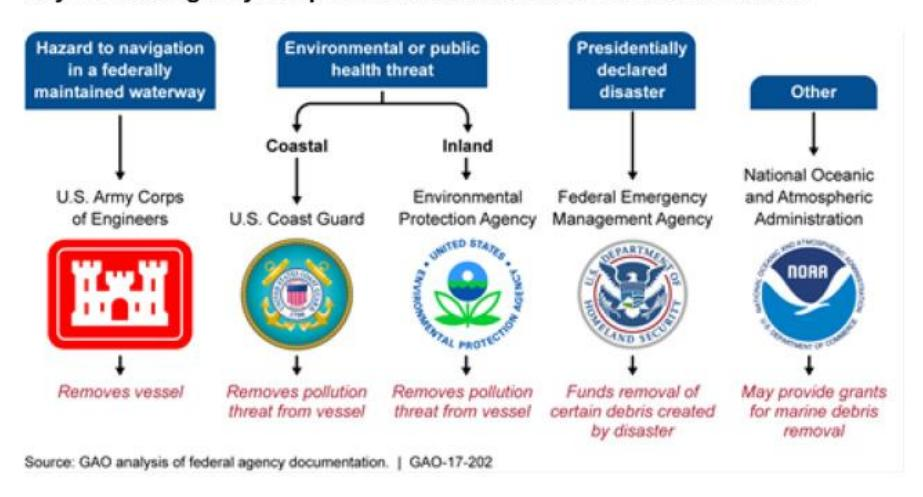

**Figure 18. Diagram representing agency responsibilities regarding ADVs (GAO, 2017).**

*From NRT Abandoned Vessel Authorities and Best Practices Guidance (2020):*

# 11.4.3.1. § 4701-4705: ABANDONED BARGE ACT

The Abandoned Barge Act authorizes USCG OSCs[32](#page-71-1) to remove an abandoned barge under specific circumstances. This statute applies to navigable waters of the U.S. including territorial seas as provided in Section 1 of this Guidance. Pursuant to § 4701, "abandon means to moor, strand, wreck, sink, or leave a barge of more than 100 gross tons unattended for longer than forty-five days." Further, the Act initiates civil penalties and outlines removal and destruction procedures. The authority to remove a barge under this statute does not include the removal of pollutants.

# 11.4.3.2. § 2101-2106: ABANDONED SHIPWRECK ACT

Under the ASA, the U.S. declares title to abandoned shipwrecks located in the submerged lands of a state. The federal government then transfers the title to the state whose submerged lands contain the shipwreck.[33](#page-71-2) Protected shipwrecks under state care can provide opportunities to recreational divers, tourists, and researchers. Public access to the shipwrecks may be encouraged by states through the creation of underwater parks.

The National Park Service (NPS) publishes guidelines for states and agencies for the development of shipwrecks as cultural resources. The effort facilitates access and utilization of the shipwrecks by a variety of organizations and interest groups including divers and research

32 Removal authorities and delegations discussed in further detail in subsection 33 U.S.C. § 1251-1387 below.

33 Except when the wreck is located on public or Indian land, or is a U.S. warship that has not been affirmatively abandoned.

organizations. The OSC/COTP should consult with the NPS before conducting removal of pollutants from protected wrecks.

Consultation is required of all federal agencies undertaking an "action" under Section 106 of the NHPA. USCG has a specific programmatic agreement that addresses this consultation process. Consultation under Section 106 is with the State and Tribal Historic Preservation Officers and may also include the Advisory Council on Historic Preservation, DOI, NOAA, the U.S. Maritime Administration (MARAD), and Department of Defense (DOD). In addition, there may be additional requirements under the Sunken Military Craft Act.

# 11.4.3.3. § 9601-9675: COMPREHENSIVE ENVIRONMENTAL RESPONSE, COMPENSATION, AND LIABILITY ACT, CERCLA

Like the CWA, it provides for the removal of hazardous substances when there is a release or substantial threat of a release to the environment, including from abandoned vessels. CERCLA § 104(a)(1) directly authorizes responders to remove or arrange for the removal, or take any other response measures to remove or mitigate a hazardous substance, pollutant, or contaminant when: any hazardous substance is released or there is a substantial threat of such a release into the environment, or there is a release or substantial threat of release into the environment of any pollutant or contaminant which may present an imminent and substantial danger to the public health or welfare. [34](#page-72-0) The federal OSC's CERCLA response authorities are detailed within the NCP. In situations when a facility or vessel, which is the source of a release, is under the jurisdiction, custody, or control of DOD or the Department of Energy (DOE), the response authority resides within that agency.[35](#page-72-1) For other federal agencies, the response authority resides with that agency, except for emergencies.

Under CERCLA, designated natural resource trustees can seek damages from responsible parties associated with a CERCLA incident. Damages include natural resource damage assessment, restoration, and replacement of the injured habitat or acquisition of equivalent habitat, and compensation of the public for the value of the injured resources until full recovery. Under CERCLA, the Trustees may consider vessel removal as a viable component of compensation, if debris removal is determined to be an appropriate and preferred alternative for injury compensation.

# 11.4.3.4. § 1251-1387: FEDERAL WATER POLLUTION CONTROL ACT, COMMONLY KNOWN AS CLEAN WATER ACT, AS AMENDED BY THE OIL POLLUTION ACT OF 1990 AND DELEGATIONS OF AUTHORITY

CWA Sections 311 (c) and (e) provide authority to remove pollutants from potentially polluting sources, including abandoned vessels. CWA has been amended a number of times. The amendments, in addition to the NCP implementing regulations, all contribute to the OSC's authority. This section explains the pertinent provisions from each amendment. The NCP will also be discussed further below.

CWA authority described here applies to a discharge or substantial threat of a discharge of oil and/or hazardous substances. Except for when explicitly stated otherwise, "removal" under the CWA refers to an activity whereby the responder physically removes the pollutant from the

34 42 U.S.C. § 9604

35 Executive Order (E.O.) 12580 (1987)

vessel, rather than the vessel from its current environment. It is also important to note the removal of oil and hazardous substances is conducted using separate funding mechanisms – the Oil Spill Liability Trust Fund (OSLTF) and the CERCLA fund, respectively.

Removal authority for oil pollution threats comes from CWA § 311(c), as amended by OPA 90 § 4201, and in accordance with the NCP, 40 C.F.R. Part 300.305(d)(1) to:

- Remove or arrange for the removal of a discharge, and mitigate or prevent a substantial threat of a discharge, at any time;
- Direct or monitor all federal, state, and private actions to remove a discharge; and
- Remove and, if necessary, destroy a vessel discharging, or threatening to discharge, by whatever means are available.

Threat determination and removal authority for the inland zone has been delegated to the EPA Administrator under E.O. 12777.[36](#page-73-0) EPA has further re-delegated this authority to the EPA Regional Administrators (RAs). The RAs have re-delegated the authority to the Regional Division Directors that manage the removal programs and, in most cases, have re-delegated the authority directly to the individual OSCs. E.O. 12777 also delegated the authority to determine whether a pollution threat is imminent and substantial, and to take removal action, including vessel removal if required to address the threat in the coastal zone to the Secretary of the Department in which the USCG is operating. This authority has been further delegated to the Commandant and re-delegated further to pre-designated OSCs under 33 C.F.R. Part 1.01-80.

Under 33 C.F.R Part 1.01.-80 the Commandant has not delegated authority to remove or destroy a vessel. Such OSC/COTP actions require Commandant approval.

Under Section 404 of the Clean Water Act, Department of Army authorization is required for the discharge of dredged and/or fill material into waters of the U.S., including wetlands. Cleanup, vessel removal, excavation, and vessel disposal activities may require the discharge of fill material which may result in temporary or permanent impacts to waters of the U.S. It may be necessary for the OCS to obtain any required authorizations from the relevant USACE district regulatory office under Section 404 of the CWA, and/or any other applicable laws and regulations unless otherwise exempted.

# 11.4.3.5. OIL POLLUTION ACT OF 1990

Under OPA, designated natural resource trustees can seek damages from responsible parties associated with an OPA incident. Damages include natural resource damage assessment, restoration, and replacement of the injured habitat or acquisition of equivalent habitat, and compensation of the public for the value of the injured resources until full recovery. Under OPA, trustees may consider vessel removal as a viable component of compensation, if debris removal is determined to be an appropriate and preferred alternative for injury compensation.

Under the NCP, EPA and the USCG have the same authority for response to abandoned vessels, but EPA generally has the lead for discharges or releases into or threatening the inland zone and USCG has the lead in the coastal zone, as agreed upon between an EPA Region and the USCG District for a given area and identified in federal Regional Contingency Plans (RCPs).[37,](#page-73-1)[38](#page-73-2) The

36 Section 3 of E.O. 12777 delegated removal authority for both coastal and inland zones to USCG and EPA, respectively.

37 40 C.F.R. § 300.120(a)

38 40 C.F.R. § 300.210(b)

specific delineation is known as a Response Boundary and the geographical area as an Area of Response. CWA authorizes the OSC to remove or arrange for "the removal of a discharge or a substantial threat of a discharge of oil or a hazardous substance into navigable waters; on the adjoining shoreline; into or on the waters of the Exclusive Economic Zone (EEZ); or that may affect natural resources of the U.S."

National Planning Criteria (NPC) & Alternative Planning Criteria (APC)

33 CFR 155.5067 & 33 CFR 155.1065 describe vessel response plan (VRP) requirements for nontank vessels and tank vessels. 33 CFR 155.1015 (a) 1-3 describe VRPs for tank vessel response plans, and tank vessel APC requirements. Tank vessels are vessels constructed or adapted to carry oil in bulk as a cargo or cargo residue that is a vessel of the US, operates on the navigable waters of the US, or transfers oil in a port or place subject to the jurisdiction of the US. 33 CFR 155.5015 (a) 1-4 applies to non-tank vessels, which require a non-tank VRP. This applies to nontank vessels that are self-propelled, carry oil of any kind for fuel or main propulsion, is not a tank vessel, operates on the navigable waters of the US, and is 400 gross tons or more measured under the convention or regulatory measurement system. If a vessel does not meet the minimum applicability requirements to trigger a VRP, they do not trigger APC requirements\*.

\*Most fishing vessels in AS do not meet the minimum requirements for a VRP or APC and therefore pose greater risk of marine pollution. Fishing vessels are the main vessel type that runs aground on reefs in the territory.

# *Adapted from the [Code of Federal Regulations:](https://www.ecfr.gov/current/title-33/chapter-I/subchapter-O/part-155/subpart-J/section-155.5067)*

When the owner or operator of a nontank vessel believes that national planning criteria are inappropriate for the areas in which the vessel intends to operate, the vessel owner or operator may submit an alternative planning criteria (APC) request to the Coast Guard. APC requests must be submitted 90 days before the vessel intends to operate under the proposed alternative, or as soon as is practicable. The alternative planning criteria request must be endorsed by the Captain of the Port (AS Port Director) with jurisdiction over the geographic area(s) affected before being considered by Commandant (CG-MER), Office of Marine Environmental Response Policy, for the review and approval of the respective VRP. In any case, the request must be received by Commandant (CG-MER) with an endorsement by the respective COTP no later than 21 days before the vessel intends to operate under the APC.

# 11.4.3.6. PART 300: NATIONAL OIL AND HAZARDOUS SUBSTANCES POLLUTION CONTINGENCY PLAN

The purpose of the NCP, under 40 C.F.R. Part 300.3(b) is "[Providing] for efficient, coordinated, and effective response to discharges of oil and releases of hazardous substances, pollutants, and contaminants in accordance with the authorities of CERCLA and the CWA." It provides for: "(b)(3): Procedures for undertaking removal actions pursuant to Section 311 of the CWA."

Except in a case when the OSC is required to direct the response to a discharge of oil, the OSC may allow the responsible party (RP) to voluntarily and promptly perform removal actions, provided the OSC determines such actions will ensure an effective and immediate removal of the discharge or mitigation or prevention of the substantial threat of discharge. The OSC is also authorized to direct all response actions, including arranging for the removal, by whatever

means available, of the substantial threat of discharge (including from a wreck).[39](#page-75-0) The NCP provides clear response direction, specifically authorizing the OSC to address and remove a vessel, if necessary, to mitigate or prevent substantial threats of discharge.[40](#page-75-1)

To stabilize the situation and limit further damage, the NCP directs OSCs to ensure proper measures are taken to secure the source of the spill and remove any remaining oil to prevent additional discharge, minimize continued response action in the future, and lessen the impacts to the environment.[41,](#page-75-2)[42](#page-75-3)

# 11.3.2.7. § 1471-1487: INTERVENTION ON THE HIGH SEAS ACT

IHSA provides that "federal intervention actions" occur "upon determination of a grave and imminent danger to the coastline or related interest of the [U.S.]," and authorizes the USCG to ". . . remove or eliminate threatened pollution damage" and "…remove, and if necessary, destroy the ship and cargo which is the source of danger."[43](#page-75-4) "Ship" is defined as "(A) a seagoing vessel of any type whatsoever, and (B) any floating craft, except an installation or device engaged in the exploration and exploitation of the resources of the seabed and the ocean floor and the subsoil thereof."[44](#page-75-5) CERCLA authorizes funds for high seas intervention activities. High seas refers to waters seaward of the territorial seas of the U.S.[45](#page-75-6)

The International Convention Relating to Intervention on the High Seas in Cases of Oil Pollution Casualties was adopted in 1969 and allows a coastal nation to take defensive action against a vessel on the high seas where pollution by oil is threatened. IHSA gives USCG intervention authority in circumstances when a ship is threatening to spill crude oil, fuel oil, diesel oil, or lubricating oil into the seas. Further, USCG has the authority to take measures on the high seas to mitigate such dangers.

The U.S. has implemented the Intervention Convention by enacting IHSA, which authorizes actions that may be taken in the case of imminent danger to the coastline or related interests of the U.S. from pollution or threat of pollution. The measures taken to abate the pollution must be proportionate to the damage (actual or threatened).[46](#page-75-7) If actions are not proportionate to the threat, the U.S. or other coastal nations will be liable for damages caused.

Before intervening, the Secretary of Homeland Security must consult through the Secretary of State, with the flag state of the ship involved. Also, the Secretary must consult with any other agency or persons whose interests can be reasonably expected to be affected by the proposed measures, except in cases of extreme urgency.

The Secretary of Homeland Security may coordinate and direct all public and private efforts designed to remove or eliminate the threatened pollution; to undertake the whole or any part of any salvage operation of the polluting vessel; and to remove and destroy the ship and the cargo that is the source of the damage.

39 40 C.F.R. § 300.305(d)

40 40 C.F.R. § 300.305(d)(1)(iii)

41 In most oil spill response and removal cases, an OSC will have an identifiable RP and will be responsible for monitoring the response actions of the RP.

42 40 C.F.R. § 300.317

43 33 U.S.C. § 1474

44 See 33 U.S.C. § 1471(5)

45 33 C.F.R. § 2(c)

46 The OSLTF, established by CWA, is available for intervention activities under the IHSA.

# 11.4.3.8. § 1951-1958: MARINE DEBRIS ACT

The Marine Debris Act was signed into law in 2006 and amended in 2012 and 2018. The Act established the NOAA Marine Debris Program to address the adverse impacts of marine debris on the U.S. economy, the marine environment, and navigation safety through identification, determination of sources, assessment, prevention, reduction, and removal of marine debris. The Act defines "marine debris" as "any persistent solid material that is manufactured or processed and directly or indirectly, intentionally or unintentionally, disposed of or abandoned into the marine environment or the Great Lakes." The Act also established a program within USCG to reduce violations and improve implementation of the [International Convention for the](http://encyclopedia.thefreedictionary.com/International%2BConvention%2Bfor%2Bthe%2BPrevention%2Bof%2BPollution%2Bfrom%2BShips)  [Prevention of Pollution from Ships](http://encyclopedia.thefreedictionary.com/International%2BConvention%2Bfor%2Bthe%2BPrevention%2Bof%2BPollution%2Bfrom%2BShips) (MARPOL) Annex V, as well as plans to improve ship-board waste management.

In October 2018, the President signed the "Save our Seas Act of 2018" (Public Law No: 115-265). This law amends and reauthorizes the Marine Debris Act for four years, promotes international action to reduce marine debris in our ocean, authorizes cleanup and response actions needed as a result of severe marine debris events, such as hurricanes or tsunamis, and updates the membership of the Interagency Marine Debris Coordinating Committee. Additionally, the Act authorizes and requires NOAA to work with other federal agencies to develop additional outreach and education strategies to address sources of marine debris.

# 11.4.3.9. § 1401-1445: MARINE PROTECTION, RESEARCH, AND SANCTUARIES ACT (TITLE 1)

The MPRSA, also known as the Ocean Dumping Act, regulates the dumping of all types of materials into ocean waters and strictly limits the dumping of any material that would adversely affect human health, welfare or amenities, marine environment, ecological systems, or economic potentialities.[47](#page-76-0) Title I of the Act generally prohibits (1) transportation of material from the U.S. for the purpose of ocean dumping; (2) transportation of material from anywhere for the purpose of ocean dumping by U.S. agencies or U.S. flagged vessels; and (3) dumping of material transported from outside the U.S. into the U.S. territorial sea. A permit is required to deviate from these prohibitions. Under MPRSA, the standard for permit issuance is whether the dumping will "unreasonably degrade or endanger" human health, welfare, or the marine environment. Evaluation of whether degradation would be unreasonable or cause endangerment requires consideration of alternatives to ocean disposal, including land-based alternatives.[48](#page-76-1)

EPA is the MPRSA permitting agency for all materials except dredged material. (In the case of dredged material, the decision to issue a permit is made by USACE, using EPA's environmental criteria and subject to EPA's concurrence.) EPA has issued a general permit under the MPRSA for the transportation and disposal of vessels. The MPRSA implements the requirements of the 1972 London Convention on the Prevention of Marine Pollution by Dumping of Wastes and Other Matter (London Convention), the international ocean dumping treaty. The U.S. Government reports the ocean dumping of vessels to the International Maritime Organization pursuant to the London Convention.[49](#page-76-2)

48 33 U.S.C. § 1412(a)

47 33 U.S.C. § 1402(b)

49 The USCG's role under the MPRSA is primarily related to certain enforcement activities. See, 33 U.S.C. 1417.

# 11.4.3.10. § 1431 ET SEQ: NATIONAL MARINE SANCTUARIES ACT

Under the NMSA, NOAA manages a system of 14 marine protected areas in U.S. waters. The statute provides NOAA the authority to address any activities that are likely to destroy, cause the loss of, or injure sanctuary resources. For some sites within the system, this authority includes activities that occur outside the boundaries but that could enter and injure sanctuary resources.

Within these sanctuaries, NOAA can seek damages from responsible parties to cover response, injury and damage assessment, restoration, and replacement of the injured habitat or acquisition of equivalent habitat, and compensation of the public for the value of the injured resources until full recovery. Under the NMSA, NOAA may have financial resources available to assist with the response, particularly if there is no longer a nexus to OPA 90 or CERCLA. The NMSA also requires consultation under Section 304(d)[50](#page-77-0) for any activities that are "likely to destroy, cause the loss of or injure a sanctuary resource." During consultation, NOAA may recommend reasonable and prudent alternatives to protect sanctuary resources and to address activities that conflict with site- specific activities such as disturbance of the seabed, and discharge or deposit of materials that could occur during assessment or removal activities.

# 11.4.3.11. §409, 411, 412, 414, AND 415: WRECK ACT

The Rivers and Harbors Appropriation Act of 1899 (RHA) contains several sections known as the Wreck Act, which provides USACE the authority to remove sunken vessels that pose an obstruction to navigation. This statute applies to navigable waters of the U.S. Under the Wreck Act, the owner, operator, or lessee of a submerged vessel is responsible for immediately marking the vessel with a buoy or beacon during the day and a lighted lantern at night.[51](#page-77-1) The markings must remain until the vessel is removed. The owner, operator, or lessee is also required to "diligently" commence "immediate" removal of the submerged vessel. If the vessel is not removed within 30 days, it will be considered abandoned and USACE may take action to remove the vessel from the navigable waters.[52](#page-77-2) The determination of whether a wreck poses an obstacle to navigation rests initially with USACE and a reviewing court will only overturn the determination if the decision is found to be arbitrary and capricious.

If USACE determines the existence of the submerged or wrecked vessel in the navigable waters of the U.S. is creating an emergency situation, the vessel owner, operator, or lessee will be given 24 hours to begin removal of the vessel using the most expeditious method available.[53](#page-77-3) USACE makes every effort to locate, contact, and work with the vessel owner/ operator / lessee. However, if the vessel is not removed or steps are not taken in an expeditious manner to secure the vessel's removal, USACE may intercede to remove, sink, or destroy the vessel to alleviate the situation. The vessel owner, operator, or lessee will then be liable to the U.S. for all costs associated with the government's action. If the owner fails or refuses to reimburse the government within 30 days after notification, the vessel may be sold with the proceeds going to the U.S. Treasury.[54](#page-77-4)

Under Section 10 of the Rivers and Harbors Appropriation Act of 1899, Department of Army authorization is required for work or structures in, over, or under navigable waters of the U.S. or

51 33 U.S.C. § 409

50 16 U.S.C. § 1434

52 33 U.S.C. §§ 409 & 414

53 33 U.S.C. § 415: *RHA, (*b) Removal Authority

54 Cases such as HOVIC III, Steel oil barge. M/V Baltic Sun, Steel hull freighter. Both removed from Christiansted, U.S. Virgin Islands (USVI) in 1992.

that otherwise affects the course, location, or condition of such waters. In addition, the cleanup, vessel removal, and vessel disposition activities may be regulated. The entity proposing to undertake the activity may need to apply for and receive authorization from the relevant USACE district regulatory office prior to commencing these activities.[55](#page-78-0) It may be necessary for the OSC to obtain any required authorizations from the relevant USACE District Regulatory Office under Section 10 of the RHA, and/or any other applicable laws and regulations unless otherwise exempted.

# 11.4.3.12. PART 245: REMOVAL OF WRECKS AND OTHER OBSTRUCTIONS

33 C.F.R. Part 245 implements provisions of the Wreck Act, as amended by the Water Resources Development Act of 1986, and also reflects the procedures from an interagency agreement between USACE and USCG. The Water Resources Development Act of 1986 (Pub. L. No. 99-662 §939) amended the Wreck Act by extending jurisdiction to non-negligent sinkings, extending the obligation for marking and removal to vessel operators and lessees (in addition to owners), and providing for reimbursement to the U.S. Treasury for full costs of federal removal and disposal. The USACE criteria for determining a hazard to navigation when evaluating the removal of an abandoned or wrecked vessel under these regulations are found below.

Upon receiving a report of a wreck or other obstruction, District Engineers will consult with the USCG District to jointly determine whether the obstruction poses a hazard to navigation. The factors considered in determining a hazard to navigation may, at a minimum, include:

- Location of the obstruction in relation to the navigable channel and other navigational traffic patterns.
- Navigational difficulty in the vicinity of the obstruction.
- Clearance or depth of water over the obstruction, fluctuation of water level, and other hydraulic characteristics in the vicinity.
- Type and density of commercial and recreational vessel traffic, or other marine activity, in the vicinity of the obstruction.
- Physical characteristics of the obstruction, including cargo, if any.
- Possible movement of the obstruction.
- Location of the obstruction in relation to existing aids to navigation.
- Prevailing and historical weather conditions.
- Length of time the obstruction has been in existence.
- History of vessel accidents involving the obstruction.

After a determination has been made that an obstruction presents a hazard to navigation, District Engineers will consult with the USCG District to determine the appropriate remedial action for the specific situation. Any combination of the following, as noted in 33 C.F.R. § 245.25, may be considered:

| ● | Charting |  |
|---|----------|--|
|   |          |  |
|   |          |  |
|   |          |  |

- Marking
- *Redefinition of navigational area* (e.g., channel, fairway, or anchorage)
- Removal*[56](#page-79-0)*
- Broadcast Notice to Mariners and publication of navigational safety information (regarding location of abandoned vessel or wreck)
- No Action

The marking of wrecks, regulated under 33 C.F.R. Part 64, is the responsibility of the USCG while removal is at the discretion of the USACE.[57](#page-79-1) The USCG and USACE signed a MOU on October 5, 2012 that outlines procedures for making determinations of hazards to navigations and coordinating mitigation actions when a hazard to navigation exists. The 2012 MOU replaces an October 1985 MOA between USCG and USACE to mitigate hazards to navigation.

# 11.4.3.13. § 7361 ET SEQ: SALVAGE FACILITIES ACT

The Salvage Facilities Act authorizes contracting of U.S. Navy Supervisor of Salvage (SUPSALV). The Salvage Facilities Act, enacted after World War II, has several objectives, including:

- To provide salvage resources to protect the redeployment of government-owned war materiel on chartered ships (but not in excess of national defense needs).
- To foster (but not subsidize) the commercial salvage industry.
- To allow (but not require) the Navy to render salvage services to private vessels when commercial salvors are not available, charging for those services to support the Navy's Salvage facilities.

# 11.4.3.14. § 88: SAVING LIFE & PROPERTY

For the protection of persons and property on the high seas and under the waters over which the U.S. has jurisdiction, 14 U.S.C. § 88 authorizes USCG to "destroy or tow into port sunken or floating dangers to navigation." This law applies to scenarios such as the Japanese F/V RYOU-UN MARU, which was intentionally destroyed by USCG in 2012.[58](#page-79-2) The vessel, having drifted for more than a year as a result of an earlier tsunami in Japan, posed a significant danger to safe navigation and threatened to impact Alaskan shores, potentially discharging significant amounts of oil.

56 There are several instances where USACE has removed vessels posing a hazard or at risk of posing a hazard to navigation even though the RP has the first responsibility to remove a wreck.

57 The marking and removal of wrecks is governed by sections 15, 19 and 20 of the Wreck Act, as amended (33 U.S.C. §§ 409, 414, & 415).

58 Although this case was within U.S. waters, the variables surrounding the case are comparable to those that may require invocation of IHSA.

# 11.4.3.15. OTHER FEDERAL AUTHORITIES

Other federal government agencies may have authorities when abandoned vessels are on their land or threaten lands under their care, e.g., NOAA (National Marine Sanctuaries), NPS (National Parks), USFWS (National Wildlife Refuges), and DOD facilities.

**Table 9. Federal agencies responsible for relevant vessel grounding policies.**

| Title                                                                                      | Statute/ Regulation   | Lead Agencies |     |     |          |        |      |
|--------------------------------------------------------------------------------------------|-----------------------|---------------|-----|-----|----------|--------|------|
|                                                                                            |                       | DOD           | DOI | EPA | NOA A | USACE* | USCG |
| Abandoned Barge Act                                                                        | 46 U.S.C. § 4701      |               |     |     |          | X      | X    |
| Abandoned Shipwreck Act (ASA)                                                           | 43 U.S.C. § 2101      |               | X   |     |          |        |      |
| Comprehensive Environmental Response, Compensation, and Liability Act (CERCLA) | 42 U.S.C. § 9601      |               |     | X   |          |        | X    |
| Clean Water Act (CWA)                                                                   | 33 U.S.C. § 1251      |               |     | X   |          |        | X    |
| Intervention on the High Seas Act (IHSA)                                                | 33 U.S.C. § 1471      |               |     |     |          |        | X    |
| Marine Debris Act                                                                          | 33 U.S.C. § 1951      |               |     |     | X        |        | X    |
| Marine Protection, Research and Sanctuaries Act (MPRSA)                           | 33 U.S.C. § 1401      |               |     | X   | X        |        |      |
| National Marine Sanctuaries Act (NMSA)                                               | 16 U.S.C. § 1431      |               |     |     | X        |        |      |
| Oil Pollution Act of 1990 (OPA 90)                                                      | 33 U.S.C. § 2710‐2761 |               |     | X   | X        |        | X    |
| Wreck Act                                                                                  | 33 U.S.C. § 414, 415  |               |     |     |          | X      | X    |

| Title                        | Statute/ Regulation                           | Lead Agencies |     |     |          |        |      |
|------------------------------|-----------------------------------------------|---------------|-----|-----|----------|--------|------|
|                              |                                               | DOD           | DOI | EPA | NOA A | USACE* | USCG |
| Salvage Facilities Act       | 10 U.S.C. § 7361                              | X             |     |     |          |        |      |
| Saving Life and Property  | 14 U.S.C. § 88                                |               |     |     |          |        | X    |
| Sunken Military Craft Act | Public Law 108-375, Title XIV,§§ 1401-1408 | X             |     |     |          |        |      |

\*Pago Harbor is NOT a federally maintained port, but US ACE regulations still apply to Pago Harbor. USACE is responsible for the other seaports in the territory (Aunu'u, Ofu, Ta'u).

# 11.4.4. RELEVANT INTERNATIONAL LAWS AND POLICIES

# MARPOL 73/78

*Adapted from [USCG Office of Commercial Vessel Compliance](https://www.dco.uscg.mil/Our-Organization/Assistant-Commandant-for-Prevention-Policy-CG-5P/Inspections-Compliance-CG-5PC-/Commercial-Vessel-Compliance/Domestic-Compliance-Division/MARPOL/#:~:text=MARPOL%2073%2F78%20consists%20of,%2C%20III%2C%20V%20and%20VI.) (CG-CVC):*

MARPOL 73/78 consists of six separate Annexes, each set out regulations covering the various sources of ship-generated pollution. Annex I and II are mandatory for all signatory nations to MARPOL while Annexes III, IV, V and VI are optional. Currently, the U.S. is signatory to Annexes I, II, III, V and VI. Annexes I, II, V and VI have been incorporated into U.S. law by the Act to Prevent Pollution from Ships (APPS) and implemented within 33 USC 1901 and 33 CFR 151. The U.S. incorporates Annex III by the Hazardous Materials Transportation Act (HMTA) implemented within 46 USC 2101 and 49 CFR 171 -174 and 176. Although the U.S. has not ratified Annex IV, the U.S. has equivalent regulations for the treatment and discharge standards of shipboard sewage – the Federal Water Pollution Control Act (FWPCA) as amended by the Clean Water Act and implemented by 33 USC 1251 and 33 CFR 159.

Act to Prevent Pollution from Ships (APPS) 1980

# *From the [National Whistleblower Center:](https://www.whistleblowers.org/what-is-the-act-to-prevent-pollution-from-ships/)*

In order to implement the provisions of MARPOL, the [U.S. passed](https://www.govtrack.us/congress/bills/96/hr6665) the Act to Prevent Pollution from Ships (APPS) in 1980. APPS applies to U.S. commercial vessels, as well as non-U.S. commercial vessels operating in U.S. waters or ports of U.S. jurisdiction. APPS makes it a crime to knowingly violate certain provisions of MARPOL and other oil pollution laws. The United States Coast Guard and the U.S Environmental Protection Agency are the main enforcers of MARPOL and APPS within the U.S. Additionally, APPS includes whistleblower provisions to help combat illegal pollution and empower and incentivize workers to expose any known information about pollution from ships.

# 11.5.1. VESSEL GROUNDING RESPONSE FLOWCHART

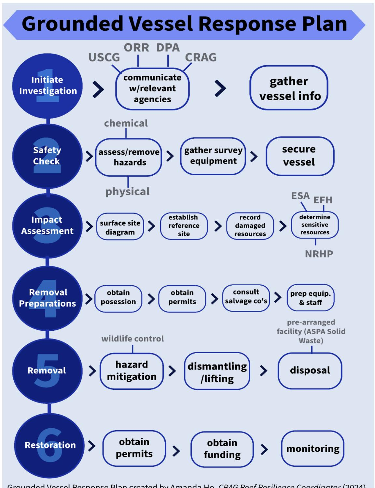

**Figure 19. Flowchart for vessel grounding response steps. Created by Amanda Ho 2024.**

# 11.5.2. STEP 1: INITIATE INVESTIGATION

- A. Before going to the site, **communicate with all relevant authorities** (refer to Section 7: Maps of American Samoa Jurisdictions and Boundaries) and ensure they are aware of the situation. Gain information on their roles and responsibilities regarding the grounding. Relevant authorities shall include the American Samoa Port Authority, the USCG (if there is active pollution), and any and all agencies or local village chiefs that manage the area in which the grounding occurred. **\*\*NOTE: OSA needs to be contacted before landbased surveying to ask for permission from the appropriate village's chief. Please call [\(684\) 633-5201\\*](https://www.google.com/search?q=office+of+samoan+affairs&rlz=1C1GCEU_en&oq=office+of+samoan+affairs&gs_lcrp=EgZjaHJvbWUqBwgAEAAYgAQyBwgAEAAYgAQyCAgBEAAYFhgeMg0IAhAAGIYDGIAEGIoFMg0IAxAAGIYDGIAEGIoFMg0IBBAAGIYDGIAEGIoFMgoIBRAAGIAEGKIEMgoIBhAAGIAEGKIEMgoIBxAAGIAEGKIEMgoICBAAGIAEGKIE0gEIMjg3N2owajeoAgCwAgA&sourceid=chrome&ie=UTF-8)\***
- B. **Gather information about the vessel.** You may use [this checklist](https://docs.google.com/spreadsheets/d/1ZI-Miyl_TqJQrNrpWxhs53DuBDo92CyEFherwA8xRhU/edit?gid=0#gid=0) (which can also be found in Appendix C 18.3.1.) to compile this information. Please consider the following from the *NRT Abandoned Vessel Authorities and Best Practices Guidance*:
  - Vessel location & brief description of environment (moored, stranded, at anchor, or submerged).
  - Vessel load and threat of pollution.
  - Is the vessel posing an obstruction to navigation? [59](#page-83-1) If the vessel lies in or is immediately adjacent to a federal navigation channel and poses a potential hazard to navigation, removal oversight is provided by the USCG or USACE within their specific navigation authorities. Both agencies will collaborate and determine who leads the removal oversight and the appropriate action(s) to be taken. The following information is required to determine appropriate removal:
    - Is the vessel located in a federally maintained commercial harbor, or a navigable waterway authorized by Congress, and which USACE operates and maintains for general (including commercial and recreational) navigation or in a water area immediately adjacent to these areas? This includes Aunu'u, Ofu, Olosega, and Ta'u harbors.
      - If YES, USACE is responsible for removing the vessel.
    - Does the vessel pose a threat to navigation?
      - If YES, prioritize a quick removal.
    - Does the vessel pose a threat to public health and safety?
      - If YES, USCG is responsible for removing the vessel (not the EPA, as American Samoa is entirely zoned as 'coastal'). Please refer to Figure 18.

59 See 33 CFR § 245.20(a) for a list of factors used by USACE to determine whether a wreck is a hazard to navigation.

- Owner/operator or lessee and insurance information (some vessels are well known, long-time derelicts). This should be accomplished by the DPA and/or local enforcement.
- How the grounding occurred.
- Physical construction and condition (wood, steel, fiberglass, or composite).
- Potential link to illegal activities.
- Vessel type (fishing vessel, yacht, barge, etc.).
- Size/vessel tonnage (over or under 100 displacement tons).
- Propulsion type (e.g., sail or motor).
- Flag state of vessel (foreign flagged vessels may need to be assessed under international regimes).
- Sensitive habitat or protected resources.
- Potential historic preservation and gravesite status[60](#page-84-1)

# 11.5.3. STEP 2: PRE-ASSESSMENT SAFETY CHECK

A. **Ensure scene safety.** Check for chemical hazards through toxicology reports and water analyses from first response agencies (USCG). Consider the risks of on-water and underwater work, as well as prolonged exposure to toxins and extreme temperatures. The table below, adapted from NRT Authorities and Best Practices Guidance, contains common safety issues:

For Sunken Vessels, responders should opt for Remotely Operated Vehicles (ROVs) or aerial imagery (contact NOAA) to investigate the immediate impacts.

85

60 The State Historic Preservation Officer and any relevant tribes should be contacted about potential impacts to historical and cultural resources.

**Table 10. Major Site Safety Issues adapted from NRT Abandoned Vessel Authorities and Best Practices Guidance.**

| Hazard                                                                                        | Mitigation                                                                                                                                                                                                                                                            |
|-----------------------------------------------------------------------------------------------|-----------------------------------------------------------------------------------------------------------------------------------------------------------------------------------------------------------------------------------------------------------------------|
| In-water work (SCUBA, snorkeling, free diving)                                                |                                                                                                                                                                                                                                                                       |
| Wildlife contact                                                                              | Implement Wildlife Monitoring Teams to monitor and report wildlife activity.                                                                                                                                                                                       |
| Depth of diving/amount of work required below surface                                      | Diver work/rest should be regularly monitored. Dive Supervisor will ensure this activity is conducted.                                                                                                                                                             |
| Decontamination of personnel diving in contaminated waters                                 | Expedited emergency diver decontamination should be established in advance to support rapid decontamination and employment of surface decompression in chamber.                                                                                                 |
| Product Removal                                                                               |                                                                                                                                                                                                                                                                       |
| Explosion/static accumulation of oil product in containers                                 | Ensure proper transfer protocols are followed and that safety precautions are taken to mitigate possible explosive atmospheres.                                                                                                                                 |
| Hydrogen sulfide (H2S) exposure from removed product (heated bunker oils, crudes, etc.) | Some operations require product to be heated. Ensure atmospheric monitoring and exclusion zones are appropriately established based on OSHA permissible exposure limits/ American Conference of Governmental Industrial (ACGIH) threshold limit values.61 |
| Flammable vapors (gasoline, naphthalene, jet-a, etc.)                                      | Ensure proper transfer protocols are followed and that safety precautions are taken to mitigate explosive atmospheres.                                                                                                                                             |
| Heavy lift/overhead operations                                                                | Crane operations are common during major operations such as this. Proper site safety protocols include safety zones, licensed operators, and safety observers among others.                                                                                     |
| General Safety                                                                                |                                                                                                                                                                                                                                                                       |
| Slips, trips, and falls                                                                       | General awareness should always be taken when on-site, considering the number of trip and fall hazards present. Non essential personnel should be limited.                                                                                                      |
| On-water operations                                                                           | Personal Floatation is required for all on-water operations.                                                                                                                                                                                                          |
| Thermal exposure (heat/cold stress)                                                           | Exposure standards should be consistent with OSHA recommendations, included in the Site Safety Plan, and briefed to all teams.                                                                                                                                  |
| Crew fatigue                                                                                  | Exposure standards should be consistent with OSHA recommendations, included in the Site Safety Plan, and briefed to all teams.                                                                                                                                  |

- B. **Secure the vessel if necessary**. Beached vessels may need to be secured to avoid being carried out with the tide and damaging more resources. If securing is required, notify the owner, operator, or lessee. Identify hazards to navigation to influence an appropriate amount of urgency. Further, beached vessels may be easily accessible to the public and therefore pose risks to public safety.
- C. **Determine and gather the equipment** and supplies needed to conduct an impact assessment at the site. Consider the following:
  - Personnel to conduct surveys
  - Garmin GPS
  - Slates, waterproof papers, pencils
  - Underwater Camera
  - Drone to capture aerial imagery before water is declared safe to enter.
  - Securing ropes/chains, if necessary.

# 11.5.4. STEP 3: IMPACT ASSESSMENT (PRE-REMOVAL)

*If the site is not accessible or safe, explore other technologies to capture information about the impacted site such as aerial photography from a drone or remote sensing data.*

**\*\*Make sure to have robust documentation of the extent of the damage and surrounding undamaged regions that may need to be presented to a judge during liability suits. You are not only collecting data, you are also collecting evidence against the responsible party\*\***

61 It is recommended that operational action levels be established that recognize the most stringent exposure level.

- A. **Make a surface site diagram** of the vessel, damage pathway, and impact zone, see example right. Be sure to include vessel coordinates, impact zone coordinates, depth, distance to shore, visibility, habitat types, resources at risk, and especially harmful debris (e.g. fishing nets). Document with photographs. Capture 360o images at different points around the vessel.
- B. **Establish a reference site** and do the same assessments for comparison analysis down the line. Ensure the assessments of the reference site are well documented.

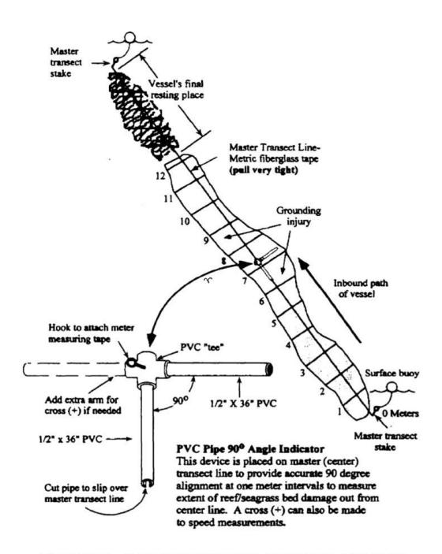

- C. **Record and photograph damaged resources at the impact site.** For each damaged coral colony encountered, identify to the lowest possible taxonomic ID, take a waypoint, and photograph.
- D. **Determine any sensitive resources near the area which are potentially at risk due to the vessel grounding** (e.g. ESA species). Record location and photograph.
- E. **Adhere to regulatory processes** including, but not limited to:
  - Biological Evaluation for NMFS ESA, please see Appendix D.
  - Consultation for EFH, please see Appendix D. Vessel Groundings and associated impacts fall under 'Non-Fishing Related Impacts.'

# 11.5.5. STEP 4: REMOVAL PREPARATIONS

Vessel removal should be attempted, if possible.

- A. **Confirm the appropriate and relevant authorities** determined during 'Step 1: Initiate Investigation.'
- B. **Obtain legal possession of the vessel**. Note: this is not the same as ownership.
- C. **Obtain relevant permits** (ESA, NEPA, etc.). Permit requirements should be evaluated on a case-by-case basis. For American Samoa, please refer to the Vessel Grounding Response Permitting Guide in Appendix D. Appropriate permits must be obtained prior to removal attempts. \*Note: All grounded vessel removals pose significant impacts and therefore NEPA must be followed. Removal of floating ADVs does not pose significant impacts and therefore does not require the NEPA process.
- D. **Consult outside contractors** and salvage masters if necessary. Suggestions are provided in Appendix C: Salvage Operator Contacts.
- **E. Designate Disposal Facility** if vessel/vessel parts are unsalvageable. Disposal at sea can have significantly negative ecological impacts and should be avoided. Land disposal at the Tutuila landfill may be costly due to limited space, please call ASPA Solid Waste Division in advance. A preferred option is to ship parts and scrap metal off-island where it can be disposed of at a larger facility; this would need to be budgeted in any removal grants.
  - a. Scrap metals may also be upcycled by local artists. Please contact the Fatoata organization (see contact sheet in section 8).
- F. **Prepare personnel and equipment** for removal (tow lines, tug boats, cranes, lift bags, silk curtains, etc.)

# 11.5.6. STEP 5: REMOVAL

# 11.5.6.1. GENERAL BEST PRACTICES FOR REMOVAL

*[Adapted from the Florida Keys NMS Best Practices for Removal of Vessels](https://floridakeys.noaa.gov/whatsnew/releases/2017/20170927-esf-10-best-practices-for-removal-of-vessels.html)*

# Open Water and Nearshore Operations

- Removal operations must take place during daylight hours.
- Perform site visits and work from waterways, paved surfaces, or existing roadways whenever possible to minimize impacts to sensitive habitats.
- Select vehicles and equipment that are least likely to disturb soils/sediments and keep loading to a minimum to reduce ground pressure (on unpaved surfaces).
- Remove all equipment and materials deployed to facilitate removal operations at conclusion of operations.
- Do not block major egress points in channels, passes, and bays during assessment and/or recovery operations.
- Vessels should anchor in bare sand bottom areas during all in-water response operations when possible.
- When operating motor vessels over seagrass, coral, and hard bottom areas, care should be taken to avoid propeller scarring or washing.
- Use floating lines for anchoring and vessel removal operations to prevent line sweeping of coral, seagrass, and sea bed.
- If a vessel will be towed, the selected extraction path should ensure that no additional groundings or damage to sensitive habitats will take place as a result of the recovery.
- Marine debris removal activities should be conducted at sufficient tide and water depths to minimize any risk to sensitive habitats, including coral reefs and seagrasses.
- Minimize ground-disturbing activities to as small an area as feasible to complete the task.

# Wildlife

- Watch for and avoid collisions with animals. Stop operating mechanical construction equipment, including vessels, immediately if a protected or Endangered Species Act listed species is observed within a 50-ft radius of equipment and resume after the species has departed the area of its own volition.
- When animals are sighted while a vessel is underway, attempt to remain parallel to the animal's course.

- Avoid excessive speed or abrupt changes in direction until they have left the area.
- Maintain a minimum distance of 300' from any observed animals.
- Reduce speed to 10 knots or less when animals are observed and when safety permits.
- Avoid all bird nesting or aggregation areas.
- Removal operations should avoid marked sea turtle or bird nests and stay low on the beach to minimize contact with unmarked nests. In the event that nesting turtles, birds, or hatchlings are sighted, cease removal operations in the area.
- Remove all trash or anything that would attract wildlife to work areas.
- Any killed or injured fish or wildlife observed should be reported to the appropriate Wildlife Agency for proper determination and action.

# 11.5.6.2. REMOVAL STRATEGIES

There are numerous methods for vessel removal, which will be influenced by available funding and resources. If it's not possible to remove the vessel, attempt to remove surrounding debris and hazardous materials e.g. fishing nets. Consider the following:

- 1. **Size** of the vessel
- 2. **Material** (aluminum, steel, fiberglass)
  - a. Assess the vessel for upcycling potential. More information can be found here: [Recycling Opportunities for Abandoned, Derelict, and End-of-Life Recreational](https://marinedebris.noaa.gov/abandoned-and-derelict-vessels/recycling-opportunities-abandoned-derelict-and-end-life-recreational-vessels)  [Vessels.](https://marinedebris.noaa.gov/abandoned-and-derelict-vessels/recycling-opportunities-abandoned-derelict-and-end-life-recreational-vessels)
  - b. Scrap metals may also be upcycled by local artists. Please contact the Fatoata organization (see contact sheet in section 8).
- 3. **Depth** (completely or partially submerged)
- 4. **Access Points**

Suggested Strategies Include:

# **Dismantling for Smaller Vessels**

Taken from the [California Water Boards](https://www.waterboards.ca.gov/rwqcb2/water_issues/programs/stormwater/Industrial/docs/Vessel_Dismantling_BMP.pdf) *[Small Vessel Dismantling Best Management Practices](https://www.waterboards.ca.gov/rwqcb2/water_issues/programs/stormwater/Industrial/docs/Vessel_Dismantling_BMP.pdf)  [2014:](https://www.waterboards.ca.gov/rwqcb2/water_issues/programs/stormwater/Industrial/docs/Vessel_Dismantling_BMP.pdf)*

*Dry Dock Dismantling for Smaller Vessels*

To reduce the possibility of discharging contaminants to the environment, the optimal location for vessel dismantling is within a National Pollution Discharge Elimination System (NPDES) permitted dry dock or land-based industrial facility.

If dismantling at an NPDES permitted facility is impracticable (e.g., the hull is unsound and unfit for lifting or transport without disintegrating) and dismantling is conducted at an unpermitted land-based facility, a dismantling pad must be constructed and the work conducted during dry weather. Constructing the dismantling pad on concrete or asphalt is preferred. The dismantling pad must consist of a high-density polyethylene (HDPE) liner (minimum of 20-millimeter thick), or equivalent, overlaid with geotextile fabric and 4 to 6 inches of clean class II road base to protect the liner. The pad must be constructed with a 6-inch-high perimeter berm beneath the HDPE liner to prevent fluid from leaving the contained area.

All dismantling activities — including the draining of fluids — must take place on the dismantling pad. All nearby storm drain inlets must be sealed to prevent any fluid discharge to the storm drain system. The dismantling pad and all residual materials within the pad must be properly disposed of upon project completion.

Stationary equipment located outside the dismantling pad, such as generators and waste liquid storage tanks, should have secondary containment or be placed on spill pads

Dust and airborne debris from demolition operations must be minimized. The activities must be discontinued during high wind events or contained so that dust and airborne debris are maintained within the vessel dismantling pad. In addition, appropriate abatement measures for contaminants, such as lead-based paint, polychlorinated biphenyl-containing electrical equipment, and asbestos, must be in place prior to dismantling.

# *In-water Dismantling for Smaller Vessels*

Vessel salvagers must minimize dismantling operations conducted in-water. In some instances, due to poor vessel integrity, dismantling may be conducted in-water in an orderly sequential manner with the following engineering controls:

- Specific care must be taken to strategically dismantle the vessel to limit listing. Demolition debris mass and volume within the derelict vessel and the salvage barge must be shifted with care to maintain stability and floatability.
- The in-water dismantling area must be contained with absorbent pads, debris skirts, and collection booms. Any gaps between the decks of the salvage barge and the derelict vessel must be covered and appropriately secured. Straw wattles may be placed at strategic locations on the vessels to restrict waterborne solids from entering the water. Retrieval nets must be available and used to remove debris inadvertently discharged to surface water.
- Liquid removal equipment, such as pumps, storage tanks, and skimmers, must be available in the event of an unpermitted discharge to water. The established

BMPs for spill prevention and control must be in place prior to conducting the dismantling operation. These BMPs must take into account vessel integrity, the possibility of unknown on-board hazardous wastes, and proximity to sensitive habitats.

# 11.5.6.3. RESPONSE ACTIVITIES: IMPACTS AND MITIGATION

The acting field team should be wary of the consequences of their response actions. Often removal activities themselves result in environmental damage such as indelicate booming, additional anchoring, increased human activity, and rough extraction methods. These necessary practices should be mitigated to ensure the least additional impact.

Mitigation for Common Response Activities

- 1. Pollutant Containment and Removal
- 2. Impact Assessments
  - a. Ensure gear is decontaminated to reduce possible spread of disease.
- 3. Vessel Removal
  - a. Dismantling
  - b. Extraction
    - i. Vessels via the path of least resistance (likely via the initial grounding scar) to avoid further reef damage.

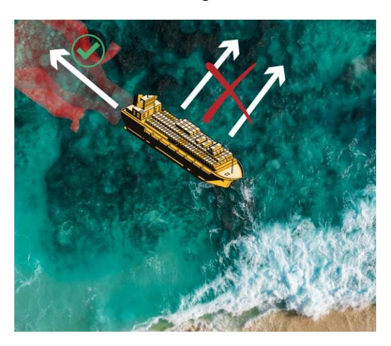

**Figure 20. Diagram of proper removal via the grounding pathway. Created by Amanda Ho (2024).**

# 11.5.7. STEP 6: POST-REMOVAL ASSESSMENT

- Following removal of the vessel, follow the same steps taken during the impact assessment. Keep an eye out for any additional damage which may have occurred due to the vessel shifting and any damage caused by the removal process. Check on the sensitive resources identified during the initial impact assessment.
- Assess for ongoing biological responses to the initial physical injury.
- Establish a monitoring site within the impacted zone and a monitoring site at a nearby reference reef to best gauge recovery. Conduct a Tier 3 assessment with permanent markers at the start and end of each transect to be able to record changes.
- Assess restoration potential for the site. Look at substrate stability, water quality, accessibility, etc.

# 11.5.8. NOVEL INNOVATIONS FOR SITE CLEAN-UP

The use of probiotic microbiotic consortiums is efficient for degrading petroleum hydrocarbons and lessening the harmful effects of water-soluble oil fractions[62](#page-93-3). As American Samoa does not have the capacity to develop and train these bacterial consortiums, this plan recommends partnering with research institutions that are capable of providing said consortiums.

# 11.6. POST REMOVAL RESTORATION OR COMPENSATORY RESTORATION

This plan recommends the practice of post-removal compensatory restoration within and around the grounding scar, if possible. This could be achieved by implementing off-setting requirements as a punitive action to the boat owner(s) or operator(s). Due to the economic and cultural value of coral reefs in American Samoa, monetary compensation for damaging these habitats is justified. One such technique for calculating compensation charges comes from the Red Sea[63](#page-93-4):

**Compensation charge = A x LC x D x RP x V**

Where A is a measure of area in square meters, LC is the percentage of living coral, D is the percent damage in the area, RP is the number years required for recovery and V is the value of one square meter.

62 Fragoso ados Santos, H., Duarte, G. A. S., Rachid, C. T. D. C., Chaloub, R. M., Calderon, E. N., Marangoni, L. F. D. B., ... & Peixoto, R. S. (2015). Impact of oil spills on coral reefs can be reduced by bioremediation using probiotic microbiota. *Scientific reports*, *5*(1), 18268.

63 PERSGA. (2009). Guidelines for Compensation Following Damage to Coral Reefs by Ship or Boat Grounding. Part 1. *PERSGA Technical Series Number 15*. PERSGA, Jeddah

If a similar formula shall be used in American Samoa, the value (V) should be adapted to fit the economic valuation of American Samoa's reefs, which have been valued (both extrinsically and intrinsically) at \$10,057,000 USD annually[64](#page-94-1). This value should take into account whether the area has high or low biodiversity and whether it is located in a protected area.

If funds have been achieved for post-grounding compensatory restoration, please follow the guidelines set forth in the American Samoa Restoration Action Plan to inform restoration efforts. Please refer to the [USCRTF Guide for Coral Restoration Permitting,](https://www.coralreef.gov/assets/about/Restoration_Permitting_Guidance_v1.1.pdf) as well[65](#page-94-2).

# 11.7. RECOMMENDATIONS FOR PREVENTION

Preventative measures are preferred, such as pre-departure approvals, licensing, and inspections as well as stringent weather and ocean condition monitoring with subsequent safety advisories from governing authorities (e.g. USCG, NWS) to inform those en-route with live conditions updates. For non-preventable emergencies, a public network to report verified vessel strandings at sea could alert local authorities and facilitate preemptive towing before washing ashore and grounding on reefs.

- 1. Robust regulations and inspections for every vessel and crew's seaworthiness prior to departure as well as thorough standards (and enforcement) on acceptable weather and ocean conditions to guide safe travels. This may require the reassembly of the American Samoa Marine Board or a similar authority.
- 2. Providing navigation courses to increase seaworthiness for ASG vessels.
- 3. American Samoa and the wider surrounding ocean is located within the New Zealand Search and Rescue Sector (NZSAR). Therefore, satellite distress calls (e.g. EPIRB) are received by NZSAR. If NZSAR is able to provide DPA or USCG with locations of recently abandoned ships, DPA or USCG could keep track of floating abandoned ships that may eventually wash up on our reefs (e.g. Chui Zai Fa No. 1 in Leone), then it would be possible for nearby USCG Cutters to intercept the abandoned ship before it can harm AS shorelines.
- 4. [BoatUS](https://www.boatus.org/) is currently developing an ADV reporting database in partnership with NOAA to be ready by early 2025. This plan suggests all American Samoan agencies use this in order to immediately share the presence of ADVs in American Samoa.

64 Jacobs. (2004). *Economic Valuation of Coral Reefs and Adjacent Habitats in American Samoa Final Report.*

65 [https://www.coralreef.gov/assets/about/Restoration\\_Permitting\\_Guidance\\_v1.1.pdf](https://www.coralreef.gov/assets/about/Restoration_Permitting_Guidance_v1.1.pdf)

- 5. Outfitting agencies with proper response equipment (towing equipment, survey gear, etc.) for quicker action to avoid prolonged damage to reefs. A list of CRAG agencies' updated response kit inventories can be found [here.](https://docs.google.com/spreadsheets/d/1BlckLeZVp8kOzRCLS6db_x0iOY6ExCZKjRgKxJWHNy4/edit?usp=sharing)
- 6. Policy updates for liability to compel proper boating standards.
- 7. Implementing small tariffs on vessels mooring, docking, anchoring, or fueling on Port property, revenue from which would constitute a future response fund.
- 8. Developing agreements with potential providers of probiotic microbiota consortiums for rapid response measures.
- 9. Implementation and promotion of eco-moorings to avoid anchor scars, please see Figure 21 below. *Note:* anything to be permanently or temporarily attached to the seafloor must have a USACE permit, please refer to the vessel grounding permitting guidelines in Appendix D.
- 10. Preemptive training for monitoring technicians in Coral Reef Crime Scene Investigations and other response activities.

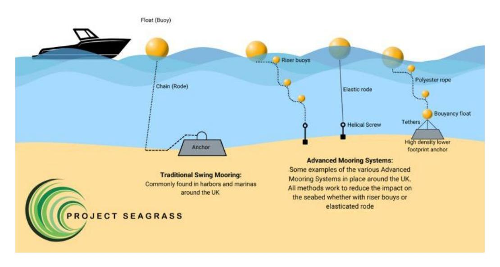

**Figure 21. Examples of eco-moorings (Project Seagrass, retrieved 2024. [66](#page-95-1)).**

66 Project Seagrass. (n.d.). *Advanced Mooring Systems A solution to prevent and alleviate physical seabed damage, disturbance, and seagrass scarring caused from traditional anchorage*. https://www.projectseagrass.org/advanced-mooring-systems/

# 11.8. GUIDANCE FOR POLICY

- Despite the effectiveness of chemical dispersants, this plan heavily cautions their use in reef-laden regions and recommends thorough evidence of safety (e.g. EPA approval) for the usage of any proposed product.
- This plan encourages the implementation of liability insurance for all vessels entering American Samoa's waters including those belonging to, or contracted by, the American Samoa Starkist Tuna Cannery to fund potential grounding removals.
- Enacting off-set requirements as a punitive measure for owners/operators of a grounded vessel in which the owners/operators would pay for post-removal restoration activities.

# 11.9. FUNDING FOR RESPONSE & REMOVAL ACTIVITIES

Larger vessels over 400 tons are required to have financial liability to clean up potential oil and hazardous waste spills – but not the vessels themselves – under the OPA, but this excludes the common fishing vessels in American Samoa that maintain the potential to run aground and damage resources. Additionally, many ports levy fines against ADVs over certain size limits, which can be allocated toward removal funding. In American Samoa, most groundings have been caused by longliners. This plan recommends considering implementing similar fines and adjusting the fee accordingly to hold smaller vessels accountable. Many ports will require vessel insurance to fund clean-up activities in the event of a grounding, this should be pursued as a viable solution to funding, as well. For this reason, it is imperative to have an updated map of ESA species in AS in case a vessel should run aground and destroy all nearby ESA species and all regulatory measures with them.

Until a budget is established specifically for ADV removals or vessel insurance becomes common, funding will likely be infrequent and opportunistic. This plan recommends pursuing grants in the absence of direct funding. BoatUS has an ADV removal grant program. Further, any remaining funds from other grants should be considered to be re-allocated for ADV removal. Funds for restoring impact sites should be pursued along with removal funds.

- The USCG is funded by the Oil Spill Liability Trust Fund and National Pollution Funds Center to initiate clean-up of oil and hazardous substances (NPFC). More can be read here: [https://www.uscg.mil/Mariners/National-Pollution-Funds-Center/About-NPFC/.](https://www.uscg.mil/Mariners/National-Pollution-Funds-Center/About-NPFC/)
  - After 1991 Tropical Cyclone Val grounded 9 shipping vessels, USCG and NOAA were able to use the Oil Spill Liability Trust Fund for emergency reef restoration activities after vessel removal (OR&R 2023).
- The National Marine Sanctuary Act enables NMSAS to remove grounded vessels in order to manage and maintain sanctuary waters. Similarly, Fish & Wildlife are enabled to manage and maintain areas in their jurisdiction, including vessel removal.
- FEMA may allocate funds to remove certain debris in the event of a disaster following presidential declaration.

- Grants should be pursued to fund vessel removal in the absence of direct funding. Past grant opportunities have come from BoatUS and NOAA Marine Debris Program.
- Compensatory restoration or off-set costs.
- NFWF Emergency Fund

# 12. AMERICAN SAMOA CORAL DISEASE RESPONSE PLAN

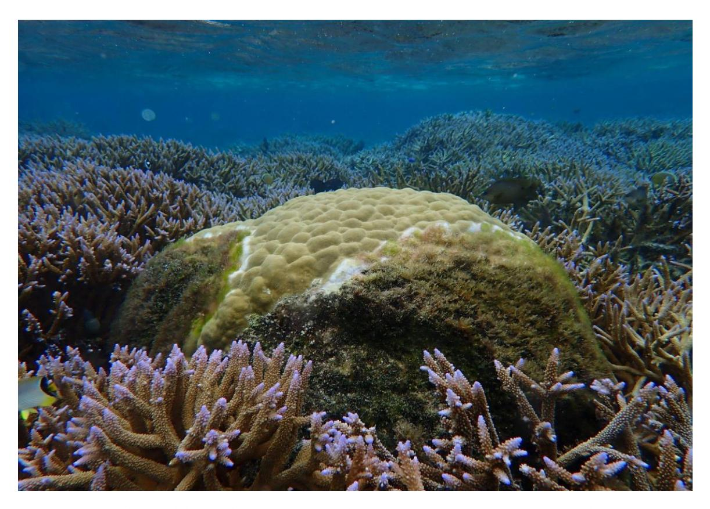

**Figure 22. A Porites exhibiting white band syndrome in Auto/Amaua, American Samoa. Credit: CRAG 2023.**

# 12.1. OBJECTIVES

- 1. Summarize coral diseases and their prevalence in American Samoa.
- 2. Outline a Standard Operating Procedure for response to disease outbreaks, including a database for reporting.
- 3. Provide information and plans for intervention and mitigation.
- 4. Recommend steps for prevention.

# 12.2. OVERVIEW OF CORAL DISEASE

Coral disease is a natural phenomenon that has become exacerbated by climate change and anthropogenic activities, especially those resulting in low water quality. Diseases affecting corals can be bacterial, viral, or fungal, but pathogenesis is poorly understood and is likely due to multiple factors, which make it difficult to treat and prevent. Most diseases occur naturally within reefs at a background rate of 3-5%[67](#page-98-4).As of writing this, there are approximately 40 coral diseases

67 [https://oceanservice.noaa.gov/education/tutorial\\_corals/coral10\\_disease.html](https://oceanservice.noaa.gov/education/tutorial_corals/coral10_disease.html)

affecting scleractinians, with higher prevalence in the Red Sea and Caribbean. However, the rate and range of coral disease in the Indo-Pacific has been expanding since 2000. Factors contributing to the expansion of disease include loss of herbivorous fishes, contamination from LBSP outfalls, warming, acidification, and loss of coral genetic diversity.

This disease protocol is initiated any time a potential disease is reported or observed in the field. While information can be gathered at the local level, it is advised to seek guidance from disease experts. This should be done as soon as there is any concern regarding a possible coral disease outbreak.

# **CORAL DISEASES TYPICALLY MANIFEST IN 3 WAYS**

| 1. Tissue Loss         | White skeleton becomes visible.                                                           |
|------------------------|-------------------------------------------------------------------------------------------|
| 2. Discoloration       | Abnormal tissue that exhibits a different color to normal or to its surrounding areas. |
| 3. Growth Anomalies | Tumor-like growths that can be discolored with abnormal polyps.                        |

# 12.3. BACKGROUND ON CORAL DISEASE IN AS

In American Samoa, coral diseases have been observed at background rates; however, the external factors that lead to increased infection rates are rising, as such, resource managers must be prepared for outbreaks. There is further concern for disease transmission from the Caribbean, through the Panama Canal or via ballast water. Dumping ballast water in American Samoa is restricted[68](#page-99-1) and can be monitored through the USCG and SERC [National Ballast](https://invasions.si.edu/nbicdb/summary?state=AS&submit=Search+database&year=2024&type=any&bwms=any)  [Information Clearinghouse.](https://invasions.si.edu/nbicdb/summary?state=AS&submit=Search+database&year=2024&type=any&bwms=any)

Common diseases within the territory include white syndromes, growth anomalies, and black band disease. From January to March 2023, there was an outbreak of black band that affected

68 10. Discharge of ballast water‐ (1) No ballast water containing non‐indigenous harmful aquatic organisms or pathogens may be discharged from a vessel into Samoan waters. (2) The master of a vessel that discharges ballast water in Samoan waters must – (a) obtain all necessary approvals under the Quarantine (Biosecurity) Act 2005 prior to the discharge; and (b) comply with all voluntary or mandatory ballast water management requirements issued by the International Maritime Organisation and which are in force at the time of the discharge. (3) The master of a vessel that intends to discharge ballast water in Samoan waters shall, prior to any discharge, complete and give to the Chief Executive Officer notice of the discharge – (a) which may be a copy of any form of this nature required to be given under the Quarantine (Biosecurity) Act 2005; or (b) in the form approved by the Chief Executive Officer for that purpose.

*Monitpora spp*. This outbreak occurred during warmer summer months and seemingly coincided with king low tides. The outbreak has since cleared, but is a priority site for future check-ups.

# 12.3.1. DISEASES OF CONCERN:

**A Note on Disease Identification:** Field identification can be difficult as many diseases may present similarly at different stages of progression. Photographs and visual surveys were found to be an inaccurate diagnostic tool in many cases due to this[69](#page-100-2). Laboratory testing is thus necessary to properly identify diseases. CRAG agencies should send samples to Thierry Work with the National Wildlife Health Center in Hawai'i (Please see Section 8: Contact Sheet).

**Please reference the** *[Coral Disease Handbook](https://gefcoral.org/Portals/53/downloads/disease_products/0807%20Coral%20disease%20handbook%20sample.pdf)* **for further information or Dr. Doug Fenner's** *Basic Benthic Monitoring and Identification 2* **for detailed background on diseases in American Samoa.**

**Table 11. Diseases found in AS. Adapted from the NOAA Coral Reef Monitoring Program (NCRMP) Benthic Ecological Monitoring Protocols for American Samoa (2023).**

| Disease (Code)                              | Prevalence | Pathogen | Host Corals | Description & Progression                                                                                                                                                                                                                                                                                                                     |
|---------------------------------------------|------------|----------|-------------|-----------------------------------------------------------------------------------------------------------------------------------------------------------------------------------------------------------------------------------------------------------------------------------------------------------------------------------------------|
| Acute Tissue Loss / White Syndrome (WSY) | Common     | Unknown  | Various     | WSY is a collective term to describe lesions characterized by rapid tissue loss, leaving behind a sharp, clean band, where tissue is completely removed from the skeleton. A color gradient from bare skeleton to brown is often visible as a fouling community develops behind the leading edge of the lesion. |

69 Ainsworth, T. D., Kramasky-Winter, E., Loya, Y., Hoegh-Guldberg, O., & Fine, M. (2007). Coral disease diagnostics: what's between a plague and a band?. *Applied and Environmental Microbiology*, *73*(3), 981-992.

| Subacute Tissue Loss (TLS) | Very Common | Unknown                                                                                                                                              | Various                          | Sub-acute tissue loss is a collective term to describe lesions resulting in slow but progressive loss of tissue. A progressive band (bare white skeleton) is usually not present. This distinguishes TLS from acute tissue loss / WSY.                                               |
|----------------------------|----------------|------------------------------------------------------------------------------------------------------------------------------------------------------|----------------------------------|-----------------------------------------------------------------------------------------------------------------------------------------------------------------------------------------------------------------------------------------------------------------------------------------------------------|
| Growth Anomaly (GA)        | Common         | Unknown, PGA possibly linked to nearby human population size70                                                                           | Acropora spp. Porites spp. | Acropora Growth Anomalies (AGA) and Porites Growth Anomalies (PGA) are tumor like growths that often protrude above the healthy coral tissue and can range in size and coloration. This can look like enlarged structural elements or the loss of normal structural elements.  |
| Black Band Disease (BBD)   | Uncommon       | Polymicrobial Consortium consisting of cyanobacteria, sulfur-reducing bacteria, sulfur oxidizing bacteria, and heterotrophs. | Various                          | Characterized by a distinct black mat on the living coral tissue, leaving behind the bare white skeleton. Band color can vary from black, gray, to red-brown. Skeleton distant to the tissue front becomes progressively brown as it becomes colonized by fouling communities. |

70 Aeby GS, Williams GJ, Franklin EC, Haapkyla J, Harvell CD, Neale S, et al. (2011) Growth Anomalies on the Coral Genera *Acropora* and *Porites* Are Strongly Associated with Host Density and Human Population Size across the Indo-Pacific. PLoS ONE 6(2): e16887. https://doi.org/10.1371/journal.pone.0016887

| Porites Ulcerative White Spots (PUS) | Uncommon         | Possibly Vibrio spp.71 | Porites spp.                                               | Characterized by the presence of a distinct narrow band of yellow to bright green mat at the leading edge of the disease.                                                                                                                                                                                                                                                                                              |
|--------------------------------------|------------------|---------------------------|------------------------------------------------------------|------------------------------------------------------------------------------------------------------------------------------------------------------------------------------------------------------------------------------------------------------------------------------------------------------------------------------------------------------------------------------------------------------------------------------------|
| Ciliate Infection (CIL)              | Uncommon         | Ciliates                  | Acropora spp. Pocillopora spp. Favidae spp. | Characterized by a diffuse light/dark brown or grey-black band ~0.5-3 cm wide separating the healthy tissue from the exposed coral skeleton. Lesions have a speckled appearance caused by the ciliates lodged in the coral skeleton. Brown band disease is a type of ciliate infection (lower photo) reported on branching Acropora in the GBR. Treatment: C. Indicum at 1500-2500 ppm72 |
| Banded Fungal Infection (BFI)        | Very uncommon | Fungi                     | Various                                                    | Multifocal patterns of tissue loss that expose spots of bare white skeleton. Lesions are typically small (~1 cm diameter), regularly ovoid and may start as bleached spots; a coral may contain both bleached lesions and lesions devoid of tissue.                                                                                                                                                        |

71 Arboleda MD, Reichardt WT. Vibrio sp. causing Porites ulcerative white spot disease. Dis Aquat Organ. 2010 Jun 11;90(2):93-104. doi: 10.3354/dao02222. PMID: 20662365.

72Sun, W. T., Pan, C. Y., Ding, D. S., & Pan, C. H. (2024). Northern coral triangle coral ciliates diseases and disease prevention: A first record. *Journal of Invertebrate Pathology*, *206*, 108177.

# 12.4. EARLY DETECTION

In the event of a coral disease outbreak, early detection is key to mitigating the spread. This is best done by incorporating disease monitoring into ongoing reef surveys. Underwater imagery is preferred, but template data sheets from the Coral Disease Handbook are provided in the '[Disease Field Guide](https://www.crag.as/_files/ugd/e231fe_402d8c19d8074952aa04e8e84ba6f2ca.pdf)' on the [crag.as](http://www.crag.as/) website.

Survey teams should be well-trained in identifying diseases. To enhance early detection efforts CRAG agencies and staff should host and attend trainings on disease identification and intervention for future response needs. Please refer to Doug Fenner's Benthic Monitoring and Identification Guide Second Edition[73](#page-103-2) for an extensive list of diseases in American Samoa. Both Dr. Fenner and Thierry Work are good sources of information on coral disease, their contact information can be found in Section 8: Contact Sheet. If you find anything concerning on the reef, please take a waypoint and send a photo to Dr. Fenner, Dr. Work, or crag staff via the [Report an Incident](https://www.crag.as/report) page on the [crag.as](http://www.crag.as/) website. Soon, disease sightings can be reported on [tautua.as.](https://tautua.as/)

An exciting tool for early detection of disease is eDNA. eDNA has shown to be a reliable biosensor of some coral diseases. More studies are needed to show efficacy for other pathogens. As coral disease pathogens continue to be uncovered, eDNA could become a very useful tool for resource managers.

# 12.5. CORAL DISEASE MANAGEMENT

Coral reef resource agencies in American Samoa should actively monitor existing databases to plan and prepare for possible disease outbreaks. Useful databases include:

- 1. [CRW Disease Forecast Online Tool](https://coralreefwatch.noaa.gov/product/disease_multifactor/samoas.php)[74](#page-103-3)
- 2. [Ballast Water Information Clearinghouse](https://invasions.si.edu/nbicdb/tanks?state=AS&port=2875&year=2024)[75](#page-103-4) (make sure to input the current year in the search query)

Thus far, CRAG has been surveying for disease during on-going monitoring outings. These monitoring outings occur monthly in the summer season (November through March) and opportunistically during the rest of the year when weather and sea conditions permit. When disease presence is observed on these monitoring surveys, CRAG agencies should share their ongoing monitoring data via the CRAG agencies' common online databases.

73 Fenner, D. (2011). Benthic identification for coral reef monitoring in American Samoa. DMWR. Retrieved from [PDF link].

When an agency shares a finding of coral disease presence in AS, the agency shall proceed to alert the CRAG CTC by email and the matter will be discussed at the next quarterly CTC meeting. The USCRTF Coral Disease and Disturbance Working Group [\(cmclaughlin1@ufl.edu\)](mailto:cmclaughlin1@ufl.edu) and Coral Disease and Health Consortium [\(cdhc.coral@noaa\)](mailto:cdhc.coral@noaa) must also be notified of disease outbreaks in the territory. Awareness of disease prevalence will help alert agencies and the public to implement decontamination protocols, prepare response kits, and plan removal activities. Preemptive training on disease identification and differentiation is recommended to streamline the response and increase the quality of survey data.

# 12.4.1. RESPONSE KITS

Updated Agency Inventories can be viewed [here.](https://docs.google.com/spreadsheets/u/0/d/1BlckLeZVp8kOzRCLS6db_x0iOY6ExCZKjRgKxJWHNy4/edit) Agency response kits should include the following:

- 1. Antibiotic Paste and applicators e.g. caulk gun (Figure 25).
  - a. Base2B has a minimum shelf life of 2-3 months, but can be used as long as the product remains pliable.
  - b. A 1:8 amoxicillin to Base2B ratio has shown to be very effective.[76](#page-104-2)
- 2. Decontamination Products (bleach, buckets)
- 3. [DMWR Scientific Study Permits](https://dmwr.as.gov/scientific-study-permit/) and other relevant permits (e.g. [ONMS permits](https://sanctuaries.noaa.gov/management/permits/welcome.html) if working within an NMS). Please see Appendix B: Coral Disease Response Permitting Guide.
- 4. Tags (although accurate GPS points combined with photos using scalebars is preferred).
- 5. Basic Monitoring Gear (tape transects, scale bars, underwater cameras, GPS, etc.)
- 6. Dive Gear

# 12.4.2. DISEASE OCCURRENCE & PRIORITY SITES IN AMERICAN SAMOA

CRAG should continuously monitor all sites for coral disease but pay special attention to sites where coral disease was observed in the past. The following sites have been subject to disease and should be carefully monitored for lesion progression and spread. CRAG must also ensure to follow proper decontamination protocols after visiting these sites.

| SITE                     | Disease    | Affected Species | Date of Last Observation |
|--------------------------|------------|------------------|--------------------------|
| Onesosopo - Reef Flat | Black Band | Montipora spp.   | April 2023               |
| Vatia - Slope         | Unknown    | Porites Massives | February 2025            |
| Tafeu - Slope         | Uknown     | Porites Massives | February 2025            |

An updated list of priority sites detailing disease, affected species, and observations will soon be located on the crag website under Response Plans > Coral Disease > Observations (crag.as/coral-disease-observations).

76 Eaton KR, Clark AS, Curtis K, Favero M, Hanna Holloway N, et al. (2022) A highly effective therapeutic ointment for treating corals with black band disease. PLOS ONE 17(10): e0276902.

# 12.6. STANDARD OPERATING PROCEDURE FOR DISEASE RESPONSE:

**IMPORTANT:** Sterilize gear when leaving an infected site and entering a potentially "clean" site so as to avoid spreading the disease to unaffected sites.

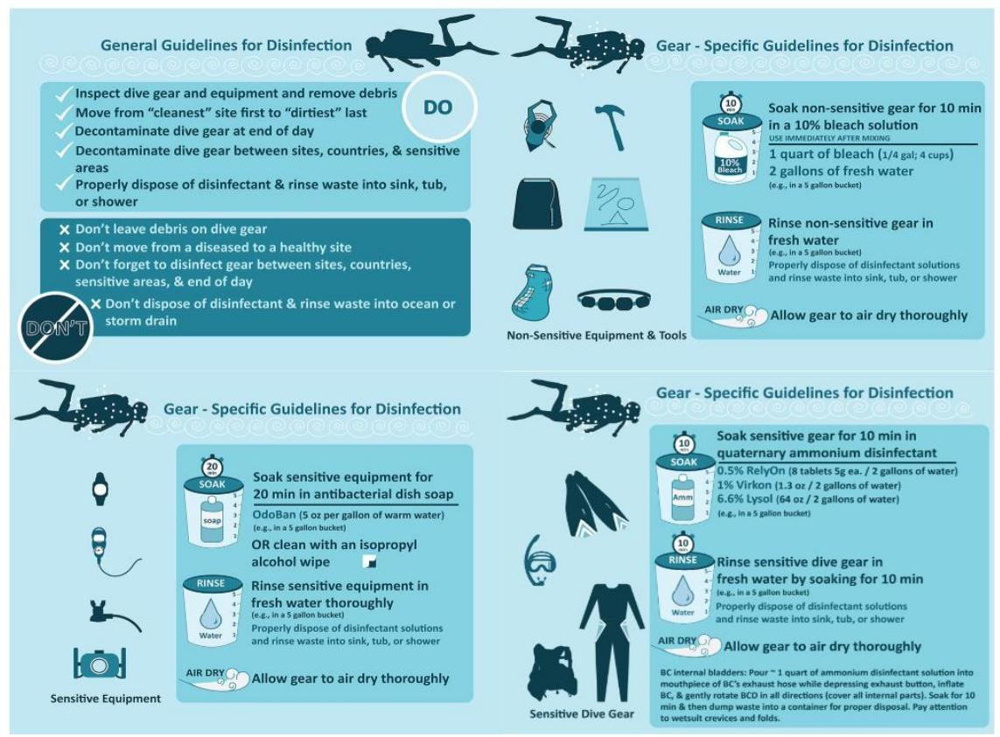

**Figure 23. Credit: Athena Burnett/NOAA https://flowergarden.noaa.gov/protection/preventcoraldisease.html.**

# **Step 1 — Data Collection: Collect Information about the Disease and the Surrounding Environment**

**NOTE:** visit sites with little to no disease first before going to sites with known outbreaks to reduce cross contamination.

- 1. **Take photos** of affected colonies and close ups of the lesions. If possible, tag and photograph diseased colonies with a scale bar so that colonies can be revisited to determine progression.
  - a. Take samples when disease cannot be visually determined. Please see sampling protocol in the [CRAG coral disease response plan field guide.](https://e231feb7-4c27-48af-80c6-3d676aaa9e81.usrfiles.com/ugd/e231fe_2f6e637da43141cea19f55ca86bdd86c.pdf)
- 2. **Conduct a Tier 2 assessment** (see Appendix B) to collect information about the disease(s) at the site.
- 3. **Take GPS Waypoints** at each infected colony so that geographic extent of the disease at the site can be determined.
- 4. From the data collected during the assessment **develop a host list of all infected taxa and calculate prevalence at the site**.
- 5. An online **'[Incident Report Form](https://www.crag.as/report)'** is located on the CRAG website.

- 6. **Determine Range of Disease:** Depending on habitat type, conduct Tier 1 or Tier 2 assessments at sites radiating out from the initial outbreak site to determine range of the disease and identify any disease hot spots which may require more in depth assessments.
- 7. Collect temperature data as well as water quality and sediment samples when possible, to help determine environmental drivers of disease. Keep track of storm events and increases in rainwater runoff.

# **Step 2 — Data Analysis: Classify Event**

Send any samples to Thierry Work in Hawai'i to analyze. Establish whether the disease exists at background levels or at outbreak levels.

**Table 12. Guidelines for Determining Disease Level.**

| Disease Level | Indicators                                                                                                                                                        | Next Steps                                                                                     |
|---------------|-------------------------------------------------------------------------------------------------------------------------------------------------------------------|------------------------------------------------------------------------------------------------|
| Background    | Number of infected ● colonies are stable Less than 20% of colonies ● within the area are infected Low levels of mortality ●               | • Opportunistic monitoring at site to determine if infection rates are increasing. |
| Outbreak      | Number of infected ● colonies increasing at the site 20% of colonies or more ● within the site are infected High levels of mortality ● | Develop regular ● monitoring schedule Assess potential ● management actions     |

**The following calculations can help determine if an outbreak is occurring (since disease levels are low for American Samoa, any increase in the following may be considered an outbreak):**

**Prevalence =** (# diseased colonies/total # of colonies) x 100

**Incidence =** number of new infections within a time period, T

**Mortality Rate =** number of colonies dying per census area per unit time / total number of colonies within census area

**Case Fatality Rate =** number of colonies dying of a disease per census area per unit time / total number of colonies with the disease per census area per unit time

# **Step 3 — Intervention: Act to Reduce Disease Presence**

Local resource managers have a few intervention tools available to mitigate the spread of coral disease. For CRAG, antibiotic treatment is the preferred intervention method and it is described below.

Strategies used to halt or slow the spread of disease:

- Removal techniques
  - Culling Removal of the coral can reduce disease load effectively but reduces hard coral cover on the reef.
  - Amputation Resecting the disease lesion can save the colony, but requires greater and may reduce the number of colonies a team can treat per dive.
  - Antibiotic treatment This can be an effective method that requires lower effort.

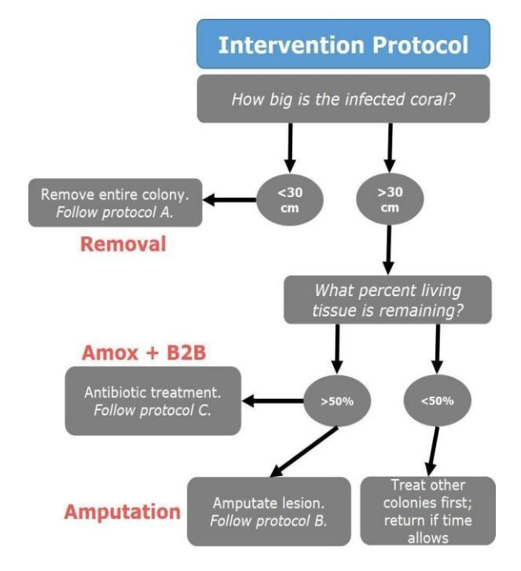

**Figure 24. The Intervention flowchart is a visualization of the systematic approach used by managers to decide which method of intervention is most appropriate for a coral. See Appendix H for detailed protocols (taken from Warham & Bowman).**

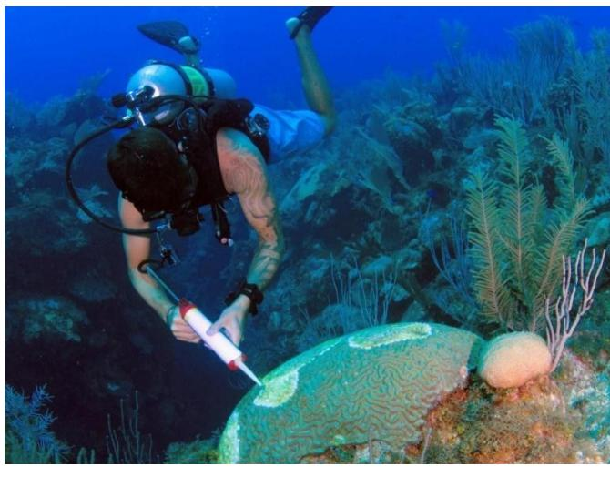

**Figure 25. A diver applying antibiotic ointment to a SCTLD lesion. Photo by Ocean Frontiers.**

# **Step 4 — Continuous Monitoring: Develop a Regular Monitoring Schedule**

Once it is determined there is an active disease outbreak a regular monitoring schedule should be developed. Monitoring can be conducted at the original outbreak site, priority areas, and/or at any disease hot spots identified during previous assessments. Frequency of the monitoring should be based on the rate of disease progression and mortality. Where there are high rates of mortality sites should be revisited weekly or biweekly if possible.

These monitoring trips should (modified from the Coral Disease Handbook, 2008):

- Revisit tagged colonies to determine disease progression and note the health status of the colony (progressing, stasis, recovering, dead);
- Look for new lesions either on infected colonies or on previously uninfected colonies;
- Look for signs of recovery either through re-sheeting over the skeleton or through new coral recruits.
- Keep track of abiotic factors that may allow for the disease to overtake e.g. temperature, low tides, increased freshwater input, etc.

When possible, Step 1 should be repeated to see if the disease has spread to new sites.

# 12.5.1 RESPONSE FLOWCHART

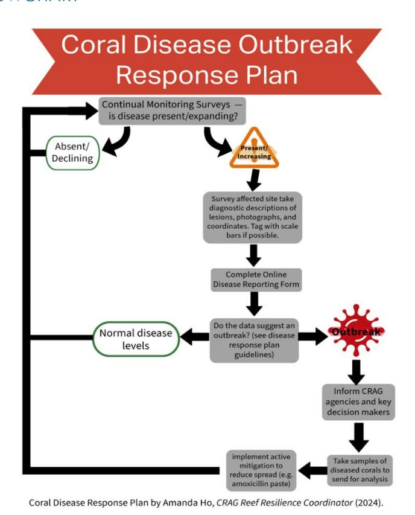

**Figure 26. Flow chart depicting CRAG disease response protocol.**

# 12.7. DISEASE PREVENTION

There are few known vectors of coral disease since pathogenesis for the majority of diseases remains unknown. The USCRTF Pacific Preparedness Working Group is a great resource of information for preventing disease transmission in the Pacific. This Response Plan heavily recommends the following preventative steps:

- The highest risk of disease transmission to the Pacific is via ships coming from the Caribbean. Ballast water discharge has been shown to transport disease along reefs and discharge in Pago Pago Harbor can be tracked via the [National Ballast Information](https://invasions.si.edu/nbicdb/tanks?state=AS&port=2875&year=2024) [Clearinghouse. Any discharge should be monitored in the case of a disease outbreak.](https://invasions.si.edu/nbicdb/tanks?state=AS&port=2875&year=2024) The USCG has mandatory ballast water discharge plans and has recommended the adoption of voluntary ballast water management plans, as well. The use of alternative ballast water management systems (BWMS) has increased since 2015 in American Samoa, but Stony Coral Tissue Loss Disease (SCLTD) has been shown to resist UV treatments and remain viable within ballast tanks for long periods of time.
- Another confirmed disease vector is from ship biofouling. This plan recommends that any hull cleaning for sailing yachts coming from the Caribbean should be done on land.
- Thoroughly disinfecting gear after visiting contaminated sites, please refer to Figure 23.
- Restrict the translocation of corals. No corals that show any signs of disease may be translocated between sites. Restoration projects requiring translocation must thoroughly inspect any corals to be moved.
- A study on the Great Barrier Reef found that a healthy reef environment with functionally diverse fish communities had lower disease prevalence.[77](#page-109-1) MPAs in American Samoa should continue to be managed and possibly extended to vulnerable reefs.
- Outreach flyers to discourage swimmers and snorkelers from touching corals due to the potential for disease spread.

110

77 Raymundo, L. J., Halford, A. R., Maypa, A. P., & Kerr, A. M. (2009). Functionally diverse reef-fish communities ameliorate coral disease. *Proceedings of the National Academy of Sciences*, *106*(40), 17067-17070.

# APPENDIX A: PERMITTING GUIDANCE FOR GROUNDED VESSEL REEF RESPONSE IN AMERICAN SAMOA

Written and compiled by Amanda Ho, *Reef Resilience Coordinator at the Coral Reef Advisory Group* July 2024 – Draft

*Figure 1.* Grounded fishing vessel in Leone, American Samoa, courtesy of USCG District 14 Hawaii Sector (USCG, 2018).

# CONTENTS

| Appendix A: Permitting Guidance for Grounded Vessel Reef Response in American Samoa111   |  |
|------------------------------------------------------------------------------------------|--|
| Introduction 112                                                                      |  |
| Regulations and Permitting Guide 112                                                  |  |
| Contact Sheet: Applicable Local and Federal Authorities for Vessel Grounding Response114 |  |
| NEPA: National Environmental Policy Act116                                               |  |
| Endangered Species Act (ESA) Section 7 Consultation 116                               |  |
| ESA during Emergencies 117                                                            |  |
| Section 401—EPA Clean Water Act Water Quality Standard Regulations118                    |  |
| Army Corps Of Engineers (USACE)118                                                       |  |
| Magnuson-Stevens Act-Essential Fish Habitat (EFH) Consultation 119                    |  |
| ONMS Permit120                                                                           |  |
| United States Fish & Wildlife Service: Refuge Special Use Permit 120                  |  |
| National Parks Service Research Permit120                                                |  |
| Resources121                                                                             |  |

# INTRODUCTION

This Permitting Guidance for Grounded Vessel Removal in American Samoa was developed to provide the regulatory requirements of addressing vessels that have run aground and harmed the surrounding environment in American Samoan waters. This guidance provides information tailored to the environment and authorities of American Samoa. Vessel groundings include any vessel that is situated on the seabed or waterside and has therefore lost its ability to navigate.

Vessel groundings trample reefs and other benthic habitats, killing sea life in their wake. The longer a vessel is left unattended, the more damage is incurred from vessel drift. Exact impacts of grounded and abandoned vessels are wide and varying. Examples include: shading seagrass, crushing coral, stirring up sediment, and leaching toxic chemicals.

In many places, including American Samoa, removing ADVs is challenging, as there are no governing laws that clearly identify responsible parties for clean up or assign sources of funding. The vessel grounding response plan will help to quickly and efficiently organize assessment and removal activities to avoid further damage and gain a full understanding of the impacts and repercussions to inform conservation goals as well as associated legal matters. This document will supplement the American Samoa Vessel Grounding Response Plan by helping to identify on and off-island entities that can assist in removal as well as necessary permitting actions.

This guide details permit requirements for dealing with a vessel grounding in American Samoa including: ecological impact assessments, removal, and disposal.

# REGULATIONS AND PERMITTING GUIDE

Table 2. Required Permits for vessel grounding response activities. More information is detailed at the end of this guide.

| Response Action                  | Permit(s) Required                                                                 | Procedural Steps | Contacts                                |
|----------------------------------|------------------------------------------------------------------------------------|------------------|-----------------------------------------|
| Ecological impact assessments | DMWR Scientific Study Permits this requirement is at DMWR's discretion | N/A              | Domingo Ochavillo ochavill@gmail.com |
| Removal                          | ESA Section 7 EFH                                                               |                  |                                         |
| Compensatory Restoration      | Restoration Permitting Guidance                                                 |                  | CRAG/NMSAS                              |

| Disposal at Sea                                                     | MPRSA Ocean Dumping General Permit issued by US EPA | 30-day notice to regional EPA office (EPA Region 9) | Pacific Islands Office (Honolulu): 1-808- 541-2710 |
|---------------------------------------------------------------------|-----------------------------------------------------------------|-----------------------------------------------------------------|-------------------------------------------------------------|
| Disposal on Land                                                    | Inquire ASPA Solid Waste Division                         |                                                                 | 1-684-699-1234                                              |
| Implementation of Eco moorings (to prevent future groundings) | USACE Permit(s)                                                 | USACE Obtain a permit guide                                  | CEPOH PA@usace.army.mil 1-808-835-4004                |

Table 2. Additional permits required based on vessel location. More information is detailed at the end of this guide.

| Grounded Vessel Location                                                       | Required Permits for Vessel Removal                                        |
|--------------------------------------------------------------------------------|----------------------------------------------------------------------------|
| ALL SITES in the Coastal Zone                                                  | Federal Consistency requirements under the Coastal Zone Management Act. |
| Sanctuary Waters: Outer Rose, Fagatele Bay, Aunu'u, Tau, & Swains Island | ONMS Permits                                                               |
| National Park of American Samoa                                                | National Park Service Research Permit                                      |
| Navigable Waterways: Pago Pago, Aunu'u, Ofu, & Ta'u Harbors              | USACE Permits or Letter of Permission                                      |
| Rose Atoll                                                                     | USFW Visitor/Special-Use Permit                                            |
| Territorial Lands/Reef Flats                                                   | Approval from Village Mayor/Chief. Please contact OSA.                     |

# CONTACT SHEET: APPLICABLE LOCAL AND FEDERAL AUTHORITIES FOR VESSEL GROUNDING RESPONSE

Table 3. Names, Jurisdictions, and Contacts for American Samoa agencies relevant to vessel groundings.

| Acronym      | Agency/Authority                                                                           | Purview                                                                                                                                      | Points of Contact                                                                                                |
|--------------|--------------------------------------------------------------------------------------------|----------------------------------------------------------------------------------------------------------------------------------------------|------------------------------------------------------------------------------------------------------------------|
| AS-EPA       | AS Environmental Protection Agency                                                      | Beach Monitoring Program                                                                                                                  | Water Quality Branch Manager: Ioakimo Makiasi (ioakimo.makiasi@epa.as.gov) 1-684-633-2304               |
| ASPA         | American Samoa Power Authority - Solid Waste Division                                | Landfill                                                                                                                                     | 1-684-699-1234                                                                                                   |
| CRAG         | Coral Reef Advisory Group Coordination                                                  | AS Coral Reefs                                                                                                                               | Sana Lynch coordinator@crag.as 1-684-633-4456 ext. 229                                                     |
| DMWR         | Department of Marine and Wildlife Resources                                          | AS Fisheries & Wildlife, Boating Access, Marine Enforcement                                                                            | Deputy Director: Selaina Vaitautolu taahinemanua@gmail.com                                                 |
|              | Department of Port Administration                                                       | Customs & Immigration                                                                                                                        | 1-684-633-4251                                                                                                   |
| DPA          | Harbor Master                                                                              | Docking and Anchoring                                                                                                                        | Harbor Master: Puamavae Ah Mai (ahmai@pa.as.gov) Assistant Harbor Master: Beverly Tali (tali@pa.as.gov) |
| NMSAS        | National Marine Sanctuaries AS                                                          | National Marine Sanctuaries e.g. Fagatele Bay, Fagalua/Fogoma`a (Larsen's Cove), Aunu'u, Tau, Rose Atoll, & Swains Island. | Valerie Brown (valerie.brown@noaa.gov) 1-684-633-6500 ext. 1114                                         |
| NOAA OR&R | NOAA Office of Response and Restoration                                              | Triggered via oil spills or the threat of oil spills                                                                                      | Ruth Yender ruth.yender@noaa.gov +1-206-849-9926                                                           |
| NPSA         | National Park Service AS                                                                | National Parks of AS (locations: Tutuila, Ofu, Tau)                                                                                    | Eric Brown (Eric_Brown@nps.gov) 1-684-633-7082 ext. 41                                                     |
| OSA          | Office of Samoan Affairs                                                                | Liaison with village mayors/chiefs                                                                                                        | 1-684-633-5201                                                                                                   |
| USACE        | United States Army Corps of Engineers (Honolulu District which encompasses AS) | Navigable Waterways (Pago Pago Harbor)                                                                                                    | CEPOH-PA@usace.army.mil 1-808-835-4004                                                                        |

| USCG | United States Coast Guard (District 14 - Honolulu Sector which encompasses AS) | Emergencies at sea Oil and pollution hazards | District 14 Command Center Emergency Phone: 1-800-331- 6176 Public Affairs Duty Phone: 1-808- 265-7748 Public Affairs Email: hawaiipacific@uscg.mil |
|------|--------------------------------------------------------------------------------------------|-------------------------------------------------|-----------------------------------------------------------------------------------------------------------------------------------------------------------------------|
| USFW | U.S. Fish and Wildlife Service                                                          | Rose Atoll National Wildlife Refuge          | Rose Atoll NWR & MNM Manager: Brian Peck brian_peck@fws.gov 1-684-633-7082                                                                                   |
| PIRO | Pacific Islands Regional Office (NOAA Fisheries)                                     | Rose Atoll MNM                                  | AS Field Office: 1-684- 633-7629 Fax: 1-684-633-7630                                                                                                         |

# NEPA: NATIONAL ENVIRONMENTAL POLICY ACT

The full NEPA process is required by any federal action (including actions conducted by a federal agency or with federal dollars). Thus NEPA applies for the majority of vessel removal response activities conducted in AS. The NEPA process is depicted below:

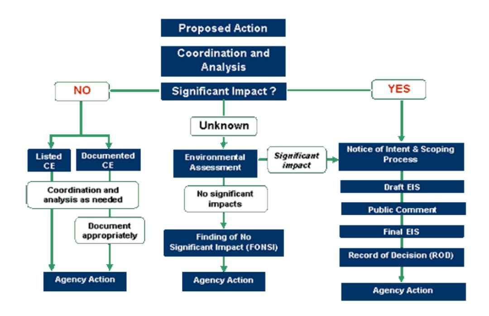

*Figure 2*. The NEPA Process Overview (Center for Environmental Excellence, 2023).

# ENDANGERED SPECIES ACT (ESA) SECTION 7 CONSULTATION

- Pursuant to the Endangered Species Act Section 7(a)2, all federal agencies must initiate consultations with NMFS for any proposed actions that might impact endangered marine species or critical habitats. This includes the removal of grounded vessels as it can affect ESA corals, invertebrates, fish, and more (CRS 2021).
- An updated list of ESA species in American Samoa can be found here: [https://www.fisheries.noaa.gov/pacific-islands/endangered-species](https://www.fisheries.noaa.gov/pacific-islands/endangered-species-conservation/marine-protected-species-american-samoa)[conservation/marine-protected-species-american-samoa.](https://www.fisheries.noaa.gov/pacific-islands/endangered-species-conservation/marine-protected-species-american-samoa)
- After the consultation, NMFS will form a 'biological opinion' of the proposed agency action, which may authorize certain actions even if they could impact endangered species and/or critical habitat (CRS 2021). The decision tree for consultation determination is below, followed by a timeline of the consultation process (for nonemergent scenarios). Information from NMFS about this process can be found here: [https://www.fisheries.noaa.gov/insight/consultation-process.](https://www.fisheries.noaa.gov/insight/consultation-process)

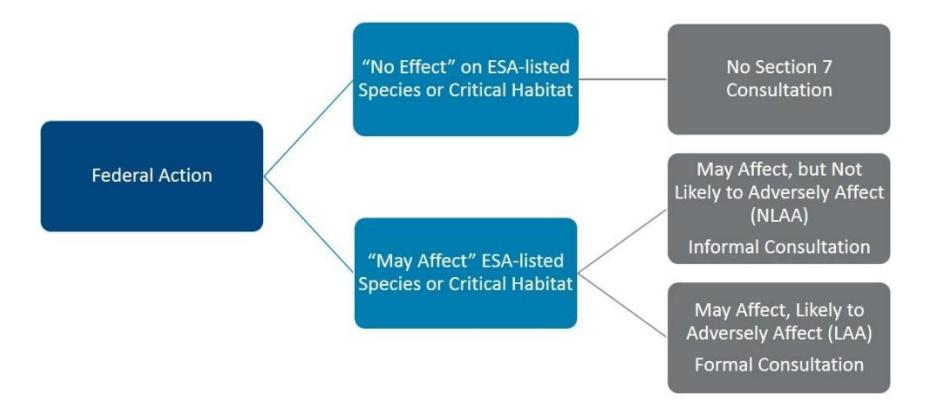

*Figure 3*. Flow chart depicting consultation determinations (NMFS, n.d.).

- If a consultation is determined to be required, the agency must submit a 'consultation request package,' which includes the following:
  - 1. Effects Determination Record
  - 2. Effects Determination Guidance

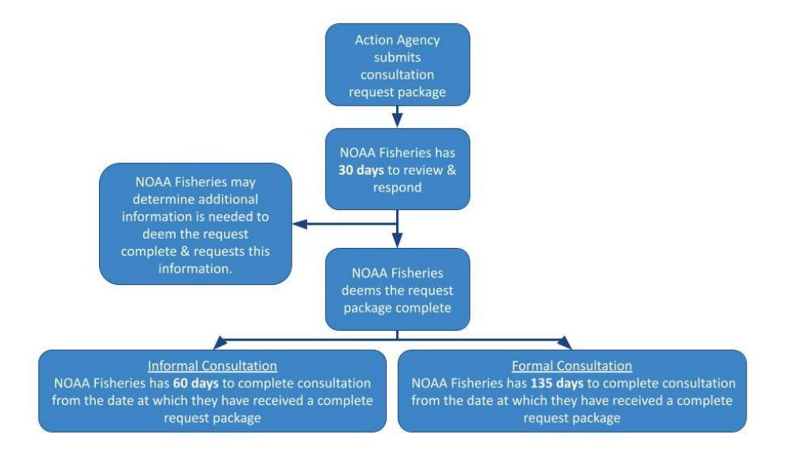

*Figure 4*. Flowchart of Consultation Request Process (NMFS, n.d.).

# ESA DURING EMERGENCIES

• Emergency consultations are offered. Emergencies in this context constitute any "act of god, disaster, casualty, national defense or security measure, etc. that poses significant risk to human life or property and their responses" (NMFS, 2023).

- Vessel groundings can be deemed emergencies. Some examples include instances when vessels grounded on priority fishing grounds that impacted local communities' welfare.
- According to ESA Section 7 for the pacific islands, federal agencies must email [efhesaconsult@noaa.gov](mailto:efhesaconsult@noaa.gov) and the Interagency Cooperation Branch Chief, Ron Dean [\(ron.dean@noaa.gov\)](mailto:ron.dean@noaa.gov):
- 1. The nature of the emergency response actions.
- 2. A justification for an expedited consultation.
- 3. Impacts to designated endangered or threatened species and their designated critical habitats.
- NMFS will respond with a letter of concurrence if they agree to an emergency consultation.
- Post-incident, NMFS may follow up with an after-the-fact effects determination. This usually only happens if take of an ESA species occurred during removal operations.

# SECTION 401—EPA CLEAN WATER ACT WATER QUALITY STANDARD REGULATIONS

- Required when any action may result in discharge into U.S. waters.
- [Overview of regulations and requirements for obtaining a Section 401 Certification.](https://www.epa.gov/cwa-401/overview-cwa-section-401-certification)
- Water Quality Standard Regulations in American Samoa here
- Webinars and tutorials on applying for these certifications here
- Application for CWA Section 401 Water Quality Certification
- Example of an approved Certification from American Samoa here
- For more information, go to the American Samoa Environmental Protection Agency website.

# ARMY CORPS OF ENGINEERS (USACE)

From the USCRTF "A Guide for Coral Restoration Permitting in the Seven U.S. Coral Reef Jurisdictions" (2023).

- The U.S. Army Corps of Engineers' (USACE) Regulatory Program involves the regulation of discharges of dredged or fill material into waters of the United States and structures or work in navigable waters of the United States, under section 404 of the Clean Water Act and section 10 of the Rivers and Harbors Act of 1899. A proposed project's impacts to these areas will determine what permit type is required.
- Permit Types:

- o An individual, or standard permit, is issued when projects have more than minimal individual or cumulative impacts, are evaluated using additional environmental criteria, and involve a more comprehensive public interest review.
- o A general permit is issued for structures, work, or discharges that will result in only minimal adverse effects. General permits are issued on a nationwide, regional, or state basis for particular categories of activities. General permits are usually valid for five years and may be re-authorized by USACE. There are three types of general permits:
  - Nationwide permits are issued by USACE on a national basis and are designed to streamline Department of the Army authorization of projects such as commercial developments, utility lines, or road improvements that produce minimal impact to the nation's aquatic environment.
  - A regional general permit is issued for a specific geographic area by an individual USACE District. Each regional general permit has specific terms and conditions, all of which must be met for project-specific actions to be verified.
  - Programmatic general permits are based on an existing state, local, or other federal program and designed to avoid duplication of that program. A State Programmatic General Permit (SPGP) is a type of permit that is issued by USACE and designed to eliminate duplication of effort between USACE districts and state regulatory programs that provide similar protection to aquatic resources. In some states, the SPGP replaces some or all of the USACE nationwide permits, which results in greater efficiency in the overall permitting process.

# MAGNUSON-STEVENS ACT-ESSENTIAL FISH HABITAT (EFH) CONSULTATION

Adapted from the USCRTF "A Guide for Coral Restoration Permitting in the Seven U.S. Coral Reef Jurisdictions" (2023).

- A consultation with NOAA Fisheries on Essential Fish Habitat is required if:
  - o A federal agency has authorized, funded, or undertaken part or all of a proposed activity.

For example, if a project requires a federal permit, then the federal agency issuing the permit must consult with NOAA Fisheries.

- o The action will adversely affect EFH. To determine whether an action will occur within EFH, use this [tool](https://www.habitat.noaa.gov/apps/efhmapper/?page=page_5). All of American Samoa's islands are located within EFH (NMFS, 2023). An adverse effect includes direct or indirect physical, chemical, or biological alterations. It includes adverse changes to:
  - Waters or substrate.
  - Species and their habitat.
  - Other ecosystem components.

- Quality and/or quantity of EFH.
- o If a federal agency determines that an action will not adversely affect EFH, and NOAA Fisheries agrees, no consultation is required.
- o Private landowners and state agencies are not required to consult with NOAA Fisheries. However, NOAA Fisheries must provide conservation recommendations on any state action that would substantially adversely affect EFH.
- o Consultations are conducted in concert with the NOAA Fisheries Regional Office overseeing your jurisdiction.
- o Normally EFH Assessments are prepared independently from other assessments (NEPA, ESA) (NMFS, 2023).
- o There are both abbreviated and expanded consultations, depending on the extent of proposed EFH impacts (NMFS, 2023).
- o Full EFHA Consultation Process in the Pacific Islands can be found here: [https://www.fisheries.noaa.gov/pacific-islands/consultations/essential-fish-habitat](https://www.fisheries.noaa.gov/pacific-islands/consultations/essential-fish-habitat-consultations-pacific-islands)[consultations-pacific-islands](https://www.fisheries.noaa.gov/pacific-islands/consultations/essential-fish-habitat-consultations-pacific-islands)

# ONMS PERMIT

- Required for any activities to take place within a National Marine Sanctuary, locations include: Fagatele Bay, Faga'alu/Fogama`a (Larsen's Cove), Aunu'u, Tau, and Swains Island.
- Can take from 45 days up to a year if ONMS needs to prepare an EIS.
- [Application Instructions](https://nmssanctuaries.blob.core.windows.net/sanctuaries-prod/media/docs/nms-permit-instructions-20241120.pdf)
- Application can be found [here.](https://nmssanctuaries.blob.core.windows.net/sanctuaries-prod/media/docs/nms-permit-application-20241120.pdf) Please submit via email to [Valerie Brown.](mailto:valerie.brown@noaa.gov)

# UNITED STATES FISH & WILDLIFE SERVICE: REFUGE SPECIAL USE PERMIT

- If you want to perform or undertake development in an area designated as a National Wildlife Refuge, which in American Samoa only includes Rose Atoll, the US Fish & Wildlife Service requires that you also obtain a Refuges Special Use Permit.
- [Apply for a Special Use Permit on National Wildlife Refuges](https://www.fws.gov/service/special-use-permits-national-wildlife-refuges)

# NATIONAL PARKS SERVICE RESEARCH PERMIT

- The NPS uses the RPRS to administer scientific studies and collecting activities.
- You need a log-in to the [Research Permit and Reporting System](https://irma.nps.gov/RPRS/) (RPRS). You can register via the same link.
- There are three documents that you need:

- o An application
- o Permit
- o Investigator's Annual Report
- Contact **[NRSS\\_RPRS@nps.gov](mailto:NRSS_RPRS@nps.gov)** for more information.

# RESOURCES

- Center for Environmental Excellence. (2023, August 24). *NEPA process overview: Center for environmental excellence: AASHTO*. [https://environment.transportation.org/education/practical-applications/nepa](https://environment.transportation.org/education/practical-applications/nepa-process/nepa-process-overview/)[process/nepa-process-overview/](https://environment.transportation.org/education/practical-applications/nepa-process/nepa-process-overview/)
- Environmental Response Management Application (ERMA). Web application. Pacific Islands Environmental Response Management Application. National Oceanic and Atmospheric Administration, 2014. Web. 25 July 2024. [<https://response.restoration.noaa.gov/erma>](https://response.restoration.noaa.gov/erma)
- NMFS. (n.d.). *Consultation process*. National Oceanographic and Atmospheric Administration. <https://www.fisheries.noaa.gov/insight/consultation-process>
- U.S. Coast Guard (USCG) District 14 Hawaii Pacific. (2018, February 8). *Coast Guard, partners respond to report of grounded fishing vessel in American Samoa*. U.S. Indo-Pacific Command. [https://www.pacom.mil/Media/News/News-Article-](https://www.pacom.mil/Media/News/News-Article-View/Article/1436058/coast-guard-partners-respond-to-report-of-grounded-fishing-vessel-in-american-s/)[View/Article/1436058/coast-guard-partners-respond-to-report-of-grounded-fishing-vessel](https://www.pacom.mil/Media/News/News-Article-View/Article/1436058/coast-guard-partners-respond-to-report-of-grounded-fishing-vessel-in-american-s/)[in-american-s/](https://www.pacom.mil/Media/News/News-Article-View/Article/1436058/coast-guard-partners-respond-to-report-of-grounded-fishing-vessel-in-american-s/)
- U.S. Coral Reef Task Force Restoration Working Group (USCRTF-RWG) . 2023. A Guide for Restoration Permitting in the Seven U.S. Coral Reef Jurisdictions. U.S. Coral Reef Task Force, Department of the Interior, Washington, D.C. 46 pp.
- U.S. Government Accountability Office (GAO). (2017, October 17). *Maritime environment: Federal and state actions, expenditures, and challenges to addressing abandoned and derelict vessels*. Maritime Environment: Federal and State Actions, Expenditures, and Challenges to Addressing Abandoned and Derelict Vessels | U.S. GAO. <https://www.gao.gov/products/gao-17-202>

# APPENDIX B: CORAL DISEASE RESPONSE PERMITTING GUIDE

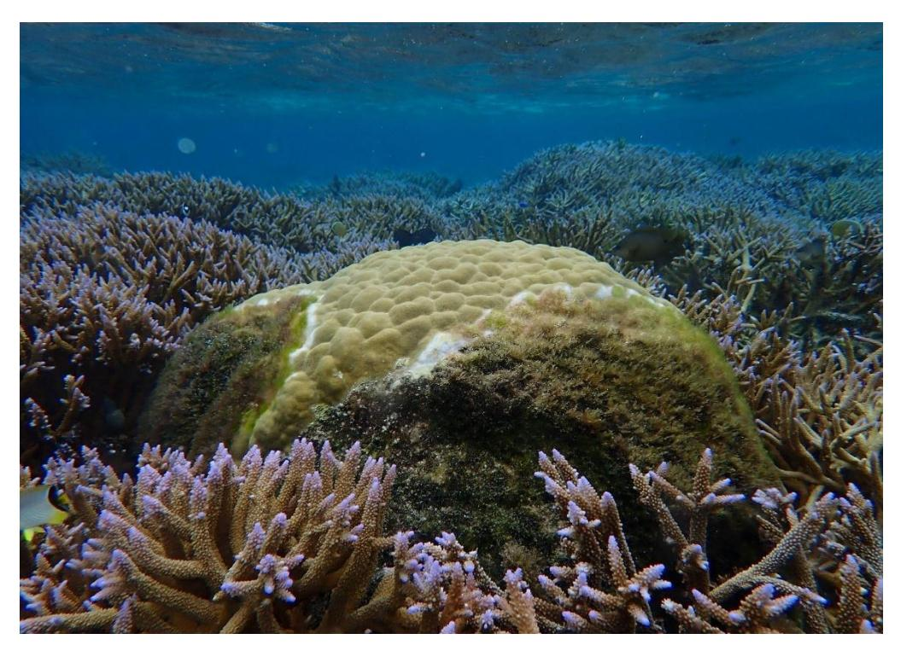

Fig 1. A *Porites* exhibiting white band syndrome in Auto/Amaua, American Samoa. Credit: CRAG 2023.

# CONTENTS

| Appendix B: Coral Disease Response Permitting Guide122                                                                                                                            |  |
|-----------------------------------------------------------------------------------------------------------------------------------------------------------------------------------|--|
| Contents 122                                                                                                                                                                   |  |
| Introduction 123                                                                                                                                                               |  |
| Regulations and Permitting Guide 123                                                                                                                                           |  |
| Contact Sheet: Applicable Local and Federal Authorities for Coral Disease Response124                                                                                             |  |
| NEPA: National Environmental Policy Act125                                                                                                                                        |  |
| Endangered Species Act (ESA) Section 7 Consultation 127                                                                                                                        |  |
| ESA during Emergencies 128                                                                                                                                                     |  |
| Army Corps Of Engineers (USACE)128                                                                                                                                                |  |
| Magnuson-Stevens Act-Essential Fish Habitat (EFH) Consultation 129                                                                                                             |  |
| ONMS Permit Required for any activities to take place within a National Marine Sanctuary, locations include: Fagatele Bay, Faga'alu/Fogama`a (Larsen's Cove), Aunu'u, Tau, and |  |
| Swains Island130                                                                                                                                                                  |  |
| United States Fish & Wildlife Service: Refuge Special Use Permit 130                                                                                                           |  |
| National Parks Service Research Permit131                                                                                                                                         |  |

# INTRODUCTION

This Permitting Guide for Coral Disease Response in American Samoa was created to streamline the regulatory process for any actions needed to monitor and mitigate coral disease withing the American Samoan archipelago. Coral Diseases have devastated many reefs around the world and quick and effective action is necessary to keep American Samoa's reefs healthy. In this guide you can find a detailed list of permits required for different locations in the territory as well as for different response actions, such as scientific study, tagging, sampling, antibiotic intervention, culling, and amputation along with background on each permit, how to apply, and a contact sheet with relevant coral disease authorities is provided.

# REGULATIONS AND PERMITTING GUIDE

Table 1. Required Permits for disease response activities. More information is detailed at the end of this guide.

| Response Action                                          | Permit(s) Required                                                                                                             |
|----------------------------------------------------------|--------------------------------------------------------------------------------------------------------------------------------|
| Rapid reconnaissance surveys and Long-term monitoring | DMWR Scientific Study Permits                                                                                                  |
| Tagging; Sampling; & Culling / Amputation       | DMWR Scientific Study Permits ESA Section 7 EFH (For Sampling: CITES NOT required for shipping between AS to U.S.) |
| Antibiotic application                                   | FDA DMWR Scientific Study Permits ESA Section 7 EFH                                                                   |
| Compensatory Restoration                                 | Restoration Permitting Guidance                                                                                                |

Table 2. Additional permits required for specific locations. More information is detailed at the end of this guide.

| Disease Location                                                               | Required Permits                                       |
|--------------------------------------------------------------------------------|--------------------------------------------------------|
| Sanctuary Waters: Outer Rose, Fagatele Bay, Aunu'u, Tau, & Swains Island | ONMS Permits                                           |
| National Park of American Samoa                                                | National Park Service Research Permit                  |
| Navigable Waterways: Pago Pago, Aunu'u, Ofu, & Ta'u Harbors              | USACE Permits or Letter of Permission               |
| Rose Atoll                                                                     | USFW Visitor/Special-Use Permit                        |
| Territorial Lands/Reef Flats                                                   | Approval from Village Mayor/Chief. Please contact OSA. |

# CONTACT SHEET: APPLICABLE LOCAL AND FEDERAL AUTHORITIES FOR CORAL DISEASE RESPONSE

Table 3. Names, Jurisdictions, and Contacts for American Samoa agencies relevant to coral disease response.

| Acronym | Agency/Authority                                           | Purview                                                           | Points of Contact                                                                                  |
|---------|------------------------------------------------------------|-------------------------------------------------------------------|----------------------------------------------------------------------------------------------------|
| AS-EPA  | AS Environmental Protection Agency                      | Beach Monitoring Program                                       | Water Quality Branch Manager: Ioakimo Makiasi (ioakimo.makiasi@epa.as.gov) 1-684-633-2304 |
| CDDWG   | Coral Disease and Disturbance Working Group (USCRTF) | Coral Diseases throughout the U.S. Coral Jurisdictions      | Caroling Mclaughlin cmclaughlin1@ufl.edu                                                        |
| CDHC    | Coral Disease and Health Consortium                     | Coral Diseases                                                    | cdhc.coral@noaa.gov Murphy McDonald: 843.481.5972 Cheryl Woodley: 843.481-0436               |
| CRAG    | Coral Reef Advisory Group Coordination                  | AS Coral Reefs                                                    | Sana Lynch coordinator@crag.as 1-684-633-4456 ext. 229                                       |
| DMWR    | Department of Marine and Wildlife Resources          | AS Fisheries & Wildlife, Boating Access, Marine Enforcement | Deputy Director: Selaina Vaitautolu taahinemanua@gmail.com                                   |
| -       | Dr. Douglas Fenner                                         | Expert on American Samoan Corals and Diseases               | Dr. Douglas Fenner douglasfennertassi@gmail.com                                                 |

|              | Department of Port Administration                                                       | Customs & Immigration                                                                                                                        | 1-684-633-4251                                                                                                   |
|--------------|--------------------------------------------------------------------------------------------|----------------------------------------------------------------------------------------------------------------------------------------------|------------------------------------------------------------------------------------------------------------------|
| DPA          | Harbor Master                                                                              | Docking and Anchoring                                                                                                                        | Harbor Master: Puamavae Ah Mai (ahmai@pa.as.gov) Assistant Harbor Master: Beverly Tali (tali@pa.as.gov) |
| NMSAS        | National Marine Sanctuaries AS                                                          | National Marine Sanctuaries e.g. Fagatele Bay, Fagalua/Fogoma`a (Larsen's Cove), Aunu'u, Tau, Rose Atoll, & Swains Island. | Valerie Brown (valerie.brown@noaa.gov) 1-684-633-6500 ext. 1114                                         |
| NOAA OR&R | NOAA Office of Response and Restoration                                              | Triggered via oil spills or the threat of oil spills                                                                                      | Ruth Yender ruth.yender@noaa.gov +1-206-849-9926                                                           |
| NPSA         | National Park Service AS                                                                | National Parks of AS (locations: Tutuila, Ofu, Tau)                                                                                    | Eric Brown (Eric_Brown@nps.gov) 1-684-633-7082 ext. 41                                                        |
| NWHC         | National Wildlife Health Center                                                         | Wildlife Disease Diagnostics                                                                                                              | Wildlife Disease Specialist: Dr. Thierry Work (thierry_work@usgs.gov)                                      |
| OSA          | Office of Samoan Affairs                                                                | Liaison with village mayors/chiefs                                                                                                        | 1-684-633-5201                                                                                                   |
| USACE        | United States Army Corps of Engineers (Honolulu District which encompasses AS) | Navigable Waterways (Pago Pago Harbor)                                                                                                    | CEPOH-PA@usace.army.mil 1-808-835-4004                                                                        |
| USFW         | U.S. Fish and Wildlife Service                                                          | Rose Atoll National Wildlife Refuge                                                                                                       | Rose Atoll NWR & MNM Manager: Brian Peck brian_peck@fws.gov 1-684-633-7082                              |
| PIRO         | Pacific Islands Regional Office (NOAA Fisheries)                                     | Rose Atoll MNM                                                                                                                               | AS Field Office: 1-684- 633-7629 Fax: 1-684-633-7630                                                    |

NEPA: NATIONAL ENVIRONMENTAL POLICY ACT

The full NEPA process is required by any federal action (including actions conducted by a federal agency or with federal dollars). Thus, NEPA applies for the majority of vessel removal response activities conducted in AS. The NEPA process is depicted below:

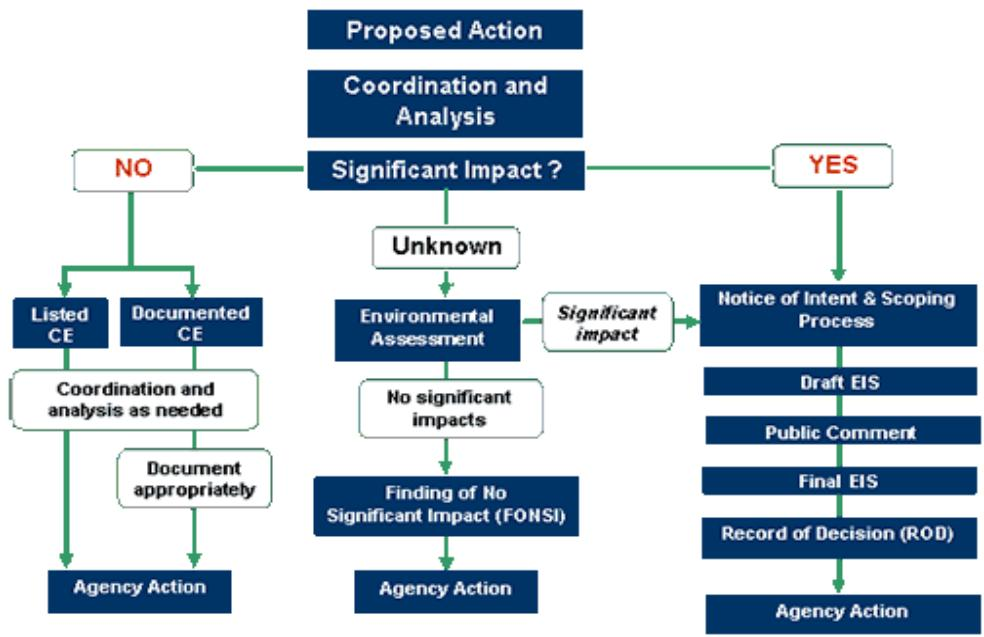

*Figure 2*. The NEPA Process Overview (Center for Environmental Excellence, 2023).

# ENDANGERED SPECIES ACT (ESA) SECTION 7 CONSULTATION

- Pursuant to the Endangered Species Act Section 7(a)2, all federal agencies must initiate consultations with NMFS for any proposed actions that might impact endangered marine species or critical habitats. This includes the removal of grounded vessels as it can affect ESA corals, invertebrates, fish, and more (CRS 2021).
- An updated list of ESA species in American Samoa can be found here: [https://www.fisheries.noaa.gov/pacific-islands/endangered-species](https://www.fisheries.noaa.gov/pacific-islands/endangered-species-conservation/marine-protected-species-american-samoa)[conservation/marine-protected-species-american-samoa.](https://www.fisheries.noaa.gov/pacific-islands/endangered-species-conservation/marine-protected-species-american-samoa)
- After the consultation, NMFS will form a 'biological opinion' of the proposed agency action, which may authorize certain actions even if they could impact endangered species and/or critical habitat (CRS 2021). The decision tree for consultation determination is below, followed by a timeline of the consultation process (for nonemergent scenarios). Information from NMFS about this process can be found here: [https://www.fisheries.noaa.gov/insight/consultation-process.](https://www.fisheries.noaa.gov/insight/consultation-process)

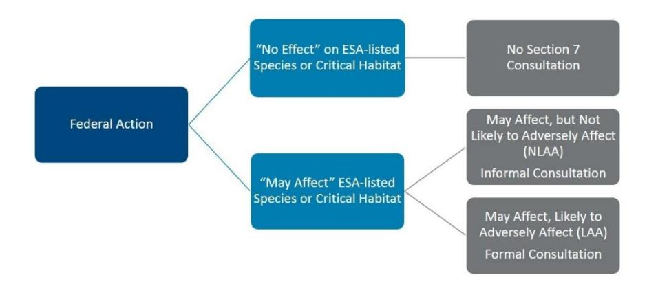

*Figure 3*. Flow chart depicting consultation determinations (NMFS, n.d.).

- If a consultation is determined to be required, the agency must submit a 'consultation request package,' which includes the following:
  - 3. Effects Determination Record
  - 4. Effects Determination Guidance

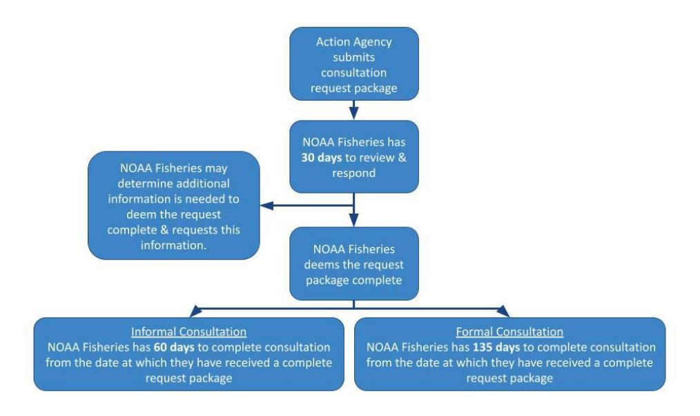

*Figure 4*. Flowchart of Consultation Request Process (NMFS, n.d.).

# ESA DURING EMERGENCIES

- Emergency consultations are offered. Emergencies in this context constitute any "act of god, disaster, casualty, national defense or security measure, etc. that poses significant risk to human life or property and their responses" (NMFS, 2023).
- Coral disease outbreaks can be deemed emergencies. Some examples include instances when vessels grounded on priority fishing grounds that impacted local communities' welfare.
- According to ESA Section 7 for the pacific islands, federal agencies must email [efhesaconsult@noaa.gov](mailto:efhesaconsult@noaa.gov) and the Interagency Cooperation Branch Chief, Ron Dean [\(ron.dean@noaa.gov\)](mailto:ron.dean@noaa.gov):
- 4. The nature of the emergency response actions.
- 5. A justification for an expedited consultation.
- 6. Impacts to designated endangered or threatened species and their designated critical habitats.
- NMFS will respond with a letter of concurrence if they agree to an emergency consultation.
- Post-incident, NMFS may follow up with an after-the-fact effects determination. This usually only happens if take of an ESA species occurred during response operations.

# ARMY CORPS OF ENGINEERS (USACE)

From the USCRTF "A Guide for Coral Restoration Permitting in the Seven U.S. Coral Reef Jurisdictions" (2023).

• The U.S. Army Corps of Engineers' (USACE) Regulatory Program involves the regulation of discharges of dredged or fill material into waters of the United States and structures or work in navigable waters of the United States, under section 404 of the Clean Water Act and section 10 of the Rivers and Harbors Act of 1899. A proposed project's impacts to these areas will determine what permit type is required.

# • Permit Types:

- o An individual, or standard permit, is issued when projects have more than minimal individual or cumulative impacts, are evaluated using additional environmental criteria, and involve a more comprehensive public interest review.
- o A general permit is issued for structures, work, or discharges that will result in only minimal adverse effects. General permits are issued on a nationwide, regional, or state basis for particular categories of activities. General permits are usually valid for five years and may be re-authorized by USACE. There are three types of general permits:
  - Nationwide permits are issued by USACE on a national basis and are designed to streamline Department of the Army authorization of projects such as commercial developments, utility lines, or road improvements that produce minimal impact to the nation's aquatic environment.
  - A regional general permit is issued for a specific geographic area by an individual USACE District. Each regional general permit has specific terms and conditions, all of which must be met for project-specific actions to be verified.
  - Programmatic general permits are based on an existing state, local, or other federal program and designed to avoid duplication of that program. A State Programmatic General Permit (SPGP) is a type of permit that is issued by USACE and designed to eliminate duplication of effort between USACE districts and state regulatory programs that provide similar protection to aquatic resources. In some states, the SPGP replaces some or all of the USACE nationwide permits, which results in greater efficiency in the overall permitting process.

# MAGNUSON-STEVENS ACT-ESSENTIAL FISH HABITAT (EFH) CONSULTATION

Adapted from the USCRTF "A Guide for Coral Restoration Permitting in the Seven U.S. Coral Reef Jurisdictions" (2023).

- A consultation with NOAA Fisheries on Essential Fish Habitat is required if:
  - o A federal agency has authorized, funded, or undertaken part or all of a proposed activity.

For example, if a project requires a federal permit, then the federal agency issuing the permit must consult with NOAA Fisheries.

o The action will adversely affect EFH. To determine whether an action will occur within EFH, use this [tool](https://www.habitat.noaa.gov/apps/efhmapper/?page=page_5). All of American Samoa's islands are located within EFH (NMFS, 2023). An adverse effect includes direct or indirect physical, chemical, or biological alterations. It includes adverse changes to:

- Waters or substrate.
- Species and their habitat.
- Other ecosystem components.
- Quality and/or quantity of EFH.
- o If a federal agency determines that an action will not adversely affect EFH, and NOAA Fisheries agrees, no consultation is required.
- o Private landowners and state agencies are not required to consult with NOAA Fisheries. However, NOAA Fisheries must provide conservation recommendations on any state action that would substantially adversely affect EFH.
- o Consultations are conducted in concert with the NOAA Fisheries Regional Office overseeing your jurisdiction.
- o Normally EFH Assessments are prepared independently from other assessments (NEPA, ESA) (NMFS, 2023).
- o There are both abbreviated and expanded consultations, depending on the extent of proposed EFH impacts (NMFS, 2023).
- o Full EFHA Consultation Process in the Pacific Islands can be found here: [https://www.fisheries.noaa.gov/pacific-islands/consultations/essential-fish-habitat](https://www.fisheries.noaa.gov/pacific-islands/consultations/essential-fish-habitat-consultations-pacific-islands)[consultations-pacific-islands](https://www.fisheries.noaa.gov/pacific-islands/consultations/essential-fish-habitat-consultations-pacific-islands)

ONMS PERMIT REQUIRED FOR ANY ACTIVITIES TO TAKE PLACE WITHIN A NATIONAL MARINE SANCTUARY, LOCATIONS INCLUDE: FAGATELE BAY, FAG A'ALU/FOGAMA`A (LARSEN'S COVE), AUNU'U, TAU, AND SWAINS ISLAND.

- Can take from 45 days up to a year if ONMS needs to prepare an EIS.
- [Application Instructions](https://nmssanctuaries.blob.core.windows.net/sanctuaries-prod/media/docs/nms-permit-instructions-20241120.pdf)
- Application can be found [here.](https://nmssanctuaries.blob.core.windows.net/sanctuaries-prod/media/docs/nms-permit-application-20241120.pdf) Please submit via email to [Valerie Brown.](mailto:valerie.brown@noaa.gov)

# UNITED STATES FISH & WILDLIFE SERVICE: REFUGE SPECIAL USE PERMIT

- If you want to perform or undertake development in an area designated as a National Wildlife Refuge, which in American Samoa only includes Rose Atoll, the US Fish & Wildlife Service requires that you also obtain a Refuges Special Use Permit.
- [Apply for a Special Use Permit on National Wildlife Refuges](https://www.fws.gov/service/special-use-permits-national-wildlife-refuges)

# NATIONAL PARKS SERVICE RESEARCH PERMIT

- The NPS uses the RPRS to administer scientific studies and collecting activities.
- You need a log-in to the [Research Permit and Reporting System](https://irma.nps.gov/RPRS/) (RPRS). You can register via the same link.
- There are three documents that you need:
  - o An application
  - o Permit
  - o Investigator's Annual Report