## American Samoa's

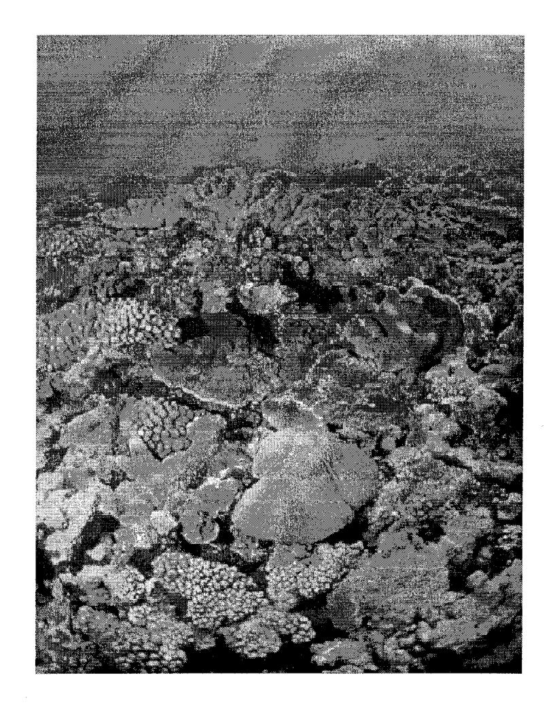

STATE OF THE REEFS

#### TERRITORY OF AMERICAN SAMOA

OFFICE OF THE GOVERNOR
Pago Pago, American Samoa 96799

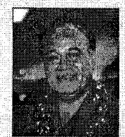

auese P. F. Sunia Governor

Tauese P. F. Sunia

Togiola T. A. Tulafono Lieutemant Governor

July 14, 2000

#### Greetings:

On behalf of the American Samoa Coral Reef Advisory Group and as a member of the US Coral Reef Task Force, I am pleased to present to you the first publication of American Samoa's State of the Reefs. This publication serves to summarize the conditions of the territory's reefs as well as the role that our reefs play in the lives of the Samoan people.

Coral reefs in American Samoa and throughout the world have been impacted by natural disasters as well as the activities of humans. Our coral reefs are precious resources that provide protection of the coastline in storms, habitat for reef fish and other organisms, and a source of food and recreational resources.

Through the American Samoa's State of the Reefs, we can become educated on the basics of the coral reef ecosystem, their importance to American Samoa, the status of the health of the coral reefs and their threats, what is being done to protect and preserve them. I urge each and every one of you to learn about the coral reefs and take actions to prevent human impacts in order to preserve the reefs for our future.

Sincerely,

TAUESE P.F. SUNIA

Governor

**Territory of American Samoa** 

# STATE OF THE REEFS

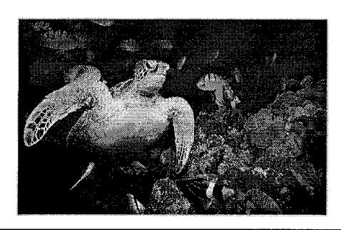

#### Inside:

| Message from the Governor                             | 2  |
|-------------------------------------------------------|----|
| Coral Reefs in American Samoa and Managers            |    |
| Coral Reefs—up close                                  | 4  |
| Meet the Coral Reef Task Force                        | 6  |
| American Samoa's Exclusive Economic Zone              | 6  |
| Current Conditions— global and local                  |    |
| Environmental Trends                                  | 7  |
| Fisheries                                             | 10 |
| Water Quality                                         | 11 |
| Samoan Myths and Traditions                           | 12 |
| Threats to the Coral Reef Ecosystem                   | 14 |
| Resource Utilizers                                    | 17 |
| Potential Solutions to problems facing AS coral reefs | 19 |
| Future of the Reefs in American Samoa                 | 22 |
| Credits                                               | 23 |

### Coral Reefs - from a polyp to an island

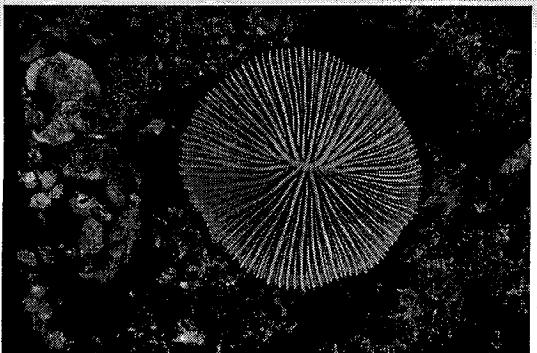

Fungia sp.

The polyp – When thinking of the coral reef, one envisions an expansive physical structure with associated marine life. However, a coral reef is composed of millions of individual

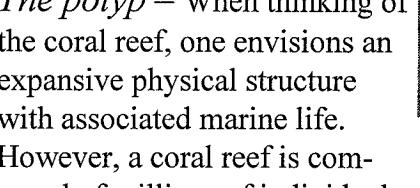

coral POLYPS, the actual coral animal itself. An individual polyp may have a variety of shapes which will affect the overall shape of the colony. It may come in a range of sizes. The

polyp may be special-

ized to defend the colony in which it resides, it may be designed to feed the colony, it may be geared towards reproduction, or it may carry out a variety of tasks. Defense polyps house a nematocyst, a large stinging harpoon-like structure that they can release when threatened or capturing prey. Feeding polyps may house algal symbionts; zooxanthallae which bring color and a source of energy to the coral with their photosynthetic ability. Additionally, reproductive polyps may be a storehouse for eggs or sperm or have a combination of these features. The coordination amongst polyps leads to the healthy coral colonies covering the reefs.

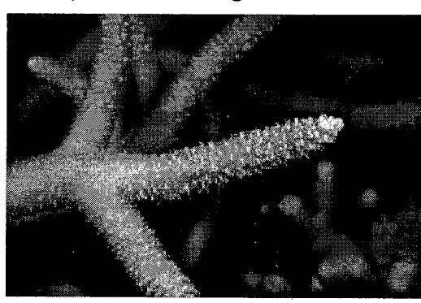

Favites halicora

Acropora yongei

The island – Coral Reefs around the world are divided into three basic types: fringing, barrier, and atoll. After a volcano erupts, coral polyps may settle along any submerged areas. The corals closest to the island form fringing reefs. As the island subsides and the reefs continue to grow away from the island, these fringing reefs may become barrier reefs. Barrier reefs are defined by having a definitive lagoon separating them from the fringing reefs closer to shore. Barrier reefs may also form at the furthest shallow extent of the island plateau. After many years (generally millions) the volcano is no longer in evidence and any land is old coral reef. This is considered to be an atoll. All three types of reefs may be found within American Samoa. Reefs around Manu'a and Tutuila are generally fringing but there are some submerged barrier reefs, such as Taema Bank. Rose Island is the oldest of the Samoan Islands, and, like Swain's Island, it is an atoll.

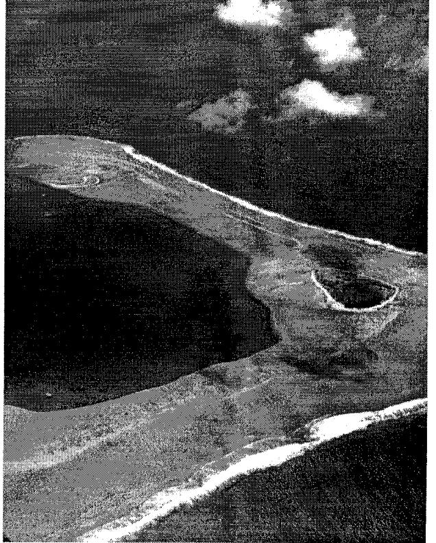

Rose Island

In addition to the other animals pictured throughout this book, Coral Reefs are home to many marine animals—here are a few of them.

Coral reefs like to have clear waters, predictable temperatures and salinities, and good oxygen levels.

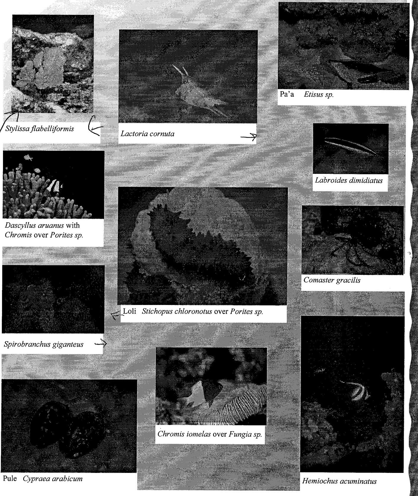

### The Coral Reef Advisory Group

The Coral Reef Advisory Group (CRAG) of American Samoa was formed to provide the governor of American Samoa information about the heath and care of the coral reefs of the territory. The governor represents the territory on the United States Coral Reef Task Force, a group dedicated to protecting and promoting reef resources. CRAG is composed of members from a variety of government agencies which work with issues regarding the marine ecosystem. Participating agencies and their heads are listed below.

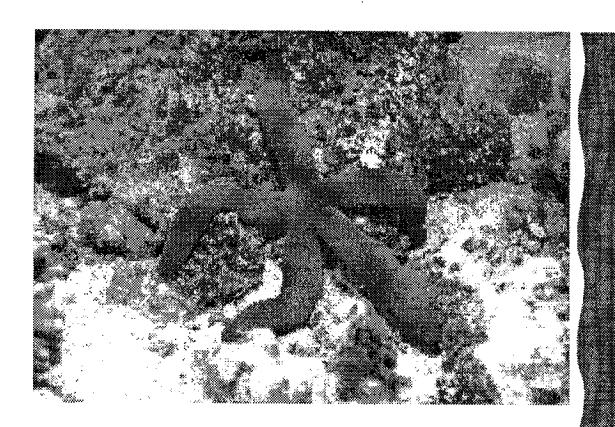

Aveau Linckia laevigata

Department of Marine and Wildlife Resources – Vfagafa Ray Tulafono
Department of Commerce – Ali'imau H. Scanlan Jr.

American Samoa Environmental Protection Agency – Togipa Tausaga
American Samoa Community College + Dr. Salu Hunkin
National Park of American Samoa – Supt Charles Cranfield

#### American Samoa's Exclusive Economic Zone

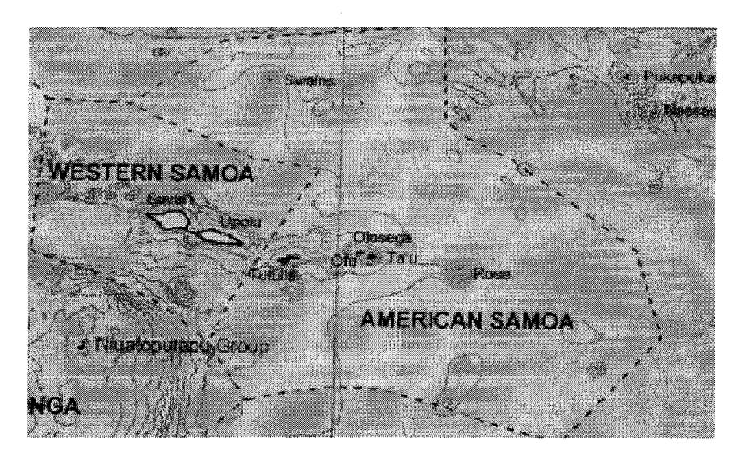

The Exclusive Economic Zone (EEZ) of American Samoa is a valuable territorial asset. Extending up to 200 miles seaward from land or half the distance to a neighboring country, EEZs were designated so that the parent country has a degree of control over the resources upon which the people of that land may rely as well as jurisdiction over vessel traffic close to their shores. The EEZ of American Samoa is approximately 197,000 square kilometers, close to the size of the state of Utah. This area will become even more important in the future as pharmaceutical companies continue to find natural sources of medicine in the seas, man extends his explorations of the uses of the sea, and fish stocks worldwide continue to be depleted.

#### **Environmental Trends**

#### Global

- Corals are diseased
- Climate is changing
- Human population on rise

#### Local

- Corals are recovering
- Reef fish are depleted
- Harbor fish are toxic
- Environmental enforcement is low
- Construction continues throughout territory

Just like other living organisms, corals can, in fact, become so sick that they die. Oftentimes this is brought about by some sort of a disease, other times the corals just 'bleach'. Diseases on coral reefs often manifest in similar ways as they do in humans. They are generally visible in the form of a tumor or disfiguration. Diseases are generally spread from one organism to another and may be 'nearby' frequently. However, it has been documented that most corals do not catch these diseases and become sick until they are under other stresses- usually what are termed environmental stresses. Recognizing these conditions on our reefs may be a key to the continuation of healthy coral reefs in American Samoa.

Coral diseases are commonly identified by a change in the coral polyp- the individual coral organism which, in combination with its neighbors, makes up dense coral colonies. The polyp may be engulfed by some sort of bacterium, and display an unusual color.

it may have a 'tumor', it may be 'wasted away' by a fungus, or something inside it may have triggered it to release it's normal companion- a live inside algae called zooxanthallae. These diseases carry fear-inspiring names such as redband disease, bleaching, rapid wasting disease, and white pox. Coralline algae also suffer from a couple of known lethal diseases.

Diseases are believed to spread through the water column and across colonies. Some believe they may even be introduced in atmospheric dust. Disease causing agents may be present in the water column with no infected or-

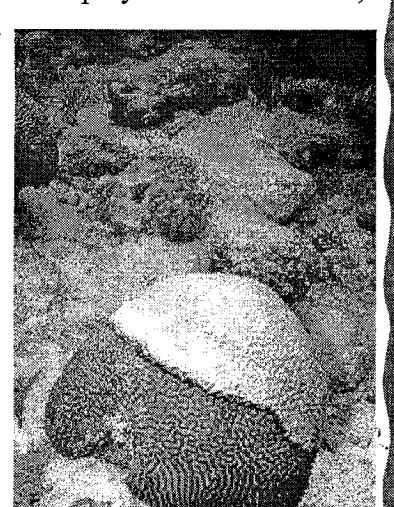

Blackband disease in the Caribbean

ganisms visible. Coral reef organisms have good ways to defend themselves from diseases under healthy conditions. However, if toxins are found in the water, the temperatures increase or decrease dramatically, sedimentation comes in and lessens light availability and oxygen levels, etc., then the reef may not be strong enough to defend itself from disease.

Most scientists agree that the reefs are sicker now than before. This is believed to be mainly due to human impacts near reef environments. Teefs miles away from human habitation have also been shown to be affected. Coral reef scientists have noticed a number of these diseases here. With increased development, increased sedimentation during rain events, increased pollution (often in the form of trash-plastic being the worst offender), increased chemical run-off, and higher water temperatures, it is very likely that there will be an increase in diseased coral reef organisms.

and global warning

#### Yearly Average Air Temperature, Tutuila

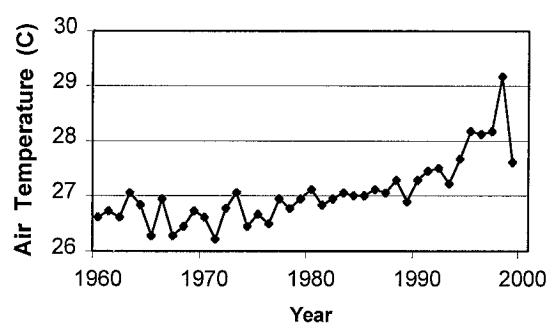

Sea Level Rise: The temperature on the surface of the Earth has reportedly risen about 0.5 degrees Celsius in the last one hundred years. This phenomenon of increased average Earth temperature is known as global warming. While many consider it to be largely due to human activities, there is little evidence to uphold a significant increase in global temperatures being solely humankind's responsibility, rather than continued natural climatic variability. Ice ages have occurred longer than man has been recorded on the planet, with contrasting warming cycles also occurring. The effect of global warming on the surface of the Earth has been noticed, most

arguably, in sea level rise. As glaciers shrink and legendary snowcapped mountains begin to melt, sea level has risen approximately 15-20 cm in the last century. It is believed that it will continue to be rise at the same rate of 1-2 mm/year. Increased temperatures lead to this rise in a couple of manners; causing surface water molecules to physically take up more space as they heat and by causing water in ice (in icebergs, ice floes, glaciers, etc.) to melt and add to seawater. Some scientists believe that even if more of the ice melts, warmer temperatures will cause increased snowfall, putting water back into solid forms that will alleviate the increased sea level. However, there is no question that humans have caused an increase in global Carbon Dioxide levels.

Carbon Dioxide serves as a heat trapping gas in the atmosphere and has risen more than 30% since the beginning of the industrial age. This may have begun to effect organisms like coral that rely on other carbon-oxygen molecules for their structure, since these molecules are not as available in a sea more rich with carbon dioxide. Industrial countries like the United States are among the worst producers of atmospheric Carbon Dioxide. The increase of carbon dioxide in the atmosphere is not likely to change soon because international environmental treaties do not call for reductions in Carbon Dioxide emissions for years.

**Population increase**: Perhaps the most serious environmental problem facing the territory is its high population growth rate. Greater populations generally lead to increased demand for land, construction, fishing pressure, emissions of fossil fuels, consumption of natural resources, and greater volumes of

trash; changes which tax the environment. The population estimate of 65,000 in 1999 is increasing at a rate of 3.7%, one of the fastest growth rates in the world with a doubling time of only 19 years. A net increase of about 2000 people (mostly babies) is added to the population each year. A continued increase is expected given the high birth rate (4.5 children per female) and high proportion of those too young to reproduce in the population (nearly 50% of the population is under the age of 20). A population task force was established by the governor in 1999 to deal with this important issue.

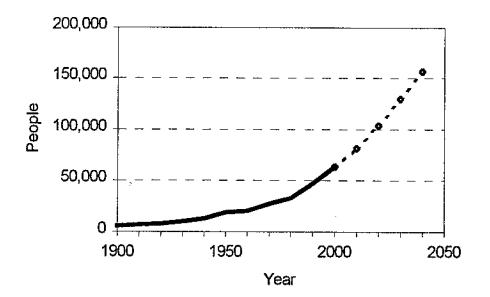

**Overfishing**: The definition of overfishing by marine policy experts is one which tries to incorporate a change in the ecology of a fishery species. This change may be that adult fish no longer attain the physical sizes they did previously, they are difficult to catch due to decreased numbers, or that the ecosystem structure has been altered (change in predators, etc.) by a reduced number of individuals of that species. Key species such as giant clams (faisua) and parrotfish (fuga) are overfished, and there is heavy fishing pressure on surgeonfish (alogo). We also see fewer and/or smaller groupers (gatala), snappers (mu), atule (akule) and sea turtles (laumei). Most village fishermen and elders interviewed believed that fishing has declined.

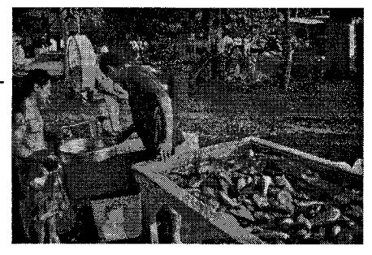

Fish along the road for sale

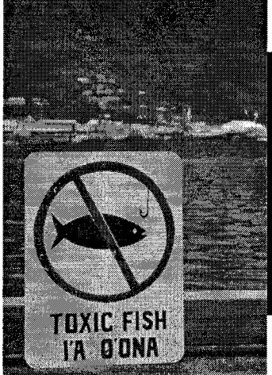

Warning sign for fish in Pago Pago harbor

Toxic fish: Fish and substrates in Pago Pago Harbor are contaminated with heavy metals and other pollutants. A health advisory warning people not to eat harbor fish was issued in 1991. New studies will be undertaken to ascertain the findings of these studies and further protect the residents of the territory.

**Enforcement:** Numerous environmental regulations have been drafted and passed into law. Environmental violations are frequently detected and prosecuted but much could be done to improve enforcement. Poaching of marine organisms is a common problem in protected areas. Sandmining is another serious offense, stripping beaches of their natural sediment and leading to greater erosion in other areas. Illegal chemical dumping, utilization of nonapproved agricultural compounds, and land fills are commonly nonprosecuted yet witnessed environmental violations.

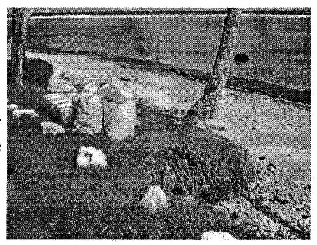

Sandmining bags lined up ready to be taken from Fatumafuti

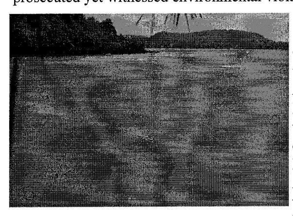

Sediment covering Faga'alu last May

**Construction:** Construction throughout the territory will continue to be on the rise as the population of American Samoa increases. New cars will pressure leaders to improve road conditions, increasing sea level will cause a higher demand for seawalls, increasing use of government land will cause entrepreneurs to seek land further up the mountains.

As this construction continues the increased sedimentation may choke near-shore reefs, especially after

large storm events. Derline in nearshore reefs is already apparent along the central southern shore from Materia to Number 190000

Longlining offshore of American Samoa

#### **FISHERIES**

Fishing on the coral reefs has been an imporant source of food in American Samoa. In the past, a variety of techniques

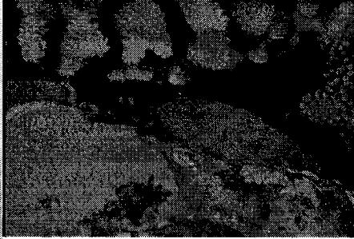

Mataele Cephalophlus urodeta

and gear made from locally available or traded materials were used. Traditionally a council of chiefs from each village would control the use of marine reosurces through a system of taboos which reserved certain sizes and types of fish for the chiefs, and restricted fishing by

gear, location, and seasons. In more recent times a form of centralized government management has replaced traditional management, although many villages in American Samoa still practice limited management of their reefs.

Over the years, some fishing methods remain essentially unchanged, while changes in some fishing gear have increased fishing efficiency. Observations of people fishing and interviews with fishers can provide estimates of the amount caught by each type of fishing gear. Reef gleaning (gathering fish, shellfish, seaweed, etc. on the reef flats at low tide) is still a major input to total catch. Woven fiber nets have been replaced by monotilament gill nets. Diving technology has changed fishing by the use of goggles or masks, spear guns, underwater tashlights and (after 1994) the use of SCUBA in the commercial fisheries.

Despite innovations in fishing technology, total estimated annual catch for Tutuila has dropped from almost 594,100 pounds in 1979 to 191,600 pounds in 1994. Some of this drop might be due to coral reef damage caused

by hyrricanes Ofa (1990) and Val (1991).
The reefs appear to be recovering, but the folial catch has still been decreasing. These numbers, plus the results of other studies sconducted by the Department of Marine and Wildlife Resource. Indicates that

erfishing

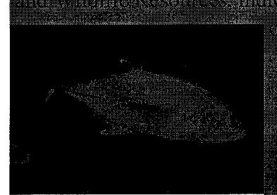

Caranx sexfasciatus

Recently American Samoa has achieved a noteworthy milestone in the maintenance of its coral reefs. In April 2001, an executive order was signed by Governor Tauese banning the future of SCUBA fishing in the territory. Recognized for it's extreme destructiveness to coral reefs around the world, SCUBA fishing provides man with a formidable advantage over marine species. SCUBA fishing had been a major commercial operation for approximately six years before this order was issued in response to several concerned

groups recognizing the overfished resources in the

territory.

### ATER QUALITY

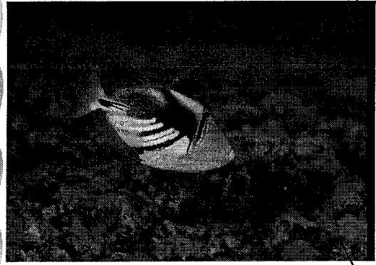

Sumo oka Rhinecanthus aculeatus - a common fish in nearshore waters

Water quality issues in American Samoa have changed over the years as regulatory progams have developed, as the territory increases in population, and as impacts resulting from development are detected. Some examples are the nutrent inputs of the canneries into Pago Pago Harbor, the finding of heavy metals in fish and sediments of Pago Pago harbor and various other locations, and the nonpoint source contributions from development and agriculture.

Until 1990, the two tuna canneries located in Pago Pago Harbor discharged all waste streams into the inner harbor. with the exception of sludge solids removed from the waste streams by dissolved air floatation. In 1990, the high

nutrient waste streams were segregated and barged to a USEPA- approved ocean dump site off

Tutuila Island along with the sludge solids. By 1992, an outfall line was constructed to outer Pago Pago Harbor near Onesosopo Park for the remaining waste stream. The canneries continue to utilize this waste disposal scheme and meet the American Samoa Water Quality Standards for the most part; however, the damage to the habitat of Pago Pago Harbor still remains and the potential for recovery could be impacted by these and other industrial inputs.

In 1991, a human health advisory on the consumption of fish from inner Pago Pago Harbor was issued by ASG after determining that high concentrations of metals, particularly

lead, found in fish tissue could potentially cause serious health effects. An additional study was

Discosoma – when species such as this begin to take over the reef, they lower the diversity

ment was completed finding lead contamination from 5 sites, mercury in 8 sites, and recommended confirmation on the finding of arsenic were not differentiated.

Streams, direct storm water runoff, and ground water seepage are other major issues for local water quality. The high level of rainfall, steep terrain, and the poor use of Best Management Practices (BMP) to prevent nonpoint source pollution contribute to the problem. Examples of development sources are new coastal projects such as sea walls, harbor development, quarries, roads, and excavation. While much of the Pago Pago Bay area and the Tafuna Plains are sewered, the majority of the shoreline villages utilize septic tanks as the method of sewage treatment.

Volcanic soils prevent the effective treatment of sewage from septic tanks, thereby increasing the nutrient and suspended solids discharges to streams, ground water and nearshore waters.

completed in 1992 in the fish from 12 sites around Tutuila Island and a human health risk assess-

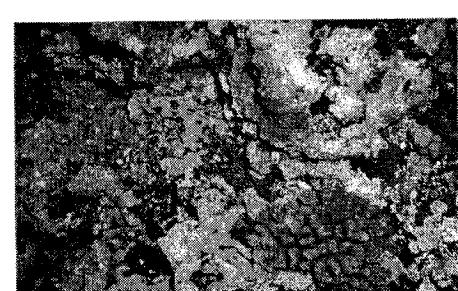

on Taema Banks – the diversity organisms is due in part to the higher quality of water further away from shore

# Samoan Legends and Traditions

embraced an understanding of

events, etc. They often in-

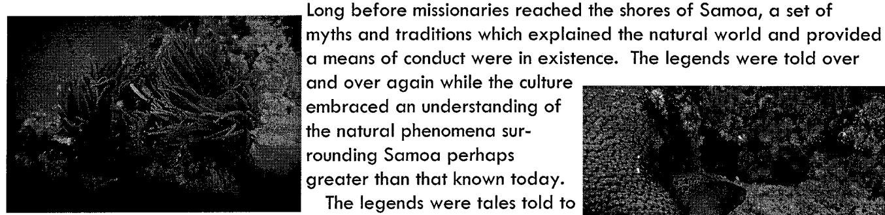

Nofo Amphiprion melanopus – Traditional legends attempt to explain the reasons behind relationships among organisms, such as that between this clown fish and anemone, or the danger and necessary avoidance of other creatures such as the moray eel and lion-fish

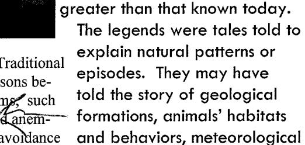

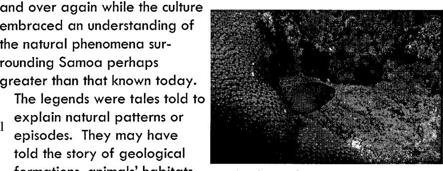

Pusi Gymnothorax sp.

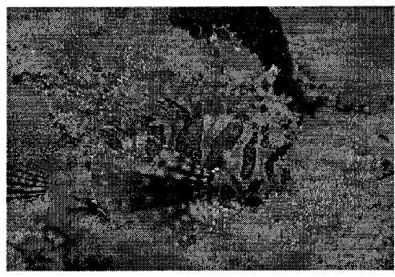

Dandrochirus zebra

cluded lessons about love, duties to the family and village, and undesirable emotions such as jealousy and selfishness. They provided a rationale for the role of the individual in their culture and environment. Tales of Tagaloa, Pili, Salevao, Taema, and Mafuie are intermixed with stories of sharks, storms, trees, and streams. People around the world are now beginning to realize the inherent value of this ancient knowledge. In many places, they are encouraging the remembrance and recording of the ancient tales and practices. This information is now being used in better under standing and managing of the environmental resources.

a means of conduct were in existence. The legends were told over

The following section is a retelling of three stories of Tutuila by students of the American Samoa Community College.

One day a rat was chased by a cat. The cat chased the rat all the way to the beach. The rat did not have a choice of where to turn and hide so the rat jumped into the ocean. While the rat was shouting for help the octopus came by. The octopus generously helped the rat by having the rat sit on its' head. During their journey across the ocean the octopus thought of developing a friendship with the rat. The octopus kept it's head just above water for the rat to stay dry. When it came time for the octopus to take the rat back to dry land, the rat tricked the octopus. The octopus swam towards the beach and dropped off the rat. The octopus said farewell to his friend and headed back to the deep ocean. Just as the octopus turned it's back, the rat ran far on shore and called back to the octopus to check the top of it's head. As the octopus reached up to the top of it's head, it found that the rat had left droppings on it's head. The octopus got very mad. The octopus wanted to swim back to catch the rat and kill it but it was too late because the rat was on dry land. From then until today the octopus considers the rat to be it's enemy. This is where one of the famous baits for fishing octopus originated. The fishermen braid coconut leaves together in the form of a rat tail. As soon as an octopus spots this, it leaps and wraps it's eight tentacles around the disguised rat.

And Japa Momore J

### Fatu ma Futi

The legend of Fatu ma Futi takes place in the village of Fatu ma Futi. The legend began in western Samoa in the days when cannibalism was popular. During this time, Malietoa faiga was ruler in Western Samoa and he was a cannibal. Malietoa faiga would choose people in his village that were deviant, and would punish them by eating them. One day, there was a couple who were known as Fatu and his girlfriend Futi. Fatu had disobeyed Malietoa and was sentenced to death. The couple were extremely frightened and panicked. They tried to swim to Tutuila to escape. As they were swimming, men of Malietoa were trying to capture them. When the couple were almost ashore, a spell was cast by

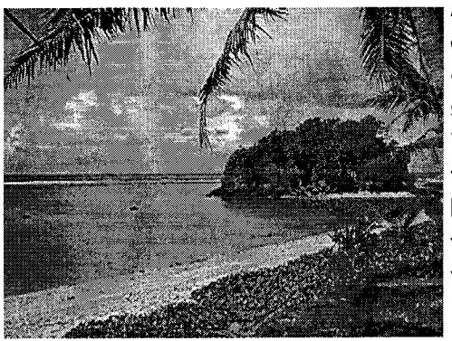

Malietoa. In this spell, if the couple looked at Malietoa again, they would turn to stone. The men were catching up with them but Futi was way ahead of Fatu.

Fatu turned around to see how far ahead of the men he was, and was sadly turned into stone. Futi turned to see where Fatu went, and was also turned into a stone.

Davis Moli

### Dolphins in Fagasa

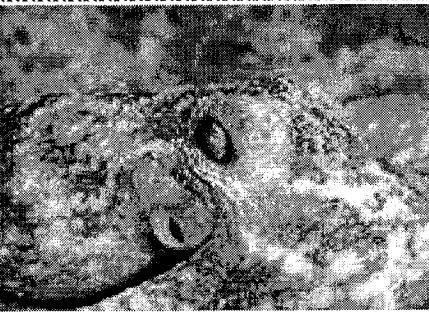

Fe'e

A long time ago a paopao sailed from Upolu to Tutuila. On the canoe there was a captain named Laa'avaa, his daughter Sina, and his crew. The canoe got to Fagasa and Li'aavaa had his crew gather food and water. Among his crew, his daughter Sina pledged to go look around the village. Li'aavaa agreed and in his last words told his daughter Sina to hurry back. While Sina was taking water from in front of a chief named Matau's water ditch the crew returned to the canoe and left. The crew thought Sina was sleeping but as the canoe got farther away from Fagasa in the

if Sina returned from her visit and the crew knew that she had been left behind. Li'aavaa ordered his crew to jump into the deep ocean and swim back to Fagasa to get Sina. Before the crew reached Fagasa they all turned into dolphins. When Sina found out that she had been left behind she cried where she was standing and a young man named Tigilau came by to comfort her but all of a sudden they both turned into rocks. From this time until today dolphins are seen in Fagasa as well as the two rocks (Sina and Tigilau). Momotu Laie

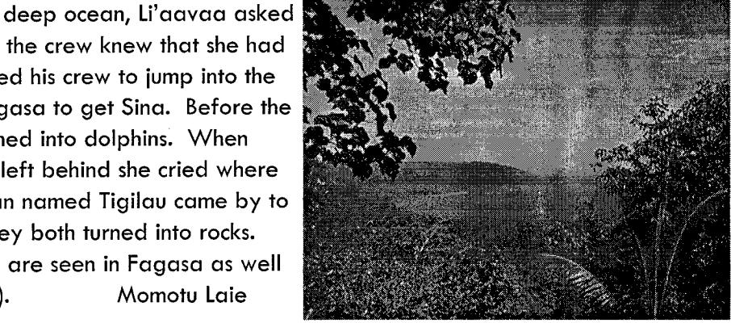

### Threats to American Samoa's Coral Reef Ecosystem\*

#### **LOCAL THREATS**

Overfishing and Overharvesting of Resources

Sedimentation

**Coastal Construction** 

Ship wrecks

Destructive fishing practices i.e.: dynamite, futu poisoning, Clorox

Hydrocarbon spills; oil, chemicals, hazardous waste

Ocean dumping/marine debris

Introduction of Alien Species

Crown of Thorns Starfish

**Bioprospecting** 

Aquarium Trade

**Mollusk Collecting** 

**Anchor Damage** 

Disease

Lack of Public Awareness/Education

Jurisdiction

**Lack of Enforcement** 

**WORLDWIDE THREATS** 

**Global Warming** 

Overharvesting of Turtles

Increasing human population

**Decreasing Ozone layer** 

**Coral Bleaching** 

\* as compiled at the Coral Reef Initiative Meeting May 11-14, 1999

### Storms, spines, and other natural events

Many natural events threaten coral reef ecosystems. The most familiar and terrifying of these is likely a hurricane. Hurricanes are storms with sustained winds greater than 74 mph. These winds churn the ocean surface, blow items from land to the sea and back, and cause large items in the sea to be completely rearranged and tossed about. Damage can be felt long afterwards as sediment continues to run with the coastal waters into the sea and items in the water continue to move. Smaller storms are often destructive too

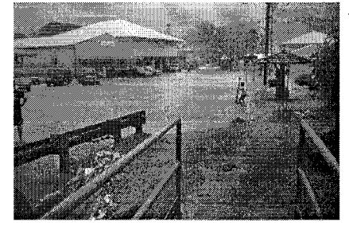

Flood in Pago Pago May 1999

as they unleash great amounts of energy on the

Another common natural disturbance to the coral reefs is the crown-of-thorns (COT) starfish. COT make their way about the reef, devouring the coral polyps. Perhaps in small areas this is a necessary disturbance event, much like small scale fires in forests, but when COT numbers increase they can be a daunting force on a coral reef.

One additional disturbance to the marine ecosystem occurs annually when the humpbacks whales arrive. The whales take advantage of the shallow 'roughness' of the reef flat and

roll around to rid themselves of the cumbersome barnacles clinging to their skin, slowing them down as they move across the vast ocean. This pattern creates patches of reef on which the corraline algae may once again cement the reef and provide habitat for corals and associated organisms.

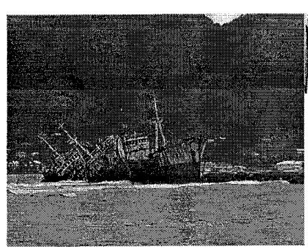

Longliners in the inner harbor

### Longliners in Pago Pago Harbor

In 1991 Hurricane Val graced the eastern shores of Pago Pago Harbor with nine unsightly longliners. After years of local efforts to call attention to and remove these derelicts, the federal government responded with emergency protocol. The United States Coast Guard (USCG) initially removed hazardous fluids from the ships, but by the middle of 1999 thousands of gallons of oil and an unknown amount of ammonia were still on the ships.

Once the USCG completed removal

of these hazardous materials, they coordinated with NOAA's Office of Removal and Restoration which obtained funding from the Oil Spill Liability Trust Fund to remove the remaining debris and aid in coral reef restoration. Bulldozers, cranes, and other heavy equipment were used to haul debris from the water by building artificial causeways to the sites of many of the vessels. This debris was then piled on a large barge and taken to an offshore deep water site and dumped.

Two of the vessels, which ran aground in the outer harbor, were removed by helicopter and then pulled out to sea. Efforts have been made to restore the coral reefs in these outer areas through coral transplantation. Further artificial reef stabilization is still a possibility.

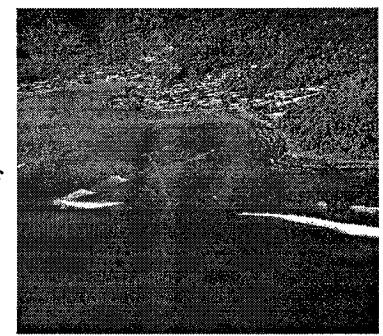

Aerial view of the scars which remained after two vessels were removed from the outer harbor

### The plastic epidemic - and other debris

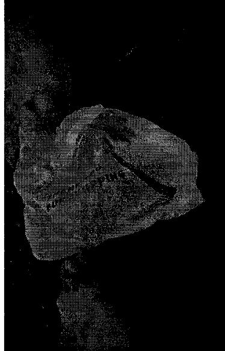

Plastic bag over coral

Anyone who has helped with an environmental day, attended an environmental class, viewed an 'Erase Litter' skit, or seen someone from Le Tausagi on television knows that trash in American Samoa is a major issue. What we do not realize is why it is an issue. Yes, it may be ugly and make the

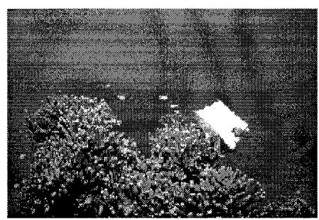

Diaper draping coral

side of the road look 'unpretty', but what is it really doing that is so bad? Batteries leach poisonous chemicals into the soil and natural aquifer. Plastic bags, diapers, wrappers, and Styrofoam cover the reefs,

choke the coral, and cause animals to die. Fishing line and 6- pack rings entangles and strangles corals, turtles, marine birds, etc. Cigarette butts, the most commonly occurring type of trash,

choke animals that ingest them thinking they have found food. Other debris litters the floor of the reef or floats along the surface of

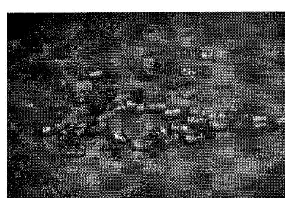

Beer cans along floor of Faga'alu

the ocean. Sometimes litter can become habitat for organisms, but this is the exception to the tide of litter which reaches our reefs. Do what you can to stop the tide of litter, especially the plastics which reach our beaches and shores!

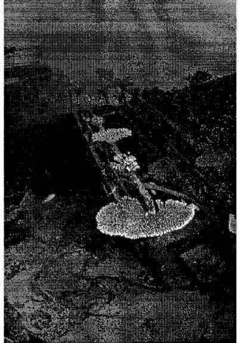

Acropora sp growing over wreck on Taema Banks

### The light is so bright!

Marine turtles lay their eggs on beaches around the world, returning to the beaches where they were born. Eggs are laid in conjunction with the phases of the moon at specific tides in order to best ensure the survival of the baby turtles. When the turtles hatch, they move rapidly towards the brightest horizon, generally that of the light of the moon reflecting from the waves on the surface of the ocean. This light is their primary indicator for reaching safety and avoiding the overwhelming predators on land. Dogs, crabs, birds, and humans are among their worst enemies during the few

moments after hatching in which the baby turtles orient and reach the sea. Throughout Florida, the Caribbean, and the Pacific, it has been demonstrated that the light from cities and roads causes the turtle hatchlings to become disoriented during their crucial initial stages of life. In order for American Samoa to continue hatching turtles in the future, we need to be careful to protect our beaches and not light the shorelines too much.

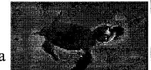

Baby turtle making it's way through the waves

### Aquarium Trade

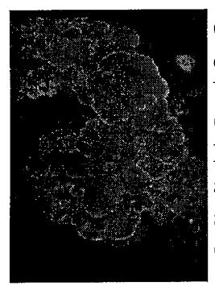

Coralline red algae

Ornamental aquariums have become a flourishing hobby in the United States and worldwide. Commonly found in offices, homes, and public arenas, the aquariums are thought to provide a sense of quiet serenity by the sound of the running water and the deli-

cate movement of the fish. The bright colors of the tropical organisms are highly prized as an

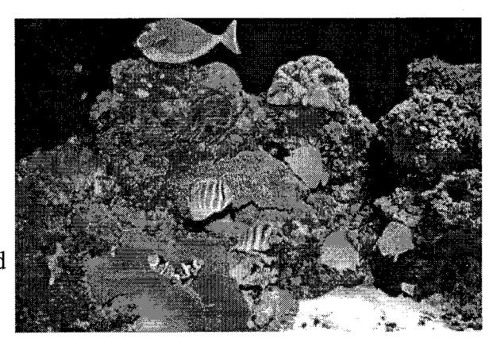

Aguarium from a collector in the US

additional component of the overall beauty. These

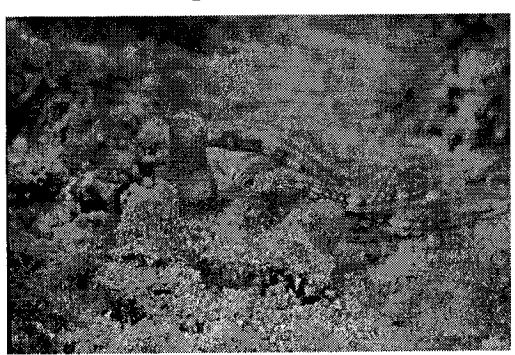

Corythoichthys intestinalis - now popular as pets in Asian countries, thought to bring good luck and be an aphrodisiac

aquariums stay the healthiest when the move is made away from plastic plants and artificial substratum to live reef organisms. This developing industry is one of the greatest threats facing island communities such as American Samoa. The seemingly fast and easy money to be gained by 'clear-cutting' the reefs is a huge price to pay for the future generations who will no longer have the reef to rely on for food, shelter from storms, and overall beauty for the terri-

Recently American Samoa has achieved a noteworthy milestone in the maintenance of its coral reefs. In August of 1999, a commercial enterprise began collecting 'live rock' throughout the territory and selling it in the mainland. As a result, members of the community became incredibly concerned. The 'live rock' being sold was considered to be a legal export since no coral was thought to grow upon it. However, the 'live rock' is arguably the most important part of the reef since it is largely composed of corraline algae which future coral polyps will settle upon. It also is home to thousands of coral reef organisms. In June 2000, a law was signed by Governor Tauese banning the future export of all harvested live rock from the territory.

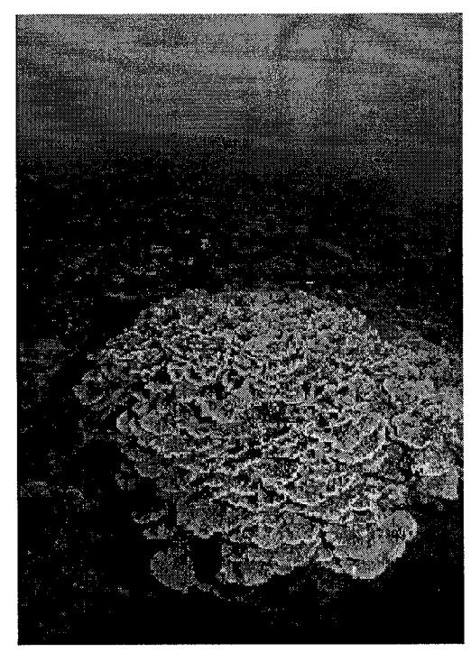

Mycedium elephantotus – removal of items from the reef either collectively such as in live rock harvest, or individually such as mollusck collecting or fish export, upsets the balance needed to keep the reef productive and healthy

### "That's a Beautiful Shell You Have"

Many people around the world collect mollusk shells for a hobby. We all agree they are beautiful to view, often they are incorporated into jewelry or works of art. Serious hobbyists trade shells, with the more rare species having greater worth. This type of harvesting often can lead to extinction of a species. Unfortunately, collecting mollusk shells may be-

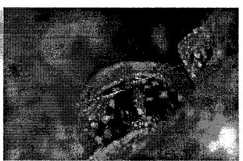

Ugatai Calcinus sp.

come an obsession for some. Many people never have enough shells, they may store these shells in their garages in buckets, not to be seen, used, or moved. Others just have a few proudly displayed around their homes, objects of beauty.

Young dancer with ornaments

What we forget to consider is what these shells would be if they were left in the ocean or on the beach. They would be homes to hermit crabs, shelter for small fish and future sand for our beaches. We do not know the extent of the impact we have upon the ecosystem by removing these shells. There are numerous islands in Florida made simply by the accumulation of oyster shells. If all of those animals had been removed to someone's display case thousands of years ago those islands would not exist today.

Next time you see a shell and want to bring it home, think about what it

### Aquaculture

For years now the Department of Marine and Wildlife Resources has run a successful faisua hatchery. Many farmers are currently raising tilapia on their lands. In addition to these resources, the territory will soon have a new group of farmers of the oceans.

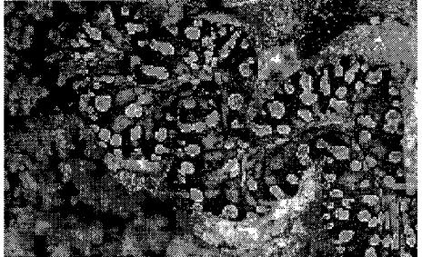

The Aquaculture Cooperative of American Samoa (AQCAS) is a non-

profit organization that was formed in September 1998 There are executive officers and a board of directors. The AQCAS plans to work in cooperation with American Samoa Community College to coordinate marine research efforts in the future to help ensure care is taken not to introduce species or significantly affect water quality. A variety of items will be raised, possibly including tui tui.

### Pago Pago Dive Club

The Pago Pago Dive Club was founded to promote safe SCUBA diving off the shores of Tutuila, American Samoa. The Pago Pago Divers are working on various projects involving reef preservation, boat moorings, environmental education, and with NOAA and the Fagatele Bay National Marine Sanctuary in their project to obtain a recompression chamber for the island.

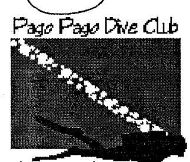

American Samos

Resource Utilizers

#### Potential Solutions for problems facing the Coral Reef Ecosystem

Marine Protected Areas

Wetland Restoration and Protection

Community Education

Village Management of Resources

Coral Reef Monitoring and Research

Enforcement of existing regulations

Individual Awareness and ACTION!

#### Marine Protected Areas

On May 26, 2000, President Clinton signed an executive order enabling federal agencies to work to strengthen marine protected areas (MPAs). This order was passed in light of the recent volume of work demonstrating the effectiveness of marine reserve areas to replenish neighboring fisheries stocks, and allow the public and scientific audience to visit and study an area independent of the horde of fishermen, commercial, and recreational

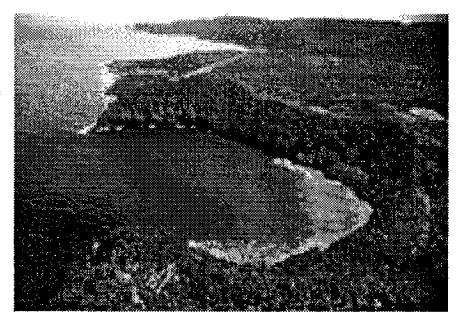

Fagatele Bay

users that may otherwise negatively impact the habitat and those dwelling within it. Government workers are now tasked with the duty of strengthening the current network of US waters which are already protected: be they in National Marine Sanctuaries (such as Fagatele Bay), National Parks (Tutuila, Ofu, Ta'u) United States Fish and Wildlife Refuges (Rose) or wetland protected areas (Masefau, Aunu'u, Malaeloa). They are asked to add more MPAs to the network, to work together to collect information regarding the successes and weaknesses of this network of reserves, and they are tasked to ensure other federally approved or conducted activities do not have negative impacts to the MPAs. One important component of many of the MPAs in American Samoa is that they include neighboring land. Due to the demonstrated influence of land on the adjacent waters, it is imperative for those of us in American Samoa to keep the land healthy as well.

Marine protected areas in American Samoa. Fishing is prohibited at Rose Atoll, but subsistence fishing is permitted at the other sites.

|                                         | Year        |                    |       |         |
|-----------------------------------------|-------------|--------------------|-------|---------|
| Protected area                          | established | Location           | km²   | acres   |
| Rose Atoll National Wildlife Sanctuary  | 1973        | Rose Atoll         | 158.8 | 39,251  |
| Fagatele Bay National Marine Sanctuary  | 1986        | Tutuila            | 0.7   | 161     |
| National Park of American Samoa         | 1993        | Tutuila, Ofu, Ta'u | 42.6* | 10,520* |
| Vaoto Territorial Marine Park (Ofu Is.) | 1994        | Ofu                | 0.5   | 120     |
|                                         |             |                    |       |         |

\* 79% is terrestrial land adjacent to coral reefs

#### Wetland Restoration and Protection

The territory of American Samoa is unique in Polynesia, as it's economy stems largely through local business rather than tourism. As a result, areas of natural beauty such as the *Nu'uuli Pala* have not been recognized for their potential commercial value and continue to be developed for residential uses in a rapidly growing population.

The Wetlands of American Samoa include mangrove swamps, marshes (saltwater and fresh), and numerous streams. The wetlands are critical habitat for numerous species of birds, mammals, reptiles, amphibians, fish, mollusks, and other invertebrates, many of which are considered threatened and perhaps endangered. They are being lost to fill and land reclamation at alarming rates. Piggeries line the streams entering the lagoon and there is evidence of septic overflow from various homes. A number of landromats, agricultural stands, and aquaculture ponds are found near wetlands. Many automotive repair facilities directly border the wetlands/mangrove area. Old refrigerators, air-conditioners, cars, engines, gas tanks, etc., may be found in various stages of decomposition.

Eutrophication is a potential problem within the wetlands of American Samoa. Soils do not have the ability to handle sustained nutrient input. Biodiversity has and will continue to be decreased as the entire foodweb is affected by increased nutrient loading. Crabs which have been shown to play a key role in tree presence or absence are endangered, while microfauna will be smothered as soils go anaero-

bic. Coral reef species around the world depend upon wetlands as nurseries and feeding grounds. Coral reefs surrounding our islands can be directly damaged by land-based activities, and so land and sea environments cannot be viewed as being separate from one another.

The rehabilitation of wetlands involves massive solid waste removal along streams and in the mangrove forest. Planting of trees along streams and at the edge of the mangroves is a second crucial step in rehabilitation. Restoration and public education about these wetlands is necessary to preserve this important ecosystem

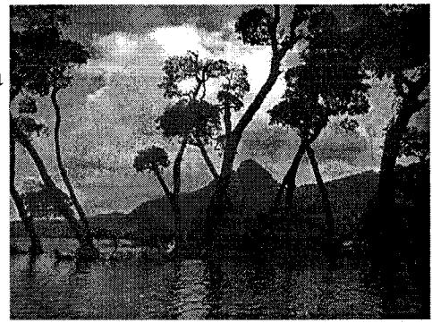

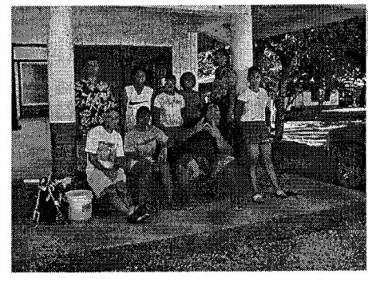

#### Community Education

The Marine Science Program at ASCC is trying out a new approach to getting the public 'in the know.' The first is to take the community members on field trips where they will hear lectures and visit different places on the island, beginning with the top of the mountains and ending with the open sea. The purpose of these field trips is to emphasize the natural balance between terrestrial and marine resources. The public needs to see firsthand that what they do on land affects the

ocean and the habitat therein. The second project is to be held at the Le Vai Moana Marine Center, ASCC. This project is designed for three age groups. Each group will have different activities that include painting, singing, coloring, games and fun, fun, fun! There are different themes for each day beginning with Monday-'Luna Litter' etc. Children will get in tune with what's "Under the Sea!"

Additional environmental education offers a treat for children ages 8-12! Camp Tifitifi is more fun, fun, fun for the summer. The camp is sponsored by Le Tausagi with members from DOC, DMWR, ASEPA, ASCC, Territorial Emergency Management Company, and National Resource Conservation Services. The lucky few will camp for three days and two nights and be able to explore their surroundings both day and night! There they will learn many creative arts and crafts from the environment, sing songs, play lots of fun games and much, much more!

**Potential Solutions** 

#### Village Management of Resources

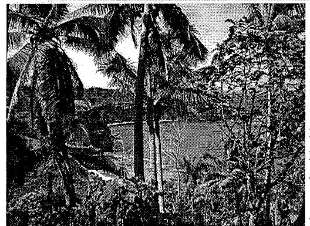

Societies worldwide have long recognized the importance of the ecosystem to the culture. Samoan legends include stories about the importance of forest and reefs. The village is traditionally considered to run from the "tuasivi" to the "sami", the shoreline to the sea. As past generations have recognized the need to maintain the balance of their resources, it is important to recognize that the health of the islands still depends upon the vitality of the entire ecosystem.

No one questions the destruction that the sea may have upon the land in natural forms such as hurricanes and tsunamis.

However, one does not often consider the concordant havoc reeked from land upon the ocean. Sedimentation resulting from mining, development, and tree removal has been demonstrated to have a negative effect on coral reef health. Toxins have been found in many marine species; fish and invertebrates, surrounding the island. Increased nutrients from fertilizers, piggeries and cattle farms lead to eutrophication of bays. Continued alteration of the shoreline from sandmining, seawalls, and jetties affects current patterns. This change in water movement may lead to burial of some reefs, and lower sources of necessary inputs to others. Trash from the land falls gradually into the ocean on a steady basis yet streams quickly into the sea during large rain events.

In an effort to encourage village participation in preserving the reefs, DMWR is going out to the villages; training them about management, working on changing the legislation to give villages power to legally pursue illegal fishing activities, teaching them to take steps to monitor fish reserves, prepare rules against destructive fishing, and establish land-based coral reef ecosystem protection.

#### Coral Reef Monitoring and Research

All members of CRAG have sponsored marine-based research and monitoring activities. Some of the most long-term work has been sponsored by FBNMS; temperature and coral and fish transects which have been repeated over a series of years. DMWR monitors populations, catch and sale of fisheries species, ASEPA has done a volume of work examining water quality, currents and pollutants, NPS has done baseline surveys of park resources, and ASCC has done some water quality and inventorying work. All of these are very valuable pieces of work. They create a frame of reference which may change over time as corals recover from hurricanes, etc. or as reefs are negatively impacted by oceanic sedimentation, etc. There is still a large body of

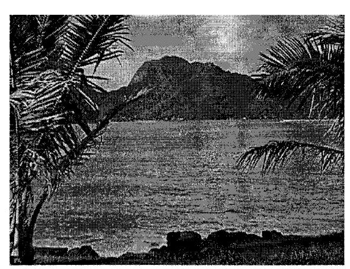

work that needs to be conducted to be adequately protecting while utilizing territorial marine resources.

#### Individual Awareness and Action

The most important protector of the coral reef ecosystem is **YOU!**Your actions throughout your daily life are an example to others around you. By following many of the practices recommended in this booklet and by researching environmentally friendly ways of life you make the biggest difference to the reef DAY BY DAY!

Page 21

### Credits

#### WRITERS and CONTRIBUTERS

Jennifer Aicher American Samoa Community College

Flinn Curren Department of Marine and Wildlife Resources

Sheila Wiegman American Samoa Environmental Protection Agency

Davis Moli American Samoa Community College Momotu Laie American Samoa Community College Tepora Toliniu American Samoa Community College American Samoa Community College Mele Semo Hunter

American Samoa

#### EDITORIAL BOARD

Lelei Peau Department of Commerce

American Samoa Environmental Protection Agency Sheila Weigman Flinn Curren Department of Marine and Wildlife Resources

Ruta Tauiliili-Maahuka American Samoa Community College American Samoa Community College Roy Fua

Eric Sandberg National Oceanographic and Atmospheric Administration

Gene Brighouse Department of Commerce

Tavita Togia National Park of American Samoa

American Samoa Environmental Protection Agency Josh Craig

DESIGN

American Samoa Community College Jennifer Aicher

Angie Fa'asoa Americorp

Many thanks to the work of Eric Sandberg and Joel Michalski for their aid with

the images

#### **PRODUCTION**

Hon Blue

#### **IMAGE CREDITS**

Keoki Stender all images

except Page 4: Rose Atoll courtesy of Arthur Whistler,

Page 6: EEZ courtesy of Western Pacific Fisheries Management Council,

Page 7: E.C. Peters,

Pages 8-9: all graphics courtesy of Peter Craig,

Page 10: longlining courtesy of Peter Craig,

Page 11: reef close up J. Aicher,

Page 13 courtesy of Larry Brand,

Page 15 flood courtesy of Peter Craig, longliners courtesy of NOAA,

Page 18 young dancer courtesy of Peter Craig,

Page 19 Fagatele Bay courtesy of NOAA,

Pages 20-21 all graphics courtesy of Larry Brand

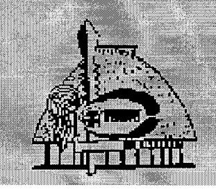

Community College

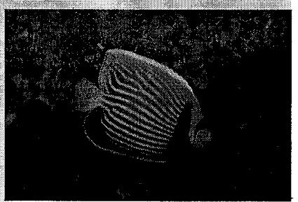

Tifitifi Pomacanthus imperator

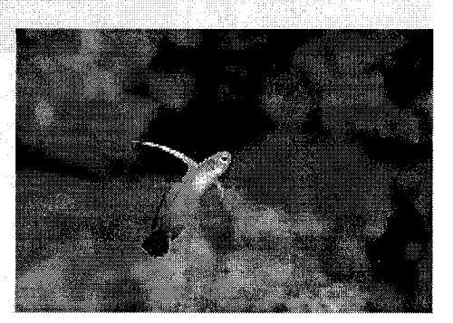

Nemateleotris magnifica