### Ш

# STUDIES ON THE CORAL REEFS OF TUTUILA, AMERICAN SAMOA WITH SPECIAL REFERENCE TO THE ALCYONARIA

LEWIS R. CARY
Department of Biology, Princeton University

With seven plates and fourteen text-figures

#### CONTENTS

|                                                                                      | PAGE |
|--------------------------------------------------------------------------------------|------|
| Introduction                                                                         | 55   |
|                                                                                      |      |
| ECOLOGY OF THE ALCYONARIA ON REEFS OF PAGO PAGO HARBOR                               | 55   |
| Character of Physical Environment of Utelei Reefs                                    |      |
| CHARACTER OF REEF SURFACE IN RELATION TO OCCURRENCE OF ALCYONARIA                    | 60   |
| Species of Alcyonaria Occurring on Reefs of Tutuila                                  | 60   |
| DISTRIBUTION OF DIFFERENT SPECIES OF ALCYONARIA IN RELATION TO ENVIRONMENTAL FACTORS | 63   |
| Temperature Experiments                                                              | 64   |
| RESPIRATION EXPERIMENTS                                                              | 65   |
| RELATIVE AREAS OF REEF SURFACE COVERED BY ALCYONARIA                                 |      |
| Growth Rates of Samoan Alcyonaria                                                    | 72   |
| PART II                                                                              |      |
| STRUCTURE OF CORAL REEFS IN PAGO PAGO HARBOR                                         | 80   |
| RECORDS OF REEFS OTHER THAN THOSE RECORDED IN PREVIOUS DISCUSSION                    | 81   |
| Log of Drilling No. 1 through Utelei Reef                                            | 83   |
| PART III                                                                             |      |
| BEARING OF EVIDENCE OBTAINED BY BORING THROUGH UTELEI REEFS UPON THEORIES OF CORAL   |      |
| Reef Formations.                                                                     | 92   |
| General Discussion                                                                   |      |
| IMPORTANCE OF ALCYONARIA IN FORMATION OF PACIFIC REEFS.                              | 94   |
| SUMMARY                                                                              | 96   |
| LITERATURE CITED                                                                     | 98   |
| MIERAIUSE VIIII                                                                      | 90   |

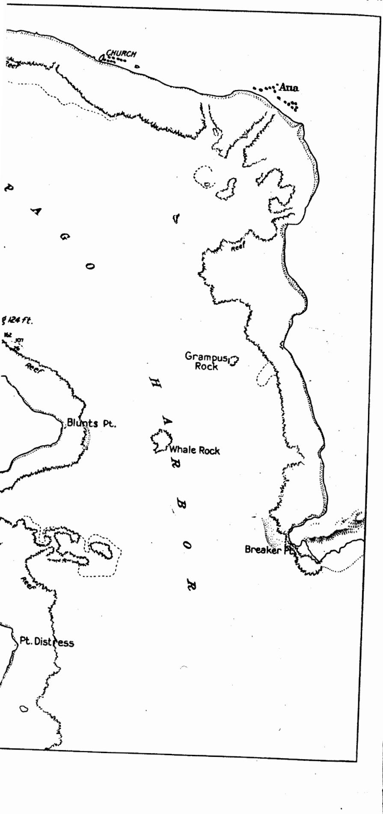

## STUDIES ON THE CORAL REEFS OF TUTUILA, AMERICAN SAMOA, WITH ESPECIAL REFERENCE TO THE ALCYONARIA

#### INTRODUCTION

The following studies on the coral reefs of Tutuila were carried on while the author was a research associate of Carnegie Institution of Washington.

Of the late director of the Department of Marine Biology of this institution, Dr. Alfred G. Mayor, I wish to here express my appreciation of his unfailing sympathetic interest in my work. He provided everything necessary in the way of apparatus and assistance and was especially kind in preventing a break in my records by making observations and measurements of some of my specimens in the summer of 1919, when it was impossible for me to visit the region.

Because of the results obtained from ecological studies on Alcyonaria and their importance in the formation of coral reefs in the Florida-Antillean region, it seemed desirable to extend these observations to Pacific reefs to determine whether or not these organisms are there as important in reef limestone formation as in certain localities on the Florida reefs.

The first season was devoted chiefly to a study of alcyonarian ecology. It then appeared essential to ascertain in so far as possible whether or not these organisms had in the past been as important in reef building as they are now. Since the study of material obtained by boring through the reef with a core drill offers the best opportunity for this determination, three borings were made through one of the reefs where the present conditions had been most intensively studied. As a consequence, this report naturally falls into three divisions: first, the ecology of the Alcyonaria now growing on the reefs; second, the structure of the reefs as shown by study of the surface rock, the cores from drilling, and material blasted at the reef edge; and third, the bearing upon theories of coral reef formation of the relation of reefs in Pago Pago harbor to their substratum. Unforeseen developments have delayed preparation of this report. Publication of papers dealing with phases of the development of the coral reefs of Tutuila (Mayor, Daly, Chamberlin, Setchell 1924) now necessitates changes from its original form.

#### PART I

#### ECOLOGY OF THE ALCYONARIA ON THE REEFS OF PAGO PAGO HARBOR

For the practical purpose of this report the general geographical features of the island need to be mentioned in the briefest manner only.

A fringing reef extends out for some distance along the southern shore and along the north shore of the eastern part of the island. In the western part of the north shore, reefs occur in the harbors only. For many practical reasons the exposed outer reefs are difficult to study in detail. Those within the harbor show the entire range of ecological conditions. At the harbor entrance they are fully exposed to the open sea. Toward the inner ends of the bays the influence of fresh water and silt from the streams progressively inhibits and finally prevents their growth.

55

Since, as a matter of convenience, my extended observations were confined to the reefs within Pago Pago Harbor, more careful consideration must be given to its

geographical features.

This harbor occupies what appears to be chiefly a drowned valley, with possibly one or more broken craters near its inner end. From the entrance the channel extends about 1.5 miles in a northerly direction (342°) where it makes a sharp turn to the west and extends for about the same distance, to end at a small delta plain at the entrance of Pago Pago stream. Along the outer portion of the harbor the eastern shore line is relatively straight, and a broad reef extends from Breaker Point to the entrance of the stream at Aua village where there is a well-defined "entrance" through the reef. As this reef is placed with its long axis parallel to the channel the incoming waves run, to a considerable extent, along the reef so that there is a strong current over its surface parallel to the shore line.

On the west side of the outer portion of the harbor the shore line is much more broken. At Fagaalu, about one-third of a mile inside the harbor entrance, there is a deep cove into which flows one of the larger streams of the island, so that the reefs in this cove are separated into a northern and a southern portion, with a rather wide, barren stretch of sandy shore between. The southernmost of these reefs is continuous with the fringing reef on the south shore of the island, and has full exposure to the unbroken ocean waves. At its inner end the reef on the north side is well protected so that severe wave action occurs only in times of heavy storms.

On the north side, Fagaalu Cove is limited by Blunts Point, a sharp promontory that protects from direct wave action the deep cove lying next inward from the entrance. As is true of all the coves about the harbor, this one, at the inner end of which is situated the native village of Utelei, represents a branch valley opening into the larger valley which now constitutes the harbor. At its inner end there enters a small stream that brings enough fresh water and sediment to prevent the growth of corals and thus provides an entrance through the reef (figs. 1 and 2).

The reefs on the two sides of the cove at Utelei village were the site of the greater part of my more extended studies and will in future be referred to as the Utelei reefs. As the borings and the most important lines across the reef, where area covered by growing Alcyonaria or Alcyonarian spicule rock was determined, were situated on the south side of the cove, all unqualified references to the Utelei reefs will designate this particular locality.

On this reef, which is continuous around Blunts Point with the north reef of Fagaalu Cove, there are to be found all gradations of environmental conditions from practically full exposure to the most severe wave action occurring within the harbor, to quiet water at the western end of the cove at the sand flat where the stream enters.

Between the north and south reefs is a channel the bottom of which is, in its inner portions, entirely covered with growing coral so that it is possible in this protected locality to study the vertical as well as the horizontal distribution of the reefforming organisms. The distance across this reef in a straight line from the shore to its outer margin is 945 feet at the widest point. This line extends from the north side of Blunts Point to the channel between the two Utelei reefs and marks the location of one of the series of squares where the relative area of reef surface covered by Alcyonaria was determined, and where the borings through the reef were made (line No. 1, fig. 1). From the same point of origin a line extending to the margin on the east side of the reef was 625 feet in length (line No. 5, fig. 1).

The reef on the north side of Utelei Cove is continuous with the reef extending along the south side of the inner portion of the harbor beyond the abrupt bend to the west. Goat Island, an off-lying fragment of basalt, rises some 40 feet above the surface of this reef at the turning point of the channel and is separated from the main island by a distance of about 100 yards.

The reef along the south side of the inner harbor has been so greatly influenced by changes made in connection with the development of the United States Naval Station that its original character has been destroyed over the greater part of its extent. For a considerable distance inward from the point opposite Goat Island a wide fill has been made, which for some distance extends outward to the original reef border. This fill and the change in drainage attendant thereon has so altered the natural conditions that, over wide areas, nothing remains but barren reef where all growing corals have been destroyed as a result of some disturbance in the environment to which they had become adjusted.

Farther in the harbor, near where the natural limits of the growth of reef building organisms is reached, the conditions appear to be less affected as a result of human activities and scattered specimens of the more resistant organisms

are still to be found.

On the north side of the inner harbor reef patches first appear about 0.75 mile from the entrance of Pago Pago stream. The growth of reef-forming organisms becomes progressively more abundant outward, until a continuous reef is established. This reef extends along the north side of the harbor, broken here and there by very narrow tortuous entrances at points where small streams come down from the hills. Starting at its western end as a series of scattered coral patches, this reef reaches a width of approximately 1000 feet near its eastern end where it is fully exposed to the clear, well-aerated and food-laden water coming straight in from the harbor entrance some two miles away.

With minor changes this description of the conditions within Pago Pago outer harbor would apply equally well to those existing in the many bays or harbors about the island. In some instances, the bays are broadly open to the ocean and have no protected coves. Where no stream with a constant flow of water occurs at the head of a bay, there are no breaks in the reef. but these conditions are of very rare occurrence. At Nuuli a lagoon lies behind a barrier reef. but this condition has been brought about by the occurrence of a lava flow that took place after the modern reefs had been formed. It extended to the outer edge of the reef, leaving only a narrow entrance to the bay behind the Nuuli sand spit, which itself has apparently been formed, in part at least, through the action of currents set up on account of the changes brought about as a result of this laval flow. Since the original entrance to this bay has been blocked by the laval flow and no well-defined channel has been formed to take its place, the conditions found here constitute a special case which is not duplicated elsewhere about the island. Because there is no rapid interchange of water between the inner lagoon and the ocean except at highest tide, the whole area is wanting in organisms which require clear, well-aerated water and has a silt-covered bottom; while about the shores, which are rapidly encroaching on the area of the lagoon, there occurs by far the largest of the few mangrove swamps found about Tutuila.

Since the ecological conditions to be found in Pago Pago harbor are so typical of those occurring about the island generally, and since it was most practicable to carry on detailed studies near our base of supplies, the work done elsewhere was

essentially to afford comparison with the results obtained where the factors had been studied more completely. In general the observations made elsewhere than in Pago Pago harbor will not be discussed under their locality designation, but it can be safely assumed that the statements made concerning this circumscribed portion of the reefs are applicable to a corresponding reef area anywhere about the island.

#### CHARACTER OF THE PHYSICAL ENVIRONMENT OF THE UTELEI REEFS

As limited for the convenience of this study, the Utelei reefs may be taken as starting from the apex of Blunts Point, and extending around the cove to Goat Island at the point where the harbor channel makes the nearly right-angled bend to the westward. Within the area thus delimited practically the entire range of physical conditions to be met anywhere about the island occurs, with one marked exception—that nowhere was there found many coral skeletons cast up beyond high-tide mark by wave action during hurricanes, although such are to be seen at many points along the exposed outer coast of the island and in some of the shallow bays on the north shore. On the other hand the violence of wave action to which the most exposed portions of this reef are sometimes subjected is attested by the presence of several so-called "negro-heads,"—large fragments of the reef margin which have been upheaved by the force of the waves and carried inward for some distance on to the surface of the reef.

At the other extreme as regards wave action, stand the conditions found at the inner end of this reef near the bight of the cove. Not even during the most severe storms in the three seasons over which my studies extended, waves were observed of sufficient violence even to stir up thoroughly the loose sand with which this portion of the reef is covered except where growing organisms are attached.

Because of the character of the shore line, the currents over the outer portion of this reef run nearly parallel with its margin (i. e. northwest) and have the greatest velocity. Some distance north of Blunts Point the currents, as their velocity decreases, are deflected toward the shore, so that by the time they have reached the deeper portion of the cove they run parallel to the reef border at nearly a right angle to their original direction. At the same time as the force of the waves is spent as they run inward from the harbor entrance along the border of the reef, their direction is altered by contact with the reef, so that to an increasing extent they are turned inward across the reef. At a point where the border of the south reef faces west of north, as at the outer end of line 1 (see map), the direction of the waves at the reef margin has been turned through 90° from their original direction. As a consequence of these conflicting directions of wave action, "tide rips" occur at many points on the surface of the reef whenever the tide is above half flood.

Besides these changes, the direction of the currents is constantly altering with the rise and fall of the tides, so that never except at identical tidal phases will the currents be of the same direction and intensity at any given point. When the tide is near full flood—and especially when the water is "backed up" in the harbor as the result of unusually heavy winds from the southward—each wave traverses nearly the entire width of the reef without losing its identity. At even neap low tides some portions of the reefs are exposed and the waves break at the reef margin so that only a small volume of broken water makes its way along the tortuous lines where the surface of the reef is lowest.

During the few days of spring tides a large proportion of the reef surface is exposed for a period of two hours or more, and at this time on quiet days the reef becomes empounded, since the Lithothamnium ridge at the reef margin is always several inches higher than the general reef surface. Near the inner edge of the reef, where few living corals occur, the sand has been scoured out by the currents to such an extent that even when the reef is empounded the depth of water will here be at least 12 inches.

The velocity of the currents over different portions of the reef surface was determined at several locations and under different conditions of tides and weather. The observations were made by determining the distance a floating object, as the midrib of a cocoanut leaf, would be carried in one minute. Near the inner edge of the reef, at low tide the velocity was on the average 15 feet per minute. Toward the reef border, wherever the water was of sufficient depth to permit such determinations, the currents varied in velocity from 25 to 50 feet per minute. As the tide rises, the velocity of the currents constantly increases, until the water has reached such a depth that when a wave reaches the border of the reef it continues as an overhanging breaker which rushes across the reef at a speed frequently as great at 175 feet per minute.

| Distance from shore | Depth    | Tempera- ture | Current                                                                   | Remarks                               |
|------------------------|----------|------------------|---------------------------------------------------------------------------|---------------------------------------|
| feet 25             | inches   | °C 30.3       | knots                                                                     | Many places were shallowe             |
| 20                     | <b>*</b> |                  |                                                                           | than on my line                       |
| 100                    | 14       | 28               | .40                                                                       | 1                                     |
| 200                    | 10       | 29.2             | .50                                                                       | ł                                     |
| 300                    | 10 to 20 | 29.2             | .60                                                                       |                                       |
| 400                    | 12       | 28.1             | .25                                                                       |                                       |
| 500                    | 10       | 28.2             |                                                                           | ļ                                     |
| 600                    | 16       | 28.05            | Irregular, dependent on breakers.                                         |                                       |
| 700                    | 9        | 28               |                                                                           |                                       |
| 800                    | 12       | 27.9             | Very strong at each breaker, then back set between waves.              |                                       |
| 900                    |          | 27.95            | Very strong, each breaker at rate of 1.5 knots, then slack between waves. | Lithothamnium covered intermittently. |

TABLE 1-Line 1, July 22, 1920. Very low tide but heavy swell

When the depth of water over the reef has become such that ordinary waves no longer break at the reef margin, the currents across the reef decrease in velocity until at full tide their rate will have fallen to not more than 30 feet per minute over the entire reef. At this time the direction of the currents is much more constant and less influenced by the shore lines and irregularities of the reef surface. In general, during the period of high tide, their direction conforms to the long axis of the outer harbor rather than to the outlines of the shore or reef margin.

With a rise and fall of the ordinary tides of roughly 3 feet, the temperature of the water over the reef necessarily shows great variation from time to time. When the low-tide period falls within the hours of intense sunshine, the variation in temperature naturally shows an extreme range. With the temperature of the water in the channel off these reefs ranging only slightly from 29° C., an increase of as much as 7° C. was sometimes found when the reefs were empounded near midday. This temperature, if continued for as long as one hour, is fatal to most of the organisms

found on the reefs, so that the death of many corals from asphyxiation is a not uncommon occurrence under the extreme conditions prevailing when the low spring tides fall at midday. Under the less extreme conditions usually prevailing, the range of temperature caused by differences in the depth of water over the reefs and differences in the velocity of currents is not more than 3° C. from that of the water in the channel and is well within the range favorable for the metabolism of the Alcyonaria as well as other reef-dwelling animals.

The conditions at average low tide are shown in table 1 and appended state-

ment.

When the tide had risen about 1 foot from its unusually low condition, the water making up the breakers traveled across the reef in a generally south westerly direction at a rate at times as high as 7.5 knots per hour over the outer third of the reef.

#### CHARACTER OF REEF SURFACE IN RELATION TO OCCURRENCE OF ALCYONARIA

In general the character of the reef surface is such that it affords a favorable place for the attachment of Alcyonarian colonies. On most of the reefs, however, except some of those about the exposed portions of the island, there was near shore an area of varying width composed almost entirely of shifting sand where, of reef-forming organisms, the massive *Porites* and *Sclerophytum confertum* alone seemed to find suitable environment. Between this area and the Lithothamnium ridge the entire reef surface, whether or not exposed at low tide, would appear to afford a favorable place of attachment for reef-forming organisms, and their absence from some locations must be attributed to factors other than the nature of the reef surface.

As practically every student of coral reefs has noticed, the proportion of alternately exposed and submerged or constantly submerged reef surface occupied by living reef-forming organisms is surprisingly small, and the most careful study of the environmental conditions fails to throw any light on the reason why one area is densely carpeted with living organisms while an immediately adjacent spot, where every factor that can be determined is identical, remains barren over extended periods.

Beyond the rim of the shallow portion of the reefs the proportion of barren

area is very much smaller.

The bottom of the channel between the two reefs at Utelei, in depths less than 25 feet, to which depth it was carefully examined by the use of a diving hood, was so covered with living coral-forming organisms that barren spots were rare and of very limited extent.

On the surface of the reef, where at definite phases of the tide heavy breakers run across, it would be essential for their early development that the planulæ of Alcyonaria or stony corals should find lodgment in crevices where they would for a time be protected from the violent agitation of the water and attrition from shifting sand. While this necessity might restrict to some extent the distribution of these organisms over the reef surface, it does not account for the presence of adjacent barren and fully covered areas.

#### SPECIES OF ALCYONARIA OCCURRING ON REEFS OF TUTUILA

Dana (1846), in the report of the Wilkes Expedition, lists five species of Alcyonaria from Tutuila. He refers all of these to the genus *Alcyonium*, although his figures are sufficiently accurate to enable one readily to establish the identity of the forms to which he had reference (see Pratt ('06), Kukenthal ('03) et al.).

Collections made at many points about Tutuila, from the surface of shallow reefs, from the submerged reefs in relatively shallow water, and by means of a dredge from all parts of the harbor, added to this list only a single species—a fleshy Nephthyid from deep water.

Indeed one of the forms recorded by Dana is found so rarely, that for all practical purposes the alcyonarian fauna may be considered composed of four species only. Of the four common species, Sclerophytum confertum Dana and Sclerophytum densum Whitelegge are by far the most abundant. Both form a skeletal mass of cemented spicules at the base of the colony which bears the fleshy portions, much as

in the stony corals the living tissue is supported by the calices.

In Sclerophytum confertum the living tissue commonly separates into units of varying sizes, each of which forms at its base a mass of spicule rock. When this species is growing where there is an accumulation of sand, the upward growth of the colony, keeping pace with the elevation of the reef surface, causes the formation of a branching, tree-like mass of spicules which may extend for several feet below the reef surface. Colonies of this type are illustrated in figures 16 and 17, plate 6.

On a hard substratum nearly all the larger colonies have a central barren area composed of spicule rock. As the colony increases in size, this barren area comes to occupy a proportionately larger space. Since spicule formation in the central area occurred for a shorter time than about the borders of the colony, there is always a depression in the center and either a living colony or the skeleton

from which all living tissue has been removed is bowl-shaped.

In striking contrast to this ordinary type of colony there sometimes occur masses of spicule rock formed by S. confertum, which rise from the reef surface at considerable depths and extend to low-tide level. Most of such masses consist of a branching and anastomosing skeletal framework with the apex of each branch crowned by living tissue. Some of the colonies of this type were 30 feet in circum-

ference and 5 feet high.

When a colony of this species has lived for a relatively short time only, it leaves after its death a skeleton of the character illustrated by figures 17 and 18, plate 7. Without reference to their texture, which on their being broken shows plainly the large spicules of which they are composed, these structures are so characteristic in appearance that they constitute one of the striking features of the limestone on the reef surface wherever this species occurs abundantly. Very frequently such skeletons are found broken loose from the substratum and being rolled about over the reef surface by currents just as are *Fungia* skeletons, which in a rough way they resemble.

The colony form of Sclerophytum densum may be best described as characteristically procumbent. Although under normal conditions it fits itself to the irregularities of the substratum upon which it occurs, upright, branching colonies, so characteristic of S. confertum, are never formed. Beneath the older colonies the limestone composed of their cemented spicules may reach a thickness of 18 to 24 inches when they occur in the most favorable locations. Under such circumstances, however, the colony is raised as a whole above the general reef surface and the skeleton constitutes

a solid mass.

Rarely, under the influence of some special stimulus, a colony takes on a cylindrical form and grows upward from the reef to a considerable height. In every instance where such colonies were carefully examined the skeletal axis was found to be penetrated by the tubes of an annelid. These serpulids would under

normal conditions be found with their cirri extended from the apex of the alcyonarian colony, and they gave the casual observer the impression that they might well be the cause of the unusual growth form of the organism in whose tissues they had taken up their abode. The cylindrical colonies were observed in deeper water only, and several examples more than 10 feet high were measured.

Since there is ordinarily no separation of the colony into smaller units, and the death of a definite part of the colony does not regularly take place, there is formed by continued growth a solid sheet of tissue which persists for a considerable period.

TABLE 2-Percentage of spicules to fresh weight

| Fresh weight | Weight in spicules                                                                    | Percentage of spicules to fresh weight                                                                                                                                                                                                                                                                                                                                                                                                                                                                                                                                                                                                                                                                                                                                                                                                                                                                                                                                                                                                                                    |
|-----------------|---------------------------------------------------------------------------------------|---------------------------------------------------------------------------------------------------------------------------------------------------------------------------------------------------------------------------------------------------------------------------------------------------------------------------------------------------------------------------------------------------------------------------------------------------------------------------------------------------------------------------------------------------------------------------------------------------------------------------------------------------------------------------------------------------------------------------------------------------------------------------------------------------------------------------------------------------------------------------------------------------------------------------------------------------------------------------------------------------------------------------------------------------------------------------------|
|                 |                                                                                       |                                                                                                                                                                                                                                                                                                                                                                                                                                                                                                                                                                                                                                                                                                                                                                                                                                                                                                                                                                                                                                                                                 |
|                 |                                                                                       | p. ct.                                                                                                                                                                                                                                                                                                                                                                                                                                                                                                                                                                                                                                                                                                                                                                                                                                                                                                                                                                                                                                                                          |
|                 |                                                                                       | 26.829                                                                                                                                                                                                                                                                                                                                                                                                                                                                                                                                                                                                                                                                                                                                                                                                                                                                                                                                                                                                                                                                          |
|                 |                                                                                       | 17.24                                                                                                                                                                                                                                                                                                                                                                                                                                                                                                                                                                                                                                                                                                                                                                                                                                                                                                                                                                                                                                                                           |
|                 |                                                                                       | 26.19                                                                                                                                                                                                                                                                                                                                                                                                                                                                                                                                                                                                                                                                                                                                                                                                                                                                                                                                                                                                                                                                           |
|                 |                                                                                       | 25.73                                                                                                                                                                                                                                                                                                                                                                                                                                                                                                                                                                                                                                                                                                                                                                                                                                                                                                                                                                                                                                                                           |
|                 |                                                                                       | 15.71                                                                                                                                                                                                                                                                                                                                                                                                                                                                                                                                                                                                                                                                                                                                                                                                                                                                                                                                                                                                                                                                           |
| 113.40          | 28.35                                                                                 | 25.00                                                                                                                                                                                                                                                                                                                                                                                                                                                                                                                                                                                                                                                                                                                                                                                                                                                                                                                                                                                                                                                                           |
|                 | ļ                                                                                     |                                                                                                                                                                                                                                                                                                                                                                                                                                                                                                                                                                                                                                                                                                                                                                                                                                                                                                                                                                                                                                                                                 |
| 1               |                                                                                       | 22.783 (average)                                                                                                                                                                                                                                                                                                                                                                                                                                                                                                                                                                                                                                                                                                                                                                                                                                                                                                                                                                                                                                                                |
|                 |                                                                                       |                                                                                                                                                                                                                                                                                                                                                                                                                                                                                                                                                                                                                                                                                                                                                                                                                                                                                                                                                                                                                                                                                 |
|                 |                                                                                       | 40.90                                                                                                                                                                                                                                                                                                                                                                                                                                                                                                                                                                                                                                                                                                                                                                                                                                                                                                                                                                                                                                                                           |
|                 |                                                                                       | 33.30                                                                                                                                                                                                                                                                                                                                                                                                                                                                                                                                                                                                                                                                                                                                                                                                                                                                                                                                                                                                                                                                           |
|                 |                                                                                       | 34.00                                                                                                                                                                                                                                                                                                                                                                                                                                                                                                                                                                                                                                                                                                                                                                                                                                                                                                                                                                                                                                                                           |
| 155.92          | 56.70                                                                                 | <b>36.4</b> 0                                                                                                                                                                                                                                                                                                                                                                                                                                                                                                                                                                                                                                                                                                                                                                                                                                                                                                                                                                                                                                                                   |
| 123.57          | 42.52                                                                                 | 33.33                                                                                                                                                                                                                                                                                                                                                                                                                                                                                                                                                                                                                                                                                                                                                                                                                                                                                                                                                                                                                                                                           |
|                 | 1                                                                                     |                                                                                                                                                                                                                                                                                                                                                                                                                                                                                                                                                                                                                                                                                                                                                                                                                                                                                                                                                                                                                                                                                 |
| 1               |                                                                                       | 35.58 (average)                                                                                                                                                                                                                                                                                                                                                                                                                                                                                                                                                                                                                                                                                                                                                                                                                                                                                                                                                                                                                                                                 |
| į               | 1                                                                                     | , -                                                                                                                                                                                                                                                                                                                                                                                                                                                                                                                                                                                                                                                                                                                                                                                                                                                                                                                                                                                                                                                                             |
| 1176.52         | 70.87                                                                                 | 6.20                                                                                                                                                                                                                                                                                                                                                                                                                                                                                                                                                                                                                                                                                                                                                                                                                                                                                                                                                                                                                                                                            |
| 496.12          | 42.52                                                                                 | 8.56                                                                                                                                                                                                                                                                                                                                                                                                                                                                                                                                                                                                                                                                                                                                                                                                                                                                                                                                                                                                                                                                            |
|                 |                                                                                       | 9.40                                                                                                                                                                                                                                                                                                                                                                                                                                                                                                                                                                                                                                                                                                                                                                                                                                                                                                                                                                                                                                                                            |
| 567.00          | 42.53                                                                                 | 7.51                                                                                                                                                                                                                                                                                                                                                                                                                                                                                                                                                                                                                                                                                                                                                                                                                                                                                                                                                                                                                                                                            |
|                 |                                                                                       | 12.00                                                                                                                                                                                                                                                                                                                                                                                                                                                                                                                                                                                                                                                                                                                                                                                                                                                                                                                                                                                                                                                                           |
|                 |                                                                                       |                                                                                                                                                                                                                                                                                                                                                                                                                                                                                                                                                                                                                                                                                                                                                                                                                                                                                                                                                                                                                                                                                 |
| i i             |                                                                                       | 8.73 (average)                                                                                                                                                                                                                                                                                                                                                                                                                                                                                                                                                                                                                                                                                                                                                                                                                                                                                                                                                                                                                                                                  |
|                 |                                                                                       | (4,0.480)                                                                                                                                                                                                                                                                                                                                                                                                                                                                                                                                                                                                                                                                                                                                                                                                                                                                                                                                                                                                                                                                       |
| 1048 95         | 127 57                                                                                | 12.15                                                                                                                                                                                                                                                                                                                                                                                                                                                                                                                                                                                                                                                                                                                                                                                                                                                                                                                                                                                                                                                                           |
|                 |                                                                                       | 10.00                                                                                                                                                                                                                                                                                                                                                                                                                                                                                                                                                                                                                                                                                                                                                                                                                                                                                                                                                                                                                                                                           |
|                 |                                                                                       | 6.50                                                                                                                                                                                                                                                                                                                                                                                                                                                                                                                                                                                                                                                                                                                                                                                                                                                                                                                                                                                                                                                                            |
|                 |                                                                                       | 9.05                                                                                                                                                                                                                                                                                                                                                                                                                                                                                                                                                                                                                                                                                                                                                                                                                                                                                                                                                                                                                                                                            |
|                 |                                                                                       | 9.10                                                                                                                                                                                                                                                                                                                                                                                                                                                                                                                                                                                                                                                                                                                                                                                                                                                                                                                                                                                                                                                                            |
| . 311.65        | 20.00                                                                                 | 0.10                                                                                                                                                                                                                                                                                                                                                                                                                                                                                                                                                                                                                                                                                                                                                                                                                                                                                                                                                                                                                                                                            |
|                 |                                                                                       | 9.48 (average)                                                                                                                                                                                                                                                                                                                                                                                                                                                                                                                                                                                                                                                                                                                                                                                                                                                                                                                                                                                                                                                                  |
|                 | grams 1162.35 1559.25 595.35 1927.80 992.25 113.40 311.85 467.77 240.97 155.92 123.57 | weight         spicules           grams         1162.35         311.85           1559.25         269.32         595.35         155.92           1927.80         496.12         992.25         141.75           113.40         28.35           311.85         127.57         467.77         155.92           240.97         70.87         155.92         56.70           123.57         42.52         42.52           467.00         42.52         567.00         42.53           56.70         70.87         70.87           1048.95         7.08         70.87           708.75         70.87         70.87           7052.05         42.52         70.87           708.75         70.87         70.87           708.75         70.87         70.87           708.75         70.87         70.87           708.75         70.87         70.87           708.75         70.87         70.87           708.75         70.87         70.87           708.75         70.87         70.87           708.75         70.87         70.87           708.75         70.87         70.87 |

In none of the specimens used for growth records extending over 3 years was there any evidence of the breaking up of the colony or of the death of any particular portion. Because of retention of continuity, the colony and its constant increase in extent, large areas come to be overgrown by this species to the exclusion of all other large organisms except those that find a suitable place for attachment in the grooves between adjacent alcyonarian colonies and extend beyond the reef surface, as do the branching *Porites* and *Acroporas* among the stony corals.

While the period of three seasons covered by my observations was apparently not of sufficient length to cover the usual span of life of this species, abundant evidence was found on the reefs that within a relatively short time there had occurred over extensive areas the death from some cause, natural or catastrophic, of all S. densum colonies. The area of nearly vertical reef surface faced

by limestone composed of spicules of this species was in one instance about 0.25 mile in length, and over the entire area living "coral" was found in only a few places, so that the death of the *Sclerophytum* must have occurred within a short time. There is, unfortunately, no criterion by which it is possible to determine the time necessary for the re-establishment of the reef fauna on such a smooth, barren, vertical surface, so that the time since the death of the Alcyonaria may be greater by far than I have assumed from the character of the exposed spicule rock.

The two common species of Alcyonaria remaining do not form solid limestone by cementing together their spicules. One of them, Sarcophytum latum Dana, has a soft fleshy body with conspicuous feeding polyps and only very small spicules as skeletal elements. Indeed the spicules are so small and few that they do not make

a striking feature of the cut or torn tissues as they do in Sclerophytum.

Possessing only spicules of such a character, Sarcophytum can not add massive material to the reef limestone, and its contribution will be lost sight of among the particles of sand from other sources with which it will be mixed. In fact it is not by limestone secreted but by its ecological relation to other species which

are the important reef builders that this organism must be judged.

Nephthya flexile Dana, a finely branched, fleshy alcyonarian, is the remaining common species. Of the four it has by far the most limited distribution, being restricted to the most protected locations. Like Sarcophytum its spicules are small as compared with those of the Sclerophytum, and are present in relatively small bulk. Except for the fact that this form occurs in abundance in a few favorable habitats where it is the dominant element of the fauna to the exclusion of more actively lime-secreting species, it might well be left out of consideration. On some other Pacific reefs, notably the barrier reefs about Suva Harbor, Fiji, it covers areas several square miles in extent, and in such cases must be a really important factor in limestone formation.

In table 2 are given the proportion by weight of spicules in the tissues of the

four species of Alcyonaria considered in this section.

## DISTRIBUTION OF THE DIFFERENT SPECIES OF ALCYONARIA IN RELATION TO ENVIRONMENTAL FACTORS

While all four important species of Alcyonaria appear to find their most favorable environment only on relatively protected reefs (or in deeper water) where they are not subjected to direct action of breakers constantly being formed on the most exposed reefs along the borders of the island, there is still sufficient range in resistance to adverse conditions shown by the several species to cause considerable differences in their distribution upon reefs where all of them occur.

Sclerophytum densum is the least resistant of the four species, i. e., it requires better aerated water. It is consequently restricted to locations where there is least possibility of its being asphyxiated by an increase in temperature of the water or by

the deposition of sand or silt upon it.

Such conditions are found on reefs across which there is a strong current when the tide is down and the depth over the reef is slight, and also over the vertical edges of the reefs where sedimentation is impossible and the water is always of approximately uniform temperature. The effect of the first of these conditions is well illustrated on the reef on the south side of the cove at Utelei. Here the heavy swell which always sets into the mouth of the harbor causes a strong current around Blunts Point. This current sets across the Utelei south reef in such a direc-

tion that the outer third of line 5 is within its path, while all of line 1, which has the same point of origin on shore, is beyond its effect. During the trade-wind season there is at all times a fairly strong current setting in from the edge of the reef over the area traversed by line 1, but in the hottest part of the year, when the tides are low and the swell in the harbor least, this reef area is sometimes subjected to increase in temperature and also to silting from sand beyond the limits within which S. densum can survive. This species is a constant element in the reef-edge fauna of all the reef examined, either in the harbors or exposed.

Sarcophytum latum is nearest to S. densum in its incapacity to resist adverse environmental conditions. While not so definitely restricted to areas where the water is deep or the currents strong as is the former species, S. latum is usually restricted to the deeper waters about the outer edge of the reefs in the more protected locations, where, on account of the absence of breakers, no Lithothamnium ridge occurs and where no strong currents are developed. On the Utelei reefs, the general distribution of this species follows quite closely that of S. densum. Very few specimens are found along line 1, but on line 5 S. latum reaches its maximum before S. densum becomes represented by more than a very few scattered specimens. (See text-fig. 11.)

Nephthya flexile, which from its distribution appears particularly well fitted to withstand silting, is never found in any location except where it is afforded the utmost protection from violent agitation. It is absent from the surface of all reefs in the harbor except those inside of Goat Island on the south shore. In the cove at Utelei it is abundant in the deeper water over the edge of the reef on the south side, but on the reef along the north side of the cove, which is more directly exposed to wave action, not a single example of this species was found.

S. confertum is by far the most widely distributed species on the Pago Pago reefs. It is the most resistant to high temperatures and to silting, while, on the other hand, its firm texture and the fact that it is attached by a dense spicular mass to its original support allows it to withstand severe wave action without any noticeable detrimental effects. On the surface of every reef this species is found nearest to the shore in shallow water, where the bottom is frequently covered by shifting sand or sediment, where of the stony corals only the massive Porites seems able to exist. At the other extreme of reef conditions it constantly occurs along with S. densum on the vertical reef borders, although in such locations it seems unable to compete successfully with the latter species, probably because of the more rapid lateral extension of S. densum which is a flat encrusting form.

#### TEMPERATURE EXPERIMENTS

The relative resistance to increased temperature (asphyxiation) of the four important species is shown in the following experiments. The specimens were collected without injury, brought to the laboratory in glass jars of fresh sea-water and immediately transferred to the thermostat. The temperature of the air in the chamber was taken at the beginning of each experiment and that of the water when the period of heating was over. The specimens were then transferred to a jar of sea-water of normal temperature, which was at once taken out and suspended at a depth of about 12 feet from a mooring buoy in the middle of the harbor. The motion of the buoy raised and lowered the jar constantly so that a thorough changing of the water was going on all the time. After from 12 to 36 hours the specimens were examined to determine which of them had survived. This was done by holding

them over the side of a moving launch, when the soft tissues would be quickly washed away if the colony had been killed.

All of the forms except S. rigidum were, when uninjured by the heating, capable of contracting strongly when treated in this manner, so that the relative extent of the injury caused by different lengths of exposure could be compared on the basis of this reaction.

#### Experiment 1, April 10, 1917:

Specimens from reef north of Goat Island Bridge.

In thermostat at 35.3° C. for 45 minutes.

Temperature of water at end of experiment, 33.3° C.

S. densum -killed.

-very badly injured, killed? S. latum

N. flexile -severely injured.

S. confertum—apparently uninjured.

#### Experiment 2, April 12, 1917:

Specimens from reef north of Goat Island.

In thermostat at 35° C. for 30 minutes.

Temperature of water at end of experiment, 33.9° C.

S. densum —killed.

S. latum ---somewhat injured.

N. flexile -uninjured.

S. confertum—uninjured

#### Experiment 3, April 12, 1917 (evening):

Specimens taken from along line 5 and north of Goat Island (N. flex).

In thermostat at 35.5° C. for 30 minutes.

Temperature of water at end of experiment, 34.6° C.

S. densum — mostly killed.

-barely capable of contraction. S. latum

-slightly injured. N. flexile

S. confertum—uninjured.

#### Experiment 4, April 14, 1917 (evening):

In thermostat at 36° C. for 42 minutes.

Temperature of water at end of experiment, 34.9° C.

--killed. S. latum

S. confertum—somewhat injured.

#### Experiment 5, April 14, 1917:

Specimens from Fagaalu south reef. In thermostat at 37° C. for 45 minutes.

Temperature of water at end of experiment, 35.7° C.

S. confertum, 3 specimens, all killed, thoroughly expanded.

The behavior of all these species in response to the conditions in the heat experiments corresponds to their reaction to natural environmental conditions as shown by their distribution on the reefs, which is clearly determined by their ability to adjust themselves to unfavorable conditions.

#### RESPIRATION EXPERIMENTS

The general metabolic activity of the several species considered in the foregoing experiments was determined on the basis of their oxygen consumption, as a check on their resistance to unfavorable conditions, such as asphyxiation due to high temperature or the presence of excessive amounts of sediment in the water.

With organisms of this character, in which a varying portion of the weight of specimens of the different species consists of inert material—the spicules—it has seemed necessary in all cases to reduce the mass used in the computations to the total weight, less the percentage by weight of spicules found to be characteristic of that form. The figure noted in Table 3 as "O2 consumption per kilogram of living tissue per hour" is of necessity inaccurate because of the uncertainty of the amount of water held in the canals of any alcyonarian colony at any given time. Since the treatment given each specimen from the time it was removed from the reef was identical with that given each of the others, all differences in the results due to this factor would depend upon the physiological state of the specimens and could not be controlled by any practical means.

At the close of each experiment the specimen studied was dried in an oven at 100° C. for 12 hours and the O2 consumption based on dry weight, corrected for spicule content, compared with that obtained in the original experiment.

With minor fluctuations the two series of results conformed so closely that the first mentioned only is recorded in the following table.

TARLE 2

| Species           | Number of determinations | c.c. O 2 per kg. of living tissue per hour |
|-------------------|--------------------------|----------------------------------------------------------|
| Sarcophytum latum | 23 6                  | 19.383 42.75 23.175 74.80                       |

As was determined for several species of Alcyonaria from the Florida reefs (Cary 1918), there is among the Samoan species no definite correlations between metabolic activity and asphyxiation. On the other hand the relation between respiration rate and the proportion of surface to weight  $\left(\frac{cm_2}{gms}\right)$  observed for the Gorgonaceæ of the Atlantic was in general confirmed by the results recorded above. The very marked difference in respiratory activity between the finely branched Nephthya and the practically smooth-surfaced Sarcophytum especially emphasizes this relationship. The distribution on the reef (see text-figure 11) of the several species is essentially in inverse relation to the respiration rate. Sclerophytum rigidum, the constant inhabitant of especially well-aerated water, has a low oxygen consumption; S. confertum, the most adaptable species, stands in an intermediate position as regards respiration, while Nephthya flexile which occurs only in the most protected locations, but can best withstand silting, has by far the most rapid respiration.

#### RELATIVE AREAS OF REEF SURFACE COVERED BY ALCYONARIA

(See map and figure 1, of plate 1 for location of lines.)

Since the distribution of the Alcyonaria on the reefs where intensive studies were made is certain to undergo changes with the passage of time, and especially since the areas studied are easily available for comparison at any future date, their locations have been carefully recorded and the photographs shown in figures 1, 2 and 3 are included to show the bearings of some prominent features of the surround-

ing terrain, so that the exact location of each line may be accurately determined

by anyone interested.

The following lines across reefs in Pago Pago Harbor were laid out and the relative area occupied by Alcyonaria determined by marking off a series of 25-foot squares along the line and making determination of the area covered by Alcyonaria on each of a series of small squares (25 square feet in area) into which each of the large squares was divided.

Line 1: (Utelei Line): Extends from survey station "0" on south side of Utelei Cove, N. 32° W., 945 feet to edge of reef.

The following measurements and bearings of conspicuous objects mark point of origin: Compass set up left of survey mark 31 feet west from iron telegraph pole, 52.6 feet east of broken iron post.
N.W. Cliff Peoa N. 47° E. magnetic.
Lowest notch Vatia pass N. 141.2° W. magnetic.

Beacon on Goat Island reef N. 21° W. magnetic. Red Buoy (Grampus Rock) N. 75° E. magnetic. Inner end Goat Island N. 31° W. magnetic. See plate 1, figure 1,

At 900-foot point on this line a 2-inch iron pipe was driven into reef, filled with concrete, and a mound of cement built about its base. The squares along this line were laid out using the line as their east side, i. e., to west of base line.

Line 2: Extends from sea wall on north side of road to Goat Island at point under east end of north handrail of inshore bridge, N. 27° W. 295 feet to edge of reef.

North end of old rock pier extending north from Goat Island bears N. 41° E. magnetic and northeast corner of dock at government house bears N. 74° W. magnetic. Heavy galvanized spikes mark 100-foot, 200-foot and 265-foot points, the latter on a big Porites head, along this line. The four corners of a 25-foot square laid out from 200 to 225 feet on this line are also marked by galvanized spikes. All squares laid off on east side of this line.

- Line 3: Laid out along east side of landing at Government house. Wall at low-tide mark forming one side of each square.
- Line 4: Extends from sea wall at a point 400 feet west from cement walk at inshore end of landing at Government house. Northwest in line with southwest corner of brotherhood school on north side of harbor 125 feet to end of reef. Marked at 100-foot and 175-foot points by galvanized spikes. Squares laid off to east of base line.
- Line 5: Same point of origin as line 1. Extends N. 16° W. 615 feet to edge of reef. Marked at 500-foot point by a concrete-filled 1.5 inch pipe bedded in reef. This pipe extends about 1.5 feet above low-tide mark. Squares were laid off to east of this line.

The distribution of the Alcyonaria along the several lines will be given in the following tables and graphs.

TABLE 4—Distribution of Alcyonaria along line 1
(See text-figs. 1 and 2)

| Square | Distance from shore | Square feet covered by Aleyonaria | Character of bottom                          |
|--------|---------------------------|-----------------------------------------|----------------------------------------------|
| 1      | 0 to 25                   | 0                                       | Sandy                                        |
| 2      | 25 to 50                  | l ŏ                                     | Sandy                                        |
| 3      | 50 to 75                  | l ŏ                                     | Sandy                                        |
| 4      | 75 to 100                 | 0                                       | Sandy                                        |
| 5      | 100 to 125                | Ō                                       | Sandy                                        |
| 6      | 125 to 150                | 0                                       | Sandy, Porites heads                         |
| 7      | 150 to 175                | 0                                       |                                              |
| 8      | 175 to 200                | 10                                      | Sand, dead Porites                           |
| 9      | 200 to 225                | 13                                      | Sand, dead Porites heads                     |
| 10     | 225 to 250                | 40                                      | Rocky                                        |
| 11     | 250 to 275                | 18                                      | Nearly dead Porites and spicules             |
| 12     | 275 to 300                | 17)                                     | •                                            |
| 13     | 300 to 325                | 2}                                      | Porites and spicule                          |
| 14     | 325 to 350                | 25                                      | •                                            |
| 15     | 350 to 375                | 125                                     | Rock                                         |
| 16     | 375 to 400                | 25)                                     |                                              |
| 17     | 400 to 425                | 95                                      | Same fairly large hands of Halan Doubles     |
| 18     | 425 to 450                | 100{                                    | Some fairly large heads of living Porites    |
| 19     | 450 to 475                | 10                                      |                                              |
| 20     | 475 to 500                | 75)                                     |                                              |
| 21     | 500 to 525                | 50                                      | 7                                            |
| 22     | 525 to 550                | 600                                     | Very rough bottom composed of dead Porites   |
| 23     | 550 to 575                | 500                                     |                                              |
| 24     | 575 to 600                | 30)                                     |                                              |
| 25     | 600 to 625                | 20                                      |                                              |
| 26     | 625 to 650                | 4                                       |                                              |
| 27     | 650 to 675                | 30}                                     | Heads and rocks formed from Alcyonarian      |
| 28     | 675 to 700                | 160                                     | spicules, mostly the latter                  |
| 29     | 700 to 725                | 450                                     |                                              |
| 30     | 725 to 750                | 300                                     |                                              |
| 31     | 750 to 775                | 100                                     |                                              |
| 32     | 775 to 800                | 400                                     |                                              |
| 33     | 800 to 825                | 4                                       |                                              |
| 34     | 825 to 850                | 1                                       |                                              |
| 35     | 850 to 875                | 8)                                      | Lithothamnium ridge, practically bare of all |
| 36     | 875 to 900                | ol                                      | other organisms except a few encrusting      |
| 37     | 900 to 925                | 0}                                      | acroporas                                    |
| 38     | 925 to 945                | 0                                       | -                                            |
|        |                           | ,                                       |                                              |

Table 5—Distribution of Alcyonaria along line 2
(See text-figs. 3 and 4)

| Square                                                | Distance from shore                                                                                                   | Square feet covered by Alcyonaria                            | Character of bottom                                                                                                                                                                     |
|-------------------------------------------------------|-----------------------------------------------------------------------------------------------------------------------------|--------------------------------------------------------------------|-----------------------------------------------------------------------------------------------------------------------------------------------------------------------------------------|
| 1 2 3 4 5 6 7 8 9 10 11 | 0 to 25 25 to 50 50 to 75 75 to 100 100 to 125 125 to 150 150 to 175 175 to 200 200 to 225 225 to 250 250 to 275 275 to 295 | 2 3 0 0 8 50 200 400 100 30 80 25 | Almost entirely covered with sand washed through under bridge from flat on north bank Utelei cove. Several Porites heads Aleyonarian rock Dead Porites Branching Porites Many Aeroporas |

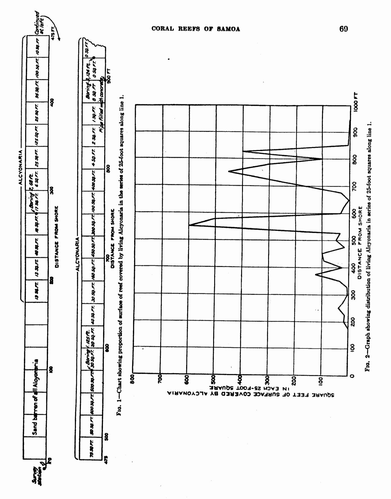

Table 6—Distribution of Alcyonaria along line 3
(See text-figs. 5 and 6)

| Square | Distance from shore | Square feet covered by Alcyonaria | Character of bottom                                                                                                          |
|--------|---------------------------|-----------------------------------------|------------------------------------------------------------------------------------------------------------------------------|
| 1      | 0 to 25                   | 1 specimen                              | Sand, volcanic rock Sand, volcanic rock Porites (branching) Dead coral, sand Sand, Porites (branching) Porites, large masses |
| 2      | 25 to 50                  | 20                                      |                                                                                                                              |
| 3      | 50 to 75                  | 40                                      |                                                                                                                              |
| 4      | 75 to 100                 | 200                                     |                                                                                                                              |
| 5      | 100 to 150                | 300                                     |                                                                                                                              |
| 6      | 150 to 200                | 80                                      |                                                                                                                              |

Table 7—Distribution of Alcyonaria along Line 4 1 (See text-figs. 7 and 8)

| Square | Distance from shore | Square feet covered by Alcyonaria | Character of bottom                        |
|--------|---------------------------|-----------------------------------------|--------------------------------------------|
| 1      | 0 to 25                   | 75                                      | Large Alcyonarian heads. Branching Porites |
| 2      | 25 to 50                  | 250                                     |                                            |
| 3      | 50 to 75                  | 15                                      |                                            |
| 4      | 75 to 100                 | 20                                      |                                            |
| 5      | 100 to 125                | 400                                     |                                            |

&lt;sup>1 Present shore line is formed by a fill about 100 feet wide.

TABLE 8—Distribution of Alcyonaria along Line 5 (See text-figs. 9, 10, 11)

| Square                     | Distance from shore                                          | Square feet covered by Alcyonaria | Character of bottom                                                                            |
|----------------------------|--------------------------------------------------------------------|-----------------------------------------|------------------------------------------------------------------------------------------------|
| 1 2 3 4 5      | 0 to 25 25 to 50 50 to 75 75 to 100 100 to 125         | 0 0 0 0                        | Sand Porites heads Sand Porites heads Sand Porites heads Sand Porites heads Sand Porites heads |
| 6 7 8 9           | 125 to 150 150 to 175 175 to 200 200 to 225 225 to 250 | 0 1 specimen 0 0               | Sand Porites heads Sand Porites heads Sand Porites heads Sand Porites heads Sand Porites heads |
| 11 12 13 14 15 | 250 to 275 275 to 300 300 to 325 325 to 350 350 to 375 | 200 400 150 300 450         | Rough broken bottom Por- ites heads and rock of Alcyonarian spicules                     |
| 16 17 18 19 20 | 375 to 400 400 to 425 425 to 450 450 to 475 475 to 500 | 200) 400 200 150 300        |                                                                                                |
| 21 22 23 24 25 | 500 to 525 525 to 550 550 to 575 575 to 600 600 to 615 | 550 300 100) 20}               | Lithothamnium ridge                                                                            |

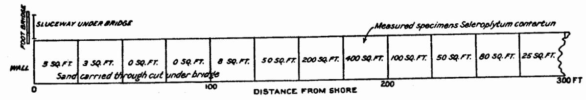

Fig. 3—Chart showing proportion of surface of the reef covered by living Alcyonaria in series of 25-foot squares along line 2.

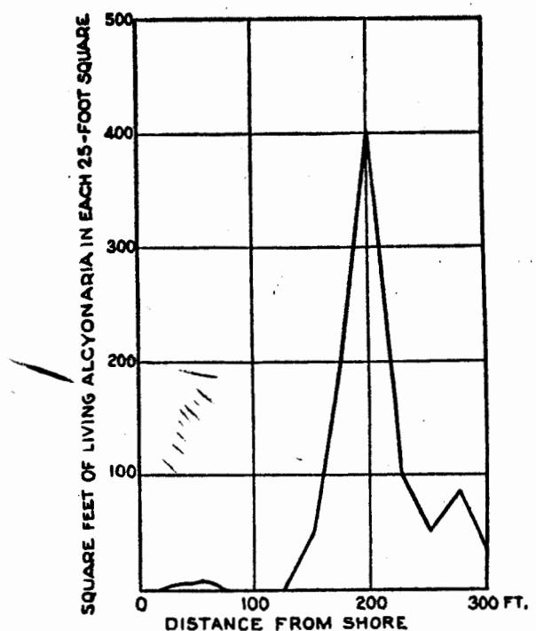

Fig. 4—Graph showing distribution of living Aleyonaria in series of 25-foot squares along line 2.

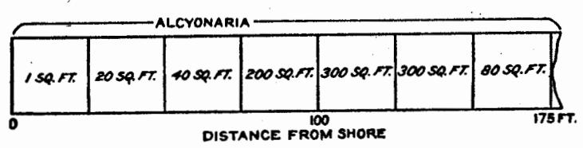

Fig. 5—Chart showing proportion of surface of reef covered by iiving Alcyonaria in series of 25-foot squares along line 3.

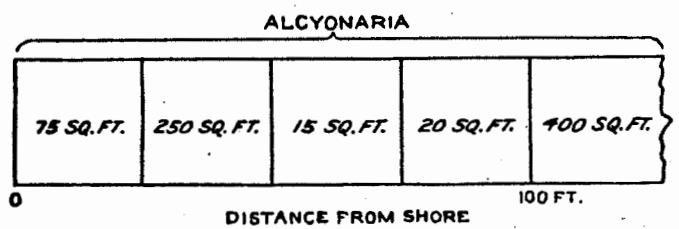

F10. 7—Chart showing proportion of surface of reef covered by living Alcyonaria in series of 25-foot squares along line 4.

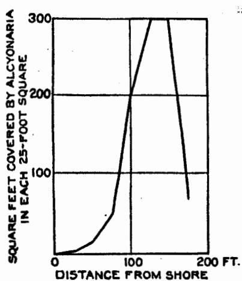

Fig. 6—Graph showing distribution of living Aleyenaria in series of 25foot squares along line 3.

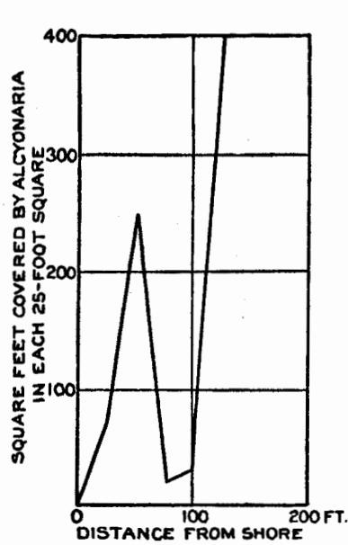

F10. 8—Graph showing distribution of living Aleyonaria in series of 25-foot squares along line 4.

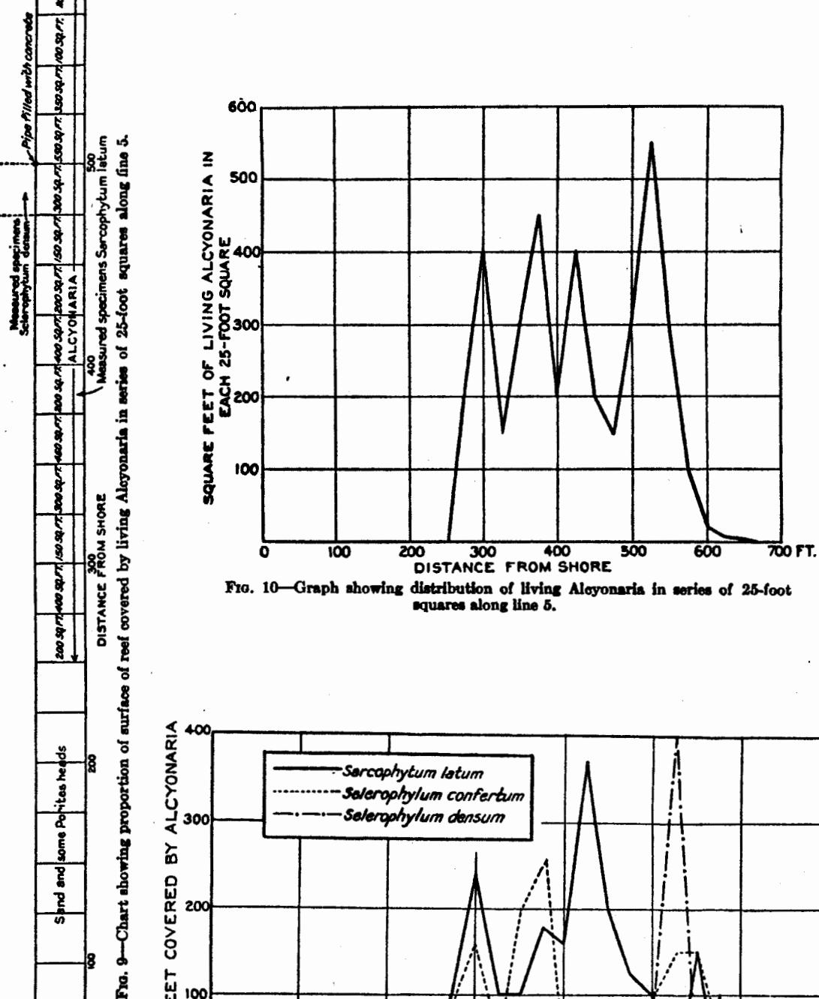

ALCYONARIA 80 80 80 80 Sarcophytum latum Selerophylum confertum SQUARE FEET COVERED BY 300 400 DISTANCE FROM SHORE 700 FT

Fig. 11—Graph showing distribution of three important species of Aleyonaria in series of 25-foot squares along line 5.

#### GROWTH RATES OF SAMOAN ALCYONARIA

In the following tables in which are shown the growth rates of a number of specimens of the four important species of Alcyonaria of the Samoan reefs, the number of the specimen, its location in the square, by measurements from two sides of the square, and its dimensions (1) along its long axis, (2) along its short axis, and (3) its perimeter at the base are given in the first three columns. Since the specimens were all left undisturbed on the reef, the only result of their growth that could be recorded as of importance in the ecology of the reef was the increase in the area covered by each one. Consequently in the fourth and fifth columns are given the ratio to the original area of the area attained after fifteen months and three years, respectively.

TABLE 9—Measurements of S. densum, April 6, 1917, on a square laid out to west of line 5 from 475 to 500 feet
(See text-fig. 12)

| Speci- men No. | Location in square                                    | Dimensions 1                                     | Relative area after 15 mos. | Relative area after 3 yrs. |
|----------------------|-------------------------------------------------------|-------------------------------------------------------------|-----------------------------------|----------------------------------|
| 1                    | N.E. corner of square under east line                 | 20" × 8.5" x 3' .3"                                         | Lost                              |                                  |
| 2                    | 11" from E. base, 7.5" from N. base                   |                                                             | Lost                              |                                  |
| 3                    | 4.7' diagonal from 500 ft. stake 2.8' N. base         | 5" × 3" × 11.75"                                            | 1:1.412                           | 1:2.19                           |
| 4                    | Large colony around S.E. side. Porites head 3.7'      |                                                             |                                   |                                  |
|                      | from E. base, 1.6' N. base                            | 38" long × 15" N. end                                       | 1:2.17                            | 1:3.17                           |
|                      | <b>i</b>                                              | $38$ long $\times$ 19 middle                                |                                   |                                  |
|                      |                                                       | 38" long × 11" S. end                                       |                                   |                                  |
| 5                    | Large mass composed of several separate pieces.       | 7'E&W × 3'N&S ×                                             |                                   |                                  |
|                      | 5.9' from E. base, 4" N. base.                        | 14.9'                                                       | 1:1.12                            | 1:1.18                           |
| 6                    | 14.2' E. base, 16.5' N. base                          | 3" × 2.5" × 6"                                              | 1:3.13                            | 1:4.62                           |
| ва                   | Under N. line 14.65' E. base                          | 11" × 4" × 22"                                              | 1:1.09                            | 1:2.18                           |
| 7                    | Almost touches 6a on W. side of former                | 4.5" × 4" × 11.5"                                           | 1:1.34                            | 1:5.95                           |
| 8                    | 17.8' E. base 22" N. base                             | 6" × 4" × 14"                                               | 1:1.30                            | 1:6.53                           |
| 9                    | 21.8' E. base 4" N. base (see sketch)                 | $12" \times 4" \times 26"$ middle                           | 1:1.388                           | 1:2.73                           |
|                      |                                                       | 12" × 8" × 26" south                                        |                                   |                                  |
| 10                   | Hadaa N. Bas oo of E. Land                            | 12" × 6" × 26" north                                        |                                   |                                  |
| 10                   | Under N. line 22.3' E. base                           | 2" × 7" × 21.25" widest                                     | 1:1.26                            | 1:1.39                           |
|                      |                                                       | 2" × 2.5" × 21.25" nar-                                     |                                   |                                  |
| 11                   | 24.2' E. base (under W. line) 24' N. base             | rows                                                        |                                   |                                  |
| 11 12             | 22.6' E. base 30" N. base smallest of two 12 and 13.  | 17" × 12" × 3'8"                                            | 1:1.19                            | 1:2.28                           |
| 12 13             | Touches 12                                            | 1" × 2" × 4"                                                | Lost                              | 1.0.00                           |
| 14                   | 21.1' E. base 3' 10" N. base                          | 3.75" × 3" × 9"                                             | 1:1.372                           | 1:2.86                           |
| 15                   | 20.7' E. base 5'3" N. base                            | 9" × 6.5" × 21" 5" × 4" × 11.5"                          | 1:1.765                           | 1:2.82                           |
| 16                   | 21.55' E. base 6'2" N. base                           | 5 X 4 X 11.5 4" X 4" X 11"                               | 1:1.60                            | 1:3.42                           |
| 17                   | Large crescentric mass 5.6' from E. base on a Porites | 4 X 4 X 11 -                                                | 1:1.66                            | 1:4.37                           |
| 17                   | head; 7.0' from N. base (south of cross-line)         | 36" × 19" × 79"                                             | 1.1.000                           | 1.0.07                           |
| 18                   | Small specimen on top of Porites head, 7.9' N. base.  | 30 X 18 X 18 .                                              | 1:1.632                           | 1:2.37                           |
| 10                   | 13.3' E. base                                         | 9" × 7" × 26"                                               | 1:1.238                           | 1:3.37                           |
| 19                   | 14.9' E. base, 9.2' N. base                           | $2^{"} \times 2^{"} \times 2^{"} \times 5^{"}$              | 1:3.59                            | 1:3.37                           |
| 20                   | 8.1' N. base, 21.6' E. base.                          | $6.5^{"} \times 4^{"} \times 15^{"}$                        | 1:1.685                           | 1:4.73                           |
| 21                   | 22.25' E. base, 7.2' N. base                          | $11.5'' \stackrel{?}{\times} 7'' \stackrel{?}{\times} 20''$ | 1:1.000                           | 1:0.80                           |
| 22                   | 23.3' E. base, 7.6' N. base.                          | 12" × 8" × 27.5" west                                       | 1:1.23                            | Lost                             |
|                      | 2010 201 00000 110 111 00000                          | 12" × 4" × 27.5" east                                       | 1.1.10                            | Lost                             |
| 23                   | 23.3' E. base, 8.25' N. base                          | 2" × 3" × 8"                                                | 1:1.243                           | 1:2.21                           |
| 24                   | 23.4' E. base, 8.7' N. base                           | $9^{"} \times 9^{"} \times 27.5"$                           | 1:1.17                            | 1:2.21                           |
| 25                   | Under west line 8.7' N. base.                         | $9" \times 7.5" \times 21"$                                 | 1:2.05                            | 1:14.10                          |

&lt;sup>1 Dimensions are given along long axis, short axis and perimeter at base.

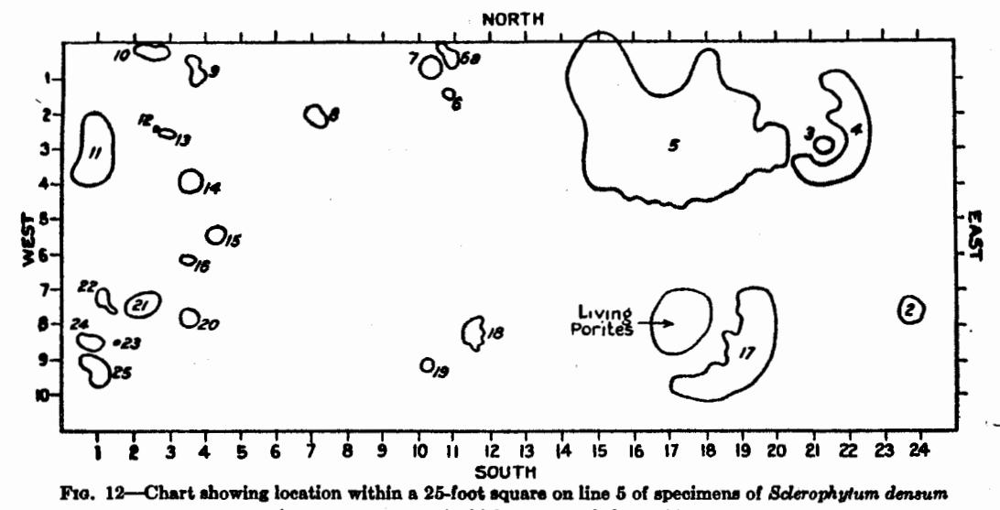

the measurements of which are recorded in table 9.

TABLE 10—Measurements of S. latum on a square laid out 375 to 400 feet on Line 5—(square east of line)

| Specimen No.  | Location in square                       | Dimension                             | Areas of base after 15 mos |
|---------------|------------------------------------------|---------------------------------------|-------------------------------|
| 1             | Under N. base 22.5' W. base              | 14" × 10" × 27"                       | 1:5.74                        |
| 2             | Under N. base 22' W. base                | $7.5^{\circ} \times 6.5^{\circ}$      | 1:6.8                         |
| 3             | 13.1' W. base 3'5" N. base               |                                       | 1:4.61                        |
| <b>4</b> 5 | 9.9' W. base 2'7" N. base                | $12^{"}\times9^{"}\times27^{"}$       | 1:21                          |
|               | Touches No. 4 on south                   | 11" × 9" × 25"                        | 1:1.26                        |
| 6             | 7.3' W. base 5.1 N. base                 | 8" × 7" × 14"                         | 1:2.24                        |
| 7             | 4.4' N. base 2.85' W. base               | $10^{"} \times 8^{"} \times 18^{"}$   | 1:2.37                        |
| 8             | 5.5' N. base 11.0' W. base               | 15" × 8" × 24"                        | 1:1.405                       |
| 9             | 5.9' N. base 22" W. base                 | 13" × 8.5" × 28"                      | 1:1.52                        |
| 10            | 6.6' N. base 6" W. base (touches No. 11) | 11" × 9" × 23"                        | 1:2.18                        |
| 11            | 6.3' N. base Under W. line               | 15.5" × 10" × 29"                     | 1:1.25                        |
| 12            | 9.3' N. base 3' W. base                  | $18" \times 12.5" \times 27$          | 1:1.185                       |
| 13            | 9.8' N. base 5.95' W. base               | $4.5^{"} \times 4^{"} \times 7^{"}$   | 1:10.7                        |
| 14            | 18.2' W. base 7.5' N. base               | $2.5" \times 1.5" \times 3.5"$        | Dend                          |
| 15            | 19.6' W. base 12.5" N. base              | $4" \times 3" \times 7"$              | 1:5.51                        |
| 16            | 19.9' W. base 12" N. base                | $3" \times 2" \times 4.5"$            | 1:11.9                        |
| 17            | 20.1' W. base 22" N. base                | 2" × 2" × 4"                          | 1:8.12                        |
| 18            | 19.9' W. base 29" N. base                | $3" \times 1.5" \times 4"$            | 1:4.44                        |
| 19            | Extreme S. E. corner                     | $6.75'' \times 7'' \times 12.5''$     |                               |
| 20            | 22.4' W. base)                           | $6" \times 6" \times 11.5"$           | Lost                          |
| 21            | 19.8' W. base                            | $4.5^{"} \times 4.5^{"} \times 9^{"}$ |                               |
|               | 6" S. base                               | •                                     |                               |
| 22            | 6.9' W. base. Under S. line              | $12.5" \times 9" \times 19.5"$        | 1:2.76                        |
| 23            | Extreme S. W. corner                     | $19" \times 12.5" \times 39"$         | 1:1.15                        |
| 24            | 23" W. base 17.3' N. base                | 19" × 13" × 40"                       | 1:1.76                        |
| 25            | 16.3" N. base 25" W. base                | 13" × 7.5" × 23"                      | 1:1.18                        |

#### CORAL REEFS OF SAMOA

TABLE 11—Measurements of S. confertum on Square No. 8 Line 2, March 24, 1917 (See text-fig. 13.)

| Specimen No. | Location in square                                                                                        | Dimensions                        | Areas of base after 15 mos.              |
|-----------------|-----------------------------------------------------------------------------------------------------------|-----------------------------------|---------------------------------------------|
| 1               | Solid colony 30" N. 23" E                                                                                 | 7.25" × 6.5" × 15.5"              | Lost                                        |
| 2               | Irregular broken colony 3.75" W. base 2' N. spike 1a                                                      | 28" × 26" × 81"                   | Lost                                        |
| 3               | Lead colored, under S. line 7" W. spike 1a                                                                | 35 mm. × 45 mm. × 125 mm.         | 1:16.00                                     |
| 4               | Lead colored 13.5" S. base; spike 1a                                                                      | 26 mm. × 7" × 6" × 13.5"          | Lost                                        |
| 5               | Small lead colored in 1a 16" N.W. spike 1a 10" S.E.                                                       | ·                                 |                                             |
| 1               | corner No. 2                                                                                              | 53 mm. × 36 mm. × 68 mm.          | 1:27.9                                      |
| 6               | Large brown colony in 1c, S. edge under line S.W. corner 11" spike 1b                                     | 22" × 14" × 52.5"                 | Separated int several dis tinct parts |
| 7               | Very small lead-colored colony in 1d straight N. from Acropora, 39" S. base 49" spike 1c, 64" spike 1d | 30 mm. × 14 mm. × 53 mm.          | 1:102.00                                    |
| 8               | Lead colored in 1c. 34" stake 1d, 26" stake 2d, 12"                                                       |                                   |                                             |
|                 | E. base                                                                                                   | 10" × 10" × 16.5"                 | 1:3.24                                      |
| 9               | Lead colored in 1d, 25" E. base 12" N. cross-line                                                         | 6" × 4" × 10.5"                   | 1:1.81                                      |
| 10              | Lead colored. S. W. corner 2a                                                                             | 3.5" × 3"                         |                                             |
| 11              | In 2a 5.3" from a pipe 2a, 5.5'. 3a                                                                       | 11" × 13" × 30"                   | 1:2.0.81                                    |
| 12              | On S. line 2a, 5.4' spike 2a                                                                              | 13" × 9" × 26"                    | 1:1.065                                     |
| 13              | (In 2a) 7.9" E. base, 1.6' N. cross-line                                                                  | 5.5" × 3" × 9"                    | 1:2.43                                      |
| 14              | Very small head about which a space was cleared                                                           | 127 407 427                       | 1.10.00                                     |
|                 | 10.3' E. base, 2.2'. N. cross-line                                                                        | 1.5" × 2" × 5"                    | 1:16.00                                     |
| 15              | Begins 1.0' from No. 14:0.85' S. base 1.2 N                                                               | 33" × 22" × 72" 12" × 9" × 26" | Broken up                                   |
| 16              | 16.2' E, base 0.25' N, cross-line                                                                         | 12° X 9° X 20°                    | 1:1.27                                      |
| 17              | 18.5' E. base under S. cross-line                                                                         | 7" × 5" × 18" 5" × 3" × 7"     | 1:7.15                                      |
| 18              | 20.5' E. base 1.0' S. cross-line                                                                          | 6 X 3 X 7                         | 1:18.58                                     |
| 19              | Large mass just N.W. No. 18 about 2"                                                                      | 4'5" × (25" west, 24" east,       | Broken int                                  |
|                 |                                                                                                           | 11" middle, × 117")               | many units                                  |
| 20              | 21.45' E. base 0.2' N. line                                                                               | 3" × 3" × 9"                      | 1:4.32                                      |
| 21              | Against W. base .6' N. line                                                                               | 9" × 11" × 22"                    | 1:2.077                                     |
| 22              | 3.4' E. base 1.9' N. line                                                                                 | 4" × 6" × 5.5"                    | Lost                                        |
| 23              | 3.8' E. base 2.0' N. line                                                                                 | 6" × 5" × 15"                     | Lost                                        |
| 24              | Large brown head 5.25' E. base 1.1' N. line                                                               | 16" × 18" × 44"                   | 1:1.08                                      |
| 25              | In 2a cleared up around it. 7.9' E. base 1.1' north                                                       | 157 4 55 4 657                    | 1000                                        |
| 00              | line                                                                                                      | 1.5" × 1.5" × 3.5"                | 1:9.96                                      |
| 26              | 6.3' E. base 3.7' N. line                                                                                 | 24" × (17" W., 9" E., 4" N.W.)    |                                             |
|                 |                                                                                                           |                                   | broken up t                                 |
| 27              | 10.5' E. base 3.0' N. line                                                                                | 17" × 13" × 32"                   | measure 1:3.78                           |
| 28              | 19.7' E. base 3.9' N. line                                                                                | 10" \hat{\chi} 10" \hat{\chi} 23" | Lost                                        |
| 29              | Old head partially dead. In 4 & 5:1.7 E. base                                                             | 1.9 S. end                        | Broken up s                                 |
| 20              | Old nead partially dead. In 2 & 5:1.7 E. base                                                             | 36" × 27" widest × 7'11.5"        | its identit                                 |
| 80              | Extreme N.W. corner                                                                                       | (19" N.) 20" × 16.5" × 51"        | was lost Lost                            |
| 80 81        | 5.7' E. base 0.9' N. base, dead in center                                                                 | 27" × 26" × 72"                   |                                             |
| 82              | Large head dead center (line W. of No. 29) (on line                                                       | 21 X 20 X 12                      | 1:1.03                                      |
| 02              | between squares 4 and 5)                                                                                  |                                   |                                             |
| ,               | Cavity in center is 13.5" E. and W., 15.5" N. and S.                                                      | 3'8" × 3'9" × 9'10"               | 1:1.17 .                                    |
| 83              | Large head on N. base 10' W. base.                                                                        | 51" × 27" middle)                 | Broken int                                  |
| -               |                                                                                                           | 51" × 27" middle 16" east      | several ind                                 |
|                 |                                                                                                           | 17" west                          | viduals                                     |
| 34              | On N. line 15.4' E. base                                                                                  | 27" × 22" × 72"                   | 1:3.78                                      |
| 85              | Under line between 4 and 5 20.5' E. line                                                                  | 31" × 41" × 98"                   | 1:1.49                                      |
| 86              | Just E. square 4. E. end under the E. base line of                                                        |                                   |                                             |
|                 | large square.                                                                                             | 11.6" in circumference            | 1:1.355                                     |

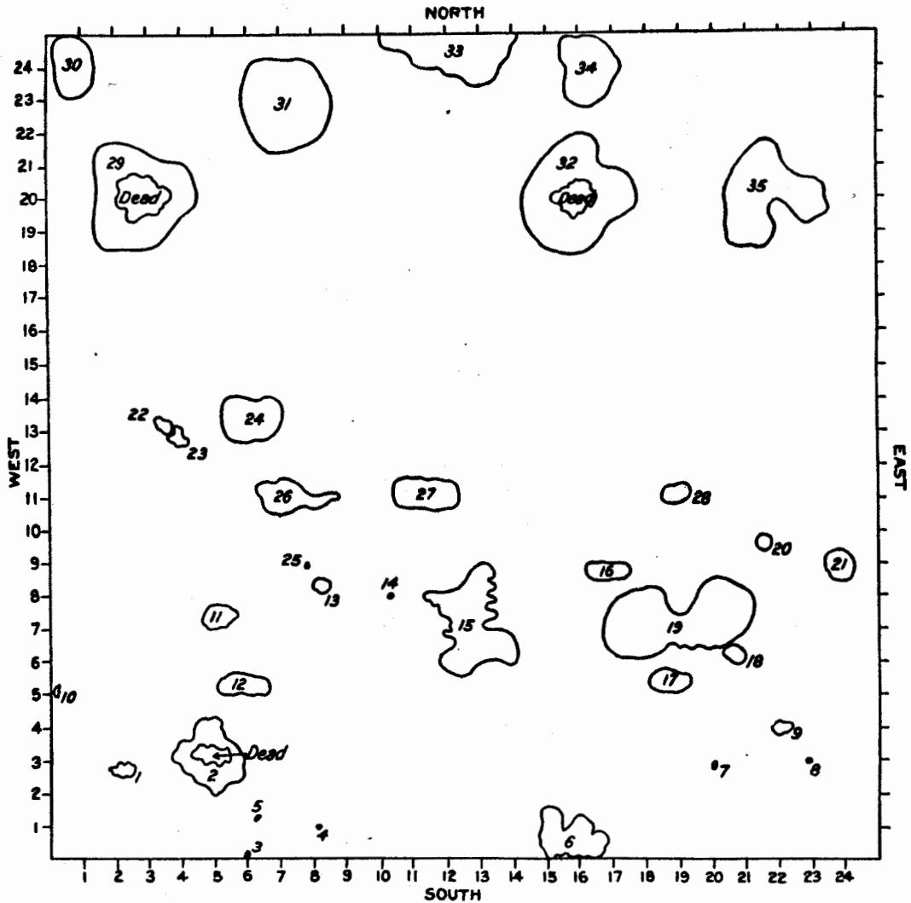

Fig. 13—Chart showing location within a 25-foot square on line 2 of specimens of Sclerophytum conferium the measurements which are recorded in table 11.

Table 12—Measurements of N. flexile on Line 3 along Government landing (All between two galvanized spikes driven into the stone wall along the dock)

| Speci- men No. | Location in square                                                                                | Dimensions                                                                   | Relative area after 15 months   |
|----------------------|---------------------------------------------------------------------------------------------------|------------------------------------------------------------------------------|------------------------------------|
| 1                    | Near a coral head about 1' from S. spike                                                          | 4" × 3" × 6" × 3" high                                                       | Lost                               |
| 2                    | 4 specimens (No. 2-No. 8) in two lines along sea wall. No. 2 is farthest to left on upper line | 13" × 9" × 17" × 5.5"                                                        | Separated into several individuals |
| 3                    | Next to right (N.)                                                                                | $8'' \times 5'' \times 6.5'' \times 5''$                                     | 1:6.66                             |
| 4                    | Next to right 3 divisions                                                                         | $11'' \times 9'' \times 12'' \times 5''$ (upper stalk)                       | 1:11.85                            |
| 5                    | Southernmost on lower line                                                                        | $10'' \times 7'' \times 9.5'' \times 5''$                                    | 1:3.92                             |
| 6                    | Next north                                                                                        | 13" × 8" × 10" × 9"                                                          | Divided into two                   |
| 7                    | Next north                                                                                        |                                                                              | 1:7.86                             |
| 8                    | Last one north                                                                                    | $6^{"} \widehat{\times} 5^{"} \widehat{\times} 9^{"} \widehat{\times} 4^{"}$ | 1:6.36                             |

TABLE 12—Measurements of N. flexile on Line 3 along Government landing—(Continued)

| Speci- men No. | Location in square                                                                                | Dimensions                             | Relative area after 15 months |
|----------------------|---------------------------------------------------------------------------------------------------|----------------------------------------|----------------------------------|
| 9                    | 9 to 16 in a clump growing out from wall starting                                                 |                                        |                                  |
|                      | 12' from S. stake                                                                                 | 10" × 9" × 8" × 6"                     | 1:2.81                           |
| 10                   | Just north of No. 9                                                                               | $9" \times 6" \times 7" \times 6"$     | 1:5.55                           |
| 11                   | East of No. 10                                                                                    | $7" \times 6" \times 9" \times 6"$     | 1:1.56                           |
| 12                   | North of No 11                                                                                    | $14" \times 7" \times 14" \times 6"$   | 1:10.6                           |
| 13                   | West of No. 11                                                                                    | $15" \times 10" \times 18" \times 8"$  | 1:5.25                           |
| 14                   | Whole N.E. part of mass                                                                           | $20" \times 22" \times 27" \times 9"$  | 1:6.6                            |
| 15                   | South of No. 14                                                                                   | $7'' \times 6'' \times 9'' \times 6''$ | 1:4.07                           |
| 16                   | Extreme east of cluster (17 to 25 in cluster about 3' from N. spike at inner end (No. 17) extends | 7" × 7" × 10" × 5"                     |                                  |
|                      | opposite N. spike)                                                                                |                                        | 1                                |
| 17                   | Specimen on coral block                                                                           | $6" \times 6" \times 6" \times 6"$     | Lost                             |
| 18                   | N. from 17                                                                                        | $5'' \times 5'' \times 0.5'' \times$   | 1:4.02                           |
| 19                   | 20-21 form a triangle N. of general mass                                                          | 9" × 9" × 8" × 6"                      | 1:2.75                           |
| 20                   | Nearest wall                                                                                      |                                        | 1:2.75                           |
| 21                   | Straight out from 20                                                                              | $7'' \times 5'' \times 6'' \times 6''$ | 1:8.05                           |
| 22                   | N.E. innermost of bunch                                                                           |                                        | 1:16.02                          |
| 23                   | Easternmost                                                                                       |                                        | 1:2.275                          |
| 24                   | Just south of 23                                                                                  | 7" × 7" × 8" × 8"                      | 1:1.00 Divided nearly to base |
| 25                   | Next N.W. of 24                                                                                   | 9" × 6" × 8" × 8"                      | 1:5.12                           |
| 26                   | West of 25                                                                                        |                                        | Lost                             |
| 27                   | Westernmost of dense cluster                                                                      |                                        | 1:2.75                           |

When these specimens were measured in 1918, 26 individuals not there in 1917 were found on the area of bottom on which were located the 27 for which measurements had been recorded the year before. The dimensions of 10 of these individuals, not more than 15 months old, were:—

| 1a 4" × 2.5" × 4" × 5" high                                                                | 6a 5" × 5" × 6" × 7" high             |
|--------------------------------------------------------------------------------------------|---------------------------------------|
| $2a$ $5'' \times 5'' \times 2.5'' \times 7''$                                              | 7a 6" × 5" × 5" × 8"                  |
| $3a4'' \times 5'' \times 6'' \times 8''$                                                   | $8a4" \times 6" \times 5" \times 7"$  |
| 4a 3.5" × 3" × 4" × 6"                                                                     | 9a 5" × 5" × 4" × 9"                  |
| $6^{\prime\prime} \times 5^{\prime\prime} \times 6^{\prime\prime} \times 8^{\prime\prime}$ | $10a7" \times 4" \times 5" \times 8"$ |

From evidence furnished by specimens 2, 6 and 25, it would appear most probable that the greater number of these new individuals had arisen by the process of longitudinal division of some of the older colonies and not from the development of planulæ which had settled among the older specimens. Relatively large clusters, such as that made up of individuals 17 to 25, inclusive, have quite possibly arisen by the repeated fission of a single original specimen and its asexual descendents over a considerable period. The fact that the height of the new individuals was practically the same as the older ones, while their other dimensions were considerably less, adds weight to this conclusion.

As a check on the growth under more carefully determined conditions, 25 specimens of S. confertum were obtained by breaking the skeletal mass below growing "heads" of branching colonies of this species. These were put out near the border of the Utelei south reef at its northwest corner. The location selected was near to areas where S. confertum was abundant on a bottom where shifting coral sand was the chief constituent. The barren spicule skeletons were embedded in a mass of cement 7' 6" by 5' 1" which extended down to a solid foundation below the shifting sand. The long axis of this "bed" was approximately north and south. The position of the specimens in the plot is shown in text-figure 13.

Since this entire reef area is devoid of any living stony corals and no Lithothamnium ridge is formed so far in from the entrance to the cove and since none of the other species of Alcyonaria were found near by, it would appear that of the common reef-forming organisms S. confertum alone was able to flourish under the environmental conditions existing here where the greater part of the coral sand

found on the inner portion of the surface of the Utelei south reef spills over into the deep channel of the cove.

When this planting was made it was thought probable that the existence of a naked mass of spicule rock below the living tissue in all old colonies of S. confertum might be due to the destruction of the organic portion by abrasion by the shifting sand and that the perpetuation of the colony was possible only because some of its branches had been able to keep their apices above the sand. When the planting was examined after one year (by Dr. Mayer) the living tissue had in all instances grown down over the bare skeleton to the cement, although varying amounts of sand, up to 3 inches in depth, were found over the surface. natural conditions then, some cause other than such abrasion must be accountable for the death of the lower portions of the colony. The presence on the reefs of the inner harbor of large masses of barren spicule rock capped by living colonies of S. confertum, which extend from the general reef surface to approximately spring tide low-water level, a distance of some 3 feet, gives the impression that most

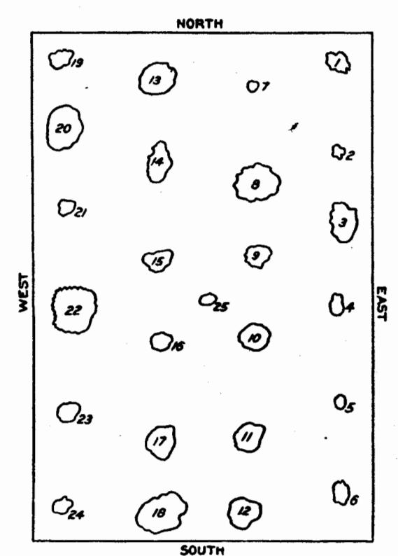

Fig. 14—Chart showing location on the cement bed, made on the NW. corner of the Utelei south reef, of specimens of Scierophytum confertum planted out in Aug. 1918, the measurements of which are recorded in tables 13 and 14.

vigorous growth takes place only at the apex of a colony, and this fact, in addition to the observed death of irregular portions of the tissues over the central areas of large colonies would in time bring about the formation of a branching and anastamosing skeletal framework below the growing portion of any older colony.

The dimensions of the 25 specimens on the "bed" at the time of their planting and again at the end of approximately one year are given in the following tables.

Table 13—Measurements of S. confertum cemented on N.W. corner of South Reef at Utelei, August 2, 1918 (See text-fig. 14)

| Specimen No.            | Height of living tissue above concrete | Perimeter base of colony | Height of colony | Perimeter old skeleton | Long axis | Short axis |
|----------------------------|----------------------------------------------|-----------------------------|------------------|---------------------------|-----------|------------|
| 1                          | 36                                           | 227                         | 130              | 245                       | 132       | 101        |
| 9                          | 22                                           | 260                         | 80               | 295                       | 127       | 92         |
| 2 3                     | 55                                           | 440                         | 232              | 394                       | 250       | 232        |
| 4                          | 12                                           | 303                         | 150              | 308                       | 190       | 151        |
| 4 5 6 7 8 9 | Flush                                        | 320                         | 60               | 1 000                     | 180       | 70         |
| Ä                          | 5                                            | 112                         | 65               |                           | 60        | 55         |
| 7                          | Flush                                        | 220                         | 100              | l                         | 120       | 100        |
| Ŕ                          | 40                                           | 268                         | 160              | 250                       | 170       | 140        |
| ğ                          | Flush                                        | 300                         | 150              | Ö                         | 230       | 177        |
| 10                         | Flush                                        | 405                         | 180              | Ò                         | 225       | 100        |
| īĭ                         | Flush                                        | 206                         | 122              | l ŏ                       | 155       | 106        |
| 12                         | Flush                                        | 273                         | 114              | 1 0                       | 130       | 109        |
| 13                         | 14                                           | 293                         | 90               | 281                       | 162       | 133        |
| 14                         | Flush                                        | 400                         | 125              | 14 mm. between colonies   |           |            |
| 15                         | Flush                                        | 280                         | 150              | 0                         | 100       | 170        |
| 16                         | Flush                                        | 280                         | 100              | 0                         | 205       | 110        |
| 17                         | Flush                                        | 365                         | 95               | 0                         | 148       | 112        |
| 18                         | Flush                                        | 350                         | 143              | 0                         | 155       | 153        |
| 19                         | Flush                                        | 180                         | 80               | 0                         | 212       | 90         |
| 20                         | Flush                                        | 384                         | 143              | 0                         | 153       | 160        |
| 21                         | 25                                           | 195                         | 120              | 157                       | 240       | 84         |
| 22                         | 90                                           | 360                         | 196              | 295                       | 95        | 177        |
| 23                         | 45                                           | 235                         | 130              | 220                       | 230       | 130        |
| 24                         | Flush                                        | 116                         | 62               | 134                       | 185       | 55         |
| 25                         | 22                                           | 153                         | 78               |                           | 80 102 | 48         |

TABLE 14—Measurements of the same specimens on August 20, 19191

| Specimen No. | Perimeter of base of colony | Height above | Long axis | Short |
|-----------------|--------------------------------|--------------|--------------|-------|
| 1               | 258                            | 148          | 212          | 169   |
| 2               | 164                            | 90           | 120          | 78    |
| 3               | 405                            | 246          | 328          | 265   |
| 4               | 361                            | 160          | 320          | 194   |
|                 | 176                            | 66           | 110          | 110   |
| 5 6          | 149                            | 65           | 104          | 53    |
| 7               | 225                            | 115          | 206          | 138   |
| 8               | 275                            | 184          | 327          | 214   |
| 9               | 373                            | 162          | 271          | 204   |
| 10              | 390                            | 197          | 341          | 193   |
| 11              | 230                            | 131          | 252          | 185   |
| 12              | 313                            | 120          | 190          | 190   |
| 13              | 354                            | 116          | 250          | 174   |
| 14              | 463                            | 147          | 308          | 155   |
| 15              | 306                            | 180          | 330          | 209   |
| 16              | 320                            | 115          | 181          | 115   |
| 17              | 511                            | 110          | 290          | 195   |
| 18 .            | 365                            | 173          | 353          | 252   |
| 19              | 307                            | 105          | 190          | 129   |
| 20              | 493                            | 176          | 340          | 218   |
| 21              | 191                            | 140          | 195          | 154   |
| 22              | 327                            | 227          | 310          | 239   |
| 23              | 291                            | 164          | 246          | 200   |
| 24              | 193                            | 75           | 120          | 85    |
| 25              | 160                            | 83           | 135          | 48    |

1 1919 measurements by Dr. Mayor.

#### PART II

#### THE STRUCTURE OF THE CORAL REEFS IN PAGO PAGO HARBOR

In order to determine the origin of the limestone making up the mass of the Utelei reefs on the surface of which the studies described in the previous section were made, the character (origin) of the surface rock was studied in detail along line No. 1. This was done by digging up the entire reef surface over an area of one square yard at intervals of 10 feet, thus giving 94 stations from which samples were taken. The material obtained was for the most part discarded at once after an examination of its structure and component skeletal remains had been made immediately upon its separation from the underlying limestone. Other, especially more doubtful, material was taken to the laboratory for more thorough examination.

For the distance of 175 feet from the shore, which at this point consisted of a retaining wall of basalt erected in the building of a roadway around a sharp point, the bottom was composed of loose coral sand, while the only living coral organisms were a few scattered heads of massive Porites. A much larger number of dead skeletal masses of the same *Porites* were located over these areas, some of them extending a few inches above the general level of the reef surface. On working over the shifting material, down to the solid substratum, a number of Sclerophytum confertum spicule masses, of the character illustrated in figures 18, 19, plate 7, were encountered both in the sand and in the superficial layers of the solid reef rocks. The presence of these structures and that of the *Porites*, both living specimens and skeletal remains, would indicate that within comparatively recent times conditions had been much more favorable for the growth of these organisms than they are at present. At a number of stations across this sandy area the hard surface was dug up to a depth of 2 feet, the principal component elements being found to be the massive Porites, a branching Porites (P. andrewsii) and Sclerophytum confertum spicule rock, either in the form of the nodules previously mentioned as occurring in the shifting sand or as larger branched masses. All interstices among the more solid rock were naturally filled with calcareous sand, usually unsolidified so that it quickly washed away as the surface material was handled. At present the currents across this barren area, at all times except at high tide, set to the westward and are, under most conditions, of sufficient strength to move the coarse sand with a noticeable velocity. The configuration of the shore-line and of the reef flat in relation to the axis of the harbor is such that the greater part of the smaller loose particles arising on the entire reef area from the Fagaalu north reef and that off Blunts Point are here carried along the reef moat to spill over into the deeper water at the northwest corner of the Utelei south reef. The abrasion caused by this currentborne material, as especially stressed by Crossland ('27-'28), may be sufficient to cause the destruction of the "corals" of both the Madreporarian and Alcyonarian That conditions favorable for the growth of reef-building corals occurred until the level of the reef had reached that of the present hard substratum is quite possible since the strength of the currents has been observed to be dependent upon the depth of water over the reef flat as a whole. When the tide has risen one foot above mean low tide there is no longer a marked spilling over into the reef moat and the strong current following the shore line becomes much less rapid.

80

Beyond the 175-foot point the reef surface was, at all the stations, either covered with living coral-forming organisms, or, where barren of such material, clearly made up of limestone composed of the skeletons of these forms. On 83 of the 94 areas examined, limestone composed of the skeletal remains of S. confertum or S. densum was recognizable among the loosened material. On areas where the greater part of the surface was covered by living colonies of S. confertum (see chart No. 1) practically the entire surface rock was, as would be expected, composed of the cemented spicules of this species.

On the Lithothamnium ridge, which was approximately 60 feet wide at this point, only one specimen of spicule rock was found on the surface, and that at the base of a living colony of S. densum living in the breakers at the reef edge. The examination of the more deep-lying material showed that on some of the areas a relatively large proportion of the material removed was composed of spicule rock where the entire surface has been covered with Porolithon. The evidence obtained when the boring was made through this material, at 925 feet from shore on line 1 (See Chart No. 1), fully confirmed this observation and showed that at this point, as well as farther shoreward (675 feet) where the surface was carpeted with living S. confertum, a large part of the solid reef crust, which extends downward for some 6 feet, was to a great extent composed of Sclerophytum spicule rock. In the range between the 175-foot mark and the inner edge of the Lithothamnium ridge on only a single area of those examined, no Sclerophytum spicule rock was found in the surface layer of limestone.

Observations at many other points scattered widely over the surface of this reef showed that at least 75 per cent of its surface area is, or has been very recently, covered with living *Sclerophytum* for a period of sufficient length to allow the formation of spicule rock from a small fraction of an inch to several inches in thickness.

## RECORDS OF REEFS OTHER THAN THOSE RECORDED IN THE PREVIOUS DISCUSSION

Many other reefs besides those across which lines of squares were laid out to determine the area occupied by Alcyonaria were studied less intensively.

On the reef north of the Utelei entrance upon the inner portions of which there is but a sparse growth of corals, only a very scattered growth of Alcyonaria occurs over the surface of the reef. There is, on the contrary, an almost continuous covering of Sclerophytum which extends from low-water mark on the surface of the Lithothamnium ridge down to a depth of 20 feet or more. Along the inner portion of the reef, this depth carries down below the abrupt reef cliff on to the more gradual slope of the foot of the reef where there is a dense growth of loosely branching Porites, interspersed with large colonies of Millepora resembling in shape and appearance some of the larger cacti, like the Cereus of the American desert.

While in many places along this reef edge there are smaller areas barren of either living corals or Alcyonaria, in almost every instance the surface of these areas is found to consist entirely of a layer of rock formed from spicules of S. densum making a veneer from 4 to 12 inches in thickness. Whenever stony corals were found in any number along this area, it was observed that every species except a few specimens of the flat mushroom-like Acropora were being rapidly overgrown and killed by Sclerophytum. This feature of the ecology of the reef edge was especially conspicuous when large specimens of massive Porites were involved, as all stages in the overgrowth of the coral could be easily seen.

The reef edge, at a point about two-thirds the distance in from the extremity of the Goat Island flat, was broken down by the use of a small charge of dynamite laid on the upper surface of a small shelf. The material loosened by this small blast consisted almost entirely of rock composed of spicules, with an underlying base of Lithothamnium and coral skeletons. Later a much heavier charge was inserted into a cavern in the reef to a depth of about 4 feet and the entire reef-margin The upheaval produced by this charge was so great that when the mud had cleared away and the broken material could be examined, most of the fragments were no larger than one's fist and no reliable determination of their former location in the reef could be made. Fragments of rock composed of alcyonarian spicules were intimately mixed with others composed entirely of coral skeletons, while throughout the mass there was a considerable amount of dark grey mud, the constitution of which could not be determined except by chemical analysis. When the finely fragmented material had been cleared away as completely as possible, larger masses from the less broken portions of the reef were pried out and examined without its being found possible finally to determine whether the present surface covering of the reef with rock composed of spicules is an unusual occurrence or if the same condition has been maintained for long periods in the history of this reef.

On many areas over the reefs along the north side of Pago Pago harbor Alcyonaria, especially S. confertum, are abundant and form large "heads" composed of rock formed from spicules as on the reefs more carefully studied. On the nearly vertical sides of all the reefs well within the harbor where observations were made, a large portion of the total area was invariably clothed with living Alcyonaria, while the barren areas scattered between or among the masses of living colonies had the appearance of being for the greater part made up of rock composed of spicules.

The chief characteristic of this rock as contrasted with that composed of coral skeleton is the smooth rounded character of the former as contrasted with the much more jagged contour presented by the reef edges formed entirely from stony corals.

In order to obtain as far as possible a comparison between the distribution of the organisms contributing limestone to the present reef surface and that which existed during the formation of the great mass of the reef, a boring was made at a distance of 575 feet from the shore on line No. 1 (see location on map). When the underlying basalt was encountered at a depth of 124 feet, it was thought desirable to make additional borings, not so much to supplement the information obtained regarding the structure and composition of the reef, as for the light that might be thrown by the data from such a series of borings upon the question of the relation of the modern coral reefs to the substratum, especially in reference to the glacial control theory of Daly. With this in view, a boring was made at a distance of 280 feet from shore, and later a third boring on the same line at a point within 20 feet of the reef margin on the Lithothamnium ridge, at a distance of 925 feet from shore.

The conditions encountered, both as regards mechanical difficulties and as indicating the structure of the reef, were so nearly identical for each of the borings that a rather complete account of that first carried out will alone be given. The principal difference between the borings—the depth at which the substratum was encountered in the boring nearest shore—is of importance only as regards the history of the development of the reef in relation to the substratum, and need be referred to in any detail in a later connection only.

#### LOG OF DRILLING NO. 1 THROUGH THE UTELEI REEF

The drilling machinery employed consisted of a Davis Calyx-Core drill with cutting tools of two sizes, the larger of which would remove a core of 4.5 inches, the smaller a core of 2.5 inches. But, because of the diameter of the only pipe available for a casing for the bore hole, which was necessitated by the character of the material through which we were drilling, the smaller tool alone was used.

In the Davis drill the core barrel above the cutting tool is supplemented by the so-called calyx barrel, a steel pipe of the same diameter as the core barrel and screwed on to the head of the latter so that any material washed up by the force of the stream of water through the hollow drill rods from the point where cutting was taking place would be caught and not, when the water pressure was removed, be allowed to fall back upon the top of the core barrel, where it might either jam this part of the machine when being withdrawn, or be itself ground to small fragments between the wall of the boring and the core barrel.

Because of the generally loose and friable nature of the material found in nearly all except the upper layers of this reef, the rapidly rotating cutting tool with its relatively coarse teeth broke up the coral so that a hole considerably larger than the diameter of the tool was formed, and many of the fragments were consequently washed into the calyx barrel which was usually the most important collector

of our specimens.

With the drilling machinery set up on a rough platform about 2 feet above high tide, the first attempt at a boring was begun from the east side of the platform. At this point the reef surface bore very few living corals and was chiefly composed of rock formed from *Sclerophytum confertum* spicules. For a depth of approximately 6 feet the rock was hard and composed of clearly recognizable madrepore skeletons and cemented spicules, through which the drill cut rapidly and of which a nearly continuous core was obtained.

Immediately beneath this hard superficial layer, the reef material was so soft that the cutting tool when rotated sunk of its own weight to a depth of 14 feet. Each time the tool was withdrawn the bore hole filled with sand so quickly that even when the drill was at once lowered again into the hole the sand had to be forced out, and to reach the depth already attained took longer than it had the first time.

Because of the binding of the drilling tools by the loose sand which flowed into the hole from all sides no further progress was possible until a casing was put down, which at the 14-foot level struck a layer so firm that it could not be broken through by driving the casing. After cutting through this dense layer, which was about one foot in thickness, another loose soft layer 4 feet thick was encountered, from which only sand and some fragmentary coral were obtained. The pipe became bent in driving the casing through the dense layer, so that when the cutting tool was again lowered it bound within the casing so firmly that this began to rotate with the drill, and when an attempt was made to withdraw the cutter the casing was withdrawn with it and the two were separated only after long-continued effort. After repeated failures to get down with the drill for any distance below a second dense layer at 19 feet from the surface, drilling was given up. To learn more of the character of the underlying material a 34-inch pipe through which water was pumped was worked down from the hole already made. By this means it was possible to reach a depth of 46 feet before any obstacle was encountered too resistant to be broken through by using this length of pipe as a hammer when raised for some 4 feet and allowed to drop.

Throughout the extent of this exploratory "sounding" the reef appeared to be made up of loosely disposed rock with a great deal of sand, which when washed away by the stream of water allowed the pipe to advance by its own weight.

After a number of unsuccessful attempts to reach greater depth at the first location, the drilling machinery was turned and another boring started from the west side of the platform. In the upper levels the conditions encountered exactly duplicated those described for the previous attempt. A complete and essentially continuous core was obtained for the first 6 feet. After penetrating this solid layer, the cutting tools sank rapidly to the hard layer at approximately 15 feet below the surface. Profiting by our experience with the previous boring, the water iet was turned on at full strength while penetrating the loose layer, and as a result so little material had accumulated in the core barrel that we were able to penetrate the second dense layer before having to withdraw the drill. When, in driving down a 4-inch steel pipe as a casing, the solid layer at 15 feet depth had been penetrated, the casing advanced easily for some 4 feet, where another dense layer was encountered. This obstruction could not be broken through by light blows on the casing and the cutting tools were again brought into use. After cutting through about 18 inches of solid limestone another loose stratum was found. This layer, through which the cutting tool advanced very rapidly and the casing went steadily with relatively slight resistance, extended to a depth of 46 feet. While the material brought up in the core barrel and calyx barrel indicated that practically the same components entered into the structure of the reef as in the higher levels, the sand particles became progressively finer and adhered to one another much more tenaciously, so that the bore hole did not fill so quickly when the tools were withdrawn. Except for the dense layers encountered at intervals, the only long pieces brought up in the core barrel were sections through heads of the massive Porites or masses of Sclerophutum spicule rock encountered from time to time in the course of drilling.

At the 46-foot level another hard crust approximately 2 feet in thickness delayed the advance of the casing tube. Beyond this more solid layer no difficulty was encountered for the remainder of the day, during which a depth of 54 feet was attained. Because of heavy rains and mechanical difficulties, due to a jammed coupling in the drill rod, no progress was made throughout the next day. When the drilling mechanism had been put in order once more, progress from this point on was much more rapid, since beyond a depth of 60 feet the lining of the bore hole was no longer necessitated. In one day (July 27) the bore hole was carried from 54 to 105 feet with no interruption in the advance of the cutter, except as was necessary to withdraw the tool in order to take the material from the core barrel.

Throughout this portion of the reef the solid constituent elements consisted of skeletons of *Porites andrewsii*, *Sclerophytum* spicule masses and sections through massive *Porites* skeletons. The material from the interstices between the solid coral was here much changed from the nearly white, coarse and easily movable sand encountered in the upper 45 feet of the reef next below the present surface crust. The original character of the sand grains had become so changed that any external evidence as to the organisms from the skeletons of which they had been derived was not evident on naked eye examination. Indeed, the term coral sand could with propriety no longer be applied to this material since in most of the samples the loose fragments had all assumed a nearly black color; and while in the higher levels below 60 feet it was decidedly plastic, so much very fine material entered into its composition that it might be better described as mud rather than wet sand. At the

lower levels the black interstitial material had become solidified between the coral skeletons. Quite commonly the line of demarcation between the original solid coral and the extraneous material deposited between the branches was no longer to be distinguished. At the center of such a mass there would be found a small core of apparently unchanged coral limestone while its peripheral portion had been replaced by, or changed into, a black substance similar in appearance to that extending from one unchanged coral axis to that of a neighboring branch. The mud-like appearance, as well as the color, of the more plastic portions of this substance suggested the possibility that volcanic mud might be a considerable element in its composition, but its almost complete solubility in hydrochloric acid showed that it was practically all limestone, although decidedly changed in appearance.

The difference in the character of the interstitial material in the lower levels of the reef as contrasted with those in the upper 50 feet is well shown by the fact that, although between the time when we had reached a depth of 105 feet and when drilling was undertaken again some 40 hours had elapsed, it was not necessary to spend any time in cleaning out the bore. When first put down, the tool sank freely to the bottom and cutting in new rock began at once. In the upper levels, as previously noted, the sand ran into the bore to an extent sufficient to entirely fill it each time the tools were withdrawn, and any progress after the first passage of the drill through any given section was impossible without the use of a casing.

From the 105-foot level the core consisted of the same black mud-like material with the central axes of relatively unchanged coral branches, but with an increasing proportion insoluble in hydrochloric acid. At the lower depths the "mud" became almost pure laval mud upon which no change was brought about by the addition of acid.

At a depth of 121 feet a solid core 6 inches in length from a Siphastrea skeleton was brought up in which the chemical change, so strongly marked in Porites andrewsii, was hardly noticeable, so that the specimen appeared in no way different from a section of the same species growing on the present surface of the reef. The evidence from the other material obtained at this level would make it appear likely that this head was entirely surrounded by laval mud and consequently not subjected to the same chemical action as the coral from slightly higher levels.

From the 121-foot level to the final depth of the bore at 124 feet, the last 6 inches of which were represented by a clean-cut core of wave-worn basalt, the core was composed of laval mud and fragments of coral which appeared to have been loose when taken up by the drill, rather than to have been broken off by the cutting tool. This was indicated chiefly by the fact that many of the fragments were blackened over their entire surface and did not show a clean fracture at one end, in the center of which could be recognized the central axis of relatively unchanged coral limestone, such as was characteristic of the coral branches from higher levels up to 50 feet.

The evidence obtained from the drilling at 280 feet from shore showed no especial differences at any level down to the basaltic substratum at 68 feet. The third drilling, 925 feet from shore on the crest of the Lithothamnium ridge, was within 20 feet of the present reef margin. Here one could, from the elevation of the drill derrick, look over the edge of the reef to the channel bottom clothed with a luxuriant growth of Porites andrewsii, Sclerophytum confertum, S. densum, Nephthya flexile, Millepora, scattered Fungias, etc., and for depths from 20 feet downward to more than 75 feet make an imaginary comparison of conditions as revealed

in the material brought up as the core with those to be seen on the bottom of the channel between the reefs on the two sides of the Utelei entrance. Except for the very dense surface layers of the shallow reef and the thinner but apparently comparable layers encountered at several points in the upper 50 feet of the drilling, it was apparent, as the channel bottom was followed down its slope until lost from view in deeper water, that a horizontal line projected from its surface at any level into the solid reef would, in the body of the reef, pass through a mass of limestone almost identical in structural makeup with the skeletal structures of the organisms now living in the channel. After this comparison became more impressive as the drilling operations went on and the channel bottom had been examined more closely by the use of a water glass, a much more thorough study of this botton was made by the use of a diving hood which enabled me to walk over any area desired down to a depth of 30 feet without discomfort, and to depths of 45 feet for a short period of time.

Beyond the vertical, or even under-cut, reef cliff, which was about 15 feet deep and covered over its greater extent with either living Sclerophytum densum or spicule rock formed by this organism, on the more gentle slope toward the middle of the channel one walked upon a surface more irregular than that of the shallow reef and lacking any massive organisms except alcyonarian and a few massive Porites skeletons. At every step the slender branches of Porites andrewsii gave way under one's feet until he stood nearly knee deep among the unbroken colonies on all sides. The soft flexible Nephthyas gently waving in the slow currents, as well as the extreme slenderness of the Porites branches, brought out sharply the great difference between ecological conditions at this depth and those on the reef surface at the same time when often heavy waves were racing across the submerged reef with the tide at half flood.

Indeed the one most striking difference between the conditions on the completely alive submerged channel reef (as contrasted with the shallow reef surface now to a great extent devoid of living organisms) and those indicated by the borings is the great amount of sand among the coral skeletons making up the framework of the dead portion of the reef.

On the surface of the reef in the channel along its outer half there is no evidence of the existence of sand until an excavation has been made for at least 18 inches below the surface. Even here many empty spaces occur among the coral skeletons, giving the impression that as yet not enough sand to fill all the interstices had been washed in or formed by disintegration of the skeletons of organisms on the immediate area concerned. Over the inner third of the channel reef, the amount of sand spilling over the reef margin is so great that over considerable areas the stony corals, even P. andrewsii, appear unable successfully to cope with this factor. The continuous carpet of living organisms is here lacking in depths above about 30 feet. Scattered Porites tufts are separated by areas of sand above which Sclerophytum confertum colonies, often of great size, stand up as irregular domes, sometimes several feet in height.

Over the greater part of this channel reef, as indicated by observations at ten rather widely separated points, a small iron pipe could be worked down into the reef for depths in some instances as great as 20 feet, even without the aid of a jet of water flowing through the pipe to wash away the sand.

From this more intensive study of the conditions beyond the present reef margin it seems impossible to avoid raising the question of whether or not, in nearly all discussions of the formation of coral reefs, far too much emphasis has not been placed on conditions now to be observed at the reef margins, where practically all investigators have stated increase in the extent of a reef can alone take place. Barker (1925) emphasizes the growth inward of the surface of a reef as the shore is cut down below sea-level by erosion, due to tides and currents after the reef has grown up to sea-level. His diagrams (l.c. p. 1011) and the explanatory statement (p. 1017) indicate that in his opinion a relatively large proportion of the shoreward area of a modern reef consists of a thin veneer of coral overlying a level platform eroded to slightly below low-tide level. The outer portions of a modern barrier reef have grown up in depths less than 30 fathoms on the natural submarine slope. Beyond this depth extension of the reef depends upon the formation of a talus bank upon which the advancing reef is borne.

In support of this idea, he brings forward as evidence his observation that colonies of *Porites frugosa* are in general smaller on the inner portion of a barrier reef than upon the outer portion of the same reef, thus indicating the greater age of the latter. Even if this theory be correct, which does not seem to be indicated by the evidence from the study of the Utelei reef, it throws no light upon the conditions under which the great bulk of a reef develops and, as concerns the growth of corals on the inner portion of a reef, must postulate an environment similar to that existing on the inner borders of the foregoing reefs where, on the reefs about Tutuila at least, practically no growth of corals is now taking place.

Setchell ('26, p. 309) states that no "reef moat" occurs on the Tahitian fringing reefs comparable to that occurring on all the exposed fringing reefs of Tutuila. Consequently under the conditions prevailing on reefs other than those I have studied, the conditions postulated in Barker's theory may be fulfilled.

The idea that the bulk of the material of a coral reef at depths of more than 4 to 6 fathoms (Agassiz, '03) consists of material different from that of the surface layers is not in the least supported by the evidence from the material obtained from our drillings on the Utelei reef. Here the remains of coral-forming organisms brought up from a depth of 120 feet are of the same species as those growing on the reef surface or on the adjacent channel bottom today.

On the basis of the evidence presented by our three borings, this reef for more than half the distance inward from its border rests upon an essentially level platform and is composed of the remains of a collection of organisms apparently of the same species throughout its depth.

Crossland ('28, p. 584) states that, on the Tahitian reefs concerning which Agassiz's ('03) statement was made, "below 5 fathoms corals are more abundant, and may almost cover the bottom, but at 10 or 12 fathoms they die out quite suddenly, and for the next 7 fathoms, i.e. as deep as is visible under the best possible conditions, the slope is of barren rock and sand, the sand appearing at this depth for the first time."

Setchell (l.c. p. 314) in discussing the contribution of calcareous algae to reef formation overemphasizes the depth restriction of corals important in reef formation; although for his consideration the actual bathymetric range of these organisms within their observed limits of distribution was of relatively minor importance. His statement (l.c. p. 319) concerning the estimation of the time necessary for the formation of a barrier reef that "Any such an attempt to assume a uniform growth rate for either an upgrowing or an outwardly extending reef is subject to extreme doubt and the upward growth for the last 25 feet is likely to be

much more rapid, on account of the coral admixture," which apparently assumes that below 25 feet the corals play an unimportant part in the process of reef building, is not in the least supported by the evidence presented by the reefs about Tutuila where cores have been obtained.

The marked homogeneity in the structure of the reef below 54 feet, in contrast to the alternating thin hard crusts and very open layers in its upper portion, is the most striking point of difference as revealed by the borings. The presence of the dense layer at the present surface of the reef may be easily explained as the result of the factors introduced when the organisms making up the framework of the reef became subjected to more violent agitation of the water as the reef mass neared the surface. Under this new condition, the fragile skeletons would be broken up and the detritus thus formed would fill the interstices in the framework with relatively large fragments. The corals would become progressively more robust, as can be seen on any reef when specimens of the same species growing in exposed and well-protected situations are compared (cf. Mayer, '24, p. 59; Crossland, '28, p. 723; Wood-Jones, '07, p. 530; et al.). In their growth they would tend to spread laterally with much thicker branches rather than to continue to have their most rapid increase in dimensions along the vertical axis, as occurs in the more quiet deeper water. The bringing of the reef surface to a point where, under certain tidal conditions, it was exposed to the sun and air for longer or shorter periods would so change the living conditions that it would be no longer possible for many of the organisms which were the most important elements in the earlier growth of the reef to maintain themselves even at a low degree of activity. Thus a gradual change in the identity of the constituent fauna would be brought about as the less resistant species were crowded out by the more resistant from among their former associates, or as new types, better adapted to the changed environment, became established.

On the reef surface today most of the larger loose fragments of coral debris are overgrown with a veneering of "Lithothamnium"; relatively large areas, at points well in shore from the Lithothamnium ridge bear nearly continuous films of this material, or, as pointed out in the first section of this paper (page 62), are covered completely with a layer of Sclerophytum spicule rock to a depth ranging up to as much as 18 inches or approximately one-fourth of the entire thickness of the hard film. As shown by the cores obtained at each of the drilling stations, the surface layer is essentially homogeneous in composition. All the component elements are bound into a dense mass. All of the small cavities are clean-cut and do not show any indication of regularly occupying former interstices among branches of a coral colony, or even those between adjacent colonies, as appears to be true for the deeper portions of the reef revealed by the drillings, and also for the living reef in the channel beyond the border of the Utelei south reef. In other words some mechanical changes, such as the binding together of all the material by Lithothamnium, Sclerophytum spicule rock, or the remains of other organisms, have taken place, supplemented perhaps by chemical changes which all together have resulted in the formation of the dense crust over the entire reef surface.

Rarely, over restricted areas, an almost continuous covering of fragile corals is found over the surface of the reef, but this is underlain by the solid limestone which is usually exposed at the surface.

The origin of the dense layers at varying levels below the surface crust is less easily accounted for. It would seem necessary to postulate the intervention of

some ecological factors which, over an extended period of time, would have interfered with the normally rapid upgrowth of the reef-forming organisms. Under such conditions a more solid layer would result from the accumulation of material, whether coral debris or skeletons of other forms, at a rate proportionately much greater in comparison to the rate of upgrowth of the reef than would take place under conditions more favorable for the rapid growth of the organisms which have evidently constituted the framework of the dead reef as they do the upper surface of the channel reefs today.

The occurrence of such dense layers at depths of 14 feet, 19 feet, and 46 feet, with two less resistant but clearly marked lines of solidification between the two last-mentioned depths, would necessitate the recurrence of the conditions postulated above with intervening periods when conditions favorable for more rapid growth of corals were maintained.

There is no evidence available from which the relative duration of the period necessary for the formation of one foot of the more dense reef material as contrasted with 8 feet of the loose reef which exists between the two upper hard crusts can be estimated. Any attempts to check back in time for a definite depth in the reef, or indeed to estimate even roughly the time necessary for the formation of a modern reef made upon the basis of the rate of growth of coral forming organisms on the reef surface today must, in the light of the existence of these dense and loose layers, be subject to grave suspicion.

The suggestion that the presence of these several dense layers might be caused by variations in sea-level from time to time during the history of the development of modern reefs, when present-day surface conditions would have been approached at these varying levels, is enticing when considering a region where

there are many evidences of alternating subsidence and emergence.

The interpretations of Chamberlin ('24), Mayor, ('20), Daly, ('20), et al., place the time of the interpretable fluctuations of sea-level before rather than during the time of the formation of the modern reefs, and the most recent movement is stated to be a lowering of sea-level which occurred before the formation of the present fringing reefs (Chamberlin, l.c., p. 168).

Since a change of sea-level, such that the young reefs would be brought to the surface, would result in the formation of a dense crust, the thicknesses of these layers would to some extent be a measure of the relative duration of the period

during which these conditions had been maintained.

Whatever may have been the environmental factors responsible for the formation of such dense layers, a set of conditions operative over varying lengths of time has recurred at intervals during the formation of the upper portion of the reef mass. The effects of the changed environment would be much more clearly distinguishable in the structure of a reef, such as the Utelei reef where, as noted by Mayor (l.c., p. 13), the chief component madrepore Porites andrewsii is much more fragile and slender than the Acropora growing on a wave-beaten reef. The position of Pago Pago harbor is such that the incoming ocean water sets along the East reef, while an outgoing current flows along the West side of the harbor. This condition has been the most important factor in determining the faunal constitution of the reefs on the two sides of the harbor. This faunal makeup has given to the Utelei reef the structural characteristics already noted, while the Aua reef, through which a boring was made under the direction of Dr. Mayor, was found to be composed of more dense and consequently much more homogeneous material throughout its

depth. Relatively little sand, as compared to conditions on the Utelei reef, was encountered, although enough was present in the upper 50 feet of the reef to make advisable the use of a casing to this depth.

Under such conditions there is little possibility of recognizing by any structural characteristics of the reef limestone any differences in the rate of accumulation of the reef-forming materials so strikingly shown in the progress of the boring through the generally loose material of the Utelei reef. That such alternating periods of greater and lesser rapidity of upgrowth have occurred on reefs where, because of their composition, no such striking evidences are found to exist as occur in the more protected reefs, is, it would seem to the writer, assured since the determinative factors, whatever their nature, could not be readily conceived as being important enough to have affected the entire reef area on the protected side of the harbor and yet not be operative throughout a much wider area.

A study of the structure of the channel reef at depths comparable to the levels occupied by the dense layers of the exposed reef would be very enlightening as indicating the influence of the factors responsible for the formation of the hard crusts, but no such data are available at present.

The chemical constitution of the reef-forming material as shown by the study of the cores obtained from the borings at Funafuti (Judd, 1904) indicated that in the upper 150 feet of this reef, *i.e.*, the modern portion, the proportion of magnesium carbonate was greatest at depths from 10 to 40 feet. Below the last-mentioned level minor fluctuations only were found, until at 638 feet a sudden rise from 2.44 to 20.44 per cent occurred.

In the material from the Utelei reef, many fluctuations in the MgCO3 content occurred in the upper levels of the reef because of the marked difference in chemical constitution of the materials to be encountered. Spicule rock formed by Sclerophytum confertum contains normally a concentration of MgCO3 as high as 36 per cent, according to the analyses made by F. W. Clarke on material from Samoa, but so far as I am aware unpublished. Sclerophytum densum has a MgCO3 content of about 10 per cent. The Samoan Lithothamniums vary from 15.25 to 16.46 per cent according to Lipman and Shelley (1924). The Madreporarian skeletons in marked contrast to the foregoing groups show a uniformly low concentration of MgCO3. Clarke and Wheeler (1922, page 8) list the analyses of 30 species of madrepores, mostly from the Caribbean region, of which only one had a MgCO3 content above 1.0 per cent.

With such exceedingly variable elements entering into the composition of the limestone, in at least the upper portion of the reef, information obtained from chemical analyses of material from this level would be indicative of little more than the identity of the organism, the skeletal remains of which it represented. Below the level of the upper dense layer a much more homogeneous chemical constitution was found throughout the more open, sand-filled layers. The material from the thinner dense layers at 14, 19 and 49 feet was again more variable in chemical characteristics.

Throughout the remainder of the reef, down to the substratum, the chemical composition varied very slightly, so that there was not recognizable any chemical change at all comparable to the striking physical changes observed in the material from the lower levels of the reef. While the material between the coral branches had taken on the appearance of a dark-brown coarse mud instead of being clean cream-colored sand as in the upper part of the reef, and even the greater part

of the coral skeletons, or *Sclerophytum* spicule masses, had undergone a similar change in color, chemical analysis showed that there had been no consistent alteration in the chemical constitution of the "limestone," in spite of the altered appearance. Although such striking physical changes had been undergone, it was still possible to recognize the identity of nearly all the skeletal remains, as madrepores, alcyonarian spicules, Lithothamnia, etc. Wherever a sample was clearly of uniform composition, its chemical constitution as revealed by analysis differed only slightly from that of the most recent skeletons of the same species taken from the surface of the reef.

#### PART III

## BEARING OF EVIDENCE OBTAINED BY BORING THROUGH UTELEI REEFS UPON THEORIES OF CORAL-REEF FORMATION

The literature dealing with the origin of coral reefs has become enormous and has in relatively recent years been reviewed in detail by a number of writers on this subject as Davis ('14), Daly ('15), Mayor ('18), Vaughan ('19). As a result of these studies three distinct theories have emerged, with clear-cut definiteness, which may be characterized as: (1) the Theory of Subsidence, first put forward by Charles Darwin ('42) to explain the formation of atolls, and more recently elaborated by W. M. Davis in a long series of papers; (2) The Theory of Solution most closely associated with the name of Sir John Murray (1879-80), but strongly supported by Alexander Agassiz ('03); and (3) Theories of Planation, which postulate the existence of an antecedent wave-cut platform upon which coral reefs have been established. This last-mentioned theory has been supported by Gardner ('02), Andrews ('02), Vaughan (l.c.) et al.

The Glacial Control theory of Daly (1915), which as the name indicates more specifically refers to the formation of modern reefs in post-glacial time, is hardly more than a special instance under the general classification of theories of planation. It nevertheless offers an opportunity for a more definite checking by actual determination of the relation of modern reefs to the substratum than do the more broadly stated postulates of the theory of planation as a whole, and upon its validity definite information is given by the results obtained from my borings through the

Utelei Reef.

Chamberlin (l.c.) has pointed out a number of weaknesses in the glacial control theory and called attention to the fact that Daly in a later ('19) paper had receded from his original position, in which probably more planation during Pleistocene time was demanded than could reasonably be accounted for.

Since the real crux of the problem is to be found in the nature of the substratum upon which the reefs rest, it is of the greatest importance to ascertain whether the underlying volcanic rock shows the natural island slope or whether the reef

rests upon an essentially flat wave-cut floor.

The results from our three borings along a line across the Utelei reef give a definite answer to this question, as applied to a reef situated well within a harbor. Here, because of the configuration of the land, marine erosion would be less pronounced than upon the more exposed shore line of the island. At a distance of 280 feet from shore the substratum was encountered at a depth of 68 feet, which would seem to indicate that at this point the reef rested upon a natural slope. At this distance from shore along line No. 1, protection against the most energetic wave action would be afforded by Blunts Point which extends out beyond the Utelei reef.

The fact that at both the borings at 575 feet from shore and at 925 feet the basalt substratum was reached at a depth of essentially 20 fathoms shows clearly that, for the distance of at least 370 feet in from the present reef margin, planation to an essentially level platform had been accomplished before the growth of the modern reef had begun. How far shoreward beyond the location of the intermediate bore hole the planation had progressed is, of course, purely a matter of conjecture. Definite information upon this point would be of interest, but the borings were

undertaken primarily to secure data concerning the structure of the reef, and after these three had been completed no time was available to make the supplemental bores made desirable by the nature of the information already obtained.

Whether or not the shoreward portion of the reef consists of a thin veneer of coral as postulated by Barker could have been easily demonstrated also had time been available. The greater depth at which the substratum was reached in the boring on the Aua reef might be interpreted as indicating that the planation at the depth indicated on the Utelei side of the harbor was not of general occurrence. On the other hand, the character of the topography of this immediate region appears to justify the conclusion that the natural slope of the east side of the harbor would carry the laval substratum to the depth actually found at the distance from the

shore at which the boring was made.

While an available location for drilling on the exposed seaward reefs about an island is rarely found, an opportunity to accomplish this without any of the inconveniences usually to be encountered was provided on the south shore of Tutuila. Here a relatively recent laval flow extends completely across the reef and nearly to the edge of the deeper submarine platform which surrounds the island. A series of borings through the lava and the limestone of the dead reef below until the basal lava was reached would give definite information concerning the character of the surface of the substratum upon which the reef had been built up and would thus present data from which could be derived a final answer to the question of the validity of a theory of planation, if not specifically to the glacial-control theory, for the formation of modern reefs.

The unique opportunity here offered for testing the validity of what has come to be probably the most widely accepted theory of coral-reef formation makes it especially to be regretted that this particular work already projected by the late Dr. Mayor should have been, up to the present time, impossible of accomplishment.

If, as seems apparent from the evidence advanced in this section of the present paper, modern coral reefs have usually been built up upon a fairly level submarine platform, the idea that a modern barrier reef has grown out from the shore on a sloping substratum and, for a considerable portion of its extent must have awaited the formation of a talus bank formed from material broken from its own edge before it could advance seaward, is not tenable. On the contrary the upward growth, at least until a point near the surface was reached, would proceed at a fairly uniform rate over the entire reef area. The volume of water passing over the reef surface under such conditions would be more than sufficient to assure adequate aëration and the rapidity of the change of water (i. e., the currents) sufficient to assure a fairly even distribution of the food supply. Only when the reef had come quite near to the surface would the distribution of oxygen and food or the relative force of wave action appear as environmental factors sufficiently important to affect the rate of growth on different parts of the reef to a marked degree.

The similarity in reef structure shown by the borings through the Utelei reef, the inner and the outermost of which were 645 feet apart, testifies strongly to the fact that throughout this area conditions must have been uniform during the growth of the reef. The presence of the successive dense layers at the same depth at each of the borings is especially strong evidence that the entire surface of this reef was at the same level when acted upon by the factors, whatever they may have been, which caused the formation of these layers which differ so markedly in character

from those immediately below or above them.

Where a very broad platform was involved, as in the formation of large atolls, it is quite conceivable that conditions near its margin would be more favorable for coral growth to an extent sufficient to limit the area of rapid upgrowth of the reef to an area relatively narrow, as compared to the extent of the platform, but actually wider than the extent of any modern barrier reefs.

Neither on the reefs about Pago Pago harbor, nor so far as observed on any reefs about Tutuila, was there evidence of the retrogressive changes in the reef margin such as Crossland ('28) has stressed so strongly for the reefs of Tahiti. Here again emphasis is placed upon conditions operative only after the great mass of the reef has been formed and a set of environmental conditions not operative during the earlier stages of its growth has been introduced.

In relation to the questions raised by Crossland ('02, '28a, '28b), as to whether or not coral growth has for modern species passed its maximum, as well as in relation to the formation of the reefs in exposed locations, there must be considered the point concerning how fairly the conditions found to exist on the well-protected Utelei reef are representative of those occurring in other locations.

While, as indicated by the cores obtained from the Aua reef, the more exposed reefs are made up of much more dense limestone in which less fragmentary material is found, and consequently the response to variations in environment are less easily followed, it seems reasonable to suppose that the more protected reefs may be looked

upon as simply more loosely knit because of the absence of the response to severe wave action, and consequently to represent a more easily interpretable but none

the less representative result of the activities of reef-forming organisms.

When more severe wave action must be withstood, the relative importance of the Lithothamniums may be much greater than on the sheltered reefs, but that under any conditions they ever reach the importance ascribed to them by Finckh ('04, p. 147) and by Setchell (l.c., p. 319) is doubtful. At best the conditions under which they would be of the greatest importance would be reached only when, after the formation of the great bulk of a modern reef, its surface had come near to sea-level.

#### GENERAL DISCUSSION

#### IMPORTANCE OF ALCYONARIA IN FORMATION OF PACIFIC REEFS

A comparison of the part played as reef builders by Alcyonaria in the reefs of the Atlantic and Pacific oceans brings out immediately a striking contrast. On the Atlantic reefs nearly all the species set free on the death of the colony small spicules which as distinct individuals are added to the "coral sand." While in many localities the amount of material thus contributed to reef formation is large (Cary, '18, p. 352), it does not at once become an integral part of the reef limestone, but must, along with other fragmentary skeletal remains of marine invertebrates, be later consolidated into the general limestone mass.

On the Pacific reefs, however, Alcyonarian spicules as separate particles are less often found. Vaughan ('18, p. 224) states "Alcyonaria—This group is given a caption as it is important in the Bahamas and Florida. Spicules occur in nearly every, if not every shallow water sample I have examined from these areas, but there are few or none in the Murray Island specimens. The abundance of such spicules in samples from the former area and their scarcity or absence in samples from the latter constitute the most striking difference between reef samples from the two areas. However, in other Australian reef areas they are probably important, as

Alcyonaria are abundant in many places, and especially in areas where silt is being

deposited, for there Sarcophytum and Xenia grow plentifully."

The absence of spicules in bottom samples of loose material from the Samoan reefs would not necessarily indicate the absence of Alcyonaria, but rather that the most common Alcyonaria—species of the genus Sclerophytum—have their spicules cemented into a solid mass more dense and stronger than the skeleton of any madrepores except a massive Porites or Siphastræa. This spicule rock is also more resistant to disintegrative forces than the madrepore skeletons which it often covers over and protects on the reefs.

On the Samoan reefs species of Sarcophytum and Nephthya, which contain a small bulk of uncemented spicules (see table 2), occur in well-protected areas only, and their spicules would consequently not be a general constituent of bottom

samples taken at random on the reefs.

On the more exposed reefs in Pago Pago harbor and about the periphery of the island, Sclerophytum densum is a regularly occurring component of the fauna on the vertical surface beyond the rim of the reef. Here its skeletal remains, as a veneering of spicule rock, form a most important binding material to support or consolidate the skeletons of the madrepores which it has overgrown, and in many instances killed. Although abundant on the vertical surface of the reefs, few colonies occur on the horizontal surface, apparently finding the conditions where they would be subject to the full violence of the surf uncongenial.

In more protected areas they may become the dominant element of the reef and constitute by far the greater bulk of its framework, crowding out, by their more rapid growth in area, even the madrepores adapted to the less favorable conditions.

Although on the several coral pinnacles rising from deep water in Pago Pago harbor the outer surfaces are coated with S. densum to a depth as far as the eye can reach, it would seem that on the reefs where now the Alcyonaria, especially S. confertum, are the dominant forms they had become progressively more important as the reef mass had grown closer to the surface. This is especially well illustrated in the channel between the two Utelei reefs, where as one goes down from the reef margin, immediately below which an almost continuous carpet of Sclerophytum is found, the proportion of the area covered by Alcyonaria becomes less and less until finally only a few scattered specimens occur. However, in the cores from the borings on the Utelei reef, samples of spicule rock were brought up from near the bottom o the reef, so that the occurrence of S. confertum at the foot of this modern reef, at least as occasional colonies, is assured.

The Gorgonaceæ, so common on the Atlantic reefs, were not found about Tutuila in any of our collecting. At Tau island many examples of the bare central axis of some of these forms were washed up on the beaches, coming apparently from deeper water. A "scrub" of gorgonians was described as occurring on the outer slopes of Funafuti (David, Halligan, and Finckh, '04, p. 154) in depths from 140 to 200 feet, so the occurrence of these forms may not be uncommon. That the abundance of Sclerophytum observed about Tutuila is not an unusual occurrence is indicated by the observations of Gardiner from the Maldives, Pratt (l.c.), and th observations of many other collectors at various localities in the Pacific region. That their importance as reef builders has been overlooked is apparently due to the fact that the character and extent of the limestone composed of their closely cemented spicules had not been fully appreciated, as can readily be understood when the surface layers of a colony is composed of relatively soft, smooth tissues.

#### SUMMARY

(1) The character of the physical environment is described for Pago Pago harbor in general and for the reefs at Utelei in detail (pages 58-60).

(2) The relation of the character of the reef surface to the distribution of the Alcyonaria is considered in order to account for the observed occurrence of these organisms (page 60).

(3) The identity and structural characteristics of the four important species of Alcyonaria found about the island of Tutuila, and also their relative spicule

content, are discussed (pages 60-62).

(4) The distribution of the several species of Alcyonaria occurring on the Samoan reefs is directly determined by their capacity to adjust themselves to environmental conditions at different locations in the reef area. Sclerophytum confertum is the most resistant form and consequently the most widely distributed. It occurs in both the most favorable and most unfavorable habitats. Sclerophytum densum, the least resistant species, is confined to well-aërated water. Nephthya flexile occurs in quiet water only and can withstand silting better than the other species. The capacity of resistance to high temperature—asphyxiation—of the four species conforms to their general resistance to adverse conditions; while their rates of respiration show no correlation with resistance (pages 63-66).

(5) The relative areas of reef surface covered by living Alcyonaria were determined by laying out lines of 25-foot squares across several reefs. The results of

these determinations are shown in tables, charts and graphs (pages 66-71).

(6) The growth rate of the four species studied was determined under natural conditions by measuring specimens in situ on the reef and repeating the measurements from time to time. Since the increase in area is the most important record, both in relation to other organisms and to the amount of reef surface covered by limestone composed of spicules of these forms, this record was alone kept at the time of the later measurements. At the end of approximately 15 months the areas had increased as 1:2.35 for S. densum; 1:13.49 for S. confertum; 1:3.96 for Sarcophytum latum and 1:6.56 for Nephthya flexile. The maximum increase was as 1:102.0 (S. confertum) (pages 72-79).

(7) As one phase of the study of the composition of the reef, a determination of the identity of the skeletal remains over a square yard of surface was made at 10-foot intervals along a line across the Utelei reef. Here at 83 of the 94 stations Alcyonarian spicule rock was found to occur. Similar observations on other parts of this reef, as well as on several other reefs, confirmed the impression that this

material was of common occurrence (pages 80-82).

(8) Drilling through the reef, both from the mechanical conditions encountered and the evidence obtained from the material brought up as a core, showed that this reef has a dense surface layer some 6 feet in thickness followed by about 8 feet of open coral containing much sand. Another dense layer occurs at 14 to 15 feet. From this point to a depth of 46 feet, loose material with freely flowing sand was encountered, then a very hard layer 2 feet in thickness. From approximately 50 feet, down to the substratum, the reef was made up of a relatively open framework with the interstitial material transformed from sand to a dark-brown, rather coarse, sticky "mud." The coral skeletons have also undergone considerable change in color, so that only a narrow central core of white limestone remained. The structural identity of the different species was, however, retained in both madrepores and alcyonarians.

At the first bore hole, 585 feet from shore, the base of the reef, where a core of wave-worn basalt was obtained, was reached at a depth of 124 feet. A specimen of Siphastrea from 121 feet, which had apparently been buried in laval mud, appeared as fresh as a similar section from the surface of the reef (pages 82-85).

(9) The conditions observed on an actively growing reef in a channel beyond the boring at 925 feet from shore offers an opportunity for a comparison with those presumably in force when the now exposed reef was being formed. In the light of this evidence, the conclusions of several writers on the subject of coral-reef formation are discussed and a tentative explanation of the formation of the alternating dense and open layers is offered (pages 85-89).

(10) The various component elements of the reef limestone differ markedly in their MgCO3 content. Very little except the origin of any sample of material, from whatever depth obtained, could be determined by chemical analysis (pages 89-91).

(11) The evidence obtained by making a series of three borings on a line across the Utelei reef gives certain proof that the seaward portion of this reef rests upon a wave-cut platform, roughly 20 fathoms below present sea-level. The topography of the harbor at this point is such that marine erosion would be retarded on this shore, so it is probable that on the more exposed shores planation would have been more complete. The desirability of further borings at a point made especially available by a recent laval flow is pointed out (pages 92-93).

(12) If modern coral reefs have been built up on wave-cut platforms, their upgrowth would take place at a relatively even rate over their entire surface. This conclusion is supported by the occurrence of the various dense strata at approximately the same depth at the three points where borings were made on the Utelei

reef (pages 93-94).

(13) The characteristics of the limestone contributed to reef formation by the Alcyonaria on the Pacific as contrasted to Atlantic reefs differ greatly in that Sclerophytum spicules form a dense homogeneous mass, which is left as a unit on the death of the colony. Indeed at the base of an old colony of S. confertum, a mass of spicule rock several feet high may be formed. The Gorgonaceæ, characteristic of the Atlantic, leave only free spicules when the colony disintegrates, and these elements, so characteristic in appearance, are striking components of bottom samples but far less important as a contribution to limestone formation than the spicule rock of Sclerophytum. The wide distribution of the Alcyonaria on the Pacific reefs, when considered in relation to the character of their skeletal remains, assures to them an important place as reef formers (pages 94-95).

#### LITERATURE CITED

- AGASSIZ, A. 1903. The coral reefs of the tropical Pacific. Mem. Mus. Comp. Zool., vol. 27.

  Andrews, E. C. 1902. Preliminary note on the geology of the Queensland Coast with reference to the geography of the Queensland and New South Wales Plateau. Proc. Linn. New South Wales Plateau. Proc. Linn. Soc., N. S. W., pt. 2.

  BARKER, JOHN R. 1925. A coral reef in the New Hebrides. Proc. Zool. Soc. Lond., vols. 3-4.

  CARY, L. R. 1918. The Gorgonasses as a factor in the formation of coral reefs. Papers from Dept. Marine Biol., Carnegie Inst. Wash., vol. IX. -------------------------------------organic constituents of marine invertebrates. U. S. Geol. Surv. Prof. Papers 124.
- American Samoa. Papers from Dept. Ma-rine Biol., Carnegie Inst. Wash., vol. XIX. CROSSLAND, CYRIL. 1902. The coral reefs of Zanzibar. Proc. Camb. Phil. Soc. 1927. The expedition to the South Pacific of the S. Y. St. George. Marine Ecology and Coral Formations in the Panama Re-

CHAMBERLIN, ROLLIN T. 1924. The geological interpretation of the coral reefs of Tutuila,

- gion, the Galapagos and Marquesas Islands, and the Atoll of Napuka. Trans. Roy. Soc. Edin., vol. LV, pt. 2 (No. 32).

  1928. Coral reefs of Tahiti, Moorea and Rarotonga. Jour. Linn. Soc. Zool., vol. XXXVI, No. 248.
- 1928a. Notes on the ecology of the reef builders of Tahiti. Proc. Zool. Soc. Lond.,
- No. XLIV, pt. 3.

  Daly, R. A. 1915. The glacial control theory of coral reefs. Proc. Amer. Acad. Arts and Sci., vol. 51.
- 1919. The coral reef zone during and after the Glacial Period. Amer. Jour. Sci., vol. XLVIII.
- DANA, J. W. 1846. Report of the U. S. Exploring Expedition. Zoophytes.
- DAVIS, W. M. 1914. The home study of corals.
- Amer. Geog. Bull., vol. 46.

  DABWIN, CHARLES. 1842. Coral reefs.
- DAVID, T. W. E., G. H. HOLLIGAN and A. E. FINCKH. 1904. Report on dredging at Funafuti. The Atoll of Funafuti. Roy. Soc. Lond.

- FINCKH, A. E. 1904. The biology of the Funafuti atoll and reef formation. The atoll of Funafuti. `Roy. Soc. Lond.
- GARDINER, J. S. 1902. The formation of the Maldives. Geog. Jour., vol. XIX.
- JUDD, J. W. 1904. The chemical examination of the materials from Funafuti. The atoll of Funafuti. Roy. Soc. of Lond.
- KUKENTHAL, W. 1903. Versuch einer Revision der Alcyonarien. II: Die Nephthyiden. 1. Teil., Zool. Jahrb., Supp. XIX.
- LIPMAN, C. B., and P. E. SHELLEY. 1924. The chemical composition of Lithothamnium from various sources. Papers from Dept. Marine Biol., Carnegie Inst. Wash., vol.
- MURRAY, SIR JOHN. 1879-1880. On the structure and origin of coral reefs and islands. Proc. Roy. Soc. Edin., vol. 10.
- MAYOR, ALFRED G. 1918. Ecology of the Murray Island coral reefs. Papers from Dept. Marine Biol., Carnegie Inst. Wash., vol. IX. 1920. The reefs of Tutuila, Samoa, in their
  - relation to coral reef theories. Proc. Amer. Phil. Soc., vol. XIX.
  - 1924. Growth rate of Samoan corals. Papers from Dept. Marine Biol., Carnegie Inst. Wash., vol. XIX.
- PRATT, EDITH M. 1906. The Alcyonaria of the Maldives. Part II: The Genera Sarcophytum, Lobophytum, Sclerophytum, and Alcyonium. The Fauna and Geography of the Maldive and Laccadive Archipelagoes. Camb. Univ. Press.
- VAUGHAN, T. W. 1918. Sonic shoal-water bottom samples from Murray Island, Australia, and comparison of them with samples from Florida and the Bahamas. Papers from Dept. Marine Biol., Carnegie Inst. Wash., vol. X.
- 1919. Contributions to the geology and palæontology of the Canal Zone. U. S. Nat. Mus. Bull. 103.
- SETCHELL. W. A. 1926. Phytogeographical Notes on Tahiti. II: Marine Vegetation. Univ. Calif. Pub. in Botany, vol. 12, No. 8.
- WOOD-JONES, F. W. 1907. On the growth, form and supposed species in corals. Proc. Zool. Soc., vol. 11.

#### PLATE 1

Fig. 1—View across the Utclei South Reef with camera set up at point of origin of lines 1 and 5. The drill platform, in middle distance, is set up for middle boring, 675 feet from shore, on line 1. Goat Island appears as a low-lying dark mass immediately to right of drill. The edge of the native village of Utelei appears among palm trees at extreme left.

Origin of line 2 is at right hand (east) end of culvert near middle of roadway connecting Goat Island with the larger land mass. Brotherhood School which marks the bearing of line 4 is the white building directly over drill platform. Sharp notch in the rim of hills near right of the background is the pass to Vatia on the north shore of the

The location of line 1 and line 5 are marked in black across the reef.

Fig. 2-View to southward, across Utelei reefs with camera set up on the West end of upper platform of Goat Island. Part of the village of Utelei appears in right half of the picture. Blunts Point forms the left hand (Eastern) end of the land shown.

The deep water of the channel between the North and South Reefs occupies the middle distance, while the outline of the entire South Reef Is marked by a rim of "white water.

The drill platform, at the 675 foot point on line 1 is recognizable in the distance.

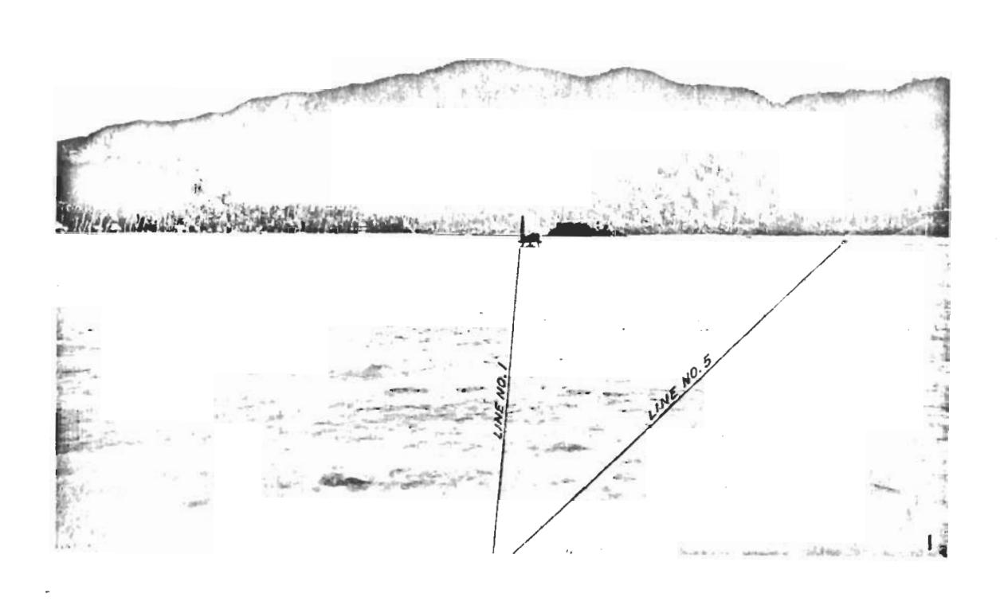

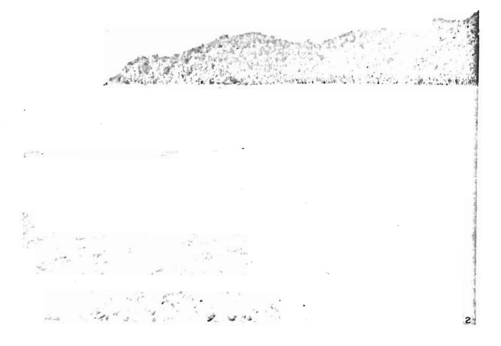

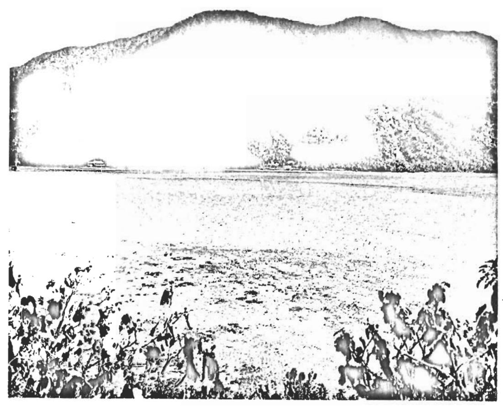

Fig. 3—View across reef from origin of line 2. Dark areas on outer portion of reef are occupied by living Sclerophytum confertum.

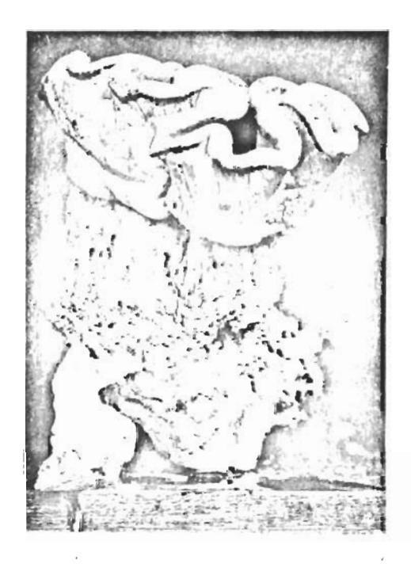

Fig. 4 A specimen of Sarcophytum latum in side view, natural size.

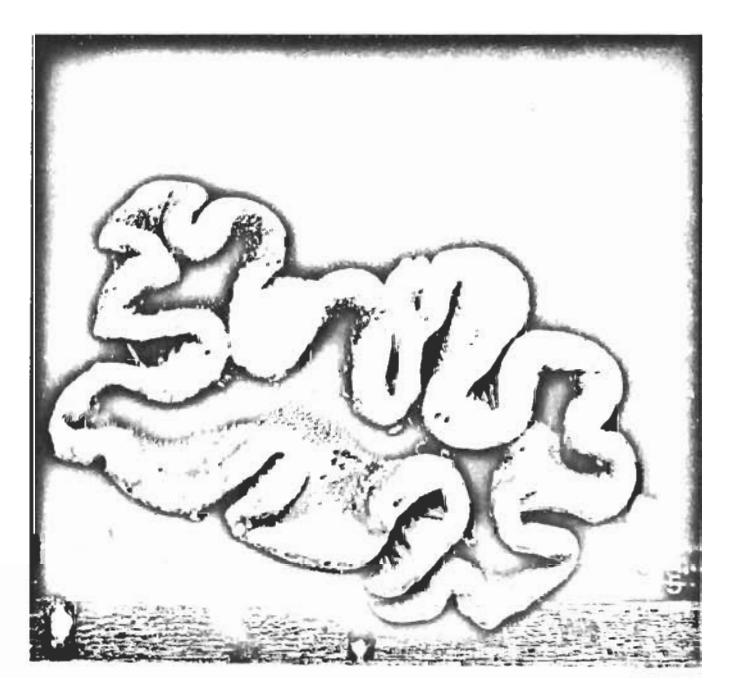

Fig. 5-The same specimen viewed from above, natural size.

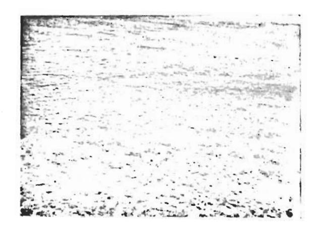

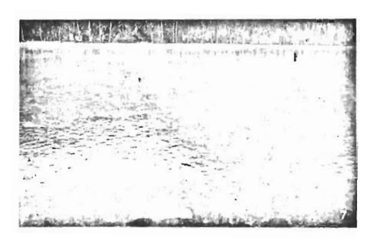

Figs. 6 and 7—Views from drill platform when set up for second boring at the 675-foot mark on line 1, looking westward to show proportion of reef surface covered by living Aleyonaria.

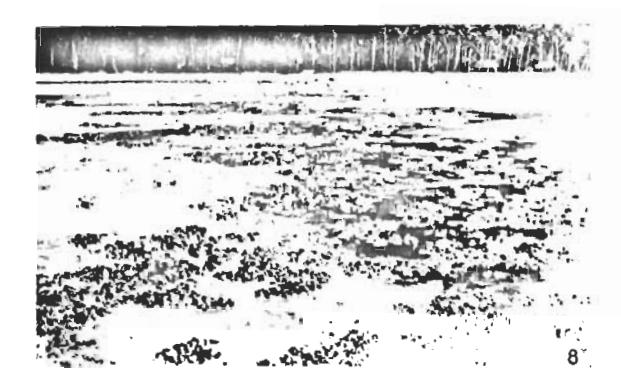

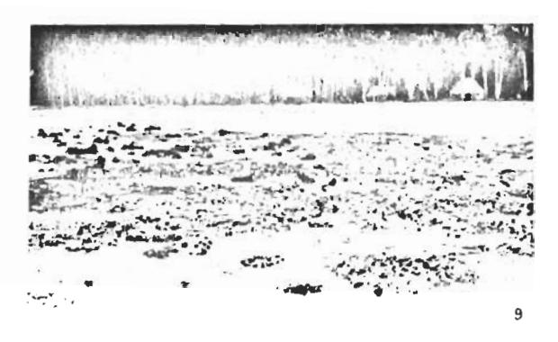

Figs. 8 and 9—Views across inshore border of Utelei South Reef at low tide to illustrate the growth habit of Sclerophytum confertum. The village of Utelei can be seen in background.

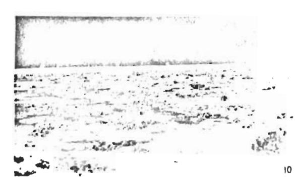

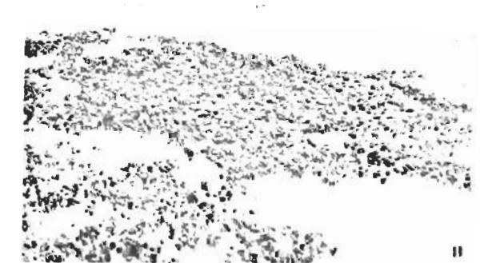

Figs. 10 and 11—Two views from drill platform, when set up at 925-foot mark on line 1, across reef to show character of Aleyonarian fauna.

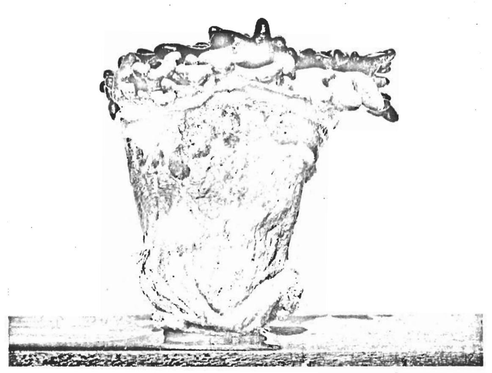

Fig. 12-Side view of a specimen of Sclerophytum densum (Whetlegge) natural size.

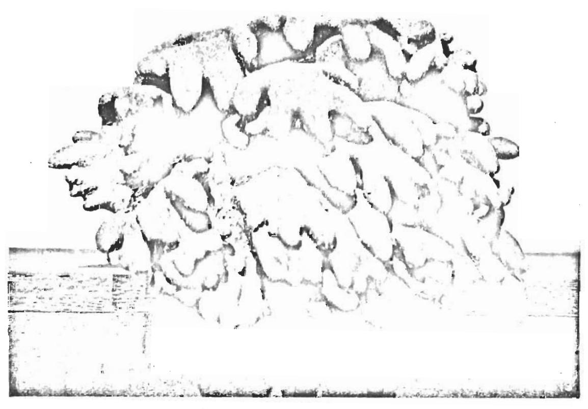

Fig. 13—Top view of a slightly larger specimen, natural size.

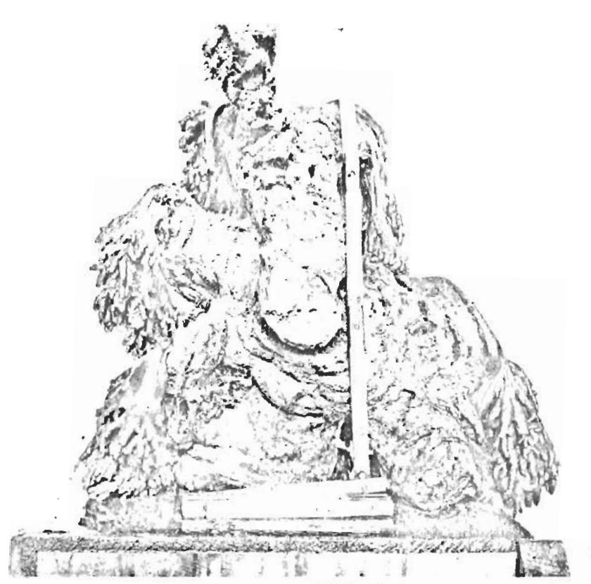

Fig. 14—View from below of a specimen of Sclerophytum confertum (Dana). This growth habit, with a large mass of living tissue and heavy underlying spicule mass attached by a slender "stalk" to the substratum occurs regularly when this species is found in shallow water, about one-third natural size.

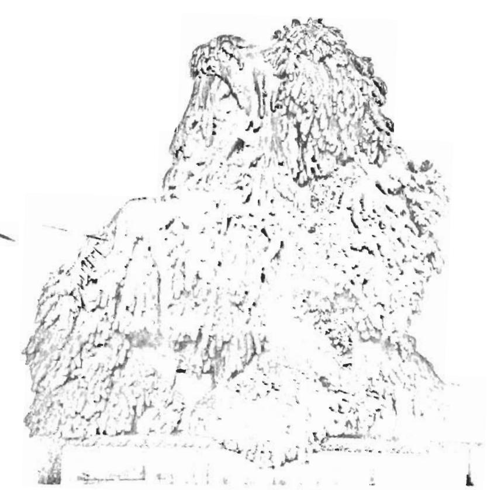

Fig. 15 Top view of the specimen shown in figure 14.

15

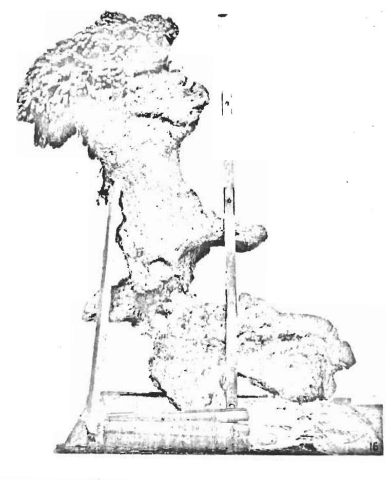

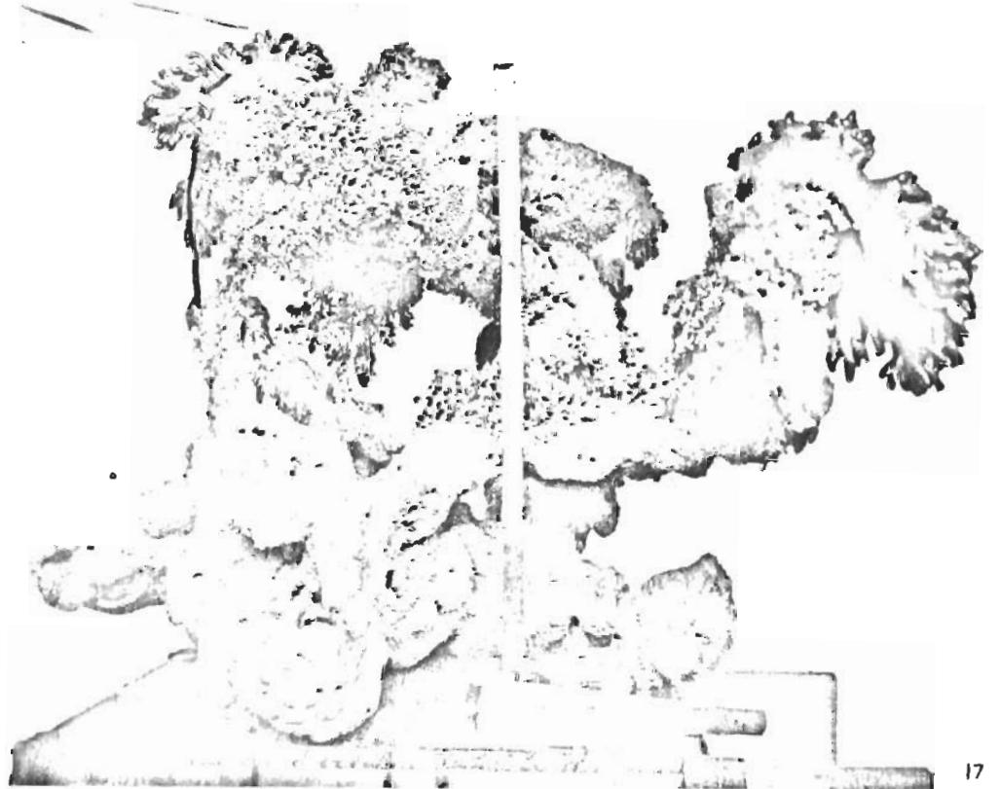

Figs. 16 and 17. Side views of two specimens of *Sclerophytum confectum* to illustrate its habit of growth in deeper water or where there occurs an abundance of shifting sand. About one-third natural size,

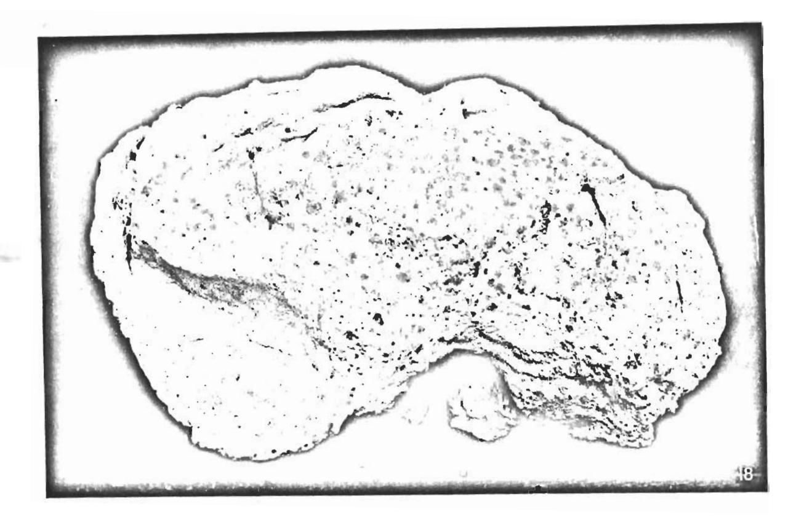

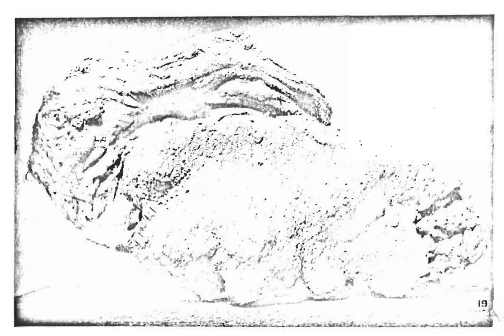

Figs. 18 and 19—Two specimens of spicule rock formed by Sclerophytum confertum. These almost scale-like structures are found commonly on shallow reefs and undoubtedly result from breaking from their attachment of specimens such as shown in figures 14 and 15, with subsequent smoothing off of sharp angle at point of separation.