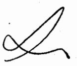
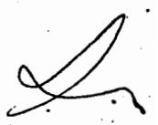
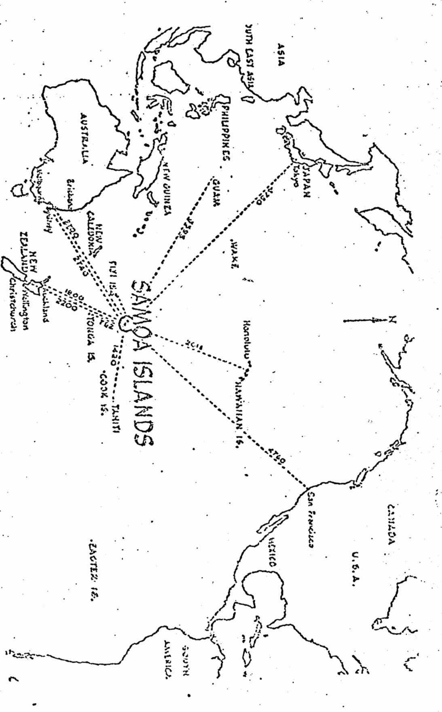
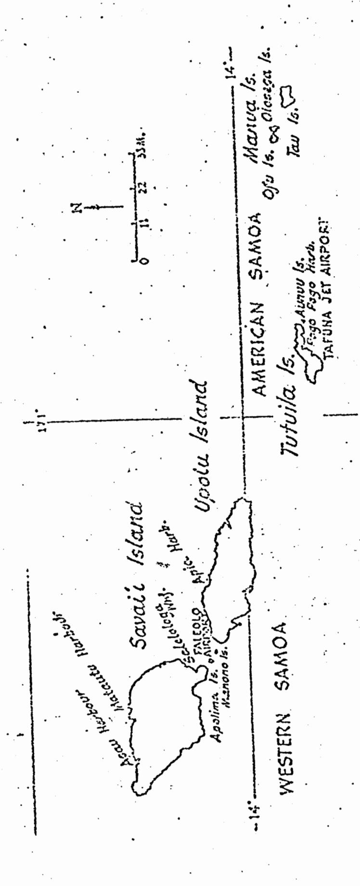
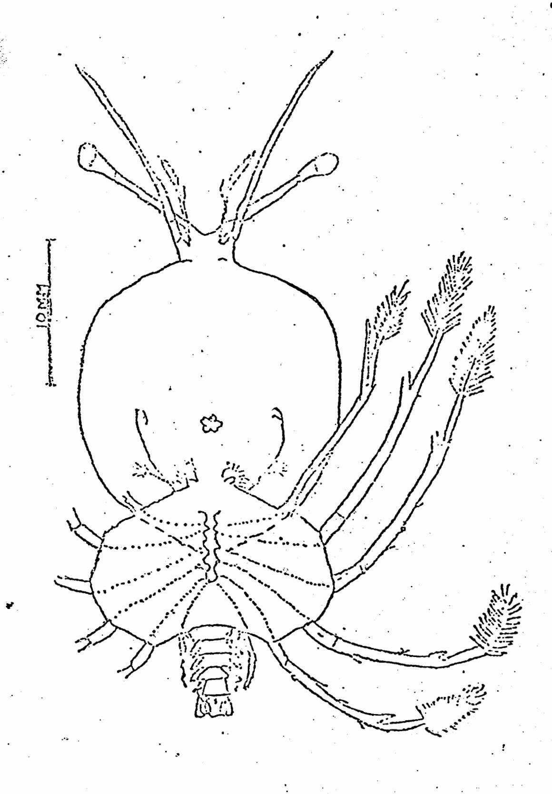
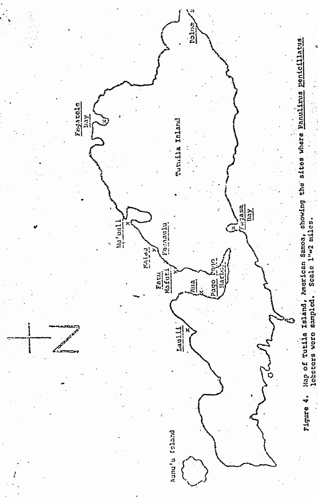
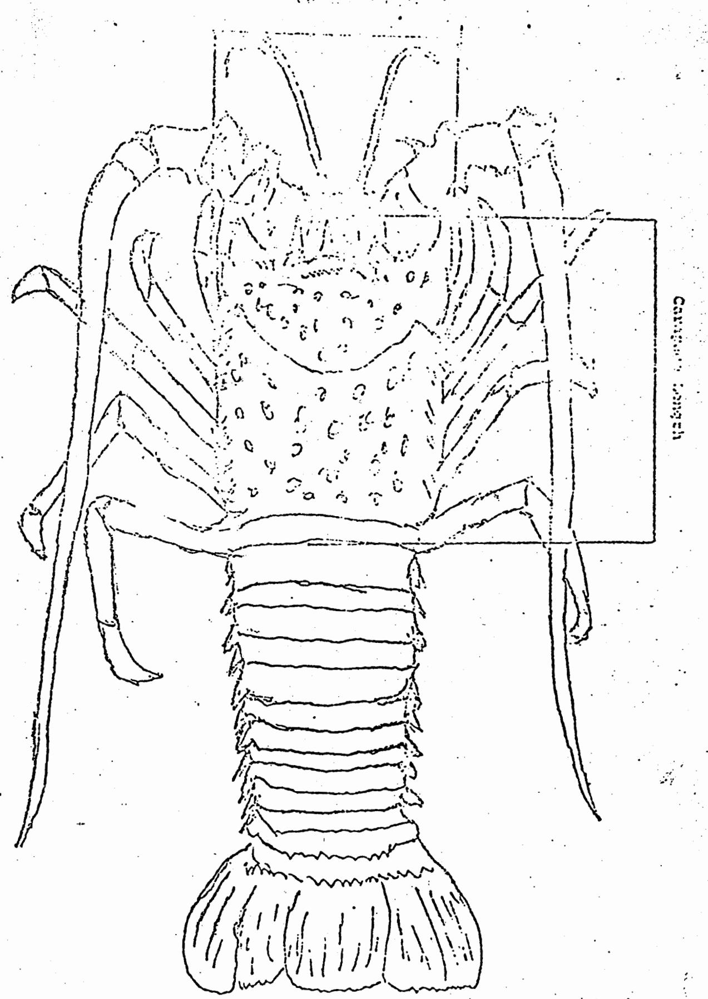
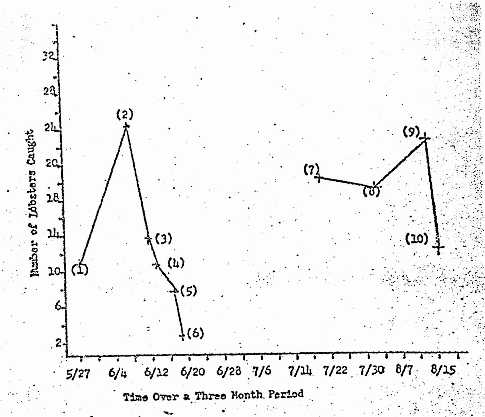
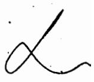

(137/

# THE SPINY LOBSTER PANULIRUS PENICILLATUS (OLIVER) IN, AMERICAN SAMOA

Y S

James R. 'Chambers Jr. and William E. Nunes

California Polytechnic State University
San Luis Obispo

| Grade:       | • | Date Submitted:       |           |
|--------------|---|-----------------------|-----------|
| Recorded by: |   | Professor's Signature | •         |
|              |   | •                     | 1 1 1 1 1 |

#### Table of Contents

|                 | •   |     |   |   |    |            |     |            |    | ÷ |   |   |    |   |     |    |   |   | . * |   |     |   | , i | • | , y.      |                                         | Pac        | ĮQ |
|-----------------|-----|-----|---|---|----|------------|-----|------------|----|---|---|---|----|---|-----|----|---|---|-----|---|-----|---|-----|---|-----------|-----------------------------------------|------------|----|
| List of Figures | •   | •   | • | • | •  | . <b>•</b> | . • | , <b>•</b> | .• | • | • | • | •  | • | • : | •  | • | • | •.  | • | •   | • | •   | • | •         |                                         | , <b>1</b> |    |
| ïist of Tables. | •   | •   | • | • | •  | •          | •   | •          | •  | • | • | • | .• | • | •   | •  | • | • | •   | • | •   | • | •   | • | •         | - A - A - A - A - A - A - A - A - A - A | ii.        |    |
| Acknowledgments |     |     |   |   |    |            |     |            |    |   |   |   |    |   |     |    |   |   |     |   | ٠.  |   |     | ٠ |           |                                         | A          | 12 |
| Introduction    | •   | •   | • | • | •  | •          | . • | •          | •  | • | • | • | •  | • | •   | •. | • | • |     | • | •   | • | •   | • | Ìe!! • | 1                                       | 1          | L  |
| Methods and Mat | eri | (a) | s | • | •  | •          | •   | •          | •  | • | • | • | •  | • | •   | •  | • | • | •   | • | •   | • | •   |   | •         | •                                       |            | 7  |
| Results         | •   | •.  | • | • | •. | •          | •   | •          | •  | • | • | ÷ | •  | • | ٠.  | •  | • | • | •   | • | • . | • | •   | • | •         | •                                       |            | 3  |
| Discussion      | •   | •   | • | • | •  | •          | •   | •          | •  | • | • | • | •  | • | •   | •  | • | • | •   | • | •   | • | •   | • | •         |                                         | . 18       | 3  |
| Summary         | •   | •   | • | • | •  | •          | •   | •          | ·  | • | • | • | •  | • | •   | •  | • | • | •   | • | •   | • | •   | • | •         |                                         | 2:         | 2  |
| References      |     |     |   |   |    |            | ,   |            |    |   |   |   |    |   |     |    |   |   |     |   |     |   |     |   | _         | 2                                       | 4-21       | 5  |

#### LIST OF FIGURES

- Generalized map of the Pacific Ocean showing the relative position of the Islands of Samoa.
- 2. Generalized map of Samoa showing the relative position of Tutuila Island in the Archipelago.
- 3. Phyllosoma larvae of Panulirus penicillatus at the tenth stage of development.
- 4. Map of Tutuila Island, American Samoa, showing the sites where Panulirus penicillatus lobsters were mampled. Scale 1" \* 2 miles.
- 5. Diagramatic sketch of <u>Panulirus penicillatus</u>, showing carapace length and with measurements.
- 6. Population recruitment of <u>Panulirus</u> <u>penicillatus</u> in <u>Pagasa Bay</u>, Tutuila Island, Samoa.

#### LIST OF TABLES

- 1. Sample Data Sheet.
- 2. Distribution of Panulirus penicillatus on Tutuila Island.
- 3. Berried and Tarred Condition and Month, in Female Panulirus penicillatus.
- 4. Carapace length of Berried and Tarred Female Panulirus penicillatus.
- 5. Moon Phase Correlation with Catch per Unit Effort.

1

#### Acknowledgements

We would like to express our appreciative thanks to the many people in Samoa who assisted us in our tour as Vista volunteers. In particular, to Commissioner Tu fele High Chief of Tau Island and Chief Missi of Ofu who offered their islands and warm hospitality to the Vista volunteers in our first three weeks of cultural and language orientation in Samoa. To our department director, Stan Swerdloff and the rest of the staff at Marine Resources, whose patience and help made possible our research operations.

To Dr. Tom Richards at Cal Poly State University, San Luis Obispo whose advice and wisdom helped greatly in the preparation of this manuscript, also our kind thanks.

 $\mathcal{L}$ 

## The Spiny Lobster, Panulirus penicillatus (Oliver) in American Samoa

#### Introduction '

The Samoan Islands are located at latitude 13° 26' south to 14° 22' south and from longitudes 168° 10' west to 17° 48' west (Figure 1). The six islands east of longitude 171° west constitute the American Samoan Islands (Figure 2). The Islands of American Samoa have been held as a possession by the United States since 1929 and are administered by the U. S. Department of Interior, with a governor appointed by the President of the U. S. (Encyclopedia Britannica 1964).

From May 1973 to March 1974, the Department of Marine Resources,

Government of American Samoa, undertook a project to determine the extent

of the island's lobster resources. Under the direction of Dr. Stanley

Swerdloff, department director, four Vista volunteers, James Chambers,

William Nunes, Gordon Yamasaki and Sam Lathem were assigned for a year

term with the department to study the biology of the local lobsters.

George (1972) reported Panulirus penicillatus and Parribacus caledonicus

to be local to the island. In addition to these two lobster specimens

of Panulirus femeristrica, previously not reported east of New Calidonia,

were taken. In this study information concerning the feasibility of es
tablishing a commercial lobster fishery for the islands was of prime

importance.

The spiny lobsters (Palinuridae) yield an annual harvest around the world of 80,000 tons (1.N., F.A.O. 1972). Panulirus is one of eight genera which make up the family Planuridae with 14 recognized species

Generalized map of the Pacific Ocean showing the relative position of the Intends of Sanou. Distances shown in atstute wiles.

Generalized map of Segon showing the relative position of Thtuila felend in the Archipelago. Figure 2.

4

(Holthuis 1946). Parribacus, belongs to the Scyllarid family and is commonly known as the "slipper" or "Lutterfly" lobster (George 1969).

Panulizus penicillates was originally described by Oliver in 1911 and is distinguished from other members of the genus by having four spanes on the dorsal surface between the antennae (Tinker 1965). It has an extremely wide distribution and occurs from East Africa up to the Red Sea, and through the Indian and Pacific Oceans including Hawaii (Johnson 1971). Through studies on the phyllosoma larvae, Johnson felt the wide distribution to be the result of its unique ability to endure long fransport in oceanic currents during the ten larval stages.

一方 はなる いまでは

Adult P. Penicillatus have a predilection for island habits, regarded by George (1959) as an ecological requirement for clear water and strong current and surf conditions. George (1972) further reported P. penicillatus to live in a truly oceanic position on the outer reef edges or channels which are subject to high energy water movement. Further, he correlates movements onto the reef at night with absence of moon and a tide height that supplies a flow of water across the reef flat. It is also probable, he states that larger males guard a "harem" of mixed sexes where shelter allows aggregation. DeBruin (1962) also found this species to be nocturnal in its habitat in Ceylon.

Reproduction in P. penicillatus is typical of the rest of the genus. Taken from Natthews (1951) and Lindberg (1955) the reproductive cycle is as follows. Fertilization occurs from sperm contained in tubules of a putty-like spermatophore. The spermatophore is produced internally in the male testis, and consists of a highly convoluted tube which contains the sperm and a putty-like matrix. This spermatophore is deposited by the male ventrally on the carapace of the female. At first the spermatophore is a light grey, later it turns to a black color. The presence of a spermatophore indicates what is called the "tarred" condition for the

female. The carred female may carry this spermatophore for several months before extruding her eggs and mechanically opening the spermatophore with pinchers on her fifth pair of walking legs. The sperm then fertilize the eggs as they are passed across the broken spermatophore. After fortilization the bright orange eggs are funneled through a tube made by the swimmerets which are filled up. The eggs attach together in a bundled mass and turn to a deep margon with later development. A female with eggs is said to be in the "berried" condition. The incubation time period has been reported by Lindberg (1955) to be about two months.

The everage brood size in P. interruptus females with a carapace length of 8 cm. was found to be 50,000 eggs (Wilson 1948, Lindberg 1955). Panuluris eggs hatch into leaflike larvae called phyllosoma and float in the plankton for a period of at least eight months (Johnson 1971). During this period the phyllosoma grow by a succession of molts or eced-yses. At least 10 phyllosoma stages of P. penicillatus have been identified by Johnson. Figure number 3 illustrates the final or tenth stage of larval development. This last stage in the plankton metamorphoses into a puerulus stage or post larval stage which begins to resemble the edult. The puerulus state is at first translucent like the phyllosoma larvae, and seeks the bottom where it will become pigmented and live its adult life (Johnson 1971).

As is typical of all crustaceans lobsters grow only after a molting period. The molting period for P. interruptus was reported by Lindberg (1955) to be followed by a 5-8 day period of shell hardening and an additional 2-3 day period until feeding resumes. Upon reaching a mature size an immature female reaches sexual maturity after one molt (Lindberg 1955).

Figure 3. Phyllosoma larvae of <u>Panulirus penicillatus</u> at the tenth stage of development. Taken from Johnson (1971).

moving into a depleted area from outside areas, and growth of smaller lobsters in the area (Bowen 1966). Based on growth rate research of members of the genus <u>Panulicus</u>, Lindberg (1955) reported an annual increase of 2.5 cm. in overall length. Tinker (1965) reported <u>P. penicillatus</u> in Hawaii to reach an overall length of 37 cm. in the larger animals. Carapace length is slightly less than half the overall length.

#### Methods and Materials

されるないでいていることにない

Several methods of lobster capture were employed, including day and night SCUEA diving, night snorkel diving, tangle nets and traps. Through our diving we studied behavior in the natural environment, obtained samples, and through a catch per unit effort had some figure of the availability or presence of lobsters. Recording the number of personnel, the hours diving and the take, we were able to come up with a per man-hour catch, which we have used in moon phase correlation, population distribution on the island and recruitment into an area after heavy take of lobsters.

Night snorkel diving over the reefs, during the high tide provided the most specimens of P. penicillatus. Divers were equipped with full snorkel gear; including masks, fins, snorkel, underwater lights, nylon collection bags and Hawaiian slings (three pronged spear). The underwater light provided a direct beam which mesmorized or temporarily blinded the lobster. Lobster eyes gleam when exposed to the light beam up to distances of 12 meters.

Standard SCURA was also employed in numerous exploratory daylight dives to familiarize ourselves to an area planned for a night dive.

Hight SCURA equipment was employed to obtain more prolonged deeper night

 $\angle \cdot \wedge$ 

dives and was used to determine lobster vertical stratification.

Experimental netting and trapping was initiated in an effort to test their efficiency in catching lobsters. The net was a 4-6 inch (10-15 cm.) bottom tangle net with a typical bottom lead line and top float line. Two types of traps were also used, the first was constructed of a 3 by 4 feet (90 by 122 cm.) square steel frame surrounded by a 1 inch (2.5 cm.) whre mesh, the other was built of plastic and was evoid in shape, approximately 4 feet long by 3 feet wide and 1 1/2 feet deep (122 cm. long, 90 cm. wide, and 45 cm. deep). In all trap work, fish heads served as pait.

Specimens were collected at random sites around the island of Tutuila. Figure 4 is a map showing the locations of the collection sites on Tutuila Island: Table 1 is a sample data sheet used in recording information obtained from the specimens collected. Data recorded included; date, water conditions, dive trap or net location, computed dive time, moon phase, personnel, the number of lobsters taken, sex, reproductive condition (female), carapace length and width, and special sector concerning habits, molts, and equipment used. Figure 5 is a diagrammatic sketch of Panulirus penicillatus, showing carapace length and the measurement areas.

#### Pasults

The distribution of <u>Panulirus penicillatus</u> as determined through random sample sites on Tutuila Island is shown in Table 2. Recorded are the collecting locations, sampling dives, total number of lobsters recovered, and mean catch per dive. The location of the collection sites is shown on Figure 4.

### Yable 1 . Sample Data Sheet

| Date_    | • '       | • · · | .•      |   | Poon Pi | ase                                                                                                                                                                                                                                                                                                                                                                                                                                                                                                                                                                                                                                                                                                                                                                                                                                                                                                                                                                                                                                                                                                                                                                                                                                                                                                                                                                                                                                                                                                                                                                                                                                                                                                                                                                                                                                                                                                                                                                                                                                                                                                                            |
|----------|-----------|-------|---------|---|---------|--------------------------------------------------------------------------------------------------------------------------------------------------------------------------------------------------------------------------------------------------------------------------------------------------------------------------------------------------------------------------------------------------------------------------------------------------------------------------------------------------------------------------------------------------------------------------------------------------------------------------------------------------------------------------------------------------------------------------------------------------------------------------------------------------------------------------------------------------------------------------------------------------------------------------------------------------------------------------------------------------------------------------------------------------------------------------------------------------------------------------------------------------------------------------------------------------------------------------------------------------------------------------------------------------------------------------------------------------------------------------------------------------------------------------------------------------------------------------------------------------------------------------------------------------------------------------------------------------------------------------------------------------------------------------------------------------------------------------------------------------------------------------------------------------------------------------------------------------------------------------------------------------------------------------------------------------------------------------------------------------------------------------------------------------------------------------------------------------------------------------------|
| Water    | Condition | ns    |         |   |         |                                                                                                                                                                                                                                                                                                                                                                                                                                                                                                                                                                                                                                                                                                                                                                                                                                                                                                                                                                                                                                                                                                                                                                                                                                                                                                                                                                                                                                                                                                                                                                                                                                                                                                                                                                                                                                                                                                                                                                                                                                                                                                                                |
| Dive     | Location_ |       |         |   | Parson  | el                                                                                                                                                                                                                                                                                                                                                                                                                                                                                                                                                                                                                                                                                                                                                                                                                                                                                                                                                                                                                                                                                                                                                                                                                                                                                                                                                                                                                                                                                                                                                                                                                                                                                                                                                                                                                                                                                                                                                                                                                                                                                                                             |
| · Dive · | Pime Star | £     |         |   |         |                                                                                                                                                                                                                                                                                                                                                                                                                                                                                                                                                                                                                                                                                                                                                                                                                                                                                                                                                                                                                                                                                                                                                                                                                                                                                                                                                                                                                                                                                                                                                                                                                                                                                                                                                                                                                                                                                                                                                                                                                                                                                                                                |
|          | rinis     |       |         |   | ;       |                                                                                                                                                                                                                                                                                                                                                                                                                                                                                                                                                                                                                                                                                                                                                                                                                                                                                                                                                                                                                                                                                                                                                                                                                                                                                                                                                                                                                                                                                                                                                                                                                                                                                                                                                                                                                                                                                                                                                                                                                                                                                                                                |
|          |           |       | •       |   |         |                                                                                                                                                                                                                                                                                                                                                                                                                                                                                                                                                                                                                                                                                                                                                                                                                                                                                                                                                                                                                                                                                                                                                                                                                                                                                                                                                                                                                                                                                                                                                                                                                                                                                                                                                                                                                                                                                                                                                                                                                                                                                                                                |
|          |           | . •   | •       | ¢ | •       |                                                                                                                                                                                                                                                                                                                                                                                                                                                                                                                                                                                                                                                                                                                                                                                                                                                                                                                                                                                                                                                                                                                                                                                                                                                                                                                                                                                                                                                                                                                                                                                                                                                                                                                                                                                                                                                                                                                                                                                                                                                                                                                                |
| Icbs:    | era Taken |       |         |   | Carepac | <u>e</u>                                                                                                                                                                                                                                                                                                                                                                                                                                                                                                                                                                                                                                                                                                                                                                                                                                                                                                                                                                                                                                                                                                                                                                                                                                                                                                                                                                                                                                                                                                                                                                                                                                                                                                                                                                                                                                                                                                                                                                                                                                                                                                                       |
| Male     | Female    | Tarr  | Aerried |   | length  | victh                                                                                                                                                                                                                                                                                                                                                                                                                                                                                                                                                                                                                                                                                                                                                                                                                                                                                                                                                                                                                                                                                                                                                                                                                                                                                                                                                                                                                                                                                                                                                                                                                                                                                                                                                                                                                                                                                                                                                                                                                                                                                                                          |
| 1        |           |       | ·       |   | ·       |                                                                                                                                                                                                                                                                                                                                                                                                                                                                                                                                                                                                                                                                                                                                                                                                                                                                                                                                                                                                                                                                                                                                                                                                                                                                                                                                                                                                                                                                                                                                                                                                                                                                                                                                                                                                                                                                                                                                                                                                                                                                                                                                |
| 2        |           | ٨     |         |   |         |                                                                                                                                                                                                                                                                                                                                                                                                                                                                                                                                                                                                                                                                                                                                                                                                                                                                                                                                                                                                                                                                                                                                                                                                                                                                                                                                                                                                                                                                                                                                                                                                                                                                                                                                                                                                                                                                                                                                                                                                                                                                                                                                |
| 3        |           |       |         | ٠ |         |                                                                                                                                                                                                                                                                                                                                                                                                                                                                                                                                                                                                                                                                                                                                                                                                                                                                                                                                                                                                                                                                                                                                                                                                                                                                                                                                                                                                                                                                                                                                                                                                                                                                                                                                                                                                                                                                                                                                                                                                                                                                                                                                |
| 4        |           |       | •       |   | _       |                                                                                                                                                                                                                                                                                                                                                                                                                                                                                                                                                                                                                                                                                                                                                                                                                                                                                                                                                                                                                                                                                                                                                                                                                                                                                                                                                                                                                                                                                                                                                                                                                                                                                                                                                                                                                                                                                                                                                                                                                                                                                                                                |
| 5        |           |       |         |   |         | Here is a second of the second of the second of the second of the second of the second of the second of the second of the second of the second of the second of the second of the second of the second of the second of the second of the second of the second of the second of the second of the second of the second of the second of the second of the second of the second of the second of the second of the second of the second of the second of the second of the second of the second of the second of the second of the second of the second of the second of the second of the second of the second of the second of the second of the second of the second of the second of the second of the second of the second of the second of the second of the second of the second of the second of the second of the second of the second of the second of the second of the second of the second of the second of the second of the second of the second of the second of the second of the second of the second of the second of the second of the second of the second of the second of the second of the second of the second of the second of the second of the second of the second of the second of the second of the second of the second of the second of the second of the second of the second of the second of the second of the second of the second of the second of the second of the second of the second of the second of the second of the second of the second of the second of the second of the second of the second of the second of the second of the second of the second of the second of the second of the second of the second of the second of the second of the second of the second of the second of the second of the second of the second of the second of the second of the second of the second of the second of the second of the second of the second of the second of the second of the second of the second of the second of the second of the second of the second of the second of the second of the second of the second of the second of the second of the second of the second |
| \$       |           |       |         |   |         |                                                                                                                                                                                                                                                                                                                                                                                                                                                                                                                                                                                                                                                                                                                                                                                                                                                                                                                                                                                                                                                                                                                                                                                                                                                                                                                                                                                                                                                                                                                                                                                                                                                                                                                                                                                                                                                                                                                                                                                                                                                                                                                                |
| 7        | •         | ·     |         | • |         |                                                                                                                                                                                                                                                                                                                                                                                                                                                                                                                                                                                                                                                                                                                                                                                                                                                                                                                                                                                                                                                                                                                                                                                                                                                                                                                                                                                                                                                                                                                                                                                                                                                                                                                                                                                                                                                                                                                                                                                                                                                                                                                                |
| 3        |           |       |         |   |         |                                                                                                                                                                                                                                                                                                                                                                                                                                                                                                                                                                                                                                                                                                                                                                                                                                                                                                                                                                                                                                                                                                                                                                                                                                                                                                                                                                                                                                                                                                                                                                                                                                                                                                                                                                                                                                                                                                                                                                                                                                                                                                                                |
| 9        |           |       |         |   |         |                                                                                                                                                                                                                                                                                                                                                                                                                                                                                                                                                                                                                                                                                                                                                                                                                                                                                                                                                                                                                                                                                                                                                                                                                                                                                                                                                                                                                                                                                                                                                                                                                                                                                                                                                                                                                                                                                                                                                                                                                                                                                                                                |
| 10       |           |       | -       |   |         |                                                                                                                                                                                                                                                                                                                                                                                                                                                                                                                                                                                                                                                                                                                                                                                                                                                                                                                                                                                                                                                                                                                                                                                                                                                                                                                                                                                                                                                                                                                                                                                                                                                                                                                                                                                                                                                                                                                                                                                                                                                                                                                                |
| 31       | ,         |       |         |   |         |                                                                                                                                                                                                                                                                                                                                                                                                                                                                                                                                                                                                                                                                                                                                                                                                                                                                                                                                                                                                                                                                                                                                                                                                                                                                                                                                                                                                                                                                                                                                                                                                                                                                                                                                                                                                                                                                                                                                                                                                                                                                                                                                |
|          |           |       |         |   |         | <del></del>                                                                                                                                                                                                                                                                                                                                                                                                                                                                                                                                                                                                                                                                                                                                                                                                                                                                                                                                                                                                                                                                                                                                                                                                                                                                                                                                                                                                                                                                                                                                                                                                                                                                                                                                                                                                                                                                                                                                                                                                                                                                                                                    |

Special Notes: (Includes habits, molts, equipment used, etc.)

Figure 5. Diagramatic sketch of <u>Parulirus penicillatus</u>, showing carapace and width measurement areas.

Table 2

Distribution of <u>Panulirus penicillatus</u>, on Tutila Island

| <u>location</u> | Sampling | Dive |         | Number ers Ren |  Mean Catch Per Dive |      |
|-----------------|----------|------|---------|-------------------|----------------------------|------|
| Polca           | 1        |      |         | 3                 | 3                          |      |
| Fagatele        | 2        | •    | •       | 21                | 10.5                       |      |
| Lua             | 11       | •    | : ··· • | 128               | 11.6                       |      |
| Fagaaulu        | 1        |      |         | 5                 | . 5                        |      |
| Lau'ulii        |          |      |         | 12                | 12                         |      |
| Matu'u          | 4        | ,    |         | 70                | 17.5                       |      |
| Fatu-mafuti     | . 2      |      |         | 15                | 7.5                        |      |
| Fagasa          | 13       |      |         | 157               | 12.1                       |      |
| Natauli         | <u> </u> |      |         | 29                | <u>29</u>                  | •    |
| Totals          | 36       |      | •       | 440               | 12/per                     | dive |

In an effort to more clearly define the biometric parameters of Panulitus penicillatus, a total of 440 specimens were taken during the 16 dives. These were measured for their carapace length and width. The average carapace length for males was 9.1 cm. and width was 6.6 cm. Pemales were smaller with an average length of 7.6 cm. and width of 5.6 cm. The male/female ratio was 221/199 statistically, indicating a 1:1 sex ratio.

To determine if spawning occurred year around, the berried and terred condition in females was recorded each month over an eleven month period. Table 3 lists by month, the number of dives, number of lobster collected, number and percent with tar, and number and percent with eggs. Females with tar do not necessarily have eggs, and vice versa. Many of the females with eggs in the later stages of incubation had no tar or tar reminants. Table 4 lists female carapace length, number examined, number and percent with tar, and number and percent berried. The minimum length observed with eggs was 5.0-5.4 cm. The minimum length observed with tar was 5.5-5.9 cm. After a size of 6.5 cm. is reached,

Of the 440 P. penicillatus collected only two were taken during the day on the exposed reef. This species was taken almost exclusively at night or during the day in dark caves.

paygen requirements for P. penicillatus are evidently high as all specimens were taken from areas of surge or strong currents. Even lobsters taken in caves were situated in places of highest water movement. Ammerous feeding lobster were seen to be completely exposed out of the water by receding waves.

Poeding P. penicillatus on Tutuila Island was observed to eat primarily, if not solely, algae. Stemach analysis confirmed this herbivorous

<u>L.</u>

Table 3

Berried and Tarred Condition and Month, in Female

Panulirus penicallatus

| Month      | No. of Dives | No. of Lobster | No. of Tar | Percent Tarred | No. Eggs | Percent Eggs |
|------------|--------------|----------------|---------------|-------------------|-------------|-----------------|
| January    | 2            | 13             | 5             | 38                | 5           | 38              |
| rebruary   | 2            | 4              | <b>o</b> .    | ∞ _               | 3           | 75              |
| March      | 2            | 16             | 3             | 19                | 9           |                 |
| April      |              | lqmsa off      | e taken       |                   |             |                 |
| Мау        | 1            | 4              | . 0           | co                | 2           | 50              |
| June       | 6            | 30             | 8             | 27                | 7.          | 22              |
| July       | 4            | 21.            |               | Data not          | recorde     | đ               |
| August     | 6            | 45             | 11            | 24                | 12          | 26              |
| September  | 3            | 29             | 3             | 10                | 10          | 34              |
| October    | 5            | ~ 21           | 5             | 24                | 7           | 33              |
| November ' | 3            | 24             | <b>7</b>      | 29                | 9           | 38              |
| December   | 2            | 13             | 2             | 15                | 9           | 69              |

Sample juzes are small, April ilate musing and Feb and May repent only 4 Colorles simpled.

 $\mathcal{L}$ 

Table 4

Carapace Length of Berried and Tarred Ecmales

| Carapace Lengt |     | Number With Tar | Percent Tarred | Number Berried | Percent Berried |
|----------------|-----|--------------------|-------------------|-------------------|--------------------|
| 95-99          | 4   | 2                  | 50                | . <b>o</b>        | . 0                |
| 90-94          | 2   | c                  | 0                 | 1                 | 50                 |
| 85-89          | 6   | 3                  | 50                | 2                 | 33                 |
| 80-84          | 22  | 8                  | 36                | 10                | 45                 |
| 75-79          | 40  | 9                  | 23                | 17                | 43                 |
| . 70-74        | _41 | 7                  | 17                | 20                | 49                 |
| 65-69          | 27  | 6.                 | 22                | 11                | 41                 |
| 60-64          | 36  | ?                  | 19                | 10                | 28                 |
| 55-59          | 14  | 1                  | <b>i</b> .        | 1                 | 7                  |
| 50-54          | 2   | 0                  | 0                 | 1                 | 50                 |
| 45-49          | 2   | 0                  | 0                 | 0 .               | 0                  |
| 40-45          | 0   | 0                  | 0                 | S                 | 0                  |
| Total          | 196 | 43                 | 224               | 73                | 373                |

1

diet. Traps baited with fish heads proved to catch no P. penicillatus, however, the traps did catch three specimens of P. femoristriga.

Fanulirus penicillatus was collected in shallow water with none taken deeper than 15 meters. Over 90% of all specimens were taken in less than 10 meters of water. Panulirus femoristriqa was found in waters from 10 meters to 33 meters. Parribacus calculonicus specimens were observed to be abundant and inhabit the shallow reef tops along with P. penicillatus.

When alarmed, P. penicillatus can be heard to produce a harsh, grating or creaking sound. This sound was detected underwater at distances up to 5 meters. We found the stridulating surfaces producing the sound to be located on the median basal segment of the antenae.

Movements over the reef were observed to be by walking locomotion.

Movement while foraging was with the body extended, when viewed from above and the caphalothorax dragging the tail behind. Sensory information from the foreground is provided by the eyes, antennae and the smaller antennules. Swimming was observed to be used purely as an escape mechanism. In a swimming escape, the tail, which is normally extended, expands its telson, uropods and swimmerets and with a quick flexion of the abdomen, the lobster pulls itself rapidly backward.

The activity of P. penicillatus at the four major moon phases was considered to be directly related to our catch per unit effort. From our data sheets, the number of divers was multiplied by the time spent in collection and divided by the number of lobsters caught to give a per man-hour catch. Table 5 lists each moon quarter, number of lobsters collected, man-hours diving, and lobsters caught per man-hour of diving. Lobsters caught per man-hour of diving is directly related to the number of lobsters out on the reef and can be directly related to the lunar

Moon Phase Correlation with Catch Per Unit Effort

| Quarter       | Number of Lobsters Collected | Man-hours Lobsters per per Dive Man-hour |
|---------------|---------------------------------|---------------------------------------------|
| Full Moon     | 110                             | 56.6 2.0                                    |
| Pirst Quarter | 156                             | 47.5 3.3                                    |
| Last Quarter  | 113                             | 36.5 3.1                                    |
| New Moon      | 61                              | 31.5 <u>1.9</u> Average 2.5                 |

 $\angle$ 

activity.

There was variance in the lobsters per man-hour catch during the four moon phases. A variance test was conducted to find the significance of the difference in figures. The calculated "F" ratio for the sample was computed to be .5. A 5% table value is 2.90 and a 1% table value is 4.29. It can be concluded that the moon phase has no real effect on the amount of lobster caught and therefore on lobster activity. The variance in our findings can be considered to be due to chance and other factors beyond our control.

Taking P. penicillatus in large numbers from Fagasa Bay, over a period of three months, we were able to gain an idea of the relative abundance and recruitment into the bay (Figure 6). A total of 131 lobsters were taken from this bay over the three month period. After dive. two, the population began a sharp drop in the number of lobster caught. Dive six was followed by a one month time lapse during which no lobster were taken from this bay. Dives 7-9 show a take of another 50 lobsters during a 28 day period followed by another sharp decline as indicated at dive ten.

#### Discussion

Tutuila island was found to provide an ideal habitat for P. penicillatus. The water is exceptionally clear, there is a fringing reef upon which lobster forage for algal cover, the reefs are subject to considerable wave and current action. Collection sites yielded more lobsters in inaccessable areas which were subject to stronger wave action and current, such as Nu'uuli, Matu'u and Lau'ullii. Much of our effort was concentrated in Aua and Fagasa, both protected with bays

Figure 6. Population recruitment of Panulirus penicillatus in Fagasa Bay, Tutuila Island Samoa. Dives 1-6 shows steady decrease in lobsters caught with continuous diving. Recruitment evidently occurred during the one month lapse between dives 6-7. Dive 10 again shows a population decline following continuous harvesting. A sustained yield harvest of 30 lobsters per month was proposed from this Bay based on sample harvesting.

and easily accessible by car or boat.

Paulirus Penicillatus inhabits the upper reef zones in areas of high oxygen content brought about by high water movement. This species is basically nocturnal in its habit, as DeBruin (1962) found for the species in Ceylon. Although P. penicillatus has been termed to be emnivorous (Tinker 1965), we found the species on Tutuila Island to be herbivorous, this proved to be a marked deterent to conventional trapping methods. Panulirus femoristriga found in deeper water is trapable, but due to the steep island shelf slope, we believe the numbers of this lobster to be limited. Our net and trap work with P. femoristriga showed this species to prefer deeper and quieter waters than P. penicillatus, and this seems to be in agreement with observations reported by George (1972).

Interesting to note with P. penicillatus, is the ability to endure wide salinity changes. Cur cave diving found the lobsters to congregate near a freshwater outflow. Further, the island is subject to large amounts of rainfall which has a definite effect on the salinity concentrations in the shallow reef waters. Dives during rainy nights, however, showed no decrease in lobster abundance.

contrary to George (1972), no male dominance over harems was observed. Panulirus penicillatus was found to aggregate in two's, three's and occasionally in numbers up to eight. Most large males were taken alone. Further, no correlation of lobster activity with moon phase as reported by George (1972) was observed. From Table 5, the catch per man-hour at different periods of the moon, superficially indicated a larger percentage of catch during the first and last quarters, over the new and full moon, but the validity of this data was rejected based on a simple "F" test.

Female P. pencillatus (Table 3) were observed to be reproductively active throughout the year. This information suggests that spawning occurs year round, a condition also observed by Chittleborough (1969), who found P. pencillatus phyllosoma larvae at all periods of the year, off the west coast of Australia.

Cut of 440 specimens of <u>P. penicillatus</u> collected, we found five animals with semi-hard shells indicating recent molting. These lobsters were found sporatically over the eleven month period. It appears there is no general molting period and <u>P. penicillatus like P. interruptus</u> has a molt followed by at least a one week period of inactivity.

Hinimum carapace length for reproductive females was from 5.0-5.4 cm. (Table 4). Using a carapace growth rate of 1.2 cm. per year (Lindberg 1955), minimum female reproductive age can be estimated to be at least 5 years. This age includes a two month incubation stage. (Lindberg 1955) and an eight month larval stage (Johnson 1971) also added into the overall age and length.

Lobster population recruitment was found to be rapid in Fagasa Bay (Figure 6). After harvesting, new lobsters came into the bay from outside of the bay where the coast is rougher and more inaccessible. It can be estimated from the graph, that recruitment into the .8 kilometer area of the reef is 30 lobsters per month:

We found the lobster to be a highly favored food item to the samoun people. A small fishery by the natives to catch the "ula" was already in existence when we began our research. The Samoan method is performed at night with the aid of a pressurized gas lantern and a lobster raft or "paopae" (Samoan canoe). One or two lanterns are tied to the bow of the paopae or to an "A" frame on a raft. One or two men push the raft or canoe along, while two or three others step

**-**

the leasters with their bare feet or spear them with a barbless state and sling while they walk along the reef. Once caught, lobsters placed in a box fastened to the raft or placed directly into the compos. These excursions on the reef are made at high tide on dark nights.

Masily accessible areas have in the past, and will no doubt in the future remain the most heavily fished areas of Samoa. Recruitment oill come from rougher, inaccessable areas away from villages. The population of P. penicillatus on Tutuila Island consequently has a buffer against over fishing. Based on this, no regulation on the introducer of lobster caught would seem necessary. However, berried females should not be taken by local fishermen to help insure future recruitment.

#### Immary

- Lo inhabit shallow reefs to a depth of 15 meters. Panulirus femoristriga was found to inhabit deeper waters of 10-35 meters and probably deeper.
- 2. Panulirus penicillatus is a herbivorous feeder and forages at night with the high tide on the surfaces of the fringing reef. No correlation between moon phase and lobster activity was found.
- 3. Locomotion is achieved by walking with strong legs, grasping the reef substrate. Swimming by flexions and extension of the tail is reserved for escape.
- 4. Males were larger than females with an average carapace length of 9.1 cm. and width of 6.6 cm. Females had an average carapace length of 7.6 cm. and width of 5.6 cm. The sex ratio was 1:1.
- 5. Mating was found to occur year around. From the literature

p. penicillatus has been found to have a two month incubation period followed by an eight month free floating larval stage after which the larva metamorphoses to look like the adult and settle to a reef bottom.

6. From the literature, a growth rate of 1.2 cm. per year can be estimated. Lobsters grow by molts which are followed by a period of inactivity which lasts at least seven days. A female reaches maturity between 5.0 and 5.5 cm., at this size she is about five years old.

7. The most heavily fished areas are those by villages and near protected bays. Recruitment to these areas takes place from outer inaccessable reefs and points, and juvenile growth. This provides a natural buffer for the island against over fishing the lobster stock. Local fishermen should release berried females, if caught, to insure sufficient larvae in the future.

#### References

- Amon. 1970. Measures to Protect Rock Lobsters in Western Australia. Fishing News Intern. 9; 35-47.
- Backus, Jack. 1961. Observations on the Growth Rate of the Spiny Lobster. California Dept. Fish Game. 46; 177-161.
- Borges, Gercilde. 1965. Determination of Biometric Parameters of Panulirus argus. Bel. Estud. Pesca. 4; 3-11.
- Bowen. 1966. Preliminary Assessment of Stocks of the Western Australia Crayfish, Panulirus cygnus. Australian J. Mar. Freshwater Res. 17; 93-121.
- Chittleborough and Thomas. 1969. Larval Ecology of the Western Australian Marine Crayfish. Australian J. of Mar. Freshwater Res. 20; 199-223.
- DeBruin, G. H. P. 1962. Spiny Lobsters on Ceylon. Pub. Dept. Fish Ceylon. Bull. No. 14; 1-33.
- Emcyclopedia Sritannica. 1964. The Samoan Islands. Vol 19; 921-922.
- Food and Agriculture Organization of the United Nations. 1972. Atlas of the Living Resources of the Seas. Dept. Fisheries. Rome.
- George, R. W. 1969. Natural Distribution and Speciation of Marine Animals. J. Royal Soc. West Australia. 52; 33-40.
- 1972. South Pacific Islands Rock Lobster Resources.
  U.N., F.A.O. South Pac. Is. Development Agency. Pages 1-8.
- Holthuis, L.B. 1945. The Decapoda and Macura of the Snellius Expedition. Temminckia. 7; 1-178.
- Johnson, Martin. 1968. Palinurid Phyllosoma Larvae from the Hawaiian Archipelage (Palinuridae). Crustanceana Supp. 2; 60-70.
- 1971. The Palinurid and Scyllarid Lobster of the Tropical
  Eastern Pacific and Their Distribution as Related to the Prevailing
  Hydrography. Bull. Scripps Inst. Oceanogr. Univ. Calif. 19; 1-36.
- Lindberg, R.G. 1955. Growth, Population Dynamics and Field Behavior in the Spiny Lobsters <u>Panulirus</u> interruptus. Univ. Calif. Pub. Zeel. 59; 157-248.
- Matthews, D. 1951. The Origin, Development and Nature of the Spermatophoric Mass of the Spiny Lobster, Panulirus penicillatus. Pac. Sci. 5; 359-371.

Riethmaier, Gregory. 1973. Samoa. Collins Bros. Inc. Auckland.

Tinker, Spencer. 1965. <u>Pacific Crustacea</u>. Charles Tuttle Co. Japan. Page 38.

Wilson, Robert. 1948.. Review of the Southern California Spiny Lobster Pishery California Dept. Pish Game. 34; 71-80.