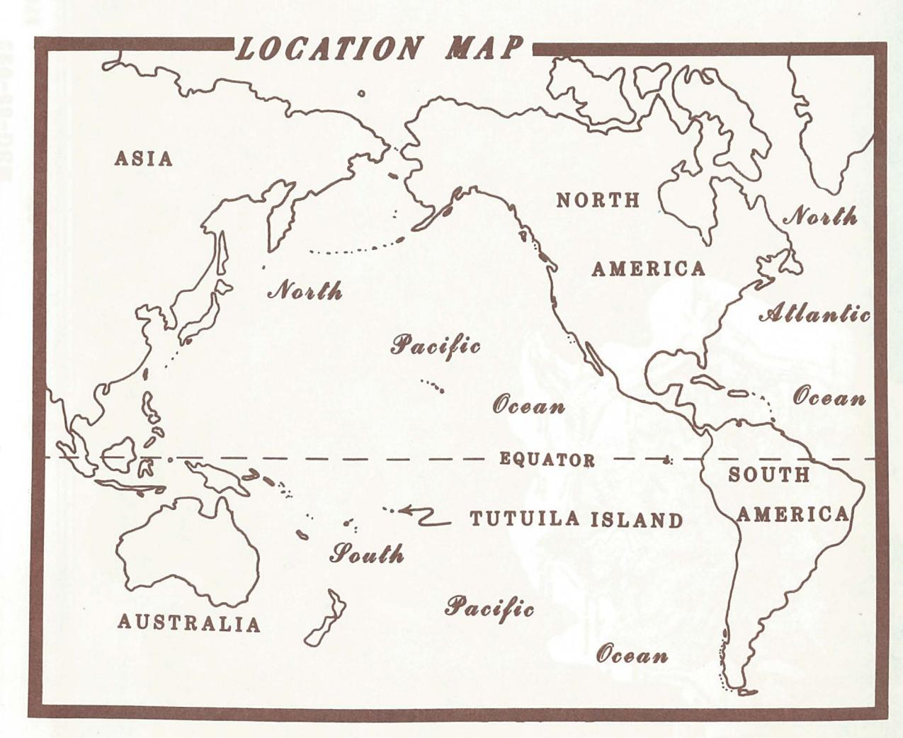
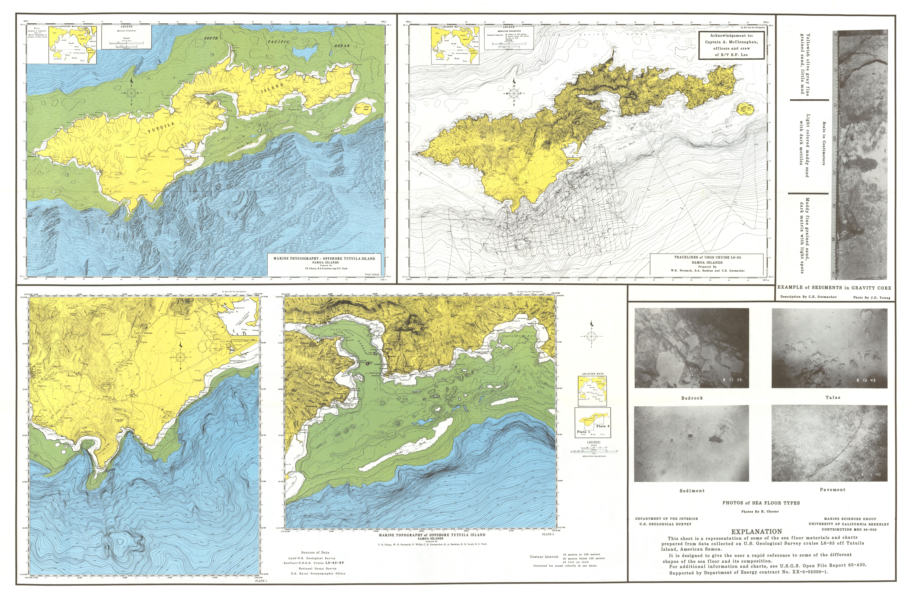
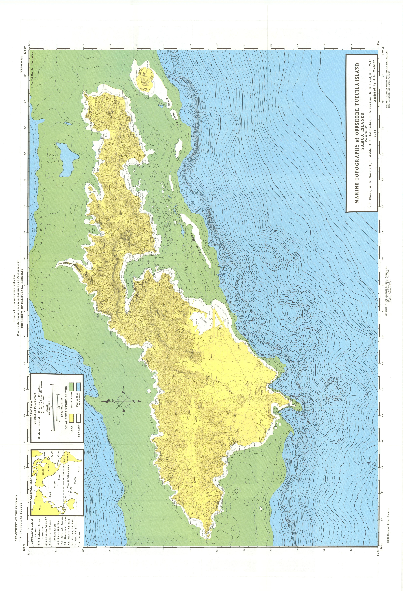

MAP AND CHART SERIES MCH068 1988

## Marine Topography of Offshore Tutuila Island Samoa Islands

Prepared by

T. E. Chase, W. R. Normark, P. Wilde, C. E. Gutmacher B. A. Seekins, K. E. Lund, and S. C. Vath Assisted by J. A. Wahler

