Contents lists available at [ScienceDirect](http://www.sciencedirect.com/science/journal/00344257)

# Remote Sensing of Environment

journal homepage: [www.elsevier.com/locate/rse](https://www.elsevier.com/locate/rse)


# Fluid lensing and machine learning for centimeter-resolution airborne assessment of coral reefs in American Samoa


Ved Chirayath[a](#page-0-0),[∗](#page-0-1) , Ron Instrella[b](#page-0-2)

- <span id="page-0-0"></span><sup>a</sup> Director and Research Scientist, Laboratory for Advanced Sensing, Earth Science Division, NASA Ames Research Center, Moffett Field, CA, 94305, USA
- <span id="page-0-2"></span><sup>b</sup> Research Engineer, Laboratory for Advanced Sensing, Earth Science Division, NASA Ames Research Center, Moffett Field, CA, 94305, USA

## ARTICLE INFO

Keywords: Coral reefs Fluid lensing Supervised machine learning Airborne remote sensing Habitat mapping American Samoa

#### ABSTRACT

A novel NASA remote sensing technique, airborne fluid lensing, has enabled cm-resolution multispectral 3D remote sensing of aquatic systems, without adverse refractive distortions from ocean waves. In 2013, a dronebased airborne fluid lensing campaign conducted over the coral reef of Ofu Island, American Samoa, revealed complex 3D morphological, ecological, and bathymetric diversity at the cm-scale over a regional area. In this paper, we develop and validate supervised machine learning algorithm products tailored for accurate automated segmentation of coral reefs using airborne fluid lensing multispectral 3D imagery. Results show that airborne fluid lensing can significantly improve the accuracy of coral habitat mapping using remote sensing.

The machine learning algorithm is based on multidimensional naïve-Bayes maximum a posteriori (MAP) estimation. Provided a user-selected training subset of 3D multispectral images, comprising ~1% of the total dataset, the algorithm separates living structure from nonliving structure and segments the coral reef into four distinct morphological classes – branching coral, mounding coral, basalt rock, and sand. The user-selected training data and algorithm classification results are created and verified, respectively, with sub-cm-resolution ground-truth maps, manually generated from extensive in-situ mapping, underwater gigapixel photogrammetry, and visual inspection of the 3D dataset with subject matter experts.

The algorithm generates 3D cm-resolution data products such as living structure and morphology distribution for the Ofu Island coral reef ecosystem with 95% and 92% accuracy, respectively. By comparison, classification of m-resolution remote sensing imagery, representative of the effective spatial resolution of commonly-used airborne and spaceborne aquatic remote sensing instruments subject to ocean wave distortion, typically produces data products with 68% accuracy. These results suggest existing methodologies may not resolve coral reef ecosystems in sufficient detail for accurate determination of percent cover of living structure and morphology breakdown.

The methods presented here offer a new remote sensing approach enabling repeatable quantitative ecosystem assessment of aquatic systems, independent of ocean wave distortion and sea state. Aquatic remote sensing imagery, free from refractive distortion, appears necessary for accurate and quantitative health assessment capabilities for coral reef ecosystems at the cm-scale, over regional areas. The accurate and automated determination of percent cover and morphology distribution at cm-resolution may lead to a significantly improved understanding of reef ecosystem dynamics and responses in a rapidly-changing global climate.

# 1. Introduction

As one of the most biologically complex and diverse ecosystems among aquatic systems, coral reefs are not only of great ecological value [\(Moberg and Folke, 1999\)](#page-13-0), but also of economic value [\(Costanza](#page-12-0) [et al., 1997\)](#page-12-0). Reef ecosystems mitigate changes in our planet's biosphere through a diversity and density of species few other ecosystems possess ([Ridgwell and Zeebe, 2005](#page-13-1)). At present, however, coral reefs are experiencing one of most significant changes in their history on Earth, triggered by unprecedented anthropogenic pressures, warming seas, ocean acidification, sea level rise, habitat destruction, agricultural runoff, and overfishing, among other contributing stressors ([Bellwood](#page-12-1) [et al., 2004\)](#page-12-1). Our understanding of the impacts of these rapidly-changing pressures is limited by a severe lack of global baseline habitat mapping data and knowledge of reef makeup over regional areas and short timescales. With typical coral growth rates of ~1 cm per year,

<span id="page-0-1"></span><sup>∗</sup> Corresponding author. NASA Ames Research Center, Mailstop 232-22, Moffett Field, CA, 94305, USA. E-mail address: [ved.c@nasa.gov](mailto:ved.c@nasa.gov) (V. Chirayath).

effective spatial resolutions at the cm-scale are needed to assess change ([Chirayath and Earle, 2016](#page-12-2); [Edinger et al., 2000;](#page-12-3) [Storlazzi et al., 2016](#page-13-2)). Such data are vital for adequate management of these aquatic resources ([Bellwood et al., 2004\)](#page-12-1), and accurate assessment and quantification of reef ecosystem status [\(Andréfouët et al., 2003](#page-12-4)) over time.

The development of high-resolution coral reef remote sensing technologies and habitat mapping algorithms is needed for effective conservation of these systems. A comparison can be made from the correlation between persistent observation, remote sensing, and mapping of terrestrial ecosystems, such as rainforests, and the consequent adoption of forest protection measures to combat the effects of deforestation, among other stressors, by natural and anthropogenic factors ([Nagendra et al., 2013\)](#page-13-3). High-resolution habitat mapping from new remote sensing systems and mapping algorithms significantly enhanced our understanding of terrestrial ecosystem dynamics and their consequences for human civilization and the environment [\(Hansen et al.,](#page-12-5) [2013;](#page-12-5) [Wulder et al., 2004\)](#page-13-4) – a robust analog for marine systems is still needed.

Mapping of coral reef ecosystems provides a snapshot through characterization of the abundance and distribution of living coral, overall structure, morphology, rugosity, complexity, and benthic floor type. Coral reef maps can be used as a baseline for documentation and detection of change in percent cover of living coral, spatial distribution, and overall assessment of the ecosystem. However, the air-water interface above coral reefs introduces several complexities to both the remote sensing of such environments and the development of robust habitat mapping algorithms, as discussed in the following section. Over the past few decades, mapping efforts have utilized a variety of input data from observations by divers to airborne and spaceborne multispectral remote sensing [\(Caras et al., 2017](#page-12-6); [Miller et al., 2005](#page-13-5)), underwater 2D and 3D photogrammetry [\(Beijbom et al., 2015](#page-12-7); [Burns](#page-12-8) [et al., 2015](#page-12-8); [Storlazzi et al., 2016](#page-13-2)), and unoccupied aerial systems (UAS), or drones [\(Casella et al., 2016;](#page-12-9) [Levy et al., 2018\)](#page-13-6). Each of these sensing techniques resolves coral reef maps at different resolutions to gain insight into variations over short distances, such as species diversity, rugosity, and morphology while utilizing regional data from airborne and spaceborne remote sensing to extrapolate reef status over regional areas. As such, accurate coral reef mapping at high resolution over regional areas has been limited to availability of simultaneous insitu sensing data concurrent with high-resolution multispectral remote sensing data.

#### 1.1. Remote sensing & mapping of coral reefs

Benthic mapping of coral reefs is essential to assess the current status of reefs, successfully inform mitigation strategies for ecosystem stressors, establish a time-series to document ecosystem change, and prioritize management and protection efforts ([Monaco et al., 2012](#page-13-7)). Percent living cover, or the percentage of a coral reef occupied by living coral from a two-dimensional nadir perspective, and its variation over time has been shown to be a strong indicator of coral reef health ([Joyce](#page-13-8) et [al., 2013](#page-13-8); [Scopélitis et al., 2011](#page-13-9)). Coral reef morphology, which describes the size and shape of a reef and coral genera, is similarly useful for understanding the abundance and distribution of living coral, as well as characterizing physical parameters of a reef such as rugosity, and surface area to volume ratio, among others ([Goodman et al., 2013](#page-12-10)). Morphology mapping data, coupled with bathymetry models of a reef are extensively used in physical oceanographic models of flow over reef systems (Monismith, 2007), improving models of coastal zones, flood zones, pollutant transport, sedimentation processes [\(Lara et al., 2016\)](#page-13-10) and the spatial extent of harmful algal blooms ([Aleynik et al., 2016](#page-12-11)). Such models are often coupled to flow simulations and used to inform how best to protect the coastal cities and infrastructure from storm events (Spurgeon, 1992).

Benthic mapping of coral reefs using remote sensing data has been performed at multiple spatial scales with manual, semi-automated, and fully-automated segmentation algorithms [\(Goodman et al., 2013\)](#page-12-10). On global scales, Landsat, Terra and Aqua spacecraft have been used with manual segmentation and semi-automated pixel-based methods to classify terrestrial targets ([Hansen et al., 2010\)](#page-12-12), as well as coral reefs into reef/non-reef regions ([Andréfouët et al., 2006;](#page-12-13) [Rowlands et al.,](#page-13-11) [2012\)](#page-13-11) with effective spatial resolutions of ~30m-10km. On regional scales, benthic assemblages can be discriminated using high-resolution commercial imagery from spacecraft such as IKONOS, WorldView-2, and QuickBird ([Maeder et al., 2002](#page-13-12); [Mishra et al., 2006;](#page-13-13) [Reshitnyk](#page-13-14) [et al., 2014\)](#page-13-14) with effective spatial resolutions of ~3 m. Airborne multispectral and full-waveform LiDAR remote sensing instruments with effective spatial resolutions of ~2 m have been shown to effectively distinguish between regions containing predominantly healthy or unhealthy coral as well as characterize coral reef morphologies, benthic habitat types, and water column constituents using a number of segmentation algorithms [\(Collin et al., 2011](#page-12-14); [Collin and Planes, 2012](#page-12-15); [Hochberg and Atkinson, 2003](#page-12-16)).

Surface wave distortion and optical attenuation from water can significantly affect the effective spatial resolution and signal-to-noise properties of aquatic remote sensing systems depending on ambient surface, water column, and downwelling irradiance conditions ([Chirayath and Earle, 2016\)](#page-12-2). For coral reef systems, ocean wave distortion can limit the effective spatial resolution of low-altitude airborne remote sensing imagers to 1–5 m, severely impairing observations of fine-scale coral reef features [\(Chirayath, 2016\)](#page-12-17), and often necessitating underwater survey methods to access higher resolutions spatial scales. At spatial scales of ~1 cm, however, reefs exhibit pronounced heterogeneity, rapidly differing in texture, morphology, color, and depth. Presently, performing such imaging and benthic mapping at sub-meter and centimeter resolutions has relied on underwater survey techniques including photogrammetry, acoustic sensing, and visual inspection of transects. As such, benthic mapping algorithms used for lower resolution datasets can be overly sensitive to the large variances at the cmscale and ultimately poorly suited for characterizing the benthic environment at fine scales.

Understanding conservation parameters [\(Horning et al., 2010\)](#page-12-18) over large datasets with increased spatial and temporal resolution, multispectral imagery, and bathymetry, motivates the development of unique computational toolboxes and remote sensing analysis techniques. Fortunately, growth in computational power and storage capacity, concurrent with the development of improved machine learning algorithms and semi-automated classification methods [\(Saul and Purkis,](#page-13-15) [2015\)](#page-13-15), suggest that the conservation of marine ecosystems will be significantly enhanced by the acquisition of cm-scale remote sensing data.

#### 1.2. Novel contributions

In this paper, we develop and validate supervised machine learning algorithm products for automated segmentation of coral reefs using airborne fluid lensing multispectral 3D imagery. The algorithm generates a 3D cm-resolution habitat map delineating the spatial distribution of living coral structure and morphology in for the Ofu Island coral reef ecosystem. The data products of the algorithm are validated through error analysis with in-situ ground-truth mapping and underwater photogrammetry from the surveyed areas. The results from this study demonstrate quantitively that cm-scale airborne fluid lensing provides a significant improvement in coral classification accuracy as compared to remote sensing methods that do not correct for refractive distortions.

## 1.3. Airborne fluid lensing and 3D Cm-scale aquatic remote sensing without ocean wave distortion

The air-water interface above coral reefs introduces significant complexities to sustained remote sensing of such environments. The optical interaction of light with fluids is a complex phenomenon

<span id="page-2-0"></span>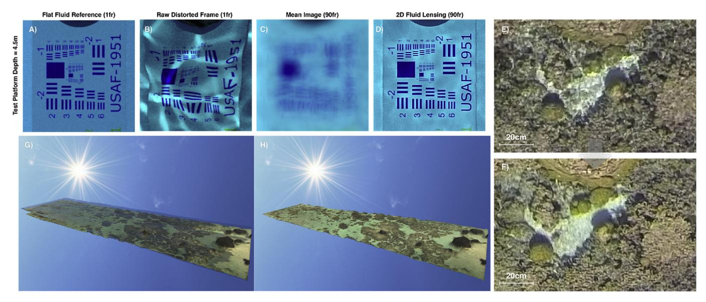

Fig. 1. - Fluid Lensing Algorithm Results. The general fluid lensing algorithm is used to process high frame rate multispectral imagery to remove refractive distortions from ocean waves and enhance the signal to noise ratio (SNR) of benthic images. (A–D) present imagery from the fluid lensing test pool showing removal of ocean wave related refractive distortion and signal enhancement of a USAF test target at a depth of 4.5 m. The flat fluid reference (A) shows target under flat fluid conditions over a 1 s integration time. The raw distorted frame (B) shows target under typical ocean wave conditions for shallow marine systems. Mean image (C) is the 90 frame average of raw frames over 1 s of integration time. The 2D fluid lensing result (D) uses these same 90 frames to successfully recover the test target with an effective 0.25 cm spatial resolution and uses caustics to enhance SNR. Airborne fluid lensing is used to survey aquatic system with UAVs. Raw airborne imagery from a 2013 airborne field test in American Samoa is shown in (E), with the 2D fluid lensing result from 90 frames in (F). Cm-scale 3D remote sensing of coral reef in American Samoa with fluid distortion (G), and without fluid distortion as processed using the 3D airborne fluid lensing algorithm (H). From PhD thesis, [Chirayath](#page-12-17) [\(2016\)](#page-12-17).

impacting the remote sensing of more than 71% of Earth's surface. As of 2019, the authors know of only one global and localized refractioncorrected remote sensing imaging technology, airborne fluid lensing. At present, no alternative remote sensing technologies are known to the authors that are able to robustly remotely sense underwater objects at the cm-scale or finer at depths of 1–30 m due to surface wave distortion and the strong attenuation of light in the water column, in stark contrast to modern terrestrial remote sensing capabilities. As a consequence, our ability to accurately assess the status and health of aquatic systems is severely impaired.

As visible light interacts with aquatic surface waves, time-dependent nonlinear optical aberrations appear, forming intense caustic bands of light on the seafloor, and producing refractive lensing that magnifies and demagnifies underwater objects. [Fig. 1](#page-2-0) B, E, and C display these effects over a test target and coral reef [\(Chirayath, 2016](#page-12-17)). extensively explores this phenomenon in the context of ocean waves, the ocean wave fluid lensing phenomenon, and develops and validates a novel high-resolution aquatic remote sensing technique for imaging through ocean waves called the airborne fluid lensing algorithm. Airborne fluid lensing introduces concepts of caustic-derived bathymetry and fluid lensing lenslet homography to not only remove refractive distortions over aquatic targets, but also determine depth, 3D structure, and enhance the signal to noise ratio and effective spatial resolution of imagery by exploiting caustics and magnifying wave events. Airborne fluid lensing typically requires full-frame multispectral (at least RGB bands) imagery at ~100 Hz with concurrent sun angle and telemetry data for successful reconstructions of aquatic systems.

Previously, airborne 2D fluid lensing was validated using full-physics supercomputer simulations as well as a number of airborne field campaigns over coral reef environments ([Chirayath, 2016](#page-12-17); [Chirayath](#page-12-2) [and Earle, 2016\)](#page-12-2). [Fig. 1](#page-2-0) D, F, and H show fluid lensing results demonstrating multispectral imaging of test targets in depths up to 4.5 m at a resolution of at least 0.25 cm versus a raw fluid-distorted frame with a resolution less than 25 cm. These results show the application of fluid lensing to addressing the surface wave distortion and optical absorption challenges posed by aquatic remote sensing.

Most recently, airborne fluid lensing was developed into the dedicated NASA FluidCam 1 & 2 instruments, enabling cm-resolution multispectral 3D airborne remote sensing of aquatic systems from small unmanned aerial vehicles (sUAV) ([Chirayath, 2016\)](#page-12-17) and other remote sensing platforms, opening the possibility to autonomously survey swaths of coral at extremely fine spatial scales over areas tens of square kilometers in extent.

This study utilizes airborne fluid lensing data products from a 2013 airborne field campaign in American Samoa ([Chirayath and Earle,](#page-12-2) [2016\)](#page-12-2). Fluid lensing dataset products for this study consist of cm-scale refraction-corrected 3D remote sensing imagery in three spectral bands, red (R), green (G), and blue (B). 2D data products consist of refractioncorrected, georectified RGB orthomosaics in GeoTIFF and KMZ formats. 3D data consist of depth elevation models in GeoTIFF format as well as point clouds, meshes, and textured 3D models in OBJ and FBX formats. Datasets are available for public download [\(NASA Ames Laboratory for](#page-13-16) [Advanced Sensing, 2016\)](#page-13-16).

#### 1.4. 3D aquatic ecosystem assessment

Prior research applying machine learning approaches to 3D multispectral datasets, similar to those produced by airborne fluid lensing, but captured underwater at the ~1 cm-1m scale, shows that fine-scale 3D imagery [\(Burns et al., 2015\)](#page-12-8) and 2D imagery [\(Beijbom et al., 2015\)](#page-12-7) affords significant improvements in the accuracy and delineation of reef rugosity and morphology classification as well ecological assessment, such as the automated annotation of benthic surveys and identification of coral species. To date, no algorithms have been developed specifically to leverage airborne fluid lensing 3D multispectral datasets.

While airborne fluid lensing campaigns afford a unique cm-resolution 3D perspective of reef systems, offering the potential for high-resolution coral reef habitat mapping, the 3D image data generated regularly exceed multiple terabytes in size. Consequently, access, analysis, and processing of cm-resolution 3D imagery for reef assessment and

<span id="page-3-0"></span>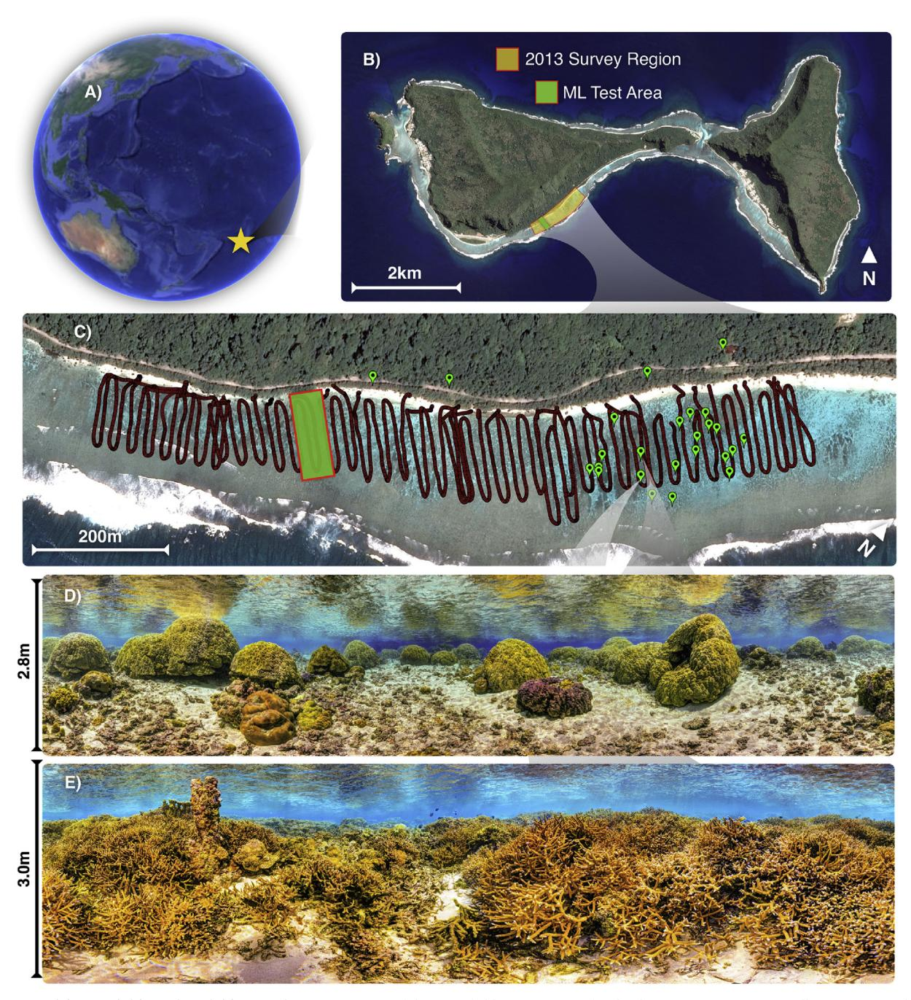

Figs. 2. –2013 Airborne Fluid Lensing Field Campaign. (A) Location of the 2013 field campaign in Ofu Island, American Samoa. (B) Full survey area indicated in yellow and spans an area of approximately 1 km2 . Area used in study for manual segmentation, testing, and validation of automated machine learning (ML) segmentation indicated in green and is ~25 m × 100 m in area. (C) Combined sUAV GPS data from airborne survey shown in red. Terrestrial and underwater photogrammetry locations indicated by green points in select locations. These data were used with airborne imagery for pixel-based manual four-class morphology segmentation, and two-class living versus nonliving segmentation. (D) Sample underwater photogrammetry used for manual segmentation of airborne fluid lensing data, exhibiting predominantly mounding coral morphology. (E) Sample underwater photogrammetry used for manual segmentation of airborne fluid lensing data, exhibiting predominantly branching coral morphology. (For interpretation of the references to color in this figure legend, the reader is referred to the Web version of this article.)

manual habitat mapping has remained limited. This motivates the development of an automated approach to coral reef habitat mapping for airborne fluid lensing datasets.

#### 1.5. Machine learning for coral reef mapping

Machine learning has extensively been used to classify aquatic remote sensing data into benthic habitat maps [\(Lary et al., 2016](#page-13-17); [Mumby](#page-13-18) [et al., 2004\)](#page-13-18)and can be generally separated into two classes – unsupervised and supervised machine learning.

In unsupervised machine learning, algorithms find groupings and patterns within datasets, either based on clustering algorithms, such as k-means ([Hartigan and Wong, 1979](#page-12-19)), or dimensionality reduction, such as principle component analysis ([Bishop, 2006](#page-12-20)). Segmentation results using unsupervised machine learning can assist in revealing otherwise unknown groupings or patterns in a dataset. However, unsupervised machine learning segmentation results may or may not correspond to the type of desired groups, such as coral living/non-living cover

<span id="page-4-0"></span>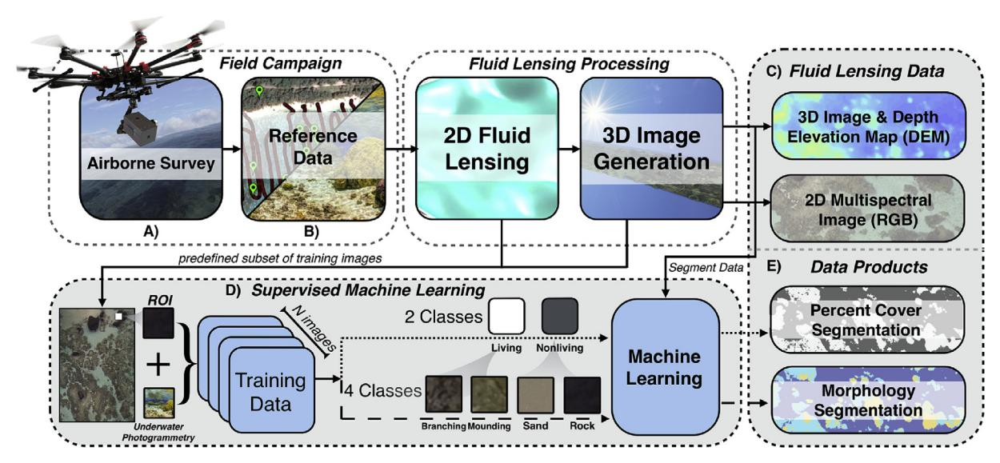

Fig. 3. - Airborne Fluid Lensing and Machine Learning Classification Algorithm Methodology. (A) Airborne fluid lensing data captured from sUAV. (B) fluid lensing removes ocean wave distortion and increases instrument SNR and effective spatial resolution by exploiting refractive lenslets. (C) A cm-resolution 3D multispectral image is created. 2D orthorectified RGB image and DEM generated. (D) Approximately 1% of data from (C) are manually trained and classified into reef morphology classes of branching coral, mounding coral, sand, and rock. A supervised machine learning algorithm (MAP estimation) using 3D (RGB) and 4D (RGB + DEM) training data is used to segment entire survey area in ML test area. (E) Final automated segmentation results are compared to a manually segmented reference map for error quantification and algorithm product validation.

classification, or even the number of desired segmentation classes. Further, quantifying the error of unsupervised machine learning outputs relies on direct comparison to a manually segmented and validated ground truth dataset. As input dataset dimensionality increases, such as with hyperspectral remote sensing instruments, algorithm segmentation behavior can be non-intuitive.

For this study, we employ supervised machine learning for multiclass classification using training data from each output class. In supervised machine learning, algorithms rely on manually provided training data, such as a database of reference examples of particular coral morphologies, to segment a larger, unclassified dataset. Supervised algorithms can be broadly classified into one of three models – geometric, probabilistic or logical [\(Flach, 2012](#page-12-21)), and include methods such as naïve-Bayes and support vector machines (SVM) ([Cortes and Vapnik, 1995](#page-12-22)), among others. SVM methods achieved regional coral discrimination accuracies as high as 93% on multispectral WorldView-2 imagery with effective spatial resolutions of ~2 m ([Collin](#page-12-15) [and Planes, 2012\)](#page-12-15) using a pre-defined set of N-dimensional features to characterize training data. In many supervised learning approaches, the amount of training data, as well as the criteria through which they are chosen, directly affects the outcome of a classification method. For applications involving aquatic systems, particularly coral reefs, training data should capture all the defining characteristics of a particular class, such as branching coral, while minimizing structural outliers and redundancy. A crucial advantage of an approach that requires validated and manually segmented data as part of the algorithm is that generalized and experimental classification error can be rigorously quantified, such as with a confusion matrix or contingency table [\(Beijbom et al.,](#page-12-23) [2012\)](#page-12-23).

In this paper, we implement a probabilistic naïve-Bayes supervised model and focus on the implementation of a supervised multi-class algorithm developed specifically for an efficient and accurate automated approach to segmenting cm-resolution 3D multispectral imagery from airborne fluid lensing data. Multi-class segmentation of coral reefs over regional areas has been demonstrated using 4m-resolution multispectral satellite remote sensing for four to fifteen benthic morphology classes ([Andréfouët et al., 2003](#page-12-4)) while statistical image processing has been shown to effectively quantify binary indicators such as living versus nonliving cover of coral ([Joyce et al., 2013\)](#page-13-8). The method presented here examines both two-class and four-class thematic maps of an interrogated region of interest within a coral reef.

# 2. Methods

We implemented a supervised machine learning algorithm through a probabilistic naïve-Bayes-based method for automated segmentation of cm-resolution 3D multispectral imagery generated by airborne fluid lensing. Publicly available airborne fluid lensing datasets and groundtruth data (reference data) from a 2013 field campaign conducted over the coral reef of Ofu Island, American Samoa are used for algorithm input, training, and validation purposes (Chirayath [and Earle, 2016](#page-12-2); [NASA Ames Laboratory for Advanced Sensing, 2016\)](#page-13-16).

The algorithm is designed to produce two data products from the 3D imagery. The first product is a two-class living versus nonliving structure map. This map is used to derive percent cover, defined as the ratio of living structure, e.g. Porites and Acropora coral genera and turf algae, to non-living structure, representative of depauperate environments, e.g. basalt rock, sand, and bleached coral, in a 2D orthorectified image. The second product, coral reef morphology, segments reef morphology into four distinct classes of branching coral, mounding coral, rock, and sand. The products of the algorithm are validated through error analysis with in situ ground-truth mapping and underwater photogrammetry of the surveyed areas from the 2013 campaign. 3D classification is achieved by masking 2D results over 3D bathymetry model.

#### 2.1. Airborne fluid lensing American Samoa field campaign & dataset

The survey region and flight transects from the 2013 campaign are shown in [Fig. 2](#page-3-0) and include in situ underwater photogrammetry and manual habitat mapping survey locations indicated in green. Flight transects represent the path of a sUAV survey with an airborne fluid lensing payload. Airborne fluid lensing outputs, namely a 2D and 3D multispectral image, depth elevation, or bathymetry model (DEM), and georeference data, are the primary data used for testing the algorithm. A 25 m by 125 m section of the 2013 airborne fluid lensing dataset, the green area inscribed in [Fig. 2](#page-3-0)C, are used as test data throughout this work. The 2D image size for this ML test area comprises 3000 × 13600 pixels with an effective spatial resolution of ~1cm/pixel. In situ habitat

<span id="page-5-0"></span>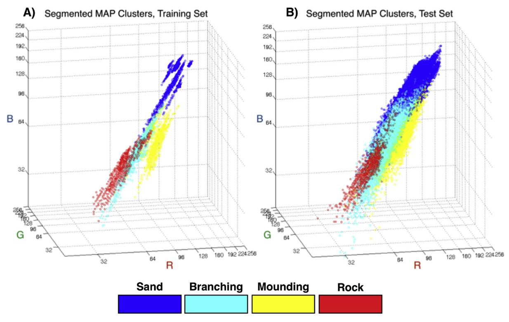

Fig. 4. - Supervised Machine Learning Classification Algorithm using 3D (RGB) MAP Segmentation. (A) The training database data are plotted and colored according to their morphological class in RGB space. Here, the training database data show some clustering behavior in RGB space and are used in MAP estimation to determine segmentation of test data. MAP segmentation compares test data within a bin to the training database and assigns these points to a class. (B) Here, the test data are segmented and colored according to the MAP segmentation algorithm and plotted in RGB space. A complex clustering in RGB space is observed for these segmented data and follows the training database in shape, as expected for a MAP-segmentation-based approach. 4D MAP segmentation, with RGB and DEM data, is similarly performed in four dimensions, but difficult to visualize. The methodology presented here is expandable to n-dimensions for higher-dimensional data, such as additional color bands and hyperspectral data. (For interpretation of the references to color in this figure legend, the reader is referred to the Web version of this article.)

mapping data from underwater maps and manual segmentations into mounding coral, branching coral, rock, sand, living structure, and nonliving structure classes were used to form a reference map. This map is used to quantify the accuracy of automated segmentation and classification from airborne fluid lensing data using the machine learning algorithm. An illustrated outline of the data pipeline used in this study, summarizing input data source and products, is shown in [Fig. 3](#page-4-0).

#### 2.2. Ground truth reference map creation through manual segmentation

The spatial distribution of living versus nonliving cover and coral reef morphology are validated through error analysis with in situ habitat mapping and underwater photogrammetry from surveyed areas in the 2013 field campaign. Manual segmentation is performed over a 41 megapixel 2D orthorectified RGB color image of the survey area from the airborne fluid lensing dataset at a scale of ~1cm/pixel. In the 2013 field campaign, extensive underwater surveys were performed to validate 2D and 3D data generated by airborne fluid lensing. High-resolution mm-resolution underwater panoramas were taken throughout survey regions, as shown in [Fig. 2D](#page-3-0) and E, and compared to fluid lensing reconstructions for reference map generation. Reference map pixels were mapped to the four morphological classes manually by qualitative observation and pixel-based median averaging of individual classifications performed by M. Dick, T. Bieri, A. Pelos, and V. Chirayath using the 2013 airborne fluid lensing data concurrent with in situ underwater photogrammetric survey data. All reference map data and test data are publicly available online [\(NASA Ames Laboratory for](#page-13-16) [Advanced Sensing, 2016\)](#page-13-16).

Per-pixel visual inspection of the image and comparison to

underwater panoramas is used to verify classes. A two-class manual segmentation map is generated as a superclass from the four-class benthic map, wherein branching coral and mounding coral are classified as living structure and rock, and sand are classified as nonliving structure. The manual four-class segmentation map is shown in [Fig. 6D](#page-7-0), where blue represents sand, constituting carbonate sediment and silicate mineral grain, red designates rock, chiefly basalt rock, yellow denotes mounding coral, such as Porites, and teal corresponds to branching coral, such as Acropora. The two-class superclass map of nonliving and living structure is designated in black and white, respectively.

## 2.3. Supervised machine learning algorithm for automated percent coral cover & coral morphology segmentation

Unlike geometric unsupervised models, such as k-means, support vector machines, or logical models, such as decision trees, or conditional rules, this class of Bayesian-based probabilistic algorithm uses a designated set of training data to gather information about the underlying behavior of a system. Support Vector Machines, a commonly used predictive model in machine learning studies, are applicable to datasets containing classes that are nearly linearly separable, and segmentations that require binary classification ([Cortes and Vapnik, 1995\)](#page-12-22). There are promising steps forward in improving multi-class SVM learning models ([Hsu and Chih-Jen Lin, 2003\)](#page-12-24), although this limitation, coupled with the relative computational efficiency of probabilistic models, ultimately makes a supervised naïve-Bayes predictive algorithm a well-suited choice for achieving the efficient and accurate multi-class classification pursued in this study.

Fig. 3 presents an overview of the supervised machine learning approached used. Airborne fluid lensing 3D image data are combined with multidimensional maximum a posteriori (MAP) estimation to distinguish four distinct coral reef morphologies. This automated process is aided by a pre-classified subset of manually segmented training images, called the *training set*, consisting of approximately 1% of the total dataset size. The training set consists of a random distribution of ten 100px by 100px regions of interest as determined by our script that are then manually classified by the dominant morphology present into the four classes of interest from the reference map. The training set for this study is available in the supplemental data.

MAP estimation classifies 3D test data pixels based on normalized RGB color values and depth information from the training set, and is governed by the following equation:

```
y_{MAP} = arg_Y \max P(Y|X) = arg_Y \max P(X|Y)P(Y)
```

where  $y_{MAP} \in Y$ , Y is the examined class, X is the set of observed values from the training set and  $\max P(Y|X)$  is the maximum a posteriori probability.

Both the training set and test data are plotted in 3D RGB space and in 4D RGB + DEM space. The space is subdivided into either  $16^3$  (RGB) or  $16^4$  (RGB + DEM) equally spaced bins. Each bin is assigned to one of  $N_y$  classes, determined using the normalized quantity of training set data of a particular class that falls within it. Unidentified query pixels from the test data are similarly binned based on color value and relative depth and are assigned to the majority class of the corresponding bin. The majority class maximizes the conditional probability P(Y|X) and determines the class of each query pixel from test data (Fig. 4).

A description of the classification algorithm, including all associated governing equations, parameters and variables, is outlined in pseudocode in Fig. 5, where:

Y = set of identifier classes X = training set

```
Naive-Bayes Maximum a Posteriori (MAP) Estimation
  //Appropriate training set in n-dimensional space
  001 for each classifier y_o \in Y
         for each element x_{n_o y_o} \in \{x_{1,y_o}, ..., x_{N_x,y_o}\}
                //find the closest bin l_{train} = \underset{b}{\operatorname{argmin}} |b - x_{n_o y_o}|
  005
                //update the bin score
                c_{l,y_0} = c_{l,y_0} + 1
  //Classify the test set
  007 for each element x_o \in x_{test}
  008 //find the closest bin
  009
           l_{test} = \operatorname{argmin}_{b} |b - x_o|
           //extract the majority classifier
y_{MAP} = \underset{y}{\operatorname{argmax}}(c_l(y))
//assign classifier to test element
  012
            assign class y_{MAP} to \hat{x}_{ref}
```

Fig. 5. - Automated Coral Reef Segmentation Algorithm using a Naïve-Bayes MAP Estimator. This pseudocode outlines the supervised machine learning algorithm used for automated four-class and two-class coral reef segmentation, based on a MAP estimation methodology. User-provided n-dimensional training data, the training database, determine the boundaries and regions assigned to a particular classifier given a user-defined bin number. In this study, a user classifies 1% of the test data for the training database. The number of bins divides the n-dimensional space into as many equally sized regions. Then, unclassified test data is mapped to a classifier region within this space for all test data. The algorithm is highly parallelized as bin size can be iteratively subdivided.

 $x_{test} = unclassified test data$  b = bin location in RGB or RGB + DEM space

 $l = index \ of \ the \ closest \ bin \ C = bin \ scores$ 

 $N_b = number of identifier bins N_y = |Y|$ 

 $N_{\rm r}$  = number of elements in each training set class

**X** contains the color values of each element in the training set which is separated into  $N_y$  identifier classes. **C** tallies the number of training set elements that are assigned to each bin, and the column that contains the maximum value of any row  $\mathbf{c}_i$  determines the class of elements in  $x_{test}$ . If c(y) maps the training class index y to its associated bin score in  $\mathbf{c}_i$ , then the assigned class can be expressed as argmax c(y). Unclassified

pixels from the test data,  $x_{test}$  are binned based on their corresponding color and relative depth value, and are assigned a class based on pixels with similar values from the training set X, with the resulting classification estimate denoted as  $\hat{x}_{ref}$ . Pixels are only guaranteed to be classified if the bin contains training set data. Any unclassified bins, caused either by a small amount of training set data or small bin size, are assigned to one of the existing classes by default, which are defined in this study as nonliving structure and sand for two-class and four-class morphology segmentation, respectively.

$$C = \begin{bmatrix} c_{11} & \cdots & c_{1N_y} \\ \vdots & \ddots & \vdots \\ c_{N_b1} & \cdots & c_{N_bN_y} \end{bmatrix} = \begin{bmatrix} c_1 \\ \vdots \\ c_{N_b} \end{bmatrix}$$

$$X = \begin{bmatrix} x_{11} & \cdots & x_{1N_y} \\ \vdots & \ddots & \vdots \\ x_{N_x1} & \cdots & x_{N_xN_y} \end{bmatrix}, \quad x_{test} = \{x_1, \ x_2, ..., x_{N_x, test}\}$$

Using this approach, the total number of output classes is predefined and the training set must be manually provided through reference data. The training set determines the most probable coral reef segmentation class within an interrogated region of interest of the test data. Processed across all the test data, this algorithm produces a four-class coral reef morphology map.

The coral reef studied here exhibits distinct morphological and visual features, such as color variations, shape, size, and structure, which lends itself to classifiers that are easily separable in both three-dimensional and four-dimensional space (Fig. 4). The manually classified training set data (Fig. 4A) and corresponding test data (Fig. 4B) are plotted in RGB color space, where pixels of a particular class are illustrated as colored clusters corresponding to their class.

## 2.4. Experimental and generalized classification error assessment

The use of an automated machine learning algorithm for classification of high-resolution coral reef imagery requires robust error metrics for quantifying its ability to generate accurate segmentation results, particularly compared to those made by experts in the field. This necessitates the generation of manually segmented reference maps created in conjunction with contemporaneous in situ underwater surveys and photogrammetry, which are often unavailable for remotely sensed coral reefs. This study has access to concurrent datasets from airborne fluid lensing and underwater surveys, which were used to generate the reference map discussed earlier in Fig. 6D. This manually segmented reference map is used to perform a pixel-by-pixel comparison between the algorithm output results and the reference map,  $x_{ref}$ . The L1 error,  $S_{L1\,Error}$ , is calculated for both the living structure and coral reef morphology data products, generating a map of experimental error such that:

$$S_{L1 Error} = \sum_{i=1}^{n} |x_{ref,i} - \hat{x}_{ref,i}|$$

<span id="page-7-0"></span>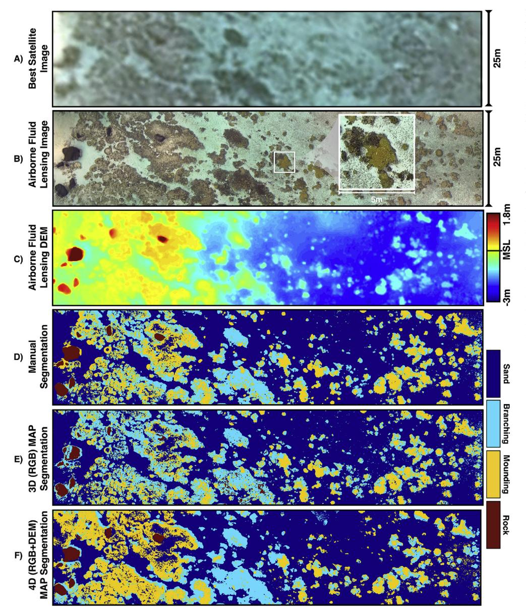

Fig. 6. -Automated Coral Reef Morphology Classification. (A) Highestresolution publicly-available image of survey area captured June 2015 from Pleiades-1A satellite with 0.5 m effective spatial resolution. (B) Airborne fluid lensing 2D orthorectified image as captured from sUAV in August 2013 airborne field campaign with 0.5-3 cm effective spatial resolution. (C) Airborne fluid lensing 3D image converted to 2D bathymetry model (depth elevation model, DEM) with 3-5 cm effective spatial resolution. (D) Manually segmented reference man based on underwater photogrammetry, in situ survey data and visual inspection of (B) and (C). (E) Supervised machine learning algorithm classification result using 3D (RGB) test data with training set size equivalent to ~1% of test data size. The result segments the coral reef into four distinct morphological classes: branching coral, mounding coral, rock, and sand. (F) Supervised machine learning algorithm classification result using 4D (RGB + DEM) test data and same training set as (E).

Both the experimental and generalized error were calculated as a means for quantifying classifier performance. To determine the generalized classifier error, test data from regions corresponding to the manually segmented images from the training set are reclassified. In other words, let  $x_{test} \triangleq X_{raw}$ , where  $X_{raw}$  contains the original pixel values in the training set, and perform automated classification on  $x_{test}$  using lines 007–013 from Fig. 5. The resulting reclassified set  $\hat{X}$ , and the generalized error,  $S_{generalized}$ , is defined as the L1-norm of this result such that:

$$S_{generalized} = \sum_{i=1}^{n} |X_i - \hat{X}_i|$$

This equation not only assesses the quality of the manually selected training set, but also produces a metric for quantifying the generalized error of the algorithm based on the size of training set used. Further quantification of inter-class error for the algorithm is determined from a confusion matrix, providing a breakdown of the algorithm's accuracy by classifier and the relative percentages of identified false positives and false negatives.

2.5. Coral reef classification accuracy as a Function of Effective Spatial Resolution

Finally, analysis of the survey area is performed using the algorithm with m-resolution and decameter-resolution remote sensing imagery, representative of the effective spatial resolution of remote sensing instruments such as Pleiades-1A and Landsat 8, respectively. This analysis attempts to quantify the effect of the effective spatial resolution of a remote sensing instrument on algorithm segmentation and classification accuracy. Algorithm classification is performed on decimated versions of the airborne fluid lensing test data to model how the effective spatial resolution of other remote sensing instruments impacts classification error. Decimation of the cm-resolution airborne fluid lensing data is performed by convolution with a Gaussian filter, of kernel size equivalent to decimated effective spatial resolution. In this study, only 3D RGB data are used as test data. The decimated meterresolution and decameter-resolution imagery is shown in Fig. 12. The  $S_{L1\,Error}$  of the 3D RGB algorithm classification is compared for all resolutions of the decimated test data. For each instrument chosen in Fig. 12, the best-case scenario for effective spatial resolution is chosen. Additional noise considerations, atmospheric scattering, and absorption

are not modeled to allow for direct comparison to airborne fluid lensing resolution. The algorithm training set remains constant for each decimated test data classification.

#### 3. Results

The results of the supervised machine learning algorithm applied to the entire ML test area are presented in [Fig. 6.](#page-7-0) The highest-resolution publicly available satellite image, m-resolution imagery captured by Pleaides-1A in June 2015, is shown in [Fig. 6A](#page-7-0). ML test area 2D imagery from the cm-resolution 2013 airborne fluid lensing data is shown in [Fig. 6B](#page-7-0) for comparison. The ML test area bathymetry model (DEM), converted from the 3D cm-resolution 2013 airborne fluid lensing data, is shown in [Fig. 6C](#page-7-0). [Fig. 6](#page-7-0)D presents the result of the manual segmentation, used for algorithm error analysis, performed on a pixel-bypixel basis for over 40.8 million pixels with an effective spatial resolution of ~1cm/pixel.

The results of the coral reef morphology classification, using both three-dimensional (3D, RGB) and four-dimensional (4D, RGB + DEM) training vectors are presented in [Fig. 5E](#page-6-0) and F, respectively. Mapping results from categorizing mounding and branching coral morphologies into the superclass of living structure and rock and sand morphologies into the superclass of non-living structure for both RGB and RGB + DEM segmentations are presented in [Fig. 7.](#page-8-0)

A more detailed comparison between three-dimensional and fourdimensional segmentation results is depicted in [Fig. 8](#page-9-0) at the boundary of three distinct morphological classes.

[Fig. 9](#page-9-1) presents the integrated percent cover and coral reef morphology breakdown for the entire ML test area. Integrated two-class and four-class segmentation maps show 36.5% percent of the test area contains living coral structure, where mounding coral represents 18.9% and branching coral represents 17.6% of the reef, respectively, versus 63.5% non-living structure, where rock represents 3.2% and sand represents 60.3% of the reef, respectively.

The experimental and generalized error is examined for 3D MAP segmentation as a function of training set size for verification of supervised machine learning algorithm robustness and appropriate selection of training set size. The generalized and experimental errors converge at approximately 10% error ([Fig. 10](#page-10-0)A) using ten 100px by 100px training images per class, and thus this training set size is used throughout the study. The effect of MAP segmentation binning resolution on 3D MAP segmentation classification accuracy is examined. As bin resolution increases, L1 error reduces significantly at first, then negligibly beyond 27000 bins ([Fig. 10](#page-10-0)B). These results support the choice of training set size, ~1% of the total test data, and algorithm total bin number for MAP segmentation. Finally, a pixel-by-pixel confusion matrix error analysis is conducted on 3D and 4D algorithm segmentation results using the manually segmented reference map as ground-truth data ([Fig. 11](#page-10-1)).

Confusion matrices for the 3D four-class morphology segmentation show a normalized within-class accuracy over 70% for within-class morphology classifiers ([Fig. 11](#page-10-1)A), with sand showing the strongest correlation between the automated segmentation result and the manually segmented reference map with an accuracy of 96%. Adding bathymetric information (4D segmentation) produces a lower overall error in structures with distinct morphological differences, especially in regions containing basalt rocks ([Fig. 11](#page-10-1)B).

Analysis of the survey area is performed using the algorithm with mresolution and decameter-resolution remote sensing imagery, representative of the effective spatial resolution of remote sensing instruments such as Pleiades-1A and Landsat 8, respectively. [Fig. 12](#page-11-0) compares algorithm *SL Error* <sup>1</sup> for different spatial resolution imagery from cm-resolution airborne fluid lensing to decameter-resolution imagery characteristic of Landsat 8. [Fig. 12](#page-11-0) indicates that m-resolution and decameter-resolution imagery produce markedly lower percent cover and morphology classification with < 68% accuracy, as compared to > 92% classification accuracies with cm-resolution airborne fluid lensing data. The accuracy of the classification for m-resolution and decameter-resolution imagery is in agreement with similar results in literature ([Mumby et al., 1997](#page-13-19)).

#### 4. Discussion

The supervised machine learning algorithm developed here, based on multidimensional naïve-Bayes MAP estimation, is able to accurately classify coral reef morphologies and percent living cover from airborne fluid lensing data with centimeter resolution. The automated segmentation results presented in [Fig. 6](#page-7-0), and error analysis presented in [Fig. 11](#page-10-1), demonstrate that the algorithm and airborne fluid lensing are capable of segmenting complex coral reef morphologies and distinguishing living coral using remote sensing with > 92% accuracy ([Fig. 12](#page-11-0)).

Percent cover of living coral has a significant influence on the ecology of a reef ecosystem ([Bell and Galzin, 1984\)](#page-12-25) and the morphology class of a coral can be a reliable predictor of species richness and habitat complexity [\(Edinger and Risk, 2000](#page-12-26)). The presented methods ultimately allow for an understanding of these two important metrics at the cm-scale over regions tens of square kilometers in area. Cm-resolution

<span id="page-8-0"></span>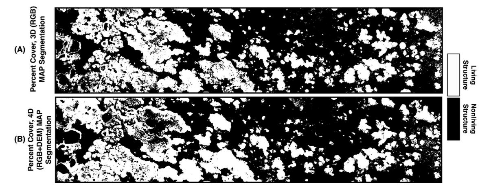

Fig. 7. - Automated Coral Reef Percent Cover Classification. Percent cover is determined as ratio of living structure (white), consisting of branching and mounding coral morphologies, to nonliving structure (black), consisting of rock, and sand classes. This binary classification is the superclass of morphology subclasses in [Fig. 6 \(A\)](#page-7-0) Algorithm classification result for percent cover using 3D (RGB) test data. (B) Algorithm classification result for percent cover using 4D (RGB + DEM) test data.

<span id="page-9-0"></span>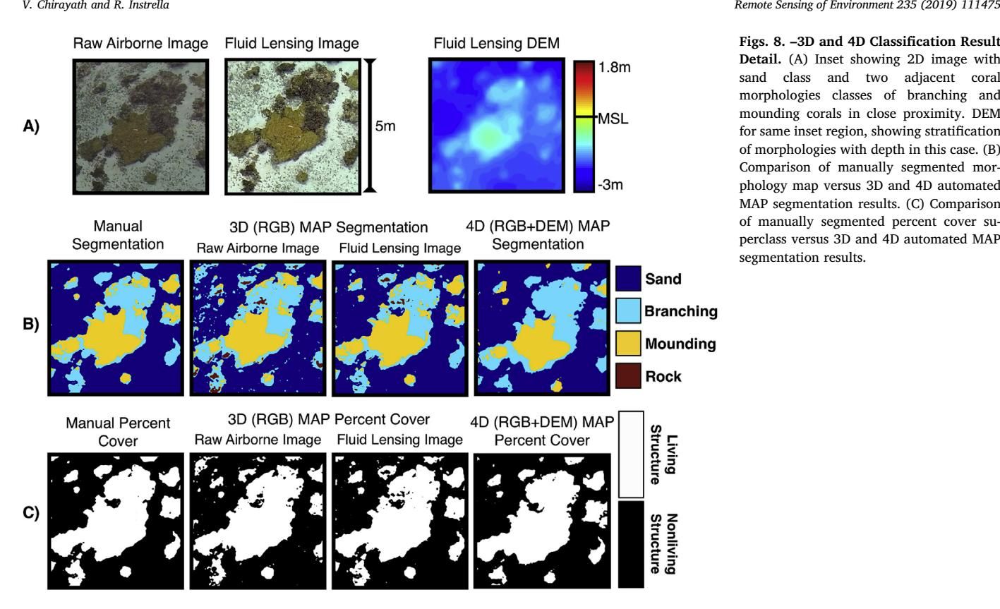

Figs. 8. –3D and 4D Classification Result Detail. (A) Inset showing 2D image with sand class and two adjacent coral morphologies classes of branching and mounding corals in close proximity. DEM for same inset region, showing stratification of morphologies with depth in this case. (B) Comparison of manually segmented morphology map versus 3D and 4D automated MAP segmentation results. (C) Comparison of manually segmented percent cover superclass versus 3D and 4D automated MAP segmentation results.

<span id="page-9-1"></span>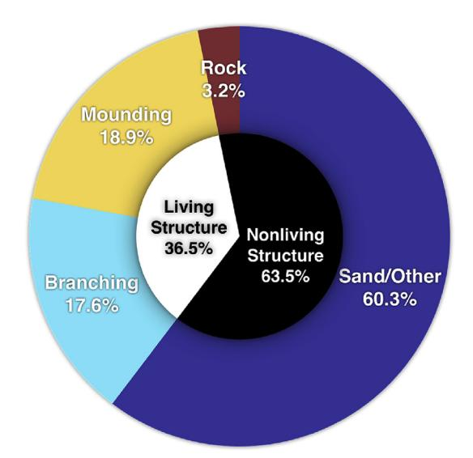

Fig. 9. – Coral Reef Morphology & Percent Cover Result. Automated coral reef segmentation results over entire test dataset. Percent cover breakdown of living structure (white) and nonliving structure (black). Coral reef morphology breakdown into branching coral, mounding coral, rock, and sand classes from 3D MAP segmentation.

thematic mapping of coral reefs has been demonstrated from numerous underwater survey methodologies before [\(Beijbom et al., 2015](#page-12-7); [Burns](#page-12-8) [et al., 2015](#page-12-8); [Shihavuddin et al., 2013\)](#page-13-20). However, to date, this work presents the first validated cm-resolution automated mapping of a coral reef from a remote sensing dataset. Sensitivity to cm-scale features over large geographic areas accessible by airborne remote sensing presents novel observational and quantitative health assessment capabilities for reef ecosystems. Indeed, accurate automated determination of coral reef percent cover and morphology type may lead to a significantly improved understanding of short timescale reef ecosystem status, dynamics, and fine spatial scale abundance and distribution.

Additional benthic classes, such as species level segmentation, are not explored in this study, but the algorithm design provides an n-dimensional framework for further input training set classes and segmentation outputs. While the addition of multispectral data is unlikely to improve species level detection, hyperspectral data may offer species level discrimination when incorporated into such a benthic mapping algorithm [\(Kutser et al., 2006\)](#page-13-21). Indeed, the algorithm may benefit from additional dimensionality in color bands as relative depth information did not appear to significantly improve classification accuracy [\(Fig. 11\)](#page-10-1) in the case of branching and mounding coral segmentation, possibly due to their less pronounced heterogeneity in depth. In this case, 4D MAP segmentation produced lower within-class accuracies as compared to 3D MAP segmentation, despite the added dimensionality ([Fig. 11B](#page-10-1)).

An examination of algorithm classification using m-scale and decameter-scale remote sensing imagery, as examined in [Fig. 12](#page-11-0), suggests low-resolution remote sensing instruments quantify coral reef percent cover and morphology with < 68% accuracy. Using the algorithm for percent cover assessment of Landsat-class remote sensing imagery, with a typical effective spatial resolution between 10 and 30 m, results in a classification error of 35%, in agreement with results from literature ([Mumby et al., 1997](#page-13-19)). Interrogation of the automated and manually segmented maps indicates that error from lower-resolution imagery poorly captures boundary separations between morphological classes in coral reefs. These results suggest that the algorithm and cm-resolution airborne fluid lensing data offer a favorable four-fold decrease in error for morphology classification and a seven-fold decrease in percent cover error as compared to m-resolution and decameter-resolution imagery. However, as a remote sensing method, there are still limitations of this combined approach to observing turbid benthic habitats and remains ultimately limited by the inherent optical properties of the aquatic system being observed.

Considering many current global coral reef health assessment methods and projections are based on low-resolution global datasets (Pandolfi [et al., 2003\)](#page-13-22), there is a strong motivation to use cm-scale

<span id="page-10-0"></span>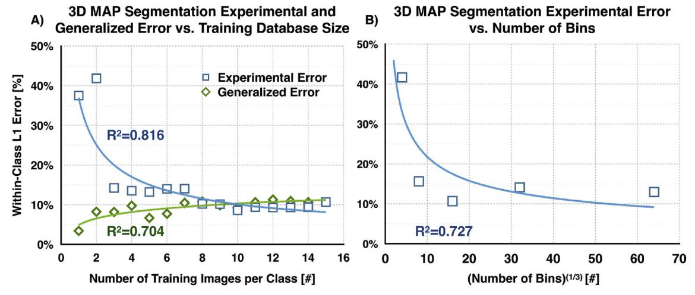

Fig. 10. - Experimental and Generalized Algorithm Error as a Function of Training Database Size and Bin Size. (A) To determine the appropriate size of the training database for supervised machine learning with 3D MAP segmentation, the L1 error within each class is determined as a function of training database size. The experimental error measures the L1 error between the 3D MAP segmentation result and the reference map using the training database as the supervised input. The generalized error measures the L1 error between the training database and itself, which reveals errors arising from variance inherent in the dataset. The intersection of these two curves occurs with approximately ten 100px by 100px training images per class, corresponding to ~1% of the total dataset size. These results justify the choice of training set size as increasing database size does not necessarily increase segmentation accuracy, likely due to the increase in variance within the training database. (B) The effect of binning resolution on MAP segmentation error. 3D MAP segmentation is performed by n-dimensional binning of data by nearest training database point.

<span id="page-10-1"></span>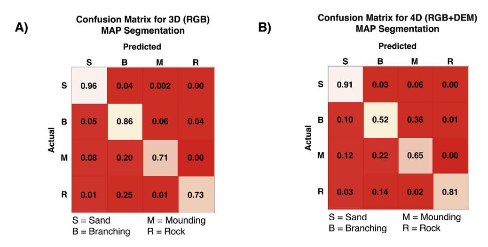

Fig. 11. – Algorithm Error Analysis - Confusion Matrices for 3D and 4D MAP Segmentation Results. (A) Confusion matrix for 3D (RGB) MAP segmentation shows strong in-class classification accuracy for all morphology types as compared pixel-bypixel to reference map. Values approaching unity along the diagonal elements indicate ideal accuracy. (B) Confusion matrix for 4D (RGB + DEM) MAP segmentation shows improved performance in segmenting rock structures as compared to the 3D result. However, the added dimensionality of the segmentation introduces a larger variance between mounding and branching classes, reducing the accuracy of within-class branching and mounding classification accuracy in this case.

methodologies to better assess reef health. The results from [Fig. 12](#page-11-0) indicate existing global remote sensing methodologies do not sufficiently resolve coral reef systems for accurate determination of percent cover of living structure and morphology breakdown at fine spatial scales. While surveying all of planet's coral reef ecosystems at the cmscale may be impractical using airborne fluid lensing, the methodology presented here offers a valuable tool for error quantification of ongoing lower-resolution airborne and spaceborne remote sensing campaigns studying coral reef ecosystems and motivates the maturation of airborne fluid lensing and comparable remote sensing technologies. Finescale coral reef mapping may also have applications to the augmentation of low-resolution mapping data using a supervised machine learning approach. Such a scheme may allow for the augmentation of low-resolution global aquatic remote sensing data using geographically distributed high-resolution localized airborne datasets as training sets for error reduction of automated reef classification algorithms [\(Li et al.,](#page-13-23) [2016\)](#page-13-23).

A forthcoming follow-on project, NeMO-Net, the NASA Neural Multimodal Observation and Training Network, uses deep convolutional neural networks and airborne fluid lensing for automated global coral reef assessment ([Chirayath et al., 2018a,](#page-12-27) [2018b](#page-12-28), [2017](#page-12-29)). NeMO-Net is an open-source deep convolutional neural network (CNN) and interactive active learning training software in development which will assess the present and past dynamics of coral reef ecosystems. NeMO-Net exploits active learning and data fusion of mm-scale remotely sensed 3D images of coral reefs captured using fluid lensing with the NASA FluidCam instrument, as well as hyperspectral airborne remote sensing data from the NASA MiDAR instrument ([Chirayath, 2018](#page-12-30); [McGillivary et al., 2018\)](#page-13-24) and lower-resolution satellite data, to determine coral reef ecosystem makeup globally at unprecedented spatial and temporal scales.

Further enhancement of automated coral reef segmentation is possible through algorithm improvement and aquatic remote sensing technology development. Based on the results of [Fig. 12](#page-11-0), the low error observed using the supervised approach for coral reef segmentation is established to arise from the fine resolution of the airborne fluid lensing input test data. This suggests that reef segmentation error reduction is possible with even higher effective spatial resolution remote sensing and in situ underwater survey technologies. In the short term, however, error reduction in reef assessment is likely to be driven by refinement of

<span id="page-11-0"></span>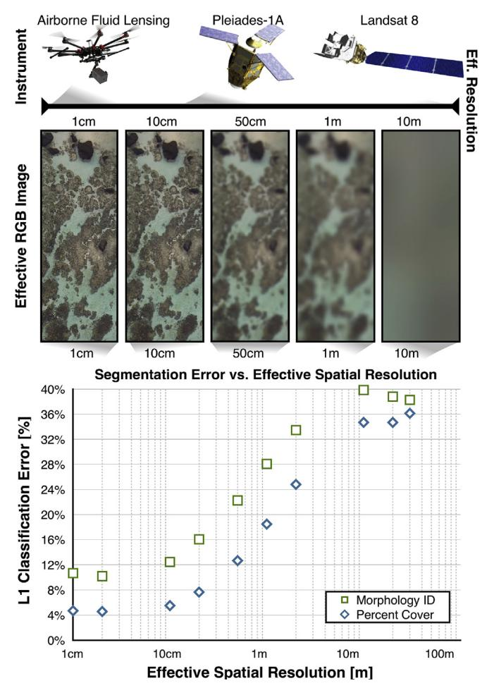

Fig. 12. – Algorithm Classification Error as a Function of Effective Spatial Resolution. Algorithm classification is performed on decimated versions of the airborne fluid lensing test data to model how the effective spatial resolution of other remote sensing instruments impacts classification error. In each case, the best-case scenario for effective spatial resolution of the instrument is chosen. Additional noise considerations, atmospheric scattering, and absorption are not modeled and the training set for the algorithm remains the same. As 3D MAP segmentation is performed on these decimated datasets, the L1 classification error for percent cover grows to greater than 35% at typical Landsat resolution and 10–20% for commercial satellite imagery, as compared to 5% for airborne fluid lensing. This relationship suggests that current remote sensing instruments may be subject to classification errors many orders larger than that afforded by airborne fluid lensing.

supervised machine learning methodologies.

The algorithm output using 3D MAP segmentation achieved approximately 95% accuracy for percent cover determination, but the 4D MAP segmentation result, incorporating bathymetric data, did not further reduce the segmentation error ([Fig. 11](#page-10-1)) as expected. While ndimensional supervised classification of coral morphologies has been shown to achieve accuracies as high 85% using similar naïve-Bayes methods ([Collin and Planes, 2012](#page-12-15)), the incorporation of higher dimensionality input data often introduces variances that significantly reduce the accuracy of naïve-Bayes approaches as output segmentation class number increases ([Friedman, 1997\)](#page-12-31). Increasingly popular machine learning approaches using neural networks may be more robust to the added dimensionality of input data than naïve-Bayes methods [\(Richard](#page-13-25) [and Lippmann, 1991](#page-13-25)) and are an area for future research. Ultimately, provided sufficient training data, neural networks may offer more accurate automated segmentations of ecosystems using n-dimensional input data ([Serpico and Roli, 1995](#page-13-26)) and n-output classes.

As predictive learning algorithms continue evolving, challenges

persist in incorporating such methods effectively and efficiently ([Cherkassky et al., 2006\)](#page-12-32), especially as new remote sensing technologies, such as airborne fluid lensing, introduce petabyte-scale datasets for regional areas. The processing of such large datasets, fortunately, is increasingly supported through governmental agencies, such as NASA's Earth Exchange (NEX), which provides advanced supercomputing resources for Earth Science research, as well as non-governmental distributed computing networks, such as the Berkeley Open Infrastructure for Network Computing (BOINC), which hosts a number of distributed computing projects. Moreover, creating a sufficient amount of training set data and reference maps with manual segmentation by subjectmatter experts for algorithm automation and validation is increasingly difficult. Online citizen-science platforms, such as [Zooniverse.org](http://Zooniverse.org), have addressed this concern in other fields through citizen science initiatives, including Project Galaxy Zoo, Project Planet Hunters, animal classification through Snapshot Serengeti ([Swanson et al., 2015\)](#page-13-27), and kelp identification through Project Floating Forests. These projects crowdsource image analysis to citizen-scientists and have built-in filtering to ensure training data integrity by comparison to subject-matter expert classification results. NASA's upcoming NeMO-Net project will leverage crowdsourced citizen-science inputs for coral classification ([Chirayath](#page-12-27) [et al., 2018a](#page-12-27)).

#### 5. Conclusions

Airborne fluid lensing technology has enabled cm-resolution multispectral 3D remote sensing of aquatic systems without refractive distortions from ocean waves. However, while datasets generated by airborne fluid lensing provide an order of magnitude increase in the effective spatial resolution for remote sensing of aquatic environments, they require efficient petabyte-scale machine learning tools for data products such as percent cover and morphology identification over regional scales.

Here, a highly-parallelized multidimensional supervised machine learning algorithm was developed based on naïve-Bayes maximum a posteriori (MAP) estimation for automated coral reef segmentation. Using airborne fluid lensing data from a 2013 field campaign conducted over the coral reef of Ofu Island, American Samoa, the algorithm generates cm-resolution maps of the spatial distribution of living structure and coral reef morphological structure with high accuracy.

Provided a user-selected training subset of 3D multispectral images, comprising close to 1% of the total dataset, the algorithm discriminates living structure from nonliving structure with 95% accuracy and segments the coral reef into four distinct morphological classes of branching coral, mounding coral, basalt rock, and sand, with 92% accuracy ([Fig. 12\)](#page-11-0). The user-selected training data and algorithm classification results are created and verified, respectively, with sub-cm-resolution ground-truth maps, manually generated from in situ mapping, underwater gigapixel photogrammetry, and per-pixel visual inspection of the 3D dataset.

By comparison, analysis of the survey area using the algorithm and m-resolution and decameter-resolution remote sensing imagery, representative of the effective spatial resolution of remote sensing instruments such as Pleiades-1A and Landsat 8, respectively, produces markedly lower percent cover and morphology classification with < 68% accuracy, as compared to cm-resolution airborne fluid lensing data with > 92% accuracy. These results suggest existing methodologies do not sufficiently resolve the complex morphological and bathymetric diversity of coral reef systems at the cm-scale, characteristic of the annual growth rate of such ecosystems. Such data are needed for the accurate determination of percent cover of living structure and morphology breakdown.

Ultimately, the data products and methods presented allow for an understanding of cm-scale coral reef status and reef dynamics over regions tens of square kilometers in area. Sensitivity to such fine-scale features presents novel observational and quantitative health assessment capabilities for reef ecosystems. Accurate automated determination of percent cover and morphology distribution may lead to a significantly improved understanding of fine temporal-scale reef ecosystem dynamics in a rapidly changing global climate.

Finally, this work motivated the development of a follow on investigation, NASA NeMO-Net, the NASA Neural Multimodal Observation and Training Network, that uses deep convolutional neural networks and airborne fluid lensing to extend this work further for automated global coral reef assessment across twenty-four benthic classes [\(Chirayath et al., 2018a](#page-12-27), [2018b,](#page-12-28) [2017](#page-12-29)). NeMO-Net's open-source deep convolutional neural network (CNN) and interactive active learning training software will assess the present and past dynamics of coral reef ecosystem. NeMO-Net leverages an augmented machine learning algorithm, based on transfer learning and domain adaptation, that demonstrates data fusion of regional FluidCam (mm, cm-scale) airborne remote sensing with global low-resolution (m, km-scale) airborne and spaceborne imagery to reduce classification errors up to 80% over regional scales [\(Chirayath et al., 2018a](#page-12-27), [2018b,](#page-12-28) [2017\)](#page-12-29). This methodology permits a small number of airborne fluid lensing field campaigns to augment the accuracy of coral classification from existing regional and global datasets from commercial and government satellites.

## Declaration of competing interest

The authors declare no conflict of interest. The founding sponsors had no role in the design of the study; in the collection, analyses, or interpretation of data; in the writing of the manuscript, and in the decision to publish the results.

#### Acknowledgements

This work was supported in part by NASA Earth Science Technology Office (ESTO) grant ATI-QRS-16-403728 and NASA ESTO AIST-160046. M. Dick, T. Bieri, and A. Pelos assisted with independent manual segmentation and reference map formation. A special thanks to colleagues at NASA Ames Research Center's Earth Science Division, specifically J. Dungan, S. Palacios, and I. Brosnan for significant feedback and comments on the manuscript. We also acknowledge the NASA Earth Exchange (NEX) and team for advanced supercomputing support and visualizations of results from this work. Lastly, we are grateful to the National Park Service and the Samoan elders who supported and permitted the 2013 field campaign. Their wisdom, stewardship, and conservation of the Samoan coral reef ecosystem has helped preserve this unique habitat for study and conservation.

# Appendix A. Supplementary data

Supplementary data to this article can be found online at [https://](https://doi.org/10.1016/j.rse.2019.111475) [doi.org/10.1016/j.rse.2019.111475.](https://doi.org/10.1016/j.rse.2019.111475)

## Author contributions

V.C. and R.I designed and conceived the study. V.C. performed the 2013 airborne fluid lensing survey and produced the input dataset. V.C. and R.I. designed the supervised machine learning algorithm. R.I. coded the supervised machine learning algorithm, reformatted input data, and produced the data products. V.C. produced the reference map. V.C. and R.I. wrote, revised, and edited the manuscript.

# References

- <span id="page-12-11"></span>[Aleynik, D., Dale, A.C., Porter, M., Davidson, K., 2016. A high resolution hydrodynamic](http://refhub.elsevier.com/S0034-4257(19)30494-8/sref1) [model system suitable for novel harmful algal bloom modelling in areas of complex](http://refhub.elsevier.com/S0034-4257(19)30494-8/sref1) [coastline and topography. Harmful Algae 53, 102](http://refhub.elsevier.com/S0034-4257(19)30494-8/sref1)–117.
- <span id="page-12-4"></span>[othersAndréfouët, S., Kramer, P., Torres-Pulliza, D., Joyce, K.E., Hochberg, E.J., Garza-](http://refhub.elsevier.com/S0034-4257(19)30494-8/sref2)

- [Pérez, R., Mumby, P.J., Riegl, B., Yamano, H., White, W.H., 2003. Multi-site eva](http://refhub.elsevier.com/S0034-4257(19)30494-8/sref2)luation of IKONOS data for classifi[cation of tropical coral reef environments. Remote](http://refhub.elsevier.com/S0034-4257(19)30494-8/sref2) [Sens. Environ. 88, 128](http://refhub.elsevier.com/S0034-4257(19)30494-8/sref2)–143.
- <span id="page-12-13"></span>[Andréfouët, S., Muller-Karger, F.E., Robinson, J.A., Kranenburg, C.J., Torres-Pulliza, D.,](http://refhub.elsevier.com/S0034-4257(19)30494-8/sref3) [Spraggins, S.A., Murch, B., 2006. Global assessment of modern coral reef extent and](http://refhub.elsevier.com/S0034-4257(19)30494-8/sref3) [diversity for regional science and management applications: a view from space. In:](http://refhub.elsevier.com/S0034-4257(19)30494-8/sref3) [Proceedings of the 10th International Coral Reef Symposium, pp. 1732](http://refhub.elsevier.com/S0034-4257(19)30494-8/sref3)–1745.
- <span id="page-12-23"></span>[Beijbom, O., Edmunds, P.J., Kline, D.I., Mitchell, B.G., Kriegman, D., 2012. Automated](http://refhub.elsevier.com/S0034-4257(19)30494-8/sref4) [annotation of coral reef survey images. In: IEEE Conference on Computer Vision](http://refhub.elsevier.com/S0034-4257(19)30494-8/sref4) [\(CVPR\), Providence, Rhode Island.](http://refhub.elsevier.com/S0034-4257(19)30494-8/sref4)
- <span id="page-12-7"></span>[othersBeijbom, O., Edmunds, P.J., Roelfsema, C., Smith, J., Kline, D.I., Neal, B.P., Dunlap,](http://refhub.elsevier.com/S0034-4257(19)30494-8/sref5) [M.J., Moriarty, V., Fan, T.-Y., Tan, C.-J., 2015. Towards automated annotation of](http://refhub.elsevier.com/S0034-4257(19)30494-8/sref5) [benthic survey images: variability of human experts and operational modes of au](http://refhub.elsevier.com/S0034-4257(19)30494-8/sref5)[tomation. PLoS One 10, e0130312.](http://refhub.elsevier.com/S0034-4257(19)30494-8/sref5)
- <span id="page-12-25"></span>Bell, J.D., Galzin, R., 1984. Infl[uence of live coral cover on coral-reef](http://refhub.elsevier.com/S0034-4257(19)30494-8/sref6) fish communities. [Mar. Ecol. Prog. Ser. 15, 265](http://refhub.elsevier.com/S0034-4257(19)30494-8/sref6)–274.
- <span id="page-12-1"></span>[Bellwood, D.R., Hughes, T.P., Folke, C., Nystrom, M., 2004. Confronting the coral reef](http://refhub.elsevier.com/S0034-4257(19)30494-8/sref7) [crisis. Nature 429, 827](http://refhub.elsevier.com/S0034-4257(19)30494-8/sref7)–833.
- <span id="page-12-20"></span>[Bishop, C.M., 2006. Pattern recognition and machine learning. springer.](http://refhub.elsevier.com/S0034-4257(19)30494-8/sref8)
- <span id="page-12-8"></span>[Burns, J., Delparte, D., Gates, R., Takabayashi, M., 2015. Integrating structure-from](http://refhub.elsevier.com/S0034-4257(19)30494-8/sref9)[motion photogrammetry with geospatial software as a novel technique for quanti](http://refhub.elsevier.com/S0034-4257(19)30494-8/sref9)[fying 3D ecological characteristics of coral reefs. PeerJ 3, e1077.](http://refhub.elsevier.com/S0034-4257(19)30494-8/sref9)
- <span id="page-12-6"></span>Caras, T., Hedley, J., Karnieli, A., 2017. Implications of sensor design for coral reef detection: upscaling ground hyperspectral imagery in spatial and spectral scales. Int. J. Appl. Earth Obs. Geoinf. 63, 68–77. <https://doi.org/10.1016/j.jag.2017.07.009>.
- <span id="page-12-9"></span>Casella, E., Collin, A., Harris, D., Ferse, S., Bejarano, S., Parravicini, V., Hench, J.L., Rovere, A., 2016. Mapping coral reefs using consumer-grade drones and structure from motion photogrammetry techniques. Coral Reefs 1–7. [https://doi.org/10.1007/](https://doi.org/10.1007/s00338-016-1522-0) [s00338-016-1522-0.](https://doi.org/10.1007/s00338-016-1522-0)
- <span id="page-12-32"></span>Cherkassky, V., Krasnopolsky, V., Solomatine, D.P., Valdes, J., 2006. Computational intelligence in earth sciences and environmental applications: issues and challenges. Neural Netw. 19, 113–121. [https://doi.org/10.1016/j.neunet.2006.01.001.](https://doi.org/10.1016/j.neunet.2006.01.001)
- <span id="page-12-30"></span>[Chirayath, V., 2018. System and Method for Active Multispectral Imaging and Optical](http://refhub.elsevier.com/S0034-4257(19)30494-8/sref13) [Communications \(No. 15/480,318\). United States Patent and Trade O](http://refhub.elsevier.com/S0034-4257(19)30494-8/sref13)ffice, 15/ [480,318.](http://refhub.elsevier.com/S0034-4257(19)30494-8/sref13)
- <span id="page-12-17"></span>[Chirayath, V., 2016. Fluid Lensing & Applications to Remote Sensing of Aquatic](http://refhub.elsevier.com/S0034-4257(19)30494-8/sref14) [Environments. PhD Thesis. Stanford University. Stanford University](http://refhub.elsevier.com/S0034-4257(19)30494-8/sref14).
- <span id="page-12-2"></span>[Chirayath, V., Earle, S.A., 2016. Drones that see through waves](http://refhub.elsevier.com/S0034-4257(19)30494-8/sref15) – preliminary results from airborne fl[uid lensing for centimetre-scale Aquatic conservation. Aquat. Conserv.](http://refhub.elsevier.com/S0034-4257(19)30494-8/sref15) [Mar. Freshw. Ecosyst. 26, 237](http://refhub.elsevier.com/S0034-4257(19)30494-8/sref15)–250.
- <span id="page-12-27"></span>Chirayath, V., Li, A., Das, K., Segal-Rozenhaimer, M., Torres-Perez, J., van den Bergh, J., 2018a. NASA NeMO-Net homepage. URL. <http://nemonet.info> accessed 8.20.18.
- <span id="page-12-28"></span>[Chirayath, V., Li, A., Das, K., van den Bergh, J., Segal-Rozenhaimer, M., Torres-Perez, J.,](http://refhub.elsevier.com/S0034-4257(19)30494-8/sref17) 2018b. NeMO-net & fl[uid lensing: the neural multi-modal observation & training](http://refhub.elsevier.com/S0034-4257(19)30494-8/sref17) [network for global coral reef assessment using](http://refhub.elsevier.com/S0034-4257(19)30494-8/sref17) fluid lensing augmentation of NASA [EOS data. In: Ocean Sciences Meeting.](http://refhub.elsevier.com/S0034-4257(19)30494-8/sref17)
- <span id="page-12-29"></span>[Chirayath, V., Li, A., Das, K., van den Bergh, J., Segal-Rozenhaimer, M., Torres-Perez, J.,](http://refhub.elsevier.com/S0034-4257(19)30494-8/sref18) 2017. [NeMO-Net: the Neural Multi-Modal Observation and Training Network for](http://refhub.elsevier.com/S0034-4257(19)30494-8/sref18) [Global Coral Reef Assessment. AGU Fall Meet.](http://refhub.elsevier.com/S0034-4257(19)30494-8/sref18)
- <span id="page-12-14"></span>Collin, A., Archambault, P., Long, B., 2011. Predicting species diversity of benthic communities within turbid nearshore using full-waveform bathymetric LiDAR and machine learners. PLoS One 6. [https://doi.org/10.1371/journal.pone.0021265.](https://doi.org/10.1371/journal.pone.0021265)
- <span id="page-12-15"></span>Collin, A., Planes, S., 2012. Enhancing coral health detection using spectral diversity indices from worldview-2 imagery and machine learners. Remote Sens. 4, 3244–3264. <https://doi.org/10.3390/rs4103244>.
- <span id="page-12-22"></span>Cortes, C., Vapnik, V., 1995. Support-vector networks. Mach. Learn. 20, 273–297. <https://doi.org/10.1007/BF00994018>.
- <span id="page-12-0"></span>[Costanza, R., D'Arge, R., de Groot, R., Faber, S., Grasso, M., Hannon, B., Limburg, K.,](http://refhub.elsevier.com/S0034-4257(19)30494-8/sref22) [Naeem, S., O'Neill, R., Paruelo, J., Raskin, R., Sutton, P., van den Belt, M., 1997. The](http://refhub.elsevier.com/S0034-4257(19)30494-8/sref22) [value of the world's ecosystem services and natural capital. Nature 387, 253](http://refhub.elsevier.com/S0034-4257(19)30494-8/sref22)–260.
- <span id="page-12-3"></span>[Edinger, E.N., Limmon, G.V., Jompa, J., Widjatmoko, W., Heikoop, J.M., Risk, M.J., 2000.](http://refhub.elsevier.com/S0034-4257(19)30494-8/sref23) [Normal coral growth rates on dying reefs: are coral growth rates good indicators of](http://refhub.elsevier.com/S0034-4257(19)30494-8/sref23) [reef health? Mar. Pollut. Bull. 40, 404](http://refhub.elsevier.com/S0034-4257(19)30494-8/sref23)–425.
- <span id="page-12-26"></span>Edinger, E.N., Risk, M.J., 2000. Reef classification by coral morphology predicts coral reef conservation value. Biol. Conserv. 92, 1–13. [https://doi.org/10.1016/S0006-](https://doi.org/10.1016/S0006-3207(99)00067-1) [3207\(99\)00067-1](https://doi.org/10.1016/S0006-3207(99)00067-1).
- <span id="page-12-21"></span>[Flach, P., 2012. Machine Learning: the Art and Science of Algorithms that Make Sense of](http://refhub.elsevier.com/S0034-4257(19)30494-8/sref25) [Data. Cambridge University Press.](http://refhub.elsevier.com/S0034-4257(19)30494-8/sref25)
- <span id="page-12-31"></span>[Friedman, J.H., 1997. On bias, variance, 0/1 loss, and the curse of dimensionality. Data](http://refhub.elsevier.com/S0034-4257(19)30494-8/sref26) [Min. Knowl. Discov. 1, 55](http://refhub.elsevier.com/S0034-4257(19)30494-8/sref26)–77.
- <span id="page-12-10"></span>[Goodman, J.A., Purkis, S.J., Phinn, S.R., 2013. Coral Reef Remote Sensing: A Guide for](http://refhub.elsevier.com/S0034-4257(19)30494-8/sref27) [Mapping, Monitoring and Management. Springer Science & Business Media](http://refhub.elsevier.com/S0034-4257(19)30494-8/sref27).
- <span id="page-12-12"></span>Hansen, M.C., Defries, R.S., Townshend, J.R.G., Sohlberg, R., 2010. Global land cover classification at 1 km spatial resolution using a classification tree approach. Int. J. Remote Sens. 21, 1331–1364. <https://doi.org/10.1080/014311600210209>.
- <span id="page-12-5"></span>[othersHansen, M.C., Potapov, P.V., Moore, R., Hancher, M., Turubanova, S.A., Tyukavina,](http://refhub.elsevier.com/S0034-4257(19)30494-8/sref29) [A., Thau, D., Stehman, S.V., Goetz, S.J., Loveland, T.R., 2013. High-resolution global](http://refhub.elsevier.com/S0034-4257(19)30494-8/sref29) [maps of 21st-century forest cover change. Science 342, 850](http://refhub.elsevier.com/S0034-4257(19)30494-8/sref29)–853 (80-. ).
- <span id="page-12-19"></span>[Hartigan, J.A., Wong, M.A., 1979. Algorithm AS 136: a k-means clustering algorithm. J.](http://refhub.elsevier.com/S0034-4257(19)30494-8/sref30) [R. Stat. Soc. Ser. C Appl. Stat. 28, 100](http://refhub.elsevier.com/S0034-4257(19)30494-8/sref30)–108.
- <span id="page-12-16"></span>Hochberg, E.J., Atkinson, M.J., 2003. Capabilities of remote sensors to classify coral, algae, and sand as pure and mixed spectra. Remote Sens. Environ. 85, 174–189. [https://doi.org/10.1016/S0034-4257\(02\)00202-X](https://doi.org/10.1016/S0034-4257(02)00202-X).
- <span id="page-12-18"></span>[Horning, N., Robinson, J., Sterling, E., Turner, W., Spector, S., 2010. Remote Sensing for](http://refhub.elsevier.com/S0034-4257(19)30494-8/sref32) [Ecology and Conservation. Oxford University Press.](http://refhub.elsevier.com/S0034-4257(19)30494-8/sref32)
- <span id="page-12-24"></span>[Hsu, C.-W., Lin, Chih-Jen, 2003. A Comparison of Methods for Multiclass Support Vector](http://refhub.elsevier.com/S0034-4257(19)30494-8/sref33)

- [Machines, vol. 13. pp. 415](http://refhub.elsevier.com/S0034-4257(19)30494-8/sref33)–425.
- <span id="page-13-8"></span>Joyce, K.E., Phinn, S.R., Roelfsema, C.M., 2013. Live coral cover index testing and application with hyperspectral airborne image data. Remote Sens. 5, 6116–6137. [https://doi.org/10.3390/rs5116116.](https://doi.org/10.3390/rs5116116)
- <span id="page-13-21"></span>[Kutser, T., Miller, I., Jupp, D.L.B., 2006. Mapping coral reef benthic substrates using](http://refhub.elsevier.com/S0034-4257(19)30494-8/sref35) [hyperspectral space-borne images and spectral libraries. Estuar. Coast Shelf Sci. 70,](http://refhub.elsevier.com/S0034-4257(19)30494-8/sref35) 449–[460](http://refhub.elsevier.com/S0034-4257(19)30494-8/sref35).
- <span id="page-13-10"></span>[Lara, M., TJ, B., Peralta, G., J, van S., 2016. Hydrodynamic e](http://refhub.elsevier.com/S0034-4257(19)30494-8/sref36)ffects of macrophyte mi[crotopography: spatial consequences of interspeci](http://refhub.elsevier.com/S0034-4257(19)30494-8/sref36)fic benthic transitions. Mar. Ecol. [Prog. Ser. 561, 123](http://refhub.elsevier.com/S0034-4257(19)30494-8/sref36)–136.
- <span id="page-13-17"></span>Lary, D.J., Alavi, A.H., Gandomi, A.H., Walker, A.L., 2016. Machine learning in geosciences and remote sensing. Geosci. Front. 7, 3–10. [https://doi.org/10.1016/j.gsf.](https://doi.org/10.1016/j.gsf.2015.07.003) [2015.07.003](https://doi.org/10.1016/j.gsf.2015.07.003).
- <span id="page-13-6"></span>[Levy, J., Hunter, C., Lukacazyk, T., Franklin, E.C., 2018. Assessing the spatial distribution](http://refhub.elsevier.com/S0034-4257(19)30494-8/sref38) [of coral bleaching using small unmanned aerial systems. Coral Reefs 37, 373](http://refhub.elsevier.com/S0034-4257(19)30494-8/sref38)–387.
- <span id="page-13-23"></span>[Li, A., Chirayath, V., Instrella, R., 2016. Fluid Lensing Based Machine Learning for](http://refhub.elsevier.com/S0034-4257(19)30494-8/sref39) [Augmenting Earth Science Coral Datasets. AGU Fall Meeting](http://refhub.elsevier.com/S0034-4257(19)30494-8/sref39).
- <span id="page-13-12"></span>[Maeder, J., Narumalani, S., Rundquist, D.C., Perk, R.L., Schalles, J., Hutchins, K., Keck, J.,](http://refhub.elsevier.com/S0034-4257(19)30494-8/sref40) [2002. Classifying and mapping general coral-reef structure using Ikonos data.](http://refhub.elsevier.com/S0034-4257(19)30494-8/sref40) [Photogramm. Eng. Remote Sens. 68, 1297](http://refhub.elsevier.com/S0034-4257(19)30494-8/sref40)–1306.
- <span id="page-13-24"></span>[McGillivary, P.A., Chirayath, V., Baghdady, J., 2018. Use of multi-spectral high repetition](http://refhub.elsevier.com/S0034-4257(19)30494-8/sref41) [rate LED systems for high bandwidth underwater optical communications, and](http://refhub.elsevier.com/S0034-4257(19)30494-8/sref41) [communications to surface and aerial systems. In: 2018 Fourth Underwater](http://refhub.elsevier.com/S0034-4257(19)30494-8/sref41) [Communications and Networking Conference \(UComms\), pp. 1](http://refhub.elsevier.com/S0034-4257(19)30494-8/sref41)–5.
- <span id="page-13-5"></span>[Miller, R., Castillo, C. Del, McKee, B., 2005. Remote Sensing of Coastal Aquatic](http://refhub.elsevier.com/S0034-4257(19)30494-8/sref42) [Environments.](http://refhub.elsevier.com/S0034-4257(19)30494-8/sref42)
- <span id="page-13-13"></span>[Mishra, D., Narumalani, S., Rundquist, D., Lawson, M., 2006. Benthic habitat mapping in](http://refhub.elsevier.com/S0034-4257(19)30494-8/sref43) [tropical marine environments using QuickBird multispectral data. Photogramm. Eng.](http://refhub.elsevier.com/S0034-4257(19)30494-8/sref43) [Remote Sens. 72, 1037](http://refhub.elsevier.com/S0034-4257(19)30494-8/sref43)–1048.
- <span id="page-13-0"></span>Moberg, F., Folke, C., 1999. Ecological goods and services of coral reef ecosystems. Ecol. Econ. 29, 215–233. [https://doi.org/10.1016/S0921-8009\(99\)00009-9](https://doi.org/10.1016/S0921-8009(99)00009-9).
- <span id="page-13-7"></span>[Monaco, M.E., Anderson, S.M., Battista, T.A., Kendall, M.S., Rohmann, S.O., Wedding,](http://refhub.elsevier.com/S0034-4257(19)30494-8/sref45) [L.M., Clarke, A.M., 2012. National Summary of NOAA](http://refhub.elsevier.com/S0034-4257(19)30494-8/sref45) ' S Shallow-Water Benthic [Habitat Mapping of U . S . Coral Reef Ecosystems.](http://refhub.elsevier.com/S0034-4257(19)30494-8/sref45)
- <span id="page-13-19"></span>[Mumby, P.J., Green, E.P., Edwards, A.J., Clark, C.D., 1997. Coral reef habitat mapping:](http://refhub.elsevier.com/S0034-4257(19)30494-8/sref46) [how much detail can remote sensing provide? Mar. Biol. 130, 193](http://refhub.elsevier.com/S0034-4257(19)30494-8/sref46)–202.
- <span id="page-13-18"></span>[Mumby, P.J., Skirving, W., Strong, A.E., Hardy, J.T., LeDrew, E.F., Hochberg, E.J.,](http://refhub.elsevier.com/S0034-4257(19)30494-8/sref47) [Stumpf, R.P., David, L.T., 2004. Remote sensing of coral reefs and their physical](http://refhub.elsevier.com/S0034-4257(19)30494-8/sref47) [environment. Mar. Pollut. Bull. 48, 219](http://refhub.elsevier.com/S0034-4257(19)30494-8/sref47)–228.
- <span id="page-13-3"></span>[Nagendra, H., Lucas, R., Honrado, J.P., Jongman, R.H.G., Tarantino, C., Adamo, M.,](http://refhub.elsevier.com/S0034-4257(19)30494-8/sref48)

- [Mairota, P., 2013. Remote sensing for conservation monitoring: assessing protected](http://refhub.elsevier.com/S0034-4257(19)30494-8/sref48) [areas, habitat extent, habitat condition, species diversity, and threats. Ecol. Indicat.](http://refhub.elsevier.com/S0034-4257(19)30494-8/sref48) [33, 45](http://refhub.elsevier.com/S0034-4257(19)30494-8/sref48)–59.
- <span id="page-13-16"></span>NASA Ames Laboratory for Advanced Sensing, 2016. Supplemental data. URL. [https://](https://www.nasa.gov/ames/las/coral-classification) [www.nasa.gov/ames/las/coral-classi](https://www.nasa.gov/ames/las/coral-classification)fication accessed 12.1.16.
- <span id="page-13-22"></span>othersPandolfi[, J.M., Bradbury, R.H., Sala, E., Hughes, T.P., Bjorndal, K.A., Cooke, R.G.,](http://refhub.elsevier.com/S0034-4257(19)30494-8/sref50) [McArdle, D., McClenachan, L., Newman, M.J.H., Paredes, G., 2003. Global trajec](http://refhub.elsevier.com/S0034-4257(19)30494-8/sref50)tories [of the long-term decline of coral reef ecosystems. Science 301, 955](http://refhub.elsevier.com/S0034-4257(19)30494-8/sref50)–958 (80-.).
- <span id="page-13-14"></span>[Reshitnyk, L., Costa, M., Robinson, C., Dearden, P., 2014. Evaluation of WorldView-2 and](http://refhub.elsevier.com/S0034-4257(19)30494-8/sref51) [acoustic remote sensing for mapping benthic habitats in temperate coastal Paci](http://refhub.elsevier.com/S0034-4257(19)30494-8/sref51)fic [waters. Remote Sens. Environ. 153, 7](http://refhub.elsevier.com/S0034-4257(19)30494-8/sref51)–23.
- <span id="page-13-25"></span>[Richard, M.D., Lippmann, R.P., 1991. Neural network classi](http://refhub.elsevier.com/S0034-4257(19)30494-8/sref52)fiers estimate Bayesian a [posteriori probabilities. Neural Comput. 3, 461](http://refhub.elsevier.com/S0034-4257(19)30494-8/sref52)–483.
- <span id="page-13-1"></span>Ridgwell, A., Zeebe, R., 2005. The role of the global carbonate cycle in the regulation and evolution of the Earth system. Earth Planet. Sci. Lett. 234, 299–315. [https://doi.org/](https://doi.org/10.1016/j.epsl.2005.03.006) [10.1016/j.epsl.2005.03.006](https://doi.org/10.1016/j.epsl.2005.03.006).
- <span id="page-13-11"></span>Rowlands, G., Purkis, S., Riegl, B., Metsamaa, L., Bruckner, A., Renaud, P., 2012. Satellite imaging coral reef resilience at regional scale. A case-study from Saudi Arabia. Mar. Pollut. Bull. 64, 1222–1237. [https://doi.org/10.1016/j.marpolbul.2012.03.003.](https://doi.org/10.1016/j.marpolbul.2012.03.003)
- <span id="page-13-15"></span>Saul, S., Purkis, S., 2015. Semi-automated object-based classification of coral reef habitat using discrete choice models. Remote Sens. 7, 15894–15916. [https://doi.org/10.](https://doi.org/10.3390/rs71215810) [3390/rs71215810.](https://doi.org/10.3390/rs71215810)
- <span id="page-13-9"></span>Scopélitis, J., Andréfouët, S., Phinn, S., Done, T., Chabanet, P., 2011. Coral colonisation of a shallow reef flat in response to rising sea level: quantification from 35 years of remote sensing data at Heron Island, Australia. Coral Reefs 30, 951. [https://doi.org/](https://doi.org/10.1007/s00338-011-0774-y) [10.1007/s00338-011-0774-y](https://doi.org/10.1007/s00338-011-0774-y).
- <span id="page-13-26"></span>Serpico, S.B., Roli, F., 1995. Classifi[cation of multisensor remote-sensing images by](http://refhub.elsevier.com/S0034-4257(19)30494-8/sref57) [structured neural networks. IEEE Trans. Geosci. Remote Sens. 33, 562](http://refhub.elsevier.com/S0034-4257(19)30494-8/sref57)–578.
- <span id="page-13-20"></span>Shihavuddin, A.S.M., Gracias, N., Garcia, R., Gleason, A.C.R., Gintert, B., 2013. Imagebased coral reef classification and thematic mapping. Remote Sens. 5, 1809–1841. <https://doi.org/10.3390/rs5041809>.
- <span id="page-13-2"></span>Storlazzi, C.D., Dartnell, P., Hatcher, G.A., Gibbs, A.E., 2016. End of the chain? Rugosity and fine-scale bathymetry from existing underwater digital imagery using structurefrom-motion (SfM) technology. Coral Reefs 35, 889–894. [https://doi.org/10.1007/](https://doi.org/10.1007/s00338-016-1462-8) [s00338-016-1462-8.](https://doi.org/10.1007/s00338-016-1462-8)
- <span id="page-13-27"></span>Swanson, A., Kosmala, M., Lintott, C., Simpson, R., Smith, A., Packer, C., 2015. Snapshot Serengeti, high-frequency annotated camera trap images of 40 mammalian species in an African savanna. Sci. Data 2. [https://doi.org/10.1038/sdata.2015.26.](https://doi.org/10.1038/sdata.2015.26)
- <span id="page-13-4"></span>[Wulder, M.A., Hall, R.J., Coops, N.C., Franklin, S.E., 2004. High spatial resolution re](http://refhub.elsevier.com/S0034-4257(19)30494-8/sref61)[motely sensed data for ecosystem characterization. Bioscience 54, 511](http://refhub.elsevier.com/S0034-4257(19)30494-8/sref61)–521.