# Control of Crown of Thorns Starfish at the National Park of American Samoa

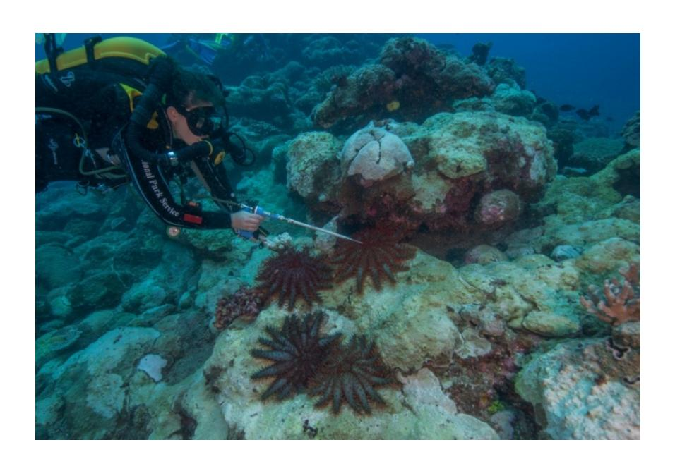

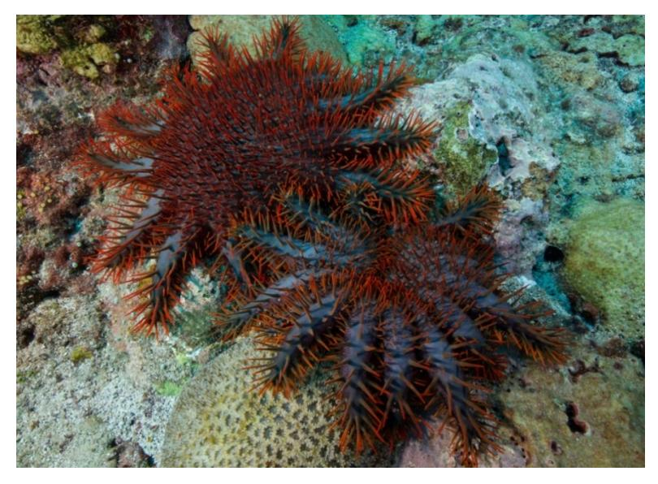

**Status Report: November 2014 By: Dr. Tim Clark Marine Ecologist NPSA** 

## **Table of Contents**

| Introduction                                  | 3  |
|-----------------------------------------------|----|
| Background on COTs (life history and ecology) | 3  |
| Methods                                       | 5  |
| Personnel and effort                          | 5  |
| Towed snorkeler survey                        | 6  |
| Eradication dives                             | 6  |
| Age structure of COTs                         | 7  |
| Results                                       | 8  |
| Towed snorkeler survey                        | 8  |
| Eradication dives                             | 13 |
| Eradications within NPSA waters               | 16 |
| Eradications outside NPSA waters              | 18 |
| Age structure of COTs                         | 20 |
| Discussion                                    | 21 |
| Budget                                        | 23 |
| Outlook                                       | 24 |
| References                                    | 25 |

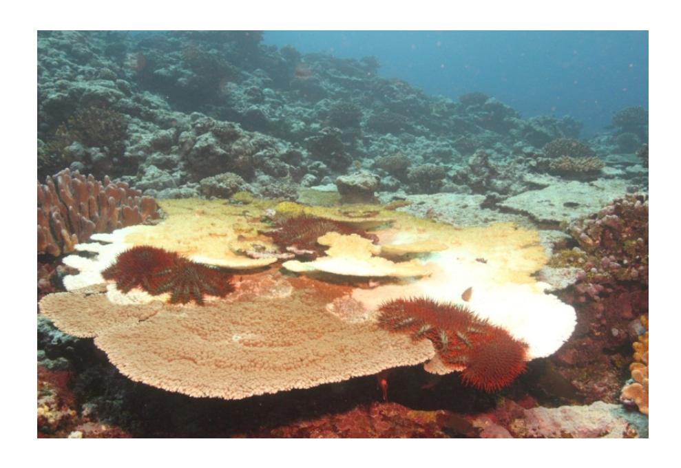

### **Introduction**

### **Background on COTs (life history and ecology)**

 The Crown of Thorns (COT, *Acanthaster planci*) is a type of seastar that feeds primarily on scleractinian corals (De'ath and Moran, 1998a). In a healthy reef ecosystem, COTs occur in densities up to 1500 individuals per km2 , thus opening up areas of the reef for settlement of new organisms (Moran and De'ath, 1992). However, in high densities COTs can be devastating to the reef, consuming corals until the reef is depleted (De'ath et al., 2012; Fabricius, 2013). Consequently, the seastars exhaust their only food source and numbers decrease due to starvation (Kettle, 1990). COTs feed by extruding their stomach through their mouth, covering a coral, and using digestive enzymes to break down the coral animal. After consuming the coral they move on, leaving behind the white skeleton of the dead coral (Pratchett et al., 2014). A single adult COT can consume over 64 sq. ft. of living coral in a year (Fabricius, 2013), and will feed on almost every coral species on the reef (De'ath and Moran, 1998b).

 Since the 1950's, outbreaks of hundreds to thousands of COTs on a single reef system have been recorded on reefs across the Indo-Pacific, with anecdotal evidence indicating outbreaks even earlier in the 20th century (Dana, 1970; DeVantier and Terence, 2007). Consuming enormous areas of coral reef, COTs can cause shifts in the species composition of the reef, and have negative secondary effects on other invertebrates and fish of the ecosystem (Pratchett et al., 2014).

 Crown of thorns outbreaks appear to be related to increased nutrients due to human development, specifically the increase in fertilizer and waste released into the environment. When large storms bring heavy rains these nutrients are washed into the ocean, leading to an increase in phytoplankton, a marine plant which serves as a food source for larval COTs (Lucas, 1982). COTs release tens of millions of eggs and sperm during the spawning season (October-February in American Samoa), but in unpolluted coral reef waters, phytoplankton is sparse and the majority of the subsequent larvae starve (Kettle and Lucas, 1987). Increased levels of phytoplankton in the water column allow a greater number of COT larvae to survive and settle into their benthic, adult stage (Fabricius et al., 2010). Outbreaks are likely to occur approximately three years after heavy rain or storm events as it takes three years for COTs to mature (Lucas, 1984). In September 2009, a large tsunami occurred, correlating to the beginning of the COT spawning season. Additionally, cyclone Wilma passed over American Samoa on January 23, 2011. These two events may have played a role in the current outbreak. This nutrient enrichment hypothesis is only one of several theories on why COTs outbreaks are occurring more frequently across the Pacific. Outbreaks may also be triggered by a decrease in the natural predators of COTs, changing physical conditions in the ocean, or a combination of multiple factors (Pratchett et al., 2014). Further research is needed to understand the ultimate cause of COT outbreaks, but in the meantime managers need to decide the best response to this threat to coral reefs.

 Coral reefs are one of the world's most threatened ecosystems (Pandolfi et al., 2005). In the Indo-Pacific, COTs outbreaks are one of the greatest threats to corals reefs (De'ath et al., 2012). Since 1990, there have been at least 246 COT outbreaks across the Indo- West Pacific, while prior to 1990 there were 82 outbreaks recorded (Moran et al., 1988; Pratchett et al., 2014). This growing threat to coral reef ecosystems has garnered attention in Australia, where the Great Barrier Reef has experienced four outbreaks since 1969. The economic importance of this reef system has driven a significant amount of research into the biology and life history of COTs, as well as the best practices and feasibility of a variety of management strategies.

 Outbreak levels of COTs were detected in American Samoa in November 2011. From 2011 to 2013 the outbreak was sporadically tracked and some removal efforts were conducted by NPSA and other resource managers from the local Coral Reef Advisory Group (CRAG) agencies. Much of the initial survey and removal effort was concentrated on the South side of Tutuila (where the COTs were first observed). Surveys began on the North side of Tutuila in December 2012, but no COTs were observed on this side of the island until August 2013, when fishermen who were participating in the Department of Marine and Wildlife Resources' COT Bounty Program discovered COTs in Fagasa (Lawrence, pers. comm.). This report documents the efforts by NPSA and other local agencies starting in March 2013, when formal methods for the detection and eradication of COTs were developed and implemented in American Samoa.

NPSA's containment effort has three broad goals:

- 1. Limit coral loss in the park so recovery will be measured in years rather than decades.
- 2. Insure the North side of Tutuila (where the park is located) does not remain a source of spawning COTs and that patches of healthy coral survive to facilitate recovery. Primary concern is for park waters, but NPSA staff will work outside the park when COTs outbreaks in the park are under control for the month.
- 3. NPSA will not be contributing to control efforts on the South side of Tutuila due to limited resources and the priority of protecting park and surrounding waters.

### **Methods**

 Control efforts for COTs occurred on the island of Tutuila in American Samoa (Fig. 1). To date, no surveys have been conducted in Manua and the population status in the outer islands is unknown. Management of COTs consisted of three different strategies: 1) identify outbreak locations using towed snorkeler surveys, 2) eradicating COTs using lethal chemical injection, and 3) determining age structure by sizing COTs. 

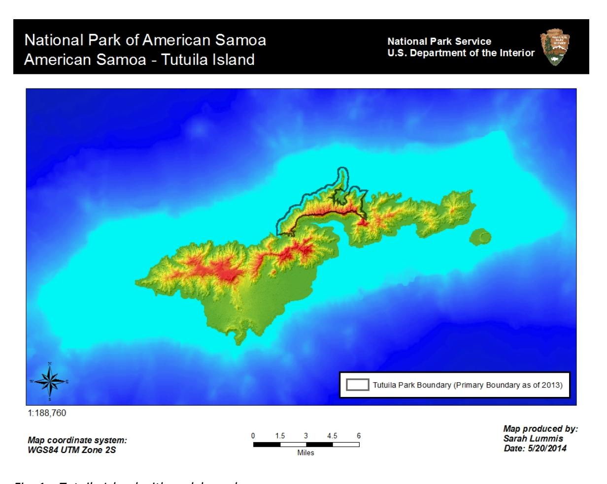

*Fig. 1 – Tutuila Island with park boundary.*

### **Personnel and effort**

 A total of 38 divers helped in COTs control efforts from the National Park Service, Department of Marine and Wildlife Resources, American Samoa's Coral Reef Advisory Group, the National Marine Sanctuary of American Samoa, and the National Oceanographic and Atmospheric Administration (NOAA). Haphazard efforts to determine the extent of the COTs outbreak were conducted starting in December 2011 and continued through March 2013 when more formalized methods were developed and implemented. 

 Two COTs "blitzes" were conducted where large groups of off-island divers were invited to help rapidly control the outbreak. The first occurred in November 2013 when eight divers from the NPS Submerged Resources Center (SRC) visited for three weeks. The second occurred in April 2014 and consisted of seven divers from various agencies in NOAA who visited for two weeks. NPSA hired two COTs interns and one volunteer for a six month period starting in March 2014. A second group of four interns was hired for a six month period starting in September 2014.

### **Towed snorkeler survey**

 COT outbreaks are identified using towed snorkeler surveys. Tow surveys started in February 2014, and occurred approximately once per month. This method allows a large area of coastline to be surveyed quickly and areas of outbreak identified. Two snorkelers were towed behind a boat traveling at a speed of approximately 3 knots looking for signs of COT outbreaks. Outbreaks were identified by either observing COTs in an area, or by observing the distinctive bright white coral skeleton left after a COT has digested the coral. Areas with COTs usually had bright white patches where the animal recently fed, with deepening shades of yellow/green below the patch where algae started to colonize previously killed corals. The start and end points of outbreaks were recorded on a standardized datasheet by a boat-based observer using a handheld GPS, along with the depth and intensity of the outbreak. Depth was judged by the snorkeler and confirmed with a boat-mounted depth sounder. Intensity was recorded as light (A few COTs or scars spaced out along the reef but no areas with overlapping COT scars), medium (patches of multiple COT scars in an area, with breaks of healthy coral between patches), or heavy (COT scars overlapping to form a continuous area of COTs scars along the reef with no break between scars). Depending on the extent of the outbreak, either a single GPS point (for a small, highly localized outbreak), or a start and an end point (for an outbreak that stretches along the coast) was recorded. Total surveyed area was automatically logged on a handheld GPS unit using the GPS track mode set to record the boat's position once a minute. The survey track and outbreak areas were visualized using ArcGIS.

### **Eradication dives**

 Outbreaks of COTs were controlled by either physically removing starfish from the ocean or injecting individuals with a lethal solution of either sodium bisulfate or currently oxbile. Eradication dives were conducted by SCUBA or rebreather divers at outbreak locations identified by tow surveys. Physical removal occurred between March 2013 and April 2013. Lethal injection started in November 2013 and continues to date. COTs were injected using a modified auto-filling injection gun, commonly used for cattle inoculation. Divers carried an injection gun attached to a 5 l tank filled with the lethal solution. Sodium bisulfate (700 g/l, 10 ml injection at 5-10 locations/individual) was used from November 2013 to April 2014. Oxbile (10g/l, 10 ml injection at 1 location/individual) was used from April 2014 to present. Divers recorded number of COTs injected, average depth, and survey start and end times on a standardized datasheet. One diver in the group towed a GPS attached to a surface float that was set to record GPS position every minute. Eradication start and end locations were recorded post-dive by matching the diver's start and end times with the towed GPS location at that time. Eradication tracks were visualized using ArcGIS.

###  **Age structure of COTs**

 Opportunistic sizing of COTs was conducted in order to estimate the age structure of the population. Individuals were measured underwater by laying a graduated slate along their ventral surface, forcing them into a flattened shape. The size of the COT was measured as the greatest distance between the ends of an average pair of legs for each individual. Individual size was recorded on a standardized datasheet along with date and location of the dive. Age was estimated as between 1 and 2 years for 30- 100 mm individuals, 2-3 years for 100-250 mm individuals, 3-4 years for 250-300 mm individuals, 4-5 years for 300-400 mm individuals, and 5+ year for starfish over 380 mm (Hughes et al., 2014).

### **Results**

### **Towed snorkeler survey**

 Tow surveys of NPSA waters were conducted once every month between February 2014 and October 2014, except for June when surveys were only conducted outside the park (8 complete park surveys). Additional surveys were conducted outside the park when time and weather allowed (3 surveys). Early surveys of park waters showed high concentrations of COTs on the East side of Fagasa (Clark, pers. obs). By February, 2014 the outbreak had spread to include Fagasa to Agapie Cove and by October 2014 COTs were observed along most of the park reef (Fig. 2). Early surveys outside the park showed a concentration around Fagamalo (Clark, pers. obs.). The first extensive survey outside the park was conducted in June 2014 and showed high concentrations in Fagamalo and Aoloau. By October 2014 COTs were observed along an entire survey from Poloa to Masefau, with the heaviest concentrations in Fagamalo (Fig. 2). In general, COTs were originally observed on the North side of Tutuila centered at Fagamalo and Fagasa and have since spread to include most of the North side of the island.

### National Park of American Samoa Crown of Thorns Outbreaks February 2014

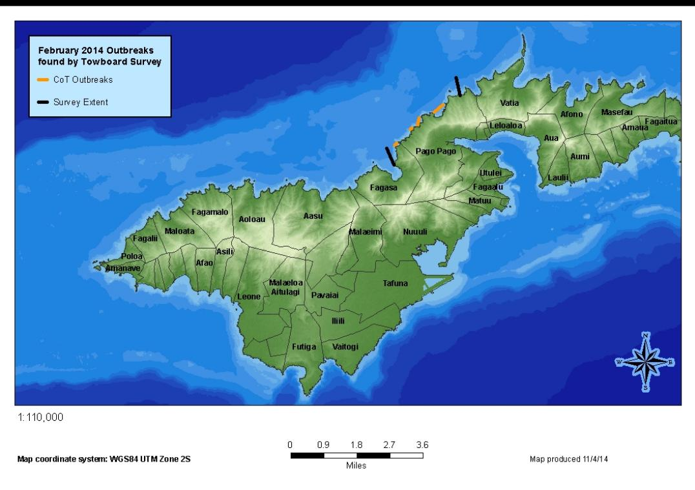

### National Park of American Samoa Crown of Thorns Outbreaks March 2014

National Park Service U.S. Department of the Interior

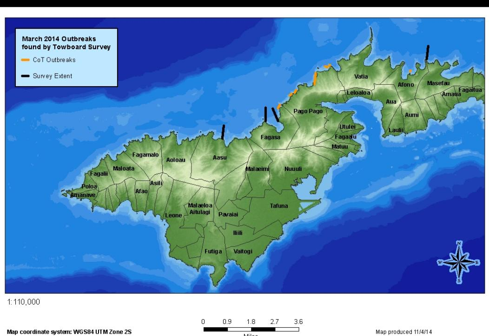

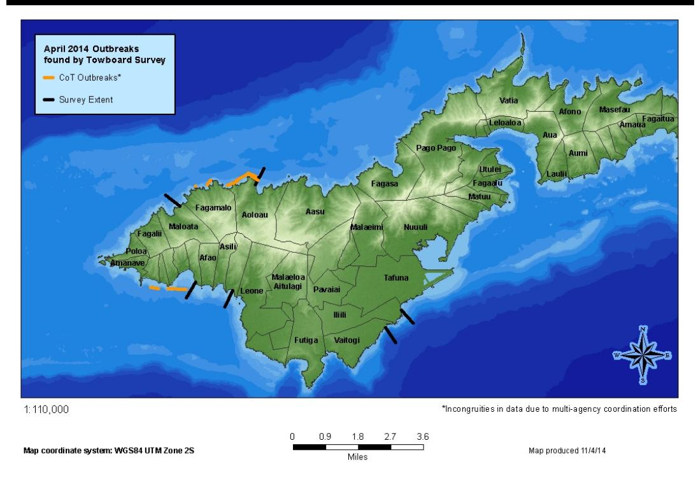

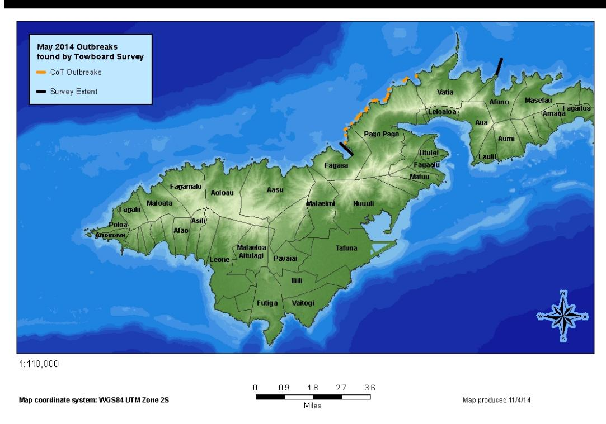

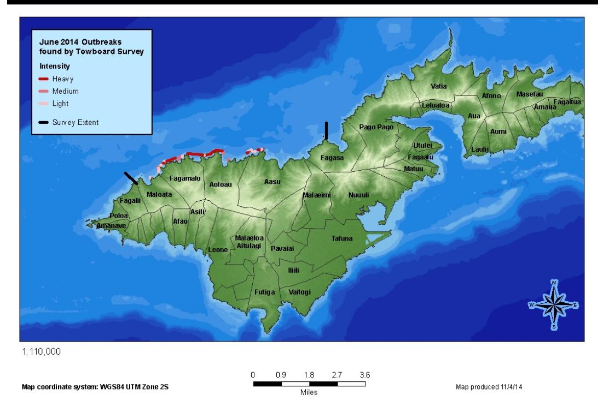

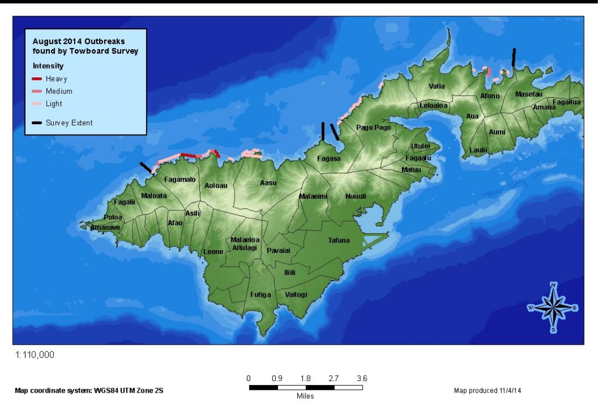

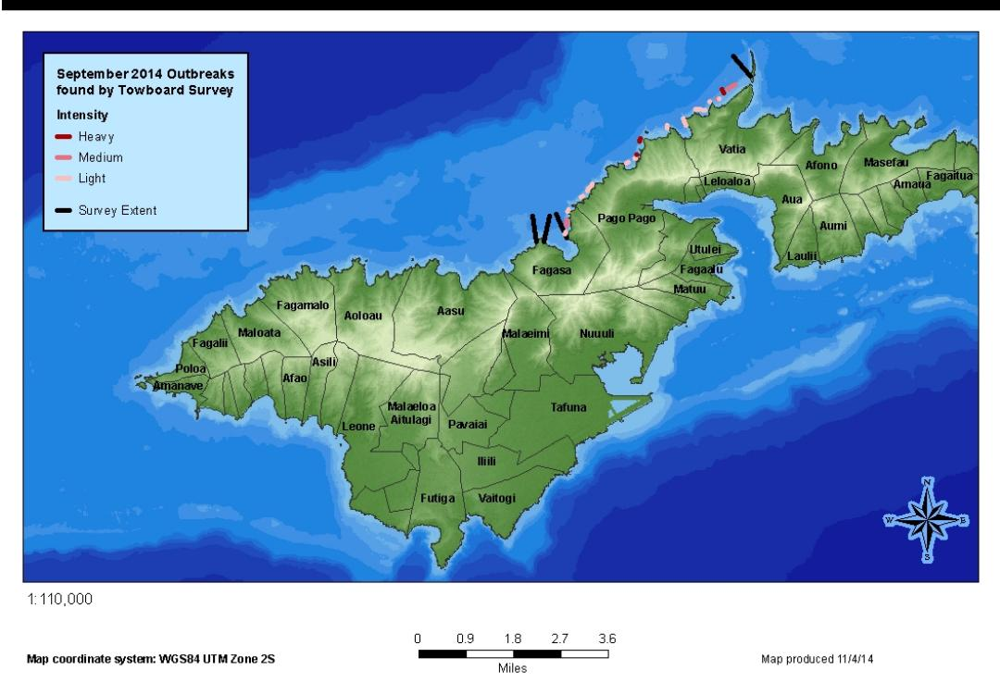

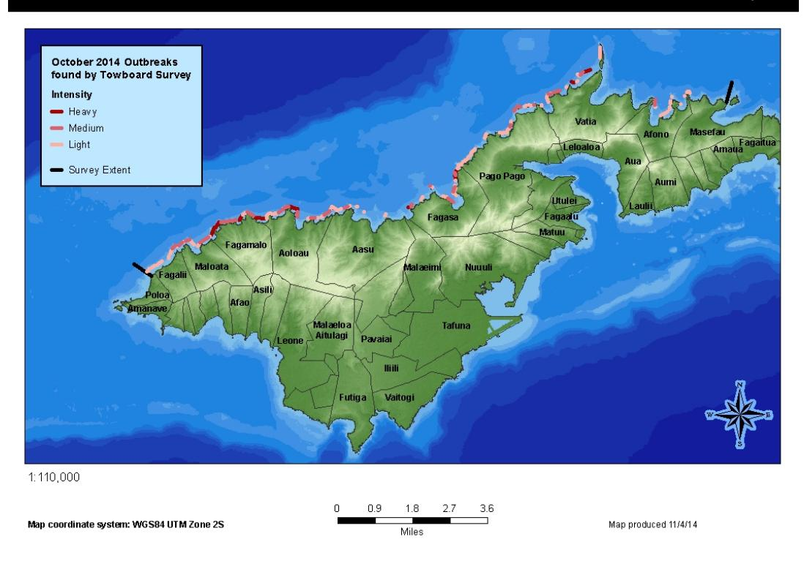

 *Fig. 2 - Locations of COTs as observed by tow surveys for February 2014 thru October 2014. Outbreak was recorded starting in June. Heavy outbreak areas are in red, moderate outbreaks in orange, and light in pink. The extent of the survey effort is marked by a black line extending offshore.*

### **Eradication dives**

 A total of 15,537 COTs were killed between March 2013 and October 2014 during 619 eradication dives (Fig. 3 & 4). Of these, 6849 were located in park waters (329 dives) and 8688 were outside of the park (290 dives) (Table 1 & 2). Sodium bisulphate was initially used as a poison following several studies indicating its efficiency and limited side effects for other reef organisms (Hoey & Chin 2004, Pratchett et al 2009). However, this method requires that each starfish be extracted from the reef matrix and injected multiple times around the central disk to ensure it is killed (Fig. 5). To increase efficiency, in April 2014 we switched to using oxbile. Oxbile elicits an allergic reaction from COTs, and increases their susceptibility to bacterial infections, resulting in large lesions on the body and death within roughly 24 hours (Rivera-Posada et al. 2012) (Fig. 5). This poison can be administered as a single dose, greatly increasing the efficiency of eradication dive teams. Further, there is no evidence for harmful side effects to other reef organisms (Rivera-Posada et al. 2013, Bos et al. 2013).

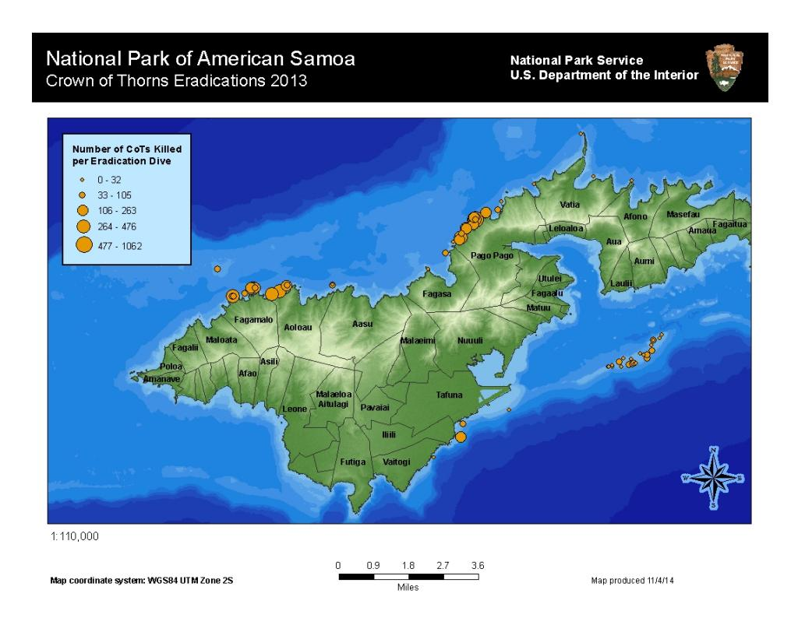

*Fig. 3 – Location and number of COTs killed for 2013.*

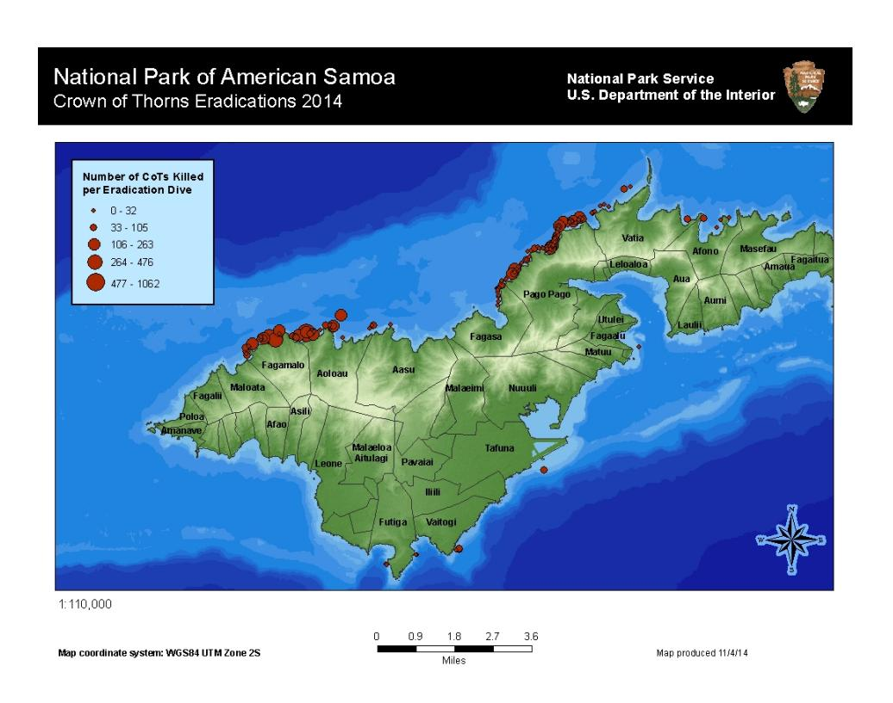

*Fig. 4 – Location and number of COTs killed for 2014.*

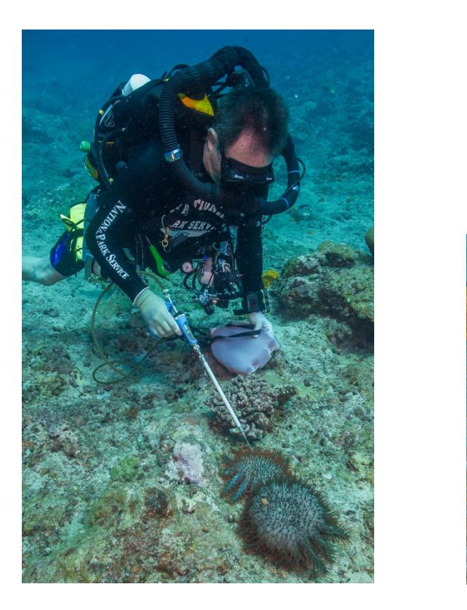

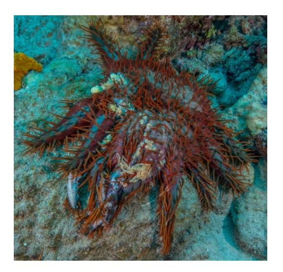

*Fig. 5 – Eradication efforts included injection of COTs with either sodium bisulphate or oxbile followed by death within 24 hours.*

### **Eradications within NPSA waters**

 Eradication dives occurred in park waters starting in November 2013 and continue to present (Table 1, Fig. 6). The largest number of COTs killed per month was 3088 in November 2013 during 118 dive hours (Table 1). This also corresponded to the greatest effort per month due to the presence of the SRC dive team. The highest kill rate in the park was in January 2014 with 43 COTs killed/hour (Table 1). Kill rates generally declined over time, with only 5.73 COTs killed/hour in October 2014 during 32 hours of diving (Table 1, Fig. 6).

 *Table 1 – COTs killed, dive hours, kill rate, and average depth during monthly control efforts in park waters. No dives were conducted during missing months.*

|       |           | COTs   | Dive   | Kill	Rate | Average |
|-------|-----------|--------|--------|-----------|---------|
| Year  | Month     | Killed | Hours  | (COTs/Hr) | Depth   |
| 2013  | November  | 3088   | 118.48 | 26.06     | 49.81   |
| 2013  | December  | 64     | 4.78   | 13.38     | 59.22   |
| 2014  | January   | 819    | 19.08  | 42.92     | 61.05   |
| 2014  | February  | 577    | 21.67  | 26.63     | 58.64   |
| 2014  | April     | 589    | 47.27  | 12.46     | 61.41   |
| 2014  | May       | 542    | 25.62  | 21.16     | 52.03   |
| 2014  | July      | 478    | 18.72  | 25.54     | 60.26   |
| 2014  | August    | 240    | 21.28  | 11.28     | 58.00   |
| 2014  | September | 270    | 18.82  | 14.35     | 61.23   |
| 2014  | October   | 182    | 31.75  | 5.73      | 47.35   |
| Total |           | 6849   | 327.47 |           |         |

a)

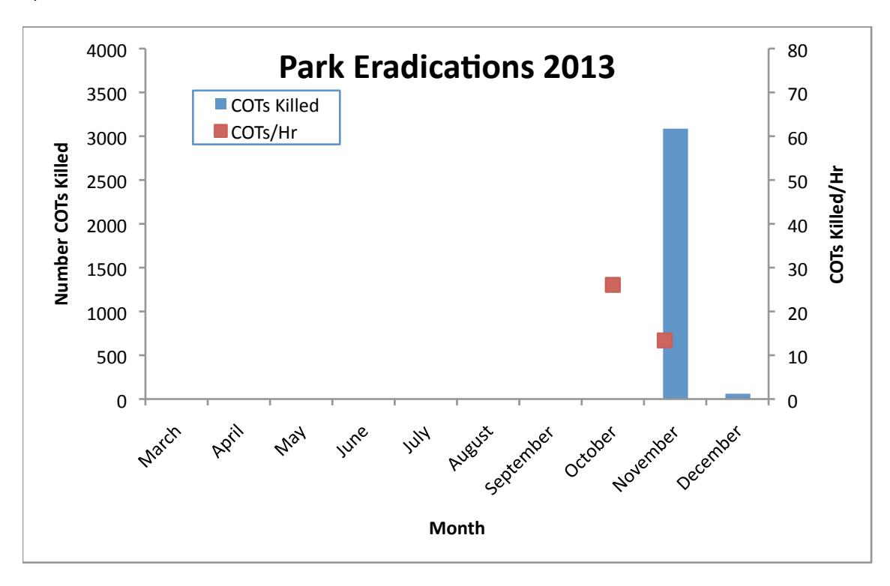

b)

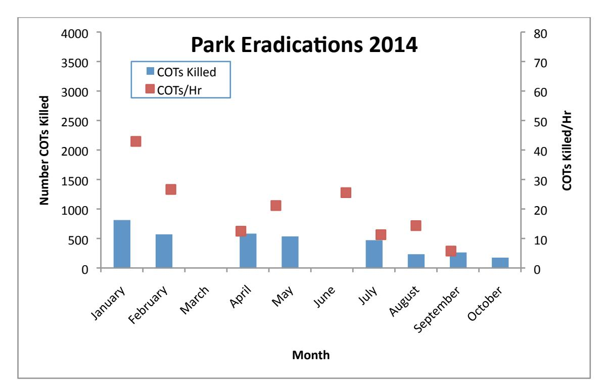

 *Fig. 6 – Number of COTs killed and number of COTS killed per hour for a) dives in the park in 2013, b) dives in the park in 2014.*

### **Eradications outside NPSA waters**

 Eradication dives started outside the park in March 2013 and continue to date. Dives generally occurred on the South side of Tutuila from March through June 2013, but switched to the area between Fagamalo and Fagasa starting in November 2013. Dives in March and April 2013 occurred at Taema Banks, where large numbers of highly concentrated COTs lead to kill rates of up to 55 COTs/hour (Table 2, Fig. 7). Dives off the airport in June 2013 resulted in 48 COTs killed at a rate of 27 COTs/hour. The highest number of COTs killed in any month was during November 2013, with 3560 COTs killed in the Fagamalo area during 153 dive hours with the SRC dive team. The highest kill rate was in June 2014 with 73 COTs killed/hour near Aoloau Bay (Table 2, Fig. 7). 

 *Table 2 - COTs killed, dive hours, kill rate, and average depth during monthly control efforts outside of park waters. No dives were conducted during missing months.*

|       |          | COTs   | Dive   | Kill	Rate | Average |
|-------|----------|--------|--------|-----------|---------|
| Year  | Month    | Killed | Hours  | (COTs/Hr) | Depth   |
| 2013  | March    | 651    | 11.75  | 55.40     | 46.39   |
| 2013  | April    | 161    | 3.43   | 46.89     | 47.50   |
| 2013  | June     | 48     | 1.77   | 27.17     | 47.40   |
| 2013  | November | 3560   | 153.45 | 23.20     | 57.49   |
| 2014  | April    | 1298   | 108.22 | 11.99     | 59.34   |
| 2014  | May      | 31     | 5.10   | 6.08      | 51.67   |
| 2014  | June     | 2110   | 28.93  | 72.93     | 51.51   |
| 2014  | August   | 87     | 5.47   | 15.91     | 49.63   |
| 2014  | October  | 742    | 26.30  | 28.21     | 57.54   |
| Total |          | 8688   | 344.42 |           |         |

a)

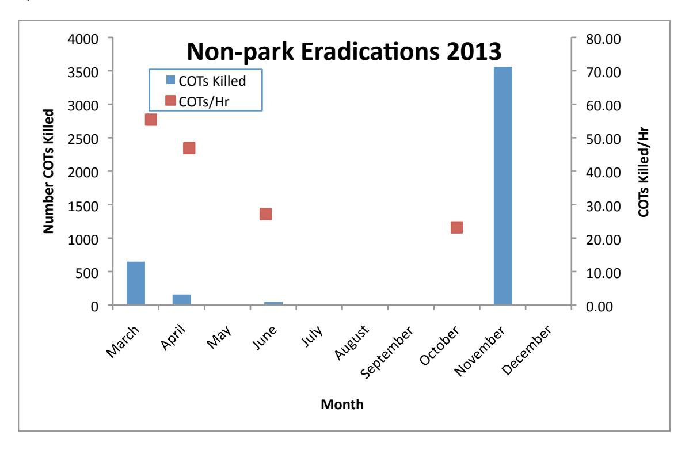

b)

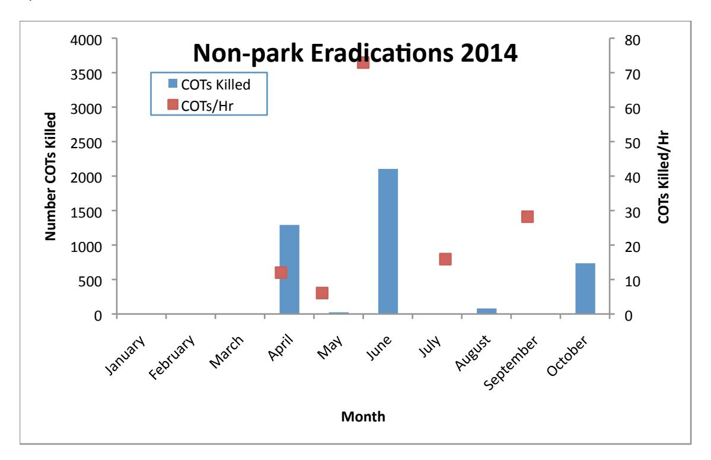

*Fig.\*7 –\*Number\*of\*COTs\*killed\*and\*number\*of\*COTS\*killed\*per\*hour\*for\*a)\*dives\*outside\*the\*park\*in\*2013,\* and\*b)\*dives\*outside\*the\*park\*in\*2014.*

### **Age&structure&of&COTs**

Size"data"was"collected"for"744"COTs.""Starfish"measured"in"2013"had"a"mean"size"of"27"cm"(N=432," SD=4.89),"while"those"in"2014"had"a"mean"of"34.9"cm"(N=312,"SD=4.35)"(Fig."8).""This"translates"to"a"2\4" year"old"cohort"in"2013"and"a"3\5"year"old"cohort"in"2014.""""

a)

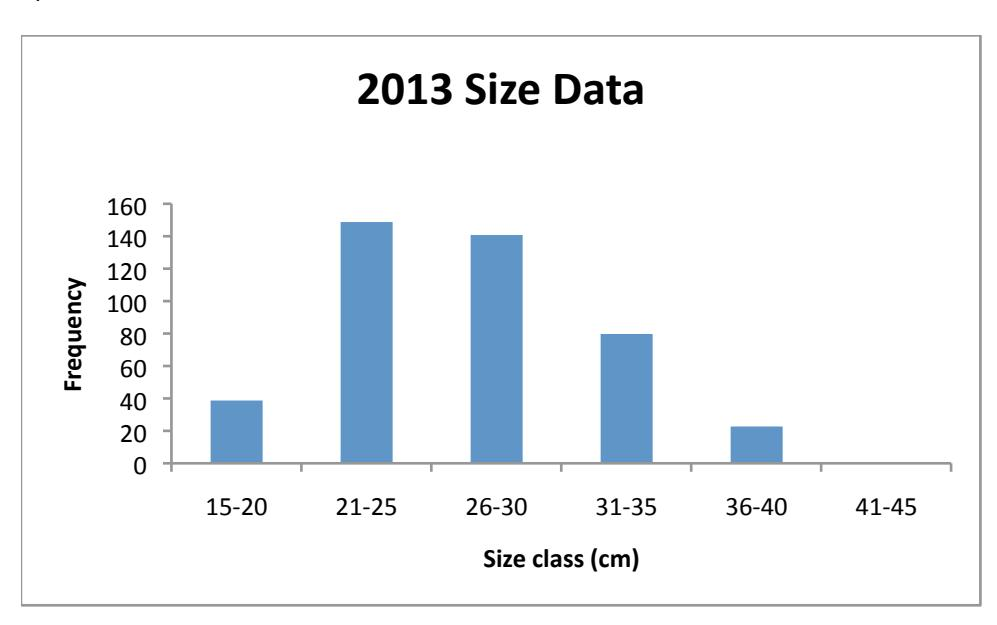

b)

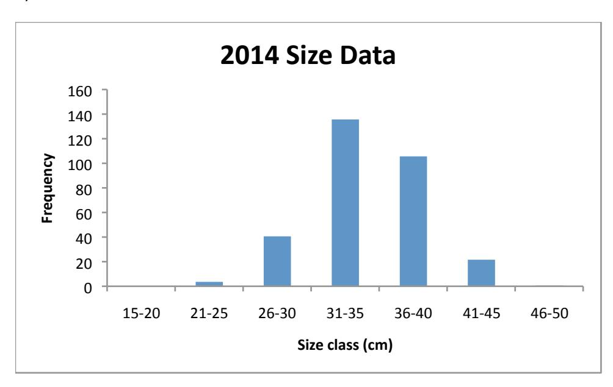

*Fig.\*8\*=\*Size\*frequency\*of\*COTs\*in\*a)\*2013\*and\*b)\*2014.*

### **Discussion**

 No surveys have been conducted in the Manua islands, but there have also been no reports of COTs from the islands' residents. Efforts on the South side of Tutuila both at detecting and killing COTs have been opportunistic and are not very enlightening as to the outbreak's temporal or spatial characteristics. They will not be discussed here. The North side detection effort outside the park was consistent starting in February of 2014 but not temporally consistent (approximately every 3 months). The detection effort in the park was consistent and frequent and therefor provides the clearest picture of how the outbreak is spreading and the successes of NPS's targeted eradication efforts.

 The combination of tow surveys to identify COTs outbreaks followed by eradication has proven a successful method to control COTs populations in a limited area. Specifically, the COTs "blitz" combined with dive interns has allowed both rapid eradication of a large number of COTs and a continuing effort to keep park waters clear of COTs. It is clearly impossible to eradicate all COTs on Tutuila, but a limited area appears to be manageable. We have focused on park waters and more specifically on 'critical sites', those with high coral diversity and abundance that could act as a source for reestablishing devastated reefs. This is in accordance with the familiar concept of protecting select areas for largescale reef resilience goals. While some areas would be lost, these protected areas would increase the chance that they could come back by providing larvae to recolonize the reef. Due to the extensive efforts of NPSA marine staff made possible by regional funding, most of the NPSA's reef has retained most of its coral cover. Limited areas have significant loss of coral and a few areas, including Tafea Cove, have no loss of coral at all. The park believes we can maintain this situation provided we have sufficient funds to maintain a dedicated COTs eradication dive team. We have also devoted resources to surveying and eradicating COTs in areas outside of the Park. Our work eradicating COTs in these areas provides a buffer zone around the Park and reduces spawning populations. Future efforts should continue to utilize both blitzes to quickly reduce large outbreak areas and interns to maintain populations at low levels. 

 Tow surveys proved to be an efficient means of surveying extensive areas for COTs. During surveys, estimates of COT density were made, based on the number of scars observed. These allowed areas to be prioritized for more timely and efficient eradication. Although survey effort varied from month to month, a general trend was apparent wherein COTs expanded outward from outbreaks centered in Fagamalo and Fagasa. COTs were originally observed at Fagasa in August 2013 (A. Lawrence, pers. comm.), and by November 2013 they occurred from Fagasa to Agapie Cove. The most recent outbreaks (October 2014) have occurred near Pola Island and in Afono. The primary outbreak site outside the park was located between Fagamalo and Aoloau, but as of October 2014, COTs had been found along most of the northern shoreline of Tutuila between Masefau and Poloa. Broadly speaking, COTs have been reduced to low levels in most of the park waters, with fewer areas of high intensity and a trend toward lower-intensity outbreaks. Additional effort is now needed outside of park waters to cull some of the large populations that have settled between Fagamalo and Fagasa. 

 Use of oxbile has greatly increased the efficiency of divers, and eliminated the need to handle COTs during eradication efforts. Sodium bisulfate requires multiple injections to kill the animal, necessitating extensive handling of the animal. Oxbile requires a single injection, eliminating the time needed to pull the animal from the reef. Oxbile is safer since no handling of the animal is required and the single injection allows the divers to spend less time in close proximity to the toxic spines.

 Eradications within park waters have significantly culled COT populations, with mostly low levels of COTs found in the park currently. However, continued effort is needed as each month new COTs appear in areas previously cleared. These may be newly settled COTs, COTs that have moved in from surrounding areas, or COTS that were missed on previous eradication dives. Coral damage has been minimized in the park by promptly eradicating these animals every month. However, new areas are still being infected. An example is the area near the Pola Island: no COTs were observed in this area prior to September 2014, but recently, an outbreak was observed in approximately 30m of water. This is typical of a new outbreak, where COTs settle on the deeper reef area and work their way toward shallower sections. It is hoped that the shallow reefs can be protected by quickly eliminating these COTs while they are still in deeper water.

 Size data for both 2013 and 2014 suggest that the current cohorts were spawned between 2009 and 2011. The lack of individuals less than 20 cm in 2014 hopefully indicates that no new cohorts are entering the population in the areas surveyed. If this is truly the case, then intense eradication efforts would be beneficial since no new individuals are entering the population to replace those killed. However, COTs are usually hidden in the reef matrix until about 2-3 years of age, when they emerge as mature adults. While the current size data is encouraging, we will not know for several years if additional cohorts of COTs will be entering the population. This means that COTs represent an on-going threat to the marine resources of the Park, and further support will be needed if management efforts are to continue. 

 Overall, NPSA's marine staff is noticeably reducing the COT population within the Park waters, and is hopeful that continued efforts will lead to the majority of the coral still being intact and alive when the outbreak subsides. It is not possible to predict when this will occur. Moving forward, it is important that we continue to conduct regular surveys both within and outside of National Park waters to determine how effective our eradication efforts have been, as well as to identify new outbreaks. 

 Additionally, it would be helpful to do a survey around the entire island to identify any outbreaks that may exist outside of the areas that are regularly surveyed by NPS. Ideally, this would include surveying offshore banks with high coral cover, such as Taema Banks which had significant eradication efforts in 2013 but has not (to our knowledge) been re-surveyed in 2014.

 Although our primary focus is the National Park waters, it is also important to clear the rest of the North side of the island to the extent possible. Towed diver surveys show that the area between Aoloau and Fagamalo has extremely high concentrations of COTs. This was confirmed during ten dives in June 2014, when NPSA divers killed 2110 COTs in that area. It is important that we work to manage areas near the park since COTs are broadcast spawners and any larvae produced during the breeding season would be transported to the Park waters from nearby reefs.

### **References**

 Dana, T.F. (1970). Acanthaster: a rarity in the past? Science (New York, NY) *169*, 894-894.

 De'ath, G., Fabricius, K.E., Sweatman, H., and Puotinen, M. (2012). The 27–year decline of coral cover on the Great Barrier Reef and its causes. Proceedings of the National Academy of Sciences *109*, 17995- 17999.

 De'ath, G., and Moran, P.J. (1998a). Factors affecting the behaviour of crown-of-thorns starfish (Acanthaster planci L.) on the Great Barrier Reef: 1: Patterns of activity. Journal of Experimental Marine Biology and Ecology *220*, 83-106.

 De'ath, G., and Moran, P.J. (1998b). Factors affecting the behaviour of crown-of-thorns starfish (Acanthaster planci L.) on the Great Barrier Reef: 2: Feeding preferences. Journal of Experimental Marine Biology and Ecology *220*, 107-126.

 DeVantier, L.M., and Terence, J.D. (2007). 4. Inferring Past Outbreaks of the Crown-of-Thorns

 Seastar from Scar Patterns on Coral Heads. In Geological Approaches to Coral Reef Ecology, R. Aronson, ed. (New York, Springer), pp. 85-125.

 Fabricius, K.E. (2013). *Acanthaster planci*. In Starfish: Biology and Ecology of Asteroidea, L. J, ed. (Johns Hopkins University Press), pp. 132-141.

 Fabricius, K.E., Okaji, K., and De'ath, G. (2010). Three lines of evidence to link outbreaks of the crown-ofthorns seastar Acanthaster planci to the release of larval food limitation. Coral Reefs *29*, 593-605.

 Hughes, R.N., Hughes, D.J., and Smith, I.P. (2014). Limits to understanding and managing outbreaks of crown-of-thorns starfish (Acanthaster spp.). Oceanography and Marine Biology: An Annual Review *52*, 133-200.

 Kettle, B.T. (1990). Variations in biometric and physiological parameters of Acanthaster planci (L.)(Echinodermata; Asteroidea) during the course of a high density outbreak (James Cook University).

 Kettle, B.T., and Lucas, J.S. (1987). Biometric relationships between organ indices, fecundity, oxygen consumption and body size in acanthaster planci (L.) (Echinodermata; Asteroidea). Bulletin of Marine Science *41*, 541-551.

 Lucas, J. (1982). Quantitative studies of feeding and nutrition during larval development of the coral reef asteroid *Acanthaster planci* (L.). Journal of Experimental Marine Biology and Ecology *65*, 173-193.

 Lucas, J. (1984). Growth, maturation and effects of diet in *Acanthaster planci* (L.)(Asteroidea) and hybrids reared in the laboratory. Journal of Experimental Marine Biology and Ecology *79*, 129-147.

 Moran, P., Bradbury, R., and Reichelt, R. (1988). Distribution of recent outbreaks of the crown-of-thorns starfish (Acanthaster planci) along the Great Barrier Reef: 1985–1986. Coral Reefs *7*, 125-137.

 Moran, P.J., and De'ath, G. (1992). Estimates of the abundance of the crown-of-throns starfish Acanthaster planci in outbreaking and non-outbreaking populations on reefs within the Great Barrier Reef. Marine Biology *113*, 509-515.

 Pandolfi, J., Jackson, J., Baron, N., Bradbury, R., Guzman, H., Hughes, T., Kappel, C., Micheli, F., Ogden, J., and Possingham, H. (2005). Are U. S. Coral Reefs on the Slippery Slope to Slime? Science(Washington) *307*, 1725-1726.

 Pratchett, M.S., Caballes, C.F., Rivera-Posada, J.A., and Sweatman, H.P.A. (2014). Limits to understanding and managing outbreaks of crown-of-thorns starfish (Acanthaster spp.). Oceanography and Marine Biology: An Annual Review *52*, 133-200.

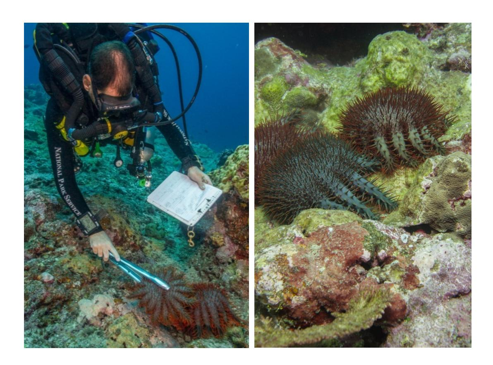