# Coastal Currents in American Samoa

**Their Role in Marine Protected Area Network Design**

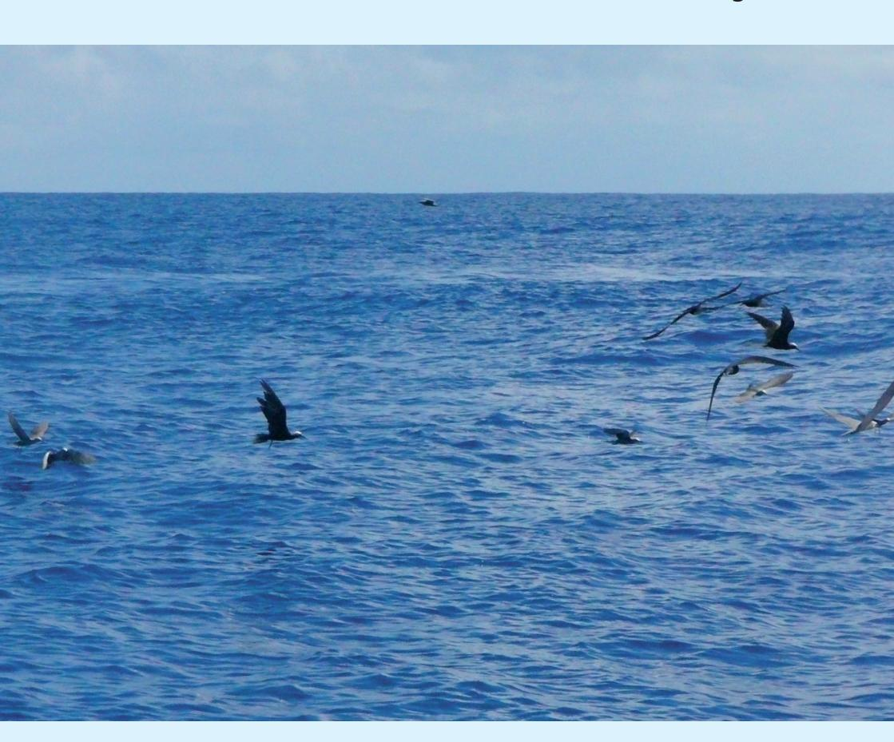

**Lucy Jacob, Philip Wiles, Tafito Aitaoto and Sione Lam Yuen**

Created by the Department of Marine and Wildlife Resources with funding from the Western Pacific Regional Fisheries Management Council

**Copyright:** Department of Marine and Wildlife Resources, Pago Pago, American Samoa (+684 6334456).

#### **Citation**

Jacob, L., Wiles, P., Aitaoto, T., Lam Yuen, S. 2012. Coastal Currents in American Samoa. Their Role in Marine Protected Area Network Design. Department of Marine and Wildlife Resources, American Samoa. Pp. 23.

Funding for this project was provided by the Western Pacific Regional Fisheries Management Council's NOAA Coral Reef Conservation Grant, award number NA09NMF4410038. The funding paid for the purchase of an Acoustic Doppler Current Profiler (ADCP) to carry out current surveys in American Samoa. The project was initiated by the No Take MPA Program (DMWR) with a view to gaining information on connectivity of priority locations for Marine Protected Area (MPA) locations in Tutuila.

This booklet is designed to provide useful background information about tides and currents and the roles that they play in marine ecosystems and MPA network design. Summary information from the current surveys that were carried out in Tutuila in 2010/11 is also presented. The intended audiences are college/high school students and fishermen who are interested in learning more about tides and currents in American Samoa. There are plans to create a Samoan version of this booklet in the future.

For further information on the information inside this booklet, contact Lucy Jacob (lucyjacob.mpa@gmail.com) or Philip Wiles (philipw@sprep.org).

#### **Contents**

| What are Tides?                   |
|-----------------------------------|
| Ocean Currents 6                  |
| Currents and Coral Reefs          |
| Current Surveys in American Samoa |
| Site 1: Fagamalo                  |
| Site 2: Aunu'u lsand14            |
| Site 3: Taema Bank                |
| Site 4: Amanave/Poloa18           |
| Overall Results                   |
| Next Steps                        |
| Acknowledgements22                |

### **Green = Google It.**

It is suggested that this book may be used by teachers and students who are interested in learning about the important role that currents play in the marine world. Many concepts are out of the scope of this book, so certain terms and words are written in green indicating "green means google it". Wherever a word or phrase is written in green, it is suggested that the reader can look up the word on 'google' to find out more details about these important concepts. Happy Googling!

### **What are Tides?**

Anyone who has been to the beach or lives close to the ocean has seen the difference between **high tide** and **low tide** but what causes it and why is it important? In Samoa, the difference in the height of the ocean between high tide and low tide is no more than about three feet but in some parts of the world, it is as much as fifty feet. That's as high as six aiga buses piled on top of each other!!

#### **What causes the tides?**

Gravity is the force which keeps the earth, moon and sun in their place, and stops you flying off the earth as it spins! The gravitational interaction between the earth, moon and sun is also responsible for the tides. Even though the moon is smaller than the sun, it is much closer to the earth and therefore has a more powerful effect on the ocean.

The side of earth that faces the moon experiences a strong pull causing the ocean to bulge out, and creating a **high tide**. Because of centrifugal forces (the same force that pushes you to the outside of a car as it goes around a corner), the water on the opposite side of the earth also bulges out. This means there are two bulges on opposite sides of the earth.

As the earth spins during its daily cycle, these bulges of water appear to travel around the earth's oceans. As there are two bulges of water, most parts of the world (including Samoa) experience two **high tides** and two **low tides** each day. Because the moon is slowly orbiting around the earth, these tides get later by about fifty minutes each day.

#### **Why are some tides bigger than others?**

The sun also has an effect on the earth. When the moon, sun and earth are in line; the forces add together and cause higher high and lower low tides, also known as **Spring Tides**. These occur twice a month, during full and new moons.

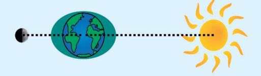

Spring tides occur during the full (and new) moon. This is when the sun, earth and moon are all in alignment

Very extreme low tides only happen twice a year, when the earth's tilt is also in line with the sun and moon (i.e. the equinox). This is a very popular time for Octopus fishing and shellfish gathering, as they are easy to catch in the very shallow water

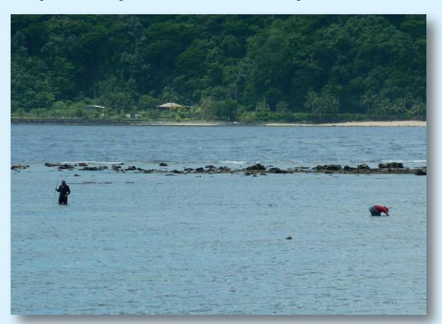

Shellfish gathering during a very low spring tide.

Photo: L. Jacob.

When the moon is at right angles to the earth and the sun, **Neap Tides** occur. This is when there is not such a big difference between the water level at high and low tides.

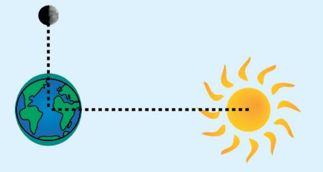

Neap tides occur during a half moon.

This is when the sun, earth and moon are at right angles.

As these bulges of water flow around the Pacific Ocean, the water is pushed past American Samoa. We see this as the water level going up and down, and the water moving backwards and forwards. This movement of water caused by the tides creates currents that are known as **Tidal Currents**.

#### **Ocean Currents**

Ocean Currents carrying water from one place to another occur throughout the world's oceans. As the water moves around, so does everything in it, such as larvae (very young fish and invertebrates), sediment (dirt) and pollution.

#### Large Scale Currents in the Samoan Archipelago

While the tides slosh water backwards and forwards, the wind also plays an important role in moving ocean water.

The wind pushes the top layers of water, creating a surface current. The depth of this surface current depends on how long the wind has been blowing in the same direction. The **Coriolis Effect** causes the currents to be slightly to the right of the wind direction in the northern hemisphere and to the left in the southern hemisphere.

Over the whole Pacific Ocean, the winds and the Coriolis Effect create large scale currents (see map below).

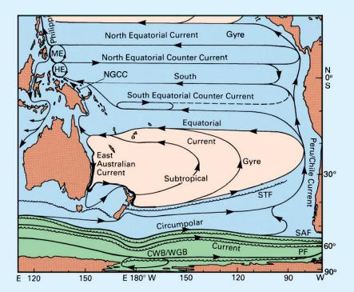

Left: Surface currents around the Pacific Ocean.

Source: Tomczak and Godfrey.

From March to September, the winds in American Samoa generally blow from the south east (also known as the **trade winds**) and from October to February, they generally blow from the north east (during the Cyclone season). The trade winds push the water from the East Pacific Ocean towards the west and cause the **South Equatorial Current** to usually flow past American Samoa.

However, if all the water in the Pacific Ocean always went west then the eastern Pacific would dry up! The water returns back to the east through the north and south Pacific 'Gyres'. A Gyre is a very large whirl pool, where the water flows slowly clockwise around the north Pacific, and anticlockwise around the south Pacific. Some of this water occasionally flows back to the east closer to the equator, to the north of American Samoa. This current is known as the South Equatorial Counter Current.

The strength and location of these currents change with the wind and the seasons. Most of the time the currents around American Samoa flow towards the south west (towards Samoa), but not always.

#### What else causes localized currents?

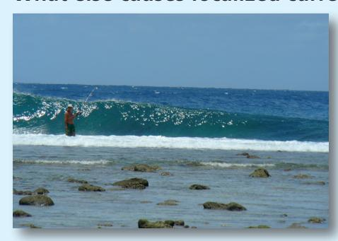

Waves caused be wind driven currents meeting coral reef. Photo: A. Lawrence

These large scale *Oceanic Currents* 'squeeze' through and around the islands of American Samoa and combine with the *Tidal Currents* to control the movement of water. However, the wind (from nearby or far away) can also affect the currents on a smaller scale.

When storms occur at other places in the Pacific, they generate very long (500ft – 2000ft) **swell-waves** that can travel across the whole Pacific Ocean in several days. When these waves break on the coral reefs surrounding our islands, they push water over the edge of the reef into the lagoons (or reef flats). This extra water in the lagoon then rushes out of the avas (channels in the reef) in a very fast current. It can be very dangerous to swim near an ava as it can suck you out into the deep ocean very quickly!

As the waves break on the reef edge, some water is also pushed alongside the outside of the reef in what is called **long shore drift**. The strength of these wave driven currents depends on both the height and length of the waves.

#### **Currents and Coral Reefs**

Not only do coral reefs provide a food source for people but they also provide protection for the islands against the strength of energetic ocean waves.

Coral reefs depend on the currents for a number of reasons such as: transport of coral and fish larvae; distribution of **plankton**; and movement of sediment and pollution towards or away from coral reefs.

Currents ultimately affect the formation of coral reefs and therefore play a role in determining their shape and size.

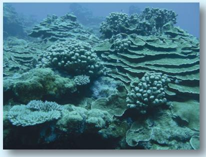

Coral reef in American Samoa.

#### How do currents assist with coral reproduction?

Corals reproduce in two ways: sexually and asexually. Sexual reproduction occurs in different ways depending on the species but the end result is that coral **gametes** fertilize each other to form **planulae** which then drift in the currents before they settle to form new coral colonies.

Although some coral planulae do have the ability to swim, particularly up and down, their end destination also depends on the currents at that time. In some cases, corals are known to spawn at a very specific time which could be determined by the temperature, moon phase and also the currents.

#### How do currents assist with transportation of other larvae?

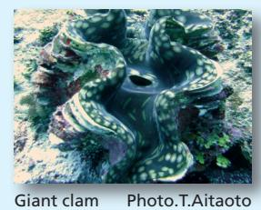

Most coral reef fish and invertebrates also have a **planktonic larval phase**, such as this Giant Clam or Faisua (pictured left). These larvae drift in the currents moving up and down, often in response to certain environmental cues, sometimes to take

advantage of certain currents that can vary with depth. For example, it is known that some fish larvae can smell the coral reef and swim towards it. Reef fish often choose certain times of the month or year to spawn which may coincide with specific moon phases or current patterns. They may also take advantage of the outgoing tide.

Some reef fish such as Groupers congregate in certain areas such as channels in **Spawning Aggregations**. This may be to take advantage of strong currents to assist with spreading their eggs out into the ocean.

How do currents supply food for animals on the coral reef? Many animals on the coral reef depend on a fresh supply of plankton each day in order to grow and reproduce. The plankton consists of very small particles of Phytoplankton (tiny plants) and Zooplankton (tiny animals, such as crab larvae). These are carried to and from coral reefs by the ocean currents. Some reef flat and lagoon areas do not get 'flushed' with a fresh supply of water and plankton each day, which affects the amount of food available.

#### Sediment transport and pollution pathways.

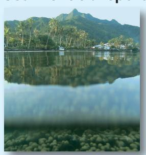

Ridges and reefs are closely connected in Tutuila. Photo. P. Wiles

Coral reefs survive best in certain conditions (specific light and temperature conditions). They also require relatively clear **nutrient** free water. Excessive **nutrients** can cause **algal growth** affecting the corals' ability to survive. If the water becomes contaminated by **sediment** (fine mud), this can harm the inhabitants of the reef. Tutuila has steep mountains and lots of streams that carry sediment directly to the reef during heavy rain.

Information on localized current patterns is therefore very important for coral reef managers, especially around possible sources of sediment and pollution (such as stream mouths).

## **Current Surveys in American Samoa**

In 2010/11 current surveys were carried out in American Samoa. The funding was provided by the Western Pacific Regional Fisheries Management Council as part of their Marine Conservation Plan. An instrument called an **Acoustic Doppler Current Profiler** (ADCP) was used to measure coastal currents at selected sites around Tutuila Island.

#### **How does an ADCP work?**

The ADCP works by sending high pitched 'ping sounds' down through the water that bounce back after hitting particles in the water. The ADCP uses the **Doppler Shift** to calculate the speed of the water underneath the boat.

When an ambulance drives past you on the road, the pitch of the siren goes from high (as it comes towards you) to low (as it passes you and is travelling away) because of the '**Doppler Shift**'. The same effect takes place when the pings bounce off plankton and sediment in the water column. The ADCP listens to the pitch of the sound that comes back and calculates the speed and direction of the water.

#### **Where were the surveys done?**

The surveys were carried out at four locations. Each survey was repeated at least three times throughout the year. The following map shows the four locations. These sites were selected for various reasons which are explained along with the results in the following pages.

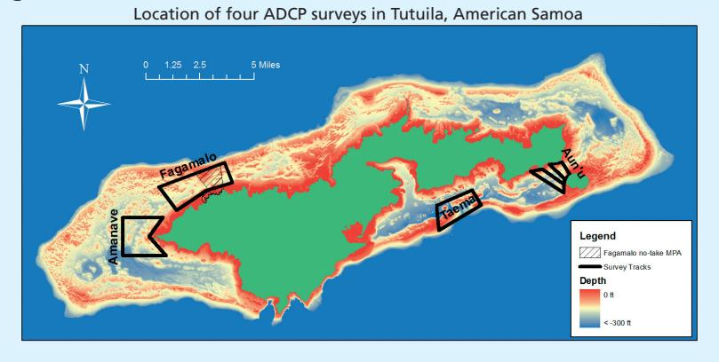

#### **How were ADCP surveys carried out?**

The ADCP was attached to an aluminium frame that was securely fastened to the side of the boat. The ADCP was connected to a laptop computer that recorded the data in real time. A Global Positioning Sensor (GPS) was used to guide the driver around a pre-assigned track and record the boat's position.

Depending on the weather, each survey lasted 12.5 hours in order to capture a full tidal cycle (e.g. low – high – low). The survey consisted of a set track around which the boat travelled at a steady speed. The boat repeatedly travelled around the track, with each circuit taking approximately one hour. The ADCP used the Doppler shift to continuously record the current.

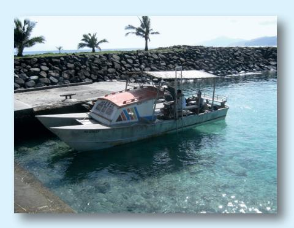

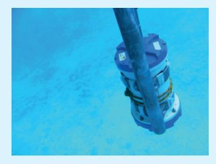

Alia boat used for ADCP surveys (left). ADCP attached to aluminum frame under the water (above). Photos: P.Wiles.

After each survey, the speed and direction of the current were analysed. As described above, the tides push water around the island in one direction or the other. The timing of these cycles are driven by the sun and moon, so are well known. It is therefore possible to measure the effect of the tide from the data and identify the other factors affecting the currents at the survey sites.

In the following sections, examples of the currents measured at each site are presented. The images show the currents when they were at their strongest in each direction. Sometimes, the background large scale current is stronger than the tide. In these cases, the currents usually do not change direction with the tide, and just change strength.

## **Site 1: Fagamalo**

Fagamalo is the last village on the road in the north west of Tutuila. Fagamalo was selected because it established the first No Take MPA (long term no fishing area) in American Samoa in May 2010. Their no-take area is 1.12 square miles and adjoins the village based MPA that was created in 2005.

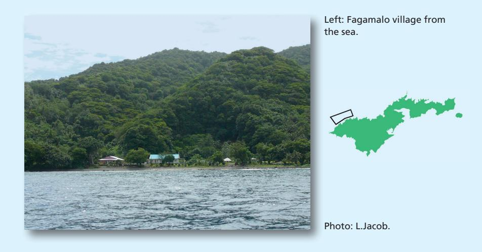

There are a total of thirty nine people in this small village (US Census 2000) living in nine households. The High Talking Chief of Fagamalo village (Faletogo Tuilagi) is a strong advocate of fishery management and effectively engages the community in conservation practices.

The No Take MPA of Fagamalo is to the east of the village. The MPA extends approximately 1.2 miles out to sea from the shoreline. The maximum depth inside the no-take area is 200 feet and there is a bank in the north western corner of the MPA that reaches up to 60 feet in depth. The seaward boundary of the MPA is quarter of a mile from the shelf edge where depths extend to 12,000 feet.

Three surveys were carried out between December 2010 and May 2011 around the grid shown on page ten.

#### **Results**

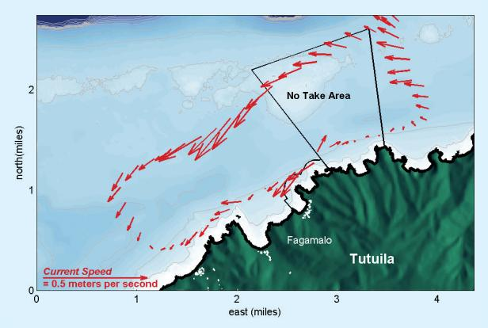

Left: currents three hours before high tide around Fagamalo. Arrows indicate direction and strength of current. The survey was carried out on December 1st, 2010 halfway between spring and neap tides

During high tide, the currents around Fagamalo were towards the south west with a maximum speed further offshore of about ten centimeters per second. However, closer to the coast the currents were slower and more complicated, as the water had to move around the coastline.

Right: currents during low tide around Fagamalo. Arrows indicate direction and strength of current. The survey was carried out on December 1st, 2010 halfway between spring and neap tides

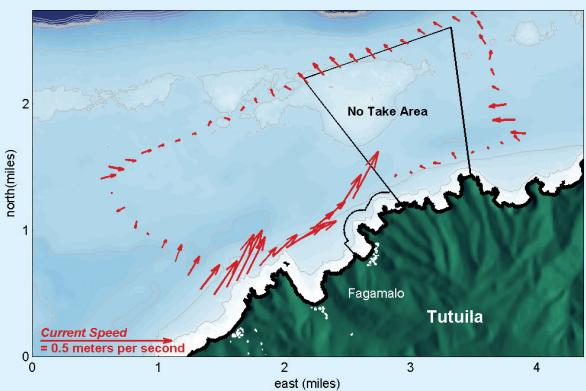

At low tide, the offshore currents were weak, with a slight offshore flow. Closer to the coast, the currents were towards the north east, indicating a change in flow direction caused by the tide. Overall, the results indicate that the flow is usually towards the south west. An increase in larvae produced in the no-take area therefore means more larvae will travel towards Poloa and Amanave in the south west.

### **Site 2: Aunu'u lsland**

Aunu'u is a small volcanic island in the south east of Tutuila with a land area of 0.59 square miles and a population of 476 (U.S. Census 2000). Aunu'u is only accessible by alia boat which transports passengers from Auasi on Tutuila Island to Aunu'u. Aunu'u has a fringing coral reef that supplies food, protection and recreation for the local population.

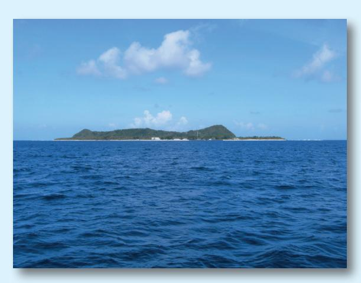

Left: Aunu'u Island from the ocean.

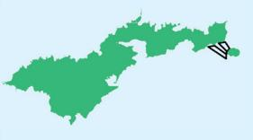

Photo. P. Wiles

The No Take MPA Program identified Aunu'u as a priority site for conservation in 2005 and carried out biological reconnaissance surveys in 2007. As a result of high scores for fish and invertebrate variables, Aunu'u was proposed for the next stage in the process of MPA consideration. A full household survey was carried out in 2009 to better understand the interactions between the people and the reef as well as its importance to them.

Current surveys were carried out in Aunu'u to predict the likely pathways of larvae originating there. Local knowledge suggested that there are strong currents in the channel near Aunu'u that change direction with the tide. This could result in the swashing of larvae backwards and forwards, thus spreading it along the nearby coast of Tutuila. If this theory is correct, then Aunu'u could be a great candidate for a No Take MPA.

Three surveys were carried out between September 2010 and June 2011 around the grid shown on page ten.

#### **Results**

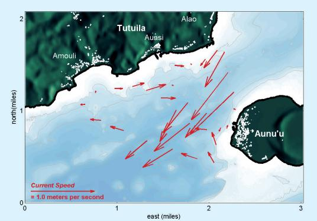

Left: currents two hours before high tide in Aunu'u channel. Arrows indicate direction and strength of current. The survey was carried out on June 14th 2011 during a spring tide.

Around Aunu'u, the fastest flowing current towards the south west occurred two hours before high tide. The fastest flow (of almost one meter per second) was on the Aunu'u side of the channel, but the currents closest to Tutuila actually went in the opposite direction, towards the north east (above). One hour before this maximum flow, the currents across the whole channel went to the south west (at a slower speed).

Right: currents three and a half hours before low tide in Aunu'u channel. Arrows indicate direction and strength of current. The survey was carried out on June 14th 2011 during a spring tide.

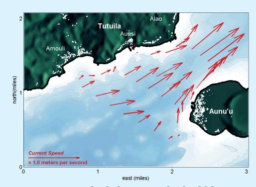

The fastest flow to the north east was recorded three and a half hours before low tide. The strongest flows were at the narrowest part of the channel between Tutuila and Aunu'u, as water was squeezed through the gap.

Analysis revealed that although the tide is strong, there is no net residual flow in either direction. Therefore larvae will be pushed back and forward through the channel, but will not travel too far away.

### **Site 3: Taema Bank**

Taema Bank is an underwater reef one mile off the south coast of Tutuila. It rises to about thirty feet below the surface, and has a variety of types of corals, fish and other marine life. It was identified as a potential No Take MPA due to reports of large fish and Whaleshark visits. The bank is unique in its habitat type and distance from shoreline impacts such as nutrients and sediment.

When developing a network of protected areas, representations of all habitat types should be included. The protected areas should be more resilient to the effects of climate change and be able to help to sustain ecosystems in the face of disaster. Taema Bank is representative of several other banks that can be found surrounding Tutuila. It was suggested by some scientists (Oram 2008) that Taema bank could be a good source of larvae and current surveys could help determine where that larvae goes.

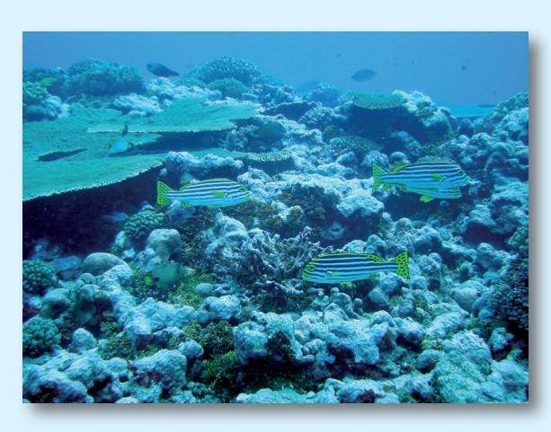

Left: Taema Bank under the water.

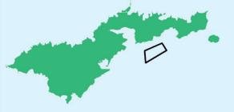

Photo. M. Sabater.

The survey track (see page ten) covered part of Taema Bank and Nafanua Bank, to the east. There is a deep channel in the middle of the two banks called the Narragansett Passage where incoming water could be colder and saltier (heavier) than the rest of the water Three surveys were carried out between November 2010 and August 2011 around the grid shown on page ten.

#### **Results**

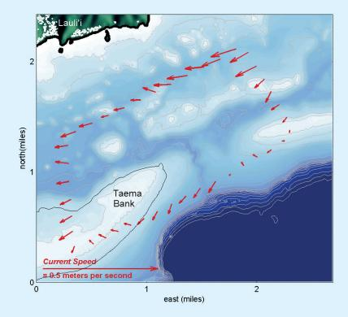

Left: currents three hours before high tide over Taema Bank. Arrows indicate direction and strength of current. The survey was carried out on November 11th 2010 during a neap tide.

Maximum flow to the west was three hours before high tide, when the water level was rising. The strongest flow was almost ten centimeters per second, and found closest to the Tutuila coast. At the same time, the currents over the bank (on the south of the track) were slightly towards Tutuila.

Right: currents three hours after high tide over Taema Bank. Arrows indicate direction and strength of current. The survey was carried out on November 11th 2010 during a neap tide.

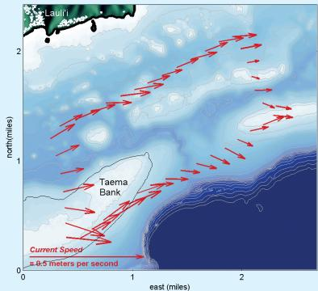

Maximum flow to the east was three hours after high tide, when the water level was dropping. The current speeds were slightly higher, at about fifteen centimeters per second. The currents over the bank were then going away from Tutuila.

This indicates that larvae produced on Taema bank will be spread across the south coast of Tutuila, both to the east and west and validates Oram's (2008) **hypothesis** that Taema Bank could be a good location for a No Take MPA.

### **Site 4: Amanave/Poloa**

Amanave is the western most village on the south shore of Tutuila. It was selected for the current surveys because it had been identified as a potential location for a No Take MPA in 2005 (Oram 2008). The data from the biological reconnaissance surveys verified that this area does have diverse and abundant coral reef resources (Jacob and Oram 2012). The population of 287 (US Census 2000) are concentrated in the eastern portion of the village but the boundary of the village extends all the way to the western tip of Tutuila. It borders the village of Poloa to the north. There are several small islands off the tip of Tutuila (see photo below).

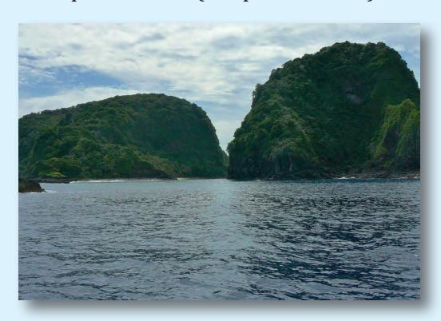

Islands off the tip of Tutuila close to Amanave and Poloa.

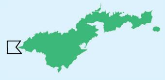

Photo: L. Jacob

Amanave and Poloa villages are both now part of the Community Based Fisheries Management Program (CFMP) and therefore have different fishing reglations in the nearshore coastal area. However, fishing is still a popular activity at Tapu Tapu (the western point of Tutuila) by alia fishing boats that fish commerically.

The survey track traced the shape of the coastline around the western tip of the island in order to capture differences in current flow that were expected at this area. This site is relatively close to the No Take MPA in Fagamalo, so the currents here will continue to carry larvae that originated from the No Take MPA area.

Three surveys were carried out between December 2010 and November 2011 around the track shown on page ten.

#### **Results**

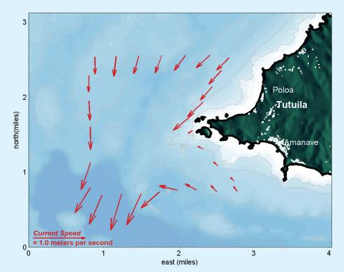

Left: currents during high tide around Amanave. Arrows indicate direction and strength of current. The survey was carried out on August 4th 2011 during a spring tide.

During high tide, the currents were strongly southwards, at speeds up to fifty centimeters per second. However, to the south of Amanave, the currents were towards the north west. This indicates that the currents 'swirl', or eddy around the tip of the island.

Right: Currents during low tide around Amanave. Arrows indicate direction and strength of current. The survey was carried out on August 4th 2011 during a spring tide.

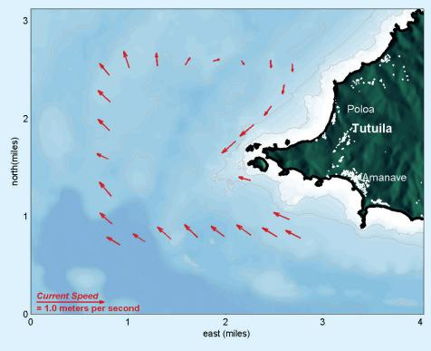

During low tide, the currents were generally weaker and to the north west. However, north of the island the currents were to the south west indicating another eddy.

Generally the flow around the tip of the island was to the south, with a weak flow to the north at low tide. The **eddies** are important, as they can hold larvae close to the shore. Larvae originating from the No Take MPA in Fagamalo will therefore be carried south west, around the island's tip, where some could be held by the eddy until they settle.

### **Overall Results**

A summary of all surveys can be found below. This information is very general but provides an overview of the currents at all survey locations. The tides play a large role in the currents at Tutuila. Towards the east (at Aunu'u and Taema Bank), the flow reverses direction with the tide. In the west (at Fagamalo and Amanave), the background large-scale currents are almost as strong as the tide, and the tide only caused a small change in current direction.

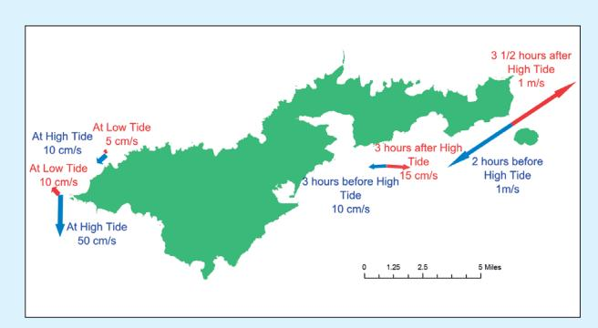

Left: Summary map showing currents from all eight ADCP surveys (two at each of four sites)

Overall, currents around most of Tutuila were relatively slow (around ten centimeters per second) with the exception of the Amanave and Aunu'u sites where much stronger speeds were recorded (up to one meter per second). Strong currents would also be expected around the tip of Pola island (see next page), in the south (near Fogama'a and Fagatele) and in the east (Tula).

At the No Take MPA in Fagamalo, over half a tidal cycle, passive larvae could travel approximately one mile in six hours, at which time the reversal of the tide could carry the larvae back in the opposite direction. The larval stage of many species can last weeks or months, meaning that they could be carried to other islands, such as Upolu and Savai'i. However, the swashing of the tide backwards and forwards and the eddy off Amanave combined with the ability of larvae to swim and the structure of the coral reef could help to retain the larvae in Tutuila. Therefore larvae from the No Take MPA could end up around the west or south shores (e.g. Leone).

## **Next Steps**

Further current surveys are planned around Tutuila, both from a boat (as described here), and by leaving the ADCP in one location to see how the currents change over several months. Data is needed from places like Pola, Tula and Fogama'a (see page 20), each of which have prominent headlands that probably cause eddies.

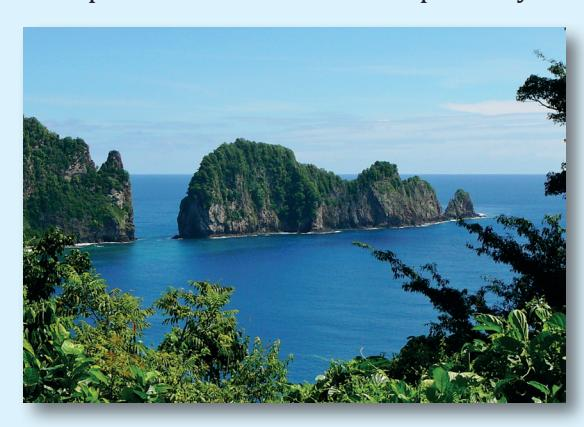

Left: Pola Island on the north of Tutuila close to the village of Vatia.

Photo: L. Jacob

In addition to ADCP surveys, drifter surveys are currently being carried out by DMWR's MPA Program using **GPS** units which drift in the ocean and simulate where larvae could go to. The drifter data will be combined with the ADCP data (presented here) to develop a computer numerical model. The numerical model uses physics (the equations that describe how water moves) to simulate what the currents around the whole of Tutuila are doing on a computer.

DMWR also plan to look at the genes of certain fish species from around the island. Through the use of **genetic markers**, it should be possible to tell which fish are related to each other. In this way, the information from current surveys can be validated.

The ADCP data and the other data that is being collected will all be used by the MPA managers in American Samoa. They will identify the most important areas to protect and will also have information on which areas are connected through the movement of larvae. This helps with **MPA network design** to protect coral reefs for future generations.

## **Acknowledgements**

The Director and Deputy Directors of DMWR, EPA and SPREP are thanked for supporting this research by allowing their staff to be involved in this project, both in the field and in the office. This booklet could not have been written without the data that was collected by a dedicated and hard working team. Teejay Letalie assisted with initial data collection and Alama Tua was the boat driver. Subsequent surveys were carried out with competent assistance from Mika Letuane (DMWR), Patrick Umi (Aunu'u), Moon Divers and Industrial Gases. Hymal Vaimoana (DMWR) also assisted the authors with data collection. Surveys often involved fourteen challenging hours at sea in small crafts so these staff deserve sincere thanks for the hard work in the field.

Unfailing support for the proposal and research was provided by the former and current Chief Fisheries Biologists, Marlowe Sabater and Domingo Ochavillo. Marlowe Sabater has also supported this project through his role at the WPRFMC who provided the funding for the research and the production of this booklet.

The authors would also like to thank the Sportfish Restoration Grant (Edward Curren) for providing funding for staff time to carry out this important work and for understanding the importance of this for the MPA Program's objectives.

#### **Reviewers**

Constructive comments made by Kelley Anderson, Douglas Fenner and John Jacob helped with the finalization of this booklet.

#### **References**

Oram, R.G. 2008. Marine protected area master plan: A manual to guide the establishment and management of no-take marine protected areas. American Samoa Government, Department of Marine and Wildlife Resources Biological Report Series 2008-01. Pago Pago, AS. 64 pp.

Tomczak, Matthias & J Stuart Godfrey: Regional Oceanography: an Introduction 2nd edn (2003), xi+390p., figs., tabls., ind., 25 cm ISBN: 8170353068. http://www.es.flinders.edu.au/~mattom/regoc/ pdfversion.html

Jacob, L. Oram, R. 2012. A Standardised Biological Assessment of Potential No-Take Marine Protected Area Locations in Tutuila, American Samoa. Department of Marine and Wildlife Resources, Biological Report Series: lucy0007. Pp.35

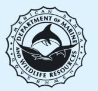

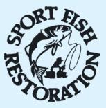

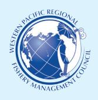

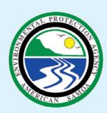