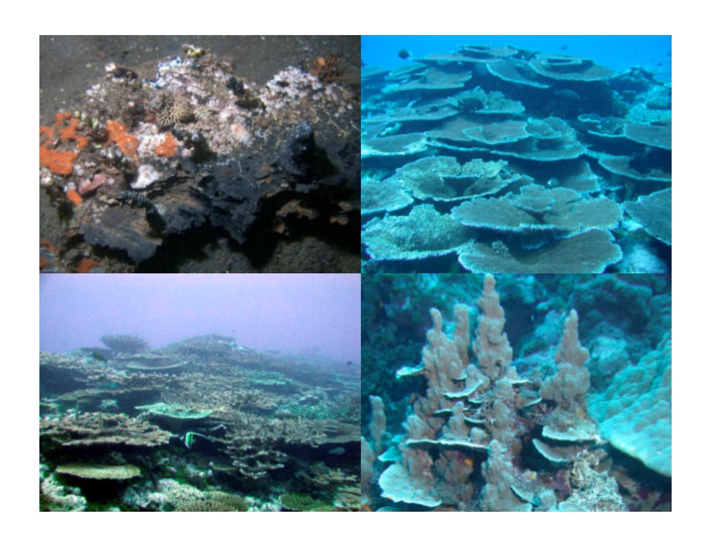
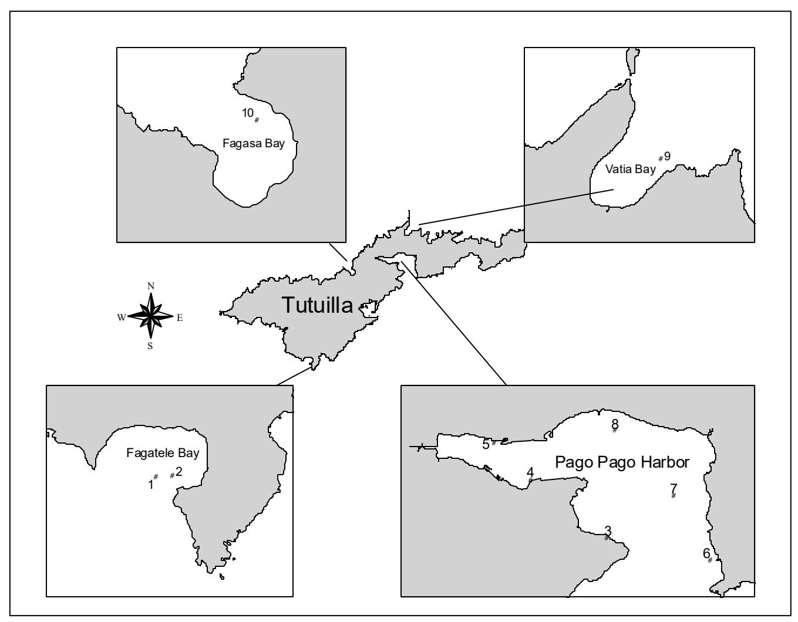
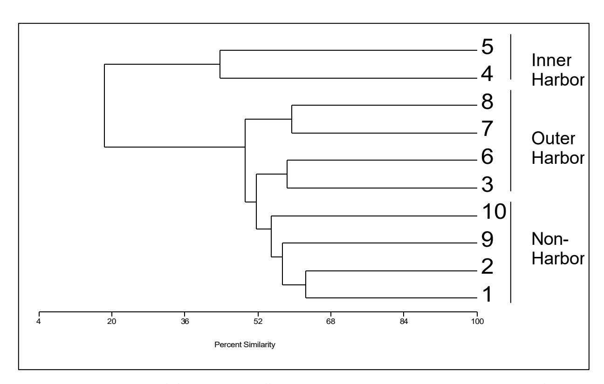
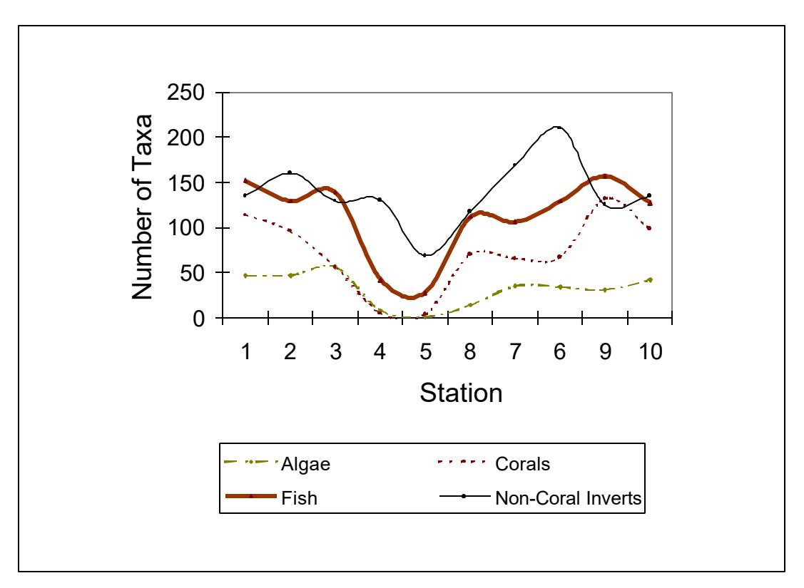
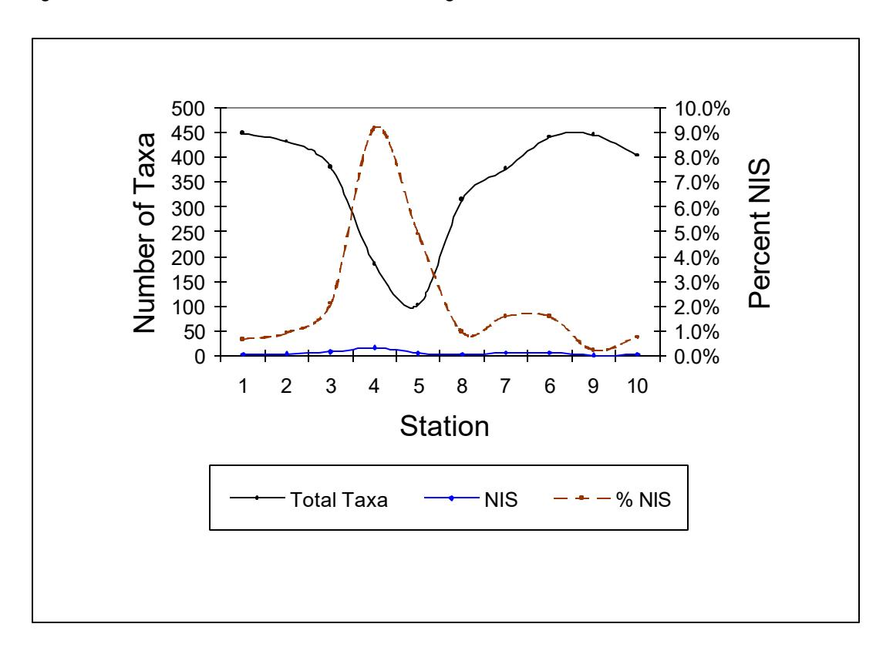
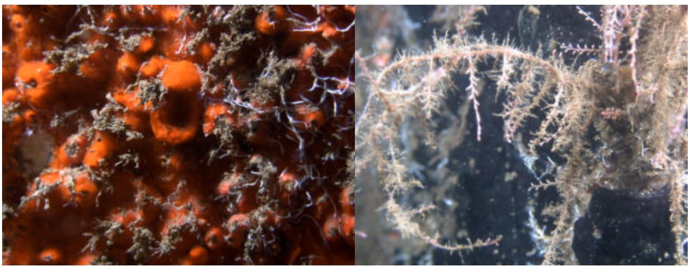
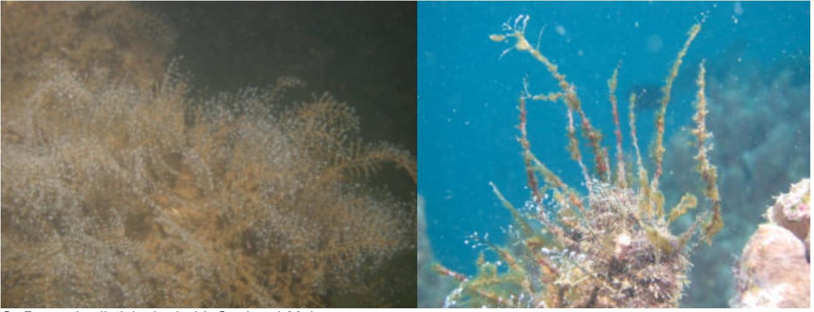
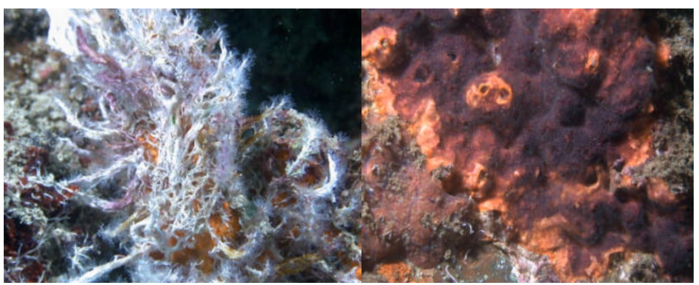

# **INTRODUCED MARINE SPECIES IN PAGO PAGO HARBOR, FAGATELE BAY AND THE NATIONAL PARK COAST, AMERICAN SAMOA**

### COVER

Typical views of benthic organisms from sampling areas (clockwise from upper left): Fouling organisms on debris at Pago Pago Harbor Dry Dock; *Acropora hyacinthus* tables in Fagetele Bay; *Porites rus* colonies in Fagasa Bay; Mixed branching and tabular *Acropora* in Vatia Bay

# **INTRODUCED MARINE SPECIES IN PAGO PAGO HARBOR, FAGATELE BAY AND THE NATIONAL PARK COAST, AMERICAN SAMOA**

**Final report prepared for the U.S. Fish and Wildlife Service, Fagetele Bay Marine Sanctuary, National Park of American Samoa and American Samoa Department of Marine and Natural Resources.**

> **S. L. Coles P. R. Reath**

**P. A. Skelton**

**V. Bonito**

**R. C. DeFelice**

**L. Basch**

**Bishop Museum Pacific Biological Survey**

**Bishop Museum Technical Report No 26**

**Honolulu Hawai'i December 2003**

Published by Bishop Museum Press 1525 Bernice Street Honolulu, Hawai'i

Copyright © 2003 Bishop Museum All Rights Reserved Printed in the United States of America


ISSN 1085-455X

### EXECUTIVE SUMMARY

The biological communities at ten sites around the Island of Tutuila, American Samoa were surveyed in October 2002 by a team of four investigators. Diving observations and collections of benthic observations using scuba and snorkel were made at six stations in Pago Pago Harbor, two stations in Fagatele Bay, and one station each in Vatia Bay and Fagasa Bay. The purpose of this survey was to determine the full complement of organisms greater than 0.5 mm in size, including benthic algae, macroinvertebrates and fishes, occurring at each site, and to evaluate the presence and potential impact of nonindigenous (introduced) marine species. These results were compared with all marine organism reports for these areas by previous investigators.

A total of 1256 taxa, including 847 identified to species, were identified from the survey. A clear spatial pattern was found for species richness by sampling site, with maximum numbers of taxa occurring at Fagetele and Vatia Bays, with the next highest occurring within Pago Pago Harbor at Onesosopo, the site nearest the east side of the harbor entrance. Numbers of taxa and species decreased dramatically with distance into the inner harbor, with minimal numbers occurring at the stations along the main shipping dock at Fagotogo and near the drydock and tuna canneries at Satala.

Using criteria that have been used for similar studies in Hawai'i, Guam and North Queensland, Australia, only 28 nonindigenous or cryptogenic species (NIS) were detected on the entire survey, considerably fewer than have been determined on harbor surveys in Hawai'i or Guam but more than found at each of four North Queensland ports. The distribution pattern by station for these introduced species was in direct contrast to the pattern found for the total taxa, both in numbers of taxa and as a percentage of the total biota. A maximum of 17 NIS occurred at the main dock station, comprising about 10% of the total biota identified at that site, and 5 NIS, or 5% of the total biota, were at the drydock station. Eight NIS were found at the Utulei and seven at the Onesosopo sites near the west and east sides of the harbor, but because of their higher overall diversities, NIS comprised only about 1.6 to 2.1% of the total taxa identified at these sites. Percentages of total taxa composed by NIS were 1.0 and 1.3% at the Aua and Leloaloa sites in the outer harbor. By comparison, NIS at the four coral reef sites outside the harbor ranged only 0.4-0.9%.

These results suggest that relatively few introduced species have been propagated in the waters of Tutuila, and those that do occur are mostly restricted to inner portions of Pago Pago Harbor and are not invasive in coral reef areas either within or outside of the harbor. Therefore, no direct intervention or mitigation measures are required or recommended at this time. A program of periodic rapid assessment and monitoring should be implemented to assure that potentially invasive introduced organism that may arrive in the future can be detected and intercepted in their early stages of propagation and spread. Also, a program should be considered to inspect the hulls of large, slow craft such as barges moving between harbors and islands that may transport introduced organisms already occurring in Pago Pago Harbor.

### TABLE OF CONTENTS

|                                                                                                                                        | Page                |
|----------------------------------------------------------------------------------------------------------------------------------------|---------------------|
| EXECUTIVE SUMMARY                                                                                                                      | i                   |
| LIST OF APPENDICES                                                                                                                     | iii                 |
| LIST OF TABLES                                                                                                                         | iv                  |
| LIST OF FIGURES                                                                                                                        | v                   |
| I. INTRODUCTION                                                                                                                        | 1                   |
| III. METHODS<br>A. Literature Search<br>B. Bishop Museum Collections<br>C. Field Surveys                                               | 4<br>4<br>4         |
| IV. RESULTS<br>A. Station Descriptions<br>B. Previous Species Reports<br>C. Present Survey<br>D. Nonindigenous and Cryptogenic Species | 7<br>10<br>12<br>15 |
| V. DISCUSSION                                                                                                                          | 18                  |
| VI. MANAGEMENT CONSIDERATIONS                                                                                                          | 20                  |
| VII. REFERENCES                                                                                                                        | 22                  |
| VIII. ACKNOWLEDGEMENTS                                                                                                                 | 26                  |
| IX. PLATES                                                                                                                             | 27                  |

### LIST OF APPENDICES

|                                                                                                                                                                                         | Page |
|-----------------------------------------------------------------------------------------------------------------------------------------------------------------------------------------|------|
| APPENDIX A. ALGAE SURVEY REPORT by Posa A. Skelton.                                                                                                                                     | 29   |
| APPENDIX B. List of Marine Organisms Reported by the Present and Previous Studies or<br>in Bishop Museum Collections from Pago Pago Harbor, Fagatele Bay,<br>Vatia Bay, and Fagasa Bay. | 41   |
| APPENDIX C. Taxa Observed or Collected from 10 Stations in Pago Pago Harbor,<br>Fagetele Bay, Vatia Bay, or Fagasa Bay, October 2002.                                                   | 143  |
| APPENDIX D. Corals and Fishes Observed in Moats and on Reef crest at Ofu Island,<br>October 2002.                                                                                       | 177  |

### LIST OF TABLES

| Table |                                                                                                                                                                                                                      | Page |
|-------|----------------------------------------------------------------------------------------------------------------------------------------------------------------------------------------------------------------------|------|
| 1     | Locations, dates, coordinates, and depths of stations sampled.                                                                                                                                                       | 6    |
| 2     | References containing previous reports for the locations in the present study.                                                                                                                                       | 10   |
| 3     | Numbers of taxa in major groups and total biota reported for Pago Pago Harbor,<br>Fagatele Bay, Vatia Bay, and Fagasa Bay by previous studies.                                                                       | 11   |
| 4     | Numbers of taxa for major taxonomic groups and total biota at each sampling<br>station.                                                                                                                              | 13   |
| 5     | Nonindigenous and cryptogenic marine species collected or observed on Tutuila<br>surveys, October 2002.                                                                                                              | 16   |
| 6     | Summary of numbers of taxa for nonindigenous (N) and cryptogenic (C) species,<br>total taxa and % of total that were NIS for harbors and ports on O'ahu , Guam,<br>and North Queensland, Australia.                  | 19   |
| 7     | Summary of numbers of taxa for nonindigenous (N) and cryptogenic (C) species,<br>total taxa and % of total that were NIS for coral reefs in the main and Northwestern<br>Hawaiian Islands, Johnston Atoll, and Guam. | 19   |

### LIST OF FIGURES

| Figure |                                                                                                        | Page |
|--------|--------------------------------------------------------------------------------------------------------|------|
| 1      | Tutuila station locations.                                                                             | 5    |
| 2      | Dendrograph of Sorensen's coefficient percent similarities among station biota.                        | 13   |
| 3      | Distributions of numbers of taxa of algae, reef corals, and non-coral invertebrates<br>among stations. | 14   |
| 4      | Distributions of numbers of total taxa and NIS among stations.                                         | 14   |

### I. INTRODUCTION

The island of Tutuila is the largest (ca. 140 km<sup>2</sup> ) of the six eastern islands of the Samoan Archipelago that comprise the U.S. Territory of American Samoa. It is also the major population center of American Samoa, with about 95% of the approximately 60,000 total population of the territory. Tutuila also is the site of American Samoa's only international airport and the major shipping port in Pago Pago Harbor, which has a population of approximately 10,000 (Green et al. 1997) and is also the location of two tuna canneries that provide the major source of local employment.

Because of its strategic location and the excellent anchorage afforded by the deep and sheltered waters of Pago Pago Harbor, Tutuila has been linked to the United States since 1872, when a treaty was negotiated for use of the harbor as a coaling station for the U.S. Navy. U.S. influence increased in 1900 when 20 chiefs of Tutuila ceded their lands and accepted U.S. rule while retaining their tribal authority and local customs (Masterman 1980). The U.S. Navy held administrative authority for American Samoa until 1951, when a new constitution was formed, providing for a civilian government. The relationship between Tutuila residents and U.S. interests was further developed by operations conducted during World War II, when the Naval Station on Tutuila became an important base for military operations, employing local Samoans, and many Samoans joined the U.S. armed forces.

Economic interdependence increased with the construction and operation of the first fish cannery by Van Camp Seafood in 1954, on the north shoreline of inner Pago Pago Harbor at Anua. This provided substantial employment and input to the cash economy, estimated at \$4-5 million annually in 1980 (Masterman 1980). Presently two canneries operate at the site: Samoa Packing Company (a division of Van Camp Seafood) and Starkist Seafood. Also located within or near this inner harbor area are a ship dry dock and the Ronald Reagan Shipyard at Satala, the main port and shipping docks of American Samoa at Fagatogo, the Rainmaker Hotel at Nu'ututai, and the point of discharge of Pago Pago's municipal sewage at about 45 m depth off Utulei Beach, all within a radius of less than 1 km.

Not surprisingly, this concentration of commercial uses and discharges in the inner section of Pago Pago Harbor has resulted in historical degradation of the harbor's water and environment. The tuna canneries discharged approximately 2 mgd (7.6 10<sup>3</sup> m 3 /day) of untreated wastes near the shoreline at about 30 m depth until 1990, which provided a rich medium for growth of bacteria from the sewage discharge and other sources. Numerous studies cited in Sea Engineering Services Inc. and AECOS Inc. (1991) found a significant decline of water quality influenced by the combination of municipal and industrial wastewater, stream and surface runoff and the poor mixing and circulation in this inner harbor area. Some improvement resulted from treatment of the cannery wastes and removal of about 90% of their organic load prior to discharge, which began in August 1990. Further improvement in inner harbor water quality resulted from extending the canneries' outfall and point of discharge to the central part of the outer harbor (Green et al. 1997). The harbor, location of many early studies of reef corals and other biota, still supports

coral and reef growth, especially in the outer harbor east of a line between Goat Island Point and Ava Point.

Outside of the harbor, corals and reefs flourish around the island of Tutuila and two areas have been subject to considerable study and have been designated as areas for special management. Fagatele Bay, a 66 ha embayment on the southwest coast, is relatively isolated from shore access by steep cliffs and is recognized as a resource of high value (Thomas 1988). It was formally designated as a National Marine Sanctuary in April 1986 and is cooperatively managed by the American Samoan Government and the National Oceanic and Atmospheric Administration (NOAA). Only traditional uses of Fagetele Bay are allowed, and activities such as spear fishing, trawls, seines or fixed nets, and disturbance of the benthos are prohibited, along with discharge of any materials or substances. The bay is therefore in a virtually natural state with little anthropomorphic influence and is disturbed only by natural forces.

The other managed marine area on the island is the offshore zone of the National Park of American Samoa, which extends from Fagasa Bay to Afono Bay on the north coast of Tutuila, directly across the mountains from Pago Pago Harbor. This is one of the most scenic areas on the island, and the park occupies land leased from native villages and the American Samoa government. The National Park was authorized in 1988 and established in 1993, and along with areas on the islands of Ofu and Ta'u, encompasses about 4245 ha of land, beaches and sea, with about one quarter of the total area lying under water. Only traditional fishing and gleaning of the reef are allowed in the park. Two sites in the National Park on Tutuila were surveyed in the present study, Vatia Bay, about one-third of the way from the Park's eastern end, and Fagasa Bay at its western end.

The present study involved detailed examination of the marine biota at six locations in Pago Pago Harbor, an area that has been highly utilized for commercial and shipping activities for over 100 years, at two sites (Vatia Bay and Fagasa Bay) which have long been subject to traditional uses and one area (Fagetele Bay) which has been relatively undisturbed by human usage. All of these locations have had previous studies conducted that allow some degree of comparison of present with past environmental conditions and the composition of their biotic communities. The focus and purpose of the present study was to evaluate the biota for the presence and impact of anthropogenically introduced marine species.

Transport of introduced marine species among world ports has occurred with increasing frequency in the last 25 years, and introductions have sometimes produced substantial changes in the marine ecosystems and fisheries economies of receptor areas (Ruiz et al. 1997, Ruiz and Fofonoff 2000, Bax et al. 2001). Pago Pago Harbor is one of the major harbors in the central South Pacific and potentially represents a regional center where marine species introductions may enter and spread. Studies completed in Hawai'i (Coles et al. 1997, 1999a, 1999b) have shown that harbors on O'ahu have been a major recipient of introduced marine species and that new species continue to arrive. A total of 25 recently introduced marine and 15 new cryptogenic species have been found in O'ahu 's commercial and military ports and introduced species have

been found to compose 17-23% of the ports' total species. A similar level (19%) of composition of the total biota was found in the semi-enclosed waters of Kan'eohe Bay, O'ahu (Coles et al. 2002a), although studies on more open reef environments through have found much lower levels of introduced species throughout the Hawaiian Islands (Coles et al. 1998, DeFelice et al. 1998, DeFelice et al. 2002, Coles et al. 2002b), Johnston Atoll (Coles et al. 2001), and Guam (Paulay et al. 2002).

The high level of usage of Pago Pago Harbor docking facilities for cargo and tuna fish offloading and cleaning of vessel hulls at the dry-dock facility has provided ample opportunity for introduction of nonindigenous species into the harbor's marine environment. American Samoans are highly dependent on their marine resources for subsistence and cultural identity, and they would be greatly impacted by degradation of those resources. Despite the potential importance of disruption by introduced marine species of the ecology and economies of American Samoa, nothing has been known about the degree to which such introductions have occurred, whether they have affected the biota of the harbor, or if they have spread to other areas on Tutuila. In order to evaluate these potential impacts of nonindigenous species on the marine communities of Tutuila, the present study was conducted.

### II. METHODS

### A. Literature Search

A variety of sources of information on the environmental conditions and biological communities of Pago Pago Harbor, Fagetele Bay, Vatia Bay, and Fagasa Bay were examined. Literature consulted included published papers in the open scientific literature, taxonomy-based monographs, and unpublished reports for environmental studies. Resources that were consulted in this search were the libraries of Bishop Museum, the University of Hawai'i, Manoa, AECOS Inc., and a bibliographic list available from the American Samoa Department of Marine and Wildlife Resources (DMWR).

### B. Bishop Museum Collections

Bishop Museum collections databases for algae, invertebrates, and ichthyology were reviewed for all marine organisms that been collected from Pago Pago Harbor, Fagetele Bay, Vatia Bay, and Fagasa Bay. The retrieved data were assembled into a combined database for containing taxa identity, taxonomic authority, collection location and date, collector and collectors notes, when available.

### C. Field Surveys

Samples were collected from six sites in Pago Pago Harbor, two sites in Fagetele Bay, and one site each in Vatia and Fagasa Bays (Figure 1) using methods previously employed on nonindigenous species surveys in the Hawaiian Islands and Johnston Atoll. Sampling station locations, dates, coordinates and depths are summarized in Table 1.

Collections and observations were made by a team of four experienced investigators while snorkeling or using scuba at each station and sampling as many micro-habitats as possible on the forereef at reef sites. Working from shore and using snorkel, the phycologist (PAS) recorded algal taxa observed in the intertidal and subtidal zones and collected specimens for later identification. One scuba diver (VB) recorded the identities of abundant invertebrate and macrofauna and fishes swimming in the area and did some sampling of organisms, while the second (PAR) focused on collecting of invertebrates and macroalgae from hard surfaces and coral rubble. Macro-organisms were collected by hand, hard surfaces were scraped with a chisel, and coral rubble was placed in bags and transported back to a temporary laboratory at the DMWR for inspection and removal of cryptic organisms. A third diver (SLC) recorded general observations of the habitats and dominant organisms at each station, took underwater digital photographs of specimens and made additional collections of macrofauna that were added to the specimen collections. In addition to these more detailed samplings and observations on Tutuila, rapid assessments were made on the island of Ofu in two moats and on their reef crests offshore of the airstrip and the hurricane house.



Figure 1. Tutuila station locations.

Table 1. Locations, dates, coordinates, and depths of stations sampled (PPH = Pago Pago Harbor).

|    |                  |               |    | WGS84 |     |       | UTM      | Depth   |        |
|----|------------------|---------------|----|-------|-----|-------|----------|---------|--------|
|    | Station Location | Date          | °S | Min   | °W  | Min   | Northing | Easting | (m)    |
| 1  | W. Fagatele Bay  | 14-Oct-02     | 14 | 21.96 | 170 | 45.85 | 525427   | 8411783 | 9-12   |
| 2  | E. Fagatele Bay  | 14-Oct-02     | 14 | 21.95 | 170 | 45.77 | 525571   | 8411801 | 21-24  |
| 3  | Utulei, PPH      | 13-Oct-02     | 14 | 17.02 | 170 | 40.67 | 543748   | 8420877 | 0.5-18 |
| 4  | Main Dock, PPH   | 15-Oct-02     | 14 | 16.59 | 170 | 41.26 | 533688   | 8421671 | +0.5-8 |
| 5  | Dry Dock, PPH    | 15-Oct-02     | 14 | 16.32 | 170 | 41.54 | 533186   | 8422169 | 6-10   |
| 6  | Onesosopo, PPH   | 12 & 17Oct-02 | 14 | 17.18 | 170 | 39.89 | 536150   | 8420571 | 1.5-24 |
| 7  | Aua, PPH         | 17-Oct-02     | 14 | 16.71 | 170 | 40.17 | 535656   | 8421453 | 2-23   |
| 8  | Leloaloa, PPH    | 17-Oct-02     | 14 | 16.23 | 170 | 40.61 | 534857   | 8422343 | 2-22   |
| 9  | East Vatia Bay   | 16-Oct-02     | 14 | 14.79 | 170 | 40.10 | 535779   | 8424986 | 5-28   |
| 10 | Fagasa Bay       | 16-Oct-02     | 14 | 17.01 | 170 | 43.37 | 529900   | 8420894 | 4-21   |

Specimens were pre-processed at the DMWR laboratory to reduce volume of material to be shipped. Algal specimens were processed as described in Appendix A and identified by PAS at the International Ocean Institute in Townsville, Australia. Invertebrate taxa requiring relaxation, i.e. hydroids, anemones, ophiuroids, holothurians, and ascidians were held in a solution of saturated magnesium sulfate in seawater for at least 12 hours, transferred to 5% formalinseawater, and then into 70% isopropyl alcohol. The remaining organisms were preserved directly in 70% isopropyl alcohol. Coral rubble was broken into small pieces of ca. 5-20 cm dimension and treated in 5% formalin for 12 hours, the residue was washed though a 0.5 mm screen to remove small invertebrates, and these were transferred to 70% isopropyl for shipment to Bishop Museum in Honolulu. Upon arrival all invertebrate specimens were transferred to 70% ethyl alcohol for storage until sorting and identification.

Invertebrate specimens were sorted under dissecting microscope magnification into major taxonomic groups and, where needed, sent to taxonomic experts for identification to species or the lowest practicable taxa (see Acknowledgments). Identified taxa on were compiled into spreadsheets and converted into a database for comparison with previous species reports for the sites and to evaluate the presence and impact of introduced marine species at each site.

The Sorenson's Index of percent similarity, based on presence-absence of species at station pairs, was used to measure the degree of association among stations. By this index, the more species two stations share relative to their total species complements, the greater their ecological similarity. Based on a matrix of Sorensen Index values, cluster analysis was used to arrange stations into groups or clusters. Intercluster distances were calculated using an unweighted pair group average method. In this analysis, similar stations will form clusters distinct from other stations. These clusters are arranged in a hierarchical, treelike structure called a dendrogram. Calculation of the similarity measures and cluster analysis were performed using the Multi-Variate Statistical Package, ver. 3.1 (Kovach 2002).

### IV. RESULTS

### A. Station Descriptions

Collections and observations were made at 10 stations, comprised of two sites in inner Pago Pago Pago Harbor, four sites in the outer harbor, two sites in Fagatele Bay and one site each in Vatia and Fagasa Bays. Descriptions of the environment at each station are as follows:

Station 1. West Fagatele Bay. 14-Oct-02 (Latitude 14° 21.96'S, Longitude 170° 45.85'W).

The bottom slopes at a steep 30° slope from shore to a sandy area at the base of the coral zone at 20-25 m, with a substratum of mostly cobble to boulder size coral rubble on hard limestone reef. The coral cover is about 20-50% with *Acropora hyacinthus* coral abundant with tables up to 2 m diameter and vestiges of old tables and outcrops heavily covered with calcareous algae, suggesting that these were alive at time of a hurricane that occurred 12 years ago. Very few branching forms of *Acropora* or other species were present, indicating this area to be exposed to frequent high turbulence.

### Station 2. East Fagatele Bay. 14-Oct-02 (Latitude 14° 21.95'S, Longitude 170° 45.77'W).

The site is a rich coral area with high relief and channels littered with coral rubble and coarse sand. Coral is very abundant on ridges between channels and dominated by *Pocillopora, Acropora* and *Montipora* species with cover up to >60%. Most of the rubble in the narrow channels is cemented together by sponges and calcareous algae, and much was covered by a surface of encrusting corals (mainly *Montipora* spp.). Below 15 m, the reef sloped more steeply into a zone of predominately small/medium sized coral rubble (18-22 m) and flattened out into a sandy bottom at about 24 m. Water clarity was high and visibility was 20 m or more. A shallower area about 150 m offshore near the center of the bay in ca. 5-6 m depth has monospecific stands of *Merulina* and *Echinopora* that begin at 5-7 m depth and extend for about 20 m in at least two large channels and an area where disease lesions occurred on about 10-20% of the *A. hyacinthus* tables counted.

### Station 3 Pago Pago Harbor, Utulei. 13-Oct-02 (Latitude 14° 17.02'S, Longitude 170° 40.67'W)

The site is a reef in the vicinity of the Pago Pago sewage outfall pipeline that extends ca. 75 m from shore across the reef flat and down the reef slope at south end of Utulei Beach. The reef flat is ca. 0.5 m deep and with coarse sand pits 3-4 m deep stabilized by *Caulerpa* sp. algae and littered with rubble in pebble to cobble size ranges. Boulders of basalt rock that stabilize the sewer pipe are heavily covered with a small barnacle (*Chthamalus* sp*.*) near the shore. Towards the reef crest rubble increased in size, but was less abundant, and coral cover increased across this zone from <5% on the inside to 10-15% on the reef foreslope to high abundance near the reef edge, dominated by massive *Porites, Pocillopora damicornis* and bushy *Acropora*. The echinoderms *Echinothrix diadema* and *Linkia laevigata* are common on reef flat. The reef was bisected by many cracks and crevices at outer margin with little to no macroalgal cover Outside the break the reef edge sloped nearly vertically to ca. 12 m depth, with many overhangs, ledges

and caves and is mostly barren of coral cover, except large colonies of up to 2 m diameter of *Diploastrea heliopora*. The soft bottom slope had a fair amount of large/medium sized rubble. heavily encrusted on the bottom, with some coral on the top. Nonindigenous species noted and photographed were the hydroid *Pennaria disticha* and the polychaete *Salmacina dysteri*.

## Station 4. Pago Pago Harbor Main Dock 15-Oct-02 (Latitude 14° 16.59'S, Longitude 170° 41.26'W)

Samples and observations were taken from the pilings and bottom from the east end of the main harbor docking area and around its corner to a smaller dock, ending at a rocky jetty and sheet piling near the DMWR offices. The depth ranged 4 to 10 m, with a bottom of coarse sand with a thin muddy surface and abundant trash and metal scrap providing hard surfaces for organism settlement. Samples were taken from dock pilings that support abundant fouling, including some species recognized in as nonindigenous in Hawai'i, i.e. *Pennaria disticha, Schizoporella* cf*. errata,* and *Mycale* sp. The echinoderms *Diadema setosum* and *Echinothrix diadema* were abundant in shallow area along the second dock, and oysters were abundant in shallow subtidal on sheet piling and rocky jetty. The water was very turbid and visibility only ca. 3-4 m.

Station 5. Pago Pago Harbor Dry-Dock 15-Oct-02 (Latitude 14° 16.32'S, Longitude 170° 41.54'W) This site is near the head of harbor on its north side along the edge of a seawall next to the Ronald Reagan Shipyard and west of the tuna canneries. The bottom is steeply sloped and covered by coarse sand and muddy silt, barren of any macrobiota except where occurring on intermittent trash consisting of old tires, ropes, fiberglass and metal scrap which provide surfaces for fouling of sponges, bryozoans, and tunicates . Visibility was very low (1-2 m) in the surface layer due to runoff from recent rainfall, but visibility increased somewhat to 5-6 m near the bottom.

## Station 6. Pago Pago Harbor, Onesosopo, 12 & 17-Oct-02 (Latitude 14° 17.18'S, Longitude 170° 39.89'W)

A narrow (ca. 150 m) fringing reef with high coverage of *Acropora* and mixed coral species that drops steeply to a mixed sand/coral rubble bottom at ca. 25 m. The reef flat consists of a shallow 1-2 m sandy moat area with ca. 5-20% coral cover and few narrow, shallow grooves directed towards the reef front and a channel area. These grooves are lined with small to medium sized rubble well encrusted with sponges and tunicates. Thickets of staghorn *Acropora* from 10 to 30 m wide and 20-30% cover occur at 1-2 m depth along an offshore moat area 10-30 wide. Approaching the outer fringing reef crest is a shallow zone of mixed rubble, some of which was heavily encrusted with calcareous algae and/or coral with <20% cover. The reef crest has numerous cracks and crevices. *Acropora* spp., *Pocillopora* spp., and *Millepora* (mainly *platyphylla*) dominated the reef crest, which had patchy coral cover but ranged up to ca 40-60%. The outer reef ranged from a steeply sloping (ca. 60°) hard surface littered with small/medium rubble to a wall-like drop-off, which had a few overhangs but was riddled with cracks and crevices. Coral cover decreased substantially in abundance below the reef edge where it was dominated by *Diploastrea, Echinophyllia, Coscinaria* and the soft coral *Lobophytum* . The hard wall slope ended between 6-12 m where a steep soft bottom slope continued and was covered in

pebble/cobble rubble heavily encrusted on the bottom side and occasional hard corals on the top. Coral cover on the deeper slope was patchy and <10%. Visibility on the two days this area was sampled was 10-15 m.

### Station 7. Pago Pago Harbor, Aua, 17-Oct-02 (Latitude 14° 71'S, Longitude 170° 41.17'W).

The site is near a channel formed by river outflow ca. 500 m northeast of the site and near the locations of previous coral transects (Mayor 1924, Dahl and Lamberts 1977, Green et al. 1997). The reef top at 1.5 m is quite barren near the reef edge, with coral coverage mostly comprised of scattered *Pocillopora damicornis* and corymbose *Acropora*, with abundant fleshy and calcareous macroalgae. The reef slope drops nearly vertically to ca. 13.5 m, below which is a rubble rock and coarse sediment bottom on a 60° slope to the reef base at ca. 25 m depth. Good coral cover occurs in the vertical wall dominated by *Montipora, Echinopora, Echinophyllia* and *Diploastrea* along with abundant calcareous algae. Both white and colored *Dendronepthya* soft corals were noted. The reef was highly penetrated with many boring organisms, and sections of reef and coral colonies could be easily broken off. *Peysonellia* and other calcareous algae are common or abundant on the lower 60° slope.

## Station 8. Pago Pago Harbor, Leloaloa, 17-Oct-02 (Latitude 14° 16.22'S, Longitude 170° 40.61'W)

The reef top is consolidated limestone with abundant encrusting *Montipora* and *Pocillopora damicornis* among encrusting coralline algae. Channels 2-3 m deep extended through the reef with projecting outcrops. Small *Acropora hyacinthus, Lobophytum* soft coral and yellow sponges occurred along the reef edge. At its edge the reef slopes downward at about 30° to ca. 30 m with an almost featureless face, with abundant *Pavona varians* and *Millepora* sp. and occasional *Echinophyllia aspera*, *Acropora hyacinthus* and *Galaxea* sp., abundant boring organisms, and an extensive field of *Mycedium elephantotus and Oxypora lacera* at ca 15 m depth.

### Station 9. Vatia Bay 16-Oct-02 (Latitude 14° 14.79'S, Longitude 170° 40.10'W)

The bay is semi-protected and supports abundant coral growth, especially approaching the shelf break at 8-10 m depth. Humps and ridges between shallow channels form a fairly well developed spur and groove system with abundant *Acropora hyacinthus*, *A. robusta,* and *A. abrotanoides* on the ridges and outcrops. Other abundant corals were *Pocillopora* cf*. danae*, encrusting *Montipora, Platygyra, Hydnophora,* and *Favia* species. Large rubble pieces were in the channels, and encrusting calcareous algae in channels largely covered these and other surfaces, with coral cover reduced to ca. 10-20%. Below the reef front was a gentle sloping, fairly wide (60-80m) terrace that extended down to 14 m depth, with a few rubble and sand patches on the terrace and some shallow channels. Topography was highly variable across the terrace and ranged from <1- 3m. Coral cover was 40-60% across the terrace with high species diversity. At the end of the terrace was a steep (60°) seaward slope that dropped to ca. 27 m, where it ended in a sandy bottom composed largely of *Halimeda* and shell fragments. The seaward portion had a few ledges and overhangs and was dominated by fairly large colonies *of Pavona, Montipora,* and *Leptoseris* spp.

### Station 10. Fagasa Bay 16-Oct-02 (Latitude 14° 17.01'S, Longitude 170° 43.37'W)

The site drops steeply from a ca. 2 m deep reef flat on the east side of the bay to ca. 18 m depth at the reef base, with pronounced spur and groove development forming projecting ridges that merge into a coarse sandy bottom with pebble to cobble sized rubble. Coral cover on reef slope was ca. 50% and diverse in species, with abundant *Halimeda*. *Porites rus* was common at the bottom of the reef slope, which has numerous ledges and overhangs. Shallow areas of the reef appear to have been sediment stressed and were largely algal covered, with lots of *Echinometra* burrows. *Porites lutea* was the dominant coral and total coral coverage was only ca. 10%.

### B. Previous Species Reports

Review of the available published and unpublished literature for Pago Pago Harbor and Fagetele, Vatia, and Fagasa Bays found previous species reports for marine algae, seagrasses, invertebrates, fishes, and turtles in 15 papers and reports, from studies conducted from 1917 to 2002 (Table 2). The Bishop Museum collections contain algae, invertebrates and fishes collected from these four areas between 1900 and 1984.

Table 2. References containing previous reports for the locations in the present study. Citation numbers for references are used in Table 3.

|    | Citation Reference                      | Pago Harbor | Fagatele Bay | Vatia Bay | Fagasa Bay |
|----|-----------------------------------------|-------------|--------------|-----------|------------|
| 1  | Mayor (1924a)                           | 1917        |              |           |            |
| 2  | Cary (1931)                             | 1917        |              |           |            |
| 3  | Setchell (1924)                         | 1920        | 1920         |           | 1920       |
| 4  | Dahl & Lamberts (1977)                  | 1973        | 1973         |           | 1973       |
| 5  | Dames & Moore (1974)                    | 1974        |              |           |            |
| 6  | Randall & Devaney (1974)                |             |              | 1974      |            |
| 7  | U. S. Army Corps of Engineers<br>(1980) | 1979        | 1979         | 1979      | 1979       |
| 8  | Birkeland et al. (1987)                 | 1985        | 1985         |           | 1985       |
| 9  | Sea Engineering /Wass (1986)            | 1979 & 1985 |              |           |            |
| 10 | Sea Engineering /AECOS (1991)           | 1990        |              |           |            |
| 11 | AECOS Inc. (1991)                       | 1990        |              |           |            |
| 12 | Maragos et al. (1994)                   | 1991-92     | 1991-92      | 1991-92   | 1991-92    |
| 13 | Green et al. (1997)                     | 1995        |              |           |            |
| 14 | Green et al. (1999)                     |             | 1985-95      |           |            |
| 15 | Work & Raymeyer (2002)                  | 2002        | 2002         | 2002      |            |
| 16 | BPBM Collections                        | 1900-83     | 1973-84      | 1964-74   | 1930-80    |

Details for these collection and observation records are shown in Table 3, and lists of all taxa previously reported in these areas are in Appendix B. Information is available from 14 of the 16 sources for Pago Pago Harbor, with eight sources available for Fagatele Bay, five for Vatia Bay and six for Fagasa Bay. A total of 562 taxa were previously reported for Pago Pago Harbor, while reported taxa for the remaining locations ranged from 160 in Vatia Bay to 631 in Fagatele Bay. For all of the four locations reef corals and fish comprised most of the identified taxa,

Table 3. Numbers of taxa in major groups and total biota reported for Pago Pago Harbor, Fagatele Bay, Vatia Bay, and Fagasa Bay by previous studies. Citation numbers refer to references given in Table 2.

|                         |    |   |    |    |     |    |     |     | Citation |    |    |    |    |     |    |     |             |
|-------------------------|----|---|----|----|-----|----|-----|-----|----------|----|----|----|----|-----|----|-----|-------------|
|                         | 1  | 2 | 3  | 4  | 5   | 6  | 7   | 8   | 9        | 10 | 11 | 12 | 13 | 14  | 15 | 16  | All Studies |
| Pago Pago Harbor        |    |   |    |    |     |    |     |     |          |    |    |    |    |     |    |     |             |
| Algae                   |    |   | 71 |    |     |    | 6   | 4   | 6        | 10 |    |    |    |     |    | 5   | 93          |
| Coral                   | 19 |   |    | 16 | 44  |    | 34  | 42  | 25       | 29 |    | 19 | 22 |     | 6  | 2   | 129         |
| Non-coral Invertebrates | 3  | 4 |    | 3  | 3   |    | 22  | 5   | 29       | 21 |    |    | 2  |     | 3  | 16  | 71          |
| Fishes                  |    |   |    |    | 124 |    | 50  |     | 114      | 1  | 6  |    |    |     |    | 82  | 268         |
| Turtle                  |    |   |    |    |     |    | 1   |     |          |    |    |    |    |     |    |     | 1           |
| Total Taxa              | 22 | 4 | 71 | 19 | 171 |    | 113 | 51  | 174      | 61 | 6  | 19 | 24 |     | 9  | 105 | 562         |
| Fagetele Bay            |    |   |    |    |     |    |     |     |          |    |    |    |    |     |    |     |             |
| Algae                   |    |   | 22 |    |     |    | 2   | 39  |          |    |    |    |    |     |    |     | 55          |
| Coral                   |    |   |    |    |     |    | 8   | 96  |          |    |    | 47 |    | 122 | 3  |     | 151         |
| Non-coral Invertebrates |    |   |    |    |     |    | 3   | 132 |          |    |    | 2  |    | 4   |    |     | 125         |
| Fishes                  |    |   |    |    |     |    | 13  | 208 |          |    |    |    |    | 245 |    | 30  | 299         |
| Turtle                  |    |   |    |    |     |    | 1   |     |          |    |    |    |    |     |    |     | 1           |
| Total Taxa              |    |   | 22 |    |     |    | 27  | 475 |          |    |    | 49 |    | 371 | 3  | 30  | 631         |
| Vatia Bay               |    |   |    |    |     |    |     |     |          |    |    |    |    |     |    |     |             |
| Algae                   |    |   |    |    |     | 5  | 4   |     |          |    |    |    |    |     |    | 10  | 18          |
| Seagrass                |    |   |    |    |     | 1  | 1   |     |          |    |    |    |    |     |    |     | 1           |
| Coral                   |    |   |    |    |     | 15 | 9   |     |          |    |    | 61 |    |     |    | 2   | 71          |
| Non-coral Invertebrates |    |   |    |    |     | 6  | 5   |     |          |    |    | 2  |    |     |    | 6   | 15          |
| Fishes                  |    |   |    |    |     | 44 | 43  |     |          |    |    |    |    |     |    |     | 55          |
| Total Taxa              |    |   |    |    |     | 71 | 62  |     |          |    |    | 63 |    |     |    | 29  | 160         |
| Fagasa Bay              |    |   |    |    |     |    |     |     |          |    |    |    |    |     |    |     |             |
| Algae                   |    |   | 3  |    |     |    | 4   | 20  |          |    |    |    |    |     |    | 4   | 30          |
| Coral                   |    |   |    |    |     |    | 13  | 81  |          |    |    | 30 |    |     |    | 1   | 101         |
| Non-coral Invertebrates |    |   |    |    |     |    | 3   | 35  |          |    |    |    |    |     |    | 67  | 45          |
| Fishes                  |    |   |    |    |     |    | 18  |     |          |    |    |    |    |     |    | 47  | 60          |
| Total Taxa              |    |   | 3  |    |     |    | 38  | 136 |          |    |    | 30 |    |     |    | 58  | 236         |

ranging from 68% of the total at Vatia Bay to 79% at Fagasa Bay, demonstrating the emphasis on reef coral and fish studies that has been the case for most of the previous investigations, except for the early study by Setchell (1924), who conducted the first surveys of marine algae in American Samoa. The only previous study that identified substantial numbers of non-coral invertebrates was that of Birkeland et al. (1987), which reported 132 taxa in Pago Pago Harbor, Fagatele, or Fagasa Bays, most of them mollusks.

### C. Present Survey

A total of 1256 taxa of algae, invertebrates and fishes were identified for the ten sites sampled in the present study, with 847 of these identified to species. All of the organisms observed or collected in this study are listed, along with those from previous reports, in Appendix B and their occurrences by station are shown in Appendix C. In addition observations of corals and fishes observed in the two moats reef crests on Ofu Island are listed in Appendix D. Distributions of the major taxonomic groups are shown in Table 4. Total taxa reported at each station ranged from a low of 102 at Station 5 (Dry Dock) to a high of 564 at Station 6 (Onesosopo), both in Pago Pago Harbor. Of the total 847 species identified for the present study 433 were new reports and included the first sponge, polychaete, bryozoan or ascidian species that have been identified for these sites, and 87 crustacean species were new reports while only 8 species had been previously reported for this group. By comparison 52% of algae species, 52% of reef corals and 65% of reef fishes listed in Appendix B had previously reported, indicating the focus of previous studies on these major groups.

The taxa listed in Appendices B and C are a complete listing of all organisms identified for the ten sites surveyed. However, sampling at two stations Utulei (Station 3) and Onesosopo (Station 6) included surveys of invertebrates and fishes of the reef flat environment that were not conducted at the other stations, and the reef slope of Onesosopo was surveyed twice, once by snorkel on 12 October and once using scuba on 17 October. In order to facilitate valid comparisons of the results among the ten stations, organisms from the reef flats at these stations were omitted, and only data from the 17 October sampling was used for Onesosopo. This resulted in reductions of total taxa by about 100 for each of these two stations from the values shown in Table 4.

The dendrograph of Sorensen coefficient percent similarities (Figure 2) indicates a major break at about 20% similarity between a cluster composed from the inner harbor Stations 4 and 5 and the other eight stations. The rest of the stations also clustered according to their locations within and outside the harbor. Stations 3 and 6, which are nearest the harbor entrance on its east and west sides, form one station pair with about 55% similarity, as do stations 7 and 8, which are further into the harbor and east of the dock areas. The remaining cluster is composed of the four stations that are in bays outside of the harbor.

The distributions of numbers of taxa of algae, soft and hard corals, fish and non-coral invertebrates are shown in Figure 3 and total taxa in Figure 4, with the numbers of stations 6 and

Table 4. Numbers of taxa for major taxonomic groups and total biota at sampling stations in present study.

|                            | Station   |     |     |     |    |         |     |     |     |     |         |
|----------------------------|-----------|-----|-----|-----|----|---------|-----|-----|-----|-----|---------|
| Taxa                       | Total No. | 1   | 2   | 3   | 4  | 5       | 6   | 7   | 8   | 9   | 10      |
| Algae & Seagrass           | 147       | 47  | 47  | 56  | 8  | 1       | 34  | 35  | 14  | 31  | 42      |
| Porifera                   | 43        | 11  | 3   | 7   | 8  | 1       | 13  | 8   | 12  | 5   | 14      |
| Hydrozoa                   | 27        | 10  | 5   | 7   | 2  | 2       | 8   | 8   | 9   | 6   | 6       |
| Anthozoa                   | 209       | 113 | 96  | 92  | 5  | 4       | 123 | 66  | 70  | 132 | 99      |
| Polychaetes & Worms        | 78        | 16  | 15  | 12  | 21 | 15      | 26  | 16  | 13  | 25  | 12      |
| Mollusca                   | 296       | 49  | 68  | 108 | 42 | 18      | 123 | 72  | 38  | 45  | 50      |
| Copepoda and Cirripedia    | 13        | 1   | 3   | 1   | 5  | 3       | 8   | 4   | 0   | 1   | 0       |
| Pericarida                 | 53        | 20  | 20  | 2   | 14 | 10      | 23  | 14  | 15  | 9   | 10      |
| Decapoda and Stomatopoda   | 76        | 6   | 21  | 21  | 19 | 7       | 24  | 23  | 12  | 13  | 14      |
| Ectoprocta and Brachiopoda | 26        | 9   | 3   | 5   | 11 | 1       | 1   | 0   | 0   | 0   | 0       |
| Echinodermata              | 60        | 14  | 22  | 30  | 3  | 7       | 27  | 17  | 16  | 14  | 23      |
| Ascidacea                  | 13        | 0   | 0   | 1   | 4  | 5       | 7   | 3   | 2   | 3   | 4       |
| Fishes                     | 215       | 152 | 128 | 139 | 43 | 28      | 147 | 110 | 113 |     | 161 129 |
| Total                      | 1256      | 448 | 431 | 481 |    | 185 102 | 564 | 376 | 314 |     | 445 403 |



Figure 2. Dendrograph of Sorensen's coefficient percent similarities among station biota for present study.



Figure 3. Distributions of numbers of taxa of algae, reef corals and non-coral invertebrates.



Figure 4. Distributions of numbers of total taxa and NIS (nonindigenous + cryptogenic species) among stations.

8 transposed on the graphs to correspond to their location in Pago Pago Harbor. All of these groups showed decreasing occurrence with proximity to the inner harbor, with their minimum numbers of taxa occurring at Stations 4 or 5. Interestingly, although maximum numbers of taxa for reef corals and fishes occurred in bays outside the harbor, numbers of non-coral taxa were greatest at Stations 6 and 7 in the outer harbor, resulting in numbers of total taxa at Station 6 about equal to the maximum values in Fagetele and Vatia Bays, where the highest numbers of algae, coral and fish taxa occurred. This suggests that the relatively turbid and eutrophic conditions at these outer harbor sites near the entrance support biota that occur both on coral reefs and in harbors, but that the coral reef associated organisms decline with further movement into the harbor. This transition is quite rapid, since the Utulei Station 3, less than 2 km southwest of the main dock and drydock stations, had high numbers of algae, fishes and non-coral invertebrates, resulting in number of total taxa nearly as high or higher that at reef sites outside of the harbor.

### D. Nonindigenous and Cryptogenic Species

As indicated for the previous reports summary in Table 3 and the list of organisms in Appendix B, most available information for the marine biota of American Samoa is limited to algae, reef corals and fishes, and little has been reported about non-coral invertebrates. This largely precludes an evaluation of introduction status based on new species occurrences, since the present study is the first to sample and analyze a full complement of organisms in Pago Pago Harbor or the four bays that were surveyed. Therefore, species were categorized as native, nonindigenous or cryptogenic (i.e. of uncertain origin but with indications of being introduced per Chapman and Carlton 1991) based upon studies and evaluations that have been made in Hawai'i (Carlton and Eldredge In prep.), Guam (Paulay et al. 2002) or for port surveys in North Queensland, Australia (Hewitt et al. 1998, Hoedt et al. 2000, 2001), or were based on recognized geographic distributions of the species that may suggest an anthropomorphic introduction. We consider this to be a conservative approach that may overstate, rather than underestimate the likelihood of the species being assigned nonindigenous or cryptogenic status. Nonindigenous and cryptogenic species are hereinafter referred to collectively as NIS.

Using these criteria, a total of 28 species occurred on these surveys that may be considered nonindigenous or cryptogenic in American Samoa (Table 5) representing a total of 2.2% of the total taxa identified. These consist of two algae, one sponge, six hydroids, one polychaete, two barnacles, four amphipods, one isopod, two bivalves, six bryozoans, one ophiuroid and two tunicates. In addition, one amphipod (*Leucothoe micronesiae* Barnard) and one crab (*Panopeus pacificus* Edmondson) were found that are considered introduced in Hawai'i but not in Samoa, based on their geographic distributions (R. C. DeFelice, pers. comm.). A single dead shell of *Trochus niloticus* Linnaeus, 1758 was found at Onesosopo. *T. niloticus* was transported from Fiji to American Samoa in 1958, but no specimens had been observed as of April 1992 on several invertebrate surveys (Eldredge 1994). The two algae *Caulerpa serrulata* (Forsskål)

Table 5. Nonindigenous and cryptogenic marine species collected or observed on Tutuila surveys, October, 2002.

|             |                  |                           |                              |             |     |     |     |     |     | Station |     |     |     |     |
|-------------|------------------|---------------------------|------------------------------|-------------|-----|-----|-----|-----|-----|---------|-----|-----|-----|-----|
| Taxa        | Family           | Genus Species             | Authority                    | Status      | 1   | 2   | 3   | 4   | 5   | 6       | 7   | 8   | 9   | 10  |
| CHLOROPHYTA | CAULERPACEAE     | Caulerpa serrulata        | (Forsskål) J. Agardh         | Cryptogenic | x   | x   | x   |     |     | x       |     |     |     | x   |
| RHODOPHYTA  | HALYMENIACEAE    | Halymenia durvillei       | Bory de Saint Vincent        | Cryptogenic | x   | x   | x   |     |     |         |     |     |     |     |
| PORIFERA    | MYCALIDAE        | Mycale sp.                |                              | Cryptogenic |     |     |     | x   |     | x       |     |     |     |     |
| HYDROZOA    | PLUMULARIIDAE    | Plumularia strictocarpa   | Pictect, 1893                | Cryptogenic |     | x   |     |     |     |         | x   | x   |     |     |
| HYDROZOA    | SERTULARIIDAE    | Dynamena crisioides       | Lamouroux, 1824              | Cryptogenic |     |     |     | x   |     | x       |     |     |     |     |
| HYDROZOA    | SERTULARIIDAE    | Sertularella diaphana     | (Allman, 1885)               | Cryptogenic |     |     |     |     |     |         |     |     |     | x   |
| HYDROZOA    | SERTULARIIDAE    | Thyroscyphus fruticosus   | (Esper, 1793)                | Cryptogenic |     |     |     | x   |     |         |     |     |     |     |
| HYDROZOA    | CLAVIDAE         | Turritopsis nutricula     | McCrady, 1856                | Introduced  |     |     | x   |     |     |         |     |     |     |     |
| HYDROZOA    | HALOCORDYLIDAE   | Pennaria disticha         | (Goldfuss, 1820)             | Introduced  |     |     | x   | x   | x   | x       |     | x   |     |     |
| POLYCHAETA  | SERPULIDAE       | Salmacina dysteri         | (Huxley, 1855)               | Introduced  |     | x   | x   | x   |     |         |     |     |     |     |
| CIRRIPEDIA  | BALANIDAE        | Balanus amphitrite        | Darwin 1854                  | Introduced  |     |     |     | x   | x   | x       |     |     |     |     |
| CIRRIPEDIA  | BALANIDAE        | Balanus reticulatus       | Utinomi, 1967                | Introduced  |     |     |     |     |     |         | x   |     |     |     |
| AMPHIPODA   | AORIDAE          | Bemlos virgus             | Myers, 1985                  | Cryptogenic |     |     |     |     |     |         |     |     | x   |     |
| AMPHIPODA   | COROPHIIDAE      | Corophium ?insidiosum     | Crawford, 1937               | Introduced  |     |     |     | x   |     |         |     |     |     |     |
| AMPHIPODA   | COROPHIIDAE      | Ericthonius brasiliensis  | (Dana, 1853)                 | Introduced  |     |     |     | x   |     |         |     |     |     |     |
| AMPHIPODA   | STENOTHOIDAE     | Stenothoe valida          | Dana, 1853                   | Cryptogenic |     |     |     | x   | x   |         | x   |     |     |     |
| ISOPODA     | LIGIIDAE         | Ligia exotica             | Roux, 1828                   | Introduced  |     |     |     | x   |     |         |     |     |     |     |
| BIVALVIA    | ANOMIIDAE        | Anomia nobilis            | Reeve, 1859                  | Introduced  |     |     |     | x   |     |         |     |     |     |     |
| BIVALVIA    | CHAMIDAE         | Chama pacifica            | Broderip, 1834               | Introduced  |     |     |     |     |     | x       |     |     |     |     |
| ECTOPROCTA  | BUGULIDAE        | Bugula dentata            | (Lamauroux, 1816)            | Introduced  |     |     | x   |     |     |         |     |     |     |     |
| ECTOPROCTA  | BUGULIDAE        | Bugula neritina           | (Linnaeus, 1758)             | Introduced  |     |     |     | x   |     |         |     |     |     |     |
| ECTOPROCTA  | ARACHNOPUSIIDAE  | Poricella robusta         | Hincks, 1884                 | Cryptogenic |     |     |     | x   |     |         |     |     |     |     |
| ECTOPROCTA  | SAVIGNYELLIDAE   | Savignyella lafontii      | (Audouin, 1826)              | Introduced  | x   |     | x   | x   |     |         |     |     |     |     |
| ECTOPROCTA  | SCHIZOPORELLIDAE | Schizoporella cf. errata  | (Waters, 1878)               | Introduced  |     |     |     | x   | x   |         |     |     |     |     |
| ECTOPROCTA  | WATERSIPORIDAE   | Watersipora subtorquata   | (d'Orbigny, 1842)            | Introduced  |     |     |     | x   |     |         |     |     |     |     |
| OPHIUROIDEA | OPHIACTIDAE      | Ophiactis savignyi        | (Müller & Troschel,<br>1842) | Cryptogenic |     |     | x   |     |     | x       | x   | x   | x   | x   |
| ASCIDIACEA  | STYELIDAE        | Styela canopus            | (Savigny 1816)               | Introduced  |     |     |     | x   | x   |         | x   |     |     |     |
| ASCIDIACEA  | ASCIDIIDAE       | Phallusia (Ascidia) nigra | Savigny, 1816                | Introduced  |     |     |     | x   |     |         |     |     |     |     |
|             |                  |                           |                              | Total NIS   | 3   | 4   | 8   | 17  | 5   | 7       | 6   | 3   | 1   | 3   |
|             |                  |                           |                              | Total Taxa  | 449 | 431 | 380 | 185 | 102 | 440     | 376 | 314 | 445 | 403 |
|             |                  |                           |                              | % NIS       | 0.7 | 0.9 | 2.1 | 9.7 | 4.9 | 1.6     | 1.3 | 1.0 | 0.4 | 0.7 |

J. Agardh and *Halymenia durvillei* Bory de Saint Vincent are tentatively considered cryptogenic based upon their occurrence in Apia Harbor in Western Samoa (PAS, Appendix A).

Most of the invertebrates listed in Table 5 are common in harbors in Hawai'i and many are widely distributed around the world. The hydroid *Pennaria disticha* (Goldfuss) (Plates C and D) is widely distributed worldwide, occurs in harbors and some bays throughout the main Hawaiian Islands and was reported in Guam (Paulay et al. 2002). *Pennaria disticha* and the barnacle *Balanus reticulatus* Utinomi were the only introduced invertebrates found at French Frigate Shoals in the Northwestern Hawaiian Islands (DeFelice et al. 2002). *Pennaria. disticha* was also the most frequently found introduction in the present study, observed or collected at all of the harbor stations except at Aua, and was abundant at the main dock (Plate C). The barnacle *Balanus amphitrite* Darwin is also widely distributed around the world and was the only introduced species in the present study that was reported in surveys at four North Queensland ports (Hewitt et al. 1998, Hoedt et al. 2000, 2001). Conspicuously not found in American Samoa was the introduced bryozoan *Amathia distans* Busk, which is a dominant fouling organism in harbors in the main Hawaiian Islands and occurred both in Guam and on all of the North Queensland port surveys. Of the remaining nonindigenous and cryptogenic species found in the present study, six of these were found on a three surveys on Guam that identified 85 introduced or cryptogenic taxa among a total of 2828 taxa (Paulay et al. 2002). These are the sponge *Mycale* sp. (Plate A), the hydroids *Thyroscyphus fruticosus* (Esper) (Plate B) and *Turritopsis nutricula* McCrady, the polychaete *Salmacina dysteri* (Huxley) (Plate E), the bivalve *Anomia nobilis* Reeveand the ophiuroid *Ophiactis savignyi* (Müller and Troschel). The latter species is considered cryptogenic in Guam based on its distribution outside of the Indo-West Pacific and frequent association with artificial substrata, and has been demonstrated by mitochondrial DNA analysis to have been widely dispersed between the Pacific and western Atlantic Oceans (Roy and Sponer 2002). This species has not yet been given introduced status in Hawai'i (Carlton and Eldredge In prep.), although it is abundant in the fouling fauna in O'ahu harbors (Coles et al. 1997, 1999a, Coles et al. 2002b). Interestingly, it did not occur at the two dock sites in the present study but rather on reef sites in the harbor and in Vatia and Fagasa bays.

The nonindigenous and cryptogenic invertebrates found in this study (Table 5) occur in harbors throughout the main Hawaiian Islands and many are often prominent and easily observed components of the fouling communities on pier pilings and other artificial surfaces in Hawaiian harbors. With the exception the hydroids *Plumularia strictocarpa* Pictect 1893 and *Dynomena crisoides* Lamouroux, the polychaete *Salmacina dysteri*, the bryozoan *Savignyella lafonti* (Audouin) and the ophiuroid *Ophiactis savignyi*, all were found only in Pago Pago Harbor, none were abundant on coral reefs in or outside the harbor and none were observed in the moats on Ofu. Both in terms of numbers of taxa and their percentage component of the total taxa identified, NIS increase with penetration into the inner harbor and proximity to the dock area stations, ranging from 1-4 species and 0.4 to 0.9% on reefs outside the harbor to 3-8 species and 1.0 to 2.1% on coral reefs within the harbor to 5-17 species and 4.9 to 9.7% at the inner harbor dock stations (Table 5, Figure 4). This pattern is approximately the reverse of the one shown for

distributions of total taxa at the stations (Tables 4 and 5, Figure 4), indicating that introduced species are primarily confined to the inner areas of Pago Harbor and show little propensity for movement onto the more biologically diverse coral reefs, even on areas only a few kilometers away from the docks within the inner harbor such as Aua, where only three NIS were detected. Even where intermediate levels of NIS occur within the harbor such as at Station 3 at Utulei, these were a relatively minor component of the total biotic community identified. None of the NIS appear to be invasive, i.e. propagating to a degree where they are in competition with local endemic or indigenous species or spreading beyond a limited distribution concentrated in the dock areas of inner Pago Pago Harbor.

### V. DISCUSSION

The results of this study present a clear pattern of decreasing numbers of introduced and cryptogenic species with distance from the dock areas in Pago Pago Harbor, and even less presence and impact of marine introductions on coral reefs outside of the harbor. This minimal influence of NIS in the harbor is somewhat surprising, given the historical opportunity for introduction and proliferation of NIS from ocean-going vessels and the variety of environmental disturbances that have occurred there, especially in the inner harbor. Comparing the incidence of NIS within Pago Pago Harbor with harbors in Hawai'i (Table 6), even the Pago Pago Harbor dock sites which showed the highest levels of introductions have far fewer numbers of NIS taxa with much lower percentages of the total biota than have been reported from Pearl Harbor, Honolulu Harbor and other harbors surveyed on the island of O'ahu. Total NIS for each of the seven harbor areas on O'ahu have ranged 36-95 species and 15-38% of the total identified taxa, compared to the maximum of 17 NIS and 9.7% of the total biota identified at the Pago Pago Harbor main dock. Overall, NIS abundance in Pago Pago Harbor is still less than, but more closely resembles, Apra Harbor in Guam, where a total of 46 NIS sponges, echinoderms and ascidians comprised about 7% of the total identified invertebrate biota (Table 6). Apra Harbor is similar to Pago Pago in being relatively open to the ocean and supporting coral reefs in a truly tropical setting, unlike the semi-enclosed harbors of O'ahu that are in a subtropical environment. All of these harbors show substantially higher numbers of NIS than have been found in the four North Queensland Ports along the Australian coast where only 4-11 NIS have been determined in any survey, for a NIS component of only 0.8-2.3% of the total identified taxa. This is despite the fact that these Australian ports are largely used for bulk cargo shipping, which means that very large quantities of ballast water are released from bulk carriers when taking on their cargo loads.

The minimal presence of NIS on coral reefs both within Pago Pago Harbor and in bays outside of the harbor is encouraging and reflects a similar pattern found on most surveys in coral reef areas the Hawaiian Islands and Johnston Atoll (Table 7), although NIS values are again higher on some Hawaiian reefs than in American Samoa. The highest NIS values in Hawai'i occurred in Kane'ohe Bay and Waikiki, where the NIS components were of 19% and 7% respectively approaching or exceeding those occurring in some O'ahu harbors, despite the high diversity of

Table 6. Summary of numbers of taxa for nonindigenous (N) and cryptogenic (C) species, total taxa and % of total that were NIS for harbors and ports on O'ahu, Guam, and North Queensland, Australia.

|                             |    |    | Total | Total | %   |                            |
|-----------------------------|----|----|-------|-------|-----|----------------------------|
| Location                    | N  | C  | NIS   | Taxa  | NIS | Source                     |
| Hawai'i, O'ahu              |    |    |       |       |     |                            |
| Pearl Harbor                | 69 | 26 | 95    | 419   | 23  | Coles et al. 1997, 1999a   |
| Honolulu Harbor             | 51 | 22 | 73    | 487   | 15  | Coles et al. 1999b         |
| Keehi Lagoon                | 38 | 14 | 52    | 158   | 33  | "<br>" "<br>"              |
| Ala Wai Yacht Harbor        | 48 | 9  | 57    | 204   | 28  | "<br>" "<br>"              |
| Kewalo Basin                | 40 | 8  | 48    | 178   | 27  | "<br>" "<br>"              |
| Barber's Point Deep         |    |    |       |       |     |                            |
| Draft Harbor                | 33 | 12 | 45    | 150   | 30  | "<br>" "<br>"              |
| Kuapa Pond, Hawai'i Kai     | 32 | 4  | 36    | 96    | 38  | Coles et al. 2002c         |
| Guam                        |    |    |       |       |     |                            |
| Apra Harbor                 | 27 | 29 | 46    | 682   | 6.7 | (Paulay et al. unpub. ms.) |
| Australia, North Queensland |    |    |       |       |     |                            |
| Hay Point Port              | 8  | 2  | 10    | 506   | 2.0 | Hewitt et al. 1998         |
| Mourilyn Harbor             | 2  | 2  | 4     | 401   | 1.0 | Hoedt et al. 2000          |
| Abbot Point Port            | 0  | 5  | 5     | 593   | 0.8 | Hoedt et al. 2001          |
| Lucinda Port                | 2  | 9  | 11    | 480   | 2.3 |                            |
|                             |    |    |       |       |     |                            |

Table 7. Summary of numbers of taxa for nonindigenous (N) and cryptogenic (C) species, total taxa and % of total that were NIS for coral reefs in the main and Northwest Hawaiian Islands, Johnston Atoll, and Guam

|                       |    |    | Total | Total | %   |                        |
|-----------------------|----|----|-------|-------|-----|------------------------|
| Location              | N  | C  | NIS   | Taxa  | NIS | Source                 |
| Hawai'i               |    |    |       |       |     |                        |
| Kane'ohe Bay          | 82 | 34 | 116   | 617   | 19  | Coles et al. 2002a     |
| Waikiki               | 19 | 33 | 52    | 749   | 6.9 | Coles et al. 2002b     |
| Maunalua Bay          | 6  | 2  | 8     | 205   | 3.9 | "<br>" "<br>"          |
| Kaho'olawe Island     | 3  | 0  | 3     | 298   | 1.0 | Coles et al. 1998      |
| Kaua'i, eight sites   | 2  | 9  | 11    | 235   | 4.4 | Coles et al. in. prep. |
| Moloka'i, eight sites | 1  | 5  | 6     | 196   | 3.1 | "<br>" "<br>"<br>"     |
| Maui, nine sites      | 2  | 9  | 11    | 274   | 4.0 | "<br>" "<br>"<br>"     |
| Midway Atoll          | 4  | 0  | 4     | 444   | 1.5 | DeFelice et al. 1998   |
| French Frigate Shoals | 2  | 0  | 2     | 617   | 0.3 | DeFelice et al. 2002   |
| Johnston Atoll        | 5  | 5  | 10    | 668   | 1.5 | Coles et al. 2001      |
| Guam, island wide     | 41 | 44 | 85    | 2878  | 2.7 | Paulay et al. 2002     |

the total biota in these two embayments. Although they do support corals and coral reefs, both Kane'ohe Bay and Waikiki are highly disturbed environments with histories of marine species introductions and plentiful artificial surfaces, and Kane'ohe Bay especially has many harbor characteristics such as low flushing rates, relatively high organic, nutrient, and turbidity content, and non-reef biotopes that may support a variety of introduced organisms. More typical coral reef environments supporting coral dominated biota occurred at Kaho'olawe, Midway, French Frigate Shoals and Johnston Atoll, where NIS were only a minor (0.3-1.5%) component of the total biota. All of these reef areas are remote from large harbors and therefore presumably relatively isolated from major sources of marine introductions. Proximity to harbors or docking areas has been indicated to be a major contributing factor in the occurrence of NIS on coral reefs determined on rapid assessment surveys underway in the main Hawaiian Islands (Coles et al. in prep). The overall values of 3-4% NIS shown in Table 7 for surveys completed on Kaua'i, Moloka'i and Maui are averages of values which ranged from as high as 8-9% on small reefs in the vicinity of Nawiliwili and Port Allen harbors on Kaua'i to zero on remote reefs on Moloka'i and Maui, with most reefs that are distant from harbors showing NIS percentages of 1-3%, similar to the values found for American Samoa reefs (Table 5) or around the island of Guam (Table 7).

### VI. MANAGEMENT CONSIDERATIONS

The results of this survey indicate that introduced marine species are a minor component of the total biota of Pago Pago Harbor and an even less frequent and smaller percentage of the total biota in coral reef areas both in and outside of the harbor. Nonindigenous and cryptogenic species are mostly confined to the docking areas of the innermost harbor, where they are fewer in number and a smaller component of the total identified taxa than has been determined for harbors in Hawai'i. None of the 28 nonindigenous or cryptogenic species found in this study have been reported to be invasive in other areas where they have been reported, and no native species appear to be threatened by these introductions. Therefore, no intervention or mitigation measures are apparently necessary or advisable at this time. However, managers should maintain vigilance concerning the prospect of new introductions or the possibility that cryptic introduced species already present in American Samoa may be favored by temporary environmental conditions that promote their irreversible proliferation. Observations in Hawai'i have indicated that it may require 10-20 years for an introduced organism to propagate to the point that it is considered invasive, such has occurred for the algae *Gracilaria salicornia* (Smith et al. 2002), the octocoral *Carijoa riisei* (Coles and Eldredge 2002a), and the barnacle *Chthamalus proteus* (Southward et al. 1998). Periodic rapid assessments and monitoring by trained observers should be undertaken to assure that introductions have not occurred or proliferated, in order to be able implement control measures in the early stages of the introduced organism's growth and spread. As indicated in the successful intervention against the bivalve mussel *Mytilopsis sallei* (Récluz) in Darwin, Australia harbors (Willan et al. 2000, Bax et al. 2002) eradication of an invasive introduced species is likely to be possible only if the introduction is caught in its early stages, thus requiring periodic evaluation of existing conditions. Wherever possible, inspections of barges and other slow moving craft which is moving from Pago Pago Harbor to other areas in American Samoa should also be undertaken to limit the spread of organisms already established in the harbor. These preventative measures are the most feasible procedures to implement for maintaining the present low levels of introduced marine species in the harbors and on the coral reefs of American Samoa.

### VII. REFERENCES

- AECOS Inc. 1991. A preliminary toxics scan of water, sediment and fish tissues from inner Pago Pago Harbor in American Samoa. Prepared for the Government of American Samoa, Department of Marine and Wildlife Resources, American Samoa EPA and American Samoa Coastal Management Program, Honolulu.
- Bax, N., J. T. Carlton, A. Mathews-Amos, R. L. Haedrich, F. G. Howarth, J. E. Purcell, J. E. Rieser, and A. Gray. 2001. The control of biological invasions in the world's oceans. Conserv. Biol. 15:1234-1246.
- Bax, N., K. Hayes, A. Marshall, D. Parry, and R. Thresher. 2002. Man-made marinas as shelters for alien marine organisms: establishment and eradication of an alien invasive marine species. Pages 26-39 *in* C. R. Veitch and M. N. Clout, editors. Turning the Tide: the Eradication of Invasive Species. Proceedings of the International Conference on Eradication of Island Invasives. ICUN.
- Birkeland, C., R. Randall, R. Wass, B. Smith, and S. Wilkens. 1987. Biological resource assessment of the Fagatele Bay Marine Sanctuary. NOAA Technical Memorandum NOS MEMD 3, National Oceanic and Atmospheric Administration, Washington, D.C.
- Carlton, J. T., and L. G. Eldredge. In prep. Introduced and cryptogenic marine and brackish water invertebrates of the Hawaiian Islands. Bishop Museum, Honolulu.
- Cary, L. R. 1931. Studies on the coral reefs of Tutuila, American Samoa, with special reference to the Alcyonaria. Carnegie Inst. , Wash . D.C. Publ. 413, Pap .Tortugas Lab. 27:53-98.
- Chapman, J. W., and J. T. Carlton. 1991. A test of criteria for introduced species: the global invasion by the isopod *Synidotea laevidorsalis* (Miers, 1881). J. Crustacean Biol. 11:386- 400.
- Coles, S. L., R. C. DeFelice, L. G. Eldredge, and J. T. Carlton. 1997. Biodiversity of marine communities in Pearl Harbor, O'ahu , Hawai'i with observations on introduced species. Tech. Rep. No. 10, Bishop Museum, Honolulu.
- Coles, S. L., R. C. DeFelice, J. E. Smith, and L. G. Eldredge. 1998. Determination of baseline conditions for introduced marine species in nearshore waters of the island of Kaho'olawe, Hawai'i. Tech. Rep. No. 14, Bishop Museum, Honolulu.
- Coles, S. L., R. C. DeFelice, L. G. Eldredge, and J. T. Carlton. 1999a. Historical and recent introductions to non-indigenous marine species into Pearl Harbor, O'ahu , Hawaiian Islands. Mar. Biol. 135:1247-1158.
- Coles, S. L., R. C. DeFelice, and L. G. Eldredge. 1999b. Nonindigenous marine species introductions in the harbors of the south and west shores of O'ahu , Hawai'i. Tech. Rep. No. 15, Bishop Museum, Honolulu.
- Coles, S. L., R. C. DeFelice, and D. Minton. 2001. Marine species survey of Johnston Atoll June 2000. Bishop Museum Tech. Rep. 19, U. S. Fish and Wildlife Service, Pacific Islands Area Office, Honolulu.
- Coles, S. L., and L. G. Eldredge. 2002. Nonindigenous species introductions on coral reefs: a need for information. Pac. Sci. 56:191-209.

- Coles, S. L., R. C. DeFelice, and L. G. Eldredge. 2002a. Nonindigenous marine species introductions in Kane'ohe Bay, O'ahu , Hawai'i. Tech. Rep. No. 24, Bishop Museum, Honolulu.
- Coles, S. L., R. C. DeFelice, and L. G. Eldredge. 2002b. Nonindigenous marine species introductions at Waikiki and Hawai'i Kai, O'ahu, Hawai'i. Tech. Rep. No. 25, Bishop Museum, Honolulu.
- Dahl, A. L., and A. E. Lamberts. 1977. Environmental impact on a Samoan coral reef: a resurvey of Mayor's 1917 transect. Pac. Sci. 31:309-319.
- Dames & Moore. 1974. Environmental report on proposed tuna cannery and dock facilities for Bumblebee Seafoods Division. Appendices A and B. Job No. 4425-047-11.
- DeFelice, R. C., S. L. Coles, D. Muir, and L. G. Eldredge. 1998. Investigation of the marine communities of Midway Harbor and adjacent lagoon, Midway Atoll, Northwestern Hawaiian Islands. Hawaiian Biological Survey Contr. No. 1998-014, Bishop Museum, Honolulu.
- DeFelice, R., D. Minton, and S. Godwin. 2002. Records of shallow -water marine invertebrates from French Frigate Shoals, Northwestern Hawaiian Islands with a note on nonindigenous species. Hawai'i Biological Survey Tech. Rep. 23, Bishop Museum, Honolulu.
- Eldredge, L. G. 1994. Introductions of commercially signifacant aquatic organisms to the Pacific Islands. Perspectives in Aquatic Exotic Species Management in the Pacific Islands. South Pac. Reg. Environ. Prog. Rep. Studies 78:1-127.
- Green, A. L., C. E. Birkeland, R. H. Randall, S. B.D., and S. Wilkins. 1997. 78 years of coral reef degradation in Pago Pago Harbor: A quantitative record. Proc. 8th Intern. Coral Reef Symp., Panama 2:1883-1888.
- Green, A. L., C. E. Birkeland, and R. H. Randall. 1999. Twenty years of disturbance and change in Fagatele Bay National Marine Sanctuary, American Samoa. Pac. Sci. 53:376-400.
- Hewitt, C. L., M. L. Campbell, K. M. Moore, N. B. Murfet, and B. Robertson. 1998. Introduced species survey. Port of Hay Point, Queensland. Unpublished Report, CSIRO Centre for Research on Introduced Marine Pests to Ports Corporation of Queensland, Brisbane.
- Hilliard, R. W., P. Hutchings, and S. Raaymakers. 1997. Ballast water risk assessment, 12 Queensland ports. Review of candidate risk biota. Stage 4 Report, Ports Corp of Queensland, Brisbane.
- Hoedt, F. E., J. H. Choat, J. Collins, and J. J. Cruz. 2000. Mourilyan Harbour and Abbot Point surveys: port marine baseline surveys and surveys for introduced marine pests. School of Marine Sciences and Aquaculture, James Cook University to Ports Corporation of Queensland, Brisbane.
- Hoedt, F. E., J. H. Choat, J. Collins, and J. J. Cruz. 2001. Port of Lucinda surveys: port marine baseline surveys and surveys for introduced marine pests. School of Marine Sciences and Aquaculture, James Cook University to Ports Corporation of Queensland, Brisbane.
- Kovach, W. I. 2002. MSVP Plus A multivariate statistical package for IBM-PCs, version 3.1. Kovach Computing Services, Pentraeth, Wales, U.K.

- Maragos, J. E., C. L. Hunter, and K. Z. Meier. 1994. Reefs and corals observed during the 1991- 1992 American Samoa coastal resources inventory. Prepared for the American Samoa Department of Marine & Wildlife Resources.
- Masterman, S. 1980. An outline of Samoan history. Commercial Printers Ltd., Apia.
- Mayor, A. G. 1924a. Structure and ecology of Samoan reefs. Carnegie Inst. Wash., Publ. 340, Pap. Dept. Mar. Biol. 19:1-2 5.
- Paulay, G., L. Kirkendale, G. Lambert, and C. Meyer. 2002. Anthropogenic biotic interchange in a coral reef ecosystem: a case study from Guam. Pac. Sci. 56:403-421.
- Paulay, G., L. Kirkendale, G. Lambert, and J. Starmer. Unpubl. ms. The marine invertebrate biodiversity of Apra Harbor: significant areas and introduced species, with focus on sponges echinoderms and ascidians. Cooperative agreement N68711-97-LT-70001, Naval Activities Guam, Agana, Guam.
- Randall, J. E., and D. M. Devaney. 1974. Final Report. Marine biological surveys and resource inventory of selected coastal sites at American Samoa. B. P. Bishop Museum, Dept. Zoology. Prep. for Corps of Engineers, Pacific Branch, Honolulu.
- Roy, M. S. and Sponer, R. 2002. Evidence of a human-mediated invasion of the tropical western Atlantic by the 'world's most common brittlestar'. Proc. R. Soc. B 269:1017-1023.
- Ruiz, G. M., J. T. Carlton., E. D. Grosholz, and A. H. Hines. 1997. Global invasions of marine and estuarine habitats by non-indigenous species: mechanisms, extent and consequences. Am. Zool 31:621-632.
- Ruiz, G. M., and P. W. Fofonoff. 2000. Invasion of coastal marine communities in North America: apparent patterns, processes, and biases. Annu. Rev. Ecol. Syst. 31:481-531.
- Sea Engineering Services Inc. and R. Wass, 1986. Oceanographic and biological environmental assessment, Pago Pago Beach Resort Hotel, Island of Tutuila, American Samoa. Prep. for Bartlett, Harris and Assoc., Inc, Honolulu.
- Sea Engineering Services Inc. and AECOS Inc. 1991. Samoa Packing Company wastewater outfall improvement design and assessment, Pago Pago Harbor, American Samoa. Prep. for Van Camp Seafood Inc., Honolulu.
- Setchell, W. A. 1924. American Samoa: Part I. Vegetation of Tutuila Islands. Carnegie Inst. Wash . Dep. of Mar. Biol. 341:15-184.
- Smith, J. E., C. M. Hunter, and C. M. Smith. 2002. Distribution and reproductive characteristics of nonindigenous and invasive marine algae in the Hawaiian Islands. Pac. Sci. 53:299-315.
- Southward, A. J., R. S. Burton, S. L. Coles, D. P. R., R. DeFelice, H. J., E. Parnel, T. Yamaguchi, and W. A. Newman. 1998. Invasion of Hawaiian inner shores by an Atlantic barnacle. Mar. Ecol. Prog. Ser. 165:119-126.
- Thomas, W. J. 1988. Fagatele Bay: a sanctuary in Samoa. Oceanus 31:18-24.
- U. S. Army Corps of Engineers, U. 1980. American Samoa Coral Reef Inventory Part A -Text and Part B - Atlas. Contract No. DACW84-79-C-0022, Development Planning Office, American Samoa Government, Honolulu.
- Willan, R. C., B. C. Russell, N. B. Murfet, K. L. Moore, F. R. McEnnulty, S. K. Horner, C. L. Hewitt, G. M. Dally, M. L. Campbell, and S. T. Bourke. 2000. Outbreak of *Mytilopsis sallei* (Récluz, 1849) (Bivalvia: Dressenidae) in Australia. Molluscan Res. 20:25-30.

Work, T., M., and R. A. Raymeyer. 2002. American Samoa reef health survey. Agreement No. 1220000N004, U.S. Fish and Wildlife Service, Honolulu.

### VII. ACKNOWLEDGEMENTS

This study was conducted with the financial support of the U. S. Fish and Wildlife Service (USFWS), the Fagetele Bay National Marine Sanctuary (FBNMS) The National Park of American Samoa (NPAS) and the American Samoa Department of Marine and Wildlife Resources (DMWR). Special thanks to Chris Swenson of USFWS, Nancy Daschbach of FBNMS, Peter Craig of NPAS, Larry Basch of the U. S. National Park Service and Will White of DMWR for funding and logistical support. Jack Fisher, Regie Kawamoto and Arnold Suzumoto provided assistance in querying the Bishop Museum marine algae, mollusk and fish collections database for previous American Samoa reports. The Bishop Museum Library, University of Hawaii Hamilton Library, and AECOS Inc., provided access to unpublished reports and other valuable information from their respective libraries.

Taxonomic expertise for identifying organisms was provided by the following individuals, and their generous efforts and contributions to this project are gratefully acknowledged.

Porifera, Amphipoda and Brachyura: Mr. Ralph DeFelice, Los Angeles County Museum

Hydrozoans: Dr. Dale Calder, Royal Ontario Museum

Zoantharians: Dr. Daphne Fautin and Ms. Meg Daly, University of Kansas

Molluscs: Dr. Gustav Paulay, Florida Museum of Natural History

Polychaetes: Dr. Pat Hutchings, The Austalian Museum, Sydney

Cirripedia: Dr. Alan Southward, Marine Biological Association, U. K.

Ostracods: Dr. Louis Kornicker, U.S. National Museum of Natural History

Isopods: Dr. Brian Kensley, U.S. National Museum of Natural History

Pycnogonids: Dr. C. Allan Child, U.S. National Museum of Natural History

Bryozoa: Ms. Chela Zabin, Department of Zoology, University of Hawai'i

Opihuroids: Dr. Gordon Hendler. Los Angeles County Museum

Crinoidea: Dr. Charles Messing, Nova Southeastern University

Ascidians: Mr. Scott Godwin, Bishop Museum

PLATES



A. *Mycale* sp. Sponge , Station 4, Main Dock

B. *Thyroscyphus fruticosus* hydroid, Station 4,



C. *Pennaria disticha* hydroid, Station 4 Main Dock

D. *Pennaria disticha* hydroid, Station 3, Utulei



E. *Salmacina dysteri*, Station 3, Utulei

F. *Schizoporella* cf. *errata*, Station 5, Dry Dock

### APPENDIX A

### ALGAE SURVEY REPORT

by

Posa A. Skelton

### **Introduced Marine Species Survey in Pago Pago Harbor, American Samoa.**

### **ALGAE SURVEY REPORT**

By

Posa A. Skelton International Ocean Institute (Australia) PO Box 1539 Townsville, QLD 4810 AUSTRALIA

### **Introduction**

This report was prepared for the Bernice P. Bishop Museum, as part of the introduced marine species survey in American Samoa conducted in October 2002. The report analyzes the results of algal surveys from ten sites on Tutuila Island, American Samoa, to determine their status as invasive species.

Algae are an important component of tropical reefs providing food for many organisms including humans, consolidating loose rubble, providing a niche for animals and plants, and complementing the array of colors that continues to entice visitors. They are also good environmental indicators especially when there is a change in the ecosystem such as increased nutrients or the absence of herbivores and grazers (Hatcher and Larkum 1983). One of the more serious threats to the marine environment is introduced invasive algae.

Invasive algae have been documented in most oceans and seas. In the Mediterranean approximately 61 species are considered introduced, 28 in the Atlantic coast of Europe, 21 in New Zealand, and about 20 in Southern Australia (Ribera and Boudouresque 1995). Negative ecological impacts are known for some invasive algal species, for example *Acanthophora spicifera, Avrainvillea amadelpha, Gracilaria salicornia* and *Hypnea musciformis* in Hawai'i (Smith et al. 2002), *Undaria pinnatifida* in New Zealand and Australia (Hay and Luckens 1987, Hay 1990, Sanderson 1990), *Codium fragile* ssp. *tomentosoides* in North America (Carlton and Scanlon 1985), *Sargassum muticum* in Canada and Europe (Critchley et al. 1990), and *Caulerpa taxifolia* in the Mediterranean and South Australia (Meinesz and Hesse 1991). In the tropical seas introduced algae are poorly documented, except for the Hawaiian Islands. This may in part be attributed to the lack of expertise in the Pacific Island countries to accurately identify species and the low priority accorded to introduced species in the past. The smothering and subsequent weakening of the reef structure at Kan'eohe Bay, Hawai'i by the introduced *Kappaphycus striatum* (Smith pers. comm.) is of a grave concern as this alga (and other related *Kappaphycus* species) has been introduced to most Pacific Islands for cultivation (Skelton 1998).

The introduction of algae into a new place is either accidental, that is attached to ships hulls, equipment used in the aquatic environment, shells of cultured animals and ship's ballast, or deliberate for animal feed or aquaculture purposes (agar and carrageenan extraction).

American Samoa's algal flora was first assessed by William Albert Setchell in the early 1920s (Setchell 1924), and 100 species were compiled. Setchell's collections were limited to shallow intertidal areas, with a few subtidal specimens obtained by dredging. No other major algal work is known from American Samoa since Setchell, but the efforts of some sporadic and itinerant algal collectors passing through the islands have yielded some new additions to the flora of the islands. The recent publication of the South Pacific Reef Plants by Diane and Mark Littler (2003) illustrates 33 algal species from American Samoa. The Littlers' algal collections are housed at the Smithsonian Institution, Washington. The last two phycologists that visited the islands are Drs Paul Gabrielson and Peter Vroom, their collections are yet to be curated. American Samoan algae are also noted from reef ecologists' reports (Dahl 1971, Birkeland et al. 1987, Hunter et al. 1993, Wilkins in Birkeland et al. 1995). Moreover, American Samoa algae were included in the algal checklist of the Samoan Archipelago by Skelton and South (1999), where 198 taxa were listed. The checklist is currently being updated as past collections housed at the Bishop Museum and the University of California at Berkley Herbarium are examined, together with continuing field surveys, adding new records as well as new species to the flora. A total of 318 species have so far been documented (Skelton unpubl. data) for the Archipelago.

None of the past studies address the issue of introduced algal species. However, they provide an excellent foundation whereby determination of the status of algal introductions can begin. With continuing monitoring of the coral reef ecosystem coupled with the knowledge gleaned and accumulated from past studies, managers should be able to determine the best course of action to safeguard the integrity of the marine environment of American Samoa. This report provides the first assessment of introduced marine species for the Archipelago.

## **Materials and Methods**

Surveys were carried out from 13-17 October 2002. Algae were collected by snorkeling or by using Scuba gear, wading or shore-collecting, often with the assistance of a diving knife. Smaller and fragile algae were collected together with the substratum they were growing on.

All specimens were treated with 4-percent formalin (10% formaldehyde) in seawater solution, and soaked in plastic bags or plastic vials for two days, before draining and repacking them for shipment.

Ten sites were surveyed (Table 1), although two smaller collections were made at Leone and Amalau.

Table 1. Details of collection sites and dates.

| Station | Depth   | Date       |                            | GPS       |            |
|---------|---------|------------|----------------------------|-----------|------------|
| No.     | (m)     | Collected  | Locale                     | Lat.      | Long.      |
| 1       | 3-24    | 14 Oct. 02 | West Fagatele Bay          | 14°21.96' | 170°45.85' |
| 2       | 5-26    | 14 Oct. 02 | East Fagatele Bay          | 14°21.95' | 170°45.77' |
| 3       | +0.5-18 | 13 Oct. 02 | Utulei, Pago Pago Hbr      | 14°17.02' | 170°40.67' |
| 4       | +0.5-8  | 15 Oct. 02 | Main Dock, Pago Pago Hbr   | 14°16.59' | 170°41.26' |
| 5       | 2-14    | 15 Oct. 02 | Dry Dock, Pago Pago Hbr    | 14°16.32' | 170°41.54' |
| 6       | 0-24    | 17 Oct. 02 | Onesosopo, Pago Pago Hbr   | 14°17.18' | 170°39.89' |
| 7       | 2-23    | 17 Oct. 02 | Aua, Pago Pago Hbr         | 14°16.70' | 170°40.16' |
| 8       | 2-22    | 17 Oct. 02 | Leloaloa, Pago Pago Hbr    | 14°16.22' | 170°40.61' |
| 8       | 4-28    | 16 Oct. 02 | Vatia Bay, National e Park | 14°14.79' | 170°40.10' |
| 10      | 4-21    | 16 Oct. 02 | Fagasa Bay, National Park  | 14°17.01' | 170°43.36' |

Standard phycological methods were followed (see Tsuda and Abbott 1985). Macro-algae (large seaweeds of size 5 cm or more) were identified and pressed in a standard plant-presser, and if necessary parts of the plant were removed for anatomical assessment to confirm the species identification. Macro-algal epiphytes were removed and identified. Algae smaller than 5 cm were identified using a Nikon SMZ645 dissecting microscope and an Olympus CX31 compound microscope. Smaller specimens were mounted on slides in a 50% Karo solution (corn syrup in water with a few thymol crystals). Photographs were taken of some of the algae using a Nikon Coolpix 990 digital camera.

Each specimen analyzed was designated a field number, which was entered into a log-book. The field number began with the letters AS (for American Samoa) followed by a consequent number. These were later computed into a Microsoft Excel Sheet for further documentation and analysis.

Voucher specimens are deposited in the Herbarium Pacificum of Bishop Museum (Honolulu), with some duplicate specimens at the South Pacific Regional Herbarium at the Marine Studies Programme, the University of the South Pacific, Fiji.

### **Results**

A total of 313 specimens were analyzed comprising 139 taxa: 33 Chlorophyta, 9 Phaeophyta, 84 Rhodophyta and 13 Cyanophyta.

*Station Location and Site Description*

Stations 1 and 2: West and East Fagatele Bay (14<sup>o</sup> 21.96'S, 170<sup>o</sup> 45.85')

Stations 1 and 2 are located within the Fagatele Bay National Marine Sanctuary, which is a moderately exposed bay with relatively steep cliffs and an undulating coastline. A few pockets of flat intertidal areas exist joining the steep cliffs to a gradual sloping fringing reef. The two stations are treated here as one algal ecological habitat due to the continuous fringing reef and their close proximity to each other. The stations were dominated by articulate and non-articulate or crustose coralline algae, as well as small turf algal communities. A buoy is located in the middle of the Bay, and algae attached to it were collected. Algae were also collected from the intertidal area as well as the splash zone. The two sites are not considered high risk sites to introduced species.

#### Station 3: Utulei Pago Pago Harbor (S14<sup>o</sup> 17.04', W170<sup>o</sup> 40.62')

The reef flat was surveyed from the shoreline toward the fringing reef crest. Subtidal sites were surveyed by the team. The reef flat frequently has pockets of deeper (3-5 m depth) sandy pits, which were barren at most parts or dominated by soft corals. Debris, rubbish and other structures littered parts of the sandy pits. Digital photos were taken of the site as well as some specimens collected. The current flow and the fact that the site is nearer to the harbor entrance may be a reason why algal communities seem more abundant there. Small red algal turfs (*Gelidiella repens*, *Gelidium* spp.) were common in crevices and on the undersides of limestone rocks and volcanic rocks strewn throughout the site. A few green macro-algae were obvious (*Valonia fastigiata, Dictyosphaeria versluysii, Bryopsis pennata* and *Halimeda gracilis*). *Hypnea pannosa* was found abundant between coral colonies. Two main habitats were distinguished: (i) the shallow reef flat and (ii) deeper sandy pits. Collections were also made from the sea-wall, which consisted mainly of small algal fuzz. This site is considered a high risk to introduced species due to its location.

#### Station 4 and 5: Main (14<sup>o</sup> 16.59, 170<sup>o</sup> 41.26') and Dry (14<sup>o</sup> 16.32', 170<sup>o</sup> 39.89') Docks, respectively - Pago Pago Harbor

Stations 4 and 5 – algal samples were collected from hulls of vessels and pilings. Station 4 (Main Dock) samples were scraped off the hull of an out-of-use landing craft ship with *Oregon, USA* written on the side. At the water-line mark, little turf algae were collected. One of the anchor/stabilizer ropes had a small clump of a black colored alga (*Grateloupia filicina*), mimicking a feather-star. This was collected, with a few plants preserved in alcohol and the rest in formalin

solution. The wharf metal and concrete pilings were also sampled. I collected a number of animals for the group, including an urchin, a shrimp, crabs, a goby and pipe fish and numerous gastropods. Station 5 (Dry Dock), samples were scraped off the hull of *Lien Fan Noi* fishing vessel. The team collected algae, amongst other things, from the shallow subtidal. Both sites are high risk to receiving non-native organisms.

#### Station 6. Onesosopo, Pago Pago Harbor (14<sup>o</sup> 17.18', 170<sup>o</sup> 39.89')

This site is located on the opposite side of Utulei on the other side of the harbor. A short fringing reef (<100 m) extends seaward before a gradual slope in some parts, whereas vertical walls are common in other parts. The intertidal area was surveyed including the splash-zone near Breaker Point. Some subtidal algal collections were made by the team. Onesosopo is a relatively high risk site for introduced species.

#### Station 7. Aua, Pago Pago Harbor (14<sup>o</sup> 16.70', 170<sup>o</sup> 40.16').

The Aua site is on the same harbor side as Onesosopo. The fringing reefs are very much like Onesosopo extending seaward for approximately 100 meters. Some patch reefs are found in this site. Like the previous site, this is considered a high risk site for introduced species.

#### Station 8. Leloaloa Pago Pago Harbor (14<sup>o</sup> 16.22', 170<sup>o</sup> 40.61')

Subtidal sites were surveyed only. The reef contour follows a similar pattern to that of Onesosopo and Aua reefs. A high risk site for receiving introduced species.

#### Station 9. Vatia Bay, National Marine Park (14<sup>o</sup> 14.79', 170<sup>o</sup> 40.10')

One of the most beautiful places on the island, this predominantly subtidal marine park is fairly inaccessible because of the direct pounding of the waves along the coast. The dominant algal groups were the corallines. The use of scuba equipment is recommended for surveying at this site. Very limited collections were possible along the coast. Some algal specimens were collected by the team from subtidal sites. A small but important collection was made at Amalau Bay, the launching site for the boat. The large volcanic rocks were surveyed and some hardy algal specimens were collected, e.g. *Gelidiella acerosa* and *Sargassum anapense.* This remote site is not considered a high risk of receiving introduced species.

#### Station 10. Fagasa Bay, National Marine Park (14<sup>o</sup> 17.01', 170<sup>o</sup> 43.36')

This site is rivaled by Vatia Bay as one of the picturesque sites of Tutuila. From an algal perspective this site was very interesting. The diversity of fleshy macro-algae collected from this site was higher than any other sites of the survey. The fringing reefs and slope as well as many crevices and groves provided different habitats, which were occupied by different algae. As like other sites, articulate and non-articulate coralline algae were the dominant group. Some other fleshy algae were seen for the first time including *Turbinaria ornata* and *Chrysymenia kaernbachii*. A low risk site from introduced species.

### *Algal Results By Station*

### Stations 1 and 2. (Fagatele Bay National Marine Sanctuary)

A total of 47 taxa were found from Fagatele consisting of 3 Cyanophyta, 11 Chlorophyta, 5 Phaeophyta, and 28 Rhodophyta. One new addition to the Tutuila Island flora is *Derbesia marina*. This alga is not considered invasive as its distribution is widespread from tropical to coldwater places.

### Station 3. (Utulei)

Fifty six algae were assessed consisting of 5 Cyanophyta, 17 Chlorophyta, 5 Phaeophyta, and 29 Rhodophyta. Of all the Pago Pago Harbor sites this is by far the most biologically diverse from an algal perspective. Three new records for the Tutuila Islands were found (*Acetabularia exigua, Codium mammilosum,* and *Hypoglossum anomalum*)*.* All these algae have been recorded from neighboring Western Samoa and Fiji.

### Stations 4 and 5 (Docks)

A mere 9 species were collected from the two Docks comprising 1 Cyanophyta, 3 Chlorophyta, and 5 Rhodophyta. No Phaeophyta were found.

### Station 6 (Onesosopo)

A total of 33 algae were recorded, 2 Cyanophyta, 8 Chlorophyta, and 23 Rhodophyta. No Phaeophyta were found .

### Station 7 (Aua);

Thirty-four taxa were enumerated comprising of 4 Cyanophyta, 8 Chlorophyta, 1 Phaeophyta, and 21 Rhodophyta.

### Station 8 (Leloaloa)

Only 13 taxa were found, comprised of 3 Chlorophyta, and 10 Rhodophyta. No cyanophytes or phaeophytes were collected, which may reflect the limited collections made and the season.

### Station 9 (Vatia)

A total of 31 taxa was recorded, comprised of 3 Cyanophyta, 5 Chlorophyta, 4 Phaeophyta, and 19 Rhodophyta. The most unusual find from this site was the collection of a small green alga – *Sporocladopsis erythraea*. This rarely known alga was first recorded from the Red Sea. Its troubled taxonomic history is attributed to Papenfuss (1962) who erroneously synonymized it with *Pilinia* (a Phaeophyta). This alga was found epiphytic on the discoid holdfast of the endemic *Sargassum anapense*. This is the first record of this alga from the Pacific Ocean, but it may well be more common than we think. It may often be overlooked during surveys due to their minute size and cryptic habit.

### Station 10 (Fagasa)

Forty-two taxa were recorded comprising of 4 Cyanophyta, 6 Chlorophyta, 4 Phaeophyta, and 28 Rhodophyta. One new addition to the Samoan flora is *Chrysymenia kaernbachii* a species with its type locality from Papua New Guinea and which has recently been found in Fiji and neighboring Western Samoa.

### *Comparison with Previous Surveys*

Of the 318 algae recorded for the Samoa Archipelago, 262 are now known for American Samoa. Our surveys found 65 new records for American Samoa (of which approximately 10 are new records for the Archipelago's flora).

Setchell (1924) in his treatment of algae from American Samoa compiled 100 species consisting of 13 Cyanophyta, 47 Rhodophyta, 11 Phaeophyta, and 29 Chlorophyta. Setchell, with assistance from three able collectors (Alfred G. Mayor, A. L. Treadwell, and F.A. Potts), collected from 15 different sites within the island of Tutuila plus nearby islets (Aunu'u and Goat). One of the sites that received much attention during Setchell's surveys was Aua Reef including Breaker Point. From this site alone, he compiled 51 species of which four he described as new to science. Our surveys yielded 34 taxa from the Aua Reef site, of which eight were found to be new additions to Setchell's 1924 list. The eight new additions have a pan-tropical distribution and most have been recorded from Western Samoa and as far east as French Polynesia.

Setchell made a few collections from Fagasa (9 species) and Utulei (4 species – as Utelei), but no collections were made from Vatia, Onesosopo, Leloaloa and Fagatele. Approximately 12 algal taxa were collected by Richard Buggeln and Roy Tsuda from Vatia Bay and Fagasa Bay in 1964 (these are housed at Bishop Museum). Their collections need to be examined, although their tentative identifications include species with a pan-tropical to subtropical distribution.

The Fagatele National Marine Sanctuary has been studied over the last fifteen years (Birkeland et al., 1987, 1995) and is considered one of the best monitored marine ecosystems in the Archipelago. In the surveys of Birkeland et al. (ibid) they found a very high algal cover (> 75%), comparable to the estimation made during our surveys. The number of algal species reported during their ecological surveys was 39 species in 1987 and 26 in the 1995 survey. This compared to 47 species found during our surveys. This slight increase in species number is attributed primarily on the different habitats that were sampled during our surveys, which include the upper intertidal and the spray-zone, habitats not sampled by Birkeland and team.

### *Nonindigenous and Cryptogenic Species*

As previously stated all of the identified species from our surveys have distributions that are either pan-tropical or limited to the Indo-Pacific region. It is important to note that some marine plant species have spread to as far as American Samoa and no further. For example American Samoa is the easternmost limit for the natural spread of mangroves. Seagrasses (*Halophila ovalis* and *Syringodium isoetifolium*) find their easternmost limit here, being absent from the Cook Islands and then reappearing with a different species in French Polynesia (*Halophila decipens*). This may indicate that the distribution of some marine plants is still continuing eastward. It is highly possible that some of the algae recorded in our surveys have recently been brought in from neighboring countries, particularly Western Samoa. Two species that could be considered in this category are *Caulerpa serrulata* and *Halymenia durvillei*. These two species are found abundant at the Apia Harbor and were found to be common in Utulei. It is interesting to note that these two algae have an Indo-Pacific distribution but had not been recorded from American Samoa by Setchell, despite the fact that both species are fairly large. Another species of interest is *Codium mamillosum*. Although only a juvenile specimen was collected, it is noted that *Codium* species are notorious in terms of invasiveness. *Codium arenicola* is a species found in Southeast Asia but it appears to have spread as far east as Apia Harbor including Suva Harbor (pers. observ.). This alga is yet to be found in Pago Pago Harbor, although with frequent commuting between Apia Harbor and Pago Pago, it may find its way here. Another *Codium* species that is of concern worldwide is *Codium fragilis* ssp. *tomentosoides* with an Atlantic origin has spread to North America, the Mediterranean and New Zealand. *Grateloupia filicina* is an alga with its type locality from Italy was collected from the main Dock. It would be tempting to label this alga as invasive species but it has been recorded from Hawai'i (Abbott 1999) and French Polynesia (Payri and N'Yeurt 1997).

There is one alga that has a disjunct distribution, *Sporocladopsis erythraea*. This minute green alga was recorded from the Red Sea by Nasr (1944). There are only two *Sporocladopsis* species known with the second species (*Sporocaldopsis novae-zealandiae*) found in New Zealand and Australia (Millar and Kraft 1994). The occurrence of this alga in our collections was a surprise find, as it was epiphytic on the base of a *Sargassum anapense* an endemic brown alga to Samoa. We consider the presence of *Sporocladopsis erythraea* as native, and it may well be more common than currently reported, but its small size and cryptic habitat may contribute to its being overlooked.

### **Discussion**

The algal diversity within the tropical Pacific Ocean to some extent generally follows the pattern seen in other tropical marine organisms (e.g. corals, fishes, gastropods, etc.), with the highest diversity found in the Indo-Malay region. Algae, unlike other tropical marine organisms have their highest species diversity in a few but widely dispersed areas ranging from temperate (South Australia), sub-tropical (southern Japan) to tropical Philippines (Bolton 1994). All of these places contain over 800 species, and their floras continue to receive much attention from scientists. By contrast, the Pacific Islands have had little scientific study of their marine flora. Of the few better known places [Hawai'i (400 spp.), Fiji (500 spp.), French Polynesia, and Samoa (both with over 300 spp.)] many areas and reefs remain to be surveyed. These surveys are important as they provide the baseline information needed when discussing introduced marine species.

Fortunately for American Samoa, the algal inventory began in the early 1920s. Although, the flora of the neighboring islands of Western Samoa began much earlier with an inventory carried out by Grunow (1874) followed by Reinbold (1896). It is important to note that the marine flora of the two countries are very similar and therefore should be considered as one (except for the remote atolls of Swains and Rose part of American Samoa). The updated algal list for the Archipelago, compiled by Skelton and South (1999, 2002) provides a checklist against possible recent introductions. We must be cautious as we acknowledge that many cryptic species and species found only in deeper waters were probably missed by earlier collectors, and careful analyses need to be made to determine their introduced status. For example, the red alga *Chrysymenia kainbachii* was first described from Papua New Guinea, and was collected in our surveys from the Fagasa site. This alga has not been listed in previous algal compilations from the Archipelago and it could easily be considered as an introduced species. However, this alga has been recorded from Fiji and as far north as Hawai'i. Moreover, the site where it was collected (Fagasa) is fairly remote from potential source of introductions such as ports and harbors. It is therefore unlikely to be an introduced species.

Utulei was found to be the most diverse site with 56 species recorded and 16 species were new additions to Setchell's list. Fagatele and Fagasa with 47 and 42 species, respectively, were the next sites with high diversity. The numbers of new additions from these two sites were 16 species for Fagatele and 15 for Fagasa. The majority of the new additions consist of minute epiphytic algae such as *Herposiphonia secunda, Griffithsia subcylindrica, Dictyopteris repens* and *Hypoglossum anomalum*. Some larger seaweeds are also found from our surveys include *Halymenia durvillei* (*ca* 20 cm tall), *Caulerpa serrulata* (spread to > 10 cm, 5 cm tall) and *Galaxaura filamentosa* (5 cm). *Halymenia durvillei* is an edible seaweed in Samoa (known locally as *Limu mumu* or *Limu aau*). There has been an increased abundance of this seaweed in the Apia Harbor, Western Samoa (pers. observ.). *Caulerpa serrulata* is also found abundant in the Apia Harbor, especially near the break-wall by the Matautu Wharf (pers. observ.). Both these algae were collected from Utulei (by the Harbor entrance). It is reasonable to assume the two algae to have been introduced into the Pago Pago Harbor from neighboring Apia Harbor. Although more studies including molecular work will need to be undertaken to confirm this. *Galaxaura filamentosa* is a red alga that is often covered in fine silt, thus could have been easily overlooked. It was collected from all of the sites except the docks, thus it is considered part of the native flora.

Of the six sites that are considered vulnerable to introduced species (Aua, Docks 1 and 2, Leloaloa, Onesosopo and Utulei), the algal flora was found to be very similar to those from other less vulnerable sites. Only one alga *Grateloupia filicina* was found to be an anomaly in the flora, although it has been reported from Fiji (South and Skelton 2003, in prep.), Hawai'i (Abbott 1999) and from French Polynesia (Payri and N'Yeurt 1997). This alga could be considered a recent introduction as it was only found at the main dock attached to a rope that was anchoring a landing craft. This is the first record of this species from the Archipelago.

### **References**

- Abbott, I.A. 1999. Marine Red Algae of the Hawaiian Islands. Bishop Museum Press Honolulu, Hawai'i. xv + 477 pp.
- Birkeland, C.E., Randall, R.H., Green, A.L., Smith, B., and Wilkins, S. 1995. Changes in the Coral Reef Communities of Fagatele Bay National Marine Sanctuary and Tutuila Island (American Samoa) over the last two decades. *Report to the National Oceanic and Atmospheric Administration. U.S. Department of Commerce*.
- Birkeland, C.E., Randall, R.H., Wass, R.C., Smith, B., and Wilkins, S. 1987. Biological Resource Assessment of the Fagatele Bay National Marine Sanctuary. *NOAA Technical Memorandum NOS MEMD 3*. Washington D.C.
- Bolton, J.J. 1994. Global seaweed diversity: patterns and anomalies. *Botanica Marina* 37: 241- 245.
- Carlton, J.T., and Scanlon, J.A. 1985. Progression and dispersal of an introduced alga: *Codium fragile* ssp. *tomentosoides* (Chlorophyta) on the Atlantic coast of North America. *Botanica Marina* 28: 155-165.
- Critchley, A.T., Farnham, W.F., Yoshida, T., and Norton, T.A. 1990. A bibliography of the invasive alga *Sargassum muticum* (Yendo) Fensholt (Fucales; Sargassaceae). *Botanica Marina* 33: 551-562.
- Dahl, A.L. 1971. Ecological Report on Tutuila, American Samoa. Smithsonian Institution, Washington D.C. 13 p.
- Grunow, A. 1874. Algen der Fidschi-, Tonga- und Samoa-Inseln, gesammelt von Dr. E. Graeffe. Journal des Museums Godeffroy [Hamburg] 3: 23-50.
- Hatcher, B.G., and Larkum, A.W.D. 1983. An experimental analysis of the factors controlling the standing crop of the epilithic algal community on a coral reef. *Journal of Experimental Marine Biology and Ecology* 69: 61-84.
- Hay, C.H. 1990. The dispersal of sporophytes of *Undaria pinnatifida* by coastal shipping in New Zealand, and implications for further dispersal of *Undaria* in France. *British Phycological Journal* 25: 301-313.
- Hay, C.H., and Luckens, P.A. 1987. The Asian kelp *Undaria pinnatifida* (Phaeophyta: Laminariales) found in a New Zealand harbour. *New Zealand Journal of Botany* 25: 329-332.
- Hunter, C.L., Friedlander, A., Magruder, W.H., and Meier, K.Z. 1993. *Ofu Reef Survey Baseline Assessment and Recommendations for Long-Term Monitoring of the Proposed National Park, Ofu, American Samoa.* University of Hawai'i Sea Grant Extension Service. Final Report to the National Park Service, Pago Pago American Samoa. 3 December 1993.
- Littler, D.S., and Littler, M.M. 2003. *South Pacific Reef Plants a divers guide to the plant life of South Pacific coral reefs.* Offshore Graphics, Inc Washington DC, USA. 331 pp.
- Meinesz, A., and Hesse, B. 1991. Introduction et invasion de l'ague tropicale *Caulerpa taxifolia* en Méditerranée nord-occidentale. *Oceanologica Acta* 14: 415-426.
- Millar, A.J.K., and Kraft, G.T. 1994. Catalogue of marine benthic green algae (Chlorophyta) of New South Wales, including Lord Howe Island, south-western Pacific. Australian Systematic Botany 7: 419-453.

- Nasr, A.H. 1944. Some new algae from the Red Sea. Bulletin de l'Institut d'Égypte 26: 31-42.
- Papenfuss, G.F. 1962. On the circumscription of the green algal genera *Ulvella* and *Pilinia*. *Phykos* 1: 6-12.
- Payri, C.E. and N'Yeurt, A.D.R. 1997. A revised checklist of Polynesian benthic marine algae. Australian Systematic Botany 10: 867-910.
- Reinbold, T. 1896. Meersalgen (Schizophyceae, Chlorophyceae, Phaeophyceae, Rhodophyceae). In Reinecke, F. Die Flora der Samoa-Inseln. Botanische Jahrbücher für Systematik, Pflanzengeschichte und Pflanzengeographie 23: 266-275.
- Ribera, M.A. and Boudouresque, C-F. 1995. Introduced marine plants, with special reference to macroalgae: mechanism and impacts. *Progress in Phycological Research* 11: 187-268.
- Sanderson, J.C. 1990. A preliminary survey of the distribution of the introduced macroalga, *Undaria pinnatifida* (Harvey) Suringer on the East Coast of Tasmania, Australia. *Botanica Marina* 33: 153-157.
- Setchell, W.A. 1924. American Samoa: Part I. Vegetation of Tutuila Island. Part II. Ethnobotany of the Samoans. Part III. Vegetation of Rose Atoll. Publications of the Carnegie Institution of Washington 341: vi + 275 pp.
- Skelton, P.A. 1998. A review of Aquaculture of Marine Macroalgae in the Tropics, with species reference to the South Pacific. *Marine Studies Programme,* USP. 1-35 pp.
- Skelton, P.A., and South, G.R. 1999. A preliminary checklist of the benthic marine algae of the Samoan Archipelago. The University of the South Pacific. Marine Studies Programme Technical Report 99/1: 1-30.
- Skelton, P.A., and South, G.R. 2001. Annotated catalogue of benthic marine algae of the Palolo Deep National Marine Reserve of Samoa. Australian Systematic Botany 15: 135-179.
- Smith, J.E., Hunter, C.L., and Smith, C.M. 2002. Distribution and reproductive characteristics of nonindigenous and invasive marine algae in the Hawaiian Islands. *Pacific Science* 56: 299-315.
- South, G.R., and Skelton, P.A. 2003. Marine benthic macroalgae of the Fiji Islands, South Pacific. (in prep.).
- Tsuda, R.T., and Abbott, I.A. 1985. Collection, handling, preservation, and logistics. pp. 67-86. In Littler, M.M., and Littler, D.S. (eds). Handbook of Phycological Methods: Ecological Field Methods: Macroalgae. Cambridge University Press. xiii + 617 pp.

### APPENDIX B

List of Marine Organisms Reported by the Present and Previous Studies or in Bishop Museum Collections from Pago Pago Harbor, Fagatele Bay, Vatia Bay, and Fagasa Bay.

### **PLANTA**

### **Phylum CYANOPHYTA**

Family CHAMAESIPHONACEAE

#### *Hyella caespitosa* **Bornet & Flahault**

1920 Setchell, 1924 Aua

Family NOSTOCACEAE

*Anabaena* **sp.**

2002 present study

Family OSCILLATORIACEAE

#### *Lyngbya confervoides* **C. Agardh**

2002 present study

### *Lyngbya majuscula* **(Dillwyn) Harvey**

1920 Setchell, 1924 Aua

2002 present study

#### *Lyngbya semiplena* **(C. Agardh) J. Agardh**

2002 present study

*Lyngbya* **sp.**

1990 Sea Engineering/AECOS 1991 Atu'u-Leasi Pt.

2002 present study

#### *Microcoleus lynbyaceus* **(Kutz.) Crouan**

1985 Birkeland et al. 1987 Fagatele Bay

#### *Oscillatoria* **cf.** *bonnemasonii* **(Crouan & Crouan) Crouan & Crouan**

2002 present study

*Oscillatoria* **sp.**

2002 present study

#### *Schizothrixcalicola* **(Ag.) Gomont**

1985 Birkeland et al. 1987 Rainmaker Hotel

#### *Symploca hydnoides* **Kütz. ex Gomon**

1920 Setchell, 1924 Aua

1920 Setchell 1924 Fagatele Bay

#### *Symploca muscorum* **(Ag.) Gomont**

1920 Setchell, 1924 Aua

Family PHORMIDIACEAE

#### *Phormidium* **cf.** *laysanense* **Lemmermann**

2002 present study

#### *Phormidium penicilliatum* **Gomont**

2002 present study

*Phormidium* **sp.**

2002 present study

#### *Phormidium submembranaceum* **(Ardissone & Strafforello) Gomont**

2002 present study

Family SCHIZOTHRICHACEAE

### *Schizothrixcalicola* **(Ag.) Gomont**

1985 Birkeland et al. 1987 Fagatele Bay

### *Schizothrixmexicana* **Gomont**

1985 Birkeland et al. 1987 Fagatele Bay

2002 present study

*Schizothrix* **sp.**

2002 present study

Family SCYTOMENATACEAE

#### *Microchaete vitiensis* **(Askenasy) de Toni**

1920 Setchell, 1924 Aua

### *Scytonema figuratum* **var.** *samoense* **Hieronymus**

1920 Setchell, 1924 Fagatogo

*Scytonema hofmanni* **Agardh**

1920 Setchell, 1924 Pago Pago village

### *Scytonema stuposum* **Kütz. (Bornet)**

1920 Setchell, 1924 Aua, Pago Pago Harbour

#### Family STIGONEMATACEAE

#### *Mastigocoleus testarum* **Lagerheim, 1886**

1920 Setchell, 1924 Aua

### **Phylum CHLOROPHYTA**

Family BRYOPSIDACEAE

#### *Bryopsispennata* **Lamouroux**

1990 Sea Engineering/AECOS 1991 Atu'u-Leasi Pt.

2002 present study

#### *Bryopsispennata* **var.** *secunda* **Lamouroux**

1920 Setchell 1924 Fagatele Bay

1920 Setchell, 1924 Aua

#### *Bryopsisplumosa* **(Huds.) Agardh**

1990 Sea Engineering/AECOS 1991 Atu'u-Leasi Pt.

### *Bryopsispottsii* **Setchell**

1920 Setchell, 1924 Pago Pago Harbor

*Bryopsis* **sp.**

1979 USACE 1980 Fagatele Bay

Family BRYOPSIDALES

#### *Chlorodesmis* **sp.**

1974 Randall & Devaney 1974 Vatia Bay

#### *Halimeda gracilis*

1974 Randall & Devaney 1974 Vatia Bay

Family CAULERPACEAE

#### *Caulerpa* **cf.** *sertularIoides* **(Gmel.) Howe**

1990 Sea Engineering/AECOS 1991 Atu'u-Leasi Pt.

### *Caulerpa peltata* **Lamouroux**

1920 Setchell, 1924 Aua

2002 present study

#### *Caulerpa racemosa* **(Lamouroux) Eubank**

1920 Setchell, 1924 Pago Pago Harbor, Aua

### *Caulerpa racemosa* **v. peltata (Lamouroux) Eubank**

2002 present study

### *Caulerpa racemosa* **var.** *clavifera* **(Turner) Weber Bosse**

1920 BPBM-542706 Aua

### *Caulerpa racemosa* **var.** *peltata* **(J.V.Lamour.) Eubank**

1920 BPBM-542072 Aua

#### *Caulerpa serrulata* **(Forsskål) J. Agardh Cryptogenic**

2002 present study

#### *Caulerpa* **sp.**

1985 Sea Engineering 1986 Rainmaker Hotel

#### *Caulerpella ambigua* **(Okamura) Prud'homme & Lokhorst**

2002 present study

Family CHROOLEPIDACEAE

#### *Sporocladopsiserythraea* **Nasr**

2002 present study

Family CLODOPHORACEAE

#### *Boodlea montagnei* **(Harvey ex J. Gray) Egerod**

2002 present study

### *Boodlea vanbosseae* **Reinbold**

1920 Setchell, 1924 Aua

2002 present study

### *Chaetomorpha antennina* **(Bory) Kützing**

1920 Setchell, 1924 Aua

### *Chaetomorpha restricta* **(Suhr) Kützing**

1920 Setchell, 1924 Aua

### *Cladophora* **cf.** *limicola* **Setchell**

2002 present study

#### *Cladophora pinniger* **Setchell**

1920 Setchell, 1924 Pago Pago Harbor

#### *Cladophora* **sp.**

1990 Sea Engineering/AECOS 1991 Atu'u-Leasi Pt.

2002 present study

#### *Dictyosphaeria* **sp.**

1974 Randall & Devaney 1974 Vatia Bay

#### *Dictyosphaeria versluysii* **Weber-van Bosse**

1920 Setchell 1924 Aua

2002 present study

#### *Rhizoclonium africanum* **Kützing**

2002 present study

### *Rhizoclonium samoense* **Setchell**

1920 Setchell, 1924 Aua

1920 Setchell 1924 Fagatele Bay

1985 Birkeland et al. 1987 Fagatele Bay

Family CODIACEAE

#### *Codium bulbopilum* **Setchell**

1920 Setchell, 1924 Aua

#### *Codium* **cf.** *mamillosum* **Harvey**

2002 present study

Family DASYCLADIACEAE

#### *Neomerisannulata* **Dickie, 1874**

1920 Setchell, 1924 Aua

1985 Birkeland et al. 1987 Fagasa Bay

Family DERBESIACEAE

#### *Derbesia marina* **(Lyngbye) Solier**

2002 present study

Family HALIMEDACEAE

### *Halimeda discoidea* **Decaisne**

1979 USACE 1980 Utulei

1979 USACE 1980 Fagasa Bay

1985 Birkeland et al. 1987 Fagasa Bay

1985 Birkeland et al. 1987 Fagatele Bay

### *Halimeda gracilis* **Harvey ex J. Agardh**

2002 present study

### *Halimeda incrassata* **(Ellis & Solander) Lamouroux**

1920 Setchell, 1924 Aua

1920 Setchell 1924 Fagatele Bay

2002 present study

### *Halimeda minima* **(W.R. Taylor) Colinvaux**

2002 present study

#### *Halimeda opuntia* **(Linnaeus) Lamouroux**

1920 Setchell 1924 Fagatele Bay

1920 Setchell, 1924 Pago Pago Harbor, Aua

1985 Sea Engineering 1986 Rainmaker Hotel

1985 Birkeland et al. 1987 Rainmaker Hotel

1985 Birkeland et al. 1987 Fagatele Bay

1985 Birkeland et al. 1987 Fagasa Bay

2002 present study

#### *Halimeda* **sp.**

1979 USACE 1980 Vatia Bay

1979 USACE 1980 Aua

1990 Sea Engineering/AECOS 1991 Atu'u-Leasi Pt.

2002 present study

#### Family POLYPHYSACEAE

#### *Acetabularia exigua* **Solms-Laubach**

2002 present study

### *Acetabularia parvula* **Solms-Laubach**

#### Family RHODOMELACEAE

#### *Chondria* **cf.** *polyrhiza* **Collins & Hervey**

2002 present study

#### *Chondria minutula* **Weber-van Bosse**

2002 present study

#### *Chondria simpliciuscula* **Weber-van Bosse**

2002 present study

*Chondria* **sp.**

2002 present study

#### *Chondroaphycus succiscus* **(Cribb) Nam**

2002 present study

Family SIPHONOCLADACEAE

#### *Cladophoropsiscarolinensis* **Trono**

2002 present study

#### *Cladophoropsisherpestica* **(Montagne) Howe**

2002 present study

#### *Cladophoropsislimicola* **Setchell**

1920 Setchell, 1924 Aua

#### *Cladophoropsis* **sp.**

2002 present study

#### *Dictyosphaeria* **cf.** *cavernosa* **(Forsskål) Børgesen**

2002 present study

#### *Dictyosphaeria versluysii* **Weber-van Bosse**

1985 Sea Engineering 1986 Rainmaker Hotel

#### *Ventricaria ventricosa* **(J. Agardh) Olsen & J. West**

1920 Setchell 1924 Fagatele Bay

1920 Setchell, 1924 Aua

1985 Birkeland et al. 1987 Fagatele Bay

2002 present study

#### Family UDOTEACEAE

### *Chlorodesmisfastigiata* **(C.Agardh) Ducker**

1920 Setchell 1924 Fagatele Bay

1920 Setchell, 1924 Aua

1985 Birkeland et al. 1987 Fagatele Bay

1985 Birkeland et al. 1987 Fagasa Bay

2002 present study

#### Family ULVACEAE

#### *Enteromorpha* **?cf.** *intestinalis* **(Linnaeus) Nees**

2002 present study

#### *Enteromorpha clathrata* **(Roth) J.Agardh**

1920 BPBM-545891 Pago Pago Harbor

1920 Setchell 1924 Fagatele Bay

1920 Setchell, 1924 Pago Pago Harbor

1985 Birkeland et al. 1987 Fagatele Bay

2002 present study

#### *Enteromorpha compressa* **(Linnaeus) Nees**

2002 present study

### *Enteromorpha flexuosa* **(Wulfen) J. Agardh**

1920 Setchell, 1924 Pago Pago Harbor

### *Enteromorpha intestinalis* **(Linnaeus) Link**

1920 Setchell, 1924 Pago Pago Harbor

#### *Enteromorpha* **sp.**

2002 present study

Family VALONIACEAE

### *Dictyosphaeria versluysii* **Weber Bosse**

1985 Birkeland et al. 1987 Fagatele Bay

#### *Valonia* **cf.** *aegagropila* **C. Agardh**

### *Valonia fastigiata* **Harvey ex J. Agardh** 1920 Setchell 1924 Fagatele Bay 1920 Setchell, 1924 Aua 1985 Birkeland et al. 1987 Fagatele Bay 2002 present study

### **Phylum PHAEOPHYTA**

### Family CHNOOSPORACEAE

#### *Chnoospora implexa* **J. Agardh**

2002 present study

Family DICTYOTACEAE

#### *Dictyopterisrepens* **(Okamura) Børgesen**

1985 Birkeland et al. 1987 Fagatele Bay 2002 present study

#### *Dictyota bartayresiana* **Lamouroux**

2002 present study

#### *Dictyota friabilis* **Setch.**

1985 Birkeland et al. 1987 Fagasa Bay 1985 Birkeland et al. 1987 Fagatele Bay

2002 present study

#### *Dictyota* **sp.**

1985 Sea Engineering 1986 Rainmaker Hotel

#### *Dictyota* **sp. (***lata***?)**

1920 Setchell, 1924 Pago Pago Harbor

#### *Lobophora variegata* **(Lam.) Womersley ex Oliveira**

2002 present study

#### *Ralfsia* **sp.**

1979 USACE 1980 Vatia Bay 1979 USACE 1980 Fagasa Bay 1979 USACE 1980 Utulei

Family ECTOCARPACEAE

#### *Ectocarpus van***-***bosseae* **Setchell & Gardiner**

1920 Setchell, 1924 Pago Pago Harbor

#### *Feldmania indica* **(Sonder) Womersley & Bailey**

1920 Setchell, 1924 Pago Pago Harbor

#### *Feldmannia indica* **(Sonder) Womersley & Bailey**

2002 present study

### *Hincksia breviarticulata* **(J. Agardh) P. Silva**

1920 Setchell, 1924 Pago Pago Harbor 2002 present study

Family RALFSIACEAE

### *Hapalospongidion pangoense* **(Setchell)**

1920 Setchell 1924 Fagatele Bay

1920 Setchell, 1924 Pago Pago Wharf, Aua

1985 Birkeland et al. 1987 Fagasa Bay

## *Mesospora pangoensis* **(Setch.) Chihara & J.Tanaka**

1985 Birkeland et al. 1987 Fagatele Bay

Family SARGASSEACEAE

#### *Sargassum anapense* **Setchell et Gardner**

2002 present study

### *Sargassum* **sp.**

1964 BPBM-508965 Vatia Bay

#### *Turbinaria ornata* **(Turner) J. Agardh**

1920 Setchell, 1924 Aua

2002 present study

Family SPHACELARIACEAE

### *Sphacelaria cornuta* **Sauvageau**

1920 Setchell, 1924 Aua

### *Sphacelaria tribuloides* **Menegh.**

1985 Birkeland et al. 1987 Fagatele Bay

### **Phylum RHODOPHYTA**

Family BONNEMAISONIACEAE

*Asparagopsistaxiformis* **(Delile) Trevisan**

2002 present study

Family CAULICANTHACEAE

*Caulacanthus ustulatus* **(Turner) Kützing**

2002 present study

Family CERAMIACEAE

*Aglaothamnion* **sp.**

2002 present study

*Anotrichium tenue* **(C.Agardh) Naegeli**

1920 Setchell, 1924 Aua

*Antithamnion decipiens* **(J. Agardh) Athanasiadis**

2002 present study

*Antithamnionella breviramosa* **(Dawson) Wollaston**

2002 present study

*Antithamnionella* **sp.**

2002 present study

*Balliela repens* **Huismann & Kraft**

2002 present study

*Centrocerasclavulatum* **(C. Agardh) Montagne**

1920 Setchell, 1924 Aua

2002 present study

*Ceramium affine* **Setchell & Gardner**

2002 present study

*Ceramium borneense* **Weber-van Bosse**

2002 present study

*Ceramium* **cf.** *marshallense* **Dawson**

2002 present study

*Ceramium flaccidum* **(Kützing) Ardissone**

1920 Setchell, 1924 Pago Pago Harbor;

2002 present study

*Ceramium krameri* **South & Skelton**

2002 present study

*Ceramium macilentum* **J. Agardh**

2002 present study

*Ceramium mazatlenese* **Dawson**

1985 Birkeland et al. 1987 Fagatele Bay

1985 Birkeland et al. 1987 Fagasa Bay

*Ceramium* **sp.**

1985 Birkeland et al. 1987 Fagatele Bay

2002 present study

*Champia parvula* **(C. Agardh) Harvey**

2002 present study

*Champia viellardii* **Kützing**

2002 present study

*Cheilosporum acutilobum* **Kützing**

1920 Setchell, 1924 Aua & Breaker Point

2002 present study

NA BPBM-508980 Vatia Bay

*Cheilosporum maximum* **Yendo**

1985 Birkeland et al. 1987 Fagatele Bay

1985 Birkeland et al. 1987 Fagasa Bay

*Cheilosporum multifidum* **(Kützing) Yendo**

1985 Birkeland et al. 1987 Fagatele Bay

*Cheilosporum* **sp.**

1979 USACE 1980 Fagatele Bay

### *Cheilosporum spectabile* **(Decaisne) Piccone** 1920 Setchell 1924 Fagatele Bay 1920 Setchell 1924 Fagasa Bay 1920 Setchell, 1924 Aua 1974 BPBM-528511 Vatia Bay 2002 present study NA BPBM-508995 Vatia Bay *Crouania attenuata* **(C. Agardh) J. Agardh** 2002 present study *Griffithsia* **sp.** 2002 present study *Griffithsia subcylindrica* **Okamura** 2002 present study *Haloplegma duperreyi* **Montagne** 1985 Birkeland et al. 1987 Fagasa Bay 2002 present study *Spyridia filamentosa* **(Wuflen) Harvey** 1920 Setchell, 1924 Pago Pago Harbor *Wrangelia argus* **(Montagne) Montagne** 2002 present study Family CHAMPIACEAE *Champia compressa* **Harv. J. Agardh** 1985 Birkeland et al. 1987 Fagatele Bay Family CORALLINACEAE *Amphiroa anceps* **(Lamarck) Decaisne** 1920 Setchell, 1924 Aua 1920 Setchell 1924 Fagatele Bay *Amphiroa foliacea* **Lamouroux** 1920 Setchell 1924 Fagatele Bay 1920 Setchell, 1924 Aua, Utulei 1964 BPBM-508982 Vatia Bay 1964 BPBM-508993 Fagasa Bay 1979 USACE 1980 Vatia Bay 1985 Birkeland et al. 1987 Fagatele Bay 2002 present study *Amphiroa fragillisima* **(Linnaeus) Lamouraux** 1920 Setchell 1924 Fagatele Bay 1985 Birkeland et al. 1987 Fagasa Bay 1985 Birkeland et al. 1987 Fagatele Bay *Amphiroa* **sp.** 1974 Randall & Devaney 1974 Vatia Bay 1979 USACE 1980 Leloaloa 1985 Birkeland et al. 1987 Fagatele Bay 2002 present study *Cheilosporum maximum* **Yendo** 1985 Birkeland et al. 1987 Rainmaker Hotel *Cheilosporum* **sp.** 1974 Randall & Devaney 1974 Vatia Bay 1979 USACE 1980 Vatia Bay *Choreonema thuretti* **(Bornet) Schmitz** 2002 present study *Chrysemnia kaernbachii* **Grunow** 2002 present study *Coralline* **sp.** 2002 present study *Hydrolithon onkodes* **(Heydrich) Penrose & Woelkerling** 1920 Setchell 1924 Fagasa Bay 1920 Setchell, 1924 Aua 1920 Setchell 1924 Fagatele Bay 2002 present study

```
1920 Setchell 1924 Fagatele Bay
      1920 Setchell, 1924 Aua
Hydrolithon sp.
      2002 present study
Jania adhaerens Lamouroux
      1920 Setchell, 1924 Aua, Pago Pago Harbor
Jania capillacea Harvey
      1985 Birkeland et al. 1987 Fagatele Bay
Jania cf. adhaerens Lamouroux
      2002 present study
Jania cf. pumila Lamouroux
      2002 present study
Jania sp.
      1964 BPBM-508994 Fagasa Bay
      2002 present study
Lithophyllum kotschyanum Unger
      1920 Setchell, 1924 Aua
      1920 Setchell 1924 Fagatele Bay
      2002 present study
Lithophyllum moluccense Foslie
      1985 Birkeland et al. 1987 Fagasa Bay
      1985 Birkeland et al. 1987 Fagatele Bay
Lithophyllum pygmaeum (Heydrich) Heydrich
      1920 Setchell 1924 Fagatele Bay
      2002 present study
Lithoporella melobesioides Foslie
      1920 Setchell, 1924 Aua
Lithoporella sp.
      1985 Birkeland et al. 1987 Fagatele Bay
      1985 Birkeland et al. 1987 Fagasa Bay
Lithothamion proliferum Foslie
      2002 present study
Mastophora pacifica (Heydrich) Foslie
      2002 present study
Mesophyllum erubesence (Foslie) Lemoine
      1985 Birkeland et al. 1987 Fagatele Bay
Mesophyllum mesomorphum (Foslie) Adey
      1985 Birkeland et al. 1987 Fagatele Bay
Mesophyllum simulans (Foslie) Lemoines
      1920 Setchell, 1924 Aua
Mesophyllum sp.
      2002 present study
Neogoniolithin sp.
      1985 Birkeland et al. 1987 Fagatele Bay
Neogoniolithon brassica-florida (Harvey) Setchell & Mason
      1920 Setchell, 1924 Aua
Neogoniolithon cf clavacymosum
      2002 present study
Neogoniolithon sp.
      2002 present study
Porolithon sp.
      1979 USACE 1980 Utulei
      1979 USACE 1980 Fagasa Bay
      1979 USACE 1980 Aua
      1985 Sea Engineering 1986 Rainmaker Hotel
      1985 Birkeland et al. 1987 Fagasa Bay
      1985 Birkeland et al. 1987 Fagatele Bay
      1990 Sea Engineering/AECOS 1991 Atu'u-Leasi Pt.
Sporolithon erythraeum (Rothpletz) Kylin
      1920 Setchell, 1924 Utulei; Fagatogo; Aua
```

*Hydrolithon reinboldii* **(Weber-van Bosse & Foslie 1901) Foslie**

#### Family DASYACEAE

#### *Dasya anastomosans* **(Weber-van Bosse) Wynne**

2002 present study

#### *Heterosiphonia crispella* **(Børgesen) Wynne**

2002 present study

Family DELESSERIACEAE

#### *Hypoglossum anomalum* **Wynne & Ballantine**

2002 present study

#### *Hypoglossum attenuatum* **Gardner**

1985 Birkeland et al. 1987 Fagatele Bay

#### *Hypoglossum simulans* **Wynne, Price & Ballantine**

2002 present study

#### *Martensia fragilis* **Harvey**

2002 present study

#### *Myriogramme* **sp.**

2002 present study

Family ERYTHRICHIACEAE

#### *Erythrotrichia* **sp.**

2002 present study

Family FAUCHEACEAE

#### *Halichrysiscoalescens* **(Farlow) R. Norris & Millar**

2002 present study

Family GALAXAURACEAE

#### *Actinotrichia fragilis* **(Forsskål) Børgesen**

1920 BPBM-526441 Aua

1920 BPBM-526440.2 Aua

1920 Setchell, 1924 Aua

1920 Setchell 1924 Fagatele Bay

1963 BPBM-508990 Fagasa Bay

2002 present study

#### *Actinotrichia* **sp.**

1979 USACE 1980 Fagasa Bay

#### *Galaxaura filamentosa* **Chou**

2002 present study

#### *Galaxaura marginata* **(Ellis & Solander) Lamouroux**

2002 present study

### *Galaxaura rugosa* **(Ellis & Solander) Lamouroux**

1920 Setchell, 1924 Aua

*Galaxaura* **sp.**

1985 Sea Engineering 1986 Rainmaker Hotel

Family GELIDIACEAE

### *Gelidiella* **sp.**

1985 Birkeland et al. 1987 Fagatele Bay

#### *Gelidium* **cf.** *pusillum* **(Stackhouse) Le Jolis**

2002 present study

### *Gelidium delicatulum* **(Kützing) Setchell**

1920 Setchell, 1924 Aua

### *Gelidium pusillum* **(Stackhouse) Le Jolis**

1985 Birkeland et al. 1987 Fagatele Bay

1985 Birkeland et al. 1987 Fagasa Bay

#### *Gelidium samoense* **Reinbold**

1920 Setchell, 1924 Aua

2002 present study

#### *Gelidium* **sp.**

#### Family GELIDIELLACEAE

#### *Gelidiella acerosa* **( Forsskål) Feldmann & Hamel**

1920 Setchell, 1924 Aua

1964 BPBM-508904 Fagasa Bay

2002 present study

*Gelidiella* **sp.**

1985 Birkeland et al. 1987 Fagasa Bay

NA BPBM-508925 Vatia Bay

Family GIGARTINACEAE

#### *Chondracanthus tenellus* **(Harvey) Hommersand**

2002 present study

Family HALYMENIACEAE

#### *Cryptonemia decumbens* **Weber-van Bosse**

1920 Setchell, 1924 Pago Pago Harbor;

2002 present study

#### *Grateloupia* **cf.** *filicina* **(Lamouroux) C. Agardh**

2002 present study

### *Halymenia durvillei* **Bory de Saint Vincent Cryptogenic**

2002 present study

*Halymenia* **sp.**

1990 Sea Engineering/AECOS 1991 Atu'u-Leasi Pt.

### *Prionitisobtusa* **Weber-van Bosse**

1920 Setchell 1924 Fagasa Bay

Family HELMINTHOCLADIACEAE

*Liogora* **sp.**

1990 Sea Engineering/AECOS 1991 Atu'u-Leasi Pt.

Family HYPNEACEAE

### *Hypnea nidulans* **Setchell & Gardner**

1920 Setchell, 1924 Aua

#### *Hypnea pannosa* **J. Agardh**

2002 present study

*Hypnea* **sp.**

2002 present study

#### *Hypnea spinella* **(C. Agardh) Kutzing**

2002 present study

Family LIAGORACEAE

*Liagora* **sp.**

1985 Birkeland et al. 1987 Fagasa Bay

Family LOMENTARIACEAE

#### *Lomentaria corallicola* **Børgesen**

2002 present study

Family PEYSONNELIACEAE

*Peyssonellia* **sp.**

1990 Sea Engineering/AECOS 1991 Atu'u-Leasi Pt.

*Peyssonnelia* **cf.** *bornetii*

2002 present study

*Peyssonnelia* **cf.** *delicata* **Setchell**

2002 present study

*Peyssonnelia* **cf.** *flavescens* **sp.** *in edit*

2002 present study

*Peyssonnelia* **cf.** *inamoena* **Pilger**

2002 present study

*Peyssonnelia delicata* **Setchell**

1920 Setchell, 1924 Aua

*Peyssonnelia foveolata* **(Weber-van Bosse) Denizot**

1920 Setchell, 1924 Aua

### *Peyssonnelia mariti* **(Weber-van Bosse) Denizot**

1920 Setchell, 1924 Utulei Reef

```
Peyssonnelia rubra (Greville) Agardh
            1920 Setchell, 1924 Aua
            1920 Setchell 1924 Fagatele Bay
     Peyssonnelia sp.
            1985 Birkeland et al. 1987 Fagatele Bay
            1985 Birkeland et al. 1987 Fagasa Bay
            2002 present study
     Polystrata dura Heydrich
            1920 Setchell, 1924 Aua
Family PORPHYRIIDIACEAE
     Stylonema alsidii
            1920 Setchell, 1924 Pago Pago Harbor
Family RHODOMELACEAE
     Bostrychia tenella (Lamouroux) J. Agardh
            2002 present study
     Herposiphonia delicatula Hollenberg
            2002 present study
     Herposiphonia secunda f. tenella (C. Agardh) Ambronn
            1985 Birkeland et al. 1987 Fagasa Bay
            2002 present study
     Herposiphonia sp.
            2002 present study
     Herposiphonia tenella (C.Agardh) F.Schmitz
            1985 Birkeland et al. 1987 Fagatele Bay
     Laurencia ceylanica J. Agardh
            1920 Setchell, 1924 Aua
     Laurencia nidifica J. Agardh
            1920 Setchell, 1924 Aua, Pago Pago Harbor
     Laurencia obtusa (Huds,) Lamx.
            1985 Birkeland et al. 1987 Fagatele Bay
     Laurencia sp.
            2002 present study
     Lobosiphonia villum (J. Ag.) Setchel & Gardner
            1985 Birkeland et al. 1987 Fagatele Bay
     Polysiphonia (Neosiphonia) howei Hollenberg
            2002 present study
     Polysiphonia (Neosiphonia) savatieri Hariot
            2002 present study
     Polysiphonia (Neosiphonia) scopulorum var. minima Hollenberg
            2002 present study
     Polysiphonia (Neosiphonia) sp.
            2002 present study
     Polysiphonia (Neosiphonia) sparsa (Setchell) Hollenberg
            2002 present study
     Polysiphonia (Neosiphonia) sphaerocarpa Børgesen
            2002 present study
     Polysiphonia mollis var. tongatensis (Harvey) Hollenberg
            1920 Setchell, 1924 Pago Pago Harbor
     Polysiphonia scopulorum Harvey
            1920 Setchell 1924 Fagatele Bay
            1964 BPBM-592242 Vatia Bay
            1964 BPBM-592240 Vatia Bay
            1964 BPBM-592241 Vatia Bay
            1985 Birkeland et al. 1987 Fagatele Bay
            1985 Birkeland et al. 1987 Rainmaker Hotel
            1985 Birkeland et al. 1987 Fagasa Bay
     Polysiphonia simplex
            NA BPBM-508930 Vatia Bay
     Polysiphonia sp.
```

1985 Birkeland et al. 1987 Fagasa Bay

### *Polysiphonia sphaerocarpa* **Børgesen** 1964 BPBM-587351 Vatia Bay 1964 BPBM-587350 Vatia Bay 1964 BPBM-587354 Vatia Bay 1964 BPBM-587352 Vatia Bay 1964 BPBM-587361 Vatia Bay 1964 BPBM-587330 Vatia Bay 1964 BPBM-587355 Vatia Bay 1964 BPBM-587353 Vatia Bay *Polysiphonia upolensis* **(Grunow) Hollenb.** 1964 BPBM-587999 Vatia Bay *Tolypiocladia glomerulata* **(C. Agardh) Schmitz** 1920 Setchell, 1924 Pago Pago Harbor 1974 BPBM-540368 Vatia Bay 1985 Birkeland et al. 1987 Fagatele Bay 2002 present study Family RHODYMENIACEAE *Botryocladia* **sp.** 2002 present study *Coelothrixirregularis* **(Harvey) Børgesen**

#### 2002 present study *Gelidiopsisintricata* **(C. Agardh) Vickers**

1920 Setchell 1924 Fagatele Bay

1920 Setchell, 1924 Aua

2002 present study

### *Gelidiopsisrepens* **(Kützing) Weber van Bosse**

2002 present study

*Rhodymenia* **sp.**

NA BPBM-508911 Vatia Bay

Family SCHIZYMENIACEAE

#### *Titanophora weberae* **Børgesen**

2002 present study

### **Phylum MAGNOLIOPHYTA**

Family HYDROCHATIALES

### *Halophila ovalis* **(R. Brown) Hooker**

2002 present study

*Halophila* **sp.**

1974 Randall & Devaney 1974 Vatia Bay

1979 USACE 1980 Vatia Bay

## **ANIMALIA**

### **Phylum PORIFERA**

Class CALCAREA

Subclass CALCINEA

Order CLATHRINIDA

Family CLATHRINIDAE

*Clathrina* **sp.** 

2002 present study

Family LEUCETTIDAE

*Leucetta* **cf.** *chagosensis* **Dendy, 1913**

2002 present study

*Leucetta* **sp.** 

2002 present study

UNID. CALCAREA

**unid. Calcarea**

#### Class DEMOSPONGIAE

#### Subclass TETRACTINOMORPHA

Order SPIROPHORIDA

Family TETILLIDAE

*Cinachyra* **sp.**

2002 present study

*Craniella abracadabra* **de Laubenfels, 1954**

2002 present study

*Paratetilla bacca* **Selenka, 1867**

2002 present study

Order ASTROPHORIDA

Family COPPATIIDAE

*Jaspis* **sp.**

2002 present study

Order HADROMERIDA

Family CRANIELLIDAE

*Cynachyra* **sp.**

2002 present study

Family POLYMASTIIDAE

*Polymastia* **sp.**

2002 present study

Family SPIRASTRELLIDAE

*Spirastrella* **sp.**

2002 present study

Family TETHYIDAE

*Tethya* **sp.** 

2002 present study

Subclass CERACTINOMORPHA

Order AGELASIDA

Family AGELASIDAE

*Agelas* **sp.1**

2002 present study

*Agelas* **sp.2**

2002 present study

Order POECILOSCLERIDA

Suborder MYCALINA

Family DESMACELLIDAE

2002 present study

Family MYCALIDAE

*Mycale* **sp.** 

2002 present study

Order HALICHONDRIDA

Family AXINELLIDAE

*Axinella* **?***carteri* **(Dendy, 1889)**

2002 present study

*Phakellia cavernosa* **(Dendy, 1889)**

2002 present study

**Stylissa ?***flabelliformis* **(Hentschel, 1912)**

2002 present study

*Stylissa massa* **(Carter, 1889)**

2002 present study

Family HALICHONDRIIDAE

*Axinyssa* **sp.** 

2002 present study

*Halichondria* **sp.1**

2002 present study

*Biemna* **sp. Cryptogenic**

*Halichondria* **sp.2**

2002 present study

Order HAPLOSCLERIDA

Family CALLYSPONGIIDAE

*Callyspongia* **(***Callyspongia***) sp.**

2002 present study

*Callyspongia* **(***Cladochalina* **) sp.**

2002 present study

*Callyspongia* **sp.** 

2002 present study

Family CHALINIDAE

*Haliclona* **(***Haliclona* **) sp.**

2002 present study

*Haliclona* **(***Reniera***) sp.**

2002 present study

*Haliclona* **(***Sigmadocia***) sp.**

2002 present study

Family PETROSIIDAE

*Xestospongia* **sp.**

2002 present study

Order DICTYOCERATIDA

Family THORECTIDAE

*Hyrtios erecta* **(Keller, 1889)**

2002 present study

*Hyrtios* **sp.** 

2002 present study

*Psammocinia* **sp.**

2002 present study

Order DENDROCERATIDA

Family DYSIDEIDAE

*Dysidea* **sp.**

2002 present study

*Dysidea herbacea* **(Keller, 1889)**

2002 present study

*Dysidea* **sp.1** 

2002 present study

*Dysidea* **sp.2** 

2002 present study

*Dysidea* **sp.3** 

2002 present study

*Euryspongia delicata* **(Thiele, 1905)**

2002 present study

Family DARWINELLIDAE

*Chelonaplysilla* **sp.**

2002 present study

*Dendrilla* **sp.**

2002 present study

*Pleuraplysilla* **sp.**

2002 present study

Family DICTYODENDRILLIDAE

*Dictyodendrilla* **sp.** 

2002 present study

**Phylum CNIDARIA**

Class HYDROZOA

Order HYDROIDA

Family AGALOPHENIIDAE

*Aglaophenid* **(fragment)**

*Gymnangium eximium* **(Allman, 1874)** 2002 present study *Gymnangium hians* **(Busk, 1852)** 2002 present study *Lytocarpia brevirostris* **(Busk, 1852)** 2002 present study *Lytocarpia phyteuma* **(Kirchenpauer, 1876)** 2002 present study Family CLAVIDAE *Turritopsisnutricula* **McCrady, 1856 Introduced** 2002 present study Family EUDENDRIIDAE *Eudendrium* **sp.**  2002 present study *Myrionema amboinense* **Pictet, 1893** 2002 present study Family HALECIIDAE *Halecium* **sp. (fragment)** 2002 present study Family HALOCORDYLIDAE *Pennaria disticha* **(Goldfuss, 1820) Introduced** 1990 Sea Engineering/AECOS 1991 Atu'u-Leasi Pt. 2002 present study Family LAFOEIDAE *Hebellopsisscandens* **(Bale, 1888)** 2002 present study *Zygophylaxrufa* **(Bale, 1884)** 2002 present study Family PLUMULARIIDAE *Kirchenpaueria irregularis* **(Millard, 1958)** 2002 present study *Plumularia spiralis* **Billard, 1911** 2002 present study *Plumularia strictocarpa* **Pictect, 1893 Cryptogenic** 2002 present study *Plumularia strobilophora* **Billard, 1913** 2002 present study Family SERTULARIIDAE *Dynamena crisioides* **Lamouroux, 1824 Cryptogenic** 2002 present study *Sertularella diaphana* **(Allman, 1885) Cryptogenic** 2002 present study *Sertularella orthogonalis* **Gibbons & Ryland, 1989** 2002 present study *Sertularella robusta* **Coughtrey, 1876** 2002 present study *Sertularia malayensis* **Billard, 1925** 2002 present study *Thyroscyphus fruticosus* **(Esper, 1793) Cryptogenic** 2002 present study

Order MILLEPORINA

Family MILLEPORIDAE

*Millepora dichotoma* **Forsskål, 1775**

1985 Birkeland et al. 1987 Fagatele Bay 1985 Birkeland et al. 1987 Fagasa Bay 1985 Birkeland et al. 1987 Rainmaker Hotel 1995 Green et al. 1999 Fagatele Bay 2002 present study

```
1995 Green et al. 1997 Aua
                      Millepora platyphylla Hemprich & Ehrenberg, 1834
                           1974 BPBM-D 471 Vatia Bay
                           1985 Birkeland et al. 1987 Rainmaker Hotel
                           1985 Birkeland et al. 1987 Fagatele Bay
                           1985 Birkeland et al. 1987 Fagasa Bay
                           1985 Sea Engineering 1986 Rainmaker Hotel
                           1990 Sea Engineering/AECOS 1991 Atu'u-Leasi Pt.
                           1992 Maragos et al. 1994 Fagatele Bay
                           1992 Maragos et al. 1994 Vatia Bay
                           1995 Green et al. 1999 Fagatele Bay
                           2002 present study
                      Millepora sp.
                           1917 Mayor 1924a Aua
                           1973 Dahl & Lamberts 1977 Aua
                           1974 Randall & Devaney 1974 Vatia Bay
                           1974 Dames & Moore 1974 Ava Point
                           1979 USACE 1980 Fagatele Bay
                           1979 USACE 1980 Vatia Bay
                           1979 USACE 1980 Aua
                           1995 Green et al. 1997 Aua
                           2002 Work & Raymeyer 2002 Faga'alu
                      Millepora tuberosa Boschma, 1966
                           1985 Sea Engineering 1986 Rainmaker Hotel
                           1985 Birkeland et al. 1987 Fagatele Bay
                           1985 Birkeland et al. 1987 Fagatele Bay
                           1995 Green et al. 1999 Fagatele Bay
                           2002 present study
       Order STYLASTERINA
                 Family STYLASTERIIDAE
                      Distichopora gracilis Dana, 1846
                           1985 Birkeland et al. 1987 Fagasa Bay
                      Distichopora sp.
                           2002 present study
                      Stylaster sp.
                           1979 USACE 1980 (as Stylaster aurea) Aua
                      Stylaster gracilis Milne Edwards & Haime, 1849
                           1985 Birkeland et al. 1987 Fagatele Bay
                           1985 Birkeland et al. 1987 Fagasa Bay
                           1995 Green et al. 1999 Fagatele Bay
                      Stylaster sp.
                           1974 Dames & Moore 1974 Ava Point
                           1992 Maragos et al. 1994 Fagatele Bay
                           1992 Maragos et al. 1994 Vatia Bay
                           2002 present study
Class ANTHOZOA
  Subclass OCTOCORALLIA
       Order GORGONACEA
                 Family MELITHAEIDAE
                      Acabaria bicolor Nutting, 1908
                           2002 present study
                      Acabaria sp.
                           2002 present study
                 Family PLEXAURIDAE
                      cf. Villagorgia sp.
                           2002 present study
                 UNID. GORGONACEA
                           Gorgonian sp. 1
```

*Millepora exaesa* **(Forsskål, 1775)**

#### **Gorgonian sp. 2**

2002 present study

#### Order ALCYONACEA

Family ALCYONIIDAE

#### *Cladiella pachyclados* **(Klunzinger, 1877)**

1974 BPBM-D 490 Vatia Bay

*Cladiella* **sp.**

2002 present study

*Lobophytum* **spp.**

2002 present study

#### *Lobophytum variatum* **Tixise-Durivault, 1957**

1974 BPBM-D 492 Vatia Bay

*Nepthya* **sp.**

1917 Cary 1931 (as Nepthya flexile) Utulei

#### *Sarcophyton acutangulum* **(von Marenzeler, 1886)**

1974 BPBM-D 491 Vatia Bay

*Sarcophyton* **sp.**

1917 Cary 1931 (as *Sarcophytum latum*) Utulei

1979 USACE 1980 Aua

1985 Birkeland et al. 1987 Fagatele Bay

2002 Work & Raymeyer 2002 Tafagamanu

2002 present study

#### *Sinularia densa* **(Whitelegge, 1897)**

1917 Cary 1931 (as *Scleropytum densum*) Utulei

#### *Sinularia polydactyla* **(Ehrenberg, 1834)**

1923 BPBM-D 511 Pago Pago Harbor

#### *Sinularia procera* **Verseveldt, 1977**

1923 BPBM-D 512 Pago Pago Harbor

#### *Sinularia* **sp.**

1917 Cary 1931 (as *Scleropytum confertum*) Utulei

1979 USACE 1980 Aua

1985 Birkeland et al. 1987 Fagatele Bay

1985 Birkeland et al. 1987 Fagatele Bay

1985 Birkeland et al. 1987 Fagatele Bay

1985 Sea Engineering 1986 Rainmaker Hotel

1990 Sea Engineering/AECOS 1991 Atu'u-Leasi Pt.

#### Family NEPHTHEIDAE

### *Dendronepthea* **sp. 1-white**

2002 present study

#### *Dendronepthea* **sp. 2-lumpy**

2002 present study

#### *Dendronepthea* **sp. 3-red**

2002 present study

### Order HELIOPORACEA

Family HELIOPORIDAE

#### *Heliopora coerulea* **(Pallas, 1776)**

2002 present study

### Subclass HEXACORALLIA

Order ACTINIARIA

Family ACTINIIDAE

#### *Anthopleura* **sp.**

1990 Sea Engineering/AECOS 1991 Atu'u-Leasi Pt.

#### *Entacmaea quadricolor* **(Rüppell & Leuckart, 1828)**

2002 present study

Family DISCOSOMATIDAE

#### *Rhodactishowesii* **Saville Kent,**

1957 BPBM-D 337 Pago Pago Harbor

#### *Rhodactis* **sp.**

1985 Sea Engineering 1986 Rainmaker Hotel

#### Family STICHODACTYLIDAE

#### *Heteractis* **sp.**

2002 present study

#### Order SCLERACTINIA

Family ACROPORIDAE

#### *Acropora* **?***donei* **Veron & Wallace, 1984**

2002 present study

#### *Acropora* **?***horrida* **(Dana, 1846)**

2002 present study

### *Acropora* **?***latistella* **(Brook, 1891)**

2002 present study

#### *Acropora* **?***nobilis* **(Dana, 1846)**

2002 present study

#### *Acropora* **?***prostrata* **(Dana, 1846)**

2002 present study

#### *Acropora* **?***pulchra* **(Brook, 1891)**

2002 present study

#### *Acropora* **?***robusta* **(Dana, 1846)**

1985 Birkeland et al. 1987 Fagasa Bay

2002 present study

#### *Acropora* **?***yongei* **Veron & Wallace, 1984**

2002 present study

#### *Acropora abrotanoides* **(Lamarck, 1816)**

1985 Birkeland et al. 1987 Rainmaker Hotel

1985 Birkeland et al. 1987 Fagasa Bay

2002 Work & Rameyer 2002 Fagatele Bay

2002 present study

#### *Acropora acuminata* **(Verrill, 1864)**

1992 Maragos et al. 1994 North Outer Harbor

1995 Green et al. 1999 Fagatele Bay

2002 present study

#### *Acropora* **aff.** *cophodactyla* **(Brook, 1892)**

2002 present study

#### *Acropora* **aff.** *valida* **(Dana, 1846)**

2002 present study

#### *Acropora aspera* **(Dana, 1846)**

1973 Dahl & Lamberts 1977 (as *Acropora hebes*) Aua

#### *Acropora austera* **(Dana, 1846)**

2002 present study

### *Acropora azurea* **Veron & Wallace, 1984**

1985 Birkeland et al. 1987 Fagasa Bay

1985 Birkeland et al. 1987 Rainmaker Hotel

1985 Birkeland et al. 1987 Fagatele Bay

1995 Green et al. 1999 Fagatele Bay

### *Acropora cerealis* **(Dana, 1846)**

1985 Birkeland et al. 1987 Fagatele Bay

1995 Green et al. 1999 Fagatele Bay

#### *Acropora* **cf.** *austera* **(Dana, 1846)**

2002 present study

#### *Acropora* **cf.** *diversa* **(Brook, 1892)**

2002 present study

#### *Acropora* **cf.** *gemmifera* **(Brook, 1892)**

1995 Green et al. 1999 Fagatele Bay

### *Acropora* **cf.** *globiceps* **(Dana, 1846)**

2002 present study

#### *Acropora* **cf.** *granulosa* **(Milne Edwards & Haime, 1860)**

```
Acropora cf. nana (Studer, 1878)
     1985 Birkeland et al. 1987 Fagatele Bay
     1995 Green et al. 1997 Aua
     1995 Green et al. 1999 Fagatele Bay
Acropora cf. quelchi (Brook, 1893)
     2002 present study
Acropora cf. samoensis (Brook, 1891)
     1917 Mayor 1924a Aua
Acropora clathrata (Brook, 1891)
     2002 present study
Acropora complanata (Brook, 1891)
     1985 Birkeland et al. 1987 Fagasa Bay
Acropora crateriformis Gardiner, 1898)
     1985 Birkeland et al. 1987 Fagatele Bay
     1985 Birkeland et al. 1987 Fagasa Bay
     1995 Green et al. 1999 Fagatele Bay
     2002 present study
Acropora cytherea (Dana, 1848)
     1992 Maragos et al. 1994 Fagatele Bay
     1995 Green et al. 1999 Fagatele Bay
     2002 Work & Raymeyer 2002 Tafagamanu
     2002 present study
Acropora danai (Milne Edwards & Haime, 1860)
     1985 Birkeland et al. 1987 Rainmaker Hotel
     1985 Birkeland et al. 1987 Fagasa Bay
Acropora digitifera (Dana, 1846)
     1917 Mayor 1924a (as Acropora leptocyathus ) Aua
     1974 Randall & Devaney 1974 (as Acropora leptocyathus ) Vatia Bay
     1974 Dames & Moore 1974 (as Acropora leptocyathus ) Ava Point
     1979 USACE 1980 Fagasa Bay
     1985 Birkeland et al. 1987 Fagasa Bay
     1985 Birkeland et al. 1987 Fagatele Bay
     2002 present study
     2002 Work & Rameyer 2002 Fagatele Bay
Acropora divaricata (Dana, 1846)
     1985 Birkeland et al. 1987 Fagasa Bay
Acropora echinata (Dana, 1846)
     1992 Maragos et al. 1994 Fagatele Bay
Acropora formosa (Dana, 1846)
     1917 Mayor 1924a (as Acropora cf. muricata) Aua
     1973 Dahl & Lamberts 1977 Aua
     1974 Dames & Moore 1974 Ava Point
     1979 USACE 1980 Aua
     1992 Maragos et al. 1994 North Outer Harbor
Acropora gemmifera (Dana, 1846)
     1985 Birkeland et al. 1987 Fagasa Bay
     1985 Birkeland et al. 1987 Fagatele Bay
     1992 Maragos et al. 1994 Vatia Bay
     2002 present study
Acropora globiceps (Dana, 1846)
     1985 Birkeland et al. 1988 (as A. wardi) Fagasa Bay
Acropora granulosa Milne Edwards & Haime, 1860)
     2002 present study
```

```
Acropora humilis (Dana, 1846)
    1973 Dahl & Lamberts 1977 Aua
    1974 Randall & Devaney 1974 Vatia Bay
    1979 USACE 1980 Vatia Bay
    1979 USACE 1980 Fagatele Bay
    1979 USACE 1980 Fagasa Bay
    1979 USACE 1980 Utulei
    1979 USACE 1980 Aua
    1985 Sea Engineering 1986 Rainmaker Hotel
    1985 Birkeland et al. 1987 Fagasa Bay
    1985 Birkeland et al. 1987 Fagatele Bay
    1992 Maragos et al. 1994 Vatia Bay
    1995 Green et al. 1999 Fagatele Bay
    2002 present study
Acropora hyacinthus (Dana, 1846)
    1917 Mayor 1924a Aua
    1973 Dahl & Lamberts 1977 Aua
    1974 Dames & Moore 1974 Ava Point
    1974 Randall & Devaney 1974 Vatia Bay
    1979 USACE 1980 Fagasa Bay
    1979 USACE 1980 Vatia Bay
    1985 Birkeland et al. 1987 Fagasa Bay
    1985 Birkeland et al. 1987 Fagatele Bay
    1992 Maragos et al. 1994 Fagatele Bay
    1995 Green et al. 1999 Fagatele Bay
    2002 present study
    2002 Work & Rameyer 2002 Fagatele Bay
Acropora irregularis (Brook, 1892)
    1985 Birkeland et al. 1987 Fagatele Bay
    1985 Birkeland et al. 1987 Fagasa Bay
    1995 Green et al. 1999 Fagatele Bay
Acropora listeri (Brook, 1893)
    1974 Dames & Moore 1974 (as Acropora tutuilensis) Ava Point
    1985 Birkeland et al. 1987 (as Acropora tutuilensis) Fagatele Bay
    1995 Green et al. 1999 (as Acropora tutuilensis) Fagatele Bay
Acropora loripes (Brook, 1892)
    1995 Green et al. 1999 Fagatele Bay
Acropora millepora (Ehrenberg, 1834)
    1995 Green et al. 1999 Fagatele Bay
Acropora monticulosa (Bruggemann, 1879)
    1985 Birkeland et al. 1987 Fagatele Bay
    1995 Green et al. 1999 Fagatele Bay
    2002 present study
Acropora muricata (Linnaeus, 1758)
    2002 present study
Acropora nana (Studer, 1878)
    1979 USACE 1980 Fagasa Bay
    1992 Maragos et al. 1994 Fagatele Bay
    1992 Maragos et al. 1994 Vatia Bay
Acropora nasuta (Dana, 1846)
    1973 Dahl & Lamberts 1977 Aua
    1974 Dames & Moore 1974 (as Acropora cymbiculatus ) Ava Point
    1985 Birkeland et al. 1987 Fagasa Bay
    1992 Maragos et al. 1994 Fagatele Bay
    1992 Maragos et al. 1994 Vatia Bay
    1995 Green et al. 1999 Fagatele Bay
    2002 present study
Acropora nobilis (Dana, 1846)
    1979 USACE 1980 (as Acropora intermedia) Fagatele Bay
    1979 USACE 1980 (as Acropora intermedia) Fagasa Bay
    1985 Birkeland et al. 1987 Rainmaker Hotel
```

```
1985 Birkeland et al. 1987 Fagatele Bay
     1985 Birkeland et al. 1987 Fagasa Bay
     1995 Green et al. 1999 Fagatele Bay
Acropora ocellata (Kluzinger, 1879)
     1985 Birkeland et al. 1987 Fagasa Bay
     1985 Birkeland et al. 1987 Fagatele Bay
     1995 Green et al. 1999 Fagatele Bay
Acropora pagoensis Hoffmeister, 1925
     1985 Birkeland et al. 1987 Fagatele Bay
     1995 Green et al. 1999 Fagatele Bay
Acropora palifera (Lamarck, 1816)
     1974 Dames & Moore 1974 Ava Point
     1984 Birkeland et al. 1986 Fagatele Bay
     1985 Birkeland et al. 1987 Fagasa Bay
     1992 Maragos et al. 1994 Fagatele Bay
     1995 Green et al. 1999 Fagatele Bay
     2002 present study
Acropora palmerae Wells, 1954
     1985 Birkeland et al. 1987 Fagatele Bay
     1992 Maragos et al. 1994 Fagatele Bay
     1995 Green et al. 1999 Fagatele Bay
     2002 present study
Acropora paniculata Verrill, 1902
     2002 present study
Acropora paxilligera Dana, 1846
     1995 Green et al. 1999 Fagatele Bay
Acropora robusta (Dana, 1846)
     1979 USACE 1980 (as Acropora pinquis) Fagatele Bay
     1979 USACE 1980 Fagasa Bay
     1985 Birkeland et al. 1987 Fagatele Bay
     1992 Maragos et al. 1994 Vatia Bay
Acropora samoensis (Brook, 1891)
     1974 Randall & Devaney 1974 Vatia Bay
     1974 Dames & Moore 1974 Ava Point
     1974 BPBM-SC 643 Vatia Bay
     1985 Birkeland et al. 1987 Fagasa Bay
     1985 Birkeland et al. 1987 (as Acropora pagoensis) Fagatele Bay
     1992 Maragos et al. 1994 Vatia Bay
     1992 Maragos et al. 1994 Fagatele Bay
     2002 present study
Acropora schmitti? Wells, 1950
     1985 Birkeland et al. 1987 (as Acropora smithi) Fagatele Bay
Acropora selago (Studer, 1878)
     1992 Maragos et al. 1994 (as Acropora delicatula) North Outer Harbor
     2002 present study
Acropora smithi (Brook, 1893)
     1995 Green et al. 1999 Fagatele Bay
Acropora sp. 
     1900 BPBM-SC 3014 Pago Pago Harbor, unspec. Loc.
     1992 Maragos et al. 1994 Fagasa Bay
     2002 present study
Acropora sp. 1
     2002 present study
Acropora sp. 2
     2002 present study
Acropora sp. 3
     2002 present study
Acropora squamosa (Ehrenberg, 1834)
     1985 Birkeland et al. 1987 Fagatele Bay
Acropora squarrosa (Ehrenberg, 1834)
```

```
1985 Birkeland et al. 1987 Fagasa Bay
     1985 Birkeland et al. 1987 Rainmaker Hotel
Acropora tenuis (Dana, 1846)
     1985 Birkeland et al. 1987 Fagatele Bay
     1995 Green et al. 1999 Fagatele Bay
     2002 present study
Acropora teres (Verrill, 1866)
     1974 Randall & Devaney 1974 Vatia Bay
Acropora valida (Dana, 1846)
     1985 Birkeland et al. 1987 Fagatele Bay
     1990 Sea Engineering/AECOS 1991 Atu'u-Leasi Pt.
     1992 Maragos et al. 1994 Fagatele Bay
     1995 Green et al. 1999 Fagatele Bay
     2002 present study
Acropora verweyi Veron & Wallace, 1984
     1995 Green et al. 1999 Fagatele Bay
     2002 present study
Acropora yongei Veron & Wallace, 1984
     1985 Birkeland et al. 1987 Rainmaker Hotel
     1985 Birkeland et al. 1987 Fagasa Bay
     1985 Birkeland et al. 1987 Fagatele Bay
     1995 Green et al. 1999 Fagatele Bay
Astreopora cucullata Lamberts, 1980
     2002 present study
Astreopora eliptica Yabe & Sugiyama, 1941
     1985 Birkeland et al. 1987 Fagasa Bay
     1985 Birkeland et al. 1987 Rainmaker Hotel
Astreopora listeri Bernard, 1896
     2002 present study
Astreopora myriophthalma (Lamarck, 1816)
     1974 Dames & Moore 1974 Ava Point
     1985 Birkeland et al. 1987 Fagasa Bay
     1985 Birkeland et al. 1987 Rainmaker Hotel
     1992 Maragos et al. 1994 Vatia Bay
     1992 Maragos et al. 1994 (as Astreopora elliptica) Fagatele Bay
     2002 present study
Astreopora randalli Lamberts, 1980
     1985 Birkeland et al. 1987 Fagasa Bay
     2002 present study
Astreopora sp.
     1979 USACE 1980 Aua
     1979 USACE 1980 Fagasa Bay
     1985 Birkeland et al. 1987 Fagatele Bay
     1995 Green et al. 1999 Fagatele Bay
Montipora aequituberculata Bernard, 1897
     1992 Maragos et al. 1994 Fagatele Bay
     2002 present study (as Montipora ?aequituberculata)
Montipora berryi Hoffmeister, 1925
     1985 Birkeland et al. 1987 Fagatele Bay
     2002 present study
Montipora caliculata (Dana, 1846)
     1985 Birkeland et al. 1987 Fagatele Bay
     1995 Green et al. 1999 Fagatele Bay
Montipora cf. verrilli Vaughan, 1907
     1985 Sea Engineering 1986 Rainmaker Hotel
Montipora conicula Wells, 1954
     2002 present study
```

### *Montipora ehrenbergii* **Verrill, 1975** 1985 Birkeland et al. 1987 Fagatele Bay 1985 Birkeland et al. 1987 Fagasa Bay 1992 Maragos et al. 1994 Vatia Bay 1992 Maragos et al. 1994 Fagatele Bay 1992 Maragos et al. 1994 Fagasa Bay 1995 Green et al. 1997 Aua 1995 Green et al. 1999 Fagatele Bay 2002 present study *Montipora elshneri* **Vaughan, 1918** 1985 Birkeland et al. 1987 Fagatele Bay 1985 Birkeland et al. 1987 Fagasa Bay 1995 Green et al. 1997 Aua 2002 present study *Montipora floweri* **Wells, 1954** 1995 Green et al. 1999 Fagatele Bay 2002 present study *Montipora foliosa* **(Pallas, 1766)** 1992 Maragos et al. 1994 Vatia Bay 2002 present study *Montipora foveolata* **(Dana, 1846)** 1985 Birkeland et al. 1987 Fagasa Bay 1985 Birkeland et al. 1987 Fagatele Bay 1992 Maragos et al. 1994 Fagatele Bay 1992 Maragos et al. 1994 Vatia Bay 1992 Maragos et al. 1994 Fagasa Bay 1995 Green et al. 1999 Fagatele Bay *Montipora granulosa* **Bernard, 1897** 1995 Green et al. 1997 Aua 1995 Green et al. 1999 Fagatele Bay *Montipora grisea* **Bernard, 1897** 1995 Green et al. 1999 Fagatele Bay 1995 Green et al. 1997 Aua 2002 present study *Montipora hispida* **(Dana, 1846)** 1985 Birkeland et al. 1987 Fagasa Bay 1995 Green et al. 1997 Aua *Montipora hoffmeisteri* **Wells, 1954** 1992 Maragos et al. 1994 Vatia Bay 2002 present study (as *Montipora ?hoffmeisteri***)** *Montipora informis* **Bernard, 1897** 1985 Birkeland et al. 1987 Fagasa Bay *Montipora lobulata* **Bernard, 1897** 1995 Green et al. 1999 Fagatele Bay 2002 present study *Montipora marshallensis* **Wells, 1954** 1985 Birkeland et al. 1987 Fagasa Bay *Montipora monasteriata* **(Forsskål, 1775)** 1995 Green et al. 1999 Fagatele Bay 2002 present study *Montipora nodosa* **(Dana, 1846)** 2002 Work & Raymeyer 2002 Faga'alu *Montipora socialis* **Bernard, 1898** 1985 Birkeland et al. 1987 Fagasa Bay 2002 present study

```
Montipora sp. 
          1917 Mayor 1924a Aua
          1973 Dahl & Lamberts 1977 Aua
          1974 Randall & Devaney 1974 Vatia Bay
          1979 USACE 1980 Fagasa Bay
          1979 USACE 1980 Utulei
          1979 USACE 1980 Leloaloa
          1979 USACE 1980 Fagatele Bay
          1985 Sea Engineering 1986 Rainmaker Hotel
          1990 Sea Engineering/AECOS 1991 Atu'u-Leasi Pt.
          1992 Maragos et al. 1994 North Outer Harbor
          2002 Work & Raymeyer 2002 Tafagamanu
     Montipora tuberculosa (Lamarck, 1816)
          1985 Birkeland et al. 1987 Fagatele Bay
          1992 Maragos et al. 1994 Vatia Bay
          1992 Maragos et al. 1994 Fagatele Bay
          1995 Green et al. 1999 Fagatele Bay
          2002 present study
     Montipora turgescens Bernard, 1897
          1995 Green et al. 1999 Fagatele Bay
          2002 present study (as Montipora ?turgescens )
     Montipora venosa (Ehrenberg, 1834)
          1985 Birkeland et al. 1987 Fagasa Bay
          1995 Green et al. 1999 Fagatele Bay
          1995 Green et al. 1997 Aua
     Montipora verrilli Vaughan, 1907
          1985 Birkeland et al. 1987 Fagatele Bay
          1985 Birkeland et al. 1987 Fagasa Bay
          1992 Maragos et al. 1994 Fagatele Bay
          1995 Green et al. 1999 Fagatele Bay
          1995 Green et al. 1997 Aua
          2002 present study
     Montipora verrucosa (Lamarck,1816)
          1990 Sea Engineering/AECOS 1991 Atu'u-Leasi Pt.
          1992 Maragos et al. 1994 North Outer Harbor
          1995 Green et al. 1999 Fagatele Bay
          2002 present study
     Montipora sp.
          1992 Maragos et al. 1994 Fagasa Bay
          2002 present study
Family AGARICIIDAE
     Coeloserismayeri Vaughan, 1918
          2002 present study
     Gardineroserisplanulata (Dana, 1846)
          1985 Birkeland et al. 1987 Fagatele Bay
          1986 Birkeland et al. 1987 Rainmaker Hotel
          1995 Green et al. 1999 Fagatele Bay
          2002 present study
     Leptoseris cf. mycetoseroides Wells, 1954
          1990 Sea Engineering/AECOS 1991 Atu'u-Leasi Pt.
     Leptoserisexplanata Yabe & Sugiyama, 1941
          1990 Sea Engineering/AECOS 1991 Atu'u-Leasi Pt.
          1992 Maragos et al. 1994 North Outer Harbor
          1992 Maragos et al. 1994 Vatia Bay
          2002 present study
     Leptoserisgardineri (van der Horst, 1921)
          1974 BPBM-SC 651 Utulei
     Leptoserisincrustans (Quelch, 1886)
          2002 present study
```

```
Leptoserismycetoseroides Wells, 1954
    1974 Dames & Moore 1974 Ava Point
    1985 Birkeland et al. 1987 Rainmaker Hotel
    1985 Birkeland et al. 1987 Fagasa Bay
    1992 Maragos et al. 1994 Vatia Bay
    1992 Maragos et al. 1994 Fagasa Bay
    1992 Maragos et al. 1994 Fagatele Bay
    2002 present study
Leptoserisscabra Vaughan, 1907
    1974 Dames & Moore 1974 Ava Point
    1992 Maragos et al. 1994 Vatia Bay
    1992 Maragos et al. 1994 Fagasa Bay
    1992 Maragos et al. 1994 Fagatele Bay
    2002 present study
Leptoseris sp. 
    1985 Sea Engineering 1986 Rainmaker Hotel
Pachyserisrugosa (Lamarck, 1801)
    1992 Maragos et al. 1994 Fagasa Bay
    1992 Maragos et al. 1994 Vatia Bay
Pachyserisspeciosa (Dana, 1846)
    1974 Dames & Moore 1974 Ava Point
    1979 USACE 1980 Aua
    1979 USACE 1980 Utulei
    1985 Sea Engineering 1986 Rainmaker Hotel
    1992 Maragos et al. 1994 Fagasa Bay
    1992 Maragos et al. 1994 North Outer Harbor
    2002 present study
Pavona cf. diffluens (Lamarck, 1816)
    1985 Birkeland et al. 1987 Fagasa Bay
    1985 Birkeland et al. 1987 Rainmaker Hotel
Pavona clavus Nemenzo, 1980
    1974 Dames & Moore 1974 Ava Point
    1985 Birkeland et al. 1987 Fagasa Bay
    1992 Maragos et al. 1994 Fagatele Bay
    2002 present study
Pavona decussata (Dana, 1846)
    1974 Dames & Moore 1974 Ava Point
    1985 Birkeland et al. 1987 Rainmaker Hotel
    1990 Sea Engineering/AECOS 1991 Atu'u-Leasi Pt.
    1995 Green et al. 1997 Aua
    2002 present study
Pavona divaricata (Lamark, 1816)
    1917 Mayor 1924a Aua
    1974 Dames & Moore 1974 Ava Point
    1985 Birkeland et al. 1987 Rainmaker Hotel
    1985 Birkeland et al. 1987 Fagatele Bay
    1985 Birkeland et al. 1987 Fagasa Bay
    1992 Maragos et al. 1994 North Outer Harbor
    1995 Green et al. 1997 Aua
    1995 Green et al. 1999 Fagatele Bay
    2002 present study
Pavona duerdeni Vaughan, 1907
    1985 Birkeland et al. 1987 Fagatele Bay
    1995 Green et al. 1999 Fagatele Bay
    2002 present study
Pavona explanata (Lamarck, 1816)
    1979 USACE 1980 (as Pavona planata) Aua
Pavona explanulata (Lamarck, 1816)
    1985 Birkeland et al. 1987 Fagasa Bay
    2002 present study
```

```
Pavona frondifera Lamarck, 1816
          1973 Dahl & Lamberts 1977 Aua
          1974 Dames & Moore 1974 Ava Point
          1979 USACE 1980 Aua
          1979 USACE 1980 Leloaloa
          1985 Sea Engineering 1986 Rainmaker Hotel
     Pavona maldivensis (Gardiner, 1905)
          1974 BPBM-SC 645 (as Pavona poliicata) Fagasa Bay
          1992 Maragos et al. 1994 Fagatele Bay
          1992 Maragos et al. 1994 Fagasa Bay
          1995 Green et al. 1999 Fagatele Bay
          2002 present study
     Pavona minuta Wells, 1954
          2002 present study
     Pavona sp. 1 aff. varians Randall & Myers 1983
          2002 present study
     Pavona sp. 2 aff. varians Randall & Myers 1983
          2002 present study
     Pavona varians Verrill, 1864
          1974 Dames & Moore 1974 Ava Point
          1985 Birkeland et al. 1987 Fagasa Bay
          1985 Birkeland et al. 1987 Fagatele Bay
          1985 Birkeland et al. 1987 Rainmaker Hotel
          1992 Maragos et al. 1994 Fagatele Bay
          1992 Maragos et al. 1994 Vatia Bay
          1992 Maragos et al. 1994 North Outer Harbor
          1992 Maragos et al. 1994 Fagasa Bay
          1995 Green et al. 1999 Fagatele Bay
          2002 present study
     Pavona venosa (Ehrenberg, 1834)
          1985 Birkeland et al. 1987 Rainmaker Hotel
          1985 Birkeland et al. 1987 Fagasa Bay
          1985 Birkeland et al. 1987 Fagatele Bay
          1995 Green et al. 1997 Aua
          1995 Green et al. 1999 Fagatele Bay
          2002 present study
     Pavona sp. 
          1974 Randall & Devaney 1974 Vatia Bay
          1979 USACE 1980 Aua
          1979 USACE 1980 Vatia Bay
          1985 Sea Engineering 1986 Rainmaker Hotel
          1990 Sea Engineering/AECOS 1991 Atu'u-Leasi Pt.
          1992 Maragos et al. 1994 Vatia Bay
          1992 Maragos et al. 1994 Fagasa Bay
Family ASTROCOENIIDAE
     Stylocoeniella armata (Ehrenberg, 1834)
          1974 Dames & Moore 1974 Ava Point
          1985 Birkeland et al. 1987 Fagatele Bay
          1985 Birkeland et al. 1987 Fagasa Bay
          1992 Maragos et al. 1994 Vatia Bay
          1992 Maragos et al. 1994 Fagatele Bay
          1995 Green et al. 1999 Fagatele Bay
          2002 present study
Family CARYOPHYLLIIDAE
     Euphyllia glabrescens (Chamisso & Eysenhardt, 1821)
          1985 Birkeland et al. 1987 Rainmaker Hotel
          1985 Birkeland et al. 1987 Fagatele Bay
          1985 Birkeland et al. 1987 Fagasa Bay
          1995 Green et al. 1999 Fagatele Bay
          2002 present study
```

### Family DENDROPHYLLIIDAE *Tubastraea aurea* **(Quoy & Gaimard, 1833)** 1974 Dames & Moore 1974 Ava Point 1985 Birkeland et al. 1987 Rainmaker Hotel *Tubastraea* **sp.** 2002 present study *Turbinarea* **?***frondens* **(Dana, 1846)** 2002 present study *Turbinarea reniformis* **Bernard, 1896** 1985 Birkeland et al. 1987 Fagatele Bay 1992 Maragos et al. 1994 Fagatele Bay 1992 Maragos et al. 1994 Vatia Bay 1995 Green et al. 1999 Fagatele Bay 2002 present study Family FAVIIDAE *Caulastrea furcata* **Dana, 1846** 1985 Birkeland et al. 1987 Fagatele Bay 1995 Green et al. 1999 Fagatele Bay 2002 present study *Cyphastrea chalcidicum* **(Forsskål, 1775)** 1995 Green et al. 1999 Fagatele Bay 2002 present study *Cyphastrea microphthalma* **(Lamarck, 1816)** 1974 BPBM-SC 648 Pago Pago Harbor, Faga'alu Bay 1992 Maragos et al. 1994 Fagasa Bay 1992 Maragos et al. 1994 Vatia Bay 2002 present study *Cyphastrea serailia* **(Forsskål, 1775)** 1985 Birkeland et al. 1987 Fagatele Bay 1995 Green et al. 1999 Fagatele Bay 2002 present study *Cyphastrea* **sp.** 1917 Mayor 1924a Aua 1995 Green et al. 1997 Aua *Diploastrea heliopora* **(Lamarck, 1816)** 1974 Dames & Moore 1974 Ava Point 1979 USACE 1980 Utulei 1985 Birkeland et al. 1987 Fagasa Bay 1985 Sea Engineering 1986 Rainmaker Hotel 1985 Birkeland et al. 1987 Rainmaker Hotel 1990 Sea Engineering/AECOS 1991 Atu'u-Leasi Pt. 1992 Maragos et al. 1994 Vatia Bay 1992 Maragos et al. 1994 North Outer Harbor 1992 Maragos et al. 1994 Fagasa Bay 2002 present study *Echinopora* **?***hirsutissima* **Milne Edwards & Haime, 1849** 2002 present study *Echinopora gemmacea* **Lamarck, 1816** 2002 present study *Echinopora hirsutissima* **Milne Edwards & Haime, 1849** 1985 Birkeland et al. 1987 Fagatele Bay 1985 Birkeland et al. 1987 Fagasa Bay 1995 Green et al. 1999 Fagatele Bay *Echinopora lamellosa* **(Esper, 1795)** 1974 Dames & Moore 1974 Ava Point 1979 USACE 1980 Aua 1985 Birkeland et al. 1987 Fagasa Bay 1985 Birkeland et al. 1987 Fagatele Bay

1992 Maragos et al. 1994 Vatia Bay 1992 Maragos et al. 1994 Fagatele Bay

```
1995 Green et al. 1999 Fagatele Bay
     2002 present study
Favia ?danae Verrill, 1872
     2002 present study
Favia favus Forsskål, 1775
     1985 Birkeland et al. 1987 Fagatele Bay
     1985 Birkeland et al. 1987 Fagasa Bay
     1985 Birkeland et al. 1987 Rainmaker Hotel
     1990 Sea Engineering/AECOS 1991 Atu'u-Leasi Pt.
     1995 Green et al. 1999 Fagatele Bay
     2002 present study
Favia heliantoides Wells, 1954
     2002 present study
Favia laxa (Klunzinger,1879)
     1992 Maragos et al. 1994 Fagatele Bay
Favia matthaii Vaughan, 1918
     1985 Birkeland et al. 1987 Fagasa Bay
     1985 Birkeland et al. 1987 Rainmaker Hotel
     1985 Birkeland et al. 1987 Fagatele Bay
     1992 Maragos et al. 1994 Fagasa Bay
     1992 Maragos et al. 1994 Vatia Bay
     1992 Maragos et al. 1994 North Outer Harbor
     1995 Green et al. 1999 Fagatele Bay
     2002 present study
Favia pallida Dana, 1846
     1985 Birkeland et al. 1987 Fagasa Bay
     1985 Birkeland et al. 1987 Fagatele Bay
     1985 Birkeland et al. 1987 Rainmaker Hotel
     1995 Green et al. 1999 Fagatele Bay
     2002 present study
Favia rotumana Gardiner, 1899
     1979 USACE 1980 Utulei
     1985 Birkeland et al. 1987 Fagatele Bay
     1995 Green et al. 1999 Fagatele Bay
     2002 present study
Favia speciosa Dana, 1846
     1992 Maragos et al. 1994 Fagatele Bay
     1992 Maragos et al. 1994 North Outer Harbor
     1992 Maragos et al. 1994 Vatia Bay
     1995 Green et al. 1999 Fagatele Bay
     2002 present study
Favia stelligera Dana, 1846
     1974 Dames & Moore 1974 Ava Point
     1985 Birkeland et al. 1987 Fagatele Bay
     1985 Birkeland et al. 1987 Fagasa Bay
     1992 Maragos et al. 1994 Vatia Bay
     1992 Maragos et al. 1994 Fagatele Bay
     1995 Green et al. 1999 Fagatele Bay
     2002 present study
     2002 Work & Raymeyer 2002 Tafagamanu
Favia sp.
     1985 Sea Engineering 1986 Rainmaker Hotel
     1990 Sea Engineering/AECOS 1991 Atu'u-Leasi Pt.
     1992 Maragos et al. 1994 Vatia Bay
Favites abdita Ellis & Solander, 1786
     1995 Green et al. 1999 Fagatele Bay
     2002 present study
Favites cf. complanata Ehrenberg, 1834
     1985 Birkeland et al. 1987 Fagatele Bay
     1995 Green et al. 1999 Fagatele Bay
Favites cf. halicora Ehrenberg, 1834
```

```
1985 Birkeland et al. 1987 Fagatele Bay
Favites complanata Ehrenberg, 1834
     1985 Birkeland et al. 1987 Fagasa Bay
     2002 present study (as Favites ?complanata) 
Favites flexuosa Dana, 1846
     1985 Birkeland et al. 1987 Fagasa Bay
     1992 Maragos et al. 1994 Vatia Bay
     1995 Green et al. 1999 Fagatele Bay
     2002 present study
Favites halicora Ehrenberg, 1834
     1974 Dames & Moore 1974 Ava Point
     1985 Birkeland et al. 1987 Fagasa Bay
     1992 Maragos et al. 1994 Fagasa Bay
     1995 Green et al. 1999 Fagatele Bay
     2002 present study (as Favites ?halicora)
Favites pentagona Esper, 1794
     1995 Green et al. 1997 Aua
     1995 Green et al. 1999 Fagatele Bay
     2002 present study (as Favites ?pentagona)
Favites russelli (Wells, 1954)
     1985 Sea Engineering 1986 Rainmaker Hotel
     1995 Green et al. 1999 Fagatele Bay
     2002 present study (as Favites aff. russelli)
Favites sp.
     1917 Mayor 1924a Aua
     1973 Dahl & Lamberts 1977 Aua
Goniastrea ?aspera Verrill, 1905
     2002 present study
Goniastrea edwardsi Chevalier, 1971
     1985 Birkeland et al. 1987 Fagatele Bay
     1995 Green et al. 1999 Fagatele Bay
     2002 present study
Goniastrea favulus (Dana, 1846)
     1995 Green et al. 1999 Fagatele Bay
Goniastrea pectinata (Ehrenberg, 1834)
     1992 Maragos et al. 1994 Fagatele Bay
     1992 Maragos et al. 1994 North Outer Harbor
     1992 Maragos et al. 1994 Vatia Bay
     1995 Green et al. 1999 Fagatele Bay
     2002 present study
     2002 present study
Goniastrea retiformis (Lamarck, 1816)
     1974 Dames & Moore 1974 Ava Point
     1985 Birkeland et al. 1987 Rainmaker Hotel
     1985 Birkeland et al. 1987 Fagasa Bay
     1985 Birkeland et al. 1987 Fagatele Bay
     1992 Maragos et al. 1994 Fagasa Bay
     1992 Maragos et al. 1994 Vatia Bay
     1995 Green et al. 1999 Fagatele Bay
     2002 present study
Goniastrea sp.
     1992 Maragos et al. 1994 Fagasa Bay
Leptastrea ?bewickensis Veron & Pichon, 1977
     2002 present study
Leptastrea ?pruinosa Crossland, 1952
     2002 present study
Leptastrea purpurea Dana, 1846
     1917 Mayor 1924a Aua
     1973 Dahl & Lamberts 1977 Aua
     1974 Dames & Moore 1974 Ava Point
     1979 USACE 1980 Leloaloa
```

```
1979 USACE 1980 Fagasa Bay
     1979 USACE 1980 Aua
     1985 Birkeland et al. 1987 Rainmaker Hotel
     1985 Sea Engineering 1986 Rainmaker Hotel
     1985 Birkeland et al. 1987 Fagatele Bay
     1985 Birkeland et al. 1987 Fagasa Bay
     1990 Sea Engineering/AECOS 1991 Atu'u-Leasi Pt.
     1992 Maragos et al. 1994 Vatia Bay
     1992 Maragos et al. 1994 Fagasa Bay
     1992 Maragos et al. 1994 Fagatele Bay
Leptastrea purpurea Dana, 1846
     1995 Green et al. 1999 Fagatele Bay
     1995 Green et al. 1997 Aua
     2002 present study
Leptastrea sp. 
     1990 Sea Engineering/AECOS 1991 Atu'u-Leasi Pt.
Leptastrea transversa Klunzinger, 1879
     1985 Birkeland et al. 1987 Rainmaker Hotel
     1985 Birkeland et al. 1987 Fagasa Bay
     1985 Birkeland et al. 1987 Fagatele Bay
     1995 Green et al. 1999 Fagatele Bay
     2002 present study
Leptoria phrygia (Ellis & Solander, 1786)
     1985 Birkeland et al. 1987 Fagatele Bay
     1985 Birkeland et al. 1987 Rainmaker Hotel
     1985 Birkeland et al. 1987 Fagasa Bay
     1992 Maragos et al. 1994 Fagatele Bay
     1992 Maragos et al. 1994 Vatia Bay
     1995 Green et al. 1999 Fagatele Bay
     2002 present study
Leptoria sp.
     1917 Mayor 1924a Aua
     1974 Randall & Devaney 1974 Vatia Bay
     1974 Dames & Moore 1974 Ava Point
Montastrea annuligera (Milne Edwards & Haime, 1849)
     1985 Birkeland et al. 1987 Fagatele Bay
     1995 Green et al. 1999 Fagatele Bay
Montastrea curta (Dana, 1846)
     1985 Birkeland et al. 1987 Fagatele Bay
     1985 Birkeland et al. 1987 Fagasa Bay
     1992 Maragos et al. 1994 Fagatele Bay
     1992 Maragos et al. 1994 Fagasa Bay
     1992 Maragos et al. 1994 Vatia Bay
     1995 Green et al. 1999 Fagatele Bay
     2002 present study
Montastrea sp. 1
     2002 present study
Montastrea sp. 2
     2002 present study
Oulophyllia crispa (Lamarck, 1816)
     1985 Sea Engineering 1986 Rainmaker Hotel
     2002 present study
Platygyra ?lamellina (Ehrenberg, 1834)
     2002 present study
```

```
Platygyra daedalea (Ellis & Solander, 1786)
          1985 Birkeland et al. 1987 Rainmaker Hotel
          1985 Birkeland et al. 1987 Fagasa Bay
          1985 Birkeland et al. 1987 Fagatele Bay
          1992 Maragos et al. 1994 Fagasa Bay
          1992 Maragos et al. 1994 Vatia Bay
          1995 Green et al. 1999 Fagatele Bay
          2002 present study
     Platygyra lamellina (Ehrenberg, 1834)
          1990 Sea Engineering/AECOS 1991 Atu'u-Leasi Pt.
          1995 Green et al. 1999 Fagatele Bay
     Platygyra pini Chevalier, 1975
          1995 Green et al. 1999 Fagatele Bay
          2002 present study
     Platygyra sinensis Milne Edwards & Haime, 1849
          1992 Maragos et al. 1994 Vatia Bay
     Platygyra sp.
          1985 Sea Engineering 1986 Rainmaker Hotel
     Plesiastrea versipora (Lamarck, 1816)
          1974 Dames & Moore 1974 Ava Point
          2002 present study
Family FUNGIIDAE
     Cycloserispatelliformis (Boschma, 1923)
          1974 Dames & Moore 1974 Ava Point
          1992 Maragos et al. 1994 Fagatele Bay
     Fungia concinna Verrill, 1864
          1992 Maragos et al. 1994 Vatia Bay
     Fungia danai Milne Edwards & Haime, 1851
          1985 Birkeland et al. 1987 Rainmaker Hotel
          2002 present study (as Fungia ?danai)
     Fungia echinata (Pallas, 1766)
          2002 present study
     Fungia fungites (Linneaus, 1758)
          1985 Birkeland et al. 1987 Rainmaker Hotel
          1985 Birkeland et al. 1987 Fagasa Bay
          1992 Maragos et al. 1994 Fagatele Bay
          1992 Maragos et al. 1994 Vatia Bay
          1995 Green et al. 1999 Fagatele Bay
          2002 present study
     Fungia horrida Dana, 1846
          1992 Maragos et al. 1994 North Outer Harbor
     Fungia paumotensis Stuchbury, 1833
          2002 present study
     Fungia repanda Dana, 1846
          1985 Birkeland et al. 1987 Fagatele Bay
          1992 Maragos et al. 1994 Fagatele Bay
          1992 Maragos et al. 1994 Vatia Bay
          1995 Green et al. 1999 Fagatele Bay
          2002 present study (as Fungia ?repanda)
     Fungia scutaria Lamarck, 1801
          1985 Birkeland et al. 1987 Fagasa Bay
          1985 Birkeland et al. 1987 Rainmaker Hotel
          1985 Birkeland et al. 1987 Fagatele Bay
          1992 Maragos et al. 1994 Vatia Bay
          1995 Green et al. 1999 Fagatele Bay
          2002 present study
```

```
Fungia sp. 
          1917 Mayor 1924a Aua
          1974 Dames & Moore 1974 Ava Point
          1979 USACE 1980 Aua
          1985 Sea Engineering 1986 Rainmaker Hotel
          1990 Sea Engineering/AECOS 1991 Atu'u-Leasi Pt.
          1992 Maragos et al. 1994 North Outer Harbor
     Halomitra pileus (Linneaus, 1758)
          2002 present study
     Herpolitha limax (Houttuyn, 1772)
          1992 Maragos et al. 1994 Vatia Bay
          2002 present study
     Herpolitha sp.
          1990 Sea Engineering/AECOS 1991 Atu'u-Leasi Pt.
     Sandolitha robusta Quelch, 1886
          1985 Birkeland et al. 1987 Fagasa Bay
          2002 present study
Family MERULINIDAE
     Hydnophora exesa (Pallas, 1766)
          1974 Dames & Moore 1974 Ava Point
          1985 Birkeland et al. 1987 Fagatele Bay
          1985 Sea Engineering 1986 Rainmaker Hotel
          1992 Maragos et al. 1994 Vatia Bay
          1992 Maragos et al. 1994 Fagatele Bay
          1995 Green et al. 1999 Fagatele Bay
          2002 present study
     Hydnophora microconos (Lamarck, 1816)
          1917 Mayor 1924a Aua
          1985 Birkeland et al. 1987 Fagatele Bay
          1985 Birkeland et al. 1987 Fagasa Bay
          1990 Sea Engineering/AECOS 1991 Atu'u-Leasi Pt.
          1992 Maragos et al. 1994 Vatia Bay
          1992 Maragos et al. 1994 Fagatele Bay
          1995 Green et al. 1999 Fagatele Bay
          2002 present study
     Hydnophora rigida (Dana, 1846)
          1985 Birkeland et al. 1987 Fagatele Bay
          1995 Green et al. 1999 Fagatele Bay
     Merulina ampliata (Ellis & Solander, 1786)
          1974 Dames & Moore 1974 Ava Point
          1985 Birkeland et al. 1987 Rainmaker Hotel
          1985 Birkeland et al. 1987 Fagatele Bay
          1990 Sea Engineering/AECOS 1991 Atu'u-Leasi Pt.
          1992 Maragos et al. 1994 Fagatele Bay
          1995 Green et al. 1999 Fagatele Bay
          2002 present study
     Merulina scabricula Dana, 1846
          1992 Maragos et al. 1994 Fagasa Bay
          2002 present study
     Merulina sp.
          1917 Mayor 1924a Aua
     Merulina vaughani van der Horst, 1921
          1995 Green et al. 1999 Fagatele Bay
     Scapophyllia cylindrica Milne Edwards & Haime, 1848
          1992 Maragos et al. 1994 Vatia Bay
          2002 present study
```

### Family PECTINIIDAE *Echinophyllia aspera* **(Ellis & Solander, 1786)** 1974 Dames & Moore 1974 Ava Point 1979 USACE 1980 Utulei 1985 Birkeland et al. 1987 Fagasa Bay 1985 Birkeland et al. 1987 Rainmaker Hotel 1985 Birkeland et al. 1987 Fagatele Bay 1990 Sea Engineering/AECOS 1991 Atu'u-Leasi Pt. 1995 Green et al. 1999 Fagatele Bay 2002 present study *Echinophyllia echinata* **(Saville-Kent, 1871)** 1985 Birkeland et al. 1987 Fagatele Bay 2002 present study *Echinophyllia* **sp.** 1979 USACE 1980 Aua *Mycedium elephantotus* **(Pallas, 1766)** 1992 Maragos et al. 1994 North Outer Harbor 2002 present study *Mycedium* **sp.** 1985 Sea Engineering 1986 Rainmaker Hotel *Oxypora lacera* **(Verrill, 1864)** 1990 Sea Engineering/AECOS 1991 Atu'u-Leasi Pt. 1992 Maragos et al. 1994 Vatia Bay 2002 present study (as *Oxypora ?lacera*) Family MUSSIDAE *Acanthastrea echinata* **(Dana, 1846)** 1985 Birkeland et al. 1987 Fagatele Bay 1995 Green et al. 1999 Fagatele Bay 2002 present study *Lobophyllia corymbosa* **(Forsskål, 1775)** 1985 Birkeland et al. 1987 Fagatele Bay 1992 Maragos et al. 1994 Vatia Bay 1995 Green et al. 1999 Fagatele Bay 2002 present study *Lobophyllia costata* **(Dana, 1846)** 1974 Dames & Moore 1974 Ava Point 1985 Birkeland et al. 1987 Fagatele Bay 1995 Green et al. 1999 Fagatele Bay *Lobophyllia hemprichii* **(Ehrenberg, 1834)** 1985 Birkeland et al. 1987 Fagasa Bay 1985 Birkeland et al. 1987 Fagatele Bay 1990 Sea Engineering/AECOS 1991 Atu'u-Leasi Pt. 1992 Maragos et al. 1994 Vatia Bay 1995 Green et al. 1999 Fagatele Bay 2002 Work & Raymeyer 2002 Tafagamanu 2002 present study *Scolymia* **sp.** 2002 present study *Symphyllia recta* **(Dana, 1846)** 1985 Birkeland et al. 1987 Fagatele Bay 1995 Green et al. 1999 Fagatele Bay

2002 present study (as *Symphyllia* ?*recta*)

### Family OCULINIDAE *Galaxea fascicularis* **(Linneaus, 1767)** 1917 Mayor 1924a Aua 1973 Dahl & Lamberts 1977 Aua 1974 Dames & Moore 1974 Ava Point 1979 USACE 1980 Fagatele Bay 1985 Birkeland et al. 1987 Fagatele Bay 1985 Birkeland et al. 1987 Fagasa Bay 1990 Sea Engineering/AECOS 1991 Atu'u-Leasi Pt. 1992 Maragos et al. 1994 Fagasa Bay 1992 Maragos et al. 1994 Vatia Bay 1992 Maragos et al. 1994 Fagatele Bay 1995 Green et al. 1999 Fagatele Bay 2002 present study *Galaxea* **sp.** 1979 USACE 1980 Fagatele Bay Family POCILLOPORIDAE *Pocillopora ankeli* **Scheer & Pilai, 1974** 1985 Birkeland et al. 1987 Fagasa Bay 1985 Birkeland et al. 1987 Fagasa Bay 1985 Birkeland et al. 1987 Fagatele Bay 1995 Green et al. 1999 Fagatele Bay *Pocillopora damicornis* **(Linnaeus, 1758)** 1917 Mayor 1924a Aua 1973 Dahl & Lamberts 1977 (as *Pocillopora brevicornis*) Aua 1973 Dahl & Lamberts 1977 Aua 1974 Dames & Moore 1974 Ava Point 1979 USACE 1980 (as *Pocilloporabrevicornis*) Leloaloa 1979 USACE 1980 Aua 1985 Sea Engineering 1986 Rainmaker Hotel 1985 Sea Engineering 1986 (as *Pocillopora brevicornis*) Rainmaker Hotel 1990 Sea Engineering/AECOS 1991 Atu'u-Leasi Pt. 1992 Maragos et al. 1994 North Outer Harbor 1995 Green et al. 1997 Aua 1995 Green et al. 1999 Fagatele Bay 2002 present study *Pocillopora danae* **Verrill, 1864** 1985 Birkeland et al. 1987 Rainmaker Hotel 1985 Birkeland et al. 1987 Fagasa Bay 1985 Birkeland et al. 1987 Fagatele Bay 1995 Green et al. 1997 Aua 1995 Green et al. 1999 Fagatele Bay 2002 present study *Pocillopora elegans* **Dana, 1846** 1979 USACE 1980 Fagasa Bay 1985 Birkeland et al. 1987 Fagatele Bay 1995 Green et al. 1999 Fagatele Bay 2002 present study *Pocillopora eydouxi* **Milne Edwards & Haime, 1849** 1973 Dahl & Lamberts 1977 Aua 1974 Dames & Moore 1974 Ava Point 1974 Randall & Devaney 1974 Vatia Bay 1979 USACE 1980 Aua 1985 Birkeland et al. 1987 Fagatele Bay

1992 Maragos et al. 1994 Fagatele Bay 1995 Green et al. 1999 Fagatele Bay

1992 Maragos et al. 1994 Vatia Bay

1985 Birkeland et al. 1987 Fagasa Bay 1985 Birkeland et al. 1987 Rainmaker Hotel 1990 Sea Engineering/AECOS 1991 Atu'u-Leasi Pt.

```
1995 Green et al. 1997 Aua
          2002 present study
     Pocillopora ligulata Dana, 1846
          1985 Birkeland et al. 1987 Fagatele Bay
          1995 Green et al. 1999 Fagatele Bay
          2002 present study (as Pocillopora cf. ligulata) 
     Pocillopora meandrina Dana, 1846
          1979 USACE 1980 Fagasa Bay
          1985 Birkeland et al. 1987 Fagatele Bay
          1992 Maragos et al. 1994 Fagatele Bay
          1992 Maragos et al. 1994 Vatia Bay
          1995 Green et al. 1999 Fagatele Bay
          2002 present study
     Pocillopora setchelli Hoffmeister, 1929
          1979 USACE 1980 Fagasa Bay
          1985 Birkeland et al. 1987 Fagatele Bay
          1995 Green et al. 1999 Fagatele Bay
          2002 present study
     Pocillopora verrucosa (Ellis & Solander, 1786)
          1974 Randall & Devaney 1974 Vatia Bay
          1979 USACE 1980 Fagatele Bay
          1979 USACE 1980 Vatia Bay
          1985 Sea Engineering 1986 Rainmaker Hotel
          1985 Birkeland et al. 1987 Fagatele Bay
          1985 Birkeland et al. 1987 Fagasa Bay
          1990 Sea Engineering/AECOS 1991 Atu'u-Leasi Pt.
          1992 Maragos et al. 1994 Vatia Bay
          1992 Maragos et al. 1994 Fagatele Bay
          1992 Maragos et al. 1994 Fagasa Bay
          1995 Green et al. 1999 Fagatele Bay
          2002 present study
     Seriatopora angulata Klunzinger, 1879
          1974 Randall & Devaney 1974 Vatia Bay
     Seriatopora hystrix Dana, 1846
          1974 Dames & Moore 1974 Ava Point
          1979 USACE 1980 Aua
     Stylophora mordax (Dana, 1846)
          1985 Birkeland et al. 1987 Fagatele Bay
          1995 Green et al. 1999 Fagatele Bay
          2002 present study
     Stylophora pistllata Esper, 1797
          1992 Maragos et al. 1994 Fagatele Bay
          1992 Maragos et al. 1994 Vatia Bay
Family PORITIDAE
     Alveopora allingi Hoffmeister, 1925
          1992 Maragos et al. 1994 Vatia Bay
     Alveopora superficialis Pillai & Scheer, 1976
          1985 Birkeland et al. 1987 Fagatele Bay
          1995 Green et al. 1999 Fagatele Bay
          2002 present study
     Alveopora viridis Quoy & Gaimard, 1833
          1985 Birkeland et al. 1987 Rainmaker Hotel
          1985 Birkeland et al. 1987 Fagatele Bay
          1995 Green et al. 1999 Fagatele Bay
     Goniopora cf. lobata Milne Edwards & Haime, 1860
          2002 present study
     Goniopora columna Dana, 1846
          2002 present study
     Goniopora minor Crossland, 1952
          2002 present study
```

```
Goniopora somaliensis Vaughan, 1907
     1985 Birkeland et al. 1987 Fagasa Bay
     1985 Birkeland et al. 1987 Fagatele Bay
     1995 Green et al. 1999 Fagatele Bay
     2002 present study
Goniopora sp.
     1917 Mayor 1924a Aua
     1974 Dames & Moore 1974 Ava Point
     1992 Maragos et al. 1994 North Outer Harbor
     1992 Maragos et al. 1994 Fagasa Bay
Porites annae Crossland, 1952
     1985 Birkeland et al. 1987 Fagatele Bay
     1985 Birkeland et al. 1987 Fagasa Bay
     1992 Maragos et al. 1994 Fagatele Bay
     1992 Maragos et al. 1994 Vatia Bay
     1995 Green et al. 1999 Fagatele Bay
     2002 present study
Porites australiensis Vaughan, 1918
     1990 Sea Engineering/AECOS 1991 Atu'u-Leasi Pt.
     2002 present study
Porites convexa Verrill, 1864
     1974 Randall & Devaney 1974 Vatia Bay
     1974 BPBM-SC 640 Vatia Bay
     1985 Birkeland et al. 1987 Fagasa Bay
     1995 Green et al. 1999 Fagatele Bay
     2002 present study
Porites cylindrica Dana, 1846
     1917 Mayor 1924a (as Porites andrewsi) Aua
     1973 Dahl & Lamberts 1977 (as Porites andrewsi) Aua
     1974 Dames & Moore 1974 (as Porites andrewsi) Ava Point
     1974 Randall & Devaney 1974 (as Porites andrewsi) Vatia Bay
     1979 USACE 1980 (as Porites andrewsi ) Vatia Bay
     1979 USACE 1980 (as Porites andrewsi ) Aua
     1979 USACE 1980 (as Porites andrewsi ) Utulei
     1985 Sea Engineering 1986 (as Porites andrewsi ) Rainmaker Hotel
     1985 Birkeland et al. 1987 Rainmaker Hotel
     1985 Birkeland et al. 1987 Fagatele Bay
     1992 Maragos et al. 1994 Vatia Bay
     1995 Green et al. 1999 Fagatele Bay
     2002 present study
Porites horizontalata Hoffmeister, 1925
     1985 Sea Engineering 1986 Rainmaker Hotel
     1985 Birkeland et al. 1987 Fagasa Bay
     2002 present study
Porites lichen Dana, 1846
     1985 Birkeland et al. 1987 Fagasa Bay
     1985 Birkeland et al. 1987 Fagatele Bay
     1992 Maragos et al. 1994 Vatia Bay
     1995 Green et al. 1999 Fagatele Bay
     2002 present study
Porites lobata Dana, 1846
     1974 Dames & Moore 1974 Ava Point
     1979 USACE 1980 Fagasa Bay
     1979 USACE 1980 Fagatogo
     1985 Sea Engineering 1986 Rainmaker Hotel
     1990 Sea Engineering/AECOS 1991 Atu'u-Leasi Pt.
     1992 Maragos et al. 1994 Fagasa Bay
     1992 Maragos et al. 1994 Vatia Bay
     1992 Maragos et al. 1994 Fagatele Bay
     1995 Green et al. 1999 Fagatele Bay
     2002 present study
```

```
Porites lutea Milne Edwards & Haime, 1860
    1917 Mayor 1924a Aua
    1973 Dahl & Lamberts 1977 Aua
    1974 Dames & Moore 1974 Ava Point
    1974 Randall & Devaney 1974 Vatia Bay
    1979 USACE 1980 Vatia Bay
    1979 USACE 1980 Aua
    1979 USACE 1980 Leloaloa
    1979 USACE 1980 Fagatele Bay
    1979 USACE 1980 Utulei
    1985 Sea Engineering 1986 Rainmaker Hotel
    1985 Birkeland et al. 1987 Fagatele Bay
    1985 Birkeland et al. 1987 Rainmaker Hotel
    1990 Sea Engineering/AECOS 1991 Atu'u-Leasi Pt.
    1992 Maragos et al. 1994 North Outer Harbor
    1992 Maragos et al. 1994 Fagatele Bay
    1992 Maragos et al. 1994 Vatia Bay
Porites lutea Milne Edwards & Haime, 1860
    1995 Green et al. 1999 Fagatele Bay
    1995 Green et al. 1997 Aua
    2002 present study
Porites monticulosa Dana, 1846
    1985 Birkeland et al. 1987 Fagasa Bay
Porites murrayensis Vaughan, 1918
    1985 Birkeland et al. 1987 Fagatele Bay
    1985 Birkeland et al. 1987 Fagasa Bay
    1995 Green et al. 1999 Fagatele Bay
    2002 present study (as Porites ?murrayensis)
Porites rus (Forsskål, 1775)
    1979 USACE 1980 (as Porites (S.) undulata) Vatia Bay
    1985 Birkeland et al. 1987 Fagatele Bay
    1985 Birkeland et al. 1987 Rainmaker Hotel
    1985 Birkeland et al. 1987 Fagasa Bay
    1992 Maragos et al. 1994 Fagasa Bay
    1992 Maragos et al. 1994 Fagatele Bay
    1992 Maragos et al. 1994 Vatia Bay
    1995 Green et al. 1997 Aua
    1995 Green et al. 1999 Fagatele Bay
    2002 present study
Porites solida (Forsskål, 1775)
    2002 present study
Porites superfusa Gardiner, 1898
    1995 Green et al. 1999 Fagatele Bay
    2002 present study
Porites vaughani Crossland, 1952
    1992 Maragos et al. 1994 Vatia Bay
    1995 Green et al. 1999 Fagatele Bay
    2002 present study
Porites sp. 
    1979 USACE 1980 Utulei
    1979 USACE 1980 Aua
    1985 Birkeland et al. 1987 Fagatele Bay
    1992 Maragos et al. 1994 Fagasa Bay
    2002 present study
    2002 Work & Raymeyer 2002 Tafagamanu
Stylarea punctata (Linneaus, 1758)
    1995 Green et al. 1997 Aua
    2002 present study
```

#### Family SIDERASTREIDAE

### *Coscinerea columna* **(Dana, 1846)** 1974 Dames & Moore 1974 Ava Point 1985 Birkeland et al. 1987 Fagatele Bay 1985 Birkeland et al. 1987 Fagasa Bay 1990 Sea Engineering/AECOS 1991 Atu'u-Leasi Pt. 1992 Maragos et al. 1994 Fagasa Bay 1992 Maragos et al. 1994 Vatia Bay 1992 Maragos et al. 1994 Fagatele Bay 1995 Green et al. 1999 Fagatele Bay 2002 present study *Coscinerea wellsi* **Veron & Pichon,1980** 1992 Maragos et al. 1994 Fagasa Bay *Psammocora* **cf.** *obtusangula* **(Lamarck, 1816)** 2002 present study *Psammocora contigua* **(Esper, 1797)** 1973 Dahl & Lamberts 1977 Aua 1974 Randall & Devaney 1974 Vatia Bay 1974 Dames & Moore 1974 Ava Point 1979 USACE 1980 Vatia Bay 1979 USACE 1980 Aua 1979 USACE 1980 Aua 1985 Birkeland et al. 1987 Fagatele Bay 1985 Sea Engineering 1986 Rainmaker Hotel 1985 Birkeland et al. 1987 Rainmaker Hotel 1985 Birkeland et al. 1987 Fagasa Bay 1990 Sea Engineering/AECOS 1991 Atu'u-Leasi Pt. 1992 Maragos et al. 1994 Fagasa Bay 1995 Green et al. 1997 Aua 1995 Green et al. 1999 Fagatele Bay 2002 present study *Psammocora digitata* **Milne Edwards & Haime, 1851** 2002 present study *Psammocora explanulata* **Van der Horst, 1922** 2002 present study *Psammocora haimeana* **Milne Edwards & Haime, 1860** 1985 Birkeland et al. 1987 Fagatele Bay 1995 Green et al. 1999 Fagatele Bay 2002 present study *Psammocora nierstraszi* **Van der Horst, 1922** 1974 Dames & Moore 1974 Ava Point 1985 Birkeland et al. 1987 Fagatele Bay 1995 Green et al. 1999 Fagatele Bay 2002 present study *Psammocora profundicella* **Gardiner, 1898** 1992 Maragos et al. 1994 Vatia Bay 1992 Maragos et al. 1994 Fagatele Bay 2002 present study *Psammocora samoensis* **Hoffmeister, 1925** 1985 Birkeland et al. 1987 Rainmaker Hotel 1995 Green et al. 1997 Aua 1995 Green et al. 1999 Fagatele Bay *Psammocora* **sp.** 1917 Mayor 1924a Aua 1979 USACE 1980 Vatia Bay 1985 Birkeland et al. 1987 Fagatele Bay 1985 Sea Engineering 1986 Rainmaker Hotel 1985 Birkeland et al. 1987 Fagasa Bay 1985 Birkeland et al. 1987 Rainmaker Hotel

79

*Psammocora* **sp. 1 aff.** *nierstraszi* 2002 present study

### *Psammocora superficialis* **Gardiner, 1898**

1974 Dames & Moore 1974 Ava Point 1985 Birkeland et al. 1987 Rainmaker Hotel 1985 Birkeland et al. 1987 Rainmaker Hotel 1985 Birkeland et al. 1987 Fagasa Bay 1995 Green et al. 1999 Fagatele Bay

#### Order ZOANTHIDEA

Family ZOANTHIDAE

#### *Palythoa* **sp.**

1979 USACE 1980 Fagatele Bay 1985 Birkeland et al. 1987 Fagatele Bay 1985 Sea Engineering 1986 Rainmaker Hotel 2002 Work & Raymeyer 2002 Faga'alu

#### *Palythoa* **sp./spp.**

2002 present study

#### *Protopalythoa* **sp.**

2002 present study

#### *Zoanthus* **sp.**

2002 present study

#### *Zoanthus* **sp.**

1979 USACE 1980 Leloaloa

1985 Sea Engineering 1986 Rainmaker Hotel

#### *Zoanthus vietnamensis* **Pax and Mueller, 1957**

2002 present study

#### **unid. Zoanthidae**

2002 present study

#### Order CORALLIMORPHARIA

Family ACTINODISCIDAE

#### *Discosoma howesii* **(Saville Kent, 1893)**

2002 present study

### *Discosoma* **sp.**

2002 present study

## Subclass CERIANTIPATHARIA

Order ANTIPATHARIA

#### **unid. Anthozoa**

2002 present study

#### Family ANTIPATHIDAE

#### *Cirrhipathes* **sp.**

1974 Randall & Devaney 1974 Vatia Bay 1979 USACE 1980 Vatia Bay

### **Phylum PLATYHELMINTHES**

### **unid. Platyhelminthes**

2002 present study

### **Phylum NEMERTEA**

### **unid. Nemertea**

2002 present study

#### **Phylum NEMATODA**

### **unid. Nematoda**

2002 present study

### **Phylum ANNELIDA**

Class POLYCHAETA

#### Family POLYNOIDAE

### *Lepidonotus* **sp.**

2002 present study

### **unid. Harmothoinae sp.**

2002 present study

#### **unid. Lepidonotinae sp.**

#### **unid. Polynoidae**

2002 present study

Family CHRYSOPETALIDAE

#### *Chrysopetalum* **sp.**

2002 present study

#### *Palaeonotus* **sp.**

2002 present study

Family AMPHINOMIDAE

#### **?***Eurythoe* **sp.**

2002 present study

#### **?***Pseudoeurythoe* **sp.**

2002 present study

#### *Eurythoe* **sp.**

2002 present study

#### *Hermodice* **sp.**

2002 present study

#### *Pherecardia* **sp.**

2002 present study

### *Pseudoeurythoe* **spp.**

2002 present study

Family PHYLLODOCIDAE

#### **?***Paranaitis* **sp.**

2002 present study

### *Phyllodoce* **sp.**

2002 present study

Family SYLLIDAE

#### *Pionosyllis* **1**

2002 present study

#### **Syllidae sp. 1**

2002 present study

### **Syllidae sp. 2**

2002 present study

#### **Syllis sp. 1**

2002 present study

#### **unid. Syllidae**

2002 present study

#### Family NEREIDIDAE

#### *Ceratonereis* **sp. 1**

2002 present study

### *Ceratonereis* **sp. 2**

2002 present study

#### *Ceratonereis* **spp.**

2002 present study

### *Neanthes* **sp.**

2002 present study

### *Nereis* **sp.**

2002 present study

#### *Platynereis* **sp.**

2002 present study

### *Pseudonereis* **sp.**

2002 present study

#### *Pseudonereis* **sp.1**

2002 present study

#### **unid. Nereididae**

2002 present study

#### Family GLYCERIDAE

#### *Glycera* **sp.**

Family EUNICIDAE

*Eunice* **sp.** 

1923 BPBM-R 1371 Pago Pago Harbor

2002 present study

*Lydidice* **sp.1**

2002 present study

*Lysidice* **sp.2**

2002 present study

*Lysidice* **spp.**

2002 present study

*Nematonereis* **sp.**

2002 present study

*Nematoneris* **sp.**

2002 present study

*Oeninida* **sp.**

2002 present study

*Oenone* **sp.**

2002 present study

Family LUMBRINERIDAE

*Lumbrineris* **sp.** 

2002 present study

2002 present study

Family DORVILLEIDAE

*Dorvillea* **sp.** 

2002 present study

Family SPIONIDAE

*Dipolydora* **sp.**

2002 present study

*Polydora* **sp.**

2002 present study

*Prionospio* **sp.** 

2002 present study

**unid. Spionidae** 

2002 present study

Family CIRRATULIDAE

*Caulleriella* **sp.**

2002 present study

*Cirratulus* **sp.** 

2002 present study

*Cirriformia punctata* **(Grube, 1856)**

2002 present study

*Cirriformia* **sp.** 

2002 present study

Family CHAETOPTERIDAE

*Chaetopterus* **sp.** 

2002 present study

*Mesochaetopterus* **sp.** 

1990 Sea Engineering/AECOS 1991 Atu'u-Leasi Pt.

*Phyllochaetopterus* **sp.** 

2002 present study

*Spiochaetopterus* **sp.**

2002 present study

Family ORBINIIDAE

*Naineris* **sp.**

2002 present study

Family OPHELIIDAE

*Armandia* **sp.**

#### *Polyophthalmus* **sp.**

2002 present study

Family CAPITELLIDAE

#### *Bhawania* **sp.**

2002 present study

#### *Notomastus* **sp.**

2002 present study

Family TEREBELLIDAE

#### **?***Nicolea* **sp.**

2002 present study

#### *Eupolymnia* **sp.**

2002 present study

#### *Loimia* **cf.** *ingens* **(Grube, 1878)**

2002 present study

*Pista* **sp.**

2002 present study

*Streblosoma* **sp.**

2002 present study

#### **unid. Terebellidae**

2002 present study

Family SABELLIDAE

#### *Branchiomma* **sp.**

2002 present study

#### *Hypsicomus* **sp.**

2002 present study

#### *Megalomma* **sp.**

2002 present study

#### *Potamilla* **sp.**

2002 present study

### *Sabella* **sp.**

2002 present study

Family SERPULIDAE

### *Ficopomatus* **sp.**

2002 present study

### *Salmacina dysteri* **(Huxley, 1855) Introduced**

2002 present study

#### *Spirobranchus giganteus* **Pallas, 1766**

2002 present study

### *Spirobranchus* **sp.**

2002 present study

## *Temporaria* **sp.**

2002 present study

#### **unid. Sepulidae**

2002 present study

Family EUPHROSINIDAE

#### *Euphrosine* **sp.**

2002 present study

Family POECILOCHAETIDAE

#### *Poecilochaetus* **sp.**

2002 present study

Class OLIGOCHAETA

#### **unid. Oligochaeta**

2002 present study

#### **Phylum MOLLUSCA**

Class GASTROPODA

Subclass PROSOBRANCHIA

Order ARCHAEOGASTROPODA

```
Haliotis sp. 
          1985 Birkeland et al. 1987 Fagatele Bay
          2002 present study
Family FISSURELLIDAE (DIODORINAE)
     Diodora sp. 
          2002 present study
Family FISSURELLIDAE (EMARGINULINAE)
     Emarginula montrouzieri Souverbie, 1872
          2002 present study
Family PATELLIDAE
     Cellana pricei Powell, 1973
          2002 present study
     Cellana sp.
          1985 Sea Engineering 1986 (as Patella sp. ) Rainmaker Hotel
     Scutellaster flexuosa Reeve, 1854
          2002 present study
     unid. Patellidae
          2002 present study
Family STOMATELLIDAE
     ?Stomatia sp.
          2002 present study
     Synaptocochlea sp. 1
          2002 present study
     Synaptocochlea sp. 2
          2002 present study
     Synaptocochlea sp. 3
          2002 present study
     unid. Stomatellidae
          2002 present study
Family TROCHIDAE (ENCYCLINAE)
     Euchelusatratus (Gmelin, 1791)
          2002 present study
     Gibbula marmorea (Pease, 1861)
          2002 present study
Family TROCHIDAE (TROCHINAE)
     Clanculus atropurpureus (Gould, 1849)
          1985 Birkeland et al. 1987 Fagasa Bay
     Clanculus clanguloides (Wood, 1818)
          1985 Birkeland et al. 1987 Fagasa Bay
          1985 Birkeland et al. 1987 Fagatele Bay
     Clanculus denticulatus (Gray, JE, 1827)
          2002 present study
     Clanculus sp.
          2002 present study
     Monilea philippiana Dunker
          1985 Birkeland et al. 1987 Fagasa Bay
     Monilea sp.
          2002 present study
     Tectus pyramis Born, 1778
          1985 Birkeland et al. 1987 Fagatele Bay
          2002 present study
     Trochus conus Gmelin,1791
          1985 Birkeland et al. 1987 Fagatele Bay
     Trochus histrio Reeve, 1848
          2002 present study
     Trochus incrassatus Lamarck, 1822
          2002 present study
```

Family HALIOTIDAE

```
1985 Birkeland et al. 1987 Fagatele Bay
          1985 Birkeland et al. 1987 Fagatele Bay
     Trochus niloticus Linnaeus, 1758 Introduced
          2002 present study (dead shell)
     Trochus ochroleucus Gmelin, 1791
          1985 Birkeland et al. 1987 Fagatele Bay
     Trochus pyramis Born,1778
          1985 Birkeland et al. 1987 Fagasa Bay
          2002 present study
     Trochus sp. 1
          2002 present study
     Trochus sp. 2
          2002 present study
     Trochus stellatus Gmelin, 1791
          2002 present study
     unid. Trochidae
          2002 present study
Family TURBINIDAE (COLLONINAE)
     Astralium rhodostoma (Lamarck, 1822)
          2002 present study
     Leptothyra sp. 
          1985 Birkeland et al. 1987 Fagatele Bay
     Leptothyra verruca (Gould, 1845)
          2002 present study
Family TURBINIDAE (TURBININAE)
     Astraea rhodostoma (Lamarck, 1822)
          1985 Birkeland et al. 1987 Fagatele Bay
          1985 Birkeland et al. 1987 Fagasa Bay
     Turbo argyrostomus Linnaeus, 1758
          1985 Birkeland et al. 1987 Fagatele Bay
          2002 present study
     Turbo cinereus Born, 1778
          1985 Birkeland et al. 1987 Fagatele Bay
     Turbo crassa Wood, 1829
          2002 present study
     Turbo crassus Wood, 1829
          1985 Birkeland et al. 1987 Fagatele Bay
     Turbo petholatus Linnaeus, 1758
          1985 Birkeland et al. 1987 Fagatele Bay
          2002 present study
     Turbo setosus Gmelin, 1791
          1985 Birkeland et al. 1987 Fagatele Bay
          2002 present study
     Turbo sp. 
          1974 Randall & Devaney 1974 Vatia Bay
          1979 USACE 1980 Vatia Bay
          1979 USACE 1980 Aua
          1985 Sea Engineering 1986 Rainmaker Hotel
Family CYCLOSTREMATIDAE
     Liotina loculosa Gould 1862
          1985 Birkeland et al. 1987 Fagasa Bay
Family NERITIDAE (NERITINAE)
     ?Nerita (Ritena) undata Linnaeus, 1758
          1985 Sea Engineering 1986 (as ?Ritena undata) Rainmaker Hotel
     ?Nerita sp.
          2002 present study
     Nerita albicilla Linnaeus, 1758
          2002 present study
```

*Trochus laciniatus* **Reeve, 1861**

*Nerita argus* **Récluz, 1841** 1985 Birkeland et al. 1987 Fagasa Bay *Nerita* **cf.** *picea* **(Récluz, 1841)** 2002 present study *Nerita incerta* **Philippi, 1844** 2002 present study *Nerita morio* **Linnaeus, 1758** 1985 Birkeland et al. 1987 Fagasa Bay *Nerita plicata* **Linnaeus, 1758** 1985 Sea Engineering 1986 Rainmaker Hotel 1985 Birkeland et al. 1987 Fagatele Bay 1985 Birkeland et al. 1987 Fagasa Bay 1990 Sea Engineering/AECOS 1991 Atu'u-Leasi Pt. 2002 present study *Nerita polita* **Linnaeus, 1758** 1990 Sea Engineering/AECOS 1991 Atu'u-Leasi Pt. 1990 Sea Engineering/AECOS 1991 Atu'u-Leasi Pt. 2002 present study *Nerita* **sp.** 1974 Randall & Devaney 1974 Vatia Bay *Puperita bensoni* **(Récluz, 1850)** 1985 Birkeland et al. 1987 Fagatele Bay Order NEOTAENIOGLOSSA Suborder DISCOPODA Family CERITHIIDAE **?***Cerithium zebrum* **Kiener, 1841** 2002 present study *Cerithium alveolus* **Hombron & Jacquinot, 1854** 1985 Birkeland et al. 1987 Fagasa Bay 1985 Birkeland et al. 1987 Fagatele Bay *Cerithium columna* **Sowerby, 1834** 1985 Birkeland et al. 1987 Fagatele Bay *Cerithium echinatum* **Houbrick, 1992** 1985 Birkeland et al. 1987 Fagasa Bay 1985 Birkeland et al. 1987 Fagatele Bay *Cerithium nesioticum* **Pilsbry & Vanatta, 1905** 1985 Birkeland et al. 1987 Fagatele Bay 1985 Birkeland et al. 1987 Fagasa Bay *Rhinoclavisarticulata* **(Adams & Reeve, 1850)** 1985 Birkeland et al. 1987 Fagatele Bay *Rhinoclavisaspera* **(Linnaeus, 1758)** 2002 present study *Rhinoclavissinensis* **(Gmelin, 1791)** 2002 present study Family MODULIDAE *Modulus tectum* **(Gmelin, 1791)** 1985 Birkeland et al. 1987 Fagasa Bay Family PLANAXIDAE *Hinea fasciata* **(Pease, 1868)** 2002 present study *Planaxissulcatus* **(Born,1778)** 1985 Birkeland et al. 1987 Rainmaker Hotel 1985 Birkeland et al. 1987 Fagasa Bay Family TURRITELLIDAE **unid. Turritellidae**

2002 present study Family LITTORINIDAE (LITTORININAE)

```
Littoraria coccinea (Gmelin, 1791)
          1985 Sea Engineering 1986 Rainmaker Hotel
          1985 Birkeland et al. 1987 Fagasa Bay
          1985 Birkeland et al. 1987 Fagatele Bay
          2002 present study
     Littoraria scabra (Linnaeus, 1758)
          2002 present study
     Littoraria sp.
          1974 Randall & Devaney 1974 (as Littorina ap.) Vatia Bay
          1990 Sea Engineering/AECOS 1991 Atu'u-Leasi Pt.
          2002 present study
     Littoraria undulata (Gray, 1839)
          1985 Birkeland et al. 1987 Fagasa Bay
          2002 present study
     Nodilittorina sp.
          2002 present study
Family CAECIDAE
     unid. Caecidae
          2002 present study
Family RISSOIDAE (RISSOININAE)
     ?Rissoina sp.
          2002 present study
     Rissoina (Apataxia) cerithiiformis Tryon, 1887
          2002 present study
     Rissoina ambigua (Gould, 1849)
          1985 Birkeland et al. 1987 Fagasa Bay
Family STROMBIDAE
     Lambisscorpius (Linnaeus, 1758)
          2002 present study
     Lambistruncata (Kiener, 1843)
          1985 Birkeland et al. 1987 Fagatele Bay
     Strombus cf. luhuanus Linnaeus, 1758
          2002 present study
     Strombus gibberulus Linnaeus, 1758
          2002 present study
     Strombus lentiginosus Linnaeus, 1758
          2002 present study
     Strombus luhuanus Linnaeus, 1758
          2002 present study
Family HIPPONICIDAE
     Hipponix sp. 
          2002 present study
     Sabia conica (Schumacher, 1817)
          1985 Birkeland et al. 1987 Fagatele Bay
Family VERMETIDAE
     unid. Vermetidae
          2002 present study
Family CYPRAEIDAE
     Cypraea annulus Linnaeus, 1758
          1979 USACE 1980 Aua
          1985 Sea Engineering 1986 Rainmaker Hotel
          1985 Birkeland et al. 1987 Fagatele Bay
          1990 Sea Engineering/AECOS 1991 Atu'u-Leasi Pt.
          2002 present study
     Cypraea arabica Linnaeus, 1758
          1985 Birkeland et al. 1987 Fagatele Bay
          2002 present study
     Cypraea asellus Linnaeus, 1758
```

*Cypraea caputserpensis* **Linnaeus, 1758**

2002 present study

*Cypraea caputserpentis* **Linnaeus, 1758**

1985 Birkeland et al. 1987 Fagatele Bay

*Cypraea carneola* **Linnaeus, 1758**

1985 Birkeland et al. 1987 Fagatele Bay

2002 present study

*Cypraea childreni* **Gray, 1825**

2002 present study

2002 present study

*Cypraea cicerula* **Linnaeus, 1758**

1985 Birkeland et al. 1987 Fagasa Bay

*Cypraea cribraria* **(Linnaeus, 1758)**

2002 present study

*Cypraea depressa* **(Gray, 1846)**

2002 present study

*Cypraea eglantina* **Duclos, 1833**

2002 present study

*Cypraea erosa* **Linnaeus, 1758**

2002 present study

*Cypraea isabella* **Linnaeus, 1758**

1985 Birkeland et al. 1987 Fagatele Bay

2002 present study

*Cypraea labrolineata* **Gaskoin, 1849**

2002 present study

*Cypraea lynx* **Linnaeus, 1758**

1985 Birkeland et al. 1987 Fagatele Bay

2002 present study

*Cypraea moneta* **Linnaeus, 1758**

1985 Birkeland et al. 1987 Fagatele Bay

1985 Sea Engineering 1986 Rainmaker Hotel

1990 Sea Engineering/AECOS 1991 Atu'u-Leasi Pt.

2002 present study

*Cypraea nucleus* **Linnaeus, 1758**

1985 Birkeland et al. 1987 Fagasa Bay

*Cypraea poraria* **Linnaeus, 1758**

2002 present study

*Cypraea* **sp. (juvenile)**

2002 present study

*Cypraea testudinaria* **Linnaeus, 1758**

1985 Birkeland et al. 1987 Fagatele Bay

Family LAMELLARIIDAE

*Coriocella nigra* **Blainville, 1824)**

2002 present study

Family BURSIDAE

*Bursa bubo* **Linneus,1758**

1985 Birkeland et al. 1987 Fagatele Bay

*Bursa bufonia* **(Gmelin, 1791)**

1985 Birkeland et al. 1987 Fagatele Bay

*Bursa cruentata* **Sowerby, 1841**

1985 Birkeland et al. 1987 Fagasa Bay

2002 present study

*Bursa mammata* **(Röding, 1798)**

1985 Birkeland et al. 1987 Fagatele Bay

### *Bursa rhodostoma* **Sowerby, 1841**

1985 Birkeland et al. 1987 Fagatele Bay 1985 Birkeland et al. 1987 Fagasa Bay

2002 present study

Family CASSIDAE (PHALINAE)

#### *Casmaria erinaceus* **(Linnaeus, 1758)**

1985 Birkeland et al. 1987 Rainmaker Hotel

Family RANELLIDAE (CYMATIINAE)

#### *Charonia tritonis* **(Linnaeus, 1767)**

1985 Birkeland et al. 1987 Fagatele Bay

#### *Cymatium* **(***Septa***) ?***gemmatum* **(Reeve, 1844)**

2002 present study

#### *Cymatium* **(***Septa***)** *aquatile* **(Reeve, 1844)**

2002 present study

#### *Cymatium* **(***Septa***)** *pileare* **(Linnaeus, 1758)**

2002 present study

#### *Cymatium* **(***Septa***)** *rubeculum* **(Linnaeus, 1758)**

1985 Birkeland et al. 1987 Fagatele Bay

*Cymatium* **sp.** 

2002 present study

Family RANELLIDAE (RANELLINAE)

*Gyrineum* **sp.**

2002 present study

#### *Gyrineum gyrinum* **(Linnaeus, 1758)**

2002 present study

Suborder PTENOGLOSSA

Family TRIPHORIDAE (INIFORINAE)

*Iniforis* **sp.**

2002 present study

Family TRIPHORIDAE (MASTONIINAE)

#### *Mastonia* **?***cingulifera* **(Pease, 1861)**

2002 present study

#### *Mastonia rubra* **(Hinds, 1843)**

2002 present study

*Mastonia* **sp.**

2002 present study

#### **unid. Triphoridae**

2002 present study

Family TRIPHORIDAE (METAXIINAE)

*Metaxia* **sp.** 

2002 present study

Family EULIMIDAE

#### *Stilifer linckiae* **Sarasin & Sarasin, 1887**

2002 present study

Order NEOGASTROPODA

Family BUCCINIDAE

**?***Cantharus* **sp.**

2002 present study

#### *Cantharus undosus* **(Linnaeus, 1758)**

1985 Birkeland et al. 1987 Fagatele Bay

2002 present study

### *Engina alveolata* **(Kiener, 1836)**

1985 Birkeland et al. 1987 Fagatele Bay

2002 present study

#### *Engina incarnata* **(Deshayes, 1834)**

1985 Birkeland et al. 1987 Fagatele Bay

#### *Engina mendicaria* **(Linnaeus, 1758)**

```
Engina zonalis Lamarck, 1822
          2002 present study
     Prodotia iostomus (Gray in Griffiths & Pidgeon, 1834)
          2002 present study
     unid. Buccinidae
          2002 present study
Family COLUBRARIIDAE
     Colubraria sp.
          2002 present study
Family COLUMBELLIDAE
     ?Anachismisera (Sowerby, 1844)
          2002 present study
     Columbellidae sp. 1
          2002 present study
     Columbellidae sp. 2
          2002 present study
     Columbellidae sp. 3
          2002 present study
     Columbellidae sp. 4
          2002 present study
     Euplica sp.
          2002 present study
     Metanachis marquesa (Gaskoin, 1852)
          2002 present study
     Mitrella sp.
          2002 present study
     Mitrella albina (Kiener, 1841)
          1985 Birkeland et al. 1987 Fagatele Bay
     Mitrella marquesa (Gaskoin, 1852)
          1985 Birkeland et al. 1987 Fagasa Bay
     Mitrella sp. 
          2002 present study
     Pyrene deshayesii (Crosse, 1859)
          1985 Birkeland et al. 1987 Fagatele Bay
          1985 Birkeland et al. 1987 Fagasa Bay
     Pyrene flava (Bruguière, 1789
          1985 Birkeland et al. 1987 Fagasa Bay
     Pyrene testudinaria (Link, 1807)
          2002 present study
     Pyrene turturina (Lamarck, 1822)
          1985 Birkeland et al. 1987 Fagatele Bay
     unid. Columbellidae
          2002 present study
     Zafra sp.
          2002 present study
Family CORALLIOPHILIDAE
```

*Coralliophila* **sp.**

2002 present study

*Coralliophila madreporaria* **(Sowerby, 1824)**

2002 present study

*Coralliophila monodonta* **(de Blainville, 1832)**

1985 Birkeland et al. 1987 (as *Quoyula monodonta*) Fagatele Bay

*Coralliophila neritoidea* **Lamarck, 1816**

2002 present study

*Coralliophila violacea* **(Kiener, 1836)**

1985 Birkeland et al. 1987 Fagatele Bay

#### **cf.** *Leptoconchus lamarckii* **Deshayes, 1863**

2002 present study

#### *Quoyula madreporarum* **(Sowerby, 1834)**

2002 present study

Family FASCIOLARIIDAE

#### **?***Peristernia* **cf.** *constricta* **(Koch, 1845)**

2002 present study

#### *Latirolagena smaragdula* **(Linnaeus, 1758)**

1985 Birkeland et al. 1987 Fagatele Bay

2002 present study

#### *Latirus polygonus* **(Gmelin, 1791)**

2002 present study

#### *Latirus polygonus barclayi* **Reeve, 1847**

1985 Birkeland et al. 1987 Fagatele Bay

#### *Latirus smaragdula* **Linnaeus, 1758**

2002 present study

#### *Peristernia fastigium* **(Reeve, 1847)**

1985 Birkeland et al. 1987 Fagatele Bay

2002 present study

#### *Peristernia incarnata* **(Kiener, 1840)**

2002 present study

#### *Peristernia nassatula* **(Lamarck, 1822)**

1985 Birkeland et al. 1987 Fagatele Bay

2002 present study

### *Peristernia* **sp. 1**

2002 present study

#### *Peristernia* **sp. 2**

2002 present study

#### *Peristernia* **sp. 3**

2002 present study

#### *Pleuroploca filamentosa* **(Röding, 1798)**

1985 Birkeland et al. 1987 Fagatele Bay

1985 Birkeland et al. 1987 Fagasa Bay

2002 present study

#### *Pleuroploca* **sp.**

2002 present study

#### **unid. Fasciolaridae**

2002 present study

Family MURICIDAE

### *Chicoreus brunneus* **(Link, 1807)**

1985 Birkeland et al. 1987 Fagatele Bay

2002 present study

#### *Chicoreus* **sp.**

2002 present study

#### *Cronia margariticola* **(Broderip, 1833)**

1985 Birkeland et al. 1987 Fagatele Bay

2002 present study

#### *Cronia* **sp.**

2002 present study

Family NASSARIIDAE

#### *Nassarius glans* **(Linnaeus, 1758)**

1985 Birkeland et al. 1987 Rainmaker Hotel

#### *Nassarius quadrasi* **(Hidalgo, 1904)**

2002 present study

#### *Niotha albescens* **(Dunker, 1846)**

### Family THAIDIDAE **?***Morula* **sp.** 2002 present study **?***Thais* **sp.** 2002 present study *Drupa* **(***Drupa***)** *morum* **Röding, 1798** 1985 Birkeland et al. 1987 Fagatele Bay 1985 Birkeland et al. 1987 (as *Drupa morum*) Fagatele Bay *Drupa* **(***Drupa***)** *ricina* **(Linnaeus, 1758)** 1985 Birkeland et al. 1987 Fagatele Bay 1985 Birkeland et al. 1987 (as *Drupa ricinus* ) Fagatele Bay *Drupa* **(***Drupina***)** *grossularia* **(Röding, 1798)** 1985 Birkeland et al. 1987 Fagatele Bay *Drupa* **(***Ricinella***)** *rubusidaeus* **Röding, 1798** 1985 Birkeland et al. 1987 (as *Drupa rubusidaeus*) Fagatele Bay *Drupa* **?***rubusidaeus* (juvenile) **Röding, 1798** 2002 present study *Drupa grossularia* **(Röding, 1798)** 2002 present study *Drupa morum* **Röding, 1798** 1985 Sea Engineering 1986 Rainmaker Hotel 2002 present study *Drupa ricina* **(Linnaeus, 1758)** 1985 Sea Engineering 1986 Rainmaker Hotel 2002 present study *Drupa rubrosidaeus* **Röding, 1798** 2002 present study *Drupella cornus* **(Roding, 1798)** 2002 present study *Drupella elata* **Blainville, 1832** 1985 Birkeland et al. 1987 Fagatele Bay *Drupella* **sp.** 2002 present study *Habromorula lepida* **Houart, 1994** 2002 present study *Habromorula* **sp.** 2002 present study *Mancinella hippocastanus* **(Linnaeus, 1758)** 2002 present study *Mancinella tuberosa* **(Röding, 1798)** 2002 present study *Morula biconica* **(Blainville, 1832)** 1985 Birkeland et al. 1987 Fagasa Bay 1985 Birkeland et al. 1987 Fagatele Bay *Morula dumosa* **(Conrad, 1837)** 1985 Birkeland et al. 1987 Fagatele Bay *Morula granulata* **(Duclos, 1832)** 1985 Sea Engineering 1986 Rainmaker Hotel 1985 Birkeland et al. 1987 Fagatele Bay 2002 present study *Morula nodicostata* **(Pease, 1868)** 1985 Birkeland et al. 1987 Fagatele Bay *Morula* **sp.** 2002 present study *Morula spinosa* **(Adams & Adams, 1853)** 1985 Birkeland et al. 1987 Fagatele Bay 2002 present study

1985 Birkeland et al. 1987 Fagatele Bay

*Morula squamosa* **Pease, 1867**

```
Morula uva (Röding, 1798)
          1985 Birkeland et al. 1987 Fagatele Bay
          1985 Birkeland et al. 1987 Fagatele Bay
          2002 present study
     Nassa francolina (Kuroda, 1953)
          2002 present study
     Thaisaculeata Deshayes, 1844
          1985 Birkeland et al. 1987 Fagatele Bay
     Thaisarmigera (Link, 1807)
          1985 Birkeland et al. 1987 Fagatele Bay
          1985 Birkeland et al. 1987 Fagatele Bay
          2002 present study
     Thaistuberosa (Röding, 1798)
          1985 Birkeland et al. 1987 Fagatele Bay
          1985 Birkeland et al. 1987 Fagatele Bay
Family COSTELLARIIDAE
     Costellaria sp. 1
          2002 present study
     Costellaria sp. 2
          2002 present study
     Costellaria cadaverosa (Reeve, 1844)
          2002 present study
     Costellaria exasperata (Gmelin, 1791)
          2002 present study
     Costellaria semifasciata (Lamarck, 1811)
          2002 present study
     Vexillum (Costellaria) ?diutenerum (Hervier, 1897)
          2002 present study
     Vexillum (Pusia) cancellarioides (Anton, 1839)
          1985 Birkeland et al. 1987 Fagatele Bay
          1985 Birkeland et al. 1987 (as Pusia cancellarioides) Fagatele Bay
          2002 present study
     Vexillum (Pusia) lautum (Reeve, 1845)
          1985 Birkeland et al. 1987 Fagatele Bay
     Vexillum (Pusia) suavis (Souverbie, 1875)
          1985 Birkeland et al. 1987 (as Pusia suavis) Fagasa Bay
     Vexillum (Pusia) unifascialis (Lamarck, 1811)
          1985 Birkeland et al. 1987 Fagatele Bay
     Vexillum exasperatum (Gmelin, 1791)
          2002 present study
     unid. Costellariidae
          2002 present study
Family HARPIDAE
     Harpidae(juvenile)
          2002 present study
Family MITRIDAE (IMBRICARIINAE)
     Imbricaria olivaeformis (Swainson, 1821)
          2002 present study
     Subcancilla flammea (Quoy & Gaimard, 1833)
          2002 present study
Family MITRIDAE
     ?Nebularia doliolum Swainson
          2002 present study
     Cancilla peasei (Dohrn, 1860)
          2002 present study
     Cancilla sp.
          2002 present study
     Domiporta filaris (Linnaeus, 1771)
          2002 present study
```

1985 Birkeland et al. 1987 Fagatele Bay *Mitra (Mitra) coffea* **Schubert & Wagner, 1829** 1985 Birkeland et al. 1987 Fagatele Bay *Mitra (Nebularia) contracta* **Swainson, 1820** 1985 Birkeland et al. 1987 Fagatele Bay *Mitra (Nebularia) cucumerina* **Lamarck, 1811** 1985 Birkeland et al. 1987 Fagatele Bay *Mitra (Nebularia) fraga* **Quoy & Gaimard, 1833** 1985 Birkeland et al. 1987 Fagasa Bay 1985 Birkeland et al. 1987 (as *Nebularia fraga*) Fagatele Bay *Mitra (Nebularia) tabanula* **Lamarck, 1811** 2002 present study *Mitra (Strigatella) acuminata* **Swainson, 1824** 1985 Birkeland et al. 1987 Fagatele Bay *Mitra (Strigatella) assimilis* **Pease, 1868** 2002 present study *Mitra (Strigatella) fastigium* **(Reeve, 1845)** 1985 Birkeland et al. 1987 Fagatele Bay *Mitra (Strigatella) litterata* **(Lamarck, 1811)** 1985 Birkeland et al. 1987 Fagatele Bay *Mitra* **sp.**  1985 Sea Engineering 1986 Rainmaker Hotel *Nebularia chrysalis* **Reeve, 1844** 2002 present study *Nebularia chrysostoma* **Broderip, 1836** 2002 present study *Strigatella decurtata* **Reeve, 1844** 2002 present study *Swainsonia casta* **(Gmelin, 1791)** 2002 present study **unid. Mitridae**  2002 present study *Zierliana woldemarii* **(Kiener, 1838)** 2002 present study Family TURBINELLIDAE *Vasum ?turbinellum* **(Linnaeus, 1758)** 2002 present study *Vasum ceramicum* **(Linnaeus, 1758)** 1985 Birkeland et al. 1987 Fagatele Bay 1985 Birkeland et al. 1987 Fagasa Bay 2002 present study *Vasum turbinellum* **(Linnaeus, 1758)** 2002 present study Family CONIDAE *Conus ?circumactus* **Iredale, 1929** 2002 present study *Conus ?imperialis* **Linnaeus, 1758** 2002 present study *Conus ?moreleti/balteatus* 2002 present study *Conus ?sponsali***s (juvenile** ) **Hwass, 1792** 2002 present study *Conus chaldeus* **(Röding, 1798)** 1985 Birkeland et al. 1987 Fagatele Bay 2002 present study *Conus coronatus* **Gmelin, 1791** 1985 Birkeland et al. 1987 Fagatele Bay *Conus distans* **Hwass, 1792** 1985 Birkeland et al. 1987 Fagatele Bay 2002 present study

*Mitra (Dibaphus) multiplicata* **Pease, 1865**

### *Conus ebraeus* **Linnaeus, 1758** 1985 Sea Engineering 1986 Rainmaker Hotel 1985 Birkeland et al. 1987 Fagatele Bay 1990 Sea Engineering/AECOS 1991 Atu'u-Leasi Pt. 2002 present study *Conus eburneus* **Hwass, 1792** 2002 present study *Conus flavidus* **Lamarck, 1810** 1985 Birkeland et al. 1987 Fagatele Bay 1985 Birkeland et al. 1987 Fagatele Bay 2002 present study *Conus frigidus* **Reeve, 1848** 2002 present study *Conus geographus* **Linnaeus, 1758** 2002 present study *Conus glans* **Hwass, 1792** 1985 Birkeland et al. 1987 Fagatele Bay 2002 present study *Conus imperialis* **Linnaeus, 1758** 1985 Birkeland et al. 1987 Fagatele Bay *Conus lividus* **Hwass, 1792** 1985 Birkeland et al. 1987 Fagatele Bay 1985 Sea Engineering 1986 Rainmaker Hotel 1990 Sea Engineering/AECOS 1991 Atu'u-Leasi Pt. 2002 present study *Conus miles* **Linnaeus, 1758** 1985 Birkeland et al. 1987 Fagasa Bay 1985 Birkeland et al. 1987 Fagatele Bay 1985 Sea Engineering 1986 Rainmaker Hotel 2002 present study *Conus miliaris* **Hwass, 1792** 1985 Birkeland et al. 1987 Fagatele Bay 2002 present study *Conus nanus* **Sowerby, 1833** 2002 present study *Conus planorbis* **Hwass, 1792** 2002 present study *Conus pulicarius* **Hwass, 1792** 2002 present study *Conus rattus* **Hwass, 1792** 1985 Birkeland et al. 1987 Fagatele Bay 2002 present study *Conus sanguinolentus* **Quoy & Gaimard, 1834** 1985 Birkeland et al. 1987 Fagasa Bay 1985 Birkeland et al. 1987 Fagatele Bay 2002 present study *Conus* **sp.** 1990 Sea Engineering/AECOS 1991 Atu'u-Leasi Pt. 2002 present study *Conus sponsalis* **Hwass, 1792** 1985 Birkeland et al. 1987 Fagatele Bay 2002 present study *Conus striatus* **Linnaeus, 1758** 1985 Birkeland et al. 1987 Fagatele Bay 2002 present study *Conus terebra* **Born, 1778** 1985 Birkeland et al. 1987 Fagatele Bay *Conus vexillum* **Gmelin, 1791** 1985 Birkeland et al. 1987 Fagatele Bay 2002 present study

Family TEREBRIDAE

*Terebra* **?***jenningsi* **Burch, 1965**

2002 present study

*Terebra aereolata* **(Link, 1807)**

2002 present study

*Terebra affinis* **Gray, 1834**

2002 present study

*Terebra babylonia* **Lamarck, 1822**

2002 present study

*Terebra columellaris* **Hinds, 1844**

2002 present study

*Terebra crenulata* **(Linnaeus, 1758)**

2002 present study

*Terebra dimidiata* **(Linnaeus, 1758)**

2002 present study

*Terebra guttata* **(Röding, 1798)**

2002 present study

*Terebra maculata* **(Linnaeus, 1758)**

2002 present study

*Terebra subulata* **(Linnaeus, 1767)**

2002 present study

**unid. Terebridae**

2002 present study

Family TURRIDAE (DRILLIINAE)

**?***Inquisitor* **sp.**

2002 present study

*Turridrupa cerithina* **(Anton, 1838)**

1985 Birkeland et al. 1987 Fagatele Bay

**unid. Turridae**

2002 present study

Order HETEROSTROPHA

Family ARCHITECTONICIDAE

**unid. Architectonicidae**

2002 present study

Subclass OPISTOBRANCHIA

Order CEPHALASPIDEA

Family ACTEONIDAE

*Acteon* **sp.**

2002 present study

Family ATYIDIDAE

*Atys* **?***cylindrica* **(juvenile). (Helbling, 1779)**

2002 present study

*Atys* **sp.** 

2002 present study

Order SACOGLOSSA

Family PLAKOBRANCHIDAE

*Elysia* **sp.**

1990 Sea Engineering/AECOS 1991 Atu'u-Leasi Pt.

Order NUDIBRANCHIA

Family CHROMODORIDIDAE

*Risbeca tyroni* **(Garrett, 1873)**

2002 present study

Family PHYLLIDIIDAE

*Phyllidia* **sp.**

2002 present study

*Phyllidiella pustulosa* **(Cuvier, 1804)**

2002 present study

Family DORIDIDAE (KENTRODORIDINAE)

### *Jorunna funebris* **(Kelaart, 1858)**

2002 present study

#### Subclass PULMONATA

#### Order BASOMMATOPHORA

Family MELAMPIDAE

#### *Laemodonta octanfracta* **(Jonas, 1845)**

2002 present study

Family SIPHONARIIDAE

#### *Siphonaria (Heterosiphonaria)* **sp.**

2002 present study

#### *Siphonaria* **sp.**

1979 USACE 1980 Fagasa Bay

1985 Sea Engineering 1986 Rainmaker Hotel

1985 Birkeland et al. 1987 Fagatele Bay

1990 Sea Engineering/AECOS 1991 Atu'u-Leasi Pt.

#### UNID. GASTROPODA

#### **unid. Micromollusc sp. 1**

2002 present study

### **unid. Micromollusc sp. 2**

2002 present study

#### **unid. Micromollusc sp. 3**

2002 present study

#### **unid. Micromollusc sp. 4**

2002 present study

#### **unid. Micromollusc sp. 5**

2002 present study

#### Class BIVALVIA

#### Family MYTILIDAE

#### *Brachidontes* **spp.**

2002 present study

#### *Lithophaga nigra* **(d'Orbigny, 1842)**

2002 present study

### *Lithophaga* **sp.**

2002 present study

### *Musculus* **sp.**

2002 present study

### *Rhomboidella malaccana* **Ockelmann, 1983**

2002 present study

#### *Septifer cumingi* **complex**

2002 present study

Family ARCIDAE (ANADARINAE)

#### *Anadara* **sp. (juv)**

2002 present study

#### *Bentharca* **sp. 1**

2002 present study

Family ARCIDAE (ARCINAE)

#### *Acar plicata* **(Dillwyn, 1817)**

2002 present study

### *Arca avellana* **Lamarck, 1819**

1985 Birkeland et al. 1987 Fagatele Bay

2002 present study

#### *Barbatia amygdalumtostum* **(Röding 1798)**

2002 present study

#### *Barbatia parva* **(Sowerby, 1833)**

2002 present study

#### *Barbatia* **sp.**

#### Family ISOGNOMONIDAE

#### *Isognomon* **cf.** *californicum* **(Conrad, 1837)**

1985 Sea Engineering 1986 Rainmaker Hotel

#### *Isognomon* **(juvenile)**

2002 present study

#### *Isognomon nucleus* **(Lamarck, 1819)**

2002 present study

#### *Isognomon perna* **(Linnaeus, 1767)**

1985 Birkeland et al. 1987 Fagatele Bay

2002 present study

#### *Isognomon* **sp.**

2002 present study

Family MALLEIDAE

#### *Malleus (Malrufundus)* **cf.** *regula* **(Forsskål, 1775)**

2002 present study

## *Malvufnudus nuttalli* **complex**

2002 present study

*Vulsella* **sp.**

2002 present study

Family PTERIIDAE

#### *Pinctada* **sp.**

2002 present study

Family PINNIDAE

*Pinna* **sp.** 

1990 Sea Engineering/AECOS 1991 Atu'u-Leasi Pt.

#### *Streptopinna saccata* **(Linnaeus, 1758)**

2002 present study

Family LIMIDAE

#### *Ctenoides annulata* **(Lamarck, 1819**

2002 present study

#### *Lima vulgaris* **Link, 1807**

2002 present study

*Limaria* **sp.**

2002 present study

Family OSTREIDAE

#### *Dendostrea sandvicensis* **(Sowerby, 1871)**

2002 present study

**Ostreidae sp.** 

2002 present study

**Ostreidae sp.** (juvenile)

2002 present study

*Saccostrea* **sp.**

2002 present study

*Saccostrea***?sp. (**(juvenile)**)**

2002 present study

Family PLICATULIDAE

#### *Plicatula* **?***australis* **Lamarck, 1819**

2002 present study

Family PECTINIDAE

*Chlamys sp.*

2002 present study

#### *Pasachinnites coruscans* **(Hinds, 1845)**

2002 present study

Family PROPEAMUSIIDAE

#### *Chlamydella incubata* **complex**

2002 present study

Family SPONDYLIDAE

*Spondylus* **sp.**  1985 Birkeland et al. 1987 Fagatele Bay 2002 present study Family ANOMIIDAE *Anomia nobilis* **Reeve, 1859 Introduced** 2002 present study *Anomia* **sp.** 2002 present study Family CHAMIDAE *Chama asperella* **Lamarck, 1819** 2002 present study *Chama brassica* **Reeve, 1847** 2002 present study *Chama pacifica* **Broderip, 1835 Introduced** 2002 present study *Chama* **sp.**  1985 Birkeland et al. 1987 Fagatele Bay 2002 present study Family GASTROCHAENIDAE *Gastrochaena* **sp.** 2002 present study Family VENERIDAE **?***Irus* **sp.** 2002 present study *Irus* **sp.**  2002 present study *Lioconcha castrensis* **Linnaeus, 1758** 2002 present study *Tridacna maxima* **(Röding, 1798)** 1985 Birkeland et al. 1987 Fagatele Bay 2002 present study *Tridacna* **sp.** 1990 Sea Engineering/AECOS 1991 Atu'u-Leasi Pt. *Tridacna squamosa* **Lamarck, 1819** 2002 present study Family PETRICOLIDAE *Petricola lapicida* **(Gmelin, 1791)** 2002 present study Family GALEOMMATIDAE **Galeommatidae sp. 1** 2002 present study **Galeommatidae sp. 2** 2002 present study **Galeommatidae sp. 3** 2002 present study Family CARDIIDAE *Fragum fragum* **(Linnaeus, 1758)** 2002 present study Family CARDITIDAE *Cardita variegata* **(Bruguière, 1792)** 1985 Birkeland et al. 1987 Fagatele Bay 2002 present study *Cardita variegata***? (juvenile) Bruguière 1792** 2002 present study

*Lonoa hawaiensis* **Dall, Bartsch, & Rehder, 1938** 2002 present study

*Vasticardium orbita philippinense* **(Hedley, 1899)**

2002 present study

Family SEMELIDAE

Family TELLINIDAE

*Pinguitellina robusta* **Hanley, 1844**

2002 present study

*Scutarcopagia scobinata* **(Linnaeus, 1758)**

1985 Birkeland et al. 1987 Fagatele Bay

2002 present study

*Tellina crucigera* **Lamarck, 1818**

2002 present study

Family TRAPEZIIDAE

*Trapezium oblongum* **(Linnaeus, 1758)**

1985 Birkeland et al. 1987 Fagatele Bay

Class CEPHALOPODA

Order TEUTHOIDEA

Family LOLIGINIDAE

*Sepioteuthis* **sp.**

1985 Birkeland et al. 1987 Fagatele Bay

Class POLYPLACOPHORA Order CHITONIDEA

**unid. Chitonidae**

2002 present study

Family CRYPTOPLACIDAE

*Cryptoplax larvaeformis* **(de Blainville & Burrow 1815)**

2002 present study

*Cryptoplax* **sp.**

2002 present study

**Phylum ARTHROPODA**

Class MAXILLOPODA

Subclass CIRRIPEDIA

Order THORACICA

Family BALANIDAE

*Balanus amphitrite* **(Darwin, 1854) Introduced**

2002 present study

*Balanus reticulatus* **Utinomi, 1967 Introduced**

2002 present study

*Balanus trigonus* **Darwin, 1854**

2002 present study

Family CHTHAMALIDAE

*Chthamalus* **sp. A , cf.** *malayensis***? Pilsbry, 1916**

2002 present study

*Chthamalus* **sp. B,** *challengeri* **group**

2002 present study

Family LEPADIDAE

*Capitulum mitella* **Linnaeus, 1758**

2002 present study

*Lithotrya nicobarica* **Reinhardt 1850**

2002 present study

Family POECILASMATIDAE

*Poecilasma crassa* **Gray, 1848**

2002 present study

Family VERRUCIDAE

*Verruca cookei* **Pilsbry, 1928**

2002 present study

Family TETRACLITIDAE

*Acasta* **sp.**

2002 present study

100

Subclass COPEPODA

Family UNID. COPEPODA

**unid. Copepoda**

2002 present study

Class OSTRACODA

Family UNID. OSTRACODA

*Asteropterygion* **n. sp.**

2002 present study

*Paravargula trifax* **Kornicker, 1991**

2002 present study

Order PODOCOPINA

Family CYPRIDIDAE

*Cypridina* **n. sp.**

2002 present study

Class MALACOSTRACA

Subclass HOPLOCARIDA

Order STOMATOPODA

Family GONODACTYLIDAE

*Cymo melanodactylus* **Milne Edwards, 1873**

1924 BPBM-S 1680 Pago Pago Harbor

*Gonodactylus chiragra* **(Fabricius, 1781)**

1924 BPBM-S 1682 Pago Pago Harbor

Family UNID. STOMATOPODA

**Stomatopod (juvenile)**

2002 present study

Subclass EUMALACOSTRACA

Superorder PERACARIDA

Order AMPHIPODA

Suborder GAMMARIDEA

Family AMPHILOCHIDAE

*Amphilochus menehune* **Barnard, 1970**

2002 present study

Family AMPITHOIDAE

*Ampithoe* **sp.** 

2002 present study

Family ANAMIXIDAE

*Paranamixis madagascarensis* **Ledeyer, 1982**

2002 present study

Family AORIDAE

*Bemlos* **?***intermedius* **Schellenberg, 1938**

2002 present study

*Bemlos virgus* **Myers, 1985 Cryptogenic**

2002 present study

*Bemlos* **sp.** 

2002 present study

Family COLOMASTIGIDAE

*Colomastix lunalilo* **Barnard, 1970**

2002 present study

*Colomastix* **sp.1**

2002 present study

Family COROPHIIDAE

*Corophium insidiosum***? Crawford, 1937 Introduced**

2002 present study

*Corophium* **sp.2**

2002 present study

*Ericthonius brasiliensis* **(Dana, 1853) Introduced**

#### Family DEXAMINIDAE

### *Paradexamine* **sp.1**

2002 present study

Family ISAEIDAE

#### *Gammaropsis atlantica* **Stebbing, 1888**

2002 present study

#### *Gammaropsis* **sp.1**

2002 present study

*Photis* **sp.1**

2002 present study

Family ISCHYROCERIDAE

*Jassa* **sp.1**

2002 present study

#### *Leucothoe micronesiae* **Barnard, 1965 Introduced**

2002 present study

*Leucothoe* **sp.1** 

2002 present study

*Leucothoe* **sp.2** 

2002 present study

#### *Leucothoides pottsi* **Shoemaker, 1933**

2002 present study

*Notopoma* **sp.**

2002 present study

Family LEUCOTHOIDAE

#### *Leucothoella bannwarthi* **Schellenberg, 1928**

2002 present study

Family LILJEBORGIIDAE

#### *Liljeborgia* **?***laniloa* **Barnard, 1970**

2002 present study

Family MELITIDAE

#### *Elasmopus pseudoaffinis* **Schellenberg, 1938**

2002 present study

*Elasmopus* **sp.1**

2002 present study

*Elasmopus* **sp.2**

2002 present study

*Elasmopus* **sp.3**

2002 present study

*Elasmopus* **sp.4**

2002 present study

*Elasmopus* **sp.5**

2002 present study

#### *Maera? pacifica* **Schellenberg, 1938**

2002 present study

*Maera* **sp.**

2002 present study

### *Mallacoota insignis* **(Chevreux, 1901)**

2002 present study

Family PHLIANTIDAE

#### *Pereionotus alaniphlias* **Barnard, 1970**

2002 present study

Family PLEUSTIDAE

### *Tepidopleustes* **?***honomu* **(Barnard, 1970 )**

2002 present study

Family PODOCERIDAE

*Podocerus* **sp.1**

Family STENOTHOIDAE

*Stenothoe valida* **Dana, 1853 Cryptogenic**

2002 present study

Family TALITROIDAE

*Hyale* **sp.1**

2002 present study

Order ISOPODA

Suborder GNATHIIDEA

Family GNATHIIDAE

*Gnathia* **n.sp.** 

2002 present study

Suborder ANTHURIDEA

Family ANTHURIDAE

*Mesanthura* **sp.** 

2002 present study

*Panathura* **sp.**

2002 present study

*Pendanthura* **sp.** 

2002 present study

Family EXPANATHURIDAE

*Eisothistos* **n.sp.** 

2002 present study

Suborder FLABELLIFERA

Family CIROLANIDAE

*Metacirolana* **sp.**

2002 present study

Family LIMNORIIDAE

*Limnoria* **sp.** 

2002 present study

Family SPHAEROMATIDAE

*Hadromastax* **sp.**

2002 present study

*Neonaesa rugosa* **Harrison & Holdich, 1982**

2002 present study

**Sphaeromatidae n. gen.**

2002 present study

Suborder ASELLOTA

Family JANIRIDAE

*Carpias* **sp.** 

2002 present study

Family JOEROPSIDAE

*Joeropsis* **sp.** 

2002 present study

Family STENETRIIDAE

*Mizothenar* **sp.**

2002 present study

*Stenetrium* **sp.** 

2002 present study

Suborder ONISCIDEA

Family LIGIIDAE

*Ligia exotica* **Roux, 1828 Introduced**

2002 present study

Order TANAIDACEA

Suborder TANAIDOMORPHA

Family TANAIDAE

**unid. Tanaidae**

#### Superorder EUCARIDA Order DECAPODA

Suborder PLEOCYEMATA

Infraorder STENOPODIDEA Family STENOPODIDAE

#### *Stenopus hispidus* **(Olivier, 1811)**

2002 present study

Infraorder CARIDEA

Family PALAEMONIDAE (PONTONIINAE)

#### *Periclimenes* **sp.**

2002 present study

Family ALPHEIDAE

#### *Alpheus bucephalus* **Coutière, 1905**

2002 present study

#### *Alpheus collumianus* **Stimpson, 1860**

2002 present study

### *Alpheus gracilipes* **Stimpson, 1860**

2002 present study

#### *Alpheus obesomanus* **Dana, 1852**

2002 present study

### *Alpheus pachychirus* **Stimpson, 1861**

2002 present study

#### *Alpheus paralcyone* **Coutière, 1905**

2002 present study

### *Alpheus parvirostris* **Dana, 1852**

2002 present study

### *Synalpheus coutierei* **Banner, 1953**

2002 present study

#### *Synalpheus gracilirostris* **DeMan, 1910**

2002 present study

#### *Synalpheus paraneomeris* **Coutière, 1905** 2002 present study

*Synalpheus redactocarpus* **Banner, 1953**

## 2002 present study

*Synalpheus streptodactylus* **Coutière, 1905**

2002 present study

Family HIPPOLYTIDAE

### **?***Saron* **spp.**

2002 present study

#### *Thor* **sp.**

2002 present study

#### Suborder REPTANTIA

Infraorder BRACHYURA

Family GRAPSIDAE

#### *Grapsus* **sp.**

2002 present study

#### *Metopograpsus* **sp.**

1985 Sea Engineering 1986 Rainmaker Hotel

2002 present study

### *Pachygrapsus minutus* **Milne Edwards, 1873**

2002 present study

#### *Plagusia* **sp.**

1985 Sea Engineering 1986 Rainmaker Hotel

#### *Plagusia tuberculata* **(Lamarck, 1818)**

2002 present study

Family PORTUNIDAE

#### *Scylla serrata* **(Forsskål, 1775)**

1979 USACE 1980 Inner harbor

*Thalamita* **sp.1**

2002 present study

Family CARPILIIDAE

*Carpilius convexus* **(Forsskål, 1775)**

2002 present study

*Carpilius maculatus* **(Linnaeus, 1758)**

2002 present study

Family PILUMNIDAE

*Pilumnus* **sp.1**

2002 present study

Family TRAPEZIIDAE

*Coralliophaga coralliophaga* **complex**

2002 present study

*Domecia glabra* **Alcock, 1899**

2002 present study

Family DAIRIDAE

*Daira perlata* **(Herbst, 1790)**

2002 present study

Family PANOPEIDAE

*Panopeus pacificus* **Edmondson, 1931 Introduced**

2002 present study

Family XANTHIDAE

*Actaea tomentosus* **(Milne Edwards, 1834)**

1924 BPBM-S 1679 Pago Pago Harbor

*Actaeodes tomentosus* **(Milne Edwards, 1834)**

2002 present study

*Chlorodiella barbata* **(Borradaile, 1900)**

2002 present study

*Chlorodiella cythera* **Dana, 1852**

2002 present study

*Chlorodiella laevissima* **(Dana, 1852)**

2002 present study

*Chlorodiella nigra* **(Forsskål, 1775)**

2002 present study

*Etisus* **?***utilis J***acquinot, 1852**

2002 present study

*Liomera monticulosa* **(Milne-Edwards, 1873)**

2002 present study

*Neoliomera pubescens* **(Milne Edwards, 1834)**

2002 present study

*Neoliomera* **sp.**

2002 present study

*Paractaea* **sp.**

2002 present study

*Phymodius ungulatus* **(Milne Edwards, 1834)**

1924 BPBM-S 1678 Pago Pago Harbor

2002 present study

*Pilodius flavus* **Rathbun, 1893**

2002 present study

*Pilodius maotieni* **Serene, 1971**

2002 present study

*Pilodius pubescens* **Dana, 1852**

2002 present study

*Pilodius pugil* **Dana, 1852**

2002 present study

*Pilodius* **sp.** 

2002 present study

*Pseudoliomera variolosa* **(Borradaile, 1902)**

*Xanthias* **sp.**

2002 present study

*Zosimus aeneus* **(Linnaeus, 1758)**

2002 present study

**unid. Xanthidae** 

2002 present study

Family MAJIDAE

*Camposia retusa* **Latreille, 1829**

2002 present study

*Menaethuis* **sp.**

2002 present study

*Tylocarcinus dumerilii* **(Milne-Edwards, 1834)**

2002 present study

**unid. Majidae**

2002 present study

Family PARTHENOPIDAE

*Daldorfia horrida* **(Linnaeus, 1758)**

1985 Birkeland et al. 1987 Fagatele Bay

Family AETHRIDAE

*Aethra scruposa* **(Linnaeus, 1764)**

2002 present study

Family CALAPPIDAE

*Calappa hepatica* **(Linnaeus, 1758)**

2002 present study

Family LEUCOSIIDAE

*Leucosia* **sp. 1**

2002 present study

*Nucia speciosa* **Dana, 1852**

1924 BPBM-S 1681 Pago Pago Harbor

Infraorder PALINURIDEA

Family SCYLLARIDAE

*Parribacus antarcticus* **(Lund, 1793)**

2002 present study

Infraorder ANOMURA

Family DIOGENIDAE

*Aniculus ursus* **(Olivier, 1811)**

2002 present study

*Calcinus lineapropodus* **Morgan & Forest, 1991**

2002 present study

*Calcinus elegans* **Milne Edwards, 1836**

2002 present study

*Calcinus guamensis* **Wooster, 1982**

2002 present study

*Calcinus haigae* **Wooster, 1982**

2002 present study

*Calcinus laevimanus* **(Randall, 1839)**

2002 present study

*Calcinus latens* **(Randall, 1839)**

2002 present study

*Calcinus minutus* **Buitendijk, 1937**

2002 present study

*Calcinus morgani* **Rahayu & Forest, 1999**

2002 present study

*Ciliopagurus strigatus* **(Herbst, 1804)**

2002 present study

*Dardanus deformis* **Milne Edwards, 1836**

2002 present study

*Dardanus guttatus* **(Olivier, 1812)**

*Dardanus lagopodes* **(Forsskål, 1775)**

2002 present study

*Dardanus megistos* **(Herbst, 1804)**

1985 Birkeland et al. 1987 Fagatele Bay

2002 present study

*Dardanus* **sp.** 

2002 present study

*Diogenes biramus* **Morgan, 1987**

2002 present study

Family PAGURIDAE

*?Pagurixus* **sp.**

2002 present study

*Pagurixus* **?***laevimanus* **(Ortmann, 1892)**

2002 present study

Family GALATHEIDAE

*Galathea* **sp.** 

2002 present study

**Phylum ECTOPROCTA**

Class GYMNOLAEMATA

Order CHEILOSTOMATA

Suborder ASCOPHORA

Family CELLEPORIDAE

*Celleporaria* **spp.**

2002 present study

*Celleporaria***?**

2002 present study

Family CREPIDACANTHIDAE

*Crepidicantha longiseta* **Canu & Bassler, 1928**

2002 present study

Family SAVIGNYELLIDAE

*Savignyella lafontii* **(Audouin, 1826) Introduced**

2002 present study

Family SCHIZOPORELLIDAE

*Schizoporella* **cf.** *errata* **(Waters, 1878) Introduced**

2002 present study

Family SMITTINIDAE

*Parasmittina* **sp. 1**

2002 present study

*Parasmittina* **spp.**

2002 present study

*Smittina* **? sp.**

2002 present study

Family TETRAPLARIIDAE

*Tetraplaria ventricosa* **(Haswell, 1880)**

2002 present study

Family ARACHNOPUSIIDAE

*Poricella robusta* **Hincks, 1884 Cryptogenic**

2002 present study

*Watersipora subtorquata* **(d'Orbigny, 1842) Introduced**

2002 present study

Suborder ANASCA

Family BEANIIDAE

*Beania* **sp.**

2002 present study

Family BUGULIDAE

*Bugula dentata* **(Lamauroux, 1816) Introduced**

#### *Bugula neritina* **(Linnaeus, 1758) Introduced**

2002 present study

Family CRIBRILINIDAE

#### *Cribrilaria radiata* **Moll, 1803**

2002 present study

Family EPISTOMIIDAE

#### *Synnotum aegyptiacum* **(Audouin, 1826)**

2002 present study

Family SCRUPOCELLARIIDAE

#### *Caberea boryi* **(Audouin, 1826)**

2002 present study

#### *Scrupocellaria sinuosa***? Canu & Bassler, 1927**

2002 present study

Family AETEIDAE

*Aetea* **sp.** 

2002 present study

Family HINCKSINIDAE

#### *Antropora granulifera* **(Hincks, 1880)**

2002 present study

Order CTENOSTOMATA

Suborder STOLONIFERA

Family VESICULARIIDAE

*Amathia* **sp.**

2002 present study

Class STENOLAEMATA

Order CYCLOSTOMATA

Suborder TUBULIPORINA

Family TUBULIPORIDAE

#### *Tubulipora pulcherrima* **Kirkpatrick, 1890**

2002 present study

Suborder ARTICULATA

Family CRISIIDAE

*Crisia* **sp. 1**

2002 present study

*Crisia* **sp.2**

2002 present study

*Crisia* **sp.3**

2002 present study

#### **Phylum BRACHIOPODA**

Class ARTICULATA

Order RHYNCHONELLIDA

Family LAQUEIDAE

### *Frenulina sanguinolenta* **Gmelin, 1790**

2002 present study

### **Phylum ECHINODERMATA**

Class ASTEROIDEA

Order PAXILLOSIDA

Family ASTROPECTINIDAE

*Astropecten* **sp.**

1924 BPBM-W 724 Pago Pago Harbor

Order VALVATIDA

Family ACANTHASTERIDAE

#### *Acanthaster planci* **Linnaeus, 1758**

1979 USACE 1980 Fagatele Bay 1979 USACE 1980 Aua

1979 USACE 1980 Fagasa Bay 1979 USACE 1980 Vatia Bay

Family ASTEROPSEIDAE

*Asteropsis carinifera* **(Lamarck, 1816)**

2002 present study

Family MITHRODIIDAE

*Mithrodia clavigera* **Lamarck, 1816)**

2002 present study

Family OREASTERIDAE

*Culcita novaeguineae* **Müller & Troschel, 1842**

2002 present study

Family OPHIDIASTERIDAE

*Fromia nodosa* **Clark, 1967**

2002 present study

*Fromia* **sp.**

2002 present study

*Fromia* **sp. 1**

2002 present study

*Fromia* **sp. 2**

2002 present study

*Gomophia egyptiaca* **Gray, 1840**

1974 BPBM-W 2292 Vatia Bay

2002 present study

*Leiaster speciosus* **von Martens, 1866**

2002 present study

*Linckia laevigata* **(Linnaeus 1758)**

1917 Mayor 1924a Aua

1924 BPBM-W 667 Pago Pago Harbor

1973 Dahl & Lamberts 1977 Aua

1979 USACE 1980 Aua

1979 USACE 1980 Utulei

2002 present study

*Linckia multifora* **(Lamarck, 1816)**

1924 BPBM-W 666 Pago Pago Harbor

1985 Birkeland et al. 1987 Fagatele Bay

2002 present study

*Neoferdina* **cf.** *cumingi* **(Gray, 1840)**

1985 Birkeland et al. 1987 Fagatele Bay

2002 present study

Class CRINOIDEA

Order COMATULIDA

Family COMASTERIDAE

*Comanthus* **sp.**

2002 present study

*Comanthus wahlbergii* **(Müller, 1843)**

2002 present study

*Phanogenia gracilis* **(Hartlaub, 1890)**

2002 present study

Family COLOBOMETRIDAE

**?***Oligometra serripinna* **(juvenile) Carpenter, 1881)**

2002 present study

*Oligometra carpenteri* **(Bell, 1884)**

1974 BPBM-W 2311 Fagasa Bay

Family MARIAMETRIDAE

**?***Stephanometra indica* **(juvenile) (Smith, 1876)**

2002 present study

Class OPHIUROIDEA

Order OPHIURIDA

Family OPHIOCOMIDAE

**?***Macrophiothrix* **sp.**

*Ophiarthrum elegans* **Peters, 1851**

2002 present study

*Ophiocoma brevipes* **Peters, 1851**

2002 present study

*Ophiocoma erinaceus* **Müller & Troschel, 1842**

1947 BPBM-W 1650 Pago Pago Harbor

1974 BPBM-W 2286 Fagasa Bay

2002 present study

*Ophiocoma* **sp. (juvenile)**

2002 present study

*Ophiocomella sexradia* **(Duncan, 1887)**

2002 present study

*Ophiomastix caryophyllata* **Lutken, 1869**

2002 present study

*Ophiomastix mixta* **(Marsh, 1980)**

1974 BPBM-W 2284 Fagasa Bay

2002 present study

*Ophiomastix palaoensis* **Murakami, 1943**

1974 BPBM-W 2283 Fagasa Bay

Family OPHIODERMATIDAE

*Ophiopeza spinosa* **(Ljungman, 1867)**

1974 BPBM-W 2287 Fagasa Bay

Family OPHIURIDAE

*Ophiolepis cincta* **Müller & Troschel, 1842**

2002 present study

*Ophioplocus imbricatus* **(Müller & Troschel, 1842)**

2002 present study

Family OPHIONEREIDIDAE

*Ophionereis porrecta* **Lyman, 1860**

1974 BPBM-W 2289 Fagasa Bay

*Ophionereis ?porrecta* **(juvenile) Lyman, 1860**

2002 present study

Family OPHIOTRICHIDAE

*Macrophiothrix longipeda* **(Lamarck, 1816)**

2002 present study

*Macrophiothrix* **sp.**

2002 present study

*Ophiothrix* **sp.**

1929 BPBM-W 773 Pago Pago Harbor

*Ophiothrix* **sp. 1**

2002 present study

*Ophiothrix* **sp. 2**

2002 present study

**Unid. Ophiotrichidae**

2002 present study

Family AMPHIURIDAE

*Amphiura* **sp.**

2002 present study

Family OPHIACTIDAE

*Ophiactis savignyi* **(Müller & Troschel, 1842) Cryptogenic**

2002 present study

*Ophiactis* **sp. 1**

2002 present study

*Ophiactis* **sp. 2**

### Class ECHINOIDEA

Order CIDAROIDA

Family CIDARIDAE

#### *Eucidaris metularia* **Lamarck, 1816**

1985 Birkeland et al. 1987 Fagatele Bay

2002 present study

Order DIADEMATOIDA

Family DIADEMATIDAE

#### *Diadema* **?***savignyi* **(Michelin, 1845)**

2002 present study

#### *Diadema paucispinum* **Agassiz, 1863**

1990 Sea Engineering/AECOS 1991 Atu'u-Leasi Pt.

*Diadema* **sp.**

1979 USACE 1980 Aua 1979 USACE 1980 Utulei

#### *Echinothrix calamaris* **(Pallas, 1774)**

2002 present study

#### *Echinothrixdiadema* **(Linnaeus, 1758)**

1985 Birkeland et al. 1987 Fagatele Bay

2002 present study

*Echinothrix* **spp.**

1979 USACE 1980 Aua

Order TEMNOPLEUROIDA

Family TEMNOPLEURIDAE

#### *Mespilia globulus* **Linnaeus, 1758**

1979 USACE 1980 Utulei

1985 Sea Engineering 1986 Rainmaker Hotel

1990 Sea Engineering/AECOS 1991 Atu'u-Leasi Pt.

2002 present study

Order ECHINOIDA

Family ECHINOMETRIDAE

#### *Echinometra mathaei* **(de Blainville, 1825)**

1924 BPBM-W 379 Pago Pago Harbor

1979 USACE 1980 Aua

1985 Sea Engineering 1986 Rainmaker Hotel

1985 Birkeland et al. 1987 Fagatele Bay

1990 Sea Engineering/AECOS 1991 Atu'u-Leasi Pt.

2002 present study

#### *Echinometra oblonga* **(de Blainville, 1825)**

2002 present study

#### *Echinometra* **sp. (white tip)**

2002 present study

#### *Echinostrephus ascicularis* **Agassiz, 1863**

2002 present study

### *Echinostrephus* **sp.**

1979 USACE 1980 Fagasa Bay

1979 USACE 1980 Vatia Bay

1985 Birkeland et al. 1987 Fagatele Bay

1985 Sea Engineering 1986 Rainmaker Hotel

#### Class HOLOTHUROIDEA

Order ASPIDOCHIROTIDA

Family HOLOTHURIIDAE

#### *Actinopyga echinites* **(Jaeger,1833)**

2002 present study

#### *Actinopyga mauritiana* **(Quoy & Gaimard, 1833)**

2002 present study

#### *Bohadschia argus* **Jager, 1833**

2002 present study

#### *Bohadshia marmarata* **(Jaeger,1833)**

*Holothuria (Halodeima) atra* **Jaeger, 1833** 1979 USACE 1980 Leloaloa 1985 Sea Engineering 1986 Rainmaker Hotel 1990 Sea Engineering/AECOS 1991 Atu'u-Leasi Pt. 2002 present study *Holothuria (Mertensiothuria) leucospilota* **(Brandt, 1835)** 2002 present study *Holothuria (Microthele) whitmaei* **Bell, 1887** 2002 present study *Holothuria (Stauropora) pervicax* **Selenka, 1867** 2002 present study *Holothuria (Thymiosycia) hilla* **Lesson, 1830** 2002 present study *Holothuria ludwig***i (Döderlein, 1896)** 1974 Randall & Devaney 1974 Vatia Bay 1974 BPBM-W 2342 Vatia Bay *Holothuria* **sp.**  1979 USACE 1980 Aua 1979 USACE 1980 Utulei Family STICHOPODIDAE *Stichopus chloronotus* **Brandt, 1835** 1917 Mayor 1924a Aua 1973 Dahl & Lamberts 1977 Aua 1974 Dames & Moore 1974 Ava Point 1979 USACE 1980 Leloaloa 1979 USACE 1980 Aua 1985 Sea Engineering 1986 Rainmaker Hotel 2002 present study *Stichopus horrens* **Selenka, 1867** 2002 present study Order APODIDA Family SYNAPTIDAE *Opheodesoma* **sp. 1** 2002 present study *Opheodesoma* **sp. 2** 2002 present study *Polyplectana* **sp.** 1979 USACE 1980 Utulei *Synapta maculata* **(Chamisso & Eysenhardt, 1821)** 2002 present study Order ENTEROGONA Suborder APLOUSOBRANCHIA Family DIDEMNIDAE *Didemnum molle* **(Herdman 1886)** 2002 present study *Diplosoma* **spp.** 2002 present study **unid. Didemnidae** 2002 present study Family POLYCLINIDAE **unid. Polyclinidae** 2002 present study Suborder PHLEBOBRANCHIA Family ASCIDIIDAE

*Phallusia (Ascidia)* **cf.** *nigra* **Savigny, 1816 Introduced**

2002 present study

Order PLEUROGONA

**Phylum CHORDATA** Class ASCIDIACEA

Suborder STOLIDOBRANCHIA

```
Cnemidocarpa sp. 
                           2002 present study
                      Eusynstyela sp.
                           2002 present study
                      Polyandrocarpa sp.
                           2002 present study
                      Polycarpa sp. 
                           2002 present study
                      Styela canopus Savigny, 1816 Introduced
                           2002 present study
                 Family PYURIDAE
                      Microcosmus sp. 
                           2002 present study
                      Pyura sp.
                           2002 present study
Class Elasmobranchii
       Order Carcharhiniformes
                 Family Carcharhinidae
                      Carcharhinus melanopterus (Quoy & Gaimard, 1824)
                             2002 present study
       Order Rajiformes
                 Family Dasyatidae
                      Dasyatis kuhlii (Müller & Henle, 1841)
                             1973 BPBM-14998 Pago Pago Harbor
                 Family Myliobatidae
                      Aetobatus narinari (Euphrasen, 1790)
                             1995 Green et al. 1999 Fagatele Bay
Class Actinopterygii
       Order Anguilliformes
                 Family Chlopsidae
                      Kaupichthys sp.
                             1974 BPBM-17482 Aua
                 Family Ophichthidae
                      Scolecenchelys macroptera (Bleeker, 1857) (as Muraenichthys macropterus)
                             1974 BPBM-17484 Aua
                 Family Muraenidae
                      Gymnothorax ?fimbriatus (Bennett, 1831)
                             2002 present study
                      Gymnothoraxjavanicus (Bleeker, 1859)
                             1974 Dames & Moore 1974 Ava Point
                             1985 Birkeland et al. 1987 Fagatele Bay
                             1995 Green et al. 1999 Fagatele Bay
                             2002 present study
                      Gymnothoraxmargaritophorus Bleeker, 1864
                             1974 BPBM-17505 Fagatele Bay
                      Gymnothoraxmeleagris (Shaw & Nodder, 1795)
                             1985 Birkeland et al. 1987 Fagatele Bay
                             1995 Green et al. 1999 Fagatele Bay
                             2002 present study
                      Gymnothoraxpictus (Ahl, 1789)
                             1974 Dames & Moore 1974 (as Gymnothorax ?picta) Ava Point
                      Moringua sp.
                             1974 BPBM-17942 Aua
                      Uropterygius sp.
                             1974 BPBM-17494 Fagatele Bay
```

Family STYELIDAE

**Phylum Chordata**

#### Order Clupeiformes

Family Clupeidae

*Herklotsichthys punctatus* **(Rüppell, 1837)**

1979 USACE 1980 Inner harbor

*Herklotsichthys quadrimaculatus* **(Rüppell, 1837)**

1970 BPBM-25315 Pago Pago Harbor 1974 BPBM-17497 Fagatele Bay 1979 BPBM-24452 Fagasa Bay

*Sardinella melanura* **(Cuvier, 1829)**

1929 BPBM-5147 Pago Pago Harbor

1974 BPBM-28182 Aua

1979 USACE 1980 Inner harbor

*Spratelloides* **sp.**

1979 USACE 1980 Fagasa Bay

Family Engraulidae

*Encrasicholina heteroloba* **(Rüppell, 1837)**

1974 BPBM-17493 Fagatele Bay

Order Aulopiformes

Family Synodontidae

*Saurida gracilis* **(Quoy & Gaimard, 1824)**

1974 Dames & Moore 1974 Ava Point

*Synodus variegatus* **(Lacépède, 1803)**

1973 BPBM-15003 Pago Pago Harbor 2002 present study

Order Ophidiiformes

Family Carapidae

*Encheliophisgracilis* **(Bleeker, 1856)**

1973 BPBM-15005 Pago Pago Harbor

Family Bythitidae

*Microbrotula randalli* **Cohen & Wourms, 1976**

1974 BPBM-17507 Fagatele Bay 1974 BPBM-18032 Fagatele Bay

Order Lophiiformes

Family Antennariidae

*Antennarius* **sp.**

1929 BPBM-5146 Pago Pago Harbor

Order Atheriniformes

Family Atherinidae

*Atherinomoruslacunosus* **(Forster, 1801)**

1973 BPBM-15000 Pago Pago Harbor

*Hypoatherina temminckii* **(Bleeker, 1853)**

1970 BPBM-25333 Pago Pago Harbor

Family Notocheiridae

*Iso nesiotes* **Saeed, Ivantsoff, & Crowley, 1993**

1980 BPBM-29308 Fagasa Bay

Order Beloniformes

Family Belonidae

*Tylosurus crocodilus* **(Peron & Lesueur, 1821)**

2002 present study

Family Hemiramphidae

*Hemiramphus* **sp.**

1971 BPBM-11296 Pago Pago Harbor

*Hyporhamphus affinis* **(Günther, 1866)**

1973 BPBM-15006 Pago Pago Harbor

*Hyporhamphus dussumieri* **(Valenciennes, 1846)**

1973 BPBM-14995 Pago Pago Harbor

Family Exocoetidae

*Cypselurus* **sp.**

1970 BPBM-25312 Pago Pago Harbor

#### Order Beryciformes

Family Holocentridae

| Myripristisadusta Bleeker, 1853                                      |
|----------------------------------------------------------------------|
| 1974<br>Randall & Devaney 1974<br>Vatia Bay                          |
| 1979<br>USACE 1980<br>Vatia Bay                                      |
| Myripristisberndti Jordan & Evermann 1903                            |
| 1985<br>Birkeland et al. 1987<br>Fagatele Bay                        |
| 1995<br>Green et al. 1999<br>Fagatele Bay                            |
| Myripristischryseres Jordan & Evermann, 1903                         |
| 1974<br>BPBM-17500<br>Fagatele Bay                                   |
| Myripristiskuntee Valenciennes, 1831                                 |
| 1974<br>Randall & Devaney 1974<br>Vatia Bay                          |
| 1979<br>USACE 1980<br>Vatia Bay                                      |
| Myripristismurdjan (Forsskål, 1775)                                  |
| 2002 present study                                                   |
| Myripristisviolacea Bleeker, 1851                                    |
| 1995<br>Green et al. 1999<br>Fagatele Bay                            |
| Neoniphon aurolineatus (Liénard, 1839)                               |
| 1902<br>BPBM-3734<br>Pago Pago Harbor                                |
| Neoniphon opercularis (Valenciennes, 1831)                           |
| 1995<br>Green et al. 1999<br>Fagatele Bay                            |
| Neoniphon sammara (Forsskål, 1775)                                   |
| 1929<br>BPBM-5156<br>Pago Pago Harbor                                |
| 1985<br>Birkeland et al. 1987<br>Fagatele Bay                        |
| 1995<br>Green et al. 1999<br>Fagatele Bay                            |
| 2002 present study                                                   |
| Sargocentron caudimaculatum (Rüppell, 1838)                          |
| 1985<br>Birkeland et al. 1987<br>Fagatele Bay                        |
| 1995<br>Green et al. 1999<br>Fagatele Bay                            |
| Sargocentron diadema (Lacépède, 1802)                                |
| 1985<br>Birkeland et al. 1987<br>Fagatele Bay                        |
| 1995<br>Green et al. 1999<br>Fagatele Bay                            |
| NA<br>BPBM-5365<br>Pago Pago Harbor                                  |
| Sargocentron lepros (Allen & Cross, 1983)                            |
| 1902<br>BPBM-3740<br>Pago Pago Harbor                                |
| Sargocentron microstoma (Günther, 1859)<br>1974<br>BPBM-17489<br>Aua |
| 1985<br>Birkeland et al. 1987<br>Fagatele Bay                        |
| 1995<br>Green et al. 1999<br>Fagatele Bay                            |
| 2002 present study                                                   |
| Sargocentron praslin (Lacépède, 1802)                                |
| 1902<br>BPBM-3726<br>Pago Pago Harbor                                |
| Sargocentron spiniferum (Forsskål, 1775)                             |
| 1974<br>BPBM-17483<br>Aua                                            |
| 1975<br>BPBM-18717<br>Aua                                            |
| 1979<br>Wass (in Sea Engineering 1986)<br>Rainmaker Hotel            |
| 1985<br>Birkeland et al. 1987<br>Fagatele Bay                        |
| 1995<br>Green et al. 1999<br>Fagatele Bay                            |
| 2002 present study                                                   |
| Sargocentron tiere (Cuvier, 1829)                                    |
| 1985<br>Birkeland et al. 1987<br>Fagatele Bay                        |
| 1995<br>Green et al. 1999<br>Fagatele Bay                            |
| 2002 present study                                                   |
| Sargocentron tiereoides (Bleeker, 1853)                              |
| 1971<br>BPBM-11318<br>Fagasa Bay                                     |
| Sargocentron violaceum (Bleeker, 1853)                               |
| 1961<br>BPBM-25783<br>Pago Pago Harbor                               |

#### Order Syngnathiformes

Family Aulostomidae

#### *Aulostomus chinensis* **(Linnaeus, 1766)**

1974 Dames & Moore 1974 Ava Point

1979 Wass (in Sea Engineering 1986) Rainmaker Hotel

1985 Birkeland et al. 1987 Fagatele Bay

1995 Green et al. 1999 Fagatele Bay

2002 present study

#### Family Syngnathidae

#### *Corythoichthys amplexus* **Dawson & Randall, 1975**

1962 BPBM-10489 Pago Pago Harbor

#### *Corythoichthys* **?***flavofasciatus* **(Rüppell, 1838)**

2002 present study

#### *Corythoichthys intestinalis* **(Ramsay, 1881)**

2002 present study

#### *Corythoichthys* **sp.**

2002 present study

#### *Cosmocampus maxweberi* **(Whitley, 1933)**

1973 BPBM-14996 Pago Pago Harbor

#### *Doryrhamphus excisus* **Kaup, 1856**

1970 BPBM-25316 Pago Pago Harbor

### *Hippichthys spicifer* **(Rüppell, 1838)**

1971 BPBM-11312 Fagasa Bay

#### Family Fistulariidae

#### *Fistularia commersonii* **Rüppell, 1838**

1979 Wass (in Sea Engineering 1986) Rainmaker Hotel

1985 Birkeland et al. 1987 Fagatele Bay

1995 Green et al. 1999 Fagatele Bay

2002 present study

#### *Fistularia* **sp.**

1974 Dames & Moore 1974 Ava Point

#### Order Scorpaeniformes

Family Scorpaenidae

#### *Pteroisantennata* **(Bloch, 1787)**

2002 present study

#### *Pteroisradiata* **Cuvier, 1829**

2002 present study

### *Pterois* **sp.**

1974 Dames & Moore 1974 Ava Point

### *Scorpaenopsis* **sp.**

2002 present study

### *Synanceia verrucosa* **Bloch & Schneider, 1801**

2002 present study

#### Order Perciformes

Family Labridae

#### *Anampses caeruleopunctatus* **Rüppell, 1829**

1985 Birkeland et al. 1987 Fagatele Bay 1995 Green et al. 1999 Fagatele Bay

#### *Anampses chrysocephalus* **Randall, 1958**

1974 Dames & Moore 1974 Ava Point

### *Anampses meleagrides* **Valenciennes, 1840**

1985 Birkeland et al. 1987 Fagatele Bay 1985 Birkeland et al. 1987 Fagatele Bay 1995 Green et al. 1999 Fagatele Bay

2002 present study

#### *Anampses twistii* **Bleeker, 1856**

1985 Birkeland et al. 1987 Fagatele Bay 1995 Green et al. 1999 Fagatele Bay

|                  | Bodianus axillaris (Bennett, 1832)            |                          |  |
|------------------|-----------------------------------------------|--------------------------|--|
| 1995             | Green et al. 1999                             | Fagatele Bay             |  |
|                  | 2002 present study                            |                          |  |
|                  | Bodianus loxozonus (Snyder, 1908)             |                          |  |
| 1995             | Green et al. 1999                             | Fagatele Bay             |  |
| Bodianus sp.     |                                               |                          |  |
| 1974             | Dames & Moore 1974                            | Ava Point                |  |
|                  | Cheilinus chlorourus (Bloch, 1791)            |                          |  |
| 1985             | Birkeland et al. 1987                         | Fagatele Bay             |  |
| 1995             | Green et al. 1999                             | Fagatele Bay             |  |
|                  | 2002 present study                            |                          |  |
|                  | Cheilinus fasciatus (Bloch, 1791)             |                          |  |
| 1974             | Dames & Moore 1974                            | Ava Point                |  |
| 1979             | Wass (in Sea Engineering 1986)                | Rainmaker Hotel          |  |
| 1983             | BPBM-28935                                    | Utulei                   |  |
|                  | 2002 present study                            |                          |  |
|                  | Cheilinus oxycephalus Bleeker, 1853           |                          |  |
| 1971             | BPBM-11331                                    | Fagasa Bay               |  |
| 1985             | Birkeland et al. 1987                         | Fagatele Bay             |  |
| 1995             | Green et al. 1999                             | Fagatele Bay             |  |
|                  | Cheilinus trilobatus Lacépède, 1801           |                          |  |
| 1979             | Wass (in Sea Engineering 1986)                | Rainmaker Hotel          |  |
| 1995             | Green et al. 1999                             | Fagatele Bay             |  |
|                  | 2002 present study                            |                          |  |
|                  | Cheilinus undulatus Rüppell, 1835             |                          |  |
| 1985             | Birkeland et al. 1987                         | Fagatele Bay             |  |
| 1995             | Green et al. 1999                             | Fagatele Bay             |  |
|                  | 2002 present study                            |                          |  |
|                  | Cheilinus unifasciatus Streets, 1877          |                          |  |
| 1985             | Birkeland et al. 1987                         | Fagatele Bay             |  |
| 1995             | Green et al. 1999                             | Fagatele Bay             |  |
| Cirrhilabrus sp. |                                               |                          |  |
| 1971             | BPBM-11310                                    | Fagasa Bay               |  |
| 1974             | BPBM-17561                                    | Pago Pago Harbor; W side |  |
| 1995             | Green et al. 1999                             | Fagatele Bay             |  |
|                  | 2002 present study                            |                          |  |
|                  | Coris aygula Lacépède, 1801                   |                          |  |
| 1985             | Birkeland et al. 1987                         | Fagatele Bay             |  |
| 1995             | Green et al. 1999                             | Fagatele Bay             |  |
|                  | 2002 present study                            |                          |  |
|                  | Coris gaimard (Quoy & Gaimard, 1824)          |                          |  |
| 1979             | Wass (in Sea Engineering 1986)                | Rainmaker Hotel          |  |
| 1985             | Birkeland et al. 1987                         | Fagatele Bay             |  |
| 1995             | Green et al. 1999                             | Fagatele Bay             |  |
|                  | 2002 present study                            |                          |  |
|                  | Cymolutes praetextatus (Quoy & Gaimard, 1834) |                          |  |
| 1974             | BPBM-17480                                    | Aua                      |  |
|                  | Epibulus insidiator (Pallas, 1770)            |                          |  |
|                  |                                               |                          |  |
| 1974             | Dames & Moore 1974                            | Ava Point                |  |
| 1979             | Wass (in Sea Engineering 1986)                | Rainmaker Hotel          |  |
| 1985             | Birkeland et al. 1987                         | Fagatele Bay             |  |
| 1995             | Green et al. 1999                             | Fagatele Bay             |  |
|                  | 2002 present study                            |                          |  |
|                  | Gomphosus varius Lacépède, 1801               |                          |  |
| 1974             | Randall & Devaney 1974                        | Vatia Bay                |  |
| 1979             | Wass (in Sea Engineering 1986)                | Rainmaker Hotel          |  |
| 1979             | USACE 1980                                    | Fagasa Bay               |  |
| 1979             | USACE 1980                                    | Vatia Bay                |  |
| 1985             | Birkeland et al. 1987                         | Fagatele Bay             |  |
| 1995             | Green et al. 1999                             | Fagatele Bay             |  |
|                  | 2002 present study                            |                          |  |

```
Halichoeres biocellatus Shultz, 1960
      1985 Birkeland et al. 1987 Fagatele Bay
Halichoeres hortulanus (Lacépède, 1801)
      1974 Dames & Moore 1974 Ava Point
      1974 BPBM-17560 Pago Pago Harbor; W side
      1974 Randall & Devaney 1974 (as Halichoeres centriquadrus ) Vatia Bay
      1979 USACE 1980 Vatia Bay
      1985 Birkeland et al. 1987 Fagatele Bay
      1995 Green et al. 1999 Fagatele Bay
      2002 present study
Halichoeres margaritaceus (Valenciennes, 1839)
      1974 Randall & Devaney 1974 Vatia Bay
      1979 USACE 1980 Fagasa Bay
      1979 Wass (in Sea Engineering 1986) Rainmaker Hotel
      1979 USACE 1980 Vatia Bay
      1995 Green et al. 1999 Fagatele Bay
      2002 present study (as Halichoeres margaritaceus complex) 
Halichoeres marginatus Rüppell, 1835
      1973 BPBM-15001 Fagatele Bay
      1974 Randall & Devaney 1974 Vatia Bay
      1979 Wass (in Sea Engineering 1986) Rainmaker Hotel
      1979 USACE 1980 Vatia Bay
      1985 Birkeland et al. 1987 Fagatele Bay
      1995 Green et al. 1999 Fagatele Bay
      2002 present study
Halichoeres melanurus (Bleeker, 1851)
      1973 BPBM-15002 Fagatele Bay
      1974 Dames & Moore 1974 (as Halichoeres hoeveni) Ava Point
      1979 USACE 1980 (as Halichoeres hoveni) Utulei
      1979 Wass (in Sea Engineering 1986) Rainmaker Hotel
      1985 Birkeland et al. 1987 Fagatele Bay
      1995 Green et al. 1999 Fagatele Bay
      2002 present study
Halichoeres ornatissimus (Garrett, 1863)
      1995 Green et al. 1999 Fagatele Bay
Halichoeres prosopeion (Bleeker, 1853)
      1973 BPBM-15011 Fagatele Bay
      1976 BPBM-24114 Fagatele Bay
      1979 Wass (in Sea Engineering 1986) Rainmaker Hotel
      2002 present study
Halichoeres trimaculatus (Quoy & Gaimard, 1834)
      1974 Randall & Devaney 1974 Vatia Bay
      1979 Wass (in Sea Engineering 1986) Rainmaker Hotel
Hemigymnus fasciatus (Bloch, 1792)
      1974 Dames & Moore 1974 Ava Point
      1985 Birkeland et al. 1987 Fagatele Bay
      1995 Green et al. 1999 Fagatele Bay
      2002 present study
Hemigymnus melapterus (Bloch, 1791)
      1974 Dames & Moore 1974 Ava Point
      1979 Wass (in Sea Engineering 1986) Rainmaker Hotel
      1985 Birkeland et al. 1987 Fagatele Bay
      1995 Green et al. 1999 Fagatele Bay
      2002 present study
Hemipteronotus sp.
      1974 Randall & Devaney 1974 Vatia Bay
      1979 USACE 1980 Vatia Bay
Hologymnosus doliatus (Lacépède, 1801)
      1985 Birkeland et al. 1987 Fagatele Bay
```

1995 Green et al. 1999 Fagatele Bay

| Labrichthys sp.  |                                                                                       |                           |                 |
|------------------|---------------------------------------------------------------------------------------|---------------------------|-----------------|
| 1974             | Dames & Moore 1974                                                                    | Ava Point                 |                 |
|                  | Labrichthys unilineatus (Guichenot, 1847)                                             |                           |                 |
| 1979             | Wass (in Sea Engineering 1986)                                                        |                           | Rainmaker Hotel |
| 1995             | Green et al. 1999                                                                     | Fagatele Bay              |                 |
|                  | 2002 present study                                                                    |                           |                 |
|                  | Labroides bicolor Fowler & Bean 1928                                                  |                           |                 |
| 1974<br>1985     | Dames & Moore 1974<br>Birkeland et al. 1987                                           | Ava Point<br>Fagatele Bay |                 |
| 1995             | Green et al. 1999                                                                     | Fagatele Bay              |                 |
|                  | 2002 present study                                                                    |                           |                 |
|                  | Labroides dimidiatus (Valenciennes, 1839)                                             |                           |                 |
| 1974             | BPBM-17475                                                                            | Fagasa Bay                |                 |
| 1974             | Dames & Moore 1974                                                                    | Ava Point                 |                 |
| 1979             | Wass (in Sea Engineering 1986)                                                        |                           | Rainmaker Hotel |
| 1985             | Birkeland et al. 1987                                                                 | Fagatele Bay              |                 |
| 1995             | Green et al. 1999                                                                     | Fagatele Bay              |                 |
|                  | 2002 present study                                                                    |                           |                 |
|                  | Labroides rubrolabiatus Randall, 1958                                                 |                           |                 |
| 1973             | BPBM-15012                                                                            | Fagatele Bay              |                 |
| 1974             | Dames & Moore 1974                                                                    | Ava Point                 |                 |
| 1985             | Birkeland et al. 1987                                                                 | Fagatele Bay              |                 |
| 1995             | Green et al. 1999                                                                     | Fagatele Bay              |                 |
|                  | 2002 present study (as Labroides ?rubrolabiatus)<br>Labropsisxanthonota Randall, 1981 |                           |                 |
| 1971             | BPBM-11316                                                                            | Fagasa Bay                |                 |
| 1977             | BPBM-24126                                                                            | Aua                       |                 |
| 1985             | Birkeland et al. 1987                                                                 | Fagatele Bay              |                 |
| 1995             | Green et al. 1999                                                                     | Fagatele Bay              |                 |
|                  | 2002 present study                                                                    |                           |                 |
|                  | Macropharyngodon meleagris (Valenciennes, 1839)                                       |                           |                 |
| 1974             | Randall & Devaney 1974                                                                | Vatia Bay                 |                 |
| 1979             | USACE 1980                                                                            | Vatia Bay                 |                 |
| 1979             | Wass (in Sea Engineering 1986)                                                        |                           | Rainmaker Hotel |
| 1985             | Birkeland et al. 1987                                                                 | Fagatele Bay              |                 |
| 1995             | Green et al. 1999                                                                     | Fagatele Bay              |                 |
|                  | 2002 present study<br>Macropharyngodon negrosensis Herre, 1932                        |                           |                 |
| 1902             | BPBM-4778                                                                             | Pago Pago Harbor          |                 |
|                  | Novaculichthys taeniourus (Lacépède, 1801)                                            |                           |                 |
| 1979             | Wass (in Sea Engineering 1986)                                                        |                           | Rainmaker Hotel |
| 1985             | Birkeland et al. 1987                                                                 | Fagatele Bay              |                 |
| 1995             | Green et al. 1999                                                                     | Fagatele Bay              |                 |
|                  | 2002 present study                                                                    |                           |                 |
|                  | Oxycheilinus digramma (Lacépède, 1801)                                                |                           |                 |
| 1971             | BPBM-11320                                                                            | Fagasa Bay                |                 |
| 1985             | Birkeland et al. 1987                                                                 | Fagatele Bay              |                 |
| 1995             | Green et al. 1999                                                                     | Fagatele Bay              |                 |
| Oxycheilinus sp. |                                                                                       |                           |                 |
|                  | 2002 present study                                                                    |                           |                 |
|                  | Oxycheilinus unifasciatus (Streets, 1877)                                             |                           |                 |
|                  | 2002 present study                                                                    |                           |                 |
| 1995             | Pseudocheilinus evanidus Jordan & Evermann, 1903<br>Green et al. 1999                 | Fagatele Bay              |                 |
|                  | Pseudocheilinus hexataenia (Bleeker, 1857)                                            |                           |                 |
| 1971             | BPBM-11337                                                                            | Fagasa Bay                |                 |
| 1974             | Dames & Moore 1974                                                                    | Ava Point                 |                 |
| 1985             | Birkeland et al. 1987                                                                 | Fagatele Bay              |                 |
| 1995             | Green et al. 1999                                                                     | Fagatele Bay              |                 |
|                  | 2002 present study                                                                    |                           |                 |

### *Pseudocheilinus octotaenia* **Jenkins, 1901** 1985 Birkeland et al. 1987 Fagatele Bay 1995 Green et al. 1999 Fagatele Bay 2002 present study *Pseudodaxmoluccanus* **(Valenciennes 1840)** 1985 Birkeland et al. 1987 Fagatele Bay 1995 Green et al. 1999 Fagatele Bay *Pteragogus* **sp.** 1971 BPBM-11319 Fagasa Bay *Stethojulisbalteata* **(Quoy & Gaimard, 1824)** 1974 Dames & Moore 1974 Ava Point *Stethojulisbandanensis* **(Bleeker, 1851)** 1974 Dames & Moore 1974 Ava Point 1979 Wass (in Sea Engineering 1986) Rainmaker Hotel 1985 Birkeland et al. 1987 Fagatele Bay 1995 Green et al. 1999 Fagatele Bay 2002 present study *Stethojulisstrigiventer* **(Bennett, 1832)** 1974 Dames & Moore 1974 Ava Point 2002 present study *Stethojulistrilineata* **(Bloch & Schneider, 1801)** 1974 Randall & Devaney 1974 Vatia Bay 1979 Wass (in Sea Engineering 1986) Rainmaker Hotel 1979 USACE 1980 Vatia Bay 1995 Green et al. 1999 Fagatele Bay *Thalassoma amblycephalum* **(Bleeker, 1856)** 1985 Birkeland et al. 1987 Fagatele Bay 1995 Green et al. 1999 Fagatele Bay *Thalassoma hardwicke* **(Bennett, 1828)** 1974 Dames & Moore 1974 Ava Point 1974 Randall & Devaney 1974 Vatia Bay 1979 Wass (in Sea Engineering 1986) Rainmaker Hotel 1979 USACE 1980 Fagasa Bay 1979 USACE 1980 Fagatele Bay 1979 USACE 1980 Aua 1979 USACE 1980 Vatia Bay 1985 Birkeland et al. 1987 Fagatele Bay 1995 Green et al. 1999 Fagatele Bay 2002 present study *Thalassoma lutescens* **(Lay & Bennett, 1839)** 1985 Birkeland et al. 1987 Fagatele Bay 1995 Green et al. 1999 Fagatele Bay 2002 present study *Thalassoma purpureum* **(Forsskål, 1775)** 1995 Green et al. 1999 Fagatele Bay 2002 present study **Thalassoma** *quinquevittatum* **(Lay & Bennett, 1839)** 1974 Dames & Moore 1974 Ava Point 1974 Randall & Devaney 1974 Vatia Bay 1979 USACE 1980 Fagasa Bay 1979 USACE 1980 Vatia Bay 1979 Wass (in Sea Engineering 1986) Rainmaker Hotel 1985 Birkeland et al. 1987 Fagatele Bay 1995 Green et al. 1999 Fagatele Bay 2002 present study *Thalassoma trilobatum* **(Lacépède, 1801)** 1979 USACE 1980 (as Thalassoma fuscus) Fagasa Bay 1979 Wass (in Sea Engineering 1986) Rainmaker Hotel 1985 Birkeland et al. 1987 Fagatele Bay

| Family Scaridae |                                                                               |
|-----------------|-------------------------------------------------------------------------------|
|                 | Bolbometopon muricatum (Valenciennes, 1840)                                   |
| 1985            | Birkeland et al. 1987<br>Fagatele Bay                                         |
| 1995            | Green et al. 1999<br>Fagatele Bay                                             |
|                 | Calotomus carolinus (Valenciennes, 1840)                                      |
| 1979            | Wass (in Sea Engineering 1986)<br>Rainmaker Hotel                             |
| 1985            | Birkeland et al. 1987<br>Fagatele Bay                                         |
| 1995            | Green et al. 1999<br>Fagatele Bay                                             |
| 1985            | Cetoscarus bicolor (Rüppell, 1829)<br>Birkeland et al. 1987<br>Fagatele Bay   |
| 1995            | Green et al. 1999<br>Fagatele Bay                                             |
|                 | 2002 present study                                                            |
|                 | Chlorurus capistratoides (Bleeker, 1847)                                      |
| 1974            | Randall & Devaney 1974 (as Scarus capistroides)<br>Vatia Bay                  |
| 1979            | USACE 1980 (as Scarus capistroides)<br>Vatia Bay                              |
|                 | Chlorurus japanensis (Bloch, 1789)                                            |
| 1985            | Birkeland et al. 1987<br>Fagatele Bay                                         |
|                 | Chlorurus pyrrhurus (Jordan & Seale, 1906)                                    |
| 1995            | Green et al. 1999<br>Fagatele Bay                                             |
|                 | Chlorurus sordidus (Forsskål, 1775)                                           |
| 1974            | Randall & Devaney 1974 (as Scarus sordidus)<br>Vatia Bay                      |
| 1979            | USACE 1980 (as Scarus sordidus )<br>Vatia Bay                                 |
| 1979            | Wass (in Sea Engineering 1986) (as Scarus sordidus ) Rainmaker Hotel          |
| 1985            | Birkeland et al. 1987 (as Scarus sordidus )<br>Fagatele Bay                   |
| 1995            | Green et al. 1999 (as Scarus sordidus )<br>Fagatele Bay<br>2002 present study |
|                 | Chlorurus frontalis Valenciennes, 1839                                        |
| 1974            | Randall & Devaney 1974 (as Scarus jonesi)<br>Vatia Bay                        |
| 1979            | USACE 1980 (as Scarus jonesi)<br>Vatia Bay                                    |
| 1985            | Birkeland et al. 1987<br>Fagatele Bay                                         |
| 1995            | Green et al. 1999 (as Scarus frontalis)<br>Fagatele Bay                       |
|                 | Chlorurus gibbus Rüppell, 1829                                                |
| 1985            | Birkeland et al. 1987 (as Scarus gibbus )<br>Fagatele Bay                     |
|                 | Chlorurus microrhinos Bleeker, 1854                                           |
| 1995            | Green et al. 1999 (as Scarus microrhinos )<br>Fagatele Bay                    |
|                 | 2002 present study                                                            |
|                 | Hipposcarus longiceps (Valenciennes, 1840)                                    |
| 1995            | Green et al. 1999<br>Fagatele Bay                                             |
| 1995            | Scarusaltipinnis (Steindachner, 1879)<br>Green et al. 1999<br>Fagatele Bay    |
| 1985            | Birkeland et al. 1987 (as Scarus brevifilis)<br>Fagatele Bay                  |
|                 | Scarus dimidiatus Bleeker, 1859                                               |
| 1985            | Birkeland et al. 1987<br>Fagatele Bay                                         |
| 1995            | Green et al. 1999<br>Fagatele Bay                                             |
|                 | Scarus dubius Bennett, 1828<br>Endemic                                        |
| NA              | BPBM-5341<br>Pago Pago Harbor                                                 |
|                 | Scarus forsteni (Bleeker, 1861)                                               |
| 1995            | Green et al. 1999<br>Fagatele Bay                                             |
|                 | 2002 present study                                                            |
|                 | Scarus frenatus Lacépède, 1802                                                |
| 1974            | Randall & Devaney 1974 (as Scarus sexvittatus)<br>Vatia Bay                   |
| 1979            | Wass (in Sea Engineering 1986)<br>Rainmaker Hotel                             |
| 1985            | Birkeland et al. 1987<br>Fagatele Bay                                         |
| 1995            | Green et al. 1999<br>Fagatele Bay<br>2002 present study                       |
|                 | Scarus frontalis Valenciennes, 1839                                           |
| 1974            | Randall & Devaney 1974 (as Scarus jonesi)<br>Vatia Bay                        |
| 1979            | USACE 1980 (as Scarus jonesi)<br>Vatia Bay                                    |
| 1985            | Birkeland et al. 1987<br>Fagatele Bay                                         |
| 1995            | Green et al. 1999<br>Fagatele Bay                                             |

```
Scarus ghobban Forsskål, 1775
              1979 Wass (in Sea Engineering 1986) Rainmaker Hotel
              1995 Green et al. 1999 Fagatele Bay
        Scarus globiceps Valenciennes, 1840
              1995 Green et al. 1999 Fagatele Bay
              2002 present study
        Scarus niger Forsskål, 1775
              1985 Birkeland et al. 1987 Fagatele Bay
              1995 Green et al. 1999 Fagatele Bay
        Scarus oviceps Valenciennes, 1840
              1974 Randall & Devaney 1974 Vatia Bay
              1979 USACE 1980 Vatia Bay
              1985 Birkeland et al. 1987 Fagatele Bay
              1995 Green et al. 1999 Fagatele Bay
              2002 present study
        Scarus psittacus Forsskål, 1775
              1979 Wass (in Sea Engineering 1986) Rainmaker Hotel
              1985 Birkeland et al. 1987 Fagatele Bay
              1995 Green et al. 1999 Fagatele Bay
              2002 present study
        Scarus rubroviolaceus Bleeker, 1849
              1979 Wass (in Sea Engineering 1986) Rainmaker Hotel
              1985 Birkeland et al. 1987 Fagatele Bay
              1995 Green et al. 1999 Fagatele Bay
              2002 present study
        Scarus schlegeli (Bleeker, 1861)
              1985 Birkeland et al. 1987 Fagatele Bay
              1995 Green et al. 1999 Fagatele Bay
              2002 present study
        Scarus sp.
              1979 USACE 1980 Utulei
              1979 USACE 1980 Fagasa Bay
              1979 USACE 1980 Fagatele Bay
              1979 USACE 1980 Vatia Bay
        Scarus spinus (Kner,1868)
              1974 Randall & Devaney 1974 Vatia Bay
              1985 Birkeland et al. 1987 Fagatele Bay
              1995 Green et al. 1999 Fagatele Bay
        Scarus tricolor Bleeker, 1847
              1985 Birkeland et al. 1987 Fagatele Bay
              1995 Green et al. 1999 Fagatele Bay
Family Mugilidae
        Liza vaigiensis (Quoy & Gaimard, 1825)
              1979 USACE 1980 Fagasa Bay
        Valamugil engeli (Bleeker, 1858)
              2002 present study
        Valamugil sp.
              1976 BPBM-24115 Fagatele Bay
   Family Sphryaenidae
        Sphyraena barracuda (Walbaum, 1792)
              1995 Green et al. 1999 Fagatele Bay
   Family Gobiidae
        Amblyeleotrisguttata (Fowler, 1938)
              1979 Wass (in Sea Engineering 1986) Rainmaker Hotel
        Amblyeleotrisperiophthalma (Bleeker, 1853)
              1974 BPBM-17446 Aua
        Cryptocentrus sp.
              1929 BPBM-5233 Pago Pago Harbor
        Ctenogobiops tangaroai Lubbock & Polunin, 1977
              NA BPBM-5350 Pago Pago Harbor
```

```
Eviota disrupta Karnella & Lachner, 1981
           1923 BPBM-4833 Pago Pago Harbor
    Gnatholepisanjerensis (Bleeker, 1850)
           NA BPBM-5358 Pago Pago Harbor
    Gobiodon citrinus (Rüppell, 1838)
           1974 BPBM-17499 Fagatele Bay
    Istigobius ornatus (Rüppell, 1830)
           1971 BPBM-11340 Fagasa Bay
    Istigobius sp.
           1979 Wass (in Sea Engineering 1986) Rainmaker Hotel
    Paragobiodon echinocephalus (Rüppell, 1830)
           1902 BPBM-4226 Pago Pago Harbor
    Priolepissemidoliatus (Valenciennes, 1837)
           1962 BPBM-10490 Pago Pago Harbor
    Trimma sp.
           1971 BPBM-11327 Fagasa Bay
    Valenciennea puellaris (Tomiyama, 1956)
           1979 BPBM-22719 Pago Pago Harbor, Oil Dock
    Valenciennea strigata (Broussonet, 1782)
           1985 Birkeland et al. 1987 Fagatele Bay
           1995 Green et al. 1999 Fagatele Bay
           2002 present study
Family Acanthuridae
    Acanthurus achilles Shaw, 1803
           1974 Randall & Devaney 1974 Vatia Bay
           1979 USACE 1980 Vatia Bay
           1985 Birkeland et al. 1987 Fagatele Bay
           1985 Birkeland et al. 1987 Fagatele Bay
           1995 Green et al. 1999 Fagatele Bay
           2002 present study
    Acanthurus albipectoralis Allen & Ayling, 1987
           1995 Green et al. 1999 Fagatele Bay
    Acanthurus blochii Valenciennes, 1835
           1985 Birkeland et al. 1987 Fagatele Bay
           1995 Green et al. 1999 Fagatele Bay
           2002 present study
    Acanthurus dussumieri Valenciennes, 1835
           2002 present study
    Acanthurus guttatus (Forster & Schneider, 1801)
           1974 Dames & Moore 1974 Ava Point
           1985 Birkeland et al. 1987 Fagatele Bay
           1995 Green et al. 1999 Fagatele Bay
           2002 present study
    Acanthurus lineatus (Linnaeus, 1758)
           1974 Dames & Moore 1974 Ava Point
           1974 Randall & Devaney 1974 Vatia Bay
           1979 Wass (in Sea Engineering 1986) Rainmaker Hotel
           1979 USACE 1980 Fagasa Bay
           1979 USACE 1980 Fagatele Bay
           1979 USACE 1980 Aua
           1979 USACE 1980 Vatia Bay
           1985 Birkeland et al. 1987 Fagatele Bay
           1995 Green et al. 1999 Fagatele Bay
           2002 present study
    Acanthurus maculiceps (Ahl, 1923)
           1985 Birkeland et al. 1987 Fagatele Bay
           1995 Green et al. 1999 Fagatele Bay
           2002 present study
    Acanthurus nigricans (Linnaeus, 1758))
           1974 Randall & Devaney 1974 (as Acanthurus glaucopareius) Vatia Bay
```

1974 Dames & Moore 1974 Ava Point

```
1979 USACE 1980 (as Acanthurus glaucopareius ) Vatia Bay
      1979 Wass (in Sea Engineering 1986) (as Acanthurus glaucopareius )
            Rainmaker Hotel
      1995 Green et al. 1999 Fagatele Bay
      2002 present study
Acanthurus nigricauda Duncker & Mohr
      1979 Wass (in Sea Engineering 1986) Rainmaker Hotel
      1985 Birkeland et al. 1987 Fagatele Bay
      1995 Green et al. 1999 Fagatele Bay
      2002 present study
Acanthurus nigrofuscus (Forsskål, 1775)
      1974 Randall & Devaney 1974 Vatia Bay
      1974 Dames & Moore 1974 Ava Point
      1979 USACE 1980 Fagatele Bay
      1979 Wass (in Sea Engineering 1986) Rainmaker Hotel
      1979 USACE 1980 Aua
      1979 USACE 1980 Fagasa Bay
      1985 Birkeland et al. 1987 Fagatele Bay
      1995 Green et al. 1999 Fagatele Bay
Acanthurus nigrofuscus (Forsskå,l 1775)
      2002 present study
Acanthurus nigroris Valenciennes 1835
      1974 Dames & Moore 1974 Ava Point
      1979 Wass (in Sea Engineering 1986) Rainmaker Hotel
      1985 Birkeland et al. 1987 Fagatele Bay
      1995 Green et al. 1999 Fagatele Bay
      2002 present study
Acanthurus olivaceus Bloch & Schneider, 1801
      1985 Birkeland et al. 1987 Fagatele Bay
      1995 Green et al. 1999 Fagatele Bay
      2002 present study
Acanthurus pyroferus Kittlitz, 1834
      1979 Wass (in Sea Engineering 1986) Rainmaker Hotel
      1985 Birkeland et al. 1987 Fagatele Bay
      1995 Green et al. 1999 Fagatele Bay
      2002 present study
Acanthurus thompsoni (Fowler, 1923)
      1974 Dames & Moore 1974 Ava Point
      1979 Wass (in Sea Engineering 1986) Rainmaker Hotel
      1985 Birkeland et al. 1987 Fagatele Bay
      1995 Green et al. 1999 Fagatele Bay
      2002 present study
Acanthurus triostegus (Linnaeus, 1758)
      1974 Randall & Devaney 1974 Vatia Bay
      1979 Wass (in Sea Engineering 1986) Rainmaker Hotel
      1979 USACE 1980 Fagatele Bay
      1979 USACE 1980 Vatia Bay
      1979 USACE 1980 Aua
      1985 Birkeland et al. 1987 Fagatele Bay
      1990 Sea Engineering/AECOS 1991 Atu'u-Leasi Pt.
      1995 Green et al. 1999 Fagatele Bay
      2002 present study
Acanthurus xanthopterus Valenciennes, 1835
      1985 Birkeland et al. 1987 Fagatele Bay
      1990 AECOS 1991 Inner Harbor
      1995 Green et al. 1999 Fagatele Bay
      2002 present study
Ctenochaetus binotatus Randall, 1955
      1995 Green et al. 1999 Fagatele Bay
```

|                  | Ctenochaetus striatus (Quoy & Gaimard, 1825)      |
|------------------|---------------------------------------------------|
| 1974             | Dames & Moore 1974<br>Ava Point                   |
| 1974             | Randall & Devaney 1974<br>Vatia Bay               |
| 1979             | Wass (in Sea Engineering 1986)<br>Rainmaker Hotel |
| 1979             | USACE 1980<br>Utulei                              |
| 1979             | USACE 1980<br>Aua                                 |
| 1979             | USACE 1980<br>Leloaloa                            |
| 1979             | USACE 1980<br>Fagatogo                            |
| 1979             | USACE 1980<br>Vatia Bay                           |
| 1979             | USACE 1980<br>Fagatele Bay                        |
| 1979             | USACE 1980<br>Onesosopo                           |
| 1985             | Birkeland et al. 1987<br>Fagatele Bay             |
| 1995             | Green et al. 1999<br>Fagatele Bay                 |
|                  | Ctenochaetus strigosus (Bennett, 1828)            |
| 1979             | Wass (in Sea Engineering 1986)<br>Rainmaker Hotel |
| 1985             | Birkeland et al. 1987<br>Fagatele Bay             |
| 1995             | Green et al. 1999<br>Fagatele Bay                 |
|                  | 2002 present study                                |
|                  | Naso annulatus (Quoy & Gaimard, 1825)             |
|                  | 2002 present study                                |
|                  | Naso brevirostris (Cuvier, 1829)                  |
| 1974             | Dames & Moore 1974<br>Ava Point                   |
|                  | Naso lituratus (Forster & Schneider, 1801)        |
| 1974             | Dames & Moore 1974<br>Ava Point                   |
| 1979             | Wass (in Sea Engineering 1986)<br>Rainmaker Hotel |
| 1979             | USACE 1980<br>Fagasa Bay                          |
| 1985             | Birkeland et al. 1987<br>Fagatele Bay             |
|                  | 2002 present study                                |
|                  | Naso tuberosus Lacépède, 1801                     |
| 1985             | Birkeland et al. 1987<br>Fagatele Bay             |
|                  | 2002 present study                                |
|                  | Naso unicornis (Forsskål 1775)                    |
| 1985             | Birkeland et al. 1987<br>Fagatele Bay             |
|                  | 2002 present study                                |
|                  | Zebrasoma scopas (Cuvier, 1829)                   |
| 1974             | Dames & Moore 1974<br>Ava Point                   |
| 1974             | Randall & Devaney 1974<br>Vatia Bay               |
| 1979             | USACE 1980<br>Vatia Bay                           |
| 1979             | Wass (in Sea Engineering 1986)<br>Rainmaker Hotel |
| 1985             | Birkeland et al. 1987<br>Fagatele Bay             |
| 1995             | Green et al. 1999<br>Fagatele Bay                 |
|                  | 2002 present study                                |
|                  | Zebrasoma veliferum (Bloch, 1797)                 |
| 1974             | Dames & Moore 1974<br>Ava Point                   |
| 1979             | Wass (in Sea Engineering 1986)<br>Rainmaker Hotel |
| 1985             | Birkeland et al. 1987<br>Fagatele Bay             |
| 1995             | Green et al. 1999<br>Fagatele Bay                 |
|                  | 2002 present study                                |
| Family Zanclidae |                                                   |
|                  | Zanclus cornutus (Linnaeus, 1758)                 |
| 1971             | BPBM-11321<br>Fagasa Bay                          |
| 1974             | Dames & Moore 1974<br>Ava Point                   |
| 1974             | BPBM-17498<br>Fagatele Bay                        |
| 1979             | Wass (in Sea Engineering 1986)<br>Rainmaker Hotel |
| 1985             | Birkeland et al. 1987<br>Fagatele Bay             |
| 1995             | Green et al. 1999<br>Fagatele Bay                 |
|                  | 2002 present study                                |
| Family Siganidae |                                                   |

125

```
Siganus argenteus (Quoy & Gaimard, 1825)
           1979 USACE 1980 Inner harbor
           1985 Birkeland et al. 1987 Fagatele Bay
           1995 Green et al. 1999 Fagatele Bay
           2002 present study
    Siganus fuscescens (Houttuyn, 1782)
           1971 BPBM-11317 Fagasa Bay
    Siganus punctatus (Schneider, 1801)
           1995 Green et al. 1999 Fagatele Bay
    Siganus spinus (Linnaeus, 1758)
           1974 Dames & Moore 1974 Ava Point
           1979 USACE 1980 Aua
           1985 Birkeland et al. 1987 Fagatele Bay
           1995 Green et al. 1999 Fagatele Bay
           2002 present study
Family Scombridae
    Gymnosarda unicolor (Rüppell, 1838)
           1985 Birkeland et al. 1987 Fagatele Bay
           1995 Green et al. 1999 Fagatele Bay
           2002 present study
    Rastrelliger kanagurta (Cuvier, 1829)
           1979 USACE 1980 Utulei
           1990 AECOS 1991 Inner Harbor
    Rastrelliger sp.
           1974 BPBM-17504 Fagatele Bay
    Scomber japonicus Houttuyn, 1782
           1974 BPBM-17502 Fagatele Bay
Family Microdesmidae
    Nemateleotrismagnifica Fowler, 1938
           1995 Green et al. 1999 Fagatele Bay
           2002 present study
    Ptereleotrisevides (Jordan & Hubbs, 1925)
           1979 USACE 1980 Vatia Bay
           1985 Birkeland et al. 1987 Fagatele Bay
           1995 Green et al. 1999 Fagatele Bay
    Ptereleotrisheteroptera (Bleeker, 1855)
           1971 BPBM-11264 Fagasa Bay
           1995 Green et al. 1999 Fagatele Bay
           2002 present study
    Ptereleotris sp.
           1971 BPBM-11335 Fagasa Bay
           1971 BPBM-11338 Fagasa Bay
           2002 present study
Family Blenniidae
    Alticus sp.
           1971 BPBM-11311 Fagasa Bay
    Aspidontus dussumieri (Valenciennes, 1836)
           1971 BPBM-11314 Fagasa Bay
    Aspidontus taeniatus Quoy & Gaimard, 1834
           1974 Dames & Moore 1974 Ava Point
           1985 Birkeland et al. 1987 Fagatele Bay
           1995 Green et al. 1999 Fagatele Bay
    Blenniella chrysospilos (Bleeker, 1857)
           1971 BPBM-11307 Fagasa Bay
            1979 Wass (in Sea Engineering 1986) (as Istiblennius coronatus ) Rainmaker
                 Hotel
    Blenniella periophthalmus (Valenciennes, 1836)
           1974 BPBM-17476 Fagasa Bay
    Cirripectes polyzona (Bleeker, 1868)
```

1974 Dames & Moore 1974 (as *Cirripectes sebae*) Ava Point

```
1974 BPBM-17486 Aua
           1979 Wass (in Sea Engineering 1986) (as Cirripectes sebae ) Rainmaker Hotel
           1985 Birkeland et al. 1987 (as Cirripectes sebae) Fagatele Bay
           1995 Green et al. 1999 Fagatele Bay
    Cirripectes sp.
           1974 Randall & Devaney 1974 Vatia Bay
           1979 USACE 1980 Vatia Bay
    Cirripectes stigmaticus Strasburg & Schultz, 1953
           1974 BPBM-17503 Fagatele Bay
           1974 Dames & Moore 1974 Ava Point
           1985 Birkeland et al. 1987 Fagatele Bay
           1995 Green et al. 1999 Fagatele Bay
    Cirripectes variolosus (Valenciennes, 1836)
           1985 Birkeland et al. 1987 Fagatele Bay
           1995 Green et al. 1999 Fagatele Bay
    Ecsenius bicolor (Day, 1988)
           1995 Green et al. 1999 Fagatele Bay
    Entomacrodus decussatus (Bleeker, 1857)
           1971 BPBM-11309 Fagasa Bay
    Meiacanthus atrodorsalis (Günther, 1877)
           1974 Dames & Moore 1974 Ava Point
           1974 Randall & Devaney 1974 Vatia Bay
           1979 USACE 1980 Aua
           1979 USACE 1980 Vatia Bay
           1979 Wass (in Sea Engineering 1986) Rainmaker Hotel
           1985 Birkeland et al. 1987 Fagatele Bay
           1995 Green et al. 1999 Fagatele Bay
    Meiacanthus ditrema Smith-Vaniz, 1976
           1979 USACE 1980 Fagatogo
           1979 Wass (in Sea Engineering 1986) Rainmaker Hotel
           1979 USACE 1980 Utulei
    Plagiotremus laudandus (Whitley, 1961)
           1974 Dames & Moore 1974 (as Runula laudandus ) Ava Point
    Plagiotremus rhinorhynchos (Bleeker, 1852)
           1974 Dames & Moore 1974 (as Runula rhinorhynchos) Ava Point
    Plagiotremus tapeinosoma (Bleeker, 1857)
           1974 Dames & Moore 1974 (as Runula tapeinosoma) Ava Point
           1979 Wass (in Sea Engineering 1986) Rainmaker Hotel
    Salarias fasciatus (Bloch, 1786)
           1979 Wass (in Sea Engineering 1986) Rainmaker Hotel
Family Xenisthmidae
    Xenisthmus sp.
           1978 BPBM-18714 Fagatele Bay
Family Serranidae
    Aethaloperca rogaa (Forsskål, 1775)
           1995 Green et al. 1999 Fagatele Bay
    Anyperodon leucogrammicus (Valenciennes, 1828)
           1995 Green et al. 1999 Fagatele Bay
    Belonoperca chabanaudi Fowler & Bean, 1930
           1985 Birkeland et al. 1987 (as Gracila chabanaudi) Fagatele Bay
           1995 Green et al. 1999 Fagatele Bay
    Cephalopholisargus Bloch & Schneider, 1801
           1974 Dames & Moore 1974 Ava Point
           1979 Wass (in Sea Engineering 1986) Rainmaker Hotel
           1985 Birkeland et al. 1987 Fagatele Bay
           1995 Green et al. 1999 Fagatele Bay
           2002 present study
    Cephalopholisleopardus (Lacépède, 1801)
           1971 BPBM-11341 Fagasa Bay
           1985 Birkeland et al. 1987 Fagatele Bay
    Cephalopholissonnerati (Valenciennes, 1828)
```

```
1971 BPBM-11333 Fagasa Bay
Cephalopholisspiloparaea (Valenciennes, 1828)
      1929 BPBM-5389 Pago Pago Harbor
      1973 BPBM-15008 Pago Pago Harbor
Cephalopholisurodeta (Forster, 1801)
      1974 BPBM-17496 Fagatele Bay
      1985 Birkeland et al. 1987 Fagatele Bay
      1995 Green et al. 1999 Fagatele Bay
      2002 present study
Epinephelus fuscoguttatus (Forsskål, 1775)
      1979 Wass (in Sea Engineering 1986) Rainmaker Hotel
Epinephelus hexagonatus (Forster, 1801)
      1985 Birkeland et al. 1987 Fagatele Bay
      1995 Green et al. 1999 Fagatele Bay
Epinephelus howlandi (Günther, 1873)
      1995 Green et al. 1999 Fagatele Bay
Epinephelus maculatus (Bloch, 1790)
      1974 BPBM-17488 Aua
Epinephelus merra Bloch, 1793
      1975 BPBM-31042 Aua
      1979 Wass (in Sea Engineering 1986) Rainmaker Hotel
      2002 present study
Epinephelus sp.
      1974 Dames & Moore 1974 Ava Point
Epinephelus tauvina (Forsskål, 1775)
      1985 Birkeland et al. 1987 Fagatele Bay
      1995 Green et al. 1999 Fagatele Bay
      2002 present study (as Epinephelus ?tauvina)
Epinephelus timorensis Randall & Allen, 1987
      1977 BPBM-22718 Pago Pago Harbor
Gracila albomarginata (Fowler & Bean, 1930)
      1985 Birkeland et al. 1987 Fagatele Bay
      1995 Green et al. 1999 Fagatele Bay
Liopropoma mitratum Lubbock & Randall, 1978
      1974 BPBM-38578 Aua
Liopropoma sp.
      1971 BPBM-11339 Fagasa Bay
      1974 BPBM-17562 Pago Pago Harbor; W side
Plectropomus laevis (Lacépède, 1801)
      1962 BPBM-10491 Pago Pago Harbor
      1974 BPBM-17487 Aua
      2002 present study
Plectropomus leopardus (Lacépède, 1802)
      1985 Birkeland et al. 1987 Fagatele Bay
      1995 Green et al. 1999 Fagatele Bay
      2002 present study (as Plectropomus ?leopardus )
Plectropomus truncatus (Fowler & Bean 1930):
      1979 Wass (in Sea Engineering 1986) Rainmaker Hotel
Pseudanthiashypselosoma Bleeker, 1878
      1923 BPBM-3812 Pago Pago Harbor
Pseudanthiaspascalus (Jordan & Tanaka 1927)
      1985 Birkeland et al. 1987 Fagatele Bay
      1995 Green et al. 1999 Fagatele Bay
Pseudogramma astigmum Randall & Baldwin, 1997
      1974 BPBM-17492 Fagatele Bay
Pseudogramma sp.
      NA BPBM-5366 Pago Pago Harbor
```

*Variola louti* **(Forsskål 1775)**

1974 Dames & Moore 1974 Ava Point 1985 Birkeland et al. 1987 Fagatele Bay

1995 Green et al. 1999 Fagatele Bay

Family Pseudochromidae

*Pseudochromisjamesi* **Schultz, 1943**

1974 BPBM-17485 Aua

*Pseudochromisporphyreus* **Lubbock & Goldman, 1974**

1976 BPBM-18726 Fagasa Bay NA BPBM-5345 Pago Pago Harbor

*Pseudoplesiops* **sp.**

1971 BPBM-11322 Fagasa Bay

Family Pinguipedidae

*Parapercis cephalopunctata* **(Seale,1901)**

1985 Birkeland et al. 1987 Fagatele Bay

*Parapercisclathrata* **Ogilby, 1910**

1995 Green et al. 1999 Fagatele Bay

2002 present study

*Parapercismillepunctata* **(Günther, 1860)**

1971 BPBM-11324 Fagasa Bay 1995 Green et al. 1999 Fagatele Bay

*Parapercis* **sp.**

2002 present study

Family Plesiopidae

*Steeneichthys plesiopsus* **Allen & Randall, 1985**

1975 BPBM-20012 Aua 1975 BPBM-24110 Aua

Family Terapontidae

*Terapon jarbua* **(Forsskål, 1775)**

1974 Dames & Moore 1974 Ava Point

Family Priacanthidae

*Heteropriacanthus cruentatus* **(Lacépède, 1801)**

2002 present study

*Priacanthus blochii* **Bleeker, 1853**

1973 BPBM-15004 Pago Pago Harbor

Family Apogonidae

*Apogon dammermani* **Weber & de Beaufort, 1929**

1977 BPBM-18724 Utulei

*Apogon kallopterus* **Bleeker, 1856**

1974 BPBM-17490 Aua

*Apogon novemfasciatus* **Cuvier, 1828**

1979 Wass (in Sea Engineering 1986) Rainmaker Hotel

2002 present study (as *Apogon* ?*novemfasciatus* )

*Archamia fucata* **(Cantor, 1850)**

NA BPBM-5367 Pago Pago Harbor

*Cercamia* **sp.**

1974 BPBM-17501 Fagatele Bay

*Cheilodipterus macrodon* **(Lacépède, 1802)**

1985 Birkeland et al. 1987 Fagatele Bay

1995 Green et al. 1999 Fagatele Bay

*Cheilodipterus quinquelineatus* **Cuvier, 1828**

1979 Wass (in Sea Engineering 1986) Rainmaker Hotel

*Fowleria marmorata* **(Alleyne & Macleay, 1877)**

1971 BPBM-11323 Fagasa Bay

*Fowleria variegata* **(Valenciennes, 1832)**

1971 BPBM-11303 Fagasa Bay

*Pseudamiops gracilicauda* **(Lachner, 1953)**

1970 BPBM-25314 Pago Pago Harbor

### Family Malacanthidae *Malacanthus brevirostris* **Guichenot, 1848** 2002 present study *Malacanthus latovittatus* **(Lacépède, 1801)** 1985 Birkeland et al. 1987 Fagatele Bay *Malacanthus* **sp.** 1974 Dames & Moore 1974 Ava Point Family Carangidae *Carangidae* **sp.** 1971 BPBM-11329 Fagasa Bay *Caranx ignobilis* **(Forsskål, 1775)** 1971 BPBM-11325 Fagasa Bay *Caranx melampygus* **Cuvier, 1833** 1979 Wass (in Sea Engineering 1986) Rainmaker Hotel 1985 Birkeland et al. 1987 Fagatele Bay 1995 Green et al. 1999 Fagatele Bay 2002 present study *Caranx sexfasciatus* **Quoy & Gaimard, 1824** 1974 BPBM-17000 Aua 1982 BPBM-28904 Pago Pago Harbor, Whale Rock 2002 present study *Caranx* **sp.** 1974 Dames & Moore 1974 Ava Point 1979 USACE 1980 Inner harbor *Scomberoideslysan* **(Forsskål, 1775)** 1985 Birkeland et al. 1987 Fagatele Bay 1990 AECOS 1991 Inner Harbor 1995 Green et al. 1999 Fagatele Bay *Selar crumenophthalmus* **(Bloch, 1793)** 1979 USACE 1980 Fagatogo *Trachinotus baillonii* **(Lacépède, 1801)** 1985 Birkeland et al. 1987 Fagatele Bay 1995 Green et al. 1999 Fagatele Bay *Uraspis* **sp.** 1990 AECOS 1991 Inner Harbor Family Coryphaenidae *Coryphaena hippurus* **Linnaeus, 1758** 1995 Green et al. 1999 Fagatele Bay Family Leiognathidae

*Gazza minuta* **(Bloch, 1795)**

1984 BPBM-29374 Fagatele Bay *Leiognathus* **sp.**

1970 BPBM-25332 Pago Pago Harbor 1970 BPBM-25310 Pago Pago Harbor 1973 BPBM-14997 Pago Pago Harbor

Family Lutjanidae

#### *Aphareus furca* **(Lacépède, 1801)**

1985 Birkeland et al. 1987 Fagatele Bay 1995 Green et al. 1999 Fagatele Bay

2002 present study

*Aphareus* **sp.**

1974 Dames & Moore 1974 Ava Point

*Aprion* **sp.**

1974 Dames & Moore 1974 Ava Point

*Aprion virescens* **Valenciennes, 1830**

1995 Green et al. 1999 Fagatele Bay

|                          | Lutjanus bohar (Forsskål, 1775)                                            |
|--------------------------|----------------------------------------------------------------------------|
| 1985                     | Birkeland et al. 1987<br>Fagatele Bay                                      |
| 1995                     | Green et al. 1999<br>Fagatele Bay                                          |
|                          | 2002 present study                                                         |
|                          | Lutjanus fulvus (Forster, 1801)                                            |
| 1974                     | Dames & Moore 1974<br>Ava Point                                            |
| 1974                     | Randall & Devaney 1974<br>Vatia Bay                                        |
| 1979                     | Wass (in Sea Engineering 1986)<br>Rainmaker Hotel                          |
| 1979                     | USACE 1980<br>Vatia Bay                                                    |
| 1985                     | Birkeland et al. 1987<br>Fagatele Bay                                      |
| 1990<br>1995             | AECOS 1991<br>Inner Harbor<br>Green et al. 1999<br>Fagatele Bay            |
|                          | 2002 present study                                                         |
|                          | Lutjanus gibbus (Forsskål, 1775)                                           |
| 1985                     | Birkeland et al. 1987<br>Fagatele Bay                                      |
| 1995                     | Green et al. 1999<br>Fagatele Bay                                          |
|                          | 2002 present study                                                         |
|                          | Lutjanuskasmira (Forsskål, 1775)                                           |
| 1979                     | USACE 1980<br>Inner harbor                                                 |
| 1985                     | Birkeland et al. 1987<br>Fagatele Bay                                      |
| 1995                     | Green et al. 1999<br>Fagatele Bay                                          |
|                          | Lutjanus monostigma (Cuvier, 1828)                                         |
| 1985                     | Birkeland et al. 1987<br>Fagatele Bay                                      |
| 1995                     | Green et al. 1999<br>Fagatele Bay                                          |
|                          | 2002 present study                                                         |
|                          | Macolor macularis Fowler, 1931                                             |
| 1995                     | Green et al. 1999<br>Fagatele Bay                                          |
|                          | 2002 present study                                                         |
|                          | Macolor niger (Forsskål, 1775)                                             |
| 1974                     | Dames & Moore 1974<br>Ava Point                                            |
| 1985<br>1995             | Birkeland et al. 1987<br>Fagatele Bay<br>Green et al. 1999<br>Fagatele Bay |
|                          | 2002 present study                                                         |
|                          | Paracaesio xanthura (Bleeker, 1869)                                        |
| 1974                     | BPBM-17481<br>Aua                                                          |
| Family Caesionidae       |                                                                            |
|                          | Caesio caerulaurea Lacépède, 1801                                          |
| 1951                     | BPBM-26346<br>Pago Pago Harbor                                             |
| 1974                     | Dames & Moore 1974 (as Caesio caerulaureus)<br>Ava Point                   |
| 1979                     | Wass (in Sea Engineering 1986)<br>Rainmaker Hotel                          |
| 1995                     | Green et al. 1999<br>Fagatele Bay                                          |
|                          | Caesio cuning (Bloch, 1791)                                                |
| 1995                     | Green et al. 1999<br>Fagatele Bay                                          |
| Caesio teres Seale, 1906 |                                                                            |
| 1970                     | BPBM-25317<br>Pago Pago Harbor                                             |
| 1995                     | Green et al. 1999<br>Fagatele Bay                                          |
|                          | 2002 present study                                                         |
|                          | Caesio xanthonota Bleeker 1853                                             |
| 1974                     | Dames & Moore 1974<br>Ava Point                                            |
| 1985                     | Birkeland et al. 1987<br>Fagatele Bay                                      |
|                          | Pterocaesiomarri Schultz, 1953                                             |
| 1971                     | BPBM-11326<br>Fagasa Bay                                                   |
| 1985<br>1995             | Birkeland et al. 1987<br>Fagatele Bay<br>Green et al. 1999<br>Fagatele Bay |
|                          | 2002 present study                                                         |
| Pterocaesio sp.          |                                                                            |
| 1974                     | Dames & Moore 1974<br>Ava Point                                            |
|                          | Pterocaesiotile (Cuvier, 1830)                                             |
| 1985                     | Birkeland et al. 1987<br>Fagatele Bay                                      |
| 1995                     | Green et al. 1999<br>Fagatele Bay                                          |
|                          | 2002 present study                                                         |

### *Pterocaesiotrilineata* **Carpenter, 1987** 1971 BPBM-11315 Fagasa Bay 1995 Green et al. 1999 Fagatele Bay Family Gerreidae *Gerres* **sp.** 1990 AECOS 1991 Inner Harbor NA BPBM-5363 Pago Pago Harbor Family Haemulidae *Plectorhinchus orientalis* **(Bloch, 1793)** 1985 Birkeland et al. 1987 Fagatele Bay 1995 Green et al. 1999 Fagatele Bay 2002 present study Family Lethrinidae *Gnathodentex aurolineatus* **(Lacépède, 1802)** 1974 Dames & Moore 1974 Ava Point 1979 Wass (in Sea Engineering 1986) Rainmaker Hotel 1985 Birkeland et al. 1987 Fagatele Bay 1995 Green et al. 1999 Fagatele Bay 2002 present study *Lethrinus harak* **(Forsskål, 1775)** 1974 Dames & Moore 1974 Ava Point 1979 Wass (in Sea Engineering 1986) Rainmaker Hotel 1985 Birkeland et al. 1987 Fagatele Bay 1995 Green et al. 1999 Fagatele Bay 2002 present study *Monotaxisgrandoculis* **(Forsskål, 1775)** 1974 Dames & Moore 1974 Ava Point 1979 Wass (in Sea Engineering 1986) Rainmaker Hotel 1985 Birkeland et al. 1987 Fagatele Bay 1995 Green et al. 1999 Fagatele Bay 2002 present study Family Nemipteridae *Scolopsistrilineata* **Kner, 1868** 1979 Wass (in Sea Engineering 1986) Rainmaker Hotel 2002 present study Family Mullidae *Mulloidichthys flavolineatus* **(Lacépède 1801)** 1979 Wass (in Sea Engineering 1986) Rainmaker Hotel 1985 Birkeland et al. 1987 Fagatele Bay 1995 Green et al. 1999 Fagatele Bay 2002 present study *Mulloidichthys* **sp.** 1974 Dames & Moore 1974 Ava Point *Mulloidichthys vanicolensis* **(Valenciennes, 1831)** 1979 Wass (in Sea Engineering 1986) Rainmaker Hotel 1985 Birkeland et al. 1987 Fagatele Bay 1995 Green et al. 1999 Fagatele Bay 2002 present study *Parupeneus barberinus* **(Lacépède, 1801)** 1995 Green et al. 1999 Fagatele Bay 2002 present study *Parupeneus bifasciatus* **(Lacépède, 1801)** 1974 Dames & Moore 1974 Ava Point 1974 Randall & Devaney 1974 Vatia Bay 1979 Wass (in Sea Engineering 1986) Rainmaker Hotel 1979 USACE 1980 Vatia Bay 1985 Birkeland et al. 1987 Fagatele Bay 1995 Green et al. 1999 Fagatele Bay 2002 present study

### *Parupeneus cyclostomus* **(Lacépède 1801)** 1974 Dames & Moore 1974 Ava Point 1979 Wass (in Sea Engineering 1986) Rainmaker Hotel 1985 Birkeland et al. 1987 Fagatele Bay 1995 Green et al. 1999 Fagatele Bay 2002 present study *Parupeneus multifasciatus* **(Quoy & Gaimard, 1825)** 1995 Green et al. 1999 Fagatele Bay 2002 present study *Parupeneus pleurostigma* **(Bennett, 1831)** 1995 Green et al. 1999 Fagatele Bay *Parupeneus trifasciatus* **(Lacépède, 1801)** 1974 Dames & Moore 1974 Ava Point 1979 Wass (in Sea Engineering 1986) Rainmaker Hotel 1985 Birkeland et al. 1987 Fagatele Bay Family Pempheridae *Pempherisoualensis* **Cuvier, 1831** 1985 Birkeland et al. 1987 Fagatele Bay 1995 Green et al. 1999 Fagatele Bay 2002 present study *Pempheris* **sp.** 1974 Dames & Moore 1974 Ava Point Family Kyphosidae *Kyphosus cinerascens* **(Forsskål, 1775)** 1985 Birkeland et al. 1987 Fagatele Bay 1995 Green et al. 1999 Fagatele Bay 2002 present study *Kyphosus elegans* **(Peters, 1869)** 1974 Dames & Moore 1974 Ava Point *Kyphosus vaigiensis* **(Quoy & Gaimard, 1825)** 1995 Green et al. 1999 Fagatele Bay 2002 present study Family Ephippidae *Plataxorbicularis* **(Forsskål, 1775)** 2002 present study Family Chaetodontidae *Chaetodon auriga* **Forsskål 1775** 1974 Dames & Moore 1974 Ava Point 1979 Wass (in Sea Engineering 1986) Rainmaker Hotel 1985 Birkeland et al. 1987 Fagatele Bay 1995 Green et al. 1999 Fagatele Bay 2002 present study *Chaetodon bennetti* **Cuvier, 1831** 1985 Birkeland et al. 1987 Fagatele Bay 1995 Green et al. 1999 Fagatele Bay *Chaetodon citrinellus* **Cuvier, 1831** 1974 Randall & Devaney 1974 Vatia Bay 1974 Dames & Moore 1974 Ava Point 1979 USACE 1980 Vatia Bay 1979 USACE 1980 Aua 1979 Wass (in Sea Engineering 1986) Rainmaker Hotel 1985 Birkeland et al. 1987 Fagatele Bay 1995 Green et al. 1999 Fagatele Bay 2002 present study *Chaetodon ephippium* **Cuvier 1831** 1974 Dames & Moore 1974 Ava Point 1979 Wass (in Sea Engineering 1986) Rainmaker Hotel 1985 Birkeland et al. 1987 Fagatele Bay 1995 Green et al. 1999 Fagatele Bay 2002 present study

|              | Chaetodon falcula Bloch 1795                                         |                              |
|--------------|----------------------------------------------------------------------|------------------------------|
| 1974         | Dames & Moore 1974                                                   | Ava Point                    |
|              | Chaetodon lunula (Lacépède 1802)                                     |                              |
| 1974         | Dames & Moore 1974                                                   | Ava Point                    |
| 1979         | Wass (in Sea Engineering 1986)                                       | Rainmaker Hotel              |
| 1985         | Birkeland et al. 1987                                                | Fagatele Bay                 |
| 1995         | Green et al. 1999                                                    | Fagatele Bay                 |
|              | 2002 present study                                                   |                              |
|              | Chaetodon melannotus Bloch & Schneider, 1801                         |                              |
| 1979         | Wass (in Sea Engineering 1986)                                       | Rainmaker Hotel              |
| 1995         | Green et al. 1999                                                    | Fagatele Bay                 |
|              | 2002 present study                                                   |                              |
|              | Chaetodon mertensii Cuvier, 1831                                     |                              |
| 1974         | Dames & Moore 1974                                                   | Ava Point                    |
|              | 2002 present study                                                   |                              |
|              | Chaetodon ornatissimus Cuvier, 1831                                  |                              |
| 1974         | Dames & Moore 1974                                                   | Ava Point                    |
| 1979         | Wass (in Sea Engineering 1986)                                       | Rainmaker Hotel              |
| 1985         | Birkeland et al. 1987                                                | Fagatele Bay                 |
| 1995         | Green et al. 1999                                                    | Fagatele Bay                 |
|              | 2002 present study                                                   |                              |
|              | Chaetodon pelewensis Kner, 1868                                      |                              |
| 1974         | Dames & Moore 1974                                                   | Ava Point                    |
| 1979         | Wass (in Sea Engineering 1986)                                       | Rainmaker Hotel              |
| 1985         | Birkeland et al. 1987                                                | Fagatele Bay                 |
| 1995         | Green et al. 1999                                                    | Fagatele Bay                 |
|              | Chaetodon punctatofasciatus Cuvier, 1831                             |                              |
|              | 2002 present study                                                   |                              |
|              | Chaetodon quadrimaculatus Gray, 1831                                 |                              |
| 1985         | Birkeland et al. 1987                                                | Fagatele Bay                 |
| 1995         | Green et al. 1999                                                    | Fagatele Bay                 |
|              | Chaetodon rafflesi Bennett, 1830                                     |                              |
|              |                                                                      |                              |
| 1974         | Dames & Moore 1974                                                   | Ava Point                    |
| 1979         | Wass (in Sea Engineering 1986)                                       | Rainmaker Hotel              |
| 1985         | Birkeland et al. 1987                                                | Fagatele Bay                 |
| 1995         | Green et al. 1999                                                    | Fagatele Bay                 |
|              | 2002 present study                                                   |                              |
|              | Chaetodon reticulatus Cuvier, 1831                                   |                              |
| 1974         | Dames & Moore 1974                                                   | Ava Point                    |
|              |                                                                      |                              |
| 1979<br>1979 | USACE 1980<br>USACE 1980                                             | Vatia Bay<br>Fagasa Bay      |
| 1979         | USACE 1980                                                           | Aua                          |
| 1979         | USACE 1980                                                           | Fagatele Bay                 |
| 1979         | Wass (in Sea Engineering 1986)                                       | Rainmaker Hotel              |
|              |                                                                      |                              |
| 1985<br>1995 | Birkeland et al. 1987<br>Green et al. 1999                           | Fagatele Bay<br>Fagatele Bay |
|              | 2002 present study                                                   |                              |
|              |                                                                      |                              |
|              | Chaetodon semeion Bleeker, 1855                                      |                              |
| 1985         | Birkeland et al. 1987                                                | Fagatele Bay                 |
| 1995         | Green et al. 1999                                                    | Fagatele Bay                 |
|              | 2002 present study                                                   |                              |
| 1985         | Chaetodon trifascialis Quoy & Gaimard, 1825<br>Birkeland et al. 1987 | Fagatele Bay                 |
| 1995         | Green et al. 1999                                                    | Fagatele Bay                 |
|              |                                                                      |                              |
|              | 2002 present study                                                   |                              |
|              | Chaetodon trifasciatus Park, 1797                                    |                              |
| 1974         | Dames & Moore 1974                                                   | Ava Point                    |
| 1979         | Wass (in Sea Engineering 1986)                                       | Rainmaker Hotel              |
| 1979         | USACE 1980                                                           | Aua                          |
| 1985<br>1995 | Birkeland et al. 1987<br>Green et al. 1999                           | Fagatele Bay<br>Fagatele Bay |

|                      | Chaetodon ulietensis Cuvier, 1831                                                   |              |
|----------------------|-------------------------------------------------------------------------------------|--------------|
| 1979                 | USACE 1980<br>Aua                                                                   |              |
| 1979                 | Wass (in Sea Engineering 1986)<br>Rainmaker Hotel                                   |              |
| 1985                 | Birkeland et al. 1987<br>Fagatele Bay                                               |              |
| 1995                 | Green et al. 1999<br>Fagatele Bay                                                   |              |
|                      | 2002 present study                                                                  |              |
|                      | Chaetodon unimaculatus Bloch, 1787                                                  |              |
| 1974                 | Dames & Moore 1974<br>Ava Point                                                     |              |
| 1979                 | Wass (in Sea Engineering 1986)<br>Rainmaker Hotel                                   |              |
| 1985                 | Birkeland et al. 1987<br>Fagatele Bay                                               |              |
| 1995                 | Green et al. 1999<br>Fagatele Bay                                                   |              |
|                      | 2002 present study                                                                  |              |
|                      | Chaetodon vagabundus Linnaeus, 1758                                                 |              |
| 1974                 | Dames & Moore 1974<br>Ava Point                                                     |              |
| 1979                 | Wass (in Sea Engineering 1986)<br>Rainmaker Hotel                                   |              |
| 1985                 | Birkeland et al. 1987<br>Fagatele Bay                                               |              |
| 1995                 | Green et al. 1999<br>Fagatele Bay                                                   |              |
|                      | 2002 present study                                                                  |              |
|                      | Forcipiger flavissimus Jordan & McGregor 1898                                       |              |
| 1974                 | Dames & Moore 1974<br>Ava Point                                                     |              |
| 1979                 | Wass (in Sea Engineering 1986)<br>Rainmaker Hotel                                   |              |
| 1985                 | Birkeland et al. 1987<br>Fagatele Bay                                               |              |
| 1995                 | Green et al. 1999<br>Fagatele Bay<br>2002 present study                             |              |
|                      |                                                                                     |              |
| 1985                 | Forcipiger longirostris (Broussonet, 1782)<br>Birkeland et al. 1987<br>Fagatele Bay |              |
| 1995                 | Green et al. 1999<br>Fagatele Bay                                                   |              |
|                      | 2002 present study                                                                  |              |
|                      | Hemitaurichthys polylepis (Bleeker, 1857)                                           |              |
| 1985                 | Birkeland et al. 1987<br>Fagatele Bay                                               |              |
| 1995                 | Green et al. 1999<br>Fagatele Bay                                                   |              |
|                      | 2002 present study                                                                  |              |
|                      | Heniochusacuminatus (Linnaeus, 1758)                                                |              |
| 1974                 | Dames & Moore 1974<br>Ava Point                                                     |              |
|                      | 2002 present study                                                                  |              |
|                      | Heniochus chrysostomus Cuvier 1831                                                  |              |
| 1974                 | Dames & Moore 1974<br>Ava Point                                                     |              |
| 1985                 | Birkeland et al. 1987<br>Fagatele Bay                                               |              |
| 1995                 | Green et al. 1999<br>Fagatele Bay                                                   |              |
|                      | 2002 present study                                                                  |              |
|                      | Heniochus monoceros Cuvier, 1831                                                    |              |
| 1979                 | Wass (in Sea Engineering 1986)<br>Rainmaker Hotel                                   |              |
| 1985                 | Birkeland et al. 1987<br>Fagatele Bay                                               |              |
| 1995                 | Green et al. 1999<br>Fagatele Bay                                                   |              |
|                      | 2002 present study                                                                  |              |
|                      | Heniochus varius (Cuvier, 1829)                                                     |              |
| 1974                 | Dames & Moore 1974<br>Ava Point                                                     |              |
| 1979                 | Wass (in Sea Engineering 1986)<br>Rainmaker Hotel                                   |              |
| 1995                 | Green et al. 1999<br>Fagatele Bay                                                   |              |
|                      | 2002 present study                                                                  |              |
| Family Pomacanthidae |                                                                                     |              |
|                      | Apolemichthys trimaculatus (Cuvier, 1831)                                           |              |
| 1995                 | Green et al. 1999<br>Fagatele Bay                                                   |              |
| 1985                 | Birkeland et al. 1987 ( as Holacanthus trimaculatus )                               | Fagatele Bay |
|                      | Centropyge aurantia Randall & Wass 1974                                             |              |
| 1971                 | BPBM-11334<br>Fagasa Bay                                                            |              |

|                      | Centropyge bicolor (Bloch, 1787)                                                     |
|----------------------|--------------------------------------------------------------------------------------|
| 1974                 | Dames & Moore 1974<br>Ava Point                                                      |
| 1976                 | BPBM-20001<br>Fagatele Bay                                                           |
| 1979                 | Wass (in Sea Engineering 1986)<br>Rainmaker Hotel                                    |
| 1995                 | Green et al. 1999<br>Fagatele Bay                                                    |
|                      | 2002 present study                                                                   |
|                      | Centropyge bispinosa (Günther, 1860)                                                 |
| 1979                 | Wass (in Sea Engineering 1986)<br>Rainmaker Hotel                                    |
| 1985                 | Birkeland et al. 1987<br>Fagatele Bay                                                |
| 1995                 | Green et al. 1999<br>Fagatele Bay                                                    |
|                      | 2002 present study                                                                   |
|                      | Centropyge flavissima (Cuvier, 1831)                                                 |
| 1974<br>1979         | Dames & Moore 1974<br>Ava Point<br>Wass (in Sea Engineering 1986)<br>Rainmaker Hotel |
| 1985                 | Birkeland et al. 1987<br>Fagatele Bay                                                |
| 1995                 | Green et al. 1999<br>Fagatele Bay                                                    |
|                      | 2002 present study                                                                   |
|                      | Centropyge heraldi Woods & Schultz, 1953                                             |
| 1973                 | BPBM-14999<br>Fagatele Bay                                                           |
|                      | Centropyge loricula (Günther, 1860)                                                  |
| 1985                 | Birkeland et al. 1987<br>Fagatele Bay                                                |
| 1995                 | Green et al. 1999<br>Fagatele Bay                                                    |
|                      | 2002 present study                                                                   |
|                      | Pomacanthus imperator (Bloch, 1787)                                                  |
| 1974                 | Dames & Moore 1974<br>Ava Point                                                      |
| 1985                 | Birkeland et al. 1987<br>Fagatele Bay                                                |
|                      | 2002 present study                                                                   |
|                      | Pygoplites diacanthus (Boddaert, 1772)                                               |
| 1974                 | Dames & Moore 1974<br>Ava Point                                                      |
| 1979                 | Wass (in Sea Engineering 1986)<br>Rainmaker Hotel                                    |
| 1985                 | Birkeland et al. 1987<br>Fagatele Bay                                                |
| 1995                 | Green et al. 1999<br>Fagatele Bay                                                    |
|                      | 2002 present study                                                                   |
| Family Pomacentridae |                                                                                      |
|                      | Abudefduf septemfasciatus (Cuvier, 1830)                                             |
| 1974                 | Dames & Moore 1974<br>Ava Point                                                      |
| 1985                 | Birkeland et al. 1987<br>Fagatele Bay                                                |
| 1995                 | Green et al. 1999<br>Fagatele Bay                                                    |
|                      | 2002 present study                                                                   |
|                      | Abudefduf sexfasciatus (Lacépède, 1801)                                              |
| 1974<br>1979         | Dames & Moore 1974<br>Ava Point<br>USACE 1980<br>Onesosopo                           |
| 1979                 | Wass (in Sea Engineering 1986)<br>Rainmaker Hotel                                    |
| 1995                 | Green et al. 1999<br>Fagatele Bay                                                    |
|                      | 2002 present study                                                                   |
|                      | Abudefduf sordidus (Forsskål, 1775)                                                  |
| 1974                 | Dames & Moore 1974<br>Ava Point                                                      |
| 1974                 | Randall & Devaney 1974<br>Vatia Bay                                                  |
| 1979                 | USACE 1980<br>Vatia Bay                                                              |
| 1979                 | Wass (in Sea Engineering 1986)<br>Rainmaker Hotel                                    |
|                      | Abudefduf vaigiensis (Quoy & Gaimard. 1825)                                          |
| 1985                 | Birkeland et al. 1987<br>Fagatele Bay                                                |
| 1995                 | Green et al. 1999<br>Fagatele Bay                                                    |
|                      | Amblyglyphidodon leucogaster (Bleeker, 1847)                                         |
| 1979                 | Wass (in Sea Engineering 1986)<br>Rainmaker Hotel                                    |
| 1979                 | USACE 1980<br>Utulei                                                                 |
|                      | Amblyglyphidodon orbicularis (Hombron & Jacquinot, 1853)                             |
| 1974                 | BPBM-17506<br>Fagatele Bay                                                           |

### *Amphiprion chrysopterus* **Cuvier, 1830** 1974 Dames & Moore 1974 (as *Amphiprion bicinctus*) Ava Point 1985 Birkeland et al. 1987 Fagatele Bay 1995 Green et al. 1999 Fagatele Bay 2002 present study *Amphiprion clarkii* **(Bennett, 1830)** 2002 present study *Amphiprion melanopus* **Bleeker, 1852** 1974 Dames & Moore 1974 Ava Point 1985 Birkeland et al. 1987 Fagatele Bay 1995 Green et al. 1999 Fagatele Bay *Chromisacares* **Randall & Swerdloff, 1973** 1974 Randall & Devaney 1974 Vatia Bay 1979 USACE 1980 Vatia Bay 1979 USACE 1980 Fagatele Bay 1985 Birkeland et al. 1987 Fagatele Bay 1995 Green et al. 1999 Fagatele Bay 2002 present study *Chromisagilis* **Smith, 1960** 1985 Birkeland et al. 1987 Fagatele Bay *Chromisalpha* **Randall, 1988** 1971 BPBM-16006 Fagasa Bay 1971 BPBM-30570 Fagasa Bay 1974 BPBM-17346 Aua *Chromisamboinensis* **(Bleeker, 1873)** 1979 Wass (in Sea Engineering 1986) Rainmaker Hotel 1979 USACE 1980 Fagasa Bay 1985 Birkeland et al. 1987 Fagatele Bay 1995 Green et al. 1999 Fagatele Bay 2002 present study *Chromisatripectoralis* **Welander & Schultz, 1951** 1971 BPBM-11336 Fagasa Bay 1985 Birkeland et al. 1987 Fagatele Bay 1995 Green et al. 1999 Fagatele Bay *Chromisiomelas* **Jordan & Seale, 1906** 1974 Randall & Devaney 1974 Vatia Bay 1974 Dames & Moore 1974 Ava Point 1979 Wass (in Sea Engineering 1986) Rainmaker Hotel 1979 USACE 1980 Vatia Bay 1985 Birkeland et al. 1987 Fagatele Bay 1995 Green et al. 1999 Fagatele Bay 2002 present study *Chromislepidolepis* **Bleeker, 1877** 1974 Dames & Moore 1974 Ava Point *Chromismargaritifer* **Fowler, 1946** 1974 Dames & Moore 1974 (as *Chromis dimidiatus*) Ava Point 1985 Birkeland et al. 1987 Fagatele Bay 1995 Green et al. 1999 Fagatele Bay 2002 present study *Chromisopercularis* **(Günther, 1867)** 1974 Dames & Moore 1974 Ava Point *Chromisternatensis* **(Bleeker, 1856)** 1974 Dames & Moore 1974 Ava Point *Chromisvanderbilti* **(Fowler, 1941)** 1985 Birkeland et al. 1987 Fagatele Bay 1995 Green et al. 1999 Fagatele Bay

```
Chromisviridis (Cuvier, 1830)
      1974 Randall & Devaney 1974 (as Chromis caeruleus ) Vatia Bay
      1974 Dames & Moore 1974 (as Chromis caeruleus ) Ava Point
      1979 USACE 1980 (as Chromis caerulea) Vatia Bay
      1979 USACE 1980 (as Chromis caeruleus) Aua
      2002 present study
Chromisxanthura (Bleeker, 1854)
      1979 Wass (in Sea Engineering 1986) Rainmaker Hotel
      1985 Birkeland et al. 1987 Fagatele Bay
      1995 Green et al. 1999 Fagatele Bay
      2002 present study
Chromis sp.
      1902 BPBM-4452 Pago Pago Harbor
Chrysiptera biocellata (Quoy & Gaimard, 1825)
      1974 Dames & Moore 1974 (as Abudefduf biocellatus ) Ava Point
      1979 USACE 1980 (as Glyphidodontops biocellatus ) Vatia Bay
      1979 USACE 1980 (as Glyphidodontops biocellatus ) Fagatogo
      1979 USACE 1980 (as Abudefduf biocellatus) Aua
      1979 USACE 1980 (as Glyphidodontops biocellatus ) Aua
      2002 present study
Chrysiptera brownriggii (Bennett, 1828)
      2002 present study
Chrysiptera cyanea (Quoy & Gaimard, 1825)
      1971 BPBM-11313 Fagasa Bay
      1979 Wass (in Sea Engineering 1986) Rainmaker Hotel
      1979 USACE 1980 (as Glyphidodontops cyanea) Utulei
      1979 USACE 1980 (as Glyphidodontops cyanea) Aua
      1979 USACE 1980 (as Glyphidodontops cyanea) Fagasa Bay
      1979 USACE 1980 (as Glyphidodontops cyanea) Fagatele Bay
Chrysiptera cyanea (Quoy & Gaimard, 1825)
      1985 Birkeland et al. 1987 Fagatele Bay
      1995 Green et al. 1999 Fagatele Bay
      2002 present study
Chrysiptera glauca (Cuvier, 1830)
      1974 Dames & Moore 1974 (as Abudefduf glaucus ) Ava Point
      1974 Randall & Devaney 1974 (as Glyphidodontops glaucus ) Vatia Bay
      1979 Wass (in Sea Engineering 1986) Rainmaker Hotel
      1979 USACE 1980 (as Glyphidodontops glaucus) Vatia Bay
      1979 USACE 1980 (as Glyphidodontops glaucus) Leloaloa
      1995 Green et al. 1999 Fagatele Bay
      2002 present study
Chrysiptera leucopoma (Cuvier, 1830)
      1974 Randall & Devaney 1974 (as Glyphidodontops leucopomus) Vatia Bay
      1979 Wass (in Sea Engineering 1986) (as Plectroglyphldodon leucozona)
            Rainmaker Hotel
      1979 USACE 1980 (as Glyphidodontops leucopomus ) Utulei
      1979 USACE 1980 (as Glyphidodontops leucopomus ) Aua
      1979 USACE 1980 (as Glyphidodontops leucopomus ) Vatia Bay
      1979 USACE 1980 (as Glyphidodontops leucopomus ) Fagatele Bay
      1979 USACE 1980 (as Glyphidodontops leucopomus ) Fagasa Bay
      1979 USACE 1980 (as Glyphidodontops leucopomus ) Leloaloa
      1985 Birkeland et al. 1987 Fagatele Bay
      1995 Green et al. 1999 Fagatele Bay
Chrysiptera tricincta (Allen & Randall, 1974)
      1971 BPBM-11308 Fagasa Bay
      1974 BPBM-16793 Aua
      No date BPBM-5371 ( as Glyphidodontops tricinctus) Pago Pago Harbor
```

```
Dascyllus aruanus (Linnaeus, 1758)
      1974 Dames & Moore 1974 Ava Point
      1979 USACE 1980 Aua
      2002 present study
Dascyllus reticulatus (Richardson, 1846)
      1995 Green et al. 1999 Fagatele Bay
      2002 present study
Dascyllus trimaculatus (Rüppell, 1829)
      1974 Dames & Moore 1974 Ava Point
      1979 USACE 1980 Fagasa Bay
      1985 Birkeland et al. 1987 Fagatele Bay
      1995 Green et al. 1999 Fagatele Bay
      2002 present study
Lepidozygus tapeinosoma (Bleeker, 1854)
      1995 Green et al. 1999 Fagatele Bay
Neopomacentrus metallicus (Jordan & Seale, 1906)
      1979 Wass (in Sea Engineering 1986) Rainmaker Hotel
      1995 Green et al. 1999 Fagatele Bay
      2002 present study (as Neopomacentrus metallicus )
Plectroglyphidodon dickii (Lienard, 1839)
      1974 Dames & Moore 1974 (as Abudefduf dicki) Ava Point
      1974 Randall & Devaney 1974 Vatia Bay
      1979 USACE 1980 Fagatele Bay
      1979 USACE 1980 Vatia Bay
      1985 Birkeland et al. 1987 Fagatele Bay
      1995 Green et al. 1999 Fagatele Bay
      2002 present study
Plectroglyphidodon imparipennis (Vaillant & Sauvage, 1875)
      1974 Dames & Moore 1974 (as Abudefduf ?imparipennis) Ava Point
Plectroglyphidodon johnstonianus Fowler & Ball, 1924
      1974 Dames & Moore 1974 Ava Point
      1985 Birkeland et al. 1987 Fagatele Bay
      1995 Green et al. 1999 Fagatele Bay
      2002 present study
Plectroglyphidodon lacrymatus (Quoy & Gaimard, 1824)
      1974 Randall & Devaney 1974 Vatia Bay
      1974 Dames & Moore 1974 (as Abudefduf lacrymatus ) Ava Point
      1979 Wass (in Sea Engineering 1986) Rainmaker Hotel
      1979 USACE 1980 Vatia Bay
      1985 Birkeland et al. 1987 Fagatele Bay
      1995 Green et al. 1999 Fagatele Bay
      2002 present study
Plectroglyphidodon leucozona (Bleeker 1859)
      1985 Birkeland et al. 1987 Fagatele Bay
Plectroglyphidodon phoenixensis (Schultz, 1943)
      1985 Birkeland et al. 1987 Fagatele Bay
      1995 Green et al. 1999 Fagatele Bay
Pomacentrus brachialis Cuvier, 1830
      1979 USACE 1980 (as Pomocentrus melanopterus ) Leloaloa
      1979 USACE 1980 (as Pomocentrus melanopterus ) Onesosopo
      1979 USACE 1980 (as Pomocentrus melanopterus ) Utulei
      1979 Wass (in Sea Engineering 1986) Rainmaker Hotel
      1979 USACE 1980 (as Pomocentrus melanopterus ) Aua
      1985 Birkeland et al. 1987 Fagatele Bay
      1995 Green et al. 1999 Fagatele Bay
Pomacentrus coelestis Jordan & Starks, 1901
      1974 Dames & Moore 1974 Ava Point
      1985 Birkeland et al. 1987 Fagatele Bay
      1995 Green et al. 1999 Fagatele Bay
      2002 present study
      No date BPBM-5368 Pago Pago Harbor
```

```
Pomacentrus nigromarginatus Allen, 1973
           1979 USACE 1980 Aua
    Pomacentrus philippinus Evermann & Seale, 1907
           1929 BPBM-5197 Pago Pago Harbor
           1971 BPBM-38948 Fagasa Bay
    Pomacentrus vaiuli Jordan & Seale, 1906
           1974 Randall & Devaney 1974 Vatia Bay
           1974 Dames & Moore 1974 Ava Point
           1979 USACE 1980 Vatia Bay
           1979 USACE 1980 Utulei
           1979 USACE 1980 Aua
           1979 Wass (in Sea Engineering 1986) Rainmaker Hotel
           1985 Birkeland et al. 1987 Fagatele Bay
           1995 Green et al. 1999 Fagatele Bay
           2002 present study
    Pomachromisrichardsoni (Snyder, 1909)
           1985 Birkeland et al. 1987 Fagatele Bay
           1995 Green et al. 1999 Fagatele Bay
    Pomachromis sp.
           2002 present study
    Pristotisobtusirostris (Günther , 1862)
           1995 Green et al. 1999 (as Pristotis jerdoni) Fagatele Bay
    Stegastes albifasciatus (Schlegel & Müller, 1839)
           1971 BPBM-11342 Fagasa Bay
           1974 BPBM-17563 Fagatele Bay
           1974 Randall & Devaney 1974 (as Eupomacentrus albofasciatus ) Vatia Bay
           1979 USACE 1980 Utulei
           1979 USACE 1980 Aua
           1979 USACE 1980 Utulei
           1979 USACE 1980 Fagatele Bay
           1979 Wass (in Sea Engineering 1986) Rainmaker Hotel
           1979 USACE 1980 Fagasa Bay
           1979 USACE 1980 Vatia Bay
           1995 Green et al. 1999 Fagatele Bay
    Stegastes albifasciatus (Schlegel & Müller, 1839)
           2002 present study
    Stegastes fasciolatus (Ogilby, 1889)
           1971 BPBM-11328 Fagasa Bay
           1979 USACE 1980 Fagasa Bay
           1979 USACE 1980 Vatia Bay
           1979 Wass (in Sea Engineering 1986) Rainmaker Hotel
           1985 Birkeland et al. 1987 Fagatele Bay
           1995 Green et al. 1999 Fagatele Bay
           2002 present study
    Stegastes nigricans (Lacépède, 1802)
           1974 Dames & Moore 1974 Ava Point
           1974 BPBM-17495 Fagatele Bay
           1979 USACE 1980 Utulei
           1979 Wass (in Sea Engineering 1986) Rainmaker Hotel
           1985 Birkeland et al. 1987 Fagatele Bay
           1995 Green et al. 1999 Fagatele Bay
           2002 present study
Family Cirrhitidae
    Cirrhitus pinnulatus (Bloch & Schneider, 1801)
           1985 Birkeland et al. 1987 Fagatele Bay
           1995 Green et al. 1999 Fagatele Bay
    Paracirrhites arcatus (Cuvier, 1829)
           1985 Birkeland et al. 1987 Fagatele Bay
           1995 Green et al. 1999 Fagatele Bay
           2002 present study
```

### 1974 Dames & Moore 1974 Ava Point 1985 Birkeland et al. 1987 Fagatele Bay 1995 Green et al. 1999 Fagatele Bay 2002 present study *Paracirrhites hemistictus* **(Günther, 1874)** 1985 Birkeland et al. 1987 Fagatele Bay 1995 Green et al. 1999 Fagatele Bay 2002 present study Order Pleuronectiformes Family Soleidae *Pardachirus pavoninus* **(Lacépède, 1802)** 2002 present study Order Tetraodontiformes Family Tetraodontidae *Arothron mappa* **(Lesson, 1831)** 1973 BPBM-14994 Aua *Arothron meleagris* **(Lacépède, 1798)** 1974 Dames & Moore 1974 Ava Point 2002 present study *Arothron nigropunctatus* **(Bloch & Schneider, 1801)** 1971 BPBM-11330 Fagasa Bay 1974 Dames & Moore 1974 Ava Point 1979 Wass (in Sea Engineering 1986) Rainmaker Hotel 1985 Birkeland et al. 1987 Fagatele Bay 1995 Green et al. 1999 Fagatele Bay 2002 present study *Canthigaster amboinensis* **(Bleeker, 1865)** 1979 Wass (in Sea Engineering 1986) Rainmaker Hotel 1985 Birkeland et al. 1987 Fagatele Bay 1995 Green et al. 1999 Fagatele Bay *Canthigaster janthinoptera* **(Bleeker, 1855)** 1930 BPBM-5000 Fagasa Bay *Canthigaster solandri* **(Richardson, 1845)** 1974 Dames & Moore 1974 Ava Point 1979 Wass (in Sea Engineering 1986) Rainmaker Hotel 1985 Birkeland et al. 1987 Fagatele Bay 1995 Green et al. 1999 Fagatele Bay 2002 present study *Canthigaster valentini* **(Bleeker, 1853)** 1979 Wass (in Sea Engineering 1986) Rainmaker Hotel 2002 present study Family Balistidae *Balistapus undulatus* **(Park, 1797)** 1974 Dames & Moore 1974 Ava Point 1979 Wass (in Sea Engineering 1986) Rainmaker Hotel 1985 Birkeland et al. 1987 Fagatele Bay 1995 Green et al. 1999 Fagatele Bay 2002 present study *Balistoides conspicillum* **(Bloch & Schneider, 1801)** 1985 Birkeland et al. 1987 Fagatele Bay 1995 Green et al. 1999 Fagatele Bay 2002 present study *Balistoides viridescens* **(Bloch & Schneider, 1801)** 1985 Birkeland et al. 1987 Fagatele Bay 1995 Green et al. 1999 Fagatele Bay 2002 present study

*Paracirrhites forsteri* **(Bloch & Schneider, 1801)**

```
Melichthys niger (Bloch, 1786)
           1985 Birkeland et al. 1987 Fagatele Bay
           1995 Green et al. 1999 Fagatele Bay
           2002 present study
    Melichthys vidua (Solander, 1844)
           1985 Birkeland et al. 1987 Fagatele Bay
           1995 Green et al. 1999 Fagatele Bay
           2002 present study
    Pseudobalistes flavimarginatus (Rüppell, 1829)
           2002 present study
    Rhinecanthusaculeatus (Linnaeus, 1758)
           1974 Dames & Moore 1974 Ava Point
           2002 present study
    Rhinecanthus rectangulus (Bloch & Schneider, 1801)
           1974 Randall & Devaney 1974 Vatia Bay
           1979 Wass (in Sea Engineering 1986) Rainmaker Hotel
           1985 Birkeland et al. 1987 Fagatele Bay
           1995 Green et al. 1999 Fagatele Bay
           2002 present study
    Sufflamen bursa (Bloch & Schneider, 1801)
           1985 Birkeland et al. 1987 Fagatele Bay
           1995 Green et al. 1999 Fagatele Bay
           2002 present study
    Sufflamen chrysopterum (Bloch & Schneider, 1801)
           2002 present study
    Sufflamen fraenatus (Latrielle, 1804)
           1971 BPBM-11332 Fagasa Bay
Family Monacanthidae
    Aluterus scriptus (Osbeck, 1765)
           1995 Green et al. 1999 Fagatele Bay
    Amanses scopas (Cuvier, 1829)
           1974 Randall & Devaney 1974 Vatia Bay
           1979 USACE 1980 Vatia Bay
           1985 Birkeland et al. 1987 Fagatele Bay
           1995 Green et al. 1999 Fagatele Bay
           2002 present study
    Cantherhines dumerilii (Holland, 1854)
           1985 Birkeland et al. 1987 Fagatele Bay
           1995 Green et al. 1999 Fagatele Bay
           2002 present study
    Cantherhines pardalis (Rüppell, 1837)
           1979 Wass (in Sea Engineering 1986) Rainmaker Hotel
           1985 Birkeland et al. 1987 Fagatele Bay
    Oxymonacanthuslongirostris (Bloch & Schneider, 1801)
           1974 Randall & Devaney 1974 Vatia Bay
           1974 Dames & Moore 1974 Ava Point
           1979 USACE 1980 Vatia Bay
           1985 Birkeland et al. 1987 Fagatele Bay
           1995 Green et al. 1999 Fagatele Bay
           2002 present study
    Pervagor janthinosoma (Bleeker, 1854)
           2002 present study
    Pervagor melanocephalus (Bleeker, 1853)
           1974 Dames & Moore 1974 Ava Point
           1985 Birkeland et al. 1987 Fagatele Bay
           1995 Green et al. 1999 Fagatele Bay
Family Diodontidae
    Diodon liturosus Shaw, 1804
           2002 present study
    Diodon sp.
```

1974 Dames & Moore 1974 Ava Point

### APPENDIX C

Taxa Observed or collected from 10 Stations in Pago Pago Harbor, Fagetele Bay, Vatia Bay, or Fagasa Bay, October 2002

|             |                   |                                |             |   |   |   |   | Sta | tion |   |   |   |    |
|-------------|-------------------|--------------------------------|-------------|---|---|---|---|-----|------|---|---|---|----|
| Taxa        | Family            | Species                        | Status      | 1 | 2 | 3 | 4 | 5   | 6    | 7 | 8 | 9 | 10 |
| CYANOPHYTA  | NOSTOCACEAE       | Anabaina sp.                   |             |   |   |   |   |     |      | Х |   |   |    |
| CYANOPHYTA  | OSCILLATORIACEAE  | Lyngbya confervoides           |             |   |   |   |   |     | Х    |   |   | Х | х  |
| CYANOPHYTA  | OSCILLATORIACEAE  | Lyngbya majuscula              |             |   |   |   |   |     |      | Х |   | Х | х  |
| CYANOPHYTA  | OSCILLATORIACEAE  | Lyngbya semiplena              |             |   |   |   |   |     |      | Х |   |   |    |
| CYANOPHYTA  | OSCILLATORIACEAE  | Lyngbya sp.                    |             |   |   |   |   |     |      |   |   |   |    |
| CYANOPHYTA  | OSCILLATORIACEAE  | Oscillatoria cf. bonnemasonii  |             |   |   | х |   |     |      |   |   |   |    |
| CYANOPHYTA  | OSCILLATORIACEAE  | Oscillatoria sp.               |             |   |   |   | X |     |      |   |   |   |    |
| CYANOPHYTA  | PHORMIDIACEAE     | Phormidium cf. laysanense      |             |   |   |   |   |     |      |   |   | Х |    |
| CYANOPHYTA  | PHORMIDIACEAE     | Phormidium penicilliatum       |             |   |   |   |   |     |      |   |   |   | х  |
| CYANOPHYTA  | PHORMIDIACEAE     | Phormidium sp.                 |             | х | Χ | х |   |     |      |   |   |   |    |
| CYANOPHYTA  | PHORMIDIACEAE     | Phormidium submembranaceum     |             |   |   |   |   |     |      |   |   |   | х  |
| CYANOPHYTA  | SCHIZOTHRICHACEAE | Schizothrix mexicana           |             |   |   | х |   |     |      |   |   |   |    |
| CYANOPHYTA  | SCHIZOTHRICHACEAE | Schizothrix sp.                |             | х | Χ |   |   |     |      |   |   |   |    |
| CHLOROPHYTA | POLYPHYSACEAE     | Acetabularia exigua            |             |   |   | х |   |     |      |   |   |   |    |
| CHLOROPHYTA | POLYPHYSACEAE     | Acetabularia parvula           |             |   |   | Х |   |     |      |   |   |   |    |
| CHLOROPHYTA | CLODOPHORALES     | Boodlea montagnei              |             | х | Χ | х |   |     |      |   |   |   |    |
| CHLOROPHYTA | CLODOPHORALES     | Boodlea vanbosseae             |             |   |   |   |   |     | Х    |   |   |   |    |
| CHLOROPHYTA | BRYOPSIDACEAE     | Bryopsis pennata               |             | х | Χ | X |   |     | Х    | Χ |   |   | х  |
| CHLOROPHYTA | CAULERPACEAE      | Caulerpa peltata               |             | х | Χ | X |   |     | Х    |   | Χ |   | х  |
| CHLOROPHYTA | CAULERPACEAE      | Caulerpa racemosa var. peltata |             |   |   | X |   |     |      |   |   |   |    |
| CHLOROPHYTA | CAULERPACEAE      | Caulerpa serrulata             | Cryptogenic | х | Χ | X |   |     | Х    |   |   |   | х  |
| CHLOROPHYTA | CAULERPACEAE      | Caulerpella ambigua            |             | х | Χ |   |   |     |      |   |   |   |    |
| CHLOROPHYTA | UDOTEACEAE        | Chlorodesmis fastigiata        |             | х | Χ |   |   |     | Х    | Χ |   |   |    |
| CHLOROPHYTA | CLODOPHORACEAE    | Cladophora cf. limicola        |             |   |   |   |   |     |      |   |   | Х |    |
| CHLOROPHYTA | SIPHONOCLADACEAE  | Cladophoropsis carolinensis    |             |   |   |   |   |     |      | Х |   |   |    |
| CHLOROPHYTA | SIPHONOCLADACEAE  | Cladophoropsis herpestica      |             |   |   |   |   |     |      |   | Х |   |    |
| CHLOROPHYTA | SIPHONOCLADACEAE  | Cladophoropsis sp.             |             | х | Х |   |   |     |      |   |   |   |    |
| CHLOROPHYTA | CODIACEAE         | Codium cf. mamillosum          |             |   |   | X |   |     |      |   |   |   |    |
| CHLOROPHYTA | DERBESIACEAE      | Derbesia marina                |             | х | Х |   |   |     |      |   |   |   |    |
| CHLOROPHYTA | SIPHONOCLADACEAE  | Dictyosphaeria cf. cavernosa   |             |   |   |   |   |     | Х    |   |   |   |    |
| CHLOROPHYTA | CLODOPHORALES     | Dictyosphaeria versluysii      |             | х | Х | X |   |     | Х    | Х |   |   |    |
| CHLOROPHYTA | ULVACEAE          | Enteromorpha ?intestinalis     |             |   |   |   |   | Χ   |      |   |   |   |    |
| CHLOROPHYTA | ULVACEAE          | Enteromorpha clathrata         |             |   |   | X |   |     |      | Х |   |   |    |
| CHLOROPHYTA | ULVACEAE          | Enteromorpha compressa         |             |   |   | Х |   |     |      |   |   |   |    |
| CHLOROPHYTA | ULVACEAE          | Enteromorpha sp.               |             |   |   | Х | Х |     |      |   |   |   |    |
| CHLOROPHYTA | HALIMEDACEAE      | Halimeda gracilis              |             |   |   |   |   |     |      |   | Х | Х |    |
| CHLOROPHYTA | HALIMEDACEAE      | Halimeda incrassata            |             |   |   | Х |   |     |      |   |   |   |    |
| CHLOROPHYTA | HALIMEDACEAE      | Halimeda minima                |             |   |   |   |   |     |      |   |   |   | Х  |
| CHLOROPHYTA | HALIMEDACEAE      | Halimeda opuntia               |             |   |   | Х |   |     |      |   |   |   |    |

|             |                   |                              |        |   |   |   |   | Sta | ation |   |   |   |    |
|-------------|-------------------|------------------------------|--------|---|---|---|---|-----|-------|---|---|---|----|
| Taxa        | Family            | Species                      | Status | 1 | 2 | 3 | 4 | 5   | 6     | 7 | 8 | 9 | 10 |
| CHLOROPHYTA | CLODOPHORACEAE    | Rhizoclonium africanum       |        | Х | Х |   | Х |     |       | Х |   |   |    |
| CHLOROPHYTA | CHROOLEPIDACEAE   | Sporocladopsis erythraea     |        |   |   |   |   |     |       |   |   | Х |    |
| CHLOROPHYTA | VALONIACEAE       | Valonia cf. aegagropila      |        |   |   |   |   |     |       |   |   | Х |    |
| CHLOROPHYTA | VALONIACEAE       | Valonia fastigiate           |        | х | Х | Х |   |     |       | Х |   |   | x  |
| CHLOROPHYTA | SIPHONOCLADACEAE  | Ventricaria ventricosa       |        |   |   | X |   |     |       |   |   |   | X  |
| CHLOROPHYTA | CLODOPHORACEAE    | Cladophora sp.               |        |   |   | X |   |     | Х     | Х |   |   |    |
| CHLOROPHYTA | HALIMEDACEAE      | <i>Halimeda</i> sp.          |        |   |   |   |   |     |       |   |   | Х |    |
| PHAEOPHYTA  | CHNOOSPORACEAE    | Chnoospora implexa           |        | Х | х |   |   |     |       |   |   |   |    |
| PHAEOPHYTA  | DICTYOTACEAE      | Dictyopteris repens          |        | Х | Х | Χ |   |     |       |   |   | Х | X  |
| PHAEOPHYTA  | DICTYOTACEAE      | Dictyota bartayresiana       |        |   |   | X |   |     |       |   |   |   | Х  |
| PHAEOPHYTA  | DICTYOTACEAE      | Dictyota friabilis           |        | Х | х | X |   |     |       |   |   |   | Х  |
| PHAEOPHYTA  | ECTOCARPACEAE     | Feldmannia indica            |        |   |   |   |   |     |       |   |   | Х |    |
| PHAEOPHYTA  | ECTOCARPACEAE     | Hincksia breviarticulata     |        | Х | х |   |   |     |       |   |   |   |    |
| PHAEOPHYTA  | DICTYOTACEAE      | Lobophora variegata          |        | Х | х | X |   |     |       | Х |   | Х |    |
| PHAEOPHYTA  | SARGASSEACEAE     | Sargassum anapense           |        |   |   |   |   |     |       |   |   | Х |    |
| PHAEOPHYTA  | SARGASSEACEAE     | Turbinaria ornata            |        |   |   | X |   |     |       |   |   |   | Х  |
| RHODOPHYTA  | GALAXAURACEAE     | Actinotrichia fragilis       |        | Х | х | X |   |     |       |   |   |   | Х  |
| RHODOPHYTA  | CERAMIACEAE       | Aglaothamnion sp.            |        |   |   |   |   |     |       |   | Х |   |    |
| RHODOPHYTA  | CORALLINACEAE     | Amphiroa foliacea            |        | Х | х | X |   |     |       |   |   | Х | Х  |
| RHODOPHYTA  | CORALLINACEAE     | Amphiroa sp.                 |        |   |   | X |   |     | х     | Х | Х |   |    |
| RHODOPHYTA  | CERAMIACEAE       | Antithamnion decipiens       |        |   |   |   |   |     |       |   |   | Х |    |
| RHODOPHYTA  | CERAMIACEAE       | Antithamnionella breviramosa |        |   |   |   | Χ |     |       |   |   |   |    |
| RHODOPHYTA  | CERAMIACEAE       | Antithamnionella sp.         |        |   |   |   |   |     | X     |   |   |   |    |
| RHODOPHYTA  | BONNEMAISONIACEAE | Asparagopsis taxiformis      |        |   |   |   |   |     |       |   |   | Χ |    |
| RHODOPHYTA  | CERAMIACEAE       | Balliela repens              |        |   |   |   |   |     |       |   |   | Χ |    |
| RHODOPHYTA  | RHODOMELACEAE     | Bostrychia tenella           |        | Х | x |   |   |     |       |   |   |   |    |
| RHODOPHYTA  | RHODYMENIACEAE    | Botryocladia sp.             |        |   |   |   |   |     |       |   | Χ |   |    |
| RHODOPHYTA  | CAULICANTHACEAE   | Caulacanthus ustulatus       |        |   |   |   |   |     |       | Х |   |   | x  |
| RHODOPHYTA  | CERAMIACEAE       | Centroceras clavulatum       |        |   |   |   | X |     |       | Х |   |   | X  |
| RHODOPHYTA  | CERAMIACEAE       | Ceramium affine              |        |   |   |   |   |     |       |   |   |   | X  |
| RHODOPHYTA  | CERAMIACEAE       | Ceramium borneense           |        |   |   | X |   |     |       |   |   |   |    |
| RHODOPHYTA  | CERAMIACEAE       | Ceramium cf. marshallense    |        |   |   |   |   |     |       |   |   | Х |    |
| RHODOPHYTA  | CERAMIACEAE       | Ceramium flaccidum           |        | Х | х | X |   |     | Х     | Х |   |   |    |
| RHODOPHYTA  | CERAMIACEAE       | Ceramium krameri             |        |   |   |   |   |     |       | Χ | Χ |   | х  |
| RHODOPHYTA  | CERAMIACEAE       | Ceramium macilentum          |        |   |   |   |   |     | X     |   |   |   |    |
| RHODOPHYTA  | CERAMIACEAE       | Ceramium sp.                 |        |   |   |   |   |     |       | Х |   |   |    |
| RHODOPHYTA  | CERAMIACEAE       | Champia parvula              |        | х | Х |   |   |     |       |   |   |   |    |
| RHODOPHYTA  | CERAMIACEAE       | Champia viellardii           |        |   |   |   |   |     |       |   |   |   | Х  |
| RHODOPHYTA  | CERAMIACEAE       | Cheilosporum acutilobum      |        |   |   |   |   |     | Х     |   |   |   | Х  |

|             |                 |                                  |             |   |   |   |   | Sta | ation |   |   |   |    |
|-------------|-----------------|----------------------------------|-------------|---|---|---|---|-----|-------|---|---|---|----|
| Taxa        | Family          | Species                          | Status      | 1 | 2 | 3 | 4 | 5   | 6     | 7 | 8 | 9 | 10 |
| RHODOPHYTA  | CERAMIACEAE     | Cheilosporum spectabile          |             | Х | Х | Х |   |     |       |   |   |   | Х  |
| RHODOPHYTA  | GIGARTINACEAE   | Chondracanthus tenellus          |             |   |   |   |   |     | х     |   |   |   |    |
| CHLOROPHYTA | RHODOMELACEAE   | Chondraphycus succisca           |             |   |   |   |   |     |       |   |   | Х | Х  |
| CHLOROPHYTA | RHODOMELACEAE   | Chondria cf. polyrhiza           |             |   |   | X |   |     |       | Х | Х |   |    |
| CHLOROPHYTA | RHODOMELACEAE   | Chondria minutula                |             |   |   |   |   |     | х     |   |   |   |    |
| CHLOROPHYTA | RHODOMELACEAE   | Chondria simpliciuscula          |             |   |   |   |   |     | х     |   |   |   | Х  |
| CHLOROPHYTA | RHODOMELACEAE   | Chondria sp.                     |             |   |   |   |   |     | х     |   |   |   |    |
| RHODOPHYTA  | CORALLINACEAE   | Choreonema thuretti              |             |   |   |   |   |     |       |   |   | Х |    |
| RHODOPHYTA  | CORALLINACEAE   | Chrysemnia kaernbachii           |             |   |   |   |   |     |       |   |   |   | Х  |
| RHODOPHYTA  | RHODYMENIACEAE  | Coelothrix irregularis           |             |   |   | X |   |     |       |   |   | Х |    |
| RHODOPHYTA  | CORALLINACEAE   | Coralline sp.                    |             |   |   | Χ |   |     |       | Х |   |   |    |
| RHODOPHYTA  | CERAMIACEAE     | Crouania attenuate               |             | X | Χ |   |   |     |       |   |   |   |    |
| RHODOPHYTA  | HALYMENIACEAE   | Cryptonemia decumbens            |             | Χ | Х |   |   |     |       |   |   |   |    |
| RHODOPHYTA  | DASYACEAE       | Dasya anastomosans               |             |   |   |   |   |     |       |   |   | Х | Х  |
| RHODOPHYTA  | ERYTHRICHIACEAE | Erythrotrichia sp.               |             |   |   |   | X |     |       |   |   |   |    |
| RHODOPHYTA  | GALAXAURACEAE   | Galaxaura filamentosa            |             | X | Χ | X |   |     |       | Х |   | Х | Х  |
| RHODOPHYTA  | GALAXAURACEAE   | Galaxaura marginata              |             |   |   | X |   |     |       | Х |   |   | Х  |
| RHODOPHYTA  | GELIDIELLACEAE  | Gelidiella acerosa               |             |   |   |   |   |     |       |   |   | Х |    |
| RHODOPHYTA  | RHODYMENIACEAE  | Gelidiopsis intricata            |             |   |   | X |   |     |       | Х |   |   |    |
| RHODOPHYTA  | RHODYMENIACEAE  | Gelidiopsis repens               |             | X | Х | X |   |     | х     | Х | Х | Х | Х  |
| RHODOPHYTA  | GELIDIACEAE     | Gelidium cf. pusillum            |             |   |   |   |   |     | х     | Х | Х | Х |    |
| RHODOPHYTA  | GELIDIACEAE     | Gelidium samoense                |             |   |   | X |   |     |       |   |   |   | Х  |
| RHODOPHYTA  | GELIDIACEAE     | Gelidium sp.                     |             |   |   | X |   |     | х     |   |   |   |    |
| RHODOPHYTA  | HALYMENIACEAE   | Grateloupia cf. filicina         |             |   |   |   | X |     |       |   |   |   |    |
| RHODOPHYTA  | CERAMIACEAE     | Griffithsia sp.                  |             |   |   | X |   |     |       |   |   |   |    |
| RHODOPHYTA  | CERAMIACEAE     | Griffithsia subcylindrica        |             |   |   | Χ |   |     |       |   |   |   |    |
| RHODOPHYTA  | FAUCHEACEAE     | Halichrysis coalescens           |             |   |   |   |   |     | х     |   |   |   | Х  |
| RHODOPHYTA  | CERAMIACEAE     | Haloplegma duperreyi             |             |   |   |   |   |     |       |   |   |   | Х  |
| RHODOPHYTA  | HALYMENIACEAE   | Halymenia durvillei              | Cryptogenic | X | Х | X |   |     |       |   |   |   |    |
| RHODOPHYTA  | RHODOMELACEAE   | Herposiphonia delicatula         |             | x | Χ |   |   |     |       |   |   | Χ |    |
| RHODOPHYTA  | RHODOMELACEAE   | Herposiphonia secunda f. tenella |             |   |   | х |   |     |       |   |   |   |    |
| RHODOPHYTA  | RHODOMELACEAE   | Herposiphonia sp.                |             |   |   | х |   |     |       | Х |   |   | Х  |
| RHODOPHYTA  | DASYACEAE       | Heterosiphonia crispella         |             |   |   |   |   |     |       |   |   | Х |    |
| RHODOPHYTA  | CORALLINACEAE   | Hydrolithon onkodes              |             | Х | Х |   |   |     |       | Х |   |   |    |
| RHODOPHYTA  | CORALLINACEAE   | Hydrolithon sp.                  |             | Х | Х |   |   |     |       |   |   |   |    |
| RHODOPHYTA  | HYPNEACEAE      | Hypnea pannosa                   |             | Х | Х | Х |   |     | Х     | Х |   |   |    |
| RHODOPHYTA  | HYPNEACEAE      | <i>Hypnea</i> sp.                |             |   |   | Х |   |     |       |   |   |   |    |
| RHODOPHYTA  | HYPNEACEAE      | Hypnea spinella                  |             |   |   |   |   |     | Х     |   |   |   | Х  |
| RHODOPHYTA  | DELESSERIACEAE  | Hypoglossum anomalum             |             |   |   | х |   |     |       |   |   |   |    |

|               |                 |                                                                 |        |   |   |   |   | Sta | tion |   |   |   |    |
|---------------|-----------------|-----------------------------------------------------------------|--------|---|---|---|---|-----|------|---|---|---|----|
| Taxa          | Family          | Species                                                         | Status | 1 | 2 | 3 | 4 | 5   | 6    | 7 | 8 | 9 | 10 |
| RHODOPHYTA    | DELESSERIACEAE  | Hypoglossum simulans                                            |        | Х | Х |   |   |     |      |   |   |   |    |
| RHODOPHYTA    | CORALLINACEAE   | Jania cf. adhaerens                                             |        |   |   | Х | Х |     | X    | х |   | Х |    |
| RHODOPHYTA    | CORALLINACEAE   | Jania cf. pumila                                                |        |   |   |   |   |     | х    |   |   |   |    |
| RHODOPHYTA    | CORALLINACEAE   | <i>Jania</i> sp.                                                |        |   |   |   |   |     | X    |   |   |   | Х  |
| RHODOPHYTA    | RHODOMELACEAE   | Laurencia sp.                                                   |        |   |   |   |   |     |      |   |   | Х | Х  |
| RHODOPHYTA    | CORALLINACEAE   | Lithophyllum kotschyanum                                        |        |   |   |   |   |     |      | х |   |   |    |
| RHODOPHYTA    | CORALLINACEAE   | Lithophyllum pygmaeum                                           |        |   |   |   |   |     |      |   |   |   | Х  |
| RHODOPHYTA    | CORALLINACEAE   | Lithothamion proliferum                                         |        | х | Х |   |   |     |      | х |   |   |    |
| RHODOPHYTA    | LOMENTARIACEAE  | Lomentaria corallicola                                          |        |   |   | х |   |     | X    |   |   |   |    |
| RHODOPHYTA    | DELESSERIACEAE  | Martensia fragilis                                              |        |   |   |   |   |     |      |   |   | Х |    |
| RHODOPHYTA    | CORALLINACEAE   | Mastophora pacifica                                             |        | х | Х |   |   |     |      |   |   |   | Х  |
| RHODOPHYTA    | CORALLINACEAE   | <i>Mesophyllum</i> sp.                                          |        | х | Х |   |   |     |      |   |   |   |    |
| RHODOPHYTA    | DELESSERIACEAE  | Myriogramme sp.                                                 |        | х | Х |   |   |     |      |   |   |   |    |
| RHODOPHYTA    | CORALLINACEAE   | Neogoniolithon cf clavacymosum                                  |        | х | Х |   |   |     |      |   |   |   |    |
| RHODOPHYTA    | CORALLINACEAE   | Neogoniolithon sp.                                              |        | Х | х |   |   |     | х    |   |   |   |    |
| RHODOPHYTA    | PEYSONNELIACEAE | Peyssonnelia cf. bornetii                                       |        |   |   |   |   |     |      |   | Х |   |    |
| RHODOPHYTA    | PEYSONNELIACEAE | Peyssonnelia cf. delicata                                       |        |   |   |   |   |     |      |   |   | Х |    |
| RHODOPHYTA    | PEYSONNELIACEAE | Peyssonnelia cf. flavescens                                     |        |   |   | х |   |     | х    |   |   |   |    |
| RHODOPHYTA    | PEYSONNELIACEAE | Peyssonnelia cf. inamoena                                       |        |   |   | x |   |     |      |   | Х |   | Х  |
| RHODOPHYTA    | PEYSONNELIACEAE | Peyssonnelia sp.                                                |        | х | Х | x |   |     | х    |   |   |   | Х  |
| RHODOPHYTA    | RHODOMELACEAE   | Polysiphonia (Neosiphonia) howei<br>Polysiphonia (Neosiphonia)  |        | x | Х |   |   |     |      | Х |   |   |    |
| RHODOPHYTA    | RHODOMELACEAE   | savatieri<br>Polysiphonia (Neosiphonia)                         |        |   |   |   |   |     |      | Х |   |   |    |
| RHODOPHYTA    | RHODOMELACEAE   | scopulorum                                                      |        | Х | Χ |   |   |     |      |   |   |   |    |
| RHODOPHYTA    | RHODOMELACEAE   | Polysiphonia (Neosiphonia) sp.                                  |        | х | Х |   |   |     |      |   | Х |   |    |
| RHODOPHYTA    | RHODOMELACEAE   | Polysiphonia (Neosiphonia) sparsa<br>Polysiphonia (Neosiphonia) | э      |   |   |   |   |     | Х    |   |   |   |    |
| RHODOPHYTA    | RHODOMELACEAE   | sphaerocarpa                                                    |        |   |   | X |   |     |      |   |   |   |    |
| RHODOPHYTA    | SCHIZYMENIACEAE | Titanophora weberae                                             |        | Х | Χ |   |   |     |      |   |   |   |    |
| RHODOPHYTA    | RHODOMELACEAE   | Tolypiocladia glomerulata                                       |        |   |   |   |   |     |      |   |   |   | Х  |
| RHODOPHYTA    | CERAMIACEAE     | Wrangelia argus                                                 |        | Х | Χ |   |   |     |      |   |   |   |    |
| MAGNOLIOPHYTA | HYDROCHATIALES  | Halophila ovalis                                                |        |   |   | х |   |     | X    | х | Χ |   |    |
| PORIFERA      | CLATHRINIDAE    | Clathrina sp.                                                   |        | Х |   |   |   |     |      |   |   |   | Х  |
| PORIFERA      | LEUCETTIDAE     | Leucetta cf. chagosensis                                        |        |   |   | Х |   |     | Х    | Х | Х | Х | Х  |
| PORIFERA      | LEUCETTIDAE     | Leucetta sp.                                                    |        |   |   |   |   |     |      |   |   | Х | Х  |
| PORIFERA      | UNID. CALCAREA  | unid. Calcarea                                                  |        |   |   |   | Х |     |      | Х |   |   |    |
| PORIFERA      | TETILLIDAE      | Cinachyra sp.                                                   |        |   |   | Х | Х |     | Χ    | Х |   |   | Х  |
| PORIFERA      | TETILLIDAE      | Craniella abracadabra                                           |        | Х |   | Х |   |     | Χ    | Х |   |   |    |
| PORIFERA      | TETILLIDAE      | Paratetilla bacca                                               |        | Х |   |   |   | Х   |      |   |   |   |    |

|          |                    |                                 |        |   |   |   |   |   | Station |   |   |   |    |
|----------|--------------------|---------------------------------|--------|---|---|---|---|---|---------|---|---|---|----|
| Taxa     | Family             | Species                         | Status | 1 | 2 | 3 | 4 | 5 | 6       | 7 | 8 | 9 | 10 |
| PORIFERA | COPPATIIDAE        | Jaspis sp.                      |        | x |   |   |   |   |         |   |   |   |    |
| PORIFERA | CRANIELLIDAE       | Cynachyra sp.                   |        |   |   | x |   |   |         |   |   |   |    |
| PORIFERA | POLYMASTIIDAE      | Polymastia sp.                  |        |   |   |   |   |   |         | x |   |   | x  |
| PORIFERA | SPIRASTRELLIDAE    | Spirastrella sp.                |        |   |   |   |   |   |         |   |   |   | x  |
| PORIFERA | TETHYIDAE          | Tethya sp.                      |        |   |   |   | x |   |         |   |   |   |    |
| PORIFERA | AGELASIDAE         | Agelas sp. 1                    |        |   |   |   |   |   |         |   | x |   |    |
| PORIFERA | AGELASIDAE         | Agelas sp. 2                    |        | x | x |   |   |   |         |   | x |   |    |
| PORIFERA | DESMACELLIDAE      | Biemna sp.                      |        |   |   |   | x |   |         |   |   |   |    |
| PORIFERA | MYCALIDAE          | Mycale sp.                      |        |   |   |   | x |   | x       |   |   |   |    |
| PORIFERA | AXINELLIDAE        | Axinella ?carteri               |        |   | x |   |   |   |         |   |   |   |    |
| PORIFERA | AXINELLIDAE        | Phakellia cavernosa             |        |   |   |   |   |   | x       |   |   |   | x  |
| PORIFERA | AXINELLIDAE        | Stylissa ?flabelliformis        |        | x |   |   |   |   | x       | x | x |   | x  |
| PORIFERA | AXINELLIDAE        | Stylissa massa                  |        |   |   | x | x |   | x       | x | x | x | x  |
| PORIFERA | HALICHONDRIIDAE    | Axinyssa sp.                    |        |   |   |   | x |   |         |   |   |   |    |
| PORIFERA | HALICHONDRIIDAE    | Halichondria sp. 1              |        |   |   |   |   |   |         |   |   |   |    |
| PORIFERA | HALICHONDRIIDAE    | Halichondria sp.<br>2           |        |   |   |   |   |   | x       |   |   |   |    |
| PORIFERA | CALLYSPONGIIDAE    | Callyspongia (Callyspongia) sp. |        |   |   |   |   |   |         |   | x |   |    |
| PORIFERA | CALLYSPONGIIDAE    | Callyspongia (Cladochalina) sp. |        |   |   |   |   |   | x       |   |   |   |    |
| PORIFERA | CALLYSPONGIIDAE    | Callyspongia sp.                |        |   |   |   | x |   |         |   |   |   |    |
| PORIFERA | CHALINIDAE         | Haliclona (Haliclona) sp.       |        | x |   |   |   |   |         |   | x |   |    |
| PORIFERA | CHALINIDAE         | Haliclona (Reniera) sp.         |        |   |   |   |   |   |         |   |   |   | x  |
| PORIFERA | CHALINIDAE         | Haliclona (Sigmadocia) sp.      |        |   |   |   |   |   |         |   | x |   |    |
| PORIFERA | PETROSIIDAE        | Xestospongia sp.                |        |   |   |   |   |   |         |   | x |   |    |
| PORIFERA | THORECTIDAE        | Hyrtios erecta                  |        | x |   |   |   |   |         |   | x | x |    |
| PORIFERA | THORECTIDAE        | Hyrtios sp.                     |        |   |   |   |   |   | x       |   |   |   |    |
| PORIFERA | THORECTIDAE        | Psammocinia sp.                 |        | x |   |   |   |   |         |   |   | x | x  |
| PORIFERA | DYSIDEIDAE         | Dysidea herbacea                |        |   |   |   |   |   |         |   |   |   | x  |
| PORIFERA | DYSIDEIDAE         | Dysidea sp.                     |        | x |   | x |   |   | x       |   |   |   | x  |
| PORIFERA | DYSIDEIDAE         | Dysidea sp. 1                   |        |   |   |   |   |   | x       |   |   |   |    |
| PORIFERA | DYSIDEIDAE         | Dysidea sp. 2                   |        |   | x |   |   |   |         |   |   |   | x  |
| PORIFERA | DYSIDEIDAE         | Dysidea sp. 3                   |        |   |   |   |   |   | x       |   |   |   |    |
| PORIFERA | DYSIDEIDAE         | Euryspongia delicata            |        |   |   | x |   |   |         |   |   |   |    |
| PORIFERA | DARWINELLIDAE      | Chelonaplysilla sp.             |        |   |   |   |   |   |         |   | x |   |    |
| PORIFERA | DARWINELLIDAE      | Dendrilla sp.                   |        | x |   |   |   |   |         |   |   |   |    |
| PORIFERA | DARWINELLIDAE      | Pleuraplysilla sp.              |        |   |   |   |   |   |         | x |   |   |    |
| PORIFERA | DICTYODENDRILLIDAE | Dictyodendrilla sp.             |        |   |   |   |   |   |         |   | x |   |    |
| HYDROIDA | AGALOPHENIIDAE     | Aglaophenid (fragment)          |        |   |   |   |   |   | x       |   |   |   |    |
| HYDROIDA | AGALOPHENIIDAE     | Gymnangium eximium              |        | x |   |   |   |   |         |   |   |   |    |
| HYDROIDA | AGALOPHENIIDAE     | Gymnangium hians                |        |   |   |   |   |   |         |   |   | x |    |

| -            |                  |                            |             |   |   |   |   | Sta | ition |   |   |   |    |
|--------------|------------------|----------------------------|-------------|---|---|---|---|-----|-------|---|---|---|----|
| Taxa         | Family           | Species                    | Status      | 1 | 2 | 3 | 4 | 5   | 6     | 7 | 8 | 9 | 10 |
| HYDROIDA     | AGALOPHENIIDAE   | Lytocarpia brevirostris    |             | Х | Х |   |   |     |       |   |   |   |    |
| HYDROIDA     | AGALOPHENIIDAE   | Lytocarpia phyteuma        |             |   |   |   |   |     |       | x | Х |   |    |
| HYDROIDA     | CLAVIDAE         | Turritopsis nutricula      | Introduced  |   |   | х |   |     |       |   |   |   |    |
| HYDROIDA     | EUDENDRIIDAE     | Eudendrium sp.             |             | х |   |   |   |     |       | x |   |   |    |
| HYDROIDA     | EUDENDRIIDAE     | Myrionema amboinense       |             |   |   | х |   |     |       |   |   |   |    |
| HYDROIDA     | HALECIIDAE       | Halecium sp. (fragment)    |             |   |   |   |   |     | х     | x |   |   |    |
| HYDROIDA     | HALOCORDYLIDAE   | Pennaria disticha          | Introduced  |   |   | х | х | Х   | х     |   | Х |   |    |
| HYDROIDA     | LAFOEIDAE        | Hebellopsis scandens       |             |   |   |   |   |     |       |   | Х |   |    |
| HYDROIDA     | LAFOEIDAE        | Zygophylax rufa            |             |   |   |   |   |     |       | x |   |   |    |
| HYDROIDA     | PLUMULARIIDAE    | Kirchenpaueria irregularis |             |   |   |   |   | Х   |       |   |   |   |    |
| HYDROIDA     | PLUMULARIIDAE    | Plumularia spiralis        |             |   |   |   |   |     |       |   | Х |   |    |
| HYDROIDA     | PLUMULARIIDAE    | Plumularia strictocarpa    | Cryptogenic |   | Х |   |   |     |       | x | Х |   |    |
| HYDROIDA     | PLUMULARIIDAE    | Plumularia strobilophora   | •           | x |   |   |   |     |       |   |   |   |    |
| HYDROIDA     | SERTULARIIDAE    | Dynamena crisioides        | Cryptogenic |   |   |   | x |     | х     |   |   |   |    |
| HYDROIDA     | SERTULARIIDAE    | Sertularella diaphana      | Cryptogenic |   |   |   |   |     |       |   |   |   | х  |
| HYDROIDA     | SERTULARIIDAE    | Sertularella orthogonalis  | •           | x |   |   |   |     |       |   |   |   | х  |
| HYDROIDA     | SERTULARIIDAE    | Sertularella robusta       |             |   |   |   |   |     |       | х |   |   |    |
| HYDROIDA     | SERTULARIIDAE    | Sertularia malayensis      |             |   |   |   |   |     |       |   | Х |   |    |
| HYDROIDA     | SERTULARIIDAE    | Thyroscyphus fruticosus    | Cryptogenic |   |   | х |   |     | х     |   | Х |   |    |
| MILLEPORINA  | MILLEPORIDAE     | Millepora dichotoma        |             | х |   |   |   |     | х     |   |   | Х |    |
| MILLEPORINA  | MILLEPORIDAE     | Millepora platyphylla      |             | х | Х | х |   |     | х     | x | Х | Х | х  |
| MILLEPORINA  | MILLEPORIDAE     | Millepora tuberosa         |             | х |   |   |   |     |       |   |   | Х | х  |
| STYLASTERINA | STYLASTERIIDAE   | Distichopora sp.           |             | х | Х | х |   |     |       |   |   | Х | х  |
| STYLASTERINA | STYLASTERIIDAE   | Stylaster sp.              |             | х | Х | х |   |     | х     | x | Х | Х | х  |
| GORGONACEA   | MELITHAEIDAE     | Acabaria bicolor           |             |   |   |   |   |     | х     |   |   |   |    |
| GORGONACEA   | MELITHAEIDAE     | <i>Acabaria</i> sp.        |             |   |   |   |   |     | х     |   |   |   |    |
| GORGONACEA   | PLEXAURIDAE      | cf. <i>Villagorgia</i> sp. |             |   |   |   |   |     | х     |   |   |   |    |
| GORGONACEA   | PLEXAURIDAE      | Villagorgia sp.            |             |   |   |   |   |     | х     |   |   |   |    |
| GORGONACEA   | UNID. GORGONACEA | Gorgonian sp. 1            |             |   |   |   |   |     |       | х | Х |   |    |
| GORGONACEA   | UNID. GORGONACEA | Gorgonian sp. 2            |             |   |   |   |   |     |       | x |   |   |    |
| ALCYONACEA   | ALCYONIIDAE      | Cladiella sp.              |             |   | Х | х |   |     | х     |   |   | Х |    |
| ALCYONACEA   | ALCYONIIDAE      | Lobophytum spp.            |             |   | Х | х |   |     | х     | x | Х | Х |    |
| ALCYONACEA   | ALCYONIIDAE      | Sarcophyton sp.            |             |   | Х |   |   |     | х     | x |   |   |    |
| ALCYONACEA   | NEPHTHEIDAE      | Dendronepthea sp. 1-white  |             |   |   |   |   |     |       | Х |   |   |    |
| ALCYONACEA   | NEPHTHEIDAE      | Dendronepthea sp. 2-lumpy  |             |   |   |   |   |     |       | Х |   |   |    |
| ALCYONACEA   | NEPHTHEIDAE      | Dendronepthea sp. 3-red    |             |   |   |   |   |     |       | Х | Х |   |    |
| HELIOPORACEA | HELIOPORIDAE     | Heliopora coerulea         |             | Х |   |   |   |     |       |   |   | х |    |
| ACTINIARIA   | ACTINIIDAE       | Entacmaea quadricolor      |             |   | Х | Х |   |     | Х     |   | Х | х |    |
| ACTINIARIA   | STICHODACTYLIDAE | Heteractis sp.             |             |   |   |   |   |     | х     |   |   |   | х  |

|              |             |                            |        |   |   |   |   | Sta | tion |   |   |   |    |
|--------------|-------------|----------------------------|--------|---|---|---|---|-----|------|---|---|---|----|
| Taxa         | Family      | Species                    | Status | 1 | 2 | 3 | 4 | 5   | 6    | 7 | 8 | 9 | 10 |
| SCLERACTINIA | ACROPORIDAE | Acropora ?donei            |        |   |   |   |   |     | х    |   |   |   |    |
| SCLERACTINIA | ACROPORIDAE | Acropora ?horrida          |        |   |   |   |   |     | х    |   |   | Х |    |
| SCLERACTINIA | ACROPORIDAE | Acropora ?latistella       |        | Х | Х |   |   |     |      |   |   | Х | Х  |
| SCLERACTINIA | ACROPORIDAE | Acropora ?prostrata        |        | Х |   |   |   |     | х    |   |   | Х | Х  |
| SCLERACTINIA | ACROPORIDAE | Acropora ?pulchra          |        |   |   |   |   |     |      |   |   |   |    |
| SCLERACTINIA | ACROPORIDAE | Acropora ?robusta          |        | Х |   |   |   |     | х    |   |   | Х |    |
| SCLERACTINIA | ACROPORIDAE | Acropora ?yongei           |        | Х |   | X |   |     | х    |   |   | Х |    |
| SCLERACTINIA | ACROPORIDAE | Acropora abrotanoides      |        | Х | Х | X |   |     | х    |   | Χ | Х |    |
| SCLERACTINIA | ACROPORIDAE | Acropora acuminata         |        | Х |   | X |   |     | х    | х |   |   |    |
| SCLERACTINIA | ACROPORIDAE | Acropora aff. cophodactyla |        | Х | Х |   |   |     | х    |   | Χ | Х | Х  |
| SCLERACTINIA | ACROPORIDAE | Acropora aff. valida       |        |   |   |   |   |     | х    |   |   | Х |    |
| SCLERACTINIA | ACROPORIDAE | Acropora austera           |        | Х |   |   |   |     |      |   |   |   |    |
| SCLERACTINIA | ACROPORIDAE | Acropora cf. austera       |        | Х |   | X |   |     | х    |   |   |   |    |
| SCLERACTINIA | ACROPORIDAE | Acropora cf. diversa       |        |   |   |   |   |     |      |   |   | Х |    |
| SCLERACTINIA | ACROPORIDAE | Acropora cf. globiceps     |        | Х | Х | X |   |     | х    | х |   | Х |    |
| SCLERACTINIA | ACROPORIDAE | Acropora cf. granulosa     |        |   | Х | X |   |     |      | х | Χ | Х |    |
| SCLERACTINIA | ACROPORIDAE | Acropora cf. quelchi       |        | Х | Х |   |   |     |      |   |   | Х | Х  |
| SCLERACTINIA | ACROPORIDAE | Acropora clathrata         |        | Х | Х |   |   |     | х    |   | Χ | Х | Х  |
| SCLERACTINIA | ACROPORIDAE | Acropora crateriformis     |        | Х | Х | X |   |     | х    |   |   | Х |    |
| SCLERACTINIA | ACROPORIDAE | Acropora cytherea          |        | Х | Х | X |   |     |      |   | Χ | Х |    |
| SCLERACTINIA | ACROPORIDAE | Acropora digitifera        |        |   |   | X |   |     | х    |   |   | Х |    |
| SCLERACTINIA | ACROPORIDAE | Acropora gemmifera         |        | Х | Х | X |   |     | х    |   |   | Х | Х  |
| SCLERACTINIA | ACROPORIDAE | Acropora granulosa         |        |   |   | X |   |     |      |   |   |   |    |
| SCLERACTINIA | ACROPORIDAE | Acropora humilis           |        | Х | Х | Χ |   |     | Χ    | х | Х | Х | Х  |
| SCLERACTINIA | ACROPORIDAE | Acropora hyacinthus        |        | Х | Х | X |   |     | х    |   | Х | Х | Х  |
| SCLERACTINIA | ACROPORIDAE | Acropora monticulosa       |        | Х |   |   |   |     |      |   |   | Х |    |
| SCLERACTINIA | ACROPORIDAE | Acropora muricata          |        |   |   | X |   |     | х    |   |   | Х |    |
| SCLERACTINIA | ACROPORIDAE | Acropora nasuta            |        |   |   |   |   |     |      |   |   | Х |    |
| SCLERACTINIA | ACROPORIDAE | Acropora ?nobilis          |        |   |   |   |   |     | х    |   |   |   |    |
| SCLERACTINIA | ACROPORIDAE | Acropora palifera          |        | Х |   |   |   |     |      |   |   | Х |    |
| SCLERACTINIA | ACROPORIDAE | Acropora palmerae          |        | Х |   |   |   |     | х    |   |   | Х |    |
| SCLERACTINIA | ACROPORIDAE | Acropora paniculata        |        | Х | Χ | X |   |     | х    |   | Χ | Х | Х  |
| SCLERACTINIA | ACROPORIDAE | Acropora samoensis         |        |   | X |   |   |     | х    |   |   | Х |    |
| SCLERACTINIA | ACROPORIDAE | Acropora selago            |        |   | Х |   |   |     |      |   |   |   | Х  |
| SCLERACTINIA | ACROPORIDAE | Acropora sp.               |        |   |   |   |   |     | Х    | Х |   | Х |    |
| SCLERACTINIA | ACROPORIDAE | Acropora sp. 1             |        | Х | Х |   |   |     | Х    |   |   | Х | Х  |
| SCLERACTINIA | ACROPORIDAE | Acropora sp. 2             |        | Х |   |   |   |     | Х    |   |   | Х |    |
| SCLERACTINIA | ACROPORIDAE | Acropora sp. 3             |        |   |   |   |   |     |      |   |   | Х | Х  |
| SCLERACTINIA | ACROPORIDAE | Acropora tenuis            |        |   | х | х |   |     |      |   |   | Х |    |

|              |             |                             |        |   |   |   |   | Sta | ation |   |   |   |    |
|--------------|-------------|-----------------------------|--------|---|---|---|---|-----|-------|---|---|---|----|
| Taxa         | Family      | Species                     | Status | 1 | 2 | 3 | 4 | 5   | 6     | 7 | 8 | 9 | 10 |
| SCLERACTINIA | ACROPORIDAE | Acropora valida             |        | Х |   | х |   |     | Х     |   |   | Х |    |
| SCLERACTINIA | ACROPORIDAE | Acropora verweyi            |        | Х |   |   |   |     | х     |   |   | Х |    |
| SCLERACTINIA | ACROPORIDAE | Astreopora cucullata        |        | х | Х | x |   |     | x     | Х | Х | Х | х  |
| SCLERACTINIA | ACROPORIDAE | Astreopora listeri          |        |   |   |   |   |     |       |   |   | Х |    |
| SCLERACTINIA | ACROPORIDAE | Astreopora myriophthalma    |        | х | Х | x |   |     | х     | Х | х | Х |    |
| SCLERACTINIA | ACROPORIDAE | Astreopora randalli         |        |   | Х |   |   |     |       |   |   |   | Х  |
| SCLERACTINIA | ACROPORIDAE | Montipora ?aequituberculata |        | Х | Х | X |   |     | Х     |   | х | Χ | Х  |
| SCLERACTINIA | ACROPORIDAE | Montipora berryi            |        | Х | Х |   |   |     |       |   |   | Χ | Х  |
| SCLERACTINIA | ACROPORIDAE | Montipora conicula          |        |   |   |   |   |     |       |   |   |   |    |
| SCLERACTINIA | ACROPORIDAE | Montipora ehrenbergii       |        | Х | Х | X |   |     | Х     | Х | х | Χ | Х  |
| SCLERACTINIA | ACROPORIDAE | Montipora elshneri          |        | Х |   | X |   |     | Х     |   |   | Χ |    |
| SCLERACTINIA | ACROPORIDAE | Montipora floweri           |        | Х | Х | X |   |     |       |   |   |   |    |
| SCLERACTINIA | ACROPORIDAE | Montipora foliosa           |        | Х |   |   |   |     |       |   | Х | Х |    |
| SCLERACTINIA | ACROPORIDAE | Montipora grisea            |        | Х | Х |   |   |     | Х     | Х | х | Χ | Х  |
| SCLERACTINIA | ACROPORIDAE | Montipora ?hoffmeisteri     |        |   |   | X |   |     | х     | Х |   |   |    |
| SCLERACTINIA | ACROPORIDAE | Montipora lobulata          |        | Х |   |   |   |     |       |   |   | Χ |    |
| SCLERACTINIA | ACROPORIDAE | Montipora monasteriata      |        | Х |   |   |   |     | х     |   |   | Х |    |
| SCLERACTINIA | ACROPORIDAE | Montipora socialis          |        |   | Χ |   |   |     | х     |   |   |   |    |
| SCLERACTINIA | ACROPORIDAE | Montipora spp.              |        | Х |   | Х |   |     | х     | Χ | х |   | Х  |
| SCLERACTINIA | ACROPORIDAE | Montipora tuberculosa       |        | Х |   |   |   |     | х     |   |   | Х |    |
| SCLERACTINIA | ACROPORIDAE | Montipora ?turgescens       |        | Х | Х |   |   |     |       |   |   | Х |    |
| SCLERACTINIA | ACROPORIDAE | Montipora verrilli          |        |   |   |   |   |     |       |   | Х |   |    |
| SCLERACTINIA | ACROPORIDAE | Montipora verrucosa         |        | Х | Х |   |   |     |       |   |   | Χ | Х  |
| SCLERACTINIA | AGARICIIDAE | Coeloseris mayeri           |        |   |   |   |   |     |       |   |   | Χ |    |
| SCLERACTINIA | AGARICIIDAE | Gardineroseris planulata    |        | Х |   |   |   |     | X     |   |   |   | Х  |
| SCLERACTINIA | AGARICIIDAE | Leptoseris explanata        |        |   | Х |   |   |     | X     |   |   | Χ | Х  |
| SCLERACTINIA | AGARICIIDAE | Leptoseris incrustans       |        | Х | Х | х |   |     | X     | Χ |   | Χ | Х  |
| SCLERACTINIA | AGARICIIDAE | Leptoseris mycetoseroides   |        | Х | Х | х |   |     | X     | Χ | х | Χ | Х  |
| SCLERACTINIA | AGARICIIDAE | Leptoseris scabra           |        | Х |   |   |   |     | Х     | Χ | х |   |    |
| SCLERACTINIA | AGARICIIDAE | Pachyseris speciosa         |        |   | Х | X |   |     | Х     | Χ | х | Χ | Х  |
| SCLERACTINIA | AGARICIIDAE | Pavona clavus               |        |   |   |   |   |     |       |   |   | Χ |    |
| SCLERACTINIA | AGARICIIDAE | Pavona decussata            |        |   |   | X |   |     | Х     |   |   |   |    |
| SCLERACTINIA | AGARICIIDAE | Pavona divaricata           |        |   |   | X |   |     | Х     |   |   | Χ | Х  |
| SCLERACTINIA | AGARICIIDAE | Pavona duerdeni             |        | Х | Х |   |   |     |       |   |   | Χ |    |
| SCLERACTINIA | AGARICIIDAE | Pavona explanulata          |        |   | Χ | X |   |     | X     | Χ | х | Χ |    |
| SCLERACTINIA | AGARICIIDAE | Pavona maldivensis          |        | х | Х | Χ |   |     | X     | Х | Χ | Χ | Х  |
| SCLERACTINIA | AGARICIIDAE | Pavona minuta               |        |   |   |   |   |     |       |   |   |   | Х  |
| SCLERACTINIA | AGARICIIDAE | Pavona sp. 1 aff. varians   |        | Х |   | Χ |   |     | X     |   |   | Х |    |
| SCLERACTINIA | AGARICIIDAE | Pavona sp. 2 aff. varians   |        | Х | Χ | Х |   |     | Х     | Χ | Х | Χ | Х  |

| -            |                  |                          |        |   |   |   |   | Sta | tion |   |   |   |    |
|--------------|------------------|--------------------------|--------|---|---|---|---|-----|------|---|---|---|----|
| Taxa         | Family           | Species                  | Status | 1 | 2 | 3 | 4 | 5   | 6    | 7 | 8 | 9 | 10 |
| SCLERACTINIA | AGARICIIDAE      | Pavona varians           |        | Х | Х | Х |   |     | Х    | Х | Х | Х | Х  |
| SCLERACTINIA | AGARICIIDAE      | Pavona venosa            |        | х |   |   |   |     | x    |   |   |   |    |
| SCLERACTINIA | ASTROCOENIIDAE   | Stylocoeniella armata    |        | х | Х | х |   |     | x    | х | Х | Х | Х  |
| SCLERACTINIA | CARYOPHYLLIIDAE  | Euphyllia glabrescens    |        | х |   | х |   |     |      |   | Х |   | Х  |
| SCLERACTINIA | DENDROPHYLLIIDAE | Tubastraea sp.           |        |   |   |   |   |     |      |   | Х |   |    |
| SCLERACTINIA | DENDROPHYLLIIDAE | Turbinarea ?frondens     |        |   | Х |   |   |     |      |   |   |   |    |
| SCLERACTINIA | DENDROPHYLLIIDAE | Turbinarea reniformis    |        | х |   |   |   |     | x    | х |   | Х | Х  |
| SCLERACTINIA | FAVIIDAE         | Caulastrea furcata       |        |   |   |   |   |     |      |   |   |   | Х  |
| SCLERACTINIA | FAVIIDAE         | Cyphastrea chalcidicum   |        | х | Х |   |   |     |      |   |   |   | Х  |
| SCLERACTINIA | FAVIIDAE         | Cyphastrea microphthalma |        | х | Х | х |   |     | x    |   |   | Х | Х  |
| SCLERACTINIA | FAVIIDAE         | Cyphastrea serailia      |        | х | Х |   |   |     | x    | х | Х | Х | Х  |
| SCLERACTINIA | FAVIIDAE         | Diploastrea heliopora    |        | х | Х | х |   |     | x    | х | Х | Х | Х  |
| SCLERACTINIA | FAVIIDAE         | Echinopora ?hirsutissima |        | х |   |   |   |     | х    | x | Х |   |    |
| SCLERACTINIA | FAVIIDAE         | Echinopora gemmacea      |        |   |   | x |   |     | х    |   |   | Х | Х  |
| SCLERACTINIA | FAVIIDAE         | Echinopora lamellosa     |        | х | Х |   |   |     | х    |   |   |   | Х  |
| SCLERACTINIA | FAVIIDAE         | Favia ?danae             |        |   |   |   |   |     |      |   |   | Х |    |
| SCLERACTINIA | FAVIIDAE         | Favia favus              |        | х | Х | x |   |     | х    | x | Х |   | Х  |
| SCLERACTINIA | FAVIIDAE         | Favia heliantoides       |        | х | Х |   |   |     | x    |   |   | Х | Х  |
| SCLERACTINIA | FAVIIDAE         | Favia matthaii           |        | х | Х | x |   |     | х    | x | Х | Х | Х  |
| SCLERACTINIA | FAVIIDAE         | Favia pallida            |        | х |   | х |   |     |      | х |   |   | Х  |
| SCLERACTINIA | FAVIIDAE         | Favia rotumana           |        |   | Х |   |   |     | x    |   |   |   |    |
| SCLERACTINIA | FAVIIDAE         | Favia speciosa           |        |   | Х | х |   |     |      |   |   | Х | Х  |
| SCLERACTINIA | FAVIIDAE         | Favia stelligera         |        | х |   | х |   |     | x    |   |   | Х | Х  |
| SCLERACTINIA | FAVIIDAE         | Favites abdita           |        |   |   | х |   |     | x    |   |   | Х |    |
| SCLERACTINIA | FAVIIDAE         | Favites ?complanata      |        | х | Х | х |   |     | x    |   | Х | Х | Х  |
| SCLERACTINIA | FAVIIDAE         | Favites ?halicora        |        |   | Х |   |   |     | x    |   | Х |   | Х  |
| SCLERACTINIA | FAVIIDAE         | Favites flexuosa         |        |   |   | х |   |     |      |   |   |   |    |
| SCLERACTINIA | FAVIIDAE         | Favites ?pentagona       |        |   |   | х |   |     |      |   |   |   |    |
| SCLERACTINIA | FAVIIDAE         | Favites aff. russelli    |        |   |   |   |   |     |      |   |   |   | Х  |
| SCLERACTINIA | FAVIIDAE         | Goniastrea ?aspera       |        | х |   |   |   |     | x    |   |   | Х |    |
| SCLERACTINIA | FAVIIDAE         | Goniastrea edwardsi      |        |   |   |   |   |     |      |   |   | Х |    |
| SCLERACTINIA | FAVIIDAE         | Goniastrea pectinata     |        |   | Х |   |   |     |      | x |   | Х |    |
| SCLERACTINIA | FAVIIDAE         | Goniastrea pectinata     |        | х | Х |   |   |     | х    | x |   | Х | Х  |
| SCLERACTINIA | FAVIIDAE         | Goniastrea retiformis    |        |   |   | Х |   |     | Х    |   |   | Х | х  |
| SCLERACTINIA | FAVIIDAE         | Leptastrea ?bewickensis  |        | х |   | Х |   |     |      |   |   | Х | х  |
| SCLERACTINIA | FAVIIDAE         | Leptastrea ?pruinosa     |        |   |   |   |   |     | Х    | Х | Х |   |    |
| SCLERACTINIA | FAVIIDAE         | Leptastrea purpurea      |        | х | Х | Х | Х | Х   | Х    | Х | х | Х | х  |
| SCLERACTINIA | FAVIIDAE         | Leptastrea transversa    |        |   | Х | Х |   |     |      |   |   |   | х  |
| SCLERACTINIA | FAVIIDAE         | Leptoria phrygia         |        | х | Х | Х |   |     | Х    |   |   | Х | Х  |

|              |                |                          |        |   |   |   |   | Sta | ation |   |   |   |    |
|--------------|----------------|--------------------------|--------|---|---|---|---|-----|-------|---|---|---|----|
| Taxa         | Family         | Species                  | Status | 1 | 2 | 3 | 4 | 5   | 6     | 7 | 8 | 9 | 10 |
| SCLERACTINIA | FAVIIDAE       | Montastrea curta         |        | Х | Х | Х |   |     | х     |   | Х | Х |    |
| SCLERACTINIA | FAVIIDAE       | Montastrea sp. 1         |        | х | Х |   |   |     | х     | x | Х | Х | Х  |
| SCLERACTINIA | FAVIIDAE       | Montastrea sp. 2         |        | х |   |   |   |     |       |   |   | Х |    |
| SCLERACTINIA | FAVIIDAE       | Oulophyllia crispa       |        |   | Х |   |   |     |       |   |   | Х |    |
| SCLERACTINIA | FAVIIDAE       | Platygyra ?lamellina     |        |   |   |   |   |     |       |   |   | Х |    |
| SCLERACTINIA | FAVIIDAE       | Platygyra daedalea       |        | х | Х |   |   |     | х     |   |   | Х | Х  |
| SCLERACTINIA | FAVIIDAE       | Platygyra pini           |        | х | Х | Х |   |     | х     |   |   | Х | Х  |
| SCLERACTINIA | FAVIIDAE       | Plesiastrea versipora    |        |   | Х |   |   |     |       |   |   |   |    |
| SCLERACTINIA | FUNGIIDAE      | Fungia ?danai            |        |   |   |   |   |     |       |   |   |   |    |
| SCLERACTINIA | FUNGIIDAE      | Fungia echinata          |        |   |   |   |   |     |       |   |   | Х | Х  |
| SCLERACTINIA | FUNGIIDAE      | Fungia fungites          |        | х | Х | Х |   |     | х     | x |   | Х | Х  |
| SCLERACTINIA | FUNGIIDAE      | Fungia paumotensis       |        | х | Х |   |   |     |       |   |   |   |    |
| SCLERACTINIA | FUNGIIDAE      | Fungia ?repanda          |        |   |   |   |   |     |       |   |   |   | Х  |
| SCLERACTINIA | FUNGIIDAE      | Fungia scutaria          |        | х | Х | Х |   |     |       |   |   | Х |    |
| SCLERACTINIA | FUNGIIDAE      | Halomitra pileus         |        | х | Х |   |   |     |       |   | Х |   | Х  |
| SCLERACTINIA | FUNGIIDAE      | Herpolitha limax         |        | х | Х |   |   |     | х     |   | Х | Х |    |
| SCLERACTINIA | FUNGIIDAE      | Sandolitha robusta       |        |   |   |   |   |     |       | x | Х | Х | Х  |
| SCLERACTINIA | MERULINIDAE    | Hydnophora exesa         |        | х |   |   |   |     | х     | x | Х | Х | Х  |
| SCLERACTINIA | MERULINIDAE    | Hydnophora microconos    |        | х | Х | Х |   |     | х     |   |   | Х |    |
| SCLERACTINIA | MERULINIDAE    | Merulina ampliata        |        | х | Х | Х |   |     | х     |   | Х | Х | Х  |
| SCLERACTINIA | MERULINIDAE    | Merulina scabricula      |        | х |   |   |   |     |       | x |   | Х |    |
| SCLERACTINIA | MERULINIDAE    | Scapophyllia cylindrica  |        | х |   |   |   |     |       |   |   |   |    |
| SCLERACTINIA | MUSSIDAE       | Acanthastrea echinata    |        |   |   |   |   |     |       |   |   | Х |    |
| SCLERACTINIA | MUSSIDAE       | Lobophyllia corymbosa    |        | х |   | Х |   |     |       |   |   | Х |    |
| SCLERACTINIA | MUSSIDAE       | Lobophyllia hemprichii   |        | х | Х | Х |   |     | х     | x | Х | Х | Х  |
| SCLERACTINIA | MUSSIDAE       | Scolymia sp.             |        |   |   |   |   |     |       |   |   |   | Х  |
| SCLERACTINIA | MUSSIDAE       | Symphyllia ?recta        |        | х |   |   |   |     |       |   |   |   | Х  |
| SCLERACTINIA | OCULINIDAE     | Galaxea fascicularis     |        | х | Х | Х |   |     | х     | x | Х | Х | Х  |
| SCLERACTINIA | PECTINIIDAE    | Echinophyllia aspera     |        |   | Х | Х |   |     | ?     |   | Х |   | ?  |
| SCLERACTINIA | PECTINIIDAE    | Echinophyllia echinata   |        |   |   |   |   |     |       |   | Х | Х |    |
| SCLERACTINIA | PECTINIIDAE    | Mycedium elephantotus    |        |   | Х | Х |   |     | х     | x | Х | Х | Х  |
| SCLERACTINIA | PECTINIIDAE    | Oxypora ?lacera          |        |   |   | Х |   |     | х     |   | Х |   | Х  |
| SCLERACTINIA | POCILLOPORIDAE | Pocillopora damicornis   |        |   |   | Х | Х | х   | Х     | Х | Х | Х | х  |
| SCLERACTINIA | POCILLOPORIDAE | Pocillopora danae        |        | х | Х | Х |   |     | Х     |   | Х | Х | х  |
| SCLERACTINIA | POCILLOPORIDAE | Pocillopora elegans      |        | х | Х |   |   |     |       |   | Х | Х |    |
| SCLERACTINIA | POCILLOPORIDAE | Pocillopora eydouxi      |        | х | Х | Х |   |     | Х     | Х | Х | Х | х  |
| SCLERACTINIA | POCILLOPORIDAE | Pocillopora cf. ligulata |        |   |   | Х |   |     |       |   |   |   |    |
| SCLERACTINIA | POCILLOPORIDAE | Pocillopora meandrina    |        | х | Х | Х |   |     | Х     | Х | Х | Х | х  |
| SCLERACTINIA | POCILLOPORIDAE | Pocillopora setchelli    |        |   |   |   |   |     | х     |   |   | Х |    |

|                  |                       |                                   |        |   |   |   |   | Sta | tion |   |   |   |    |
|------------------|-----------------------|-----------------------------------|--------|---|---|---|---|-----|------|---|---|---|----|
| Taxa             | Family                | Species                           | Status | 1 | 2 | 3 | 4 | 5   | 6    | 7 | 8 | 9 | 10 |
| SCLERACTINIA     | POCILLOPORIDAE        | Pocillopora verrucosa             |        | Х | Х | Х |   |     | х    | Х |   | Х | Х  |
| SCLERACTINIA     | POCILLOPORIDAE        | Stylophora mordax                 |        | х |   |   |   |     |      |   |   | Х |    |
| SCLERACTINIA     | PORITIDAE             | Alveopora superficialis           |        |   | Χ | Х |   |     | х    |   |   | Х | х  |
| SCLERACTINIA     | PORITIDAE             | Goniopora cf. lobata              |        |   |   | x |   |     | х    | Х |   | Х |    |
| SCLERACTINIA     | PORITIDAE             | Goniopora columna                 |        |   |   |   |   |     |      |   |   |   |    |
| SCLERACTINIA     | PORITIDAE             | Goniopora minor                   |        | Х | Χ |   |   |     |      |   |   |   | х  |
| SCLERACTINIA     | PORITIDAE             | Goniopora somaliensis             |        | Х |   |   |   |     |      |   |   |   | х  |
| SCLERACTINIA     | PORITIDAE             | Porites annae                     |        | Х | Χ | Χ |   |     | х    |   |   | Х | х  |
| SCLERACTINIA     | PORITIDAE             | Porites australiensis             |        |   |   |   |   |     |      |   |   |   | х  |
| SCLERACTINIA     | PORITIDAE             | Porites convexa                   |        |   |   |   |   |     |      | Χ |   |   | х  |
| SCLERACTINIA     | PORITIDAE             | Porites cylindrica                |        |   |   | Χ |   |     | x    |   | Х |   | х  |
| SCLERACTINIA     | PORITIDAE             | Porites horizontalata             |        |   |   |   |   |     |      |   | х |   | х  |
| SCLERACTINIA     | PORITIDAE             | Porites lichen                    |        | Х | Χ |   |   |     | x    | Х | Х | Х | х  |
| SCLERACTINIA     | PORITIDAE             | Porites lobata                    |        | Х | Χ | X |   | Χ   | х    | Χ | X | Х | х  |
| SCLERACTINIA     | PORITIDAE             | Porites lutea                     |        | Х |   | X | Χ |     | х    | Χ | X | Х | х  |
| SCLERACTINIA     | PORITIDAE             | Porites ?murrayensis              |        |   |   |   |   |     | х    |   |   |   |    |
| SCLERACTINIA     | PORITIDAE             | Porites rus                       |        | Х | Χ | X |   |     | х    | Χ | X | Х | х  |
| SCLERACTINIA     | PORITIDAE             | Porites solida                    |        |   |   |   |   |     |      |   |   |   | х  |
| SCLERACTINIA     | PORITIDAE             | Porites sp.                       |        |   |   |   |   |     |      |   |   | Х |    |
| SCLERACTINIA     | PORITIDAE             | Porites superfusa                 |        | Х | Χ | X |   |     | х    | Χ | X | Х | х  |
| SCLERACTINIA     | PORITIDAE             | Porites vaughani                  |        | Х | Χ | X |   |     | х    | Χ |   | Х | х  |
| SCLERACTINIA     | PORITIDAE             | Stylarea punctata                 |        | Х | Х |   |   |     | x    |   |   | Х | X  |
| SCLERACTINIA     | SIDERASTREIDAE        | Coscinerea columna                |        | Х | Χ | X |   |     |      | Χ | х | Χ | х  |
| SCLERACTINIA     | SIDERASTREIDAE        | Psammocora cf. obtusangula        |        |   |   | X |   |     | х    |   |   |   |    |
| SCLERACTINIA     | SIDERASTREIDAE        | Psammocora contigua               |        |   |   | X | Χ |     | х    |   |   |   |    |
| SCLERACTINIA     | SIDERASTREIDAE        | Psammocora digitata               |        | Х |   |   |   |     | х    | Χ |   |   | х  |
| SCLERACTINIA     | SIDERASTREIDAE        | Psammocora explanulata            |        |   |   |   |   |     |      | Χ | х |   |    |
| SCLERACTINIA     | SIDERASTREIDAE        | Psammocora haimeana               |        | Х | Χ | X | Χ |     | х    | Χ |   | Χ | х  |
| SCLERACTINIA     | SIDERASTREIDAE        | Psammocora nierstraszi            |        | Х | Χ |   |   |     | х    |   |   | Χ | Х  |
| SCLERACTINIA     | SIDERASTREIDAE        | Psammocora profundicella          |        |   |   | X |   |     |      |   |   | Χ |    |
| SCLERACTINIA     | SIDERASTREIDAE        | Psammocora sp. 1 aff. nierstraszi |        | Х |   |   |   |     | х    | Χ | х | Χ |    |
| ZOANTHIDEA       | ZOANTHIDAE            | Palythoa sp.                      |        |   |   | X |   |     | х    | Χ | х |   | Х  |
| ZOANTHIDEA       | ZOANTHIDAE            | Protopalythoa sp.                 |        |   |   |   |   |     |      | Χ | х |   |    |
| ZOANTHIDEA       | ZOANTHIDAE            | unid. Zoanthidae                  |        | Х | Χ |   |   |     | х    | Χ | х | Χ | Х  |
| ZOANTHIDEA       | ZOANTHIDAE            | Zoanthus sp.                      |        | Х |   |   |   |     |      |   |   |   |    |
| ZOANTHIDEA       | ZOANTHIDAE            | Zooanthus vietnamensis            |        |   |   | Х |   |     | Х    |   |   |   |    |
| CORALLIMORPHARIA | ACTINODISCIDAE        | Discosoma howesii                 |        |   | Χ | Χ |   |     |      |   |   |   |    |
| ANTHOZOA         | UNID. ANTHOZOA        | unid. Anthozoa                    |        |   |   |   |   | Χ   |      |   |   |   |    |
| PLATYHELMINTHES  | UNID. PLATYHELMINTHES | unid. Platyhelminthes             |        |   |   |   | Χ |     | Х    |   |   |   |    |

|            |                 |                         |        |   |   |   |   |   | Station |   |   |   |    |
|------------|-----------------|-------------------------|--------|---|---|---|---|---|---------|---|---|---|----|
| Taxa       | Family          | Species                 | Status | 1 | 2 | 3 | 4 | 5 | 6       | 7 | 8 | 9 | 10 |
| NEMERTEA   | UNID. NEMERTEA  | unid. Nemertea          |        |   |   |   | x |   |         |   |   |   |    |
| NEMATODA   | UNID. NEMATODA  | unid. Nematoda          |        |   | x |   |   | x | x       | x |   |   |    |
| POLYCHAETA | POLYNOIDAE      | Lepidonotus sp.         |        |   |   |   | x | x |         |   |   |   |    |
| POLYCHAETA | POLYNOIDAE      | unid. Harmothoinae sp.  |        |   |   |   |   |   | x       |   |   | x | x  |
| POLYCHAETA | POLYNOIDAE      | unid. Lepidonotinae sp. |        |   |   |   |   |   | x       |   |   | x |    |
| POLYCHAETA | POLYNOIDAE      | unid. Polynoidae        |        |   |   |   |   |   |         |   |   |   | x  |
| POLYCHAETA | CHRYSOPETALIDAE | Chrysopetalum sp.       |        | x |   |   |   |   |         |   |   |   |    |
| POLYCHAETA | CHRYSOPETALIDAE | Palaeonotus sp.         |        |   |   |   |   | x | x       |   |   | x |    |
| POLYCHAETA | AMPHINOMIDAE    | ?Eurythoe sp.           |        |   |   |   |   |   |         |   |   | x |    |
| POLYCHAETA | AMPHINOMIDAE    | ?Pseudoeurythoe sp.     |        |   |   |   |   |   |         | x |   |   |    |
| POLYCHAETA | AMPHINOMIDAE    | Eurythoe sp.            |        |   |   | x | x |   |         |   |   |   |    |
| POLYCHAETA | AMPHINOMIDAE    | Hermodice sp.           |        |   |   | x |   |   |         |   |   |   |    |
| POLYCHAETA | AMPHINOMIDAE    | Pherecardia sp.         |        |   |   |   |   |   |         |   |   | x |    |
| POLYCHAETA | AMPHINOMIDAE    | Pseudoeurythoe spp      |        |   |   | x |   |   |         |   |   | x |    |
| POLYCHAETA | PHYLLODOCIDAE   | ?Paranaitis sp.         |        |   |   |   |   |   |         |   | x |   |    |
| POLYCHAETA | PHYLLODOCIDAE   | Phyllodoce sp.          |        |   |   |   |   |   | x       | x |   | x |    |
| POLYCHAETA | SYLLIDAE        | Pionosyllis sp.<br>1    |        | x |   |   |   |   |         |   |   |   |    |
| POLYCHAETA | SYLLIDAE        | Syllidae sp. 1          |        | x |   |   |   |   |         |   |   |   |    |
| POLYCHAETA | SYLLIDAE        | Syllidae sp. 2          |        | x |   |   |   |   |         |   |   |   |    |
| POLYCHAETA | SYLLIDAE        | Syllis sp. 1            |        | x |   |   |   |   |         |   |   |   |    |
| POLYCHAETA | SYLLIDAE        | unid. Syllidae          |        | x | x | x | x |   |         |   |   |   | x  |
| POLYCHAETA | NEREIDIDAE      | Ceratonereis sp. 1      |        | x |   |   |   |   |         |   |   |   |    |
| POLYCHAETA | NEREIDIDAE      | Ceratonereis sp. 2      |        | x |   |   |   |   |         |   |   | x |    |
| POLYCHAETA | NEREIDIDAE      | Ceratonereis spp.       |        |   | x |   |   | x | x       | x |   |   | x  |
| POLYCHAETA | NEREIDIDAE      | Neanthes sp             |        | x |   |   |   |   |         |   | x | x |    |
| POLYCHAETA | NEREIDIDAE      | Nereis sp.              |        |   |   |   | x | x |         | x |   |   |    |
| POLYCHAETA | NEREIDIDAE      | Platynereis sp.         |        |   | x |   |   |   |         |   |   |   |    |
| POLYCHAETA | NEREIDIDAE      | Pseudonereis sp.        |        |   | x |   |   | x |         |   |   | x |    |
| POLYCHAETA | NEREIDIDAE      | Pseudonereis sp. 1      |        | x |   |   |   |   |         |   |   |   |    |
| POLYCHAETA | NEREIDIDAE      | unid. Nereididae        |        |   | x |   |   |   |         |   |   | x | x  |
| POLYCHAETA | GLYCERIDAE      | Glycera sp.             |        | x |   |   |   |   | x       |   |   | x |    |
| POLYCHAETA | EUNICIDAE       | Eunice sp.              |        |   | x | x | x | x | x       | x | x | x | x  |
| POLYCHAETA | EUNICIDAE       | Lydidice sp.1           |        | x |   |   |   |   |         |   |   |   |    |
| POLYCHAETA | EUNICIDAE       | Lysidice sp .2          |        | x |   |   |   |   |         |   |   |   |    |
| POLYCHAETA | EUNICIDAE       | Lysidice spp            |        |   | x | x | x | x | x       | x | x | x | x  |
| POLYCHAETA | EUNICIDAE       | Nematonereis sp.        |        |   | x |   |   | x | x       | x | x |   | x  |
| POLYCHAETA | EUNICIDAE       | Nematoneris sp.         |        |   |   |   | x |   |         |   |   |   |    |
| POLYCHAETA | EUNICIDAE       | Oeninida sp.            |        |   | x |   |   |   |         |   |   |   |    |
| POLYCHAETA | EUNICIDAE       | Oenone sp.              |        |   |   | x | x | x | x       |   |   |   |    |

|             |                   |                         |            |   |   |   |   |   | Station |   |   |   |    |
|-------------|-------------------|-------------------------|------------|---|---|---|---|---|---------|---|---|---|----|
| Taxa        | Family            | Species                 | Status     | 1 | 2 | 3 | 4 | 5 | 6       | 7 | 8 | 9 | 10 |
| POLYCHAETA  | LUMBRINERIDAE     | Lumbrineris sp.         |            |   | x |   |   |   |         |   |   | x |    |
| POLYCHAETA  | DORVILLEIDAE      | Dorvillea sp.           |            |   |   |   | x |   | x       |   |   | x | x  |
| POLYCHAETA  | SPIONIDAE         | Dipolydora sp.          |            |   |   |   |   |   |         |   | x |   |    |
| POLYCHAETA  | SPIONIDAE         | Polydora sp.            |            |   |   |   | x | x | x       |   |   | x |    |
| POLYCHAETA  | SPIONIDAE         | Prionospio sp.          |            |   |   |   |   |   |         |   |   | x |    |
| POLYCHAETA  | SPIONIDAE         | unid. Spionidae         |            |   |   |   |   |   | x       |   |   |   |    |
| POLYCHAETA  | CIRRATULIDAE      | Caulleriella sp.        |            |   |   |   |   | x | x       |   |   |   |    |
| POLYCHAETA  | CIRRATULIDAE      | Cirratulus sp.          |            |   |   |   |   | x |         |   |   |   |    |
| POLYCHAETA  | CIRRATULIDAE      | Cirriformia punctata    |            |   |   |   |   |   |         |   | x |   |    |
| POLYCHAETA  | CIRRATULIDAE      | Cirriformia sp.         |            |   |   |   | x |   |         |   |   |   |    |
| POLYCHAETA  | CHAETOPTERIDAE    | Chaetopterus sp.        |            | x |   |   | x |   |         |   |   |   |    |
| POLYCHAETA  | CHAETOPTERIDAE    | Phyllochaetopterus sp.  |            |   |   |   | x | x | x       | x |   |   |    |
| POLYCHAETA  | CHAETOPTERIDAE    | Spiochaetopterus sp.    |            |   |   |   |   |   |         |   | x |   |    |
| POLYCHAETA  | ORBINIIDAE        | Naineris sp.            |            |   |   |   |   |   |         |   |   |   | x  |
| POLYCHAETA  | OPHELIIDAE        | Armandia sp.            |            |   |   |   |   |   |         |   |   | x |    |
| POLYCHAETA  | OPHELIIDAE        | Polyophthalmus sp.      |            | x |   |   |   |   | x       |   |   | x |    |
| POLYCHAETA  | CAPITELLIDAE      | Bhawania sp.            |            |   |   |   | x |   |         |   |   | x |    |
| POLYCHAETA  | CAPITELLIDAE      | Notomastus sp.          |            |   |   |   |   |   |         | x | x |   |    |
| POLYCHAETA  | TEREBELLIDAE      | ?Nicolea sp.            |            |   |   | x |   |   |         |   |   |   |    |
| POLYCHAETA  | TEREBELLIDAE      | Eupolymnia sp.          |            |   |   |   |   |   |         | x |   |   |    |
| POLYCHAETA  | TEREBELLIDAE      | Loimia cf. ingens       |            |   |   |   |   |   |         |   |   |   | x  |
| POLYCHAETA  | TEREBELLIDAE      | Pista sp.               |            |   |   |   |   |   | x       |   |   |   |    |
| POLYCHAETA  | TEREBELLIDAE      | Streblosoma sp.         |            |   |   |   | x |   |         |   |   |   |    |
| POLYCHAETA  | TEREBELLIDAE      | unid. Terebellidae      |            |   |   |   |   | x |         |   |   |   |    |
| POLYCHAETA  | SABELLIDAE        | Branchiomma sp.         |            |   |   |   | x |   | x       | x |   |   |    |
| POLYCHAETA  | SABELLIDAE        | Hypsicomus sp.          |            |   |   |   |   |   | x       |   |   |   |    |
| POLYCHAETA  | SABELLIDAE        | Megalomma sp.           |            |   |   |   |   |   | x       |   | x |   |    |
| POLYCHAETA  | SABELLIDAE        | Potamilla sp.           |            |   |   |   |   |   |         | x |   |   |    |
| POLYCHAETA  | SABELLIDAE        | Sabella sp.             |            |   |   |   | x |   |         |   |   |   |    |
| POLYCHAETA  | SERPULIDAE        | Ficopomatus sp.         |            |   |   |   |   |   |         |   | x |   |    |
| POLYCHAETA  | SERPULIDAE        | Salmacina dysteri       | Introduced |   | x | x | x |   |         |   |   |   |    |
| POLYCHAETA  | SERPULIDAE        | Spirobranchus giganteus |            | x | x | x |   |   | x       |   |   | x |    |
| POLYCHAETA  | SERPULIDAE        | Spirobranchus sp.       |            |   |   | x |   |   | x       | x |   |   |    |
| POLYCHAETA  | SERPULIDAE        | Temporaria sp.          |            |   |   |   |   |   | x       | x |   |   |    |
| POLYCHAETA  | SERPULIDAE        | unid. Serpulidae        |            |   | x | x | x |   |         |   | x |   |    |
| POLYCHAETA  | EUPHROSINIDAE     | Euphrosine sp.          |            |   |   |   |   |   | x       |   |   | x |    |
| POLYCHAETA  | POECILOCHAETIDAE  | Poecilochaetus sp.      |            |   |   |   |   |   |         |   |   | x |    |
| OLIGOCHAETA | UNID. OLIGOCHAETA | unid. Oligochaeta       |            |   | x |   |   |   |         | x | x | x | x  |
| GASTROPODA  | HALIOTIDAE        | Haliotis sp.            |            | x |   |   |   |   |         | x |   |   |    |

|            |                                             |                         |            |   |   |   |   |   | Station |   |   |   |    |
|------------|---------------------------------------------|-------------------------|------------|---|---|---|---|---|---------|---|---|---|----|
| Taxa       | Family                                      | Species                 | Status     | 1 | 2 | 3 | 4 | 5 | 6       | 7 | 8 | 9 | 10 |
| GASTROPODA | FISSURELLIDAE (DIODORINAE)<br>FISSURELLIDAE | Diodora sp.             |            |   |   | x | x |   | x       | x | x |   |    |
| GASTROPODA | (EMARGINULINAE)                             | Emarginula montrouzieri |            |   |   |   |   |   | x       |   | x |   | x  |
| GASTROPODA | PATELLIDAE                                  | Cellana pricei          |            |   |   |   |   |   | x       |   |   |   |    |
| GASTROPODA | PATELLIDAE                                  | Scutellaster flexuosa   |            |   |   | x |   |   | x       |   |   |   |    |
| GASTROPODA | PATELLIDAE                                  | unid. Patellidae        |            | x | x |   | x |   | x       | x | x | x | x  |
| GASTROPODA | STOMATELLIDAE                               | ?Stomatia sp.           |            | x |   |   |   |   | x       |   |   |   |    |
| GASTROPODA | STOMATELLIDAE                               | Synaptocochlea sp. 1    |            |   | x |   |   |   | x       |   | x |   |    |
| GASTROPODA | STOMATELLIDAE                               | Synaptocochlea sp. 2    |            |   |   |   |   |   | x       |   |   |   |    |
| GASTROPODA | STOMATELLIDAE                               | Synaptocochlea sp. 3    |            |   |   |   |   |   | x       |   |   |   | x  |
| GASTROPODA | STOMATELLIDAE                               | unid. Stomatellidae     |            | x | x |   | x |   |         |   |   |   |    |
| GASTROPODA | TROCHIDAE (ENCYCLINAE)                      | Euchelus atratus        |            |   |   | x |   |   |         | x |   |   |    |
| GASTROPODA | TROCHIDAE (ENCYCLINAE)                      | Gibbula marmorea        |            |   |   |   |   |   |         |   |   | x |    |
| GASTROPODA | TROCHIDAE (TROCHINAE)                       | Clanculus denticulatus  |            |   |   | x |   |   | x       |   |   |   |    |
| GASTROPODA | TROCHIDAE (TROCHINAE)                       | Clanculus sp.           |            | x |   |   |   |   |         |   |   |   |    |
| GASTROPODA | TROCHIDAE (TROCHINAE)                       | Monilea sp.             |            |   |   |   |   |   | x       |   |   |   |    |
| GASTROPODA | TROCHIDAE (TROCHINAE)                       | Tectus pyramis          |            |   | x | x |   |   | x       | x |   | x |    |
| GASTROPODA | TROCHIDAE (TROCHINAE)                       | Trochus histrio         |            | x | x |   |   |   |         |   |   |   | x  |
| GASTROPODA | TROCHIDAE (TROCHINAE)                       | Trochus incrassatus     |            | x |   |   |   |   |         |   |   |   |    |
| GASTROPODA | TROCHIDAE (TROCHINAE)                       | Trochus niloticus       | Introduced |   |   |   |   |   | x       |   |   |   |    |
| GASTROPODA | TROCHIDAE (TROCHINAE)                       | Trochus pyramis         |            |   |   |   |   |   | x       |   |   |   |    |
| GASTROPODA | TROCHIDAE (TROCHINAE)                       | Trochus sp. 1           |            |   |   |   |   |   |         |   |   | x |    |
| GASTROPODA | TROCHIDAE (TROCHINAE)                       | Trochus sp. 2           |            | x | x |   |   |   | x       | x |   |   |    |
| GASTROPODA | TROCHIDAE (TROCHINAE)                       | Trochus stellatus       |            |   | x | x |   |   | x       | x | x | x |    |
| GASTROPODA | TROCHIDAE (TROCHINAE)                       | unid. Trochidae         |            | x | x |   |   |   | x       |   |   |   |    |
| GASTROPODA | TURBINIDAE (COLLONINAE)                     | Astralium rhodostoma    |            | x | x | x |   |   | x       | x | x | x | x  |
| GASTROPODA | TURBINIDAE (COLLONINAE)                     | Astralium rhodostoma    |            |   |   | x |   |   | x       | x | x | x |    |
| GASTROPODA | TURBINIDAE (COLLONINAE)                     | Leptothyra verruca      |            |   | x |   |   |   |         | x | x |   | x  |
| GASTROPODA | TURBINIDAE (TURBININAE)                     | Turbo argyrostomus      |            |   |   |   |   |   |         |   |   |   |    |
| GASTROPODA | TURBINIDAE (TURBININAE)                     | Turbo crassa            |            |   |   |   |   |   |         |   |   |   | x  |
| GASTROPODA | TURBINIDAE (TURBININAE)                     | Turbo petholatus        |            |   |   | x |   |   |         |   |   |   |    |
| GASTROPODA | TURBINIDAE (TURBININAE)                     | Turbo setosus           |            |   |   | x |   |   | x       |   |   |   | x  |
| GASTROPODA | NERITIDAE (NERITINAE)                       | ?Nerita sp.             |            |   |   | x |   |   |         |   |   |   |    |
| GASTROPODA | NERITIDAE (NERITINAE)                       | Nerita albicilla        |            |   |   |   |   |   | x       |   |   |   |    |
| GASTROPODA | NERITIDAE (NERITINAE)                       | Nerita cf. picea        |            |   |   |   |   |   |         | x |   |   |    |
| GASTROPODA | NERITIDAE (NERITINAE)                       | Nerita incerta          |            |   |   | x |   |   |         |   |   |   |    |
| GASTROPODA | NERITIDAE (NERITINAE)                       | Nerita plicata          |            |   |   | x |   |   |         | x |   |   |    |
| GASTROPODA | NERITIDAE (NERITINAE)                       | Nerita polita           |            |   |   | x | x |   |         | x |   | x |    |
| GASTROPODA | CERITHIIDAE                                 | ?Cerithium zebrum       |            |   |   |   |   |   |         |   |   | x |    |

|            |                             |                                    |        |   |   |   |   | Sta | tion |   |   |   |    |
|------------|-----------------------------|------------------------------------|--------|---|---|---|---|-----|------|---|---|---|----|
| Taxa       | Family                      | Species                            | Status | 1 | 2 | 3 | 4 | 5   | 6    | 7 | 8 | 9 | 10 |
| GASTROPODA | CERITHIIDAE                 | Rhinoclavis aspera                 |        |   |   | Х |   |     |      |   |   |   |    |
| GASTROPODA | CERITHIIDAE                 | Rhinoclavis sinensis               |        |   |   |   |   |     |      |   |   | Χ | х  |
| GASTROPODA | PLANAXIDAE                  | Hinea fasciata                     |        |   |   |   |   |     | X    |   |   |   |    |
| GASTROPODA | TURRITELLIDAE               | unid. Turritellidae                |        |   |   | х |   |     |      |   |   |   |    |
| GASTROPODA | LITTORINIDAE (LITTORININAE) | Littoraria coccinea                |        |   | Х |   |   |     | х    | X |   |   |    |
| GASTROPODA | LITTORINIDAE (LITTORININAE) | Littoraria scabra                  |        |   |   |   | Χ |     |      |   |   |   |    |
| GASTROPODA | LITTORINIDAE (LITTORININAE) | <i>Littoraria</i> sp.              |        |   |   |   |   |     | Х    | Х |   |   |    |
| GASTROPODA | LITTORINIDAE (LITTORININAE) | Littoraria undulata                |        |   |   |   |   |     | х    |   |   |   |    |
| GASTROPODA | LITTORINIDAE (LITTORININAE) | Nodilittorina sp.                  |        |   |   |   | Χ |     |      |   |   |   |    |
| GASTROPODA | CAECIDAE                    | unid. Caecidae                     |        | Х | Х |   |   |     | х    |   |   |   |    |
| GASTROPODA | RISSOIDAE (RISSOININAE)     | ?Rissoina sp.                      |        |   |   |   | Χ |     | х    | X | Х |   |    |
| GASTROPODA | RISSOIDAE (RISSOININAE)     | Rissoina (Apataxia) cerithiiformis |        | Х | Χ |   | Χ |     | х    |   | Χ |   |    |
| GASTROPODA | STROMBIDAE                  | Lambis scorpius                    |        |   |   | X |   |     | х    |   |   | Х | Х  |
| GASTROPODA | STROMBIDAE                  | Strombus cf. luhuanus              |        |   |   | X |   |     |      |   |   |   |    |
| GASTROPODA | STROMBIDAE                  | Strombus gibberulus                |        |   |   | X | Χ |     |      |   |   |   |    |
| GASTROPODA | STROMBIDAE                  | Strombus lentiginosus              |        |   |   | X |   |     |      |   |   |   |    |
| GASTROPODA | STROMBIDAE                  | Strombus luhuanus                  |        |   |   | X | Χ |     |      | X |   | Х |    |
| GASTROPODA | HIPPONICIDAE                | Hipponix sp.                       |        | Х | Χ |   |   |     | х    |   |   | Х |    |
| GASTROPODA | VERMETIDAE                  | unid. Vermetidae                   |        |   |   |   |   |     |      |   |   |   |    |
| GASTROPODA | CYPRAEIDAE                  | Cypraea annulus                    |        | Х |   | X |   |     | х    | X |   |   |    |
| GASTROPODA | CYPRAEIDAE                  | Cypraea arabica                    |        |   | Χ | X |   |     | х    |   |   |   |    |
| GASTROPODA | CYPRAEIDAE                  | Cypraea asellus                    |        |   |   |   | Χ |     |      |   |   |   |    |
| GASTROPODA | CYPRAEIDAE                  | Cypraea caputserpensis             |        | Х |   | X |   |     | х    |   |   | Х |    |
| GASTROPODA | CYPRAEIDAE                  | Cypraea carneola                   |        |   |   |   | Χ | Х   | х    |   |   |   |    |
| GASTROPODA | CYPRAEIDAE                  | Cypraea childreni                  |        | Х |   |   |   |     |      |   |   |   |    |
| GASTROPODA | CYPRAEIDAE                  | Cypraea childreni                  |        | Х |   |   |   |     |      |   |   |   |    |
| GASTROPODA | CYPRAEIDAE                  | Cypraea cribraria                  |        |   |   | X |   |     |      |   |   |   |    |
| GASTROPODA | CYPRAEIDAE                  | Cypraea depressa                   |        |   |   |   |   |     | х    |   |   |   |    |
| GASTROPODA | CYPRAEIDAE                  | Cypraea eglantina                  |        |   |   | X | Χ |     |      |   |   |   |    |
| GASTROPODA | CYPRAEIDAE                  | Cypraea erosa                      |        |   |   |   | Χ | Х   | х    |   |   |   |    |
| GASTROPODA | CYPRAEIDAE                  | Cypraea isabella                   |        | Х | Χ | X |   |     | х    |   |   |   |    |
| GASTROPODA | CYPRAEIDAE                  | Cypraea labrolineata               |        |   |   |   |   |     |      |   |   |   |    |
| GASTROPODA | CYPRAEIDAE                  | Cypraea lynx                       |        | Х | Χ |   |   |     | X    |   |   |   |    |
| GASTROPODA | CYPRAEIDAE                  | Cypraea moneta                     |        | х |   | Х |   |     | Х    |   |   |   |    |
| GASTROPODA | CYPRAEIDAE                  | Cypraea poraria                    |        |   | Х |   |   |     |      |   |   |   |    |
| GASTROPODA | CYPRAEIDAE                  | Cypraea sp. (juvenile)             |        |   | Х |   |   |     | Х    |   |   |   | Х  |
| GASTROPODA | LAMELLARIIDAE               | Coriocella nigra                   |        | Х |   |   |   |     |      | Х |   |   |    |
| GASTROPODA | BURSIDAE                    | Bursa cruentata                    |        | х |   |   |   |     |      |   |   |   |    |
| GASTROPODA | BURSIDAE                    | Bursa rhodostoma                   |        |   | х |   |   |     |      |   |   |   |    |

|            |                           |                             |        |   |   |   |   | Sta | tion |   |   |   |    |
|------------|---------------------------|-----------------------------|--------|---|---|---|---|-----|------|---|---|---|----|
| Taxa       | Family                    | Species                     | Status | 1 | 2 | 3 | 4 | 5   | 6    | 7 | 8 | 9 | 10 |
| GASTROPODA | RANELLIDAE (CYMATIINAE)   | Cymatium (Septa) ?gemmatum  |        |   |   |   |   | Х   |      |   |   |   |    |
| GASTROPODA | RANELLIDAE (CYMATIINAE)   | Cymatium (Septa) aquatile   |        |   |   |   | х |     |      |   |   |   |    |
| GASTROPODA | RANELLIDAE (CYMATIINAE)   | Cymatium (Septa) pileare    |        |   |   |   | Х |     |      |   |   |   |    |
| GASTROPODA | RANELLIDAE (CYMATIINAE)   | Cymatium sp.                |        |   |   |   | Х |     |      |   |   |   |    |
| GASTROPODA | RANELLIDAE (RANELLINAE)   | Gyrineum gyrinum            |        |   |   | Χ | х |     |      | х |   |   |    |
| GASTROPODA | TRIPHORIDAE (INIFORINAE)  | Iniforis sp.                |        |   |   |   |   |     |      | х |   |   |    |
| GASTROPODA | TRIPHORIDAE (MASTONIINAE) | Mastonia ?cingulifera       |        | Х |   |   |   |     | Χ    |   |   |   |    |
| GASTROPODA | TRIPHORIDAE (MASTONIINAE) | Mastonia rubra              |        | Х |   |   |   |     | Χ    | х | Х |   |    |
| GASTROPODA | TRIPHORIDAE (MASTONIINAE) | Mastonia sp.                |        |   |   | Χ |   |     |      |   | Х |   |    |
| GASTROPODA | TRIPHORIDAE (MASTONIINAE) | unid. Triphoridae           |        |   | Х |   |   |     |      | х |   | Х |    |
| GASTROPODA | TRIPHORIDAE (METAXIINAE)  | <i>Metaxia</i> sp.          |        |   |   | Χ |   |     |      | х | Х |   | х  |
| GASTROPODA | EULIMIDAE                 | Stilifer linckiae           |        |   |   |   |   |     |      | х |   |   |    |
| GASTROPODA | BUCCINIDAE                | ?Cantharus sp.              |        |   |   | Χ |   |     |      | х | Х |   |    |
| GASTROPODA | BUCCINIDAE                | Cantharus undosus           |        |   |   |   |   |     | Х    | Χ |   |   |    |
| GASTROPODA | BUCCINIDAE                | Engina alveolata            |        |   |   |   |   |     | Χ    |   |   |   |    |
| GASTROPODA | BUCCINIDAE                | Engina mendicaria           |        |   |   | Х |   |     | Х    |   |   |   |    |
| GASTROPODA | BUCCINIDAE                | Engina zonalis              |        |   |   |   |   |     | Х    |   |   |   |    |
| GASTROPODA | BUCCINIDAE                | Prodotia iostomus           |        | Х | Х |   |   |     |      |   |   |   |    |
| GASTROPODA | BUCCINIDAE                | unid. Buccinidae            |        |   | Х |   |   |     |      | х |   |   |    |
| GASTROPODA | COLUBRARIIDAE             | Colubraria sp.              |        |   |   |   | х |     |      |   |   | Х |    |
| GASTROPODA | COLUMBELLIDAE             | ?Anachis misera             |        |   |   |   |   |     |      | х |   |   |    |
| GASTROPODA | COLUMBELLIDAE             | Columbellidae sp. 1         |        |   |   |   | х | Х   | Χ    | х | Х |   |    |
| GASTROPODA | COLUMBELLIDAE             | Columbellidae sp. 2         |        |   |   |   |   |     | Χ    |   |   |   |    |
| GASTROPODA | COLUMBELLIDAE             | Columbellidae sp. 3         |        |   |   |   |   |     | Χ    |   |   |   |    |
| GASTROPODA | COLUMBELLIDAE             | Columbellidae sp. 4         |        | Х | Х |   | х |     |      |   |   |   |    |
| GASTROPODA | COLUMBELLIDAE             | Euplica sp.                 |        |   | Х |   |   |     |      |   |   |   |    |
| GASTROPODA | COLUMBELLIDAE             | Metanachis marquesa         |        |   | Х |   |   |     |      |   |   |   |    |
| GASTROPODA | COLUMBELLIDAE             | Mitrella sp. 1              |        |   | Х |   |   |     |      |   |   |   |    |
| GASTROPODA | COLUMBELLIDAE             | Mitrella sp. 2              |        |   |   |   |   |     |      | x |   |   |    |
| GASTROPODA | COLUMBELLIDAE             | Pyrene testudinaria         |        |   | Х |   |   |     |      |   |   |   |    |
| GASTROPODA | COLUMBELLIDAE             | unid. Columbellidae         |        | Х |   |   |   |     |      | x |   |   | х  |
| GASTROPODA | COLUMBELLIDAE             | Zafra sp.                   |        |   |   |   | х | Х   |      |   |   |   |    |
| GASTROPODA | CORALLIOPHILIDAE          | Coralliophila sp.           |        | Х |   |   |   |     |      |   |   |   |    |
| GASTROPODA | CORALLIOPHILIDAE          | Coralliophila madreporaria  |        |   | Х |   |   |     |      |   |   |   |    |
| GASTROPODA | CORALLIOPHILIDAE          | Coralliophila neritoidea    |        |   |   |   |   |     | Х    |   |   |   |    |
| GASTROPODA | CORALLIOPHILIDAE          | Coralliophila violacea      |        |   |   |   |   |     |      |   |   |   | Х  |
| GASTROPODA | CORALLIOPHILIDAE          | cf. Leptoconchus lamarckii  |        |   |   |   |   |     |      |   |   | Х |    |
| GASTROPODA | CORALLIOPHILIDAE          | Quoyula madreporarum        |        | х |   |   |   |     |      |   |   |   | Х  |
| GASTROPODA | FASCIOLARIIDAE            | ?Peristernia cf. constricta |        | Х | х |   |   |     | Х    |   |   |   |    |

|            |                |                               |        |   |   |   |   |   | Station |   |   |   |    |
|------------|----------------|-------------------------------|--------|---|---|---|---|---|---------|---|---|---|----|
| Taxa       | Family         | Species                       | Status | 1 | 2 | 3 | 4 | 5 | 6       | 7 | 8 | 9 | 10 |
| GASTROPODA | FASCIOLARIIDAE | Latirolagena smaragdula       |        |   | x | x |   |   | x       |   | x |   |    |
| GASTROPODA | FASCIOLARIIDAE | Latirus polygonus             |        |   | x |   |   |   |         |   |   |   |    |
| GASTROPODA | FASCIOLARIIDAE | Latirus smaragdula            |        |   |   | x |   |   | x       | x |   | x |    |
| GASTROPODA | FASCIOLARIIDAE | Peristernia fastigium         |        |   |   |   |   |   | x       |   |   | x |    |
| GASTROPODA | FASCIOLARIIDAE | Peristernia incarnata         |        |   |   | x |   |   | x       | x | x |   |    |
| GASTROPODA | FASCIOLARIIDAE | Peristernia nassatula         |        |   | x | x |   |   |         | x | x |   |    |
| GASTROPODA | FASCIOLARIIDAE | Peristernia sp. 1             |        |   | x |   |   |   |         |   |   |   |    |
| GASTROPODA | FASCIOLARIIDAE | Peristernia sp. 2             |        |   |   | x |   |   |         |   |   |   |    |
| GASTROPODA | FASCIOLARIIDAE | Peristernia sp. 3             |        |   | x |   |   |   |         |   |   |   |    |
| GASTROPODA | FASCIOLARIIDAE | Pleuroploca filamentosa       |        |   | x |   |   |   |         |   |   |   |    |
| GASTROPODA | FASCIOLARIIDAE | Pleuroploca sp.               |        |   | x |   |   |   |         |   |   |   |    |
| GASTROPODA | FASCIOLARIIDAE | unid. Fasciolaridae           |        |   | x |   |   |   |         |   |   |   | x  |
| GASTROPODA | MURICIDAE      | Chicoreus brunneus            |        |   |   | x |   |   | x       |   |   |   | x  |
| GASTROPODA | MURICIDAE      | Chicoreus sp.                 |        |   |   | x |   |   |         |   |   |   |    |
| GASTROPODA | MURICIDAE      | Cronia margariticola          |        |   |   |   |   | x |         |   |   |   |    |
| GASTROPODA | MURICIDAE      | Cronia sp.                    |        |   |   |   |   |   |         | x |   |   |    |
| GASTROPODA | NASSARIIDAE    | Nassarius quadrasi            |        |   |   | x |   |   |         |   |   |   |    |
| GASTROPODA | NASSARIIDAE    | Niotha albescens              |        |   |   |   |   |   | x       |   |   |   |    |
| GASTROPODA | THAIDIDAE      | ?Morula sp.                   |        | x | x |   |   |   |         | x | x |   | x  |
| GASTROPODA | THAIDIDAE      | ?Thais sp.                    |        |   |   |   |   |   | x       |   |   |   |    |
| GASTROPODA | THAIDIDAE      | Drupa ?rubusidaeus (juvenile) |        |   |   | x |   |   |         |   |   |   |    |
| GASTROPODA | THAIDIDAE      | Drupa grossularia             |        |   | x | x |   |   | x       |   |   | x | x  |
| GASTROPODA | THAIDIDAE      | Drupa morum                   |        |   | x |   |   |   | x       |   |   | x |    |
| GASTROPODA | THAIDIDAE      | Drupa ricina                  |        |   | x | x |   |   | x       | x | x | x | x  |
| GASTROPODA | THAIDIDAE      | Drupa rubrosidaeus            |        |   |   |   |   |   |         |   |   | x |    |
| GASTROPODA | THAIDIDAE      | Drupella cornus               |        |   | x | x |   |   | x       | x | x | x | x  |
| GASTROPODA | THAIDIDAE      | Drupella sp.                  |        |   | x | x |   |   | x       | x | x |   | x  |
| GASTROPODA | THAIDIDAE      | Habromorula lepida            |        |   |   |   |   |   |         | x |   |   |    |
| GASTROPODA | THAIDIDAE      | Habromorula sp.               |        |   |   | x | x |   |         |   |   |   |    |
| GASTROPODA | THAIDIDAE      | Mancinella hippocastanus      |        | x |   |   |   |   |         |   |   |   |    |
| GASTROPODA | THAIDIDAE      | Mancinella tuberosa           |        |   |   | x |   |   | x       |   |   |   |    |
| GASTROPODA | THAIDIDAE      | Morula granulata              |        |   | x | x |   |   | x       |   |   |   |    |
| GASTROPODA | THAIDIDAE      | Morula sp.                    |        |   |   | x |   |   |         | x |   | x |    |
| GASTROPODA | THAIDIDAE      | Morula spinosa                |        |   |   |   | x |   |         | x |   |   |    |
| GASTROPODA | THAIDIDAE      | Morula uva                    |        | x | x | x |   |   | x       |   |   | x | x  |
| GASTROPODA | THAIDIDAE      | Nassa francolina              |        |   |   | x |   |   |         |   |   |   |    |
| GASTROPODA | THAIDIDAE      | Thais armigera                |        |   |   | x |   |   |         |   |   |   |    |
| GASTROPODA | COSTELLARIIDAE | Costellaria sp. 1             |        |   |   | x |   |   |         |   |   |   |    |
| GASTROPODA | COSTELLARIIDAE | Costellaria sp. 2             |        |   |   | x |   |   |         |   |   |   |    |

|            |                          |                                    |        |   |   |   |   |   | Station |   |   |   |    |
|------------|--------------------------|------------------------------------|--------|---|---|---|---|---|---------|---|---|---|----|
| Taxa       | Family                   | Species                            | Status | 1 | 2 | 3 | 4 | 5 | 6       | 7 | 8 | 9 | 10 |
| GASTROPODA | COSTELLARIIDAE           | Costellaria cadaverosa             |        |   |   | x |   |   |         |   |   |   |    |
| GASTROPODA | COSTELLARIIDAE           | Costellaria exasperata             |        |   |   | x |   |   |         |   |   |   |    |
| GASTROPODA | COSTELLARIIDAE           | Costellaria semifasciata           |        |   |   |   |   |   |         |   |   |   | x  |
| GASTROPODA | COSTELLARIIDAE           | unid. Costellariidae               |        |   |   | x |   |   |         |   | x |   |    |
| GASTROPODA | COSTELLARIIDAE           | Vexillum (Costellaria) ?diutenerum |        | x |   |   |   |   | x       |   |   |   |    |
| GASTROPODA | COSTELLARIIDAE           | Vexillum (Pusia) cancellarioides   |        |   | x |   |   |   |         |   |   |   |    |
| GASTROPODA | COSTELLARIIDAE           | Vexillum exasperatum               |        |   |   | x |   |   |         |   |   |   |    |
| GASTROPODA | HARPIDAE                 | Harpidae (juvenile)                |        | x |   |   |   |   |         |   |   |   |    |
| GASTROPODA | MITRIDAE (IMBRICARIINAE) | Imbricaria olivaeformis            |        |   |   | x |   |   |         |   |   |   |    |
| GASTROPODA | MITRIDAE (IMBRICARIINAE) | Subcancilla flammea                |        |   |   | x |   |   |         |   |   |   |    |
| GASTROPODA | MITRIDAE                 | ?Nebularia doliolum                |        |   | x |   |   |   |         |   |   |   |    |
| GASTROPODA | MITRIDAE                 | Cancilla peasei                    |        |   |   | x |   |   |         |   |   |   |    |
| GASTROPODA | MITRIDAE                 | Cancilla sp.                       |        |   |   |   |   | x |         |   |   |   |    |
| GASTROPODA | MITRIDAE (MITRINAE)      | Domiporta filaris                  |        |   |   | x |   |   |         |   |   |   |    |
| GASTROPODA | MITRIDAE (MITRINAE)      | Mitra (Nebularia) tabanula         |        |   |   |   |   |   | x       |   |   |   |    |
| GASTROPODA | MITRIDAE (MITRINAE)      | Mitra (Strigatella) assimilis      |        |   |   | x |   |   |         |   |   |   |    |
| GASTROPODA | MITRIDAE (MITRINAE)      | Nebularia chrysalis                |        |   |   |   |   |   |         |   |   |   | x  |
| GASTROPODA | MITRIDAE (MITRINAE)      | Nebularia chrysostoma              |        |   |   |   |   |   | x       |   |   |   |    |
| GASTROPODA | MITRIDAE (MITRINAE)      | Strigatella decurtata              |        |   |   |   |   |   | x       |   |   |   |    |
| GASTROPODA | MITRIDAE (MITRINAE)      | Swainsonia casta                   |        |   |   |   |   | x |         |   |   |   |    |
| GASTROPODA | MITRIDAE                 | unid. Mitridae                     |        | x |   |   |   |   | x       |   |   |   |    |
| GASTROPODA | MITRIDAE (MITRINAE)      | Zierliana woldemarii               |        |   |   |   |   |   | x       |   |   |   |    |
| GASTROPODA | TURBINELLIDAE            | Vasum ?turbinellum                 |        |   | x |   |   |   |         |   |   |   |    |
| GASTROPODA | TURBINELLIDAE            | Vasum ceramicum                    |        |   | x | x |   |   | x       |   |   | x |    |
| GASTROPODA | TURBINELLIDAE            | Vasum turbinellum                  |        |   | x | x |   |   | x       | x | x | x | x  |
| GASTROPODA | CONIDAE                  | Conus ?circumactus                 |        |   |   |   |   |   | x       |   |   |   |    |
| GASTROPODA | CONIDAE                  | Conus ?imperialis                  |        |   | x |   |   |   |         |   |   |   |    |
| GASTROPODA | CONIDAE                  | Conus ?moreleti/balteatus          |        |   |   |   |   |   | x       |   |   |   |    |
| GASTROPODA | CONIDAE                  | Conus ?sponsalis (juvenile)        |        |   |   |   |   |   |         |   | x | x |    |
| GASTROPODA | CONIDAE                  | Conus chaldeus                     |        |   |   | x |   |   | x       |   |   |   |    |
| GASTROPODA | CONIDAE                  | Conus distans                      |        |   |   |   |   |   | x       |   |   | x |    |
| GASTROPODA | CONIDAE                  | Conus ebraeus                      |        |   | x | x |   |   | x       |   |   |   |    |
| GASTROPODA | CONIDAE                  | Conus eburneus                     |        |   |   | x |   |   |         |   |   |   |    |
| GASTROPODA | CONIDAE                  | Conus flavidus                     |        |   | x | x |   |   | x       | x |   |   |    |
| GASTROPODA | CONIDAE                  | Conus frigidus                     |        | x |   |   |   |   | x       | x |   |   |    |
| GASTROPODA | CONIDAE                  | Conus geographus                   |        |   | d |   |   |   | x       |   |   |   |    |
| GASTROPODA | CONIDAE                  | Conus glans                        |        |   |   |   |   |   | x       |   |   |   |    |
| GASTROPODA | CONIDAE                  | Conus lividus                      |        |   |   | x |   |   | x       | x |   | x | x  |
| GASTROPODA | CONIDAE                  | Conus miles                        |        | x | x |   |   |   | x       |   |   |   | x  |

|            |                           |                                   |        |   |   |   |   |   | Station |   |   |   |    |
|------------|---------------------------|-----------------------------------|--------|---|---|---|---|---|---------|---|---|---|----|
| Taxa       | Family                    | Species                           | Status | 1 | 2 | 3 | 4 | 5 | 6       | 7 | 8 | 9 | 10 |
| GASTROPODA | CONIDAE                   | Conus miliaris                    |        |   | x | x |   |   | x       |   |   |   |    |
| GASTROPODA | CONIDAE                   | Conus nanus                       |        |   | x |   |   |   | x       | x |   |   |    |
| GASTROPODA | CONIDAE                   | Conus planorbis                   |        | x |   | x |   |   | x       | x |   |   |    |
| GASTROPODA | CONIDAE                   | Conus pulicarius                  |        |   |   | x |   |   | x       | x |   |   |    |
| GASTROPODA | CONIDAE                   | Conus rattus                      |        |   | x | x |   |   | x       | x |   |   |    |
| GASTROPODA | CONIDAE                   | Conus sanguinolentus              |        |   | x | x |   |   | x       |   |   |   |    |
| GASTROPODA | CONIDAE                   | Conus sp.                         |        |   |   |   |   |   |         |   |   |   | x  |
| GASTROPODA | CONIDAE                   | Conus sponsalis                   |        |   | x | x |   |   | x       | x |   | x |    |
| GASTROPODA | CONIDAE                   | Conus striatus                    |        | x |   |   |   |   |         |   |   |   |    |
| GASTROPODA | CONIDAE                   | Conus vexillum                    |        |   |   | x |   |   |         |   |   |   | x  |
| GASTROPODA | TEREBRIDAE                | Terebra ?jenningsi                |        |   |   |   | x |   |         |   |   |   |    |
| GASTROPODA | TEREBRIDAE                | Terebra aereolata                 |        |   |   | x |   |   |         |   |   |   |    |
| GASTROPODA | TEREBRIDAE                | Terebra affinis                   |        |   |   | x |   |   |         |   |   |   |    |
| GASTROPODA | TEREBRIDAE                | Terebra babylonia                 |        |   |   | x |   |   |         |   |   |   |    |
| GASTROPODA | TEREBRIDAE                | Terebra columellaris              |        |   |   | x |   |   |         |   |   |   |    |
| GASTROPODA | TEREBRIDAE                | Terebra crenulata                 |        |   |   | x |   |   |         |   |   |   |    |
| GASTROPODA | TEREBRIDAE                | Terebra dimidiata                 |        |   |   | x |   |   |         |   |   |   |    |
| GASTROPODA | TEREBRIDAE                | Terebra guttata                   |        | x |   | x |   |   |         |   |   |   |    |
| GASTROPODA | TEREBRIDAE                | Terebra maculata                  |        |   |   | x |   |   |         |   |   | x |    |
| GASTROPODA | TEREBRIDAE                | Terebra subulata                  |        |   |   | x |   |   |         |   |   |   |    |
| GASTROPODA | TEREBRIDAE                | unid. Terebridae                  |        |   |   |   |   |   |         |   |   | x |    |
| GASTROPODA | TURRIDAE (DRILLIINAE)     | ?Inquisitor sp.                   |        |   |   |   |   |   | x       |   |   |   |    |
| GASTROPODA | TURRIDAE (TURRINAE)       | unid. Turridae                    |        | x | x |   |   |   |         |   |   |   |    |
| GASTROPODA | ARCHITECTONICIDAE         | unid. Architectonicidae           |        |   |   |   | x |   |         |   |   | x |    |
| GASTROPODA | ACTEONIDAE                | Acteon sp.                        |        |   |   | x |   |   |         |   |   |   |    |
| GASTROPODA | ATYDIDAE                  | Atys ?cylindrica (juvenile)       |        |   |   | x |   |   |         |   |   |   |    |
| GASTROPODA | ATYDIDAE                  | Atys sp.                          |        | x |   |   |   |   |         |   |   |   |    |
| GASTROPODA | CHROMODORIDIDAE           | Risbeca tyroni                    |        |   |   | x | x | x | x       |   |   |   |    |
| GASTROPODA | PHYLLIDIIDAE              | Phyllidia sp.                     |        | x |   | x |   |   | x       | x | x | x | x  |
| GASTROPODA | PHYLLIDIIDAE<br>DORIDIDAE | Phyllidiella pustulosa            |        |   | x | x |   |   | x       | x |   | x |    |
| GASTROPODA | (KENTRODORIDINAE)         | Jorunna funebris                  |        |   |   | x |   |   |         |   |   |   | x  |
| GASTROPODA | MELAMPIDAE                | Laemodonta octanfracta            |        |   |   |   | x |   |         |   |   |   |    |
| GASTROPODA | SIPHONARIIDAE             | Siphonaria (Heterosiphonaria) sp. |        |   |   | x | x |   | x       | x |   |   |    |
| GASTROPODA | UNID. GASTROPODA          | unid. Micromollusc sp. 1          |        | x | x |   |   |   | x       | x |   | x | x  |
| GASTROPODA | UNID. GASTROPODA          | unid. Micromollusc sp. 2          |        |   |   |   |   |   |         |   |   | x |    |
| GASTROPODA | UNID. GASTROPODA          | unid. Micromollusc sp. 3          |        |   |   |   |   |   |         |   |   | x |    |
| GASTROPODA | UNID. GASTROPODA          | unid. Micromollusc sp. 4          |        |   |   |   |   |   |         |   |   | x |    |
| GASTROPODA | UNID. GASTROPODA          | unid. Micromollusc sp. 5          |        |   |   | x |   |   | x       |   |   |   |    |

|          |                      |                                  |            |   |   |   |   | Sta | tion |   |   |   |    |
|----------|----------------------|----------------------------------|------------|---|---|---|---|-----|------|---|---|---|----|
| Taxa     | Family               | Species                          | Status     | 1 | 2 | 3 | 4 | 5   | 6    | 7 | 8 | 9 | 10 |
| BIVALVIA | MYTILIDAE            | Brachidontes spp.                |            |   |   |   | Х |     | Х    | Х | Х |   | Х  |
| BIVALVIA | MYTILIDAE            | Lithophaga nigra                 |            |   |   | Х |   |     | Х    |   |   |   |    |
| BIVALVIA | MYTILIDAE            | Lithophaga sp.                   |            |   |   |   |   |     |      |   |   |   | Х  |
| BIVALVIA | MYTILIDAE            | Musculus sp.                     |            |   |   |   |   | Х   |      |   |   |   |    |
| BIVALVIA | MYTILIDAE            | Rhomboidella malaccana           |            |   |   |   |   |     | х    |   |   |   |    |
| BIVALVIA | MYTILIDAE            | Septifer cumingi complex         |            |   |   |   |   |     | х    | х | Х |   |    |
| BIVALVIA | ARCIDAE (ANADARINAE) | Anadara sp. (juvenile)           |            |   |   |   | х |     |      |   |   |   |    |
| BIVALVIA | ARCIDAE (ANADARINAE) | Bentharca sp. 1                  |            |   |   |   |   |     | х    |   |   |   |    |
| BIVALVIA | ARCIDAE (ARCINAE)    | Acar plicata                     |            |   |   | х |   |     |      |   |   |   | Х  |
| BIVALVIA | ARCIDAE (ARCINAE)    | Acar plicata? (juvenile)         |            |   |   |   |   |     |      |   | Х |   |    |
| BIVALVIA | ARCIDAE (ARCINAE)    | Arca avellana                    |            |   |   |   |   |     | х    |   | Х |   |    |
| BIVALVIA | ARCIDAE (ARCINAE)    | Barbatia amygdalumtostum         |            |   |   | х | x | Х   | x    |   |   |   |    |
| BIVALVIA | ARCIDAE (ARCINAE)    | Barbatia parva                   |            | х | Х |   |   |     | x    | x |   | Х | Х  |
| BIVALVIA | ARCIDAE (ARCINAE)    | <i>Barbatia</i> sp.              |            |   |   |   |   |     |      |   | Х |   |    |
| BIVALVIA | ISOGNOMONIDAE ^      | Isognomon (juvenile)             |            |   |   |   |   |     | x    |   |   |   |    |
| BIVALVIA | ISOGNOMONIDAE        | Isognomon nucleus                |            |   |   |   |   |     | x    |   |   |   |    |
| BIVALVIA | ISOGNOMONIDAE        | Isognomon perna                  |            |   |   | х |   |     |      | Х |   |   |    |
| BIVALVIA | ISOGNOMONIDAE        | Isognomon sp.                    |            |   |   |   |   |     |      | x |   |   |    |
| BIVALVIA | MALLEIDAE            | Malleus (Malrufundus) cf. regula |            |   |   | х |   |     | x    |   |   |   |    |
| BIVALVIA | MALLEIDAE            | Malvufnudus nuttalli complex     |            | х | Х |   | х |     |      | x | Х | Х | Х  |
| BIVALVIA | MALLEIDAE            | Vulsella sp.                     |            |   |   |   |   |     |      | x | Х |   |    |
| BIVALVIA | PTERIIDAE            | Pinctada sp.                     |            |   |   |   | х |     |      | x |   | Х | Х  |
| BIVALVIA | PINNIDAE             | Streptopinna saccata             |            |   |   |   |   |     |      | x |   |   |    |
| BIVALVIA | LIMIDAE              | Ctenoides annulata               |            |   |   |   |   |     |      |   | Х |   |    |
| BIVALVIA | LIMIDAE              | Lima vulgaris                    |            |   |   |   |   |     |      |   |   |   | Х  |
| BIVALVIA | LIMIDAE              | <i>Limaria</i> sp.               |            |   |   |   |   |     | x    |   |   |   |    |
| BIVALVIA | OSTREIDAE            | Dendostrea sandvicensis          |            |   |   |   |   | Х   |      |   |   |   |    |
| BIVALVIA | OSTREIDAE            | Ostreidae sp.                    |            |   |   |   |   |     |      |   |   |   | Х  |
| BIVALVIA | OSTREIDAE            | Ostreidae sp. (juvenile)         |            |   | х |   |   |     | х    |   |   |   |    |
| BIVALVIA | OSTREIDAE            | Saccostrea sp.                   |            |   |   |   | х | Х   |      |   |   |   |    |
| BIVALVIA | OSTREIDAE            | Saccostrea?sp. (juvenile)        |            |   |   |   |   |     |      | x |   |   |    |
| BIVALVIA | PLICATULIDAE         | Plicatula ?australis             |            |   |   |   |   |     | x    |   |   |   |    |
| BIVALVIA | PECTINIDAE           | Chlamys sp.                      |            |   |   |   |   |     |      |   |   |   | Х  |
| BIVALVIA | PECTINIDAE           | Pasachinnites coruscans          |            |   |   |   |   |     |      |   |   |   | Х  |
| BIVALVIA | PROPEAMUSIIDAE       | Chlamydella incubata complex     |            |   |   |   |   |     | Х    |   |   |   | х  |
| BIVALVIA | SPONDYLIDAE          | Spondylus sp.                    |            |   |   | Х |   |     | Х    | Х | х |   |    |
| BIVALVIA | ANOMIIDAE            | Anomia nobilis                   | Introduced |   |   |   | Х |     |      |   |   |   |    |
| BIVALVIA | ANOMIIDAE            | Anomia sp.                       | _          |   |   |   |   |     |      | Х |   |   |    |
| BIVALVIA | CHAMIDAE             | Chama asperella                  |            |   |   | Х | Х |     | х    |   | Х |   |    |

|                |                   |                                                                  |            |   |   |   |   |   | Station |   |   |   |    |
|----------------|-------------------|------------------------------------------------------------------|------------|---|---|---|---|---|---------|---|---|---|----|
| Taxa           | Family            | Species                                                          | Status     | 1 | 2 | 3 | 4 | 5 | 6       | 7 | 8 | 9 | 10 |
| BIVALVIA       | CHAMIDAE          | Chama brassica                                                   |            |   |   | x |   |   |         | x |   |   |    |
| BIVALVIA       | CHAMIDAE          | Chama pacifica                                                   | Introduced |   |   |   |   |   | x       |   |   |   |    |
| BIVALVIA       | CHAMIDAE          | Chama sp.                                                        |            |   |   |   |   | x |         |   |   |   |    |
| BIVALVIA       | GASTROCHAENIDAE   | Gastrochaena sp.                                                 |            |   |   |   |   |   | x       | x |   |   |    |
| BIVALVIA       | VENERIDAE         | ?Irus sp.                                                        |            |   |   |   |   |   | x       | x |   |   |    |
| BIVALVIA       | VENERIDAE         | Irus sp.                                                         |            |   |   |   | x | x |         |   |   |   |    |
| BIVALVIA       | VENERIDAE         | Lioconcha castrensis                                             |            |   |   | x |   |   |         |   |   |   |    |
| BIVALVIA       | TRIDACNIDAE       | Tridacna maxima                                                  |            |   |   |   | x |   |         |   |   |   |    |
| BIVALVIA       | TRIDACNIDAE       | Tridacna squamosa                                                |            |   | x | x |   |   | x       |   |   | x | x  |
| BIVALVIA       | PETRICOLIDAE      | Petricola lapicida                                               |            |   |   |   |   |   |         |   | x |   |    |
| BIVALVIA       | GALEOMMATIDAE     | Galeommatidae sp. 1                                              |            |   |   |   |   |   |         |   |   |   | x  |
| BIVALVIA       | GALEOMMATIDAE     | Galeommatidae sp. 2                                              |            |   |   |   |   |   |         |   |   |   | x  |
| BIVALVIA       | GALEOMMATIDAE     | Galeommatidae sp. 3                                              |            |   |   |   |   |   |         |   |   |   | x  |
| BIVALVIA       | CARDIIDAE         | Fragum fragum                                                    |            |   |   | x |   |   |         |   |   |   |    |
| BIVALVIA       | CARDITIDAE        | Cardita variegata                                                |            |   |   | x |   |   | x       |   |   |   | x  |
| BIVALVIA       | CARDITIDAE        | Cardita variegata? (juvenile)                                    |            |   |   |   |   |   |         |   | x |   |    |
| BIVALVIA       | CARDITIDAE        | Vasticardium orbita philippinense                                |            |   |   |   |   | x |         |   |   |   |    |
| BIVALVIA       | SEMELIDAE         | Lonoa hawaiensis                                                 |            |   |   |   | x |   |         |   |   |   |    |
| BIVALVIA       | TELLINIDAE        | Pinguitellina robusta                                            |            |   |   | x | x |   |         |   |   |   |    |
| BIVALVIA       | TELLINIDAE        | Scutarcopagia scobinata                                          |            |   |   |   |   |   |         |   |   |   | x  |
| BIVALVIA       | TELLINIDAE        | Tellina crucigera                                                |            |   |   |   |   | x |         |   |   |   |    |
| POLYPLACOPHORA | CHITONIDAE        | unid. Chitonidae                                                 |            | x | x |   | x |   | x       | x |   |   |    |
| POLYPLACOPHORA | CRYPTOPLACIDAE    | Cryptoplax larvaeformis                                          |            |   |   |   |   | x |         |   |   |   |    |
| POLYPLACOPHORA | CRYPTOPLACIDAE    | Cryptoplax sp.                                                   |            | x |   |   |   |   | x       |   |   |   |    |
| CIRRIPEDIA     | BALANIDAE         | Balanus amphitrite                                               | Introduced |   |   |   | x | x | x       |   |   |   |    |
| CIRRIPEDIA     | BALANIDAE         | Balanus reticulatus                                              | Introduced |   |   |   |   |   |         | x |   |   |    |
| CIRRIPEDIA     | BALANIDAE         | Balanus trigonus                                                 |            |   |   |   |   |   | x       | x |   |   |    |
| CIRRIPEDIA     | CHTHAMALIDAE      | Chthamalus sp.A cf. ?malayensis<br>Chthamalus sp. B, challengeri |            |   | x | x | x |   | x       | x |   |   |    |
| CIRRIPEDIA     | CHTHAMALIDAE      | group                                                            |            |   |   |   |   |   | x       |   |   |   |    |
| CIRRIPEDIA     | LEPADIDAE         | Capitulum mitella                                                |            |   |   |   |   |   | x       |   |   |   |    |
| CIRRIPEDIA     | LEPADIDAE         | Lithotrya nicobarica                                             |            |   |   |   |   |   |         |   |   | x |    |
| CIRRIPEDIA     | POECILASMATIDAE   | Poecilasma crassa                                                |            |   |   |   |   |   |         | x |   |   |    |
| CIRRIPEDIA     | VERRUCIDAE        | Verruca cookei                                                   |            |   |   |   |   |   | x       |   |   |   |    |
| COPEPODA       | UNID. COPEPODA    | unid. Copepoda                                                   |            | x | x |   | x | x | x       |   |   |   |    |
| OSTRACODA      | UNID. OSTRACODA   | Asteropterygion n. sp.                                           |            |   | x |   |   |   |         |   |   |   |    |
| OSTRACODA      | UNID. OSTRACODA   | Paravargula trifax                                               |            |   |   |   | x |   |         |   |   |   |    |
| PODOCOPINA     | CYPRIDIDAE        | Cypridina n. sp.                                                 |            |   |   |   | x | x | x       |   |   |   |    |
| STOMATOPODA    | UNID. STOMATOPODA | Stomatopod (juvenile)                                            |            |   |   |   |   |   |         |   |   |   | x  |

|           |                |                                                |              |   |       |   |   | Sta | tion |   |   |   |    |
|-----------|----------------|------------------------------------------------|--------------|---|-------|---|---|-----|------|---|---|---|----|
| Taxa      | Family         | Species                                        | Status       | 1 | 2     | 3 | 4 | 5   | 6    | 7 | 8 | 9 | 10 |
| AMPHIPODA | AMPHILOCHIDAE  | Amphilochus menehune                           |              | Х |       |   |   | Х   | Х    | Х | Х |   |    |
| AMPHIPODA | AMPITHOIDAE    | Ampithoe sp.                                   |              | x | Х     |   |   |     | Х    |   | Х | Х |    |
| AMPHIPODA | ANAMIXIDAE     | Paranamixis madagascarensis                    |              |   |       |   |   |     | Х    | x |   |   |    |
| AMPHIPODA | AORIDAE        | Bemlos ?intermedius                            |              |   |       |   |   |     | Х    |   |   |   |    |
| AMPHIPODA | AORIDAE        | Bemlos sp.                                     |              |   | Х     |   |   |     |      | х | Х | Х | Х  |
| AMPHIPODA | AORIDAE        | Bemlos virgus                                  | Cryptogenic  |   |       |   |   |     |      |   |   | Х |    |
| AMPHIPODA | COLOMASTIGIDAE | Colomastix lunalilo                            | ,, ,         | х |       |   | х | Х   |      |   |   |   |    |
| AMPHIPODA | COLOMASTIGIDAE | Colomastix sp. 1                               |              | х |       |   | х | Х   | х    |   | X | Х | Х  |
| AMPHIPODA | COROPHIIDAE    | Corophium ?insidiosum                          | Introduced   |   |       |   | х |     |      |   |   |   |    |
| AMPHIPODA | COROPHIIDAE    | Corophium sp. 2                                |              |   |       |   |   | Х   |      |   |   | Х | Х  |
| AMPHIPODA | COROPHIIDAE    | Ericthonius brasiliensis                       | Introduced   |   |       |   | х |     |      |   |   |   |    |
| AMPHIPODA | DEXAMINIDAE    | Paradexamine sp. 1                             |              |   | Х     |   |   |     |      |   |   |   |    |
| AMPHIPODA | ISAEIDAE       | Gammaropsis atlantica                          |              | х | Х     |   |   |     | Х    | х | Х |   |    |
| AMPHIPODA | ISAEIDAE       | Gammaropsis sp. 1                              |              |   |       |   |   |     | Х    |   |   |   |    |
| AMPHIPODA | ISAEIDAE       | Photis sp. 1                                   |              |   |       |   |   |     | Х    |   |   |   |    |
| AMPHIPODA | ISCHYROCERIDAE | Jassa sp. 1                                    |              |   |       |   | Х | Х   |      |   |   |   |    |
| AMPHIPODA | ISCHYROCERIDAE | Leucothoe micronesiae                          | Introduced   |   |       |   |   |     | Х    | х |   |   |    |
| AMPHIPODA | ISCHYROCERIDAE | Leucothoe sp. 1                                |              | Х | Х     |   |   |     | Х    |   | Х |   | х  |
| AMPHIPODA | ISCHYROCERIDAE | Leucothoe sp. 2                                |              | Х |       |   |   |     |      | Х |   | х |    |
| AMPHIPODA | ISCHYROCERIDAE | Leucothoides pottsi                            |              | X | Х     | Х |   |     | Х    |   | Х |   | х  |
| AMPHIPODA | ISCHYROCERIDAE | Notopoma sp.                                   |              |   | Х     |   |   |     |      |   |   |   |    |
| AMPHIPODA | LEUCOTHOIDAE   | Leucothoella bannwarthi                        |              | Х | • • • |   |   |     | Х    |   | Х |   |    |
| AMPHIPODA | LILJEBORGIIDAE | Liljeborgia ?laniloa                           |              |   |       |   | Х |     | Х    | Х |   |   | х  |
| AMPHIPODA | MELITIDAE      | Elasmopus pseudoaffinis                        |              |   | х     |   |   |     |      | - |   |   |    |
| AMPHIPODA | MELITIDAE      | Elasmopus sp. 1                                |              | Х | Х     |   |   |     | х    | х | х |   |    |
| AMPHIPODA | MELITIDAE      | Elasmopus sp. 2                                |              |   |       |   |   |     | Х    | Х |   | х | х  |
| AMPHIPODA | MELITIDAE      | Elasmopus sp. 3                                |              |   |       |   |   |     | -    |   | х |   |    |
| AMPHIPODA | MELITIDAE      | Elasmopus sp. 4                                |              |   |       |   |   |     |      | Х | Х |   |    |
| AMPHIPODA | MELITIDAE      | Elasmopus sp. 5                                |              |   | х     |   |   |     |      | ^ | , |   |    |
| AMPHIPODA | MELITIDAE      | Maera ?pacifica                                |              |   | Х     |   |   |     |      |   |   |   |    |
| AMPHIPODA | MELITIDAE      | Maera sp.                                      |              |   | ,     |   |   |     | Х    |   |   |   | х  |
| AMPHIPODA | MELITIDAE      | Mallacoota insignis                            |              | х |       |   |   |     | ^    |   |   | х | ^  |
| AMPHIPODA | PHLIANTIDAE    | Pereionotus alaniphlias                        |              | Α | х     |   |   |     |      |   |   | ^ |    |
| AMPHIPODA | PLEUSTIDAE     | Tepidopleustes ?honomu                         |              | х | ^     |   |   |     |      |   |   |   |    |
| AMPHIPODA | PODOCERIDAE    | Podocerus sp. 1                                |              | ^ |       |   |   |     |      |   | х |   |    |
| AMPHIPODA | STENOTHOIDAE   | Stenothoe valida                               | Cryptogenic  |   |       |   | х | х   |      | х | ^ |   |    |
| AMPHIPODA | TALITROIDAE    | Hyale sp. 1                                    | Oryptogeriic |   | х     |   | ^ | ^   |      | ^ |   |   |    |
| ISOPODA   | GNATHIIDAE     | Gnathia n. sp.                                 |              |   | X     |   | х |     |      |   |   |   |    |
| ISOPODA   | ANTHURIDAE     | <i>Gnatina</i> n. sp.<br><i>Mesanthura</i> sp. |              | х | ^     |   | X | х   | х    | х | х |   |    |

|              |                              |                            |            |   |   |   |   | Sta | tion |   |   |   |    |
|--------------|------------------------------|----------------------------|------------|---|---|---|---|-----|------|---|---|---|----|
| Taxa         | Family                       | Species                    | Status     | 1 | 2 | 3 | 4 | 5   | 6    | 7 | 8 | 9 | 10 |
| ISOPODA      | ANTHURIDAE                   | Panathura sp.              |            |   |   |   |   | Х   |      |   |   |   |    |
| ISOPODA      | ANTHURIDAE                   | Pendanthura sp.            |            | х | Х |   | х |     | Х    |   |   |   |    |
| ISOPODA      | EXPANATHURIDAE               | Eisothistos n. sp.         |            |   |   |   | Х | Х   |      |   |   |   |    |
| ISOPODA      | CIROLANIDAE                  | Metacirolana sp.           |            | х | Х |   |   |     |      |   |   |   |    |
| ISOPODA      | LIMNORIIDAE                  | Limnoria sp.               |            |   |   |   | Х | Х   |      |   |   |   |    |
| ISOPODA      | SPHAEROMATIDAE               | Hadromastax sp.            |            | х |   |   |   |     |      |   |   |   |    |
| ISOPODA      | SPHAEROMATIDAE               | Neonaesa rugosa            |            | х | Х |   |   |     |      |   | Х |   | Х  |
| ISOPODA      | SPHAEROMATIDAE               | Sphaeromatidae n. gen.     |            |   |   |   |   |     | Χ    | х |   | Х |    |
| ISOPODA      | JANIRIDAE                    | Carpias sp.                |            | х | Х | Х |   |     | Х    | Χ |   |   |    |
| ISOPODA      | JOEROPSIDAE                  | Joeropsis sp.              |            | х | Х |   |   |     | Χ    |   | Х |   |    |
| ISOPODA      | STENETRIIDAE                 | <i>Mizothenar</i> sp.      |            | х | Х |   |   |     | Χ    |   |   |   |    |
| ISOPODA      | STENETRIIDAE                 | Stenetrium sp.             |            |   |   |   |   |     | Χ    |   |   |   | Х  |
| ISOPODA      | LIGIIDAE                     | Ligia exotica              | Introduced |   |   |   | х |     |      |   |   |   |    |
| TANAIDACEA   | TANAIDAE                     | unid. Tanaidae             |            |   |   |   | х |     |      |   |   |   |    |
| STENOPODIDEA | STENOPODIDAE<br>PALAEMONIDAE | Stenopus hispidus          |            |   | Х | Х |   |     | Х    |   |   |   | Х  |
| CARIDEA      | (PONTONIINAE)                | Periclimenes sp.           |            |   |   | Χ |   |     | Χ    |   | Х |   |    |
| CARIDEA      | ALPHEIDAE                    | Alpheus bucephalus         |            |   | Χ |   |   |     |      | X |   | Х |    |
| CARIDEA      | ALPHEIDAE                    | Alpheus collumianus        |            |   |   |   |   |     | Χ    |   |   |   |    |
| CARIDEA      | ALPHEIDAE                    | Alpheus gracilipes         |            |   |   |   |   | Х   |      |   |   |   |    |
| CARIDEA      | ALPHEIDAE                    | Alpheus obesomanus         |            |   |   |   |   |     |      |   |   | Х |    |
| CARIDEA      | ALPHEIDAE                    | Alpheus pachychirus        |            |   | Χ |   |   |     |      |   |   | Х |    |
| CARIDEA      | ALPHEIDAE                    | Alpheus paralcyone         |            |   |   |   | х |     |      |   |   |   |    |
| CARIDEA      | ALPHEIDAE                    | Alpheus parvirostris       |            |   |   |   | х |     |      | X |   |   |    |
| CARIDEA      | ALPHEIDAE                    | Synalpheus coutierei       |            |   |   |   |   |     |      |   |   |   | Х  |
| CARIDEA      | ALPHEIDAE                    | Synalpheus gracilirostris  |            |   |   |   | х |     |      |   |   |   |    |
| CARIDEA      | ALPHEIDAE                    | Synalpheus paraneomeris    |            |   |   |   | х |     | Χ    |   |   |   |    |
| CARIDEA      | ALPHEIDAE                    | Synalpheus redactocarpus   |            | х |   |   |   |     |      |   |   |   |    |
| CARIDEA      | ALPHEIDAE                    | Synalpheus streptodactylus |            |   |   | Χ | х | Х   | Χ    | X |   |   |    |
| CARIDEA      | HIPPOLYTIDAE                 | ?Saron spp.                |            |   |   | Χ |   |     | Χ    |   |   |   |    |
| CARIDEA      | HIPPOLYTIDAE                 | Thorsp.                    |            |   |   | Χ |   |     | Χ    |   |   |   |    |
| BRACHYURA    | GRAPSIDAE                    | Grapsus sp.                |            |   |   |   | х |     |      |   |   |   |    |
| BRACHYURA    | GRAPSIDAE                    | <i>Metopograpsus</i> sp.   |            |   |   |   | х |     |      |   |   |   |    |
| BRACHYURA    | GRAPSIDAE                    | Pachygrapsus minutus       |            |   |   |   | Х |     |      | Х |   |   |    |
| BRACHYURA    | GRAPSIDAE                    | Plagusia tuberculata       |            |   | Х |   |   |     |      |   |   |   |    |
| BRACHYURA    | PORTUNIDAE                   | <i>Thalamita</i> sp. 1     |            |   |   | Х |   |     | Х    | Х |   | Х | Х  |
| BRACHYURA    | CARPILIIDAE                  | Carpilius convexus         |            |   |   | Х |   |     |      |   |   |   |    |
| BRACHYURA    | CARPILIIDAE                  | Carpilius maculatus        |            |   |   | Х |   |     |      |   |   |   |    |
| BRACHYURA    | PILUMNIDAE                   | Pilumnus sp. 1             |            |   |   |   | х |     |      |   |   |   |    |

|             |             |                             |            |   |   |   |   |   | Station |   |   |   |    |
|-------------|-------------|-----------------------------|------------|---|---|---|---|---|---------|---|---|---|----|
| Taxa        | Family      | Species                     | Status     | 1 | 2 | 3 | 4 | 5 | 6       | 7 | 8 | 9 | 10 |
|             |             | Coralliophaga coralliophaga |            |   |   |   |   |   |         |   |   |   |    |
| BRACHYURA   | TRAPEZIIDAE | complex                     |            |   |   |   |   |   | x       | x | x |   |    |
| BRACHYURA   | TRAPEZIIDAE | Domecia glabra              |            |   |   |   |   |   |         | x |   |   |    |
| BRACHYURA   | DAIRIDAE    | Daira perlata               |            | x | x |   |   |   | x       | x | x |   | x  |
| BRACHYURA   | PANOPEIDAE  | Panopeus pacificus          | Introduced |   |   |   | x |   |         |   |   |   |    |
| BRACHYURA   | XANTHIDAE   | Actaeodes tomentosus        |            |   | x | x |   |   | x       | x | x |   | x  |
| BRACHYURA   | XANTHIDAE   | Chlorodiella barbata        |            |   |   |   | x | x |         | x |   |   |    |
| BRACHYURA   | XANTHIDAE   | Chlorodiella cythera        |            |   |   |   |   |   |         |   |   | x |    |
| BRACHYURA   | XANTHIDAE   | Chlorodiella laevissima     |            |   | x |   |   |   |         | x | x | x |    |
| BRACHYURA   | XANTHIDAE   | Chlorodiella nigra          |            |   |   |   |   |   |         | x | x | x |    |
| BRACHYURA   | XANTHIDAE   | Etisus ?utilis              |            |   |   | x |   |   |         |   |   |   |    |
| BRACHYURA   | XANTHIDAE   | Liomera monticulosa         |            |   |   |   |   |   |         | x |   |   |    |
| BRACHYURA   | XANTHIDAE   | Neoliomera pubescens        |            |   |   |   | x |   |         |   |   |   | x  |
| BRACHYURA   | XANTHIDAE   | Neoliomera sp.              |            |   |   |   |   |   |         | x |   |   |    |
| BRACHYURA   | XANTHIDAE   | Paractaea sp.               |            |   |   |   | x |   |         |   |   |   |    |
| BRACHYURA   | XANTHIDAE   | Phymodius ungulatus         |            |   | x |   |   |   |         |   |   |   |    |
| BRACHYURA   | XANTHIDAE   | Pilodius flavus             |            |   | x |   | x |   |         |   |   |   |    |
| BRACHYURA   | XANTHIDAE   | Pilodius maotieni           |            |   |   |   |   |   |         |   |   |   | x  |
| BRACHYURA   | XANTHIDAE   | Pilodius pubescens          |            |   |   |   |   |   |         | x |   |   |    |
| BRACHYURA   | XANTHIDAE   | Pilodius pugil              |            |   |   |   | x |   |         |   |   |   |    |
| BRACHYURA   | XANTHIDAE   | Pilodius sp.                |            |   |   |   |   |   |         | x |   |   |    |
| BRACHYURA   | XANTHIDAE   | Pseudoliomera variolosa     |            |   |   |   |   |   |         | x |   |   |    |
| BRACHYURA   | XANTHIDAE   | unid. Xanthidae             |            |   |   |   | x | x |         |   |   |   |    |
| BRACHYURA   | XANTHIDAE   | Xanthias sp.                |            |   | x |   |   |   |         |   |   |   |    |
| BRACHYURA   | XANTHIDAE   | Zosimus aeneus              |            |   |   | x |   |   | x       |   |   |   |    |
| BRACHYURA   | MAJIDAE     | Camposia retusa             |            |   | x |   |   |   |         |   |   |   |    |
| BRACHYURA   | MAJIDAE     | Menaethuis sp.              |            |   | x |   |   |   |         |   |   |   |    |
| BRACHYURA   | MAJIDAE     | Tylocarcinus dumerilii      |            | x |   |   |   |   |         |   |   |   |    |
| BRACHYURA   | MAJIDAE     | unid. Majidae               |            |   |   |   | x |   |         |   |   |   |    |
| BRACHYURA   | AETHRIDAE   | Aethra scruposa             |            |   | x |   |   |   |         |   |   |   |    |
| BRACHYURA   | CALAPPIDAE  | Calappa hepatica            |            |   |   | x |   |   |         |   |   |   |    |
| BRACHYURA   | LEUCOSIIDAE | Leucosia sp. 1              |            |   |   | x |   |   | x       |   |   |   |    |
| PALINURIDEA | SCYLLARIDAE | Parribacus antarcticus      |            |   |   | x |   |   | x       |   |   |   |    |
| ANOMURA     | DIOGENIDAE  | Aniculus ursus              |            |   |   |   |   |   | x       |   |   |   |    |
| ANOMURA     | DIOGENIDAE  | Calcinus lineapropodus      |            |   |   |   |   |   |         |   |   |   | x  |
| ANOMURA     | DIOGENIDAE  | Calcinus elegans            |            |   |   |   |   |   |         |   |   |   |    |
| ANOMURA     | DIOGENIDAE  | Calcinus guamensis          |            |   |   |   |   |   | x       |   |   |   |    |
| ANOMURA     | DIOGENIDAE  | Calcinus haigae             |            |   | x |   |   |   |         |   |   |   |    |
| ANOMURA     | DIOGENIDAE  | Calcinus laevimanus         |            |   |   |   |   |   | x       |   |   |   |    |

|             |                   |                          |             |   |   |   |   | Sta | tion |   |   |   |    |
|-------------|-------------------|--------------------------|-------------|---|---|---|---|-----|------|---|---|---|----|
| Taxa        | Family            | Species                  | Status      | 1 | 2 | 3 | 4 | 5   | 6    | 7 | 8 | 9 | 10 |
| ANOMURA     | DIOGENIDAE        | Calcinus latens          |             |   | Х | Х | Х | Х   | Х    | Х | Х | Х | Х  |
| ANOMURA     | DIOGENIDAE        | Calcinus minutus         |             |   | Х | х |   |     | x    | x | Х | Х | Х  |
| ANOMURA     | DIOGENIDAE        | Calcinus morgani         |             | х | Х | х | х | Х   | х    |   | х | Х | Х  |
| ANOMURA     | DIOGENIDAE        | Ciliopagurus strigatus   |             | x | Х | х |   |     | x    | x | Х | Х |    |
| ANOMURA     | DIOGENIDAE        | Dardanus deformis        |             |   |   | х |   |     |      |   |   |   |    |
| ANOMURA     | DIOGENIDAE        | Dardanus guttatus        |             |   | Х | х |   |     |      |   | Х |   | Х  |
| ANOMURA     | DIOGENIDAE        | Dardanus lagopodes       |             | x | Х | х |   |     | x    | x | Х | Х | Х  |
| ANOMURA     | DIOGENIDAE        | Dardanus megistos        |             |   |   |   |   | Х   |      |   |   |   |    |
| ANOMURA     | DIOGENIDAE        | Dardanus sp.             |             |   |   |   |   |     |      |   |   | Х |    |
| ANOMURA     | DIOGENIDAE        | Diogenes biramus         |             |   |   |   |   |     |      | x |   |   |    |
| ANOMURA     | PAGURIDAE         | ?Pagurixus sp.           |             |   |   |   |   |     | Х    |   |   |   |    |
| ANOMURA     | PAGURIDAE         | Pagurixus ?laevimanus    |             |   | Х |   |   |     | Х    |   |   |   |    |
| ANOMURA     | GALATHEIDAE       | Galathea sp.             |             |   |   |   |   |     |      | x |   |   |    |
| ECTOPROCTA  | CELLEPORIDAE      | Celleporaria spp.        |             |   |   |   | Х |     |      |   |   |   |    |
| ECTOPROCTA  | CELLEPORIDAE      | Celleporaria?            |             |   | Х |   |   |     |      |   |   |   |    |
| ECTOPROCTA  | CREPIDACANTHIDAE  | Crepidicantha longiseta  |             | Х |   |   |   |     |      |   |   |   |    |
| ECTOPROCTA  | SAVIGNYELLIDAE    | Savignyella lafontii     | Introduced  | x |   | Х | Х |     |      |   |   |   |    |
| ECTOPROCTA  | SCHIZOPORELLIDAE  | Schizoporella cf. errata | Introduced  |   |   |   | Х | Х   |      |   |   |   |    |
| ECTOPROCTA  | SMITTINIDAE       | Parasmittina sp. 1       |             | Х |   |   |   |     |      |   |   |   |    |
| ECTOPROCTA  | SMITTINIDAE       | Parasmittina spp.        |             |   |   |   | Х |     |      |   |   |   |    |
| ECTOPROCTA  | SMITTINIDAE       | Smittina? sp.            |             |   | Х |   |   |     |      |   |   |   |    |
| ECTOPROCTA  | TETRAPLARIIDAE    | Tetraplaria ventricosa   |             |   |   |   |   |     |      |   |   |   |    |
| ECTOPROCTA  | ARACHNOPUSIIDAE   | Poricella robusta        | Cryptogenic |   |   |   | Х |     |      |   |   |   |    |
| ECTOPROCTA  | WATERSIPORIDAE    | Watersipora subtorquata  | Introduced  |   |   |   | Х |     |      |   |   |   |    |
| ECTOPROCTA  | BEANIIDAE         | Beania sp.               |             |   | Х |   |   |     |      |   |   |   |    |
| ECTOPROCTA  | BUGULIDAE         | Bugula dentata           | Introduced  |   |   | Х |   |     |      |   |   |   |    |
| ECTOPROCTA  | BUGULIDAE         | Bugula neritina          | Introduced  |   |   |   | Х |     |      |   |   |   |    |
| ECTOPROCTA  | CRIBRILINIDAE     | Cribrilaria radiata      |             | Х |   |   |   |     |      |   |   |   |    |
| ECTOPROCTA  | EPISTOMIIDAE      | Synnotum aegyptiacum     |             |   |   | х |   |     |      |   |   |   |    |
| ECTOPROCTA  | SCRUPOCELLARIIDAE | Caberea boryi            |             | x |   |   |   |     |      |   |   |   |    |
| ECTOPROCTA  | SCRUPOCELLARIIDAE | Scrupocellaria sinuosa?  |             | x |   |   |   |     |      |   |   |   |    |
| ECTOPROCTA  | AETEIDAE          | Aetea sp.                |             |   |   |   | Х |     |      |   |   |   |    |
| ECTOPROCTA  | HINCKSINIDAE      | Antropora granulifera    |             | Х |   |   |   |     |      |   |   |   |    |
| ECTOPROCTA  | VESICULARIIDAE    | Amathia sp.              |             |   |   |   | х |     |      |   |   |   |    |
| ECTOPROCTA  | TUBULIPORIDAE     | Tubulipora pulcherrima   |             |   |   | Х | Х |     |      |   |   |   |    |
| ECTOPROCTA  | CRISIIDAE         | Crisia sp.1              |             | Х |   |   |   |     |      |   |   |   |    |
| ECTOPROCTA  | CRISIIDAE         | Crisia sp.2              |             | X |   | Х |   |     |      |   |   |   |    |
| ECTOPROCTA  | CRISIIDAE         | Crisia sp. 3             |             |   |   |   | х |     |      |   |   |   |    |
| BRACHIOPODA | LAQUEIDAE         | Frenulina sanguinolenta  |             |   |   |   |   |     | Х    |   |   |   |    |

|             |                 |                                   |        |   |   |   |   | Sta | tion |   |   |   |    |
|-------------|-----------------|-----------------------------------|--------|---|---|---|---|-----|------|---|---|---|----|
| Taxa        | Family          | Species                           | Status | 1 | 2 | 3 | 4 | 5   | 6    | 7 | 8 | 9 | 10 |
| CRINOIDEA   | COMASTERIDAE    | Comanthus sp.                     |        |   |   |   |   |     |      | Х |   |   |    |
| CRINOIDEA   | COMASTERIDAE    | Comanthus wahlbergii              |        |   |   |   |   |     | х    | x | Х |   |    |
| CRINOIDEA   | COMASTERIDAE    | Phanogenia gracilis               |        |   |   |   |   |     |      |   |   |   | x  |
| CRINOIDEA   | COLOBOMETRIDAE  | ?Oligometra serripinna (juvenile) |        |   |   |   |   |     |      |   |   |   | x  |
| CRINOIDEA   | MARIAMETRIDAE   | ?Stephanometra indica (juvenile)  |        |   |   |   |   |     |      | х | Χ |   |    |
| ASTEROIDEA  | ACANTHASTERIDAE | Acanthaster planci                |        | Х |   | х |   |     |      |   | Χ |   | х  |
| ASTEROIDEA  | ASTEROPSEIDAE   | Asteropsis carinifera             |        |   |   | х |   |     |      |   |   |   |    |
| ASTEROIDEA  | MITHRODIIDAE    | Mithrodia clavigera               |        |   |   |   |   |     |      |   |   |   |    |
| ASTEROIDEA  | OREASTERIDAE    | Culcita novaeguineae              |        |   |   |   |   |     |      |   |   |   | x  |
| ASTEROIDEA  | OPHIDIASTERIDAE | Fromia nodosa                     |        |   |   |   |   |     |      | х | Χ |   |    |
| ASTEROIDEA  | OPHIDIASTERIDAE | Fromia sp. 1                      |        |   |   | х |   | Х   | х    |   |   |   |    |
| ASTEROIDEA  | OPHIDIASTERIDAE | Fromia sp. 2                      |        |   | Х |   |   |     | х    |   |   |   |    |
| ASTEROIDEA  | OPHIDIASTERIDAE | Gomophia egyptica                 |        |   | Х |   |   | Х   |      |   |   |   | x  |
| ASTEROIDEA  | OPHIDIASTERIDAE | Leiaster speciosus                |        |   |   | х |   |     |      |   |   |   |    |
| ASTEROIDEA  | OPHIDIASTERIDAE | Linckia laevigata                 |        | Х | Х | х |   |     | х    |   |   |   | x  |
| ASTEROIDEA  | OPHIDIASTERIDAE | Linkia multiflora                 |        | Х | Х | х |   | Х   | х    | х | Х | Х | х  |
| ASTEROIDEA  | OPHIDIASTERIDAE | Neoferdina cf. cumingi            |        |   | Х |   |   |     |      |   |   |   |    |
| OPHIUROIDEA | OPHIOCOMIDAE    | ?Macrophiothrix sp.               |        |   | Х |   |   |     | х    |   |   |   |    |
| OPHIUROIDEA | OPHIOCOMIDAE    | Ophiarthrum elegans               |        | Х | Х | х |   |     | х    | х | Х | Х | х  |
| OPHIUROIDEA | OPHIOCOMIDAE    | Ophiocoma brevipes                |        | Х | Х |   |   |     |      |   |   |   | х  |
| OPHIUROIDEA | OPHIOCOMIDAE    | Ophiocoma erinaceus               |        | Х | Х | х |   |     | х    | х | Х | Х | х  |
| OPHIUROIDEA | OPHIOCOMIDAE    | Ophiocoma sp. (juvenile)          |        |   |   |   |   |     |      |   |   | Х |    |
| OPHIUROIDEA | OPHIOCOMIDAE    | Ophiocomella sexradia             |        | Х | Х |   |   |     |      |   |   | Х | х  |
| OPHIUROIDEA | OPHIOCOMIDAE    | Ophiomastix caryophyllata         |        | Х | Х |   |   |     | х    |   | Х |   | х  |
| OPHIUROIDEA | OPHIOCOMIDAE    | Ophiomastix mixta                 |        | х | Х | Х |   |     |      |   | Х | Х |    |
| OPHIUROIDEA | OPHIURIDAE      | Ophiolepis cincta                 |        |   |   |   |   |     |      |   |   |   | х  |
| OPHIUROIDEA | OPHIURIDAE      | Ophioplocus imbricatus            |        |   |   |   |   |     |      |   |   |   | х  |
| OPHIUROIDEA | OPHIONEREIDIDAE | Ophionereis ?porrecta (juvenile)  |        |   |   |   |   |     |      |   |   | Х |    |
| OPHIUROIDEA | OPHIOTRICHIDAE  | Macrophiothrix longipeda          |        |   |   |   |   |     |      |   |   |   | х  |
| OPHIUROIDEA | OPHIOTRICHIDAE  | <i>Macrophiothrix</i> sp.         |        |   |   |   |   |     | X    |   |   |   |    |
| OPHIUROIDEA | OPHIOTRICHIDAE  | Ophiothrix sp. 1                  |        |   |   |   |   |     | X    |   |   |   |    |
| OPHIUROIDEA | OPHIOTRICHIDAE  | Ophiothrix sp. 2                  |        |   |   |   |   |     | X    |   |   |   |    |
| OPHIUROIDEA | OPHIOTRICHIDAE  | Ophiotrichidae sp.                |        |   |   |   |   |     |      | х |   |   | х  |
| OPHIUROIDEA | AMPHIURIDAE     | Amphiura sp.                      |        |   |   |   |   |     |      |   |   | Х |    |
| OPHIUROIDEA | OPHIACTIDAE     | Ophiactis savignyi                |        |   |   | Х |   |     | Х    | Х | Х | Х | Х  |
| OPHIUROIDEA | OPHIACTIDAE     | Ophiactis sp. 1                   |        |   |   | Х |   |     |      | Х |   | Х |    |
| OPHIUROIDEA | OPHIACTIDAE     | Ophiactis sp. 2                   |        |   |   | Х |   |     |      |   |   |   |    |
| ECHINOIDEA  | CIDARIDAE       | Eucidaris metalaria               |        |   | Х |   |   |     |      | Х |   | Х |    |
| ECHINOIDEA  | DIADEMATIDAE    | Diadema ?savignyi                 |        |   |   | х |   | Х   |      |   | х |   |    |

| Family                                                                                                                                                                                                                                                                                                                                                                                                                                                                                                                                                                                                                                                                                                                                                                                                                                                                                                                                                                                                                                                                                                                                                                                                                                                                                                                                                                                                                                                                                                                                                                                                                                                                                                                                                                                                                                                                                                                                                                                                                                                                                                                         |                  |                |                                       |              |   |   |   |   | Sta | tion |   |   |   |    |
|--------------------------------------------------------------------------------------------------------------------------------------------------------------------------------------------------------------------------------------------------------------------------------------------------------------------------------------------------------------------------------------------------------------------------------------------------------------------------------------------------------------------------------------------------------------------------------------------------------------------------------------------------------------------------------------------------------------------------------------------------------------------------------------------------------------------------------------------------------------------------------------------------------------------------------------------------------------------------------------------------------------------------------------------------------------------------------------------------------------------------------------------------------------------------------------------------------------------------------------------------------------------------------------------------------------------------------------------------------------------------------------------------------------------------------------------------------------------------------------------------------------------------------------------------------------------------------------------------------------------------------------------------------------------------------------------------------------------------------------------------------------------------------------------------------------------------------------------------------------------------------------------------------------------------------------------------------------------------------------------------------------------------------------------------------------------------------------------------------------------------------|------------------|----------------|---------------------------------------|--------------|---|---|---|---|-----|------|---|---|---|----|
| ECHINOIDEA         DIADEMATIDAE         Echinothrix diadema         X         X         X         X         X         X         X         X         X         X         X         X         X         X         X         X         X         X         X         X         X         X         X         X         X         X         X         X         X         X         X         X         X         X         X         X         X         X         X         X         X         X         X         X         X         X         X         X         X         X         X         X         X         X         X         X         X         X         X         X         X         X         X         X         X         X         X         X         X         X         X         X         X         X         X         X         X         X         X         X         X         X         X         X         X         X         X         X         X         X         X         X         X         X         X         X         X         X         X         X         X         X                                                                                                                                                                                                                                                                                                                                                                                                                                                                                                                                                                                                                                                                                                                                                                                                                                                                                                                                                                                                        | Taxa             | Family         | Species                               | Status       | 1 | 2 | 3 | 4 | 5   | 6    | 7 | 8 | 9 | 10 |
| ECHINOIDEA         TEMNOPLEURIDAE         Mespille globulus         X         X         X         X         X         X         X         X         X         X         X         X         X         X         X         X         X         X         X         X         X         X         X         X         X         X         X         X         X         X         X         X         X         X         X         X         X         X         X         X         X         X         X         X         X         X         X         X         X         X         X         X         X         X         X         X         X         X         X         X         X         X         X         X         X         X         X         X         X         X         X         X         X         X         X         X         X         X         X         X         X         X         X         X         X         X         X         X         X         X         X         X         X         X         X         X         X         X         X         X         X         X                                                                                                                                                                                                                                                                                                                                                                                                                                                                                                                                                                                                                                                                                                                                                                                                                                                                                                                                                                                                        | ECHINOIDEA       | DIADEMATIDAE   | Echinothrix calamaris                 |              | х | Х | Х | Х | Х   | Х    |   | Х |   |    |
| ECHINOIDEA   ECHINOMETRIDAE   Echinometra anathaei                                                                                                                                                                                                                                                                                                                                                                                                                                                                                                                                                                                                                                                                                                                                                                                                                                                                                                                                                                                                                                                                                                                                                                                                                                                                                                                                                                                                                                                                                                                                                                                                                                                                                                                                                                                                                                                                                                                                                                                                                                                                             | ECHINOIDEA       | DIADEMATIDAE   | Echinothrix diadema                   |              |   | Х | Х | Х | Х   | Х    | Х | Х | Х | Х  |
| ECHINOIDEA         ECHINOMETRIDAE         Echinometra oblonga         x         x         x         x         x         x         x         x         x         x         x         x         x         x         x         x         x         x         x         x         x         x         x         x         x         x         x         x         x         x         x         x         x         x         x         x         x         x         x         x         x         x         x         x         x         x         x         x         x         x         x         x         x         x         x         x         x         x         x         x         x         x         x         x         x         x         x         x         x         x         x         x         x         x         x         x         x         x         x         x         x         x         x         x         x         x         x         x         x         x         x         x         x         x         x         x         x         x         x         x         x         x                                                                                                                                                                                                                                                                                                                                                                                                                                                                                                                                                                                                                                                                                                                                                                                                                                                                                                                                                                                                      | ECHINOIDEA       | TEMNOPLEURIDAE | Mespilia globulus                     |              |   | Х | Х | Х | Х   | x    |   |   |   |    |
| ECHINOIDEA         ECHINOMETRIDAE         Echinometra sp. (white tip)         x         x         x         x         x         x         x         x         x         x         x         x         x         x         x         x         x         x         x         x         x         x         x         x         x         x         x         x         x         x         x         x         x         x         x         x         x         x         x         x         x         x         x         x         x         x         x         x         x         x         x         x         x         x         x         x         x         x         x         x         x         x         x         x         x         x         x         x         x         x         x         x         x         x         x         x         x         x         x         x         x         x         x         x         x         x         x         x         x         x         x         x         x         x         x         x         x         x         x         x         x <th< td=""><td>ECHINOIDEA</td><td>ECHINOMETRIDAE</td><td>Echinometra mathaei</td><td></td><td>х</td><td>Х</td><td>Х</td><td></td><td></td><td>x</td><td>х</td><td>Х</td><td>Х</td><td>х</td></th<>                                                                                                                                                                                                                                                                                                                                                                                                                                                                                                                                                                                                                                                                                                                                                                                                     | ECHINOIDEA       | ECHINOMETRIDAE | Echinometra mathaei                   |              | х | Х | Х |   |     | x    | х | Х | Х | х  |
| ECHINOIDEA   ECHINOMETRIDAE   Echinostrephius ascicularis   X                                                                                                                                                                                                                                                                                                                                                                                                                                                                                                                                                                                                                                                                                                                                                                                                                                                                                                                                                                                                                                                                                                                                                                                                                                                                                                                                                                                                                                                                                                                                                                                                                                                                                                                                                                                                                                                                                                                                                                                                                                                                  | ECHINOIDEA       | ECHINOMETRIDAE | Echinometra oblonga                   |              | х |   | Х |   |     |      |   |   |   |    |
| HOLOTHURIIDAE   HOLOTHURIIDAE   Actinopyga echinites                                                                                                                                                                                                                                                                                                                                                                                                                                                                                                                                                                                                                                                                                                                                                                                                                                                                                                                                                                                                                                                                                                                                                                                                                                                                                                                                                                                                                                                                                                                                                                                                                                                                                                                                                                                                                                                                                                                                                                                                                                                                           | ECHINOIDEA       | ECHINOMETRIDAE | Echinometra sp. (white tip)           |              |   | Х | Х |   |     |      |   |   |   | х  |
| HOLOTHUROIDEA   HOLOTHURIIDAE   Bohadschia argus                                                                                                                                                                                                                                                                                                                                                                                                                                                                                                                                                                                                                                                                                                                                                                                                                                                                                                                                                                                                                                                                                                                                                                                                                                                                                                                                                                                                                                                                                                                                                                                                                                                                                                                                                                                                                                                                                                                                                                                                                                                                               | ECHINOIDEA       | ECHINOMETRIDAE | Echinostrephus ascicularis            |              | х | Х | Х |   |     | x    | x | Х | Х | х  |
| HOLOTHUROIDEA   HOLOTHURIIDAE   Bohadschia argus                                                                                                                                                                                                                                                                                                                                                                                                                                                                                                                                                                                                                                                                                                                                                                                                                                                                                                                                                                                                                                                                                                                                                                                                                                                                                                                                                                                                                                                                                                                                                                                                                                                                                                                                                                                                                                                                                                                                                                                                                                                                               | HOLOTHUROIDEA    | HOLOTHURIIDAE  | Actinopyga echinites                  |              |   |   | Х |   |     |      |   |   |   |    |
| HOLOTHUROIDEA   HOLOTHURIIDAE   Bohadschia argus                                                                                                                                                                                                                                                                                                                                                                                                                                                                                                                                                                                                                                                                                                                                                                                                                                                                                                                                                                                                                                                                                                                                                                                                                                                                                                                                                                                                                                                                                                                                                                                                                                                                                                                                                                                                                                                                                                                                                                                                                                                                               | HOLOTHUROIDEA    | HOLOTHURIIDAE  |                                       |              |   |   | Х |   |     | x    |   |   |   |    |
| HOLOTHUROIDEA   HOLOTHURIIDAE   Holothuria (Halodeima) atra   Holothuria (Halodeima) atra   Holothuria (Halodeima) atra   Holothuria (Microthuria)   Holothuria (Microthele) whitmae    Holothuria (Microthele) whitmae    Holothuria (Microthele) whitmae    Holothuria (Microthele) whitmae    Holothuria (Microthele) whitmae    Holothuria (Microthele) whitmae    Holothuria (Microthele) whitmae    Holothuria (Microthele) whitmae    Holothuria (Microthele) whitmae    Holothuria (Microthele) whitmae    Holothuria (Microthele) whitmae    Holothuria (Microthele) whitmae    Holothuria (Microthele) whitmae    Holothuria (Microthele) whitmae    Holothuria (Microthele) whitmae    Holothuria (Microthele) whitmae    Holothuria (Microthele) whitmae    Holothuria (Microthele) whitmae    Holothuria (Microthele) whitmae    Holothuria (Microthele) whitmae    Holothuria (Microthele) whitmae    Holothuria (Microthele) whitmae    Holothuria (Microthele) whitmae    Holothuria (Microthele) whitmae    Holothuria (Microthele) whitmae    Holothuria (Microthele) whitmae    Holothuria (Microthele) whitmae    Holothuria (Microthele) whitmae    Holothuria (Microthele) whitmae    Holothuria (Microthele) whitmae    Holothuria (Microthele) whitmae    Holothuria (Microthele) whitmae    Holothuria (Microthele) whitmae    Holothuria (Microthele) whitmae    Holothuria (Microthele) whitmae    Holothuria (Microthele) whitmae    Holothuria (Microthele) whitmae    Holothuria (Microthele) whitmae    Holothuria (Microthele) whitmae    Holothuria (Microthele) whitmae    Holothuria (Microthele) whitmae    Holothuria (Microthele) whitmae    Holothuria (Microthele) whitmae    Holothuria (Microthele) whitmae    Holothuria (Microthele) whitmae    Holothuria (Microthele) whitmae    Holothuria (Microthele) whitmae    Holothuria (Microthele) whitmae    Holothuria (Microthele) whitmae    Holothuria (Microthele) whitmae    Holothuria (Microthele) whitmae    Holothuria (Microthele) whitmae    Holothuria (Microthele) whitmae    Holothuria (Microthele) whitmae    Holot   | HOLOTHUROIDEA    | HOLOTHURIIDAE  |                                       |              |   | Х | Х |   |     | x    |   |   |   |    |
| Holothuria (Mertensiothuria)                                                                                                                                                                                                                                                                                                                                                                                                                                                                                                                                                                                                                                                                                                                                                                                                                                                                                                                                                                                                                                                                                                                                                                                                                                                                                                                                                                                                                                                                                                                                                                                                                                                                                                                                                                                                                                                                                                                                                                                                                                                                                                   | HOLOTHUROIDEA    | HOLOTHURIIDAE  | <del>-</del>                          |              |   |   | Х |   |     |      |   |   |   |    |
| HOLOTHURIIDAE                                                                                                                                                                                                                                                                                                                                                                                                                                                                                                                                                                                                                                                                                                                                                                                                                                                                                                                                                                                                                                                                                                                                                                                                                                                                                                                                                                                                                                                                                                                                                                                                                                                                                                                                                                                                                                                                                                                                                                                                                                                                                                                  | HOLOTHUROIDEA    | HOLOTHURIIDAE  |                                       |              | х | х | х |   |     | х    | Х | х |   | х  |
| HOLOTHUROIDEA         HOLOTHURIIDAE         Holothuria (Microthele) whitmaei         x         x         x         x         x         x         x         x         x         x         x         x         x         x         x         x         x         x         x         x         x         x         x         x         x         x         x         x         x         x         x         x         x         x         x         x         x         x         x         x         x         x         x         x         x         x         x         x         x         x         x         x         x         x         x         x         x         x         x         x         x         x         x         x         x         x         x         x         x         x         x         x         x         x         x         x         x         x         x         x         x         x         x         x         x         x         x         x         x         x         x         x         x         x         x         x         x         x         x         x         x                                                                                                                                                                                                                                                                                                                                                                                                                                                                                                                                                                                                                                                                                                                                                                                                                                                                                                                                                                                                 | HOI OTHI IROIDEA | HOI OTHURUDAE  | HOIOTHURIA (MERTENSIOTHURIA)          |              |   |   | ~ |   |     | ~    |   |   |   |    |
| HOLOTHUROIDEA         HOLOTHURIIDAE         Holothuria (Stauropora) pervicax         x         x         x         x         x         x         x         x         x         x         x         x         x         x         x         x         x         x         x         x         x         x         x         x         x         x         x         x         x         x         x         x         x         x         x         x         x         x         x         x         x         x         x         x         x         x         x         x         x         x         x         x         x         x         x         x         x         x         x         x         x         x         x         x         x         x         x         x         x         x         x         x         x         x         x         x         x         x         x         x         x         x         x         x         x         x         x         x         x         x         x         x         x         x         x         x         x         x         x         x         x                                                                                                                                                                                                                                                                                                                                                                                                                                                                                                                                                                                                                                                                                                                                                                                                                                                                                                                                                                                                 |                  |                | •                                     |              |   |   | ^ |   |     |      |   |   |   |    |
| HOLOTHUROIDEA         HOLOTHURIIDAE         Holothuria (Thymiosycia) hilla         x         x         x         x         x         x         x         x         x         x         x         x         x         x         x         x         x         x         x         x         x         x         x         x         x         x         x         x         x         x         x         x         x         x         x         x         x         x         x         x         x         x         x         x         x         x         x         x         x         x         x         x         x         x         x         x         x         x         x         x         x         x         x         x         x         x         x         x         x         x         x         x         x         x         x         x         x         x         x         x         x         x         x         x         x         x         x         x         x         x         x         x         x         x         x         x         x         x         x         x         x                                                                                                                                                                                                                                                                                                                                                                                                                                                                                                                                                                                                                                                                                                                                                                                                                                                                                                                                                                                                   |                  |                | · · · · · · · · · · · · · · · · · · · |              |   |   | v |   |     | ^    |   |   |   |    |
| HOLOTHUROIDEA STICHOPODIDAE Stichopus chloronotus x x x x x x x x x x x x x x x x x x x                                                                                                                                                                                                                                                                                                                                                                                                                                                                                                                                                                                                                                                                                                                                                                                                                                                                                                                                                                                                                                                                                                                                                                                                                                                                                                                                                                                                                                                                                                                                                                                                                                                                                                                                                                                                                                                                                                                                                                                                                                        |                  |                |                                       |              |   | v |   |   |     | ~    |   |   |   |    |
| HOLOTHUROIDEA STICHOPODIDAE Stichopus horrens  SYNAPTIDAE Opheodesoma sp. 1  HOLOTHUROIDEA SYNAPTIDAE Opheodesoma sp. 2  HOLOTHUROIDEA SYNAPTIDAE Opheodesoma sp. 2  HOLOTHUROIDEA SYNAPTIDAE Synapta maculata  ASCIDIACEA DIDEMNIDAE Didemnum molle  ASCIDIACEA DIDEMNIDAE Diplosoma spp.  ASCIDIACEA DIDEMNIDAE Diplosoma spp.  ASCIDIACEA DIDEMNIDAE Diplosoma sp.  ASCIDIACEA DIDEMNIDAE Diplosoma sp.  ASCIDIACEA DIDEMNIDAE Unid. Didemnidae  ASCIDIACEA DIDEMNIDAE Unid. Didemnidae  ASCIDIACEA ASCIDIIDAE ASCIDIIDAE  ASCIDIACEA ASCIDIIDAE ASCIDIIDAE  ASCIDIACEA ASCIDIIDAE DIPLOSOMA Sp.  ASCIDIACEA ASCIDIIDAE DIPLOSOMA SP.  ASCIDIACEA ASCIDIIDAE DIPLOSOMA SP.  ASCIDIACEA ASCIDIIDAE DIPLOSOMA SP.  ASCIDIACEA ASCIDIIDAE DIPLOSOMA SP.  ASCIDIACEA STYELIDAE DIPLOSOMA SP.  ASCIDIACEA STYELIDAE DIPLOSOMA SP.  ASCIDIACEA STYELIDAE DIPLOSOMA SP.  ASCIDIACEA STYELIDAE DIPLOSOMA SP.  ASCIDIACEA STYELIDAE DIPLOSOMA SP.  ASCIDIACEA STYELIDAE DIPLOSOMA SP.  ASCIDIACEA STYELIDAE DIPLOSOMA SP.  ASCIDIACEA STYELIDAE DIPLOSOMA SP.  ASCIDIACEA STYELIDAE DIPLOSOMA SP.  ASCIDIACEA STYELIDAE DIPLOSOMA SP.  ASCIDIACEA STYELIDAE DIPLOSOMA SP.  ASCIDIACEA STYELIDAE DIPLOSOMA SP.  ASCIDIACEA STYELIDAE DIPLOSOMA SP.  ASCIDIACEA STYELIDAE DIPLOSOMA SP.  ASCIDIACEA STYELIDAE DIPLOSOMA SP.  ASCIDIACEA STYELIDAE DIPLOSOMA SP.  ASCIDIACEA STYELIDAE DIPLOSOMA SP.  ASCIDIACEA STYELIDAE DIPLOSOMA SP.  ASCIDIACEA STYELIDAE DIPLOSOMA SP.  ASCIDIACEA STYELIDAE DIPLOSOMA SP.  ASCIDIACEA STYELIDAE DIPLOSOMA SP.  ASCIDIACEA STYELIDAE DIPLOSOMA SP.  ASCIDIACEA STYELIDAE DIPLOSOMA SP.  ASCIDIACEA STYELIDAE DIPLOSOMA SP.  ASCIDIACEA STYELIDAE DIPLOSOMA SP.  ASCIDIACEA STYELIDAE DIPLOSOMA SP.  ASCIDIACEA STYELIDAE DIPLOSOMA SP.  ASCIDIACEA STYELIDAE DIPLOSOMA SP.  ASCIDIACEA STYELIDAE DIPLOSOMA SP.  ASCIDIACEA STYELIDAE DIPLOSOMA SP.  ASCIDIACEA STYELIDAE DIPLOSOMA SP.  ASCIDIACEA STYELIDAE DIPLOSOMA SP.  ASCIDIACEA STYELIDAE DIPLOSOMA SP.  ASCIDIACEA STYELIDAE STATAMA SP.  ASCIDIACEA STYELIDAE STATAMA SP.  ASCIDIACEA STYELIDAE STATAMA SP.  ASCIDIACEA STATAMA SP.  ASC |                  |                | , , ,                                 |              |   | ^ |   |   |     |      |   |   |   |    |
| HOLOTHUROIDEA SYNAPTIDAE Opheodesoma sp. 1 HOLOTHUROIDEA SYNAPTIDAE Opheodesoma sp. 2 HOLOTHUROIDEA SYNAPTIDAE Synapta maculata                                                                                                                                                                                                                                                                                                                                                                                                                                                                                                                                                                                                                                                                                                                                                                                                                                                                                                                                                                                                                                                                                                                                                                                                                                                                                                                                                                                                                                                                                                                                                                                                                                                                                                                                                                                                                                                                                                                                                                                                |                  |                | •                                     |              |   |   | ^ |   |     |      | ~ |   |   |    |
| HOLOTHUROIDEA SYNAPTIDAE Opheodesoma sp. 2 HOLOTHUROIDEA SYNAPTIDAE Synapta maculata                                                                                                                                                                                                                                                                                                                                                                                                                                                                                                                                                                                                                                                                                                                                                                                                                                                                                                                                                                                                                                                                                                                                                                                                                                                                                                                                                                                                                                                                                                                                                                                                                                                                                                                                                                                                                                                                                                                                                                                                                                           |                  |                | •                                     |              |   |   |   |   |     |      | ^ |   |   | х  |
| HOLOTHUROIDEA SYNAPTIDAE Synapta maculata                                                                                                                                                                                                                                                                                                                                                                                                                                                                                                                                                                                                                                                                                                                                                                                                                                                                                                                                                                                                                                                                                                                                                                                                                                                                                                                                                                                                                                                                                                                                                                                                                                                                                                                                                                                                                                                                                                                                                                                                                                                                                      |                  |                | •                                     |              |   |   |   |   |     | ^    |   |   |   | ^  |
| ASCIDIACEA DIDEMNIDAE Diplosoma spp.                                                                                                                                                                                                                                                                                                                                                                                                                                                                                                                                                                                                                                                                                                                                                                                                                                                                                                                                                                                                                                                                                                                                                                                                                                                                                                                                                                                                                                                                                                                                                                                                                                                                                                                                                                                                                                                                                                                                                                                                                                                                                           |                  |                | •                                     |              |   |   | v | 2 |     |      | ~ |   |   |    |
| ASCIDIACEA DIDEMNIDAE Diplosoma spp.                                                                                                                                                                                                                                                                                                                                                                                                                                                                                                                                                                                                                                                                                                                                                                                                                                                                                                                                                                                                                                                                                                                                                                                                                                                                                                                                                                                                                                                                                                                                                                                                                                                                                                                                                                                                                                                                                                                                                                                                                                                                                           |                  |                | ,                                     |              |   |   | ^ | • |     |      | ^ |   |   | х  |
| ASCIDIACEA DIDEMNIDAE Diplosoma sp.                                                                                                                                                                                                                                                                                                                                                                                                                                                                                                                                                                                                                                                                                                                                                                                                                                                                                                                                                                                                                                                                                                                                                                                                                                                                                                                                                                                                                                                                                                                                                                                                                                                                                                                                                                                                                                                                                                                                                                                                                                                                                            |                  |                |                                       |              |   |   |   |   | v   | ~    |   | v | v | ^  |
| ASCIDIACEA DIDEMNIDAE unid. Didemnidae                                                                                                                                                                                                                                                                                                                                                                                                                                                                                                                                                                                                                                                                                                                                                                                                                                                                                                                                                                                                                                                                                                                                                                                                                                                                                                                                                                                                                                                                                                                                                                                                                                                                                                                                                                                                                                                                                                                                                                                                                                                                                         |                  |                |                                       |              |   |   | v |   | ^   |      |   | ^ | ^ |    |
| ASCIDIACEA POLYCLINIDAE unid. Polyclinidae                                                                                                                                                                                                                                                                                                                                                                                                                                                                                                                                                                                                                                                                                                                                                                                                                                                                                                                                                                                                                                                                                                                                                                                                                                                                                                                                                                                                                                                                                                                                                                                                                                                                                                                                                                                                                                                                                                                                                                                                                                                                                     |                  |                | ·                                     |              |   |   | ^ |   | v   |      | ~ |   | v | х  |
| ASCIDIACEA ASCIDIIDAE Phallusia (Ascidia) cf. nigra Introduced x  ASCIDIACEA STYELIDAE Cnemidocarpa sp. x x  ASCIDIACEA STYELIDAE Eusynstyela sp. x x  ASCIDIACEA STYELIDAE Polyandrocarpa sp. x  ASCIDIACEA STYELIDAE Polycarpa sp. x  ASCIDIACEA STYELIDAE Styela canopus Introduced x x x x x                                                                                                                                                                                                                                                                                                                                                                                                                                                                                                                                                                                                                                                                                                                                                                                                                                                                                                                                                                                                                                                                                                                                                                                                                                                                                                                                                                                                                                                                                                                                                                                                                                                                                                                                                                                                                               |                  |                |                                       |              |   |   |   |   | ^   |      | ^ |   |   | Α  |
| ASCIDIACEA STYELIDAE Cnemidocarpa sp. x x x ASCIDIACEA STYELIDAE Eusynstyela sp. x x ASCIDIACEA STYELIDAE Polyandrocarpa sp. x ASCIDIACEA STYELIDAE Polycarpa sp. x x ASCIDIACEA STYELIDAE Styela canopus Introduced x x x x                                                                                                                                                                                                                                                                                                                                                                                                                                                                                                                                                                                                                                                                                                                                                                                                                                                                                                                                                                                                                                                                                                                                                                                                                                                                                                                                                                                                                                                                                                                                                                                                                                                                                                                                                                                                                                                                                                   |                  |                | •                                     | Introduced   |   |   |   | Y |     | ^    |   |   | ^ |    |
| ASCIDIACEA STYELIDAE Eusynstyela sp. x ASCIDIACEA STYELIDAE Polyandrocarpa sp. x ASCIDIACEA STYELIDAE Polycarpa sp. x ASCIDIACEA STYELIDAE Styela canopus Introduced x x x x                                                                                                                                                                                                                                                                                                                                                                                                                                                                                                                                                                                                                                                                                                                                                                                                                                                                                                                                                                                                                                                                                                                                                                                                                                                                                                                                                                                                                                                                                                                                                                                                                                                                                                                                                                                                                                                                                                                                                   |                  |                | , , ,                                 | ii ii oddood |   |   |   | ^ | Y   |      | Y |   |   |    |
| ASCIDIACEA STYELIDAE Polyandrocarpa sp. x ASCIDIACEA STYELIDAE Polycarpa sp. x ASCIDIACEA STYELIDAE Stylea canopus Introduced x x x x                                                                                                                                                                                                                                                                                                                                                                                                                                                                                                                                                                                                                                                                                                                                                                                                                                                                                                                                                                                                                                                                                                                                                                                                                                                                                                                                                                                                                                                                                                                                                                                                                                                                                                                                                                                                                                                                                                                                                                                          |                  |                | , ,                                   |              |   |   |   |   | ^   | ¥    | ^ |   |   | х  |
| ASCIDIACEA STYELIDAE Polycarpa sp. x ASCIDIACEA STYELIDAE Stylea canopus Introduced x x x                                                                                                                                                                                                                                                                                                                                                                                                                                                                                                                                                                                                                                                                                                                                                                                                                                                                                                                                                                                                                                                                                                                                                                                                                                                                                                                                                                                                                                                                                                                                                                                                                                                                                                                                                                                                                                                                                                                                                                                                                                      |                  |                |                                       |              |   |   |   | Y |     | ^    |   |   |   | Α  |
| ASCIDIACEA STYELIDAE Styela canopus Introduced x x x                                                                                                                                                                                                                                                                                                                                                                                                                                                                                                                                                                                                                                                                                                                                                                                                                                                                                                                                                                                                                                                                                                                                                                                                                                                                                                                                                                                                                                                                                                                                                                                                                                                                                                                                                                                                                                                                                                                                                                                                                                                                           |                  |                |                                       |              |   |   |   | ^ |     | ¥    |   |   |   | х  |
|                                                                                                                                                                                                                                                                                                                                                                                                                                                                                                                                                                                                                                                                                                                                                                                                                                                                                                                                                                                                                                                                                                                                                                                                                                                                                                                                                                                                                                                                                                                                                                                                                                                                                                                                                                                                                                                                                                                                                                                                                                                                                                                                |                  |                |                                       | Introduced   |   |   |   | Y | Y   | ^    | Y |   |   | Α  |
|                                                                                                                                                                                                                                                                                                                                                                                                                                                                                                                                                                                                                                                                                                                                                                                                                                                                                                                                                                                                                                                                                                                                                                                                                                                                                                                                                                                                                                                                                                                                                                                                                                                                                                                                                                                                                                                                                                                                                                                                                                                                                                                                |                  |                |                                       | ii ii oddood |   |   |   |   |     |      | ^ | Y |   |    |
| ASCIDIACEA PYURIDAE Pyura sp. x                                                                                                                                                                                                                                                                                                                                                                                                                                                                                                                                                                                                                                                                                                                                                                                                                                                                                                                                                                                                                                                                                                                                                                                                                                                                                                                                                                                                                                                                                                                                                                                                                                                                                                                                                                                                                                                                                                                                                                                                                                                                                                |                  |                |                                       |              |   |   |   | ^ | ^   | ¥    |   | ^ |   |    |
| ELASMOBRANCHII CARCHARHINIDAE Carcharhinus melanopterus x                                                                                                                                                                                                                                                                                                                                                                                                                                                                                                                                                                                                                                                                                                                                                                                                                                                                                                                                                                                                                                                                                                                                                                                                                                                                                                                                                                                                                                                                                                                                                                                                                                                                                                                                                                                                                                                                                                                                                                                                                                                                      |                  |                | , ,                                   |              | ¥ |   |   |   |     | ^    |   |   |   |    |
| ACTINOPTERYGII MURAENIDAE Gymnothorax ?fimbriatus x                                                                                                                                                                                                                                                                                                                                                                                                                                                                                                                                                                                                                                                                                                                                                                                                                                                                                                                                                                                                                                                                                                                                                                                                                                                                                                                                                                                                                                                                                                                                                                                                                                                                                                                                                                                                                                                                                                                                                                                                                                                                            |                  |                | •                                     |              | ^ |   |   | ¥ |     |      |   |   |   |    |
| ACTINOPTERYGII MURAENIDAE Gymnothorax javanicus x x x x x x                                                                                                                                                                                                                                                                                                                                                                                                                                                                                                                                                                                                                                                                                                                                                                                                                                                                                                                                                                                                                                                                                                                                                                                                                                                                                                                                                                                                                                                                                                                                                                                                                                                                                                                                                                                                                                                                                                                                                                                                                                                                    |                  |                |                                       |              |   | x | x | ^ | x   | x    |   | x |   |    |
| ACTINOPTERYGII MURAENIDAE Gymnothorax meleagris x x x x x                                                                                                                                                                                                                                                                                                                                                                                                                                                                                                                                                                                                                                                                                                                                                                                                                                                                                                                                                                                                                                                                                                                                                                                                                                                                                                                                                                                                                                                                                                                                                                                                                                                                                                                                                                                                                                                                                                                                                                                                                                                                      |                  |                |                                       |              | Y |   |   |   | ^   | ^    |   | ^ | Y |    |

|                |               |                                |        |   |   |   |   | Sta | tion |   |   |   |    |
|----------------|---------------|--------------------------------|--------|---|---|---|---|-----|------|---|---|---|----|
| Taxa           | Family        | Species                        | Status | 1 | 2 | 3 | 4 | 5   | 6    | 7 | 8 | 9 | 10 |
| ACTINOPTERYGII | SYNODONTIDAE  | Synodus variegatus             |        |   |   | Х | Х |     |      |   |   |   |    |
| ACTINOPTERYGII | BELONIDAE     | Tylosurus crocodilus           |        |   | Х | Χ |   |     |      |   |   | Х |    |
| ACTINOPTERYGII | HOLOCENTRIDAE | Myripristis murdjan            |        | Х | х | X | Χ | Х   | х    | Х | х | Х | Х  |
| ACTINOPTERYGII | HOLOCENTRIDAE | Neoniphon sammara              |        | Х | х | X | Χ |     |      | Х |   | Х | Х  |
| ACTINOPTERYGII | HOLOCENTRIDAE | Sargocentron microstoma        |        | Х |   | Χ |   |     | х    |   | Х | Х | Х  |
| ACTINOPTERYGII | HOLOCENTRIDAE | Sargocentron spiniferum        |        | Х | х | X | Χ | Х   | х    | Х | х | Х | Х  |
| ACTINOPTERYGII | HOLOCENTRIDAE | Sargocentron tiere             |        |   |   | Χ |   |     | х    |   |   |   |    |
| ACTINOPTERYGII | AULOSTOMIDAE  | Aulostomus chinensis           |        | Х |   | X |   |     | х    | Х |   | Х | Х  |
| ACTINOPTERYGII | FISTULARIIDAE | Fistularia commersonii         |        | Х |   | X |   |     | х    |   |   |   |    |
| ACTINOPTERYGII | SYNGNATHIDAE  | Corythoichthys ?flavofasciatus |        | Х | х | X | Χ | Х   | х    | Х | х |   |    |
| ACTINOPTERYGII | SYNGNATHIDAE  | Corythoichthys intestinalis    |        | Х | х | X | Χ | Х   | х    | Х | х |   | Х  |
| ACTINOPTERYGII | SYNGNATHIDAE  | Corythoichthys sp.             |        |   |   | X | Χ |     | х    | Х | х | Х |    |
| ACTINOPTERYGII | SCORPAENIDAE  | Pterois antennata              |        |   |   | X |   |     | х    |   | х |   | Х  |
| ACTINOPTERYGII | SCORPAENIDAE  | Pterois radiata                |        | х |   | x |   |     | х    |   |   |   |    |
| ACTINOPTERYGII | SCORPAENIDAE  | Scorpaenopsis sp.              |        | х | х | x |   |     | х    | Х | х | Х | х  |
| ACTINOPTERYGII | SCORPAENIDAE  | Synanceia verrucosa            |        |   |   |   | Х |     |      |   |   |   |    |
| CTINOPTERYGII  | SERRANIDAE    | Cephalopholis argus            |        | х | х | x |   |     | х    | Х | х | Х | х  |
| ACTINOPTERYGII | SERRANIDAE    | Cephalopholis urodeta          |        | х | х | x |   |     | х    | Х | х | Х | Х  |
| ACTINOPTERYGII | SERRANIDAE    | Epinephelus merra              |        | х | х | x |   |     | х    | Х | х | Х | Х  |
| ACTINOPTERYGII | SERRANIDAE    | Epinephelus ?tauvina           |        | х |   |   |   |     |      |   |   | Х |    |
| ACTINOPTERYGII | SERRANIDAE    | Plectropomus laevis            |        |   |   |   |   |     | х    | Х | х | Х |    |
| ACTINOPTERYGII | SERRANIDAE    | Plectropomus ?leopardus        |        | х |   |   |   |     |      |   |   |   |    |
| ACTINOPTERYGII | PRIACANTHIDAE | Heteropriacanthus cruentatus   |        |   | х |   |   |     |      |   |   | Х |    |
| ACTINOPTERYGII | APOGONIDAE    | Apogon ?novemfasciatus         |        | х |   | x |   |     | х    |   |   | Х | х  |
| ACTINOPTERYGII | MALACANTHIDAE | Malacanthus brevirostris       |        | х | х |   |   |     | х    |   |   | Х | х  |
| ACTINOPTERYGII | CARANGIDAE    | Caranx melampygus              |        | х | х | х |   |     | х    | Х | x | Х |    |
| ACTINOPTERYGII | CARANGIDAE    | Caranx sexfasciatus            |        |   |   |   | Х | Х   |      |   |   |   | х  |
| ACTINOPTERYGII | LUTJANIDAE    | Aphareus furca                 |        | х | х |   |   |     | х    |   | х |   | Х  |
| ACTINOPTERYGII | LUTJANIDAE    | Aprion virescens               |        |   | х |   |   |     |      |   |   | Х |    |
| CTINOPTERYGII  | LUTJANIDAE    | Lutjanus bohar                 |        |   | х |   |   |     |      |   |   |   | х  |
| ACTINOPTERYGII | LUTJANIDAE    | Lutjanus fulvus                |        |   |   | x | Х | Х   | х    | Х | х | Х | Х  |
| ACTINOPTERYGII | LUTJANIDAE    | Lutjanus gibbus                |        |   |   | x |   |     | х    | Х | x |   |    |
| ACTINOPTERYGII | LUTJANIDAE    | Lutjanus monostigmus           |        | х | х | x |   |     |      | Х | x |   | х  |
| ACTINOPTERYGII | LUTJANIDAE    | Macolor macularis              |        | х | Х | Х |   |     | Х    | Х | Х | Х | Х  |
| ACTINOPTERYGII | LUTJANIDAE    | Macolor niger                  |        | Х | Х | Х |   |     | Х    | Х |   | Х |    |
| ACTINOPTERYGII | CAESIONIDAE   | Caesio teres                   |        |   |   |   |   |     |      | Х | Х | Х | Х  |
| ACTINOPTERYGII | CAESIONIDAE   | Pterocaesio marri              |        | х | Х | Х |   |     | Х    | Х | Х | Х | Х  |
| ACTINOPTERYGII | CAESIONIDAE   | Pterocaesio tile               |        | Х |   |   |   |     |      |   |   | Х |    |
| ACTINOPTERYGII | HAEMULIDAE    | Plectorhinchus orientalis      |        | Х |   | x |   |     | х    | Х | Х | Х | х  |

|                |                |                              |        |   |   |   |   | Sta | tion |   |   |   |    |
|----------------|----------------|------------------------------|--------|---|---|---|---|-----|------|---|---|---|----|
| Taxa           | Family         | Species                      | Status | 1 | 2 | 3 | 4 | 5   | 6    | 7 | 8 | 9 | 10 |
| ACTINOPTERYGII | LETHRINIDAE    | Gnathodentex aurolineatus    |        | Х | Х | Х |   |     | Х    | Х | Х | Х | Х  |
| ACTINOPTERYGII | LETHRINIDAE    | Lethrinus harak              |        | х | Х |   |   |     | Х    |   |   |   | Х  |
| ACTINOPTERYGII | LETHRINIDAE    | Monotaxis grandoculis        |        | х | x | х | Х | Х   | x    | х | Х | Х | Х  |
| ACTINOPTERYGII | NEMIPTERIDAE   | Scolopsis trilineatus        |        | х | x |   |   |     | x    |   |   | Х | Х  |
| ACTINOPTERYGII | MULLIDAE       | Mulloidichthys flavolineatus |        | х |   | X |   |     | Х    | Х | Х |   |    |
| ACTINOPTERYGII | MULLIDAE       | Mulloidichthys vanicolensis  |        | Х |   | X |   |     |      |   |   | Х | Х  |
| ACTINOPTERYGII | MULLIDAE       | Parupeneus barberinus        |        |   | X | X |   |     | х    | х | Χ | Х | Х  |
| ACTINOPTERYGII | MULLIDAE       | Parupeneus bifasciatus       |        | Х | X | X |   |     |      | х | Χ | Х | Х  |
| ACTINOPTERYGII | MULLIDAE       | Parupeneus cyclostomus       |        | Х | X | X |   |     | х    |   |   | Х |    |
| ACTINOPTERYGII | MULLIDAE       | Parupeneus multifasciatus    |        | Х | X | X | Χ | Х   | х    | х | Χ | Х | Х  |
| ACTINOPTERYGII | PEMPHERIDAE    | Pempheris oualensis          |        | Х | X | X |   |     | х    | х | Χ | Х | Х  |
| ACTINOPTERYGII | KYPHOSIDAE     | Kyphosus cinerascens         |        | Х |   | X |   |     | х    | х | Χ | Х | Х  |
| ACTINOPTERYGII | KYPHOSIDAE     | Kyphosus vaigiensis          |        |   |   |   |   |     |      | х |   |   | Х  |
| ACTINOPTERYGII | EPHIPPIDAE     | Platax orbicularis           |        |   |   | X |   |     |      |   |   |   |    |
| ACTINOPTERYGII | CHAETODONTIDAE | Chaetodon auriga             |        | Х | X | X | Χ | Х   | х    | х | Χ | Х | Х  |
| ACTINOPTERYGII | CHAETODONTIDAE | Chaetodon citrinellus        |        | Х | X | X | Χ | Х   | х    | х | Χ | Х | Х  |
| ACTINOPTERYGII | CHAETODONTIDAE | Chaetodon ephippium          |        | Х | X | X |   | Х   | х    | х | Χ | Х | Х  |
| ACTINOPTERYGII | CHAETODONTIDAE | Chaetodon lunula             |        | Х |   | X | Χ |     | х    |   |   | Х | Х  |
| ACTINOPTERYGII | CHAETODONTIDAE | Chaetodon melannotus         |        | Х |   | X |   |     | х    |   |   | Х | Х  |
| ACTINOPTERYGII | CHAETODONTIDAE | Chaetodon mertensii          |        |   | Х | X |   |     |      |   |   | Х |    |
| ACTINOPTERYGII | CHAETODONTIDAE | Chaetodon ornatissimus       |        | Х | X | Х |   |     | х    | х | Х | Х | Χ  |
| ACTINOPTERYGII | CHAETODONTIDAE | Chaetodon punctatofasciatus  |        |   | X |   |   |     | х    | х | Х | Х | Χ  |
| ACTINOPTERYGII | CHAETODONTIDAE | Chaetodon rafflesi           |        | Х |   | Х |   |     | х    |   | Х |   | Χ  |
| ACTINOPTERYGII | CHAETODONTIDAE | Chaetodon reticulatus        |        | Х | X | Х |   |     | х    | х | Х | Х | Χ  |
| ACTINOPTERYGII | CHAETODONTIDAE | Chaetodon semeion            |        | Х |   |   |   |     |      |   |   | Х |    |
| ACTINOPTERYGII | CHAETODONTIDAE | Chaetodon trifascialis       |        | Х |   | X |   |     | Х    |   | Х | Х | Х  |
| ACTINOPTERYGII | CHAETODONTIDAE | Chaetodon ulietensis         |        | Х | х | х | Χ |     | X    |   |   | Х | Χ  |
| ACTINOPTERYGII | CHAETODONTIDAE | Chaetodon unimaculatus       |        | Х |   | х |   |     | X    | х | Χ | Х | Χ  |
| ACTINOPTERYGII | CHAETODONTIDAE | Chaetodon vagabundus         |        | Х | х | х | Χ | Х   | х    | х | Χ | Х | Χ  |
| ACTINOPTERYGII | CHAETODONTIDAE | Forcipiger flavissimus       |        | Х |   | х | Χ | Х   | х    | х | Χ | Х | Χ  |
| ACTINOPTERYGII | CHAETODONTIDAE | Forcipiger longirostris      |        | Х | х | х |   |     | х    |   | Χ | Х |    |
| ACTINOPTERYGII | CHAETODONTIDAE | Hemitaurichthys polylepis    |        |   | х |   |   |     |      |   |   | Х |    |
| ACTINOPTERYGII | CHAETODONTIDAE | Heniochus acuminatus         |        |   |   |   |   |     | х    |   |   |   |    |
| ACTINOPTERYGII | CHAETODONTIDAE | Heniochus chrysostomus       |        | х | Х | Х | Х | Х   | Х    | Х | Х | Х | Х  |
| ACTINOPTERYGII | CHAETODONTIDAE | Heniochus monoceros          |        | х | Х | Х | Х | Х   | Х    | Х |   | Х | Х  |
| ACTINOPTERYGII | CHAETODONTIDAE | Heniochus varius             |        | х | Х | Х | Х |     | Х    | Х | Х | Х | Х  |
| ACTINOPTERYGII | POMACANTHIDAE  | Centropyge bicolor           |        |   | Х | Х |   |     |      | Х | Х | Х |    |
| ACTINOPTERYGII | POMACANTHIDAE  | Centropyge bispinosus        |        | х | Х | Х | Х |     | Х    | Х | Х | Х | Х  |
| ACTINOPTERYGII | POMACANTHIDAE  | Centropyge flavissima        |        | Х | X | Х |   |     | х    | х | х | Х | х  |

|                |               |                                  |        |   |   |   |   | Sta | tion |   |   |   | -  |
|----------------|---------------|----------------------------------|--------|---|---|---|---|-----|------|---|---|---|----|
| Taxa           | Family        | Species                          | Status | 1 | 2 | 3 | 4 | 5   | 6    | 7 | 8 | 9 | 10 |
| ACTINOPTERYGII | POMACANTHIDAE | Centropyge Ioricula              |        |   | Х |   |   |     |      |   |   | Х | Х  |
| ACTINOPTERYGII | POMACANTHIDAE | Pomacanthus imperator            |        | х | х | х |   |     |      |   | Х |   | Х  |
| ACTINOPTERYGII | POMACANTHIDAE | Pygoplites diacanthus            |        | х | Х | Х |   |     | Х    | Х | Χ | Х | Х  |
| ACTINOPTERYGII | POMACENTRIDAE | Abudefduf septemfasciatus        |        | Х |   | X |   |     | х    | х |   |   | Χ  |
| ACTINOPTERYGII | POMACENTRIDAE | Abudefduf sexfasciatus           |        | Х | Χ | Х | Χ | Χ   | Х    | Х | Χ | Х | Х  |
| ACTINOPTERYGII | POMACENTRIDAE | Amphiprion chrysopterus          |        | Х | х | X |   |     | х    |   |   | Х |    |
| ACTINOPTERYGII | POMACENTRIDAE | Amphiprion clarkii               |        |   | x |   |   |     |      |   |   |   |    |
| ACTINOPTERYGII | POMACENTRIDAE | Chromis acares                   |        |   | x | X |   |     | х    |   |   | Х |    |
| ACTINOPTERYGII | POMACENTRIDAE | Chromis amboinensis              |        |   | х |   |   |     |      | х |   | Х |    |
| ACTINOPTERYGII | POMACENTRIDAE | Chromis iomelas                  |        | Х | х | х |   |     | х    | х | Χ | Х | Χ  |
| ACTINOPTERYGII | POMACENTRIDAE | Chromis margaritifer             |        | Х | х | х | Χ |     | х    | х | Χ | Х | Χ  |
| ACTINOPTERYGII | POMACENTRIDAE | Chromis viridis                  |        | Х |   |   |   |     | х    |   |   | Х | Χ  |
| ACTINOPTERYGII | POMACENTRIDAE | Chromis xanthura                 |        | Х | х |   |   |     | х    | х |   | Х | Χ  |
| ACTINOPTERYGII | POMACENTRIDAE | Chrysiptera biocellata           |        |   |   | х |   |     | х    |   |   |   |    |
| ACTINOPTERYGII | POMACENTRIDAE | Chrysiptera brownriggii          |        | Х | х | х | Χ | Χ   | х    | х | Χ | Х | Χ  |
| ACTINOPTERYGII | POMACENTRIDAE | Chrysiptera cyanea               |        | х | Χ | Х |   |     | Х    | Х |   | Х | Х  |
| ACTINOPTERYGII | POMACENTRIDAE | Chrysiptera glauca               |        | х |   | х |   |     | х    |   |   |   |    |
| ACTINOPTERYGII | POMACENTRIDAE | Dascyllus aruanus                |        | Х |   | х | Χ | Χ   | х    |   | Χ | Х | Χ  |
| ACTINOPTERYGII | POMACENTRIDAE | Dascyllus reticulatus            |        | Х | х | х |   |     | х    | х | Χ | Х | Χ  |
| ACTINOPTERYGII | POMACENTRIDAE | Dascyllus trimaculatus           |        | Х | х | х |   |     | х    |   |   | Х |    |
| ACTINOPTERYGII | POMACENTRIDAE | Neopomacentrus ?metallicus       |        | Х |   |   |   |     |      |   |   | Х |    |
| ACTINOPTERYGII | POMACENTRIDAE | Plectroglyphidodon dickii        |        | Х | х | х |   |     | х    | х | Χ | Х | Χ  |
| ACTINOPTERYGII | POMACENTRIDAE | Plectroglyphidodon johnstonianus |        | Х | х | х |   |     | х    |   |   | Х |    |
| ACTINOPTERYGII | POMACENTRIDAE | Plectroglyphidodon lacrymatus    |        | Х | x | X |   |     | х    | х | Χ | Х | Х  |
| ACTINOPTERYGII | POMACENTRIDAE | Pomacentrus coelestis            |        | Х | х | х | Χ | Χ   | х    | х | Χ | Х | Χ  |
| ACTINOPTERYGII | POMACENTRIDAE | Pomacentrus vaiuli               |        | Х | х | х | Χ | Χ   | х    | х | Χ | Х | Χ  |
| ACTINOPTERYGII | POMACENTRIDAE | Pomachromis sp.                  |        | Х | х | х |   |     | х    |   |   | Х |    |
| ACTINOPTERYGII | POMACENTRIDAE | Stegastes albifasciatus          |        |   |   |   |   |     | х    | х |   |   |    |
| ACTINOPTERYGII | POMACENTRIDAE | Stegastes fasciolatus            |        | Х | x | X |   |     | х    | х | Χ | Х | Х  |
| ACTINOPTERYGII | POMACENTRIDAE | Stegastes nigricans              |        | Х | x | X | Χ | Χ   | х    | х | Χ | Х | Х  |
| ACTINOPTERYGII | CIRRHITIDAE   | Paracirrhites arcatus            |        | Х | x | X |   |     | х    | х | Χ | Х | Х  |
| ACTINOPTERYGII | CIRRHITIDAE   | Paracirrhites forsteri           |        | Х | x |   |   |     | х    | х | Χ | Х | Х  |
| ACTINOPTERYGII | CIRRHITIDAE   | Paracirrhites hemistictus        |        | Х | х | X |   |     | х    |   |   | Х |    |
| ACTINOPTERYGII | MUGILIDAE     | Valamugil engeli                 |        |   |   | Х |   |     |      |   |   |   | Х  |
| ACTINOPTERYGII | LABRIDAE      | Anampses meleagrides             |        | х |   |   |   |     |      |   |   |   |    |
| ACTINOPTERYGII | LABRIDAE      | Anampses twistii                 |        | х |   | Х |   |     | Х    |   | Х | Х |    |
| ACTINOPTERYGII | LABRIDAE      | Bodianus axillaris               |        | х | Х | Х |   |     | Х    | Х | Х | Х | Х  |
| ACTINOPTERYGII | LABRIDAE      | Cheilinus chlorourus             |        | х |   |   |   |     | Х    | Х |   | Х | Х  |
| ACTINOPTERYGII | LABRIDAE      | Cheilinus fasciatus              |        |   |   | x |   |     | Х    | Х | Х | Х | Х  |

|                |          |                                                     |        |   |   |   |   | Sta | ition |   |   |   |    |
|----------------|----------|-----------------------------------------------------|--------|---|---|---|---|-----|-------|---|---|---|----|
| Taxa           | Family   | Species                                             | Status | 1 | 2 | 3 | 4 | 5   | 6     | 7 | 8 | 9 | 10 |
| ACTINOPTERYGII | LABRIDAE | Cheilinus trilobatus                                |        |   |   |   |   |     |       |   | Х | Х |    |
| ACTINOPTERYGII | LABRIDAE | Cheilinus undulatus                                 |        | Х |   |   |   |     |       |   |   |   | Х  |
| ACTINOPTERYGII | LABRIDAE | Cirrhilabrus sp.                                    |        | Х |   |   |   |     | х     | Х |   | Х |    |
| ACTINOPTERYGII | LABRIDAE | Coris aygula                                        |        | Х |   |   |   |     | х     |   |   | Х |    |
| ACTINOPTERYGII | LABRIDAE | Coris gaimard                                       |        | Х | Х | Х |   |     | х     | Х | Х | Х | Х  |
| ACTINOPTERYGII | LABRIDAE | Epibulus insidiator                                 |        | Х | Х | х |   |     | х     | Х | х | Х | Х  |
| ACTINOPTERYGII | LABRIDAE | Gomphosus varius                                    |        | Х | Х | х |   |     | х     | Х | х | Х | Х  |
| ACTINOPTERYGII | LABRIDAE | Halichoeres hortulanus<br>Halichoeres margaritaceus |        | Х | Х | Х |   |     | Х     | Х | Х | Х | х  |
| ACTINOPTERYGII | LABRIDAE | complex                                             |        | Х |   | Х |   |     | Х     | Х | Х | Χ | Х  |
| ACTINOPTERYGII | LABRIDAE | Halichoeres marginatus                              |        |   |   |   |   |     | Х     |   |   | Χ |    |
| ACTINOPTERYGII | LABRIDAE | Halichoeres melanurus                               |        | Х |   |   |   |     |       |   |   |   |    |
| ACTINOPTERYGII | LABRIDAE | Halichoeres prosopeion                              |        | Х | Х | х |   |     | х     | Х |   | Χ | Х  |
| ACTINOPTERYGII | LABRIDAE | Hemigymnus fasciatus                                |        |   | Х | х |   |     |       |   |   | Χ | Х  |
| ACTINOPTERYGII | LABRIDAE | Hemigymnus melapterus                               |        | Х | Х | х | Χ |     | х     | Х | х | Χ | Х  |
| ACTINOPTERYGII | LABRIDAE | Labrichthys unilineatus                             |        |   |   |   |   |     |       |   |   | Χ |    |
| ACTINOPTERYGII | LABRIDAE | Labroides bicolor                                   |        |   |   | X |   |     | х     | Х | х |   |    |
| ACTINOPTERYGII | LABRIDAE | Labroides dimidiatus                                |        | Х | Х | X |   |     | х     | Х | х | Χ | Х  |
| ACTINOPTERYGII | LABRIDAE | Labroides ?rubrolabiatus                            |        | Х |   |   |   |     |       |   |   | Χ |    |
| ACTINOPTERYGII | LABRIDAE | Labropsis xanthonota                                |        | Х |   |   |   |     | х     |   |   | Χ |    |
| ACTINOPTERYGII | LABRIDAE | Macropharyngodon meleagris                          |        | Х | Х | X |   |     |       |   |   | Χ | Х  |
| ACTINOPTERYGII | LABRIDAE | Novaculichthys taeniourus                           |        | Х |   | X |   |     | х     | Х | x | Χ | Х  |
| ACTINOPTERYGII | LABRIDAE | Oxycheilinus sp.                                    |        | Х |   |   |   |     |       |   |   | Χ |    |
| ACTINOPTERYGII | LABRIDAE | Oxycheilinus unifasciatus                           |        | Х |   | х |   |     | х     | Х | х | Х | Х  |
| ACTINOPTERYGII | LABRIDAE | Pseudocheilinus hexataenia                          |        | Х | Х | х | Х |     | х     | Х | х | Х | Х  |
| ACTINOPTERYGII | LABRIDAE | Pseudocheilinus octotaenia                          |        | Х |   |   |   |     | х     |   |   | Χ |    |
| ACTINOPTERYGII | LABRIDAE | Stethojulis bandanensis                             |        |   |   |   |   |     | х     |   |   |   |    |
| ACTINOPTERYGII | LABRIDAE | Stethojulis strigiventer                            |        | Х |   | х |   |     | х     |   | х | Х | Х  |
| ACTINOPTERYGII | LABRIDAE | Thalassoma hardwicke                                |        | Х | Х | х |   |     | х     | Х | х | Х | Х  |
| ACTINOPTERYGII | LABRIDAE | Thalassoma lutescens                                |        | Х | х | х | х | Х   | х     | х | х | Χ | Х  |
| ACTINOPTERYGII | LABRIDAE | Thalassoma purpureum                                |        |   |   |   |   |     | х     |   |   |   |    |
| ACTINOPTERYGII | LABRIDAE | Thalassoma quinquevittatum                          |        | Х | Х | х |   |     | х     | Х | х | Х | Х  |
| ACTINOPTERYGII | SCARIDAE | Cetoscarus bicolor                                  |        |   | Х |   |   |     | х     |   |   | Х |    |
| ACTINOPTERYGII | SCARIDAE | Chlorurus sordidus                                  |        | х | Х | Х |   |     | х     | Х | Х | Х | х  |
| ACTINOPTERYGII | SCARIDAE | Chlorurus microrhinos                               |        |   | Х |   |   |     |       |   |   | Х |    |
| ACTINOPTERYGII | SCARIDAE | Scarus forsteni                                     |        | х | Х |   |   |     |       |   |   | Х |    |
| ACTINOPTERYGII | SCARIDAE | Scarus frenatus                                     |        |   |   |   |   |     |       |   |   | Х |    |
| ACTINOPTERYGII | SCARIDAE | Scarus globiceps                                    |        |   | Х |   |   |     |       |   |   |   |    |
| ACTINOPTERYGII | SCARIDAE | Scarus oviceps                                      |        | Х | х | х |   |     | х     | Х | х | Х | Х  |

|                |               |                          |        |   |   |   |   | Sta | tion |   |   |   |    |
|----------------|---------------|--------------------------|--------|---|---|---|---|-----|------|---|---|---|----|
| Taxa           | Family        | Species                  | Status | 1 | 2 | 3 | 4 | 5   | 6    | 7 | 8 | 9 | 10 |
| ACTINOPTERYGII | SCARIDAE      | Scarus psittacus         |        | Х |   | Х |   |     | х    | Х |   |   | Х  |
| ACTINOPTERYGII | SCARIDAE      | Scarus rubroviolaceus    |        | х | x | х |   |     | х    | Х |   | Х | х  |
| ACTINOPTERYGII | SCARIDAE      | Scarus schlegeli         |        |   | Χ |   |   |     |      |   | Х | Х |    |
| ACTINOPTERYGII | PINGUIPEDIDAE | Parapercis clathrata     |        | х | Χ | Χ |   |     | х    | Х | Х | Х | х  |
| ACTINOPTERYGII | PINGUIPEDIDAE | Parapercis sp.           |        |   | х | х |   |     |      |   | Х |   | Х  |
| ACTINOPTERYGII | GOBIIDAE      | Valenciennea strigata    |        | Х |   |   |   |     |      |   |   | Х |    |
| ACTINOPTERYGII | MICRODESMIDAE | Nemateleotris magnifica  |        |   |   |   |   |     | х    | Х | Х | Х | Х  |
| ACTINOPTERYGII | MICRODESMIDAE | Ptereleotris heteroptera |        | Х | х |   |   |     |      |   |   |   |    |
| ACTINOPTERYGII | MICRODESMIDAE | Ptereleotris sp.         |        |   | х |   |   |     |      |   |   | Х |    |
| ACTINOPTERYGII | SIGANIDAE     | Siganus argenteus        |        | Х | х | х |   |     | х    | Х |   | Х | Х  |
| ACTINOPTERYGII | SIGANIDAE     | Siganus spinus           |        | Х |   |   |   |     |      |   |   |   |    |
| ACTINOPTERYGII | ZANCLIDAE     | Zanclus comutus          |        | Х | х | х | Х | Х   | х    | Х | Х | Х | Х  |
| ACTINOPTERYGII | ACANTHURIDAE  | Acanthurus achilles      |        | Х | х |   |   |     |      |   |   | Х | Х  |
| ACTINOPTERYGII | ACANTHURIDAE  | Acanthurus blochii       |        | Х |   |   |   |     | х    |   |   |   |    |
| ACTINOPTERYGII | ACANTHURIDAE  | Acanthurus dussumieri    |        |   |   |   |   |     |      |   |   | Х |    |
| ACTINOPTERYGII | ACANTHURIDAE  | Acanthurus guttatus      |        | Х | х | х |   |     | х    | Х | Х | Х | Х  |
| ACTINOPTERYGII | ACANTHURIDAE  | Acanthurus lineatus      |        | Х | х | х |   |     | х    | Х | Х | Х | Х  |
| ACTINOPTERYGII | ACANTHURIDAE  | Acanthurus maculiceps    |        | Х |   |   |   |     |      |   |   | Х |    |
| ACTINOPTERYGII | ACANTHURIDAE  | Acanthurus nigricans     |        | Х | х | х |   |     | х    |   | Х | Х | Х  |
| ACTINOPTERYGII | ACANTHURIDAE  | Acanthurus nigricauda    |        |   |   |   |   |     |      | Х |   | Х |    |
| ACTINOPTERYGII | ACANTHURIDAE  | Acanthurus nigrofuscus   |        | Х | х | х | Х | Х   | х    | Х | Х | Х | Х  |
| ACTINOPTERYGII | ACANTHURIDAE  | Acanthurus nigroris      |        | Х |   |   |   |     | х    | Х | Х | Х | Х  |
| ACTINOPTERYGII | ACANTHURIDAE  | Acanthurus olivaceus     |        | Х | х |   |   |     |      |   |   | Х | Х  |
| ACTINOPTERYGII | ACANTHURIDAE  | Acanthurus pyroferus     |        | Х | х | х |   |     | х    | Х | Х | Х | Х  |
| ACTINOPTERYGII | ACANTHURIDAE  | Acanthurus thompsoni     |        |   |   |   |   |     |      |   |   | Х |    |
| ACTINOPTERYGII | ACANTHURIDAE  | Acanthurus triostegus    |        | Х | х | х |   |     | х    | Х | Х | Х | Х  |
| ACTINOPTERYGII | ACANTHURIDAE  | Acanthurus xanthopterus  |        |   |   | x | Χ | Х   | х    | Х | Х |   | х  |
| ACTINOPTERYGII | ACANTHURIDAE  | Ctenochaetus strigosus   |        | Х |   |   |   |     | х    | Х | Х | Х | х  |
| ACTINOPTERYGII | ACANTHURIDAE  | Naso annulatus           |        |   |   |   | Χ |     |      |   |   |   |    |
| ACTINOPTERYGII | ACANTHURIDAE  | Naso lituratus           |        | Х | X | x | Χ |     | х    | Х | Х | Х | х  |
| ACTINOPTERYGII | ACANTHURIDAE  | Naso tuberosus           |        | Х |   |   |   |     |      |   |   | Х |    |
| ACTINOPTERYGII | ACANTHURIDAE  | Naso unicornis           |        |   |   | x |   |     |      |   | Х |   | х  |
| ACTINOPTERYGII | ACANTHURIDAE  | Zebrasoma scopas         |        | Х | X | x |   |     | х    | Х | Х | Х | х  |
| ACTINOPTERYGII | ACANTHURIDAE  | Zebrasoma veliferum      |        | Х | х | x | Χ | Х   | х    | Х | Х | Х | х  |
| ACTINOPTERYGII | SCOMBRIDAE    | Gymnosarda unicolor      |        |   | х |   |   |     |      |   |   |   |    |
| ACTINOPTERYGII | SOLEIDAE      | Pardachirus pavoninus    |        |   |   | Х |   |     |      |   |   |   |    |
| ACTINOPTERYGII | BALISTIDAE    | Balistapus undulatus     |        | х | Χ | Х |   |     | Х    | Х | Х | Х | х  |
| ACTINOPTERYGII | BALISTIDAE    | Balistoides conspicillum |        |   | Χ |   |   |     |      |   |   |   |    |
| ACTINOPTERYGII | BALISTIDAE    | Balistoides viridescens  |        |   | х |   |   |     |      |   | х | Х |    |

|                |                |                                |        |   |   |   |   | Sta | tion |   |   |   |    |
|----------------|----------------|--------------------------------|--------|---|---|---|---|-----|------|---|---|---|----|
| Taxa           | Family         | Species                        | Status | 1 | 2 | 3 | 4 | 5   | 6    | 7 | 8 | 9 | 10 |
| ACTINOPTERYGII | BALISTIDAE     | Melichthys niger               |        |   | Х |   |   |     |      |   |   | Х | Х  |
| ACTINOPTERYGII | BALISTIDAE     | Melichthys vidua               |        | х | Х |   |   |     | Х    |   |   | Х | Х  |
| ACTINOPTERYGII | BALISTIDAE     | Pseudobalistes flavimarginatus |        | х |   | Х | Х | Х   | Х    | x | Х | Х | Х  |
| ACTINOPTERYGII | BALISTIDAE     | Rhinecanthus aculeatus         |        |   |   | Х | Х |     | Х    |   | Х |   | Х  |
| ACTINOPTERYGII | BALISTIDAE     | Rhinecanthus rectangulus       |        |   |   | Х |   |     | Х    | x | Х |   |    |
| ACTINOPTERYGII | BALISTIDAE     | Sufflamen bursa                |        | х | Х |   |   |     | Х    | x | Х | Х | Х  |
| ACTINOPTERYGII | BALISTIDAE     | Sufflamen chrysopterus         |        | х | Х | Х |   |     |      |   | Х |   |    |
| ACTINOPTERYGII | MONACANTHIDAE  | Amanses scopas                 |        | х | Х | Х |   |     | Х    |   | Х | Х |    |
| ACTINOPTERYGII | MONACANTHIDAE  | Cantherhines dumerilii         |        | х | Х |   |   |     |      |   |   | Х | Х  |
| ACTINOPTERYGII | MONACANTHIDAE  | Oxymonacanthus longirostris    |        | х |   |   |   |     | Х    |   |   |   |    |
| ACTINOPTERYGII | MONACANTHIDAE  | Pervagor janthinosoma          |        |   |   |   |   |     |      |   |   | Χ |    |
| ACTINOPTERYGII | TETRAODONTIDAE | Arothron meleagris             |        |   | Х | Χ |   |     |      |   |   |   |    |
| ACTINOPTERYGII | TETRAODONTIDAE | Arothron nigropunctatus        |        | Х | Х |   |   |     | Х    | х | Х | Χ | Х  |
| ACTINOPTERYGII | TETRAODONTIDAE | Canthigaster solandri          |        | Х | х | X |   |     | х    | х | х | Х | Х  |
| ACTINOPTERYGII | TETRAODONTIDAE | Canthigaster valentini         |        |   |   |   | Х |     |      |   |   |   |    |
| ACTINOPTERYGII | DIODONTIDAE    | Diodon liturosus               |        | Х |   | Χ | Х |     | Х    | х | Х | Χ | Х  |
| ACTINOPTERYGII | OSTRACIIDAE    | Ostracion cubicus              |        |   | Х | Χ |   |     |      |   |   |   |    |
| ACTINOPTERYGII | OSTRACIIDAE    | Ostracion meleagris            |        | х | Х | Х |   |     | Х    |   |   | Х |    |

### APPENDIX D

Corals and Fishes Observed in Moats and on Reef crest at Ofu Island, October 2002

| Class    | Family         | Genus Species                  | Author Date                 |
|----------|----------------|--------------------------------|-----------------------------|
| ANTHOZOA | MILLEPORIDAE   | Millepora platyphylla          | Hemprich & Ehrenberg, 1834  |
|          |                | Millepora dichotoma            | (Forsskål, 1775)            |
|          | ASTROCOENIIDAE | Stylocoeniella armata          | (Ehrenberg, 1834)           |
|          | POCILLOPORIDAE | Pocillopora damicornis         | (Linnaeus, 1758)            |
|          |                | Pocillopora danae              | Verrill, 1864               |
|          |                | Pocillopora meandrina          | Dana, 1846                  |
|          |                | Pocillopora setchelli          | Hoffmeister, 1929           |
|          |                | Pocillopora eydouxi            | Milne Edwards & Haime, 1860 |
|          |                | Pocillopora verrucosa          | (Ellis & Solander, 1786)    |
|          | ACROPORIDAE    | Acropora cf. austera           | (Dana, 1846)                |
|          |                | Acropora craterformis          | (Gardiner, 1898)            |
|          |                | Acropora muricata              | (Linnaeus, 1758)            |
|          |                | Acropora gemmifera             | (Brook, 1892)               |
|          |                | Acropora hyacinthus            | (Dana, 1846)                |
|          |                | Acropora cf. ocellata          | (Kluzinger, 1879)           |
|          |                | Acropora palmerae              | Wells, 1954                 |
|          |                | Acropora samoensis             | (Brook, 1891)               |
|          |                | Acropora tenuis                | (Dana, 1846)                |
|          |                | Acropora verweyi               | Veron & Wallace, 1984       |
|          |                | Acropora valida                | (Dana, 1846)                |
|          |                | Acropora ?pulchra              | (Brook, 1891)               |
|          |                | Acropora ?yongei               | Veron & Wallace, 1984       |
|          |                | Acropora cf. surculosa         | (Dana, 1846)                |
|          |                | Acropora ?horrida              | (Dana, 1846)                |
|          |                | Acropora abrotanoides          | (Lamarck, 1816)             |
|          |                | Acropora acuminata             | (Verrill, 1864)             |
|          |                | Acropora aff. cophodactyla     | (Brook, 1892)               |
|          |                | Acropora digitifera            | (Dana, 1846)                |
|          |                |                                |                             |
|          |                | Acropora cf. globiceps         | (Dana, 1846)                |
|          |                | Acropora humilis               | (Dana, 1846)                |
|          |                | Acropora ?donei                | Veron & Wallace, 1984       |
|          |                | Acropora ?latistella           | (Brook, 1891)               |
|          |                | Acropora ?prostrata            | (Dana, 1846)                |
|          |                | Acropora sp. 1                 |                             |
|          |                | Astreopora myriophthalma       | (Lamarck, 1816)             |
|          |                | Montipora ?aequituberculata    | Bernard, 1897               |
|          |                | Montipora conicula             | Wells, 1954                 |
|          |                | Montipora grisea               | Bernard, 1897               |
|          |                | Montipora elshneri             | Vaughan, 1918               |
|          |                | Montipora ehrenbergii          | Verrill, 1975               |
|          |                | Montipora hoffmeisteri         | Wells, 1954                 |
|          |                | Montipora verrucosa            | (Lamarck, 1816)             |
|          |                | Montipora socialis             | Bernard 1897                |
|          |                | Montipora tuberculosa          | (Lamarck, 1816)             |
|          |                | Montipora monasteriata         | (Forsskål, 1775)            |
|          |                | Montipora berryi               | Hoffmeister, 1925           |
|          |                | Montipora ?turgescens          | Bernard, 1897               |
|          |                | Montipora sp. cf. hoffmeisteri | Wells, 1954                 |
|          |                | Cyphastrea microphthalma       | (Lamarck, 1816)             |
|          |                |                                |                             |

| Taxa     | Family           | Genus Species             | Author Date                 |
|----------|------------------|---------------------------|-----------------------------|
| ANTHOZOA | FAVIIDAE         | Cyphastrea serailia       | (Forsskål, 1775)            |
|          |                  | Cyphastrea chalcidicum    | (Forsskål, 1775)            |
|          |                  | Echinopora gemmacea       | Lamarck, 1816               |
|          |                  | Echinopora ?hirsutissima  | Milne Edwards & Haime, 1849 |
|          |                  | Favia stelligera          | Dana, 1846                  |
|          |                  | Favia matthaii            | Vaughan, 1918               |
|          |                  | Favia speciosa            | Dana, 1846                  |
|          |                  | Favia pallida             | Dana, 1846                  |
|          |                  | Favites abdita            | Ellis & Solander, 1786      |
|          |                  | Favites ?complanata       | Ehrenberg, 1834             |
|          |                  | Favites aff. russelli     | (Wells, 1954)               |
|          |                  | Goniastrea retiformis     | (Lamarck, 1816)             |
|          |                  | Goniastrea edwardsi       | Chevalier, 1971             |
|          |                  | Goniastrea ? aspera       | Verrill, 1905               |
|          |                  | Leptastrea purpurea       | (Dana, 1846)                |
|          |                  | Leptoria phrygia          | (Ellis & Solander, 1786)    |
|          |                  | Montastrea curta          | (Dana, 1846)                |
|          |                  | Montastrea sp. 1          |                             |
|          |                  | Platygyra ?lamellina      | (Ehrenberg, 1834)           |
|          |                  | Platygyra pini            | Chevalier, 1975             |
|          |                  | Platygyra daedalea        | (Ellis & Solander, 1786)    |
|          | PORITIDAE        | Porites lichen            | Dana, 1846                  |
|          |                  | Porites australiensis     | Vaughan, 1918               |
|          |                  | Porites lutea             | Milne Edwards & Haime, 1860 |
|          |                  | Porites lobata            | Dana, 1846                  |
|          |                  | Porites annae             | Crossland, 1952             |
|          |                  | Porites cylindrica        | Dana, 1846                  |
|          |                  | Porites rus               | (Forsskål, 1775)            |
|          |                  | Porites superfusa         | Gardiner, 1898              |
|          |                  | Porites ?murrayensis      | Vaughan, 1918               |
|          |                  | Stylarea punctata         | (Linneaus, 1758)            |
|          | SIDERASTREIDAE   | Coscinerea columna        | (Dana, 1846)                |
|          |                  | Psammocora haimeana       | Milne Edwards & Haime, 1860 |
|          |                  | Psammocora contigua       | (Esper, 1797)               |
|          | AGARICIIDAE      | Leptoseris mycetoseroides | Wells, 1954                 |
|          |                  | Pavona varians            | Verrill, 1864               |
|          |                  | Pavona sp. aff. varians   | Randall & Myers 1983        |
|          |                  | Pavona divaricata         | (Lamark, 1816)              |
|          |                  | Pavona decussata          | (Dana, 1846)                |
|          |                  | Pavona venosa             | (Ehrenberg, 1834)           |
|          | FUNGIIDAE        | Fungia scutaria           | Lamarck, 1801               |
|          |                  | Fungia fungites           | (Linneaus, 1758)            |
|          | OCULINIDAE       | Galaxea fascicularis      | (Linneaus, 1767)            |
|          | DENDROPHYLLIIDAE | Turbinarea reniformis     | Bernard, 1896               |
|          | MERULINIDAE      | Hydnophora microconos     | (Lamarck, 1816)             |
|          |                  | Hydnophora ?pilosa        | Veron, 1985                 |
|          | MUSSIDAE         | Lobophyllia hemprichii    | (Ehrenberg, 1834)           |
|          |                  | Symphyllia ?recta         | (Dana, 1846)                |
|          | HELIOPORIDAE     | Heliopora coerulea        | (Pallas, 1776)              |
|          | Total Corals     | 98                        |                             |
|          |                  |                           |                             |

| Class        | Family         | Genus Species                                     | Author Date               |
|--------------|----------------|---------------------------------------------------|---------------------------|
| OSTEICHTHYES | CARCARHINIDAE  | Carcharrhinus melanopterus                        | (Quoy & Gaimard, 1824)    |
|              | MURAENIDAE     | Gymnothorax melegris                              | (Shaw & Nodder, 1795)     |
|              |                | Gymnothorax ?fimbriatus                           | (Bennett, 1831)           |
|              | HOLOCENTRIDAE  | Myripristis murdjan                               | (Forsskål, 1775)          |
|              |                | Sargocentron microstoma                           | (Günther, 1859)           |
|              |                | Sargocentron spiniferum                           | (Forsskål, 1775)          |
|              |                | Sargocentron tiere                                | (Cuvier, 1829)            |
|              | AULOSTOMIDAE   | Aulostomus chinensis                              | (Linnaeus, 1758)          |
|              | FISTULARIDAE   | Fistularia commersonii                            | Rüppell, 1838             |
|              | SYNGNATHIDAE   | Corythoichthys intestinalis<br>Corythoichthys sp. | (Ramsay, 1881)            |
|              | SCORPAENIDAE   | Pterois antennata                                 | (Bloch, 1787)             |
|              |                | Scorpaenopsis spp.                                |                           |
|              | APOGONIDAE     | Apogon ?novemfasciatus                            | Cuvier, 1828              |
|              | CARANGIDAE     | Caranx melampygus                                 | Cuvier, 1833              |
|              |                | Caranx sexfasciatus                               | (Quoy & Gaimard, 1824)    |
|              | CAESIONIDAE    | Pterocaesio marri                                 | Schultz, 1953             |
|              | LUTJANIDAE     | Lutjanus fulvus                                   | (Bloch & Schneider, 1801) |
|              | LETHRINIDAE    | Gnathodentex aurolineatus                         | (Lacépède, 1802)          |
|              |                | Monotaxis grandoculus                             | (Forsskål, 1775)          |
|              | MULLIDAE       | Mulloides vanicolensis                            | (Valenciennes, 1831)      |
|              |                | Parupeneus barberinus                             | (Lacépède, 1801)          |
|              |                | Parupeneus bifasciatus                            | (Lacépède, 1801)          |
|              |                | Parupeneus multifasciatus                         | (Quoy & Gaimard, 1825)    |
|              | KYPHOSIDAE     | Kyphosus vaigiensis                               | (Quoy & Gaimard, 1825)    |
|              |                | Kyphosus cinerascens                              | (Forsskål, 1775)          |
|              | CHAETODONTIDAE | Chaetodon auriga                                  | Forsskål, 1775            |
|              |                | Chaetodon citrinellus                             | Cuvier, 1831              |
|              |                | Chaetodon ephippium                               | Cuvier, 1831              |
|              |                | Chaetodon lunula                                  | (Lacépède, 1803)          |
|              |                | Chaetodon melannotus                              | Bloch & Schneider, 1801   |
|              |                | Chaetodon ornatisimmus                            | Cuvier, 1831              |
|              |                | Chaetodon reticulatus                             | Cuvier, 1831              |
|              |                | Chaetodon semeion                                 | Bleeker, 1855             |
|              |                | Chaetodon trifacialis                             | Quoy & Gaimard, 1824      |
|              |                | Chaetodon ulietensis                              | Cuvier, 1831              |
|              |                | Chaetodon unimaculatus                            | Bloch, 1787               |
|              |                | Chaetodon vagabundus                              | Linnaeus, 1758            |
|              |                | Forcipiger flavissimus                            | Jordan & McGregor, 1898   |
|              |                | Heniochus chrysotomus                             | Cuvier, 1831              |
|              |                | Heniochus monoceros                               | Cuvier, 1831              |
|              | CIRRHITIDAE    | Paracirrhites arcatus                             | (Cuvier, 1829)            |
|              |                | Paracirrhites forsteri                            | (Schneider, 1801)         |
|              | POMACENTRIDAE  | Abudefduf septemfasciatus                         | (Cuvier, 1830)            |
|              |                | Abudefduf sexfasciatus                            | (Lacépède, 1802)          |
|              |                | Centropyge flavissimus                            | (Cuvier, 1831)            |
|              |                | Chromis viridis                                   | (Cuvier, 1830)            |
|              |                | Chrysiptera biocellata                            | (Quoy & Gaimard, 1824)    |
|              |                | Chrysiptera glauca                                | (Cuvier, 1830)            |
|              |                | Chrysiptera brownriggii                           | (Bennett, 1828)           |
|              |                | Dascyllus aruanus                                 | (Linnaeus, 1758)          |
|              |                |                                                   |                           |

| Class        | Family        | Genus Species                     | Author Date                    |
|--------------|---------------|-----------------------------------|--------------------------------|
| OSTEICHTHYES | POMACENTRIDAE | Dascyllus reticulatus             | (Richardson, 1846)             |
|              |               | Plectroglyphidodon lacrymatus     | (Quoy & Gaimard, 1824)         |
|              |               | Pomacanthus imperator             | (Bloch, 1787)                  |
|              |               | Pomacentrus coelestis             | Jordan & Starks, 1901          |
|              |               | Pomacentrus vaiuli                | Jordan & Seale, 1906           |
|              |               | Pygoplites diacanthus             | (Boddaert, 1772)               |
|              |               | Stegastes albifasciatus           | (Schlegel & Müller, 1839-1844) |
|              |               | Stegastes fasciolatus             | (Ogilby, 1889)                 |
|              |               | Stegastes nigricans               | (Lacépède, 1802)               |
|              | SERRANIDAE    | Cephalopholis urodeta             | Bloch & Schneider, 1801        |
|              |               | Cephelopholis argus               | (Bloch & Schneider, 1801)      |
|              |               | Epinephelus merra                 | Bloch, 1791                    |
|              |               | Epinephelus ?tauvina              | (Forsskål, 1775)               |
|              | LABRIDAE      | Cheilinus fasciatus               | (Bloch, 1791)                  |
|              |               | Coris gaimard                     | (Quoy & Gaimard, 1824)         |
|              |               | Gomphosus varius                  | Lacépède, 1801                 |
|              |               | Halichoeres hortulanus            | (Lacépède, 1801)               |
|              |               | Halichoeres margaritaceus complex |                                |
|              |               | Halichoeres marginatus            | Rüppell, 1835                  |
|              |               | Halichoeres melanurus             | (Bleeker, 1851)                |
|              |               | Hemigymnus melapterus             | (Bloch, 1791)                  |
|              |               | Labroides bicolor                 | Fowler & Bean 1928             |
|              |               | Labroides dimidiatus              | (Valenciennes, 1839)           |
|              |               | Pseudocheilinus hexataenia        | (Bleeker, 1857)                |
|              |               | Stethojulis bandanensis           | (Bleeker, 1851)                |
|              |               | Stethojulis strigiventer          | (Bennett, 1832)                |
|              |               | Thalassoma hardwickii             | (Bennett, 1828)                |
|              |               | Thalassoma lutescens              | (Lay & Bennett, 1839)          |
|              |               | Thalassoma quinquevittatum        | (Lay & Bennett, 1839)          |
|              |               | Thalassoma purpureum              | (Forsskål, 1775)               |
|              | SCARIDAE      | Chlororus sordidus                | (Forsskål, 1775)               |
|              |               | Scarus frenatus                   | Lacépède, 1802                 |
|              |               | Scarus oviceps                    | Valenciennes, 1840             |
|              |               | Scarus psittacus                  | Forsskål, 1775                 |
|              | ACANTHURIDAE  | Acanthurus achilles               | Shaw, 1803                     |
|              |               | Acanthurus guttatus               | Forster, 1801                  |
|              |               | Acanthurus lineatus               | (Linnaeus, 1758)               |
|              |               | Acanthurus maculiceps             | (Ahl, 1923)                    |
|              |               | Acanthurus nigricans              | (Linnaeus, 1758)               |
|              |               | Acanthurus nigrofuscus            | (Forsskål, 1775)               |
|              |               | Acanthurus nigroris               | Valenciennes, 1835             |
|              |               | Acanthurus olivaceus              | Bloch & Schneider, 1801        |
|              |               | Acanthurus triostegus             | (Linnaeus, 1758)               |
|              |               | Ctenochaetus striatus             | (Quoy & Gaimard, 1825)         |
|              |               | Naso literatus                    | Forster, 1801                  |
|              |               | Naso tuberosus                    | Lacépède, 1802                 |
|              |               | Naso unicornis                    | (Forsskål, 1775)               |
|              |               | Zebrasoma scopas                  | (Cuvier, 1829)                 |
|              |               | Zebrasoma veliferum               | (Bloch, 1797)                  |
|              | SOLEIDAE      | Pardachirus pavoninus             | (Lacépède, 1802)               |
|              | ZANCLIDAE     | Zanclus cornutus                  | (Linnaeus, 1758)               |
|              |               |                                   |                                |

| Class        | Family                        | Genus Species                   | Author Date               |
|--------------|-------------------------------|---------------------------------|---------------------------|
| OSTEICHTHYES | BALISTIDAE                    | Balistipus undulatus            | (Park, 1797)              |
|              |                               | Psudobalistes flavimarginatus   | (Rüppell, 1829)           |
|              |                               | Rhinecanthus aculeatus          | (Linnaeus, 1758)          |
|              |                               | Rhinecanthus rectangulus        | (Bloch & Schneider, 1801) |
|              | MONOCANTHIDAE                 | Oxymonocanthus longirostris     | (Bloch & Schneider, 1801) |
|              |                               | Pervagor janthinosoma           | (Bleeker, 1854)           |
|              | OSTRACIONTIDAE                | Ostracion meleagris             | Shaw, 1796                |
|              | TETRADONTIDAE                 | Arothron nigropunctatus         | (Bloch & Schneider, 1801) |
|              |                               | Canthagaster solandri           | (Richardson, 1844)        |
|              | DIODONTIDAE                   | Diodon literosus                | Shaw, 1804                |
|              | MUGILIDAE                     | Moolgarda engeli                | (Bleeker, 1858)           |
|              | PINGUIPEDIDAE                 | Parapercis clathrata            | Ogilby, 1911              |
|              | NEMIPTERIDAE                  | Scolopsis trilineata            | Kner, 1868                |
|              | SIGANIDAE                     | Siganus argenteus               | (Quoy & Gaimard, 1825)    |
|              |                               | Siganus spinus                  | (Linnaeus, 1758)          |
|              | MALACANTHIDAE<br>Total Fishes | Malacanthus brevirostris<br>118 | (Guichenot, 1848)         |