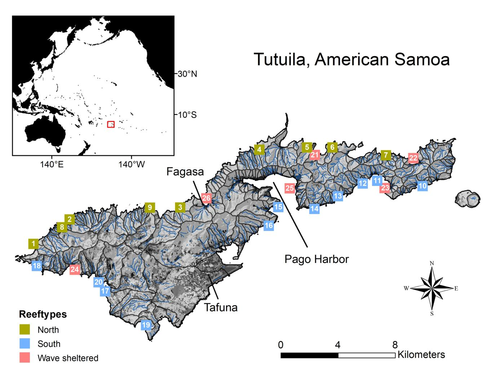
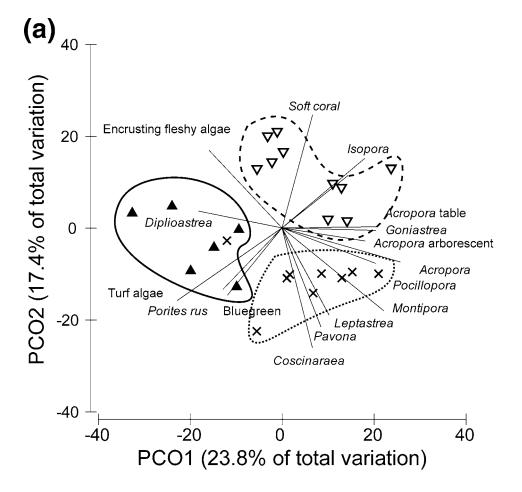
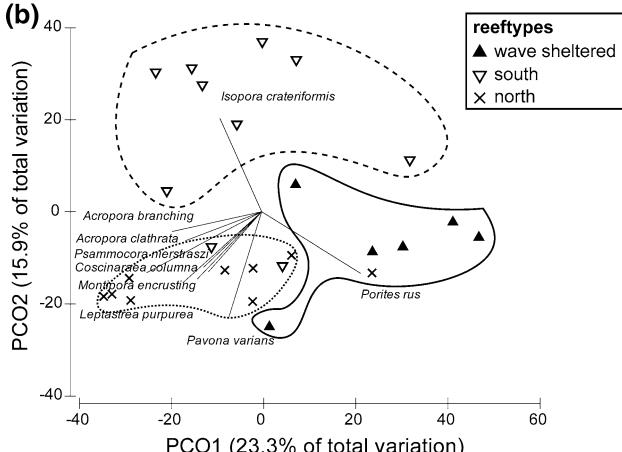
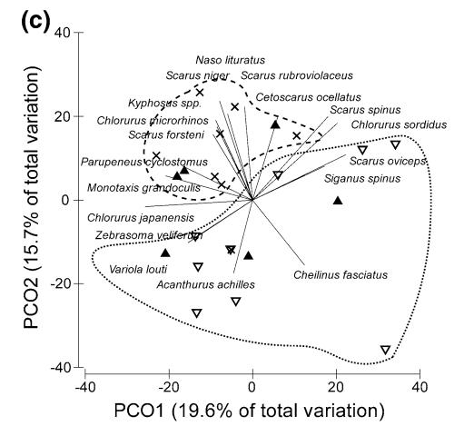
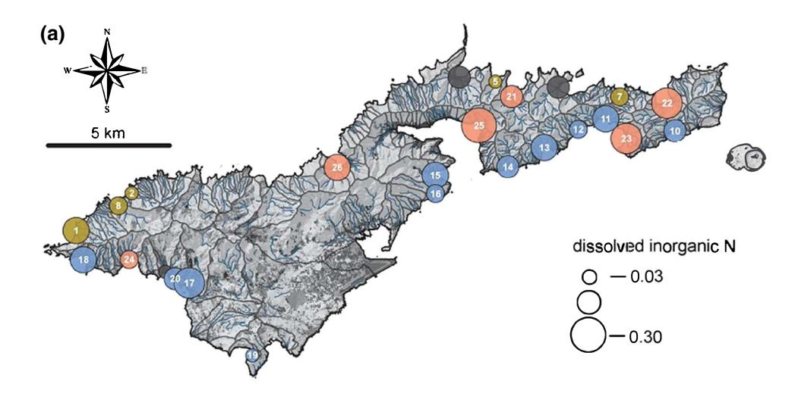
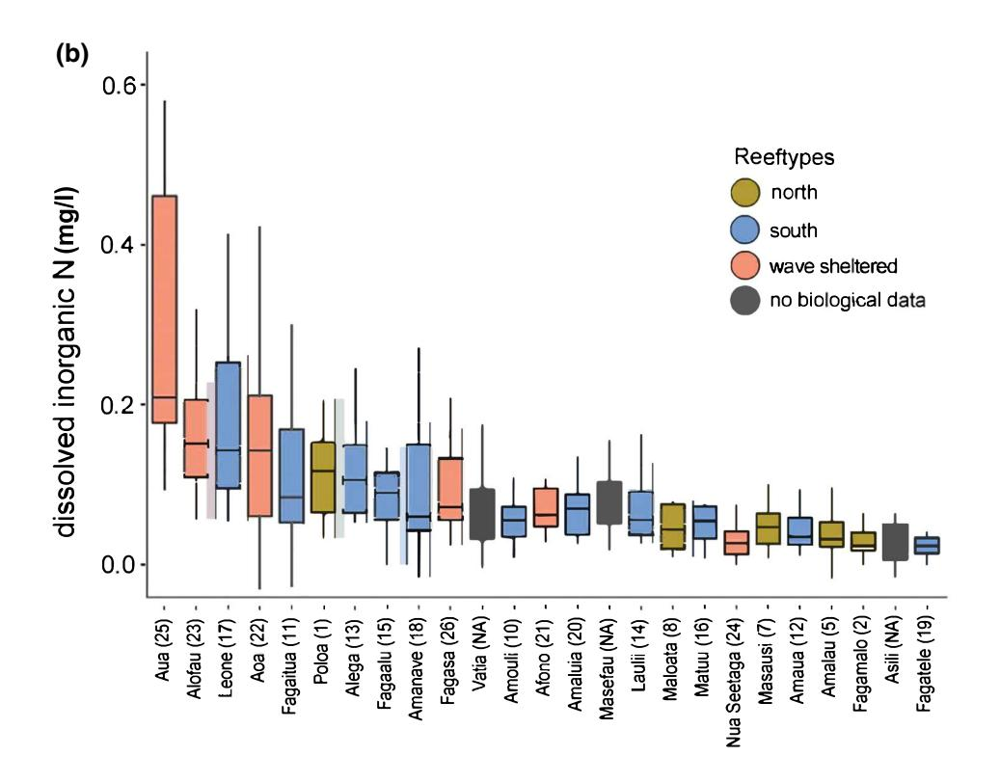
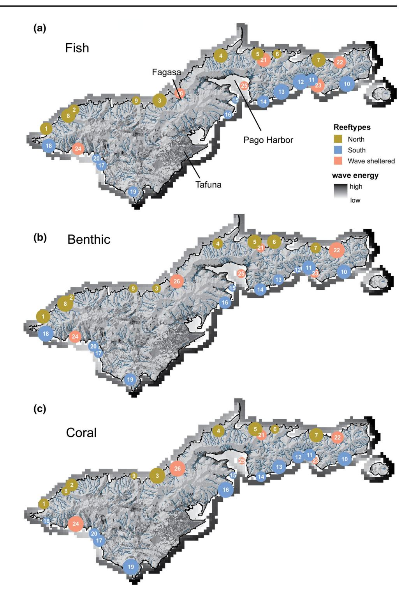
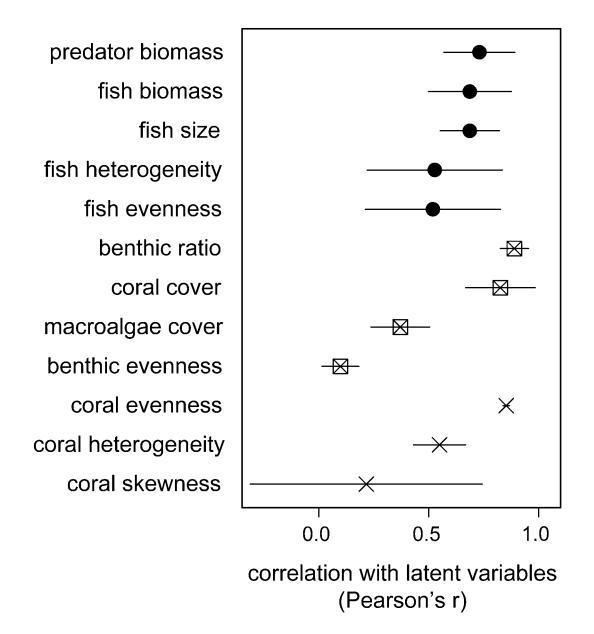
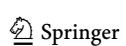

#### REPORT

# Applying a ridge-to-reef framework to support watershed, water quality, and community-based fisheries management in American Samoa

Mia T. Comeros-Raynal1 • Alice Lawrence2 • Mareike Sudek3 • Motusaga Vaeoso2 • Kim McGuire2 • Josephine Regis4 • Peter Houk5

Received: 1 October 2018/Accepted: 16 April 2019
© Springer-Verlag GmbH Germany, part of Springer Nature 2019

Abstract Water quality and fisheries exploitation are localized, chronic stressors that impact coral reef condition and resilience. Yet, quantifying the relative contribution of individual stressors and evaluating the degree of human impact to any particular reef are difficult due to the inherent variation in biological assemblages that exists across and within island scales. We developed a framework to first account for island-scale variation in biological assemblages, and then evaluate the condition of 26 reefs adjacent to watersheds in Tutuila, American Samoa. Water quality data collected over 1 year were first linked with watershed characteristics such as land use and human population. Dissolved inorganic nitrogen (DIN) concentrations were best predicted by total human population and disturbed land for watersheds with over 200 humans km-2, providing a predictive threshold for DIN enrichment

Topic Editor Morgan S. Pratchett

Published online: 24 April 2019

**Electronic supplementary material** The online version of this article (https://doi.org/10.1007/s00338-019-01806-8) contains supplementary material, which is available to authorized users.

- Mia T. Comeros-Raynal miatheresabullecer.comeros@my.jcu.edu.au
- ARC Centre of Excellence for Coral Reef Studies, James Cook University, Townsville, QLD 4811, Australia
- 2 Coral Reef Advisory Group, Department of Marine and Wildlife Resources, Pago Pago, AS 96799, USA
- 3 National Marine Sanctuary of American Samoa, Pago Pago, AS 96799, USA
- American Samoa Environmental Protection Agency, Pago Pago, AS 96799, USA
- 5 UOG Station, University of Guam Marine Laboratory, Mangilao, GU 96923, USA

attributed to human populations. Coral reef assemblages were next partitioned into three distinct reeftypes to account for inherent variation in biological assemblages and isolate upon local stressors. Regression models suggested that watershed characteristics linked with DIN and fishing access best predicted ecological condition scores, but their influences differed. Relationships were weakest between coral assemblages and watershed-based proxies of DIN, and strongest between fish assemblages and distances to boat harbors and wave energy (i.e., accessibility). While we did not explicitly address the potential recursivity between fish and coral assemblages, there was a weak overall correlation between these ecological condition scores. Instead, the more complex, recursive nature between reef fish and habitats was discussed with respect to bottom-up and top-down processes, and several ongoing studies that can better help address this topic into the future were identified. The framework used here showed the spatial variation of stressor influence, and the specific assemblage attributes influenced by natural and anthropogenic drivers which aims to guide a local ridge-to-reef management strategy.

**Keywords** Ridge to reef  $\cdot$  Water quality  $\cdot$  Coral reef condition  $\cdot$  Island-scale  $\cdot$  Resource management

## Introduction

Coral reefs are increasingly impacted by multiple stressors that vary in temporal and spatial scales (Burke et al. 2011; Halpern and Kappel 2012; Halpern et al. 2015; Hughes et al. 2017), and ultimately diminish ecosystem function and services provided to society (Hughes et al. 2007a; Pratchett et al. 2014). The growing number of studies

documenting links between human activities in coastal watersheds and coral reef health (Fabricius [2005](#page-13-0); Fabricius et al. [2005](#page-13-0); De'ath and Fabricius [2010](#page-13-0); Oliver et al. [2011](#page-14-0); Rodgers et al. [2012;](#page-14-0) Brodie and Pearson [2016;](#page-12-0) Brown et al. [2017b\)](#page-12-0) have paved the way for integrated management efforts that incorporate ridge-to-reef conservation planning (IUCN) [2017\)](#page-14-0). Yet, understanding the relative contribution of each primary stressor to overall ecosystem states, and linking this knowledge with evolving management goals, has proven difficult. Tangible links between science and management are difficult because measuring individual stressors is costly (Fredston-Hermann et al. [2016](#page-13-0); Rude et al. [2016](#page-14-0); Brown et al. [2017b](#page-12-0)), and inherent environmental differences exist in localized systems that may limit generalities (Bellwood et al. [2004](#page-12-0); Halpern et al. [2008](#page-13-0); Taylor et al. [2015](#page-14-0); Heenan et al. [2016;](#page-13-0) Hughes et al. [2017](#page-14-0)). As a result, management stalls because expected outcomes of policies, regulations, or actions designed to benefit society are difficult to predict with certainty. Improved predictions regarding the probability of success and effectiveness of management actions are desirable to improve social acceptance of policy and to enable positive feedback of science to management.

Land-based pollution from increased sedimentation and nutrients has caused shifts in coral community structure and composition through reduced coral biodiversity, cover, and species richness, and transition to non-reef building organisms. Nutrient enrichment with depressed herbivory has been attributed to a shift from coral to algal dominance on coral reefs (McCook [1999](#page-14-0); Littler et al. [2006](#page-14-0); Hughes et al. [2007a](#page-14-0), [b](#page-14-0); Smith et al. [2010](#page-14-0)). Elevated sediment input damages corals by increasing turbidity, leading to reduced light penetration and direct smothering from settled sediments (Fabricius [2005](#page-13-0); Bartley et al. [2014](#page-12-0)). Sedimentation can also directly affect coral recruitment and cause partial mortality with subsequent shifts in coral community structure and colony sizes (Fabricius [2005;](#page-13-0) Bartley et al. [2014\)](#page-12-0).

Declining water quality may also influence populations and assemblages of reef fishes through direct effects on their behavior and physiology, or indirectly through changes in benthic habitats and species interactions. Recent studies of the direct effects of suspended sediments have shown that for small-bodied site-attached damselfishes (Pomacentridae), elevated levels of suspended sediments can damage gill tissue and/or lead to a remodeling of gill structures (Hess et al. [2015](#page-13-0), [2017\)](#page-13-0), potentially compromising their capacity to uptake oxygen from the environment. Further, elevated suspended sediment levels have been shown to impair sensory (i.e., visual and olfactory) functions, inhibiting their ability to locate and hence ingest planktivorous food items (Wenger et al. [2012](#page-15-0), [2017](#page-15-0)), and detect and settle to suitable benthic habitats. In turn, these impaired sensory functions are likely to lead to reduced growth, body condition, and survival. Sedimentation can also directly affect the feeding ecology of reef fishes by reducing prey detection and visual acuity in foraging planktivorous and piscivorous fishes as suspended sediments increase (Wenger et al. [2017\)](#page-15-0).

The main island of Tutuila, US Territory of American Samoa, is a high island with steep watersheds that are thought to contribute extensive non-point sources of pollution to coastal waters. Steep watersheds have led to the majority of people living in the coastal plains and contributing to vegetation loss, soil erosion, and non-point source pollution draining into the adjacent marine waters. In support, local studies have linked poor land use with declining water quality and impacts to coral reefs (Biggs and Messina [2016;](#page-12-0) Holst Rice et al. [2016;](#page-13-0) Messina and Biggs [2016](#page-14-0); Polidoro et al. [2017\)](#page-14-0). However, pollution acts in concert with other acute and chronic disturbances such as fishing pressure and (natural) disturbances, and a deeper appreciation for the magnitude, spatial distribution, and nature of individual stressors remains lacking. Despite multiple monitoring programs that assess watershed condition, reef flat and reef slope biological assemblages in American Samoa (Green [2002](#page-13-0); Fenner [2013;](#page-13-0) Houk et al. [2013](#page-13-0); Holst Rice et al. [2016;](#page-13-0) Sudek and Lawrence [2016](#page-14-0); Tuitele et al. [2016b\)](#page-14-0), programs are just now developing improved collaborative networks to holistically understand ridge-to-reef systems.

We present a holistic examination of linkages between land use, water quality, fishing pressure, and the ecological condition of coral reef resources for 26 watershed–reef sites around Tutuila, American Samoa. We used Dissolved Inorganic Nitrogen (DIN), as a proxy of water quality, as this nutrient is highly bioavailable, directly taken up by phytoplankton and other algae, and relatively inexpensive and simple to analyze compared to other nutrient constituents (Dumont et al. [2005](#page-13-0)). We examined DIN collected from stream mouths over 1 year to determine thresholds in human presence and development that predicted elevated nutrient concentrations beyond an uninhabited watershed benchmark. We then used proxies of DIN, such as human population density and proxies to fishing access to determine the relative influence of pollution and fishing on adjacent reefs. This study builds on previous efforts documenting links between watershed uses and nearshore reef condition (Houk et al. [2005;](#page-13-0) DiDonato et al. [2009;](#page-13-0) Biggs and Messina [2016;](#page-12-0) Holst Rice et al. [2016;](#page-13-0) Messina and Biggs [2016;](#page-14-0) Biggs et al. [2017](#page-12-0)), but expands upon the spatial scale of investigation and the coupling of water quality data, watershed characteristics, and fishing access to better isolate human–stressor interactions. More broadly, the study extends a ridge-to-reef management concept, paving the way for prioritized management planning.

# Methods

#### Study location

American Samoa is the southernmost US Territory at 14.27S, 170.13W in the South Pacific. It is comprised of five volcanic high islands (Tutuila, Aunu'u, Ofu, Olosega, and Ta'u) and two atolls (Rose and Swains) with a total land area of about 200 km2 (DiDonato et al. [2009](#page-13-0); Nimbus [2016\)](#page-14-0). Water quality and biological data were collected on the main island of Tutuila (Fig. 1).

### Ecological data

At each site, two 100-m transect tapes were laid along the 8–10 m reef slope contour that were split into six 25-m transects (0–25 m, 30–55 m, 60–85 m, 90–115 m, 120–145 m, 150–175 m). Each site was located using GPS coordinates from previous surveys or using ArcMap 10.4 to delineate an approximate distance of 250 m away from stream discharge (Fig. 1).

## Fish assemblages

Stationary Point Count (SPC) surveys (Bohnsack and Bannerot [1986](#page-12-0)) were conducted at 20-m intervals. During each SPC survey, a trained diver recorded the name and size (to the nearest cm) of all food fish within a 7.5 m radius of the transect for 3 min. Food fishes included: surgeonfishes (Family: Acanthuridae), parrotfishes (Labridae), groupers (Epinephelidae), jacks (Carangidae), emperor fishes (Lethrinidae), snappers (Lutjanidae) and triggerfish (Balistidae). A total of 12 replicate SPC surveys were conducted at each site starting at the 0-m mark and

Fig. 1 Map of the study island highlighting the population centers of Tafuna plain and Pago Pago harbor area, and the two most accessible boat launching ramps in the north and south, Fagasa and Pago Harbor, respectively. Squares indicate locations of biological surveys with colors defining major reeftypes (see methods). Darker shades of gray

within each watershed depict cleared forest, barren land, and urban development. Watershed discharge follows the streams shown in blue. Water quality sampling was conducted at the mouth of streams associated with biological surveys (where possible)

extending 20 m past the last transect line. Fish size estimates were converted to biomass using standard fish length-to-weight coefficients derived from regional fisherydependent data when available (Taylor and Choat [2014\)](#page-14-0)or from Fishbase [\(www.fishbase.org](http://www.fishbase.org)). These data were used to estimate five metrics of the fish assemblages used in analyses below: (1) fish assemblage biomass without predators, (2) predator biomass, (3) mean fish size, (4) fish assemblage evenness, and (5) fish assemblage heterogeneity as defined by multivariate distances between replicates (Clarke and Gorley [2015](#page-12-0)).

#### Benthic substrates

Benthic photographs were taken every meter using a 1-mlong monopod (26 photographs per transect; total of 156 photographs per site). These photographs were analyzed for benthic substrate cover using the software Coral Point Count estimate (CPCe) (Kohler and Gill [2006\)](#page-14-0). Photograph images were examined by placing ten random points on each photograph and identifying the benthic substrate based on several categories: coral (identified to genus), macroalgae, turf algae, branching coralline algae, crustose coralline algae, fleshy encrusting algae, sand, rubble, and other invertebrates. These data were used to estimate three metrics that were used in analyses: 1) coral cover, 2) macroalgal cover, and 3) a benthic substrate ratio (i.e., the ratio of calcifying corals and coralline algae to fleshy and turf algae).

# Coral assemblages

A 1 9 1 m quadrat was placed along the transect at every 20-m mark, representing a total of 10 per site. Every coral colony whose center fell within the quadrat was identified to lowest taxonomic level possible, and the length and width of the colony were measured. Most corals were identified to the genus level and assigned a growth form (i.e., branching Acropora, encrusting Montipora). Conspicuous and common corals were identified to the species level (i.e., Porites rus). Area was calculated using the geometric diameter for each colony assuming corals were circular. Several metrics were derived from these data and used in the analyses below: (1) coral colony size skewness, (2) coral evenness, (3) and assemblage heterogeneity as defined by multivariate distances between replicates (Clarke and Gorley [2015](#page-12-0)).

#### Condition scores

Biological condition scores were calculated for fish, benthic, and coral assemblages using a previously established framework by working groups across the Pacific (Houk et al. [2015](#page-13-0)). The process combined the standardized metrics noted above to produce latent variables describing each assemblage. Briefly, the metrics were selected to represent non-redundant beneficial attributes that are often used to assess temporal trends in reefs. The combination of the metrics also aimed to reduce the potential bias associated with disturbance states, by combining metrics that would respond both positively and negatively to disturbances (i.e., the expected decrease in coral cover but subsequent increase in species richness with more available habitat). The individual metrics for coral assemblages were: (1) assemblage heterogeneity, (2) skewness of colony-sized distributions, and (3) Shannon–Weaver evenness. The individual metrics for benthic assemblages were: (4) coral cover, (5) benthic substrate ratio, (6) coral evenness, and (7) macroalgal cover. The individual metrics for fish assemblages were: (8) assemblage evenness, (9) assemblage heterogeneity, (10) fish assemblage size, (11) fish assemblage biomass, and (12) predator biomass. Together, these 12 metrics have previously been used to evaluate each of the assemblages and overall ecosystem condition (Houk et al. [2015\)](#page-13-0).

#### Environmental data

Environmental data were collected to evaluate: (1) water quality across the study watersheds, (2) the relationship(s) between water quality and watershed characteristics, and (3) the relationship(s) with biological data. Previous studies were used as a basis to identify relevant environmental factors that influence both water quality and biological assemblages, including both natural and anthropogenic factors that are described below (Houk et al. [2005](#page-13-0), [2013,](#page-13-0) [2015\)](#page-13-0).

# Water quality

Dissolved Inorganic Nitrogen (nitrate, nitrite, and ammonium) was collected from 26 streams on a monthly basis from September 2016 to September 2017. DIN monitoring stations were selected across three watershed classifications (pristine, intermediate, and extensive) defined by the American Samoa Environmental Protection Agency (DiDonato [2004;](#page-13-0) Tuitele et al. [2016a\)](#page-14-0). Water sampling for all stations was conducted during the same 3-day timeframe each month and coincided with the lowest tide of the month at new or lunar moon periods. Therefore, monthly samples collected during the sampling period across sites aimed to control for extrinsic environmental factors to the extent possible.

Water samples were collected from streams using 500-ml polyethylene bottles. Samples were filtered in the laboratory with Millipore glass fiber prefilters 0.7-lm

filters and then frozen until analysis. Frozen samples were analyzed within 3 months of collection. Dissolved Inorganic Nitrogen concentrations were analyzed using the SEAL Analytical AA3 HR Nutrient Analyzer. We used the methods and procedures outlined by SEAL Analytical for the analysis of Nitrate and Nitrite and Ammonium (SEAL Analytical [2011a,](#page-14-0) [b](#page-14-0)).

#### Other environmental factors

A suite of site-based environmental factors was quantified including natural factors and human stressors. Natural factors included wave energy and total watershed size, while human stressors included distances to fishing ports and population centers, human population density, and disturbed land in the watershed. The total amount of disturbed land in each watershed, including quarry/landfill, secondary scrub, urban built-up, and urban cultivated area was calculated on ArcMap 10.4 using the American Samoa Vegetation layer (Liu et al. [2011\)](#page-14-0). Wave energy for each site was calculated using 10-year average wind speeds for Tutuila using the University of Guam Marine Lab Wave Energy tool available for ArcGIS (Jenness and Houk [2014\)](#page-14-0). Human population per watershed was calculated from the 2010 census of American Samoa using the population counts for places (villages) [\(https://www.census.](https://www.census.gov/population/www/cen2010/island_area/as.html) [gov/population/www/cen2010/island\\_area/as.html](https://www.census.gov/population/www/cen2010/island_area/as.html)). Distances to the major boat harbors and the main population centers via boat and road access were calculated using the Distance Measuring tool on ArcMap 10.4 (Pago Pago and Fagasa boat harbors, Pago Pago and Tafuna population centers, Fig. [1](#page-2-0)).

## Data analysis

We first tested for inherent difference in the biological assemblages that were predicted by major reeftypes which hypothesized long-term environmental selection may have existed. This was done to determine whether stratification in subsequent analyses with human factors was warranted. For instance, the previous studies have found significant difference between reefs on the north versus south coast of Tutuila and used reeftype as a basis for stratification. Multivariate principal components ordinations and tests of comparison were conducted for fish, benthic, and coral assemblages (Anderson et al. [2008b](#page-12-0)) to test for reeftype differences in the north and southern reefs around Tutuila (Figure S1). In addition, this study hypothesized that a third major reeftype may exist, where significant protection from wave energy existed (i.e., a hypothesis based upon wave energy calculations noted above combined with field observation). It was thought that protection from wave energy may enhance the retention of watershed influences/ run-off and drive the development coral assemblages and reefs through time. Biological data were log transformed and used to create Bray–Curtis similarity matrices. Bray– Curtis matrices described the ecological similarity between each pair of sites based upon summed differences in pairwise species abundances (Anderson et al. [2008a](#page-12-0)). Before examining comparisons between differing reeftypes, tests for homogeneity of variances of the similarity matrix were performed using PERMDISP. Given homogeneous variance structures between the two groups, PERMANOVA tests were used to assess seasonal and spatial differences. Finally, a principal coordinate ordination (PCO) was performed on the similarity matrices to depict the PERMA-NOVA results in a two-dimensional space. This process confirmed earlier studies and suggested to examine both island-scale investigations and stratified investigations based on major reeftype.

We next analyzed water quality data with respect to watershed characteristics. A forward, stepwise regression modeling process was used to describe the relationship between mean annual concentrations of DIN and watershed characteristics. We first examined all terms individually to determine which factors best predicted DIN. Forward steps consisted of incorporating addition variables in an additive or interactive manner when improved fits were found. This process continued until all interaction terms were examined, and best fits were found. All models included a nested term for reeftypes to highlight where significant relationships were most pronounced. All significant models were reported with respect to their fit (R2 and P values), as well as their likelihood scores (AIC scores). The environmental factors used to examine DIN concentrations were watershed size, total human population, human population per area, disturbed land, and disturbed land per area (Figure S1).

A similar process was undertaken to examine factors hypothesized to predict the condition of fish, coral, and benthic assemblages, with ''condition'' defined by standardized means of the biological metrics noted above. A similar stepwise process was used, but a larger suite of environmental factors was examined with respect to biological assemblages. Because the larger suite of environmental factors was specific to differing reeftypes, these models did not include a nested term and were run independent for each reeftype. Natural factors included wave energy and total watershed size. Anthropogenic factors related to water quality included human population and human population per area. Anthropogenic factors related to fishing pressure included both boat and driving distances from main ports and population centers. All significant models were presented based upon the model selection criteria noted above (Figure S1).

Finally, sensitivity analyses were performed to evaluate the relative influence of each individual biological metric with its respective condition score. Pearson's moment correlations were calculated between each biological metric and the corresponding latent variable (i.e., mean of standardized metrics) to better interpret the individual influence of each metric.

## Results

# Reeftypes

There were clear distinctions between benthic, coral, and fish assemblages with respect to differing reeftypes found on the north coast, south coast, and reefs sheltered from waves (pseudo-F statistics [ 4 for all multivariate ANOVA comparisons, P \0.01; post hoc pairwise t statistics [2 for all individual reeftype comparisons except fish assemblages in wave-sheltered reefs, P \0.01; Fig. 2). For benthic and coral assemblages, the main taxa accounting for these differences were Diploastrea, turf algae, and Porites rus on wave-sheltered reefs; soft corals, Isopora, table Acropora, Goniastrea, and arborescent Acropora on southern reefs, and bluegreen algae, Coscinaraea, Pavona, Leptastrea, Montipora, Pocillopora, and branching Acropora on northern reefs.

Both benthic and coral assemblages were partitioned by natural environmental settings that differed across the three reeftypes (north, south, and wave sheltered). However, food fish assemblages showed strong separation for northern and southern reefs only, with wave-sheltered reefs nested within these two reeftypes (Fig. 2). Given the collective findings, regression models using biological dependent variables were examined within each of the major reeftypes. Prior to examining potential relationships between human factors and reef assemblages, we next examined which watershed characteristics best predicted DIN values.

#### Water quality and watershed characteristics

Generally, island-wide Dissolved Inorganic Nitrogen (DIN) concentrations showed consistent and expected seasonal variations, with peak DIN concentrations during the cool winter months (July–September), secondary peaks with high rainfall (January–April), and lowest values during warm months with relatively low rainfall (Tables S1 and S2). However, at the site level, annual mean DIN concentrations were highly variable across the 26 watersheds. Aua, a village near the urban center of Pago Pago with a high human population density of 763 persons per km2 , had the highest average concentrations of DIN (site #

Fig. 2 Principle component ordination plots of benthic (a), coral (b), and fish (c) assemblages. Circles represent significant differences in biological assemblages that existed within each reeftype. Vectors indicate taxa that were the strongest contributors to reeftype differences, with vector length proportional to correlation strength with the primary PCO axes

25, Fig. [3\)](#page-6-0). Other notable villages with consistently high DIN concentrations were at site #23, a less populated watershed with relatively low water flux in the streams, and at site #17, another highly populated village associated

Fig. 3 Annual mean dissolved inorganic nitrogen (DIN) concentrations scaled by symbol sizes on the study area map (a). The distribution of monthly DIN concentrations over the course of the study year (b), with black lines showing median values, boxes showing 25th and 75th percentile, and line showing 5th and 95th percentile of the data. For both plots, colors indicate differing reeftypes (methods)

with the largest watershed. The lowest mean DIN concentration was found, where few humans and developed land exist at site #19 (Fig. 3).

Regression models revealed that human populations in the watersheds, both total number of humans and humans per km2, best predicted DIN in stream mouths. However, a significant interaction model provided the best fit which included percent disturbed land and human population (Table 1). Disturbed land and disturbed land per km2 provided weaker, but significant, fits. For all of the significant models, wave-sheltered reefs consistently had the strongest relationship (Table 1, see *reeftype significance*).

Reefs on the south shore where human populations are highest also provided significantly better fits compared to the north for three of the five significant models. Meanwhile, in northern reefs, there was never any significant fit between watershed characteristics and DIN. In sum, human populations alone best predicted DIN concentrations, especially in wave-protected reefs with higher retention and along the south coast, where humans and watershed development were highest. Reefs on the northern coast had < 200 humans per km², representing a potentially useful benchmark for predicting when enhanced DIN concentrations may be expected from human presence.

Table 1 Regression statistics supporting the relationship between watershed characteristics and dissolved inorganic nitrogen across the study watersheds

| Model | Model variables                 | Reeftype significance       | R2      | AIC     |  |
|-------|---------------------------------|-----------------------------|---------|---------|--|
| 1     | % Disturbed:population/reeftype | Wave protected***, south*** | 0.70*** | - 115.9 |  |
| 2     | Population/reeftype             | Wave protected***, south**  | 0.62*** | - 110.5 |  |
| 3     | pop.area/reeftype               | Wave protected***           | 0.50*** | - 103.8 |  |
| 4     | % Disturbed/reeftype            | Wave protected*             | 0.22*   | - 92.9  |  |
| 5     | Area disturbed/reeftype         | Wave protected*, south*     | 0.19*   | - 91.9  |  |

Models are listed in order of decreasing R2 values and increasing AIC scores that represented their global fit. Each model was also examined for significant differences among reeftypes. Only significant reeftypes for each model are shown. P values \0.05\*, \0.01\*\*, and\ 0.001\*\*\*

Lastly, watershed size alone did not predict any significant amount of the variation in nutrient concentrations.

## Biological condition scores

Biological condition scores for fish, benthic, and coral assemblages depicted clear gradients in condition within each of the reeftypes (Fig. [4](#page-8-0), Table S2). Interestingly, there were weak correlations between the latent variables describing fish, benthic, and coral assemblages in most instances (r \0.3, for comparisons within all and individual reeftypes). The condition scores were well predicted by the suite of natural and human factors, but relationships differed for each metric and within each reeftype.

Fish condition scores across southern reefs were predicted by the interaction between wave energy and distance to Pago Pago harbor, two metrics that together define how accessible a reef is to fishing. Sensitivity analyses furthered supported these trends and highlighted that biomass and size metrics were the strongest drivers of overall scores, with secondary and more unique contributions from fish diversity and evenness metrics (Fig. [5\)](#page-9-0). Fish condition scores for the northern reefs were best predicted by the interaction between distance to Pago Pago harbor (i.e., the main port on the south) and distance to Fagasa on the north shore (i.e., the main port on the north). Fish condition scores in wave-sheltered reefs were also primarily influenced by distance to Pago Pago harbor, but uniquely, total human population in the adjacent watershed was a secondary predictor, highlighting a greater connection with nearby human populations (Table [2](#page-10-0)). The findings for wave-protected reefs are recursive in nature because human populations in the adjacent watershed may indicate a non-boat-based localized fishing index, but was also highly correlated with DIN (see discussion).

Benthic condition scores in the south reefs were best predicted by the interaction between distance to Pago Pago harbor, or fishing access, and population per area which was not significantly correlated with DIN concentrations in this reeftype. Sensitivity analyses supported that benthic scores were most influenced by the ratio of calcifying substrates and coral cover, essentially representing reef calcification potential (Fig. [5\)](#page-9-0). Benthic assemblages for northern reefs were best predicted by the interaction between wave energy and distance to the main boat ramp, both highlighting the influence of fishing access, but the former indicating both flushing potential and access. Similarly, the interaction between distance to the main boat harbor and population per area best determined the benthic condition scores for wave-sheltered reefs, representing metrics that described both fishing access and proxy to DIN contribution (i.e., recursive findings again for this reeftype). However, this model was non-significant due to smaller sample sizes (i.e., n = 6 wave-sheltered reefs surveyed) (Table [2](#page-10-0)).

Coral condition scores were driven mostly by diversity metrics such as evenness and heterogeneity, with sizebased criteria having a highly variable influence that was most pronounced in wave-sheltered reefs, where anomalously large Porites rus colonies existed. No significant relationships were found for southern reefs. Meanwhile, natural factors were more influential to coral assemblages across northern reefs, as watershed area and wave energy were primary explanatory variables, and distance to Fagasa boat ramp providing a secondary factor in the best-fit model. Lastly, coral condition scores were best predicted by human population per km2 across wave-sheltered reefs (Table [2\)](#page-10-0).

# Discussion

Integrated ridge-to-reef approaches that assess the individual roles of multiple stressors on local reef assemblages represent desirable science-to-management frameworks (Oliver et al. [2011;](#page-14-0) Rodgers et al. [2012;](#page-14-0) Alvarez-Romero et al. [2014](#page-12-0)). The relative condition of the landscape often serves as a viable indicator of the health of adjacent coral reef systems (Oliver et al. [2011;](#page-14-0) Rodgers et al. [2012](#page-14-0); Fredston-Hermann et al. [2016;](#page-13-0) Rude et al. [2016;](#page-14-0) Brown et al. [2017b\)](#page-12-0), yet a suite of environmental and biological metrics have now been developed without any clear

Fig. 4 Relative biological condition scores for fish (a), benthic (b), and coral (c) assemblages depicted by circle sizes (methods). Biological condition scores were best predicted by environmental factors shown on the map: wave energy, road driving distance, boat access, human population size, human population per area, and watershed size (see Table [1](#page-7-0)). Wave energy pixels around the island are scaled relatively from high (dark) to low (light)

consensus regarding their hierarchical nature (Oliver et al. [2011;](#page-14-0) Rodgers et al. [2012;](#page-14-0) Alvarez-Romero et al. [2015](#page-12-0); Brodie and Pearson [2016;](#page-12-0) Waterhouse et al. [2016](#page-15-0); Biggs et al. [2017](#page-12-0); Hamilton et al. [2017;](#page-13-0) Teichberg et al. [2018](#page-14-0)). We add to this line of research by first quantifying linkages between watershed characteristics and water quality, and then identifying individual and synergistic stressor regimes that predicted key attributes of reef assemblages. While our findings regarding the strength of individual stressors may not be universal to differing locales besides American Samoa, the process leading to our hierarchical framework for localized stressors is transferrable. Here, the watershedbased approach aligns with both traditional and modern resource management frameworks; so the present effort

Fig. 5 Sensitivity analysis associated with biological condition scores. Symbols represent the correlation between each component of fish (dark circles), benthic (squares), and coral (X) assemblages and the overall score. Error bars represent standard deviations associated with the three different reeftypes

helps to allow co-management between communities, local agencies, and federal agencies (Cornish and DiDonato [2004;](#page-12-0) DiDonato [2004;](#page-13-0) Houk et al. [2005](#page-13-0); DiDonato et al. [2009;](#page-13-0) Houk et al. [2013](#page-13-0); Tuitele et al. [2015;](#page-14-0) Holst Rice et al. [2016;](#page-13-0) Messina and Biggs [2016](#page-14-0); Tuitele et al. [2016c](#page-14-0); Biggs et al. [2017](#page-12-0)). The results can align management priorities with predicted and desirable ecological outcomes.

## Water quality

Human populations and the associated development and changes in land use in watersheds are reliable predictors of nitrate and DIN loading concentrations and export to inshore coastal areas (Peierls et al. [1991](#page-14-0); Caraco and Cole [1999;](#page-12-0) Caraco et al. [2001](#page-12-0); Dumont et al. [2005;](#page-13-0) Brodie et al. [2012;](#page-12-0) Waterhouse et al. [2017](#page-15-0)). Overall, nutrient concentrations were well predicted by human population as expected by the local water quality standards (Figure S2). However, best-fit models revealed that developed land intensity was a key covariate that could be incorporated into a revised watershed classification system. Minimally impacted watersheds could be classified by human populations less than 200 individuals, below which no relationships were found with DIN. Once disturbed land exceeded 1.49 km2 in the southern and wave-protected reefs, it represented a key covariate. While these thresholds represent hypotheses that can be further tested and refined, the sequential influence of human population density and developed land is a concept that is transferrable. For instance, land clearing and urban development lead to increased sedimentation, while agriculture and high human density significantly contribute to nutrient and pesticide loading to nearshore coastal areas (Brodie and Mitchell [2005](#page-12-0); Wooldridge et al. [2006](#page-15-0); Burke et al. [2011\)](#page-12-0).

There was a weak overall correlation between human population density and disturbed land in all reeftypes, suggesting that watershed development may become decoupled with human population under growing development. Tutuila has already undergone a 5.8% increase in developed area and a net increase of 6.6% of impervious surface area between 2004 and 2010; meanwhile, the human population has remained the same [\(https://coast.](https://coast.noaa.gov/ccapatlas/) [noaa.gov/ccapatlas/\)](https://coast.noaa.gov/ccapatlas/). We last highlight a universal trend across all reeftypes, whereby watershed sizes alone did not significantly influence DIN concentrations. For instance, one of the largest watersheds had among the lowest DIN (site # 8, Fig. [1](#page-2-0)). The present results therefore provided a novel decoupling between watershed size, development, human population, and the resultant nutrient loading.

## Coral reef assemblages

Watershed characteristics linked with DIN and fishing access were the best predictors of ecological condition scores, but their influences differed. The strongest factors describing fish condition scores were distances to boat harbors and wave energy. While both clearly relate to fishing access, the latter also represents a natural environmental regime that enhances flushing, and was expected to have a negative relationship with fish biomass (Friedlander et al. [2003](#page-13-0)). Wave energy, however, has also been shown to have a positive effect on total fish and herbivorous fish biomass at a regional scale in Hawaii (Gorospe et al. [2018\)](#page-13-0) and in three jurisdictions in Micronesia (Palau, Guam, and Pohnpei) (Mumby et al. [2013\)](#page-14-0). This relationship can vary across spatial scales with stronger impacts found at local scales (Friedlander et al. [2003](#page-13-0); Rodgers et al. [2010](#page-14-0)) than at island scales (Williams et al. [2015\)](#page-15-0). Beyond correlations between wave energy and fish assemblage distribution and composition, wave energy can also directly influence functional morphology of reef fishes (Fulton and Bellwood [2004](#page-13-0); Fulton et al. [2005](#page-13-0)) with effects on feeding, trophodynamics, and ecosystem functioning (Bejarano et al. [2017](#page-12-0)). Wave exposure in shallow coastal areas also impacts reef fish indirectly through increased productivity of algal assemblages (Roff et al. [2015](#page-14-0), [2018](#page-14-0)) which in turn can have positive effects on growth and feeding rates of herbivorous reef fishes (Hart and Russ [1996](#page-13-0); Wenger et al. [2016](#page-15-0)). This positive feedback may extend to increases in densities following coral cover decline in some functional groups (e.g., parrotfishes) (Adam et al. [2011;](#page-12-0) Russ et al.

Table 2 Results from the forward, stepwise regression modeling process that examined factors driving the condition of fish, benthic, and coral assemblages

| Dependent variable    | Habitat                   | Model                                            | Slope(s) (SE)                                | Intercept (SE) | R2   | P value | AIC   |
|--------------------------|---------------------------|--------------------------------------------------|----------------------------------------------|-------------------|------|---------|-------|
| Fish assemblage score    |                           |                                                  |                                              |                   |      |         |       |
|                          | South (n = 11)            | wave ? dist.to.Pago ? wave x dist.to.Pago     | - 2.9 (0.67); - 2.7 (0.63); 2.3 (0.46)    | 3.3 (1.2)         | 0.7  | 0.009   | 19    |
|                          | South (n = 11)            | wave ? road.to.Tafuna ? wave x road.to.Tafuna | - 0.74 (0.42); - 1.17 (0.47); 0.72 (0.23) | 1.1 (0.95)        | 0.59 | 0.03    | 22.7  |
|                          | North (n = 6)             | dist.to.Pago x dist.to.Fagasa                    | - 0.17 (0.06)                                | 0.79 (0.20)       | 0.52 | 0.04    | - 0.9 |
|                          | North (n = 8)             | wave x road.to.Tafuna x road.to.Pago          | - 0.04 (0.01)                                | 0.39 (0.19)       | 0.47 | 0.02    | 13.1  |
|                          | North (n = 8)             | wave                                             | - 0.39 (0.15)                                | 0.78 (0.34)       | 0.4  | 0.04    | 14.3  |
|                          | Wave protected (n = 6) | pop ? dist.to.Pago                               | - 0.54 (0.11); - 0.26 (0.11)                 | 1.6 (0.40)        | 0.82 | 0.04    | 1.3   |
|                          | Wave protected (n = 6) | pop                                              | - 0.38 (0.13)                                | 0.76 (0.28)       | 0.6  | 0.04    | 5.69  |
| Benthic assemblage score |                           |                                                  |                                              |                   |      |         |       |
|                          | South (n = 11)            | dist.to.Pago x pop.area                          | 0.14 (0.05)                                  | - 0.55 (0.21)  | 0.44 | 0.02    | 11.7  |
|                          | North (n = 8)             | wave x dist.to.Fagasa                            | 0.16 (0.06)                                  | - 0.60 (0.26)  | 0.45 | 0.03    | 14.5  |
|                          | Wave protected (n = 6) | dist.to.Pago x pop.area                          | 0.47 (0.24)                                  | - 1.52 (0.79)  | 0.37 | 0.12    | 11.4  |
| Coral assemblage score   |                           |                                                  |                                              |                   |      |         |       |
|                          | Wave protected (n = 6) | pop.area                                         | - 0.57 (0.20)                                | 1.14 (0.44)       | 0.58 | 0.04    | 11.1  |
|                          | North (n = 8)             | shed.area x wave x dist.to.Fagasa             | - 0.06 (0.02)                                | 0.44 (0.19)       | 0.45 | 0.03    | 9     |
|                          | North (n = 8)             | shed.area x wave                                 | - 0.08 (0.03)                                | 0.35 (0.17)       | 0.45 | 0.03    | 9.1   |
|                          | South (n = 10)            | –none–                                           | –                                            | –                 | –    | –       | –     |

All models with significant fits are listed top-to-bottom in accordance with the lowest AIC values, when appropriate, and then by reeftype. AIC values aid in model selection and can be used to evaluate statistical models for a given set of data (i.e., only compare AIC values for models investigating the same habitat type that have the same sample size within a dependent variable). Sample sizes differ if potential outliers were detected in the modeling process and their removal investigated. Predictor variables: wave (wave energy), dist (boat distance), road (driving distance), pop (populations), pop.area (population per area), and shed.area (total watershed size), only the most parsimonious models with the lowest AIC are presented here

[2015\)](#page-14-0), potentially corresponding to increases in suitable feeding habitats.

The significant relationship between distance to harbors and waves to fish condition score on Tutuila is supported by other studies in Micronesia. A recent study examining the distribution of similar fish condition scores across Kosrae, Micronesia, found a clear pattern of larger, more abundant fishes in higher trophic levels on the leeward side of the island back in the mid-1980s (McLean et al. [2016](#page-14-0)). However, this pattern was reversed in the 2010s when reefs with high wave energy had larger and more abundant fish populations. Further, distances to boat access and wave energy combined to describe a significant temporal gradient at the island scale. These findings were echoed in a separate study across many islands in Micronesia conducted in the 2010s, where both low fishing access and high wave energy were positive predictors of both fish and benthic assemblages (Houk et al. [2015\)](#page-13-0). In sum, the natural abundances and roles fish play in the ecosystem likely shift with wave energy as previously hypothesized but also with human factors. However, there are likely to be differential responses to wave energy and fishing access across distinct fish functional groups (Mumby et al. [2013](#page-14-0)) with potential flow-on impacts to overall ecosystem functioning.

The present study found that distances to boat harbors and wave energy were also primary predictors of the benthic assemblages. However, population per km2 was a secondary covariate that may indicate localized fishing

pressure and/or pollution loading. We note a recursive nature of these predictive regimes in some instances because proxies were not always direct and clear measures of pollution loading or fishing. Wave energy is a major contributor to species zonation and benthic assemblage composition (Grigg [1983](#page-13-0); Rodgers et al. [2012](#page-14-0); Williams et al. [2013;](#page-15-0) Roff et al. [2015](#page-14-0)). While proxies to fishing may influence benthic assemblages through top-down processes (i.e., changes in fish assemblages affecting quantity and quality of benthic habitats), changes in coral reef habitats across a gradient of water quality (i.e., bottom-up processes) can also affect composition and biomass of reef fishes. This recursive relationship between reef fishes and their habitat is particularly relevant to species that have strong associations with live coral and structurally complex habitats (Graham and Nash [2013](#page-13-0)). Changes in coral reef habitats can have profound impacts on the recruitment (DeMartini et al. [2013;](#page-13-0) Hamilton et al. [2017](#page-13-0); Goodell et al. [2018\)](#page-13-0), abundance (Pratchett et al. [2011;](#page-14-0) Chong-Seng et al. [2012;](#page-12-0) Coker et al. [2014;](#page-12-0) Pratchett et al. [2014](#page-14-0)), composition, feeding (Adam et al. [2011](#page-12-0)), and hence function (Pratchett et al. [2011;](#page-14-0) Richardson et al. [2017\)](#page-14-0) of reef fish assemblages. Responses to coral loss can vary among species, functional groups, and by region (Pratchett et al. [2011\)](#page-14-0). Yet, despite the different responses to coral loss within and among functional groups of reef fishes, extensive declines in coral cover will eventually lead to reductions in species biodiversity and abundance with important implications for ecosystem functioning (Pratchett et al. [2011\)](#page-14-0).

The magnitude of changes in coral community composition caused by declining water quality may likely shift species–habitat associations, with distinct species assemblages associated with particular habitats across a spectrum of water quality (Brown et al. [2017a\)](#page-12-0). The individual effects of increased sediments and nutrients have caused shifts in coral trophic structure and composition through reduced coral biodiversity, cover, and species richness, and transition to non-reef building organisms. For example, sedimentation causes changes in coral population structures such as declines in mean colony sizes, altered growth forms, and reduced coral growth and survival (Fabricius [2005\)](#page-13-0). Enrichment of nutrients on the other hand can shift coral reef communities from dominance of autotrophic nutrient recycling symbiotic corals to macroalgae and further to heterotrophic filter feeders (Fabricius et al. [2005,](#page-13-0) [2012](#page-13-0), [2014,](#page-13-0) [2016\)](#page-13-0). While the impacts of finergrained sediments were not included in the model, the significant correlations between human population, land use, and DIN loading can be used to infer other terrestrial inputs from the watersheds (e.g., sediments, contaminants) into nearshore reef habitats on Tutuila. The present model can be updated to include additional water quality parameters as they become available. For instance, an ongoing study is modeling sedimentation across a range of watersheds on Tutuila which can help further understanding of the interaction between the two stressors and the transport mechanisms to nearshore reef areas.

Coral assemblages had weaker relationships with environmental factors. Coral assemblages were best predicted by wave energy, watershed size, and distance to boat access in the north, and only predicted by population per km2 in wave-protected reefs. The significant relationship between proxies to DIN and coral assemblages in wavesheltered reefs underscores the vulnerability of nearshore coral habitats in semi-enclosed bays, lagoons, or poorly flushed regions to acute and chronic increases in nutrients (Fabricius [2005](#page-13-0)). Previous studies have also found strong ties between water quality and coral species richness or evenness (Cooper et al. [2009;](#page-12-0) Houk and Van Woesik [2010](#page-13-0)). We last point out that the coral assemblage score could have been influenced by the recent Crown-of-Thorn Starfish outbreaks that ended approximately 2 years prior to this study. However, COTS were observed to be distributed across the entire island, and the condition score used metrics that were least sensitive to disturbances when combined. Further, COTS were only culled within one location on the north shore. Interestingly, the relative condition reported here for coral assemblages resonated with the distribution of reef condition reported in 2013, when a subset of sites were examined (Houk et al. [2005](#page-13-0), [2013;](#page-13-0) Houk [2006\)](#page-13-0). Thus, the expansion of reef sites surveyed here likely reflects a greater understanding of how nutrient pollution and fishing contributed to the distribution of modern ecological assemblages.

To date, there are few studies examining the connection between land use, water quality, fishing pressure, and the ecological condition of coral reef resources at whole-ofisland scales in the Pacific Ocean. We conclude that while some of the findings are obviously recursive in nature, an overall picture emerges. Wave energy was expected to have a negative relationship with both fish and benthic condition scores, but we found the opposite in that wave energy combined with distances to human access best predicted these assemblages. The negative relationship between water quality and coral assemblages can also influence fish assemblages, particularly smaller site-attached fish not investigated here, with ensuing impacts to reef resilience (Pratchett et al. [2011\)](#page-14-0). However, our study focused on larger foodfish assemblages dominated by targeted herbivores and secondary consumers that often respond positively to coral loss following disturbances (Wilson et al. [2006](#page-15-0); Adam et al. [2011;](#page-12-0) Russ et al. [2015](#page-14-0)). Thus, the fishing pressure metrics used here were likely primary drivers of these assemblages. An ongoing study is now examining the impacts of increased sediments and

nutrients on the demography and trophodynamics of dominant herbivorous fish groups. This study will also help to improve understanding of the recursive relationship between the benthos and fish and the potential flow on effects on coral reef structuring and function. Addressing complex recursive relationships is of keen interest here and beyond and is important to improving ridge-to-reef management systems.

Acknowledgements This work was funded by the US Environmental Protection Agency (EPA) Region 9 Wetland Program Development Grant (WPDG). We thank the late American Samoa EPA Director, Ameko Pato, for his support of this project. We are grateful to AS-EPA Director, Fa'amao Asalele, Jr., for his leadership and guidance throughout this study. We are grateful for the support from AS-EPA's Water and Education Technical Programs and Administration services. We are thankful for the support from the Department of Marine and Wildlife Resources, especially Director Va'amua Henry Sesepasara. We are grateful to Gene Brighouse and Atuatasi-Lelei Peau from the National Marine Sanctuaries of American Samoa for their continued support of this work. We thank the National Park of American Samoa particularly Superintendent Scott Burch for overall project support. We thank the following for their assistance with water quality sampling: Joseph Paulin, Bert Fuiava, Ian Moffitt, and Paolo Marra-Biggs. We also thank Meagan Curtis, Kelley Anderson Tagarino, and Francis Leiato for logistical support. We are grateful for technical guidance from Chris Shuler, Dave Whitall, Trent Biggs, and Alex Messina. We thank Michael Wolfram, Wendy Wiltse, John McCarroll, and Hudson Slay for their continued guidance and support. MTCR is supported by funding from the Australian Research Council's Centre of Excellence Program.

#### Compliance with ethical standards

Conflict of interest On behalf of all authors, the corresponding author states that there is no conflict of interest.

## References

- Adam TC, Schmitt RJ, Holbrook SJ, Brooks AJ, Edmunds PJ, Carpenter RC, Bernardi G (2011) Herbivory, Connectivity, and Ecosystem Resilience: Response of a Coral Reef to a Large-Scale Perturbation. PLOS ONE 6:e23717
- Alvarez-Romero JG, Pressey RL, Ban NC, Brodie J (2015) Advancing Land-Sea Conservation Planning: Integrating Modelling of Catchments, Land-Use Change, and River Plumes to Prioritise Catchment Management and Protection. PLoS One 10:e0145574
- Alvarez-Romero JG, Wilkinson SN, Pressey RL, Ban NC, Kool J, Brodie J (2014) Modeling catchment nutrients and sediment loads to inform regional management of water quality in coastalmarine ecosystems: a comparison of two approaches. J Environ Manage 146:164–178
- Anderson M, Gorley RN, Clarke RK (2008a) Permanova ? for Primer: Guide to Software and Statistical Methods
- Anderson M, Gorley R, Clarke K (2008b) PERMANOVA ? for PRIMER: Guide to Software and Statistical Methods. Plymouth, UK, 214 pp PRIMER-E, Plymouth, UK, 214 pp
- Bartley R, Bainbridge ZT, Lewis SE, Kroon FJ, Wilkinson SN, Brodie JE, Silburn DM (2014) Relating sediment impacts on

- coral reefs to watershed sources, processes and management: A review. Science of The Total Environment 468–469:1138–1153
- Bejarano S, Jouffray J-B, Chollett I, Allen R, Roff G, Marshell A, Steneck R, Ferse SCA, Mumby PJ (2017) The shape of success in a turbulent world: wave exposure filtering of coral reef herbivory. Functional Ecology 31:1312–1324
- Bellwood DR, Hughes TP, Folke C, Nystrom M (2004) Confronting the coral reef crisis. Nature 429:827–833
- Biggs T, Messina A (2016) Sediment accumulation and composition on coral reefs in Faga'alu Bay. American Samoa, San Diego, p 25
- Biggs T, Messina A, McCormick G, Curtis M (2017) Expanding Monitoring and Modeling of Land-Based Source of Pollution to Priority Coral Reefs in American Samoa. San Diego State University, San Diego, p 25
- Bohnsack JA, Bannerot SP (1986) A Stationary Visual Census Technique for Quantitatively Assessing Community Structure of Coral Reef Fishes National Oceanic and Atmospheric Administration Technical Report NMFS 41. U.S. Department of Commerce National Oceanic and Atmospheric Administration National Marine Fisheries Service Washington, D.C. 15
- Brodie J, Pearson RG (2016) Ecosystem health of the Great Barrier Reef: Time for effective management action based on evidence. Estuarine, Coastal and Shelf Science 183:438–451
- Brodie JE, Mitchell AW (2005) Nutrients in Australian tropical rivers: changes with agricultural development and implications for receiving environments. Marine and Freshwater Research 56:279–302
- Brodie JE, Kroon FJ, Schaffelke B, Wolanski EC, Lewis SE, Devlin MJ, Bohnet IC, Bainbridge ZT, Waterhouse J, Davis AM (2012) Terrestrial pollutant runoff to the Great Barrier Reef: An update of issues, priorities and management responses. Marine Pollution Bulletin 65:81–100
- Brown CJ, Jupiter SD, Lin HY, Albert S, Klein C, Maina JM, Tulloch VJD, Wenger AS, Mumby PJ (2017a) Habitat change mediates the response of coral reef fish populations to terrestrial run-off. Marine Ecology Progress Series 576:55–68
- Brown CJ, Jupiter SD, Albert S, Klein CJ, Mangubhai S, Maina JM, Mumby P, Olley J, Stewart-Koster B, Tulloch V, Wenger A (2017b) Tracing the influence of land-use change on water quality and coral reefs using a Bayesian model. Sci Rep 7:4740
- Burke L, Reytar K, Spalding M, Perry A (2011) Reefs at Risk Revisited. Word Resources Institute, Washington, D.C., USA, p 114
- Caraco NF, Cole JJ (1999) Human impact on nitrate export: an analysis using major world rivers. Ambio 28:167–170
- Caraco NF, Caraco NF, Cole JJ, Cole JJ (2001) Human influence on nitrogen export: a comparison of mesic and xeric catchments. Marine and Freshwater Research 52:119–125
- Chong-Seng KM, Mannering TD, Pratchett MS, Bellwood DR, Graham NAJ (2012) The Influence of Coral Reef Benthic Condition on Associated Fish Assemblages. PLOS ONE 7:e42167
- Clarke KR, Gorley RN (2015) PRIMER v7: User Manual/Tutorial. PRIMER-E, Plymouth
- Coker DJ, Wilson SK, Pratchett MS (2014) Importance of live coral habitat for reef fishes. Reviews in Fish Biology and Fisheries 24:89–126
- Cooper TF, Gilmour JP, Fabricius KE (2009) Bioindicators of changes in water quality on coral reefs: review and recommendations for monitoring programmes. Coral Reefs 28:589–606
- Cornish AS, DiDonato EM (2004) Resurvey of a reef flat in American Samoa after 85 years reveals devastation to a soft coral (Alcyonacea) community. Marine Pollution Bulletin 48:768–777

- De'ath G, Fabricius K (2010) Water quality as a regional driver of coral biodiversity and macroalgae on the Great Barrier Reef. Ecological Applications 20:840–850
- DeMartini E, Jokiel PL, Beets J, Stender Y, Storlazzi CD, Minton D, Conklin E (2013) Terrigenous sediment impact on coral recruitment and growth affects the use of coral habitat by recruit parrotfishes (F. Scaridae). Journal of Coastal Conservation 17:417–429
- DiDonato GT (2004) Developing an Initial Watershed Classification for American Samoa Report to the American Samoa Environmental Protection Agency, Pago Pago. American Samoa, American Samoa Environmental Protection Agency, p 14
- DiDonato GT, DiDonato EM, Smith LM, Harwell LC, Summers JK (2009) Assessing coastal waters of american samoa: Territorywide water quality data provide a critical ''big-picture'' view for this tropical archipelago. Environmental Monitoring and Assessment 150:157–165
- Dumont E, Harrison JA, Kroeze C, Bakker EJ, Seitzinger SP (2005) Global distribution and sources of dissolved inorganic nitrogen export to the coastal zone: Results from a spatially explicit, global model. Global Biogeochemical Cycles 19
- Fabricius K, De'ath G, McCook L, Turak E, Williams DM (2005) Changes in algal, coral and fish assemblages along water quality gradients on the inshore Great Barrier Reef. Mar Pollut Bull 51:384–398
- Fabricius KE (2005) Effects of terrestrial runoff on the ecology of corals and coral reefs: review and synthesis. Mar Pollut Bull 50:125–146
- Fabricius KE, Logan M, Weeks S, Brodie J (2014) The effects of river run-off on water clarity across the central Great Barrier Reef. Marine Pollution Bulletin 84:191–200
- Fabricius KE, Logan M, Weeks SJ, Lewis SE, Brodie J (2016) Changes in water clarity in response to river discharges on the Great Barrier Reef continental shelf: 2002–2013. Estuarine, Coastal and Shelf Science 173:A1–A15
- Fabricius KE, Cooper TF, Humphrey C, Uthicke S, De'ath G, Davidson J, LeGrand H, Thompson A, Schaffelke B (2012) A bioindicator system for water quality on inshore coral reefs of the Great Barrier Reef. Marine Pollution Bulletin 65:320–332
- Fenner D (2013) Results of the Territorial Coral Reef Monitoring Program of American Samoa for 2012. Benthic Section Report to the Department of Marine and Wildlife Resources, Coral Reef Advisory Group (CRAG) and NOAA, Pago Pago, p 112
- Fredston-Hermann A, Brown CJ, Albert S, Klein CJ, Mangubhai S, Nelson JL, Teneva L, Wenger A, Gaines SD, Halpern BS (2016) Where Does River Runoff Matter for Coastal Marine Conservation? Frontiers in Marine Science 3
- Friedlander AM, Brown EK, Jokiel PL, Smith WR, Rodgers KS (2003) Effects of habitat, wave exposure, and marine protected area status on coral reef fish assemblages in the Hawaiian archipelago. Coral Reefs 22:291–305
- Fulton CJ, Bellwood DR (2004) Wave exposure, swimming performance, and the structure of tropical and temperate reef fish assemblages. Marine Biology 144:429–437
- Fulton CJ, Bellwood DR, Wainwright PC (2005) Wave energy and swimming performance shape coral reef fish assemblages. Proceedings of the Royal Society B: Biological Sciences 272:827–832
- Goodell W, Stamoulis KA, Friedlander AM (2018) Coupling remote sensing with in situ surveys to determine reef fish habitat associations for the design of marine protected areas. Marine Ecology Progress Series 588:121–134
- Gorospe KD, Donahue MJ, Heenan A, Gove JM, Williams ID, Brainard RE (2018) Local Biomass Baselines and the Recovery Potential for Hawaiian Coral Reef Fish Communities. Frontiers in Marine Science 5

- Graham NAJ, Nash KL (2013) The importance of structural complexity in coral reef ecosystems. Coral Reefs 32:315–326
- Green AL (2002) Status of coral reefs on the main volcanic islands of American Samoa: a resurvey of long-term monitoring sites (benthic communities, fish communities, and key macroinvertebrates) Report Prepared for the Department of Marine and Wildlife Resources American Samoa 86
- Grigg RW (1983) Comunity structure, succession and development of coral reefs in Hawaii. Marine Ecology Progress Series 11:1–14
- Halpern BS, Kappel CV (2012) Extinction Risk in a Changing Ocean. In: Hannan L (ed) Saving a Milion Species: Extinction Risk from Climate Change. Island Press, Washington, D.C., pp 285–307
- Halpern BS, Frazier M, Potapenko J, Casey KS, Koenig K, Longo C, Lowndes JS, Rockwood RC, Selig ER, Selkoe KA, Walbridge S (2015) Spatial and temporal changes in cumulative human impacts on the world's ocean. Nature Communications 6:7615
- Halpern BS, Walbridge S, Selkoe KA, Kappel CV, Micheli F, D'Agrosa C, Bruno JF, Casey KS, Ebert C, Fox HE, Fujita R, Heinemann D, Lenihan HS, Madin EMP, Perry MT, Selig ER, Spalding M, Steneck R, Watson R (2008) A Global Map of Human Impact on Marine Ecosystems. Science 319:948–952
- Hamilton RJ, Almany GR, Brown CJ, Pita J, Peterson NA, Howard Choat J (2017) Logging degrades nursery habitat for an iconic coral reef fish. Biological Conservation 210:273–280
- Hart AM, Russ GR (1996) Response of herbivorous fishes to crownof-thorns starfish Acanthaster planci outbreaks. III. Age, growth, mortality and maturity indices of Acanthurus nigrofuscus. Marine Ecology Progress Series 136:25–35
- Heenan A, Hoey AS, Williams GJ, Williams ID (2016) Natural bounds on herbivorous coral reef fishes. Proc Biol Sci 283
- Hess S, Wenger AS, Ainsworth TD, Rummer JL (2015) Exposure of clownfish larvae to suspended sediment levels found on the Great Barrier Reef: Impacts on gill structure and microbiome. Sci Rep 5:10561
- Hess S, Prescott LJ, Hoey AS, McMahon SA, Wenger AS, Rummer JL (2017) Species-specific impacts of suspended sediments on gill structure and function in coral reef fishes. Proc Biol Sci 284
- Holst Rice S, Messina A, Biggs T, Vargas-Angel B, Whitall D (2016) Baseline Assessment of Faga'alu Watershed: A Ridge to Reef Assessment in Support of Sediment Reduction Activities and Future Evaluation of their Success NOAA Technical Memorandum CRCP. NOAA Coral Reef Conservation Program, Silver Spring, Maryland, p 44
- Houk P (2006) Assessing the Effects of Non-Point Source Pollution on American Samoa's Coral Reef Communities II American Samoa's Coral Reefs and Non-Point Source Pollution II. American Samoa Environmental Protection Agency 30
- Houk P, Van Woesik R (2010) Coral assemblages and reef growth in the Commonwealth of the Northern Mariana Islands (Western Pacific Ocean). Marine Ecology 31:318–329
- Houk P, Benavente D, Johnson S (2013) Watershed-based coral reef monitoring across Tutuila, American Samoa: Summary of decadal trends and 2013 assessment Monitoring program partnership between the American Samoa Environmental Protection Agency, Pacific Marine Resources Institute, and the University of Guam Marine Laboratory. American Samoa Environmental Protection Agency 37
- Houk P, DiDonato GT, Iguel J, Van Woesik R (2005) Assessing the effects of non-point source pollution on american samoa's coral reef communities. Environmental Monitoring and Assessment 107:11–27
- Houk P, Camacho R, Johnson S, McLean M, Maxin S, Anson J, Joseph E, Nedlic O, Luckymis M, Adams K, Hess D, Kabua E, Yalon A, Buthung E, Graham C, Leberer T, Taylor B, van Woesik R (2015) The Micronesia Challenge: Assessing the

- Relative Contribution of Stressors on Coral Reefs to Facilitate Science-to-Management Feedback. PLOS ONE 10:e0130823
- Hughes TP, Bellwood DR, Folke CS, McCook LJ, Pandolfi JM (2007a) No-take areas, herbivory and coral reef resilience. Trends Ecol Evol 22:1–3
- Hughes TP, Rodrigues MJ, Bellwood DR, Ceccarelli D, Hoegh-Guldberg O, McCook L, Moltschaniwskyj N, Pratchett MS, Steneck RS, Willis B (2007b) Phase Shifts, Herbivory, and the Resilience of Coral Reefs to Climate Change. Current Biology 17:360–365
- Hughes TP, Barnes ML, Bellwood DR, Cinner JE, Cumming GS, Jackson JBC, Kleypas J, van de Leemput IA, Lough JM, Morrison TH, Palumbi SR, van Nes EH, Scheffer M (2017) Coral reefs in the Anthropocene. Nature 546:82–90
- (IUCN) IUfCoN (2017) Ridge to Reef
- Jenness J, Houk P (2014) UOGML Wave Energy ArcGIS Extension. University of Guam Marine Laboratory
- Kohler KE, Gill SM (2006) Coral Point Count with Excel extensions (CPCe): A Visual Basic program for the determination of coral and substrate coverage using random point count methodology. Computers and Geosciences 32:1259–1269
- Littler MM, Littler DS, Brooks BL (2006) Harmful algae on tropical coral reefs: Bottom-up eutrophication and top-down herbivory. Harmful Algae 5:565–585
- Liu Z, Gurr N, Schmaedick M, Fischer L (2011) American Samoa vegetation mapping 2011. USDA forestry service state and private forestry, Forest health monitoring program in the Pacific Southwest Region, American Samoa community college forestry program, Division of community and natural resources
- McCook LJ (1999) Macroalgae, nutrients and phase shifts on coral reefs: scientific issues and management consequences for the Great Barrier Reef. Coral Reefs 18:357–367
- McLean M, Cuetos-Bueno J, Nedlic O, Luckymiss M, Houk P (2016) Local Stressors, Resilience, and Shifting Baselines on Coral Reefs. PLOS ONE 11:e0166319
- Messina AM, Biggs TW (2016) Contributions of human activities to suspended sediment yield during storm events from a small, steep, tropical watershed. Journal of Hydrology 538:726–742
- Mumby PJ, Bejarano S, Golbuu Y, Steneck RS, Arnold SN, van Woesik R, Friedlander AM (2013) Empirical relationships among resilience indicators on Micronesian reefs. Coral Reefs 32:213–226
- Nimbus E, Services (2016) American SAmoa Reef Flats Project Report US EPA National Coastal Assessment 2015. American Samoa Environmental Protection Agency 86
- Oliver LM, Lehrter JC, Fisher WS (2011) Relating landscape development intensity to coral reef condition in the watersheds of St. Croix, US Virgin Islands. Marine Ecology Progress Series 427:293–302
- Peierls BL, Caraco NF, Pace ML, Cole JJ (1991) Human influence on river nitrogen. Nature 350:386
- Polidoro BA, Comeros-Raynal MT, Cahill T, Clement C (2017) Land-based sources of marine pollution: Pesticides, PAHs and phthalates in coastal stream water, and heavy metals in coastal stream sediments in American Samoa. Mar Pollut Bull 116:501–507
- Pratchett MS, Hoey AS, Wilson SK (2014) Reef degradation and the loss of critical ecosystem goods and services provided by coral reef fishes. Current Opinion in Environmental Sustainability 7:37–43
- Pratchett MS, Hoey AS, Wilson SK, Messmer V, Graham NAJ (2011) Changes in Biodiversity and Functioning of Reef Fish Assemblages following Coral Bleaching and Coral Loss. Diversity 3
- Richardson LE, Graham NAJ, Pratchett MS, Hoey AS (2017) Structural complexity mediates functional structure of reef fish

- assemblages among coral habitats. Environmental Biology of Fishes 100:193–207
- Rodgers KS, Kido MH, Jokiel PL, Edmonds T, Brown EK (2012) Use of integrated landscape indicators to evaluate the health of linked watersheds and coral reef environments in the Hawaiian islands. Environ Manage 50:21–30
- Rodgers K, Jokiel PL, Bird CE, Brown EK (2010) Quantifying the condition of Hawaiian coral reefs. Aquatic Conservation: Marine and Freshwater Ecosystems 20:93–105
- Roff G, Chollett I, Doropoulos C, Golbuu Y, Steneck RS, Isechal AL, van Woesik R, Mumby PJ (2015) Exposure-driven macroalgal phase shift following catastrophic disturbance on coral reefs. Coral Reefs 34:715–725
- Roff G, Bejarano S, Priest M, Marshell A, Chollett I, Steneck RS, Doropoulos C, Golbuu Y, Mumby PJ (2018) Seascapes as drivers of herbivore assemblages in coral reef ecosystems. Ecological Monographs 0
- Rude J, Minks A, Doheny B, Tyner M, Maher K, Huffard C, Hidayat NI, Grantham H (2016) Ridge to reef modelling for use within land–sea planning under data-limited conditions. Aquatic Conservation: Marine and Freshwater Ecosystems 26:251–264
- Russ GR, Questel S-LA, Rizzari JR, Alcala AC (2015) The parrotfish–coral relationship: refuting the ubiquity of a prevailing paradigm. Marine Biology 162:2029–2045
- SEAL Analytical (2011a) Ammonia in Water and Seawater AutoAnalyzer Method No G-171-96 Rev 14 (Multitest MT19). SEAL Analytical 8
- SEAL Analytical (2011b) Nitrate and Nitrite in Water and Seawater Total Nitrogen in Persulfate Digests AutoAnalyzer Method No G-172-96 Rev 15 Multitest MT 19. SEAL Analytical 11
- Smith JE, Hunter CL, Smith CM (2010) The effects of top-down versus bottom-up control on benthic coral reef community structure. Oecologia 163:497–507
- Sudek M, Lawrence A (2016) American Samoa Coral Reef Monitoring Program Progress Report FY13/14 Report to the Department of Marine and Wildlife Resources, Coral Reef Advisory Group and NOAA. Department of Marine and Wildlife Resources 51
- Taylor BM, Choat JH (2014) Comparative demography of commercially important parrotfish species from Micronesia. J Fish Biol 84:383–402
- Taylor BM, Lindfield SJ, Choat JH (2015) Hierarchical and scaledependent effects of fishing pressure and environment on the structure and size distribution of parrotfish communities. Ecography 38:520–530
- Teichberg M, Wild C, Bednarz VN, Kegler HF, Lukman M, Ga¨rdes AA, Heiden JP, Weiand L, Abu N, Nasir A, Min˜arro S, Ferse SCA, Reuter H, Plass-Johnson JG (2018) Spatio-Temporal Patterns in Coral Reef Communities of the Spermonde Archipelago, 2012–2014, I: Comprehensive Reef Monitoring of Water and Benthic Indicators Reflect Changes in Reef Health. Frontiers in Marine Science 5
- Tuitele C, Tuiasosopo J, Faaiuaso S (2016a) Watershed Classification Update for American Samoa American Samoa Environmental Protection Agency. Pago Pago, American Samoa, p 12
- Tuitele C, Tuiasosopo J, Faaiuaso S, Buchan E (2015) American Samoa Watershed Management and Protection Program FY15 Annual Report. American Samoa Environmental Protection Agency, American Samoa, p 51
- Tuitele C, Tuiasosopo J, Faaiuaso S, Buchan E (2016b) American Samoa Watershed Management and Protection Program FY15 Annual Report. American Samoa Environmental Protection Agency 51
- Tuitele C, Buchan E, Regis J, Tuiasosopo J, Faaiuaso S, Soli S (2016c) Integrated Water Quality Monitoring and Assessment

- Report. In: Agency ASEP (ed). American Samoa Environmental Protection Agency 63
- Waterhouse J, Brodie J, Lewis S, D-m A (2016) Land-sea connectivity, ecohydrology and holistic management of the Great Barrier Reef and its catchments: time for a change. Ecohydrology & Hydrobiology 16:45–57
- Waterhouse J, Schaffelke B, Bartley R, Eberhard R, Brodie J, Star M, Thorburn P, Rolfe J, Ronan M, Taylor B, Kroon F (2017) 2017 Scientific Consensus Statement Land Use Impacts on Great Barrier Reef Water Quality and Ecosystem Condition. Queensland Government 18
- Wenger AS, Johansen JL, Jones GP (2012) Increasing suspended sediment reduces foraging, growth and condition of a planktivorous damselfish. Journal of Experimental Marine Biology and Ecology 428:43–48
- Wenger AS, Whinney J, Taylor B, Kroon F (2016) The impact of individual and combined abiotic factors on daily otolith growth in a coral reef fish. Scientific Reports 6:28875
- Wenger AS, Harvey E, Wilson S, Rawson C, Newman SJ, Clarke D, Saunders BJ, Browne N, Travers MJ, McIlwain JL, Erftemeijer PLA, Hobbs J-PA, McLean D, Depczynski M, Evans RD (2017)

- A critical analysis of the direct effects of dredging on fish. Fish and Fisheries 18:967–985
- Williams GJ, Smith JE, Conklin EJ, Gove JM, Sala E, Sandin SA (2013) Benthic communities at two remote Pacific coral reefs: effects of reef habitat, depth, and wave energy gradients on spatial patterns. PeerJ 1:e81
- Williams ID, Baum JK, Heenan A, Hanson KM, Nadon MO, Brainard RE (2015) Human, Oceanographic and Habitat Drivers of Central and Western Pacific Coral Reef Fish Assemblages. PLOS ONE 10:e0120516
- Wilson SK, Graham NAJ, Pratchett MS, Jones GP, Polunin NVC (2006) Multiple disturbances and the global degradation of coral reefs: are reef fishes at risk or resilient? Global Change Biology 12:2220–2234
- Wooldridge S, Brodie J, Furnas M (2006) Exposure of inner-shelf reefs to nutrient enriched runoff entering the Great Barrier Reef Lagoon: Post-European changes and the design of water quality targets. Marine Pollution Bulletin 52:1467–1479

Publisher's Note Springer Nature remains neutral with regard to jurisdictional claims in published maps and institutional affiliations.

