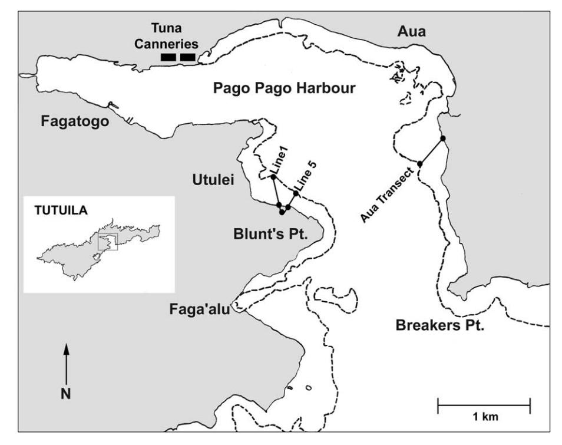
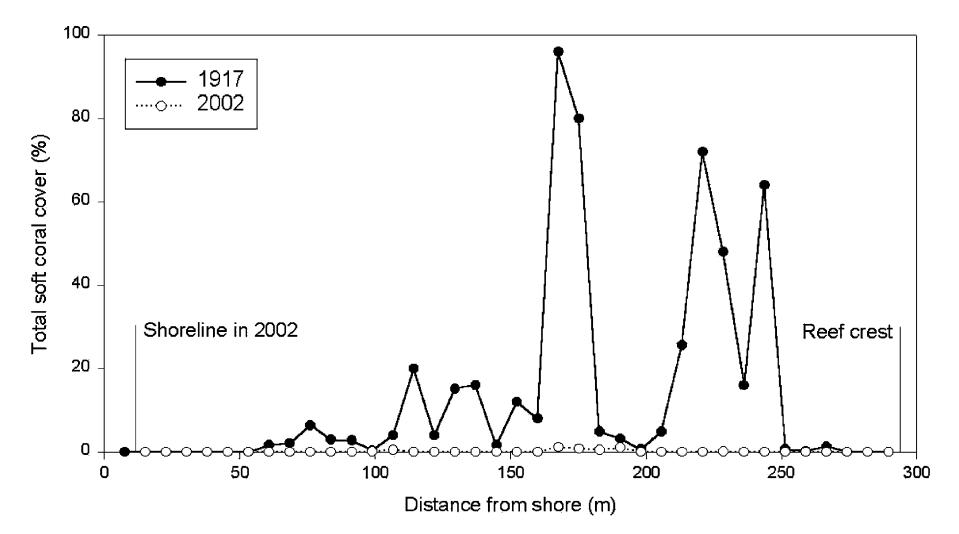
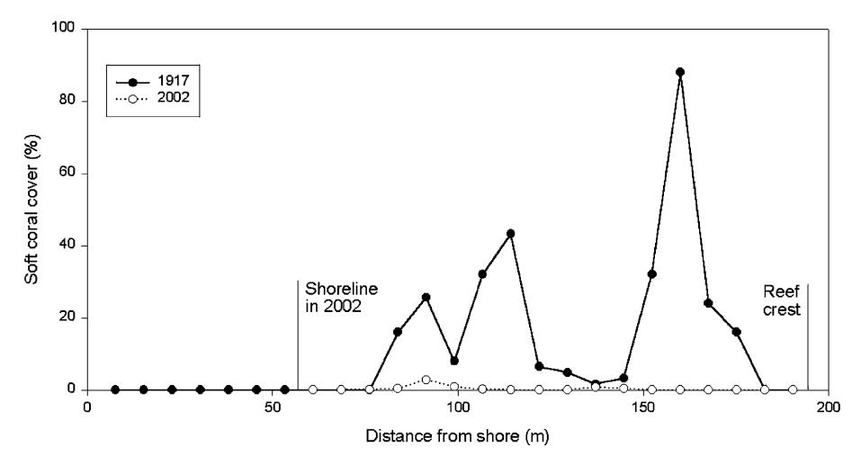
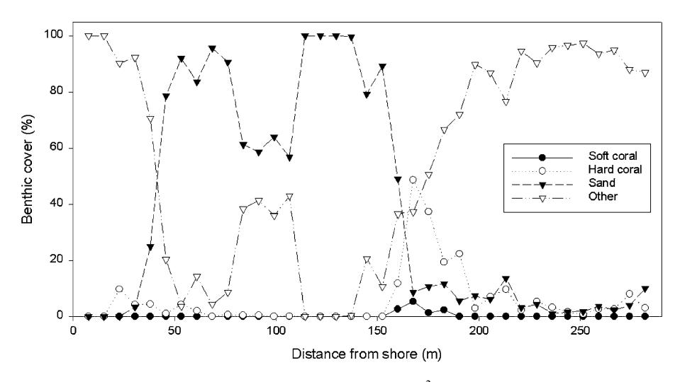
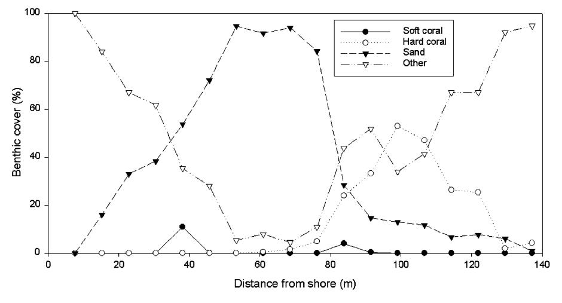

Marine Pollution Bulletin 48 (2004) 768–777

www.elsevier.com/locate/marpolbul

# Resurvey of a reef flat in American Samoa after 85 years reveals devastation to a soft coral (Alcyonacea) community

Andrew S. Cornish a,\*, Eva M. DiDonato b

a Department of Marine and Wildlife Resources, Pago Pago, 96799 American Samoa b National Park of American Samoa, Pago Pago, 96799 American Samoa

#### Abstract

One of the earliest quantitative surveys of soft corals, on a reef flat in Pago Pago Harbour, American Samoa, was repeated 85 years later. The alcyoniid communities there, which were the dominant benthic organisms during the initial survey, have suffered a drastic decline of 99% cover in the interim. The most likely causes of the decline are anthropogenic disturbance associated with reclamation along the harbour from the 1940s to early 1960s, compounded by chronic pollution from industrial wastewater discharge from the mid-1950s to late 1980s. The decline in one dominant species, Sinularia polydactyla, is likely to have serious consequences for the reef as unusually for a soft coral, this had been the major reef building species. Life-history traits of certain Sinularia and Sarcophyton, such as slow growth and low rates of sexual reproduction, mean they will be slower to recover from severe disturbance than many scleractinian corals. 2003 Elsevier Ltd. All rights reserved.

Keywords: Coral reefs; Water quality; Disturbance; Sinularia polydactyla; American Samoa; Alcyoniidae

### 1. Introduction

Coral reefs are recognized globally for their beauty, uniqueness, high biodiversity, and importance as a source of food for millions in tropical coastal areas, a source of income through the collection of its inhabitants for food and the aquarium trade, for tourism, and for their value as a barrier reducing coastal erosion (e.g. McManus, 1988; Wilkinson et al., 1999). Unfortunately, the cumulative effects of natural and anthropogenic stresses on coral reefs reached a crisis point in the late 20th century with the widespread degradation of many reefs in all areas of the tropics (Bryant et al., 1998; Wilkinson, 2002).

Coral reef communities are highly specialized and very sensitive to environmental perturbations on a variety of scales (Hallock, 1997). Increasing anthropogenic stress on coral reefs and the resulting global degradation means that modern reefs may not continue to

E-mail address: [acornish@hkucc.hku.hk](mail to: acornish@hkucc.hku.hk) (A.S. Cornish).

exist in the form that they have done for 6–9 thousand years (Hallock, 1997) unless we actively manage these areas to ensure their continued survival. Such management will not be possible without a solid base of scientific knowledge on (i) natural processes affecting coral reefs and, (ii) the effects of a wide range of anthropogenic impacts on these natural processes.

The field of coral reef research has grown so rapidly in essentially just a few decades that studies of decadallength changes to benthic communities are still relatively scarce. Those that do exist have provided invaluable insights into the natural variation to coral reefs caused by differences in the life-histories of the many reef building coral species, and of episodic natural disturbances to them e.g. Dollar and Tribble (1993), Hughes (1994). Although soft corals are not generally reef builders (Fabricius and Aldersdale, 2001), some Sinularia lay down a hard skeleton composed of masses of calcite spicules bound together by aragonitic cements (Konishi, 1981) that may form three-dimensional structures with comparable strength and density to some hard corals and should, therefore, be considered hermatypic (Schuhmacher, 1997). Indeed, on some reefs, spiculite forming Sinularia are the major reef builders (Cary, 1931).

\* Corresponding author. Present address: Department of Ecology and Biodiversity, Swire Institute of Marine Science, The University of Hong Kong, Cape d'Aguilar Rd., Shek O, Hong Kong. Fax: +852- 25176082.

Very little is known about long-term variation in soft coral communities despite their being an important benthic component of coral reefs in the tropical Indian Ocean, Red Sea and Indo-Pacific with soft coral cover >15% being frequently reported (Benayahu and Loya, 1981; Dai, 1990; Fabricius, 1997; Riegl and Piller, 1999; Reincke and Ofwegen, 1999; Fabricius and De'ath, 2001; Ninio and Meekan, 2002). The available data suggest that soft coral abundance at a locality is likely to be variable over time owing to differences in growth rates (Ninio and Meekan, 2002), competitive interactions with hard corals (Sammarco et al., 1983, 1985; Dai, 1990; Atrigenio and Alino, 1996) changes in tur- ~ bidity (Fabricius and De'ath, 2001) and disturbances, e.g. from storms (van-Woesik et al., 1995) and bleaching events (Fabricius, 1999; McClanahan et al., 2001).

Additionally, a number of studies have suggested soft corals may act to rapidly increase in abundance following the removal or death of scleractinian corals (Atrigenio, 1996; Done, 1999) and in some cases come to dominate (Chou and Yamazato, 1990; Benayahu, 1997; Done, 1997; Reincke and Ofwegen, 1999; Fox et al., 2003). For instance, Xenia macrospiculata (Xeniidae) in the Red Sea was found to occupy artificial substrates after just 5–8 days by ''translocation'' from adjacent reef, and exhibited rapid space acquisition by asexual and sexual reproduction, and rapid growth (Benayahu and Loya, 1981). Rapid growth (>1 cm linear growth per month) has also been noted for a nephthid, Litophyton viridis, which also has the ability to propagate asexually by producing runners (Tursch and Tursch, 1982). However, wide-ranging studies have found that while some of the xeniid and nephtheids show characteristics that suggest they may be ephemeral reef pioneer organisms with high growth and reproductive rates (Fabricius, 1995), alcyoniids such as Sinularia and Sarcophyton show very low recruitment rates, slow growth and are likely to be poor colonizers (Fabricius, 1995). Such alcyoniids survive by having low rates of mortality and can be very stable in the long-term (Fabricius, 1995; Ninio and Meekan, 2002). This stability by alcyonacean soft corals is undoubtedly aided by their ability to produce a wide range of secondary metabolites, notably terpenoids (Tursch and Tursch, 1982; Wylie and Paul, 1989) which can cause local mortality in scleractinian corals (Sammarco et al., 1983) and reduce settlement of their larvae nearby through allelopathic interference (Maida et al., 1995). In addition, predators of alcyonacean soft corals are very few (Wylie and Paul, 1989), and thus, mortality from predators is unlikely to have much influence on their abundance (Fabricius and De'ath, 2001).

Among the earliest quantitative studies of soft coral communities are those made on the island of Tutuila in American Samoa as part of a series of expeditions of the Department of Biology of the Carnegie Institution of Washington led by Alfred Mayor from 1917 to 1920. These included a quantitative survey of the reef flat in front of Aua village along inner Pago Pago Harbour (Mayor, 1924), and a detailed study by Lewis Cary on

Fig. 1. Pago Pago Harbour, Tutuila showing the locations of the Utulei and Aua transects.

the soft coral ( ¼ Alcyonaria) community on a reef in the outer harbour at the village of Utulei during the years 1917–1920 (Cary, 1931) (see Fig. 1).

The island of Tutuila has undergone considerable changes since the Cary's study and there have been considerable impacts to coral reefs from coastal development, chronic pollution, sedimentation, shipwrecks and overfishing in addition to natural damage from storms, Crown-of Thorns Starfish (COTS), Acanthaster planci outbreaks, and bleaching events (Richmond et al., 2002). This paper describes a resurvey of Cary's transect work on the Utulei reef flat in 2002.

#### 2. Materials and methods

#### 2.1. Study area

At approximately 32 km in length, Tutuila is the largest island in American Samoa, an unincorporated and unorganized US territory comprising a small group of eroded volcanic islands and atolls in the South Pacific (14.20 S, 170.00 W). The population is currently over 60,000 with the vast majority living on Tutuila (American Samoa Government, 2002). Lying about midway on the southern shore of Tutuila, Pago Pago Harbour supports fringing coral reefs along most of the shoreline except for the inner harbour where there is substantial freshwater input.

Cary (1931) surveyed 5 transects over the reef flat from shore to reef crest on reefs in the vicinity of Utulei village and Goat Island, on the south shore of the outer harbour. Good descriptions of each transect location were provided including a map, photographs with transect lines superimposed on the image, written descriptions including compass bearings, and the location of each transect with distances and bearings in relation to both distinctive man-made and geographical features.

Three of the five transects, Lines 2, 3, and 4 have almost entirely disappeared under the reclamation over the reef flats around Goat Island in the late 1960s. Reclamation also occurred to widen the coastal road over the reef flat to the south of the Utulei cove and buried the start points of Lines 1 and 5 but most of each transect remains. A combination of the original descriptions and aerial photographs from past and present enabled us to relocate the original transects with reasonable confidence, although no trace could be found of the 2-inch iron pipes originally cemented into the reef.

#### 2.2. Methods

Cary marked off 25 · 25 ft (58 m2) squares along the length of the transects, sub-divided each into 5 · 5 ft (2.3 m2) units and used these to estimate the area of each 25 · 25 ft square occupied by living alcyonaceans. Only on Line 5 were the soft corals identified to species. We repeated the methodology in June 2002 by laying out transect tapes 25 ft apart from the sea-wall to the reef crest along the path of the original transects, and marking off 25 ft squares with lengths of PVC pipe whilst snorkeling. All soft coral colonies within each square were then photographed from directly above using a digital camera (Olympus 4040 in a Tetra underwater housing) with a 50 · 50 cm quadrat for scale. The resulting images were then analyzed using image analysis software (Image Tool for Windows, Vers. 3.00). The software calculated the area of soft corals in each frame once the outline of all soft coral colonies had been traced around, and the known width of the quadrat entered for scale. The area of all soft corals within each 25 ft quadrat was then converted into a percentage for comparison with Cary's 1917 data.

In order to compare data it was necessary to line up the 2002 transects with those from 1917. As there was no way of determining with any accuracy the original start points of the transects on the shoreline in 1917, we had little option but to line them up from the reef crest. This was not ideal as the reef crest would have been subject to both erosion and growth since 1917, and could have moved both closer or further away to the original shoreline. Nevertheless, it was felt that this was acceptable as (i) the shape of the reef crest at Utulei in 2002 was very similar to that depicted by Cary in 1917, and (ii) the reef crest is quite sheltered and by 2002 had a low cover of live corals on it and was mostly binding coralline algae so we expect the recent potential for rapid erosion or growth to be low. By using the reef crest as the static point between surveys it was estimated that the reclamation covered 8 m of Line 1 and 53 m of Line 5. This disparity was greater than expected, although from the shape of the reclamation it could be predicted that Line 5 would be the greater affected. It is believed that although there was no way to establish exactly how similar in position the transects were in 2002 compared with 1917, that the data will still be representative of changes to the Utulei reef flat over that time. We swam in the vicinity of both transects and there were no notable differences between the benthic communities on each transect, and the surrounding reef.

Percentage soft coral cover data for Line 1 and 5 from 1917 to 2002 were analyzed for changes over time using a paired t-test following a square root of the arcsin transformation.

In order that future changes in benthic cover be analyzed in more detail, Cary's methodology was updated in a similar fashion to that employed by Green et al. (1997) on the Mayor (1924) transect at Aua. In each 25 · 25 ft square, ten 25 cm2 quadrats with 5 cm2 divisions were each tossed haphazardly, and the percentage cover of the underlying substrata estimated into the following categories: soft coral (to species), live scleractinian coral, sand, and ''other''. This replication within each single unit of Cary's will enable more detailed future analysis of changes in cover of soft corals (and other categories of benthos) over time.

#### 3. Results

Two species of soft coral, both from the family Alcyoniidae, were present on the Utulei reef flat in the vicinity of Line's 1 and 5. Collected specimens were identified by P. Aldersdale and deposited in the Museum and Art Gallery of the Northern Territory, Darwin, Australia, as Sarcophyton ehrenbergi von Marenzeller, 1886 (NTMC13675) and Sinularia polydactyla (Ehrenberg, 1834), (NTMC13676). Sarcophyton ehrenbergi has been reported from many tropical areas of the Indo-West Pacific, including nearby Fiji (Verseveldt, 1982), while Sinularia polydactyla is widespread in the Indian Ocean and Pacific (Verseveldt, 1980) and is a dominant species on shallow reefs in Guam (Benayahu, 1997). Sinularia polydactyla forms spiculite rock decimeters thick and can be considered a limited reef-builder (Tursch and Tursch, 1982).

It is impossible to be sure whether these species are the same as those recorded by Cary: i.e. whether Cary's Sarcophytum latum Dana was a misidentification of Sarcophyton ehrenbergi, and whether his Sinularia densa Whitelegge ( ¼ Sclerophytum densum) and/or Sinularia confertum Dana ( ¼ Sclerophytum confertum) were misidentifications of Sinularia polydactyla (Sclerophytum is now known as Sinularia). The holotypes of Sarcophyton latum, and Sinularia confertum are lost, so the exact characteristics of these species remain unknown. Dana's drawing of a fragment of Sinulara confertum shows a colony morphology that also fits Sinularia polydactyla, and similarly his drawing of Sarcophytum latum would fit Sarcophytum ehrenbergi. Additionally, Cary's photographs of what he identified as Sinularia densa and Sinularia conferta could easily be of the same species and both Sinularia polydactyla. The fact that Sinularia polydactyla is the most common species of that genus to produce sclerite rock in sufficient amounts to cause the living colony to rise above the general surface of the reef, adds more to support this possibility (Alderslade, pers. comm.).

Soft coral cover at Utulei had declined dramatically since 1917. All alcyoniid species contributed a mean of 13.5% cover on Line 1 in 1917. Of the 37, 25 · 25 ft squares, 28 (74%) had some soft coral present, and the maximum cover was 96% (Fig. 2). In 2002 on the same transect the alcyoniids contributed just 0.1% cover, a decrease of 99.3%. The difference between the two surveys was highly significant (paired t-test: t-value 4.94, p < 0:001). Of the 37 squares, 7 (19%) had some soft coral present but the maximum cover was just 1.1%. On Line 5 in 1917, mean soft coral cover was 23.8%. Of the 25 squares, 14 (56%) had some soft coral present, and the maximum cover was 88% (Fig. 3). In 2002 on Line 5 the soft corals contributed just 0.29% cover, a decrease of 98.8%. The difference between the two surveys was again highly significant (paired t-test: t-value 4.20, p < 0:001). This decline was not simply due to the loss of the inner reef flat by reclamation between the two sampling dates as no soft corals were present in that area in 1917. A decline in diversity was also noted on Line 5 (the species occurring on Line 1 were not recorded by Cary). Sarcophyton was an important component of the reef flat benthic community in 1917 with a mean cover of 11.8% on Line 5 (generic data calculated from graph); however, no Sarcophyton species were recorded on or near Line 5 in 2002.

Fig. 2. Percentage soft coral cover in 25 · 25 ft (58 m2) plots on Line 1: 1917 and 2002.

Fig. 3. Percentage soft coral cover in 25 · 25 ft (58 m2) plots on Line 5: 1917 and 2002.

Fig. 4. Percentage benthic cover in 25 · 25 ft (58 m2) plots on Line 1, 2002.

Fig. 5. Percentage benthic cover in 25 · 25 ft (58 m2) plots on Line 5, 2002.

Bleaching in the form of total pigment loss affecting <10–100% of the colony was observed from 50.0% of all Sinularia polydactyla on Line 1 and 19.5% on Line 5 in 2002. Most of the bleached colonies occurred in the shallowest water (<0.5 m at low tide). No bleaching of Sarcophyton ehrenbergi was observed.

Benthic cover in 2002 as determined with the 25 cm2 quadrats for Lines 1 and 5 is shown in Figs. 4 and 5. The first 150 m from the shoreline on Line 1 was dominated by sand and ''other'', the latter being primarily rock rubble from the reclamation, and sea-grass. Hard coral cover exceeded 40% for a short distance on the back reef where the sand sloped up to meet the reef flat proper, thereafter the majority of the substrate was again ''other'', in this case dead coral pavement and coralline algae, or rubble. Line 5 showed a very similar pattern although the bands were narrower due to Line 5 lying roughly perpendicular to the reef crest and therefore considerably shorter than Line 1 which lies diagonally. The most abundant scleractinian corals in the study area were Pocillopora damicornis, Porites rus, Goniastrea retiformis, Porites cylindrica, Diploastrea heliopora, and Porites cf. lobata. Porites cylindrica ( ¼ Porites andrewsi, Birkeland, pers. comm.) was also reasonably common on the Utulei reef flat in 1917 along with a massive Porites (Cary, 1931) that we believe to be Porites cf. lobata.

## 4. Conclusions

The most obvious change from 1917 to 2002 is the dramatic decline in alcyoniids that had previously dominated the benthic fauna in large patches on sand and coral pavement (Cary, 1931). The scleractinian corals Porites cylindrica and Porites cf. lobata were still present in low abundances similar to those described verbally by Cary. In addition, and despite the loss of back reef to reclamation, the same reef zones were present, that is primarily sand close to shore, live hard coral further out and then virtually bare and very shallow coral pavement to the reef crest.

The large decline in soft coral cover indicates the reef flat at Utulei has been subject to one or multiple natural and/or anthropogenic disturbances since 1917. Given the long-time between surveys, identifying the exact cause/s will be impossible but from the available information we can make some sensible deductions. Natural succession in the absence of disturbance is unlikely as the state of the study site in 1917 indicates one of longterm stability leading to low biodiversity (Done, 1997), but high cover by large, old colonies (Fabricius and De'ath, 2001). Indeed, Cary (1931) noted that Sinularia were overgrowing most hard corals.

Octocorals have very few predators (Wylie and Paul, 1989) and not even COTS, which reduced live hard coral cover in 1979 (Birkeland et al., 1987) is likely to be responsible for the decline as soft corals form <2.5% of their diet, even when scleractinian corals are scarce (Keesing, 1990).

Anthropogenic factors are more likely to be responsible for the decline in alcyoniids at Utulei given the long history of disturbance to Pago Pago Harbour. The population of American Samoa has risen from over 5,000 people in 1900 to over 60,000 in 2001, and more than 10,000 people now live along the shores of Pago Pago Harbour (American Samoa Government, 2002). Large areas of shallow reef on the southern shore of the inner harbour north of Utulei were laid barren in the 1920s following the construction of a naval base there (Cary, 1931) and the US Navy also dredged a number of inshore areas for landfill between 1942 and 1945. Other reclamation over the decades covered inner portions of the Utulei reef in the early 1940s to create a tank farm, 24 acres of reef in the southern part of the outer harbour in 1951 (Enright, pers. comm.), and again at Utulei to widen the road over the start of Cary's Line 1 and 5 in the early 1960s. Residents recall seeing heavy equipment on shallow areas of the Utulei reef and the current beach there was formed by trucking in large quantities of sand (Scanlan, pers. comm.), undoubtedly resulting in severe disturbance to the reef flat. Additional stress likely occurred when the reef around Goat Island at the northern point of Utulei was reclaimed in 1966, and from oil spills that were commonly observed in the area 1969–1971 (Maragos, pers. comm.).

Large tuna canneries were established in the inner harbour in 1954 and 1963 and dredging operations were expanded in 1960 (Dahl and Lamberts, 1977). Anecdotal information suggests that harbour water was still relatively clean after the Navy left Tutuila, and that the canneries caused a huge decline in water quality (Enright, pers. comm.). In the first decades of operation, waste-water from the preparation of the whole tuna for canning was discharged directly into the inner harbour. The first long term, accessible, water quality dataset (1982–1997) shows that between 1982 and 1991, concentrations of total nitrogen (TN), total phosphorus (TP), and Chlorophyll a (Chl a) exceeded American Samoa Environmental Protection Agency (ASEPA) water quality standards in the harbour by 2–6 times, 2–3 times and 1–19 times, respectively (ASEPA, unpublished data). These results prompted dramatic improvements in waste disposal/treatment. Starting in 1988, high strength cannery waste was shipped 7 km offshore for ocean disposal while weaker waste was discharged via a pipe in the outer harbour at a depth of 55 m. Upgrades in wastewater treatment were also implemented with the result that for the first time in 1992, TN, TP, and Chl a concentrations were compliant with harbour standards (ASEPA, unpublished data). More recent data (2000– 2001) suggest that concentrations remain below the acceptable limits (ASEPA, unpublished data).

We believe that the primary causes of the decline to alcyoniid communities on the Utulei reef flat were the physical disturbances caused by reclamation from the 1940s to early 1960s, compounded by pollution from the tuna canneries from the mid-1950s to late 1980s and periodic oil spills. Increased sediment levels as a result of reclamation and dredging could adversely affect alcyoniids as high levels of sediment can decrease their photosynthetic production and respiration, as well as reducing energy reserves through the production of metabolically expensive mucous sheets (Riegl and Branch, 1995). Dredging, and pollution from the canneries and a fuel dump were also blamed for the degradation of the Aua transect (see Fig. 1) between 1917 and 1995 that included a decline in hard coral species diversity, richness, abundance, and cover, and eventually the complete loss of soft corals (Table 1) (Mayor, 1924; Dahl and Lamberts, 1977; Dahl, 1981; Green et al., 1997). Our theory is supported by the work of J. Maragos who noted Sarcophyton covering 10–15% of the Utulei reef flat from 1969 to 1971 while Porites cylindrica covered 25–30%. By 1978 Porites cylindrica cover was only 5% and in 1982 and 1991 there were virtually no live hard or soft corals (Maragos, pers. comm.). Another long-term study at Utulei on the hard corals found hard coral communities were in decline as late as the early 1990s (Birkeland et al., 1994, 1996), but more recently, in 1999, a large increase in Acropora recruits indicates some recovery of the hard coral community there (Green, 2002).

According to the available information, the physical disturbance from reclamation and the chronic effects of pollution should have been greatly reduced by 1992 when TN, TP, and Chl a concentrations met harbour standards for the first time in decades. However, if there has been recovery by alcyoniids in the decade since then, it is occurring at a very slow rate as evidenced by the very low cover. Assemblages on reef flats are likely to be less stable than on reef slopes as major physical disturbances are more intense and frequent there (DeVantier et al., 1998) although the high alcyoniid cover in 1917 indicates long-term stability prior to that time. Recovery may have been hindered by two major hurricanes, Ofa in 1990 and Val in 1991, and potentially, unusually high water temperatures in 1994 (Green et al., 1999) that resulted in some bleaching to the soft corals at Utulei (Daschbach, pers. comm.). Bleaching, which was also noted in 2002, may affect the ability of Sinularia and Sarcophyton to recolonize as it reduces reproductive output in another alcyoniid genera, Lobophytum (Michalek-Wagner and Willis, 2001), while severe bleaching can result in mortality (Fabricius, 1999). However, American Samoa did largely escape the elevated sea surface temperatures that devastated hard and soft coral communities elsewhere in 1998 (Sheppard, 1999; Wilkinson, 2000).

Taxa that recolonize slowly either by being slow to colonize, or slow to mature, may not be able to survive in a frequently disturbed environment (Done, 1997) such as the Utulei reef flat. Few data are available on the age of sexual or asexual maturation of alcyoniids although Sinularia polydactyla are known to take one year to complete their reproductive cycle and produce eggs (Slattery et al., 1999). The available data also shows that tropical alcyoniids have very low rates of successful recruitment compared with scleractinian corals and that Sinularia and Sarcophyton also show slow growth (radial growth rate around 0.5 cm per year) (Fabricius, 1995). Such traits are important in understanding why recolonization at Utulei has been slow and why the alcyoniid genera surviving are liable to lag behind an initial recovery noted for scleractinian corals (Green, 2002). Recovery from disturbance by scleractinian corals may be quicker when some survive the disturbance and regrow, reducing the importance of recruitment of propagules from elsewhere (Connell et al., 1997) and the same is likely to be true for the alcyoniids discussed. The presence at Utulei in 2002 of colonies of Sinularia polydactyla> 60 cm diameter suggest that they were on the reef there in the early 1980s at least, see Fabricius (1995). These older colonies will undoubtedly act to seed the area and speed up recolonization.

The alcyoniid genera Sinularia and Sarcophyton compensate for their low rates of reproduction by having low mortality (Cary, 1931; Fabricius, 1995) and living to a great age (Fabricius, 1995). Asexual reproduction by colony fission is more important in maintaining population size than sexual reproduction (Fabricius, 1995).

Table 1 Numbers of soft corals ( ¼ Alcyonaria) on the Aua transect, Pago Pago Harbour, American Samoa (from Mayor, 1924; Dahl and Lamberts, 1977; Dahl, 1981; Green et al., 1997)

| Distance from low tide mark of shore (m) |       |       |         |         |         |         |         |         |         |         |       |
|------------------------------------------|-------|-------|---------|---------|---------|---------|---------|---------|---------|---------|-------|
| Year                                     | 61–68 | 91–99 | 122–129 | 140–148 | 160–168 | 183–190 | 213–221 | 233–241 | 247–255 | 259–267 | Total |
| 1917                                     | 3     | 2     |         | 5       |         |         |         |         | 3       |         | 13    |
| 1973                                     |       |       |         |         | 1       | 8       |         |         | 18      | 3       | 30    |
| 1980                                     |       |       |         |         |         |         | 1       |         |         |         | 1     |
| 1995                                     |       |       |         |         |         |         |         |         |         |         | 0     |
|                                          |       |       |         |         |         |         |         |         |         |         |       |

Note that the inner 60 m was greatly disturbed by dredging and not subsequently resurveyed.

These life-history traits facilitate another important tactic for long-term stability, the ability of alcyoniids like Sinularia and Sarcophyton, to produce very large single colonies (up to 10 m in diameter) and/or large areas of genetically identical smaller colonies (Fabricius and Aldersdale, 2001). Such monospecific carpets may physically exclude scleractinian corals (Maragos, 1974; Endean, 1976; Fox et al., 2003) and reduce recruitment by reducing the amount of available space (Connell et al., 1997) and inhibiting larval settlement using chemical defenses (Maida et al., 1995). It is likely, therefore, that certain alcyoniids have the potential to become dominant in areas where physical conditions are optimal and where such species occur, but only where there is minimal long-term disturbance.

The huge decline in soft coral cover over the 85 year period may have had serious consequences for the Utulei reef flat as unusually, a soft coral, Sinularia polydactyla, was the primary reef-builder there (Cary, 1931). Numerous shallow excavations made from 1917 to 1920 along Line 1 and cores taken at distances from shore of 85, 175 and 280 m, to the basalt bedrock at depths of 20, 40, and 40 m, respectively, revealed that not only was around 75% of the reef flat covered with coral pavement comprised primarily of Sinularia spiculite, but that the spiculite, in addition with coral skeletons of Porites cylindrica and Porites cf. lobata formed the major solid particles all the way down to the bedrock (Cary, 1931). In losing the majority of the Sinularia on the reef flat, the Utulei reef has not only lost its primary reef builders but also a tough living surface layer that would have acted to effectively seal the substrate and prevent bio-erosion and damage (Reincke and Ofwegen, 1999). Indeed, the large vertical blocks of Sinularia spiculite described by Cary on the reef flat and slope were not present in 2002 and erosion could even have caused this reef to have suffered net calcium carbonate loss (Done, 1997). Continued loss may result in considerable damage to the homes and industries of Utulei as the reefs along the outer harbour greatly reduce the force of the waves reaching the shore during stormy weather.

We have shown, in support of Fabricius (1995) that general statements about soft corals being pioneers, or coming to dominate following increased disturbance events (Benayahu, 1997; Done, 1999) are simply not true for some common shallow water Alcyoniidae. On the contrary, there are now good data that suggest the slow growth and low reproductive rates of Sinularia and Sarcophyton, in combination with the great declines in cover found here suggest they may be particularly vulnerable to, and slow to recover from, certain disturbances (Ninio and Meekan, 2002). Indeed, increasing disturbance to coral reefs globally may result in decreasing abundances of alcyoniids, particularly in shallow inshore areas that are likely to be the greatest affected by human activities. Such a prediction, however, is hard to reconcile with a number of reports of alcyoniids including Sinularia species apparently rapidly overgrowing dead hard coral skeletons (Endean, 1976; Benayahu, 1997; Done, 1997). One likely reason for such discrepancies is the crude taxonomic level at which many studies examining soft corals are conducted. Accurate identification to species level requires examination of the internal sclerites (Fabricius and Aldersdale, 2001) and thus, few ecological field studies identify to levels greater than genera. Individual genera can have high diversity e.g. the Sinularia and Sarcophyton have 93 and 35 recognized species, respectively (Verseveldt, 1980, 1982), so it is likely there are substantial differences in biology and ecology among congenerics.

Overall, this study has been instructive but ultimately has suffered as a result of the great time between surveys, preventing a more certain identification of the roles of anthropogenic and natural disturbance in causing the changes seen, and the rate of recovery. Monitoring over long periods with short intervals is needed to detect extreme events and reveal slow processes (Connell et al., 1997). It is our aim to repeat this survey at more regular time intervals in the future in order to reveal more about the ability of common soft corals to recover from disturbance.

#### Acknowledgements

This research was made possible by funding to AC through the US Coral Reef Initiative (Department of the Interior to the American Samoa Government) and support to ED by the National Park of American Samoa. We are grateful to Phil Alderslade and Chuck Birkeland for assistance identifying soft and hard corals, respectively, and to Chuck Birkeland and Katharina Fabricius for providing useful comments on a draft manuscript. John Enright of the Historical Preservation Office, J.R. Scalan, Nancy Daschbach, Jim Maragos, Allison Graves and Guy DiDonato provided information or aided with the study. Finally, we would like to acknowledge John Starmer, who first alerted us to Lewis Cary's work.

# References

American Samoa Government, 2002. American Samoa Statistical Yearbook 2000. Statistics Division, Department of Commerce, Pago Pago, American Samoa, p. 188.

Atrigenio, M.P., Alino, P.M., 1996. Effects of the soft coral ~ Xenia puertogalerae on the recruitment of scleractinian corals. Journal of Experimental Marine Biology and Ecology 203, 179–189.

Benayahu, Y., 1997. A review of three alcyonacean families (Octocorallia) from Guam. Micronesica 30, 207–244.

Benayahu, Y., Loya, Y., 1981. Competition for space among coral-reef sessile organisms at Eilat, Red-Sea. Bulletin of Marine Science 31, 514–522.

- Birkeland, C., Randall, R.H., Amesbury, S., 1994. Coral and reef-fish assessment of the Fagatele Bay National Marine Sanctuary. Report to the National Oceanic and Atmospheric Administration, U.S. Department of Commerce, p. 126.
- Birkeland, C., Randall, R.H., Green, A.L., Smith, B.D., Wilkins, S., 1996. Changes in the coral reef communities of Fagatele Bay National Marine Sanctuary and Tutuila Island (American Samoa) over the last two decades. Report to the National Oceanic and Atmospheric Administration, U.S. Department of Commerce, p. 225.
- Birkeland, C.E., Randall, R.H., Wass, R.C., Smith, B., Wilkins, S., 1987. Biological resource assessment of the Fagatele Bay National Marine Sanctuary. National Oceanic and Atmospheric Administration Tech. Mem. Ser. NOS/MEND 3, U.S. Department of Commerce, p. 232.
- Bryant, D., Burke, L., McManus, J., Spalding, M., 1998. Reefs at Risk: A Map-based Indicator of Threats to the World's Coral Reefs. World Resources Institute, New York. p. 56.
- Cary, L.R., 1931. Studies on the coral reefs of Tutuila, American Samoa, with special reference to the Alcyonaria. Papers from the Tortugas Laboratory, Carnegie Institute of Washington 37, 53–98, 57 pls.
- Chou, L.M., Yamazato, K., 1990. Community structure of coral reefs within the vicinity of Motobu and Sesoko, Okinawa, and the effects of human and natural influences. Galaxea 9, 9–75.
- Connell, J.H., Hughes, T.P., Wallace, C.C., 1997. A 30-year study of coral abundance, recruitment, and disturbance at several scales in space and time. Ecological Monographs 67, 461–488.
- Dahl, A.L., 1981. Monitoring coral reefs for urban impact. Bulletin of Marine Science 31, 544–551.
- Dahl, A.L., Lamberts, A.E., 1977. Environmental-impact on a Samoan coral reef––re-survey of Mayor's 1917 transect. Pacific Science 31, 309–319.
- Dai, C.F., 1990. Interspecific competition in taiwanese corals with special reference to interactions between alcyonaceans and scleractinians. Marine Ecology Progress Series 60, 291–297.
- DeVantier, L.M., De'ath, G., Done, T.J., Turak, E., 1998. Ecological assessment of a complex natural system: a case study from the Great Barrier Reef. Ecological Applications 8, 480–496.
- Dollar, S.J., Tribble, G.W., 1993. Recurrent storm disturbance and recovery: a long-term study of coral communities in Hawaii. Coral Reefs 12, 223–233.
- Done, T.J., 1997. Decedal changes in reef-building communities: implications for reef growth and monitoring programs. In: Proceedings of the Eighth International Coral Reef Symposium, vol. 1, pp. 411–416.
- Done, T.J., 1999. Coral community adaptability to environmental change at the scales of regions, reefs and reef zones. American Zoologist 39, 66–79.
- Endean, R., 1976. Population explosions of Acanthaster planci and associated destruction of hermatypic corals in the Indo-West Pacific Region. In: Jones, O.A., Endean, R. (Eds.), Biology and Geology of Coral Reefs, vol. 2. Academic Press, New York, pp. 390–438.
- Fabricius, K.E., 1995. Slow population turnover in the soft coral genera Sinularia and Sarcophyton on mid-shelf and outer-shelf reefs of the Great Barrier Reef. Marine Ecology Progress Series 126, 145–152.
- Fabricius, K.E., 1997. Soft coral abundance on the central Great Barrier Reef: effects of Acanthaster planci, space availability, and aspects of the physical environment. Coral Reefs 16, 159–167.
- Fabricius, K., 1999. Tissue loss and mortality in soft corals following mass-bleaching. Coral Reefs 18, 54.
- Fabricius, K., Aldersdale, P., 2001. Soft Corals and Sea Fans: A Comprehensive Guide to the Shallow-water Genera of the Central-West Pacific, the Indian Ocean and the Red Sea. Australian Institute of Marine Science, Townsville, Australia. p. 264.

- Fabricius, K., De'ath, G., 2001. Biodiversity on the Great Barrier Reef: large-scale patterns and turbidity-related local loss of soft coral taxa. In: Wolanski, E. (Ed.), Oceanographic Processes of Coral Reefs: Physical and Biological Links in the Great Barrier Reef. CRC Press, London, pp. 127–144.
- Fox, H.E., Pet, J.S., Dahuri, R., Caldwell, R.L., 2003. Recovery in rubble fields: long-term impacts of blast fishing. Marine Pollution Bulletin 46, 1024–1031.
- Green, A.L., 2002. Status of coral reefs on the main volcanic islands of American Samoa: a resurvey of long term monitoring sites (benthic communities, fish communities, and key macroinvertebrates). Report to the Department of Marine and Wildlife Resources, Pago Pago, American Samoa, p. 135.
- Green, A.L., Birkeland, C.E., Randall, R.H., 1997. 78 years of coral reef degradation in Pago Pago harbor: a quantitative record. In: Proceedings of the Eighth International Coral Reef Symposium, vol. 2, pp. 1883–1888.
- Green, A.L., Birkeland, C.E., Randall, R.H., 1999. Twenty years of disturbance and change in Fagatele Bay National Marine Sanctuary, American Samoa. Pacific Science 53, 376–400.
- Hallock, P., 1997. Reefs and reef limestones in Earth history. In: Birkeland, C. (Ed.), Life and Death of Coral Reefs. Chapman & Hall, pp. 13–42.
- Hughes, T.P., 1994. Catastrophes, phase-shifts, and large-scale degradation of a Caribbean coral reef. Science 265, 1547–1551.
- Keesing, J.K., 1990. Feeding biology of the crown-of-thorns starfish, Acanthaster planci (Linnaeus). Ph.D. dissertation, James Cook University of North Queensland, Townsville, Australia, p. 186.
- Konishi, K., 1981. Alcyonarian spiculites: limestone of soft corals. In: Proceedings of the Fourth International Coral Reef Symposium, vol. 1, pp. 643–649.
- Maida, M., Sammarco, P.W., Coll, J.C., 1995. Effects of soft corals on scleractinian coral recruitment. 1. Directional allelopathy and inhibition of settlement. Marine Ecology Progress Series 121, 191– 202.
- Maragos, J.E., 1974. Coral communities on a seaward reef slope, Fanning Island. Pacific Science 28, 257–273.
- Mayor, A., 1924. Structure and ecology of Samoan reefs. Papers from the Department of Marine Biology, Carnegie Institution of Washington 19, 1–25, pl. 1–8.
- McClanahan, T.R., Muthiga, N.A., Mangi, S., 2001. Coral and algal changes after the 1998 coral bleaching: interaction with reef management and herbivores on Kenyan reefs. Coral Reefs 19, 380– 391.
- McManus, J.W., 1988. Coral reefs of the ASEAN region: status and management. Ambio, 189–193.
- Michalek-Wagner, K., Willis, B.L., 2001. Impacts of bleaching on the soft coral Lobophytum compactum. I. Fecundity, fertilization and offspring viability. Coral Reefs 19, 231–239.
- Ninio, R., Meekan, M.G., 2002. Spatial patterns in benthic communities and the dynamics of a mosaic ecosystem on the Great Barrier Reef, Australia. Coral Reefs 21, 95–103.
- Reincke, G.B., Ofwegen, L.P., 1999. Soft corals (Alcyonacea: Octocorallia) from shallow water in the Chagos Archipelago: species assemblages and their distributions. In: Sheppard, C.R.C., Seaward, M.R.D. (Eds.), Ecology of the Chagos Archipelago. Otley: Westbury for the Linnean Society of London, London, pp. 67–85.
- Richmond, R., Kelty, R., Craig, P., Emaurois, C., Green, A., Birkeland, C., Davis, G., Edward, A., Golbuu, Y., Gutierrez, J., Houk, P., Idechong, N., Maragos, J., Paulay, G., Starmer, J., Tafilechig, A., Trianni, M., Van der Velde, N., 2002. Status of the coral reefs in Micronesia and American Samoa: US affiliated and freely associated islands in the Pacific. In: Wilkinson, C. (Ed.), Status of Coral Reefs of the World. Australian Institute of Marine Science, Townsville, Queensland, pp. 217–236.
- Riegl, B., Branch, G.M., 1995. Effects of sediment on the energy budgets of 4 scleractinian (Bourne 1900) and 5 alcyonacean

- (Lamouroux 1816) corals. Journal of Experimental Marine Biology and Ecology 186, 259–275.
- Riegl, B., Piller, W.E., 1999. Coral frameworks revisited-reefs and coral carpets in the northern Red Sea. Coral Reefs 18, 241–253.
- Sammarco, P.W., Coll, J.C., La-Barre, S., 1985. Competitive strategies of soft corals (Coelenterata: Octocorallia): II. Variable defensive responses and susceptibility to scleractinian corals. Journal of Experimental Marine Biology and Ecology 91, 199–216.
- Sammarco, P.W., Coll, J.C., La-Barre, S., Willis, B., 1983. Competitive strategies of soft corals (Coelenterata: Octocorallia): allelopathic effects on selected scleractinian corals. Coral Reefs 1, 173–178.
- Schuhmacher, H., 1997. Soft corals as reef builders. In: Eighth International Coral Reef Symposium, vol. 1, pp. 499–502.
- Sheppard, C., 1999. Coral decline and weather patterns over 20 years in the Chagos Archipelago, central Indian Ocean. Ambio 28, 472– 478.
- Slattery, M., Hines, G.A., Starmer, J., Paul, V.J., 1999. Chemical signals in gametogenesis, spawning, and larval settlement and defense of the soft coral Sinularia polydactyla. Coral Reefs 18, 75– 84.
- Tursch, B., Tursch, A., 1982. The soft coral community on a sheltered reef quadrat at Laing Island (Papua New-Guinea). Marine Biology 68, 321–332.

- van-Woesik, R., De-Vantier, L.M., Glazebrook, J.S., 1995. Effects of Cyclone Joy' on nearshore coral communities of the Great Barrier Reef. Marine Ecology Progress Series 128, 261–270.
- Verseveldt, J., 1980. A revision of the genus Sinularia May (Octocorallia, Alcyonacea). Zoologische-Verhandelingen, Leiden 179, 1– 128.
- Verseveldt, J., 1982. A revision of the genus Sarcophyton Lesson (Octocorallia, Alcyonacea). Zoologische-Verhandelingen, Leiden 192, 1–91.
- Wilkinson, C., 2000. World-wide coral reef bleaching and mortality during 1998: a global climate change warning for the new milennium. In: Seas at the Millennium, vol. III, pp. 43–57.
- Wilkinson, C., 2002. Executive summary. In: Wilkinson, C. (Ed.), Status of Coral Reefs of the World: 2002. Australian Institute of Marine Science, Townsville, Australia, pp. 7–29.
- Wilkinson, C., Linden, O., Cesar, H., Hodgson, G., Rubens, J., Strong, A.E., 1999. Ecological and socioeconomic impacts of 1998 coral mortality in the Indian Ocean: an ENSO impact and a warning of future change? Ambio 29, 188–196.
- Wylie, C.R., Paul, V.J., 1989. Chemical defenses in three species of Sinularia (Coelenterata, Alcyonacea): effects against generalist predators and the butterflyfish Chaetodon unimaculatus Bloch. Journal of Experimental Marine Biology and Ecology 129, 141– 160.