# The American Samoan Coral Reef Monitoring Program

An integrated long-term monitoring plan for the Territory

A.S. Cornish and D.T. Wilson 2002

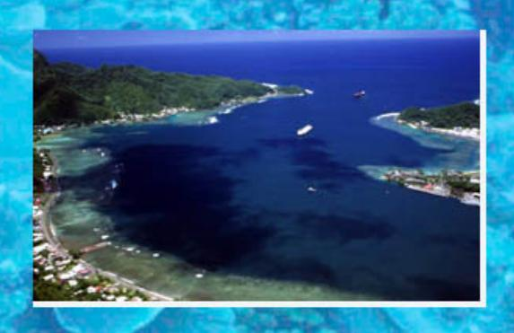

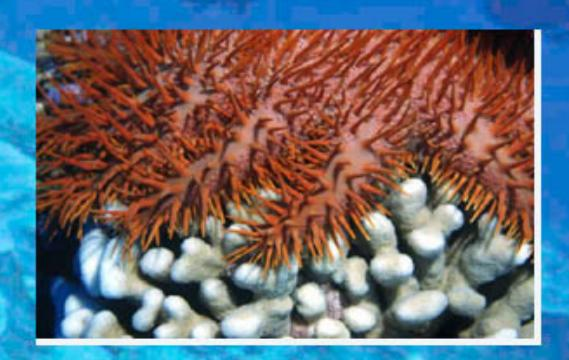

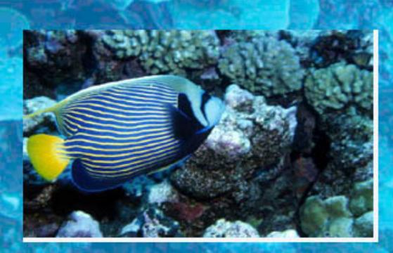

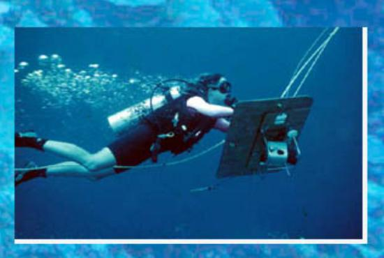

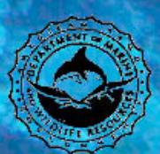

# The American Samoan Coral Reef Monitoring Program

An integrated long-term monitoring plan for the Territory

Andrew S. Cornish and David T. Wilson

October 2002

Developed from the American Samoan Coral Reef Monitoring Workshop

March 19-21, 2002

Pago Plaza, Pago Pago, American Samoa

**Organizers** 

Andrew S. Cornish American Samoa Coral Reef Advisory Group

Flinn Curren
Department of Marine and Wildlife Resources

This workshop was sponsored by the National Oceanic and Atmospheric Administration through the National Ocean Service as part of the U.S. Coral Reef Initiative

Cover photographs: Andrew Cornish

Authors' contacts: andy\_cornish@yahoo.com; dwilson@sfs-tci.org

Suggested citation: Cornish A.S. and D.T. Wilson. 2002. The American Samoan Coral Reef Monitoring Plan. A report from the American Samoan Coral Reef Monitoring Workshop held Pago Pago, American Samoa 19-21 March 2002 to the Department of Marine and Wildlife Resources and Coral Reef Advisory Group to the Governor. pp 73

# Contents

| 1) Executive Summary                                                                                     | .5      |
|----------------------------------------------------------------------------------------------------------|---------|
| 2) Introduction, Workshop Goals and Workshop Presentations                                               | .6      |
| 3) Local territorial and federal governmental coral reef monitoring programs: Goals and methods in brief | .9      |
| 3.1 American Samoa Environmental Protection Agency                                                       | 9       |
| 3.2 Department of Marine and Wildlife Resources                                                          | 9       |
| 3.3 The National Park of American Samoa                                                                  | 15      |
| 3.4 Fagatele Bay National Marine Sanctuary                                                               | 16      |
| 3.5 American Samoa Coastal Zone Management Program                                                       | 18      |
| 4) Other coral reef monitoring programs: Goals and methods in brief1                                     | 19      |
| 4.1 Coral Reef Ecosystem Investigation (NOAA Fisheries, Honolulu Laboratory)                             | 19      |
| 4.2 CREWS remote sensing stations                                                                        | 25      |
| 4.3 The "Aua transect" surveys                                                                           | 25      |
| 4.4 ReefCheck                                                                                            | 27      |
| 4.5 US Geological Survey rain and stream gages                                                           | 27      |
| 4.6 Tuna Cannery Water Quality Monitoring.                                                               | 27      |
| 4.7 US Fish and Wildlife Service Monitoring at Rose Atoll                                                | 29      |
| 5) A long-term monitoring framework                                                                      | 30      |
| 5.1 Approach to devising a long-term monitoring plan.                                                    | 30      |
| 5.2 The Long-Term Monitoring Plan.                                                                       | 31      |
| 5.3 Core-Site selection in General Management Areas with descriptions of the Marine Protected Areas      | e 31 |

| 5.4 The Core-Sites                                                        | 36  |
|---------------------------------------------------------------------------|-----|
| 5.5 Core-Site Monitoring                                                  | 38  |
| 5.6 Key Points about the Core-Sites monitoring program                    | 38  |
| 5.7 Coral Reef Ecosystem Investigation program                            | 39  |
| 5.8 Further Recommendations for the Core-Sites program                    | 40  |
| 5.9 Further Recommendations for monitoring outside the Core-Sites program | 41  |
| 5.10 Additional research that would be of value                           | 42  |
| 5.11 Future considerations                                                | 42  |
| 5.12 Other considerations related to effective long-term monitoring       | 44  |
| 6) References                                                             | 46  |
| Appendices                                                                | 47  |
| I) Monitoring methodologies in detail                                     | 47  |
| II) Workshop Participants and Contributors                                | 71  |
| III) Maps of the Samoan Islands and Tutuila Island                        | 72. |

# 1) Executive Summary

In March 2002, a workshop was held to build a comprehensive long-term monitoring plan for American Samoa by coordinating existing monitoring programs and identifying areas where additional monitoring/research was needed.

The primary achievement of the plan is to identify and define core sites on the main islands of Tutuila and the Manu'a group in order to mesh existing programs monitoring corals, fishes and water quality. The priority for these and future monitoring programs will be to monitor these core sites, of which there are eight on Tutuila and six on each of the islands of Ofu/Olosega and Ta'u. The other major monitoring initiative is that of the multi-disciplinary Coral Reef Ecosystem Investigation surveys which will monitor alternative sites on Tutuila and the Manu'a group, as well as remote Swains Island and Rose Atoll.

The monitoring plan acts as an in-depth guide to coral reef monitoring in American Samoa by detailing the goals and methodologies of these and other major monitoring programs, notably of the various Marine Protected Areas. Listing the workshop recommendations for additional monitoring/research needed for comprehensive long-term monitoring completes the plan.

# 2) Introduction

American Samoa (AS) is an unincorporated and unorganized U.S. Territory in the South Pacific. It consists of 5 small volcanic islands and 2 remote atolls in the eastern portion of the Samoan archipelago. Coral reefs around the volcanic islands are primarily narrow fringing reefs although there are also some offshore banks. These reefs and associated communities are recovering from a Crown-of-thorns Starfish outbreak in 1979, hurricanes in 1986, 1990 and 1991 and mass coral bleaching in 1994. Pollution is localized but has caused extensive damage to reefs in the deep-water Pago Pago harbor in the recent past. Other notable anthropogenic impacts have been the grounding of longline fishing vessels in Pago Pago Harbor and Rose Atoll in the early 1990's (Birkeland *et al.* 2000). More recently, the commercial spearing of reef fishes at night using SCUBA resulted in significant declines in some species, notably of parrotfishes (Page, 1988). This threat was greatly reduced when fishing with underwater-breathing apparatus was banned through an executive order of Governor Sunia in April 2001.

The Coral Reef Advisory Group (CRAG) was appointed by the Governor of American Samoa to coordinate matters relating to coral reefs. It consists of representatives from five local government agencies involved in coral reef management and education: the Department of Marine and Wildlife Resources, AS Environmental Protection Agency, AS Department of Commerce (including the Fagatele Bay National Marine Sanctuary), AS Community College and the National Park of American Samoa.

In 2000, the U.S. federal government through the U.S. Coral Reef Initiative and National Centers for Coastal Ocean Science awarded American Samoa the first of a series of grants intended to provide sustained funding for coral reef monitoring. In meetings of the territory's Coral Reef Advisory Group, it was noted that American Samoa (AS) lacked a coherent plan for long-term reef monitoring. It was also perceived that advice on the most appropriate monitoring methods, and the parameters to be measured for effective management should be sought. This resulted the American Samoan Coral Reef Monitoring Workshop held in March 2002 during which discussions between local government representatives and overseas experts on a proposed long-term monitoring plan culminated in this document.

# **Workshop Goals**

- 1. To integrate the monitoring of coral reefs performed by the various agencies in American Samoa into a framework, and ensure that it will be sufficient to meet the territories long-term monitoring needs. This will be achieved by:
  - a) standardizing sites and sampling frequencies to increase the relevance of the different monitoring programs to each other without unduly affecting the ability of individual programs to meet the needs of each agency.

- b) detailing the methodologies needed to achieve monitoring goals where they do not already exist, or to modify them where they are currently inadequate. This will include consideration of sampling design and long-term statistical analysis.
- 2. To develop a basic monitoring program that villages participating in the Dept. Marine and Wildlife Resources' community-based fisheries management program can use to measure the effects of the increased level of protection that their program offers (the resulting monitoring protocols will be detailed elsewhere).

# Workshop presentations

# **Tuesday March 19**

# Introduction to international and local coral reef monitoring efforts

Facilitator: Tony Beeching, Dept. of Marine and Wildlife Resources

# Welcome to Participants

Alofa Tuaumu, Administrator. Dept. of Marine and Wildlife Resources

# Aims of the Workshop

Andrew Cornish, Coral Reef Advisory Group

# Coral Reef Monitoring in Guam

Mark Tupper, University of Guam

Integrated Statewide and Community-Based Coral Reef Monitoring in Hawai'i Alan Friedlander, Oceanic Institute, Hawai'i

# Coral Reef Monitoring on the Great Barrier Reef

Hugh Sweatman, Australian Institute of Marine Science

# AS Environmental Protection Agency Beach Monitoring Program Josh Craig, ASEPA

Dept. Marine and Wildlife Resources Monitoring Programs
Tony Beeching, Dept. of Marine and Wildlife Resources

# Non-Territorial Government Monitoring Initiatives

Andy Cornish, Coral Reef Advisory Group

# Fagatele Bay National Marine Sanctuary Monitoring Programs Nancy Daschbach, FBNMS

# American Samoa National Park Monitoring Programs Peter Craig, ASNP

# Wednesday March 20

# Development of a coral reef monitoring framework for American Samoa

Facilitator: Andrew Cornish, Coral Reef Advisory Group

Proposed integration of existing and future coral reef monitoring programs
David Wilson, Dept. of Marine and Wildlife Resources

# **Thursday March 21**

# Development of a coral reef monitoring methodology for communities in American Samoa

Facilitator: Nancy Daschbach, Fagatele Bay National Marine Sanctuary

A Community Monitoring Program in the Philippines
Tony Beeching, Dept. of Marine and Wildlife Resources

The Community-Based Fisheries Management Program in American Samoa Flinn Curren, Dept. of Marine and Wildlife Resources

# 3) Local territorial and federal governmental coral reef monitoring programs: Goals and methods in brief

This section provides a brief introduction to those monitoring programs conducted by American Samoan agencies that are relevant to the monitoring of coral reefs. More detailed methodologies for many of these monitoring programs can be found in Appendix I.

# 3.1 American Samoa Environmental Protection Agency (ASEPA)

# Water Quality Monitoring Program Goals

To:

- 1. Establish a water quality database that will integrate current and future efforts with previous data, and to identify water quality trends.
- 2. Determine if water bodies support their protected uses and identify sources of pollution.
- 3. Verify the suitability of the American Samoa Water Quality Standards.
- 4. Document the impacts of development and land-based activities on water quality.
- 5. Document the effects of demonstration projects and regulatory requirements on the quality of land based discharges and pollution sources.

Although ASEPA does not specifically monitor coral reefs, it has embarked on a program of measuring water quality at a number of beaches in the more populated areas (Figure 3.1). These beaches are all protected by fringing reefs and in the absence of a dedicated coral reef program, the beach monitoring program provides the best available information on the water quality of those nearby reefs. Beach samples from Tutuila and Manu'a are analyzed for *Enterococci* and measurements of turbidity, conductivity, chlorophyll a, pH, temperature, salinity and dissolved oxygen at weekly, monthly or quarterly intervals.

ASEPA is also developing monitoring programs for Pago Pago Harbor and streams on Tutuila. These programs will provide information regarding watershed effects on coral reefs.

# 3.2 Department of Marine and Wildlife Resources (DMWR)

#### Coral Reef Monitoring Program and Goals

# **Background:**

Monitoring of the coral reef ecosystem, the reef habitat and the reef-fish and invertebrate resources is a priority. The coral reef ecosystem of American Samoa is prone to damage from storm wave action, coral bleaching, Crown-of-thorns Starfish (COTS) outbreaks and increased sedimentation from construction activities on land, and has sustained impacts from all of these natural and anthropogenic hazards in recent decades. The coral reef ecosystem and the fish and shellfish habitat it provides in American Samoa forms the

Figure 3.1. ASEPA's Beach Water Quality Monitoring Sites

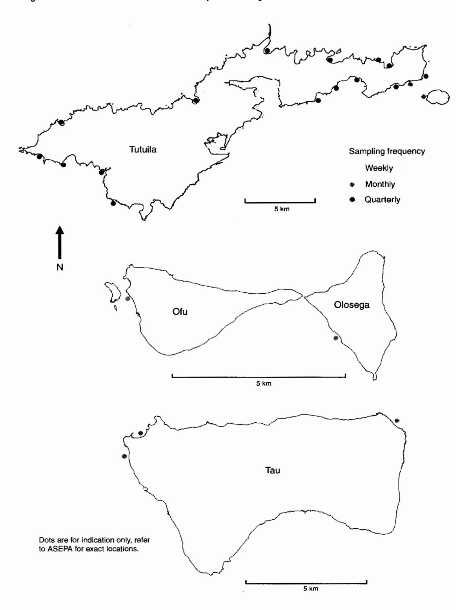

basis of the subsistence and small-scale commercial inshore fishery. The habitat and fishery resources need to be monitored and protected, to assist management and conservation.

# **Objective:**

Implementation of a monitoring plan for the Territory comprises coordinated reef monitoring at three levels. Community based monitoring (level 1) would assist local communities and organizations that wish to manage their reefs or have interests in reef health. Local government agency monitoring (level 2) will conduct periodic surveys at MPAs and other areas, particularly on Tutuila to provide baseline information on effects of human activities on the reefs. Detailed information on reefs needed for the US Coral Reef Initiative that are not covered by current monitoring would be conducted using methods compatible with the US Coral Reef Monitoring Network (level 3).

# **Program Goals**

- 1) To monitor natural variability and long term trends in coral reef ecosystems (particularly fish and coral assemblages) which will assist in the interpretation of the impacts of natural and anthropogenic disturbances on these reefs.
- 2) To acquire information on the size at maturity, seasonality of reproduction and the status of stocks of key reef fishery resources i.e. fish and macroinvertebrates.
- 3) To acquire information on the abundance of key finfish and invertebrate fishery species.
- 4) To acquire information on the exploitation rates of key reef fishery resources.
- 5) To formulate management recommendations.
- 6) To provide data that will assist the development of an inshore fisheries/coral reef fisheries management plan.

#### **Ongoing Monitoring Programs**

- 1) The Expert Coral and Fish surveys conducted by contracted off-island scientists use transect based methodologies to quantify fish, coral, key macroinvertebrates (giant clam and COTS) and benthic assemblages at multiple sites on Tutuila and Manu'a (Figures 3.2, 3.3). These surveys have also included Upolu (Independent Samoa), Aunu'u Island, Rose Atoll and Swains Island in the past (sites not shown here).
- 2) The Ecology and Biology of Key Reef Fish Species monitoring program employs annual surveys of those species considered important to the commercial, recreational and subsistence fisheries. The study employs transect-based methodologies similar to those used in the Expert Fish surveys outlined above to monitor reef fish stocks, primarily at Tutuila and Manu'a (Figure 3.4).
- 3) Inshore creel surveys on Tutuila and Manu'a monitor the catches from the commercial, subsistence and recreational reef fisheries.
- 4) A monitoring program is being developed for communities to monitor village reefs included in the Community-Based Fisheries Management program (see descriptions of Marine Protected Areas in Section 5.3).

Figure 3.2. DMWR's Expert Fish Monitoring Sites

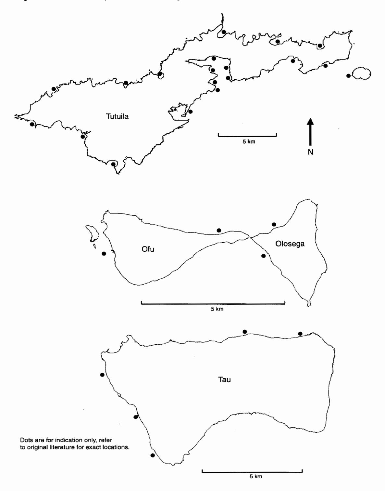

Figure 3.3. DMWR's Expert Coral Monitoring Sites

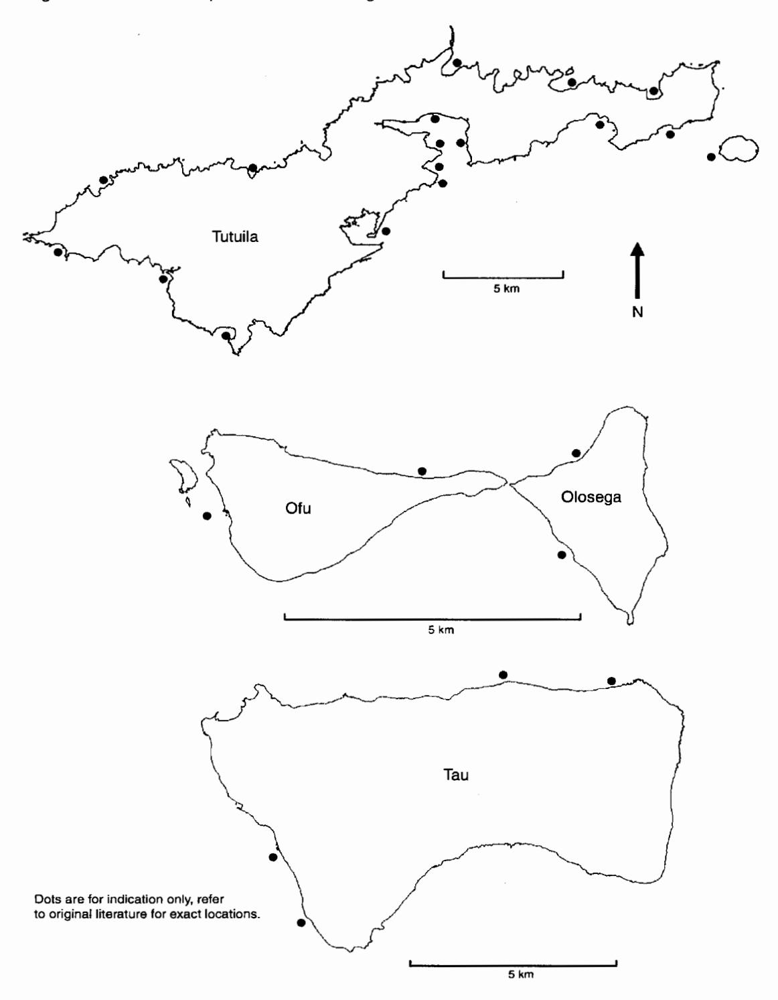

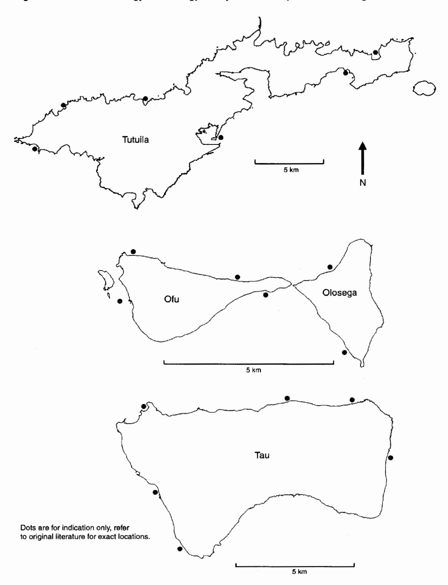

#### 3.3 The National Park of American Samoa (NPSA)

# Coral Reef Monitoring Goals (taken from Craig & Basch, 2001)

The National Park of American Samoa is preparing its long-term monitoring program for coral reefs based on a question-driven approach. Key questions for Park managers are listed below. Given the limited resources of the Park at present, it is not possible to address all of the questions in the immediate future. More details on proposed methodologies are provided in their workshop report (Craig & Basch, 2001).

# Fishing pressure

- 1. What are harvest trends in subsistence fisheries in the Park?
- 2. Are reef resources being harvested at sustainable rates?
- 3. What is the extent of illegal (i.e. commercial) fishing?
- 4. What is the harvest of endangered and threatened Green and Hawksbill sea turtles? What is their abundance in NPSA?

# Natural changes and cumulative anthropogenic impacts

1. Are the coral reef ecosystems in the Park healthy? (changes in condition over time)

# Additional threats specific to a Park unit

- 1. Is the rapid growth of the human population spilling over into the Park and affecting the health of the coral reef ecosystem there (e.g. nutrient increases due to human and piggery wastes, trash disposal, sedimentation from poor land practices)? (Tutuila unit).
- 2. What is the extent of coral damage due to snorkelers? (Ofu unit)
- 3. Is tourism causing nutrient enrichment in the lagoon due to septic field leaching? (Ofu unit)
- 4. Do numbers of Crown-of-thorns Starfish exceed a threshold level in the lagoon? (Ofu unit)
- 5. Are pollutants affecting Ofu lagoon? (Ofu lagoon).

#### **Monitoring Programs**

1. Monitoring subsistence fisheries in the Ofu unit.

Surveys, conducted about one week per month, consist of counting the numbers of fishers at 2-hour intervals (5am to midnight) from vantage points along the road from Ofu Village to Olosega Village. Interviews (creel surveys) are also conducted to determine the fishermen's' catch-per-unit-effort by gear type. By combining these two types of data, the annual catch by gear type can be estimated.

The Park is in the process of developing additional monitoring programs to provide answers to more of the management questions listed above. These will initially focus on reef fishes, coral and water quality (including temperature, O2, salinity, pH, chlorophyll, turbidity, total P and total suspended solids).

# 3.4 Fagatele Bay National Marine Sanctuary (FBNMS)

# **Coral Reef Monitoring Goals**

The long-term goal of monitoring in the Sanctuary is to answer the following questions. Given the limited resources of the Sanctuary at present, it will not be possible to tackle all of the questions below in the immediate future. These goals are adapted and expanded from Craig & Basch (2001).

#### Fishing pressure

- 1. What are harvest trends in subsistence fisheries in the Sanctuary?
- 2. Are reef resources being harvested at sustainable rates?
- 3. What is the extent of illegal fishing?

# Natural changes and cumulative anthropogenic impacts

- 1. Are the coral reef ecosystems in the Sanctuary healthy? (changes in condition over time).
- 2. Are there changes in habitat complexity over time?

#### Other

- 1. What is the extent of coral damage due to snorkeler /divers/fishers?
- 2. Are pollutants from the Fogagogo outfall, or other sources, affecting the Sanctuary?
- 3. Climate change is impacting coral reefs worldwide. What are the long-term changes in coral and associated communities due to climate change?
- 4. Marine Protected Areas elsewhere have been shown to enhance fish and some invertebrate populations, is this the case at Fagatele Bay?

# Monitoring program (Figure 3.5)

i) Fagatele Bay contracts off-island experts to conduct the longest running monitoring program in American Samoa excepting the "Aua transect" surveys. Hard corals and fish are surveyed in FBNMS every three years, and at least every other survey includes macro-invertebrates (in addition to hard corals) and algae.

The monitoring program also includes similar surveys of up to 14 additional sites outside the Sanctuary, not all of which are sampled during each monitoring event. Following this workshop (see Section 5.9), these other sites have been revised. Of the 14 sites, emphasis will placed re-surveying only Fagasa (site 7), Cape Larsen (8), Fagafua Bay (9) and Massacre Bay (10) while Sita Bay (14) will be kept solely for the long-established 100 m fish transect there. In addition, new sites in this program will be established at Leone and Amanave (these sites are already monitored by the same team in the Expert surveys for DMWR), and possibly also at Larsen's Bay. The purpose of these changes is i), to remove those sites that were infrequently surveyed and, therefore, of limited value and, ii) to increase the emphasis on sites in western Tutuila that are likely to be more appropriate reference sites for the Sanctuary.

Figure 3.5. Fagatele Bay NMS Monitoring Program Sites

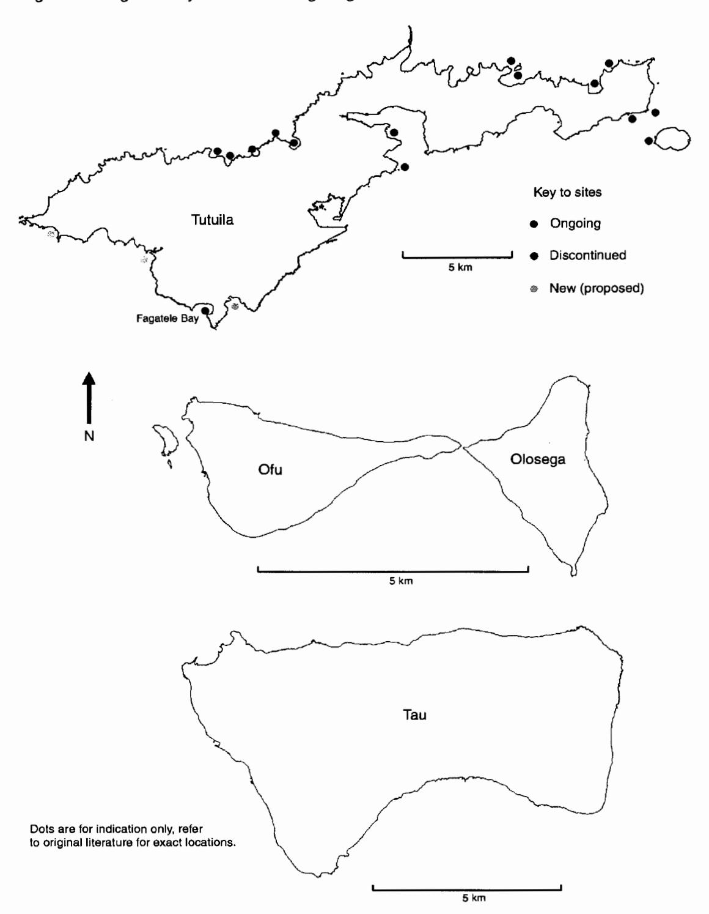

ii) New monitoring is being planned to answer other management questions.

# 3.5 American Samoa Coastal-Zone Management Program (ASCMP)

- 1.ASCMP recently received water quality test kits that will be sent out to high schools, and selected communities (in wetland villages) to conduct water quality monitoring. They also have funds to start up a volunteer water quality monitoring program for church groups, scouts, and village youth groups. Training is a pre-requisite to issuance of test kits. Data collected will be used to assess health of the coastal areas in a monthly report card to be put on their website.
- 2. ASCMP is also in communique with the National Audobon Society who is submitting a proposal to do similar collaborative work on mangrove monitoring.

# 4) Other coral reef monitoring programs: Goals and methods in brief

This section provides a brief introduction to monitoring programs related to coral reefs other than those described in the previous section. Full methodologies for some of these monitoring programs can be found in Appendix I.

# 4.1 Coral Reef Ecosystem Investigation (NOAA Fisheries, Honolulu Laboratory)

# Coral Reef Monitoring Goals

The goal of the Coral Reef Ecosystem Investigation (CREI) of the NOAA Fisheries Honolulu Laboratory is to conduct research that provides scientific information and advice to ensure the long-term viability of coral reef ecosystems in the U.S-affiliated islands of the western Pacific, including the territorial waters of American Samoa. The objectives of the CREI are to conduct a multidisciplinary, ecosystem-based research program required for scientific support of the:

- ♦ Coral Reef Ecosystem Fishery Management Plan of the Western Pacific Region,
- ♦ National Action Plan to Conserve Coral Reefs.
- ◆ Coral Reef Conservation Act.
- ◆ Executive Orders related to Coral Reef Protection, Marine Protected Areas, and the Northwestern Hawaiian Islands Coral Reef Ecosystem Reserve,
- ♦ American Samoa Coral Reef Monitoring Program, and
- Recovery of protected marine species, including threatened sea turtles.

The CREI uses comprehensive, multidisciplinary research approaches to address coral reef ecological assessment and monitoring, habitat mapping and characterization, oceanographic processes affecting coral reef ecosystems, and coral reef restoration through marine debris mitigation. In addition, several applied research activities are conducted, including examining ocean circulation patterns to evaluate the potential effectiveness of marine protected areas, ecosystem modeling of trophic linkages, spatially structured population modeling, and developing techniques to assess exploitable bottomfish and crustacean populations.

Ecological assessments are conducted for reef fishes, corals, other invertebrates, and marine algae. An array of tools and methods is used in coral reef ecological assessment and monitoring studies and in determining the oceanographic processes influencing coral reef ecosystems. These include the use of towboard and other diver surveys, instrumented oceanographic moorings and buoys, oceanographic research vessels, and satellite remote sensing technologies. Habitat mapping and characterization research employs single and multi-beam acoustic technologies, towed camera systems, and towed-diver surveys.

The goals of the CREI surveys conducted in American Samoa are to assess the present status of and monitor potential future changes in American Samoa's reef ecosystem resources, including corals, associated habitat structure, and oceanographic processes, and emphasizing economically and ecologically important (e.g. keystone predator) fishes

and macroinvertebrates. Satisfying these goals will allow us to fulfill our ultimate objectives of, (1) constructing a comprehensive assessment and monitoring database for all U.S. Pacific Island reef ecosystems and, (2) providing current, complementary input to on-going monitoring by regional agencies in American Samoa to assist the Government of American Samoa in monitoring and managing their reef resources.

# Monitoring programs

In order to effectively manage marine resources, it is essential to know what resources exist (assessment), where they are located (mapping), and how they change over time (monitoring). To effectively manage these resources based on ecosystem principles, it is also essential to not only assess and monitor the exploitable resources, but to observe each of the major components of the ecosystem. These include the fish, corals, other invertebrates, and algae. Unfortunately, little data exist to accurately describe the health of most of the coral reef ecosystems in the U.S. Pacific Islands. Therefore, one of the principal initial activities of the CREI program is to work closely with our partners to document baseline conditions in order to assess the health of coral reef ecosystems, including resources of potential economic importance and functionally important components of the ecosystem. A related goal is to permit monitoring of possible future changes due to both anthropogenic and natural impacts. In order to distinguish between natural and anthropogenic variability of the ecosystem, it is important to have sufficient observations spatially and temporally of both the biotic and abiotic components of the ecosystem.

The primary goals of the CREI ecological assessment and monitoring program are to:

- ◆ Document baseline conditions of the health of coral reef living resources (fish, coral, other invertebrates, and algae) in the U.S. Pacific Islands,
- Refine species inventory lists of these resources for the island areas,
- ♦ Monitor these reef resources over time to quantify possible natural or anthropogenic impacts,
- ♦ Document natural temporal and spatial variability in the reef resource community,
- ♦ Improve our understanding of the ecosystem linkages between and among species, trophic levels, and surrounding environmental conditions.

The CREI monitoring activities in American Samoa include:

- 1. Rapid Ecological Assessment (REA) surveys by divers of reef fishes, hard and soft corals, macro-invertebrates and algae (Figures 4.1, 4.2).
- 2. Towed diver video surveys of benthic habitat composition and complexity, ecologically and economically important reef fishes (sharks, jacks, snappers, groupers, etc.), conspicuous macro-invertebrates (Crown-of-thorns Starfish, giant clams, lobsters, octopus, urchins, etc.), and marine debris.
- 3. An array of oceanographic observing systems to monitor ocean conditions affecting the condition, health and biogeography of the reef ecosystems. This array includes: Coral Reef Early Warning System (CREWS) buoys and sea surface temperature buoys (Figures 4.3, 4.4) which transmit near real-time data for distribution on the CREI

Figure 4.2. Coral Reef Ecosystem Investigation Fixed Monitoring Sites cont.

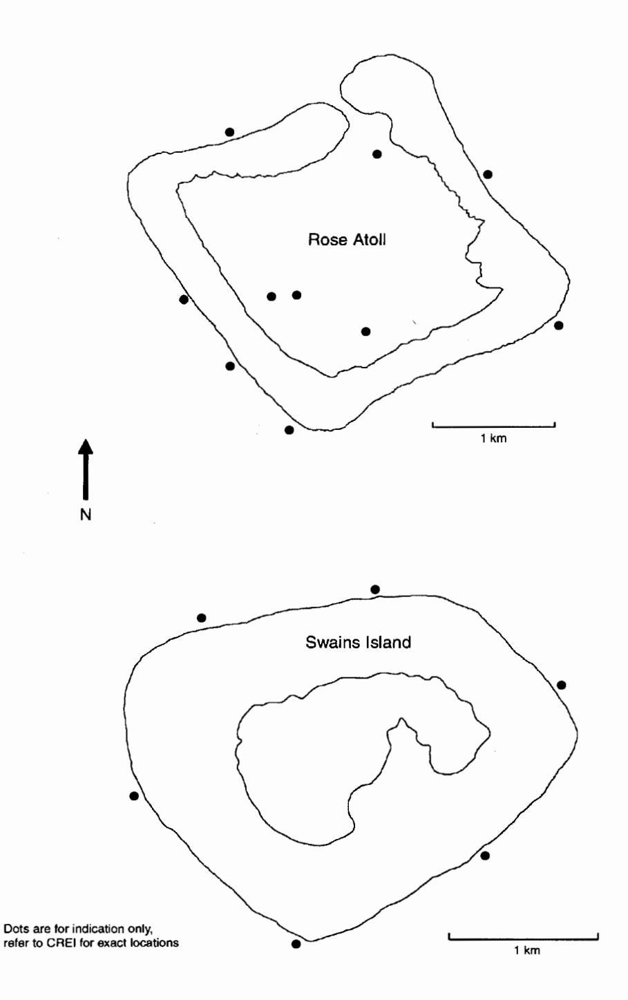

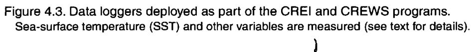

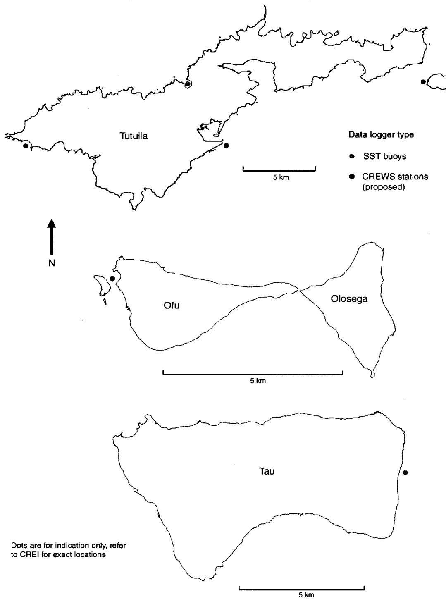

Figure 4.4. Data loggers deployed as part of the CREI and CREWS programs cont. Sea-surface temperature (SST) and other variables are measured (see text for details).

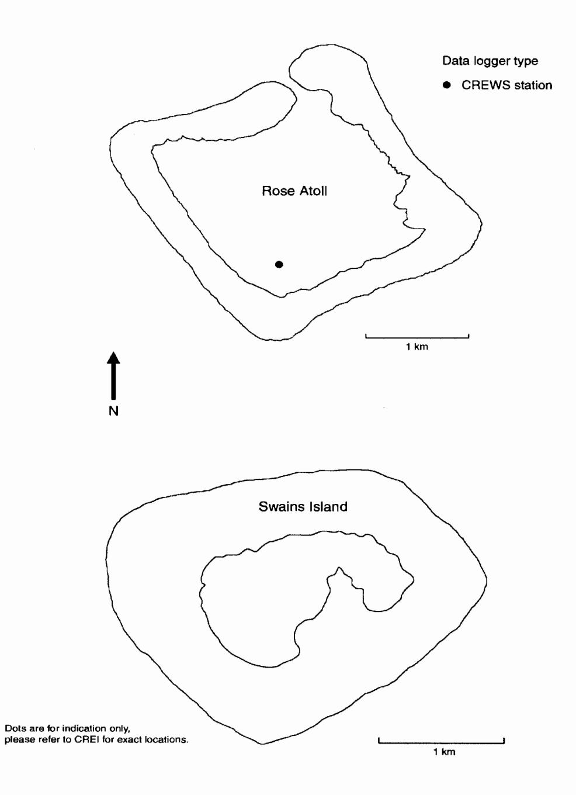

- website, moored subsurface Ocean Data Platforms and current meters, satellite-tracked ocean current drifters, shipboard conductivity-temperature-depth profiles and acoustic Doppler current profiles, and satellite remote sensing of ocean surface conditions.
- 4. A suite of acoustic (single-beam and multibeam) and towed camera surveys around each of the main island groups of American Samoa to classify and characterize the benthic habitats. After the habitat maps are completed, some habitat areas will be periodically resurveyed to monitor for changes in sand, algae and live coral composition.

The CREI surveys were first conducted from the NOAA ship *Townsend Cromwell*, February – March 2002, and are to be repeated every two years. It is envisioned that most of the REA and towed diver survey methodologies and shipboard oceanographic surveys will be repeated each visit as long-term monitoring. The oceanographic moorings are intended to continue monitoring for the two year periods between CREI cruises and then be replaced for long-term continuous monitoring of oceanographic conditions.

Further information on the CREI program including satellite transmitted data from the sea surface temperature buoys can be found at www.nmfs.hawaii.edu/coral/index.html

# 4.2 CREWS remote sensing stations

The NOAA CREWS (Coral Reef Early Warning System) stations are permanent installations that consist of a small tower fixed in shallow waters over the reef. The American Samoa deployments are additions to a Pacific and Caribbean network that aims to predict mass coral bleaching events through monitoring of Sea Surface Temperatures (SST). CREWS stations measure wind speed, wind gusts, air temperature, barometric pressure, rainfall, tide level, sea-temperature, salinity, ultraviolet B (above and below water) and photo-synthetically active radiation (above and below the water).

NOAA aims to deploy one station at Ofu Harbor and another in southern central Tutuila by the end of 2003 (Figure 4.3). These have been planned with the Coral Reef Advisory Group to complement the CREWS and SST buoys deployed by CREI in that together they will monitor SST (and other, differing variables) at the eastern and western extremes of the Manu'a islands and north, south, east and west Tutuila in order to provide good coverage of the major islands. A long-term CREI CREWS buoy is presently moored in the lagoon at Rose Atoll (Figure 4.4.) to monitor sea surface temperature, salinity, wind direction and speed, barometric pressure, and air temperature.

# 4.3 The "Aua transect" surveys (Figure 4.5)

The goal of this program is to monitor long-term changes in the coral and macro-invertebrate assemblages on a reef-flat in front of the village at Aua in the outer harbor.

This program continues to monitor a reef flat first surveyed as a single large transect in 1917 by Mayor (1924). The work, carried out since 1995 by Alison Green, Chuck

Figure 4.5. The "Aua Transect" Monitoring Site.

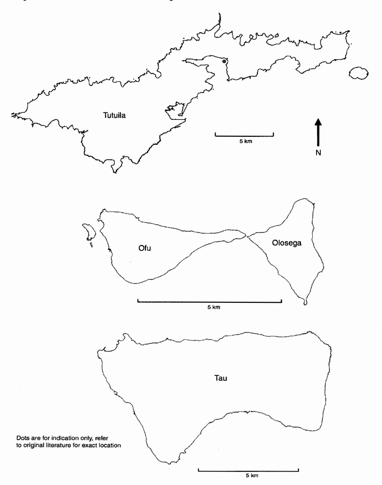

Birkeland and others is facilitated by the Fagatele Bay National Marine Sanctuary which periodically employs these researchers to conduct monitoring of the Sanctuary.

# 4.4 ReefCheck (Figure 4.6)

This global initiative has twin goals of educating the public on the conservation of coral reefs, and of monitoring them scientifically.

ReefCheck is coordinated by the Dept. of Marine and Wildlife Resources and the Coral Reef Advisory Group in American Samoa using federal funding from the U.S. Coral Reef Initiative. Volunteers are trained to conduct annual surveys of corals and selected fish and macro-invertebrates using transect-based methods.

# 4.5 US Geological Survey rain and stream gages

The following is mentioned only in brief as a start point for those researchers who may be interested in the effects of freshwater run-off on coral reefs.

The stream gages at Vaipito and Maloata record data every 15 minutes and mean daily discharge is published. The Vaipito gage was installed in July 1996 and the Maloata gage in June 1998. Both were in operation at the time of the workshop. The rain gages have not always been recording gages. At a recording gage, data are collected every 15 minutes and is published as daily totals although monthly totals from daily read cans are more reliable. In detail: raingage Malaeimi, daily can read from 1990 to 1995, recording from 1995 to present. Satala recording from 1998 to present, Aunu'u recording from 1997 to present, Aasufou, daily can read from 1980 to 1995, recording from 1995 to 2000. Fagaaitua, recording from 1998 to present, Vaipito Reservoir, recording from 1995 to present.

# 4.6 Tuna Cannery Water Quality Monitoring

• Tuna Canneries' NPDES Receiving Water Quality Monitoring Program
The two tuna canneries, located alongside inner Pago Pago Harbor, are required to jointly monitor the water quality of the harbor under their current 5-year NPDES permits (2001-2005). Water column parameters are monitored semi-annually to determine compliance with permit requirements and the American Samoa water quality standards. There are nine sampling stations in a fixed station network, designed for comprehensive coverage of the harbor. Parameters for the water quality monitoring program include: Temperature; Salinity; Dissolved Oxygen; pH; Turbidity; Light Penetration; Suspended Solids; Chlorophyll a; Total Nitrogen; Ammonia Nitrogen; Total Phosphorus; and trace metals (As, Cu, Hg, Pb, Zn).

Figure 4.6. ReefCheck Monitoring Sites

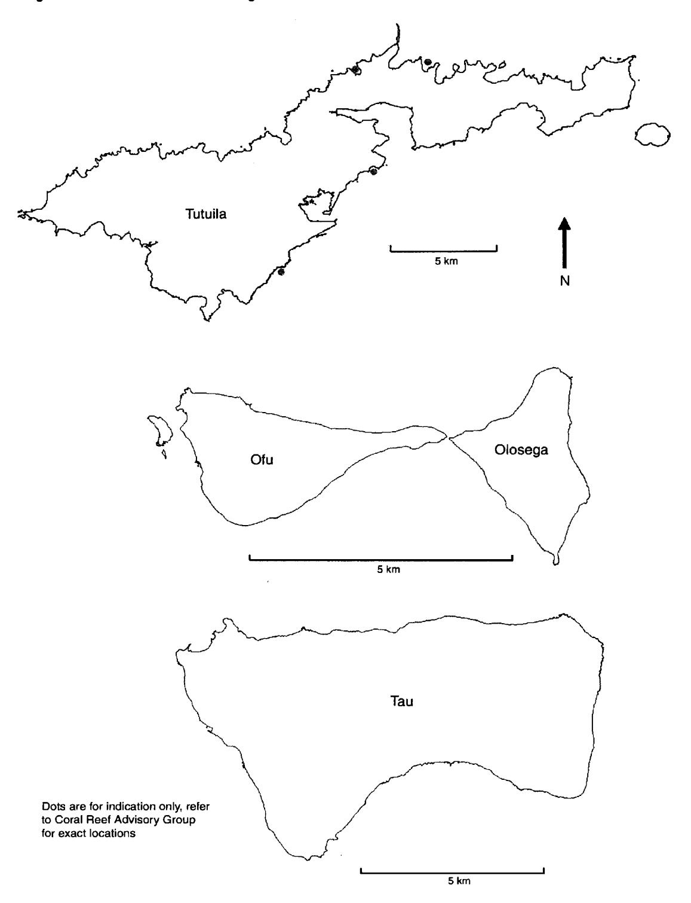

# Tuna Canneries' NPDES Fish Toxicity Study

The two tuna canneries are required to jointly implement a fish toxicity study for Pago Pago Harbor under their current 5-year NPDES permits (2001-2005). The study was completed in 2002. Whole organism tissues from a variety of vertebrate and invertebrate species found in the inner Pago Pago harbor were analyzed for As, Hg, Pb, and PCBs.

# • Tuna Canneries' NPDES Sediment Monitoring Program

The two tuna canneries are required to jointly monitor sediments of Pago Pago Harbor under their current 5-year NPDES permits (2001-2005). Sediment parameters will be monitored twice under the current permits to assess concentrations of contaminants of concern. Sediment monitoring is conducted to determine the character of the sediments in relation to long term discharges from the canneries' outfall, and to determine if overall harbor quality will be affected by the re-suspension of contaminants of concern. There are seven sampling stations in a fixed station network within the harbor. The first sediment sampling event was completed in 2001. The second sampling event is scheduled for 2004. Parameters of the sediment monitoring program include: Total Nitrogen; Total Phosphorus; Total Sulfides; Redox Potential; Total Organic Carbon; Percent Solids; Total Volatile Solids; Grain Size distribution; and trace metals (As, Cu, Hg, Pb, Zn).

# • Tuna Canneries' NPDES Coral Reef Survey

The two tuna canneries are required to jointly implement two coral reef surveys for Pago Pago Harbor under their current 5-year NPDES permits (2001-2005). Surveys will assess the impacts of the canneries' outfall discharge on nearby coral reefs. Transects are on a fixed station network within the harbor, near the villages of Aua and Anasosopo. The first survey was completed in 2002. The second survey is scheduled for 2005.

# 4.7. U.S. Fish and Wildlife Service Monitoring at Rose Atoll

The Fish and Wildlife Service conducts sporadic monitoring at Rose Atoll that includes permanent coral transects and monitoring of opportunistic invasive algal and cyanobacteria species in the vicinity of the remains of a Taiwanese fishing vessel that grounded in 1993. Some of this work was undertaken on the CREI cruise of 2002.

# 5) A long-term monitoring plan for American Samoa

# 5.1 Approach to devising a long-term monitoring plan

Coral reefs in American Samoa have long been the target of study. For example, quantitative studies were first carried out on hard corals in 1917 by Mayor (1924) and soft corals in 1919 by Cary (1934) while continued sampling of the former by Green et. al (1996) represents one of the longest coral reef monitoring data sets in existence anywhere. Considerable research and monitoring has taken place since this time. However, there has never been a serious attempt, particularly among territorial and federal government agencies, to coordinate these efforts.

Prior to the workshop, the authors A. Cornish and D. Wilson examined the major multisite monitoring programs in current or recent existence, particularly in terms of what, where and when, i.e., which reef attributes were being measured, at what sites and how often. These programs were presented in brief to participants at the workshop followed by a draft plan to mesh certain aspects of these programs into a core number of sites, methodologies and sampling frequencies that will serve as the backbone of long-term coral reef monitoring in American Samoa. The proposal was essentially the start point for the workshop. Participants were then asked to help mould existing monitoring, and the proposal for integration, into a framework of methodologies that will not only answer American Samoa's current long-term monitoring questions, but that can be added to if new questions arise.

# Rational for the approach and applicability to other island nations and territories

The rational is worth commenting on as it may not be applicable to many other localities wishing to set up long-term coral reef monitoring programs. When the existing coral reef (and related) monitoring was compiled prior to this workshop it became clear that not only were there considerable monitoring programs already in place, and that much of it was believed to be of good quality, but that the various monitoring programs shared many sites. This is partly due to i) having good levels of funding for coral reef research and monitoring from federal and local government and, ii) having a small coral reef ecosystem and, therefore, relatively concentrated effort.

Rather than starting from scratch, the wealth of the existing monitoring programs dictated that these be utilized as the start point for the long-term monitoring plan. Many other Pacific islands are unlikely to have this luxury and face the more arduous task of having to select a suite of monitoring methodologies from the wide array in use even before considering site selection, sampling frequency etc.

It is important to note that existing field methodologies were not examined by workshop participants for their ability to characterize the assemblage in question. Instead, an assumption was made that each methodology should be capable of characterizing the

assemblage in question at each site to a sufficient degree of accuracy. This assumption was made based on the considerable expertise and experience that many of the previous and current researchers had in monitoring coral reefs, but is only made as a necessary start point until enough data can be collected to statistically ask whether the overall methodology is powerful enough to answer the questions asked of it. It may be necessary to modify or rethink some of the methodologies in the future.

# 5.2 The Long-Term Monitoring Plan

#### Introduction

The framework for long-term monitoring in American Samoa is based on two key components, firstly the designation of core sites to link the most-important, multi-site monitoring programs to one-another, and, secondly, the Coral Reef Ecosystem Investigation (CREI) surveys which are an independent multi-site and multi-disciplinary program. Both these components have defined methodologies to monitor basic attributes of coral reefs such as corals and fish.

Additional to these key monitoring programs are i) extensions of the individual core site monitoring programs that include alternative sites and, ii) other monitoring efforts. This document is primarily concerned with defining the Core Site approach as a method for meshing existing and future monitoring into a cohesive body of work. Other monitoring initiatives, notably the CREI and ReefCheck programs are independent of this, although these two programs have been coordinated in terms of utilising different sites to the core sites (the rational is more fully explained with details of the individual programs).

It is not practical to attempt to coordinate all existing monitoring programs although there are recommendations to try and coordinate certain additional aspects (see Section 5.8). Rather, two large monitoring initiatives have been defined in terms of where, when and how. Both programs should independently be capable of monitoring the general state of coral reefs on the major islands of American Samoa and together they should provide a great deal of information on natural and anthropogenic variability to coral reefs. New multi-site monitoring efforts will hopefully mesh with either of these two key programs, but there will always be additional monitoring where the objective is not to look at the broad picture of reefs in American Samoa. A good example of this is the "Aua transect" survey, which has great value as a measure of changes in the inner harbor over decades and forms a piece in the puzzle of coral reef monitoring in American Samoa, even if it does not mesh with the larger monitoring initiatives.

# 5.3 Core-Site selection in General Management Areas with descriptions of the Marine Protected Areas

The territory of American Samoa will be split into General Management Areas and Marine Protected Areas for the purposes of monitoring. The Marine Protected Areas

(MPAs) are those under specific management regimes that offer a greater level of protection to natural resources from extractive activities than are generally found in the territory. The General Management Areas (GMAs) encompass all other areas.

Monitoring is split into the 2 categories for the several reasons. Firstly, monitoring of the GMAs is intended to reveal spatial and temporal variability in coral reef assemblages which are subject to extractive activities and other anthropogenic impacts with the least restrictions. As most coral reefs within American Samoa fall within this category, and as the negative impacts of humans are likely to be greatest in these areas, general monitoring will focus primarily on these areas. Such monitoring deliberately excludes the MPAs as their differing management regimes would be a confounding variable in the monitoring of most coral reefs in American Samoa.

Low to medium rates of exploitation of reef resources and often low levels of enforcement at present mean that the differences in levels of exploitation among General Management Areas and Marine Protected Areas may currently be limited. However, a rapidly rising human population rate, particularly on Tutuila (Governor's Task Force on Population, 2000) and a growing enforcement capability mean that any disparities in exploitation levels are likely to increase in the future, making it vital that these areas are monitored separately in any long-term plan. It should be noted, however, that results obtained from monitoring programs in both GMAs and MPAs will be compared.

# General Management Areas

(in order of highest to lowest priority with regard to monitoring)

- i) Tutuila Island (except for Pago Pago Harbor and MPAs)
- ii) Manu'a Islands (except for the MPAs)
- iii) Pago Pago Harbor on Tutuila.
- iv) Swains Island
- v) Aunu'u Island
- vi) Taema and Nafanua banks (off Tutuila) and other remote offshore banks within the EEZ of American Samoa that approach the surface and may support coral reefs but have not yet been properly assessed.

This order of priority was developed to take account of i) human population demographics, ii) accessibility and, iii) size of reefs. Most people (> 90%) live on Tutuila with small communities on Ofu, Olosega, Ta'u, Aunu'u and Swains Islands. Monitoring primarily focuses on Tutuila where anthropogenic impacts are likely to be the greatest and where the majority of coral reefs are also located. Although the islands of Manu'a (Ofu, Olosega and Ta'u) have relatively large tracts of reef, the human populations are quite low (and decreasing in recent years; Governors Task Force on Population, 2000). In addition, accessibility can be a limiting factor. Pago Pago Harbor is treated separately as it has the most developed and industrialized coastline, has the most polluted waters

(Birkeland et al., 2000) and its reefs have been significantly degraded over the past 80 years (e.g. Green et al., 1997). However, there have been recent improvements, including the reduction of pollution levels resulting in corals in the outer harbor showing some signs of recovery (Birkeland, pers. comm.). Of the remaining areas, Swains Island is very remote and has a very low population (< 10 persons in early 2002), Aunu'u is very small and the offshore banks are presumed to be less impacted than coastal areas (although likely deserve greater emphasis in the future).

#### Marine Protected Areas

(in equal order of priority)

- a) National Park of American Samoa (units on Tutuila, Ofu and Ta'u)
- b) Fagatele Bay National Marine Sanctuary
- c) Rose Atoll National Wildlife Refuge
- d) Villages in the Department of Marine and Wildlife Resources Community-Based Fisheries Management Scheme.
- e) The Ofu-Vaoto Marine Park.

No order of priority is given to the monitoring of these MPAs as they each have independent sources of funding for management and their own monitoring priorities. Monitoring will, therefore, continue to take place regardless of any prioritization given here and, furthermore, all the MPAs are important in their own right.

The exceptions to this are the Ofu-Vaoto Marine Park which has no dedicated monitoring in place or planned, and Rose Atoll, which is so remote as to preclude regular monitoring, at least at present.

# A brief description of the Marine Protected Areas

#### a) National Park of American Samoa

The National Park of American Samoa (NPSA) is located in part on each of three volcanic islands including, Tutuila, Ofu, and Ta'u. Authorized in 1988, NPSA leases its land and water areas from local villages. Currently the Park leases nearly 9,000 acres of land and 2,500 acres of water resources. Because these resources are not federally owned, NPSA works closely with the Samoan villages to conserve and protect these areas. As part of the agreement, villages are allowed to utilize resources in traditional ways, including subsistence fishing on the reefs. Currently there are efforts being made to expand Park boundaries in Olosega and Ta'u.

#### b) Fagatele Bay National Marine Sanctuary

Fagatele Bay is the smallest and most remote of 13 National Marine Sanctuaries. Established in 1986 after a two year scoping and designation process, this 250 acre site protects a fringing reef that slopes off to depths of up to 400 ft (120 m). The Sanctuary is

co-managed by the National Oceanic and Atmospheric Administration (NOAA) and the American Samoa Government's Department of Commerce. Regulations protect all invertebrates, restrict fishing gear (no spearfishing, fixed nets) and the site is zoned; the inner reef area has more restrictive regulations (no commercial fishing and no hook and line fishing).

# c) Rose Atoll National Wildlife Refuge

Rose Atoll NWR is the southernmost refuge in the National Wildlife Refuge System. This refuge was established in 1973 and consists of two small islets, about 15 acres in total size, and 39,236 acres of submerged reef. Rose Atoll is managed cooperatively by the U.S. Fish and Wildlife Service (in Hawai'i) and the Department of Marine and Wildlife Resources although at the time of writing (May 2002), the MOU between the 2 agencies had expired and not been renewed. Rose Atoll is uninhabited and a strictly notake MPA although enforcement is minimal due to its remoteness.

# d) Villages in the Department of Marine and Wildlife Resources Community-Based Fisheries Management Program

The Community Based Fisheries Management Program was established by DMWR in 2001. Village communities apply to DMWR to join the program and following a consultation period, develop their own fisheries management plan with the assistance of DMWR. These plans cover those coral reefs under the traditional control of the individual villages. As of May 2002 there were 4 villages on Tutuila in the program, (Poloa, Alofau, Vatia and Aoa) with others in the consultation stage. Each plan so far has been unique, although all allow some reef resources to be exploited by local villagers.

# e) Ofu-Vaoto Marine Park

This small marine park extends approximately half a mile along the shoreline between the air-strip and Ofu village on Ofu, and out from the high water mark to ten fathoms depth (18 m). It was established in 1994 and is managed by the Department of Parks and Recreation. Residents of Ofu Island are permitted to use legal fishing methods within the park. The park is something of an oddity and has no enforcement, monitoring or management plans although has been surveyed as part of the Expert Fish and Coral program.

# Monitoring of General Management Areas and Marine Protected Areas

For reasons that are listed above and below, the Core-Site program sites are limited to General Management Areas, while the CREI sites are in both General and Special Management Areas.

# **General Management Areas**

# Core-Site program

The Core-Site approach is to choose a small number of "core" sites and to make monitoring them the top priority for any relevant study of coral reefs. Concentrating monitoring initiatives and other research on these core sites is intended to gain in-depth knowledge of those sites, to increase the relevance of different monitoring programs to each other and to, therefore, increase the likelihood of understanding the causes of changes to coral reef ecosystems, over time. A common misunderstanding of this approach is that monitoring will only be conducted at these sites, but this is not the case. Rather, any monitoring program should include these sites as a minimum prerequisite while expanding to other sites depending on the needs of the particular study and available resources.

Core-sites were selected using the following criteria

#### Core-sites should :-

- 1) be within General Management Areas.
- 2) utilize sites where the primary monitoring programs are already taking place in order to utilize data from the past.
- 3) where possible, utilize sites where multiple complementary monitoring programs already coincide.
- 4) be located on coral reefs representative of the majority of reefs in American Samoa
- 5) be chosen with basic ecological experimental design in mind. Firstly, each "stratification" should have an equal number of core-sites. In this instance, a stratification is either the north or south facing shore of each island or atoll, as consistent differences have been noted among these shores in previous studies (e.g. Page, 1998). Secondly, core-sites should be located in such a way to encompass as much of the spatial variability along each of the island/exposure (= stratification) shorelines in order to be representative of the whole island/exposure, and not just a small portion of it.
- 6) be as few as possible within each stratification, due to limited monitoring resources, so as to increase the likelihood that each monitoring program is able to include all core-sites. The caveat to this is that there should be sufficient core-sites to satisfy basic ecological experimental design considerations. A generally accepted minimum number of core-sites per stratification would be three (e.g. Andrew & Mapstone, 1987).

NB The selection of 3 core-sites per island/exposure is no guarantee that the power of the overall monitoring methodology will be sufficient to answer all managers' questions. In general, increasing the number of core-sites will increase how representative they are of the whole island/exposure, and the ability to detect differences among island/exposures in both space and time.

#### 5.4 The Core-Sites

Site names taken from 1:24000 USGS topographic maps (MPTAS0003PP01, MPTAS0002PP01).

# **Priority 1**

All of these sites should be included in any monitoring program of Tutuila (see Figure 5.1)

<u>Tutuila Island : North shore</u> <u>Tutuila Island : South shore</u>

Fagamalo Fagaitua
Aoa Amanave
Masafau Nuuuli
Fagasa\* Leone\*

\* Some monitoring programs may wish to include four sites per island/exposure on Tutuila to get a more representative picture of the reefs surrounding the largest island. The additional two sites are also considered core-sites but may not be used in statistical comparisons with other islands.

# **Priority 2**

All of these sites should be included in studies of Manu'a (see Figure 5.1)

Ofu/Olosega Island: North shore Ofu/Olosega Island: South shore

As with previous studies (e.g. Green, 1996), these two islands are treated as one as their reefs are

continuous.

MafafaOfu VillageSiliOlosega VillageSamoiVaisaili Point

<u>Ta'u Island</u>: North shore <u>Ta'u Island</u>: South shore

Lepula Fagamalo Cove

Faga Amouli Toa Cove Saua

#### **Priority 3**

All these sites should be included in studies of Pago Pago Harbor (see Figure 5.1)

Pago Pago Harbor: West shore Pago Pago Harbor: East shore

Faga'alu Anasosopo

Utulei Aua

Leloaloa \*\*

**NB.** The exact locations of these sites should be determined by referring to site descriptions in the literature from the Expert Coral, Expert Fish and Ecology and Biology of Key Reef Fish Species monitoring programs.

\*\* It is hoped that a third western site be found across from Leloaloa but there appears to be little suitable reef in this area (Green, pers. comm.).

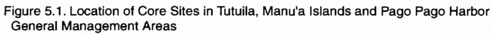

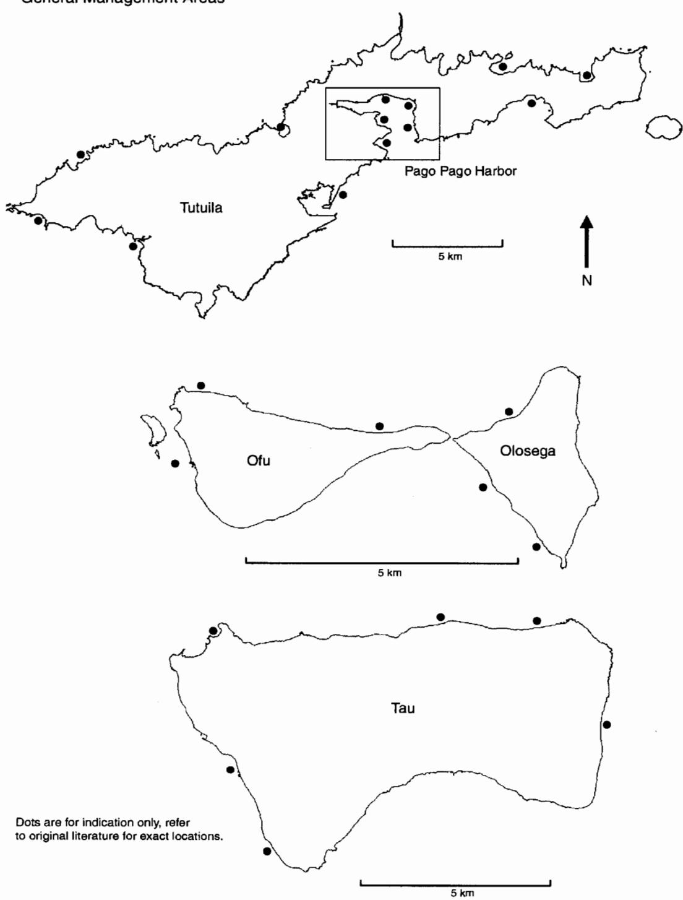

# Core sites in other General Management Areas (and Rose Atoll)

It was not deemed practical to designate core sites at Swains Island and Rose Atoll at this point in time as the American Samoan Government has no vessel with which to carry out such surveys, nor concurrent budget to hire one. Due to limited monitoring resources, Aunu'u Island and the offshore banks will not have core sites designated at present. It should be noted that all the aforementioned areas are periodically monitored, there are just not sufficient resources to commit to the more intensive sampling intended for coresites at present.

# 5.5. Core-Site Monitoring

The following programs will form the basis for coral reef monitoring at the core-sites. Details of each program can be found in Section 3 and Appendix I..

- i) Expert Fish Surveys (conducted every 3-5 years)
- ii) Expert Coral Surveys (conducted with the Expert Fish Surveys)
- iii) DMWR in-house Fish Surveys (annual)
- iv) ASEPA Beach Water Quality Monitoring (conducted, weekly, monthly or quarterly)\*
- \* Although ASEPA were able to commit to surveying all the core sites on Tutuila they were not able to do the same for all the sites in Manu'a at the time of the workshop (see Figure 3.1).

# 5.6 Key Points about the Core-Sites monitoring program

## Is the Core-Site monitoring program all that is needed?

The Core-Site monitoring program will NOT meet all of American Samoa's monitoring needs as it is detailed above. It is a good start, but is only intended to provide a framework with which other monitoring programs should integrate. Gaining the necessary understanding of the processes underlying and affecting coral reefs in order to successfully manage them will require more than the basic monitoring of fishes, hard corals and water quality close to shore.

# The Core-Sites program is not the only important monitoring program

The creation of the Core-Sites is an attempt to mesh existing focused and multi-site monitoring efforts that were non-integrated up to now, into a coordinated body of work. There are other important monitoring efforts that fit around, rather than within, the Core-Site framework that will be of great value both in themselves, and when the Core-Sites are considered. Good examples include the Expert Fish and Coral surveys at Aunu'u and Swains Island, and the entire Coral Reef Ecosystem Investigation monitoring program.

# The Core-Sites monitoring design imposes limitations on interpretation of the data

Those involved in monitoring and management need to be aware that the methodologies of the core-site design and of individual monitoring programs may inherently impose limitations on interpretation of the data. One obvious example is that results may only be applicable to coral reefs in bays in American Samoa as these were the focus for the coresites (reefs outside bays being poorly developed). The different depths that transect-based surveys are carried out should also be taken into consideration. For instance, the Expert Coral surveys are conducted at the same depth, 10m, as the Expert Fish surveys for consistency. This depth may be optimal for fish counts but it usually misses the optimal coral diversity depth range of between 5-7m depth (Fisk, pers. comm.).

# New monitoring and research surveys will be strongly encouraged to include Core-Sites

As with the existing monitoring programs, any new studies should include the core-sites on Tutuila as a minimum in order to further our understanding of these areas that we may better understand the whole. It may not always be logical for researchers to answer their own questions using the core-sites (if seagrass beds or deep reefs are to be studied for instance), but they should be strongly encouraged to do so when it is. This may require local agencies to insist on inclusion of the core-sites when i) cooperation and/or funding is being sought and, ii) when permits are being issued. It will also be necessary to ensure that funding levels are sufficient to include all the core-sites. Researchers should also be encouraged to survey additional sites, particularly those already included in existing monitoring programs such as the Expert Coral and Fish surveys, where complementary, and when resources permit.

# Core-Sites may need extra consideration

Reefs at the core sites can be considered as natural laboratories in the study of coral reefs and as such need to be preserved if they can be used as such in the long-term. On one level this means that scientific destructive sampling (e.g. the collection of fish for age-growth studies) should not be carried out at, or in the vicinity of, core-sites. It also means that any extreme human activities such as destruction by reclamation should be particularly resisted at core-sites. Finally, the sites were deliberately chosen to be in General Management Areas but it is not inconceivable that there may be a desire to include some of them in Marine Protected Areas in the future. This possibly may have an adverse effect on long-term monitoring and should be considered in such a scenario although it is recognised there may be compelling reasons why MPA designation might go ahead regardless.

# 5.7 Coral Reef Ecosystem Investigation program (NOAA Fisheries)

The CREI surveys are carried out during a month-long visit to the territory by a NOAA research vessel and as such the emphasis is on Rapid Ecological Assessments of a large number of sites. By comparison with the Core-Site monitoring protocols the CREI surveys cover a larger number of sites (42 across the territory in 2002) and towed diver habitat and fish surveys to cover even larger areas. The CREI sites include both General

Management Areas and MPAs, and include reefs both inside and outside bays. There are also macro-invertebrate, algal and oceanographic components that are not currently integral parts of the Core-Site protocols.

Perhaps more importantly, the CREI surveys are well equipped for surveying the more remote reefs, notably those of Rose Atoll and Swains Island, and so the initial surveys in 2002 spent a large proportion of survey time at these locations. At all locations, sites were chosen to avoid those in the Core-Site program and associated efforts in order to maximise the number of reefs being monitored in the territory. Some of the CREI sites were located in Marine Protected Areas where this was requested by their managers.

#### 5.8 Further Recommendations for the Core-Sites program

Some additional monitoring required was identified during and prior to the workshop:-

- a) Quantitative monitoring of utilized macro-invertebrates such as lobster, sea cucumber and others not covered by the Expert surveys.
- b) Quantitative monitoring of macro and coralline algae.
- c) Monitoring of gross structural complexity (or rugosity) of the reef.
- d) Monitoring of sea turtles.
- e) Regular water quality monitoring on the reefs themselves.

The Dept. of Marine and Wildlife Resources obtained the funding for a 2 year study of lobsters which commenced in September 2002, while funding is currently being sought for a quantitative survey of macro algae. However, the CREI surveys have been compiling a taxonomic inventory of macro-invertebrates and macro-algae. Also, the Expert Fish surveys already quantify algae to genus or type, thus some of these needs are already being addressed.

In addition, the effort to map American Samoa by the National Ocean Service that also commenced in September 2002 will reveal large-scale structural complexity (e.g. spur and groove reef) to some degree, and repeated analysis of satellite imagery over time could be considered crude monitoring of structural complexity although measurement at a smaller scale is likely to be of more relevance. Furthermore, the NOAA Fisheries Coral Reef Ecosystem Investigation plans to repeat towed diver habitat and fish surveys during their biennial research cruises. These surveys typically provide high-resolution video imagery over large spatial areas and will serve to fill in gaps in the core-site and other permanent monitoring stations.

Two species of turtle are commonly found in American Samoa, the Green and Hawksbill turtles. Participants suggested that more could be done to monitor turtles than Dept. of Marine and Wildlife's current tagging of reported animals without a dedicated monitoring program. Useful information could be gained without expensive studies by utilising the data that are already collected by DMWR and adding a reporting system that recreational and scientific divers performing other work could use that may reveal simple spatial and

temporal trends. Such records are already kept by the Expert Fish surveys while the NOAA CREI towed diver habitat and fish surveys also record turtle sightings in relation to their habitats. It would be important though that dives where no sightings occur be reported as often as sightings in order to reveal temporal variability etc.

Finally, it was recommended that water quality monitoring be carried out over the reefs themselves (see Section 3.1.). It was that opinion of workshop participants that water analysed from the beach may indicate pollution problems where they exist as most pollutants are carried into the sea as freshwater run-off, and will likely be more concentrated close to shore than on the reef. By the same logic, however, water quality at the beaches was unlikely to be a good indicator of water quality on the reefs.

It is expected that additional monitoring and research are identified in the future as needs arise.

#### 5.9 Further Recommendations for monitoring outside the Core-Sites program

i) Addition of a National Park monitoring program that includes no less that 3 core-sites in each Park unit.

The National Park was in the process of developing a dedicated monitoring program at the time of the workshop and it was the recommendation of workshop participants that this be in the form of 3 core-sites in each of the Park units. The National Park covers a large area of shoreline on Tutuila, Ofu and Ta'u and it is important that reefs in these areas are adequately monitored. Having three sites within each section would allow for statistical comparisons to be made of the biological assemblages among each Park unit. It may be necessary to have additional control sites outside Park units if assessing the effectiveness of the Park is the main aim.

ii) Addition of Fagatele Bay to the core-site program.

Fagatele Bay NMS has monitored its coral and fish communities extensively since 1985. There would be advantages to National Marine Sanctuary having a core-site although this would have to be very carefully considered if it were to divert resources away from its dedicated current long-term monitoring plan.

iii) Change of emphasis for the associated sites in the Fagatele Bay monitoring program

The Fagatele Bay monitoring program includes surveys of reefs outside the Sanctuary at as many as is feasible of 14 established sites. These sites are monitored more for historical reasons than particularly as controls for the effects of enhanced protection within the Sanctuary and some only rarely get surveyed. Following discussions with the Fagatele Bay monitoring team, FBNMS management and workshop participants it was decided that this research could be better focused. Details are provided in Section 3.4.

- iv) It was recommended to have a dedicated coral biologist working on-island for annual surveys, expertise not currently possessed.
- v) In the future the CREI surveys should include a few core-sites so that comparisons between these 2 major monitoring programs can be made.

#### 5.10 Additional research that would be of value

Other research that may or may not need to be repeated periodically was identified:-

- i) a larval supply and dispersal study. Such a study will likely require an oceanographic component as relatively little is known about near-shore currents at present. This deficiency has begun to be addressed by the CREI program who recently deployed current meters off Step's Point, Tutuila and in the pass at Rose Atoll to monitor currents in these key areas. In addition, CREI deployed eight surface velocity program satellite-tracked drifter buoys around each of the island groups of American Samoa in February/March 2002.
- ii) a study of patterns in the recruitment of hard corals. Hard coral recruitment data could be improved by placing emphasis on the smallest size classes being recorded during the Expert Coral surveys and using the small size class as a proxy for recruitment (Fisk, pers. comm.). In addition, the CREI program deployed arrays of settlement/recruitment plates at Rose Atoll and Swains Island to examine settlement over two year time scales in February/March 2002.
- iii) a review of existing datasets and metadata to see what information is already known.
- iv) surveys of traditional knowledge to reveal, a) sites and events of biological importance, e.g. spawning aggregations and nursery grounds and, b) changes in the marine environment over time such as decreasing catches.
- v) household surveys of resource use would be another piece in the puzzle of successful long-term resource management.
- vi) research into patterns of Crown-of-thorns Starfish outbreaks.

#### 5.11 Future considerations

i) The frequency of monitoring needs to be considered in more depth. Monitoring frequency affects the ability to detect trends and, therefore, the ability to answer managers' questions. In general, an increased monitoring frequency results in an increased ability to document trends. More frequent monitoring increases the ability to observe and understand acute events.

An interesting example of the latter was given by Hugh Sweatman from the Great Barrier Reef of an acute event which monitoring missed, leading to problems in interpretation. In this case, reefs in one particular region were not visited in one year leaving a two year interval. When the monitoring team returned they found that sometime in the intervening period, a catastrophic event had removed 90% of the live coral from the monitoring sites on most of the reefs. The fact that the corals were physically removed implies violent water movement rather than COTS, but no cyclones were recorded, nor exceptional storms. Shorter intervals between samples would have eliminated some weather events and focused attention on others with a greater likelihood of the cause of the destruction being identified.

While scientists and managers may press for increased monitoring frequencies, it is a fact of life that most monitoring programs are constrained by resources. In American Samoa the primary resource constraints are funding levels, logistics and the infrequent availability of the necessary expertise. It may be that efforts need to be made to address these limiting factors if aspects of current or proposed monitoring efforts are determined to be inadequate.

ii) It was not possible to address the adequacy of the existing methodologies to meet agency goals at this workshop. Although the field methodologies are generally tried and tested, the power to detect change depends on the number of sampling units, frequency of sampling and the variation inherent in the system being monitored. Analysing the ability of the monitoring program to answer the questions being asked will require analysis of the variance of data collected using that methodology. However, none of the long-term monitoring data sets have yet been analysed in any such detail.

Such analysis should be a priority and it was recommended that a biostatistician be bought in on a short-term contract to analyze some of these data sets. However, a prerequisite to successful analysis of the data is that the objectives of the monitoring must be clearly laid out initially, e.g. as they have been for the National Park (see Craig & Basch 2001). This is the difficult stage, as once those have been defined the rest will be comparatively easy.

- iii) The issue of fixed vs. random surveys should be addressed in terms of their statistical robustness, it may be possible to have the proposed biostatistician examine this issue.
- iv) Monitoring methodologies should not be changed in any form once initiated unless the effects of the change are quantified so that before and after methodologies are still comparable. Ideally both old and new methods would be done in parallel for a period so that a robust cross-calibration is possible. The statistical consequences of apparently small changes in methodologies can be surprisingly complex (Sweatman, pers. comm.).

It was agreed that the monitoring programs should be individually and collectively reviewed by an outside body after a 5 year period, to assess their ability to answer the questions posed. This length of time is necessary as some surveys are only carried out every 3-5 years.

# 5.12 Other considerations related to effective long-term monitoring

# i) Education

There is an over-reliance on off-island expertise in coral-reef monitoring that causes considerable difficulties in running long-term monitoring programs as such personnel have shown high turnover over the years. There is a positive feedback loop based around education that could help address this issue:-

# Positive loop demonstrating how education can improve long-term coral reef monitoring

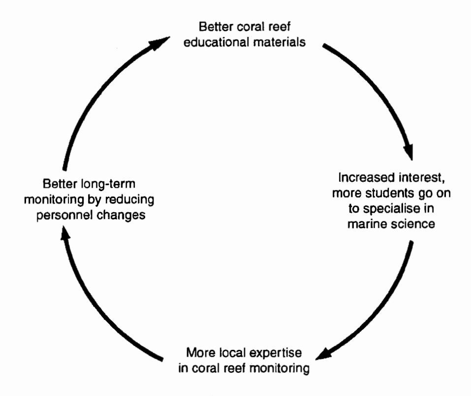

Several issues need to be addressed for this to occur:

- 1) more educational materials to increase interest in coral reefs
- 2) scholarships to aid students for school and university studies
- 3) better salaries to attract them back to American Samoa and keep them there (there is a current disparity with local vs. off-island salaries that is difficult to address)
- 4) better facilities. A planned marine laboratory will go a long way to address this. It will also attract more overseas researchers to come and study the reefs in American Samoa, thus increasing the sum total of knowledge there.

- ii) Incorporate the results of coral reef monitoring into educational materials, not only for the public but for relevant government agencies too, in order to help them make more informed decisions with regard to coral reefs.
- iii) The question of whom the monitoring is for should be addressed. At the moment the questions being asked of monitoring are solely those of the resource managers. Do these adequately answer the questions that the public and policy makers want answered?
- iv) Data archiving needs to be considered. It should be secure and not be affected by humidity etc., yet accessible and shared between agencies. This facet of monitoring is rarely given the attention and resources it deserves.

# 6) References

- Andrew N.K. & B.D. Mapstone. 1987. Sampling and the description of spatial pattern in Marine Ecology. Oceanographic and Marine Biological Annual Review 25: 39-90.
- Birkeland C.E., Craig P., Davis G., Edward A., Golbuu Y., Higgins J., Gutierrez J., Idechong N., Maragos J., Miller K., Paulay G., Richmond R., Tafileichig & D. Turgeon. 2000. Status of coral reefs of American Samoa and Micronesia: US-affiliated and freely associated islands of the Pacific. *In* Status of Coral Reefs of the World: 2000. Wilkinson C.R. (Ed.). Australian Institute of Marine Science, Townsville, Australia. 199-217.
- Brainard R.E., R. M. Laurs and Associates. 2002. External Program Review: Coral Reef Ecosystem Investigation. U.S. Department of Commerce, NOAA Fisheries, Honolulu Laboratory, August 2002. pp 69.
- Cary L.R. 1931. Studies on the coral reefs of Tutuila, American Samoa with special reference to the Alcyonaria. Papers from the Tortugas Laboratory. 55-98
- Craig P. & L. Basch 2001. Developing a coral reef monitoring program for the National Park of American Samoa: a practical, management-driven approach for small marine protected areas. National Park of American Samoa, Pago Pago, American Samoa. pp 16.
- Green A.L., Birkeland C.E., Randall R.H., Smith B.D. & Wilkens S. 1997. 78 years of coral reef degradation in Pago Pago Harbor: a quantitative record. Proceedings 8th International Coral Reef Symposium. Vol. 2: 1883-1888.
- Governor's Task Force on Population. 2000. Impacts of rapid population growth in American Samoa: A call for action. American Samoa Government Report. pp 26.
- Mayor A.G. 1924. Structure and ecology of Samoan reefs. Papers from the Department of Marine Biology, Carnegie Institution of Washington. 19:1-25, pl. 1-8
- Page M. 1988. The biology, community structure, growth and artisinal catch of parrotfishes of American Samoa. Department of Marine and Wildlife Resources, ASG, Report Series. Pp 51

## **APPENDICES**

# Appendix I. Monitoring Methodologies in Detail

# American Samoa Environmental Protection Agency

# BEACH WATER QUALITY MONITORING

ASEPA staff, 2001 -

The ASEPA Recreational Beach Monitoring Program was improved, and expanded in 2001. The ASEPA now monitors popular recreational beaches on Tutuila and in Manua on three schedules. Highly popular beaches, centrally located beaches are sampled on a weekly basis. Less popular, outer beaches are sampled on a monthly or quarterly basis. Samples are analyzed for *Enterococci* and measurements of turbidity, conductivity, chlorophyll a, pH, temperature, salinity and dissolved oxygen are collected. Results for *Enterococci* are compared with the ASWQS to determine if a beach is safe for swimming. Public notices are released warning the public of the hazards of swimming at beaches that are in violation of the ASWQS.

The ASEPA laboratory has the capability to analyze water for total coliforms and *E. coli* and *Enterococcus* using the Colilert/Enterolert methods. The laboratory also can measure pH and turbidity in the lab. Using YSI and Hach field instruments, the laboratory can gather data on residual chlorine in fresh water, dissolved oxygen, salinity, conductivity, temperature, turbidity, pH, chlorophyll a.

When a required analysis is beyond the capability of the island's resources, off-island private laboratories are contracted. In the last year, private laboratories were contracted to analyze marine organism tissues for metals as part of the tier 2 toxicity survey. A private lab was also contracted to analyze raw groundwater for priority pollutants including nutrients, metals and pesticides as part of the drinking water monitoring mandate.

Expansion of the ASEPA laboratory's capability will provide screening capability for some parameters that are now analyzed off island. Off island analysis will continue to be used to provide greater accuracy and precision.

#### Department of Marine and Wildlife Resources

#### **EXPERT FISH SURVEYS**

Alison Green 1994-96, 2002

**NB** Five of the 8 islands were resurveyed in 2002 (Tutuila, Aunu'u and the Manu'a Islands). Upolu and the remote atolls (Rose, Swains) were not resurveyed for logistical reasons.

Literature. Green A. 1996. Status of the Coral Reefs of the Samoan Archipelago. Internal report, Department of Marine and Wildlife Resources, Pago Pago, American Samoa. pp 48 plus Appendices

# **Objectives**

- 1) To determine the status of coral reef fishes and their habitat throughout the Samoan Archipelago.
- 2) To present the results of the study in a format that is useful to local managers of this important resource

#### Methods

The surveys were divided into 2 sections to examine the variation in reef fishes and their habitat characteristics associated with two main factors; habitat type and location.

#### Fish survey methods

Reef fishes were surveyed using visual census techniques along five replicate 50m x 3m transects within each habitat at each site (total area=750m² per habitat per site). These transect dimensions were used because Green (1996) determined that they yielded the most precise estimates of abundances of highly mobile, diurnal species such as wrasses. Transect lengths were measured using 50m tapes and transect widths by known body proportions. The size of each fish (total length in cm) was estimated visually and recorded directly onto underwater paper.

A restricted family list was used which comprised only those families that are amenable to visual census techniques, because they are relatively large, diurnally active and conspicuous in colouration and behaviour. Fishes were surveyed by 3 passes along the transect counting different groups of fishes in each pass. The first count was of large, highly mobile species, which are most likely to be disturbed by the passage of a diver (such as parrotfishes, snappers and emperors). This count was done while an assistant followed laying out the 5 tapes. The tapes then remained *in situ* until all of the fish and habitat surveys were completed at that site. The second count was of medium sized mobile families (including surgeonfishes. butterflyfishes and wrasses), and the third count was of small, site-attached species (mostly damselfishes). Fish counts were separated by a ~5 minute waiting period. Habitat surveys were done along the same transects after the fish counts were completed (see below).

Fishes were compared among locations on the basis of fish species richness, fish density, and fish biomass. Where: species richness was the total number of species recorded on the transects and density was converted to the number of individuals per hectare (ha). Fish biomass was calculated by converting estimated fish lengths to weights using the allometric length-weight conversion formulae [weight (kg) = (total length in cm x constant a) power b] where a and b are constants for each species. Constants were not available for most species in Samoa, so constants were used from New Caledonia (M. Kulbicki unpub. data), since that was the closest geographic area for which this information was available. Estimates for fish biomass are for bony fish only, and do not include sharks and rays because length – weight ratios were not available for those species. Since surveys were done at all times throughout the year, these comparisons were made based on adult fishes only (to eliminate the confounding effect of recruits when present), which were defined as individuals that were more than one third of the maximum total length of each species.

#### Habitat description methods

Habitat characteristics at each site were described using a point-based method for habitat description. In this study, this method was used to provide an estimate of the percent cover of each substratum type on each of the fish transects. At 2 m intervals along each transect, a 2 m transect was run perpendicular to the direction of the main transect. Three sampling points were then used along each of the 2 m transects (one directly under the 50 m tape and one either side). Twenty-five 2 m intervals along the main transect were sampled in this manner, yielding 75 sample points per transect.

At each point, the substratum was recorded as belonging to one of the following categories:-

Corals (plate, massive, digitate, branching, encrusting, foliaceus, mushroom)

Miscellaneous (hydrozoan, sponge, clam, zooanthid, soft coral, ascidian, echinoderm)

Macroalgae (encrusting pink coralline algae, branching pink coralline algae, fleshy macroalgae, *Halimeda*, blue green algae, encrusting algae)

Nonliving (reef matrix, rock, sand, rubble, crevice/hole)

The cover of each substratum type could then be calculated as the % of the 75 points that it occupied on each transect. Habitat characteristics were then compared among habitats and sites based on the cover of each substratum type.

#### ECOLOGY AND BIOLOGY OF KEY REEF FISH SPECIES

David T. Wilson, 2001-2002

**Literature.** Wilson D. T. 2002. The Ecology and Biology of Key Reef Fish Species Program – American Samoa. Department of Marine and Wildlife Resources, ASG, Report Series.

#### NEED:

In April 2001 a total ban on SCUBA assisted fishing practices was implemented for American Samoan territorial waters. The ban was the result of a series of reports produced by the Department of Marine and Wildlife Resources, ASG, that documented the rapid decline in reef fish populations following the proliferation of SCUBA assisted fishing practices in the territory (for a summary see Page 1998). However, these reports were a-posteriori in nature and reef resources suffered considerable depletion prior to reporting. As such, it is imperative that a long-term monitoring program of key reef resources be implemented to facilitate the early detection of potential problems and the subsequent formulation of response strategies.

#### **OBJECTIVES:**

The primary objective of this study will be to document the recovery of stocks of 'key' reef species following the recent ban on SCUBA assisted fishing practices. A 'key' species is defined as any reef species that is either currently being exploited in the territories fisheries, or one that has the potential to be exploited should populations of current target species decline substantially. To facilitate this objective, a long-term monitoring study employing annual field surveys and fish collections will be used (fishery independent methods - Underwater Visual Census, UVC). Both demographic and life history features of a range of 'key' reef species will be studied. Initially, I will investigate the distribution, abundance and size structure of key species over a variety of spatial scales across American Samoa. The variations of distribution and biomass will also be compared to a range of concurrently measured environmental parameters and the composition of the benthic habitat.

In addition, several key species will be targeted each year for detailed examination of the effects of growth and mortality in determining any spatial variations in the size structure across the territories reef habitats using age-based techniques. The combination of the research initiatives described above, will provide the basis for investigation of life-history shifts in response to spatially distinct anthropogenic factors influencing growth and mortality regimes. The specific aims of the research program are outlined below.

Objective 1: Spatial variation in 'key' species distribution, abundance, size and biomass. The aim of this study will be to describe patterns in the distribution, abundance and species richness of key reef species over a range of spatial scales across the territory, from tens, to tens of thousands of meters. Additionally, the determination of length frequency distributions of key species will be used to examine potential shifts in body sizes and biomass at various spatial scales exposed to varying degrees of disturbance. To achieve this aim, underwater visual census (UVC) techniques will be used.

Objective 2: Distribution and biomass of 'key' reef species: the influence of environmental parameters and the composition of the benthic habitat. In association with the UVC of key reef species, a characterisation of the benthic habitat will be carried out using a Point Based method (see Green 1996, English et al. 1997). The relationships between distribution and abundance patterns of key reef species (Objective 1) and the benthic habitat will enable the determination of habitat preferences/associations at various spatial scales.

Objective 3: Spatial variability in age, growth, longevity and mortality among reefs. Previous studies of the size of coral reef fishes across environmental gradients have identified considerable differences. Thus, this study will attempt to determine if any size differences identified in reef fish populations in American Samoa can be explained by differences in growth and/or mortality among reefs exposed to varying levels of fishing pressure. Two to five species will be selected each year from the list of key species and will be examined in detail for variations in the age, growth and mortality on the reefs of Tutuila, Ofu-Olosega and Ta'u.

# APPROACH: Objective 1:

Pilot studies were used to identify a suite of reef fish species considered important for subsistence, recreational and commercial coral reef fisheries in American Samoa. Populations of these 'key' species will be monitored annual using Underwater Visual Census (UVC). To facilitate useful annual comparisons, surveys need to be completed within ~3-5 months each year, thereby acting as discrete sampling units. Sampling events conducted over longer periods reduce the power of annual comparisons. The chosen period from November to March each year encompasses the period of transition from southerly to northerly trade winds that will allow concurrent sampling of both sides of each reef. Of the seven islands and atolls that comprise the territory of American Samoa, only Tutuila, Ofu, Olosega and Ta'u will be sampled routinely. Rose Atoll and Swains Island are outside the current logistical and financial means of the Department of Marine and Wildlife Resources and will not be studied unless other means are found. The fringing reefs surrounding the islands of Ofu and Olosega are continuous and will be considered as a single reef complex for the purposes of the study. Aunu'u will not be sampled due to its small size and proximity to the Tutuila sampling unit.

Hierarchical sampling will be adopted to enable the partitioning of variability across a variety of spatial scales and will be used to identify the scales at which important patterns and processes occur. The sampling design focuses on five spatial scales: among reefs exposed to varying fishing pressure, between exposure regimes (north versus south), among sites within each exposure (1-10 kms), between habitat types within each site (crest ~6-9 m and slope ~17-20 m) and variability within each habitat at scales of tens of meters. As there are only seven islands/atoll comprising American Samoa, random selection of reefs was not possible. Within reefs however, 6 'core' sites (3 on the north and south exposures of each reef) were randomly selected from a pool of sites identified as suitable for UVC using SCUBA (3 reefs = 18 sites). Core-site selection criteria included the logistical constraints of access, anchorage and the presence of contiguous reef structure.

The monitoring program will be run on a three year cycle, with the 6-9 m depth strata being sampled at all 18 sites each year. During year 1 (2001/2002) both the 6-9 and 17-20 m depth strata will be surveyed on Tutuila. During the second year (2002/2003) only the 6-9 m strata will be examined on Tutuila and both strata will be examined on Ofu-Olosega islands. On the third year this will be moved to Ta'u.

The principal investigator will conduct all UVC surveys to ensure consistency in visual estimates across the 18 sites. Key species abundance and size data will be collected from each of 5 replicated 50 x 5 m transect swims. This transect size was chosen as a study on similar species on the GBR and Fiji Islands concluded that 50 x 5 m transects gave optimal precision for fish in the key species size ranges (Samoilys & Carlos, 1992; 2000). This transect dimension has also been used for UVC surveys of scarids (parrotfishes) on American Samoan coral reefs (Page, 1998).

Individuals will be identified to species and their fork lengths estimated to the nearest 4 cm size class. A minimum size class of 8 cm will be used since the inclusion of smaller fish during the census of a large transect width may result in errors due to the difficulty in detecting small individuals when surveying large areas (Bellwood & Alcala, 1988). The conservative use of an 8 cm minimum size class will also be advantageous in avoiding the difficulties in identifying small, typically cryptic juveniles of families such as scarids and acanthurids that often school together and share common color patterns (Bellwood & Choat, 1989). Additionally, it is not logistically feasible to simultaneously survey small, cryptic individuals and large, conspicuous adults.

Prior to each survey, underwater visual length estimates will be tested for accuracy and consistency using model fish lengths. This procedure will involve randomly attaching models to the bottom using weights. Fork lengths will then be estimated at a distance of approximately 5 m from the models and then checked for accuracy by physically measuring each model. An accuracy of +/- 2 cm will be considered acceptable.

**Objective 2:** Sampling design. In association with the UVC of key reef species, a characterisation of the benthic habitat will be carried out using the Point Based method along the 50 m transects. The relationships between distribution and abundance patterns of key reef species and their benthic habitat will enable the determination of habitat preferences at various spatial scales. All habitat types will be classified into one of 34 categories, including 29 living and 5 non-living. Environmental and oceanographic parameters will also be measured as appropriate using loggers (water temperature, salinity, currents etc.). Loggers will be placed at each of the 'core' monitoring sites around the three sampling units (Tutuila, Ofu-Olosega and Ta'u).

Objective 3: Sampling design. Fish will be collected at various sites (not 'core' sites) on the northern and southern exposures of each reef (Tutuila, Ofu-Olosega and Ta'u). Previous studies of the size of coral reef fishes across environmental gradients have identified considerable differences. Thus, this study will attempt to determine if any size differences identified in reef fish populations from Objective 1, can be explained by differences in growth and/or mortality (primarily fishing mortality) among reefs exposed to varying levels of fishing pressure. A number of species will be selected each year from the list of key species and will be examined in detail for variations in age, growth and mortality. The coral reef fisheries of American Samoa currently target most large reef fish species. As such, comparisons of age, growth and mortality among reefs will be confounded to a greater or lesser degree depending upon the local fishing pressure. Thus, in an attempt to control for this effect, two species will be selected from a single family each year, with one being a current target species and the other will be one that is not currently harvested in the fishery. This will enable the accurate determination of variation in population parameters between reefs that reflect local differences in both population processes.

#### Literature cited

Bellwood D.R., Alcala J.C.1988. The effect of a minimum length specification on visual estimates of density and biomass of coral reef fishes. Coral Reefs 7:23-27

Bellwood D.R. and Choat J.H. 1989. A description of the juvenile colour patterns of 24 parrotfish species (family Scaridae) from the Great Barrier Reef, Australia. Rec. Aust. Mus. 41:1-41

English S., Wilkinson C., Baker V.1997. Survey manual for tropical marine resources, 2nd Edition. Australian Institute of Marine Science.

Green A. 1996. Status of coral reefs of the Samoan Archipelago. Department of Marine and Wildlife Resources, ASG, Report Series, pp48

Page M. 1988. The biology, community structure, growth and artisinal catch of parrotfishes of American Samoa. Department of Marine and Wildlife Resources, ASG, Report Series, pp51

Samoilys M. and Carlos G. 1992. Development of an underwater visual census method for assessing shallow water reef fish stocks in the southwest Pacific. Queensland Department of Primary Industries. Internal Report # PN 8545

Samoilys M. and Carlos G. 2000. Determining methods of underwater visual census for estimating the abundance of coral reef fishes. Env. Biol. Fish. 57:289-304

#### EXPERT CORAL SURVEYS

Craig Mundy 1996, Chuck Birkeland and Dave Fisk 2002

NB. The Birkeland and Fisk surveys used  $5 \times (20 \text{m} \times 25 \text{ cm})$  in Manu's and  $3 \times (20 \text{m} \times 25 \text{ cm})$  in Tutuila rather than the  $5 \times (20 \text{m} \times 50 \text{cm})$  transects of Mundy.

Literature. Mundy C. 1996. A Quantitative Survey of the Corals of American Samoa. Report to the Department of Marine and Wildlife Resources, Pago Pago, American Samoa.

Quantitative surveys of hard corals were carried out at 29 sites around Tutuila and Manu'a Island during October and November 1995. These surveys were designed to complement reef fish surveys carried out in the American Samoa Archipelago (Green, 1996) and used the same sites and depths.

At each site five replicate 20m x 0.5m belt transects were surveyed on the reef slope at 10m depth, except at Fagaitua where only three transects were surveyed. All transects were located randomly within sites as it has been shown that random transect within fixed sites are as efficient for long-term monitoring of corals than fixed transects (Mundy, 1991; see also Green, 1989). In addition to reef slope surveys, coral communities were surveyed at two sites on the reef flat at Manu'a islands (Olosega and Ofu) at two sites on the reef flat at Tutuila (Fatumafuti and Nuuuli). A single lagoon was surveyed on Tutuila at Fagaalu at approximately 4m depth.

Each transect was surveyed by laying a 20m fiber tape close to the substratum parallel to the reef edge. A coral was considered to be within the transect if the center of the colony lay within 25cm of either side of the tape. All corals within the belt were identified to species where possible, and the maximum diameter of each colony was measured and placed in one of seven size classes (Table 1).

Table 1. Size categories and corresponding colony size used to record size of colonies in belt transect.

| Size class | Colony size       |  |
|------------|-------------------|--|
| 1          | <=5cm             |  |
| 2          | > 5cm and<=10cm   |  |
| 3          | >10 cm and<=20cm  |  |
| 4          | >20 cm and<=40cm  |  |
| 5          | >40 cm and<=80cm  |  |
| 6          | >80 cm and<=160cm |  |
| 7          | >160cm            |  |

#### Data analysis:

Transect data were used to estimate colony density, population size structure, and percent cover for species at each site. The midpoint of each size class was used to calculate the approximate area of each colony. Percent cover was calculated by expressing the sum of the area for each species as a proportion of total transect area (10m).

#### INSHORE CREEL SURVEY

DMWR Staff 2001-present

The inshore creel survey is conducted throughout the island of American Samoa five times a week usually covering weekdays and weekends over an 8 - hour period. The survey covers three sections of the island (East end, West end, and Central) and three outer-lying villages from all three sections (Onenoa, Fagasa, and Vailoa). Each area is surveyed on different days except the central area, which is surveyed every survey day. Over an 8 hour period, the survey will complete a single run on the hour at every hour. A run consists of driving through the site once and taking participation counts of how many individuals are fishing, where they're fishing on the reef flat or edge, gear type, location and time. If time permits during the same run, interviews are conducted to determine catch rates. These interviews can be conducted during or after a run. Interviews target the age of the individual interviewed, gender, species caught, length, weight, gear type, how long they've been fishing, location and the disposition of their catch. This process is repeated over an 8 hour time span. Participation counts and interviews are not done in separate days.

#### INVERTEBRATE SURVEY

A methodology has not yet been devised for this forthcoming project

#### The National Park of American Samoa

Methods are currently being developed but will probably initially consist of monitoring:-

i) Subsistence fishing by a creel survey comprising participation counts and interviews.

Surveys, conducted about one week per month on Ofu/Olesega, consist of counting the numbers of fishers at 2-hour intervals (5am to midnight) from vantage points along the road from Ofu Village to Olosega Village. Interviews (creel surveys) are also conducted to determine the fishermen's' catch-per-unit-effort by gear type. By combining these two types of

data, we can estimate the annual catch by gear type.

- ii) Reef fishes by underwater visual census of circular or belt transects for commercially important species and herbivores.
- iii) Corals and algae using u/w video of belt transects.
- iv) Invertebrates by belt transect.

# **Fagatele Bay National Marine Sanctuary**

Literature. Birkeland C.E., R.H. Randall, R.C. Wass, B. Smith & S. Wilkins. 1987. Biological Resource Assessment of the Fagatele Bay National Marine Sanctuary. NOAA Tech. NOS Memd. 3. Aug 1987, Washington D.C. pp 232.

Green A.L., C.E. Birkeland & R.H. Randall. 1999. Twenty Years of Disturbance and Change in Fagatele Bay National Marine Sanctuary, American Samoa. Pacific Science 53(4): 376-400.

Surveys in Fagatele are based on six permanent transects running out from the shoreline. Each transect was marked with 3 large galvanized spikes, one at the beginning of the transect at the seaward edge of the reef flat or on an offshore mound where the reef front begins, a second at roughly the halfway mark at 20 ft, the third at the end of the transect at 40 ft. By the late 1990s, most of the spikes had long disappeared, either by corrosion or as a result of storm damage. Sites were located by memory and using shoreline triangulation. GPS readings were recorded for each site by Birkeland in 2001.

Actual quantitative sampling was done along 30 m replicate transects within each depth, generally perpendicular to the transect lines and roughly parallel to shore. This is a stratified random sampling program.

#### **CORAL SURVEYS**

# Birkeland & Randall 1985, 1988, 1995, 1998, Birkeland & Mundy 2001

The point quarter method was used, the basic concept of which is that the average abundance of coral species or other species of sessile organisms can be measured by the average distances from random points to the center of colonies or individuals. The shorter the average distance from a random point to the nearest colony, the more colonies there must be per unit area. When the average distance is squared, an average square area occupied by one individual or colony is obtained. If the average occupied area is divided into the unit area, the abundance or density or number of individuals per unit area will be obtained by multiplying the average surface area of colonies of each species by their average abundances.

The random points from which measurements are made can be obtained by laying a transect, by randomly tossing an object with right angles in its structure, or by a combination of both. Four measurements must be made from each random point, one and only one in each quadrant.

The first measurement to be made in each quadrant is the distance from the sample point to the centre of the nearest colony, or other object. The next 2 measurements are the length and width (taken at right angles to the length which is the longest dimension). The area of each colony is estimated by multiplying the length by the width and taking the square root to give a geometric mean diameter. This is then divided by 2 and squared and multiplied by pie to obtain an estimate of the area.

#### FISH SURVEYS

# Wass 1985, Amesbury 1988, Green 1995, 1998, 2001

NB Fish size (and therefore, biomass) have additionally been estimated since 1995. In addition, the methodology may be modified in future surveys (Green, pers. comm.)

This study is divided into three sections which vary in terms of the sites surveyed, the methods used, and the duration of the study:

#### Changes in the fish communities of Fagatele Bay (from 1985 to 1998)

Each transect was established as close as possible to the location used during previous surveys of the Bay. In addition to the fixed transects mentioned above, in 1998 quantitative transects were done on the reef slope at 18m at four sites (2-5), and qualitative observations were made on the deep reef slope (depth = 20-50m) at four sites (2, 3, 5 & 6) around the bay.

Standard transect dimensions of 30 x 2 m were used throughout this study, and surveys were made using the fish survey techniques described below. Fish communities are compared through time based on their species richness and abundance.

#### Changes in the fish communities around Tutuila Island (from 1988 to 1998)

Fishes were counted at two depths (3m and 6m) at 10 and 12 sites around Tutuila in 1988 and 1995 respectively. These sites were originally established in pairs of exposed and sheltered sites around the island. Another site, Aua, was added to the survey design in 1998 since it was adjacent to the historic transect on the reef flat at Aua in Pago Pago Harbor (see Aua transect survey).

Transects were surveyed using the same dimensions as those used in Fagatele Bay (30 x 2 m). Fish communities are compared among years on the basis of their species richness and abundance.

#### Changes in the fish communities around Tutuila Island (from 1977 to 1998)

This long-term study was originally designed to describe the impact of an outbreak of *Acanthaster planci* on the reef fish communities on the island. One transect was surveyed at each of three sites (Fagatele Bay, Sita Bay and Cape Larsen).

Larger transects (100 x 2 m) were used in this part of the study, because they were originally designed as part of a different project (see Wass 1982). The exact location of each transect is described in Birkeland *et al.* (1987), and care was taken to re-establish the transects in the same location in each survey.

Changes in the fish community at each of these sites was described by comparing trends in species richness and abundance over the last 21 years. These changes were then examined in more detail by describing the changes in each of the major families over time.

#### Fish survey techniques

Each fish transect was censused by a single observer equipped with scuba. All fishes observed within one meter on either side of the transect line and two meters above it were identified to species and counted. Holes and cracks in the reef within the transect corridor were inspected for nocturnal and secretive fishes and the substrate was closely examined for cryptic species. It is likely, however, that many species and individuals were undetected, thereby resulting in an underestimate of their abundance. Being wary of divers, larger and more transient fishes tend to depart the transect corridor at the approach of the observer so they, too, are probably under-censused by this procedure. Even clearly visible fishes that have no tendency to hide or flee the approach of a diver are subject to inaccurate counts because of their diversity and large number and because of their constant motion in and out of the transect corridor. In spite of these shortcomings, the visual census technique is accepted as a valuable tool for studying reef fish populations and is widely used in areas where the underwater visibility is good. It is of greatest value for making relative comparisons between fish communities at different times and locations rather than as a quantitative method for assessing the precise composition of a particular community.

Jones and Thompson developed (1978) a similar technique which allows one to characterize the fish community in terms of species presence and gives an indication of abundance. Its advantages are that it requires little time and no special equipment except for a diving watch and an underwater slate. The census procedures used in the present study goes beyond Jones and Thompson's technique to yield a numerical population estimate for each species on a per-unit-area basis. Our 15-20 minute search for additional species following the census picks up the rare, cryptic and secretive fishes that would also be found with the technique of Jones and Thompson.

About ten minutes were required to enumerate the fishes on the 30-meter transects and about thirty minutes were required for the 100-meter transects. Ten to thirty minutes after the transect was censused, the observer returned to the area with an underwater slate and spent 15-20 minutes seeking out and listing species not recorded during the census. The search was conducted within 20m of the transect line and within the same depth range. Although no quantitative information resulted from this species search, it facilitated a more complete description of the fish community by providing information on the presence of wary species, observations were made between 9:00 A.M. and 3:00 P.M. when diurnal fishes are most active and nocturnal fishes are inactive.

#### MACROINVERTEBRATE SURVEYS

Barry Smith 1987, 1995, 1998

Macroinvertebrates other than corals were censused by either of 2 methods. The line transect method was used in all but 2 cases. A 30 m transect line was placed along 10, 15, 30 and 40 ft isobaths and approximately parallel with the shore. Macroinvertebrates occurring within 1m on both sides of the transect

line were identified and recorded along 5 m intervals of the line. Therefore, each transect consisted of 6 quadrats, each covering an area of 10 m2.

The small, infaunal echinoid *Echinostrephus* sp. was too numerous to count by the line transect method in the shallow areas of Transects 1 and 6. In these areas, *Echinostrephus* was sampled with a 1/16 quadrat m2. The quadrat was thrown randomly twice at 5 m intervals and within 1 m of the transect line, yielding 14 samples from which population densities were estimated.

Areas adjacent to transects were examined for macroinvertebrates not quantified by the transects. A record of these species was maintained to compile a faunal list for the bay.

#### ALGAL SURVEYS

Wilkins 1987, 1995

Marine plants and substrate coverage were quantified by a point quadrat method along the 30m transect roughly parallel to the shoreline at a series of depths. Nondiscrete patches of surface occupied by algal turf, crustose coralline algae, filmy encrusting sponges, etc., are difficult to measure by dimensions and so these subjects are surveyed more appropriately by the point-quadrat method. This method consists of tallying organisms under the point of intersection of strings tied across a 1/16-m (25 x 25 cm) quadrat. Four strings tied from each side of the quadrat give 16 intersecting points for each quadrat. Whatever algal species occurred under each point was recorded. In the rare case in which the point falls on two layers of algae, the base alga is scored as occupying the substrate and the overlying alga is recorded as present. In the frequent case where identification to species was impossible in the field, the specimen was collected and placed in its own separate plastic bag with a label indicating which datum it represented. Identification was made later with a microscope. This frequent collection for identification was time consuming and cut down on the number of data the team had time to collect. If no alga was found under the point, then whatever was present, e.g., sand, dead coral, rubble, or live coral, was recorded.

The quadrat was tossed randomly at 5-m intervals along the length of the transect. Therefore, data were collected from 6 quadrats, or at 96 points, along each transect. ("Haphazard" is actually the proper word to use here. "Random" in biometrics refers to a more rigorous placement by use of numbers obtained from a random-number table. We are using "random" in this report in the vernacular sense of tossing without consciously aiming it. To lay out a grid-work in the bay to operate from a random number table and for each of us to work at independent locations around the bay simultaneously was unfeasible logistically in consideration of constraints by time and water turbulence.)

Each of these transects originated at points along the permanent transect lines at depths of 10, 15, 30, or 40 feet (3.0, 4.6, 9.1, or 12.2 m). Permanent Transects 2, 3, and 4 accommodated 4 perpendicular transects at 10, 15, 30, and 40 feet. Permanent Transects 1 and 5 accommodated transects at depths of 15, 30, 30, and 40 feet, while Transect 6 had only transects at depths of 20 and 40 ft.

Percent cover for each transect was calculated by taking the number of points occupied by a particular category divided by the total number of points per transect. Frequency of occurrence was calculated by taking the number of quadrat tosses in which a benthic constituent occurred, divided by the number of tosses per transect. Both cover and frequency values were converted to percent by multiplying by 100. Other algal species also seen along the transects were recorded as observed.

In addition, twelve 30-m transects were surveyed at a depth of 20 feet (6.1 m) at the sites around Tutuila which were surveyed in previous years for coral cover. The same methods were applied as described above.

# **Coral Reef Ecosystem Investigation (NOAA Fisheries)**

(first conducted from the NOAA ship "Townsend Cromwell," Feb. - March 2002, to be repeated every two years).

# Goals

The goals of the CREI surveys conducted in American Samoa are to assess the present status of and monitor potential future changes in American Samoa's reef ecosystem resources, including corals, associated habitat structure, and oceanographic processes, and emphasizing economically and ecologically important (e.g. keystone predator) fishes and macroinvertebrates. Satisfying these goals will allow us to fulfill our ultimate objectives of, (1) constructing a comprehensive assessment and monitoring database for all U.S. Pacific Island reef ecosystems and, (2) providing current, complementary input to on-going monitoring by regional agencies in American Samoa to assist the Government of American Samoa in monitoring and managing their reef resources.

#### Site selection

The emphasis on the CREI surveys was on rapid assessments of a large number of sites. Sites were selected in consultation with Andrew Cornish of the American Samoan Coral Reef Advisory Group to avoid sites previously surveyed, and particularly those in existing monitoring programs, in order to maximize the amount of reef around the territory on which surveys have been conducted, and thus, the amount of information available to managers and planners.

Surveys of fish, hard and soft coral, other invertebrates and algae were performed at 42 sites (14 at Tutuila, 6 at Ta'u, 6 at Ofu/Olosega, 6 at Swains Island, 10 at Rose Atoll). Most effort was concentrated at 15 m depth (see individual methodologies), sites were chosen in most cases to cover areas of reef not previously studied in any detail. However, the proposed site of the Ofu runway extension and the reef near to the road widening at Oti point (Nuuuli, Tutuila), and 7 reefs that have or maybe included in the community-based fisheries management scheme (on Tutuila) were included at the request of the Dept. of Marine and Wildlife Resources.

Towed divers videoed and quantified habitat around 95% of the coastline of Manu'a, 100% of Rose and Swains and around 40% of Tutuila at depths to 15 m. Deeper areas were also surveyed at Rose and Swains.

NB 1) Calm sea conditions during the 2002 surveys allowed surveys to be performed at even the most exposed shores, less obliging conditions may well prevent some of the sites being re-surveyed in the future. 2) The CREI fish team usually consists of 3 persons, 2 on transects and the third conducting a stationary point count (primarily compiling an off-transect species list). On the 2002 cruise, the stationary point count researcher was replaced by an additional member of the benthic team, who conducted an octocoral survey. During future cruises, CREI anticipates the ability to accommodate a third fish team member to conduct the stationary point counts, a dedicated octocoral specialist, and a second phycologist to allow quantitative algae estimates to be completed.

#### **CREI FISH SURVEYS**

Ed DeMartini et. al 2002

Overview and Objectives: A pair of diver-observers conducted parallel swims on three 25-m-long transects, recording size class-specific (Total Length, TL) counts of fishes encountered within visually estimated but defined belt widths, either as one of the divers set the transect line or as the divers swim back along it. Each diver obtained a density estimate of all fishes ≥ 20 cm Total Length (TL) within a 25-m long x 4-m wide (100-m²) area on an initial ("swim-out") leg, followed by a density estimate of fishes < 20 cm TL within a 25-m long x 2-m wide (50-m² area) on the subsequent ("swim back") leg, on each of 3 transects per site. These data will be used both to estimate numerical (and biomass) densities and, on cruises on which species-level data are obtainable on transects, to use these data to describe relative abundance of species within the fish assemblage--post-classified as "Dominant=D, Abundant=A, Common=C, Occasional=O, or Rare=R" (DACOR--) for the Rapid Ecological Assessment (REA). In general, taxonomic resolution was FAMILY-level, complemented by some species-level records for important, easily recognizable species and monotypic families/genera.

Additional recording of species-level presence off transects (i.e., within visible [10-30 m] distance to either side of transects—i.e., within 2,000-6000 m2 search areas) was used to generate parent species lists for each of the islands (excluding Aunu'u) and atolls.

#### Methods

- (1) Each diver fills out physical data header on own data sheets before dive team enters water, including station number and transect letter (A, B, C).
- (2) The 2 divers descend w/ a 3rd (REA) diver at a haphazardly selected station at 30 to 50 ft depths within desired habitat type/exposure quadrant. Divers select bearing to run first transect based on habitat (> 50% consolidated substrate), current (diver manageable), etc. (NOT based on fish abundance or diversity) and, once both are on bottom, orient selves facing direction of transect and about 5-m apart from one another.
- (3) When both divers are ready, each diver records start time on Transect "A" datasheet; one of the divers attaches one of the transect-reel grab-anchors on a visible bottom feature, records start time on chronometer, and begins to swim-out transect line along chosen bearing at a rate of about 8 to 12 m per minute (totaling about 2 to 3 minutes for the entire 25-m transect line); 2nd diver swims parallel to 1st diver, maintaining about 5-m distance from 1st diver.
- (4) Divers ignore (do not tally) fishes seen within the initial 2-m (white flagged on transect line). Each diver subsequently tallies all fishes ≥ 20 cm Total Length (TL) to nearest 5-cm (e.g., 20, 25, 30, ... 50 etc.), by taxon indicated on pre-printed data form. If personnel are available for species-level recording, and if logistically possible (both divers must be consistent on all dives), all terminal phase male labroid (wrasse and parrotfish) tallies are to be circled. Example 1: three, 22-cm TL fish would be recorded as "3-20". Example 2: a single, 38-cm TL terminal phase male labroid would be recorded as a circled "40". Both the diver laying the transect line and the 2nd diver are to tally fishes seen up to10-m ahead of the diver, within about 4-m of bottom, and within 2-m to either side of diver's midline (i.e., a 4-m wide swath). Each diver uses finger touch and/or visual inspection of transect reel to appraise self of position along 25-m transect so as not to "overshoot" fish counts beyond the end of the transect line--fish present beyond end of the transect line must not be counted. When transect end is reached and count is finished, each diver records stop time, both divers turn 180 degrees to face back along the laid transect line, and each diver positions self about 1-m distance off one or the other side of the line.
- (5) When both divers signal that they are ready, each diver starts his chronometer and begins a timed return-swim tally recording all fishes ≤ 20 cm TL encountered to 2-3 m ahead of the diver, within about 4-m of bottom, and within a 2-m-wide swath bounded on one side by the set transect line, by taxon specified on the data form. Each diver will have the transect line as one boundary of the lane that the diver is surveying; divers must communicate so as not to "double count" fish that cross sides of the transect line boundary. If species-level tallies are being conducted and if logistically possible (divers must be consistent), tallies of any terminal phase males of small-bodied labroid species such as *Thalassoma*

amblycephalum, Labroides bicolor, etc. are to be circled. Fish individuals  $\leq 5$  cm TL are to be recorded to the nearest centimeter, preceded by the number and a dash (e.g., use 2-5 for two, 5-cm TL individuals). Fish individuals  $\geq 6$  cm TL are to be tallied by capital arabic letter representing a 5-cm length bin (A = 6-10; B = 11-15; C = 16-20 cm TL). Example 1: three, 16-20 cm TL fish would be tallied as "3-C". Example 2: a single, 11-15 cm TL terminal phase labroid would be simply recorded as a circled "B". This return-swim tally is to be swum at a slower rate of @ 3 to 4 m per minute (totaling 6 to 8 minutes), as required by visual searching of reef ledges and holes. Divers must not undercount larger fishes by unduly concentrating on finding small fishes in crevices. Divers also must NOT repeat-count certain fishes (like many small wrasses) which tend to "herd" ahead of the slowly moving diver. As the initial (anchor) end of transect is approached, the divers must ignore (not count) fishes present within the last 2-m length of line. Divers record stop time.

- (6) When both divers signal they are ready, divers swim along isobath a minimum of 10-m distance (see fixed benthic station exception below) and position selves again in parallel to start Transect "B". If species-level data are being recorded by belt transect personnel, any fish species newly encountered off-transects (e.g., encountered when swimming between transects or when swimming back to the tender at the end of the dive) should be noted as "present" only by recording a check (\*) next to its printed or written-in name. The latter qualitative data would contribute to a parent species list.
- (7) The 2 divers repeat Steps 3-5, inclusive, for Transect "B", and then Transect "C."
- (8) Both belt transect divers reconnoiter w/ REA diver and either swim back to anchored tender or all 3 divers ascend to the waiting tender which has been live-boating the dive team.

#### **CREI REA FISH SURVEYS**

Ed DeMartini et al. 2002

Overview and Objectives: A 3rd diver, accompanying the pair of transect divers, is to conduct a Rapid Ecological Assessment (REA) by a random swim throughout the station area, recording fishes visually encountered by species or lowest recognizable taxon. These data will provide a qualitative, but generally species-level, characterization of the fish fauna present at stations occupied during the cruise. Note: Species-level quantitative data collected by the transect divers, together with a quantitative survey by the 3rd diver, would provide a quantitative basis for post-classifying fishes as Dominant=D, Abundant=A, Common=C, Occasional=O, or Rare=R (DACOR) for the REA. Additional recording of species-level presence by transect divers off transects (i.e., within visible [usually 10-30 m] distance to either side of transects—i.e., usually within 2,000-6000 m² search areas) would be used to generate a parent species list for biodiversity concerns. However, this is an option only if all cruise personnel have sufficient taxonomic expertise and the logistics of transecting allow. This was NOT an option on the American Samoan cruise.

The 3rd diver was required to establish and maintain visual contact with the other 2 members of the dive team throughout the dive.

1) The REA diver descends with the other 2 divers, then conducts a "roving diver" census (swims haphazardly throughout general station area), noting fish species presence as encountered. It is important that the REA diver census to the limits of lateral visibility all along the approximately 100-m-long station area, so that the area visually searched can be estimated as input to evaluation of species-area relationships. Species presence is to be recorded consistently as a simple, clearly written check (\*) on the data sheet opposite the species name, whether pre-printed or manually added as a compound abbreviation using the first four letters of the genus and species names. The only additional detail involves notation for any terminal phase (TP) males of labroids (scarids, labrids) encountered: if one or more individual TP individuals are seen, record their presence either with a **circled** check (if only TP individuals are seen) or with an additional, **circled** check (if TPs are seen in addition to initial phase (IP) individuals). Estimated

| SAMOA/Cruz:TC-02-01 Site: | Date: / / 02 Time:                 | h Temp:°F              |
|---------------------------|------------------------------------|------------------------|
| Obsrvr: Sta #: A B C D GF | PS:N,W Depti                       | h (ft): Partner(s):,_  |
| Angelfishes               | Hawkfishes                         | Wrasses                |
| Centro flav               | Para hemistic                      | Cheil undu             |
| Centro loric              | all other spp                      | Gomph var              |
| Centro bicolor            |                                    | Lab dimid              |
| all other spp             | Parrotfishes                       | all other spp          |
| Butterflyfishes           | Bolbo muric                        |                        |
| Chaet omate               | all other spp                      | •                      |
| Chaet pelewen             |                                    |                        |
| Chaet mertens             |                                    |                        |
| all other spp             |                                    |                        |
| Chubs—all spp             | Snappers                           | All other fams/monotyp |
|                           | Apri vir                           | Batfishes              |
| Damselfishes              | Lut boh                            | Blennies               |
| Dasc trimac               | Lut kasm                           | Boxfishes              |
| Chrys cyan                | all other spp                      | Cardinalfishes         |
| Chrys taup                |                                    | Coronetfishes          |
| Poma coelest              |                                    | Dartfishes             |
| all other spp             |                                    | Emperors               |
|                           | Soldier/squirrelfishes             | Filefishes             |
| Fusiliers—all spp         | all spp pooled                     | Gobies                 |
|                           |                                    | Jacks                  |
|                           |                                    | Lizardfishes           |
| Goatfishes                | Surgeonfishes                      | Manta ray              |
| Paru multifasc            | plank Naso's + A thomp:            | Moorish idol           |
| Paru bifasc               |                                    | Moray eels             |
| all other spp             |                                    | Porcupinefishes        |
| Groupers/seabasses        | Acan nigricans                     | Puffers                |
| all anthiines             |                                    | Shark, grey reef       |
|                           | Acan lineatus                      | Shark, reef blacktip   |
| Ceph arg                  |                                    | Shark, reef whitetip   |
| Epi marbled-complex       | All other herbivores (incl Naso | Sweepers               |
| Plectropom spp            | lit & uni):                        | Trumpetfishes          |
| Var lout                  |                                    | Trunkfishes            |
| all other spp             | Triggerfishes (all spp):           | Others:                |

average lateral underwater visibility is another key piece of information that must be recorded for every dive, as it will be used to estimate the station area searched. Example: if the REA diver censuses to the limits of visibility on either side of the 100-m-long plane of the transect lines, and the average visibility is, say 20-m, the search area would approximate a rectangle of area =  $4,000 \text{ m}^2$  ( $100 \text{ m} \times 2 \times 20 \text{m}$ ).

(2) At the completion of the survey-dive, the REA diver reconnoiters with the 2 transect divers and they either swim back together to the anchored tender or all 3 divers ascend together to the waiting tender together

# CREI HARD CORAL SURVEYS I (methodology for Manu'a and some sites on Tutuila) Jean Kenyon 2002

All of the surveys at each island were species inventories and rapid ecological assessments (REAs) of coral populations. In addition, a total of 72 samples from 7 species of *Acropora* were collected from Tutuila, Ta'u, and Ofu and fixed in formalin in order to assess their sexual reproductive status.

#### Rapid Ecological Assessments (REAs) of coral populations

With the exception of the final, deep dive to 90 feet off Olosega Village, at each survey site the fish team laid out three, 25m-long transect lines along a 45-foot depth contour; the beginning of the second and third transect lines were separated from the end of the previous transect line by 3-4 meters. The researcher videotaped all 3 transect lines while slowly swimming ~1 meter above the length of the line; these video sequences will enable later, computer-assisted quantitative analysis of percent coverage of corals, algae, and substrate types. Additionally, at the beginning of each of the 3 transect lines, a 360° pan of the surrounding reef area was videotaped to document the topography and general nature of the surrounding area. The observer then swam back along as many of the transect lines as bottom time permitted and listed coral species (or genus, when species identification in the field was ambiguous) occurring within ~0.5m of each side of the transect lines, the size class to which the maximum diameter of the colony belonged (> 5 cm; 5–10 cm; 10-20 cm; 20-40cm; 40-80 cm; 80-160 cm; or > 160 cm) and the relative abundance of the species/genus using the DACOR protocol (Dominant, Abundant, Common, Occasional, and Rare). These size classes were chosen based on a 1996 report by Craig Mundy (see Expert Coral surveys), so as to make results of the present study comparable with Mundy's surveys of other reef sites around Tutuila and the Manu'a Group.

Analysis of digital video taken along the transect lines will be conducted using duplicates of the videotapes rather than the originals, which will be archived as a permanent record of the state of the reefs in early 2002.

# CREI HARD CORAL SURVEYS II (Swains Island, Rose Atoll and some sites on Tutuila) Jim Maragos 2002

As part of the benthic team, the coral biologist took wide-angle photographs, using a Nikon RS camera with a 13mm lens, along the first two 25m transect lines previously laid out by the fish team at each site. These photos will be processed and later analyzed to calculate quantitative data on coral cover, population size distribution, frequency, and generic-level richness and diversity indices. Unfortunately, a camera was not available for surveys at the first 3 sites, and instead corals were counted *in situ* along each of the 2 transects at each site. All corals with their centers within 1 m of each side of the line were assigned to one of 7 size classes and each identified to the genus level. Data were collected on ~150 to 200 corals in this manner along each line. These data have been collated and will be used to calculate the same coral parameters as those using the photographs.

In addition, all stony coral species within the general dive area (roughly 5,000m) were listed and assigned an abundance level visually approximated at the end of each dive. These levels are dominant (D), abundant

(A), common (C), occasional (O), and rare (R). At each site, estimates were made of the overall percent live coral cover, diameter data on the largest corals at each site, and notes on bleaching, predation, competition with algae, tumors, and diseases, if any, were made.

One 15 cm coral core of *Porites lobata* was collected at site SWA-9 off the NW reef of Swain's at a depth of 6.5m. The core will later be analyzed to estimate annual and seasonal growth rates, age, and calcification temperatures as part of a larger central and NE Pacific investigation.

# CREI OCTOCORAL SURVEY (SOFT CORALS AND SEA-FANS)

Andrew Cornish 2002

#### Goals and methods

- 1) Describing the octocorals of American Samoa is a continuation of a study initiated on Tutuila and Ofu in late 2001. The Townsend Cromwell cruise allowed collections to also be made in Tau, Olosega and two atolls that make up the territory, greatly increasing the coverage and value of this baseline study. Collections were made opportunistically during the quantitative surveys and were therefore limited to 15 m depth, although deeper dives were made where possible. Specimens were photographed in the field and collected when they are not recognized as being previously encountered. These specimens will be examined at a later date (as a high-powered microscope is required to examine the spicules for species-level identifications) and a checklist compiled.
- 2) The methodology used to examine the distribution of octocorals is a an adaptation of the semi-quantitative rapid assessment methodology employed by Fabricius and De'ath (2000) to survey octocorals on the Great Barrier Reef. Swim surveys of between 100 and 150 m in length were made at 3 depths at each site. NOAA dive tables and the need to buddy with another member of the benthic team limited the deepest depth to 15 m with another at 8 m. The reef crest (0-3 m) was surveyed (where one is present) by snorkeling. Octocorals are surveyed at different depths as their distribution varies more with depth than along the reef, at least on small scales (Fabricius & Aldersdale 2001). Octocorals were identified to genera and the abundance of each along the swim survey (and within + and 1.5 m of the depth contour) estimated into one of five abundance categories (0=absent, 1=one or a few colonies, 2=uncommon, 3=common, 4=abundant, 5=dominant). Hard and soft coral cover are estimated in the categories 0-5%, 5-10 %, 10-20%, 20-30% etc. Estimates of horizontal visibility were made to the nearest meter and sediment levels were quantified as follows: 0=none, 1=thin layer, 2=considerable amount, 3=think deep layer.

#### References

Fabricius K. & P. Aldersdale. 2001. Soft corals and sea fans. A comprehensive guide to the tropical shallow water genera of the Central-West Pacific, the Indian Ocean and the Red Sea. pp 264

Fabricius K.E. & G. De'ath. 2001. Biodiversity on the Great Barrier Reef: Large-scale patterns and turbidity-related local loss of soft coral taxa. *In* Oceanographic processes of coral reefs: physical and biological links in the Great Barrier reef. London, CRC Press. 127-44

#### CREI ALGAL SURVEYS

Peter Vroom, Linda Preskitt 2002

Sites were described qualitatively in terms of algal biodiversity and abundance following free-swims along the reef slope from 0-15 m in the vicinity of the transects used by the fish team. Some collections were also made from the inter-tidal zone at both atolls.

#### CREI MARINE MACROINVERTEBRATE SURVEY

Scott Godwin 2002

Surveys for marine macroinvertebrates were done qualitatively along 2 separate 50 m transect lines. A zigzag pattern that extended roughly 2 m on either side of the transect line was done for each of the 2 lines. Once this was accomplished, a brief swim of the general area was done to account for species away from the transect area. Intertidal surveys were also performed at some sites. Species were recorded and the qualitative abundance was given using the DACOR method (D=dominant, A=abundant, C=Common, O=occasional, and R=rare).

#### CREI TOWED DIVER HABITAT/FISH SURVEYS

Rusty Brainard et al. 2002

Shallow water habitats to about 30 m were surveyed using pairs of towed divers on towboards equipped with downward and forward-looking digital video cameras to quantify habitat composition and complexity, respectively. A towboard survey consists of a 51 minute bottom transect followed by a 10 minute safety stop at 5 m, and typically covers about 3 km of benthic habitat.

Divers maneuvering the towboards on which the cameras are mounted record selected data pertaining to fish and to habitat, using datasheets mounted on the towboards. The diver-observer on the downward towboard observed and recorded habitat characteristics over 5 minute ensembles. The diver-observer on the towboard with the forward-looking camera recorded economically or ecologically important fish taxa greater than 50 cm total length in the same 5 minute ensembles. Both towboards were instrumented with precision temperature and depth recorders (Seabird Electronics Inc, SBE39). GPS positions, temperature and depth were recorded every 5 s along each transect. These *in-situ* observations are used to assist with preliminary summaries of the fish communities and the reef habitat, and as a general reference during more detailed, computer-assisted analyses. The habitat towboard is additionally equipped with two lasers, mounted so as to project 2 small, red dots that are 20 cm apart onto the benthos; these dots, recorded on the digital video, will allow calibration of the area included within each video frame.

Video tape analysis (Jean Kenyon, CREI, Honolulu Lab.)

The quantitative analysis of the benthic habitat, as documented by digital videotapes recorded by the downward-pointed camera, involves three major steps: (1) the selection of single, still frames at 30-second intervals, (2) the import of individual still frames into the computer program SigmaScan for identification and tracing of key benthic components, and calculation of their percent cover within each still frame and, (3) the compilation and summarization of SigmaScan's quantitative data using Microsoft Excel.

In step (1), a sampling unit of single frames "captured" at 30-second intervals provides a sample size of 100 frames (50 minutes x 2 frames/minute) by which to characterize the habitat over which the towboard passes. Two computer programs have been successfully used by CREI scientists to "capture" and save frames at 30-second intervals: DVRaptor-RT Video, and Sony's DVGate Still. If the frame is too blurry to be properly analyzed, due to excessive speed during that portion of the tow, the scientist toggles forward frame by frame until the next frame is reached that, in the scientist's opinion, can be successfully analyzed.

In step (2), each of the 100 frames is imported into SigmaScan. Using the red laser dots known to be 20 cm apart, this program enables rapid calibration of the area covered within each frame and, by extension, enables the calculation of percent cover of each component delineated within each frame. The user must possess some prior familiarity with the important components of the reef habitat in a particular geographical location that can be reliably identified through their appearance on digital video (e.g., *Porites*, *Pocillopora*, coralline algae, macroalgae, sand, etc.). After deciding upon these components, the user must set up a spreadsheet structure that will receive the calculated coverage of each component after it has been identified on the still frame under analysis and traced with a stylus. The power of the SigmaScan program is that, after a discrete component (e.g., a head of pocilloporid coral) is traced with a stylus, its percent cover is immediately calculated and entered into the pre-designed spreadsheet.

In step (3), the SigmaScan spreadsheet for each frame is saved as a tabbed textfile and imported into Microsoft Excel for proofreading and archiving. Excel is further used to compile and summarize the quantitative habitat data over whatever spatial/time scale is desired. For example, a single "pie chart" can be generated to graphically describe the components of the benthos over the course of the entire towtrack; alternatively, a series of pie charts can be generated to describe the benthos over finer time and spatial scales, e.g., every 5 minutes, every 10 minutes, etc.

#### CREI DEEPER HABITAT AND OCEANOGRAPHIC MONITORING

#### TOAD/OTC Ron Hoeke & Phil White 2002

Benthic habitat mapping and characterization of deeper reef habitats (20 - 60 m) combined using the Tethered Optical Assessment Device (TOAD) towed camera system and the QTC acoustic seabed classification system. The TOAD consists of a modified Mini-Bat chassis with a high resolution downward-looking digital still camera with a strobe taking pictures every 15s and a forward-looking digital video camera with floodlights. Both cameras transmit their images to monitors aboard the ship continuously. In American Samoa, the TOAD was used to investigate the fauna of these deeper habitats for the first time. In addition to examining species composition, the TOAD is used to ground-truth the acoustic habitat classifications provided by the QTC. Due to the extremely steep topography surrounding Rose and Swains, and to a lesser extent, Manu'a, TOAD/QTC surveys were limited in their extent at those locations.

#### CTD (Conductivity, Temperature, Depth) Rusty Brainard et al. 2002

Closely-spaced (~.35 nmi) CTDs were conducted around the various islands and atolls to investigate the small scale ocean dynamics of these reef ecosystems. These CTD's, which were conducted to a depth of 30 m, included measurements of temperature, salinity and chlorophyll a versus depth. Future shallow water CTDs will include a transmissometer to measure turbidity.

A grid of 4 shipboard CTD stations were conducted to a depth of 500 m and acoustic Doppler current profiler transects were repeated nightly around each of the island groups to examine the vertical structure of water properties (temperature, salinity, dissolved oxygen and chlorophyll a versus depth) and ocean currents surrounding these islands.

#### Surface Velocity Drifters Ron Hoeke & Jim White 2002

Eight satellite-tracked surface velocity drifter buoys were deployed to track upper ocean currents in the waters of American Samoa. Information on ocean surface currents will assist scientists in evaluating larval transport and recruitment dynamics in the waters of American Samoa and will assist resource managers in evaluating locations and the effectiveness of marine protected areas. Positions for these positions are determined using the Argos satellite system. Drifter tracks are available on the CREI website.

# THE "AUA TRANSECT" SURVEYS (CORALS AND INVERTEBRATES)

Mayor 1917, Dahl & Lamberts 1973 Alison Green & Chuck Birkeland *et al.* 1995, 1998, 2000

Literature. Green A.L., C.E. Birkeland, R.H. Randall, B.D. Smith & S. Wilkins. 1997. 78 years of coral reef degradation in Pago Pago Harbour: a quantitative record. Lessios H.A., Macintyre I.G. (Eds). Proceedings of the Eighth International Coral Reef Symposium, Panama, June 24-29, 1996. Smithsonian Tropical Research Institute. Balboa, Panama: 1883-1888.

#### History

The "Aua Transect," first surveyed by Alfred Mayor in 1917, lies on the reef flat in front of the village at Aua in the outer harbour. A detailed description of the location of the

transect, which covered a distance of 270 m from the shore to reef edge, and photographs, enabled it to be re-located in 1973 and subsequently.

#### Methods

Mayor surveyed the transect, which was marked by iron stakes placed at 31 m intervals from the shore, by dividing it into squares 7.3 m on each side which were staked out at intervals along the transect. Squares were surveyed starting at the following distances from the shoreline, 0m, 7m, 15, 31, 61, 91, 122, 140, 160, 183, 213, 233, 247, and 259 m. The final square at 259 m was located on the seaward margin of the reef edge. After the transect was delineated, Mayor counted all corals present in each square, as well as 3 groups of macroinvertebrates: a holothurian (*Stichopus chloronotus*), an asteroid (*Linckia laevigata*), and all alcyonarians.

The same method was repeated in 1973.

In 1995, the remeasured transect was marked with iron stakes and floats at the start of each "square": for the duration of the study. Corals and macroinvertebrates were then resurveyed in each square. Macroinvertebrates were re-surveyed using the same methods as before. However, the coral survey methods differed in that each square was re-surveyed with a number of replicate 0.25 m² quadrats that were haphazardly located in each square. This was done in order to attain a mean (and SE) number of colonies per square that would enable us to determine if the number of colonies per square differed significantly from those present in previous years. A stratified sampling technique was also used, with more quadrats being done in the squares where there were very few corals (n=80 quadrats in squares 0-213 m from shore) and fewer quadrats done in squares where corals were more numerous (n = 53, 79 and 61 quadrats at 233 m, 247 m, and 259 m, respectively). All counts were done on snorkel.

#### REEFCHECK

Coral Reef Advisory Group et al. 1997, 1999, 2002

ReefCheck is a global initiative to monitor coral reefs using volunteers trained by marine scientists. Since its creation in 1997, ReefCheck surveys have been carried out at over 1000 reefs in 50 countries and territories. Reef Check has also been selected to be the "community-based" survey program for the United Nations' Global Coral Reef Monitoring Network. In American Samoa, the program will be run by the Dept. of Marine and Wildlife Resources and the number of sites expanded from one, at Amalau in 1997, to four in 2002.

#### Goal

To educate the public, particularly the diving community, on the importance of coral reefs and of monitoring them. The program will also be used to provide an additional level of annual monitoring on Tutuila at sites not covered by either DMWR's Expert surveys or those of the Coral Reef Ecosystem Investigation.

Methods (taken and condensed from www.reefcheck.org)

#### **Site Selection**

Site selection is a critical factor in the success of Reef Check. One goal of Reef Check is to test the null hypothesis that there are reefs that are not affected significantly by human impacts. In addition, we would like information on the geographic distribution of human impacts of various types on all reefs. For this reason, Reef Check teams that can only survey one site should survey the "best" site they have access to in

terms of least likely to have been affected by human impacts, fishing, pollution etc. with high living hard coral cover and dense fish and mobile invertebrate populations.

For groups willing and able to survey multiple sites, we suggest choosing 2 or more additional sites representative of moderate and heavy human impacts. In this manner, we will build up a picture of the distribution of human impacts on a cross section of reefs.

To standardize Reef Check, we will not be accepting surveys of steep wall reefs (drop-offs), reefs predominantly located in caves or underhangs. We would prefer moderately to fully exposed reefs with a reef crest and outer slope. The transects can then be placed seaward of the reef crest on the outer slope.

#### **Basic Design**

The goal is to survey two depth contours, 3 m and 10 m below chart datum (lowest low water). However, on many reefs, the highest coral cover will not be found at these exact depths. Therefore, choose the depth contour with the highest coral cover within the following ranges: Shallow (2-6m depth) Mid-reef (>6-12m depth).

Note that particularly for the shallow transect, the tide should be taken into account. Along each contour, four 20m-long line transects will be deployed and surveyed. The transects should follow the designated depth contour one after the other, however, transect start and end points should be separated by a 5m space. The distance between the start of the first transect and end of the last transect will be 20 + 5 + 20 + 5 + 20 + 5 + 20 = 95m. The depth contours were chosen for practical reasons of time and safety. We recommend use of a single 100m fiberglass measuring tape

Four types of data will be recorded. The three transect surveys will be made along the same transect line.

- 1. Site description. Anecdotal, observational, historical, location and other data should be recorded on the Site Description sheet. These data will be important when we attempt to interpret global trends in the dataset.
- 2. Fish belt transect. Four 5m-wide (centered on the transect line) by 20m-long transects will be sampled for fish species typically targeted by spearfishermen, aquarium collectors and others. The fish transect should be carried out first.
- 3.Invertebrate belt transect. Same four 5m-wide (centered on the transect line) by 20m-long transects as above will be sampled for invertebrate species typically targeted as food species or collected as curios.
- 4. Substrate line transect. Same four 20m-long line transects, but this time, point sampled at 0.5m intervals to determine the substrate types on the reef.

#### **During the Dive**

One buddy pair should lay out a 100m transect line (or four 20m transects separated by 5m breaks) along the specified contour (2-6m or >6-12m). Estimated time to deploy the transect is 30 minutes. After deployment, the entire length of the transect should be examined to ensure it is not snagged or floating too high off the bottom. small marker floats should be attached to the start and end points and (optional) permanent stakes can be installed so that the site can be located next year.

A GPS reading should be obtained from the float at one end, and the compass bearing to the end marker buoy recorded (only those teams with precision navigation systems such as differential GPS need record the coordinates of both ends). Line-ups with landmarks should also be recorded in case the GPS has given false readings. Teams without a GPS should obtain the most detailed chart of the area available and record the coordinates of the location of the transect.

#### **Fish Belt Transect Instructions**

The fish belt transect should be the first work done after the transect is deployed. Try to begin the fish transect at about 9 to 10:00 am. Work can be started after a 15 minute period during which no divers disturb the area. Estimated time to completion is 1 hour. The maximum height above the transect to record fish is restricted to 5m. Data should be recorded on a slate using the Belt Transect Sheet format.

Each diver assigned to count fish will swim slowly along the transect and stop to count target fish every 5m. He will then wait 3 minutes for target fish to come out of hiding, before proceeding to the next stop point. This is a combination timed and area restriction survey, 4 sections x 20m long x 5m wide =  $400\text{m}^2$ . There are four 5m gaps where no data are collected. At each depth contour, there are sixteen "stop-and-count" points, and the goal is to complete the entire  $400\text{m}^2$  belt transect in 1 hour.

#### Indicator fish

The indicator fish have been selected because they are typically shot out of reefs by spearfishing, removed as targets of cyanide fishing, and caught using hand-lines. Size minimums have been placed on some species to reduce the burden of recording many small fish. Given these limits and the magnifying effect of the water, divers should practice estimating sizes before attempting the fish surveys.

A measured 2.5m colored wire or rod can be used to help estimate the 5m belt transect width, and 20 or 30 cm sticks (hand-held or floating tethered to a small weight) can be used to estimate fish length.

We recommend that one diver record fish on one side of the line followed by the other side. By moving from side to side, the diver records 2.5m belts one at a time. If both divers are proficient at fish identification, we suggest that Diver 1 records the first and third 20m segments, while Diver 2 does the second and fourth 20m segments. Care is needed to carefully label slates. We suggest tallying the fish on the slate using a vertical tick mark for each fish observed and after each four fish, drawing a horizontal line through the four, thus creating easily counted groups of five next to the correct name and under the appropriate column. It is crucial to remember to keep the counts for each of the four segments of the transect separate. For all grouper, a size estimate should be given of each fish.

All of the organisms to be counted within these fish belt transects are listed below and identification photos can be seen on the species identification page.

#### Indo-Pacific

Grouper/coral trout over 30 cm (any species)
Barramundi cod - Cromileptes altivelis
Sweetlips - Haemulidae - Plectorhincus spp.
Humphead (Napolean) wrasse - Cheilinus undulatus

Bumphead parrotfish – Bolbometopon muricatum Parrotfish over 20 cm Butterfly fish (any species) Snapper - Lutjanidae Moray Eel

(Note: off-transect records of the two distinctive species of wrasse and the parrotfish will be accepted as these species roam near reefs at this size rather than strictly resident species). A note should be made of any sightings of what are now becoming rarer animals such as large manta rays, sharks and turtles, but if these are off-transect records, they should be written at the bottom of the slate under "Comments".

#### **Site Description Form Instructions**

In 1998, some very large individual colonies of *Porites* were killed. Because it is fairly easy to measure the age of corals, these colonies are good "canaries" i.e. if they die, it may be an indication of an unusually severe stress. As large *Porites* are globally distributed, they make good indicators. We would like to ask all teams to make an attempt to identify and mark the location of up to five very large *Porites* colonies (3m or

larger) at their sites. We recommend a measurement be made of the longest diameter, the diameter to the first, and the colony height. If it possible to mark the colonies permanently, this could be helpful. If future severe events, e.g. more heating, occur that damage or kill these large historical recorders, the data will be very useful to assess the geographic range and severity of the events.

Please record the data in the comments section of your Site Description form -- feel free to increase the size of this "cell" in the spreadsheet.

#### **Invertebrate Belt Transect Instructions**

When the fish belt transect is complete, Divers 3 and 4 could then carry out the belt transect survey for invertebrates. Estimated time to complete this work is 1 hour. If both divers want to record data, they can alternate 20m segments as above or each do a 2.5m wide strip. To avoid confusion later, it is imperative that divers carefully mark their sheets with location and diver names.

Each belt transect is 5m wide with 2.5 m on either side of the transect line. The reason for choosing the relatively narrow belts is that visibility in many parts of the world is low, therefore it is necessary to restrict them for comparability. Total survey area will be  $20m \times 5m = 100m^2$  for each transect, for a grand total of  $400m^2$  for each depth contour, the same as the fish belt transect.

All of the items and organisms to be counted within the invertebrate belt transects are listed below and photographs are shown on the species identification page. It is the responsibility of each team leader to ensure that his/her team is sufficiently prepared to identify these animals before work begins. Special attention should be given to identification tips for sea cucumbers given with the photos.

#### All sites

Banded coral shrimp - Stenopus hispidus Long-spined black sea urchins - Diadema spp. Lobster (all edible species) Trash (describe type and size) Recently broken coral (anchor, blast, divers) - estimate area

#### Indo-Pacific

Giant clams - Tridacna (give size/species)
Pencil urchin - Heterocentrotus mammilatus
Edible sea cucumbers, holothurians
Crown of thorns starfish - Acanthaster planci
Triton shell - Charonia tritonis

In addition, each group should note the presence of coral bleaching or unusual conditions (eg. that might be diseases) along the transects.

At the base of the Belt Transect Sheet, there is a place to record comments. In particular, if bleaching, suspected diseases or *Acanthaster* predation are observed, it will be useful to record the percentage of the population that is affected, and for affected colonies, the mean percentage of each colony that shows some diseased area. For the belt transects, team members should be encouraged to look in holes and under overhangs to detect organisms, such as lobster, that may be hiding.

#### **Line Transect Instructions**

When the invertebrate belt transect is almost completed, the next designated buddy pair can begin point sampling on the line transect. The estimated time to complete this work is 1 hour.

The method chosen for Reef Check sampling of substrata is "point sampling." Point sampling was chosen because it is the least ambiguous and fastest method of survey and is easily learned by recreational divers. In use, the diver can simply look at a series of points where the transect tape touches the reef and note down what lies under those points. In cases where the tape is hanging above the substratum, it is

useful to carry a 5mm diameter nut or other metal object tied onto a 2 m long cotton or nylon string for use as a plumb-line. The object is dropped at each designated point and it touches only one substrate type which can be recorded.

For Reef Check, substrate type will be recorded at 0.5m intervals along the line, i.e. at: 0.0m, 0.5m, 1.0m, 1.5m etc. up to 19.5m (40 data points/20m transect segment). This procedure will be repeated for the remaining three transect segments at 3m and the remaining four at 10m depth.

#### Substratum Categories

Abbreviation

Term

Reef Check Definition

(Note that these are practical definitions not technical)

HC

Hard coral

Include fire coral (Millepora), blue coral (Heliopora) and organ pipe coral (Tubipora) because these are reef builders.

SC

Soft coral

Include zoanthids, but not gorgonians or sea anemones (the latter two go into "Other").

**RKC** 

Recently killed coral

The aim is to record coral that has died within the past year. The coral may be standing or broken into pieces, but appears fresh, white with corallite structures still recognizable, only partially overgrown by encrusting algae etc.

FS

Fleshy seaweed

The aim is to record blooms of fleshy algae that may be responding to high levels of nutrient input. Therefore do not include coralline algae in this category. When algae such as Sargassum that are a normal part of a healthy reef are present, please note the species in the comments section.

SP

Sponge

All sponges (but no tunicates) are included; the aim is to detect sponge blooms that cover large areas of reef.

RC

Rock

Any hard substratum whether it is covered in e.g. turf or encrusting coralline algae, barnacles, oysters etc. should be placed in this category. Rock will also include dead coral that is more than about 1 year old, i.e. is worn down so that few corallite structures are visible, and covered with a thick layer of encrusting organisms and/or algae.

RB

Rubble

Includes rocks (often laying over sand) between 0.5 and 15cm diameter. If it is larger than 15cm it is rock, smaller than 0.5cm and it is sand.

SD

Sand

In the water, it is sand if it falls quickly to the bottom.

SI

Silt/clay

Sediment that remains in suspension if disturbed.

OT

Other

Any other sessile organism including sea anemones, tunicates, gorgonians or non-living substrata.

The Line Transect pro-forma has a space for each point sample result, 1-40 for the first 19.5m segment etc. Input the above abbreviations for the substrate types.

#### Navigation

To allow resurveys in the future, it will be important to document the actual start and end points of your transects. Use a small buoy attached to a line at the start and end points of your transects, and then note the position of these buoys in relation to landmarks or line ups. Use compass bearings and drawings, GPS or more sophisticated gear. Note that most hand-held standard GPS units may vary in accuracy by as much as 100m, and typically 30m. For 1-2m accuracy a differential GPS (using surveyed groundstation) or twin hand-held recording GPS with a post-processing system would be required. For more information about this equipment and techniques, refer to your local GPS dealer. In any case, we would like to receive hand-held GPS or map coordinates of the general location for use in our global report.

#### Permanent transect marking

If you want to resurvey a transect, to allow easy relocation, it would be helpful to permanently mark the start and end points of the transects along the two depth contours using a rebar or other stake pounded into the reef.

#### Data analysis

Data are transmitted to ReefCheck for inclusion in their annual global reports, they will also be analysed for broad changes by Dept. Marine and Wildlife Resources.

# **Appendix II. Workshop Participants and Contributors**

# **Participants**

Dr. Hugh Sweatman Australian Institute of Marine Science

Dr. Alan Freidlander Oceanic Institute, Hawai'i
Dr. Mark Tupper University of Guam

Ms. Mary Power South Pacific Regional Environmental Program

Mr. Flinn Curren Department of Marine and Wildlife Resources Department of Marine and Wildlife Resources Dr. Andrew Cornish Dr. Dave Wilson Department of Marine and Wildlife Resources Mr. Tony Beeching Department of Marine and Wildlife Resources Mr. Alofa Tuamu Department of Marine and Wildlife Resources Ms. Fatima Sauafea Department of Marine and Wildlife Resources Mr. Sila Samuelu Department of Marine and Wildlife Resources Department of Marine and Wildlife Resources Mr. Wayne Salavea

Dr. Peter Craig

Ms. Eva Pasko

National Park Service

National Park Service

Ms. Edna Buchan

American Samoa Environmental Protection Agency

Dr. Guy DiDonato

Mr. Josh Craig

American Samoa Environmental Protection Agency

American Samoa Environmental Protection Agency

American Samoa Environmental Protection Agency

American Samoa Environmental Protection Agency

Mrs. Nancy Daschbach

Ms. Rosia Tavita

Fagatele Bay National Marine Sanctuary
Fagatele Bay National Marine Sanctuary

Mr. Lelei Peau Department of Commerce Ms. Gene Brighouse Department of Commerce

Ms. Jennifer Aicher American Samoa Community College

Students from AS Community College also attended some sessions

#### Additional contributors

Prof. Chuck Birkeland University of Hawai'i

Dr. Alison Green Great Barrier Reef Marine Park Authority

Dr. Dave Fisk Member, Samoa National Monitoring Task Force

Dr. Larry Basch National Park Service, Hawai'i

Mr. Rusty Brainard Coral Reef Ecosystem Investigation, Hawai'i

Many thanks also to Dave Gulko, Edna Buchan, Nancy Daschbach, Eva Pasko, Allison Greaves and staff at the Department of Marine and Wildlife Resources for advice, help compiling this workshop plan and assistance running the workshop itself. Special thanks also to the National Park of American Samoa for permission to reproduce their maps of the Samoan Islands and Tutuila.

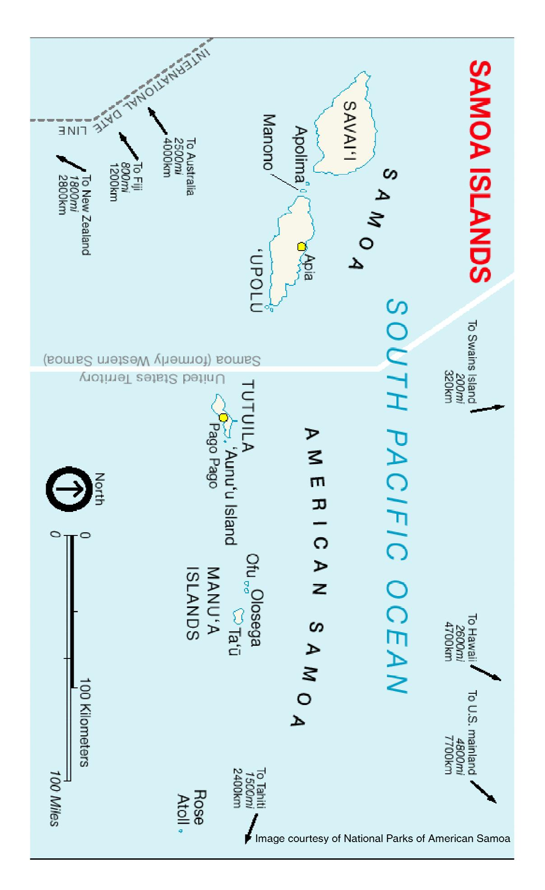

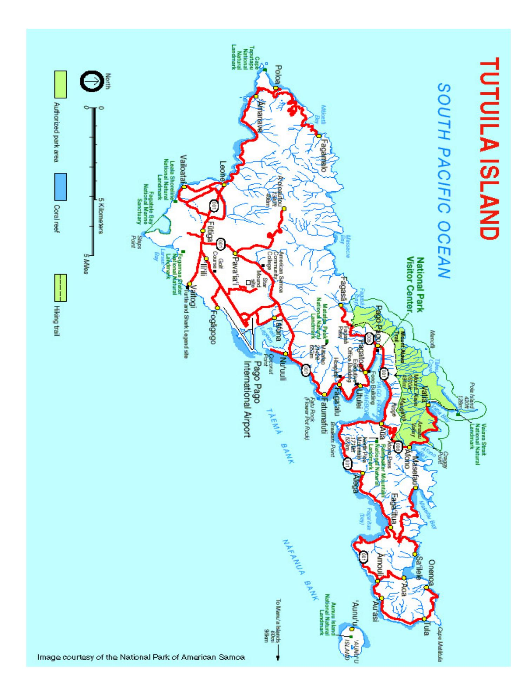