#### **ORIGINAL PAPER**

# **Coral reef community recovery trajectories vary by depth following a moderate heat stress event at Swains Island, American Samoa**

**Courtney S. Couch1,[2](http://orcid.org/0000-0002-5642-8765) · Brittany Huntington1,2 · Jonathan A. Charendoff1,2 · Corinne Amir1,2 · Mollie Asbury3 · Isabelle Basden1,2 · Mia Lamirand1,2 · Damaris Torres-Pulliza1,2 · Valerie Brown4 · Andrew A. Shantz1,2**

Received: 16 April 2024 / Accepted: 1 October 2024 © The Author(s), under exclusive licence to Springer-Verlag GmbH Germany, part of Springer Nature 2024

#### **Abstract**

The 2014–2017 global coral bleaching event caused mass coral mortality and reshaped benthic communities across the Pacific. Swains Island (11.0° S, 171.1° W), a remote and uninhabited island within American Samoa, was exposed to moderate heat stress (6 °C-weeks) during this event. Temporal patterns in benthic cover and coral demography were monitored across 13 years straddling this heat stress event to assess the impacts across depth and the recovery trajectory. While Swains's reefs retain some of the highest calcifier cover in the US Pacific Islands, successional trajectories across depth following the 2016 heat stress suggest that these reefs are experiencing a more nuanced pattern of resilience to disturbance, with early signs of recovery in shallow reefs (3–6 m), a shift to non-calcifier dominance at mid depth (6–18 m), and stability on deep reefs (18–30 m). Shallow reefs experienced the largest changes with a relative 50% decline in coral cover, which was replaced by CCA between 2015 and 2018. Shifts in shallow coral community composition were strongly driven by the loss of *Pocillopora* and early recovery seven years after the event evidenced by an increase in small colonies. Mid-depth reefs experienced a 33% loss in coral cover between 2015 and 2023, and corresponding increase in upright macroalgae. The degree to which increasing macroalgae represents a temporary shift or gradual decline in calcifiers remains to be seen. While Swains's recovery bodes well for persistence of shallow reefs, its remoteness from broodstock and dominance of thermally sensitive taxa pose a threat to future climate resilience.

**Keywords** Coral bleaching · *Pocillopora* · Resilience · Depth · Benthic cover · Colony density · Colony size · Uninhabited island

#### Communicated by R. Alderdice.

- Courtney S. Couch courtney.s.couch@noaa.gov
- 1 Cooperative Institute for Marine and Atmospheric Research, University of Hawaiʻi at Mānoa, Honolulu, HI, USA
- 2 Pacific Islands Fisheries Science Center, National Marine Fisheries Service, National Oceanic and Atmospheric Administration, Honolulu, HI, USA
- 3 Hawaiʻi Institute of Marine Biology, University of Hawaiʻi Manoa, Kaneohe, HI, USA
- 4 National Marine Sanctuary of American Samoa, Pago Pago, American, Samoa

## **Introduction**

Heat stress and mass coral bleaching events are affecting coral reefs with increasing intensity and reshaping benthic community composition. Bleaching-related coral mortality can result in a range of benthic community-level responses. Newly available substrate from dead corals is colonized by early successional taxa such as encrusting macroalgae and turf algae, followed by crustose coralline algae (CCA) and coral spat (e.g. Littler and Littler [1984](#page-11-0); Adam et al. [2011;](#page-10-0) Holbrook et al. [2018](#page-11-1); Huntington et al. [2022a](#page-11-2)), which may be a decisive step in reef recovery (Holbrook et al. [2018\)](#page-11-1). However, in the absence of herbivores and/or in combination with eutrophication, fleshy macroalgae can proliferate thus preventing coral settlement (Wittenberg and Hunte [1992;](#page-12-0) Burkepile and Hay [2006;](#page-10-1) Robinson et al. [2018\)](#page-12-1).

Beyond shifts in the broader benthic community, coral communities experience shifts in the distribution of coral

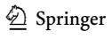

taxa and size classes due to differential susceptibility to heat stress. For instance, fast growing, branching morphologies are typically more susceptible to bleaching-induced mortality, while slower growing, massive morphologies have higher survivorship (Loya et al. [2001](#page-11-3); Darling et al. [2012](#page-10-2); Guest et al. [2012](#page-11-4); Burn et al. [2023\)](#page-10-3). Heat stress may result in shifts in size frequency distributions that are difficult to predict. Higher bleaching-induced mortality in juvenile corals can drive size distributions towards larger colonies (Lachs et al. [2021](#page-11-5)). Conversely, partial mortality of large colonies (McClanahan [2008\)](#page-11-6) or high coral recruitment (Koester et al. [2021](#page-11-7)) can shift size distributions towards smaller colonies. Therefore, shifts in size distributions can be ambiguously indicative of recovery through recruitment of new corals or decline through recruitment failure and/or fragmentation of large colonies—providing a valuable tool for elucidating demographic mechanisms of recovery.

In addition to coral taxonomic composition, environmental factors such as depth can influence the severity of bleaching events on coral populations (e.g. Jokiel and Brown [2004](#page-11-8); Sully et al. [2019\)](#page-12-2). Deeper reefs are often exposed to cooler water and lower UV irradiance – another trigger of coral bleaching, are hypothesized to provide a refuge from thermal (Glynn [1996](#page-11-9); Riegl and Piller [2003](#page-12-3)) and light stress (Gleason and Wellington [1993](#page-11-10)). However, several studies have found a lack of thermal stress mitigation and/or differential bleaching tolerance on deeper reefs (Penin et al. [2007](#page-12-4); Smith et al. [2016](#page-12-5); Venegas et al. [2019\)](#page-12-6). Alternatively, deep-water refugia may be linked to strong patterns of species zonation across depths — a fundamental principle of coral community ecology (Done [1983](#page-10-4)) — as species with differential responses to thermal stress may occupy different locations on a reef (e.g. Marshall and Baird [2000](#page-11-11); Darling et al. [2012](#page-10-2); Frade et al. [2018\)](#page-11-12).

In 2014–2017, the formation of a strong El Niño resulted in the most severe global coral bleaching event on record (Eakin et al. [2019](#page-10-5)). In the central tropical Pacific, heat stress peaked in late 2015 and early 2016 and varied widely across latitudes, with prolonged exposure near the equator (Barkley et al. [2018](#page-10-6); Brainard et al. [2019\)](#page-10-7). Some islands in this region such as Jarvis Island, located at 0.37° S, experienced>20 °C-weeks (degree heating weeks) of accumulated heat stress, which resulted in catastrophic mortality and shifts in benthic community structure (Barkley et al. [2018](#page-10-6); Vargas-Ángel et al. [2019](#page-12-7); Huntington et al. [2022a](#page-11-2)). Alternatively, islands at higher latitudes such as Palmyra (5.8° N) and French Polynesia (16–18° S) experienced less heat stress, bleaching, and coral mortality (Fox et al. [2019](#page-10-8); Hédouin et al. [2020](#page-11-13)). Situated at 11.0–14.5° S, American Samoa was exposed to low to moderate heat stress and several qualitative observations of 'severe' bleaching in Tutuila (Office of National Marine Sanctuaries [2022\)](#page-11-14). However, the

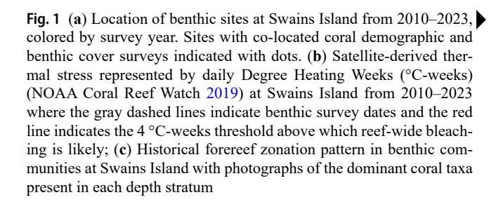

impacts of this heat stress and recovery of the coral reef communities within American Samoa is largely unknown.

American Samoa supports the most diverse coral reef ecosystems in the U.S. Pacific, with the highest abundance of calcifying organisms (coral and crustose coralline algae – CCA) observed at Swains Island (Huntington et al. [2022b](#page-11-15)). Swains (11.0° S, 171.1° W) is a small, isolated, and uninhabited island within American Samoa located 365 km north of Tutuila, the nearest populated island (Fig. [1a](#page-2-0)). Unlike the other reefs of American Samoa, Swains's reefs are more similar to the isolated islands in the central Pacific, with low coral diversity dominated by *Montipora*, *Pocillopora*, and *Porites* (Bellwood et al. [2005;](#page-10-9) Venegas et al. [2019\)](#page-12-6) and distinct zonation across depths (Fig. [1c](#page-2-0)). However, unlike other remote Pacific Islands such as Jarvis Island, Swains is not exposed to upwelling suggesting that there is minimal variation in temperature across depths (Brainard et al. [2008;](#page-10-10) Venegas et al. [2019](#page-12-6)). In early 2015, Swains was exposed to mild heat stress (2.5 °C-weeks; degree heating weeks) (Fig. [1b](#page-2-0)) with low bleaching (6%) observed at peak heat stress (NOAA National Coral Reef Monitoring Program [2023](#page-11-16)). In April 2016, heat stress reached 6 °C-weeks (Fig. [1](#page-2-0)b), exceeding the 4 °C-weeks threshold above which reef-wide bleaching typically occurs (Liu et al. [2014\)](#page-11-17). While bleaching observations were not made during the peak of the 2016 heat stress given the challenges of accessing this remote island, widespread *Pocillopora* mortality was observed in May 2017 (Fig. S1). This mortality was most likely associated with the 2016 heat stress given the widespread mortality of a thermally sensitive taxon rather than crown-of-thorns starfish predation which is historically spatially aggregated (Brainard et al. [2008](#page-10-10)). Swains was not impacted by cyclones during this time period. Given Swains's relative isolation and historically coral-dominated state, understanding the impacts of thermal stress and recovery trajectory of these benthic communities can shed light on the resilience of reefs that are protected from local anthropogenic stressors under the continued threat of climate change.

Here, we describe patterns in heat stress from in situ temperature data, as well as temporal trends in the benthic community to evaluate patterns in mortality and recovery after the 2014–2017 heat stress event. We hypothesize that changes in benthic cover will be distinct across depth given

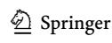

Marine Biology (2024) 171:218 Page 3 of 13 218

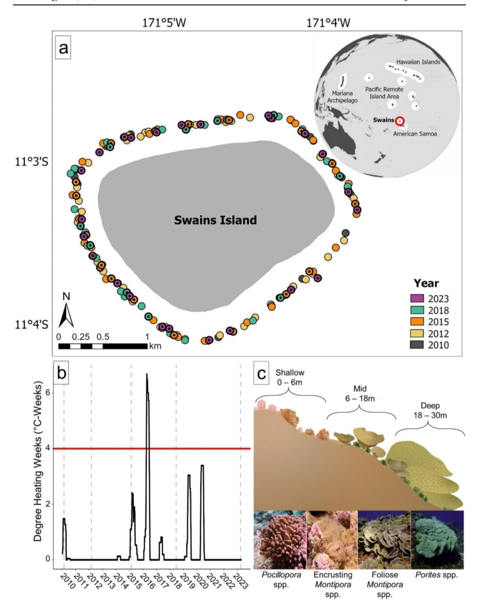

gradients in temperature and irradiance as well as the pronounced zonation in coral communities and abundance of thermally sensitive taxa on shallow reefs. Further, we hypothesize that thermally sensitive taxa such as *Pocillopora* experienced the largest changes in colony density, partial mortality and size structure relative to more stresstolerant taxa such as *Porites*.

## **Methods**

Swains Island, also known as Olosega, has a history of human habitation dating back to early Polynesian voyagers and was later established as a copra plantation (Van Tilburg et al. [2013\)](#page-12-9), but was evacuated in 2008 following severe damage from Cyclone Heta. In 2012, a majority of the coastal waters around Swains were incorporated into the National Marine Sanctuary of American Samoa. This low-lying island contains a fully enclosed brackish lagoon and is surrounded by a reef flat, crest, and steep reef slope. Swains's benthic communities display pronounced zonation across the forereef habitats (Fig. [1c](#page-2-0)). Historically, the reefs shallower than 3 m have been dominated by crustose coralline algae with sparse coral and exposed to heavy wave energy. Shallow reefs between 3 and 6 m have been dominated by CCA, *Pocillopora*, and encrusting *Montipora*. Mid depth reefs between 6 and 18 m have been dominated by foliose *Montipora*. Deep reefs between 18 and 30 m have been dominated by large mounding *Porites*, foliose *Montipora*, and the upright macroalga *Microdictyon*.

### **Benthic surveys**

Surveys were conducted on forereef habitats as part of the NOAA Coral Reef Conservation Program's National Coral Reef Monitoring Program (NCRMP) (Fig. [1](#page-2-0)a). Benthic cover surveys were conducted in 2010, 2012, 2015 (prior the bleaching-level heat stress), 2018, and 2023 using a stratified random sampling design (*n*=178 across all survey years). During each survey, sites were randomly selected from within hard bottom habitats from three depth strata (shallow: 0–6 m, mid: > 6–18 m, and deep: > 18–30 m). Sample size within each stratum was proportional to the amount of hard bottom area in a given depth strata and the variance of coral density (Smith et al. [2011\)](#page-12-10). Sites shallower than 3 m were excluded from the analyses given challenges of consistent access due to wave exposure. A subset of 50 sites were randomly selected for coral colony-level demographic information during the 2015, 2018, and 2023 surveys.

At each site, benthic and coral demographic surveys were conducted along one 30 m transect line deployed

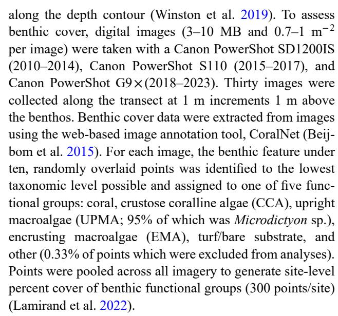

Demographic surveys of colony density, size, and partial mortality were conducted on the same transects within three to four, 1×2.5 m segments spaced evenly along the first 18-m of each transect and were pooled due to the lack of spatial independence. For each coral≥5 cm in max diameter, divers recorded the identity to the lowest taxonomic level possible (species, species complex, or genus), maximum diameter, morphology, and percent of the colony area that had experienced partial mortality (identified by denuded skeleton colonized by turf algae or other organisms). Juvenile colonies (1–5 cm max diameter) were also recorded within the first 1×1 m portion of the first 3 segments and were identified to the genus-level.

### **In-situ temperature measurements**

*In- situ* temperature was measured using subsurface temperature recorders (STRs) made by Sea-Bird Electronics (SBE-56 Temperature Sensor). These high accuracy temperature loggers were deployed at two to three fixed stations at cardinal directions around the island at depths of 5, 15, and 25 m, corresponding to the shallow, mid, and deep strata. Temperature was collected hourly with STR download and redeployment occurring every three years between 2013 and 2018.

### **Data analysis**

To account for the complex NCRMP survey design, all response variables were weighted by the inverse of their selection probability for a given depth stratum and survey year using the 'survey' package in R (Lumley [2022](#page-11-20)). All response variables were tested for homogeneity of variance. To identify differences in mean temperature between depths

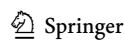

Marine Biology (2024) 171:218 Page 5 of 13 218

across time, we used the STR data to calculate and plot monthly mean temperature for each depth from 2014, prior to the heat stress, until 2017.

To test how the cover of different benthic functional groups changed in each depth zone following the 2016 heat stress event, we used survey-weighted generalized linear models (GLMs) using the *svyglm* function followed by post hoc tests using the 'emmeans' package for each depth strata separately. Due to strong zonation in benthic communities across depth (Fig. [1c](#page-2-0)) and the a priori hypothesis regarding heat stress-related bleaching across depths, we ran separate models for each depth stratum rather than including depth as a fixed effect in a single model, which would have led to over-parameterization. For percent cover, we used quasibinomial svyglm models with a logit link with year (categorical) and functional group as interacting fixed effects. We adjusted the survey design using survey.lonely.psu = "adjust" to account for single site in the deep stratum in 2010. To test for differences between years for each taxon and depth strata, we ran pairwise comparisons to contrast changes through time within each taxonomic group and applied Benjamini-Hochberg multiple test corrections as an alternative to the highly conservative Bonferroni-based correction (Waite and Campbell [2006\)](#page-12-11).

To test for shifts in adult coral communities across the three years where detailed demographic data were collected, we used one-way permutational multivariate analyses of variance (PERMANOVAs). Bray-Curtis distances were calculated from square-root transformed colony density after rare taxa (present at only 1 site) were excluded. We ran separate models for each depth stratum followed by pairwise post-hoc tests to identify between year differences in R using the packages 'vegan' and 'pairwiseAdonis' (Oksanen et al. [2008](#page-11-21)). The PERMANOVA assumption of multivariate homogeneity of dispersion among years was evaluated and confirmed for each model (PERMDISP2 procedure; Anderson et al. [2006\)](#page-10-13). Coral community composition among years was visualized using non-metric multidimensional scaling (nMDS).

For depth strata that experienced significant shifts in community composition, we followed up with univariate analyses of adult density and partial mortality for the three most abundant coral taxa (*Porites* spp., *Montipora* spp., and *Pocillopora* spp.) at the species complex or genus/ morphology-level to test for differences among survey years. Given the challenges of species level identification of juvenile corals, we also tested for changes in juvenile density for the dominant taxa at the genus-level. For density metrics, we used svyglm models with a quasipoisson distribution or tweedie distribution for the zero-inflated taxa (*Porites* in shallow and *Pocillopora* in deep). Average percent partial mortality was analyzed using a gaussian distribution or nonparametric svyranktest for each taxon (note, *P.meandrina/verrucosa* complex was square root transformed). When significant differences were detected, we used pairwise tests in 'emmeans' to test for differences between years.

Lastly, for the top three dominant genera (*Porites*, *Montipora*, and *Pocillopora*), we explored changes in size structure between 2015 and 2023. The NCRMP sampling design surveys juvenile corals over a different sampling domain (3m2 per site) than adult corals (10m2 per site), preventing us from merging adult and juvenile size data into a single size frequency distribution at the site level. Rather, for each genera, we first pooled all log10-transformed adult colony diameter data (regardless of site), and identified the 10th and 90th percentiles to bin corals as 'small', 'medium', and 'large' sized colonies (Dietzel et al. [2020](#page-10-12)). For each site, we then calculated the density per size class bin, as well as colony density of juveniles. We then converted these densities into relative proportions as we were interested in the proportion of corals in different size classes over time, irrespective of differences in absolute density. For each of these three genera, the proportion of colonies in each of the four size classes was used as the response variable in a gaussian svyglm model for each of the three depth strata with size class and year included as interacting fixed effects.

# **Results**

### **Heat stress**

Between December 2015 and April 2016, Swains Island experienced moderate heat stress, culminating in 6 °C-weeks above the regional coral bleaching threshold (Fig. [1](#page-2-0)b). Reefs experienced similar temporal patterns in mean monthly seawater temperatures across depth during the heat stress event, displaying minimal vertical structure in temperature (Fig. S2). Temperatures in shallow habitats warmed slightly earlier and at a faster rate starting in December 2015 and were 0.07–0.2 °C warmer than mid and deep habitats in March 2016, just before the peak of the heat stress event in April 2016.

## **Benthic cover**

Overall, benthic cover of the functional groups was generally stable up to 2015 and predominantly coral-dominated at all three depth strata (Fig. [2](#page-5-0)). However, after the 2015 thermal stress event, percent cover of functional groups varied across years most notably in the shallow and mid depth reefs, while deep reefs remained mostly stable.

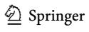

Marine Biology (2024) 171:218 218 Page 6 of 13

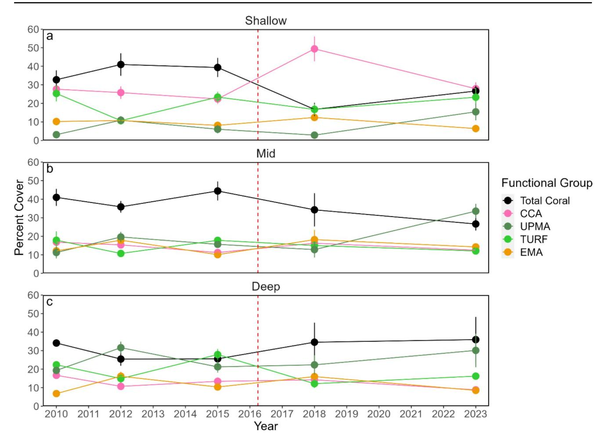

**Fig. 2** Time series of percent cover (mean±SE) of functional groups (coral, crustose coralline algae [CCA], upright macroalgae [UPMA], turf algae, and encrusting macroalgae [EMA] across (**a**) shallow (3–6 m), (**b**) mid (6–18 m), and (**c**) deep (18–30 m) depth strata. Site

counts for the depth strata, listed in order of Shallow/Mid/Deep were: 2010–8/8/1; 2012–17/28/10; 2015–20/25/11; 2018- 10/11/6; 2023– 11/10/3. Vertical dashed line represents the peak of El Niño heat stress event at Swains

Prior to the thermal stress event, benthic cover on shallow reefs was stable for every functional group except turf algae, which dropped by ~15% from 2010 to 2012 (post hoc *p*<0.001), but rebounded by 2015 (*p*<0.001; Fig. [2a](#page-5-0)). Roughly two years after the 2015 thermal stress event, coral cover on the shallow forereef at Swains had dropped from between 30 and 40% to 16.7±3.5% in 2018 (*p*=0.003). The reduction in coral cover between 2015 and 2018 was accompanied by a 27% increase in CCA (*p*<0.001), which was the only other functional group that changed significantly over this time period. Between 2018 and 2023, the percent cover of CCA has dropped significantly by 21.5% (*p*=0.011) and EMA by 6% (*p*=0.031) to pre-heat stress levels and appear to have been displaced by upright macroalgae and coral. Upright macroalgae, primarily *Microdictyon*, never exceeded 11% in previous surveys but increased by 12.6% from 2018 to 2023 (*p*=0.005). Coral cover increased by 9.9% between 2018 and 2023 and although this increase

was not significant (*p*=0.072), is now similar to 2010 levels (*p*=0.366) with 26.6% cover.

Benthic cover on mid depth reefs was less variable than on shallow reefs (Fig. [2b](#page-5-0)). Prior to the heat stress, coral cover was stable between 2010 and 2015 (*p*=0.68), but showed a gradual and significant decline of 17.8% from 2015 to 2023 (*p*=0.037). While CCA cover remained low and unchanged across years, other early successional taxa such as turf algae showed small significant changes in cover across years, but no general trend (EMA: 2010–2012, *p*=0.047; 2012 to 2015, *p*=0.01; Turf: 2012–2015, *p*=0.039, 2018–2023, *p*=0.039). In contrast, upright macroalgae cover was stable until 2018, but increased by 20.8% by 2023 and is now the dominant functional group (*p*=0.007).

On deep reefs, percent cover of all functional groups except turf and encrusting macroalgae remained stable across years (*p*>0.05 for all pairwise comparisons; Fig. [2c](#page-5-0)). Coral cover remained between 25.4±4.2 to 35.9±12.2% cover across all years. Similar to shallow and mid-depth

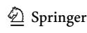

Marine Biology (2024) 171:218 Page 7 of 13 218

reefs, turf algae was variable across the time series, with a 13.0% increase from 2012 to 2015 followed by a 15.7% decline from 2015 to 2018 (*p*<0.001), and no changes between 2018 and 2023 (*p*=0.281). Upright macroalgae cover increased by 12.2% (*p*=0.001) between 2010 and 2012 then declined to 2010 levels and has remained stable across the remainder of the time series (*p*>0.05 for all pairwise comparisons). EMA cover was generally stable at deep depths, but cover gradually declined by 7.6% from 2012 to 2023 (*p*=0.036).

## **Coral community demography**

Between 2015 and 2023 the community composition of adult colonies only changed in the shallow depth stratum (PERMANOVA: shallow, F1,22 = 2.35, *p*=0.03; mid depth, F1,17 = 1.21, *p*=0.31; deep, F1,7 = 1.89, *p*=0.08), with each year significantly different from the others (Fig. [3](#page-6-0); *p*<0.005 for all pairwise adonis comparisons). Comparisons of the dominant taxa across years on shallow reefs revealed that adult coral densities of *P. meandrina/verrucosa* complex, *P. grandis/woodjonesi* complex, and mounding *Porites* declined significantly between 2015 and 2018 (Fig. [4](#page-7-0)), with the largest decline in *P. meandrina/verrucosa* complex. By 2023, mounding *Porites* rebounded to 2015 density levels. In contrast, both *Pocillopora* complexes increased from 2018 to 2023, but remained approximately 40% lower than pre-2015 bleaching densities (Fig. [4](#page-7-0)). Despite changes in the shallow coral community composition, the overall zonation patterns of these communities persist with shallow reefs dominated by *Pocillopora*, mid depths by foliose *Montipora*, and deep reefs a mix of foliose *Montipora* and mounding *Porites* (Table S1).

The extent of partial mortality remained relatively stable across years in each depth strata for all the dominant coral taxa except the *P. meandrina/verrucosa* complex (Fig. S4). Partial mortality in *P. meandrina/verrucosa* varied significantly across years on shallow reefs (*p*<0.001), with a 5-fold increase from 5.6±1.2% in 2015 to 30.1±4.2% in 2018. By 2023, *P. meandrina/verrucosa* complex partial mortality dropped back to levels similar to those recorded in 2015 (2023: 6.54% ± 0.75; *p*=0.487).

Colony size structure was stable for all three dominant coral genera across survey years and depths. Significant interactions were found between year and size class for *Montipora* and *Pocillopora* in the shallow depth strata only. For these two genera, the proportion of small adult colonies (10th percentile) increased significantly from 2015 to 2023 (*p*<0.015 for both genera). This increase represents more than a doubling of the proportion of small adult *Pocillopora* colonies in the population (2015 mean=8.7% ± 1.8 SE, 2023 mean=20.8% ± 3.3 SE), and a three-fold increase in

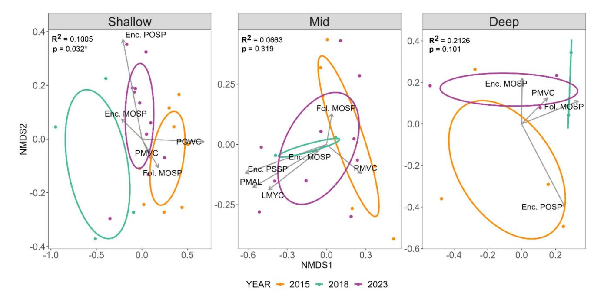

**Fig. 3** Nonmetric multidimensional scaling (nMDS) plot for sites across the shallow, mid, and deep strata (Stress value shallow (3–6 m)=0.10; mid (6–18 m)=0.09; deep (18–30 m)=0.02). Only vectors for the dominant coral taxa are shown. Ellipses represent 95% confidence intervals around the community centroid for each survey year. PGWC: *Pocillopora grandis*/*woodjonesi* complex; PMVC:

*Pocillopora meandrina/verrucosa* complex; Enc. POSP: encrusting *Porites* spp.; Enc. MOSP: encrusting *Montipora* spp.; Fol. MOSP: foliose *Montipora* spp.; Mound POSP: mounding *Porites* spp. PER-MANOVA results are reported in the corner of each depth stratum plot, \* indicates significant effect of year (*p*<0.05)

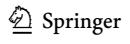

Marine Biology (2024) 171:218 218 Page 8 of 13

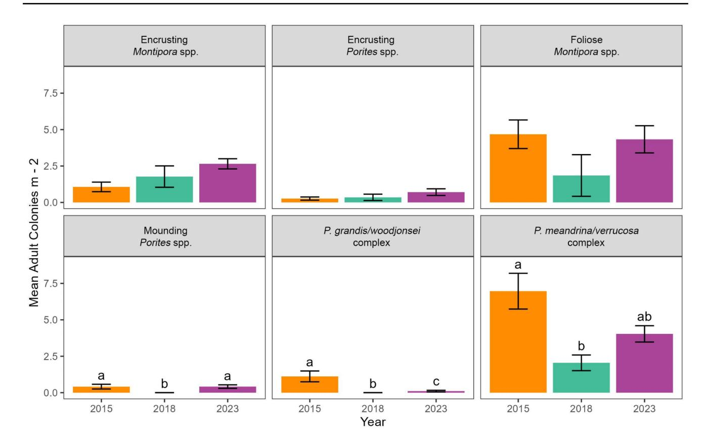

**Fig. 4** Mean adult colony density of coral taxa (±SE) within the shallow (3–6 m) depth strata that contributed to changes in community structure. Letters are used to indicate significant (*p*<0.05) differences

in colony density between years. *N*=8 sites in 2015, 4 sites in 2018, and 11 sites in 2023

the proportion of *Montipora* (2015 mean=4.5% ± 1.3 SE, 2023 mean=13.7% ± 1.6 SE). No other significant differences in size classes were observed in any strata (Table S2).

Juvenile density did not change significantly across years at each depth strata for the three dominant coral genera (Fig. S4).

## **Discussion**

During the most recent global bleaching event, coral reefs surrounding Swains Island were exposed to ~6 °C-weeks of heat stress. This coincided with the relative loss of almost half of live coral cover on the shallow forereef, which was predominantly replaced by CCA between 2015 and 2018. While the mortality was less severe relative to other Pacific reefs that experienced prolonged heat stress (Le Nohaïc et al. [2017](#page-11-23); Hughes et al. [2018](#page-11-24); Vargas-Ángel et al. [2019;](#page-12-7) Raymundo et al. [2019](#page-12-12); Bessell-Browne et al. [2021](#page-10-14); Nakamura et al. [2022](#page-11-25)), coral mortality was surprisingly high given the moderate heat stress. Coral Reef Watch bleaching and mortality thresholds can be spatially variable and do not always predict reef-level responses with thresholds sometimes under predicting bleaching responses (reviewed by McClanahan [2022](#page-11-22)). This mortality may also be explained by Swains's high abundance of thermally sensitive taxa and fairly stable climatology with only one minor heat stress event (~4 °C-weeks) occurring in 2003 (NOAA Coral Reef Watch [2019](#page-11-18)). Consistent with our hypothesis, these changes were not felt evenly across depth. Changes in benthic communities and coral demography were most pronounced on shallow reefs. On these reefs and consistent with our hypothesis, thermally sensitive *Pocillopora* spp. experienced a nearly 3-fold decline in colony density. Middepth reefs also lost a significant portion of live coral cover (albeit a smaller decline than the shallow reefs), which has largely been replaced by upright macroalgae. In contrast, benthic communities between 18 and 30 m remained stable, suggesting Swains deep reefs escaped damage from the 2015–16 global bleaching event.

While both shallow and mid-depth reefs experienced loss in coral cover in the years immediately following the heat stress event, the recovery trajectory of these benthic communities varied between depth strata. On shallow reefs (3–6 m), CCA colonized the substrate previously occupied by coral by 2018, preserving calcifier dominance. The

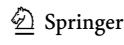

Marine Biology (2024) 171:218 Page 9 of 13 218

proliferation of CCA may have also laid the framework for the early coral recovery observed in this habitat as the preferred settlement substrate for coral larvae (Morse et al. [1988](#page-11-26); Harrington et al. [2004\)](#page-11-27). Rapid proliferation of CCA immediately following mass coral mortality is a common feature of many remote tropical reefs (Benkwitt et al. [2019](#page-10-17); Huntington et al. [2022a](#page-11-2)). Unlike Swains, the remote Pacific Island of Jarvis Island experienced an increase in CCA abundance across depths<30 m following catastrophic bleaching in 2016 (Huntington et al. [2022b\)](#page-11-15). Although it is unclear why CCA did not respond on mid-depth reefs at Swains, one difference between the islands is that Jarvis experiences seasonal upwelling of nutrient rich water, which may have facilitated CCA growth across the larger depth range. Differences in herbivory between the islands may have contributed to the observed differences but unfortunately, fish data were not available for the full period following bleaching. Our study represents one of the few studies to assess the long-term patterns in CCA cover beyond two years after a major disturbance and highlights the ephemeral nature of this important taxon (Fox et al. [2019](#page-10-8); Lange et al. [2023](#page-11-28)). In contrast, mid depth reefs (6–18 m) have transitioned to communities dominated by non-calcifying upright macroalgae following a steady decline in coral cover. Historical patterns in macroalgal communities at Swains indicate that this community is largely composed of the native *Microdictyon* (Brainard et al. [2008](#page-10-10)). This upright macroalgae is common on coral reefs, is often avoided by herbivorous fish, and consequently easily fills space (Dell et al. [2020](#page-10-18)). In the early 2000s, macroalgal cover increased 30% on mid depth reefs in the two years following the damage caused by Hurricane Heta in 2004 (Brainard et al. [2008](#page-10-10)), but declined to pre-disturbance levels by 2010 (Pacific Islands Fisheries Science Center [2018\)](#page-12-14). We postulate that the low abundance of CCA, lower wave energy in the mid depths, combined with a historical and dynamic presence of *Microdictyon* has facilitated increasing growth of this macroalga, especially following disturbances.

Based on in situ temperature alone, we found no evidence of a depth refuge from heat stress at Swains. While numerous studies have documented reduced heat stress at depth (Glynn [1996;](#page-11-9) Riegl and Piller [2003\)](#page-12-3), sub-surface temperature data at Swains suggests that heat stress was fairly similar across depths (Fig. S2). Venegas et al. [\(2019](#page-12-6)) also found that depth did not provide a consistent refuge from heat stress for coral communities in a study of 49 islands across the central and western Pacific. Thus, the absence of significant mortality on Swains's deeper reefs relative to shallow reefs is likely related to other factors rather than vertical patterns in temperature. The distribution of taxa and their corresponding thermal tolerance may partially explain differential patterns in mortality (e.g. Marshall and Baird [2000](#page-11-11); Darling et al. [2012](#page-10-2); Frade et al. [2018\)](#page-11-12). At Swains, the deep reefs contained abundant mounding *Porites* which are more common on deeper and/or low wave energy systems (Done and Potts [1992](#page-10-15)) and more thermally-tolerant (Darling et al. [2012](#page-10-2)). In contrast, the thermally sensitive genus *Pocillopora* (Marshall and Baird [2000](#page-11-11); Loya et al. [2001](#page-11-3); Darling et al. [2012;](#page-10-2) Guest et al. [2012\)](#page-11-4) were abundant on shallow reefs, but largely absent below 18 m. Interestingly, the thermally sensitive genus *Montipora* (Vargas-Ángel et al. [2019](#page-12-7); Raymundo et al. [2019\)](#page-12-12), remained stable and moderately abundant on deep reefs, suggesting the role of other environmental factors. Irradiance, another known trigger of coral bleaching, decreases with depth, which may have resulted in lower bleaching as seen in previous studies (Gleason and Wellington [1993](#page-11-10)), and lower mortality on deep reefs.

Beyond the broader changes in the benthic community, heat stress resulted in shifts in shallow coral communities predominantly driven by changes in *Pocillopora* spp. More specifically, we observed a 100% loss of *P. grandis/woodjonesi* complex and 65% decline in the more abundant *P. meandrina/verrucosa* complex. Given the low abundance of other branching taxa such as *Acropora*, declines in Pocilloporids represent a substantial loss of this unique habitat with the potential to affect local reef fish communities (e.g. Wilson et al. [2008](#page-12-13)). However, contrary to our hypothesis, we did observe a small but significant decline in mounding *Porites* in the shallow reefs and the thermally sensitive and important reef-building taxon *Montipora* did not decline following heat stress (Fig. [4\)](#page-7-0). This stands in stark contrast to the severe to catastrophic *Montipora* mortality recorded on other Pacific reefs during this global bleaching event (Vargas-Ángel et al. [2019;](#page-12-7) Raymundo et al. [2019\)](#page-12-12), suggesting that at moderate levels of heat stress, *Montipora* may be able to withstand ocean warming. Patterns in partial mortality also set Swains apart from other reefs in the Pacific. A quarter of *Pocillopora* colonies experienced partial mortality in 2018, which is surprising given that this genus typically experiences whole colony mortality following heat stress (Loya et al. [2001;](#page-11-3) Burgess et al. [2021](#page-10-16)). Swains's more moderate community-level response to heat stress effects is likely influenced by the moderate nature of this heat stress event (6 °C-weeks) relative to other Pacific Islands that experienced severe heat stress exceeding>8 °C-weeks.

Coupling patterns in benthic cover with those in coral demography suggest the shallow communities at Swains are on the road to recovery. Adult density has started to increase, especially in *Pocillopora*, and partial mortality has returned to pre-bleaching levels. Interestingly, the 2–3 fold increase in the abundance of small *Pocillopora* and *Montipora* colonies at Swains suggests recruitment succeeded post-heat stress, despite Swain's overall low juvenile density (2–4.5

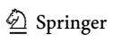

colonies/m2) compared to other Pacific reefs (Couch et al. [2023](#page-10-21)) — which may be related to its geographic isolation and reliance on local recruitment pulses. This increase is evidence of post-disturbance local recruitment, survival, and growth into the early adult size class rather than fragmentation of larger colonies since partial mortality was accounted for in our surveys. Therefore, the *Pocillopora* recovery at Swains aligns with its role as an early successional taxon (Grigg and Maragos [1974;](#page-11-29) Darling et al. [2012](#page-10-2); Adjeroud et al. [2018](#page-10-22)) and suggests that these reefs are not suffering from post-bleaching recruitment failure seen on other reefs (Hughes et al. [2019](#page-11-30); Carlot et al. [2021\)](#page-10-23). While Swains's *Pocillopora* recovery bodes well for reef accretion in the shallow reefs, the continued coral decline at mid depth reefs is concerning. The absence of a demographic signal amidst declining coral cover on mid depth reefs may be explained by our survey approach. As an upright, spacefilling algae, *Microdictyon* readily takes up space and may obscure underlying coral colonies when viewed in the topdown imagery used for benthic cover assessments, resulting in a decline in coral cover. However, when we look at the 3D morphology, our demographic surveys often reveled living coral tissue under the algae, resulting in consistent density, size structure and partial mortality through time. Our spatially comprehensive and long-term dataset highlight the value of taking a more holistic approach to understanding the demographic mechanisms driving changes in coral cover past the first two years post bleaching, which is largely absent in the literature (Edmunds and Riegl [2020](#page-10-24)).

Remote reef communities provide insight into baselines of ecological functioning and resilience of coral reefs to the effects of climate change in the absence of local anthropogenic disturbances (Sandin et al. [2008;](#page-12-16) Smith et al. [2008](#page-12-17); Halford and Caley [2009](#page-11-31)). Historically, Swains's coral reefs have been especially resilient with coral communities recovering within a decade following acute disturbance. During the late 1980s to early 2000s, Swains was exposed to severe storms which caused localized decline in coral cover of 50 to 80% (Itano [1997](#page-11-32); Brainard et al. [2008](#page-10-10)), followed by outbreaks of *Acanthaster planci* and a native tunicate, resulting in further coral mortality (Brainard et al. [2008](#page-10-10); Vargas-Ángel et al. [2009\)](#page-12-18). In the subsequent years, coral cover returned to pre-disturbance levels (Page and Green [1998](#page-12-19); Pacific Islands Fisheries Science Center [2018](#page-12-14)) and was largely stable between 2010 and 2015.

However, successional patterns following the 2016 heat stress event suggest that contemporary reefs are experiencing a more nuanced pattern of resilience to disturbance with early signs of coral recovery in shallow reefs, a shift to noncalcifier dominance at mid depth, and community stability on deep reefs. Despite a decline in coral cover island wide since 2015 and increasing non-calcifier abundance, Swains still has among the highest calcifier abundance (51% cover) in the U.S. Pacific Islands (Huntington et al. [2022b\)](#page-11-15). While the factors driving calcifier persistence at Swains are unclear, American Samoa's high aragonite saturation state combined with the high wave energy on shallow reefs creates an environment in which calcifiers such as CCA and corals have been able to thrive (Barkley et al. [2022](#page-10-19); Office of National Marine Sanctuaries [2022\)](#page-11-14). However, unlike other islands in American Samoa, Swains is showing a warming trend without reprieve between heat stress events suggesting that Swains is at risk of continued reef-wide bleaching (Smith and Barkley [in review\)](#page-12-15). In fact, at the time of writing, Swains is experiencing severe heat stress exceeding the 2016 event (>8 °C-weeks) (NOAA Coral Reef Watch [2019\)](#page-11-18). Swains's geographic isolation and the dominance of thermally sensitive taxa such as *Pocillopora* and *Montipora* may pose a threat to future climate resilience. However, the island's isolation also provides a reprieve from many local anthropogenic stressors. Accordingly, Swains and other remote islands and atolls provide a rare opportunity to understand potential "best case" scenarios for Anthropocene coral reefs if local stressors can be well managed or eliminated. Thus, the continued persistence of CCA and coral at Swains, and the degree to which increasing *Microdictyon* represents a temporary shift or gradual "ratcheting down" of coral and calcifier abundance (Birkeland [2004\)](#page-10-20) may be a telling indicator for the future of coral reef communities.

**Supplementary Information** The online version contains supplementary material available at [https://doi.org/10.1007/s00227-](https://doi.org/10.1007/s00227-024-04533-z) [024-04533-z.](https://doi.org/10.1007/s00227-024-04533-z)

**Acknowledgements** Institutional, logistic, and financial support was also provided by NOAA Pacific Islands Fisheries Science Center's Ecosystem Sciences Division (ESD). We would like to thank the many NCRMP scientists who helped collect the data used in this study and the crew of the NOAA Ships Hi'ialakai and Rainier for field support. We thank Hannah Barkley and two anonymous reviewers for insightful feedback on this manuscript.

**Author contributions** CSC, BH, JAC, CA, MA, IB, ML, DTP and AAS contributed to the study design. CSC, BH, JAC, CA, MA, IB, ML, and DTP collected data. CSC, BH, JAC, CA, ML, and AAS conducted data analysis. CSC, JAC, BH and AAS lead the writing of the manuscript. VB provided expert knowledge and a historical perspective on the study region. All authors reviewed and edited drafts, and approved the final manuscript.

**Funding** This work was supported by the NOAA Coral Reef Conservation Program's National Coral Reef Monitoring Program (NCRMP) (Project 743).

**Data availability** Data and scripts used to summarize and analyze data are available at <https://github.com/cscouch/swains>.

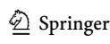

Marine Biology (2024) 171:218 Page 11 of 13 218

### **Declarations**

**Ethical approval** All surveys were approved and permitted through the Department of Marine and Wildlife Resources American Samoa government.

**Conflict of interest** The authors have no conflicts of interest to declare that are relevant to the content of this article.

## **References**

- Adam TC, Schmitt RJ, Holbrook SJ, Brooks AJ, Edmunds PJ, Carpenter RC, Bernardi G (2011) Herbivory, Connectivity, and Ecosystem Resilience: response of a Coral reef to a large-scale perturbation. PLoS ONE 6:e23717. [https://doi.org/10.1371/jour](https://doi.org/10.1371/journal.pone.0023717)[nal.pone.0023717](https://doi.org/10.1371/journal.pone.0023717)
- Adjeroud M, Kayal M, Iborra-Cantonnet C, Vercelloni J, Bosserelle P, Liao V, Chancerelle Y, Claudet J, Penin L (2018) Recovery of coral assemblages despite acute and recurrent disturbances on a South Central Pacific reef. Sci Rep 8:9680. [https://doi.](https://doi.org/10.1038/s41598-018-27891-3) [org/10.1038/s41598-018-27891-3](https://doi.org/10.1038/s41598-018-27891-3)
- Anderson MJ, Ellingsen KE, McArdle BH (2006) Multivariate dispersion as a measure of beta diversity. Ecol Lett 9:683–693. [https://](https://doi.org/10.1111/j.1461-0248.2006.00926.x) [doi.org/10.1111/j.1461-0248.2006.00926.x](https://doi.org/10.1111/j.1461-0248.2006.00926.x)
- Barkley HC, Cohen AL, Mollica NR, Brainard RE, Rivera HE, DeCarlo TM, Lohmann GP, Drenkard EJ, Alpert AE, Young CW, Vargas-Ángel B, Lino KC, Oliver TA, Pietro KR, Luu VH (2018) Repeat bleaching of a central Pacific coral reef over the past six decades (1960–2016). Commun Biol 1:1–10. [https://doi.](https://doi.org/10.1038/s42003-018-0183-7) [org/10.1038/s42003-018-0183-7](https://doi.org/10.1038/s42003-018-0183-7)
- Barkley HC, Oliver TA, Halperin AA, Pomeroy NV, Smith JN, Weible RM, Young CW, Couch CS, Brainard RE, Samson JC (2022) Coral reef carbonate accretion rates track stable gradients in seawater carbonate chemistry across the U.S. Pacific Islands. Front Mar Sci.<https://doi.org/10.3389/fmars.2022.991685>
- Beijbom O, Edmunds PJ, Roelfsema C, Smith J, Kline DI, Neal BP, Dunlap MJ, Moriarty V, Fan TY, Tan CJ, Chan S, Treibitz T, Gamst A, Mitchell BG, Kriegman D (2015) Towards automated annotation of benthic survey images: variability of human experts and operational modes of automation. PLoS ONE. [https://doi.](https://doi.org/10.1371/journal.pone.0130312) [org/10.1371/journal.pone.0130312](https://doi.org/10.1371/journal.pone.0130312)
- Bellwood DR, Hughes TP, Connolly SR, Tanner J (2005) Environmental and geometric constraints on Indo-Pacific coral reef biodiversity. Ecol Lett 8:643–651. [https://doi.](https://doi.org/10.1111/j.1461-0248.2005.00763.x) [org/10.1111/j.1461-0248.2005.00763.x](https://doi.org/10.1111/j.1461-0248.2005.00763.x)
- Benkwitt CE, Wilson SK, Graham NAJ (2019) Seabird nutrient subsidies alter patterns of algal abundance and fish biomass on coral reefs following a bleaching event. Glob Change Biol 25:2619– 2632.<https://doi.org/10.1111/gcb.14643>
- Bessell-Browne P, Epstein HE, Hall N, Buerger P, Berry K (2021) Severe heat stress resulted in high Coral Mortality on Maldivian reefs following the 2015–2016 El Niño Event. Oceans 2:233– 245.<https://doi.org/10.3390/oceans2010014>
- Birkeland C (2004) Ratcheting down the Coral Reefs. Bioscience 54:1021– 1027. [https://doi.org/10.1641/0006-3568\(2004\)054\[1021:RDTC](https://doi.org/10.1641/0006-3568(2004)054[1021:RDTCR]2.0.CO;2) [R\]2.0.CO;2](https://doi.org/10.1641/0006-3568(2004)054[1021:RDTCR]2.0.CO;2)
- Brainard R, Asher J, Gove J, Helyer J, Kenyon J, Mancini F, Miller J, Myhre S, Nadon M, Rooney J, Schroeder R, Smith E, Vargas-Angel B, Vogt S, Vroom P, Balwani S, Ferguson S, Hoeke R, Lammers M, Lundblad E, Moffitt R, Timmers M, Vetter O, Craig P, Maragos J (2008) Coral Reef Ecosystem Monitoring Report for American Samoa: 2002–2006. U.S. Dept. of Commerce, National Oceanic and Atmospheric Administration, National

- Marine Fisheries Service, Pacific Islands Fisheries Science Center, 512pp[.https://repository.library.noaa.gov/view/noaa/10472](https://repository.library.noaa.gov/view/noaa/10472)
- Brainard RE, Acoba TS, Moews-Asher M, Asher JM, Ayotte PM, Barkley HC, DesRochers A, Dove D, Halperin AA, Huntington B, Kindinger TL, Lichowski F, Lino KC, McCoy KS, Oliver T, Pomeroy NV, Suka R, Timmers M, Vargas-Ángel B, Venegas RM, Wegley KL, Williams ID, Winston M, Young CW, Zamzow JP (2019) Coral Reef Ecosystem Monitoring Report for the Pacific Remote Islands Marine National Monument 2000–2017. Coral Reef Ecosystem Monitoring Report for the Pacific Remote Islands Marine National Monument 2000–2017. Pacific Islands Fisheries Science Center, PIFSC Special Publication, SP-19- 006. 820 p. [https://www.fisheries.noaa.gov/resource/document/](https://www.fisheries.noaa.gov/resource/document/coral-reef-ecosystem-monitoring-report-pacific-remote-islands-marine-national) [coral-reef-ecosystem-monitoring-report-pacific-remote-islands](https://www.fisheries.noaa.gov/resource/document/coral-reef-ecosystem-monitoring-report-pacific-remote-islands-marine-national)[marine-national](https://www.fisheries.noaa.gov/resource/document/coral-reef-ecosystem-monitoring-report-pacific-remote-islands-marine-national)
- Burgess SC, Johnston EC, Wyatt ASJ, Edmunds PJ, Leichter JJ (2021) Response diversity in corals: hidden differences in bleaching mortality among cryptic Pocillopora species. Ecology 102:e03324. <https://doi.org/10.1002/ecy.3324>
- Burkepile DE, Hay ME (2006) Herbivore vs. Nutrient Control of Marine Primary producers: Context-Dependent effects. Ecology 87:3128–3139 10.1890/0012-9658(2006)87[3128:hvncom]2.0 .co;2
- Burn D, Hoey AS, Matthews S, Harrison HB, Pratchett MS (2023) Differential bleaching susceptibility among coral taxa and colony sizes, relative to bleaching severity across Australia's great barrier reef and Coral Sea Marine Parks. Marine Pollution Bulletin. <https://doi.org/10.1016/j.marpolbul.2023.114907>
- Carlot J, Kayal M, Lenihan HS, Brandl SJ, Casey JM, Adjeroud M, Cardini U, Merciere A, Espiau B, Barneche DR, Rovere A, Hédouin L, Parravicini V (2021) Juvenile corals underpin coral reef carbonate production after disturbance. Glob Change Biol 27:2623–2632. <https://doi.org/10.1111/gcb.15610>
- Couch CS, Oliver TA, Dettloff K, Huntington B, Tanaka KR, Vargas-Ángel B (2023) Ecological and environmental predictors of juvenile coral density across the central and western Pacific. Front Mar Sci. <https://doi.org/10.3389/fmars.2023.1192102>
- Darling ES, Alvarez-Filip L, Oliver TA, McClanahan TR, Cote IM, Bellwood D (2012) Evaluating life-history strategies of reef corals from species traits (1).Pdf. Ecol Lett 15:1378–1386. [https://](https://doi.org/10.1111/j.1461-0248.2012.01861.x) [doi.org/10.1111/j.1461-0248.2012.01861.x](https://doi.org/10.1111/j.1461-0248.2012.01861.x)
- Dell CLA, Longo GO, Manfrino C, Burkepile DE (2020) Why do certain species dominate? What we can learn from a rare case of Microdictyon dominance on a Caribbean reef. Mar Ecol 41:e12613. <https://doi.org/10.1111/maec.12613>
- Dietzel A, Bode M, Connolly SR, Hughes TP (2020) Long-term shifts in the colony size structure of coral populations along the great barrier reef. Proc R Soc B 287:20201432. [https://doi.org/10.1098/](https://doi.org/10.1098/rspb.2020.1432) [rspb.2020.1432](https://doi.org/10.1098/rspb.2020.1432)
- Done T (1983) Coral zonation: its nature and significance. Perspectives on Coral Reefs. Australian Institute of Marine Science, Townsville, pp 107–147
- Done TJ, Potts DC (1992) Influences of habitat and natural disturbances on contributions of massive Porites corals to reef communities. Mar Biol 114:479–493. <https://doi.org/10.1007/BF00350040>
- Eakin CM, Sweatman HPA, Brainard RE (2019) The 2014–2017 global-scale coral bleaching event: insights and impacts. Coral Reefs 38:539–545.<https://doi.org/10.1007/s00338-019-01844-2>
- Edmunds PJ, Riegl B (2020) Urgent need for coral demography in a world where corals are disappearing. Mar Ecol Prog Ser 635:233– 242.<https://doi.org/10.3354/meps13205>
- Fox MD, Carter AL, Edwards CB, Takeshita Y, Johnson MD, Petrovic V, Amir CG, Sala E, Sandin SA, Smith JE (2019) Limited coral mortality following acute thermal stress and widespread bleaching on Palmyra Atoll, central Pacific. Coral Reefs 38:701–712. <https://doi.org/10.1007/s00338-019-01796-7>

Marine Biology (2024) 171:218 218 Page 12 of 13

- Frade PR, Bongaerts P, Englebert N, Rogers A, Gonzalez-Rivero M, Hoegh-Guldberg O (2018) Deep reefs of the Great Barrier Reef offer limited thermal refuge during mass coral bleaching. Nat Commun. <https://doi.org/10.1038/s41467-018-05741-0>
- Gleason DF, Wellington GM (1993) Ultraviolet radiation and coral bleaching. Nature 365:836–838
- Glynn PW (1996) Coral reef bleaching: facts, hypotheses and implications. Glob Change Biol 2:479–582. [https://doi.](https://doi.org/10.1111/j.1365-2486.1996.tb00063.x) [org/10.1111/j.1365-2486.1996.tb00063.x](https://doi.org/10.1111/j.1365-2486.1996.tb00063.x)
- Grigg RW, Maragos JE (1974) Recolonization of Hermatypic corals on submerged lava flows in Hawaii. Ecology 55:387–395. [https://](https://doi.org/10.2307/1935226) [doi.org/10.2307/1935226](https://doi.org/10.2307/1935226)
- Guest JR, Baird AH, Maynard JA, Muttaqin E, Edwards AJ, Campbell SJ, Yewdall K, Affendi YA, Chou LM (2012) Contrasting patterns of coral bleaching susceptibility in 2010 suggest an adaptive response to thermal stress. PLoS ONE 7:e33353. [https://doi.](https://doi.org/10.1371/journal.pone.0033353) [org/10.1371/journal.pone.0033353](https://doi.org/10.1371/journal.pone.0033353)
- Halford AR, Caley MJ (2009) Towards an understanding of resilience in isolated coral reefs. Global Change Biology 15:3031–3045. <https://doi.org/10.1111/j.1365-2486.2009.01972.x>
- Harrington L, Fabricius K, De'ath G, Negri A (2004) Recognition and Selection of Settlement Substrata Determine Post-settlement Survival in corals. Ecology 85:3428–3437. [https://doi.](https://doi.org/10.1890/04-0298) [org/10.1890/04-0298](https://doi.org/10.1890/04-0298)
- Hédouin L, Rouzé H, Berthe C, Perez-Rosales G, Martines E, Chancerelle Y, Galand PE, Lerouvreur F, Nugues MM, Pochon X, Siu G, Steneck R, Planes S (2020) Contrasting patterns of mortality in Polynesian coral reefs following the third global coral bleaching event in 2016. Coral Reefs 39:939–952. [https://doi.org/10.1007/](https://doi.org/10.1007/s00338-020-01914-w) [s00338-020-01914-w](https://doi.org/10.1007/s00338-020-01914-w)
- Holbrook SJ, Adam TC, Edmunds PJ, Schmitt RJ, Carpenter RC, Brooks AJ, Lenihan HS, Briggs CJ (2018) Recruitment drives spatial variation in Recovery Rates of resilient coral reefs. Sci Rep 8:7338. <https://doi.org/10.1038/s41598-018-25414-8>
- Hughes TP, Anderson KD, Connolly SR, Heron SF, Kerry JT, Lough JM, Baum JK, Berumen ML, Bridge TC, Claar DC, Eakin CM, Gilmour JP, Graham AJ, Harrison H, Hobbs J-PA, Hoey AS, Hoogenboom M, Lowe RJ, Pandolfi JM, Pratchett M, Schoepf V, Torda G, Wilson SK (2018) Spatial and temporal patterns of mass bleaching of corals in the Anthropocene. Science 359:80–83
- Hughes TP, Kerry JT, Baird AH, Connolly SR, Chase TJ, Dietzel A, Hill T, Hoey AS, Hoogenboom MO, Jacobson M, Kerswell A, Madin JS, Mieog A, Paley AS, Pratchett MS, Torda G, Woods RM (2019) Global warming impairs stock–recruitment dynamics of corals. Nature 568:387–390. [https://doi.org/10.1038/](https://doi.org/10.1038/s41586-019-1081-y) [s41586-019-1081-y](https://doi.org/10.1038/s41586-019-1081-y)
- Huntington B, Weible R, Halperin A, Winston M, McCoy K, Amir C, Asher J, Vargas-Angel B (2022a) Early successional trajectory of benthic community in an uninhabited reef system three years after mass coral bleaching. Coral Reefs 41:1087–1096. [https://](https://doi.org/10.1007/s00338-022-02246-7) [doi.org/10.1007/s00338-022-02246-7](https://doi.org/10.1007/s00338-022-02246-7)
- Huntington B, Vargas-A B, Couch CS, Barkley HC, Abecassis M (2022b) Oceanic productivity and high-frequency temperature variability—not human habitation—supports calcifier abundance on central Pacific coral reefs. Front Mar Sci. [https://doi.](https://doi.org/10.3389/fmars.2022.1075972) [org/10.3389/fmars.2022.1075972](https://doi.org/10.3389/fmars.2022.1075972)
- Itano D (1997) Swains Island Trip Report (April 7–12, 1987) Report to the Director, Department of Marine & Wildlife Resources, P.O. Box 3730, Pago Pago, American Samoa 96799
- Jokiel PL, Brown EK (2004) Global warming, regional trends and inshore environmental conditions influence coral bleaching in Hawaii. Glob Change Biol 10:1627–1641. [https://doi.](https://doi.org/10.1111/j.1365-2486.2004.00836.x) [org/10.1111/j.1365-2486.2004.00836.x](https://doi.org/10.1111/j.1365-2486.2004.00836.x)
- Koester A, Ford AK, Ferse SCA, Migani V, Bunbury N, Sanchez C, Wild C (2021) First insights into coral recruit and juvenile

- abundances at remote Aldabra Atoll, Seychelles. PLoS ONE 16:e0260516. <https://doi.org/10.1371/journal.pone.0260516>
- Lachs L, Sommer B, Cant J, Hodge JM, Malcolm HA, Pandolfi JM, Beger M (2021) Linking population size structure, heat stress and bleaching responses in a subtropical endemic coral. Coral Reefs 40:777–790.<https://doi.org/10.1007/s00338-021-02081-2>
- Lamirand M, Lozada-Misa P, Vargas-Ángel B, Couch C, Schumacher BD, Winston M (2022) Analysis of Benthic Survey Images via CoralNet: A Summary of Standard Operating Procedures and Guidelines (2022 update). <https://doi.org/10.25923/nhx2-6j45>
- Lange ID, Perry CT, Stuhr M (2023) Recovery trends of reef carbonate budgets at remote coral atolls 6 years post-bleaching. Limnol Oceanogr 68:S8–S22. <https://doi.org/10.1002/lno.12066>
- Le Nohaïc M, Ross CL, Cornwall CE, Comeau S, Lowe R, McCulloch MT, Schoepf V (2017) Marine heatwave causes unprecedented regional mass bleaching of thermally resistant corals in northwestern Australia. Sci Rep 7:14999. [https://doi.org/10.1038/](https://doi.org/10.1038/s41598-017-14794-y) [s41598-017-14794-y](https://doi.org/10.1038/s41598-017-14794-y)
- Littler MM, Littler DS (1984) Models of tropical reef biogenesis: the contribution of algae. Progress Phycological Res 3:323–364
- Liu G, Heron SF, Eakin CM, Muller-Karger FE, Vega-Rodriguez M, Guild LS, De La Cour JL, Geiger EF, Skirving WJ, Burgess TFR (2014) Reef-scale thermal stress monitoring of coral ecosystems: New 5-km global products from NOAA Coral reef watch. Remote Sens 6:11579–11606.<https://doi.org/10.3390/rs61111579>
- Loya Y, Sakai K, Nakano Y, van Woesik R (2001) Coral bleaching: the winners and the losers. Ecol Lett 4:122–131
- Lumley T (2022) Package survey. [http://r-survey.r-forge.r-project.org/](http://r-survey.r-forge.r-project.org/survey/) [survey/](http://r-survey.r-forge.r-project.org/survey/)
- Marshall PA, Baird AH (2000) Bleaching of corals on the great barrier reef: differential susceptibilities among taxa. Coral Reefs 19:055– 163.<https://doi.org/10.1007/s003380000086>
- McClanahan TR (2008) Response of the coral reef benthos and herbivory to fishery closure management and the 1998 ENSO disturbance. Oecologia 155:169–177. [https://doi.org/10.1007/](https://doi.org/10.1007/s00442-007-0890-0) [s00442-007-0890-0](https://doi.org/10.1007/s00442-007-0890-0)
- McClanahan TR (2022) Coral responses to climate change exposure. Environ Res Lett 17:073001. [https://doi.org/10.1088/1748-9326/](https://doi.org/10.1088/1748-9326/ac7478) [ac7478](https://doi.org/10.1088/1748-9326/ac7478)
- Morse DE, Hooker N, Morse ANC, Jensen RA (1988) Control of larval metamorphosis and recruitment in sympatric agariciid corals. J Exp Mar Biol Ecol 116:193–217. [https://doi.](https://doi.org/10.1016/0022-0981(88)90027-5) [org/10.1016/0022-0981\(88\)90027-5](https://doi.org/10.1016/0022-0981(88)90027-5)
- Nakamura M, Murakami T, Kohno H, Mizutani A, Shimokawa S (2022) Rapid recovery of coral communities from a mass bleaching event in the summer of 2016, observed in Amitori Bay, Iriomote Island, Japan. Mar Biol 169:104. [https://doi.org/10.1007/](https://doi.org/10.1007/s00227-022-04091-2) [s00227-022-04091-2](https://doi.org/10.1007/s00227-022-04091-2)
- NOAA Coral Reef Watch (2019) NOAA Coral Reef Watch Version 3.1 Daily 5km Satellite Regional Virtual Station Time Series Data for American Samoa, Jan. 01, 1985-Apr. 15, 2023. NOAA Coral Reef Watch. Data set accessed 2020-02-05 at [https://coralreef](https://coralreefwatch.noaa.gov/product/vs/data.php)[watch.noaa.gov/product/vs/data.php](https://coralreefwatch.noaa.gov/product/vs/data.php), College Park, Maryland, USA
- Pacific Benthic Data. NOAA National Coral Reef Monitoring Program, American Samoa S (2023) 2015. NOAA Coral Reef Conservation Program. Dataset. <https://ncrmp.coralreef.noaa.gov/>. Accessed 2024-04-05
- Office of National Marine Sanctuaries (2022) National Marine Sanctuary of American Samoa Condition Report: 2007–2020. U.S. Department of Commerce, National Oceanic and Atmospheric Administration. [https://nmssanctuaries.blob.core.windows.net/](https://nmssanctuaries.blob.core.windows.net/sanctuaries-prod/media/docs/2022-nmsas-condition-report.pdf) [sanctuaries-prod/media/docs/2022-nmsas-condition-report.pdf](https://nmssanctuaries.blob.core.windows.net/sanctuaries-prod/media/docs/2022-nmsas-condition-report.pdf)
- Oksanen J, Kindt R, Legendre P, O'Hara B, Simpson GL, Solymos P, Stevens MHH, Wagner H (2008) vegan: Community Ecology Package. <https://github.com/vegandevs/vegan>

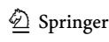

Marine Biology (2024) 171:218 Page 13 of 13 218

Pacific Islands Fisheries Science Center (2018) National Coral Reef Monitoring Program: Benthic Cover Derived from Analysis of Benthic images collected during stratified Random surveys (StRS) across the Hawaiian Archipelago since 2013

- Page M, Green A (1998) Status of the coral reefs of Swains Island.

  Department of Marine and Wildlife Resources, Pago Pago, American Samoa. https://citeseerx.ist.psu.edu/document?repid=rep1&type=pdf&doi=a78a4677d85e8fbf444959f5c5cf1b7891772b1c
- Penin L, Adjeroud M, Schrimm M, Lenihan HS (2007) High spatial variability in coral bleaching around Moorea (French Polynesia): patterns across locations and water depths. CR Biol 330:171–181. https://doi.org/10.1016/j.crvi.2006.12.003
- Raymundo LJ, Burdick D, Hoot WC, Miller RM, Brown V, Reynolds T, Gault J, Idechong J, Fifer J, Williams A (2019) Successive bleaching events cause mass coral mortality in Guam, Micronesia. Coral Reefs 38:677–700. https://doi.org/10.1007/s00338-019-01836-2
- Riegl B, Piller WE (2003) Possible refugia for reefs in times of environmental stress. Int J Earth Sci 92:520–531. https://doi. org/10.1007/s00531-003-0328-9
- Robinson JPW, Williams ID, Yeager LA, McPherson JM, Clark J, Oliver TA, Baum JK (2018) Environmental conditions and herbivore biomass determine coral reef benthic community composition: implications for quantitative baselines. Coral Reefs. https://doi.org/10.1007/s00338-018-01737-w
- Sandin SA, Smith JE, DeMartini EE, Dinsdale EA, Donner SD, Friedlander AM, Konotchick T, Malay M, Maragos JE, Obura D, Paulay G, Richie M, Rohwer F, Schroeder RE, Walsh S, Jackson JBC, Knowlton N, Sala E (2008) Baselines and degradation of Coral Reefs in the Northern Line Islands. PLoS ONE. https://doi.org/10.1371/journal.pone.0001548
- Smith JN, Barkley HC (in review) In situ temperature time series across U.S. Pacific coral reefs. NOAA Administrative Report, Pacific Islands Fisheries Center, Honolulu
- Smith LD, Gilmour JP, Heyward AJ (2008) Resilience of coral communities on an isolated system of reefs following catastrophic mass-bleaching. Coral Reefs. https://doi.org/10.1007/s00338-007-0311-1
- Smith SG, Swanson DW, Chiappone M, Miller SL, Ault JS (2011) Probability sampling of stony coral populations in the Florida Keys. Environ Monit Assess 183:121–138. https://doi. org/10.1007/s10661-011-1912-2
- Smith TB, Gyory J, Brandt ME, Miller WJ, Jossart J, Nemeth RS (2016) Caribbean mesophotic coral ecosystems are unlikely climate change refugia. Glob Change Biol 22:2756–2765. https://doi.org/10.1111/gcb.13175
- Sully S, Burkepile DE, Donovan MK, Hodgson G, van Woesik R (2019) A global analysis of coral bleaching over the past two decades. Nat Commun Doi. https://doi.org/10.1038/s41467-019-09238-2

- Van Tilburg, H.K., D.J. Herdich, R. Suka, M. Lawrence, C. Filimoehala, S. Gandulla, 2013, Unlocking the Secrets of Swains Island, Maritime Heritage Program Series: Number 6, NOAA Office of National Marine Sanctuaries, SiliverSpring, MD, http://npshistory.com/publications/noaa/unlocking-secrets-swains-island.pdf
- Vargas-Ángel B, Godwin LS, Asher J, Brainard RE (2009) Invasive didemnid tunicate spreading across coral reefs at remote Swains Island, American Sāmoa. Coral Reefs 28:53–53. https://doi. org/10.1007/s00338-008-0428-x
- Vargas-Ángel B, Huntington B, Brainard RE, Venegas R, Oliver T, Barkley H, Cohen A (2019) El Niño-associated catastrophic coral mortality at Jarvis Island, central Equatorial Pacific. Coral Reefs 38:731–741. https://doi.org/10.1007/s00338-019-01838-0
- Venegas RM, Oliver T, Liu G, Heron SF, Clark SJ, Pomeroy N, Young C, Eakin CM, Brainard RE (2019) The rarity of depth Refugia from Coral Bleaching Heat Stress in the western and Central Pacific Islands. Sci Rep 9:19710. https://doi.org/10.1038/s41598-019-56232-1
- Waite TA, Campbell LG (2006) Controlling the false discovery rate and increasing statistical power in ecological studies. Écoscience 13:439–442 https://doi.org/10.2980/1195-6860(2006)13[439:CTFDRA]2.0.CO;2
- Wilson SK, Burgess SC, Cheal AJ, Emslie M, Fisher R, Miller I, Polunin NVC, Sweatman HPA (2008) Habitat utilization by coral reef fish: implications for specialists vs. generalists in a changing environment. J Anim Ecol 77:220–228. https://doi. org/10.1111/j.1365-2656.2007.01341.x
- Winston M, Couch CS, Ferguson M, Huntington B, Swanson DW, Vargas-Ángel B (2019) Ecosystem sciences Division Standard operating procedures: Data Collection for Rapid Ecological Assessment benthic surveys, 2018 update. NOAA Tech Memorandum 65. https://doi.org/10.25923/w1k2-0y84
- Wittenberg M, Hunte W (1992) Effects of eutrophication and sedimentation on juvenile corals. Mar Biol 112:131–138. https://doi.org/10.1007/BF00349736

**Publisher's note** Springer Nature remains neutral with regard to jurisdictional claims in published maps and institutional affiliations.

Springer Nature or its licensor (e.g. a society or other partner) holds exclusive rights to this article under a publishing agreement with the author(s) or other rightsholder(s); author self-archiving of the accepted manuscript version of this article is solely governed by the terms of such publishing agreement and applicable law.

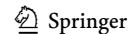