# THE BIOLOGY AND ARTISANAL FISHERY OF LOBSTERS OF AMERICAN SAMOA

Dr. Emmanuel Coutures

### DMWR Biological Report Series, No 103 2003

Department of Marine and Wildlife Resources, P.O. Box 3730 Pago Pago, American Samoa 96799

#### PREFACE

From Coral Reef Initiative through the Coral Reef Advisory Group for the Governor of American Samoa, the Department of Marine and Wildlife Resources recruited a marine biologist to conduct a survey and study of the lobster resource in American Samoa.

This report summarizes the results of studies conducted between October 2002 and October 2003. The field sampling used to study the natural population was stopped in late January 2003, only 4 months after its implementation. In the night between the 23rd and the 24th of January 2003, Leland Patrick Yandall, Fisheries Biologist within DMWR, drowned during a field survey in Sogi. The voluntary statement made by the author to the police is as follow:

I was hired in mid-September 2002 by the DMWR to conduct research on lobsters in American Samoa. Part of this study consists in conducting field surveys to estimate population size of spiny lobsters and slipper lobsters. In the sampling procedure, I planned to do two night dives (snorkeling) per week in several sites all around Tutuila Island (during each night dive we are going in two sites). Indeed, these animals are deeply hidden in a den during the day, and move near the reef edge by night, near the breakers. Although dives and sites are scheduled in advance, they are function of the weather.

A night dive was scheduled yesterday, Thursday 23rd January, 2003. I asked for a vehicle authorization in the beginning of the afternoon, indicating that I planned to go to Fagatele and Larsen Bays. Jack Anesi and Leland (Lee) Yandall came with me. They had to prepare the boat and diving stuffs. We put the boat in the water at the Pago Pago launching ramp around 5h30 pm. The weather was very nice, no wind and low swells, so I decided to go a further than Fagatele, in Sogi where I had already gone to in late-November 2002, and on the return, I planned to do the second dive in Fagatele Bay. We arrived in Sogi at around 6h20 pm. It was the beginning of the flood tide, so Lee decided to anchor at about 50 m from the edge of the reef. We had to wait for the dark, so we began the dive at 7h30. We reached the front of the reef and then, we swam to the North. We stayed near the edge of the reef because there was not enough water, and waves broke at the beginning of the reef flat. We stayed together; I was able to see the lights of Jack and Lee at all times, not far behind me. After 45 minutes, I decided it was time to us to return to the boat; I indicated my decision to Jack and Lee by showing the other side of the reef with my light beam. A couple of minutes later, we were on the reef flat in a groove, with 2-3 feet

of water depth. Jack was on my side, and I saw Lee's flashlight. I felt a big wave arrive, because I was quickly "sucked" away from the reef, indicating that the wave was soon to break. If this happens, you must quickly face the wave, and paddle strongly to go under it before it brakes. Then, you have to continue your effort because these kinds of waves are rarely alone. Three or four waves followed. At the first one, Jack and I were swept, and after this "train of waves" I managed to get to the front of the waves. When I looked back I saw their light beams underwater in the middle of the reef flat. I shouted their names but I saw that they were carried away to the shore. Then I saw one light out of water, I shouted again but the breakers were too noisy. I thought that they were not able to come back through the waves. The lights were not in front of me, but behind a big rock, so I thought that it protected them from the waves. Indeed, I know that after crossing the upper the reef flat like in a "washing-machine" because of the breakers, you do not know where you are, with cuts on your knees and elbows.

So, after 10 minutes, I thought that if I was in their situation, without the possibility to come back through breakers, I would decide to find a phone and come back to Pago by road. As I was not able to reach them, I decided to return to the boat. I reached it after 15-20 mn. At this moment, I saw torches on the shore and I heard people voices. They began to speak in Samoan, I shouted that I did not understand them, and I asked them if they knew where were Lee and Jack, if they were safe, if they had decided to come back to Pago by road? But they did not hear me. Then, they spoke in English, but I only understood the word "alive". As I was not able to do anything from where I was, I decided to come back alone to Pago by boat. Before I began to lift up the anchor, Jack's girlfriend called on his mobile. She used to call him before and after each dive. I explained to her the problem, I asked her to call somebody of the DMWR enforcement, but I expected they were going to come back by road, and may be in 10-15 minutes they were going to call her from the office. I told her that I returned to Pago by boat, and I asked her to call me back in 5-10 minutes. When she called me back, she told that nobody was at the office. I reassured her by saying that it was a long way to go from Sogi to Pago, and that I thought that they were on the road. During the trip, I received several calls, asking if I had news from Jack, and then, somebody told me that Jack called at home and he was on the way of the hospital. Then, Jack's girlfriend called me and said that Jack was ok but Lee was dead.

I arrived at the Pago launching ramp, I tied up the boat, I disembarked part of our belongings, and then I went to the hospital.

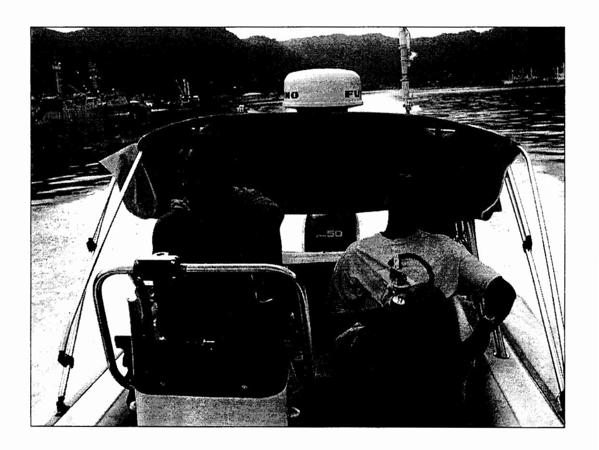

A ta mémoire, Lee Une étude sur les langoustes aux Samoa Américaines ne valait certainement pas ça

#### **TABLE OF CONTENTS**

| ABSTRACT                                             | 1  |
|------------------------------------------------------|----|
| 1. INTRODUCTION                                      | 2  |
| 2. STUDY SITE                                        | 2  |
| 3. GENERAL POINTS                                    | 4  |
| 3.1. Species                                         | 4  |
| 3.2. Adult/benthic phase                             | 4  |
| 3.2.1. Habitat                                       | 4  |
| 3.2.2. Diet                                          | 7  |
| 3.2.3. Growth and mortality                          | 7  |
| 3.2.4. Reproduction                                  | 9  |
| 3.3. Larval/Planktonic phase                         | 10 |
| 3.4. Post-larval/Pelagic phase                       | 11 |
| 3.5. Rearing/Aquaculture/Farming                     | 13 |
| 3.6. Fishing techniques and abundance                | 14 |
| 4. STUDY OF THE AMERICAN SAMOA LOBSTER FISHERY       | 15 |
| 4.1. Material and Methods                            | 16 |
| 4.1.1. Field survey                                  | 16 |
| 4.1.1.1. Sampling protocol                           | 16 |
| 4.1.1.2. Catch composition and CPUE                  | 17 |
| 4.1.1.3. Estimation of the population size           | 18 |
| 4.1.1.4. Fecundity and size at first sexual maturity | 18 |
| 4.1.2. Study of the commercial fishery               | 19 |
| 4.2. Results                                         | 21 |
| 4.2.1. Field survey                                  | 21 |
| 4.2.1.1. Catch composition and CPUE                  | 21 |
| 4.2.1.2. Estimation of the population size           | 23 |
| 4.2.1.3. Fecundity                                   | 23 |
| 4.2.2. Market surveys                                |    |

| 4.2.2.1. Fishing technique, catch composition and CPUE from                              |    |
|------------------------------------------------------------------------------------------|----|
| market survey Oct. 02 – Oct. 03                                                          | 25 |
| 4.2.2.2. Fishing technique, catch composition and CPUE from                              |    |
| previous market survey (1999)                                                            | 28 |
| 4.2.2.3. Comparison of average length and CPUE between                                   |    |
| field samples, 1999 and 2002-2003 market samples                                         | 30 |
| 4.2.2.4. Length-Weight relationship                                                      | 33 |
| 4.2.2.5. Von Bertalanffy growth curve                                                    | 35 |
| 4.2.2.6. Beverton & Holt's Relative Yield per Recruit model                              | 36 |
| 4.3. Discussion                                                                          | 39 |
| 4.3.1. Catch Composition                                                                 | 39 |
| 4.3.2. Fecundity and size at sexual maturity                                             | 40 |
| 4.3.3. Average length and CPUE                                                           | 42 |
| 4.3.4. Total catches and abundance in Tutuila Island                                     | 43 |
| 4.3.5. Growth, mortality and Relative Yield per Recruit model                            | 44 |
| 5. CONCLUSION AND RECOMMENDATIONS                                                        | 47 |
| Acknowledgements                                                                         | 49 |
| References                                                                               | 50 |
| List of figures                                                                          | 57 |
| List of Tables                                                                           | 58 |
| Appendix I: External characterization of male and female lobster                         |    |
| Example: Panulirus penicillatus                                                          | 59 |
| Appendix II: Notice for tagged lobsters at the attention of fishermen and seafood deale  | rs |
| (in Samoan)                                                                              | 60 |
| Appendix III: Notice for tagged lobsters at the attention of fishermen and seafood deale |    |
| (in English)                                                                             |    |
| Appendix IV: Management methods (Anonymous, 1980): Pros, cons and remarks                |    |
| Appendix V: Comments on the legal review of the American Samoa fishing regulations       |    |
|                                                                                          |    |

#### **ABSTRACT**

A study of the lobster population in American Samoa was undertaken between October 2002 and 2003. Panulirus penicillatus is the main species speared by night near the outer slope by free divers while diving for finfish. Total landings expanded from market survey were estimated to be 576 kg (1271 lb) of spiny lobsters sold per year (without taking subsistence and recreational catches into account). Sex ratio was in favor of males. This difference in sex ratio could be due to the fishing technique which not includes the highest part of the reef edge and the beginning of the reef flat. This could also explain why commercial catches rarely include slipper lobsters (Parribacus caledonicus and some P. antarcticus) whereas they are relatively abundant in the field. With the aid of data from market surveys undertaken in 1999 (i.e. before the ban of scuba fishing), we established that free diving was the most efficient technique. Comparison between markets surveys done in 1999 and 2002-2003, showed an increasing of Catch Per Unit Effort in terms of weight but not in number of lobsters caught, and a decrease in the mean length. Size at sexual maturity, i.e. size when 50 % of females are ovigerous, was estimated to be around 7 cm CL (2.76 in) for Panulirus penicillatus whereas the smallest berried females measured 5.25 cm CL (2.07 in). Relationship between fecundity (number of eggs) and carapace length (CL) is provided. Although it was unlawful since 1995 to catch berried females and spiny lobsters smaller than 7.94 cm (3 1/8 in) of CL, they are often found in the markets. Values from market survey were used to estimate the total mortality. The discontinuation of the field survey following an accident did not allow estimation of local growth parameters and natural mortality which were taken from literature. Results of fishing mortality and Yield per Recruit (YPR) were in accordance with other lobster fisheries in the Pacific. YPR would slightly increase if length at recruitment was at the legal minimum size. The main recommendation provided is the ban of spearfishing for the commercial fishery. This regulation will allow fishermen to i) verify if lobsters are berried or undersized without injuring them, ii) to catch more slipper lobsters which are easily marketable, and iii) to sell high quality product in markets.

#### 1. INTRODUCTION

The Samoans as well as all the communities of the South Pacific Islands have traditionally relied on the coral reef environment. Fishing was an important activity if not essential, sea foods being a substantial part of the Samoan protein diet. Culturally, fishing is also an important part of the Samoan way of life, but this importance has decreased with increasing Western influence (such as refrigeration and canning), implying a gradual shift from subsistence to a cash economy. Lobsters are more expensive sea-foods than fishes, but are often present in important meals such as wedding, funerals, Christmas, or New Years day. Formerly, lobsters were provided at the level of the village/family, whereas nowadays, they are mainly bought at the market, caught by professional/regular fishermen.

The main purpose of this study was to obtain biological parameters from the lobster population in American Samoa, and to assess the level of the lobster fishery in order to provide, if necessary, recommendations for the long-term management of this resource.

As the biology of spiny lobsters and slipper lobsters is relatively complicated, I chose to begin this report with an up-date of our knowledge on the two main species present in American Samoa shallow-waters. Following this, I present the survey work.

#### 2. STUDY SITE

The US territory of American Samoa covers a surface of 197 km² (76.1 square miles). It includes five volcanic islands (Tutuila, Aunu'u, Ofu, Olosega, and Ta'u) (Figure 1) and 2 remote atolls (Rose - *Lat*: 14.53° S *Long*: 175.87° W - and Swain - *Lat*: 11.06° S *Long*: 171.08° W). The main city – Pago Pago – is situated in a deep well-protected harbor in Tutuila I sland. Most people (96 %) for a total of more than 60,000 in 2002 (Census, DOC) live on Tutuila Island.

Because of its "young" age (1.5 millions years), Tutuila Island is only surrounded by a narrow fringing reef of coralline algae and live coral (Pitcher, 1993) of 55 km long (see characteristics in Wass, 1980a, Craig, 2000). This allows fishermen to reach the reef edge more or less easily by walking at low tide through the reef flat.

During the dry season (May to November) moderate southeast trade winds predominate; the period from June to August has exhibited the driest and coolest conditions. Weakened variable winds occurring during the wet season cause the high temperatures and heavy rains which persist from January to March. Average annual rainfall measured at the Pago Pago International Airport weather station is 3,175 mm (125 inches). However, rainfall varies greatly with elevation and aspect. Pago Pago Harbor rainfall is estimated at 7,600 mm (300 inches).

Except the harbor and sheltered bays, the entire south coast of Tutuila receives offshore swells generated by the trade winds, which breaks on the reef as heavy surf.

There are several Marine Protected Areas in Tutuila Island, under different statutes. The National Park of American Samoa (NPSA, <a href="http://www.nps.gov/npsa/">http://www.nps.gov/npsa/</a>) is situated in the North East of the Island. Commercial fishing is prohibited in the marine part of the Park. There is a Marine Sanctuary in Fagatele Bay situated in the South-East of Tutuila (<a href="http://www.fbnms.nos.noaa.gov/">http://www.fbnms.nos.noaa.gov/</a>). Sanctuary regulations prohibit taking invertebrates found in the bay. There are several MPAs set up, and managed by villages.

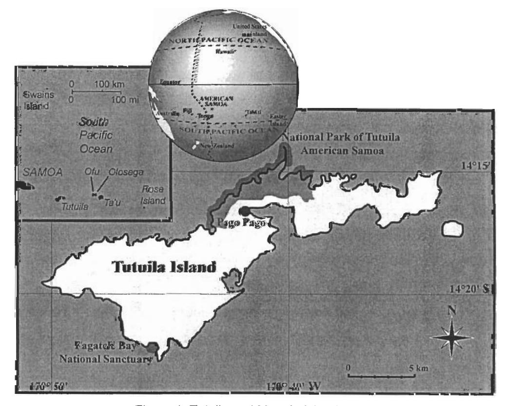

Figure 1: Tutuila and Manu'a Islands map

#### 3. GENERAL POINTS

#### 3.1. Species

There are, in American Samoan shallow waters, two species of spiny lobsters (ula sami) *Panulirus penicillatus* (Olivier, 1791) and *Panulirus versicolor* (Latreille, 1804), and two species of slipper lobster (papata) *Parribacus caledonicus* Holthuis, 1960, and *Parribacus antarcticus* (Lund, 1793). Numerous species of small slipper lobsters (less than 10 cm – 4 inches – of total length) live in coral reef environments (Scyllarinae subfamily, see Holthuis, 2002), but there is little information about their biology and geographic distribution (Coutures, 2000a). The geographic distribution of several deep water species implies they must be present in the Samoan Archipelago (Holthuis, 1991): g *Justitia*, g. *Puerulus* (spiny lobster), and g. *Ibacus* (slipper lobster).

#### Systematic (Figure 2)

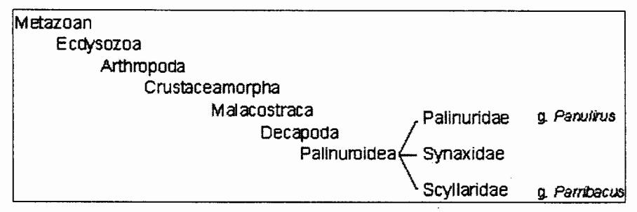

Figure 2: Systematic position of genera *Panulirus* and *Parribacus* (http://www.ucmp.berkeley.edu/help/taxaform.html)

#### 3.2. Adult/benthic phase

#### 3.2.1. Habitat

All these species are nocturnal, deeply hidden in caves and corals by day.

P. versicolor (Figure 3), the painted spiny lobster, is very rare. This species lives in protected coral environments (garden corals) which are mainly present in lagoons (George, 1972), and sometimes on the outer slope.

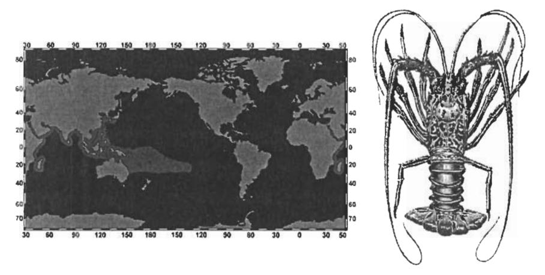

Figure 3: Geographic distribution of Panulirus versicolor (Holthuis, 1985)

The most common species is *P. penicillatus*, the pronghorn spiny lobster (Figure 4). Amongst Palinuridae, this species has the widest distribution, from East Africa, the Red Sea, through Indian and Pacific oceans, including Hawaii and even to the west coast of Mexico (Johnson, 1971; Holthuis, 1991). It lives only in clear water, strong current and surf conditions (George, 1969; Prescott, 1977, 1980a, 1988) at a range depth from 1 to 5 m (3 to 16 feet). This species is highly cryptic/lucifugous by day, deeply hidden in coral crevices. It forages by night between the beginning of the reef flat and the spurs and grooves (McDonald, 1971; Richer de Forges & Laboute, 1995; Coutures & Chauvet, 2003). 'The adaptation of robust pereiopods characteristic of P. penicillatus e nables this species to forage in strong surge and probably provides the selective advantage that allowed this species to penetrate and successfully occupy this habitat, which may serve as a refuge from predation" (MacDonald, 1988).

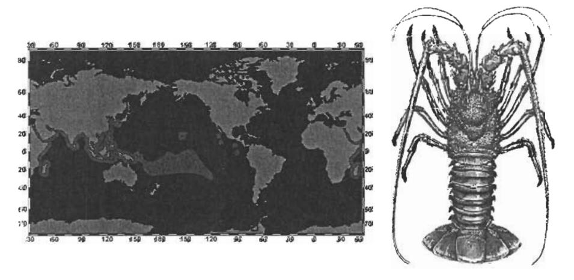

Figure 4: Geographic distribution of *Panulirus penicillatus* (Holthuis, 1985)

Parribacus antarcticus (Figure 5), the sculptured or Chinese mitten lobster, lives in rocky and coral dens, at depth less than 10 m. In coral reefs, it is present on the entire reef (outer slope, reef flat, inner slope if present), and is probably gregarious (Holthuis, 1985).

*P. caledonicus* (Figure 5), the Caledonian mitten lobster (called also 'butterfly lobster', *papata* in Samoan), lives in the same area as *P. penicillatus* (George, 1972). Its geographic distribution includes Australia, New Caledonia, Vanuatu, Fiji and the Samoa Archipelago (Holthuis, 1985). By day *P. caledonicus* is gregarious; individuals live in crevices often beneath coral patches, generally hanging upside down, under the domes of dens (Coutures, 2000a; Coutures & Chauvet, 2003). By night, they forage individually, mainly on the beginning of the reef flat. This species can sometimes be abundant (Coutures & Chauvet, 2003).

These two species are distinguishable by the number of teeth on the side of the basal segment of the antenna: 6 for *P. antarcticus* and 7 for *P. caledonicus* (Holthuis, 1985).

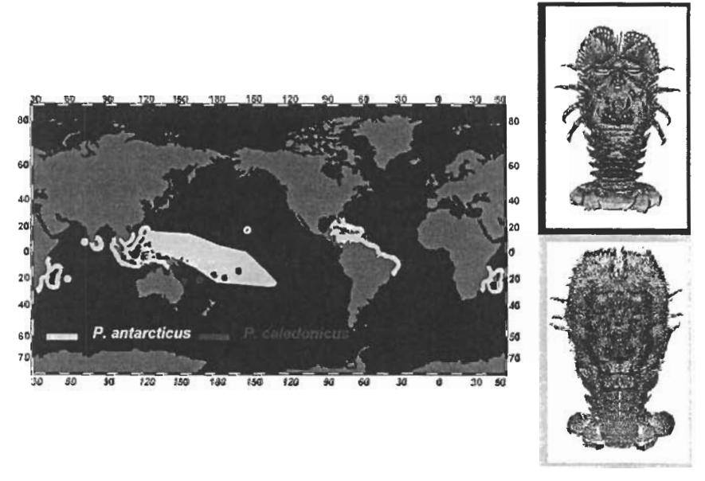

Figure 5: Geographic distribution of *Parribacus caledonicus* and *P. antarcticus* (Holthuis, 1985) (color must vary according to the environment)

#### 3.2.2. Diet

Scyllarids and palinurids are commonly considered to be opportunistic omnivorous i.e. they are able to feed on a wide range of food (Phillips et al., 1980). Chambers and Nunes (1975) indicated that the diet of *P. penicillatus* in American Samoa was "primarily, if not solely, algae". However, other studies showed that this species also feeds on Annelids Polychaetes, Mollusks (Gastropods and Bivalve), Crustaceans, and Echinoderms (George, 1972; Prescott in Pitcher, 1993). Whereas only a few studies have dealt with the slipper lobster diet, they showed similar patterns to that for spiny lobsters (Lau, 1987; Spanier, 1987; Coutures, pers. obs.). The main fact, observed in all studies, is that theses animals are able to select their food according to availability and density. Thus, individuals of the same species but which are living in different areas can have different diets implying important differences in growth rates (Morgan, 1980; McKoy & Esterman, 1981; Edgar, 1990).

#### 3.2.3. Growth and mortality

Lobsters, as other Crustaceans, increase in size by molting, while the growth of tissues (and thus the weight) is continuous. The growth rate decreases with age, and the inter-molt duration increases. During the molt, most of the calcified components are replaced.

Molts may not be isometric:

- 1). Larvae are released with only 3 pairs of pereiopods (walking legs), the two other pairs appearing and increasing in size progressively with following molts.
- 2). Broken appendages (legs or antenna, partly or totally) are regenerated at the following molt but the full regeneration must take several molts.
- 3). Metamorphosis from the larvae into the post-larvae occurs in a single molt, considered to be one of the deepest transformations within Decapods (Gurney, 1936).
- 4). When juveniles reach sexual maturity, a molt will generate the sexual characteristics: pleopod (swimmerets) biramous for females (the 2nd part, cross-

shaped will include setae to bind and maintain eggs), uniramous for males; within females, the fifth pair of legs terminates by a small claw (subchelae used during reproduction).

And last, there is sexual dimorphism, with males reaching larger sizes than females. For *P. penicillatus*, this dimorphism is easily visible, males having larger carapace, and longer third pair of legs (to facilitate the mating). The largest males can weight 3 kg (6.5 Lb) for 16 cm (6 ¼ in) of Cephalothoracic (or Carapace) Length (CL: measured from the basis of the supraorbital spines to the end of the cephalothorax) (Richer de Forges & Laboute, 1995).

The most commonly used growth model for lobsters is that of von Bertalanffy (1938) (Morgan, 1980):  $CL_t = CL_{\infty}$ . (1 -  $e^{-K(t-to)}$ ) where  $CL_{\infty}$  is the asymptotic length, K the growth rate, and  $t_0$  the time when length should theoretically be zero. The von Bertalanffy growth curve (VBGC) parameters may be established from growth data obtained with mark and recapture studies [for *P. penicillatus*: Ebert & Ford (1986) in Marshall Islands], length-frequency analysis methods (e.g. Bhattacharya; Cassie; ELEFAN, program; Wetherall; for *P. penicillatus*: Munro (1988) in Tonga, Arellano (1989) in Philippines, and Coutures & Chauvet (2002) in New Caledonia], and recently by measuring the lipofuscin rate, this pigment accumulating with age (Crossland *et al.*, 1987; Sheehy *et al.*, 1998).

The total mortality coefficient - Z- may be established from VBGC parameters using Beverton & Holt formula (1956):

$$Z = K \cdot \frac{CL_{\infty} - \overline{CL}}{\overline{CL} - CL'}$$

where  $\overline{CL}$  is the mean Carapace Length in the catches, and CL' "some length for which all fish of that length and longer are under full exploitation" (Beverton & Holt, 1956).

Z, the total mortality coefficient, is the sum of F the fishing mortality, and M the natural mortality. In order to obtain F, we must estimate M by analyzing data from a reserve without fishing (and then, Z = M).

#### 3.2.4. Reproduction

For a review, see Nakamura, 1994; Kittaka & MacDiarmid, 1994.

Reproduction varies within the Palinuroidea (Berry, 1970; Prescott, 1988). For Crustaceans, the reproductive season is determined by photoperiod and luminosity (Lipcius & Cobb, 1994). As a result, lobsters from temperate and sub-tropical waters have only one spawning period (Chubb, 1994; Kittaka & MacDiarmid, 1994) whereas numerous tropical species are able to spawn nearly year-round, and some individuals are able to spawn several times in the same year (Berry, 1971; Moore & MacFarlane, 1984; Juinio, 1987). In Hawaii, 40 % of the *P. penicillatus* females are berried (with eggs under the abdomen) (McDonald, 1971, 1979) at any time, and some females spawn 2 or 3 times a year (Juinio, 1987; Plaut, 1993).

Fertilization is external (Lyons, 1970; Morgan, 1980); the male deposits a spermatophore, via paired penile projections at the base of the fifth walking legs, onto the female sternum. This spermatophoric mass becomes black and is butterfly-shaped for spiny lobsters and covers the two first pairs of pleopods in *Parribacus* spp. The female is then called « tarred ». After a few days, the female spawns several thousands of oocytes from the paired gonopores situated at the base of the third walking legs, into a 'chamber' formed by curving the abdomen under the sternum. The female scrapes the spermatophore with special chelae (claws or pincher) on the dactyl (last segment) of the fifth walking legs, to release the sperm which fertilizes the oocytes during the transit (Berry, 1970; Lipcius & Herrnkind, 1987; Pitcher, 1993). The fertilized eggs adhere to the ovigerous setae of the internal part of the biramous pleopods (Berry, 1970) (see Appendix I). In the literature, the smallest *P. penicillatus* berried females measured from 4.08 cm of CL (1.6 inches) in Philippines (Juinio, 1987) to 6.20 cm (2.45 inches) in the Marshall Islands (Ebert & Ford, 1986). No information on any *Parribacus* spp. reproduction is available in the literature.

After 1 to 9 weeks of incubation [20 to 35 days for *P. penicillatus* (Juinio, 1987; Plaut, 1993)], larvae are released in the field (George, 1958; Chittleborough, 1974, 1976; Nair *et al.*, 1981; Pitcher, 1993). Among spiny lobsters, hatching always occurs in an area allowing the larvae to quickly drift offshore (Phillips & Sastry, 1980; Coutures,

2000b), which implies that sometimes there is migration from coastal to oceanic areas (Moore & MacFarlane, 1984; MacFarlane & Moore, 1986; Coutures, 2000b).

The larvae of Palinuroidea (spiny lobster or Palinuridae, slipper lobster or Scyllaridae, and Synaxidae or coral lobsters) is called phyllosoma (from Greek "phyllo" leaf, and "soma" body), a flat, transparent, leaf-like larva, which corresponds to the Crustacean zoea stage (Figure 6).

#### 3.3. Larval/planktonic phase

The outstanding feature in the life history of the Palinuroidea is the exceptional duration of their larval phase, which varies among spiny lobsters from 6 to 12 months according to the species (Phillips & Sastry, 1980; Booth & Phillips, 1994) and even 24 months for Jasus e dwardsii (Lesser, 1978), a species o ccurring in New Zealand and South Australia, and from 1 to 9 months for slipper lobsters (Sims, 1965; Robertson, 1968a,b, 1969a,b; Takahashi & Saisho, 1978; Ito & Lucas, 1990; Marinovic et al., 1994; Mikami & Greenwood, 1997). During the larval phase, phyllosomata can travel great distances, e.g. Johnson (1974) caught one Panulirus penicillatus phyllosoma in the Pacific Ocean 3,700 km from the Galapagos Archipelago, which was the closest hatching site. Mechanisms allowing phyllosomata to come back to the coast have been shown only for a few species, especially for Panulirus cygnus in the southwest of Australia (see Pearce & Phillips, 1980; Phillips et al., 1991; Pearce et al., 1992). However, for species with a wide geographic distribution such as P. penicillatus and P. parribacus, the larval dispersion implies that recruits can come from adults living at great distances (Lyons, 1980, 1981; Menzies & Kerrigan, 1980). Oceanic currents and gyres seem important in the transport, and the dispersion, and thus, in the "oceanic routes" used by phyllosomata (Yeung & McGowan, 1991; Booth & Phillips, 1994).

During their larval development, phyllosomata increase in size and general shape through numerous molts. For the species studied, systematicians have described 7 to 12 larval stages which characterize the growth by appearance of anatomic features (e.g.: Stage I, 3 pairs of pereiopods, stage II: bud of the fourth one), and characteristic measurements (Phillips & Sastry, 1980).

The different larval stages of *P. penicillatus* have been described by Johnson (1968) and Michel (1969, 1971). The duration of the larval species has been estimated to be 7 - 8 months for this species (Johnson, 1971).

For *P. caledonicus*, stage I is the only stage to have been described so far with certainty (Coutures, 2001b). It must be noted that in the Pacific, *Parribacus* species form a complex including a widely distributed species – *P. antarcticus* – and 5 allopatric species (without overlap of their adult distributions). Larvae of this complex are very similar (Coutures, 2001b), and sometimes impossible to separate (Prasad & Tampi, 1960; Michel, 1971; Berry, 1974). Furthermore, some giant larvae – from 6.5 to 8 cm (2.55 to 3.14 inches) of total length, without pereiopods - have been caught in the Pacific, Indian, and Atlantic Oceans, that would correspond to the late-stage of *P. antarcticus* (Johnson, 1951; Robertson, 1968c).

When phyllosomata have reached the last larval stage, have enough body reserves, and may be after stimulation from a coastal signal (Booth, 1986; Phillips & McWilliam, 1986a; Booth & Phillips, 1994; McWilliam & Phillips, 1997), they metamorphose into post-larvae called nisto for slipper lobsters and puerulus for spiny lobsters (Lyons, 1970).

#### 3.4. Post-larval/pelagic phase

Puerulus and nistos differ from juveniles by the absence of calcification and lack of pigmentation, except for the eyes and a few streaks and points on the antennas (Phillips & Sastry, 1980) (Figure 6). The carapace is smoother, pleopods bear long setae (Phillips & Penrose, 1985), the body is longer, antennas are longer (only for spiny lobsters), and sometimes they terminate in a spatula (Serfling & Ford, 1975; Briones-Fourzan & McWilliam, 1997) (Fig. 5). According to numerous authors (Serfling & Ford, 1975; Sweat, 1968; Witham et al., 1968; Phillips, 1972; Phillips & Olsen, 1975; Serfling & Ford, 1975; Phillips et al, 1978; Lyons, 1980; Calinski & Lyons, 1983; McDonald, 1986; Hayakawa et al., 1990; Coutures, 2000a, 2001a; Coutures & Chauvet, 2002), the behavior of pueruli and nistos would be to actively swim to benthic coastal habitats (with the aid of their pleopods) before settling onto the benthos. For example, the puerulus of

Panulirus cygnus can swim from 20 to 60 km (12.5 to 37.5 miles) (Phillips & Penrose, 1985), in 5 to 15 days (Lemmens, 1994).

The post-larvae begins to be colored as soon as it settles on the bottom. The first molt occurs 8 to 10 days after settlement (Phillips & Sastry, 1980). Although it is not the case for all species, *Panulirus penicillatus* and *Parribacus caledonicus* settle in the same habitat as the adults (McDonald, 1971; Nunes & Chambers, 1975; Pitcher, 1992, 1993; Coutures, 2000a; Coutures *et al.*, 2002), i.e. just in front of the breakers.

The puerulus of *Panulirus penicillatus* has been described by Michel (1971): it measures about 1 cm (0.4 inch) of CL. The nisto of *Parribacus caledonicus* has not been described yet but it is likely to be similar to congeners which reach sizes varying from 5 to 5.82 cm (2-2.3 inches) (Rathbun, 1903; Coutures *et al.*, 2002).

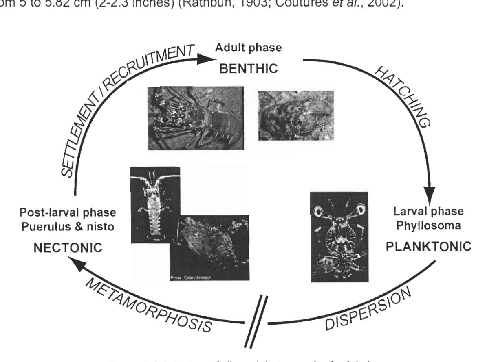

Figure 6: Life history of slipper lobsters and spiny lobsters

#### 3.5. Rearing/Aquaculture/farming

Only a few species have been reared from the egg to the adult. For spiny lobsters, only temperate species have been successfully reared (Kittaka 1988; Kittaka & Ikegami, 1988; Kittaka et al., 1988; Kittaka & Kimura, 1989; Kittaka, 1994a; Kittaka et al., 1997), and only two small slipper lobsters (Robertson, 1968b; Ito & Lucas, 1990). Survival rates are always very low, and large scale aquaculture is not economically viable (Kittaka, 1994b; Kittaka & Booth, 1994), but studies are continuing (Kittaka, 1997; Kittaka et al., 2001; Moss et al., 2001).

Another method consists of catching pueruli and then growing juveniles in tanks (Booth & Kittaka, 1994). Pueruli are taken by collectors along many shorelines in larval recruitment studies, sometimes in high numbers (for a review, see Phillips & Booth, 1994). Sea-farming has begun to take place in several areas, such as South-East Asia, Europe, New Zealand, Australia (Booth & Kittaka, 1994). Some trial collecting in coral reef environments did not successfully catch any lobsters (Coutures, 2000a). P. penicillatus and P. caledonicus settle under the breakers, i.e. in a rough environment where setting collectors is impossible. Some individuals of *P. penicillatus* and *Parribacus* spp. have been caught with crest nets in French Polynesia, and Wallis (Dufour, pers. com.; Coutures et al., 2002). A net set on the reefflat in the region of the breaking waves acts as a passive sampler, which filters water coming from the ocean (Dufour, 1992). This efficient technique is used to catch ornamental fish and invertebrates for the aquarium trade (Aquafish Technology, <a href="http://www.aqua-fish.com/">http://www.aqua-fish.com/</a>). Unfortunately, the two main species present in American Samoa settle in front of where the waves break, i.e. before reaching the sampling site. In French Polynesia, and in Wallis, the largest catches of lobsters were obtained at times of strong swell, which could be explained by this. This technique would be efficient for species which settle in coastal areas, or in lagoons, as such as P. versicolor.

&lt;sup>1 Recruitment may have several senses (Dufour, 1992; Sparre & Venema, 1989):

Ecological meaning: arrival of post-larvae within settled populations, which they adopt the life requirements;

Fishery meaning: moment when targeted animals become vulnerable to fishing gears

#### 3.6. Fishing techniques and abundance

Spiny lobsters support some of the largest commercial fisheries in the world, while concurrently sustaining small-scale artisanal fisheries on remote islands or where they are in low abundance (Lipcius & Cobb, 1994). There are only a few techniques used to capture spiny lobsters in the region. Most are caught by hand or by spear, some are taken incidentally in tangle nets, and a few are trapped (Munro, 1994).

P. penicillatus is fished throughout its geographic distribution, and provides the main landings in the Central Pacific (George, 1974; Munro, 1988; Prescott, 1988). This species must be trapped in some places (McDonald, 1971; Prescott, 1988) but yields are weak except in the Solomon Islands where they reached 15 kg (33 Lb) per trap per night (George, 1972). George (1972) also reported that in 1965, tests with rectangular traps (1.2 x 0.9 x 0.9 m - 4 x 3 x 3 feet) made of 7.6 x 10.2 cm (3 x 4 inches) welded metal mesh and baited tuna heads produced catches of about 15 large P. penicillatus per haul in American Samoa. The experiment was terminated when the traps were stolen. No information was given on the depth at which the traps were set. These results are doubtful and I will discuss this anecdotical report of a high catch in the discussion. Tangle nets are efficient in the Philippines out of Monsoon season (Juinio & Gomez, 1986). Everywhere else, *P. penicillatus* is fished by hand by day or by night. Fishermen walk onto the barrier reef at low tide. By day, fishermen look for animals in their den, and by night they catch the animals which are foraging (George, 1972; Prescott, 1988; Pitcher, 1993). By walking or by free diving, they catch lobsters on the edge of the outer slope using waterproof flashlights (in the past with coconut flare-torches) (Pitcher, 1993). In American Samoa, George (1972) indicated that *P. penicillatus* was fished by teams of about 4 people diving and spearing at night on the reef flat. Catches were usually around 10 lobsters per night, but could reached 30.

As they live mostly in the same area, all these techniques also allow catching *Parribacus caledonicus*. In the South-western part of New Caledonia, fishing on foot during the day produces the best yields (Coutures & Chauvet, 2003). Fishing is highly dependant on the weather, becoming impossible during rough sea periods. As a result, areas that are particularly exposed, such as the narrow reef zone situated just under the

breakers, are rarely exploited (Juinio & Gomez, 1986; Coutures, 2000a; Coutures & Chauvet, 2003).

The abundance of *P. penicillatus* has been studied by Ebert & Ford (1986) in the Marshall Islands where the population is estimated to be a maximum of 126 lobsters per linear km (0.62 miles) of barrier reef. Same values (111 to 128 lobsters per km) have reported in the Solomon Archipelago by Prescott (1988).

In American Samoa, there are several fishing regulations concerning lobsters. It is unlawful:

- to use spears or snagging devices for the collection of slipper lobster (g. *Parribacus*);
- to take, possess, sell or offer for sell any egg-bearing spiny lobster;
- to take any spiny lobster that measures less than 3 ½ inches (7.94 cm) in carapace length.

Furthermore, scuba fishing was officially banned in April 2002.

#### 4. STUDY OF THE AMERICAN SAMOAN LOBSTER POPULATION

Management measures to reduce inshore fishing pressure have been introduced recently, e.g. the SCUBA fishing ban in 2002. However, there is little data on current inshore fishing activity, and we need to determine inshore fishery trends, determine the level and nature (e.g. recreational or commercial) of fishing activity, identify target species and determine the effectiveness of current management regimes. The overall objective is to acquire information to support the development of an inshore/coral reef management plan. The study of the lobster fishery is part of this plan.

I divided the study in two parts, one made in the field to determine biological and population characteristics (growth, density, behavior, fecundity, habitat, natural and fishing mortalities etc), and one called landings survey which consisted of a study of the commercial fishery through market surveys, and by checking imports from other islands. Sampling protocols, including market and field surveys had been approved by Dr. Chris Evans, former Chief Biologist at DMWR, who wrote the initial project proposal.

#### 4.1. MATERIAL AND METHODS

#### 4.1.1. Field survey

#### 4.1.1.1. Sampling protocol

Field surveys began in mid-October 2002. They consisted in two night dives per week. Fifteen sites around Tutuila Island (Figure 7) were to be sampled; each site had to be sampled every 3 months. During each night, the site was selected according to the weather. On Tutuila Island, there are only two boat launching ramps, one at the end of Pago Pago harbor, and the other in Fagasa in the middle of the northern coast. As a result, the two extreme ends of the island, west and east, were sampled only during very good weather. Each night consisted to two free-dives of 60 to 90 minutes according to the site.

Diving conditions were estimated upon arrival on a new site during the day, and the journey/run along the reef evaluated. Coordinates were taken with a GPS. At dusk, two or three free divers followed the reef edge between spurs and groves with excursions onto the reef flat if the breakers allowed it. We tried to catch <u>all lobsters</u> seen by hand, without consideration about regulations (berried females, limited size).

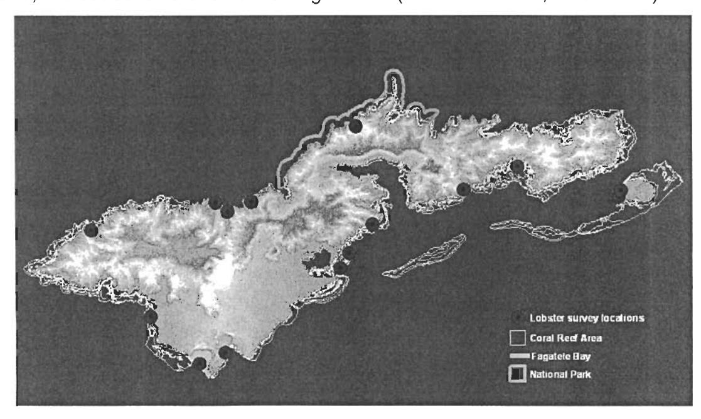

Figure 7. Lobster survey locations around Tutuila (produced by Will White)

At the end of each dive, lobsters were brought back on board. We noted the species, the sex, noting whether females were tarred or berried if necessary, and the number of appendages (antennas or walking legs) broken. Then each animal was weighted (+/-10 g) with spring scales, and the CL was measured with a slider caliper to the nearest mm along the mid-dorsal line from the anterior end and between the post-orbital spines to the posterior edge. All animals other than berried females were tagged with a Floy spaghetti tag inserted dorsally between the cephalothorax and the abdomen. Each tag was numbered and included the DMWR phone number (Figure 8). Animals were then released on the reef edge. Berried females were kept to study fecundity at the laboratory, except in Marine Reserves (Fagatele Bay and National Park) where our permit did not allow bringing animals back.

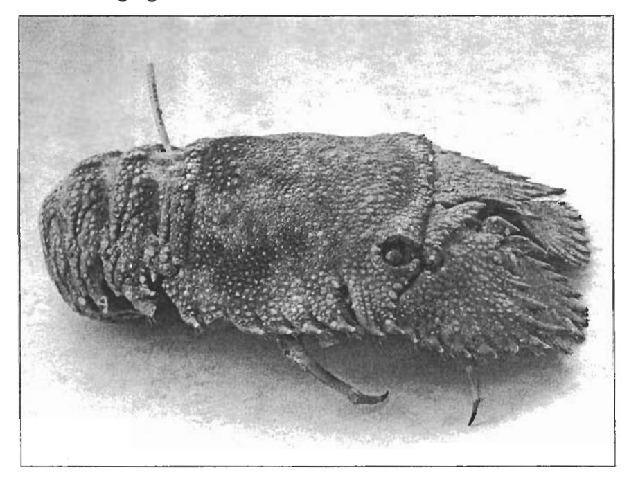

Figure 8: Tagged Parribacus caledonicus

#### 4.1.1.2. Catch composition and CPUE

The catch composition in terms of species, sex-ratio, average length, and Catch per Unit Effort (weight or number of individuals fished), were estimated in order to compare our values with the data obtained from the commercial fishery. Sex-ratio was compared to the 1:1 expected frequency with a  $\chi^2$  test (Sokal & Rohlf, 1995).

#### 4.1.1.3. Estimation of the population size

The capture/tagging/recapture technique was set up to estimate the population at the scale of each site, and with the usual assumptions (no lost tags or death, no emigrants, no immigrants). These tags remain readable through several molts. We expected to catch less and less untagged individuals at each trip2. Densities at each site would be estimated per reef km, and thus, data expanded to the Tutuila coastline.

#### 4.1.1.4. Fecundity and size at sexual maturity

The fecundity, estimated by the number of eggs as a function of the size, is a fundamental fact for determining a species' reproductive potential. These data are useful to manage this high-value resource.

When berried females were caught in the field, they were brought back to the laboratory. Each egg mass with pleopod attached was removed while the lobster was fresh and was fixed in a 10 % formalin and seawater solution. A waterproof label indicating the species, the CL, the date and the site was placed in the jar.

After hardening for about 30 days, eggs were excised from pleopods and dried to a constant weight (60°C/140°F during 3 days). The dried eggs were then weighed to the nearest mg. Three replicate 0.1 g samples were taken from each mass of dried, rubbed between the fingers to separate the eggs and remove any attached setal material, and counting manually. Egg breakage was negligible. The average of the three samples was used to calculate the total number of eggs for each respective female. Drying, weighing, and counting were done at the American Samoa Community College in the Soil Science Laboratory run by Dr. Don Vargo.

Berried females were sometimes seized by the DMWR Enforcement staff, and they have been included in the sampling.

Size at sexual maturity was estimated as the size at which 50 % of the females are berried (ovigerous).

&lt;sup>2 In order to obtain values of growth, a public notice (for seafood markets) was made to advertise fishermen who caught tagged lobster in the field (Appendix II & III)

#### 4.1.2. Study of the commercial fishery

Market surveys began in early October 2002. They consisted of two samplings per week and later four a week in markets which sell seafoods all around Tutuila Island. Furthermore, import surveys were carried out. Landings from Manu'a Islands and "Western" Samoa were checked from the port and the airport, both twice a month.

Market surveys were done early in the morning, for two reasons. First, the fishermen bring in their catches in the morning, and the data collectors can meet and interview them in order to obtain information about the fishing party: fishing site, number of divers, duration etc (Figure 9). Secondly, lobster measurement is a long process and data collectors must not impede their work, so this is avoided by doing the market survey early.

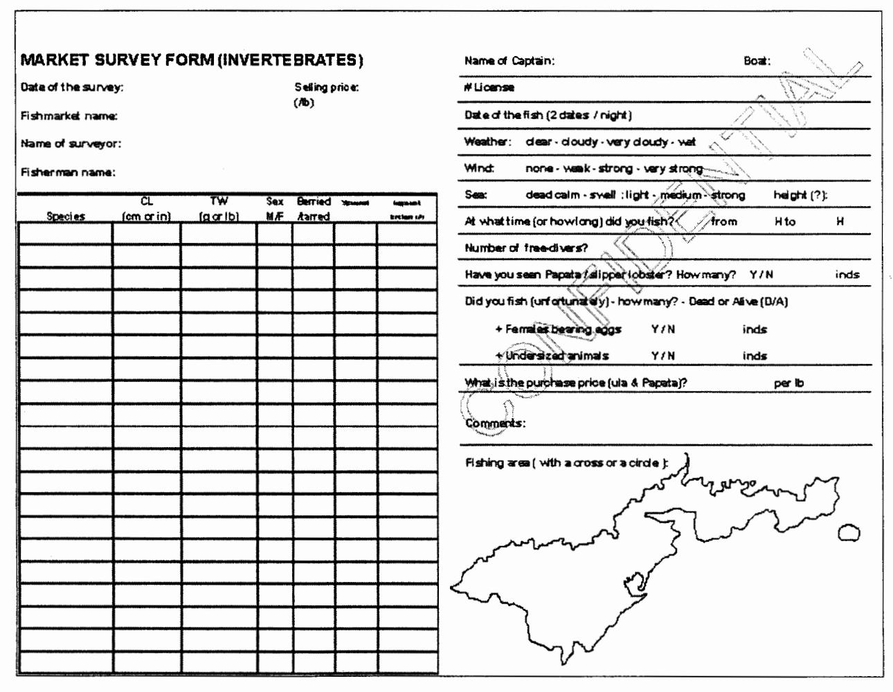

Figure 9: Market survey form

All lobsters were measured, weighed, species and sex were noted, as well as the female reproductive state, and if animals had been speared or not.

Raw data including different variables from previous market surveys have been analyzed to compare with the new data in order to show if the pattern of the lobster catches by commercial fishermen has changed between the two periods. These data (56 fishing teams interviewed; N = 465 lobsters sampled), covering the period between June and November 1999, included in addition to weight and length: the technique used (free or scuba-diving), the species, the sex and the number of divers involved in the fishing outing. In order to evaluate CPUE, we had to estimate the average time spent in the field. Means of fishing duration in Tutuila Island for both free diving (5.15 hours/trip) and scuba-diving (6.4 hours per trip) were found in literature (Page, 1998).

A histogram of length frequency was produced, as well as statistical comparison of average length and CPUE between the two fishing techniques.

The Beverton and Holt's Relative Yield-per-recruit model (Sparre & Venema, 1989) was carried out for assessing the effect of minimum size regulations on the fishery. This 'relative yield per recruit model' developed by Beverton and Holt (1966) is based on length, whose measurement is relatively accurate. This model describes "the state of the stock when the fishing pattern has been the same for such a long time that all fish alive have been exposed to it since they recruited" (Sparre & Venema, 1989). (Y/R)' can be calculated for given input values of M/K,  $CL_{\infty}$  and  $CL_{c}$  (the length at recruitment) for values of E ranging from 0 to 1, corresponding to F values from 0 to  $CL_{\infty}$ .

$$(Y/R)' = E * U^{M/K} * \left[ 1 - \frac{3U}{1+m} + \frac{3U^2}{1+2m} - \frac{3U^3}{1+3m} \right]$$

$$m = \frac{K}{Z}$$

$$U = 1 - \frac{CL_c}{CL_{\infty}}$$
 the fraction of growth to be completed after entry into the exploited phase 
$$E = \frac{F}{Z}$$
 the exploitation rate of the fraction of deaths caused by fishing

"The plot of (Y/R)' against E gives a curve with a maximum value,  $E_{MSY}$  (Maximum Sustainable Yield), for a given value of  $CL_c$ . Thus, when  $CL_c$ , F and M/K are known for a certain fishery the actual exploitation rate can be compared with the  $E_{MSY}$  level and management measures be proposed as necessary" (Sparre & Venema, 1989).

#### 4.2. RESULTS

#### 4.2.1. Field surveys

Field surveys were conducted from October 2002 to January 2003 at which time surveys were terminated when a field assistant drowned (see Preface).

#### 4.2.1.1. Catch composition and CPUE in the field survey

The total field work allowed the measuring of 25 *Panulirus penicillatus*, 107 *Parribacus caledonicus*, and 9 *P. antarcticus* (Table 1). The number of *P. penicillatus* males and females was not different in the catches ( $\chi^2$ -test, p = 0.1615), whereas males of *P. caledonicus* were significantly more numerous than females ( $\chi^2$ -test, p < 0.01). The catches of *P. antarcticus* were too small to show an accurate sex-ratio.

We caught several juveniles of *P. caledonicus*, the smallest having less than two molts spent on the reef, i.e. post-settlement. During the dive, in addition to the lobsters caught, we counted 73 spiny lobsters and 7 slipper lobsters seen but not captured (by escaping, too deeply in their den, or out of reach).

Table 1: Catch and measurements obtained during field sampling Values in inches in red; B = Berried; T = Tarred (fertilized)

|                           |            | Number Reprodu            | Average Condition                 | cruit don de la cruit de la cruit de la cruit de la cruit de la cruit de la cruit de la cruit de la cruit de la cruit de la cruit de la cruit de la cruit de la cruit de la cruit de la cruit de la cruit de la cruit de la cruit de la cruit de la cruit de la cruit de la cruit de la cruit de la cruit de la cruit de la cruit de la cruit de la cruit de la cruit de la cruit de la cruit de la cruit de la cruit de la cruit de la cruit de la cruit de la cruit de la cruit de la cruit de la cruit de la cruit de la cruit de la cruit de la cruit de la cruit de la cruit de la cruit de la cruit de la cruit de la cruit de la cruit de la cruit de la cruit de la cruit de la cruit de la cruit de la cruit de la cruit de la cruit de la cruit de la cruit de la cruit de la cruit de la cruit de la cruit de la cruit de la cruit de la cruit de la cruit de la cruit de la cruit de la cruit de la cruit de la cruit de la cruit de la cruit de la cruit de la cruit de la cruit de la cruit de la cruit de la cruit de la cruit de la cruit de la cruit de la cruit de la cruit de la cruit de la cruit de la cruit de la cruit de la cruit de la cruit de la cruit de la cruit de la cruit de la cruit de la cruit de la cruit de la cruit de la cruit de la cruit de la cruit de la cruit de la cruit de la cruit de la cruit de la cruit de la cruit de la cruit de la cruit de la cruit de la cruit de la cruit de la cruit de la cruit de la cruit de la cruit de la cruit de la cruit de la cruit de la cruit de la cruit de la cruit de la cruit de la cruit de la cruit de la cruit de la cruit de la cruit de la cruit de la cruit de la cruit de la cruit de la cruit de la cruit de la cruit de la cruit de la cruit de la cruit de la cruit de la cruit de la cruit de la cruit de la cruit de la cruit de la cruit de la cruit de la cruit de la cruit de la cruit de la cruit de la cruit de la cruit de la cruit de la cruit de la cruit de la cruit de la cruit de la cruit de la cruit de la cruit de la cruit de la cruit de la cruit de la cruit de la cruit de la cruit de la cruit de la cr | MinimumCL C         | Maximum             |
|---------------------------|------------|---------------------------|-----------------------------------|--------------------------------------------------------------------------------------------------------------------------------------------------------------------------------------------------------------------------------------------------------------------------------------------------------------------------------------------------------------------------------------------------------------------------------------------------------------------------------------------------------------------------------------------------------------------------------------------------------------------------------------------------------------------------------------------------------------------------------------------------------------------------------------------------------------------------------------------------------------------------------------------------------------------------------------------------------------------------------------------------------------------------------------------------------------------------------------------------------------------------------------------------------------------------------------------------------------------------------------------------------------------------------------------------------------------------------------------------------------------------------------------------------------------------------------------------------------------------------------------------------------------------------------------------------------------------------------------------------------------------------------------------------------------------------------------------------------------------------------------------------------------------------------------------------------------------------------------------------------------------------------------------------------------------------------------------------------------------------------------------------------------------------------------------------------------------------------------------------------------------------|---------------------|---------------------|
| Panuilirus                | o*         | 9                         | 7.56 (1.32) 2.97 (0.52)        | <b>360</b> (170.8) <b>0.79</b> (0.38)                                                                                                                                                                                                                                                                                                                                                                                                                                                                                                                                                                                                                                                                                                                                                                                                                                                                                                                                                                                                                                                                                                                                                                                                                                                                                                                                                                                                                                                                                                                                                                                                                                                                                                                                                                                                                                                                                                                                                                                                                                                                                       | 5.47 2.15        | 9.05 3.56        |
| penicillatus              | φ          | 16 2 B 8 T     | <b>6.77</b> (1.25) 2.67 (0.49) | <b>282</b> (118.6) <b>0.62</b> (0.26)                                                                                                                                                                                                                                                                                                                                                                                                                                                                                                                                                                                                                                                                                                                                                                                                                                                                                                                                                                                                                                                                                                                                                                                                                                                                                                                                                                                                                                                                                                                                                                                                                                                                                                                                                                                                                                                                                                                                                                                                                                                                                       | 4.16 <u>1.64</u> | 8.90 3.50        |
|                           | JUV.       | 14                        | 3.80 (0.92) 1.50 (0.36)        | 33 (27.1) 0.07 (0.06)                                                                                                                                                                                                                                                                                                                                                                                                                                                                                                                                                                                                                                                                                                                                                                                                                                                                                                                                                                                                                                                                                                                                                                                                                                                                                                                                                                                                                                                                                                                                                                                                                                                                                                                                                                                                                                                                                                                                                                                                                                                                                                       | 2.64 1.04        | 3.80 1.50        |
| Parribacus caledonicus | ơ <b>"</b> | 60                        | 7.04 (0.45) 2.77 (0.18)        | 166 (38.9) 0.36 (0.09)                                                                                                                                                                                                                                                                                                                                                                                                                                                                                                                                                                                                                                                                                                                                                                                                                                                                                                                                                                                                                                                                                                                                                                                                                                                                                                                                                                                                                                                                                                                                                                                                                                                                                                                                                                                                                                                                                                                                                                                                                                                                                                      | 5.64 2.22        | 7.99 <u>3.15</u> |
|                           | φ          | 33 2 B 17 T | <b>7.04</b> (0.39) 2.77 (0.15) | 159 (31.0) 0.35 (0.07)                                                                                                                                                                                                                                                                                                                                                                                                                                                                                                                                                                                                                                                                                                                                                                                                                                                                                                                                                                                                                                                                                                                                                                                                                                                                                                                                                                                                                                                                                                                                                                                                                                                                                                                                                                                                                                                                                                                                                                                                                                                                                                      | 6.10 2.40        | 7.62 3.00        |
| Parribacus                | o*         | 8                         | 7.02 (0.46) 2.76 (0.18)        | 159 (33.0) 0.35 (0.07)                                                                                                                                                                                                                                                                                                                                                                                                                                                                                                                                                                                                                                                                                                                                                                                                                                                                                                                                                                                                                                                                                                                                                                                                                                                                                                                                                                                                                                                                                                                                                                                                                                                                                                                                                                                                                                                                                                                                                                                                                                                                                                      | 6.26 2.46        | 7.59 2.99        |
| antarcticus               | φ          | 1 0B 1T                | 7.00 2.76                      | 175 <u>0.39</u>                                                                                                                                                                                                                                                                                                                                                                                                                                                                                                                                                                                                                                                                                                                                                                                                                                                                                                                                                                                                                                                                                                                                                                                                                                                                                                                                                                                                                                                                                                                                                                                                                                                                                                                                                                                                                                                                                                                                                                                                                                                                                                             | 1                   | 1                   |

Table 2 shows the CPUE for a total of 16 hours spent in the field. The CPUE are higher for the slipper lobsters compared with spiny lobsters in terms of number of animals (mean comparison test, p < 0.05) and even in weight but not statistically (p = 0.187). Maximum CPUE for spiny lobsters were found in Alega: 1,106 g (2.44 lb) per diver per hour, and in Sogi for slipper lobsters: 1,425 g (3.14 lb) per diver per hour. In addition, although there were 2 or 3 divers in each fishing trip, most of the lobsters (78 %) were caught by the author, showing large differences between the efficiency of individual fishermen; e.g. author's CPUE of slipper lobster in Sogi: 2.507 g.diver-1.hour-1 (5.53 lb).

Table 2: Catch Per Unit Effort (CPUE) in weight and number of lobsters per hour per diver obtained during

16 hours of field sampling

|                    | CPUE per hour per diver |                           |                 |                                                |  |  |  |
|--------------------|----------------------------|---------------------------|-----------------|------------------------------------------------|--|--|--|
|                    |                            | e <b>r gr</b> a per ll |                 | per individual                                 |  |  |  |
|                    | Total Lobsters             | illatus                   | us spp.         | Total Lobsters . penicillatus                  |  |  |  |
| Field survey       | Total Lo                   | P. penicillatus           | Parribacus spp. | Total Lobsters P. penicillatus Parribacus spp. |  |  |  |
| Average            | 734                        | 266                       | 468             | 3.98 0.83 3.15                                 |  |  |  |
|                    | <u>1.63</u>                | 0.59                      | 1.03            |                                                |  |  |  |
| Standard Deviation | 680                        | 269                       | 486             | 3.91 0.81 3.39                                 |  |  |  |
|                    | 1.50                       | <u>0.59</u>               | <u>1.07</u>     |                                                |  |  |  |

#### 4.2.1.2. Estimation of the population size

The field survey did not last enough time to give information on lobster abundance. We must note that Sogi was the first and only site re-visited (11/25/02 and 01/23/03), and one tagged lobster (*Parribacus caledonicus* male) was re-caught indicating that the sampling protocol was potentially effective. During the 60 days of freedom, the animal did not moulted.

#### 4.2.1.3. Fecundity and size at sexual maturity

During the field surveys, 3 *Panulirus penicillatus* and 3 *Parribacus caledonicus* berried females were caught. We added to our samples 30 berried-females of *Panulirus penicillatus*, found in an ice-cooler from Apia, and seized by enforcement officers. Fecundity of the 33 spiny lobsters is shown in the Figure 10.

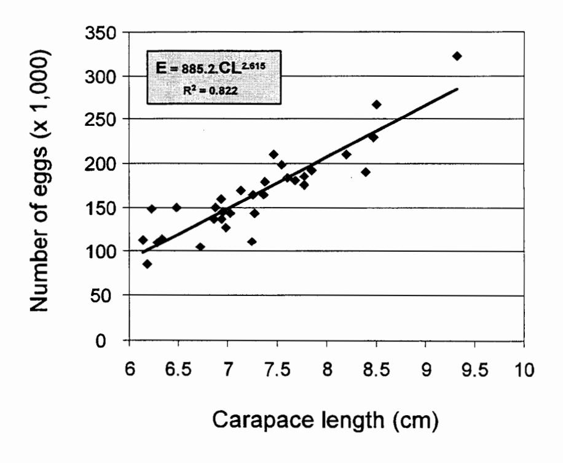

Figure 10: Graph of number of eggs vs Carapace Length (CL) for *Panulirus penicillatus* in the Samoan Archipelago (N = 33)

Size at sexual maturity, i.e. size when 50 % of females are ovigerous, was estimated to be around 7 cm CL (2.76 in) whereas the smallest berried females measured 5.25 cm CL (2.07 in) (Figure 11).

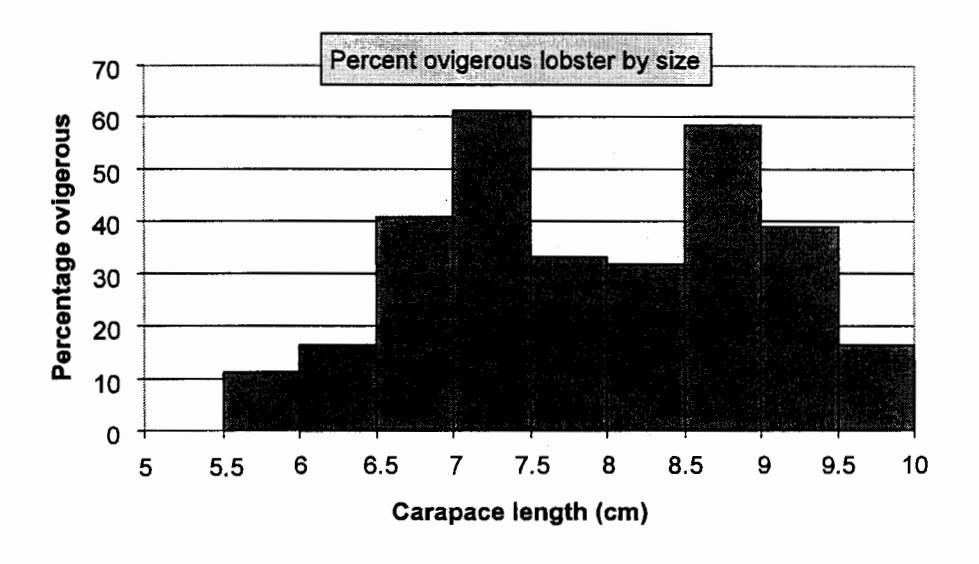

Figure 11: The percentage of ovigerous female *P. penicillatus* in 5 mm carapace length size intervals

In American Samoa (N of females = 190; N of berried females = 75)

The number of eggs counted on 3 Parribacus caledonicus is shown in Table 3.

Table 3: Number of eggs vs Carapace Length (CL) for the 3 berried-females of *Parribacus caledonicus* caught in the field

|                           | CL (mm and <u>in</u> ) | Number of eggs |
|---------------------------|---------------------------|----------------|
|                           | 73.8 2.91              | 156,214        |
| Parribacus caledonicus | 75.0 2.95              | 210,646        |
|                           | 77.5 <u>3.05</u>       | 192,874        |

#### 4.2.2. Market surveys

## 4.2.2.1. Catch composition and CPUE from market survey Oct. 2002 – Oct. 2003

In the course of 162 market surveys carried out, a total of 314.5 kg (693.4 lb) of Crustaceans were sampled. The number of individuals of each sex and the weight per species is summarized in the Table 4, and Table 5 includes measurements of *P. penicillatus*.

Table 4: Catch composition per species (number of individuals & weight) in market samples (Oct. 2002 - Oct. 2003)

| Species                    | Number                      | Total weight in kg / in lb |
|----------------------------|-----------------------------|----------------------------|
| Panuilirus penicillatus | 462 O * 192 P | 303.5 669.1             |
| Panulirus versicolor    | 1 0                         | 0.5 <u>1.1</u>          |
| Parribacus caledonicus  | 2 0° 3 Q                 | 1.0 2.2                 |
| Etisus splendidus       | 14 O 2                      | 10.5 23.1               |

TOTAL 314.5 kg 693.4 lb The main part of the Crustaceans sold in Tutuila Island consists of spiny lobsters (97 % in weight). Other species are uncommon or rare such as one individual of *Panulirus versicolor*, and 5 *Parribacus caledonicus*. We also sampled a species of crab found sometimes in several stores, *Etisus spendidus*3 Rathbun, 1906, called red-crab (Figure 12). All spiny lobsters had been speared and were sold in ice-coolers containing mixed ice and freshwater.

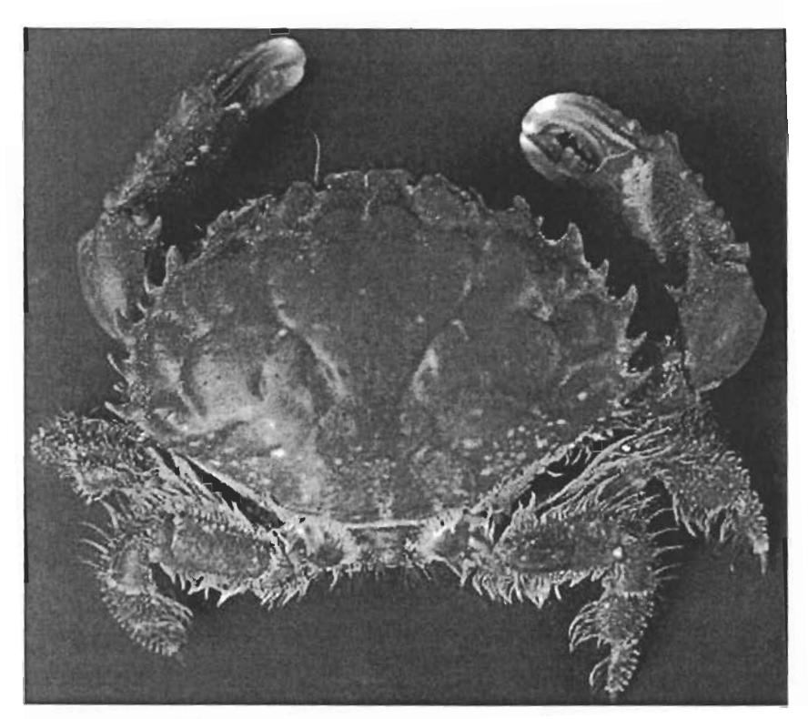

Figure 12: The red-crab *Etisus splendidus* Rathbun, 1906 (Photo: J. Poupin, http://biomar.free.fr/etisus\_splendidus.html)

Males of *P. penicillatus* are statistically more numerous than females in the sample (M:F = 2.4:1;  $\chi^2$ -test, p < 0.001).

&lt;sup>3 Poupin (<a href="http://decapoda.ecole-navale.fr/crabs.php">http://decapoda.ecole-navale.fr/crabs.php</a>) indicates that this species, common in French Polynesia is poisonous or sometimes fatal, but Carpenter and Niem (1998) note it is consumed for subsistence throughout Pacific.

Table 5: Catch and measurements obtained during market sampling (2002-2003)

Values in inches in red; B = Berried; T = Tarred (fertilized)

|              |   | Mumber Reb           | oductive condition         | cruit jon a cruit de la cruit de la cruit de la cruit de la cruit de la cruit de la cruit de la cruit de la cruit de la cruit de la cruit de la cruit de la cruit de la cruit de la cruit de la cruit de la cruit de la cruit de la cruit de la cruit de la cruit de la cruit de la cruit de la cruit de la cruit de la cruit de la cruit de la cruit de la cruit de la cruit de la cruit de la cruit de la cruit de la cruit de la cruit de la cruit de la cruit de la cruit de la cruit de la cruit de la cruit de la cruit de la cruit de la cruit de la cruit de la cruit de la cruit de la cruit de la cruit de la cruit de la cruit de la cruit de la cruit de la cruit de la cruit de la cruit de la cruit de la cruit de la cruit de la cruit de la cruit de la cruit de la cruit de la cruit de la cruit de la cruit de la cruit de la cruit de la cruit de la cruit de la cruit de la cruit de la cruit de la cruit de la cruit de la cruit de la cruit de la cruit de la cruit de la cruit de la cruit de la cruit de la cruit de la cruit de la cruit de la cruit de la cruit de la cruit de la cruit de la cruit de la cruit de la cruit de la cruit de la cruit de la cruit de la cruit de la cruit de la cruit de la cruit de la cruit de la cruit de la cruit de la cruit de la cruit de la cruit de la cruit de la cruit de la cruit de la cruit de la cruit de la cruit de la cruit de la cruit de la cruit de la cruit de la cruit de la cruit de la cruit de la cruit de la cruit de la cruit de la cruit de la cruit de la cruit de la cruit de la cruit de la cruit de la cruit de la cruit de la cruit de la cruit de la cruit de la cruit de la cruit de la cruit de la cruit de la cruit de la cruit de la cruit de la cruit de la cruit de la cruit de la cruit de la cruit de la cruit de la cruit de la cruit de la cruit de la cruit de la cruit de la cruit de la cruit de la cruit de la cruit de la cruit de la cruit de la cruit de la cruit de la cruit de la cruit de la cruit de la cruit de la cruit de la cruit de la cruit de la cruit de la cruit de la cruit de la cruit de la cruit | Kallon Eviation | Lenning CL enti |
|--------------|---|----------------------|----------------------------|-------------------------------------------------------------------------------------------------------------------------------------------------------------------------------------------------------------------------------------------------------------------------------------------------------------------------------------------------------------------------------------------------------------------------------------------------------------------------------------------------------------------------------------------------------------------------------------------------------------------------------------------------------------------------------------------------------------------------------------------------------------------------------------------------------------------------------------------------------------------------------------------------------------------------------------------------------------------------------------------------------------------------------------------------------------------------------------------------------------------------------------------------------------------------------------------------------------------------------------------------------------------------------------------------------------------------------------------------------------------------------------------------------------------------------------------------------------------------------------------------------------------------------------------------------------------------------------------------------------------------------------------------------------------------------------------------------------------------------------------------------------------------------------------------------------------------------------------------------------------------------------------------------------------------------------------------------------------------------------------------------------------------------------------------------------------------------------------------------------------------------|--------------------|-----------------|
| Panuilirus   | 0 | 462                  | 8.82 (1.64) 3.47 (0.64) | <b>515</b> (335) 1.14 (0.74)                                                                                                                                                                                                                                                                                                                                                                                                                                                                                                                                                                                                                                                                                                                                                                                                                                                                                                                                                                                                                                                                                                                                                                                                                                                                                                                                                                                                                                                                                                                                                                                                                                                                                                                                                                                                                                                                                                                                                                                                                                                                                               | 5.00 1.97       | 13.35 5.26   |
| penicillatus | φ | <b>192</b> 79 B 94 T | <b>7.98</b> (1.17)         | <b>340</b> (204) <b>0.75</b> (0.45)                                                                                                                                                                                                                                                                                                                                                                                                                                                                                                                                                                                                                                                                                                                                                                                                                                                                                                                                                                                                                                                                                                                                                                                                                                                                                                                                                                                                                                                                                                                                                                                                                                                                                                                                                                                                                                                                                                                                                                                                                                                                                        | 5.14 2.02       | 10.72 4.22   |

The Figure 13 shows the length frequency (5 mm size-class) for *Panulirus* penicillatus males and females obtained from market survey 02-03.

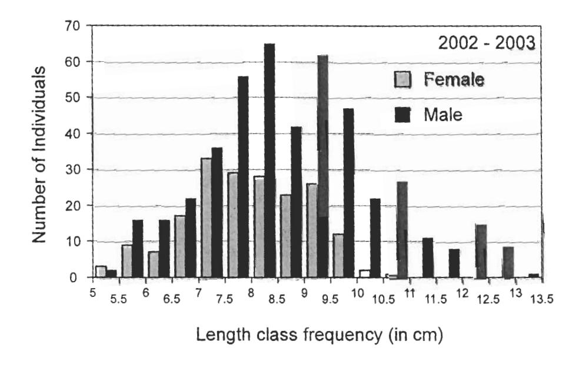

Figure 13: Carapace length frequency (size-classes: 0.5) of *Panulirus penicillatus* males (N=461) and females (N=192) sampled during market surveys (Oct. 2002 – Oct. 2003)

A 16.3 cm long male has been removed from the graph

We obtained 44 interviews of fishermen while bringing their catches to the store. These interviews allowed us to estimate artisanal CPUE for *Panulirus penicillatus* in Tutuila Island (Table 6).

Table 6: Fishing trip information and non-target Catch Per Unit Effort (CPUE) in weight and number of lobsters per hour per diver obtained during market sampling 2002-2003. N = 44 team interviewed.

| Market survey                            | of diver team   | ation of outing  | СР                 | UE                |
|------------------------------------------|--------------------|---------------------|--------------------|-------------------|
| 02-03                                    | Av. # of per te | Av. dura fishing | per kg (per lb) | per individual |
| Average (N = 44) (Standard Deviation) |                    | <b>3:11</b> (1:25)  | <b>0.66</b> (0.47) | 1.30 (0.95)       |

Furthermore, interviews gave us important information about the professional fishery. Fishermen free-dive by night, near the reef edge, sometimes wearing only boots to jump between grooves. Equipped with a spear, they catch all marketable fishes, and crustaceans (the former while they sleep, the latter when they forage). Animals caught are strung on a line tied to their belt which is dragged behind them. This technique allows the fishermen their hands free and perhaps to stay confident if they encounter a shark. However, without a bag, it is impossible to keep animals alive which were grabbed by hand. This is an important fact to consider in potential recommendations and will be discussed later.

Thus, the fishermen are <u>not</u> only targeting lobsters, and the CPUE obtained from the market samples, focused on this species, do not reflect the total catches landed by the fishermen at each fishing trip.

## 4.2.2.2. Fishing technique, catch composition and CPUE from previous market survey (1999)

The 1999 survey showed that some (N = 12) *Panulirus versicolor* were caught, by spearing mainly by scuba-diving (Table 7). This technique allowed fishing in the deepest areas, where calm water and coral garden coral are present. For *P. penicillatus*, the sexratio showed a strong predominance of males in the catches (M:F = 3.77:1;  $\chi^2$ -test, p < 0.001). The histogram of length frequency (Figure 14) for *P. penicillatus*, illustrates this sex-ratio, and the shift to large sizes reached by the males.

Table 7: Catch and measurements obtained during market sampling (1999)

Values in inches in red; S = Scuba-diving; F = Free-diving

|              |   | Numb | er Catches     | perfering ortnique Avergender | Cruit ion Average week   | eviation Winimum | NO LEWIS      |
|--------------|---|------|----------------|-------------------------------------|--------------------------|------------------|---------------|
| Panuilirus   | ď | 358  | 191 S 167 F | 9.54 (1.44) 3.76 (0.57)          | 650 (300) 1.43 (0.66) | 6.91 2.72     | 13.86 5.46 |
| penicillatus | φ | 95   | 49 S 46 F   | 8.50 (0.92) 3.35 (1.32)          | 480 (180) 1.06 (0.40) | 6.96 2.74     | 11.79 4.64 |
| Panulirus    | ď | 6    | 6 S 0 F     | 10.20 (1.24) 4.01 (0.49)         | 737 (279) 1.62 (0.62) | 8.66 3.41     | 12.05 4.74 |
| versicolor   | φ | 6    | 4 S 2 F     | 8.78 (0.90) 3.46 (0.35)          | 505 (196) 1.11 (0.43) | 7.92 3.12     | 10.15 4.00 |

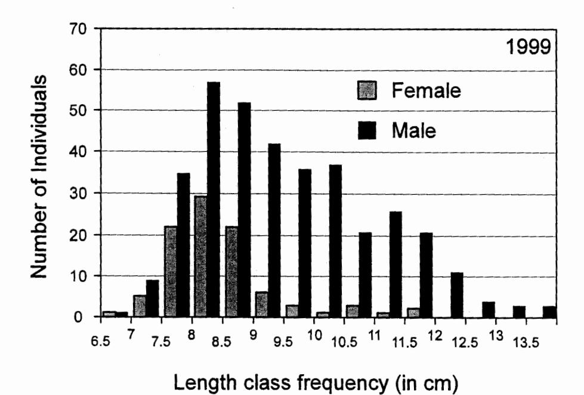

Figure 14: Carapace length frequency (size-classes: 0.5) of *Panulirus penicillatus* males (N=358) and females (N=95) sampled during previous market surveys (1999)

CPUE results are summarized in Table 8.

Table 8: Fishing trip information, Catch Per Unit Effort (CPUE) in weight and number of lobsters per hour per diver obtained from previous market sampling (1999), and Mann & Whitney test between the two fishing technique results

|                        | f diver eam            | Av. duration of fishing outing | CPU                          | JE (SD)            |
|------------------------|---------------------------|-----------------------------------|------------------------------|--------------------|
| Market survey 1999  | Av. # of dive per team | Av. dur fishing                | per gram (per lb)         | per individual  |
| Free Diving N = 18  | <b>4.24</b> (1.85)        | 6:24                              | 318 (449) 0.70 (0.99)     | <b>0.54</b> (0.76) |
| Scuba Diving N = 42 | <b>3.39</b> (1.70)        | 5.15                              | <b>239</b> (215) 0.53 (0.47) | <b>0.37</b> (1.70) |
| Mann & Whitney Test    |                           |                                   | p = 0.955                    | p = 0.892          |

Results of Mann & Whitney non-parametric test (N too small for parametric test) showed that whether by weight (p = 0.955) or by number of individuals (p = 0.892), catches by scuba diving are not different to catches by free diving.

## 4.2.2.3. Comparisons of average length and CPUE between field, 1999 & 2002-2003 market samples

A t-Student (independent variables) has been used to compare the average length of *Panulirus penicillatus* between the two market samples (1999, both by scuba and free-diving, and 2002-2003), for both males and females (Figure 15 & 16).

Analysis indicates that for both males and females, the mean size of *P. penicillatus* decreased between 1999 and 2003-2003 in the commercial landings.

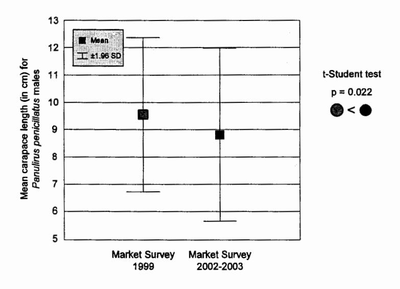

Figure 15: Mean and standard deviation (SD) of Average Carapace Length of *Panulirus penicillatus* males between Market surveys carried out in 1999 and 2002-2003, and results of t-Student test

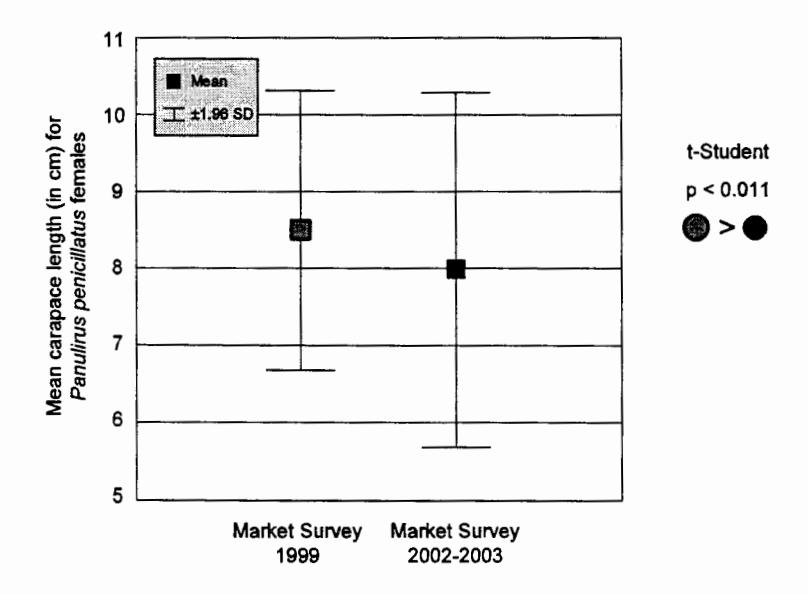

Figure 16: Mean and standard deviation (SD) of Average Carapace Length of *Panulirus penicillatus* females between Market surveys carried out in 1999 and 2002-2003, and results of t-Student test

A Kruskal-Wallis non parametric was used to compare CPUE (in term of weight, and number of individuals per hour) for 1999 (only by free-diving), with 2002-2003, and the samples obtained during the field survey (without considering the species). Results are shown in Figures 17 and 18.

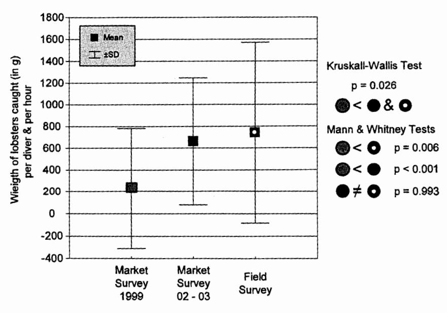

Figure 17: Mean and standard deviation (SD) of CPUE in gram of lobster (all species) per free diver per hour, and results of non parametric tests

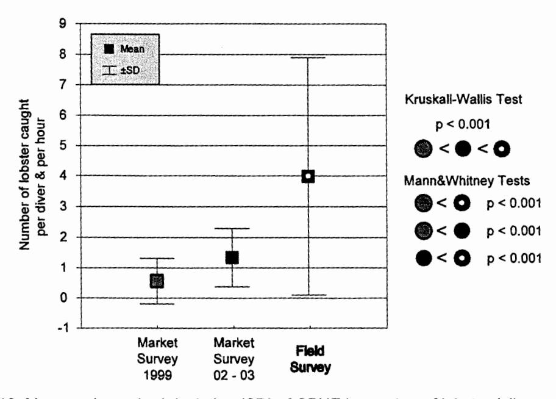

Figure 18: Mean and standard deviation (SD) of CPUE in number of lobster (all species) per free diver per hour, and results of non parametric tests

The Kruskal-Wallis test indicated if there were statistical differences between the 3 samples. If a statistical difference was found, Mann & Whitney tests were used to analyze factors 2 by 2. If we consider the number of lobsters caught, no difference is shown between the CPUE obtained in 1999 and in 2002-2003, but catches are

statistically higher during the field survey than in the other samples. Furthermore, catches in term of weight per hour per diver were less in 1999 than in the field survey and than in 2003-2003, but no difference was shown between 2002-2003 and field survey samples.

#### 4.2.2.4. Length-Weight relationships

After compiling data on *P. penicillatus* from field and market surveys (2002-2003), we established the length-weight relationships both for males (Figure 19) and females (Figure 20), and for *Parribacus caledonicus* (Figure 21).

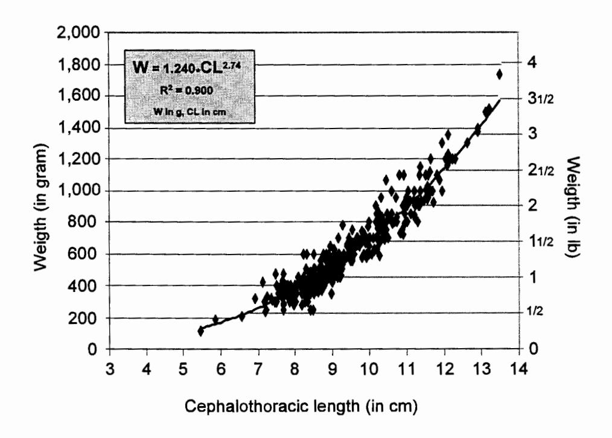

Figure 19: Graph and equation of the Length-Weight relationship for *P. penicillatus* males

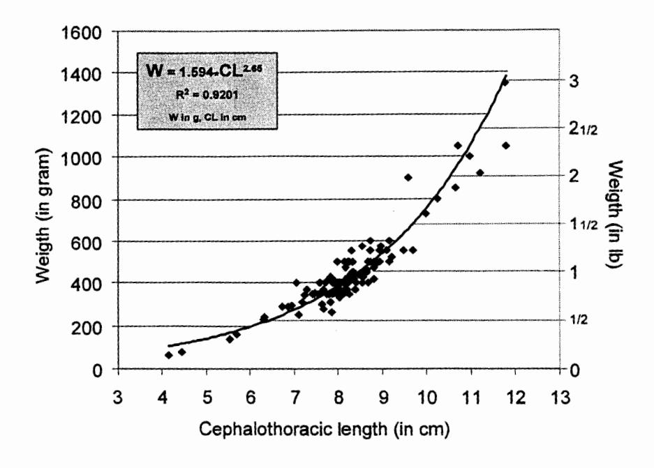

Figure 20: Graph and equation of the Length-Weight relationship for P. penicillatus females

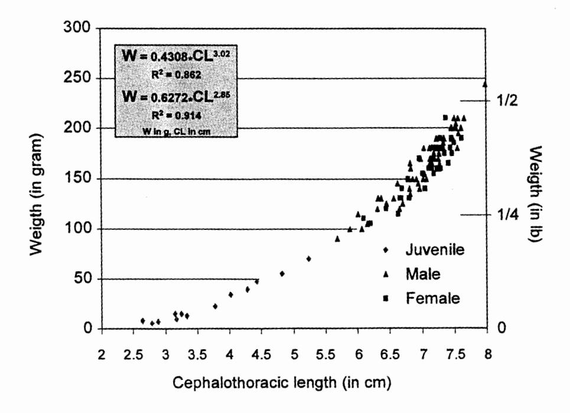

Figure 21: Graph and equation of the Length-Weight relationship for Parribacus caledonicus

#### 4.2.2.5. Von Bertalanffy Growth Curve

Analysis of length-class frequencies did not give accurate values of VBGC parameters. Furthermore, the field protocol included 1 diving site in the Fagatele Bay National Marine Sanctuary in order to sample lobsters in MPAs, and then to estimate the natural mortality. Thus, we have used values of  $CL_{\infty}$ , K,  $t_0$ , and M found in the literature (Table 9).

We have selected the mean values for the Pacific, which are close to the parameters obtained from Western Samoa (King & Bell, 1988).

The parameters used to evaluate Z (Beverton & Holt's equation), the total mortality, was considered to correspond to the size at which probability of capture was 10 % (i.e.  $CL_{10\%}$ ) as proposed by Pitcher (1993).

Table 9: Estimation of the growth parameters of male and female *Panulirus penicillatus* in the Pacific. CL∞: asymptotic Carapace length; K: growth coefficient, t₀: theoretical length at age 0

|             |                | Lifere | jak Epera e f | ord age | Percet 1880 | Coa (King & P. | Jules Andarc. | Red Continue & Charge Continue & Charge & Continue & Continue & Charge & Charge & Charge & Charge & Charge & Charge & Charge & Charge & Charge & Charge & Charge & Charge & Charge & Charge & Charge & Charge & Charge & Charge & Charge & Charge & Charge & Charge & Charge & Charge & Charge & Charge & Charge & Charge & Charge & Charge & Charge & Charge & Charge & Charge & Charge & Charge & Charge & Charge & Charge & Charge & Charge & Charge & Charge & Charge & Charge & Charge & Charge & Charge & Charge & Charge & Charge & Charge & Charge & Charge & Charge & Charge & Charge & Charge & Charge & Charge & Charge & Charge & Charge & Charge & Charge & Charge & Charge & Charge & Charge & Charge & Charge & Charge & Charge & Charge & Charge & Charge & Charge & Charge & Charge & Charge & Charge & Charge & Charge & Charge & Charge & Charge & Charge & Charge & Charge & Charge & Charge & Charge & Charge & Charge & Charge & Charge & Charge & Charge & Charge & Charge & Charge & Charge & Charge & Charge & Charge & Charge & Charge & Charge & Charge & Charge & Charge & Charge & Charge & Charge & Charge & Charge & Charge & Charge & Charge & Charge & Charge & Charge & Charge & Charge & Charge & Charge & Charge & Charge & Charge & Charge & Charge & Charge & Charge & Charge & Charge & Charge & Charge & Charge & Charge & Charge & Charge & Charge & Charge & Charge & Charge & Charge & Charge & Charge & Charge & Charge & Charge & Charge & Charge & Charge & Charge & Charge & Charge & Charge & Charge & Charge & Charge & Charge & Charge & Charge & Charge & Charge & Charge & Charge & Charge & Charge & Charge & Charge & Charge & Charge & Charge & Charge & Charge & Charge & Charge & Charge & Charge & Charge & Charge & Charge & Charge & Charge & Charge & Charge & Charge & Charge & Charge & Charge & Charge & Charge & Charge & Charge & Charge & Charge & Charge & Charge & Charge & Charge & Charge & Charge & Charge & Charge & Charge & Charge & Charge & Charge & Charge & Charge & Charge & Charge & Charge & Charge & Charge & Charge & Charge & Charge & Ch |
|-------------|----------------|--------|---------------|---------|-------------|----------------|---------------|--------------------------------------------------------------------------------------------------------------------------------------------------------------------------------------------------------------------------------------------------------------------------------------------------------------------------------------------------------------------------------------------------------------------------------------------------------------------------------------------------------------------------------------------------------------------------------------------------------------------------------------------------------------------------------------------------------------------------------------------------------------------------------------------------------------------------------------------------------------------------------------------------------------------------------------------------------------------------------------------------------------------------------------------------------------------------------------------------------------------------------------------------------------------------------------------------------------------------------------------------------------------------------------------------------------------------------------------------------------------------------------------------------------------------------------------------------------------------------------------------------------------------------------------------------------------------------------------------------------------------------------------------------------------------------------------------------------------------------------------------------------------------------------------------------------------------------------------------------------------------------------------------------------------------------------------------------------------------------------------------------------------------------------------------------------------------------------------------------------------------------|
| $CL_\infty$ | O x | 14.7   | 14.4          | 17.9    | 15.3        | 16.1           | 17.3          | 15.9                                                                                                                                                                                                                                                                                                                                                                                                                                                                                                                                                                                                                                                                                                                                                                                                                                                                                                                                                                                                                                                                                                                                                                                                                                                                                                                                                                                                                                                                                                                                                                                                                                                                                                                                                                                                                                                                                                                                                                                                                                                                                                                           |
| _∞          | φ              | 9.7    | 11.3          | 12.8    | 12.1        | 14.9           | 15.3          | 12.7                                                                                                                                                                                                                                                                                                                                                                                                                                                                                                                                                                                                                                                                                                                                                                                                                                                                                                                                                                                                                                                                                                                                                                                                                                                                                                                                                                                                                                                                                                                                                                                                                                                                                                                                                                                                                                                                                                                                                                                                                                                                                                                           |
| K           | O.             | 0.21   | 0.29          | 0.27    | 0.27        | 0.22           | 0.26          | 0.25                                                                                                                                                                                                                                                                                                                                                                                                                                                                                                                                                                                                                                                                                                                                                                                                                                                                                                                                                                                                                                                                                                                                                                                                                                                                                                                                                                                                                                                                                                                                                                                                                                                                                                                                                                                                                                                                                                                                                                                                                                                                                                                           |
| 1           | φ              | 0.58   | 0.49          | 0.32    | 0.27        | 0.16           | 0.32          | 0.30                                                                                                                                                                                                                                                                                                                                                                                                                                                                                                                                                                                                                                                                                                                                                                                                                                                                                                                                                                                                                                                                                                                                                                                                                                                                                                                                                                                                                                                                                                                                                                                                                                                                                                                                                                                                                                                                                                                                                                                                                                                                                                                           |
| +           | 0              | -0.165 | -0.375        | n/a     | n/a         | n/a            | -0.700        | -0.413                                                                                                                                                                                                                                                                                                                                                                                                                                                                                                                                                                                                                                                                                                                                                                                                                                                                                                                                                                                                                                                                                                                                                                                                                                                                                                                                                                                                                                                                                                                                                                                                                                                                                                                                                                                                                                                                                                                                                                                                                                                                                                                         |
| to          | <b>P</b>       | -0.092 | -0.275        | n/a     | n/a         | n/a            | -1.00         | -0.456                                                                                                                                                                                                                                                                                                                                                                                                                                                                                                                                                                                                                                                                                                                                                                                                                                                                                                                                                                                                                                                                                                                                                                                                                                                                                                                                                                                                                                                                                                                                                                                                                                                                                                                                                                                                                                                                                                                                                                                                                                                                                                                         |
| M           | 0              | 0.36   | 0.39          | *       | *           | *              | *             | 0.375                                                                                                                                                                                                                                                                                                                                                                                                                                                                                                                                                                                                                                                                                                                                                                                                                                                                                                                                                                                                                                                                                                                                                                                                                                                                                                                                                                                                                                                                                                                                                                                                                                                                                                                                                                                                                                                                                                                                                                                                                                                                                                                          |
| IVI         | φ              | 0.48   | 0.43          | *       | *           | *              | *             | 0.46                                                                                                                                                                                                                                                                                                                                                                                                                                                                                                                                                                                                                                                                                                                                                                                                                                                                                                                                                                                                                                                                                                                                                                                                                                                                                                                                                                                                                                                                                                                                                                                                                                                                                                                                                                                                                                                                                                                                                                                                                                                                                                                           |

The F value was obtained by deduction of M from Z (Table 10).

Table 10: Parameters used to estimate the total mortality Z; values of M and F, respectively natural and fishing mortalities for P. penicillatus from market surveys in 1999 and 2002-2003

Values of Carapace Length (CL) in cm and (in) - CL' = Cl10%

|                 |    | K    | $CL_\infty$    | CL             | CL' Z            | M     | F     |
|-----------------|----|------|----------------|----------------|------------------|-------|-------|
| Market          | o* | 0.25 | 15.9 (6.26) | 8.82 (3.47) | 6.9 <b>0.921</b> | 0.375 | 0.546 |
| Survey 02-03 | φ  | 0.30 | 12.7 (5)    | 7.98 (3.14) | 6.5 <b>0.957</b> | 0.460 | 0.497 |
| Market          | 0  | 0.25 | 15.9 (6.26) | 9.74 (3.83) | 8.3 <b>1.069</b> | 0.375 | 0.694 |
| Survey 1999  | φ  | 0.30 | 12.7 (5)    | 8.50 (3.35) | 7.0 <b>0.840</b> | 0.460 | 0.380 |

Von Bertalanffy growth curves for males and females of *P. penicillatus* are illustrated in Figure 22.

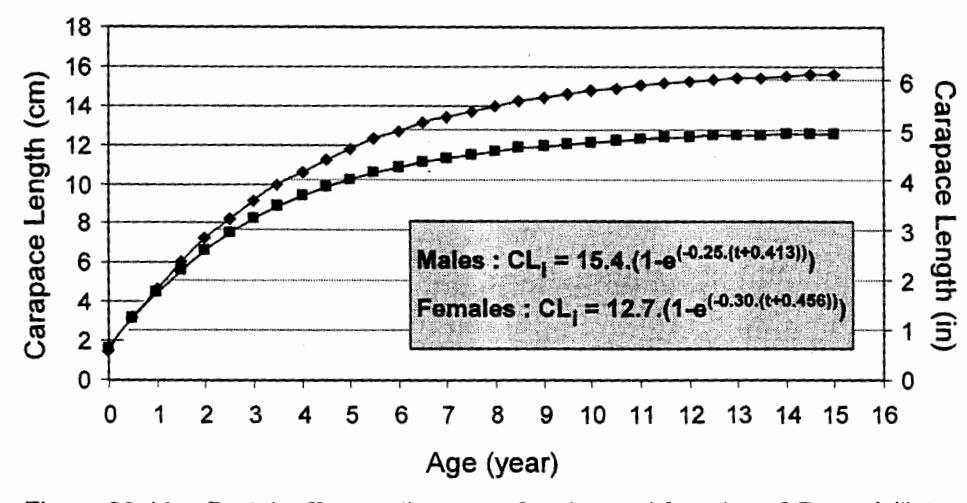

Figure 22: Von Bertalanffy growth curve of males and females of P. penicillatus

#### 4.2.2.6. Beverton and Holt's relative Yield per recruit model

This model was applied to several data sets, and the results are shown with graphs of Relative Yield Per Recruit [YPR', which does not correspond to concrete values] against F (Fishing mortality) and E (Exploitation rate). With data sets obtained during market surveys in 2002-2003, graphs for males and females include 2 types of

F/E pairs: actual and MSY (Maximum Sustainable Yield) (Figures 23). Results of data obtained in the previous market survey include F/E and MSY for 1999 (Figures 24).

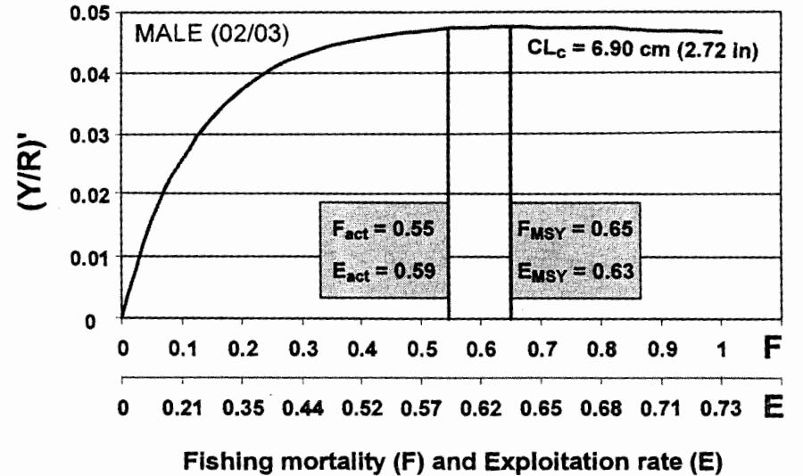

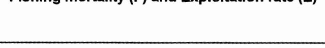

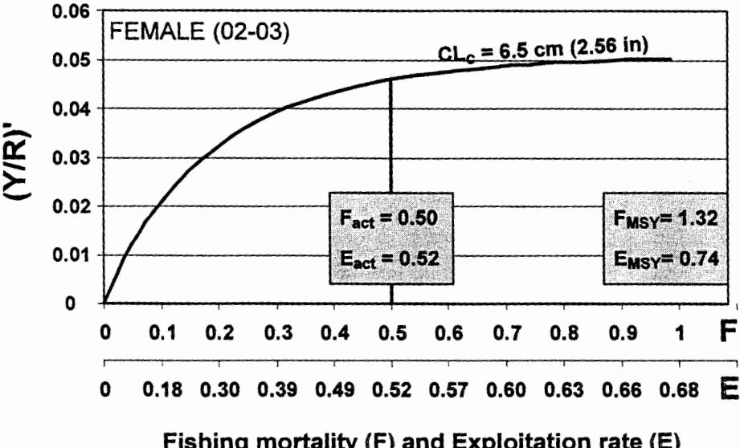

Fishing mortality (F) and Exploitation rate (E)

Figure 23: Relative Yield per Recruit graph for male and female Panulirus penicillatus as a function of fishing mortality (F) and exploitation rate (E). The red curve corresponds to the actual (2002-2003) parameters, i.e. carapace length at recruitment (CLc) = 5 cm.  $E_{MSY}$  and  $F_{MSY}$  = Values for Maximum Sustainable Yield.

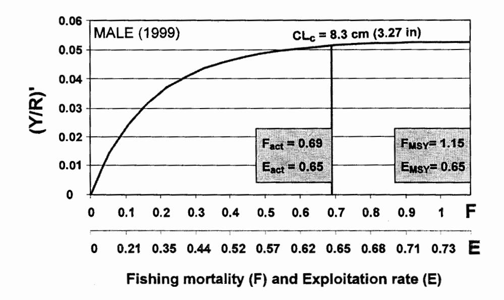

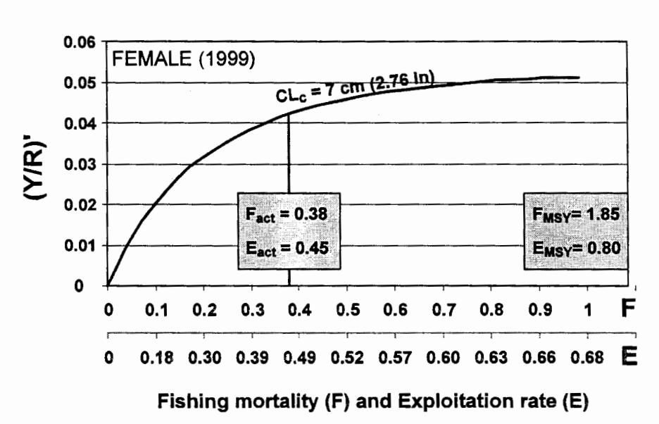

Figure 24: Relative Yield per Recruit graph for male and female *Panulirus penicillatus* as a function of fishing mortality (F) and exploitation rate (E) in 1999.  $E_{MSY}$  and  $F_{MSY}$  = Values for Maximum Sustainable Yield.

#### 4.3. DISCUSSION

#### 4.3.1. Catch Composition

The 3 sampling sets (field survey 2002, market survey 1999, and market survey 2002-2003) show different patterns in terms of species composition and sex-ratio.

The artisanal fishery targets mainly spiny lobsters, other crustaceans being caught opportunistically. Results of interviews with fishermen do not show a tendency to keep slipper lobsters or crabs for self-consumption. They catch and sell all crustaceans seen in the fishing area but few fishermen bring a bag into the field to catch slipper lobsters and crabs without spearing them. It may be noted that the purchase and selling prices (mean \$3.95, and \$5.05 per lb, respectively) are equal for all the lobsters, implying that fishermen do not hesitate to sell all their catches. The difference between our field sampling and the commercial catches is certainly due to two factors. Firstly, the fishing effort is focused near the spurs and grooves where fishermen target reef fishes and spiny lobsters. During the field survey, we swam in a zigzag fashion, coming from the spurs to the beginning of the reef flat near the breakers. Thus, we covered part of the habitat of the 2 species. Secondly, the spear fishing technique associated with the system to carry the catches on a line limit the catch of slipper lobsters (which cannot be speared by law) and crabs.

In the same way, the sex-ratio is strongly in favor of males in the 2 market samples, and weakly for females in the field survey (with smaller number of samples). Zann (1984) in Tonga and deBruin (1962) in Sri Lanka found the sex ratio of *P. penicillatus* favored males, whereas it was the reverse in the Solomon (Prescott, 1988) and in the Marshall (Ebert & Ford, 1986). Ebert & Ford (1986) indicated that females came further up the reef flat than the males, and hence were more likely to be captured by walking on the reef flat, as they did. MacDonald (1979) indicated that more males of *P. penicillatus* were caught in Hawaii, maybe because traps were set in deeper areas. This behavior would explain the difference shown in our results, the fishermen staying in spurs and groves, whereas we also searched the reef flat. Another or complementary explanation has been proposed by Shacklee (1983) who showed for *Panulirus* 

marginatus (a species endemic to Hawaii) a natural non-equal sex ratio from the eggs to the adult population. For *Parribacus parribacus*, our catches included more males than females perhaps for the same reason. In New Caledonia (Coutures, pers. obs.) and in Tonga (Prescott, 1988), catches of this species made by walking at low tide on the reef flat showed a sex ratio in favor of females indicated a slight difference in the habitat of the sexes.

As a function of the number of days sampled at markets during the survey period versus the total week days per year, we estimated to 576 kg or 1271 lb (mean value) to be the total landings of lobsters in Tutuila between November 2002 and October 2003. This value should be used with caution, since the expansion ignored the recreation/subsistence fishery, and the number of good weather days. For a comparison, c atches in American S amoa was estimated to be less than 1 metric ton (2,200 lb) in 1985 and 1986 (FAO, 1987).

#### 4.3.2. Fecundity and size at sexual maturity

Size at sexual maturity and fecundity are reported for *P. penicillatus* in several places; the values are summarized in Table 11.

Table 11: Size at sexual maturity and fecundity of Panulirus penicillatus through the Pacific Ocean

|                                    | Lines       | Relat libert For     | n Blands Presch      | L. Beer H. Safe | Calking Best, 185    | Aretten se    | TOS LINES |
|------------------------------------|-------------|----------------------|----------------------|-----------------|----------------------|---------------|-----------|
| Smallest ovigerous              | 6.2 2.44 | 5.0 1.97          | 5.5 2.17          | 5.2 5.2      | 4.1 2.05          | 5.94 2.34  |           |
| 50 % of max. % ovigerous        | ?           | 7.5-7.9 2.95-3.11 | 7.5-8.0 2.95-3.15 | 7.53 2.96    | 4.5-5.0 1.77-1.97 | ~7.0 ~2.76 |           |
| Fecundity at 10 cm (3.94 in) CL | ?           | 373,000              | 388,000              | ?               | 389,000              | 366,000**     | •         |

\* after correction by Pitcher (1993)

Values of Carapace Length in cm and in

&quot;with samples from American Samoa and 'Western' Samoa

Size at sexual maturity estimated in this study is close to sizes found elsewhere in the Pacific for *Panulirus penicillatus*. It is possible to find smaller ovigerous females in American Samoa, our sample being perhaps insufficient in small size classes. A size of 7 cm (2.76 in) of 50 % of ovigerous females implies that the actual size limit (7.94 cm - 3 1/8 in of CL) is sufficient to protect the breeding of young animals before they reach the size at 'official' recruitment. On a legal point of view, the fact we found so many berried lobsters in the market shows the lack of enforcement but scientifically, there is not any reason to not catch berried females of this species. This species has, by the inaccessible habitat it lives in, a natural MPA in rough places, and throughout much of its distribution there are isolated reefs which remain unfished due to their remoteness or the lack of a market (Pitcher, 1993). In addition, studies of P. penicillatus over a considerable range of its distribution indicate that the mean size at maturity is at or below the size at recruitment to the fishery (Prescott, 1988). Thus, the number of eggs released even at the scale of the Archipelago is sufficient to provide e nough recruits everywhere. Lastly, it is counter-productive to regulate the catch of berried females if spear fishing is allowed, because this method kills the animal its reproduction status is identified. As a result, fishermen are able to check the animal only after they have speared it, i.e. when the animal is already dead.

Pitcher (1993) indicated that fecundity values obtained in the literature were usually published in linear form although the fecundity versus size relationship would be expected to be exponential. In order to make the data comparable, we have followed Pitcher's recommendations by expressing the mean fecundity when CL is equal to 10 cm (Table 9). We can see that our value is lightly smaller than other ones. This difference would come from a bias in our sample which does not include large females unlike the others. The important fact is the lack of large females (berried or not) in our sample. As the relationship between the Carapace Length and the number of eggs is not linear but exponential, larger animals carry proportionally more eggs than small individuals. Less large females in our samples, implies a small egg production level in the study a rea. However, a s we already noted in the previous paragraph, it is highly probable that there is not relationship between the number of eggs released and the recruitment level in an area for this species. The mortality caused by oceanographic

hazards during the larval phase carries more weight on the survival rate than the number of eggs released.

#### 4.3.3. Average length and CPUE

Ś

Our results show a decrease in the average length between the two market surveys. This difference seems to have two origins.

- Market surveys carried out in 1999 included data from scuba and free diving. Comparisons of the average length per sex for the two fishing techniques show a significant difference in favor of scuba diving for both sex (respectively for male and female: p<0.001 and p<0.01). Scuba diving allowed catching larger animals than free diving, because fishermen explored much better the deep part of their habitat, and also they were able to spend more time spearing and extracting animals deeply hidden in a den.
- Larger animals are easier to catch than small ones. The scuba ban has been official only since April 2002 which is not long enough to allow a notable increasing length of the population. If we pool all the data, the average length appears slightly smaller than in other places in the Pacific (see Prescott, 1988). There is perhaps a depletion of the large animals due to increasing catches in the fishing area. Tutuila is a small island, and fishable areas are not numerous. In these sites, large animals tend to be removed by fishing. Prescott (1988) and Coutures (2000a) observed the largest specimen of *P. penicillatus* in the highest latitudes of the species distribution. However, the structure of the coral reef itself plays a role. Larger animals need a large den to hide during the day, and the larger the animal, the larger the den must be. There is only a fringing reef around Tutuila Island, and dens could be rarer than in areas where reefs are older and larger. For example, Alega bay is an unofficial MPA, fished only once or twice a year. During the field survey, we caught 5 spiny lobsters and saw 26 others but none measured more than 10 cm of CL.

Whereas the high value of CPUE per individual in the field survey is an artifact due to the slipper lobsters catches, results between the two market surveys show an

increasing CPUE (if we consider both scuba and free diving). Fishermen now catch more lobsters (and we have already seen that they are smaller than before) in the same time spent on the field. Several reasons could explain this trend:

- 1). fishermen have become more and more professional and enhanced their efficiency, which is an important factor in CPUE analysis (Coutures & Chauvet, 2003);
- 2). the ban on scuba diving implies that divers must stay in shallower water, so they are closer to the breakers, which corresponds to the main habitat of *P. penicillatus*.
- 3). fishermen spend a longer part of the fishing trip targeting lobsters because the demand increased, or because of decreasing of other targeted species such as parrotfishes (Page, 1998).

Point 2 explains also why the ban of scuba diving has had few impacts on the lobster fishery. Although scuba divers searched a larger and deeper area, they were not able to fish in shallow waters, near the reef edge.

#### 4.3.4. Total catches and abundance in Tutuila Island

As a function of the number of days sampled during the survey period versus the total week days per year, we estimated 576 kg or 1,271 lb (mean value) to be the total landings of lobsters in Tutuila between November 2002 and October 2003. This value should be used with caution, since the expansion ignored the recreation/subsistence fishery, and the number of good weather days.

It has not been possible to estimate abundance during the field survey, but by using values from the literature (Ebert & Ford, 1986; Prescott, 1988), we estimated to 9,300 lobsters around Tutuila. This figure seems small but reflects the narrow habitat of this species which covers a band only 20 to 25 m (65 – 82 feet) wide around the reef edge.

#### 4.3.5. Growth, mortality and Relative Yield per Recruit model

By using values of K (growth coefficient),  $CL_{\infty}$  (asymptotic Carapace Length),  $t_0$  (time at CL = 0) and M (natural mortality) found in the literature, the von Bertalanffy Growth Curve (VBGC) and the Yield-Per-Recruit (YPR) model fit our data well. However, the size at recruitment and the mean CL are in concordance with literature and accurate enough to be confident of our results.

Although this model (Beverton & Holt's YPR) has been carried out in several lobster fisheries in the Pacific (Pitcher, 1993), the methodology of length-frequency analysis is based on several assumptions (Sparre & Venema, 1988) reproduced as following (with our comments in italics):

- 1. Recruitment is constant, yet not specified

It can be assumed that the recruitment is constant if a size-limit is applied

- 2. All fish of a cohort are hatched on the same date

There are no cohorts in this population, this species reproduces year-round, and we presume year- round recruitment

- 3. Recruitment and selection are "knife-edge"

As in point 1, a lobster reaching the size-limit becomes 'catchable' by everyone

- 4. The fishing and natural mortalities are constant from the moment of entry to the exploited phase

The ecological factors may be considered as constant in the P. penicillatus habitat, but large animals, mainly the old males, are obviously more vulnerable, M is certainly higher, by the lack of big dens available in the reef which implies an increasing predation (sharks, octopus), and large lobsters are more easily seen and speared than small ones

5. There is a complete mixing within the stock

The large distribution of this species allows assuming this assumption

6. The length-weight relationship has the exponent 3, i.e.  $W = a^*CL^3$ 

Lobster length-weight relationship is not perfectly cubic, the b coefficient is smaller than 3

Although all these assumptions are not totally verified in our study case, the role of this model is useful for the comparison between an actual situation and a projected one by changing values of F (e.g. by multiplying the number of fishermen) and CL at the recruitment (e.g. by implementation of a new size limit). In other words: "It provides advice that helps managers prevent growth overfishing (a condition that occurs when small lobsters are caught before they have grown to optimum size) by indicating the optimum size at which the fishery can begin to catch lobsters at any given value of fishing mortality" (Pitcher, 1993). Furthermore, YPR is considered as relatively robust compared with other assessments, provided that estimates of input parameters are accurate, and a high level of confidence can be placed in the management advice that YPR analysis provides (Gulland, 1983).

Figures 27 and 28 illustrate the YPR model by showing isopleths (lines of same values) as a function of F and CLc for males and females of *Panulirus pencillatus*.

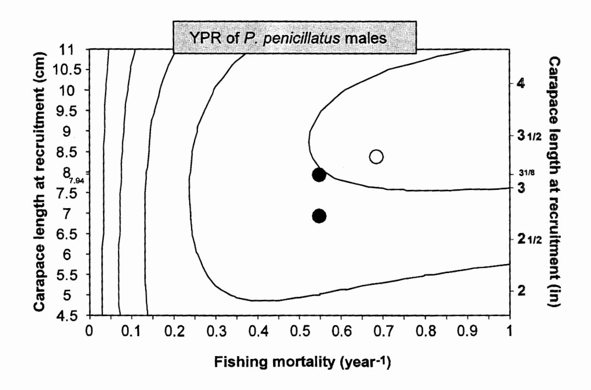

Figure 25: Isopleths of Yield Per Recruit as a function of the Carapace Length at recruitment (CLc) and the fishing mortality for males of *Panulirus penicillatus*. Black, white, and red circles correspond respectively to the actual values, the values in 1999, and for CLc equals to 7.94 cm (3 1/8 in)

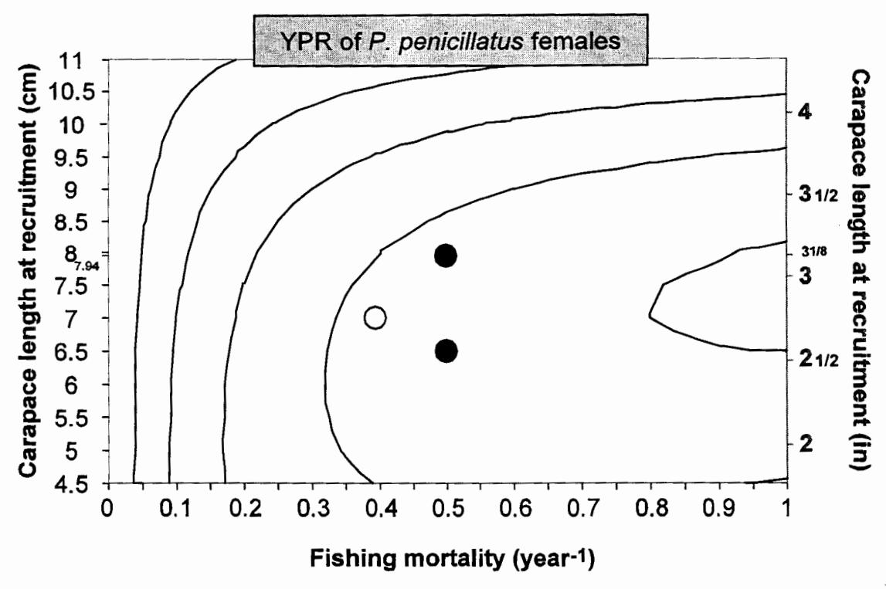

Figure 26: Isopleths of Yield Per Recruit as a function of the Carapace Length at recruitment (CLc) and the fishing mortality for females of *Panulirus penicillatus*. Black, white, and red circles correspond respectively to the actual values, the values in 1999, and for CLc equals to 7.94 cm (3 1/8 in)

Values of F calculated in American Samoa are in accordance with other Pacific countries (Pitcher, 1003) and especially with 'Western' Samoa (King & Bell, 1991). These values, although linked to the sampling, as correlated with the fishing technique. Scuba diving and free diving do not search the same area, the latter focusing on females. This difference between males and females comes from the lower growth coefficient for females which reach the upper part of their growth curve later than males, so the fishing mortality is applied on smaller animals.

Because fishing effort is difficult to control in Pacific Islands (Pitcher, 1993) (quota, limited number of professionals...), management is mainly carried out with size-limits which regulate the length at recruitment. Although no sign of overfishing is shown by analysis of the current situation, if the actual regulation (CL' at 7.94 cm or 3 1/8 in, see red circle in Figures 26 & 27) was applied, we predict an increasing of the YPR for males.

#### 5. CONCLUSION AND RECOMMENDATIONS

This study provides the first analysis of the current lobster fishery in Tutuila Island.

Panulirus penicillatus is the main species found in markets. Fishermen spear lobsters incidentally while diving for finfish by night at the start of the outer reef slope. Because of this technique, Parribacus caledonicus is rarely caught whereas they are numerous on the first part of the reef flat. This species of high taste quality (per se and also because there are rarely speared) should be easily marketable at the same price as spiny lobsters.

All spiny lobsters are speared implying that fishermen determine if lobsters were undersized or berried after they are already dead4. If market owners accept these illegal lobsters, they will be sold, if not, they will be used for home/self consumption. So, enforcement must be applied in the same time in the markets, and during landings. Furthermore, speared lobster flesh is of poor quality and could be hazardous if kept too long before cooking (due to bacteria contamination).

Thus, we recommend banning of the spear fishing of spiny lobsters as it is already done in other Pacific countries (Pitcher, 1993). In New Caledonia, all Crustaceans must be sold whole and not speared, spear fishing being allowed by day for recreation or subsistence only (Coutures & Chauvet, 2003). Fishermen will learn to catch lobsters by hand, and we advise the handbook of Prescott (1980b) edited for this purpose. This author indicates also how fishermen can store lobsters alive in the water in home-made traps. This stocking technique allow waiting for transportation or accumulating enough lobsters for sell (e.g. from Manu'a Islands). After a few months, we believe that the efficiency of fishermen will be at the same level as with the spearfishing technique, or even will increase the CPUE from the catches of slipper lobsters. The only risk is a depletion of the slipper lobster population, as they are easier to catch and for which there is no size limit. A future survey focused on this species will be necessary to evaluate the impact of any new regulations.

&lt;sup>4 It is known that professional fishermen are able to estimate perceptibly with high accuracy the length of lobsters or other finfish. If animal is even so caught indicates that the fisherman knows that it is marketable or for self-consumption.

We did not have enough accurate data on imports from 'Western' Samoa to analyze, but we suspect that there is an increasing trend. All new American Samoa regulations should be advertised through the Fisheries Division of Apia, or perhaps, we should share our data and implement the same regulations.

The size of the lobster fishery around Tutuila Island is consistent with the results of studies undertaken in other Pacific islands. The landings are small, but reflect the small size of the island. Fishing mortality is small, and there is no sign of overfishing. The YPR model confirms that increasing of the length of recruitment from the actual value (6.9 cm / 2.72 in for males; 6.5 cm / 2.56 in) to the legal size (7.94 cm / 31/8 in) should increase the total catches slightly, especially for the males. The females are more vulnerable because of their slower growth, but are less numerous in the catches because of the fishing technique. We must note that the regulation banning the catch of berried females does not have a scientific basis (Pitcher, 1993, Coutures, 2000a). It is clear that the recruitment level in Tutuila is not linked to the quantity of eggs released here. Because of the very long time (9-10 months) during which spiny lobster phyllosoma larvae are transported by ocean currents (Booth & Phillips, 1991), recruits are able to come from distant islands (MacDonald, 1971). The particular habitat of these species provides them a natural MPA in rough sites, which are rarely calm enough to be fished anywhere in the Pacific Ocean and in numerous remote islands they are unfished. However this maybe not be the case for *Parribacus caledonicus* which has a smaller geographic distribution, and unknown larval behavior (Coutures, 2000b; Coutures, 2001b). Genetic variation from different populations throughout the Pacific, both for spiny lobster and slipper lobster, should provide information on the dispersion level of the phyllosomata, and if self-recruitment is possible (Pitcher, 1993).

The field survey did not allow obtaining accurate growth values. A potential survey would be to briefly study a well delimited unfished population (e.g. Fagatele Bay, if we consider that it is a real reserve). A sampling protocol as such as Ebert & Ford (1986) used in Enewetok will provide accurate values of growth, natural mortality and abundance at the scale of the bay. Then, these values can be used in the YPR model.

The habitat of this species is more or less the same throughout the Pacific Ocean, so we admit that values of growth and natural mortality drawn from the literature are close for populations living at the same latitude. It must be noted that the absence of enforcement during the survey allowed measuring all the catches, and not only the marketable part. Thus, accuracy of parameters, especially Z and F, was not biased by the lack of small lobsters or berried females caught but kept for home consumption. If the DMWR wish to apply the current regulations, we encourage advertising to fishermen through the media and by notices in the markets.

A former fisheries biologist already proposed several recommendations (nearly exhaustive) with corresponding pros and cons. This anonymous and undated paper (? 1986) is reproduced with our remarks in Appendix IV.

Our comments on the legal review of the American Samoa Fishing Regulations are reproduced in Appendix V.

#### Acknowledgements

This study was funded by the National Centers for Coastal and Ocean Science (NCCOS) Coral Reef Monitoring Grant Program.

I would like to thank the DMWR crew involved in the survey: Sa'olotoga Poasa Tafaeono, Elia Henry and Jack Anesi, and to Drs Doug Fenner (DMWR) and Peter Craig (NPAS) for reviewing a draft of this manuscript. Thanks are also to all DMWR employees for their support during this study.

#### References

- BERRY, P.F. 1970. Mating behaviour, oviposition and fertilisation in the spiny lobster *Panulirus homarus* (L.). South African Oceanographic Research Institute, Investigation Report. **24**: 1-16
- BERRY, P.F. 1971. The biology of the spiny lobster Panulirus homarus (Linnaeus) off the East coast of Southern Africa. South African Assessment Marine Biology Research, Investigation Report. 28: 74 p.
- BERRY, P.F. 1974. Palinurid and Scyllarid lobster larvae of the Natal Coast, South Africa. South African Assessment Marine Biology Research, Investigation Report. 34: 44 p.
- **BEVERTON, R.J.H. AND S.J. HOLT.** 1956. A review of methods for estimating mortality rates in exploited fish populations with special reference to sources of bias in catch sampling. *Rapport & Proces-Verbaux des Reunions du Conseil permanent pour l'exploration de la Mer.* **140**: 67-83
- BOOTH, J.D. 1986. Recruitment of packhorse rock lobster Jasus verreauxi in New Zealand. Canadian Journal of Fisheries and Aquatic Sciences. 43: 2212-2220
- BOOTH, J.D. AND B.F. PHILLIPS. 1994. Early life history of the spiny lobster. Crustaceana. 66(3): 271-294
- BRIONES-FOURZAN, P. AND P. McWilliam. 1997. Puerulus of the spiny lobster *Panulirus guttatus* (Latreille, 1804) (Palinuridae). *Marine and Freshwater Research*. **48**: 699-705
- DE BRUIN, G.H.P. 1962. Spiny lobsters of Ceylon. Fisheries Resources, Statistical Department of Fisheries, Ceylon. 14: 1-28
- CALINSKI, M.D. AND W.G. LYONS. 1983. Swimming behavior of the puerulus of the spiny lobster *Panulirus argus* (Latreille, 1804) (Crustacea: Palinuridae). *Journal of Crustacean Biology*. **3**: 329-335
- CARPENTER, K.E. AND NIEM, V.H. 1998. "The Living Marine Resources of the Western Central Pacific", Volume 2 Cephalopods, Crustaceans, Holothurians and Sharks, Food and Agriculture Organization of the United Nations, Rome.
- CHAMBERS JR, J.R. AND W.E. NUNES. 1975. The spiny lobster *Panulirus penicillatus* (Oliver) in American Samoa. *California Polytechnic State University. San Luis Obispo, CA*. 25 p.
- CHITTLEBOROUGH, R.G. 1970. Studies on recruiment in the western australian rock lobster *Panulirus* longipes cygnus George: density and natural mortality of juveniles. Australian Journal of Marine and Freshwater Research. 21: 131-148
- CHITTLEBOROUGH, R.G. 1974. Western rock lobster reared to maturity. Australian Journal of Marine and Freshwater Research. 25: 221-225
- CHITTLEBOROUGH, R.G. 1976. Breeding of *Panulirus longipes cygnus* George under natural and controlled conditions. *Australian Journal of Marine and Freshwater Research*. 27: 499-516
- Снивв, С.F. 1994. Reproductive biology. In 'Spiny lobster management', (Eds.: B.F. Phillips, J.S. Cobb & J. Kittaka), Blackwell Scientific, Oxford. 181-212
- Coutures, E. 2000a. Contributions to the history life study of the Palinuridae and Scyllaridae of the South-Western lagoon of New Caledonia". *Thèse Doctorat. University of New Caledonia*. Downloadable at <a href="http://www.univ-nc.nc/~coutures">http://www.univ-nc.nc/~coutures</a> as .pdf (in French). 213 p.
- Coutures, E. 2003. The shoreline fishery of American Samoa Analysis of 1-yr data (April 02-March 03) and implementation of a new sampling protocol. *DMWR Biological Report*. **102**: 1-23
- Coutures, E. 2000b. Distribution of phyllosomata (Decapoda: Palinuridea) in the South-West lagoon of New Caledonia. *Marine and Freshwater Research*. **51(4)**: 363-369

- Coutures, E. 2001a. Lagoon colonization in New Caledonia by spiny lobsters (Decapoda, Palinuridae) at the puerulus stage. *Crustaceana*. **74(4)**: 363-368
- COUTURES, E. 2001b. On the first phyllosoma stage of *Parribacus caledonicus*, *Scyllarides squammosus* and *Arctides regalis* from New Caledonia. *Journal of Plankton Research*. **23(7)**: 745-751.
- COUTURES, E. AND C. CHAUVET. 2002. Growth and minimum suitable catch of spiny lobsters, *Panulirus penicillatus* and *P. longipes bispinosus* from Isle of Pines (New Caledonia). *Crustaceana*. 74(11): 1189-1199
- COUTURES, E. AND C. CHAUVET. 2003. Study of an original lobster fishery (Palinuridae & Scyllaridae) in New Caledonia. Atoll Research Bulletin In press
- COUTURES, E., P. HEBERT, L. WANTIEZ & C. CHAUVET. 2002. Lobster catches using crest nets in Uvea (Wallis and Futuna). The Lobster Newsletter. 15(1): 3-5
- CRAIG, P. (Editor). 2000. National history guide to American Samoa. 76 p.
- CROSSLAND, C.J., DENBY, G., PHILLIPS, B.F. AND R. BROWN. 1987. The use of fluorescent pigments (lipofuscin) for ageing western rock lobster (*Panulirus cygnus*) and scampi (*Metanephrops andamanicus*) a preliminary assessment. CSIRO Report. 195: 21 p.
- **DuFour, V.** 1992. Colonisation des récifs coralliens par les larves de poissons. *Thèse doctorat. University P. & M. Curie.* 220 p.
- EBERT, T.A. AND R.F. FORD. 1986. Population ecology and fishery potential of the spiny lobster *Panulirus* penicillatus at Enewetak Atoll, Marshall Islands. *Bulletin of Marine Science*. **38**: 56-67
- EDGAR, G.J. 1990. Predator-prey interactions in seagrass beds. III. Impacts of the western rock lobster Panulirus cygnus George on epifaunal gastropod populations. Journal of Experimental Marine Biology and Ecology. 139: 33-42
- FAO. 1987. Fisheries statistics, catches and landings. FAO Year book. Vol. 64.
- **GEORGE, R.W.** 1972. Guide des langoustes du Pacifique Sud. Agence de développement des pêches dans les Îles du Pacifique Sud. South Pacific Bulletin. **22(2)**: 31-34
- GEORGE, R.W. 1974. Coral reefs and rock lobster ecology in the Indo-west Pacific region. *Proceedings of the 2nd International Coral Reef Symposium*. 321-325
- Gulland, J.A. 1983. Fish stock assessment: a manual of basic methods. FAO/Wiley series on food and agriculture. Vol. 1. 223 p.
- GURNEY, R. 1936. Larvae of Decapoda Crustacea. Part III. Phyllosoma. *Discovery Report.* Vol. XII: 377-440
- HAYAKAWA, Y., BOOTH, J.D., NISHIDA, S., SEKIGUCHI, H., SAISHO, T. AND J. KITTAKA. 1990. Daily settlement of the puerulus stage of the red rock lobster *Jasus edwardsii* at Castlepoint, New Zealand. *Nippon Suisan Gakkaishi*. **56(11)**: 1703-1716
- HOLTHUIS, L.B. 1991. Marine lobster of the world. FAO Fisheries Synopsis 125(13): 1-25
- HOLTHUIS, L.B. 1985. A revision of the family Scyllaridae (Crustacea Decapoda Macrura). I. Subfamily Ibacinae. Zoologische Verhandelingen Leiden. 218: 1-130
- ITO, M. AND J.S. Lucas. 1990. The complete larval development of the scyllarid lobster, *Scyllarus demani* Holthuis, 1946 (Decapoda, Scyllaridae), in the laboratory. *Crustaceana*. **58(2)**: 144-167
- JOHNSON, M.W. 1951. A giant phyllosoma larva of a loricate crustacean from the tropical Pacific.

  Transactions of the American Microscopy Society. 70(3): 274-278
- JOHNSON, M.W. 1968. Palinurid phyllosoma larvae from the Hawaiian archipelago (Palinuridae). Crustaceana. 2: 59-79

- **JOHNSON, M.W.** 1971. The palinurid and scyllarid lobsters of the tropical Eastern Pacific and their distribution as related to the prevailing hydrography. *Bulletin of the Scripps Institution of Oceanography, University of California*. **19**: 1-36
- Johnson, M.W. 1974. On the dispersal of lobster larvae into East Pacific Barrier (Decapoda, Palinuridae). Fishery Bulletin, U.S. 72: 639-647
- **JUINIO, M.A.R.** 1987. Some aspects of the reproduction of *Panulirus penicillatus* (Decapoda: Palinuridae). *Bulletin of Marine Science*. **41(2)**: 242-252
- Juino, M.A.R. and E.D. Gomez. 1986. Spiny lobster fishery in eastern Samar, Philippines. *Proceeding of the First Asian Fisheries Forum, Manila*. 381-384
- King, M. and L. Bell. The fishery for the spiny lobster, *Panulirus penicillatus* in Western Samoa. 1991. Unpublished MS. 8 pp + Figs.
- KITTAKA, J. 1988. Culture of the Palinurid Jasus Ialandii from egg stage to puerulus. Nippon Suisan Gakkaishi. 54(1): 87-93
- KITTAKA, J. 1994a. Larval rearing. In 'Spiny lobster management', (Eds.: B.F. Phillips, J.S. Cobb & J. Kittaka), Blackwell Scientific, Oxford. 402-423
- KITTAKA, J. 1994b. Culture of phyllosomas of spiny lobster and its application to studies of larval recruitment and aquaculture. *Crustaceana*. 66(3): 258-270
- KITTAKA, J. 1997. Culture of larval spiny lobsters: a review of work done in northern Japan. *Marine and Freshwater Research*. **48**: 923-930
- KITTAKA, J. AND J.D BOOTH. 1994. Prospect for aquaculture. In 'Spiny lobster management', (Eds.: B.F. Phillips, J.S. Cobb & J. Kittaka), Blackwell Scientific, Oxford. 363-373
- KITTAKA, J. AND A.B. MACDIARMID. 1994. Breeding. In 'Spiny lobster management', (Eds.: B.F. Phillips, J.S. Cobb & J. Kittaka), Blackwell Scientific, Oxford. 384-401
- KITTAKA, J. AND E. IKEGAMI. 1988. Culture of the Palinurid *Palinurus elephas* from egg stage to puerulus. Nippon Suisan Gakkaishi. **54(7)**: 1149-1154
- KITTAKA, J., IWAI, M. AND T. YOSHIMURA. 1988. Culture of a hybrid of spiny lobster genus *Jasus* from egg stage to puerulus. *Nippon Suisan Gakkaishi*. **54(3)**: 413-417
- KITTAKA, J. AND K. KIMURA. 1989. Culture of the japanese spiny lobster *Panulirus japonicus* from egg to juvenile stage. *Nippon Suisan Gakkaishi*. **55(6)**: 963-970
- KITTAKA, J., KUDO, R., ONADA, S., KANEMURA, K., AND J.P. MERCER. 2001. Larval culture of the European spiny lobster *Palinurus elephas*. *Marine and Freshwater Research*. **52(8)**: 1439-1444
- KITTAKA, J., ONO, J. AND J.D. BOOTH. 1997. Complete development of the green rock lobster, *Jasus verreauxi* from egg to juvenile. *Bulletin of Marine Science*. **61**: 57-71
- LAU, C. 1987. Feeding behavior of the hawaiian slipper lobster, Scyllarides squammosus, with a review of decapod crustacea feeding tactics on molluscan prey. Bulletin of Marine Science. 41(2): 378-391
- **LEMMENS, J.W.T.J.** 1994. The western rock lobster *Panulirus cygnus* (George, 1962) (Decapoda: Palinuridae): the effect of temperature and developmental stage on energy requirements of puerulus. *Journal of Experimental Biology and Ecology*. **180**: 221-234
- LESSER, J.H.R. 1978. Phyllosoma larvae of *Jasus edwardsii* (Hutton) (Crustacea: Decapoda: Palinuridae) and their distribution off the east coast of the North Island, New Zealand. *New Zealand Journal of Marine and Freshwater Research*. **12(4)**: 357-370

- LIPCIUS, R.N. AND J.S. COBB. 1994. Introduction: ecology and fishery biology of spiny lobsters. In 'Spiny lobster management', (Eds.: B.F. Phillips, J.S. Cobb & J. Kittaka), Blackwell Scientific, Oxford. 1-30
- LIPCIUS, R.N. AND W.F. HERRNKIND. 1987. Controle and coordination of reproduction and molting in the spiny lobster *Panulirus argus*. *Marine Biology*. **96**: 207-214
- Lyons, W.G. 1970. Scyllarid Lobsters (Crustacea, Decapoda). Memoirs of the Hourglass Cruises. 1(4): 1-74
- LYONS, W.G. 1980. The postlarval stage of scyllaridean lobsters. Fisheries. 5(4): 47-49
- LYONS, W.G. 1981. Possible sources of Florida's spiny lobster population. *Proceedings of the Gulf Caribbean Fishery Institute*. **33**: 253-266
- MACDONALD, C.D. 1971. Final report and recommendations to the U.S. Trust Territory Government on the spiny lobster resources of Micronesia. *Marine Resources Division, Department of Resources and Development, Saipan, Mariana Islands.* 82 p.
- MACDONALD, C.D. 1979. Management aspects of the biology of the spiny lobsters, *Panulirus marginatus*, *P. penicillatus*, *P. versicolor*, and *P. longipes femoristriga* in Hawaii and the Western Pacific. *Final Report to the Western Pacific Regional Fishery Management Council, Honolulu, HI.* 46 p.
- MACDONALD, C.D. 1982. Catch composition and reproduction of the spiny lobster *Panulirus versicolor* at Palau. *Transactions of the American Fishery Society*. **111**: 694-699.
- MACDONALD, C.D. 1986. Recruitment of the puerulus of the spiny lobster, *Panulirus marginatus*, in Hawaii. Canadian Journal of Fisheries and Aquatic Sciences. 43: 2118-2125
- MACDONALD, C.D. 1988. Fecundity and reproductive rates in Indo-West Pacific spiny lobsters.

  Micronesica. 21: 103-114
- MACFARLANE, J.W. AND R. MOORE. 1986. Reproduction of the ornate rock lobster, *Panulirus ornatus* (Fabricius), in Papua New Guinea. *Australian Journal of Marine and Freshwater Research*. 37: 55-65
- MARINOVIC, B., LEMMENS, J.W.T.J. AND B. KNOTT. 1994. Larval development of *Ibacus peronii* Leach (Decapoda: Scyllaridae) under laboratory conditions. *Journal of Crustacean Biology*. **1 4(1)**: 80-96
- McKoy, J.L. and D.B. Esterman. 1981. Growth of rock lobsters (*Jasus edwardsii*) in the Gisborne region, New Zealand. New Zealand Journal of Marine and Freshwater Research. 15: 121-136
- McWilliam, P.S. and B.F. Phillips. 1997. Metamorphosis of the final phyllosoma and secundary lecithotrophy in the puerulus of *Panulirus cygnus* George: a review. *Marine and Freshwater Research*. 48: 783-790
- **MENZIES, A.M. AND J.M. KERRIGAN.** 1980. The larval recruitment problem of the spiny lobster. *Fisheries*. **5(4)**: 42-46
- MICHEL, A. 1969. Les larves PHYLLOSOME du genre *Panulirus* Palinuridae (Crustacés Décapodes) du Pacifique tropical Sud et Equatorial. *Cahier ORSTOM, Série Océanographie*. **7(4)**: 3-19
- MICHEL, A. 1971. Note sur les puerulus de Palinuridae et les larves PHYLLOSOME de Panulirus homarus (L.). Cahier ORSTOM, Série Océanographie. 9(4): 459-473
- MIKAMI, S. AND J.G. GREENWOOD. 1997. Complete development and comparative morphology of larval Thenus orientalis and Thenus sp. (Decapoda: Scyllaridae) reared in the laboratory. Journal of Crustacean Biology. 17(2): 289-308
- MOORE, R. AND W. MACFARLANE. 1984. Migration of the ornate rock lobster, *Panulirus ornatus* (Fabricius), in Papua New Guinea. *Australian Journal of Marine and Freshwater Research*. **35**: 197-212

- MORGAN, G.R. 1980. Population dynamics of spiny lobsters. In "The biology and management of lobsters" (Eds.: J.S. Cobb & B.F. Phillips), Academic Press, NY. Vol. II: 189-217
- Moss, G.A., Tong, L.J. and S.E. Ellen. 2001. Effect of temperature and food ration on the grpwth and survival of early and mid-stage phyllosomas of the spiny lobster *Jasus verreauxi*. *Marine and Freshwater Resource*. **52(8)**:1459-1464
- Munro, J.L. 1988. Growth and mortality rates and states of exploitation of spiny lobsters in Tonga. SPC, Workshop on Pacific Inshore Fishery Resources. 17 p.
- Munro, J.L. 1994. Fisheries for spiny lobsters in the tropical Indo-West Pacific. In 'Spiny lobster management', (Eds.: B.F. Phillips, J.S. Cobb & J. Kittaka), Blackwell Scientific, Oxford. 374-383
- NAIR, R.V., SOUNDARAJAN, R. AND G. NANDAKUMAR. 1981. Observations on growth and moulting of spiny lobsters *Panulirus homarus* (Linnaeus), *P. ornatus* (Fabricius) and *P. penicillatus* (Olivier) in captivity. *Indian Journal of Fisheries*. 28(1-2): 25-35
- NAKAMURA, K. 1994. Maturation. In 'Spiny lobster management', (Eds.: B.F. Phillips, J.S. Cobb & J. Kittaka), Blackwell Scientific, Oxford. 374-383
- **PAGE, M.** 1998. The biology, community structure, growth and artisanal catch of parrotfishes of American Samoa. *DMWR Biological Series Report.* **85**: 51 pp + Appendices
- PAULY, D. 1980. On the interrelationships between natural mortality, growth parameters and mean environmental temperature in 175 fish stocks. *Journal du Conseil International pour l'Exploration de la Mer.* 21: 1-35
- PEARCE, A.F. AND B.F. PHILLIPS. 1980. Oceanic processes, puerulus settlement and recruitment of the western rock lobster *Panulirus cygnus*. In "The biology and management of lobsters" (Eds.: J.S. Cobb & B.F. Phillips), Academic Press, NY. Vol. II: 279-302
- PEARCE, A.F., PHILLIPS, B.F. AND C.J. CROSSLAND. 1992. Larval distributions across the Leeuwin Current: report on RV Franklin Cruise FR8/87 in August/September 1987. CSIRO Marine Laboratory Report. 217: 13 p.
- PHILLIPS, B.F. 1972. A semi-quantitative collector of the puerulus larvae of the western rock lobster Panulirus longipes cygnus George (Decapoda, Palinuridae). Crustaceana. 22: 147-154
- PHILLIPS, B.F. AND J.D. BOOTH. 1994. Design, use, and effectiveness of collectors for catching the puerulus stage of spiny lobsters. *Review of Fisheries Science*. **2(3)**: 255-289
- PHILLIPS, B.F., COBB, J.S. AND R.W. GEORGE. 1980. General biology. In "The biology and management of lobsters" (Eds: J.S. Cobb & B.F. Phillips), Academic Press, NY. Vol. I: 1-82
- PHILLIPS, B.F. AND L. OLSEN. 1975. Swimming behaviour of the puerulus larvae in the western rock lobster. Australian Journal of Marine and Freshwater Research. 26: 415-417
- PHILLIPS, B.F. AND P.S. McWilliam. 1986. The pelagic phase of spiny lobster development. Canadian Journal of Fisheries and Aquatic Sciences. 43: 2153-2163
- PHILLIPS, B.F., PEARCE, A.F. AND R.T. LITCHFIELD. 1991. The Leeuwin current and larval recruitment to the rock (spiny) lobster fishery off western Australia. *Journal of the Royal Society of Western Australia*. 74: 93-100
- PHILLIPS, B.F. AND J.D. PENROSE. 1985. The puerulus stage of the spiny (rock) lobster and its ability to locate the coast. Western Australia Institute, Technical Report. 50 p.
- PHILLIPS, B.F., RIMMER, D.W. AND D.D. REID. 1978. Ecological investigations of the late-stage phyllosoma and puerulus larvae of the Western rock lobster *Panulirus longipes cygnus*. *Marine Biology*. 45: 347-357

- PHILLIPS, B.F. AND A.N. SASTRY. 1980. Larval ecology. In "The biology and management of lobsters" (Eds.: J.S. Cobb & B.F. Phillips), Academic Press, NY. Vol. II: 11-57
- PITCHER, C.R. 1992. Biology ecology and fisheries for spiny lobsters in the tropical south-western Pacific. SPC, Inshore Fisheries Resources Report. 92 p.
- PITCHER, C.R. 1993. Spiny lobster. In "Nearshore Marine Resources of the South Pacific" (Eds. A. Wright & L. Hill) Singapore National Printers. Chapter 17: 541-581
- PLAUT, I. 1993. Sexual maturity, reproductive season and fecundity of the spiny lobster *Panulirus* penicillatus from the Gulf of Eilat (Aqaba), Red Sea. Australian Journal of Marine and Freshwater Research. 44: 527-535
- PLAUT, I. AND L. FISHELSON. 1991. Population structure and growth in captivity of the spiny lobster Panulirus penicillatus from Dahab, Gulf of Aqaba, Red Sea. Marine Biology. 111: 467-472
- PRASAD, R.R. AND P.R.S. TAMPI. 1960. Phyllosomas of Scyllarid lobsters from the arabian sea. J. Mar. Biol. Ass. India. 2(2): 241-249
- PRESCOTT, J. 1977. Report on a rock lobster survey in the Gilbert Islands. SPC, Inshore Fisheries Resources Report. 4 p.
- PRESCOTT, J. 1980a. Report on South Pacific Commission lobster project in Solomon Islands. SPC, Inshore Fisheries Resources Report. 22 p.
- PRESCOTT, J. 1980b. A handbook for lobster fishermen of the tropical Pacific Islands. South Pacific Commission Report, Handbook. 19: 20 p.
- PRESCOTT, J. 1988. Tropical spiny lobster: an overview of their biology, the fisheries and the economics with particular reference to the double spined rock lobster *Panulirus penicillatus*. SPC, Inshore Fisheries Resources Report. **18**: 36 p.
- PRESCOTT, J. 1990. An analysis of fisheries for tropical lobster in the Ha'apai group, Kingdom of Tonga, with suggestions for research and management. Forum Fisheries Agency Report, South Pacific Forum Fisheries Agency, Honiara. 90: 69 p.
- RATHBUN, M.J. 1903. The brachyura and macrura of the hawaiian islands. *Bulletin of the U.S. Fishery Council*. 829-831
- RICHER DE FORGES, B. ET P. LABOUTE. 1995. Langoustes, langoustines et cigales de mer de Nouvelle-Calédonie. In "Les fonds meubles de Nouvelle-Calédonie" (Éd.: B. Richer de Forges). Études et thèses, ORSTOM, Paris. Vol. 2: 45-81
- ROBERTSON, P.B. 1968a. The larval development of some western Atlantic lobsters of the family Scyllaridae. *Ph.D. Thesis, University Miami, Coral Gables*. 535 p.
- ROBERTSON, P.B. 1968b. The complete larval development of the sand lobster, *Scyllarus americanus* (Smith), (Decapoda, S cyllaridae) in the laboratory, with notes on larvae from the plankton. *Bulletin Marine Science*. **18(2)**: 294-342
- ROBERTSON, P.B. 1968c. A giant Scyllarid phyllosoma larva from the caribbean sea, with notes on smaller specimens (Palinuridea). *Crustaceana Suppl.* 2: 83-97
- ROBERTSON, P.B. 1969a. The early larval development of the Scyllarid lobster Scyllarides aequinoctialis (Lund) in the laboratory, with a revision of the larval characters of the genus. Deep-Sea Research. 16: 557-586
- ROBERTSON, P.B. 1969b. Biological investigations of the deep sea. N° 48. Phyllosoma larvae of a scyllarid lobster, *Arctides guineensis*, from the western Atlantic. *Marine Biology*. **143(4)**: 143-151
- SERFLING, S.A. AND R.F. FORD. 1975. Ecological studies of the puerulus larval stage of the california spiny lobster, *Panulirus argus. Fishery Bulletin, U. S.* **73(2)**: 360-377

- SHACKLEE, J.B. 1983. Mannesophosphate isomerase in the Hawaiian spiny lobster, *Panulirus marginatus*: a polymorphic sex-linked locus useful in investigating embryonic and larval sex ratios. *Marine Biology*. **73**: 193-201
- SHEEHY, M.R.J., N. CAPUTI, C.F. CHUBB AND M. BELCHIER, 1998. Use of lipofuscin for resolving cohorts of western rock lobster (*Panulirus cygnus*). Canadian Journal of Fisheries and Aquatic Sciences. 55: 925-936
- SIMS JR., H.W. 1965. The phyllosoma larvae of *Parribacus*. Quaterly Journal of Florida Academic Sciences. **28(2)**: 142-172
- SOKAL, R.R. AND F.J. ROHLF. 1981. Biometry, 2nd Edition. (Ed.: W.H. Freeman), San Francisco. 859 p.
- SPANIER, E. 1987. Mollusca as food for the slipper lobster *Scyllarides latus* in the coastal waters of Israel. *Levantina*. **68**: 713-716
- SPARRE, P AND S.C. VENEMA. 1989. Introduction to tropical fish stock assessment. Part I: Manual. FAO Fisheries Technical Report. 306/1. 337 p. http://www.fao.org/docrep/W5449E/w5449e00.htm#Contents
- SWEAT, D.E. 1968. Growth and tagging studies on *Panulirus argus* (Latreille) in the Florida keys. *Florida Board of Conservation Marine Research Laboratory Technical Series*. **57**: 1-30
- TAKAHASHI, H. AND T. SAISHO. 1978. The complete larval development of the scyllarid lobster, *Ibacus ciliatus* (von Siebold) and *Ibacus n ovemdentatus* Gibbes in the laboratory. *Memoirs of the Faculty of Fisheries, Kagoshima University*. 27(1): 305-353
- Von Bertalanffy, L. 1938. A quantitative theory of organic growth. Human Biology. 10(2): 181-213
- Wass, R. C. 1980. The shoreline fishery of American Samoa past and present. *DMWR Biological Report Series*. 1: 55 p.
- WITHAM, R., INGLE, R.M. AND E.A. JOYCE JR. 1968. Physiological and ecological studies of *Panulirus* argus from the St. Lucie estuary. *Florida Board of Conservation Marine Research Laboratory Technical Series*. **53**: 1-31
- YEUNG, C. AND M.F. McGowan. 1991. Differences in inshore-offshore and vertical distribution of phyllosoma larvae of *Panulirus*, *Scyllarus* and *Scyllarides* in the Florida keys in May-June 1989. *Bulletin of Marine Science*. **49(3)**: 699-714
- **ZANN, L.P.** 1984. A preliminary investigation of the biology and fisheries of the spiny lobsters (Palinuridae) in the Kingdom of Tonga. Institute of Marine Research, University of South Pacific Report. 55 p.

#### **LIST OF FIGURES**

| Figure 1: Tutuila and Manu'a Islands3                                                                |
|------------------------------------------------------------------------------------------------------|
| Figure 2: Systematic position of genera Panulirus and Parribacus4                                    |
| Figure 3: Geographic distribution of Panulirus versicolor5                                           |
| Figure 4: Geographic distribution of Panulirus penicillatus5                                         |
| Figure 5: Geographic distribution of Parribacus caledonicus and P. antarcticus6                      |
| Figure 6: Life history of slipper lobster and spiny lobsters                                         |
| Figure 7: Lobster survey locations around Tutuila                                                    |
| Figure 8: Tagged Parribacus caledonicus                                                              |
| Figure 9: Market survey form19                                                                       |
| Figure 10: Graph of number of eggs vs Carapace Length (CL) for Panulirus penicillatus                |
| in Samoa Archipelago (N = 33)24                                                                      |
| Figure 11: The percentage of ovigerous female P. penicillatus in 5 mm                                |
| carapace length size intervals in Samoan Archipelago24                                               |
| Figure 12: The red-crab Etisus splendidus Rathbun, 1906                                              |
| Figure 13: Carapace length frequency of Panulirus penicillatus males and females                     |
| sampled during market surveys (Oct. 2002 - Oct. 2003)27                                              |
| Figure 14: Carapace length frequency (size-classes: 0.5) of Panulirus penicillatus                   |
| males (N=358) and females (N=95) sampled during previous market surveys (1999) 29                    |
| Figure 15: Mean and standard deviation of Average Carapace Length of P. penicillatus males           |
| between Market surveys carried out in 1999 and 2002-2003, & results of t-Student test31              |
| Figure 16: Mean and standard deviation of Average Carapace Length of <i>P. penicillatus</i> females  |
| between Market surveys carried out in 1999 and 2002-2003, & results of t-Student test $\dots$ 31     |
| Figure 17: Mean and standard deviation of Average CL of P. penicillatus males between                |
| Market surveys carried out in 1999 and 2002-2003, and results of t-Student test                      |
| Figure 18: Mean and standard deviation (SD) of Average CL of P. penicillatus females between         |
| Market surveys carried out in 1999 and 2002-2003, and results of t-Student test32                    |
| Figure 19: Graph and equation of the Length-Weight relationship for P. penicillatus males33          |
| Figure 20: Graph and equation of the Length-Weight relationship for P. penicillatus females34        |
| Figure 21: Graph and equation of the Length-Weight relationship for Parribacus caledonicus34         |
| Figure 22: Von Bertalanffy growth curve of males and females of <i>P. penicillatus</i>               |
| Figure 23: Relative Yield per Recruit graph for male and female P. penicillatus as a function of     |
| fishing mortality (F) and exploitation rate (E). The blue curve corresponds to the actual            |
| (2002-2003) parameters. E MSY & F MSY = Values for Maximum Sustainable Yield37 |

| Figure 24: Relative Yield per Recruit graph for male and female P. penicillatus as a function                                                                                                                                                                                                                              |
|----------------------------------------------------------------------------------------------------------------------------------------------------------------------------------------------------------------------------------------------------------------------------------------------------------------------------|
| of fishing mortality (F) and exploitation rate (E) in 1999. $E_{MSY}$ & $F_{MSY}$ = Values                                                                                                                                                                                                                                 |
| for Maximum Sustainable Yield                                                                                                                                                                                                                                                                                              |
| <b>Figure 25</b> : Isopleths of Yield Per Recruit as a function of the CL at recruitment (CL c ) and the fishing mortality for males of <i>P. penicillatus</i> . Black, white, and red circles correspond respectively to actual values, values in 1999, and for CL c equals to 7.94 cm (3 1/8 in)   |
| <b>Figure 26</b> : Isopleths of Yield Per Recruit as a function of the CL at recruitment (CL c ) and the fishing mortality for females of <i>P. penicillatus</i> . Black, white, and red circles correspond respectively to actual values, values in 1999, and for CL c equals to 7.94 cm (3 1/8 in) |
| LIST OF TABLES                                                                                                                                                                                                                                                                                                             |
| Table 1: Catch and measurements obtained during field sampling (values in inches in red) 22  Table 2: Catch Per Unit Effort (CPUE) in weight and number of lobsters per hour obtained during field sampling                                                                                                                |
| Table 3: Number of eggs vs Carapace Length for the 3 berried-females of                                                                                                                                                                                                                                                    |
| Parribacus caledonicus caught in the field                                                                                                                                                                                                                                                                                 |
| Table 4: Catch composition per species (number of individuals & weight)                                                                                                                                                                                                                                                    |
| in market samples (Oct. 2002- Oct. 2003)25                                                                                                                                                                                                                                                                                 |
| Table 5: Catch and measurements obtained during market sampling (2002-2003)       27         Table 6: Fishing trip information and Catches Per Unit Effort (CPUE) in weight and number of                                                                                                                                  |
| lobsters per hour per diver obtained during market sampling 2002-200328                                                                                                                                                                                                                                                    |
| Table 7: Catch and measurements obtained during field market sampling (1999)29                                                                                                                                                                                                                                             |
| Table 8: Fishing trip information and Catches Per Unit Effort (CPUE) in weight and number of                                                                                                                                                                                                                               |
| lobsters per hour per diver obtained during market sampling (1999)30                                                                                                                                                                                                                                                       |
| Table 9: Estimation of the growth parameters of male and female P. penicillatus in the Pacific 35                                                                                                                                                                                                                          |
| Table 10: Parameters used to estimate the total mortality Z; values of M and F, respectively natural                                                                                                                                                                                                                       |
| and fishing mortalities for P. penicillatus from market surveys 1999 and 2002-2003 36                                                                                                                                                                                                                                      |
| Table 11: Size at sexual maturity of Panulirus penicillatus through the Pacific Ocean                                                                                                                                                                                                                                      |

#### Appendix I

# External characterization of male and female lobsters Example: Panulirus penicillatus

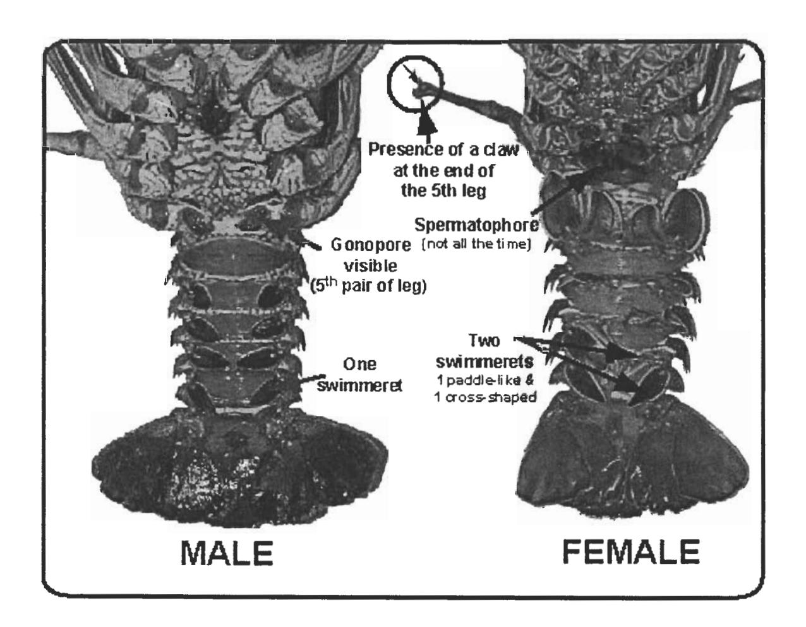

Fishermen cut the internal part of the swimmerets to remove egg masses from berried females. A quick check allows the sampler to verify this surgery by verifying the presence of the claw on the 5th pair of legs (or if theses 2 legs are broken, by the lack of the clearly visible gonopores at the basis of 5th pair of legs), and to look for the absence of the internal swimmerets. Most of the time, the basis of the internal swimmeret is not perfectly cut, and some eggs stay stuck to setae.

Appendix II

### Dept of Marine & Wildlife Resources

# "FA'ALIGA TAUA"

mo tagamata fagota ma fale i'a

# Sailia ni pine o loo faamau i **Ula** ma **Papata**

## O le a maua lau faailoga faapitoa

pe a e fesoasoani mai i lenei talosaga:

- numera o le pine,
- o le umi o le patua,

- ogasami/matafaga na maua ai.

Mo ni fesili, faafesootai mai le matagaluega o alagamanuia o le sami & le vao matua i le: 633-4456

**FA'AFETAI** 

Appendix III

### Dept of Marine & Wildlife Resources

## IMPORTANT NOTICE

for Fishermen and Seafood Dealers

Looking for tags on Ula and Papata (lobsters)

### RECEIVE A FREE TEE-SHIRT

when you return in the following information:

- the 4 fig-number of the tag,
- the carapace length of the lobster,

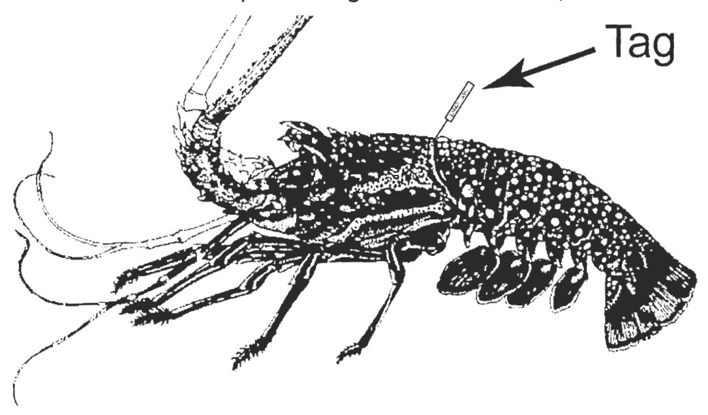

Please call DMWR: 633-4456 Thank you for your help

#### Appendix IV

#### According to Anonymous (1986?)

[...] There are at least five management methods that could be applied to ['American'] Samoa's lobster resource to help insure a healthy population of harvestable adults. These methods include the implementation of closed seasons, gear restrictions, size limits, marine sanctuaries and the selective harvest of non-berried lobsters. The pros and cons of these management strategies as they pertain to Samoa will be discussed below.

Author's notes in red: remarks and regulations already implemented since this paper was written.

#### A. Gear Restrictions - No spearing

#### Pros

- 1. Lobsters harvested by hand or traps are not harmed and undersize or berried individuals can be released.
- 2. The increased difficulty in harvesting lobsters by hand aids management by reducing catches and therefore increasing spawning success. See B. Cons 2.
- 3. To sell living or at least whole animals decreases public health risks, and increases preservation duration and food quality.
- 4. It makes possible stocking live animals in the sea for several weeks for "buffering" the market or waiting for events.

#### Cons

1. Spiny lobsters in American Samoa inhabit narrow cracks in shallow (often turbulent) reef areas and are extremely difficult to catch by hand

But this technique is used in many places in the Pacific (see Prescott, 1980b)

2. A law prohibiting the spearing of lobsters would be unpopular in the fishing community and could encourage resentment of all fishery regulations.

Needs public discussion

#### **B** Selective Harvest (No berried females)

Already implemented in American Samoa (for spiny lobsters only)

#### **Pros**

1. The protection of berried females will increase spawning in our waters and should increase recruitment of juveniles on our local reefs or the reefs of neighboring islands.

Already implemented in American Samoa for spiny lobsters only

#### Cons

- 1. For this regulation to be effective, the use of spears would also have to be prohibited. This may unreasonably limit fishing success.
- 2. The long planktonic larval stage of spiny lobsters could mean that lobsters hatched here will drift away to other islands before they are ready to settle. Protecting berried females on Tutuila may not noticeably increase the numbers of larvae settling here. However, it is not as clear for slipper lobsters with smaller geographic distributions, and long planktonic development but unknown larval behavior (Coutures, 2000a).
- 3. Females seem "berried" several times a year. This regulation strongly limits the catches.
- 4. Enforcement staff must acquire skills to separate easily and quickly males and females with several features, in order to be able to recognize animals from which eggs have been removed from the abdomen (see Appendix I).

#### B. Marine Sanctuaries

#### Pros

1. A "no harvest" area on Tutuila would insure that an undisturbed group of spiny lobsters could add to the fishery via spawning and/or migration out of the sanctuary areas.

2. A marine sanctuary already exists in Fagatele Bay, Tutuila, A.S, and in National Park of American Samoa (NPSA).

#### Cons

- 1. It would be difficult to agree upon where a marine sanctuary could be established. Most villages would not like a marine sanctuary within their jurisdiction meaning that remote areas are the most likely candidates.
- 2. Sanctuaries in remote areas would be very difficult to patrol making enforcement ineffective. Case of NPSA.
- 3. Rough sea conditions during our Trade Wind Season can create "natural sanctuaries" on the south shore of all islands. This predictable phenomenon may preclude the need for additional sanctuaries.

#### C. Minimum Size

(already implemented for spiny lobsters, CL = 3 1/8 in - 7.94 cm)

#### Pros

- 1. An appropriate minimum size on spiny lobsters would allow lobsters to reach sexual maturity and spawn before they were first subject to harvest. A "good" minimum size increases the Maximum Sustainable Yield.
- 2. The immediate effect of this type of regulation is to increase the numbers of lobsters visible on the reefs. This provides the public with visual evidence of the success of regulations and fosters a positive attitude toward regulations in general.
- 3. It has been established that fishermen can train their eye to determine a particular size fish or shellfish with a high degree of accuracy.

#### Cons

- 1. A minimum size law would have to be enforced at the landing site and in retail outlets.
- 2. This type of regulation would only be 100% effective if spears were eliminated from the fishery.

#### D. Closed Season

#### **Pros**

- 1. A closed season on all harvest would insure that lobsters can spawn and grow unmolested during that time.
- 2. Our local lobster stocks appear to spawn all year allowing flexibility in the time of the closure. The closed season could coincide with a period of traditionally low harvest pressure.

#### Cons

1. Any total harvest closure may unfairly impact a subsistence economy and struggling commercial/retail industry.

# Comments on the legal review of the American Samoa fishing regulations

#### **Article 24.0827**

There are two "r" (and not three) in Parribacus

You want to indicate that this article concerns all shallow-water slipper lobsters. In this case, you must write *Parribacus* spp. If you want to also include deep-water species, I recommend using the family name: Scyllaridae.

At the end of the paragraph f, you can also add the name of the family:

f) These regulations apply to slipper lobsters (Scyllaridae family) found throughout the Territory

You must change the order of the two first paragraphs (#b):

- a) It is a violation of these regulations to use spears or snagging devices for the collection of slipper lobster
- b) It is a violation of these regulations to take, possess, sell or offer for sell any egg-bearing slipper lobster.

#### Article 24.0828

You want to indicate that this article concerns all shallow-water spiny lobsters. In this case, you must write *Panulirus* spp. If you want to include also deep-water species, I recommend using the family name: Palinuridae

At the end of the paragraph f, you can also add the name of the family:

f) These regulations apply to spiny lobsters (Palinuridae family) found throughout the Territory

You must add a new paragraph, at the beginning of the article:

a) It is a violation of these regulations to use spears or snagging devices for the collection of spiny lobster

The paragraph b of this article, indicating that it is unlawful "to take, [...] any spiny lobster that measures less than 3 ½ inches in carapace length [...]" came i nto full effect in 1995. However, in the field, fishermen catch spiny lobsters by spearing. With this technique, they cannot check if animals are undersized or berried, because they are already dead or moribund. Lobsters must be caught by hand, as it is the case in most of the Tropical Pacific Islands. If this regulation is approved, a booklet will be at the disposal of professional fishermen within the DMWR to explain alternative fishing/conservation techniques for lobsters.

An alternative to this regulation should be to ban import and sell of speared lobsters but authorizing recreational/subsistence spiny lobster spearfishing (but always with regulations on size and berried-females).

After the paragraph about the limit size (# b in the ms), a new paragraph must be added:

d) Fishermen must carry with them calipers or a gauge, allowing them to check if the spiny lobsters caught are undersized.

Fishermen must have a measuring device to check the length of lobster during the fishing trip.