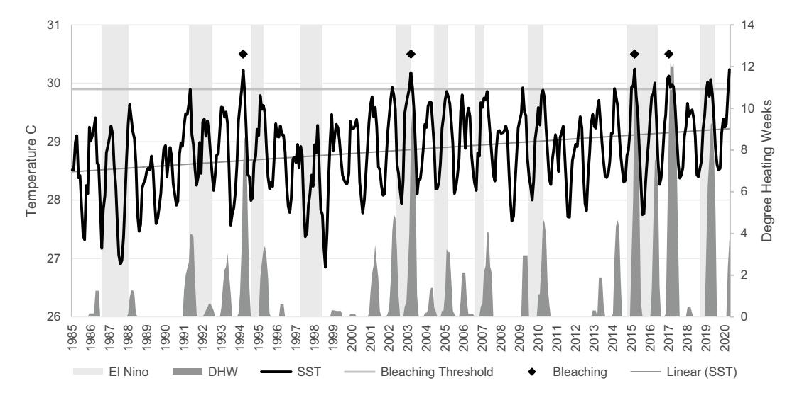
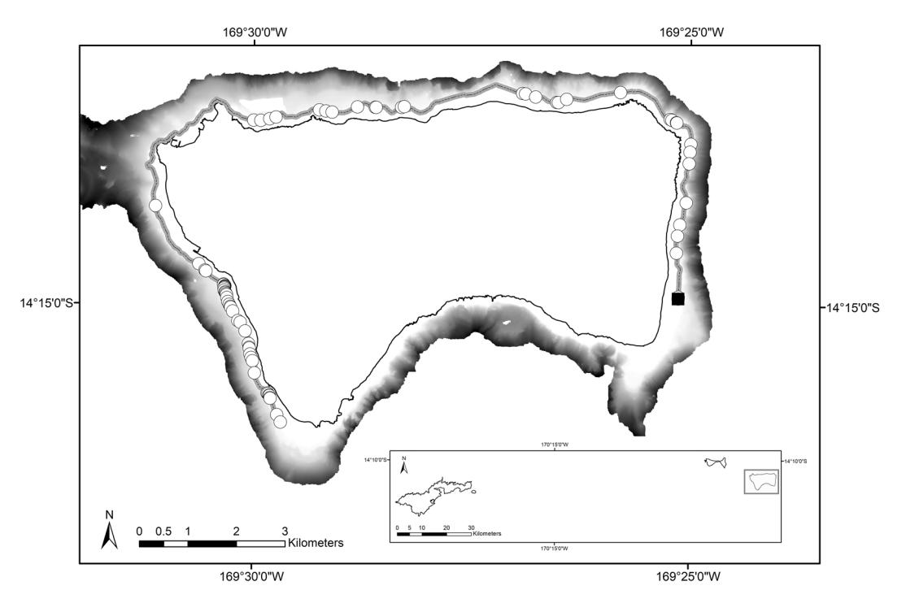
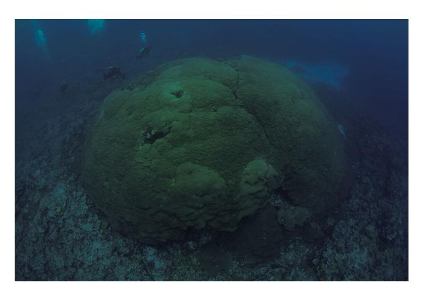

# scientific reports

## **OPEN** A new record for a massive *Porites* colony at Ta'u Island, American Samoa

Georgia Coward1⊠, Alice Lawrence1, Natasha Ripley1, Valerie Brown2, Mareike Sudek2,5, Eric Brown3, Ian Moffitt3, Bert Fuiava3 & Bernardo Vargas-Ángel4

An exceptionally large, hermatypic colony of Porites sp. has been identified and measured at Ta'u, American Samoa. This coral was measured in November 2019 as part of an effort to catalogue all large (≥ 2 m diameter) Porites colonies around Ta'u. Colonies exceeding 10 m in diameter were recorded on three different sides of the island with seasonally different wave exposures. The largest colony measured 8 m tall, 69 m in circumference and had a diameter of 22.4 m. To date, this is the biggest colony recorded in American Samoa, and one of the largest documented worldwide. It is currently unknown why such large corals exist around this particular island. Possible explanations include mild wave or atmospheric climates and minimal anthropogenic impacts. Physiologically, these colonies may be resistant and/or resilient to disturbances. Large, intact corals can help build past (centuryscale) climatic profiles, and better understand coral persistence, particularly as coral communities worldwide are declining at rapid rates.

American Samoa is a small (total area 202 km²), unincorporated territory of the United States. Located in the South Pacific, it is comprised of five high islands (Tutuila, Aunu'u, Ofu, Olosega, Ta'u), one low island (Swains) and an atoll (Rose Atoll). The majority of American Samoa's population (Census 2010: 55,519) resides on the main island of Tutuila, and at present less than 0.2% inhabit Ofu, Olosega, and Ta'u (Manu'a Islands). Swains and Rose are currently uninhabited. To date, American Samoa has approximately 250 verified hermatypic coral species and in general, the reefs have proven fairly resilient to both global and localised stressors such as increasing ocean temperatures2 and crown-of-thorns starfish (Acanthaser spp.) outbreaks3. This resilience has likely been a result of three factors; infrequent acute or short-term disturbance events that can occur on a regular basis in other coral reef environments, such as tropical cyclones and corallivore outbreaks; localised chronic disturbances at small spatial scales (e.g., land-based point sources of pollution) and; the isolation from major land masses4,5. However, acute disturbance events, particularly climate related, are increasing in frequency and strength6-8. American Samoa experienced severe coral bleaching in 1994, 2003, 2015 and 2017, with several minor/moderate events occurring between 1998 and 20198. Sea surface temperatures (SST) are rising in the region, and local SST now regularly exceed the theoretical bleaching threshold (1 °C above maximum monthly mean SST) during summer months (Fig. 1), increasing the threat of coral bleaching and associated coral mortality, El Niño-Southern Oscillation (ENSO) events have had inconsistent effects on local SST and may not be a major driver of coral bleaching in American Samoa11. Despite these changes, reefs around the island of Ta'u (14° 13′ 48" S, 169° 27′ 0" W) within the Manu'a Island group continue to thrive and support unique coral assemblages.

The volcanic island of Ta'u is 70,000 years old and lies 107 km east of Tutuila with a total land area of 44 km2, and a maximum elevation of 931 m12. Brown et al. 13 previously documented one of the largest, single colonies of massive *Porites* sp. located on the southwest corner of the island. This colony measures approximately 7 m in height, 41 m in circumference, with a diameter of 12 m13. The species was identified as *Porites lutea*13,14 and core samples taken in 2011 indicate the coral is at least 500 years old14. Massive *Porites* colonies in American Samoa consist of a group of species (e.g., P. lobata, P. evermanni, P. australiensis, P. lutea), which are mound-shaped and difficult to distinguish in the field. Large colonies have been reported from Ta'u, yet such large Porites corals are relatively rare elsewhere. Done and Potts16 noted that large massive *Porites* (up to 10 m) on the Great Barrier Reef are scarce and limited to localised aggregations in a specific zone of the reef front terrace (6-12 m depth) or on sheltered inshore reefs. Other locations reporting large *Porites* include Pandora Reef, Great Barrier Reef, (P.

1American Samoa Coral Reef Advisory Group- Department of Marine and Wildlife Resources, Pago Pago, AS 96799, USA. 2National Marine Sanctuary of American Samoa, Pago Pago, AS 96799, USA. 3National Park of American Samoa, Pago Pago, AS 96799, USA. 4Joint Institute for Marine and Atmospheric Science, Honolulu, HI 96822, USA. 5Cardinal Point Captains, Oceanside, CA 92056, USA. ™email: georgia.coward@crag.as

**Figure 1.** 1985–2020 time series of monthly average sea surface temperature (SST). Data is derived from the NOAA Coral Reef Watch virtual station for the Samoan Archipelago9 and plotted against bleaching threshold, degree heating weeks (DHW, degree C-weeks), and El Niño events12. Degree heating weeks is a measure of accumulated heat stress in reef ecosystems and values greater than 8 C-weeks indicate potential bleaching conditions. Diamonds indicate observed bleaching events. Data was imported and processed in Microsof Excel 2016.

*lobata*, 6.85 m diameter, estimated age 67717), Green Island, Taiwan (*P. lobata*, 12 m height, 31 m circumference, estimated age 1,00018), and Sesoko Island, Japan (*P. australiensis* micro atoll, 11.1 m diameter, 33.7 m circumference, estimated age 500—2,10019).

Te present study aimed to catalogue all large (≥2 m diameter) *Porites* colonies around Ta'u as a multi-agency initiative (Coral Reef Advisory Group Coordination, Department of Marine and Wildlife Resources, National Park Service of American Samoa, National Marine Sanctuary of American Samoa). Te study builds upon rapid tow-board surveys conducted in 2008, which identifed 32 large massive *Porites* around Ta'u20. Tese surveys were limited and no follow-up research was conducted (B. Vargas-Ángel pers. comm.).

A related survey efort in 2018 identifed a single, exceptionally large colony on the eastern side of the island (M. Sudek and B. Vargas-Ángel pers. comm.). Cataloguing the location of such colonies furthers climate science, as these sites have continuously supported corals for hundreds of years. Some hermaptypic corals produce banded aragonite skeletons annually and through coring can provide information on growth rates and age15. Cores from long-lived and large corals, coupled with geochemical and isotopic analyses in coral skeletal cores can help understand century-scale changes in ENSO patterns and other oceanographic events, and can be used to verify climate models15. Further study of these corals and the reefs that support them may improve our understanding of resilience factors and assist with informing future reef management strategies which can promote the long-term management and protection of these unique areas. Tis present study aims to expand on the existing evidence and anecdotal reports of exceptionally large *Porites* colonies around Ta'u, American Samoa and to comprehensively document their location and measurements.

#### **Method**

From November 25–27, 2019 tow-board surveys were conducted on the northern, eastern, and western sides of Ta'u (Fig. 2). Te southern side of Ta'u was not prioritised due to time constraints and results from previous tow-board surveys that suggested it is an unfavourable habitat for hard coral20. Te wave exposures around Ta'u are quite distinct given the island's somewhat rectangular geomorphology. In the austral winter, trade winds hit the east and southern facing shores with the strongest consistent wave energy10. Te wave energy is composed of short period (~2–10 s) seas generated by the local trade winds and longer period (~10–20 s) waves originating from far south21. Cyclones and other large wave events with more destructive wave power typically strike the Samoan archipelago in the austral summer from the north and northwest, but at infrequent intervals22,23.

Surveys were conducted in November due to optimal weather conditions and visibility (>40 m). Two snorkelers were towed behind an 11.9 m boat and attached to a 6 m rope, at a speed of approximately 1 knot within a depth contour range of 10 to 25 m. Te width of the survey area varied with water depth, water clarity, and benthic slope, but was estimated to range from 20 to 30 m for both snorkelers combined. Visibility ranged from 30 to 60 m. All large massive *Porites* corals within visual range and >2 m in diameter were censused. Massive colonies of *Porites* spp. were scored on a semi-qualitative scale between 1 and 3, where 1 included corals 2–5 m in diameter, 2 included corals 6–10 m diameter, and 3 was assigned to corals with a diameter> 10 m. Colony diameter was used in the categorisation from the surface given the snorkelers' vertical perspective on the coral colonies and the prevalent use of this metric in the literature. An initial calibration was conducted at the surface for all surveyors using a number of colonies and transect tapes to ensure that surveyors were relatively consistent

**Figure 2.** Tow-board survey route (indicated by the black line) around Ta'u, American Samoa and location of colonies of massive *Porites* observed within scale 3 (>10 m diameter; represented by white circles). Te black box designates the location of Ta'u within the Territory and the black square indicates the location of the largest colony observed.

in their size classifcations. Survey pairs were mixed throughout the surveys to reduce observer bias and facilitate calibration between surveyors. Te surface support team aboard the towing vessel recorded waypoints, depth, and coral scale using a handheld GPS unit and pre-printed datasheets. Any additional observations of the colony (e.g., partial mortality) were also noted. A GPS track was recorded at 5-s intervals and start and end waypoints for each tow segment were documented.

SCUBA dives were conducted on November 26 and 27, 2019, to document fve of the newly catalogued corals recorded during the surveys. Tese included corals along the eastern, northern, and western exposures. Each coral was photographed and coral colony diameter, circumference and height were measured to the nearest decimeter. Measurements were taken by multiple divers using transect tapes across the widest and tallest distances of the colony. Te maximum depths at the base and the top of the colony were noted. General health status was also recorded, including the presence of partial mortality and large growth anomalies. Roving diver surveys were conducted to document species presence, relative abundance of fsh, and visual estimates of coral cover at the two largest corals surveyed.

#### **Results and discussion**

Tow-board surveys covered a distance of 21.5 km and the efort identifed 84 individual colonies exceeding 10 m in diameter (scale 3; Fig. 2), 393 colonies between 6–10 m (scale 2) and 498 colonies between 2–5 m (scale 1). Table 1 lists the measurements for the fve colonies that were documented and measured. Te single, largest colony observed was located in 18 m of water and was 22.4 m across, 8 m tall, and the circumference at the base was 69 m (Fig. 3). To date, this is the biggest colony recorded in American Samoa, and one of the largest single colonies documented worldwide. Te colony is oval in shape and appears healthy, with an estimated 95% live coral tissue. Tere are two exposed areas on the top of the colony with a number of small pocilloporid and acroporid colonies. Te surrounding habitat appears to be in good condition, with relatively high coral cover and high fsh density and diversity. Tis colony will be named by local communities in Ta'u. Genetic studies are required to confrm that these exceptionally large corals around Ta'u are not multiple colonies merged into one functional unit. Other extremely large colonies of *Porites* spp. have been documented around the globe18,24. In some studies, the colonies were reported simply as a matter of record for their unusual size [e.g., 13, 18]. In other cases, colonies were sampled as part of a larger efort to examine growth rates17, temperature records coupled with calcifcation rates24, and climate reconstruction15. To our knowledge, none of the reported colonies have exceeded the size of the largest colonies measured from Ta'u. A published estimate of growth rates for *Porites* spp. of 19.0 mm year−125 in comparable latitudes and adjusted for an average temperature of 28.4 °C near Ta'u26, suggest that the two largest corals found on Ta'u are approximately 368 years and 420 years old, respectively. Another age estimate can be generated using the 490 annual density bands measured by Tangri et al.15 from a 6.01 m core taken from the coral measuring 7 m in height. Tis approach yields a linear extension rate of 12.2 mm year−1 with age estimates of 571 years for the 7 m coral and 652 years for the 8 m coral. Te discrepancy

| Date        | Latitude        | Longitude        | Diameter (m) | Height (m) | Circumference (m) |
|-------------|-----------------|------------------|--------------|------------|-------------------|
| 26/11/2019  | − 14° 14′ 55.0" | − 169° 25′ 8.4"  | 22.4         | 8.0        | 69.2              |
| 11/04/2009* | − 14° 15′ 00.0" | − 169° 30′ 00.0" | 17.0         | 7.0        | 41.0              |
| 27/11/2019  | − 14° 14′ 53.2" | − 169° 30′ 18.0" | 9.2          | 4.6        | 26.3              |
| 26/11/2019  | − 14° 12′ 37.8" | − 169° 26′ 56.4" | 5.7          | 5.0        | 25.6              |
| 27/11/2019  | − 14° 14′ 38.0" | − 169° 30′ 32.4" | 5.1          | 4.3        | 25.2              |
| 27/11/2019  | − 14° 14′ 37.7" | − 169° 30′ 32.4" | 7.6          | 4.6        | 23.4              |

**Table 1.** Measurements and locations of the largest colonies of massive *Porites* spp. found around Ta'u, American Samoa in November, 2019. \*Previous measurements of a massive *Porites* sp. documented by Brown et al.13 are included for comparison.

**Figure 3.** Te newly identifed and measured *Porites* sp. colony located in Ta'u, American Samoa. Photo credit Alexa Elliott, Changing Seas/South Florida PBS.

between estimates of over 200 years for both corals is noteworthy and illustrates the variability associated with determining ages for long-lived species.

One of the most interesting aspects of this study is that multiple massive *Porites* colonies were documented on three sides of the island, where they are subjected to difering environmental regimes (e.g., wave exposure, wind exposure, ocean current strength, and direction) that may afect growing conditions. As noted earlier, corals on the eastern and south facing shorelines experience the strongest wave energy on average10. In contrast, the generally calmer conditions on the northern and western shores are infrequently impacted by acute cyclonic events22. Te number of colonies per linear kilometer along each coastline of Ta'u indicated that even though large colonies were found on three sides of the island, there were a disproportionately higher number of the largest scale 3 colonies on the west coast (64%) compared to the north (14%) and east coasts (22%). Tis pattern was similar for the two smaller size classes (scale 2–53% W, 27% N, 20% E; scale 1–46% W, 38% N, 16% E). Tese distributional patterns can be partially explained by the wave shadow created by Ofu and Olosega that protect Ta'u from the largest waves coming from 315° to 0°23. Wave events originating from 220° to 300° were almost non-existent from 1980 to 201123.

Te impact of currents on various coastlines is somewhat more complicated. At a regional scale, currents primarily fow from east to west through the archipelago in the South Equatorial Current, but can reverse directions in the South Equatorial Counter Current depending on the season and/or year27,28. Consequently, the oligotrophic open ocean water that would typically infuence the eastern shoreline could also periodically appear on the western shoreline. At the local scale, the angular coastline of Ta'u could generate eddies that produce mixing zones that entrain coral larvae and nutrients on all coastlines, but these studies have not yet been conducted.

Colonies were also located across a wide depth gradient from 9 m to over 30 m. Done and Potts16 found some aggregations of large *Porites* colonies>10 m in diameter on exposed, mid-shelf reefs in the Great Barrier Reef, but these colonies were largely confned to the base of the reef slopes (~6 to 12 m deep) and they did not appear to approach the size and abundance of the colonies around Ta'u. At this time, it is unknown why so many large coral colonies exist around this particular island. Possible explanations include relatively stable oceanic conditions22, which enables these corals to avoid major disturbances (e.g.29,30), and minimal anthropogenic impacts that have allowed these corals to survive over centuries. For example, Tangri et al.15 suggested that long-lived corals around Ta'u may have benefted from the island's location in and near the ENSO null zone over the last fve centuries. Te null zone is theorised to dampen or mute changes in SST related to ENSO events that have been documented in other regions of the Pacifc31. SST from 1870 to 2019 near Ta'u (− 14° 30′ S, − 169° 30′ W) showed higher average temperatures, but slightly lower inter-annual variation (mean: 28.49° C±0.72 SD) compared to temperatures near the Great Barrier Reef (26.66° C±0.18 SD) at the same latitude (− 14° 30′ S, 144° 30′ E). Te coefcient of variation for the Ta'u temperature measurements was 62% less than the corresponding temperature readings for the GBR values25. Hence, these conditions may have allowed the Ta'u corals to continue growing when massive *Porites* corals at other locations, such as Rangiroa, French Polynesia, the Great Barrier Reef, Australia, and Jarvis Island, US Pacifc Remote Islands, slowed growth or perished in bleaching events32–34.

Post-bleaching core samples of long-lived *Porites* in Jarvis Island revealed that colonies ceased their growth during bleaching events and resumed once normal thermal conditions re-established34. Tis physiological shif enabled these massive *Porites* coral colonies to survive disturbance events such as bleaching and illustrated the resilience of these corals over long time periods within the context of a changing climate. Previous studies such as Loya et al*.* 35 and Edmunds et al*.* 36, have suggested that massive *Porites* are more physiologically resilient to disturbances compared to other coral species. It is likely that the corals around Ta'u are utilising similar physiological mechanisms to achieve their large size.

Identifying areas where long-lived corals exist and thrive will be critical in evaluating changes in climate patterns, and identifying resilience factors that may improve management of coral reef ecosystems in the South Pacifc. Due to the large number of these massive colonies, it is evident that the island of Ta'u has ideal conditions that support these resilient corals and this warrants some level of protection.

Received: 11 February 2020; Accepted: 17 November 2020

#### **References**

- 1. Fenner, D. Field guide to the coral species of the Samoan archipelago: American Samoa and independent Samoa 1–422 (American Samoa Dept. Marine & Wildlife Resources, 2016).
- 2. NOAA. US Coral Reef Monitoring Data Summary 2018. NOAA Coral Reef Conservation Program. NOAA *Technical Memorandum CRCP* 31, https://doi.org/10.25923/g0v0-nm61 (2018).
- 3. Fenner, D., *et al.* (2008) Te State of Coral Reef Ecosystems of American Samoa in *Te State of Coral Reef Ecosystems of the United States and Pacifc Freely Associated States* (ed. Waddell, J) 307–351 (NOAA Technical Memorandum NOS NCCOS 11. NOAA/ NCCOS Center for Coastal Monitoring and Assessment's Biogeography Team, 2008).
- 4. Birkeland, C. *et al.* Geologic setting and ecological functioning of coral reefs in American Samoa. In *Coral reefs of the USA, pp 741–765* (eds Riegl, B. & Dodge, R.) (Springer, Berlin, 2008).
- 5. Ennis, R. S., Brandt, M. E., Grimes, K. R. W. & Smith, T. B. Coral reef health response to chronic and acute changes in water quality in St. Tomas, United States Virgin Islands. *Mar. Poll. Bull.* **111**, 418–427 (2016).
- 6. Webster, P. J., Holland, G. J., Curry, J. A. & Chang, H. R. Changes in tropical cyclone number, duration, and intensity in a warming environment. *Science* **309**, 1844–1846 (2005).
- 7. Knutson, T. R. *et al.* Tropical cyclones and climate change. *Nat. Geosci.* **3**, 157–163 (2010).
- 8. Hughes, T. *et al.* Spatial and temporal patterns of mass bleaching of corals in the Anthropocene. *Science* **359**, 80–83 (2018).
- 9. NOAA Coral Reef Watch. NOAA Coral Reef Watch Version 3.1 Daily Global 5-km Satellite Virtual Station Time Series Data for Samoas, Jan 01, 2013-April 07, 2020. Data set accessed 08 Apr 2020. College Park, Maryland, https://coralreefwatch.noaa.gov/ product/5km/index.php, (2018, updated daily).
- 10. Fenner, D. Te Samoan Archipelago. In *World Seas: An Environmental Evaluation: Volume II: Te Indian Ocean to the Pacifc* (ed. Sheppard, C.) 619–643 (Academic Press, Cambridge, 2018).
- 11. NOAA Physical Science Laboratory. Oceanic Niño Index for SST 5N-5S, 170W-120W from 1950 to 2020. Data set accessed 29 May 2020. Boulder, Colorado. https://psl.noaa.gov/data/correlation/oni.data (2015, updated monthly).
- 12. Koppers, A. A. *et al.* Samoa reinstated as a primary hotspot trail. *Geology* **36**, 435–438 (2008).
- 13. Brown, D. P. *et al.* American Samoa's island of giants: massive *Porites* colonies at Ta'u island. *Coral Reefs* **28**, 735 (2009).
- 14. Forsman, Z. H., Barshis, D. J., Hunter, C. L. & Toonen, R. J. Shape-shifing corals: molecular markers show morphology is evolutionarily plastic in Porites. *BMC Evol. Biol.* **9**, 45 (2009).
- 15. Tangri, N., Dunbar, R. B., Linsley, B. K. & Mucciarone, D. M. ENSO's shrinking twentieth-century footprint revealed in a halfmillennium coral core from the South Pacifc Convergence Zone. *Paleoceanogr. Paleoclimatol.* **33**, 1136–1150 (2018).
- 16. Done, T. J. & Potts, D. C. Infuences of habitat and natural disturbances on contributions of massive *Porites* corals to reef communities. *Mar. Biol.* **114**, 479–493 (1992).
- 17. Potts, D. C., Done, T. J., Isdale, P. J. & Fisk, D. A. Dominance of a coral community by the genus *Porites* (Scleractinia). *Mar. Ecol. Prog. Ser.* **23**, 79–84 (1985).
- 18. Soong, K., Chen, C. A. & Chang, J. C. A very large poritid colony at Green Island, Taiwan. *Coral Reefs* **18**, 42 (1999).
- 19. Takeuchi, I. & Yamashiro, H. Large Porites microatoll found by aerial survey at Sesoko Island, Okinawa, Japan. *Coral Reefs* **36**, 1317 (2017).
- 20. Pacifc Islands Fisheries Science Center (PIFSC). Coral reef ecosystems of American Samoa: a 2002–2010 overview. (NOAA Fisheries Pacifc Islands Fisheries Center, PIFSC Special Publication, 2011).
- 21. Barstow, S.F. & Haug, O. Te wave climate of Western Samoa. SOPAC Technical Report 204. 34 pp. (1994).
- 22. Pirhalla, D., Ransi, V., Kendall, M., & Fenner, D. Oceanography of the Samoan Archipelago in A biogeographic assessment of the Samoan Archipelago. 3–26. (eds. Kendall, M & Poti, M) 3–26 (NOAA Tech. Memo NOS NCCOS 132, Silver Springs, Maryland, 2011).
- 23. U.S. Army Corps of Engineers Wave Information Studies WISWAVE Hindcast model. Average Wave Height, Maximum Wave Height, Wave Direction at 14.5°S, 170°W from 1980–2011. Data set accessed 10 Jan 2012. http://frf.usace.army.mil/wis/.
- 24. Lough, J. M. & Barnes, D. J. Several centuries of variation in skeletal extension, density and calcifcation in massive *Porites* colonies from the Great Barrier Reef: a proxy for seawater temperature and a background of variability against which to identify unnatural change. *J. Exp. Mar. Biol. Ecol.* **211**, 29–67 (1997).
- 25. Lough, J. M. Coral calcifcation from skeletal records revisited. *Mar. Ecol. Prog. Ser.* **373**, 257–264 (2008).
- 26. Environmental Research Division's Data Access Program. HadISST Average Sea Surface Temperature, 1°, Global, Monthly, 1870-present. Data set accessed 04 Apr 2020. https://coastwatch.pfeg.noaa.gov/erddap/griddap/erdHadISST.html (2020).
- 27. Qiu, B. & Chen, S. Seasonal modulations in the eddy feld of the South Pacifc Ocean. *J. Phys. Oceanogr.* **34**, 1515–1527 (2004).
- 28. Kendall, M.S., Poti, M., T. Wynne, B. Kinlan, L. Bauer. Ocean Currents and Larval Transport Among Islands and Shallow Seamounts of the Samoan Archipelago and Adjacent Island Nations. In *A Biogeographic Assessment of the Samoan Archipelago* (eds. Kendall, M & Poti, M) 3–26 (NOAA Tech. Memo NOS NCCOS 132, Silver Springs, Maryland, 2011).
- 29. Wall, M. *et al.* Large-amplitude internal waves beneft corals during thermal stress. *Proc. Biol. Sci* **282**, 20140650 (2015).
- 30. Kavousi, J. & Keppel, G. Clarifying the concept of climate change refugia for coral reefs. *ICES J. Mar. Sci.* **75**, 43–49 (2018).
- 31. Langlais, C. E. *et al.* Coral bleaching pathways under the control of regional temperature variability. *Nat. Clim. Change* **7**, 839–844 (2017).

- 32. Hendy, E. J., Lough, J. M. & Gagan, M. K. Historical mortality in massive Porites from the central Great Barrier Reef, Australia: evidence for past environmental stress?. *Coral Reefs* **22**, 207–215 (2003).
- 33. Rof, G. *et al.* Porites and the Phoenix efect: unprecedented recovery afer a mass coral bleaching event at Rangiroa Atoll, French Polynesia. *Mar Biol.* **161**, 1385–1393 (2014).
- 34. Barkley, H. C. *et al.* Repeat bleaching of a central Pacifc coral reef over the past six decades (1960–2016). *Commun. Biol.* **1**, 1–10 (2018).
- 35. Loya, Y., Sakai, K., Nakano, Y., Sambali, H. & van Woesik, R. Coral bleaching: the winners and the losers. *Ecol. Lett.* **4**, 122–131 (2001).
- 36. Edmunds, P. J., Putnam, H. M. & Gates, R. D. Photophysiological consequences of vertical stratifcation of *Symbiodinium* in tissue of the coral *Porites lutea*. *Biol. Bull.* **223**, 226–235 (2012).

### **Acknowledgements**

Te authors thank K. Nalesere, S. Woofer, L-L. Jeannot, V. Vaeoso, S.H Vaitautolu Tuimavave and V. H. Sesepasara for their assistance and support. Te authors thank A. Elliott and Changing Seas/South Florida PBS for their support and colony photographs. Tis project was supported through a State and Territorial Coral Reef Conservation Cooperative Agreement with the National Oceanic and Atmospheric Administration's Coral Reef Conservation Program.

#### **Author contributions**

G.C., V.B. and E.B. wrote the main manuscript text. V.B. prepared Fig. 1, A.L. prepared Fig. 2, and G.C. and V.B. prepared Fig. 3. B.V.A., N.R., B.F., I.M. and M.S. assisted with data management and literature compilation. All authors reviewed the manuscript.

#### **Competing interests**

Te authors declare no competing interests.

#### **Additional information**

**Correspondence** and requests for materials should be addressed to G.C.

**Reprints and permissions information** is available at www.nature.com/reprints.

**Publisher's note** Springer Nature remains neutral with regard to jurisdictional claims in published maps and institutional afliations.

**Open Access** Tis article is licensed under a Creative Commons Attribution 4.0 International License, which permits use, sharing, adaptation, distribution and reproduction in any medium or format, as long as you give appropriate credit to the original author(s) and the source, provide a link to the Creative Commons licence, and indicate if changes were made. Te images or other third party material in this article are included in the article's Creative Commons licence, unless indicated otherwise in a credit line to the material. If material is not included in the article's Creative Commons licence and your intended use is not permitted by statutory regulation or exceeds the permitted use, you will need to obtain permission directly from the copyright holder. To view a copy of this licence, visit http://creativecommons.org/licenses/by/4.0/.

© Te Author(s) 2020

### Terms and Conditions

Springer Nature journal content, brought to you courtesy of Springer Nature Customer Service Center GmbH ("Springer Nature").

Springer Nature supports a reasonable amount of sharing of research papers by authors, subscribers and authorised users ("Users"), for smallscale personal, non-commercial use provided that all copyright, trade and service marks and other proprietary notices are maintained. By accessing, sharing, receiving or otherwise using the Springer Nature journal content you agree to these terms of use ("Terms"). For these purposes, Springer Nature considers academic use (by researchers and students) to be non-commercial.

These Terms are supplementary and will apply in addition to any applicable website terms and conditions, a relevant site licence or a personal subscription. These Terms will prevail over any conflict or ambiguity with regards to the relevant terms, a site licence or a personal subscription (to the extent of the conflict or ambiguity only). For Creative Commons-licensed articles, the terms of the Creative Commons license used will apply.

We collect and use personal data to provide access to the Springer Nature journal content. We may also use these personal data internally within ResearchGate and Springer Nature and as agreed share it, in an anonymised way, for purposes of tracking, analysis and reporting. We will not otherwise disclose your personal data outside the ResearchGate or the Springer Nature group of companies unless we have your permission as detailed in the Privacy Policy.

While Users may use the Springer Nature journal content for small scale, personal non-commercial use, it is important to note that Users may not:

- 1. use such content for the purpose of providing other users with access on a regular or large scale basis or as a means to circumvent access control;
- 2. use such content where to do so would be considered a criminal or statutory offence in any jurisdiction, or gives rise to civil liability, or is otherwise unlawful;
- 3. falsely or misleadingly imply or suggest endorsement, approval , sponsorship, or association unless explicitly agreed to by Springer Nature in writing;
- 4. use bots or other automated methods to access the content or redirect messages
- 5. override any security feature or exclusionary protocol; or
- 6. share the content in order to create substitute for Springer Nature products or services or a systematic database of Springer Nature journal content.

In line with the restriction against commercial use, Springer Nature does not permit the creation of a product or service that creates revenue, royalties, rent or income from our content or its inclusion as part of a paid for service or for other commercial gain. Springer Nature journal content cannot be used for inter-library loans and librarians may not upload Springer Nature journal content on a large scale into their, or any other, institutional repository.

These terms of use are reviewed regularly and may be amended at any time. Springer Nature is not obligated to publish any information or content on this website and may remove it or features or functionality at our sole discretion, at any time with or without notice. Springer Nature may revoke this licence to you at any time and remove access to any copies of the Springer Nature journal content which have been saved.

To the fullest extent permitted by law, Springer Nature makes no warranties, representations or guarantees to Users, either express or implied with respect to the Springer nature journal content and all parties disclaim and waive any implied warranties or warranties imposed by law, including merchantability or fitness for any particular purpose.

Please note that these rights do not automatically extend to content, data or other material published by Springer Nature that may be licensed from third parties.

If you would like to use or distribute our Springer Nature journal content to a wider audience or on a regular basis or in any other manner not expressly permitted by these Terms, please contact Springer Nature at

[onlineservice@springernature.com](mailto:onlineservice@springernature.com)