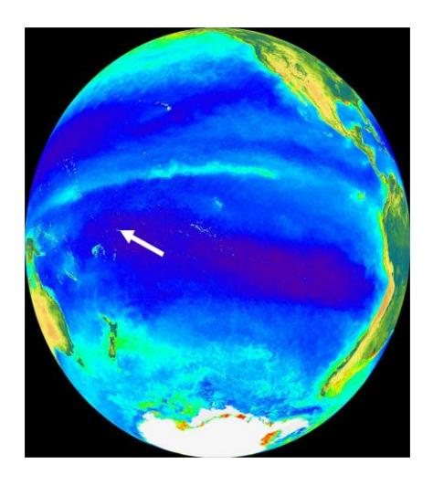
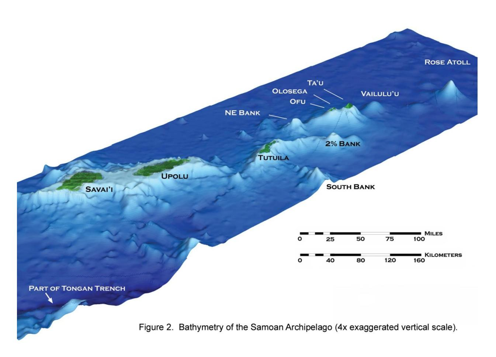
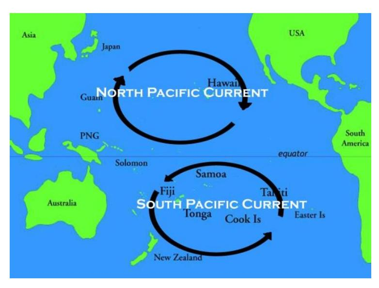
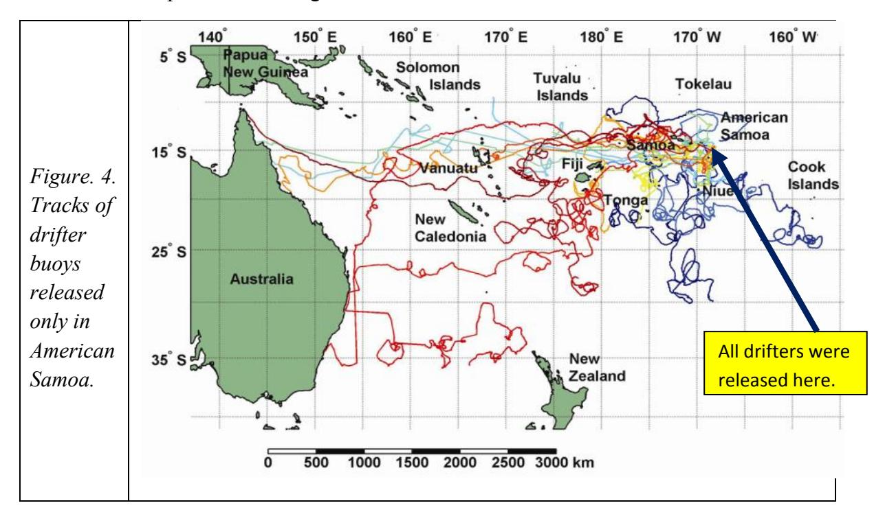
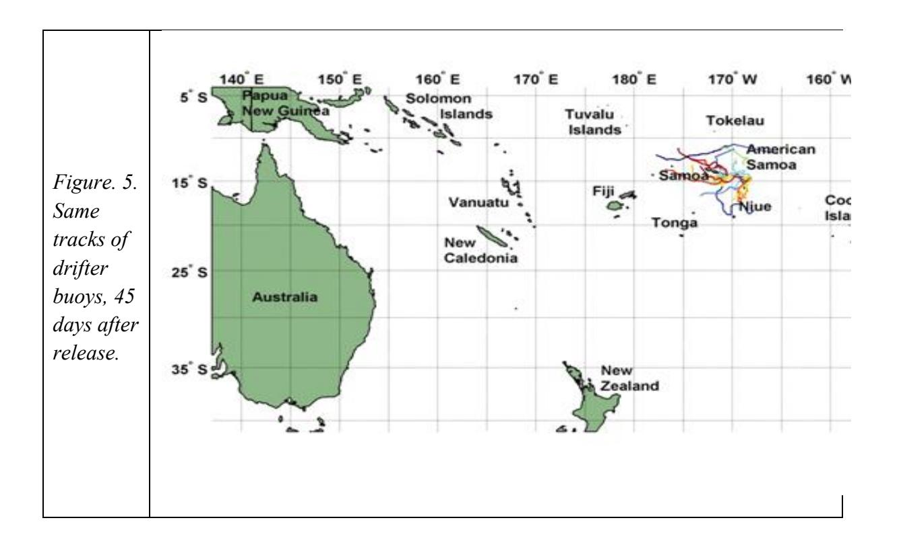
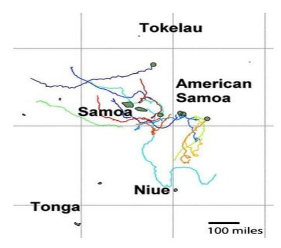
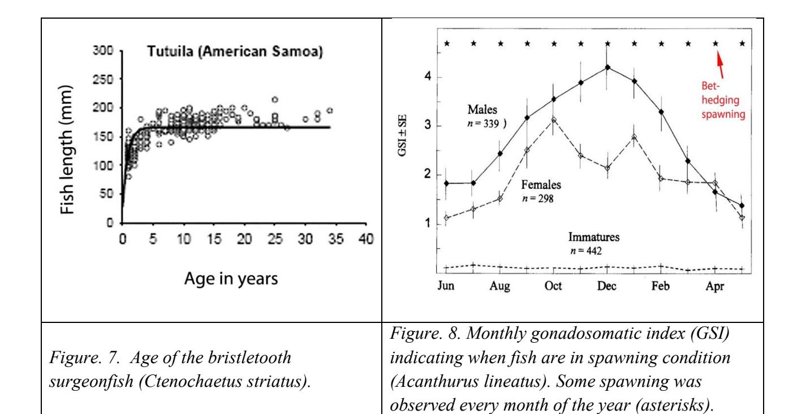
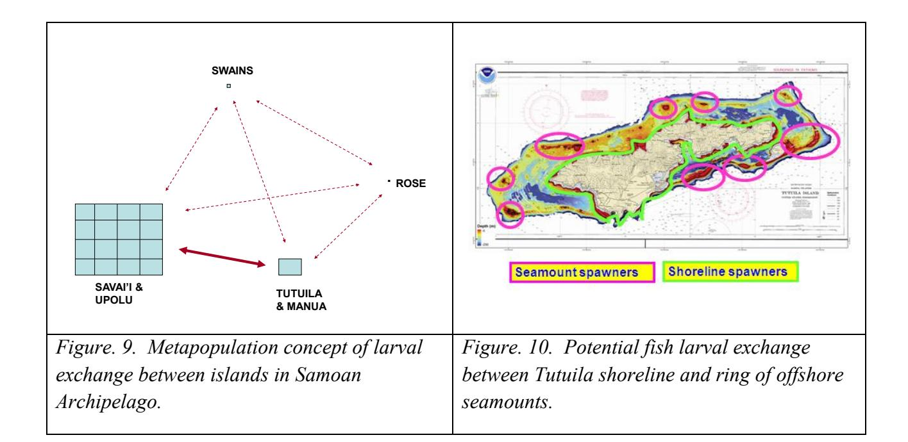
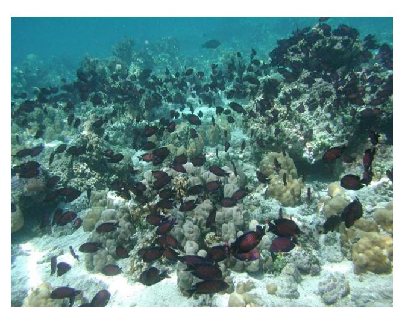

# **Connectivity among coral reef fish populations in the remote Samoan Archipelago: metapopulation concept and implications**

## **Peter Craig1 and**

## **Rusty Brainard2**

### Abstract

For coral reef fishes, the islands in the Samoan Archipelago are an isolated, self-seeding metapopulation due to limited dispersal abilities of their pelagic larval stage. Island connectivity by ocean currents is erratic, which affects patterns of species diversity and abundance on each island. The interactive components of the metapopulation provide a measure of stability to the system, given the vagaries of ocean currents and the natural and anthropogenic threats to any island in the archipelago (cyclones, overfishing, habitat degradation, climate change). Life history traits of many coral reef fish species (long life span, repeat spawning) facilitate survival in a system characterized by infrequent recruitment, but these same traits also make fish populations vulnerable to being overfished. The current assemblage of fish on Tutuila reefs shows classic signs of fishing pressure (low biomass, few large fish). A network of no-take Marine Protected Areas across the archipelago is an essential conservation strategy to cope with these conditions, but recovery of depleted populations may nonetheless take years or decades due to low recruitment rates caused by natural factors that are exacerbated by fishing pressure on remaining spawners.

### Introduction

The Samoan Archipelago forms an isolated cluster of islands in the South Pacific Ocean (Fig. 1). Nearest neighbor islands are small and distant, generally 500-1000 miles away. This essay proposes that the Samoan islands function as a metapopulation for coral reef fish and invertebrates, a concept that has important biological implications for the management of these marine resources. The term 'metapopulation' is used here to refer to a group of spatially separated populations of coral reef fish that are periodically connected through exchange of organisms during their pelagic larval period, and thus these populations form an integrated biological unit. In this case, the metapopulation is the archipelago itself, including the islands of Samoa, American Samoa, and associated seamounts that are shallow enough to support coral reef organisms (Fig. 2). As indicated below, input of larvae from sources beyond the archipelago is likely rare, but frequent enough over the long term (100's of years) to prevent speciation from occurring within the metapopulation.

1 National Park of American Samoa, Pago Pago, American Samoa 96799

2 NOAA-Pacific Islands Fishery Science Center, Honolulu, Hawaii 96822

*Figure 1. Location of Samoan Archipelago in the South Pacific Ocean (arrow).*

Most coral reef fish species have a pelagic larval stage in their life history, so the linkage between the islands within the metapopulation is through occasional larval exchange. At spawning time, fish often swim upwards in the water column to release their eggs and milt, enhancing their dispersal by water currents. It has long been postulated that this behavior may (a) increase larval survival by keeping the larvae away from benthic filter-feeding predators, and (b) promote dispersal of the larvae to new areas. Periodic replenishment of American Samoa's coral reef fish populations is essential to replace fish lost to natural or fishing mortality. This essay also speculates about life history adaptations of coral reef fish that enhance the recruitment of larvae back to coral reef habitats to sustain each island's population of fish.

#### **Ocean currents and larval transport**

Since all of the coral reef fish in American Samoa will eventually die, where do the fish larvae come from that sustain local populations? Recent information about ocean currents in our region provides insight to this question. Fish larvae tend to remain in the ocean's surface layer during their pelagic phase, and although it is recognized that they are not completely passive particles drifting with the currents, surface ocean currents provide a good proxy for where the larvae will go.

The major pattern of ocean currents in the South Pacific is the counter-clockwise flow of the South Pacific Gyre (Fig. 3), but there is considerable variation to this pattern at finer scales of resolution. The complexity of surface currents near American Samoa is demonstrated by the tracks of 25 drifter buoys released by NOAA ships at different times and places within the territory. Each buoy floated at the sea surface, but it was tethered to a "sea anchor" so the buoy moved with the surface layer of seawater (less than 50-feet deep) rather than where the wind was blowing. The buoys were released 2-3 miles offshore to minimize getting snagged along the shoreline, consequently this offshore deployment would maximize the dispersal distance that fish larvae might travel by avoiding potential nearshore currents.

*Figure 3. Major ocean currents.*

Most buoys drifted from 1-3 years at sea and their directions were highly varied, but together they reveal a strong connectivity among the many islands in the region (Fig. 4). For example, over a multi-year period (e.g., 100's of years), a piece of driftwood from American Samoa could eventually run aground almost anywhere in the region. This connectivity helps explain why these coral reefs have similar species to those found across thousands of miles of the South Pacific Ocean. Unique species (endemics) would generally not develop at any one island due to the occasional input of marine organisms from other islands.

However, most coral reef fish larvae do not live nearly long enough to be spread across the South Pacific as indicated by these drifter tracks. The average duration of the fish's pelagic larval phase is relatively brief for most common coral reef fish taxa: parrotfish (15 days), groupers and snappers (30-45 days), surgeonfish (45 days). Using 45 days as an average time before most larvae need to settle and take up permanent residence on a new coral reef, the same drifters traveled only about 350 miles during this period, basically remaining within the Samoan Archipelago (Fig. 5). This indicates that the main supply of coral reef fish larvae that replenish our reefs on an annual basis originates primarily within our own archipelago.

*Figure 6. Drifter tracks, 45 days.*

#### **Strategies to improve fish larval survival and recruitment back to the coral reef**

At a finer resolution, the 45-day drifter tracks in the Samoan Archipelago generally ended up far out at sea (Fig. 6), with little chance for the fish larvae to return to any coral reef habitat to settle upon. Under such circumstances, larval survival would be very low. However, coral reef fish improve their larval survival and recruitment in several ways. (1) Some larvae may be able to remain near land, perhaps being entrained in eddies that may form on the downstream sides of islands. (2) Fish larvae are not entirely passive particles that drift with the current. As they develop, some may actively swim towards land if they are close enough. (3) But perhaps the most important strategy for coral reef fish populations to overcome this weak pelagic link in their life cycle is a blunt acceptance of little return, so the adults live a very long life and spawn repeatedly, so that they can pump millions upon millions of eggs into the ocean during their life span. If, for each pair of spawners, just two of their eggs are fertilized, survive the pelagic stage, successfully return to a coral reef, and live long enough to reproduce, then the metapopulation of that species would be stable, with two young fish replacing each pair of adults. There is ample evidence that coral reef fish have adopted this strategy. Many of these species have surprisingly long life spans. Fish that are 15-30 years old (or much older) are common on local reefs. For two small surgeonfish species that are harvested in American Samoa (the blue-lined surgeonfish, *Acanthurus lineatus*; and the lined bristletooth surgeonfish, *Ctenochaetus striatus*), the oldest fish sampled were 18 and 35 years old, respectively (Fig. 7). In the Great Barrier Reef in Australia, *Acanthurus lineatus* may live as long as 44 years. In other words, once a coral reef fish survives the pelagic stage and successfully recruits back to the coral reef, it may live there for decades, and spawn repeatedly.

The *A. lineatus* population in American Samoa has a protracted 7-month spawning season that is presumably tailored to the best season for larval survival (Fig. 8). But given the vagaries of ocean currents previously shown, the population also has a bet-hedging strategy whereby some fish also spawn every month of the year, as if to take advantage of favorable ocean currents whenever they might occur. Four additional coral reef fish species in American Samoa also spawn year-round (Craig 1998).

In life history theory, this is termed a K-selected strategy for species that have a relatively high survival of adults but low survival of their young. To thrive under such circumstances, one life history solution is to have the adults live a long life span and spawn repeatedly, involving millions of eggs, to ensure at least some young survive to maturity. Survival to maturity involves both survival of the pelagic larval stage as well as subsequent survival of young fish on the reef until they reach sexual maturity and contribute to the reproduction of the population.

#### **Metapopulation concept**

Under the conditions outlined in this paper (a remote archipelago, coral reef fish with an obligatory pelagic stage in their life cycle, unpredictable dispersal of larvae by ocean currents that result in low and erratic return of young fish back to the coral reefs), the metapopulation concept begins to take on added significance in the Samoan Archipelago (Fig. 9). Over time, each larval source (island, atoll, seamount) may play a critical role in supplying fish recruits to other coral reefs in the archipelago, thereby directly affecting the species diversity and abundance of coral reef fish at other sites. Larvae drifting between Savaii, Upolu, and Tutuila would seem to offer the most frequent possibilities of larval exchange due to the relatively large size of these islands (and their coral reefs) and their proximity to each other.

At a smaller scale, it may also be that Tutuila's shoreline populations of coral reef fishes benefit from larval exchange from the circle of submerged seamounts surrounding Tutuila Island (Fig. 10).

In this case, regardless of the direction of ocean currents at any given time, some nearby seamounts may be suitably located to contribute larvae to Tutuila. Or, the seamount complex itself may cause nearshore currents that help retain fish larvae near Tutuila rather than disperse them offshore.

The metapopulation concept, and the life history traits of its coral reef inhabitants, have several biological and management implications:

- 1. Variations in species diversity and local extinctions. While the general relationship between island size and number of species present is well known (i.e., smaller islands have fewer species), the lottery effect of variable ocean currents in the Samoan Archipelago jeopardizes a dependable supply of coral reef fish larvae, especially to small, remote islands like Swains Island and Rose Atoll. Local extinctions may occur if a significant number of recruits are not received over a period that is longer than the life span of remaining adults at a particular site. However, the species lost would probably persist elsewhere within the metapopulation and may eventually reoccupy its former distribution in the future. For example, Acanthurus lineatus is a common species on the larger islands in the Samoan Archipelago, but Wass (1981) did not record Acanthurus lineatus at Rose Atoll in 1980. However, several small recruits were observed there in 1993, and more recent surveys confirm the continued presence of this species at the atoll.
- 2. Save all the pieces. Given the low probability of receiving coral reef fish larvae from islands beyond the Samoan Archipelago, all potential sources of fish larvae from islands and seamounts within the archipelago are important. Each larval source adds a degree of stability and diversity to the metapopulation. Even the small, remote islands like Swains and Rose may provide larvae, or increased genetic diversity, to other sites within the metapopulation in some years. Also, given that most coral reef habitat (including specialized habitats like barrier islands, lagoons, mangroves, and seagrass beds) within the archipelago occurs mostly in Samoa, it

behooves American Samoa to work cooperatively with Samoa to examine interisland connectivity of marine populations and protect critical marine resources and habitats. An archipelago-wide network of no-take Marine Protected Areas is an essential component of a marine conservation plan for these islands. The vitality of the metapopulation is greater than the sum of its parts.

*Figure. 11. Massive settlement of juvenile surgeonfish onto coral reefs.*

- *3. Dominant year classes and natural changes in fish abundance over time*. The life history traits expressed by many coral reef fishes (long life span, multiple spawning) indicate that recruitment of larvae back to coral reefs is infrequent. Years of poor recruitment may be the rule rather than the exception, resulting in natural fluctuations in fish abundance on each island, particularly the smallest ones. On the other hand, there are occasionally years with extraordinarily large recruitment events in the archipelago. Two species well-known for this are harvested in great numbers every few years when their pelagic young return to the shoreline: *pala'ia*, juvenile surgeonfish (*Ctenochaetus striatus*), and *i'asina*, juvenile goatfish (*Mulloidichthys flavolineatus*). Massive recruitment events such as this may form the dominant year class for the species for many years thereafter.
- *4. Spillover of vagrant species*. Upolu and Savaii have 15 times more land mass, and larger acreage of coral reefs and barrier island lagoon habitats (e.g., mangroves, seagrass beds) than occurs in American Samoa. It may be possible that larval stages of a fish species requiring such habitats occasionally drift over to American Samoa, thus some species may be present in American Samoa even if critical habitat for that species is missing.
- *5. Vulnerability and recovery from fishing pressure*. The metapopulation concept may be a useful way to view the status of coral reef fish populations in American Samoa. Although subsistence fishing for coral reef fish on Tutuila Island has steadily decreased over the past three decades (Coutures 2003), the current fish populations still show classic signs of overfishing: the overall biomass of fish on the reefs is low, and few large fish or sharks are present. For example, the overall biomass is less than one third that occurring on unfished coral reefs in the central

Pacific region, fish larger than 14 inches are rare, and 70% of residents believed that fishing had declined (Tuilagi and Green 1995, Craig and Green 2005, Birkeland et al. 2008, Craig et al. 2008). The same life history traits of coral reef fish that enable them to survive over the long term with unpredictable larval recruitment (particularly their long life span) make these fish populations vulnerable to fishing pressure -- it is easy to fish them out, especially given the small size of Tutuila's coral reefs. It may be that, once a species has been fished below a critical mass, the remaining spawners produce too few larvae to provide the level of recruitment needed to sustain a viable local population. Instead, the species might receive only a trickle of larvae, and a light level of fishing pressure on the few remaining large fish may be enough to retard recovery of the population. A reduction in fishing pressure is a first step for some species, but even in the absence of fishing, it might take years or decades for some species to recover. Coral reef fish would not have evolved life spans of 15-30 years if annual recruitment to their populations was dependable and plentiful.

**Acknowledgements:** NOAA's Coral Reef Ecosystem Division provided significant advances in our understanding of ocean dynamics and status of marine resources in American Samoa and the broader central Pacific region. Ellen Smith (NOAA) and Paul Brown (NPS) prepared the figures of ocean drifter tracks and bathymetry of the Samoan Archipelago.

#### **References**

- Birkeland, C., P. Craig, D. Fenner, L. Smith, W. Kiene, B. Riegl. 2008. Geologic setting and ecological functioning of coral reefs in American Samoa. Chapt. 20, In (B. Riegl and R. Dodge, Eds.). Coral reefs of the USA. Springer Publications. NY. 803 pp.
- Coutures, E. 2003. The Shoreline Fishery of American Samoa. Dept. Marine & Wildlife Resources, Biol. Rep. Ser. No. 102, American Samoa, 22 pp.
- Craig, P. 1998. Temporal spawning patterns for several surgeonfishes and wrasses in Am. Samoa. Pacific Sci. 52:35-39
- Craig, P., A. Green. 2005. Overfished reefs in American Samoa: no quick fix. Reef Encounter 33:21-22.
- Craig, P., G. DiDonato, D. Fenner, C. Hawkins. 2005. The state of coral reef ecosystems in American Samoa: 2005. pp. 312-337. *In;* J. Waddell (ed.). The state of coral reef ecosystems of the US and Pacific freely associated states: 2005. National Oceanic and Atmospheric Administration, Tech. Memo. NOS NCCOS 11, Silver Spring MD.
- Craig, P., A. Green, F. Tuilagi. 2008. Subsistence harvest of coral reef resources in the outer islands of American Samoa: modern, historic and prehistoric catches. Fisheries Research 89(3): 230-240.

- Tuilagi, F., A. Green. 1995. Community perception of changes in coral reef fisheries in American Samoa. Biol. Paper 22. In: Proceedings of South Pacific Commission -- Forum Fisheries Agency regional inshore management workshop (New Caledonia). Dept. Marine and Wildlife Resources, Biol. Rept. Series No. 72, American Samoa, 16 pp.
- Wass, R. 1981. The fishes of Rose Atoll Supplement 1. Dept. Marine & Wildlife Resources, Biol. Rep. Ser. 5. 11 pp.