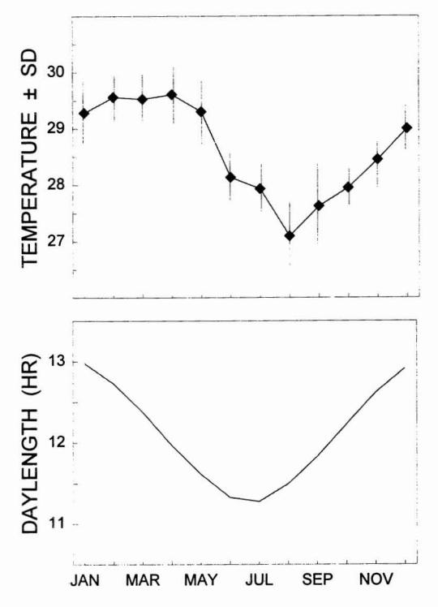
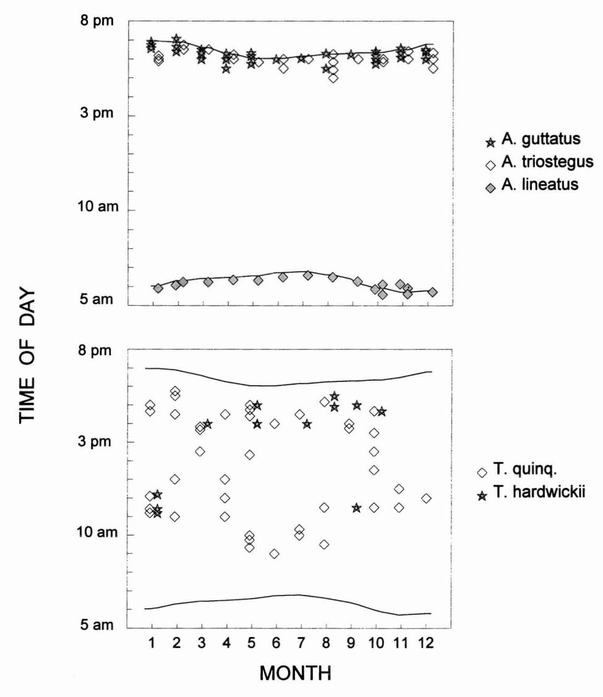

# **Temporal Spawning Patterns of Several Surgeonfishes and Wrasses in American Samoa 1**

ABSTRACT: Three coral reef surgeonfishes *(Acanthurus guttatus, A. triostegus, A. lineatus)* and two wrasses *(Thalassoma quinquevittatum, T hardwickii)* spawned year-round in American Samoa. Spawning occurred in or adjacent to the channel draining the fringing reef at specific times of day: dawn (A. *lineatus),* daytime *(T quinquevittatum, T hardwickii),* or dusk *(A. guttatus, A. triostegus);* and spawning time tracked seasonal changes in day length. Egg predation was high for the surgeonfishes, but predation by piscivores appeared to be low.

INFORMATION ABOUT TEMPORAL spawning patterns of coral reef fishes has accumulated over the past three decades (e.g., overviews by Johannes 1978, Thresher 1984, Robertson 1991, Sadovy 1996). However, only a small proportion of the thousands of coral reef species have been examined, and data are available for few locations across the vast South Pacific. This report summarizes timeof-day and monthly spawning records for several common coral reef fishes in American Samoa: three surgeonfishes *(Acanthurus guttatus* Bloch & Schneider, *A. triostegus* Linnaeus, *A. lineatus* Linnaeus) and two wrasses *(Thalassoma quinquevittatum* Lay & Bennett, *T hardwickii* Bennett). Ofthese, *A. lineatus* is a major component of local harvests (Craig et al. 1997).

### MATERIALS AND METHODS

American Samoa (140 S, 1700 W) consists of several small volcanic islands in the central South Pacific. Observations of spawning were made on the fringing coral reef at Afao village on Tutuila Island. The reef flat there was 250 m wide, dropped abruptly to a depth of 3-6 m, and descended gradually thereafter to 20 m. A single channel drained the reef flat. Nearshore water temperatures were measured seaward of the reef flat at a depth of 0.3 m *(n* = 295 daily measurements). Sunrise and sunset times were obtained from the NOAA weather station in American Samoa.

During 1991-1995, approximately 350 snorkeling surveys were made on nearshore portions of this reef at various times of day. For the surgeonfishes, I made observations during all months of the year at known spawning locations; observations of the wrasses were opportunistic encounters. Confirmation of spawning was determined by the upward rush of fish, culminating in the production of visible milt clouds. Observations were generally made at mid to high tide; no attempt was made to assess tidal or lunar effects. Data are summarized by plotting multiple-year spawning records over a single annual cycle. Spawning times listed for dawn spawners tended to be at the end of their spawning period, whereas the reverse occurred for dusk spawners. Because the full duration of each spawning period was not monitored, observed rates of predation were minimum estimates.

### RESULTS

Two variables that commonly influence the time when fishes spawn, water tempera-

-- --rTJiisstudywassupported by the Federal Aid fn Sportfish Restoration Act. Manuscript accepted 20 March 1997.

2 Department of Marine and Wildlife Resources, Box 3730, Pago Pago, American Samoa 96799.

3 Current address: Box 532, Klamath, California 95548.

FIGURE 1. Seasonal changes in nearshore water temperature (top) and day length (bottom).

ture and day length, varied only slightly through the year because of Samoa's oceanic location near the equator. Seasonal changes amounted to 2.5°C and 1.8 hr day length (Figure 1).

Three surgeonfishes (A. guttatus, A. triostegus, A. lineatus) and two wrasses (T. quinquevittatum, T. hardwickii) spawned throughout the year in water temperatures ranging from 27 to 30°C. Virtually all observed spawning occurred in or adjacent to the outlet channel of the reef flat where water currents flowed in a seaward direction. Two of the surgeonfishes spawned at nearly the same site in the outer portion of the channel, and the other species spawned over a slightly broader area within or near the channel. All were group spawnings, except as noted. Principal differences among species were the times of day that they spawned and the rates of egg predation by other fishes, as described below. None of the spawning aggregations was targeted by local fishermen.

Acanthurus guttatus, a nonterritorial surgeonfish, migrated to a specific ("traditional") area in the outer reef channel and spawned above several large coral blocks in waters 4-7 m deep. Groups of 50-500 fish began spawning near sunset, and the time of spawning tracked seasonal changes in sunset (Figure 2). Spawners had pale/silvery sides with faint bars and dots, dark edges on dorsal and ventral body, and bright yellow on pelvic fins and a portion of the caudal fin. Egg predators (primarily the snapper Macolor niger Forskål) fed on the eggs during at least 57% of observed spawning periods on 22 dates. Two attacks on the spawners were observed, once each by a dogtooth tuna (Gymnosarda unicolor Ruppell) and a bluefin trevally (Caranx melampygus Cuvier).

Acanthurus triostegus also spawned near sunset (Figure 2) in large groups (200–2000) along the reeftop adjacent to the reef channel and along the outer channel floor. Water depths were 0.8–6 m. Spawning color was as described by Robertson (1983). Egg predators (M. niger) were observed feeding on the eggs during at least 64% of observed spawning periods on 28 dates. Eighteen attacks on the spawners were observed, 17 by bluefin trevally and one by an unidentified fish.

Acanthurus lineatus, a territorial surgeonfish, migrated at dawn to a "traditional" site that partially overlapped the spawning site used by A. guttatus in the outer portion of the reef outlet channel. Groups of 50–200 fish began spawning at least 5–15 min before sunrise (Figure 2) in water depths of 3–5 m. Spawning color was as described by Robertson (1983). Typically 10–30 egg predators (M. niger) hovered nearby and fed on the eggs during all spawning periods observed on 27 dates. One attack was observed on the spawners, apparently by Lutjanus bohar Forskål.

Thalassoma quinquevittatum spawned throughout the daytime (Figure 2) on the shallow reef flat adjacent to the channel (water depth 0.7–1 m). Almost all were group spawnings consisting of 10–20 small fish (8–10 cm). Multiple spawnings were observed on each of 49 dates. No predators or egg predators were seen. On three occasions,

FIGURE 2. Time of day of spawning throughout the year for three surgeonfishes (top) and two wrasses (bottom) in relation to times of sunrise and sunset (lines).

pair spawnings were observed between a small fish and a larger terminal-phase fish at the edge of the reef flat. On one of the latter occasions, a juvenile *M. niger* fed on the eggs.

Thalassoma hardwickii probably spawned year-round (Figure 2). On 13 dates, group spawnings of 10–40 fish were observed during daytime hours on the reef flat near the inner channel (water depth 0.7–1 m). No predators or egg predators were seen during spawnings.

## DISCUSSION

It has long been noted that tropical fishes spawn over an extended season compared with fishes from higher latitudes (e.g., Qasim 1956). Year-round spawning, as observed in Samoa, has been documented or inferred for a number of other tropical fishes (Randall 1961*a*, Randall and Randall 1963, Myrberg 1972, Munro et al. 1973, Warner et al. 1975,

Robertson and Hoffman 1977, Thresher 1984, Grimes 1987, Walsh 1987, Colin and Clavijo 1988, Gladstone and Westoby 1988, Robertson 1990).

Despite such prolonged breeding, Russell et al. (1977) emphasized that most spawning effort by tropical fishes occurs during a seasonal period. This holds true for at least one of the fishes described in this paper: A. lineatus spawns primarily during the austral spring and summer months of September-February (Craig et al. 1997), even though some spawning occurred monthly. Similarly, A. triostegus in Hawai'i has a seasonal spawning peak although some year-round spawning occurs (Randall 1961a). Although a seasonal spawning peak may be tailored to a particular time that is favorable for either adult spawners or the survival of their young, year-round spawning seems to be a "bet-hedging" strategy to cope with losses of young caused by environmental vagaries (Robertson 1990, 1991).

The time of day that spawning occurred in this study was similar to that reported elsewhere for the same species. Acanthurus lineatus spawned at dawn in Palau (Johannes 1981, Robertson 1983); A. triostegus spawned at dusk in the Society Islands (Randall 1961b); T. quinquevittatum and T. hardwickii were daytime spawners in the Marshall Islands (Colin and Bell 1991). For one of these species, the herbivorous and strongly territorial A. lineatus (Craig 1996), the time of day when it spawns is thought to be a strategy to minimize loss of food from its territory (Robertson 1983, 1991, Kohda 1988); that is, if a herbivorous territorial fish must leave its territory unguarded when it spawns, it would be best to do so in the morning when herbivorous competitors typically have low feeding rates.

In all, the Samoan spawning data fit well into what was predicted based on literature from distant tropical areas: spawning occurred over an extended time period, at specific times of day, often at "traditional" sites where there was a seaward current away from the reef. In addition, the surgeonfishes adopted specialized spawning coloration, egg predation was high at some sites, and the

only dawn-spawning species was one that defended feeding territories.

#### LITERATURE CITED

- Colin, P., and L. Bell. 1991. Aspects of the spawning of labrid and scarid fishes at Enewetak Atoll, Marshall Islands with notes on other families. Environ. Biol. Fishes 31:229–260.
- Colin, P., and I. Clavijo. 1988. Spawning activity of fishes producing pelagic eggs on a shelf edge coral reef, southwestern Puerto Rico. Bull. Mar. Sci. 43:249–279.
- CRAIG, P. 1996. Intertidal territoriality and time-budget of the surgeonfish, *Acanthurus lineatus*, in American Samoa. Environ. Biol. Fishes 46:27–36.
- CRAIG, P., H. CHOAT, L. AXE, and S. SAUCERMAN. 1997. Population biology and harvest of the coral reef surgeonfish *Acanthurus lineatus* in American Samoa. Fish. Bull. 95(4): 680–693.
- GLADSTONE, W., and M. WESTOBY. 1988. Growth and reproduction in *Canthigaster valentini*: A comparison of a toxic reef fish with other reef fishes. Environ. Biol. Fishes 21:207–221.
- GRIMES, C. 1987. Reproductive biology of the Lutjanidae: A review. Pages 239–294 in J. Polovina and S. Ralston, eds. Tropical snappers and groupers: Biology and fisheries management. Westview Press, London.
- JOHANNES, R. 1978. Reproductive strategies of coastal marine fishes in the tropics. Environ. Biol. Fishes 3:65–84.
- ——. 1981. Words of the lagoon. University of California Press, Berkeley.
- KOHDA, M. 1988. Diurnal periodicity of spawning activity of permanently territorial damselfishes (Teleostei: Pomacentridae). Environ. Biol. Fishes 21:91–100.
- Munro, J., V. Gaut, R. Thompson, and P. Reeson. 1973. The spawning seasons of Caribbean reef fishes. J. Fish. Biol. 5:69–84.
- MYRBERG, A. 1972. Ethology of the bicolor damselfish, *Eupomacentrus partitus* (Pisces: Pomacentridae), a comparative analysis

- of laboratory and field behavior. Anim. Behav. Monogr. 5:189–283.
- QASIM, S. 1956. Time and duration of the spawning season in some marine teleosts in relation to their distribution. J. Cons. Int. Explor. Mer 21:144–155.
- RANDALL, J. 1961a. A contribution to the biology of the convict surgeonfish of the Hawaiian Islands, *Acanthurus triostegus sandvicensis*. Pac. Sci. 15:215–272.
- ing of surgeonfishes (Acanthuridae) in the Society Islands. Copeia 1961:237–238.
- RANDALL, J., and H. RANDALL. 1963. The spawning and early development of the Atlantic parrotfish *Sparisoma rubripinne*, with notes on other scarid and labrid fishes. Zoologica (N.Y.) 48:49–60.
- ROBERTSON, D. R. 1983. On the spawning behavior and spawning cycles of eight surgeonfishes (Acanthuridae) from the Indo-Pacific. Environ. Biol. Fishes 9:193–223.
- of spawning and recruitment of some small neotropical reef fishes. J. Exp. Mar. Biol. Ecol. 144:49–62.

- ——. 1991. The role of adult biology in the timing of spawning of tropical reef fishes. Pages 356–386 in P. Sale, ed. The ecology of fishes on coral reefs. Academic Press, San Diego.
- ROBERTSON, D. R., and S. HOFFMAN. 1977. The role of female mate choice and predation in the mating systems of tropical labroid fishes. Z. Tierpsychol. 45:298–320.
- Russell, B., G. Anderson, and F. Talbot. 1977. Seasonality and recruitment of coral reef fishes. Aust. J. Mar. Freshwater Res. 28:521–528.
- SADOVY, Y. 1996. Reproduction of reef fishery species. Pages 15–59 *in* N. Polunin and C. Roberts, eds. Reef fisheries. Chapman and Hall, New York.
- THRESHER, R. 1984. Reproduction in reef fishes. T.F.H. Publications, Neptune City, New Jersey.
- Walsh, W. 1987. Patterns of recruitment and spawning in Hawaiian reef fishes. Environ. Biol. Fishes 18:257–276.
- Warner, R., D. Robertson, and E. Leigh. 1975. Sex change and sexual selection. Science (Washington, D.C.) 190:633–638.