In: Waddell J (ed). 2005. The status of the coral reef ecosystems of the US and Pacific freely associated states. NOAA Tech rpt NOS NCCOSS 11

# The State of Coral Reef Ecosystems of American Samoa

Peter Craig1 , Guy DiDonato2 , Douglas Fenner3 , Christopher Hawkins4

## **INTRODUCTION AND SETTING**

American Samoa is a U.S. Territory located approximately 4,200 km south of Hawai'i. It is the southernmost of all U.S. possessions and the only U.S. jurisdiction in the South Pacific. American Samoa comprises seven islands (five volcanic islands and two coral atolls) with a combined land area of approximately 200 km2 (Figure 11.1). The five volcanic islands, Tutuila, Aunu'u, Ofu, Olosega, and Ta'u, are the major inhabited islands of American Samoa. Tutuila, the largest island, is also the center of government and business. Ofu, Olosega, and Ta'u, collectively referred to as the Manu'a Islands, are 107 km east of Tutuila. Two outer islands, Rose Atoll and Swains Island, are approximately 259 km and 327 km from Tutuila, respectively. Rose Atoll is uninhabited and is managed as a National Wildlife Refuge (NWR) by the U.S. Fish and Wildlife Service (USFWS), while Swains Island is inhabited by a subsistence population of approximately 10 people.

The islands range in size from the populated high island of Tutuila (138 km2 ) to the uninhabited and remote Rose Atoll (4 km2 ). The total area of coral reefs (to the 100 m depth) in the Territory is 296 km2 . Due to the steepness of the main islands, shallow water habitats around the islands are limited and consist primarily of fringing coral reefs (85% of total coral reef area) with a few offshore banks (12%) and two atolls (3%). The fringing reefs have narrow reef flats (50-500 m); depths of 1000 m are reached within 2-8 km from shore.

Coral reefs in American Samoa support a high diversity of Indo-Pacific corals (over 200 species), fishes (890 species), and countless invertebrates. In recent years the corals have demonstrated considerable resilience following a series of natural disturbances, including four hurricanes in the past 18 years, a devastating crownof-thorns starfish invasion in 1978, and several recent bleaching events. Following each disturbance, the corals eventually recovered and grew to maintain the structural elements of the reefs. However, because serious overfishing has occurred, the Territory's coral reef ecosystem cannot be considered healthy based on the resilience of the corals alone. Furthermore, climate change impacts such as warm-water coral bleaching and coral disease are becoming increasingly apparent and pose a major, repetitive impact to the structure and function of local reefs. Additionally, the Territory's high population growth rate (2.1% per year) continues to strain the environment with issues such as extensive coastal alterations, fishing pressure, loss of wetlands, soil erosion and coastal sedimentation, solid and hazardous waste disposal, and pollution.

1 National Park of American Samoa

2 American Samoa Environmental Protection Agency

3 American Samoa Department of Marine and Wildlife Resources

4 American Samoa Coral Reef Initiative

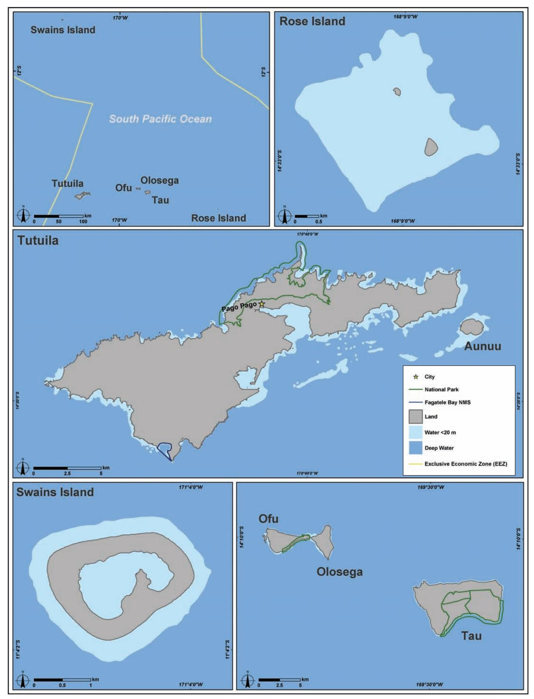

Figure 11.1. Map of the locations in American Samoa mentioned in this chapter. Map: A. Shapiro.

## **ENVIRONMENTAL AND ANTHROPOGENIC STRESSES**

### **Climate Change and Coral Bleaching**

Global warming and climate change will impact coral reefs in at least two ways. First, these impacts increase water temperatures which can stress or kill corals; second, they increase the level of dissolved CO2 in sea water which may reduce the growth rate of corals and promote erosion of the reef itself. Despite the remote oceanic location of American Samoa, it is apparent that CO2 (a primary greenhouse gas) is steadily increasing (Figure 11.2). In recent years, some coral bleaching has been observed annually on local reefs, and bleaching was particularly widespread and prolonged (four months) in 1994, 2002, and 2003 (Figure 11.3A). However, systematic assessments of the degree of bleaching, species affected, and percent recovery/ mortality is generally not available for the Territory.

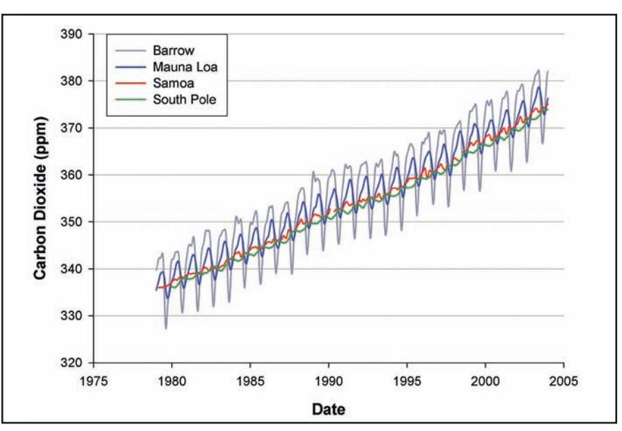

**Figure 11.2.** Increase of atmospheric CO2 in American Samoa, Hawaii, and the North and South Poles. Source: NOAA Climate Monitoring and Diagnostic Laboratory.

### **Diseases**

During bleaching episodes in 2002 and 2003, formerly rare coral diseases were commonly seen (Figure 11.3B,C). At present, there is a lack of consistent descriptive terminology for Pacific coral diseases, but what has been observed seems similar to that called 'white syndrome' in the Great Barrier Reef. Coral tumors have also been observed on local reefs.

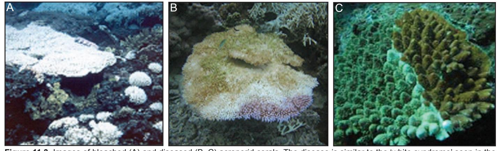

**Figure 11.3.** Images of bleached (A) and diseased (B, C) acroporid corals. The disease is similar to the 'white syndrome' seen in the Great Barrier Reef, and generally results in a three-tiered appearance: a healthy-colored section, a white zone of recently dead polyps, and a dead area that has been colonized by epiphytic algae. Photos: P. Craig.

#### **Tropical Storms**

Tropical storms and cyclones are a natural occurrence in the South Pacific region. American Samoa has been hit by four cyclones in the past 18 years (1986, 1990, 1991, 2004). The 1986 cyclone was especially damaging to the Manu'a Islands, the 1990 and 1991 cyclones caused heavy damage throughout the Territory, while the recent cyclone in 2004 appears to have been less severe, causing the loss of perhaps 10% of reefs on the northern sides of the islands. During the latest cyclone (Figure 11.4), there was relatively little rainfall, so the massive sedimentation and nutrient enrichment that caused widespread growths of epiphytic algae after the 1991 cyclone did not occur.

## **Coastal Development and Runoff**

Most of the population of American Samoa resides on Tutuila. However. only approximately one-third of the land area has a slope of less than 30%. As a result, the population density of the island is 1,350 people per km2, which surpasses the population density of Manhattan in New York City, even though the island is semi-rural and the tallest structures are two stories high. This density has placed considerable demands on American Samoa's coastal areas. Though all of the Territory's lands are within the coastal zone, most of the land favorable for development lies immediately adjacent to the coast (Figure 11.5). Several hundred landuse permit applications are received per year, a majority of which are approved with conditions.

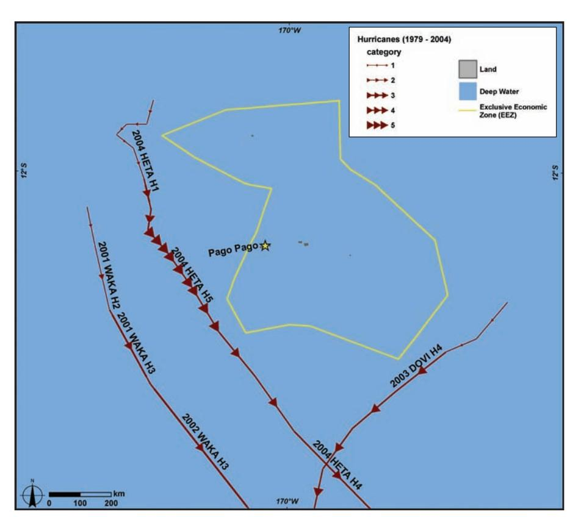

**Figure 11.4.** A map showing the paths and intensities of tropical cyclones passing near American Samoa from 1979-2004. Year of storm, storm name and storm strength on the Saffir-Simpson scale (C1-5) are indicated for each. Map: A. Shapiro. Source: http://weather.unisys.com/hurricane, Accessed 1/10/05.

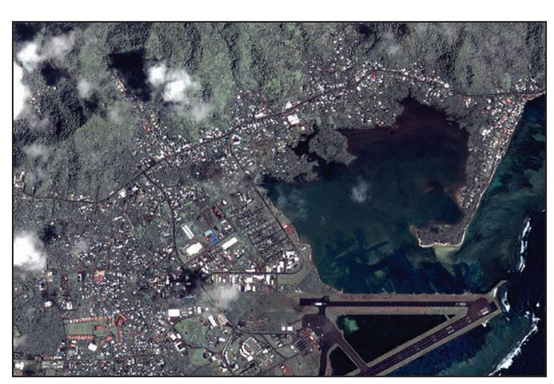

**Figure 11.5.** Development pressure often occurs at locations adjacent to sensitive habitats, such as the mangrove forests and coral reefs that occur near this harbor. Photo: American Samoa Coastal Management Program.

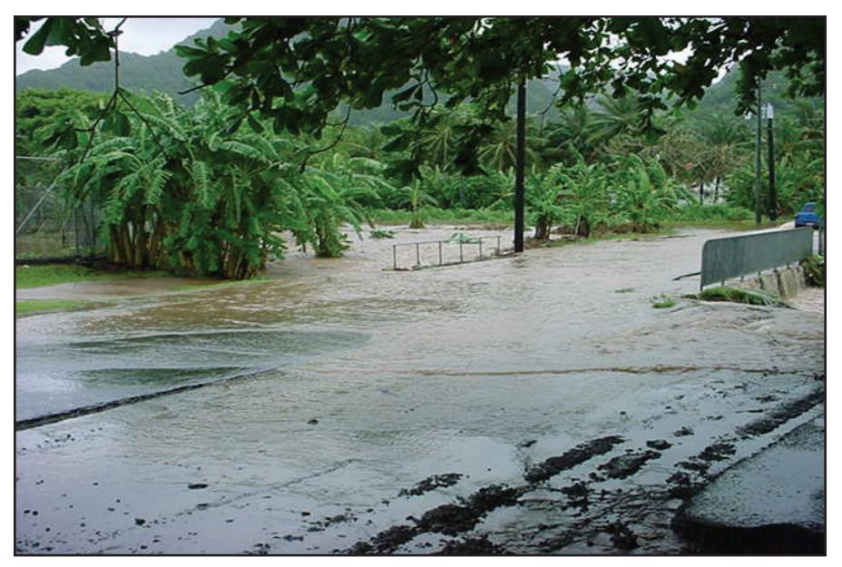

habitats may be recovering as well. **Figure 11.6** Heavy rains can cause flooding, which transports sediment, nutrients, and pollutants into coastal waters. Photo: C. Hawkins.

## **Coastal Pollution**

Pollution from human activities has directly impacted the coastal resources of American Samoa, with the most obvious evidence of this in Pago Pago Harbor. Historical industrial, commercial, and military activity in the harbor led to coastal pollution that degraded water quality and local reef habitats. In recent years, the regulation of commercial and industrial facilities in Pago Pago Harbor has reduced coastal pollution, and monitoring has tracked dramatic improvements in water quality (see 'Water Quality' section). Limited evidence suggests that harbor reef

Point source pollution, which has been successfully identified and mitigated, has been replaced by nonpoint source pollution as the primary pollution in coastal areas (Figure 11.6). Runoff from impervious surfaces directly impacts coastal areas, while island streams transport elevated levels of nutrients to coastal areas. Nutrient sources to local streams include faulty or improperly constructed septic tanks and concentrated animal waste from small family-owned pigsties. Streams entering coastal waters carry large amounts of sediments and nutrients, as many homes and businesses are located along them. The flow can be heavy during rainfalls, since the topography is steep. Exacerbating this is the amount of impermeable surface that has been constructed along the low, flat coastal lands.

Local streams also serve as temporary waste receptacles, and this debris causes unsightly trash deposits in the nearshore coastal areas. The island's main road runs along the water's edge and has historically been a convenient place to dump unwanted debris. In addition, vegetation clearing for crops often occurs on lands with slopes greater than 30%, which in turns leads to excessive erosion. As a consequence, most villages in the Territory have experienced major flooding, stream sedimentation, and impacts to reef ecosystems.

#### **Tourism and Recreation**

There is relatively little tourism in American Samoa and it appears that it will be some years before the Territory enters the mainstream of South Pacific tourism, as has nearby Fiji (400,800 tourists in 2003; Fiji Tourism, http://www.bulafiji.com/Industry.asp?lang=EN&sub=0156, Accessed 5/2/05). For example, the annual number of visitors to the National Park of American Samoa is currently estimated to be only 1,000 on Tutuila Island, 1,000 on Ofu Island, and 20 on Ta'u Island. Perhaps half of these tourists use marine areas of the park for swimming, snorkeling, or scuba diving. There are also few pleasure boats – about 30 anchor in Pago Pago Harbor during the cyclone season, but none are found elsewhere in the Territory. Tournaments for pelagic sport fish (e.g., tuna, marlin, etc.) occur sporadically, with some 20 small local vessels competing to catch the largest fish. Over the years there has also been a slight increase in numbers of villagers participating in recreational fishing along island shorelines; however, their numbers are low and only a few are seen during a drive around the island.

#### **Fishing**

There are two types of fisheries that harvest coral reef fishes and invertebrates: 1) subsistence fishing by villagers, which is usually a shoreline activity using a variety of gear, such as rod and reel, spear guns, gillnet, and gleaning; and 2) artisanal fishing by free-divers who spear fish, and small-boat fishers who jig for bottomfish around the steeply sloping islands. Most of these fish are sold at local stores. Subsistence fishing has been declining over the past two decades (Coutures, 2003) as a result of the gradual change from a subsistence to a cash-based economy. A third type of fishery focuses on pelagic fishes, especially tuna. The pelagic fishery includes small longline boats and large commercial boats that deliver tuna to the local canneries.

Coral reef fish and invertebrate resources have declined in abundance. Harvested species such as giant clams and parrotfish are overfished, and there has been heavy fishing pressure on surgeonfish (Craig et al., 1997; Page, 1998; Green and Craig, 1999). Groupers, snappers and jacks seen on the reef are smaller and less abundant than in the past. In addition, most village fishers and elders believe that numbers of fish and shellfish have declined (Tuilagi and Green, 1995). During an extensive survey in February 2004 of coral reefs in American Samoa, divers from the National Oceanic and Atmospheric Administration (NOAA) noted an unusually low abundance of large fishes and sharks around the main islands in the Territory (R. Brainard, pers. comm.). In response to this decline, a ban on scuba-assisted fishing was implemented in 2001.

## **Trade in Coral and Live Reef Species**

Attempts to get coral reef products to off-island markets occur periodically, but there has been little development in these efforts, primarily due to the high cost of getting fresh or live shipments to markets in Hawaii and beyond, as well as the limited and frequently delayed flight schedule from the Territory to Hawaii (generally two or three flights per week).

#### Ships, Boats, and Groundings

In the past decade, 10 groundings of fishing vessels, all large (>30 m) foreign-flagged longliners, occurred in the Territory. Nine occurred in Pago Pago Harbor during Hurricane Val in 1991 and their rusting hulls remained on the reefs for nine years. They were finally removed in 2000, due to actions taken by the U.S. Coral Reef Task Force. The tenth longliner ran aground in 1993 at Rose Atoll, a NWR, spilling a full fuel load, fishing lines and other metal debris onto the atoll. Follow-up studies indicate that significant damage occurred to the atoll, with the loss of about 30% of the atoll's foundation of crustose coralline algae and a community shift from a coralline algae substrate to one of fleshy blue-green algae, most likely due to iron enrichment (Green et al., 1998). USFWS personnel removed most of the debris during several cleanup trips to the atoll, but the community shift is still visible 11 years later, as evidenced by a recent NOAA site visit (R. Brainard, pers. comm.).

#### **Marine Debris**

Marine debris is not presently a major problem except in the industrialized Pago Pago Harbor. In addition to a 57-year old sunken ship (*U.S.S. Chehalis*) in the harbor that may still contain a fuel load, the shallow and deep harbor bottom is littered with fuel barrels, car batteries, and other debris. Outside of the harbor, most debris sighted in coastal waters derives from household garbage (aluminum cans, plastic bags, disposable diapers) that is thrown into the island's creeks, though some larger items, such as refrigerators and fuel tanks, are occasionally seen drifting or beached.

### **Aquatic Invasive Species**

Although Pago Pago Harbor has been a major shipping port for over 50 years, a recent survey of introduced marine species found that relatively few alien species have propagated in the Territory, with most being restricted to the inner portions of the harbor (Coles et al., 2003). Altogether, 28 non-indigenous or cryptogenic species were detected during this survey: bryozoans (6), hydroids (6), amphipods (4), tunicates (2), barnacles (2), algae (2), bivalves (2), sponge (1), polychaete (1), isopod (1), ophiuroid (1). However, none appeared to be invasive or is known to be invasive at sites outside of American Samoa. Most of these alien species occur in Hawaiian harbors and many are widely distributed around the world.

## **Security Training Activities**

No security training activities occur in the Territory.

## **Offshore Oil and Gas Exploration** No oil and gas exploration activities occur in the Territory.

#### **Other**

Population growth has been identified as a major threat to coral reefs in the Territory (Figure 11.7). The current population of 63,000 is increasing at a rapid rate of 2.1% per year. Most people in the Territory (96%) live on the south side of Tutuila Island, where growth continues to strain the environment, causing chronic

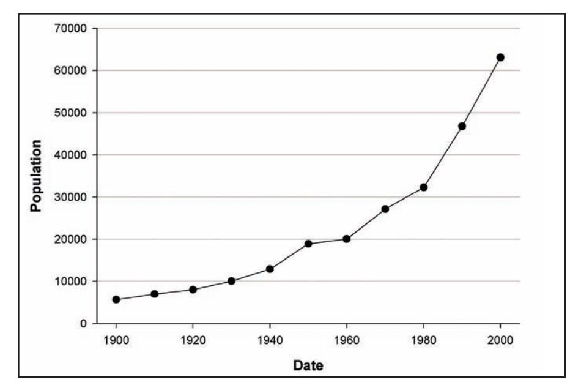

**Figure 11.7.** Population growth in American Samoa. Source: U.S. Census.

problems such as extensive coastal alterations, fishing pressure, loss of wetlands, soil erosion and coastal sedimentation, solid and hazardous waste disposal, and pollution.

### **CORAL REEF ECOSYSTEMS-DATA GATHERING ACTIVITIES AND RESOURCE CONDITION**

American Samoa has a long history of coral research and monitoring activities. For example, the Aua Transect is the oldest known coral reef transect still being surveyed, and the second oldest monitoring program in the world (Green et al., 1997; Green, 2002); Fagatele Bay has been monitored for over 20 years (Green et al., 1999). However, there has not been an integrated monitoring program established in the Territory to determine overall coral reef ecosystem status and trends. Thus, a working group was created in 2003 to establish such a program, with the American Samoa Coastal Management Program (ASCMP) supporting the initial funding

of a Territorial coral reef monitoring coordinator to lead this effort. In addition, the Department of Marine and Wildlife Resources (DMWR) has begun to develop an agency-oriented program of long-term coral reef monitoring, and has hired a coral reef monitoring ecologist. The first year of monitoring is set to begin in January 2005 (Table 11.1, Figure 11.8).

**Table 11.1.** Parameters to be included in the Territorial Coral Reef Monitoring Program.

| 1. Coral Condition     | Disease, bleaching, % cover                       |
|------------------------|---------------------------------------------------|
| 2. Algal Condition     | % cover, type                                     |
| 3. Fish                | Species abundance (grouper, snapper, parrotfish)  |
| 4. Macro-invertebrates | Abundance (giant clam, lobsters, crown-of-thorns) |
| 5. Water Quality       | Temperature, nutrients (N, P), light transmission |
| 6. Anthropogenic       | Debris, damage                                    |
| 7. Weather             | Air temperature, sun/cloud, wind                  |

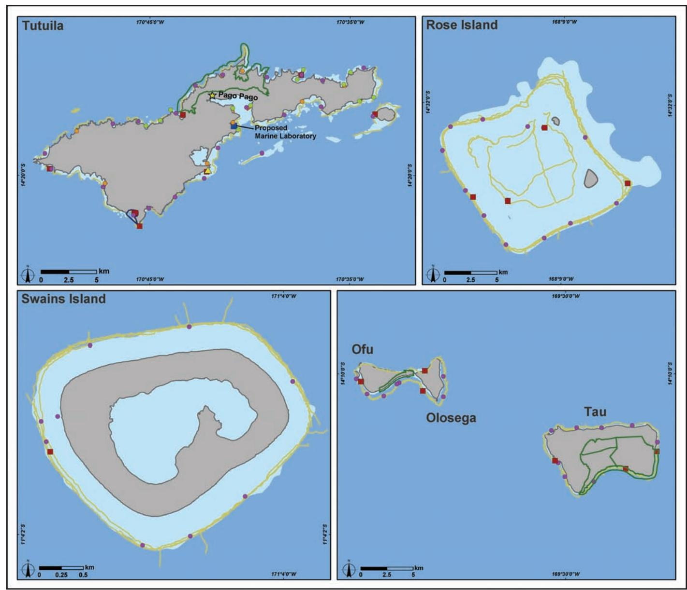

**Figure 11.8.** Monitoring program sites on Tutuila and Aunu'u Islands. Map: A. Shapiro; Sources: T. Curry, ASCMP; Birkeland et al., 2004; PIFSC-CRED.

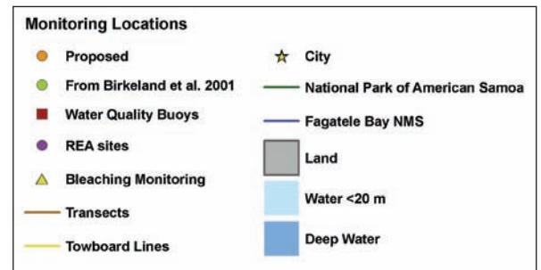

In addition to those activities listed in Table 11.2, funding from the U.S. Coral Reef Task Force and other sources has made various studies possible, and data from these studies may provide the baseline for repetitive analyses.

### **Bishop Museum Introduced Marine Species Survey**

A survey of marine organisms (macroinvertebrates, benthic macroalgae, fish) was conducted in Pago Pago Harbor, Fagatele Bay National Marine Sanctuary, the National Park on Tutuila Island, and other core sites to detect introduced marine species (Coles et al., 2003).

**Table 11.2.** Agency/organization-specific activities that provide information about coral reef health. Note: not all listed activities can be considered monitoring.

| PROJECT                                                        | AFFILIATION                                                  | LOCATION                               | YEAR BEGUN | FREQUENCY                | STATUS  |
|----------------------------------------------------------------|--------------------------------------------------------------|----------------------------------------|------------|--------------------------|---------|
| Aua Transect                                                   | Territorial                                                  | Aua Village                            | 1917       | Completed twice          | Ongoing |
| Fagatele Bay Monitoring                                        | Fagatele Bay National Marine Sanctuary                    | Fagatele Bay                           | 1985       | Approx. every 5 years | Ongoing |
| Market Survey                                                  | DMWR                                                         | Tutuila                                | 1994       | Intermittent             | Ongoing |
| Inshore Creel Survey                                           | DMWR                                                         | South shore of Tutuila                 | 1978       | Daily                    | Ongoing |
| Vital Signs                                                    | National Park of American Samoa                           | National Park waters                   | 2004       | Annual                   |         |
| U.S. EPA Environmental Monitoring and Assessment Program | National Park of American Samoa                           | Territorial waters                     | 2004       | To be decided            |         |
| American Samoa Research and Monitoring Program              | PIFSC-CRED                                                   | Territory-wide                         | 2002       | Every 2 years            | Ongoing |
| Stream/beach Monitoring                                        | American Samoa Environmental Protection Agency (ASEPA) | Tutuila-wide                           | 2002       | Weekly                   | Ongoing |
| Soft Coral Survey                                              | National Park of American Samoa                           | Utulei Village                         | 1917       | Completed twice          | Ongoing |
| ASEPA                                                          | ASEPA                                                        | Tutuila-wide                           | 2003       | Bi-annual                |         |
| NPSP Program                                                   | ASEPA                                                        | Selected watershed sites on Tutuila | 2003       | Annual                   |         |

## **Monitoring of Biological Populations and Oceanographic Processes**

In February-March 2002 and February 2004, the NOAA's Pacific Island Fisheries Science Center, Coral Reef Ecosystem Division (PIFSC-CRED) conducted comprehensive, multidisciplinary assessments of the coral reef ecosystems around Rose Atoll and Tutuila, Aunuu, Tau, Ofu, Olosega, and Swains Islands. Spatial and temporal monitoring of biological populations (fish, coral, algae, macro-invertebrates) and oceanographic processes (current, temperature/salinity profiles, bio-acoustic surveys) were conducted to document natural conditions and to detect possible human impacts to these ecosystems. Detailed bathymetric maps were completed for Tutuila and the Manua Islands. Results of these studies will be included in the next reporting effort.

#### **Coral Disease Surveys**

Two disease studies were completed in American Samoa between 2002 and 2004. The first was a broad disease survey around Tutuila and the Manu'a Islands (Work and Rameyer, 2002). The second survey was recently led by Dr. Greta Aeby (Aeby and Work, in prep.) with the intent of linking coral disease to water quality there as well as to wider-Pacific coral disease distributions.

### **Lobster Survey**

In 2003, a survey of the artisanal lobster fishery in American Samoa was conducted (Coutures, 2003). Results indicate that landings are small but overfishing does not seem to be occurring. Additionally, the report outlines several management recommendations.

#### **Algae Survey**

A study was conducted in 2003 to inventory the algae of American Samoa (Skelton, 2003). The study surveyed 26 sites on Tutuila, Anuu, Ofu, and Olesega and documented the presence of 237 species of algae and two species of seagrass in the Territory.

#### **Economic Valuation Study**

A comprehensive economic valuation study of American Samoa's coral reefs was completed by Spurgeon et al. in 2004. Salient results of this study will be included in the next reporting effort.

#### WATER QUALITY

### **Pago Pago Harbor Water Quality Monitoring**

Water quality in inner Pago Pago Harbor was determined from samples collected at several stations. Samples collected at multiple depths at each station were averaged, and the annual estimates of water quality parameters (e.g., total nitrogen, or TN, total phosphorus, or TP, chlorophyll a, or chl a) were calculated from station means. Field sampling is now performed only twice annually, once in the tradewinds season (June-October) and once in the non-tradewinds season (November-May).

### **Coastal Water Quality Sampling**

The recent coastal sampling conducted in collaboration with the American Samoa Environmental Protection Agency (ASEPA) and the National Park of American Samoa followed the methods and approach of the U.S. Environmental Protection Agency's (EPA) Environmental Monitoring and Assessment Program. Within the Territory's coastal region (up to one-quarter mile out from the coast), 50 randomly selected sites were sampled for a standard suite of parameters. In addition to a standard hydrographic profile, grab samples of water at the surface, middle, and bottom of the water column were processed and analyzed for standard nutrients (TN, TP, ammonium, nitrate/nitrite, phosphate), chl a, and suspended solids. Where possible, sediments were collected with a modified Van Veen grab and analyzed for grain size, total organic carbon, organics, and metals. Fish were also collected at those stations and analyzed for tissue contaminants. Field methods are detailed in a U.S. EPA publication (2001).

### **Stream Monitoring**

There are approximately 140 perennial streams on Tutuila, comprising nearly 420 stream km. The large number of streams precludes a census approach to monitoring, so ASEPA instead relies on random stream selection to quantify the range of stream ecological conditions. Streams are initially classified into four groups according to local population density as an indicator of the potential human impact on local streams. Streams from each class are pooled and then several are selected randomly for intensive monitoring.

In the first year, eight streams were selected, two from each of four watershed classes. Each stream was visually assessed using methods based on the U.S. EPA's Rapid Bioassessment Protocols (Barbour et al., 1999). The following variables were evaluated for each stream: epifaunal substrate/available cover, embeddedness, sediment deposition, channel flow status, channel alteration, and riparian vegetative zone width. After the initial habitat assessment, streams were then monitored at a monthly or near-monthly frequency for water hydrography (temperature, pH, dissolved oxygen, turbidity), water chemistry (TN, TP, nitrate, ammonium), and bacterial contamination (*Enterococcus*).

After the first year, a new pool of streams was selected from the four classes. These streams were visited and monitored monthly, and their habitats were assessed visually.

#### **Beach Monitoring**

In 2003, ASEPA monitored 16 beaches in Pago Pago Harbor, the center of industry and commerce on Tutuila Island. At weekly intervals, water samples (0.5 L) were collected in sterile bottles at water depths no less than knee level of the technician, independent of tidal height. Samples were stored in coolers for transport and returned to the laboratory within two hours of collection. *Enterococci* were enumerated using Enterolert® and most probable number methods. Enterolert® utilizes chromogenic substrate technology to enumerate indicator bacteria. *Enterococci* numbers were then compared to the American Samoa's legal Water Quality Standards (WQS) to determine compliance.

#### Results and Discussion

Craig et al. (2000) suggested that American Samoa's oceanic waters demonstrate excellent quality, and there are no indications that oceanic water quality has since changed. Furthermore, the water quality problems that emerged in Pago Pago Harbor during the 1970-80s have greatly improved, based on chl a, TN, and TP levels (Figure 11.9).

However, the picture is less clear in other coastal areas of the Territory, as there are very few data from the near coastal regions of American Samoa. This will soon be remedied, as the National Park of American Samoa and ASEPA recently finished a collaborative, comprehensive coastal water quality survey around Tutuila and the Manu'a Islands. This survey used a probabilistic design to sample the waters from the coastline to onequarter mile offshore. This study will provide the first Territory-wide data on water quality in the near coastal areas.

The data currently available indicate that streams in densely populated areas of Tutuila exhibit higher nutrient levels (e.g., TN, TP) than streams in less-populated areas. These streams transport nutrients to the near shore and reef flat areas. The effects of these nutrients on coral reef ecosystems in American Samoa are unknown. Weekly beach monitoring at 16 recreational beaches in 2003 demonstrated that the Territory's beaches often exceed the WQS for *Enterococcus* (Figure 11.10). Likely sources of this contamination include improper treatment and disposal of both human and animal waste.

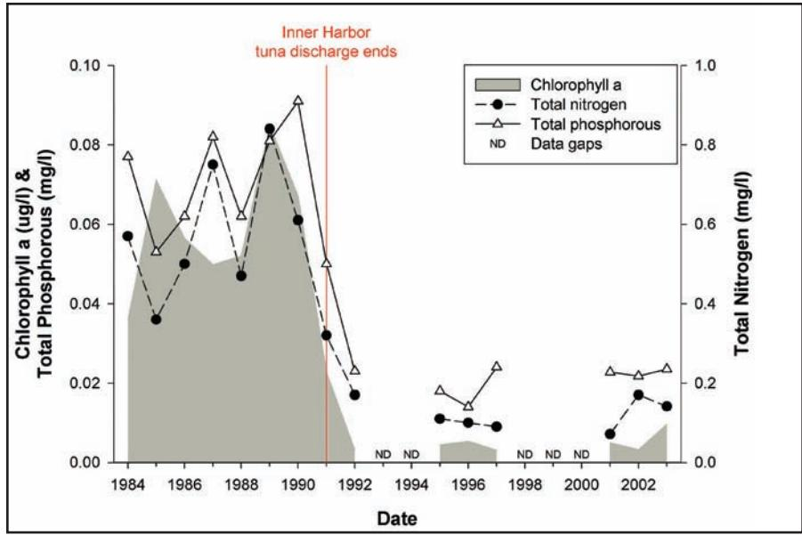

**Figure 11.9.** Water quality in inner Pago Pago Harbor greatly improved after tuna canneries were required to modify their waste disposal processes in 1991. Source: ASEPA.

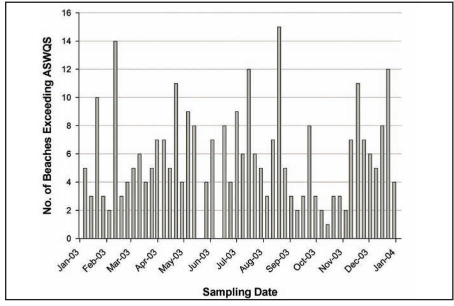

**Figure 11.10.** Number of local recreational beaches exceeding the American Samoa WQS as detected by the ASEPA weekly beach monitoring program conducted throughout 2003. Source: ASEPA.

#### **BENTHIC HABITATS**

Surveys and monitoring have occurred in Tutuila, including Pago Pago Harbor and Fagatele Bay, and in the smaller Manu'a Islands. Most studies have concentrated on hard corals, but soft corals have been surveyed as well. Monitoring of coral bleaching events has recently begun. The many disparate studies are brought together here for the first time to discern trends in coral populations in American Samoa.

#### HARD CORALS

### Very Long-Term Monitoring of Pago Pago Harbor, The Aua Transect

#### Methods

Transects in Pago Pago Harbor, started in 1917 by Mayor (1924) and Cary (1931) and resurveyed by Cornish and DiDonato (2004), involved counting colonies of hard and soft corals within large (25 x 25 ft) plots along a transect line. Most of the sites have been destroyed by dredging and filling, but a few have survived and been re-surveyed several times. Re-surveys used the same methods with 1 m² plots. Green (2002) and Birkeland et al. (2004) used a point-intercept method along 50 m transects and recorded substrate categories (Green, 2002). Transects were at 10 m depth, except in Fagatele Bay where transects were laid at 3 m, 6 m, and 9 m depths and on the reef flat. At each transect meter mark, substrate was recorded in four categories and 24 subcategories under the tape and 1 m to each side. Fenner (2004) estimated the proportion of bleached staghorn coral colonies at the Airport Lagoon during a one-hour swim following the same approximate route.

#### Results and Discussion

Extensive studies by the Carnegie Institute of Washington D.C. between 1917 and 1920 (Mayor, 1924) provide excellent baseline data from which to determine changes over time for coral reefs in Pago Pago Harbor. Re-surveys of the 1917 transect have provided quantitative information on trends at the reef at Aua over 83 years, the longest quantitative reef monitoring anywhere (Mayor, 1924; Dahl and Lamberts, 1977; Dahl, 1981; Birkeland and Green, 1999; Birkeland and Belliveau, 2000). A 28% decline in average number of colonies per square meter was noted in 1973, with a substantial decline (30%) between 1973 and 1980 (Figure 11.11). A total decline of 78% in average number of corals per square meter between 1917 and 2001 indicates that natural and anthropogenic disturbances in Pago Pago Harbor have contributed to degradation in reef conditions. Eutrophication from tuna cannery discharges between 1954 and 1991 may have been a major factor, as well as nearby road and other infrastructure construction. The 1978 crown-of-thorns starfish (*Acanthaster planci*) outbreak may also have contributed to the sharp decline between 1973 and 1980. The mass coral bleaching

in 1994 might have contributed to further decline. Cyclones are unlikely to have caused much damage to these corals due to their protected location within the harbor.

#### **Long-Term Monitoring in Tutuila**

Long-term monitoring of corals at selected sites around Tutuila Island has been ongoing since 1982. While this is not a holistic, multi-agency driven effort, the purpose of this survey is to determine any substantial changes over the last several decades. Reefs within the Territory have been heavily impacted by a series of natural and anthropogenic events (crown-of-thorns starfish outbreaks, tropical cyclones, water quality degradation, etc.). Recent studies have shown

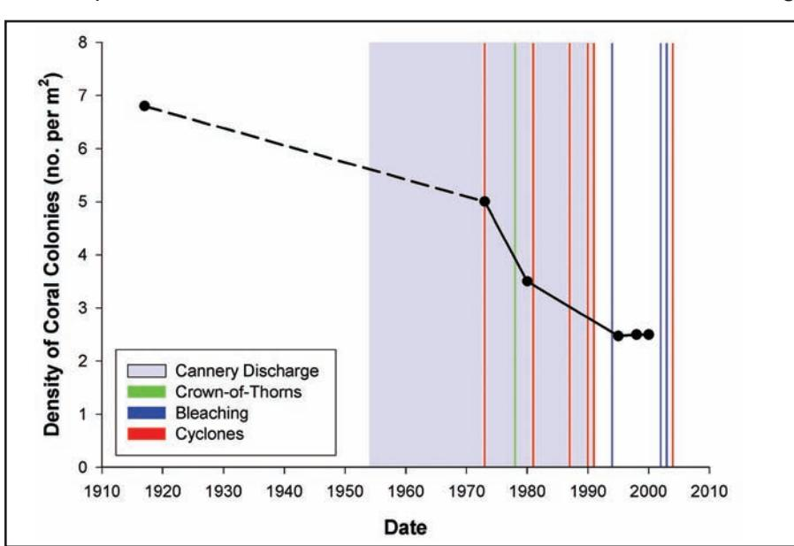

**Figure 11.11.** The number of hard coral colonies on the Aua Transect, in Pago Pago Harbor, American Samoa from 1917 to 2000. Sources: Mayor, 1924; Dahl and Lamberts, 1977; Dahl, 1981; Birkeland and Green, 1999; Birkeland and Belliveau, 2000.

that corals are slowly recovering after massive disturbances in the late 1980s and early 1990s (Birkeland et al., 2004; Green, 2002).

A series of reef surveys starting in the early 1980s by Fisk and Birkeland (Fisk and Birkeland, 2002) and then Green (1996, 2002) provides data on the trends in hard coral cover around Tutuila during this period. In the early to mid-1980s, hard coral cover was increasing on Tutuila. A mass crown-of-thorns outbreak in 1978 killed many corals, so the increases in the early to mid-1980s are likely to be recovery from that event (Figure 11.12). A series of three tropical cyclones followed, and the cyclones in 1990 and 1991 were severe. A mass bleaching event in 1994 also killed corals. When coral cover was measured again in 1995, coral cover had been reduced to the lowest levels yet seen. When coral cover was measured in 1996, a small improvement was seen, and when it was measured again in 2001, strong gains and the highest observed coral cover was recorded. A slight decline was found in 2003 in a separate survey by Houk et al. (in press). According to the limited data available, coral cover conditions at previously surveyed sites are currently at good levels.

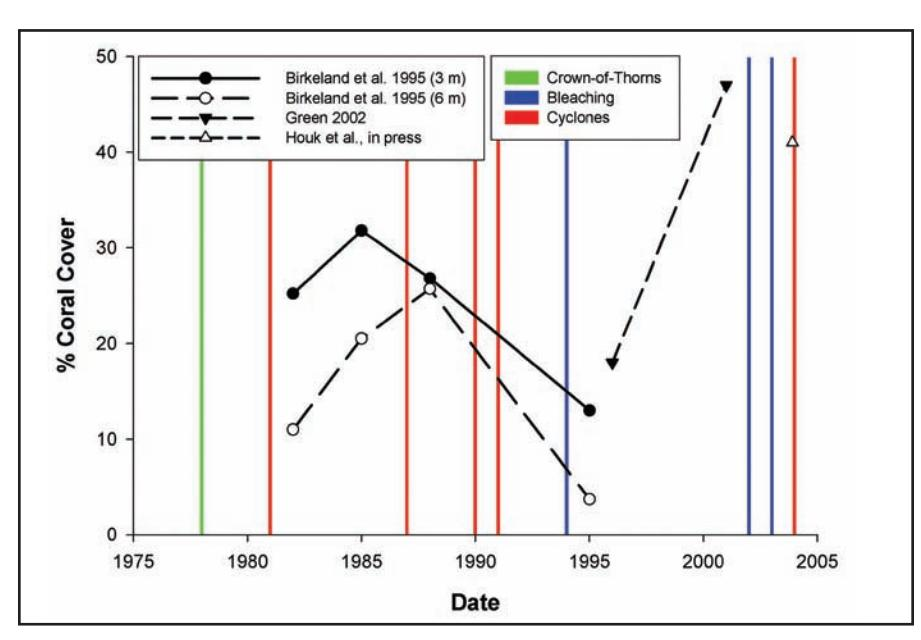

**Figure 11.12.** Hard coral cover trends for Tutuila from three studies show periods of recovery interrupted by events causing mortality. Sources: Birkeland et al., 1997; Green, 2002; Houk et al., in press.

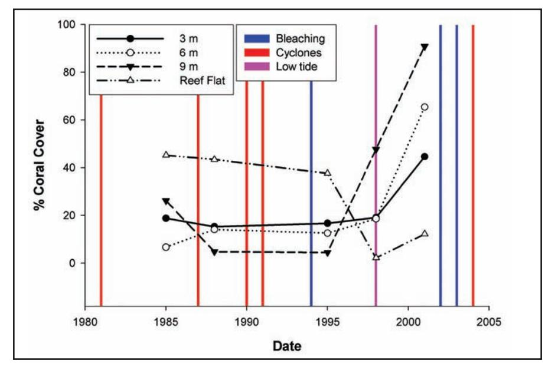

**Figure 11.13.** Hard coral cover trends for Fagatele Bay, Tutuila. Source: Birkeland et al., 2004.

## **Long-Term Monitoring in Fagatele Bay (Tutuila)**

Hard corals have been monitored in Fagatele Bay for nearly 20 years. Figure 11.13 shows trends in live hard coral cover at four different depths from 1985 through 2001. Coral cover was low at 3 m, 6 m, and 9 m depths from 1985 through 1995, then showed strong increases, particularly at the end of this period. The increases in 2002 were strongest in deep water and weakest in shallow water. Live coral on the reef flat showed a very different pattern, having the highest cover from 1985 to 1995, and then dropping to low levels in 1997 and 2002. Thus, corals on the reef slope at 3-9 m show one pattern, and corals on the reef flat show a different pattern.

The reef flat and reef slope are very different habitats and may be exposed to different events. The fact that coral on the slope stayed low from 1985 to 1995 suggests that a series of events may have kept coral cover low. There were three cyclones during this period and one bleaching event, and all of these disturbances may have combined to suppress coral recovery. After 1995, coral cover on the reef slope recovered dramatically, similar to the recovery observed on Tutuila as a whole (Figure 11.13). The loss of live hard corals from the reef flat after 1995 may be attributable to a low-tide event that caused massmortality in reef flat corals in 1998. The Aua Transect is a reef flat within the harbor, showing a similar downward trend (Figure 11.11). Unfortunately, while periodic re-surveying can reveal trends, it is often unable to pinpoint the causes of those trends.

The data for Tutuila as a whole (Figure 11.12) and Fagatele Bay specifically (Figure 11.13) are consistent in showing an increase in coral cover from 1996 to 2002 and is supported by informal observations suggesting that the coral populations are recovering from past events. The most recent data available was gathered during the 2002 and 2004 PIFSC-CRED surveys. Towed diver surveys were conducted around a large part of Tutuila, and visual estimates of coral cover recorded. The average live coral cover recorded was 31% in 2002 and 19% in 2004. Measurements from video taken by the same towed divers found 29% cover for 2002, which is close to the 31% found by visual estimate. This is significantly less than seen in Figures 11.12 and 11.13, but the area covered was quite different (wide ranging tows along reef versus transects at a few selected sites, and twice as much area covered by tows in 2004 than in 2002). It is likely that the lower percentages in the towed-diver surveys were due to the inclusion of areas of low coral cover, while the transects were on reefs within areas of relatively high coral cover. Thus, the data are not comparable (even the two towed-diver surveys are not comparable), and indeed these percentages from the towed-diver surveys are lower than data from transects from other studies conducted at about the same time (Green, 2002; Houk et al., in press).

### **Short-Term Monitoring of Coral Bleaching**

Major events such as tropical cyclones, mass coral bleaching, and crown-of-thorns outbreaks have not been monitored in the past. However, a new program to monitor corals that are particularly susceptible to bleaching has begun. The DMWR has begun monitoring bleaching in staghorn corals (Acropora spp.) in the Airport Lagoon on Tutuila. Water temperatures in enclosed lagoons are higher on sunny days during low tide when circulation is reduced. Approximately 50% of the staghorn corals in the Airport Lagoon have been killed by bleaching caused by high temperatures in the summers of 2001 and 2002. A bleaching event also occurred in 2004, following a period of sea surface temperatures (SST) that nearly reached the bleaching threshold (Figure 11.14). Lagoon water, however, reached higher temperatures than SST in the adjacent ocean. Bleaching peaked by March 28, and later subsided. Corals were only partially bleached and bleaching was confined to enclosed lagoons. This monitoring provided an early warning of the bleaching event and real-time data on the course of bleaching. Such monitoring of major events will allow the identification of the causes of some major shifts in reef communities. This mild bleaching might now be expected as the normal summer bleaching. However, temperature records show that Hurricane Heta (early January 2004) caused a sharp decrease in water temperature that reset the summer warming process that was underway. The result was lower temperatures than would otherwise have occurred and less bleaching. The previous two summers resulted in severe bleaching with some coral deaths; this may be more typical in future summers as well.

In summary, hard corals have declined significantly in Pago Pago harbor, particularly in recent years. Outside the harbor, hard corals have been impacted by a series of major events, including a crown-of-thorns outbreak, several cyclones, and several mass coral bleaching episodes. These major events have caused declines in hard corals, although they have shown significant recovery. Outside the harbor, hard corals are considered to be in their best condition since the crown-of-thorns outbreak in 1978.

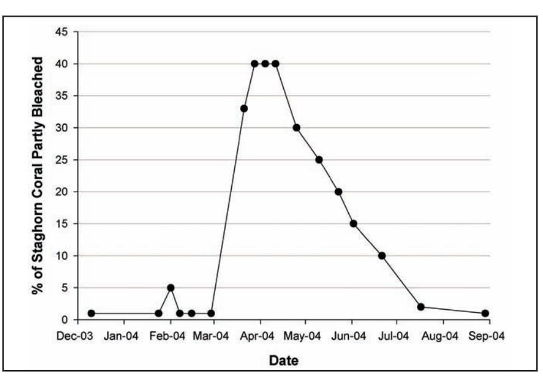

**Figure 11.14.** The course of a mild bleaching event in 2004, as measured in staghorn corals in a partly enclosed lagoon on Tutuila. Source: Fenner, 2004.

### SOFT CORALS

Soft corals were first measured during the 1917 studies in Pago Pago Harbor by Mayor and Cary. This is the world's oldest quantitative coral reef transect data. Cary's transect site at Utulei was re-surveyed by Cornish and DiDonato (2004). The live soft coral cover drastically declined since 1917 (Figure 11.15). Many activities have occurred in Pago Pago Harbor during this period, including the construction of two large tuna canneries in 1954 and 1963. The tuna canneries discharged increasing volumes of wastewater into the harbor, causing eutrophication until discharges were moved outside the harbor and nutrient levels declined. Tuna cannery discharges occurred for about a decade before the 1973 measurement. Other events impacting the marine environment of American Samoa during this time were a major crown-of-thorns outbreak in 1978, a series of cyclones, and a series of mass coral bleaching events. The crown-of-thorns outbreak would not have affected soft corals directly, as these starfish do not prey on soft corals. However, the death of many hard corals may have reduced competition for space. Hurricanes damage both hard and soft corals, and mass coral bleaching can kill both hard and soft corals. The large number of significant events during this 87-year period does not

allow the identification of the cause of soft coral decline at this location.

A second series of soft coral studies focused on Mayor's 1917 Aua Transect in Pago Pago Harbor, which was re-surveyed in 1973, 1980, and 1996 (Figure 11.16). This series of studies also found a drastic decline in soft corals in the harbor. However, the addition of the 1973 and 1980 studies in this series showed that the drastic decline was restricted to the period between 1973 and 1980, because soft coral numbers actually increased from 1917 to 1973. Although eutrophication is suspected, the cause of the drastic decline in soft corals cannot be determined from this data. Significant variation in soft coral abundance may have occurred during the long gaps between surveys.

Preliminary results from the 2004 PIFSC-CRED cruise indicated that there were several locations on reef fronts around Tutuila where soft corals were common. Thus, soft corals are not extinct around the Island, and the drastic decline seen in the harbor may be restricted to that area. If so, that would support the suggestion that the decline was caused by local events, such as eutrophication related to tuna cannery wastewater discharge.

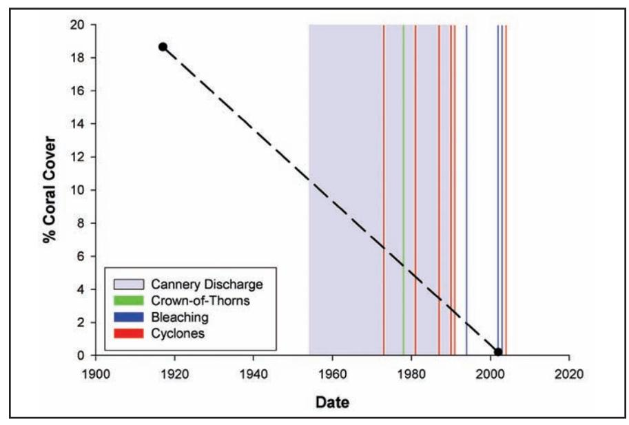

**Figure 11.15.** A 2003 re-survey of Mayor's 1924 soft coral survey in Utulei, Pago Pago Harbor, shows that almost no colonies remain at the site. Note the occurrence of bleaching events before and after the re-survey. Source: Cornish and DiDonato, 2004.

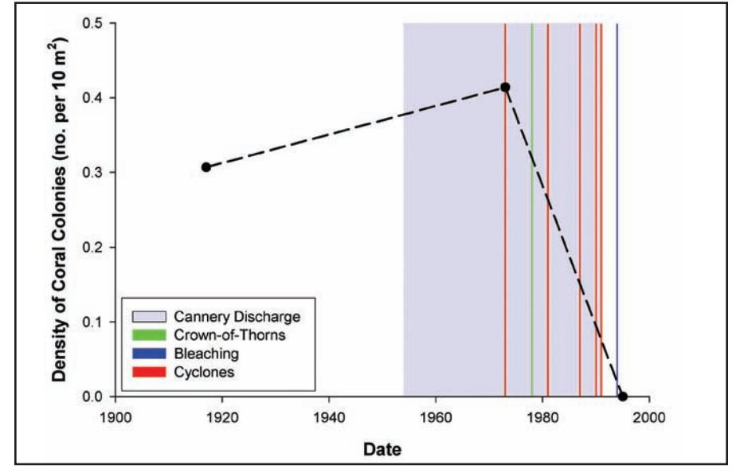

**Figure 11.16.** Soft coral colony monitoring at Aua Transect. Note cyclone and bleaching events between second and third data points. Sources: Mayor, 1924; Dahl, 1981; Green et al., 1997.

#### **Benthic Habitat Mapping**

NOAA's Center for Coastal Monitoring and Assessment, Biogeography Team (CCMA-BT) initiated a near-shore benthic habitat mapping program in Guam, American Samoa and the Commonwealth of the Northern Mariana Islands in 2003. IKONOS satellite imagery was purchased from Space Imaging, Inc. for all three jurisdictions and used to delineate habitat polygons in a geographic information system (GIS). Habitat polygons were defined and described according to a hierarchical habitat classification system consisting of 18 distinct biological cover types and 14 distinct geomorphological structure types. The project, which was completed in 2004, mapped 71.5 km² of nearshore habitat in the islands and produced a series of 45 maps that are currently being distributed via a print atlas, CD-ROM, and on-line at http://biogeo.nos.noaa.gov/products/us\_pac\_terr/. A summary map (Figure 11.17), where polygons have been aggregated into major habitat categories, depicts the geographical distribution of reefs and other types of benthic habitats in American Samoa (NOAA, 2005).

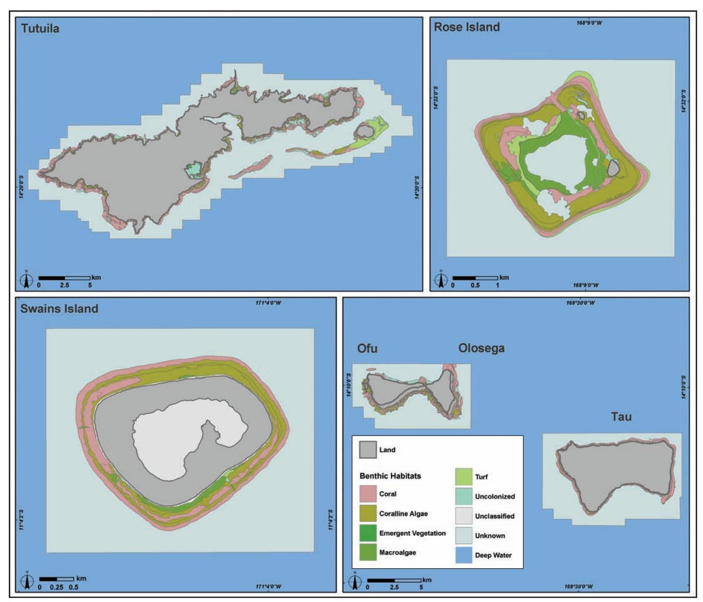

Figure 11.17. Nearshore benthic habitat maps were developed in 2004 by CCMA-BT based on visual interpretation of IKONOS satellite imagery. For more info, see: http://biogeo.nos.noaa.gov. Map: A. Shapiro.

## **ASSOCIATED BIOLOGICAL COMMUNITIES**

This section focuses primarily on reef-associated fishes because of their importance as food to the islanders as well as the significant impact that fishing has had on fish populations. Available information about other reef-associated communities (macro-invertebrates, marine mammals, sea turtles, seabirds) is limited.

### FISH

The coral reef fish fauna in American Samoa was diverse (890 species), amounting to approximately twice the number of fish species on Hawaiian and Caribbean reefs. Few marine endemic species are thought to exist in American Samoa due to widespread dispersal of their pelagic larvae.

Reef fish are harvested in both subsistence and artisanal fisheries on the five main islands in the Territory. Artisanal fishing includes both nighttime free-divers who spear reef fish and small boat fishers who target deepwater bottomfish. There is currently no export of coral reef fish to off-island markets or the aquarium trade. Some fishing also occurs at the two small and remote atolls in the Territory: Swains Island and Rose Atoll. Swains Island is inhabited by about 10 residents. Rose Atoll is uninhabited and a NWR, but anecdotal evidence indicates that poaching has occurred, at least in past years.

As described below, two trends in these fisheries are: 1) subsistence fishing has been declining steadily over the past two decades (Coutures, 2003) as villagers shift from a subsistence to cash-based economy; and 2) coral reef fish and invertebrate resources have declined significantly in abundance and size due most likely to overfishing. Regarding the latter point, it is important to recognize that coral reefs and the fish populations they support are quite limited in the Territory due to the small size of the islands and their steeply sloping sides that drop quickly into water depths of 4-5 km, thus providing relatively limited areas of shallow water habitats. For example, the five main islands in the Territory (where most fishing occurs) have only 125 km2 of coral reef eocsystems in the depth zone of 0-50 m. Another way to visualize this size limitation is that a small boat can circumnavigate the connected islands of Ofu and Olosega in about one hour.

Two types of monitoring programs in American Samoa document different aspects of the fish community. Underwater visual surveys (fisheries-independent surveys) describe the kinds of fish observed by divers on the reef. Extensive underwater visual surveys were conducted throughout the Territory in 1996, 2002, and 2004 (Green, 2002; Schroeder, unpublished data).

Annual surveys of fish harvests or creel surveys (fisheries-dependent surveys) document the actual species and quantities of fish extracted from the reefs. The DMWR has monitored artisanal bottomfish catches since 1982, but annual harvests by artisanal night-divers and subsistence fisheries have been monitored only intermittently.

### **Underwater Visual Surveys**

## *Methods*

Fish were counted along three to five replicated belt transects (3 x 50 m) set at 10 m depths on reef slopes (Green, 2002). These transect dimensions were used because they yield the most precise estimate of abundance for highly mobile, diurnal species such as wrasses. Fish sizes were estimated visually. A restricted family list excluded species that were very small, nocturnal, or cryptic in behavior (e.g., gobies, blennies, cardinalfish). Fishes were surveyed by three passes along each transect, counting different species in each pass. The first count was of large, highly mobile species which are most likely to be disturbed by the passage of a diver (such as parrotfishes, snappers, and emperors). The second count was of medium-sized mobile families (including most surgeonfishes, butterflyfishes, and wrasses) which are less disturbed by the presence of a diver. The third count was of small, site-attached species (mostly damselfishes) which are least disturbed by the presence of a diver. Since surveys were conducted throughout the year, these comparisons were made based on adult fishes only to avoid the temporal effects of recruitment on the data. Adults were defined as individuals that were more than one-third of the maximum total length (TL) of each species. Individuals less than one-third maximum TL were considered juveniles that had recruited during the previous year.

#### Results and Discussion

Territory-wide fish surveys document that there are few large fish left on the reefs around the five main islands, a strong indication that populations have been overfished (Craig and Green, 2004). Figure 11.18 shows the pooled lengths of all surgeonfish, unicornfish, parrotfish, snappers. emperors, groupers, jacks, and sharks sighted during extensive surveys at 10 m depths on the reef slope. Few fish were 40 cm or larger in TI. These data were derived from belt transects measuring 3 x 50 m. When wider transects (20 x 50 m) were used to focus on species that are wary of divers and/or are particularly vulnerable to exploitation due to the large sizes they can attain (70-200 cm), the same pattern emerges (Figure 11.19). These include sharks, maori wrasse, and several large species of parrotfish, but virtually none was bigger than 50 cm, despite a considerable sampling effort (27 sites sampled, 99 transects in total). This does not represent a sudden change; comparison of surveys from 1996 (Green, 2002) and 2004 (R. Schroeder, pers. comm.) indicate that local reefs have had few large fish for at least eight years. Birkeland et al. (1997) note the tremendous loss of spawning potential this can represent since one large female red snapper (61 cm) has the spawning potential of 212 smaller females (42 cm).

Additionally, the 2002 PIFSC-CRED survey shows that densities of large fish (≥20 cm TL) in the main islands (Tutuila and Manu'a) were much lower than in the remote atolls (Rose and Swains), which in turn were much lower than in the unfished Northwestern Hawaiian Islands (NWHI; Figure 11.20).

The six-fold decrease in fish densities between the Territory's main islands and remote atolls support the case that reefs on the main islands are overfished. While comparisons

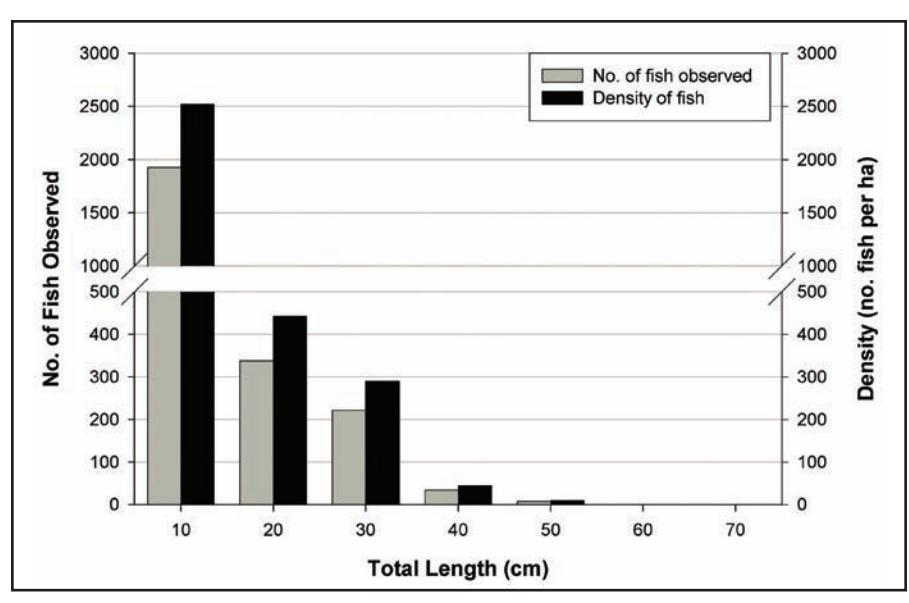

**Figure 11.18.** Lengths of standing stocks of targeted fishes at 17 sites on Tutuila in 2002. Source: Green, 2002.

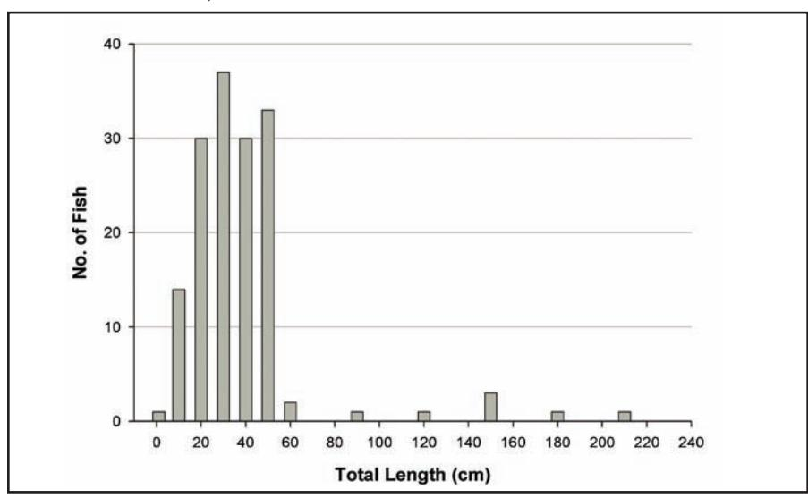

**Figure 11.19.** Lengths of large and vulnerable species (sharks, maori wrasse, large parrotfish spp.) at 27 sites in American Samoa. Source: Green, 2002.

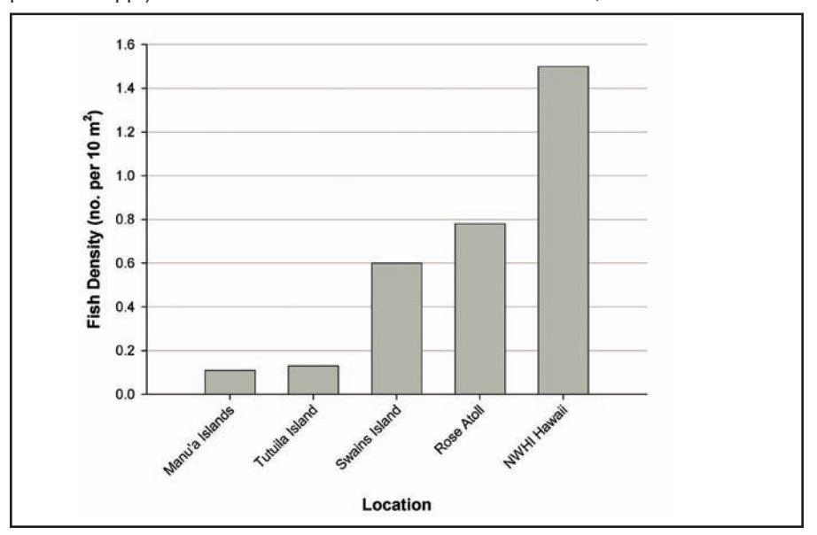

**Figure 11.20.** Densities of large fish in American Samoa and the NWHI in 2002. Source: R. Brainard, pers. comm.

with the unfished NWHI are speculative, they do suggest the potential magnitude of the loss of large fish in American Samoa.

Despite the low numbers and small sizes of fish, American Samoa is fortunate that the reefs still have an abundance of small herbivorous surgeonfish and parrotfish, which helps prevent a phase shift from reefs characterized by a high abundance of crustose coralline algae to reefs with abundant large fleshy algae.

## **Fish Harvest Surveys (Creel Surveys)**

Annual catches of coral reef fish have declined in both the subsistence and artisanal fisheries, but for somewhat different reasons. The subsistence fishery is primarily a shore-based effort that harvests numerous fish and invertebrate species such as surgeonfish, parrotfish, goatfish, snappers, groupers, jacks, octopus, polychaetes (*Palolo viridis*), and spiny lobsters (Craig et al., 1993).

Subsistence catches in Tutuila have declined substantially over the past 25 years (Figure 11.21), primarily due to lifestyle changes in the Territory. The necessity for subsistence fishing is giving way to a cash-based economy with many villagers now employed in government offices and canneries. Although the catch per unit of effort has not changed greatly, the per capita catch has declined dramatically (Figure 11.22). This sentiment was also expressed by local fishers who felt that fish abundance had declined around Tutuila Island (Tuilagi and Green, 1995). However, in the outer islands of Manu'a, the per capita catch was much higher at 73 kg/ person (Craig et al., 2004).

Artisanal fisheries include two different fishing efforts on coral reefs. The first is nighttime spear fishing in shallow waters, and the fish are sold in local stores. Long-term trends

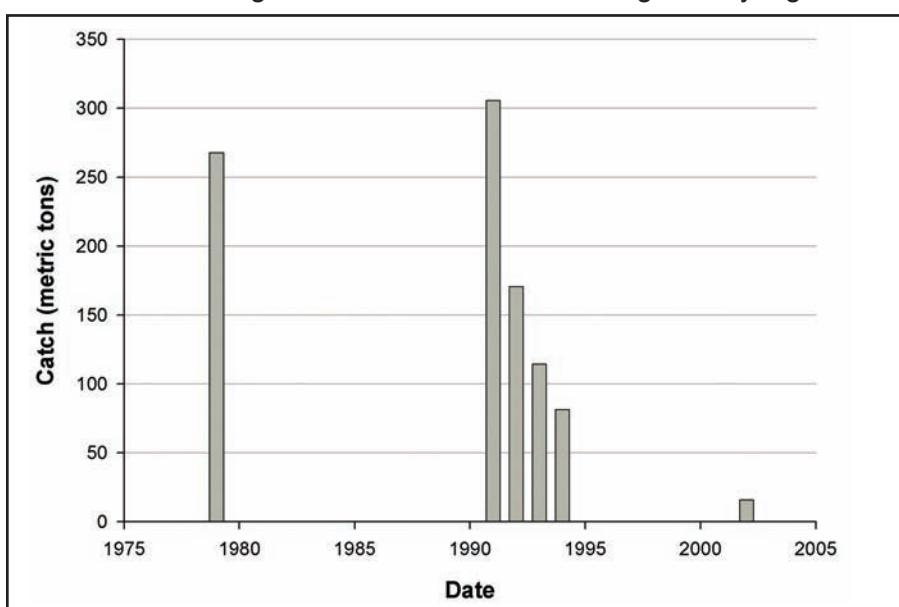

**Figure 11.21.** Subsistence harvest on Tutuila Island. Years with no catches were not monitored. Source: DMWR, unpublished data.

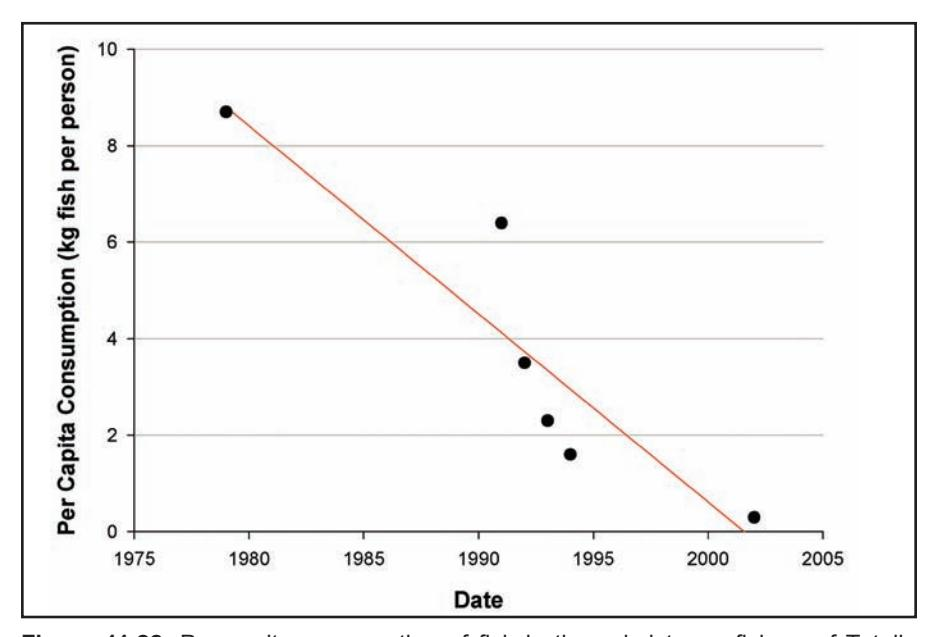

**Figure 11.22.** Per capita consumption of fish in the subsistence fishery of Tutuila Island. Source: DMWR, unpublished data.

show a period of low activity in the early 1990s due to hurricanes in 1990 and 1991, and then a buildup in the mid-1990s as the night divers doubled their catch by switching from free-diving to diving with scuba gear, which greatly improved their catch rates (Figure 11.23).

This fishery began to decline in 2000 which suggests that it had exceeded a sustainable catch. In 2001, the DMWR banned the use of scuba gear for fishing, which resulted in a drop in harvest levels to pre-scuba catch levels.

The second artisanal fishery targets deepwater snappers and groupers (bottomfish). Bottomfish fishing flourished briefly in the early 1980s when the fishery was subsidized, but it declined thereafter when the subsidies were discontinued and the few available fishing grounds were fished out (Itano, 1991; Figure 11.24). In 2001, many of the remaining bottomfish boats converted to longline fishing for albacore.

#### **MACROINVERTEBRATES**

Limited information about macroinvertebrates exists for the Territory. The harvested invertebrates (octopus, lobster, palolo, etc.) are generally listed in catch reports for subsistence and artisanal fisheries. Most show no clear trends, although giant clams (Tridacna spp.) are in lowest abundance around the populated islands (Green and Craig, 1999). Spiny and slipper lobsters have been recently described by Coutures (2003). Crown-of-thorns starfish have been rare around Tutuila Island since their massive invasion in 1978: a low but persistent population inhabits the Manu'a Islands.

#### SEA TURTLES

Sea turtle populations are in serious decline, both locally and throughout the South Pacific due to harvest, habitat loss of nesting beach habitats and incidental catches in fishing gear

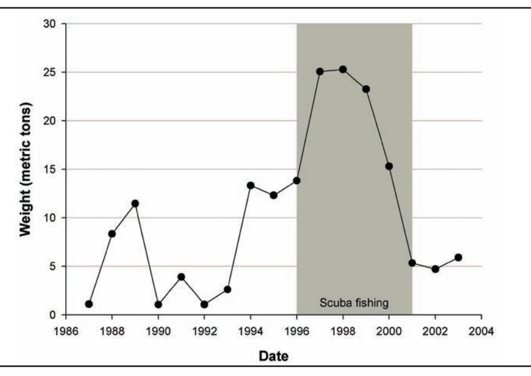

**Figure 11.23.** Catch of reef fish (surgeonfish and parrotfish) by night-divers on Tutuila Island. Source: DMWR, unpublished data.

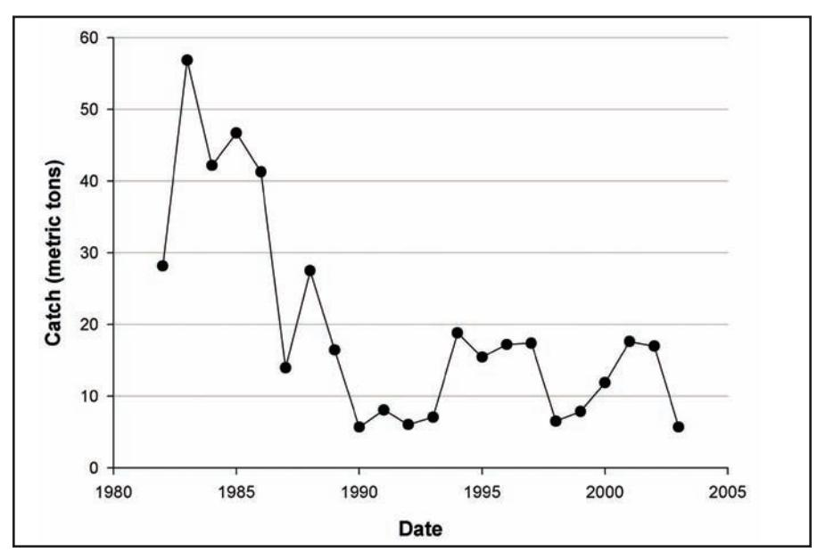

Figure 11.24. Annual catch of bottomfish. Source: DMWR, unpublished data.

(Craig, 2002). Their depletion has been so significant that coral reef biologists often have to be reminded that turtles had formerly been an important component of the coral reef ecosystem. The hawksbill turtle is listed as "threatened" and it is rapidly approaching extinction in the South Pacific, according to the USFWS/NOAA Fisheries Turtle Recovery Plan Team (RPT). The RPT concluded that the status of this species is clearly of the highest concern for the Pacific and it was recommended that immediate actions be taken to prevent its extinction. The RPT further found that green sea turtles (outside Hawaii) have seriously declined and should probably be listed as "endangered" rather than "threatened." In American Samoa, a few turtles are still killed or have their eggs collected for food. In 2003, a sanctuary for sea turtles and marine mammals was established in the territorial waters of American Samoa (0-3 miles offshore) to help publicize this conservation issue.

#### MARINE MAMMALS

Southern stocks of humpback whales migrate to American Samoa to calve and mate, primarily in September and October. Their numbers are low but unknown, and they are listed as "endangered." Other marine mammals, such as sperm whales and spinner dolphins, occur here but little is known about them. In 2003, a sanctuary for sea turtles and marine mammals was established in the territorial waters of American Samoa to help protect species and publicize this conservation issue.

## SEABIRDS

Seabirds that feed in the nearshore coastal waters of American Samoa include Brown boobies and noddies, while other seabirds may contribute nutrients to coastal waters from their cliffside nests. The first Territory-wide survey of seabirds was conducted in 2000 (O'Connor and Rauzon, 2003).

## **CURRENT CONSERVATION MANAGEMENT ACTIVITIES**

The American Samoa Government coordinates all of its territorial coral reef management activities through the

Coral Reef Advisory Group (CRAG). This group comprises both territorial and Federal agencies including the American Samoa Government Department of Commerce (which includes the ASCMP and Fagatele Bay National Marine Sanctuary, Figure 11.25), DMWR, ASEPA, the American Samoa Community College, and the National Park of American Samoa. These agencies collaborate to plan and implement actions related to the management of the Territory's coral reefs.

Each agency within the CRAG has specific projects and programs that enhance the quality of marine habitats, regulate activities on coral reefs, promote awareness, or

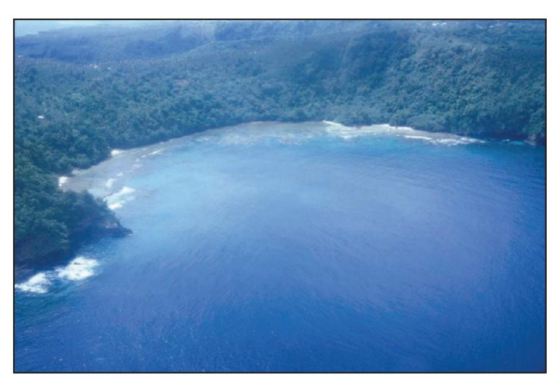

**Figure 11.25.** Fagatele Bay National Marine Sanctuary. Source: K. Evans.

facilitate research into various aspects of coral reef science. Recently, CRAG members adopted a threatbased approach (as outlined in the U.S Coral Reef Task Force's Puerto Rico Resolution) to identifying key problems on American Samoa's reefs. In tandem with this, the CRAG has also created four three-year action strategies to address the issues of overfishing, global climate change, land-based sources of pollution, and population pressure.

The U.S. Coral Reef Initiative has been instrumental in supporting the Territory in its coral reef conservation activities. The annual Coral Conservation Grant Program has provided managers and scientists in American Samoa with tools, staff, funds, and equipment with which to accomplish key research and management projects. Three programs have benefited greatly from this support: the Marine GIS Program, MPA Program, and Coral Reef Monitoring Program.

#### **Marine GIS Program**

GIS activities range from basic map production for DMWR programs (e.g., Fishery Management Program, MPAs) and other CRAG agencies, to more complex spatial analysis of fisheries data, spatial data production, conversion and maintenance, and GIS software customization and development for the above purposes. The use of GIS and mathematical algorithms for the design of the MPAs Network has been investigated locally and brought to the attention of American Samoa's MPA Program. New benthic habitat mapping data and classification schemes were acquired from the CCMA-BT. In addition, multibeam data collected during the NOAA survey in selected shallow areas (<30 m) are being used to test the accuracy of an algorithm to derive bathymetry from IKONOS satellite images.

In collaboration with ASEPA, maps of assessment categories of water quality for streams, wetlands, and ocean shoreline for Tutuila and Manu'a Islands have been developed. A geo-dataset containing all ASEPA and related agency monitoring stations and their attributes is being developed.

### **Marine Protected Areas Program**

Marine Protected Areas (MPAs) are increasingly being relied on as a precautionary form of protection. Community-based MPAs are also increasing throughout the Pacific. In response to the need for a more coordinated approach, the importance of regional networking, and most importantly, the realization that the existing MPAs are doing very little to enhance ecosystem function or protect species, American Samoa is developing an MPA Program within the DMWR and supported by the CRAG. The program focuses on coordinating existing MPAs (Figure 11.26), developing new ones, and creating a territorial master plan to guide MPA management and development, proper management of community-based and territorial MPAs, coordination between local and federal initiatives (i.e. National Park, National Marine Sanctuary), and regional networking, primarily between American Samoa, Samoa, and Fiji.

In 2003. NOAA's Pacific Services Center in Hawaii, collected data for the Territory's section of the Marine Managed Areas National Inventory (Table 11.3). This effort was assisted by the American Samoa Department of Commerce, the DMWR, and the

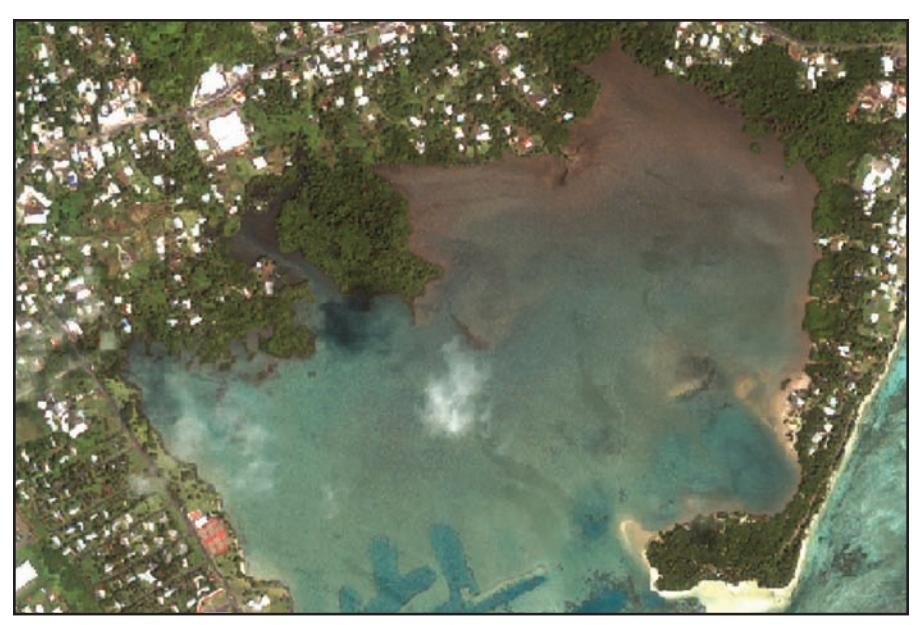

Figure 11.26. The Nu'uuli Pala Special Management Area is a resource that will be incorporated into the American Samoa MPA Program. Photo: T. Curry.

Table 11.3. Coral reef area contained within MPAs in American Samoa. Only Rose Atoll is a long-term, no-take MPA. Source: P. Craig, pers. obs.

| ISLAND     | MPA               | MPA SIZE (km²) | POTENTIAL CORAL REEF AREA (km²) |        |
|------------|-------------------|----------------|------------------------------------|--------|
|            |                   |                | 0-150'                             | 0-300' |
| Tutuila    | Fagatele Bay NMS  | 0.7            | 0.6                                | 0.7    |
|            | National Park     | 6.6            | 6.1                                | 6.6    |
|            | Community-based   | 1              | 1                                  | 1      |
| Ofu        | Vaoto Marine Park | 0.4            | 0.4                                | 0.4    |
|            | National Park     | 1.5            | 1.5                                | 1.5    |
|            | Community-based   | 0.1            | 0.1                                | 0.1    |
| Ta'u       | National Park     | 4.8            | 1.9                                | 4.8    |
| Rose Atoll | Rose Atoll NWR    | 158.1          | 9.9                                | 11.6   |
| Totals     |                   | 173.2          | 21.5                               | 26.7   |

Territory's Coral Reef Initiative. The data are currently being collated and will be available on-line in the near future at http://www.mpa.gov.

### **Coral Reef Monitoring Program**

With the recent addition of two staff positions to establish and run the Coral Reef Monitoring Program, American Samoa will implement an integrated coral reef monitoring plan in 2005. This program will assist individual agency monitoring efforts, as well as the Community-based Fisheries Management Program at the DMWR. For the first time, the Territory will have a single point of reference and contact for monitoring activities, as well as a centralized database.

#### **American Samoa Marine Laboratory**

The American Samoa Government has recently completed a facility plan for a marine laboratory. This plan is comprehensive, and includes detailed cost estimates for construction, operation, and maintenance, as well as recommendations for site selection. In addition, a conceptual rendition of the lab has been completed by a Hawaii-based architect and a business/marketing plan has been developed in partnership with the Small Business Development Center at the American Samoa Community College.

American Samoa has never had a marine laboratory capable of supporting quality research by local agencies or visiting scientists and professionals. This has made it difficult to conduct the research that the American

Samoa Government would like to pursue. Without a facility with which to attract qualified scientists, timely and responsive coral reef management has been hindered.

Though American Samoa is fortunate to receive support from the Federal government for marine and coastal protection efforts, Pacific islands such as Guam, Palau, and Hawaii have been able to attract numerous high caliber researchers. In turn, their cumulative body of work has contributed greatly to increased knowledge of coral reef ecosystems, with increased and jurisdictional management effectiveness as a result.

The proposed marine laboratory would serve three main purposes. First, the American Samoa Government will have a facility that can be utilized by local agencies with an interest in marine conservation efforts (i.e., coral reef science, research, and monitoring). The laboratory will provide wet and dry labs, storage and office space, tanks for holding marine organisms, and facilities for aquaculture research and development. Second, the laboratory will serve as an educational institution, 'ao'aoga o le gataifale' in Samoan, associated with the Marine Science Program at the American Samoa Community College, to provide students with research experience and lab facilities for their projects. The marine lab may also be involved in networking with other marine education initiatives for Pacific Island groups. Third, the laboratory will serve as a research base to attract scientists that are funded both domestically and internationally, who might not otherwise have considered American Samoa due to the lack of local facilities. Local agencies are increasingly receiving requests for support from scientists wishing to conduct marine research in the Territory.

## **OVERALL CONCLUSIONS AND RECOMMENDATIONS**

The status of coral reefs in American Samoa is mixed. There are notable improvements, but other serious problems persist. Generally, corals are in good condition, having recovered from massive cyclone damage in 1991. More recent but moderate damage occurred during Hurricane Heta in 2004, but given the observed resilience of corals in the Territory and the generally low level of anthropogenic stressors (e.g., low recreational use), regrowth is expected over the next several years. Another noteworthy improvement is the removal of 10 shipwrecks off local reefs. There has also been a marked improvement in water quality in Pago Pago Harbor.

Local reefs, however, have been seriously overfished and few large fish remain. Genuine consideration needs to be given to reducing overall catches and developing effective MPAs that provide long-term protection to harvested species. Despite the resiliency of corals mentioned above, scientists are observing increases in coral bleaching and mortality, as well as areas heavily impacted by coral diseases, which have historically been rare.

#### **Management Strategies**

Progress in coral reef management has been made in several areas. Significant regulatory action has included a ban on scuba-assisted fishing, as well as the establishment of a sanctuary for sea turtles and marine mammals in all territorial waters. Interagency management efforts have been focused more clearly through local action strategies (LAS) that address overfishing, land-based pollution, population growth, and climate change. Each LAS includes steps to address the problems and a timeline for doing so. Progress is also being made to develop both a coordinated territorial monitoring program and a territorial network of MPAs. Coordinators for both of these projects are now on staff.

### **Gaps**

*Funding*. A common management problem on small Pacific Islands is how to best balance the limited funding opportunities. Because a department's professional staffing may be small, it is often necessary to hire personnel through coral reef grant programs. The difficulty is twofold. First, the remaining funding may not be adequate to conduct projects, and more importantly, it is difficult to eventually transfer these positions to local funding, thus their long-term continuation is not assured.

Enforcement. Enforcement of regulations that protect coral reefs and associated habitats and fisheries has not been adequate for several reasons. First, political and judicial support has not been forthcoming. Violators have historically not been pursued, or if caught, received a 'slap on the wrist.' Second, management has not prioritized this issue until recently, and none of the Territory's MPAs, from Federal to village level, have an effective enforcement presence. Third, the lack of a coherent and long-term funding source to create an adequately sized enforcement staff has yet to be identified. In addition, funding must also be found to ensure that enforcement operations conducted on boats are safe. While American Samoa does have a U.S. Coast Guard presence, the USCG station does not possess the capabilities for water-based rescue or assistance, and there is no radio system in place in the Territory to support patrol activities. Finally the conservation enforcement officers that American Samoa does have are generally in need of more comprehensive training. For example, the DMWR Conservation Enforcement Division lacks a formal training program for entry level conservation enforcement officers.

*Training*. Coral program staff in American Samoa have improved greatly over the past several years, thanks largely to the U.S. Coral Reef Task Force. However, as the Territory is an isolated island group, few opportunities are available for in-service training for these staff. Ensuring that everyone can attend at least one appropriate conference or training per year is an expensive proposition, given the airfare and per diem costs. However, its value is manifest.

## **REFERENCES**

Aeby, G. and T. Work. In preparation. A survey of coral disease prevalence in American Samoa. Report to the Coral Reef Advisory Group.

Barbour, M.T., J. Gerritsen, B.D. Snyder and J.B. Stribling. 1999. Rapid Bioassessment Protocols for Use in Streams and Wadeable Rivers: Periphyton, Benthic Macroinvertebrates and Fish, Second Edition. EPA 841-B-99-002. U.S. Environmental Protection Agency, Office of Water, Washington, DC.

Birkeland, C. and S.A. Belliveau. 2000. Resurvey of the Aua transect after the ship removal. Report to NOAA. 4 pp.

Birkeland, C. and A. Green. 1999. Resurvey of the Aua Transect prior to the ship removal. Report to the National Oceanic and Atmospheric Administration. 10 pp.

Birkeland, C., A. Green, C. Mundy, and K. Miller. 2004. Long term monitoring of Fagatele Bay National Marine Sanctuary and Tutuila Island (American Samoa) 1985 to 2001: summary of surveys conducted in 1998 and 2001. Report to US DOC and American Samoa Government.

Birkeland, C., R. Randall, A. Green, B. Smith, and S. Wilkins. 1997. Changes in the Coral Reef Communities of Fagatele Bay National Marine Sanctuary and Tutuila Island (American Samoa) Over the Last Two Decades. National Oceanic and Atmospheric Administration. Silver Spring, MD. 225 pp

Brainard, R. 2004. Pacific Islands Fisheries Science Center, Coral Reef Ecosystem Division, Honolulu. Personal communication.

Cary, L. R. 1931. Studies of the coral reefs of Tutuila, American Samoa with special reference to the Alcyonaria. Papers from the Tortugas Laboratory of Carnegie Institution of Washington, DC. 27: 53-98.

Coles, S., L. Basch, P. Skelton, and P. Reath. 2003. A survey of introduced marine species in Pago Pago Harbor, Fagatele Bay, and the National Park of American Samoa. Report to the Territory. Bishop Museum, Honolulu. 89 pp.

Cornish, A. and E. DiDonato. 2004. Resurvey of a reef flat in American Samoa after 85 years reveals devastation to a soft coral (Alcyonacea) community. Marine Pollution Bulletin 48: 768 – 777.

Coutures, E. 2003. The shoreline fishery of American Samoa, analysis of 1-yr data and implementation of a new sampling protocol. Department of Marine and Wildlife Biology Report Series 102. 22 pp.

Craig, P. 2002. Rapidly approaching extinction: sea turtles in the central South Pacific. Western Pacific sea turtle cooperative research and management workshop. Western Pacific Regional Fisheries Management Council.

Craig, P., J. Choat, L. Axe, and S. Saucerman. 1997. Population biology and harvest of the coral reef surgeonfish *Acanthurus lineatus* in American Samoa. Fisheries Bulletin 95: 680-693.

Craig, P. and A. Green. 2004. Overfished coral reefs in American Samoa: no quick fix. Rept. to Coral Reef Advisory Group, American Samoa. 2 pp.

Craig, P., A. Green, and F. Tuilagi. 2004. Subsistence harvest and standing stocks in the outer islands of American Samoa.

Craig, P., B. Ponwith, F. Aitaoto, and D. Hamm. 1993. The commercial, subsistence and recreational fisheries of American Samoa. Marine Fisheries Review 55: 109-116.

Craig, P., S. Saucerman, and S. Wiegman. 2000. Central South Pacific Ocean (American Samoa): an environmental evaluation. Chapter 103. In: Sheppard (ed.) Seas at the Millennium: an environmental evaluation, Pergamon Press, New York.

Dahl, A.L. 1981. Monitoring coral reefs for urban impact. Bulletin of Marine Science 31: 544-551.

Dahl, A.L. and A.E. Lamberts. 1977. Environmental impact on a Samoan coral reef resurvey of Mayor's 1917 transect. Pacific Science 31: 309-319.

Fenner, D. 2004. Summer coral bleaching event, 2004, on Tutuila, American Samoa. Report to Department of Marine and Wildlife Resources, American Samoa. 4 pp.

Fisk, D. and C. Birkeland. 2002. Status of coral communities on the volcanic islands of American Samoa, a re-survey of long-term monitoring sites. Report to Department of Marine and Wildlife Resources, American Samoa. 135 pp.

Green, A. 1996. Status of the coral reefs of the Samoan Archipelago. Department of Marine and Wildlife Resources (American Samoa). Biological Report Series. 125 pp.

Green, A. 2002. Status of coral reefs on the main volcanic islands of American Samoa: a resurvey of long-term monitoring sites. No. 96799. Report to Department of Marine and Wildlife Resources, Pago Pago, American Samoa. 135 pp.

Green, A., C. Birkeland, R Randall, B. Smith, and S. Wilkins. 1997. 78 years of coral reef degradation in Pago Pago Harbor: a quantitative record. pp. (2) 1883-1888. In: Proceedings for the 8th Coral Reef Symposium.

Green, A., C. Birkeland, and R. Randall. 1999. Twenty years of disturbance and change in Fagatele Bay National Marine Sanctuary, American Samoa. Pacific Science 53: 376-400.

Green, A., J. Burgett, M. Molina, and D. Palawski. 1998. The impact of a ship grounding and associated fuel spill on Rose Atoll National Wildlife Refuge, American Samoa. US Fish and Wildlife Service, Honolulu. 64 pp.

Green, A. and P. Craig. 1999. Population size and structure of giant clams at Rose Atoll, an important refuge in the Samoan Archipelago. Coral Reefs 18: 205-211.

Houk, P., G. DiDonato, and J. Iguel. In press. Assessing the effects of non-point source pollution on American Samoa's coral reef communities. Environmental Monitoring and Assessment.

Itano, D. 1991. A review of the development of bottomfish fisheries in American Samoa. South Pacific Commission, New Caledonia, Vol. 1. Inshore Fisheries Research Technical Paper. 22 pp.

Mayor, A., 1924. Structure and ecology of Samoan reefs. Papers from the Department of Marine Biology, Carnegie Institution of Washington 19: 1-25, plates 1-8.

NOAA (National Oceanic and Atmospheric Administration). 2005. Atlas of the Shallow-water Benthic Habitats of American Samoa, Guam, and the Commonwealth of the Northern Mariana Islands. NOAA Technical Memorandum NOS NC-COS 8, Biogeography Team. Silver Spring, MD. 126 pp.

O'Connor, P. and M. Rauzon. 2003. Seabird survey in American Samoa. Report for National Park of American Samoa, Pago Pago by Hawaii University, Pacific Cooperative Study Unit. 85 pp.

Page, M. 1998. The biology, community structure, growth and artisanal catch of parrotfishes of American Samoa. 1998. American Samoa Department of Marine and Wildlife Resources, Biological Report Series. 87 pp.

Schroeder, R. 2004. Pacific Islands Fisheries Science Center, Coral Reef Ecosystem Division, Honolulu. Personal communication.

Skelton, Posa. 2003. Seaweeds of American Samoa. Report for the Department of Marine and Wildlife Resources by International Ocean Institute and Oceania Research and Development Association, Australia. 103 pp.

Spurgeon, J.P.G., T. Roxburgh, S. O' Gorman, R. Lindley, D. Ramsey, N. Polunin, and S. Clamp. 2004. Economic Valuation of Coral Reefs and Adjacent Habitats in American Samoa. A report to the American Samoa Department of Commerce. 109 pp.

Tuilagi, F. and A. Green. 1995. Community perception of changes in coral reef fisheries in American Samoa. Biological Paper 22. In: Proceedings of the South Pacific Commission - Forum Fisheries Agency Regional Inshore Management Workshop (New Caledonia), June 1995. Also: Department of Marine and Wildlife Resources (American Samoa), Biological Report Series No. 72. 16 pp.

US EPA (Environmental Protection Agency). 2001. National Coastal Assessment: Field Operations Manual. U.S. EPA, Office of Research and Development, National Health and Environmental Effects Research Laboratory, Gulf Ecology Division, Gulf Breeze, FL. EPA 620/R-01/003. 72 pp.

Work, T. and R. Raymeyer. 2002. American Samoa reef health survey. Report to US Fish and Wildlife Service by the US Geological Survey, Hawaii. 41 pp.