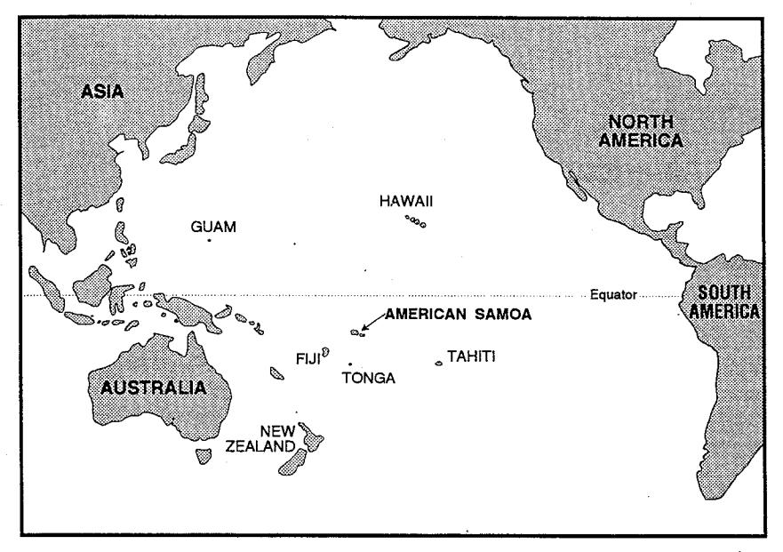
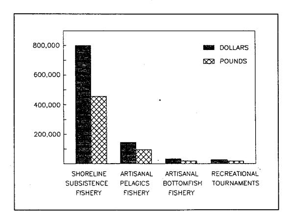
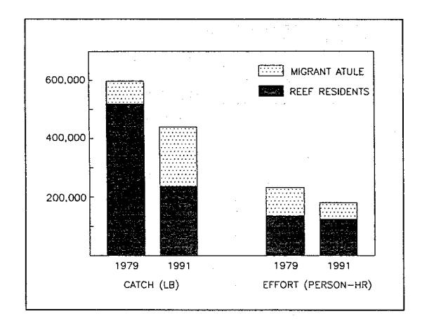
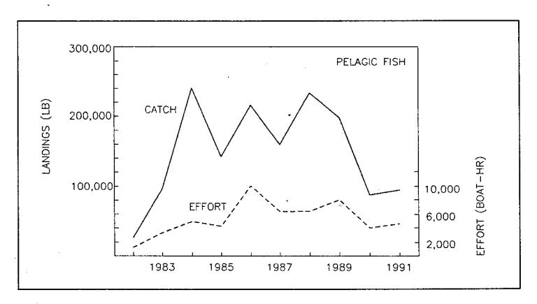
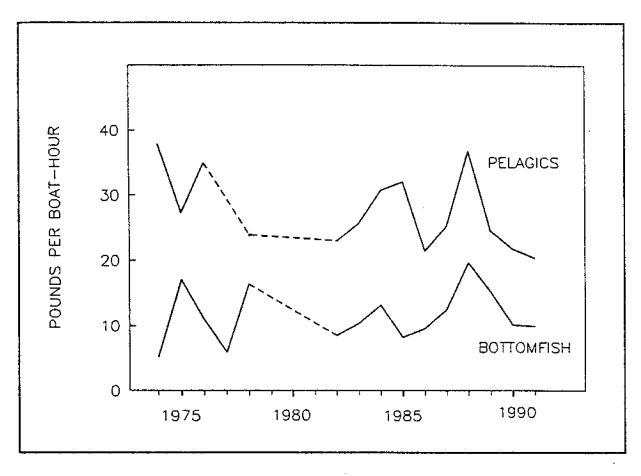
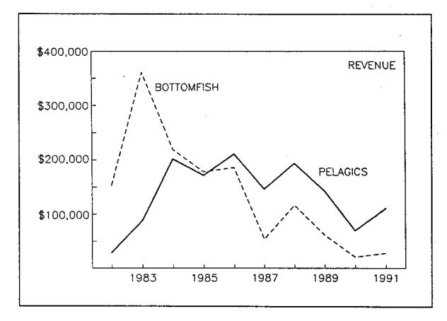
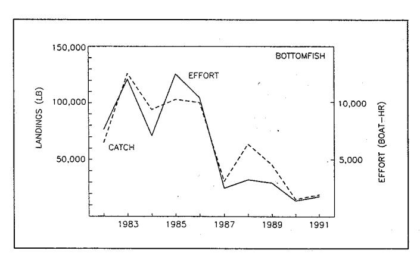
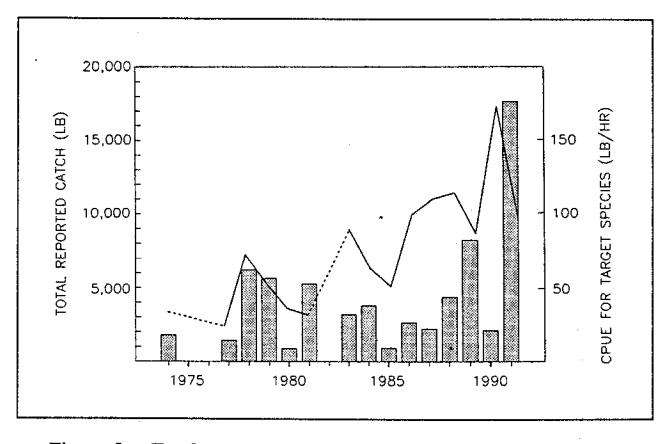
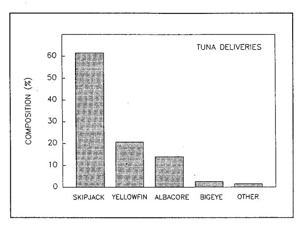

# The Commercial, Subsistence, and Recreational Fisheries of American Samoa

PETER CRAIG, BONNIE PONWITH, FINI AITAOTO, and DAVID HAMM

#### Introduction

Many tropical islands in the South Pacific Ocean are confronted by rapidly growing human populations, but have few economic resources that their

Peter Craig, Bonnie Ponwith, and Fini Aitaoto are with the Department of Marine and Wildlife Resources, Box 3730, Pago Pago, American Samoa 96799. David Hamm is with the National Marine Fisheries Service, NOAA, 2570 Dole St., Honolulu, Hawaii 96822.

ABSTRACT—Domestic fisheries in American Samoa landed 587,000 lb of fish and invertebrates in 1991 worth \$993,000. Most of the catch (78%) and value (80%) was taken by the shoreline subsistence fishery that occurs on the coral reefs surrounding the islands. Artisanal fisheries for offshore pelagic fishes (primarily skipjack tuna, Katsuwonus pelamis; and yellowfin tuna, Thunnus albacares) and bottomfishes (snappers, emperors, groupers) accounted for 16% and 3%, respectively, of the domestic catch. Recreational tournament catches for pelagic fishes represented the remainder (3%).

While sport fishing is becoming increasingly important, other domestic fisheries have declined in recent years. The shoreline subsistence fishery has dropped by about 25% over the past decade owing to socioeconomic factors and possibly overexploitation. Artisanal fisheries have also declined precipitously in recent years owing to hurricane-related damages, attrition of fishermen, and competition with imports. Artisanal fisheries show some potential for growth, but may be constrained by marketing issues, vessel capabilities, and limited stock sizes (for bottomfish) or local availability of high-value (pelagic) fishes.

In contrast to the small-scale domestic fisheries, American Samoa is also homeport to a distant-water fleet of large purse seiners and longliners that fish beyond the EEZ and deliver about 160,000-220,000 short tons of tuna per year to local canneries.

residents can utilize. Fish resources, from traditional subsistence fishing in times past to today's more modern boat-based fisheries, have always been an important component of island economies (Doulman and Kearney, 1991). It is therefore of interest to examine the current use and potential development of such fisheries. An overview of recent trends in the small, but locally important, domestic fisheries in American Samoa is presented in this paper. This includes four fisheries: 1) a shoreline subsistence fishery, 2) an artisanal fishery for offshore pelagic fishes, 3) an artisanal fishery for offshore bottomfish, and 4) a recreational tournament fishery. For completeness and contrast, the much larger distant-water fleet of commercial vessels that deliver tuna to canneries in American Samoa is also briefly described.

## Study Area

American Samoa, the only U.S. Territory in the southern hemisphere, consists of 7 small islands in the central South Pacific Ocean (Fig. 1). The largest islands are Tutuila and the Manu'a group (Ofu, Olesega, and Ta'u Islands). The total land area is only 77 mi.2. Most of the islands have steep volcanic slopes with limited flat land suitable for human habitation or agriculture. The Territory's population (46,600 in 1990), located primarily on Tutuila Island, is growing rapidly (3.7% per year) and has a doubling time of only 19 years (EDPO, 1991). The two major employers are the tuna canneries and the local government, which employ 33% and 31% of the labor force, respectively. There is a heavy reliance on imports for food, fuel, and materials (EDPO, 1991). Canned tuna is the only significant export, which supplies about 25% of all canned tuna consumed in the United States.

## **Data Collection System**

The Department of Marine and Wild-life Resources (DMWR) in American Samoa provides fisheries information to the National Marine Fisheries Service (NMFS) through its Western Pacific Fisheries Information Network (WPACFIN) and to the Western Pacific Regional Fishery Management Council (WPRFMC). The Council is responsible for managing fisheries within the 200-mile Exclusive Economic Zones (EEZ) around American Samoa, Hawaii, Guam, the Commonwealth of the Northern Marianas, and other U.S. possessions in the Pacific.

The historical development of DMWR has been described by Itano (1991). DMWR (initially the Office of Marine Resources) was established in the 1960's to oversee fisheries development projects and conduct resource assessments. In 1972, the development of artisanal fisheries began in earnest as did DMWR's data collection efforts. With assistance from WPACFIN in the 1980's, the data collection program was significantly upgraded and expanded to provide better coverage and statistics for all local boat-based fisheries.

General procedures for DMWR data collectors are to sample the artisanal fisheries two weekdays and one weekend (or holiday) per week, as described in detail by Aitaoto et al. (1991). During sample days, a creel survey is conducted as boats dock at designated harbors between 0500 and 2100 h. The fishermen are interviewed and their catches examined. To produce annual

Figure 1.—Location of American Samoa (14° S, 170° W) in the South Pacific Ocean.

catch statistics, the creel survey information is computerized, verified, and expanded to account for times and areas not sampled. In the Manu'a Islands, the fishing fleet is small and the catch from nearly every boat is monitored; data are adjusted for the few trips not sampled. For recreational tournaments, DMWR provides the official weigh-in station and tallies landings from all participating boats.

The shoreline subsistence fishery on Tutuila Island was first examined in the late 1970's by Hill (1978) and Wass (1980). Beginning in 1991, the fishery is again being monitored by a creel and participation survey, conducted 3 days a week, stratified by time of day and type of day (weekday/weekend) (Ponwith, 1992). Catch data were first expanded to the entire study area along the south shore of Tutuila, where 35% of the people live. Then, on a percapita basis, results were expanded to produce a Territorial catch.

The distant-water fleet that delivers tuna to canneries in American Samoa has been monitored by NMFS, either directly or by contract to DMWR, since 1963. The NMFS port sampling program collects vessel logbooks, length-frequencies of tuna species, and cannery summaries of vessel landings by species and gear type. Sampling

procedures are described by Honda et al.1 and Ito and Yamasaki2.

# Regulations and Enforcement

Few of WPRFMC's regulations have focused on American Samoa's EEZ, because no major commercial fishery operates there at present. A goal, how-

1Honda, V., G. Yamasaki, and R. Ito. 1988. American Samoa purse seine fishery sampling. U.S. Dep. Commer., NOAA, Natl. Mar. Fish. Serv., Southwest Fish. Center., Honolulu Lab., Admin. Rep. H-88–20, 35 p.

2Ito, R., and G. Yamasaki. 1988. Status of the American Samoa foreign longline tuna fishery, 1982–86. U.S. Dep. Commer., NOAA, Natl. Mar. Fish. Serv., Southwest Fish. Cent., Honolulu Lab., Admin. Rep. H-88–19, 30 p. ever, will be to insure that local residents have opportunities to participate in future fisheries developments that do occur. Preferential rights for indigenous people are currently being researched, and a control date (1 Jan. 1991) was set for possible implementation of a limited entry program for longline fishing. Occasional poaching by foreign vessels occurs in the EEZ, but no enforcement vessels or aircraft are available for surveillance.

Territorial regulations that apply to the management of local fisheries include record keeping for commercial fishermen, seafood dealers, and fish processors, as well as specific laws (mostly pertaining to reef users) regarding illegal fishing methods, gear restrictions, and species size limits. Enforcement of territorial regulations is at an early stage of development.

#### **Domestic Fisheries**

The annual harvest of combined domestic fisheries in 1991 was 587,000 pounds, valued at \$993,000 at local market prices. By far the majority of this catch (78%) and value (80%) was taken by the shoreline subsistence fishery (Fig. 2). It should be noted, however, that none of the domestic fisheries is strictly a commercial, subsistence, or recreational enterprise. These terms are used only to describe the principal nature of the fishery because some fish are sold and others are retained for personal use in each fishery. The percentage of fish sold varies consider-

Figure 2.—Annual landings and value of four domestic fisheries in American Samoa in 1991. Units on the vertical axis refer to both dollars and pounds.

ably: Recreational tournaments (10% sold), shoreline subsistence fishery (25%), artisanal bottomfish fishery (65%), artisanal pelagic fishery (85%).

## **Shoreline Subsistence Fishery**

The islands of American Samoa are partially surrounded by a narrow fringing coral reef, the top of which is exposed at low tide. The reeftop and adjacent shallow waters are inhabited by a diverse array of fish and shellfish species (Wass, 1984; USACE3, 4) that are harvested by local residents on almost a daily basis throughout the year (Hill, 1978; Wass, 1980; Ponwith, 1992). Most fishing is accomplished by individuals on foot who fish in areas adjacent to their own village. Principal fishing methods used are rod and reel (which accounted for 37% of the annual catch in 1991), handline (25%), free diving (14%), gill netting (9%), gleaning (8%), and throw netting (5%). Gleaning involves the collection of fish and invertebrates at low tide, usually by hand, stick, or steel rod.

The 1991 island-wide subsistence catch on Tutuila Island was 439,000 pounds and was worth \$768,000 at the average rate of \$1.75/pound (Ponwith, 1992). Expanding these data to include limited catches in the Manu'a islands produces a total subsistence catch in the Territory of 456,000 lb, worth \$798,000. The average catch per unit of effort (CPUE) was 3 pounds/gear-h; highest CPUE was obtained by gill netting (12.2 pounds/gear-h), followed by throw net (4.9 pounds/gear-h), free diving (2.9), rod and reel (2.9), gleaning (1.7), handline (1.4), and bamboo pole hook and line (0.7).

Virtually all fish and invertebrate species caught were retained for consumption or sale. Altogether, 69 species or species groups were harvested; fishes accounted for 86% of the total catch by weight. One coastal migratory fish species, the atule or bigeye scad, Selar crumenophthalmus, domi-

Table 1.—Catch composition of the shoreline subsistence fishery on Tutuila Island in 1991.

| Reef species group |                | Catch Composition (%) | Average Weight (lb) |  |
|--------------------|----------------|-----------------------------|---------------------------|--|
| Reef species group |                | ( /0)                       | (in)                      |  |
| Coastal Migrants   |                |                             |                           |  |
| Atule              | Selar          |                             |                           |  |
| (big-eye scad)     | crumenoph-     |                             |                           |  |
| , , ,              | thalmus .      | 46                          | 0.3                       |  |
| Reef Residents     |                |                             |                           |  |
| Jacks              | Carangidae     | 10                          | 1.4                       |  |
| Surgeonfish        | Acanthuridae   | 9                           | 0.5                       |  |
| Mullet             | Mugilidae      | .6                          | 0.9                       |  |
| Octopus            | Octopus sp.    | 5                           | 2.2                       |  |
| Groupers           | Serranidae     | 3                           | 0.4                       |  |
| Sea urchins        | Echinoid       | 3                           |                           |  |
| Palolo worms       | Eunice viridis | 2                           |                           |  |
| Squirrelfish       | Holocentridae  | e 2                         |                           |  |
| Snappers           | Lutjanus spp.  | . 1                         | 0.3                       |  |
| Parrotfish         | Scaridae       | 1                           |                           |  |
| Sea snails         | Gastropoda     | 1                           |                           |  |
| Other              | •              | . 11                        |                           |  |

nated the harvest in 1991 (Table 1). Jacks, surgeonfish, mullet, and octopus made up the majority of the reefresident species taken. The average sizes of fishes taken were surprisingly small (Table 1), particularly for groupers and snappers which had very low mean weights (0.3–0.4 pound). Some favored species, such as giant clams, *Tridacna* spp., were generally absent in reef catches because of overharvesting.

One unique species taken was the palolo worm Eunice viridis, a burrowing polychaete. Palolo generally emerge once a year to release their reproductive segments (epitokes) into nearshore waters (Caspers, 1984; Itano and Buckley, 1988). Samoans, who consider the epitokes a delicacy, gather in large numbers (up to 1,000's) at midnight of the predicted night of emergence to collect the epitokes using scoop nets or long lengths of screen. Ponwith (1992) reported that palolo catches were highly variable (3,400 pounds in 1990, 600 pounds in 1991) because of the strength of the swarming event and the presence of offshore winds that concentrate the epitokes near the shoreline, making them more accessible to the villagers.

An opportunity to identify trends in the shoreline fishery was provided by two similar studies conducted in 1979 (Wass, 1980) and 1991 (Ponwith, 1992) on Tutuila Island. During this 12—year period, the island-wide catch decreased by 26%; however, differences in the run strength of the atule, an annually

variable migrant to the shoreline area, tend to obscure an even greater decline in catch. In 1979 the atule catch was relatively small, only 13% of the total catch compared to 46% in 1991. By removing this species from the analyses and considering only the reef-resident species, a major drop is apparent in the adjusted island-wide catch (-54%) over the past 12 years, while effort decreased only 8% (Fig. 3).

Downward trends in catch and effort seem even more significant since there was a 46% increase in the human population during the same period (EDPO, 1991). With this influx of people and reduced fishing effort, the per capita subsistence catch on Tutuila Island dropped from 19.4 to 9.8 pounds. Some possible explanations for the reduced catch and effort include a decline in resource abundance (reflected by a drop in CPUE) or sociological changes such as less leisure time, a shift in dietary preferences, or a preference to buy fish at the market rather than to catch them personally. Imports of reef fish from Western Samoa and Tonga have occurred in recent years (at least 10,200 pounds in 1991) and appear to be increasing.

In general, the shoreline subsistence fishery appears to be declining, although it still far exceeds harvests of other domestic fisheries in American Samoa. Two notable exceptions to this apparent decline in interest are the directed fishing efforts for two highly prized species, the atule and palolo.

## **Artisanal Fisheries**

While local fishermen in American Samoa have harvested inshore fishes over the millennia, they have also made significant catches of offshore fishes since the 1970's. Itano (1991) describes in detail several "boom and bust" cycles that occurred over the years as various fisheries development projects were introduced. One of the more lasting projects was the small-boat "Dory Project" (1972-75) in which subsidized dory-type boats were made available to fishermen who then supplied catch information to DMWR. Though the project faded because of a variety of problems, Itano (1991) notes that it

&lt;sup>3USACE. 1980. Coral reef inventory of American Samoa. U.S. Army Corps Eng., Honolulu, Hawaii, 314 p.

&lt;sup>4USACE. 1994. Coral reef inventory of American Samoa. U.S. Army Corps Eng., Honolulu, Hawaii.

Figure 3.—Comparison of catch and effort in the shoreline subsistence fishery on Tutuila Island in 1979 (Wass, 1980) and 1991 (Ponwith, 1992).

inaugurated the current artisanal fisheries in American Samoa. Although catch statistics from the Dory Project are incomplete, CPUE data are available for comparison to current catch rates.

The two components of the current offshore artisanal fishery are 1) trolling for pelagic fishes in surface waters and 2) vertical handlines (with baited hooks) for bottomfish (Aitaoto et al., 1991). Fishing is typically conducted from small boats (e.g., 28-foot aluminum catamarans) fishing 1-25 miles offshore on 1-day trips. In 1991, boats participating in the pelagic fishery (30 boats) and bottomfish fishery (20 boats) landed relatively small amounts of fish, thus indicating the part-time nature of their participation in the fisheries. The average catch was about 130 pounds per trip in both fisheries, and the annual catch per vessel averaged 910 pounds of bottomfish and 3,030 pounds of pelagic fish.

#### **Artisanal Pelagic Fishery**

Most pelagic fishing occurs in coastal waters, near seamounts, where seabird flocks are feeding (thus indicating the presence of baitfish that tuna may also be feeding upon), or at fish aggregation devices (FAD's) deployed around Tutuila Island. FAD's were introduced to American Samoan coastal waters in 1979 and have proven to be a popular way to increase the CPUE of widely dispersed pelagic fishes (Buck-

ley et al., 1989). The lifespan of FAD's ranges about 3–30 months, and in recent years, 1–5 FAD's have been on station at any given time.

The artisanal catch of pelagic fish totaled 94,900 pounds in 1991, worth about \$144,200 (this includes the value of pelagic fish retained for personal use) at an average price of \$1.52/pound. Catches have ranged from 100,000 to 240,000 pounds in recent years (Fig. 4), and consisted primarily of skipjack and yellowfin tuna (Table 2). CPUE was variable (Fig. 5), as might be expected for oceanic migratory species, but current CPUE's are generally similar to CPUE's obtained during the start-up of the fishery in the 1970's (i.e., the Dory Project).

The recent drop in pelagic landings reflects, in part, recent hurricane-re-

lated damage (Hurricanes Tusi in 1987, Ofa in 1990, and Val in 1991), and the departure of several "highliners" from the fishery. Declines in revenue generated by the pelagic fishery (Fig. 6) from 1988 to 1990 were a result of drops in both landings and price; however, revenue made a slight comeback in 1991 owing to an increase in price. The pelagic fishery competes with an inexpensive and readily available supply of frozen fish that is purchased or bartered from foreign longline vessels delivering tuna to the canneries in American Samoa. In some cases, the domestic skippers themselves act as middlemen in such transactions. It is difficult to assess the influence that this fish source has on the market supplied by local fishermen, though Itano (1991) speculates that it inhibits the development of a viable artisanal fishery in the Territory.

Table 2.—Catch composition of the artisanal pelagic fishery, 1989–91.

|                 | *************************************** | Catch in 1989-91 (%) |       |
|-----------------|-----------------------------------------|----------------------|-------|
| Pelagic species | Mean                                    | Range                |       |
| Skipjack tuna   | Katsuwonus pelamis                      | 55                   | 4860  |
| Yellowfin tuna  | Thunnus albacares                       | 28                   | 26-32 |
| Blue marlin     | Makaira mazara                          | 6                    | 4-8   |
| Sharks          | Miscellaneous                           | 3                    | 2-4   |
| Dolphinfish     | Coryphaena hippurus                     | 2                    | 2-3   |
| Barracudas      | Sphyraena spp.                          | 2                    | 1-2   |
| Little tuna     | Euthynnus affinis                       | 1                    | 03    |
| Wahoo           | Acanthocybium soland                    | ri 1                 | 1     |
| Dogtooth tuna   | Gymnosarda unicolor                     | 1                    | 1-2   |
| Other           | •                                       | 1                    | 0.2-1 |

Mean annual catch (lb): 124,200 Range (lb): 83,500-198,200

Figure 4.—Annual landings and effort of the artisanal fishery for offshore pelagic fishes.

Figure 5.—CPUE trends for artisanal fisheries for bottomfish and troll-caught pelagic fishes. Data in 1977 were insufficient for pelagic catches, and no data were recorded in 1979–81.

Figure 6.—Annual revenue (inflation adjusted) for artisanal fisheries for bottomfish and pelagic fishes. This graph illustrates commercial sales but does not include the value of fish retained for personal use.

## Artisanal Bottomfish Fishery

Bottomfish fishing occurs at depths of 15–100 fm around Tutuila Island and offshore seamounts. Suitable habitat for bottomfish is limited because the islands slope steeply into deep water and there are few seamounts in the Territory. The 100–fm isobath extends 110 n.mi. around the seven islands of American Samoa and 34 n.mi. around its seamounts (Itano, 1991). Dalzell and Preston (1992) estimate that the maximum sustainable yield (MSY) for deep slope bottomfish is about 8–27 t/year.

A small fishery for bottomfish was developed as a result of several government-funded projects in the 1970's and 1980's, and some high-valued fish (e.g., deepwater snappers) were shipped to Hawaiian markets for higher prices. But as these projects terminated and catches dropped, interest waned, and the fishery declined. The fishing grounds were "fished out" and catches probably exceeded MSY during this period (Itano, 1991).

In the past several years, the bottomfish fishery has collapsed to only 14% of its 1985 peak year (Fig. 7), and no fish are being marketed off the island. This decline appears to be due to several factors in addition to overfishing: Decreased subsidies to the fishery (Itano, 1991), the departure of several highliners from the fishery, and hurricane-related damage to local boats.

Snappers, emperors, and groupers accounted for most of the 18,100 pounds of bottomfish landed in 1991 (Table 3). This catch was worth \$32,800 (this includes the value of bottomfish retained for personal use) at an average price of \$1.81/pound. CPUE has varied between 10 and 20 pounds/boat-h, which is similar to CPUE's from the Dory Project in the 1970's (Fig. 5).

Revenue trends for the bottomfish fishery parallel the decline in catch (Fig. 6). Fishermen are also beginning to experience marketing conflicts with the recent influx of fresh bottomfish imported from Western Samoa and Tonga. In 1991 (the first year for which nearly complete data are available),

imports of bottomfish were at least 19,400 pounds, thereby exceeding local landings of bottomfish.

## **Tournament Fishery**

Tournaments for pelagic fishes are popular events in the Territory. Typically, 7–14 local boats and 55–70 fishermen participate in each tournament, which are held 2–5 times per year, each lasting about 3 days. Tournament landings have been monitored almost yearly since 1974.

During 1974–92, the average fishing trip lasted 10 h and caught 12.3 pounds fish, for a daily trip average of 118 pounds (range 0–949 pounds), all species combined. After cancellation

Figure 7.—Annual landings and effort of the artisanal fishery for bottomfish.

of most tournaments in 1990 in the aftermath of Hurricane Ofa, a sharp increase in participation and catches (as well as monitoring efforts) occurred in 1991 (Fig. 8). All reported landings (Fig. 8) are considered minimum estimates because 1) skipjack tuna and sharks were caught but often not reported because there was no tournament prize for them and 2) a fish caught might not be reported if a larger prizewinning one had already been landed.

The species composition of the five tournaments in 1991 consisted primarily of yellowfin tuna, blue marlin, and skipjack tuna (Table 4). Average and

Table 3.—Catch composition of the artisanal bottomfish fishery, 1989–91.

|                                     |                                     | Catch in 1989–91 (%) |       |
|-------------------------------------|-------------------------------------|-------------------------|-------|
| Bottomfish species                  |                                     | Mean                    | Range |
| Bluelined snapper                   | Lutjanus kasmira                    | 17                      | 14-20 |
| Redgill emperor                     | Lethrinus rubrioper                 | c. 12                   | 11-14 |
| Gray jobfish                        | Aprion virescens                    | 10                      | 7-14  |
| Longnose emperor                    | Lethrinus elongatus                 | 7                       | 410   |
| Lunartail grouper                   | Variola louti                       | 6                       | 5-8   |
| Other groupers                      | Serranidae                          | 6                       | 2-10  |
| Humpback snapper                    | Lutjanus gibbus                     | 5                       | 46    |
| Ambon emperor Squirrel. snapper  | Lethrinus amboinens                 | sis 4                   | 3–5   |
| (ehu)                               | Etelis carbunculus                  | 4                       | 3-6   |
| Jacks (unidentified)                | Carangidae                          | 4                       | 36    |
| Black jack Twinspot/red          | Caranx lugubris                     | 3                       | 34    |
| snapper Longtail snapper         | Lutjanus bohar                      | 3                       | 2-4   |
| (onaga)                             | Etelis coruscans                    | 3                       | 2-4   |
| Other emperors Peacock grouper   | Lethrinidae Cephalopholis        | 3                       | 2-4   |
| Silverjaw jobfish                   | sonnerati                           | 2                       | 2-3   |
| (lehi)                              | Aphareus rutilans                   | 2                       | 1-3   |
| Opakapaka                           | Pristipomoides spp.                 |                         | 1–3   |
| Kusakar's snapper Flower snapper | Paracaesio kusaka Pristipomoides | rii 2                   | 0–5   |
| (gindai)                            | zonatus                             | 1                       | 1–2   |
| Other                               |                                     | 3                       | 15    |

Table 4.—Catch composition and weight of fish caught in recreational fishing tournaments. Note that record weights for sharks and skipjack tuna may be artificially low because these were not target species.

Range (lb): 15.400-45.300

|                | Composition in 1991 (%) | Tournament records 1 (ib) |                        |  |
|----------------|-------------------------|--------------------------------------|------------------------|--|
| Species        |                         | Mean                                 | Maximum                |  |
| Yellowfin tuna | 36                      | 16                                   | 185                    |  |
| Blue marlin    | 23                      | 132                                  | 542 (636) 3 |  |
| Skipjack tuna  | 19 2         | 9                                    | 36 `´                  |  |
| Wahoo          | 8                       | 19                                   | 54                     |  |
| Mahimahi       | 6                       | 23                                   | 51                     |  |
| Sailfish       | 4                       | 75                                   | 110                    |  |
| Shark          | 1 2          | 87                                   | 125                    |  |

1 1974-1992 

maximum weights of fishes caught (Table 4) are smaller than Hawaiian records, perhaps due to a much lower sport fishing effort in American Samoa.

The tournament CPUE for targeted species (blue marlin, yellowfin tuna, wahoo, and mahimahi) has been increasing over the years (Fig. 8), probably for several reasons. The fishermen are using better fishing gear and they have larger boats that can go farther offshore to fish around seamounts. In addition, the introduction of FAD's around Tutuila Island has resulted in higher catch rates (Buckley et al., 1989).

Tournament fishing is becoming increasingly important in American Samoa, and it contributed 3% of the total domestic landings in 1991 in only 16 days of fishing. The catch during this short period nearly equalled the yearly artisanal bottomfish harvest and amounted to 19% of the artisanal pelagic harvest.

## **Commercial Tuna Fishery**

In contrast to the small-scale nature of the domestic fisheries, American Samoa is also homeport to a distant-water fleet of large commercial vessels that deliver tuna to the canneries on Tutuila Island. These vessels fish beyond American Samoa's EEZ in the central and western Pacific Ocean. Fleet composition and landings have changed over the nearly 40 years that the canneries have been in operation,

but it is beyond the scope of this paper to document these changes (see reports by Otsu and Sumida, 1968; Yoshida, 1975; Doulman, 1987; Schug and Galea'i, 1987; Honda et al.1; Ito and Yamasaki2).

The current fleet consists of 1) U.S. purse seiners that fish for skipjack and yellowfin tuna (about 30 vessels), 2) U.S. trollers that fish for albacore (about 30 vessels), and 3) foreign longliners that fish for albacore, yellowfin tuna, and bigeye tuna (about 70 vessels, mostly Taiwanese). In addition, transshipments of tuna are delivered to American Samoa by freezer vessels, and foreign sashimi longliners occasionally deliver part of their catch to the canneries.

Annual tuna landings in American Samoa have run about 160,000–220,000 short tons in recent years. Skipjack tuna accounted for most of the deliveries, followed by yellowfin tuna and albacore (Fig. 9). The catch by gear type was purse seine (50%), longline (14%), and troll (1%). The remainder (34%) was fish caught by purse seine and delivered to the canneries by freezer vessels.

## Discussion

Domestic fisheries may be small by commercial standards, but they are locally significant to the economy of American Samoa. The yearly harvest, originating primarily from the subsistence fishery on the coral reefs around

Figure 8.—Total reported catch of all species in fishing tournaments (bars) and CPUE (line) for the four principal target species: Blue marlin, yellowfin tuna, wahoo, and mahimahi. No data are available for 1975–76 and 1982.

Minimum estimate due to incomplete reporting 3 A nontournament blue marlin weighing 636 pounds was caught in 1984, and a larger one was caught but not recorded (H. Sesepasara, personal commun.).

Figure 9.—Species composition of tuna delivered to canneries in American Samoa by the distant-water fleet of large commercial purse seiners and longliners.

the islands, amounted to 587,000 pounds worth nearly a million dollars in 1991. This dollar value does not fully represent the economic or social significance of this resource because of the subsistence component of Samoan culture and the generally low wage scale received by islanders who are employed.

A general decline in the catch and effort in the shoreline subsistence fishery has been noted, as might be expected in a society undergoing a shift from a subsistence economy to a cash economy. Nonetheless, the shoreline subsistence fishery still accounts for the major share of the total domestic catch and value. Consequently, there is a continuing need for the islands to better protect their reef resources from adverse impacts, some of which are readily apparent (e.g., pollution, siltation, destructive fishing practices). The scarcity of some highly sought reef species (e.g., giant clams), and the small sizes of fishes presently caught in the shoreline fishery also indicate that overfishing is probably occurring for some species.

Which of the domestic fisheries, if any, holds promise for further development? For the reasons outlined above, the shoreline subsistence fishery is an unlikely candidate. Similarly, the bottomfish fishery has already peaked because of the limited amount of suitable bottom habitat required by those species. However, considering the low level of fishing that occurs at present, the bottomfish fishery could withstand some increase in harvest.

Probably the least developed domestic fishery is that for pelagic fishes (tuna, marlin, swordfish, etc.) in the offshore waters of the Territory. These fishes are presumably part of large oceanic stocks which are unlikely to be diminished by small-scale artisanal fishing efforts. Rather, any expansion of this fishery will likely depend on several other factors. First, there are few local vessels at present that are large enough to undertake the multipleday fishing trips necessary to fish profitably. None have freezer capabilities, and an adequate shoreside supply of ice is not yet available. Second, an increased supply of fish would quickly saturate local demands for fish, thus necessitating off-island marketing and shipping costs. Third, although pelagic resources are vast, their local availability may fluctuate because of seasonal variations or local depletions. Thus, a successful fishing enterprise by local residents would need to resolve important issues regarding vessel capabilities, marketing, and the availability of high-valued pelagic fishes in Territorial waters. However, an expansion of the sport fishery for pelagic fishes is not similarly encumbered, and indeed appears to be gaining popularity.

# Acknowledgments

The Department of Marine and Wildlife Resources appreciates the assistance provided by NMFS and WPACFIN in developing programs to monitor commercial fisheries within the Territory. The U.S. Fish and Wildlife Service provided funding through the Federal Aid in Sport Fish Restoration Act to examine noncommercial catches. We also thank Dave Itano and Dick Wass for their comments on this paper; Elliott Lutali for data processing; and Ioelu Seve, Alama Tua, Aitofele Sunia, Pita Ili, and Fa'apouli Niumata for data collection.

#### Literature Cited

Aitaoto, F., B. Ponwith, and P. Craig. 1991. Fisheries catch statistics for American Samoa, 1990. Dep. Mar. Wildl. Resour. Am. Samoa, Biol. Rep. Ser. 21, 40 p

Buckley, R., D. Itano, and T. Buckley. 1989. Fish aggregation device (FAD) enhancement of offshore fisheries in American Samoa. Bull. Mar. Sci. 44(2):942-949.

Caspers, H. 1984. Spawning periodicity and habitat of the palolo worm Eunice viridis (Polychaeta: Eunicidae) in the Samoan Islands. Mar. Biol. 79:229-236.

Dalzell, P., and G. Preston. 1992. Deep reef slope fishery resources of the South Pacific: a summary and analysis of the dropline fishing survey data generated by the activities of the SPC Fisheries Programme between 1974 and 1988. S. Pac. Comm. New Caledonia. Inshore Fish. Res. Proj. Tech. Doc. 2, 90 p.

Doulman, D. 1987. Development and expansion of the tuna purse seine fishery. In D. Doulman (Editor), Tuna issues and perspectives in the Pacific islands region, p. 133-160. East-West

Cent., Univ. Hawaii, Honolulu.

and R. Kearney. 1991. The domestic tuna industry in the Pacific islands region. Pac. Isl. Develop. Program, East-West Cent., Univ. Hawaii (Honolulu). Res. Rep. Ser. 7.

75 p. EDPO. 1991. American Samoa statistical digest, 1991. Econ. Develop. Plan. Off., Am. Samoa Gov., Pago Pago, 220 p.

Hill, H. 1978. The use of nearshore marine life as a food resource by American Samoans. MA thesis, Univ. Hawaii, Misc. Work. Pap. 1978:1-164.

Itano, D. 1991. A review of the development of bottomfish fisheries in American Samoa. S. Pac. Comm. New Caledonia. Pap. Fish. Sci. Pac. Isl., Vol. 1. Inshore Fish. Res. Tech. Pap., 22 p.

and T. Buckley. 1988. Observations of the mass spawning of corals and palolo (Eunice viridis) in American Samoa. Dep. Mar. Wildl. Resour. (Am. Samoa), Biol. Rep. Ser. 10, 12 p

Otsu, T., and R. Sumida. 1968. Distribution, apparent abundance, and size composition of albacore (Thunnus alalunga) taken in the longline fishery in American Samoa, 1954-1965. Fish. Bull. 67:47-69.

Ponwith, B. 1992. The shoreline fishery of American Samoa: a 12-year comparison. Dep. Mar. Wildl. Resour. (American Samoa), Biol. Rep. Ser. 22, 51 p. Schug, D., and A. Galea'i. 1987. American Samoa: the tuna industry and the economy. *In D. Doulman (Editor)*, Tuna issues and perspectives in the Pacific islands region, p. 191–202.

East-West Cent., Univ. Hawaii, Honolulu.

Wass, R. 1980. The shoreline fishery of American Samoa, past and present. In J. Munro (Editor), Marine and coastal processes in the Pacific: ecological aspects of coastal zone management. Proc. UNESCO Seminar, Motupore Isl. Res. Center, July 1980. United Nations Education. Scientific and Cultural Nations Education, Scientific and Cultural

Organization (Paris), p. 51–83.

\_\_\_\_\_\_\_1984. An annotated checklist of the fishes of Samoa. U.S. Dep. Commer., NOAA, Natl. Mar. Fish. Serv., NOAA Tech. Rep. NMFS SSRF-781, 43p.

Yoshida, H. 1975. The American Samoa longline fishery, 1966–1971. Fish. Bull. 73:747–765.