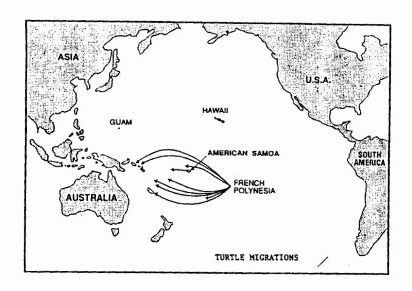
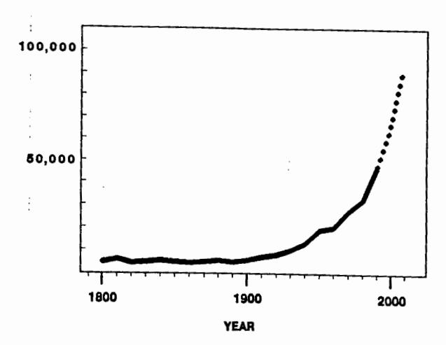

## Turtle and Marine Mammmal Conservation Activities in American Samoa

Peter Craig and Gilbert Grant

Dept. Marine and Wildlife Resources
P.O. Box 3730, Pago Pago, American Samoa 96799

April 1993

The following information on sea turtles and marine mammals in American Samoa was assembled for the 3rd Regional Marine Turtle Conservation Program (SPREP), June 1993.

## A. SEA TURTLE STATUS

1. Summary. Two turtle species are found in American Samoa, the green turtle (<a href="Chelonia mydas">(Chelonia mydas</a>) and the hawksbill (<a href="Eretmochelys imbricata">Eretmochelys imbricata</a>). Their population numbers in American Samoa are not well known, but available evidence suggests that turtle numbers have declined significantly from historic levels. To evaluate the current status of turtles, residents in 58 coastal villages were interviewed, public sightings were monitored, and surveys on remote islands were conducted.

We estimate that turtles in the whole Territory now total only about 120 nesting females (species combined) per year (Tuato'o-Bartley et al. 1993). Most hawksbills nest on Tutuila Island, while most green turtles nest on the remote Rose Atoll. Basic biological information (e.g., nesting and feeding areas, nesting seasons, population size) is not well known, but migration patterns are particularly interesting. Two tagged green turtles from American Samoa were recovered in Fiji. These data are in agreement with the more extensive tagging results obtained from French Polynesia, which indicate that turtle populations in American Samoa should be viewed in a broad regional context (Fig. 1).

Major threats to the recovery of turtles in American Samoa are human consumption (most turtles and eggs encountered by villagers are still harvested) and incremental habitat loss due to the activities of a rapidly expanding human population (Fig. 2). It is also apparent, given the large-scale migrations indicated in Figure 1, that Samoan turtles are impacted by subsistence harvests and incidental catches in commercial fisheries elsewhere in the South Pacific.

FIGURE 1. Movements of tagged green turtles in the central South Pacific Ocean. Redrawn from: Balazs (1982), SPREP (1989), Balazs et al. (1993), and S. Geermans (SPREP, pers. comm.).

FIGURE 2. Human population growth in American Samoa.

- 2. Existing Policy/Law. Both turtle species are listed and protected by the U.S. Government under the Endangered Species Act; thus it is illegal to possess or harvest either species in American Samoa. However, most people are unaware of these regulations and enforcement of existing laws is generally lacking.
- 3. Education Activities. There is a lack of public awareness programs to help teach the public about turtles and how they might be protected in American Samoa. The concept of turtle conservation faces several difficulties in the Territory. Although many people we interviewed acknowledged that there were considerably fewer turtles on their beaches than when they were children, few indicated a concern for the future of turtles. Some expressed the opinion that "turtles were placed in the ocean by God for man to take," and therefore all turtles should be taken. Others expressed the thought that if they did not take the turtle, someone else would. It is clear that a concerted campaign in American Samoa is needed to educate the public about the need to conserve sea turtles and enforce existing regulations protecting turtles and their habitats.
- 4. Other Activities. (a) A "Recovery Plan" for Pacific turtles in US-affiliated islands is being prepared jointly by NMFS and USFWS. (b) A recent project to eradicate rats at Rose Atoll should improve turtle nesting success there, because the rats had been observed eating turtle eggs and hatchlings.

## B. MARINE MAMMAL STATUS

1. Summary. Little is known about any of the marine mammals in American Samoa. Small numbers of humpback whales (Megaptera novaeangliae) migrate into our waters to breed and calve, primarily from August through October. These whales presumably belong to one part of the Antarctic Group-5 stock which does not appear to be recovering from previous whaling exploitation.

Carcasses of about 8 whales recently washed up on our northern shores (around January 1993). They were tentatively identified as juvenile false killer whales and one Cuvier goosebeaked whale.

- 2. Existing Policy/Law. Both the Marine Mammal Protection Act and Endangered Species Act apply to American Samoa; thus it is illegal to take or possess any whale, dolphin or porpoise, or their products.
- 3. Past Research Efforts. An annual "Whale Watch" program was conducted whereby the public was asked to report any whale sightings to the Dept. of Marine and Wildlife Resources.
- 4. Proposed Work. Document sightings, continue "Whale Watch" publicity.

## Literature Cited

- Balazs, G. 1982. Sea turtles: A shared resource of the Pacific islands. South Pac. Comm. Fish. Newsl. 232:22-24.
- Balazs, G., P. Siu, and J. Landret. 1993. Ecological aspects of green turtles nesting at Scilly Atoll in French Polynesia. Proc. 1992 Sea Turtle Symposium, Jekyll Island, Georgia.
- SPREP (South Pacific Regional Environmental Programme). 1989.
  Action strategy for nature conservation in the South Pacific region. Fourth South Pacific Conference on Nature Conservation and Protected Areas, Port Vila, Vanuatu, 4-12 September 1989.
- Tuato'o-Bartley, N., T. Morrell, P. Craig. 1993. Status of sea turtles in American Samoa in 1991. Pacific Science 47:215-221.