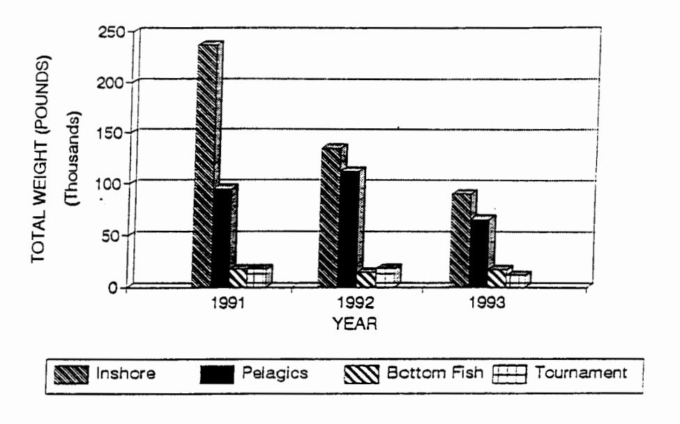
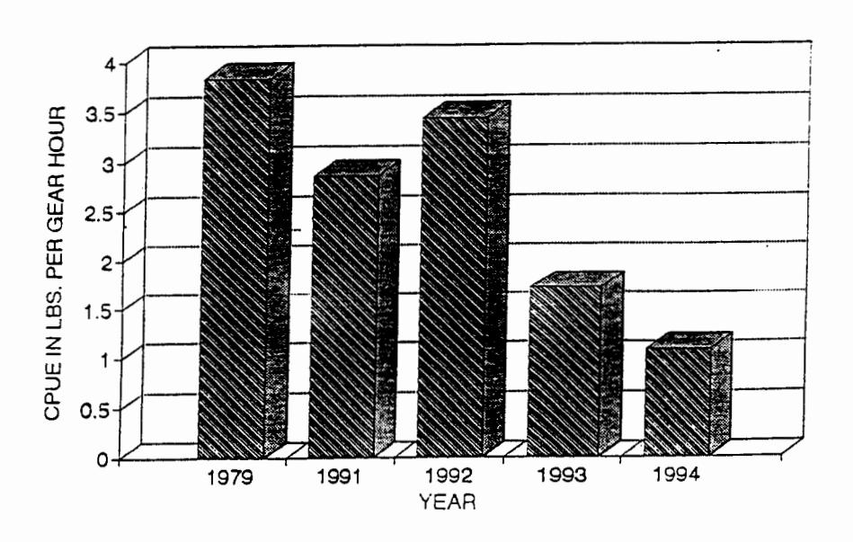

# WORKSHOP TO IDENTIFY IMPORTANT FISH ISSUES IN AMERICAN SAMOA FOR FY95-FY99

#### Peter Craig

Dept. Marine and Wildlife Resources Box 3730, Pago Pago, American Samoa 96799

Summary: This document is a renewal 5-year plan for Federal Assistance in Sport Fish Restoration. It consists of 5 sections: (1) a statement of need, (2) program goals, (3) a summary report for the previous 5-year plan, (4) results of a workshop to prioritize fisheries-related issues in the Territory, and (5) narrative for components of the next 5-year plan (FY95-FY99).

1994

#### TABLE OF CONTENTS

| <u>Pa</u>                               | ige |
|-----------------------------------------|-----|
| Statement of Need                       | 3   |
| Program Goals                           | 4   |
| Summary Report for Previous 5-year Plan | 5   |
| Workshop to Determine DMWR Priorities   | 7   |
| FY95-99 Project Components 1            | 5   |
| Fisheries Management                    | 6   |
| Fish Ecology 1                          | 7   |
| Information Exchange 1                  | 8   |

#### 1. STATEMENT OF NEED

American Samoa, like many tropical islands in the South Pacific is confronted by a rapidly growing human population, but with few economic resources that residents can utilize. Fish resources, from traditional subsistence fishing in times past to today's modern boat-based fisheries, have always been an important component of island life in Samoa.

The Territory consists of 7 small islands, ranging from one that is a remote, uninhabited atoll, to another that supports 95% of the Territory's rapidly expanding population. The current population (52,000) is expected to double in only 19 years.

This population increase, together with its associated environmental problems of large-scale changes in land use, resource harvest, and increased pollution, is occurring at a time when local marine resources have been severely damaged by natural forces. Coral reefs, for example, have suffered several back-to-back hits: a crown-of-thorns starfish invasion in 1978 that killed extensive areas of coral, hurricanes in 1987, 1990 and 1991, and an episode of mass coral bleaching in 1994 presumably caused by increased water temperatures. Although the reefs are in a degraded condition, local scientists report that small regenerating corals are present, and, if not damaged further by natural events or man-caused events (overfishing, sedimentation, eutrophication, garbage), are likely to recover.

According to DMWR studies, Samoan use of fish resources is also changing. Overall catches in domestic fisheries appear to be declining, except for sport fishing.

Another finding is that fishing in inshore coral reef habitats accounts for a much larger proportion (over 50%) of the total domestic catch than formerly realized. The catch-per-unit-effort (CPUE) in this fishery has dropped in recent years, presumably due to habitat degradation and/or overfishing.

Minimizing negative impacts of these changes is a primary function of DMWR. The department was established in 1987 by Public Law No. 20-12, Title 24, Chapter 3 of the American Samoa Annotated. Under this law, DMWR has the authority to manage, protect, preserve, and perpetuate the marine and wildlife resources in the Territory.

#### PROGRAM GOALS FOR FY95-99 .

- 1. Manage aquatic resources to insure the continuation of viable populations.
- Develop management strategies based on basic ecological and fisheries parameters for key species in local fisheries.
- 3. Evaluate and monitor the health of local coral reef fishes and habitats, which have been severely impacted by natural and man-caused events.
- 4. Monitor public usage of fish resources to determine catch trends and indicators of fishing pressure.
- 5. Enhance fishing opportunities for the public.
- 6. Promote public awareness of territorial environmental issues.

#### 3. SUMMARY REPORT FOR PREVIOUS 5-YEAR PLAN

The previous 5-year program for FY90-94 was, in large part, very productive. Its major accomplishments were to refine DMWR's direction, upgrade existing core monitoring programs for local fisheries, prioritize the suite of fisheries-related environmental problems facing American Samoa today, acquire qualified staff to address these problems, and improve data analysis and reporting of studies conducted for annual Project Agreements.

Goals and general accomplishments of the previous 5-year plan were:

- 1. Identify and protect productive fish habitats in order to sustain or enhance sportfish populations.
  - a) DMWR participated in an extensive coastal survey in 1992 by a Sea Grant-sponsored team to characterize coral reef health, corals, fishes, algae, vegetation, invertebrates, traditional fish use, and coastal geology around Tutuila Island.
  - b) A 19-acre section of coral reef on Ofu Island was proposed in 1993 as a territorial marine park to safeguard its special fish and coral resources (Vaoto Marine Park, pending legislative approval).
  - c) A large-scale quantitative survey program is currently underway to examine coastal fishes and fish habitats throughout the territory.
- 2. Gather biological information of important fish species as needed to manage resources.
  - a) Detailed studies of a key fish species (Acanthurus lineatus), which is an important component of local inshore catches, were initiated and are ongoing. Basic data obtained include: spawning season, size at capture, size at maturity, and mortality rates. Less detailed information on additional key species are in progress.
- 3. Determine public usage of fish resources.
  - a) A major emphasis has been to review and upgrade programs that collect basic catch and effort data in local fisheries. Significant improvements in data collection and analytical procedures have been made. Results indicate that substantial changes have occurred in these fisheries during the past several years. Two significant findings were that inshore reef fish

resources account for over half of all fish caught by Samoans, and that CPUE for this fishery has dropped by 50%. DMWR is examining the latter point.

- 4. Provide fish attraction devices (FADS) to increase sport fishing opportunities in offshore waters.
  - a) The department has maintained a program to deploy FADs in territorial waters, which have been shown to improve catch rates of tunas and other pelagic fishes.
- 5. Provide technical information relevant to the management, protection, and enhancement of fish resources and habitats.
  - a) A considerable expenditure of time and effort was made to provide technical information to the public and other agencies. Some examples include: scientific publications, warnings of the toxic condition of fish in Pago Pago Harbor, a series of newspaper articles, television spots, and school presentations on local environmental issues, information handouts, student science project assistance, and development of a departmental library for staff and the public.

Benefits: During the past 5 years, DMWR has made considerable progress in building solid research and monitoring programs related to Samoan fisheries and fish resources. This capability is not duplicated elsewhere by other local agencies. The overall benefit to the public is DMWR's strengthened ability to analyze local environmental issues, provide capable assistance to address these issues, and manage fish resources. Significant resource problems have been identified, and detailed studies are now in progress.

#### 4. WORKSHOP ON PRIORITIZING FISH ISSUES

A planning workshop for fisheries management was conducted in September 1994 by DMWR in American Samoa. The purpose of the workshop was to update DMWR's 5-year plan for fisheries programs.

In large part, the motivation for this exercise was that DMWR, like most other small Pacific Islands, has limited resources to address the numerous kinds of fisheries and environmental issues that arise. Thus the overall objective of the workshop was to focus DMWR's efforts on a short list of realistic and achievable goals for the next 5-year period.

Workshop participants reviewed the objectives, methodologies, and results of current DMWR fish programs, and reviewed DMWR's recommendations for further studies. The group then ranked these topics as high, moderate or low priority for the department during its next 5-year period.

#### Background Information

To put workshop deliberations into perspective, the workshop group was informed that DMWR's fish programs are currently fully staffed (6 biologists, 1 assistant biologist, and 8 technicians) with respect to expected levels of funding from several sources but primarily from the Federal Aid in Fish Restoration Act. Each DMWR fisheries program (ie, inshore fishery, offshore fishery, reef fish ecology, hatchery, aquatic education) is run by a single biologist and 1-2 technicians. Any recommended increases in one project might therefore reduce efforts in other projects.

Additionally, the group was presented with an overview of 3 environmental trends in American Samoa that might be of relevance to workshop deliberations. These trends are:

- (1) The human population is rapidly increasing at 3.7% and is expected to double in only 19 years;
- (2) Air temperatures, which have been steadily increasing for the past 15 years, might portend other environmental changes not yet apparent; and
- (3) The coral reefs have been badly damaged and catch-per-unit-effort (CPUE) of reef fish has declined.

#### Workshop Methods

Workshop attendees included two outside reviewers (Dr. Jim Parrish, Paul Dalzell) and other agency personnel:

- -Paul Dalzell (South Pacific Commission)
- -Dr. Jim Parrish (University of Hawaii Cooperative Fisheries Unit)
- -Ernie Kosaka (USFWS Pacific Islands Office)
- -Nancy Daschbach (Fagatele National Marine Sanctuary)
- -Cal Falig and Mark Brotman (Division of Fish and Wildlife, Commonwealth of the Northern Marianas Islands)
- -Cedrick Schuster and David Butler (Dept. Lands, Surveys and Environment, Western Samoa)
- -John Enright (Le Vaomatua)
- -DMWR staff: Ray Tulafono, Peter Craig, Suesan Saucerman, Fale Tuilagi, Elia Henry, Sila Samuelu, Alan Kinsolving, Alison Green

Public comments were previously solicited during a recent village survey.

Attendees met in general sessions, contributing information according to their views and areas of knowledge. The workshop convened for 3 days as follows:

- <u>Day 1.</u> Objectives of the workshop were explained. The current status of fish and related environmental problems were described by DMWR staff. Existing and proposed projects were presented. A Samoan perspective on fisheries issues, based on a village survey, was also presented.
- Day 2. Field trips to familiarize participants with the local environment.
- <u>Day 3.</u> Fisheries and related environmental issues were prioritized to indicate the direction DMWR should take during the next 5-year period. An emphasis was placed on evaluating whether the issue was important to American Samoa, and whether DMWR, with its limited resources, could realistically accomplish the work.

During the week prior to the workshop, one of the two outside reviewers participated in all phases of DMWR's fisheries programs and interacted directly with project staff.

#### Workshop Results

#### A. Prioritization of Fish Resources

The coastal waters of American Samoa support a diverse fish fauna of approximately 1000 fish species, mostly associated with coral reefs. It is therefore impractical to focus a program review on the status of individual species. Rather, the fishes aggregate more conveniently into several groupings according to the types of fisheries in which American Samoans participate. These fisheries are briefly described below together with an evaluation of their relative importance to DMWR.

To determine rankings, each fishery was ranked as being a high, moderate, or low priority for DMWR by each of the 12 workshop participants. A group average was determined by a numerical ranking (high priority = 3 points, moderate priority = 2 points, low priority = 1 point), thus the highest possible score was 36 points (12 x 3) and the lowest was 12 points (12 x 1). A summary of results follows:

| Fisheries in American Samoa                       | Priority for DMWR |
|---------------------------------------------------|-------------------|
| <ol> <li>Inshore subsistence/artisanal</li> </ol> | high (36 points)  |
| fishery                                           |                   |
| <ol><li>Offshore bottomfish fishery</li></ol>     | moderate (28)     |
| 3. Offshore pelagic fishery                       | moderate (23)     |
| 4. Cannery (bycatch supply)                       | moderate (22)     |
| 5. Sport tournaments                              | moderate (20)     |
| 6. Freshwater fisheries                           | low (17)          |

#### Description of Fisheries

The annual harvest of combined domestic fisheries in 1993 was 184,500 lb. The majority of this catch (50%) was taken by the shoreline subsistence fishery (Fig. 1), followed by the pelagics fishery, bottomfish fishery, and tournament fishery.

1. Inshore Subsistence/Artisanal Fishery. The reeftop and adjacent shallow waters of American Samoa are inhabited by a diverse array of fish and shellfish species that are harvested on almost a daily basis. Catches have declined 25-50% over the past decade, perhaps due to socioeconomic factors, reef degradation and/or overexploitation. CPUE for reef-resident species has dropped over 50% (Fig. 2). Downward trends in catch and effort seem even more significant since there was a 46% increase in the human population during the same period. For these reasons, the inshore fish resources were recommended by the workshop group to be DMWR's highest priority.

## DOMESTIC FISHERIES IN AM. SAMOA 1991 to 1994

FIGURE 1.

### CATCH PER UNIT EFFORT

1979 to 1994 PROJECTION

FIGURE 2.

2. Artisanal Bottomfish Fishery. Suitable habitat for bottomfish is very limited in American Samoa because the island slopes steeply into deep water and there are few seamounts in the Territory. A small fishery for bottomfish was developed as a result of several government-funded projects in the 1970s and 1980s, but as these projects terminated the fishery declined. The fishery probably exceeded MSY (maximum sustainable yield) during this period, and collapsed to only 14% of its peak catch in recent years. This is probably due to a variety of factors: overfishing, decreased subsidies to the fishery, the departure of several highliners from the fishery, hurricane-related damage to local boats; and competition from imports.

Bottomfish resources were considered by the workshop group to be a moderate priority for DMWR, in large part because recent history indicated that the resource is vulnerable to overfishing. In view of currently low harvests of bottomfish, the group suggested that now is a good time to determine management goals.

3. Artisanal Pelagic Fishery. Trolling for pelagic fishes (tuna, marlin, wahoo, etc.) accounted for 36% of the domestic catch in 1993. Fishing generally occurs 2-25 miles offshore in small 28-ft boats. Fish aggregation devices (FADs) were introduced in local waters in 1979 and have proven to be a popular way to increase the CPUE of widely dispersed pelagic fishes.

Pelagic fish resources, though locally popular, were considered to be only a moderate priority for DMWR, largely because these fish are presumably part of vast oceanic stocks that are unlikely to be diminished by small-scale artisanal fishing efforts. Improving the fishermen's CPUE for pelagic fishes through the use of FADs was, however, considered a moderately high priority, as described later.

- 4. Cannery (bycatch supply). In contrast to the small-scale nature of the domestic fisheries, American Samoa is also homeport to a distant-water fleet of large commercial vessels that deliver tuna to the canneries on Tutuila Island. These landings are monitored by the National Marine Fisheries Service, rather than by DMWR, because the fish are harvested outside of American Samoa's Exclusive Economic Zone. However, the over-the-side sale of fish directly off the vessels to local residents and restaurants reduces the marketability of locally caught fish. The workshop group felt that quantification of this bycatch supply should be a moderate priority for DMWR.
- <u>5. Tournament Fisheries.</u> Tournaments for pelagic fishes are popular events held about three times per year. Typically 7-14 boats and 55-75 fishermen participate in each tournament. Landings consist primarily of tuna and marlin.

The workshop group considered these sport fishing events to be a moderate priority for DMWR, for reasons previously mentioned for the pelagic fishery.

6. Freshwater fisheries. Most islands in American Samoa are small with steep, porous terrain. Consequently, most streams are small and ephemeral, and lakes are virtually absent. At present, there are minor harvests of freshwater shrimp (Macrobrachium spp.) and eels. Freshwater fisheries were considered a low priority for DMWR.

#### B. Prioritization of Fisheries-related Issues

Presentations by DMWR staff indicated that there are no shortages of environmental issues to address in American Samoa, so the workshop group was again cautioned that DMWR does not have the resources or staffing to tackle all issues. Consequently, this workshop exercise focused not only on whether an issue was important, but also whether DMWR could do anything about it.

The workshop group considered 17 issues or resources and again evaluated them as being a high, moderate or low priority for DMWR. The group average was determined by a numerical ranking as before and the results are summarized as follows:

| Re        | sources and Issues               | Priority for DMWR  |
|-----------|----------------------------------|--------------------|
| 1         | Health of coral reefs            | high (36 points)   |
| 2         | Public concerns                  | high (36)          |
| 3         | Public education                 | high (36)          |
| 4         | Training local staff             | high (36)          |
| 5         | Improve enforcement              | moderate-high (30) |
| 6         | Biology of key species           | moderate-high (29) |
| 7         | Giant clam reseeding             | moderate-high (29) |
| 8         | Manu'a Island resources          | moderate-high (27) |
| 9         | Fish aggregation devices         | moderate-high (25) |
| 10        | Enhance recreation opportunities | moderate-low (22)  |
|           | Mariculture development          | moderate-low (21)  |
| 12        | Sea turtles                      | moderate-low (20)  |
| 13        | Rose Atoll resources             | moderate-low (19)  |
| 14        | Fisheries development            | moderate-low (19)  |
| 15        | DMWR hatchery                    | low (16)           |
| 16        | Swains Island                    | low (14)           |
| <u>17</u> | Humpback whales                  | low (12)           |

Factors contributing to this ranking were:

1. Health of coral reefs. This issue was considered a high priority because of the importance of reef resources to American Samoa and because local reefs have been seriously

damaged by recent events. Live coral cover averages only 3% at the 20-ft depth and 12% at 60-ft levels, in contrast to 60-70% prior to the hurricanes. CPUE of reef subsistence fishery has dropped 50%.

The workshop group recommended that quantification of coral reef habitats and fishes be done, and that a coral specialist be brought in to assist in quantitative coral surveys. The group questioned whether DMWR could effectively do anything about the effects of sedimentation or eutrophication to the reefs.

- 2. Public concerns. Additional attempts should be made to determine public attitudes and concerns about environmental issues.
- 3. Public education was recognized by all as an obviously important facet of DMWR's programs.
- 4. Training local staff. Because most professional staff are off-islanders hired on 2-year contracts, there is continual turnover of professional staff at DMWR. This disrupts project continuity, thus highlighting the need to invest in more training of local permanent staff.
- <u>5. Improve enforcement.</u> DMWR conservation officers are not yet authorized to issue citations for infractions of DMWR's own regulations. Lack of adequate enforcement reduces the value of the regulations.
- 6. Biology of key species. Biological information for key species taken in domestic fisheries is sparse. The workshop group felt that collecting biological information on the top few species should be a moderately high priority during the next 5-year period.
- 7. Giant clam reseeding. Giant clams are a Samoan delicacy that have been overfished on local reefs. One species is locally extinct, and the remaining two species are rare. A desire to reseed the reefs with these clams has been expressed by Samoans.
- 8. Manu'a Island resources. Current DMWR activities focus primarily on Tutuila where 95% of the population lives. In the Manu'a Islands, DMWR employs 2 technicians to monitor fish landings there. Additional DMWR effort in Manu'a would be desirable.
- 9. Fish aggregation devices (FADs). FAD's are used to enhance fishing opportunities in offshore waters. Though they are expensive and last only 1-2 years, there was interest in continuing this program because it is popular with the locals.

- 10. Enhance recreation opportunities. FADs (see above) were considered to be the primary way to enhance fishing opportunities. Other ideas presented included sponsoring fishing derbies for children.
- 11. Mariculture development. Although this was considered a moderately low priority, the workshop group suggested that DMWR support mariculture development by the public (but see also No. 16 below).
- 12. Sea turtles. Turtle populations in Samoa are in serious decline, as they are throughout the South Pacific. However, the workshop group questioned whether DMWR could do much for them beyond DMWR's current efforts (ie, tagging, confiscation of harvested turtles, and publicity).
- 13. Rose Atoll resources. This atoll is a National Wildlife Refuge because of its importance to fish and wildlife resources. Unfortunately, a longliner ran aground there in October 1993, spilling 100,000 gallons of fuel. Rose Atoll's moderately low ranking was due, in part, to a miscommunication by the workshop group. Many felt it should be a high priority, but voted lower because DMWR's efforts there require relatively little time spent there, and because USFWS will presumably initiate detailed studies there in regard to the fuel spill.
- 14. Fisheries development. Compared to issues listed above, this was considered a moderately low priority for DMWR.
- 15. DMWR hatchery. DMWR currently operates a small hatchery to supply giant clams to marine "farmers" to grow the clams to a commercial size. In view of DMWR's checkered track record for this project, and the expenses incurred to date, the workshop group suggested that the hatchery should be a low priority. Note, however, that there is considerable local interest in increasing natural stocks of giant clams (see No. 7 above), for which DMWR's hatchery could play an important role.
- 16. Swains Island. This remote atoll is currently inhabited by 10 people. At present, there are no known fisheries-related issues there.
- 17. Humpback whales. The group felt that there were no local problems pertaining to whales, and DMWR could do little about them in any case.

#### Summary

The workshop process identified several "high priority" data needs from a field of many potential fisheries-related issues in American Samoa. In particular, the Inshore Subsistence/Artisanal Fishery was identified as the highest priority fishery, and the health of local reefs was identified as one of the highest fisheries-related issues. This concern stems from two basic findings: (1) this fishery contributes about half of all fish caught in all domestic fisheries, and (2) the CPUE for this fishery has dropped about 50% in the past decade.

Other high priority issues included public education, identifying public concerns, and training local staff.

These data needs are further developed in the Federal Aid Grant Application and ultimately appear as a plan of action for Project Agreements scheduled over a 5-year period.

#### 5. FY95-99 PROJECT COMPONENTS

Proposed projects for DMWR fall within three program components: (1) Fisheries Management, (2) Reef Fish Ecology, and (3) Information Exchange. A timeline for these studies during FY95-FY99 is summarized below:

|           | ·                                                                                  |    | YEAR (FY) |    |    |    |
|-----------|------------------------------------------------------------------------------------|----|-----------|----|----|----|
| <u>Ço</u> | mponent                                                                            | 95 | 96        | 97 | 98 | 99 |
| 1.        | FISHERIES MANAGEMENT Job 1. Inshore fishery documentation                          |    |           | ×  |    | x  |
|           | Job 2. Offshore fishery documentation                                              |    | x         |    | Х  | X  |
|           | Job 3. Fishery enhancement                                                         | X  | X         | X  | ×  | x  |
|           | Job 4. Village survey                                                              | X  | X         | x  |    |    |
| 2.        | REEF FISH ECOLOGY Job 1. Status of reef health Job 2. Ecology of key species |    | x x    | x  | x  | x  |
| 3.        | INFORMATION EXCHANGE Job 1. Technical assistance                                   | x  | x         | x  | x  | x  |
|           | Job 2. Scientific exchange                                                         | x  | x         | X  | x  | x  |
|           |                                                                                    |    |           |    |    |    |

#### COMPONENT 1. FISHERIES MANAGEMENT

NEED: Fishing is an important activity in American Samoa, with yearly catches of 200,000 to 450,000 lbs. Some 20-50 small vessels troll in coastal waters, and coral reefs adjacent to the shoreline are fished extensively by individuals spear diving, gleaning, and using gillnets, throw nets, and hook and line.

Samoan fishing activities are undergoing significant changes due to modern technology, cultural changes, increasing population pressure, and urbanization. The dependency of Samoans on their marine resources may be decreasing, but fishing pressure on fish stocks is of concern for two reasons: increasing numbers of people, coupled with decreasing quality of fish habitat resulting from reef degradation. Increased efficiency and reliance on modern technology have also resulted in a trend toward more effective fishing methods rather than traditional techniques.

Documentation of domestic fish harvests in American Samoa is needed to provide basic catch statistics for management purposes. DMWR requires this information to effectively monitor fishing activities and quantities of fish harvested, examine exploitation trends, identify potential overharvests, and evaluate the effectiveness of fishing regulations.

OBJECTIVES: (1) Monitor public usage of local fish resources. (2) Enhance public fishing opportunities. (3) Obtain public input to DMWR programs by interviewing villagers.

APPROACH: Fisheries statistics (participation counts, harvest quantity, CPUE, value, species, gear type) and biological information about harvested species (length, weight) will be collected during standardized participation surveys, creel censuses, and market inspections. The primary means to enhance fishing opportunities will be the deployment of FADs in offshore deep waters. Public input will be obtained during an interview survey of local villagers around Tutuila Island.

<u>ANTICIPATED BENEFITS:</u> The overall objective of these projects is to promote the sustainable use of reef resources for fishermen and the general public.

#### COMPONENT 2. REEF FISH ECOLOGY

NEED: Coral reef habitats of American Samoa have suffered major impacts in recent years. They have been hit by several hurricanes in the past 5 years, as well as a severe infestation of the corallivorous starfish Acanthaster planci in the late 1970's. More recently, the reefs experienced a major coral bleaching episode in March 1994, which affected up to 80% of the living coral colonies in some locations. In addition, human induced disturbances such as water pollution, increased sedimentation due to poor land use practices, eutrophication, and overfishing are also of concern.

Previous surveys have reported that many of the reefs in the Territory have been severely degraded by these disturbances, although with few exceptions the surveys have relied on qualitative assessments. The result is that there is now a need for a systematic, quantitative survey of the coral reef fishes and habitats in American Samoa to determine the present status of these resources. Moreover, the degree to which habitat degradation has impacted reef fish populations remains to be established. Such information is vital for the future conservation of these resources, and the sustainable harvests of reef fishes, which account for more than 50% of all fish caught in recreational and subsistence fisheries in the Territory.

The ecology of key species that account for most of the catch remains largely undocumented. Most previous work has concentrated on fish taxonomy, species lists, and qualitative surveys. There is a pressing need to collect basic biological information regarding species distributions, abundance,

population dynamics, behavior, growth, and maturity for key reef fishes. Some of this information can most efficiently be obtained from the scientific literature, but site-specific data are also needed for verification and for information not available elsewhere. Species profiles regarding fish abundance, size at maturity, spawning season, and life histories are needed. DMWR cannot adequately manage nearshore fish resources without basic biological information about its resources.

OBJECTIVES: (1) Determine the current status of coral reef fishes and habitat. (2) Determine the distribution, abundance, and life history of key fish species.

APPROACH: There are two parts to this study: (1) determine reef health, and (2) determine species profiles for key reef fishes. The former will be done by a series of systematic quantitative surveys of reefs throughout the Territory. This information will then be compared with the results of previous surveys in the Territory, to describe changes which have occurred in reef habitats over the last two decades. In addition, the information collected in these surveys will provide a sound quantitative baseline dataset for monitoring the future recovery or degradation of these reefs. Moreover these surveys should identify areas that are heavily degraded or relatively pristine within the Territory. Heavily impacted areas will be studied in more detail by future projects, aimed at identifying localized causes of reef degradation in the Territory. The ultimate goal of these projects will be to provide information which can be used as a sound ecological basis for designing future management plans for coral reef conservation the Territory.

The second part of the project will focus on key fish species. Key reaf fish species will be selected for detailed recruitment, life history, and ecological studies, based on their importance in fishery harvests and use of critical nearshore habitats. This information will assist DMWR to determine whether overfishing is occurring, and if so, what management measures might be taken.

<u>ANTICIPATED BENEFITS:</u> These studies will provide management information needed to assess the status of reef health and reef fish populations, and to obtain basic information on key fish resources.

#### COMPONENT 3. INFORMATION EXCHANGE

NEED: Providing technical information is essential for DMWR to assist public and governmental agencies in making proper decisions when dealing with land-use and fisheries management issues. By providing technical assistance, DMWR also maintains exposure in the private and public sector, which is important in

terms of maintaining an open dialogue between the public and governmental agencies. It also keeps DMWR abreast of important issues that have potential impacts on fish resources and habitat. Possibly the most important benefit is that an open dialogue insures that DMWR has adequate input on all fish-related issues.

It is also important to present information from American Samoa to the scientific community. This provides a means by which DMWR research can be appraised by other scientists. For example, when methodologies currently used by DMWR are critically reviewed, we receive important feedback as to the adequacy or limitations of our research efforts. It also provides DMWR personnel an opportunity to compare results with other scientists who may be working on similar organisms and habitats, and thereby provide additional useful information to DMWR. Finally, it provides an avenue by which scientific information gathered from American Samoa is disseminated to the scientific community, which may not be available from any other sources.

OBJECTIVES: (1) Provide technical information and assistance regarding fisheries issues in American Samoa to government agencies and the public. (2) Disseminate information to the scientific community by presenting information and papers at meetings and submitting articles to scientific journals.

APPROACH: DMWR will provide technical assistance to individuals, groups, village councils, or agencies seeking information. This includes reviewing documents, reports, and permit applications. As warranted, technical information will be disseminated through DMWR reports, meetings, or the local media. DMWR will attend appropriate scientific meetings in order to present papers and gather information from colleagues. DMWR will also submit articles to scientific journals as appropriate. Technical assistance will be provided throughout the 5-year plan (Table 1).

BENEFITS: The public will directly receive current information about American Samoa's resources and local environmental issues.